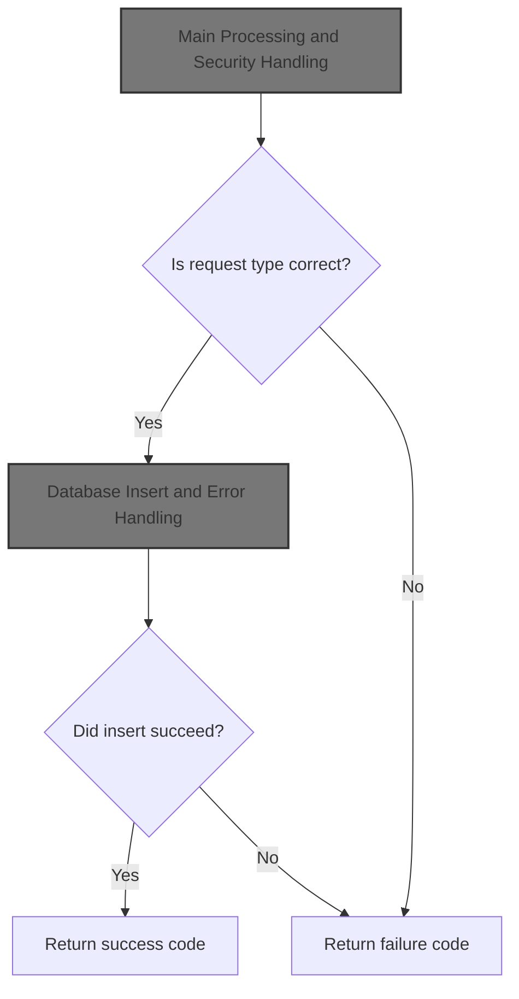
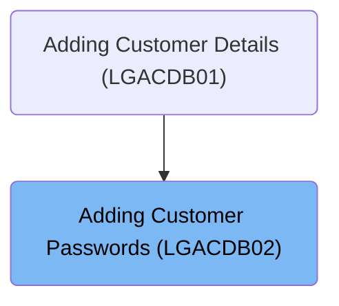
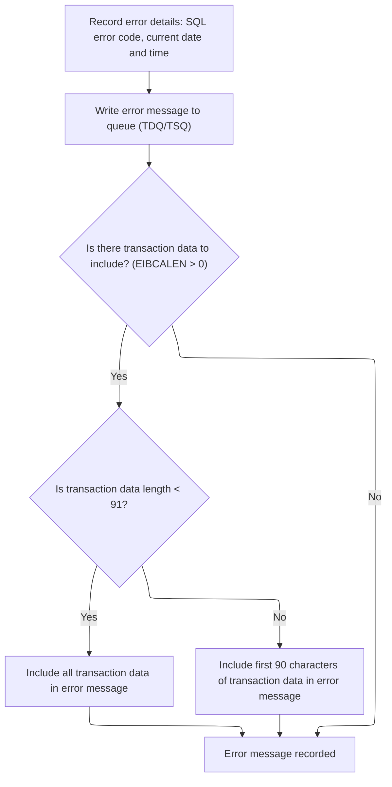
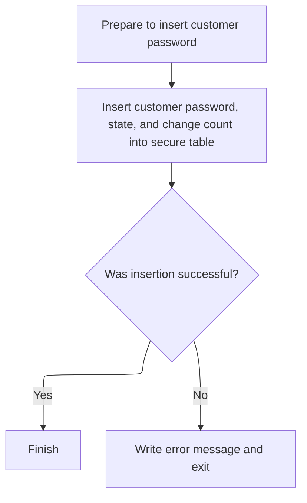

# Overview

This document describes the flow for adding customer passwords to the secure database. Incoming requests are validated, and only those with the correct type are processed. The customer's password and related details are inserted into the secure table, and the flow returns a success or failure code.



## Dependencies

### Programs

- <SwmToken path="base/src/lgacdb02.cbl" pos="13:6:6" line-data="       PROGRAM-ID. LGACDB02.">`LGACDB02`</SwmToken> (<SwmPath>[base/src/lgacdb02.cbl](base/src/lgacdb02.cbl)</SwmPath>)
- LGSTSQ (<SwmPath>[base/src/lgstsq.cbl](base/src/lgstsq.cbl)</SwmPath>)

### Copybooks

- LGPOLICY (<SwmPath>[base/src/lgpolicy.cpy](base/src/lgpolicy.cpy)</SwmPath>)
- SQLCA

# Where is this program used?

This program is used once, as represented in the following diagram:



## Input and Output Tables/Files used in the Program

| Table / File Name                                                                                                                      | Type                                                                                                                                              | Description                                   | Usage Mode | Key Fields / Layout Highlights                                                                                                                                                                                                                                                                                                                                                                                                                                                                                                                          |
| -------------------------------------------------------------------------------------------------------------------------------------- | ------------------------------------------------------------------------------------------------------------------------------------------------- | --------------------------------------------- | ---------- | ------------------------------------------------------------------------------------------------------------------------------------------------------------------------------------------------------------------------------------------------------------------------------------------------------------------------------------------------------------------------------------------------------------------------------------------------------------------------------------------------------------------------------------------------------- |
| <SwmToken path="base/src/lgacdb02.cbl" pos="167:5:5" line-data="             INSERT INTO CUSTOMER_SECURE">`CUSTOMER_SECURE`</SwmToken> | <SwmToken path="base/src/lgacdb02.cbl" pos="146:11:11" line-data="               Move D2-CUSTOMER-NUM    To DB2-CUSTOMERNUM-INT">`DB2`</SwmToken> | Customer password and security state tracking | Output     | <SwmToken path="base/src/lgacdb02.cbl" pos="168:3:3" line-data="                       ( customerNumber,">`customerNumber`</SwmToken>, <SwmToken path="base/src/lgacdb02.cbl" pos="169:1:1" line-data="                         customerPass,">`customerPass`</SwmToken>, <SwmToken path="base/src/lgacdb02.cbl" pos="170:1:1" line-data="                         state_indicator,">`state_indicator`</SwmToken>, <SwmToken path="base/src/lgacdb02.cbl" pos="171:1:1" line-data="                         pass_changes   )">`pass_changes`</SwmToken> |

&nbsp;

## Detailed View of the Program's Functionality

# Startup and Input Validation

At startup, the program prepares its environment for processing a customer security request. It initializes internal storage areas to ensure all variables start with clean values. It then copies transaction-specific information—such as transaction ID, terminal ID, and task number—from the CICS environment into local variables. This information is used later for logging and error handling.

The program checks if any input data was received. If no data is present, it records an error message indicating that no communication area was received, logs this error, and immediately aborts the transaction. This prevents further processing when required input is missing.

If input data is present, the program sets the return code in the communication area to zero, records the length of the input data, and saves the address of the communication area for later use.

Next, the program examines the type of request. If the request is to add a new customer (identified by a specific request code), it prepares the necessary variables for database insertion and proceeds to store the customer's password. For any other request type, it sets a failure code and exits, signaling that only new customer additions are supported.

# Error Logging and Message Formatting

When an error occurs, the program enters its error logging routine. It first saves the SQL error code into the error message structure. It then retrieves the current date and time from the CICS system, formats them, and includes them in the error message.

The error message is then sent to a centralized logging queue by invoking a separate program responsible for queue management. This ensures that all error details are recorded for later review.

After logging the main error message, the program checks if there is additional transaction data in the communication area. If such data exists, it determines how much can be included in the error log. If the data is less than 91 bytes, it includes all of it; otherwise, it includes only the first 90 bytes. This additional data is also sent to the logging queue for completeness.

# Queue Writing and Message Handling

The queue management program receives the error message and prepares it for logging. It clears its internal buffers and retrieves system information, such as the system ID and the name of the invoking program.

Depending on how the program was invoked, it either copies the incoming message directly or receives it from a terminal. It sets a flag to indicate the source of the message.

The program determines the appropriate queue name for logging. By default, it uses a standard error queue. If the message contains a special prefix, it extracts an extension code and modifies the queue name accordingly.

The message length is adjusted to account for any changes, and the message is written to both a transient data queue (for centralized logging) and a temporary storage queue (for application-specific logging). If the message was received from a terminal, a minimal response is sent back to the terminal to acknowledge receipt.

Finally, the program returns control to the caller, completing the logging process.

# Main Processing and Security Handling

After handling any errors, the main program continues processing the request. If the request is to add a new customer, it prepares the database variables using the input data and calls the routine responsible for inserting the customer's password into the secure table.

If the request type is not recognized, the program sets a failure code and exits, indicating that the operation was not performed.

# Database Insert and Error Handling

When inserting a new customer's password, the program sets up the SQL request and executes the database insert operation. It expects all necessary input variables to be valid and ready for use.

If the database insert is successful, the program completes the operation and returns control to the caller. If the insert fails, it sets a specific error code in the communication area, logs the error using the error logging routine described earlier, and exits. This ensures that any database errors are properly tracked and reported for further investigation.

# Data Definitions

| Table / Record Name                                                                                                                    | Type                                                                                                                                              | Short Description                             | Usage Mode      |
| -------------------------------------------------------------------------------------------------------------------------------------- | ------------------------------------------------------------------------------------------------------------------------------------------------- | --------------------------------------------- | --------------- |
| <SwmToken path="base/src/lgacdb02.cbl" pos="167:5:5" line-data="             INSERT INTO CUSTOMER_SECURE">`CUSTOMER_SECURE`</SwmToken> | <SwmToken path="base/src/lgacdb02.cbl" pos="146:11:11" line-data="               Move D2-CUSTOMER-NUM    To DB2-CUSTOMERNUM-INT">`DB2`</SwmToken> | Customer password and security state tracking | Output (INSERT) |

&nbsp;

# Rule Definition

| Paragraph Name                                                                                                                                                                                                                                                                                           | Rule ID | Category          | Description                                                                                                                                                                                                                                                                                                                                                                                                                                                                                                                                                                                                                                                                                                                                                                                                                               | Conditions                                                                                                                                                                                                                                                                                 | Remarks                                                                                                                                                                                                                                                                                                                                                                                                                                                                                                                                                                                                                                                                                                                                                                                                                                                                                                                                                                                                                                                                                                                                                                                                                                                 |
| -------------------------------------------------------------------------------------------------------------------------------------------------------------------------------------------------------------------------------------------------------------------------------------------------------- | ------- | ----------------- | ----------------------------------------------------------------------------------------------------------------------------------------------------------------------------------------------------------------------------------------------------------------------------------------------------------------------------------------------------------------------------------------------------------------------------------------------------------------------------------------------------------------------------------------------------------------------------------------------------------------------------------------------------------------------------------------------------------------------------------------------------------------------------------------------------------------------------------------- | ------------------------------------------------------------------------------------------------------------------------------------------------------------------------------------------------------------------------------------------------------------------------------------------ | ------------------------------------------------------------------------------------------------------------------------------------------------------------------------------------------------------------------------------------------------------------------------------------------------------------------------------------------------------------------------------------------------------------------------------------------------------------------------------------------------------------------------------------------------------------------------------------------------------------------------------------------------------------------------------------------------------------------------------------------------------------------------------------------------------------------------------------------------------------------------------------------------------------------------------------------------------------------------------------------------------------------------------------------------------------------------------------------------------------------------------------------------------------------------------------------------------------------------------------------------------- |
| MAINLINE SECTION                                                                                                                                                                                                                                                                                         | RL-001  | Conditional Logic | If no commarea data is received, the system must report an error and terminate processing.                                                                                                                                                                                                                                                                                                                                                                                                                                                                                                                                                                                                                                                                                                                                                | EIBCALEN is equal to zero (no commarea data received)                                                                                                                                                                                                                                      | Error message includes 'NO COMMAREA RECEIVED' in the variable section. No specific output format required for this error beyond the standard error message structure.                                                                                                                                                                                                                                                                                                                                                                                                                                                                                                                                                                                                                                                                                                                                                                                                                                                                                                                                                                                                                                                                                   |
| MAINLINE SECTION                                                                                                                                                                                                                                                                                         | RL-002  | Conditional Logic | The system must validate that all required input fields are present in the commarea: <SwmToken path="base/src/lgacdb02.cbl" pos="143:3:7" line-data="           Evaluate D2-REQUEST-ID">`D2-REQUEST-ID`</SwmToken>, <SwmToken path="base/src/lgacdb02.cbl" pos="146:3:7" line-data="               Move D2-CUSTOMER-NUM    To DB2-CUSTOMERNUM-INT">`D2-CUSTOMER-NUM`</SwmToken>, <SwmToken path="base/src/lgacdb02.cbl" pos="173:2:6" line-data="                         :D2-CUSTSECR-PASS,">`D2-CUSTSECR-PASS`</SwmToken>, <SwmToken path="base/src/lgacdb02.cbl" pos="147:3:7" line-data="               Move D2-CUSTSECR-COUNT  To DB2-CUSTOMERCNT-INT">`D2-CUSTSECR-COUNT`</SwmToken>, <SwmToken path="base/src/lgacdb02.cbl" pos="174:2:6" line-data="                         :D2-CUSTSECR-STATE,">`D2-CUSTSECR-STATE`</SwmToken>. | Commarea is present (EIBCALEN > 0)                                                                                                                                                                                                                                                         | Required fields: <SwmToken path="base/src/lgacdb02.cbl" pos="143:3:7" line-data="           Evaluate D2-REQUEST-ID">`D2-REQUEST-ID`</SwmToken> (string, 6 bytes), <SwmToken path="base/src/lgacdb02.cbl" pos="146:3:7" line-data="               Move D2-CUSTOMER-NUM    To DB2-CUSTOMERNUM-INT">`D2-CUSTOMER-NUM`</SwmToken> (number, 10 bytes), <SwmToken path="base/src/lgacdb02.cbl" pos="173:2:6" line-data="                         :D2-CUSTSECR-PASS,">`D2-CUSTSECR-PASS`</SwmToken> (string, 32 bytes), <SwmToken path="base/src/lgacdb02.cbl" pos="147:3:7" line-data="               Move D2-CUSTSECR-COUNT  To DB2-CUSTOMERCNT-INT">`D2-CUSTSECR-COUNT`</SwmToken> (string, 4 bytes), <SwmToken path="base/src/lgacdb02.cbl" pos="174:2:6" line-data="                         :D2-CUSTSECR-STATE,">`D2-CUSTSECR-STATE`</SwmToken> (string, 1 byte).                                                                                                                                                                                                                                                                                                                                                                                        |
| MAINLINE SECTION                                                                                                                                                                                                                                                                                         | RL-003  | Conditional Logic | The system must check the value of <SwmToken path="base/src/lgacdb02.cbl" pos="143:3:7" line-data="           Evaluate D2-REQUEST-ID">`D2-REQUEST-ID`</SwmToken>. If it is <SwmToken path="base/src/lgacdb02.cbl" pos="145:4:4" line-data="             When &#39;02ACUS&#39;">`02ACUS`</SwmToken>, proceed to add a new customer security record. For any other value, set <SwmToken path="base/src/lgacdb02.cbl" pos="138:9:13" line-data="           MOVE &#39;00&#39; TO D2-RETURN-CODE">`D2-RETURN-CODE`</SwmToken> to '99' and terminate processing.                                                                                                                                                                                                                                                                                | Commarea is present and <SwmToken path="base/src/lgacdb02.cbl" pos="143:3:7" line-data="           Evaluate D2-REQUEST-ID">`D2-REQUEST-ID`</SwmToken> is available                                                                                                                         | <SwmToken path="base/src/lgacdb02.cbl" pos="143:3:7" line-data="           Evaluate D2-REQUEST-ID">`D2-REQUEST-ID`</SwmToken> must be <SwmToken path="base/src/lgacdb02.cbl" pos="145:4:4" line-data="             When &#39;02ACUS&#39;">`02ACUS`</SwmToken> for add customer operation. <SwmToken path="base/src/lgacdb02.cbl" pos="138:9:13" line-data="           MOVE &#39;00&#39; TO D2-RETURN-CODE">`D2-RETURN-CODE`</SwmToken> is set to '99' for unsupported request types.                                                                                                                                                                                                                                                                                                                                                                                                                                                                                                                                                                                                                                                                                                                                                                    |
| <SwmToken path="base/src/lgacdb02.cbl" pos="148:3:7" line-data="               Perform INSERT-CUSTOMER-PASSWORD">`INSERT-CUSTOMER-PASSWORD`</SwmToken>                                                                                                                                                   | RL-004  | Computation       | When adding a new customer security record, insert the relevant fields into the <SwmToken path="base/src/lgacdb02.cbl" pos="167:5:5" line-data="             INSERT INTO CUSTOMER_SECURE">`CUSTOMER_SECURE`</SwmToken> table.                                                                                                                                                                                                                                                                                                                                                                                                                                                                                                                                                                                                             | <SwmToken path="base/src/lgacdb02.cbl" pos="143:3:7" line-data="           Evaluate D2-REQUEST-ID">`D2-REQUEST-ID`</SwmToken> is <SwmToken path="base/src/lgacdb02.cbl" pos="145:4:4" line-data="             When &#39;02ACUS&#39;">`02ACUS`</SwmToken> and all required fields are valid | Fields inserted: <SwmToken path="base/src/lgacdb02.cbl" pos="168:3:3" line-data="                       ( customerNumber,">`customerNumber`</SwmToken> (number, from <SwmToken path="base/src/lgacdb02.cbl" pos="146:3:7" line-data="               Move D2-CUSTOMER-NUM    To DB2-CUSTOMERNUM-INT">`D2-CUSTOMER-NUM`</SwmToken>), <SwmToken path="base/src/lgacdb02.cbl" pos="169:1:1" line-data="                         customerPass,">`customerPass`</SwmToken> (string, from <SwmToken path="base/src/lgacdb02.cbl" pos="173:2:6" line-data="                         :D2-CUSTSECR-PASS,">`D2-CUSTSECR-PASS`</SwmToken>), <SwmToken path="base/src/lgacdb02.cbl" pos="170:1:1" line-data="                         state_indicator,">`state_indicator`</SwmToken> (string, from <SwmToken path="base/src/lgacdb02.cbl" pos="174:2:6" line-data="                         :D2-CUSTSECR-STATE,">`D2-CUSTSECR-STATE`</SwmToken>), <SwmToken path="base/src/lgacdb02.cbl" pos="171:1:1" line-data="                         pass_changes   )">`pass_changes`</SwmToken> (number, from <SwmToken path="base/src/lgacdb02.cbl" pos="147:3:7" line-data="               Move D2-CUSTSECR-COUNT  To DB2-CUSTOMERCNT-INT">`D2-CUSTSECR-COUNT`</SwmToken>). |
| <SwmToken path="base/src/lgacdb02.cbl" pos="148:3:7" line-data="               Perform INSERT-CUSTOMER-PASSWORD">`INSERT-CUSTOMER-PASSWORD`</SwmToken>, <SwmToken path="base/src/lgacdb02.cbl" pos="133:3:7" line-data="               PERFORM WRITE-ERROR-MESSAGE">`WRITE-ERROR-MESSAGE`</SwmToken>     | RL-005  | Conditional Logic | If the database insert fails, set <SwmToken path="base/src/lgacdb02.cbl" pos="138:9:13" line-data="           MOVE &#39;00&#39; TO D2-RETURN-CODE">`D2-RETURN-CODE`</SwmToken> to '98', record error details, and terminate processing.                                                                                                                                                                                                                                                                                                                                                                                                                                                                                                                                                                                                   | SQLCODE is not zero after insert attempt                                                                                                                                                                                                                                                   | Error message format: <SwmToken path="base/src/lgacdb02.cbl" pos="202:9:11" line-data="           MOVE WS-DATE TO EM-DATE">`EM-DATE`</SwmToken> (MMDDYYYY) + space + <SwmToken path="base/src/lgacdb02.cbl" pos="203:9:11" line-data="           MOVE WS-TIME TO EM-TIME">`EM-TIME`</SwmToken> (HHMMSS) + ' <SwmToken path="base/src/lgacdb02.cbl" pos="13:6:6" line-data="       PROGRAM-ID. LGACDB02.">`LGACDB02`</SwmToken>' + ' CNUM=' + <SwmToken path="base/src/lgacdb02.cbl" pos="51:3:5" line-data="             05 EM-CUSNUM              PIC X(10)  VALUE SPACES.">`EM-CUSNUM`</SwmToken> + <SwmToken path="base/src/lgacdb02.cbl" pos="165:12:14" line-data="           MOVE &#39; INSERT SECURITY&#39; TO EM-SQLREQ">`EM-SQLREQ`</SwmToken> + ' SQLCODE=' + <SwmToken path="base/src/lgacdb02.cbl" pos="194:7:9" line-data="           MOVE SQLCODE TO EM-SQLRC">`EM-SQLRC`</SwmToken>. All error messages written to error message queue.                                                                                                                                                                                                                                                                                                  |
| <SwmToken path="base/src/lgacdb02.cbl" pos="133:3:7" line-data="               PERFORM WRITE-ERROR-MESSAGE">`WRITE-ERROR-MESSAGE`</SwmToken> (in <SwmPath>[base/src/lgacdb02.cbl](base/src/lgacdb02.cbl)</SwmPath>), MAINLINE SECTION (in <SwmPath>[base/src/lgstsq.cbl](base/src/lgstsq.cbl)</SwmPath>) | RL-006  | Data Assignment   | All error messages must be formatted and written to the error message queue for centralized logging.                                                                                                                                                                                                                                                                                                                                                                                                                                                                                                                                                                                                                                                                                                                                      | Any error condition or explicit call to error message writing procedure                                                                                                                                                                                                                    | Error message format: Date (MMDDYYYY, 8 bytes), Time (HHMMSS, 6 bytes), Program name (' <SwmToken path="base/src/lgacdb02.cbl" pos="13:6:6" line-data="       PROGRAM-ID. LGACDB02.">`LGACDB02`</SwmToken>', 9 bytes), Customer number (' CNUM=', 6 bytes + 10 bytes), SQL request type (16 bytes), SQLCODE (' SQLCODE=', 9 bytes + 5 bytes signed number). Commarea error message: 'COMMAREA=' (9 bytes) + up to 90 bytes of commarea data.                                                                                                                                                                                                                                                                                                                                                                                                                                                                                                                                                                                                                                                                                                                                                                                                            |

# User Stories

## User Story 1: Validate incoming customer security requests

---

### Story Description:

As a system, I want to validate incoming customer security requests for required commarea data and mandatory fields so that only complete and correct requests are processed and errors are reported for missing data.

---

### Business Rule Mapping:

| Rule ID | Paragraph Name   | Rule Description                                                                                                                                                                                                                                                                                                                                                                                                                                                                                                                                                                                                                                                                                                                                                                                                                          |
| ------- | ---------------- | ----------------------------------------------------------------------------------------------------------------------------------------------------------------------------------------------------------------------------------------------------------------------------------------------------------------------------------------------------------------------------------------------------------------------------------------------------------------------------------------------------------------------------------------------------------------------------------------------------------------------------------------------------------------------------------------------------------------------------------------------------------------------------------------------------------------------------------------- |
| RL-001  | MAINLINE SECTION | If no commarea data is received, the system must report an error and terminate processing.                                                                                                                                                                                                                                                                                                                                                                                                                                                                                                                                                                                                                                                                                                                                                |
| RL-002  | MAINLINE SECTION | The system must validate that all required input fields are present in the commarea: <SwmToken path="base/src/lgacdb02.cbl" pos="143:3:7" line-data="           Evaluate D2-REQUEST-ID">`D2-REQUEST-ID`</SwmToken>, <SwmToken path="base/src/lgacdb02.cbl" pos="146:3:7" line-data="               Move D2-CUSTOMER-NUM    To DB2-CUSTOMERNUM-INT">`D2-CUSTOMER-NUM`</SwmToken>, <SwmToken path="base/src/lgacdb02.cbl" pos="173:2:6" line-data="                         :D2-CUSTSECR-PASS,">`D2-CUSTSECR-PASS`</SwmToken>, <SwmToken path="base/src/lgacdb02.cbl" pos="147:3:7" line-data="               Move D2-CUSTSECR-COUNT  To DB2-CUSTOMERCNT-INT">`D2-CUSTSECR-COUNT`</SwmToken>, <SwmToken path="base/src/lgacdb02.cbl" pos="174:2:6" line-data="                         :D2-CUSTSECR-STATE,">`D2-CUSTSECR-STATE`</SwmToken>. |

---

### Relevant Functionality:

- **MAINLINE SECTION**
  1. **RL-001:**
     - If the length of the commarea is zero:
       - Set the error message variable to 'NO COMMAREA RECEIVED'
       - Call the error message writing procedure
       - Issue a CICS ABEND with code 'LGCA' and no dump
  2. **RL-002:**
     - If commarea is present:
       - Check that all required fields are non-empty or valid
       - If any required field is missing or invalid, set error message and terminate

## User Story 2: Process add customer security request

---

### Story Description:

As a system, I want to process add customer security requests by checking the request type and inserting new records into the <SwmToken path="base/src/lgacdb02.cbl" pos="167:5:5" line-data="             INSERT INTO CUSTOMER_SECURE">`CUSTOMER_SECURE`</SwmToken> table so that valid customer security data is stored and unsupported requests are rejected.

---

### Business Rule Mapping:

| Rule ID | Paragraph Name                                                                                                                                         | Rule Description                                                                                                                                                                                                                                                                                                                                                                                                                                                                                                                                           |
| ------- | ------------------------------------------------------------------------------------------------------------------------------------------------------ | ---------------------------------------------------------------------------------------------------------------------------------------------------------------------------------------------------------------------------------------------------------------------------------------------------------------------------------------------------------------------------------------------------------------------------------------------------------------------------------------------------------------------------------------------------------- |
| RL-004  | <SwmToken path="base/src/lgacdb02.cbl" pos="148:3:7" line-data="               Perform INSERT-CUSTOMER-PASSWORD">`INSERT-CUSTOMER-PASSWORD`</SwmToken> | When adding a new customer security record, insert the relevant fields into the <SwmToken path="base/src/lgacdb02.cbl" pos="167:5:5" line-data="             INSERT INTO CUSTOMER_SECURE">`CUSTOMER_SECURE`</SwmToken> table.                                                                                                                                                                                                                                                                                                                              |
| RL-003  | MAINLINE SECTION                                                                                                                                       | The system must check the value of <SwmToken path="base/src/lgacdb02.cbl" pos="143:3:7" line-data="           Evaluate D2-REQUEST-ID">`D2-REQUEST-ID`</SwmToken>. If it is <SwmToken path="base/src/lgacdb02.cbl" pos="145:4:4" line-data="             When &#39;02ACUS&#39;">`02ACUS`</SwmToken>, proceed to add a new customer security record. For any other value, set <SwmToken path="base/src/lgacdb02.cbl" pos="138:9:13" line-data="           MOVE &#39;00&#39; TO D2-RETURN-CODE">`D2-RETURN-CODE`</SwmToken> to '99' and terminate processing. |

---

### Relevant Functionality:

- <SwmToken path="base/src/lgacdb02.cbl" pos="148:3:7" line-data="               Perform INSERT-CUSTOMER-PASSWORD">`INSERT-CUSTOMER-PASSWORD`</SwmToken>
  1. **RL-004:**
     - Set SQL request type to 'INSERT SECURITY'
     - Execute SQL INSERT statement with the provided fields
     - If SQLCODE is not zero (failure):
       - Set return code to '98'
       - Call error message writing procedure
       - Return to caller
     - Else (success):
       - Set return code to '00'
- **MAINLINE SECTION**
  1. **RL-003:**
     - Evaluate <SwmToken path="base/src/lgacdb02.cbl" pos="143:3:7" line-data="           Evaluate D2-REQUEST-ID">`D2-REQUEST-ID`</SwmToken>:
       - If <SwmToken path="base/src/lgacdb02.cbl" pos="145:4:4" line-data="             When &#39;02ACUS&#39;">`02ACUS`</SwmToken>:
         - Move customer number and count to <SwmToken path="base/src/lgacdb02.cbl" pos="146:11:11" line-data="               Move D2-CUSTOMER-NUM    To DB2-CUSTOMERNUM-INT">`DB2`</SwmToken> host variables
         - Perform insert customer password procedure
       - Else:
         - Set return code to '99'
         - Return to caller

## User Story 3: Handle and log errors for customer security requests

---

### Story Description:

As a system, I want to handle and log errors for customer security requests by formatting error messages and writing them to the error message queue so that all error conditions are centrally logged and traceable.

---

### Business Rule Mapping:

| Rule ID | Paragraph Name                                                                                                                                                                                                                                                                                           | Rule Description                                                                                                                                                                                                                        |
| ------- | -------------------------------------------------------------------------------------------------------------------------------------------------------------------------------------------------------------------------------------------------------------------------------------------------------- | --------------------------------------------------------------------------------------------------------------------------------------------------------------------------------------------------------------------------------------- |
| RL-005  | <SwmToken path="base/src/lgacdb02.cbl" pos="148:3:7" line-data="               Perform INSERT-CUSTOMER-PASSWORD">`INSERT-CUSTOMER-PASSWORD`</SwmToken>, <SwmToken path="base/src/lgacdb02.cbl" pos="133:3:7" line-data="               PERFORM WRITE-ERROR-MESSAGE">`WRITE-ERROR-MESSAGE`</SwmToken>     | If the database insert fails, set <SwmToken path="base/src/lgacdb02.cbl" pos="138:9:13" line-data="           MOVE &#39;00&#39; TO D2-RETURN-CODE">`D2-RETURN-CODE`</SwmToken> to '98', record error details, and terminate processing. |
| RL-006  | <SwmToken path="base/src/lgacdb02.cbl" pos="133:3:7" line-data="               PERFORM WRITE-ERROR-MESSAGE">`WRITE-ERROR-MESSAGE`</SwmToken> (in <SwmPath>[base/src/lgacdb02.cbl](base/src/lgacdb02.cbl)</SwmPath>), MAINLINE SECTION (in <SwmPath>[base/src/lgstsq.cbl](base/src/lgstsq.cbl)</SwmPath>) | All error messages must be formatted and written to the error message queue for centralized logging.                                                                                                                                    |

---

### Relevant Functionality:

- <SwmToken path="base/src/lgacdb02.cbl" pos="148:3:7" line-data="               Perform INSERT-CUSTOMER-PASSWORD">`INSERT-CUSTOMER-PASSWORD`</SwmToken>
  1. **RL-005:**
     - On SQL insert failure:
       - Set return code to '98'
       - Move SQLCODE to error message field
       - Obtain current date and time
       - Format error message as specified
       - Write error message to queue via LGSTSQ
       - If commarea data is present:
         - Write up to first 90 bytes of commarea data prefixed with 'COMMAREA=' to queue
       - Return to caller
- <SwmToken path="base/src/lgacdb02.cbl" pos="133:3:7" line-data="               PERFORM WRITE-ERROR-MESSAGE">`WRITE-ERROR-MESSAGE`</SwmToken> **(in** <SwmPath>[base/src/lgacdb02.cbl](base/src/lgacdb02.cbl)</SwmPath>**)**
  1. **RL-006:**
     - Format error message fields as specified
     - Write error message to queue via LGSTSQ
     - If commarea data is present, write up to 90 bytes prefixed with 'COMMAREA=' to queue
     - LGSTSQ writes messages to both TDQ (CSMT) and TSQ (GENAERRS)

# Workflow

# Startup and Input Validation



```mermaid
%%{init: {"flowchart": {"defaultRenderer": "elk"}} }%%
flowchart TD
  node1["Process incoming customer security request"]
  click node1 openCode "base/src/lgacdb02.cbl:115:125"
  node1 --> node2{"Was required data received?"}
  
  node2 -->|"No"| node3["Report error and terminate"]
  click node3 openCode "base/src/lgacdb02.cbl:132:134"
  node2 -->|"Yes"| node4{"Is request type 02ACUS?"}
  node4 -->|"Yes"| node5["Add new customer security and return success"]
  click node5 openCode "base/src/lgacdb02.cbl:145:148"
  node4 -->|"No"| node6["Return failure code"]
  click node6 openCode "base/src/lgacdb02.cbl:150:151"

classDef HeadingStyle fill:#777777,stroke:#333,stroke-width:2px;
click node2 goToHeading "Error Logging and Message Formatting"
node2:::HeadingStyle

%% Swimm:
%% %%{init: {"flowchart": {"defaultRenderer": "elk"}} }%%
%% flowchart TD
%%   node1["Process incoming customer security request"]
%%   click node1 openCode "<SwmPath>[base/src/lgacdb02.cbl](base/src/lgacdb02.cbl)</SwmPath>:115:125"
%%   node1 --> node2{"Was required data received?"}
%%   
%%   node2 -->|"No"| node3["Report error and terminate"]
%%   click node3 openCode "<SwmPath>[base/src/lgacdb02.cbl](base/src/lgacdb02.cbl)</SwmPath>:132:134"
%%   node2 -->|"Yes"| node4{"Is request type <SwmToken path="base/src/lgacdb02.cbl" pos="145:4:4" line-data="             When &#39;02ACUS&#39;">`02ACUS`</SwmToken>?"}
%%   node4 -->|"Yes"| node5["Add new customer security and return success"]
%%   click node5 openCode "<SwmPath>[base/src/lgacdb02.cbl](base/src/lgacdb02.cbl)</SwmPath>:145:148"
%%   node4 -->|"No"| node6["Return failure code"]
%%   click node6 openCode "<SwmPath>[base/src/lgacdb02.cbl](base/src/lgacdb02.cbl)</SwmPath>:150:151"
%% 
%% classDef HeadingStyle fill:#777777,stroke:#333,stroke-width:2px;
%% click node2 goToHeading "Error Logging and Message Formatting"
%% node2:::HeadingStyle
```

The main product role of this section is to ensure that all incoming customer security requests are properly initialized and validated before any business logic is executed. It guarantees that only valid and complete requests are processed, and that errors are logged and handled in a standardized way.

| Category        | Rule Name                     | Description                                                                                                                                                                                                                         |
| --------------- | ----------------------------- | ----------------------------------------------------------------------------------------------------------------------------------------------------------------------------------------------------------------------------------- |
| Data validation | Required Data Presence        | All incoming requests must include required data in the communication area (COMMAREA). If the required data is missing, the request is rejected and an error is logged.                                                             |
| Business logic  | Add Customer Security         | If the request type is <SwmToken path="base/src/lgacdb02.cbl" pos="145:4:4" line-data="             When &#39;02ACUS&#39;">`02ACUS`</SwmToken>, the system must add a new customer security record and return a success response.   |
| Business logic  | Invalid Request Type Handling | If the request type is not <SwmToken path="base/src/lgacdb02.cbl" pos="145:4:4" line-data="             When &#39;02ACUS&#39;">`02ACUS`</SwmToken>, the system must return a failure code indicating the request was not processed. |
| Technical step  | Transaction Context Capture   | The transaction context, including transaction ID, terminal ID, and task number, must be captured at the start of processing for use in logging and error handling.                                                                 |

<SwmSnippet path="/base/src/lgacdb02.cbl" line="115">

---

In <SwmToken path="base/src/lgacdb02.cbl" pos="115:1:1" line-data="       MAINLINE SECTION.">`MAINLINE`</SwmToken>, this is where we kick off the flow by setting up the transaction context. We initialize the working storage and copy the CICS environment fields (transaction ID, terminal ID, task number) into local variables for later use in logging and error handling.

```cobol
       MAINLINE SECTION.

      *----------------------------------------------------------------*
      * Common code                                                    *
      *----------------------------------------------------------------*
      * initialize working storage variables
           INITIALIZE WS-HEADER.
      * set up general variable
           MOVE EIBTRNID TO WS-TRANSID.
           MOVE EIBTRMID TO WS-TERMID.
           MOVE EIBTASKN TO WS-TASKNUM.
```

---

</SwmSnippet>

<SwmSnippet path="/base/src/lgacdb02.cbl" line="131">

---

If there's no input data, we log the problem and abort right away—no point in continuing.

```cobol
           IF EIBCALEN IS EQUAL TO ZERO
               MOVE ' NO COMMAREA RECEIVED' TO EM-VARIABLE
               PERFORM WRITE-ERROR-MESSAGE
               EXEC CICS ABEND ABCODE('LGCA') NODUMP END-EXEC
           END-IF
```

---

</SwmSnippet>

## Error Logging and Message Formatting



This section governs how error details are captured, formatted, and logged for audit and troubleshooting purposes. It ensures that all relevant error information is consistently recorded and available for downstream processing.

| Category       | Rule Name                        | Description                                                                                                                         |
| -------------- | -------------------------------- | ----------------------------------------------------------------------------------------------------------------------------------- |
| Business logic | Mandatory error details          | Every error message must include the SQL error code, the current date, and the current time.                                        |
| Business logic | Transaction data inclusion limit | If transaction data is present, up to 90 bytes of it must be included in the error message; any data beyond 90 bytes is not logged. |
| Business logic | Dual queue logging               | Error messages must be written to both a temporary queue (TDQ) and a transient queue (TSQ) for centralized logging.                 |
| Business logic | Queue prefix handling            | If the error message starts with 'Q=', the prefix must be stripped and an extension code extracted before logging.                  |
| Business logic | Terminal response requirement    | If the error message is received from a terminal, a response must be sent back to the terminal.                                     |

<SwmSnippet path="/base/src/lgacdb02.cbl" line="192">

---

In <SwmToken path="base/src/lgacdb02.cbl" pos="192:1:5" line-data="       WRITE-ERROR-MESSAGE.">`WRITE-ERROR-MESSAGE`</SwmToken>, we grab the SQLCODE, get the current time and date using CICS commands, format them, and stuff all that into the error message structure. This sets up the error details before sending them off for logging.

```cobol
       WRITE-ERROR-MESSAGE.
      * Save SQLCODE in message
           MOVE SQLCODE TO EM-SQLRC
      * Obtain and format current time and date
           EXEC CICS ASKTIME ABSTIME(WS-ABSTIME)
           END-EXEC
           EXEC CICS FORMATTIME ABSTIME(WS-ABSTIME)
                     MMDDYYYY(WS-DATE)
                     TIME(WS-TIME)
           END-EXEC
```

---

</SwmSnippet>

<SwmSnippet path="/base/src/lgacdb02.cbl" line="202">

---

After formatting the error message, we call LGSTSQ to actually write it to the error queue. This is where the message leaves our program and gets picked up for centralized logging.

```cobol
           MOVE WS-DATE TO EM-DATE
           MOVE WS-TIME TO EM-TIME
      * Write output message to TDQ
           EXEC CICS LINK PROGRAM('LGSTSQ')
                     COMMAREA(ERROR-MSG)
                     LENGTH(LENGTH OF ERROR-MSG)
           END-EXEC.
```

---

</SwmSnippet>

<SwmSnippet path="/base/src/lgstsq.cbl" line="55">

---

<SwmToken path="base/src/lgstsq.cbl" pos="55:1:1" line-data="       MAINLINE SECTION.">`MAINLINE`</SwmToken> in LGSTSQ decides how to handle the incoming message based on how it was invoked, tweaks the message format if needed, and then writes it to both a temporary and a transient queue. If the message starts with 'Q=', it strips the prefix and grabs an extension code. It also sends a response if the message was received from a terminal.

```cobol
       MAINLINE SECTION.

           MOVE SPACES TO WRITE-MSG.
           MOVE SPACES TO WS-RECV.

           EXEC CICS ASSIGN SYSID(WRITE-MSG-SYSID)
                RESP(WS-RESP)
           END-EXEC.

           EXEC CICS ASSIGN INVOKINGPROG(WS-INVOKEPROG)
                RESP(WS-RESP)
           END-EXEC.
           
           IF WS-INVOKEPROG NOT = SPACES
              MOVE 'C' To WS-FLAG
              MOVE COMMA-DATA  TO WRITE-MSG-MSG
              MOVE EIBCALEN    TO WS-RECV-LEN
           ELSE
              EXEC CICS RECEIVE INTO(WS-RECV)
                  LENGTH(WS-RECV-LEN)
                  RESP(WS-RESP)
              END-EXEC
              MOVE 'R' To WS-FLAG
              MOVE WS-RECV-DATA  TO WRITE-MSG-MSG
              SUBTRACT 5 FROM WS-RECV-LEN
           END-IF.

           MOVE 'GENAERRS' TO STSQ-NAME.
           IF WRITE-MSG-MSG(1:2) = 'Q=' THEN
              MOVE WRITE-MSG-MSG(3:4) TO STSQ-EXT
              MOVE WRITE-MSG-REST TO TEMPO
              MOVE TEMPO          TO WRITE-MSG-MSG
              SUBTRACT 7 FROM WS-RECV-LEN
           END-IF.

           ADD 5 TO WS-RECV-LEN.

      * Write output message to TDQ CSMT
      *
           EXEC CICS WRITEQ TD QUEUE(STDQ-NAME)
                     FROM(WRITE-MSG)
                     RESP(WS-RESP)
                     LENGTH(WS-RECV-LEN)

           END-EXEC.

      * Write output message to Genapp TSQ
      * If no space is available then the task will not wait for
      *  storage to become available but will ignore the request...
      *
           EXEC CICS WRITEQ TS QUEUE(STSQ-NAME)
                     FROM(WRITE-MSG)
                     RESP(WS-RESP)
                     NOSUSPEND
                     LENGTH(WS-RECV-LEN)

           END-EXEC.

           If WS-FLAG = 'R' Then
             EXEC CICS SEND TEXT FROM(FILLER-X)
              WAIT
              ERASE
              LENGTH(1)
              FREEKB
             END-EXEC.

           EXEC CICS RETURN
           END-EXEC.
```

---

</SwmSnippet>

<SwmSnippet path="/base/src/lgacdb02.cbl" line="210">

---

After returning from LGSTSQ, <SwmToken path="base/src/lgacdb02.cbl" pos="133:3:7" line-data="               PERFORM WRITE-ERROR-MESSAGE">`WRITE-ERROR-MESSAGE`</SwmToken> checks if there's extra session data in the commarea. If so, it copies up to 90 bytes and calls LGSTSQ again to log that chunk. Anything over 90 bytes gets dropped.

```cobol
           IF EIBCALEN > 0 THEN
             IF EIBCALEN < 91 THEN
               MOVE DFHCOMMAREA(1:EIBCALEN) TO CA-DATA
               EXEC CICS LINK PROGRAM('LGSTSQ')
                         COMMAREA(CA-ERROR-MSG)
                         LENGTH(LENGTH OF CA-ERROR-MSG)
               END-EXEC
             ELSE
               MOVE DFHCOMMAREA(1:90) TO CA-DATA
               EXEC CICS LINK PROGRAM('LGSTSQ')
                         COMMAREA(CA-ERROR-MSG)
                         LENGTH(LENGTH OF CA-ERROR-MSG)
               END-EXEC
             END-IF
           END-IF.
           EXIT.
```

---

</SwmSnippet>

## Main Processing and Security Handling

<SwmSnippet path="/base/src/lgacdb02.cbl" line="138">

---

Back in MAINLINE, after error handling, we check the request type. If it's a new customer add, we prep the <SwmToken path="base/src/lgacdb02.cbl" pos="146:11:11" line-data="               Move D2-CUSTOMER-NUM    To DB2-CUSTOMERNUM-INT">`DB2`</SwmToken> variables and call <SwmToken path="base/src/lgacdb02.cbl" pos="148:3:7" line-data="               Perform INSERT-CUSTOMER-PASSWORD">`INSERT-CUSTOMER-PASSWORD`</SwmToken> to actually store the password. Other requests get a '99' code and we bail out.

```cobol
           MOVE '00' TO D2-RETURN-CODE
           MOVE EIBCALEN TO WS-CALEN.
           SET WS-ADDR-DFHCOMMAREA TO ADDRESS OF DFHCOMMAREA.

      * Different types of security add
           Evaluate D2-REQUEST-ID
      *      New Customer add
             When '02ACUS'
               Move D2-CUSTOMER-NUM    To DB2-CUSTOMERNUM-INT
               Move D2-CUSTSECR-COUNT  To DB2-CUSTOMERCNT-INT
               Perform INSERT-CUSTOMER-PASSWORD
             When Other
               Move '99' To D2-RETURN-CODE
               Exec CICS Return End-EXEC
           End-Evaluate

      *    Return to caller
           EXEC CICS RETURN END-EXEC.
```

---

</SwmSnippet>

# Database Insert and Error Handling



This section is responsible for inserting customer credentials into a secure database table and handling any errors that occur during the process. It ensures that all database errors are tracked and reported appropriately.

| Category        | Rule Name                     | Description                                                                                                                                                                                                                                                                              |
| --------------- | ----------------------------- | ---------------------------------------------------------------------------------------------------------------------------------------------------------------------------------------------------------------------------------------------------------------------------------------- |
| Data validation | Error Message Content         | The error message logged must include the customer number, the SQL request type, and the SQL return code to provide sufficient context for troubleshooting.                                                                                                                              |
| Data validation | Input Data Validation         | The section must only proceed with the database insert if all input variables (customer number, password, state, and change count) are present and valid.                                                                                                                                |
| Business logic  | Credential Insert Transaction | The system must insert the provided customer number, password, state indicator, and password change count into the <SwmToken path="base/src/lgacdb02.cbl" pos="167:5:5" line-data="             INSERT INTO CUSTOMER_SECURE">`CUSTOMER_SECURE`</SwmToken> table as a single transaction. |

<SwmSnippet path="/base/src/lgacdb02.cbl" line="161">

---

In <SwmToken path="base/src/lgacdb02.cbl" pos="161:1:5" line-data="       INSERT-CUSTOMER-PASSWORD.">`INSERT-CUSTOMER-PASSWORD`</SwmToken>, we set up the SQL request type and run the insert for the customer credentials. The function expects all the input variables to be valid and ready for <SwmToken path="base/src/lgacdb02.cbl" pos="172:6:6" line-data="                VALUES ( :DB2-CUSTOMERNUM-INT,">`DB2`</SwmToken>.

```cobol
       INSERT-CUSTOMER-PASSWORD.
      *================================================================*
      * Insert row into Customer Secure Table                          *
      *================================================================*
           MOVE ' INSERT SECURITY' TO EM-SQLREQ
           EXEC SQL
             INSERT INTO CUSTOMER_SECURE
                       ( customerNumber,
                         customerPass,
                         state_indicator,
                         pass_changes   )
                VALUES ( :DB2-CUSTOMERNUM-INT,
                         :D2-CUSTSECR-PASS,
                         :D2-CUSTSECR-STATE,
                         :DB2-CUSTOMERCNT-INT)
           END-EXEC
```

---

</SwmSnippet>

<SwmSnippet path="/base/src/lgacdb02.cbl" line="178">

---

If the insert fails, we set the return code to '98', log the error with <SwmToken path="base/src/lgacdb02.cbl" pos="180:3:7" line-data="             PERFORM WRITE-ERROR-MESSAGE">`WRITE-ERROR-MESSAGE`</SwmToken>, and exit. This makes sure DB errors get tracked and reported.

```cobol
           IF SQLCODE NOT EQUAL 0
             MOVE '98' TO D2-RETURN-CODE
             PERFORM WRITE-ERROR-MESSAGE
             EXEC CICS RETURN END-EXEC
           END-IF

           EXIT.
```

---

</SwmSnippet>

&nbsp;

*This is an auto-generated document by Swimm 🌊 and has not yet been verified by a human*

<SwmMeta version="3.0.0" repo-id="Z2l0aHViJTNBJTNBU3dpbW1pby1nZW5hcHAtaG91c2UlM0ElM0FHaXJpLVN3aW1t" repo-name="Swimmio-genapp-house"><sup>Powered by [Swimm](https://app.swimm.io/)</sup></SwmMeta>
