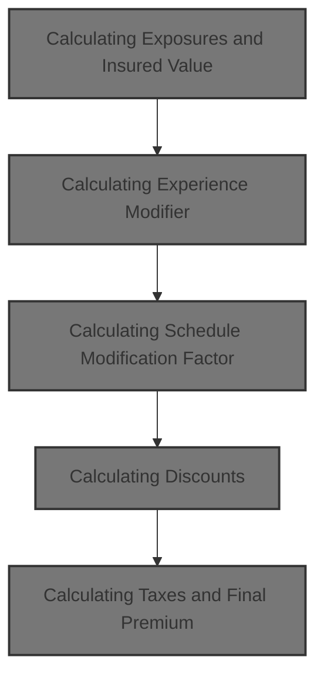
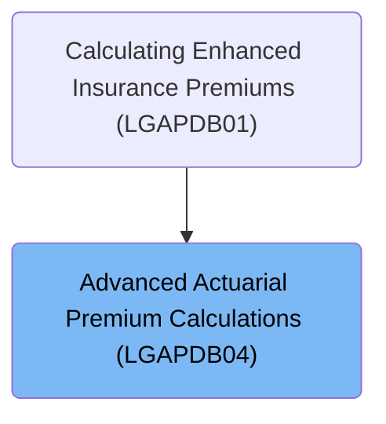
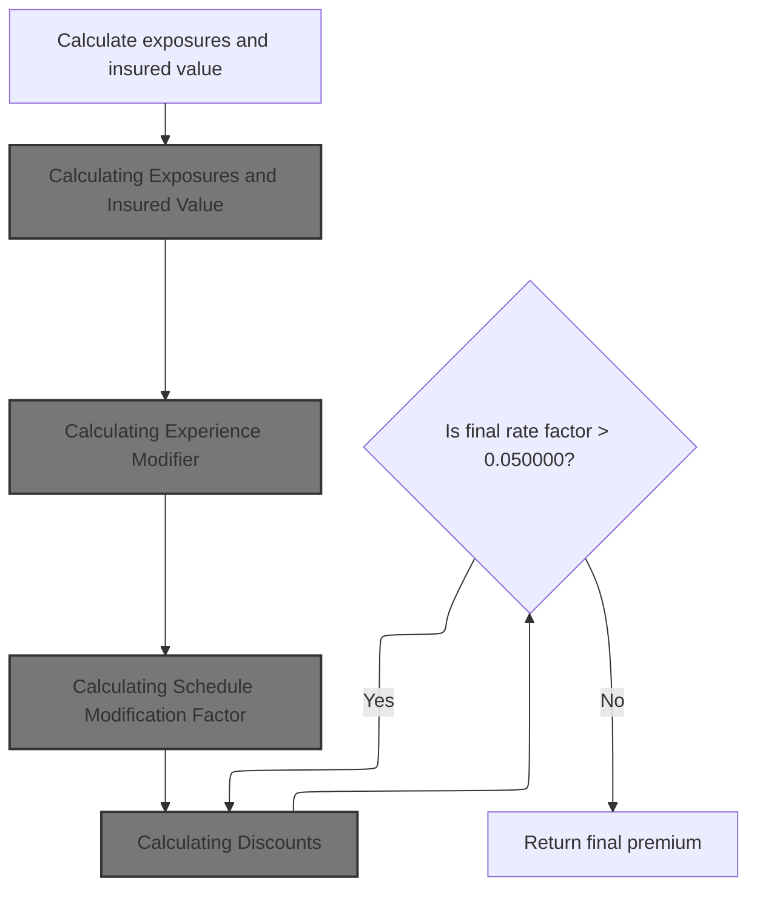
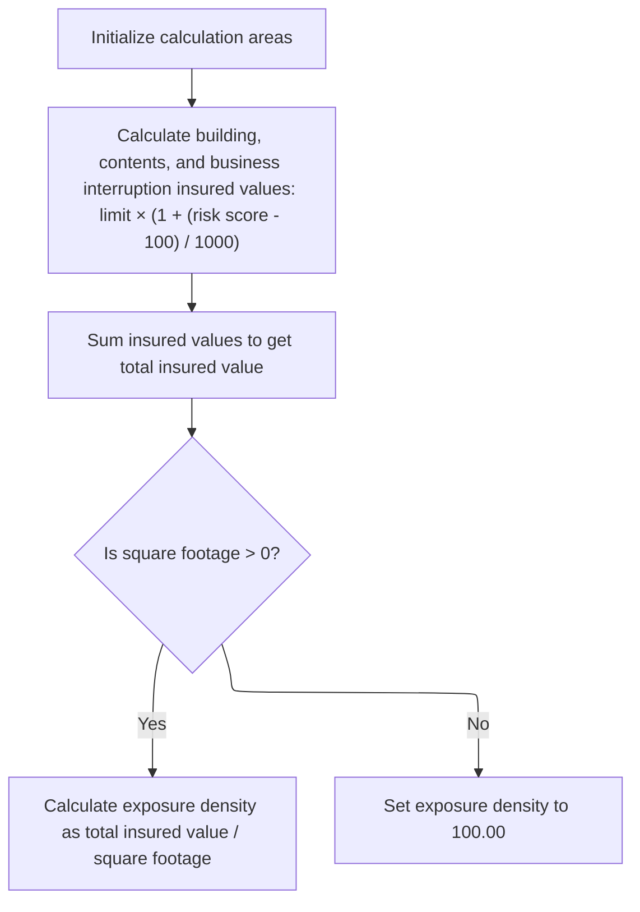
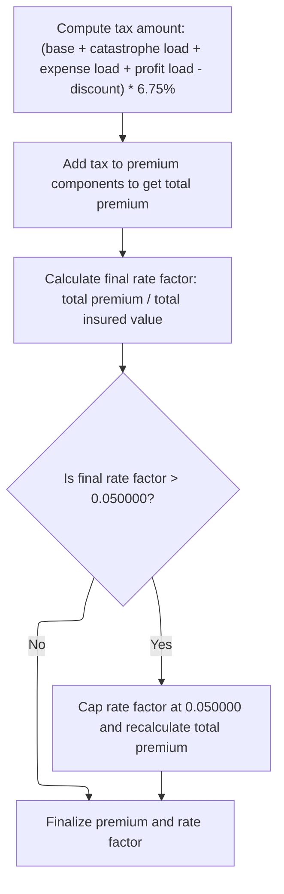

# Overview

This document describes the flow for calculating property insurance premiums. The process takes property and business data as input, applies actuarial modifiers, discounts, and taxes, and outputs the final premium, ensuring compliance with business rules and regulatory limits.



## Dependencies

### Program

- <SwmToken path="base/src/LGAPDB04.cbl" pos="2:6:6" line-data="       PROGRAM-ID. LGAPDB04.">`LGAPDB04`</SwmToken> (<SwmPath>[base/src/LGAPDB04.cbl](base/src/LGAPDB04.cbl)</SwmPath>)

### Copybook

- SQLCA

# Where is this program used?

This program is used once, as represented in the following diagram:



## Input and Output Tables/Files used in the Program

| Table / File Name                                                                                                         | Type | Description                                                    | Usage Mode | Key Fields / Layout Highlights                                                                                                                                                                                                                                                                                                                                                                                                                                                                                                                                                                                                                                                                                                            |
| ------------------------------------------------------------------------------------------------------------------------- | ---- | -------------------------------------------------------------- | ---------- | ----------------------------------------------------------------------------------------------------------------------------------------------------------------------------------------------------------------------------------------------------------------------------------------------------------------------------------------------------------------------------------------------------------------------------------------------------------------------------------------------------------------------------------------------------------------------------------------------------------------------------------------------------------------------------------------------------------------------------------------- |
| <SwmToken path="base/src/LGAPDB04.cbl" pos="183:3:3" line-data="               FROM RATE_MASTER">`RATE_MASTER`</SwmToken> | DB2  | Territory-based peril rates, min/max premiums, effective dates | Input      | <SwmToken path="base/src/LGAPDB04.cbl" pos="181:3:3" line-data="               SELECT BASE_RATE, MIN_PREMIUM, MAX_PREMIUM">`BASE_RATE`</SwmToken>, <SwmToken path="base/src/LGAPDB04.cbl" pos="181:6:6" line-data="               SELECT BASE_RATE, MIN_PREMIUM, MAX_PREMIUM">`MIN_PREMIUM`</SwmToken>, <SwmToken path="base/src/LGAPDB04.cbl" pos="154:3:7" line-data="           INITIALIZE WS-BASE-RATE-TABLE">`WS-BASE-RATE`</SwmToken>, <SwmToken path="base/src/LGAPDB04.cbl" pos="51:3:7" line-data="                       25 WS-MIN-PREM   PIC 9(5)V99.">`WS-MIN-PREM`</SwmToken>, <SwmToken path="base/src/LGAPDB04.cbl" pos="52:3:7" line-data="                       25 WS-MAX-PREM   PIC 9(7)V99.">`WS-MAX-PREM`</SwmToken> |

&nbsp;

## Detailed View of the Program's Functionality

# Orchestrating the Premium Calculation Steps

This program is designed to calculate insurance premiums using a sequence of steps, each building on the results of the previous. The main procedure starts the process and calls each calculation routine in order. The flow is as follows:

 1. **Initialization**: Sets up all calculation areas and loads base rates.
 2. **Exposure Calculation**: Determines the insured values and exposure density.
 3. **Experience Modifier Calculation**: Adjusts for business history and claims.
 4. **Schedule Modification Factor Calculation**: Adjusts for property and risk characteristics.
 5. **Base Premium Calculation**: Calculates premiums for each peril.
 6. **Catastrophe Load Calculation**: Adds extra premium for catastrophe risks.
 7. **Expense and Profit Loading**: Adds operational costs and profit margin.
 8. **Discount Calculation**: Applies discounts for multi-peril, claims-free, and deductible credits.
 9. **Tax Calculation**: Adds applicable taxes.
10. **Final Premium Calculation**: Sums everything, applies caps, and outputs the final premium and rate factor.

---

# Calculating Exposures and Insured Value

**Initialization and Exposure Calculation:**

- The calculation areas and base rate table are reset to ensure no leftover data from previous runs.
- The insured value for building, contents, and business interruption is calculated using a risk-adjusted formula. This formula increases the insured value based on the risk score, so higher risk scores result in higher insured values.
- The total insured value is then computed by summing the building, contents, and business interruption values.
- Exposure density is calculated by dividing the total insured value by the square footage of the property. If the square footage is zero or missing, a default value is used to prevent errors.

---

# Calculating Experience Modifier

**Experience Modifier Logic:**

- The experience modifier starts at a neutral value.
- If the business has been established for at least five years:
  - If there have been no claims in the last five years, a favorable modifier is applied.
  - If there have been claims, the modifier is calculated using the claims amount, total insured value, and a credibility factor. This value is then clamped to a minimum and maximum allowed range.
- If the business is newer than five years, a higher modifier is used to reflect increased risk.
- The final experience modifier is stored for use in subsequent premium calculations.

---

# Calculating Schedule Modification Factor

**Schedule Modification Logic:**

- The schedule modification factor starts at zero.
- Adjustments are made based on the age of the building:
  - Newer buildings decrease the modifier.
  - Older buildings increase the modifier.
- The protection class of the property is evaluated:
  - Lower protection class numbers decrease the modifier.
  - Higher numbers or other classes increase it.
- The occupancy code is checked:
  - Office types decrease the modifier.
  - Manufacturing and warehouse types increase it.
- Exposure density is considered:
  - High density increases the modifier.
  - Low density decreases it.
- After all adjustments, the modifier is clamped to a defined range to ensure it stays within business rules.
- The final schedule modification factor is stored for use in premium calculations.

---

# Calculating Discounts

**Discount Calculation Logic:**

- The total discount starts at zero.
- <SwmToken path="base/src/LGAPDB04.cbl" pos="410:3:5" line-data="      * Multi-peril discount">`Multi-peril`</SwmToken> discounts are applied if the customer has selected coverage for all four perils, or a subset of three key perils. The discount rate depends on the combination.
- A claims-free discount is applied if the customer has been claims-free for five years and has been in business for at least five years.
- Deductible credits are added if the fire, wind, or flood deductibles meet certain thresholds. Each deductible type adds a specific credit to the total discount.
- All discounts are summed, and the total is capped at a maximum allowed value.
- The total discount amount is calculated by applying the capped discount rate to the sum of all premium components.

---

# Calculating Taxes and Final Premium

**Tax and Final Premium Logic:**

- The tax amount is calculated by applying a fixed tax rate to the sum of all premium components minus the discount.
- The total premium is then calculated by adding together the base premium, catastrophe load, expense load, profit load, subtracting the discount, and adding the tax.
- The final rate factor is calculated by dividing the total premium by the total insured value.
- If the final rate factor exceeds a maximum allowed value, it is capped and the total premium is recalculated to match the capped rate.
- The finalized premium and rate factor are output for use in reporting or further processing.

---

# Summary

The program follows a strict sequence of calculations, each step depending on the results of the previous. It starts by establishing exposures and insured values, then applies risk modifiers, calculates premiums for each peril, adds catastrophe and operational costs, applies discounts, calculates taxes, and finally ensures the premium and rate factor are within allowed limits before outputting the results. Each calculation is carefully controlled to follow business rules and prevent errors or out-of-range values.

# Data Definitions

| Table / Record Name                                                                                                       | Type | Short Description                                              | Usage Mode     |
| ------------------------------------------------------------------------------------------------------------------------- | ---- | -------------------------------------------------------------- | -------------- |
| <SwmToken path="base/src/LGAPDB04.cbl" pos="183:3:3" line-data="               FROM RATE_MASTER">`RATE_MASTER`</SwmToken> | DB2  | Territory-based peril rates, min/max premiums, effective dates | Input (SELECT) |

&nbsp;

# Rule Definition

| Paragraph Name                                                                                                                 | Rule ID | Category          | Description                                                                                                                                                                                                                                                                                                                                                                                                                                                                                                                                                                                                    | Conditions                                                                           | Remarks                                                                                                                                                                                                                                                                                                                                                                                                                                                                                                                                                                                                                                                                                                                                                                                                                                                                                                                                                                                                                                                                                                                                                                                                                                                                                                                        |
| ------------------------------------------------------------------------------------------------------------------------------ | ------- | ----------------- | -------------------------------------------------------------------------------------------------------------------------------------------------------------------------------------------------------------------------------------------------------------------------------------------------------------------------------------------------------------------------------------------------------------------------------------------------------------------------------------------------------------------------------------------------------------------------------------------------------------- | ------------------------------------------------------------------------------------ | ------------------------------------------------------------------------------------------------------------------------------------------------------------------------------------------------------------------------------------------------------------------------------------------------------------------------------------------------------------------------------------------------------------------------------------------------------------------------------------------------------------------------------------------------------------------------------------------------------------------------------------------------------------------------------------------------------------------------------------------------------------------------------------------------------------------------------------------------------------------------------------------------------------------------------------------------------------------------------------------------------------------------------------------------------------------------------------------------------------------------------------------------------------------------------------------------------------------------------------------------------------------------------------------------------------------------------ |
| <SwmToken path="base/src/LGAPDB04.cbl" pos="139:3:5" line-data="           PERFORM P200-INIT">`P200-INIT`</SwmToken>           | RL-001  | Computation       | Calculate exposures for building, contents, and business interruption using the formula: exposure = limit × (1 + (risk score - 100) / 1000).                                                                                                                                                                                                                                                                                                                                                                                                                                                                   | Always applies when calculating exposures for each coverage type.                    | Exposures are monetary values, rounded to two decimal places before output. Inputs are coverage limits and risk score.                                                                                                                                                                                                                                                                                                                                                                                                                                                                                                                                                                                                                                                                                                                                                                                                                                                                                                                                                                                                                                                                                                                                                                                                         |
| <SwmToken path="base/src/LGAPDB04.cbl" pos="139:3:5" line-data="           PERFORM P200-INIT">`P200-INIT`</SwmToken>           | RL-002  | Computation       | Sum building, contents, and business interruption exposures to determine the total insured value.                                                                                                                                                                                                                                                                                                                                                                                                                                                                                                              | Always applies after exposures are calculated.                                       | Total insured value is a monetary value, rounded to two decimal places before output.                                                                                                                                                                                                                                                                                                                                                                                                                                                                                                                                                                                                                                                                                                                                                                                                                                                                                                                                                                                                                                                                                                                                                                                                                                          |
| <SwmToken path="base/src/LGAPDB04.cbl" pos="139:3:5" line-data="           PERFORM P200-INIT">`P200-INIT`</SwmToken>           | RL-003  | Computation       | Calculate exposure density as total insured value divided by square footage if square footage is greater than zero; otherwise, set exposure density to <SwmToken path="base/src/LGAPDB04.cbl" pos="173:3:5" line-data="               MOVE 100.00 TO WS-EXPOSURE-DENSITY">`100.00`</SwmToken>.                                                                                                                                                                                                                                                                                                                 | Square footage must be provided; if zero or missing, use default.                    | Exposure density is a numeric value, rounded to two decimal places before output. Default value is <SwmToken path="base/src/LGAPDB04.cbl" pos="173:3:5" line-data="               MOVE 100.00 TO WS-EXPOSURE-DENSITY">`100.00`</SwmToken> if square footage is zero.                                                                                                                                                                                                                                                                                                                                                                                                                                                                                                                                                                                                                                                                                                                                                                                                                                                                                                                                                                                                                                                           |
| <SwmToken path="base/src/LGAPDB04.cbl" pos="142:3:7" line-data="           PERFORM P400-EXP-MOD">`P400-EXP-MOD`</SwmToken>     | RL-004  | Conditional Logic | Calculate experience modifier based on years in business and claims count/amount. Clamp the result between <SwmToken path="base/src/LGAPDB04.cbl" pos="250:11:13" line-data="                   IF WS-EXPERIENCE-MOD &lt; 0.5000">`0.5000`</SwmToken> and <SwmToken path="base/src/LGAPDB04.cbl" pos="246:11:13" line-data="                   IF WS-EXPERIENCE-MOD &gt; 2.0000">`2.0000`</SwmToken>.                                                                                                                                                                                                          | Depends on years in business and claims count in last 5 years.                       | Experience modifier is a numeric value, rounded to four decimal places before output. Constants: <SwmToken path="base/src/LGAPDB04.cbl" pos="239:3:5" line-data="                   MOVE 0.8500 TO WS-EXPERIENCE-MOD">`0.8500`</SwmToken>, <SwmToken path="base/src/LGAPDB04.cbl" pos="255:3:5" line-data="               MOVE 1.1000 TO WS-EXPERIENCE-MOD">`1.1000`</SwmToken>, <SwmToken path="base/src/LGAPDB04.cbl" pos="235:3:5" line-data="           MOVE 1.0000 TO WS-EXPERIENCE-MOD">`1.0000`</SwmToken>, <SwmToken path="base/src/LGAPDB04.cbl" pos="27:15:17" line-data="           05 WS-CREDIBILITY-FACTOR    PIC V999 VALUE 0.750.">`0.750`</SwmToken> (credibility factor), <SwmToken path="base/src/LGAPDB04.cbl" pos="244:9:11" line-data="                        WS-CREDIBILITY-FACTOR * 0.50)">`0.50`</SwmToken> (additional factor), min <SwmToken path="base/src/LGAPDB04.cbl" pos="250:11:13" line-data="                   IF WS-EXPERIENCE-MOD &lt; 0.5000">`0.5000`</SwmToken>, max <SwmToken path="base/src/LGAPDB04.cbl" pos="246:11:13" line-data="                   IF WS-EXPERIENCE-MOD &gt; 2.0000">`2.0000`</SwmToken>.                                                                                                                                                                      |
| <SwmToken path="base/src/LGAPDB04.cbl" pos="143:3:7" line-data="           PERFORM P500-SCHED-MOD">`P500-SCHED-MOD`</SwmToken> | RL-005  | Conditional Logic | Calculate schedule modification factor based on building age, protection class, occupancy code, and exposure density, applying fixed adjustments per business rules, and clamp the result between <SwmToken path="base/src/LGAPDB04.cbl" pos="312:11:14" line-data="           IF WS-SCHEDULE-MOD &lt; -0.200">`-0.200`</SwmToken> and +<SwmToken path="base/src/LGAPDB04.cbl" pos="308:12:14" line-data="           IF WS-SCHEDULE-MOD &gt; +0.400">`0.400`</SwmToken>.                                                                                                                                       | Always applies for schedule modification calculation.                                | Schedule modification factor is a numeric value, rounded to three decimal places before output. Clamped to \[<SwmToken path="base/src/LGAPDB04.cbl" pos="312:11:14" line-data="           IF WS-SCHEDULE-MOD &lt; -0.200">`-0.200`</SwmToken>, +<SwmToken path="base/src/LGAPDB04.cbl" pos="308:12:14" line-data="           IF WS-SCHEDULE-MOD &gt; +0.400">`0.400`</SwmToken>\].                                                                                                                                                                                                                                                                                                                                                                                                                                                                                                                                                                                                                                                                                                                                                                                                                                                                                                                                             |
| <SwmToken path="base/src/LGAPDB04.cbl" pos="144:3:7" line-data="           PERFORM P600-BASE-PREM">`P600-BASE-PREM`</SwmToken> | RL-006  | Computation       | Calculate peril premiums only for selected perils using specified formulas, applying base rates, experience modifier, schedule modification, and trend factor.                                                                                                                                                                                                                                                                                                                                                                                                                                                 | Peril must be selected (peril selection > 0).                                        | Premiums are monetary values, rounded to two decimal places before output. Default base rates: Fire <SwmToken path="base/src/LGAPDB04.cbl" pos="196:3:5" line-data="               MOVE 0.008500 TO WS-BASE-RATE (1, 1, 1, 1)">`0.008500`</SwmToken>, Crime <SwmToken path="base/src/LGAPDB04.cbl" pos="225:7:9" line-data="                   WHEN 2  MOVE 0.006200 TO ">`0.006200`</SwmToken>, Flood <SwmToken path="base/src/LGAPDB04.cbl" pos="227:7:9" line-data="                   WHEN 3  MOVE 0.012800 TO ">`0.012800`</SwmToken>, Weather <SwmToken path="base/src/LGAPDB04.cbl" pos="229:7:9" line-data="                   WHEN 4  MOVE 0.009600 TO ">`0.009600`</SwmToken>. Trend factor: <SwmToken path="base/src/LGAPDB04.cbl" pos="26:15:17" line-data="           05 WS-TREND-FACTOR          PIC V9999 VALUE 1.0350.">`1.0350`</SwmToken>. Flood premium includes extra <SwmToken path="base/src/LGAPDB04.cbl" pos="352:9:11" line-data="                   WS-TREND-FACTOR * 1.25">`1.25`</SwmToken> multiplier. Crime premium uses 80% of contents exposure.                                                                                                                                                                                                                                               |
| <SwmToken path="base/src/LGAPDB04.cbl" pos="144:3:7" line-data="           PERFORM P600-BASE-PREM">`P600-BASE-PREM`</SwmToken> | RL-007  | Computation       | Calculate the base amount as the sum of all peril premiums.                                                                                                                                                                                                                                                                                                                                                                                                                                                                                                                                                    | Always applies after peril premiums are calculated.                                  | Base amount is a monetary value, rounded to two decimal places before output.                                                                                                                                                                                                                                                                                                                                                                                                                                                                                                                                                                                                                                                                                                                                                                                                                                                                                                                                                                                                                                                                                                                                                                                                                                                  |
| <SwmToken path="base/src/LGAPDB04.cbl" pos="145:3:7" line-data="           PERFORM P700-CAT-LOAD">`P700-CAT-LOAD`</SwmToken>   | RL-008  | Computation       | Calculate catastrophe load using peril-specific formulas and constants.                                                                                                                                                                                                                                                                                                                                                                                                                                                                                                                                        | Depends on peril selection (weather and flood).                                      | Catastrophe load is a monetary value, rounded to two decimal places before output. Constants: Hurricane factor <SwmToken path="base/src/LGAPDB04.cbl" pos="35:15:17" line-data="           05 WS-HURRICANE-FACTOR      PIC V9999 VALUE 0.0125.">`0.0125`</SwmToken>, Earthquake factor <SwmToken path="base/src/LGAPDB04.cbl" pos="36:15:17" line-data="           05 WS-EARTHQUAKE-FACTOR     PIC V9999 VALUE 0.0080.">`0.0080`</SwmToken>, Tornado factor <SwmToken path="base/src/LGAPDB04.cbl" pos="37:15:17" line-data="           05 WS-TORNADO-FACTOR        PIC V9999 VALUE 0.0045.">`0.0045`</SwmToken>, Flood factor <SwmToken path="base/src/LGAPDB04.cbl" pos="38:15:17" line-data="           05 WS-FLOOD-FACTOR          PIC V9999 VALUE 0.0090.">`0.0090`</SwmToken>.                                                                                                                                                                                                                                                                                                                                                                                                                                                                                                                                           |
| <SwmToken path="base/src/LGAPDB04.cbl" pos="146:3:5" line-data="           PERFORM P800-EXPENSE">`P800-EXPENSE`</SwmToken>     | RL-009  | Computation       | Calculate expense load as (base amount + catastrophe load) × <SwmToken path="base/src/LGAPDB04.cbl" pos="23:15:17" line-data="           05 WS-EXPENSE-RATIO         PIC V999 VALUE 0.350.">`0.350`</SwmToken>, and profit load as (base amount + catastrophe load + expense load) × <SwmToken path="base/src/LGAPDB04.cbl" pos="284:3:5" line-data="                   ADD 0.150 TO WS-SCHEDULE-MOD">`0.150`</SwmToken>.                                                                                                                                                                                      | Always applies after base amount and catastrophe load are calculated.                | Expense and profit loads are monetary values, rounded to two decimal places before output. Constants: Expense ratio <SwmToken path="base/src/LGAPDB04.cbl" pos="23:15:17" line-data="           05 WS-EXPENSE-RATIO         PIC V999 VALUE 0.350.">`0.350`</SwmToken>, profit margin <SwmToken path="base/src/LGAPDB04.cbl" pos="284:3:5" line-data="                   ADD 0.150 TO WS-SCHEDULE-MOD">`0.150`</SwmToken>.                                                                                                                                                                                                                                                                                                                                                                                                                                                                                                                                                                                                                                                                                                                                                                                                                                                                                                      |
| <SwmToken path="base/src/LGAPDB04.cbl" pos="147:3:5" line-data="           PERFORM P900-DISC">`P900-DISC`</SwmToken>           | RL-010  | Conditional Logic | Calculate discounts based on peril selection, claims-free status, and deductible credits. Cap total discount at <SwmToken path="base/src/LGAPDB04.cbl" pos="447:11:13" line-data="           IF WS-TOTAL-DISCOUNT &gt; 0.250">`0.250`</SwmToken>. Discount amount is calculated as (base amount + catastrophe load + expense load + profit load) × total discount rate.                                                                                                                                                                                                                                        | Depends on peril selection, claims count, years in business, and deductible amounts. | Discount rate capped at <SwmToken path="base/src/LGAPDB04.cbl" pos="447:11:13" line-data="           IF WS-TOTAL-DISCOUNT &gt; 0.250">`0.250`</SwmToken>. Deductible credits: +<SwmToken path="base/src/LGAPDB04.cbl" pos="290:3:5" line-data="                   SUBTRACT 0.025 FROM WS-SCHEDULE-MOD">`0.025`</SwmToken> if fire deductible ≥ 10,000; +<SwmToken path="base/src/LGAPDB04.cbl" pos="437:3:5" line-data="               ADD 0.035 TO WS-DEDUCTIBLE-CREDIT">`0.035`</SwmToken> if wind deductible ≥ 25,000; +<SwmToken path="base/src/LGAPDB04.cbl" pos="440:3:5" line-data="               ADD 0.045 TO WS-DEDUCTIBLE-CREDIT">`0.045`</SwmToken> if flood deductible ≥ 50,000. <SwmToken path="base/src/LGAPDB04.cbl" pos="410:3:5" line-data="      * Multi-peril discount">`Multi-peril`</SwmToken> discount: 0.10 for all four perils, 0.05 for three perils (fire, weather, and either crime or flood). <SwmToken path="base/src/LGAPDB04.cbl" pos="425:3:5" line-data="      * Claims-free discount  ">`Claims-free`</SwmToken> discount: <SwmToken path="base/src/LGAPDB04.cbl" pos="292:3:5" line-data="                   ADD 0.075 TO WS-SCHEDULE-MOD">`0.075`</SwmToken> if claims-free for 5 years and business ≥ 5 years. Discount amount is monetary, rounded to two decimal places before output. |
| <SwmToken path="base/src/LGAPDB04.cbl" pos="148:3:5" line-data="           PERFORM P950-TAXES">`P950-TAXES`</SwmToken>         | RL-011  | Computation       | Calculate tax amount as (base amount + catastrophe load + expense load + profit load - discount amount) × <SwmToken path="base/src/LGAPDB04.cbl" pos="460:10:12" line-data="                LK-DISCOUNT-AMT) * 0.0675">`0.0675`</SwmToken>.                                                                                                                                                                                                                                                                                                                                                                    | Always applies after discount calculation.                                           | Tax amount is monetary, rounded to two decimal places before output. Tax rate: <SwmToken path="base/src/LGAPDB04.cbl" pos="460:10:12" line-data="                LK-DISCOUNT-AMT) * 0.0675">`0.0675`</SwmToken>.                                                                                                                                                                                                                                                                                                                                                                                                                                                                                                                                                                                                                                                                                                                                                                                                                                                                                                                                                                                                                                                                                                               |
| <SwmToken path="base/src/LGAPDB04.cbl" pos="149:3:5" line-data="           PERFORM P999-FINAL">`P999-FINAL`</SwmToken>         | RL-012  | Computation       | Calculate total premium as base amount + catastrophe load + expense load + profit load - discount amount + tax amount.                                                                                                                                                                                                                                                                                                                                                                                                                                                                                         | Always applies after tax calculation.                                                | Total premium is monetary, rounded to two decimal places before output.                                                                                                                                                                                                                                                                                                                                                                                                                                                                                                                                                                                                                                                                                                                                                                                                                                                                                                                                                                                                                                                                                                                                                                                                                                                        |
| <SwmToken path="base/src/LGAPDB04.cbl" pos="149:3:5" line-data="           PERFORM P999-FINAL">`P999-FINAL`</SwmToken>         | RL-013  | Computation       | Calculate final rate factor as total premium divided by total insured value. If the final rate factor exceeds <SwmToken path="base/src/LGAPDB04.cbl" pos="473:13:15" line-data="           IF LK-FINAL-RATE-FACTOR &gt; 0.050000">`0.050000`</SwmToken>, set it to <SwmToken path="base/src/LGAPDB04.cbl" pos="473:13:15" line-data="           IF LK-FINAL-RATE-FACTOR &gt; 0.050000">`0.050000`</SwmToken> and recalculate total premium as <SwmToken path="base/src/LGAPDB04.cbl" pos="473:13:15" line-data="           IF LK-FINAL-RATE-FACTOR &gt; 0.050000">`0.050000`</SwmToken> × total insured value. | Always applies after total premium calculation.                                      | Final rate factor is numeric, rounded to five decimal places before output. Cap at <SwmToken path="base/src/LGAPDB04.cbl" pos="473:13:15" line-data="           IF LK-FINAL-RATE-FACTOR &gt; 0.050000">`0.050000`</SwmToken>.                                                                                                                                                                                                                                                                                                                                                                                                                                                                                                                                                                                                                                                                                                                                                                                                                                                                                                                                                                                                                                                                                                  |
| Throughout premium, load, discount, tax, and total calculations                                                                | RL-014  | Data Assignment   | All monetary values (peril premiums, loads, discounts, taxes, totals) should be rounded to two decimal places before storing or outputting.                                                                                                                                                                                                                                                                                                                                                                                                                                                                    | Always applies before storing or outputting monetary values.                         | Monetary values are rounded to two decimal places. Rate factors rounded to four or five decimal places as specified.                                                                                                                                                                                                                                                                                                                                                                                                                                                                                                                                                                                                                                                                                                                                                                                                                                                                                                                                                                                                                                                                                                                                                                                                           |

# User Stories

## User Story 1: Exposure and Insured Value Calculation

---

### Story Description:

As a policyholder, I want the system to accurately calculate my building, contents, and business interruption exposures, total insured value, and exposure density so that my insurance coverage reflects my actual risk and property characteristics.

---

### Business Rule Mapping:

| Rule ID | Paragraph Name                                                                                                       | Rule Description                                                                                                                                                                                                                                                                               |
| ------- | -------------------------------------------------------------------------------------------------------------------- | ---------------------------------------------------------------------------------------------------------------------------------------------------------------------------------------------------------------------------------------------------------------------------------------------- |
| RL-001  | <SwmToken path="base/src/LGAPDB04.cbl" pos="139:3:5" line-data="           PERFORM P200-INIT">`P200-INIT`</SwmToken> | Calculate exposures for building, contents, and business interruption using the formula: exposure = limit × (1 + (risk score - 100) / 1000).                                                                                                                                                   |
| RL-002  | <SwmToken path="base/src/LGAPDB04.cbl" pos="139:3:5" line-data="           PERFORM P200-INIT">`P200-INIT`</SwmToken> | Sum building, contents, and business interruption exposures to determine the total insured value.                                                                                                                                                                                              |
| RL-003  | <SwmToken path="base/src/LGAPDB04.cbl" pos="139:3:5" line-data="           PERFORM P200-INIT">`P200-INIT`</SwmToken> | Calculate exposure density as total insured value divided by square footage if square footage is greater than zero; otherwise, set exposure density to <SwmToken path="base/src/LGAPDB04.cbl" pos="173:3:5" line-data="               MOVE 100.00 TO WS-EXPOSURE-DENSITY">`100.00`</SwmToken>. |
| RL-014  | Throughout premium, load, discount, tax, and total calculations                                                      | All monetary values (peril premiums, loads, discounts, taxes, totals) should be rounded to two decimal places before storing or outputting.                                                                                                                                                    |

---

### Relevant Functionality:

- <SwmToken path="base/src/LGAPDB04.cbl" pos="139:3:5" line-data="           PERFORM P200-INIT">`P200-INIT`</SwmToken>
  1. **RL-001:**
     - For each coverage type (building, contents, BI):
       - Compute exposure as: limit × (1 + (risk score - 100) / 1000)
       - Store result for further calculations.
  2. **RL-002:**
     - Add building exposure, contents exposure, and BI exposure.
     - Store as total insured value.
  3. **RL-003:**
     - If square footage > 0:
       - Compute exposure density = total insured value / square footage
     - Else:
       - Set exposure density to <SwmToken path="base/src/LGAPDB04.cbl" pos="173:3:5" line-data="               MOVE 100.00 TO WS-EXPOSURE-DENSITY">`100.00`</SwmToken>
- **Throughout premium**
  1. **RL-014:**
     - After each monetary calculation:
       - Round value to two decimal places
       - Store or output rounded value

## User Story 2: Risk Adjustment Factors

---

### Story Description:

As a policyholder, I want the system to adjust my insurance pricing using experience and schedule modification factors based on my business history and property characteristics so that my premium reflects my unique risk profile.

---

### Business Rule Mapping:

| Rule ID | Paragraph Name                                                                                                                 | Rule Description                                                                                                                                                                                                                                                                                                                                                                                                                                                         |
| ------- | ------------------------------------------------------------------------------------------------------------------------------ | ------------------------------------------------------------------------------------------------------------------------------------------------------------------------------------------------------------------------------------------------------------------------------------------------------------------------------------------------------------------------------------------------------------------------------------------------------------------------ |
| RL-004  | <SwmToken path="base/src/LGAPDB04.cbl" pos="142:3:7" line-data="           PERFORM P400-EXP-MOD">`P400-EXP-MOD`</SwmToken>     | Calculate experience modifier based on years in business and claims count/amount. Clamp the result between <SwmToken path="base/src/LGAPDB04.cbl" pos="250:11:13" line-data="                   IF WS-EXPERIENCE-MOD &lt; 0.5000">`0.5000`</SwmToken> and <SwmToken path="base/src/LGAPDB04.cbl" pos="246:11:13" line-data="                   IF WS-EXPERIENCE-MOD &gt; 2.0000">`2.0000`</SwmToken>.                                                                    |
| RL-005  | <SwmToken path="base/src/LGAPDB04.cbl" pos="143:3:7" line-data="           PERFORM P500-SCHED-MOD">`P500-SCHED-MOD`</SwmToken> | Calculate schedule modification factor based on building age, protection class, occupancy code, and exposure density, applying fixed adjustments per business rules, and clamp the result between <SwmToken path="base/src/LGAPDB04.cbl" pos="312:11:14" line-data="           IF WS-SCHEDULE-MOD &lt; -0.200">`-0.200`</SwmToken> and +<SwmToken path="base/src/LGAPDB04.cbl" pos="308:12:14" line-data="           IF WS-SCHEDULE-MOD &gt; +0.400">`0.400`</SwmToken>. |
| RL-014  | Throughout premium, load, discount, tax, and total calculations                                                                | All monetary values (peril premiums, loads, discounts, taxes, totals) should be rounded to two decimal places before storing or outputting.                                                                                                                                                                                                                                                                                                                              |

---

### Relevant Functionality:

- <SwmToken path="base/src/LGAPDB04.cbl" pos="142:3:7" line-data="           PERFORM P400-EXP-MOD">`P400-EXP-MOD`</SwmToken>
  1. **RL-004:**
     - If years in business >= 5:
       - If claims count in last 5 years == 0:
         - Set experience modifier to <SwmToken path="base/src/LGAPDB04.cbl" pos="239:3:5" line-data="                   MOVE 0.8500 TO WS-EXPERIENCE-MOD">`0.8500`</SwmToken>
       - Else:
         - Compute experience modifier = <SwmToken path="base/src/LGAPDB04.cbl" pos="235:3:5" line-data="           MOVE 1.0000 TO WS-EXPERIENCE-MOD">`1.0000`</SwmToken> + (claims amount / insured value) × <SwmToken path="base/src/LGAPDB04.cbl" pos="27:15:17" line-data="           05 WS-CREDIBILITY-FACTOR    PIC V999 VALUE 0.750.">`0.750`</SwmToken> × <SwmToken path="base/src/LGAPDB04.cbl" pos="244:9:11" line-data="                        WS-CREDIBILITY-FACTOR * 0.50)">`0.50`</SwmToken>
         - Clamp to \[<SwmToken path="base/src/LGAPDB04.cbl" pos="250:11:13" line-data="                   IF WS-EXPERIENCE-MOD &lt; 0.5000">`0.5000`</SwmToken>, <SwmToken path="base/src/LGAPDB04.cbl" pos="246:11:13" line-data="                   IF WS-EXPERIENCE-MOD &gt; 2.0000">`2.0000`</SwmToken>\]
     - Else:
       - Set experience modifier to <SwmToken path="base/src/LGAPDB04.cbl" pos="255:3:5" line-data="               MOVE 1.1000 TO WS-EXPERIENCE-MOD">`1.1000`</SwmToken>
- <SwmToken path="base/src/LGAPDB04.cbl" pos="143:3:7" line-data="           PERFORM P500-SCHED-MOD">`P500-SCHED-MOD`</SwmToken>
  1. **RL-005:**
     - Initialize schedule mod to <SwmToken path="base/src/LGAPDB04.cbl" pos="261:4:6" line-data="           MOVE +0.000 TO WS-SCHEDULE-MOD">`0.000`</SwmToken>
     - Adjust based on building year:
       - &nbsp;

         > =2010: subtract <SwmToken path="base/src/LGAPDB04.cbl" pos="266:3:5" line-data="                   SUBTRACT 0.050 FROM WS-SCHEDULE-MOD">`0.050`</SwmToken>

       - &nbsp;

         > =1990: no change

       - &nbsp;

         > =1970: add <SwmToken path="base/src/LGAPDB04.cbl" pos="270:3:5" line-data="                   ADD 0.100 TO WS-SCHEDULE-MOD">`0.100`</SwmToken>

       - else: add <SwmToken path="base/src/LGAPDB04.cbl" pos="272:3:5" line-data="                   ADD 0.200 TO WS-SCHEDULE-MOD">`0.200`</SwmToken>
     - Adjust based on protection class:
       - '01'-'03': subtract <SwmToken path="base/src/LGAPDB04.cbl" pos="270:3:5" line-data="                   ADD 0.100 TO WS-SCHEDULE-MOD">`0.100`</SwmToken>
       - '04'-'06': subtract <SwmToken path="base/src/LGAPDB04.cbl" pos="266:3:5" line-data="                   SUBTRACT 0.050 FROM WS-SCHEDULE-MOD">`0.050`</SwmToken>
       - '07'-'09': no change
       - else: add <SwmToken path="base/src/LGAPDB04.cbl" pos="284:3:5" line-data="                   ADD 0.150 TO WS-SCHEDULE-MOD">`0.150`</SwmToken>
     - Adjust based on occupancy code:
       - <SwmToken path="base/src/LGAPDB04.cbl" pos="289:4:4" line-data="               WHEN &#39;OFF01&#39; THRU &#39;OFF05&#39;">`OFF01`</SwmToken>-<SwmToken path="base/src/LGAPDB04.cbl" pos="289:10:10" line-data="               WHEN &#39;OFF01&#39; THRU &#39;OFF05&#39;">`OFF05`</SwmToken>: subtract <SwmToken path="base/src/LGAPDB04.cbl" pos="290:3:5" line-data="                   SUBTRACT 0.025 FROM WS-SCHEDULE-MOD">`0.025`</SwmToken>
       - <SwmToken path="base/src/LGAPDB04.cbl" pos="291:4:4" line-data="               WHEN &#39;MFG01&#39; THRU &#39;MFG10&#39;">`MFG01`</SwmToken>-<SwmToken path="base/src/LGAPDB04.cbl" pos="291:10:10" line-data="               WHEN &#39;MFG01&#39; THRU &#39;MFG10&#39;">`MFG10`</SwmToken>: add <SwmToken path="base/src/LGAPDB04.cbl" pos="292:3:5" line-data="                   ADD 0.075 TO WS-SCHEDULE-MOD">`0.075`</SwmToken>
       - <SwmToken path="base/src/LGAPDB04.cbl" pos="293:4:4" line-data="               WHEN &#39;WHS01&#39; THRU &#39;WHS05&#39;">`WHS01`</SwmToken>-<SwmToken path="base/src/LGAPDB04.cbl" pos="293:10:10" line-data="               WHEN &#39;WHS01&#39; THRU &#39;WHS05&#39;">`WHS05`</SwmToken>: add <SwmToken path="base/src/LGAPDB04.cbl" pos="294:3:5" line-data="                   ADD 0.125 TO WS-SCHEDULE-MOD">`0.125`</SwmToken>
     - Adjust based on exposure density:
       - &nbsp;

         > <SwmToken path="base/src/LGAPDB04.cbl" pos="300:11:13" line-data="           IF WS-EXPOSURE-DENSITY &gt; 500.00">`500.00`</SwmToken>: add <SwmToken path="base/src/LGAPDB04.cbl" pos="270:3:5" line-data="                   ADD 0.100 TO WS-SCHEDULE-MOD">`0.100`</SwmToken>

       - <<SwmToken path="base/src/LGAPDB04.cbl" pos="303:11:13" line-data="               IF WS-EXPOSURE-DENSITY &lt; 50.00">`50.00`</SwmToken>: subtract <SwmToken path="base/src/LGAPDB04.cbl" pos="266:3:5" line-data="                   SUBTRACT 0.050 FROM WS-SCHEDULE-MOD">`0.050`</SwmToken>
     - Clamp to \[<SwmToken path="base/src/LGAPDB04.cbl" pos="312:11:14" line-data="           IF WS-SCHEDULE-MOD &lt; -0.200">`-0.200`</SwmToken>, +<SwmToken path="base/src/LGAPDB04.cbl" pos="308:12:14" line-data="           IF WS-SCHEDULE-MOD &gt; +0.400">`0.400`</SwmToken>\]
- **Throughout premium**
  1. **RL-014:**
     - After each monetary calculation:
       - Round value to two decimal places
       - Store or output rounded value

## User Story 3: Peril Premium and Load Calculation

---

### Story Description:

As a policyholder, I want the system to calculate peril-specific premiums, base amount, catastrophe load, expense load, and profit load so that my premium is accurately determined based on my selected coverages and risk factors.

---

### Business Rule Mapping:

| Rule ID | Paragraph Name                                                                                                                 | Rule Description                                                                                                                                                                                                                                                                                                                                                                                                          |
| ------- | ------------------------------------------------------------------------------------------------------------------------------ | ------------------------------------------------------------------------------------------------------------------------------------------------------------------------------------------------------------------------------------------------------------------------------------------------------------------------------------------------------------------------------------------------------------------------- |
| RL-006  | <SwmToken path="base/src/LGAPDB04.cbl" pos="144:3:7" line-data="           PERFORM P600-BASE-PREM">`P600-BASE-PREM`</SwmToken> | Calculate peril premiums only for selected perils using specified formulas, applying base rates, experience modifier, schedule modification, and trend factor.                                                                                                                                                                                                                                                            |
| RL-007  | <SwmToken path="base/src/LGAPDB04.cbl" pos="144:3:7" line-data="           PERFORM P600-BASE-PREM">`P600-BASE-PREM`</SwmToken> | Calculate the base amount as the sum of all peril premiums.                                                                                                                                                                                                                                                                                                                                                               |
| RL-008  | <SwmToken path="base/src/LGAPDB04.cbl" pos="145:3:7" line-data="           PERFORM P700-CAT-LOAD">`P700-CAT-LOAD`</SwmToken>   | Calculate catastrophe load using peril-specific formulas and constants.                                                                                                                                                                                                                                                                                                                                                   |
| RL-009  | <SwmToken path="base/src/LGAPDB04.cbl" pos="146:3:5" line-data="           PERFORM P800-EXPENSE">`P800-EXPENSE`</SwmToken>     | Calculate expense load as (base amount + catastrophe load) × <SwmToken path="base/src/LGAPDB04.cbl" pos="23:15:17" line-data="           05 WS-EXPENSE-RATIO         PIC V999 VALUE 0.350.">`0.350`</SwmToken>, and profit load as (base amount + catastrophe load + expense load) × <SwmToken path="base/src/LGAPDB04.cbl" pos="284:3:5" line-data="                   ADD 0.150 TO WS-SCHEDULE-MOD">`0.150`</SwmToken>. |
| RL-014  | Throughout premium, load, discount, tax, and total calculations                                                                | All monetary values (peril premiums, loads, discounts, taxes, totals) should be rounded to two decimal places before storing or outputting.                                                                                                                                                                                                                                                                               |

---

### Relevant Functionality:

- <SwmToken path="base/src/LGAPDB04.cbl" pos="144:3:7" line-data="           PERFORM P600-BASE-PREM">`P600-BASE-PREM`</SwmToken>
  1. **RL-006:**
     - For each peril (fire, crime, flood, weather):
       - If peril selected:
         - Compute premium using formula:
           - Fire: (building exposure + contents exposure) × fire base rate × experience modifier × (1 + schedule mod) × trend factor
           - Crime: (contents exposure × <SwmToken path="base/src/LGAPDB04.cbl" pos="336:10:12" line-data="                   (WS-CONTENTS-EXPOSURE * 0.80) *">`0.80`</SwmToken>) × crime base rate × experience modifier × (1 + schedule mod) × trend factor
           - Flood: building exposure × flood base rate × experience modifier × (1 + schedule mod) × trend factor × <SwmToken path="base/src/LGAPDB04.cbl" pos="352:9:11" line-data="                   WS-TREND-FACTOR * 1.25">`1.25`</SwmToken>
           - Weather: (building exposure + contents exposure) × weather base rate × experience modifier × (1 + schedule mod) × trend factor
         - Add premium to base amount
  2. **RL-007:**
     - Sum all peril premiums
     - Store as base amount
- <SwmToken path="base/src/LGAPDB04.cbl" pos="145:3:7" line-data="           PERFORM P700-CAT-LOAD">`P700-CAT-LOAD`</SwmToken>
  1. **RL-008:**
     - Initialize catastrophe load to zero
     - If weather peril selected:
       - Add (weather premium × <SwmToken path="base/src/LGAPDB04.cbl" pos="35:15:17" line-data="           05 WS-HURRICANE-FACTOR      PIC V9999 VALUE 0.0125.">`0.0125`</SwmToken>)
     - Add (base amount × <SwmToken path="base/src/LGAPDB04.cbl" pos="36:15:17" line-data="           05 WS-EARTHQUAKE-FACTOR     PIC V9999 VALUE 0.0080.">`0.0080`</SwmToken>)
     - If weather peril selected:
       - Add (weather premium × <SwmToken path="base/src/LGAPDB04.cbl" pos="37:15:17" line-data="           05 WS-TORNADO-FACTOR        PIC V9999 VALUE 0.0045.">`0.0045`</SwmToken>)
     - If flood peril selected:
       - Add (flood premium × <SwmToken path="base/src/LGAPDB04.cbl" pos="38:15:17" line-data="           05 WS-FLOOD-FACTOR          PIC V9999 VALUE 0.0090.">`0.0090`</SwmToken>)
- <SwmToken path="base/src/LGAPDB04.cbl" pos="146:3:5" line-data="           PERFORM P800-EXPENSE">`P800-EXPENSE`</SwmToken>
  1. **RL-009:**
     - Compute expense load = (base amount + catastrophe load) × <SwmToken path="base/src/LGAPDB04.cbl" pos="23:15:17" line-data="           05 WS-EXPENSE-RATIO         PIC V999 VALUE 0.350.">`0.350`</SwmToken>
     - Compute profit load = (base amount + catastrophe load + expense load) × <SwmToken path="base/src/LGAPDB04.cbl" pos="284:3:5" line-data="                   ADD 0.150 TO WS-SCHEDULE-MOD">`0.150`</SwmToken>
- **Throughout premium**
  1. **RL-014:**
     - After each monetary calculation:
       - Round value to two decimal places
       - Store or output rounded value

## User Story 4: Discount, Tax, and Final Premium Calculation

---

### Story Description:

As a policyholder, I want the system to apply all eligible discounts, calculate taxes, determine my total premium, and ensure the final rate factor does not exceed the maximum allowed so that I receive a fair and compliant insurance quote.

---

### Business Rule Mapping:

| Rule ID | Paragraph Name                                                                                                         | Rule Description                                                                                                                                                                                                                                                                                                                                                                                                                                                                                                                                                                                               |
| ------- | ---------------------------------------------------------------------------------------------------------------------- | -------------------------------------------------------------------------------------------------------------------------------------------------------------------------------------------------------------------------------------------------------------------------------------------------------------------------------------------------------------------------------------------------------------------------------------------------------------------------------------------------------------------------------------------------------------------------------------------------------------- |
| RL-010  | <SwmToken path="base/src/LGAPDB04.cbl" pos="147:3:5" line-data="           PERFORM P900-DISC">`P900-DISC`</SwmToken>   | Calculate discounts based on peril selection, claims-free status, and deductible credits. Cap total discount at <SwmToken path="base/src/LGAPDB04.cbl" pos="447:11:13" line-data="           IF WS-TOTAL-DISCOUNT &gt; 0.250">`0.250`</SwmToken>. Discount amount is calculated as (base amount + catastrophe load + expense load + profit load) × total discount rate.                                                                                                                                                                                                                                        |
| RL-011  | <SwmToken path="base/src/LGAPDB04.cbl" pos="148:3:5" line-data="           PERFORM P950-TAXES">`P950-TAXES`</SwmToken> | Calculate tax amount as (base amount + catastrophe load + expense load + profit load - discount amount) × <SwmToken path="base/src/LGAPDB04.cbl" pos="460:10:12" line-data="                LK-DISCOUNT-AMT) * 0.0675">`0.0675`</SwmToken>.                                                                                                                                                                                                                                                                                                                                                                    |
| RL-012  | <SwmToken path="base/src/LGAPDB04.cbl" pos="149:3:5" line-data="           PERFORM P999-FINAL">`P999-FINAL`</SwmToken> | Calculate total premium as base amount + catastrophe load + expense load + profit load - discount amount + tax amount.                                                                                                                                                                                                                                                                                                                                                                                                                                                                                         |
| RL-013  | <SwmToken path="base/src/LGAPDB04.cbl" pos="149:3:5" line-data="           PERFORM P999-FINAL">`P999-FINAL`</SwmToken> | Calculate final rate factor as total premium divided by total insured value. If the final rate factor exceeds <SwmToken path="base/src/LGAPDB04.cbl" pos="473:13:15" line-data="           IF LK-FINAL-RATE-FACTOR &gt; 0.050000">`0.050000`</SwmToken>, set it to <SwmToken path="base/src/LGAPDB04.cbl" pos="473:13:15" line-data="           IF LK-FINAL-RATE-FACTOR &gt; 0.050000">`0.050000`</SwmToken> and recalculate total premium as <SwmToken path="base/src/LGAPDB04.cbl" pos="473:13:15" line-data="           IF LK-FINAL-RATE-FACTOR &gt; 0.050000">`0.050000`</SwmToken> × total insured value. |
| RL-014  | Throughout premium, load, discount, tax, and total calculations                                                        | All monetary values (peril premiums, loads, discounts, taxes, totals) should be rounded to two decimal places before storing or outputting.                                                                                                                                                                                                                                                                                                                                                                                                                                                                    |

---

### Relevant Functionality:

- <SwmToken path="base/src/LGAPDB04.cbl" pos="147:3:5" line-data="           PERFORM P900-DISC">`P900-DISC`</SwmToken>
  1. **RL-010:**
     - Initialize total discount to zero
     - If all four perils selected: add 0.10
     - Else if fire, weather, and (crime or flood) selected: add 0.05
     - If claims-free for 5 years and business ≥ 5 years: add <SwmToken path="base/src/LGAPDB04.cbl" pos="292:3:5" line-data="                   ADD 0.075 TO WS-SCHEDULE-MOD">`0.075`</SwmToken>
     - Add deductible credits as applicable
     - Cap total discount at <SwmToken path="base/src/LGAPDB04.cbl" pos="447:11:13" line-data="           IF WS-TOTAL-DISCOUNT &gt; 0.250">`0.250`</SwmToken>
     - Compute discount amount = (base amount + catastrophe load + expense load + profit load) × total discount rate
- <SwmToken path="base/src/LGAPDB04.cbl" pos="148:3:5" line-data="           PERFORM P950-TAXES">`P950-TAXES`</SwmToken>
  1. **RL-011:**
     - Compute tax amount = (base amount + catastrophe load + expense load + profit load - discount amount) × <SwmToken path="base/src/LGAPDB04.cbl" pos="460:10:12" line-data="                LK-DISCOUNT-AMT) * 0.0675">`0.0675`</SwmToken>
- <SwmToken path="base/src/LGAPDB04.cbl" pos="149:3:5" line-data="           PERFORM P999-FINAL">`P999-FINAL`</SwmToken>
  1. **RL-012:**
     - Compute total premium = base amount + catastrophe load + expense load + profit load - discount amount + tax amount
  2. **RL-013:**
     - Compute final rate factor = total premium / total insured value
     - If final rate factor > <SwmToken path="base/src/LGAPDB04.cbl" pos="473:13:15" line-data="           IF LK-FINAL-RATE-FACTOR &gt; 0.050000">`0.050000`</SwmToken>:
       - Set final rate factor to <SwmToken path="base/src/LGAPDB04.cbl" pos="473:13:15" line-data="           IF LK-FINAL-RATE-FACTOR &gt; 0.050000">`0.050000`</SwmToken>
       - Recompute total premium = <SwmToken path="base/src/LGAPDB04.cbl" pos="473:13:15" line-data="           IF LK-FINAL-RATE-FACTOR &gt; 0.050000">`0.050000`</SwmToken> × total insured value
- **Throughout premium**
  1. **RL-014:**
     - After each monetary calculation:
       - Round value to two decimal places
       - Store or output rounded value

# Workflow

# Orchestrating the Premium Calculation Steps



This section ensures that all necessary premium calculation steps are executed in the correct order, with each step building upon the results of the previous one, to produce an accurate and compliant insurance premium.

| Category        | Rule Name                          | Description                                                                                                                                                                                                                                                               |
| --------------- | ---------------------------------- | ------------------------------------------------------------------------------------------------------------------------------------------------------------------------------------------------------------------------------------------------------------------------- |
| Data validation | Schedule Modification Limits       | The schedule modification factor must be determined based on building age, protection class, occupancy type, and exposure density, and must be limited to regulatory bounds.                                                                                              |
| Data validation | Discount Eligibility Enforcement   | Discounts must be applied only if the insured meets eligibility criteria for multi-peril, claims-free, and deductible-based discounts.                                                                                                                                    |
| Business logic  | Exposure Initialization Precedence | The exposure and insured value must be calculated first, as all subsequent premium calculations depend on these values.                                                                                                                                                   |
| Business logic  | Experience Modifier Impact         | The experience modifier must be calculated using the insured's years in business and claims history, and this modifier directly impacts the premium.                                                                                                                      |
| Business logic  | Minimum Rate Factor Threshold      | If the final rate factor is less than or equal to <SwmToken path="base/src/LGAPDB04.cbl" pos="473:13:15" line-data="           IF LK-FINAL-RATE-FACTOR &gt; 0.050000">`0.050000`</SwmToken>, the premium calculation process must terminate and return the final premium. |

<SwmSnippet path="/base/src/LGAPDB04.cbl" line="138">

---

<SwmToken path="base/src/LGAPDB04.cbl" pos="138:1:3" line-data="       P100-MAIN.">`P100-MAIN`</SwmToken> kicks off the entire premium calculation sequence. It calls each major calculation step in order, starting with <SwmToken path="base/src/LGAPDB04.cbl" pos="139:3:5" line-data="           PERFORM P200-INIT">`P200-INIT`</SwmToken>. We need to call <SwmToken path="base/src/LGAPDB04.cbl" pos="139:3:5" line-data="           PERFORM P200-INIT">`P200-INIT`</SwmToken> first because it sets up all the exposure values and total insured value, which are used by every other calculation down the line.

```cobol
       P100-MAIN.
           PERFORM P200-INIT
           PERFORM P300-RATES
           PERFORM P350-EXPOSURE
           PERFORM P400-EXP-MOD
           PERFORM P500-SCHED-MOD
           PERFORM P600-BASE-PREM
           PERFORM P700-CAT-LOAD
           PERFORM P800-EXPENSE
           PERFORM P900-DISC
           PERFORM P950-TAXES
           PERFORM P999-FINAL
           GOBACK.
```

---

</SwmSnippet>

## Calculating Exposures and Insured Value



This section calculates the risk-adjusted exposures and total insured value for a property, as well as the exposure density, which are foundational for all downstream premium and modifier calculations.

<SwmSnippet path="/base/src/LGAPDB04.cbl" line="152">

---

In <SwmToken path="base/src/LGAPDB04.cbl" pos="152:1:3" line-data="       P200-INIT.">`P200-INIT`</SwmToken> we calculate building, contents, and BI exposures using the risk-adjusted formula, then sum them for the total insured value. These numbers are needed for all the premium and modifier calculations that follow.

```cobol
       P200-INIT.
           INITIALIZE WS-CALCULATION-AREAS
           INITIALIZE WS-BASE-RATE-TABLE
           
           COMPUTE WS-BUILDING-EXPOSURE = 
               LK-BUILDING-LIMIT * (1 + (LK-RISK-SCORE - 100) / 1000)
               
           COMPUTE WS-CONTENTS-EXPOSURE = 
               LK-CONTENTS-LIMIT * (1 + (LK-RISK-SCORE - 100) / 1000)
               
           COMPUTE WS-BI-EXPOSURE = 
               LK-BI-LIMIT * (1 + (LK-RISK-SCORE - 100) / 1000)
               
           COMPUTE WS-TOTAL-INSURED-VAL = 
               WS-BUILDING-EXPOSURE + WS-CONTENTS-EXPOSURE + 
               WS-BI-EXPOSURE
```

---

</SwmSnippet>

<SwmSnippet path="/base/src/LGAPDB04.cbl" line="169">

---

After exposures and total insured value are set, we calculate exposure density. If square footage is positive, it's a straight division; otherwise, we use <SwmToken path="base/src/LGAPDB04.cbl" pos="173:3:5" line-data="               MOVE 100.00 TO WS-EXPOSURE-DENSITY">`100.00`</SwmToken> as a default to avoid errors and keep the flow moving.

```cobol
           IF LK-SQUARE-FOOTAGE > ZERO
               COMPUTE WS-EXPOSURE-DENSITY = 
                   WS-TOTAL-INSURED-VAL / LK-SQUARE-FOOTAGE
           ELSE
               MOVE 100.00 TO WS-EXPOSURE-DENSITY
           END-IF.
```

---

</SwmSnippet>

## Calculating Experience Modifier

```mermaid
%%{init: {"flowchart": {"defaultRenderer": "elk"}} }%%
flowchart TD
    node1["Start experience mod calculation"] --> node2{"Is business established? (Years in business >= 5)"}
    click node1 openCode "base/src/LGAPDB04.cbl:234:235"
    click node2 openCode "base/src/LGAPDB04.cbl:237:237"
    node2 -->|"Yes"| node3{"Claims in last 5 years? (Count = 0)"}
    click node3 openCode "base/src/LGAPDB04.cbl:238:238"
    node3 -->|"Yes"| node4["Set experience mod to favorable rate (0.8500)"]
    click node4 openCode "base/src/LGAPDB04.cbl:239:239"
    node3 -->|"No"| node5["Calculate experience mod: 1.0000 + (claims amount / insured value) * credibility factor (0.750) * 0.50"]
    click node5 openCode "base/src/LGAPDB04.cbl:241:244"
    node5 --> node6{"Is experience mod above maximum (2.0000)?"}
    click node6 openCode "base/src/LGAPDB04.cbl:246:246"
    node6 -->|"Yes"| node7["Set experience mod to maximum (2.0000)"]
    click node7 openCode "base/src/LGAPDB04.cbl:247:247"
    node6 -->|"No"| node8{"Is experience mod below minimum (0.5000)?"}
    click node8 openCode "base/src/LGAPDB04.cbl:250:250"
    node8 -->|"Yes"| node9["Set experience mod to minimum (0.5000)"]
    click node9 openCode "base/src/LGAPDB04.cbl:251:251"
    node8 -->|"No"| node10["Use calculated experience mod"]
    click node10 openCode "base/src/LGAPDB04.cbl:241:244"
    node2 -->|"No"| node11["Set experience mod to higher rate (1.1000)"]
    click node11 openCode "base/src/LGAPDB04.cbl:255:255"
    node4 --> node12["Output experience mod for premium calculation"]
    click node12 openCode "base/src/LGAPDB04.cbl:258:258"
    node7 --> node12
    node9 --> node12
    node10 -->|"Calculated value"| node12
    node11 --> node12
classDef HeadingStyle fill:#777777,stroke:#333,stroke-width:2px;

%% Swimm:
%% %%{init: {"flowchart": {"defaultRenderer": "elk"}} }%%
%% flowchart TD
%%     node1["Start experience mod calculation"] --> node2{"Is business established? (Years in business >= 5)"}
%%     click node1 openCode "<SwmPath>[base/src/LGAPDB04.cbl](base/src/LGAPDB04.cbl)</SwmPath>:234:235"
%%     click node2 openCode "<SwmPath>[base/src/LGAPDB04.cbl](base/src/LGAPDB04.cbl)</SwmPath>:237:237"
%%     node2 -->|"Yes"| node3{"Claims in last 5 years? (Count = 0)"}
%%     click node3 openCode "<SwmPath>[base/src/LGAPDB04.cbl](base/src/LGAPDB04.cbl)</SwmPath>:238:238"
%%     node3 -->|"Yes"| node4["Set experience mod to favorable rate (<SwmToken path="base/src/LGAPDB04.cbl" pos="239:3:5" line-data="                   MOVE 0.8500 TO WS-EXPERIENCE-MOD">`0.8500`</SwmToken>)"]
%%     click node4 openCode "<SwmPath>[base/src/LGAPDB04.cbl](base/src/LGAPDB04.cbl)</SwmPath>:239:239"
%%     node3 -->|"No"| node5["Calculate experience mod: <SwmToken path="base/src/LGAPDB04.cbl" pos="235:3:5" line-data="           MOVE 1.0000 TO WS-EXPERIENCE-MOD">`1.0000`</SwmToken> + (claims amount / insured value) * credibility factor (<SwmToken path="base/src/LGAPDB04.cbl" pos="27:15:17" line-data="           05 WS-CREDIBILITY-FACTOR    PIC V999 VALUE 0.750.">`0.750`</SwmToken>) * <SwmToken path="base/src/LGAPDB04.cbl" pos="244:9:11" line-data="                        WS-CREDIBILITY-FACTOR * 0.50)">`0.50`</SwmToken>"]
%%     click node5 openCode "<SwmPath>[base/src/LGAPDB04.cbl](base/src/LGAPDB04.cbl)</SwmPath>:241:244"
%%     node5 --> node6{"Is experience mod above maximum (<SwmToken path="base/src/LGAPDB04.cbl" pos="246:11:13" line-data="                   IF WS-EXPERIENCE-MOD &gt; 2.0000">`2.0000`</SwmToken>)?"}
%%     click node6 openCode "<SwmPath>[base/src/LGAPDB04.cbl](base/src/LGAPDB04.cbl)</SwmPath>:246:246"
%%     node6 -->|"Yes"| node7["Set experience mod to maximum (<SwmToken path="base/src/LGAPDB04.cbl" pos="246:11:13" line-data="                   IF WS-EXPERIENCE-MOD &gt; 2.0000">`2.0000`</SwmToken>)"]
%%     click node7 openCode "<SwmPath>[base/src/LGAPDB04.cbl](base/src/LGAPDB04.cbl)</SwmPath>:247:247"
%%     node6 -->|"No"| node8{"Is experience mod below minimum (<SwmToken path="base/src/LGAPDB04.cbl" pos="250:11:13" line-data="                   IF WS-EXPERIENCE-MOD &lt; 0.5000">`0.5000`</SwmToken>)?"}
%%     click node8 openCode "<SwmPath>[base/src/LGAPDB04.cbl](base/src/LGAPDB04.cbl)</SwmPath>:250:250"
%%     node8 -->|"Yes"| node9["Set experience mod to minimum (<SwmToken path="base/src/LGAPDB04.cbl" pos="250:11:13" line-data="                   IF WS-EXPERIENCE-MOD &lt; 0.5000">`0.5000`</SwmToken>)"]
%%     click node9 openCode "<SwmPath>[base/src/LGAPDB04.cbl](base/src/LGAPDB04.cbl)</SwmPath>:251:251"
%%     node8 -->|"No"| node10["Use calculated experience mod"]
%%     click node10 openCode "<SwmPath>[base/src/LGAPDB04.cbl](base/src/LGAPDB04.cbl)</SwmPath>:241:244"
%%     node2 -->|"No"| node11["Set experience mod to higher rate (<SwmToken path="base/src/LGAPDB04.cbl" pos="255:3:5" line-data="               MOVE 1.1000 TO WS-EXPERIENCE-MOD">`1.1000`</SwmToken>)"]
%%     click node11 openCode "<SwmPath>[base/src/LGAPDB04.cbl](base/src/LGAPDB04.cbl)</SwmPath>:255:255"
%%     node4 --> node12["Output experience mod for premium calculation"]
%%     click node12 openCode "<SwmPath>[base/src/LGAPDB04.cbl](base/src/LGAPDB04.cbl)</SwmPath>:258:258"
%%     node7 --> node12
%%     node9 --> node12
%%     node10 -->|"Calculated value"| node12
%%     node11 --> node12
%% classDef HeadingStyle fill:#777777,stroke:#333,stroke-width:2px;
```



This section determines the experience modifier for a business, which adjusts insurance premiums based on how long the business has operated and its recent claims history. The modifier rewards established, claims-free businesses with lower rates and penalizes those with claims or limited history.

| Category        | Rule Name                  | Description                                                                                                                                                                                                                                                                                                                                                                                                                                                                                                                                                                                                                                                                         |
| --------------- | -------------------------- | ----------------------------------------------------------------------------------------------------------------------------------------------------------------------------------------------------------------------------------------------------------------------------------------------------------------------------------------------------------------------------------------------------------------------------------------------------------------------------------------------------------------------------------------------------------------------------------------------------------------------------------------------------------------------------------- |
| Data validation | Maximum modifier cap       | If the calculated experience modifier exceeds <SwmToken path="base/src/LGAPDB04.cbl" pos="246:11:13" line-data="                   IF WS-EXPERIENCE-MOD &gt; 2.0000">`2.0000`</SwmToken>, it is set to <SwmToken path="base/src/LGAPDB04.cbl" pos="246:11:13" line-data="                   IF WS-EXPERIENCE-MOD &gt; 2.0000">`2.0000`</SwmToken>.                                                                                                                                                                                                                                                                                                                                  |
| Data validation | Minimum modifier floor     | If the calculated experience modifier is less than <SwmToken path="base/src/LGAPDB04.cbl" pos="250:11:13" line-data="                   IF WS-EXPERIENCE-MOD &lt; 0.5000">`0.5000`</SwmToken>, it is set to <SwmToken path="base/src/LGAPDB04.cbl" pos="250:11:13" line-data="                   IF WS-EXPERIENCE-MOD &lt; 0.5000">`0.5000`</SwmToken>.                                                                                                                                                                                                                                                                                                                             |
| Data validation | Modifier output constraint | The final experience modifier is output for use in premium calculations and must always be between <SwmToken path="base/src/LGAPDB04.cbl" pos="250:11:13" line-data="                   IF WS-EXPERIENCE-MOD &lt; 0.5000">`0.5000`</SwmToken> and <SwmToken path="base/src/LGAPDB04.cbl" pos="246:11:13" line-data="                   IF WS-EXPERIENCE-MOD &gt; 2.0000">`2.0000`</SwmToken> inclusive.                                                                                                                                                                                                                                                                             |
| Business logic  | Favorable history reward   | If the business has been established for 5 or more years and has had zero claims in the last 5 years, the experience modifier is set to <SwmToken path="base/src/LGAPDB04.cbl" pos="239:3:5" line-data="                   MOVE 0.8500 TO WS-EXPERIENCE-MOD">`0.8500`</SwmToken>.                                                                                                                                                                                                                                                                                                                                                                                                   |
| Business logic  | Claims penalty calculation | If the business has been established for 5 or more years and has had one or more claims in the last 5 years, the experience modifier is calculated as <SwmToken path="base/src/LGAPDB04.cbl" pos="235:3:5" line-data="           MOVE 1.0000 TO WS-EXPERIENCE-MOD">`1.0000`</SwmToken> plus the ratio of claims amount to insured value, multiplied by the credibility factor (<SwmToken path="base/src/LGAPDB04.cbl" pos="27:15:17" line-data="           05 WS-CREDIBILITY-FACTOR    PIC V999 VALUE 0.750.">`0.750`</SwmToken>) and by <SwmToken path="base/src/LGAPDB04.cbl" pos="244:9:11" line-data="                        WS-CREDIBILITY-FACTOR * 0.50)">`0.50`</SwmToken>. |
| Business logic  | New business default rate  | If the business has been established for less than 5 years, the experience modifier is set to <SwmToken path="base/src/LGAPDB04.cbl" pos="255:3:5" line-data="               MOVE 1.1000 TO WS-EXPERIENCE-MOD">`1.1000`</SwmToken>.                                                                                                                                                                                                                                                                                                                                                                                                                                                 |

<SwmSnippet path="/base/src/LGAPDB04.cbl" line="234">

---

In <SwmToken path="base/src/LGAPDB04.cbl" pos="234:1:5" line-data="       P400-EXP-MOD.">`P400-EXP-MOD`</SwmToken> we set up the experience modifier based on years in business and claims history. If the business has 5+ years and no claims, it gets a lower modifier. Otherwise, we use a formula that factors in claims amount, insured value, and credibility, then clamp the result to allowed limits.

```cobol
       P400-EXP-MOD.
           MOVE 1.0000 TO WS-EXPERIENCE-MOD
           
           IF LK-YEARS-IN-BUSINESS >= 5
               IF LK-CLAIMS-COUNT-5YR = ZERO
                   MOVE 0.8500 TO WS-EXPERIENCE-MOD
```

---

</SwmSnippet>

<SwmSnippet path="/base/src/LGAPDB04.cbl" line="240">

---

Next, if there are claims in the last 5 years, we calculate the experience modifier using claims amount, insured value, and credibility factor, then clamp it to a max of <SwmToken path="base/src/LGAPDB04.cbl" pos="246:11:13" line-data="                   IF WS-EXPERIENCE-MOD &gt; 2.0000">`2.0000`</SwmToken>.

```cobol
               ELSE
                   COMPUTE WS-EXPERIENCE-MOD = 
                       1.0000 + 
                       ((LK-CLAIMS-AMOUNT-5YR / WS-TOTAL-INSURED-VAL) * 
                        WS-CREDIBILITY-FACTOR * 0.50)
                   
                   IF WS-EXPERIENCE-MOD > 2.0000
                       MOVE 2.0000 TO WS-EXPERIENCE-MOD
                   END-IF
```

---

</SwmSnippet>

<SwmSnippet path="/base/src/LGAPDB04.cbl" line="250">

---

After calculating the modifier, we check if it's below <SwmToken path="base/src/LGAPDB04.cbl" pos="250:11:13" line-data="                   IF WS-EXPERIENCE-MOD &lt; 0.5000">`0.5000`</SwmToken> and bump it up if needed. This keeps the modifier within allowed business limits.

```cobol
                   IF WS-EXPERIENCE-MOD < 0.5000
                       MOVE 0.5000 TO WS-EXPERIENCE-MOD
                   END-IF
```

---

</SwmSnippet>

<SwmSnippet path="/base/src/LGAPDB04.cbl" line="254">

---

Finally, we set the experience modifier output for use in the next premium calculation steps.

```cobol
           ELSE
               MOVE 1.1000 TO WS-EXPERIENCE-MOD
           END-IF
           
           MOVE WS-EXPERIENCE-MOD TO LK-EXPERIENCE-MOD.
```

---

</SwmSnippet>

## Calculating Schedule Modification Factor

```mermaid
%%{init: {"flowchart": {"defaultRenderer": "elk"}} }%%
flowchart TD
    node1["Start schedule modification calculation"]
    click node1 openCode "base/src/LGAPDB04.cbl:260:261"
    node1 --> node2{"Building age bracket?"}
    click node2 openCode "base/src/LGAPDB04.cbl:263:273"
    node2 -->|"#gt;= 2010"| node3["Decrease schedule modification"]
    node2 -->|"#gt;= 1990"| node4["No change"]
    node2 -->|"#gt;= 1970"| node5["Increase schedule modification"]
    node2 -->|"Older"| node6["Increase schedule modification"]
    node3 --> node7{"Protection class bracket?"}
    node4 --> node7
    node5 --> node7
    node6 --> node7
    click node7 openCode "base/src/LGAPDB04.cbl:276:285"
    node7 -->|"'01'-'03'"| node8["Decrease schedule modification"]
    node7 -->|"'04'-'06'"| node9["Decrease schedule modification"]
    node7 -->|"'07'-'09'"| node10["No change"]
    node7 -->|"Other"| node11["Increase schedule modification"]
    node8 --> node12{"Occupancy type?"}
    node9 --> node12
    node10 --> node12
    node11 --> node12
    click node12 openCode "base/src/LGAPDB04.cbl:288:297"
    node12 -->|"OFF01-OFF05"| node13["Decrease schedule modification"]
    node12 -->|"MFG01-MFG10"| node14["Increase schedule modification"]
    node12 -->|"WHS01-WHS05"| node15["Increase schedule modification"]
    node12 -->|"Other"| node16["No change"]
    node13 --> node17{"Exposure density?"}
    node14 --> node17
    node15 --> node17
    node16 --> node17
    click node17 openCode "base/src/LGAPDB04.cbl:300:305"
    node17 -->|"#gt; 500"| node18["Increase schedule modification"]
    node17 -->|"#lt; 50"| node19["Decrease schedule modification"]
    node17 -->|"Otherwise"| node20["No change"]
    node18 --> node21{"Is schedule modification above +0.400?"}
    node19 --> node21
    node20 --> node21
    click node21 openCode "base/src/LGAPDB04.cbl:308:310"
    node21 -->|"Yes"| node22["Set to +0.400"]
    node21 -->|"No"| node23{"Is schedule modification below -0.200?"}
    click node23 openCode "base/src/LGAPDB04.cbl:312:314"
    node23 -->|"Yes"| node24["Set to -0.200"]
    node23 -->|"No"| node25["Keep value"]
    node22 --> node26["Output schedule modification"]
    node24 --> node26
    node25 --> node26
    click node26 openCode "base/src/LGAPDB04.cbl:316:316"
classDef HeadingStyle fill:#777777,stroke:#333,stroke-width:2px;

%% Swimm:
%% %%{init: {"flowchart": {"defaultRenderer": "elk"}} }%%
%% flowchart TD
%%     node1["Start schedule modification calculation"]
%%     click node1 openCode "<SwmPath>[base/src/LGAPDB04.cbl](base/src/LGAPDB04.cbl)</SwmPath>:260:261"
%%     node1 --> node2{"Building age bracket?"}
%%     click node2 openCode "<SwmPath>[base/src/LGAPDB04.cbl](base/src/LGAPDB04.cbl)</SwmPath>:263:273"
%%     node2 -->|"#gt;= 2010"| node3["Decrease schedule modification"]
%%     node2 -->|"#gt;= 1990"| node4["No change"]
%%     node2 -->|"#gt;= 1970"| node5["Increase schedule modification"]
%%     node2 -->|"Older"| node6["Increase schedule modification"]
%%     node3 --> node7{"Protection class bracket?"}
%%     node4 --> node7
%%     node5 --> node7
%%     node6 --> node7
%%     click node7 openCode "<SwmPath>[base/src/LGAPDB04.cbl](base/src/LGAPDB04.cbl)</SwmPath>:276:285"
%%     node7 -->|"'01'-'03'"| node8["Decrease schedule modification"]
%%     node7 -->|"'04'-'06'"| node9["Decrease schedule modification"]
%%     node7 -->|"'07'-'09'"| node10["No change"]
%%     node7 -->|"Other"| node11["Increase schedule modification"]
%%     node8 --> node12{"Occupancy type?"}
%%     node9 --> node12
%%     node10 --> node12
%%     node11 --> node12
%%     click node12 openCode "<SwmPath>[base/src/LGAPDB04.cbl](base/src/LGAPDB04.cbl)</SwmPath>:288:297"
%%     node12 -->|"<SwmToken path="base/src/LGAPDB04.cbl" pos="289:4:4" line-data="               WHEN &#39;OFF01&#39; THRU &#39;OFF05&#39;">`OFF01`</SwmToken>-<SwmToken path="base/src/LGAPDB04.cbl" pos="289:10:10" line-data="               WHEN &#39;OFF01&#39; THRU &#39;OFF05&#39;">`OFF05`</SwmToken>"| node13["Decrease schedule modification"]
%%     node12 -->|"<SwmToken path="base/src/LGAPDB04.cbl" pos="291:4:4" line-data="               WHEN &#39;MFG01&#39; THRU &#39;MFG10&#39;">`MFG01`</SwmToken>-<SwmToken path="base/src/LGAPDB04.cbl" pos="291:10:10" line-data="               WHEN &#39;MFG01&#39; THRU &#39;MFG10&#39;">`MFG10`</SwmToken>"| node14["Increase schedule modification"]
%%     node12 -->|"<SwmToken path="base/src/LGAPDB04.cbl" pos="293:4:4" line-data="               WHEN &#39;WHS01&#39; THRU &#39;WHS05&#39;">`WHS01`</SwmToken>-<SwmToken path="base/src/LGAPDB04.cbl" pos="293:10:10" line-data="               WHEN &#39;WHS01&#39; THRU &#39;WHS05&#39;">`WHS05`</SwmToken>"| node15["Increase schedule modification"]
%%     node12 -->|"Other"| node16["No change"]
%%     node13 --> node17{"Exposure density?"}
%%     node14 --> node17
%%     node15 --> node17
%%     node16 --> node17
%%     click node17 openCode "<SwmPath>[base/src/LGAPDB04.cbl](base/src/LGAPDB04.cbl)</SwmPath>:300:305"
%%     node17 -->|"#gt; 500"| node18["Increase schedule modification"]
%%     node17 -->|"#lt; 50"| node19["Decrease schedule modification"]
%%     node17 -->|"Otherwise"| node20["No change"]
%%     node18 --> node21{"Is schedule modification above +<SwmToken path="base/src/LGAPDB04.cbl" pos="308:12:14" line-data="           IF WS-SCHEDULE-MOD &gt; +0.400">`0.400`</SwmToken>?"}
%%     node19 --> node21
%%     node20 --> node21
%%     click node21 openCode "<SwmPath>[base/src/LGAPDB04.cbl](base/src/LGAPDB04.cbl)</SwmPath>:308:310"
%%     node21 -->|"Yes"| node22["Set to +<SwmToken path="base/src/LGAPDB04.cbl" pos="308:12:14" line-data="           IF WS-SCHEDULE-MOD &gt; +0.400">`0.400`</SwmToken>"]
%%     node21 -->|"No"| node23{"Is schedule modification below <SwmToken path="base/src/LGAPDB04.cbl" pos="312:11:14" line-data="           IF WS-SCHEDULE-MOD &lt; -0.200">`-0.200`</SwmToken>?"}
%%     click node23 openCode "<SwmPath>[base/src/LGAPDB04.cbl](base/src/LGAPDB04.cbl)</SwmPath>:312:314"
%%     node23 -->|"Yes"| node24["Set to <SwmToken path="base/src/LGAPDB04.cbl" pos="312:11:14" line-data="           IF WS-SCHEDULE-MOD &lt; -0.200">`-0.200`</SwmToken>"]
%%     node23 -->|"No"| node25["Keep value"]
%%     node22 --> node26["Output schedule modification"]
%%     node24 --> node26
%%     node25 --> node26
%%     click node26 openCode "<SwmPath>[base/src/LGAPDB04.cbl](base/src/LGAPDB04.cbl)</SwmPath>:316:316"
%% classDef HeadingStyle fill:#777777,stroke:#333,stroke-width:2px;
```



This section determines the schedule modification factor, which adjusts the insurance premium based on property characteristics and risk factors. The factor is calculated by applying a series of business rules to the input data, ensuring consistent and fair premium adjustments.

| Category        | Rule Name                         | Description                                                                                                                                                                                                                                                                                                                                                                                                                                                                                                                                                                                                                                                                                                                                                                                                                                                                                                                                                                                   |
| --------------- | --------------------------------- | --------------------------------------------------------------------------------------------------------------------------------------------------------------------------------------------------------------------------------------------------------------------------------------------------------------------------------------------------------------------------------------------------------------------------------------------------------------------------------------------------------------------------------------------------------------------------------------------------------------------------------------------------------------------------------------------------------------------------------------------------------------------------------------------------------------------------------------------------------------------------------------------------------------------------------------------------------------------------------------------- |
| Data validation | Maximum schedule mod cap          | If the calculated schedule modification factor is greater than +<SwmToken path="base/src/LGAPDB04.cbl" pos="308:12:14" line-data="           IF WS-SCHEDULE-MOD &gt; +0.400">`0.400`</SwmToken>, set it to +<SwmToken path="base/src/LGAPDB04.cbl" pos="308:12:14" line-data="           IF WS-SCHEDULE-MOD &gt; +0.400">`0.400`</SwmToken>.                                                                                                                                                                                                                                                                                                                                                                                                                                                                                                                                                                                                                                                  |
| Data validation | Minimum schedule mod floor        | If the calculated schedule modification factor is less than <SwmToken path="base/src/LGAPDB04.cbl" pos="312:11:14" line-data="           IF WS-SCHEDULE-MOD &lt; -0.200">`-0.200`</SwmToken>, set it to <SwmToken path="base/src/LGAPDB04.cbl" pos="312:11:14" line-data="           IF WS-SCHEDULE-MOD &lt; -0.200">`-0.200`</SwmToken>.                                                                                                                                                                                                                                                                                                                                                                                                                                                                                                                                                                                                                                                     |
| Business logic  | Modern building discount          | If the building was built in 2010 or later, decrease the schedule modification factor by <SwmToken path="base/src/LGAPDB04.cbl" pos="266:3:5" line-data="                   SUBTRACT 0.050 FROM WS-SCHEDULE-MOD">`0.050`</SwmToken>.                                                                                                                                                                                                                                                                                                                                                                                                                                                                                                                                                                                                                                                                                                                                                          |
| Business logic  | Recent building neutral           | If the building was built between 1990 and 2009, do not adjust the schedule modification factor for age.                                                                                                                                                                                                                                                                                                                                                                                                                                                                                                                                                                                                                                                                                                                                                                                                                                                                                      |
| Business logic  | Older building penalty            | If the building was built between 1970 and 1989, increase the schedule modification factor by <SwmToken path="base/src/LGAPDB04.cbl" pos="270:3:5" line-data="                   ADD 0.100 TO WS-SCHEDULE-MOD">`0.100`</SwmToken>.                                                                                                                                                                                                                                                                                                                                                                                                                                                                                                                                                                                                                                                                                                                                                            |
| Business logic  | Vintage building penalty          | If the building was built before 1970, increase the schedule modification factor by <SwmToken path="base/src/LGAPDB04.cbl" pos="272:3:5" line-data="                   ADD 0.200 TO WS-SCHEDULE-MOD">`0.200`</SwmToken>.                                                                                                                                                                                                                                                                                                                                                                                                                                                                                                                                                                                                                                                                                                                                                                      |
| Business logic  | Best protection discount          | If the protection class is '01' to '03', decrease the schedule modification factor by <SwmToken path="base/src/LGAPDB04.cbl" pos="270:3:5" line-data="                   ADD 0.100 TO WS-SCHEDULE-MOD">`0.100`</SwmToken>.                                                                                                                                                                                                                                                                                                                                                                                                                                                                                                                                                                                                                                                                                                                                                                    |
| Business logic  | Good protection discount          | If the protection class is '04' to '06', decrease the schedule modification factor by <SwmToken path="base/src/LGAPDB04.cbl" pos="266:3:5" line-data="                   SUBTRACT 0.050 FROM WS-SCHEDULE-MOD">`0.050`</SwmToken>.                                                                                                                                                                                                                                                                                                                                                                                                                                                                                                                                                                                                                                                                                                                                                             |
| Business logic  | Standard protection neutral       | If the protection class is '07' to '09', do not adjust the schedule modification factor for protection class.                                                                                                                                                                                                                                                                                                                                                                                                                                                                                                                                                                                                                                                                                                                                                                                                                                                                                 |
| Business logic  | Poor protection penalty           | If the protection class is not '01' to '09', increase the schedule modification factor by <SwmToken path="base/src/LGAPDB04.cbl" pos="284:3:5" line-data="                   ADD 0.150 TO WS-SCHEDULE-MOD">`0.150`</SwmToken>.                                                                                                                                                                                                                                                                                                                                                                                                                                                                                                                                                                                                                                                                                                                                                                |
| Business logic  | Office occupancy discount         | If the occupancy code is <SwmToken path="base/src/LGAPDB04.cbl" pos="289:4:4" line-data="               WHEN &#39;OFF01&#39; THRU &#39;OFF05&#39;">`OFF01`</SwmToken> to <SwmToken path="base/src/LGAPDB04.cbl" pos="289:10:10" line-data="               WHEN &#39;OFF01&#39; THRU &#39;OFF05&#39;">`OFF05`</SwmToken>, decrease the schedule modification factor by <SwmToken path="base/src/LGAPDB04.cbl" pos="290:3:5" line-data="                   SUBTRACT 0.025 FROM WS-SCHEDULE-MOD">`0.025`</SwmToken>.                                                                                                                                                                                                                                                                                                                                                                                                                                                                             |
| Business logic  | Manufacturing occupancy penalty   | If the occupancy code is <SwmToken path="base/src/LGAPDB04.cbl" pos="291:4:4" line-data="               WHEN &#39;MFG01&#39; THRU &#39;MFG10&#39;">`MFG01`</SwmToken> to <SwmToken path="base/src/LGAPDB04.cbl" pos="291:10:10" line-data="               WHEN &#39;MFG01&#39; THRU &#39;MFG10&#39;">`MFG10`</SwmToken>, increase the schedule modification factor by <SwmToken path="base/src/LGAPDB04.cbl" pos="292:3:5" line-data="                   ADD 0.075 TO WS-SCHEDULE-MOD">`0.075`</SwmToken>.                                                                                                                                                                                                                                                                                                                                                                                                                                                                                    |
| Business logic  | Warehouse occupancy penalty       | If the occupancy code is <SwmToken path="base/src/LGAPDB04.cbl" pos="293:4:4" line-data="               WHEN &#39;WHS01&#39; THRU &#39;WHS05&#39;">`WHS01`</SwmToken> to <SwmToken path="base/src/LGAPDB04.cbl" pos="293:10:10" line-data="               WHEN &#39;WHS01&#39; THRU &#39;WHS05&#39;">`WHS05`</SwmToken>, increase the schedule modification factor by <SwmToken path="base/src/LGAPDB04.cbl" pos="294:3:5" line-data="                   ADD 0.125 TO WS-SCHEDULE-MOD">`0.125`</SwmToken>.                                                                                                                                                                                                                                                                                                                                                                                                                                                                                    |
| Business logic  | Other occupancy neutral           | If the occupancy code is not <SwmToken path="base/src/LGAPDB04.cbl" pos="289:4:4" line-data="               WHEN &#39;OFF01&#39; THRU &#39;OFF05&#39;">`OFF01`</SwmToken> to <SwmToken path="base/src/LGAPDB04.cbl" pos="289:10:10" line-data="               WHEN &#39;OFF01&#39; THRU &#39;OFF05&#39;">`OFF05`</SwmToken>, <SwmToken path="base/src/LGAPDB04.cbl" pos="291:4:4" line-data="               WHEN &#39;MFG01&#39; THRU &#39;MFG10&#39;">`MFG01`</SwmToken> to <SwmToken path="base/src/LGAPDB04.cbl" pos="291:10:10" line-data="               WHEN &#39;MFG01&#39; THRU &#39;MFG10&#39;">`MFG10`</SwmToken>, or <SwmToken path="base/src/LGAPDB04.cbl" pos="293:4:4" line-data="               WHEN &#39;WHS01&#39; THRU &#39;WHS05&#39;">`WHS01`</SwmToken> to <SwmToken path="base/src/LGAPDB04.cbl" pos="293:10:10" line-data="               WHEN &#39;WHS01&#39; THRU &#39;WHS05&#39;">`WHS05`</SwmToken>, do not adjust the schedule modification factor for occupancy. |
| Business logic  | High exposure density penalty     | If the exposure density is greater than 500, increase the schedule modification factor by <SwmToken path="base/src/LGAPDB04.cbl" pos="270:3:5" line-data="                   ADD 0.100 TO WS-SCHEDULE-MOD">`0.100`</SwmToken>.                                                                                                                                                                                                                                                                                                                                                                                                                                                                                                                                                                                                                                                                                                                                                                |
| Business logic  | Low exposure density discount     | If the exposure density is less than 50, decrease the schedule modification factor by <SwmToken path="base/src/LGAPDB04.cbl" pos="266:3:5" line-data="                   SUBTRACT 0.050 FROM WS-SCHEDULE-MOD">`0.050`</SwmToken>.                                                                                                                                                                                                                                                                                                                                                                                                                                                                                                                                                                                                                                                                                                                                                             |
| Business logic  | Standard exposure density neutral | If the exposure density is between 50 and 500 inclusive, do not adjust the schedule modification factor for exposure density.                                                                                                                                                                                                                                                                                                                                                                                                                                                                                                                                                                                                                                                                                                                                                                                                                                                                 |

<SwmSnippet path="/base/src/LGAPDB04.cbl" line="260">

---

In <SwmToken path="base/src/LGAPDB04.cbl" pos="260:1:5" line-data="       P500-SCHED-MOD.">`P500-SCHED-MOD`</SwmToken> we start by adjusting the schedule mod based on building age. Each age range adds or subtracts a fixed value, following business rules.

```cobol
       P500-SCHED-MOD.
           MOVE +0.000 TO WS-SCHEDULE-MOD
           
      *    Building age factor
           EVALUATE TRUE
               WHEN LK-YEAR-BUILT >= 2010
                   SUBTRACT 0.050 FROM WS-SCHEDULE-MOD
               WHEN LK-YEAR-BUILT >= 1990
                   CONTINUE
               WHEN LK-YEAR-BUILT >= 1970
                   ADD 0.100 TO WS-SCHEDULE-MOD
               WHEN OTHER
                   ADD 0.200 TO WS-SCHEDULE-MOD
           END-EVALUATE
```

---

</SwmSnippet>

<SwmSnippet path="/base/src/LGAPDB04.cbl" line="276">

---

Next, we adjust the schedule mod based on protection class, using string ranges to apply the right value.

```cobol
           EVALUATE LK-PROTECTION-CLASS
               WHEN '01' THRU '03'
                   SUBTRACT 0.100 FROM WS-SCHEDULE-MOD
               WHEN '04' THRU '06'
                   SUBTRACT 0.050 FROM WS-SCHEDULE-MOD
               WHEN '07' THRU '09'
                   CONTINUE
               WHEN OTHER
                   ADD 0.150 TO WS-SCHEDULE-MOD
           END-EVALUATE
```

---

</SwmSnippet>

<SwmSnippet path="/base/src/LGAPDB04.cbl" line="288">

---

Then we check occupancy code and adjust the schedule mod for office, manufacturing, or warehouse types, each with its own fixed value.

```cobol
           EVALUATE LK-OCCUPANCY-CODE
               WHEN 'OFF01' THRU 'OFF05'
                   SUBTRACT 0.025 FROM WS-SCHEDULE-MOD
               WHEN 'MFG01' THRU 'MFG10'
                   ADD 0.075 TO WS-SCHEDULE-MOD
               WHEN 'WHS01' THRU 'WHS05'
                   ADD 0.125 TO WS-SCHEDULE-MOD
               WHEN OTHER
                   CONTINUE
           END-EVALUATE
```

---

</SwmSnippet>

<SwmSnippet path="/base/src/LGAPDB04.cbl" line="300">

---

After occupancy, we adjust the mod for exposure density—high density bumps it up, low density drops it down.

```cobol
           IF WS-EXPOSURE-DENSITY > 500.00
               ADD 0.100 TO WS-SCHEDULE-MOD
           ELSE
               IF WS-EXPOSURE-DENSITY < 50.00
                   SUBTRACT 0.050 FROM WS-SCHEDULE-MOD
               END-IF
```

---

</SwmSnippet>

<SwmSnippet path="/base/src/LGAPDB04.cbl" line="306">

---

Finally, we clamp the schedule mod to stay between <SwmToken path="base/src/LGAPDB04.cbl" pos="312:11:14" line-data="           IF WS-SCHEDULE-MOD &lt; -0.200">`-0.200`</SwmToken> and +<SwmToken path="base/src/LGAPDB04.cbl" pos="308:12:14" line-data="           IF WS-SCHEDULE-MOD &gt; +0.400">`0.400`</SwmToken> before storing it for later use.

```cobol
           END-IF
           
           IF WS-SCHEDULE-MOD > +0.400
               MOVE +0.400 TO WS-SCHEDULE-MOD
           END-IF
```

---

</SwmSnippet>

<SwmSnippet path="/base/src/LGAPDB04.cbl" line="312">

---

After all the adjustments and clamping, we store the schedule mod for use in the premium calculations that follow.

```cobol
           IF WS-SCHEDULE-MOD < -0.200
               MOVE -0.200 TO WS-SCHEDULE-MOD
           END-IF
           
           MOVE WS-SCHEDULE-MOD TO LK-SCHEDULE-MOD.
```

---

</SwmSnippet>

## Calculating Discounts

```mermaid
%%{init: {"flowchart": {"defaultRenderer": "elk"}} }%%
flowchart TD
    node1["Start discount calculation"] --> node2{"Does customer have all four perils?"}
    click node1 openCode "base/src/LGAPDB04.cbl:407:408"
    node2 -->|"Yes"| node3["Multi-peril discount: 0.10"]
    click node2 openCode "base/src/LGAPDB04.cbl:412:416"
    node2 -->|"No"| node4{"Three perils (fire, weather, crime/flood)?"}
    click node4 openCode "base/src/LGAPDB04.cbl:418:421"
    node4 -->|"Yes"| node5["Multi-peril discount: 0.05"]
    node4 -->|"No"| node6["No multi-peril discount"]
    node3 --> node7
    node5 --> node7
    node6 --> node7
    node7{"Claims-free for 5 years and business >= 5 years?"} -->|"Yes"| node8["Claims-free discount: 0.075"]
    click node7 openCode "base/src/LGAPDB04.cbl:427:428"
    node7 -->|"No"| node9["No claims-free discount"]
    node8 --> node10
    node9 --> node10
    node10["Add deductible credits: +0.025 if Fire >= 10,000, +0.035 if Wind >= 25,000, +0.045 if Flood >= 50,000"] --> node11["Sum all discounts"]
    click node10 openCode "base/src/LGAPDB04.cbl:433:441"
    click node11 openCode "base/src/LGAPDB04.cbl:443:445"
    node11 --> node12{"Is total discount > 0.25?"}
    click node12 openCode "base/src/LGAPDB04.cbl:447:448"
    node12 -->|"Yes"| node13["Cap discount at 0.25"]
    node12 -->|"No"| node14["Use calculated discount"]
    node13 --> node15["Apply discount to premium"]
    node14 --> node15["Apply discount to premium"]
    click node15 openCode "base/src/LGAPDB04.cbl:451:454"

classDef HeadingStyle fill:#777777,stroke:#333,stroke-width:2px;

%% Swimm:
%% %%{init: {"flowchart": {"defaultRenderer": "elk"}} }%%
%% flowchart TD
%%     node1["Start discount calculation"] --> node2{"Does customer have all four perils?"}
%%     click node1 openCode "<SwmPath>[base/src/LGAPDB04.cbl](base/src/LGAPDB04.cbl)</SwmPath>:407:408"
%%     node2 -->|"Yes"| node3["<SwmToken path="base/src/LGAPDB04.cbl" pos="410:3:5" line-data="      * Multi-peril discount">`Multi-peril`</SwmToken> discount: 0.10"]
%%     click node2 openCode "<SwmPath>[base/src/LGAPDB04.cbl](base/src/LGAPDB04.cbl)</SwmPath>:412:416"
%%     node2 -->|"No"| node4{"Three perils (fire, weather, crime/flood)?"}
%%     click node4 openCode "<SwmPath>[base/src/LGAPDB04.cbl](base/src/LGAPDB04.cbl)</SwmPath>:418:421"
%%     node4 -->|"Yes"| node5["<SwmToken path="base/src/LGAPDB04.cbl" pos="410:3:5" line-data="      * Multi-peril discount">`Multi-peril`</SwmToken> discount: 0.05"]
%%     node4 -->|"No"| node6["No multi-peril discount"]
%%     node3 --> node7
%%     node5 --> node7
%%     node6 --> node7
%%     node7{"<SwmToken path="base/src/LGAPDB04.cbl" pos="425:3:5" line-data="      * Claims-free discount  ">`Claims-free`</SwmToken> for 5 years and business >= 5 years?"} -->|"Yes"| node8["<SwmToken path="base/src/LGAPDB04.cbl" pos="425:3:5" line-data="      * Claims-free discount  ">`Claims-free`</SwmToken> discount: <SwmToken path="base/src/LGAPDB04.cbl" pos="292:3:5" line-data="                   ADD 0.075 TO WS-SCHEDULE-MOD">`0.075`</SwmToken>"]
%%     click node7 openCode "<SwmPath>[base/src/LGAPDB04.cbl](base/src/LGAPDB04.cbl)</SwmPath>:427:428"
%%     node7 -->|"No"| node9["No claims-free discount"]
%%     node8 --> node10
%%     node9 --> node10
%%     node10["Add deductible credits: +<SwmToken path="base/src/LGAPDB04.cbl" pos="290:3:5" line-data="                   SUBTRACT 0.025 FROM WS-SCHEDULE-MOD">`0.025`</SwmToken> if Fire >= 10,000, +<SwmToken path="base/src/LGAPDB04.cbl" pos="437:3:5" line-data="               ADD 0.035 TO WS-DEDUCTIBLE-CREDIT">`0.035`</SwmToken> if Wind >= 25,000, +<SwmToken path="base/src/LGAPDB04.cbl" pos="440:3:5" line-data="               ADD 0.045 TO WS-DEDUCTIBLE-CREDIT">`0.045`</SwmToken> if Flood >= 50,000"] --> node11["Sum all discounts"]
%%     click node10 openCode "<SwmPath>[base/src/LGAPDB04.cbl](base/src/LGAPDB04.cbl)</SwmPath>:433:441"
%%     click node11 openCode "<SwmPath>[base/src/LGAPDB04.cbl](base/src/LGAPDB04.cbl)</SwmPath>:443:445"
%%     node11 --> node12{"Is total discount > 0.25?"}
%%     click node12 openCode "<SwmPath>[base/src/LGAPDB04.cbl](base/src/LGAPDB04.cbl)</SwmPath>:447:448"
%%     node12 -->|"Yes"| node13["Cap discount at 0.25"]
%%     node12 -->|"No"| node14["Use calculated discount"]
%%     node13 --> node15["Apply discount to premium"]
%%     node14 --> node15["Apply discount to premium"]
%%     click node15 openCode "<SwmPath>[base/src/LGAPDB04.cbl](base/src/LGAPDB04.cbl)</SwmPath>:451:454"
%% 
%% classDef HeadingStyle fill:#777777,stroke:#333,stroke-width:2px;
```



This section determines the total discount applicable to a customer's insurance premium based on peril selections, claims history, business tenure, and deductible amounts. It ensures that discounts are calculated according to fixed business rules and that the total discount does not exceed the allowed maximum.

| Category        | Rule Name                                                                                                                         | Description                                                                                                                                                                                                                                                                        |
| --------------- | --------------------------------------------------------------------------------------------------------------------------------- | ---------------------------------------------------------------------------------------------------------------------------------------------------------------------------------------------------------------------------------------------------------------------------------- |
| Data validation | Discount cap                                                                                                                      | If the total discount rate exceeds 0.25, cap the discount rate at 0.25.                                                                                                                                                                                                            |
| Business logic  | Full multi-peril discount                                                                                                         | If the customer has all four perils (fire, crime, flood, weather) selected, apply a multi-peril discount rate of 0.10 to the premium.                                                                                                                                              |
| Business logic  | Partial multi-peril discount                                                                                                      | If the customer has three perils selected (fire, weather, and either crime or flood), apply a multi-peril discount rate of 0.05 to the premium.                                                                                                                                    |
| Business logic  | No multi-peril discount                                                                                                           | If the customer does not meet the criteria for multi-peril discounts, no multi-peril discount is applied.                                                                                                                                                                          |
| Business logic  | <SwmToken path="base/src/LGAPDB04.cbl" pos="425:3:5" line-data="      * Claims-free discount  ">`Claims-free`</SwmToken> discount | If the customer has been claims-free for the past 5 years and has been in business for at least 5 years, apply a claims-free discount rate of <SwmToken path="base/src/LGAPDB04.cbl" pos="292:3:5" line-data="                   ADD 0.075 TO WS-SCHEDULE-MOD">`0.075`</SwmToken>. |
| Business logic  | No claims-free discount                                                                                                           | If the customer does not meet the claims-free and business tenure criteria, no claims-free discount is applied.                                                                                                                                                                    |
| Business logic  | Fire deductible credit                                                                                                            | If the fire deductible is at least 10,000, add a deductible credit of <SwmToken path="base/src/LGAPDB04.cbl" pos="290:3:5" line-data="                   SUBTRACT 0.025 FROM WS-SCHEDULE-MOD">`0.025`</SwmToken> to the total discount.                                            |
| Business logic  | Wind deductible credit                                                                                                            | If the wind deductible is at least 25,000, add a deductible credit of <SwmToken path="base/src/LGAPDB04.cbl" pos="437:3:5" line-data="               ADD 0.035 TO WS-DEDUCTIBLE-CREDIT">`0.035`</SwmToken> to the total discount.                                                  |
| Business logic  | Flood deductible credit                                                                                                           | If the flood deductible is at least 50,000, add a deductible credit of <SwmToken path="base/src/LGAPDB04.cbl" pos="440:3:5" line-data="               ADD 0.045 TO WS-DEDUCTIBLE-CREDIT">`0.045`</SwmToken> to the total discount.                                                 |
| Business logic  | Discount summation                                                                                                                | Sum all applicable discounts (multi-peril, claims-free, deductible credits) to determine the total discount rate.                                                                                                                                                                  |
| Business logic  | Discount application                                                                                                              | Apply the final discount rate to the sum of all premium components (base amount, catastrophe loading, expense loading, profit loading) to calculate the total discount amount.                                                                                                     |

<SwmSnippet path="/base/src/LGAPDB04.cbl" line="407">

---

In <SwmToken path="base/src/LGAPDB04.cbl" pos="407:1:3" line-data="       P900-DISC.">`P900-DISC`</SwmToken> we start by checking peril selections for multi-peril discounts, using fixed rates for different combinations. These rates are set by business rules.

```cobol
       P900-DISC.
           MOVE ZERO TO WS-TOTAL-DISCOUNT
           
      * Multi-peril discount
           MOVE ZERO TO WS-MULTI-PERIL-DISC
           IF LK-FIRE-PERIL > ZERO AND
              LK-CRIME-PERIL > ZERO AND
              LK-FLOOD-PERIL > ZERO AND
              LK-WEATHER-PERIL > ZERO
               MOVE 0.100 TO WS-MULTI-PERIL-DISC
           ELSE
               IF LK-FIRE-PERIL > ZERO AND
                  LK-WEATHER-PERIL > ZERO AND
                  (LK-CRIME-PERIL > ZERO OR LK-FLOOD-PERIL > ZERO)
                   MOVE 0.050 TO WS-MULTI-PERIL-DISC
               END-IF
```

---

</SwmSnippet>

<SwmSnippet path="/base/src/LGAPDB04.cbl" line="423">

---

Next, we check for claims-free status and business age to set the claims-free discount, rewarding long-term, no-claims customers.

```cobol
           END-IF
           
      * Claims-free discount  
           MOVE ZERO TO WS-CLAIMS-FREE-DISC
           IF LK-CLAIMS-COUNT-5YR = ZERO AND LK-YEARS-IN-BUSINESS >= 5
               MOVE 0.075 TO WS-CLAIMS-FREE-DISC
           END-IF
```

---

</SwmSnippet>

<SwmSnippet path="/base/src/LGAPDB04.cbl" line="432">

---

Then we check if the fire deductible is high enough to add a credit to the total discount.

```cobol
           MOVE ZERO TO WS-DEDUCTIBLE-CREDIT
           IF LK-FIRE-DEDUCTIBLE >= 10000
               ADD 0.025 TO WS-DEDUCTIBLE-CREDIT
           END-IF
```

---

</SwmSnippet>

<SwmSnippet path="/base/src/LGAPDB04.cbl" line="436">

---

Next, we check wind deductible and add another credit if the threshold is met.

```cobol
           IF LK-WIND-DEDUCTIBLE >= 25000  
               ADD 0.035 TO WS-DEDUCTIBLE-CREDIT
           END-IF
```

---

</SwmSnippet>

<SwmSnippet path="/base/src/LGAPDB04.cbl" line="439">

---

Then we check flood deductible and add a credit if the threshold is met, following the same logic as other deductibles.

```cobol
           IF LK-FLOOD-DEDUCTIBLE >= 50000
               ADD 0.045 TO WS-DEDUCTIBLE-CREDIT
           END-IF
```

---

</SwmSnippet>

<SwmSnippet path="/base/src/LGAPDB04.cbl" line="443">

---

After adding up all discounts, we cap the total at <SwmToken path="base/src/LGAPDB04.cbl" pos="447:11:13" line-data="           IF WS-TOTAL-DISCOUNT &gt; 0.250">`0.250`</SwmToken> to keep things within allowed limits.

```cobol
           COMPUTE WS-TOTAL-DISCOUNT = 
               WS-MULTI-PERIL-DISC + WS-CLAIMS-FREE-DISC + 
               WS-DEDUCTIBLE-CREDIT
               
           IF WS-TOTAL-DISCOUNT > 0.250
               MOVE 0.250 TO WS-TOTAL-DISCOUNT
           END-IF
```

---

</SwmSnippet>

<SwmSnippet path="/base/src/LGAPDB04.cbl" line="451">

---

Finally, we calculate the total discount amount by applying the capped discount rate to the sum of all premium components.

```cobol
           COMPUTE LK-DISCOUNT-AMT = 
               (LK-BASE-AMOUNT + LK-CAT-LOAD-AMT + 
                LK-EXPENSE-LOAD-AMT + LK-PROFIT-LOAD-AMT) *
               WS-TOTAL-DISCOUNT.
```

---

</SwmSnippet>

## Calculating Taxes and Final Premium



<SwmSnippet path="/base/src/LGAPDB04.cbl" line="456">

---

<SwmToken path="base/src/LGAPDB04.cbl" pos="456:1:3" line-data="       P950-TAXES.">`P950-TAXES`</SwmToken> calculates the tax by applying a fixed rate to the sum of all premium components minus the discount. The tax rate is hardcoded as <SwmToken path="base/src/LGAPDB04.cbl" pos="460:10:12" line-data="                LK-DISCOUNT-AMT) * 0.0675">`0.0675`</SwmToken> per business rules.

```cobol
       P950-TAXES.
           COMPUTE WS-TAX-AMOUNT = 
               (LK-BASE-AMOUNT + LK-CAT-LOAD-AMT + 
                LK-EXPENSE-LOAD-AMT + LK-PROFIT-LOAD-AMT - 
                LK-DISCOUNT-AMT) * 0.0675
                
           MOVE WS-TAX-AMOUNT TO LK-TAX-AMT.
```

---

</SwmSnippet>

<SwmSnippet path="/base/src/LGAPDB04.cbl" line="464">

---

<SwmToken path="base/src/LGAPDB04.cbl" pos="464:1:3" line-data="       P999-FINAL.">`P999-FINAL`</SwmToken> sums up all premium components, subtracts discounts, adds tax, and calculates the final rate factor. If the rate factor is above <SwmToken path="base/src/LGAPDB04.cbl" pos="473:13:15" line-data="           IF LK-FINAL-RATE-FACTOR &gt; 0.050000">`0.050000`</SwmToken>, it's capped and the premium is recalculated to match.

```cobol
       P999-FINAL.
           COMPUTE LK-TOTAL-PREMIUM = 
               LK-BASE-AMOUNT + LK-CAT-LOAD-AMT + 
               LK-EXPENSE-LOAD-AMT + LK-PROFIT-LOAD-AMT -
               LK-DISCOUNT-AMT + LK-TAX-AMT
               
           COMPUTE LK-FINAL-RATE-FACTOR = 
               LK-TOTAL-PREMIUM / WS-TOTAL-INSURED-VAL
               
           IF LK-FINAL-RATE-FACTOR > 0.050000
               MOVE 0.050000 TO LK-FINAL-RATE-FACTOR
               COMPUTE LK-TOTAL-PREMIUM = 
                   WS-TOTAL-INSURED-VAL * LK-FINAL-RATE-FACTOR
           END-IF.
```

---

</SwmSnippet>

&nbsp;

*This is an auto-generated document by Swimm 🌊 and has not yet been verified by a human*

<SwmMeta version="3.0.0" repo-id="Z2l0aHViJTNBJTNBU3dpbW1pby1nZW5hcHAtaG91c2UlM0ElM0FHaXJpLVN3aW1t" repo-name="Swimmio-genapp-house"><sup>Powered by [Swimm](https://app.swimm.io/)</sup></SwmMeta>
