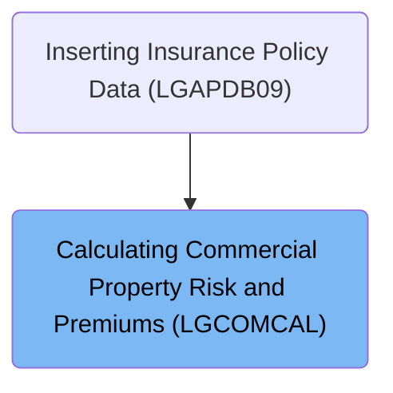
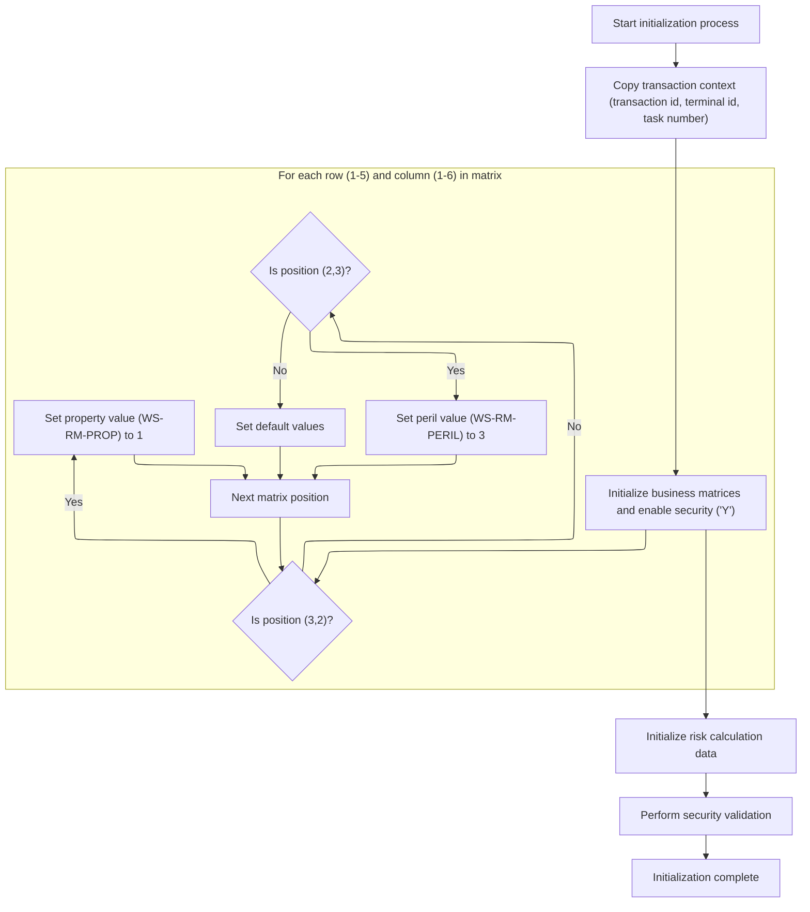
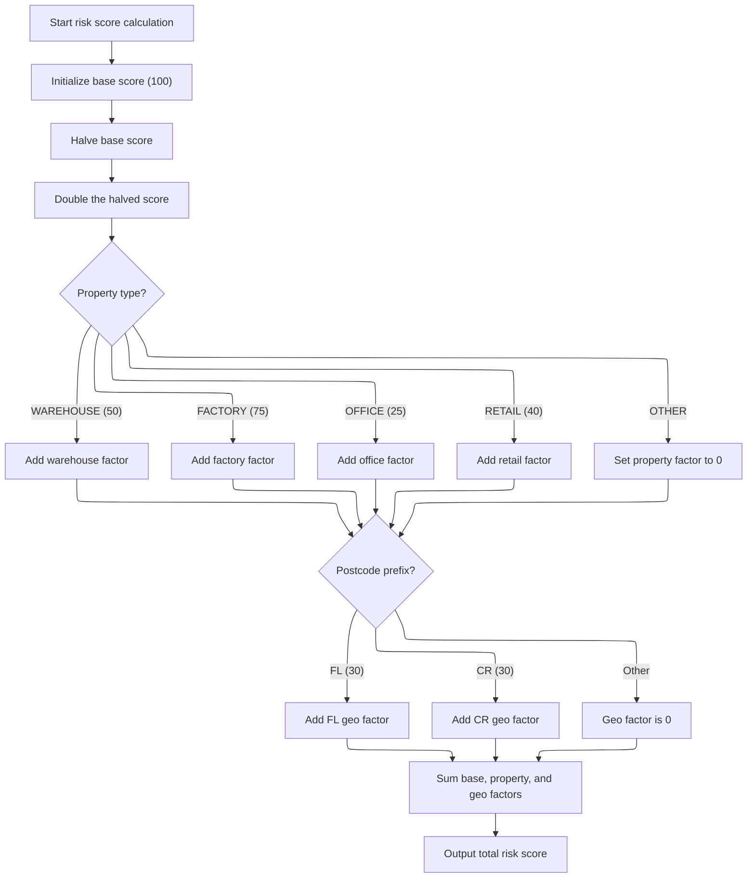

# Overview

This document describes the flow for calculating risk scores and premiums for commercial property insurance policies. The process prepares the session context, evaluates risk based on property type and location, and determines the premium amount for the policy.

## Dependencies

### Program

- LGCOMCAL (<SwmPath>[base/src/lgcomcal.cbl](base/src/lgcomcal.cbl)</SwmPath>)

### Copybook

- LGCOMDAT (<SwmPath>[base/src/lgcomdat.cpy](base/src/lgcomdat.cpy)</SwmPath>)

# Where is this program used?

This program is used once, as represented in the following diagram:



## Detailed View of the Program's Functionality

## a. Program Startup and Main Flow

The program begins execution in the main section, which is responsible for orchestrating the overall flow. The main actions are:

- It first calls the initialization routine to set up the environment and prepare all necessary context and mappings.
- Next, it executes the core business logic, which includes risk scoring, policy status determination, and premium calculation.
- Finally, it performs cleanup and prepares the output before ending the session.

## b. Initialization and Session Preparation

During initialization, the following steps are performed:

- The program header is reset to its default state.
- Transaction context information (such as transaction ID, terminal ID, and task number) is copied from the environment into working storage for reference throughout the session.
- The matrix initialization routine is called to set up security and risk mapping flags.
- Risk calculation storage is reset to ensure no residual data from previous runs.
- Security validation is performed, setting flags to indicate that security checks have passed and initializing security-related indices.

## c. Matrix and Risk Mapping Setup

The matrix initialization routine performs the following:

- Security is explicitly enabled for the session.
- The program iterates over a 5-row by 6-column grid (representing a logical matrix).
- For each position in the grid:
  - If the position is at row 3, column 2, a property flag is set to a specific value (1).
  - If the position is at row 2, column 3, a peril flag is set to a specific value (3).
  - All other positions are left with their default values.
- This selective flag setting is used to enable or highlight specific risk/property mappings for later calculations.

## d. Security Validation

After matrix setup, the program:

- Marks security checks as passed.
- Sets additional flags to indicate that certain system checks are enabled.
- Initializes several security index values, which may be used for further validation or mapping during processing.

## e. Business Logic Processing

The business logic section is responsible for the main calculations and consists of three main steps:

1. **Risk Score Calculation**: Computes the risk score for the property based on its type and location.
2. **Policy Status Determination**: Classifies the policy as low, medium, or high risk based on the calculated risk score.
3. **Premium Calculation**: Calculates the insurance premiums for various perils (fire, crime, flood, weather) using the risk score and input factors.

## f. Risk Score Calculation

The risk score calculation proceeds as follows:

- The base score is initialized to a fixed value (100). It is divided by 2 and then multiplied by 2, effectively keeping it at 100 but possibly ensuring integer arithmetic.
- The property factor is reset to zero.
- The property type is checked:
  - If it matches known types (warehouse, factory, office, retail), a corresponding factor is added to the property factor.
  - If the type is unrecognized, the property factor remains zero.
- The geographic factor is reset to zero.
- The postcode prefix is checked:
  - If it starts with 'FL' or 'CR', a corresponding geographic factor is added (30 in both cases).
  - Otherwise, the geographic factor remains zero.
- The total risk score is calculated as the sum of the base value, property factor, and geographic factor.
- This total risk score is stored for use in subsequent steps.

## g. Policy Status Determination

After the risk score is calculated:

- The policy status is initialized to zero (lowest risk).
- Threshold values for medium and high risk are loaded.
- If the risk score exceeds the high threshold, the policy is marked as high risk, and a message is set indicating manual review is required.
- If the risk score exceeds the medium threshold but not the high threshold, the policy is marked as medium risk, and a message is set indicating pending review.
- Otherwise, the policy remains low risk, and no message is set.
- The final risk score, status, and reason are stored for output.

## h. Premium Calculation

Premiums are calculated as follows:

- The discount factor is initialized to <SwmToken path="base/src/lgcomcal.cbl" pos="126:15:17" line-data="           03 WS-SA-MULT               PIC V99 VALUE 1.00.">`1.00`</SwmToken> (no discount).
- Base premium factors for each peril (fire, crime, flood, weather) are loaded.
- If all peril factors from the input are positive, the discount factor is updated, and the discount percentage is stored.
- For each peril:
  - If the corresponding input factor is positive, the premium is calculated as the product of the risk score, the peril factor, the input factor, and the discount.
  - If the input factor is zero or negative, the premium is set to zero.
- The total premium is calculated as the sum of all individual peril premiums.

## i. Cleanup and Output Preparation

In the final step:

- The calculated risk score, policy status, reason message, and all peril premiums are copied into the output fields.
- The program signals completion and returns control to the calling environment.

---

This detailed breakdown covers the actions performed by the code in the order they occur, focusing on the flow and logic rather than language-specific details.

# Rule Definition

| Paragraph Name                                                                                                                          | Rule ID | Category          | Description                                                                                             | Conditions                                           | Remarks                                                                                    |
| --------------------------------------------------------------------------------------------------------------------------------------- | ------- | ----------------- | ------------------------------------------------------------------------------------------------------- | ---------------------------------------------------- | ------------------------------------------------------------------------------------------ |
| <SwmToken path="base/src/lgcomcal.cbl" pos="269:3:7" line-data="           PERFORM PROCESS-RISK-SCORE.">`PROCESS-RISK-SCORE`</SwmToken> | RL-001  | Data Assignment   | At the start of each calculation session, the base risk score is set to 100.                            | Always at the beginning of a calculation session.    | The base risk score is always 100. The value is a number (integer).                        |
| <SwmToken path="base/src/lgcomcal.cbl" pos="269:3:7" line-data="           PERFORM PROCESS-RISK-SCORE.">`PROCESS-RISK-SCORE`</SwmToken> | RL-002  | Computation       | The base risk score is divided by 2 and then multiplied by 2, resulting in the original value (100).    | Always after initializing the base risk score.       | This operation does not change the value; it remains 100. The value is a number (integer). |
| <SwmToken path="base/src/lgcomcal.cbl" pos="269:3:7" line-data="           PERFORM PROCESS-RISK-SCORE.">`PROCESS-RISK-SCORE`</SwmToken> | RL-003  | Conditional Logic | A property factor is added based on the property type input. Only specific types have non-zero factors. | When a property type is provided in the input field. | Property types and factors:                                                                |

- 'WAREHOUSE': 50
- 'FACTORY': 75
- 'OFFICE': 25
- 'RETAIL': 40
- Any other value: 0 The property factor is a number (integer). | | <SwmToken path="base/src/lgcomcal.cbl" pos="269:3:7" line-data="           PERFORM PROCESS-RISK-SCORE.">`PROCESS-RISK-SCORE`</SwmToken> | RL-004 | Conditional Logic | A geographic factor is added if the postcode starts with certain prefixes. | When a postcode is provided in the input field. | Postcode prefixes and factors:
- Starts with 'FL': 30
- Starts with 'CR': 30
- Any other prefix: 0 The geographic factor is a number (integer). | | <SwmToken path="base/src/lgcomcal.cbl" pos="269:3:7" line-data="           PERFORM PROCESS-RISK-SCORE.">`PROCESS-RISK-SCORE`</SwmToken> | RL-005 | Computation | The total risk score is computed by summing the base score, property factor, and geographic factor. | After base score, property factor, and geographic factor have been determined. | The total risk score is a number (integer). | | <SwmToken path="base/src/lgcomcal.cbl" pos="269:3:7" line-data="           PERFORM PROCESS-RISK-SCORE.">`PROCESS-RISK-SCORE`</SwmToken> | RL-006 | Data Assignment | The calculated risk score is stored in an internal variable for later use. | After the total risk score is calculated. | The risk score is stored as a number (integer). | | <SwmToken path="base/src/lgcomcal.cbl" pos="210:3:7" line-data="           PERFORM CLEANUP-AND-EXIT.">`CLEANUP-AND-EXIT`</SwmToken> | RL-007 | Data Assignment | At the end of the session, the calculated risk score is copied to the output field for external use. | At the end of the calculation session. | The output field contains the final calculated risk score as a number (integer). |

# User Stories

## User Story 1: Initialize base risk score

---

### Story Description:

As a system, I want to initialize the base risk score to 100 at the start of each calculation session so that all risk calculations begin from a consistent starting point.

---

### Business Rule Mapping:

| Rule ID | Paragraph Name                                                                                                                          | Rule Description                                                                                     |
| ------- | --------------------------------------------------------------------------------------------------------------------------------------- | ---------------------------------------------------------------------------------------------------- |
| RL-001  | <SwmToken path="base/src/lgcomcal.cbl" pos="269:3:7" line-data="           PERFORM PROCESS-RISK-SCORE.">`PROCESS-RISK-SCORE`</SwmToken> | At the start of each calculation session, the base risk score is set to 100.                         |
| RL-002  | <SwmToken path="base/src/lgcomcal.cbl" pos="269:3:7" line-data="           PERFORM PROCESS-RISK-SCORE.">`PROCESS-RISK-SCORE`</SwmToken> | The base risk score is divided by 2 and then multiplied by 2, resulting in the original value (100). |

---

### Relevant Functionality:

- <SwmToken path="base/src/lgcomcal.cbl" pos="269:3:7" line-data="           PERFORM PROCESS-RISK-SCORE.">`PROCESS-RISK-SCORE`</SwmToken>
  1. **RL-001:**
     - Set the base risk score to 100 at the start of the calculation.
  2. **RL-002:**
     - Divide the base risk score by 2.
     - Multiply the result by 2.
     - The final base value remains 100.

## User Story 2: Apply property and geographic factors

---

### Story Description:

As a user, I want the system to adjust the risk score based on the property type and postcode I provide so that the calculated risk score accurately reflects the characteristics of my property and its location.

---

### Business Rule Mapping:

| Rule ID | Paragraph Name                                                                                                                          | Rule Description                                                                                        |
| ------- | --------------------------------------------------------------------------------------------------------------------------------------- | ------------------------------------------------------------------------------------------------------- |
| RL-003  | <SwmToken path="base/src/lgcomcal.cbl" pos="269:3:7" line-data="           PERFORM PROCESS-RISK-SCORE.">`PROCESS-RISK-SCORE`</SwmToken> | A property factor is added based on the property type input. Only specific types have non-zero factors. |
| RL-004  | <SwmToken path="base/src/lgcomcal.cbl" pos="269:3:7" line-data="           PERFORM PROCESS-RISK-SCORE.">`PROCESS-RISK-SCORE`</SwmToken> | A geographic factor is added if the postcode starts with certain prefixes.                              |

---

### Relevant Functionality:

- <SwmToken path="base/src/lgcomcal.cbl" pos="269:3:7" line-data="           PERFORM PROCESS-RISK-SCORE.">`PROCESS-RISK-SCORE`</SwmToken>
  1. **RL-003:**
     - Read the property type from input.
     - If property type is 'WAREHOUSE', add 50 to the property factor.
     - If property type is 'FACTORY', add 75 to the property factor.
     - If property type is 'OFFICE', add 25 to the property factor.
     - If property type is 'RETAIL', add 40 to the property factor.
     - For any other value, set the property factor to 0.
  2. **RL-004:**
     - Read the postcode from input.
     - If postcode starts with 'FL', add 30 to the geographic factor.
     - If postcode starts with 'CR', add 30 to the geographic factor.
     - For any other prefix, set the geographic factor to 0.

## User Story 3: Calculate, store, and output the total risk score

---

### Story Description:

As a user, I want the system to compute the total risk score, store it internally, and provide the final result in the output field so that I can see the risk assessment for my property.

---

### Business Rule Mapping:

| Rule ID | Paragraph Name                                                                                                                          | Rule Description                                                                                     |
| ------- | --------------------------------------------------------------------------------------------------------------------------------------- | ---------------------------------------------------------------------------------------------------- |
| RL-005  | <SwmToken path="base/src/lgcomcal.cbl" pos="269:3:7" line-data="           PERFORM PROCESS-RISK-SCORE.">`PROCESS-RISK-SCORE`</SwmToken> | The total risk score is computed by summing the base score, property factor, and geographic factor.  |
| RL-006  | <SwmToken path="base/src/lgcomcal.cbl" pos="269:3:7" line-data="           PERFORM PROCESS-RISK-SCORE.">`PROCESS-RISK-SCORE`</SwmToken> | The calculated risk score is stored in an internal variable for later use.                           |
| RL-007  | <SwmToken path="base/src/lgcomcal.cbl" pos="210:3:7" line-data="           PERFORM CLEANUP-AND-EXIT.">`CLEANUP-AND-EXIT`</SwmToken>     | At the end of the session, the calculated risk score is copied to the output field for external use. |

---

### Relevant Functionality:

- <SwmToken path="base/src/lgcomcal.cbl" pos="269:3:7" line-data="           PERFORM PROCESS-RISK-SCORE.">`PROCESS-RISK-SCORE`</SwmToken>
  1. **RL-005:**
     - Add base score, property factor, and geographic factor to get the total risk score.
  2. **RL-006:**
     - Store the calculated risk score in an internal variable for use in subsequent logic.
- <SwmToken path="base/src/lgcomcal.cbl" pos="210:3:7" line-data="           PERFORM CLEANUP-AND-EXIT.">`CLEANUP-AND-EXIT`</SwmToken>
  1. **RL-007:**
     - Copy the internal risk score to the output field for output.

# Workflow

# Starting the Calculation Session

This section initiates the calculation session, ensuring the environment is properly set up and all prerequisites are met before business logic is processed.

<SwmSnippet path="/base/src/lgcomcal.cbl" line="206">

---

MAINLINE starts the flow, sets up the environment, then moves on to business logic and cleanup. <SwmToken path="base/src/lgcomcal.cbl" pos="208:3:5" line-data="           PERFORM INITIALIZE-PROCESSING.">`INITIALIZE-PROCESSING`</SwmToken> is called first to make sure all context and mappings are ready for the rest of the process.

```cobol
       MAINLINE SECTION.
           
           PERFORM INITIALIZE-PROCESSING.
           PERFORM PROCESS-BUSINESS-LOGIC.
           PERFORM CLEANUP-AND-EXIT.
```

---

</SwmSnippet>

# Preparing Session and Risk Mappings



This section ensures that each transaction session is properly initialized with the required context and that risk/property mappings are set up according to business rules. It prepares the system for subsequent risk calculations and enforces security validation.

| Category        | Rule Name                      | Description                                                                                                                                         |
| --------------- | ------------------------------ | --------------------------------------------------------------------------------------------------------------------------------------------------- |
| Data validation | Session context initialization | The transaction context must be copied from the incoming transaction to the session header, including transaction id, terminal id, and task number. |
| Data validation | Default matrix initialization  | All other positions in the risk/property matrix must be initialized with default values (typically zero or unset).                                  |
| Data validation | Security validation            | Security validation must be performed after initialization to confirm that the session is compliant and ready for further processing.               |
| Business logic  | Security enablement            | Security must be enabled for every session initialization by setting the security enabled flag to 'Y'.                                              |
| Business logic  | Property flag mapping          | For the risk/property matrix, the property flag must be set to 1 only at position (row 3, column 2).                                                |
| Business logic  | Peril flag mapping             | For the risk/property matrix, the peril flag must be set to 3 only at position (row 2, column 3).                                                   |
| Business logic  | Risk calculation preparation   | Risk calculation storage must be initialized before any risk calculations are performed.                                                            |

<SwmSnippet path="/base/src/lgcomcal.cbl" line="217">

---

<SwmToken path="base/src/lgcomcal.cbl" pos="217:1:3" line-data="       INITIALIZE-PROCESSING.">`INITIALIZE-PROCESSING`</SwmToken> copies transaction context and sets up the session, then calls <SwmToken path="base/src/lgcomcal.cbl" pos="223:3:5" line-data="           PERFORM INITIALIZE-MATRICES.">`INITIALIZE-MATRICES`</SwmToken> to enable security and set risk/property flags for later calculations.

```cobol
       INITIALIZE-PROCESSING.
           INITIALIZE WS-HEADER.
           MOVE EIBTRNID TO WS-TRANSID.
           MOVE EIBTRMID TO WS-TERMID.
           MOVE EIBTASKN TO WS-TASKNUM.
           
           PERFORM INITIALIZE-MATRICES.
```

---

</SwmSnippet>

<SwmSnippet path="/base/src/lgcomcal.cbl" line="233">

---

<SwmToken path="base/src/lgcomcal.cbl" pos="233:1:3" line-data="       INITIALIZE-MATRICES.">`INITIALIZE-MATRICES`</SwmToken> sets the security enabled flag, then loops through a 5x6 grid. It only sets <SwmToken path="base/src/lgcomcal.cbl" pos="243:7:11" line-data="                      MOVE 1 TO WS-RM-PROP">`WS-RM-PROP`</SwmToken> and <SwmToken path="base/src/lgcomcal.cbl" pos="246:7:11" line-data="                      MOVE 3 TO WS-RM-PERIL">`WS-RM-PERIL`</SwmToken> at specific indices (3,2 and 2,3) using fixed values, so it's not a full matrix init—just enabling domain-specific flags for risk mapping.

```cobol
       INITIALIZE-MATRICES.
           MOVE 'Y' TO WS-SEC-ENABLED.
           MOVE 1 TO WS-SUB-1.
           
           PERFORM VARYING WS-SUB-1 FROM 1 BY 1 
             UNTIL WS-SUB-1 > 5
               MOVE 0 TO WS-SUB-2
               PERFORM VARYING WS-SUB-2 FROM 1 BY 1 
                 UNTIL WS-SUB-2 > 6
                   IF WS-SUB-1 = 3 AND WS-SUB-2 = 2
                      MOVE 1 TO WS-RM-PROP
                   END-IF
                   IF WS-SUB-1 = 2 AND WS-SUB-2 = 3
                      MOVE 3 TO WS-RM-PERIL
                   END-IF
               END-PERFORM
           END-PERFORM.
           
           EXIT.
```

---

</SwmSnippet>

<SwmSnippet path="/base/src/lgcomcal.cbl" line="225">

---

After <SwmToken path="base/src/lgcomcal.cbl" pos="223:3:5" line-data="           PERFORM INITIALIZE-MATRICES.">`INITIALIZE-MATRICES`</SwmToken> sets up the flags, <SwmToken path="base/src/lgcomcal.cbl" pos="208:3:5" line-data="           PERFORM INITIALIZE-PROCESSING.">`INITIALIZE-PROCESSING`</SwmToken> wraps up by prepping risk calculation storage and validating security, making sure everything's ready for business logic.

```cobol
           INITIALIZE WS-RISK-CALC.
           
           PERFORM INIT-SECURITY-VALIDATION.
           
           EXIT.
```

---

</SwmSnippet>

# Running Risk and Premium Calculations

This section is responsible for evaluating the risk associated with a property, classifying the insurance policy, and calculating the premium amount to be charged. These calculations are foundational for determining the terms and cost of insurance coverage.

| Category        | Rule Name                      | Description                                                                                                                                                                    |
| --------------- | ------------------------------ | ------------------------------------------------------------------------------------------------------------------------------------------------------------------------------ |
| Data validation | Mandatory risk assessment      | A risk score must be calculated for every property before any policy classification or premium calculation is performed.                                                       |
| Business logic  | Policy status classification   | The policy status must be determined based on the property's risk score and other relevant policy data.                                                                        |
| Business logic  | Risk-based premium calculation | Premiums must be calculated using the risk score and policy status, ensuring that higher risk properties are charged higher premiums according to the company's pricing model. |

<SwmSnippet path="/base/src/lgcomcal.cbl" line="268">

---

<SwmToken path="base/src/lgcomcal.cbl" pos="268:1:5" line-data="       PROCESS-BUSINESS-LOGIC.">`PROCESS-BUSINESS-LOGIC`</SwmToken> starts by calling <SwmToken path="base/src/lgcomcal.cbl" pos="269:3:7" line-data="           PERFORM PROCESS-RISK-SCORE.">`PROCESS-RISK-SCORE`</SwmToken> to get the property's risk score. This score is needed before we can classify the policy or calculate premiums, so it's always the first step in the business logic.

```cobol
       PROCESS-BUSINESS-LOGIC.
           PERFORM PROCESS-RISK-SCORE.
           PERFORM DETERMINE-POLICY-STATUS.
           PERFORM CALCULATE-PREMIUMS.
           
           EXIT.
```

---

</SwmSnippet>

# Calculating Property Risk Score



This section calculates a risk score for a property based on its type and location. The score is used to assess risk and determine insurance pricing.

| Category       | Rule Name                    | Description                                                                                                                                                |
| -------------- | ---------------------------- | ---------------------------------------------------------------------------------------------------------------------------------------------------------- |
| Business logic | Base score constant          | The base risk score for every property calculation is set to 100, regardless of input.                                                                     |
| Business logic | Property type factor mapping | The property type factor is added to the risk score according to the following mapping: WAREHOUSE = 50, FACTORY = 75, OFFICE = 25, RETAIL = 40, OTHER = 0. |
| Business logic | Geographic factor mapping    | A geographic factor of 30 is added to the risk score if the postcode prefix is 'FL' or 'CR'; otherwise, the geographic factor is 0.                        |
| Business logic | Total risk score calculation | The total risk score is calculated as the sum of the base score, property type factor, and geographic factor.                                              |

<SwmSnippet path="/base/src/lgcomcal.cbl" line="277">

---

In <SwmToken path="base/src/lgcomcal.cbl" pos="277:1:5" line-data="       PROCESS-RISK-SCORE.">`PROCESS-RISK-SCORE`</SwmToken>, we start by setting up the base score (kept at 100 using a divide/multiply trick), then prep the property factor and set up some reference values for the risk matrix. This sets the stage for the next steps where we add property and geographic factors.

```cobol
       PROCESS-RISK-SCORE.
           MOVE WS-TM-BASE TO WS-TEMP-SCORE.
           DIVIDE 2 INTO WS-TEMP-SCORE GIVING WS-SUB-1.
           MULTIPLY 2 BY WS-SUB-1 GIVING WS-RC-BASE-VAL.
           
           MOVE 0 TO WS-RC-PROP-FACT.
           
           MOVE 'COMMERCIAL' TO RMS-TYPE
           MOVE '1.0.5' TO RMS-VERSION
```

---

</SwmSnippet>

<SwmSnippet path="/base/src/lgcomcal.cbl" line="287">

---

This part checks the property type and adds the corresponding factor to the risk score. If the type isn't recognized, it just sets the property factor to zero, so the risk score could be off if the input is bad.

```cobol
           EVALUATE CA-XPROPTYPE
               WHEN 'WAREHOUSE'
                   MOVE RMS-PF-W-VAL TO RMS-PF-WAREHOUSE
                   COMPUTE WS-TEMP-CALC = RMS-PF-WAREHOUSE
                   ADD WS-TEMP-CALC TO WS-RC-PROP-FACT
               WHEN 'FACTORY'
                   MOVE RMS-PF-F-VAL TO RMS-PF-FACTORY
                   COMPUTE WS-TEMP-CALC = RMS-PF-FACTORY
                   ADD WS-TEMP-CALC TO WS-RC-PROP-FACT
               WHEN 'OFFICE'
                   MOVE RMS-PF-O-VAL TO RMS-PF-OFFICE
                   COMPUTE WS-TEMP-CALC = RMS-PF-OFFICE
                   ADD WS-TEMP-CALC TO WS-RC-PROP-FACT
               WHEN 'RETAIL'
                   MOVE RMS-PF-R-VAL TO RMS-PF-RETAIL
                   COMPUTE WS-TEMP-CALC = RMS-PF-RETAIL
                   ADD WS-TEMP-CALC TO WS-RC-PROP-FACT
               WHEN OTHER
                   MOVE 0 TO WS-RC-PROP-FACT
           END-EVALUATE.
```

---

</SwmSnippet>

<SwmSnippet path="/base/src/lgcomcal.cbl" line="308">

---

Here we set the geographic factor for the risk score. If the postcode starts with 'FL' or 'CR', we add 30; otherwise, it's left at zero. This feeds into the total risk score calculation next.

```cobol
           MOVE 0 TO WS-RC-GEO-FACT.
           
           MOVE RMS-GF-FL-VAL TO RMS-GF-FL
           MOVE RMS-GF-CR-VAL TO RMS-GF-CR
           
           IF CA-XPOSTCODE(1:2) = 'FL'
              MOVE RMS-GF-FL TO WS-RC-GEO-FACT
           ELSE
              IF CA-XPOSTCODE(1:2) = 'CR'
                 MOVE RMS-GF-CR TO WS-RC-GEO-FACT
              END-IF
```

---

</SwmSnippet>

<SwmSnippet path="/base/src/lgcomcal.cbl" line="319">

---

Finally, <SwmToken path="base/src/lgcomcal.cbl" pos="269:3:7" line-data="           PERFORM PROCESS-RISK-SCORE.">`PROCESS-RISK-SCORE`</SwmToken> sums up the base, property, and geographic factors, then stores the total risk score in <SwmToken path="base/src/lgcomcal.cbl" pos="324:11:15" line-data="           MOVE WS-RC-TOTAL TO WS-SA-RISK.">`WS-SA-RISK`</SwmToken> for use in later steps. If the inputs are off, the score could be wrong, but there's no error handling here.

```cobol
           END-IF.
           
           COMPUTE WS-RC-TOTAL = 
              WS-RC-BASE-VAL + WS-RC-PROP-FACT + WS-RC-GEO-FACT.
              
           MOVE WS-RC-TOTAL TO WS-SA-RISK.
           
           EXIT.
```

---

</SwmSnippet>

&nbsp;

*This is an auto-generated document by Swimm 🌊 and has not yet been verified by a human*

<SwmMeta version="3.0.0" repo-id="Z2l0aHViJTNBJTNBU3dpbW1pby1nZW5hcHAtaG91c2UlM0ElM0FHaXJpLVN3aW1t" repo-name="Swimmio-genapp-house"><sup>Powered by [Swimm](https://app.swimm.io/)</sup></SwmMeta>
