# Overview

This document describes the flow for processing insurance policy records, validating data, and calculating premiums for commercial property policies. The process applies actuarial logic to determine premiums and approval status, while maintaining summary statistics for reporting.

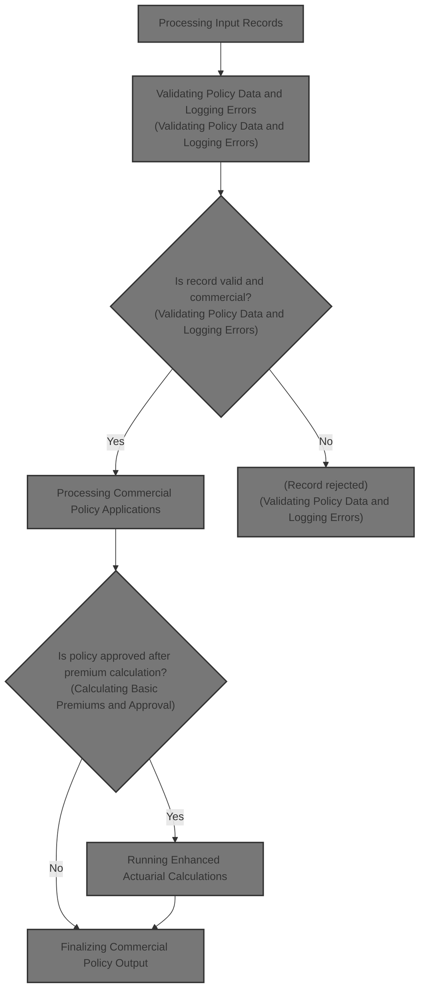

## Dependencies

### Programs

- <SwmToken path="base/src/LGAPDB01.cbl" pos="2:6:6" line-data="       PROGRAM-ID. LGAPDB01.">`LGAPDB01`</SwmToken> (<SwmPath>[base/src/LGAPDB01.cbl](base/src/LGAPDB01.cbl)</SwmPath>)
- <SwmToken path="base/src/LGAPDB01.cbl" pos="269:4:4" line-data="           CALL &#39;LGAPDB02&#39; USING IN-PROPERTY-TYPE, IN-POSTCODE, ">`LGAPDB02`</SwmToken>
- <SwmToken path="base/src/LGAPDB01.cbl" pos="276:4:4" line-data="           CALL &#39;LGAPDB03&#39; USING WS-BASE-RISK-SCR, IN-FIRE-PERIL, ">`LGAPDB03`</SwmToken> (<SwmPath>[base/src/LGAPDB03.cbl](base/src/LGAPDB03.cbl)</SwmPath>)
- <SwmToken path="base/src/LGAPDB01.cbl" pos="313:4:4" line-data="               CALL &#39;LGAPDB04&#39; USING LK-INPUT-DATA, LK-COVERAGE-DATA, ">`LGAPDB04`</SwmToken> (<SwmPath>[base/src/LGAPDB04.cbl](base/src/LGAPDB04.cbl)</SwmPath>)

### Copybooks

- SQLCA
- <SwmToken path="base/src/LGAPDB01.cbl" pos="35:3:3" line-data="           COPY INPUTREC2.">`INPUTREC2`</SwmToken> (<SwmPath>[base/src/INPUTREC2.cpy](base/src/INPUTREC2.cpy)</SwmPath>)
- OUTPUTREC (<SwmPath>[base/src/OUTPUTREC.cpy](base/src/OUTPUTREC.cpy)</SwmPath>)
- WORKSTOR (<SwmPath>[base/src/WORKSTOR.cpy](base/src/WORKSTOR.cpy)</SwmPath>)
- LGAPACT (<SwmPath>[base/src/LGAPACT.cpy](base/src/LGAPACT.cpy)</SwmPath>)

# Where is this program used?

This program is used multiple times in the codebase as represented in the following diagram:

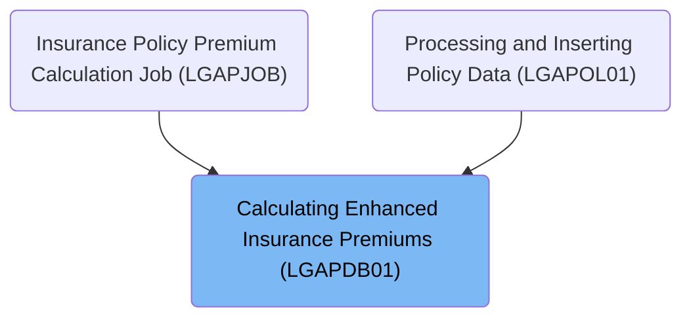

## Input and Output Tables/Files used in the Program

| Table / File Name                                                                                                                                        | Type | Description                                  | Usage Mode | Key Fields / Layout Highlights           |
| -------------------------------------------------------------------------------------------------------------------------------------------------------- | ---- | -------------------------------------------- | ---------- | ---------------------------------------- |
| <SwmToken path="base/src/LGAPDB01.cbl" pos="113:5:7" line-data="           OPEN INPUT CONFIG-FILE">`CONFIG-FILE`</SwmToken>                              | DB2  | System config parameters and thresholds      | Input      | Database table with relational structure |
| <SwmToken path="base/src/LGAPDB01.cbl" pos="9:3:5" line-data="           SELECT INPUT-FILE ASSIGN TO &#39;INPUT.DAT&#39;">`INPUT-FILE`</SwmToken>        | DB2  | Policy application and property details      | Input      | Database table with relational structure |
| <SwmToken path="base/src/LGAPDB01.cbl" pos="13:3:5" line-data="           SELECT OUTPUT-FILE ASSIGN TO &#39;OUTPUT.DAT&#39;">`OUTPUT-FILE`</SwmToken>    | DB2  | Calculated premiums and underwriting results | Output     | Database table with relational structure |
| <SwmToken path="base/src/LGAPDB01.cbl" pos="255:3:5" line-data="           WRITE OUTPUT-RECORD">`OUTPUT-RECORD`</SwmToken>                               | DB2  | Single policy premium calculation result     | Output     | Database table with relational structure |
| <SwmToken path="base/src/LGAPDB01.cbl" pos="27:3:5" line-data="           SELECT SUMMARY-FILE ASSIGN TO &#39;SUMMARY.DAT&#39;">`SUMMARY-FILE`</SwmToken> | DB2  | Summary statistics for processed policies    | Output     | Database table with relational structure |
| <SwmToken path="base/src/LGAPDB01.cbl" pos="64:3:5" line-data="       01  SUMMARY-RECORD             PIC X(132).">`SUMMARY-RECORD`</SwmToken>            | DB2  | Summary line for batch processing statistics | Output     | Database table with relational structure |

&nbsp;

## Detailed View of the Program's Functionality

# Main Flow of Premium Calculation (<SwmToken path="base/src/LGAPDB01.cbl" pos="2:6:6" line-data="       PROGRAM-ID. LGAPDB01.">`LGAPDB01`</SwmToken>)

## Initialization and Configuration

- The process begins by initializing all counters, data areas, and accepting the processing date.
- The configuration file is loaded. If unavailable, default values are used for key parameters such as maximum risk score and minimum premium. If available, these values are read from the file and stored for use in calculations.

## File Operations

- Input, output, and summary files are opened. Headers are written to the output file to label the columns for customer, property, risk score, premiums, status, and rejection reason.

## Record Processing Loop

- The program reads each input record in turn.
- For each record, it validates the policy data:
  - Checks if the policy type is supported (commercial, personal, farm).
  - Ensures a customer number is present.
  - Verifies that at least one coverage limit is provided.
  - Checks that total coverage does not exceed the maximum allowed insured value.
- Errors are logged for each failed validation, with details stored for later output.

## Handling Valid Records

- If the record passes validation and is a commercial policy:
  - The risk score is calculated using a dedicated program.
  - Basic premium calculation and underwriting decision are performed using another program, which also retrieves risk factors from a database.
  - If the policy is approved and the premium exceeds the minimum, advanced actuarial calculations are performed using a third program. This step uses detailed customer, property, coverage, and claims data.
  - If the advanced calculation yields a higher premium, all premium fields are updated with the new values.
  - Business rules are applied to finalize the underwriting decision (approved, pending, rejected) based on risk score and premium thresholds.
  - The output record is written, and statistics are updated (totals for premium, risk score, counts for approved/pending/rejected/high-risk).
- If the record is valid but not commercial, it is marked as unsupported, and an appropriate output record is written.

## Handling Error Records

- For records with validation errors, an output record is written with all premium fields set to zero, status marked as 'ERROR', and the rejection reason set to the first error message. The error counter is incremented.

## Finalization

- After all records are processed, files are closed.
- A summary file is generated, reporting totals for processed records, approved/pending/rejected policies, total premium, and average risk score.
- Statistics are displayed on the console, including counts for processed, approved, pending, rejected, error, high-risk records, and total premium generated.

# Advanced Actuarial Premium Calculation (<SwmToken path="base/src/LGAPDB01.cbl" pos="313:4:4" line-data="               CALL &#39;LGAPDB04&#39; USING LK-INPUT-DATA, LK-COVERAGE-DATA, ">`LGAPDB04`</SwmToken>)

## Initialization and Exposure Calculation

- All calculation work areas and rate tables are initialized.
- Building, contents, and business interruption exposures are calculated by multiplying each coverage limit by a risk-adjusted factor based on the risk score.
- Total insured value is computed as the sum of these exposures.
- Exposure density is calculated as total insured value divided by square footage, defaulting to 100 if square footage is zero.

## Rate Table Loading

- Base rates for each peril (fire, crime, flood, weather) are loaded from the database using the territory, construction type, occupancy code, and peril code. If the database query fails, default rates are used.

## Experience Modifier Calculation

- The experience modifier is set based on years in business and claims history:
  - If the business has at least 5 years and no claims, a lower modifier is used.
  - If there are claims, the modifier is calculated based on claims amount, total insured value, and a credibility factor, capped between 0.5 and 2.0.
  - For businesses with less than 5 years, a higher modifier is used.

## Schedule Modifier Calculation

- The schedule modifier is adjusted based on building age, protection class, occupancy code, and exposure density:
  - Newer buildings and better protection classes reduce the modifier.
  - Older buildings, higher hazard occupancies, and high exposure density increase the modifier.
  - The modifier is clamped between -0.2 and +0.4.

## Base Premium Calculation

- Premiums for each peril are calculated if coverage is selected:
  - Fire premium uses building and contents exposures, base rate, experience and schedule modifiers, and a trend factor.
  - Crime premium uses contents exposure, a multiplier, base rate, experience and schedule modifiers, and a trend factor.
  - Flood premium uses building exposure, base rate, experience and schedule modifiers, trend factor, and a flood multiplier.
  - Weather premium uses building and contents exposures, base rate, experience and schedule modifiers, and a trend factor.
- All peril premiums are summed for the base amount.

## Catastrophe Loading

- Additional premium loading is calculated for hurricane, earthquake, tornado, and flood risks based on peril selection and corresponding factors.

## Expense and Profit Loading

- Expense loading is calculated as a percentage of the sum of base and catastrophe amounts.
- Profit loading is calculated as a percentage of the sum of base, catastrophe, and expense amounts.
- Both are added to the premium components.

## Discount Calculation

- Discounts are applied for multi-peril selection, claims-free history, and high deductibles:
  - <SwmToken path="base/src/LGAPDB04.cbl" pos="410:3:5" line-data="      * Multi-peril discount">`Multi-peril`</SwmToken> discount is higher if all perils are selected, lower for partial combinations.
  - <SwmToken path="base/src/LGAPDB04.cbl" pos="425:3:5" line-data="      * Claims-free discount  ">`Claims-free`</SwmToken> discount applies for businesses with no claims and at least 5 years in business.
  - Deductible credits are added for high deductibles in fire, wind, and flood.
- The total discount is capped at 0.25.
- The discount amount is calculated as a percentage of the sum of base, catastrophe, expense, and profit components.

## Tax Calculation

- Tax is calculated as a percentage of the sum of base, catastrophe, expense, and profit components minus the discount.

## Final Premium and Rate Factor

- The total premium is the sum of all components minus the discount plus tax.
- The final rate factor is calculated as total premium divided by total insured value.
- If the rate factor exceeds 0.05, it is capped and the premium is recalculated.

# Basic Premium Calculation and Risk Factor Retrieval (<SwmToken path="base/src/LGAPDB01.cbl" pos="276:4:4" line-data="           CALL &#39;LGAPDB03&#39; USING WS-BASE-RISK-SCR, IN-FIRE-PERIL, ">`LGAPDB03`</SwmToken>)

## Risk Factor Retrieval

- Risk factors for fire and crime are retrieved from the database. If unavailable, default values are used.

## Underwriting Decision

- The risk score is evaluated:
  - Above 200: rejected.
  - 151-200: pending.
  - 150 or below: approved.
- The decision status and reason are set accordingly.

## Premium Calculation

- A discount factor is set (<SwmToken path="base/src/LGAPDB03.cbl" pos="17:15:17" line-data="       01  WS-WEATHER-FACTOR           PIC V99 VALUE 0.90.">`0.90`</SwmToken> for all perils selected, otherwise <SwmToken path="base/src/LGAPDB03.cbl" pos="93:3:5" line-data="           MOVE 1.00 TO LK-DISC-FACT">`1.00`</SwmToken>).
- Premiums for each peril are calculated by multiplying risk score, risk factor, peril selection, and discount factor.
- The total premium is the sum of all peril premiums.

# Summary

- The system processes each input record, validates data, calculates risk and premiums using both basic and advanced actuarial logic, applies business rules, writes output, and updates statistics.
- Advanced actuarial calculations use detailed exposure, rate, modifier, and discount logic to produce a more accurate premium.
- All results are summarized and reported for further analysis.

# Data Definitions

| Table / Record Name                                                                                                                                      | Type | Short Description                            | Usage Mode |
| -------------------------------------------------------------------------------------------------------------------------------------------------------- | ---- | -------------------------------------------- | ---------- |
| <SwmToken path="base/src/LGAPDB01.cbl" pos="113:5:7" line-data="           OPEN INPUT CONFIG-FILE">`CONFIG-FILE`</SwmToken>                              | DB2  | System config parameters and thresholds      | Input      |
| <SwmToken path="base/src/LGAPDB01.cbl" pos="9:3:5" line-data="           SELECT INPUT-FILE ASSIGN TO &#39;INPUT.DAT&#39;">`INPUT-FILE`</SwmToken>        | DB2  | Policy application and property details      | Input      |
| <SwmToken path="base/src/LGAPDB01.cbl" pos="13:3:5" line-data="           SELECT OUTPUT-FILE ASSIGN TO &#39;OUTPUT.DAT&#39;">`OUTPUT-FILE`</SwmToken>    | DB2  | Calculated premiums and underwriting results | Output     |
| <SwmToken path="base/src/LGAPDB01.cbl" pos="255:3:5" line-data="           WRITE OUTPUT-RECORD">`OUTPUT-RECORD`</SwmToken>                               | DB2  | Single policy premium calculation result     | Output     |
| <SwmToken path="base/src/LGAPDB01.cbl" pos="27:3:5" line-data="           SELECT SUMMARY-FILE ASSIGN TO &#39;SUMMARY.DAT&#39;">`SUMMARY-FILE`</SwmToken> | DB2  | Summary statistics for processed policies    | Output     |
| <SwmToken path="base/src/LGAPDB01.cbl" pos="64:3:5" line-data="       01  SUMMARY-RECORD             PIC X(132).">`SUMMARY-RECORD`</SwmToken>            | DB2  | Summary line for batch processing statistics | Output     |

&nbsp;

# Rule Definition

| Paragraph Name                                                                                                                                                                                                                                                                                                                                                                                                                                                                                                                                                                                                                     | Rule ID | Category          | Description                                                                                                                                                                                                                              | Conditions                                                 | Remarks                                                                                                                                                                                                                                                                                                                                                                                                                                                                                                                                                                                                                                                                                                                                                                                                                                                                                                       |
| ---------------------------------------------------------------------------------------------------------------------------------------------------------------------------------------------------------------------------------------------------------------------------------------------------------------------------------------------------------------------------------------------------------------------------------------------------------------------------------------------------------------------------------------------------------------------------------------------------------------------------------- | ------- | ----------------- | ---------------------------------------------------------------------------------------------------------------------------------------------------------------------------------------------------------------------------------------- | ---------------------------------------------------------- | ------------------------------------------------------------------------------------------------------------------------------------------------------------------------------------------------------------------------------------------------------------------------------------------------------------------------------------------------------------------------------------------------------------------------------------------------------------------------------------------------------------------------------------------------------------------------------------------------------------------------------------------------------------------------------------------------------------------------------------------------------------------------------------------------------------------------------------------------------------------------------------------------------------- |
| <SwmToken path="base/src/LGAPDB01.cbl" pos="91:3:5" line-data="           PERFORM P002-INITIALIZE">`P002-INITIALIZE`</SwmToken>, <SwmToken path="base/src/LGAPDB01.cbl" pos="92:3:7" line-data="           PERFORM P003-LOAD-CONFIG">`P003-LOAD-CONFIG`</SwmToken>, <SwmToken path="base/src/LGAPDB01.cbl" pos="116:3:7" line-data="               PERFORM P004-SET-DEFAULTS">`P004-SET-DEFAULTS`</SwmToken>, <SwmToken path="base/src/LGAPDB01.cbl" pos="118:3:9" line-data="               PERFORM P004-READ-CONFIG-VALUES">`P004-READ-CONFIG-VALUES`</SwmToken>                                                                 | RL-001  | Data Assignment   | The program must initialize the environment and load configuration values before processing any input records. If configuration keys are missing or not numeric, default values are used.                                                | Before any input records are processed.                    | Default values: <SwmToken path="base/src/LGAPDB01.cbl" pos="126:4:4" line-data="           MOVE &#39;MAX_RISK_SCORE&#39; TO CONFIG-KEY">`MAX_RISK_SCORE`</SwmToken> = 250, <SwmToken path="base/src/LGAPDB01.cbl" pos="132:4:4" line-data="           MOVE &#39;MIN_PREMIUM&#39; TO CONFIG-KEY">`MIN_PREMIUM`</SwmToken> = <SwmToken path="base/src/LGAPDB04.cbl" pos="300:11:13" line-data="           IF WS-EXPOSURE-DENSITY &gt; 500.00">`500.00`</SwmToken>. Configuration keys are <SwmToken path="base/src/LGAPDB01.cbl" pos="126:4:4" line-data="           MOVE &#39;MAX_RISK_SCORE&#39; TO CONFIG-KEY">`MAX_RISK_SCORE`</SwmToken> and <SwmToken path="base/src/LGAPDB01.cbl" pos="132:4:4" line-data="           MOVE &#39;MIN_PREMIUM&#39; TO CONFIG-KEY">`MIN_PREMIUM`</SwmToken>.                                                                                                                |
| <SwmToken path="base/src/LGAPDB01.cbl" pos="93:3:7" line-data="           PERFORM P005-OPEN-FILES">`P005-OPEN-FILES`</SwmToken>, <SwmToken path="base/src/LGAPDB01.cbl" pos="139:3:7" line-data="           PERFORM P005A-OPEN-INPUT">`P005A-OPEN-INPUT`</SwmToken>, <SwmToken path="base/src/LGAPDB01.cbl" pos="140:3:7" line-data="           PERFORM P005B-OPEN-OUTPUT">`P005B-OPEN-OUTPUT`</SwmToken>, <SwmToken path="base/src/LGAPDB01.cbl" pos="141:3:7" line-data="           PERFORM P005C-OPEN-SUMMARY">`P005C-OPEN-SUMMARY`</SwmToken>                                                                                  | RL-002  | Data Assignment   | The program must open the input, output, summary, and rate files before processing records.                                                                                                                                              | Before processing any input records.                       | Files: <SwmToken path="base/src/LGAPDB01.cbl" pos="9:12:14" line-data="           SELECT INPUT-FILE ASSIGN TO &#39;INPUT.DAT&#39;">`INPUT.DAT`</SwmToken>, <SwmToken path="base/src/LGAPDB01.cbl" pos="13:12:14" line-data="           SELECT OUTPUT-FILE ASSIGN TO &#39;OUTPUT.DAT&#39;">`OUTPUT.DAT`</SwmToken>, <SwmToken path="base/src/LGAPDB01.cbl" pos="17:12:14" line-data="           SELECT CONFIG-FILE ASSIGN TO &#39;CONFIG.DAT&#39;">`CONFIG.DAT`</SwmToken>, <SwmToken path="base/src/LGAPDB01.cbl" pos="23:12:14" line-data="           SELECT RATE-FILE ASSIGN TO &#39;RATES.DAT&#39;">`RATES.DAT`</SwmToken>, <SwmToken path="base/src/LGAPDB01.cbl" pos="27:12:14" line-data="           SELECT SUMMARY-FILE ASSIGN TO &#39;SUMMARY.DAT&#39;">`SUMMARY.DAT`</SwmToken>.                                                                                                                     |
| <SwmToken path="base/src/LGAPDB01.cbl" pos="182:3:9" line-data="               PERFORM P008-VALIDATE-INPUT-RECORD">`P008-VALIDATE-INPUT-RECORD`</SwmToken>                                                                                                                                                                                                                                                                                                                                                                                                                                                                         | RL-003  | Conditional Logic | Each input record must be validated for policy type, customer number, and coverage limits. The sum of all coverage limits must not exceed the maximum TIV.                                                                               | For each input record.                                     | Policy type must be 'C', 'P', or 'F'. Customer number must not be blank. At least one coverage limit (building, contents, or BI) must be > 0. Max TIV = 50,000,000.00.                                                                                                                                                                                                                                                                                                                                                                                                                                                                                                                                                                                                                                                                                                                                        |
| <SwmToken path="base/src/LGAPDB01.cbl" pos="186:3:9" line-data="                   PERFORM P010-PROCESS-ERROR-RECORD">`P010-PROCESS-ERROR-RECORD`</SwmToken>                                                                                                                                                                                                                                                                                                                                                                                                                                                                       | RL-004  | Data Assignment   | If a record fails validation, log the error, set all premium fields to zero, set status to 'ERROR', and set the reject reason to the first error encountered.                                                                            | If validation fails for an input record.                   | Premium fields: fire, crime, flood, weather, total. Status: 'ERROR'. Reject reason: first error message.                                                                                                                                                                                                                                                                                                                                                                                                                                                                                                                                                                                                                                                                                                                                                                                                      |
| <SwmToken path="base/src/LGAPDB01.cbl" pos="239:3:9" line-data="               PERFORM P012-PROCESS-NON-COMMERCIAL">`P012-PROCESS-NON-COMMERCIAL`</SwmToken>                                                                                                                                                                                                                                                                                                                                                                                                                                                                       | RL-005  | Conditional Logic | For non-commercial policies, the program must reject the record and set status to 'UNSUPPORTED'.                                                                                                                                         | If policy type is not commercial.                          | Status: 'UNSUPPORTED'. Reject reason: 'Only Commercial policies supported in this version'.                                                                                                                                                                                                                                                                                                                                                                                                                                                                                                                                                                                                                                                                                                                                                                                                                   |
| <SwmToken path="base/src/LGAPDB01.cbl" pos="236:3:7" line-data="               PERFORM P011-PROCESS-COMMERCIAL">`P011-PROCESS-COMMERCIAL`</SwmToken>, <SwmToken path="base/src/LGAPDB01.cbl" pos="259:3:9" line-data="           PERFORM P011A-CALCULATE-RISK-SCORE">`P011A-CALCULATE-RISK-SCORE`</SwmToken>, <SwmToken path="base/src/LGAPDB01.cbl" pos="260:3:9" line-data="           PERFORM P011B-BASIC-PREMIUM-CALC">`P011B-BASIC-PREMIUM-CALC`</SwmToken>, <SwmToken path="base/src/LGAPDB01.cbl" pos="262:3:9" line-data="               PERFORM P011C-ENHANCED-ACTUARIAL-CALC">`P011C-ENHANCED-ACTUARIAL-CALC`</SwmToken> | RL-006  | Computation       | For commercial policies, calculate risk score and premiums using the rate file and configuration values. Risk factors for fire and crime are retrieved from the database, with defaults if unavailable.                                  | If policy type is commercial and record is valid.          | Fire risk factor default: <SwmToken path="base/src/LGAPDB03.cbl" pos="58:3:5" line-data="               MOVE 0.80 TO WS-FIRE-FACTOR">`0.80`</SwmToken>. Crime risk factor default: <SwmToken path="base/src/LGAPDB03.cbl" pos="70:3:5" line-data="               MOVE 0.60 TO WS-CRIME-FACTOR">`0.60`</SwmToken>. Calls <SwmToken path="base/src/LGAPDB01.cbl" pos="269:4:4" line-data="           CALL &#39;LGAPDB02&#39; USING IN-PROPERTY-TYPE, IN-POSTCODE, ">`LGAPDB02`</SwmToken> for risk score, <SwmToken path="base/src/LGAPDB01.cbl" pos="276:4:4" line-data="           CALL &#39;LGAPDB03&#39; USING WS-BASE-RISK-SCR, IN-FIRE-PERIL, ">`LGAPDB03`</SwmToken> for basic premium, <SwmToken path="base/src/LGAPDB01.cbl" pos="313:4:4" line-data="               CALL &#39;LGAPDB04&#39; USING LK-INPUT-DATA, LK-COVERAGE-DATA, ">`LGAPDB04`</SwmToken> for enhanced actuarial premium.            |
| <SwmToken path="base/src/LGAPDB04.cbl" pos="142:3:7" line-data="           PERFORM P400-EXP-MOD">`P400-EXP-MOD`</SwmToken> (<SwmToken path="base/src/LGAPDB01.cbl" pos="313:4:4" line-data="               CALL &#39;LGAPDB04&#39; USING LK-INPUT-DATA, LK-COVERAGE-DATA, ">`LGAPDB04`</SwmToken>)                                                                                                                                                                                                                                                                                                                                 | RL-007  | Computation       | Apply experience modifiers: claims-free discount if years in business >= 5 and claims count = 0; otherwise, calculate modifier based on claims. If years in business < 5, apply new business modifier. Cap modifier between 0.5 and 2.0. | During premium calculation for commercial policies.        | <SwmToken path="base/src/LGAPDB04.cbl" pos="425:3:5" line-data="      * Claims-free discount  ">`Claims-free`</SwmToken> discount: 0.85. New business modifier: 1.10. Cap: 0.5 to 2.0.                                                                                                                                                                                                                                                                                                                                                                                                                                                                                                                                                                                                                                                                                                                        |
| <SwmToken path="base/src/LGAPDB04.cbl" pos="143:3:7" line-data="           PERFORM P500-SCHED-MOD">`P500-SCHED-MOD`</SwmToken> (<SwmToken path="base/src/LGAPDB01.cbl" pos="313:4:4" line-data="               CALL &#39;LGAPDB04&#39; USING LK-INPUT-DATA, LK-COVERAGE-DATA, ">`LGAPDB04`</SwmToken>)                                                                                                                                                                                                                                                                                                                             | RL-008  | Computation       | Schedule modifier is calculated based on building age, protection class, occupancy, and exposure density, and clamped between -0.2 and +0.4.                                                                                             | During premium calculation for commercial policies.        | Clamp: -0.2 to +0.4.                                                                                                                                                                                                                                                                                                                                                                                                                                                                                                                                                                                                                                                                                                                                                                                                                                                                                          |
| <SwmToken path="base/src/LGAPDB04.cbl" pos="144:3:7" line-data="           PERFORM P600-BASE-PREM">`P600-BASE-PREM`</SwmToken> (<SwmToken path="base/src/LGAPDB01.cbl" pos="313:4:4" line-data="               CALL &#39;LGAPDB04&#39; USING LK-INPUT-DATA, LK-COVERAGE-DATA, ">`LGAPDB04`</SwmToken>), <SwmToken path="base/src/LGAPDB03.cbl" pos="45:3:5" line-data="           PERFORM CALCULATE-PREMIUMS">`CALCULATE-PREMIUMS`</SwmToken> (<SwmToken path="base/src/LGAPDB01.cbl" pos="276:4:4" line-data="           CALL &#39;LGAPDB03&#39; USING WS-BASE-RISK-SCR, IN-FIRE-PERIL, ">`LGAPDB03`</SwmToken>)                  | RL-009  | Computation       | Base premiums for each peril (fire, crime, flood, weather) are calculated using the corresponding base rate from the rate file and peril multipliers.                                                                                    | For each peril selected in a commercial policy.            | Crime multiplier: <SwmToken path="base/src/LGAPDB03.cbl" pos="58:3:5" line-data="               MOVE 0.80 TO WS-FIRE-FACTOR">`0.80`</SwmToken>. Flood multiplier: <SwmToken path="base/src/LGAPDB04.cbl" pos="352:9:11" line-data="                   WS-TREND-FACTOR * 1.25">`1.25`</SwmToken>. Peril factors: fire (<SwmToken path="base/src/LGAPDB03.cbl" pos="58:3:5" line-data="               MOVE 0.80 TO WS-FIRE-FACTOR">`0.80`</SwmToken>), crime (<SwmToken path="base/src/LGAPDB03.cbl" pos="70:3:5" line-data="               MOVE 0.60 TO WS-CRIME-FACTOR">`0.60`</SwmToken>), flood (<SwmToken path="base/src/LGAPDB03.cbl" pos="16:15:17" line-data="       01  WS-FLOOD-FACTOR             PIC V99 VALUE 1.20.">`1.20`</SwmToken>), weather (<SwmToken path="base/src/LGAPDB03.cbl" pos="17:15:17" line-data="       01  WS-WEATHER-FACTOR           PIC V99 VALUE 0.90.">`0.90`</SwmToken>). |
| <SwmToken path="base/src/LGAPDB04.cbl" pos="147:3:5" line-data="           PERFORM P900-DISC">`P900-DISC`</SwmToken> (<SwmToken path="base/src/LGAPDB01.cbl" pos="313:4:4" line-data="               CALL &#39;LGAPDB04&#39; USING LK-INPUT-DATA, LK-COVERAGE-DATA, ">`LGAPDB04`</SwmToken>), <SwmToken path="base/src/LGAPDB03.cbl" pos="45:3:5" line-data="           PERFORM CALCULATE-PREMIUMS">`CALCULATE-PREMIUMS`</SwmToken> (<SwmToken path="base/src/LGAPDB01.cbl" pos="276:4:4" line-data="           CALL &#39;LGAPDB03&#39; USING WS-BASE-RISK-SCR, IN-FIRE-PERIL, ">`LGAPDB03`</SwmToken>)                            | RL-010  | Computation       | Total premium discounts are calculated for multi-peril, claims-free, and deductible credit, and capped at 0.25.                                                                                                                          | During premium calculation for commercial policies.        | <SwmToken path="base/src/LGAPDB04.cbl" pos="410:3:5" line-data="      * Multi-peril discount">`Multi-peril`</SwmToken> discount: 0.10 or 0.05. <SwmToken path="base/src/LGAPDB04.cbl" pos="425:3:5" line-data="      * Claims-free discount  ">`Claims-free`</SwmToken> discount: <SwmToken path="base/src/LGAPDB04.cbl" pos="292:3:5" line-data="                   ADD 0.075 TO WS-SCHEDULE-MOD">`0.075`</SwmToken>. Deductible credits: fire (<SwmToken path="base/src/LGAPDB04.cbl" pos="290:3:5" line-data="                   SUBTRACT 0.025 FROM WS-SCHEDULE-MOD">`0.025`</SwmToken>), wind (<SwmToken path="base/src/LGAPDB04.cbl" pos="437:3:5" line-data="               ADD 0.035 TO WS-DEDUCTIBLE-CREDIT">`0.035`</SwmToken>), flood (<SwmToken path="base/src/LGAPDB04.cbl" pos="440:3:5" line-data="               ADD 0.045 TO WS-DEDUCTIBLE-CREDIT">`0.045`</SwmToken>). Cap: 0.25.           |
| <SwmToken path="base/src/LGAPDB04.cbl" pos="149:3:5" line-data="           PERFORM P999-FINAL">`P999-FINAL`</SwmToken> (<SwmToken path="base/src/LGAPDB01.cbl" pos="313:4:4" line-data="               CALL &#39;LGAPDB04&#39; USING LK-INPUT-DATA, LK-COVERAGE-DATA, ">`LGAPDB04`</SwmToken>)                                                                                                                                                                                                                                                                                                                                     | RL-011  | Computation       | Final premium is calculated by summing all premium components, subtracting discounts, and dividing by total insured value for the rate factor. If the rate factor exceeds 0.05, it is capped and the premium recalculated.               | After all premium components and discounts are calculated. | Rate factor cap: 0.05.                                                                                                                                                                                                                                                                                                                                                                                                                                                                                                                                                                                                                                                                                                                                                                                                                                                                                        |
| <SwmToken path="base/src/LGAPDB01.cbl" pos="266:3:7" line-data="           PERFORM P011F-UPDATE-STATISTICS.">`P011F-UPDATE-STATISTICS`</SwmToken>                                                                                                                                                                                                                                                                                                                                                                                                                                                                                  | RL-012  | Computation       | After each record, update summary statistics: add total premium to overall, add base risk score to totals, increment counters based on decision, and increment high-risk count if risk score > 200.                                      | After processing each input record.                        | High-risk threshold: risk score > 200.                                                                                                                                                                                                                                                                                                                                                                                                                                                                                                                                                                                                                                                                                                                                                                                                                                                                        |
| <SwmToken path="base/src/LGAPDB01.cbl" pos="96:3:7" line-data="           PERFORM P015-GENERATE-SUMMARY">`P015-GENERATE-SUMMARY`</SwmToken>                                                                                                                                                                                                                                                                                                                                                                                                                                                                                        | RL-013  | Data Assignment   | At the end of processing, generate a summary file with processing date, total records processed, counts of approved/pending/rejected policies, total premium amount, and average risk score.                                             | After all records have been processed.                     | Summary file fields: processing date (YYYYMMDD), total records, approved/pending/rejected counts, total premium, average risk score.                                                                                                                                                                                                                                                                                                                                                                                                                                                                                                                                                                                                                                                                                                                                                                          |

# User Stories

## User Story 1: System initialization and configuration loading

---

### Story Description:

As a system, I want to initialize the environment, load configuration values, and open all required files before processing any input records so that the program is ready to process records with the correct settings and resources.

---

### Business Rule Mapping:

| Rule ID | Paragraph Name                                                                                                                                                                                                                                                                                                                                                                                                                                                                                                                                                     | Rule Description                                                                                                                                                                          |
| ------- | ------------------------------------------------------------------------------------------------------------------------------------------------------------------------------------------------------------------------------------------------------------------------------------------------------------------------------------------------------------------------------------------------------------------------------------------------------------------------------------------------------------------------------------------------------------------ | ----------------------------------------------------------------------------------------------------------------------------------------------------------------------------------------- |
| RL-001  | <SwmToken path="base/src/LGAPDB01.cbl" pos="91:3:5" line-data="           PERFORM P002-INITIALIZE">`P002-INITIALIZE`</SwmToken>, <SwmToken path="base/src/LGAPDB01.cbl" pos="92:3:7" line-data="           PERFORM P003-LOAD-CONFIG">`P003-LOAD-CONFIG`</SwmToken>, <SwmToken path="base/src/LGAPDB01.cbl" pos="116:3:7" line-data="               PERFORM P004-SET-DEFAULTS">`P004-SET-DEFAULTS`</SwmToken>, <SwmToken path="base/src/LGAPDB01.cbl" pos="118:3:9" line-data="               PERFORM P004-READ-CONFIG-VALUES">`P004-READ-CONFIG-VALUES`</SwmToken> | The program must initialize the environment and load configuration values before processing any input records. If configuration keys are missing or not numeric, default values are used. |
| RL-002  | <SwmToken path="base/src/LGAPDB01.cbl" pos="93:3:7" line-data="           PERFORM P005-OPEN-FILES">`P005-OPEN-FILES`</SwmToken>, <SwmToken path="base/src/LGAPDB01.cbl" pos="139:3:7" line-data="           PERFORM P005A-OPEN-INPUT">`P005A-OPEN-INPUT`</SwmToken>, <SwmToken path="base/src/LGAPDB01.cbl" pos="140:3:7" line-data="           PERFORM P005B-OPEN-OUTPUT">`P005B-OPEN-OUTPUT`</SwmToken>, <SwmToken path="base/src/LGAPDB01.cbl" pos="141:3:7" line-data="           PERFORM P005C-OPEN-SUMMARY">`P005C-OPEN-SUMMARY`</SwmToken>                  | The program must open the input, output, summary, and rate files before processing records.                                                                                               |

---

### Relevant Functionality:

- <SwmToken path="base/src/LGAPDB01.cbl" pos="91:3:5" line-data="           PERFORM P002-INITIALIZE">`P002-INITIALIZE`</SwmToken>
  1. **RL-001:**
     - Initialize all working storage and counters
     - Open configuration file
     - If configuration file not available, set defaults
     - For each required config key:
       - Try to read from config file
       - If present and numeric, assign value
       - Else, use default
- <SwmToken path="base/src/LGAPDB01.cbl" pos="93:3:7" line-data="           PERFORM P005-OPEN-FILES">`P005-OPEN-FILES`</SwmToken>
  1. **RL-002:**
     - Open each file in sequence
     - If any file fails to open, display error and stop (except summary, which can warn and continue)

## User Story 2: Input record validation and error handling

---

### Story Description:

As a system, I want to validate each input record for required fields and business constraints, and handle errors or unsupported policy types by logging errors and setting appropriate status and reject reasons so that only valid commercial policies proceed to premium calculation.

---

### Business Rule Mapping:

| Rule ID | Paragraph Name                                                                                                                                               | Rule Description                                                                                                                                              |
| ------- | ------------------------------------------------------------------------------------------------------------------------------------------------------------ | ------------------------------------------------------------------------------------------------------------------------------------------------------------- |
| RL-003  | <SwmToken path="base/src/LGAPDB01.cbl" pos="182:3:9" line-data="               PERFORM P008-VALIDATE-INPUT-RECORD">`P008-VALIDATE-INPUT-RECORD`</SwmToken>   | Each input record must be validated for policy type, customer number, and coverage limits. The sum of all coverage limits must not exceed the maximum TIV.    |
| RL-004  | <SwmToken path="base/src/LGAPDB01.cbl" pos="186:3:9" line-data="                   PERFORM P010-PROCESS-ERROR-RECORD">`P010-PROCESS-ERROR-RECORD`</SwmToken> | If a record fails validation, log the error, set all premium fields to zero, set status to 'ERROR', and set the reject reason to the first error encountered. |
| RL-005  | <SwmToken path="base/src/LGAPDB01.cbl" pos="239:3:9" line-data="               PERFORM P012-PROCESS-NON-COMMERCIAL">`P012-PROCESS-NON-COMMERCIAL`</SwmToken> | For non-commercial policies, the program must reject the record and set status to 'UNSUPPORTED'.                                                              |

---

### Relevant Functionality:

- <SwmToken path="base/src/LGAPDB01.cbl" pos="182:3:9" line-data="               PERFORM P008-VALIDATE-INPUT-RECORD">`P008-VALIDATE-INPUT-RECORD`</SwmToken>
  1. **RL-003:**
     - Check policy type is one of allowed values
     - Check customer number is present
     - Check at least one coverage limit > 0
     - Check sum of coverage limits <= max TIV
     - If any check fails, log error
- <SwmToken path="base/src/LGAPDB01.cbl" pos="186:3:9" line-data="                   PERFORM P010-PROCESS-ERROR-RECORD">`P010-PROCESS-ERROR-RECORD`</SwmToken>
  1. **RL-004:**
     - Move input fields to output
     - Set all premium fields to zero
     - Set status to 'ERROR'
     - Set reject reason to first error
     - Write output record
- <SwmToken path="base/src/LGAPDB01.cbl" pos="239:3:9" line-data="               PERFORM P012-PROCESS-NON-COMMERCIAL">`P012-PROCESS-NON-COMMERCIAL`</SwmToken>
  1. **RL-005:**
     - Move input fields to output
     - Set all premium fields to zero
     - Set status to 'UNSUPPORTED'
     - Set reject reason accordingly
     - Write output record

## User Story 3: Commercial policy processing and premium calculation

---

### Story Description:

As a commercial policyholder, I want my policy to be evaluated for risk and have premiums calculated accurately using risk factors, experience and schedule modifiers, peril multipliers, discounts, and actuarial calculations so that I receive a fair and compliant insurance quote.

---

### Business Rule Mapping:

| Rule ID | Paragraph Name                                                                                                                                                                                                                                                                                                                                                                                                                                                                                                                                                                                                                     | Rule Description                                                                                                                                                                                                                         |
| ------- | ---------------------------------------------------------------------------------------------------------------------------------------------------------------------------------------------------------------------------------------------------------------------------------------------------------------------------------------------------------------------------------------------------------------------------------------------------------------------------------------------------------------------------------------------------------------------------------------------------------------------------------- | ---------------------------------------------------------------------------------------------------------------------------------------------------------------------------------------------------------------------------------------- |
| RL-006  | <SwmToken path="base/src/LGAPDB01.cbl" pos="236:3:7" line-data="               PERFORM P011-PROCESS-COMMERCIAL">`P011-PROCESS-COMMERCIAL`</SwmToken>, <SwmToken path="base/src/LGAPDB01.cbl" pos="259:3:9" line-data="           PERFORM P011A-CALCULATE-RISK-SCORE">`P011A-CALCULATE-RISK-SCORE`</SwmToken>, <SwmToken path="base/src/LGAPDB01.cbl" pos="260:3:9" line-data="           PERFORM P011B-BASIC-PREMIUM-CALC">`P011B-BASIC-PREMIUM-CALC`</SwmToken>, <SwmToken path="base/src/LGAPDB01.cbl" pos="262:3:9" line-data="               PERFORM P011C-ENHANCED-ACTUARIAL-CALC">`P011C-ENHANCED-ACTUARIAL-CALC`</SwmToken> | For commercial policies, calculate risk score and premiums using the rate file and configuration values. Risk factors for fire and crime are retrieved from the database, with defaults if unavailable.                                  |
| RL-007  | <SwmToken path="base/src/LGAPDB04.cbl" pos="142:3:7" line-data="           PERFORM P400-EXP-MOD">`P400-EXP-MOD`</SwmToken> (<SwmToken path="base/src/LGAPDB01.cbl" pos="313:4:4" line-data="               CALL &#39;LGAPDB04&#39; USING LK-INPUT-DATA, LK-COVERAGE-DATA, ">`LGAPDB04`</SwmToken>)                                                                                                                                                                                                                                                                                                                                 | Apply experience modifiers: claims-free discount if years in business >= 5 and claims count = 0; otherwise, calculate modifier based on claims. If years in business < 5, apply new business modifier. Cap modifier between 0.5 and 2.0. |
| RL-008  | <SwmToken path="base/src/LGAPDB04.cbl" pos="143:3:7" line-data="           PERFORM P500-SCHED-MOD">`P500-SCHED-MOD`</SwmToken> (<SwmToken path="base/src/LGAPDB01.cbl" pos="313:4:4" line-data="               CALL &#39;LGAPDB04&#39; USING LK-INPUT-DATA, LK-COVERAGE-DATA, ">`LGAPDB04`</SwmToken>)                                                                                                                                                                                                                                                                                                                             | Schedule modifier is calculated based on building age, protection class, occupancy, and exposure density, and clamped between -0.2 and +0.4.                                                                                             |
| RL-009  | <SwmToken path="base/src/LGAPDB04.cbl" pos="144:3:7" line-data="           PERFORM P600-BASE-PREM">`P600-BASE-PREM`</SwmToken> (<SwmToken path="base/src/LGAPDB01.cbl" pos="313:4:4" line-data="               CALL &#39;LGAPDB04&#39; USING LK-INPUT-DATA, LK-COVERAGE-DATA, ">`LGAPDB04`</SwmToken>), <SwmToken path="base/src/LGAPDB03.cbl" pos="45:3:5" line-data="           PERFORM CALCULATE-PREMIUMS">`CALCULATE-PREMIUMS`</SwmToken> (<SwmToken path="base/src/LGAPDB01.cbl" pos="276:4:4" line-data="           CALL &#39;LGAPDB03&#39; USING WS-BASE-RISK-SCR, IN-FIRE-PERIL, ">`LGAPDB03`</SwmToken>)                  | Base premiums for each peril (fire, crime, flood, weather) are calculated using the corresponding base rate from the rate file and peril multipliers.                                                                                    |
| RL-010  | <SwmToken path="base/src/LGAPDB04.cbl" pos="147:3:5" line-data="           PERFORM P900-DISC">`P900-DISC`</SwmToken> (<SwmToken path="base/src/LGAPDB01.cbl" pos="313:4:4" line-data="               CALL &#39;LGAPDB04&#39; USING LK-INPUT-DATA, LK-COVERAGE-DATA, ">`LGAPDB04`</SwmToken>), <SwmToken path="base/src/LGAPDB03.cbl" pos="45:3:5" line-data="           PERFORM CALCULATE-PREMIUMS">`CALCULATE-PREMIUMS`</SwmToken> (<SwmToken path="base/src/LGAPDB01.cbl" pos="276:4:4" line-data="           CALL &#39;LGAPDB03&#39; USING WS-BASE-RISK-SCR, IN-FIRE-PERIL, ">`LGAPDB03`</SwmToken>)                            | Total premium discounts are calculated for multi-peril, claims-free, and deductible credit, and capped at 0.25.                                                                                                                          |
| RL-011  | <SwmToken path="base/src/LGAPDB04.cbl" pos="149:3:5" line-data="           PERFORM P999-FINAL">`P999-FINAL`</SwmToken> (<SwmToken path="base/src/LGAPDB01.cbl" pos="313:4:4" line-data="               CALL &#39;LGAPDB04&#39; USING LK-INPUT-DATA, LK-COVERAGE-DATA, ">`LGAPDB04`</SwmToken>)                                                                                                                                                                                                                                                                                                                                     | Final premium is calculated by summing all premium components, subtracting discounts, and dividing by total insured value for the rate factor. If the rate factor exceeds 0.05, it is capped and the premium recalculated.               |

---

### Relevant Functionality:

- <SwmToken path="base/src/LGAPDB01.cbl" pos="236:3:7" line-data="               PERFORM P011-PROCESS-COMMERCIAL">`P011-PROCESS-COMMERCIAL`</SwmToken>
  1. **RL-006:**
     - Call risk score calculation program
     - Call basic premium calculation program
     - If basic premium > min premium, call enhanced actuarial calculation
     - If enhanced premium > basic, update premium fields
- <SwmToken path="base/src/LGAPDB04.cbl" pos="142:3:7" line-data="           PERFORM P400-EXP-MOD">`P400-EXP-MOD`</SwmToken> **(**<SwmToken path="base/src/LGAPDB01.cbl" pos="313:4:4" line-data="               CALL &#39;LGAPDB04&#39; USING LK-INPUT-DATA, LK-COVERAGE-DATA, ">`LGAPDB04`</SwmToken>**)**
  1. **RL-007:**
     - If years in business >= 5:
       - If claims count = 0, set modifier to 0.85
       - Else, calculate modifier based on claims amount, credibility factor, and insured value
       - Clamp modifier between 0.5 and 2.0
     - Else, set modifier to 1.10
     - Store modifier for use in premium calculation
- <SwmToken path="base/src/LGAPDB04.cbl" pos="143:3:7" line-data="           PERFORM P500-SCHED-MOD">`P500-SCHED-MOD`</SwmToken> **(**<SwmToken path="base/src/LGAPDB01.cbl" pos="313:4:4" line-data="               CALL &#39;LGAPDB04&#39; USING LK-INPUT-DATA, LK-COVERAGE-DATA, ">`LGAPDB04`</SwmToken>**)**
  1. **RL-008:**
     - Adjust modifier for building age
     - Adjust for protection class
     - Adjust for occupancy code
     - Adjust for exposure density
     - Clamp final modifier between -0.2 and +0.4
     - Store modifier for use in premium calculation
- <SwmToken path="base/src/LGAPDB04.cbl" pos="144:3:7" line-data="           PERFORM P600-BASE-PREM">`P600-BASE-PREM`</SwmToken> **(**<SwmToken path="base/src/LGAPDB01.cbl" pos="313:4:4" line-data="               CALL &#39;LGAPDB04&#39; USING LK-INPUT-DATA, LK-COVERAGE-DATA, ">`LGAPDB04`</SwmToken>**)**
  1. **RL-009:**
     - For each peril selected:
       - Calculate premium using exposure, base rate, experience and schedule modifiers, trend factor, and peril multiplier
       - Add to base amount
- <SwmToken path="base/src/LGAPDB04.cbl" pos="147:3:5" line-data="           PERFORM P900-DISC">`P900-DISC`</SwmToken> **(**<SwmToken path="base/src/LGAPDB01.cbl" pos="313:4:4" line-data="               CALL &#39;LGAPDB04&#39; USING LK-INPUT-DATA, LK-COVERAGE-DATA, ">`LGAPDB04`</SwmToken>**)**
  1. **RL-010:**
     - Calculate each discount component
     - Sum discounts
     - If total > 0.25, cap at 0.25
     - Apply discount to premium components
- <SwmToken path="base/src/LGAPDB04.cbl" pos="149:3:5" line-data="           PERFORM P999-FINAL">`P999-FINAL`</SwmToken> **(**<SwmToken path="base/src/LGAPDB01.cbl" pos="313:4:4" line-data="               CALL &#39;LGAPDB04&#39; USING LK-INPUT-DATA, LK-COVERAGE-DATA, ">`LGAPDB04`</SwmToken>**)**
  1. **RL-011:**
     - Sum all premium components
     - Subtract discounts
     - Add taxes
     - Calculate rate factor as total premium / total insured value
     - If rate factor > 0.05, cap and recalculate premium

## User Story 4: Summary statistics and reporting

---

### Story Description:

As a system, I want to update summary statistics after each record and generate a summary file at the end of processing so that stakeholders can review processing outcomes, totals, and key metrics.

---

### Business Rule Mapping:

| Rule ID | Paragraph Name                                                                                                                                    | Rule Description                                                                                                                                                                                    |
| ------- | ------------------------------------------------------------------------------------------------------------------------------------------------- | --------------------------------------------------------------------------------------------------------------------------------------------------------------------------------------------------- |
| RL-012  | <SwmToken path="base/src/LGAPDB01.cbl" pos="266:3:7" line-data="           PERFORM P011F-UPDATE-STATISTICS.">`P011F-UPDATE-STATISTICS`</SwmToken> | After each record, update summary statistics: add total premium to overall, add base risk score to totals, increment counters based on decision, and increment high-risk count if risk score > 200. |
| RL-013  | <SwmToken path="base/src/LGAPDB01.cbl" pos="96:3:7" line-data="           PERFORM P015-GENERATE-SUMMARY">`P015-GENERATE-SUMMARY`</SwmToken>       | At the end of processing, generate a summary file with processing date, total records processed, counts of approved/pending/rejected policies, total premium amount, and average risk score.        |

---

### Relevant Functionality:

- <SwmToken path="base/src/LGAPDB01.cbl" pos="266:3:7" line-data="           PERFORM P011F-UPDATE-STATISTICS.">`P011F-UPDATE-STATISTICS`</SwmToken>
  1. **RL-012:**
     - Add total premium to overall premium
     - Add risk score to summary total
     - Increment approved, pending, or rejected counter
     - If risk score > 200, increment high-risk count
- <SwmToken path="base/src/LGAPDB01.cbl" pos="96:3:7" line-data="           PERFORM P015-GENERATE-SUMMARY">`P015-GENERATE-SUMMARY`</SwmToken>
  1. **RL-013:**
     - Write summary header
     - Write processing date
     - Write total records processed
     - Write counts for approved, pending, rejected
     - Write total premium amount
     - If any processed, write average risk score

# Workflow

# Starting the Premium Calculation Process

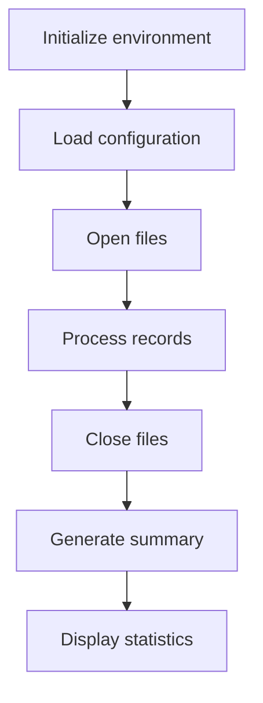

This section is responsible for orchestrating the start of the premium calculation process, ensuring that all required setup steps are completed in the correct order before any records are processed or outputs are generated.

| Category        | Rule Name                        | Description                                                                                                                                                                        |
| --------------- | -------------------------------- | ---------------------------------------------------------------------------------------------------------------------------------------------------------------------------------- |
| Data validation | File Availability Requirement    | All required files must be successfully opened before any records are processed. If any file cannot be opened, the process must not proceed to record processing.                  |
| Data validation | File Closure Requirement         | All files that were opened during the process must be properly closed before the process ends, to ensure data integrity and prevent resource leaks.                                |
| Business logic  | Environment Initialization Order | The environment must be initialized before any configuration is loaded or files are accessed to ensure a clean and predictable starting state for the calculation process.         |
| Business logic  | Configuration Precedence         | Configuration values for risk and premium calculations must be loaded before any files are opened or records are processed, to ensure all calculations use the correct parameters. |
| Business logic  | Summary and Statistics Output    | A summary and statistics must be generated and displayed at the end of the process, providing an overview of the calculation outcomes and any relevant metrics.                    |

<SwmSnippet path="/base/src/LGAPDB01.cbl" line="90">

---

<SwmToken path="base/src/LGAPDB01.cbl" pos="90:1:1" line-data="       P001.">`P001`</SwmToken> starts the process: initializes data, loads config, opens files, processes records, and finishes with summary/stats. Loading config early ensures we have the right values for risk and premium calculations before touching any files or records.

```cobol
       P001.
           PERFORM P002-INITIALIZE
           PERFORM P003-LOAD-CONFIG
           PERFORM P005-OPEN-FILES
           PERFORM P006-PROCESS-RECORDS
           PERFORM P014-CLOSE-FILES
           PERFORM P015-GENERATE-SUMMARY
           PERFORM P016-DISPLAY-STATS
           STOP RUN.
```

---

</SwmSnippet>

# Loading Actuarial Configuration

This section ensures that the system has the necessary configuration data for actuarial calculations, either by loading from a file or by setting defaults if the file is unavailable.

| Category       | Rule Name               | Description                                                                                                                                |
| -------------- | ----------------------- | ------------------------------------------------------------------------------------------------------------------------------------------ |
| Business logic | Default values fallback | If the configuration file is not available, the system must set default values for risk and premium calculations.                          |
| Business logic | Load config values      | If the configuration file is available, the system must read and load all required configuration values for risk and premium calculations. |

<SwmSnippet path="/base/src/LGAPDB01.cbl" line="112">

---

<SwmToken path="base/src/LGAPDB01.cbl" pos="112:1:5" line-data="       P003-LOAD-CONFIG.">`P003-LOAD-CONFIG`</SwmToken> opens the config file and checks if it's available. If not, it logs a warning and sets default values. If the file is there, it calls <SwmToken path="base/src/LGAPDB01.cbl" pos="118:3:9" line-data="               PERFORM P004-READ-CONFIG-VALUES">`P004-READ-CONFIG-VALUES`</SwmToken> to actually fetch the needed config values for risk and premium calculations. We need to call <SwmToken path="base/src/LGAPDB01.cbl" pos="118:3:9" line-data="               PERFORM P004-READ-CONFIG-VALUES">`P004-READ-CONFIG-VALUES`</SwmToken> because just opening the file doesn't load any values into memory.

```cobol
       P003-LOAD-CONFIG.
           OPEN INPUT CONFIG-FILE
           IF NOT CONFIG-OK
               DISPLAY 'Warning: Config file not available - using defaults'
               PERFORM P004-SET-DEFAULTS
           ELSE
               PERFORM P004-READ-CONFIG-VALUES
               CLOSE CONFIG-FILE
           END-IF.
```

---

</SwmSnippet>

# Fetching Risk and Premium Limits

```mermaid
%%{init: {"flowchart": {"defaultRenderer": "elk"}} }%%
flowchart TD
    node1["Read MAX_RISK_SCORE from config"]
    click node1 openCode "base/src/LGAPDB01.cbl:126:127"
    node1 --> node2{"Is config valid and numeric?"}
    click node2 openCode "base/src/LGAPDB01.cbl:128:128"
    node2 -->|"Yes"| node3["Update maximum risk score"]
    click node3 openCode "base/src/LGAPDB01.cbl:129:129"
    node2 -->|"No"| node5
    node3 --> node5["Read MIN_PREMIUM from config"]
    click node5 openCode "base/src/LGAPDB01.cbl:132:133"
    node5 --> node6{"Is config valid and numeric?"}
    click node6 openCode "base/src/LGAPDB01.cbl:134:134"
    node6 -->|"Yes"| node7["Update minimum premium"]
    click node7 openCode "base/src/LGAPDB01.cbl:135:135"
    node6 -->|"No"| node8["End"]
    node7 --> node8
classDef HeadingStyle fill:#777777,stroke:#333,stroke-width:2px;

%% Swimm:
%% %%{init: {"flowchart": {"defaultRenderer": "elk"}} }%%
%% flowchart TD
%%     node1["Read <SwmToken path="base/src/LGAPDB01.cbl" pos="126:4:4" line-data="           MOVE &#39;MAX_RISK_SCORE&#39; TO CONFIG-KEY">`MAX_RISK_SCORE`</SwmToken> from config"]
%%     click node1 openCode "<SwmPath>[base/src/LGAPDB01.cbl](base/src/LGAPDB01.cbl)</SwmPath>:126:127"
%%     node1 --> node2{"Is config valid and numeric?"}
%%     click node2 openCode "<SwmPath>[base/src/LGAPDB01.cbl](base/src/LGAPDB01.cbl)</SwmPath>:128:128"
%%     node2 -->|"Yes"| node3["Update maximum risk score"]
%%     click node3 openCode "<SwmPath>[base/src/LGAPDB01.cbl](base/src/LGAPDB01.cbl)</SwmPath>:129:129"
%%     node2 -->|"No"| node5
%%     node3 --> node5["Read <SwmToken path="base/src/LGAPDB01.cbl" pos="132:4:4" line-data="           MOVE &#39;MIN_PREMIUM&#39; TO CONFIG-KEY">`MIN_PREMIUM`</SwmToken> from config"]
%%     click node5 openCode "<SwmPath>[base/src/LGAPDB01.cbl](base/src/LGAPDB01.cbl)</SwmPath>:132:133"
%%     node5 --> node6{"Is config valid and numeric?"}
%%     click node6 openCode "<SwmPath>[base/src/LGAPDB01.cbl](base/src/LGAPDB01.cbl)</SwmPath>:134:134"
%%     node6 -->|"Yes"| node7["Update minimum premium"]
%%     click node7 openCode "<SwmPath>[base/src/LGAPDB01.cbl](base/src/LGAPDB01.cbl)</SwmPath>:135:135"
%%     node6 -->|"No"| node8["End"]
%%     node7 --> node8
%% classDef HeadingStyle fill:#777777,stroke:#333,stroke-width:2px;
```

This section ensures that the system uses the correct risk and premium limits for actuarial calculations by fetching them from configuration, validating them, and applying defaults if necessary.

| Category       | Rule Name                    | Description                                                                                                                                                                                                                                                                                                                                                                                                   |
| -------------- | ---------------------------- | ------------------------------------------------------------------------------------------------------------------------------------------------------------------------------------------------------------------------------------------------------------------------------------------------------------------------------------------------------------------------------------------------------------- |
| Business logic | Maximum risk score selection | If the configuration value for <SwmToken path="base/src/LGAPDB01.cbl" pos="126:4:4" line-data="           MOVE &#39;MAX_RISK_SCORE&#39; TO CONFIG-KEY">`MAX_RISK_SCORE`</SwmToken> is present and numeric, use it as the maximum risk score. Otherwise, use the default value of 250.                                                                                                                         |
| Business logic | Minimum premium selection    | If the configuration value for <SwmToken path="base/src/LGAPDB01.cbl" pos="132:4:4" line-data="           MOVE &#39;MIN_PREMIUM&#39; TO CONFIG-KEY">`MIN_PREMIUM`</SwmToken> is present and numeric, use it as the minimum premium. Otherwise, use the default value of <SwmToken path="base/src/LGAPDB04.cbl" pos="300:11:13" line-data="           IF WS-EXPOSURE-DENSITY &gt; 500.00">`500.00`</SwmToken>. |

<SwmSnippet path="/base/src/LGAPDB01.cbl" line="125">

---

In <SwmToken path="base/src/LGAPDB01.cbl" pos="125:1:7" line-data="       P004-READ-CONFIG-VALUES.">`P004-READ-CONFIG-VALUES`</SwmToken>, we set <SwmToken path="base/src/LGAPDB01.cbl" pos="126:9:11" line-data="           MOVE &#39;MAX_RISK_SCORE&#39; TO CONFIG-KEY">`CONFIG-KEY`</SwmToken> to <SwmToken path="base/src/LGAPDB01.cbl" pos="126:4:4" line-data="           MOVE &#39;MAX_RISK_SCORE&#39; TO CONFIG-KEY">`MAX_RISK_SCORE`</SwmToken>, read the config file, and if the value is present and numeric, convert it to a number and store it in <SwmToken path="base/src/LGAPDB01.cbl" pos="129:14:20" line-data="               MOVE FUNCTION NUMVAL(CONFIG-VALUE) TO WS-MAX-RISK-SCORE">`WS-MAX-RISK-SCORE`</SwmToken>. This assumes the config file has the right key and a numeric value. If not, we stick with the default.

```cobol
       P004-READ-CONFIG-VALUES.
           MOVE 'MAX_RISK_SCORE' TO CONFIG-KEY
           READ CONFIG-FILE
           IF CONFIG-OK AND NUMERIC-CONFIG
               MOVE FUNCTION NUMVAL(CONFIG-VALUE) TO WS-MAX-RISK-SCORE
           END-IF
```

---

</SwmSnippet>

<SwmSnippet path="/base/src/LGAPDB01.cbl" line="132">

---

After grabbing <SwmToken path="base/src/LGAPDB01.cbl" pos="126:4:4" line-data="           MOVE &#39;MAX_RISK_SCORE&#39; TO CONFIG-KEY">`MAX_RISK_SCORE`</SwmToken>, we do the same for <SwmToken path="base/src/LGAPDB01.cbl" pos="132:4:4" line-data="           MOVE &#39;MIN_PREMIUM&#39; TO CONFIG-KEY">`MIN_PREMIUM`</SwmToken>. If it's present and numeric, we convert and store it. If not, we stick with the default. These values are now ready for use in actuarial calculations.

```cobol
           MOVE 'MIN_PREMIUM' TO CONFIG-KEY
           READ CONFIG-FILE
           IF CONFIG-OK AND NUMERIC-CONFIG
               MOVE FUNCTION NUMVAL(CONFIG-VALUE) TO WS-MIN-PREMIUM
           END-IF.
```

---

</SwmSnippet>

# Processing Input Records

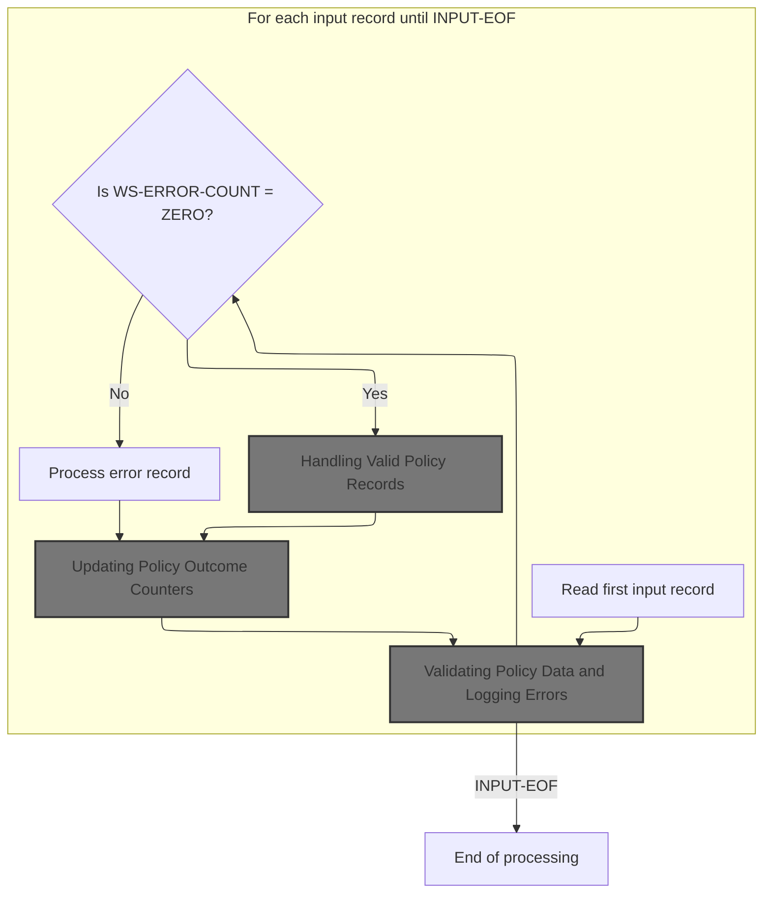

This section is responsible for processing each input insurance policy record, validating its data, handling valid and invalid records differently, and updating outcome counters accordingly. The main product role is to ensure that only valid policy records are processed for actuarial calculations and that errors are logged and counted for reporting and auditing purposes.

| Category        | Rule Name                           | Description                                                                                                                                                                                                                                |
| --------------- | ----------------------------------- | ------------------------------------------------------------------------------------------------------------------------------------------------------------------------------------------------------------------------------------------ |
| Data validation | Input record validation             | Each input record must be validated for required fields and business criteria before any further processing. Records missing required fields or failing business criteria are considered invalid.                                          |
| Business logic  | Valid record processing             | If a record is valid (no errors found), it must be processed according to its policy type (commercial or non-commercial), and the count of successfully processed records must be incremented.                                             |
| Business logic  | Record counting                     | For each input record processed, the total record count (<SwmToken path="base/src/LGAPDB01.cbl" pos="181:7:11" line-data="               ADD 1 TO WS-REC-CNT">`WS-REC-CNT`</SwmToken>) must be incremented by one, regardless of validity. |
| Business logic  | Commercial policy statistics update | For each commercial policy processed and approved, aggregate statistics such as total premium, risk score, and outcome counters must be updated.                                                                                           |

<SwmSnippet path="/base/src/LGAPDB01.cbl" line="178">

---

In <SwmToken path="base/src/LGAPDB01.cbl" pos="178:1:5" line-data="       P006-PROCESS-RECORDS.">`P006-PROCESS-RECORDS`</SwmToken>, we start by reading the first input record to prep for actuarial calculations. Each record is handled one at a time.

```cobol
       P006-PROCESS-RECORDS.
           PERFORM P007-READ-INPUT
```

---

</SwmSnippet>

<SwmSnippet path="/base/src/LGAPDB01.cbl" line="180">

---

After reading, we validate each record. Valid ones get processed, errors get logged and output. Validation ensures only good data moves forward.

```cobol
           PERFORM UNTIL INPUT-EOF
               ADD 1 TO WS-REC-CNT
               PERFORM P008-VALIDATE-INPUT-RECORD
               IF WS-ERROR-COUNT = ZERO
                   PERFORM P009-PROCESS-VALID-RECORD
               ELSE
                   PERFORM P010-PROCESS-ERROR-RECORD
               END-IF
               PERFORM P007-READ-INPUT
           END-PERFORM.
```

---

</SwmSnippet>

## Validating Policy Data and Logging Errors

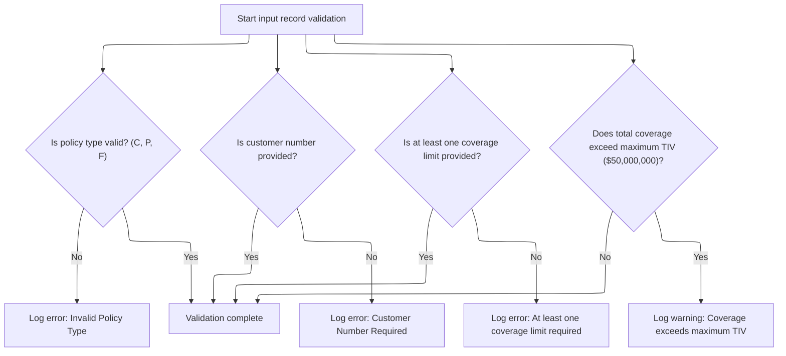

This section is responsible for validating incoming policy data records to ensure they meet business requirements before further processing. It logs any errors or warnings encountered during validation for later review and decision-making.

| Category        | Rule Name                | Description                                                                                                                                                                                                                                                                                                                                                                                                                      |
| --------------- | ------------------------ | -------------------------------------------------------------------------------------------------------------------------------------------------------------------------------------------------------------------------------------------------------------------------------------------------------------------------------------------------------------------------------------------------------------------------------- |
| Data validation | Valid Policy Type        | A policy record must have a policy type of 'C' (Commercial), 'P' (Personal), or 'F' (Farm). Any other value is considered invalid and must be logged as a fatal error with code <SwmToken path="base/src/LGAPDB01.cbl" pos="202:2:2" line-data="                   &#39;POL001&#39; &#39;F&#39; &#39;IN-POLICY-TYPE&#39; ">`POL001`</SwmToken>.                                                                                  |
| Data validation | Customer Number Required | A policy record must include a customer number. If the customer number is missing or blank, this must be logged as a fatal error with code <SwmToken path="base/src/LGAPDB01.cbl" pos="208:2:2" line-data="                   &#39;CUS001&#39; &#39;F&#39; &#39;IN-CUSTOMER-NUM&#39; ">`CUS001`</SwmToken>.                                                                                                                      |
| Data validation | Coverage Limit Required  | At least one coverage limit (building, contents, or business interruption) must be provided and non-zero. If all are zero, this must be logged as a fatal error with code <SwmToken path="base/src/LGAPDB01.cbl" pos="215:2:2" line-data="                   &#39;COV001&#39; &#39;F&#39; &#39;COVERAGE-LIMITS&#39; ">`COV001`</SwmToken>.                                                                                       |
| Business logic  | Maximum TIV Limit        | The sum of building, contents, and business interruption coverage limits must not exceed $50,000,000 (the maximum Total Insured Value, TIV). If the total exceeds this amount, a warning with code <SwmToken path="base/src/LGAPDB01.cbl" pos="222:2:2" line-data="                   &#39;COV002&#39; &#39;W&#39; &#39;COVERAGE-LIMITS&#39; ">`COV002`</SwmToken> must be logged, but the record is not automatically rejected. |
| Business logic  | Multiple Error Logging   | Multiple errors can be logged for a single policy record. All errors and warnings must be tracked with their respective codes, severities, fields, and messages for later review.                                                                                                                                                                                                                                                |

<SwmSnippet path="/base/src/LGAPDB01.cbl" line="195">

---

In <SwmToken path="base/src/LGAPDB01.cbl" pos="195:1:7" line-data="       P008-VALIDATE-INPUT-RECORD.">`P008-VALIDATE-INPUT-RECORD`</SwmToken>, we check if the policy type matches allowed values ('C', 'P', 'F'). If not, we call <SwmToken path="base/src/LGAPDB01.cbl" pos="201:3:7" line-data="               PERFORM P008A-LOG-ERROR WITH ">`P008A-LOG-ERROR`</SwmToken> to record a fatal error with code <SwmToken path="base/src/LGAPDB01.cbl" pos="202:2:2" line-data="                   &#39;POL001&#39; &#39;F&#39; &#39;IN-POLICY-TYPE&#39; ">`POL001`</SwmToken>. This keeps error tracking consistent and clear.

```cobol
       P008-VALIDATE-INPUT-RECORD.
           INITIALIZE WS-ERROR-HANDLING
           
           IF NOT COMMERCIAL-POLICY AND 
              NOT PERSONAL-POLICY AND 
              NOT FARM-POLICY
               PERFORM P008A-LOG-ERROR WITH 
                   'POL001' 'F' 'IN-POLICY-TYPE' 
                   'Invalid Policy Type'
           END-IF
```

---

</SwmSnippet>

<SwmSnippet path="/base/src/LGAPDB01.cbl" line="226">

---

<SwmToken path="base/src/LGAPDB01.cbl" pos="226:1:5" line-data="       P008A-LOG-ERROR.">`P008A-LOG-ERROR`</SwmToken> bumps the error count, sets the index, and stores error details in parallel arrays. It assumes the arrays are big enough (20 entries), so if we hit that limit, errors could get lost or overwritten.

```cobol
       P008A-LOG-ERROR.
           ADD 1 TO WS-ERROR-COUNT
           SET ERR-IDX TO WS-ERROR-COUNT
           MOVE WS-ERROR-CODE TO WS-ERROR-CODE (ERR-IDX)
           MOVE WS-ERROR-SEVERITY TO WS-ERROR-SEVERITY (ERR-IDX)
           MOVE WS-ERROR-FIELD TO WS-ERROR-FIELD (ERR-IDX)
           MOVE WS-ERROR-MESSAGE TO WS-ERROR-MESSAGE (ERR-IDX).
```

---

</SwmSnippet>

<SwmSnippet path="/base/src/LGAPDB01.cbl" line="206">

---

Back in <SwmToken path="base/src/LGAPDB01.cbl" pos="182:3:9" line-data="               PERFORM P008-VALIDATE-INPUT-RECORD">`P008-VALIDATE-INPUT-RECORD`</SwmToken>, after logging a policy type error, we keep validating other fields like customer number. If it's missing, we log another error. Multiple errors can be logged for one record before deciding if it's valid.

```cobol
           IF IN-CUSTOMER-NUM = SPACES
               PERFORM P008A-LOG-ERROR WITH 
                   'CUS001' 'F' 'IN-CUSTOMER-NUM' 
                   'Customer Number Required'
           END-IF
```

---

</SwmSnippet>

<SwmSnippet path="/base/src/LGAPDB01.cbl" line="212">

---

After checking customer number, <SwmToken path="base/src/LGAPDB01.cbl" pos="182:3:9" line-data="               PERFORM P008-VALIDATE-INPUT-RECORD">`P008-VALIDATE-INPUT-RECORD`</SwmToken> checks coverage limits. If both building and contents limits are zero, it logs a fatal error. This enforces the rule that a policy must insure something.

```cobol
           IF IN-BUILDING-LIMIT = ZERO AND 
              IN-CONTENTS-LIMIT = ZERO
               PERFORM P008A-LOG-ERROR WITH 
                   'COV001' 'F' 'COVERAGE-LIMITS' 
                   'At least one coverage limit required'
           END-IF
```

---

</SwmSnippet>

<SwmSnippet path="/base/src/LGAPDB01.cbl" line="219">

---

After checking individual coverage limits, <SwmToken path="base/src/LGAPDB01.cbl" pos="182:3:9" line-data="               PERFORM P008-VALIDATE-INPUT-RECORD">`P008-VALIDATE-INPUT-RECORD`</SwmToken> sums them up and compares to <SwmToken path="base/src/LGAPDB01.cbl" pos="220:9:13" line-data="              IN-BI-LIMIT &gt; WS-MAX-TIV">`WS-MAX-TIV`</SwmToken>. If the total is too high, it logs a warning error. All error codes and messages are stored for later output or analysis.

```cobol
           IF IN-BUILDING-LIMIT + IN-CONTENTS-LIMIT + 
              IN-BI-LIMIT > WS-MAX-TIV
               PERFORM P008A-LOG-ERROR WITH 
                   'COV002' 'W' 'COVERAGE-LIMITS' 
                   'Total coverage exceeds maximum TIV'
           END-IF.
```

---

</SwmSnippet>

## Handling Valid Policy Records

```mermaid
%%{init: {"flowchart": {"defaultRenderer": "elk"}} }%%
flowchart TD
    node1{"Is COMMERCIAL-POLICY? (IN-POLICY-TYPE = 'C')"}
    click node1 openCode "base/src/LGAPDB01.cbl:235:241"
    node1 -->|"Yes"| node2["Process commercial policy record"]
    click node2 openCode "base/src/LGAPDB01.cbl:236:237"
    node2 --> node3["Add 1 to processed commercial counter (WS-PROC-CNT)"]
    click node3 openCode "base/src/LGAPDB01.cbl:237:237"
    node1 -->|"No"| node4["Process non-commercial policy record"]
    click node4 openCode "base/src/LGAPDB01.cbl:239:240"
    node4 --> node5["Add 1 to non-commercial error counter (WS-ERR-CNT)"]
    click node5 openCode "base/src/LGAPDB01.cbl:240:240"

classDef HeadingStyle fill:#777777,stroke:#333,stroke-width:2px;

%% Swimm:
%% %%{init: {"flowchart": {"defaultRenderer": "elk"}} }%%
%% flowchart TD
%%     node1{"Is <SwmToken path="base/src/LGAPDB01.cbl" pos="198:5:7" line-data="           IF NOT COMMERCIAL-POLICY AND ">`COMMERCIAL-POLICY`</SwmToken>? (<SwmToken path="base/src/LGAPDB01.cbl" pos="202:10:14" line-data="                   &#39;POL001&#39; &#39;F&#39; &#39;IN-POLICY-TYPE&#39; ">`IN-POLICY-TYPE`</SwmToken> = 'C')"}
%%     click node1 openCode "<SwmPath>[base/src/LGAPDB01.cbl](base/src/LGAPDB01.cbl)</SwmPath>:235:241"
%%     node1 -->|"Yes"| node2["Process commercial policy record"]
%%     click node2 openCode "<SwmPath>[base/src/LGAPDB01.cbl](base/src/LGAPDB01.cbl)</SwmPath>:236:237"
%%     node2 --> node3["Add 1 to processed commercial counter (<SwmToken path="base/src/LGAPDB01.cbl" pos="237:7:11" line-data="               ADD 1 TO WS-PROC-CNT">`WS-PROC-CNT`</SwmToken>)"]
%%     click node3 openCode "<SwmPath>[base/src/LGAPDB01.cbl](base/src/LGAPDB01.cbl)</SwmPath>:237:237"
%%     node1 -->|"No"| node4["Process non-commercial policy record"]
%%     click node4 openCode "<SwmPath>[base/src/LGAPDB01.cbl](base/src/LGAPDB01.cbl)</SwmPath>:239:240"
%%     node4 --> node5["Add 1 to non-commercial error counter (<SwmToken path="base/src/LGAPDB01.cbl" pos="240:7:11" line-data="               ADD 1 TO WS-ERR-CNT">`WS-ERR-CNT`</SwmToken>)"]
%%     click node5 openCode "<SwmPath>[base/src/LGAPDB01.cbl](base/src/LGAPDB01.cbl)</SwmPath>:240:240"
%% 
%% classDef HeadingStyle fill:#777777,stroke:#333,stroke-width:2px;
```

This section governs the business logic for handling valid policy records, specifically distinguishing between commercial and non-commercial policies. It ensures that commercial policies are processed and counted, while non-commercial policies are rejected and tracked as errors.

| Category       | Rule Name                              | Description                                                                                                                                                                                                                                                                                                                            |
| -------------- | -------------------------------------- | -------------------------------------------------------------------------------------------------------------------------------------------------------------------------------------------------------------------------------------------------------------------------------------------------------------------------------------- |
| Business logic | Commercial policy processing           | If a policy record is identified as a commercial policy (<SwmToken path="base/src/LGAPDB01.cbl" pos="202:10:14" line-data="                   &#39;POL001&#39; &#39;F&#39; &#39;IN-POLICY-TYPE&#39; ">`IN-POLICY-TYPE`</SwmToken> = 'C'), it must be processed as a commercial policy and counted in the processed commercial counter. |
| Business logic | Non-commercial policy rejection        | If a policy record is not a commercial policy (<SwmToken path="base/src/LGAPDB01.cbl" pos="202:10:14" line-data="                   &#39;POL001&#39; &#39;F&#39; &#39;IN-POLICY-TYPE&#39; ">`IN-POLICY-TYPE`</SwmToken> ≠ 'C'), it must be rejected from commercial processing and counted in the non-commercial error counter.        |
| Business logic | Processed commercial counter increment | The processed commercial counter (<SwmToken path="base/src/LGAPDB01.cbl" pos="237:7:11" line-data="               ADD 1 TO WS-PROC-CNT">`WS-PROC-CNT`</SwmToken>) must be incremented by 1 for each commercial policy record processed.                                                                                                |
| Business logic | Non-commercial error counter increment | The non-commercial error counter (<SwmToken path="base/src/LGAPDB01.cbl" pos="240:7:11" line-data="               ADD 1 TO WS-ERR-CNT">`WS-ERR-CNT`</SwmToken>) must be incremented by 1 for each non-commercial policy record encountered.                                                                                            |

<SwmSnippet path="/base/src/LGAPDB01.cbl" line="234">

---

<SwmToken path="base/src/LGAPDB01.cbl" pos="234:1:7" line-data="       P009-PROCESS-VALID-RECORD.">`P009-PROCESS-VALID-RECORD`</SwmToken> checks if the policy is commercial. If so, it calls <SwmToken path="base/src/LGAPDB01.cbl" pos="236:3:7" line-data="               PERFORM P011-PROCESS-COMMERCIAL">`P011-PROCESS-COMMERCIAL`</SwmToken> to run the full premium and risk logic. Non-commercial policies get rejected and handled separately.

```cobol
       P009-PROCESS-VALID-RECORD.
           IF COMMERCIAL-POLICY
               PERFORM P011-PROCESS-COMMERCIAL
               ADD 1 TO WS-PROC-CNT
           ELSE
               PERFORM P012-PROCESS-NON-COMMERCIAL
               ADD 1 TO WS-ERR-CNT
           END-IF.
```

---

</SwmSnippet>

## Processing Commercial Policy Applications

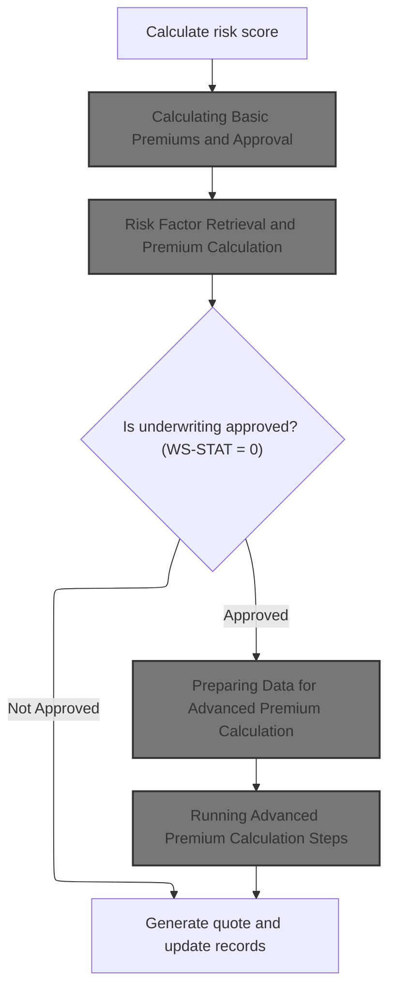

This section is responsible for evaluating commercial property insurance applications by calculating risk scores, determining approval status, and generating premium quotes based on both basic and advanced actuarial calculations.

| Category        | Rule Name                                | Description                                                                                                                                                                                                                                                                                 |
| --------------- | ---------------------------------------- | ------------------------------------------------------------------------------------------------------------------------------------------------------------------------------------------------------------------------------------------------------------------------------------------- |
| Data validation | Mandatory risk score calculation         | A risk score must be calculated for every commercial policy application before any premium calculation or approval decision is made.                                                                                                                                                        |
| Data validation | Comprehensive quote output               | The final output must include the approval status, rejection reason (if applicable), a description, and a premium breakdown for all relevant peril types.                                                                                                                                   |
| Business logic  | Basic premium and approval determination | The basic premium and approval decision must be determined using the calculated risk score and peril inputs for the property.                                                                                                                                                               |
| Business logic  | Advanced premium calculation on approval | If the underwriting decision is 'approved' (<SwmToken path="base/src/LGAPDB01.cbl" pos="261:3:5" line-data="           IF WS-STAT = 0">`WS-STAT`</SwmToken> = 0), advanced actuarial premium calculations must be performed using enhanced customer and property data.                      |
| Business logic  | Bypass advanced calculation on rejection | If the underwriting decision is not 'approved' (<SwmToken path="base/src/LGAPDB01.cbl" pos="261:3:5" line-data="           IF WS-STAT = 0">`WS-STAT`</SwmToken> ≠ 0), the process must skip advanced premium calculation and proceed directly to generating the quote and updating records. |
| Business logic  | Discount eligibility application         | Discount eligibility factors (multi-policy, claims-free, safety program) must be considered when calculating the final premium, using the values in WS-DISCOUNT-ELIGIBILITY.                                                                                                                |
| Business logic  | Premium update on enhanced calculation   | If the advanced actuarial calculation produces a higher premium than the current value, the premium and its components must be updated to reflect the enhanced result.                                                                                                                      |

<SwmSnippet path="/base/src/LGAPDB01.cbl" line="258">

---

In <SwmToken path="base/src/LGAPDB01.cbl" pos="258:1:5" line-data="       P011-PROCESS-COMMERCIAL.">`P011-PROCESS-COMMERCIAL`</SwmToken>, we first calculate the risk score, then call <SwmToken path="base/src/LGAPDB01.cbl" pos="260:3:9" line-data="           PERFORM P011B-BASIC-PREMIUM-CALC">`P011B-BASIC-PREMIUM-CALC`</SwmToken> to figure out premiums and approval. Risk score comes first because it's used in the premium logic.

```cobol
       P011-PROCESS-COMMERCIAL.
           PERFORM P011A-CALCULATE-RISK-SCORE
           PERFORM P011B-BASIC-PREMIUM-CALC
```

---

</SwmSnippet>

### Calculating Basic Premiums and Approval

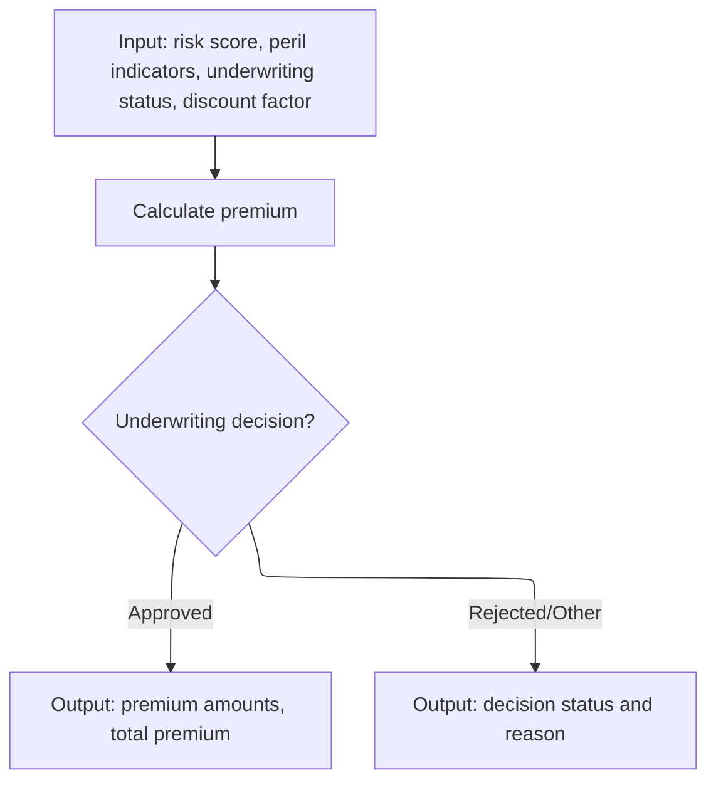

This section determines the basic insurance premium for a policy application and makes an underwriting decision. It calculates premiums based on risk and peril data, applies discounts, and outputs the final premium breakdown or a rejection reason.

| Category        | Rule Name                             | Description                                                                                                                                                                                         |
| --------------- | ------------------------------------- | --------------------------------------------------------------------------------------------------------------------------------------------------------------------------------------------------- |
| Data validation | Approval output requirement           | If the underwriting decision is 'approved' (status 0), the output must include all calculated premium amounts and the total premium.                                                                |
| Data validation | Rejection/Referral output requirement | If the underwriting decision is 'rejected', 'pending', or 'referred' (status 2 or 3), the output must include the decision status and a reason for rejection or referral.                           |
| Business logic  | Peril-based premium calculation       | Premiums for each peril (fire, crime, flood, weather) must be calculated using the provided risk score and peril indicators. The calculation must reflect the risk associated with each peril type. |
| Business logic  | Total premium aggregation             | The total premium must be the sum of all individual peril premiums, adjusted by any applicable discount factor.                                                                                     |

<SwmSnippet path="/base/src/LGAPDB01.cbl" line="275">

---

<SwmToken path="base/src/LGAPDB01.cbl" pos="275:1:7" line-data="       P011B-BASIC-PREMIUM-CALC.">`P011B-BASIC-PREMIUM-CALC`</SwmToken> calls <SwmToken path="base/src/LGAPDB01.cbl" pos="276:4:4" line-data="           CALL &#39;LGAPDB03&#39; USING WS-BASE-RISK-SCR, IN-FIRE-PERIL, ">`LGAPDB03`</SwmToken>, passing risk score and peril data. <SwmToken path="base/src/LGAPDB01.cbl" pos="276:4:4" line-data="           CALL &#39;LGAPDB03&#39; USING WS-BASE-RISK-SCR, IN-FIRE-PERIL, ">`LGAPDB03`</SwmToken> does the heavy lifting for premium calculation and approval decision, so we need its results before moving on.

```cobol
       P011B-BASIC-PREMIUM-CALC.
           CALL 'LGAPDB03' USING WS-BASE-RISK-SCR, IN-FIRE-PERIL, 
                                IN-CRIME-PERIL, IN-FLOOD-PERIL, 
                                IN-WEATHER-PERIL, WS-STAT,
                                WS-STAT-DESC, WS-REJ-RSN, WS-FR-PREM,
                                WS-CR-PREM, WS-FL-PREM, WS-WE-PREM,
                                WS-TOT-PREM, WS-DISC-FACT.
```

---

</SwmSnippet>

### Risk Factor Retrieval and Premium Calculation

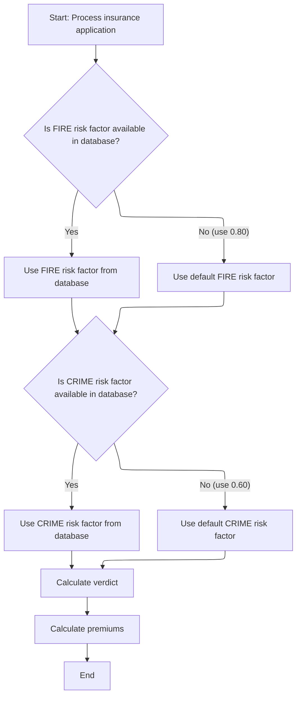

This section ensures that risk factors for fire and crime are always available for premium and approval calculations, either by retrieving them from the database or by applying default values if the database does not provide them.

| Category        | Rule Name                          | Description                                                                                                                                                                                                      |
| --------------- | ---------------------------------- | ---------------------------------------------------------------------------------------------------------------------------------------------------------------------------------------------------------------- |
| Data validation | Risk factor availability guarantee | Risk factors for FIRE and CRIME must be available for all premium and approval calculations, either from the database or as defaults.                                                                            |
| Business logic  | Default FIRE risk factor           | If the FIRE risk factor is not available in the database, use a default value of <SwmToken path="base/src/LGAPDB03.cbl" pos="58:3:5" line-data="               MOVE 0.80 TO WS-FIRE-FACTOR">`0.80`</SwmToken>.   |
| Business logic  | Default CRIME risk factor          | If the CRIME risk factor is not available in the database, use a default value of <SwmToken path="base/src/LGAPDB03.cbl" pos="70:3:5" line-data="               MOVE 0.60 TO WS-CRIME-FACTOR">`0.60`</SwmToken>. |
| Business logic  | Database risk factor retrieval     | Always attempt to retrieve FIRE and CRIME risk factors from the database before using defaults.                                                                                                                  |

<SwmSnippet path="/base/src/LGAPDB03.cbl" line="42">

---

<SwmToken path="base/src/LGAPDB03.cbl" pos="42:1:3" line-data="       MAIN-LOGIC.">`MAIN-LOGIC`</SwmToken> in <SwmToken path="base/src/LGAPDB01.cbl" pos="276:4:4" line-data="           CALL &#39;LGAPDB03&#39; USING WS-BASE-RISK-SCR, IN-FIRE-PERIL, ">`LGAPDB03`</SwmToken> fetches risk factors for fire and crime from the database. If the query fails, it uses hardcoded defaults. These factors are then used in the premium and approval calculations that follow.

```cobol
       MAIN-LOGIC.
           PERFORM GET-RISK-FACTORS
           PERFORM CALCULATE-VERDICT
           PERFORM CALCULATE-PREMIUMS
           GOBACK.
```

---

</SwmSnippet>

<SwmSnippet path="/base/src/LGAPDB03.cbl" line="48">

---

<SwmToken path="base/src/LGAPDB03.cbl" pos="48:1:5" line-data="       GET-RISK-FACTORS.">`GET-RISK-FACTORS`</SwmToken> runs SQL queries to fetch fire and crime risk factors. If the DB doesn't return a value, it sets hardcoded defaults (<SwmToken path="base/src/LGAPDB03.cbl" pos="58:3:5" line-data="               MOVE 0.80 TO WS-FIRE-FACTOR">`0.80`</SwmToken> for fire, <SwmToken path="base/src/LGAPDB03.cbl" pos="70:3:5" line-data="               MOVE 0.60 TO WS-CRIME-FACTOR">`0.60`</SwmToken> for crime) so the premium logic always has something to work with.

```cobol
       GET-RISK-FACTORS.
           EXEC SQL
               SELECT FACTOR_VALUE INTO :WS-FIRE-FACTOR
               FROM RISK_FACTORS
               WHERE PERIL_TYPE = 'FIRE'
           END-EXEC.
           
           IF SQLCODE = 0
               CONTINUE
           ELSE
               MOVE 0.80 TO WS-FIRE-FACTOR
           END-IF.
           
           EXEC SQL
               SELECT FACTOR_VALUE INTO :WS-CRIME-FACTOR
               FROM RISK_FACTORS
               WHERE PERIL_TYPE = 'CRIME'
           END-EXEC.
           
           IF SQLCODE = 0
               CONTINUE
           ELSE
               MOVE 0.60 TO WS-CRIME-FACTOR
           END-IF.
```

---

</SwmSnippet>

### Running Enhanced Actuarial Calculations

<SwmSnippet path="/base/src/LGAPDB01.cbl" line="261">

---

After getting basic premium results in <SwmToken path="base/src/LGAPDB01.cbl" pos="236:3:7" line-data="               PERFORM P011-PROCESS-COMMERCIAL">`P011-PROCESS-COMMERCIAL`</SwmToken>, we check if the policy is approved (<SwmToken path="base/src/LGAPDB01.cbl" pos="261:3:5" line-data="           IF WS-STAT = 0">`WS-STAT`</SwmToken> = 0). If so, we run <SwmToken path="base/src/LGAPDB01.cbl" pos="262:3:9" line-data="               PERFORM P011C-ENHANCED-ACTUARIAL-CALC">`P011C-ENHANCED-ACTUARIAL-CALC`</SwmToken> to see if advanced actuarial logic gives a higher premium, and update if needed.

```cobol
           IF WS-STAT = 0
               PERFORM P011C-ENHANCED-ACTUARIAL-CALC
           END-IF
```

---

</SwmSnippet>

### Preparing Data for Advanced Premium Calculation

```mermaid
%%{init: {"flowchart": {"defaultRenderer": "elk"}} }%%
flowchart TD
    node1["Prepare actuarial input and coverage data"] --> node2{"Is total premium (WS-TOT-PREM) > minimum premium (WS-MIN-PREMIUM)?"}
    click node1 openCode "base/src/LGAPDB01.cbl:283:309"
    node2 -->|"Yes"| node3["Perform enhanced actuarial calculation (LGAPDB04)"]
    click node2 openCode "base/src/LGAPDB01.cbl:312:313"
    node2 -->|"No"| node6["End"]
    node3 --> node4{"Is enhanced premium (LK-TOTAL-PREMIUM) > original premium (WS-TOT-PREM)?"}
    click node3 openCode "base/src/LGAPDB01.cbl:313:315"
    node4 -->|"Yes"| node5["Update premium results: fire, crime, flood, weather, total, experience modifier"]
    click node4 openCode "base/src/LGAPDB01.cbl:317:324"
    node4 -->|"No"| node6["End"]
    node5 --> node6["End"]
    click node5 openCode "base/src/LGAPDB01.cbl:318:324"
    click node6 openCode "base/src/LGAPDB01.cbl:325:325"
classDef HeadingStyle fill:#777777,stroke:#333,stroke-width:2px;

%% Swimm:
%% %%{init: {"flowchart": {"defaultRenderer": "elk"}} }%%
%% flowchart TD
%%     node1["Prepare actuarial input and coverage data"] --> node2{"Is total premium (<SwmToken path="base/src/LGAPDB01.cbl" pos="281:1:5" line-data="                                WS-TOT-PREM, WS-DISC-FACT.">`WS-TOT-PREM`</SwmToken>) > minimum premium (<SwmToken path="base/src/LGAPDB01.cbl" pos="135:14:18" line-data="               MOVE FUNCTION NUMVAL(CONFIG-VALUE) TO WS-MIN-PREMIUM">`WS-MIN-PREMIUM`</SwmToken>)?"}
%%     click node1 openCode "<SwmPath>[base/src/LGAPDB01.cbl](base/src/LGAPDB01.cbl)</SwmPath>:283:309"
%%     node2 -->|"Yes"| node3["Perform enhanced actuarial calculation (<SwmToken path="base/src/LGAPDB01.cbl" pos="313:4:4" line-data="               CALL &#39;LGAPDB04&#39; USING LK-INPUT-DATA, LK-COVERAGE-DATA, ">`LGAPDB04`</SwmToken>)"]
%%     click node2 openCode "<SwmPath>[base/src/LGAPDB01.cbl](base/src/LGAPDB01.cbl)</SwmPath>:312:313"
%%     node2 -->|"No"| node6["End"]
%%     node3 --> node4{"Is enhanced premium (<SwmToken path="base/src/LGAPDB01.cbl" pos="317:3:7" line-data="               IF LK-TOTAL-PREMIUM &gt; WS-TOT-PREM">`LK-TOTAL-PREMIUM`</SwmToken>) > original premium (<SwmToken path="base/src/LGAPDB01.cbl" pos="281:1:5" line-data="                                WS-TOT-PREM, WS-DISC-FACT.">`WS-TOT-PREM`</SwmToken>)?"}
%%     click node3 openCode "<SwmPath>[base/src/LGAPDB01.cbl](base/src/LGAPDB01.cbl)</SwmPath>:313:315"
%%     node4 -->|"Yes"| node5["Update premium results: fire, crime, flood, weather, total, experience modifier"]
%%     click node4 openCode "<SwmPath>[base/src/LGAPDB01.cbl](base/src/LGAPDB01.cbl)</SwmPath>:317:324"
%%     node4 -->|"No"| node6["End"]
%%     node5 --> node6["End"]
%%     click node5 openCode "<SwmPath>[base/src/LGAPDB01.cbl](base/src/LGAPDB01.cbl)</SwmPath>:318:324"
%%     click node6 openCode "<SwmPath>[base/src/LGAPDB01.cbl](base/src/LGAPDB01.cbl)</SwmPath>:325:325"
%% classDef HeadingStyle fill:#777777,stroke:#333,stroke-width:2px;
```

This section determines whether to perform an advanced actuarial premium calculation based on the initial premium amount, and updates the premium breakdown only if the enhanced calculation results in a higher premium. It ensures that only qualifying policies are recalculated and that premium fields are updated accordingly.

| Category        | Rule Name                    | Description                                                                                                                                                                                                                                                                                                                                                                                                                                                                                                                                                                                               |
| --------------- | ---------------------------- | --------------------------------------------------------------------------------------------------------------------------------------------------------------------------------------------------------------------------------------------------------------------------------------------------------------------------------------------------------------------------------------------------------------------------------------------------------------------------------------------------------------------------------------------------------------------------------------------------------- |
| Data validation | Data Preparation Integrity   | All customer, property, coverage, and claims data must be accurately transferred into the linkage structure before any advanced actuarial calculation is performed.                                                                                                                                                                                                                                                                                                                                                                                                                                       |
| Business logic  | Minimum Premium Threshold    | Advanced actuarial premium calculation is only performed if the total calculated premium (<SwmToken path="base/src/LGAPDB01.cbl" pos="281:1:5" line-data="                                WS-TOT-PREM, WS-DISC-FACT.">`WS-TOT-PREM`</SwmToken>) exceeds the minimum premium threshold (<SwmToken path="base/src/LGAPDB01.cbl" pos="135:14:18" line-data="               MOVE FUNCTION NUMVAL(CONFIG-VALUE) TO WS-MIN-PREMIUM">`WS-MIN-PREMIUM`</SwmToken>, default <SwmToken path="base/src/LGAPDB04.cbl" pos="300:11:13" line-data="           IF WS-EXPOSURE-DENSITY &gt; 500.00">`500.00`</SwmToken>). |
| Business logic  | Enhanced Premium Update      | If the enhanced actuarial calculation produces a total premium (<SwmToken path="base/src/LGAPDB01.cbl" pos="317:3:7" line-data="               IF LK-TOTAL-PREMIUM &gt; WS-TOT-PREM">`LK-TOTAL-PREMIUM`</SwmToken>) greater than the original premium (<SwmToken path="base/src/LGAPDB01.cbl" pos="281:1:5" line-data="                                WS-TOT-PREM, WS-DISC-FACT.">`WS-TOT-PREM`</SwmToken>), all premium fields (fire, crime, flood, weather, total, experience modifier) must be updated with the enhanced values.                                                                      |
| Business logic  | Retain Original Premiums     | If the enhanced actuarial calculation does not produce a higher total premium, the original premium values must be retained and no updates are made.                                                                                                                                                                                                                                                                                                                                                                                                                                                      |
| Business logic  | Configurable Minimum Premium | The minimum premium threshold (<SwmToken path="base/src/LGAPDB01.cbl" pos="135:14:18" line-data="               MOVE FUNCTION NUMVAL(CONFIG-VALUE) TO WS-MIN-PREMIUM">`WS-MIN-PREMIUM`</SwmToken>) is configurable and defaults to <SwmToken path="base/src/LGAPDB04.cbl" pos="300:11:13" line-data="           IF WS-EXPOSURE-DENSITY &gt; 500.00">`500.00`</SwmToken>, but may be set by business configuration.                                                                                                                                                                                        |

<SwmSnippet path="/base/src/LGAPDB01.cbl" line="283">

---

In <SwmToken path="base/src/LGAPDB01.cbl" pos="283:1:7" line-data="       P011C-ENHANCED-ACTUARIAL-CALC.">`P011C-ENHANCED-ACTUARIAL-CALC`</SwmToken>, we move all the customer, property, coverage, and claims data into the linkage structure. This sets up everything needed for the advanced actuarial premium calculation.

```cobol
       P011C-ENHANCED-ACTUARIAL-CALC.
      *    Prepare input structure for actuarial calculation
           MOVE IN-CUSTOMER-NUM TO LK-CUSTOMER-NUM
           MOVE WS-BASE-RISK-SCR TO LK-RISK-SCORE
           MOVE IN-PROPERTY-TYPE TO LK-PROPERTY-TYPE
           MOVE IN-TERRITORY-CODE TO LK-TERRITORY
           MOVE IN-CONSTRUCTION-TYPE TO LK-CONSTRUCTION-TYPE
           MOVE IN-OCCUPANCY-CODE TO LK-OCCUPANCY-CODE
           MOVE IN-SPRINKLER-IND TO LK-PROTECTION-CLASS
           MOVE IN-YEAR-BUILT TO LK-YEAR-BUILT
           MOVE IN-SQUARE-FOOTAGE TO LK-SQUARE-FOOTAGE
           MOVE IN-YEARS-IN-BUSINESS TO LK-YEARS-IN-BUSINESS
           MOVE IN-CLAIMS-COUNT-3YR TO LK-CLAIMS-COUNT-5YR
           MOVE IN-CLAIMS-AMOUNT-3YR TO LK-CLAIMS-AMOUNT-5YR
           
      *    Set coverage data
           MOVE IN-BUILDING-LIMIT TO LK-BUILDING-LIMIT
           MOVE IN-CONTENTS-LIMIT TO LK-CONTENTS-LIMIT
           MOVE IN-BI-LIMIT TO LK-BI-LIMIT
           MOVE IN-FIRE-DEDUCTIBLE TO LK-FIRE-DEDUCTIBLE
           MOVE IN-WIND-DEDUCTIBLE TO LK-WIND-DEDUCTIBLE
           MOVE IN-FLOOD-DEDUCTIBLE TO LK-FLOOD-DEDUCTIBLE
           MOVE IN-OTHER-DEDUCTIBLE TO LK-OTHER-DEDUCTIBLE
           MOVE IN-FIRE-PERIL TO LK-FIRE-PERIL
           MOVE IN-CRIME-PERIL TO LK-CRIME-PERIL
           MOVE IN-FLOOD-PERIL TO LK-FLOOD-PERIL
           MOVE IN-WEATHER-PERIL TO LK-WEATHER-PERIL
```

---

</SwmSnippet>

<SwmSnippet path="/base/src/LGAPDB01.cbl" line="312">

---

After prepping the data, we call <SwmToken path="base/src/LGAPDB01.cbl" pos="313:4:4" line-data="               CALL &#39;LGAPDB04&#39; USING LK-INPUT-DATA, LK-COVERAGE-DATA, ">`LGAPDB04`</SwmToken> for advanced premium calculation, but only if the basic premium is above the minimum. If the enhanced result is higher, we update all premium fields with the new values.

```cobol
           IF WS-TOT-PREM > WS-MIN-PREMIUM
               CALL 'LGAPDB04' USING LK-INPUT-DATA, LK-COVERAGE-DATA, 
                                    LK-OUTPUT-RESULTS
               
      *        Update with enhanced calculations if successful
               IF LK-TOTAL-PREMIUM > WS-TOT-PREM
                   MOVE LK-FIRE-PREMIUM TO WS-FR-PREM
                   MOVE LK-CRIME-PREMIUM TO WS-CR-PREM
                   MOVE LK-FLOOD-PREMIUM TO WS-FL-PREM
                   MOVE LK-WEATHER-PREMIUM TO WS-WE-PREM
                   MOVE LK-TOTAL-PREMIUM TO WS-TOT-PREM
                   MOVE LK-EXPERIENCE-MOD TO WS-EXPERIENCE-MOD
               END-IF
           END-IF.
```

---

</SwmSnippet>

### Running Advanced Premium Calculation Steps

```mermaid
%%{init: {"flowchart": {"defaultRenderer": "elk"}} }%%
flowchart TD
    node1["Start premium calculation"]
    click node1 openCode "base/src/LGAPDB04.cbl:138:150"
    node1 --> node2["Calculate exposures and insured value"]
    click node2 openCode "base/src/LGAPDB04.cbl:152:174"
    node2 --> node3{"Years in business >= 5?"}
    click node3 openCode "base/src/LGAPDB04.cbl:237:257"
    node3 -->|"Yes"| node4{"Claims count (5yr) = 0?"}
    click node4 openCode "base/src/LGAPDB04.cbl:238:253"
    node4 -->|"Yes"| node5["Apply experience mod discount"]
    click node5 openCode "base/src/LGAPDB04.cbl:239:240"
    node4 -->|"No"| node6["Calculate experience mod based on claims"]
    click node6 openCode "base/src/LGAPDB04.cbl:241:252"
    node3 -->|"No"| node7["Apply new business experience mod"]
    click node7 openCode "base/src/LGAPDB04.cbl:255:256"
    node5 --> node8["Adjust schedule modification"]
    click node8 openCode "base/src/LGAPDB04.cbl:260:316"
    node6 --> node8
    node7 --> node8
    node8 --> node9{"Is Fire peril covered?"}
    click node9 openCode "base/src/LGAPDB04.cbl:322:331"
    node9 -->|"Yes"| node10["Calculate fire premium"]
    click node10 openCode "base/src/LGAPDB04.cbl:323:330"
    node9 -->|"No"| node11["Skip fire premium"]
    click node11 openCode "base/src/LGAPDB04.cbl:331:331"
    node10 --> node12{"Is Crime peril covered?"}
    click node12 openCode "base/src/LGAPDB04.cbl:334:343"
    node12 -->|"Yes"| node13["Calculate crime premium"]
    click node13 openCode "base/src/LGAPDB04.cbl:335:342"
    node12 -->|"No"| node14["Skip crime premium"]
    click node14 openCode "base/src/LGAPDB04.cbl:343:343"
    node13 --> node15{"Is Flood peril covered?"}
    click node15 openCode "base/src/LGAPDB04.cbl:346:355"
    node15 -->|"Yes"| node16["Calculate flood premium"]
    click node16 openCode "base/src/LGAPDB04.cbl:347:354"
    node15 -->|"No"| node17["Skip flood premium"]
    click node17 openCode "base/src/LGAPDB04.cbl:355:355"
    node16 --> node18{"Is Weather peril covered?"}
    click node18 openCode "base/src/LGAPDB04.cbl:358:367"
    node18 -->|"Yes"| node19["Calculate weather premium"]
    click node19 openCode "base/src/LGAPDB04.cbl:359:366"
    node18 -->|"No"| node20["Skip weather premium"]
    click node20 openCode "base/src/LGAPDB04.cbl:367:367"
    node19 --> node21["Apply discounts: multi-peril, claims-free, deductible credit"]
    click node21 openCode "base/src/LGAPDB04.cbl:407:454"
    node20 --> node21
    node21 --> node22{"Total discount > 0.25?"}
    click node22 openCode "base/src/LGAPDB04.cbl:447:449"
    node22 -->|"Yes"| node23["Cap discount at 0.25"]
    click node23 openCode "base/src/LGAPDB04.cbl:448:449"
    node22 -->|"No"| node24["Use calculated discount"]
    click node24 openCode "base/src/LGAPDB04.cbl:443:446"
    node23 --> node25["Calculate final premium and rate factor"]
    click node25 openCode "base/src/LGAPDB04.cbl:464:477"
    node24 --> node25
    node25 --> node26{"Final rate factor > 0.050000?"}
    click node26 openCode "base/src/LGAPDB04.cbl:473:477"
    node26 -->|"Yes"| node27["Cap rate factor and recalculate premium"]
    click node27 openCode "base/src/LGAPDB04.cbl:474:477"
    node26 -->|"No"| node28["Use calculated premium"]
    click node28 openCode "base/src/LGAPDB04.cbl:465:472"
    node27 --> node29["End"]
    node28 --> node29["End"]
classDef HeadingStyle fill:#777777,stroke:#333,stroke-width:2px;

%% Swimm:
%% %%{init: {"flowchart": {"defaultRenderer": "elk"}} }%%
%% flowchart TD
%%     node1["Start premium calculation"]
%%     click node1 openCode "<SwmPath>[base/src/LGAPDB04.cbl](base/src/LGAPDB04.cbl)</SwmPath>:138:150"
%%     node1 --> node2["Calculate exposures and insured value"]
%%     click node2 openCode "<SwmPath>[base/src/LGAPDB04.cbl](base/src/LGAPDB04.cbl)</SwmPath>:152:174"
%%     node2 --> node3{"Years in business >= 5?"}
%%     click node3 openCode "<SwmPath>[base/src/LGAPDB04.cbl](base/src/LGAPDB04.cbl)</SwmPath>:237:257"
%%     node3 -->|"Yes"| node4{"Claims count (5yr) = 0?"}
%%     click node4 openCode "<SwmPath>[base/src/LGAPDB04.cbl](base/src/LGAPDB04.cbl)</SwmPath>:238:253"
%%     node4 -->|"Yes"| node5["Apply experience mod discount"]
%%     click node5 openCode "<SwmPath>[base/src/LGAPDB04.cbl](base/src/LGAPDB04.cbl)</SwmPath>:239:240"
%%     node4 -->|"No"| node6["Calculate experience mod based on claims"]
%%     click node6 openCode "<SwmPath>[base/src/LGAPDB04.cbl](base/src/LGAPDB04.cbl)</SwmPath>:241:252"
%%     node3 -->|"No"| node7["Apply new business experience mod"]
%%     click node7 openCode "<SwmPath>[base/src/LGAPDB04.cbl](base/src/LGAPDB04.cbl)</SwmPath>:255:256"
%%     node5 --> node8["Adjust schedule modification"]
%%     click node8 openCode "<SwmPath>[base/src/LGAPDB04.cbl](base/src/LGAPDB04.cbl)</SwmPath>:260:316"
%%     node6 --> node8
%%     node7 --> node8
%%     node8 --> node9{"Is Fire peril covered?"}
%%     click node9 openCode "<SwmPath>[base/src/LGAPDB04.cbl](base/src/LGAPDB04.cbl)</SwmPath>:322:331"
%%     node9 -->|"Yes"| node10["Calculate fire premium"]
%%     click node10 openCode "<SwmPath>[base/src/LGAPDB04.cbl](base/src/LGAPDB04.cbl)</SwmPath>:323:330"
%%     node9 -->|"No"| node11["Skip fire premium"]
%%     click node11 openCode "<SwmPath>[base/src/LGAPDB04.cbl](base/src/LGAPDB04.cbl)</SwmPath>:331:331"
%%     node10 --> node12{"Is Crime peril covered?"}
%%     click node12 openCode "<SwmPath>[base/src/LGAPDB04.cbl](base/src/LGAPDB04.cbl)</SwmPath>:334:343"
%%     node12 -->|"Yes"| node13["Calculate crime premium"]
%%     click node13 openCode "<SwmPath>[base/src/LGAPDB04.cbl](base/src/LGAPDB04.cbl)</SwmPath>:335:342"
%%     node12 -->|"No"| node14["Skip crime premium"]
%%     click node14 openCode "<SwmPath>[base/src/LGAPDB04.cbl](base/src/LGAPDB04.cbl)</SwmPath>:343:343"
%%     node13 --> node15{"Is Flood peril covered?"}
%%     click node15 openCode "<SwmPath>[base/src/LGAPDB04.cbl](base/src/LGAPDB04.cbl)</SwmPath>:346:355"
%%     node15 -->|"Yes"| node16["Calculate flood premium"]
%%     click node16 openCode "<SwmPath>[base/src/LGAPDB04.cbl](base/src/LGAPDB04.cbl)</SwmPath>:347:354"
%%     node15 -->|"No"| node17["Skip flood premium"]
%%     click node17 openCode "<SwmPath>[base/src/LGAPDB04.cbl](base/src/LGAPDB04.cbl)</SwmPath>:355:355"
%%     node16 --> node18{"Is Weather peril covered?"}
%%     click node18 openCode "<SwmPath>[base/src/LGAPDB04.cbl](base/src/LGAPDB04.cbl)</SwmPath>:358:367"
%%     node18 -->|"Yes"| node19["Calculate weather premium"]
%%     click node19 openCode "<SwmPath>[base/src/LGAPDB04.cbl](base/src/LGAPDB04.cbl)</SwmPath>:359:366"
%%     node18 -->|"No"| node20["Skip weather premium"]
%%     click node20 openCode "<SwmPath>[base/src/LGAPDB04.cbl](base/src/LGAPDB04.cbl)</SwmPath>:367:367"
%%     node19 --> node21["Apply discounts: multi-peril, claims-free, deductible credit"]
%%     click node21 openCode "<SwmPath>[base/src/LGAPDB04.cbl](base/src/LGAPDB04.cbl)</SwmPath>:407:454"
%%     node20 --> node21
%%     node21 --> node22{"Total discount > 0.25?"}
%%     click node22 openCode "<SwmPath>[base/src/LGAPDB04.cbl](base/src/LGAPDB04.cbl)</SwmPath>:447:449"
%%     node22 -->|"Yes"| node23["Cap discount at 0.25"]
%%     click node23 openCode "<SwmPath>[base/src/LGAPDB04.cbl](base/src/LGAPDB04.cbl)</SwmPath>:448:449"
%%     node22 -->|"No"| node24["Use calculated discount"]
%%     click node24 openCode "<SwmPath>[base/src/LGAPDB04.cbl](base/src/LGAPDB04.cbl)</SwmPath>:443:446"
%%     node23 --> node25["Calculate final premium and rate factor"]
%%     click node25 openCode "<SwmPath>[base/src/LGAPDB04.cbl](base/src/LGAPDB04.cbl)</SwmPath>:464:477"
%%     node24 --> node25
%%     node25 --> node26{"Final rate factor > <SwmToken path="base/src/LGAPDB04.cbl" pos="473:13:15" line-data="           IF LK-FINAL-RATE-FACTOR &gt; 0.050000">`0.050000`</SwmToken>?"}
%%     click node26 openCode "<SwmPath>[base/src/LGAPDB04.cbl](base/src/LGAPDB04.cbl)</SwmPath>:473:477"
%%     node26 -->|"Yes"| node27["Cap rate factor and recalculate premium"]
%%     click node27 openCode "<SwmPath>[base/src/LGAPDB04.cbl](base/src/LGAPDB04.cbl)</SwmPath>:474:477"
%%     node26 -->|"No"| node28["Use calculated premium"]
%%     click node28 openCode "<SwmPath>[base/src/LGAPDB04.cbl](base/src/LGAPDB04.cbl)</SwmPath>:465:472"
%%     node27 --> node29["End"]
%%     node28 --> node29["End"]
%% classDef HeadingStyle fill:#777777,stroke:#333,stroke-width:2px;
```

This section governs the advanced steps for calculating insurance premiums for a property policy, including exposure calculation, experience and schedule modifiers, peril-specific premiums, discounts, and final premium capping.

| Category       | Rule Name                                 | Description                                                                                                                                                                                                                                                                                                                                                                                                                                                                                                                                                                                                                                                                                                                                                                                                                                                                                                                                                                                                                                                                                                                                                         |
| -------------- | ----------------------------------------- | ------------------------------------------------------------------------------------------------------------------------------------------------------------------------------------------------------------------------------------------------------------------------------------------------------------------------------------------------------------------------------------------------------------------------------------------------------------------------------------------------------------------------------------------------------------------------------------------------------------------------------------------------------------------------------------------------------------------------------------------------------------------------------------------------------------------------------------------------------------------------------------------------------------------------------------------------------------------------------------------------------------------------------------------------------------------------------------------------------------------------------------------------------------------- |
| Business logic | Exposure calculation                      | Exposures for building, contents, and business interruption are calculated by multiplying each limit by a risk-adjusted factor based on the risk score. Total insured value is the sum of these exposures. Exposure density is calculated by dividing total insured value by square footage, defaulting to 100 if square footage is zero.                                                                                                                                                                                                                                                                                                                                                                                                                                                                                                                                                                                                                                                                                                                                                                                                                           |
| Business logic | Experience modifier determination         | If the business has been operating for 5 years or more and has zero claims in the past 5 years, an experience modifier of 0.85 is applied. If there are claims, the modifier is calculated based on claims amount, insured value, and credibility factor, and is capped between 0.5 and 2.0. If less than 5 years in business, a modifier of 1.1 is applied.                                                                                                                                                                                                                                                                                                                                                                                                                                                                                                                                                                                                                                                                                                                                                                                                        |
| Business logic | Schedule modifier adjustment              | Schedule modifier is adjusted based on building age, protection class, occupancy code, and exposure density. Each factor adds or subtracts from the modifier, which is then clamped between -0.2 and +0.4.                                                                                                                                                                                                                                                                                                                                                                                                                                                                                                                                                                                                                                                                                                                                                                                                                                                                                                                                                          |
| Business logic | Peril premium calculation                 | Premiums for each peril (fire, crime, flood, weather) are only calculated if the peril is selected. Crime premium uses a multiplier of <SwmToken path="base/src/LGAPDB03.cbl" pos="58:3:5" line-data="               MOVE 0.80 TO WS-FIRE-FACTOR">`0.80`</SwmToken>, flood premium uses a multiplier of <SwmToken path="base/src/LGAPDB04.cbl" pos="352:9:11" line-data="                   WS-TREND-FACTOR * 1.25">`1.25`</SwmToken>. All peril premiums are summed for the base premium amount.                                                                                                                                                                                                                                                                                                                                                                                                                                                                                                                                                                                                                                                                   |
| Business logic | Discount eligibility and calculation      | <SwmToken path="base/src/LGAPDB04.cbl" pos="410:3:5" line-data="      * Multi-peril discount">`Multi-peril`</SwmToken> discount of 0.10 is applied if all four perils are selected. If fire and weather are selected plus either crime or flood, a discount of 0.05 is applied. <SwmToken path="base/src/LGAPDB04.cbl" pos="425:3:5" line-data="      * Claims-free discount  ">`Claims-free`</SwmToken> discount of <SwmToken path="base/src/LGAPDB04.cbl" pos="292:3:5" line-data="                   ADD 0.075 TO WS-SCHEDULE-MOD">`0.075`</SwmToken> is applied for zero claims and 5+ years in business. Deductible credits are applied: <SwmToken path="base/src/LGAPDB04.cbl" pos="290:3:5" line-data="                   SUBTRACT 0.025 FROM WS-SCHEDULE-MOD">`0.025`</SwmToken> for fire deductible >= $10,000, <SwmToken path="base/src/LGAPDB04.cbl" pos="437:3:5" line-data="               ADD 0.035 TO WS-DEDUCTIBLE-CREDIT">`0.035`</SwmToken> for wind deductible >= $25,000, <SwmToken path="base/src/LGAPDB04.cbl" pos="440:3:5" line-data="               ADD 0.045 TO WS-DEDUCTIBLE-CREDIT">`0.045`</SwmToken> for flood deductible >= $50,000. |
| Business logic | Discount cap                              | Total discount applied to the premium is capped at 0.25, regardless of the sum of individual discounts.                                                                                                                                                                                                                                                                                                                                                                                                                                                                                                                                                                                                                                                                                                                                                                                                                                                                                                                                                                                                                                                             |
| Business logic | Final premium and rate factor calculation | Final premium is calculated by summing base premium, catastrophe load, expense load, profit load, and taxes, then subtracting the discount amount. The final rate factor is calculated by dividing the total premium by total insured value.                                                                                                                                                                                                                                                                                                                                                                                                                                                                                                                                                                                                                                                                                                                                                                                                                                                                                                                        |
| Business logic | Rate factor cap                           | If the final rate factor exceeds 0.05, it is capped at 0.05 and the premium is recalculated using the capped rate factor.                                                                                                                                                                                                                                                                                                                                                                                                                                                                                                                                                                                                                                                                                                                                                                                                                                                                                                                                                                                                                                           |

<SwmSnippet path="/base/src/LGAPDB04.cbl" line="138">

---

<SwmToken path="base/src/LGAPDB04.cbl" pos="138:1:3" line-data="       P100-MAIN.">`P100-MAIN`</SwmToken> in <SwmToken path="base/src/LGAPDB01.cbl" pos="313:4:4" line-data="               CALL &#39;LGAPDB04&#39; USING LK-INPUT-DATA, LK-COVERAGE-DATA, ">`LGAPDB04`</SwmToken> runs a sequence of steps: initializes exposures, loads rates, calculates experience and schedule modifiers, computes base premiums, adds catastrophe load, expenses, discounts, taxes, and finally the capped premium and rate factor. Each step builds on the previous to get the final premium.

```cobol
       P100-MAIN.
           PERFORM P200-INIT
           PERFORM P300-RATES
           PERFORM P350-EXPOSURE
           PERFORM P400-EXP-MOD
           PERFORM P500-SCHED-MOD
           PERFORM P600-BASE-PREM
           PERFORM P700-CAT-LOAD
           PERFORM P800-EXPENSE
           PERFORM P900-DISC
           PERFORM P950-TAXES
           PERFORM P999-FINAL
           GOBACK.
```

---

</SwmSnippet>

<SwmSnippet path="/base/src/LGAPDB04.cbl" line="152">

---

<SwmToken path="base/src/LGAPDB04.cbl" pos="152:1:3" line-data="       P200-INIT.">`P200-INIT`</SwmToken> calculates exposures for building, contents, and BI by multiplying each limit by a risk-adjusted factor. It then sums these for total insured value and divides by square footage for exposure density, defaulting to 100 if square footage is zero.

```cobol
       P200-INIT.
           INITIALIZE WS-CALCULATION-AREAS
           INITIALIZE WS-BASE-RATE-TABLE
           
           COMPUTE WS-BUILDING-EXPOSURE = 
               LK-BUILDING-LIMIT * (1 + (LK-RISK-SCORE - 100) / 1000)
               
           COMPUTE WS-CONTENTS-EXPOSURE = 
               LK-CONTENTS-LIMIT * (1 + (LK-RISK-SCORE - 100) / 1000)
               
           COMPUTE WS-BI-EXPOSURE = 
               LK-BI-LIMIT * (1 + (LK-RISK-SCORE - 100) / 1000)
               
           COMPUTE WS-TOTAL-INSURED-VAL = 
               WS-BUILDING-EXPOSURE + WS-CONTENTS-EXPOSURE + 
               WS-BI-EXPOSURE
               
           IF LK-SQUARE-FOOTAGE > ZERO
               COMPUTE WS-EXPOSURE-DENSITY = 
                   WS-TOTAL-INSURED-VAL / LK-SQUARE-FOOTAGE
           ELSE
               MOVE 100.00 TO WS-EXPOSURE-DENSITY
           END-IF.
```

---

</SwmSnippet>

<SwmSnippet path="/base/src/LGAPDB04.cbl" line="234">

---

<SwmToken path="base/src/LGAPDB04.cbl" pos="234:1:5" line-data="       P400-EXP-MOD.">`P400-EXP-MOD`</SwmToken> calculates the experience modifier based on years in business and claims history. <SwmToken path="base/src/LGAPDB04.cbl" pos="425:3:5" line-data="      * Claims-free discount  ">`Claims-free`</SwmToken> gets a lower modifier, claims get a calculated value, and everything is capped between 0.5 and 2.0. If less than 5 years in business, the modifier is set higher.

```cobol
       P400-EXP-MOD.
           MOVE 1.0000 TO WS-EXPERIENCE-MOD
           
           IF LK-YEARS-IN-BUSINESS >= 5
               IF LK-CLAIMS-COUNT-5YR = ZERO
                   MOVE 0.8500 TO WS-EXPERIENCE-MOD
               ELSE
                   COMPUTE WS-EXPERIENCE-MOD = 
                       1.0000 + 
                       ((LK-CLAIMS-AMOUNT-5YR / WS-TOTAL-INSURED-VAL) * 
                        WS-CREDIBILITY-FACTOR * 0.50)
                   
                   IF WS-EXPERIENCE-MOD > 2.0000
                       MOVE 2.0000 TO WS-EXPERIENCE-MOD
                   END-IF
                   
                   IF WS-EXPERIENCE-MOD < 0.5000
                       MOVE 0.5000 TO WS-EXPERIENCE-MOD
                   END-IF
               END-IF
           ELSE
               MOVE 1.1000 TO WS-EXPERIENCE-MOD
           END-IF
           
           MOVE WS-EXPERIENCE-MOD TO LK-EXPERIENCE-MOD.
```

---

</SwmSnippet>

<SwmSnippet path="/base/src/LGAPDB04.cbl" line="260">

---

<SwmToken path="base/src/LGAPDB04.cbl" pos="260:1:5" line-data="       P500-SCHED-MOD.">`P500-SCHED-MOD`</SwmToken> tweaks the schedule modifier based on building age, protection class, occupancy, and exposure density. Each factor adds or subtracts from the modifier, which is then clamped between -0.2 and +0.4 before being used in premium calculations.

```cobol
       P500-SCHED-MOD.
           MOVE +0.000 TO WS-SCHEDULE-MOD
           
      *    Building age factor
           EVALUATE TRUE
               WHEN LK-YEAR-BUILT >= 2010
                   SUBTRACT 0.050 FROM WS-SCHEDULE-MOD
               WHEN LK-YEAR-BUILT >= 1990
                   CONTINUE
               WHEN LK-YEAR-BUILT >= 1970
                   ADD 0.100 TO WS-SCHEDULE-MOD
               WHEN OTHER
                   ADD 0.200 TO WS-SCHEDULE-MOD
           END-EVALUATE
           
      *    Protection class factor
           EVALUATE LK-PROTECTION-CLASS
               WHEN '01' THRU '03'
                   SUBTRACT 0.100 FROM WS-SCHEDULE-MOD
               WHEN '04' THRU '06'
                   SUBTRACT 0.050 FROM WS-SCHEDULE-MOD
               WHEN '07' THRU '09'
                   CONTINUE
               WHEN OTHER
                   ADD 0.150 TO WS-SCHEDULE-MOD
           END-EVALUATE
           
      *    Occupancy hazard factor
           EVALUATE LK-OCCUPANCY-CODE
               WHEN 'OFF01' THRU 'OFF05'
                   SUBTRACT 0.025 FROM WS-SCHEDULE-MOD
               WHEN 'MFG01' THRU 'MFG10'
                   ADD 0.075 TO WS-SCHEDULE-MOD
               WHEN 'WHS01' THRU 'WHS05'
                   ADD 0.125 TO WS-SCHEDULE-MOD
               WHEN OTHER
                   CONTINUE
           END-EVALUATE
           
      *    Exposure density factor
           IF WS-EXPOSURE-DENSITY > 500.00
               ADD 0.100 TO WS-SCHEDULE-MOD
           ELSE
               IF WS-EXPOSURE-DENSITY < 50.00
                   SUBTRACT 0.050 FROM WS-SCHEDULE-MOD
               END-IF
           END-IF
           
           IF WS-SCHEDULE-MOD > +0.400
               MOVE +0.400 TO WS-SCHEDULE-MOD
           END-IF
           
           IF WS-SCHEDULE-MOD < -0.200
               MOVE -0.200 TO WS-SCHEDULE-MOD
           END-IF
           
           MOVE WS-SCHEDULE-MOD TO LK-SCHEDULE-MOD.
```

---

</SwmSnippet>

<SwmSnippet path="/base/src/LGAPDB04.cbl" line="318">

---

<SwmToken path="base/src/LGAPDB04.cbl" pos="318:1:5" line-data="       P600-BASE-PREM.">`P600-BASE-PREM`</SwmToken> calculates base premiums for each peril. It uses multipliers like <SwmToken path="base/src/LGAPDB04.cbl" pos="336:10:12" line-data="                   (WS-CONTENTS-EXPOSURE * 0.80) *">`0.80`</SwmToken> for crime and <SwmToken path="base/src/LGAPDB04.cbl" pos="352:9:11" line-data="                   WS-TREND-FACTOR * 1.25">`1.25`</SwmToken> for flood, and calls <SwmToken path="base/src/LGAPDB04.cbl" pos="325:1:5" line-data="                   WS-BASE-RATE (1, 1, 1, 1) * ">`WS-BASE-RATE`</SwmToken> for each peril type. Only selected perils get calculated, and all premiums are summed for the total base amount.

```cobol
       P600-BASE-PREM.
           MOVE ZERO TO LK-BASE-AMOUNT
           
      * FIRE PREMIUM
           IF LK-FIRE-PERIL > ZERO
               COMPUTE LK-FIRE-PREMIUM = 
                   (WS-BUILDING-EXPOSURE + WS-CONTENTS-EXPOSURE) *
                   WS-BASE-RATE (1, 1, 1, 1) * 
                   WS-EXPERIENCE-MOD *
                   (1 + WS-SCHEDULE-MOD) *
                   WS-TREND-FACTOR
                   
               ADD LK-FIRE-PREMIUM TO LK-BASE-AMOUNT
           END-IF
           
      * CRIME PREMIUM
           IF LK-CRIME-PERIL > ZERO
               COMPUTE LK-CRIME-PREMIUM = 
                   (WS-CONTENTS-EXPOSURE * 0.80) *
                   WS-BASE-RATE (2, 1, 1, 1) * 
                   WS-EXPERIENCE-MOD *
                   (1 + WS-SCHEDULE-MOD) *
                   WS-TREND-FACTOR
                   
               ADD LK-CRIME-PREMIUM TO LK-BASE-AMOUNT
           END-IF
           
      * FLOOD PREMIUM
           IF LK-FLOOD-PERIL > ZERO
               COMPUTE LK-FLOOD-PREMIUM = 
                   WS-BUILDING-EXPOSURE *
                   WS-BASE-RATE (3, 1, 1, 1) * 
                   WS-EXPERIENCE-MOD *
                   (1 + WS-SCHEDULE-MOD) *
                   WS-TREND-FACTOR * 1.25
                   
               ADD LK-FLOOD-PREMIUM TO LK-BASE-AMOUNT
           END-IF
           
      * WEATHER PREMIUM
           IF LK-WEATHER-PERIL > ZERO
               COMPUTE LK-WEATHER-PREMIUM = 
                   (WS-BUILDING-EXPOSURE + WS-CONTENTS-EXPOSURE) *
                   WS-BASE-RATE (4, 1, 1, 1) * 
                   WS-EXPERIENCE-MOD *
                   (1 + WS-SCHEDULE-MOD) *
                   WS-TREND-FACTOR
                   
               ADD LK-WEATHER-PREMIUM TO LK-BASE-AMOUNT
           END-IF.
```

---

</SwmSnippet>

<SwmSnippet path="/base/src/LGAPDB04.cbl" line="407">

---

<SwmToken path="base/src/LGAPDB04.cbl" pos="407:1:3" line-data="       P900-DISC.">`P900-DISC`</SwmToken> calculates total premium discounts based on peril selection, claims history, and deductible values. Each discount is added up, but the total is capped at 0.25 before applying to the premium components.

```cobol
       P900-DISC.
           MOVE ZERO TO WS-TOTAL-DISCOUNT
           
      * Multi-peril discount
           MOVE ZERO TO WS-MULTI-PERIL-DISC
           IF LK-FIRE-PERIL > ZERO AND
              LK-CRIME-PERIL > ZERO AND
              LK-FLOOD-PERIL > ZERO AND
              LK-WEATHER-PERIL > ZERO
               MOVE 0.100 TO WS-MULTI-PERIL-DISC
           ELSE
               IF LK-FIRE-PERIL > ZERO AND
                  LK-WEATHER-PERIL > ZERO AND
                  (LK-CRIME-PERIL > ZERO OR LK-FLOOD-PERIL > ZERO)
                   MOVE 0.050 TO WS-MULTI-PERIL-DISC
               END-IF
           END-IF
           
      * Claims-free discount  
           MOVE ZERO TO WS-CLAIMS-FREE-DISC
           IF LK-CLAIMS-COUNT-5YR = ZERO AND LK-YEARS-IN-BUSINESS >= 5
               MOVE 0.075 TO WS-CLAIMS-FREE-DISC
           END-IF
           
      * Deductible credit
           MOVE ZERO TO WS-DEDUCTIBLE-CREDIT
           IF LK-FIRE-DEDUCTIBLE >= 10000
               ADD 0.025 TO WS-DEDUCTIBLE-CREDIT
           END-IF
           IF LK-WIND-DEDUCTIBLE >= 25000  
               ADD 0.035 TO WS-DEDUCTIBLE-CREDIT
           END-IF
           IF LK-FLOOD-DEDUCTIBLE >= 50000
               ADD 0.045 TO WS-DEDUCTIBLE-CREDIT
           END-IF
           
           COMPUTE WS-TOTAL-DISCOUNT = 
               WS-MULTI-PERIL-DISC + WS-CLAIMS-FREE-DISC + 
               WS-DEDUCTIBLE-CREDIT
               
           IF WS-TOTAL-DISCOUNT > 0.250
               MOVE 0.250 TO WS-TOTAL-DISCOUNT
           END-IF
           
           COMPUTE LK-DISCOUNT-AMT = 
               (LK-BASE-AMOUNT + LK-CAT-LOAD-AMT + 
                LK-EXPENSE-LOAD-AMT + LK-PROFIT-LOAD-AMT) *
               WS-TOTAL-DISCOUNT.
```

---

</SwmSnippet>

<SwmSnippet path="/base/src/LGAPDB04.cbl" line="464">

---

<SwmToken path="base/src/LGAPDB04.cbl" pos="464:1:3" line-data="       P999-FINAL.">`P999-FINAL`</SwmToken> sums up all premium components, subtracts discounts, and divides by total insured value for the rate factor. If the rate factor is above 0.05, it's capped and the premium is recalculated. This keeps premiums from getting too high.

```cobol
       P999-FINAL.
           COMPUTE LK-TOTAL-PREMIUM = 
               LK-BASE-AMOUNT + LK-CAT-LOAD-AMT + 
               LK-EXPENSE-LOAD-AMT + LK-PROFIT-LOAD-AMT -
               LK-DISCOUNT-AMT + LK-TAX-AMT
               
           COMPUTE LK-FINAL-RATE-FACTOR = 
               LK-TOTAL-PREMIUM / WS-TOTAL-INSURED-VAL
               
           IF LK-FINAL-RATE-FACTOR > 0.050000
               MOVE 0.050000 TO LK-FINAL-RATE-FACTOR
               COMPUTE LK-TOTAL-PREMIUM = 
                   WS-TOTAL-INSURED-VAL * LK-FINAL-RATE-FACTOR
           END-IF.
```

---

</SwmSnippet>

### Finalizing Commercial Policy Output

<SwmSnippet path="/base/src/LGAPDB01.cbl" line="264">

---

After enhanced calc, <SwmToken path="base/src/LGAPDB01.cbl" pos="236:3:7" line-data="               PERFORM P011-PROCESS-COMMERCIAL">`P011-PROCESS-COMMERCIAL`</SwmToken> applies business rules, writes the output, and updates stats for reporting.

```cobol
           PERFORM P011D-APPLY-BUSINESS-RULES
           PERFORM P011E-WRITE-OUTPUT-RECORD
           PERFORM P011F-UPDATE-STATISTICS.
```

---

</SwmSnippet>

## Updating Policy Outcome Counters

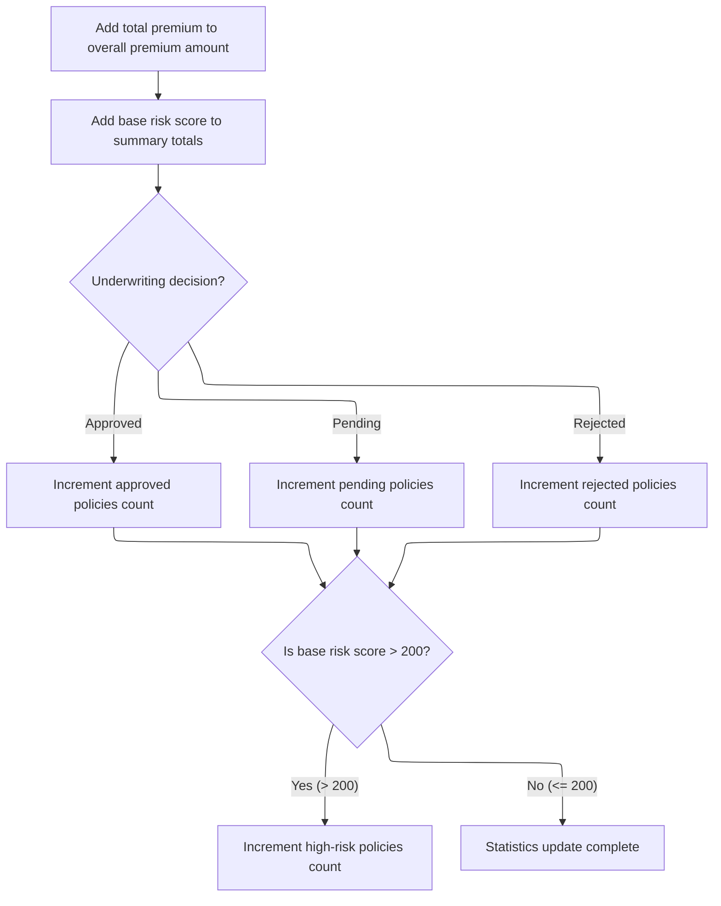

This section is responsible for maintaining accurate statistics on policy outcomes, including premium totals, risk score summaries, and counts of policies by underwriting decision and risk level. These statistics are used for operational reporting and risk management.

| Category        | Rule Name                 | Description                                                                                                                                             |
| --------------- | ------------------------- | ------------------------------------------------------------------------------------------------------------------------------------------------------- |
| Data validation | Decision value validation | The underwriting decision value must be validated to ensure it is one of the accepted values (0 for approved, 1 for pending, 2 for rejected).           |
| Business logic  | Premium accumulation      | The total premium for each processed policy must be added to the overall premium amount tracked for reporting.                                          |
| Business logic  | Risk score accumulation   | The base risk score for each policy must be added to the summary totals to support risk analysis and reporting.                                         |
| Business logic  | Outcome classification    | Each policy must be classified as approved, pending, or rejected based on the underwriting decision, and the corresponding counter must be incremented. |
| Business logic  | High-risk identification  | Only policies with a base risk score greater than 200 must be counted as high-risk, and the high-risk counter must be incremented for these policies.   |

<SwmSnippet path="/base/src/LGAPDB01.cbl" line="365">

---

In <SwmToken path="base/src/LGAPDB01.cbl" pos="365:1:5" line-data="       P011F-UPDATE-STATISTICS.">`P011F-UPDATE-STATISTICS`</SwmToken>, we update the running totals for premium and risk score, then increment the approved, pending, or rejected counters based on <SwmToken path="base/src/LGAPDB01.cbl" pos="369:3:5" line-data="           EVALUATE WS-STAT">`WS-STAT`</SwmToken>. The function assumes <SwmToken path="base/src/LGAPDB01.cbl" pos="369:3:5" line-data="           EVALUATE WS-STAT">`WS-STAT`</SwmToken> is always 0, 1, or 2, mapping directly to those outcomes. This is how we keep track of how many policies fall into each category for later reporting.

```cobol
       P011F-UPDATE-STATISTICS.
           ADD WS-TOT-PREM TO WS-TOTAL-PREMIUM-AMT
           ADD WS-BASE-RISK-SCR TO WS-CONTROL-TOTALS
           
           EVALUATE WS-STAT
               WHEN 0 ADD 1 TO WS-APPROVED-CNT
               WHEN 1 ADD 1 TO WS-PENDING-CNT
               WHEN 2 ADD 1 TO WS-REJECTED-CNT
           END-EVALUATE
```

---

</SwmSnippet>

<SwmSnippet path="/base/src/LGAPDB01.cbl" line="375">

---

After updating the main counters, if the base risk score is over 200, we bump the high risk counter. This is how we track policies that are considered high risk for reporting. The 200 threshold is hardcoded, so only scores above that get counted.

```cobol
           IF WS-BASE-RISK-SCR > 200
               ADD 1 TO WS-HIGH-RISK-CNT
           END-IF.
```

---

</SwmSnippet>

## Handling Error Records After Statistics Update

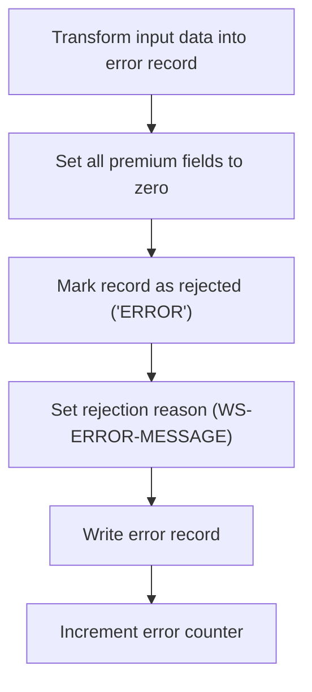

<SwmSnippet path="/base/src/LGAPDB01.cbl" line="243">

---

<SwmToken path="base/src/LGAPDB01.cbl" pos="243:1:7" line-data="       P010-PROCESS-ERROR-RECORD.">`P010-PROCESS-ERROR-RECORD`</SwmToken> copies basic customer and property info to the output, zeroes out all premium and risk fields, sets the status to 'ERROR', and writes only the first character of the error message as the reject reason. Then it writes the record and bumps the error count. This means error records are easy to spot, but the reject reason is not detailed.

```cobol
       P010-PROCESS-ERROR-RECORD.
           MOVE IN-CUSTOMER-NUM TO OUT-CUSTOMER-NUM
           MOVE IN-PROPERTY-TYPE TO OUT-PROPERTY-TYPE
           MOVE IN-POSTCODE TO OUT-POSTCODE
           MOVE ZERO TO OUT-RISK-SCORE
           MOVE ZERO TO OUT-FIRE-PREMIUM
           MOVE ZERO TO OUT-CRIME-PREMIUM
           MOVE ZERO TO OUT-FLOOD-PREMIUM
           MOVE ZERO TO OUT-WEATHER-PREMIUM
           MOVE ZERO TO OUT-TOTAL-PREMIUM
           MOVE 'ERROR' TO OUT-STATUS
           MOVE WS-ERROR-MESSAGE (1) TO OUT-REJECT-REASON
           WRITE OUTPUT-RECORD
           ADD 1 TO WS-ERR-CNT.
```

---

</SwmSnippet>

&nbsp;

*This is an auto-generated document by Swimm 🌊 and has not yet been verified by a human*

<SwmMeta version="3.0.0" repo-id="Z2l0aHViJTNBJTNBU3dpbW1pby1nZW5hcHAtaG91c2UlM0ElM0FHaXJpLVN3aW1t" repo-name="Swimmio-genapp-house"><sup>Powered by [Swimm](https://app.swimm.io/)</sup></SwmMeta>
