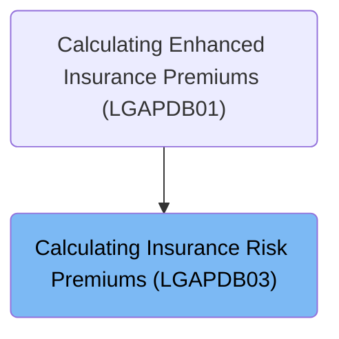
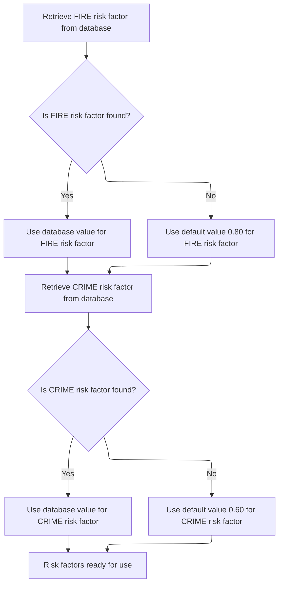
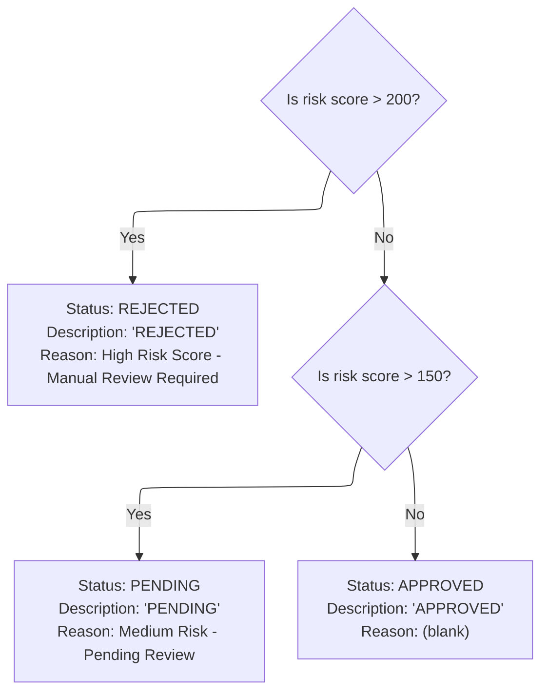

# Overview

This document explains the flow for evaluating insurance applications by retrieving risk factors, calculating a risk score, and assigning a verdict according to business rules.

## Dependencies

### Program

- <SwmToken path="base/src/LGAPDB03.cbl" pos="2:6:6" line-data="       PROGRAM-ID. LGAPDB03.">`LGAPDB03`</SwmToken> (<SwmPath>[base/src/LGAPDB03.cbl](base/src/LGAPDB03.cbl)</SwmPath>)

### Copybook

- SQLCA

# Where is this program used?

This program is used once, as represented in the following diagram:



## Input and Output Tables/Files used in the Program

| Table / File Name                                                                                                          | Type | Description                                                   | Usage Mode | Key Fields / Layout Highlights                                                                                                                                                                                                                                                                               |
| -------------------------------------------------------------------------------------------------------------------------- | ---- | ------------------------------------------------------------- | ---------- | ------------------------------------------------------------------------------------------------------------------------------------------------------------------------------------------------------------------------------------------------------------------------------------------------------------ |
| <SwmToken path="base/src/LGAPDB03.cbl" pos="51:3:3" line-data="               FROM RISK_FACTORS">`RISK_FACTORS`</SwmToken> | DB2  | Peril-specific risk adjustment values for premium calculation | Input      | <SwmToken path="base/src/LGAPDB03.cbl" pos="50:8:12" line-data="               SELECT FACTOR_VALUE INTO :WS-FIRE-FACTOR">`WS-FIRE-FACTOR`</SwmToken>, <SwmToken path="base/src/LGAPDB03.cbl" pos="62:8:12" line-data="               SELECT FACTOR_VALUE INTO :WS-CRIME-FACTOR">`WS-CRIME-FACTOR`</SwmToken> |

&nbsp;

## Detailed View of the Program's Functionality

# Starting the Insurance Calculation Flow

The main logic of the program begins by executing three key steps in sequence. First, it retrieves risk factors from a database or uses default values if the database queries fail. Next, it determines the risk verdict based on the provided risk score. Finally, it calculates the insurance premiums for various perils and the total premium. Each step depends on the results of the previous one, ensuring that all necessary data is available for accurate calculations.

# Fetching and Assigning Risk Factors

The program first attempts to obtain the risk factors for fire and crime perils from a database. For each peril:

- It sends a query to the database to fetch the risk factor value for fire.
- If the database returns a value successfully, that value is used.
- If the database query fails, a default value of <SwmToken path="base/src/LGAPDB03.cbl" pos="58:3:5" line-data="               MOVE 0.80 TO WS-FIRE-FACTOR">`0.80`</SwmToken> is assigned for fire.
- The same process is repeated for the crime peril, with a default value of <SwmToken path="base/src/LGAPDB03.cbl" pos="70:3:5" line-data="               MOVE 0.60 TO WS-CRIME-FACTOR">`0.60`</SwmToken> used if the database query fails.

This guarantees that both fire and crime risk factors have valid values, either from the database or from hardcoded defaults, before any further calculations are performed.

# Making the Risk Verdict Decision

After the risk factors are set, the program evaluates the risk score to determine the insurance application’s status:

- If the risk score is greater than 200, the application is marked as rejected. The status is set to "REJECTED," and a reason is provided indicating that manual review is required due to a high risk score.
- If the risk score is not above 200 but is greater than 150, the application is marked as pending. The status is set to "PENDING," and a reason is provided indicating that the risk is medium and pending review.
- If the risk score is 150 or below, the application is approved. The status is set to "APPROVED," and no rejection reason is given.

This decision logic ensures that applications are categorized according to their risk level, with clear status and reasoning.

# Calculating Premiums

Once the verdict is determined, the program calculates the insurance premiums for each peril (fire, crime, flood, and weather) and the total premium:

- It starts by setting a discount factor to <SwmToken path="base/src/LGAPDB03.cbl" pos="93:3:5" line-data="           MOVE 1.00 TO LK-DISC-FACT">`1.00`</SwmToken>.
- If all peril values (fire, crime, flood, weather) are greater than zero, the discount factor is reduced to <SwmToken path="base/src/LGAPDB03.cbl" pos="17:15:17" line-data="       01  WS-WEATHER-FACTOR           PIC V99 VALUE 0.90.">`0.90`</SwmToken>, applying a discount for comprehensive coverage.
- The premium for each peril is calculated by multiplying the risk score, the corresponding risk factor, the peril value, and the discount factor.
- The total premium is computed by summing the premiums for fire, crime, flood, and weather.

This calculation ensures that the premiums reflect both the risk level and the extent of coverage, with a discount applied for full coverage across all perils.

# Data Definitions

| Table / Record Name                                                                                                        | Type | Short Description                                             | Usage Mode     |
| -------------------------------------------------------------------------------------------------------------------------- | ---- | ------------------------------------------------------------- | -------------- |
| <SwmToken path="base/src/LGAPDB03.cbl" pos="51:3:3" line-data="               FROM RISK_FACTORS">`RISK_FACTORS`</SwmToken> | DB2  | Peril-specific risk adjustment values for premium calculation | Input (SELECT) |

&nbsp;

# Rule Definition

| Paragraph Name                                                                                                                                                                                                                                                                                            | Rule ID | Category          | Description                                                                                                                                                                                                                                                                                                                                                                             | Conditions                                                                                                                                      | Remarks                                                                                                                                                                                                                                                                                                                                                     |
| --------------------------------------------------------------------------------------------------------------------------------------------------------------------------------------------------------------------------------------------------------------------------------------------------------- | ------- | ----------------- | --------------------------------------------------------------------------------------------------------------------------------------------------------------------------------------------------------------------------------------------------------------------------------------------------------------------------------------------------------------------------------------- | ----------------------------------------------------------------------------------------------------------------------------------------------- | ----------------------------------------------------------------------------------------------------------------------------------------------------------------------------------------------------------------------------------------------------------------------------------------------------------------------------------------------------------- |
| <SwmToken path="base/src/LGAPDB03.cbl" pos="43:3:7" line-data="           PERFORM GET-RISK-FACTORS">`GET-RISK-FACTORS`</SwmToken>                                                                                                                                                                         | RL-001  | Conditional Logic | The system retrieves the risk factor for the 'FIRE' peril from the <SwmToken path="base/src/LGAPDB03.cbl" pos="51:3:3" line-data="               FROM RISK_FACTORS">`RISK_FACTORS`</SwmToken> database table. If the value is not found, it defaults to <SwmToken path="base/src/LGAPDB03.cbl" pos="58:3:5" line-data="               MOVE 0.80 TO WS-FIRE-FACTOR">`0.80`</SwmToken>.   | When retrieving the risk factor for 'FIRE' from the database, if the query does not return a value (SQLCODE not 0), the default value is used.  | Default value for FIRE risk factor is <SwmToken path="base/src/LGAPDB03.cbl" pos="58:3:5" line-data="               MOVE 0.80 TO WS-FIRE-FACTOR">`0.80`</SwmToken>. The risk factor is a numeric value (fractional, e.g., <SwmToken path="base/src/LGAPDB03.cbl" pos="58:3:5" line-data="               MOVE 0.80 TO WS-FIRE-FACTOR">`0.80`</SwmToken>).    |
| <SwmToken path="base/src/LGAPDB03.cbl" pos="43:3:7" line-data="           PERFORM GET-RISK-FACTORS">`GET-RISK-FACTORS`</SwmToken>                                                                                                                                                                         | RL-002  | Conditional Logic | The system retrieves the risk factor for the 'CRIME' peril from the <SwmToken path="base/src/LGAPDB03.cbl" pos="51:3:3" line-data="               FROM RISK_FACTORS">`RISK_FACTORS`</SwmToken> database table. If the value is not found, it defaults to <SwmToken path="base/src/LGAPDB03.cbl" pos="70:3:5" line-data="               MOVE 0.60 TO WS-CRIME-FACTOR">`0.60`</SwmToken>. | When retrieving the risk factor for 'CRIME' from the database, if the query does not return a value (SQLCODE not 0), the default value is used. | Default value for CRIME risk factor is <SwmToken path="base/src/LGAPDB03.cbl" pos="70:3:5" line-data="               MOVE 0.60 TO WS-CRIME-FACTOR">`0.60`</SwmToken>. The risk factor is a numeric value (fractional, e.g., <SwmToken path="base/src/LGAPDB03.cbl" pos="70:3:5" line-data="               MOVE 0.60 TO WS-CRIME-FACTOR">`0.60`</SwmToken>). |
| <SwmToken path="base/src/LGAPDB03.cbl" pos="9:1:3" line-data="       WORKING-STORAGE SECTION.">`WORKING-STORAGE`</SwmToken> SECTION (initialization), not explicitly in <SwmToken path="base/src/LGAPDB03.cbl" pos="43:3:7" line-data="           PERFORM GET-RISK-FACTORS">`GET-RISK-FACTORS`</SwmToken> | RL-003  | Data Assignment   | If the risk factor for perils other than FIRE and CRIME (e.g., FLOOD, WEATHER) is not found in the database, the system uses a default value of 0.00.                                                                                                                                                                                                                                   | When a risk factor for a peril other than FIRE or CRIME is not found in the database.                                                           | Default value for other peril risk factors is 0.00. The risk factor is a numeric value (fractional, e.g., 0.00).                                                                                                                                                                                                                                            |
| <SwmToken path="base/src/LGAPDB03.cbl" pos="45:3:5" line-data="           PERFORM CALCULATE-PREMIUMS">`CALCULATE-PREMIUMS`</SwmToken>                                                                                                                                                                     | RL-004  | Conditional Logic | The discount factor is set to <SwmToken path="base/src/LGAPDB03.cbl" pos="17:15:17" line-data="       01  WS-WEATHER-FACTOR           PIC V99 VALUE 0.90.">`0.90`</SwmToken> if all peril values are greater than 0; otherwise, it is set to <SwmToken path="base/src/LGAPDB03.cbl" pos="93:3:5" line-data="           MOVE 1.00 TO LK-DISC-FACT">`1.00`</SwmToken>.                    | If all peril values (FIRE, CRIME, FLOOD, WEATHER) are greater than 0.                                                                           | Discount factor is a numeric value (fractional, e.g., <SwmToken path="base/src/LGAPDB03.cbl" pos="17:15:17" line-data="       01  WS-WEATHER-FACTOR           PIC V99 VALUE 0.90.">`0.90`</SwmToken> or <SwmToken path="base/src/LGAPDB03.cbl" pos="93:3:5" line-data="           MOVE 1.00 TO LK-DISC-FACT">`1.00`</SwmToken>).                            |
| <SwmToken path="base/src/LGAPDB03.cbl" pos="45:3:5" line-data="           PERFORM CALCULATE-PREMIUMS">`CALCULATE-PREMIUMS`</SwmToken>                                                                                                                                                                     | RL-005  | Computation       | The premium for each peril is calculated using the formula: Premium = (risk score \* risk factor) \* peril value \* discount factor.                                                                                                                                                                                                                                                    | For each peril (FIRE, CRIME, FLOOD, WEATHER), after risk factors and discount factor have been determined.                                      | Premium is a numeric value with up to 8 digits before the decimal and 2 digits after (e.g., 99999999.99).                                                                                                                                                                                                                                                   |
| <SwmToken path="base/src/LGAPDB03.cbl" pos="45:3:5" line-data="           PERFORM CALCULATE-PREMIUMS">`CALCULATE-PREMIUMS`</SwmToken>                                                                                                                                                                     | RL-006  | Computation       | The total premium is calculated as the sum of all individual peril premiums.                                                                                                                                                                                                                                                                                                            | After all individual peril premiums have been calculated.                                                                                       | Total premium is a numeric value with up to 9 digits before the decimal and 2 digits after (e.g., 999999999.99).                                                                                                                                                                                                                                            |
| <SwmToken path="base/src/LGAPDB03.cbl" pos="44:3:5" line-data="           PERFORM CALCULATE-VERDICT">`CALCULATE-VERDICT`</SwmToken>                                                                                                                                                                       | RL-007  | Conditional Logic | The system determines the verdict (status, description, and rejection reason) based on the risk score: >200 is REJECTED, >150 is PENDING, otherwise APPROVED.                                                                                                                                                                                                                           | After the risk score is provided.                                                                                                               | Status is a numeric value (0, 1, or 2). Status description is a string up to 20 characters. Rejection reason is a string up to 50 characters. If approved, rejection reason is blank.                                                                                                                                                                       |
| LINKAGE SECTION, PROCEDURE DIVISION USING                                                                                                                                                                                                                                                                 | RL-008  | Data Assignment   | The system must accept and output specific fields via the linkage section, including risk score, peril values, verdict fields, individual premiums, total premium, and discount factor.                                                                                                                                                                                                 | On program invocation and completion.                                                                                                           | Inputs: risk score (numeric, 3 digits), peril values (numeric, 4 digits each). Outputs: status (numeric, 1 digit), status description (string, 20 chars), rejection reason (string, 50 chars), individual premiums (numeric, 8 digits + 2 decimals), total premium (numeric, 9 digits + 2 decimals), discount factor (fractional, 2 decimals).              |

# User Stories

## User Story 1: Retrieve and default risk factors for all peril types

---

### Story Description:

As a system, I want to retrieve the risk factor for each peril type from the database and use default values when not found so that premium calculations are always possible even if some data is missing.

---

### Business Rule Mapping:

| Rule ID | Paragraph Name                                                                                                                                                                                                                                                                                            | Rule Description                                                                                                                                                                                                                                                                                                                                                                        |
| ------- | --------------------------------------------------------------------------------------------------------------------------------------------------------------------------------------------------------------------------------------------------------------------------------------------------------- | --------------------------------------------------------------------------------------------------------------------------------------------------------------------------------------------------------------------------------------------------------------------------------------------------------------------------------------------------------------------------------------- |
| RL-001  | <SwmToken path="base/src/LGAPDB03.cbl" pos="43:3:7" line-data="           PERFORM GET-RISK-FACTORS">`GET-RISK-FACTORS`</SwmToken>                                                                                                                                                                         | The system retrieves the risk factor for the 'FIRE' peril from the <SwmToken path="base/src/LGAPDB03.cbl" pos="51:3:3" line-data="               FROM RISK_FACTORS">`RISK_FACTORS`</SwmToken> database table. If the value is not found, it defaults to <SwmToken path="base/src/LGAPDB03.cbl" pos="58:3:5" line-data="               MOVE 0.80 TO WS-FIRE-FACTOR">`0.80`</SwmToken>.   |
| RL-002  | <SwmToken path="base/src/LGAPDB03.cbl" pos="43:3:7" line-data="           PERFORM GET-RISK-FACTORS">`GET-RISK-FACTORS`</SwmToken>                                                                                                                                                                         | The system retrieves the risk factor for the 'CRIME' peril from the <SwmToken path="base/src/LGAPDB03.cbl" pos="51:3:3" line-data="               FROM RISK_FACTORS">`RISK_FACTORS`</SwmToken> database table. If the value is not found, it defaults to <SwmToken path="base/src/LGAPDB03.cbl" pos="70:3:5" line-data="               MOVE 0.60 TO WS-CRIME-FACTOR">`0.60`</SwmToken>. |
| RL-003  | <SwmToken path="base/src/LGAPDB03.cbl" pos="9:1:3" line-data="       WORKING-STORAGE SECTION.">`WORKING-STORAGE`</SwmToken> SECTION (initialization), not explicitly in <SwmToken path="base/src/LGAPDB03.cbl" pos="43:3:7" line-data="           PERFORM GET-RISK-FACTORS">`GET-RISK-FACTORS`</SwmToken> | If the risk factor for perils other than FIRE and CRIME (e.g., FLOOD, WEATHER) is not found in the database, the system uses a default value of 0.00.                                                                                                                                                                                                                                   |

---

### Relevant Functionality:

- <SwmToken path="base/src/LGAPDB03.cbl" pos="43:3:7" line-data="           PERFORM GET-RISK-FACTORS">`GET-RISK-FACTORS`</SwmToken>
  1. **RL-001:**
     - Query the <SwmToken path="base/src/LGAPDB03.cbl" pos="51:3:3" line-data="               FROM RISK_FACTORS">`RISK_FACTORS`</SwmToken> table for <SwmToken path="base/src/LGAPDB03.cbl" pos="52:3:3" line-data="               WHERE PERIL_TYPE = &#39;FIRE&#39;">`PERIL_TYPE`</SwmToken> = 'FIRE'.
     - If a value is found, use it as the risk factor for FIRE.
     - If not found, set the risk factor for FIRE to <SwmToken path="base/src/LGAPDB03.cbl" pos="58:3:5" line-data="               MOVE 0.80 TO WS-FIRE-FACTOR">`0.80`</SwmToken>.
  2. **RL-002:**
     - Query the <SwmToken path="base/src/LGAPDB03.cbl" pos="51:3:3" line-data="               FROM RISK_FACTORS">`RISK_FACTORS`</SwmToken> table for <SwmToken path="base/src/LGAPDB03.cbl" pos="52:3:3" line-data="               WHERE PERIL_TYPE = &#39;FIRE&#39;">`PERIL_TYPE`</SwmToken> = 'CRIME'.
     - If a value is found, use it as the risk factor for CRIME.
     - If not found, set the risk factor for CRIME to <SwmToken path="base/src/LGAPDB03.cbl" pos="70:3:5" line-data="               MOVE 0.60 TO WS-CRIME-FACTOR">`0.60`</SwmToken>.
- <SwmToken path="base/src/LGAPDB03.cbl" pos="9:1:3" line-data="       WORKING-STORAGE SECTION.">`WORKING-STORAGE`</SwmToken> **SECTION (initialization)**
  1. **RL-003:**
     - For each peril type other than FIRE and CRIME, if a risk factor is not found in the database, set the risk factor to 0.00.

## User Story 2: Calculate discount factor and premiums

---

### Story Description:

As a system, I want to calculate the discount factor and compute the premium for each peril and the total premium so that the correct premium amounts are determined for the user.

---

### Business Rule Mapping:

| Rule ID | Paragraph Name                                                                                                                        | Rule Description                                                                                                                                                                                                                                                                                                                                                     |
| ------- | ------------------------------------------------------------------------------------------------------------------------------------- | -------------------------------------------------------------------------------------------------------------------------------------------------------------------------------------------------------------------------------------------------------------------------------------------------------------------------------------------------------------------- |
| RL-004  | <SwmToken path="base/src/LGAPDB03.cbl" pos="45:3:5" line-data="           PERFORM CALCULATE-PREMIUMS">`CALCULATE-PREMIUMS`</SwmToken> | The discount factor is set to <SwmToken path="base/src/LGAPDB03.cbl" pos="17:15:17" line-data="       01  WS-WEATHER-FACTOR           PIC V99 VALUE 0.90.">`0.90`</SwmToken> if all peril values are greater than 0; otherwise, it is set to <SwmToken path="base/src/LGAPDB03.cbl" pos="93:3:5" line-data="           MOVE 1.00 TO LK-DISC-FACT">`1.00`</SwmToken>. |
| RL-005  | <SwmToken path="base/src/LGAPDB03.cbl" pos="45:3:5" line-data="           PERFORM CALCULATE-PREMIUMS">`CALCULATE-PREMIUMS`</SwmToken> | The premium for each peril is calculated using the formula: Premium = (risk score \* risk factor) \* peril value \* discount factor.                                                                                                                                                                                                                                 |
| RL-006  | <SwmToken path="base/src/LGAPDB03.cbl" pos="45:3:5" line-data="           PERFORM CALCULATE-PREMIUMS">`CALCULATE-PREMIUMS`</SwmToken> | The total premium is calculated as the sum of all individual peril premiums.                                                                                                                                                                                                                                                                                         |

---

### Relevant Functionality:

- <SwmToken path="base/src/LGAPDB03.cbl" pos="45:3:5" line-data="           PERFORM CALCULATE-PREMIUMS">`CALCULATE-PREMIUMS`</SwmToken>
  1. **RL-004:**
     - Set discount factor to <SwmToken path="base/src/LGAPDB03.cbl" pos="93:3:5" line-data="           MOVE 1.00 TO LK-DISC-FACT">`1.00`</SwmToken> by default.
     - If all peril values are greater than 0, set discount factor to <SwmToken path="base/src/LGAPDB03.cbl" pos="17:15:17" line-data="       01  WS-WEATHER-FACTOR           PIC V99 VALUE 0.90.">`0.90`</SwmToken>.
  2. **RL-005:**
     - For each peril:
       - Multiply the risk score by the peril's risk factor.
       - Multiply the result by the peril value.
       - Multiply the result by the discount factor.
       - Store the result as the peril's premium.
  3. **RL-006:**
     - Add the premiums for FIRE, CRIME, FLOOD, and WEATHER perils.
     - Store the sum as the total premium.

## User Story 3: Determine verdict and output all results via linkage section

---

### Story Description:

As a system, I want to determine the verdict status, description, and rejection reason based on the risk score and output all calculated and decision fields via the linkage section so that the user receives a clear decision and all relevant data.

---

### Business Rule Mapping:

| Rule ID | Paragraph Name                                                                                                                      | Rule Description                                                                                                                                                                        |
| ------- | ----------------------------------------------------------------------------------------------------------------------------------- | --------------------------------------------------------------------------------------------------------------------------------------------------------------------------------------- |
| RL-007  | <SwmToken path="base/src/LGAPDB03.cbl" pos="44:3:5" line-data="           PERFORM CALCULATE-VERDICT">`CALCULATE-VERDICT`</SwmToken> | The system determines the verdict (status, description, and rejection reason) based on the risk score: >200 is REJECTED, >150 is PENDING, otherwise APPROVED.                           |
| RL-008  | LINKAGE SECTION, PROCEDURE DIVISION USING                                                                                           | The system must accept and output specific fields via the linkage section, including risk score, peril values, verdict fields, individual premiums, total premium, and discount factor. |

---

### Relevant Functionality:

- <SwmToken path="base/src/LGAPDB03.cbl" pos="44:3:5" line-data="           PERFORM CALCULATE-VERDICT">`CALCULATE-VERDICT`</SwmToken>
  1. **RL-007:**
     - If risk score > 200:
       - Set status to 2
       - Set status description to 'REJECTED'
       - Set rejection reason to 'High Risk Score - Manual Review Required'
     - Else if risk score > 150:
       - Set status to 1
       - Set status description to 'PENDING'
       - Set rejection reason to 'Medium Risk - Pending Review'
     - Else:
       - Set status to 0
       - Set status description to 'APPROVED'
       - Set rejection reason to blank
- **LINKAGE SECTION**
  1. **RL-008:**
     - Accept input fields via linkage section.
     - Populate output fields with computed values and verdict.

# Workflow

# Starting the Insurance Calculation Flow

This section is responsible for orchestrating the insurance calculation process, ensuring that risk factors are retrieved before any verdict or premium calculations are performed.

| Category        | Rule Name                  | Description                                                                                                                                          |
| --------------- | -------------------------- | ---------------------------------------------------------------------------------------------------------------------------------------------------- |
| Data validation | Risk Factor Data Integrity | Insurance verdict and premium calculations must use the risk factor values provided by the risk factor retrieval step, whether fetched or defaulted. |
| Business logic  | Risk Factor Prerequisite   | Risk factor values for fire and crime must be retrieved before any insurance verdict or premium calculations are performed.                          |

<SwmSnippet path="/base/src/LGAPDB03.cbl" line="42">

---

<SwmToken path="base/src/LGAPDB03.cbl" pos="42:1:3" line-data="       MAIN-LOGIC.">`MAIN-LOGIC`</SwmToken> kicks off the flow by calling <SwmToken path="base/src/LGAPDB03.cbl" pos="43:3:7" line-data="           PERFORM GET-RISK-FACTORS">`GET-RISK-FACTORS`</SwmToken>, <SwmToken path="base/src/LGAPDB03.cbl" pos="44:3:5" line-data="           PERFORM CALCULATE-VERDICT">`CALCULATE-VERDICT`</SwmToken>, and <SwmToken path="base/src/LGAPDB03.cbl" pos="45:3:5" line-data="           PERFORM CALCULATE-PREMIUMS">`CALCULATE-PREMIUMS`</SwmToken> in sequence. <SwmToken path="base/src/LGAPDB03.cbl" pos="43:3:7" line-data="           PERFORM GET-RISK-FACTORS">`GET-RISK-FACTORS`</SwmToken> is called first because the risk factor values it fetches are needed for the subsequent calculations. Without these, the verdict and premium logic wouldn't have the right data to work with.

```cobol
       MAIN-LOGIC.
           PERFORM GET-RISK-FACTORS
           PERFORM CALCULATE-VERDICT
           PERFORM CALCULATE-PREMIUMS
           GOBACK.
```

---

</SwmSnippet>

## Fetching and Assigning Risk Factors



This section ensures that risk factor values for FIRE and CRIME are always available for downstream risk calculations, by retrieving them from the database or falling back to default values if necessary.

| Category        | Rule Name                          | Description                                                                                                                                                                                                                            |
| --------------- | ---------------------------------- | -------------------------------------------------------------------------------------------------------------------------------------------------------------------------------------------------------------------------------------- |
| Data validation | Risk factor value guarantee        | Both FIRE and CRIME risk factors must have a usable value (either from the database or default) before proceeding to risk calculations.                                                                                                |
| Business logic  | Database FIRE risk factor usage    | If a FIRE risk factor is found in the database, use that value for all subsequent calculations.                                                                                                                                        |
| Business logic  | Default FIRE risk factor fallback  | If no FIRE risk factor is found in the database, assign a default value of <SwmToken path="base/src/LGAPDB03.cbl" pos="58:3:5" line-data="               MOVE 0.80 TO WS-FIRE-FACTOR">`0.80`</SwmToken> for FIRE risk calculations.    |
| Business logic  | Database CRIME risk factor usage   | If a CRIME risk factor is found in the database, use that value for all subsequent calculations.                                                                                                                                       |
| Business logic  | Default CRIME risk factor fallback | If no CRIME risk factor is found in the database, assign a default value of <SwmToken path="base/src/LGAPDB03.cbl" pos="70:3:5" line-data="               MOVE 0.60 TO WS-CRIME-FACTOR">`0.60`</SwmToken> for CRIME risk calculations. |

<SwmSnippet path="/base/src/LGAPDB03.cbl" line="48">

---

<SwmToken path="base/src/LGAPDB03.cbl" pos="48:1:5" line-data="       GET-RISK-FACTORS.">`GET-RISK-FACTORS`</SwmToken> tries to fetch the FIRE risk factor from the database, and if it can't, it uses a default value.

```cobol
       GET-RISK-FACTORS.
           EXEC SQL
               SELECT FACTOR_VALUE INTO :WS-FIRE-FACTOR
               FROM RISK_FACTORS
               WHERE PERIL_TYPE = 'FIRE'
           END-EXEC.
```

---

</SwmSnippet>

<SwmSnippet path="/base/src/LGAPDB03.cbl" line="55">

---

If the FIRE risk factor query fails, we just assign <SwmToken path="base/src/LGAPDB03.cbl" pos="58:3:5" line-data="               MOVE 0.80 TO WS-FIRE-FACTOR">`0.80`</SwmToken> as a default. This fallback is hardcoded and directly affects the risk calculations downstream.

```cobol
           IF SQLCODE = 0
               CONTINUE
           ELSE
               MOVE 0.80 TO WS-FIRE-FACTOR
           END-IF.
```

---

</SwmSnippet>

<SwmSnippet path="/base/src/LGAPDB03.cbl" line="61">

---

Next we query for the CRIME risk factor, again expecting a single value from the database. If it doesn't work, we'll use a default in the next step.

```cobol
           EXEC SQL
               SELECT FACTOR_VALUE INTO :WS-CRIME-FACTOR
               FROM RISK_FACTORS
               WHERE PERIL_TYPE = 'CRIME'
           END-EXEC.
```

---

</SwmSnippet>

<SwmSnippet path="/base/src/LGAPDB03.cbl" line="67">

---

Finally, if the CRIME risk factor query fails, we set it to <SwmToken path="base/src/LGAPDB03.cbl" pos="70:3:5" line-data="               MOVE 0.60 TO WS-CRIME-FACTOR">`0.60`</SwmToken>. At this point, <SwmToken path="base/src/LGAPDB03.cbl" pos="43:3:7" line-data="           PERFORM GET-RISK-FACTORS">`GET-RISK-FACTORS`</SwmToken> guarantees both FIRE and CRIME factors have usable values for the rest of the flow.

```cobol
           IF SQLCODE = 0
               CONTINUE
           ELSE
               MOVE 0.60 TO WS-CRIME-FACTOR
           END-IF.
```

---

</SwmSnippet>

## Making the Risk Verdict Decision



<SwmSnippet path="/base/src/LGAPDB03.cbl" line="73">

---

<SwmToken path="base/src/LGAPDB03.cbl" pos="73:1:3" line-data="       CALCULATE-VERDICT.">`CALCULATE-VERDICT`</SwmToken> checks the risk score and sets the verdict status, description, and rejection reason based on fixed thresholds. It uses global variables and doesn't take explicit parameters, so the outcome depends on the current state of those variables.

```cobol
       CALCULATE-VERDICT.
           IF LK-RISK-SCORE > 200
             MOVE 2 TO LK-STAT
             MOVE 'REJECTED' TO LK-STAT-DESC
             MOVE 'High Risk Score - Manual Review Required' 
               TO LK-REJ-RSN
           ELSE
             IF LK-RISK-SCORE > 150
               MOVE 1 TO LK-STAT
               MOVE 'PENDING' TO LK-STAT-DESC
               MOVE 'Medium Risk - Pending Review'
                 TO LK-REJ-RSN
             ELSE
               MOVE 0 TO LK-STAT
               MOVE 'APPROVED' TO LK-STAT-DESC
               MOVE SPACES TO LK-REJ-RSN
             END-IF
           END-IF.
```

---

</SwmSnippet>

&nbsp;

*This is an auto-generated document by Swimm 🌊 and has not yet been verified by a human*

<SwmMeta version="3.0.0" repo-id="Z2l0aHViJTNBJTNBU3dpbW1pby1nZW5hcHAtaG91c2UlM0ElM0FHaXJpLVN3aW1t" repo-name="Swimmio-genapp-house"><sup>Powered by [Swimm](https://app.swimm.io/)</sup></SwmMeta>
