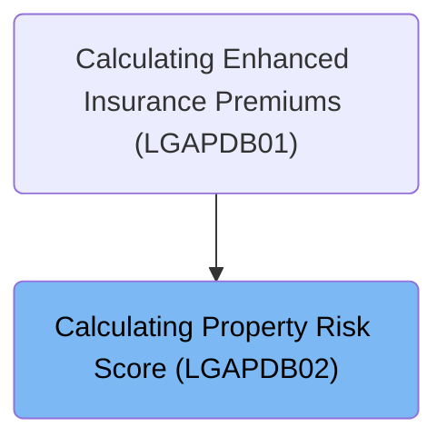

# Overview

## Dependencies

### Program

- LGAPDB02 (<SwmPath>[base/src/LGAPDB02.cbl](base/src/LGAPDB02.cbl)</SwmPath>)

### Copybook

- SQLCA

# Where is this program used?

This program is used once, as represented in the following diagram:

&nbsp;

*This is an auto-generated document by Swimm 🌊 and has not yet been verified by a human*

<SwmMeta version="3.0.0" repo-id="Z2l0aHViJTNBJTNBU3dpbW1pby1nZW5hcHAtaG91c2UlM0ElM0FHaXJpLVN3aW1t" repo-name="Swimmio-genapp-house">Powered by [Swimm](https://app.swimm.io/)</SwmMeta>
