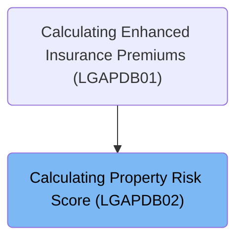
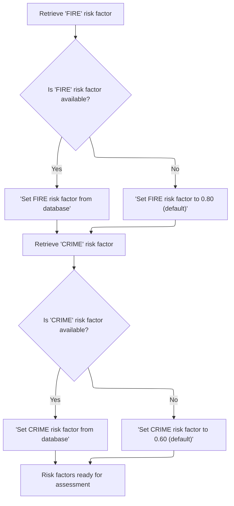
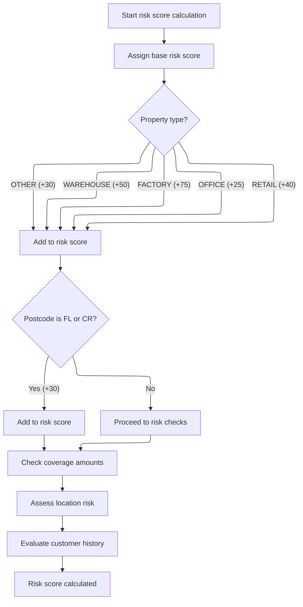

# Overview

This document describes the flow for calculating a property risk score. The process gathers risk factors, computes an initial score based on property details, and adjusts the score according to coverage amounts. The resulting risk score is used in property insurance assessments.

## Dependencies

### Program

- <SwmToken path="base/src/LGAPDB02.cbl" pos="2:6:6" line-data="       PROGRAM-ID. LGAPDB02.">`LGAPDB02`</SwmToken> (<SwmPath>[base/src/LGAPDB02.cbl](base/src/LGAPDB02.cbl)</SwmPath>)

### Copybook

- SQLCA

# Where is this program used?

This program is used once, as represented in the following diagram:



## Input and Output Tables/Files used in the Program

| Table / File Name                                                                                                          | Type | Description                                                  | Usage Mode | Key Fields / Layout Highlights                                                                                                                                                                                                                                                                               |
| -------------------------------------------------------------------------------------------------------------------------- | ---- | ------------------------------------------------------------ | ---------- | ------------------------------------------------------------------------------------------------------------------------------------------------------------------------------------------------------------------------------------------------------------------------------------------------------------ |
| <SwmToken path="base/src/LGAPDB02.cbl" pos="47:3:3" line-data="               FROM RISK_FACTORS">`RISK_FACTORS`</SwmToken> | DB2  | Peril-specific risk adjustment factors for insurance scoring | Input      | <SwmToken path="base/src/LGAPDB02.cbl" pos="46:8:12" line-data="               SELECT FACTOR_VALUE INTO :WS-FIRE-FACTOR">`WS-FIRE-FACTOR`</SwmToken>, <SwmToken path="base/src/LGAPDB02.cbl" pos="58:8:12" line-data="               SELECT FACTOR_VALUE INTO :WS-CRIME-FACTOR">`WS-CRIME-FACTOR`</SwmToken> |

&nbsp;

## Detailed View of the Program's Functionality

a. Program Initialization and Data Structure Setup

The program begins by declaring its identity and setting up the environment and configuration. It defines several data storage areas:

- Temporary storage for risk factors (fire, crime, flood, weather), each with a default value.
- A variable to track the maximum coverage amount found during processing.
- A constant representing the $500,000 coverage threshold.
- Input parameters (linkage section) for property type, postcode, geographic coordinates, coverage amounts for different perils, customer history, and the risk score to be calculated.

b. Main Flow Control

The main logic of the program is straightforward:

1. It first attempts to retrieve risk factors for fire and crime from a database, falling back to default values if the database does not provide them.
2. It then calculates the risk score using the property and coverage data, as well as the risk factors.
3. Finally, it exits the program.

c. Fetching Risk Factors

The program tries to retrieve the fire risk factor from a database table. If the database query is successful, it uses the value from the database. If not, it sets the fire risk factor to a default value of <SwmToken path="base/src/LGAPDB02.cbl" pos="54:3:5" line-data="               MOVE 0.80 TO WS-FIRE-FACTOR">`0.80`</SwmToken>.

The same process is repeated for the crime risk factor: it attempts to fetch the value from the database, and if unsuccessful, sets it to a default of <SwmToken path="base/src/LGAPDB02.cbl" pos="66:3:5" line-data="               MOVE 0.60 TO WS-CRIME-FACTOR">`0.60`</SwmToken>.

At the end of this step, both fire and crime risk factors are guaranteed to have values, either from the database or from defaults.

d. Calculating the Risk Score

The risk score calculation proceeds as follows:

1. The score is initialized to 100.
2. The property type is evaluated:
   - If it is a warehouse, 50 is added to the score.
   - If it is a factory, 75 is added.
   - If it is an office, 25 is added.
   - If it is retail, 40 is added.
   - For any other type, 30 is added.
3. The postcode is checked. If it starts with 'FL' or 'CR', 30 is added to the score.
4. The program then checks the coverage amounts to see if a further adjustment is needed.
5. It assesses the location risk based on latitude and longitude.
6. It evaluates the customer’s history for additional score adjustments.

e. Evaluating Coverage Impact

To determine if the risk score should be increased due to high coverage:

1. The program initializes the maximum coverage found to zero.
2. It compares the fire coverage amount to the current maximum; if higher, it updates the maximum.
3. It repeats this comparison for crime, flood, and weather coverage amounts, always updating the maximum if a higher value is found.
4. After all comparisons, if the highest coverage amount is greater than $500,000, the risk score is increased by 15.

f. Assessing Location Risk

The program evaluates the risk based on the property’s geographic coordinates:

1. If the property is in the New York City area (latitude between 40 and 41, longitude between -74.5 and -73.5) or the Los Angeles area (latitude between 34 and 35, longitude between -118.5 and -117.5), it adds 10 to the risk score.
2. If not in those cities but within the continental United States (latitude between 25 and 49, longitude between -125 and -66), it adds 5 to the risk score.
3. If outside these ranges, it adds 20 to the risk score, reflecting higher uncertainty or risk.

g. Evaluating Customer History

The customer’s history is used to further adjust the risk score:

1. If the customer is new ('N'), 10 is added to the score.
2. If the customer has a good history ('G'), 5 is subtracted from the score.
3. If the customer is risky ('R'), 25 is added to the score.
4. For any other value, 10 is added to the score.

h. Program Exit

After all calculations and adjustments, the program completes its execution and returns control to the caller. The final risk score is available in the designated output parameter.

# Data Definitions

| Table / Record Name                                                                                                        | Type | Short Description                                            | Usage Mode     |
| -------------------------------------------------------------------------------------------------------------------------- | ---- | ------------------------------------------------------------ | -------------- |
| <SwmToken path="base/src/LGAPDB02.cbl" pos="47:3:3" line-data="               FROM RISK_FACTORS">`RISK_FACTORS`</SwmToken> | DB2  | Peril-specific risk adjustment factors for insurance scoring | Input (SELECT) |

&nbsp;

# Rule Definition

| Paragraph Name                                                                                                                                       | Rule ID | Category          | Description                                                                                                                                                                                                                                                                                                                                                                                                                                                                                                            | Conditions                                                                                                                                                                                                                                                                                                                | Remarks                                                                                                                                                                                                                                                                                                                                                                                                                                                                                                                                                                                                                                                                                                                                                                                                                                                                                                                                                                                                                                                                                                                                                                       |
| ---------------------------------------------------------------------------------------------------------------------------------------------------- | ------- | ----------------- | ---------------------------------------------------------------------------------------------------------------------------------------------------------------------------------------------------------------------------------------------------------------------------------------------------------------------------------------------------------------------------------------------------------------------------------------------------------------------------------------------------------------------- | ------------------------------------------------------------------------------------------------------------------------------------------------------------------------------------------------------------------------------------------------------------------------------------------------------------------------- | ----------------------------------------------------------------------------------------------------------------------------------------------------------------------------------------------------------------------------------------------------------------------------------------------------------------------------------------------------------------------------------------------------------------------------------------------------------------------------------------------------------------------------------------------------------------------------------------------------------------------------------------------------------------------------------------------------------------------------------------------------------------------------------------------------------------------------------------------------------------------------------------------------------------------------------------------------------------------------------------------------------------------------------------------------------------------------------------------------------------------------------------------------------------------------- |
| <SwmToken path="base/src/LGAPDB02.cbl" pos="40:3:7" line-data="           PERFORM GET-RISK-FACTORS">`GET-RISK-FACTORS`</SwmToken>                    | RL-001  | Data Assignment   | The program retrieves the fire risk factor from the <SwmToken path="base/src/LGAPDB02.cbl" pos="47:3:3" line-data="               FROM RISK_FACTORS">`RISK_FACTORS`</SwmToken> table using <SwmToken path="base/src/LGAPDB02.cbl" pos="48:3:3" line-data="               WHERE PERIL_TYPE = &#39;FIRE&#39;">`PERIL_TYPE`</SwmToken> = 'FIRE'. If not found, it uses the default value <SwmToken path="base/src/LGAPDB02.cbl" pos="54:3:5" line-data="               MOVE 0.80 TO WS-FIRE-FACTOR">`0.80`</SwmToken>.    | <SwmToken path="base/src/LGAPDB02.cbl" pos="48:3:3" line-data="               WHERE PERIL_TYPE = &#39;FIRE&#39;">`PERIL_TYPE`</SwmToken> = 'FIRE' in <SwmToken path="base/src/LGAPDB02.cbl" pos="47:3:3" line-data="               FROM RISK_FACTORS">`RISK_FACTORS`</SwmToken> table. If SQLCODE is not 0, use default.  | Default value is <SwmToken path="base/src/LGAPDB02.cbl" pos="54:3:5" line-data="               MOVE 0.80 TO WS-FIRE-FACTOR">`0.80`</SwmToken>. The factor is a decimal number (e.g., <SwmToken path="base/src/LGAPDB02.cbl" pos="54:3:5" line-data="               MOVE 0.80 TO WS-FIRE-FACTOR">`0.80`</SwmToken>).                                                                                                                                                                                                                                                                                                                                                                                                                                                                                                                                                                                                                                                                                                                                                                                                                                                           |
| <SwmToken path="base/src/LGAPDB02.cbl" pos="40:3:7" line-data="           PERFORM GET-RISK-FACTORS">`GET-RISK-FACTORS`</SwmToken>                    | RL-002  | Data Assignment   | The program retrieves the crime risk factor from the <SwmToken path="base/src/LGAPDB02.cbl" pos="47:3:3" line-data="               FROM RISK_FACTORS">`RISK_FACTORS`</SwmToken> table using <SwmToken path="base/src/LGAPDB02.cbl" pos="48:3:3" line-data="               WHERE PERIL_TYPE = &#39;FIRE&#39;">`PERIL_TYPE`</SwmToken> = 'CRIME'. If not found, it uses the default value <SwmToken path="base/src/LGAPDB02.cbl" pos="66:3:5" line-data="               MOVE 0.60 TO WS-CRIME-FACTOR">`0.60`</SwmToken>. | <SwmToken path="base/src/LGAPDB02.cbl" pos="48:3:3" line-data="               WHERE PERIL_TYPE = &#39;FIRE&#39;">`PERIL_TYPE`</SwmToken> = 'CRIME' in <SwmToken path="base/src/LGAPDB02.cbl" pos="47:3:3" line-data="               FROM RISK_FACTORS">`RISK_FACTORS`</SwmToken> table. If SQLCODE is not 0, use default. | Default value is <SwmToken path="base/src/LGAPDB02.cbl" pos="66:3:5" line-data="               MOVE 0.60 TO WS-CRIME-FACTOR">`0.60`</SwmToken>. The factor is a decimal number (e.g., <SwmToken path="base/src/LGAPDB02.cbl" pos="66:3:5" line-data="               MOVE 0.60 TO WS-CRIME-FACTOR">`0.60`</SwmToken>).                                                                                                                                                                                                                                                                                                                                                                                                                                                                                                                                                                                                                                                                                                                                                                                                                                                         |
| <SwmToken path="base/src/LGAPDB02.cbl" pos="41:3:7" line-data="           PERFORM CALCULATE-RISK-SCORE">`CALCULATE-RISK-SCORE`</SwmToken>            | RL-003  | Data Assignment   | The risk score calculation begins with a base score of 100.                                                                                                                                                                                                                                                                                                                                                                                                                                                            | Always applies at the start of risk score calculation.                                                                                                                                                                                                                                                                    | Base score is 100. Output field is a number (<SwmToken path="base/src/LGAPDB02.cbl" pos="70:7:11" line-data="           MOVE 100 TO LK-RISK-SCORE">`LK-RISK-SCORE`</SwmToken>, 3 digits).                                                                                                                                                                                                                                                                                                                                                                                                                                                                                                                                                                                                                                                                                                                                                                                                                                                                                                                                                                                     |
| <SwmToken path="base/src/LGAPDB02.cbl" pos="41:3:7" line-data="           PERFORM CALCULATE-RISK-SCORE">`CALCULATE-RISK-SCORE`</SwmToken>            | RL-004  | Conditional Logic | The risk score is increased by a fixed amount depending on the property type.                                                                                                                                                                                                                                                                                                                                                                                                                                          | Property type is one of WAREHOUSE, FACTORY, OFFICE, RETAIL, or other.                                                                                                                                                                                                                                                     | WAREHOUSE: +50, FACTORY: +75, OFFICE: +25, RETAIL: +40, Other: +30. Property type is a string up to 15 characters.                                                                                                                                                                                                                                                                                                                                                                                                                                                                                                                                                                                                                                                                                                                                                                                                                                                                                                                                                                                                                                                            |
| <SwmToken path="base/src/LGAPDB02.cbl" pos="41:3:7" line-data="           PERFORM CALCULATE-RISK-SCORE">`CALCULATE-RISK-SCORE`</SwmToken>            | RL-005  | Conditional Logic | If the first two characters of the postcode are 'FL' or 'CR', increase risk score by 30.                                                                                                                                                                                                                                                                                                                                                                                                                               | <SwmToken path="base/src/LGAPDB02.cbl" pos="85:3:5" line-data="           IF LK-POSTCODE(1:2) = &#39;FL&#39; OR">`LK-POSTCODE`</SwmToken>(1:2) = 'FL' or 'CR'.                                                                                                                                                            | Increase by 30. Postcode is a string up to 8 characters.                                                                                                                                                                                                                                                                                                                                                                                                                                                                                                                                                                                                                                                                                                                                                                                                                                                                                                                                                                                                                                                                                                                      |
| <SwmToken path="base/src/LGAPDB02.cbl" pos="90:3:7" line-data="           PERFORM CHECK-COVERAGE-AMOUNTS">`CHECK-COVERAGE-AMOUNTS`</SwmToken>        | RL-006  | Computation       | The program determines the maximum value among fire, crime, flood, and weather coverage.                                                                                                                                                                                                                                                                                                                                                                                                                               | Always applies during risk score calculation.                                                                                                                                                                                                                                                                             | Coverage values are decimal numbers up to 8 digits and 2 decimals.                                                                                                                                                                                                                                                                                                                                                                                                                                                                                                                                                                                                                                                                                                                                                                                                                                                                                                                                                                                                                                                                                                            |
| <SwmToken path="base/src/LGAPDB02.cbl" pos="90:3:7" line-data="           PERFORM CHECK-COVERAGE-AMOUNTS">`CHECK-COVERAGE-AMOUNTS`</SwmToken>        | RL-007  | Conditional Logic | If the maximum coverage value is greater than 500,000, increase risk score by 15.                                                                                                                                                                                                                                                                                                                                                                                                                                      | Maximum coverage > 500,000.                                                                                                                                                                                                                                                                                               | Threshold is 500,000. Increase by 15.                                                                                                                                                                                                                                                                                                                                                                                                                                                                                                                                                                                                                                                                                                                                                                                                                                                                                                                                                                                                                                                                                                                                         |
| <SwmToken path="base/src/LGAPDB02.cbl" pos="91:3:7" line-data="           PERFORM ASSESS-LOCATION-RISK  ">`ASSESS-LOCATION-RISK`</SwmToken>          | RL-008  | Conditional Logic | Risk score is adjusted based on location: NYC area (+10), LA area (+10), continental US (+5), else (+20).                                                                                                                                                                                                                                                                                                                                                                                                              | Latitude and longitude ranges as specified.                                                                                                                                                                                                                                                                               | NYC: 40.000000-41.000000, <SwmToken path="base/src/LGAPDB02.cbl" pos="122:7:10" line-data="               LK-LONGITUDE &gt; -74.500000 AND LK-LONGITUDE &lt; -73.500000) OR">`-74.500000`</SwmToken> to <SwmToken path="base/src/LGAPDB02.cbl" pos="122:20:23" line-data="               LK-LONGITUDE &gt; -74.500000 AND LK-LONGITUDE &lt; -73.500000) OR">`-73.500000`</SwmToken>; LA: 34.000000-35.000000, <SwmToken path="base/src/LGAPDB02.cbl" pos="124:7:10" line-data="               LK-LONGITUDE &gt; -118.500000 AND LK-LONGITUDE &lt; -117.500000)">`-118.500000`</SwmToken> to <SwmToken path="base/src/LGAPDB02.cbl" pos="124:20:23" line-data="               LK-LONGITUDE &gt; -118.500000 AND LK-LONGITUDE &lt; -117.500000)">`-117.500000`</SwmToken>; Continental US: 25.000000-49.000000, <SwmToken path="base/src/LGAPDB02.cbl" pos="129:7:10" line-data="                   LK-LONGITUDE &gt; -125.000000 AND LK-LONGITUDE &lt; -66.000000)">`-125.000000`</SwmToken> to <SwmToken path="base/src/LGAPDB02.cbl" pos="129:20:23" line-data="                   LK-LONGITUDE &gt; -125.000000 AND LK-LONGITUDE &lt; -66.000000)">`-66.000000`</SwmToken>. |
| <SwmToken path="base/src/LGAPDB02.cbl" pos="92:3:7" line-data="           PERFORM EVALUATE-CUSTOMER-HISTORY.">`EVALUATE-CUSTOMER-HISTORY`</SwmToken> | RL-009  | Conditional Logic | Risk score is adjusted based on customer history: N (+10), G (-5), R (+25), other (+10).                                                                                                                                                                                                                                                                                                                                                                                                                               | Customer history value is N, G, R, or other.                                                                                                                                                                                                                                                                              | N: +10, G: -5, R: +25, Other: +10. Customer history is a single character.                                                                                                                                                                                                                                                                                                                                                                                                                                                                                                                                                                                                                                                                                                                                                                                                                                                                                                                                                                                                                                                                                                    |
| <SwmToken path="base/src/LGAPDB02.cbl" pos="41:3:7" line-data="           PERFORM CALCULATE-RISK-SCORE">`CALCULATE-RISK-SCORE`</SwmToken>            | RL-010  | Data Assignment   | The final risk score is written to the output property data record.                                                                                                                                                                                                                                                                                                                                                                                                                                                    | After all calculations are complete.                                                                                                                                                                                                                                                                                      | Risk score is a number, 3 digits (<SwmToken path="base/src/LGAPDB02.cbl" pos="70:7:11" line-data="           MOVE 100 TO LK-RISK-SCORE">`LK-RISK-SCORE`</SwmToken>).                                                                                                                                                                                                                                                                                                                                                                                                                                                                                                                                                                                                                                                                                                                                                                                                                                                                                                                                                                                                          |

# User Stories

## User Story 1: Retrieve risk factors for calculation

---

### Story Description:

As a system, I want to retrieve fire and crime risk factors from the <SwmToken path="base/src/LGAPDB02.cbl" pos="47:3:3" line-data="               FROM RISK_FACTORS">`RISK_FACTORS`</SwmToken> table or use default values so that I can use accurate risk factors in the risk score calculation.

---

### Business Rule Mapping:

| Rule ID | Paragraph Name                                                                                                                    | Rule Description                                                                                                                                                                                                                                                                                                                                                                                                                                                                                                       |
| ------- | --------------------------------------------------------------------------------------------------------------------------------- | ---------------------------------------------------------------------------------------------------------------------------------------------------------------------------------------------------------------------------------------------------------------------------------------------------------------------------------------------------------------------------------------------------------------------------------------------------------------------------------------------------------------------- |
| RL-001  | <SwmToken path="base/src/LGAPDB02.cbl" pos="40:3:7" line-data="           PERFORM GET-RISK-FACTORS">`GET-RISK-FACTORS`</SwmToken> | The program retrieves the fire risk factor from the <SwmToken path="base/src/LGAPDB02.cbl" pos="47:3:3" line-data="               FROM RISK_FACTORS">`RISK_FACTORS`</SwmToken> table using <SwmToken path="base/src/LGAPDB02.cbl" pos="48:3:3" line-data="               WHERE PERIL_TYPE = &#39;FIRE&#39;">`PERIL_TYPE`</SwmToken> = 'FIRE'. If not found, it uses the default value <SwmToken path="base/src/LGAPDB02.cbl" pos="54:3:5" line-data="               MOVE 0.80 TO WS-FIRE-FACTOR">`0.80`</SwmToken>.    |
| RL-002  | <SwmToken path="base/src/LGAPDB02.cbl" pos="40:3:7" line-data="           PERFORM GET-RISK-FACTORS">`GET-RISK-FACTORS`</SwmToken> | The program retrieves the crime risk factor from the <SwmToken path="base/src/LGAPDB02.cbl" pos="47:3:3" line-data="               FROM RISK_FACTORS">`RISK_FACTORS`</SwmToken> table using <SwmToken path="base/src/LGAPDB02.cbl" pos="48:3:3" line-data="               WHERE PERIL_TYPE = &#39;FIRE&#39;">`PERIL_TYPE`</SwmToken> = 'CRIME'. If not found, it uses the default value <SwmToken path="base/src/LGAPDB02.cbl" pos="66:3:5" line-data="               MOVE 0.60 TO WS-CRIME-FACTOR">`0.60`</SwmToken>. |

---

### Relevant Functionality:

- <SwmToken path="base/src/LGAPDB02.cbl" pos="40:3:7" line-data="           PERFORM GET-RISK-FACTORS">`GET-RISK-FACTORS`</SwmToken>
  1. **RL-001:**
     - Execute SQL SELECT for fire risk factor
     - If SQLCODE = 0, use retrieved value
     - Else, assign default value <SwmToken path="base/src/LGAPDB02.cbl" pos="54:3:5" line-data="               MOVE 0.80 TO WS-FIRE-FACTOR">`0.80`</SwmToken>
  2. **RL-002:**
     - Execute SQL SELECT for crime risk factor
     - If SQLCODE = 0, use retrieved value
     - Else, assign default value <SwmToken path="base/src/LGAPDB02.cbl" pos="66:3:5" line-data="               MOVE 0.60 TO WS-CRIME-FACTOR">`0.60`</SwmToken>

## User Story 2: Calculate and output property risk score

---

### Story Description:

As a property insurance user, I want the system to calculate a risk score for my property based on property type, postcode, coverage amounts, location, and customer history so that I can understand the risk profile and receive appropriate insurance terms.

---

### Business Rule Mapping:

| Rule ID | Paragraph Name                                                                                                                                       | Rule Description                                                                                          |
| ------- | ---------------------------------------------------------------------------------------------------------------------------------------------------- | --------------------------------------------------------------------------------------------------------- |
| RL-003  | <SwmToken path="base/src/LGAPDB02.cbl" pos="41:3:7" line-data="           PERFORM CALCULATE-RISK-SCORE">`CALCULATE-RISK-SCORE`</SwmToken>            | The risk score calculation begins with a base score of 100.                                               |
| RL-004  | <SwmToken path="base/src/LGAPDB02.cbl" pos="41:3:7" line-data="           PERFORM CALCULATE-RISK-SCORE">`CALCULATE-RISK-SCORE`</SwmToken>            | The risk score is increased by a fixed amount depending on the property type.                             |
| RL-005  | <SwmToken path="base/src/LGAPDB02.cbl" pos="41:3:7" line-data="           PERFORM CALCULATE-RISK-SCORE">`CALCULATE-RISK-SCORE`</SwmToken>            | If the first two characters of the postcode are 'FL' or 'CR', increase risk score by 30.                  |
| RL-010  | <SwmToken path="base/src/LGAPDB02.cbl" pos="41:3:7" line-data="           PERFORM CALCULATE-RISK-SCORE">`CALCULATE-RISK-SCORE`</SwmToken>            | The final risk score is written to the output property data record.                                       |
| RL-006  | <SwmToken path="base/src/LGAPDB02.cbl" pos="90:3:7" line-data="           PERFORM CHECK-COVERAGE-AMOUNTS">`CHECK-COVERAGE-AMOUNTS`</SwmToken>        | The program determines the maximum value among fire, crime, flood, and weather coverage.                  |
| RL-007  | <SwmToken path="base/src/LGAPDB02.cbl" pos="90:3:7" line-data="           PERFORM CHECK-COVERAGE-AMOUNTS">`CHECK-COVERAGE-AMOUNTS`</SwmToken>        | If the maximum coverage value is greater than 500,000, increase risk score by 15.                         |
| RL-008  | <SwmToken path="base/src/LGAPDB02.cbl" pos="91:3:7" line-data="           PERFORM ASSESS-LOCATION-RISK  ">`ASSESS-LOCATION-RISK`</SwmToken>          | Risk score is adjusted based on location: NYC area (+10), LA area (+10), continental US (+5), else (+20). |
| RL-009  | <SwmToken path="base/src/LGAPDB02.cbl" pos="92:3:7" line-data="           PERFORM EVALUATE-CUSTOMER-HISTORY.">`EVALUATE-CUSTOMER-HISTORY`</SwmToken> | Risk score is adjusted based on customer history: N (+10), G (-5), R (+25), other (+10).                  |

---

### Relevant Functionality:

- <SwmToken path="base/src/LGAPDB02.cbl" pos="41:3:7" line-data="           PERFORM CALCULATE-RISK-SCORE">`CALCULATE-RISK-SCORE`</SwmToken>
  1. **RL-003:**
     - Assign 100 to risk score
  2. **RL-004:**
     - Evaluate property type
       - If WAREHOUSE, add 50
       - If FACTORY, add 75
       - If OFFICE, add 25
       - If RETAIL, add 40
       - Else, add 30
  3. **RL-005:**
     - If postcode starts with FL or CR, add 30 to risk score
  4. **RL-010:**
     - After all adjustments, risk score is present in output record
- <SwmToken path="base/src/LGAPDB02.cbl" pos="90:3:7" line-data="           PERFORM CHECK-COVERAGE-AMOUNTS">`CHECK-COVERAGE-AMOUNTS`</SwmToken>
  1. **RL-006:**
     - Initialize max coverage to zero
     - For each coverage type:
       - If coverage > current max, set max to coverage
  2. **RL-007:**
     - If max coverage > 500,000, add 15 to risk score
- <SwmToken path="base/src/LGAPDB02.cbl" pos="91:3:7" line-data="           PERFORM ASSESS-LOCATION-RISK  ">`ASSESS-LOCATION-RISK`</SwmToken>
  1. **RL-008:**
     - If in NYC or LA area, add 10
     - Else if in continental US, add 5
     - Else, add 20
- <SwmToken path="base/src/LGAPDB02.cbl" pos="92:3:7" line-data="           PERFORM EVALUATE-CUSTOMER-HISTORY.">`EVALUATE-CUSTOMER-HISTORY`</SwmToken>
  1. **RL-009:**
     - Evaluate customer history
       - If N, add 10
       - If G, subtract 5
       - If R, add 25
       - Else, add 10

# Workflow

# Starting the Risk Assessment Flow

This section initiates the risk assessment process for a property by gathering necessary risk factors and calculating a risk score. It ensures that all required data is collected and processed before concluding the flow.

| Category       | Rule Name                          | Description                                                                                                                       |
| -------------- | ---------------------------------- | --------------------------------------------------------------------------------------------------------------------------------- |
| Business logic | Fetch Current Risk Factors         | The risk assessment flow must always begin by obtaining the latest fire and crime risk factors for the property under evaluation. |
| Business logic | Mandatory Risk Score Calculation   | A risk score must be calculated for every property assessment using the collected risk factors and property data.                 |
| Business logic | Flow Termination After Calculation | The flow must terminate after the risk score is calculated, ensuring no further processing occurs in this section.                |

<SwmSnippet path="/base/src/LGAPDB02.cbl" line="39">

---

<SwmToken path="base/src/LGAPDB02.cbl" pos="39:1:3" line-data="       MAIN-LOGIC.">`MAIN-LOGIC`</SwmToken> kicks off the flow by first calling <SwmToken path="base/src/LGAPDB02.cbl" pos="40:3:7" line-data="           PERFORM GET-RISK-FACTORS">`GET-RISK-FACTORS`</SwmToken> to fetch or set risk factors for fire and crime, which are needed for the risk score calculation. It then calls <SwmToken path="base/src/LGAPDB02.cbl" pos="41:3:7" line-data="           PERFORM CALCULATE-RISK-SCORE">`CALCULATE-RISK-SCORE`</SwmToken> to compute the risk score using those factors and other property data. The flow ends with GOBACK.

```cobol
       MAIN-LOGIC.
           PERFORM GET-RISK-FACTORS
           PERFORM CALCULATE-RISK-SCORE
           GOBACK.
```

---

</SwmSnippet>

# Fetching Risk Factors from Database



This section ensures that risk factors for 'FIRE' and 'CRIME' are always available for risk assessment, either by retrieving them from the database or by assigning default values if the database does not provide them.

| Category        | Rule Name                        | Description                                                                                                                        |
| --------------- | -------------------------------- | ---------------------------------------------------------------------------------------------------------------------------------- |
| Data validation | Risk factor value guarantee      | Both 'FIRE' and 'CRIME' risk factors must have a value (either from the database or default) before proceeding to risk assessment. |
| Business logic  | Database fire risk factor usage  | If the 'FIRE' risk factor is available in the database, use the value provided by the database for risk assessment.                |
| Business logic  | Database crime risk factor usage | If the 'CRIME' risk factor is available in the database, use the value provided by the database for risk assessment.               |

<SwmSnippet path="/base/src/LGAPDB02.cbl" line="44">

---

<SwmToken path="base/src/LGAPDB02.cbl" pos="44:1:5" line-data="       GET-RISK-FACTORS.">`GET-RISK-FACTORS`</SwmToken> tries to fetch the fire risk factor from the database, and falls back to a default if it can't.

```cobol
       GET-RISK-FACTORS.
           EXEC SQL
               SELECT FACTOR_VALUE INTO :WS-FIRE-FACTOR
               FROM RISK_FACTORS
               WHERE PERIL_TYPE = 'FIRE'
           END-EXEC.
```

---

</SwmSnippet>

<SwmSnippet path="/base/src/LGAPDB02.cbl" line="51">

---

After trying to fetch the fire risk factor, if the query fails, we set it to <SwmToken path="base/src/LGAPDB02.cbl" pos="54:3:5" line-data="               MOVE 0.80 TO WS-FIRE-FACTOR">`0.80`</SwmToken>. This fallback keeps the flow moving even if the database is missing data.

```cobol
           IF SQLCODE = 0
               CONTINUE
           ELSE
               MOVE 0.80 TO WS-FIRE-FACTOR
           END-IF.
```

---

</SwmSnippet>

<SwmSnippet path="/base/src/LGAPDB02.cbl" line="57">

---

Next we run the same type of query for the crime risk factor, prepping for another fallback if needed.

```cobol
           EXEC SQL
               SELECT FACTOR_VALUE INTO :WS-CRIME-FACTOR
               FROM RISK_FACTORS
               WHERE PERIL_TYPE = 'CRIME'
           END-EXEC.
```

---

</SwmSnippet>

<SwmSnippet path="/base/src/LGAPDB02.cbl" line="63">

---

If the crime risk factor query fails, we set it to <SwmToken path="base/src/LGAPDB02.cbl" pos="66:3:5" line-data="               MOVE 0.60 TO WS-CRIME-FACTOR">`0.60`</SwmToken>. At this point, both risk factors are guaranteed to have values, either from the database or defaults, ready for the next calculation.

```cobol
           IF SQLCODE = 0
               CONTINUE
           ELSE
               MOVE 0.60 TO WS-CRIME-FACTOR
           END-IF.
```

---

</SwmSnippet>

# Computing Initial Risk Score



This section establishes the initial risk score for a property by applying fixed increments based on property type and postcode. The score serves as the foundation for subsequent risk adjustments.

| Category       | Rule Name                      | Description                                                                                                                                                                                  |
| -------------- | ------------------------------ | -------------------------------------------------------------------------------------------------------------------------------------------------------------------------------------------- |
| Business logic | Base risk score initialization | The base risk score for every property is set to 100 before any adjustments are made.                                                                                                        |
| Business logic | Property type risk adjustment  | If the property type is 'WAREHOUSE', 50 is added to the risk score. If 'FACTORY', 75 is added. If 'OFFICE', 25 is added. If 'RETAIL', 40 is added. For any other property type, 30 is added. |
| Business logic | Postcode risk adjustment       | If the postcode prefix is 'FL' or 'CR', 30 is added to the risk score to account for higher risk in those areas.                                                                             |

<SwmSnippet path="/base/src/LGAPDB02.cbl" line="69">

---

In <SwmToken path="base/src/LGAPDB02.cbl" pos="69:1:5" line-data="       CALCULATE-RISK-SCORE.">`CALCULATE-RISK-SCORE`</SwmToken>, we start by setting a base score and then bump it up based on the property type using fixed increments. This sets the initial risk level before any other adjustments.

```cobol
       CALCULATE-RISK-SCORE.
           MOVE 100 TO LK-RISK-SCORE

           EVALUATE LK-PROPERTY-TYPE
             WHEN 'WAREHOUSE'
               ADD 50 TO LK-RISK-SCORE
             WHEN 'FACTORY' 
               ADD 75 TO LK-RISK-SCORE
             WHEN 'OFFICE'
               ADD 25 TO LK-RISK-SCORE
             WHEN 'RETAIL'
               ADD 40 TO LK-RISK-SCORE
             WHEN OTHER
               ADD 30 TO LK-RISK-SCORE
           END-EVALUATE
```

---

</SwmSnippet>

<SwmSnippet path="/base/src/LGAPDB02.cbl" line="85">

---

After setting the property type score, we check the postcode prefix. If it's 'FL' or 'CR', we bump the score up by 30 to account for higher risk in those areas.

```cobol
           IF LK-POSTCODE(1:2) = 'FL' OR
              LK-POSTCODE(1:2) = 'CR'
             ADD 30 TO LK-RISK-SCORE
           END-IF
```

---

</SwmSnippet>

<SwmSnippet path="/base/src/LGAPDB02.cbl" line="90">

---

Once the base score is set and postcode checked, we call <SwmToken path="base/src/LGAPDB02.cbl" pos="90:3:7" line-data="           PERFORM CHECK-COVERAGE-AMOUNTS">`CHECK-COVERAGE-AMOUNTS`</SwmToken> to see if high coverage should bump the risk score further. Then we move on to location and customer history checks.

```cobol
           PERFORM CHECK-COVERAGE-AMOUNTS
           PERFORM ASSESS-LOCATION-RISK  
           PERFORM EVALUATE-CUSTOMER-HISTORY.
```

---

</SwmSnippet>

# Evaluating Coverage Impact

```mermaid
%%{init: {"flowchart": {"defaultRenderer": "elk"}} }%%
flowchart TD
    node1["Start: Set maximum coverage to zero"]
    click node1 openCode "base/src/LGAPDB02.cbl:95:95"
    node1 --> node2{"Is fire coverage higher than current maximum?"}
    click node2 openCode "base/src/LGAPDB02.cbl:97:99"
    node2 -->|"Yes"| node3["Set maximum to fire coverage"]
    click node3 openCode "base/src/LGAPDB02.cbl:98:98"
    node2 -->|"No"| node4
    node3 --> node4
    node4{"Is crime coverage higher than current maximum?"}
    click node4 openCode "base/src/LGAPDB02.cbl:101:103"
    node4 -->|"Yes"| node5["Set maximum to crime coverage"]
    click node5 openCode "base/src/LGAPDB02.cbl:102:102"
    node4 -->|"No"| node6
    node5 --> node6
    node6{"Is flood coverage higher than current maximum?"}
    click node6 openCode "base/src/LGAPDB02.cbl:105:107"
    node6 -->|"Yes"| node7["Set maximum to flood coverage"]
    click node7 openCode "base/src/LGAPDB02.cbl:106:106"
    node6 -->|"No"| node8
    node7 --> node8
    node8{"Is weather coverage higher than current maximum?"}
    click node8 openCode "base/src/LGAPDB02.cbl:109:111"
    node8 -->|"Yes"| node9["Set maximum to weather coverage"]
    click node9 openCode "base/src/LGAPDB02.cbl:110:110"
    node8 -->|"No"| node10
    node9 --> node10
    node10{"Is maximum coverage > $500,000?"}
    click node10 openCode "base/src/LGAPDB02.cbl:113:115"
    node10 -->|"Yes"| node11["Increase risk score by 15"]
    click node11 openCode "base/src/LGAPDB02.cbl:114:114"
    node10 -->|"No"| node12["No change to risk score"]
    click node12 openCode "base/src/LGAPDB02.cbl:115:115"
classDef HeadingStyle fill:#777777,stroke:#333,stroke-width:2px;

%% Swimm:
%% %%{init: {"flowchart": {"defaultRenderer": "elk"}} }%%
%% flowchart TD
%%     node1["Start: Set maximum coverage to zero"]
%%     click node1 openCode "<SwmPath>[base/src/LGAPDB02.cbl](base/src/LGAPDB02.cbl)</SwmPath>:95:95"
%%     node1 --> node2{"Is fire coverage higher than current maximum?"}
%%     click node2 openCode "<SwmPath>[base/src/LGAPDB02.cbl](base/src/LGAPDB02.cbl)</SwmPath>:97:99"
%%     node2 -->|"Yes"| node3["Set maximum to fire coverage"]
%%     click node3 openCode "<SwmPath>[base/src/LGAPDB02.cbl](base/src/LGAPDB02.cbl)</SwmPath>:98:98"
%%     node2 -->|"No"| node4
%%     node3 --> node4
%%     node4{"Is crime coverage higher than current maximum?"}
%%     click node4 openCode "<SwmPath>[base/src/LGAPDB02.cbl](base/src/LGAPDB02.cbl)</SwmPath>:101:103"
%%     node4 -->|"Yes"| node5["Set maximum to crime coverage"]
%%     click node5 openCode "<SwmPath>[base/src/LGAPDB02.cbl](base/src/LGAPDB02.cbl)</SwmPath>:102:102"
%%     node4 -->|"No"| node6
%%     node5 --> node6
%%     node6{"Is flood coverage higher than current maximum?"}
%%     click node6 openCode "<SwmPath>[base/src/LGAPDB02.cbl](base/src/LGAPDB02.cbl)</SwmPath>:105:107"
%%     node6 -->|"Yes"| node7["Set maximum to flood coverage"]
%%     click node7 openCode "<SwmPath>[base/src/LGAPDB02.cbl](base/src/LGAPDB02.cbl)</SwmPath>:106:106"
%%     node6 -->|"No"| node8
%%     node7 --> node8
%%     node8{"Is weather coverage higher than current maximum?"}
%%     click node8 openCode "<SwmPath>[base/src/LGAPDB02.cbl](base/src/LGAPDB02.cbl)</SwmPath>:109:111"
%%     node8 -->|"Yes"| node9["Set maximum to weather coverage"]
%%     click node9 openCode "<SwmPath>[base/src/LGAPDB02.cbl](base/src/LGAPDB02.cbl)</SwmPath>:110:110"
%%     node8 -->|"No"| node10
%%     node9 --> node10
%%     node10{"Is maximum coverage > $500,000?"}
%%     click node10 openCode "<SwmPath>[base/src/LGAPDB02.cbl](base/src/LGAPDB02.cbl)</SwmPath>:113:115"
%%     node10 -->|"Yes"| node11["Increase risk score by 15"]
%%     click node11 openCode "<SwmPath>[base/src/LGAPDB02.cbl](base/src/LGAPDB02.cbl)</SwmPath>:114:114"
%%     node10 -->|"No"| node12["No change to risk score"]
%%     click node12 openCode "<SwmPath>[base/src/LGAPDB02.cbl](base/src/LGAPDB02.cbl)</SwmPath>:115:115"
%% classDef HeadingStyle fill:#777777,stroke:#333,stroke-width:2px;
```



This section determines the highest coverage amount from multiple coverage types and adjusts the risk score if the coverage exceeds a defined threshold.

| Category       | Rule Name                       | Description                                                                                                        |
| -------------- | ------------------------------- | ------------------------------------------------------------------------------------------------------------------ |
| Business logic | Maximum coverage selection      | The maximum coverage amount must be set to the highest value among fire, crime, flood, and weather coverage types. |
| Business logic | High coverage risk adjustment   | If the highest coverage amount exceeds $500,000, the risk score must be increased by 15 points.                    |
| Business logic | Standard coverage risk handling | If the highest coverage amount does not exceed $500,000, the risk score must remain unchanged.                     |

<SwmSnippet path="/base/src/LGAPDB02.cbl" line="94">

---

In <SwmToken path="base/src/LGAPDB02.cbl" pos="94:1:5" line-data="       CHECK-COVERAGE-AMOUNTS.">`CHECK-COVERAGE-AMOUNTS`</SwmToken>, we start by setting the max coverage to zero and then compare each coverage type to find the highest one. This sets up the next step where we decide if the risk score needs to be bumped.

```cobol
       CHECK-COVERAGE-AMOUNTS.
           MOVE ZERO TO WS-MAX-COVERAGE
           
           IF LK-FIRE-COVERAGE > WS-MAX-COVERAGE
               MOVE LK-FIRE-COVERAGE TO WS-MAX-COVERAGE
           END-IF
```

---

</SwmSnippet>

<SwmSnippet path="/base/src/LGAPDB02.cbl" line="101">

---

Next we compare crime coverage to the current max and update if it's higher. We repeat this for each coverage type.

```cobol
           IF LK-CRIME-COVERAGE > WS-MAX-COVERAGE
               MOVE LK-CRIME-COVERAGE TO WS-MAX-COVERAGE
           END-IF
```

---

</SwmSnippet>

<SwmSnippet path="/base/src/LGAPDB02.cbl" line="105">

---

We check if flood coverage is bigger than the current max.

```cobol
           IF LK-FLOOD-COVERAGE > WS-MAX-COVERAGE
               MOVE LK-FLOOD-COVERAGE TO WS-MAX-COVERAGE
           END-IF
```

---

</SwmSnippet>

<SwmSnippet path="/base/src/LGAPDB02.cbl" line="109">

---

Finally we check weather coverage, updating the max if needed. Now we've got the highest coverage amount ready for the threshold check.

```cobol
           IF LK-WEATHER-COVERAGE > WS-MAX-COVERAGE
               MOVE LK-WEATHER-COVERAGE TO WS-MAX-COVERAGE
           END-IF
```

---

</SwmSnippet>

<SwmSnippet path="/base/src/LGAPDB02.cbl" line="113">

---

If the max coverage is over <SwmToken path="base/src/LGAPDB02.cbl" pos="113:15:15" line-data="           IF WS-MAX-COVERAGE &gt; WS-COVERAGE-500K">`500K`</SwmToken>, we add 15 to the risk score. This step flags high-value policies as riskier.

```cobol
           IF WS-MAX-COVERAGE > WS-COVERAGE-500K
               ADD 15 TO LK-RISK-SCORE
           END-IF.
```

---

</SwmSnippet>

&nbsp;

*This is an auto-generated document by Swimm 🌊 and has not yet been verified by a human*

<SwmMeta version="3.0.0" repo-id="Z2l0aHViJTNBJTNBU3dpbW1pby1nZW5hcHAtaG91c2UlM0ElM0FHaXJpLVN3aW1t" repo-name="Swimmio-genapp-house"><sup>Powered by [Swimm](https://app.swimm.io/)</sup></SwmMeta>
