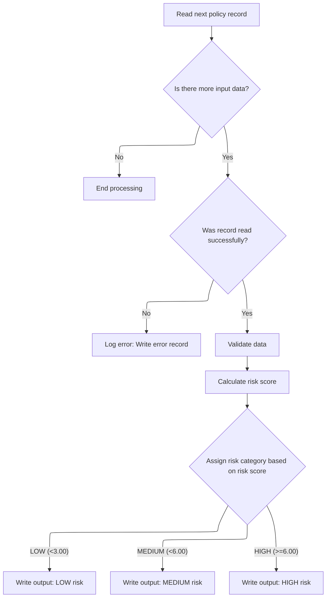

# Overview

This flow transforms insurance policy records by reading, validating, calculating risk, and assigning a risk category before writing the results to an output file. Each processed record includes the policy number, risk score, and risk category.

## Dependencies

### Program

- RISKPROG (<SwmPath>[base/src/lgarsk01.cbl](base/src/lgarsk01.cbl)</SwmPath>)

## Input and Output Tables/Files used in the Program

| Table / File Name                                                                                                                       | Type | Description                                            | Usage Mode | Key Fields / Layout Highlights |
| --------------------------------------------------------------------------------------------------------------------------------------- | ---- | ------------------------------------------------------ | ---------- | ------------------------------ |
| <SwmToken path="base/src/lgarsk01.cbl" pos="12:3:5" line-data="           SELECT ERROR-FILE ASSIGN TO ERRFILE">`ERROR-FILE`</SwmToken>  | File | Policy numbers and error messages for failed records   | Output     | File resource                  |
| <SwmToken path="base/src/lgarsk01.cbl" pos="88:3:5" line-data="               WRITE ERROR-RECORD">`ERROR-RECORD`</SwmToken>             | File | Single error entry: policy number and error detail     | Output     | File resource                  |
| <SwmToken path="base/src/lgarsk01.cbl" pos="80:3:5" line-data="           READ INPUT-FILE">`INPUT-FILE`</SwmToken>                      | File | Insurance policy and property risk input records       | Input      | File resource                  |
| <SwmToken path="base/src/lgarsk01.cbl" pos="9:3:5" line-data="           SELECT OUTPUT-FILE ASSIGN TO OUTFILE">`OUTPUT-FILE`</SwmToken> | File | Calculated risk scores and categories for policies     | Output     | File resource                  |
| <SwmToken path="base/src/lgarsk01.cbl" pos="154:3:5" line-data="           WRITE OUTPUT-RECORD.">`OUTPUT-RECORD`</SwmToken>             | File | Single output entry: policy, risk score, risk category | Output     | File resource                  |

&nbsp;

## Detailed View of the Program's Functionality

a. Program Initialization and File Handling

The program begins by defining three files: an input file for reading policy data, an output file for writing processed results, and an error file for logging issues. Each file is set up with its own structure and status tracking. When the program starts, it attempts to open all three files. If the input file cannot be opened successfully, an error message is displayed and the program is set to stop processing further records.

b. Main Processing Loop

After initialization, the program enters its main loop. This loop continues until it reaches the end of the input file. For each iteration, the program attempts to read the next policy record from the input file. If there are no more records, it marks the end-of-file and exits the loop. If a read error occurs, it logs the error by copying the policy number and an error message into the error file, then skips further processing for that record.

c. Record Validation

For each successfully read record, the program first validates the data. Specifically, it checks if the policy number is missing or blank. If the policy number is invalid, it writes an error message to the error file and skips further processing for that record.

d. Risk Score Calculation

If the record passes validation, the program calculates a risk score for the policy. This calculation involves several steps:

- It determines a base risk score based on the property type (e.g., office, retail, warehouse, industrial, or other).
- It adjusts the score based on the number of claims associated with the policy, using different factors for zero, few, or many claims.
- It computes a location factor using several property-related numeric fields, each weighted differently.
- The final risk score is calculated by multiplying the base risk, claim factor, and location factor together. If the result exceeds a maximum allowed value, it is capped.

e. Writing Output Records

Once the risk score is calculated, the program prepares the output record. It copies the policy number and the calculated risk score into the output structure. Then, it assigns a risk category based on the score:

- If the score is less than <SwmToken path="base/src/lgarsk01.cbl" pos="147:11:13" line-data="               WHEN WS-F-RSK &lt; 3.00">`3.00`</SwmToken>, the policy is labeled as "LOW" risk.
- If the score is less than <SwmToken path="base/src/lgarsk01.cbl" pos="149:11:13" line-data="               WHEN WS-F-RSK &lt; 6.00">`6.00`</SwmToken> but at least <SwmToken path="base/src/lgarsk01.cbl" pos="147:11:13" line-data="               WHEN WS-F-RSK &lt; 3.00">`3.00`</SwmToken>, it is labeled as "MEDIUM" risk.
- If the score is <SwmToken path="base/src/lgarsk01.cbl" pos="149:11:13" line-data="               WHEN WS-F-RSK &lt; 6.00">`6.00`</SwmToken> or higher, it is labeled as "HIGH" risk. The completed output record is then written to the output file.

f. Closing Files and Program Termination

After all records have been processed, the program closes all three files (input, output, and error files) to ensure data integrity. The program then terminates cleanly.

# Rule Definition

| Paragraph Name                                                                                                                                                                                                                                                 | Rule ID | Category          | Description                                                                                                                                                                                                | Conditions                                                               | Remarks                                                                                                                                                                                                                                                                                                                                                                                                                                                                                                                                                                                                                                                                                                           |
| -------------------------------------------------------------------------------------------------------------------------------------------------------------------------------------------------------------------------------------------------------------- | ------- | ----------------- | ---------------------------------------------------------------------------------------------------------------------------------------------------------------------------------------------------------- | ------------------------------------------------------------------------ | ----------------------------------------------------------------------------------------------------------------------------------------------------------------------------------------------------------------------------------------------------------------------------------------------------------------------------------------------------------------------------------------------------------------------------------------------------------------------------------------------------------------------------------------------------------------------------------------------------------------------------------------------------------------------------------------------------------------- |
| <SwmToken path="base/src/lgarsk01.cbl" pos="92:3:7" line-data="           PERFORM 2100-VALIDATE-DATA">`2100-VALIDATE-DATA`</SwmToken>                                                                                                                          | RL-001  | Conditional Logic | Check if the policy number is blank (all spaces). If blank, write an error record and skip further processing for that record.                                                                             | Policy number field contains only spaces.                                | Error record format: <SwmToken path="base/src/lgarsk01.cbl" pos="86:11:15" line-data="               MOVE IN-POLICY-NUM TO ERR-POLICY-NUM">`ERR-POLICY-NUM`</SwmToken> (string, 10 chars), <SwmToken path="base/src/lgarsk01.cbl" pos="87:13:15" line-data="               MOVE &#39;ERROR READING RECORD&#39; TO ERR-MESSAGE">`ERR-MESSAGE`</SwmToken> (string, 90 chars, value 'INVALID POLICY NUMBER').                                                                                                                                                                                                                                                                                                        |
| <SwmToken path="base/src/lgarsk01.cbl" pos="93:3:7" line-data="           PERFORM 2200-CALCULATE-RISK">`2200-CALCULATE-RISK`</SwmToken>                                                                                                                        | RL-002  | Data Assignment   | Assign base risk score based on property type.                                                                                                                                                             | Property type is one of OFFICE, RETAIL, WAREHOUSE, INDUSTRIAL, or other. | Base risk score values: OFFICE=<SwmToken path="base/src/lgarsk01.cbl" pos="110:3:5" line-data="                   MOVE 1.00 TO WS-BS-RS">`1.00`</SwmToken>, RETAIL=<SwmToken path="base/src/lgarsk01.cbl" pos="112:3:5" line-data="                   MOVE 1.25 TO WS-BS-RS">`1.25`</SwmToken>, WAREHOUSE=<SwmToken path="base/src/lgarsk01.cbl" pos="114:3:5" line-data="                   MOVE 1.50 TO WS-BS-RS">`1.50`</SwmToken>, INDUSTRIAL=<SwmToken path="base/src/lgarsk01.cbl" pos="116:3:5" line-data="                   MOVE 2.00 TO WS-BS-RS">`2.00`</SwmToken>, Other=<SwmToken path="base/src/lgarsk01.cbl" pos="118:3:5" line-data="                   MOVE 1.75 TO WS-BS-RS">`1.75`</SwmToken>. |
| <SwmToken path="base/src/lgarsk01.cbl" pos="93:3:7" line-data="           PERFORM 2200-CALCULATE-RISK">`2200-CALCULATE-RISK`</SwmToken>                                                                                                                        | RL-003  | Data Assignment   | Assign claim factor based on the number of claims.                                                                                                                                                         | Claim count is 0, <=2, or >2.                                            | Claim factor values: 0 claims=<SwmToken path="base/src/lgarsk01.cbl" pos="122:3:5" line-data="               MOVE 0.80 TO WS-CL-F">`0.80`</SwmToken>, 1-2 claims=<SwmToken path="base/src/lgarsk01.cbl" pos="124:3:5" line-data="               MOVE 1.30 TO WS-CL-F">`1.30`</SwmToken>, >2 claims=<SwmToken path="base/src/lgarsk01.cbl" pos="114:3:5" line-data="                   MOVE 1.50 TO WS-BS-RS">`1.50`</SwmToken>.                                                                                                                                                                                                                                                                                   |
| <SwmToken path="base/src/lgarsk01.cbl" pos="93:3:7" line-data="           PERFORM 2200-CALCULATE-RISK">`2200-CALCULATE-RISK`</SwmToken>                                                                                                                        | RL-004  | Computation       | Calculate location factor using peril percentages.                                                                                                                                                         | Valid peril percentage values provided.                                  | Location factor formula: 1 + (fire peril \* <SwmToken path="base/src/lgarsk01.cbl" pos="130:10:12" line-data="               (IN-FR-PR * 0.2) +">`0.2`</SwmToken>) + (crime peril \* <SwmToken path="base/src/lgarsk01.cbl" pos="130:10:12" line-data="               (IN-FR-PR * 0.2) +">`0.2`</SwmToken>) + (flood peril \* <SwmToken path="base/src/lgarsk01.cbl" pos="132:10:12" line-data="               (IN-FL-PR * 0.3) +">`0.3`</SwmToken>) + (weather peril \* <SwmToken path="base/src/lgarsk01.cbl" pos="130:10:12" line-data="               (IN-FR-PR * 0.2) +">`0.2`</SwmToken>). All peril values are numbers.                                                                                    |
| <SwmToken path="base/src/lgarsk01.cbl" pos="93:3:7" line-data="           PERFORM 2200-CALCULATE-RISK">`2200-CALCULATE-RISK`</SwmToken>                                                                                                                        | RL-005  | Computation       | Calculate the final risk score, round to two decimal places, and cap at <SwmToken path="base/src/lgarsk01.cbl" pos="138:11:13" line-data="           IF WS-F-RSK &gt; 9.99">`9.99`</SwmToken> if exceeded. | Base risk score, claim factor, and location factor have been assigned.   | Final risk score = base risk score \* claim factor \* location factor. Rounded to two decimal places. If ><SwmToken path="base/src/lgarsk01.cbl" pos="138:11:13" line-data="           IF WS-F-RSK &gt; 9.99">`9.99`</SwmToken>, set to <SwmToken path="base/src/lgarsk01.cbl" pos="138:11:13" line-data="           IF WS-F-RSK &gt; 9.99">`9.99`</SwmToken>. Output field <SwmToken path="base/src/lgarsk01.cbl" pos="144:11:15" line-data="           MOVE WS-F-RSK TO OUT-RISK-SCORE">`OUT-RISK-SCORE`</SwmToken>: numeric, 5 digits (3 before decimal, 2 after).                                                                                                                                             |
| <SwmToken path="base/src/lgarsk01.cbl" pos="94:3:7" line-data="           PERFORM 2300-WRITE-OUTPUT">`2300-WRITE-OUTPUT`</SwmToken>                                                                                                                            | RL-006  | Conditional Logic | Assign risk category based on risk score.                                                                                                                                                                  | Final risk score has been calculated.                                    | Risk categories: LOW (<<SwmToken path="base/src/lgarsk01.cbl" pos="147:11:13" line-data="               WHEN WS-F-RSK &lt; 3.00">`3.00`</SwmToken>), MEDIUM (<<SwmToken path="base/src/lgarsk01.cbl" pos="149:11:13" line-data="               WHEN WS-F-RSK &lt; 6.00">`6.00`</SwmToken>), HIGH (>=<SwmToken path="base/src/lgarsk01.cbl" pos="149:11:13" line-data="               WHEN WS-F-RSK &lt; 6.00">`6.00`</SwmToken>). Output field <SwmToken path="base/src/lgarsk01.cbl" pos="148:10:14" line-data="                   MOVE &#39;LOW      &#39; TO OUT-RISK-CATEGORY">`OUT-RISK-CATEGORY`</SwmToken>: string, 10 chars, left-aligned, padded with spaces.                                            |
| <SwmToken path="base/src/lgarsk01.cbl" pos="94:3:7" line-data="           PERFORM 2300-WRITE-OUTPUT">`2300-WRITE-OUTPUT`</SwmToken>                                                                                                                            | RL-007  | Data Assignment   | Write output record for valid input records with policy number, risk score, and risk category.                                                                                                             | Input record is valid (policy number not blank).                         | Output record format: <SwmToken path="base/src/lgarsk01.cbl" pos="143:11:15" line-data="           MOVE IN-POLICY-NUM TO OUT-POLICY-NUM">`OUT-POLICY-NUM`</SwmToken> (string, 10 chars), <SwmToken path="base/src/lgarsk01.cbl" pos="144:11:15" line-data="           MOVE WS-F-RSK TO OUT-RISK-SCORE">`OUT-RISK-SCORE`</SwmToken> (number, 5 digits: 3 before decimal, 2 after), <SwmToken path="base/src/lgarsk01.cbl" pos="148:10:14" line-data="                   MOVE &#39;LOW      &#39; TO OUT-RISK-CATEGORY">`OUT-RISK-CATEGORY`</SwmToken> (string, 10 chars, left-aligned, padded with spaces), FILLER (string, 75 chars).                                                                             |
| <SwmToken path="base/src/lgarsk01.cbl" pos="92:3:7" line-data="           PERFORM 2100-VALIDATE-DATA">`2100-VALIDATE-DATA`</SwmToken>                                                                                                                          | RL-008  | Data Assignment   | Write error record for invalid input records (blank policy number) with policy number and error message.                                                                                                   | Policy number is blank.                                                  | Error record format: <SwmToken path="base/src/lgarsk01.cbl" pos="86:11:15" line-data="               MOVE IN-POLICY-NUM TO ERR-POLICY-NUM">`ERR-POLICY-NUM`</SwmToken> (string, 10 chars), <SwmToken path="base/src/lgarsk01.cbl" pos="87:13:15" line-data="               MOVE &#39;ERROR READING RECORD&#39; TO ERR-MESSAGE">`ERR-MESSAGE`</SwmToken> (string, 90 chars, value 'INVALID POLICY NUMBER').                                                                                                                                                                                                                                                                                                        |
| <SwmToken path="base/src/lgarsk01.cbl" pos="64:1:3" line-data="       0000-MAIN.">`0000-MAIN`</SwmToken>, <SwmToken path="base/src/lgarsk01.cbl" pos="66:3:5" line-data="           PERFORM 2000-PROCESS UNTIL WS-EOF = &#39;Y&#39;">`2000-PROCESS`</SwmToken> | RL-009  | Conditional Logic | Process each record from the input file one at a time, in order, until all records have been processed.                                                                                                    | Input file is open and not at end-of-file.                               | Records are processed sequentially in a loop until the end-of-file condition is reached.                                                                                                                                                                                                                                                                                                                                                                                                                                                                                                                                                                                                                          |

# User Stories

## User Story 1: Policy Number Validation and Error Handling

---

### Story Description:

As a user, I want the system to process each input record sequentially, validate the policy number, and write an error record to the error file if the policy number is blank so that invalid records are flagged and not processed further.

---

### Business Rule Mapping:

| Rule ID | Paragraph Name                                                                                                                                                                                                                                                 | Rule Description                                                                                                               |
| ------- | -------------------------------------------------------------------------------------------------------------------------------------------------------------------------------------------------------------------------------------------------------------- | ------------------------------------------------------------------------------------------------------------------------------ |
| RL-009  | <SwmToken path="base/src/lgarsk01.cbl" pos="64:1:3" line-data="       0000-MAIN.">`0000-MAIN`</SwmToken>, <SwmToken path="base/src/lgarsk01.cbl" pos="66:3:5" line-data="           PERFORM 2000-PROCESS UNTIL WS-EOF = &#39;Y&#39;">`2000-PROCESS`</SwmToken> | Process each record from the input file one at a time, in order, until all records have been processed.                        |
| RL-001  | <SwmToken path="base/src/lgarsk01.cbl" pos="92:3:7" line-data="           PERFORM 2100-VALIDATE-DATA">`2100-VALIDATE-DATA`</SwmToken>                                                                                                                          | Check if the policy number is blank (all spaces). If blank, write an error record and skip further processing for that record. |
| RL-008  | <SwmToken path="base/src/lgarsk01.cbl" pos="92:3:7" line-data="           PERFORM 2100-VALIDATE-DATA">`2100-VALIDATE-DATA`</SwmToken>                                                                                                                          | Write error record for invalid input records (blank policy number) with policy number and error message.                       |

---

### Relevant Functionality:

- <SwmToken path="base/src/lgarsk01.cbl" pos="64:1:3" line-data="       0000-MAIN.">`0000-MAIN`</SwmToken>
  1. **RL-009:**
     - Open input, output, and error files
     - Loop: Read the next record from the input file
       - If the end-of-file condition is met, exit loop
       - Otherwise, process the record
- <SwmToken path="base/src/lgarsk01.cbl" pos="92:3:7" line-data="           PERFORM 2100-VALIDATE-DATA">`2100-VALIDATE-DATA`</SwmToken>
  1. **RL-001:**
     - If policy number is blank:
       - Set error message to 'INVALID POLICY NUMBER'
       - Write error record with policy number and message
       - Skip further processing for this record
  2. **RL-008:**
     - Move policy number to error field
     - Move error message to error field
     - Write error record

## User Story 2: Risk Assessment for Valid Records

---

### Story Description:

As a user, I want the system to process each valid input record sequentially and calculate the risk score using property type, claim count, and peril percentages, rounding and capping the score as needed, so that each policy's risk is accurately assessed.

---

### Business Rule Mapping:

| Rule ID | Paragraph Name                                                                                                                                                                                                                                                 | Rule Description                                                                                                                                                                                           |
| ------- | -------------------------------------------------------------------------------------------------------------------------------------------------------------------------------------------------------------------------------------------------------------- | ---------------------------------------------------------------------------------------------------------------------------------------------------------------------------------------------------------- |
| RL-009  | <SwmToken path="base/src/lgarsk01.cbl" pos="64:1:3" line-data="       0000-MAIN.">`0000-MAIN`</SwmToken>, <SwmToken path="base/src/lgarsk01.cbl" pos="66:3:5" line-data="           PERFORM 2000-PROCESS UNTIL WS-EOF = &#39;Y&#39;">`2000-PROCESS`</SwmToken> | Process each record from the input file one at a time, in order, until all records have been processed.                                                                                                    |
| RL-002  | <SwmToken path="base/src/lgarsk01.cbl" pos="93:3:7" line-data="           PERFORM 2200-CALCULATE-RISK">`2200-CALCULATE-RISK`</SwmToken>                                                                                                                        | Assign base risk score based on property type.                                                                                                                                                             |
| RL-003  | <SwmToken path="base/src/lgarsk01.cbl" pos="93:3:7" line-data="           PERFORM 2200-CALCULATE-RISK">`2200-CALCULATE-RISK`</SwmToken>                                                                                                                        | Assign claim factor based on the number of claims.                                                                                                                                                         |
| RL-004  | <SwmToken path="base/src/lgarsk01.cbl" pos="93:3:7" line-data="           PERFORM 2200-CALCULATE-RISK">`2200-CALCULATE-RISK`</SwmToken>                                                                                                                        | Calculate location factor using peril percentages.                                                                                                                                                         |
| RL-005  | <SwmToken path="base/src/lgarsk01.cbl" pos="93:3:7" line-data="           PERFORM 2200-CALCULATE-RISK">`2200-CALCULATE-RISK`</SwmToken>                                                                                                                        | Calculate the final risk score, round to two decimal places, and cap at <SwmToken path="base/src/lgarsk01.cbl" pos="138:11:13" line-data="           IF WS-F-RSK &gt; 9.99">`9.99`</SwmToken> if exceeded. |

---

### Relevant Functionality:

- <SwmToken path="base/src/lgarsk01.cbl" pos="64:1:3" line-data="       0000-MAIN.">`0000-MAIN`</SwmToken>
  1. **RL-009:**
     - Open input, output, and error files
     - Loop: Read the next record from the input file
       - If the end-of-file condition is met, exit loop
       - Otherwise, process the record
- <SwmToken path="base/src/lgarsk01.cbl" pos="93:3:7" line-data="           PERFORM 2200-CALCULATE-RISK">`2200-CALCULATE-RISK`</SwmToken>
  1. **RL-002:**
     - Evaluate property type:
       - If OFFICE, set base risk score to <SwmToken path="base/src/lgarsk01.cbl" pos="110:3:5" line-data="                   MOVE 1.00 TO WS-BS-RS">`1.00`</SwmToken>
       - If RETAIL, set to <SwmToken path="base/src/lgarsk01.cbl" pos="112:3:5" line-data="                   MOVE 1.25 TO WS-BS-RS">`1.25`</SwmToken>
       - If WAREHOUSE, set to <SwmToken path="base/src/lgarsk01.cbl" pos="114:3:5" line-data="                   MOVE 1.50 TO WS-BS-RS">`1.50`</SwmToken>
       - If INDUSTRIAL, set to <SwmToken path="base/src/lgarsk01.cbl" pos="116:3:5" line-data="                   MOVE 2.00 TO WS-BS-RS">`2.00`</SwmToken>
       - Otherwise, set to <SwmToken path="base/src/lgarsk01.cbl" pos="118:3:5" line-data="                   MOVE 1.75 TO WS-BS-RS">`1.75`</SwmToken>
  2. **RL-003:**
     - If claim count is 0, set claim factor to <SwmToken path="base/src/lgarsk01.cbl" pos="122:3:5" line-data="               MOVE 0.80 TO WS-CL-F">`0.80`</SwmToken>
     - Else if claim count <= 2, set to <SwmToken path="base/src/lgarsk01.cbl" pos="124:3:5" line-data="               MOVE 1.30 TO WS-CL-F">`1.30`</SwmToken>
     - Else, set to <SwmToken path="base/src/lgarsk01.cbl" pos="114:3:5" line-data="                   MOVE 1.50 TO WS-BS-RS">`1.50`</SwmToken>
  3. **RL-004:**
     - Compute location factor:
       - location factor = 1 + (fire peril \* <SwmToken path="base/src/lgarsk01.cbl" pos="130:10:12" line-data="               (IN-FR-PR * 0.2) +">`0.2`</SwmToken>) + (crime peril \* <SwmToken path="base/src/lgarsk01.cbl" pos="130:10:12" line-data="               (IN-FR-PR * 0.2) +">`0.2`</SwmToken>) + (flood peril \* <SwmToken path="base/src/lgarsk01.cbl" pos="132:10:12" line-data="               (IN-FL-PR * 0.3) +">`0.3`</SwmToken>) + (weather peril \* <SwmToken path="base/src/lgarsk01.cbl" pos="130:10:12" line-data="               (IN-FR-PR * 0.2) +">`0.2`</SwmToken>)
  4. **RL-005:**
     - Compute final risk score = base risk score \* claim factor \* location factor
     - Round result to two decimal places
     - If result > <SwmToken path="base/src/lgarsk01.cbl" pos="138:11:13" line-data="           IF WS-F-RSK &gt; 9.99">`9.99`</SwmToken>, set to <SwmToken path="base/src/lgarsk01.cbl" pos="138:11:13" line-data="           IF WS-F-RSK &gt; 9.99">`9.99`</SwmToken>

## User Story 3: Risk Category Assignment and Output Writing

---

### Story Description:

As a user, I want the system to process each valid input record sequentially, assign a risk category based on the calculated risk score, and write an output record with the policy number, risk score, and risk category so that I can see the results of the risk assessment.

---

### Business Rule Mapping:

| Rule ID | Paragraph Name                                                                                                                                                                                                                                                 | Rule Description                                                                                        |
| ------- | -------------------------------------------------------------------------------------------------------------------------------------------------------------------------------------------------------------------------------------------------------------- | ------------------------------------------------------------------------------------------------------- |
| RL-009  | <SwmToken path="base/src/lgarsk01.cbl" pos="64:1:3" line-data="       0000-MAIN.">`0000-MAIN`</SwmToken>, <SwmToken path="base/src/lgarsk01.cbl" pos="66:3:5" line-data="           PERFORM 2000-PROCESS UNTIL WS-EOF = &#39;Y&#39;">`2000-PROCESS`</SwmToken> | Process each record from the input file one at a time, in order, until all records have been processed. |
| RL-006  | <SwmToken path="base/src/lgarsk01.cbl" pos="94:3:7" line-data="           PERFORM 2300-WRITE-OUTPUT">`2300-WRITE-OUTPUT`</SwmToken>                                                                                                                            | Assign risk category based on risk score.                                                               |
| RL-007  | <SwmToken path="base/src/lgarsk01.cbl" pos="94:3:7" line-data="           PERFORM 2300-WRITE-OUTPUT">`2300-WRITE-OUTPUT`</SwmToken>                                                                                                                            | Write output record for valid input records with policy number, risk score, and risk category.          |

---

### Relevant Functionality:

- <SwmToken path="base/src/lgarsk01.cbl" pos="64:1:3" line-data="       0000-MAIN.">`0000-MAIN`</SwmToken>
  1. **RL-009:**
     - Open input, output, and error files
     - Loop: Read the next record from the input file
       - If the end-of-file condition is met, exit loop
       - Otherwise, process the record
- <SwmToken path="base/src/lgarsk01.cbl" pos="94:3:7" line-data="           PERFORM 2300-WRITE-OUTPUT">`2300-WRITE-OUTPUT`</SwmToken>
  1. **RL-006:**
     - If risk score < <SwmToken path="base/src/lgarsk01.cbl" pos="147:11:13" line-data="               WHEN WS-F-RSK &lt; 3.00">`3.00`</SwmToken>, set category to 'LOW'
     - Else if risk score < <SwmToken path="base/src/lgarsk01.cbl" pos="149:11:13" line-data="               WHEN WS-F-RSK &lt; 6.00">`6.00`</SwmToken>, set to 'MEDIUM'
     - Else, set to 'HIGH'
  2. **RL-007:**
     - Move policy number to output field
     - Move risk score to output field
     - Move risk category to output field
     - Write output record

# Workflow

# Orchestrating File Operations and Record Processing

This section is responsible for orchestrating the reading, validation, and processing of insurance policy records from an input file, ensuring that all records are handled one at a time until the end of the file is reached, and then closing all resources.

| Category        | Rule Name                       | Description                                                                                                                                                                                                                     |
| --------------- | ------------------------------- | ------------------------------------------------------------------------------------------------------------------------------------------------------------------------------------------------------------------------------- |
| Data validation | File Initialization Requirement | File operations must be initialized before any record processing begins.                                                                                                                                                        |
| Data validation | End-of-File Stop Condition      | Processing must stop immediately when the end-of-file indicator (<SwmToken path="base/src/lgarsk01.cbl" pos="66:9:11" line-data="           PERFORM 2000-PROCESS UNTIL WS-EOF = &#39;Y&#39;">`WS-EOF`</SwmToken> = 'Y') is set. |
| Business logic  | Sequential Record Processing    | All input records must be processed sequentially, one at a time, until the end of the file is reached.                                                                                                                          |
| Business logic  | Resource Closure Requirement    | All file handles and resources must be closed after processing is complete.                                                                                                                                                     |

<SwmSnippet path="/base/src/lgarsk01.cbl" line="64">

---

<SwmToken path="base/src/lgarsk01.cbl" pos="64:1:3" line-data="       0000-MAIN.">`0000-MAIN`</SwmToken> kicks off the flow by initializing file handles, then loops through <SwmToken path="base/src/lgarsk01.cbl" pos="66:3:5" line-data="           PERFORM 2000-PROCESS UNTIL WS-EOF = &#39;Y&#39;">`2000-PROCESS`</SwmToken> for each input record until the end of the file is hit. Calling <SwmToken path="base/src/lgarsk01.cbl" pos="66:3:5" line-data="           PERFORM 2000-PROCESS UNTIL WS-EOF = &#39;Y&#39;">`2000-PROCESS`</SwmToken> here lets us read, validate, and process each insurance policy one at a time before closing everything out.

```cobol
       0000-MAIN.
           PERFORM 1000-INIT
           PERFORM 2000-PROCESS UNTIL WS-EOF = 'Y'
           PERFORM 3000-CLOSE
           GOBACK.
```

---

</SwmSnippet>

# Reading, Validating, and Writing Policy Records



This section ensures that each policy record is read, validated, scored for risk, and categorized before being written to the output file. Errors in reading are logged separately.

| Category        | Rule Name                 | Description                                                                                                                                                                                                                                                                                                                                                                                                                                                                                                                                |
| --------------- | ------------------------- | ------------------------------------------------------------------------------------------------------------------------------------------------------------------------------------------------------------------------------------------------------------------------------------------------------------------------------------------------------------------------------------------------------------------------------------------------------------------------------------------------------------------------------------------ |
| Data validation | Policy data validation    | Each policy record must be validated before risk calculation and output writing.                                                                                                                                                                                                                                                                                                                                                                                                                                                           |
| Business logic  | End of input processing   | If there is no more input data, processing must end and no further records are read or written.                                                                                                                                                                                                                                                                                                                                                                                                                                            |
| Business logic  | Risk score calculation    | A risk score must be calculated for each valid policy record using the provided input fields.                                                                                                                                                                                                                                                                                                                                                                                                                                              |
| Business logic  | Risk category assignment  | Risk categories must be assigned based on the risk score: 'LOW' for scores less than <SwmToken path="base/src/lgarsk01.cbl" pos="147:11:13" line-data="               WHEN WS-F-RSK &lt; 3.00">`3.00`</SwmToken>, 'MEDIUM' for scores less than <SwmToken path="base/src/lgarsk01.cbl" pos="149:11:13" line-data="               WHEN WS-F-RSK &lt; 6.00">`6.00`</SwmToken>, and 'HIGH' for scores <SwmToken path="base/src/lgarsk01.cbl" pos="149:11:13" line-data="               WHEN WS-F-RSK &lt; 6.00">`6.00`</SwmToken> or greater. |
| Business logic  | Output record composition | Each processed policy record must include the policy number, risk score, and assigned risk category in the output file.                                                                                                                                                                                                                                                                                                                                                                                                                    |

<SwmSnippet path="/base/src/lgarsk01.cbl" line="79">

---

In <SwmToken path="base/src/lgarsk01.cbl" pos="79:1:3" line-data="       2000-PROCESS.">`2000-PROCESS`</SwmToken> we grab the next record, bail out if it's the end or if there's a read error, and log any issues before moving on.

```cobol
       2000-PROCESS.
           READ INPUT-FILE
               AT END MOVE 'Y' TO WS-EOF
               GO TO 2000-EXIT
           END-READ

           IF WS-INPUT-STATUS NOT = '00'
               MOVE IN-POLICY-NUM TO ERR-POLICY-NUM
               MOVE 'ERROR READING RECORD' TO ERR-MESSAGE
               WRITE ERROR-RECORD
               GO TO 2000-EXIT
           END-IF
```

---

</SwmSnippet>

<SwmSnippet path="/base/src/lgarsk01.cbl" line="92">

---

Once validation and risk calculation are done, we call <SwmToken path="base/src/lgarsk01.cbl" pos="94:3:7" line-data="           PERFORM 2300-WRITE-OUTPUT">`2300-WRITE-OUTPUT`</SwmToken> to actually save the processed results for each policy.

```cobol
           PERFORM 2100-VALIDATE-DATA
           PERFORM 2200-CALCULATE-RISK
           PERFORM 2300-WRITE-OUTPUT
```

---

</SwmSnippet>

<SwmSnippet path="/base/src/lgarsk01.cbl" line="142">

---

<SwmToken path="base/src/lgarsk01.cbl" pos="142:1:5" line-data="       2300-WRITE-OUTPUT.">`2300-WRITE-OUTPUT`</SwmToken> builds the output record by copying the policy number and risk score, then assigns a risk category using hardcoded thresholds (<SwmToken path="base/src/lgarsk01.cbl" pos="147:11:13" line-data="               WHEN WS-F-RSK &lt; 3.00">`3.00`</SwmToken> and <SwmToken path="base/src/lgarsk01.cbl" pos="149:11:13" line-data="               WHEN WS-F-RSK &lt; 6.00">`6.00`</SwmToken>) for 'LOW', 'MEDIUM', or 'HIGH'. It assumes <SwmToken path="base/src/lgarsk01.cbl" pos="144:3:7" line-data="           MOVE WS-F-RSK TO OUT-RISK-SCORE">`WS-F-RSK`</SwmToken> is numeric and writes the completed record to the output file.

```cobol
       2300-WRITE-OUTPUT.
           MOVE IN-POLICY-NUM TO OUT-POLICY-NUM
           MOVE WS-F-RSK TO OUT-RISK-SCORE
      * Set risk category
           EVALUATE TRUE
               WHEN WS-F-RSK < 3.00
                   MOVE 'LOW      ' TO OUT-RISK-CATEGORY
               WHEN WS-F-RSK < 6.00
                   MOVE 'MEDIUM   ' TO OUT-RISK-CATEGORY
               WHEN OTHER
                   MOVE 'HIGH     ' TO OUT-RISK-CATEGORY
           END-EVALUATE
           WRITE OUTPUT-RECORD.
```

---

</SwmSnippet>

&nbsp;

*This is an auto-generated document by Swimm 🌊 and has not yet been verified by a human*

<SwmMeta version="3.0.0" repo-id="Z2l0aHViJTNBJTNBU3dpbW1pby1nZW5hcHAtaG91c2UlM0ElM0FHaXJpLVN3aW1t" repo-name="Swimmio-genapp-house"><sup>Powered by [Swimm](https://app.swimm.io/)</sup></SwmMeta>
