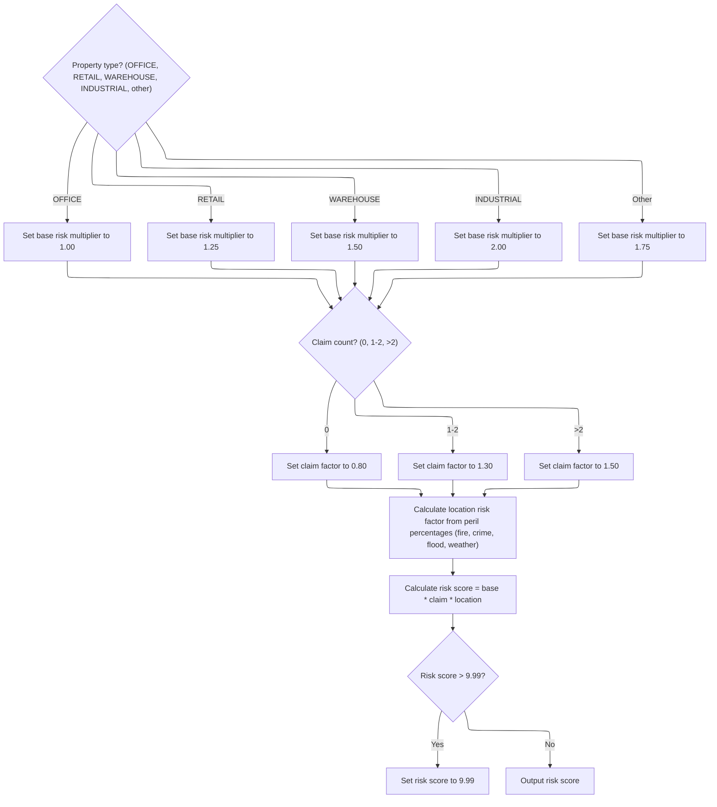
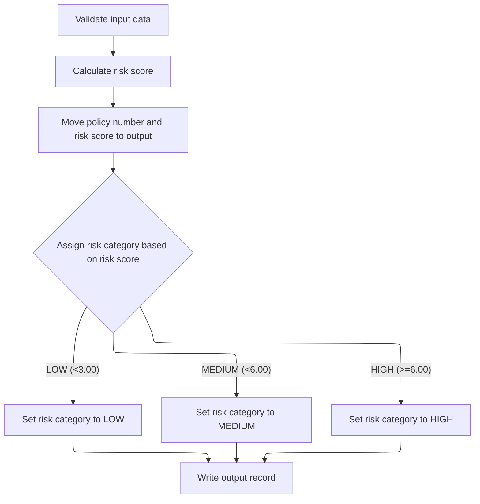

# Overview

This document explains how insurance policy records are processed to calculate a risk score and assign a risk category based on property characteristics, claim history, and location risk factors.

## Dependencies

### Program

- RISKPROG (<SwmPath>[base/src/lgarsk01.cbl](base/src/lgarsk01.cbl)</SwmPath>)

## Input and Output Tables/Files used

### RISKPROG (<SwmPath>[base/src/lgarsk01.cbl](base/src/lgarsk01.cbl)</SwmPath>)

| Table / File Name                                                                                                                       | Type | Description                                      | Usage Mode | Key Fields / Layout Highlights |
| --------------------------------------------------------------------------------------------------------------------------------------- | ---- | ------------------------------------------------ | ---------- | ------------------------------ |
| <SwmToken path="base/src/lgarsk01.cbl" pos="12:3:5" line-data="           SELECT ERROR-FILE ASSIGN TO ERRFILE">`ERROR-FILE`</SwmToken>  | File | Policy errors and validation failure messages    | Output     | File resource                  |
| <SwmToken path="base/src/lgarsk01.cbl" pos="88:3:5" line-data="               WRITE ERROR-RECORD">`ERROR-RECORD`</SwmToken>             | File | Single policy error with message details         | Output     | File resource                  |
| <SwmToken path="base/src/lgarsk01.cbl" pos="80:3:5" line-data="           READ INPUT-FILE">`INPUT-FILE`</SwmToken>                      | File | Insurance policy and property risk input data    | Input      | File resource                  |
| <SwmToken path="base/src/lgarsk01.cbl" pos="9:3:5" line-data="           SELECT OUTPUT-FILE ASSIGN TO OUTFILE">`OUTPUT-FILE`</SwmToken> | File | Calculated risk scores and categories per policy | Output     | File resource                  |
| <SwmToken path="base/src/lgarsk01.cbl" pos="154:3:5" line-data="           WRITE OUTPUT-RECORD.">`OUTPUT-RECORD`</SwmToken>             | File | Single policy risk score and category result     | Output     | File resource                  |

## Detailed View of the Program's Functionality

Program Startup and Main Loop

At the start, the program sets up its environment and prepares to process records. It opens the input, output, and error files. If there is an error opening the input file, it logs the error and marks the end-of-file flag so that no further processing occurs.

The main loop repeatedly processes records from the input file. For each iteration, it reads a record, validates it, calculates the risk score, and writes the output. This loop continues until the end-of-file flag is set, indicating there are no more records to process. After all records are processed, the program closes all files and exits.

Reading and Validating Input Records

For each iteration in the main loop, the program attempts to read the next record from the input file. If the end of the file is reached, it sets the end-of-file flag and exits the processing routine for this record. If there is a read error, it logs the policy number and an error message to the error file, then skips further processing for this record.

After a successful read, the program validates the input data. Specifically, it checks if the policy number is present. If the policy number is missing, it logs an error message and skips further processing for this record.

Risk Score Calculation

Once the input record is validated, the program calculates the risk score in several steps:

1. Property Type Multiplier:\
   The program checks the property type and assigns a base risk multiplier:

   - OFFICE: <SwmToken path="base/src/lgarsk01.cbl" pos="110:3:5" line-data="                   MOVE 1.00 TO WS-BS-RS">`1.00`</SwmToken>
   - RETAIL: <SwmToken path="base/src/lgarsk01.cbl" pos="112:3:5" line-data="                   MOVE 1.25 TO WS-BS-RS">`1.25`</SwmToken>
   - WAREHOUSE: <SwmToken path="base/src/lgarsk01.cbl" pos="114:3:5" line-data="                   MOVE 1.50 TO WS-BS-RS">`1.50`</SwmToken>
   - INDUSTRIAL: <SwmToken path="base/src/lgarsk01.cbl" pos="116:3:5" line-data="                   MOVE 2.00 TO WS-BS-RS">`2.00`</SwmToken>
   - Any other type: <SwmToken path="base/src/lgarsk01.cbl" pos="118:3:5" line-data="                   MOVE 1.75 TO WS-BS-RS">`1.75`</SwmToken>

2. Claim Factor:\
   The program adjusts the risk based on the number of claims:

   - 0 claims: <SwmToken path="base/src/lgarsk01.cbl" pos="122:3:5" line-data="               MOVE 0.80 TO WS-CL-F">`0.80`</SwmToken>
   - 1 or 2 claims: <SwmToken path="base/src/lgarsk01.cbl" pos="124:3:5" line-data="               MOVE 1.30 TO WS-CL-F">`1.30`</SwmToken>
   - More than 2 claims: <SwmToken path="base/src/lgarsk01.cbl" pos="114:3:5" line-data="                   MOVE 1.50 TO WS-BS-RS">`1.50`</SwmToken>

3. Location Factor:\
   The program calculates a location risk factor using the percentages of various perils (fire, crime, flood, weather) from the input record. Each peril is weighted:

   - Fire: 20%
   - Crime: 20%
   - Flood: 30%
   - Weather: 20% The location factor is computed as 1 plus the sum of each peril percentage multiplied by its weight.

4. Final Risk Score:\
   The final risk score is calculated by multiplying the base risk multiplier, the claim factor, and the location factor. If the resulting score exceeds <SwmToken path="base/src/lgarsk01.cbl" pos="138:11:13" line-data="           IF WS-F-RSK &gt; 9.99">`9.99`</SwmToken>, it is capped at <SwmToken path="base/src/lgarsk01.cbl" pos="138:11:13" line-data="           IF WS-F-RSK &gt; 9.99">`9.99`</SwmToken>.

Writing Output Records

After calculating the risk score, the program prepares the output record:

- It copies the policy number and the calculated risk score to the output.
- It assigns a risk category based on the risk score:
  - Less than <SwmToken path="base/src/lgarsk01.cbl" pos="147:11:13" line-data="               WHEN WS-F-RSK &lt; 3.00">`3.00`</SwmToken>: LOW
  - <SwmToken path="base/src/lgarsk01.cbl" pos="147:11:13" line-data="               WHEN WS-F-RSK &lt; 3.00">`3.00`</SwmToken> to less than <SwmToken path="base/src/lgarsk01.cbl" pos="149:11:13" line-data="               WHEN WS-F-RSK &lt; 6.00">`6.00`</SwmToken>: MEDIUM
  - <SwmToken path="base/src/lgarsk01.cbl" pos="149:11:13" line-data="               WHEN WS-F-RSK &lt; 6.00">`6.00`</SwmToken> or higher: HIGH
- The output record is then written to the output file.

Resource Cleanup

After all records have been processed, the program closes the input, output, and error files to ensure all resources are properly released before the program exits.

# Rule Definition

| Paragraph Name                                                                                                                                                                                                                                                                              | Rule ID | Category          | Description                                                                                                                                                                                                                                                                                                                                                                            | Conditions                                                                                            | Remarks                                                                                                                                                                                                                                                                                                                                                                                                                                                                                                                                                                                                                                                                                              |
| ------------------------------------------------------------------------------------------------------------------------------------------------------------------------------------------------------------------------------------------------------------------------------------------- | ------- | ----------------- | -------------------------------------------------------------------------------------------------------------------------------------------------------------------------------------------------------------------------------------------------------------------------------------------------------------------------------------------------------------------------------------- | ----------------------------------------------------------------------------------------------------- | ---------------------------------------------------------------------------------------------------------------------------------------------------------------------------------------------------------------------------------------------------------------------------------------------------------------------------------------------------------------------------------------------------------------------------------------------------------------------------------------------------------------------------------------------------------------------------------------------------------------------------------------------------------------------------------------------------- |
| <SwmToken path="base/src/lgarsk01.cbl" pos="92:3:7" line-data="           PERFORM 2100-VALIDATE-DATA">`2100-VALIDATE-DATA`</SwmToken>                                                                                                                                                       | RL-001  | Conditional Logic | Each input record must be validated to ensure the policy number is not blank (all spaces). If blank, an error record is written and the record is skipped.                                                                                                                                                                                                                             | The policy number field in the input record is blank (all spaces).                                    | The error record contains the policy number and a 90-character message. The error output record is fixed-length (100 characters).                                                                                                                                                                                                                                                                                                                                                                                                                                                                                                                                                                    |
| <SwmToken path="base/src/lgarsk01.cbl" pos="66:3:5" line-data="           PERFORM 2000-PROCESS UNTIL WS-EOF = &#39;Y&#39;">`2000-PROCESS`</SwmToken>                                                                                                                                        | RL-002  | Conditional Logic | If a record cannot be read from the input file, an error record must be written with the policy number and a message.                                                                                                                                                                                                                                                                  | The file status after reading an input record is not '00'.                                            | The error record contains the policy number and a 90-character message. The error output record is fixed-length (100 characters).                                                                                                                                                                                                                                                                                                                                                                                                                                                                                                                                                                    |
| <SwmToken path="base/src/lgarsk01.cbl" pos="93:3:7" line-data="           PERFORM 2200-CALCULATE-RISK">`2200-CALCULATE-RISK`</SwmToken>                                                                                                                                                     | RL-003  | Data Assignment   | Set the base risk multiplier according to the property type field in the input record.                                                                                                                                                                                                                                                                                                 | The property type field is one of: 'OFFICE', 'RETAIL', 'WAREHOUSE', 'INDUSTRIAL', or any other value. | Constants: OFFICE=<SwmToken path="base/src/lgarsk01.cbl" pos="110:3:5" line-data="                   MOVE 1.00 TO WS-BS-RS">`1.00`</SwmToken>, RETAIL=<SwmToken path="base/src/lgarsk01.cbl" pos="112:3:5" line-data="                   MOVE 1.25 TO WS-BS-RS">`1.25`</SwmToken>, WAREHOUSE=<SwmToken path="base/src/lgarsk01.cbl" pos="114:3:5" line-data="                   MOVE 1.50 TO WS-BS-RS">`1.50`</SwmToken>, INDUSTRIAL=<SwmToken path="base/src/lgarsk01.cbl" pos="116:3:5" line-data="                   MOVE 2.00 TO WS-BS-RS">`2.00`</SwmToken>, OTHER=<SwmToken path="base/src/lgarsk01.cbl" pos="118:3:5" line-data="                   MOVE 1.75 TO WS-BS-RS">`1.75`</SwmToken>. |
| <SwmToken path="base/src/lgarsk01.cbl" pos="93:3:7" line-data="           PERFORM 2200-CALCULATE-RISK">`2200-CALCULATE-RISK`</SwmToken>                                                                                                                                                     | RL-004  | Data Assignment   | Set the claim factor according to the claim count field in the input record.                                                                                                                                                                                                                                                                                                           | The claim count is 0, 1-2, or greater than 2.                                                         | Constants: 0=<SwmToken path="base/src/lgarsk01.cbl" pos="122:3:5" line-data="               MOVE 0.80 TO WS-CL-F">`0.80`</SwmToken>, 1-2=<SwmToken path="base/src/lgarsk01.cbl" pos="124:3:5" line-data="               MOVE 1.30 TO WS-CL-F">`1.30`</SwmToken>, >2=<SwmToken path="base/src/lgarsk01.cbl" pos="114:3:5" line-data="                   MOVE 1.50 TO WS-BS-RS">`1.50`</SwmToken>.                                                                                                                                                                                                                                                                                                     |
| <SwmToken path="base/src/lgarsk01.cbl" pos="93:3:7" line-data="           PERFORM 2200-CALCULATE-RISK">`2200-CALCULATE-RISK`</SwmToken>                                                                                                                                                     | RL-005  | Computation       | Calculate the location risk factor using peril percentages from the input record.                                                                                                                                                                                                                                                                                                      | The peril percentage fields are present and treated as integers (0-99).                               | Formula: location = 1 + (fire peril \* 0.20 / 100) + (crime peril \* 0.30 / 100) + (flood peril \* 0.25 / 100) + (weather peril \* 0.25 / 100). All peril fields are integers (0-99).                                                                                                                                                                                                                                                                                                                                                                                                                                                                                                                |
| <SwmToken path="base/src/lgarsk01.cbl" pos="93:3:7" line-data="           PERFORM 2200-CALCULATE-RISK">`2200-CALCULATE-RISK`</SwmToken>                                                                                                                                                     | RL-006  | Computation       | Calculate the risk score as the product of base risk multiplier, claim factor, and location risk factor. If the result exceeds <SwmToken path="base/src/lgarsk01.cbl" pos="138:11:13" line-data="           IF WS-F-RSK &gt; 9.99">`9.99`</SwmToken>, set it to <SwmToken path="base/src/lgarsk01.cbl" pos="138:11:13" line-data="           IF WS-F-RSK &gt; 9.99">`9.99`</SwmToken>. | All previous factors have been calculated.                                                            | Risk score is a number with 3 digits and 2 decimals (e.g., <SwmToken path="base/src/lgarsk01.cbl" pos="138:11:13" line-data="           IF WS-F-RSK &gt; 9.99">`9.99`</SwmToken>). Maximum allowed value is <SwmToken path="base/src/lgarsk01.cbl" pos="138:11:13" line-data="           IF WS-F-RSK &gt; 9.99">`9.99`</SwmToken>.                                                                                                                                                                                                                                                                                                                                                                   |
| <SwmToken path="base/src/lgarsk01.cbl" pos="94:3:7" line-data="           PERFORM 2300-WRITE-OUTPUT">`2300-WRITE-OUTPUT`</SwmToken>                                                                                                                                                         | RL-007  | Conditional Logic | Assign a risk category based on the calculated risk score.                                                                                                                                                                                                                                                                                                                             | The risk score has been calculated and capped.                                                        | Categories: <<SwmToken path="base/src/lgarsk01.cbl" pos="147:11:13" line-data="               WHEN WS-F-RSK &lt; 3.00">`3.00`</SwmToken>='LOW', <<SwmToken path="base/src/lgarsk01.cbl" pos="149:11:13" line-data="               WHEN WS-F-RSK &lt; 6.00">`6.00`</SwmToken>='MEDIUM', >=<SwmToken path="base/src/lgarsk01.cbl" pos="149:11:13" line-data="               WHEN WS-F-RSK &lt; 6.00">`6.00`</SwmToken>='HIGH'. The category field is padded to 10 characters.                                                                                                                                                                                                                          |
| <SwmToken path="base/src/lgarsk01.cbl" pos="94:3:7" line-data="           PERFORM 2300-WRITE-OUTPUT">`2300-WRITE-OUTPUT`</SwmToken>                                                                                                                                                         | RL-008  | Data Assignment   | Write an output record for each valid input record, with specified fields and formatting.                                                                                                                                                                                                                                                                                              | The input record is valid and risk score and category have been calculated.                           | Output record fields: policy number (10 chars), risk score (3 digits + 2 decimals), risk category (10 chars, padded), filler (spaces to 100 chars total). All fields are fixed-length.                                                                                                                                                                                                                                                                                                                                                                                                                                                                                                               |
| <SwmToken path="base/src/lgarsk01.cbl" pos="66:3:5" line-data="           PERFORM 2000-PROCESS UNTIL WS-EOF = &#39;Y&#39;">`2000-PROCESS`</SwmToken>, <SwmToken path="base/src/lgarsk01.cbl" pos="92:3:7" line-data="           PERFORM 2100-VALIDATE-DATA">`2100-VALIDATE-DATA`</SwmToken> | RL-009  | Data Assignment   | Write an error record for each invalid or unreadable input record, with specified fields and formatting.                                                                                                                                                                                                                                                                               | The input record is invalid or unreadable.                                                            | Error record fields: policy number (10 chars), error message (90 chars). The error output record is fixed-length (100 chars).                                                                                                                                                                                                                                                                                                                                                                                                                                                                                                                                                                        |

# User Stories

## User Story 1: Error handling for invalid or unreadable input records

---

### Story Description:

As a system, I want to validate each input record and handle unreadable records so that any invalid or unreadable input results in a properly formatted error record in the error output file.

---

### Business Rule Mapping:

| Rule ID | Paragraph Name                                                                                                                                                                                                                                                                              | Rule Description                                                                                                                                           |
| ------- | ------------------------------------------------------------------------------------------------------------------------------------------------------------------------------------------------------------------------------------------------------------------------------------------- | ---------------------------------------------------------------------------------------------------------------------------------------------------------- |
| RL-002  | <SwmToken path="base/src/lgarsk01.cbl" pos="66:3:5" line-data="           PERFORM 2000-PROCESS UNTIL WS-EOF = &#39;Y&#39;">`2000-PROCESS`</SwmToken>                                                                                                                                        | If a record cannot be read from the input file, an error record must be written with the policy number and a message.                                      |
| RL-009  | <SwmToken path="base/src/lgarsk01.cbl" pos="66:3:5" line-data="           PERFORM 2000-PROCESS UNTIL WS-EOF = &#39;Y&#39;">`2000-PROCESS`</SwmToken>, <SwmToken path="base/src/lgarsk01.cbl" pos="92:3:7" line-data="           PERFORM 2100-VALIDATE-DATA">`2100-VALIDATE-DATA`</SwmToken> | Write an error record for each invalid or unreadable input record, with specified fields and formatting.                                                   |
| RL-001  | <SwmToken path="base/src/lgarsk01.cbl" pos="92:3:7" line-data="           PERFORM 2100-VALIDATE-DATA">`2100-VALIDATE-DATA`</SwmToken>                                                                                                                                                       | Each input record must be validated to ensure the policy number is not blank (all spaces). If blank, an error record is written and the record is skipped. |

---

### Relevant Functionality:

- <SwmToken path="base/src/lgarsk01.cbl" pos="66:3:5" line-data="           PERFORM 2000-PROCESS UNTIL WS-EOF = &#39;Y&#39;">`2000-PROCESS`</SwmToken>
  1. **RL-002:**
     - After reading an input record:
       - If the file status is not '00':
         - Set the error message to 'ERROR READING RECORD'.
         - Write an error record with the policy number and message.
         - Skip further processing for this record.
  2. **RL-009:**
     - Copy policy number to error record.
     - Set error message to appropriate text, padded or truncated to 90 characters.
     - Write the error record.
- <SwmToken path="base/src/lgarsk01.cbl" pos="92:3:7" line-data="           PERFORM 2100-VALIDATE-DATA">`2100-VALIDATE-DATA`</SwmToken>
  1. **RL-001:**
     - If the policy number is blank:
       - Set the error message to 'INVALID POLICY NUMBER'.
       - Write an error record with the policy number and message.
       - Skip further processing for this record.

## User Story 2: Risk calculation for valid policy records

---

### Story Description:

As a system, I want to calculate the risk score for each valid input record using property type, claim count, and peril percentages so that the risk score accurately reflects the policy's risk profile and is capped at the maximum allowed value.

---

### Business Rule Mapping:

| Rule ID | Paragraph Name                                                                                                                          | Rule Description                                                                                                                                                                                                                                                                                                                                                                       |
| ------- | --------------------------------------------------------------------------------------------------------------------------------------- | -------------------------------------------------------------------------------------------------------------------------------------------------------------------------------------------------------------------------------------------------------------------------------------------------------------------------------------------------------------------------------------- |
| RL-003  | <SwmToken path="base/src/lgarsk01.cbl" pos="93:3:7" line-data="           PERFORM 2200-CALCULATE-RISK">`2200-CALCULATE-RISK`</SwmToken> | Set the base risk multiplier according to the property type field in the input record.                                                                                                                                                                                                                                                                                                 |
| RL-004  | <SwmToken path="base/src/lgarsk01.cbl" pos="93:3:7" line-data="           PERFORM 2200-CALCULATE-RISK">`2200-CALCULATE-RISK`</SwmToken> | Set the claim factor according to the claim count field in the input record.                                                                                                                                                                                                                                                                                                           |
| RL-005  | <SwmToken path="base/src/lgarsk01.cbl" pos="93:3:7" line-data="           PERFORM 2200-CALCULATE-RISK">`2200-CALCULATE-RISK`</SwmToken> | Calculate the location risk factor using peril percentages from the input record.                                                                                                                                                                                                                                                                                                      |
| RL-006  | <SwmToken path="base/src/lgarsk01.cbl" pos="93:3:7" line-data="           PERFORM 2200-CALCULATE-RISK">`2200-CALCULATE-RISK`</SwmToken> | Calculate the risk score as the product of base risk multiplier, claim factor, and location risk factor. If the result exceeds <SwmToken path="base/src/lgarsk01.cbl" pos="138:11:13" line-data="           IF WS-F-RSK &gt; 9.99">`9.99`</SwmToken>, set it to <SwmToken path="base/src/lgarsk01.cbl" pos="138:11:13" line-data="           IF WS-F-RSK &gt; 9.99">`9.99`</SwmToken>. |

---

### Relevant Functionality:

- <SwmToken path="base/src/lgarsk01.cbl" pos="93:3:7" line-data="           PERFORM 2200-CALCULATE-RISK">`2200-CALCULATE-RISK`</SwmToken>
  1. **RL-003:**
     - If property type is 'OFFICE', set base risk multiplier to <SwmToken path="base/src/lgarsk01.cbl" pos="110:3:5" line-data="                   MOVE 1.00 TO WS-BS-RS">`1.00`</SwmToken>.
     - If 'RETAIL', set to <SwmToken path="base/src/lgarsk01.cbl" pos="112:3:5" line-data="                   MOVE 1.25 TO WS-BS-RS">`1.25`</SwmToken>.
     - If 'WAREHOUSE', set to <SwmToken path="base/src/lgarsk01.cbl" pos="114:3:5" line-data="                   MOVE 1.50 TO WS-BS-RS">`1.50`</SwmToken>.
     - If 'INDUSTRIAL', set to <SwmToken path="base/src/lgarsk01.cbl" pos="116:3:5" line-data="                   MOVE 2.00 TO WS-BS-RS">`2.00`</SwmToken>.
     - Otherwise, set to <SwmToken path="base/src/lgarsk01.cbl" pos="118:3:5" line-data="                   MOVE 1.75 TO WS-BS-RS">`1.75`</SwmToken>.
  2. **RL-004:**
     - If claim count is 0, set claim factor to <SwmToken path="base/src/lgarsk01.cbl" pos="122:3:5" line-data="               MOVE 0.80 TO WS-CL-F">`0.80`</SwmToken>.
     - If claim count is 1 or 2, set to <SwmToken path="base/src/lgarsk01.cbl" pos="124:3:5" line-data="               MOVE 1.30 TO WS-CL-F">`1.30`</SwmToken>.
     - If claim count is greater than 2, set to <SwmToken path="base/src/lgarsk01.cbl" pos="114:3:5" line-data="                   MOVE 1.50 TO WS-BS-RS">`1.50`</SwmToken>.
  3. **RL-005:**
     - Compute location risk factor as:
       - 1 + (fire peril \* 0.20 / 100) + (crime peril \* 0.30 / 100) + (flood peril \* 0.25 / 100) + (weather peril \* 0.25 / 100)
  4. **RL-006:**
     - Compute risk score = base risk multiplier \* claim factor \* location risk factor.
     - If risk score > <SwmToken path="base/src/lgarsk01.cbl" pos="138:11:13" line-data="           IF WS-F-RSK &gt; 9.99">`9.99`</SwmToken>, set risk score to <SwmToken path="base/src/lgarsk01.cbl" pos="138:11:13" line-data="           IF WS-F-RSK &gt; 9.99">`9.99`</SwmToken>.

## User Story 3: Output formatting and risk categorization

---

### Story Description:

As a system, I want to write each valid processed record to the output file with the policy number, risk score, risk category, and proper padding so that all output records are fixed-length and formatted according to requirements.

---

### Business Rule Mapping:

| Rule ID | Paragraph Name                                                                                                                      | Rule Description                                                                          |
| ------- | ----------------------------------------------------------------------------------------------------------------------------------- | ----------------------------------------------------------------------------------------- |
| RL-007  | <SwmToken path="base/src/lgarsk01.cbl" pos="94:3:7" line-data="           PERFORM 2300-WRITE-OUTPUT">`2300-WRITE-OUTPUT`</SwmToken> | Assign a risk category based on the calculated risk score.                                |
| RL-008  | <SwmToken path="base/src/lgarsk01.cbl" pos="94:3:7" line-data="           PERFORM 2300-WRITE-OUTPUT">`2300-WRITE-OUTPUT`</SwmToken> | Write an output record for each valid input record, with specified fields and formatting. |

---

### Relevant Functionality:

- <SwmToken path="base/src/lgarsk01.cbl" pos="94:3:7" line-data="           PERFORM 2300-WRITE-OUTPUT">`2300-WRITE-OUTPUT`</SwmToken>
  1. **RL-007:**
     - If risk score < <SwmToken path="base/src/lgarsk01.cbl" pos="147:11:13" line-data="               WHEN WS-F-RSK &lt; 3.00">`3.00`</SwmToken>, set category to 'LOW' (padded to 10 chars).
     - If risk score < <SwmToken path="base/src/lgarsk01.cbl" pos="149:11:13" line-data="               WHEN WS-F-RSK &lt; 6.00">`6.00`</SwmToken>, set to 'MEDIUM' (padded to 10 chars).
     - Otherwise, set to 'HIGH' (padded to 10 chars).
  2. **RL-008:**
     - Copy policy number to output record.
     - Copy risk score to output record, formatted as 3 digits plus 2 decimals.
     - Copy risk category to output record, padded to 10 characters.
     - Pad the record with spaces to reach 100 characters.
     - Write the output record.

# Workflow

# Program Startup and Main Loop

```mermaid
%%{init: {"flowchart": {"defaultRenderer": "elk"}} }%%
flowchart TD
    node1["Initialize process"] --> node2["Process data"]
    click node1 openCode "base/src/lgarsk01.cbl:65:65"
    
    subgraph loop1["Repeat until WS-EOF = 'Y'"]
        node2 --> node3{"WS-EOF = 'Y'?"}
        click node2 openCode "base/src/lgarsk01.cbl:66:66"
        click node3 openCode "base/src/lgarsk01.cbl:66:66"
        node3 -->|"No"| node2
    end
    node3 -->|"Yes"| node4["Close resources"]
    click node4 openCode "base/src/lgarsk01.cbl:67:67"
    node4 --> node5["Exit"]
    click node5 openCode "base/src/lgarsk01.cbl:68:68"
classDef HeadingStyle fill:#777777,stroke:#333,stroke-width:2px;

%% Swimm:
%% %%{init: {"flowchart": {"defaultRenderer": "elk"}} }%%
%% flowchart TD
%%     node1["Initialize process"] --> node2["Process data"]
%%     click node1 openCode "<SwmPath>[base/src/lgarsk01.cbl](base/src/lgarsk01.cbl)</SwmPath>:65:65"
%%     
%%     subgraph loop1["Repeat until <SwmToken path="base/src/lgarsk01.cbl" pos="66:9:11" line-data="           PERFORM 2000-PROCESS UNTIL WS-EOF = &#39;Y&#39;">`WS-EOF`</SwmToken> = 'Y'"]
%%         node2 --> node3{"<SwmToken path="base/src/lgarsk01.cbl" pos="66:9:11" line-data="           PERFORM 2000-PROCESS UNTIL WS-EOF = &#39;Y&#39;">`WS-EOF`</SwmToken> = 'Y'?"}
%%         click node2 openCode "<SwmPath>[base/src/lgarsk01.cbl](base/src/lgarsk01.cbl)</SwmPath>:66:66"
%%         click node3 openCode "<SwmPath>[base/src/lgarsk01.cbl](base/src/lgarsk01.cbl)</SwmPath>:66:66"
%%         node3 -->|"No"| node2
%%     end
%%     node3 -->|"Yes"| node4["Close resources"]
%%     click node4 openCode "<SwmPath>[base/src/lgarsk01.cbl](base/src/lgarsk01.cbl)</SwmPath>:67:67"
%%     node4 --> node5["Exit"]
%%     click node5 openCode "<SwmPath>[base/src/lgarsk01.cbl](base/src/lgarsk01.cbl)</SwmPath>:68:68"
%% classDef HeadingStyle fill:#777777,stroke:#333,stroke-width:2px;
```



<SwmSnippet path="/base/src/lgarsk01.cbl" line="64">

---

<SwmToken path="base/src/lgarsk01.cbl" pos="64:1:3" line-data="       0000-MAIN.">`0000-MAIN`</SwmToken> sets up files, loops through records with <SwmToken path="base/src/lgarsk01.cbl" pos="66:3:5" line-data="           PERFORM 2000-PROCESS UNTIL WS-EOF = &#39;Y&#39;">`2000-PROCESS`</SwmToken>, and closes everything at the end. We call <SwmToken path="base/src/lgarsk01.cbl" pos="66:3:5" line-data="           PERFORM 2000-PROCESS UNTIL WS-EOF = &#39;Y&#39;">`2000-PROCESS`</SwmToken> to handle each policy record until there are none left.

```cobol
       0000-MAIN.
           PERFORM 1000-INIT
           PERFORM 2000-PROCESS UNTIL WS-EOF = 'Y'
           PERFORM 3000-CLOSE
           GOBACK.
```

---

</SwmSnippet>

# Reading and Validating Input Records

This section ensures that only valid input records are processed for risk calculation and output. It handles error detection and logging, and manages the end-of-file condition for the input file.

| Category        | Rule Name               | Description                                                                                                                    |
| --------------- | ----------------------- | ------------------------------------------------------------------------------------------------------------------------------ |
| Data validation | Valid Record Processing | Only input records with a successful read status are passed to the validation and risk calculation steps.                      |
| Decision Making | End of File Handling    | If the end of the input file is reached, set the end-of-file flag to 'Y' and stop processing further records.                  |
| Writing Output  | Read Error Logging      | If a read error occurs, log the error by writing an error record containing the policy number and a descriptive error message. |

<SwmSnippet path="/base/src/lgarsk01.cbl" line="79">

---

In <SwmToken path="base/src/lgarsk01.cbl" pos="79:1:3" line-data="       2000-PROCESS.">`2000-PROCESS`</SwmToken>, we grab the next record, check for end-of-file or read errors, and log any issues before moving on.

```cobol
       2000-PROCESS.
           READ INPUT-FILE
               AT END MOVE 'Y' TO WS-EOF
               GO TO 2000-EXIT
           END-READ

           IF WS-INPUT-STATUS NOT = '00'
               MOVE IN-POLICY-NUM TO ERR-POLICY-NUM
               MOVE 'ERROR READING RECORD' TO ERR-MESSAGE
               WRITE ERROR-RECORD
               GO TO 2000-EXIT
           END-IF
```

---

</SwmSnippet>

<SwmSnippet path="/base/src/lgarsk01.cbl" line="92">

---

After reading and validating the input, we call <SwmToken path="base/src/lgarsk01.cbl" pos="93:3:7" line-data="           PERFORM 2200-CALCULATE-RISK">`2200-CALCULATE-RISK`</SwmToken> to compute the risk score for the current policy. This step uses the validated data to generate a score, which is needed before we can write the output.

```cobol
           PERFORM 2100-VALIDATE-DATA
           PERFORM 2200-CALCULATE-RISK
           PERFORM 2300-WRITE-OUTPUT
```

---

</SwmSnippet>

## Risk Score Calculation



This section calculates a risk score for an insurance policy. The score is determined by property type, claim count, and weighted peril percentages, and is capped at a maximum value.

| Category        | Rule Name                | Description                                                                                                                                                                                                                                                                                                                                                                                                                                                                                                                                                                                                                                                                                                                                                                          |
| --------------- | ------------------------ | ------------------------------------------------------------------------------------------------------------------------------------------------------------------------------------------------------------------------------------------------------------------------------------------------------------------------------------------------------------------------------------------------------------------------------------------------------------------------------------------------------------------------------------------------------------------------------------------------------------------------------------------------------------------------------------------------------------------------------------------------------------------------------------ |
| Data validation | Risk score cap           | If the calculated risk score exceeds <SwmToken path="base/src/lgarsk01.cbl" pos="138:11:13" line-data="           IF WS-F-RSK &gt; 9.99">`9.99`</SwmToken>, set the risk score to <SwmToken path="base/src/lgarsk01.cbl" pos="138:11:13" line-data="           IF WS-F-RSK &gt; 9.99">`9.99`</SwmToken>.                                                                                                                                                                                                                                                                                                                                                                                                                                                                             |
| Calculation     | Property type weighting  | Assign a base risk multiplier according to property type: <SwmToken path="base/src/lgarsk01.cbl" pos="110:3:5" line-data="                   MOVE 1.00 TO WS-BS-RS">`1.00`</SwmToken> for OFFICE, <SwmToken path="base/src/lgarsk01.cbl" pos="112:3:5" line-data="                   MOVE 1.25 TO WS-BS-RS">`1.25`</SwmToken> for RETAIL, <SwmToken path="base/src/lgarsk01.cbl" pos="114:3:5" line-data="                   MOVE 1.50 TO WS-BS-RS">`1.50`</SwmToken> for WAREHOUSE, <SwmToken path="base/src/lgarsk01.cbl" pos="116:3:5" line-data="                   MOVE 2.00 TO WS-BS-RS">`2.00`</SwmToken> for INDUSTRIAL, and <SwmToken path="base/src/lgarsk01.cbl" pos="118:3:5" line-data="                   MOVE 1.75 TO WS-BS-RS">`1.75`</SwmToken> for any other type. |
| Calculation     | Claim history adjustment | Adjust the claim factor based on the number of claims: <SwmToken path="base/src/lgarsk01.cbl" pos="122:3:5" line-data="               MOVE 0.80 TO WS-CL-F">`0.80`</SwmToken> if there are no claims, <SwmToken path="base/src/lgarsk01.cbl" pos="124:3:5" line-data="               MOVE 1.30 TO WS-CL-F">`1.30`</SwmToken> if there are 1 or 2 claims, and <SwmToken path="base/src/lgarsk01.cbl" pos="114:3:5" line-data="                   MOVE 1.50 TO WS-BS-RS">`1.50`</SwmToken> if there are more than 2 claims.                                                                                                                                                                                                                                                            |
| Calculation     | Location peril weighting | Calculate the location risk factor as 1 plus the sum of peril percentages weighted as follows: fire (20%), crime (20%), flood (30%), and weather (20%).                                                                                                                                                                                                                                                                                                                                                                                                                                                                                                                                                                                                                              |
| Calculation     | Risk score calculation   | Calculate the final risk score by multiplying the base risk multiplier, claim factor, and location risk factor.                                                                                                                                                                                                                                                                                                                                                                                                                                                                                                                                                                                                                                                                      |

<SwmSnippet path="/base/src/lgarsk01.cbl" line="107">

---

In <SwmToken path="base/src/lgarsk01.cbl" pos="107:1:5" line-data="       2200-CALCULATE-RISK.">`2200-CALCULATE-RISK`</SwmToken>, we set the base risk score using fixed multipliers for each property type. This weighting is the first step in calculating the overall risk for the policy.

```cobol
       2200-CALCULATE-RISK.
           EVALUATE IN-PROPERTY-TYPE
               WHEN 'OFFICE'
                   MOVE 1.00 TO WS-BS-RS
               WHEN 'RETAIL'
                   MOVE 1.25 TO WS-BS-RS
               WHEN 'WAREHOUSE'
                   MOVE 1.50 TO WS-BS-RS
               WHEN 'INDUSTRIAL'
                   MOVE 2.00 TO WS-BS-RS
               WHEN OTHER
                   MOVE 1.75 TO WS-BS-RS
           END-EVALUATE
```

---

</SwmSnippet>

<SwmSnippet path="/base/src/lgarsk01.cbl" line="121">

---

After setting the base risk score, we adjust the claim factor based on how many claims the policy has. This step increases the risk for policies with more claims before moving on to location-based adjustments.

```cobol
           IF IN-CLAIM-COUNT = 0
               MOVE 0.80 TO WS-CL-F
           ELSE IF IN-CLAIM-COUNT <= 2
               MOVE 1.30 TO WS-CL-F
           ELSE
               MOVE 1.50 TO WS-CL-F
           END-IF
```

---

</SwmSnippet>

<SwmSnippet path="/base/src/lgarsk01.cbl" line="129">

---

Here we calculate the location factor using weighted peril risks, then multiply everything together to get the final risk score. If the score goes over <SwmToken path="base/src/lgarsk01.cbl" pos="138:11:13" line-data="           IF WS-F-RSK &gt; 9.99">`9.99`</SwmToken>, we cap it there before returning.

```cobol
           COMPUTE WS-LOC-F = 1 +
               (IN-FR-PR * 0.2) +
               (IN-CR-PR * 0.2) +
               (IN-FL-PR * 0.3) +
               (IN-WE-PR * 0.2)

           COMPUTE WS-F-RSK ROUNDED =
               WS-BS-RS * WS-CL-F * WS-LOC-F

           IF WS-F-RSK > 9.99
               MOVE 9.99 TO WS-F-RSK
           END-IF.
```

---

</SwmSnippet>

## Writing Output Records



<SwmSnippet path="/base/src/lgarsk01.cbl" line="92">

---

After getting the risk score in <SwmToken path="base/src/lgarsk01.cbl" pos="66:3:5" line-data="           PERFORM 2000-PROCESS UNTIL WS-EOF = &#39;Y&#39;">`2000-PROCESS`</SwmToken>, we call <SwmToken path="base/src/lgarsk01.cbl" pos="94:3:7" line-data="           PERFORM 2300-WRITE-OUTPUT">`2300-WRITE-OUTPUT`</SwmToken> to record the results for the current policy.

```cobol
           PERFORM 2100-VALIDATE-DATA
           PERFORM 2200-CALCULATE-RISK
           PERFORM 2300-WRITE-OUTPUT
```

---

</SwmSnippet>

<SwmSnippet path="/base/src/lgarsk01.cbl" line="142">

---

<SwmToken path="base/src/lgarsk01.cbl" pos="142:1:5" line-data="       2300-WRITE-OUTPUT.">`2300-WRITE-OUTPUT`</SwmToken> copies the policy number and risk score to the output record, then sets the risk category using fixed thresholds. The category is chosen based on the score, and the result is written out with fixed-length strings as required by the output format.

```cobol
       2300-WRITE-OUTPUT.
           MOVE IN-POLICY-NUM TO OUT-POLICY-NUM
           MOVE WS-F-RSK TO OUT-RISK-SCORE
      * Set risk category
           EVALUATE TRUE
               WHEN WS-F-RSK < 3.00
                   MOVE 'LOW      ' TO OUT-RISK-CATEGORY
               WHEN WS-F-RSK < 6.00
                   MOVE 'MEDIUM   ' TO OUT-RISK-CATEGORY
               WHEN OTHER
                   MOVE 'HIGH     ' TO OUT-RISK-CATEGORY
           END-EVALUATE
           WRITE OUTPUT-RECORD.
```

---

</SwmSnippet>

&nbsp;

*This is an auto-generated document by Swimm 🌊 and has not yet been verified by a human*

<SwmMeta version="3.0.0" repo-id="Z2l0aHViJTNBJTNBU3dpbW1pby1nZW5hcHAtaG91c2UlM0ElM0FHaXJpLVN3aW1t" repo-name="Swimmio-genapp-house"><sup>Powered by [Swimm](https://app.swimm.io/)</sup></SwmMeta>
