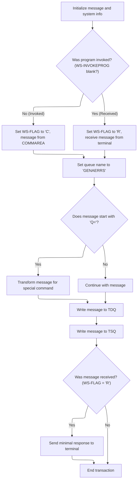
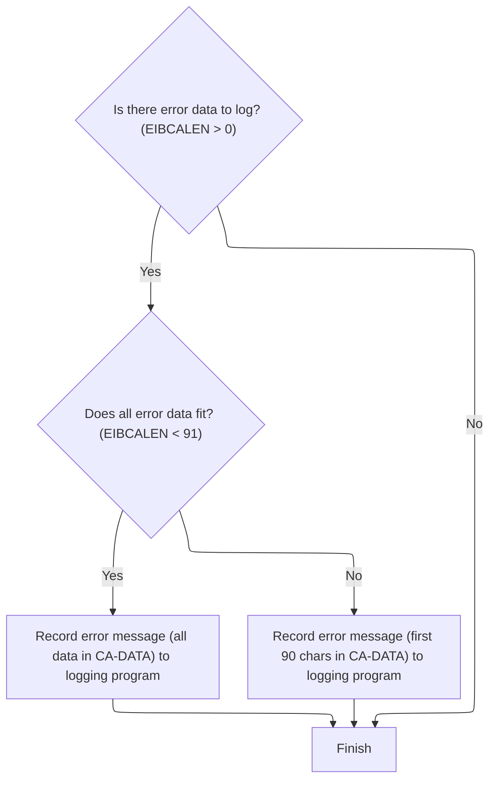

This document describes how error events are captured with precise timing and relevant context, and how these messages are routed for logging and downstream processing. The flow records the current system time and date, prepares an error message with this information, and routes it to the appropriate queues. If additional context is available from the communication area, up to 90 bytes of this data are also logged as a supplemental message.

# Spec

## Detailed View of the Program's Functionality

a. Capturing Error Context and Preparing Message

The process begins in the error-handling section of the main program. When an error needs to be logged, the code first captures the current system date and time. This is done by requesting the system time and then formatting it into human-readable date and time strings. These values are then stored in a dedicated error message structure, which also includes other identifying information such as the program name. This ensures that every error message is timestamped, providing precise context about when the error occurred.

After preparing the timestamped error message, the program initiates a call to a separate logging routine. This call passes the error message structure to the logging program, which is responsible for handling the actual queuing and storage of the error message. At this point, the main program does not concern itself with the details of how or where the message is stored; it simply delegates this responsibility.

b. Preparing and Routing the Message for Queuing

The logging program starts by initializing its working storage, clearing out any previous message or receive buffers. It then retrieves the system identifier and the name of the program that invoked it. This information is used to help route and track the message.

Next, the program determines how it was invoked. If it was called by another program (as opposed to receiving a message directly from a terminal), it sets a flag to indicate this and prepares the message data and its length accordingly. If it was invoked directly (for example, by a user at a terminal), it receives the message into a buffer, sets a different flag, and adjusts the message length to account for the structure of the received data.

The program then checks if the message begins with a special prefix indicating a dynamic queue selection. If such a prefix is present, it extracts the queue extension, modifies the message to remove the prefix, and adjusts the message length. This allows for flexible routing of messages to different queues based on the content of the message itself.

After these preparations, the message is written to a standard destination queue for logging. Immediately afterward, the message is also written to a secondary queue, which is used for further processing. This secondary write is performed in a non-blocking manner, so if the queue is unavailable, the program does not wait.

If the message was received directly (not program-invoked), the program sends a minimal acknowledgment response back to the terminal, confirming receipt of the message. Finally, the logging program ends its processing and returns control to the caller.

c. Logging Additional Context from the Communication Area

After the main error message has been logged, the original program checks if there is any additional context data available in the communication area (a memory region used to pass data between programs). If such data exists, the program prepares a secondary message containing up to 90 bytes of this data, prefixed with an identifier. If the available data is less than 91 bytes, all of it is included; otherwise, only the first 90 bytes are used.

This secondary message is then passed to the logging program in the same way as the primary error message. This ensures that any extra context relevant to the error is also captured in the logs, up to a fixed size limit. Once this is done, the error-logging routine completes its execution.

# Rule Definition

| Paragraph Name                                            | Rule ID | Category          | Description                                                                                                                                                                                                                                                        | Conditions                                                                                           | Remarks                                                                                                                                                                                                                          |
| --------------------------------------------------------- | ------- | ----------------- | ------------------------------------------------------------------------------------------------------------------------------------------------------------------------------------------------------------------------------------------------------------------ | ---------------------------------------------------------------------------------------------------- | -------------------------------------------------------------------------------------------------------------------------------------------------------------------------------------------------------------------------------- |
| WRITE-ERROR-MESSAGE                                       | RL-001  | Computation       | Whenever an error message is processed, the system must capture the current date in MMDDYYYY format and the current time in HHMMSS format.                                                                                                                         | Triggered whenever an error message is processed.                                                    | Date format: MMDDYYYY (8 characters, string). Time format: HHMMSS (6 characters, string).                                                                                                                                        |
| WORKING-STORAGE SECTION, WRITE-ERROR-MESSAGE              | RL-002  | Data Assignment   | The error message must include the following fields: EM-DATE (8 chars), EM-TIME (6 chars), PROGRAM-NAME (9 chars), EM-VARIABLE (21 chars).                                                                                                                         | Whenever an error message is constructed for queue writing.                                          | EM-DATE: 8 chars, string. EM-TIME: 6 chars, string. PROGRAM-NAME: 9 chars, string. EM-VARIABLE: 21 chars, string. All fields are left-aligned, space-padded if necessary.                                                        |
| MAINLINE SECTION (lgstsq)                                 | RL-003  | Conditional Logic | If the message starts with 'Q=', the next four characters are used as a queue extension, and the message content and length are adjusted to exclude 'Q=xxxx'. The queue name must be 'GENA' + extension; otherwise, use 'GENAERRS'.                                | When preparing to write a message to a TSQ, check if the message starts with 'Q='.                   | Queue name: 'GENAERRS' (default, 8 chars) or 'GENA' + extension (8 chars). Extension: 4 chars, string. Message content is adjusted to exclude the prefix and extension (first 6 chars).                                          |
| WRITE-ERROR-MESSAGE (lgipol01), MAINLINE SECTION (lgstsq) | RL-004  | Computation       | The error message must be written to both the TDQ ('CSMT') and the TSQ (either 'GENAERRS' or 'GENA' + extension).                                                                                                                                                  | Whenever an error message is processed.                                                              | TDQ name: 'CSMT' (4 chars). TSQ name: 'GENAERRS' or 'GENA' + extension (8 chars). Message structure and length as specified in other rules.                                                                                      |
| WRITE-ERROR-MESSAGE (lgipol01)                            | RL-005  | Conditional Logic | After writing the main error message, if EIBCALEN > 0, up to 90 bytes of commarea data must be logged with a 'COMMAREA=' prefix. If EIBCALEN < 91, all commarea data must be logged; otherwise, only the first 90 bytes.                                           | After writing the main error message, check if EIBCALEN > 0.                                         | Prefix: 'COMMAREA=' (9 chars, string). CA-DATA: up to 90 chars, string. If EIBCALEN < 91, use all commarea data; else, use first 90 bytes.                                                                                       |
| WORKING-STORAGE SECTION (lgipol01), WRITE-ERROR-MESSAGE   | RL-006  | Data Assignment   | The commarea error message must include: PREFIX ('COMMAREA='; 9 chars) and CA-DATA (up to 90 chars).                                                                                                                                                               | Whenever commarea data is logged as an error message.                                                | PREFIX: 'COMMAREA=' (9 chars, string). CA-DATA: up to 90 chars, string. Total message size: 99 chars, left-aligned, space-padded if necessary.                                                                                   |
| WRITE-ERROR-MESSAGE (lgipol01), MAINLINE SECTION (lgstsq) | RL-007  | Data Assignment   | All queue writes must use the specified message structures and field sizes for error messages and commarea error messages.                                                                                                                                         | Whenever writing to TDQ or TSQ.                                                                      | Error message: EM-DATE (8 chars), EM-TIME (6 chars), PROGRAM-NAME (9 chars), EM-VARIABLE (21 chars). Commarea error message: PREFIX (9 chars), CA-DATA (up to 90 chars). All fields are left-aligned, space-padded if necessary. |
| MAINLINE SECTION (lgstsq), WRITE-ERROR-MESSAGE            | RL-008  | Conditional Logic | If the message is invoked by another program (invoking program indicator is not blank), the message content must be sourced from the commarea data provided by the invoking program; otherwise, it must be sourced from the data received from the terminal input. | When preparing a message for queue writing, check if the invoking program indicator is blank or not. | Commarea data: up to 90 characters, string. Terminal input data: up to 74 characters, string.                                                                                                                                    |
| MAINLINE SECTION (lgstsq)                                 | RL-009  | Conditional Logic | If the message was received from a terminal (invoking program indicator is blank), a single space character must be sent as an acknowledgment to the terminal.                                                                                                     | After writing the error message, if the invoking program indicator is blank.                         | Acknowledgment: single space character (1 char, string).                                                                                                                                                                         |

# User Stories

## User Story 1: Process and log error messages with correct structure, routing, and terminal acknowledgment

---

### Story Description:

As a system, I want to process error messages by capturing the current date and time, constructing the message with the required fields and formats, determining the message source based on invocation, handling queue extensions, writing the message to both TDQ and TSQ, and sending a terminal acknowledgment when appropriate, so that error events are consistently logged, routed, and acknowledged for monitoring and troubleshooting.

---

### Business Rule Mapping:

| Rule ID | Paragraph Name                                            | Rule Description                                                                                                                                                                                                                                                   |
| ------- | --------------------------------------------------------- | ------------------------------------------------------------------------------------------------------------------------------------------------------------------------------------------------------------------------------------------------------------------ |
| RL-001  | WRITE-ERROR-MESSAGE                                       | Whenever an error message is processed, the system must capture the current date in MMDDYYYY format and the current time in HHMMSS format.                                                                                                                         |
| RL-002  | WORKING-STORAGE SECTION, WRITE-ERROR-MESSAGE              | The error message must include the following fields: EM-DATE (8 chars), EM-TIME (6 chars), PROGRAM-NAME (9 chars), EM-VARIABLE (21 chars).                                                                                                                         |
| RL-003  | MAINLINE SECTION (lgstsq)                                 | If the message starts with 'Q=', the next four characters are used as a queue extension, and the message content and length are adjusted to exclude 'Q=xxxx'. The queue name must be 'GENA' + extension; otherwise, use 'GENAERRS'.                                |
| RL-008  | MAINLINE SECTION (lgstsq), WRITE-ERROR-MESSAGE            | If the message is invoked by another program (invoking program indicator is not blank), the message content must be sourced from the commarea data provided by the invoking program; otherwise, it must be sourced from the data received from the terminal input. |
| RL-009  | MAINLINE SECTION (lgstsq)                                 | If the message was received from a terminal (invoking program indicator is blank), a single space character must be sent as an acknowledgment to the terminal.                                                                                                     |
| RL-004  | WRITE-ERROR-MESSAGE (lgipol01), MAINLINE SECTION (lgstsq) | The error message must be written to both the TDQ ('CSMT') and the TSQ (either 'GENAERRS' or 'GENA' + extension).                                                                                                                                                  |
| RL-007  | WRITE-ERROR-MESSAGE (lgipol01), MAINLINE SECTION (lgstsq) | All queue writes must use the specified message structures and field sizes for error messages and commarea error messages.                                                                                                                                         |

---

### Relevant Functionality:

- **WRITE-ERROR-MESSAGE**
  1. **RL-001:**
     - When processing an error message:
       - Obtain current absolute time from system.
       - Format the absolute time into MMDDYYYY and HHMMSS strings.
       - Assign the formatted date and time to the respective fields in the error message structure.
- **WORKING-STORAGE SECTION**
  1. **RL-002:**
     - When constructing an error message:
       - Assign the formatted date to EM-DATE (8 chars).
       - Assign the formatted time to EM-TIME (6 chars).
       - Assign the program name to PROGRAM-NAME (9 chars).
       - Assign the error variable or message to EM-VARIABLE (21 chars).
       - Ensure all fields are properly sized and padded as needed.
- **MAINLINE SECTION (lgstsq)**
  1. **RL-003:**
     - Set default queue name to 'GENAERRS'.
     - If message content starts with 'Q=':
       - Extract the next four characters as the extension.
       - Set queue name to 'GENA' + extension (8 chars).
       - Adjust message content to exclude 'Q=xxxx' (first 6 chars).
       - Adjust message length accordingly (subtract 7 from length).
  2. **RL-008:**
     - Check if the invoking program indicator is blank:
       - If not blank:
         - Source message content from the commarea data provided by the invoking program.
         - Set message length to the length of the commarea data.
       - If blank:
         - Receive message content from the terminal input.
         - Set message length to the full input length, then adjust for actual data length as needed.
  3. **RL-009:**
     - After writing the error message:
       - If the message was received from a terminal (invoking program indicator is blank):
         - Send a single space character as acknowledgment to the terminal.
- **WRITE-ERROR-MESSAGE (lgipol01)**
  1. **RL-004:**
     - Write the constructed error message to TDQ 'CSMT'.
     - Write the same message to TSQ with the determined queue name ('GENAERRS' or 'GENA' + extension).
     - Use the specified message structure and field sizes for both writes.
  2. **RL-007:**
     - When writing to any queue:
       - Use the specified message structure for error messages and commarea error messages.
       - Ensure all fields are sized and padded as specified.
       - Write the message to the appropriate queue (TDQ or TSQ).

## User Story 2: Log commarea data with error messages when present

---

### Story Description:

As a system, I want to log up to 90 bytes of commarea data with a 'COMMAREA=' prefix after writing the main error message, so that additional diagnostic information is available for errors involving program-to-program communication.

---

### Business Rule Mapping:

| Rule ID | Paragraph Name                                          | Rule Description                                                                                                                                                                                                         |
| ------- | ------------------------------------------------------- | ------------------------------------------------------------------------------------------------------------------------------------------------------------------------------------------------------------------------ |
| RL-005  | WRITE-ERROR-MESSAGE (lgipol01)                          | After writing the main error message, if EIBCALEN > 0, up to 90 bytes of commarea data must be logged with a 'COMMAREA=' prefix. If EIBCALEN < 91, all commarea data must be logged; otherwise, only the first 90 bytes. |
| RL-006  | WORKING-STORAGE SECTION (lgipol01), WRITE-ERROR-MESSAGE | The commarea error message must include: PREFIX ('COMMAREA='; 9 chars) and CA-DATA (up to 90 chars).                                                                                                                     |

---

### Relevant Functionality:

- **WRITE-ERROR-MESSAGE (lgipol01)**
  1. **RL-005:**
     - After writing the main error message:
       - If EIBCALEN > 0:
         - If EIBCALEN < 91:
           - Move all commarea data to CA-DATA (up to EIBCALEN bytes).
         - Else:
           - Move first 90 bytes of commarea data to CA-DATA.
         - Construct commarea error message with 'COMMAREA=' prefix and CA-DATA.
         - Write commarea error message to queue.
- **WORKING-STORAGE SECTION (lgipol01)**
  1. **RL-006:**
     - When constructing a commarea error message:
       - Assign 'COMMAREA=' to the prefix field (9 chars).
       - Assign commarea data (up to 90 chars) to CA-DATA.
       - Ensure total message size is 99 chars, left-aligned, space-padded as needed.

# Code Walkthrough

## Capturing Error Context and Preparing Message

<SwmSnippet path="/base/src/lgipol01.cbl" line="107">

---

In `WRITE-ERROR-MESSAGE` this is where we grab the current system time and date using CICS ASKTIME and FORMATTIME, then stash those values into the error message struct. This sets up the error context so we know exactly when the error happened.

```cobol
       WRITE-ERROR-MESSAGE.
      * Save SQLCODE in message
      * Obtain and format current time and date
           EXEC CICS ASKTIME ABSTIME(ABS-TIME)
           END-EXEC
           EXEC CICS FORMATTIME ABSTIME(ABS-TIME)
                     MMDDYYYY(DATE1)
                     TIME(TIME1)
           END-EXEC
```

---

</SwmSnippet>

<SwmSnippet path="/base/src/lgipol01.cbl" line="116">

---

After setting up the timestamp, we move the formatted date and time into the error message struct and call LGSTSQ. That program handles actually writing the error message to the queue, so we don't have to deal with queue logic here.

```cobol
           MOVE DATE1 TO EM-DATE
           MOVE TIME1 TO EM-TIME
      * Write output message to TDQ
           EXEC CICS LINK PROGRAM('LGSTSQ')
                     COMMAREA(ERROR-MSG)
                     LENGTH(LENGTH OF ERROR-MSG)
           END-EXEC.
```

---

</SwmSnippet>

### Preparing and Routing the Message for Queuing



<SwmSnippet path="/base/src/lgstsq.cbl" line="55">

---

In `MAINLINE` we start by clearing out the message and receive buffers, then grab the system ID and the name of the invoking program. This info is used later for routing and tracking the message.

```cobol
       MAINLINE SECTION.

           MOVE SPACES TO WRITE-MSG.
           MOVE SPACES TO WS-RECV.

           EXEC CICS ASSIGN SYSID(WRITE-MSG-SYSID)
                RESP(WS-RESP)
           END-EXEC.

           EXEC CICS ASSIGN INVOKINGPROG(WS-INVOKEPROG)
                RESP(WS-RESP)
           END-EXEC.
```

---

</SwmSnippet>

<SwmSnippet path="/base/src/lgstsq.cbl" line="68">

---

Here we check if the message came from another program or was received directly. Depending on that, we set a flag and prep the message data and its length for later queue writing.

```cobol
           IF WS-INVOKEPROG NOT = SPACES
              MOVE 'C' To WS-FLAG
              MOVE COMMA-DATA  TO WRITE-MSG-MSG
              MOVE EIBCALEN    TO WS-RECV-LEN
           ELSE
              EXEC CICS RECEIVE INTO(WS-RECV)
                  LENGTH(WS-RECV-LEN)
                  RESP(WS-RESP)
              END-EXEC
              MOVE 'R' To WS-FLAG
              MOVE WS-RECV-DATA  TO WRITE-MSG-MSG
              SUBTRACT 5 FROM WS-RECV-LEN
           END-IF.
```

---

</SwmSnippet>

<SwmSnippet path="/base/src/lgstsq.cbl" line="82">

---

If the message starts with 'Q=', we treat the next four chars as a queue extension, strip them out, and adjust the message and its length. This is how we support dynamic queue selection.

```cobol
           MOVE 'GENAERRS' TO STSQ-NAME.
           IF WRITE-MSG-MSG(1:2) = 'Q=' THEN
              MOVE WRITE-MSG-MSG(3:4) TO STSQ-EXT
              MOVE WRITE-MSG-REST TO TEMPO
              MOVE TEMPO          TO WRITE-MSG-MSG
              SUBTRACT 7 FROM WS-RECV-LEN
           END-IF.
```

---

</SwmSnippet>

<SwmSnippet path="/base/src/lgstsq.cbl" line="90">

---

After prepping the message and adjusting its length, we write it to the TDQ. This is the first of two queue writes, making sure the message is logged for downstream processing.

```cobol
           ADD 5 TO WS-RECV-LEN.

      * Write output message to TDQ CSMT
      *
           EXEC CICS WRITEQ TD QUEUE(STDQ-NAME)
                     FROM(WRITE-MSG)
                     RESP(WS-RESP)
                     LENGTH(WS-RECV-LEN)

           END-EXEC.
```

---

</SwmSnippet>

<SwmSnippet path="/base/src/lgstsq.cbl" line="105">

---

Right after the TDQ write, we also write the message to the TSQ with NOSUSPEND. If the TSQ isn't available, we skip waiting—no blocking here.

```cobol
           EXEC CICS WRITEQ TS QUEUE(STSQ-NAME)
                     FROM(WRITE-MSG)
                     RESP(WS-RESP)
                     NOSUSPEND
                     LENGTH(WS-RECV-LEN)

           END-EXEC.
```

---

</SwmSnippet>

<SwmSnippet path="/base/src/lgstsq.cbl" line="113">

---

If the message was received (not program-invoked), we send back a one-char text response as an acknowledgment, then return from LGSTSQ.

```cobol
           If WS-FLAG = 'R' Then
             EXEC CICS SEND TEXT FROM(FILLER-X)
              WAIT
              ERASE
              LENGTH(1)
              FREEKB
             END-EXEC.

           EXEC CICS RETURN
           END-EXEC.
```

---

</SwmSnippet>

### Logging Additional Context from the Communication Area



<SwmSnippet path="/base/src/lgipol01.cbl" line="124">

---

After returning from LGSTSQ, WRITE-ERROR-MESSAGE checks if there's any communication area data to log. If so, it writes up to 90 bytes of it (with a 'COMMAREA=' prefix) to the queue by calling LGSTSQ again. This makes sure extra context is captured, but only up to the fixed size limit.

```cobol
           IF EIBCALEN > 0 THEN
             IF EIBCALEN < 91 THEN
               MOVE DFHCOMMAREA(1:EIBCALEN) TO CA-DATA
               EXEC CICS LINK PROGRAM('LGSTSQ')
                         COMMAREA(CA-ERROR-MSG)
                         LENGTH(LENGTH OF CA-ERROR-MSG)
               END-EXEC
             ELSE
               MOVE DFHCOMMAREA(1:90) TO CA-DATA
               EXEC CICS LINK PROGRAM('LGSTSQ')
                         COMMAREA(CA-ERROR-MSG)
                         LENGTH(LENGTH OF CA-ERROR-MSG)
               END-EXEC
             END-IF
           END-IF.
           EXIT.
```

---

</SwmSnippet>

&nbsp;

*This is an auto-generated document by Swimm 🌊 and has not yet been verified by a human*

<SwmMeta version="3.0.0" repo-id="Z2l0aHViJTNBJTNBU3dpbW1pby1nZW5hcHAtaG91c2UlM0ElM0FHaXJpLVN3aW1t" repo-name="Swimmio-genapp-house"><sup>Powered by [Swimm](https://app.swimm.io/)</sup></SwmMeta>
