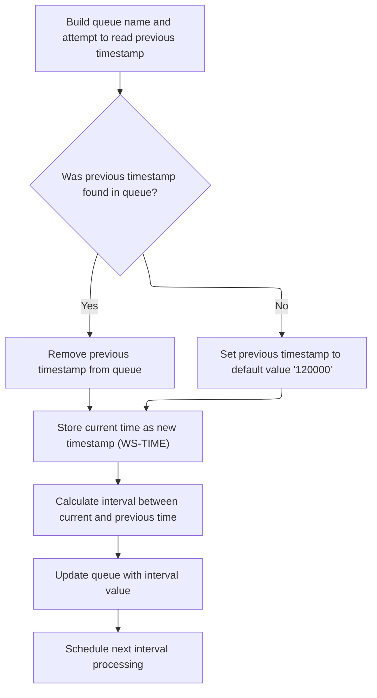
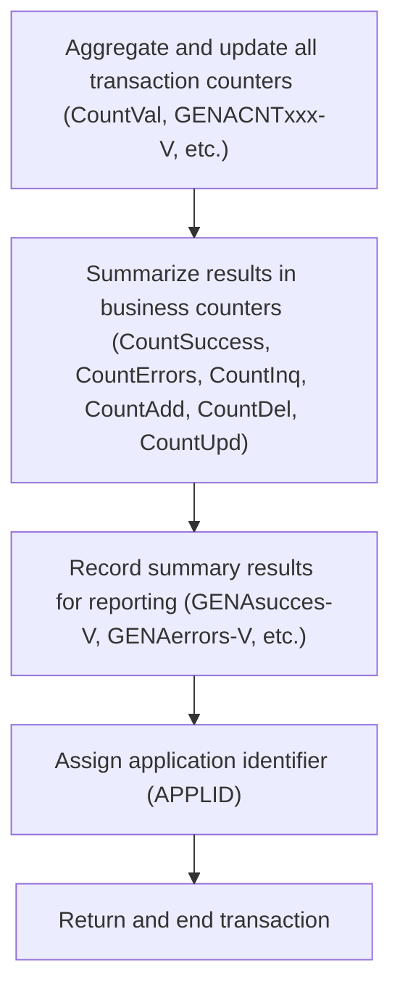

# Overview

This document describes the flow for aggregating and storing transaction statistics for business monitoring. The process captures transaction context, summarizes counter values, calculates transaction intervals, and writes business summary metrics to a shared queue for ongoing monitoring.

## Dependencies

### Program

- <SwmToken path="base/src/lgwebst5.cbl" pos="11:6:6" line-data="       PROGRAM-ID. LGWEBST5">`LGWEBST5`</SwmToken> (<SwmPath>[base/src/lgwebst5.cbl](base/src/lgwebst5.cbl)</SwmPath>)

## Detailed View of the Program's Functionality

# Aggregating and Storing Transaction Counters

## Initialization and Environment Setup

At the start, the program sets up its environment for collecting transaction statistics. It initializes a header structure to hold transaction metadata, such as transaction ID, terminal ID, task number, and call length. These values are extracted from the transaction context provided by the system.

A prefix is prepared for naming the temporary storage queue (TSQ), which will be used to store and retrieve statistics. This prefix is set to a specific value to identify all related statistics queues for this application.

The program then obtains the current absolute time from the system and formats it into a human-readable date and time. This timestamp is used for interval calculations and for scheduling the next monitoring cycle.

## Transaction Interval Calculation and Scheduling

The program calls a routine to handle transaction rate intervals. This routine constructs a queue name using the prepared prefix and a fixed suffix. It attempts to read the previous timestamp from the queue. If the previous timestamp is not found, a default value is used to ensure the process continues smoothly.

After retrieving the old timestamp, the routine deletes the queue to remove outdated data. The current time is then formatted and written to the queue for future reference.

Both the current and previous times are broken down into hours, minutes, and seconds. These components are converted into total seconds, and the difference between them is calculated to determine the interval since the last run. This interval value is then written back to the queue.

Finally, the routine schedules the next run of the monitoring transaction to occur after a fixed delay (e.g., one minute), ensuring continuous periodic monitoring.

# Processing and Writing Aggregated Counters

## Counter Aggregation

After interval processing, the program begins aggregating various transaction counters. It queries multiple counters from the system, each representing a different type of transaction or event (such as inquiries, additions, deletions, updates, and errors).

For each counter, the program retrieves its value, updates summary variables (such as total successes, errors, inquiries, additions, deletions, and updates), and prepares the value for storage. The queue name for each counter is constructed using the prefix and a unique suffix that identifies the counter type.

## Writing Counter Values to Queue

For each counter, the program writes the current value to the queue using the constructed name. It also performs additional calculations, such as updating summary counters by adding the current value to the running totals.

This process is repeated for a large set of counters, each corresponding to a specific transaction type or business event. The program uses a consistent pattern: query the counter, update summary variables, prepare the queue name, and write the value to the queue.

## Summary Statistics Recording

After processing all individual counters, the program prepares summary statistics. It moves the aggregated totals for successes, errors, inquiries, additions, updates, and deletions into dedicated variables.

Each summary statistic is then written to the queue using a special suffix, ensuring that downstream consumers can easily identify and retrieve these business-level metrics.

## Finalization and Transaction End

Before ending, the program assigns the current application identifier to a variable for reporting or logging purposes. This identifier is also prepared for output.

Finally, the program issues a command to return control to the system, ending the transaction. All aggregated statistics and summary values remain stored in the queue for use by other components or monitoring tools. No data is returned directly to the caller; all results are left in shared storage for later consumption.

# Transaction Rate Interval Routine Details

## Queue Name Construction and Previous Value Retrieval

The interval routine constructs a queue name using the prefix and a fixed suffix. It attempts to read the previous interval value from the queue. If the read fails, a default value is used.

## Queue Cleanup and Current Value Storage

The routine deletes the queue to remove old data, then writes the current time (formatted as hours, minutes, and seconds) to the queue.

## Interval Calculation

Both the current and previous times are split into hours, minutes, and seconds, converted to total seconds, and the difference is calculated to determine the interval.

## Interval Value Storage and Scheduling

The calculated interval is written to the queue, and a delayed transaction is scheduled to ensure the monitoring process repeats at regular intervals.

# Counter Value Update Routine Details

## Previous Value Retrieval and Cleanup

For each counter, the update routine reads the previous value from the queue and deletes the queue to remove old data.

## Current Value and Difference Calculation

The current counter value is written to the queue. The previous value is also written back for reference. The difference between the current and previous values is calculated and written to the queue as well.

## Routine Exit

After updating the queue with the current value, previous value, and difference, the routine exits, ready for the next counter update.

---

**Summary:**\
The program is a periodic statistics collector for business monitoring. It initializes transaction context, calculates intervals between runs, aggregates a wide range of transaction counters, and writes both individual and summary statistics to shared queues using a custom naming scheme. It ensures continuous monitoring by scheduling itself to run at regular intervals, and all results are stored for downstream consumption.

# Rule Definition

| Paragraph Name                                                                                                                                                                                                                                                                               | Rule ID | Category          | Description                                                                                                                                                                                                                                                                                                                                                                                                                                                                                                                                                                                                                                                                                                                                                                                                                                                                                                                                                                                                                                                                                                                                                                                                            | Conditions                                                                                                                  | Remarks                                                                                                                                                                                                                                                                                                                                                                                                                                                                                                                                                                                                                                                                                                                                                                                                                                                                                                                                                                                                                                                                                                                                                                                                                                                                                                                                                                                                                                                           |
| -------------------------------------------------------------------------------------------------------------------------------------------------------------------------------------------------------------------------------------------------------------------------------------------- | ------- | ----------------- | ---------------------------------------------------------------------------------------------------------------------------------------------------------------------------------------------------------------------------------------------------------------------------------------------------------------------------------------------------------------------------------------------------------------------------------------------------------------------------------------------------------------------------------------------------------------------------------------------------------------------------------------------------------------------------------------------------------------------------------------------------------------------------------------------------------------------------------------------------------------------------------------------------------------------------------------------------------------------------------------------------------------------------------------------------------------------------------------------------------------------------------------------------------------------------------------------------------------------- | --------------------------------------------------------------------------------------------------------------------------- | ----------------------------------------------------------------------------------------------------------------------------------------------------------------------------------------------------------------------------------------------------------------------------------------------------------------------------------------------------------------------------------------------------------------------------------------------------------------------------------------------------------------------------------------------------------------------------------------------------------------------------------------------------------------------------------------------------------------------------------------------------------------------------------------------------------------------------------------------------------------------------------------------------------------------------------------------------------------------------------------------------------------------------------------------------------------------------------------------------------------------------------------------------------------------------------------------------------------------------------------------------------------------------------------------------------------------------------------------------------------------------------------------------------------------------------------------------------------- |
| MAINLINE SECTION, <SwmToken path="base/src/lgwebst5.cbl" pos="279:3:7" line-data="           Perform Tran-Rate-Counts">`Tran-Rate-Counts`</SwmToken>                                                                                                                                         | RL-001  | Computation       | Each transaction counter is queried, its value is formatted as a zero-padded 9-digit string, and written to the TSQ using a queue name composed of a 4-character prefix and a 4-character suffix.                                                                                                                                                                                                                                                                                                                                                                                                                                                                                                                                                                                                                                                                                                                                                                                                                                                                                                                                                                                                                      | For each counter defined in the program, the value must be queried and stored in the TSQ.                                   | Counter values are stored as strings of 9 characters, left-padded with zeros if necessary. Queue names use a 4-character prefix (e.g., 'GENA') and a 4-character suffix (e.g., <SwmToken path="base/src/lgwebst5.cbl" pos="291:2:2" line-data="                  &#39;100V&#39; Delimited By Spaces">`100V`</SwmToken>).                                                                                                                                                                                                                                                                                                                                                                                                                                                                                                                                                                                                                                                                                                                                                                                                                                                                                                                                                                                                                                                                                                                                          |
| <SwmToken path="base/src/lgwebst5.cbl" pos="266:3:7" line-data="           Perform Tran-Rate-Interval">`Tran-Rate-Interval`</SwmToken>                                                                                                                                                       | RL-002  | Data Assignment   | Timestamps are formatted as 6-character strings (HHMMSS) and written to the TSQ. Interval values are calculated and stored as 6-character strings, right-padded to 9 characters if necessary.                                                                                                                                                                                                                                                                                                                                                                                                                                                                                                                                                                                                                                                                                                                                                                                                                                                                                                                                                                                                                          | Whenever a transaction interval is calculated, both the current timestamp and the interval value must be stored in the TSQ. | Timestamps are 6-character strings in HHMMSS format. Interval values are 6-character strings, right-padded to 9 characters if needed.                                                                                                                                                                                                                                                                                                                                                                                                                                                                                                                                                                                                                                                                                                                                                                                                                                                                                                                                                                                                                                                                                                                                                                                                                                                                                                                             |
| MAINLINE SECTION                                                                                                                                                                                                                                                                             | RL-003  | Computation       | Business summary counters (<SwmToken path="base/src/lgwebst5.cbl" pos="286:7:7" line-data="           Move CountVal  To CountSuccess">`CountSuccess`</SwmToken>, <SwmToken path="base/src/lgwebst5.cbl" pos="301:7:7" line-data="           Move CountVal  To CountErrors">`CountErrors`</SwmToken>, <SwmToken path="base/src/lgwebst5.cbl" pos="287:7:7" line-data="           Move CountVal  To CountInq">`CountInq`</SwmToken>, <SwmToken path="base/src/lgwebst5.cbl" pos="310:7:7" line-data="           Move CountVal  To CountAdd">`CountAdd`</SwmToken>, <SwmToken path="base/src/lgwebst5.cbl" pos="378:7:7" line-data="           Move CountVal  To CountDel">`CountDel`</SwmToken>, <SwmToken path="base/src/lgwebst5.cbl" pos="400:7:7" line-data="           Move CountVal  To CountUpd">`CountUpd`</SwmToken>) are aggregated by summing relevant counter values and written to the TSQ using special suffixes (e.g., <SwmToken path="base/src/lgwebst5.cbl" pos="675:2:2" line-data="                  &#39;X00V&#39; Delimited By Spaces">`X00V`</SwmToken> for <SwmToken path="base/src/lgwebst5.cbl" pos="286:7:7" line-data="           Move CountVal  To CountSuccess">`CountSuccess`</SwmToken>). | After all individual counters are processed, summary counters must be computed and stored.                                  | Summary counters are stored as 9-character strings. Suffixes for TSQ queue names: <SwmToken path="base/src/lgwebst5.cbl" pos="675:2:2" line-data="                  &#39;X00V&#39; Delimited By Spaces">`X00V`</SwmToken> (<SwmToken path="base/src/lgwebst5.cbl" pos="286:7:7" line-data="           Move CountVal  To CountSuccess">`CountSuccess`</SwmToken>), <SwmToken path="base/src/lgwebst5.cbl" pos="681:2:2" line-data="                  &#39;X01V&#39; Delimited By Spaces">`X01V`</SwmToken> (<SwmToken path="base/src/lgwebst5.cbl" pos="287:7:7" line-data="           Move CountVal  To CountInq">`CountInq`</SwmToken>), <SwmToken path="base/src/lgwebst5.cbl" pos="686:2:2" line-data="                  &#39;X02V&#39; Delimited By Spaces">`X02V`</SwmToken> (<SwmToken path="base/src/lgwebst5.cbl" pos="310:7:7" line-data="           Move CountVal  To CountAdd">`CountAdd`</SwmToken>), <SwmToken path="base/src/lgwebst5.cbl" pos="691:2:2" line-data="                  &#39;X03V&#39; Delimited By Spaces">`X03V`</SwmToken> (<SwmToken path="base/src/lgwebst5.cbl" pos="400:7:7" line-data="           Move CountVal  To CountUpd">`CountUpd`</SwmToken>), <SwmToken path="base/src/lgwebst5.cbl" pos="696:2:2" line-data="                  &#39;X04V&#39; Delimited By Spaces">`X04V`</SwmToken> (<SwmToken path="base/src/lgwebst5.cbl" pos="378:7:7" line-data="           Move CountVal  To CountDel">`CountDel`</SwmToken>). |
| MAINLINE SECTION                                                                                                                                                                                                                                                                             | RL-004  | Data Assignment   | The application identifier (APPLID) is assigned and prepared for reporting but is not written to the TSQ.                                                                                                                                                                                                                                                                                                                                                                                                                                                                                                                                                                                                                                                                                                                                                                                                                                                                                                                                                                                                                                                                                                              | APPLID must be assigned during transaction processing.                                                                      | APPLID is an 8-character string, prepared for reporting but not stored in TSQ.                                                                                                                                                                                                                                                                                                                                                                                                                                                                                                                                                                                                                                                                                                                                                                                                                                                                                                                                                                                                                                                                                                                                                                                                                                                                                                                                                                                    |
| MAINLINE SECTION, <SwmToken path="base/src/lgwebst5.cbl" pos="266:3:7" line-data="           Perform Tran-Rate-Interval">`Tran-Rate-Interval`</SwmToken>, <SwmToken path="base/src/lgwebst5.cbl" pos="279:3:7" line-data="           Perform Tran-Rate-Counts">`Tran-Rate-Counts`</SwmToken> | RL-005  | Conditional Logic | All aggregated counters, summary statistics, and interval values are left in the TSQ for downstream consumers. No direct output is returned to the caller.                                                                                                                                                                                                                                                                                                                                                                                                                                                                                                                                                                                                                                                                                                                                                                                                                                                                                                                                                                                                                                                             | After all processing, ensure no direct output is returned; all data remains in TSQ.                                         | TSQ contains all relevant data for downstream consumption. No output is returned to the caller.                                                                                                                                                                                                                                                                                                                                                                                                                                                                                                                                                                                                                                                                                                                                                                                                                                                                                                                                                                                                                                                                                                                                                                                                                                                                                                                                                                   |

# User Stories

## User Story 1: Store individual transaction counters in TSQ

---

### Story Description:

As a downstream consumer, I want all individual transaction counters to be queried, formatted as zero-padded 9-digit strings, and stored in the TSQ using standardized queue names so that I can reliably access transaction data for further processing.

---

### Business Rule Mapping:

| Rule ID | Paragraph Name                                                                                                                                                                                                                                                                               | Rule Description                                                                                                                                                                                  |
| ------- | -------------------------------------------------------------------------------------------------------------------------------------------------------------------------------------------------------------------------------------------------------------------------------------------- | ------------------------------------------------------------------------------------------------------------------------------------------------------------------------------------------------- |
| RL-001  | MAINLINE SECTION, <SwmToken path="base/src/lgwebst5.cbl" pos="279:3:7" line-data="           Perform Tran-Rate-Counts">`Tran-Rate-Counts`</SwmToken>                                                                                                                                         | Each transaction counter is queried, its value is formatted as a zero-padded 9-digit string, and written to the TSQ using a queue name composed of a 4-character prefix and a 4-character suffix. |
| RL-005  | MAINLINE SECTION, <SwmToken path="base/src/lgwebst5.cbl" pos="266:3:7" line-data="           Perform Tran-Rate-Interval">`Tran-Rate-Interval`</SwmToken>, <SwmToken path="base/src/lgwebst5.cbl" pos="279:3:7" line-data="           Perform Tran-Rate-Counts">`Tran-Rate-Counts`</SwmToken> | All aggregated counters, summary statistics, and interval values are left in the TSQ for downstream consumers. No direct output is returned to the caller.                                        |

---

### Relevant Functionality:

- **MAINLINE SECTION**
  1. **RL-001:**
     - For each counter:
       - Query the counter value from CICS using the pool and counter name.
       - Format the value as a zero-padded 9-character string.
       - Construct the TSQ queue name using the prefix and suffix.
       - Write the value to the TSQ using the constructed queue name.
  2. **RL-005:**
     - After all counters and intervals are processed and written to TSQ:
       - Do not return any output to the caller.
       - End transaction.

## User Story 2: Calculate and store transaction intervals

---

### Story Description:

As a downstream consumer, I want transaction intervals to be calculated based on formatted timestamps and stored in the TSQ as right-padded strings so that I can analyze transaction timing and performance.

---

### Business Rule Mapping:

| Rule ID | Paragraph Name                                                                                                                                                                                                                                                                               | Rule Description                                                                                                                                                                              |
| ------- | -------------------------------------------------------------------------------------------------------------------------------------------------------------------------------------------------------------------------------------------------------------------------------------------- | --------------------------------------------------------------------------------------------------------------------------------------------------------------------------------------------- |
| RL-002  | <SwmToken path="base/src/lgwebst5.cbl" pos="266:3:7" line-data="           Perform Tran-Rate-Interval">`Tran-Rate-Interval`</SwmToken>                                                                                                                                                       | Timestamps are formatted as 6-character strings (HHMMSS) and written to the TSQ. Interval values are calculated and stored as 6-character strings, right-padded to 9 characters if necessary. |
| RL-005  | MAINLINE SECTION, <SwmToken path="base/src/lgwebst5.cbl" pos="266:3:7" line-data="           Perform Tran-Rate-Interval">`Tran-Rate-Interval`</SwmToken>, <SwmToken path="base/src/lgwebst5.cbl" pos="279:3:7" line-data="           Perform Tran-Rate-Counts">`Tran-Rate-Counts`</SwmToken> | All aggregated counters, summary statistics, and interval values are left in the TSQ for downstream consumers. No direct output is returned to the caller.                                    |

---

### Relevant Functionality:

- <SwmToken path="base/src/lgwebst5.cbl" pos="266:3:7" line-data="           Perform Tran-Rate-Interval">`Tran-Rate-Interval`</SwmToken>
  1. **RL-002:**
     - Read previous timestamp from TSQ (queue name with <SwmToken path="base/src/lgwebst5.cbl" pos="718:2:2" line-data="                  &#39;000V&#39; Delimited By Spaces">`000V`</SwmToken> suffix).
     - If not found, default previous timestamp to '120000'.
     - Delete previous timestamp from TSQ.
     - Format current time as HHMMSS and write to TSQ.
     - Parse both timestamps into hours, minutes, seconds.
     - Convert each to total seconds.
     - Calculate interval as difference in seconds.
     - Write interval value to TSQ as a 6-character string, right-padded to 9 if necessary.
- **MAINLINE SECTION**
  1. **RL-005:**
     - After all counters and intervals are processed and written to TSQ:
       - Do not return any output to the caller.
       - End transaction.

## User Story 3: Aggregate and store business summary counters

---

### Story Description:

As a downstream consumer, I want business summary counters to be aggregated from relevant transaction counters and stored in the TSQ with special suffixes so that I can access summary statistics for reporting and analysis.

---

### Business Rule Mapping:

| Rule ID | Paragraph Name                                                                                                                                                                                                                                                                               | Rule Description                                                                                                                                                                                                                                                                                                                                                                                                                                                                                                                                                                                                                                                                                                                                                                                                                                                                                                                                                                                                                                                                                                                                                                                                       |
| ------- | -------------------------------------------------------------------------------------------------------------------------------------------------------------------------------------------------------------------------------------------------------------------------------------------- | ---------------------------------------------------------------------------------------------------------------------------------------------------------------------------------------------------------------------------------------------------------------------------------------------------------------------------------------------------------------------------------------------------------------------------------------------------------------------------------------------------------------------------------------------------------------------------------------------------------------------------------------------------------------------------------------------------------------------------------------------------------------------------------------------------------------------------------------------------------------------------------------------------------------------------------------------------------------------------------------------------------------------------------------------------------------------------------------------------------------------------------------------------------------------------------------------------------------------- |
| RL-003  | MAINLINE SECTION                                                                                                                                                                                                                                                                             | Business summary counters (<SwmToken path="base/src/lgwebst5.cbl" pos="286:7:7" line-data="           Move CountVal  To CountSuccess">`CountSuccess`</SwmToken>, <SwmToken path="base/src/lgwebst5.cbl" pos="301:7:7" line-data="           Move CountVal  To CountErrors">`CountErrors`</SwmToken>, <SwmToken path="base/src/lgwebst5.cbl" pos="287:7:7" line-data="           Move CountVal  To CountInq">`CountInq`</SwmToken>, <SwmToken path="base/src/lgwebst5.cbl" pos="310:7:7" line-data="           Move CountVal  To CountAdd">`CountAdd`</SwmToken>, <SwmToken path="base/src/lgwebst5.cbl" pos="378:7:7" line-data="           Move CountVal  To CountDel">`CountDel`</SwmToken>, <SwmToken path="base/src/lgwebst5.cbl" pos="400:7:7" line-data="           Move CountVal  To CountUpd">`CountUpd`</SwmToken>) are aggregated by summing relevant counter values and written to the TSQ using special suffixes (e.g., <SwmToken path="base/src/lgwebst5.cbl" pos="675:2:2" line-data="                  &#39;X00V&#39; Delimited By Spaces">`X00V`</SwmToken> for <SwmToken path="base/src/lgwebst5.cbl" pos="286:7:7" line-data="           Move CountVal  To CountSuccess">`CountSuccess`</SwmToken>). |
| RL-005  | MAINLINE SECTION, <SwmToken path="base/src/lgwebst5.cbl" pos="266:3:7" line-data="           Perform Tran-Rate-Interval">`Tran-Rate-Interval`</SwmToken>, <SwmToken path="base/src/lgwebst5.cbl" pos="279:3:7" line-data="           Perform Tran-Rate-Counts">`Tran-Rate-Counts`</SwmToken> | All aggregated counters, summary statistics, and interval values are left in the TSQ for downstream consumers. No direct output is returned to the caller.                                                                                                                                                                                                                                                                                                                                                                                                                                                                                                                                                                                                                                                                                                                                                                                                                                                                                                                                                                                                                                                             |

---

### Relevant Functionality:

- **MAINLINE SECTION**
  1. **RL-003:**
     - For each summary counter:
       - Aggregate relevant counter values (e.g., <SwmToken path="base/src/lgwebst5.cbl" pos="286:7:7" line-data="           Move CountVal  To CountSuccess">`CountSuccess`</SwmToken> = sum of specific counters).
       - Format as a zero-padded 9-character string.
       - Construct TSQ queue name with prefix and special suffix.
       - Write summary counter value to TSQ.
  2. **RL-005:**
     - After all counters and intervals are processed and written to TSQ:
       - Do not return any output to the caller.
       - End transaction.

## User Story 4: Assign and prepare APPLID for reporting

---

### Story Description:

As a reporting system, I want the application identifier (APPLID) to be assigned and prepared for reporting but not written to the TSQ so that I can include it in reports without affecting TSQ data integrity.

---

### Business Rule Mapping:

| Rule ID | Paragraph Name                                                                                                                                                                                                                                                                               | Rule Description                                                                                                                                           |
| ------- | -------------------------------------------------------------------------------------------------------------------------------------------------------------------------------------------------------------------------------------------------------------------------------------------- | ---------------------------------------------------------------------------------------------------------------------------------------------------------- |
| RL-004  | MAINLINE SECTION                                                                                                                                                                                                                                                                             | The application identifier (APPLID) is assigned and prepared for reporting but is not written to the TSQ.                                                  |
| RL-005  | MAINLINE SECTION, <SwmToken path="base/src/lgwebst5.cbl" pos="266:3:7" line-data="           Perform Tran-Rate-Interval">`Tran-Rate-Interval`</SwmToken>, <SwmToken path="base/src/lgwebst5.cbl" pos="279:3:7" line-data="           Perform Tran-Rate-Counts">`Tran-Rate-Counts`</SwmToken> | All aggregated counters, summary statistics, and interval values are left in the TSQ for downstream consumers. No direct output is returned to the caller. |

---

### Relevant Functionality:

- **MAINLINE SECTION**
  1. **RL-004:**
     - Assign APPLID using CICS ASSIGN.
     - Move APPLID to reporting structure (e.g., <SwmToken path="base/src/lgwebst5.cbl" pos="705:9:9" line-data="           Move WS-APPLID To S1.">`S1`</SwmToken>).
     - Do not write APPLID to TSQ.
  2. **RL-005:**
     - After all counters and intervals are processed and written to TSQ:
       - Do not return any output to the caller.
       - End transaction.

# Workflow

# Aggregating and Storing Transaction Counters

This section initializes the environment for transaction statistics aggregation, calculates the elapsed time since the last monitoring cycle, and collects transaction counter values for storage and later analysis.

| Rule ID | Category      | Rule Name                              | Description                                                                                                                                                                                                                 | Implementation Details                                                                                                                                                                                        |
| ------- | ------------- | -------------------------------------- | --------------------------------------------------------------------------------------------------------------------------------------------------------------------------------------------------------------------------- | ------------------------------------------------------------------------------------------------------------------------------------------------------------------------------------------------------------- |
| BR-001  | Reading Input | Capture transaction context            | The transaction context, including transaction ID, terminal ID, task number, and call length, is captured at the start of the aggregation process to ensure accurate identification and tracking of each transaction batch. | Transaction context includes a 4-character transaction ID, a 4-character terminal ID, a 7-digit task number, and a 7-digit call length. These are used for identification and tracking in monitoring outputs. |
| BR-002  | Reading Input | Query and prepare transaction counters | Transaction counters are queried and their values are prepared for aggregation and storage, ensuring that all relevant statistics are collected for monitoring.                                                             | Counters are collected using the 'GENA' pool and stored for later monitoring. The value is stored in a generic counter value variable for further processing.                                                 |
| BR-003  | Calculation   | Set statistics queue prefix            | A fixed prefix ('GENA') is used to name the statistics queue, ensuring that all aggregated statistics are grouped and accessible under a consistent naming scheme for monitoring purposes.                                  | The prefix 'GENA' is a 4-character string used as the identifier for the statistics queue.                                                                                                                    |
| BR-004  | Calculation   | Calculate elapsed time for monitoring  | The elapsed time since the last aggregation is calculated to determine transaction rates and to schedule the next monitoring cycle.                                                                                         | Elapsed time is calculated in seconds and is used to track transaction rates and schedule the next update in 60 seconds.                                                                                      |

<SwmSnippet path="/base/src/lgwebst5.cbl" line="250">

---

In <SwmToken path="base/src/lgwebst5.cbl" pos="250:1:1" line-data="       MAINLINE SECTION.">`MAINLINE`</SwmToken>, we kick off the stats aggregation by grabbing transaction context and prepping the TSQ prefix. This sets up the environment for collecting and summarizing counter values, which will be written to the queue using a custom naming scheme for later monitoring.

```cobol
       MAINLINE SECTION.
      *
           INITIALIZE WS-HEADER.

           MOVE EIBTRNID TO WS-TRANSID.
           MOVE EIBTRMID TO WS-TERMID.
           MOVE EIBTASKN TO WS-TASKNUM.
           MOVE EIBCALEN TO WS-CALEN.
      ****************************************************************
           MOVE 'GENA'  To TSQpre
```

---

</SwmSnippet>

<SwmSnippet path="/base/src/lgwebst5.cbl" line="260">

---

Right after prepping the environment, we call <SwmToken path="base/src/lgwebst5.cbl" pos="266:3:7" line-data="           Perform Tran-Rate-Interval">`Tran-Rate-Interval`</SwmToken> to figure out how much time has passed since the last run. This is needed to track transaction rates and to schedule the next monitoring cycle.

```cobol
           EXEC CICS ASKTIME ABSTIME(WS-ABSTIME)
           END-EXEC
           EXEC CICS FORMATTIME ABSTIME(WS-ABSTIME)
                     MMDDYYYY(WS-DATE)
                     TIME(WS-TIME)
           END-EXEC
           Perform Tran-Rate-Interval

           Exec CICS Query Counter(GENAcount)
                            Pool(GENApool)
                            Value(CountVal)
                            Resp(WS-RESP)
           End-Exec.
```

---

</SwmSnippet>

## Calculating and Scheduling Transaction Intervals



This section manages the calculation of time intervals between transactions and ensures that the monitoring process continues by scheduling the next interval. It handles queue operations for storing and retrieving timing data, and calculates the interval in seconds for monitoring purposes.

| Rule ID | Category                        | Rule Name                        | Description                                                                                                                                                                                                                                    | Implementation Details                                                                                                                                                                                                                                                                             |
| ------- | ------------------------------- | -------------------------------- | ---------------------------------------------------------------------------------------------------------------------------------------------------------------------------------------------------------------------------------------------- | -------------------------------------------------------------------------------------------------------------------------------------------------------------------------------------------------------------------------------------------------------------------------------------------------- |
| BR-001  | Reading Input                   | Queue Name Construction          | The queue name for storing timing data is constructed by concatenating a fixed prefix with the string <SwmToken path="base/src/lgwebst5.cbl" pos="718:2:2" line-data="                  &#39;000V&#39; Delimited By Spaces">`000V`</SwmToken>. | The prefix is 'GENA' and the suffix is <SwmToken path="base/src/lgwebst5.cbl" pos="718:2:2" line-data="                  &#39;000V&#39; Delimited By Spaces">`000V`</SwmToken>. The resulting queue name is an alphanumeric string. No padding or alignment is specified beyond the concatenation. |
| BR-002  | Data validation                 | Default Previous Timestamp       | If the previous timestamp is not found in the queue, the default value '120000' is used as the previous time.                                                                                                                                  | The default value is the string '120000', representing 12:00:00 in HHMMSS format.                                                                                                                                                                                                                  |
| BR-003  | Calculation                     | Interval Calculation and Storage | The interval between the current and previous times is calculated in seconds and written to the queue for monitoring purposes.                                                                                                                 | Both times are in HHMMSS format. The interval is calculated as the difference in total seconds and stored as a numeric value. No explicit padding or alignment is specified for the interval value.                                                                                                |
| BR-004  | Invoking a Service or a Process | Schedule Next Interval           | After calculating the interval, the process schedules the next interval calculation by starting a delayed transaction to run after one minute.                                                                                                 | The transaction is scheduled to start after a delay of one minute. The transaction ID is 'SSST'.                                                                                                                                                                                                   |

<SwmSnippet path="/base/src/lgwebst5.cbl" line="715">

---

In <SwmToken path="base/src/lgwebst5.cbl" pos="715:1:5" line-data="       Tran-Rate-Interval.">`Tran-Rate-Interval`</SwmToken>, we build the queue name using the TSQ prefix and <SwmToken path="base/src/lgwebst5.cbl" pos="718:2:2" line-data="                  &#39;000V&#39; Delimited By Spaces">`000V`</SwmToken>, then read the previous time value from the queue. This sets up the interval calculation and ensures we're working with the right queue for timing data.

```cobol
       Tran-Rate-Interval.

           String TSQpre,
                  '000V' Delimited By Spaces
                  Into WS-TSQname
           Exec Cics ReadQ TS Queue(WS-TSQname)
                     Into(WS-OLDV)
                     Item(1)
                     Length(Length of WS-OLDV)
                     Resp(WS-RESP)
           End-Exec.
```

---

</SwmSnippet>

<SwmSnippet path="/base/src/lgwebst5.cbl" line="726">

---

If the queue read doesn't succeed, we just set <SwmToken path="base/src/lgwebst5.cbl" pos="727:9:11" line-data="            Move &#39;120000&#39; To WS-OLDV.">`WS-OLDV`</SwmToken> to '120000' so the interval logic can keep going without blowing up.

```cobol
           If WS-RESP Not = DFHRESP(NORMAL)
            Move '120000' To WS-OLDV.
```

---

</SwmSnippet>

<SwmSnippet path="/base/src/lgwebst5.cbl" line="729">

---

After grabbing the old time, we delete the queue to clear out stale data before writing the new value.

```cobol
           Exec Cics DeleteQ TS Queue(WS-TSQNAME)
                     Resp(WS-RESP)
           End-Exec.
```

---

</SwmSnippet>

<SwmSnippet path="/base/src/lgwebst5.cbl" line="733">

---

We move the current time into <SwmToken path="base/src/lgwebst5.cbl" pos="733:9:11" line-data="           Move WS-TIME   To WS-HHMMSS">`WS-HHMMSS`</SwmToken> and write it to the queue, assuming everything is in HHMMSS format for later calculations.

```cobol
           Move WS-TIME   To WS-HHMMSS
           Exec Cics WRITEQ TS Queue(WS-TSQNAME)
                     FROM(WS-HHMMSS)
                     Length(Length of WS-HHMMSS)
                     Resp(WS-RESP)
           End-Exec.
```

---

</SwmSnippet>

<SwmSnippet path="/base/src/lgwebst5.cbl" line="739">

---

We break down both current and old times into hours, minutes, and seconds, convert them to total seconds, and subtract to get the interval. This value is then prepped for writing back to the queue.

```cobol
           Move WS-HH     To HHVal
           Move WS-MM     To MMVal
           Move WS-SS     To SSVal
           Compute NCountVal = (HHVal * 3600) +
                               (MMVal * 60)   +
                                SSVal
           Move WS-OLDVHH To HHVal
           Move WS-OLDVMM To MMVal
           Move WS-OLDVSS To SSVal
           Compute OCountVal = (HHVal * 3600) +
                               (MMVal * 60)   +
                                SSVal
           Compute ICountVal = NCountVal - OCountVal
           move ICountVal To WS-NEWV
           String TSQpre,
                  '000V' Delimited By Spaces
                  Into WS-TSQname
```

---

</SwmSnippet>

<SwmSnippet path="/base/src/lgwebst5.cbl" line="756">

---

After calculating the interval, we write it to the queue and kick off a delayed transaction to keep the monitoring loop running.

```cobol
           Exec Cics WRITEQ TS Queue(WS-TSQNAME)
                     FROM(WS-NEWV)
                     Length(Length of WS-NEWV)
                     Resp(WS-RESP)
           End-Exec.
           Exec Cics Start Transid('SSST')
                     After
                     Minutes(1)
                     Resp(WS-RESP)
           End-Exec.

           Exit.
```

---

</SwmSnippet>

## Processing and Writing Aggregated Counters



This section aggregates transaction counters, summarizes them into business metrics, and writes the results to a queue with standardized naming conventions for downstream monitoring and reporting.

| Rule ID | Category       | Rule Name                         | Description                                                                                                                                                                                                                                                    | Implementation Details                                                                                                                                                                                                                                                                                                                                                                                                                                                                                                                                                                                                                                                                                                                                                                                                                                                                                                                                                                                                                                                                                                                                                                                                                                                                                                                                                                                                                                                                                                                                                                                                                                                                                                                                                                                                                                                                                                                                                                                                                                                                                                                                                                                                                                                                                                                                                                                                                                                                                                                                                                             |
| ------- | -------------- | --------------------------------- | -------------------------------------------------------------------------------------------------------------------------------------------------------------------------------------------------------------------------------------------------------------- | -------------------------------------------------------------------------------------------------------------------------------------------------------------------------------------------------------------------------------------------------------------------------------------------------------------------------------------------------------------------------------------------------------------------------------------------------------------------------------------------------------------------------------------------------------------------------------------------------------------------------------------------------------------------------------------------------------------------------------------------------------------------------------------------------------------------------------------------------------------------------------------------------------------------------------------------------------------------------------------------------------------------------------------------------------------------------------------------------------------------------------------------------------------------------------------------------------------------------------------------------------------------------------------------------------------------------------------------------------------------------------------------------------------------------------------------------------------------------------------------------------------------------------------------------------------------------------------------------------------------------------------------------------------------------------------------------------------------------------------------------------------------------------------------------------------------------------------------------------------------------------------------------------------------------------------------------------------------------------------------------------------------------------------------------------------------------------------------------------------------------------------------------------------------------------------------------------------------------------------------------------------------------------------------------------------------------------------------------------------------------------------------------------------------------------------------------------------------------------------------------------------------------------------------------------------------------------------------------- |
| BR-001  | Calculation    | Counter to summary mapping        | Each transaction counter value is mapped to a corresponding business summary variable (such as success, error, add, delete, update, inquiry) based on its GENACNTxxx key. The mapping determines which summary variable is incremented by the counter's value. | <SwmToken path="base/src/lgwebst5.cbl" pos="281:9:9" line-data="           Exec CICS Query Counter(GENACNT100)">`GENACNT100`</SwmToken>, <SwmToken path="base/src/lgwebst5.cbl" pos="304:9:9" line-data="           Exec CICS Query Counter(GENACNT200)">`GENACNT200`</SwmToken>, <SwmToken path="base/src/lgwebst5.cbl" pos="327:9:9" line-data="           Exec CICS Query Counter(GENACNT300)">`GENACNT300`</SwmToken>, <SwmToken path="base/src/lgwebst5.cbl" pos="349:9:9" line-data="           Exec CICS Query Counter(GENACNT400)">`GENACNT400`</SwmToken>, <SwmToken path="base/src/lgwebst5.cbl" pos="371:9:9" line-data="           Exec CICS Query Counter(GENACNT500)">`GENACNT500`</SwmToken>, <SwmToken path="base/src/lgwebst5.cbl" pos="393:9:9" line-data="           Exec CICS Query Counter(GENACNT600)">`GENACNT600`</SwmToken>, <SwmToken path="base/src/lgwebst5.cbl" pos="416:9:9" line-data="           Exec CICS Query Counter(GENACNT700)">`GENACNT700`</SwmToken>, <SwmToken path="base/src/lgwebst5.cbl" pos="438:9:9" line-data="           Exec CICS Query Counter(GENACNT800)">`GENACNT800`</SwmToken>, <SwmToken path="base/src/lgwebst5.cbl" pos="460:9:9" line-data="           Exec CICS Query Counter(GENACNT900)">`GENACNT900`</SwmToken>, <SwmToken path="base/src/lgwebst5.cbl" pos="482:9:9" line-data="           Exec CICS Query Counter(GENACNTA00)">`GENACNTA00`</SwmToken>, <SwmToken path="base/src/lgwebst5.cbl" pos="505:9:9" line-data="           Exec CICS Query Counter(GENACNTB00)">`GENACNTB00`</SwmToken>, <SwmToken path="base/src/lgwebst5.cbl" pos="527:9:9" line-data="           Exec CICS Query Counter(GENACNTC00)">`GENACNTC00`</SwmToken>, <SwmToken path="base/src/lgwebst5.cbl" pos="549:9:9" line-data="           Exec CICS Query Counter(GENACNTD00)">`GENACNTD00`</SwmToken>, <SwmToken path="base/src/lgwebst5.cbl" pos="571:9:9" line-data="           Exec CICS Query Counter(GENACNTE00)">`GENACNTE00`</SwmToken>, <SwmToken path="base/src/lgwebst5.cbl" pos="594:9:9" line-data="           Exec CICS Query Counter(GENACNTF00)">`GENACNTF00`</SwmToken>, <SwmToken path="base/src/lgwebst5.cbl" pos="616:9:9" line-data="           Exec CICS Query Counter(GENACNTG00)">`GENACNTG00`</SwmToken>, <SwmToken path="base/src/lgwebst5.cbl" pos="638:9:9" line-data="           Exec CICS Query Counter(GENACNTH00)">`GENACNTH00`</SwmToken> are mapped to success, add, delete, update, or inquiry as per the aggregation logic. The summary variables are numeric and accumulate the total for each business meaning. |
| BR-002  | Writing Output | Queue output naming convention    | Each aggregated counter and summary variable is written to the queue with a specific suffix that identifies its business meaning. Downstream consumers rely on these suffixes for processing and reporting.                                                    | Suffixes such as <SwmToken path="base/src/lgwebst5.cbl" pos="675:2:2" line-data="                  &#39;X00V&#39; Delimited By Spaces">`X00V`</SwmToken>, <SwmToken path="base/src/lgwebst5.cbl" pos="681:2:2" line-data="                  &#39;X01V&#39; Delimited By Spaces">`X01V`</SwmToken>, <SwmToken path="base/src/lgwebst5.cbl" pos="686:2:2" line-data="                  &#39;X02V&#39; Delimited By Spaces">`X02V`</SwmToken>, <SwmToken path="base/src/lgwebst5.cbl" pos="691:2:2" line-data="                  &#39;X03V&#39; Delimited By Spaces">`X03V`</SwmToken>, <SwmToken path="base/src/lgwebst5.cbl" pos="696:2:2" line-data="                  &#39;X04V&#39; Delimited By Spaces">`X04V`</SwmToken>, <SwmToken path="base/src/lgwebst5.cbl" pos="276:2:2" line-data="                  &#39;X05V&#39; Delimited By Spaces">`X05V`</SwmToken>, <SwmToken path="base/src/lgwebst5.cbl" pos="291:2:2" line-data="                  &#39;100V&#39; Delimited By Spaces">`100V`</SwmToken>, <SwmToken path="base/src/lgwebst5.cbl" pos="314:2:2" line-data="                  &#39;200V&#39; Delimited By Spaces">`200V`</SwmToken>, etc., are appended to the TSQ name. The output format is an alphanumeric string with the prefix 'GENA' and the suffix, e.g., 'GENAX00V'.                                                                                                                                                                                                                                                                                                                                                                                                                                                                                                                                                                                                                                                                                                                                                                                                                                                                                                                                                                                                                                                                                                                                                                                                                                                                                                  |
| BR-003  | Writing Output | Application identifier assignment | The application identifier is assigned and prepared for reporting at the end of the aggregation process, ensuring that all output can be traced to the correct application context.                                                                            | The application identifier is an 8-character alphanumeric string, stored in <SwmToken path="base/src/lgwebst5.cbl" pos="705:9:9" line-data="           Move WS-APPLID To S1.">`S1`</SwmToken> and derived from the CICS APPLID value.                                                                                                                                                                                                                                                                                                                                                                                                                                                                                                                                                                                                                                                                                                                                                                                                                                                                                                                                                                                                                                                                                                                                                                                                                                                                                                                                                                                                                                                                                                                                                                                                                                                                                                                                                                                                                                                                                                                                                                                                                                                                                                                                                                                                                                                                                                                                                              |

<SwmSnippet path="/base/src/lgwebst5.cbl" line="273">

---

Back in MAINLINE after <SwmToken path="base/src/lgwebst5.cbl" pos="266:3:7" line-data="           Perform Tran-Rate-Interval">`Tran-Rate-Interval`</SwmToken>, we start processing counters and writing them to the queue using hardcoded suffixes. These suffixes are mapped to business meanings and are relied on by downstream consumers.

```cobol
           Move CountVal  To GENAcount-V
           Move GENAcount-V  To S3
           String TSQpre,
                  'X05V' Delimited By Spaces
                  Into WS-TSQname
           Move S3           To NRateVal
           Perform Tran-Rate-Counts
```

---

</SwmSnippet>

<SwmSnippet path="/base/src/lgwebst5.cbl" line="281">

---

Here we query <SwmToken path="base/src/lgwebst5.cbl" pos="281:9:9" line-data="           Exec CICS Query Counter(GENACNT100)">`GENACNT100`</SwmToken> and grab its value for use in summary calculations and queue writing.

```cobol
           Exec CICS Query Counter(GENACNT100)
                            Pool(GENApool)
                            Value(CountVal)
                            Resp(WS-RESP)
           End-Exec.
```

---

</SwmSnippet>

<SwmSnippet path="/base/src/lgwebst5.cbl" line="286">

---

We update summary variables like <SwmToken path="base/src/lgwebst5.cbl" pos="286:7:7" line-data="           Move CountVal  To CountSuccess">`CountSuccess`</SwmToken> and <SwmToken path="base/src/lgwebst5.cbl" pos="287:7:7" line-data="           Move CountVal  To CountInq">`CountInq`</SwmToken> by adding the current counter value, then prep the queue name and call <SwmToken path="base/src/lgwebst5.cbl" pos="294:3:7" line-data="           Perform Tran-Rate-Counts">`Tran-Rate-Counts`</SwmToken> to store the stats.

```cobol
           Move CountVal  To CountSuccess
           Move CountVal  To CountInq
           Move CountVal  To GENACNT100-V
           Move GENACNT100-V To S3
           String TSQpre,
                  '100V' Delimited By Spaces
                  Into WS-TSQname
           Move S3           To NRateVal
           Perform Tran-Rate-Counts

           Exec CICS Query Counter(GENACNT199)
                            Pool(GENApool)
                            Value(CountVal)
                            Resp(WS-RESP)
           End-Exec.
```

---

</SwmSnippet>

<SwmSnippet path="/base/src/lgwebst5.cbl" line="301">

---

After handling success and inquiry stats, we query <SwmToken path="base/src/lgwebst5.cbl" pos="302:7:7" line-data="           Move CountVal  To GENACNT199-V">`GENACNT199`</SwmToken> to update error tracking and prep for the next counter group.

```cobol
           Move CountVal  To CountErrors
           Move CountVal  To GENACNT199-V
           Move GENACNT199-V To S4
           Exec CICS Query Counter(GENACNT200)
                            Pool(GENApool)
                            Value(CountVal)
                            Resp(WS-RESP)
           End-Exec.
```

---

</SwmSnippet>

<SwmSnippet path="/base/src/lgwebst5.cbl" line="309">

---

We add <SwmToken path="base/src/lgwebst5.cbl" pos="311:7:7" line-data="           Move CountVal  To GENACNT200-V">`GENACNT200`</SwmToken>'s value to <SwmToken path="base/src/lgwebst5.cbl" pos="309:3:3" line-data="           Compute CountSuccess = CountSuccess + CountVal">`CountSuccess`</SwmToken> and <SwmToken path="base/src/lgwebst5.cbl" pos="310:7:7" line-data="           Move CountVal  To CountAdd">`CountAdd`</SwmToken>, then write the stats to the queue and move on to the next counter.

```cobol
           Compute CountSuccess = CountSuccess + CountVal
           Move CountVal  To CountAdd
           Move CountVal  To GENACNT200-V
           Move GENACNT200-V To S5
           String TSQpre,
                  '200V' Delimited By Spaces
                  Into WS-TSQname
           Move S5           To NRateVal
           Perform Tran-Rate-Counts
           Exec CICS Query Counter(GENACNT299)
                            Pool(GENApool)
                            Value(CountVal)
                            Resp(WS-RESP)
           End-Exec.
```

---

</SwmSnippet>

<SwmSnippet path="/base/src/lgwebst5.cbl" line="323">

---

We bump up <SwmToken path="base/src/lgwebst5.cbl" pos="323:3:3" line-data="           Compute CountErrors  = CountErrors + CountVal">`CountErrors`</SwmToken> with <SwmToken path="base/src/lgwebst5.cbl" pos="324:7:7" line-data="           Move CountVal  To GENACNT299-V">`GENACNT299`</SwmToken>, then prep for the next transaction type by querying <SwmToken path="base/src/lgwebst5.cbl" pos="327:9:9" line-data="           Exec CICS Query Counter(GENACNT300)">`GENACNT300`</SwmToken>.

```cobol
           Compute CountErrors  = CountErrors + CountVal
           Move CountVal  To GENACNT299-V
           Move GENACNT299-V To S6
      *
           Exec CICS Query Counter(GENACNT300)
                            Pool(GENApool)
                            Value(CountVal)
                            Resp(WS-RESP)
           End-Exec.
```

---

</SwmSnippet>

<SwmSnippet path="/base/src/lgwebst5.cbl" line="332">

---

<SwmToken path="base/src/lgwebst5.cbl" pos="333:7:7" line-data="           Move CountVal  To GENACNT300-V">`GENACNT300`</SwmToken>'s value gets added to both <SwmToken path="base/src/lgwebst5.cbl" pos="332:3:3" line-data="           Compute CountSuccess = CountSuccess + CountVal">`CountSuccess`</SwmToken> and <SwmToken path="base/src/lgwebst5.cbl" pos="334:3:3" line-data="           Compute CountInq = CountInq + CountVal">`CountInq`</SwmToken>, then we write it to the queue and move on to the next error counter.

```cobol
           Compute CountSuccess = CountSuccess + CountVal
           Move CountVal  To GENACNT300-V
           Compute CountInq = CountInq + CountVal
           Move GENACNT300-V To S7
           String TSQpre,
                  '300V' Delimited By Spaces
                  Into WS-TSQname
           Move S7           To NRateVal
           Perform Tran-Rate-Counts
           Exec CICS Query Counter(GENACNT399)
                            Pool(GENApool)
                            Value(CountVal)
                            Resp(WS-RESP)
           End-Exec.
```

---

</SwmSnippet>

<SwmSnippet path="/base/src/lgwebst5.cbl" line="346">

---

We add <SwmToken path="base/src/lgwebst5.cbl" pos="347:7:7" line-data="           Move CountVal  To GENACNT399-V">`GENACNT399`</SwmToken> to <SwmToken path="base/src/lgwebst5.cbl" pos="346:3:3" line-data="           Compute CountErrors  = CountErrors + CountVal">`CountErrors`</SwmToken>, then keep moving through the counter list for more transaction types.

```cobol
           Compute CountErrors  = CountErrors + CountVal
           Move CountVal  To GENACNT399-V
           Move GENACNT399-V To S8
           Exec CICS Query Counter(GENACNT400)
                            Pool(GENApool)
                            Value(CountVal)
                            Resp(WS-RESP)
           End-Exec.
```

---

</SwmSnippet>

<SwmSnippet path="/base/src/lgwebst5.cbl" line="354">

---

<SwmToken path="base/src/lgwebst5.cbl" pos="355:7:7" line-data="           Move CountVal  To GENACNT400-V">`GENACNT400`</SwmToken>'s value is used for both success and add stats, then we write it to the queue and keep aggregating.

```cobol
           Compute CountSuccess = CountSuccess + CountVal
           Move CountVal  To GENACNT400-V
           Compute CountAdd = CountAdd + CountVal
           Move GENACNT400-V To S9
           String TSQpre,
                  '400V' Delimited By Spaces
                  Into WS-TSQname
           Move S9           To NRateVal
           Perform Tran-Rate-Counts
           Exec CICS Query Counter(GENACNT499)
                            Pool(GENApool)
                            Value(CountVal)
                            Resp(WS-RESP)
           End-Exec.
```

---

</SwmSnippet>

<SwmSnippet path="/base/src/lgwebst5.cbl" line="368">

---

We add <SwmToken path="base/src/lgwebst5.cbl" pos="369:7:7" line-data="           Move CountVal  To GENACNT499-V">`GENACNT499`</SwmToken> to <SwmToken path="base/src/lgwebst5.cbl" pos="368:3:3" line-data="           Compute CountErrors  = CountErrors + CountVal">`CountErrors`</SwmToken>, then keep moving through the counter list for more transaction types.

```cobol
           Compute CountErrors  = CountErrors + CountVal
           Move CountVal  To GENACNT499-V
           Move GENACNT499-V To S10
           Exec CICS Query Counter(GENACNT500)
                            Pool(GENApool)
                            Value(CountVal)
                            Resp(WS-RESP)
           End-Exec.
```

---

</SwmSnippet>

<SwmSnippet path="/base/src/lgwebst5.cbl" line="376">

---

<SwmToken path="base/src/lgwebst5.cbl" pos="377:7:7" line-data="           Move CountVal  To GENACNT500-V">`GENACNT500`</SwmToken>'s value is used for both success and delete stats, then we write it to the queue and keep aggregating.

```cobol
           Compute CountSuccess = CountSuccess + CountVal
           Move CountVal  To GENACNT500-V
           Move CountVal  To CountDel
           Move GENACNT500-V To S11
           String TSQpre,
                  '500V' Delimited By Spaces
                  Into WS-TSQname
           Move S11          To NRateVal
           Perform Tran-Rate-Counts
           Exec CICS Query Counter(GENACNT599)
                            Pool(GENApool)
                            Value(CountVal)
                            Resp(WS-RESP)
           End-Exec.
```

---

</SwmSnippet>

<SwmSnippet path="/base/src/lgwebst5.cbl" line="390">

---

We add <SwmToken path="base/src/lgwebst5.cbl" pos="391:7:7" line-data="           Move CountVal  To GENACNT599-V">`GENACNT599`</SwmToken> to <SwmToken path="base/src/lgwebst5.cbl" pos="390:3:3" line-data="           Compute CountErrors  = CountErrors + CountVal">`CountErrors`</SwmToken>, then keep moving through the counter list for more transaction types.

```cobol
           Compute CountErrors  = CountErrors + CountVal
           Move CountVal  To GENACNT599-V
           Move GENACNT599-V To S12
           Exec CICS Query Counter(GENACNT600)
                            Pool(GENApool)
                            Value(CountVal)
                            Resp(WS-RESP)
           End-Exec.
```

---

</SwmSnippet>

<SwmSnippet path="/base/src/lgwebst5.cbl" line="398">

---

<SwmToken path="base/src/lgwebst5.cbl" pos="399:7:7" line-data="           Move CountVal  To GENACNT600-V">`GENACNT600`</SwmToken>'s value is used for both success and update stats, then we write it to the queue and keep aggregating.

```cobol
           Compute CountSuccess = CountSuccess + CountVal
           Move CountVal  To GENACNT600-V
           Move CountVal  To CountUpd
           Move GENACNT600-V To S13
           String TSQpre,
                  '600V' Delimited By Spaces
                  Into WS-TSQname
           Move S13          To NRateVal
           Perform Tran-Rate-Counts
           Exec CICS Query Counter(GENACNT699)
                            Pool(GENApool)
                            Value(CountVal)
                            Resp(WS-RESP)
           End-Exec.
```

---

</SwmSnippet>

<SwmSnippet path="/base/src/lgwebst5.cbl" line="412">

---

We add <SwmToken path="base/src/lgwebst5.cbl" pos="413:7:7" line-data="           Move CountVal  To GENACNT699-V">`GENACNT699`</SwmToken> to <SwmToken path="base/src/lgwebst5.cbl" pos="412:3:3" line-data="           Compute CountErrors  = CountErrors + CountVal">`CountErrors`</SwmToken>, then keep moving through the counter list for more transaction types.

```cobol
           Compute CountErrors  = CountErrors + CountVal
           Move CountVal  To GENACNT699-V
           Move GENACNT699-V To S14
      *
           Exec CICS Query Counter(GENACNT700)
                            Pool(GENApool)
                            Value(CountVal)
                            Resp(WS-RESP)
           End-Exec.
```

---

</SwmSnippet>

<SwmSnippet path="/base/src/lgwebst5.cbl" line="421">

---

<SwmToken path="base/src/lgwebst5.cbl" pos="422:7:7" line-data="           Move CountVal  To GENACNT700-V">`GENACNT700`</SwmToken>'s value gets added to both <SwmToken path="base/src/lgwebst5.cbl" pos="421:3:3" line-data="           Compute CountSuccess = CountSuccess + CountVal">`CountSuccess`</SwmToken> and <SwmToken path="base/src/lgwebst5.cbl" pos="423:3:3" line-data="           Compute CountInq = CountInq + CountVal">`CountInq`</SwmToken>, then we write it to the queue and move on to the next error counter.

```cobol
           Compute CountSuccess = CountSuccess + CountVal
           Move CountVal  To GENACNT700-V
           Compute CountInq = CountInq + CountVal
           Move GENACNT700-V To S15
           String TSQpre,
                  '700V' Delimited By Spaces
                  Into WS-TSQname
           Move S15          To NRateVal
           Perform Tran-Rate-Counts
           Exec CICS Query Counter(GENACNT799)
                            Pool(GENApool)
                            Value(CountVal)
                            Resp(WS-RESP)
           End-Exec.
```

---

</SwmSnippet>

<SwmSnippet path="/base/src/lgwebst5.cbl" line="435">

---

We add <SwmToken path="base/src/lgwebst5.cbl" pos="436:7:7" line-data="           Move CountVal  To GENACNT799-V">`GENACNT799`</SwmToken> to <SwmToken path="base/src/lgwebst5.cbl" pos="435:3:3" line-data="           Compute CountErrors  = CountErrors + CountVal">`CountErrors`</SwmToken>, then keep moving through the counter list for more transaction types.

```cobol
           Compute CountErrors  = CountErrors + CountVal
           Move CountVal  To GENACNT799-V
           Move GENACNT799-V To S16
           Exec CICS Query Counter(GENACNT800)
                            Pool(GENApool)
                            Value(CountVal)
                            Resp(WS-RESP)
           End-Exec.
```

---

</SwmSnippet>

<SwmSnippet path="/base/src/lgwebst5.cbl" line="443">

---

<SwmToken path="base/src/lgwebst5.cbl" pos="444:7:7" line-data="           Move CountVal  To GENACNT800-V">`GENACNT800`</SwmToken>'s value is used for both success and add stats, then we write it to the queue and keep aggregating.

```cobol
           Compute CountSuccess = CountSuccess + CountVal
           Move CountVal  To GENACNT800-V
           Compute CountAdd = CountAdd + CountVal
           Move GENACNT800-V To S17
           String TSQpre,
                  '800V' Delimited By Spaces
                  Into WS-TSQname
           Move S17          To NRateVal
           Perform Tran-Rate-Counts
           Exec CICS Query Counter(GENACNT899)
                            Pool(GENApool)
                            Value(CountVal)
                            Resp(WS-RESP)
           End-Exec.
```

---

</SwmSnippet>

<SwmSnippet path="/base/src/lgwebst5.cbl" line="457">

---

We add <SwmToken path="base/src/lgwebst5.cbl" pos="458:7:7" line-data="           Move CountVal  To GENACNT899-V">`GENACNT899`</SwmToken> to <SwmToken path="base/src/lgwebst5.cbl" pos="457:3:3" line-data="           Compute CountErrors  = CountErrors + CountVal">`CountErrors`</SwmToken>, then keep moving through the counter list for more transaction types.

```cobol
           Compute CountErrors  = CountErrors + CountVal
           Move CountVal  To GENACNT899-V
           Move GENACNT899-V To S18
           Exec CICS Query Counter(GENACNT900)
                            Pool(GENApool)
                            Value(CountVal)
                            Resp(WS-RESP)
           End-Exec.
```

---

</SwmSnippet>

<SwmSnippet path="/base/src/lgwebst5.cbl" line="465">

---

<SwmToken path="base/src/lgwebst5.cbl" pos="466:7:7" line-data="           Move CountVal  To GENACNT900-V">`GENACNT900`</SwmToken>'s value is used for both success and delete stats, then we write it to the queue and keep aggregating.

```cobol
           Compute CountSuccess = CountSuccess + CountVal
           Move CountVal  To GENACNT900-V
           Compute CountDel = CountDel + CountVal
           Move GENACNT900-V To S19
           String TSQpre,
                  '900V' Delimited By Spaces
                  Into WS-TSQname
           Move S19          To NRateVal
           Perform Tran-Rate-Counts
           Exec CICS Query Counter(GENACNT999)
                            Pool(GENApool)
                            Value(CountVal)
                            Resp(WS-RESP)
           End-Exec.
```

---

</SwmSnippet>

<SwmSnippet path="/base/src/lgwebst5.cbl" line="479">

---

We add <SwmToken path="base/src/lgwebst5.cbl" pos="480:7:7" line-data="           Move CountVal  To GENACNT999-V">`GENACNT999`</SwmToken> to <SwmToken path="base/src/lgwebst5.cbl" pos="479:3:3" line-data="           Compute CountErrors  = CountErrors + CountVal">`CountErrors`</SwmToken>, then keep moving through the counter list for more transaction types.

```cobol
           Compute CountErrors  = CountErrors + CountVal
           Move CountVal  To GENACNT999-V
           Move GENACNT999-V To S20
           Exec CICS Query Counter(GENACNTA00)
                            Pool(GENApool)
                            Value(CountVal)
                            Resp(WS-RESP)
           End-Exec.
```

---

</SwmSnippet>

<SwmSnippet path="/base/src/lgwebst5.cbl" line="487">

---

<SwmToken path="base/src/lgwebst5.cbl" pos="488:7:7" line-data="           Move CountVal  To GENACNTA00-V">`GENACNTA00`</SwmToken>'s value is used for both success and update stats, then we write it to the queue and keep aggregating.

```cobol
           Compute CountSuccess = CountSuccess + CountVal
           Move CountVal  To GENACNTA00-V
           Compute CountUpd = CountUpd + CountVal
           Move GENACNTA00-V To S21
           String TSQpre,
                  'A00V' Delimited By Spaces
                  Into WS-TSQname
           Move S21          To NRateVal
           Perform Tran-Rate-Counts
           Exec CICS Query Counter(GENACNTA99)
                            Pool(GENApool)
                            Value(CountVal)
                            Resp(WS-RESP)
           End-Exec.
```

---

</SwmSnippet>

<SwmSnippet path="/base/src/lgwebst5.cbl" line="501">

---

We add <SwmToken path="base/src/lgwebst5.cbl" pos="502:7:7" line-data="           Move CountVal  To GENACNTA99-V">`GENACNTA99`</SwmToken> to <SwmToken path="base/src/lgwebst5.cbl" pos="501:3:3" line-data="           Compute CountErrors  = CountErrors + CountVal">`CountErrors`</SwmToken>, then keep moving through the counter list for more transaction types.

```cobol
           Compute CountErrors  = CountErrors + CountVal
           Move CountVal  To GENACNTA99-V
           Move GENACNTA99-V To S22
      *
           Exec CICS Query Counter(GENACNTB00)
                            Pool(GENApool)
                            Value(CountVal)
                            Resp(WS-RESP)
           End-Exec.
```

---

</SwmSnippet>

<SwmSnippet path="/base/src/lgwebst5.cbl" line="510">

---

<SwmToken path="base/src/lgwebst5.cbl" pos="511:7:7" line-data="           Move CountVal  To GENACNTB00-V">`GENACNTB00`</SwmToken>'s value is used for both success and inquiry stats, then we write it to the queue and keep aggregating.

```cobol
           Compute CountSuccess = CountSuccess + CountVal
           Move CountVal  To GENACNTB00-V
           Compute CountInq = CountInq + CountVal
           Move GENACNTB00-V To S23
           String TSQpre,
                  'B00V' Delimited By Spaces
                  Into WS-TSQname
           Move S23          To NRateVal
           Perform Tran-Rate-Counts
           Exec CICS Query Counter(GENACNTB99)
                            Pool(GENApool)
                            Value(CountVal)
                            Resp(WS-RESP)
           End-Exec.
```

---

</SwmSnippet>

<SwmSnippet path="/base/src/lgwebst5.cbl" line="524">

---

We add <SwmToken path="base/src/lgwebst5.cbl" pos="525:7:7" line-data="           Move CountVal  To GENACNTB99-V">`GENACNTB99`</SwmToken> to <SwmToken path="base/src/lgwebst5.cbl" pos="524:3:3" line-data="           Compute CountErrors  = CountErrors + CountVal">`CountErrors`</SwmToken>, then keep moving through the counter list for more transaction types.

```cobol
           Compute CountErrors  = CountErrors + CountVal
           Move CountVal  To GENACNTB99-V
           Move GENACNTB99-V To S24
           Exec CICS Query Counter(GENACNTC00)
                            Pool(GENApool)
                            Value(CountVal)
                            Resp(WS-RESP)
           End-Exec.
```

---

</SwmSnippet>

<SwmSnippet path="/base/src/lgwebst5.cbl" line="532">

---

<SwmToken path="base/src/lgwebst5.cbl" pos="533:7:7" line-data="           Move CountVal  To GENACNTC00-V">`GENACNTC00`</SwmToken>'s value is used for both success and add stats, then we write it to the queue and keep aggregating.

```cobol
           Compute CountSuccess = CountSuccess + CountVal
           Move CountVal  To GENACNTC00-V
           Compute CountAdd = CountAdd + CountVal
           Move GENACNTC00-V To S25
           String TSQpre,
                  'C00V' Delimited By Spaces
                  Into WS-TSQname
           Move S25          To NRateVal
           Perform Tran-Rate-Counts
           Exec CICS Query Counter(GENACNTC99)
                            Pool(GENApool)
                            Value(CountVal)
                            Resp(WS-RESP)
           End-Exec.
```

---

</SwmSnippet>

<SwmSnippet path="/base/src/lgwebst5.cbl" line="546">

---

We add <SwmToken path="base/src/lgwebst5.cbl" pos="547:7:7" line-data="           Move CountVal  To GENACNTC99-V">`GENACNTC99`</SwmToken> to <SwmToken path="base/src/lgwebst5.cbl" pos="546:3:3" line-data="           Compute CountErrors  = CountErrors + CountVal">`CountErrors`</SwmToken>, then keep moving through the counter list for more transaction types.

```cobol
           Compute CountErrors  = CountErrors + CountVal
           Move CountVal  To GENACNTC99-V
           Move GENACNTC99-V To S26
           Exec CICS Query Counter(GENACNTD00)
                            Pool(GENApool)
                            Value(CountVal)
                            Resp(WS-RESP)
           End-Exec.
```

---

</SwmSnippet>

<SwmSnippet path="/base/src/lgwebst5.cbl" line="554">

---

<SwmToken path="base/src/lgwebst5.cbl" pos="555:7:7" line-data="           Move CountVal  To GENACNTD00-V">`GENACNTD00`</SwmToken>'s value is used for both success and delete stats, then we write it to the queue and keep aggregating.

```cobol
           Compute CountSuccess = CountSuccess + CountVal
           Move CountVal  To GENACNTD00-V
           Compute CountDel = CountDel + CountVal
           Move GENACNTD00-V To S27
           String TSQpre,
                  'D00V' Delimited By Spaces
                  Into WS-TSQname
           Move S27          To NRateVal
           Perform Tran-Rate-Counts
           Exec CICS Query Counter(GENACNTD99)
                            Pool(GENApool)
                            Value(CountVal)
                            Resp(WS-RESP)
           End-Exec.
```

---

</SwmSnippet>

<SwmSnippet path="/base/src/lgwebst5.cbl" line="568">

---

We add <SwmToken path="base/src/lgwebst5.cbl" pos="569:7:7" line-data="           Move CountVal  To GENACNTD99-V">`GENACNTD99`</SwmToken> to <SwmToken path="base/src/lgwebst5.cbl" pos="568:3:3" line-data="           Compute CountErrors  = CountErrors + CountVal">`CountErrors`</SwmToken>, then keep moving through the counter list for more transaction types.

```cobol
           Compute CountErrors  = CountErrors + CountVal
           Move CountVal  To GENACNTD99-V
           Move GENACNTD99-V To S28
           Exec CICS Query Counter(GENACNTE00)
                            Pool(GENApool)
                            Value(CountVal)
                            Resp(WS-RESP)
           End-Exec.
```

---

</SwmSnippet>

<SwmSnippet path="/base/src/lgwebst5.cbl" line="576">

---

<SwmToken path="base/src/lgwebst5.cbl" pos="577:7:7" line-data="           Move CountVal  To GENACNTE00-V">`GENACNTE00`</SwmToken>'s value is used for both success and update stats, then we write it to the queue and keep aggregating.

```cobol
           Compute CountSuccess = CountSuccess + CountVal
           Move CountVal  To GENACNTE00-V
           Compute CountUpd = CountUpd + CountVal
           Move GENACNTE00-V To S29
           String TSQpre,
                  'E00V' Delimited By Spaces
                  Into WS-TSQname
           Move S29          To NRateVal
           Perform Tran-Rate-Counts
           Exec CICS Query Counter(GENACNTE99)
                            Pool(GENApool)
                            Value(CountVal)
                            Resp(WS-RESP)
           End-Exec.
```

---

</SwmSnippet>

<SwmSnippet path="/base/src/lgwebst5.cbl" line="590">

---

Here, we add the value from <SwmToken path="base/src/lgwebst5.cbl" pos="591:7:7" line-data="           Move CountVal  To GENACNTE99-V">`GENACNTE99`</SwmToken> (an error counter) to <SwmToken path="base/src/lgwebst5.cbl" pos="590:3:3" line-data="           Compute CountErrors  = CountErrors + CountVal">`CountErrors`</SwmToken>, then prep for the next group by querying <SwmToken path="base/src/lgwebst5.cbl" pos="594:9:9" line-data="           Exec CICS Query Counter(GENACNTF00)">`GENACNTF00`</SwmToken>. This continues the pattern of aggregating errors before moving to the next transaction type's counters.

```cobol
           Compute CountErrors  = CountErrors + CountVal
           Move CountVal  To GENACNTE99-V
           Move GENACNTE99-V To S30
      *
           Exec CICS Query Counter(GENACNTF00)
                            Pool(GENApool)
                            Value(CountVal)
                            Resp(WS-RESP)
           End-Exec.
```

---

</SwmSnippet>

<SwmSnippet path="/base/src/lgwebst5.cbl" line="599">

---

Next, we update <SwmToken path="base/src/lgwebst5.cbl" pos="599:3:3" line-data="           Compute CountSuccess = CountSuccess + CountVal">`CountSuccess`</SwmToken> and <SwmToken path="base/src/lgwebst5.cbl" pos="601:3:3" line-data="           Compute CountInq = CountInq + CountVal">`CountInq`</SwmToken> with <SwmToken path="base/src/lgwebst5.cbl" pos="600:7:7" line-data="           Move CountVal  To GENACNTF00-V">`GENACNTF00`</SwmToken>'s value, format the TSQ name with <SwmToken path="base/src/lgwebst5.cbl" pos="604:2:2" line-data="                  &#39;F00V&#39; Delimited By Spaces">`F00V`</SwmToken>, and call <SwmToken path="base/src/lgwebst5.cbl" pos="607:3:7" line-data="           Perform Tran-Rate-Counts">`Tran-Rate-Counts`</SwmToken> to store the stats. Then we immediately query the next error counter (<SwmToken path="base/src/lgwebst5.cbl" pos="608:9:9" line-data="           Exec CICS Query Counter(GENACNTF99)">`GENACNTF99`</SwmToken>) to keep the aggregation loop going.

```cobol
           Compute CountSuccess = CountSuccess + CountVal
           Move CountVal  To GENACNTF00-V
           Compute CountInq = CountInq + CountVal
           Move GENACNTF00-V To S31
           String TSQpre,
                  'F00V' Delimited By Spaces
                  Into WS-TSQname
           Move S31          To NRateVal
           Perform Tran-Rate-Counts
           Exec CICS Query Counter(GENACNTF99)
                            Pool(GENApool)
                            Value(CountVal)
                            Resp(WS-RESP)
           End-Exec.
```

---

</SwmSnippet>

<SwmSnippet path="/base/src/lgwebst5.cbl" line="613">

---

Here, we add <SwmToken path="base/src/lgwebst5.cbl" pos="614:7:7" line-data="           Move CountVal  To GENACNTF99-V">`GENACNTF99`</SwmToken>'s value to <SwmToken path="base/src/lgwebst5.cbl" pos="613:3:3" line-data="           Compute CountErrors  = CountErrors + CountVal">`CountErrors`</SwmToken>, store it, and then immediately query the next transaction group's counter (<SwmToken path="base/src/lgwebst5.cbl" pos="616:9:9" line-data="           Exec CICS Query Counter(GENACNTG00)">`GENACNTG00`</SwmToken>) to continue the aggregation cycle.

```cobol
           Compute CountErrors  = CountErrors + CountVal
           Move CountVal  To GENACNTF99-V
           Move GENACNTF99-V To S32
           Exec CICS Query Counter(GENACNTG00)
                            Pool(GENApool)
                            Value(CountVal)
                            Resp(WS-RESP)
           End-Exec.
```

---

</SwmSnippet>

<SwmSnippet path="/base/src/lgwebst5.cbl" line="621">

---

Next, we update <SwmToken path="base/src/lgwebst5.cbl" pos="621:3:3" line-data="           Compute CountSuccess = CountSuccess + CountVal">`CountSuccess`</SwmToken> and <SwmToken path="base/src/lgwebst5.cbl" pos="623:3:3" line-data="           Compute CountAdd = CountAdd + CountVal">`CountAdd`</SwmToken> with <SwmToken path="base/src/lgwebst5.cbl" pos="622:7:7" line-data="           Move CountVal  To GENACNTG00-V">`GENACNTG00`</SwmToken>'s value, format the TSQ name with <SwmToken path="base/src/lgwebst5.cbl" pos="626:2:2" line-data="                  &#39;G00V&#39; Delimited By Spaces">`G00V`</SwmToken>, and call <SwmToken path="base/src/lgwebst5.cbl" pos="629:3:7" line-data="           Perform Tran-Rate-Counts">`Tran-Rate-Counts`</SwmToken>. Then we move on to the next error counter (<SwmToken path="base/src/lgwebst5.cbl" pos="630:9:9" line-data="           Exec CICS Query Counter(GENACNTG99)">`GENACNTG99`</SwmToken>) for further aggregation.

```cobol
           Compute CountSuccess = CountSuccess + CountVal
           Move CountVal  To GENACNTG00-V
           Compute CountAdd = CountAdd + CountVal
           Move GENACNTG00-V To S33
           String TSQpre,
                  'G00V' Delimited By Spaces
                  Into WS-TSQname
           Move S33          To NRateVal
           Perform Tran-Rate-Counts
           Exec CICS Query Counter(GENACNTG99)
                            Pool(GENApool)
                            Value(CountVal)
                            Resp(WS-RESP)
           End-Exec.
```

---

</SwmSnippet>

<SwmSnippet path="/base/src/lgwebst5.cbl" line="635">

---

Here, we add <SwmToken path="base/src/lgwebst5.cbl" pos="636:7:7" line-data="           Move CountVal  To GENACNTG99-V">`GENACNTG99`</SwmToken>'s value to <SwmToken path="base/src/lgwebst5.cbl" pos="635:3:3" line-data="           Compute CountErrors  = CountErrors + CountVal">`CountErrors`</SwmToken>, store it, and then query the next transaction group's counter (<SwmToken path="base/src/lgwebst5.cbl" pos="638:9:9" line-data="           Exec CICS Query Counter(GENACNTH00)">`GENACNTH00`</SwmToken>) to keep the aggregation loop moving.

```cobol
           Compute CountErrors  = CountErrors + CountVal
           Move CountVal  To GENACNTG99-V
           Move GENACNTG99-V To S34
           Exec CICS Query Counter(GENACNTH00)
                            Pool(GENApool)
                            Value(CountVal)
                            Resp(WS-RESP)
           End-Exec.
```

---

</SwmSnippet>

<SwmSnippet path="/base/src/lgwebst5.cbl" line="643">

---

Next, we update <SwmToken path="base/src/lgwebst5.cbl" pos="643:3:3" line-data="           Compute CountSuccess = CountSuccess + CountVal">`CountSuccess`</SwmToken> and <SwmToken path="base/src/lgwebst5.cbl" pos="645:3:3" line-data="           Compute CountDel = CountDel + CountVal">`CountDel`</SwmToken> with <SwmToken path="base/src/lgwebst5.cbl" pos="644:7:7" line-data="           Move CountVal  To GENACNTH00-V">`GENACNTH00`</SwmToken>'s value, format the TSQ name with <SwmToken path="base/src/lgwebst5.cbl" pos="648:2:2" line-data="                  &#39;H00V&#39; Delimited By Spaces">`H00V`</SwmToken>, and call <SwmToken path="base/src/lgwebst5.cbl" pos="651:3:7" line-data="           Perform Tran-Rate-Counts">`Tran-Rate-Counts`</SwmToken>. Then we move on to the next error counter (<SwmToken path="base/src/lgwebst5.cbl" pos="652:9:9" line-data="           Exec CICS Query Counter(GENACNTH99)">`GENACNTH99`</SwmToken>) for further aggregation.

```cobol
           Compute CountSuccess = CountSuccess + CountVal
           Move CountVal  To GENACNTH00-V
           Compute CountDel = CountDel + CountVal
           Move GENACNTH00-V To S35
           String TSQpre,
                  'H00V' Delimited By Spaces
                  Into WS-TSQname
           Move S35          To NRateVal
           Perform Tran-Rate-Counts
           Exec CICS Query Counter(GENACNTH99)
                            Pool(GENApool)
                            Value(CountVal)
                            Resp(WS-RESP)
           End-Exec.
```

---

</SwmSnippet>

<SwmSnippet path="/base/src/lgwebst5.cbl" line="657">

---

Here, we add <SwmToken path="base/src/lgwebst5.cbl" pos="658:7:7" line-data="           Move CountVal  To GENACNTH99-V">`GENACNTH99`</SwmToken>'s value to <SwmToken path="base/src/lgwebst5.cbl" pos="657:3:3" line-data="           Compute CountErrors  = CountErrors + CountVal">`CountErrors`</SwmToken>, store it, and then query the next counter (<SwmToken path="base/src/lgwebst5.cbl" pos="662:9:9" line-data="           Exec CICS Query Counter(GENACNTI99)">`GENACNTI99`</SwmToken>) to wrap up the error aggregation.

```cobol
           Compute CountErrors  = CountErrors + CountVal
           Move CountVal  To GENACNTH99-V
           Move GENACNTH99-V To S36

      *
           Exec CICS Query Counter(GENACNTI99)
                            Pool(GENApool)
                            Value(CountVal)
                            Resp(WS-RESP)
           End-Exec.
```

---

</SwmSnippet>

<SwmSnippet path="/base/src/lgwebst5.cbl" line="667">

---

Here, we store <SwmToken path="base/src/lgwebst5.cbl" pos="667:7:7" line-data="           Move CountVal  To GENACNTI99-V">`GENACNTI99`</SwmToken>'s value, then prep the final summary variables (<SwmToken path="base/src/lgwebst5.cbl" pos="670:3:3" line-data="           Move CountSuccess To GENAsucces-V">`CountSuccess`</SwmToken> and <SwmToken path="base/src/lgwebst5.cbl" pos="301:7:7" line-data="           Move CountVal  To CountErrors">`CountErrors`</SwmToken>) for writing to the TSQ with special suffixes.

```cobol
           Move CountVal  To GENACNTI99-V
           Move GENACNTI99-V To S37
      *
           Move CountSuccess To GENAsucces-V
           Move Counterrors  To GENAerrors-V
           Move GENAsucces-V To S38
           Move GENAerrors-V To S39
           String TSQpre,
                  'X00V' Delimited By Spaces
                  Into WS-TSQname
           Move S38          To NRateVal
```

---

</SwmSnippet>

<SwmSnippet path="/base/src/lgwebst5.cbl" line="678">

---

Next, we write the aggregated <SwmToken path="base/src/lgwebst5.cbl" pos="286:7:7" line-data="           Move CountVal  To CountSuccess">`CountSuccess`</SwmToken> value to the TSQ with the <SwmToken path="base/src/lgwebst5.cbl" pos="675:2:2" line-data="                  &#39;X00V&#39; Delimited By Spaces">`X00V`</SwmToken> suffix using <SwmToken path="base/src/lgwebst5.cbl" pos="678:3:7" line-data="           Perform Tran-Rate-Counts">`Tran-Rate-Counts`</SwmToken>. This is the start of writing summary stats for downstream monitoring.

```cobol
           Perform Tran-Rate-Counts
```

---

</SwmSnippet>

<SwmSnippet path="/base/src/lgwebst5.cbl" line="680">

---

Here, we write the aggregated <SwmToken path="base/src/lgwebst5.cbl" pos="683:3:3" line-data="           Move CountInq     To NRateVal">`CountInq`</SwmToken> value to the TSQ with the <SwmToken path="base/src/lgwebst5.cbl" pos="681:2:2" line-data="                  &#39;X01V&#39; Delimited By Spaces">`X01V`</SwmToken> suffix using <SwmToken path="base/src/lgwebst5.cbl" pos="684:3:7" line-data="           Perform Tran-Rate-Counts">`Tran-Rate-Counts`</SwmToken>, continuing the summary write-out for monitoring.

```cobol
           String TSQpre,
                  'X01V' Delimited By Spaces
                  Into WS-TSQname
           Move CountInq     To NRateVal
           Perform Tran-Rate-Counts
```

---

</SwmSnippet>

<SwmSnippet path="/base/src/lgwebst5.cbl" line="685">

---

Here, we write the aggregated <SwmToken path="base/src/lgwebst5.cbl" pos="688:3:3" line-data="           Move CountAdd     To NRateVal">`CountAdd`</SwmToken> value to the TSQ with the <SwmToken path="base/src/lgwebst5.cbl" pos="686:2:2" line-data="                  &#39;X02V&#39; Delimited By Spaces">`X02V`</SwmToken> suffix using <SwmToken path="base/src/lgwebst5.cbl" pos="689:3:7" line-data="           Perform Tran-Rate-Counts">`Tran-Rate-Counts`</SwmToken>, continuing the summary write-out for monitoring.

```cobol
           String TSQpre,
                  'X02V' Delimited By Spaces
                  Into WS-TSQname
           Move CountAdd     To NRateVal
           Perform Tran-Rate-Counts
```

---

</SwmSnippet>

<SwmSnippet path="/base/src/lgwebst5.cbl" line="690">

---

Here, we write the aggregated <SwmToken path="base/src/lgwebst5.cbl" pos="693:3:3" line-data="           Move CountUpd     To NRateVal">`CountUpd`</SwmToken> value to the TSQ with the <SwmToken path="base/src/lgwebst5.cbl" pos="691:2:2" line-data="                  &#39;X03V&#39; Delimited By Spaces">`X03V`</SwmToken> suffix using <SwmToken path="base/src/lgwebst5.cbl" pos="694:3:7" line-data="           Perform Tran-Rate-Counts">`Tran-Rate-Counts`</SwmToken>, continuing the summary write-out for monitoring.

```cobol
           String TSQpre,
                  'X03V' Delimited By Spaces
                  Into WS-TSQname
           Move CountUpd     To NRateVal
           Perform Tran-Rate-Counts
```

---

</SwmSnippet>

<SwmSnippet path="/base/src/lgwebst5.cbl" line="695">

---

Here, we write the aggregated <SwmToken path="base/src/lgwebst5.cbl" pos="698:3:3" line-data="           Move CountDel     To NRateVal">`CountDel`</SwmToken> value to the TSQ with the <SwmToken path="base/src/lgwebst5.cbl" pos="696:2:2" line-data="                  &#39;X04V&#39; Delimited By Spaces">`X04V`</SwmToken> suffix using <SwmToken path="base/src/lgwebst5.cbl" pos="699:3:7" line-data="           Perform Tran-Rate-Counts">`Tran-Rate-Counts`</SwmToken>. This wraps up the summary write-out, using custom aggregation and naming logic that downstream tools rely on for business monitoring.

```cobol
           String TSQpre,
                  'X04V' Delimited By Spaces
                  Into WS-TSQname
           Move CountDel     To NRateVal
           Perform Tran-Rate-Counts
```

---

</SwmSnippet>

<SwmSnippet path="/base/src/lgwebst5.cbl" line="703">

---

Here, we assign the current APPLID to <SwmToken path="base/src/lgwebst5.cbl" pos="703:9:11" line-data="           EXEC CICS ASSIGN APPLID(WS-APPLID)">`WS-APPLID`</SwmToken>, prepping it for reporting or logging before the program returns.

```cobol
           EXEC CICS ASSIGN APPLID(WS-APPLID)
           END-EXEC.
```

---

</SwmSnippet>

<SwmSnippet path="/base/src/lgwebst5.cbl" line="705">

---

Finally, the program moves <SwmToken path="base/src/lgwebst5.cbl" pos="705:3:5" line-data="           Move WS-APPLID To S1.">`WS-APPLID`</SwmToken> to <SwmToken path="base/src/lgwebst5.cbl" pos="705:9:9" line-data="           Move WS-APPLID To S1.">`S1`</SwmToken> for reporting, then issues a CICS RETURN to end the transaction. All business stats are left in the TSQ for downstream consumers—nothing is returned directly to the caller.

```cobol
           Move WS-APPLID To S1.


           EXEC CICS RETURN
           END-EXEC.
```

---

</SwmSnippet>

&nbsp;

*This is an auto-generated document by Swimm 🌊 and has not yet been verified by a human*

<SwmMeta version="3.0.0" repo-id="Z2l0aHViJTNBJTNBU3dpbW1pby1nZW5hcHAtaG91c2UlM0ElM0FHaXJpLVN3aW1t" repo-name="Swimmio-genapp-house"><sup>Powered by [Swimm](https://app.swimm.io/)</sup></SwmMeta>
