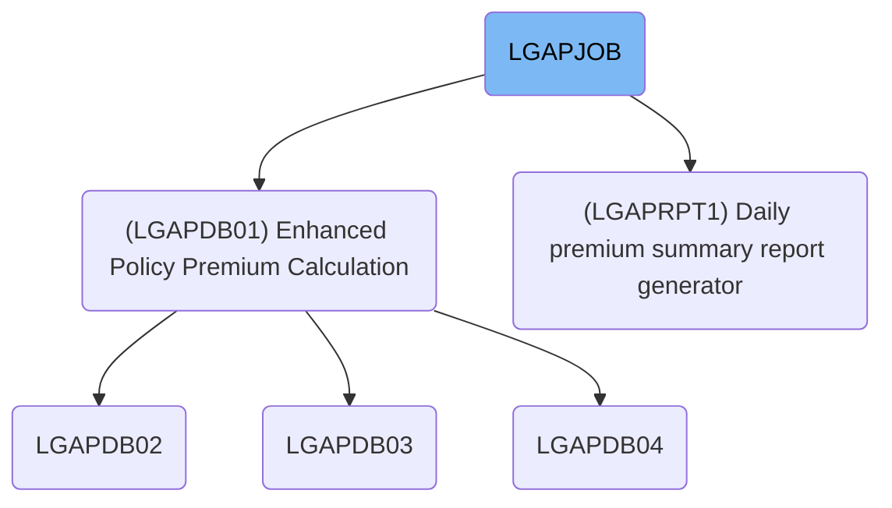
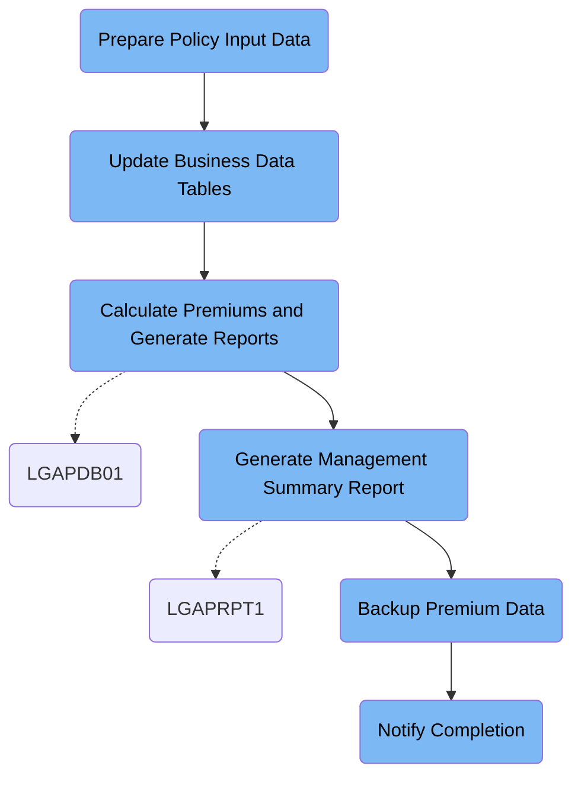

LGAPJOB (LGAPJOB) handles daily batch processing of commercial insurance policy applications. It validates input records, updates business rules, calculates premiums, generates summary reports, backs up results, and notifies stakeholders. For example, after processing, it outputs premium results, logs rejected applications, produces a summary report, and creates a backup file.

# Dependencies



Here is a high level diagram of the file:



## Prepare Policy Input Data

Step in this section: `STEP01`.

Sorts and validates raw policy data records so that all subsequent premium calculations are performed on clean, ordered input.

1. Reads all raw insurance policy input records from the input dataset.
2. Sorts these records by the policy number field and record type to ensure the correct grouping and sequence for downstream calculations.
3. Applies standard formatting rules to records to ensure that each record has the expected structure and field positions.
4. Writes the sorted and validated records to a new output dataset, used by later main business processing steps.

### Input

**LGAP.INPUT.RAW.DATA**

Raw, unsorted commercial insurance policy input records for processing and validation.

### Output

**LGAP.INPUT.SORTED**

Validated, sorted insurance policy records, ready for main premium calculation step.

## Update Business Data Tables

Step in this section: `STEP02`.

Refreshes outdated risk factor cache entries and activates current rate table records in the database, setting up accurate business rules for premium processing.

## Calculate Premiums and Generate Reports

Step in this section: `STEP03`.

Calculates insurance policy premiums, produces a set of rejected applications, and generates a processing summary based on validated input data and up-to-date business logic.

1. The validated, sorted policy application records are read and matched against configuration and rate tables.
2. For each record, the system applies business and actuarial rules defined in the configuration, referencing the appropriate risk and rate factors.
3. If all validations pass, a premium is calculated and a record is written to the premium output dataset.
4. If validation or calculation fails for a record, it is diverted to a rejected records dataset with error details.
5. The entire processing run is summarized, with aggregated counts and totals written to a summary report output.

### Input

**INPUT - LGAP.INPUT.SORTED**

Validated and sorted commercial policy application records ready for premium calculation.

**CONFIG - LGAP.CONFIG.MASTER**

Current actuarial and business configuration settings required for calculation logic.

**RATES - LGAP.RATE.TABLES**

Active insurance rate tables with risk and rating factors for calculation.

### Output

**OUTPUT - LGAP.OUTPUT.PREMIUM.DATA**

Commercial policy premium results, one record per successfully processed policy.

**REJECTED - LGAP.OUTPUT.REJECTED.DATA**

Records of policies that could not be processed due to errors or invalid input.

**SUMMARY - LGAP.OUTPUT.SUMMARY.RPT**

Aggregated statistics and summary information for this premium calculation run.

## Generate Management Summary Report

Step in this section: `STEP04`.

Creates an aggregated management summary report based on processed premium data, providing key daily metrics on commercial insurance premium results.

- The program reads all finalized premium records from the premium data file (e.g., for each processed commercial insurance policy).
- Each record is categorized based on attributes needed by management (e.g., by approval status, policy type, total premium amount).
- Metrics such as total policy count, total premium written, and breakdowns by business segment or status are computed.
- The aggregated data is formatted into a readable report structure with headers, subtotals, and summary sections.
- The formatted summary is written to the management report output file for business review.

### Input

**LGAP.OUTPUT.PREMIUM.DATA (Premium calculation results)**

Completed premium calculation results from processed commercial policy applications.

Sample:

| Column Name    | Sample          |
| -------------- | --------------- |
| POLICY_NO      | 1234567890      |
| INSURED_NAME   | ACME INDUSTRIES |
| EFFECTIVE_DATE | 2024-06-01      |
| PREMIUM_AMOUNT | 1500.00         |
| STATUS         | APPROVED        |

### Output

**LGAP.REPORTS.DAILY.SUMMARY (Management daily summary report)**

Aggregated and formatted daily summary report for management, covering total and categorized premium activity.

## Backup Premium Data

Step in this section: `STEP05`.

Creates an official backup copy of all processed premium calculation data, moving it to a secure tape storage for long-term retention.

- The full set of finalized premium calculation data is read record-by-record from the output dataset for successful commercial insurance policies.
- Each record is written verbatim to the dedicated backup tape file, with no transformation applied.
- The result is a backup file containing an exact copy of all processed premium data, safeguarding the results for future retrieval or compliance checks.

### Input

**LGAP.OUTPUT.PREMIUM.DATA (Processed Premium Data)**

Finalized commercial insurance premium calculation records that have been generated and used for reporting.

Sample:

| Column Name    | Sample          |
| -------------- | --------------- |
| POLICY_NO      | 1234567890      |
| INSURED_NAME   | ACME INDUSTRIES |
| EFFECTIVE_DATE | 2024-06-01      |
| PREMIUM_AMOUNT | 1500.00         |
| STATUS         | APPROVED        |

### Output

**LGAP.BACKUP.PREMIUM.G0001V00 (Premium Data Backup Tape)**

Backup file containing a full copy of all premium calculation results for audit and recovery.

Sample:

| Column Name    | Sample          |
| -------------- | --------------- |
| POLICY_NO      | 1234567890      |
| INSURED_NAME   | ACME INDUSTRIES |
| EFFECTIVE_DATE | 2024-06-01      |
| PREMIUM_AMOUNT | 1500.00         |
| STATUS         | APPROVED        |

## Notify Completion

Step in this section: `NOTIFY`.

Sends a notification with final job status and output report references so stakeholders know processing completed and where to find results.

- The completion notification text containing the overall job status, summary report DSN, and backup file DSN is provided in-stream via the SYSUT1 DD.
- The utility reads these lines and writes them directly and unmodified to the system internal reader (SYSUT2), resulting in a clear notification message being placed in the job's output spool.
- Operators and business staff can then consult the spool message to confirm processing ended successfully and locate the result files.

### Input

**Ad hoc SYSUT1 in-stream data**

In-stream information about job completion status, summary report, and backup location provided as text lines.

Sample:

```
JOB LGAPJOB COMPLETED SUCCESSFULLY
PROCESSING SUMMARY AVAILABLE IN LGAP.OUTPUT.SUMMARY.RPT
BACKUP CREATED: LGAP.BACKUP.PREMIUM.G0001V00
```

### Output

**INTRDR (internal reader spool)**

Notification sent to job output spool for review by operators, listing job status, report, and backup references.

Sample:

```
JOB LGAPJOB COMPLETED SUCCESSFULLY
PROCESSING SUMMARY AVAILABLE IN LGAP.OUTPUT.SUMMARY.RPT
BACKUP CREATED: LGAP.BACKUP.PREMIUM.G0001V00
```

&nbsp;

*This is an auto-generated document by Swimm 🌊 and has not yet been verified by a human*

<SwmMeta version="3.0.0" repo-id="Z2l0aHViJTNBJTNBU3dpbW1pby1nZW5hcHAtaG91c2UlM0ElM0FHaXJpLVN3aW1t" repo-name="Swimmio-genapp-house"><sup>Powered by [Swimm](https://app.swimm.io/)</sup></SwmMeta>
