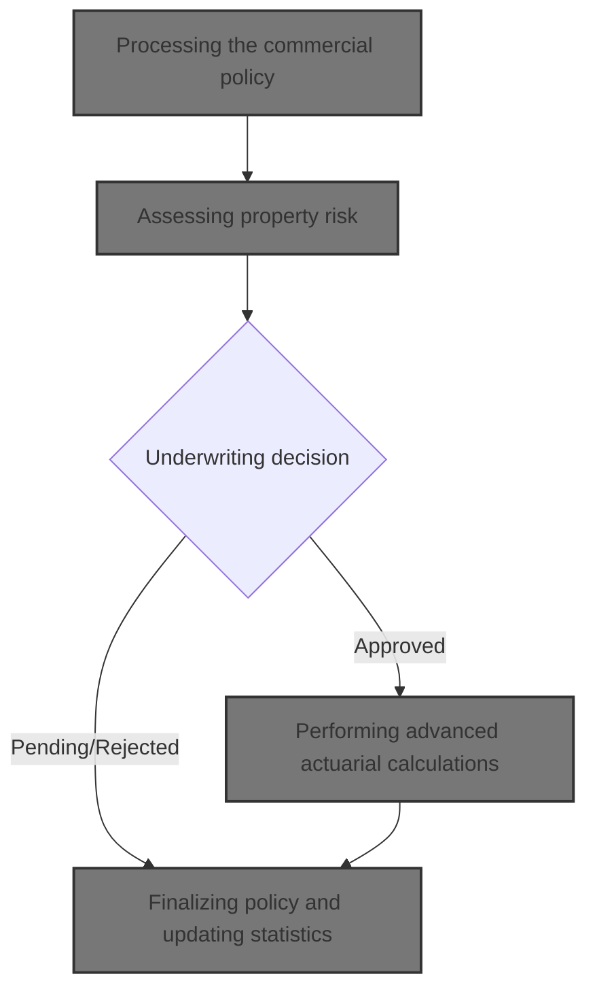
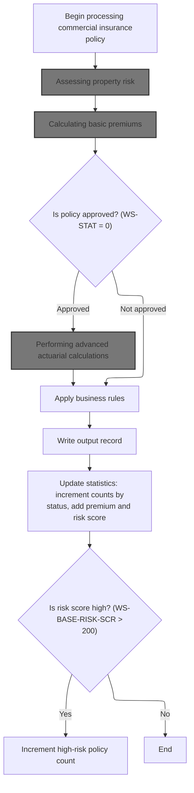
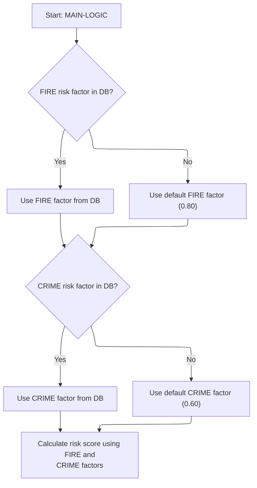
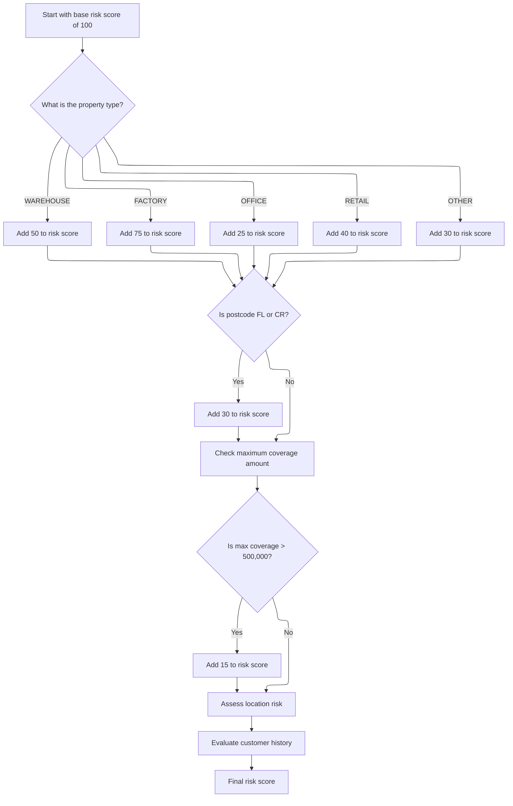
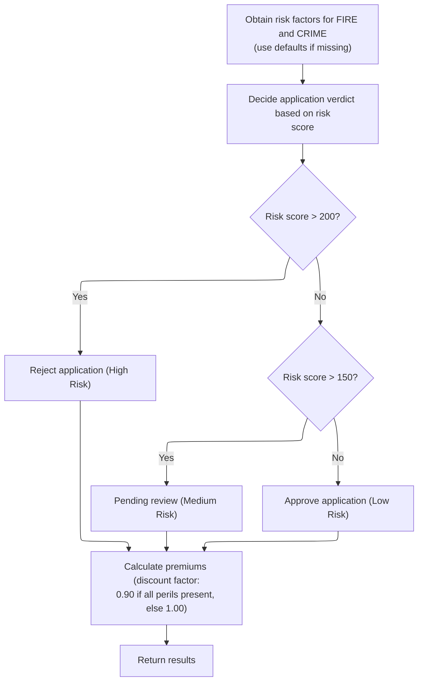
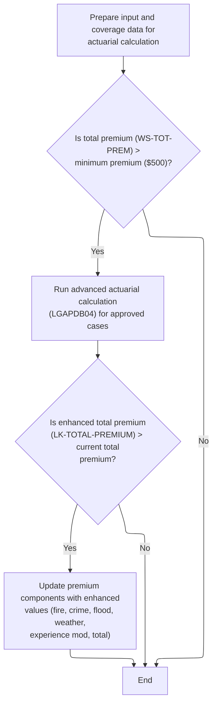
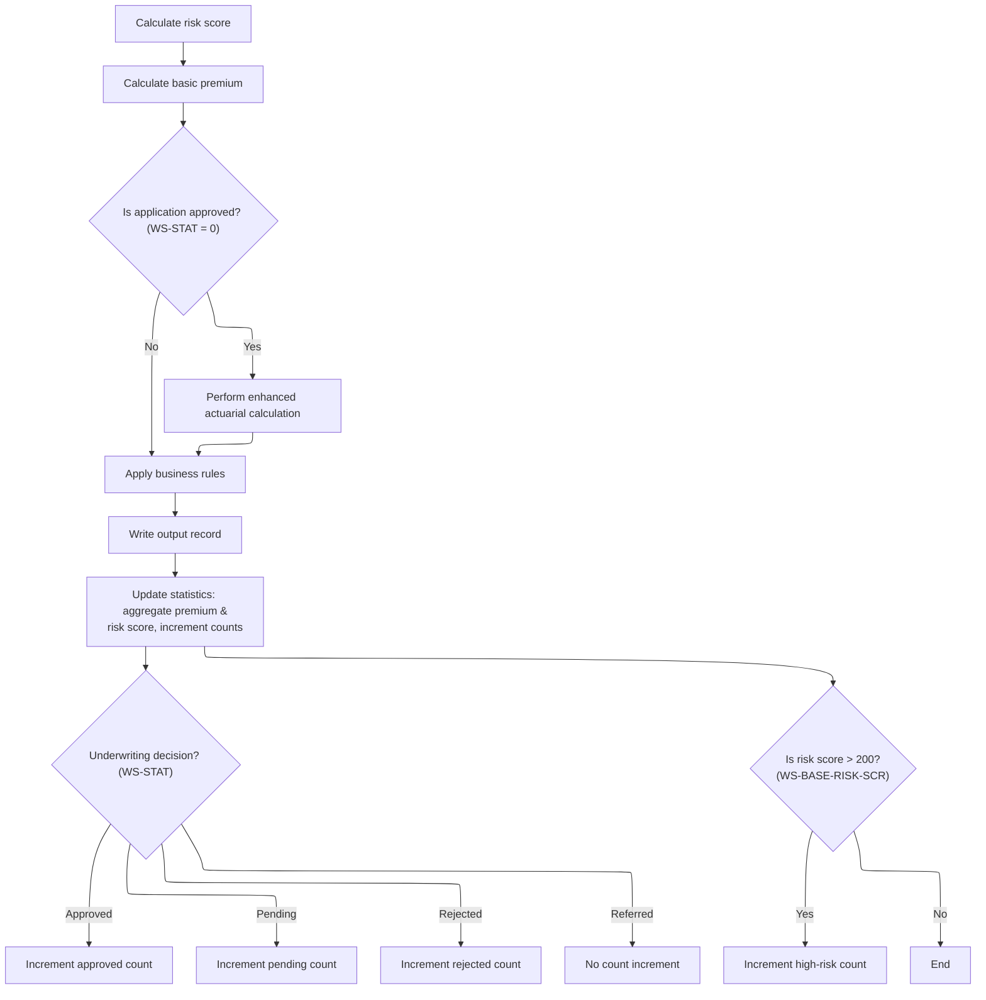

This document outlines the process for evaluating commercial insurance policy applications. The flow begins with risk assessment, proceeds to premium calculation and underwriting decision, and, for approved cases, includes advanced actuarial calculations. The process concludes with business rule application, output recording, and statistics updates. Input includes property and customer information; output includes the underwriting decision, premiums, and updated statistics.



# Spec

## Detailed View of the Program's Functionality

a. File and Data Setup

The main program begins by defining the files it will use for input, output, configuration, rates, and summary data. Each file is assigned a name and organization (sequential or indexed), and file status codes are set up for error handling. The data section defines the structure of each file record, including the fields for configuration and rate records. Working storage is set up for counters, configuration values, and actuarial interface data, as well as for summary statistics like counts of approved, pending, and high-risk policies.

b. Program Initialization and Configuration

The program starts by initializing counters and data areas, displaying startup messages, and accepting the current date. It attempts to load configuration values from a configuration file; if the file is missing or not available, it falls back to default values. Configuration values such as the maximum risk score and minimum premium are loaded and stored for later use.

c. File Opening and Header Writing

The program opens all necessary files for input, output, and summary. If any file fails to open, it displays an error and stops execution. Once files are open, it writes a header record to the output file, labeling each column for the output data.

d. Input Record Processing Loop

The main processing loop reads each input record one by one. For each record, it increments a record count and validates the input. Validation checks include ensuring the policy type is supported, the customer number is present, and at least one coverage limit is provided. If the total coverage exceeds the maximum allowed, a warning is logged. If validation fails, an error record is written to the output file.

e. Commercial Policy Processing

If the input record is a commercial policy and passes validation, the program processes it through several steps:

1. **Risk Score Calculation**: Calls an external module to calculate the risk score based on property type, location, coverage amounts, and customer history. This module fetches risk factors from a database or uses defaults if unavailable, then applies a series of adjustments based on property type, postcode, coverage, location, and customer history.

2. **Basic Premium Calculation**: Calls another external module to calculate the basic premiums for each peril (fire, crime, flood, weather) using the risk score and peril selections. This module also determines the application status (approved, pending, rejected) based on risk score thresholds and applies a discount if all perils are selected.

3. **Advanced Actuarial Calculation**: If the policy is initially approved and the total premium exceeds the minimum, the program prepares detailed input and coverage data and calls an advanced actuarial calculation module. This module performs a series of actuarial computations, including experience and schedule modifiers, base premium, catastrophe and expense loadings, discounts, taxes, and final premium/rate factor. If the enhanced premium is higher than the basic premium, the enhanced values are used.

4. **Business Rule Application**: The program applies additional business rules to determine the final underwriting decision. If the risk score exceeds the maximum allowed, the policy is rejected. If the premium is below the minimum or the risk score is high but not excessive, the policy is marked as pending. Otherwise, it is approved.

5. **Output Record Writing**: The program writes the results to the output file, including customer and property details, risk score, premium breakdown, status, and any rejection reason.

6. **Statistics Update**: The program updates summary statistics, adding the premium and risk score to running totals and incrementing counters for approved, pending, rejected, and high-risk policies.

f. Non-Commercial Policy Handling

If the policy is not commercial, the program writes an output record indicating that only commercial policies are supported, with zeroed-out premium and risk score fields.

g. File Closing and Summary Generation

After all records are processed, the program closes all files. It generates a summary file with totals for records processed, policies approved/pending/rejected, total premium, and average risk score. It also displays these statistics to the console.

h. Advanced Actuarial Calculation Details (LGAPDB04)

The advanced actuarial calculation module performs the following steps:

 1. **Initialization**: Sets up calculation areas and computes exposures for building, contents, and business interruption, adjusting for risk score. Calculates total insured value and exposure density.

 2. **Base Rate Loading**: Attempts to load base rates for each peril from a database; if unavailable, uses hardcoded defaults.

 3. **Experience Modifier Calculation**: Adjusts the experience modifier based on years in business and claims history, capping the value between 0.5 and 2.0.

 4. **Schedule Modifier Calculation**: Adjusts for building age, protection class, occupancy hazard, and exposure density, capping the modifier between -0.2 and +0.4.

 5. **Base Premium Calculation**: Calculates the base premium for each peril, applying experience and schedule modifiers, trend factor, and peril-specific adjustments.

 6. **Catastrophe Loading**: Adds catastrophe loads for hurricane, earthquake, tornado, and flood, depending on peril selections.

 7. **Expense and Profit Loading**: Adds expense and profit loadings to the premium.

 8. **Discount Calculation**: Calculates discounts for multi-peril selection, claims-free history, and high deductibles, capping the total discount at 25%.

 9. **Tax Calculation**: Applies a fixed tax rate to the premium after discounts.

10. **Final Premium and Rate Factor**: Sums all components to get the total premium, calculates the final rate factor, and caps it if necessary. If the capped rate factor is used, the premium is recalculated accordingly.

i. Risk Score Calculation Details (LGAPDB02)

The risk score calculation module:

1. Fetches fire and crime risk factors from a database or uses defaults.
2. Starts with a base risk score of 100.
3. Adjusts the score based on property type (warehouse, factory, office, retail, other).
4. Adds to the score if the postcode indicates a high-risk area.
5. Checks the highest coverage amount among all perils and adds to the score if it exceeds a threshold.
6. Assesses location risk based on latitude and longitude, adding more for urban or out-of-area properties.
7. Adjusts for customer history (new, good, risky, or unknown), with each status affecting the score differently.

j. Basic Premium Calculation Details (LGAPDB03)

The basic premium calculation module:

1. Fetches fire and crime risk factors from a database or uses defaults.
2. Determines the application verdict (approved, pending, rejected) based on risk score thresholds.
3. Calculates premiums for each peril by multiplying the risk score, peril factor, peril selection, and a discount factor (if all perils are selected).
4. Sums the individual peril premiums to get the total premium.

k. Business Rule Application

After all calculations, the program applies business rules to finalize the underwriting decision. These rules consider the maximum risk score, minimum premium, and specific risk score thresholds to determine if the policy is approved, pending, or rejected, and sets the appropriate status and rejection reason.

l. Output and Statistics

The program writes the final results for each policy to the output file, including all relevant details. It updates running totals and counters for reporting. At the end of processing, it generates a summary file and displays key statistics, such as the number of records processed, approved, pending, rejected, error records, high-risk count, total premium generated, and average risk score.

# Rule Definition

| Paragraph Name                                                                                              | Rule ID | Category          | Description                                                                                                                                                                                                                     | Conditions                                                       | Remarks                                                                                                                                                                                                                                                                                                                                                                                                                                                                                         |
| ----------------------------------------------------------------------------------------------------------- | ------- | ----------------- | ------------------------------------------------------------------------------------------------------------------------------------------------------------------------------------------------------------------------------- | ---------------------------------------------------------------- | ----------------------------------------------------------------------------------------------------------------------------------------------------------------------------------------------------------------------------------------------------------------------------------------------------------------------------------------------------------------------------------------------------------------------------------------------------------------------------------------------- |
| LGAPDB02.cbl: CALCULATE-RISK-SCORE, CHECK-COVERAGE-AMOUNTS, ASSESS-LOCATION-RISK, EVALUATE-CUSTOMER-HISTORY | RL-001  | Computation       | The risk score for each policy is calculated starting from a base value and adjusted according to property type, postcode, maximum coverage, location, and customer history.                                                    | For every input policy record processed.                         | Base risk score: 100. Property type adjustments: WAREHOUSE +50, FACTORY +75, OFFICE +25, RETAIL +40, OTHER +30. Postcode 'FL' or 'CR': +30. If max(fire, crime, flood, weather coverage) > 500,000: +15. Location: NYC area (lat 40-41, long -74.5 to -73.5) or LA area (lat 34-35, long -118.5 to -117.5): +10; else if continental US (lat 25-49, long -125 to -66): +5; else: +20. Customer history: 'N' +10, 'G' -5, 'R' +25, other +10. Risk score is a number (integer).                  |
| LGAPDB03.cbl: CALCULATE-PREMIUMS                                                                            | RL-002  | Computation       | For each peril (fire, crime, flood, weather), the premium is calculated using the risk score, peril factor, peril value, and discount factor. The total premium is the sum of all peril premiums.                               | For every policy with valid peril values.                        | Peril factors: fire 0.80, crime 0.60, flood 1.20, weather 0.90. Discount factor: 0.90 if all four peril values > 0, else 1.00. Premiums are numbers with two decimal places. Output fields: fire_premium, crime_premium, flood_premium, weather_premium, total_premium.                                                                                                                                                                                                                         |
| LGAPDB03.cbl: CALCULATE-VERDICT; LGAPDB01.cbl: P011D-APPLY-BUSINESS-RULES                                   | RL-003  | Conditional Logic | The policy status is set to APPROVED, PENDING, or REJECTED based on the risk score and premium. The rejection reason is set if status is REJECTED or PENDING.                                                                   | After risk score and premium are calculated.                     | If risk score > 200: REJECTED; if risk score > 150: PENDING; else: APPROVED. If premium < minimum (default 500.00): PENDING. If risk score > max (default 250): REJECTED. Status is a string; rejection reason is a string up to 50 characters.                                                                                                                                                                                                                                                 |
| LGAPDB04.cbl: P100-MAIN, P600-BASE-PREM, P700-CAT-LOAD, P800-EXPENSE, P900-DISC, P950-TAXES, P999-FINAL     | RL-004  | Computation       | If the policy is approved and the total premium is greater than the minimum, perform enhanced actuarial calculations for each peril, including base premium, catastrophe load, expense load, profit load, discounts, and taxes. | Policy is approved and total premium > minimum (default 500.00). | Premiums and loads are numbers with two decimal places. Peril-specific adjustments: flood premium \*1.25, crime uses 80% of contents exposure. Catastrophe loads: weather (hurricane 0.0125, tornado 0.0045), all perils (earthquake 0.0080), flood (0.0090). Expense load: 0.350. Profit load: 0.150. Discounts: multi-peril (0.100/0.050), claims-free (0.075), deductible credit (fire 0.025, wind 0.035, flood 0.045), capped at 0.250. Taxes: 6.75%. Final rate factor capped at 0.050000. |
| LGAPDB04.cbl: P500-SCHED-MOD                                                                                | RL-005  | Computation       | The schedule modifier is calculated by adjusting for building age, protection class, occupancy code, and exposure density, and is capped between -0.200 and +0.400.                                                             | During enhanced actuarial calculation.                           | Building age: year built >= 2010: -0.050, >= 1990: 0, >= 1970: +0.100, else: +0.200. Protection class: '01'-'03': -0.100, '04'-'06': -0.050, '07'-'09': 0, other: +0.150. Occupancy code: 'OFF01'-'OFF05': -0.025, 'MFG01'-'MFG10': +0.075, 'WHS01'-'WHS05': +0.125. Exposure density: >500: +0.100, <50: -0.050. Capped between -0.200 and +0.400.                                                                                                                                             |
| LGAPDB01.cbl: P011F-UPDATE-STATISTICS, P015-GENERATE-SUMMARY, P016-DISPLAY-STATS                            | RL-006  | Computation       | After processing each policy, update statistics for approved, pending, rejected, and high-risk counts, and aggregate total premium and risk score sums for reporting.                                                           | After each policy is processed.                                  | Counts are integers. Premium and risk score sums are numbers with two decimal places. Output summary includes total records, approved, pending, rejected, total premium, average risk score.                                                                                                                                                                                                                                                                                                    |
| LGAPDB01.cbl: P011E-WRITE-OUTPUT-RECORD, P010-PROCESS-ERROR-RECORD, P012-PROCESS-NON-COMMERCIAL             | RL-007  | Data Assignment   | For each processed policy, generate an output record containing all calculated fields: customer number, property type, postcode, risk score, premiums, total premium, status, and rejection reason.                             | After all calculations and decisions for a policy are complete.  | Output record fields: customer number (string), property type (string), postcode (string), risk score (number), fire_premium (number), crime_premium (number), flood_premium (number), weather_premium (number), total_premium (number), status (string), rejection reason (string). Field sizes and formats as per output record definition.                                                                                                                                                   |

# User Stories

## User Story 1: Policy risk and premium calculation

---

### Story Description:

As a policyholder, I want the system to process my policy application and calculate the risk score and premiums so that I can understand my insurance costs and risk assessment.

---

### Business Rule Mapping:

| Rule ID | Paragraph Name                                                                                              | Rule Description                                                                                                                                                                                  |
| ------- | ----------------------------------------------------------------------------------------------------------- | ------------------------------------------------------------------------------------------------------------------------------------------------------------------------------------------------- |
| RL-001  | LGAPDB02.cbl: CALCULATE-RISK-SCORE, CHECK-COVERAGE-AMOUNTS, ASSESS-LOCATION-RISK, EVALUATE-CUSTOMER-HISTORY | The risk score for each policy is calculated starting from a base value and adjusted according to property type, postcode, maximum coverage, location, and customer history.                      |
| RL-002  | LGAPDB03.cbl: CALCULATE-PREMIUMS                                                                            | For each peril (fire, crime, flood, weather), the premium is calculated using the risk score, peril factor, peril value, and discount factor. The total premium is the sum of all peril premiums. |
| RL-003  | LGAPDB03.cbl: CALCULATE-VERDICT; LGAPDB01.cbl: P011D-APPLY-BUSINESS-RULES                                   | The policy status is set to APPROVED, PENDING, or REJECTED based on the risk score and premium. The rejection reason is set if status is REJECTED or PENDING.                                     |

---

### Relevant Functionality:

- **LGAPDB02.cbl: CALCULATE-RISK-SCORE**
  1. **RL-001:**
     - Start with base risk score 100
     - Adjust based on property type
     - If postcode starts with 'FL' or 'CR', add 30
     - Find max of fire, crime, flood, weather coverage; if > 500,000, add 15
     - Assess location: if in NYC or LA area, add 10; else if in continental US, add 5; else add 20
     - Adjust for customer history as per rules
- **LGAPDB03.cbl: CALCULATE-PREMIUMS**
  1. **RL-002:**
     - Set discount factor to 0.90 if all peril values > 0, else 1.00
     - For each peril: premium = (risk_score \* peril_factor) \* peril_value \* discount_factor
     - Sum all peril premiums for total premium
- **LGAPDB03.cbl: CALCULATE-VERDICT; LGAPDB01.cbl: P011D-APPLY-BUSINESS-RULES**
  1. **RL-003:**
     - If risk score > max, status = REJECTED, reason = 'Risk score exceeds maximum acceptable level'
     - Else if total premium < min, status = PENDING, reason = 'Premium below minimum - requires review'
     - Else if risk score > 180, status = PENDING, reason = 'High risk - underwriter review required'
     - Else if risk score > 200, status = REJECTED, reason = 'High Risk Score - Manual Review Required'
     - Else if risk score > 150, status = PENDING, reason = 'Medium Risk - Pending Review'
     - Else, status = APPROVED, reason = blank

## User Story 2: Enhanced actuarial calculation for approved policies

---

### Story Description:

As a policyholder with an approved policy and high premium, I want the system to perform enhanced actuarial calculations so that my premium reflects detailed risk, catastrophe, expense, profit, and discount factors.

---

### Business Rule Mapping:

| Rule ID | Paragraph Name                                                                                          | Rule Description                                                                                                                                                                                                                |
| ------- | ------------------------------------------------------------------------------------------------------- | ------------------------------------------------------------------------------------------------------------------------------------------------------------------------------------------------------------------------------- |
| RL-004  | LGAPDB04.cbl: P100-MAIN, P600-BASE-PREM, P700-CAT-LOAD, P800-EXPENSE, P900-DISC, P950-TAXES, P999-FINAL | If the policy is approved and the total premium is greater than the minimum, perform enhanced actuarial calculations for each peril, including base premium, catastrophe load, expense load, profit load, discounts, and taxes. |
| RL-005  | LGAPDB04.cbl: P500-SCHED-MOD                                                                            | The schedule modifier is calculated by adjusting for building age, protection class, occupancy code, and exposure density, and is capped between -0.200 and +0.400.                                                             |

---

### Relevant Functionality:

- **LGAPDB04.cbl: P100-MAIN**
  1. **RL-004:**
     - Adjust exposures by risk score
     - For each peril, calculate premium as per rules
     - Add catastrophe loads as per peril
     - Calculate expense and profit loads
     - Apply discounts (multi-peril, claims-free, deductible credit, capped at 0.250)
     - Calculate taxes at 6.75%
     - Calculate final premium and cap rate factor at 0.050000
- **LGAPDB04.cbl: P500-SCHED-MOD**
  1. **RL-005:**
     - Start with 0
     - Adjust for building age
     - Adjust for protection class
     - Adjust for occupancy code
     - Adjust for exposure density
     - Cap between -0.200 and +0.400

## User Story 3: Statistics and output record generation

---

### Story Description:

As a system administrator, I want the system to update statistics and generate output records for each processed policy so that I can monitor performance and maintain accurate records.

---

### Business Rule Mapping:

| Rule ID | Paragraph Name                                                                                  | Rule Description                                                                                                                                                                                    |
| ------- | ----------------------------------------------------------------------------------------------- | --------------------------------------------------------------------------------------------------------------------------------------------------------------------------------------------------- |
| RL-006  | LGAPDB01.cbl: P011F-UPDATE-STATISTICS, P015-GENERATE-SUMMARY, P016-DISPLAY-STATS                | After processing each policy, update statistics for approved, pending, rejected, and high-risk counts, and aggregate total premium and risk score sums for reporting.                               |
| RL-007  | LGAPDB01.cbl: P011E-WRITE-OUTPUT-RECORD, P010-PROCESS-ERROR-RECORD, P012-PROCESS-NON-COMMERCIAL | For each processed policy, generate an output record containing all calculated fields: customer number, property type, postcode, risk score, premiums, total premium, status, and rejection reason. |

---

### Relevant Functionality:

- **LGAPDB01.cbl: P011F-UPDATE-STATISTICS**
  1. **RL-006:**
     - Increment appropriate status counter (approved, pending, rejected)
     - If risk score > 200, increment high-risk count
     - Add premium to total premium sum
     - Add risk score to risk score sum
     - At end, calculate average risk score
- **LGAPDB01.cbl: P011E-WRITE-OUTPUT-RECORD**
  1. **RL-007:**
     - Assign calculated values to output record fields
     - Write output record to output file

# Code Walkthrough

## Processing the commercial policy



<SwmSnippet path="/base/src/LGAPDB01.cbl" line="258">

---

In `P011-PROCESS-COMMERCIAL`, we kick off the flow by calculating the risk score, then move to basic premium calculation. Calling P011A-CALCULATE-RISK-SCORE first is necessary because the risk score is used as input for premium calculations and decision logic in later steps.

```cobol
       P011-PROCESS-COMMERCIAL.
           PERFORM P011A-CALCULATE-RISK-SCORE
           PERFORM P011B-BASIC-PREMIUM-CALC
           IF WS-STAT = 0
               PERFORM P011C-ENHANCED-ACTUARIAL-CALC
           END-IF
           PERFORM P011D-APPLY-BUSINESS-RULES
           PERFORM P011E-WRITE-OUTPUT-RECORD
           PERFORM P011F-UPDATE-STATISTICS.
```

---

</SwmSnippet>

### Assessing property risk

<SwmSnippet path="/base/src/LGAPDB01.cbl" line="268">

---

`P011A-CALCULATE-RISK-SCORE` calls LGAPDB02 to fetch risk factors and compute the risk score using property and customer info. This step ensures we have a consistent risk score before moving to premium calculations.

```cobol
       P011A-CALCULATE-RISK-SCORE.
           CALL 'LGAPDB02' USING IN-PROPERTY-TYPE, IN-POSTCODE, 
                                IN-LATITUDE, IN-LONGITUDE,
                                IN-BUILDING-LIMIT, IN-CONTENTS-LIMIT,
                                IN-FLOOD-COVERAGE, IN-WEATHER-COVERAGE,
                                IN-CUSTOMER-HISTORY, WS-BASE-RISK-SCR.
```

---

</SwmSnippet>

### Fetching risk factors and scoring



<SwmSnippet path="/base/src/LGAPDB02.cbl" line="39">

---

`MAIN-LOGIC` first fetches risk factors for fire and crime, then calculates the risk score using these values and property/customer data. Calling GET-RISK-FACTORS ensures we have the necessary multipliers, even if the database is missing entries.

```cobol
       MAIN-LOGIC.
           PERFORM GET-RISK-FACTORS
           PERFORM CALCULATE-RISK-SCORE
           GOBACK.
```

---

</SwmSnippet>

<SwmSnippet path="/base/src/LGAPDB02.cbl" line="44">

---

Here, GET-RISK-FACTORS pulls fire and crime risk factors from the database, but falls back to hardcoded values if the query fails. This guarantees the risk score calculation always has valid multipliers, regardless of database state.

```cobol
       GET-RISK-FACTORS.
           EXEC SQL
               SELECT FACTOR_VALUE INTO :WS-FIRE-FACTOR
               FROM RISK_FACTORS
               WHERE PERIL_TYPE = 'FIRE'
           END-EXEC.
           
           IF SQLCODE = 0
               CONTINUE
           ELSE
               MOVE 0.80 TO WS-FIRE-FACTOR
           END-IF.
           
           EXEC SQL
               SELECT FACTOR_VALUE INTO :WS-CRIME-FACTOR
               FROM RISK_FACTORS
               WHERE PERIL_TYPE = 'CRIME'
           END-EXEC.
           
           IF SQLCODE = 0
               CONTINUE
           ELSE
               MOVE 0.60 TO WS-CRIME-FACTOR
           END-IF.
```

---

</SwmSnippet>

### Calculating and adjusting risk score



<SwmSnippet path="/base/src/LGAPDB02.cbl" line="69">

---

`CALCULATE-RISK-SCORE` sets the initial score, adjusts it based on property type and postcode, then calls procedures to check coverage, location, and customer history. These steps layer domain-specific risk adjustments before returning the score.

```cobol
       CALCULATE-RISK-SCORE.
           MOVE 100 TO LK-RISK-SCORE

           EVALUATE LK-PROPERTY-TYPE
             WHEN 'WAREHOUSE'
               ADD 50 TO LK-RISK-SCORE
             WHEN 'FACTORY' 
               ADD 75 TO LK-RISK-SCORE
             WHEN 'OFFICE'
               ADD 25 TO LK-RISK-SCORE
             WHEN 'RETAIL'
               ADD 40 TO LK-RISK-SCORE
             WHEN OTHER
               ADD 30 TO LK-RISK-SCORE
           END-EVALUATE

           IF LK-POSTCODE(1:2) = 'FL' OR
              LK-POSTCODE(1:2) = 'CR'
             ADD 30 TO LK-RISK-SCORE
           END-IF

           PERFORM CHECK-COVERAGE-AMOUNTS
           PERFORM ASSESS-LOCATION-RISK  
           PERFORM EVALUATE-CUSTOMER-HISTORY.
```

---

</SwmSnippet>

<SwmSnippet path="/base/src/LGAPDB02.cbl" line="94">

---

Here, CHECK-COVERAGE-AMOUNTS finds the highest coverage among fire, crime, flood, and weather, and bumps the risk score if it exceeds 500K. This step flags policies with unusually high coverage as riskier.

```cobol
       CHECK-COVERAGE-AMOUNTS.
           MOVE ZERO TO WS-MAX-COVERAGE
           
           IF LK-FIRE-COVERAGE > WS-MAX-COVERAGE
               MOVE LK-FIRE-COVERAGE TO WS-MAX-COVERAGE
           END-IF
           
           IF LK-CRIME-COVERAGE > WS-MAX-COVERAGE
               MOVE LK-CRIME-COVERAGE TO WS-MAX-COVERAGE
           END-IF
           
           IF LK-FLOOD-COVERAGE > WS-MAX-COVERAGE
               MOVE LK-FLOOD-COVERAGE TO WS-MAX-COVERAGE
           END-IF
           
           IF LK-WEATHER-COVERAGE > WS-MAX-COVERAGE
               MOVE LK-WEATHER-COVERAGE TO WS-MAX-COVERAGE
           END-IF
           
           IF WS-MAX-COVERAGE > WS-COVERAGE-500K
               ADD 15 TO LK-RISK-SCORE
           END-IF.
```

---

</SwmSnippet>

### Calculating basic premiums

<SwmSnippet path="/base/src/LGAPDB01.cbl" line="275">

---

`P011B-BASIC-PREMIUM-CALC` calls LGAPDB03, passing the risk score and peril values to calculate premiums and set status. The risk score from earlier steps drives the premium amounts and decision logic.

```cobol
       P011B-BASIC-PREMIUM-CALC.
           CALL 'LGAPDB03' USING WS-BASE-RISK-SCR, IN-FIRE-PERIL, 
                                IN-CRIME-PERIL, IN-FLOOD-PERIL, 
                                IN-WEATHER-PERIL, WS-STAT,
                                WS-STAT-DESC, WS-REJ-RSN, WS-FR-PREM,
                                WS-CR-PREM, WS-FL-PREM, WS-WE-PREM,
                                WS-TOT-PREM, WS-DISC-FACT.
```

---

</SwmSnippet>

### Premium calculation and verdict



<SwmSnippet path="/base/src/LGAPDB03.cbl" line="42">

---

`MAIN-LOGIC` in LGAPDB03 fetches risk factors, evaluates the risk score to set the application status, and calculates premiums for each peril. The verdict and premium calculations are tightly linked to the risk score.

```cobol
       MAIN-LOGIC.
           PERFORM GET-RISK-FACTORS
           PERFORM CALCULATE-VERDICT
           PERFORM CALCULATE-PREMIUMS
           GOBACK.
```

---

</SwmSnippet>

<SwmSnippet path="/base/src/LGAPDB03.cbl" line="48">

---

Here, GET-RISK-FACTORS fetches fire and crime risk factors from the database, but falls back to hardcoded values if needed. This keeps premium calculations running even if the database is missing entries.

```cobol
       GET-RISK-FACTORS.
           EXEC SQL
               SELECT FACTOR_VALUE INTO :WS-FIRE-FACTOR
               FROM RISK_FACTORS
               WHERE PERIL_TYPE = 'FIRE'
           END-EXEC.
           
           IF SQLCODE = 0
               CONTINUE
           ELSE
               MOVE 0.80 TO WS-FIRE-FACTOR
           END-IF.
           
           EXEC SQL
               SELECT FACTOR_VALUE INTO :WS-CRIME-FACTOR
               FROM RISK_FACTORS
               WHERE PERIL_TYPE = 'CRIME'
           END-EXEC.
           
           IF SQLCODE = 0
               CONTINUE
           ELSE
               MOVE 0.60 TO WS-CRIME-FACTOR
           END-IF.
```

---

</SwmSnippet>

<SwmSnippet path="/base/src/LGAPDB03.cbl" line="73">

---

Here, CALCULATE-VERDICT assigns status and rejection reasons based on risk score thresholds. This step buckets applications for further handling, using domain-specific cutoffs.

```cobol
       CALCULATE-VERDICT.
           IF LK-RISK-SCORE > 200
             MOVE 2 TO LK-STAT
             MOVE 'REJECTED' TO LK-STAT-DESC
             MOVE 'High Risk Score - Manual Review Required' 
               TO LK-REJ-RSN
           ELSE
             IF LK-RISK-SCORE > 150
               MOVE 1 TO LK-STAT
               MOVE 'PENDING' TO LK-STAT-DESC
               MOVE 'Medium Risk - Pending Review'
                 TO LK-REJ-RSN
             ELSE
               MOVE 0 TO LK-STAT
               MOVE 'APPROVED' TO LK-STAT-DESC
               MOVE SPACES TO LK-REJ-RSN
             END-IF
           END-IF.
```

---

</SwmSnippet>

<SwmSnippet path="/base/src/LGAPDB03.cbl" line="92">

---

Here, CALCULATE-PREMIUMS computes individual premiums for each peril and applies a discount if all are selected. The total premium is then summed up, reflecting the business rule for multi-peril selection.

```cobol
       CALCULATE-PREMIUMS.
           MOVE 1.00 TO LK-DISC-FACT
           
           IF LK-FIRE-PERIL > 0 AND
              LK-CRIME-PERIL > 0 AND
              LK-FLOOD-PERIL > 0 AND
              LK-WEATHER-PERIL > 0
             MOVE 0.90 TO LK-DISC-FACT
           END-IF

           COMPUTE LK-FIRE-PREMIUM =
             ((LK-RISK-SCORE * WS-FIRE-FACTOR) * LK-FIRE-PERIL *
               LK-DISC-FACT)
           
           COMPUTE LK-CRIME-PREMIUM =
             ((LK-RISK-SCORE * WS-CRIME-FACTOR) * LK-CRIME-PERIL *
               LK-DISC-FACT)
           
           COMPUTE LK-FLOOD-PREMIUM =
             ((LK-RISK-SCORE * WS-FLOOD-FACTOR) * LK-FLOOD-PERIL *
               LK-DISC-FACT)
           
           COMPUTE LK-WEATHER-PREMIUM =
             ((LK-RISK-SCORE * WS-WEATHER-FACTOR) * LK-WEATHER-PERIL *
               LK-DISC-FACT)

           COMPUTE LK-TOTAL-PREMIUM = 
             LK-FIRE-PREMIUM + LK-CRIME-PREMIUM + 
             LK-FLOOD-PREMIUM + LK-WEATHER-PREMIUM. 
```

---

</SwmSnippet>

### Performing advanced actuarial calculations



<SwmSnippet path="/base/src/LGAPDB01.cbl" line="283">

---

`P011C-ENHANCED-ACTUARIAL-CALC` prepares input and coverage data, then calls LGAPDB04 for advanced premium calculations if the basic premium exceeds the minimum. If the enhanced premium is higher, it updates the results.

```cobol
       P011C-ENHANCED-ACTUARIAL-CALC.
      *    Prepare input structure for actuarial calculation
           MOVE IN-CUSTOMER-NUM TO LK-CUSTOMER-NUM
           MOVE WS-BASE-RISK-SCR TO LK-RISK-SCORE
           MOVE IN-PROPERTY-TYPE TO LK-PROPERTY-TYPE
           MOVE IN-TERRITORY-CODE TO LK-TERRITORY
           MOVE IN-CONSTRUCTION-TYPE TO LK-CONSTRUCTION-TYPE
           MOVE IN-OCCUPANCY-CODE TO LK-OCCUPANCY-CODE
           MOVE IN-SPRINKLER-IND TO LK-PROTECTION-CLASS
           MOVE IN-YEAR-BUILT TO LK-YEAR-BUILT
           MOVE IN-SQUARE-FOOTAGE TO LK-SQUARE-FOOTAGE
           MOVE IN-YEARS-IN-BUSINESS TO LK-YEARS-IN-BUSINESS
           MOVE IN-CLAIMS-COUNT-3YR TO LK-CLAIMS-COUNT-5YR
           MOVE IN-CLAIMS-AMOUNT-3YR TO LK-CLAIMS-AMOUNT-5YR
           
      *    Set coverage data
           MOVE IN-BUILDING-LIMIT TO LK-BUILDING-LIMIT
           MOVE IN-CONTENTS-LIMIT TO LK-CONTENTS-LIMIT
           MOVE IN-BI-LIMIT TO LK-BI-LIMIT
           MOVE IN-FIRE-DEDUCTIBLE TO LK-FIRE-DEDUCTIBLE
           MOVE IN-WIND-DEDUCTIBLE TO LK-WIND-DEDUCTIBLE
           MOVE IN-FLOOD-DEDUCTIBLE TO LK-FLOOD-DEDUCTIBLE
           MOVE IN-OTHER-DEDUCTIBLE TO LK-OTHER-DEDUCTIBLE
           MOVE IN-FIRE-PERIL TO LK-FIRE-PERIL
           MOVE IN-CRIME-PERIL TO LK-CRIME-PERIL
           MOVE IN-FLOOD-PERIL TO LK-FLOOD-PERIL
           MOVE IN-WEATHER-PERIL TO LK-WEATHER-PERIL
           
      *    Call advanced actuarial calculation program (only for approved cases)
           IF WS-TOT-PREM > WS-MIN-PREMIUM
               CALL 'LGAPDB04' USING LK-INPUT-DATA, LK-COVERAGE-DATA, 
                                    LK-OUTPUT-RESULTS
               
      *        Update with enhanced calculations if successful
               IF LK-TOTAL-PREMIUM > WS-TOT-PREM
                   MOVE LK-FIRE-PREMIUM TO WS-FR-PREM
                   MOVE LK-CRIME-PREMIUM TO WS-CR-PREM
                   MOVE LK-FLOOD-PREMIUM TO WS-FL-PREM
                   MOVE LK-WEATHER-PREMIUM TO WS-WE-PREM
                   MOVE LK-TOTAL-PREMIUM TO WS-TOT-PREM
                   MOVE LK-EXPERIENCE-MOD TO WS-EXPERIENCE-MOD
               END-IF
           END-IF.
```

---

</SwmSnippet>

### Step-by-step actuarial premium calculation

```mermaid
%%{init: {"flowchart": {"defaultRenderer": "elk"}} }%%
flowchart TD
    node1["Start premium calculation"]
    click node1 openCode "base/src/LGAPDB04.cbl:138:150"
    node1 --> node2["Initialize"]
    click node2 openCode "base/src/LGAPDB04.cbl:138:150"
    node2 --> node3["Calculate rates"]
    click node3 openCode "base/src/LGAPDB04.cbl:138:150"
    node3 --> node4["Calculate exposures"]
    click node4 openCode "base/src/LGAPDB04.cbl:138:150"
    node4 --> node5{"Years in business >= 5?"}
    click node5 openCode "base/src/LGAPDB04.cbl:237:254"
    node5 -->|"Yes"| node6{"Claims count (5yr) = 0?"}
    click node6 openCode "base/src/LGAPDB04.cbl:238:253"
    node6 -->|"Yes"| node7["Set experience modifier to 0.85"]
    click node7 openCode "base/src/LGAPDB04.cbl:239:240"
    node6 -->|"No"| node8["Calculate experience modifier"]
    click node8 openCode "base/src/LGAPDB04.cbl:241:245"
    node8 --> node9{"Experience modifier > 2.0?"}
    click node9 openCode "base/src/LGAPDB04.cbl:246:247"
    node9 -->|"Yes"| node10["Cap experience modifier at 2.0"]
    click node10 openCode "base/src/LGAPDB04.cbl:247:248"
    node9 -->|"No"| node11{"Experience modifier < 0.5?"}
    click node11 openCode "base/src/LGAPDB04.cbl:250:251"
    node11 -->|"Yes"| node12["Cap experience modifier at 0.5"]
    click node12 openCode "base/src/LGAPDB04.cbl:251:252"
    node11 -->|"No"| node13["Use calculated experience modifier"]
    click node13 openCode "base/src/LGAPDB04.cbl:241:245"
    node10 --> node13
    node12 --> node13
    node7 --> node14["Apply schedule modifier"]
    click node14 openCode "base/src/LGAPDB04.cbl:143:143"
    node13 --> node14
    node5 -->|"No"| node15["Set experience modifier to 1.1"]
    click node15 openCode "base/src/LGAPDB04.cbl:255:256"
    node15 --> node14
    node14 --> node16["Calculate base premium"]
    click node16 openCode "base/src/LGAPDB04.cbl:144:144"
    node16 --> node17["Add catastrophe load"]
    click node17 openCode "base/src/LGAPDB04.cbl:145:145"
    node17 --> node18["Add expense load"]
    click node18 openCode "base/src/LGAPDB04.cbl:146:146"
    node18 --> node19["Calculate discounts"]
    click node19 openCode "base/src/LGAPDB04.cbl:407:454"
    node19 --> node20{"Discount cap > 25%?"}
    click node20 openCode "base/src/LGAPDB04.cbl:447:449"
    node20 -->|"Yes"| node21["Cap total discount at 25%"]
    click node21 openCode "base/src/LGAPDB04.cbl:448:449"
    node20 -->|"No"| node22["Use calculated discount"]
    click node22 openCode "base/src/LGAPDB04.cbl:443:446"
    node21 --> node23["Calculate taxes (6.75%)"]
    click node23 openCode "base/src/LGAPDB04.cbl:456:462"
    node22 --> node23
    node23 --> node24["Finalize premium and rate factor"]
    click node24 openCode "base/src/LGAPDB04.cbl:464:477"
    node24 --> node25{"Final rate factor > 0.050000?"}
    click node25 openCode "base/src/LGAPDB04.cbl:473:475"
    node25 -->|"Yes"| node26["Cap rate factor at 0.050000 and
recalculate premium"]
    click node26 openCode "base/src/LGAPDB04.cbl:474:476"
    node25 -->|"No"| node27["Use calculated rate factor"]
    click node27 openCode "base/src/LGAPDB04.cbl:470:472"
    node26 --> node28["End"]
    node27 --> node28["End"]
    click node28 openCode "base/src/LGAPDB04.cbl:477:477"
classDef HeadingStyle fill:#777777,stroke:#333,stroke-width:2px;
```



<SwmSnippet path="/base/src/LGAPDB04.cbl" line="138">

---

`P100-MAIN` runs through initialization, rates, exposure, modifiers, base premium, catastrophe loading, expenses, discounts, taxes, and final calculation. Each step tweaks the premium based on specific business rules and actuarial factors.

```cobol
       P100-MAIN.
           PERFORM P200-INIT
           PERFORM P300-RATES
           PERFORM P350-EXPOSURE
           PERFORM P400-EXP-MOD
           PERFORM P500-SCHED-MOD
           PERFORM P600-BASE-PREM
           PERFORM P700-CAT-LOAD
           PERFORM P800-EXPENSE
           PERFORM P900-DISC
           PERFORM P950-TAXES
           PERFORM P999-FINAL
           GOBACK.
```

---

</SwmSnippet>

<SwmSnippet path="/base/src/LGAPDB04.cbl" line="234">

---

Here, P400-EXP-MOD calculates the experience modifier using years in business, claims count, claims amount, and credibility factor. The result is capped between 0.5 and 2.0, with domain-specific constants driving the logic.

```cobol
       P400-EXP-MOD.
           MOVE 1.0000 TO WS-EXPERIENCE-MOD
           
           IF LK-YEARS-IN-BUSINESS >= 5
               IF LK-CLAIMS-COUNT-5YR = ZERO
                   MOVE 0.8500 TO WS-EXPERIENCE-MOD
               ELSE
                   COMPUTE WS-EXPERIENCE-MOD = 
                       1.0000 + 
                       ((LK-CLAIMS-AMOUNT-5YR / WS-TOTAL-INSURED-VAL) * 
                        WS-CREDIBILITY-FACTOR * 0.50)
                   
                   IF WS-EXPERIENCE-MOD > 2.0000
                       MOVE 2.0000 TO WS-EXPERIENCE-MOD
                   END-IF
                   
                   IF WS-EXPERIENCE-MOD < 0.5000
                       MOVE 0.5000 TO WS-EXPERIENCE-MOD
                   END-IF
               END-IF
           ELSE
               MOVE 1.1000 TO WS-EXPERIENCE-MOD
           END-IF
           
           MOVE WS-EXPERIENCE-MOD TO LK-EXPERIENCE-MOD.
```

---

</SwmSnippet>

<SwmSnippet path="/base/src/LGAPDB04.cbl" line="407">

---

Here, P900-DISC calculates multi-peril, claims-free, and deductible discounts, sums them, and caps the total at 25%. The final discount amount is applied to the premium components, using domain-specific constants.

```cobol
       P900-DISC.
           MOVE ZERO TO WS-TOTAL-DISCOUNT
           
      * Multi-peril discount
           MOVE ZERO TO WS-MULTI-PERIL-DISC
           IF LK-FIRE-PERIL > ZERO AND
              LK-CRIME-PERIL > ZERO AND
              LK-FLOOD-PERIL > ZERO AND
              LK-WEATHER-PERIL > ZERO
               MOVE 0.100 TO WS-MULTI-PERIL-DISC
           ELSE
               IF LK-FIRE-PERIL > ZERO AND
                  LK-WEATHER-PERIL > ZERO AND
                  (LK-CRIME-PERIL > ZERO OR LK-FLOOD-PERIL > ZERO)
                   MOVE 0.050 TO WS-MULTI-PERIL-DISC
               END-IF
           END-IF
           
      * Claims-free discount  
           MOVE ZERO TO WS-CLAIMS-FREE-DISC
           IF LK-CLAIMS-COUNT-5YR = ZERO AND LK-YEARS-IN-BUSINESS >= 5
               MOVE 0.075 TO WS-CLAIMS-FREE-DISC
           END-IF
           
      * Deductible credit
           MOVE ZERO TO WS-DEDUCTIBLE-CREDIT
           IF LK-FIRE-DEDUCTIBLE >= 10000
               ADD 0.025 TO WS-DEDUCTIBLE-CREDIT
           END-IF
           IF LK-WIND-DEDUCTIBLE >= 25000  
               ADD 0.035 TO WS-DEDUCTIBLE-CREDIT
           END-IF
           IF LK-FLOOD-DEDUCTIBLE >= 50000
               ADD 0.045 TO WS-DEDUCTIBLE-CREDIT
           END-IF
           
           COMPUTE WS-TOTAL-DISCOUNT = 
               WS-MULTI-PERIL-DISC + WS-CLAIMS-FREE-DISC + 
               WS-DEDUCTIBLE-CREDIT
               
           IF WS-TOTAL-DISCOUNT > 0.250
               MOVE 0.250 TO WS-TOTAL-DISCOUNT
           END-IF
           
           COMPUTE LK-DISCOUNT-AMT = 
               (LK-BASE-AMOUNT + LK-CAT-LOAD-AMT + 
                LK-EXPENSE-LOAD-AMT + LK-PROFIT-LOAD-AMT) *
               WS-TOTAL-DISCOUNT.
```

---

</SwmSnippet>

<SwmSnippet path="/base/src/LGAPDB04.cbl" line="456">

---

Here, P950-TAXES calculates the tax amount by applying a fixed rate to the sum of premium components minus discounts. The result is stored for use in the final premium calculation.

```cobol
       P950-TAXES.
           COMPUTE WS-TAX-AMOUNT = 
               (LK-BASE-AMOUNT + LK-CAT-LOAD-AMT + 
                LK-EXPENSE-LOAD-AMT + LK-PROFIT-LOAD-AMT - 
                LK-DISCOUNT-AMT) * 0.0675
                
           MOVE WS-TAX-AMOUNT TO LK-TAX-AMT.
```

---

</SwmSnippet>

<SwmSnippet path="/base/src/LGAPDB04.cbl" line="464">

---

Here, P999-FINAL sums up all premium components, applies the tax, calculates the rate factor, and enforces a maximum cap. If the cap is exceeded, the premium is recalculated using the capped rate factor.

```cobol
       P999-FINAL.
           COMPUTE LK-TOTAL-PREMIUM = 
               LK-BASE-AMOUNT + LK-CAT-LOAD-AMT + 
               LK-EXPENSE-LOAD-AMT + LK-PROFIT-LOAD-AMT -
               LK-DISCOUNT-AMT + LK-TAX-AMT
               
           COMPUTE LK-FINAL-RATE-FACTOR = 
               LK-TOTAL-PREMIUM / WS-TOTAL-INSURED-VAL
               
           IF LK-FINAL-RATE-FACTOR > 0.050000
               MOVE 0.050000 TO LK-FINAL-RATE-FACTOR
               COMPUTE LK-TOTAL-PREMIUM = 
                   WS-TOTAL-INSURED-VAL * LK-FINAL-RATE-FACTOR
           END-IF.
```

---

</SwmSnippet>

### Finalizing policy and updating statistics



<SwmSnippet path="/base/src/LGAPDB01.cbl" line="258">

---

Back in P011-PROCESS-COMMERCIAL, we wrap up by applying business rules, writing the output, and updating statistics. Calling P011F-UPDATE-STATISTICS ensures counters and totals are incremented for reporting and analytics.

```cobol
       P011-PROCESS-COMMERCIAL.
           PERFORM P011A-CALCULATE-RISK-SCORE
           PERFORM P011B-BASIC-PREMIUM-CALC
           IF WS-STAT = 0
               PERFORM P011C-ENHANCED-ACTUARIAL-CALC
           END-IF
           PERFORM P011D-APPLY-BUSINESS-RULES
           PERFORM P011E-WRITE-OUTPUT-RECORD
           PERFORM P011F-UPDATE-STATISTICS.
```

---

</SwmSnippet>

<SwmSnippet path="/base/src/LGAPDB01.cbl" line="365">

---

`P011F-UPDATE-STATISTICS` increments counters for approved, pending, and rejected cases, updates totals, and flags high-risk scores using a 200 threshold. These updates feed into reporting and analytics.

```cobol
       P011F-UPDATE-STATISTICS.
           ADD WS-TOT-PREM TO WS-TOTAL-PREMIUM-AMT
           ADD WS-BASE-RISK-SCR TO WS-CONTROL-TOTALS
           
           EVALUATE WS-STAT
               WHEN 0 ADD 1 TO WS-APPROVED-CNT
               WHEN 1 ADD 1 TO WS-PENDING-CNT
               WHEN 2 ADD 1 TO WS-REJECTED-CNT
           END-EVALUATE
           
           IF WS-BASE-RISK-SCR > 200
               ADD 1 TO WS-HIGH-RISK-CNT
           END-IF.
```

---

</SwmSnippet>

&nbsp;

*This is an auto-generated document by Swimm 🌊 and has not yet been verified by a human*

<SwmMeta version="3.0.0" repo-id="Z2l0aHViJTNBJTNBU3dpbW1pby1nZW5hcHAtaG91c2UlM0ElM0FHaXJpLVN3aW1t" repo-name="Swimmio-genapp-house"><sup>Powered by [Swimm](https://app.swimm.io/)</sup></SwmMeta>
