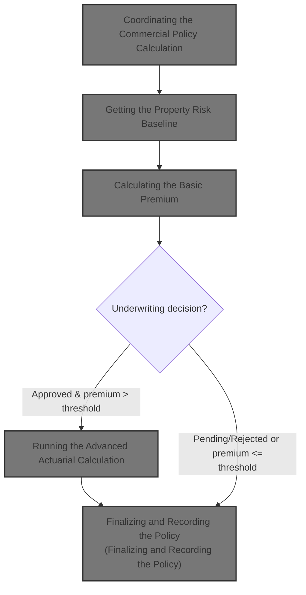
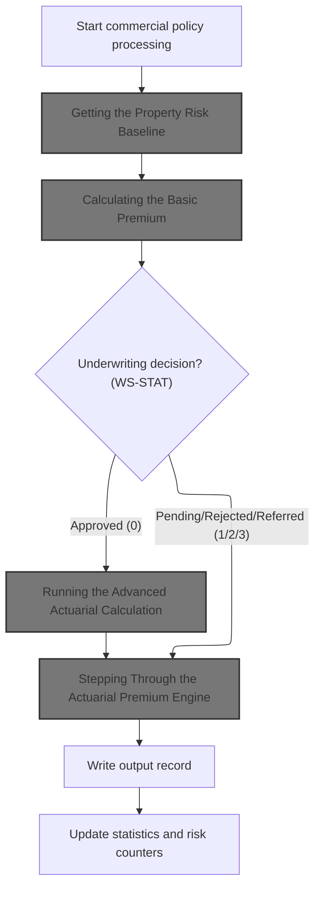
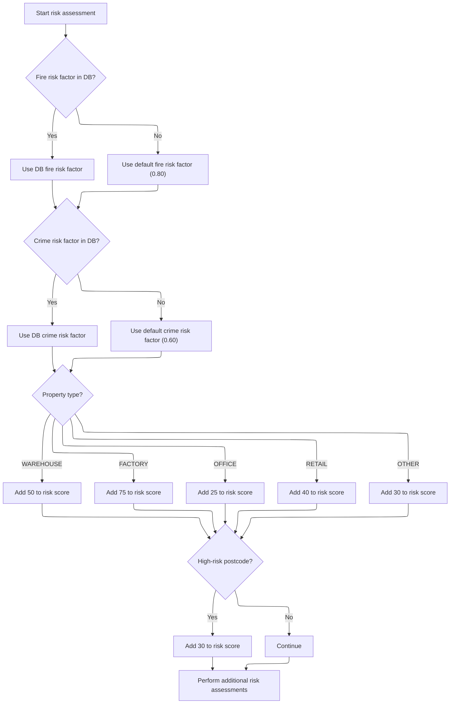
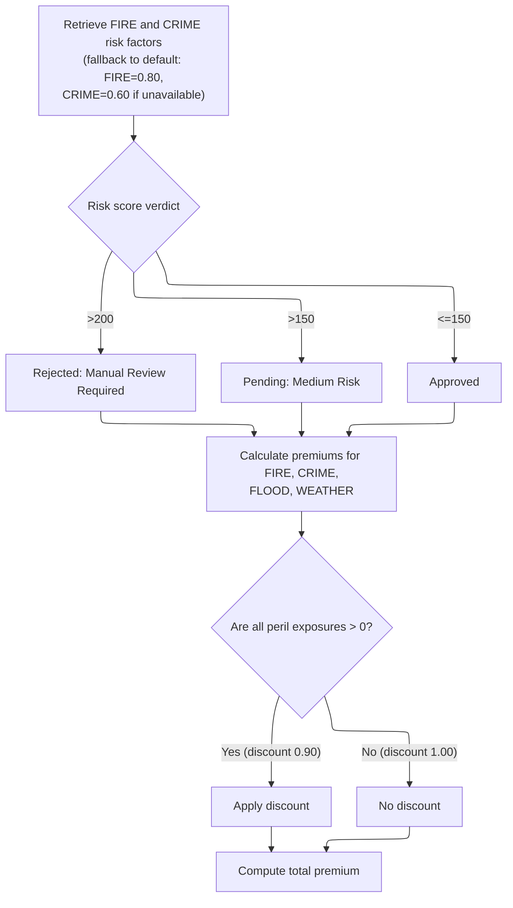
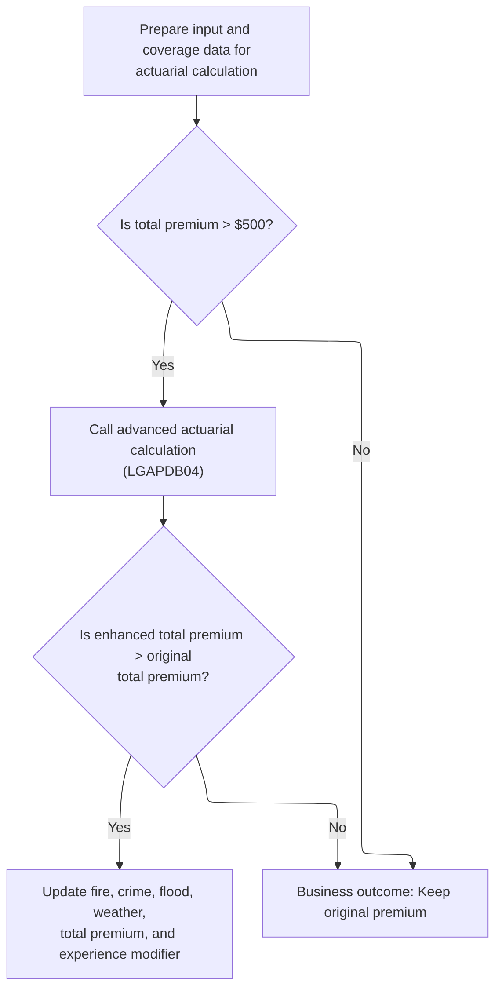
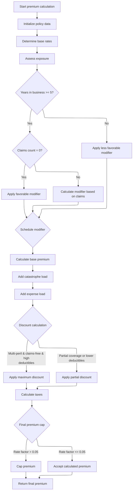
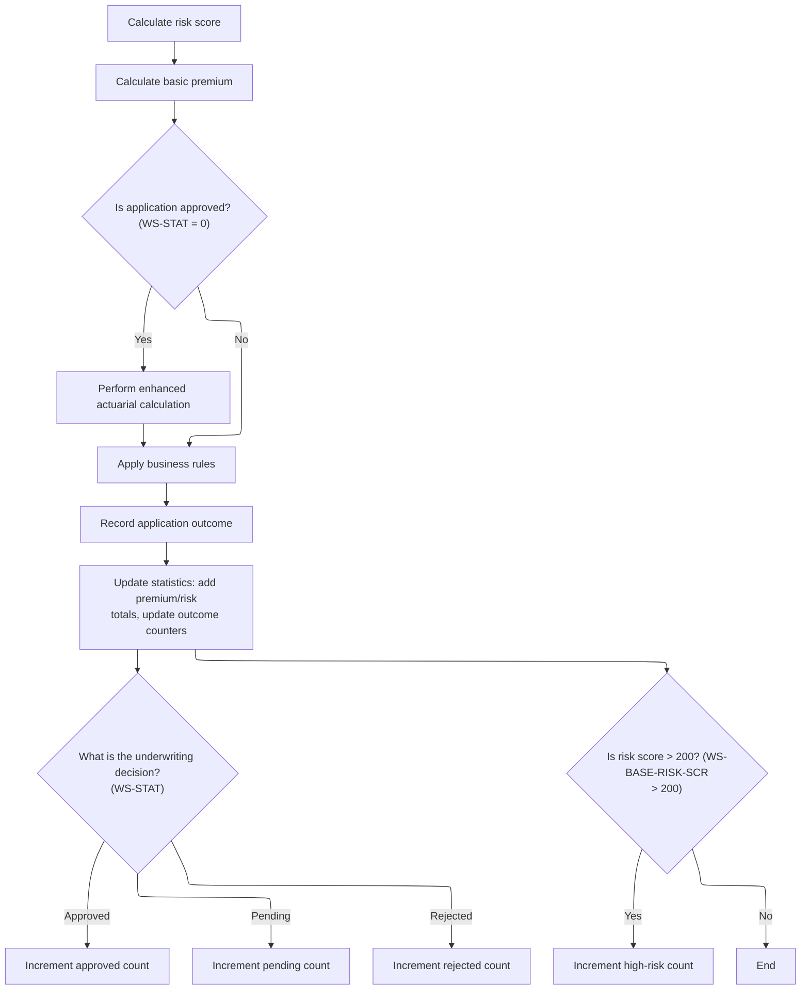

This document describes the main flow for evaluating commercial insurance applications. The process starts by assessing property and customer risk, which informs premium calculation and the underwriting decision. Approved applications with higher premiums undergo advanced actuarial calculations. The outcome is recorded and statistics are updated for reporting.

Inputs are property and customer data; outputs are calculated premiums, underwriting verdict, and updated statistics.



# Spec

## Detailed View of the Program's Functionality

# Coordinating the Commercial Policy Calculation

This section describes how the main orchestration for commercial policy processing works. The process begins by calculating a risk score for the property and customer, which is essential for all subsequent premium and underwriting logic. The risk score is calculated by calling an external program dedicated to risk assessment. Once the risk baseline is established, the system proceeds to calculate the basic premium by invoking another external program that uses the risk score and peril data (such as fire, crime, flood, and weather exposures).

After the basic premium is calculated, the system checks the underwriting decision. If the application is approved, it runs an advanced actuarial calculation for further refinement of the premium, but only if the total premium exceeds a configured minimum threshold. If the application is pending, rejected, or referred, or after the advanced calculation, the system applies business rules to finalize the underwriting status. The results are then written to the output, and statistics and counters are updated for reporting and monitoring.

---

# Getting the Property Risk Baseline

The risk score calculation is handled by a dedicated routine that calls an external risk engine. This engine receives all relevant property and customer data, such as property type, location (postcode, latitude, longitude), coverage amounts for different perils, and customer history. The risk engine fetches risk factors (like fire and crime) from a database, falling back to default values if the database is unavailable. It then calculates a risk score by:

- Starting from a base value.
- Adding increments based on property type (e.g., warehouse, factory, office, retail, or other).
- Adding more if the postcode is in a high-risk area.
- Increasing the score if coverage amounts are high.
- Adjusting for location risk (urban, suburban, rural) based on latitude and longitude.
- Modifying the score based on customer history (good, neutral, risky, or unknown).

This modular approach keeps the risk logic separate and maintainable.

---

# Calculating the Basic Premium

The basic premium calculation is performed by another external program, which receives the risk score and peril exposures. This program:

- Fetches fire and crime risk factors from the database, using hardcoded defaults if unavailable.
- Determines the underwriting verdict (approved, pending, rejected) based on the risk score, using fixed thresholds.
- Calculates individual premiums for each peril (fire, crime, flood, weather) using the risk score, peril factors, and a discount factor.
- Applies a discount if all perils are selected.
- Sums up the individual premiums to get the total premium.

The verdict and all calculated values are returned for further processing.

---

# Running the Advanced Actuarial Calculation

If the application is approved and the total premium is above the minimum threshold, the system prepares detailed input and coverage data for an advanced actuarial calculation. This includes customer and property details, coverage limits, deductibles, peril selections, and claims history. The advanced calculation is performed by a specialized program, which:

- Initializes policy data and exposures.
- Determines base rates from rate tables or defaults.
- Assesses exposure and calculates experience and schedule modifiers based on years in business, claims history, building age, protection class, occupancy, and exposure density.
- Calculates the base premium for each peril, then adds catastrophe and expense loadings, and profit margin.
- Applies discounts for multi-peril selection, claims-free history, and high deductibles, capping the total discount.
- Calculates taxes and applies a final cap on the premium if the rate factor exceeds a threshold.

If the enhanced total premium is higher than the original, the new values are used; otherwise, the original premium is kept.

---

# Stepping Through the Actuarial Premium Engine

The advanced actuarial engine refines the premium calculation through several steps:

 1. **Initialization**: Sets up all calculation areas and computes exposures based on coverage limits and risk score.
 2. **Base Rate Lookup**: Loads base rates for each peril from the database or uses defaults.
 3. **Exposure Assessment**: Calculates total insured value and exposure density.
 4. **Experience Modifier**: Adjusts for years in business and claims history, rewarding claim-free and penalizing high claims, with caps.
 5. **Schedule Modifier**: Adjusts for building age, protection class, occupancy, and exposure density, with limits.
 6. **Base Premium Calculation**: Computes premiums for each peril using exposures, rates, and modifiers.
 7. **Catastrophe Loading**: Adds extra charges for hurricane, earthquake, tornado, and flood risks.
 8. **Expense and Profit Loading**: Adds expense and profit margins.
 9. **Discounts**: Applies multi-peril, claims-free, and deductible discounts, capped at a maximum.
10. **Taxes**: Applies a fixed tax rate to the premium after discounts.
11. **Final Capping**: Ensures the final rate factor does not exceed a set maximum, adjusting the premium if necessary.

---

# Finalizing and Recording the Policy

After all calculations, the system applies business rules to finalize the underwriting decision, writes the results to the output file, and updates statistics. The statistics include totals for premium and risk scores, and counters for approved, pending, rejected, and high-risk cases. The high-risk threshold is a fixed value used for reporting.

This ensures that every processed policy is recorded with its outcome and that aggregate metrics are maintained for monitoring and reporting purposes.

# Rule Definition

| Paragraph Name                                                                                                                                   | Rule ID | Category        | Description                                                                                                                                                                                                     | Conditions                                               | Remarks                                                                                                                                                                                                                                                                                                                                                                                                                                                                                     |
| ------------------------------------------------------------------------------------------------------------------------------------------------ | ------- | --------------- | --------------------------------------------------------------------------------------------------------------------------------------------------------------------------------------------------------------- | -------------------------------------------------------- | ------------------------------------------------------------------------------------------------------------------------------------------------------------------------------------------------------------------------------------------------------------------------------------------------------------------------------------------------------------------------------------------------------------------------------------------------------------------------------------------- |
| P006-PROCESS-RECORDS, P007-READ-INPUT, P008-VALIDATE-INPUT-RECORD, P009-PROCESS-VALID-RECORD, P011-PROCESS-COMMERCIAL, P011E-WRITE-OUTPUT-RECORD | RL-001  | Data Assignment | For each input record in the COMMERCIAL_POLICY_INPUT file, representing a commercial policy application, the system must process the record and produce a corresponding output record with all required fields. | A record exists in the input file.                       | Each input record must contain all required customer, property, and coverage fields. Each output record must include: OUT-CUSTOMER-NUM (string), OUT-PROPERTY-TYPE (string), OUT-POSTCODE (string), OUT-RISK-SCORE (number), OUT-FIRE-PREMIUM (number, 2 decimals), OUT-CRIME-PREMIUM (number, 2 decimals), OUT-FLOOD-PREMIUM (number, 2 decimals), OUT-WEATHER-PREMIUM (number, 2 decimals), OUT-TOTAL-PREMIUM (number, 2 decimals), OUT-STATUS-DESC (string), OUT-REJECT-REASON (string). |
| P011A-CALCULATE-RISK-SCORE, CALCULATE-RISK-SCORE, CHECK-COVERAGE-AMOUNTS, ASSESS-LOCATION-RISK, EVALUATE-CUSTOMER-HISTORY                        | RL-002  | Computation     | The risk score is calculated using property type, postcode, latitude, longitude, coverage limits, and customer history, following a specific formula.                                                           | The record is a commercial policy and passes validation. | Risk score calculation:                                                                                                                                                                                                                                                                                                                                                                                                                                                                     |

- Start at 100
- Property type adjustment: WAREHOUSE (+50), FACTORY (+75), OFFICE (+25), RETAIL (+40), OTHER (+30)
- If postcode starts with 'FL' or 'CR', add 30
- Find the largest of building, contents, flood, weather coverage; if > 500,000, add 15
- If latitude 40-41 and longitude -74.5 to -73.5, or latitude 34-35 and longitude -118.5 to -117.5, add 10
- Else if latitude 25-49 and longitude -125 to -66, add 5
- Else, add 20
- Customer history: 'N' (+10), 'G' (-5), 'R' (+25), other (+10) Risk score is a number (integer). | | P011B-BASIC-PREMIUM-CALC, CALCULATE-PREMIUMS | RL-003 | Computation | For each peril (fire, crime, flood, weather), calculate the basic premium using the risk score, peril selection, peril factor, and discount factor. | The record is a commercial policy and passes validation. | Peril factors: fire=0.80, crime=0.60, flood=1.20, weather=0.90 Premium for each peril: (risk score × peril factor) × peril selection × discount factor Premium fields are numbers with 2 decimals. | | CALCULATE-PREMIUMS | RL-004 | Conditional Logic | If all four perils are selected (all peril values > 0), apply a discount factor of 0.90; otherwise, use 1.00. | All peril selection values are greater than zero. | Discount factor: 0.90 if all perils selected, else 1.00 | | CALCULATE-PREMIUMS | RL-005 | Computation | The total premium is the sum of the premiums for fire, crime, flood, and weather perils. | Premiums for all perils have been calculated. | Total premium is a number with 2 decimals. | | CALCULATE-VERDICT, P011D-APPLY-BUSINESS-RULES | RL-006 | Conditional Logic | The underwriting status and reason are determined by the risk score: >200 is Rejected, >150 is Pending, else Approved. | Risk score has been calculated. | Status: 'Rejected', 'Pending', or 'Approved' Reason: 'High Risk Score - Manual Review Required', 'Medium Risk - Pending Review', or blank | | P011E-WRITE-OUTPUT-RECORD | RL-007 | Data Assignment | For each processed input record, write an output record with all calculated and status fields populated as specified. | All calculations and verdicts are complete for the input record. | Output record fields: OUT-CUSTOMER-NUM (string), OUT-PROPERTY-TYPE (string), OUT-POSTCODE (string), OUT-RISK-SCORE (number), OUT-FIRE-PREMIUM (number, 2 decimals), OUT-CRIME-PREMIUM (number, 2 decimals), OUT-FLOOD-PREMIUM (number, 2 decimals), OUT-WEATHER-PREMIUM (number, 2 decimals), OUT-TOTAL-PREMIUM (number, 2 decimals), OUT-STATUS-DESC (string), OUT-REJECT-REASON (string). |

# User Stories

## User Story 1: Process and validate commercial policy records

---

### Story Description:

As a system, I want to process each commercial policy application from the input file and produce a corresponding output record with all required fields so that each application is evaluated and recorded accurately.

---

### Business Rule Mapping:

| Rule ID | Paragraph Name                                                                                                                                   | Rule Description                                                                                                                                                                                                |
| ------- | ------------------------------------------------------------------------------------------------------------------------------------------------ | --------------------------------------------------------------------------------------------------------------------------------------------------------------------------------------------------------------- |
| RL-001  | P006-PROCESS-RECORDS, P007-READ-INPUT, P008-VALIDATE-INPUT-RECORD, P009-PROCESS-VALID-RECORD, P011-PROCESS-COMMERCIAL, P011E-WRITE-OUTPUT-RECORD | For each input record in the COMMERCIAL_POLICY_INPUT file, representing a commercial policy application, the system must process the record and produce a corresponding output record with all required fields. |
| RL-007  | P011E-WRITE-OUTPUT-RECORD                                                                                                                        | For each processed input record, write an output record with all calculated and status fields populated as specified.                                                                                           |

---

### Relevant Functionality:

- **P006-PROCESS-RECORDS**
  1. **RL-001:**
     - For each record in the input file:
       - Validate the record
       - If valid and commercial policy, process as commercial
       - If not valid, write error output record
       - Write one output record per input record
- **P011E-WRITE-OUTPUT-RECORD**
  1. **RL-007:**
     - Populate output fields with calculated values
     - Write output record to output file

## User Story 2: Evaluate policy risk, calculate premiums, and determine underwriting verdict

---

### Story Description:

As a system, I want to calculate the risk score, premiums for each peril, total premium, and underwriting verdict for each commercial policy application so that the correct premium and status are determined according to business rules.

---

### Business Rule Mapping:

| Rule ID | Paragraph Name                                                                                                            | Rule Description                                                                                                                                      |
| ------- | ------------------------------------------------------------------------------------------------------------------------- | ----------------------------------------------------------------------------------------------------------------------------------------------------- |
| RL-002  | P011A-CALCULATE-RISK-SCORE, CALCULATE-RISK-SCORE, CHECK-COVERAGE-AMOUNTS, ASSESS-LOCATION-RISK, EVALUATE-CUSTOMER-HISTORY | The risk score is calculated using property type, postcode, latitude, longitude, coverage limits, and customer history, following a specific formula. |
| RL-003  | P011B-BASIC-PREMIUM-CALC, CALCULATE-PREMIUMS                                                                              | For each peril (fire, crime, flood, weather), calculate the basic premium using the risk score, peril selection, peril factor, and discount factor.   |
| RL-006  | CALCULATE-VERDICT, P011D-APPLY-BUSINESS-RULES                                                                             | The underwriting status and reason are determined by the risk score: >200 is Rejected, >150 is Pending, else Approved.                                |
| RL-004  | CALCULATE-PREMIUMS                                                                                                        | If all four perils are selected (all peril values > 0), apply a discount factor of 0.90; otherwise, use 1.00.                                         |
| RL-005  | CALCULATE-PREMIUMS                                                                                                        | The total premium is the sum of the premiums for fire, crime, flood, and weather perils.                                                              |

---

### Relevant Functionality:

- **P011A-CALCULATE-RISK-SCORE**
  1. **RL-002:**
     - Set risk score to 100
     - Adjust for property type
     - Adjust for postcode
     - Find max coverage; if > 500,000, add 15
     - Assess location risk and adjust
     - Adjust for customer history
- **P011B-BASIC-PREMIUM-CALC**
  1. **RL-003:**
     - For each peril:
       - If peril selected (value > 0):
         - Calculate premium = (risk score × peril factor) × peril selection × discount factor
- **CALCULATE-VERDICT**
  1. **RL-006:**
     - If risk score > 200:
       - Status = 'Rejected', Reason = 'High Risk Score - Manual Review Required'
     - Else if risk score > 150:
       - Status = 'Pending', Reason = 'Medium Risk - Pending Review'
     - Else:
       - Status = 'Approved', Reason = blank
- **CALCULATE-PREMIUMS**
  1. **RL-004:**
     - Set discount factor to 1.00
     - If all peril selections > 0, set discount factor to 0.90
  2. **RL-005:**
     - Sum all peril premiums to get total premium

# Code Walkthrough

## Coordinating the Commercial Policy Calculation



<SwmSnippet path="/base/src/LGAPDB01.cbl" line="258">

---

In `P011-PROCESS-COMMERCIAL`, we kick off the flow by calculating the risk score. This is needed up front because all premium and underwriting logic downstream depends on it. We call P011A-CALCULATE-RISK-SCORE next to get a risk baseline for the property and customer, which is then used for premium and eligibility calculations.

```cobol
       P011-PROCESS-COMMERCIAL.
           PERFORM P011A-CALCULATE-RISK-SCORE
           PERFORM P011B-BASIC-PREMIUM-CALC
           IF WS-STAT = 0
               PERFORM P011C-ENHANCED-ACTUARIAL-CALC
           END-IF
           PERFORM P011D-APPLY-BUSINESS-RULES
           PERFORM P011E-WRITE-OUTPUT-RECORD
           PERFORM P011F-UPDATE-STATISTICS.
```

---

</SwmSnippet>

### Getting the Property Risk Baseline

<SwmSnippet path="/base/src/LGAPDB01.cbl" line="268">

---

`P011A-CALCULATE-RISK-SCORE` handles the risk score calculation by calling LGAPDB02. This call passes all relevant property and customer data to an external program that fetches risk factors and computes the score, keeping the logic modular and maintainable.

```cobol
       P011A-CALCULATE-RISK-SCORE.
           CALL 'LGAPDB02' USING IN-PROPERTY-TYPE, IN-POSTCODE, 
                                IN-LATITUDE, IN-LONGITUDE,
                                IN-BUILDING-LIMIT, IN-CONTENTS-LIMIT,
                                IN-FLOOD-COVERAGE, IN-WEATHER-COVERAGE,
                                IN-CUSTOMER-HISTORY, WS-BASE-RISK-SCR.
```

---

</SwmSnippet>

### Running the Risk Score Engine



<SwmSnippet path="/base/src/LGAPDB02.cbl" line="39">

---

`MAIN-LOGIC` coordinates fetching risk factors from the database and then calculating the risk score using those values. The flow ensures we have all the necessary data before scoring, and falls back to defaults if the database is missing values.

```cobol
       MAIN-LOGIC.
           PERFORM GET-RISK-FACTORS
           PERFORM CALCULATE-RISK-SCORE
           GOBACK.
```

---

</SwmSnippet>

<SwmSnippet path="/base/src/LGAPDB02.cbl" line="44">

---

`GET-RISK-FACTORS` fetches fire and crime risk factors from the database. If the queries fail, it falls back to hardcoded defaults (0.80 for fire, 0.60 for crime), so the risk score calculation always has values to work with.

```cobol
       GET-RISK-FACTORS.
           EXEC SQL
               SELECT FACTOR_VALUE INTO :WS-FIRE-FACTOR
               FROM RISK_FACTORS
               WHERE PERIL_TYPE = 'FIRE'
           END-EXEC.
           
           IF SQLCODE = 0
               CONTINUE
           ELSE
               MOVE 0.80 TO WS-FIRE-FACTOR
           END-IF.
           
           EXEC SQL
               SELECT FACTOR_VALUE INTO :WS-CRIME-FACTOR
               FROM RISK_FACTORS
               WHERE PERIL_TYPE = 'CRIME'
           END-EXEC.
           
           IF SQLCODE = 0
               CONTINUE
           ELSE
               MOVE 0.60 TO WS-CRIME-FACTOR
           END-IF.
```

---

</SwmSnippet>

<SwmSnippet path="/base/src/LGAPDB02.cbl" line="69">

---

`CALCULATE-RISK-SCORE` sets up the risk score by adding fixed increments for property type and postcode prefix, then adjusts further by running coverage, location, and customer history checks. The constants used here are domain-specific and not explained in the code.

```cobol
       CALCULATE-RISK-SCORE.
           MOVE 100 TO LK-RISK-SCORE

           EVALUATE LK-PROPERTY-TYPE
             WHEN 'WAREHOUSE'
               ADD 50 TO LK-RISK-SCORE
             WHEN 'FACTORY' 
               ADD 75 TO LK-RISK-SCORE
             WHEN 'OFFICE'
               ADD 25 TO LK-RISK-SCORE
             WHEN 'RETAIL'
               ADD 40 TO LK-RISK-SCORE
             WHEN OTHER
               ADD 30 TO LK-RISK-SCORE
           END-EVALUATE

           IF LK-POSTCODE(1:2) = 'FL' OR
              LK-POSTCODE(1:2) = 'CR'
             ADD 30 TO LK-RISK-SCORE
           END-IF

           PERFORM CHECK-COVERAGE-AMOUNTS
           PERFORM ASSESS-LOCATION-RISK  
           PERFORM EVALUATE-CUSTOMER-HISTORY.
```

---

</SwmSnippet>

### Calculating the Basic Premium

<SwmSnippet path="/base/src/LGAPDB01.cbl" line="275">

---

`P011B-BASIC-PREMIUM-CALC` handles the basic premium calculation by calling LGAPDB03. This call passes the risk score and peril data to a separate program that computes the premium and underwriting verdict, keeping the logic modular.

```cobol
       P011B-BASIC-PREMIUM-CALC.
           CALL 'LGAPDB03' USING WS-BASE-RISK-SCR, IN-FIRE-PERIL, 
                                IN-CRIME-PERIL, IN-FLOOD-PERIL, 
                                IN-WEATHER-PERIL, WS-STAT,
                                WS-STAT-DESC, WS-REJ-RSN, WS-FR-PREM,
                                WS-CR-PREM, WS-FL-PREM, WS-WE-PREM,
                                WS-TOT-PREM, WS-DISC-FACT.
```

---

</SwmSnippet>

### Running the Premium and Verdict Engine



<SwmSnippet path="/base/src/LGAPDB03.cbl" line="42">

---

`MAIN-LOGIC` in LGAPDB03 coordinates fetching risk factors, determining the underwriting verdict, and calculating all premiums. This ensures all calculations use the latest data and verdict logic is applied before output.

```cobol
       MAIN-LOGIC.
           PERFORM GET-RISK-FACTORS
           PERFORM CALCULATE-VERDICT
           PERFORM CALCULATE-PREMIUMS
           GOBACK.
```

---

</SwmSnippet>

<SwmSnippet path="/base/src/LGAPDB03.cbl" line="48">

---

`GET-RISK-FACTORS` fetches fire and crime risk factors from the database, using the same hardcoded defaults (0.80 for fire, 0.60 for crime) as the risk score logic if the queries fail. This keeps the calculations consistent.

```cobol
       GET-RISK-FACTORS.
           EXEC SQL
               SELECT FACTOR_VALUE INTO :WS-FIRE-FACTOR
               FROM RISK_FACTORS
               WHERE PERIL_TYPE = 'FIRE'
           END-EXEC.
           
           IF SQLCODE = 0
               CONTINUE
           ELSE
               MOVE 0.80 TO WS-FIRE-FACTOR
           END-IF.
           
           EXEC SQL
               SELECT FACTOR_VALUE INTO :WS-CRIME-FACTOR
               FROM RISK_FACTORS
               WHERE PERIL_TYPE = 'CRIME'
           END-EXEC.
           
           IF SQLCODE = 0
               CONTINUE
           ELSE
               MOVE 0.60 TO WS-CRIME-FACTOR
           END-IF.
```

---

</SwmSnippet>

<SwmSnippet path="/base/src/LGAPDB03.cbl" line="73">

---

`CALCULATE-VERDICT` sets the underwriting status, description, and rejection reason based on the risk score, using fixed thresholds (200, 150) and domain-specific codes/messages. This determines if the policy is approved, pending, or rejected.

```cobol
       CALCULATE-VERDICT.
           IF LK-RISK-SCORE > 200
             MOVE 2 TO LK-STAT
             MOVE 'REJECTED' TO LK-STAT-DESC
             MOVE 'High Risk Score - Manual Review Required' 
               TO LK-REJ-RSN
           ELSE
             IF LK-RISK-SCORE > 150
               MOVE 1 TO LK-STAT
               MOVE 'PENDING' TO LK-STAT-DESC
               MOVE 'Medium Risk - Pending Review'
                 TO LK-REJ-RSN
             ELSE
               MOVE 0 TO LK-STAT
               MOVE 'APPROVED' TO LK-STAT-DESC
               MOVE SPACES TO LK-REJ-RSN
             END-IF
           END-IF.
```

---

</SwmSnippet>

<SwmSnippet path="/base/src/LGAPDB03.cbl" line="92">

---

`CALCULATE-PREMIUMS` computes individual premiums for each peril using the risk score, peril factors, and a discount factor. If all perils are selected, a 10% discount is applied. The total premium is the sum of all peril premiums.

```cobol
       CALCULATE-PREMIUMS.
           MOVE 1.00 TO LK-DISC-FACT
           
           IF LK-FIRE-PERIL > 0 AND
              LK-CRIME-PERIL > 0 AND
              LK-FLOOD-PERIL > 0 AND
              LK-WEATHER-PERIL > 0
             MOVE 0.90 TO LK-DISC-FACT
           END-IF

           COMPUTE LK-FIRE-PREMIUM =
             ((LK-RISK-SCORE * WS-FIRE-FACTOR) * LK-FIRE-PERIL *
               LK-DISC-FACT)
           
           COMPUTE LK-CRIME-PREMIUM =
             ((LK-RISK-SCORE * WS-CRIME-FACTOR) * LK-CRIME-PERIL *
               LK-DISC-FACT)
           
           COMPUTE LK-FLOOD-PREMIUM =
             ((LK-RISK-SCORE * WS-FLOOD-FACTOR) * LK-FLOOD-PERIL *
               LK-DISC-FACT)
           
           COMPUTE LK-WEATHER-PREMIUM =
             ((LK-RISK-SCORE * WS-WEATHER-FACTOR) * LK-WEATHER-PERIL *
               LK-DISC-FACT)

           COMPUTE LK-TOTAL-PREMIUM = 
             LK-FIRE-PREMIUM + LK-CRIME-PREMIUM + 
             LK-FLOOD-PREMIUM + LK-WEATHER-PREMIUM. 
```

---

</SwmSnippet>

### Running the Advanced Actuarial Calculation



<SwmSnippet path="/base/src/LGAPDB01.cbl" line="283">

---

`P011C-ENHANCED-ACTUARIAL-CALC` prepares all the detailed input and coverage data, then calls LGAPDB04 for advanced actuarial calculations. This step is only run for approved cases with a premium above the configured minimum, to avoid extra work on low-value or rejected policies.

```cobol
       P011C-ENHANCED-ACTUARIAL-CALC.
      *    Prepare input structure for actuarial calculation
           MOVE IN-CUSTOMER-NUM TO LK-CUSTOMER-NUM
           MOVE WS-BASE-RISK-SCR TO LK-RISK-SCORE
           MOVE IN-PROPERTY-TYPE TO LK-PROPERTY-TYPE
           MOVE IN-TERRITORY-CODE TO LK-TERRITORY
           MOVE IN-CONSTRUCTION-TYPE TO LK-CONSTRUCTION-TYPE
           MOVE IN-OCCUPANCY-CODE TO LK-OCCUPANCY-CODE
           MOVE IN-SPRINKLER-IND TO LK-PROTECTION-CLASS
           MOVE IN-YEAR-BUILT TO LK-YEAR-BUILT
           MOVE IN-SQUARE-FOOTAGE TO LK-SQUARE-FOOTAGE
           MOVE IN-YEARS-IN-BUSINESS TO LK-YEARS-IN-BUSINESS
           MOVE IN-CLAIMS-COUNT-3YR TO LK-CLAIMS-COUNT-5YR
           MOVE IN-CLAIMS-AMOUNT-3YR TO LK-CLAIMS-AMOUNT-5YR
           
      *    Set coverage data
           MOVE IN-BUILDING-LIMIT TO LK-BUILDING-LIMIT
           MOVE IN-CONTENTS-LIMIT TO LK-CONTENTS-LIMIT
           MOVE IN-BI-LIMIT TO LK-BI-LIMIT
           MOVE IN-FIRE-DEDUCTIBLE TO LK-FIRE-DEDUCTIBLE
           MOVE IN-WIND-DEDUCTIBLE TO LK-WIND-DEDUCTIBLE
           MOVE IN-FLOOD-DEDUCTIBLE TO LK-FLOOD-DEDUCTIBLE
           MOVE IN-OTHER-DEDUCTIBLE TO LK-OTHER-DEDUCTIBLE
           MOVE IN-FIRE-PERIL TO LK-FIRE-PERIL
           MOVE IN-CRIME-PERIL TO LK-CRIME-PERIL
           MOVE IN-FLOOD-PERIL TO LK-FLOOD-PERIL
           MOVE IN-WEATHER-PERIL TO LK-WEATHER-PERIL
           
      *    Call advanced actuarial calculation program (only for approved cases)
           IF WS-TOT-PREM > WS-MIN-PREMIUM
               CALL 'LGAPDB04' USING LK-INPUT-DATA, LK-COVERAGE-DATA, 
                                    LK-OUTPUT-RESULTS
               
      *        Update with enhanced calculations if successful
               IF LK-TOTAL-PREMIUM > WS-TOT-PREM
                   MOVE LK-FIRE-PREMIUM TO WS-FR-PREM
                   MOVE LK-CRIME-PREMIUM TO WS-CR-PREM
                   MOVE LK-FLOOD-PREMIUM TO WS-FL-PREM
                   MOVE LK-WEATHER-PREMIUM TO WS-WE-PREM
                   MOVE LK-TOTAL-PREMIUM TO WS-TOT-PREM
                   MOVE LK-EXPERIENCE-MOD TO WS-EXPERIENCE-MOD
               END-IF
           END-IF.
```

---

</SwmSnippet>

### Stepping Through the Actuarial Premium Engine



<SwmSnippet path="/base/src/LGAPDB04.cbl" line="138">

---

`P100-MAIN` runs the full actuarial premium calculation, stepping through exposure, rating, modifiers, loadings, discounts, taxes, and final capping. Each step refines the premium, reflecting the complexity of real-world insurance pricing.

```cobol
       P100-MAIN.
           PERFORM P200-INIT
           PERFORM P300-RATES
           PERFORM P350-EXPOSURE
           PERFORM P400-EXP-MOD
           PERFORM P500-SCHED-MOD
           PERFORM P600-BASE-PREM
           PERFORM P700-CAT-LOAD
           PERFORM P800-EXPENSE
           PERFORM P900-DISC
           PERFORM P950-TAXES
           PERFORM P999-FINAL
           GOBACK.
```

---

</SwmSnippet>

<SwmSnippet path="/base/src/LGAPDB04.cbl" line="234">

---

`P400-EXP-MOD` calculates the experience modifier using fixed constants and caps, based on years in business and claims history. The logic rewards claim-free history and penalizes high claims, with hard limits to avoid extreme values.

```cobol
       P400-EXP-MOD.
           MOVE 1.0000 TO WS-EXPERIENCE-MOD
           
           IF LK-YEARS-IN-BUSINESS >= 5
               IF LK-CLAIMS-COUNT-5YR = ZERO
                   MOVE 0.8500 TO WS-EXPERIENCE-MOD
               ELSE
                   COMPUTE WS-EXPERIENCE-MOD = 
                       1.0000 + 
                       ((LK-CLAIMS-AMOUNT-5YR / WS-TOTAL-INSURED-VAL) * 
                        WS-CREDIBILITY-FACTOR * 0.50)
                   
                   IF WS-EXPERIENCE-MOD > 2.0000
                       MOVE 2.0000 TO WS-EXPERIENCE-MOD
                   END-IF
                   
                   IF WS-EXPERIENCE-MOD < 0.5000
                       MOVE 0.5000 TO WS-EXPERIENCE-MOD
                   END-IF
               END-IF
           ELSE
               MOVE 1.1000 TO WS-EXPERIENCE-MOD
           END-IF
           
           MOVE WS-EXPERIENCE-MOD TO LK-EXPERIENCE-MOD.
```

---

</SwmSnippet>

<SwmSnippet path="/base/src/LGAPDB04.cbl" line="260">

---

`P500-SCHED-MOD` calculates the schedule modifier by adjusting for building age, protection class, occupancy code, and exposure density, using fixed increments and clamping the result. All adjustments are domain-specific and not explained in the code.

```cobol
       P500-SCHED-MOD.
           MOVE +0.000 TO WS-SCHEDULE-MOD
           
      *    Building age factor
           EVALUATE TRUE
               WHEN LK-YEAR-BUILT >= 2010
                   SUBTRACT 0.050 FROM WS-SCHEDULE-MOD
               WHEN LK-YEAR-BUILT >= 1990
                   CONTINUE
               WHEN LK-YEAR-BUILT >= 1970
                   ADD 0.100 TO WS-SCHEDULE-MOD
               WHEN OTHER
                   ADD 0.200 TO WS-SCHEDULE-MOD
           END-EVALUATE
           
      *    Protection class factor
           EVALUATE LK-PROTECTION-CLASS
               WHEN '01' THRU '03'
                   SUBTRACT 0.100 FROM WS-SCHEDULE-MOD
               WHEN '04' THRU '06'
                   SUBTRACT 0.050 FROM WS-SCHEDULE-MOD
               WHEN '07' THRU '09'
                   CONTINUE
               WHEN OTHER
                   ADD 0.150 TO WS-SCHEDULE-MOD
           END-EVALUATE
           
      *    Occupancy hazard factor
           EVALUATE LK-OCCUPANCY-CODE
               WHEN 'OFF01' THRU 'OFF05'
                   SUBTRACT 0.025 FROM WS-SCHEDULE-MOD
               WHEN 'MFG01' THRU 'MFG10'
                   ADD 0.075 TO WS-SCHEDULE-MOD
               WHEN 'WHS01' THRU 'WHS05'
                   ADD 0.125 TO WS-SCHEDULE-MOD
               WHEN OTHER
                   CONTINUE
           END-EVALUATE
           
      *    Exposure density factor
           IF WS-EXPOSURE-DENSITY > 500.00
               ADD 0.100 TO WS-SCHEDULE-MOD
           ELSE
               IF WS-EXPOSURE-DENSITY < 50.00
                   SUBTRACT 0.050 FROM WS-SCHEDULE-MOD
               END-IF
           END-IF
           
           IF WS-SCHEDULE-MOD > +0.400
               MOVE +0.400 TO WS-SCHEDULE-MOD
           END-IF
           
           IF WS-SCHEDULE-MOD < -0.200
               MOVE -0.200 TO WS-SCHEDULE-MOD
           END-IF
           
           MOVE WS-SCHEDULE-MOD TO LK-SCHEDULE-MOD.
```

---

</SwmSnippet>

<SwmSnippet path="/base/src/LGAPDB04.cbl" line="407">

---

`P900-DISC` calculates the total discount by summing multi-peril, claims-free, and deductible credits, then caps the total at 25%. The discount is applied to the premium components before tax.

```cobol
       P900-DISC.
           MOVE ZERO TO WS-TOTAL-DISCOUNT
           
      * Multi-peril discount
           MOVE ZERO TO WS-MULTI-PERIL-DISC
           IF LK-FIRE-PERIL > ZERO AND
              LK-CRIME-PERIL > ZERO AND
              LK-FLOOD-PERIL > ZERO AND
              LK-WEATHER-PERIL > ZERO
               MOVE 0.100 TO WS-MULTI-PERIL-DISC
           ELSE
               IF LK-FIRE-PERIL > ZERO AND
                  LK-WEATHER-PERIL > ZERO AND
                  (LK-CRIME-PERIL > ZERO OR LK-FLOOD-PERIL > ZERO)
                   MOVE 0.050 TO WS-MULTI-PERIL-DISC
               END-IF
           END-IF
           
      * Claims-free discount  
           MOVE ZERO TO WS-CLAIMS-FREE-DISC
           IF LK-CLAIMS-COUNT-5YR = ZERO AND LK-YEARS-IN-BUSINESS >= 5
               MOVE 0.075 TO WS-CLAIMS-FREE-DISC
           END-IF
           
      * Deductible credit
           MOVE ZERO TO WS-DEDUCTIBLE-CREDIT
           IF LK-FIRE-DEDUCTIBLE >= 10000
               ADD 0.025 TO WS-DEDUCTIBLE-CREDIT
           END-IF
           IF LK-WIND-DEDUCTIBLE >= 25000  
               ADD 0.035 TO WS-DEDUCTIBLE-CREDIT
           END-IF
           IF LK-FLOOD-DEDUCTIBLE >= 50000
               ADD 0.045 TO WS-DEDUCTIBLE-CREDIT
           END-IF
           
           COMPUTE WS-TOTAL-DISCOUNT = 
               WS-MULTI-PERIL-DISC + WS-CLAIMS-FREE-DISC + 
               WS-DEDUCTIBLE-CREDIT
               
           IF WS-TOTAL-DISCOUNT > 0.250
               MOVE 0.250 TO WS-TOTAL-DISCOUNT
           END-IF
           
           COMPUTE LK-DISCOUNT-AMT = 
               (LK-BASE-AMOUNT + LK-CAT-LOAD-AMT + 
                LK-EXPENSE-LOAD-AMT + LK-PROFIT-LOAD-AMT) *
               WS-TOTAL-DISCOUNT.
```

---

</SwmSnippet>

<SwmSnippet path="/base/src/LGAPDB04.cbl" line="456">

---

`P950-TAXES` calculates the tax on the premium by applying a fixed 6.75% rate to the sum of premium components after discounts. The tax is added to the final premium.

```cobol
       P950-TAXES.
           COMPUTE WS-TAX-AMOUNT = 
               (LK-BASE-AMOUNT + LK-CAT-LOAD-AMT + 
                LK-EXPENSE-LOAD-AMT + LK-PROFIT-LOAD-AMT - 
                LK-DISCOUNT-AMT) * 0.0675
                
           MOVE WS-TAX-AMOUNT TO LK-TAX-AMT.
```

---

</SwmSnippet>

<SwmSnippet path="/base/src/LGAPDB04.cbl" line="464">

---

`P999-FINAL` sums all premium components, subtracts discounts, adds tax, and then calculates the final rate factor. If the rate exceeds 5%, it's capped and the premium is recalculated to match the cap.

```cobol
       P999-FINAL.
           COMPUTE LK-TOTAL-PREMIUM = 
               LK-BASE-AMOUNT + LK-CAT-LOAD-AMT + 
               LK-EXPENSE-LOAD-AMT + LK-PROFIT-LOAD-AMT -
               LK-DISCOUNT-AMT + LK-TAX-AMT
               
           COMPUTE LK-FINAL-RATE-FACTOR = 
               LK-TOTAL-PREMIUM / WS-TOTAL-INSURED-VAL
               
           IF LK-FINAL-RATE-FACTOR > 0.050000
               MOVE 0.050000 TO LK-FINAL-RATE-FACTOR
               COMPUTE LK-TOTAL-PREMIUM = 
                   WS-TOTAL-INSURED-VAL * LK-FINAL-RATE-FACTOR
           END-IF.
```

---

</SwmSnippet>

### Finalizing and Recording the Policy



<SwmSnippet path="/base/src/LGAPDB01.cbl" line="258">

---

Back in `P011-PROCESS-COMMERCIAL`, after all calculations and output are handled, we update statistics to track totals and counts for reporting and monitoring. Calling P011F-UPDATE-STATISTICS ensures all relevant metrics are incremented before the process ends.

```cobol
       P011-PROCESS-COMMERCIAL.
           PERFORM P011A-CALCULATE-RISK-SCORE
           PERFORM P011B-BASIC-PREMIUM-CALC
           IF WS-STAT = 0
               PERFORM P011C-ENHANCED-ACTUARIAL-CALC
           END-IF
           PERFORM P011D-APPLY-BUSINESS-RULES
           PERFORM P011E-WRITE-OUTPUT-RECORD
           PERFORM P011F-UPDATE-STATISTICS.
```

---

</SwmSnippet>

<SwmSnippet path="/base/src/LGAPDB01.cbl" line="365">

---

`P011F-UPDATE-STATISTICS` updates totals for premium, risk scores, and increments counters for approved, pending, rejected, and high-risk cases. The high-risk threshold (200) is a hardcoded business rule for reporting.

```cobol
       P011F-UPDATE-STATISTICS.
           ADD WS-TOT-PREM TO WS-TOTAL-PREMIUM-AMT
           ADD WS-BASE-RISK-SCR TO WS-CONTROL-TOTALS
           
           EVALUATE WS-STAT
               WHEN 0 ADD 1 TO WS-APPROVED-CNT
               WHEN 1 ADD 1 TO WS-PENDING-CNT
               WHEN 2 ADD 1 TO WS-REJECTED-CNT
           END-EVALUATE
           
           IF WS-BASE-RISK-SCR > 200
               ADD 1 TO WS-HIGH-RISK-CNT
           END-IF.
```

---

</SwmSnippet>

&nbsp;

*This is an auto-generated document by Swimm 🌊 and has not yet been verified by a human*

<SwmMeta version="3.0.0" repo-id="Z2l0aHViJTNBJTNBU3dpbW1pby1nZW5hcHAtaG91c2UlM0ElM0FHaXJpLVN3aW1t" repo-name="Swimmio-genapp-house"><sup>Powered by [Swimm](https://app.swimm.io/)</sup></SwmMeta>
