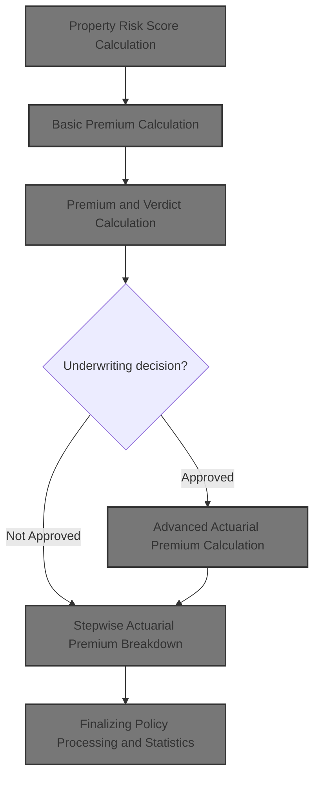
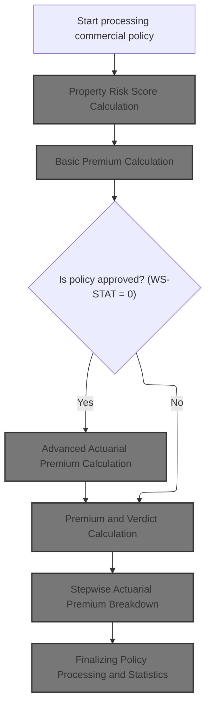
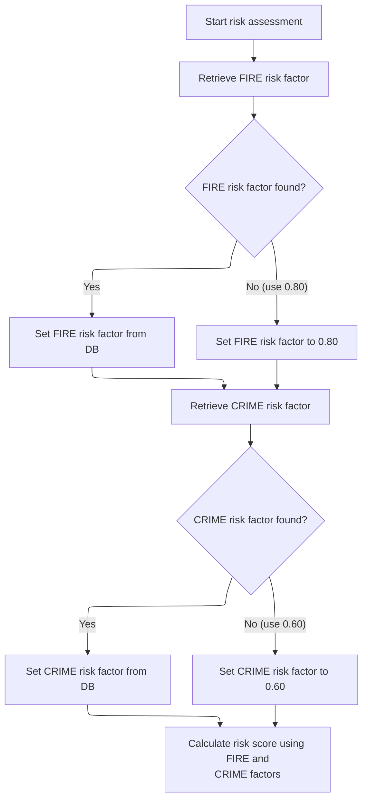
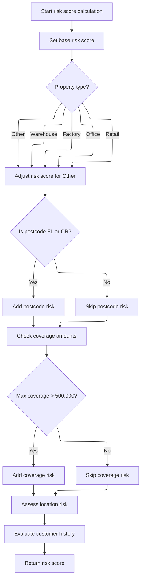
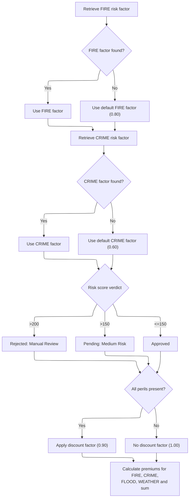
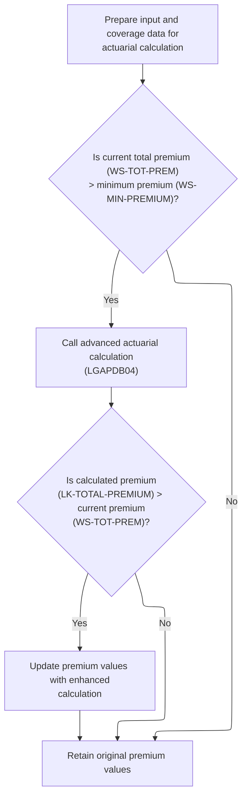
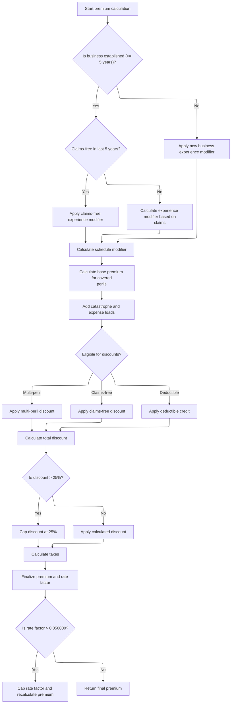
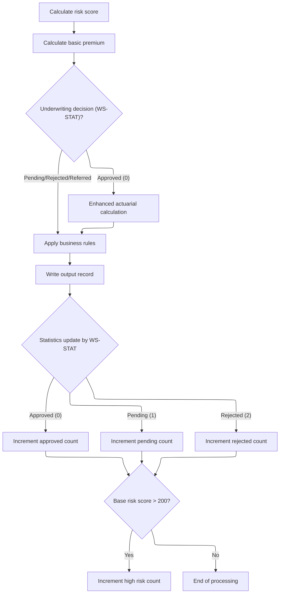

This document outlines the processing of a commercial insurance policy application. The flow assesses property risk, calculates premiums, makes an underwriting decision, and updates policy statistics. Input includes policy and property data; output includes the underwriting decision, calculated premiums, and updated statistics.



# Spec

## Detailed View of the Program's Functionality

a. File Setup and Initialization

The main program begins by defining the files it will use for input, output, configuration, rates, and summary. Each file is assigned a name and organization type, and file status variables are set up to track errors. The data division defines the structure of each file record, including customer and policy information, configuration values, rate details, and summary output.

The working storage section sets up counters and variables for tracking statistics, configuration values, and actuarial calculations. There are also areas for storing error messages and underwriting notes.

The procedure division starts with an initialization routine that displays startup messages, initializes counters and work areas, and accepts the current processing date.

b. Configuration Loading

The program attempts to open and read the configuration file. If the file is not available, it falls back to default values and logs a warning. If the file is available, it reads specific configuration values such as maximum risk score and minimum premium, updating internal variables accordingly.

c. File Opening and Header Writing

Input, output, and summary files are opened. If any file fails to open, an error message is displayed and the program stops. Once files are open, headers are written to the output file to label each column for customer, property type, postcode, risk score, premiums, status, and rejection reason.

d. Record Processing Loop

The program enters a loop to read each input record. For each record, it increments a counter and validates the input. Validation checks include policy type, customer number, coverage limits, and total coverage against maximum allowed values. If validation fails, an error is logged and an error record is written to the output file.

If the record is valid, it is processed according to its policy type. Commercial policies trigger the commercial processing workflow, while non-commercial policies are handled separately and marked as unsupported.

e. Commercial Policy Processing Workflow

For commercial policies, the workflow consists of several steps:

1. Risk Score Calculation: Calls a subroutine that invokes a separate program to calculate the risk score based on property type, postcode, location, coverage amounts, and customer history.
2. Basic Premium Calculation: Calls another program to compute basic premiums for each peril (fire, crime, flood, weather) using the risk score and peril values. The underwriting verdict and rejection reason are determined based on risk score thresholds.
3. Advanced Actuarial Calculation: If the policy is approved and the total premium exceeds the minimum, an advanced actuarial calculation is performed. This step prepares input and coverage data, calls an actuarial program, and updates premium values if the enhanced calculation yields a higher premium.
4. Business Rules Application: Applies additional business rules to determine the final underwriting decision. These rules check if the risk score exceeds the maximum, if the premium is below the minimum, or if the risk score is high enough to require review.
5. Output Record Writing: Writes the processed results to the output file, including customer and property details, risk score, premiums, status, and rejection reason.
6. Statistics Update: Updates counters and totals for approved, pending, and rejected policies, as well as high-risk counts and total premium amounts.

f. Risk Score Calculation Details

The risk score calculation program retrieves risk factors for fire and crime from a database, using default values if the database query fails. The risk score starts at a base value and is adjusted for property type, postcode, coverage amounts, location, and customer history. Coverage amounts are checked to see if any exceed a threshold, which increases the risk score. Location risk is assessed based on latitude and longitude, with urban areas receiving higher risk adjustments. Customer history is evaluated to further adjust the risk score.

g. Basic Premium Calculation Details

The basic premium calculation program fetches risk factors for fire and crime, again using defaults if necessary. It determines the underwriting verdict based on risk score thresholds: rejected for scores above 200, pending for scores above 150, and approved otherwise. If all perils are covered, a discount factor is applied to reduce the total premium. Premiums for each peril are calculated using the risk score, peril factor, peril value, and discount factor, and then summed to produce the total premium.

h. Advanced Actuarial Premium Calculation

If the policy is approved and the total premium is above the minimum, the program prepares detailed input and coverage data for the actuarial calculation. This includes customer information, property details, coverage limits, deductibles, and peril selections. The actuarial calculation program performs a series of steps:

- Initializes calculation areas and loads base rates from the database or uses defaults.
- Calculates exposures based on coverage limits and risk score.
- Computes experience and schedule modifiers based on years in business, claims history, building age, protection class, occupancy code, and exposure density.
- Calculates base premiums for each peril, applying modifiers and trend factors.
- Adds catastrophe and expense loadings.
- Calculates discounts for multi-peril coverage, claims-free history, and deductible amounts, capping the total discount at 25%.
- Calculates taxes and finalizes the premium, capping the rate factor if necessary.

If the enhanced premium is higher than the original, premium values are updated.

i. Finalizing and Statistics

After processing each record, the program updates statistics by adding the premium and risk score to totals and incrementing counters based on the underwriting decision. If the risk score is above 200, the high-risk count is incremented.

At the end of processing, files are closed, a summary is generated and written to the summary file, and statistics are displayed, including total records processed, counts for each decision category, total premium generated, and average risk score.

# Rule Definition

| Paragraph Name                                                                                       | Rule ID | Category          | Description                                                                                                                                                                                                                           | Conditions                                                          | Remarks                                                                                                                                                                                                                        |
| ---------------------------------------------------------------------------------------------------- | ------- | ----------------- | ------------------------------------------------------------------------------------------------------------------------------------------------------------------------------------------------------------------------------------- | ------------------------------------------------------------------- | ------------------------------------------------------------------------------------------------------------------------------------------------------------------------------------------------------------------------------ |
| P006-PROCESS-RECORDS                                                                                 | RL-001  | Conditional Logic | Each commercial policy input record is processed one at a time, validating and routing to the appropriate processing logic.                                                                                                           | A record is read from the input file.                               | Records are processed in the order they appear in the input file. Only commercial policies are processed for premium calculation; others are marked as unsupported.                                                            |
| P011A-CALCULATE-RISK-SCORE (LGAPDB01), MAIN-LOGIC, GET-RISK-FACTORS, CALCULATE-RISK-SCORE (LGAPDB02) | RL-002  | Computation       | Calculate a property risk score using property type, postcode, location, coverage amounts, and customer history. Retrieve FIRE and CRIME risk factors from the RISK_FACTORS table; use 0.80 for FIRE and 0.60 for CRIME if not found. | A commercial policy record is being processed.                      | FIRE fallback: 0.80, CRIME fallback: 0.60. Risk score is a number (PIC 999).                                                                                                                                                   |
| P011B-BASIC-PREMIUM-CALC (LGAPDB01), CALCULATE-PREMIUMS (LGAPDB03)                                   | RL-003  | Computation       | Calculate basic premiums for FIRE, CRIME, FLOOD, and WEATHER perils using the risk score, peril values, and risk factors. Apply a discount factor of 0.90 if all perils are present, otherwise 1.00.                                  | A valid risk score and peril values are available.                  | Discount factor: 0.90 if all perils present, else 1.00. Premiums are numbers (PIC 9(8)V99 for each peril, PIC 9(9)V99 for total).                                                                                              |
| P011D-APPLY-BUSINESS-RULES (LGAPDB01), CALCULATE-VERDICT (LGAPDB03)                                  | RL-004  | Conditional Logic | Determine the policy verdict based on the risk score: >200 = Rejected, >150 = Pending, <=150 = Approved.                                                                                                                              | Risk score has been calculated.                                     | Verdict codes: 2 (Rejected), 1 (Pending), 0 (Approved). Status descriptions: 'Rejected: Manual Review', 'Pending: Medium Risk', 'Approved'.                                                                                    |
| P011C-ENHANCED-ACTUARIAL-CALC (LGAPDB01), P100-MAIN and subroutines (LGAPDB04)                       | RL-005  | Computation       | If the policy is approved and the total premium exceeds the minimum, perform an advanced actuarial premium calculation using detailed input and coverage data.                                                                        | Policy is approved (verdict 0) and total premium > minimum premium. | Minimum premium is configurable (default 500.00). Input and output structures are as per LK-INPUT-DATA, LK-COVERAGE-DATA, LK-OUTPUT-RESULTS. Premiums and factors are numbers with specified precision.                        |
| P011E-WRITE-OUTPUT-RECORD (LGAPDB01)                                                                 | RL-006  | Data Assignment   | Write the final results to the output record, including all calculated premiums, total premium, risk score, verdict, status description, rejection reason, and discount factor.                                                       | All calculations for the record are complete.                       | Output fields: customer number (string, 10), property type (string, 15), postcode (string, 8), risk score (number, 3), premiums (numbers, 9(8)V99/9(9)V99), status (string), rejection reason (string), discount factor (V99). |
| P011F-UPDATE-STATISTICS (LGAPDB01)                                                                   | RL-007  | Computation       | Update statistics counters for approved, pending, rejected, and high-risk policies based on the verdict and risk score.                                                                                                               | A policy record has been processed and verdict assigned.            | Counters: approved, pending, rejected, high-risk (risk score > 200).                                                                                                                                                           |
| GET-RISK-FACTORS (LGAPDB02, LGAPDB03), LOAD-RATE-TABLES (LGAPDB04)                                   | RL-008  | Conditional Logic | All database lookups for risk factors and base rates use the RISK_FACTORS and RATE_MASTER tables, with fallback to hardcoded defaults if not found.                                                                                   | A lookup for a risk factor or rate is performed.                    | FIRE fallback: 0.80, CRIME fallback: 0.60, base rates: 0.008500 (FIRE), 0.006200 (CRIME), 0.012800 (FLOOD), 0.009600 (WEATHER).                                                                                                |
| Throughout input/output handling, file section, and output writing                                   | RL-009  | Data Assignment   | All calculations and assignments must use the field types and lengths as specified in the input and output formats.                                                                                                                   | Any data is read, written, or assigned.                             | Field types and lengths as per COPYBOOKs and FD/01 definitions (e.g., customer number: X(10), risk score: 999, premiums: 9(8)V99, etc.).                                                                                       |

# User Stories

## User Story 1: Calculate risk score and premiums for each policy

---

### Story Description:

As a system, I want to calculate a property risk score and basic premiums for each peril (FIRE, CRIME, FLOOD, WEATHER) using input fields, retrieved risk factors, and fallback values so that the risk and premium for each policy are accurately assessed according to business rules.

---

### Business Rule Mapping:

| Rule ID | Paragraph Name                                                                                       | Rule Description                                                                                                                                                                                                                      |
| ------- | ---------------------------------------------------------------------------------------------------- | ------------------------------------------------------------------------------------------------------------------------------------------------------------------------------------------------------------------------------------- |
| RL-002  | P011A-CALCULATE-RISK-SCORE (LGAPDB01), MAIN-LOGIC, GET-RISK-FACTORS, CALCULATE-RISK-SCORE (LGAPDB02) | Calculate a property risk score using property type, postcode, location, coverage amounts, and customer history. Retrieve FIRE and CRIME risk factors from the RISK_FACTORS table; use 0.80 for FIRE and 0.60 for CRIME if not found. |
| RL-003  | P011B-BASIC-PREMIUM-CALC (LGAPDB01), CALCULATE-PREMIUMS (LGAPDB03)                                   | Calculate basic premiums for FIRE, CRIME, FLOOD, and WEATHER perils using the risk score, peril values, and risk factors. Apply a discount factor of 0.90 if all perils are present, otherwise 1.00.                                  |
| RL-008  | GET-RISK-FACTORS (LGAPDB02, LGAPDB03), LOAD-RATE-TABLES (LGAPDB04)                                   | All database lookups for risk factors and base rates use the RISK_FACTORS and RATE_MASTER tables, with fallback to hardcoded defaults if not found.                                                                                   |

---

### Relevant Functionality:

- **P011A-CALCULATE-RISK-SCORE (LGAPDB01)**
  1. **RL-002:**
     - Retrieve FIRE and CRIME risk factors from RISK_FACTORS by property type and postcode
     - If not found, use fallback values
     - Start with base risk score (100)
     - Adjust for property type, postcode, coverage, location, customer history
     - If max coverage > 500,000, add 15 to risk score
- **P011B-BASIC-PREMIUM-CALC (LGAPDB01)**
  1. **RL-003:**
     - For each peril, compute premium as (risk score \* risk factor) \* peril value \* discount factor
     - If all perils present, set discount factor to 0.90
     - Otherwise, set discount factor to 1.00
     - Sum all peril premiums for total premium
- **GET-RISK-FACTORS (LGAPDB02**
  1. **RL-008:**
     - Attempt to retrieve value from database
     - If not found (SQLCODE != 0), use hardcoded default

## User Story 2: Determine policy verdict and update statistics

---

### Story Description:

As a system, I want to determine the policy verdict based on the calculated risk score and update statistics counters for approved, pending, rejected, and high-risk policies so that policy outcomes are clearly categorized and statistics are maintained for reporting.

---

### Business Rule Mapping:

| Rule ID | Paragraph Name                                                      | Rule Description                                                                                                        |
| ------- | ------------------------------------------------------------------- | ----------------------------------------------------------------------------------------------------------------------- |
| RL-004  | P011D-APPLY-BUSINESS-RULES (LGAPDB01), CALCULATE-VERDICT (LGAPDB03) | Determine the policy verdict based on the risk score: >200 = Rejected, >150 = Pending, <=150 = Approved.                |
| RL-007  | P011F-UPDATE-STATISTICS (LGAPDB01)                                  | Update statistics counters for approved, pending, rejected, and high-risk policies based on the verdict and risk score. |

---

### Relevant Functionality:

- **P011D-APPLY-BUSINESS-RULES (LGAPDB01)**
  1. **RL-004:**
     - If risk score > 200, set verdict to 2 and status to 'Rejected: Manual Review'
     - Else if risk score > 150, set verdict to 1 and status to 'Pending: Medium Risk'
     - Else, set verdict to 0 and status to 'Approved'
- **P011F-UPDATE-STATISTICS (LGAPDB01)**
  1. **RL-007:**
     - Increment appropriate counter based on verdict
     - If risk score > 200, increment high-risk counter

## User Story 3: Process and validate commercial policy input records with correct data formats

---

### Story Description:

As a system, I want to process each commercial policy input record sequentially, validating and routing them to the appropriate processing logic, and ensuring all data assignments use the correct field types and lengths so that only eligible records are processed for premium calculation and data integrity is maintained.

---

### Business Rule Mapping:

| Rule ID | Paragraph Name                                                     | Rule Description                                                                                                            |
| ------- | ------------------------------------------------------------------ | --------------------------------------------------------------------------------------------------------------------------- |
| RL-001  | P006-PROCESS-RECORDS                                               | Each commercial policy input record is processed one at a time, validating and routing to the appropriate processing logic. |
| RL-009  | Throughout input/output handling, file section, and output writing | All calculations and assignments must use the field types and lengths as specified in the input and output formats.         |

---

### Relevant Functionality:

- **P006-PROCESS-RECORDS**
  1. **RL-001:**
     - Read a record from the input file
     - Validate the record
     - If valid and commercial, process for risk and premium
     - If not, write error or unsupported output
- **Throughout input/output handling**
  1. **RL-009:**
     - Ensure all assignments and calculations respect field sizes and types
     - Truncate or pad as necessary to fit format

## User Story 4: Perform advanced actuarial premium calculation and write output for approved policies

---

### Story Description:

As a system, I want to perform an advanced actuarial premium calculation using detailed input and coverage data when a policy is approved and the total premium exceeds the minimum, and write the final results to the output record using the correct field types and lengths so that premiums are accurately calculated for qualifying policies and all relevant information is available for downstream processing and reporting.

---

### Business Rule Mapping:

| Rule ID | Paragraph Name                                                                 | Rule Description                                                                                                                                                                |
| ------- | ------------------------------------------------------------------------------ | ------------------------------------------------------------------------------------------------------------------------------------------------------------------------------- |
| RL-005  | P011C-ENHANCED-ACTUARIAL-CALC (LGAPDB01), P100-MAIN and subroutines (LGAPDB04) | If the policy is approved and the total premium exceeds the minimum, perform an advanced actuarial premium calculation using detailed input and coverage data.                  |
| RL-006  | P011E-WRITE-OUTPUT-RECORD (LGAPDB01)                                           | Write the final results to the output record, including all calculated premiums, total premium, risk score, verdict, status description, rejection reason, and discount factor. |
| RL-009  | Throughout input/output handling, file section, and output writing             | All calculations and assignments must use the field types and lengths as specified in the input and output formats.                                                             |

---

### Relevant Functionality:

- **P011C-ENHANCED-ACTUARIAL-CALC (LGAPDB01)**
  1. **RL-005:**
     - Prepare input and coverage data structures
     - Call actuarial calculation logic
     - If calculated total premium > basic total premium, update output premiums and factors
- **P011E-WRITE-OUTPUT-RECORD (LGAPDB01)**
  1. **RL-006:**
     - Assign all calculated and status fields to output record
     - Write output record to output file
- **Throughout input/output handling**
  1. **RL-009:**
     - Ensure all assignments and calculations respect field sizes and types
     - Truncate or pad as necessary to fit format

# Code Walkthrough

## Commercial Policy Processing Workflow



<SwmSnippet path="/base/src/LGAPDB01.cbl" line="258">

---

In `P011-PROCESS-COMMERCIAL`, we kick off the commercial policy processing by calling a fixed sequence of subroutines. First up is risk score calculation, which sets up the base for all subsequent premium and decision logic. We call P011A-CALCULATE-RISK-SCORE next because the risk score is needed for premium calculations and underwriting decisions. The flow checks WS-STAT to decide if enhanced actuarial calculations should run, so only approved cases get the advanced premium logic. The rest of the steps—business rules, output, stats—follow in order, all depending on the earlier results.

```cobol
       P011-PROCESS-COMMERCIAL.
           PERFORM P011A-CALCULATE-RISK-SCORE
           PERFORM P011B-BASIC-PREMIUM-CALC
           IF WS-STAT = 0
               PERFORM P011C-ENHANCED-ACTUARIAL-CALC
           END-IF
           PERFORM P011D-APPLY-BUSINESS-RULES
           PERFORM P011E-WRITE-OUTPUT-RECORD
           PERFORM P011F-UPDATE-STATISTICS.
```

---

</SwmSnippet>

### Property Risk Score Calculation

<SwmSnippet path="/base/src/LGAPDB01.cbl" line="268">

---

`P011A-CALCULATE-RISK-SCORE` calls LGAPDB02 to get risk factors and compute the risk score using property and customer info. This step is needed because the risk score drives all premium and decision logic downstream.

```cobol
       P011A-CALCULATE-RISK-SCORE.
           CALL 'LGAPDB02' USING IN-PROPERTY-TYPE, IN-POSTCODE, 
                                IN-LATITUDE, IN-LONGITUDE,
                                IN-BUILDING-LIMIT, IN-CONTENTS-LIMIT,
                                IN-FLOOD-COVERAGE, IN-WEATHER-COVERAGE,
                                IN-CUSTOMER-HISTORY, WS-BASE-RISK-SCR.
```

---

</SwmSnippet>

### Risk Factor Retrieval and Score Computation



<SwmSnippet path="/base/src/LGAPDB02.cbl" line="39">

---

`MAIN-LOGIC` in LGAPDB02 first fetches risk factors for fire and crime, then calculates the risk score. We call GET-RISK-FACTORS to make sure we have the necessary multipliers, using defaults if the database doesn't have them, so the risk score can always be computed.

```cobol
       MAIN-LOGIC.
           PERFORM GET-RISK-FACTORS
           PERFORM CALCULATE-RISK-SCORE
           GOBACK.
```

---

</SwmSnippet>

<SwmSnippet path="/base/src/LGAPDB02.cbl" line="44">

---

`GET-RISK-FACTORS` fetches fire and crime risk factors from the database, but if the query fails, it just assigns 0.80 for fire and 0.60 for crime. These defaults are baked in and not explained, but they make sure the risk score calculation doesn't break.

```cobol
       GET-RISK-FACTORS.
           EXEC SQL
               SELECT FACTOR_VALUE INTO :WS-FIRE-FACTOR
               FROM RISK_FACTORS
               WHERE PERIL_TYPE = 'FIRE'
           END-EXEC.
           
           IF SQLCODE = 0
               CONTINUE
           ELSE
               MOVE 0.80 TO WS-FIRE-FACTOR
           END-IF.
           
           EXEC SQL
               SELECT FACTOR_VALUE INTO :WS-CRIME-FACTOR
               FROM RISK_FACTORS
               WHERE PERIL_TYPE = 'CRIME'
           END-EXEC.
           
           IF SQLCODE = 0
               CONTINUE
           ELSE
               MOVE 0.60 TO WS-CRIME-FACTOR
           END-IF.
```

---

</SwmSnippet>

### Risk Score Adjustment by Coverage and Location



<SwmSnippet path="/base/src/LGAPDB02.cbl" line="69">

---

`CALCULATE-RISK-SCORE` starts with a base score, then adjusts it for property type, postcode, coverage amounts, location, and customer history. We call CHECK-COVERAGE-AMOUNTS next to see if any coverage is high enough to warrant a further risk bump.

```cobol
       CALCULATE-RISK-SCORE.
           MOVE 100 TO LK-RISK-SCORE

           EVALUATE LK-PROPERTY-TYPE
             WHEN 'WAREHOUSE'
               ADD 50 TO LK-RISK-SCORE
             WHEN 'FACTORY' 
               ADD 75 TO LK-RISK-SCORE
             WHEN 'OFFICE'
               ADD 25 TO LK-RISK-SCORE
             WHEN 'RETAIL'
               ADD 40 TO LK-RISK-SCORE
             WHEN OTHER
               ADD 30 TO LK-RISK-SCORE
           END-EVALUATE

           IF LK-POSTCODE(1:2) = 'FL' OR
              LK-POSTCODE(1:2) = 'CR'
             ADD 30 TO LK-RISK-SCORE
           END-IF

           PERFORM CHECK-COVERAGE-AMOUNTS
           PERFORM ASSESS-LOCATION-RISK  
           PERFORM EVALUATE-CUSTOMER-HISTORY.
```

---

</SwmSnippet>

<SwmSnippet path="/base/src/LGAPDB02.cbl" line="94">

---

`CHECK-COVERAGE-AMOUNTS` finds the highest coverage among fire, crime, flood, and weather, and if it's over 500K, adds 15 to the risk score. The constants here are arbitrary and not explained, but they drive the risk adjustment.

```cobol
       CHECK-COVERAGE-AMOUNTS.
           MOVE ZERO TO WS-MAX-COVERAGE
           
           IF LK-FIRE-COVERAGE > WS-MAX-COVERAGE
               MOVE LK-FIRE-COVERAGE TO WS-MAX-COVERAGE
           END-IF
           
           IF LK-CRIME-COVERAGE > WS-MAX-COVERAGE
               MOVE LK-CRIME-COVERAGE TO WS-MAX-COVERAGE
           END-IF
           
           IF LK-FLOOD-COVERAGE > WS-MAX-COVERAGE
               MOVE LK-FLOOD-COVERAGE TO WS-MAX-COVERAGE
           END-IF
           
           IF LK-WEATHER-COVERAGE > WS-MAX-COVERAGE
               MOVE LK-WEATHER-COVERAGE TO WS-MAX-COVERAGE
           END-IF
           
           IF WS-MAX-COVERAGE > WS-COVERAGE-500K
               ADD 15 TO LK-RISK-SCORE
           END-IF.
```

---

</SwmSnippet>

### Basic Premium Calculation

<SwmSnippet path="/base/src/LGAPDB01.cbl" line="275">

---

`P011B-BASIC-PREMIUM-CALC` calls LGAPDB03 with risk score, peril values, and status info. This step computes the basic premiums and sets up the underwriting verdict and reasons.

```cobol
       P011B-BASIC-PREMIUM-CALC.
           CALL 'LGAPDB03' USING WS-BASE-RISK-SCR, IN-FIRE-PERIL, 
                                IN-CRIME-PERIL, IN-FLOOD-PERIL, 
                                IN-WEATHER-PERIL, WS-STAT,
                                WS-STAT-DESC, WS-REJ-RSN, WS-FR-PREM,
                                WS-CR-PREM, WS-FL-PREM, WS-WE-PREM,
                                WS-TOT-PREM, WS-DISC-FACT.
```

---

</SwmSnippet>

### Premium and Verdict Calculation



<SwmSnippet path="/base/src/LGAPDB03.cbl" line="42">

---

`MAIN-LOGIC` in LGAPDB03 fetches risk factors, determines the risk verdict, and calculates premiums for each peril. The risk score drives the verdict, which sets up the rest of the workflow.

```cobol
       MAIN-LOGIC.
           PERFORM GET-RISK-FACTORS
           PERFORM CALCULATE-VERDICT
           PERFORM CALCULATE-PREMIUMS
           GOBACK.
```

---

</SwmSnippet>

<SwmSnippet path="/base/src/LGAPDB03.cbl" line="48">

---

`GET-RISK-FACTORS` in LGAPDB03 fetches fire and crime risk factors from the database, but falls back to hardcoded defaults if the query fails. These values are repo-specific and not documented.

```cobol
       GET-RISK-FACTORS.
           EXEC SQL
               SELECT FACTOR_VALUE INTO :WS-FIRE-FACTOR
               FROM RISK_FACTORS
               WHERE PERIL_TYPE = 'FIRE'
           END-EXEC.
           
           IF SQLCODE = 0
               CONTINUE
           ELSE
               MOVE 0.80 TO WS-FIRE-FACTOR
           END-IF.
           
           EXEC SQL
               SELECT FACTOR_VALUE INTO :WS-CRIME-FACTOR
               FROM RISK_FACTORS
               WHERE PERIL_TYPE = 'CRIME'
           END-EXEC.
           
           IF SQLCODE = 0
               CONTINUE
           ELSE
               MOVE 0.60 TO WS-CRIME-FACTOR
           END-IF.
```

---

</SwmSnippet>

<SwmSnippet path="/base/src/LGAPDB03.cbl" line="73">

---

`CALCULATE-VERDICT` sets the application status and rejection reason based on the risk score. It uses fixed thresholds (200, 150) to classify as rejected, pending, or approved, and updates global variables accordingly.

```cobol
       CALCULATE-VERDICT.
           IF LK-RISK-SCORE > 200
             MOVE 2 TO LK-STAT
             MOVE 'REJECTED' TO LK-STAT-DESC
             MOVE 'High Risk Score - Manual Review Required' 
               TO LK-REJ-RSN
           ELSE
             IF LK-RISK-SCORE > 150
               MOVE 1 TO LK-STAT
               MOVE 'PENDING' TO LK-STAT-DESC
               MOVE 'Medium Risk - Pending Review'
                 TO LK-REJ-RSN
             ELSE
               MOVE 0 TO LK-STAT
               MOVE 'APPROVED' TO LK-STAT-DESC
               MOVE SPACES TO LK-REJ-RSN
             END-IF
           END-IF.
```

---

</SwmSnippet>

<SwmSnippet path="/base/src/LGAPDB03.cbl" line="92">

---

`CALCULATE-PREMIUMS` computes premiums for each peril using the risk score, peril factor, peril value, and a discount factor. If all perils are covered, the discount factor drops to 0.90, reducing the total premium by 10%.

```cobol
       CALCULATE-PREMIUMS.
           MOVE 1.00 TO LK-DISC-FACT
           
           IF LK-FIRE-PERIL > 0 AND
              LK-CRIME-PERIL > 0 AND
              LK-FLOOD-PERIL > 0 AND
              LK-WEATHER-PERIL > 0
             MOVE 0.90 TO LK-DISC-FACT
           END-IF

           COMPUTE LK-FIRE-PREMIUM =
             ((LK-RISK-SCORE * WS-FIRE-FACTOR) * LK-FIRE-PERIL *
               LK-DISC-FACT)
           
           COMPUTE LK-CRIME-PREMIUM =
             ((LK-RISK-SCORE * WS-CRIME-FACTOR) * LK-CRIME-PERIL *
               LK-DISC-FACT)
           
           COMPUTE LK-FLOOD-PREMIUM =
             ((LK-RISK-SCORE * WS-FLOOD-FACTOR) * LK-FLOOD-PERIL *
               LK-DISC-FACT)
           
           COMPUTE LK-WEATHER-PREMIUM =
             ((LK-RISK-SCORE * WS-WEATHER-FACTOR) * LK-WEATHER-PERIL *
               LK-DISC-FACT)

           COMPUTE LK-TOTAL-PREMIUM = 
             LK-FIRE-PREMIUM + LK-CRIME-PREMIUM + 
             LK-FLOOD-PREMIUM + LK-WEATHER-PREMIUM. 
```

---

</SwmSnippet>

### Advanced Actuarial Premium Calculation



<SwmSnippet path="/base/src/LGAPDB01.cbl" line="283">

---

`P011C-ENHANCED-ACTUARIAL-CALC` sets up input and coverage data, then calls LGAPDB04 for advanced premium calculation if the total premium is above the minimum and the case is approved. If the enhanced premium is higher, it updates the premium values.

```cobol
       P011C-ENHANCED-ACTUARIAL-CALC.
      *    Prepare input structure for actuarial calculation
           MOVE IN-CUSTOMER-NUM TO LK-CUSTOMER-NUM
           MOVE WS-BASE-RISK-SCR TO LK-RISK-SCORE
           MOVE IN-PROPERTY-TYPE TO LK-PROPERTY-TYPE
           MOVE IN-TERRITORY-CODE TO LK-TERRITORY
           MOVE IN-CONSTRUCTION-TYPE TO LK-CONSTRUCTION-TYPE
           MOVE IN-OCCUPANCY-CODE TO LK-OCCUPANCY-CODE
           MOVE IN-SPRINKLER-IND TO LK-PROTECTION-CLASS
           MOVE IN-YEAR-BUILT TO LK-YEAR-BUILT
           MOVE IN-SQUARE-FOOTAGE TO LK-SQUARE-FOOTAGE
           MOVE IN-YEARS-IN-BUSINESS TO LK-YEARS-IN-BUSINESS
           MOVE IN-CLAIMS-COUNT-3YR TO LK-CLAIMS-COUNT-5YR
           MOVE IN-CLAIMS-AMOUNT-3YR TO LK-CLAIMS-AMOUNT-5YR
           
      *    Set coverage data
           MOVE IN-BUILDING-LIMIT TO LK-BUILDING-LIMIT
           MOVE IN-CONTENTS-LIMIT TO LK-CONTENTS-LIMIT
           MOVE IN-BI-LIMIT TO LK-BI-LIMIT
           MOVE IN-FIRE-DEDUCTIBLE TO LK-FIRE-DEDUCTIBLE
           MOVE IN-WIND-DEDUCTIBLE TO LK-WIND-DEDUCTIBLE
           MOVE IN-FLOOD-DEDUCTIBLE TO LK-FLOOD-DEDUCTIBLE
           MOVE IN-OTHER-DEDUCTIBLE TO LK-OTHER-DEDUCTIBLE
           MOVE IN-FIRE-PERIL TO LK-FIRE-PERIL
           MOVE IN-CRIME-PERIL TO LK-CRIME-PERIL
           MOVE IN-FLOOD-PERIL TO LK-FLOOD-PERIL
           MOVE IN-WEATHER-PERIL TO LK-WEATHER-PERIL
           
      *    Call advanced actuarial calculation program (only for approved cases)
           IF WS-TOT-PREM > WS-MIN-PREMIUM
               CALL 'LGAPDB04' USING LK-INPUT-DATA, LK-COVERAGE-DATA, 
                                    LK-OUTPUT-RESULTS
               
      *        Update with enhanced calculations if successful
               IF LK-TOTAL-PREMIUM > WS-TOT-PREM
                   MOVE LK-FIRE-PREMIUM TO WS-FR-PREM
                   MOVE LK-CRIME-PREMIUM TO WS-CR-PREM
                   MOVE LK-FLOOD-PREMIUM TO WS-FL-PREM
                   MOVE LK-WEATHER-PREMIUM TO WS-WE-PREM
                   MOVE LK-TOTAL-PREMIUM TO WS-TOT-PREM
                   MOVE LK-EXPERIENCE-MOD TO WS-EXPERIENCE-MOD
               END-IF
           END-IF.
```

---

</SwmSnippet>

### Stepwise Actuarial Premium Breakdown



<SwmSnippet path="/base/src/LGAPDB04.cbl" line="138">

---

`P100-MAIN` runs through a series of actuarial steps: exposure, rates, modifiers, base premium, catastrophe loading, expenses, discounts, taxes, and final premium calculation. Each step adds a specific component or adjustment to the premium.

```cobol
       P100-MAIN.
           PERFORM P200-INIT
           PERFORM P300-RATES
           PERFORM P350-EXPOSURE
           PERFORM P400-EXP-MOD
           PERFORM P500-SCHED-MOD
           PERFORM P600-BASE-PREM
           PERFORM P700-CAT-LOAD
           PERFORM P800-EXPENSE
           PERFORM P900-DISC
           PERFORM P950-TAXES
           PERFORM P999-FINAL
           GOBACK.
```

---

</SwmSnippet>

<SwmSnippet path="/base/src/LGAPDB04.cbl" line="234">

---

`P400-EXP-MOD` calculates the experience modifier using years in business and claims history. It uses fixed constants to cap and adjust the modifier, but the logic behind these values isn't documented.

```cobol
       P400-EXP-MOD.
           MOVE 1.0000 TO WS-EXPERIENCE-MOD
           
           IF LK-YEARS-IN-BUSINESS >= 5
               IF LK-CLAIMS-COUNT-5YR = ZERO
                   MOVE 0.8500 TO WS-EXPERIENCE-MOD
               ELSE
                   COMPUTE WS-EXPERIENCE-MOD = 
                       1.0000 + 
                       ((LK-CLAIMS-AMOUNT-5YR / WS-TOTAL-INSURED-VAL) * 
                        WS-CREDIBILITY-FACTOR * 0.50)
                   
                   IF WS-EXPERIENCE-MOD > 2.0000
                       MOVE 2.0000 TO WS-EXPERIENCE-MOD
                   END-IF
                   
                   IF WS-EXPERIENCE-MOD < 0.5000
                       MOVE 0.5000 TO WS-EXPERIENCE-MOD
                   END-IF
               END-IF
           ELSE
               MOVE 1.1000 TO WS-EXPERIENCE-MOD
           END-IF
           
           MOVE WS-EXPERIENCE-MOD TO LK-EXPERIENCE-MOD.
```

---

</SwmSnippet>

<SwmSnippet path="/base/src/LGAPDB04.cbl" line="260">

---

`P500-SCHED-MOD` adjusts the schedule modifier using building age, protection class, occupancy code, and exposure density. The constants for these adjustments are hardcoded and reflect business rules, but aren't documented.

```cobol
       P500-SCHED-MOD.
           MOVE +0.000 TO WS-SCHEDULE-MOD
           
      *    Building age factor
           EVALUATE TRUE
               WHEN LK-YEAR-BUILT >= 2010
                   SUBTRACT 0.050 FROM WS-SCHEDULE-MOD
               WHEN LK-YEAR-BUILT >= 1990
                   CONTINUE
               WHEN LK-YEAR-BUILT >= 1970
                   ADD 0.100 TO WS-SCHEDULE-MOD
               WHEN OTHER
                   ADD 0.200 TO WS-SCHEDULE-MOD
           END-EVALUATE
           
      *    Protection class factor
           EVALUATE LK-PROTECTION-CLASS
               WHEN '01' THRU '03'
                   SUBTRACT 0.100 FROM WS-SCHEDULE-MOD
               WHEN '04' THRU '06'
                   SUBTRACT 0.050 FROM WS-SCHEDULE-MOD
               WHEN '07' THRU '09'
                   CONTINUE
               WHEN OTHER
                   ADD 0.150 TO WS-SCHEDULE-MOD
           END-EVALUATE
           
      *    Occupancy hazard factor
           EVALUATE LK-OCCUPANCY-CODE
               WHEN 'OFF01' THRU 'OFF05'
                   SUBTRACT 0.025 FROM WS-SCHEDULE-MOD
               WHEN 'MFG01' THRU 'MFG10'
                   ADD 0.075 TO WS-SCHEDULE-MOD
               WHEN 'WHS01' THRU 'WHS05'
                   ADD 0.125 TO WS-SCHEDULE-MOD
               WHEN OTHER
                   CONTINUE
           END-EVALUATE
           
      *    Exposure density factor
           IF WS-EXPOSURE-DENSITY > 500.00
               ADD 0.100 TO WS-SCHEDULE-MOD
           ELSE
               IF WS-EXPOSURE-DENSITY < 50.00
                   SUBTRACT 0.050 FROM WS-SCHEDULE-MOD
               END-IF
           END-IF
           
           IF WS-SCHEDULE-MOD > +0.400
               MOVE +0.400 TO WS-SCHEDULE-MOD
           END-IF
           
           IF WS-SCHEDULE-MOD < -0.200
               MOVE -0.200 TO WS-SCHEDULE-MOD
           END-IF
           
           MOVE WS-SCHEDULE-MOD TO LK-SCHEDULE-MOD.
```

---

</SwmSnippet>

<SwmSnippet path="/base/src/LGAPDB04.cbl" line="318">

---

`P600-BASE-PREM` calculates premiums for each peril using exposures, base rates, experience and schedule modifiers, and a trend factor. Flood premium gets an extra 1.25 multiplier, which is just a repo-specific tweak.

```cobol
       P600-BASE-PREM.
           MOVE ZERO TO LK-BASE-AMOUNT
           
      * FIRE PREMIUM
           IF LK-FIRE-PERIL > ZERO
               COMPUTE LK-FIRE-PREMIUM = 
                   (WS-BUILDING-EXPOSURE + WS-CONTENTS-EXPOSURE) *
                   WS-BASE-RATE (1, 1, 1, 1) * 
                   WS-EXPERIENCE-MOD *
                   (1 + WS-SCHEDULE-MOD) *
                   WS-TREND-FACTOR
                   
               ADD LK-FIRE-PREMIUM TO LK-BASE-AMOUNT
           END-IF
           
      * CRIME PREMIUM
           IF LK-CRIME-PERIL > ZERO
               COMPUTE LK-CRIME-PREMIUM = 
                   (WS-CONTENTS-EXPOSURE * 0.80) *
                   WS-BASE-RATE (2, 1, 1, 1) * 
                   WS-EXPERIENCE-MOD *
                   (1 + WS-SCHEDULE-MOD) *
                   WS-TREND-FACTOR
                   
               ADD LK-CRIME-PREMIUM TO LK-BASE-AMOUNT
           END-IF
           
      * FLOOD PREMIUM
           IF LK-FLOOD-PERIL > ZERO
               COMPUTE LK-FLOOD-PREMIUM = 
                   WS-BUILDING-EXPOSURE *
                   WS-BASE-RATE (3, 1, 1, 1) * 
                   WS-EXPERIENCE-MOD *
                   (1 + WS-SCHEDULE-MOD) *
                   WS-TREND-FACTOR * 1.25
                   
               ADD LK-FLOOD-PREMIUM TO LK-BASE-AMOUNT
           END-IF
           
      * WEATHER PREMIUM
           IF LK-WEATHER-PERIL > ZERO
               COMPUTE LK-WEATHER-PREMIUM = 
                   (WS-BUILDING-EXPOSURE + WS-CONTENTS-EXPOSURE) *
                   WS-BASE-RATE (4, 1, 1, 1) * 
                   WS-EXPERIENCE-MOD *
                   (1 + WS-SCHEDULE-MOD) *
                   WS-TREND-FACTOR
                   
               ADD LK-WEATHER-PREMIUM TO LK-BASE-AMOUNT
           END-IF.
```

---

</SwmSnippet>

<SwmSnippet path="/base/src/LGAPDB04.cbl" line="407">

---

`P900-DISC` calculates discounts based on peril selection, claims history, and deductible amounts. It sums up multi-peril, claims-free, and deductible credits, caps the total at 25%, and applies it to the premium components.

```cobol
       P900-DISC.
           MOVE ZERO TO WS-TOTAL-DISCOUNT
           
      * Multi-peril discount
           MOVE ZERO TO WS-MULTI-PERIL-DISC
           IF LK-FIRE-PERIL > ZERO AND
              LK-CRIME-PERIL > ZERO AND
              LK-FLOOD-PERIL > ZERO AND
              LK-WEATHER-PERIL > ZERO
               MOVE 0.100 TO WS-MULTI-PERIL-DISC
           ELSE
               IF LK-FIRE-PERIL > ZERO AND
                  LK-WEATHER-PERIL > ZERO AND
                  (LK-CRIME-PERIL > ZERO OR LK-FLOOD-PERIL > ZERO)
                   MOVE 0.050 TO WS-MULTI-PERIL-DISC
               END-IF
           END-IF
           
      * Claims-free discount  
           MOVE ZERO TO WS-CLAIMS-FREE-DISC
           IF LK-CLAIMS-COUNT-5YR = ZERO AND LK-YEARS-IN-BUSINESS >= 5
               MOVE 0.075 TO WS-CLAIMS-FREE-DISC
           END-IF
           
      * Deductible credit
           MOVE ZERO TO WS-DEDUCTIBLE-CREDIT
           IF LK-FIRE-DEDUCTIBLE >= 10000
               ADD 0.025 TO WS-DEDUCTIBLE-CREDIT
           END-IF
           IF LK-WIND-DEDUCTIBLE >= 25000  
               ADD 0.035 TO WS-DEDUCTIBLE-CREDIT
           END-IF
           IF LK-FLOOD-DEDUCTIBLE >= 50000
               ADD 0.045 TO WS-DEDUCTIBLE-CREDIT
           END-IF
           
           COMPUTE WS-TOTAL-DISCOUNT = 
               WS-MULTI-PERIL-DISC + WS-CLAIMS-FREE-DISC + 
               WS-DEDUCTIBLE-CREDIT
               
           IF WS-TOTAL-DISCOUNT > 0.250
               MOVE 0.250 TO WS-TOTAL-DISCOUNT
           END-IF
           
           COMPUTE LK-DISCOUNT-AMT = 
               (LK-BASE-AMOUNT + LK-CAT-LOAD-AMT + 
                LK-EXPENSE-LOAD-AMT + LK-PROFIT-LOAD-AMT) *
               WS-TOTAL-DISCOUNT.
```

---

</SwmSnippet>

<SwmSnippet path="/base/src/LGAPDB04.cbl" line="456">

---

`P950-TAXES` calculates the tax by summing premium components, subtracting the discount, and multiplying by a fixed rate (0.0675). The tax rate is hardcoded and not documented.

```cobol
       P950-TAXES.
           COMPUTE WS-TAX-AMOUNT = 
               (LK-BASE-AMOUNT + LK-CAT-LOAD-AMT + 
                LK-EXPENSE-LOAD-AMT + LK-PROFIT-LOAD-AMT - 
                LK-DISCOUNT-AMT) * 0.0675
                
           MOVE WS-TAX-AMOUNT TO LK-TAX-AMT.
```

---

</SwmSnippet>

<SwmSnippet path="/base/src/LGAPDB04.cbl" line="464">

---

`P999-FINAL` sums up all premium components, subtracts discounts, adds taxes, and calculates the final rate factor. If the rate exceeds 0.05, it's capped and the premium is recalculated to enforce the maximum allowed rate.

```cobol
       P999-FINAL.
           COMPUTE LK-TOTAL-PREMIUM = 
               LK-BASE-AMOUNT + LK-CAT-LOAD-AMT + 
               LK-EXPENSE-LOAD-AMT + LK-PROFIT-LOAD-AMT -
               LK-DISCOUNT-AMT + LK-TAX-AMT
               
           COMPUTE LK-FINAL-RATE-FACTOR = 
               LK-TOTAL-PREMIUM / WS-TOTAL-INSURED-VAL
               
           IF LK-FINAL-RATE-FACTOR > 0.050000
               MOVE 0.050000 TO LK-FINAL-RATE-FACTOR
               COMPUTE LK-TOTAL-PREMIUM = 
                   WS-TOTAL-INSURED-VAL * LK-FINAL-RATE-FACTOR
           END-IF.
```

---

</SwmSnippet>

### Finalizing Policy Processing and Statistics



<SwmSnippet path="/base/src/LGAPDB01.cbl" line="258">

---

Back in `P011-PROCESS-COMMERCIAL`, after all processing steps, we finish by updating statistics. This step tracks totals, counts, and risk levels based on the outcome, making sure all results are logged for reporting.

```cobol
       P011-PROCESS-COMMERCIAL.
           PERFORM P011A-CALCULATE-RISK-SCORE
           PERFORM P011B-BASIC-PREMIUM-CALC
           IF WS-STAT = 0
               PERFORM P011C-ENHANCED-ACTUARIAL-CALC
           END-IF
           PERFORM P011D-APPLY-BUSINESS-RULES
           PERFORM P011E-WRITE-OUTPUT-RECORD
           PERFORM P011F-UPDATE-STATISTICS.
```

---

</SwmSnippet>

<SwmSnippet path="/base/src/LGAPDB01.cbl" line="365">

---

`P011F-UPDATE-STATISTICS` adds the premium and risk score to totals, then increments counters based on WS-STAT (approved, pending, rejected). If the risk score is above 200, it bumps the high risk count. The constants and assumptions here are hardcoded and not explained.

```cobol
       P011F-UPDATE-STATISTICS.
           ADD WS-TOT-PREM TO WS-TOTAL-PREMIUM-AMT
           ADD WS-BASE-RISK-SCR TO WS-CONTROL-TOTALS
           
           EVALUATE WS-STAT
               WHEN 0 ADD 1 TO WS-APPROVED-CNT
               WHEN 1 ADD 1 TO WS-PENDING-CNT
               WHEN 2 ADD 1 TO WS-REJECTED-CNT
           END-EVALUATE
           
           IF WS-BASE-RISK-SCR > 200
               ADD 1 TO WS-HIGH-RISK-CNT
           END-IF.
```

---

</SwmSnippet>

&nbsp;

*This is an auto-generated document by Swimm 🌊 and has not yet been verified by a human*

<SwmMeta version="3.0.0" repo-id="Z2l0aHViJTNBJTNBU3dpbW1pby1nZW5hcHAtaG91c2UlM0ElM0FHaXJpLVN3aW1t" repo-name="Swimmio-genapp-house"><sup>Powered by [Swimm](https://app.swimm.io/)</sup></SwmMeta>
