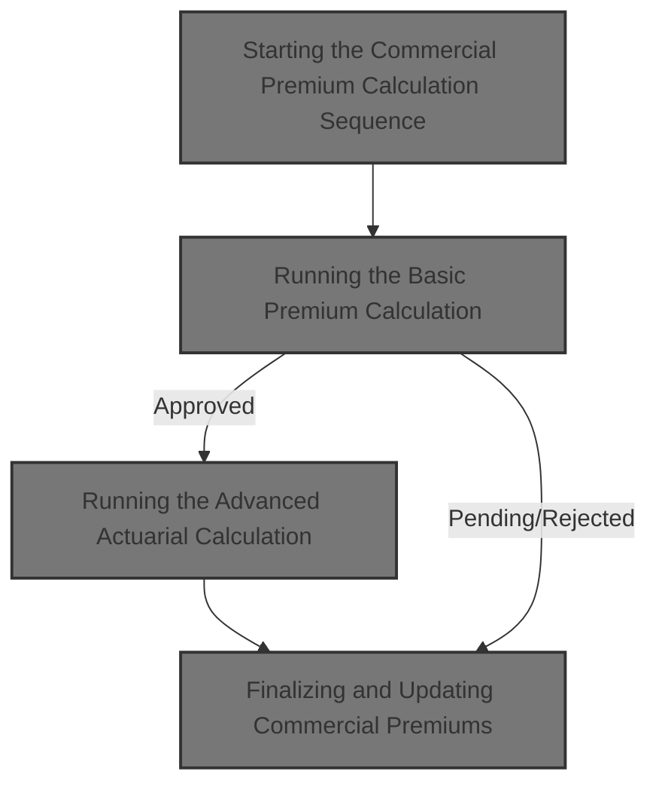
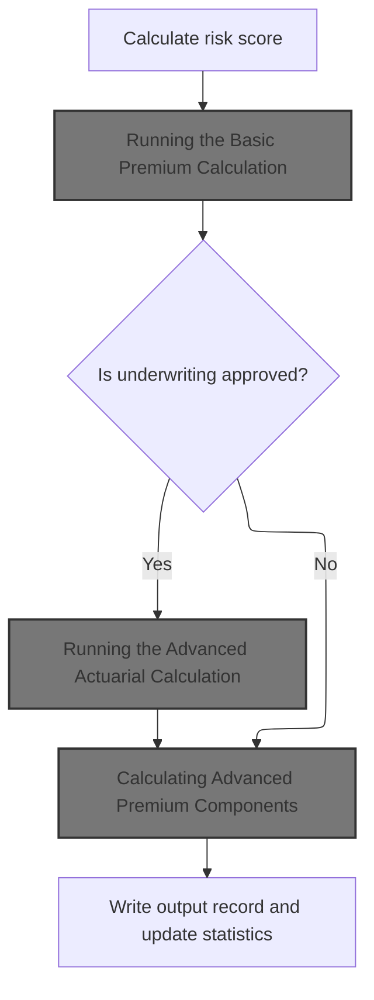
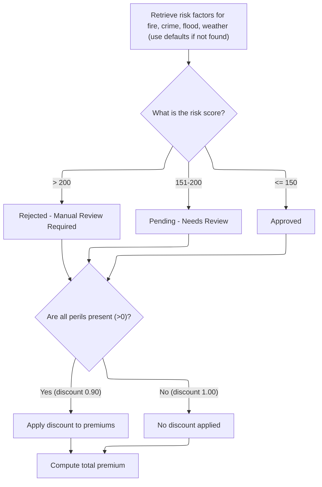
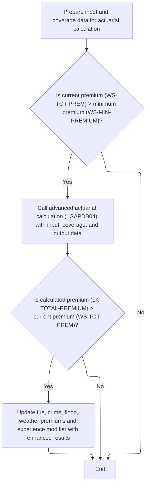
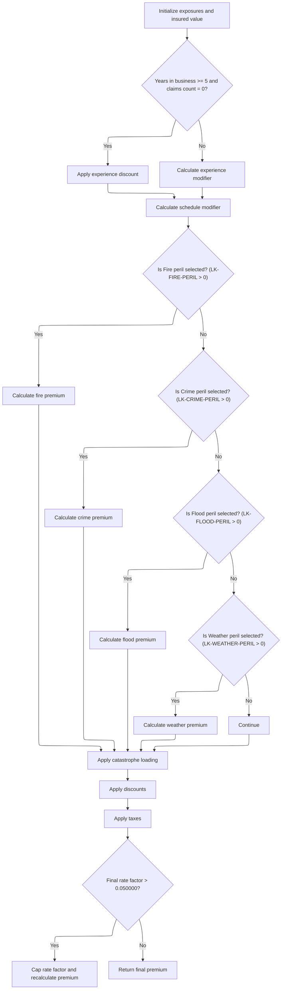
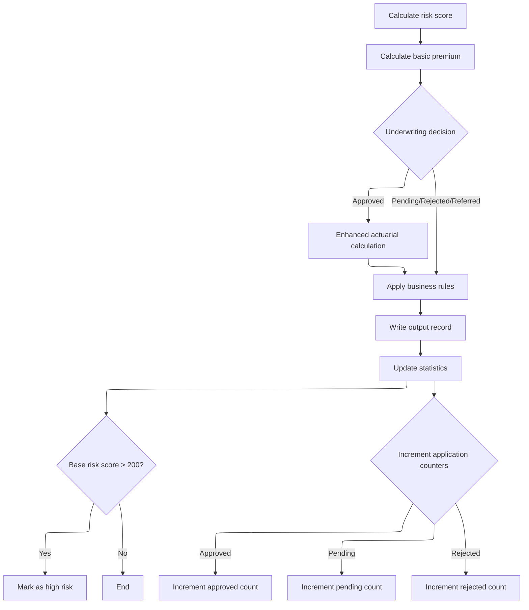

This document outlines the process for determining the premium and underwriting status for commercial insurance applications. The flow starts by assessing risk and calculating the basic premium for each peril. Based on the risk score, an underwriting decision is made; approved cases undergo advanced actuarial modeling to refine the premium. Business rules are applied, the results are recorded, and summary statistics are updated.



# Spec

## Detailed View of the Program's Functionality

# 1\. Program Initialization and Configuration

The main program begins by displaying startup messages and initializing all counters and working areas needed for processing. It sets up the processing date and loads configuration values, either from a configuration file or by falling back to defaults if the file is unavailable. These configuration values include maximum risk score, minimum premium, and maximum total insured value.

# 2\. File Handling

The program opens all necessary files for input, output, configuration, rates, and summary. It writes headers to the output file to label each column for later records. If any file fails to open, the program displays an error and stops.

# 3\. Input Record Processing

The program reads each input record in a loop. For each record:

- It increments the record count.
- It validates the record, checking for valid policy type, customer number, and coverage limits. If the record is invalid, it logs the error and writes an error record to the output.
- If the record is valid, it determines if the policy is commercial. If so, it processes the commercial premium calculation sequence; otherwise, it writes a non-commercial error record.

# 4\. Commercial Premium Calculation Sequence

For commercial policies, the program performs the following steps in strict order:

## a. Risk Score Calculation

It calls an external program to calculate the risk score, passing in property type, location, coverage limits, and customer history. The result is stored for use in premium calculations.

## b. Basic Premium Calculation

It calls another external program to calculate the basic premium. This program:

- Retrieves risk factors for fire and crime from a database, using defaults if not found.
- Determines the underwriting verdict (approved, pending, or rejected) based on the risk score.
- Calculates premiums for fire, crime, flood, and weather perils using the risk score, peril factors, and a discount factor if all perils are present.
- Sums the peril premiums to get the total premium.

## c. Enhanced Actuarial Calculation (Conditional)

If the underwriting verdict is "approved" and the basic premium exceeds the minimum premium, the program prepares detailed input and coverage data and calls the advanced actuarial calculation program. This program:

- Initializes exposures and insured value based on coverage limits and risk score.
- Loads base rates for each peril from a database, using defaults if not found.
- Calculates experience and schedule modifiers based on years in business, claims history, building age, protection class, occupancy code, and exposure density.
- Calculates base premiums for each peril, applying modifiers and trend factors.
- Adds catastrophe loading for hurricane, earthquake, tornado, and flood, depending on peril selection.
- Applies expense and profit loadings.
- Calculates discounts for multi-peril coverage, claims-free history, and high deductibles, capping the total discount.
- Applies taxes to the premium.
- Sums all components to get the total premium and calculates the final rate factor, capping it if necessary.
- If the enhanced premium is higher than the basic premium, the program updates the premium and modifiers in the main flow.

## d. Business Rules Application

The program applies business rules to determine the final underwriting decision:

- If the risk score exceeds the configured maximum, the case is rejected.
- If the total premium is below the minimum, the case is marked as pending.
- If the risk score is above a threshold (but below the maximum), the case is marked as pending for underwriter review.
- Otherwise, the case is approved.

## e. Output Record Writing

The program writes the results to the output file, including customer details, risk score, peril premiums, total premium, status, and rejection reason if applicable.

## f. Statistics Update

The program updates summary statistics:

- Adds the total premium and risk score to running totals.
- Increments the appropriate counter (approved, pending, rejected) based on the final status.
- Flags high-risk cases if the risk score exceeds 200.

# 5\. Non-Commercial Policy Handling

For non-commercial policies, the program writes a record to the output file indicating that only commercial policies are supported.

# 6\. File Closure and Summary Generation

After processing all records, the program closes all files. If the summary file is available, it writes a summary of processing statistics, including total records processed, counts for each status, total premium amount, and average risk score.

# 7\. Displaying Final Statistics

Finally, the program displays all summary statistics to the console, including record counts, error counts, high-risk count, total premium generated, and average risk score if applicable.

---

# Advanced Actuarial Calculation Details

The advanced actuarial calculation program performs the following steps:

## a. Initialization

It initializes all calculation areas and loads base rates for each peril from a database, using defaults if necessary.

## b. Exposure Calculation

It calculates exposures for building, contents, and business interruption by adjusting coverage limits with the risk score. It sums these for the total insured value and calculates exposure density.

## c. Experience Modifier Calculation

It calculates the experience modifier based on years in business and claims history:

- If the business has 5+ years and no claims, it applies a discount.
- Otherwise, it adjusts the modifier based on claims ratio, clamping it between 0.5000 and 2.0000.
- New businesses get a default higher modifier.

## d. Schedule Modifier Calculation

It adjusts the schedule modifier using building age, protection class, occupancy code, and exposure density, applying various hardcoded adjustments and clamping the value between -0.200 and +0.400.

## e. Base Premium Calculation

It calculates premiums for each peril:

- Fire: uses building and contents exposures.
- Crime: uses contents exposure with an extra multiplier.
- Flood: uses building exposure with an extra multiplier.
- Weather: uses building and contents exposures. Only selected perils are included. All premiums are summed for the base amount.

## f. Catastrophe Loading

It adds catastrophe loading for hurricane, earthquake, tornado, and flood, using peril indicators and domain-specific factors.

## g. Expense and Profit Loading

It calculates expense and profit loadings as percentages of the base and catastrophe amounts.

## h. Discount Calculation

It calculates total discounts for multi-peril coverage, claims-free history, and high deductibles, capping the total discount at 25%. The discount is applied to the sum of all premium components.

## i. Tax Application

It applies taxes to the premium after discounts.

## j. Final Premium Calculation

It sums all premium components, discounts, and taxes to get the total premium. It calculates the final rate factor and caps it if it exceeds a threshold, recalculating the premium if necessary.

---

# Basic Premium Calculation Details

The basic premium calculation program performs the following steps:

## a. Risk Factor Retrieval

It tries to fetch fire and crime risk factors from a database, using hardcoded defaults if the lookup fails.

## b. Verdict Calculation

It determines the underwriting verdict based on the risk score:

- Above 200: rejected.
- 151-200: pending.
- 150 or below: approved.

## c. Premium Calculation

It sets a discount factor if all perils are present. It calculates premiums for fire, crime, flood, and weather using the risk score, peril factor, peril value, and discount. The total premium is the sum of all peril premiums.

---

# Summary

The overall flow ensures that each commercial policy is processed through risk scoring, basic premium calculation, and, if eligible, advanced actuarial modeling. Business rules are applied to finalize the underwriting decision, and all results are written to output and summary statistics are updated. Non-commercial policies are flagged as unsupported. The advanced actuarial calculation adds detailed modeling for exposures, modifiers, catastrophe loading, discounts, and taxes, producing a more refined premium when applicable.

# Rule Definition

| Paragraph Name                                                                           | Rule ID | Category          | Description                                                                                                                                                                                                                                                                                            | Conditions                                                                                  | Remarks                                                                                                                                                                                                                                                                                                                                                                                                                                                                                                                                                                                                                                                          |
| ---------------------------------------------------------------------------------------- | ------- | ----------------- | ------------------------------------------------------------------------------------------------------------------------------------------------------------------------------------------------------------------------------------------------------------------------------------------------------ | ------------------------------------------------------------------------------------------- | ---------------------------------------------------------------------------------------------------------------------------------------------------------------------------------------------------------------------------------------------------------------------------------------------------------------------------------------------------------------------------------------------------------------------------------------------------------------------------------------------------------------------------------------------------------------------------------------------------------------------------------------------------------------- |
| P011A-CALCULATE-RISK-SCORE (LGAPDB01.cbl)                                                | RL-001  | Computation       | Calculate a numeric risk score for each commercial policy using all relevant input fields (property type, postcode, latitude, longitude, coverage limits, peril values, customer history, etc.). The score is used for all subsequent calculations.                                                    | For every commercial policy input record.                                                   | Risk score is a number, typically in the range 0–250. All relevant input fields must be used. Output field is a number (integer, 3 digits).                                                                                                                                                                                                                                                                                                                                                                                                                                                                                                                      |
| P011B-BASIC-PREMIUM-CALC (LGAPDB01.cbl), CALCULATE-PREMIUMS (LGAPDB03.cbl)               | RL-002  | Computation       | Calculate the premium for each peril (fire, crime, flood, weather) using the formula: Peril Premium = (Risk Score × Peril Factor) × Peril Value × Discount Factor. The total premium is the sum of all peril premiums.                                                                                 | For every commercial policy after risk score is calculated.                                 | Peril factors: fire=0.80, crime=0.60, flood=1.20, weather=0.90. Discount factor is 0.90 if all peril values > 0, otherwise 1.00. Peril premiums and total premium are numeric (up to 8 digits, 2 decimals for peril, 9 digits, 2 decimals for total).                                                                                                                                                                                                                                                                                                                                                                                                            |
| CALCULATE-VERDICT (LGAPDB03.cbl), P011D-APPLY-BUSINESS-RULES (LGAPDB01.cbl)              | RL-003  | Conditional Logic | Determine the underwriting status based on risk score and premium thresholds: REJECTED if risk score > 200, PENDING if risk score > 150, APPROVED otherwise. Additional pending/rejected logic if premium below minimum or risk score > 180.                                                           | After risk score and premium are calculated for each commercial policy.                     | Status values: 'REJECTED', 'PENDING', 'APPROVED'. Rejection reason is a string (up to 50 chars).                                                                                                                                                                                                                                                                                                                                                                                                                                                                                                                                                                 |
| P011C-ENHANCED-ACTUARIAL-CALC (LGAPDB01.cbl), P100-MAIN and subparagraphs (LGAPDB04.cbl) | RL-004  | Computation       | If status is APPROVED and total premium > minimum threshold, perform advanced actuarial calculations: exposures, insured value, exposure density, experience modifier, schedule modifier, base premiums, catastrophe loading, expense/profit loading, discounts, taxes, and final premium/rate factor. | For commercial policies with status APPROVED and total premium > minimum premium threshold. | Minimum premium threshold: 500.00. Experience modifier: 0.85, 1.00 + (claims/insured value × credibility × 0.50) clamped 0.50–2.00, or 1.10. Schedule modifier: -0.20 to +0.40. Catastrophe factors: hurricane=0.0125, earthquake=0.0080, tornado=0.0045, flood=0.0090. Expense ratio=0.35, profit margin=0.15, credibility=0.75, trend=1.0350. Discounts: multi-peril=0.10/0.05, claims-free=0.075, deductible credits=0.025/0.035/0.045, max total=0.25. Tax rate=0.0675. Final rate factor capped at 0.05. Output fields: premiums per peril (8 digits, 2 decimals), total premium (9 digits, 2 decimals), components, modifiers, insured value, rate factor. |
| P011E-WRITE-OUTPUT-RECORD (LGAPDB01.cbl)                                                 | RL-005  | Data Assignment   | Output record must include customer number, property type, postcode, risk score, premiums per peril, total premium, status, and rejection reason.                                                                                                                                                      | For every processed policy record.                                                          | Output fields: customer number (string, 10 chars), property type (string, 15 chars), postcode (string, 8 chars), risk score (number, 3 digits), premiums per peril (number, 8 digits, 2 decimals), total premium (number, 9 digits, 2 decimals), status (string, 20 chars), rejection reason (string, 50 chars). Fields must be left-aligned, padded with spaces if shorter than field size.                                                                                                                                                                                                                                                                     |
| P015-GENERATE-SUMMARY, P016-DISPLAY-STATS (LGAPDB01.cbl)                                 | RL-006  | Computation       | Statistics output must include number of approved, pending, and rejected policies, sum of all premiums, average risk score, and number of high-risk cases (risk score > 200).                                                                                                                          | After all records are processed.                                                            | Statistics fields: counts (number, 6 digits), sum of premiums (number, 12 digits, 2 decimals), average risk score (number, 3 digits, 2 decimals), high-risk count (number, 6 digits).                                                                                                                                                                                                                                                                                                                                                                                                                                                                            |

# User Stories

## User Story 1: Policy risk scoring, premium calculation, and underwriting decision

---

### Story Description:

As a commercial insurance system, I want to process each policy input record to calculate risk scores, determine premiums for each peril, and assign an underwriting status so that policies are evaluated consistently and accurately according to business rules.

---

### Business Rule Mapping:

| Rule ID | Paragraph Name                                                              | Rule Description                                                                                                                                                                                                                                    |
| ------- | --------------------------------------------------------------------------- | --------------------------------------------------------------------------------------------------------------------------------------------------------------------------------------------------------------------------------------------------- |
| RL-001  | P011A-CALCULATE-RISK-SCORE (LGAPDB01.cbl)                                   | Calculate a numeric risk score for each commercial policy using all relevant input fields (property type, postcode, latitude, longitude, coverage limits, peril values, customer history, etc.). The score is used for all subsequent calculations. |
| RL-002  | P011B-BASIC-PREMIUM-CALC (LGAPDB01.cbl), CALCULATE-PREMIUMS (LGAPDB03.cbl)  | Calculate the premium for each peril (fire, crime, flood, weather) using the formula: Peril Premium = (Risk Score × Peril Factor) × Peril Value × Discount Factor. The total premium is the sum of all peril premiums.                              |
| RL-003  | CALCULATE-VERDICT (LGAPDB03.cbl), P011D-APPLY-BUSINESS-RULES (LGAPDB01.cbl) | Determine the underwriting status based on risk score and premium thresholds: REJECTED if risk score > 200, PENDING if risk score > 150, APPROVED otherwise. Additional pending/rejected logic if premium below minimum or risk score > 180.        |

---

### Relevant Functionality:

- **P011A-CALCULATE-RISK-SCORE (LGAPDB01.cbl)**
  1. **RL-001:**
     - For each commercial policy:
       - Gather all relevant input fields (property type, postcode, latitude, longitude, coverage limits, peril values, customer history, etc.)
       - Call risk score calculation logic (external program LGAPDB02)
       - Store the resulting risk score for use in subsequent calculations.
- **P011B-BASIC-PREMIUM-CALC (LGAPDB01.cbl)**
  1. **RL-002:**
     - Retrieve peril factors (from DB or defaults)
     - For each peril:
       - If peril value > 0, include in calculation
       - Compute Peril Premium = (Risk Score × Peril Factor) × Peril Value × Discount Factor
     - Sum all peril premiums to get total premium
     - Output premiums per peril and total premium.
- **CALCULATE-VERDICT (LGAPDB03.cbl)**
  1. **RL-003:**
     - If risk score > 200:
       - Status = 'REJECTED', reason = 'High Risk Score - Manual Review Required'
     - Else if risk score > 150:
       - Status = 'PENDING', reason = 'Medium Risk - Pending Review'
     - Else:
       - Status = 'APPROVED', reason = blank
     - Additional: If risk score > max risk score (250), status = 'REJECTED', reason = 'Risk score exceeds maximum acceptable level'
     - If total premium < minimum premium (500.00), status = 'PENDING', reason = 'Premium below minimum - requires review'
     - If risk score > 180, status = 'PENDING', reason = 'High risk - underwriter review required'

## User Story 2: Comprehensive post-processing: actuarial calculations, output records, and summary statistics

---

### Story Description:

As a commercial insurance system, I want to perform advanced actuarial calculations for approved policies, generate complete output records for each processed policy, and produce summary statistics after all policies are processed so that all stakeholders have access to detailed pricing, policy information, and portfolio analytics.

---

### Business Rule Mapping:

| Rule ID | Paragraph Name                                                                           | Rule Description                                                                                                                                                                                                                                                                                       |
| ------- | ---------------------------------------------------------------------------------------- | ------------------------------------------------------------------------------------------------------------------------------------------------------------------------------------------------------------------------------------------------------------------------------------------------------ |
| RL-004  | P011C-ENHANCED-ACTUARIAL-CALC (LGAPDB01.cbl), P100-MAIN and subparagraphs (LGAPDB04.cbl) | If status is APPROVED and total premium > minimum threshold, perform advanced actuarial calculations: exposures, insured value, exposure density, experience modifier, schedule modifier, base premiums, catastrophe loading, expense/profit loading, discounts, taxes, and final premium/rate factor. |
| RL-005  | P011E-WRITE-OUTPUT-RECORD (LGAPDB01.cbl)                                                 | Output record must include customer number, property type, postcode, risk score, premiums per peril, total premium, status, and rejection reason.                                                                                                                                                      |
| RL-006  | P015-GENERATE-SUMMARY, P016-DISPLAY-STATS (LGAPDB01.cbl)                                 | Statistics output must include number of approved, pending, and rejected policies, sum of all premiums, average risk score, and number of high-risk cases (risk score > 200).                                                                                                                          |

---

### Relevant Functionality:

- **P011C-ENHANCED-ACTUARIAL-CALC (LGAPDB01.cbl)**
  1. **RL-004:**
     - For each coverage type (building, contents, BI):
       - Exposure = Coverage Limit × (1 + (Risk Score - 100) / 1000)
     - Total insured value = sum of exposures
     - Exposure density = total insured value / square footage (default 100.00 if zero)
     - Determine experience modifier:
       - If years in business ≥ 5 and claims count = 0: 0.85
       - If years in business ≥ 5 and claims count > 0: 1.00 + ((claims amount / insured value) × credibility × 0.50), clamp 0.50–2.00
       - Else: 1.10
     - Calculate schedule modifier based on building age, protection class, occupancy code, exposure density, clamp -0.20 to +0.40
     - For each selected peril:
       - Calculate base premium using formulas for each peril
     - Base amount = sum of selected peril premiums
     - Catastrophe loading: add hurricane/tornado/earthquake/flood factors as specified
     - Expense loading = (base + cat load) × expense ratio
     - Profit loading = (base + cat load + expense) × profit margin
     - Total discount = sum of multi-peril, claims-free, deductible credits, max 0.25
     - Discount amount = (base + cat load + expense + profit) × total discount
     - Tax amount = (base + cat load + expense + profit - discount) × 0.0675
     - Total premium = base + cat load + expense + profit - discount + tax
     - Final rate factor = total premium / insured value, cap at 0.05 and recalculate total premium if exceeded
     - Output all required fields.
- **P011E-WRITE-OUTPUT-RECORD (LGAPDB01.cbl)**
  1. **RL-005:**
     - For each processed record:
       - Assign output fields from calculated values
       - Write output record with all required fields, formatted as specified
- **P015-GENERATE-SUMMARY**
  1. **RL-006:**
     - After processing all records:
       - Count approved, pending, rejected policies
       - Sum all premiums
       - Calculate average risk score (sum of risk scores / processed count)
       - Count high-risk cases (risk score > 200)
       - Output statistics in summary record

# Code Walkthrough

## Starting the Commercial Premium Calculation Sequence



<SwmSnippet path="/base/src/LGAPDB01.cbl" line="258">

---

In `P011-PROCESS-COMMERCIAL`, we start by calculating the risk score, then call the basic premium calculation to set up the initial premium and status. We only run the enhanced actuarial calculation if the case is approved, using WS-STAT as the flag. The sequence is strict: risk, basic premium, (optional) enhanced actuarial, business rules, output, stats.

```cobol
       P011-PROCESS-COMMERCIAL.
           PERFORM P011A-CALCULATE-RISK-SCORE
           PERFORM P011B-BASIC-PREMIUM-CALC
           IF WS-STAT = 0
               PERFORM P011C-ENHANCED-ACTUARIAL-CALC
           END-IF
           PERFORM P011D-APPLY-BUSINESS-RULES
           PERFORM P011E-WRITE-OUTPUT-RECORD
           PERFORM P011F-UPDATE-STATISTICS.
```

---

</SwmSnippet>

### Running the Basic Premium Calculation

<SwmSnippet path="/base/src/LGAPDB01.cbl" line="275">

---

`P011B-BASIC-PREMIUM-CALC` calls LGAPDB03, passing in all the relevant risk and peril data. This external program computes the basic premiums and sets the approval status, which determines if we need to run enhanced calculations later. The output from LGAPDB03 feeds directly into the next steps of the flow.

```cobol
       P011B-BASIC-PREMIUM-CALC.
           CALL 'LGAPDB03' USING WS-BASE-RISK-SCR, IN-FIRE-PERIL, 
                                IN-CRIME-PERIL, IN-FLOOD-PERIL, 
                                IN-WEATHER-PERIL, WS-STAT,
                                WS-STAT-DESC, WS-REJ-RSN, WS-FR-PREM,
                                WS-CR-PREM, WS-FL-PREM, WS-WE-PREM,
                                WS-TOT-PREM, WS-DISC-FACT.
```

---

</SwmSnippet>

### Calculating Premiums and Verdict



<SwmSnippet path="/base/src/LGAPDB03.cbl" line="42">

---

`MAIN-LOGIC` runs the sequence: fetch risk factors (with fallback defaults if the DB lookup fails), determine the approval status based on risk score, and calculate the premiums for each peril. This sets up all the basic outputs needed for the rest of the premium flow.

```cobol
       MAIN-LOGIC.
           PERFORM GET-RISK-FACTORS
           PERFORM CALCULATE-VERDICT
           PERFORM CALCULATE-PREMIUMS
           GOBACK.
```

---

</SwmSnippet>

<SwmSnippet path="/base/src/LGAPDB03.cbl" line="48">

---

`GET-RISK-FACTORS` tries to fetch fire and crime risk factors from the RISK_FACTORS table. If the lookup fails, it just uses hardcoded defaults (0.80 for fire, 0.60 for crime) so the premium calculation doesn't stall. The code assumes the table and peril types exist and are correct.

```cobol
       GET-RISK-FACTORS.
           EXEC SQL
               SELECT FACTOR_VALUE INTO :WS-FIRE-FACTOR
               FROM RISK_FACTORS
               WHERE PERIL_TYPE = 'FIRE'
           END-EXEC.
           
           IF SQLCODE = 0
               CONTINUE
           ELSE
               MOVE 0.80 TO WS-FIRE-FACTOR
           END-IF.
           
           EXEC SQL
               SELECT FACTOR_VALUE INTO :WS-CRIME-FACTOR
               FROM RISK_FACTORS
               WHERE PERIL_TYPE = 'CRIME'
           END-EXEC.
           
           IF SQLCODE = 0
               CONTINUE
           ELSE
               MOVE 0.60 TO WS-CRIME-FACTOR
           END-IF.
```

---

</SwmSnippet>

<SwmSnippet path="/base/src/LGAPDB03.cbl" line="73">

---

`CALCULATE-VERDICT` checks the risk score and sets the status, description, and rejection reason based on fixed thresholds (200 and 150). It doesn't take the score as an argument, just grabs it from the current scope. The verdict directly controls what happens next in the premium flow.

```cobol
       CALCULATE-VERDICT.
           IF LK-RISK-SCORE > 200
             MOVE 2 TO LK-STAT
             MOVE 'REJECTED' TO LK-STAT-DESC
             MOVE 'High Risk Score - Manual Review Required' 
               TO LK-REJ-RSN
           ELSE
             IF LK-RISK-SCORE > 150
               MOVE 1 TO LK-STAT
               MOVE 'PENDING' TO LK-STAT-DESC
               MOVE 'Medium Risk - Pending Review'
                 TO LK-REJ-RSN
             ELSE
               MOVE 0 TO LK-STAT
               MOVE 'APPROVED' TO LK-STAT-DESC
               MOVE SPACES TO LK-REJ-RSN
             END-IF
           END-IF.
```

---

</SwmSnippet>

<SwmSnippet path="/base/src/LGAPDB03.cbl" line="92">

---

`CALCULATE-PREMIUMS` sets up a discount factor (1.00 or 0.90) depending on whether all perils are covered. Then it calculates each peril's premium using the risk score, peril factor, peril value, and discount. The total premium is just the sum of all four peril premiums.

```cobol
       CALCULATE-PREMIUMS.
           MOVE 1.00 TO LK-DISC-FACT
           
           IF LK-FIRE-PERIL > 0 AND
              LK-CRIME-PERIL > 0 AND
              LK-FLOOD-PERIL > 0 AND
              LK-WEATHER-PERIL > 0
             MOVE 0.90 TO LK-DISC-FACT
           END-IF

           COMPUTE LK-FIRE-PREMIUM =
             ((LK-RISK-SCORE * WS-FIRE-FACTOR) * LK-FIRE-PERIL *
               LK-DISC-FACT)
           
           COMPUTE LK-CRIME-PREMIUM =
             ((LK-RISK-SCORE * WS-CRIME-FACTOR) * LK-CRIME-PERIL *
               LK-DISC-FACT)
           
           COMPUTE LK-FLOOD-PREMIUM =
             ((LK-RISK-SCORE * WS-FLOOD-FACTOR) * LK-FLOOD-PERIL *
               LK-DISC-FACT)
           
           COMPUTE LK-WEATHER-PREMIUM =
             ((LK-RISK-SCORE * WS-WEATHER-FACTOR) * LK-WEATHER-PERIL *
               LK-DISC-FACT)

           COMPUTE LK-TOTAL-PREMIUM = 
             LK-FIRE-PREMIUM + LK-CRIME-PREMIUM + 
             LK-FLOOD-PREMIUM + LK-WEATHER-PREMIUM. 
```

---

</SwmSnippet>

### Running the Advanced Actuarial Calculation



<SwmSnippet path="/base/src/LGAPDB01.cbl" line="283">

---

`P011C-ENHANCED-ACTUARIAL-CALC` sets up all the detailed input and coverage data, then calls LGAPDB04 for advanced premium modeling, but only if the basic premium is above the minimum threshold. If the enhanced premium comes out higher, it updates the premium and modifiers in the main flow.

```cobol
       P011C-ENHANCED-ACTUARIAL-CALC.
      *    Prepare input structure for actuarial calculation
           MOVE IN-CUSTOMER-NUM TO LK-CUSTOMER-NUM
           MOVE WS-BASE-RISK-SCR TO LK-RISK-SCORE
           MOVE IN-PROPERTY-TYPE TO LK-PROPERTY-TYPE
           MOVE IN-TERRITORY-CODE TO LK-TERRITORY
           MOVE IN-CONSTRUCTION-TYPE TO LK-CONSTRUCTION-TYPE
           MOVE IN-OCCUPANCY-CODE TO LK-OCCUPANCY-CODE
           MOVE IN-SPRINKLER-IND TO LK-PROTECTION-CLASS
           MOVE IN-YEAR-BUILT TO LK-YEAR-BUILT
           MOVE IN-SQUARE-FOOTAGE TO LK-SQUARE-FOOTAGE
           MOVE IN-YEARS-IN-BUSINESS TO LK-YEARS-IN-BUSINESS
           MOVE IN-CLAIMS-COUNT-3YR TO LK-CLAIMS-COUNT-5YR
           MOVE IN-CLAIMS-AMOUNT-3YR TO LK-CLAIMS-AMOUNT-5YR
           
      *    Set coverage data
           MOVE IN-BUILDING-LIMIT TO LK-BUILDING-LIMIT
           MOVE IN-CONTENTS-LIMIT TO LK-CONTENTS-LIMIT
           MOVE IN-BI-LIMIT TO LK-BI-LIMIT
           MOVE IN-FIRE-DEDUCTIBLE TO LK-FIRE-DEDUCTIBLE
           MOVE IN-WIND-DEDUCTIBLE TO LK-WIND-DEDUCTIBLE
           MOVE IN-FLOOD-DEDUCTIBLE TO LK-FLOOD-DEDUCTIBLE
           MOVE IN-OTHER-DEDUCTIBLE TO LK-OTHER-DEDUCTIBLE
           MOVE IN-FIRE-PERIL TO LK-FIRE-PERIL
           MOVE IN-CRIME-PERIL TO LK-CRIME-PERIL
           MOVE IN-FLOOD-PERIL TO LK-FLOOD-PERIL
           MOVE IN-WEATHER-PERIL TO LK-WEATHER-PERIL
           
      *    Call advanced actuarial calculation program (only for approved cases)
           IF WS-TOT-PREM > WS-MIN-PREMIUM
               CALL 'LGAPDB04' USING LK-INPUT-DATA, LK-COVERAGE-DATA, 
                                    LK-OUTPUT-RESULTS
               
      *        Update with enhanced calculations if successful
               IF LK-TOTAL-PREMIUM > WS-TOT-PREM
                   MOVE LK-FIRE-PREMIUM TO WS-FR-PREM
                   MOVE LK-CRIME-PREMIUM TO WS-CR-PREM
                   MOVE LK-FLOOD-PREMIUM TO WS-FL-PREM
                   MOVE LK-WEATHER-PREMIUM TO WS-WE-PREM
                   MOVE LK-TOTAL-PREMIUM TO WS-TOT-PREM
                   MOVE LK-EXPERIENCE-MOD TO WS-EXPERIENCE-MOD
               END-IF
           END-IF.
```

---

</SwmSnippet>

### Calculating Advanced Premium Components



<SwmSnippet path="/base/src/LGAPDB04.cbl" line="138">

---

`P100-MAIN` runs through a bunch of steps: initializes exposures, loads rates, calculates experience and schedule modifiers, computes base premiums, adds catastrophe load, applies expenses, discounts, taxes, and finally calculates the capped premium and rate factor. Each step adds more detail to the premium calculation.

```cobol
       P100-MAIN.
           PERFORM P200-INIT
           PERFORM P300-RATES
           PERFORM P350-EXPOSURE
           PERFORM P400-EXP-MOD
           PERFORM P500-SCHED-MOD
           PERFORM P600-BASE-PREM
           PERFORM P700-CAT-LOAD
           PERFORM P800-EXPENSE
           PERFORM P900-DISC
           PERFORM P950-TAXES
           PERFORM P999-FINAL
           GOBACK.
```

---

</SwmSnippet>

<SwmSnippet path="/base/src/LGAPDB04.cbl" line="152">

---

`P200-INIT` calculates exposures for building, contents, and BI using a formula that tweaks the limit by the risk score. It then sums these for the total insured value and divides by square footage for exposure density, defaulting to 100.00 if square footage is zero.

```cobol
       P200-INIT.
           INITIALIZE WS-CALCULATION-AREAS
           INITIALIZE WS-BASE-RATE-TABLE
           
           COMPUTE WS-BUILDING-EXPOSURE = 
               LK-BUILDING-LIMIT * (1 + (LK-RISK-SCORE - 100) / 1000)
               
           COMPUTE WS-CONTENTS-EXPOSURE = 
               LK-CONTENTS-LIMIT * (1 + (LK-RISK-SCORE - 100) / 1000)
               
           COMPUTE WS-BI-EXPOSURE = 
               LK-BI-LIMIT * (1 + (LK-RISK-SCORE - 100) / 1000)
               
           COMPUTE WS-TOTAL-INSURED-VAL = 
               WS-BUILDING-EXPOSURE + WS-CONTENTS-EXPOSURE + 
               WS-BI-EXPOSURE
               
           IF LK-SQUARE-FOOTAGE > ZERO
               COMPUTE WS-EXPOSURE-DENSITY = 
                   WS-TOTAL-INSURED-VAL / LK-SQUARE-FOOTAGE
           ELSE
               MOVE 100.00 TO WS-EXPOSURE-DENSITY
           END-IF.
```

---

</SwmSnippet>

<SwmSnippet path="/base/src/LGAPDB04.cbl" line="234">

---

`P400-EXP-MOD` calculates the experience modifier using years in business and claims history. If no claims and 5+ years, it gives a discount. Otherwise, it adjusts the modifier based on claims ratio, but clamps it between 0.5000 and 2.0000 to avoid wild swings. New businesses get a default higher modifier.

```cobol
       P400-EXP-MOD.
           MOVE 1.0000 TO WS-EXPERIENCE-MOD
           
           IF LK-YEARS-IN-BUSINESS >= 5
               IF LK-CLAIMS-COUNT-5YR = ZERO
                   MOVE 0.8500 TO WS-EXPERIENCE-MOD
               ELSE
                   COMPUTE WS-EXPERIENCE-MOD = 
                       1.0000 + 
                       ((LK-CLAIMS-AMOUNT-5YR / WS-TOTAL-INSURED-VAL) * 
                        WS-CREDIBILITY-FACTOR * 0.50)
                   
                   IF WS-EXPERIENCE-MOD > 2.0000
                       MOVE 2.0000 TO WS-EXPERIENCE-MOD
                   END-IF
                   
                   IF WS-EXPERIENCE-MOD < 0.5000
                       MOVE 0.5000 TO WS-EXPERIENCE-MOD
                   END-IF
               END-IF
           ELSE
               MOVE 1.1000 TO WS-EXPERIENCE-MOD
           END-IF
           
           MOVE WS-EXPERIENCE-MOD TO LK-EXPERIENCE-MOD.
```

---

</SwmSnippet>

<SwmSnippet path="/base/src/LGAPDB04.cbl" line="260">

---

`P500-SCHED-MOD` tweaks the schedule modifier using building age, protection class, occupancy code, and exposure density, with a bunch of hardcoded constants. After all adjustments, it clamps the value to between -0.200 and +0.400 before passing it on.

```cobol
       P500-SCHED-MOD.
           MOVE +0.000 TO WS-SCHEDULE-MOD
           
      *    Building age factor
           EVALUATE TRUE
               WHEN LK-YEAR-BUILT >= 2010
                   SUBTRACT 0.050 FROM WS-SCHEDULE-MOD
               WHEN LK-YEAR-BUILT >= 1990
                   CONTINUE
               WHEN LK-YEAR-BUILT >= 1970
                   ADD 0.100 TO WS-SCHEDULE-MOD
               WHEN OTHER
                   ADD 0.200 TO WS-SCHEDULE-MOD
           END-EVALUATE
           
      *    Protection class factor
           EVALUATE LK-PROTECTION-CLASS
               WHEN '01' THRU '03'
                   SUBTRACT 0.100 FROM WS-SCHEDULE-MOD
               WHEN '04' THRU '06'
                   SUBTRACT 0.050 FROM WS-SCHEDULE-MOD
               WHEN '07' THRU '09'
                   CONTINUE
               WHEN OTHER
                   ADD 0.150 TO WS-SCHEDULE-MOD
           END-EVALUATE
           
      *    Occupancy hazard factor
           EVALUATE LK-OCCUPANCY-CODE
               WHEN 'OFF01' THRU 'OFF05'
                   SUBTRACT 0.025 FROM WS-SCHEDULE-MOD
               WHEN 'MFG01' THRU 'MFG10'
                   ADD 0.075 TO WS-SCHEDULE-MOD
               WHEN 'WHS01' THRU 'WHS05'
                   ADD 0.125 TO WS-SCHEDULE-MOD
               WHEN OTHER
                   CONTINUE
           END-EVALUATE
           
      *    Exposure density factor
           IF WS-EXPOSURE-DENSITY > 500.00
               ADD 0.100 TO WS-SCHEDULE-MOD
           ELSE
               IF WS-EXPOSURE-DENSITY < 50.00
                   SUBTRACT 0.050 FROM WS-SCHEDULE-MOD
               END-IF
           END-IF
           
           IF WS-SCHEDULE-MOD > +0.400
               MOVE +0.400 TO WS-SCHEDULE-MOD
           END-IF
           
           IF WS-SCHEDULE-MOD < -0.200
               MOVE -0.200 TO WS-SCHEDULE-MOD
           END-IF
           
           MOVE WS-SCHEDULE-MOD TO LK-SCHEDULE-MOD.
```

---

</SwmSnippet>

<SwmSnippet path="/base/src/LGAPDB04.cbl" line="318">

---

`P600-BASE-PREM` calculates each peril premium using exposures, base rates, experience and schedule modifiers, and trend factors. Crime and flood get extra multipliers (0.80 and 1.25). Only perils with nonzero indicators are included. All premiums are summed for the base amount.

```cobol
       P600-BASE-PREM.
           MOVE ZERO TO LK-BASE-AMOUNT
           
      * FIRE PREMIUM
           IF LK-FIRE-PERIL > ZERO
               COMPUTE LK-FIRE-PREMIUM = 
                   (WS-BUILDING-EXPOSURE + WS-CONTENTS-EXPOSURE) *
                   WS-BASE-RATE (1, 1, 1, 1) * 
                   WS-EXPERIENCE-MOD *
                   (1 + WS-SCHEDULE-MOD) *
                   WS-TREND-FACTOR
                   
               ADD LK-FIRE-PREMIUM TO LK-BASE-AMOUNT
           END-IF
           
      * CRIME PREMIUM
           IF LK-CRIME-PERIL > ZERO
               COMPUTE LK-CRIME-PREMIUM = 
                   (WS-CONTENTS-EXPOSURE * 0.80) *
                   WS-BASE-RATE (2, 1, 1, 1) * 
                   WS-EXPERIENCE-MOD *
                   (1 + WS-SCHEDULE-MOD) *
                   WS-TREND-FACTOR
                   
               ADD LK-CRIME-PREMIUM TO LK-BASE-AMOUNT
           END-IF
           
      * FLOOD PREMIUM
           IF LK-FLOOD-PERIL > ZERO
               COMPUTE LK-FLOOD-PREMIUM = 
                   WS-BUILDING-EXPOSURE *
                   WS-BASE-RATE (3, 1, 1, 1) * 
                   WS-EXPERIENCE-MOD *
                   (1 + WS-SCHEDULE-MOD) *
                   WS-TREND-FACTOR * 1.25
                   
               ADD LK-FLOOD-PREMIUM TO LK-BASE-AMOUNT
           END-IF
           
      * WEATHER PREMIUM
           IF LK-WEATHER-PERIL > ZERO
               COMPUTE LK-WEATHER-PREMIUM = 
                   (WS-BUILDING-EXPOSURE + WS-CONTENTS-EXPOSURE) *
                   WS-BASE-RATE (4, 1, 1, 1) * 
                   WS-EXPERIENCE-MOD *
                   (1 + WS-SCHEDULE-MOD) *
                   WS-TREND-FACTOR
                   
               ADD LK-WEATHER-PREMIUM TO LK-BASE-AMOUNT
           END-IF.
```

---

</SwmSnippet>

<SwmSnippet path="/base/src/LGAPDB04.cbl" line="369">

---

`P700-CAT-LOAD` builds up the catastrophe loading by adding weighted premiums for hurricane, earthquake, tornado, and flood, using domain-specific factors. Earthquake loading is always included, while others depend on peril indicators. The total is moved to the output.

```cobol
       P700-CAT-LOAD.
           MOVE ZERO TO WS-CAT-LOADING
           
      * Hurricane loading (wind/weather peril)
           IF LK-WEATHER-PERIL > ZERO
               COMPUTE WS-CAT-LOADING = WS-CAT-LOADING +
                   (LK-WEATHER-PREMIUM * WS-HURRICANE-FACTOR)
           END-IF
           
      * Earthquake loading (affects all perils)  
           COMPUTE WS-CAT-LOADING = WS-CAT-LOADING +
               (LK-BASE-AMOUNT * WS-EARTHQUAKE-FACTOR)
           
      * Tornado loading (weather peril primarily)
           IF LK-WEATHER-PERIL > ZERO
               COMPUTE WS-CAT-LOADING = WS-CAT-LOADING +
                   (LK-WEATHER-PREMIUM * WS-TORNADO-FACTOR)
           END-IF
           
      * Flood cat loading (if flood coverage selected)
           IF LK-FLOOD-PERIL > ZERO
               COMPUTE WS-CAT-LOADING = WS-CAT-LOADING +
                   (LK-FLOOD-PREMIUM * WS-FLOOD-FACTOR)
           END-IF
           
           MOVE WS-CAT-LOADING TO LK-CAT-LOAD-AMT.
```

---

</SwmSnippet>

<SwmSnippet path="/base/src/LGAPDB04.cbl" line="407">

---

`P900-DISC` calculates the total discount by checking multi-peril, claims-free, and deductible conditions, using a bunch of hardcoded rates. It caps the total discount at 25% and applies it to the sum of all premium components.

```cobol
       P900-DISC.
           MOVE ZERO TO WS-TOTAL-DISCOUNT
           
      * Multi-peril discount
           MOVE ZERO TO WS-MULTI-PERIL-DISC
           IF LK-FIRE-PERIL > ZERO AND
              LK-CRIME-PERIL > ZERO AND
              LK-FLOOD-PERIL > ZERO AND
              LK-WEATHER-PERIL > ZERO
               MOVE 0.100 TO WS-MULTI-PERIL-DISC
           ELSE
               IF LK-FIRE-PERIL > ZERO AND
                  LK-WEATHER-PERIL > ZERO AND
                  (LK-CRIME-PERIL > ZERO OR LK-FLOOD-PERIL > ZERO)
                   MOVE 0.050 TO WS-MULTI-PERIL-DISC
               END-IF
           END-IF
           
      * Claims-free discount  
           MOVE ZERO TO WS-CLAIMS-FREE-DISC
           IF LK-CLAIMS-COUNT-5YR = ZERO AND LK-YEARS-IN-BUSINESS >= 5
               MOVE 0.075 TO WS-CLAIMS-FREE-DISC
           END-IF
           
      * Deductible credit
           MOVE ZERO TO WS-DEDUCTIBLE-CREDIT
           IF LK-FIRE-DEDUCTIBLE >= 10000
               ADD 0.025 TO WS-DEDUCTIBLE-CREDIT
           END-IF
           IF LK-WIND-DEDUCTIBLE >= 25000  
               ADD 0.035 TO WS-DEDUCTIBLE-CREDIT
           END-IF
           IF LK-FLOOD-DEDUCTIBLE >= 50000
               ADD 0.045 TO WS-DEDUCTIBLE-CREDIT
           END-IF
           
           COMPUTE WS-TOTAL-DISCOUNT = 
               WS-MULTI-PERIL-DISC + WS-CLAIMS-FREE-DISC + 
               WS-DEDUCTIBLE-CREDIT
               
           IF WS-TOTAL-DISCOUNT > 0.250
               MOVE 0.250 TO WS-TOTAL-DISCOUNT
           END-IF
           
           COMPUTE LK-DISCOUNT-AMT = 
               (LK-BASE-AMOUNT + LK-CAT-LOAD-AMT + 
                LK-EXPENSE-LOAD-AMT + LK-PROFIT-LOAD-AMT) *
               WS-TOTAL-DISCOUNT.
```

---

</SwmSnippet>

<SwmSnippet path="/base/src/LGAPDB04.cbl" line="464">

---

`P999-FINAL` sums up all premium components, discounts, and taxes to get the total premium. It then calculates the rate factor by dividing by the total insured value, and if the rate is too high, it caps it and recalculates the premium.

```cobol
       P999-FINAL.
           COMPUTE LK-TOTAL-PREMIUM = 
               LK-BASE-AMOUNT + LK-CAT-LOAD-AMT + 
               LK-EXPENSE-LOAD-AMT + LK-PROFIT-LOAD-AMT -
               LK-DISCOUNT-AMT + LK-TAX-AMT
               
           COMPUTE LK-FINAL-RATE-FACTOR = 
               LK-TOTAL-PREMIUM / WS-TOTAL-INSURED-VAL
               
           IF LK-FINAL-RATE-FACTOR > 0.050000
               MOVE 0.050000 TO LK-FINAL-RATE-FACTOR
               COMPUTE LK-TOTAL-PREMIUM = 
                   WS-TOTAL-INSURED-VAL * LK-FINAL-RATE-FACTOR
           END-IF.
```

---

</SwmSnippet>

### Finalizing and Updating Commercial Premiums



<SwmSnippet path="/base/src/LGAPDB01.cbl" line="258">

---

Back in `P011-PROCESS-COMMERCIAL`, after returning from the enhanced actuarial calculation (if it was run), we apply business rules, write the output, and finally update statistics. The update step uses WS-STAT to increment the right counters and logs the premium and risk score totals. This keeps all summary data in sync with the latest calculations.

```cobol
       P011-PROCESS-COMMERCIAL.
           PERFORM P011A-CALCULATE-RISK-SCORE
           PERFORM P011B-BASIC-PREMIUM-CALC
           IF WS-STAT = 0
               PERFORM P011C-ENHANCED-ACTUARIAL-CALC
           END-IF
           PERFORM P011D-APPLY-BUSINESS-RULES
           PERFORM P011E-WRITE-OUTPUT-RECORD
           PERFORM P011F-UPDATE-STATISTICS.
```

---

</SwmSnippet>

<SwmSnippet path="/base/src/LGAPDB01.cbl" line="365">

---

`P011F-UPDATE-STATISTICS` adds the latest premium and risk score to the running totals, bumps the right status counter based on WS-STAT, and flags high risk cases if the score is over 200. These updates keep all summary stats current for reporting.

```cobol
       P011F-UPDATE-STATISTICS.
           ADD WS-TOT-PREM TO WS-TOTAL-PREMIUM-AMT
           ADD WS-BASE-RISK-SCR TO WS-CONTROL-TOTALS
           
           EVALUATE WS-STAT
               WHEN 0 ADD 1 TO WS-APPROVED-CNT
               WHEN 1 ADD 1 TO WS-PENDING-CNT
               WHEN 2 ADD 1 TO WS-REJECTED-CNT
           END-EVALUATE
           
           IF WS-BASE-RISK-SCR > 200
               ADD 1 TO WS-HIGH-RISK-CNT
           END-IF.
```

---

</SwmSnippet>

&nbsp;

*This is an auto-generated document by Swimm 🌊 and has not yet been verified by a human*

<SwmMeta version="3.0.0" repo-id="Z2l0aHViJTNBJTNBU3dpbW1pby1nZW5hcHAtaG91c2UlM0ElM0FHaXJpLVN3aW1t" repo-name="Swimmio-genapp-house"><sup>Powered by [Swimm](https://app.swimm.io/)</sup></SwmMeta>
