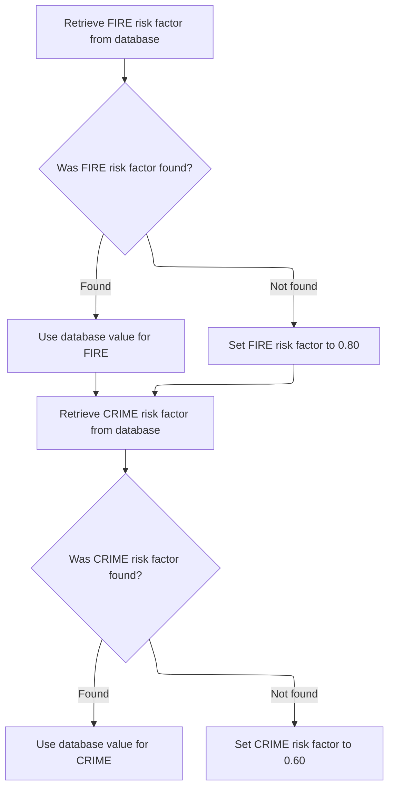
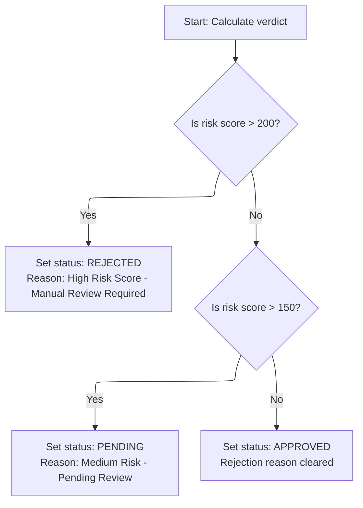

This document describes how insurance policy eligibility is determined and premiums are calculated. The flow coordinates the retrieval of risk factors, evaluation of risk score, and calculation of premiums, producing a verdict status and premium amounts.

# Spec

## Detailed View of the Program's Functionality

a. Program Initialization and Data Setup

The program begins by defining its identity and environment. It sets up the necessary configuration for database access and declares working storage for various risk factors, each with a default value. These risk factors correspond to different types of perils (fire, crime, flood, weather). The program also defines a set of input and output fields (linkage section) that will be used to receive data and return results, such as risk scores, peril values, status codes, descriptions, rejection reasons, individual premiums for each peril, the total premium, and a discount factor.

b. Main Processing Flow

The main logic of the program is structured as a sequence of three major steps:

1. Fetching risk adjustment factors from the database (or using defaults if not found).
2. Evaluating the risk score to determine the application verdict (approved, pending, or rejected).
3. Calculating insurance premiums for each peril and the total, applying any discounts as appropriate.

After these steps, the program returns control to the caller.

c. Fetching Peril Risk Factors

The first step is to obtain adjustment factors for fire and crime perils:

- The program queries the database for the fire risk factor. If the database returns a value, it is used; if not, the program falls back to a default value of 0.80.
- Next, the program queries the database for the crime risk factor. Similarly, if a value is found, it is used; otherwise, a default value of 0.60 is applied.
- The flood and weather risk factors are not queried from the database; their default values (1.20 for flood, 0.90 for weather) are always used.

d. Evaluating Risk Verdict

The program then determines the outcome based on the provided risk score:

- If the risk score is greater than 200, the application is marked as rejected. The status is set to indicate rejection, and a descriptive reason is provided stating that a manual review is required due to a high risk score.
- If the risk score is not above 200 but is greater than 150, the application is marked as pending. The status and description reflect that a review is pending due to medium risk.
- If the risk score is 150 or below, the application is approved. The status and description indicate approval, and any rejection reason is cleared.

e. Calculating Premiums

The final step is to compute the insurance premiums:

- The program starts by setting a discount factor to 1.00 (no discount).
- If all peril values (fire, crime, flood, weather) are greater than zero, the discount factor is set to 0.90, applying a 10% discount.
- The premium for each peril is calculated by multiplying the risk score by the corresponding risk factor, then by the peril value, and finally by the discount factor.
- The total premium is computed as the sum of the individual premiums for fire, crime, flood, and weather.

This sequence ensures that the risk context is established first, the application is evaluated for approval, and then the financial calculations are performed based on the established risk and peril values.

# Rule Definition

| Paragraph Name    | Rule ID | Category          | Description                                                                                                                                                                                                                                                             | Conditions                                                                                                               | Remarks                                                                                                                                                                                                                                                                                                                     |
| ----------------- | ------- | ----------------- | ----------------------------------------------------------------------------------------------------------------------------------------------------------------------------------------------------------------------------------------------------------------------- | ------------------------------------------------------------------------------------------------------------------------ | --------------------------------------------------------------------------------------------------------------------------------------------------------------------------------------------------------------------------------------------------------------------------------------------------------------------------- |
| GET-RISK-FACTORS  | RL-001  | Data Assignment   | The system must retrieve the risk adjustment factor for the FIRE peril from the RISK_FACTORS database table using PERIL_TYPE = 'FIRE'. If a matching record is found, assign the value in FACTOR_VALUE to the FIRE factor output; otherwise, assign a default value.    | PERIL_TYPE = 'FIRE' is used as the query parameter. If SQLCODE = 0 (record found), use FACTOR_VALUE; else, use default.  | Default value for FIRE factor is 0.80. Output format is a decimal number (e.g., 0.80).                                                                                                                                                                                                                                      |
| GET-RISK-FACTORS  | RL-002  | Data Assignment   | The system must retrieve the risk adjustment factor for the CRIME peril from the RISK_FACTORS database table using PERIL_TYPE = 'CRIME'. If a matching record is found, assign the value in FACTOR_VALUE to the CRIME factor output; otherwise, assign a default value. | PERIL_TYPE = 'CRIME' is used as the query parameter. If SQLCODE = 0 (record found), use FACTOR_VALUE; else, use default. | Default value for CRIME factor is 0.60. Output format is a decimal number (e.g., 0.60).                                                                                                                                                                                                                                     |
| GET-RISK-FACTORS  | RL-003  | Data Assignment   | After retrieving or assigning default values, output the FIRE and CRIME factors for use in subsequent premium calculations.                                                                                                                                             | After risk factor retrieval for FIRE and CRIME perils.                                                                   | Values are decimal numbers (e.g., 0.80, 0.60).                                                                                                                                                                                                                                                                              |
| CALCULATE-VERDICT | RL-004  | Conditional Logic | The system evaluates the input risk score and sets the status, description, and rejection reason according to defined thresholds.                                                                                                                                       | Input risk score is provided.                                                                                            | Status values: 2 (REJECTED), 1 (PENDING), 0 (APPROVED). Descriptions: 'REJECTED', 'PENDING', 'APPROVED'. Rejection reasons: 'High Risk Score - Manual Review Required', 'Medium Risk - Pending Review', blank. Status is a number, description is a string (up to 20 chars), rejection reason is a string (up to 50 chars). |
| MAIN-LOGIC        | RL-005  | Data Assignment   | The MAIN-LOGIC accepts linkage variables for risk score and peril values, and updates output linkage variables for status, description, rejection reason, and premiums.                                                                                                 | Program is invoked with linkage variables.                                                                               | Input variables: risk score (number), peril values (numbers). Output variables: status (number), description (string), rejection reason (string), premiums (decimal numbers).                                                                                                                                               |

# User Stories

## User Story 1: Retrieve and output risk adjustment factors for FIRE and CRIME perils

---

### Story Description:

As a system, I want to retrieve risk adjustment factors for FIRE and CRIME perils from the database and output them for use in premium calculations so that accurate and defaulted factors are always available for subsequent processing.

---

### Business Rule Mapping:

| Rule ID | Paragraph Name   | Rule Description                                                                                                                                                                                                                                                        |
| ------- | ---------------- | ----------------------------------------------------------------------------------------------------------------------------------------------------------------------------------------------------------------------------------------------------------------------- |
| RL-001  | GET-RISK-FACTORS | The system must retrieve the risk adjustment factor for the FIRE peril from the RISK_FACTORS database table using PERIL_TYPE = 'FIRE'. If a matching record is found, assign the value in FACTOR_VALUE to the FIRE factor output; otherwise, assign a default value.    |
| RL-002  | GET-RISK-FACTORS | The system must retrieve the risk adjustment factor for the CRIME peril from the RISK_FACTORS database table using PERIL_TYPE = 'CRIME'. If a matching record is found, assign the value in FACTOR_VALUE to the CRIME factor output; otherwise, assign a default value. |
| RL-003  | GET-RISK-FACTORS | After retrieving or assigning default values, output the FIRE and CRIME factors for use in subsequent premium calculations.                                                                                                                                             |

---

### Relevant Functionality:

- **GET-RISK-FACTORS**
  1. **RL-001:**
     - Query RISK_FACTORS table for PERIL_TYPE = 'FIRE'.
     - If a record is found:
       - Assign FACTOR_VALUE to the FIRE factor output.
     - Else:
       - Assign 0.80 to the FIRE factor output.
  2. **RL-002:**
     - Query RISK_FACTORS table for PERIL_TYPE = 'CRIME'.
     - If a record is found:
       - Assign FACTOR_VALUE to the CRIME factor output.
     - Else:
       - Assign 0.60 to the CRIME factor output.
  3. **RL-003:**
     - Make FIRE and CRIME factor outputs available for subsequent calculations.

## User Story 2: Process risk score and update outputs via main logic

---

### Story Description:

As a system, I want to evaluate the input risk score, set the status, description, rejection reason, and premiums, and update all relevant linkage variables so that the correct verdict and outputs are determined and communicated for each risk assessment.

---

### Business Rule Mapping:

| Rule ID | Paragraph Name    | Rule Description                                                                                                                                                        |
| ------- | ----------------- | ----------------------------------------------------------------------------------------------------------------------------------------------------------------------- |
| RL-005  | MAIN-LOGIC        | The MAIN-LOGIC accepts linkage variables for risk score and peril values, and updates output linkage variables for status, description, rejection reason, and premiums. |
| RL-004  | CALCULATE-VERDICT | The system evaluates the input risk score and sets the status, description, and rejection reason according to defined thresholds.                                       |

---

### Relevant Functionality:

- **MAIN-LOGIC**
  1. **RL-005:**
     - Accept input linkage variables for risk score and peril values.
     - Update output linkage variables for status, description, rejection reason, and premiums after calculations.
- **CALCULATE-VERDICT**
  1. **RL-004:**
     - If risk score > 200:
       - Set status to 2
       - Set description to 'REJECTED'
       - Set rejection reason to 'High Risk Score - Manual Review Required'
     - Else if risk score > 150:
       - Set status to 1
       - Set description to 'PENDING'
       - Set rejection reason to 'Medium Risk - Pending Review'
     - Else:
       - Set status to 0
       - Set description to 'APPROVED'
       - Clear rejection reason (set to blank)

# Code Walkthrough

## Coordinating the Risk and Premium Calculation

<SwmSnippet path="/base/src/LGAPDB03.cbl" line="42">

---

`MAIN-LOGIC` kicks off the process by calling GET-RISK-FACTORS to fetch the adjustment factors for fire and crime, which are needed for all subsequent calculations. Without these, the verdict and premium calculations wouldn't have the right context.

```cobol
       MAIN-LOGIC.
           PERFORM GET-RISK-FACTORS
           PERFORM CALCULATE-VERDICT
           PERFORM CALCULATE-PREMIUMS
           GOBACK.
```

---

</SwmSnippet>

### Fetching Peril Risk Factors



<SwmSnippet path="/base/src/LGAPDB03.cbl" line="48">

---

In `GET-RISK-FACTORS`, we start by querying the database for the 'FIRE' risk factor. If the value is found, it's used; otherwise, we fall back to a default.

```cobol
       GET-RISK-FACTORS.
           EXEC SQL
               SELECT FACTOR_VALUE INTO :WS-FIRE-FACTOR
               FROM RISK_FACTORS
               WHERE PERIL_TYPE = 'FIRE'
           END-EXEC.
```

---

</SwmSnippet>

<SwmSnippet path="/base/src/LGAPDB03.cbl" line="55">

---

If the 'FIRE' risk factor isn't found in the database, we just set WS-FIRE-FACTOR to 0.80 and move on. No explanation for the number, it's just the default.

```cobol
           IF SQLCODE = 0
               CONTINUE
           ELSE
               MOVE 0.80 TO WS-FIRE-FACTOR
           END-IF.
```

---

</SwmSnippet>

<SwmSnippet path="/base/src/LGAPDB03.cbl" line="61">

---

Now we do the same thing for 'CRIME'—query the database for its risk factor, and if it fails, we'll handle it in the next step.

```cobol
           EXEC SQL
               SELECT FACTOR_VALUE INTO :WS-CRIME-FACTOR
               FROM RISK_FACTORS
               WHERE PERIL_TYPE = 'CRIME'
           END-EXEC.
```

---

</SwmSnippet>

<SwmSnippet path="/base/src/LGAPDB03.cbl" line="67">

---

If the 'CRIME' risk factor isn't found, we just set WS-CRIME-FACTOR to 0.60. At this point, both risk factors are set—either from the database or defaults—and the flow continues.

```cobol
           IF SQLCODE = 0
               CONTINUE
           ELSE
               MOVE 0.60 TO WS-CRIME-FACTOR
           END-IF.
```

---

</SwmSnippet>

### Evaluating Risk Verdict



<SwmSnippet path="/base/src/LGAPDB03.cbl" line="73">

---

`CALCULATE-VERDICT` checks the risk score and assigns a status: over 200 is rejected, over 150 is pending, and anything else is approved. It also sets the description and rejection reason accordingly.

```cobol
       CALCULATE-VERDICT.
           IF LK-RISK-SCORE > 200
             MOVE 2 TO LK-STAT
             MOVE 'REJECTED' TO LK-STAT-DESC
             MOVE 'High Risk Score - Manual Review Required' 
               TO LK-REJ-RSN
           ELSE
             IF LK-RISK-SCORE > 150
               MOVE 1 TO LK-STAT
               MOVE 'PENDING' TO LK-STAT-DESC
               MOVE 'Medium Risk - Pending Review'
                 TO LK-REJ-RSN
             ELSE
               MOVE 0 TO LK-STAT
               MOVE 'APPROVED' TO LK-STAT-DESC
               MOVE SPACES TO LK-REJ-RSN
             END-IF
           END-IF.
```

---

</SwmSnippet>

&nbsp;

*This is an auto-generated document by Swimm 🌊 and has not yet been verified by a human*

<SwmMeta version="3.0.0" repo-id="Z2l0aHViJTNBJTNBU3dpbW1pby1nZW5hcHAtaG91c2UlM0ElM0FHaXJpLVN3aW1t" repo-name="Swimmio-genapp-house"><sup>Powered by [Swimm](https://app.swimm.io/)</sup></SwmMeta>
