# What the script does

The cust1 Rexx script is designed to customize and prepare a set of GenApp-related data sets and libraries for use in a mainframe environment. It sets up environment variables, allocates necessary data sets if they do not exist, and processes members in a control data set by applying a macro customization. The script automates the preparation and customization of system components, ensuring that the required libraries and data sets are ready and tailored for the <SwmToken path="base/exec/cust1.rexx" pos="40:12:12" line-data="/* Establish a HLQ for the GenApp data sets */">`GenApp`</SwmToken> application environment. For example, it takes a control data set containing source members and produces customized output members in a target data set.

# Script Flow

The script flow can be broken down into the following main steps:

- Define and initialize environment variables and dataset names used throughout the script.
- Copy these variables into the ISPF variable pool for accessibility.
- Establish the high-level qualifier (HLQ) for <SwmToken path="base/exec/cust1.rexx" pos="40:12:12" line-data="/* Establish a HLQ for the GenApp data sets */">`GenApp`</SwmToken> data sets and activate the Rexx EXEC library.
- Define dataset names for DBRM, MAPCOPY, LOAD, MSGTXT, and others, preparing them for allocation.
- Allocate datasets if they do not already exist, creating new ones with appropriate attributes.
- Open the input control dataset and iterate through its members.
- For each member not starting with '@', perform a macro customization using the <SwmToken path="base/exec/cust1.rexx" pos="122:17:17" line-data="               &#39;Member(&#39; || Member || &#39;) Macro(MAC1)&#39;">`MAC1`</SwmToken> macro.
- Close and free the input dataset after processing all members.
- Perform a final customization on a specific member in the WSIM data set.
- Deactivate the Rexx EXEC library and exit the script.

```mermaid
flowchart TD
    A[Initialize environment variables] --> B[Copy variables to ISPF pool]
    B --> C[Set HLQ and activate Rexx EXEC library]
    C --> D[Define dataset names for customization]
    D --> E[Allocate datasets if missing]
    E --> F[Open input control dataset]
    F --> G[Iterate over members in control dataset]
    G --> H{Member name starts with '@'?}
    H -- No --> I[Apply MAC1 macro customization]
    H -- Yes --> G
    I --> G
    G --> J[Close and free input dataset]
    J --> K[Customize WSIM data set member]
    K --> L[Deactivate Rexx EXEC library]
    L --> M[Exit script]

%% Swimm:
%% flowchart TD
%%     A[Initialize environment variables] --> B[Copy variables to ISPF pool]
%%     B --> C[Set HLQ and activate Rexx EXEC library]
%%     C --> D[Define dataset names for customization]
%%     D --> E[Allocate datasets if missing]
%%     E --> F[Open input control dataset]
%%     F --> G[Iterate over members in control dataset]
%%     G --> H{Member name starts with '@'?}
%%     H -- No --> I[Apply <SwmToken path="base/exec/cust1.rexx" pos="122:17:17" line-data="               &#39;Member(&#39; || Member || &#39;) Macro(MAC1)&#39;">`MAC1`</SwmToken> macro customization]
%%     H -- Yes --> G
%%     I --> G
%%     G --> J[Close and free input dataset]
%%     J --> K[Customize WSIM data set member]
%%     K --> L[Deactivate Rexx EXEC library]
%%     L --> M[Exit script]
```



<SwmSnippet path="/base/exec/cust1.rexx" line="6">

---

First, the script defines a series of environment variables representing dataset names and system identifiers used throughout the customization process. These variables include dataset high-level qualifiers, application IDs, and system IDs.

```rexx
PDSMEMin  = 'userid.GENAPP.CNTL'
CICSHLQ   = 'CTS540.CICS710'
CPSMHLQ   = 'CTS540.CPSM540'
CICSLIC   = 'CTS540.CICS710.LIC'
CSDNAME   = 'userid.GENAPP.DFHCSD'
USRHLQ    = 'userid'
COBOLHLQ  = 'PP.COBOL390.V610'
CEEHLQ    = 'CEE'
DB2HLQ    = 'SYS2.DB2.V12'
DB2RUN    = 'DSNV12P3'
SQLID     = 'userid'
DB2SSID   = 'DKM1'
DB2DBID   = 'GENASA1'
DB2CCSID  = '285'
DB2PLAN   = 'DSNTIA12'
WSIMHLQ   = 'PP.WSIM.V110'
ZFSHOME   = '/u/userid'
TORAPPL   = 'IYI0TOR1'
AORAPPL   = 'IYI0AOR1'
DORAPPL   = 'IYI0DOR1'
TORSYSID  = 'TOR1'
AORSYSID  = 'AOR1'
DORSYSID  = 'DOR1'
CMASAPPL  = 'IYI0CMAS'
CMASYSID  = 'ICMA'
WUIAPPL   = 'IYI0WUI'
WUISYSID  = 'IWUI'

```

---

</SwmSnippet>

<SwmSnippet path="/base/exec/cust1.rexx" line="34">

---

Next, these variables are copied into the ISPF variable pool using the ISPEXEC VPUT command, making them accessible to other ISPF services and Rexx programs during execution.

```rexx
/* Copy variables to the pool */
'ISPEXEC VPUT (CICSHLQ CPSMHLQ CICSLIC USRHLQ COBOLHLQ DB2HLQ CEEHLQ)'
'ISPEXEC VPUT (CSDNAME DB2RUN SQLID DB2SSID DB2DBID DB2CCSID DB2PLAN)'
'ISPEXEC VPUT (TORAPPL AORAPPL DORAPPL TORSYSID AORSYSID DORSYSID)'
'ISPEXEC VPUT (CMASAPPL CMASYSID WUIAPPL WUISYSID WSIMHLQ ZFSHOME)'
```

---

</SwmSnippet>

<SwmSnippet path="/base/exec/cust1.rexx" line="40">

---

Then, the script derives the high-level qualifier (HLQ) for the <SwmToken path="base/exec/cust1.rexx" pos="40:12:12" line-data="/* Establish a HLQ for the GenApp data sets */">`GenApp`</SwmToken> datasets by extracting it from the control dataset name. It activates the Rexx EXEC library associated with this HLQ to ensure that Rexx programs can be executed from this library.

```rexx
/* Establish a HLQ for the GenApp data sets */
PDSHLQ = Substr(PDSMEMin,1,Pos('.CNTL',PDSMEMin)-1)

/* Location of Rexx code */
PDSexec = PDSHLQ || '.EXEC'
"ALTLIB ACTIVATE APPLICATION(EXEC) DATASET('" || PDSexec || "')"

```

---

</SwmSnippet>

<SwmSnippet path="/base/exec/cust1.rexx" line="47">

---

Following this, the script defines dataset names for DBRM libraries, MAPCOPY libraries, LOAD libraries, message text libraries, and other related datasets. These names are constructed dynamically based on the HLQ and prepared for allocation and use.

```rexx
/* Variables used for substitution when customizing */
PDSDBRM = "'" || PDSHLQ || ".DBRMLIB'"
PDSMAPC = "'" || PDSHLQ || ".MAPCOPY'"
PDSLOAD = "'" || PDSHLQ || ".LOAD'"
PDSMSGS = "'" || PDSHLQ || ".MSGTXT'"
WSIMLOG = "'" || PDSHLQ || ".LOG'"
WSIMSTL =        PDSHLQ || ".WSIM"
SOURCEX =        PDSHLQ || ".SRC"
KSDSCUS =        PDSHLQ || ".KSDSCUST.TXT"
KSDSPOL =        PDSHLQ || ".KSDSPOLY.TXT"
LOADX   = Strip(PDSLOAD,,"'")
MAPCOPX = Strip(PDSMAPC,,"'")
DBRMLIX = Strip(PDSDBRM,,"'")
WSIMLGX = Strip(WSIMLOG,,"'")
WSIMWSX = Strip(WSIMSTL,,"'")
WSIMMSX = Strip(PDSMSGS,,"'")
```

---

</SwmSnippet>

<SwmSnippet path="/base/exec/cust1.rexx" line="63">

---

The script then copies these newly defined dataset names into the ISPF variable pool, similar to the earlier step, to make them available for subsequent ISPF commands and Rexx programs.

```rexx

/* Copy variables to the pool */
'ISPEXEC VPUT (PDSDBRM PDSMACP PDSLOAD PDSMSGS WSIMLOG WSIMSTL)'
'ISPEXEC VPUT (KSDSPOL KSDSCUS SOURCEX LOADX MAPCOPX DBRMLIX)'
'ISPEXEC VPUT (WSIMLGX WSIMWSX WSIMMSX)'
```

---

</SwmSnippet>

<SwmSnippet path="/base/exec/cust1.rexx" line="69">

---

Next, the script checks if each of the key datasets exists by using the SYSDSN function. If a dataset does not exist, it allocates a new dataset with appropriate attributes such as space, block size, record format, and dataset organization. This ensures all necessary datasets are available for the customization process.

```rexx
/* Allocate data sets if required */
If SYSDSN(PDSDBRM) \= 'OK' Then Do
  "ALLOC DD(DB1) DA(" || PDSDBRM || ") New Like('" || PDSMEMin || "')"
  If RC = 0 Then "Free DD(DB1)"
End
If SYSDSN(PDSMAPC) \= 'OK' Then Do
  "ALLOC DD(MC1) DA(" || PDSMAPC || ") New Like('" || PDSMEMin || "')"
  If RC = 0 Then "Free DD(MC1)"
End
If SYSDSN(PDSLOAD) \= 'OK' Then Do
  "ALLOC DD(LM1) DA(" || PDSLOAD || ") New Space(5,2) Cylinders " ||,
    "BlkSize(6144) Dir(8) DSorg(PO) Recfm(U) Dsntype(LIBRARY)"
  If RC = 0 Then "Free DD(LM1)"
End
If SYSDSN(PDSMSGS) \= 'OK' Then Do
  "ALLOC DD(DB1) DA(" || PDSMSGS || ") New Like('" || PDSMEMin || "')"
  If RC = 0 Then "Free DD(DB1)"
End
If SYSDSN(WSIMLOG) \= 'OK' Then Do
  "ALLOC DD(LM1) DA(" || WSIMLOG || ") New Space(20,5) Cylinders " ||,
    "LrecL(27994) BlkSize(27998) Dir(0) DSorg(PS) Recfm(V B)"
  If RC = 0 Then "Free DD(LM1)"
End
```

---

</SwmSnippet>

<SwmSnippet path="/base/exec/cust1.rexx" line="93">

---

After ensuring datasets are allocated, the script opens the input control dataset using ISPF LMINIT and LMOPEN commands. It checks for errors and exits if the dataset cannot be opened.

```rexx
/* Open the input data set */
"ISPEXEC LMINIT DATAID(IN) DATASET('" || PDSMEMin || "')"
If RC \= 0 Then Do
  Say PDSMEMin 'Return code' RC 'from LMINIT'
  Exit RC
End

'ISPEXEC LMOPEN DATAID(&IN)'
If RC \= 0 Then Do
  Say PDSMEMin 'Return code' RC 'from LMOPEN'
  Exit RC
End
```

---

</SwmSnippet>

<SwmSnippet path="/base/exec/cust1.rexx" line="110">

---

Then, the script enters a loop to list and process each member in the input control dataset. For each member whose name does not start with '@', it applies the <SwmToken path="base/exec/cust1.rexx" pos="122:17:17" line-data="               &#39;Member(&#39; || Member || &#39;) Macro(MAC1)&#39;">`MAC1`</SwmToken> macro customization by invoking the ISPF EDIT command with the macro. It tracks the number of members customized and stores member names for reference.

```rexx
/* Perform replace on all members in data set not beginning '@' */
Do Until List_rc \= 0
  'ISPEXEC LMMLIST DATAID(&IN) OPTION(LIST) MEMBER(MEMBER)'
  List_rc = RC
  If RC = 0 Then Do
    If Left(Member,1) \= '@' then Do
      Counter = Counter + 1
      Member = Space(Member)
      MemInName.Counter  = PDSMEMIN || '(' || Member || ')'
      MemOutName.Counter = PDSMEMOUT || '(' || Member || ')'
      MemName.Counter    = Member
      'ISPEXEC EDIT DATAID(' || IN || ') ' ||,
               'Member(' || Member || ') Macro(MAC1)'
    End
  End
  MemName.0 = Counter
End
```

---

</SwmSnippet>

<SwmSnippet path="/base/exec/cust1.rexx" line="130">

---

Once all members are processed, the script closes and frees the input dataset using ISPF LMCLOSE and LMFREE commands, checking for errors and exiting if necessary.

```rexx
/* Close input data set */
'ISPEXEC LMCLOSE DATAID(&IN)'
If RC \= 0 Then Do
  Say PDSMEMin 'Return code' RC 'from LMCLOSE'
  Exit RC
End

'ISPEXEC LMFREE DATAID(&IN)'
If RC \= 0 Then Do
  Say PDSMEMin 'Return code' RC 'from LMFREE'
  Exit RC
End
```

---

</SwmSnippet>

<SwmSnippet path="/base/exec/cust1.rexx" line="143">

---

Finally, the script performs one last customization on a specific member named ONCICS in the WSIM data set by applying the <SwmToken path="base/exec/cust1.rexx" pos="144:25:25" line-data="&quot;ISPEXEC EDIT DATASET(&#39;&quot; || WSIMSTL || &quot;(ONCICS)&#39;) Macro(MAC1)&quot;">`MAC1`</SwmToken> macro. It then deactivates the Rexx EXEC library and exits with a success code.

```rexx
/* One change in the WSim data set */
"ISPEXEC EDIT DATASET('" || WSIMSTL || "(ONCICS)') Macro(MAC1)"

"ALTLIB DEACTIVATE APPLICATION(EXEC)"

Exit 0
```

---

</SwmSnippet>

&nbsp;

*This is an auto-generated document by Swimm 🌊 and has not yet been verified by a human*

<SwmMeta version="3.0.0" repo-id="Z2l0aHViJTNBJTNBU3dpbW1pby1nZW5hcHAtaG91c2UlM0ElM0FHaXJpLVN3aW1t" repo-name="Swimmio-genapp-house"><sup>Powered by [Swimm](https://app.swimm.io/)</sup></SwmMeta>
