# Overview

This document describes the flow for selecting and returning a random customer number from the customer dataset. The process handles both program and terminal-initiated transactions, synchronizes the customer range, and routes the result to the appropriate destination.

## Dependencies

### Program

- <SwmToken path="base/src/lgicvs01.cbl" pos="17:6:6" line-data="       PROGRAM-ID. LGICVS01.">`LGICVS01`</SwmToken> (<SwmPath>[base/src/lgicvs01.cbl](base/src/lgicvs01.cbl)</SwmPath>)

## Detailed View of the Program's Functionality

a. Program Initialization and Context Assignment

The program begins by clearing a working area used for receiving input. It then retrieves three key pieces of information from the CICS environment:

- The system identifier.
- The transaction start code, which indicates how the transaction was initiated.
- The name of the invoking program, if any.

These values are obtained using CICS system commands and stored for later decision-making.

b. Input Handling and Flag Setting

The program checks how it was started:

- If the start code indicates a direct command or if there is an invoking program, it sets a flag to indicate command mode and copies input data from a communication area.
- Otherwise, it receives input from a terminal, sets a flag to indicate receive mode, and copies the received data into the communication area, adjusting the length to exclude the transaction ID.

This distinction determines how the rest of the logic will process input and route execution.

c. Customer Range Initialization and Queue Locking

The program initializes the customer number range to a default value (both low and high boundaries set to the same starting number). It also sets flags indicating that the control, low, and high customer messages in the queue need to be written.

Next, it locks a temporary storage queue (TSQ) resource to ensure exclusive access while updating or reading customer range information.

d. Reading and Processing Queue Messages

The program attempts to read the first message from the queue. If successful, it clears the control message flag and enters a loop to process each message in the queue:

- For each message, it checks if it is a "LOW CUSTOMER" message. If so, it updates the low customer boundary and clears the corresponding flag.
- If not, it checks if the message is a "HIGH CUSTOMER" message. If so, it updates the high customer boundary and clears the corresponding flag.
- If neither, it reads the next message.

This loop continues until there are no more messages in the queue.

e. Writing Updated Messages to the Queue

After processing all messages, the program writes updated messages back to the queue as needed:

- If the control message flag is set, it writes a control message.
- If the low customer flag is set, it writes a "LOW CUSTOMER" message with the current low boundary.
- If the high customer flag is set, it writes a "HIGH CUSTOMER" message with the current high boundary.

Each write operation is performed only if the corresponding flag indicates that the message is missing or needs updating.

f. Releasing the Queue Lock

Once all necessary updates are made, the program releases the lock on the queue resource, allowing other transactions to access it.

g. Generating a Random Customer Number and Reading the Customer File

The program generates a random customer number within the current low and high boundaries. This is done by:

- Calculating a random value based on the task number and the customer range.
- Adding the low boundary to ensure the number falls within the correct range.

It then attempts to read a customer record from a VSAM KSDS file using this random number as the key.

h. Handling the Customer File Read Result

If the file read is successful, the program updates the message area with the actual customer number retrieved from the file. If not, it proceeds without updating.

i. Output Handling and Transaction Completion

Finally, the program determines how to return the result:

- If the flag indicates receive mode (input from terminal), it sends the customer number to the terminal as a text message.
- Otherwise (command mode), it prepares the output in the communication area for return to the invoking program.

The transaction then ends and control is returned to CICS.

# Rule Definition

| Paragraph Name                  | Rule ID | Category          | Description                                                                                                                                                                                                                                                               | Conditions                                                                                                                                            | Remarks                                                                                                                                                                                                                                                                                                                                                                                                                                    |
| ------------------------------- | ------- | ----------------- | ------------------------------------------------------------------------------------------------------------------------------------------------------------------------------------------------------------------------------------------------------------------------- | ----------------------------------------------------------------------------------------------------------------------------------------------------- | ------------------------------------------------------------------------------------------------------------------------------------------------------------------------------------------------------------------------------------------------------------------------------------------------------------------------------------------------------------------------------------------------------------------------------------------ |
| MAINLINE SECTION, lines 123-156 | RL-001  | Data Assignment   | The program initializes customer boundary variables to default values and updates them by scanning GENACNTL queue messages for LOW CUSTOMER and HIGH CUSTOMER types, extracting the customer numbers.                                                                     | Always initialize boundaries to 0001000001. Update boundaries if corresponding messages are found in the queue.                                       | Initial values for both boundaries are 0001000001 (10-digit numeric). Messages are scanned for 'LOW CUSTOMER' (first 12 bytes) and 'HIGH CUSTOMER' (first 13 bytes) types. Extracted customer numbers are 10-digit numeric values.                                                                                                                                                                                                         |
| MAINLINE SECTION, lines 162-187 | RL-002  | Conditional Logic | After scanning the GENACNTL queue, if any of the flags for GENAPP, LOW CUSTOMER, or HIGH CUSTOMER remain 'Y', the program writes the corresponding message to the queue.                                                                                                  | If any of the flags for GENAPP, LOW CUSTOMER, or HIGH CUSTOMER are 'Y' after scanning.                                                                | GENAPP message: 20 bytes, LOW CUSTOMER message: 23 bytes, HIGH CUSTOMER message: 24 bytes. Each message includes a header and a 10-digit customer number, left-aligned, padded with spaces if necessary.                                                                                                                                                                                                                                   |
| MAINLINE SECTION, lines 193-197 | RL-003  | Computation       | The program generates a random customer number within the range \[low boundary, high boundary) using a formula based on the current task number as the seed.                                                                                                              | Boundaries must be set. Seed is the current task number.                                                                                              | Formula: integer(random(seed) \* (high boundary - low boundary) + low boundary). Seed is EIBTASKN. Result is a 10-digit numeric value.                                                                                                                                                                                                                                                                                                     |
| MAINLINE SECTION, lines 199-209 | RL-004  | Conditional Logic | The program attempts to read the customer record from the KSDSCUST file using the generated customer number as the key. If successful, it updates the output message with the actual customer number from the file.                                                       | Customer number must be generated. File read must succeed.                                                                                            | KSDSCUST file is read with a key of 10 digits. Output message's customer number field is updated with the actual value from the file if read is successful.                                                                                                                                                                                                                                                                                |
| MAINLINE SECTION, lines 210-222 | RL-005  | Conditional Logic | If the customer file read fails and the transaction is not regular, the program updates the commarea output with the generated random number. If the transaction is regular, it sends the output message to the terminal.                                                 | File read fails. Transaction mode is checked.                                                                                                         | For command/invoked, output is in commarea (14 bytes header, 10 bytes customer number, 60 bytes filler). For regular, output is sent to terminal (24 bytes: 14 bytes header, 10 bytes customer number). No default value is set if file read fails.                                                                                                                                                                                        |
| MAINLINE SECTION, lines 101-121 | RL-006  | Conditional Logic | The program determines if the transaction is invoked/command or regular by checking the first character of the transaction start code and whether the invoking program name is blank. Based on this, it sets the transaction mode and chooses the input/output mechanism. | If the transaction start code's first character is 'D' or the invoking program name is not all spaces, the transaction is considered invoked/command. | The transaction mode is set to 'command/invoked' or 'regular'. Input/output is via a communication area (80 bytes: 14 bytes header, 10 bytes customer number, 60 bytes filler) for command/invoked, or via terminal (screen display) for regular. The communication area and terminal output both include a header and a customer number field, with the communication area padded to 80 bytes and the terminal output padded to 24 bytes. |

# User Stories

## User Story 1: Customer Boundary Initialization and GENACNTL Queue Management

---

### Story Description:

As a system, I want to initialize and update customer boundary variables by scanning the GENACNTL queue for relevant messages, and write messages back to the queue if necessary, so that customer boundaries are always accurate and queue state is maintained.

---

### Business Rule Mapping:

| Rule ID | Paragraph Name                  | Rule Description                                                                                                                                                                                      |
| ------- | ------------------------------- | ----------------------------------------------------------------------------------------------------------------------------------------------------------------------------------------------------- |
| RL-001  | MAINLINE SECTION, lines 123-156 | The program initializes customer boundary variables to default values and updates them by scanning GENACNTL queue messages for LOW CUSTOMER and HIGH CUSTOMER types, extracting the customer numbers. |
| RL-002  | MAINLINE SECTION, lines 162-187 | After scanning the GENACNTL queue, if any of the flags for GENAPP, LOW CUSTOMER, or HIGH CUSTOMER remain 'Y', the program writes the corresponding message to the queue.                              |

---

### Relevant Functionality:

- **MAINLINE SECTION**
  1. **RL-001:**
     - Set both customer boundaries to 0001000001
     - Set flags for GENAPP, LOW CUSTOMER, HIGH CUSTOMER messages to 'Y'
     - Enqueue GENACNTL resource
     - Read first message from GENACNTL queue
     - If message is present:
       - Clear GENAPP flag
       - Loop through messages:
         - If message type is 'LOW CUSTOMER', update low boundary and clear flag
         - If message type is 'HIGH CUSTOMER', update high boundary and clear flag
  2. **RL-002:**
     - If GENAPP flag is 'Y', write GENAPP message (20 bytes) to queue
     - If LOW CUSTOMER flag is 'Y', write LOW CUSTOMER message (23 bytes) to queue
     - If HIGH CUSTOMER flag is 'Y', write HIGH CUSTOMER message (24 bytes) to queue

## User Story 2: Transaction Mode Determination and Output Handling

---

### Story Description:

As a system, I want to determine the transaction mode (invoked/command or regular) and handle output accordingly, so that input/output is managed correctly and users receive appropriate feedback whether the customer file read succeeds or fails.

---

### Business Rule Mapping:

| Rule ID | Paragraph Name                  | Rule Description                                                                                                                                                                                                                                                          |
| ------- | ------------------------------- | ------------------------------------------------------------------------------------------------------------------------------------------------------------------------------------------------------------------------------------------------------------------------- |
| RL-006  | MAINLINE SECTION, lines 101-121 | The program determines if the transaction is invoked/command or regular by checking the first character of the transaction start code and whether the invoking program name is blank. Based on this, it sets the transaction mode and chooses the input/output mechanism. |
| RL-005  | MAINLINE SECTION, lines 210-222 | If the customer file read fails and the transaction is not regular, the program updates the commarea output with the generated random number. If the transaction is regular, it sends the output message to the terminal.                                                 |

---

### Relevant Functionality:

- **MAINLINE SECTION**
  1. **RL-006:**
     - Assign system ID, transaction start code, and invoking program name
     - If transaction start code is 'D' or invoking program name is not blank:
       - Set transaction mode to command/invoked
       - Use communication area for input/output
     - Else:
       - Receive input from terminal
       - Set transaction mode to regular
       - Use terminal for output
  2. **RL-005:**
     - If transaction is regular:
       - Send output message to terminal (24 bytes)
     - Else:
       - Update commarea output with header and generated customer number (80 bytes total)

## User Story 3: Random Customer Selection and Validation

---

### Story Description:

As a system, I want to generate a random customer number within the specified boundaries and attempt to read the corresponding customer record from the KSDSCUST file, updating the output with the actual customer number if successful, so that a valid customer is selected and reflected in the output.

---

### Business Rule Mapping:

| Rule ID | Paragraph Name                  | Rule Description                                                                                                                                                                                                    |
| ------- | ------------------------------- | ------------------------------------------------------------------------------------------------------------------------------------------------------------------------------------------------------------------- |
| RL-003  | MAINLINE SECTION, lines 193-197 | The program generates a random customer number within the range \[low boundary, high boundary) using a formula based on the current task number as the seed.                                                        |
| RL-004  | MAINLINE SECTION, lines 199-209 | The program attempts to read the customer record from the KSDSCUST file using the generated customer number as the key. If successful, it updates the output message with the actual customer number from the file. |

---

### Relevant Functionality:

- **MAINLINE SECTION**
  1. **RL-003:**
     - Compute random number using formula
     - Move result to output message's customer number field
  2. **RL-004:**
     - Read KSDSCUST file using generated customer number
     - If read is successful:
       - Update output message's customer number field with actual value from file

# Workflow

# Bootstrapping the transaction context

```mermaid
%%{init: {"flowchart": {"defaultRenderer": "elk"}} }%%
flowchart TD
    node1["Start"] --> node2{"Direct start or invoked?"}
    click node1 openCode "base/src/lgicvs01.cbl:93:95"
    node2 -->|"Direct start or invoked"| node3["Set flag to 'C', use input data"]
    click node2 openCode "base/src/lgicvs01.cbl:108:113"
    node2 -->|"Otherwise"| node4["Receive data from terminal, set flag to 'R'"]
    click node3 openCode "base/src/lgicvs01.cbl:108:113"
    click node4 openCode "base/src/lgicvs01.cbl:114:121"
    node3 --> node5["Initialize customer range and flags"]
    node4 --> node5
    click node5 openCode "base/src/lgicvs01.cbl:123:128"
    node5 --> node6["Lock queue resource"]
    click node6 openCode "base/src/lgicvs01.cbl:129:131"
    node6 --> node7["Read first queue message"]
    click node7 openCode "base/src/lgicvs01.cbl:132:136"
    node7 --> node8{"Queue read successful?"}
    click node8 openCode "base/src/lgicvs01.cbl:137:156"
    node8 -->|"Yes"| loop1
    node8 -->|"No"| node16["Unlock queue resource"]
    click node16 openCode "base/src/lgicvs01.cbl:189:191"
    
    subgraph loop1["For each queue message"]
      node9["Is message 'LOW CUSTOMER'?"]
      click node9 openCode "base/src/lgicvs01.cbl:145:149"
      node9 -->|"Yes"| node10["Update low customer value, clear flag"]
      click node10 openCode "base/src/lgicvs01.cbl:147:148"
      node9 -->|"No"| node11{"Is message 'HIGH CUSTOMER'?"}
      click node11 openCode "base/src/lgicvs01.cbl:150:154"
      node11 -->|"Yes"| node12["Update high customer value, clear flag"]
      click node12 openCode "base/src/lgicvs01.cbl:152:153"
      node11 -->|"No"| node13["Read next message"]
      click node13 openCode "base/src/lgicvs01.cbl:140:144"
      node10 --> node13
      node12 --> node13
      node13 --> node14{"Queue read successful?"}
      click node14 openCode "base/src/lgicvs01.cbl:139:156"
      node14 -->|"Yes"| node9
      node14 -->|"No"| node15["End loop"]
    end
    loop1 --> node17["Write GENAPP message if flag set"]
    click node17 openCode "base/src/lgicvs01.cbl:162:169"
    node17 --> node18["Write LOW CUSTOMER message if flag set"]
    click node18 openCode "base/src/lgicvs01.cbl:171:178"
    node18 --> node19["Write HIGH CUSTOMER message if flag set"]
    click node19 openCode "base/src/lgicvs01.cbl:180:187"
    node19 --> node16
    node16 --> node20["Generate random customer number, read customer file"]
    click node20 openCode "base/src/lgicvs01.cbl:193:206"
    node20 --> node21{"File read successful?"}
    click node21 openCode "base/src/lgicvs01.cbl:207:209"
    node21 -->|"Yes"| node22["Update message with customer number"]
    click node22 openCode "base/src/lgicvs01.cbl:208:209"
    node21 -->|"No"| node23{"Flag is 'R'?"}
    node22 --> node23
    click node23 openCode "base/src/lgicvs01.cbl:211:222"
    node23 -->|"Yes"| node24["Send message to terminal"]
    click node24 openCode "base/src/lgicvs01.cbl:212:217"
    node23 -->|"No"| node25["Update shared data"]
    click node25 openCode "base/src/lgicvs01.cbl:219:221"
    node24 --> node26["End transaction"]
    node25 --> node26
    click node26 openCode "base/src/lgicvs01.cbl:224:225"

classDef HeadingStyle fill:#777777,stroke:#333,stroke-width:2px;

%% Swimm:
%% %%{init: {"flowchart": {"defaultRenderer": "elk"}} }%%
%% flowchart TD
%%     node1["Start"] --> node2{"Direct start or invoked?"}
%%     click node1 openCode "<SwmPath>[base/src/lgicvs01.cbl](base/src/lgicvs01.cbl)</SwmPath>:93:95"
%%     node2 -->|"Direct start or invoked"| node3["Set flag to 'C', use input data"]
%%     click node2 openCode "<SwmPath>[base/src/lgicvs01.cbl](base/src/lgicvs01.cbl)</SwmPath>:108:113"
%%     node2 -->|"Otherwise"| node4["Receive data from terminal, set flag to 'R'"]
%%     click node3 openCode "<SwmPath>[base/src/lgicvs01.cbl](base/src/lgicvs01.cbl)</SwmPath>:108:113"
%%     click node4 openCode "<SwmPath>[base/src/lgicvs01.cbl](base/src/lgicvs01.cbl)</SwmPath>:114:121"
%%     node3 --> node5["Initialize customer range and flags"]
%%     node4 --> node5
%%     click node5 openCode "<SwmPath>[base/src/lgicvs01.cbl](base/src/lgicvs01.cbl)</SwmPath>:123:128"
%%     node5 --> node6["Lock queue resource"]
%%     click node6 openCode "<SwmPath>[base/src/lgicvs01.cbl](base/src/lgicvs01.cbl)</SwmPath>:129:131"
%%     node6 --> node7["Read first queue message"]
%%     click node7 openCode "<SwmPath>[base/src/lgicvs01.cbl](base/src/lgicvs01.cbl)</SwmPath>:132:136"
%%     node7 --> node8{"Queue read successful?"}
%%     click node8 openCode "<SwmPath>[base/src/lgicvs01.cbl](base/src/lgicvs01.cbl)</SwmPath>:137:156"
%%     node8 -->|"Yes"| loop1
%%     node8 -->|"No"| node16["Unlock queue resource"]
%%     click node16 openCode "<SwmPath>[base/src/lgicvs01.cbl](base/src/lgicvs01.cbl)</SwmPath>:189:191"
%%     
%%     subgraph loop1["For each queue message"]
%%       node9["Is message 'LOW CUSTOMER'?"]
%%       click node9 openCode "<SwmPath>[base/src/lgicvs01.cbl](base/src/lgicvs01.cbl)</SwmPath>:145:149"
%%       node9 -->|"Yes"| node10["Update low customer value, clear flag"]
%%       click node10 openCode "<SwmPath>[base/src/lgicvs01.cbl](base/src/lgicvs01.cbl)</SwmPath>:147:148"
%%       node9 -->|"No"| node11{"Is message 'HIGH CUSTOMER'?"}
%%       click node11 openCode "<SwmPath>[base/src/lgicvs01.cbl](base/src/lgicvs01.cbl)</SwmPath>:150:154"
%%       node11 -->|"Yes"| node12["Update high customer value, clear flag"]
%%       click node12 openCode "<SwmPath>[base/src/lgicvs01.cbl](base/src/lgicvs01.cbl)</SwmPath>:152:153"
%%       node11 -->|"No"| node13["Read next message"]
%%       click node13 openCode "<SwmPath>[base/src/lgicvs01.cbl](base/src/lgicvs01.cbl)</SwmPath>:140:144"
%%       node10 --> node13
%%       node12 --> node13
%%       node13 --> node14{"Queue read successful?"}
%%       click node14 openCode "<SwmPath>[base/src/lgicvs01.cbl](base/src/lgicvs01.cbl)</SwmPath>:139:156"
%%       node14 -->|"Yes"| node9
%%       node14 -->|"No"| node15["End loop"]
%%     end
%%     loop1 --> node17["Write GENAPP message if flag set"]
%%     click node17 openCode "<SwmPath>[base/src/lgicvs01.cbl](base/src/lgicvs01.cbl)</SwmPath>:162:169"
%%     node17 --> node18["Write LOW CUSTOMER message if flag set"]
%%     click node18 openCode "<SwmPath>[base/src/lgicvs01.cbl](base/src/lgicvs01.cbl)</SwmPath>:171:178"
%%     node18 --> node19["Write HIGH CUSTOMER message if flag set"]
%%     click node19 openCode "<SwmPath>[base/src/lgicvs01.cbl](base/src/lgicvs01.cbl)</SwmPath>:180:187"
%%     node19 --> node16
%%     node16 --> node20["Generate random customer number, read customer file"]
%%     click node20 openCode "<SwmPath>[base/src/lgicvs01.cbl](base/src/lgicvs01.cbl)</SwmPath>:193:206"
%%     node20 --> node21{"File read successful?"}
%%     click node21 openCode "<SwmPath>[base/src/lgicvs01.cbl](base/src/lgicvs01.cbl)</SwmPath>:207:209"
%%     node21 -->|"Yes"| node22["Update message with customer number"]
%%     click node22 openCode "<SwmPath>[base/src/lgicvs01.cbl](base/src/lgicvs01.cbl)</SwmPath>:208:209"
%%     node21 -->|"No"| node23{"Flag is 'R'?"}
%%     node22 --> node23
%%     click node23 openCode "<SwmPath>[base/src/lgicvs01.cbl](base/src/lgicvs01.cbl)</SwmPath>:211:222"
%%     node23 -->|"Yes"| node24["Send message to terminal"]
%%     click node24 openCode "<SwmPath>[base/src/lgicvs01.cbl](base/src/lgicvs01.cbl)</SwmPath>:212:217"
%%     node23 -->|"No"| node25["Update shared data"]
%%     click node25 openCode "<SwmPath>[base/src/lgicvs01.cbl](base/src/lgicvs01.cbl)</SwmPath>:219:221"
%%     node24 --> node26["End transaction"]
%%     node25 --> node26
%%     click node26 openCode "<SwmPath>[base/src/lgicvs01.cbl](base/src/lgicvs01.cbl)</SwmPath>:224:225"
%% 
%% classDef HeadingStyle fill:#777777,stroke:#333,stroke-width:2px;
```



This section is responsible for bootstrapping the transaction context, ensuring all necessary variables and boundaries are set, and preparing the system for further transaction processing. It manages input handling, customer range synchronization, and output routing based on transaction initiation type.

| Category        | Rule Name                        | Description                                                                                                                                                                                                          |
| --------------- | -------------------------------- | -------------------------------------------------------------------------------------------------------------------------------------------------------------------------------------------------------------------- |
| Reading Input   | Context Assignment               | Assign the system ID, start code, and invoking program to the transaction context at the start of each transaction.                                                                                                  |
| Calculation     | Customer Range Initialization    | Initialize customer number boundaries to 1000001 for both low and high values at the start of each transaction.                                                                                                      |
| Calculation     | Boundary Update from Queue       | Update customer boundaries if 'LOW CUSTOMER' or 'HIGH CUSTOMER' messages are found in the TSQ, and clear the corresponding flags to indicate they have been handled.                                                 |
| Calculation     | Random Customer Selection        | Generate a random customer number within the current low and high boundaries and use it to read a customer record from the KSDS file.                                                                                |
| Calculation     | Customer Number Update           | If the KSDS file read is successful, update the output message with the actual customer number from the file.                                                                                                        |
| Decision Making | Input Source Selection           | If the transaction is started directly (STARTCODE begins with 'D' or Invokingprog is not spaces), use command area data and set the flag to 'C'. Otherwise, receive input from the terminal and set the flag to 'R'. |
| Decision Making | TSQ Resource Locking             | Lock the TSQ resource before reading or writing to ensure exclusive access during transaction processing.                                                                                                            |
| Decision Making | TSQ Resource Release             | Release the TSQ resource lock after all queue operations are complete to allow other transactions to access the resource.                                                                                            |
| Writing Output  | Boundary Message Synchronization | Write GENAPP, LOW CUSTOMER, and HIGH CUSTOMER messages to the TSQ if their respective flags are set, ensuring the queue reflects the current state.                                                                  |
| Writing Output  | Output Routing                   | If the transaction was started by terminal input (flag 'R'), send the output message to the terminal. Otherwise, update the COMMAREA with the output data for return to the invoking program.                        |

<SwmSnippet path="/base/src/lgicvs01.cbl" line="93">

---

In <SwmToken path="base/src/lgicvs01.cbl" pos="93:1:1" line-data="       MAINLINE SECTION.">`MAINLINE`</SwmToken>, this is where the transaction context is set up by assigning SYSID, STARTCODE, and Invokingprog using CICS ASSIGN commands. These values determine how the rest of the logic will process input and route execution.

```cobol
       MAINLINE SECTION.
      *
           MOVE SPACES TO WS-RECV.

           EXEC CICS ASSIGN SYSID(WS-SYSID)
                RESP(WS-RESP)
           END-EXEC.

           EXEC CICS ASSIGN STARTCODE(WS-STARTCODE)
                RESP(WS-RESP)
           END-EXEC.

           EXEC CICS ASSIGN Invokingprog(WS-Invokeprog)
                RESP(WS-RESP)
           END-EXEC.
```

---

</SwmSnippet>

<SwmSnippet path="/base/src/lgicvs01.cbl" line="108">

---

Here the flow branches based on <SwmToken path="base/src/lgicvs01.cbl" pos="108:3:5" line-data="           IF WS-STARTCODE(1:1) = &#39;D&#39; or">`WS-STARTCODE`</SwmToken> and <SwmToken path="base/src/lgicvs01.cbl" pos="109:1:3" line-data="              WS-Invokeprog Not = Spaces">`WS-Invokeprog`</SwmToken>. If it's a command, it sets <SwmToken path="base/src/lgicvs01.cbl" pos="110:9:11" line-data="              MOVE &#39;C&#39; To WS-FLAG">`WS-FLAG`</SwmToken> to 'C' and uses <SwmToken path="base/src/lgicvs01.cbl" pos="111:3:5" line-data="              MOVE COMMA-DATA  TO WS-COMMAREA">`COMMA-DATA`</SwmToken>; otherwise, it receives input, sets <SwmToken path="base/src/lgicvs01.cbl" pos="110:9:11" line-data="              MOVE &#39;C&#39; To WS-FLAG">`WS-FLAG`</SwmToken> to 'R', and uses <SwmToken path="base/src/lgicvs01.cbl" pos="119:3:7" line-data="              MOVE WS-RECV-DATA  TO WS-COMMAREA">`WS-RECV-DATA`</SwmToken>. This controls how input is handled for the rest of the transaction.

```cobol
           IF WS-STARTCODE(1:1) = 'D' or
              WS-Invokeprog Not = Spaces
              MOVE 'C' To WS-FLAG
              MOVE COMMA-DATA  TO WS-COMMAREA
              MOVE EIBCALEN    TO WS-RECV-LEN
           ELSE
              EXEC CICS RECEIVE INTO(WS-RECV)
                  LENGTH(WS-RECV-LEN)
                  RESP(WS-RESP)
              END-EXEC
              MOVE 'R' To WS-FLAG
              MOVE WS-RECV-DATA  TO WS-COMMAREA
              SUBTRACT 5 FROM WS-RECV-LEN
           END-IF.
```

---

</SwmSnippet>

<SwmSnippet path="/base/src/lgicvs01.cbl" line="123">

---

This is where the flow sets up initial customer number boundaries and enqueues the TSQ resource. It then reads the first message from the queue to start managing customer ranges.

```cobol
           Move 0001000001 to WS-Cust-Low
           Move 0001000001 to WS-Cust-High
           Move 'Y'        to WS-FLAG-TSQE
           Move 'Y'        to WS-FLAG-TSQH
           Move 'Y'        to WS-FLAG-TSQL
      *
           EXEC CICS ENQ Resource(STSQ-NAME)
                         Length(Length Of STSQ-NAME)
           END-EXEC.
           Exec CICS ReadQ TS Queue(STSQ-NAME)
                     Into(READ-MSG)
                     Resp(WS-RESP)
                     Item(1)
           End-Exec.
```

---

</SwmSnippet>

<SwmSnippet path="/base/src/lgicvs01.cbl" line="137">

---

Next the flow loops through TSQ messages, updating <SwmToken path="base/src/lgicvs01.cbl" pos="147:11:15" line-data="                      Move READ-CUST-LOW to WS-Cust-Low">`WS-Cust-Low`</SwmToken> and <SwmToken path="base/src/lgicvs01.cbl" pos="152:11:15" line-data="                      Move READ-CUST-HIGH to WS-Cust-High">`WS-Cust-High`</SwmToken> if it finds the right message, and clears flags to mark those values as handled.

```cobol
           If WS-RESP = DFHRESP(NORMAL)
              Move Space to WS-FLAG-TSQE
              Perform With Test after Until WS-RESP > 0
                 Exec CICS ReadQ TS Queue(STSQ-NAME)
                     Into(READ-MSG)
                     Resp(WS-RESP)
                     Next
                 End-Exec
                 If WS-RESP = DFHRESP(NORMAL) And
                      Read-Msg-Msg(1:12) = 'LOW CUSTOMER'
                      Move READ-CUST-LOW to WS-Cust-Low
                      Move Space to WS-FLAG-TSQL
                 End-If
                 If WS-RESP = DFHRESP(NORMAL) And
                      Read-Msg-Msg(1:13) = 'HIGH CUSTOMER'
                      Move READ-CUST-HIGH to WS-Cust-High
                      Move Space to WS-FLAG-TSQH
                 End-If
              End-Perform
           End-If.
```

---

</SwmSnippet>

<SwmSnippet path="/base/src/lgicvs01.cbl" line="158">

---

This is where the flow writes updated customer boundary messages to the TSQ if the relevant flags are set, keeping the queue in sync.

```cobol
           Move WS-Cust-Low to WRITE-MSG-LOW
           Move WS-Cust-High to WRITE-MSG-HIGH
      *
      *
           If WS-FLAG-TSQE = 'Y'
             EXEC CICS WRITEQ TS QUEUE(STSQ-NAME)
                       FROM(WRITE-MSG-E)
                       RESP(WS-RESP)
                       NOSUSPEND
                       LENGTH(20)
             END-EXEC
           End-If.
```

---

</SwmSnippet>

<SwmSnippet path="/base/src/lgicvs01.cbl" line="171">

---

Next the flow writes the low customer boundary message to the TSQ if the flag indicates it's missing.

```cobol
           If WS-FLAG-TSQL = 'Y'
             EXEC CICS WRITEQ TS QUEUE(STSQ-NAME)
                       FROM(WRITE-MSG-L)
                       RESP(WS-RESP)
                       NOSUSPEND
                       LENGTH(23)
             END-EXEC
           End-If.
```

---

</SwmSnippet>

<SwmSnippet path="/base/src/lgicvs01.cbl" line="180">

---

This is where the flow writes the high customer boundary message to the TSQ if the flag says it's missing.

```cobol
           If WS-FLAG-TSQH = 'Y'
             EXEC CICS WRITEQ TS QUEUE(STSQ-NAME)
                       FROM(WRITE-MSG-H)
                       RESP(WS-RESP)
                       NOSUSPEND
                       LENGTH(24)
             END-EXEC
           End-If.
```

---

</SwmSnippet>

<SwmSnippet path="/base/src/lgicvs01.cbl" line="189">

---

Finally the flow releases the TSQ resource lock so other transactions can use it.

```cobol
           EXEC CICS DEQ Resource(STSQ-NAME)
                         Length(Length Of STSQ-NAME)
           END-EXEC.
```

---

</SwmSnippet>

<SwmSnippet path="/base/src/lgicvs01.cbl" line="193">

---

Here the flow generates a random customer number in the current range and uses it to read a customer record from the KSDS file.

```cobol
           Compute WS-Random-Number = Function Integer((
                     Function Random(EIBTASKN) *
                       (ws-cust-high - ws-cust-low)) +
                          WS-Cust-Low)
           Move WS-Random-Number to WRITE-MSG-HIGH

           Exec CICS Read File('KSDSCUST')
                     Into(CA-AREA)
                     Length(F82)
                     Ridfld(WRITE-MSG-HIGH)
                     KeyLength(F10)
                     RESP(WS-RESP)
                     GTEQ
           End-Exec.
```

---

</SwmSnippet>

<SwmSnippet path="/base/src/lgicvs01.cbl" line="207">

---

Next the flow checks if the KSDS read was successful and updates <SwmToken path="base/src/lgicvs01.cbl" pos="208:11:15" line-data="             Move CA-Customer-Num to WRITE-MSG-HIGH">`WRITE-MSG-HIGH`</SwmToken> with the actual customer number from the file.

```cobol
           If WS-RESP = DFHRESP(NORMAL)
             Move CA-Customer-Num to WRITE-MSG-HIGH
           End-if.
```

---

</SwmSnippet>

<SwmSnippet path="/base/src/lgicvs01.cbl" line="211">

---

Finally the flow either sends the output directly or prepares it for return in the COMMAREA, depending on <SwmToken path="base/src/lgicvs01.cbl" pos="211:3:5" line-data="           If WS-FLAG = &#39;R&#39; Then">`WS-FLAG`</SwmToken>.

```cobol
           If WS-FLAG = 'R' Then
             EXEC CICS SEND TEXT FROM(WRITE-MSG-H)
              WAIT
              ERASE
              LENGTH(24)
              FREEKB
             END-EXEC
           Else
             Move Spaces To COMMA-Data
             Move Write-Msg-H    To COMMA-Data-H
             Move Write-Msg-High To COMMA-Data-High
           End-If.

           EXEC CICS RETURN
           END-EXEC.
```

---

</SwmSnippet>

&nbsp;

*This is an auto-generated document by Swimm 🌊 and has not yet been verified by a human*

<SwmMeta version="3.0.0" repo-id="Z2l0aHViJTNBJTNBU3dpbW1pby1nZW5hcHAtaG91c2UlM0ElM0FHaXJpLVN3aW1t" repo-name="Swimmio-genapp-house"><sup>Powered by [Swimm](https://app.swimm.io/)</sup></SwmMeta>
