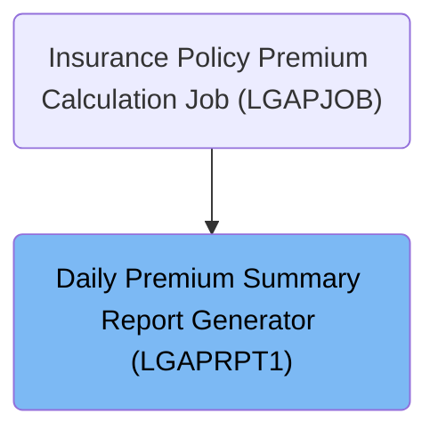

# Overview

This document describes the flow for generating daily premium summary reports. The process reads insurance policy data, aggregates premium totals, categorizes policies by approval status, and classifies risk levels. The resulting report provides management with a clear overview of daily policy activity and risk distribution.

## Dependencies

### Program

- LGAPRPT1 (<SwmPath>[base/src/LGAPRPT1.cbl](base/src/LGAPRPT1.cbl)</SwmPath>)

### Copybook

- OUTPUTREC (<SwmPath>[base/src/OUTPUTREC.cpy](base/src/OUTPUTREC.cpy)</SwmPath>)

# Where is this program used?

This program is used once, as represented in the following diagram:

&nbsp;

*This is an auto-generated document by Swimm 🌊 and has not yet been verified by a human*

<SwmMeta version="3.0.0" repo-id="Z2l0aHViJTNBJTNBU3dpbW1pby1nZW5hcHAtaG91c2UlM0ElM0FHaXJpLVN3aW1t" repo-name="Swimmio-genapp-house">Powered by [Swimm](https://app.swimm.io/)</SwmMeta>
