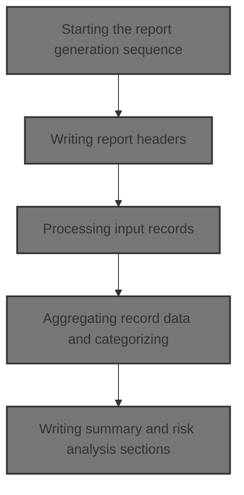
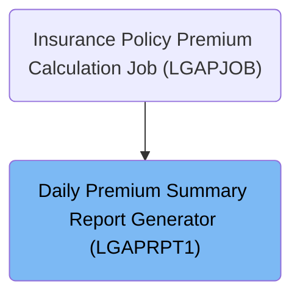
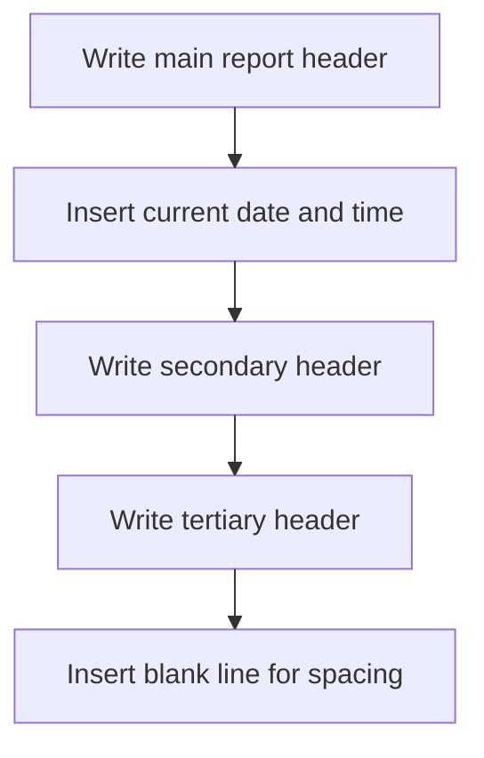
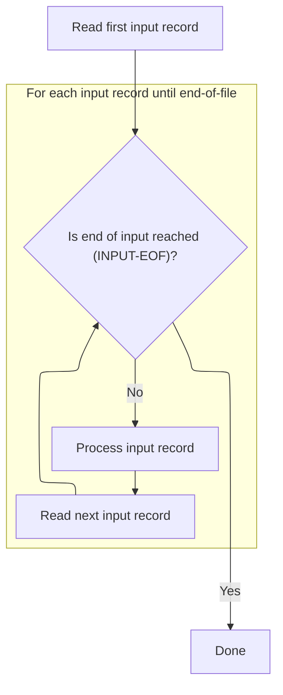
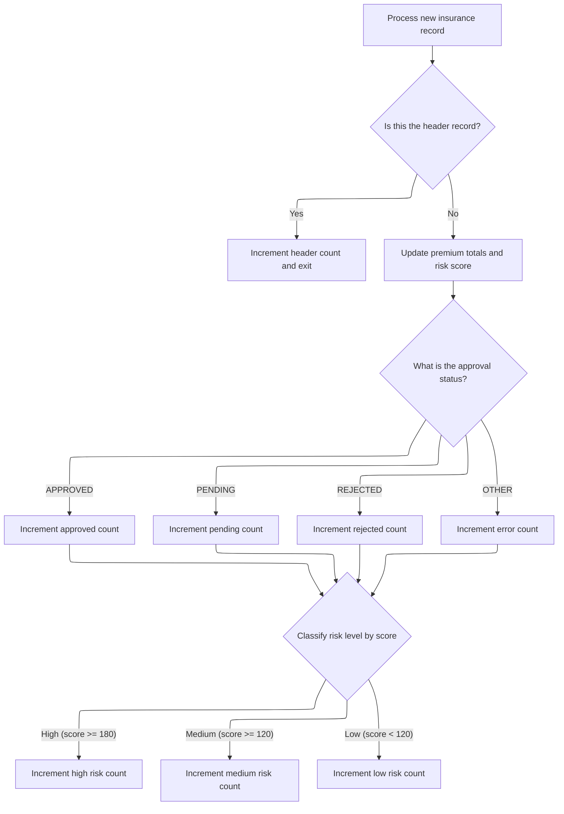
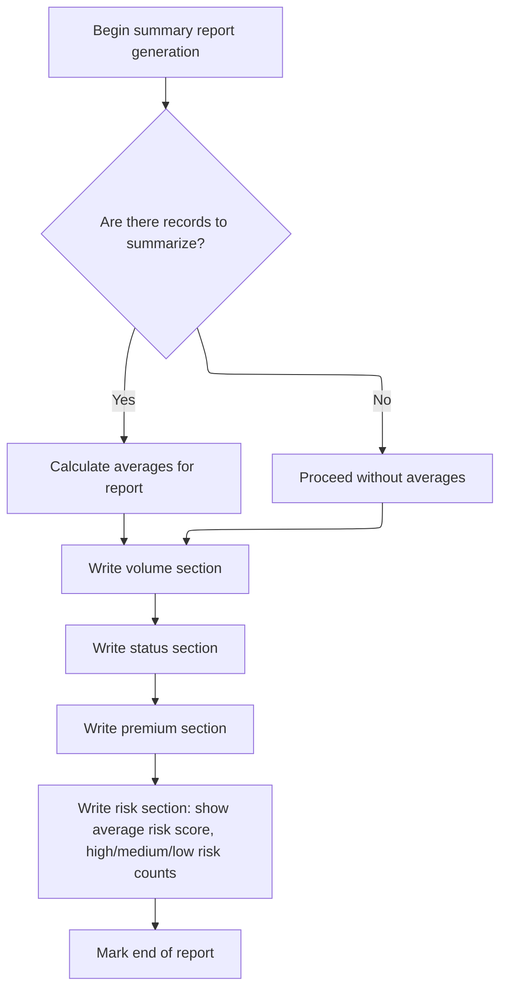

# Overview

This document describes the flow for generating a daily premium summary report. The process transforms insurance policy data into a structured management report, summarizing premium totals, approval statuses, and risk categories for business users.



## Dependencies

### Program

- <SwmToken path="base/src/LGAPRPT1.cbl" pos="2:6:6" line-data="       PROGRAM-ID. LGAPRPT1.">`LGAPRPT1`</SwmToken> (<SwmPath>[base/src/LGAPRPT1.cbl](base/src/LGAPRPT1.cbl)</SwmPath>)

### Copybook

- OUTPUTREC (<SwmPath>[base/src/OUTPUTREC.cpy](base/src/OUTPUTREC.cpy)</SwmPath>)

# Where is this program used?

This program is used once, as represented in the following diagram:



## Input and Output Tables/Files used in the Program

| Table / File Name                                                                                                                                             | Type | Description                                     | Usage Mode | Key Fields / Layout Highlights |
| ------------------------------------------------------------------------------------------------------------------------------------------------------------- | ---- | ----------------------------------------------- | ---------- | ------------------------------ |
| <SwmToken path="base/src/LGAPRPT1.cbl" pos="15:3:5" line-data="           SELECT INPUT-FILE ASSIGN TO &#39;INPUT&#39;">`INPUT-FILE`</SwmToken>                | File | Daily insurance policy premium and risk details | Input      | File resource                  |
| <SwmToken path="base/src/LGAPRPT1.cbl" pos="19:3:5" line-data="           SELECT REPORT-FILE ASSIGN TO &#39;REPORT&#39;">`REPORT-FILE`</SwmToken>             | File | Management summary report output file           | Output     | File resource                  |
| <SwmToken path="base/src/LGAPRPT1.cbl" pos="167:3:5" line-data="           WRITE REPORT-LINE FROM RPT-HEADER-1 AFTER ADVANCING PAGE">`REPORT-LINE`</SwmToken> | File | Formatted report line for summary/statistics    | Output     | File resource                  |

&nbsp;

## Detailed View of the Program's Functionality

# Program Initialization and Setup

## Program Identification and File Setup

The program begins by identifying itself and describing its purpose: to read a premium output file and generate a formatted management report with statistics and breakdowns. It defines two files:

- An input file, which is read line by line, and
- An output file, where the report is written.

Both files have associated status codes to detect errors when opening or processing them.

## Data Structures and Working Storage

Several groups of fields are defined to keep track of:

- File status (to detect end-of-file or errors)
- Counters for total records, approved/pending/rejected/error counts, and header records
- Accumulators for various premium totals (fire, crime, flood, weather, and grand total)
- Risk analysis fields (total risk score, average risk score, and counts for high/medium/low risk)
- Temporary work fields for converting and holding numeric values from the input
- Date and time fields for capturing and formatting the current date/time
- Report header and detail line templates for output formatting

# Main Report Generation Sequence

## Entry Point and High-Level Flow

The main procedure orchestrates the entire report generation process in the following order:

1. **Initialization**: Resets all counters and totals, and captures the current date and time.
2. **File Opening**: Opens the input and output files, stopping the program if either fails.
3. **Header Writing**: Writes the main report headers, including the formatted date and time.
4. **Record Processing**: Reads and processes each input record, updating all statistics.
5. **Summary Writing**: Writes the summary sections of the report, including volume, status, premium, and risk analysis.
6. **File Closing**: Closes both the input and output files.

# Initialization and Date/Time Formatting

## Resetting State and Capturing Date/Time

During initialization:

- The current date and time are read from the system.
- A formatting routine is called to convert the raw date (YYYYMMDD) and time (HHMMSS) into human-readable formats (DD/MM/YYYY and HH:MM:SS).
- All counters, totals, and analysis fields are reset to zero to ensure a clean start for each report run.

## Date/Time Formatting Logic

The formatting routine slices the date and time strings into their components and joins them with appropriate separators:

- Date: Day, month, and year are extracted and joined with slashes.
- Time: Hours, minutes, and seconds are extracted and joined with colons.

# File Operations

## Opening Files

The program attempts to open the input file for reading and the report file for writing. If either operation fails, an error message is displayed and the program stops. This ensures that the report is only generated if both files are accessible.

# Writing Report Headers

## Header Output Sequence

The header-writing routine outputs several lines to the report:

1. The main report title, centered and spanning the width of the report.
2. The current date and time, formatted and inserted into the appropriate positions.
3. A separator line made of equal signs.
4. A blank line for spacing.

This sets up the top of the report with clear identification and context.

# Processing Input Records

## Reading and Looping Through Records

The program reads the first input record, then enters a loop that continues until the end of the input file is reached. For each record:

- A processing routine is called to update all relevant statistics.
- The next input record is read.

This loop ensures that every record in the input file is processed.

# Aggregating and Categorizing Record Data

## Skipping the Header Record

The first record is treated as a header and is not included in any statistics. The program increments the header count and skips further processing for this record.

## Converting and Accumulating Numeric Data

For each subsequent record:

- Numeric fields (risk score and various premiums) are converted from string to numeric form.
- These values are added to the running totals for each premium type and the overall risk score.

## Categorizing by Status

The program examines the status field of each record and increments the appropriate counter for approved, pending, rejected, or error (for any unrecognized status).

## Categorizing by Risk Level

Based on the numeric risk score:

- If the score is 180 or higher, the high-risk counter is incremented.
- If the score is between 120 and 179, the medium-risk counter is incremented.
- If the score is below 120, the low-risk counter is incremented.

These categorizations feed into the risk analysis section of the report.

# Writing Summary and Risk Analysis Sections

## Calculating Averages

Before writing the summary, the program calculates the average risk score:

- The header record count is subtracted from the total record count to get the number of valid records.
- If there are valid records, the total risk score is divided by this count to compute the average.

## Writing Volume, Status, and Premium Sections

The summary is written in several sections:

1. **Volume Section**: Shows the total number of records processed.
2. **Status Section**: Shows counts for approved, pending, rejected, and error records.
3. **Premium Section**: Shows totals for each premium type and the grand total.

Each section uses predefined labels and formats for clarity.

## Writing Risk Analysis Section

The risk analysis section includes:

- The average risk score.
- Counts of high, medium, and low risk policies, with thresholds clearly labeled.
- A final "END OF REPORT" marker to indicate the report's conclusion.

Each line is formatted with a label and the corresponding value, and blank lines are used for spacing.

# File Closing

## Closing Files

At the end of the process, both the input and report files are closed to ensure all data is written and resources are released. This marks the completion of the report generation.

# Rule Definition

| Paragraph Name                                                                                                                                                                                                                                                                           | Rule ID | Category          | Description                                                                                                                                                                    | Conditions                                      | Remarks                                                                                                                                                |
| ---------------------------------------------------------------------------------------------------------------------------------------------------------------------------------------------------------------------------------------------------------------------------------------- | ------- | ----------------- | ------------------------------------------------------------------------------------------------------------------------------------------------------------------------------ | ----------------------------------------------- | ------------------------------------------------------------------------------------------------------------------------------------------------------ |
| <SwmToken path="base/src/LGAPRPT1.cbl" pos="125:3:5" line-data="           PERFORM P200-INIT">`P200-INIT`</SwmToken>, <SwmToken path="base/src/LGAPRPT1.cbl" pos="136:3:9" line-data="           PERFORM P210-FORMAT-DATE-TIME">`P210-FORMAT-DATE-TIME`</SwmToken>                       | RL-001  | Data Assignment   | At program start, all counters, totals, and analysis fields must be set to zero. The current system date and time must be captured and formatted for use in the report header. | Program start.                                  | Date format: DD/MM/YYYY (from 8-digit system date). Time format: HH:MM:SS (from 6-digit system time). All counters and totals are initialized to zero. |
| <SwmToken path="base/src/LGAPRPT1.cbl" pos="128:3:7" line-data="           PERFORM P500-PROCESS-RECORDS">`P500-PROCESS-RECORDS`</SwmToken>, <SwmToken path="base/src/LGAPRPT1.cbl" pos="177:3:7" line-data="               PERFORM P520-PROCESS-RECORD">`P520-PROCESS-RECORD`</SwmToken> | RL-002  | Conditional Logic | Read the input file line-by-line, parse each record according to the fixed-width field layout, and exclude the first record (header) from all statistics and calculations.     | Each input record read; first record is header. | Field layout:                                                                                                                                          |

- <SwmToken path="base/src/LGAPRPT1.cbl" pos="195:7:11" line-data="           MOVE FUNCTION NUMVAL(OUT-RISK-SCORE) TO WS-RISK-SCORE-NUM">`OUT-RISK-SCORE`</SwmToken>: chars 1-3 (3 chars)
- <SwmToken path="base/src/LGAPRPT1.cbl" pos="196:7:11" line-data="           MOVE FUNCTION NUMVAL(OUT-FIRE-PREMIUM) TO WS-FIRE-PREM-NUM">`OUT-FIRE-PREMIUM`</SwmToken>: chars 4-13 (10 chars)
- <SwmToken path="base/src/LGAPRPT1.cbl" pos="197:7:11" line-data="           MOVE FUNCTION NUMVAL(OUT-CRIME-PREMIUM) TO WS-CRIME-PREM-NUM">`OUT-CRIME-PREMIUM`</SwmToken>: chars 14-23 (10 chars)
- <SwmToken path="base/src/LGAPRPT1.cbl" pos="198:7:11" line-data="           MOVE FUNCTION NUMVAL(OUT-FLOOD-PREMIUM) TO WS-FLOOD-PREM-NUM">`OUT-FLOOD-PREMIUM`</SwmToken>: chars 24-33 (10 chars)
- <SwmToken path="base/src/LGAPRPT1.cbl" pos="199:7:11" line-data="           MOVE FUNCTION NUMVAL(OUT-WEATHER-PREMIUM) TO WS-WEATHER-PREM-NUM">`OUT-WEATHER-PREMIUM`</SwmToken>: chars 34-43 (10 chars)
- <SwmToken path="base/src/LGAPRPT1.cbl" pos="200:7:11" line-data="           MOVE FUNCTION NUMVAL(OUT-TOTAL-PREMIUM) TO WS-TOTAL-PREM-NUM">`OUT-TOTAL-PREMIUM`</SwmToken>: chars 44-54 (11 chars)
- <SwmToken path="base/src/LGAPRPT1.cbl" pos="211:3:5" line-data="           EVALUATE OUT-STATUS">`OUT-STATUS`</SwmToken>: chars 55-62 (8 chars) Header record is excluded from all statistics. | | <SwmToken path="base/src/LGAPRPT1.cbl" pos="177:3:7" line-data="               PERFORM P520-PROCESS-RECORD">`P520-PROCESS-RECORD`</SwmToken> | RL-003 | Computation | Convert <SwmToken path="base/src/LGAPRPT1.cbl" pos="195:7:11" line-data="           MOVE FUNCTION NUMVAL(OUT-RISK-SCORE) TO WS-RISK-SCORE-NUM">`OUT-RISK-SCORE`</SwmToken> and all premium fields from string to numeric values for calculations. | For each non-header input record. | Fields converted: <SwmToken path="base/src/LGAPRPT1.cbl" pos="195:7:11" line-data="           MOVE FUNCTION NUMVAL(OUT-RISK-SCORE) TO WS-RISK-SCORE-NUM">`OUT-RISK-SCORE`</SwmToken>, <SwmToken path="base/src/LGAPRPT1.cbl" pos="196:7:11" line-data="           MOVE FUNCTION NUMVAL(OUT-FIRE-PREMIUM) TO WS-FIRE-PREM-NUM">`OUT-FIRE-PREMIUM`</SwmToken>, <SwmToken path="base/src/LGAPRPT1.cbl" pos="197:7:11" line-data="           MOVE FUNCTION NUMVAL(OUT-CRIME-PREMIUM) TO WS-CRIME-PREM-NUM">`OUT-CRIME-PREMIUM`</SwmToken>, <SwmToken path="base/src/LGAPRPT1.cbl" pos="198:7:11" line-data="           MOVE FUNCTION NUMVAL(OUT-FLOOD-PREMIUM) TO WS-FLOOD-PREM-NUM">`OUT-FLOOD-PREMIUM`</SwmToken>, <SwmToken path="base/src/LGAPRPT1.cbl" pos="199:7:11" line-data="           MOVE FUNCTION NUMVAL(OUT-WEATHER-PREMIUM) TO WS-WEATHER-PREM-NUM">`OUT-WEATHER-PREMIUM`</SwmToken>, <SwmToken path="base/src/LGAPRPT1.cbl" pos="200:7:11" line-data="           MOVE FUNCTION NUMVAL(OUT-TOTAL-PREMIUM) TO WS-TOTAL-PREM-NUM">`OUT-TOTAL-PREMIUM`</SwmToken>. Conversion uses numeric value function. | | <SwmToken path="base/src/LGAPRPT1.cbl" pos="177:3:7" line-data="               PERFORM P520-PROCESS-RECORD">`P520-PROCESS-RECORD`</SwmToken> | RL-004 | Conditional Logic | <SwmToken path="base/src/LGAPRPT1.cbl" pos="211:3:5" line-data="           EVALUATE OUT-STATUS">`OUT-STATUS`</SwmToken> must be compared to 'APPROVED', 'PENDING', 'REJECTED', or other. The corresponding counter is incremented for each record. | For each non-header input record. | Status values: 'APPROVED', 'PENDING', 'REJECTED', other. Counters: approved, pending, rejected, error/unsupported. | | <SwmToken path="base/src/LGAPRPT1.cbl" pos="177:3:7" line-data="               PERFORM P520-PROCESS-RECORD">`P520-PROCESS-RECORD`</SwmToken> | RL-005 | Conditional Logic | <SwmToken path="base/src/LGAPRPT1.cbl" pos="195:7:11" line-data="           MOVE FUNCTION NUMVAL(OUT-RISK-SCORE) TO WS-RISK-SCORE-NUM">`OUT-RISK-SCORE`</SwmToken> must be classified as high (>=180), medium (>=120 and <180), or low (<120) risk. The corresponding risk category counter is incremented. | For each non-header input record. | Risk thresholds: High (>=180), Medium (>=120 and <180), Low (<120). Counters: high, medium, low risk. | | <SwmToken path="base/src/LGAPRPT1.cbl" pos="177:3:7" line-data="               PERFORM P520-PROCESS-RECORD">`P520-PROCESS-RECORD`</SwmToken> | RL-006 | Computation | All premium fields and risk score must be added to their respective running totals for each record. | For each non-header input record. | Premium fields: fire, crime, flood, weather, total. Risk score. All accumulated as numeric values. | | <SwmToken path="base/src/LGAPRPT1.cbl" pos="236:3:7" line-data="           PERFORM P610-CALC-AVERAGES">`P610-CALC-AVERAGES`</SwmToken> | RL-007 | Computation | The average risk score is calculated as total risk score divided by number of records processed (excluding header). If no records, average is omitted. | After all records processed. | Average risk score = total risk score / number of records processed (excluding header). If no records, do not report average. | | <SwmToken path="base/src/LGAPRPT1.cbl" pos="127:3:7" line-data="           PERFORM P400-WRITE-HEADERS">`P400-WRITE-HEADERS`</SwmToken>, <SwmToken path="base/src/LGAPRPT1.cbl" pos="129:3:7" line-data="           PERFORM P600-WRITE-SUMMARY">`P600-WRITE-SUMMARY`</SwmToken>, <SwmToken path="base/src/LGAPRPT1.cbl" pos="237:3:9" line-data="           PERFORM P620-WRITE-VOLUME-SECTION">`P620-WRITE-VOLUME-SECTION`</SwmToken>, <SwmToken path="base/src/LGAPRPT1.cbl" pos="238:3:9" line-data="           PERFORM P630-WRITE-STATUS-SECTION">`P630-WRITE-STATUS-SECTION`</SwmToken>, <SwmToken path="base/src/LGAPRPT1.cbl" pos="239:3:9" line-data="           PERFORM P640-WRITE-PREMIUM-SECTION">`P640-WRITE-PREMIUM-SECTION`</SwmToken>, <SwmToken path="base/src/LGAPRPT1.cbl" pos="240:3:9" line-data="           PERFORM P650-WRITE-RISK-SECTION.">`P650-WRITE-RISK-SECTION`</SwmToken> | RL-008 | Data Assignment | The output file must be written line-by-line, with each line up to 133 characters, including main header, section headers, detail lines, blank lines for spacing, and end-of-report marker. All values must be formatted and aligned for readability. | After all records processed. | Output format:
- Line length: up to 133 characters
- Main header: title, date, time
- Section headers: volume, underwriting decisions, premium totals, risk analysis
- Detail lines: label (up to 40 chars), value (up to 25 chars), aligned
- Blank lines for spacing
- End-of-report marker
- All values and labels aligned as per sample output. |

# User Stories

## User Story 1: Report Lifecycle: Initialization, Processing, Calculation, and Output

---

### Story Description:

As a user, I want the system to initialize all counters and totals, capture and format the current date and time, read and process the input file (excluding the header), convert and classify fields, accumulate totals, calculate summary statistics including the average risk score, and generate a formatted output report so that I receive a complete, accurate, and readable summary of the processed data.

---

### Business Rule Mapping:

| Rule ID | Paragraph Name                                                                                                                                                                                                                                                                                                                                                                                                                                                                                                                                                                                                                                                                                                                                                                                                                                                                                        | Rule Description                                                                                                                                                                                                                                                                                            |
| ------- | ----------------------------------------------------------------------------------------------------------------------------------------------------------------------------------------------------------------------------------------------------------------------------------------------------------------------------------------------------------------------------------------------------------------------------------------------------------------------------------------------------------------------------------------------------------------------------------------------------------------------------------------------------------------------------------------------------------------------------------------------------------------------------------------------------------------------------------------------------------------------------------------------------- | ----------------------------------------------------------------------------------------------------------------------------------------------------------------------------------------------------------------------------------------------------------------------------------------------------------- |
| RL-001  | <SwmToken path="base/src/LGAPRPT1.cbl" pos="125:3:5" line-data="           PERFORM P200-INIT">`P200-INIT`</SwmToken>, <SwmToken path="base/src/LGAPRPT1.cbl" pos="136:3:9" line-data="           PERFORM P210-FORMAT-DATE-TIME">`P210-FORMAT-DATE-TIME`</SwmToken>                                                                                                                                                                                                                                                                                                                                                                                                                                                                                                                                                                                                                                    | At program start, all counters, totals, and analysis fields must be set to zero. The current system date and time must be captured and formatted for use in the report header.                                                                                                                              |
| RL-008  | <SwmToken path="base/src/LGAPRPT1.cbl" pos="127:3:7" line-data="           PERFORM P400-WRITE-HEADERS">`P400-WRITE-HEADERS`</SwmToken>, <SwmToken path="base/src/LGAPRPT1.cbl" pos="129:3:7" line-data="           PERFORM P600-WRITE-SUMMARY">`P600-WRITE-SUMMARY`</SwmToken>, <SwmToken path="base/src/LGAPRPT1.cbl" pos="237:3:9" line-data="           PERFORM P620-WRITE-VOLUME-SECTION">`P620-WRITE-VOLUME-SECTION`</SwmToken>, <SwmToken path="base/src/LGAPRPT1.cbl" pos="238:3:9" line-data="           PERFORM P630-WRITE-STATUS-SECTION">`P630-WRITE-STATUS-SECTION`</SwmToken>, <SwmToken path="base/src/LGAPRPT1.cbl" pos="239:3:9" line-data="           PERFORM P640-WRITE-PREMIUM-SECTION">`P640-WRITE-PREMIUM-SECTION`</SwmToken>, <SwmToken path="base/src/LGAPRPT1.cbl" pos="240:3:9" line-data="           PERFORM P650-WRITE-RISK-SECTION.">`P650-WRITE-RISK-SECTION`</SwmToken> | The output file must be written line-by-line, with each line up to 133 characters, including main header, section headers, detail lines, blank lines for spacing, and end-of-report marker. All values must be formatted and aligned for readability.                                                       |
| RL-002  | <SwmToken path="base/src/LGAPRPT1.cbl" pos="128:3:7" line-data="           PERFORM P500-PROCESS-RECORDS">`P500-PROCESS-RECORDS`</SwmToken>, <SwmToken path="base/src/LGAPRPT1.cbl" pos="177:3:7" line-data="               PERFORM P520-PROCESS-RECORD">`P520-PROCESS-RECORD`</SwmToken>                                                                                                                                                                                                                                                                                                                                                                                                                                                                                                                                                                                                              | Read the input file line-by-line, parse each record according to the fixed-width field layout, and exclude the first record (header) from all statistics and calculations.                                                                                                                                  |
| RL-003  | <SwmToken path="base/src/LGAPRPT1.cbl" pos="177:3:7" line-data="               PERFORM P520-PROCESS-RECORD">`P520-PROCESS-RECORD`</SwmToken>                                                                                                                                                                                                                                                                                                                                                                                                                                                                                                                                                                                                                                                                                                                                                          | Convert <SwmToken path="base/src/LGAPRPT1.cbl" pos="195:7:11" line-data="           MOVE FUNCTION NUMVAL(OUT-RISK-SCORE) TO WS-RISK-SCORE-NUM">`OUT-RISK-SCORE`</SwmToken> and all premium fields from string to numeric values for calculations.                                                           |
| RL-004  | <SwmToken path="base/src/LGAPRPT1.cbl" pos="177:3:7" line-data="               PERFORM P520-PROCESS-RECORD">`P520-PROCESS-RECORD`</SwmToken>                                                                                                                                                                                                                                                                                                                                                                                                                                                                                                                                                                                                                                                                                                                                                          | <SwmToken path="base/src/LGAPRPT1.cbl" pos="211:3:5" line-data="           EVALUATE OUT-STATUS">`OUT-STATUS`</SwmToken> must be compared to 'APPROVED', 'PENDING', 'REJECTED', or other. The corresponding counter is incremented for each record.                                                          |
| RL-005  | <SwmToken path="base/src/LGAPRPT1.cbl" pos="177:3:7" line-data="               PERFORM P520-PROCESS-RECORD">`P520-PROCESS-RECORD`</SwmToken>                                                                                                                                                                                                                                                                                                                                                                                                                                                                                                                                                                                                                                                                                                                                                          | <SwmToken path="base/src/LGAPRPT1.cbl" pos="195:7:11" line-data="           MOVE FUNCTION NUMVAL(OUT-RISK-SCORE) TO WS-RISK-SCORE-NUM">`OUT-RISK-SCORE`</SwmToken> must be classified as high (>=180), medium (>=120 and <180), or low (<120) risk. The corresponding risk category counter is incremented. |
| RL-006  | <SwmToken path="base/src/LGAPRPT1.cbl" pos="177:3:7" line-data="               PERFORM P520-PROCESS-RECORD">`P520-PROCESS-RECORD`</SwmToken>                                                                                                                                                                                                                                                                                                                                                                                                                                                                                                                                                                                                                                                                                                                                                          | All premium fields and risk score must be added to their respective running totals for each record.                                                                                                                                                                                                         |
| RL-007  | <SwmToken path="base/src/LGAPRPT1.cbl" pos="236:3:7" line-data="           PERFORM P610-CALC-AVERAGES">`P610-CALC-AVERAGES`</SwmToken>                                                                                                                                                                                                                                                                                                                                                                                                                                                                                                                                                                                                                                                                                                                                                                | The average risk score is calculated as total risk score divided by number of records processed (excluding header). If no records, average is omitted.                                                                                                                                                      |

---

### Relevant Functionality:

- <SwmToken path="base/src/LGAPRPT1.cbl" pos="125:3:5" line-data="           PERFORM P200-INIT">`P200-INIT`</SwmToken>
  1. **RL-001:**
     - On program start:
       - Accept system date and time.
       - Format date as DD/MM/YYYY and time as HH:MM:SS.
       - Set all counters and totals to zero.
- <SwmToken path="base/src/LGAPRPT1.cbl" pos="127:3:7" line-data="           PERFORM P400-WRITE-HEADERS">`P400-WRITE-HEADERS`</SwmToken>
  1. **RL-008:**
     - Write main header with title, date, time.
     - Write secondary and tertiary headers.
     - For each section (volume, status, premium, risk):
       - Write section header, blank lines, detail lines with labels and values.
     - Write end-of-report marker.
     - Ensure all lines are up to 133 characters and formatted/aligned as specified.
- <SwmToken path="base/src/LGAPRPT1.cbl" pos="128:3:7" line-data="           PERFORM P500-PROCESS-RECORDS">`P500-PROCESS-RECORDS`</SwmToken>
  1. **RL-002:**
     - For each input record:
       - If first record, increment header count and skip further processing.
       - Else, parse fields according to fixed-width layout.
- <SwmToken path="base/src/LGAPRPT1.cbl" pos="177:3:7" line-data="               PERFORM P520-PROCESS-RECORD">`P520-PROCESS-RECORD`</SwmToken>
  1. **RL-003:**
     - For each non-header record:
       - Convert each field from string to numeric for use in calculations.
  2. **RL-004:**
     - For each non-header record:
       - If <SwmToken path="base/src/LGAPRPT1.cbl" pos="211:3:5" line-data="           EVALUATE OUT-STATUS">`OUT-STATUS`</SwmToken> is 'APPROVED', increment approved count.
       - If 'PENDING', increment pending count.
       - If 'REJECTED', increment rejected count.
       - Else, increment error/unsupported count.
  3. **RL-005:**
     - For each non-header record:
       - If risk score >= 180, increment high risk count.
       - Else if >= 120, increment medium risk count.
       - Else, increment low risk count.
  4. **RL-006:**
     - For each non-header record:
       - Add each premium field to its running total.
       - Add risk score to running total risk score.
- <SwmToken path="base/src/LGAPRPT1.cbl" pos="236:3:7" line-data="           PERFORM P610-CALC-AVERAGES">`P610-CALC-AVERAGES`</SwmToken>
  1. **RL-007:**
     - Subtract header count from total records.
     - If records > 0:
       - Compute average risk score.
     - Else:
       - Omit average risk score.

# Workflow

# Starting the report generation sequence

This section initiates the report generation process for the daily premium summary report. It ensures that all necessary data is reset and the current date/time is captured before any report processing begins. This guarantees that the report is generated with accurate and up-to-date information.

| Category        | Rule Name                   | Description                                                                                                                                                                             |
| --------------- | --------------------------- | --------------------------------------------------------------------------------------------------------------------------------------------------------------------------------------- |
| Data validation | Initialization precondition | Report generation must not proceed if the initialization step fails to reset data or capture the current date/time.                                                                     |
| Business logic  | Reset all report data       | The report generation process must always begin by resetting all counters, totals, and analysis values to ensure no residual data from previous runs is included in the current report. |
| Business logic  | Capture report timestamp    | The current date and time must be captured at the start of the report generation and included in the report header to reflect when the report was created.                              |

<SwmSnippet path="/base/src/LGAPRPT1.cbl" line="124">

---

<SwmToken path="base/src/LGAPRPT1.cbl" pos="124:1:3" line-data="       P100-MAIN.">`P100-MAIN`</SwmToken> kicks off the whole report process. It starts by calling <SwmToken path="base/src/LGAPRPT1.cbl" pos="125:3:5" line-data="           PERFORM P200-INIT">`P200-INIT`</SwmToken> to reset all counters and totals, and to grab the current date/time for the report header. Without this, the rest of the flow would use old or uninitialized data. Next, it moves on to file operations and report writing.

```cobol
       P100-MAIN.
           PERFORM P200-INIT
           PERFORM P300-OPEN-FILES
           PERFORM P400-WRITE-HEADERS
           PERFORM P500-PROCESS-RECORDS
           PERFORM P600-WRITE-SUMMARY
           PERFORM P700-CLOSE-FILES
           STOP RUN.
```

---

</SwmSnippet>

## Preparing report metadata and resetting state

This section ensures that each report begins with accurate metadata and a clean state, preventing data from previous runs from affecting the current report.

| Category       | Rule Name          | Description                                                                                                            |
| -------------- | ------------------ | ---------------------------------------------------------------------------------------------------------------------- |
| Business logic | Clean report state | All counters, totals, and analysis fields must be reset to zero or their initial state before generating a new report. |

<SwmSnippet path="/base/src/LGAPRPT1.cbl" line="133">

---

In <SwmToken path="base/src/LGAPRPT1.cbl" pos="133:1:3" line-data="       P200-INIT.">`P200-INIT`</SwmToken>, we grab the current date and time from the system, then call <SwmToken path="base/src/LGAPRPT1.cbl" pos="136:3:9" line-data="           PERFORM P210-FORMAT-DATE-TIME">`P210-FORMAT-DATE-TIME`</SwmToken> to turn those raw values into formatted strings for the report header. This step is needed because the rest of the report expects date/time in a specific format.

```cobol
       P200-INIT.
           ACCEPT WS-CURRENT-DATE FROM DATE YYYYMMDD
           ACCEPT WS-CURRENT-TIME FROM TIME
           PERFORM P210-FORMAT-DATE-TIME
```

---

</SwmSnippet>

<SwmSnippet path="/base/src/LGAPRPT1.cbl" line="141">

---

<SwmToken path="base/src/LGAPRPT1.cbl" pos="141:1:7" line-data="       P210-FORMAT-DATE-TIME.">`P210-FORMAT-DATE-TIME`</SwmToken> takes the raw date/time strings and slices them up using fixed positions, then joins them with '/' and ':' to get DD/MM/YYYY and HH:MM:SS formats. This only works if the input is exactly 8 digits for date and 6 for time.

```cobol
       P210-FORMAT-DATE-TIME.
           STRING WS-CURRENT-DATE(5:2) '/'
                  WS-CURRENT-DATE(7:2) '/'
                  WS-CURRENT-DATE(1:4)
                  DELIMITED BY SIZE INTO WS-FORMAT-DATE
           
           STRING WS-CURRENT-TIME(1:2) ':'
                  WS-CURRENT-TIME(3:2) ':'
                  WS-CURRENT-TIME(5:2)
                  DELIMITED BY SIZE INTO WS-FORMAT-TIME.
```

---

</SwmSnippet>

<SwmSnippet path="/base/src/LGAPRPT1.cbl" line="137">

---

Back in <SwmToken path="base/src/LGAPRPT1.cbl" pos="125:3:5" line-data="           PERFORM P200-INIT">`P200-INIT`</SwmToken>, after formatting the date/time, we reset all counters, totals, and analysis fields. This clears out any previous run's data so the report starts clean.

```cobol
           INITIALIZE WS-COUNTERS
           INITIALIZE WS-PREMIUM-TOTALS
           INITIALIZE WS-RISK-ANALYSIS.
```

---

</SwmSnippet>

## Writing report headers



<SwmSnippet path="/base/src/LGAPRPT1.cbl" line="166">

---

<SwmToken path="base/src/LGAPRPT1.cbl" pos="166:1:5" line-data="       P400-WRITE-HEADERS.">`P400-WRITE-HEADERS`</SwmToken> writes the report headers using formatted date and time, and controls spacing with line/page advancements. It expects <SwmToken path="base/src/LGAPRPT1.cbl" pos="168:3:7" line-data="           MOVE WS-FORMAT-DATE TO RPT-DATE">`WS-FORMAT-DATE`</SwmToken> and <SwmToken path="base/src/LGAPRPT1.cbl" pos="169:3:7" line-data="           MOVE WS-FORMAT-TIME TO RPT-TIME">`WS-FORMAT-TIME`</SwmToken> to be set up already, so the headers show the right info.

```cobol
       P400-WRITE-HEADERS.
           WRITE REPORT-LINE FROM RPT-HEADER-1 AFTER ADVANCING PAGE
           MOVE WS-FORMAT-DATE TO RPT-DATE
           MOVE WS-FORMAT-TIME TO RPT-TIME
           WRITE REPORT-LINE FROM RPT-HEADER-2 AFTER ADVANCING 2 LINES
           WRITE REPORT-LINE FROM RPT-HEADER-3 AFTER ADVANCING 1 LINE
           WRITE REPORT-LINE FROM RPT-BLANK-LINE AFTER ADVANCING 1 LINE.
```

---

</SwmSnippet>

# Processing input records



This section is responsible for iterating through all input records, ensuring each record is processed exactly once, and updating summary statistics accordingly. The section ensures that no records are skipped and that processing stops when the end of the input file is reached.

| Category        | Rule Name                 | Description                                                                                                                                                                                                      |
| --------------- | ------------------------- | ---------------------------------------------------------------------------------------------------------------------------------------------------------------------------------------------------------------- |
| Data validation | End-of-file termination   | Processing must stop immediately when the end-of-file condition is detected (<SwmToken path="base/src/LGAPRPT1.cbl" pos="176:5:7" line-data="           PERFORM UNTIL INPUT-EOF">`INPUT-EOF`</SwmToken> = '10'). |
| Business logic  | Single pass per record    | Each input record must be processed exactly once before moving to the next record.                                                                                                                               |
| Business logic  | Cumulative summary update | Summary statistics must be updated for every input record processed, ensuring cumulative accuracy.                                                                                                               |

<SwmSnippet path="/base/src/LGAPRPT1.cbl" line="174">

---

<SwmToken path="base/src/LGAPRPT1.cbl" pos="174:1:5" line-data="       P500-PROCESS-RECORDS.">`P500-PROCESS-RECORDS`</SwmToken> reads each input record and calls <SwmToken path="base/src/LGAPRPT1.cbl" pos="177:3:7" line-data="               PERFORM P520-PROCESS-RECORD">`P520-PROCESS-RECORD`</SwmToken> to update all the summary stats. The loop keeps going until the end of the file, so every record gets processed.

```cobol
       P500-PROCESS-RECORDS.
           PERFORM P510-READ-INPUT
           PERFORM UNTIL INPUT-EOF
               PERFORM P520-PROCESS-RECORD
               PERFORM P510-READ-INPUT
           END-PERFORM.
```

---

</SwmSnippet>

# Aggregating record data and categorizing



This section is responsible for aggregating insurance record data, categorizing records by approval status and risk level, and maintaining running totals and counts for reporting purposes.

| Category        | Rule Name                      | Description                                                                                                                                                                                                                               |
| --------------- | ------------------------------ | ----------------------------------------------------------------------------------------------------------------------------------------------------------------------------------------------------------------------------------------- |
| Data validation | Header exclusion               | The first record in the input is treated as a header and is not included in any statistical calculations or totals. Only subsequent records are processed for aggregation and categorization.                                             |
| Business logic  | Premium and risk aggregation   | For each insurance record, the premium fields (fire, crime, flood, weather, total) and risk score are converted to numeric values and added to their respective running totals. These totals are used for summary reporting.              |
| Business logic  | Approval status categorization | Each record is categorized by its approval status. If the status is 'APPROVED', 'PENDING', or 'REJECTED', the corresponding counter is incremented. Any other status value is counted as an error.                                        |
| Business logic  | Risk level classification      | Each record's risk score is classified into one of three categories: high risk (score >= 180), medium risk (score >= 120 and < 180), or low risk (score < 120). The appropriate risk counter is incremented based on this classification. |

<SwmSnippet path="/base/src/LGAPRPT1.cbl" line="185">

---

In <SwmToken path="base/src/LGAPRPT1.cbl" pos="185:1:5" line-data="       P520-PROCESS-RECORD.">`P520-PROCESS-RECORD`</SwmToken>, we skip the first record as a header and don't include it in any stats.

```cobol
       P520-PROCESS-RECORD.
           ADD 1 TO WS-TOTAL-REC
           
      *    Skip header record
           IF WS-TOTAL-REC = 1
               ADD 1 TO WS-HEADER-CNT
               GO TO P520-EXIT
           END-IF
```

---

</SwmSnippet>

<SwmSnippet path="/base/src/LGAPRPT1.cbl" line="195">

---

After skipping the header, we convert all the premium and risk fields from strings to numbers, then add them to the running totals. This sets up the data for summary reporting later.

```cobol
           MOVE FUNCTION NUMVAL(OUT-RISK-SCORE) TO WS-RISK-SCORE-NUM
           MOVE FUNCTION NUMVAL(OUT-FIRE-PREMIUM) TO WS-FIRE-PREM-NUM
           MOVE FUNCTION NUMVAL(OUT-CRIME-PREMIUM) TO WS-CRIME-PREM-NUM
           MOVE FUNCTION NUMVAL(OUT-FLOOD-PREMIUM) TO WS-FLOOD-PREM-NUM
           MOVE FUNCTION NUMVAL(OUT-WEATHER-PREMIUM) TO WS-WEATHER-PREM-NUM
           MOVE FUNCTION NUMVAL(OUT-TOTAL-PREMIUM) TO WS-TOTAL-PREM-NUM
           
      *    Accumulate totals
           ADD WS-FIRE-PREM-NUM TO WS-TOTAL-FIRE-PREM
           ADD WS-CRIME-PREM-NUM TO WS-TOTAL-CRIME-PREM
           ADD WS-FLOOD-PREM-NUM TO WS-TOTAL-FLOOD-PREM
           ADD WS-WEATHER-PREM-NUM TO WS-TOTAL-WEATHER-PREM
           ADD WS-TOTAL-PREM-NUM TO WS-GRAND-TOTAL-PREM
           ADD WS-RISK-SCORE-NUM TO WS-TOTAL-RISK-SCORE
```

---

</SwmSnippet>

<SwmSnippet path="/base/src/LGAPRPT1.cbl" line="211">

---

Next we check <SwmToken path="base/src/LGAPRPT1.cbl" pos="211:3:5" line-data="           EVALUATE OUT-STATUS">`OUT-STATUS`</SwmToken> and bump the right counter for approved, pending, rejected, or error. Anything not matching the expected strings goes to the error count.

```cobol
           EVALUATE OUT-STATUS
               WHEN 'APPROVED'
                   ADD 1 TO WS-APPROVED-CNT
               WHEN 'PENDING'
                   ADD 1 TO WS-PENDING-CNT
               WHEN 'REJECTED'
                   ADD 1 TO WS-REJECTED-CNT
               WHEN OTHER
                   ADD 1 TO WS-ERROR-CNT
           END-EVALUATE
```

---

</SwmSnippet>

<SwmSnippet path="/base/src/LGAPRPT1.cbl" line="223">

---

Finally we use fixed thresholds to split risk scores into high, medium, and low categories, and bump the right counters. These counts feed into the risk section of the report.

```cobol
           EVALUATE TRUE
               WHEN WS-RISK-SCORE-NUM >= 180
                   ADD 1 TO WS-HIGH-RISK-CNT
               WHEN WS-RISK-SCORE-NUM >= 120
                   ADD 1 TO WS-MED-RISK-CNT
               WHEN OTHER
                   ADD 1 TO WS-LOW-RISK-CNT
           END-EVALUATE.
```

---

</SwmSnippet>

# Writing summary and risk analysis sections



This section is responsible for generating the summary and risk analysis portions of the report. It ensures that the report includes calculated averages and clearly labeled statistics for risk categories, providing business users with a concise overview of policy risk distribution.

| Category        | Rule Name                       | Description                                                                                                                                                                                                                       |
| --------------- | ------------------------------- | --------------------------------------------------------------------------------------------------------------------------------------------------------------------------------------------------------------------------------- |
| Data validation | Section Labeling and Formatting | Each section of the summary report (volume, status, premium, risk analysis) must be clearly labeled and separated by appropriate spacing for readability.                                                                         |
| Data validation | End of Report Marker            | The summary report must end with a clearly marked 'END OF REPORT' section to indicate completion.                                                                                                                                 |
| Business logic  | Average Risk Score Calculation  | The average risk score must be calculated by dividing the total risk score by the number of valid records (excluding header records).                                                                                             |
| Business logic  | Risk Category Thresholds        | Policies must be categorized into risk levels as follows: High Risk for scores 180 and above, Medium Risk for scores between 120 and 179, and Low Risk for scores below 120. The report must display the count for each category. |

<SwmSnippet path="/base/src/LGAPRPT1.cbl" line="235">

---

In <SwmToken path="base/src/LGAPRPT1.cbl" pos="235:1:5" line-data="       P600-WRITE-SUMMARY.">`P600-WRITE-SUMMARY`</SwmToken>, we start by calculating the average risk score using <SwmToken path="base/src/LGAPRPT1.cbl" pos="236:3:7" line-data="           PERFORM P610-CALC-AVERAGES">`P610-CALC-AVERAGES`</SwmToken>. This sets up the stats needed for the rest of the summary sections.

```cobol
       P600-WRITE-SUMMARY.
           PERFORM P610-CALC-AVERAGES
           PERFORM P620-WRITE-VOLUME-SECTION
           PERFORM P630-WRITE-STATUS-SECTION
           PERFORM P640-WRITE-PREMIUM-SECTION
           PERFORM P650-WRITE-RISK-SECTION.
```

---

</SwmSnippet>

<SwmSnippet path="/base/src/LGAPRPT1.cbl" line="242">

---

<SwmToken path="base/src/LGAPRPT1.cbl" pos="242:1:5" line-data="       P610-CALC-AVERAGES.">`P610-CALC-AVERAGES`</SwmToken> subtracts the header count from the total record count, then divides total risk score by the adjusted count to get the average. It skips the calculation if there are no valid records.

```cobol
       P610-CALC-AVERAGES.
           SUBTRACT WS-HEADER-CNT FROM WS-TOTAL-REC
           IF WS-TOTAL-REC > ZERO
               COMPUTE WS-AVG-RISK-SCORE = 
                   WS-TOTAL-RISK-SCORE / WS-TOTAL-REC
           END-IF.
```

---

</SwmSnippet>

<SwmSnippet path="/base/src/LGAPRPT1.cbl" line="235">

---

Back in <SwmToken path="base/src/LGAPRPT1.cbl" pos="235:1:5" line-data="       P600-WRITE-SUMMARY.">`P600-WRITE-SUMMARY`</SwmToken>, after calculating averages and writing other summary sections, we call <SwmToken path="base/src/LGAPRPT1.cbl" pos="240:3:9" line-data="           PERFORM P650-WRITE-RISK-SECTION.">`P650-WRITE-RISK-SECTION`</SwmToken> to output the risk analysis using the stats we just set up.

```cobol
       P600-WRITE-SUMMARY.
           PERFORM P610-CALC-AVERAGES
           PERFORM P620-WRITE-VOLUME-SECTION
           PERFORM P630-WRITE-STATUS-SECTION
           PERFORM P640-WRITE-PREMIUM-SECTION
           PERFORM P650-WRITE-RISK-SECTION.
```

---

</SwmSnippet>

<SwmSnippet path="/base/src/LGAPRPT1.cbl" line="327">

---

<SwmToken path="base/src/LGAPRPT1.cbl" pos="327:1:7" line-data="       P650-WRITE-RISK-SECTION.">`P650-WRITE-RISK-SECTION`</SwmToken> writes out the risk analysis section, using hardcoded labels and the stats set up earlier. It formats each line with the right label and value, then ends the report with a final section header.

```cobol
       P650-WRITE-RISK-SECTION.
           WRITE REPORT-LINE FROM RPT-BLANK-LINE 
               AFTER ADVANCING 2 LINES
           MOVE 'RISK ANALYSIS' TO RPT-SECTION-TITLE
           WRITE REPORT-LINE FROM RPT-SECTION-HEADER 
               AFTER ADVANCING 1 LINE
           WRITE REPORT-LINE FROM RPT-BLANK-LINE 
               AFTER ADVANCING 1 LINE
           
           MOVE 'Average Risk Score:' TO RPT-DETAIL-LABEL
           MOVE WS-AVG-RISK-SCORE TO RPT-DETAIL-VALUE
           WRITE REPORT-LINE FROM RPT-DETAIL-LINE 
               AFTER ADVANCING 1 LINE
           
           MOVE 'High Risk Policies (180+):' TO RPT-DETAIL-LABEL
           MOVE WS-HIGH-RISK-CNT TO RPT-DETAIL-VALUE
           WRITE REPORT-LINE FROM RPT-DETAIL-LINE 
               AFTER ADVANCING 1 LINE
           
           MOVE 'Medium Risk Policies (120-179):' TO RPT-DETAIL-LABEL
           MOVE WS-MED-RISK-CNT TO RPT-DETAIL-VALUE
           WRITE REPORT-LINE FROM RPT-DETAIL-LINE 
               AFTER ADVANCING 1 LINE
           
           MOVE 'Low Risk Policies (<120):' TO RPT-DETAIL-LABEL
           MOVE WS-LOW-RISK-CNT TO RPT-DETAIL-VALUE
           WRITE REPORT-LINE FROM RPT-DETAIL-LINE 
               AFTER ADVANCING 1 LINE
           
           WRITE REPORT-LINE FROM RPT-BLANK-LINE 
               AFTER ADVANCING 2 LINES
           MOVE 'END OF REPORT' TO RPT-SECTION-TITLE
           WRITE REPORT-LINE FROM RPT-SECTION-HEADER 
               AFTER ADVANCING 1 LINE.
```

---

</SwmSnippet>

&nbsp;

*This is an auto-generated document by Swimm 🌊 and has not yet been verified by a human*

<SwmMeta version="3.0.0" repo-id="Z2l0aHViJTNBJTNBU3dpbW1pby1nZW5hcHAtaG91c2UlM0ElM0FHaXJpLVN3aW1t" repo-name="Swimmio-genapp-house"><sup>Powered by [Swimm](https://app.swimm.io/)</sup></SwmMeta>
