# Overview

This document describes the process of handling new insurance policy requests. The flow determines the policy type, validates input, creates policy records, calculates risk and premium for commercial policies, and writes a formatted insurance record to file.

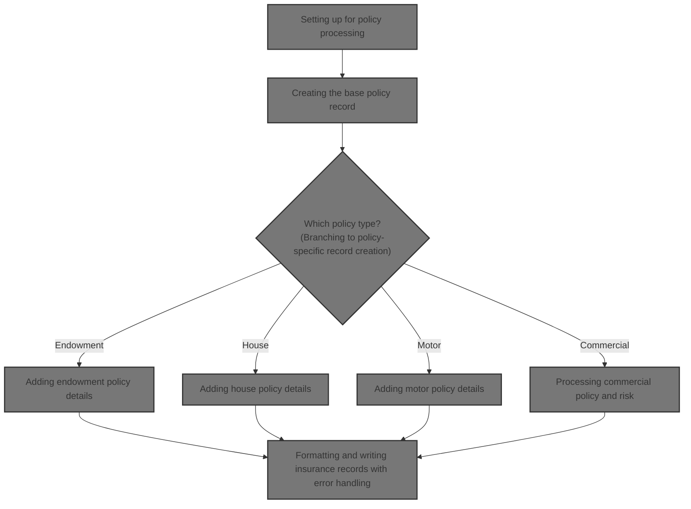

## Dependencies

### Programs

- <SwmToken path="base/src/lgapdb09.cbl" pos="2:6:6" line-data="       PROGRAM-ID. LGAPDB09.">`LGAPDB09`</SwmToken> (<SwmPath>[base/src/lgapdb09.cbl](base/src/lgapdb09.cbl)</SwmPath>)
- <SwmToken path="base/src/lgapdb09.cbl" pos="268:9:9" line-data="             EXEC CICS Link Program(LGAPVS01)">`LGAPVS01`</SwmToken> (<SwmPath>[base/src/lgapvs01.cbl](base/src/lgapvs01.cbl)</SwmPath>)
- LGSTSQ (<SwmPath>[base/src/lgstsq.cbl](base/src/lgstsq.cbl)</SwmPath>)
- LGCOMCAL (<SwmPath>[base/src/lgcomcal.cbl](base/src/lgcomcal.cbl)</SwmPath>)

### Copybooks

- LGCMAREA (<SwmPath>[base/src/lgcmarea.cpy](base/src/lgcmarea.cpy)</SwmPath>)
- LGCOMDAT (<SwmPath>[base/src/lgcomdat.cpy](base/src/lgcomdat.cpy)</SwmPath>)
- LGPOLICY (<SwmPath>[base/src/lgpolicy.cpy](base/src/lgpolicy.cpy)</SwmPath>)
- SQLCA

## Input and Output Tables/Files used in the Program

| Table / File Name | Type                                                                                                                     | Description                                             | Usage Mode   | Key Fields / Layout Highlights                                                                                                                                                                                                                                                                                                                                                                                                                                                                                                                                                                                                                                                                                                                                                                                                                                                                                                                                                                                                                                                                                                                                                                                                                                                                                                                                                                                                                                                                                                                                                                                                                                                                                                                                                                                                                                                                                                                                                                                                                                                                                                                                                                                                                                                                                                                                                                                                                                                                                                                                                                                                                                        |
| ----------------- | ------------------------------------------------------------------------------------------------------------------------ | ------------------------------------------------------- | ------------ | --------------------------------------------------------------------------------------------------------------------------------------------------------------------------------------------------------------------------------------------------------------------------------------------------------------------------------------------------------------------------------------------------------------------------------------------------------------------------------------------------------------------------------------------------------------------------------------------------------------------------------------------------------------------------------------------------------------------------------------------------------------------------------------------------------------------------------------------------------------------------------------------------------------------------------------------------------------------------------------------------------------------------------------------------------------------------------------------------------------------------------------------------------------------------------------------------------------------------------------------------------------------------------------------------------------------------------------------------------------------------------------------------------------------------------------------------------------------------------------------------------------------------------------------------------------------------------------------------------------------------------------------------------------------------------------------------------------------------------------------------------------------------------------------------------------------------------------------------------------------------------------------------------------------------------------------------------------------------------------------------------------------------------------------------------------------------------------------------------------------------------------------------------------------------------------------------------------------------------------------------------------------------------------------------------------------------------------------------------------------------------------------------------------------------------------------------------------------------------------------------------------------------------------------------------------------------------------------------------------------------------------------------------------------- |
| COMMERCIAL        | <SwmToken path="base/src/lgapdb09.cbl" pos="199:3:3" line-data="           INITIALIZE DB2-IN-INTEGERS.">`DB2`</SwmToken> | Commercial policy risk factors, address, and status     | Output       | <SwmToken path="base/src/lgapdb09.cbl" pos="567:2:2" line-data="                       (PolicyNumber,">`PolicyNumber`</SwmToken>, <SwmToken path="base/src/lgapdb09.cbl" pos="568:1:1" line-data="                        RequestDate,">`RequestDate`</SwmToken>, <SwmToken path="base/src/lgapdb09.cbl" pos="569:1:1" line-data="                        StartDate,">`StartDate`</SwmToken>, <SwmToken path="base/src/lgapdb09.cbl" pos="570:1:1" line-data="                        RenewalDate,">`RenewalDate`</SwmToken>, <SwmToken path="base/src/lgapdb09.cbl" pos="502:7:7" line-data="           MOVE CA-B-Address TO WS-XADDRESS">`Address`</SwmToken>, <SwmToken path="base/src/lgapdb09.cbl" pos="572:1:1" line-data="                        Zipcode,">`Zipcode`</SwmToken>, <SwmToken path="base/src/lgapdb09.cbl" pos="573:1:1" line-data="                        LatitudeN,">`LatitudeN`</SwmToken>, <SwmToken path="base/src/lgapdb09.cbl" pos="574:1:1" line-data="                        LongitudeW,">`LongitudeW`</SwmToken>, <SwmToken path="base/src/lgapdb09.cbl" pos="505:7:7" line-data="           MOVE CA-B-Customer TO WS-XCUSTNAME">`Customer`</SwmToken>, <SwmToken path="base/src/lgapdb09.cbl" pos="576:1:1" line-data="                        PropertyType,">`PropertyType`</SwmToken>, <SwmToken path="base/src/lgapdb09.cbl" pos="577:1:1" line-data="                        FirePeril,">`FirePeril`</SwmToken>, <SwmToken path="base/src/lgapdb09.cbl" pos="518:15:19" line-data="           MOVE WS-ZFP-PREMIUM TO CA-B-CA-B-FPR">`CA-B-FPR`</SwmToken>, <SwmToken path="base/src/lgapdb09.cbl" pos="579:1:1" line-data="                        CrimePeril,">`CrimePeril`</SwmToken>, <SwmToken path="base/src/lgapdb09.cbl" pos="580:1:1" line-data="                        CrimePremium,">`CrimePremium`</SwmToken>, <SwmToken path="base/src/lgapdb09.cbl" pos="581:1:1" line-data="                        FloodPeril,">`FloodPeril`</SwmToken>, <SwmToken path="base/src/lgapdb09.cbl" pos="582:1:1" line-data="                        FloodPremium,">`FloodPremium`</SwmToken>, <SwmToken path="base/src/lgapdb09.cbl" pos="583:1:1" line-data="                        WeatherPeril,">`WeatherPeril`</SwmToken>, <SwmToken path="base/src/lgapdb09.cbl" pos="584:1:1" line-data="                        WeatherPremium,">`WeatherPremium`</SwmToken>, <SwmToken path="base/src/lgapdb09.cbl" pos="585:1:1" line-data="                        Status,">`Status`</SwmToken>, <SwmToken path="base/src/lgapdb09.cbl" pos="586:1:1" line-data="                        RejectionReason)">`RejectionReason`</SwmToken> |
| ENDOWMENT         | <SwmToken path="base/src/lgapdb09.cbl" pos="199:3:3" line-data="           INITIALIZE DB2-IN-INTEGERS.">`DB2`</SwmToken> | Endowment policy financial and insured party data       | Output       | <SwmToken path="base/src/lgapdb09.cbl" pos="289:3:3" line-data="                       ( POLICYNUMBER,">`POLICYNUMBER`</SwmToken>, <SwmToken path="base/src/lgapdb09.cbl" pos="365:1:1" line-data="                            WITHPROFITS,">`WITHPROFITS`</SwmToken>, <SwmToken path="base/src/lgapdb09.cbl" pos="366:1:1" line-data="                            EQUITIES,">`EQUITIES`</SwmToken>, <SwmToken path="base/src/lgapdb09.cbl" pos="367:1:1" line-data="                            MANAGEDFUND,">`MANAGEDFUND`</SwmToken>, <SwmToken path="base/src/lgapdb09.cbl" pos="368:1:1" line-data="                            FUNDNAME,">`FUNDNAME`</SwmToken>, <SwmToken path="base/src/lgapdb09.cbl" pos="346:7:7" line-data="           MOVE CA-E-TERM        TO DB2-E-TERM-SINT">`TERM`</SwmToken>, <SwmToken path="base/src/lgapdb09.cbl" pos="347:17:17" line-data="           MOVE CA-E-SUM-ASSURED TO DB2-E-SUMASSURED-INT">`SUMASSURED`</SwmToken>, <SwmToken path="base/src/lgapdb09.cbl" pos="371:1:1" line-data="                            LIFEASSURED,">`LIFEASSURED`</SwmToken>, <SwmToken path="base/src/lgapdb09.cbl" pos="372:1:1" line-data="                            PADDINGDATA    )">`PADDINGDATA`</SwmToken>                                                                                                                                                                                                                                                                                                                                                                                                                                                                                                                                                                                                                                                                                                                                                                                                                                                                                                                                                                                                                                                                                                                                                                                                                                                                                                                                                                                                                        |
| HOUSE             | <SwmToken path="base/src/lgapdb09.cbl" pos="199:3:3" line-data="           INITIALIZE DB2-IN-INTEGERS.">`DB2`</SwmToken> | House policy property type, value, and address          | Output       | <SwmToken path="base/src/lgapdb09.cbl" pos="289:3:3" line-data="                       ( POLICYNUMBER,">`POLICYNUMBER`</SwmToken>, <SwmToken path="base/src/lgapdb09.cbl" pos="424:1:1" line-data="                         PROPERTYTYPE,">`PROPERTYTYPE`</SwmToken>, <SwmToken path="base/src/lgapdb09.cbl" pos="418:15:15" line-data="           MOVE CA-H-BED    TO DB2-H-BEDROOMS-SINT">`BEDROOMS`</SwmToken>, <SwmToken path="base/src/lgapdb09.cbl" pos="417:15:15" line-data="           MOVE CA-H-VAL       TO DB2-H-VALUE-INT">`VALUE`</SwmToken>, <SwmToken path="base/src/lgapdb09.cbl" pos="427:1:1" line-data="                         HOUSENAME,">`HOUSENAME`</SwmToken>, <SwmToken path="base/src/lgapdb09.cbl" pos="428:1:1" line-data="                         HOUSENUMBER,">`HOUSENUMBER`</SwmToken>, <SwmToken path="base/src/lgapdb09.cbl" pos="429:1:1" line-data="                         POSTCODE          )">`POSTCODE`</SwmToken>                                                                                                                                                                                                                                                                                                                                                                                                                                                                                                                                                                                                                                                                                                                                                                                                                                                                                                                                                                                                                                                                                                                                                                                                                                                                                                                                                                                                                                                                                                                                                                                                                                                                                                         |
| MOTOR             | <SwmToken path="base/src/lgapdb09.cbl" pos="199:3:3" line-data="           INITIALIZE DB2-IN-INTEGERS.">`DB2`</SwmToken> | Motor policy vehicle specs, value, and accident history | Output       | <SwmToken path="base/src/lgapdb09.cbl" pos="289:3:3" line-data="                       ( POLICYNUMBER,">`POLICYNUMBER`</SwmToken>, <SwmToken path="base/src/lgapdb09.cbl" pos="460:1:1" line-data="                         MAKE,">`MAKE`</SwmToken>, <SwmToken path="base/src/lgapdb09.cbl" pos="461:1:1" line-data="                         MODEL,">`MODEL`</SwmToken>, <SwmToken path="base/src/lgapdb09.cbl" pos="417:15:15" line-data="           MOVE CA-H-VAL       TO DB2-H-VALUE-INT">`VALUE`</SwmToken>, <SwmToken path="base/src/lgapdb09.cbl" pos="463:1:1" line-data="                         REGNUMBER,">`REGNUMBER`</SwmToken>, <SwmToken path="base/src/lgapdb09.cbl" pos="464:1:1" line-data="                         COLOUR,">`COLOUR`</SwmToken>, <SwmToken path="base/src/lgapdb09.cbl" pos="452:7:7" line-data="           MOVE CA-M-CC          TO DB2-M-CC-SINT">`CC`</SwmToken>, <SwmToken path="base/src/lgapdb09.cbl" pos="466:1:1" line-data="                         YEAROFMANUFACTURE,">`YEAROFMANUFACTURE`</SwmToken>, <SwmToken path="base/src/lgapdb09.cbl" pos="453:7:7" line-data="           MOVE CA-M-PREMIUM     TO DB2-M-PREMIUM-INT">`PREMIUM`</SwmToken>, <SwmToken path="base/src/lgapdb09.cbl" pos="454:7:7" line-data="           MOVE CA-M-ACCIDENTS   TO DB2-M-ACCIDENTS-INT">`ACCIDENTS`</SwmToken>                                                                                                                                                                                                                                                                                                                                                                                                                                                                                                                                                                                                                                                                                                                                                                                                                                                                                                                                                                                                                                                                                                                                                                                                                                                                                                                 |
| POLICY            | <SwmToken path="base/src/lgapdb09.cbl" pos="199:3:3" line-data="           INITIALIZE DB2-IN-INTEGERS.">`DB2`</SwmToken> | Insurance policy core details and lifecycle dates       | Input/Output | <SwmToken path="base/src/lgapdb09.cbl" pos="289:3:3" line-data="                       ( POLICYNUMBER,">`POLICYNUMBER`</SwmToken>, <SwmToken path="base/src/lgapdb09.cbl" pos="290:1:1" line-data="                         CUSTOMERNUMBER,">`CUSTOMERNUMBER`</SwmToken>, <SwmToken path="base/src/lgapdb09.cbl" pos="291:1:1" line-data="                         ISSUEDATE,">`ISSUEDATE`</SwmToken>, <SwmToken path="base/src/lgapdb09.cbl" pos="292:1:1" line-data="                         EXPIRYDATE,">`EXPIRYDATE`</SwmToken>, <SwmToken path="base/src/lgapdb09.cbl" pos="222:11:11" line-data="               MOVE &#39;E&#39; TO DB2-POLICYTYPE">`POLICYTYPE`</SwmToken>, <SwmToken path="base/src/lgapdb09.cbl" pos="294:1:1" line-data="                         LASTCHANGED,">`LASTCHANGED`</SwmToken>, <SwmToken path="base/src/lgapdb09.cbl" pos="283:5:5" line-data="           MOVE CA-BROKERID TO DB2-BROKERID-INT">`BROKERID`</SwmToken>, <SwmToken path="base/src/lgapdb09.cbl" pos="296:1:1" line-data="                         BROKERSREFERENCE,">`BROKERSREFERENCE`</SwmToken>, <SwmToken path="base/src/lgapdb09.cbl" pos="284:5:5" line-data="           MOVE CA-PAYMENT TO DB2-PAYMENT-INT">`PAYMENT`</SwmToken>, <SwmToken path="base/src/lgapdb09.cbl" pos="334:4:6" line-data="               INTO :CA-LASTCHANGED">`CA-LASTCHANGED`</SwmToken>                                                                                                                                                                                                                                                                                                                                                                                                                                                                                                                                                                                                                                                                                                                                                                                                                                                                                                                                                                                                                                                                                                                                                                                                                                                                                         |

&nbsp;

## Detailed View of the Program's Functionality

# Transaction Initialization and Workspace Preparation

At the start of the main transaction, the program sets up its workspace by initializing fields that will hold transaction metadata. It copies system-provided values such as transaction ID, terminal ID, task number, and the length of the input data area into local fields. It also resets all database-related integer fields to zero, preparing them for later use in database operations. No business logic or validation occurs at this stage—it's purely setup.

# Input Validation and Error Handling

Immediately after initialization, the program checks if any input data was received. If the input area length is zero, it logs an error message indicating that no input was received, then aborts the transaction. The error message includes details such as the SQL error code, current date and time, and other transaction context. This message is sent to both a transaction queue and a log for auditing. If there is additional context data, up to 90 bytes of it are also sent as a secondary error message.

# Policy Request Preparation and Validation

If input data is present, the program resets the return code to indicate success and sets up pointers to the input area. It copies customer and policy information into fields used for database operations and error reporting. The program then determines the type of policy being requested by examining a specific identifier in the input data. Depending on the policy type (endowment, house, motor, commercial), it adjusts the expected length of the input data and sets the policy type for database operations. If the request type is unrecognized, it sets an error code and exits. It also checks that the input data is long enough for the requested policy type; if not, it sets an error code and exits.

# Base Policy Record Creation

Once the request is validated, the program prepares the main policy data and attempts to insert a new policy record into the database. This includes fields such as customer number, issue and expiry dates, policy type, broker information, and payment details. After the insert, it checks the result code:

- If successful, it retrieves the newly assigned policy number and the timestamp of the last change, storing these in the output area.
- If a foreign key error occurs (such as a missing customer), it logs the error and aborts.
- For any other error, it logs the error and aborts.

# Branching to Policy-Specific Record Creation

After the base policy record is created, the program branches to a subroutine based on the policy type:

- For endowment policies, it runs the endowment-specific process.
- For house policies, it runs the house-specific process.
- For motor policies, it runs the motor-specific process.
- For commercial policies, it runs the commercial-specific process.
- If the request type is unrecognized, it sets an error code.

# Endowment Policy Details

For endowment policies, the program prepares numeric fields and checks if there is extra variable-length data. If so, it moves this data into a buffer and inserts all endowment details, including the variable-length field, into the database. If there is no extra data, it inserts only the standard fields. If the insert fails, it logs the error and aborts the transaction.

# House Policy Details

For house policies, the program prepares the value and number of bedrooms as numeric fields, then inserts all house details into the database. If the insert fails, it logs the error and aborts the transaction.

# Motor Policy Details

For motor policies, the program prepares all numeric fields (value, engine size, premium, accidents) and inserts all motor policy details into the database. If the insert fails, it logs the error and aborts the transaction.

# Commercial Policy and Risk Processing

For commercial policies, the program copies all relevant fields (customer, policy, property type, location, risk factors, address, dates) into a risk calculation area. It then calls a separate risk calculation program.

## Risk and Premium Calculation

The risk calculation program initializes its workspace and matrices, then processes the business logic:

- It calculates a risk score by combining a base value, a property type factor (mapped from a hardcoded matrix), and a geographic factor (based on postcode prefix).
- It determines the policy status and review reason based on the risk score, using predefined thresholds.
- It calculates insurance premiums for different perils (fire, crime, flood, weather), applying discounts if all risk factors are present.
- The results (risk score, status, reason, premiums) are copied back to the output area.

Back in the main program, these results are mapped to output fields. Additional logic may override the status and reason based on the risk score. Finally, all commercial policy details (including premiums, status, and rejection reason) are inserted into the commercial policy database. If the insert fails, the error is logged and the transaction is aborted.

# Finalizing Transaction and Writing Insurance Records

After all policy-specific processing, the program links to a record writer program to format and write the insurance data record to a file. The record writer maps fields to a file record structure based on the policy type:

- For customer records, it stores details such as postcode, status, risk score, and financials.
- For endowment records, it stores fund name, life assured, and options.
- For house records, it stores property type, number of rooms, cost, postcode, and name.
- For motor records, it stores make, model, value, and registration.
- For unrecognized types, it stores blank data.

The record is then written to a file. If the write fails, the error is logged (including time, customer, policy, and response codes), and up to 90 bytes of input data are sent as additional error context.

# Error Logging and Queue Management

Whenever an error occurs, the error logging program receives the error message and writes it to both a transaction queue and a log queue. If the message starts with a special prefix, it adjusts the queue name and message length accordingly. If the error was received as a message rather than a command, it sends a single-character response back to the sender. The error logging program always returns control after processing.

# Summary

- The transaction starts by setting up workspace and validating input.
- It determines the policy type, validates input length, and creates a base policy record.
- It branches to policy-specific processing, inserting detailed records for endowment, house, motor, or commercial policies.
- For commercial policies, it runs a risk and premium calculation, then inserts the results.
- After all processing, it writes a formatted insurance record to a file.
- Errors at any stage are logged with detailed context and sent to queues for audit and review.

# Data Definitions

| Table / Record Name | Type                                                                                                                     | Short Description                                       | Usage Mode                      |
| ------------------- | ------------------------------------------------------------------------------------------------------------------------ | ------------------------------------------------------- | ------------------------------- |
| COMMERCIAL          | <SwmToken path="base/src/lgapdb09.cbl" pos="199:3:3" line-data="           INITIALIZE DB2-IN-INTEGERS.">`DB2`</SwmToken> | Commercial policy risk factors, address, and status     | Output (INSERT)                 |
| ENDOWMENT           | <SwmToken path="base/src/lgapdb09.cbl" pos="199:3:3" line-data="           INITIALIZE DB2-IN-INTEGERS.">`DB2`</SwmToken> | Endowment policy financial and insured party data       | Output (INSERT)                 |
| HOUSE               | <SwmToken path="base/src/lgapdb09.cbl" pos="199:3:3" line-data="           INITIALIZE DB2-IN-INTEGERS.">`DB2`</SwmToken> | House policy property type, value, and address          | Output (INSERT)                 |
| MOTOR               | <SwmToken path="base/src/lgapdb09.cbl" pos="199:3:3" line-data="           INITIALIZE DB2-IN-INTEGERS.">`DB2`</SwmToken> | Motor policy vehicle specs, value, and accident history | Output (INSERT)                 |
| POLICY              | <SwmToken path="base/src/lgapdb09.cbl" pos="199:3:3" line-data="           INITIALIZE DB2-IN-INTEGERS.">`DB2`</SwmToken> | Insurance policy core details and lifecycle dates       | Input (SELECT), Output (INSERT) |

&nbsp;

# Rule Definition

| Paragraph Name                                                                                                                                                                                                                                                                                                                                                                                                                                                                                          | Rule ID | Category          | Description                                                                                                                                                                                                                                                                                                                                                                                                                                                                                                       | Conditions                                                                                                                                                                                                                                                                                                                                                                                                                                  | Remarks                                                                                                                                                                                                                                                                                                                                                                                                                                                                                                                                                                                                                                                                                                                                                                                                                                                                                                                                                                                                                                                                                                                                                                                                                                                                                                                                    |
| ------------------------------------------------------------------------------------------------------------------------------------------------------------------------------------------------------------------------------------------------------------------------------------------------------------------------------------------------------------------------------------------------------------------------------------------------------------------------------------------------------- | ------- | ----------------- | ----------------------------------------------------------------------------------------------------------------------------------------------------------------------------------------------------------------------------------------------------------------------------------------------------------------------------------------------------------------------------------------------------------------------------------------------------------------------------------------------------------------- | ------------------------------------------------------------------------------------------------------------------------------------------------------------------------------------------------------------------------------------------------------------------------------------------------------------------------------------------------------------------------------------------------------------------------------------------- | ------------------------------------------------------------------------------------------------------------------------------------------------------------------------------------------------------------------------------------------------------------------------------------------------------------------------------------------------------------------------------------------------------------------------------------------------------------------------------------------------------------------------------------------------------------------------------------------------------------------------------------------------------------------------------------------------------------------------------------------------------------------------------------------------------------------------------------------------------------------------------------------------------------------------------------------------------------------------------------------------------------------------------------------------------------------------------------------------------------------------------------------------------------------------------------------------------------------------------------------------------------------------------------------------------------------------------------------ |
| <SwmPath>[base/src/lgapdb09.cbl](base/src/lgapdb09.cbl)</SwmPath> (commarea handling), <SwmPath>[base/src/lgapvs01.cbl](base/src/lgapvs01.cbl)</SwmPath> (record writing), <SwmPath>[base/src/lgcomcal.cbl](base/src/lgcomcal.cbl)</SwmPath> (risk calculation output)                                                                                                                                                                                                                                  | RL-001  | Data Assignment   | Numeric fields in the commarea and output records must always be right-justified and zero-padded. Text fields must be left-justified and space-padded.                                                                                                                                                                                                                                                                                                                                                            | Whenever a field is assigned or output, its format must match the specification.                                                                                                                                                                                                                                                                                                                                                            | Numeric fields: right-justified, zero-padded (e.g., <SwmToken path="base/src/lgapdb09.cbl" pos="418:3:7" line-data="           MOVE CA-H-BED    TO DB2-H-BEDROOMS-SINT">`CA-H-BED`</SwmToken>: 3 bytes, CA-H-VALUE: 8 bytes). Text fields: left-justified, space-padded (e.g., <SwmToken path="base/src/lgapdb09.cbl" pos="431:2:8" line-data="                         :CA-H-P-TYP,">`CA-H-P-TYP`</SwmToken>: 15 bytes, CA-H-NAME: 9 bytes).                                                                                                                                                                                                                                                                                                                                                                                                                                                                                                                                                                                                                                                                                                                                                                                                                                                                                              |
| <SwmPath>[base/src/lgapdb09.cbl](base/src/lgapdb09.cbl)</SwmPath> (MAINLINE, SQL error handling), <SwmPath>[base/src/lgapvs01.cbl](base/src/lgapvs01.cbl)</SwmPath> (KSDSPOLY write, error handling)                                                                                                                                                                                                                                                                                                    | RL-002  | Conditional Logic | The output commarea must include <SwmToken path="base/src/lgapdb09.cbl" pos="209:9:13" line-data="           MOVE &#39;00&#39; TO CA-RETURN-CODE">`CA-RETURN-CODE`</SwmToken> (2 bytes) set to '00' for success, or to '98', '99', '70', '90', '92', or '80' for error conditions, depending on the scenario.                                                                                                                                                                                                     | After processing, set <SwmToken path="base/src/lgapdb09.cbl" pos="209:9:13" line-data="           MOVE &#39;00&#39; TO CA-RETURN-CODE">`CA-RETURN-CODE`</SwmToken> based on outcome (success, SQL error, commarea length error, etc.).                                                                                                                                                                                                      | <SwmToken path="base/src/lgapdb09.cbl" pos="209:9:13" line-data="           MOVE &#39;00&#39; TO CA-RETURN-CODE">`CA-RETURN-CODE`</SwmToken>: 2 bytes, values: '00' (success), '98', '99', '70', '90', '92', '80' (errors).                                                                                                                                                                                                                                                                                                                                                                                                                                                                                                                                                                                                                                                                                                                                                                                                                                                                                                                                                                                                                                                                                                                |
| <SwmPath>[base/src/lgapvs01.cbl](base/src/lgapvs01.cbl)</SwmPath> (Evaluate <SwmToken path="base/src/lgapvs01.cbl" pos="95:16:18" line-data="           Move CA-Request-ID(4:1) To V2-REQ">`V2-REQ`</SwmToken> = 'H', Exec CICS Write File('KSDSPOLY'))                                                                                                                                                                                                                                                 | RL-003  | Data Assignment   | For successful house policy creation, a 104-byte record must be written to the KSDSPOLY file, with specific field mapping and offsets.                                                                                                                                                                                                                                                                                                                                                                            | <SwmToken path="base/src/lgapdb09.cbl" pos="218:3:7" line-data="           EVALUATE CA-REQUEST-ID">`CA-REQUEST-ID`</SwmToken> = <SwmToken path="base/src/lgapdb09.cbl" pos="224:4:4" line-data="             WHEN &#39;01AHOU&#39;">`01AHOU`</SwmToken> and processing is successful (<SwmToken path="base/src/lgapdb09.cbl" pos="209:9:13" line-data="           MOVE &#39;00&#39; TO CA-RETURN-CODE">`CA-RETURN-CODE`</SwmToken> = '00'). | Record format: <SwmToken path="base/src/lgapvs01.cbl" pos="95:16:18" line-data="           Move CA-Request-ID(4:1) To V2-REQ">`V2-REQ`</SwmToken> (1 byte, 'H'), <SwmToken path="base/src/lgapvs01.cbl" pos="97:11:13" line-data="           Move CA-Customer-Num    To V2-CUST">`V2-CUST`</SwmToken> (10 bytes), <SwmToken path="base/src/lgapvs01.cbl" pos="96:11:13" line-data="           Move CA-Policy-Num      To V2-POL">`V2-POL`</SwmToken> (10 bytes), <SwmToken path="base/src/lgapvs01.cbl" pos="119:13:17" line-data="               Move CA-H-P-TYP         To  V2-H-TYPE">`V2-H-TYPE`</SwmToken> (15 bytes), <SwmToken path="base/src/lgapvs01.cbl" pos="120:11:15" line-data="               Move CA-H-BED           To  V2-H-ROOMS">`V2-H-ROOMS`</SwmToken> (3 bytes), <SwmToken path="base/src/lgapvs01.cbl" pos="121:11:15" line-data="               Move CA-H-VAL           To  V2-H-COST">`V2-H-COST`</SwmToken> (8 bytes), <SwmToken path="base/src/lgapvs01.cbl" pos="122:11:15" line-data="               Move CA-H-PCD           To  V2-H-PCD">`V2-H-PCD`</SwmToken> (8 bytes), <SwmToken path="base/src/lgapvs01.cbl" pos="123:13:17" line-data="               Move CA-H-H-NAM         To  V2-H-NAME">`V2-H-NAME`</SwmToken> (9 bytes). Numeric fields right-justified, zero-padded; text fields space-padded. |
| <SwmPath>[base/src/lgapdb09.cbl](base/src/lgapdb09.cbl)</SwmPath> (<SwmToken path="base/src/lgapdb09.cbl" pos="205:3:7" line-data="               PERFORM WRITE-ERROR-MESSAGE">`WRITE-ERROR-MESSAGE`</SwmToken>), <SwmPath>[base/src/lgapvs01.cbl](base/src/lgapvs01.cbl)</SwmPath> (<SwmToken path="base/src/lgapvs01.cbl" pos="146:3:5" line-data="             PERFORM P999-ERROR">`P999-ERROR`</SwmToken>), <SwmPath>[base/src/lgstsq.cbl](base/src/lgstsq.cbl)</SwmPath> (message queueing)        | RL-004  | Data Assignment   | For error cases, an error message must be sent to LGSTSQ as a fixed-length string (85 bytes), with the variable part being a concatenation of labeled fields. If there is commarea context, a second message must be sent: 'COMMAREA=' (9 bytes) + up to 90 bytes of commarea data.                                                                                                                                                                                                                               | On error (<SwmToken path="base/src/lgapdb09.cbl" pos="209:9:13" line-data="           MOVE &#39;00&#39; TO CA-RETURN-CODE">`CA-RETURN-CODE`</SwmToken> not '00'), construct and send error messages.                                                                                                                                                                                                                                        | Error message: 85 bytes, variable part: ' CNUM=' + customer number + ' PNUM=' + policy number + SQL request description + ' SQLCODE=' + SQLCODE. Second message: 'COMMAREA=' (9 bytes) + up to 90 bytes of commarea data.                                                                                                                                                                                                                                                                                                                                                                                                                                                                                                                                                                                                                                                                                                                                                                                                                                                                                                                                                                                                                                                                                                                  |
| <SwmPath>[base/src/lgcomcal.cbl](base/src/lgcomcal.cbl)</SwmPath> (<SwmToken path="base/src/lgcomcal.cbl" pos="269:3:7" line-data="           PERFORM PROCESS-RISK-SCORE.">`PROCESS-RISK-SCORE`</SwmToken>, <SwmToken path="base/src/lgcomcal.cbl" pos="270:3:7" line-data="           PERFORM DETERMINE-POLICY-STATUS.">`DETERMINE-POLICY-STATUS`</SwmToken>, <SwmToken path="base/src/lgcomcal.cbl" pos="271:3:5" line-data="           PERFORM CALCULATE-PREMIUMS.">`CALCULATE-PREMIUMS`</SwmToken>) | RL-005  | Computation       | For commercial policies, calculate risk score and assign status based on property type, postcode, and peril factors. Assign premiums for each peril type.                                                                                                                                                                                                                                                                                                                                                         | <SwmToken path="base/src/lgapdb09.cbl" pos="218:3:7" line-data="           EVALUATE CA-REQUEST-ID">`CA-REQUEST-ID`</SwmToken> = <SwmToken path="base/src/lgapdb09.cbl" pos="232:4:4" line-data="             WHEN &#39;01ACOM&#39;">`01ACOM`</SwmToken>, commercial policy fields present.                                                                                                                                                  | Risk score thresholds: Medium (150), High (200). Premiums calculated per peril type using risk score and peril factors. Status: 0 (low), 1 (medium), 2 (high).                                                                                                                                                                                                                                                                                                                                                                                                                                                                                                                                                                                                                                                                                                                                                                                                                                                                                                                                                                                                                                                                                                                                                                             |
| MAINLINE SECTION (<SwmPath>[base/src/lgapdb09.cbl](base/src/lgapdb09.cbl)</SwmPath>), EVALUATE request type, IF commarea length IS LESS THAN required length                                                                                                                                                                                                                                                                                                                                            | RL-006  | Conditional Logic | The program must accept a fixed-length binary buffer (commarea) as input, encoded in EBCDIC, with a 28-byte header followed by policy-specific fields. The header must include a request type (6 bytes), customer number (10 bytes), and policy number (10 bytes). For house policy requests (request type = <SwmToken path="base/src/lgapdb09.cbl" pos="224:4:4" line-data="             WHEN &#39;01AHOU&#39;">`01AHOU`</SwmToken>), the commarea must include additional fields with strict sizes and padding. | Input commarea must be present and length must be at least the sum of header and policy-specific field lengths.                                                                                                                                                                                                                                                                                                                             | Header: request type (6 bytes), customer number (10 bytes), policy number (10 bytes). For house: property type (15 bytes, left-justified, space-padded), bedrooms (3 bytes, right-justified, zero-padded), value (8 bytes, right-justified, zero-padded), house name (9 bytes, left-justified, space-padded), house number (4 bytes, right-justified, zero-padded), postcode (8 bytes, left-justified, space-padded).                                                                                                                                                                                                                                                                                                                                                                                                                                                                                                                                                                                                                                                                                                                                                                                                                                                                                                                      |

# User Stories

## User Story 1: Process commercial policy requests and compute risk and premiums

---

### Story Description:

As a system, I want to accept, validate, and process commercial policy requests, ensuring correct field formatting, calculating risk scores, assigning policy status, computing premiums, and setting the appropriate return code so that commercial policies are accurately evaluated and processed according to business rules.

---

### Business Rule Mapping:

| Rule ID | Paragraph Name                                                                                                                                                                                                                                                                                                                                                                                                                                                                                          | Rule Description                                                                                                                                                                                                                                                                                                                                                                                                                                                                                                  |
| ------- | ------------------------------------------------------------------------------------------------------------------------------------------------------------------------------------------------------------------------------------------------------------------------------------------------------------------------------------------------------------------------------------------------------------------------------------------------------------------------------------------------------- | ----------------------------------------------------------------------------------------------------------------------------------------------------------------------------------------------------------------------------------------------------------------------------------------------------------------------------------------------------------------------------------------------------------------------------------------------------------------------------------------------------------------- |
| RL-001  | <SwmPath>[base/src/lgapdb09.cbl](base/src/lgapdb09.cbl)</SwmPath> (commarea handling), <SwmPath>[base/src/lgapvs01.cbl](base/src/lgapvs01.cbl)</SwmPath> (record writing), <SwmPath>[base/src/lgcomcal.cbl](base/src/lgcomcal.cbl)</SwmPath> (risk calculation output)                                                                                                                                                                                                                                  | Numeric fields in the commarea and output records must always be right-justified and zero-padded. Text fields must be left-justified and space-padded.                                                                                                                                                                                                                                                                                                                                                            |
| RL-002  | <SwmPath>[base/src/lgapdb09.cbl](base/src/lgapdb09.cbl)</SwmPath> (MAINLINE, SQL error handling), <SwmPath>[base/src/lgapvs01.cbl](base/src/lgapvs01.cbl)</SwmPath> (KSDSPOLY write, error handling)                                                                                                                                                                                                                                                                                                    | The output commarea must include <SwmToken path="base/src/lgapdb09.cbl" pos="209:9:13" line-data="           MOVE &#39;00&#39; TO CA-RETURN-CODE">`CA-RETURN-CODE`</SwmToken> (2 bytes) set to '00' for success, or to '98', '99', '70', '90', '92', or '80' for error conditions, depending on the scenario.                                                                                                                                                                                                     |
| RL-005  | <SwmPath>[base/src/lgcomcal.cbl](base/src/lgcomcal.cbl)</SwmPath> (<SwmToken path="base/src/lgcomcal.cbl" pos="269:3:7" line-data="           PERFORM PROCESS-RISK-SCORE.">`PROCESS-RISK-SCORE`</SwmToken>, <SwmToken path="base/src/lgcomcal.cbl" pos="270:3:7" line-data="           PERFORM DETERMINE-POLICY-STATUS.">`DETERMINE-POLICY-STATUS`</SwmToken>, <SwmToken path="base/src/lgcomcal.cbl" pos="271:3:5" line-data="           PERFORM CALCULATE-PREMIUMS.">`CALCULATE-PREMIUMS`</SwmToken>) | For commercial policies, calculate risk score and assign status based on property type, postcode, and peril factors. Assign premiums for each peril type.                                                                                                                                                                                                                                                                                                                                                         |
| RL-006  | MAINLINE SECTION (<SwmPath>[base/src/lgapdb09.cbl](base/src/lgapdb09.cbl)</SwmPath>), EVALUATE request type, IF commarea length IS LESS THAN required length                                                                                                                                                                                                                                                                                                                                            | The program must accept a fixed-length binary buffer (commarea) as input, encoded in EBCDIC, with a 28-byte header followed by policy-specific fields. The header must include a request type (6 bytes), customer number (10 bytes), and policy number (10 bytes). For house policy requests (request type = <SwmToken path="base/src/lgapdb09.cbl" pos="224:4:4" line-data="             WHEN &#39;01AHOU&#39;">`01AHOU`</SwmToken>), the commarea must include additional fields with strict sizes and padding. |

---

### Relevant Functionality:

- <SwmPath>[base/src/lgapdb09.cbl](base/src/lgapdb09.cbl)</SwmPath> **(commarea handling)**
  1. **RL-001:**
     - When moving numeric values to output, format as right-justified, zero-padded strings
     - When moving text values to output, format as left-justified, space-padded strings
     - Ensure all output records (KSDSPOLY, error messages) follow these formatting rules
- <SwmPath>[base/src/lgapdb09.cbl](base/src/lgapdb09.cbl)</SwmPath> **(MAINLINE**
  1. **RL-002:**
     - On successful <SwmToken path="base/src/lgapdb09.cbl" pos="199:3:3" line-data="           INITIALIZE DB2-IN-INTEGERS.">`DB2`</SwmToken> insert, set <SwmToken path="base/src/lgapdb09.cbl" pos="209:9:13" line-data="           MOVE &#39;00&#39; TO CA-RETURN-CODE">`CA-RETURN-CODE`</SwmToken> to '00'
     - On SQL error -530, set <SwmToken path="base/src/lgapdb09.cbl" pos="209:9:13" line-data="           MOVE &#39;00&#39; TO CA-RETURN-CODE">`CA-RETURN-CODE`</SwmToken> to '70'
     - On other SQL errors, set <SwmToken path="base/src/lgapdb09.cbl" pos="209:9:13" line-data="           MOVE &#39;00&#39; TO CA-RETURN-CODE">`CA-RETURN-CODE`</SwmToken> to '90' or '92'
     - On commarea length error, set <SwmToken path="base/src/lgapdb09.cbl" pos="209:9:13" line-data="           MOVE &#39;00&#39; TO CA-RETURN-CODE">`CA-RETURN-CODE`</SwmToken> to '98'
     - On other errors, set <SwmToken path="base/src/lgapdb09.cbl" pos="209:9:13" line-data="           MOVE &#39;00&#39; TO CA-RETURN-CODE">`CA-RETURN-CODE`</SwmToken> to '99' or '80' as appropriate
- <SwmPath>[base/src/lgcomcal.cbl](base/src/lgcomcal.cbl)</SwmPath> **(**<SwmToken path="base/src/lgcomcal.cbl" pos="269:3:7" line-data="           PERFORM PROCESS-RISK-SCORE.">`PROCESS-RISK-SCORE`</SwmToken>
  1. **RL-005:**
     - Calculate base risk score from property type and postcode
     - Compare risk score to thresholds to assign status and reason
     - Calculate premiums for fire, crime, flood, weather per peril factors
     - Assign results to output commarea fields
- **MAINLINE SECTION (**<SwmPath>[base/src/lgapdb09.cbl](base/src/lgapdb09.cbl)</SwmPath>**)**
  1. **RL-006:**
     - On program entry, check commarea length
       - If zero, set error message and abend
       - Calculate required length based on request type
       - If actual length < required, set return code to '98' and return
     - Parse header and policy-specific fields according to fixed offsets and sizes

## User Story 2: Process house policy creation and write output record

---

### Story Description:

As a system, I want to process valid house policy requests, set the appropriate return code, and write a 104-byte record to the KSDSPOLY file with the correct field mapping and formatting so that successful policy creations are properly recorded.

---

### Business Rule Mapping:

| Rule ID | Paragraph Name                                                                                                                                                                                                                                                         | Rule Description                                                                                                                                                                                                                                                                                              |
| ------- | ---------------------------------------------------------------------------------------------------------------------------------------------------------------------------------------------------------------------------------------------------------------------- | ------------------------------------------------------------------------------------------------------------------------------------------------------------------------------------------------------------------------------------------------------------------------------------------------------------- |
| RL-001  | <SwmPath>[base/src/lgapdb09.cbl](base/src/lgapdb09.cbl)</SwmPath> (commarea handling), <SwmPath>[base/src/lgapvs01.cbl](base/src/lgapvs01.cbl)</SwmPath> (record writing), <SwmPath>[base/src/lgcomcal.cbl](base/src/lgcomcal.cbl)</SwmPath> (risk calculation output) | Numeric fields in the commarea and output records must always be right-justified and zero-padded. Text fields must be left-justified and space-padded.                                                                                                                                                        |
| RL-002  | <SwmPath>[base/src/lgapdb09.cbl](base/src/lgapdb09.cbl)</SwmPath> (MAINLINE, SQL error handling), <SwmPath>[base/src/lgapvs01.cbl](base/src/lgapvs01.cbl)</SwmPath> (KSDSPOLY write, error handling)                                                                   | The output commarea must include <SwmToken path="base/src/lgapdb09.cbl" pos="209:9:13" line-data="           MOVE &#39;00&#39; TO CA-RETURN-CODE">`CA-RETURN-CODE`</SwmToken> (2 bytes) set to '00' for success, or to '98', '99', '70', '90', '92', or '80' for error conditions, depending on the scenario. |
| RL-003  | <SwmPath>[base/src/lgapvs01.cbl](base/src/lgapvs01.cbl)</SwmPath> (Evaluate <SwmToken path="base/src/lgapvs01.cbl" pos="95:16:18" line-data="           Move CA-Request-ID(4:1) To V2-REQ">`V2-REQ`</SwmToken> = 'H', Exec CICS Write File('KSDSPOLY'))                | For successful house policy creation, a 104-byte record must be written to the KSDSPOLY file, with specific field mapping and offsets.                                                                                                                                                                        |

---

### Relevant Functionality:

- <SwmPath>[base/src/lgapdb09.cbl](base/src/lgapdb09.cbl)</SwmPath> **(commarea handling)**
  1. **RL-001:**
     - When moving numeric values to output, format as right-justified, zero-padded strings
     - When moving text values to output, format as left-justified, space-padded strings
     - Ensure all output records (KSDSPOLY, error messages) follow these formatting rules
- <SwmPath>[base/src/lgapdb09.cbl](base/src/lgapdb09.cbl)</SwmPath> **(MAINLINE**
  1. **RL-002:**
     - On successful <SwmToken path="base/src/lgapdb09.cbl" pos="199:3:3" line-data="           INITIALIZE DB2-IN-INTEGERS.">`DB2`</SwmToken> insert, set <SwmToken path="base/src/lgapdb09.cbl" pos="209:9:13" line-data="           MOVE &#39;00&#39; TO CA-RETURN-CODE">`CA-RETURN-CODE`</SwmToken> to '00'
     - On SQL error -530, set <SwmToken path="base/src/lgapdb09.cbl" pos="209:9:13" line-data="           MOVE &#39;00&#39; TO CA-RETURN-CODE">`CA-RETURN-CODE`</SwmToken> to '70'
     - On other SQL errors, set <SwmToken path="base/src/lgapdb09.cbl" pos="209:9:13" line-data="           MOVE &#39;00&#39; TO CA-RETURN-CODE">`CA-RETURN-CODE`</SwmToken> to '90' or '92'
     - On commarea length error, set <SwmToken path="base/src/lgapdb09.cbl" pos="209:9:13" line-data="           MOVE &#39;00&#39; TO CA-RETURN-CODE">`CA-RETURN-CODE`</SwmToken> to '98'
     - On other errors, set <SwmToken path="base/src/lgapdb09.cbl" pos="209:9:13" line-data="           MOVE &#39;00&#39; TO CA-RETURN-CODE">`CA-RETURN-CODE`</SwmToken> to '99' or '80' as appropriate
- <SwmPath>[base/src/lgapvs01.cbl](base/src/lgapvs01.cbl)</SwmPath> **(Evaluate** <SwmToken path="base/src/lgapvs01.cbl" pos="95:16:18" line-data="           Move CA-Request-ID(4:1) To V2-REQ">`V2-REQ`</SwmToken> **= 'H'**
  1. **RL-003:**
     - On house policy creation:
       - Map commarea fields to KSDSPOLY record fields
       - Format each field according to specification
       - Write 104-byte record to KSDSPOLY file using Exec CICS Write File

## User Story 3: Handle errors and send error messages

---

### Story Description:

As a system, I want to detect errors during house policy processing, set the appropriate return code, and send fixed-length error messages (and commarea context if available) to LGSTSQ so that failures are clearly communicated and traceable.

---

### Business Rule Mapping:

| Rule ID | Paragraph Name                                                                                                                                                                                                                                                                                                                                                                                                                                                                                   | Rule Description                                                                                                                                                                                                                                                                                              |
| ------- | ------------------------------------------------------------------------------------------------------------------------------------------------------------------------------------------------------------------------------------------------------------------------------------------------------------------------------------------------------------------------------------------------------------------------------------------------------------------------------------------------ | ------------------------------------------------------------------------------------------------------------------------------------------------------------------------------------------------------------------------------------------------------------------------------------------------------------- |
| RL-002  | <SwmPath>[base/src/lgapdb09.cbl](base/src/lgapdb09.cbl)</SwmPath> (MAINLINE, SQL error handling), <SwmPath>[base/src/lgapvs01.cbl](base/src/lgapvs01.cbl)</SwmPath> (KSDSPOLY write, error handling)                                                                                                                                                                                                                                                                                             | The output commarea must include <SwmToken path="base/src/lgapdb09.cbl" pos="209:9:13" line-data="           MOVE &#39;00&#39; TO CA-RETURN-CODE">`CA-RETURN-CODE`</SwmToken> (2 bytes) set to '00' for success, or to '98', '99', '70', '90', '92', or '80' for error conditions, depending on the scenario. |
| RL-004  | <SwmPath>[base/src/lgapdb09.cbl](base/src/lgapdb09.cbl)</SwmPath> (<SwmToken path="base/src/lgapdb09.cbl" pos="205:3:7" line-data="               PERFORM WRITE-ERROR-MESSAGE">`WRITE-ERROR-MESSAGE`</SwmToken>), <SwmPath>[base/src/lgapvs01.cbl](base/src/lgapvs01.cbl)</SwmPath> (<SwmToken path="base/src/lgapvs01.cbl" pos="146:3:5" line-data="             PERFORM P999-ERROR">`P999-ERROR`</SwmToken>), <SwmPath>[base/src/lgstsq.cbl](base/src/lgstsq.cbl)</SwmPath> (message queueing) | For error cases, an error message must be sent to LGSTSQ as a fixed-length string (85 bytes), with the variable part being a concatenation of labeled fields. If there is commarea context, a second message must be sent: 'COMMAREA=' (9 bytes) + up to 90 bytes of commarea data.                           |

---

### Relevant Functionality:

- <SwmPath>[base/src/lgapdb09.cbl](base/src/lgapdb09.cbl)</SwmPath> **(MAINLINE**
  1. **RL-002:**
     - On successful <SwmToken path="base/src/lgapdb09.cbl" pos="199:3:3" line-data="           INITIALIZE DB2-IN-INTEGERS.">`DB2`</SwmToken> insert, set <SwmToken path="base/src/lgapdb09.cbl" pos="209:9:13" line-data="           MOVE &#39;00&#39; TO CA-RETURN-CODE">`CA-RETURN-CODE`</SwmToken> to '00'
     - On SQL error -530, set <SwmToken path="base/src/lgapdb09.cbl" pos="209:9:13" line-data="           MOVE &#39;00&#39; TO CA-RETURN-CODE">`CA-RETURN-CODE`</SwmToken> to '70'
     - On other SQL errors, set <SwmToken path="base/src/lgapdb09.cbl" pos="209:9:13" line-data="           MOVE &#39;00&#39; TO CA-RETURN-CODE">`CA-RETURN-CODE`</SwmToken> to '90' or '92'
     - On commarea length error, set <SwmToken path="base/src/lgapdb09.cbl" pos="209:9:13" line-data="           MOVE &#39;00&#39; TO CA-RETURN-CODE">`CA-RETURN-CODE`</SwmToken> to '98'
     - On other errors, set <SwmToken path="base/src/lgapdb09.cbl" pos="209:9:13" line-data="           MOVE &#39;00&#39; TO CA-RETURN-CODE">`CA-RETURN-CODE`</SwmToken> to '99' or '80' as appropriate
- <SwmPath>[base/src/lgapdb09.cbl](base/src/lgapdb09.cbl)</SwmPath> **(**<SwmToken path="base/src/lgapdb09.cbl" pos="205:3:7" line-data="               PERFORM WRITE-ERROR-MESSAGE">`WRITE-ERROR-MESSAGE`</SwmToken>**)**
  1. **RL-004:**
     - On error:
       - Construct error message with labeled fields and values
       - If commarea context exists, construct second message with commarea dump
       - Send both messages to LGSTSQ using Exec CICS LINK

# Workflow

# Starting the transaction and preparing workspace

```mermaid
%%{init: {"flowchart": {"defaultRenderer": "elk"}} }%%
flowchart TD
    node1["Initialize business context and variables"]
    click node1 openCode "base/src/lgapdb09.cbl:190:200"
    node1 --> node2{"Is commarea received? (EIBCALEN = 0)"}
    
    node2 -->|"No"| node3["Log error and abort transaction"]
    click node3 openCode "base/src/lgapdb09.cbl:203:207"
    node3 --> node11["Return to caller"]
    node2 -->|"Yes"| node4["Creating the base policy record"]
    
    node4 --> node5{"What is requested policy type? (CA-REQUEST-ID)"}
    click node5 openCode "base/src/lgapdb09.cbl:218:240"
    node5 -->|01AEND| node6["Adding endowment policy details"]
    
    node5 -->|01AHOU| node7["Adding house policy details"]
    
    node5 -->|01AMOT| node8["Adding motor policy details"]
    
    node5 -->|01ACOM| node9["Processing commercial policy and risk"]
    
    node5 -->|"Other"| node10["Preparing and inserting commercial policy data"]
    
    node6 --> node10
    node7 --> node10
    node8 --> node10
    node9 --> node10
    node10 --> node11["Return to caller"]
    click node11 openCode "base/src/lgapdb09.cbl:275:275"
classDef HeadingStyle fill:#777777,stroke:#333,stroke-width:2px;
click node2 goToHeading "Formatting and dispatching error details"
node2:::HeadingStyle
click node6 goToHeading "Adding endowment policy details"
node6:::HeadingStyle
click node7 goToHeading "Adding house policy details"
node7:::HeadingStyle
click node8 goToHeading "Adding motor policy details"
node8:::HeadingStyle
click node9 goToHeading "Processing commercial policy and risk"
node9:::HeadingStyle
click node10 goToHeading "Preparing and inserting commercial policy data"
node10:::HeadingStyle
click node4 goToHeading "Creating the base policy record"
node4:::HeadingStyle

%% Swimm:
%% %%{init: {"flowchart": {"defaultRenderer": "elk"}} }%%
%% flowchart TD
%%     node1["Initialize business context and variables"]
%%     click node1 openCode "<SwmPath>[base/src/lgapdb09.cbl](base/src/lgapdb09.cbl)</SwmPath>:190:200"
%%     node1 --> node2{"Is commarea received? (EIBCALEN = 0)"}
%%     
%%     node2 -->|"No"| node3["Log error and abort transaction"]
%%     click node3 openCode "<SwmPath>[base/src/lgapdb09.cbl](base/src/lgapdb09.cbl)</SwmPath>:203:207"
%%     node3 --> node11["Return to caller"]
%%     node2 -->|"Yes"| node4["Creating the base policy record"]
%%     
%%     node4 --> node5{"What is requested policy type? (<SwmToken path="base/src/lgapdb09.cbl" pos="218:3:7" line-data="           EVALUATE CA-REQUEST-ID">`CA-REQUEST-ID`</SwmToken>)"}
%%     click node5 openCode "<SwmPath>[base/src/lgapdb09.cbl](base/src/lgapdb09.cbl)</SwmPath>:218:240"
%%     node5 -->|<SwmToken path="base/src/lgapdb09.cbl" pos="220:4:4" line-data="             WHEN &#39;01AEND&#39;">`01AEND`</SwmToken>| node6["Adding endowment policy details"]
%%     
%%     node5 -->|<SwmToken path="base/src/lgapdb09.cbl" pos="224:4:4" line-data="             WHEN &#39;01AHOU&#39;">`01AHOU`</SwmToken>| node7["Adding house policy details"]
%%     
%%     node5 -->|<SwmToken path="base/src/lgapdb09.cbl" pos="228:4:4" line-data="             WHEN &#39;01AMOT&#39;">`01AMOT`</SwmToken>| node8["Adding motor policy details"]
%%     
%%     node5 -->|<SwmToken path="base/src/lgapdb09.cbl" pos="232:4:4" line-data="             WHEN &#39;01ACOM&#39;">`01ACOM`</SwmToken>| node9["Processing commercial policy and risk"]
%%     
%%     node5 -->|"Other"| node10["Preparing and inserting commercial policy data"]
%%     
%%     node6 --> node10
%%     node7 --> node10
%%     node8 --> node10
%%     node9 --> node10
%%     node10 --> node11["Return to caller"]
%%     click node11 openCode "<SwmPath>[base/src/lgapdb09.cbl](base/src/lgapdb09.cbl)</SwmPath>:275:275"
%% classDef HeadingStyle fill:#777777,stroke:#333,stroke-width:2px;
%% click node2 goToHeading "Formatting and dispatching error details"
%% node2:::HeadingStyle
%% click node6 goToHeading "Adding endowment policy details"
%% node6:::HeadingStyle
%% click node7 goToHeading "Adding house policy details"
%% node7:::HeadingStyle
%% click node8 goToHeading "Adding motor policy details"
%% node8:::HeadingStyle
%% click node9 goToHeading "Processing commercial policy and risk"
%% node9:::HeadingStyle
%% click node10 goToHeading "Preparing and inserting commercial policy data"
%% node10:::HeadingStyle
%% click node4 goToHeading "Creating the base policy record"
%% node4:::HeadingStyle
```

This section is responsible for preparing the transaction workspace and context before any business logic or validation occurs. It ensures all necessary environment and workspace variables are initialized and handles the case where no input data is provided.

<SwmSnippet path="/base/src/lgapdb09.cbl" line="190">

---

In <SwmToken path="base/src/lgapdb09.cbl" pos="190:1:1" line-data="       MAINLINE SECTION.">`MAINLINE`</SwmToken>, we kick off the transaction by setting up workspace fields and copying CICS environment variables (transaction ID, terminal ID, task number, commarea length) into local fields. We also zero out <SwmToken path="base/src/lgapdb09.cbl" pos="199:3:3" line-data="           INITIALIZE DB2-IN-INTEGERS.">`DB2`</SwmToken> integer host variables to prep for later database operations. No validation or business logic yet—just setup.

```cobol
       MAINLINE SECTION.

           INITIALIZE WS-HEADER.
           MOVE EIBTRNID TO WS-TRANSID.
           MOVE EIBTRMID TO WS-TERMID.
           MOVE EIBTASKN TO WS-TASKNUM.
           MOVE EIBCALEN TO WS-CALEN.
      *----------------------------------------------------------------*

           INITIALIZE DB2-IN-INTEGERS.
           INITIALIZE DB2-OUT-INTEGERS.
```

---

</SwmSnippet>

<SwmSnippet path="/base/src/lgapdb09.cbl" line="203">

---

We bail out if there's no input data, log the error, and abort the transaction.

```cobol
           IF EIBCALEN IS EQUAL TO ZERO
               MOVE ' NO COMMAREA RECEIVED' TO EM-VARIABLE
               PERFORM WRITE-ERROR-MESSAGE
               EXEC CICS ABEND ABCODE('LGCA') NODUMP END-EXEC
           END-IF
```

---

</SwmSnippet>

## Formatting and dispatching error details

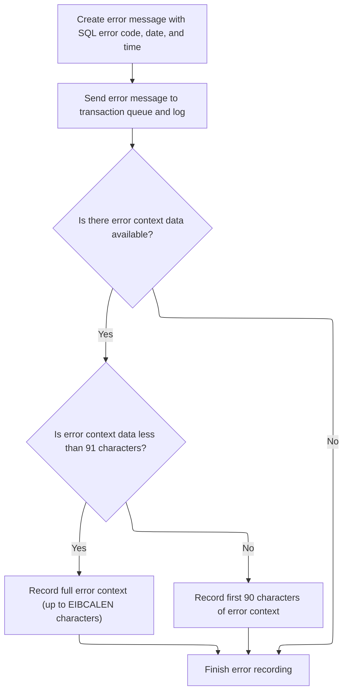

This section ensures that all relevant error details are captured and dispatched for logging and audit, including both standard error information and any available context data, subject to defined length limits.

| Category        | Rule Name                   | Description                                                                                                                                    |
| --------------- | --------------------------- | ---------------------------------------------------------------------------------------------------------------------------------------------- |
| Data validation | Error context length limit  | If the error context data is less than 91 characters, the full context must be recorded; otherwise, only the first 90 characters are recorded. |
| Business logic  | Error message completeness  | Every error message must include the current SQL error code, the current date, and the current time.                                           |
| Business logic  | Dual error message dispatch | Error messages must be dispatched to both the transaction queue and the log for redundancy and audit purposes.                                 |
| Business logic  | Error context inclusion     | If error context data is available, it must be recorded as part of the error logging process.                                                  |

<SwmSnippet path="/base/src/lgapdb09.cbl" line="619">

---

In <SwmToken path="base/src/lgapdb09.cbl" pos="619:1:5" line-data="       WRITE-ERROR-MESSAGE.">`WRITE-ERROR-MESSAGE`</SwmToken>, we grab the current SQLCODE, fetch and format the current time and date using CICS commands, and prep these for inclusion in the error message structure. This sets up all the details needed for a complete error log.

```cobol
       WRITE-ERROR-MESSAGE.
           MOVE SQLCODE TO EM-SQLRC
           EXEC CICS ASKTIME ABSTIME(ABS-TIME)
           END-EXEC
           EXEC CICS FORMATTIME ABSTIME(ABS-TIME)
                     MMDDYYYY(DATE1)
                     TIME(TIME1)
           END-EXEC
```

---

</SwmSnippet>

<SwmSnippet path="/base/src/lgapdb09.cbl" line="627">

---

After prepping the error message, we call LGSTSQ via CICS LINK, passing the formatted error details. LGSTSQ takes care of writing this info to the appropriate queues for logging and audit.

```cobol
           MOVE DATE1 TO EM-DATE
           MOVE TIME1 TO EM-TIME
           EXEC CICS LINK PROGRAM('LGSTSQ')
                     COMMAREA(ERROR-MSG)
                     LENGTH(LENGTH OF ERROR-MSG)
           END-EXEC.
```

---

</SwmSnippet>

<SwmSnippet path="/base/src/lgstsq.cbl" line="55">

---

<SwmToken path="base/src/lgstsq.cbl" pos="55:1:1" line-data="       MAINLINE SECTION.">`MAINLINE`</SwmToken> in LGSTSQ decides if the message is a command or a received message, tweaks the message if it starts with 'Q=', adjusts its length, and writes it to both TDQ and TSQ. If it's a received message, it sends a single-character response back to the sender.

```cobol
       MAINLINE SECTION.

           MOVE SPACES TO WRITE-MSG.
           MOVE SPACES TO WS-RECV.

           EXEC CICS ASSIGN SYSID(WRITE-MSG-SYSID)
                RESP(WS-RESP)
           END-EXEC.

           EXEC CICS ASSIGN INVOKINGPROG(WS-INVOKEPROG)
                RESP(WS-RESP)
           END-EXEC.
           
           IF WS-INVOKEPROG NOT = SPACES
              MOVE 'C' To WS-FLAG
              MOVE COMMA-DATA  TO WRITE-MSG-MSG
              MOVE EIBCALEN    TO WS-RECV-LEN
           ELSE
              EXEC CICS RECEIVE INTO(WS-RECV)
                  LENGTH(WS-RECV-LEN)
                  RESP(WS-RESP)
              END-EXEC
              MOVE 'R' To WS-FLAG
              MOVE WS-RECV-DATA  TO WRITE-MSG-MSG
              SUBTRACT 5 FROM WS-RECV-LEN
           END-IF.

           MOVE 'GENAERRS' TO STSQ-NAME.
           IF WRITE-MSG-MSG(1:2) = 'Q=' THEN
              MOVE WRITE-MSG-MSG(3:4) TO STSQ-EXT
              MOVE WRITE-MSG-REST TO TEMPO
              MOVE TEMPO          TO WRITE-MSG-MSG
              SUBTRACT 7 FROM WS-RECV-LEN
           END-IF.

           ADD 5 TO WS-RECV-LEN.

      * Write output message to TDQ CSMT
      *
           EXEC CICS WRITEQ TD QUEUE(STDQ-NAME)
                     FROM(WRITE-MSG)
                     RESP(WS-RESP)
                     LENGTH(WS-RECV-LEN)

           END-EXEC.

      * Write output message to Genapp TSQ
      * If no space is available then the task will not wait for
      *  storage to become available but will ignore the request...
      *
           EXEC CICS WRITEQ TS QUEUE(STSQ-NAME)
                     FROM(WRITE-MSG)
                     RESP(WS-RESP)
                     NOSUSPEND
                     LENGTH(WS-RECV-LEN)

           END-EXEC.

           If WS-FLAG = 'R' Then
             EXEC CICS SEND TEXT FROM(FILLER-X)
              WAIT
              ERASE
              LENGTH(1)
              FREEKB
             END-EXEC.

           EXEC CICS RETURN
           END-EXEC.
```

---

</SwmSnippet>

<SwmSnippet path="/base/src/lgapdb09.cbl" line="633">

---

After returning from LGSTSQ, <SwmToken path="base/src/lgapdb09.cbl" pos="205:3:7" line-data="               PERFORM WRITE-ERROR-MESSAGE">`WRITE-ERROR-MESSAGE`</SwmToken> checks if there's extra commarea data. If so, it sends up to 90 bytes of it as a second error message to LGSTSQ, making sure all context is captured. The 90-byte limit matches the <SwmToken path="base/src/lgapdb09.cbl" pos="635:12:14" line-data="               MOVE DFHCOMMAREA(1:EIBCALEN) TO CA-DATA">`CA-DATA`</SwmToken> buffer size.

```cobol
           IF EIBCALEN > 0 THEN
             IF EIBCALEN < 91 THEN
               MOVE DFHCOMMAREA(1:EIBCALEN) TO CA-DATA
               EXEC CICS LINK PROGRAM('LGSTSQ')
                         COMMAREA(CA-ERROR-MSG)
                         LENGTH(LENGTH OF CA-ERROR-MSG)
               END-EXEC
             ELSE
               MOVE DFHCOMMAREA(1:90) TO CA-DATA
               EXEC CICS LINK PROGRAM('LGSTSQ')
                         COMMAREA(CA-ERROR-MSG)
                         LENGTH(LENGTH OF CA-ERROR-MSG)
               END-EXEC
             END-IF
           END-IF.
           EXIT.
```

---

</SwmSnippet>

## Setting up for policy processing

```mermaid
%%{init: {"flowchart": {"defaultRenderer": "elk"}} }%%
flowchart TD
    node1["Start: Prepare for request processing"]
    click node1 openCode "base/src/lgapdb09.cbl:209:216"
    node1 --> node2{"Requested policy type?"}
    click node2 openCode "base/src/lgapdb09.cbl:218:240"
    node2 -->|"Endowment (01AEND, +124 bytes)"| node3["Set required length for Endowment; Policy type 'E'"]
    click node3 openCode "base/src/lgapdb09.cbl:221:222"
    node2 -->|"House (01AHOU, +130 bytes)"| node4["Set required length for House; Policy type 'H'"]
    click node4 openCode "base/src/lgapdb09.cbl:225:226"
    node2 -->|"Motor (01AMOT, +137 bytes)"| node5["Set required length for Motor; Policy type 'M'"]
    click node5 openCode "base/src/lgapdb09.cbl:229:230"
    node2 -->|"Commercial (01ACOM, +1174 bytes)"| node6["Set required length for Commercial; Policy type 'C'"]
    click node6 openCode "base/src/lgapdb09.cbl:233:234"
    node2 -->|"Other"| node7["Return code '99' (invalid request); Stop"]
    click node7 openCode "base/src/lgapdb09.cbl:237:238"
    node3 --> node8{"Is request data length sufficient?"}
    node4 --> node8
    node5 --> node8
    node6 --> node8
    click node8 openCode "base/src/lgapdb09.cbl:242:245"
    node8 -->|"Yes"| node9["Return code '00' (success); Continue"]
    click node9 openCode "base/src/lgapdb09.cbl:209:216"
    node8 -->|"No"| node10["Return code '98' (insufficient data); Stop"]
    click node10 openCode "base/src/lgapdb09.cbl:243:244"
classDef HeadingStyle fill:#777777,stroke:#333,stroke-width:2px;

%% Swimm:
%% %%{init: {"flowchart": {"defaultRenderer": "elk"}} }%%
%% flowchart TD
%%     node1["Start: Prepare for request processing"]
%%     click node1 openCode "<SwmPath>[base/src/lgapdb09.cbl](base/src/lgapdb09.cbl)</SwmPath>:209:216"
%%     node1 --> node2{"Requested policy type?"}
%%     click node2 openCode "<SwmPath>[base/src/lgapdb09.cbl](base/src/lgapdb09.cbl)</SwmPath>:218:240"
%%     node2 -->|"Endowment (<SwmToken path="base/src/lgapdb09.cbl" pos="220:4:4" line-data="             WHEN &#39;01AEND&#39;">`01AEND`</SwmToken>, +124 bytes)"| node3["Set required length for Endowment; Policy type 'E'"]
%%     click node3 openCode "<SwmPath>[base/src/lgapdb09.cbl](base/src/lgapdb09.cbl)</SwmPath>:221:222"
%%     node2 -->|"House (<SwmToken path="base/src/lgapdb09.cbl" pos="224:4:4" line-data="             WHEN &#39;01AHOU&#39;">`01AHOU`</SwmToken>, +130 bytes)"| node4["Set required length for House; Policy type 'H'"]
%%     click node4 openCode "<SwmPath>[base/src/lgapdb09.cbl](base/src/lgapdb09.cbl)</SwmPath>:225:226"
%%     node2 -->|"Motor (<SwmToken path="base/src/lgapdb09.cbl" pos="228:4:4" line-data="             WHEN &#39;01AMOT&#39;">`01AMOT`</SwmToken>, +137 bytes)"| node5["Set required length for Motor; Policy type 'M'"]
%%     click node5 openCode "<SwmPath>[base/src/lgapdb09.cbl](base/src/lgapdb09.cbl)</SwmPath>:229:230"
%%     node2 -->|"Commercial (<SwmToken path="base/src/lgapdb09.cbl" pos="232:4:4" line-data="             WHEN &#39;01ACOM&#39;">`01ACOM`</SwmToken>, +1174 bytes)"| node6["Set required length for Commercial; Policy type 'C'"]
%%     click node6 openCode "<SwmPath>[base/src/lgapdb09.cbl](base/src/lgapdb09.cbl)</SwmPath>:233:234"
%%     node2 -->|"Other"| node7["Return code '99' (invalid request); Stop"]
%%     click node7 openCode "<SwmPath>[base/src/lgapdb09.cbl](base/src/lgapdb09.cbl)</SwmPath>:237:238"
%%     node3 --> node8{"Is request data length sufficient?"}
%%     node4 --> node8
%%     node5 --> node8
%%     node6 --> node8
%%     click node8 openCode "<SwmPath>[base/src/lgapdb09.cbl](base/src/lgapdb09.cbl)</SwmPath>:242:245"
%%     node8 -->|"Yes"| node9["Return code '00' (success); Continue"]
%%     click node9 openCode "<SwmPath>[base/src/lgapdb09.cbl](base/src/lgapdb09.cbl)</SwmPath>:209:216"
%%     node8 -->|"No"| node10["Return code '98' (insufficient data); Stop"]
%%     click node10 openCode "<SwmPath>[base/src/lgapdb09.cbl](base/src/lgapdb09.cbl)</SwmPath>:243:244"
%% classDef HeadingStyle fill:#777777,stroke:#333,stroke-width:2px;
```

<SwmSnippet path="/base/src/lgapdb09.cbl" line="209">

---

Back in MAINLINE after error handling, we reset the return code, set up pointers to the commarea, and copy customer/policy info into <SwmToken path="base/src/lgapdb09.cbl" pos="212:11:11" line-data="           MOVE CA-CUSTOMER-NUM TO DB2-CUSTOMERNUM-INT">`DB2`</SwmToken> and error message fields. This gets everything ready for the main policy logic.

```cobol
           MOVE '00' TO CA-RETURN-CODE
           SET WS-ADDR-DFHCOMMAREA TO ADDRESS OF DFHCOMMAREA.

           MOVE CA-CUSTOMER-NUM TO DB2-CUSTOMERNUM-INT
           MOVE ZERO            TO DB2-C-PolicyNum-INT
           MOVE CA-CUSTOMER-NUM TO EM-CUSNUM

           ADD WS-CA-HEADER-LEN TO WS-REQUIRED-CA-LEN
```

---

</SwmSnippet>

<SwmSnippet path="/base/src/lgapdb09.cbl" line="218">

---

Here we branch based on the request ID, adjusting required commarea length and setting the policy type for <SwmToken path="base/src/lgapdb09.cbl" pos="222:9:9" line-data="               MOVE &#39;E&#39; TO DB2-POLICYTYPE">`DB2`</SwmToken>. This mapping controls which policy logic runs next.

```cobol
           EVALUATE CA-REQUEST-ID

             WHEN '01AEND'
               ADD WS-FULL-ENDOW-LEN TO WS-REQUIRED-CA-LEN
               MOVE 'E' TO DB2-POLICYTYPE
```

---

</SwmSnippet>

<SwmSnippet path="/base/src/lgapdb09.cbl" line="224">

---

For each recognized request ID, we set the policy type and bump up the required commarea length to match the expected data for that policy.

```cobol
             WHEN '01AHOU'
               ADD WS-FULL-HOUSE-LEN TO WS-REQUIRED-CA-LEN
               MOVE 'H' TO DB2-POLICYTYPE

             WHEN '01AMOT'
               ADD WS-FULL-MOTOR-LEN TO WS-REQUIRED-CA-LEN
               MOVE 'M' TO DB2-POLICYTYPE

             WHEN '01ACOM'
               ADD WS-FULL-COMM-LEN TO WS-REQUIRED-CA-LEN
               MOVE 'C' TO DB2-POLICYTYPE
```

---

</SwmSnippet>

<SwmSnippet path="/base/src/lgapdb09.cbl" line="236">

---

If the request ID isn't recognized, we set an error code and exit, blocking any further work for unknown requests.

```cobol
             WHEN OTHER
               MOVE '99' TO CA-RETURN-CODE
               EXEC CICS RETURN END-EXEC

           END-EVALUATE
```

---

</SwmSnippet>

<SwmSnippet path="/base/src/lgapdb09.cbl" line="242">

---

We validate that the input commarea is long enough for the selected policy type. If not, we set an error code and exit early.

```cobol
           IF EIBCALEN IS LESS THAN WS-REQUIRED-CA-LEN
             MOVE '98' TO CA-RETURN-CODE
             EXEC CICS RETURN END-EXEC
           END-IF
```

---

</SwmSnippet>

<SwmSnippet path="/base/src/lgapdb09.cbl" line="247">

---

After all checks, we call <SwmToken path="base/src/lgapdb09.cbl" pos="247:3:5" line-data="           PERFORM P100-T">`P100-T`</SwmToken> to insert the main policy record into the database. This sets up the core policy info before handling any specific details.

```cobol
           PERFORM P100-T
```

---

</SwmSnippet>

## Creating the base policy record

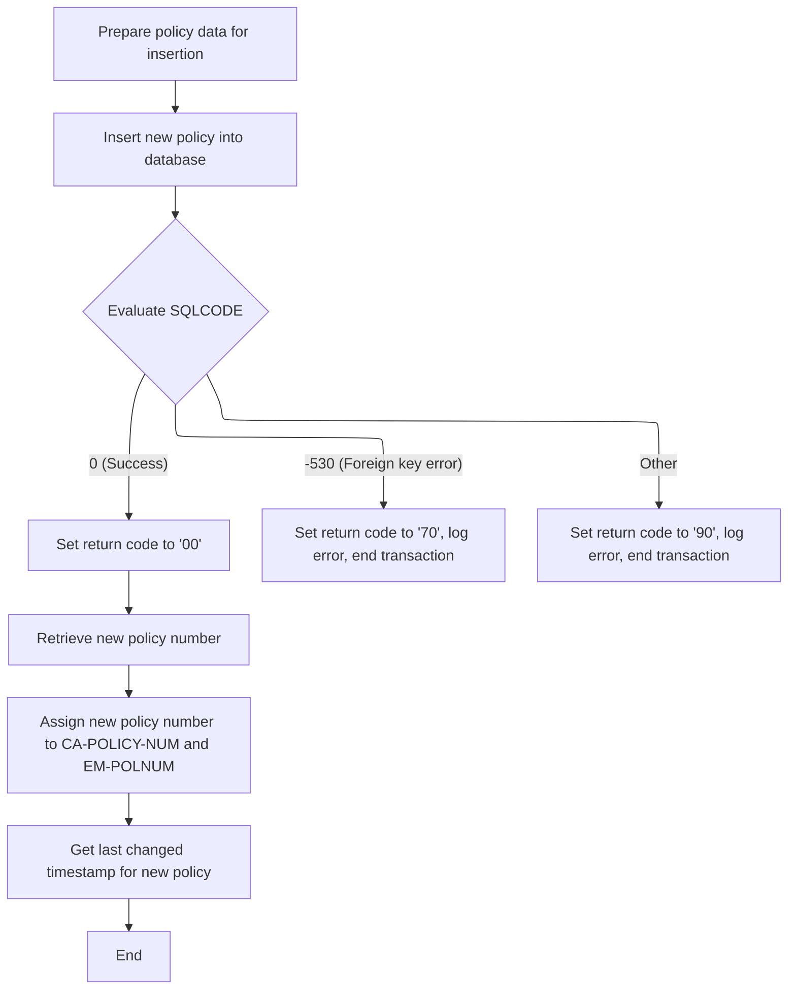

This section is responsible for creating a new base policy record in the system. It ensures that all required fields are populated, handles database insertion, manages error scenarios, and returns the newly created policy number and relevant status information.

| Category        | Rule Name                     | Description                                                                                                                                                                                                           |
| --------------- | ----------------------------- | --------------------------------------------------------------------------------------------------------------------------------------------------------------------------------------------------------------------- |
| Data validation | Mandatory policy fields       | A new policy record must be created with all required fields: customer number, issue date, expiry date, policy type, broker ID, broker reference, and payment amount. The policy number is generated by the database. |
| Business logic  | Successful policy creation    | If the policy is successfully created (SQLCODE = 0), the return code must be set to '00', and the new policy number and last changed timestamp must be returned to the caller.                                        |
| Business logic  | Return new policy number      | The newly generated policy number must be retrieved from the database and returned to the caller for further processing.                                                                                              |
| Business logic  | Return last changed timestamp | The last changed timestamp for the new policy must be retrieved and returned to the caller to support audit and tracking requirements.                                                                                |

<SwmSnippet path="/base/src/lgapdb09.cbl" line="281">

---

In <SwmToken path="base/src/lgapdb09.cbl" pos="281:1:3" line-data="       P100-T.">`P100-T`</SwmToken>, we prep all the main policy fields and run the SQL INSERT to create the base policy record in the database.

```cobol
       P100-T.

           MOVE CA-BROKERID TO DB2-BROKERID-INT
           MOVE CA-PAYMENT TO DB2-PAYMENT-INT

           MOVE ' INSERT POLICY' TO EM-SQLREQ
           EXEC SQL
             INSERT INTO POLICY
                       ( POLICYNUMBER,
                         CUSTOMERNUMBER,
                         ISSUEDATE,
                         EXPIRYDATE,
                         POLICYTYPE,
                         LASTCHANGED,
                         BROKERID,
                         BROKERSREFERENCE,
                         PAYMENT           )
                VALUES ( DEFAULT,
                         :DB2-CUSTOMERNUM-INT,
                         :CA-ISSUE-DATE,
                         :CA-EXPIRY-DATE,
                         :DB2-POLICYTYPE,
                         CURRENT TIMESTAMP,
                         :DB2-BROKERID-INT,
                         :CA-BROKERSREF,
                         :DB2-PAYMENT-INT      )
           END-EXEC
```

---

</SwmSnippet>

<SwmSnippet path="/base/src/lgapdb09.cbl" line="309">

---

After the insert, we check SQLCODE. If there's an error, we log it with <SwmToken path="base/src/lgapdb09.cbl" pos="316:3:7" line-data="               PERFORM WRITE-ERROR-MESSAGE">`WRITE-ERROR-MESSAGE`</SwmToken> and bail out. Different codes trigger different error handling.

```cobol
           Evaluate SQLCODE

             When 0
               MOVE '00' TO CA-RETURN-CODE

             When -530
               MOVE '70' TO CA-RETURN-CODE
               PERFORM WRITE-ERROR-MESSAGE
               EXEC CICS RETURN END-EXEC

             When Other
               MOVE '90' TO CA-RETURN-CODE
               PERFORM WRITE-ERROR-MESSAGE
               EXEC CICS RETURN END-EXEC

           END-Evaluate.
```

---

</SwmSnippet>

<SwmSnippet path="/base/src/lgapdb09.cbl" line="326">

---

Back in <SwmToken path="base/src/lgapdb09.cbl" pos="247:3:5" line-data="           PERFORM P100-T">`P100-T`</SwmToken> after error handling, we grab the newly generated policy number from the database for use in later steps.

```cobol
           EXEC SQL
             SET :DB2-POLICYNUM-INT = IDENTITY_VAL_LOCAL()
           END-EXEC
```

---

</SwmSnippet>

<SwmSnippet path="/base/src/lgapdb09.cbl" line="329">

---

We move the new policy number and last changed timestamp into the commarea and error message fields, then exit <SwmToken path="base/src/lgapdb09.cbl" pos="247:3:5" line-data="           PERFORM P100-T">`P100-T`</SwmToken>.

```cobol
           MOVE DB2-POLICYNUM-INT TO CA-POLICY-NUM
           MOVE CA-POLICY-NUM TO EM-POLNUM

           EXEC SQL
             SELECT LASTCHANGED
               INTO :CA-LASTCHANGED
               FROM POLICY
               WHERE POLICYNUMBER = :DB2-POLICYNUM-INT
           END-EXEC.
           EXIT.
```

---

</SwmSnippet>

## Branching to policy-specific record creation

```mermaid
%%{init: {"flowchart": {"defaultRenderer": "elk"}} }%%
flowchart TD
    node1{"Which type of customer request?"}
    click node1 openCode "base/src/lgapdb09.cbl:249:266"
    node1 -->|"Endowment (01AEND)"| node2["Run Endowment Policy Process"]
    click node2 openCode "base/src/lgapdb09.cbl:252:253"
    node1 -->|"House (01AHOU)"| node3["Run House Policy Process"]
    click node3 openCode "base/src/lgapdb09.cbl:255:256"
    node1 -->|"Motor (01AMOT)"| node4["Run Motor Policy Process"]
    click node4 openCode "base/src/lgapdb09.cbl:258:259"
    node1 -->|"Business (01ACOM)"| node5["Run Business Policy Process"]
    click node5 openCode "base/src/lgapdb09.cbl:261:262"
    node1 -->|"Other"| node6["Set error code to '99' (Unknown request)"]
    click node6 openCode "base/src/lgapdb09.cbl:264:265"

classDef HeadingStyle fill:#777777,stroke:#333,stroke-width:2px;

%% Swimm:
%% %%{init: {"flowchart": {"defaultRenderer": "elk"}} }%%
%% flowchart TD
%%     node1{"Which type of customer request?"}
%%     click node1 openCode "<SwmPath>[base/src/lgapdb09.cbl](base/src/lgapdb09.cbl)</SwmPath>:249:266"
%%     node1 -->|"Endowment (<SwmToken path="base/src/lgapdb09.cbl" pos="220:4:4" line-data="             WHEN &#39;01AEND&#39;">`01AEND`</SwmToken>)"| node2["Run Endowment Policy Process"]
%%     click node2 openCode "<SwmPath>[base/src/lgapdb09.cbl](base/src/lgapdb09.cbl)</SwmPath>:252:253"
%%     node1 -->|"House (<SwmToken path="base/src/lgapdb09.cbl" pos="224:4:4" line-data="             WHEN &#39;01AHOU&#39;">`01AHOU`</SwmToken>)"| node3["Run House Policy Process"]
%%     click node3 openCode "<SwmPath>[base/src/lgapdb09.cbl](base/src/lgapdb09.cbl)</SwmPath>:255:256"
%%     node1 -->|"Motor (<SwmToken path="base/src/lgapdb09.cbl" pos="228:4:4" line-data="             WHEN &#39;01AMOT&#39;">`01AMOT`</SwmToken>)"| node4["Run Motor Policy Process"]
%%     click node4 openCode "<SwmPath>[base/src/lgapdb09.cbl](base/src/lgapdb09.cbl)</SwmPath>:258:259"
%%     node1 -->|"Business (<SwmToken path="base/src/lgapdb09.cbl" pos="232:4:4" line-data="             WHEN &#39;01ACOM&#39;">`01ACOM`</SwmToken>)"| node5["Run Business Policy Process"]
%%     click node5 openCode "<SwmPath>[base/src/lgapdb09.cbl](base/src/lgapdb09.cbl)</SwmPath>:261:262"
%%     node1 -->|"Other"| node6["Set error code to '99' (Unknown request)"]
%%     click node6 openCode "<SwmPath>[base/src/lgapdb09.cbl](base/src/lgapdb09.cbl)</SwmPath>:264:265"
%% 
%% classDef HeadingStyle fill:#777777,stroke:#333,stroke-width:2px;
```

<SwmSnippet path="/base/src/lgapdb09.cbl" line="249">

---

Back in MAINLINE after <SwmToken path="base/src/lgapdb09.cbl" pos="247:3:5" line-data="           PERFORM P100-T">`P100-T`</SwmToken>, we branch to the right subroutine (<SwmToken path="base/src/lgapdb09.cbl" pos="252:3:5" line-data="               PERFORM P200-E">`P200-E`</SwmToken>, <SwmToken path="base/src/lgapdb09.cbl" pos="255:3:5" line-data="               PERFORM P300-H">`P300-H`</SwmToken>, <SwmToken path="base/src/lgapdb09.cbl" pos="258:3:5" line-data="               PERFORM P400-M">`P400-M`</SwmToken>, or <SwmToken path="base/src/lgapdb09.cbl" pos="261:3:5" line-data="               PERFORM P500-BIZ">`P500-BIZ`</SwmToken>) based on the request ID, so each policy type gets its own record.

```cobol
           EVALUATE CA-REQUEST-ID

             WHEN '01AEND'
               PERFORM P200-E

             WHEN '01AHOU'
               PERFORM P300-H

             WHEN '01AMOT'
               PERFORM P400-M

             WHEN '01ACOM'
               PERFORM P500-BIZ

             WHEN OTHER
               MOVE '99' TO CA-RETURN-CODE

           END-EVALUATE
```

---

</SwmSnippet>

## Adding endowment policy details

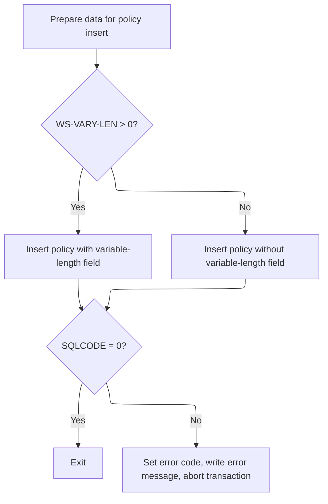

This section is responsible for adding new endowment policy details to the database, ensuring all required fields are included and handling optional variable-length data. It also ensures data integrity by aborting the transaction if any errors occur during insertion.

| Category        | Rule Name                     | Description                                                                                                                                                                                                                                                     |
| --------------- | ----------------------------- | --------------------------------------------------------------------------------------------------------------------------------------------------------------------------------------------------------------------------------------------------------------- |
| Data validation | Mandatory and optional fields | All policy records must include the following mandatory fields: POLICYNUMBER, WITHPROFITS, EQUITIES, MANAGEDFUND, FUNDNAME, TERM, SUMASSURED, LIFEASSURED. Optional field: PADDINGDATA (varchar) is included only if extra data is present.                     |
| Business logic  | Varchar data inclusion        | If there is extra variable-length data present (<SwmToken path="base/src/lgapdb09.cbl" pos="356:3:7" line-data="               GIVING WS-VARY-LEN">`WS-VARY-LEN`</SwmToken> > 0), it must be included in the policy record as a varchar field during insertion. |
| Business logic  | Standard field-only insert    | If no extra variable-length data is present, only the standard endowment policy fields are inserted, and the varchar field is omitted.                                                                                                                          |

<SwmSnippet path="/base/src/lgapdb09.cbl" line="343">

---

In <SwmToken path="base/src/lgapdb09.cbl" pos="343:1:3" line-data="       P200-E.">`P200-E`</SwmToken>, we prep numeric fields for <SwmToken path="base/src/lgapdb09.cbl" pos="346:11:11" line-data="           MOVE CA-E-TERM        TO DB2-E-TERM-SINT">`DB2`</SwmToken>, check if there's extra varchar data, and get ready to insert all endowment details into the database.

```cobol
       P200-E.

      *    Move numeric fields to integer format
           MOVE CA-E-TERM        TO DB2-E-TERM-SINT
           MOVE CA-E-SUM-ASSURED TO DB2-E-SUMASSURED-INT

           MOVE ' INSERT ENDOW ' TO EM-SQLREQ
      *----------------------------------------------------------------*
      *    There are 2 versions of INSERT...                           *
      *      one which updates all fields including Varchar            *
      *      one which updates all fields Except Varchar               *
      *----------------------------------------------------------------*
           SUBTRACT WS-REQUIRED-CA-LEN FROM EIBCALEN
               GIVING WS-VARY-LEN
```

---

</SwmSnippet>

<SwmSnippet path="/base/src/lgapdb09.cbl" line="358">

---

If there's extra data, we move it into the varchar buffer and run the SQL insert with all fields, including the varchar.

```cobol
           IF WS-VARY-LEN IS GREATER THAN ZERO
      *       Commarea contains data for Varchar field
              MOVE CA-E-PADDING-DATA
                  TO WS-VARY-CHAR(1:WS-VARY-LEN)
              EXEC SQL
                INSERT INTO ENDOWMENT
                          ( POLICYNUMBER,
                            WITHPROFITS,
                            EQUITIES,
                            MANAGEDFUND,
                            FUNDNAME,
                            TERM,
                            SUMASSURED,
                            LIFEASSURED,
                            PADDINGDATA    )
                   VALUES ( :DB2-POLICYNUM-INT,
                            :CA-E-W-PRO,
                            :CA-E-EQU,
                            :CA-E-M-FUN,
                            :CA-E-FUND-NAME,
                            :DB2-E-TERM-SINT,
                            :DB2-E-SUMASSURED-INT,
                            :CA-E-LIFE-ASSURED,
                            :WS-VARY-FIELD )
              END-EXEC
```

---

</SwmSnippet>

<SwmSnippet path="/base/src/lgapdb09.cbl" line="383">

---

If there's no extra data, we just run the insert for the standard endowment fields, skipping the varchar.

```cobol
           ELSE
              EXEC SQL
                INSERT INTO ENDOWMENT
                          ( POLICYNUMBER,
                            WITHPROFITS,
                            EQUITIES,
                            MANAGEDFUND,
                            FUNDNAME,
                            TERM,
                            SUMASSURED,
                            LIFEASSURED    )
                   VALUES ( :DB2-POLICYNUM-INT,
                            :CA-E-W-PRO,
                            :CA-E-EQU,
                            :CA-E-M-FUN,
                            :CA-E-FUND-NAME,
                            :DB2-E-TERM-SINT,
                            :DB2-E-SUMASSURED-INT,
                            :CA-E-LIFE-ASSURED )
              END-EXEC
```

---

</SwmSnippet>

<SwmSnippet path="/base/src/lgapdb09.cbl" line="405">

---

If the insert fails, we log the error, abend the transaction, and exit, so no bad data gets committed.

```cobol
           IF SQLCODE NOT EQUAL 0
             MOVE '90' TO CA-RETURN-CODE
             PERFORM WRITE-ERROR-MESSAGE
      *      Issue Abend to cause backout of update to Policy table
             EXEC CICS ABEND ABCODE('LGSQ') NODUMP END-EXEC
             EXEC CICS RETURN END-EXEC
           END-IF.

           EXIT.
```

---

</SwmSnippet>

## Adding house policy details

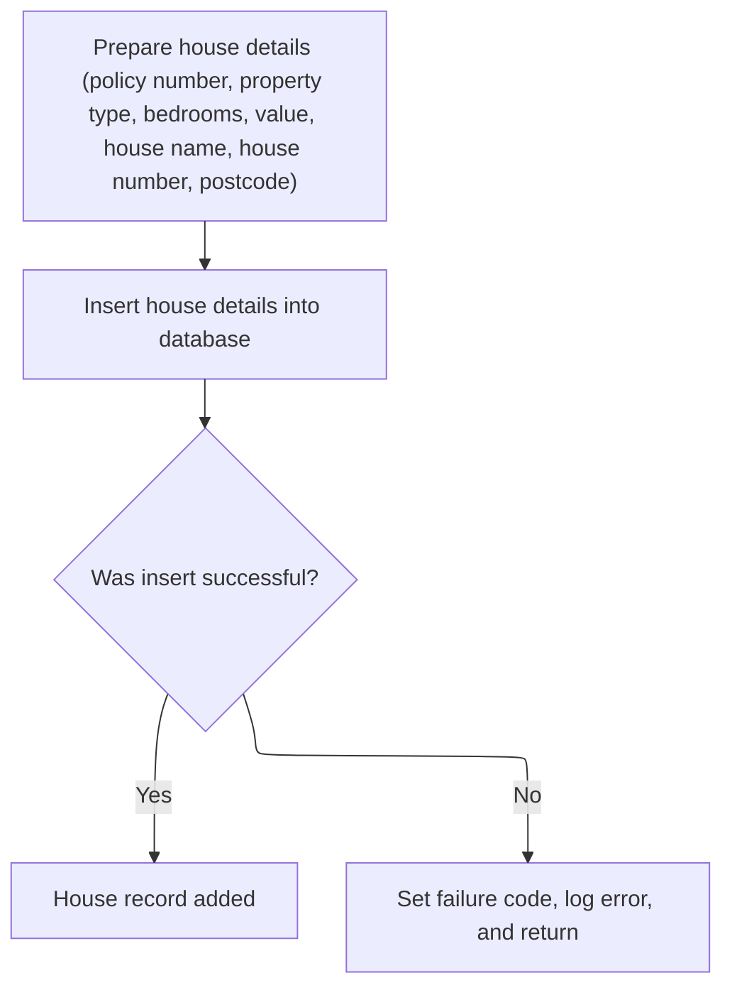

This section is responsible for adding new house policy details to the system by inserting them into the database. It ensures that all required fields are present and valid, and handles errors in the insertion process to maintain data integrity.

| Category        | Rule Name                        | Description                                                                                                                                                                                      |
| --------------- | -------------------------------- | ------------------------------------------------------------------------------------------------------------------------------------------------------------------------------------------------ |
| Data validation | Mandatory house policy fields    | A house policy record must include a policy number, property type, number of bedrooms, value, house name, house number, and postcode. All these fields are mandatory for a successful insertion. |
| Business logic  | Record availability after insert | A successful insertion of a house policy record must result in the record being available for subsequent business processes and queries.                                                         |

<SwmSnippet path="/base/src/lgapdb09.cbl" line="415">

---

In <SwmToken path="base/src/lgapdb09.cbl" pos="415:1:3" line-data="       P300-H.">`P300-H`</SwmToken>, we prep the value and bedrooms fields as <SwmToken path="base/src/lgapdb09.cbl" pos="417:11:11" line-data="           MOVE CA-H-VAL       TO DB2-H-VALUE-INT">`DB2`</SwmToken> integers, then run the SQL insert to add the house policy details to the database.

```cobol
       P300-H.

           MOVE CA-H-VAL       TO DB2-H-VALUE-INT
           MOVE CA-H-BED    TO DB2-H-BEDROOMS-SINT

           MOVE ' INSERT HOUSE ' TO EM-SQLREQ
           EXEC SQL
             INSERT INTO HOUSE
                       ( POLICYNUMBER,
                         PROPERTYTYPE,
                         BEDROOMS,
                         VALUE,
                         HOUSENAME,
                         HOUSENUMBER,
                         POSTCODE          )
                VALUES ( :DB2-POLICYNUM-INT,
                         :CA-H-P-TYP,
                         :DB2-H-BEDROOMS-SINT,
                         :DB2-H-VALUE-INT,
                         :CA-H-H-NAM,
                         :CA-H-HOUSE-NUMBER,
                         :CA-H-PCD      )
           END-EXEC
```

---

</SwmSnippet>

<SwmSnippet path="/base/src/lgapdb09.cbl" line="439">

---

If the house insert fails, we log the error, abend with a specific code, and exit to prevent bad data.

```cobol
           IF SQLCODE NOT EQUAL 0
             MOVE '90' TO CA-RETURN-CODE
             PERFORM WRITE-ERROR-MESSAGE
             EXEC CICS ABEND ABCODE('LGSQ') NODUMP END-EXEC
             EXEC CICS RETURN END-EXEC
           END-IF.

           EXIT.
```

---

</SwmSnippet>

## Adding motor policy details

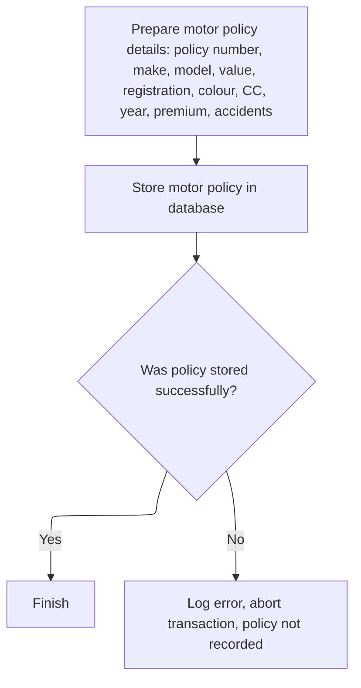

This section ensures that motor policy details are accurately captured and stored in the database, maintaining data integrity and providing error handling for failed insertions.

| Category        | Rule Name                  | Description                                                                                                                                                  |
| --------------- | -------------------------- | ------------------------------------------------------------------------------------------------------------------------------------------------------------ |
| Data validation | Required policy fields     | Motor policy details must include policy number, make, model, value, registration number, colour, CC, year of manufacture, premium, and number of accidents. |
| Business logic  | Successful policy addition | A motor policy record must only be considered successfully added if the database insert operation returns a success code (SQLCODE = 0).                      |

<SwmSnippet path="/base/src/lgapdb09.cbl" line="448">

---

In <SwmToken path="base/src/lgapdb09.cbl" pos="448:1:3" line-data="       P400-M.">`P400-M`</SwmToken>, we prep all the motor policy numeric fields as <SwmToken path="base/src/lgapdb09.cbl" pos="451:11:11" line-data="           MOVE CA-M-VALUE       TO DB2-M-VALUE-INT">`DB2`</SwmToken> integers, then run the SQL insert to add the motor policy details to the database.

```cobol
       P400-M.

      *    Move numeric fields to integer format
           MOVE CA-M-VALUE       TO DB2-M-VALUE-INT
           MOVE CA-M-CC          TO DB2-M-CC-SINT
           MOVE CA-M-PREMIUM     TO DB2-M-PREMIUM-INT
           MOVE CA-M-ACCIDENTS   TO DB2-M-ACCIDENTS-INT

           MOVE ' INSERT MOTOR ' TO EM-SQLREQ
           EXEC SQL
             INSERT INTO MOTOR
                       ( POLICYNUMBER,
                         MAKE,
                         MODEL,
                         VALUE,
                         REGNUMBER,
                         COLOUR,
                         CC,
                         YEAROFMANUFACTURE,
                         PREMIUM,
                         ACCIDENTS )
                VALUES ( :DB2-POLICYNUM-INT,
                         :CA-M-MAKE,
                         :CA-M-MODEL,
                         :DB2-M-VALUE-INT,
                         :CA-M-REGNUMBER,
                         :CA-M-COLOUR,
                         :DB2-M-CC-SINT,
                         :CA-M-MANUFACTURED,
                         :DB2-M-PREMIUM-INT,
                         :DB2-M-ACCIDENTS-INT )
           END-EXEC
```

---

</SwmSnippet>

<SwmSnippet path="/base/src/lgapdb09.cbl" line="481">

---

If the motor insert fails, we log the error, abend, and exit to keep the database clean.

```cobol
           IF SQLCODE NOT EQUAL 0
             MOVE '90' TO CA-RETURN-CODE
             PERFORM WRITE-ERROR-MESSAGE
             EXEC CICS ABEND ABCODE('LGSQ') NODUMP END-EXEC
             EXEC CICS RETURN END-EXEC
           END-IF.

           EXIT.
```

---

</SwmSnippet>

## Processing commercial policy and risk

This section is responsible for collecting all relevant commercial policy and property data, preparing it for risk assessment, and initiating the calculation of risk and premium values for commercial insurance policies.

| Category        | Rule Name                      | Description                                                                                                                                                     |
| --------------- | ------------------------------ | --------------------------------------------------------------------------------------------------------------------------------------------------------------- |
| Data validation | Data Preparation Requirement   | All commercial policy and property fields must be collected and transferred to the risk calculation area before any risk or premium calculations are performed. |
| Data validation | New Policy Handling            | If the policy number is zero, the policy must be treated as new and processed accordingly for risk and premium calculation.                                     |
| Business logic  | Risk Score Calculation         | A risk score must be calculated for each commercial policy using the provided property and risk factor data.                                                    |
| Business logic  | Policy Status Assignment       | The policy status and review reason must be assigned based on the calculated risk score and any rejection reasons present in the input data.                    |
| Business logic  | Premium Calculation Per Factor | Insurance premiums for each risk factor (FP, CP, FLP, WP) must be calculated and included in the output, using the corresponding input factors.                 |

<SwmSnippet path="/base/src/lgapdb09.cbl" line="493">

---

In <SwmToken path="base/src/lgapdb09.cbl" pos="493:1:3" line-data="       P500-BIZ SECTION.">`P500-BIZ`</SwmToken>, we move all the commercial policy and property fields into the risk calculation area, getting ready for the risk and premium computation.

```cobol
       P500-BIZ SECTION.
           MOVE CA-CUSTOMER-NUM TO WS-XCUSTID
           MOVE CA-POLICY-NUM TO WS-XPOLNUM
           MOVE CA-B-PropType TO WS-XPROPTYPE
           MOVE CA-B-PST TO WS-XPOSTCODE
           MOVE CA-B-FP TO WS-XFP-FACTOR
           MOVE CA-B-CP TO WS-XCP-FACTOR
           MOVE CA-B-FLP TO WS-XFLP-FACTOR
           MOVE CA-B-WP TO WS-XWP-FACTOR
           MOVE CA-B-Address TO WS-XADDRESS
           MOVE CA-B-Latitude TO WS-XLAT
           MOVE CA-B-Longitude TO WS-XLONG
           MOVE CA-B-Customer TO WS-XCUSTNAME
           MOVE CA-ISSUE-DATE TO WS-XISSUE
           MOVE CA-EXPIRY-DATE TO WS-XEXPIRY
           MOVE CA-LASTCHANGED TO WS-XLASTCHG
```

---

</SwmSnippet>

<SwmSnippet path="/base/src/lgapdb09.cbl" line="510">

---

After prepping the data, we call LGCOMCAL to run the risk and premium calculations for the commercial policy.

```cobol
           EXEC CICS LINK PROGRAM('LGCOMCAL')
                COMMAREA(WS-COMM-RISK-AREA)
                LENGTH(LENGTH OF WS-COMM-RISK-AREA)
           END-EXEC
```

---

</SwmSnippet>

### Running risk and premium calculations

This section is responsible for calculating insurance risk and determining the premium amount for each policy based on provided input data. It ensures that all relevant risk factors are considered and that the premium is accurately calculated according to business rules.

| Category        | Rule Name                     | Description                                                                                               |
| --------------- | ----------------------------- | --------------------------------------------------------------------------------------------------------- |
| Data validation | Comprehensive risk evaluation | All risk factors provided in the input must be evaluated before calculating the premium amount.           |
| Data validation | Complete output requirement   | The final output must include both the calculated risk assessment and the premium amount for each policy. |
| Business logic  | Use approved rate tables      | Premium calculations must use the latest approved rate tables and multipliers as defined by the business. |
| Business logic  | Extreme sport risk surcharge  | Premiums for policies involving extreme sports must include an additional risk surcharge of $30.          |

<SwmSnippet path="/base/src/lgcomcal.cbl" line="206">

---

LGCOMCAL's MAINLINE runs initialization, processes the risk and premium logic, and then cleans up and outputs the results.

```cobol
       MAINLINE SECTION.
           
           PERFORM INITIALIZE-PROCESSING.
           PERFORM PROCESS-BUSINESS-LOGIC.
           PERFORM CLEANUP-AND-EXIT.
```

---

</SwmSnippet>

### Scoring risk and calculating premiums

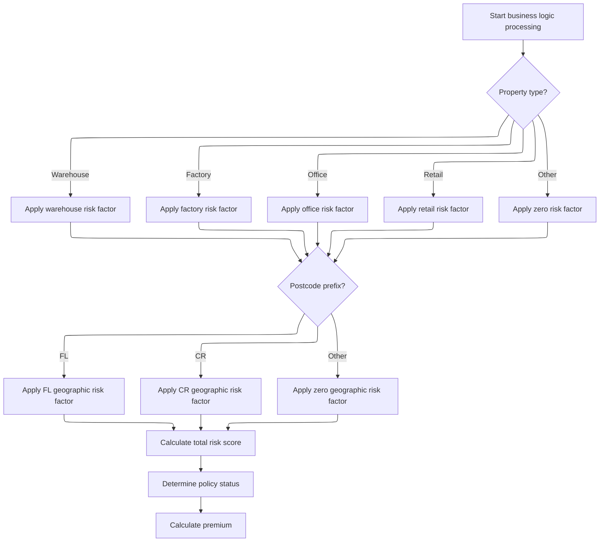

This section determines the risk score and calculates the insurance premium for a commercial property based on its type and geographic location. It also sets the policy status and review reason.

| Category       | Rule Name                   | Description                                                                                                                                                                 |
| -------------- | --------------------------- | --------------------------------------------------------------------------------------------------------------------------------------------------------------------------- |
| Business logic | Risk score composition      | The risk score must include a base value, a property type risk factor, and a geographic risk factor. These components are summed to produce the total risk score.           |
| Business logic | Property type risk mapping  | The property type must be mapped to a specific risk factor according to the risk matrix: Warehouse, Factory, Office, Retail, or Other. Each type has a distinct risk value. |
| Business logic | Geographic risk mapping     | The postcode prefix must be mapped to a geographic risk factor: 'FL' and 'CR' have specific risk values, while all other prefixes have a zero risk factor.                  |
| Business logic | Default property risk       | If the property type is not Warehouse, Factory, Office, or Retail, the property type risk factor must be set to zero.                                                       |
| Business logic | Default geographic risk     | If the postcode prefix is not 'FL' or 'CR', the geographic risk factor must be set to zero.                                                                                 |
| Business logic | Policy status determination | The total risk score must be used to determine the policy status and review reason.                                                                                         |
| Business logic | Premium calculation linkage | The calculated premium must be based on the total risk score, ensuring that higher risk scores result in higher premiums.                                                   |

<SwmSnippet path="/base/src/lgcomcal.cbl" line="268">

---

<SwmToken path="base/src/lgcomcal.cbl" pos="268:1:5" line-data="       PROCESS-BUSINESS-LOGIC.">`PROCESS-BUSINESS-LOGIC`</SwmToken> runs the risk score calculation, sets the policy status and review reason, and computes all the insurance premiums and discounts.

```cobol
       PROCESS-BUSINESS-LOGIC.
           PERFORM PROCESS-RISK-SCORE.
           PERFORM DETERMINE-POLICY-STATUS.
           PERFORM CALCULATE-PREMIUMS.
           
           EXIT.
```

---

</SwmSnippet>

<SwmSnippet path="/base/src/lgcomcal.cbl" line="277">

---

<SwmToken path="base/src/lgcomcal.cbl" pos="277:1:5" line-data="       PROCESS-RISK-SCORE.">`PROCESS-RISK-SCORE`</SwmToken> in LGCOMCAL calculates the risk score by adding a base value, a property type factor, and a geographic factor. The property type and postcode prefix are mapped to hardcoded values from the risk matrix. The function assumes valid input formats and doesn't validate them. The constants 'COMMERCIAL' and <SwmToken path="base/src/lgcomcal.cbl" pos="285:4:8" line-data="           MOVE &#39;1.0.5&#39; TO RMS-VERSION">`1.0.5`</SwmToken> are set but not used in the calculation.

```cobol
       PROCESS-RISK-SCORE.
           MOVE WS-TM-BASE TO WS-TEMP-SCORE.
           DIVIDE 2 INTO WS-TEMP-SCORE GIVING WS-SUB-1.
           MULTIPLY 2 BY WS-SUB-1 GIVING WS-RC-BASE-VAL.
           
           MOVE 0 TO WS-RC-PROP-FACT.
           
           MOVE 'COMMERCIAL' TO RMS-TYPE
           MOVE '1.0.5' TO RMS-VERSION
      
           EVALUATE CA-XPROPTYPE
               WHEN 'WAREHOUSE'
                   MOVE RMS-PF-W-VAL TO RMS-PF-WAREHOUSE
                   COMPUTE WS-TEMP-CALC = RMS-PF-WAREHOUSE
                   ADD WS-TEMP-CALC TO WS-RC-PROP-FACT
               WHEN 'FACTORY'
                   MOVE RMS-PF-F-VAL TO RMS-PF-FACTORY
                   COMPUTE WS-TEMP-CALC = RMS-PF-FACTORY
                   ADD WS-TEMP-CALC TO WS-RC-PROP-FACT
               WHEN 'OFFICE'
                   MOVE RMS-PF-O-VAL TO RMS-PF-OFFICE
                   COMPUTE WS-TEMP-CALC = RMS-PF-OFFICE
                   ADD WS-TEMP-CALC TO WS-RC-PROP-FACT
               WHEN 'RETAIL'
                   MOVE RMS-PF-R-VAL TO RMS-PF-RETAIL
                   COMPUTE WS-TEMP-CALC = RMS-PF-RETAIL
                   ADD WS-TEMP-CALC TO WS-RC-PROP-FACT
               WHEN OTHER
                   MOVE 0 TO WS-RC-PROP-FACT
           END-EVALUATE.
           
           MOVE 0 TO WS-RC-GEO-FACT.
           
           MOVE RMS-GF-FL-VAL TO RMS-GF-FL
           MOVE RMS-GF-CR-VAL TO RMS-GF-CR
           
           IF CA-XPOSTCODE(1:2) = 'FL'
              MOVE RMS-GF-FL TO WS-RC-GEO-FACT
           ELSE
              IF CA-XPOSTCODE(1:2) = 'CR'
                 MOVE RMS-GF-CR TO WS-RC-GEO-FACT
              END-IF
           END-IF.
           
           COMPUTE WS-RC-TOTAL = 
              WS-RC-BASE-VAL + WS-RC-PROP-FACT + WS-RC-GEO-FACT.
              
           MOVE WS-RC-TOTAL TO WS-SA-RISK.
           
           EXIT.
```

---

</SwmSnippet>

### Mapping risk and premium results to output fields

<SwmSnippet path="/base/src/lgapdb09.cbl" line="515">

---

After LGCOMCAL, <SwmToken path="base/src/lgapdb09.cbl" pos="261:3:5" line-data="               PERFORM P500-BIZ">`P500-BIZ`</SwmToken> copies the risk score, status, rejection reason, and premium values into the output fields for use in the next steps.

```cobol
           MOVE WS-ZRESULT-SCORE TO X3-VAL
           MOVE WS-ZSTATUS-IND TO X5-Z9
           MOVE WS-ZREJECT-TEXT TO X6-REJ
           MOVE WS-ZFP-PREMIUM TO CA-B-CA-B-FPR
           MOVE WS-ZCP-PREMIUM TO CA-B-CPR
           MOVE WS-ZFLP-PREMIUM TO CA-B-FLPR
           MOVE WS-ZWP-PREMIUM TO CA-B-WPR
           
           MOVE X5-Z9 TO CA-B-ST
           MOVE X6-REJ TO CA-B-RejectReason
```

---

</SwmSnippet>

<SwmSnippet path="/base/src/lgapdb09.cbl" line="526">

---

After copying the results, <SwmToken path="base/src/lgapdb09.cbl" pos="261:3:5" line-data="               PERFORM P500-BIZ">`P500-BIZ`</SwmToken> runs the status/reason logic and then saves the commercial policy record to the database.

```cobol
           PERFORM P546-CHK-MATRIX
           
           PERFORM P548-BINS
           
           EXIT.
```

---

</SwmSnippet>

## Preparing and inserting commercial policy data

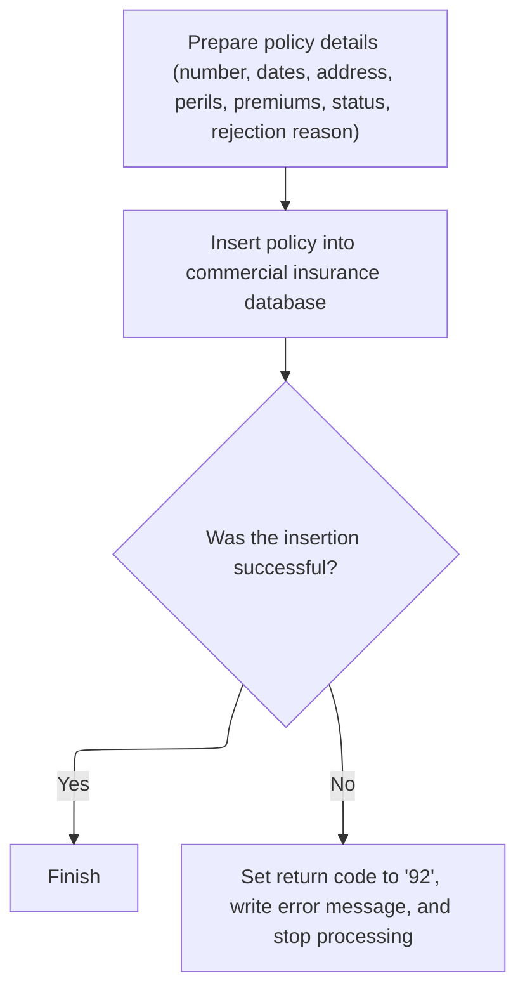

This section is responsible for ensuring that all required commercial policy data is correctly mapped and inserted into the commercial insurance database. It also handles error reporting and transaction control if the insertion fails.

| Category        | Rule Name                          | Description                                                                                                                                                                                                     |
| --------------- | ---------------------------------- | --------------------------------------------------------------------------------------------------------------------------------------------------------------------------------------------------------------- |
| Data validation | Required policy fields mapping     | All required commercial policy fields (policy number, dates, address, customer, property type, perils, premiums, status, and rejection reason) must be present and mapped before attempting database insertion. |
| Data validation | Successful transaction requirement | Only transactions with a successful database insertion (SQLCODE equals zero) are considered complete and valid for further business processing.                                                                 |
| Business logic  | Policy record insertion            | A new commercial policy record must be inserted into the database using the mapped values for all required fields.                                                                                              |

<SwmSnippet path="/base/src/lgapdb09.cbl" line="553">

---

In <SwmToken path="base/src/lgapdb09.cbl" pos="553:1:3" line-data="       P548-BINS.">`P548-BINS`</SwmToken>, we move all the premium, status, and policy fields into the <SwmToken path="base/src/lgapdb09.cbl" pos="554:11:11" line-data="           MOVE CA-B-FP     TO DB2-B-P1-Int">`DB2`</SwmToken> integer host variables to prep for the commercial policy SQL insert. This sets up the data for the actual database write.

```cobol
       P548-BINS.
           MOVE CA-B-FP     TO DB2-B-P1-Int
           MOVE CA-B-CA-B-FPR   TO DB2-B-P1A-Int
           MOVE CA-B-CP    TO DB2-B-P2-Int
           MOVE CA-B-CPR  TO DB2-B-P2A-Int
           MOVE CA-B-FLP    TO DB2-B-P3-Int
           MOVE CA-B-FLPR  TO DB2-B-P3A-Int
           MOVE CA-B-WP  TO DB2-B-P4-Int
           MOVE CA-B-WPR TO DB2-B-P4A-Int
           MOVE CA-B-ST        TO DB2-B-Z9-Int
           
           MOVE ' INSERT COMMER' TO EM-SQLREQ
```

---

</SwmSnippet>

<SwmSnippet path="/base/src/lgapdb09.cbl" line="565">

---

Here we run the SQL insert to write all the mapped commercial policy fields—policy number, dates, address, customer, property type, premiums, status, and rejection reason—into the database. This is the actual persistence step.

```cobol
           EXEC SQL
             INSERT INTO COMMERCIAL
                       (PolicyNumber,
                        RequestDate,
                        StartDate,
                        RenewalDate,
                        Address,
                        Zipcode,
                        LatitudeN,
                        LongitudeW,
                        Customer,
                        PropertyType,
                        FirePeril,
                        CA-B-FPR,
                        CrimePeril,
                        CrimePremium,
                        FloodPeril,
                        FloodPremium,
                        WeatherPeril,
                        WeatherPremium,
                        Status,
                        RejectionReason)
                VALUES (:DB2-POLICYNUM-INT,
                        :CA-LASTCHANGED,
                        :CA-ISSUE-DATE,
                        :CA-EXPIRY-DATE,
                        :CA-B-Address,
                        :CA-B-PST,
                        :CA-B-Latitude,
                        :CA-B-Longitude,
                        :CA-B-Customer,
                        :CA-B-PropType,
                        :DB2-B-P1-Int,
                        :DB2-B-P1A-Int,
                        :DB2-B-P2-Int,
                        :DB2-B-P2A-Int,
                        :DB2-B-P3-Int,
                        :DB2-B-P3A-Int,
                        :DB2-B-P4-Int,
                        :DB2-B-P4A-Int,
                        :DB2-B-Z9-Int,
                        :CA-B-RejectReason)
           END-EXEC
```

---

</SwmSnippet>

<SwmSnippet path="/base/src/lgapdb09.cbl" line="609">

---

If the SQL insert fails, we call <SwmToken path="base/src/lgapdb09.cbl" pos="611:3:7" line-data="              PERFORM WRITE-ERROR-MESSAGE">`WRITE-ERROR-MESSAGE`</SwmToken> to log the error details, then abend and exit to make sure the failure is recorded and the transaction doesn't continue.

```cobol
           IF SQLCODE NOT = 0
              MOVE '92' TO CA-RETURN-CODE
              PERFORM WRITE-ERROR-MESSAGE
              EXEC CICS ABEND ABCODE('LGSQ') NODUMP END-EXEC
              EXEC CICS RETURN END-EXEC
           END-IF.
           
           EXIT.
```

---

</SwmSnippet>

## Finalizing transaction and linking to record writer

<SwmSnippet path="/base/src/lgapdb09.cbl" line="268">

---

After finishing <SwmToken path="base/src/lgapdb09.cbl" pos="261:3:5" line-data="               PERFORM P500-BIZ">`P500-BIZ`</SwmToken>, MAINLINE links to <SwmToken path="base/src/lgapdb09.cbl" pos="268:9:9" line-data="             EXEC CICS Link Program(LGAPVS01)">`LGAPVS01`</SwmToken> to format and write the insurance data record. This step pushes the processed data to the file system for storage.

```cobol
             EXEC CICS Link Program(LGAPVS01)
                  Commarea(DFHCOMMAREA)
                LENGTH(32500)
             END-EXEC.


      * Return to caller
           EXEC CICS RETURN END-EXEC.
```

---

</SwmSnippet>

# Formatting and writing insurance records with error handling

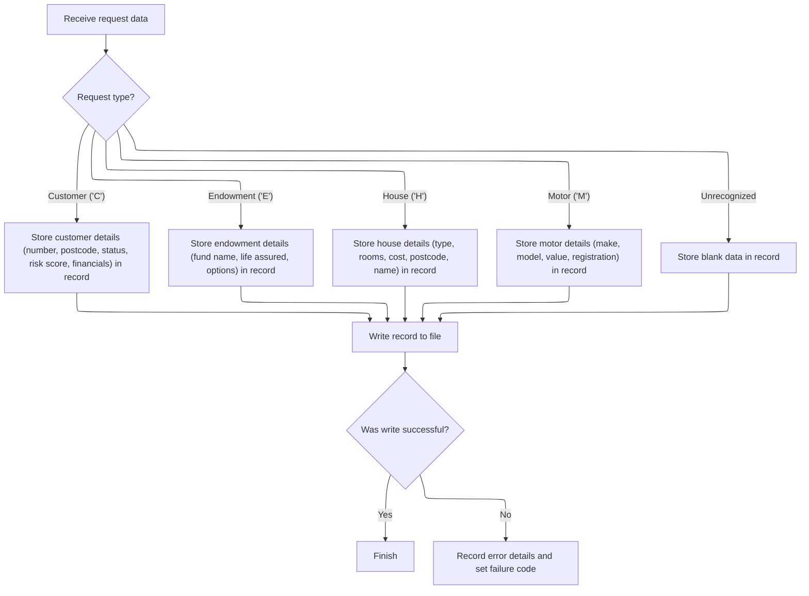

This section is responsible for formatting insurance records based on request type, writing them to the designated file, and handling any errors that occur during the write process.

| Category       | Rule Name                | Description                                                                                                                          |
| -------------- | ------------------------ | ------------------------------------------------------------------------------------------------------------------------------------ |
| Business logic | Customer record mapping  | If the request type is 'Customer', map all customer-related fields (number, postcode, status, risk score, financials) to the record. |
| Business logic | Endowment record mapping | If the request type is 'Endowment', map all endowment-related fields (fund name, life assured, options) to the record.               |
| Business logic | House record mapping     | If the request type is 'House', map all house-related fields (type, rooms, cost, postcode, name) to the record.                      |
| Business logic | Motor record mapping     | If the request type is 'Motor', map all motor-related fields (make, model, value, registration) to the record.                       |

<SwmSnippet path="/base/src/lgapvs01.cbl" line="90">

---

<SwmToken path="base/src/lgapvs01.cbl" pos="90:1:3" line-data="       P100-ENTRY SECTION.">`P100-ENTRY`</SwmToken> in <SwmToken path="base/src/lgapdb09.cbl" pos="268:9:9" line-data="             EXEC CICS Link Program(LGAPVS01)">`LGAPVS01`</SwmToken> maps fields to <SwmToken path="base/src/lgapvs01.cbl" pos="137:3:5" line-data="                     From(V2-RECORD)">`V2-RECORD`</SwmToken> based on the request type, then writes the record to the KSDSPOLY file. If the write fails, it triggers error handling and returns.

```cobol
       P100-ENTRY SECTION.
      *
      *---------------------------------------------------------------*
           Move EIBCALEN To V1-COMM.
      *---------------------------------------------------------------*
           Move CA-Request-ID(4:1) To V2-REQ
           Move CA-Policy-Num      To V2-POL
           Move CA-Customer-Num    To V2-CUST

           Evaluate V2-REQ

             When 'C'
               Move CA-B-PST     To V2-C-PCD
               Move CA-B-ST       To V2-C-Z9
               Move CA-B-Customer     To V2-C-CUST
               Move WS-RISK-SCORE     To V2-C-VAL
               Move CA-B-CA-B-FPR  To V2-C-P1VAL
               Move CA-B-CPR To V2-C-P2VAL
               Move CA-B-FLPR To V2-C-P3VAL
               Move CA-B-WPR To V2-C-P4VAL

             When 'E'
               Move CA-E-W-PRO        To  V2-E-OPT1
               Move CA-E-EQU          To  V2-E-OPT2
               Move CA-E-M-FUN        To  V2-E-OPT3
               Move CA-E-FUND-NAME    To  V2-E-NAME
               Move CA-E-LIFE-ASSURED To  V2-E-LIFE

             When 'H'
               Move CA-H-P-TYP         To  V2-H-TYPE
               Move CA-H-BED           To  V2-H-ROOMS
               Move CA-H-VAL           To  V2-H-COST
               Move CA-H-PCD           To  V2-H-PCD
               Move CA-H-H-NAM         To  V2-H-NAME

             When 'M'
               Move CA-M-MAKE          To  V2-M-MAKE
               Move CA-M-MODEL         To  V2-M-MODEL
               Move CA-M-VALUE         To  V2-M-COST
               Move CA-M-REGNUMBER     To  V2-M-NUM

             When Other
               Move Spaces To V2-DATA
           End-Evaluate

      *---------------------------------------------------------------*
           Exec CICS Write File('KSDSPOLY')
                     From(V2-RECORD)
                     Length(104)
                     Ridfld(V2-KEY)
                     KeyLength(21)
                     RESP(V1-RCD1)
           End-Exec.
           If V1-RCD1 Not = DFHRESP(NORMAL)
             Move EIBRESP2 To V1-RCD2
             MOVE '80' TO CA-RETURN-CODE
             PERFORM P999-ERROR
             EXEC CICS RETURN END-EXEC
           End-If.
```

---

</SwmSnippet>

<SwmSnippet path="/base/src/lgapvs01.cbl" line="156">

---

<SwmToken path="base/src/lgapvs01.cbl" pos="156:1:3" line-data="       P999-ERROR.">`P999-ERROR`</SwmToken> in <SwmToken path="base/src/lgapdb09.cbl" pos="268:9:9" line-data="             EXEC CICS Link Program(LGAPVS01)">`LGAPVS01`</SwmToken> formats the error message with current time, customer, and policy info, then links to LGSTSQ to log it. If there's commarea data, it moves up to 90 bytes and links to LGSTSQ again to pass that context. The 90/91 byte logic controls how much data gets sent for error tracking.

```cobol
       P999-ERROR.
           EXEC CICS ASKTIME ABSTIME(V3-TIME)
           END-EXEC
           EXEC CICS FORMATTIME ABSTIME(V3-TIME)
                     MMDDYYYY(V3-DATE1)
                     TIME(V3-DATE2)
           END-EXEC
      *
           MOVE V3-DATE1 TO EM-DATE
           MOVE V3-DATE2 TO EM-TIME
           Move CA-Customer-Num To EM-Cusnum
           Move CA-Policy-Num   To EM-POLNUM 
           Move V1-RCD1         To EM-RespRC
           Move V1-RCD2         To EM-Resp2RC
           EXEC CICS LINK PROGRAM('LGSTSQ')
                     COMMAREA(ERROR-MSG)
                     LENGTH(LENGTH OF ERROR-MSG)
           END-EXEC.
           IF EIBCALEN > 0 THEN
             IF EIBCALEN < 91 THEN
               MOVE DFHCOMMAREA(1:EIBCALEN) TO CA-DATA
               EXEC CICS LINK PROGRAM('LGSTSQ')
                         COMMAREA(CA-ERROR-MSG)
                         LENGTH(Length Of CA-ERROR-MSG)
               END-EXEC
             ELSE
               MOVE DFHCOMMAREA(1:90) TO CA-DATA
               EXEC CICS LINK PROGRAM('LGSTSQ')
                         COMMAREA(CA-ERROR-MSG)
                         LENGTH(Length Of CA-ERROR-MSG)
               END-EXEC
             END-IF
           END-IF.
           EXIT.
```

---

</SwmSnippet>

&nbsp;

*This is an auto-generated document by Swimm 🌊 and has not yet been verified by a human*

<SwmMeta version="3.0.0" repo-id="Z2l0aHViJTNBJTNBU3dpbW1pby1nZW5hcHAtaG91c2UlM0ElM0FHaXJpLVN3aW1t" repo-name="Swimmio-genapp-house"><sup>Powered by [Swimm](https://app.swimm.io/)</sup></SwmMeta>
