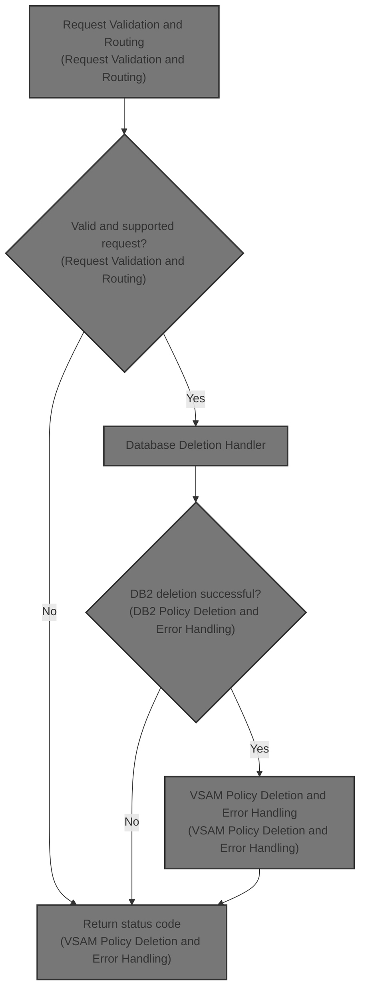
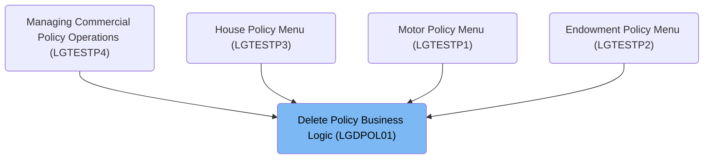
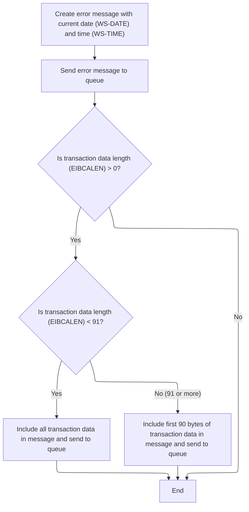

# Overview

This document describes the flow for deleting insurance policy records. The process validates incoming requests, ensures only supported and sufficiently detailed requests are processed, and coordinates the removal of policy data from both <SwmToken path="base/src/lgdpol01.cbl" pos="126:7:7" line-data="               PERFORM DELETE-POLICY-DB2-INFO">`DB2`</SwmToken> and VSAM storage. The flow also provides robust error logging and audit trails, returning a status code to indicate the result of each deletion request.



## Dependencies

### Programs

- <SwmToken path="base/src/lgdpol01.cbl" pos="11:6:6" line-data="       PROGRAM-ID. LGDPOL01.">`LGDPOL01`</SwmToken> (<SwmPath>[base/src/lgdpol01.cbl](base/src/lgdpol01.cbl)</SwmPath>)
- <SwmToken path="base/src/lgdpol01.cbl" pos="141:9:9" line-data="           EXEC CICS LINK PROGRAM(LGDPDB01)">`LGDPDB01`</SwmToken> (<SwmPath>[base/src/lgdpdb01.cbl](base/src/lgdpdb01.cbl)</SwmPath>)
- <SwmToken path="base/src/lgdpdb01.cbl" pos="168:9:9" line-data="               EXEC CICS LINK PROGRAM(LGDPVS01)">`LGDPVS01`</SwmToken> (<SwmPath>[base/src/lgdpvs01.cbl](base/src/lgdpvs01.cbl)</SwmPath>)
- LGSTSQ (<SwmPath>[base/src/lgstsq.cbl](base/src/lgstsq.cbl)</SwmPath>)

### Copybooks

- LGCMAREA (<SwmPath>[base/src/lgcmarea.cpy](base/src/lgcmarea.cpy)</SwmPath>)
- SQLCA

# Where is this program used?

This program is used multiple times in the codebase as represented in the following diagram:



## Detailed View of the Program's Functionality

# Startup and Input Validation

At the start of the main program, the system prepares its internal storage and copies transaction details from the CICS environment. This includes setting up identifiers for the transaction, terminal, and task, which are used for tracking and debugging.

The first critical check is whether any input data (commarea) was received. If none is present, the program creates an error message describing the missing input, logs this error, and then immediately terminates with a specific abend code. This ensures that no further processing occurs without valid input, and that support teams have a record of the failure.

If input is present, the program initializes the return code in the commarea to indicate success by default. It then checks if the input area is large enough to contain the required fields. If the area is too small, it sets a specific error code and exits, preventing any business logic from running with incomplete data.

# Error Logging and Audit Trail

Whenever an error is detected (such as missing or insufficient input), the program constructs a detailed error message. This message includes the current date and time, which are obtained and formatted using CICS system calls. The error message also contains program identifiers and a description of the error.

The error message is then sent to a logging system via a CICS link call, ensuring that all error details are recorded for later analysis.

Additionally, if there is any input data, up to 90 bytes of it are included in a secondary error message and sent to the logging system. If the input is shorter than 90 bytes, the entire input is logged; otherwise, only the first 90 bytes are included. This provides context for the error without risking oversized log entries.

# Request Validation and Routing

After input validation and error logging, the program uppercases the request type field from the input data to standardize it. It then checks if the request type matches one of the supported operations (endowment, motor, house, or commercial policy deletion).

If the request type is not recognized, the program sets a specific error code and exits. If the request type is valid, the program proceeds to the business logic for policy deletion.

The deletion logic is encapsulated in a separate routine, which is called next. After the deletion routine runs, if an error code is set, the program exits immediately. Otherwise, it returns to the caller, signaling successful completion.

# Database Deletion Handler

The deletion routine calls a dedicated program responsible for interacting with the database (<SwmToken path="base/src/lgdpol01.cbl" pos="126:7:7" line-data="               PERFORM DELETE-POLICY-DB2-INFO">`DB2`</SwmToken>). This program receives the input data and attempts to delete the specified policy record from the database.

# <SwmToken path="base/src/lgdpol01.cbl" pos="126:7:7" line-data="               PERFORM DELETE-POLICY-DB2-INFO">`DB2`</SwmToken> Policy Deletion and Error Handling

Within the database deletion program, the system again validates the input. If no input is present, it logs an error and abends. If the input area is too small, it sets an error code and exits.

The program converts customer and policy numbers from the input into the format required by the database. These values are also saved in the error message structure for potential logging.

The request type is checked again to ensure it is supported. If not, an error code is set and the program exits.

If the request type is valid, the program attempts to delete the policy record from the database. The SQL operation is performed, and the result code is checked. If the operation fails (any SQL code other than success or "not found"), an error code is set, the error is logged, and the program exits. If the operation succeeds or the record was already deleted, the program proceeds.

After the database operation, the program calls another routine to delete the corresponding record from a VSAM file, ensuring consistency between the database and file storage.

# VSAM Policy Deletion and Error Handling

The VSAM deletion program prepares the key fields needed to identify the policy record, using values from the input data. It then attempts to delete the record from the VSAM file using a CICS delete operation.

If the deletion fails, the program sets an error code, records additional response codes for debugging, logs the error, and exits. If the deletion succeeds, the program simply returns.

Error logging in this program also includes the current date and time, customer and policy numbers, and response codes. As with previous error logging, up to 90 bytes of input data are included for context.

# Summary of Flow

1. **Startup and Input Validation:**

   - Prepare internal storage and transaction info.
   - Check for input data; log and abend if missing.
   - Check input size; log and exit if too small.

2. **Error Logging:**

   - Construct timestamped error messages.
   - Log error details and up to 90 bytes of input data.

3. **Request Validation and Routing:**

   - Standardize request type.
   - Validate request type; log and exit if unsupported.
   - Call deletion routine if supported.

4. **Database Deletion:**

   - Validate input again.
   - Convert input fields for database use.
   - Attempt to delete policy from <SwmToken path="base/src/lgdpol01.cbl" pos="126:7:7" line-data="               PERFORM DELETE-POLICY-DB2-INFO">`DB2`</SwmToken>.
   - Log and exit on error; proceed if successful.

5. **VSAM Deletion:**

   - Prepare key fields from input.
   - Attempt to delete policy from VSAM file.
   - Log and exit on error; return on success.

6. **Error Handling Throughout:**

   - All errors are logged with timestamps, identifiers, and relevant input data.
   - Specific error codes are set for different failure scenarios, aiding troubleshooting and support.

# Rule Definition

| Paragraph Name                                                                                                                                                                                                                                                                               | Rule ID | Category          | Description                                                                                                                                                                                                                                                                                                                                                                                                                                                                                                                                                                                                                                                                                                                                                                                                                                                                                                                                                                                                                                                                      | Conditions                                                                                                                                                                                    | Remarks                                                                                                                                                                                                                                                                                                                                                                                                                                                                                                                                                                                                                                                                                                                                                                                                             |
| -------------------------------------------------------------------------------------------------------------------------------------------------------------------------------------------------------------------------------------------------------------------------------------------- | ------- | ----------------- | -------------------------------------------------------------------------------------------------------------------------------------------------------------------------------------------------------------------------------------------------------------------------------------------------------------------------------------------------------------------------------------------------------------------------------------------------------------------------------------------------------------------------------------------------------------------------------------------------------------------------------------------------------------------------------------------------------------------------------------------------------------------------------------------------------------------------------------------------------------------------------------------------------------------------------------------------------------------------------------------------------------------------------------------------------------------------------- | --------------------------------------------------------------------------------------------------------------------------------------------------------------------------------------------- | ------------------------------------------------------------------------------------------------------------------------------------------------------------------------------------------------------------------------------------------------------------------------------------------------------------------------------------------------------------------------------------------------------------------------------------------------------------------------------------------------------------------------------------------------------------------------------------------------------------------------------------------------------------------------------------------------------------------------------------------------------------------------------------------------------------------- |
| MAINLINE SECTION, <SwmToken path="base/src/lgdpol01.cbl" pos="97:3:7" line-data="               PERFORM WRITE-ERROR-MESSAGE">`WRITE-ERROR-MESSAGE`</SwmToken>                                                                                                                                | RL-001  | Conditional Logic | Before any business logic is processed, the program must check if a commarea is present (EIBCALEN > 0). If not, it logs an error message with the current date, time, program name, and the message 'NO COMMAREA RECEIVED', then terminates processing.                                                                                                                                                                                                                                                                                                                                                                                                                                                                                                                                                                                                                                                                                                                                                                                                                          | EIBCALEN is equal to zero.                                                                                                                                                                    | Error message includes: date (string, 8 bytes), time (string, 6 bytes), program name (string, 9 bytes), and literal 'NO COMMAREA RECEIVED'. Error and commarea messages are sent to LGSTSQ synchronously.                                                                                                                                                                                                                                                                                                                                                                                                                                                                                                                                                                                                           |
| MAINLINE SECTION                                                                                                                                                                                                                                                                             | RL-002  | Conditional Logic | If the commarea is present but shorter than 28 bytes, the program sets <SwmToken path="base/src/lgdpol01.cbl" pos="102:9:13" line-data="           MOVE &#39;00&#39; TO CA-RETURN-CODE">`CA-RETURN-CODE`</SwmToken> to '98', logs an error message indicating 'AREA TOO SMALL', and terminates processing.                                                                                                                                                                                                                                                                                                                                                                                                                                                                                                                                                                                                                                                                                                                                                                       | EIBCALEN is less than 28.                                                                                                                                                                     | <SwmToken path="base/src/lgdpol01.cbl" pos="102:9:13" line-data="           MOVE &#39;00&#39; TO CA-RETURN-CODE">`CA-RETURN-CODE`</SwmToken> is set to '98'. Error message includes 'AREA TOO SMALL'. Minimum commarea length constant is 28 bytes.                                                                                                                                                                                                                                                                                                                                                                                                                                                                                                                                                                 |
| MAINLINE SECTION                                                                                                                                                                                                                                                                             | RL-003  | Data Assignment   | The <SwmToken path="base/src/lgdpol01.cbl" pos="117:9:13" line-data="           MOVE FUNCTION UPPER-CASE(CA-REQUEST-ID) TO CA-REQUEST-ID">`CA-REQUEST-ID`</SwmToken> field in the commarea must be uppercased before its value is evaluated for request type validation.                                                                                                                                                                                                                                                                                                                                                                                                                                                                                                                                                                                                                                                                                                                                                                                                         | Always before request type validation.                                                                                                                                                        | <SwmToken path="base/src/lgdpol01.cbl" pos="117:9:13" line-data="           MOVE FUNCTION UPPER-CASE(CA-REQUEST-ID) TO CA-REQUEST-ID">`CA-REQUEST-ID`</SwmToken> is uppercased using a string function.                                                                                                                                                                                                                                                                                                                                                                                                                                                                                                                                                                                                             |
| MAINLINE SECTION                                                                                                                                                                                                                                                                             | RL-004  | Conditional Logic | The program must validate that <SwmToken path="base/src/lgdpol01.cbl" pos="117:9:13" line-data="           MOVE FUNCTION UPPER-CASE(CA-REQUEST-ID) TO CA-REQUEST-ID">`CA-REQUEST-ID`</SwmToken> is one of: <SwmToken path="base/src/lgdpol01.cbl" pos="119:18:18" line-data="           IF ( CA-REQUEST-ID NOT EQUAL TO &#39;01DEND&#39; AND">`01DEND`</SwmToken>, <SwmToken path="base/src/lgdpol01.cbl" pos="120:14:14" line-data="                CA-REQUEST-ID NOT EQUAL TO &#39;01DMOT&#39; AND">`01DMOT`</SwmToken>, <SwmToken path="base/src/lgdpol01.cbl" pos="121:14:14" line-data="                CA-REQUEST-ID NOT EQUAL TO &#39;01DHOU&#39; AND">`01DHOU`</SwmToken>, <SwmToken path="base/src/lgdpol01.cbl" pos="122:14:14" line-data="                CA-REQUEST-ID NOT EQUAL TO &#39;01DCOM&#39; )">`01DCOM`</SwmToken>. If not, set <SwmToken path="base/src/lgdpol01.cbl" pos="102:9:13" line-data="           MOVE &#39;00&#39; TO CA-RETURN-CODE">`CA-RETURN-CODE`</SwmToken> to '99', log an error message 'UNSUPPORTED REQUEST', and terminate processing. | <SwmToken path="base/src/lgdpol01.cbl" pos="117:9:13" line-data="           MOVE FUNCTION UPPER-CASE(CA-REQUEST-ID) TO CA-REQUEST-ID">`CA-REQUEST-ID`</SwmToken> is not in the supported set. | Supported request types: <SwmToken path="base/src/lgdpol01.cbl" pos="119:18:18" line-data="           IF ( CA-REQUEST-ID NOT EQUAL TO &#39;01DEND&#39; AND">`01DEND`</SwmToken>, <SwmToken path="base/src/lgdpol01.cbl" pos="120:14:14" line-data="                CA-REQUEST-ID NOT EQUAL TO &#39;01DMOT&#39; AND">`01DMOT`</SwmToken>, <SwmToken path="base/src/lgdpol01.cbl" pos="121:14:14" line-data="                CA-REQUEST-ID NOT EQUAL TO &#39;01DHOU&#39; AND">`01DHOU`</SwmToken>, <SwmToken path="base/src/lgdpol01.cbl" pos="122:14:14" line-data="                CA-REQUEST-ID NOT EQUAL TO &#39;01DCOM&#39; )">`01DCOM`</SwmToken>. <SwmToken path="base/src/lgdpol01.cbl" pos="102:9:13" line-data="           MOVE &#39;00&#39; TO CA-RETURN-CODE">`CA-RETURN-CODE`</SwmToken> is set to '99'. |
| MAINLINE SECTION, <SwmToken path="base/src/lgdpol01.cbl" pos="126:3:9" line-data="               PERFORM DELETE-POLICY-DB2-INFO">`DELETE-POLICY-DB2-INFO`</SwmToken>                                                                                                                         | RL-005  | Computation       | For supported request types, the program calls the <SwmToken path="base/src/lgdpol01.cbl" pos="126:7:7" line-data="               PERFORM DELETE-POLICY-DB2-INFO">`DB2`</SwmToken> policy deletion handler (<SwmToken path="base/src/lgdpol01.cbl" pos="141:9:9" line-data="           EXEC CICS LINK PROGRAM(LGDPDB01)">`LGDPDB01`</SwmToken>) synchronously, passing the full commarea and a length of 32,500 bytes.                                                                                                                                                                                                                                                                                                                                                                                                                                                                                                                                                                                                                                                           | <SwmToken path="base/src/lgdpol01.cbl" pos="117:9:13" line-data="           MOVE FUNCTION UPPER-CASE(CA-REQUEST-ID) TO CA-REQUEST-ID">`CA-REQUEST-ID`</SwmToken> is valid.                    | External call to <SwmToken path="base/src/lgdpol01.cbl" pos="141:9:9" line-data="           EXEC CICS LINK PROGRAM(LGDPDB01)">`LGDPDB01`</SwmToken> with commarea (input/output), length 32,500 bytes.                                                                                                                                                                                                                                                                                                                                                                                                                                                                                                                                                                                                              |
| MAINLINE SECTION (<SwmToken path="base/src/lgdpol01.cbl" pos="11:6:6" line-data="       PROGRAM-ID. LGDPOL01.">`LGDPOL01`</SwmToken>), MAINLINE SECTION (<SwmToken path="base/src/lgdpol01.cbl" pos="141:9:9" line-data="           EXEC CICS LINK PROGRAM(LGDPDB01)">`LGDPDB01`</SwmToken>) | RL-006  | Conditional Logic | After <SwmToken path="base/src/lgdpol01.cbl" pos="126:7:7" line-data="               PERFORM DELETE-POLICY-DB2-INFO">`DB2`</SwmToken> deletion handler returns, check <SwmToken path="base/src/lgdpol01.cbl" pos="102:9:13" line-data="           MOVE &#39;00&#39; TO CA-RETURN-CODE">`CA-RETURN-CODE`</SwmToken>:                                                                                                                                                                                                                                                                                                                                                                                                                                                                                                                                                                                                                                                                                                                                                              |                                                                                                                                                                                               |                                                                                                                                                                                                                                                                                                                                                                                                                                                                                                                                                                                                                                                                                                                                                                                                                     |

- '00': success, continue processing
- '98': commarea too small, log 'AREA TOO SMALL', terminate
- '99': unsupported request, log 'UNSUPPORTED REQUEST', terminate
- '90': <SwmToken path="base/src/lgdpol01.cbl" pos="126:7:7" line-data="               PERFORM DELETE-POLICY-DB2-INFO">`DB2`</SwmToken> error, log error with customer number, policy number, SQL request, SQLCODE, terminate | After <SwmToken path="base/src/lgdpol01.cbl" pos="126:7:7" line-data="               PERFORM DELETE-POLICY-DB2-INFO">`DB2`</SwmToken> handler returns. | <SwmToken path="base/src/lgdpol01.cbl" pos="102:9:13" line-data="           MOVE &#39;00&#39; TO CA-RETURN-CODE">`CA-RETURN-CODE`</SwmToken> values: '00', '98', '99', '90'. Error message for '90' includes customer number (string, 10 bytes), policy number (string, 10 bytes), SQL request (string, 16 bytes), SQLCODE (number, 5 digits). | | MAINLINE SECTION (<SwmToken path="base/src/lgdpol01.cbl" pos="141:9:9" line-data="           EXEC CICS LINK PROGRAM(LGDPDB01)">`LGDPDB01`</SwmToken>) | RL-007 | Computation | On successful <SwmToken path="base/src/lgdpol01.cbl" pos="126:7:7" line-data="               PERFORM DELETE-POLICY-DB2-INFO">`DB2`</SwmToken> deletion, the <SwmToken path="base/src/lgdpol01.cbl" pos="126:7:7" line-data="               PERFORM DELETE-POLICY-DB2-INFO">`DB2`</SwmToken> handler calls the VSAM policy deletion handler (<SwmToken path="base/src/lgdpdb01.cbl" pos="168:9:9" line-data="               EXEC CICS LINK PROGRAM(LGDPVS01)">`LGDPVS01`</SwmToken>) synchronously, passing the full commarea and a length of 32,500 bytes. | <SwmToken path="base/src/lgdpol01.cbl" pos="126:7:7" line-data="               PERFORM DELETE-POLICY-DB2-INFO">`DB2`</SwmToken> deletion successful (<SwmToken path="base/src/lgdpol01.cbl" pos="102:9:13" line-data="           MOVE &#39;00&#39; TO CA-RETURN-CODE">`CA-RETURN-CODE`</SwmToken> = '00'). | External call to <SwmToken path="base/src/lgdpdb01.cbl" pos="168:9:9" line-data="               EXEC CICS LINK PROGRAM(LGDPVS01)">`LGDPVS01`</SwmToken> with commarea (input/output), length 32,500 bytes. | | MAINLINE SECTION (<SwmToken path="base/src/lgdpdb01.cbl" pos="168:9:9" line-data="               EXEC CICS LINK PROGRAM(LGDPVS01)">`LGDPVS01`</SwmToken>) | RL-008 | Conditional Logic | After VSAM deletion handler returns, check <SwmToken path="base/src/lgdpol01.cbl" pos="102:9:13" line-data="           MOVE &#39;00&#39; TO CA-RETURN-CODE">`CA-RETURN-CODE`</SwmToken>:
- '00': success, processing completes
- '81': VSAM error, log error with customer number, policy number, response codes, terminate | After VSAM handler returns. | <SwmToken path="base/src/lgdpol01.cbl" pos="102:9:13" line-data="           MOVE &#39;00&#39; TO CA-RETURN-CODE">`CA-RETURN-CODE`</SwmToken> values: '00', '81'. Error message for '81' includes customer number (string, 10 bytes), policy number (string, 10 bytes), response codes (number, 5 digits each). | | <SwmToken path="base/src/lgdpol01.cbl" pos="97:3:7" line-data="               PERFORM WRITE-ERROR-MESSAGE">`WRITE-ERROR-MESSAGE`</SwmToken> (all programs) | RL-009 | Computation | All error messages must include a timestamp (date and time), program name, and relevant IDs or codes. Error and commarea context messages are sent to the logging program (LGSTSQ) synchronously, with the message and its length. | Any error condition. | Error message format: date (string, 8 bytes), time (string, 6 bytes), program name (string, 9 bytes), relevant IDs/codes. Commarea context message: literal 'COMMAREA=' (string, 9 bytes) + up to first 90 bytes of commarea. | | MAINLINE SECTION, <SwmToken path="base/src/lgdpol01.cbl" pos="126:3:9" line-data="               PERFORM DELETE-POLICY-DB2-INFO">`DELETE-POLICY-DB2-INFO`</SwmToken>, <SwmToken path="base/src/lgdpol01.cbl" pos="97:3:7" line-data="               PERFORM WRITE-ERROR-MESSAGE">`WRITE-ERROR-MESSAGE`</SwmToken> | RL-010 | Computation | All external program calls (LGSTSQ, <SwmToken path="base/src/lgdpol01.cbl" pos="141:9:9" line-data="           EXEC CICS LINK PROGRAM(LGDPDB01)">`LGDPDB01`</SwmToken>, <SwmToken path="base/src/lgdpdb01.cbl" pos="168:9:9" line-data="               EXEC CICS LINK PROGRAM(LGDPVS01)">`LGDPVS01`</SwmToken>) must use the commarea as both input and output, with status returned in <SwmToken path="base/src/lgdpol01.cbl" pos="102:9:13" line-data="           MOVE &#39;00&#39; TO CA-RETURN-CODE">`CA-RETURN-CODE`</SwmToken>. | Whenever an external program is called. | Commarea is passed as input/output, status in <SwmToken path="base/src/lgdpol01.cbl" pos="102:9:13" line-data="           MOVE &#39;00&#39; TO CA-RETURN-CODE">`CA-RETURN-CODE`</SwmToken>. | | MAINLINE SECTION, <SwmToken path="base/src/lgdpol01.cbl" pos="97:3:7" line-data="               PERFORM WRITE-ERROR-MESSAGE">`WRITE-ERROR-MESSAGE`</SwmToken> | RL-011 | Conditional Logic | The program must not continue processing after any error condition that results in an error code being set. | Any error code is set in <SwmToken path="base/src/lgdpol01.cbl" pos="102:9:13" line-data="           MOVE &#39;00&#39; TO CA-RETURN-CODE">`CA-RETURN-CODE`</SwmToken>. | Error codes: '98', '99', '90', '81'. |

# User Stories

## User Story 1: Validate commarea presence and length before processing

---

### Story Description:

As a system, I want to validate that a commarea is present and has a minimum length before processing any business logic so that invalid or incomplete requests are rejected early and handled with appropriate error messages.

---

### Business Rule Mapping:

| Rule ID | Paragraph Name                                                                                                                                                                                                                                                                                                    | Rule Description                                                                                                                                                                                                                                                                                                                                                                                                                                                                                                                      |
| ------- | ----------------------------------------------------------------------------------------------------------------------------------------------------------------------------------------------------------------------------------------------------------------------------------------------------------------- | ------------------------------------------------------------------------------------------------------------------------------------------------------------------------------------------------------------------------------------------------------------------------------------------------------------------------------------------------------------------------------------------------------------------------------------------------------------------------------------------------------------------------------------- |
| RL-001  | MAINLINE SECTION, <SwmToken path="base/src/lgdpol01.cbl" pos="97:3:7" line-data="               PERFORM WRITE-ERROR-MESSAGE">`WRITE-ERROR-MESSAGE`</SwmToken>                                                                                                                                                     | Before any business logic is processed, the program must check if a commarea is present (EIBCALEN > 0). If not, it logs an error message with the current date, time, program name, and the message 'NO COMMAREA RECEIVED', then terminates processing.                                                                                                                                                                                                                                                                               |
| RL-002  | MAINLINE SECTION                                                                                                                                                                                                                                                                                                  | If the commarea is present but shorter than 28 bytes, the program sets <SwmToken path="base/src/lgdpol01.cbl" pos="102:9:13" line-data="           MOVE &#39;00&#39; TO CA-RETURN-CODE">`CA-RETURN-CODE`</SwmToken> to '98', logs an error message indicating 'AREA TOO SMALL', and terminates processing.                                                                                                                                                                                                                            |
| RL-010  | MAINLINE SECTION, <SwmToken path="base/src/lgdpol01.cbl" pos="126:3:9" line-data="               PERFORM DELETE-POLICY-DB2-INFO">`DELETE-POLICY-DB2-INFO`</SwmToken>, <SwmToken path="base/src/lgdpol01.cbl" pos="97:3:7" line-data="               PERFORM WRITE-ERROR-MESSAGE">`WRITE-ERROR-MESSAGE`</SwmToken> | All external program calls (LGSTSQ, <SwmToken path="base/src/lgdpol01.cbl" pos="141:9:9" line-data="           EXEC CICS LINK PROGRAM(LGDPDB01)">`LGDPDB01`</SwmToken>, <SwmToken path="base/src/lgdpdb01.cbl" pos="168:9:9" line-data="               EXEC CICS LINK PROGRAM(LGDPVS01)">`LGDPVS01`</SwmToken>) must use the commarea as both input and output, with status returned in <SwmToken path="base/src/lgdpol01.cbl" pos="102:9:13" line-data="           MOVE &#39;00&#39; TO CA-RETURN-CODE">`CA-RETURN-CODE`</SwmToken>. |
| RL-011  | MAINLINE SECTION, <SwmToken path="base/src/lgdpol01.cbl" pos="97:3:7" line-data="               PERFORM WRITE-ERROR-MESSAGE">`WRITE-ERROR-MESSAGE`</SwmToken>                                                                                                                                                     | The program must not continue processing after any error condition that results in an error code being set.                                                                                                                                                                                                                                                                                                                                                                                                                           |
| RL-009  | <SwmToken path="base/src/lgdpol01.cbl" pos="97:3:7" line-data="               PERFORM WRITE-ERROR-MESSAGE">`WRITE-ERROR-MESSAGE`</SwmToken> (all programs)                                                                                                                                                        | All error messages must include a timestamp (date and time), program name, and relevant IDs or codes. Error and commarea context messages are sent to the logging program (LGSTSQ) synchronously, with the message and its length.                                                                                                                                                                                                                                                                                                    |

---

### Relevant Functionality:

- **MAINLINE SECTION**
  1. **RL-001:**
     - If commarea length is zero:
       - Set error message variable to 'NO COMMAREA RECEIVED'
       - Format date and time
       - Send error message to logging program
       - Terminate processing (ABEND)
  2. **RL-002:**
     - If commarea length is less than 28:
       - Set <SwmToken path="base/src/lgdpol01.cbl" pos="102:9:13" line-data="           MOVE &#39;00&#39; TO CA-RETURN-CODE">`CA-RETURN-CODE`</SwmToken> to '98'
       - Log error message 'AREA TOO SMALL'
       - Terminate processing (RETURN)
  3. **RL-010:**
     - For each external call:
       - Pass commarea as input/output
       - Check <SwmToken path="base/src/lgdpol01.cbl" pos="102:9:13" line-data="           MOVE &#39;00&#39; TO CA-RETURN-CODE">`CA-RETURN-CODE`</SwmToken> for status
  4. **RL-011:**
     - If any error code is set:
       - Log error
       - Terminate processing (RETURN or ABEND)
- <SwmToken path="base/src/lgdpol01.cbl" pos="97:3:7" line-data="               PERFORM WRITE-ERROR-MESSAGE">`WRITE-ERROR-MESSAGE`</SwmToken> **(all programs)**
  1. **RL-009:**
     - On error:
       - Format date and time
       - Construct error message with program name and relevant IDs/codes
       - Send error message to LGSTSQ
       - Send commarea context message to LGSTSQ

## User Story 2: Validate and prepare request type

---

### Story Description:

As a system, I want to uppercase and validate the <SwmToken path="base/src/lgdpol01.cbl" pos="117:9:13" line-data="           MOVE FUNCTION UPPER-CASE(CA-REQUEST-ID) TO CA-REQUEST-ID">`CA-REQUEST-ID`</SwmToken> field to ensure only supported request types are processed, and unsupported types are rejected with clear error messages.

---

### Business Rule Mapping:

| Rule ID | Paragraph Name                                                                                                                                                                                                                                                                                                    | Rule Description                                                                                                                                                                                                                                                                                                                                                                                                                                                                                                                                                                                                                                                                                                                                                                                                                                                                                                                                                                                                                                                                 |
| ------- | ----------------------------------------------------------------------------------------------------------------------------------------------------------------------------------------------------------------------------------------------------------------------------------------------------------------- | -------------------------------------------------------------------------------------------------------------------------------------------------------------------------------------------------------------------------------------------------------------------------------------------------------------------------------------------------------------------------------------------------------------------------------------------------------------------------------------------------------------------------------------------------------------------------------------------------------------------------------------------------------------------------------------------------------------------------------------------------------------------------------------------------------------------------------------------------------------------------------------------------------------------------------------------------------------------------------------------------------------------------------------------------------------------------------- |
| RL-003  | MAINLINE SECTION                                                                                                                                                                                                                                                                                                  | The <SwmToken path="base/src/lgdpol01.cbl" pos="117:9:13" line-data="           MOVE FUNCTION UPPER-CASE(CA-REQUEST-ID) TO CA-REQUEST-ID">`CA-REQUEST-ID`</SwmToken> field in the commarea must be uppercased before its value is evaluated for request type validation.                                                                                                                                                                                                                                                                                                                                                                                                                                                                                                                                                                                                                                                                                                                                                                                                         |
| RL-004  | MAINLINE SECTION                                                                                                                                                                                                                                                                                                  | The program must validate that <SwmToken path="base/src/lgdpol01.cbl" pos="117:9:13" line-data="           MOVE FUNCTION UPPER-CASE(CA-REQUEST-ID) TO CA-REQUEST-ID">`CA-REQUEST-ID`</SwmToken> is one of: <SwmToken path="base/src/lgdpol01.cbl" pos="119:18:18" line-data="           IF ( CA-REQUEST-ID NOT EQUAL TO &#39;01DEND&#39; AND">`01DEND`</SwmToken>, <SwmToken path="base/src/lgdpol01.cbl" pos="120:14:14" line-data="                CA-REQUEST-ID NOT EQUAL TO &#39;01DMOT&#39; AND">`01DMOT`</SwmToken>, <SwmToken path="base/src/lgdpol01.cbl" pos="121:14:14" line-data="                CA-REQUEST-ID NOT EQUAL TO &#39;01DHOU&#39; AND">`01DHOU`</SwmToken>, <SwmToken path="base/src/lgdpol01.cbl" pos="122:14:14" line-data="                CA-REQUEST-ID NOT EQUAL TO &#39;01DCOM&#39; )">`01DCOM`</SwmToken>. If not, set <SwmToken path="base/src/lgdpol01.cbl" pos="102:9:13" line-data="           MOVE &#39;00&#39; TO CA-RETURN-CODE">`CA-RETURN-CODE`</SwmToken> to '99', log an error message 'UNSUPPORTED REQUEST', and terminate processing. |
| RL-010  | MAINLINE SECTION, <SwmToken path="base/src/lgdpol01.cbl" pos="126:3:9" line-data="               PERFORM DELETE-POLICY-DB2-INFO">`DELETE-POLICY-DB2-INFO`</SwmToken>, <SwmToken path="base/src/lgdpol01.cbl" pos="97:3:7" line-data="               PERFORM WRITE-ERROR-MESSAGE">`WRITE-ERROR-MESSAGE`</SwmToken> | All external program calls (LGSTSQ, <SwmToken path="base/src/lgdpol01.cbl" pos="141:9:9" line-data="           EXEC CICS LINK PROGRAM(LGDPDB01)">`LGDPDB01`</SwmToken>, <SwmToken path="base/src/lgdpdb01.cbl" pos="168:9:9" line-data="               EXEC CICS LINK PROGRAM(LGDPVS01)">`LGDPVS01`</SwmToken>) must use the commarea as both input and output, with status returned in <SwmToken path="base/src/lgdpol01.cbl" pos="102:9:13" line-data="           MOVE &#39;00&#39; TO CA-RETURN-CODE">`CA-RETURN-CODE`</SwmToken>.                                                                                                                                                                                                                                                                                                                                                                                                                                                                                                                                            |
| RL-011  | MAINLINE SECTION, <SwmToken path="base/src/lgdpol01.cbl" pos="97:3:7" line-data="               PERFORM WRITE-ERROR-MESSAGE">`WRITE-ERROR-MESSAGE`</SwmToken>                                                                                                                                                     | The program must not continue processing after any error condition that results in an error code being set.                                                                                                                                                                                                                                                                                                                                                                                                                                                                                                                                                                                                                                                                                                                                                                                                                                                                                                                                                                      |
| RL-009  | <SwmToken path="base/src/lgdpol01.cbl" pos="97:3:7" line-data="               PERFORM WRITE-ERROR-MESSAGE">`WRITE-ERROR-MESSAGE`</SwmToken> (all programs)                                                                                                                                                        | All error messages must include a timestamp (date and time), program name, and relevant IDs or codes. Error and commarea context messages are sent to the logging program (LGSTSQ) synchronously, with the message and its length.                                                                                                                                                                                                                                                                                                                                                                                                                                                                                                                                                                                                                                                                                                                                                                                                                                               |

---

### Relevant Functionality:

- **MAINLINE SECTION**
  1. **RL-003:**
     - Convert <SwmToken path="base/src/lgdpol01.cbl" pos="117:9:13" line-data="           MOVE FUNCTION UPPER-CASE(CA-REQUEST-ID) TO CA-REQUEST-ID">`CA-REQUEST-ID`</SwmToken> to uppercase
     - Continue with request type validation
  2. **RL-004:**
     - If <SwmToken path="base/src/lgdpol01.cbl" pos="117:9:13" line-data="           MOVE FUNCTION UPPER-CASE(CA-REQUEST-ID) TO CA-REQUEST-ID">`CA-REQUEST-ID`</SwmToken> is not one of supported values:
       - Set <SwmToken path="base/src/lgdpol01.cbl" pos="102:9:13" line-data="           MOVE &#39;00&#39; TO CA-RETURN-CODE">`CA-RETURN-CODE`</SwmToken> to '99'
       - Log error message 'UNSUPPORTED REQUEST'
       - Terminate processing (RETURN)
  3. **RL-010:**
     - For each external call:
       - Pass commarea as input/output
       - Check <SwmToken path="base/src/lgdpol01.cbl" pos="102:9:13" line-data="           MOVE &#39;00&#39; TO CA-RETURN-CODE">`CA-RETURN-CODE`</SwmToken> for status
  4. **RL-011:**
     - If any error code is set:
       - Log error
       - Terminate processing (RETURN or ABEND)
- <SwmToken path="base/src/lgdpol01.cbl" pos="97:3:7" line-data="               PERFORM WRITE-ERROR-MESSAGE">`WRITE-ERROR-MESSAGE`</SwmToken> **(all programs)**
  1. **RL-009:**
     - On error:
       - Format date and time
       - Construct error message with program name and relevant IDs/codes
       - Send error message to LGSTSQ
       - Send commarea context message to LGSTSQ

## User Story 3: Process policy deletion and handle DB2/VSAM responses

---

### Story Description:

As a system, I want to process supported policy deletion requests by calling the <SwmToken path="base/src/lgdpol01.cbl" pos="126:7:7" line-data="               PERFORM DELETE-POLICY-DB2-INFO">`DB2`</SwmToken> and VSAM handlers in sequence, handling their return codes appropriately, and logging detailed error messages when failures occur.

---

### Business Rule Mapping:

| Rule ID | Paragraph Name                                                                                                                                                                                                                                                                                                    | Rule Description                                                                                                                                                                                                                                                                                                                                                                                                                                                                                                                      |
| ------- | ----------------------------------------------------------------------------------------------------------------------------------------------------------------------------------------------------------------------------------------------------------------------------------------------------------------- | ------------------------------------------------------------------------------------------------------------------------------------------------------------------------------------------------------------------------------------------------------------------------------------------------------------------------------------------------------------------------------------------------------------------------------------------------------------------------------------------------------------------------------------- |
| RL-005  | MAINLINE SECTION, <SwmToken path="base/src/lgdpol01.cbl" pos="126:3:9" line-data="               PERFORM DELETE-POLICY-DB2-INFO">`DELETE-POLICY-DB2-INFO`</SwmToken>                                                                                                                                              | For supported request types, the program calls the <SwmToken path="base/src/lgdpol01.cbl" pos="126:7:7" line-data="               PERFORM DELETE-POLICY-DB2-INFO">`DB2`</SwmToken> policy deletion handler (<SwmToken path="base/src/lgdpol01.cbl" pos="141:9:9" line-data="           EXEC CICS LINK PROGRAM(LGDPDB01)">`LGDPDB01`</SwmToken>) synchronously, passing the full commarea and a length of 32,500 bytes.                                                                                                                |
| RL-010  | MAINLINE SECTION, <SwmToken path="base/src/lgdpol01.cbl" pos="126:3:9" line-data="               PERFORM DELETE-POLICY-DB2-INFO">`DELETE-POLICY-DB2-INFO`</SwmToken>, <SwmToken path="base/src/lgdpol01.cbl" pos="97:3:7" line-data="               PERFORM WRITE-ERROR-MESSAGE">`WRITE-ERROR-MESSAGE`</SwmToken> | All external program calls (LGSTSQ, <SwmToken path="base/src/lgdpol01.cbl" pos="141:9:9" line-data="           EXEC CICS LINK PROGRAM(LGDPDB01)">`LGDPDB01`</SwmToken>, <SwmToken path="base/src/lgdpdb01.cbl" pos="168:9:9" line-data="               EXEC CICS LINK PROGRAM(LGDPVS01)">`LGDPVS01`</SwmToken>) must use the commarea as both input and output, with status returned in <SwmToken path="base/src/lgdpol01.cbl" pos="102:9:13" line-data="           MOVE &#39;00&#39; TO CA-RETURN-CODE">`CA-RETURN-CODE`</SwmToken>. |
| RL-011  | MAINLINE SECTION, <SwmToken path="base/src/lgdpol01.cbl" pos="97:3:7" line-data="               PERFORM WRITE-ERROR-MESSAGE">`WRITE-ERROR-MESSAGE`</SwmToken>                                                                                                                                                     | The program must not continue processing after any error condition that results in an error code being set.                                                                                                                                                                                                                                                                                                                                                                                                                           |
| RL-006  | MAINLINE SECTION (<SwmToken path="base/src/lgdpol01.cbl" pos="11:6:6" line-data="       PROGRAM-ID. LGDPOL01.">`LGDPOL01`</SwmToken>), MAINLINE SECTION (<SwmToken path="base/src/lgdpol01.cbl" pos="141:9:9" line-data="           EXEC CICS LINK PROGRAM(LGDPDB01)">`LGDPDB01`</SwmToken>)                      | After <SwmToken path="base/src/lgdpol01.cbl" pos="126:7:7" line-data="               PERFORM DELETE-POLICY-DB2-INFO">`DB2`</SwmToken> deletion handler returns, check <SwmToken path="base/src/lgdpol01.cbl" pos="102:9:13" line-data="           MOVE &#39;00&#39; TO CA-RETURN-CODE">`CA-RETURN-CODE`</SwmToken>:                                                                                                                                                                                                                   |

- '00': success, continue processing

- '98': commarea too small, log 'AREA TOO SMALL', terminate

- '99': unsupported request, log 'UNSUPPORTED REQUEST', terminate

- '90': <SwmToken path="base/src/lgdpol01.cbl" pos="126:7:7" line-data="               PERFORM DELETE-POLICY-DB2-INFO">`DB2`</SwmToken> error, log error with customer number, policy number, SQL request, SQLCODE, terminate | | RL-007 | MAINLINE SECTION (<SwmToken path="base/src/lgdpol01.cbl" pos="141:9:9" line-data="           EXEC CICS LINK PROGRAM(LGDPDB01)">`LGDPDB01`</SwmToken>) | On successful <SwmToken path="base/src/lgdpol01.cbl" pos="126:7:7" line-data="               PERFORM DELETE-POLICY-DB2-INFO">`DB2`</SwmToken> deletion, the <SwmToken path="base/src/lgdpol01.cbl" pos="126:7:7" line-data="               PERFORM DELETE-POLICY-DB2-INFO">`DB2`</SwmToken> handler calls the VSAM policy deletion handler (<SwmToken path="base/src/lgdpdb01.cbl" pos="168:9:9" line-data="               EXEC CICS LINK PROGRAM(LGDPVS01)">`LGDPVS01`</SwmToken>) synchronously, passing the full commarea and a length of 32,500 bytes. | | RL-008 | MAINLINE SECTION (<SwmToken path="base/src/lgdpdb01.cbl" pos="168:9:9" line-data="               EXEC CICS LINK PROGRAM(LGDPVS01)">`LGDPVS01`</SwmToken>) | After VSAM deletion handler returns, check <SwmToken path="base/src/lgdpol01.cbl" pos="102:9:13" line-data="           MOVE &#39;00&#39; TO CA-RETURN-CODE">`CA-RETURN-CODE`</SwmToken>:

- '00': success, processing completes

- '81': VSAM error, log error with customer number, policy number, response codes, terminate | | RL-009 | <SwmToken path="base/src/lgdpol01.cbl" pos="97:3:7" line-data="               PERFORM WRITE-ERROR-MESSAGE">`WRITE-ERROR-MESSAGE`</SwmToken> (all programs) | All error messages must include a timestamp (date and time), program name, and relevant IDs or codes. Error and commarea context messages are sent to the logging program (LGSTSQ) synchronously, with the message and its length. |

  ---

  ### Relevant Functionality:

  - **MAINLINE SECTION**
    1. **RL-005:**
       - If request type is valid:
         - Call <SwmToken path="base/src/lgdpol01.cbl" pos="141:9:9" line-data="           EXEC CICS LINK PROGRAM(LGDPDB01)">`LGDPDB01`</SwmToken> synchronously
         - Pass commarea and length 32,500
    2. **RL-010:**
       - For each external call:
         - Pass commarea as input/output
         - Check <SwmToken path="base/src/lgdpol01.cbl" pos="102:9:13" line-data="           MOVE &#39;00&#39; TO CA-RETURN-CODE">`CA-RETURN-CODE`</SwmToken> for status
    3. **RL-011:**
       - If any error code is set:
         - Log error
         - Terminate processing (RETURN or ABEND)

- **MAINLINE SECTION (**<SwmToken path="base/src/lgdpol01.cbl" pos="11:6:6" line-data="       PROGRAM-ID. LGDPOL01.">`LGDPOL01`</SwmToken>**)**

  1. **RL-006:**
     - After <SwmToken path="base/src/lgdpol01.cbl" pos="126:7:7" line-data="               PERFORM DELETE-POLICY-DB2-INFO">`DB2`</SwmToken> handler returns:
       - If <SwmToken path="base/src/lgdpol01.cbl" pos="102:9:13" line-data="           MOVE &#39;00&#39; TO CA-RETURN-CODE">`CA-RETURN-CODE`</SwmToken> is '00': continue
       - If '98': log 'AREA TOO SMALL', terminate
       - If '99': log 'UNSUPPORTED REQUEST', terminate
       - If '90': log error with customer/policy/SQL info, terminate

- **MAINLINE SECTION (**<SwmToken path="base/src/lgdpol01.cbl" pos="141:9:9" line-data="           EXEC CICS LINK PROGRAM(LGDPDB01)">`LGDPDB01`</SwmToken>**)**

  1. **RL-007:**
     - If <SwmToken path="base/src/lgdpol01.cbl" pos="126:7:7" line-data="               PERFORM DELETE-POLICY-DB2-INFO">`DB2`</SwmToken> deletion successful:
       - Call <SwmToken path="base/src/lgdpdb01.cbl" pos="168:9:9" line-data="               EXEC CICS LINK PROGRAM(LGDPVS01)">`LGDPVS01`</SwmToken> synchronously
       - Pass commarea and length 32,500

- **MAINLINE SECTION (**<SwmToken path="base/src/lgdpdb01.cbl" pos="168:9:9" line-data="               EXEC CICS LINK PROGRAM(LGDPVS01)">`LGDPVS01`</SwmToken>**)**

  1. **RL-008:**
     - After VSAM handler returns:
       - If <SwmToken path="base/src/lgdpol01.cbl" pos="102:9:13" line-data="           MOVE &#39;00&#39; TO CA-RETURN-CODE">`CA-RETURN-CODE`</SwmToken> is '00': complete
       - If '81': log error with customer/policy/response codes, terminate

- <SwmToken path="base/src/lgdpol01.cbl" pos="97:3:7" line-data="               PERFORM WRITE-ERROR-MESSAGE">`WRITE-ERROR-MESSAGE`</SwmToken> **(all programs)**

  1. **RL-009:**
     - On error:
       - Format date and time
       - Construct error message with program name and relevant IDs/codes
       - Send error message to LGSTSQ
       - Send commarea context message to LGSTSQ

# Workflow

# Startup and Input Validation

This section ensures that the program only proceeds if valid input (commarea) is received. It acts as the first line of defense against invalid or missing input, logging errors and halting execution if necessary to maintain data integrity and support troubleshooting.

| Category        | Rule Name                  | Description                                                                                                                                                                                                        |
| --------------- | -------------------------- | ------------------------------------------------------------------------------------------------------------------------------------------------------------------------------------------------------------------ |
| Data validation | Commarea Required          | If no commarea is received as input (i.e., the commarea length is zero), the system must log an error message with relevant transaction details and terminate the transaction with a specific abend code ('LGCA'). |
| Technical step  | Environment Initialization | The program must initialize all working storage variables and copy transaction context from the CICS environment before performing any input validation or business logic.                                         |

<SwmSnippet path="/base/src/lgdpol01.cbl" line="78">

---

In <SwmToken path="base/src/lgdpol01.cbl" pos="78:1:1" line-data="       MAINLINE SECTION.">`MAINLINE`</SwmToken>, we kick off by setting up working storage and copying over transaction info from the CICS environment. The code then checks if a commarea was received—if not, it logs an error and abends. This is the first gatekeeper for input validation before any business logic runs. The rest of the flow depends on having a valid commarea, so this is where we weed out bad or missing input right away.

```cobol
       MAINLINE SECTION.

      *----------------------------------------------------------------*
      * Common code                                                    *
      *----------------------------------------------------------------*
      * initialize working storage variables
           INITIALIZE WS-HEADER.
      * set up general variable
           MOVE EIBTRNID TO WS-TRANSID.
           MOVE EIBTRMID TO WS-TERMID.
           MOVE EIBTASKN TO WS-TASKNUM.
```

---

</SwmSnippet>

<SwmSnippet path="/base/src/lgdpol01.cbl" line="95">

---

Here, if the commarea is missing, we log the error details by calling <SwmToken path="base/src/lgdpol01.cbl" pos="97:3:7" line-data="               PERFORM WRITE-ERROR-MESSAGE">`WRITE-ERROR-MESSAGE`</SwmToken> and then abend with code 'LGCA'. This makes sure the error is recorded for support and that the program doesn't continue with invalid input. The abend is a clear signal that something's wrong at the integration point, not just a business logic issue.

```cobol
           IF EIBCALEN IS EQUAL TO ZERO
               MOVE ' NO COMMAREA RECEIVED' TO EM-VARIABLE
               PERFORM WRITE-ERROR-MESSAGE
               EXEC CICS ABEND ABCODE('LGCA') NODUMP END-EXEC
           END-IF
```

---

</SwmSnippet>

## Error Logging and Audit Trail



The main product role of this section is to ensure that all error events are logged with accurate timestamps and relevant transaction data, providing a reliable audit trail for troubleshooting and compliance.

| Category        | Rule Name                             | Description                                                                                                                                                                                                         |
| --------------- | ------------------------------------- | ------------------------------------------------------------------------------------------------------------------------------------------------------------------------------------------------------------------- |
| Data validation | Transaction data length limit         | If the transaction data length is less than 91 bytes, the entire transaction data must be included in the error log entry. If it is 91 bytes or more, only the first 90 bytes are included to prevent log overflow. |
| Business logic  | Timestamped error logging             | Every error log entry must include the current date and time, formatted as MMDDYYYY and HHMMSS, to provide an accurate timestamp for each event.                                                                    |
| Business logic  | Include transaction data when present | If transaction data is present (transaction data length greater than 0), it must be included in the error log entry to provide context for the error event.                                                         |
| Business logic  | Immediate error log dispatch          | All error log entries must be sent to the logging queue immediately after creation to ensure no error event is lost or delayed in the audit trail.                                                                  |

<SwmSnippet path="/base/src/lgdpol01.cbl" line="154">

---

In <SwmToken path="base/src/lgdpol01.cbl" pos="154:1:5" line-data="       WRITE-ERROR-MESSAGE.">`WRITE-ERROR-MESSAGE`</SwmToken>, we grab the current time and date, format them, and stuff them into the error message structure. This sets up the error log entry with a timestamp before we send it off for logging.

```cobol
       WRITE-ERROR-MESSAGE.
      * Save SQLCODE in message
      * Obtain and format current time and date
           EXEC CICS ASKTIME ABSTIME(WS-ABSTIME)
           END-EXEC
           EXEC CICS FORMATTIME ABSTIME(Ws-ABSTIME)
                     MMDDYYYY(WS-DATE)
                     TIME(WS-TIME)
           END-EXEC
```

---

</SwmSnippet>

<SwmSnippet path="/base/src/lgdpol01.cbl" line="163">

---

Next, we move the formatted date and time into the error message and call LGSTSQ to log it. This is the actual handoff to the logging system, making sure the error details are recorded before we do anything else.

```cobol
           MOVE WS-DATE TO EM-DATE
           MOVE WS-TIME TO EM-TIME
      * Write output message to TDQ
           EXEC CICS LINK PROGRAM('LGSTSQ')
                     COMMAREA(ERROR-MSG)
                     LENGTH(LENGTH OF ERROR-MSG)
           END-EXEC.
```

---

</SwmSnippet>

<SwmSnippet path="/base/src/lgdpol01.cbl" line="171">

---

Finally, if there's data in the commarea, we log up to 90 bytes of it by sending it to LGSTSQ. If the commarea is shorter, we log the whole thing; if it's longer, we just take the first 90 bytes. This keeps the log entries consistent and avoids overruns.

```cobol
           IF EIBCALEN > 0 THEN
             IF EIBCALEN < 91 THEN
               MOVE DFHCOMMAREA(1:EIBCALEN) TO CA-DATA
               EXEC CICS LINK PROGRAM('LGSTSQ')
                         COMMAREA(CA-ERROR-MSG)
                         LENGTH(LENGTH OF CA-ERROR-MSG)
               END-EXEC
             ELSE
               MOVE DFHCOMMAREA(1:90) TO CA-DATA
               EXEC CICS LINK PROGRAM('LGSTSQ')
                         COMMAREA(CA-ERROR-MSG)
                         LENGTH(LENGTH OF CA-ERROR-MSG)
               END-EXEC
             END-IF
           END-IF.
           EXIT.
```

---

</SwmSnippet>

## Request Validation and Routing

```mermaid
%%{init: {"flowchart": {"defaultRenderer": "elk"}} }%%
flowchart TD
    node1["Start: Prepare request"] --> node2{"Is request area >= 28 bytes?"}
    click node1 openCode "base/src/lgdpol01.cbl:102:104"
    node2 -->|"No"| node3["Return code '98': Area too small, end"]
    click node2 openCode "base/src/lgdpol01.cbl:107:110"
    click node3 openCode "base/src/lgdpol01.cbl:108:110"
    node2 -->|"Yes"| node4{"Is request type one of 01DEND, 01DMOT, 01DHOU, 01DCOM?"}
    click node4 openCode "base/src/lgdpol01.cbl:117:122"
    node4 -->|"No"| node5["Return code '99': Unsupported request, end"]
    click node5 openCode "base/src/lgdpol01.cbl:124:125"
    node4 -->|"Yes"| node6["Delete policy info"]
    click node6 openCode "base/src/lgdpol01.cbl:126:127"
    node6 --> node7{"Did deletion fail?"}
    click node7 openCode "base/src/lgdpol01.cbl:127:129"
    node7 -->|"Yes"| node8["Return: End"]
    click node8 openCode "base/src/lgdpol01.cbl:128:129"
    node7 -->|"No"| node8
    click node8 openCode "base/src/lgdpol01.cbl:133:133"
classDef HeadingStyle fill:#777777,stroke:#333,stroke-width:2px;

%% Swimm:
%% %%{init: {"flowchart": {"defaultRenderer": "elk"}} }%%
%% flowchart TD
%%     node1["Start: Prepare request"] --> node2{"Is request area >= 28 bytes?"}
%%     click node1 openCode "<SwmPath>[base/src/lgdpol01.cbl](base/src/lgdpol01.cbl)</SwmPath>:102:104"
%%     node2 -->|"No"| node3["Return code '98': Area too small, end"]
%%     click node2 openCode "<SwmPath>[base/src/lgdpol01.cbl](base/src/lgdpol01.cbl)</SwmPath>:107:110"
%%     click node3 openCode "<SwmPath>[base/src/lgdpol01.cbl](base/src/lgdpol01.cbl)</SwmPath>:108:110"
%%     node2 -->|"Yes"| node4{"Is request type one of <SwmToken path="base/src/lgdpol01.cbl" pos="119:18:18" line-data="           IF ( CA-REQUEST-ID NOT EQUAL TO &#39;01DEND&#39; AND">`01DEND`</SwmToken>, <SwmToken path="base/src/lgdpol01.cbl" pos="120:14:14" line-data="                CA-REQUEST-ID NOT EQUAL TO &#39;01DMOT&#39; AND">`01DMOT`</SwmToken>, <SwmToken path="base/src/lgdpol01.cbl" pos="121:14:14" line-data="                CA-REQUEST-ID NOT EQUAL TO &#39;01DHOU&#39; AND">`01DHOU`</SwmToken>, <SwmToken path="base/src/lgdpol01.cbl" pos="122:14:14" line-data="                CA-REQUEST-ID NOT EQUAL TO &#39;01DCOM&#39; )">`01DCOM`</SwmToken>?"}
%%     click node4 openCode "<SwmPath>[base/src/lgdpol01.cbl](base/src/lgdpol01.cbl)</SwmPath>:117:122"
%%     node4 -->|"No"| node5["Return code '99': Unsupported request, end"]
%%     click node5 openCode "<SwmPath>[base/src/lgdpol01.cbl](base/src/lgdpol01.cbl)</SwmPath>:124:125"
%%     node4 -->|"Yes"| node6["Delete policy info"]
%%     click node6 openCode "<SwmPath>[base/src/lgdpol01.cbl](base/src/lgdpol01.cbl)</SwmPath>:126:127"
%%     node6 --> node7{"Did deletion fail?"}
%%     click node7 openCode "<SwmPath>[base/src/lgdpol01.cbl](base/src/lgdpol01.cbl)</SwmPath>:127:129"
%%     node7 -->|"Yes"| node8["Return: End"]
%%     click node8 openCode "<SwmPath>[base/src/lgdpol01.cbl](base/src/lgdpol01.cbl)</SwmPath>:128:129"
%%     node7 -->|"No"| node8
%%     click node8 openCode "<SwmPath>[base/src/lgdpol01.cbl](base/src/lgdpol01.cbl)</SwmPath>:133:133"
%% classDef HeadingStyle fill:#777777,stroke:#333,stroke-width:2px;
```



<SwmSnippet path="/base/src/lgdpol01.cbl" line="102">

---

Back in MAINLINE after logging any errors, we set up the commarea return code and check if the commarea is long enough to contain the required fields. If it's too short, we bail out with a specific error code. This is a second layer of input validation before we touch any business logic.

```cobol
           MOVE '00' TO CA-RETURN-CODE
           MOVE EIBCALEN TO WS-CALEN.
           SET WS-ADDR-DFHCOMMAREA TO ADDRESS OF DFHCOMMAREA.

      * Check commarea is large enough
           IF EIBCALEN IS LESS THAN WS-CA-HEADER-LEN
             MOVE '98' TO CA-RETURN-CODE
             EXEC CICS RETURN END-EXEC
           END-IF
```

---

</SwmSnippet>

<SwmSnippet path="/base/src/lgdpol01.cbl" line="117">

---

Next, we uppercase the request ID and check if it's one of the supported types. If not, we set a '99' error code and exit. If it matches, we call <SwmToken path="base/src/lgdpol01.cbl" pos="126:3:9" line-data="               PERFORM DELETE-POLICY-DB2-INFO">`DELETE-POLICY-DB2-INFO`</SwmToken> to actually process the delete. This is where the business logic branches based on request type.

```cobol
           MOVE FUNCTION UPPER-CASE(CA-REQUEST-ID) TO CA-REQUEST-ID

           IF ( CA-REQUEST-ID NOT EQUAL TO '01DEND' AND
                CA-REQUEST-ID NOT EQUAL TO '01DMOT' AND
                CA-REQUEST-ID NOT EQUAL TO '01DHOU' AND
                CA-REQUEST-ID NOT EQUAL TO '01DCOM' )
      *        Request is not recognised or supported
               MOVE '99' TO CA-RETURN-CODE
           ELSE
               PERFORM DELETE-POLICY-DB2-INFO
               If CA-RETURN-CODE > 0
                 EXEC CICS RETURN END-EXEC
               End-if
           END-IF

      * Return to caller
           EXEC CICS RETURN END-EXEC.
```

---

</SwmSnippet>

# Database Deletion Handler

This section is responsible for handling the deletion of policy information from the <SwmToken path="base/src/lgdpol01.cbl" pos="126:7:7" line-data="               PERFORM DELETE-POLICY-DB2-INFO">`DB2`</SwmToken> database by integrating with the <SwmToken path="base/src/lgdpol01.cbl" pos="141:9:9" line-data="           EXEC CICS LINK PROGRAM(LGDPDB01)">`LGDPDB01`</SwmToken> program. It ensures that policy data is removed as requested and communicates the result of the operation.

| Category        | Rule Name                   | Description                                                                                                                                                                                                                                                       |
| --------------- | --------------------------- | ----------------------------------------------------------------------------------------------------------------------------------------------------------------------------------------------------------------------------------------------------------------- |
| Data validation | Policy existence validation | Only valid and existing policy records may be deleted from the <SwmToken path="base/src/lgdpol01.cbl" pos="126:7:7" line-data="               PERFORM DELETE-POLICY-DB2-INFO">`DB2`</SwmToken> database. If the policy does not exist, deletion must not proceed. |
| Business logic  | Deletion status reporting   | A status code must be returned after attempting to delete a policy, indicating success or failure of the operation.                                                                                                                                               |

<SwmSnippet path="/base/src/lgdpol01.cbl" line="139">

---

In <SwmToken path="base/src/lgdpol01.cbl" pos="139:1:7" line-data="       DELETE-POLICY-DB2-INFO.">`DELETE-POLICY-DB2-INFO`</SwmToken>, we call <SwmToken path="base/src/lgdpol01.cbl" pos="141:9:9" line-data="           EXEC CICS LINK PROGRAM(LGDPDB01)">`LGDPDB01`</SwmToken> with the commarea. That program handles the actual <SwmToken path="base/src/lgdpol01.cbl" pos="139:5:5" line-data="       DELETE-POLICY-DB2-INFO.">`DB2`</SwmToken> delete and returns a status. This is the main integration point with the database layer.

```cobol
       DELETE-POLICY-DB2-INFO.

           EXEC CICS LINK PROGRAM(LGDPDB01)
                Commarea(DFHCOMMAREA)
                LENGTH(32500)
           END-EXEC.

           EXIT.
```

---

</SwmSnippet>

# <SwmToken path="base/src/lgdpol01.cbl" pos="126:7:7" line-data="               PERFORM DELETE-POLICY-DB2-INFO">`DB2`</SwmToken> Policy Deletion and Error Handling



This section governs the business logic and error handling for policy deletion requests in the <SwmToken path="base/src/lgdpol01.cbl" pos="126:7:7" line-data="               PERFORM DELETE-POLICY-DB2-INFO">`DB2`</SwmToken> database. It ensures only valid, recognized requests are processed, and that errors are logged with sufficient detail for audit and troubleshooting.

```mermaid
%%{init: {"flowchart": {"defaultRenderer": "elk"}} }%%
flowchart TD
    node1["Start policy deletion request"] --> node2{"Was input data received?"}
    click node1 openCode "base/src/lgdpdb01.cbl:111:175"
    node2 -->|"No (EIBCALEN = 0)"| node3["Record error and terminate (CA-RETURN-CODE = '99')"]
    click node2 openCode "base/src/lgdpdb01.cbl:131:135"
    click node3 openCode "base/src/lgdpdb01.cbl:132:134"
    node2 -->|"Yes"| node4{"Is input data large enough?"}
    click node4 openCode "base/src/lgdpdb01.cbl:143:146"
    node4 -->|"No (EIBCALEN < 28)"| node5["Return error (CA-RETURN-CODE = '98')"]
    click node5 openCode "base/src/lgdpdb01.cbl:144:145"
    node4 -->|"Yes"| node6{"Is request type recognized?"}
    click node6 openCode "base/src/lgdpdb01.cbl:160:172"
    node6 -->|"No"| node7["Return error (CA-RETURN-CODE = '99')"]
    click node7 openCode "base/src/lgdpdb01.cbl:165:165"
    node6 -->|"Yes"| node8["Delete policy in DB"]
    click node8 openCode "base/src/lgdpdb01.cbl:167:167"
    node8 --> node9{"Was deletion successful?"}
    click node9 openCode "base/src/lgdpdb01.cbl:198:202"
    node9 -->|"Yes (CA-RETURN-CODE = '00')"| node10["Call external program and return success"]
    click node10 openCode "base/src/lgdpdb01.cbl:168:171"
    node9 -->|"No (CA-RETURN-CODE = '90')"| node11["Record DB error and terminate"]
    click node11 openCode "base/src/lgdpdb01.cbl:199:201"
classDef HeadingStyle fill:#777777,stroke:#333,stroke-width:2px;

%% Swimm:
%% %%{init: {"flowchart": {"defaultRenderer": "elk"}} }%%
%% flowchart TD
%%     node1["Start policy deletion request"] --> node2{"Was input data received?"}
%%     click node1 openCode "<SwmPath>[base/src/lgdpdb01.cbl](base/src/lgdpdb01.cbl)</SwmPath>:111:175"
%%     node2 -->|"No (EIBCALEN = 0)"| node3["Record error and terminate (<SwmToken path="base/src/lgdpol01.cbl" pos="102:9:13" line-data="           MOVE &#39;00&#39; TO CA-RETURN-CODE">`CA-RETURN-CODE`</SwmToken> = '99')"]
%%     click node2 openCode "<SwmPath>[base/src/lgdpdb01.cbl](base/src/lgdpdb01.cbl)</SwmPath>:131:135"
%%     click node3 openCode "<SwmPath>[base/src/lgdpdb01.cbl](base/src/lgdpdb01.cbl)</SwmPath>:132:134"
%%     node2 -->|"Yes"| node4{"Is input data large enough?"}
%%     click node4 openCode "<SwmPath>[base/src/lgdpdb01.cbl](base/src/lgdpdb01.cbl)</SwmPath>:143:146"
%%     node4 -->|"No (EIBCALEN < 28)"| node5["Return error (<SwmToken path="base/src/lgdpol01.cbl" pos="102:9:13" line-data="           MOVE &#39;00&#39; TO CA-RETURN-CODE">`CA-RETURN-CODE`</SwmToken> = '98')"]
%%     click node5 openCode "<SwmPath>[base/src/lgdpdb01.cbl](base/src/lgdpdb01.cbl)</SwmPath>:144:145"
%%     node4 -->|"Yes"| node6{"Is request type recognized?"}
%%     click node6 openCode "<SwmPath>[base/src/lgdpdb01.cbl](base/src/lgdpdb01.cbl)</SwmPath>:160:172"
%%     node6 -->|"No"| node7["Return error (<SwmToken path="base/src/lgdpol01.cbl" pos="102:9:13" line-data="           MOVE &#39;00&#39; TO CA-RETURN-CODE">`CA-RETURN-CODE`</SwmToken> = '99')"]
%%     click node7 openCode "<SwmPath>[base/src/lgdpdb01.cbl](base/src/lgdpdb01.cbl)</SwmPath>:165:165"
%%     node6 -->|"Yes"| node8["Delete policy in DB"]
%%     click node8 openCode "<SwmPath>[base/src/lgdpdb01.cbl](base/src/lgdpdb01.cbl)</SwmPath>:167:167"
%%     node8 --> node9{"Was deletion successful?"}
%%     click node9 openCode "<SwmPath>[base/src/lgdpdb01.cbl](base/src/lgdpdb01.cbl)</SwmPath>:198:202"
%%     node9 -->|"Yes (<SwmToken path="base/src/lgdpol01.cbl" pos="102:9:13" line-data="           MOVE &#39;00&#39; TO CA-RETURN-CODE">`CA-RETURN-CODE`</SwmToken> = '00')"| node10["Call external program and return success"]
%%     click node10 openCode "<SwmPath>[base/src/lgdpdb01.cbl](base/src/lgdpdb01.cbl)</SwmPath>:168:171"
%%     node9 -->|"No (<SwmToken path="base/src/lgdpol01.cbl" pos="102:9:13" line-data="           MOVE &#39;00&#39; TO CA-RETURN-CODE">`CA-RETURN-CODE`</SwmToken> = '90')"| node11["Record DB error and terminate"]
%%     click node11 openCode "<SwmPath>[base/src/lgdpdb01.cbl](base/src/lgdpdb01.cbl)</SwmPath>:199:201"
%% classDef HeadingStyle fill:#777777,stroke:#333,stroke-width:2px;
```

| Category        | Rule Name                   | Description                                                                                                                                                                                                                                                                                                                                                                                                                                                                                                                                                                                                                                                                                                                                                |
| --------------- | --------------------------- | ---------------------------------------------------------------------------------------------------------------------------------------------------------------------------------------------------------------------------------------------------------------------------------------------------------------------------------------------------------------------------------------------------------------------------------------------------------------------------------------------------------------------------------------------------------------------------------------------------------------------------------------------------------------------------------------------------------------------------------------------------------- |
| Data validation | Missing input data          | If no input data is received in the commarea, the request must be terminated and an error code '99' returned. The error must be logged with a message indicating no commarea was received.                                                                                                                                                                                                                                                                                                                                                                                                                                                                                                                                                                 |
| Data validation | Minimum input length        | If the input data received is less than 28 bytes, the request must be terminated and an error code '98' returned. The error must be logged indicating insufficient input data.                                                                                                                                                                                                                                                                                                                                                                                                                                                                                                                                                                             |
| Data validation | Recognized request type     | Only requests with a recognized request type (<SwmToken path="base/src/lgdpol01.cbl" pos="119:18:18" line-data="           IF ( CA-REQUEST-ID NOT EQUAL TO &#39;01DEND&#39; AND">`01DEND`</SwmToken>, <SwmToken path="base/src/lgdpol01.cbl" pos="121:14:14" line-data="                CA-REQUEST-ID NOT EQUAL TO &#39;01DHOU&#39; AND">`01DHOU`</SwmToken>, <SwmToken path="base/src/lgdpol01.cbl" pos="122:14:14" line-data="                CA-REQUEST-ID NOT EQUAL TO &#39;01DCOM&#39; )">`01DCOM`</SwmToken>, <SwmToken path="base/src/lgdpol01.cbl" pos="120:14:14" line-data="                CA-REQUEST-ID NOT EQUAL TO &#39;01DMOT&#39; AND">`01DMOT`</SwmToken>) are allowed. Unrecognized request types must be rejected with error code '99'. |
| Business logic  | Successful deletion outcome | If the policy deletion in <SwmToken path="base/src/lgdpol01.cbl" pos="126:7:7" line-data="               PERFORM DELETE-POLICY-DB2-INFO">`DB2`</SwmToken> is successful (SQLCODE 0 or 100), the process continues and a VSAM cleanup routine is called. SQLCODE 100 (record not found) is treated as a successful deletion.                                                                                                                                                                                                                                                                                                                                                                                                                                |
| Business logic  | VSAM cleanup on success     | Upon successful deletion, the external VSAM cleanup routine must be called to ensure related data is also cleaned up.                                                                                                                                                                                                                                                                                                                                                                                                                                                                                                                                                                                                                                      |

<SwmSnippet path="/base/src/lgdpdb01.cbl" line="111">

---

We validate input, delete from <SwmToken path="base/src/lgdpdb01.cbl" pos="124:5:5" line-data="      * initialize DB2 host variables">`DB2`</SwmToken>, and then call the VSAM cleanup routine.

```cobol
       MAINLINE SECTION.

      *----------------------------------------------------------------*
      * Common code                                                    *
      *----------------------------------------------------------------*
      * initialize working storage variables
           INITIALIZE WS-HEADER.
      * set up general variable
           MOVE EIBTRNID TO WS-TRANSID.
           MOVE EIBTRMID TO WS-TERMID.
           MOVE EIBTASKN TO WS-TASKNUM.
      *----------------------------------------------------------------*

      * initialize DB2 host variables
           INITIALIZE DB2-IN-INTEGERS.

      *----------------------------------------------------------------*
      * Check commarea and obtain required details                     *
      *----------------------------------------------------------------*
      * If NO commarea received issue an ABEND
           IF EIBCALEN IS EQUAL TO ZERO
               MOVE ' NO COMMAREA RECEIVED' TO EM-VARIABLE
               PERFORM WRITE-ERROR-MESSAGE
               EXEC CICS ABEND ABCODE('LGCA') NODUMP END-EXEC
           END-IF

      * initialize commarea return code to zero
           MOVE '00' TO CA-RETURN-CODE
           MOVE EIBCALEN TO WS-CALEN.
           SET WS-ADDR-DFHCOMMAREA TO ADDRESS OF DFHCOMMAREA.

      * Check commarea is large enough
           IF EIBCALEN IS LESS THAN WS-CA-HEADER-LEN
             MOVE '98' TO CA-RETURN-CODE
             EXEC CICS RETURN END-EXEC
           END-IF

      * Convert commarea customer & policy nums to DB2 integer format
           MOVE CA-CUSTOMER-NUM TO DB2-CUSTOMERNUM-INT
           MOVE CA-POLICY-NUM   TO DB2-POLICYNUM-INT
      * and save in error msg field incase required
           MOVE CA-CUSTOMER-NUM TO EM-CUSNUM
           MOVE CA-POLICY-NUM   TO EM-POLNUM

      *----------------------------------------------------------------*
      * Check request-id in commarea and if recognised ...             *
      * Call routine to delete row from policy table                   *
      *----------------------------------------------------------------*

           IF ( CA-REQUEST-ID NOT EQUAL TO '01DEND' AND
                CA-REQUEST-ID NOT EQUAL TO '01DHOU' AND
                CA-REQUEST-ID NOT EQUAL TO '01DCOM' AND
                CA-REQUEST-ID NOT EQUAL TO '01DMOT' ) Then
      *        Request is not recognised or supported
               MOVE '99' TO CA-RETURN-CODE
           ELSE
               PERFORM DELETE-POLICY-DB2-INFO
               EXEC CICS LINK PROGRAM(LGDPVS01)
                    Commarea(DFHCOMMAREA)
                    LENGTH(32500)
               END-EXEC
           END-IF.

      * Return to caller
           EXEC CICS RETURN END-EXEC.
```

---

</SwmSnippet>

<SwmSnippet path="/base/src/lgdpdb01.cbl" line="212">

---

In <SwmToken path="base/src/lgdpdb01.cbl" pos="212:1:5" line-data="       WRITE-ERROR-MESSAGE.">`WRITE-ERROR-MESSAGE`</SwmToken>, we timestamp the error, fill in the error structure, and send it to LGSTSQ for logging. If there's commarea data, we log up to 90 bytes of it for context. This keeps error logs compact and avoids overruns.

```cobol
       WRITE-ERROR-MESSAGE.
      * Save SQLCODE in message
           MOVE SQLCODE TO EM-SQLRC
      * Obtain and format current time and date
           EXEC CICS ASKTIME ABSTIME(WS-ABSTIME)
           END-EXEC
           EXEC CICS FORMATTIME ABSTIME(Ws-ABSTIME)
                     MMDDYYYY(WS-DATE)
                     TIME(WS-TIME)
           END-EXEC
           MOVE WS-DATE TO EM-DATE
           MOVE WS-TIME TO EM-TIME
      * Write output message to TDQ
           EXEC CICS LINK PROGRAM('LGSTSQ')
                     COMMAREA(ERROR-MSG)
                     LENGTH(LENGTH OF ERROR-MSG)
           END-EXEC.
      * Write 90 bytes or as much as we have of commarea to TDQ
           IF EIBCALEN > 0 THEN
             IF EIBCALEN < 91 THEN
               MOVE DFHCOMMAREA(1:EIBCALEN) TO CA-DATA
               EXEC CICS LINK PROGRAM('LGSTSQ')
                         COMMAREA(CA-ERROR-MSG)
                         LENGTH(LENGTH OF CA-ERROR-MSG)
               END-EXEC
             ELSE
               MOVE DFHCOMMAREA(1:90) TO CA-DATA
               EXEC CICS LINK PROGRAM('LGSTSQ')
                         COMMAREA(CA-ERROR-MSG)
                         LENGTH(LENGTH OF CA-ERROR-MSG)
               END-EXEC
             END-IF
           END-IF.
           EXIT.
```

---

</SwmSnippet>

<SwmSnippet path="/base/src/lgdpdb01.cbl" line="186">

---

In <SwmToken path="base/src/lgdpdb01.cbl" pos="186:1:7" line-data="       DELETE-POLICY-DB2-INFO.">`DELETE-POLICY-DB2-INFO`</SwmToken>, we run the <SwmToken path="base/src/lgdpdb01.cbl" pos="186:5:5" line-data="       DELETE-POLICY-DB2-INFO.">`DB2`</SwmToken> DELETE using the customer and policy numbers. If the SQLCODE is anything but 0 or 100, we set an error code, log the error, and return. Otherwise, we exit cleanly. This means 'already deleted' is not an error.

```cobol
       DELETE-POLICY-DB2-INFO.

           MOVE ' DELETE POLICY  ' TO EM-SQLREQ
           EXEC SQL
             DELETE
               FROM POLICY
               WHERE ( CUSTOMERNUMBER = :DB2-CUSTOMERNUM-INT AND
                       POLICYNUMBER  = :DB2-POLICYNUM-INT      )
           END-EXEC

      *    Treat SQLCODE 0 and SQLCODE 100 (record not found) as
      *    successful - end result is record does not exist
           IF SQLCODE NOT EQUAL 0 Then
               MOVE '90' TO CA-RETURN-CODE
               PERFORM WRITE-ERROR-MESSAGE
               EXEC CICS RETURN END-EXEC
           END-IF.

           EXIT.
```

---

</SwmSnippet>

# VSAM Policy Deletion and Error Handling



This section ensures that policy records are deleted from the VSAM file in sync with <SwmToken path="base/src/lgdpol01.cbl" pos="126:7:7" line-data="               PERFORM DELETE-POLICY-DB2-INFO">`DB2`</SwmToken> state, and provides robust error handling and logging for failed deletions to support operational troubleshooting.

```mermaid
%%{init: {"flowchart": {"defaultRenderer": "elk"}} }%%
flowchart TD
    node1["Prepare policy key and customer info"] --> node2["Delete policy record"]
    click node1 openCode "base/src/lgdpvs01.cbl:75:79"
    click node2 openCode "base/src/lgdpvs01.cbl:81:85"
    node2 --> node3{"Was deletion successful?"}
    click node3 openCode "base/src/lgdpvs01.cbl:86:91"
    node3 -->|"Yes"| node4["Finish and return"]
    click node4 openCode "base/src/lgdpvs01.cbl:91:91"
    node3 -->|"No"| node5["Set CA-RETURN-CODE to '81', record error details (customer, policy, response codes), and return"]
    click node5 openCode "base/src/lgdpvs01.cbl:87:90"

classDef HeadingStyle fill:#777777,stroke:#333,stroke-width:2px;

%% Swimm:
%% %%{init: {"flowchart": {"defaultRenderer": "elk"}} }%%
%% flowchart TD
%%     node1["Prepare policy key and customer info"] --> node2["Delete policy record"]
%%     click node1 openCode "<SwmPath>[base/src/lgdpvs01.cbl](base/src/lgdpvs01.cbl)</SwmPath>:75:79"
%%     click node2 openCode "<SwmPath>[base/src/lgdpvs01.cbl](base/src/lgdpvs01.cbl)</SwmPath>:81:85"
%%     node2 --> node3{"Was deletion successful?"}
%%     click node3 openCode "<SwmPath>[base/src/lgdpvs01.cbl](base/src/lgdpvs01.cbl)</SwmPath>:86:91"
%%     node3 -->|"Yes"| node4["Finish and return"]
%%     click node4 openCode "<SwmPath>[base/src/lgdpvs01.cbl](base/src/lgdpvs01.cbl)</SwmPath>:91:91"
%%     node3 -->|"No"| node5["Set <SwmToken path="base/src/lgdpol01.cbl" pos="102:9:13" line-data="           MOVE &#39;00&#39; TO CA-RETURN-CODE">`CA-RETURN-CODE`</SwmToken> to '81', record error details (customer, policy, response codes), and return"]
%%     click node5 openCode "<SwmPath>[base/src/lgdpvs01.cbl](base/src/lgdpvs01.cbl)</SwmPath>:87:90"
%% 
%% classDef HeadingStyle fill:#777777,stroke:#333,stroke-width:2px;
```

| Category        | Rule Name                    | Description                                                                                                                                                                                                                                                               |
| --------------- | ---------------------------- | ------------------------------------------------------------------------------------------------------------------------------------------------------------------------------------------------------------------------------------------------------------------------- |
| Data validation | Policy key validation        | A policy record must be deleted from the VSAM file only if the key fields (request ID, policy number, customer number) are correctly prepared from the commarea.                                                                                                          |
| Business logic  | Error event logging          | All error events must be logged with a timestamp, customer and policy identifiers, and both primary and secondary response codes to facilitate troubleshooting.                                                                                                           |
| Business logic  | Commarea context logging     | If commarea data is present, up to 90 bytes of input data must be included in the error log for additional context; if less than 91 bytes, log the full commarea, otherwise truncate to 90 bytes.                                                                         |
| Business logic  | Data consistency enforcement | The deletion process must ensure that the VSAM file remains in sync with the <SwmToken path="base/src/lgdpol01.cbl" pos="126:7:7" line-data="               PERFORM DELETE-POLICY-DB2-INFO">`DB2`</SwmToken> database state, preventing orphaned or inconsistent records. |

<SwmSnippet path="/base/src/lgdpvs01.cbl" line="72">

---

In MAINLINE of <SwmToken path="base/src/lgdpdb01.cbl" pos="168:9:9" line-data="               EXEC CICS LINK PROGRAM(LGDPVS01)">`LGDPVS01`</SwmToken>, we prep the key fields from the commarea, then run the CICS delete on the VSAM file using a 21-byte key. If the delete fails, we set an error code, log it, and return. This keeps the file in sync with the <SwmToken path="base/src/lgdpol01.cbl" pos="126:7:7" line-data="               PERFORM DELETE-POLICY-DB2-INFO">`DB2`</SwmToken> state.

```cobol
       MAINLINE SECTION.
      *
      *---------------------------------------------------------------*
           Move EIBCALEN To WS-Commarea-Len.
      *---------------------------------------------------------------*
           Move CA-Request-ID(4:1) To WF-Request-ID
           Move CA-Policy-Num      To WF-Policy-Num
           Move CA-Customer-Num    To WF-Customer-Num
      *---------------------------------------------------------------*
           Exec CICS Delete File('KSDSPOLY')
                     Ridfld(WF-Policy-Key)
                     KeyLength(21)
                     RESP(WS-RESP)
           End-Exec.
           If WS-RESP Not = DFHRESP(NORMAL)
             Move EIBRESP2 To WS-RESP2
             MOVE '81' TO CA-RETURN-CODE
             PERFORM WRITE-ERROR-MESSAGE
             EXEC CICS RETURN END-EXEC
           End-If.
```

---

</SwmSnippet>

<SwmSnippet path="/base/src/lgdpvs01.cbl" line="99">

---

In <SwmToken path="base/src/lgdpvs01.cbl" pos="99:1:5" line-data="       WRITE-ERROR-MESSAGE.">`WRITE-ERROR-MESSAGE`</SwmToken>, we timestamp the error, fill in the error structure with IDs and response codes, and send it to LGSTSQ. If there's commarea data, we log up to 90 bytes for context. This gives support teams both the error context and a chunk of the input data for debugging.

```cobol
       WRITE-ERROR-MESSAGE.
           EXEC CICS ASKTIME ABSTIME(WS-ABSTIME)
           END-EXEC
           EXEC CICS FORMATTIME ABSTIME(WS-ABSTIME)
                     MMDDYYYY(WS-DATE)
                     TIME(WS-TIME)
           END-EXEC
      *
           MOVE WS-DATE TO EM-DATE
           MOVE WS-TIME TO EM-TIME
           Move CA-Customer-Num To EM-CUSNUM 
           Move CA-POLICY-NUM To EM-POLNUM 
           Move WS-RESP         To EM-RespRC
           Move WS-RESP2        To EM-Resp2RC
           EXEC CICS LINK PROGRAM('LGSTSQ')
                     COMMAREA(ERROR-MSG)
                     LENGTH(LENGTH OF ERROR-MSG)
           END-EXEC.
           IF EIBCALEN > 0 THEN
             IF EIBCALEN < 91 THEN
               MOVE DFHCOMMAREA(1:EIBCALEN) TO CA-DATA
               EXEC CICS LINK PROGRAM('LGSTSQ')
                         COMMAREA(CA-ERROR-MSG)
                         LENGTH(Length Of CA-ERROR-MSG)
               END-EXEC
             ELSE
               MOVE DFHCOMMAREA(1:90) TO CA-DATA
               EXEC CICS LINK PROGRAM('LGSTSQ')
                         COMMAREA(CA-ERROR-MSG)
                         LENGTH(Length Of CA-ERROR-MSG)
               END-EXEC
             END-IF
           END-IF.
           EXIT.
```

---

</SwmSnippet>

&nbsp;

*This is an auto-generated document by Swimm 🌊 and has not yet been verified by a human*

<SwmMeta version="3.0.0" repo-id="Z2l0aHViJTNBJTNBU3dpbW1pby1nZW5hcHAtaG91c2UlM0ElM0FHaXJpLVN3aW1t" repo-name="Swimmio-genapp-house"><sup>Powered by [Swimm](https://app.swimm.io/)</sup></SwmMeta>
