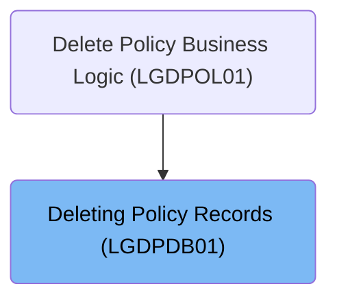
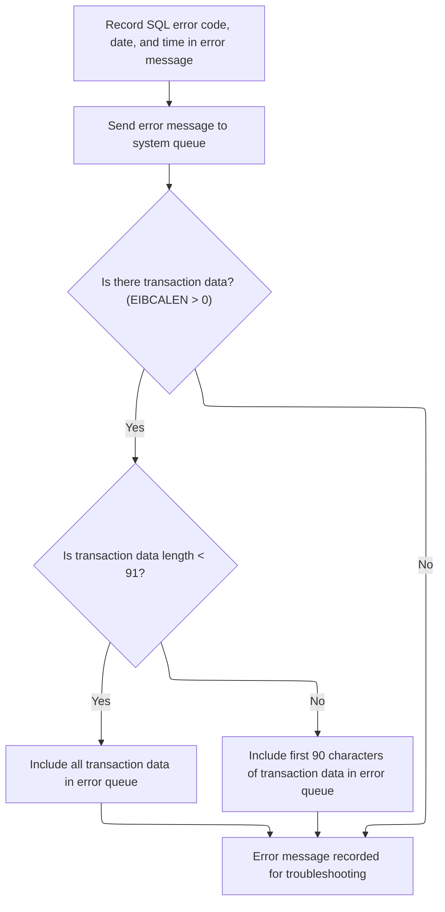
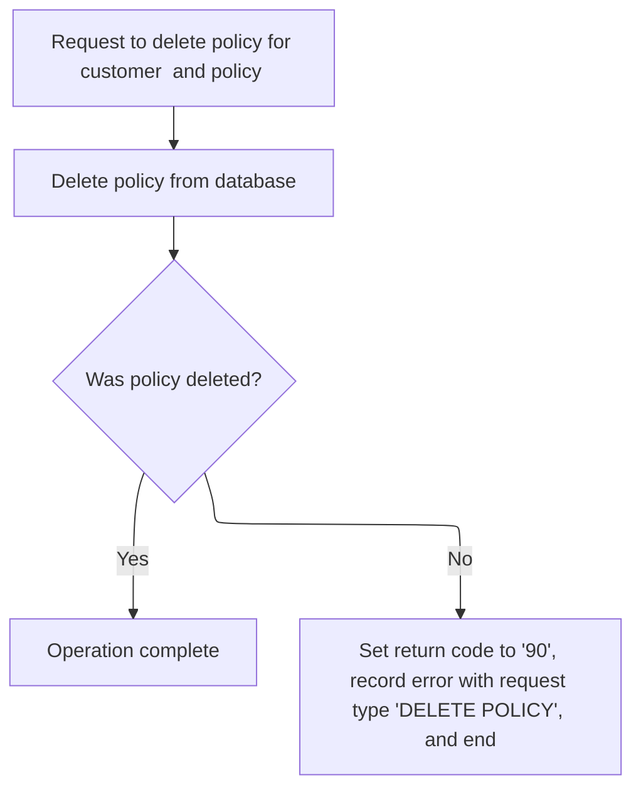

# Overview

```mermaid
flowchart TD
    node1["Validating request and header length
(Validating request and header length)"]:::HeadingStyle --> node2{"Is request valid and supported?
(Validating request and header length)"}:::HeadingStyle
    node2 -->|"No"| node3["Error logged and returned
(Deleting policy from VSAM and error handling)"]:::HeadingStyle
    node2 -->|"Yes"| node4["Deleting policy from DB2
(Deleting policy from DB2)"]:::HeadingStyle
    node4 --> node5{"Was DB2 deletion successful?
(Deleting policy from DB2)"}:::HeadingStyle
    node5 -->|"No"| node3
    node5 -->|"Yes"| node6["Deleting policy from VSAM and error handling
(Deleting policy from VSAM and error handling)"]:::HeadingStyle
    node6 --> node7{"Was VSAM deletion successful?
(Deleting policy from VSAM and error handling)"}:::HeadingStyle
    node7 -->|"No"| node3
    node7 -->|"Yes"| node8["Policy deleted
(Deleting policy from VSAM and error handling)"]:::HeadingStyle

    click node1 goToHeading "Validating request and header length"
    click node2 goToHeading "Validating request and header length"
    click node3 goToHeading "Deleting policy from VSAM and error handling"
    click node4 goToHeading "Deleting policy from DB2"
    click node5 goToHeading "Deleting policy from DB2"
    click node6 goToHeading "Deleting policy from VSAM and error handling"
    click node7 goToHeading "Deleting policy from VSAM and error handling"
    click node8 goToHeading "Deleting policy from VSAM and error handling"
classDef HeadingStyle fill:#777777,stroke:#333,stroke-width:2px;

%% Swimm:
%% flowchart TD
%%     node1["Validating request and header length
%% (Validating request and header length)"]:::HeadingStyle --> node2{"Is request valid and supported?
%% (Validating request and header length)"}:::HeadingStyle
%%     node2 -->|"No"| node3["Error logged and returned
%% (Deleting policy from VSAM and error handling)"]:::HeadingStyle
%%     node2 -->|"Yes"| node4["Deleting policy from <SwmToken path="base/src/lgdpdb01.cbl" pos="124:5:5" line-data="      * initialize DB2 host variables">`DB2`</SwmToken>
%% (Deleting policy from <SwmToken path="base/src/lgdpdb01.cbl" pos="124:5:5" line-data="      * initialize DB2 host variables">`DB2`</SwmToken>)"]:::HeadingStyle
%%     node4 --> node5{"Was <SwmToken path="base/src/lgdpdb01.cbl" pos="124:5:5" line-data="      * initialize DB2 host variables">`DB2`</SwmToken> deletion successful?
%% (Deleting policy from <SwmToken path="base/src/lgdpdb01.cbl" pos="124:5:5" line-data="      * initialize DB2 host variables">`DB2`</SwmToken>)"}:::HeadingStyle
%%     node5 -->|"No"| node3
%%     node5 -->|"Yes"| node6["Deleting policy from VSAM and error handling
%% (Deleting policy from VSAM and error handling)"]:::HeadingStyle
%%     node6 --> node7{"Was VSAM deletion successful?
%% (Deleting policy from VSAM and error handling)"}:::HeadingStyle
%%     node7 -->|"No"| node3
%%     node7 -->|"Yes"| node8["Policy deleted
%% (Deleting policy from VSAM and error handling)"]:::HeadingStyle
%% 
%%     click node1 goToHeading "Validating request and header length"
%%     click node2 goToHeading "Validating request and header length"
%%     click node3 goToHeading "Deleting policy from VSAM and error handling"
%%     click node4 goToHeading "Deleting policy from <SwmToken path="base/src/lgdpdb01.cbl" pos="124:5:5" line-data="      * initialize DB2 host variables">`DB2`</SwmToken>"
%%     click node5 goToHeading "Deleting policy from <SwmToken path="base/src/lgdpdb01.cbl" pos="124:5:5" line-data="      * initialize DB2 host variables">`DB2`</SwmToken>"
%%     click node6 goToHeading "Deleting policy from VSAM and error handling"
%%     click node7 goToHeading "Deleting policy from VSAM and error handling"
%%     click node8 goToHeading "Deleting policy from VSAM and error handling"
%% classDef HeadingStyle fill:#777777,stroke:#333,stroke-width:2px;
```

This document explains the flow of deleting a policy record for a customer. The process validates the request, ensures the request type is supported, and coordinates the removal of the policy from both <SwmToken path="base/src/lgdpdb01.cbl" pos="124:5:5" line-data="      * initialize DB2 host variables">`DB2`</SwmToken> and VSAM databases. Errors are logged with transaction details for troubleshooting and audit.



## Dependencies

### Programs

- <SwmToken path="base/src/lgdpdb01.cbl" pos="13:6:6" line-data="       PROGRAM-ID. LGDPDB01.">`LGDPDB01`</SwmToken> (<SwmPath>[base/src/lgdpdb01.cbl](base/src/lgdpdb01.cbl)</SwmPath>)
- <SwmToken path="base/src/lgdpdb01.cbl" pos="168:9:9" line-data="               EXEC CICS LINK PROGRAM(LGDPVS01)">`LGDPVS01`</SwmToken> (<SwmPath>[base/src/lgdpvs01.cbl](base/src/lgdpvs01.cbl)</SwmPath>)
- LGSTSQ (<SwmPath>[base/src/lgstsq.cbl](base/src/lgstsq.cbl)</SwmPath>)

### Copybooks

- LGCMAREA (<SwmPath>[base/src/lgcmarea.cpy](base/src/lgcmarea.cpy)</SwmPath>)
- SQLCA

# Where is this program used?

This program is used once, as represented in the following diagram:



## Input and Output Tables/Files used in the Program

| Table / File Name | Type                                                                                                                    | Description                                                     | Usage Mode | Key Fields / Layout Highlights           |
| ----------------- | ----------------------------------------------------------------------------------------------------------------------- | --------------------------------------------------------------- | ---------- | ---------------------------------------- |
| POLICY            | <SwmToken path="base/src/lgdpdb01.cbl" pos="124:5:5" line-data="      * initialize DB2 host variables">`DB2`</SwmToken> | Insurance policy master record (customer, type, dates, payment) | Output     | Database table with relational structure |

&nbsp;

## Detailed View of the Program's Functionality

# A. Starting the Request Processing

The main program begins by preparing all necessary variables and storage areas for processing a request. It initializes working storage, including a header area for tracking transaction details such as transaction ID, terminal ID, and task number. It also initializes variables used for <SwmToken path="base/src/lgdpdb01.cbl" pos="124:5:5" line-data="      * initialize DB2 host variables">`DB2`</SwmToken> database operations.

Next, it checks if a communication area (commarea) has been provided with the request. If not, it logs an error message (including the fact that no commarea was received) and immediately halts processing by issuing an abnormal end (abend).

If a commarea is present, the program sets a default return code indicating success and records the length of the commarea. It then checks if the commarea is large enough to contain all required fields. If it is too small, it sets a specific error code and returns to the caller without further processing.

If the commarea is of sufficient size, the program extracts the customer and policy numbers from it, converts them to the format required for <SwmToken path="base/src/lgdpdb01.cbl" pos="124:5:5" line-data="      * initialize DB2 host variables">`DB2`</SwmToken> operations, and stores them in both the <SwmToken path="base/src/lgdpdb01.cbl" pos="124:5:5" line-data="      * initialize DB2 host variables">`DB2`</SwmToken> input variables and the error message structure for potential logging.

# B. Validating Request and Header Length

The program examines the request type specified in the commarea. Only certain request types are supported (for example, types related to deleting endowment, house, commercial, or motor policies). If the request type is not recognized, it sets an error code indicating an unsupported request and returns.

If the request type is valid, the program proceeds to delete the policy from the <SwmToken path="base/src/lgdpdb01.cbl" pos="124:5:5" line-data="      * initialize DB2 host variables">`DB2`</SwmToken> database. After the <SwmToken path="base/src/lgdpdb01.cbl" pos="124:5:5" line-data="      * initialize DB2 host variables">`DB2`</SwmToken> deletion, it calls an external program to delete the policy from a VSAM file as well. Once these operations are complete, it returns control to the caller.

# C. Deleting Policy from <SwmToken path="base/src/lgdpdb01.cbl" pos="124:5:5" line-data="      * initialize DB2 host variables">`DB2`</SwmToken>

When deleting a policy from the <SwmToken path="base/src/lgdpdb01.cbl" pos="124:5:5" line-data="      * initialize DB2 host variables">`DB2`</SwmToken> database, the program sets up a descriptor indicating that a policy deletion is being performed. It then executes a SQL DELETE statement targeting the policy table, using the customer and policy numbers as keys.

If the SQL operation is successful (either the record was deleted or it did not exist), processing continues. If the SQL operation fails (for example, due to a database error), the program sets an error code, logs the error (including details such as the SQL error code), and returns immediately to the caller.

# D. Logging Error Details and Timestamping

Whenever an error is detected (such as missing commarea, database errors, or unsupported requests), the program logs detailed information about the error. This includes the SQL error code (if applicable), the current date and time (obtained and formatted using system services), and relevant transaction details.

The error message is sent to a logging program, which writes it to both a temporary and a permanent queue for later review. If there is commarea data available, up to 90 bytes of it are also logged for additional context.

The logging program determines whether the message originated from a program or a transaction, adjusts the message format if necessary, and writes the message to the appropriate queues. If the message came from a transaction, it also sends a minimal response back to the terminal.

# E. Deleting Policy from VSAM and Error Handling

After the <SwmToken path="base/src/lgdpdb01.cbl" pos="124:5:5" line-data="      * initialize DB2 host variables">`DB2`</SwmToken> deletion, the external program is called to delete the policy record from a VSAM file. The program prepares the key fields (request type, customer number, policy number) and issues a delete command against the VSAM file.

If the VSAM deletion is successful, the program completes normally. If the deletion fails, it sets an error code, logs the error (including system response codes and relevant identifiers), and returns immediately.

The error logging in this context also includes the current date and time, customer and policy numbers, and the system response codes. As with <SwmToken path="base/src/lgdpdb01.cbl" pos="124:5:5" line-data="      * initialize DB2 host variables">`DB2`</SwmToken> errors, up to 90 bytes of commarea data are logged if available.

# F. Summary of Error Logging Flow

- Errors are always logged with a timestamp, program name, customer and policy numbers, and error codes.
- Both the main program and the VSAM deletion program use a common logging routine to ensure consistency.
- Error messages are written to both temporary and permanent queues for traceability.
- If additional context is available in the commarea, it is included in the error logs, up to a fixed length.

# G. Overall Flow

1. Initialize all variables and check for the presence and size of the commarea.
2. Validate the request type.
3. If valid, delete the policy from <SwmToken path="base/src/lgdpdb01.cbl" pos="124:5:5" line-data="      * initialize DB2 host variables">`DB2`</SwmToken>.
   - If <SwmToken path="base/src/lgdpdb01.cbl" pos="124:5:5" line-data="      * initialize DB2 host variables">`DB2`</SwmToken> deletion fails, log the error and return.
4. If <SwmToken path="base/src/lgdpdb01.cbl" pos="124:5:5" line-data="      * initialize DB2 host variables">`DB2`</SwmToken> deletion succeeds, delete the policy from the VSAM file.
   - If VSAM deletion fails, log the error and return.
5. All errors are logged with detailed context and timestamps.
6. The program always returns control to the caller, either after successful processing or after logging an error.

# Data Definitions

| Table / Record Name | Type                                                                                                                    | Short Description                                               | Usage Mode      |
| ------------------- | ----------------------------------------------------------------------------------------------------------------------- | --------------------------------------------------------------- | --------------- |
| POLICY              | <SwmToken path="base/src/lgdpdb01.cbl" pos="124:5:5" line-data="      * initialize DB2 host variables">`DB2`</SwmToken> | Insurance policy master record (customer, type, dates, payment) | Output (DELETE) |

&nbsp;

# Rule Definition

| Paragraph Name                                                                                                                                                                                                                                                                                                                                                                                                                       | Rule ID | Category          | Description                                                                                                                                                                                                                                                                                                                                                                                                                                                                                                                                                                                                                                                                                                                      | Conditions                                                                                                                                                                           | Remarks                                                                                                                                                                                                                                                                                                                                                                                                                                                                                                                                                                                                                                                                                                                                                                                                                         |
| ------------------------------------------------------------------------------------------------------------------------------------------------------------------------------------------------------------------------------------------------------------------------------------------------------------------------------------------------------------------------------------------------------------------------------------ | ------- | ----------------- | -------------------------------------------------------------------------------------------------------------------------------------------------------------------------------------------------------------------------------------------------------------------------------------------------------------------------------------------------------------------------------------------------------------------------------------------------------------------------------------------------------------------------------------------------------------------------------------------------------------------------------------------------------------------------------------------------------------------------------- | ------------------------------------------------------------------------------------------------------------------------------------------------------------------------------------ | ------------------------------------------------------------------------------------------------------------------------------------------------------------------------------------------------------------------------------------------------------------------------------------------------------------------------------------------------------------------------------------------------------------------------------------------------------------------------------------------------------------------------------------------------------------------------------------------------------------------------------------------------------------------------------------------------------------------------------------------------------------------------------------------------------------------------------- |
| MAINLINE SECTION (<SwmToken path="base/src/lgdpdb01.cbl" pos="13:6:6" line-data="       PROGRAM-ID. LGDPDB01.">`LGDPDB01`</SwmToken>), MAINLINE SECTION (<SwmToken path="base/src/lgdpdb01.cbl" pos="168:9:9" line-data="               EXEC CICS LINK PROGRAM(LGDPVS01)">`LGDPVS01`</SwmToken>)                                                                                                                                     | RL-001  | Conditional Logic | The system must check if the commarea is present and at least 28 bytes long before processing any request.                                                                                                                                                                                                                                                                                                                                                                                                                                                                                                                                                                                                                       | Commarea is absent (length zero) or less than 28 bytes.                                                                                                                              | Minimum required length is 28 bytes. If absent, set <SwmToken path="base/src/lgdpdb01.cbl" pos="138:9:13" line-data="           MOVE &#39;00&#39; TO CA-RETURN-CODE">`CA-RETURN-CODE`</SwmToken> to '98'. No further processing occurs.                                                                                                                                                                                                                                                                                                                                                                                                                                                                                                                                                                                         |
| MAINLINE SECTION (<SwmToken path="base/src/lgdpdb01.cbl" pos="13:6:6" line-data="       PROGRAM-ID. LGDPDB01.">`LGDPDB01`</SwmToken>)                                                                                                                                                                                                                                                                                                | RL-002  | Conditional Logic | The system must validate that the request type in the commarea is one of the supported types: <SwmToken path="base/src/lgdpdb01.cbl" pos="160:18:18" line-data="           IF ( CA-REQUEST-ID NOT EQUAL TO &#39;01DEND&#39; AND">`01DEND`</SwmToken>, <SwmToken path="base/src/lgdpdb01.cbl" pos="161:14:14" line-data="                CA-REQUEST-ID NOT EQUAL TO &#39;01DHOU&#39; AND">`01DHOU`</SwmToken>, <SwmToken path="base/src/lgdpdb01.cbl" pos="162:14:14" line-data="                CA-REQUEST-ID NOT EQUAL TO &#39;01DCOM&#39; AND">`01DCOM`</SwmToken>, <SwmToken path="base/src/lgdpdb01.cbl" pos="163:14:14" line-data="                CA-REQUEST-ID NOT EQUAL TO &#39;01DMOT&#39; ) Then">`01DMOT`</SwmToken>. | Request type is not one of the supported values.                                                                                                                                     | Supported types: <SwmToken path="base/src/lgdpdb01.cbl" pos="160:18:18" line-data="           IF ( CA-REQUEST-ID NOT EQUAL TO &#39;01DEND&#39; AND">`01DEND`</SwmToken>, <SwmToken path="base/src/lgdpdb01.cbl" pos="161:14:14" line-data="                CA-REQUEST-ID NOT EQUAL TO &#39;01DHOU&#39; AND">`01DHOU`</SwmToken>, <SwmToken path="base/src/lgdpdb01.cbl" pos="162:14:14" line-data="                CA-REQUEST-ID NOT EQUAL TO &#39;01DCOM&#39; AND">`01DCOM`</SwmToken>, <SwmToken path="base/src/lgdpdb01.cbl" pos="163:14:14" line-data="                CA-REQUEST-ID NOT EQUAL TO &#39;01DMOT&#39; ) Then">`01DMOT`</SwmToken>. If not supported, set <SwmToken path="base/src/lgdpdb01.cbl" pos="138:9:13" line-data="           MOVE &#39;00&#39; TO CA-RETURN-CODE">`CA-RETURN-CODE`</SwmToken> to '99'. |
| MAINLINE SECTION (<SwmToken path="base/src/lgdpdb01.cbl" pos="13:6:6" line-data="       PROGRAM-ID. LGDPDB01.">`LGDPDB01`</SwmToken>), MAINLINE SECTION (<SwmToken path="base/src/lgdpdb01.cbl" pos="168:9:9" line-data="               EXEC CICS LINK PROGRAM(LGDPVS01)">`LGDPVS01`</SwmToken>)                                                                                                                                     | RL-003  | Data Assignment   | For valid requests, extract customer number and policy number from the commarea for use as keys in <SwmToken path="base/src/lgdpdb01.cbl" pos="124:5:5" line-data="      * initialize DB2 host variables">`DB2`</SwmToken> and VSAM operations.                                                                                                                                                                                                                                                                                                                                                                                                                                                                                  | Request type is valid and commarea is of sufficient length.                                                                                                                          | Customer number and policy number are extracted as strings (10 bytes each).                                                                                                                                                                                                                                                                                                                                                                                                                                                                                                                                                                                                                                                                                                                                                     |
| <SwmToken path="base/src/lgdpdb01.cbl" pos="167:3:9" line-data="               PERFORM DELETE-POLICY-DB2-INFO">`DELETE-POLICY-DB2-INFO`</SwmToken> (<SwmToken path="base/src/lgdpdb01.cbl" pos="13:6:6" line-data="       PROGRAM-ID. LGDPDB01.">`LGDPDB01`</SwmToken>)                                                                                                                                                              | RL-004  | Computation       | Attempt to delete the policy record from the <SwmToken path="base/src/lgdpdb01.cbl" pos="124:5:5" line-data="      * initialize DB2 host variables">`DB2`</SwmToken> POLICY table using the extracted customer and policy numbers as keys.                                                                                                                                                                                                                                                                                                                                                                                                                                                                                       | Request type is valid and keys are extracted.                                                                                                                                        | SQLCODE 0 or 100 is considered success. If SQLCODE is not 0 or 100, set <SwmToken path="base/src/lgdpdb01.cbl" pos="138:9:13" line-data="           MOVE &#39;00&#39; TO CA-RETURN-CODE">`CA-RETURN-CODE`</SwmToken> to '90'.                                                                                                                                                                                                                                                                                                                                                                                                                                                                                                                                                                                                   |
| <SwmToken path="base/src/lgdpdb01.cbl" pos="133:3:7" line-data="               PERFORM WRITE-ERROR-MESSAGE">`WRITE-ERROR-MESSAGE`</SwmToken> (<SwmToken path="base/src/lgdpdb01.cbl" pos="13:6:6" line-data="       PROGRAM-ID. LGDPDB01.">`LGDPDB01`</SwmToken>, <SwmToken path="base/src/lgdpdb01.cbl" pos="168:9:9" line-data="               EXEC CICS LINK PROGRAM(LGDPVS01)">`LGDPVS01`</SwmToken>), MAINLINE SECTION (LGSTSQ) | RL-005  | Computation       | Log all error messages to the system error queue with date, time, program name, customer number, policy number, and relevant SQL or VSAM response codes.                                                                                                                                                                                                                                                                                                                                                                                                                                                                                                                                                                         | Any error condition occurs (<SwmToken path="base/src/lgdpdb01.cbl" pos="124:5:5" line-data="      * initialize DB2 host variables">`DB2`</SwmToken> or VSAM failure, invalid input). | Error message format includes: date (8 bytes), time (6 bytes), program name (9 bytes), customer number (10 bytes), policy number (10 bytes), SQLCODE or VSAM response codes (5 bytes each).                                                                                                                                                                                                                                                                                                                                                                                                                                                                                                                                                                                                                                     |
| MAINLINE SECTION (<SwmToken path="base/src/lgdpdb01.cbl" pos="13:6:6" line-data="       PROGRAM-ID. LGDPDB01.">`LGDPDB01`</SwmToken>, <SwmToken path="base/src/lgdpdb01.cbl" pos="168:9:9" line-data="               EXEC CICS LINK PROGRAM(LGDPVS01)">`LGDPVS01`</SwmToken>)                                                                                                                                                        | RL-006  | Data Assignment   | After processing, set the appropriate <SwmToken path="base/src/lgdpdb01.cbl" pos="138:9:13" line-data="           MOVE &#39;00&#39; TO CA-RETURN-CODE">`CA-RETURN-CODE`</SwmToken> in the commarea and return control to the caller.                                                                                                                                                                                                                                                                                                                                                                                                                                                                                             | Any completion (success or error).                                                                                                                                                   | <SwmToken path="base/src/lgdpdb01.cbl" pos="138:9:13" line-data="           MOVE &#39;00&#39; TO CA-RETURN-CODE">`CA-RETURN-CODE`</SwmToken> is a 2-byte string set to '00' (success), '98', '99', '90', or '81' depending on outcome.                                                                                                                                                                                                                                                                                                                                                                                                                                                                                                                                                                                          |
| MAINLINE SECTION (<SwmToken path="base/src/lgdpdb01.cbl" pos="168:9:9" line-data="               EXEC CICS LINK PROGRAM(LGDPVS01)">`LGDPVS01`</SwmToken>)                                                                                                                                                                                                                                                                            | RL-007  | Computation       | After successful <SwmToken path="base/src/lgdpdb01.cbl" pos="124:5:5" line-data="      * initialize DB2 host variables">`DB2`</SwmToken> deletion, attempt to delete the corresponding record from the VSAM file using a 21-byte key composed of the 4th character of the request ID, the customer number, and the policy number.                                                                                                                                                                                                                                                                                                                                                                                                | <SwmToken path="base/src/lgdpdb01.cbl" pos="124:5:5" line-data="      * initialize DB2 host variables">`DB2`</SwmToken> deletion succeeded.                                          | VSAM key is 21 bytes: 1 byte (4th character of request ID), 10 bytes customer number, 10 bytes policy number. If the VSAM delete operation fails (response code not normal), set <SwmToken path="base/src/lgdpdb01.cbl" pos="138:9:13" line-data="           MOVE &#39;00&#39; TO CA-RETURN-CODE">`CA-RETURN-CODE`</SwmToken> to '81'. Error message must include date, time, program name, customer number, policy number, and VSAM response codes (5 bytes each).                                                                                                                                                                                                                                                                                                                                                             |

# User Stories

## User Story 1: Validate commarea and request type

---

### Story Description:

As a system, I want to validate the presence, length, and request type of the commarea so that only supported and properly formatted requests are processed.

---

### Business Rule Mapping:

| Rule ID | Paragraph Name                                                                                                                                                                                                                                                                                   | Rule Description                                                                                                                                                                                                                                                                                                                                                                                                                                                                                                                                                                                                                                                                                                                 |
| ------- | ------------------------------------------------------------------------------------------------------------------------------------------------------------------------------------------------------------------------------------------------------------------------------------------------ | -------------------------------------------------------------------------------------------------------------------------------------------------------------------------------------------------------------------------------------------------------------------------------------------------------------------------------------------------------------------------------------------------------------------------------------------------------------------------------------------------------------------------------------------------------------------------------------------------------------------------------------------------------------------------------------------------------------------------------- |
| RL-001  | MAINLINE SECTION (<SwmToken path="base/src/lgdpdb01.cbl" pos="13:6:6" line-data="       PROGRAM-ID. LGDPDB01.">`LGDPDB01`</SwmToken>), MAINLINE SECTION (<SwmToken path="base/src/lgdpdb01.cbl" pos="168:9:9" line-data="               EXEC CICS LINK PROGRAM(LGDPVS01)">`LGDPVS01`</SwmToken>) | The system must check if the commarea is present and at least 28 bytes long before processing any request.                                                                                                                                                                                                                                                                                                                                                                                                                                                                                                                                                                                                                       |
| RL-002  | MAINLINE SECTION (<SwmToken path="base/src/lgdpdb01.cbl" pos="13:6:6" line-data="       PROGRAM-ID. LGDPDB01.">`LGDPDB01`</SwmToken>)                                                                                                                                                            | The system must validate that the request type in the commarea is one of the supported types: <SwmToken path="base/src/lgdpdb01.cbl" pos="160:18:18" line-data="           IF ( CA-REQUEST-ID NOT EQUAL TO &#39;01DEND&#39; AND">`01DEND`</SwmToken>, <SwmToken path="base/src/lgdpdb01.cbl" pos="161:14:14" line-data="                CA-REQUEST-ID NOT EQUAL TO &#39;01DHOU&#39; AND">`01DHOU`</SwmToken>, <SwmToken path="base/src/lgdpdb01.cbl" pos="162:14:14" line-data="                CA-REQUEST-ID NOT EQUAL TO &#39;01DCOM&#39; AND">`01DCOM`</SwmToken>, <SwmToken path="base/src/lgdpdb01.cbl" pos="163:14:14" line-data="                CA-REQUEST-ID NOT EQUAL TO &#39;01DMOT&#39; ) Then">`01DMOT`</SwmToken>. |

---

### Relevant Functionality:

- **MAINLINE SECTION (**<SwmToken path="base/src/lgdpdb01.cbl" pos="13:6:6" line-data="       PROGRAM-ID. LGDPDB01.">`LGDPDB01`</SwmToken>**)**
  1. **RL-001:**
     - If commarea length is zero:
       - Log error message
       - Set <SwmToken path="base/src/lgdpdb01.cbl" pos="138:9:13" line-data="           MOVE &#39;00&#39; TO CA-RETURN-CODE">`CA-RETURN-CODE`</SwmToken> to '98'
       - Halt processing (ABEND or RETURN)
     - If commarea length < 28:
       - Set <SwmToken path="base/src/lgdpdb01.cbl" pos="138:9:13" line-data="           MOVE &#39;00&#39; TO CA-RETURN-CODE">`CA-RETURN-CODE`</SwmToken> to '98'
       - Return to caller
  2. **RL-002:**
     - If request type is not in supported list:
       - Set <SwmToken path="base/src/lgdpdb01.cbl" pos="138:9:13" line-data="           MOVE &#39;00&#39; TO CA-RETURN-CODE">`CA-RETURN-CODE`</SwmToken> to '99'
       - Return to caller

## User Story 2: Extract keys and process deletions

---

### Story Description:

As a system, I want to extract the customer and policy numbers from valid requests and attempt to delete the corresponding records from <SwmToken path="base/src/lgdpdb01.cbl" pos="124:5:5" line-data="      * initialize DB2 host variables">`DB2`</SwmToken> and VSAM so that policy data is accurately removed when requested.

---

### Business Rule Mapping:

| Rule ID | Paragraph Name                                                                                                                                                                                                                                                                                   | Rule Description                                                                                                                                                                                                                                                                                                                  |
| ------- | ------------------------------------------------------------------------------------------------------------------------------------------------------------------------------------------------------------------------------------------------------------------------------------------------ | --------------------------------------------------------------------------------------------------------------------------------------------------------------------------------------------------------------------------------------------------------------------------------------------------------------------------------- |
| RL-003  | MAINLINE SECTION (<SwmToken path="base/src/lgdpdb01.cbl" pos="13:6:6" line-data="       PROGRAM-ID. LGDPDB01.">`LGDPDB01`</SwmToken>), MAINLINE SECTION (<SwmToken path="base/src/lgdpdb01.cbl" pos="168:9:9" line-data="               EXEC CICS LINK PROGRAM(LGDPVS01)">`LGDPVS01`</SwmToken>) | For valid requests, extract customer number and policy number from the commarea for use as keys in <SwmToken path="base/src/lgdpdb01.cbl" pos="124:5:5" line-data="      * initialize DB2 host variables">`DB2`</SwmToken> and VSAM operations.                                                                                   |
| RL-004  | <SwmToken path="base/src/lgdpdb01.cbl" pos="167:3:9" line-data="               PERFORM DELETE-POLICY-DB2-INFO">`DELETE-POLICY-DB2-INFO`</SwmToken> (<SwmToken path="base/src/lgdpdb01.cbl" pos="13:6:6" line-data="       PROGRAM-ID. LGDPDB01.">`LGDPDB01`</SwmToken>)                          | Attempt to delete the policy record from the <SwmToken path="base/src/lgdpdb01.cbl" pos="124:5:5" line-data="      * initialize DB2 host variables">`DB2`</SwmToken> POLICY table using the extracted customer and policy numbers as keys.                                                                                        |
| RL-007  | MAINLINE SECTION (<SwmToken path="base/src/lgdpdb01.cbl" pos="168:9:9" line-data="               EXEC CICS LINK PROGRAM(LGDPVS01)">`LGDPVS01`</SwmToken>)                                                                                                                                        | After successful <SwmToken path="base/src/lgdpdb01.cbl" pos="124:5:5" line-data="      * initialize DB2 host variables">`DB2`</SwmToken> deletion, attempt to delete the corresponding record from the VSAM file using a 21-byte key composed of the 4th character of the request ID, the customer number, and the policy number. |

---

### Relevant Functionality:

- **MAINLINE SECTION (**<SwmToken path="base/src/lgdpdb01.cbl" pos="13:6:6" line-data="       PROGRAM-ID. LGDPDB01.">`LGDPDB01`</SwmToken>**)**
  1. **RL-003:**
     - Extract customer number and policy number from commarea
     - Assign to <SwmToken path="base/src/lgdpdb01.cbl" pos="124:5:5" line-data="      * initialize DB2 host variables">`DB2`</SwmToken> and VSAM key fields
- <SwmToken path="base/src/lgdpdb01.cbl" pos="167:3:9" line-data="               PERFORM DELETE-POLICY-DB2-INFO">`DELETE-POLICY-DB2-INFO`</SwmToken> **(**<SwmToken path="base/src/lgdpdb01.cbl" pos="13:6:6" line-data="       PROGRAM-ID. LGDPDB01.">`LGDPDB01`</SwmToken>**)**
  1. **RL-004:**
     - Execute <SwmToken path="base/src/lgdpdb01.cbl" pos="124:5:5" line-data="      * initialize DB2 host variables">`DB2`</SwmToken> DELETE where customer and policy numbers match
     - If SQLCODE is not 0 or 100:
       - Set <SwmToken path="base/src/lgdpdb01.cbl" pos="138:9:13" line-data="           MOVE &#39;00&#39; TO CA-RETURN-CODE">`CA-RETURN-CODE`</SwmToken> to '90'
       - Log error message
       - Return to caller
- **MAINLINE SECTION (**<SwmToken path="base/src/lgdpdb01.cbl" pos="168:9:9" line-data="               EXEC CICS LINK PROGRAM(LGDPVS01)">`LGDPVS01`</SwmToken>**)**
  1. **RL-007:**
     - Construct a 21-byte key:
       - 1 byte: 4th character of request ID
       - 10 bytes: customer number
       - 10 bytes: policy number
     - Attempt to delete the record from the VSAM file using this key
     - If the response code is not normal:
       - Set the return code to '81'
       - Log an error message with all required details
       - Return control to the caller

## User Story 3: Error handling and logging

---

### Story Description:

As a system, I want to log all error messages with relevant details and set the appropriate <SwmToken path="base/src/lgdpdb01.cbl" pos="138:9:13" line-data="           MOVE &#39;00&#39; TO CA-RETURN-CODE">`CA-RETURN-CODE`</SwmToken> so that errors are traceable and callers are informed of the outcome.

---

### Business Rule Mapping:

| Rule ID | Paragraph Name                                                                                                                                                                                                                                                                                                                                                                                                                       | Rule Description                                                                                                                                                                                                                     |
| ------- | ------------------------------------------------------------------------------------------------------------------------------------------------------------------------------------------------------------------------------------------------------------------------------------------------------------------------------------------------------------------------------------------------------------------------------------ | ------------------------------------------------------------------------------------------------------------------------------------------------------------------------------------------------------------------------------------ |
| RL-005  | <SwmToken path="base/src/lgdpdb01.cbl" pos="133:3:7" line-data="               PERFORM WRITE-ERROR-MESSAGE">`WRITE-ERROR-MESSAGE`</SwmToken> (<SwmToken path="base/src/lgdpdb01.cbl" pos="13:6:6" line-data="       PROGRAM-ID. LGDPDB01.">`LGDPDB01`</SwmToken>, <SwmToken path="base/src/lgdpdb01.cbl" pos="168:9:9" line-data="               EXEC CICS LINK PROGRAM(LGDPVS01)">`LGDPVS01`</SwmToken>), MAINLINE SECTION (LGSTSQ) | Log all error messages to the system error queue with date, time, program name, customer number, policy number, and relevant SQL or VSAM response codes.                                                                             |
| RL-006  | MAINLINE SECTION (<SwmToken path="base/src/lgdpdb01.cbl" pos="13:6:6" line-data="       PROGRAM-ID. LGDPDB01.">`LGDPDB01`</SwmToken>, <SwmToken path="base/src/lgdpdb01.cbl" pos="168:9:9" line-data="               EXEC CICS LINK PROGRAM(LGDPVS01)">`LGDPVS01`</SwmToken>)                                                                                                                                                        | After processing, set the appropriate <SwmToken path="base/src/lgdpdb01.cbl" pos="138:9:13" line-data="           MOVE &#39;00&#39; TO CA-RETURN-CODE">`CA-RETURN-CODE`</SwmToken> in the commarea and return control to the caller. |

---

### Relevant Functionality:

- <SwmToken path="base/src/lgdpdb01.cbl" pos="133:3:7" line-data="               PERFORM WRITE-ERROR-MESSAGE">`WRITE-ERROR-MESSAGE`</SwmToken> **(**<SwmToken path="base/src/lgdpdb01.cbl" pos="13:6:6" line-data="       PROGRAM-ID. LGDPDB01.">`LGDPDB01`</SwmToken>
  1. **RL-005:**
     - On error:
       - Format error message with required fields
       - Write to error queue via LGSTSQ
       - If commarea present, log up to first 90 bytes with prefix 'COMMAREA='
       - Use CICS WRITEQ TD and TS as appropriate
- **MAINLINE SECTION (**<SwmToken path="base/src/lgdpdb01.cbl" pos="13:6:6" line-data="       PROGRAM-ID. LGDPDB01.">`LGDPDB01`</SwmToken>
  1. **RL-006:**
     - Set <SwmToken path="base/src/lgdpdb01.cbl" pos="138:9:13" line-data="           MOVE &#39;00&#39; TO CA-RETURN-CODE">`CA-RETURN-CODE`</SwmToken> according to outcome
     - Return control to caller via EXEC CICS RETURN

# Workflow

# Starting the request processing

This section ensures that all required variables and context are set up before any business logic or database operations are performed. It also enforces that a commarea is present, which is essential for processing the request.

| Category        | Rule Name                     | Description                                                                                                                                                                   |
| --------------- | ----------------------------- | ----------------------------------------------------------------------------------------------------------------------------------------------------------------------------- |
| Data validation | Commarea Presence Enforcement | If the commarea is not present (length is zero), the process must immediately log an error message and terminate the request with a specific abend code ('LGCA').             |
| Data validation | Minimum Commarea Length       | The minimum required commarea length for processing must be enforced as 28 bytes, corresponding to the header length defined in the system.                                   |
| Business logic  | Transaction Context Capture   | Transaction and task information, including transaction ID, terminal ID, and task number, must be captured at the start of processing for traceability and auditing purposes. |

<SwmSnippet path="/base/src/lgdpdb01.cbl" line="111">

---

In <SwmToken path="base/src/lgdpdb01.cbl" pos="111:1:1" line-data="       MAINLINE SECTION.">`MAINLINE`</SwmToken>, we kick off the flow by setting up all the working storage and <SwmToken path="base/src/lgdpdb01.cbl" pos="124:5:5" line-data="      * initialize DB2 host variables">`DB2`</SwmToken> host variables, and grabbing transaction/task info. This is where we prep everything needed for request validation and later <SwmToken path="base/src/lgdpdb01.cbl" pos="124:5:5" line-data="      * initialize DB2 host variables">`DB2`</SwmToken> operations.

```cobol
       MAINLINE SECTION.

      *----------------------------------------------------------------*
      * Common code                                                    *
      *----------------------------------------------------------------*
      * initialize working storage variables
           INITIALIZE WS-HEADER.
      * set up general variable
           MOVE EIBTRNID TO WS-TRANSID.
           MOVE EIBTRMID TO WS-TERMID.
           MOVE EIBTASKN TO WS-TASKNUM.
      *----------------------------------------------------------------*

      * initialize DB2 host variables
           INITIALIZE DB2-IN-INTEGERS.
```

---

</SwmSnippet>

<SwmSnippet path="/base/src/lgdpdb01.cbl" line="131">

---

If there's no commarea, we log the error and halt the process right away.

```cobol
           IF EIBCALEN IS EQUAL TO ZERO
               MOVE ' NO COMMAREA RECEIVED' TO EM-VARIABLE
               PERFORM WRITE-ERROR-MESSAGE
               EXEC CICS ABEND ABCODE('LGCA') NODUMP END-EXEC
           END-IF
```

---

</SwmSnippet>

## Logging error details and timestamping



This section ensures that every error is logged with sufficient detail and traceability, including timestamps and relevant transaction data, to support troubleshooting and audit requirements.

| Category       | Rule Name                              | Description                                                                                                                                                                                                        |
| -------------- | -------------------------------------- | ------------------------------------------------------------------------------------------------------------------------------------------------------------------------------------------------------------------ |
| Business logic | Timestamped error logging              | Every error message must include the SQL error code, the current date, and the current time to ensure traceability.                                                                                                |
| Business logic | Transaction data inclusion             | If transaction data is present, it must be included in the error log. If the transaction data is less than 91 characters, include all of it; if it is 91 characters or more, include only the first 90 characters. |
| Business logic | Error logging without transaction data | If no transaction data is present, the error message must still be recorded for troubleshooting purposes, but without transaction data.                                                                            |
| Business logic | Dual queue error delivery              | All error messages must be sent to both temporary and permanent system queues to ensure redundancy and availability for troubleshooting and audit.                                                                 |

<SwmSnippet path="/base/src/lgdpdb01.cbl" line="212">

---

In <SwmToken path="base/src/lgdpdb01.cbl" pos="212:1:5" line-data="       WRITE-ERROR-MESSAGE.">`WRITE-ERROR-MESSAGE`</SwmToken>, we grab the current system time and date using CICS commands and format them for the error log. This makes sure every error message is timestamped for traceability.

```cobol
       WRITE-ERROR-MESSAGE.
      * Save SQLCODE in message
           MOVE SQLCODE TO EM-SQLRC
      * Obtain and format current time and date
           EXEC CICS ASKTIME ABSTIME(WS-ABSTIME)
           END-EXEC
           EXEC CICS FORMATTIME ABSTIME(Ws-ABSTIME)
                     MMDDYYYY(WS-DATE)
                     TIME(WS-TIME)
           END-EXEC
```

---

</SwmSnippet>

<SwmSnippet path="/base/src/lgdpdb01.cbl" line="222">

---

After formatting the error message, we call LGSTSQ to actually write it to the error queues. This keeps the logging logic separate and consistent across the system.

```cobol
           MOVE WS-DATE TO EM-DATE
           MOVE WS-TIME TO EM-TIME
      * Write output message to TDQ
           EXEC CICS LINK PROGRAM('LGSTSQ')
                     COMMAREA(ERROR-MSG)
                     LENGTH(LENGTH OF ERROR-MSG)
           END-EXEC.
```

---

</SwmSnippet>

<SwmSnippet path="/base/src/lgstsq.cbl" line="55">

---

<SwmToken path="base/src/lgstsq.cbl" pos="55:1:1" line-data="       MAINLINE SECTION.">`MAINLINE`</SwmToken> in LGSTSQ figures out if the message came from a program or a transaction, tweaks the message format if needed, and writes it to both temporary and permanent queues. If it's a transaction, it sends a quick response back.

```cobol
       MAINLINE SECTION.

           MOVE SPACES TO WRITE-MSG.
           MOVE SPACES TO WS-RECV.

           EXEC CICS ASSIGN SYSID(WRITE-MSG-SYSID)
                RESP(WS-RESP)
           END-EXEC.

           EXEC CICS ASSIGN INVOKINGPROG(WS-INVOKEPROG)
                RESP(WS-RESP)
           END-EXEC.
           
           IF WS-INVOKEPROG NOT = SPACES
              MOVE 'C' To WS-FLAG
              MOVE COMMA-DATA  TO WRITE-MSG-MSG
              MOVE EIBCALEN    TO WS-RECV-LEN
           ELSE
              EXEC CICS RECEIVE INTO(WS-RECV)
                  LENGTH(WS-RECV-LEN)
                  RESP(WS-RESP)
              END-EXEC
              MOVE 'R' To WS-FLAG
              MOVE WS-RECV-DATA  TO WRITE-MSG-MSG
              SUBTRACT 5 FROM WS-RECV-LEN
           END-IF.

           MOVE 'GENAERRS' TO STSQ-NAME.
           IF WRITE-MSG-MSG(1:2) = 'Q=' THEN
              MOVE WRITE-MSG-MSG(3:4) TO STSQ-EXT
              MOVE WRITE-MSG-REST TO TEMPO
              MOVE TEMPO          TO WRITE-MSG-MSG
              SUBTRACT 7 FROM WS-RECV-LEN
           END-IF.

           ADD 5 TO WS-RECV-LEN.

      * Write output message to TDQ CSMT
      *
           EXEC CICS WRITEQ TD QUEUE(STDQ-NAME)
                     FROM(WRITE-MSG)
                     RESP(WS-RESP)
                     LENGTH(WS-RECV-LEN)

           END-EXEC.

      * Write output message to Genapp TSQ
      * If no space is available then the task will not wait for
      *  storage to become available but will ignore the request...
      *
           EXEC CICS WRITEQ TS QUEUE(STSQ-NAME)
                     FROM(WRITE-MSG)
                     RESP(WS-RESP)
                     NOSUSPEND
                     LENGTH(WS-RECV-LEN)

           END-EXEC.

           If WS-FLAG = 'R' Then
             EXEC CICS SEND TEXT FROM(FILLER-X)
              WAIT
              ERASE
              LENGTH(1)
              FREEKB
             END-EXEC.

           EXEC CICS RETURN
           END-EXEC.
```

---

</SwmSnippet>

<SwmSnippet path="/base/src/lgdpdb01.cbl" line="230">

---

After returning from LGSTSQ, <SwmToken path="base/src/lgdpdb01.cbl" pos="133:3:7" line-data="               PERFORM WRITE-ERROR-MESSAGE">`WRITE-ERROR-MESSAGE`</SwmToken> checks if there's any commarea data to log. If so, it writes up to 90 bytes of it to the queue by calling LGSTSQ again, making sure we don't exceed buffer limits.

```cobol
           IF EIBCALEN > 0 THEN
             IF EIBCALEN < 91 THEN
               MOVE DFHCOMMAREA(1:EIBCALEN) TO CA-DATA
               EXEC CICS LINK PROGRAM('LGSTSQ')
                         COMMAREA(CA-ERROR-MSG)
                         LENGTH(LENGTH OF CA-ERROR-MSG)
               END-EXEC
             ELSE
               MOVE DFHCOMMAREA(1:90) TO CA-DATA
               EXEC CICS LINK PROGRAM('LGSTSQ')
                         COMMAREA(CA-ERROR-MSG)
                         LENGTH(LENGTH OF CA-ERROR-MSG)
               END-EXEC
             END-IF
           END-IF.
           EXIT.
```

---

</SwmSnippet>

## Validating request and header length

```mermaid
%%{init: {"flowchart": {"defaultRenderer": "elk"}} }%%
flowchart TD
    node1["Start: Receive request"] --> node2{"Is commarea large enough? (EIBCALEN >= +28)"}
    click node1 openCode "base/src/lgdpdb01.cbl:138:139"
    node2 -->|"No"| node3["Return error: commarea too small (CA-RETURN-CODE='98')"]
    click node2 openCode "base/src/lgdpdb01.cbl:143:146"
    click node3 openCode "base/src/lgdpdb01.cbl:144:145"
    node2 -->|"Yes"| node4["Prepare customer and policy data"]
    click node4 openCode "base/src/lgdpdb01.cbl:149:153"
    node4 --> node5{"Is request type supported? (01DEND, 01DHOU, 01DCOM, 01DMOT)"}
    click node5 openCode "base/src/lgdpdb01.cbl:160:172"
    node5 -->|"No"| node6["Return error: unsupported request (CA-RETURN-CODE='99')"]
    click node6 openCode "base/src/lgdpdb01.cbl:165:166"
    node5 -->|"Yes"| node7["Process request and call external program"]
    click node7 openCode "base/src/lgdpdb01.cbl:167:171"
    node3 --> node8["Return to caller"]
    node6 --> node8
    node7 --> node8
    click node8 openCode "base/src/lgdpdb01.cbl:175:175"
classDef HeadingStyle fill:#777777,stroke:#333,stroke-width:2px;

%% Swimm:
%% %%{init: {"flowchart": {"defaultRenderer": "elk"}} }%%
%% flowchart TD
%%     node1["Start: Receive request"] --> node2{"Is commarea large enough? (EIBCALEN >= +28)"}
%%     click node1 openCode "<SwmPath>[base/src/lgdpdb01.cbl](base/src/lgdpdb01.cbl)</SwmPath>:138:139"
%%     node2 -->|"No"| node3["Return error: commarea too small (<SwmToken path="base/src/lgdpdb01.cbl" pos="138:9:13" line-data="           MOVE &#39;00&#39; TO CA-RETURN-CODE">`CA-RETURN-CODE`</SwmToken>='98')"]
%%     click node2 openCode "<SwmPath>[base/src/lgdpdb01.cbl](base/src/lgdpdb01.cbl)</SwmPath>:143:146"
%%     click node3 openCode "<SwmPath>[base/src/lgdpdb01.cbl](base/src/lgdpdb01.cbl)</SwmPath>:144:145"
%%     node2 -->|"Yes"| node4["Prepare customer and policy data"]
%%     click node4 openCode "<SwmPath>[base/src/lgdpdb01.cbl](base/src/lgdpdb01.cbl)</SwmPath>:149:153"
%%     node4 --> node5{"Is request type supported? (<SwmToken path="base/src/lgdpdb01.cbl" pos="160:18:18" line-data="           IF ( CA-REQUEST-ID NOT EQUAL TO &#39;01DEND&#39; AND">`01DEND`</SwmToken>, <SwmToken path="base/src/lgdpdb01.cbl" pos="161:14:14" line-data="                CA-REQUEST-ID NOT EQUAL TO &#39;01DHOU&#39; AND">`01DHOU`</SwmToken>, <SwmToken path="base/src/lgdpdb01.cbl" pos="162:14:14" line-data="                CA-REQUEST-ID NOT EQUAL TO &#39;01DCOM&#39; AND">`01DCOM`</SwmToken>, <SwmToken path="base/src/lgdpdb01.cbl" pos="163:14:14" line-data="                CA-REQUEST-ID NOT EQUAL TO &#39;01DMOT&#39; ) Then">`01DMOT`</SwmToken>)"}
%%     click node5 openCode "<SwmPath>[base/src/lgdpdb01.cbl](base/src/lgdpdb01.cbl)</SwmPath>:160:172"
%%     node5 -->|"No"| node6["Return error: unsupported request (<SwmToken path="base/src/lgdpdb01.cbl" pos="138:9:13" line-data="           MOVE &#39;00&#39; TO CA-RETURN-CODE">`CA-RETURN-CODE`</SwmToken>='99')"]
%%     click node6 openCode "<SwmPath>[base/src/lgdpdb01.cbl](base/src/lgdpdb01.cbl)</SwmPath>:165:166"
%%     node5 -->|"Yes"| node7["Process request and call external program"]
%%     click node7 openCode "<SwmPath>[base/src/lgdpdb01.cbl](base/src/lgdpdb01.cbl)</SwmPath>:167:171"
%%     node3 --> node8["Return to caller"]
%%     node6 --> node8
%%     node7 --> node8
%%     click node8 openCode "<SwmPath>[base/src/lgdpdb01.cbl](base/src/lgdpdb01.cbl)</SwmPath>:175:175"
%% classDef HeadingStyle fill:#777777,stroke:#333,stroke-width:2px;
```



<SwmSnippet path="/base/src/lgdpdb01.cbl" line="138">

---

After returning from <SwmToken path="base/src/lgdpdb01.cbl" pos="133:3:7" line-data="               PERFORM WRITE-ERROR-MESSAGE">`WRITE-ERROR-MESSAGE`</SwmToken>, MAINLINE sets up the return code and checks if the commarea is big enough to contain all required fields. If not, it bails out with an error code.

```cobol
           MOVE '00' TO CA-RETURN-CODE
           MOVE EIBCALEN TO WS-CALEN.
           SET WS-ADDR-DFHCOMMAREA TO ADDRESS OF DFHCOMMAREA.

      * Check commarea is large enough
           IF EIBCALEN IS LESS THAN WS-CA-HEADER-LEN
             MOVE '98' TO CA-RETURN-CODE
             EXEC CICS RETURN END-EXEC
           END-IF
```

---

</SwmSnippet>

<SwmSnippet path="/base/src/lgdpdb01.cbl" line="149">

---

Here we take the customer and policy numbers from the commarea, convert them to <SwmToken path="base/src/lgdpdb01.cbl" pos="149:11:11" line-data="           MOVE CA-CUSTOMER-NUM TO DB2-CUSTOMERNUM-INT">`DB2`</SwmToken> integer format for the database, and also stash them in the error message fields for logging.

```cobol
           MOVE CA-CUSTOMER-NUM TO DB2-CUSTOMERNUM-INT
           MOVE CA-POLICY-NUM   TO DB2-POLICYNUM-INT
      * and save in error msg field incase required
           MOVE CA-CUSTOMER-NUM TO EM-CUSNUM
           MOVE CA-POLICY-NUM   TO EM-POLNUM
```

---

</SwmSnippet>

<SwmSnippet path="/base/src/lgdpdb01.cbl" line="160">

---

We check if the request ID is one of the supported types. If not, we set an error code. If it is, we delete the policy from <SwmToken path="base/src/lgdpdb01.cbl" pos="167:7:7" line-data="               PERFORM DELETE-POLICY-DB2-INFO">`DB2`</SwmToken> and then call <SwmToken path="base/src/lgdpdb01.cbl" pos="168:9:9" line-data="               EXEC CICS LINK PROGRAM(LGDPVS01)">`LGDPVS01`</SwmToken> to delete it from the VSAM file too.

```cobol
           IF ( CA-REQUEST-ID NOT EQUAL TO '01DEND' AND
                CA-REQUEST-ID NOT EQUAL TO '01DHOU' AND
                CA-REQUEST-ID NOT EQUAL TO '01DCOM' AND
                CA-REQUEST-ID NOT EQUAL TO '01DMOT' ) Then
      *        Request is not recognised or supported
               MOVE '99' TO CA-RETURN-CODE
           ELSE
               PERFORM DELETE-POLICY-DB2-INFO
               EXEC CICS LINK PROGRAM(LGDPVS01)
                    Commarea(DFHCOMMAREA)
                    LENGTH(32500)
               END-EXEC
           END-IF.

      * Return to caller
           EXEC CICS RETURN END-EXEC.
```

---

</SwmSnippet>

# Deleting policy from <SwmToken path="base/src/lgdpdb01.cbl" pos="124:5:5" line-data="      * initialize DB2 host variables">`DB2`</SwmToken>



This section is responsible for processing requests to delete a policy from the <SwmToken path="base/src/lgdpdb01.cbl" pos="124:5:5" line-data="      * initialize DB2 host variables">`DB2`</SwmToken> database, ensuring that the correct policy is targeted and that errors are handled and logged appropriately.

| Category        | Rule Name                          | Description                                                                                                                                       |
| --------------- | ---------------------------------- | ------------------------------------------------------------------------------------------------------------------------------------------------- |
| Data validation | Policy identification required     | A policy can only be deleted if both the customer number and policy number are provided and match an existing record in the POLICY table.         |
| Data validation | Error message content requirements | The error message must include the customer number, policy number, request type ('DELETE POLICY'), and the SQL return code when a deletion fails. |
| Business logic  | Successful deletion completion     | If the policy is successfully deleted, the operation is considered complete and no further action is required.                                    |

<SwmSnippet path="/base/src/lgdpdb01.cbl" line="186">

---

In <SwmToken path="base/src/lgdpdb01.cbl" pos="186:1:7" line-data="       DELETE-POLICY-DB2-INFO.">`DELETE-POLICY-DB2-INFO`</SwmToken>, we set up the SQL operation descriptor, then run the delete against the POLICY table using the customer and policy numbers. This is the main <SwmToken path="base/src/lgdpdb01.cbl" pos="186:5:5" line-data="       DELETE-POLICY-DB2-INFO.">`DB2`</SwmToken> delete step.

```cobol
       DELETE-POLICY-DB2-INFO.

           MOVE ' DELETE POLICY  ' TO EM-SQLREQ
           EXEC SQL
             DELETE
               FROM POLICY
               WHERE ( CUSTOMERNUMBER = :DB2-CUSTOMERNUM-INT AND
                       POLICYNUMBER  = :DB2-POLICYNUM-INT      )
           END-EXEC
```

---

</SwmSnippet>

<SwmSnippet path="/base/src/lgdpdb01.cbl" line="198">

---

If the <SwmToken path="base/src/lgdpdb01.cbl" pos="124:5:5" line-data="      * initialize DB2 host variables">`DB2`</SwmToken> delete fails (SQLCODE not 0 or 100), we set an error code and call <SwmToken path="base/src/lgdpdb01.cbl" pos="200:3:7" line-data="               PERFORM WRITE-ERROR-MESSAGE">`WRITE-ERROR-MESSAGE`</SwmToken> to log the failure before returning.

```cobol
           IF SQLCODE NOT EQUAL 0 Then
               MOVE '90' TO CA-RETURN-CODE
               PERFORM WRITE-ERROR-MESSAGE
               EXEC CICS RETURN END-EXEC
           END-IF.

           EXIT.
```

---

</SwmSnippet>

# Deleting policy from VSAM and error handling

```mermaid
%%{init: {"flowchart": {"defaultRenderer": "elk"}} }%%
flowchart TD
    node1["Prepare policy and customer data"]
    click node1 openCode "base/src/lgdpvs01.cbl:75:80"
    node1 --> node2["Attempt to delete policy record"]
    click node2 openCode "base/src/lgdpvs01.cbl:81:85"
    node2 --> node3{"Was deletion successful? (WS-RESP = NORMAL)"}
    click node3 openCode "base/src/lgdpvs01.cbl:86:91"
    node3 -->|"Yes"| node4["Finish and return"]
    click node4 openCode "base/src/lgdpvs01.cbl:91:91"
    node3 -->|"No (WS-RESP not normal)"| node5["Record error, set CA-RETURN-CODE to '81', and return"]
    click node5 openCode "base/src/lgdpvs01.cbl:87:90"

classDef HeadingStyle fill:#777777,stroke:#333,stroke-width:2px;

%% Swimm:
%% %%{init: {"flowchart": {"defaultRenderer": "elk"}} }%%
%% flowchart TD
%%     node1["Prepare policy and customer data"]
%%     click node1 openCode "<SwmPath>[base/src/lgdpvs01.cbl](base/src/lgdpvs01.cbl)</SwmPath>:75:80"
%%     node1 --> node2["Attempt to delete policy record"]
%%     click node2 openCode "<SwmPath>[base/src/lgdpvs01.cbl](base/src/lgdpvs01.cbl)</SwmPath>:81:85"
%%     node2 --> node3{"Was deletion successful? (<SwmToken path="base/src/lgstsq.cbl" pos="61:3:5" line-data="                RESP(WS-RESP)">`WS-RESP`</SwmToken> = NORMAL)"}
%%     click node3 openCode "<SwmPath>[base/src/lgdpvs01.cbl](base/src/lgdpvs01.cbl)</SwmPath>:86:91"
%%     node3 -->|"Yes"| node4["Finish and return"]
%%     click node4 openCode "<SwmPath>[base/src/lgdpvs01.cbl](base/src/lgdpvs01.cbl)</SwmPath>:91:91"
%%     node3 -->|"No (<SwmToken path="base/src/lgstsq.cbl" pos="61:3:5" line-data="                RESP(WS-RESP)">`WS-RESP`</SwmToken> not normal)"| node5["Record error, set <SwmToken path="base/src/lgdpdb01.cbl" pos="138:9:13" line-data="           MOVE &#39;00&#39; TO CA-RETURN-CODE">`CA-RETURN-CODE`</SwmToken> to '81', and return"]
%%     click node5 openCode "<SwmPath>[base/src/lgdpvs01.cbl](base/src/lgdpvs01.cbl)</SwmPath>:87:90"
%% 
%% classDef HeadingStyle fill:#777777,stroke:#333,stroke-width:2px;
```



This section governs the business process for deleting a policy record from the VSAM file, including error handling and logging for failed deletions.

| Category        | Rule Name                      | Description                                                                                                                  |
| --------------- | ------------------------------ | ---------------------------------------------------------------------------------------------------------------------------- |
| Data validation | Standardized error return code | The return code for a failed deletion is always set to '81'.                                                                 |
| Business logic  | Successful policy deletion     | If the policy record is successfully deleted, the process completes and returns without error.                               |
| Business logic  | Error message logging          | When an error occurs, log the error message with the current date, time, customer number, policy number, and response codes. |
| Business logic  | Commarea context logging       | If commarea data is present, log up to 90 bytes of it for additional error context.                                          |

<SwmSnippet path="/base/src/lgdpvs01.cbl" line="72">

---

In MAINLINE for <SwmToken path="base/src/lgdpdb01.cbl" pos="168:9:9" line-data="               EXEC CICS LINK PROGRAM(LGDPVS01)">`LGDPVS01`</SwmToken>, we prep the key fields and run the delete against the VSAM file. If it fails, we set an error code and log the error before returning.

```cobol
       MAINLINE SECTION.
      *
      *---------------------------------------------------------------*
           Move EIBCALEN To WS-Commarea-Len.
      *---------------------------------------------------------------*
           Move CA-Request-ID(4:1) To WF-Request-ID
           Move CA-Policy-Num      To WF-Policy-Num
           Move CA-Customer-Num    To WF-Customer-Num
      *---------------------------------------------------------------*
           Exec CICS Delete File('KSDSPOLY')
                     Ridfld(WF-Policy-Key)
                     KeyLength(21)
                     RESP(WS-RESP)
           End-Exec.
           If WS-RESP Not = DFHRESP(NORMAL)
             Move EIBRESP2 To WS-RESP2
             MOVE '81' TO CA-RETURN-CODE
             PERFORM WRITE-ERROR-MESSAGE
             EXEC CICS RETURN END-EXEC
           End-If.
```

---

</SwmSnippet>

<SwmSnippet path="/base/src/lgdpvs01.cbl" line="99">

---

In <SwmToken path="base/src/lgdpvs01.cbl" pos="99:1:5" line-data="       WRITE-ERROR-MESSAGE.">`WRITE-ERROR-MESSAGE`</SwmToken> for <SwmToken path="base/src/lgdpdb01.cbl" pos="168:9:9" line-data="               EXEC CICS LINK PROGRAM(LGDPVS01)">`LGDPVS01`</SwmToken>, we grab the current <SwmToken path="base/src/lgdpdb01.cbl" pos="35:7:9" line-data="      * Variables for time/date processing">`time/date`</SwmToken>, fill out the error message, and call LGSTSQ to log it. If there's commarea data, we log up to 90 bytes of that too for extra context.

```cobol
       WRITE-ERROR-MESSAGE.
           EXEC CICS ASKTIME ABSTIME(WS-ABSTIME)
           END-EXEC
           EXEC CICS FORMATTIME ABSTIME(WS-ABSTIME)
                     MMDDYYYY(WS-DATE)
                     TIME(WS-TIME)
           END-EXEC
      *
           MOVE WS-DATE TO EM-DATE
           MOVE WS-TIME TO EM-TIME
           Move CA-Customer-Num To EM-CUSNUM 
           Move CA-POLICY-NUM To EM-POLNUM 
           Move WS-RESP         To EM-RespRC
           Move WS-RESP2        To EM-Resp2RC
           EXEC CICS LINK PROGRAM('LGSTSQ')
                     COMMAREA(ERROR-MSG)
                     LENGTH(LENGTH OF ERROR-MSG)
           END-EXEC.
           IF EIBCALEN > 0 THEN
             IF EIBCALEN < 91 THEN
               MOVE DFHCOMMAREA(1:EIBCALEN) TO CA-DATA
               EXEC CICS LINK PROGRAM('LGSTSQ')
                         COMMAREA(CA-ERROR-MSG)
                         LENGTH(Length Of CA-ERROR-MSG)
               END-EXEC
             ELSE
               MOVE DFHCOMMAREA(1:90) TO CA-DATA
               EXEC CICS LINK PROGRAM('LGSTSQ')
                         COMMAREA(CA-ERROR-MSG)
                         LENGTH(Length Of CA-ERROR-MSG)
               END-EXEC
             END-IF
           END-IF.
           EXIT.
```

---

</SwmSnippet>

&nbsp;

*This is an auto-generated document by Swimm 🌊 and has not yet been verified by a human*

<SwmMeta version="3.0.0" repo-id="Z2l0aHViJTNBJTNBU3dpbW1pby1nZW5hcHAtaG91c2UlM0ElM0FHaXJpLVN3aW1t" repo-name="Swimmio-genapp-house"><sup>Powered by [Swimm](https://app.swimm.io/)</sup></SwmMeta>
