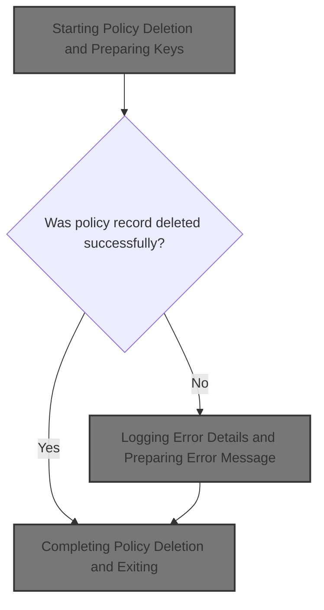
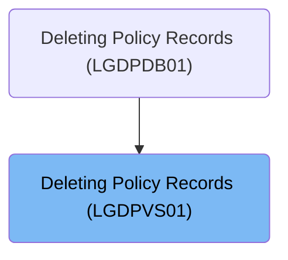
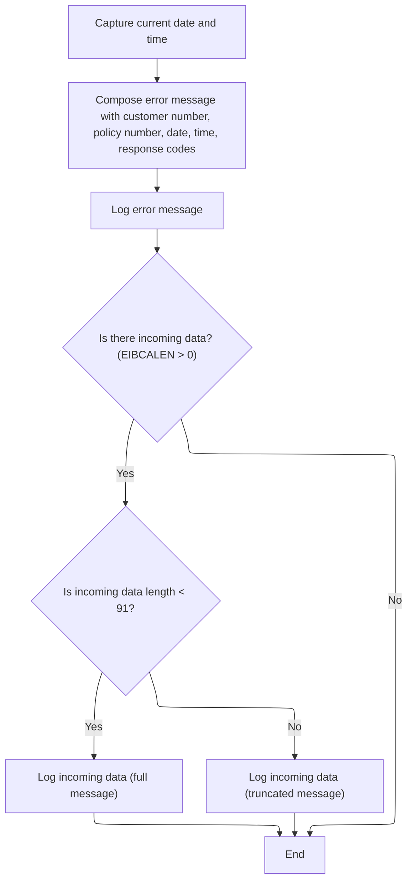

# Overview

This document explains the flow for deleting policy records. When a deletion request is received, the system attempts to remove the policy and logs error details if the operation fails, ensuring traceability and diagnostic support.



## Dependencies

### Programs

- <SwmToken path="base/src/lgdpvs01.cbl" pos="11:6:6" line-data="       PROGRAM-ID. LGDPVS01.">`LGDPVS01`</SwmToken> (<SwmPath>[base/src/lgdpvs01.cbl](base/src/lgdpvs01.cbl)</SwmPath>)
- LGSTSQ (<SwmPath>[base/src/lgstsq.cbl](base/src/lgstsq.cbl)</SwmPath>)

### Copybook

- LGCMAREA (<SwmPath>[base/src/lgcmarea.cpy](base/src/lgcmarea.cpy)</SwmPath>)

# Where is this program used?

This program is used once, as represented in the following diagram:



## Detailed View of the Program's Functionality

# Starting Policy Deletion and Preparing Keys

The process begins in the main section of the policy deletion program. The code first prepares the necessary working fields for the deletion operation:

- It determines the length of the communication area and stores it for later use.
- It extracts a specific character from the request identifier (specifically, the fourth character) and uses this as part of the key for the policy record. This step relies on the input format being at least five characters long.
- It sets up the customer number and policy number, which, together with the extracted character, form the complete key used to identify the policy record in the data store.

With the key constructed, the code attempts to delete the policy record from a VSAM file (a type of mainframe data storage) named 'KSDSPOLY'. The deletion is performed using the generated key, and the result of this operation is captured for error handling.

If the deletion does not succeed (i.e., the response code is not normal), the code:

- Captures a secondary response code for more detailed diagnostics.
- Sets a return code indicating failure.
- Invokes a routine to log the error details.
- Returns control to the caller, halting further processing.

# Logging Error Details and Preparing Error Message

When an error occurs during the deletion, the program moves into the error logging routine. This routine performs several steps to ensure comprehensive error tracking:

1. **Capture Current Date and Time**

   - The system time is requested and formatted into human-readable date and time strings. These are used to timestamp the error log entry.

2. **Compose Error Message**

   - The error message is assembled to include:
     - The date and time of the error.
     - The program name.
     - The policy number and customer number involved in the failed operation.
     - An indication that the operation was a delete on the 'KSDSPOLY' file.
     - The response codes from the failed deletion attempt.

3. **Log Error Message**

   - The composed error message is sent to a logging program, which is responsible for writing the message to both a transient data queue (TDQ) and a temporary storage queue (TSQ). This ensures the error is recorded for both immediate review and longer-term diagnostics.

4. **Log Incoming Data (if present)**

   - If there is additional data in the communication area (i.e., if the length is greater than zero), the routine checks how much data is present:
     - If the data is less than 91 bytes, it copies the entire message.
     - If the data is 91 bytes or more, it copies only the first 90 bytes to avoid overruns.
   - This data is then logged as a separate message, again using the logging program, to provide context about the input that led to the error.

# Logging Program (LGSTSQ) Flow

The logging program, when called, determines how it was invoked:

- If it was called directly from another program, it prepares the message from the provided data.
- If it was triggered by a transaction receive, it reads the incoming data and prepares the message accordingly.

The program checks if the message starts with a special prefix (e.g., 'Q='), which allows dynamic selection of the queue name for logging. If such a prefix is present, it adjusts the queue name and message content accordingly.

The message length is adjusted to account for any changes, and then:

- The message is written to a standard output queue for immediate review.
- The message is also written to a general application queue for longer-term storage, with the instruction not to wait if space is unavailable (to avoid blocking the application).

If the message was received as part of a transaction, the program sends a minimal response and frees up the keyboard, then returns control.

# Completing Policy Deletion and Exiting

After the main processing and any necessary error logging, the program reaches its exit section. Here, it simply exits and returns control to the caller, with no additional cleanup or logic performed. This marks the end of the policy deletion flow.

# Rule Definition

| Paragraph Name   | Rule ID | Category        | Description                                                                                                                                                                                                                                              | Conditions                                                                                                                                                                                     | Remarks                                                                                                                                                                                                        |
| ---------------- | ------- | --------------- | -------------------------------------------------------------------------------------------------------------------------------------------------------------------------------------------------------------------------------------------------------- | ---------------------------------------------------------------------------------------------------------------------------------------------------------------------------------------------- | -------------------------------------------------------------------------------------------------------------------------------------------------------------------------------------------------------------- |
| MAINLINE SECTION | RL-001  | Data Assignment | The program must extract the 4th character from <SwmToken path="base/src/lgdpvs01.cbl" pos="77:3:7" line-data="           Move CA-Request-ID(4:1) To WF-Request-ID">`CA-Request-ID`</SwmToken> and use it as the Request ID for the policy deletion key. | <SwmToken path="base/src/lgdpvs01.cbl" pos="77:3:7" line-data="           Move CA-Request-ID(4:1) To WF-Request-ID">`CA-Request-ID`</SwmToken> must be present and at least 4 characters long. | Request ID is a single character, extracted from position 4 of <SwmToken path="base/src/lgdpvs01.cbl" pos="77:3:7" line-data="           Move CA-Request-ID(4:1) To WF-Request-ID">`CA-Request-ID`</SwmToken>. |
| MAINLINE SECTION | RL-002  | Computation     | The policy deletion key must be constructed as a 21-byte string: 1 byte Request ID, 10 bytes Customer Number, 10 bytes Policy Number, in that order. Each field must be padded or truncated to its specified length.                                     | Request ID, Customer Number, and Policy Number must be available.                                                                                                                              | \- Request ID: 1 byte (character)                                                                                                                                                                              |

- Customer Number: 10 bytes (string, padded/truncated)
- Policy Number: 10 bytes (string, padded/truncated)
- Total: 21 bytes, concatenated in order. | | MAINLINE SECTION | RL-003 | Computation | The program must attempt to delete the policy record from the VSAM file 'KSDSPOLY' using the constructed key. | Constructed key must be available. | VSAM file name: 'KSDSPOLY'. Key length: 21 bytes. | | <SwmToken path="base/src/lgdpvs01.cbl" pos="89:3:7" line-data="             PERFORM WRITE-ERROR-MESSAGE">`WRITE-ERROR-MESSAGE`</SwmToken> | RL-004 | Computation | The error message must be formatted as a fixed-length string with specific fields and lengths. | Error condition detected during VSAM delete. | Error message format:
- Date (MMDDYYYY, 8 chars)
- Space (1)
- Time (HHMMSS, 6 chars)
- Program Name (' <SwmToken path="base/src/lgdpvs01.cbl" pos="11:6:6" line-data="       PROGRAM-ID. LGDPVS01.">`LGDPVS01`</SwmToken>', 9 chars)
- PNUM= (6)
- Policy Number (10 chars)
- CNUM= (6)
- Customer Number (10 chars)
- Delete file KSDSPOLY (21 chars)
- RESP= (6)
- Response Code (6 chars, right-justified, signed)
- <SwmToken path="base/src/lgdpvs01.cbl" pos="87:9:9" line-data="             Move EIBRESP2 To WS-RESP2">`RESP2`</SwmToken>= (7)
- Response2 Code (6 chars, right-justified, signed) | | <SwmToken path="base/src/lgdpvs01.cbl" pos="89:3:7" line-data="             PERFORM WRITE-ERROR-MESSAGE">`WRITE-ERROR-MESSAGE`</SwmToken> (<SwmToken path="base/src/lgdpvs01.cbl" pos="11:6:6" line-data="       PROGRAM-ID. LGDPVS01.">`LGDPVS01`</SwmToken>), MAINLINE SECTION (LGSTSQ) | RL-005 | Conditional Logic | The error message must be logged to both TDQ ('CSMT') and TSQ ('GENAERRS'), unless the message starts with 'Q=', in which case the TSQ name must be 'GENA' plus the next four characters, and the prefix must be stripped from the message before logging. | Error message is being logged. Message may start with 'Q='. | TDQ name: 'CSMT'. Default TSQ name: 'GENAERRS'. If message starts with 'Q=', TSQ name is 'GENA' + next four chars, and prefix is stripped. | | <SwmToken path="base/src/lgdpvs01.cbl" pos="89:3:7" line-data="             PERFORM WRITE-ERROR-MESSAGE">`WRITE-ERROR-MESSAGE`</SwmToken> | RL-006 | Conditional Logic | If there is incoming data in DFHCOMMAREA, up to 90 bytes must be copied to <SwmToken path="base/src/lgdpvs01.cbl" pos="119:12:14" line-data="               MOVE DFHCOMMAREA(1:EIBCALEN) TO CA-DATA">`CA-DATA`</SwmToken> and logged with the prefix 'COMMAREA='; if the data is shorter than 90 bytes, it must be padded with spaces; if longer, it must be truncated to 90 bytes. | EIBCALEN > 0 (incoming data present) | Prefix: 'COMMAREA=' (9 chars). Data: up to 90 bytes, padded/truncated as needed. | | <SwmToken path="base/src/lgdpvs01.cbl" pos="89:3:7" line-data="             PERFORM WRITE-ERROR-MESSAGE">`WRITE-ERROR-MESSAGE`</SwmToken> | RL-007 | Conditional Logic | When logging incoming data, if the length is less than 91 bytes, log the full message; if 91 bytes or more, log only the first 90 bytes. | EIBCALEN > 0 (incoming data present) | Message length check: <91 bytes logs full, >=91 logs first 90 bytes. | | MAINLINE SECTION (LGSTSQ) | RL-008 | Conditional Logic | If LGSTSQ is invoked as a transaction (RECEIVE), a single blank character must be sent to the terminal after logging; if invoked as a subprogram (LINK), no response is sent. | Program invocation type is transaction (RECEIVE) or subprogram (LINK). | Blank character sent to terminal only for transaction invocation. | | <SwmToken path="base/src/lgdpvs01.cbl" pos="95:1:3" line-data="       A-EXIT.">`A-EXIT`</SwmToken> | RL-009 | Conditional Logic | The program must terminate execution and return control to the caller when <SwmToken path="base/src/lgdpvs01.cbl" pos="95:1:3" line-data="       A-EXIT.">`A-EXIT`</SwmToken> is reached, with no finalization or return value. | <SwmToken path="base/src/lgdpvs01.cbl" pos="95:1:3" line-data="       A-EXIT.">`A-EXIT`</SwmToken> reached. | No finalization or return value. | | MAINLINE SECTION, <SwmToken path="base/src/lgdpvs01.cbl" pos="89:3:7" line-data="             PERFORM WRITE-ERROR-MESSAGE">`WRITE-ERROR-MESSAGE`</SwmToken> | RL-010 | Conditional Logic | If the VSAM delete response code is not normal, the program must set the return code to '81', capture the secondary response code for logging, and log an error message. | VSAM delete response code is not normal (not equal to the normal response constant). | Return code is set to '81'. Secondary response code is captured for logging. Error message is logged according to the specified format. |

# User Stories

## User Story 1: Policy Deletion Key Construction and VSAM Delete

---

### Story Description:

As a system, I want to extract the Request ID, construct the policy deletion key, and attempt to delete the policy record from the VSAM file so that policy deletions are performed accurately and securely.

---

### Business Rule Mapping:

| Rule ID | Paragraph Name   | Rule Description                                                                                                                                                                                                                                         |
| ------- | ---------------- | -------------------------------------------------------------------------------------------------------------------------------------------------------------------------------------------------------------------------------------------------------- |
| RL-001  | MAINLINE SECTION | The program must extract the 4th character from <SwmToken path="base/src/lgdpvs01.cbl" pos="77:3:7" line-data="           Move CA-Request-ID(4:1) To WF-Request-ID">`CA-Request-ID`</SwmToken> and use it as the Request ID for the policy deletion key. |
| RL-002  | MAINLINE SECTION | The policy deletion key must be constructed as a 21-byte string: 1 byte Request ID, 10 bytes Customer Number, 10 bytes Policy Number, in that order. Each field must be padded or truncated to its specified length.                                     |
| RL-003  | MAINLINE SECTION | The program must attempt to delete the policy record from the VSAM file 'KSDSPOLY' using the constructed key.                                                                                                                                            |

---

### Relevant Functionality:

- **MAINLINE SECTION**
  1. **RL-001:**
     - Extract the 4th character from the incoming request ID.
     - Assign this character as the Request ID in the policy key structure.
  2. **RL-002:**
     - Assign Request ID (1 byte)
     - Assign Customer Number (10 bytes, pad/truncate as needed)
     - Assign Policy Number (10 bytes, pad/truncate as needed)
     - Concatenate to form 21-byte key.
  3. **RL-003:**
     - Issue VSAM DELETE command for file 'KSDSPOLY' with the constructed key.
     - Capture response code.

## User Story 2: Error Handling and Logging

---

### Story Description:

As a system, I want to handle errors during policy deletion by setting return codes, formatting error messages, and logging them to the appropriate queues so that failures are traceable and actionable.

---

### Business Rule Mapping:

| Rule ID | Paragraph Name                                                                                                                                                                                                                                                                            | Rule Description                                                                                                                                                                                                                                           |
| ------- | ----------------------------------------------------------------------------------------------------------------------------------------------------------------------------------------------------------------------------------------------------------------------------------------- | ---------------------------------------------------------------------------------------------------------------------------------------------------------------------------------------------------------------------------------------------------------- |
| RL-004  | <SwmToken path="base/src/lgdpvs01.cbl" pos="89:3:7" line-data="             PERFORM WRITE-ERROR-MESSAGE">`WRITE-ERROR-MESSAGE`</SwmToken>                                                                                                                                                 | The error message must be formatted as a fixed-length string with specific fields and lengths.                                                                                                                                                             |
| RL-005  | <SwmToken path="base/src/lgdpvs01.cbl" pos="89:3:7" line-data="             PERFORM WRITE-ERROR-MESSAGE">`WRITE-ERROR-MESSAGE`</SwmToken> (<SwmToken path="base/src/lgdpvs01.cbl" pos="11:6:6" line-data="       PROGRAM-ID. LGDPVS01.">`LGDPVS01`</SwmToken>), MAINLINE SECTION (LGSTSQ) | The error message must be logged to both TDQ ('CSMT') and TSQ ('GENAERRS'), unless the message starts with 'Q=', in which case the TSQ name must be 'GENA' plus the next four characters, and the prefix must be stripped from the message before logging. |
| RL-010  | MAINLINE SECTION, <SwmToken path="base/src/lgdpvs01.cbl" pos="89:3:7" line-data="             PERFORM WRITE-ERROR-MESSAGE">`WRITE-ERROR-MESSAGE`</SwmToken>                                                                                                                               | If the VSAM delete response code is not normal, the program must set the return code to '81', capture the secondary response code for logging, and log an error message.                                                                                   |

---

### Relevant Functionality:

- <SwmToken path="base/src/lgdpvs01.cbl" pos="89:3:7" line-data="             PERFORM WRITE-ERROR-MESSAGE">`WRITE-ERROR-MESSAGE`</SwmToken>
  1. **RL-004:**
     - Gather date and time.
     - Format each field to its specified length.
     - Concatenate fields in order to form fixed-length message.
- <SwmToken path="base/src/lgdpvs01.cbl" pos="89:3:7" line-data="             PERFORM WRITE-ERROR-MESSAGE">`WRITE-ERROR-MESSAGE`</SwmToken> **(**<SwmToken path="base/src/lgdpvs01.cbl" pos="11:6:6" line-data="       PROGRAM-ID. LGDPVS01.">`LGDPVS01`</SwmToken>**)**
  1. **RL-005:**
     - Log message to TDQ 'CSMT'.
     - If message starts with 'Q=':
       - Set TSQ name to 'GENA' + next four chars.
       - Strip 'Q=xxxx' prefix from message.
     - Otherwise, use TSQ name 'GENAERRS'.
     - Log message to TSQ.
- **MAINLINE SECTION**
  1. **RL-010:**
     - If the VSAM response code is not normal:
       - Set the return code to '81'.
       - Capture the secondary response code for logging.
       - Invoke the error message logging routine.
       - Return control to the caller.

## User Story 3: Logging Incoming Data from DFHCOMMAREA

---

### Story Description:

As a system, I want to log incoming data from DFHCOMMAREA with proper truncation or padding and message length handling so that all relevant input data is captured for auditing and debugging.

---

### Business Rule Mapping:

| Rule ID | Paragraph Name                                                                                                                            | Rule Description                                                                                                                                                                                                                                                                                                                                                                    |
| ------- | ----------------------------------------------------------------------------------------------------------------------------------------- | ----------------------------------------------------------------------------------------------------------------------------------------------------------------------------------------------------------------------------------------------------------------------------------------------------------------------------------------------------------------------------------- |
| RL-006  | <SwmToken path="base/src/lgdpvs01.cbl" pos="89:3:7" line-data="             PERFORM WRITE-ERROR-MESSAGE">`WRITE-ERROR-MESSAGE`</SwmToken> | If there is incoming data in DFHCOMMAREA, up to 90 bytes must be copied to <SwmToken path="base/src/lgdpvs01.cbl" pos="119:12:14" line-data="               MOVE DFHCOMMAREA(1:EIBCALEN) TO CA-DATA">`CA-DATA`</SwmToken> and logged with the prefix 'COMMAREA='; if the data is shorter than 90 bytes, it must be padded with spaces; if longer, it must be truncated to 90 bytes. |
| RL-007  | <SwmToken path="base/src/lgdpvs01.cbl" pos="89:3:7" line-data="             PERFORM WRITE-ERROR-MESSAGE">`WRITE-ERROR-MESSAGE`</SwmToken> | When logging incoming data, if the length is less than 91 bytes, log the full message; if 91 bytes or more, log only the first 90 bytes.                                                                                                                                                                                                                                            |

---

### Relevant Functionality:

- <SwmToken path="base/src/lgdpvs01.cbl" pos="89:3:7" line-data="             PERFORM WRITE-ERROR-MESSAGE">`WRITE-ERROR-MESSAGE`</SwmToken>
  1. **RL-006:**
     - If incoming data length < 91:
       - Copy all bytes to <SwmToken path="base/src/lgdpvs01.cbl" pos="119:12:14" line-data="               MOVE DFHCOMMAREA(1:EIBCALEN) TO CA-DATA">`CA-DATA`</SwmToken>, pad with spaces if needed.
     - If incoming data length >= 91:
       - Copy first 90 bytes to <SwmToken path="base/src/lgdpvs01.cbl" pos="119:12:14" line-data="               MOVE DFHCOMMAREA(1:EIBCALEN) TO CA-DATA">`CA-DATA`</SwmToken>.
     - Log message with 'COMMAREA=' prefix.
  2. **RL-007:**
     - Check incoming data length.
     - Log either full message or first 90 bytes accordingly.

## User Story 4: Program Invocation and Termination Behavior

---

### Story Description:

As a system, I want to respond appropriately based on how the program is invoked and terminate cleanly so that the program integrates correctly with other systems and user interfaces.

---

### Business Rule Mapping:

| Rule ID | Paragraph Name                                                                                     | Rule Description                                                                                                                                                                                                                |
| ------- | -------------------------------------------------------------------------------------------------- | ------------------------------------------------------------------------------------------------------------------------------------------------------------------------------------------------------------------------------- |
| RL-009  | <SwmToken path="base/src/lgdpvs01.cbl" pos="95:1:3" line-data="       A-EXIT.">`A-EXIT`</SwmToken> | The program must terminate execution and return control to the caller when <SwmToken path="base/src/lgdpvs01.cbl" pos="95:1:3" line-data="       A-EXIT.">`A-EXIT`</SwmToken> is reached, with no finalization or return value. |
| RL-008  | MAINLINE SECTION (LGSTSQ)                                                                          | If LGSTSQ is invoked as a transaction (RECEIVE), a single blank character must be sent to the terminal after logging; if invoked as a subprogram (LINK), no response is sent.                                                   |

---

### Relevant Functionality:

- <SwmToken path="base/src/lgdpvs01.cbl" pos="95:1:3" line-data="       A-EXIT.">`A-EXIT`</SwmToken>
  1. **RL-009:**
     - Upon reaching <SwmToken path="base/src/lgdpvs01.cbl" pos="95:1:3" line-data="       A-EXIT.">`A-EXIT`</SwmToken>:
       - Exit program.
       - Return control to caller.
- **MAINLINE SECTION (LGSTSQ)**
  1. **RL-008:**
     - If invoked as transaction:
       - Send blank character to terminal.
     - If invoked as subprogram:
       - Do not send any response.

# Workflow

# Starting Policy Deletion and Preparing Keys

This section is responsible for initiating the deletion of a policy record, ensuring the correct key structure is used, and handling any errors that occur during the deletion process by logging them for review.

<SwmSnippet path="/base/src/lgdpvs01.cbl" line="72">

---

In <SwmToken path="base/src/lgdpvs01.cbl" pos="72:1:1" line-data="       MAINLINE SECTION.">`MAINLINE`</SwmToken>, we kick off the flow by prepping the working fields for the policy deletion. The code assumes <SwmToken path="base/src/lgdpvs01.cbl" pos="77:3:7" line-data="           Move CA-Request-ID(4:1) To WF-Request-ID">`CA-Request-ID`</SwmToken> is at least 5 characters and grabs the 4th character for <SwmToken path="base/src/lgdpvs01.cbl" pos="77:16:20" line-data="           Move CA-Request-ID(4:1) To WF-Request-ID">`WF-Request-ID`</SwmToken>, which is a hidden dependency on input format. It also sets up the customer and policy numbers for the key structure, then immediately tries to delete the policy record from the VSAM file 'KSDSPOLY' using the generated key.

```cobol
       MAINLINE SECTION.
      *
      *---------------------------------------------------------------*
           Move EIBCALEN To WS-Commarea-Len.
      *---------------------------------------------------------------*
           Move CA-Request-ID(4:1) To WF-Request-ID
           Move CA-Policy-Num      To WF-Policy-Num
           Move CA-Customer-Num    To WF-Customer-Num
      *---------------------------------------------------------------*
           Exec CICS Delete File('KSDSPOLY')
                     Ridfld(WF-Policy-Key)
                     KeyLength(21)
                     RESP(WS-RESP)
           End-Exec.
```

---

</SwmSnippet>

<SwmSnippet path="/base/src/lgdpvs01.cbl" line="86">

---

After trying to delete the policy, if the response isn't normal, we set up error codes and call <SwmToken path="base/src/lgdpvs01.cbl" pos="89:3:7" line-data="             PERFORM WRITE-ERROR-MESSAGE">`WRITE-ERROR-MESSAGE`</SwmToken> to log what went wrong. This makes sure any issues with deletion are captured for later review.

```cobol
           If WS-RESP Not = DFHRESP(NORMAL)
             Move EIBRESP2 To WS-RESP2
             MOVE '81' TO CA-RETURN-CODE
             PERFORM WRITE-ERROR-MESSAGE
             EXEC CICS RETURN END-EXEC
           End-If.
```

---

</SwmSnippet>

## Logging Error Details and Preparing Error Message



This section ensures that all relevant error details are captured and logged for diagnostic and audit purposes, including handling incoming data safely and providing clear, formatted error messages for downstream systems.

| Category        | Rule Name                    | Description                                                                                                                                                  |
| --------------- | ---------------------------- | ------------------------------------------------------------------------------------------------------------------------------------------------------------ |
| Data validation | Safe incoming data logging   | If there is incoming data in DFHCOMMAREA, up to 90 bytes must be logged to prevent buffer overruns and ensure safe error tracking.                           |
| Business logic  | Comprehensive error details  | The error message must include the current date and time, customer number, policy number, and response codes to ensure traceability of the error event.      |
| Business logic  | Incoming data truncation     | If the incoming data length is less than 91 bytes, the full message must be logged; otherwise, only the first 90 bytes are logged and the rest is truncated. |
| Business logic  | Dual queue logging           | All error messages must be written to both TDQ and TSQ queues to ensure redundancy and availability for diagnostics and tracking.                            |
| Business logic  | Transaction receive response | If the error message originates from a transaction receive, a response must be sent and resources freed after logging.                                       |

<SwmSnippet path="/base/src/lgdpvs01.cbl" line="99">

---

In <SwmToken path="base/src/lgdpvs01.cbl" pos="99:1:5" line-data="       WRITE-ERROR-MESSAGE.">`WRITE-ERROR-MESSAGE`</SwmToken>, we grab the current time and format it, prepping the timestamp for the error log. The function assumes the communication area is valid and filled, which isn't obvious from the outside but is critical for the error message to be meaningful.

```cobol
       WRITE-ERROR-MESSAGE.
           EXEC CICS ASKTIME ABSTIME(WS-ABSTIME)
           END-EXEC
           EXEC CICS FORMATTIME ABSTIME(WS-ABSTIME)
                     MMDDYYYY(WS-DATE)
                     TIME(WS-TIME)
           END-EXEC
```

---

</SwmSnippet>

<SwmSnippet path="/base/src/lgdpvs01.cbl" line="107">

---

After prepping the error message fields, we call LGSTSQ to handle the actual logging. LGSTSQ takes care of writing the error message to the appropriate queues for tracking and diagnostics.

```cobol
           MOVE WS-DATE TO EM-DATE
           MOVE WS-TIME TO EM-TIME
           Move CA-Customer-Num To EM-CUSNUM 
           Move CA-POLICY-NUM To EM-POLNUM 
           Move WS-RESP         To EM-RespRC
           Move WS-RESP2        To EM-Resp2RC
           EXEC CICS LINK PROGRAM('LGSTSQ')
                     COMMAREA(ERROR-MSG)
                     LENGTH(LENGTH OF ERROR-MSG)
           END-EXEC.
```

---

</SwmSnippet>

<SwmSnippet path="/base/src/lgstsq.cbl" line="55">

---

<SwmToken path="base/src/lgstsq.cbl" pos="55:1:1" line-data="       MAINLINE SECTION.">`MAINLINE`</SwmToken> in LGSTSQ figures out if the message came from a program call or a transaction receive, parses out any special 'Q=' prefix, adjusts the message length, and writes the message to both TDQ and TSQ queues for error tracking. If the message was received, it sends a response and frees up resources.

```cobol
       MAINLINE SECTION.

           MOVE SPACES TO WRITE-MSG.
           MOVE SPACES TO WS-RECV.

           EXEC CICS ASSIGN SYSID(WRITE-MSG-SYSID)
                RESP(WS-RESP)
           END-EXEC.

           EXEC CICS ASSIGN INVOKINGPROG(WS-INVOKEPROG)
                RESP(WS-RESP)
           END-EXEC.
           
           IF WS-INVOKEPROG NOT = SPACES
              MOVE 'C' To WS-FLAG
              MOVE COMMA-DATA  TO WRITE-MSG-MSG
              MOVE EIBCALEN    TO WS-RECV-LEN
           ELSE
              EXEC CICS RECEIVE INTO(WS-RECV)
                  LENGTH(WS-RECV-LEN)
                  RESP(WS-RESP)
              END-EXEC
              MOVE 'R' To WS-FLAG
              MOVE WS-RECV-DATA  TO WRITE-MSG-MSG
              SUBTRACT 5 FROM WS-RECV-LEN
           END-IF.

           MOVE 'GENAERRS' TO STSQ-NAME.
           IF WRITE-MSG-MSG(1:2) = 'Q=' THEN
              MOVE WRITE-MSG-MSG(3:4) TO STSQ-EXT
              MOVE WRITE-MSG-REST TO TEMPO
              MOVE TEMPO          TO WRITE-MSG-MSG
              SUBTRACT 7 FROM WS-RECV-LEN
           END-IF.

           ADD 5 TO WS-RECV-LEN.

      * Write output message to TDQ CSMT
      *
           EXEC CICS WRITEQ TD QUEUE(STDQ-NAME)
                     FROM(WRITE-MSG)
                     RESP(WS-RESP)
                     LENGTH(WS-RECV-LEN)

           END-EXEC.

      * Write output message to Genapp TSQ
      * If no space is available then the task will not wait for
      *  storage to become available but will ignore the request...
      *
           EXEC CICS WRITEQ TS QUEUE(STSQ-NAME)
                     FROM(WRITE-MSG)
                     RESP(WS-RESP)
                     NOSUSPEND
                     LENGTH(WS-RECV-LEN)

           END-EXEC.

           If WS-FLAG = 'R' Then
             EXEC CICS SEND TEXT FROM(FILLER-X)
              WAIT
              ERASE
              LENGTH(1)
              FREEKB
             END-EXEC.

           EXEC CICS RETURN
           END-EXEC.
```

---

</SwmSnippet>

<SwmSnippet path="/base/src/lgdpvs01.cbl" line="117">

---

After returning from LGSTSQ, <SwmToken path="base/src/lgdpvs01.cbl" pos="89:3:7" line-data="             PERFORM WRITE-ERROR-MESSAGE">`WRITE-ERROR-MESSAGE`</SwmToken> checks if there's extra data in DFHCOMMAREA and, depending on its length, moves up to 90 bytes to <SwmToken path="base/src/lgdpvs01.cbl" pos="119:12:14" line-data="               MOVE DFHCOMMAREA(1:EIBCALEN) TO CA-DATA">`CA-DATA`</SwmToken> before calling LGSTSQ again. This keeps the error logging safe and avoids buffer overruns.

```cobol
           IF EIBCALEN > 0 THEN
             IF EIBCALEN < 91 THEN
               MOVE DFHCOMMAREA(1:EIBCALEN) TO CA-DATA
               EXEC CICS LINK PROGRAM('LGSTSQ')
                         COMMAREA(CA-ERROR-MSG)
                         LENGTH(Length Of CA-ERROR-MSG)
               END-EXEC
             ELSE
               MOVE DFHCOMMAREA(1:90) TO CA-DATA
               EXEC CICS LINK PROGRAM('LGSTSQ')
                         COMMAREA(CA-ERROR-MSG)
                         LENGTH(Length Of CA-ERROR-MSG)
               END-EXEC
             END-IF
           END-IF.
           EXIT.
```

---

</SwmSnippet>

## Completing Policy Deletion and Exiting

<SwmSnippet path="/base/src/lgdpvs01.cbl" line="95">

---

<SwmToken path="base/src/lgdpvs01.cbl" pos="95:1:3" line-data="       A-EXIT.">`A-EXIT`</SwmToken> just wraps up the flow by exiting and returning control to the caller. No cleanup or extra logic is done here.

```cobol
       A-EXIT.
           EXIT.
           GOBACK.
```

---

</SwmSnippet>

&nbsp;

*This is an auto-generated document by Swimm 🌊 and has not yet been verified by a human*

<SwmMeta version="3.0.0" repo-id="Z2l0aHViJTNBJTNBU3dpbW1pby1nZW5hcHAtaG91c2UlM0ElM0FHaXJpLVN3aW1t" repo-name="Swimmio-genapp-house"><sup>Powered by [Swimm](https://app.swimm.io/)</sup></SwmMeta>
