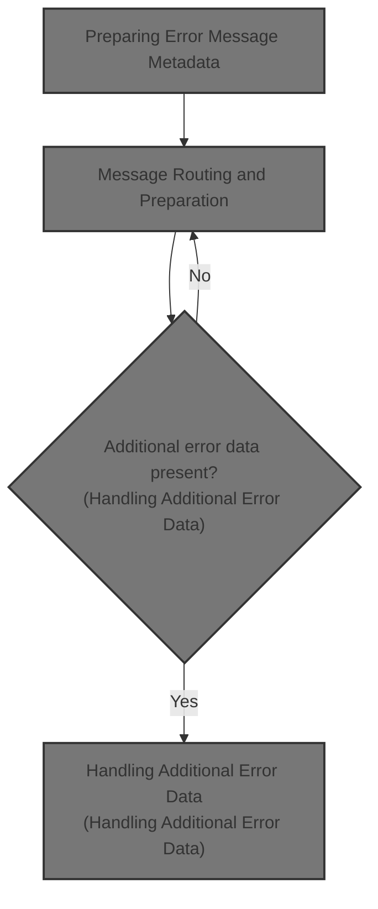
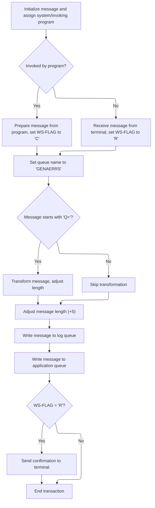
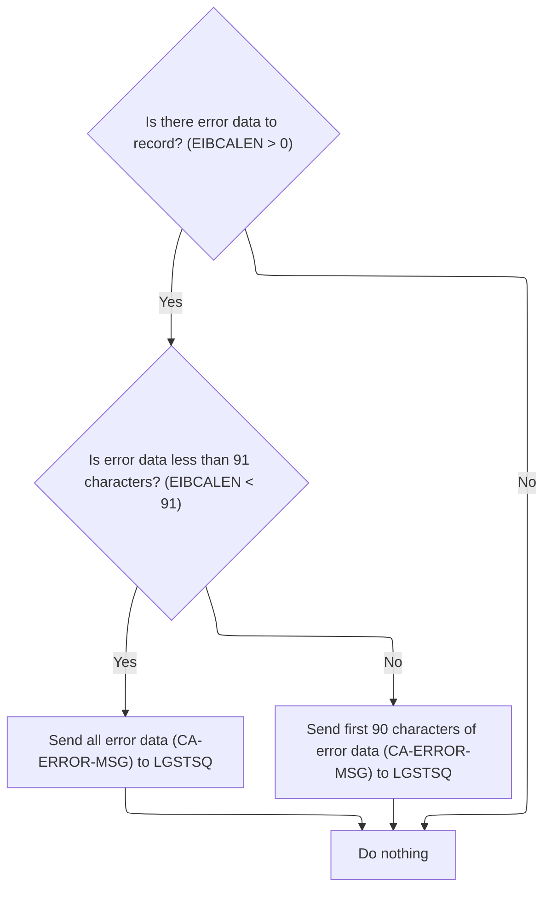

This document outlines how error events are logged. When an error occurs, the system captures the current date and time, prepares the error message with metadata, and routes it to the appropriate queues. Additional error data is included when available, ensuring comprehensive and consistent error logging.



# Spec

## Detailed View of the Program's Functionality

a. Preparing Error Message Metadata

The process begins in a section dedicated to writing error messages. The first step is to capture the current system time and date. This is done by making system calls to retrieve the absolute time and then formatting it into human-readable date and time strings. These formatted values are then inserted into specific fields of the error message structure, ensuring that every error message is timestamped for traceability.

After the timestamp and other metadata (such as the program name) are set in the error message, the system initiates a call to a separate program responsible for handling message queuing. This call passes the prepared error message, along with its length, to the queue handler so it can be logged or processed further.

b. Message Routing and Preparation

The message queue handler program starts by initializing its internal buffers for both the outgoing message and any data it might receive. It then tags the message with the system identifier and the name of the program that invoked it, providing context for downstream processing.

Next, the handler determines the source of the message. If the message was sent by another program, it sets an internal flag to indicate this and copies the incoming data into the message buffer, also recording the length of the data. If the message originated from a terminal, it receives the data from the terminal, sets a different flag, and adjusts the message buffer and length accordingly.

The handler then sets a default queue name for error messages. However, if the message content starts with a specific prefix (indicating a request for a different queue), it extracts the desired queue extension, updates the queue name, and cleans up the message content to remove the routing directive. The message length is also adjusted to account for these changes.

Once the message is prepared, it is written to two different queues: a temporary queue for immediate access and a transactional queue for persistent storage. The transactional write is performed in a non-blocking manner to avoid delays if the queue is busy.

Finally, if the message came from a terminal, the handler sends a brief acknowledgment back to the terminal before ending the transaction. If the message was programmatic, it simply ends the transaction without sending a response.

c. Handling Additional Error Data

After the initial error message is logged, the original program checks if there is additional data in the communication area (commarea) that should also be recorded. If such data exists, it determines whether the data is less than a certain length threshold. If it is, all of the data is moved into a secondary error message structure; if it exceeds the threshold, only the first portion is used.

This secondary error message, prefixed to indicate it contains commarea data, is then sent to the queue handler in the same way as the primary error message. This ensures that any extra diagnostic information is also captured and logged for later analysis.

d. Summary of Flow

- The main program prepares an error message with timestamp and metadata.
- The message is sent to a queue handler, which determines the source, prepares the message, and routes it to the appropriate queues.
- If there is extra diagnostic data, it is also formatted and sent to the queue handler for logging.
- The queue handler manages both immediate and persistent storage of messages, and provides acknowledgments if required.

# Rule Definition

| Paragraph Name                                                              | Rule ID | Category          | Description                                                                                                                                                                                                                         | Conditions                                                                                     | Remarks                                                                                                                                                                                                                                                                   |
| --------------------------------------------------------------------------- | ------- | ----------------- | ----------------------------------------------------------------------------------------------------------------------------------------------------------------------------------------------------------------------------------- | ---------------------------------------------------------------------------------------------- | ------------------------------------------------------------------------------------------------------------------------------------------------------------------------------------------------------------------------------------------------------------------------- |
| WRITE-ERROR-MESSAGE section in lgipol01.cbl, MAINLINE SECTION in lgstsq.cbl | RL-001  | Computation       | Prepare an error message containing the current date (MMDDYYYY), current time (HHMMSS), the invoking program name (9 characters), and a variable field for custom error information (21 characters).                                | Whenever an error message needs to be sent (e.g., commarea missing or other error conditions). | Date is 8 characters (MMDDYYYY), time is 6 characters (HHMMSS), program name is 9 characters, custom info is 21 characters. The total message fits into a 90-byte buffer for queue writing. All fields are alphanumeric strings, left-aligned, space-padded if necessary. |
| WRITE-ERROR-MESSAGE section in lgipol01.cbl                                 | RL-002  | Conditional Logic | If additional error data is present in the commarea (EIBCALEN > 0), and its length is less than 91 characters, send the entire error data to the queue prefixed with 'COMMAREA='; if longer, only the first 90 characters are sent. | EIBCALEN > 0 (commarea present)                                                                | Prefix 'COMMAREA=' is 9 characters, followed by up to 90 characters of commarea data. If commarea length < 91, use full data; else, truncate to 90 characters. All data is alphanumeric, left-aligned, space-padded if necessary.                                         |
| MAINLINE SECTION in lgstsq.cbl                                              | RL-003  | Conditional Logic | Determine the source of the message: if from another program, set the source flag to 'C'; if from a terminal, set the source flag to 'R'.                                                                                           | If invoking program name is present, source is another program; else, source is terminal.      | Source flag is a single character ('C' or 'R'), used for routing and handling downstream.                                                                                                                                                                                 |
| MAINLINE SECTION in lgstsq.cbl                                              | RL-004  | Data Assignment   | Queue name for writing defaults to 'GENAERRS', but if the message starts with 'Q=', the queue name is set to 'GENA' followed by the next four characters after 'Q='.                                                                | If message starts with 'Q='                                                                    | Default queue name is 'GENAERRS' (8 characters). If dynamic, use 'GENA' + next 4 characters after 'Q='. All queue names are alphanumeric, left-aligned, space-padded if necessary.                                                                                        |
| WRITE-ERROR-MESSAGE section in lgipol01.cbl, MAINLINE SECTION in lgstsq.cbl | RL-005  | Computation       | Write the formatted error message to both the transient data queue ('CSMT') and the temporary storage queue (either 'GENAERRS' or the dynamic name).                                                                                | Always when an error message is prepared for output.                                           | Transient queue name is 'CSMT' (4 characters). Temporary storage queue is 'GENAERRS' or dynamic name. Message length must match buffer size after any transformation.                                                                                                     |
| MAINLINE SECTION in lgstsq.cbl                                              | RL-006  | Computation       | Adjust the message length according to any transformation performed (e.g., if the queue name is dynamic, adjust for the prefix removal/addition).                                                                                   | If message is transformed (e.g., 'Q=' prefix removed).                                         | Subtract 7 from message length if 'Q=' prefix is removed. Add 5 to message length for system identifier fields. Message length is a number, used for queue writing.                                                                                                       |
| MAINLINE SECTION in lgstsq.cbl                                              | RL-007  | Conditional Logic | If the message originated from a terminal, send a single-character acknowledgment back to the terminal after queue writing. If from another program, no acknowledgment is sent.                                                     | Source flag is 'R' for terminal, 'C' for program.                                              | Acknowledgment is a single character, sent as a text message to the terminal. No acknowledgment for program-originated messages.                                                                                                                                          |
| WRITE-ERROR-MESSAGE section in lgipol01.cbl, MAINLINE SECTION in lgstsq.cbl | RL-008  | Data Assignment   | All error messages must include the system and invoking program identifiers for downstream routing and handling.                                                                                                                    | Always when preparing error messages.                                                          | System identifier is 4 characters, program identifier is up to 9 characters, both alphanumeric, left-aligned, space-padded if necessary.                                                                                                                                  |

# User Stories

## User Story 1: Compose and format error messages, including commarea data

---

### Story Description:

As a system, I want to compose error messages with the current date, time, invoking program name, custom error information, system/program identifiers, and any relevant commarea error data (properly prefixed and truncated if necessary) so that all necessary information is included for downstream routing and handling.

---

### Business Rule Mapping:

| Rule ID | Paragraph Name                                                              | Rule Description                                                                                                                                                                                                                    |
| ------- | --------------------------------------------------------------------------- | ----------------------------------------------------------------------------------------------------------------------------------------------------------------------------------------------------------------------------------- |
| RL-001  | WRITE-ERROR-MESSAGE section in lgipol01.cbl, MAINLINE SECTION in lgstsq.cbl | Prepare an error message containing the current date (MMDDYYYY), current time (HHMMSS), the invoking program name (9 characters), and a variable field for custom error information (21 characters).                                |
| RL-002  | WRITE-ERROR-MESSAGE section in lgipol01.cbl                                 | If additional error data is present in the commarea (EIBCALEN > 0), and its length is less than 91 characters, send the entire error data to the queue prefixed with 'COMMAREA='; if longer, only the first 90 characters are sent. |
| RL-008  | WRITE-ERROR-MESSAGE section in lgipol01.cbl, MAINLINE SECTION in lgstsq.cbl | All error messages must include the system and invoking program identifiers for downstream routing and handling.                                                                                                                    |
| RL-006  | MAINLINE SECTION in lgstsq.cbl                                              | Adjust the message length according to any transformation performed (e.g., if the queue name is dynamic, adjust for the prefix removal/addition).                                                                                   |

---

### Relevant Functionality:

- **WRITE-ERROR-MESSAGE section in lgipol01.cbl**
  1. **RL-001:**
     - Obtain current date and time using system calls
     - Format date as MMDDYYYY and time as HHMMSS
     - Set program name to 9-character string
     - Set custom error info to 21-character string
     - Concatenate fields into a 90-byte buffer
     - Pass buffer to queue writing routine
  2. **RL-002:**
     - Check if commarea length > 0
     - If length < 91:
       - Prefix commarea data with 'COMMAREA='
       - Send full commarea data
     - Else:
       - Prefix with 'COMMAREA='
       - Send only first 90 characters of commarea data
     - Write to queue
  3. **RL-008:**
     - Assign system identifier to message
     - Assign invoking program identifier to message
     - Ensure both are included in final message buffer
- **MAINLINE SECTION in lgstsq.cbl**
  1. **RL-006:**
     - If 'Q=' prefix is removed, subtract 7 from message length
     - Add 5 to message length for system identifier fields
     - Use adjusted length for queue writing

## User Story 2: Determine message source and send acknowledgment

---

### Story Description:

As a system, I want to determine whether the error message originated from a terminal or another program, set the appropriate source flag, and send an acknowledgment to the terminal if required so that messages are routed and handled correctly.

---

### Business Rule Mapping:

| Rule ID | Paragraph Name                 | Rule Description                                                                                                                                                                |
| ------- | ------------------------------ | ------------------------------------------------------------------------------------------------------------------------------------------------------------------------------- |
| RL-003  | MAINLINE SECTION in lgstsq.cbl | Determine the source of the message: if from another program, set the source flag to 'C'; if from a terminal, set the source flag to 'R'.                                       |
| RL-007  | MAINLINE SECTION in lgstsq.cbl | If the message originated from a terminal, send a single-character acknowledgment back to the terminal after queue writing. If from another program, no acknowledgment is sent. |

---

### Relevant Functionality:

- **MAINLINE SECTION in lgstsq.cbl**
  1. **RL-003:**
     - Check if invoking program name is present
     - If present, set source flag to 'C'
     - Else, set source flag to 'R'
  2. **RL-007:**
     - If source flag is 'R':
       - Send single-character acknowledgment to terminal
     - Else:
       - Do not send acknowledgment

## User Story 3: Write error messages to appropriate queues

---

### Story Description:

As a system, I want to write error messages to both the transient data queue and the appropriate temporary storage queue, using a default or dynamic queue name as needed, and ensure message length is adjusted for any transformations so that error messages are reliably stored and retrievable.

---

### Business Rule Mapping:

| Rule ID | Paragraph Name                                                              | Rule Description                                                                                                                                                     |
| ------- | --------------------------------------------------------------------------- | -------------------------------------------------------------------------------------------------------------------------------------------------------------------- |
| RL-004  | MAINLINE SECTION in lgstsq.cbl                                              | Queue name for writing defaults to 'GENAERRS', but if the message starts with 'Q=', the queue name is set to 'GENA' followed by the next four characters after 'Q='. |
| RL-006  | MAINLINE SECTION in lgstsq.cbl                                              | Adjust the message length according to any transformation performed (e.g., if the queue name is dynamic, adjust for the prefix removal/addition).                    |
| RL-005  | WRITE-ERROR-MESSAGE section in lgipol01.cbl, MAINLINE SECTION in lgstsq.cbl | Write the formatted error message to both the transient data queue ('CSMT') and the temporary storage queue (either 'GENAERRS' or the dynamic name).                 |

---

### Relevant Functionality:

- **MAINLINE SECTION in lgstsq.cbl**
  1. **RL-004:**
     - Set queue name to 'GENAERRS' by default
     - If message starts with 'Q=':
       - Extract next 4 characters
       - Set queue name to 'GENA' + extracted characters
       - Adjust message buffer to remove 'Q=' prefix
  2. **RL-006:**
     - If 'Q=' prefix is removed, subtract 7 from message length
     - Add 5 to message length for system identifier fields
     - Use adjusted length for queue writing
- **WRITE-ERROR-MESSAGE section in lgipol01.cbl**
  1. **RL-005:**
     - Write message to transient queue 'CSMT'
     - Write message to temporary storage queue (default or dynamic)
     - Ensure message length matches buffer size

# Code Walkthrough

## Preparing Error Message Metadata

<SwmSnippet path="/base/src/lgipol01.cbl" line="107">

---

In `WRITE-ERROR-MESSAGE` we're kicking off by grabbing the current time and date, formatting them, and prepping the error message with this metadata. This sets up the context for the error before we do anything else.

```cobol
       WRITE-ERROR-MESSAGE.
      * Save SQLCODE in message
      * Obtain and format current time and date
           EXEC CICS ASKTIME ABSTIME(ABS-TIME)
           END-EXEC
           EXEC CICS FORMATTIME ABSTIME(ABS-TIME)
                     MMDDYYYY(DATE1)
                     TIME(TIME1)
           END-EXEC
```

---

</SwmSnippet>

<SwmSnippet path="/base/src/lgipol01.cbl" line="116">

---

After formatting the date and time, we move those into the error message and then call LGSTSQ. That program handles writing the message out to the queues so it gets picked up by whatever needs to process or log it.

```cobol
           MOVE DATE1 TO EM-DATE
           MOVE TIME1 TO EM-TIME
      * Write output message to TDQ
           EXEC CICS LINK PROGRAM('LGSTSQ')
                     COMMAREA(ERROR-MSG)
                     LENGTH(LENGTH OF ERROR-MSG)
           END-EXEC.
```

---

</SwmSnippet>

### Message Routing and Preparation



<SwmSnippet path="/base/src/lgstsq.cbl" line="55">

---

In `MAINLINE` we're setting up the message and receive buffers, then tagging the message with the system and invoking program IDs. This context is used for routing and handling the message downstream.

```cobol
       MAINLINE SECTION.

           MOVE SPACES TO WRITE-MSG.
           MOVE SPACES TO WS-RECV.

           EXEC CICS ASSIGN SYSID(WRITE-MSG-SYSID)
                RESP(WS-RESP)
           END-EXEC.

           EXEC CICS ASSIGN INVOKINGPROG(WS-INVOKEPROG)
                RESP(WS-RESP)
           END-EXEC.
```

---

</SwmSnippet>

<SwmSnippet path="/base/src/lgstsq.cbl" line="68">

---

Here we're checking if the message came from another program or from a terminal. Depending on that, we set a flag and prep the message content differently, which affects how we handle it in the next steps.

```cobol
           IF WS-INVOKEPROG NOT = SPACES
              MOVE 'C' To WS-FLAG
              MOVE COMMA-DATA  TO WRITE-MSG-MSG
              MOVE EIBCALEN    TO WS-RECV-LEN
           ELSE
              EXEC CICS RECEIVE INTO(WS-RECV)
                  LENGTH(WS-RECV-LEN)
                  RESP(WS-RESP)
              END-EXEC
              MOVE 'R' To WS-FLAG
              MOVE WS-RECV-DATA  TO WRITE-MSG-MSG
              SUBTRACT 5 FROM WS-RECV-LEN
           END-IF.
```

---

</SwmSnippet>

<SwmSnippet path="/base/src/lgstsq.cbl" line="82">

---

If the message starts with 'Q=', we grab the queue extension and clean up the message so it's ready for routing to the right queue. This lets us handle dynamic queue selection.

```cobol
           MOVE 'GENAERRS' TO STSQ-NAME.
           IF WRITE-MSG-MSG(1:2) = 'Q=' THEN
              MOVE WRITE-MSG-MSG(3:4) TO STSQ-EXT
              MOVE WRITE-MSG-REST TO TEMPO
              MOVE TEMPO          TO WRITE-MSG-MSG
              SUBTRACT 7 FROM WS-RECV-LEN
           END-IF.
```

---

</SwmSnippet>

<SwmSnippet path="/base/src/lgstsq.cbl" line="90">

---

Now we're writing the message to the temporary queue for quick access and then to the transactional queue for persistence. This covers both short-term and long-term message handling.

```cobol
           ADD 5 TO WS-RECV-LEN.

      * Write output message to TDQ CSMT
      *
           EXEC CICS WRITEQ TD QUEUE(STDQ-NAME)
                     FROM(WRITE-MSG)
                     RESP(WS-RESP)
                     LENGTH(WS-RECV-LEN)

           END-EXEC.
```

---

</SwmSnippet>

<SwmSnippet path="/base/src/lgstsq.cbl" line="105">

---

Here we're pushing the message to the transactional queue with NOSUSPEND so we don't block if the queue is busy. This keeps the flow snappy and avoids bottlenecks.

```cobol
           EXEC CICS WRITEQ TS QUEUE(STSQ-NAME)
                     FROM(WRITE-MSG)
                     RESP(WS-RESP)
                     NOSUSPEND
                     LENGTH(WS-RECV-LEN)

           END-EXEC.
```

---

</SwmSnippet>

<SwmSnippet path="/base/src/lgstsq.cbl" line="113">

---

If the message came from a terminal, we send back a single character as an acknowledgment, then return from CICS. If it came from another program, we just exit without sending anything.

```cobol
           If WS-FLAG = 'R' Then
             EXEC CICS SEND TEXT FROM(FILLER-X)
              WAIT
              ERASE
              LENGTH(1)
              FREEKB
             END-EXEC.

           EXEC CICS RETURN
           END-EXEC.
```

---

</SwmSnippet>

### Handling Additional Error Data



<SwmSnippet path="/base/src/lgipol01.cbl" line="124">

---

Back in WRITE-ERROR-MESSAGE, after returning from LGSTSQ, we check if there's extra data in the commarea. If so, we move it into the error message and call LGSTSQ again to make sure all the error details get logged.

```cobol
           IF EIBCALEN > 0 THEN
             IF EIBCALEN < 91 THEN
               MOVE DFHCOMMAREA(1:EIBCALEN) TO CA-DATA
               EXEC CICS LINK PROGRAM('LGSTSQ')
                         COMMAREA(CA-ERROR-MSG)
                         LENGTH(LENGTH OF CA-ERROR-MSG)
               END-EXEC
             ELSE
               MOVE DFHCOMMAREA(1:90) TO CA-DATA
               EXEC CICS LINK PROGRAM('LGSTSQ')
                         COMMAREA(CA-ERROR-MSG)
                         LENGTH(LENGTH OF CA-ERROR-MSG)
               END-EXEC
             END-IF
           END-IF.
           EXIT.
```

---

</SwmSnippet>

&nbsp;

*This is an auto-generated document by Swimm 🌊 and has not yet been verified by a human*

<SwmMeta version="3.0.0" repo-id="Z2l0aHViJTNBJTNBU3dpbW1pby1nZW5hcHAtaG91c2UlM0ElM0FHaXJpLVN3aW1t" repo-name="Swimmio-genapp-house"><sup>Powered by [Swimm](https://app.swimm.io/)</sup></SwmMeta>
