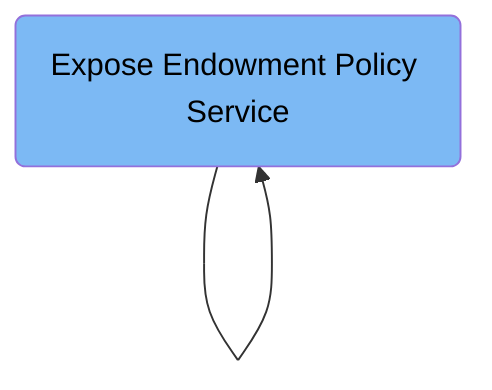

This document describes the GENASOAP job flow that exposes the endowment policy update COBOL program as a web service. It processes configuration input to generate service binding and WSDL files, enabling external systems to integrate with the policy update routine. For example, input specifying the LGUPOL01 program results in binding and WSDL files that define the service interface for client consumption.

Here is a high level diagram of the file:



## Expose Endowment Policy Service

Step in this section: `LS2WS`.

This section converts the endowment policy update process into a service that can be accessed by other systems, facilitating digital integration.

- The configuration input specifies the COBOL program, required copybooks, and parameters for exposing the endowment policy update routine as a web service.
- The process analyzes the data structures (copybooks) and program communication requirements to determine the service's interface.
- Using this definition, the process generates a service binding file, which is a technical artifact that CICS and middleware use to invoke the service.
- Simultaneously, the service description (WSDL) is produced so consuming applications understand the data contracts, operations, and endpoints for the new endowment policy service.
- Both files are saved to a designated directory for integration and deployment.

### Input

**INPUT.SYSUT1**

Configuration providing COBOL program name, communication parameters, and source library for the endowment policy update business logic.

Sample:

```
PDSLIB=<SOURCEX>
LANG=COBOL
PGMNAME=LGUPOL01
REQMEM=SOAIPE1
RESPMEM=SOAIPE1
LOGFILE=<ZFSHOME>/genapp/logs/LS2WS_LGUPOLE1.LOG
URI=GENAPP/LGUPOLE1
PGMINT=COMMAREA
WSBIND=<ZFSHOME>/genapp/wsdir/LGUPOLE1.wsbind
WSDL=<ZFSHOME>/genapp/wsdir/LGUPOLE1.wsdl
HTTPPROXY=PROXY.HURSLEY.IBM.COM:80
```

### Output

**LGUPOLE1.wsbind**

Service binding file used to invoke the endowment policy update web service.

Sample:

```
ZFSHOME/genapp/wsdir/LGUPOLE1.wsbind
```

**LGUPOLE1.wsdl**

Web Service Description Language (WSDL) file describing the endowment policy update service for client integration.

Sample:

```
ZFSHOME/genapp/wsdir/LGUPOLE1.wsdl
```

## Expose Endowment Policy Service

Step in this section: `LS2WS`.

This section enables external products or platforms to interact with the endowment policy update routine as a web service, facilitating seamless integration and interoperability.

1. The configuration input is read, defining the COBOL program, communication parameters, and data structures relevant for updating endowment policies.
2. The process analyzes the input to determine the web service interface, communication area definitions, and associated binding metadata.
3. A service binding file is created, defining the technical invocation information for the web service.
4. A WSDL file is generated, describing the data contracts, available operations, and endpoint information so that external systems can integrate with the endowment policy update service.
5. Both generated files are stored in the specified directory and are ready for deployment and consumption by integration platforms.

### Input

**INPUT.SYSUT1**

Configuration providing COBOL program name, communication parameters, and source library for the endowment policy update business logic.

Sample:

```
PDSLIB=<SOURCEX>
LANG=COBOL
PGMNAME=LGUPOL01
REQMEM=SOAIPE1
RESPMEM=SOAIPE1
LOGFILE=<ZFSHOME>/genapp/logs/LS2WS_LGUPOLE1.LOG
URI=GENAPP/LGUPOLE1
PGMINT=COMMAREA
WSBIND=<ZFSHOME>/genapp/wsdir/LGUPOLE1.wsbind
WSDL=<ZFSHOME>/genapp/wsdir/LGUPOLE1.wsdl
HTTPPROXY=PROXY.HURSLEY.IBM.COM:80
```

### Output

**LGUPOLE1.wsbind**

Service binding file used to invoke the endowment policy update web service.

Sample:

```
ZFSHOME/genapp/wsdir/LGUPOLE1.wsbind
```

**LGUPOLE1.wsdl**

Web Service Description Language (WSDL) file describing the endowment policy update service for client integration.

Sample:

```
ZFSHOME/genapp/wsdir/LGUPOLE1.wsdl
```

&nbsp;

*This is an auto-generated document by Swimm 🌊 and has not yet been verified by a human*

<SwmMeta version="3.0.0" repo-id="Z2l0aHViJTNBJTNBU3dpbW1pby1nZW5hcHAtaG91c2UlM0ElM0FHaXJpLVN3aW1t" repo-name="Swimmio-genapp-house"><sup>Powered by [Swimm](https://app.swimm.io/)</sup></SwmMeta>
