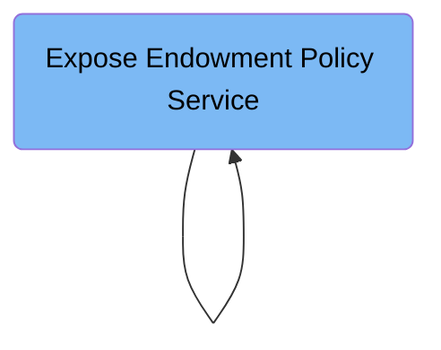

The GENASOAP job flow automates exposing insurance policy COBOL programs as SOAP web services. It reads configuration inputs specifying program and data structures, then generates binding and WSDL files to enable external clients to interact with policy services. For example, it produces artifacts for the Endowment Policy service that allow programmatic access through SOAP.

Here is a high level diagram of the file:



## Expose Endowment Policy Service

Step in this section: `LS2WS`.

Provides external access to manage and query endowment insurance policies through web service standards.

1. Reads the provided configuration, which specifies the COBOL program for the endowment policy, data structures, service URI, and output locations.
2. Uses these details to process and extract the interface definitions from the COBOL program and communication area.
3. Automatically generates required web service artifacts:
   - A binding file (<ZFSHOME>/genapp/wsdir/LGUPOLE1.wsbind) for CICS integration.
   - A WSDL file (<ZFSHOME>/genapp/wsdir/LGUPOLE1.wsdl) detailing how external clients can interact with the endowment policy web service endpoint.

### Input

**SYSUT1**

Details about the required COBOL program, input communication data structures, and web service properties for the endowment policy service.

Sample:

```
PDSLIB=<SOURCEX>
LANG=COBOL
PGMNAME=LGUPOL01
REQMEM=SOAIPE1
RESPMEM=SOAIPE1
LOGFILE=<ZFSHOME>/genapp/logs/LS2WS_LGUPOLE1.LOG
URI=GENAPP/LGUPOLE1
PGMINT=COMMAREA
WSBIND=<ZFSHOME>/genapp/wsdir/LGUPOLE1.wsbind
WSDL=<ZFSHOME>/genapp/wsdir/LGUPOLE1.wsdl
HTTPPROXY=PROXY.HURSLEY.IBM.COM:80
```

### Output

**LGUPOLE1.wsbind**

Web service binding file used for CICS integration for endowment policy.

Sample:

```
<ZFSHOME>/genapp/wsdir/LGUPOLE1.wsbind
```

**LGUPOLE1.wsdl**

WSDL file describing the endowment policy web service contract for external systems.

Sample:

```
<ZFSHOME>/genapp/wsdir/LGUPOLE1.wsdl
```

## Expose Endowment Policy Service

Step in this section: `LS2WS`.

Provides a web service interface that allows clients to manage and access endowment policies, supporting interoperability and integration with external applications.

- The section reads the supplied SYSUT1 input, which specifies the COBOL program and related configuration for endowment policy processing.
- It analyzes the COBOL data structures denoted in the parameters to determine the service interface layout (request/response payloads, operation signatures).
- Based on this, it generates the wsbind file (<ZFSHOME>/genapp/wsdir/LGUPOLE1.wsbind), which enables CICS to marshal requests and responses for the specified program as a web service.
- It also produces a WSDL file (<ZFSHOME>/genapp/wsdir/LGUPOLE1.wsdl), describing the operations, payloads, and endpoint that external systems use to programmatically interact with the endowment policy service.

### Input

**SYSUT1**

Contains instructions and parameters specifying the COBOL program, request/response structures, and web service interface details for the endowment policy.

Sample:

```
PDSLIB=<SOURCEX>
LANG=COBOL
PGMNAME=LGUPOL01
REQMEM=SOAIPE1
RESPMEM=SOAIPE1
LOGFILE=<ZFSHOME>/genapp/logs/LS2WS_LGUPOLE1.LOG
URI=GENAPP/LGUPOLE1
PGMINT=COMMAREA
WSBIND=<ZFSHOME>/genapp/wsdir/LGUPOLE1.wsbind
WSDL=<ZFSHOME>/genapp/wsdir/LGUPOLE1.wsdl
HTTPPROXY=PROXY.HURSLEY.IBM.COM:80
```

### Output

**LGUPOLE1.wsbind**

Web service binding file to enable CICS web service access to endowment policy functionality.

Sample:

```
<ZFSHOME>/genapp/wsdir/LGUPOLE1.wsbind
```

**LGUPOLE1.wsdl**

Web Service Description Language file detailing the contract for external consumers of the endowment policy web service.

Sample:

```
<ZFSHOME>/genapp/wsdir/LGUPOLE1.wsdl
```

&nbsp;

*This is an auto-generated document by Swimm 🌊 and has not yet been verified by a human*

<SwmMeta version="3.0.0" repo-id="Z2l0aHViJTNBJTNBU3dpbW1pby1nZW5hcHAtaG91c2UlM0ElM0FHaXJpLVN3aW1t" repo-name="Swimmio-genapp-house"><sup>Powered by [Swimm](https://app.swimm.io/)</sup></SwmMeta>
