# Overview

This document describes the flow for managing house insurance policies through a menu-driven interface. Users can inquire about, add, delete, or update house policies, with each action routed to the appropriate backend process and feedback provided to the user.

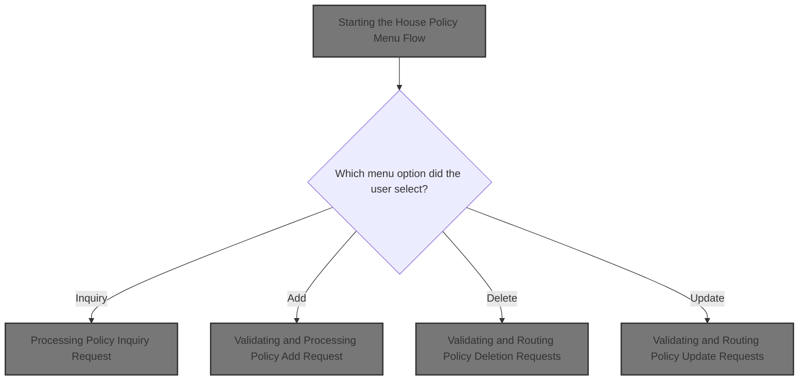
```mermaid
flowchart TD
    node1["Starting the House Policy Menu Flow"]:::HeadingStyle
    click node1 goToHeading "Starting the House Policy Menu Flow"
    node1 --> node2{"Which menu option did the user select?"}
    node2 -->|"Inquiry"| node3["Processing Policy Inquiry Request"]:::HeadingStyle
    click node3 goToHeading "Processing Policy Inquiry Request"
    node2 -->|"Add"| node4["Validating and Processing Policy Add Request"]:::HeadingStyle
    click node4 goToHeading "Validating and Processing Policy Add Request"
    node2 -->|"Delete"| node5["Validating and Routing Policy Deletion Requests"]:::HeadingStyle
    click node5 goToHeading "Validating and Routing Policy Deletion Requests"
    node2 -->|"Update"| node6["Validating and Routing Policy Update Requests"]:::HeadingStyle
    click node6 goToHeading "Validating and Routing Policy Update Requests"
classDef HeadingStyle fill:#777777,stroke:#333,stroke-width:2px;
```

## Dependencies

### Programs

- <SwmToken path="base/src/lgtestp3.cbl" pos="11:6:6" line-data="       PROGRAM-ID. LGTESTP3.">`LGTESTP3`</SwmToken> (<SwmPath>[base/src/lgtestp3.cbl](base/src/lgtestp3.cbl)</SwmPath>)
- <SwmToken path="base/src/lgtestp3.cbl" pos="70:10:10" line-data="                 EXEC CICS LINK PROGRAM(&#39;LGIPOL01&#39;)">`LGIPOL01`</SwmToken> (<SwmPath>[base/src/lgipol01.cbl](base/src/lgipol01.cbl)</SwmPath>)
- <SwmToken path="base/src/lgipol01.cbl" pos="91:9:9" line-data="           EXEC CICS LINK Program(LGIPDB01)">`LGIPDB01`</SwmToken> (<SwmPath>[base/src/lgipdb01.cbl](base/src/lgipdb01.cbl)</SwmPath>)
- LGSTSQ (<SwmPath>[base/src/lgstsq.cbl](base/src/lgstsq.cbl)</SwmPath>)
- <SwmToken path="base/src/lgtestp3.cbl" pos="106:10:10" line-data="                 EXEC CICS LINK PROGRAM(&#39;LGAPOL01&#39;)">`LGAPOL01`</SwmToken> (<SwmPath>[base/src/lgapol01.cbl](base/src/lgapol01.cbl)</SwmPath>)
- <SwmToken path="base/src/lgapol01.cbl" pos="103:9:9" line-data="           EXEC CICS Link Program(LGAPDB01)">`LGAPDB01`</SwmToken> (<SwmPath>[base/src/LGAPDB01.cbl](base/src/LGAPDB01.cbl)</SwmPath>)
- <SwmToken path="base/src/LGAPDB01.cbl" pos="269:4:4" line-data="           CALL &#39;LGAPDB02&#39; USING IN-PROPERTY-TYPE, IN-POSTCODE, ">`LGAPDB02`</SwmToken> (<SwmPath>[base/src/LGAPDB02.cbl](base/src/LGAPDB02.cbl)</SwmPath>)
- <SwmToken path="base/src/LGAPDB01.cbl" pos="276:4:4" line-data="           CALL &#39;LGAPDB03&#39; USING WS-BASE-RISK-SCR, IN-FIRE-PERIL, ">`LGAPDB03`</SwmToken> (<SwmPath>[base/src/LGAPDB03.cbl](base/src/LGAPDB03.cbl)</SwmPath>)
- <SwmToken path="base/src/LGAPDB01.cbl" pos="313:4:4" line-data="               CALL &#39;LGAPDB04&#39; USING LK-INPUT-DATA, LK-COVERAGE-DATA, ">`LGAPDB04`</SwmToken> (<SwmPath>[base/src/LGAPDB04.cbl](base/src/LGAPDB04.cbl)</SwmPath>)
- <SwmToken path="base/src/lgtestp3.cbl" pos="129:10:10" line-data="                 EXEC CICS LINK PROGRAM(&#39;LGDPOL01&#39;)">`LGDPOL01`</SwmToken> (<SwmPath>[base/src/lgdpol01.cbl](base/src/lgdpol01.cbl)</SwmPath>)
- <SwmToken path="base/src/lgdpol01.cbl" pos="141:9:9" line-data="           EXEC CICS LINK PROGRAM(LGDPDB01)">`LGDPDB01`</SwmToken> (<SwmPath>[base/src/lgdpdb01.cbl](base/src/lgdpdb01.cbl)</SwmPath>)
- <SwmToken path="base/src/lgdpdb01.cbl" pos="168:9:9" line-data="               EXEC CICS LINK PROGRAM(LGDPVS01)">`LGDPVS01`</SwmToken> (<SwmPath>[base/src/lgdpvs01.cbl](base/src/lgdpvs01.cbl)</SwmPath>)
- <SwmToken path="base/src/lgtestp3.cbl" pos="196:10:10" line-data="                 EXEC CICS LINK PROGRAM(&#39;LGUPOL01&#39;)">`LGUPOL01`</SwmToken> (<SwmPath>[base/src/lgupol01.cbl](base/src/lgupol01.cbl)</SwmPath>)
- <SwmToken path="base/src/lgupol01.cbl" pos="157:9:9" line-data="           EXEC CICS LINK Program(LGUPDB01)">`LGUPDB01`</SwmToken> (<SwmPath>[base/src/lgupdb01.cbl](base/src/lgupdb01.cbl)</SwmPath>)
- <SwmToken path="base/src/lgupdb01.cbl" pos="209:9:9" line-data="           EXEC CICS LINK Program(LGUPVS01)">`LGUPVS01`</SwmToken> (<SwmPath>[base/src/lgupvs01.cbl](base/src/lgupvs01.cbl)</SwmPath>)

### Copybooks

- SQLCA
- LGPOLICY (<SwmPath>[base/src/lgpolicy.cpy](base/src/lgpolicy.cpy)</SwmPath>)
- LGCMAREA (<SwmPath>[base/src/lgcmarea.cpy](base/src/lgcmarea.cpy)</SwmPath>)
- <SwmToken path="base/src/LGAPDB01.cbl" pos="35:3:3" line-data="           COPY INPUTREC2.">`INPUTREC2`</SwmToken> (<SwmPath>[base/src/INPUTREC2.cpy](base/src/INPUTREC2.cpy)</SwmPath>)
- OUTPUTREC (<SwmPath>[base/src/OUTPUTREC.cpy](base/src/OUTPUTREC.cpy)</SwmPath>)
- WORKSTOR (<SwmPath>[base/src/WORKSTOR.cpy](base/src/WORKSTOR.cpy)</SwmPath>)
- LGAPACT (<SwmPath>[base/src/LGAPACT.cpy](base/src/LGAPACT.cpy)</SwmPath>)
- SSMAP

## Detailed View of the Program's Functionality

# House Policy Menu Flow and Inquiry Processing

## a. Starting the House Policy Menu Flow

When the main menu program starts, it first checks if there is any input data from a previous session. If there is, it skips the initialization and goes directly to the main menu logic. If not, it resets all input/output fields and key policy fields to ensure a clean state. It then sends the House Policy Menu screen to the user's terminal, erasing any previous display.

## b. Handling User Menu Actions

When the user interacts with the menu, the program sets up handlers for user actions and map failures, then receives the user's input from the menu screen. Based on the user's selection, it performs different actions:

- **Inquiry ('1')**: Prepares the request fields and calls the policy inquiry handler to fetch house policy details.
- **Add ('2')**: Prepares the request fields with user input and defaults, then calls the add policy handler.
- **Delete ('3')**: Prepares the request fields for deletion and calls the policy deletion handler.
- **Update ('4')**: Prepares the request fields for update and calls the policy update handler.
- **Other**: Prompts the user to enter a valid option.

## c. Processing Policy Inquiry Request

When an inquiry is requested, the inquiry handler initializes the transaction context, sets the return code to indicate success, and prepares a pointer to the communication area. If no communication area is received, it logs an error, writes an error message, and terminates the transaction. If the input is valid, it delegates the business logic to the policy database handler, which fetches the policy details from the database.

## d. Logging Errors and Message Handling

Whenever an error occurs (such as missing input or a database failure), the error logging routine captures the current date and time, writes a detailed error message (including the error context and up to 90 bytes of the communication area) to a system queue for monitoring and support. This ensures that all errors are tracked with enough context for troubleshooting.

## e. Retrieving Policy Details from Database

The business logic handler for policy inquiry checks for valid input, determines which policy type is being requested, and calls the appropriate subroutine to fetch details from the database. For each policy type (Endowment, House, Motor, Commercial), it:

- Runs a SQL SELECT to fetch the policy data.
- Checks if the data was found, and if so, calculates the required buffer size and moves the data to the output area.
- Handles nullable fields using indicator variables.
- Marks the end of the policy data with a special marker.
- If no data is found or a database error occurs, it sets an appropriate error code and logs the error.

## f. Handling Policy Inquiry Results

After the inquiry, if no data is found, the program sets an error message for the user and jumps to the error handler to display the message and reset the session. If data is found, it populates the output fields with the retrieved policy details and updates the user's screen.

## g. Validating and Processing Policy Add Request

When adding a new policy, the add handler validates the incoming request, checks for the presence and length of the input data, and initializes control data. If the input is valid, it links to the database operation handler to perform the actual insert. If an error occurs, it logs the error and aborts the transaction.

## h. Processing Premium Calculations and Summary

For premium calculations, the system:

- Loads configuration values (such as maximum risk score and minimum premium) from a configuration file or uses defaults.
- Opens input, output, and summary files, and writes headers to the output file.
- Reads each application record, validates it, and processes valid records for premium calculation, while logging errors for invalid records.

## i. Routing Valid Records for Premium Calculation

Valid records are routed to either commercial or non-commercial premium calculation logic. For commercial policies, the system:

- Calculates the property risk score using property details and customer history.
- Calculates basic insurance premiums using the risk score and peril values.
- If the case is approved, runs enhanced actuarial calculations for advanced premium computation.
- Applies business rules to determine the underwriting decision.
- Writes the output and updates statistics.

## j. Calculating Property Risk Score

The risk scoring logic fetches fire and crime risk factors from the database (or uses defaults if missing), then calculates the property's risk score based on property type, postcode, coverage amounts, location, and customer history. The scoring uses hardcoded weights and thresholds.

## k. Calculating Basic Premiums

The basic premium calculation logic fetches risk factors, determines the underwriting verdict based on the risk score, and calculates premiums for each peril (fire, crime, flood, weather). Discounts are applied if all perils are present.

## l. Running Enhanced Actuarial Calculations

For approved cases with a total premium above the minimum, the system prepares detailed input and coverage data, then calls the advanced actuarial calculation module. This module:

- Calculates exposures and base values.
- Loads base rates.
- Calculates experience and schedule modifiers.
- Computes base premiums for each peril.
- Adds catastrophe, expense, and profit loads.
- Applies discounts and taxes.
- Caps the final rate factor if necessary and recalculates the premium.

## m. Applying Underwriting Decision and Updating Stats

After calculations, business rules are applied to set the underwriting decision (approved, pending, rejected) based on risk score and premium thresholds. Output is written, and statistics are updated for reporting.

## n. Handling Add Policy Errors and User Feedback

If adding a policy fails, the system rolls back the transaction, checks the error code, and sets a specific message for missing customers or a generic error for other failures. The error is displayed to the user, and the session is reset. If the add is successful, the system updates the session with the new customer and policy numbers and displays a success message.

## o. Validating and Routing Policy Deletion Requests

When deleting a policy, the deletion handler validates the request by checking the communication area length and request ID. If valid, it calls the database deletion handler, which deletes the policy from the database and logs any errors. The deletion is also propagated to the VSAM file handler, which deletes the policy record from the file system.

## p. Validating and Executing Policy Deletion in <SwmToken path="base/src/lgipdb01.cbl" pos="242:5:5" line-data="      * initialize DB2 host variables">`DB2`</SwmToken>

The database deletion handler checks the request, converts IDs to the appropriate format, and calls the actual deletion logic. If the deletion is successful or the record was not found, it returns success. Any errors are logged and returned to the caller.

## q. Deleting Policy Record in VSAM and Handling Errors

The VSAM file handler deletes the policy record from the file. If the delete fails, it logs the error and returns a failure code.

## r. Handling Policy Deletion Results and User Feedback

After attempting to delete a policy, the system checks if the deletion failed. If so, it rolls back the transaction and displays an error message. If successful, it clears the policy fields and displays a success message. For update operations, it retrieves the latest policy data, allows the user to make changes, and then processes the update.

## s. Validating and Routing Policy Update Requests

The update handler checks the communication area length against the expected size for each policy type. If valid, it routes the request to the database update handler. Errors are logged and returned as needed.

## t. Validating and Executing Policy Update in <SwmToken path="base/src/lgipdb01.cbl" pos="242:5:5" line-data="      * initialize DB2 host variables">`DB2`</SwmToken>

The database update handler validates the request, converts IDs to the appropriate format, and calls the update logic for the specific policy type. After updating the database, it calls the VSAM update handler to update the file record as well.

## u. Updating Product-Specific Policy Tables and Finalizing Policy Record

The update logic opens a cursor, fetches the policy row, checks timestamps, updates the product-specific table, and then updates the main policy record. Errors are logged and handled at each step. The cursor is closed at the end of the operation.

## v. Updating Policy Record in VSAM and Logging Errors

The VSAM update handler reads and rewrites the policy record in the file, handling errors and logging them if the operation fails. This ensures the file is kept in sync with the latest policy data.

## w. Handling Update Errors and User Feedback

If updating a policy fails, the system displays an error message and resets the session. If successful, it updates the output fields and displays a success message to the user. Invalid options prompt the user to enter a valid option, and the system returns control to the main menu.

# Rule Definition

| Paragraph Name                                                                                                                                                                                                                                                                                                                                                                                                                                                                                               | Rule ID | Category          | Description                                                                                                                                                                                                                                                                | Conditions                                                                                                                                                                                                                                                                                                                                   | Remarks                                                                                                                                                                                                                                                                                                                                                                                                                                                                                                                                                                                                                                                                                                                                                                                                                                                                                                                                                                                    |
| ------------------------------------------------------------------------------------------------------------------------------------------------------------------------------------------------------------------------------------------------------------------------------------------------------------------------------------------------------------------------------------------------------------------------------------------------------------------------------------------------------------ | ------- | ----------------- | -------------------------------------------------------------------------------------------------------------------------------------------------------------------------------------------------------------------------------------------------------------------------- | -------------------------------------------------------------------------------------------------------------------------------------------------------------------------------------------------------------------------------------------------------------------------------------------------------------------------------------------- | ------------------------------------------------------------------------------------------------------------------------------------------------------------------------------------------------------------------------------------------------------------------------------------------------------------------------------------------------------------------------------------------------------------------------------------------------------------------------------------------------------------------------------------------------------------------------------------------------------------------------------------------------------------------------------------------------------------------------------------------------------------------------------------------------------------------------------------------------------------------------------------------------------------------------------------------------------------------------------------------ |
| <SwmPath>[base/src/lgtestp3.cbl](base/src/lgtestp3.cbl)</SwmPath> MAINLINE SECTION, EVALUATE <SwmToken path="base/src/lgtestp3.cbl" pos="64:3:3" line-data="           EVALUATE ENP3OPTO">`ENP3OPTO`</SwmToken> WHEN '1'                                                                                                                                                                                                                                                                                     | RL-001  | Conditional Logic | The system only processes a house policy inquiry when the user selects menu option '1'.                                                                                                                                                                                    | User selects menu option '1' on the House Policy Menu screen.                                                                                                                                                                                                                                                                                | Menu option value is '1'. Only this triggers the inquiry operation. Other options are handled separately.                                                                                                                                                                                                                                                                                                                                                                                                                                                                                                                                                                                                                                                                                                                                                                                                                                                                                  |
| <SwmPath>[base/src/lgtestp3.cbl](base/src/lgtestp3.cbl)</SwmPath> MAINLINE SECTION, WHEN '1' block                                                                                                                                                                                                                                                                                                                                                                                                           | RL-002  | Data Assignment   | Maps user input fields (customer number, policy number) to the inquiry commarea structure for backend processing.                                                                                                                                                          | Menu option is '1'.                                                                                                                                                                                                                                                                                                                          | <SwmToken path="base/src/lgtestp3.cbl" pos="67:9:13" line-data="                 Move &#39;01IHOU&#39;   To CA-REQUEST-ID">`CA-REQUEST-ID`</SwmToken> is set to <SwmToken path="base/src/lgtestp3.cbl" pos="67:4:4" line-data="                 Move &#39;01IHOU&#39;   To CA-REQUEST-ID">`01IHOU`</SwmToken>. <SwmToken path="base/src/lgtestp3.cbl" pos="68:7:11" line-data="                 Move ENP3CNOO   To CA-CUSTOMER-NUM">`CA-CUSTOMER-NUM`</SwmToken> and <SwmToken path="base/src/lgtestp3.cbl" pos="69:7:11" line-data="                 Move ENP3PNOO   To CA-POLICY-NUM">`CA-POLICY-NUM`</SwmToken> are mapped from <SwmToken path="base/src/lgtestp3.cbl" pos="38:9:9" line-data="           MOVE &#39;0000000000&#39;   To ENP3CNOO.">`ENP3CNOO`</SwmToken> and <SwmToken path="base/src/lgtestp3.cbl" pos="39:9:9" line-data="           MOVE &#39;0000000000&#39;   To ENP3PNOO.">`ENP3PNOO`</SwmToken>. All field formats and lengths must match commarea definitions. |
| <SwmPath>[base/src/lgtestp3.cbl](base/src/lgtestp3.cbl)</SwmPath> MAINLINE SECTION, WHEN '1' block; <SwmPath>[base/src/lgipol01.cbl](base/src/lgipol01.cbl)</SwmPath> MAINLINE SECTION; <SwmPath>[base/src/lgipdb01.cbl](base/src/lgipdb01.cbl)</SwmPath> MAINLINE SECTION                                                                                                                                                                                                                                   | RL-003  | Computation       | Calls the backend inquiry logic to retrieve policy details and populates the commarea with results.                                                                                                                                                                        | <SwmToken path="base/src/lgtestp3.cbl" pos="67:9:13" line-data="                 Move &#39;01IHOU&#39;   To CA-REQUEST-ID">`CA-REQUEST-ID`</SwmToken> is <SwmToken path="base/src/lgtestp3.cbl" pos="67:4:4" line-data="                 Move &#39;01IHOU&#39;   To CA-REQUEST-ID">`01IHOU`</SwmToken> and commarea is properly initialized. | Backend program <SwmToken path="base/src/lgtestp3.cbl" pos="70:10:10" line-data="                 EXEC CICS LINK PROGRAM(&#39;LGIPOL01&#39;)">`LGIPOL01`</SwmToken> is called, which in turn calls <SwmToken path="base/src/lgipol01.cbl" pos="91:9:9" line-data="           EXEC CICS LINK Program(LGIPDB01)">`LGIPDB01`</SwmToken>. Commarea length is 32500 bytes. Inquiry logic is only performed if commarea is present and valid.                                                                                                                                                                                                                                                                                                                                                                                                                                                                                                                                                    |
| <SwmPath>[base/src/lgtestp3.cbl](base/src/lgtestp3.cbl)</SwmPath> MAINLINE SECTION, WHEN '1' block, IF <SwmToken path="base/src/lgtestp3.cbl" pos="74:3:7" line-data="                 IF CA-RETURN-CODE &gt; 0">`CA-RETURN-CODE`</SwmToken> > 0; <SwmPath>[base/src/lgipdb01.cbl](base/src/lgipdb01.cbl)</SwmPath> <SwmToken path="base/src/lgipdb01.cbl" pos="285:3:9" line-data="               PERFORM GET-HOUSE-DB2-INFO">`GET-HOUSE-DB2-INFO`</SwmToken>                                               | RL-004  | Data Assignment   | If the inquiry is successful (<SwmToken path="base/src/lgtestp3.cbl" pos="74:3:7" line-data="                 IF CA-RETURN-CODE &gt; 0">`CA-RETURN-CODE`</SwmToken> = '00'), the system displays specific policy fields on the output screen.                              | <SwmToken path="base/src/lgtestp3.cbl" pos="74:3:7" line-data="                 IF CA-RETURN-CODE &gt; 0">`CA-RETURN-CODE`</SwmToken> = '00' after backend inquiry.                                                                                                                                                                          | Fields displayed: Policy issue date, expiry date, property type, bedrooms, value, house name, house number, postcode. Message field (<SwmToken path="base/src/lgtestp3.cbl" pos="118:3:3" line-data="                   To  ERP3FLDO">`ERP3FLDO`</SwmToken>) is blank. Output formats must match definitions (e.g., dates as string, value as number, etc.).                                                                                                                                                                                                                                                                                                                                                                                                                                                                                                                                                                                                                               |
| <SwmPath>[base/src/lgtestp3.cbl](base/src/lgtestp3.cbl)</SwmPath> MAINLINE SECTION, WHEN '1' block, IF <SwmToken path="base/src/lgtestp3.cbl" pos="74:3:7" line-data="                 IF CA-RETURN-CODE &gt; 0">`CA-RETURN-CODE`</SwmToken> > 0, GO TO <SwmToken path="base/src/lgtestp3.cbl" pos="75:5:7" line-data="                   GO TO NO-DATA">`NO-DATA`</SwmToken>; <SwmToken path="base/src/lgtestp3.cbl" pos="75:5:7" line-data="                   GO TO NO-DATA">`NO-DATA`</SwmToken> section | RL-005  | Conditional Logic | If the inquiry is not successful (<SwmToken path="base/src/lgtestp3.cbl" pos="74:3:7" line-data="                 IF CA-RETURN-CODE &gt; 0">`CA-RETURN-CODE`</SwmToken> = '01'), the system clears all output fields and sets the message field to 'No data was returned.' | <SwmToken path="base/src/lgtestp3.cbl" pos="74:3:7" line-data="                 IF CA-RETURN-CODE &gt; 0">`CA-RETURN-CODE`</SwmToken> = '01' after backend inquiry.                                                                                                                                                                          | Message field (<SwmToken path="base/src/lgtestp3.cbl" pos="118:3:3" line-data="                   To  ERP3FLDO">`ERP3FLDO`</SwmToken>) set to 'No data was returned.' All other output fields are cleared (set to spaces or zero as appropriate).                                                                                                                                                                                                                                                                                                                                                                                                                                                                                                                                                                                                                                                                                                                                          |
| <SwmPath>[base/src/lgipdb01.cbl](base/src/lgipdb01.cbl)</SwmPath> <SwmToken path="base/src/lgipdb01.cbl" pos="285:3:9" line-data="               PERFORM GET-HOUSE-DB2-INFO">`GET-HOUSE-DB2-INFO`</SwmToken>, <SwmToken path="base/src/lgipdb01.cbl" pos="281:3:9" line-data="               PERFORM GET-ENDOW-DB2-INFO">`GET-ENDOW-DB2-INFO`</SwmToken>, etc.                                                                                                                                               | RL-006  | Conditional Logic | The system uses standardized error codes for inquiry operations: '00' for success, '01' for no data, '90', '98', '99' for general/DB2/SQL/unsupported request errors.                                                                                                      | Backend inquiry operation returns a code.                                                                                                                                                                                                                                                                                                    | Error codes: '00' (Success), '01' (No data found), '90', '98', '99' (General/DB2/SQL/unsupported request errors).                                                                                                                                                                                                                                                                                                                                                                                                                                                                                                                                                                                                                                                                                                                                                                                                                                                                          |
| <SwmPath>[base/src/lgtestp3.cbl](base/src/lgtestp3.cbl)</SwmPath> MAINLINE SECTION, WHEN '1' block; <SwmPath>[base/src/lgipdb01.cbl](base/src/lgipdb01.cbl)</SwmPath> <SwmToken path="base/src/lgipdb01.cbl" pos="285:3:9" line-data="               PERFORM GET-HOUSE-DB2-INFO">`GET-HOUSE-DB2-INFO`</SwmToken>                                                                                                                                                                                             | RL-007  | Conditional Logic | All input and output field lengths and formats must match the definitions provided in the commarea and screen map structures.                                                                                                                                              | Any field is mapped or displayed for inquiry operation.                                                                                                                                                                                                                                                                                      | Field formats: string, number, date, etc., as defined in commarea and screen map. No truncation or overflow allowed. Alignment and padding must match definitions.                                                                                                                                                                                                                                                                                                                                                                                                                                                                                                                                                                                                                                                                                                                                                                                                                         |
| <SwmPath>[base/src/lgtestp3.cbl](base/src/lgtestp3.cbl)</SwmPath> MAINLINE SECTION, WHEN '1' block                                                                                                                                                                                                                                                                                                                                                                                                           | RL-008  | Conditional Logic | The system must not display or process any fields outside those specified for the house policy inquiry operation.                                                                                                                                                          | Inquiry operation is being processed (menu option '1').                                                                                                                                                                                                                                                                                      | Only specified fields are processed and displayed. No additional fields are handled.                                                                                                                                                                                                                                                                                                                                                                                                                                                                                                                                                                                                                                                                                                                                                                                                                                                                                                       |

# User Stories

## User Story 1: House Policy Inquiry via Menu Option '1'

---

### Story Description:

As a user, I want to inquire about a house policy by selecting menu option '1' so that I can view the relevant policy details or receive an appropriate message if no data is found.

---

### Business Rule Mapping:

| Rule ID | Paragraph Name                                                                                                                                                                                                                                                                                                                                                                                                                                                                                               | Rule Description                                                                                                                                                                                                                                                           |
| ------- | ------------------------------------------------------------------------------------------------------------------------------------------------------------------------------------------------------------------------------------------------------------------------------------------------------------------------------------------------------------------------------------------------------------------------------------------------------------------------------------------------------------ | -------------------------------------------------------------------------------------------------------------------------------------------------------------------------------------------------------------------------------------------------------------------------- |
| RL-001  | <SwmPath>[base/src/lgtestp3.cbl](base/src/lgtestp3.cbl)</SwmPath> MAINLINE SECTION, EVALUATE <SwmToken path="base/src/lgtestp3.cbl" pos="64:3:3" line-data="           EVALUATE ENP3OPTO">`ENP3OPTO`</SwmToken> WHEN '1'                                                                                                                                                                                                                                                                                     | The system only processes a house policy inquiry when the user selects menu option '1'.                                                                                                                                                                                    |
| RL-002  | <SwmPath>[base/src/lgtestp3.cbl](base/src/lgtestp3.cbl)</SwmPath> MAINLINE SECTION, WHEN '1' block                                                                                                                                                                                                                                                                                                                                                                                                           | Maps user input fields (customer number, policy number) to the inquiry commarea structure for backend processing.                                                                                                                                                          |
| RL-003  | <SwmPath>[base/src/lgtestp3.cbl](base/src/lgtestp3.cbl)</SwmPath> MAINLINE SECTION, WHEN '1' block; <SwmPath>[base/src/lgipol01.cbl](base/src/lgipol01.cbl)</SwmPath> MAINLINE SECTION; <SwmPath>[base/src/lgipdb01.cbl](base/src/lgipdb01.cbl)</SwmPath> MAINLINE SECTION                                                                                                                                                                                                                                   | Calls the backend inquiry logic to retrieve policy details and populates the commarea with results.                                                                                                                                                                        |
| RL-004  | <SwmPath>[base/src/lgtestp3.cbl](base/src/lgtestp3.cbl)</SwmPath> MAINLINE SECTION, WHEN '1' block, IF <SwmToken path="base/src/lgtestp3.cbl" pos="74:3:7" line-data="                 IF CA-RETURN-CODE &gt; 0">`CA-RETURN-CODE`</SwmToken> > 0; <SwmPath>[base/src/lgipdb01.cbl](base/src/lgipdb01.cbl)</SwmPath> <SwmToken path="base/src/lgipdb01.cbl" pos="285:3:9" line-data="               PERFORM GET-HOUSE-DB2-INFO">`GET-HOUSE-DB2-INFO`</SwmToken>                                               | If the inquiry is successful (<SwmToken path="base/src/lgtestp3.cbl" pos="74:3:7" line-data="                 IF CA-RETURN-CODE &gt; 0">`CA-RETURN-CODE`</SwmToken> = '00'), the system displays specific policy fields on the output screen.                              |
| RL-005  | <SwmPath>[base/src/lgtestp3.cbl](base/src/lgtestp3.cbl)</SwmPath> MAINLINE SECTION, WHEN '1' block, IF <SwmToken path="base/src/lgtestp3.cbl" pos="74:3:7" line-data="                 IF CA-RETURN-CODE &gt; 0">`CA-RETURN-CODE`</SwmToken> > 0, GO TO <SwmToken path="base/src/lgtestp3.cbl" pos="75:5:7" line-data="                   GO TO NO-DATA">`NO-DATA`</SwmToken>; <SwmToken path="base/src/lgtestp3.cbl" pos="75:5:7" line-data="                   GO TO NO-DATA">`NO-DATA`</SwmToken> section | If the inquiry is not successful (<SwmToken path="base/src/lgtestp3.cbl" pos="74:3:7" line-data="                 IF CA-RETURN-CODE &gt; 0">`CA-RETURN-CODE`</SwmToken> = '01'), the system clears all output fields and sets the message field to 'No data was returned.' |
| RL-007  | <SwmPath>[base/src/lgtestp3.cbl](base/src/lgtestp3.cbl)</SwmPath> MAINLINE SECTION, WHEN '1' block; <SwmPath>[base/src/lgipdb01.cbl](base/src/lgipdb01.cbl)</SwmPath> <SwmToken path="base/src/lgipdb01.cbl" pos="285:3:9" line-data="               PERFORM GET-HOUSE-DB2-INFO">`GET-HOUSE-DB2-INFO`</SwmToken>                                                                                                                                                                                             | All input and output field lengths and formats must match the definitions provided in the commarea and screen map structures.                                                                                                                                              |
| RL-008  | <SwmPath>[base/src/lgtestp3.cbl](base/src/lgtestp3.cbl)</SwmPath> MAINLINE SECTION, WHEN '1' block                                                                                                                                                                                                                                                                                                                                                                                                           | The system must not display or process any fields outside those specified for the house policy inquiry operation.                                                                                                                                                          |
| RL-006  | <SwmPath>[base/src/lgipdb01.cbl](base/src/lgipdb01.cbl)</SwmPath> <SwmToken path="base/src/lgipdb01.cbl" pos="285:3:9" line-data="               PERFORM GET-HOUSE-DB2-INFO">`GET-HOUSE-DB2-INFO`</SwmToken>, <SwmToken path="base/src/lgipdb01.cbl" pos="281:3:9" line-data="               PERFORM GET-ENDOW-DB2-INFO">`GET-ENDOW-DB2-INFO`</SwmToken>, etc.                                                                                                                                               | The system uses standardized error codes for inquiry operations: '00' for success, '01' for no data, '90', '98', '99' for general/DB2/SQL/unsupported request errors.                                                                                                      |

---

### Relevant Functionality:

- <SwmPath>[base/src/lgtestp3.cbl](base/src/lgtestp3.cbl)</SwmPath> **MAINLINE SECTION**
  1. **RL-001:**
     - On receiving input:
       - If menu option is '1':
         - Proceed with inquiry logic
       - Else:
         - Handle other operations or display error message.
  2. **RL-002:**
     - Set <SwmToken path="base/src/lgtestp3.cbl" pos="67:9:13" line-data="                 Move &#39;01IHOU&#39;   To CA-REQUEST-ID">`CA-REQUEST-ID`</SwmToken> to <SwmToken path="base/src/lgtestp3.cbl" pos="67:4:4" line-data="                 Move &#39;01IHOU&#39;   To CA-REQUEST-ID">`01IHOU`</SwmToken>
     - Set <SwmToken path="base/src/lgtestp3.cbl" pos="68:7:11" line-data="                 Move ENP3CNOO   To CA-CUSTOMER-NUM">`CA-CUSTOMER-NUM`</SwmToken> from input customer number
     - Set <SwmToken path="base/src/lgtestp3.cbl" pos="69:7:11" line-data="                 Move ENP3PNOO   To CA-POLICY-NUM">`CA-POLICY-NUM`</SwmToken> from input policy number
     - Pass commarea to backend inquiry logic.
  3. **RL-003:**
     - Call <SwmToken path="base/src/lgtestp3.cbl" pos="70:10:10" line-data="                 EXEC CICS LINK PROGRAM(&#39;LGIPOL01&#39;)">`LGIPOL01`</SwmToken> with commarea
       - <SwmToken path="base/src/lgtestp3.cbl" pos="70:10:10" line-data="                 EXEC CICS LINK PROGRAM(&#39;LGIPOL01&#39;)">`LGIPOL01`</SwmToken> calls <SwmToken path="base/src/lgipol01.cbl" pos="91:9:9" line-data="           EXEC CICS LINK Program(LGIPDB01)">`LGIPDB01`</SwmToken> with commarea
       - <SwmToken path="base/src/lgipol01.cbl" pos="91:9:9" line-data="           EXEC CICS LINK Program(LGIPDB01)">`LGIPDB01`</SwmToken> performs <SwmToken path="base/src/lgipdb01.cbl" pos="242:5:5" line-data="      * initialize DB2 host variables">`DB2`</SwmToken> SELECT for policy details
       - Populate commarea with results or error code.
  4. **RL-004:**
     - If <SwmToken path="base/src/lgtestp3.cbl" pos="74:3:7" line-data="                 IF CA-RETURN-CODE &gt; 0">`CA-RETURN-CODE`</SwmToken> = '00':
       - Move policy details from commarea to output fields
       - Set message field to blank
       - Display output screen with mapped fields.
  5. **RL-005:**
     - If <SwmToken path="base/src/lgtestp3.cbl" pos="74:3:7" line-data="                 IF CA-RETURN-CODE &gt; 0">`CA-RETURN-CODE`</SwmToken> = '01':
       - Clear all output fields
       - Set message field to 'No data was returned.'
       - Display output screen.
  6. **RL-007:**
     - When mapping fields:
       - Ensure field length and format matches definition
       - Pad or truncate as necessary
       - Do not process fields outside specification.
  7. **RL-008:**
     - During inquiry operation:
       - Only process and display specified fields
       - Ignore any other fields in input or output structures.
- <SwmPath>[base/src/lgipdb01.cbl](base/src/lgipdb01.cbl)</SwmPath> <SwmToken path="base/src/lgipdb01.cbl" pos="285:3:9" line-data="               PERFORM GET-HOUSE-DB2-INFO">`GET-HOUSE-DB2-INFO`</SwmToken>
  1. **RL-006:**
     - On backend inquiry result:
       - If SQLCODE = 0, set <SwmToken path="base/src/lgtestp3.cbl" pos="74:3:7" line-data="                 IF CA-RETURN-CODE &gt; 0">`CA-RETURN-CODE`</SwmToken> to '00'
       - If SQLCODE = 100, set <SwmToken path="base/src/lgtestp3.cbl" pos="74:3:7" line-data="                 IF CA-RETURN-CODE &gt; 0">`CA-RETURN-CODE`</SwmToken> to '01'
       - For other errors, set <SwmToken path="base/src/lgtestp3.cbl" pos="74:3:7" line-data="                 IF CA-RETURN-CODE &gt; 0">`CA-RETURN-CODE`</SwmToken> to '90', '98', or '99' as appropriate.

# Workflow

# Starting the House Policy Menu Flow

This section is responsible for initializing the House Policy Menu flow, ensuring that either previous session data is handled or a fresh menu is presented to the user.

| Category       | Rule Name           | Description                                                                                                                                  |
| -------------- | ------------------- | -------------------------------------------------------------------------------------------------------------------------------------------- |
| Business logic | Session Continuity  | If previous session input data exists, the menu flow must resume from the last session rather than starting fresh.                           |
| Business logic | Menu Initialization | All input and output map areas, as well as key policy fields, must be reset to zero before presenting the menu to the user.                  |
| Business logic | Screen Refresh      | The House Policy Menu screen must be sent to the user terminal with any previous display erased, ensuring only current information is shown. |

<SwmSnippet path="/base/src/lgtestp3.cbl" line="30">

---

In <SwmToken path="base/src/lgtestp3.cbl" pos="30:1:1" line-data="       MAINLINE SECTION.">`MAINLINE`</SwmToken>, we kick off the flow by checking if there's any input data from the previous session (EIBCALEN). If there is, we jump straight to <SwmToken path="base/src/lgtestp3.cbl" pos="33:5:7" line-data="              GO TO A-GAIN.">`A-GAIN`</SwmToken> to start the user menu logic.

```cobol
       MAINLINE SECTION.

           IF EIBCALEN > 0
              GO TO A-GAIN.
```

---

</SwmSnippet>

<SwmSnippet path="/base/src/lgtestp3.cbl" line="35">

---

Here we reset the input/output map areas and key policy fields to zero, making sure the menu starts with a clean slate before any user action.

```cobol
           Initialize SSMAPP3I.
           Initialize SSMAPP3O.
           Initialize COMM-AREA.
           MOVE '0000000000'   To ENP3CNOO.
           MOVE '0000000000'   To ENP3PNOO.
           MOVE '00000000'     To ENP3VALO.
           MOVE '000'          To ENP3BEDO.
```

---

</SwmSnippet>

<SwmSnippet path="/base/src/lgtestp3.cbl" line="45">

---

Finally, we send the House Policy Menu screen to the user terminal, wiping any previous display and setting up for new input.

```cobol
           EXEC CICS SEND MAP ('SSMAPP3')
                     MAPSET ('SSMAP')
                     ERASE
                     END-EXEC.
```

---

</SwmSnippet>

# Handling User Menu Actions


```mermaid
%%{init: {"flowchart": {"defaultRenderer": "elk"}} }%%
flowchart TD
    node1["User selects menu option"] --> node2{"Which option did the user select? (ENP3OPTO)"}
    click node1 openCode "base/src/lgtestp3.cbl:50:61"
    click node2 openCode "base/src/lgtestp3.cbl:50:61"
    node2 -->|"Inquiry ('1')"| node3["Prepare inquiry request"]
    click node3 openCode "base/src/lgtestp3.cbl:66:73"
    node3 --> node4["Processing Policy Inquiry Request"]
    
    node4 --> node5{"Was data found? (CA-RETURN-CODE > 0)"}
    click node5 openCode "base/src/lgtestp3.cbl:74:76"
    node5 -->|"Yes"| node6["Handling No Data Returned"]
    
    node5 -->|"No"| node7["Display policy details to user"]
    click node7 openCode "base/src/lgtestp3.cbl:78:89"
    node2 -->|"Add ('2')"| node8["Prepare add request"]
    click node8 openCode "base/src/lgtestp3.cbl:92:105"
    node8 --> node9["Validating and Processing Policy Add Request"]
    
    node9 --> node10{"Add successful? (CA-RETURN-CODE > 0)"}
    click node10 openCode "base/src/lgtestp3.cbl:110:113"
    node10 -->|"Yes"| node11{"CA-RETURN-CODE = 70?"}
    click node11 openCode "base/src/lgtestp3.cbl:268:274"
    node11 -->|"Yes"| node12["Displaying Error and Resetting State"]
    
    node11 -->|"No"| node13["Displaying Error and Resetting State"]
    
    node10 -->|"No"| node14["Show 'New House Policy Inserted'"]
    click node14 openCode "base/src/lgtestp3.cbl:114:122"
    node2 -->|"Delete ('3')"| node15["Prepare delete request"]
    click node15 openCode "base/src/lgtestp3.cbl:125:132"
    node15 --> node16["Validating and Routing Policy Deletion Requests"]
    
    node16 --> node17{"Delete successful? (CA-RETURN-CODE > 0)"}
    click node17 openCode "base/src/lgtestp3.cbl:133:136"
    node17 -->|"Yes"| node18["Displaying Error and Resetting State"]
    
    node17 -->|"No"| node19["Show 'House Policy Deleted'"]
    click node19 openCode "base/src/lgtestp3.cbl:138:152"
    node2 -->|"Update ('4')"| node20["Prepare update request"]
    click node20 openCode "base/src/lgtestp3.cbl:183:195"
    node20 --> node21["Validating and Routing Policy Update Requests"]
    
    node21 --> node22{"Update successful? (CA-RETURN-CODE > 0)"}
    click node22 openCode "base/src/lgtestp3.cbl:200:202"
    node22 -->|"Yes"| node23["Displaying Error and Resetting State"]
    
    node22 -->|"No"| node24["Show 'House Policy Updated'"]
    click node24 openCode "base/src/lgtestp3.cbl:204:212"
    node2 -->|"Other"| node25["Prompt for valid option"]
    click node25 openCode "base/src/lgtestp3.cbl:219:228"
classDef HeadingStyle fill:#777777,stroke:#333,stroke-width:2px;
click node4 goToHeading "Processing Policy Inquiry Request"
node4:::HeadingStyle
click node6 goToHeading "Handling No Data Returned"
node6:::HeadingStyle
click node9 goToHeading "Validating and Processing Policy Add Request"
node9:::HeadingStyle
click node12 goToHeading "Displaying Error and Resetting State"
node12:::HeadingStyle
click node13 goToHeading "Displaying Error and Resetting State"
node13:::HeadingStyle
click node16 goToHeading "Validating and Routing Policy Deletion Requests"
node16:::HeadingStyle
click node18 goToHeading "Displaying Error and Resetting State"
node18:::HeadingStyle
click node21 goToHeading "Validating and Routing Policy Update Requests"
node21:::HeadingStyle
click node23 goToHeading "Displaying Error and Resetting State"
node23:::HeadingStyle

%% Swimm:
%% %%{init: {"flowchart": {"defaultRenderer": "elk"}} }%%
%% flowchart TD
%%     node1["User selects menu option"] --> node2{"Which option did the user select? (<SwmToken path="base/src/lgtestp3.cbl" pos="64:3:3" line-data="           EVALUATE ENP3OPTO">`ENP3OPTO`</SwmToken>)"}
%%     click node1 openCode "<SwmPath>[base/src/lgtestp3.cbl](base/src/lgtestp3.cbl)</SwmPath>:50:61"
%%     click node2 openCode "<SwmPath>[base/src/lgtestp3.cbl](base/src/lgtestp3.cbl)</SwmPath>:50:61"
%%     node2 -->|"Inquiry ('1')"| node3["Prepare inquiry request"]
%%     click node3 openCode "<SwmPath>[base/src/lgtestp3.cbl](base/src/lgtestp3.cbl)</SwmPath>:66:73"
%%     node3 --> node4["Processing Policy Inquiry Request"]
%%     
%%     node4 --> node5{"Was data found? (<SwmToken path="base/src/lgtestp3.cbl" pos="74:3:7" line-data="                 IF CA-RETURN-CODE &gt; 0">`CA-RETURN-CODE`</SwmToken> > 0)"}
%%     click node5 openCode "<SwmPath>[base/src/lgtestp3.cbl](base/src/lgtestp3.cbl)</SwmPath>:74:76"
%%     node5 -->|"Yes"| node6["Handling No Data Returned"]
%%     
%%     node5 -->|"No"| node7["Display policy details to user"]
%%     click node7 openCode "<SwmPath>[base/src/lgtestp3.cbl](base/src/lgtestp3.cbl)</SwmPath>:78:89"
%%     node2 -->|"Add ('2')"| node8["Prepare add request"]
%%     click node8 openCode "<SwmPath>[base/src/lgtestp3.cbl](base/src/lgtestp3.cbl)</SwmPath>:92:105"
%%     node8 --> node9["Validating and Processing Policy Add Request"]
%%     
%%     node9 --> node10{"Add successful? (<SwmToken path="base/src/lgtestp3.cbl" pos="74:3:7" line-data="                 IF CA-RETURN-CODE &gt; 0">`CA-RETURN-CODE`</SwmToken> > 0)"}
%%     click node10 openCode "<SwmPath>[base/src/lgtestp3.cbl](base/src/lgtestp3.cbl)</SwmPath>:110:113"
%%     node10 -->|"Yes"| node11{"<SwmToken path="base/src/lgtestp3.cbl" pos="74:3:7" line-data="                 IF CA-RETURN-CODE &gt; 0">`CA-RETURN-CODE`</SwmToken> = 70?"}
%%     click node11 openCode "<SwmPath>[base/src/lgtestp3.cbl](base/src/lgtestp3.cbl)</SwmPath>:268:274"
%%     node11 -->|"Yes"| node12["Displaying Error and Resetting State"]
%%     
%%     node11 -->|"No"| node13["Displaying Error and Resetting State"]
%%     
%%     node10 -->|"No"| node14["Show 'New House Policy Inserted'"]
%%     click node14 openCode "<SwmPath>[base/src/lgtestp3.cbl](base/src/lgtestp3.cbl)</SwmPath>:114:122"
%%     node2 -->|"Delete ('3')"| node15["Prepare delete request"]
%%     click node15 openCode "<SwmPath>[base/src/lgtestp3.cbl](base/src/lgtestp3.cbl)</SwmPath>:125:132"
%%     node15 --> node16["Validating and Routing Policy Deletion Requests"]
%%     
%%     node16 --> node17{"Delete successful? (<SwmToken path="base/src/lgtestp3.cbl" pos="74:3:7" line-data="                 IF CA-RETURN-CODE &gt; 0">`CA-RETURN-CODE`</SwmToken> > 0)"}
%%     click node17 openCode "<SwmPath>[base/src/lgtestp3.cbl](base/src/lgtestp3.cbl)</SwmPath>:133:136"
%%     node17 -->|"Yes"| node18["Displaying Error and Resetting State"]
%%     
%%     node17 -->|"No"| node19["Show 'House Policy Deleted'"]
%%     click node19 openCode "<SwmPath>[base/src/lgtestp3.cbl](base/src/lgtestp3.cbl)</SwmPath>:138:152"
%%     node2 -->|"Update ('4')"| node20["Prepare update request"]
%%     click node20 openCode "<SwmPath>[base/src/lgtestp3.cbl](base/src/lgtestp3.cbl)</SwmPath>:183:195"
%%     node20 --> node21["Validating and Routing Policy Update Requests"]
%%     
%%     node21 --> node22{"Update successful? (<SwmToken path="base/src/lgtestp3.cbl" pos="74:3:7" line-data="                 IF CA-RETURN-CODE &gt; 0">`CA-RETURN-CODE`</SwmToken> > 0)"}
%%     click node22 openCode "<SwmPath>[base/src/lgtestp3.cbl](base/src/lgtestp3.cbl)</SwmPath>:200:202"
%%     node22 -->|"Yes"| node23["Displaying Error and Resetting State"]
%%     
%%     node22 -->|"No"| node24["Show 'House Policy Updated'"]
%%     click node24 openCode "<SwmPath>[base/src/lgtestp3.cbl](base/src/lgtestp3.cbl)</SwmPath>:204:212"
%%     node2 -->|"Other"| node25["Prompt for valid option"]
%%     click node25 openCode "<SwmPath>[base/src/lgtestp3.cbl](base/src/lgtestp3.cbl)</SwmPath>:219:228"
%% classDef HeadingStyle fill:#777777,stroke:#333,stroke-width:2px;
%% click node4 goToHeading "Processing Policy Inquiry Request"
%% node4:::HeadingStyle
%% click node6 goToHeading "Handling No Data Returned"
%% node6:::HeadingStyle
%% click node9 goToHeading "Validating and Processing Policy Add Request"
%% node9:::HeadingStyle
%% click node12 goToHeading "Displaying Error and Resetting State"
%% node12:::HeadingStyle
%% click node13 goToHeading "Displaying Error and Resetting State"
%% node13:::HeadingStyle
%% click node16 goToHeading "Validating and Routing Policy Deletion Requests"
%% node16:::HeadingStyle
%% click node18 goToHeading "Displaying Error and Resetting State"
%% node18:::HeadingStyle
%% click node21 goToHeading "Validating and Routing Policy Update Requests"
%% node21:::HeadingStyle
%% click node23 goToHeading "Displaying Error and Resetting State"
%% node23:::HeadingStyle
```

This section governs how user menu selections for house policy management are interpreted and routed to the appropriate backend operations, ensuring that each action (inquiry, add, delete, update) is validated, processed, and results are communicated to the user.

| Category        | Rule Name                                 | Description                                                                                                                                                                                                                                                             |
| --------------- | ----------------------------------------- | ----------------------------------------------------------------------------------------------------------------------------------------------------------------------------------------------------------------------------------------------------------------------- |
| Data validation | Valid Menu Option Required                | If the user selects an invalid menu option, the system must prompt the user to select a valid option before proceeding.                                                                                                                                                 |
| Business logic  | Policy Inquiry Result                     | When the user selects 'Inquiry', the system must retrieve and display the full house policy details for the provided customer and policy number. If no data is found, a 'No data was returned' message must be shown.                                                   |
| Business logic  | Policy Add Validation and Confirmation    | When the user selects 'Add', the system must validate all required policy fields and attempt to add a new house policy. If the add fails, an error message must be displayed and the session state reset. If successful, a confirmation message must be shown.          |
| Business logic  | Policy Delete Validation and Confirmation | When the user selects 'Delete', the system must validate the request and attempt to delete the specified house policy. If the delete fails, an error message must be displayed and the session state reset. If successful, a confirmation message must be shown.        |
| Business logic  | Policy Update Validation and Confirmation | When the user selects 'Update', the system must validate the update request and attempt to update the specified house policy. If the update fails, an error message must be displayed and the session state reset. If successful, a confirmation message must be shown. |

<SwmSnippet path="/base/src/lgtestp3.cbl" line="50">

---

In <SwmToken path="base/src/lgtestp3.cbl" pos="50:1:3" line-data="       A-GAIN.">`A-GAIN`</SwmToken>, we set up handlers for user actions and map failures, then receive the user's input from the menu screen into our working area.

```cobol
       A-GAIN.

           EXEC CICS HANDLE AID
                     CLEAR(CLEARIT)
                     PF3(ENDIT) END-EXEC.
           EXEC CICS HANDLE CONDITION
                     MAPFAIL(ENDIT)
                     END-EXEC.

           EXEC CICS RECEIVE MAP('SSMAPP3')
                     INTO(SSMAPP3I)
                     MAPSET('SSMAP') END-EXEC.
```

---

</SwmSnippet>

<SwmSnippet path="/base/src/lgtestp3.cbl" line="66">

---

Next, when the user selects option '1', we prep the request fields and call <SwmToken path="base/src/lgtestp3.cbl" pos="70:10:10" line-data="                 EXEC CICS LINK PROGRAM(&#39;LGIPOL01&#39;)">`LGIPOL01`</SwmToken> to fetch the house policy details from the backend.

```cobol
             WHEN '1'
                 Move '01IHOU'   To CA-REQUEST-ID
                 Move ENP3CNOO   To CA-CUSTOMER-NUM
                 Move ENP3PNOO   To CA-POLICY-NUM
                 EXEC CICS LINK PROGRAM('LGIPOL01')
                           COMMAREA(COMM-AREA)
                           LENGTH(32500)
                 END-EXEC
```

---

</SwmSnippet>

## Processing Policy Inquiry Request

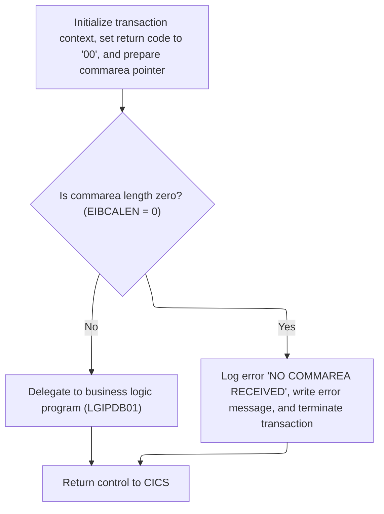
```mermaid
%%{init: {"flowchart": {"defaultRenderer": "elk"}} }%%
flowchart TD
    node1["Initialize transaction context, set return code to '00', and prepare commarea pointer"] --> node2{"Is commarea length zero? (EIBCALEN = 0)"}
    click node1 openCode "base/src/lgipol01.cbl:72:88"
    node2 -->|"No"| node3["Delegate to business logic program (LGIPDB01)"]
    click node2 openCode "base/src/lgipol01.cbl:79:83"
    node3 --> node5["Return control to CICS"]
    click node3 openCode "base/src/lgipol01.cbl:91:94"
    node2 -->|"Yes"| node4["Log error 'NO COMMAREA RECEIVED', write error message, and terminate transaction"]
    click node4 openCode "base/src/lgipol01.cbl:80:82"
    node4 --> node5
    click node5 openCode "base/src/lgipol01.cbl:96:96"
classDef HeadingStyle fill:#777777,stroke:#333,stroke-width:2px;

%% Swimm:
%% %%{init: {"flowchart": {"defaultRenderer": "elk"}} }%%
%% flowchart TD
%%     node1["Initialize transaction context, set return code to '00', and prepare commarea pointer"] --> node2{"Is commarea length zero? (EIBCALEN = 0)"}
%%     click node1 openCode "<SwmPath>[base/src/lgipol01.cbl](base/src/lgipol01.cbl)</SwmPath>:72:88"
%%     node2 -->|"No"| node3["Delegate to business logic program (<SwmToken path="base/src/lgipol01.cbl" pos="91:9:9" line-data="           EXEC CICS LINK Program(LGIPDB01)">`LGIPDB01`</SwmToken>)"]
%%     click node2 openCode "<SwmPath>[base/src/lgipol01.cbl](base/src/lgipol01.cbl)</SwmPath>:79:83"
%%     node3 --> node5["Return control to CICS"]
%%     click node3 openCode "<SwmPath>[base/src/lgipol01.cbl](base/src/lgipol01.cbl)</SwmPath>:91:94"
%%     node2 -->|"Yes"| node4["Log error 'NO COMMAREA RECEIVED', write error message, and terminate transaction"]
%%     click node4 openCode "<SwmPath>[base/src/lgipol01.cbl](base/src/lgipol01.cbl)</SwmPath>:80:82"
%%     node4 --> node5
%%     click node5 openCode "<SwmPath>[base/src/lgipol01.cbl](base/src/lgipol01.cbl)</SwmPath>:96:96"
%% classDef HeadingStyle fill:#777777,stroke:#333,stroke-width:2px;
```

This section is responsible for validating the input for a policy inquiry, handling errors related to missing input, and passing valid requests to the business logic for further processing.

<SwmSnippet path="/base/src/lgipol01.cbl" line="70">

---

<SwmToken path="base/src/lgipol01.cbl" pos="70:1:1" line-data="       MAINLINE SECTION.">`MAINLINE`</SwmToken> in <SwmToken path="base/src/lgtestp3.cbl" pos="70:10:10" line-data="                 EXEC CICS LINK PROGRAM(&#39;LGIPOL01&#39;)">`LGIPOL01`</SwmToken> checks for valid input, logs and aborts if missing, then calls <SwmToken path="base/src/lgipol01.cbl" pos="91:9:9" line-data="           EXEC CICS LINK Program(LGIPDB01)">`LGIPDB01`</SwmToken> to actually fetch the policy details from the database.

```cobol
       MAINLINE SECTION.
      *
           INITIALIZE WS-HEADER.
      *
           MOVE EIBTRNID TO WS-TRANSID.
           MOVE EIBTRMID TO WS-TERMID.
           MOVE EIBTASKN TO WS-TASKNUM.
      *
      * If NO commarea received issue an ABEND
           IF EIBCALEN IS EQUAL TO ZERO
               MOVE ' NO COMMAREA RECEIVED' TO EM-VARIABLE
               PERFORM WRITE-ERROR-MESSAGE
               EXEC CICS ABEND ABCODE('LGCA') NODUMP END-EXEC
           END-IF

      * initialize commarea return code to zero
           MOVE '00' TO CA-RETURN-CODE
           MOVE EIBCALEN TO WS-CALEN.
           SET WS-ADDR-DFHCOMMAREA TO ADDRESS OF DFHCOMMAREA.
      *

           EXEC CICS LINK Program(LGIPDB01)
               Commarea(DFHCOMMAREA)
               Length(32500)
           END-EXEC.

           EXEC CICS RETURN END-EXEC.
```

---

</SwmSnippet>

## Logging Errors and Message Handling

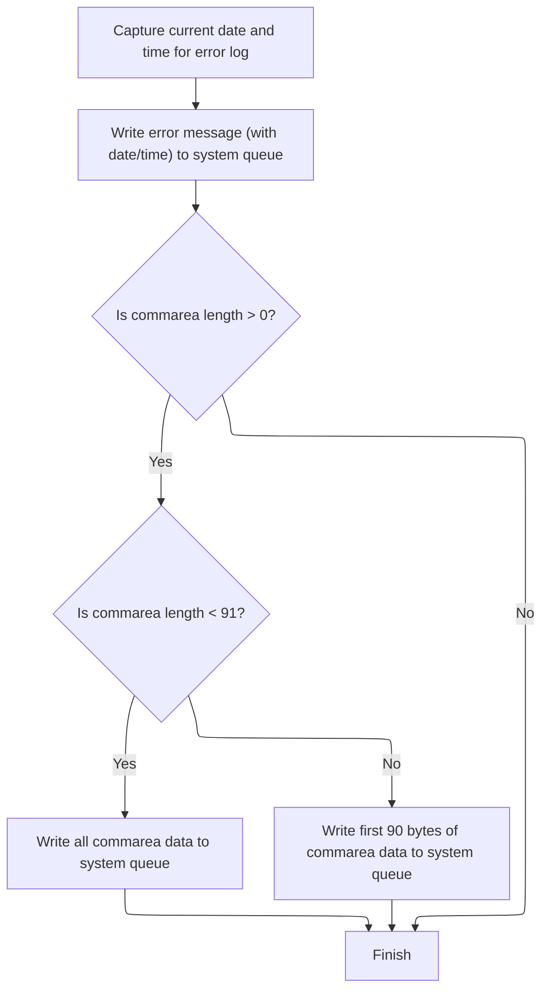
```mermaid
%%{init: {"flowchart": {"defaultRenderer": "elk"}} }%%
flowchart TD
    node1["Capture current date and time for error log"]
    click node1 openCode "base/src/lgipol01.cbl:110:115"
    node1 --> node2["Write error message (with date/time) to system queue"]
    click node2 openCode "base/src/lgipol01.cbl:116:122"
    node2 --> node3{"Is commarea length > 0?"}
    click node3 openCode "base/src/lgipol01.cbl:124:124"
    node3 -->|"No"| node6["Finish"]
    node3 -->|"Yes"| node4{"Is commarea length < 91?"}
    click node4 openCode "base/src/lgipol01.cbl:125:125"
    node4 -->|"Yes"| node5["Write all commarea data to system queue"]
    click node5 openCode "base/src/lgipol01.cbl:126:130"
    node4 -->|"No"| node7["Write first 90 bytes of commarea data to system queue"]
    click node7 openCode "base/src/lgipol01.cbl:132:136"
    node5 --> node6
    node7 --> node6
    click node6 openCode "base/src/lgipol01.cbl:139:139"
classDef HeadingStyle fill:#777777,stroke:#333,stroke-width:2px;

%% Swimm:
%% %%{init: {"flowchart": {"defaultRenderer": "elk"}} }%%
%% flowchart TD
%%     node1["Capture current date and time for error log"]
%%     click node1 openCode "<SwmPath>[base/src/lgipol01.cbl](base/src/lgipol01.cbl)</SwmPath>:110:115"
%%     node1 --> node2["Write error message (with date/time) to system queue"]
%%     click node2 openCode "<SwmPath>[base/src/lgipol01.cbl](base/src/lgipol01.cbl)</SwmPath>:116:122"
%%     node2 --> node3{"Is commarea length > 0?"}
%%     click node3 openCode "<SwmPath>[base/src/lgipol01.cbl](base/src/lgipol01.cbl)</SwmPath>:124:124"
%%     node3 -->|"No"| node6["Finish"]
%%     node3 -->|"Yes"| node4{"Is commarea length < 91?"}
%%     click node4 openCode "<SwmPath>[base/src/lgipol01.cbl](base/src/lgipol01.cbl)</SwmPath>:125:125"
%%     node4 -->|"Yes"| node5["Write all commarea data to system queue"]
%%     click node5 openCode "<SwmPath>[base/src/lgipol01.cbl](base/src/lgipol01.cbl)</SwmPath>:126:130"
%%     node4 -->|"No"| node7["Write first 90 bytes of commarea data to system queue"]
%%     click node7 openCode "<SwmPath>[base/src/lgipol01.cbl](base/src/lgipol01.cbl)</SwmPath>:132:136"
%%     node5 --> node6
%%     node7 --> node6
%%     click node6 openCode "<SwmPath>[base/src/lgipol01.cbl](base/src/lgipol01.cbl)</SwmPath>:139:139"
%% classDef HeadingStyle fill:#777777,stroke:#333,stroke-width:2px;
```

This section ensures that all error events are logged with accurate timestamps and relevant context data, and that these logs are reliably sent to system queues for monitoring and potential response.

| Category       | Rule Name                     | Description                                                                                                                                                               |
| -------------- | ----------------------------- | ------------------------------------------------------------------------------------------------------------------------------------------------------------------------- |
| Business logic | Timestamped error logging     | Every error message must include the current date and time to ensure accurate event tracking.                                                                             |
| Business logic | Dual queue logging            | Error messages must be written to both the TDQ and TSQ system queues for redundancy and monitoring.                                                                       |
| Business logic | Commarea data inclusion       | If commarea data is present and its length is less than 91 bytes, the entire commarea must be included in the error log; otherwise, only the first 90 bytes are included. |
| Business logic | Special message handling      | Messages starting with 'Q=' must have their extension and content adjusted before logging, and their length recalculated accordingly.                                     |
| Business logic | Response to received messages | If the error message is received from another program, a response must be sent back to the sender.                                                                        |

<SwmSnippet path="/base/src/lgipol01.cbl" line="107">

---

<SwmToken path="base/src/lgipol01.cbl" pos="107:1:5" line-data="       WRITE-ERROR-MESSAGE.">`WRITE-ERROR-MESSAGE`</SwmToken> logs errors with timestamps, sends both the error details and up to 90 bytes of commarea data to LGSTSQ for queueing and monitoring.

```cobol
       WRITE-ERROR-MESSAGE.
      * Save SQLCODE in message
      * Obtain and format current time and date
           EXEC CICS ASKTIME ABSTIME(ABS-TIME)
           END-EXEC
           EXEC CICS FORMATTIME ABSTIME(ABS-TIME)
                     MMDDYYYY(DATE1)
                     TIME(TIME1)
           END-EXEC
           MOVE DATE1 TO EM-DATE
           MOVE TIME1 TO EM-TIME
      * Write output message to TDQ
           EXEC CICS LINK PROGRAM('LGSTSQ')
                     COMMAREA(ERROR-MSG)
                     LENGTH(LENGTH OF ERROR-MSG)
           END-EXEC.
      * Write 90 bytes or as much as we have of commarea to TDQ
           IF EIBCALEN > 0 THEN
             IF EIBCALEN < 91 THEN
               MOVE DFHCOMMAREA(1:EIBCALEN) TO CA-DATA
               EXEC CICS LINK PROGRAM('LGSTSQ')
                         COMMAREA(CA-ERROR-MSG)
                         LENGTH(LENGTH OF CA-ERROR-MSG)
               END-EXEC
             ELSE
               MOVE DFHCOMMAREA(1:90) TO CA-DATA
               EXEC CICS LINK PROGRAM('LGSTSQ')
                         COMMAREA(CA-ERROR-MSG)
                         LENGTH(LENGTH OF CA-ERROR-MSG)
               END-EXEC
             END-IF
           END-IF.
           EXIT.
```

---

</SwmSnippet>

<SwmSnippet path="/base/src/lgstsq.cbl" line="55">

---

<SwmToken path="base/src/lgstsq.cbl" pos="55:1:1" line-data="       MAINLINE SECTION.">`MAINLINE`</SwmToken> in LGSTSQ checks if the invoking program is present to decide how to prep the message, handles special 'Q=' messages, adjusts lengths, and writes to both TDQ and TSQ. If the message was received, it sends a response back.

```cobol
       MAINLINE SECTION.

           MOVE SPACES TO WRITE-MSG.
           MOVE SPACES TO WS-RECV.

           EXEC CICS ASSIGN SYSID(WRITE-MSG-SYSID)
                RESP(WS-RESP)
           END-EXEC.

           EXEC CICS ASSIGN INVOKINGPROG(WS-INVOKEPROG)
                RESP(WS-RESP)
           END-EXEC.
           
           IF WS-INVOKEPROG NOT = SPACES
              MOVE 'C' To WS-FLAG
              MOVE COMMA-DATA  TO WRITE-MSG-MSG
              MOVE EIBCALEN    TO WS-RECV-LEN
           ELSE
              EXEC CICS RECEIVE INTO(WS-RECV)
                  LENGTH(WS-RECV-LEN)
                  RESP(WS-RESP)
              END-EXEC
              MOVE 'R' To WS-FLAG
              MOVE WS-RECV-DATA  TO WRITE-MSG-MSG
              SUBTRACT 5 FROM WS-RECV-LEN
           END-IF.

           MOVE 'GENAERRS' TO STSQ-NAME.
           IF WRITE-MSG-MSG(1:2) = 'Q=' THEN
              MOVE WRITE-MSG-MSG(3:4) TO STSQ-EXT
              MOVE WRITE-MSG-REST TO TEMPO
              MOVE TEMPO          TO WRITE-MSG-MSG
              SUBTRACT 7 FROM WS-RECV-LEN
           END-IF.

           ADD 5 TO WS-RECV-LEN.

      * Write output message to TDQ CSMT
      *
           EXEC CICS WRITEQ TD QUEUE(STDQ-NAME)
                     FROM(WRITE-MSG)
                     RESP(WS-RESP)
                     LENGTH(WS-RECV-LEN)

           END-EXEC.

      * Write output message to Genapp TSQ
      * If no space is available then the task will not wait for
      *  storage to become available but will ignore the request...
      *
           EXEC CICS WRITEQ TS QUEUE(STSQ-NAME)
                     FROM(WRITE-MSG)
                     RESP(WS-RESP)
                     NOSUSPEND
                     LENGTH(WS-RECV-LEN)

           END-EXEC.

           If WS-FLAG = 'R' Then
             EXEC CICS SEND TEXT FROM(FILLER-X)
              WAIT
              ERASE
              LENGTH(1)
              FREEKB
             END-EXEC.

           EXEC CICS RETURN
           END-EXEC.
```

---

</SwmSnippet>

## Retrieving Policy Details from Database

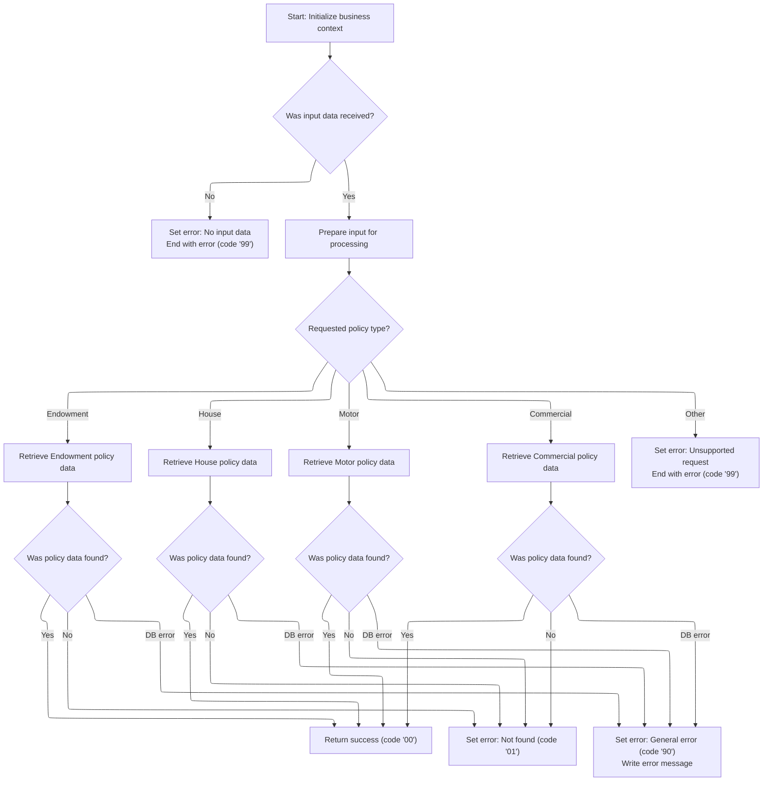
```mermaid
%%{init: {"flowchart": {"defaultRenderer": "elk"}} }%%
flowchart TD
    node1["Start: Initialize business context"]
    click node1 openCode "base/src/lgipdb01.cbl:230:246"
    node1 --> node2{"Was input data received?"}
    click node2 openCode "base/src/lgipdb01.cbl:251:255"
    node2 -->|"No"| node3["Set error: No input data
End with error (code '99')"]
    click node3 openCode "base/src/lgipdb01.cbl:252:254"
    node2 -->|"Yes"| node4["Prepare input for processing"]
    click node4 openCode "base/src/lgipdb01.cbl:258:267"
    node4 --> node5{"Requested policy type?"}
    click node5 openCode "base/src/lgipdb01.cbl:277:310"
    node5 -->|"Endowment"| node6["Retrieve Endowment policy data"]
    click node6 openCode "base/src/lgipdb01.cbl:280:282"
    node5 -->|"House"| node7["Retrieve House policy data"]
    click node7 openCode "base/src/lgipdb01.cbl:284:286"
    node5 -->|"Motor"| node8["Retrieve Motor policy data"]
    click node8 openCode "base/src/lgipdb01.cbl:288:290"
    node5 -->|"Commercial"| node9["Retrieve Commercial policy data"]
    click node9 openCode "base/src/lgipdb01.cbl:292:305"
    node5 -->|"Other"| node10["Set error: Unsupported request
End with error (code '99')"]
    click node10 openCode "base/src/lgipdb01.cbl:308:309"
    node6 --> node11{"Was policy data found?"}
    click node11 openCode "base/src/lgipdb01.cbl:370:429"
    node7 --> node12{"Was policy data found?"}
    click node12 openCode "base/src/lgipdb01.cbl:478:519"
    node8 --> node13{"Was policy data found?"}
    click node13 openCode "base/src/lgipdb01.cbl:572:617"
    node9 --> node14{"Was policy data found?"}
    click node14 openCode "base/src/lgipdb01.cbl:---:---"
    node11 -->|"Yes"| node15["Return success (code '00')"]
    click node15 openCode "base/src/lgipdb01.cbl:373:418"
    node11 -->|"No"| node16["Set error: Not found (code '01')"]
    click node16 openCode "base/src/lgipdb01.cbl:421:424"
    node11 -->|"DB error"| node17["Set error: General error (code '90')
Write error message"]
    click node17 openCode "base/src/lgipdb01.cbl:425:429"
    node12 -->|"Yes"| node15
    node12 -->|"No"| node16
    node12 -->|"DB error"| node17
    node13 -->|"Yes"| node15
    node13 -->|"No"| node16
    node13 -->|"DB error"| node17
    node14 -->|"Yes"| node15
    node14 -->|"No"| node16
    node14 -->|"DB error"| node17
classDef HeadingStyle fill:#777777,stroke:#333,stroke-width:2px;

%% Swimm:
%% %%{init: {"flowchart": {"defaultRenderer": "elk"}} }%%
%% flowchart TD
%%     node1["Start: Initialize business context"]
%%     click node1 openCode "<SwmPath>[base/src/lgipdb01.cbl](base/src/lgipdb01.cbl)</SwmPath>:230:246"
%%     node1 --> node2{"Was input data received?"}
%%     click node2 openCode "<SwmPath>[base/src/lgipdb01.cbl](base/src/lgipdb01.cbl)</SwmPath>:251:255"
%%     node2 -->|"No"| node3["Set error: No input data
%% End with error (code '99')"]
%%     click node3 openCode "<SwmPath>[base/src/lgipdb01.cbl](base/src/lgipdb01.cbl)</SwmPath>:252:254"
%%     node2 -->|"Yes"| node4["Prepare input for processing"]
%%     click node4 openCode "<SwmPath>[base/src/lgipdb01.cbl](base/src/lgipdb01.cbl)</SwmPath>:258:267"
%%     node4 --> node5{"Requested policy type?"}
%%     click node5 openCode "<SwmPath>[base/src/lgipdb01.cbl](base/src/lgipdb01.cbl)</SwmPath>:277:310"
%%     node5 -->|"Endowment"| node6["Retrieve Endowment policy data"]
%%     click node6 openCode "<SwmPath>[base/src/lgipdb01.cbl](base/src/lgipdb01.cbl)</SwmPath>:280:282"
%%     node5 -->|"House"| node7["Retrieve House policy data"]
%%     click node7 openCode "<SwmPath>[base/src/lgipdb01.cbl](base/src/lgipdb01.cbl)</SwmPath>:284:286"
%%     node5 -->|"Motor"| node8["Retrieve Motor policy data"]
%%     click node8 openCode "<SwmPath>[base/src/lgipdb01.cbl](base/src/lgipdb01.cbl)</SwmPath>:288:290"
%%     node5 -->|"Commercial"| node9["Retrieve Commercial policy data"]
%%     click node9 openCode "<SwmPath>[base/src/lgipdb01.cbl](base/src/lgipdb01.cbl)</SwmPath>:292:305"
%%     node5 -->|"Other"| node10["Set error: Unsupported request
%% End with error (code '99')"]
%%     click node10 openCode "<SwmPath>[base/src/lgipdb01.cbl](base/src/lgipdb01.cbl)</SwmPath>:308:309"
%%     node6 --> node11{"Was policy data found?"}
%%     click node11 openCode "<SwmPath>[base/src/lgipdb01.cbl](base/src/lgipdb01.cbl)</SwmPath>:370:429"
%%     node7 --> node12{"Was policy data found?"}
%%     click node12 openCode "<SwmPath>[base/src/lgipdb01.cbl](base/src/lgipdb01.cbl)</SwmPath>:478:519"
%%     node8 --> node13{"Was policy data found?"}
%%     click node13 openCode "<SwmPath>[base/src/lgipdb01.cbl](base/src/lgipdb01.cbl)</SwmPath>:572:617"
%%     node9 --> node14{"Was policy data found?"}
%%     click node14 openCode "<SwmPath>[base/src/lgipdb01.cbl](base/src/lgipdb01.cbl)</SwmPath>:---:---"
%%     node11 -->|"Yes"| node15["Return success (code '00')"]
%%     click node15 openCode "<SwmPath>[base/src/lgipdb01.cbl](base/src/lgipdb01.cbl)</SwmPath>:373:418"
%%     node11 -->|"No"| node16["Set error: Not found (code '01')"]
%%     click node16 openCode "<SwmPath>[base/src/lgipdb01.cbl](base/src/lgipdb01.cbl)</SwmPath>:421:424"
%%     node11 -->|"DB error"| node17["Set error: General error (code '90')
%% Write error message"]
%%     click node17 openCode "<SwmPath>[base/src/lgipdb01.cbl](base/src/lgipdb01.cbl)</SwmPath>:425:429"
%%     node12 -->|"Yes"| node15
%%     node12 -->|"No"| node16
%%     node12 -->|"DB error"| node17
%%     node13 -->|"Yes"| node15
%%     node13 -->|"No"| node16
%%     node13 -->|"DB error"| node17
%%     node14 -->|"Yes"| node15
%%     node14 -->|"No"| node16
%%     node14 -->|"DB error"| node17
%% classDef HeadingStyle fill:#777777,stroke:#333,stroke-width:2px;
```

This section governs the retrieval of insurance policy details from the database, ensuring that only valid requests are processed and that errors are handled according to business requirements. It supports multiple policy types and ensures that output data is correctly formatted and returned to the caller.

| Category        | Rule Name                         | Description                                                                                                                                      |
| --------------- | --------------------------------- | ------------------------------------------------------------------------------------------------------------------------------------------------ |
| Data validation | Supported policy type enforcement | Only supported policy types (Endowment, House, Motor, Commercial) may be processed. Any other policy type must result in error code '99'.        |
| Data validation | Insufficient buffer size handling | If the commarea buffer provided is not large enough to hold the required policy data, the process must return error code '98'.                   |
| Business logic  | Successful policy retrieval       | On successful retrieval, all relevant policy data fields must be populated in the commarea, and the process must return success code '00'.       |
| Business logic  | Nullable field handling           | Nullable fields in the database must only be populated in the output if they are not null, as indicated by their respective indicator variables. |
| Business logic  | Policy data end marker            | The end of the returned policy data must be marked with the string 'FINAL' in the appropriate output field for each policy type.                 |
| Business logic  | Error message composition         | All error messages must include the customer number, policy number, SQL request type, and SQLCODE for tracking and audit purposes.               |

<SwmSnippet path="/base/src/lgipdb01.cbl" line="230">

---

<SwmToken path="base/src/lgipdb01.cbl" pos="230:1:1" line-data="       MAINLINE SECTION.">`MAINLINE`</SwmToken> in <SwmToken path="base/src/lgipol01.cbl" pos="91:9:9" line-data="           EXEC CICS LINK Program(LGIPDB01)">`LGIPDB01`</SwmToken> checks for valid input, figures out which policy type is requested, and calls the right subroutine to fetch details from the database. Errors and missing data are handled with return codes and logging.

```cobol
       MAINLINE SECTION.

      *----------------------------------------------------------------*
      * Common code                                                    *
      *----------------------------------------------------------------*
      * initialize working storage variables
           INITIALIZE WS-HEADER.
      * set up general variable
           MOVE EIBTRNID TO WS-TRANSID.
           MOVE EIBTRMID TO WS-TERMID.
           MOVE EIBTASKN TO WS-TASKNUM.
      *----------------------------------------------------------------*
      * initialize DB2 host variables
           INITIALIZE DB2-IN-INTEGERS.
           INITIALIZE DB2-OUT-INTEGERS.
           INITIALIZE DB2-POLICY.

      *---------------------------------------------------------------*
      * Check commarea and obtain required details                    *
      *---------------------------------------------------------------*
      * If NO commarea received issue an ABEND
           IF EIBCALEN IS EQUAL TO ZERO
             MOVE ' NO COMMAREA RECEIVED' TO EM-VARIABLE
             PERFORM WRITE-ERROR-MESSAGE
             EXEC CICS ABEND ABCODE('LGCA') NODUMP END-EXEC
           END-IF

      * initialize commarea return code to zero
           MOVE '00' TO CA-RETURN-CODE
           MOVE EIBCALEN TO WS-CALEN
           SET WS-ADDR-DFHCOMMAREA TO ADDRESS OF DFHCOMMAREA

      * Convert commarea customer & policy nums to DB2 integer format
           MOVE CA-CUSTOMER-NUM TO DB2-CUSTOMERNUM-INT
           MOVE CA-POLICY-NUM   TO DB2-POLICYNUM-INT
      * and save in error msg field incase required
           MOVE CA-CUSTOMER-NUM TO EM-CUSNUM
           MOVE CA-POLICY-NUM   TO EM-POLNUM

      *----------------------------------------------------------------*
      * Check which policy type is being requested                     *
      * This is not actually required whilst only endowment policy     *
      * inquires are supported, but will make future expansion simpler *
      *----------------------------------------------------------------*
      * Upper case value passed in Request Id field                    *
           MOVE FUNCTION UPPER-CASE(CA-REQUEST-ID) TO WS-REQUEST-ID

           EVALUATE WS-REQUEST-ID

             WHEN '01IEND'
               INITIALIZE DB2-ENDOWMENT
               PERFORM GET-ENDOW-DB2-INFO

             WHEN '01IHOU'
               INITIALIZE DB2-HOUSE
               PERFORM GET-HOUSE-DB2-INFO

             WHEN '01IMOT'
               INITIALIZE DB2-MOTOR
               PERFORM GET-MOTOR-DB2-INFO

             WHEN '01ICOM'
               INITIALIZE DB2-COMMERCIAL
               PERFORM GET-COMMERCIAL-DB2-INFO-1

             WHEN '02ICOM'
               INITIALIZE DB2-COMMERCIAL
               PERFORM GET-COMMERCIAL-DB2-INFO-2

             WHEN '03ICOM'
               INITIALIZE DB2-COMMERCIAL
               PERFORM GET-COMMERCIAL-DB2-INFO-3

             WHEN '05ICOM'
               INITIALIZE DB2-COMMERCIAL
               PERFORM GET-COMMERCIAL-DB2-INFO-5

             WHEN OTHER
               MOVE '99' TO CA-RETURN-CODE

           END-EVALUATE.
```

---

</SwmSnippet>

<SwmSnippet path="/base/src/lgipdb01.cbl" line="997">

---

<SwmToken path="base/src/lgipdb01.cbl" pos="997:1:5" line-data="       WRITE-ERROR-MESSAGE.">`WRITE-ERROR-MESSAGE`</SwmToken> here saves the SQLCODE, formats the timestamp, and calls LGSTSQ to log both the error message and up to 90 bytes of commarea data for tracking.

```cobol
       WRITE-ERROR-MESSAGE.
      * Save SQLCODE in message
           MOVE SQLCODE TO EM-SQLRC
      * Obtain and format current time and date
           EXEC CICS ASKTIME ABSTIME(ABS-TIME)
           END-EXEC
           EXEC CICS FORMATTIME ABSTIME(ABS-TIME)
                     MMDDYYYY(DATE1)
                     TIME(TIME1)
           END-EXEC
           MOVE DATE1 TO EM-DATE
           MOVE TIME1 TO EM-TIME
      * Write output message to TDQ
           EXEC CICS LINK PROGRAM('LGSTSQ')
                     COMMAREA(ERROR-MSG)
                     LENGTH(LENGTH OF ERROR-MSG)
           END-EXEC.
      * Write 90 bytes or as much as we have of commarea to TDQ
           IF EIBCALEN > 0 THEN
             IF EIBCALEN < 91 THEN
               MOVE DFHCOMMAREA(1:EIBCALEN) TO CA-DATA
               EXEC CICS LINK PROGRAM('LGSTSQ')
                         COMMAREA(CA-ERROR-MSG)
                         LENGTH(LENGTH OF CA-ERROR-MSG)
               END-EXEC
             ELSE
               MOVE DFHCOMMAREA(1:90) TO CA-DATA
               EXEC CICS LINK PROGRAM('LGSTSQ')
                         COMMAREA(CA-ERROR-MSG)
                         LENGTH(LENGTH OF CA-ERROR-MSG)
               END-EXEC
             END-IF
           END-IF.
           EXIT.
```

---

</SwmSnippet>

<SwmSnippet path="/base/src/lgipdb01.cbl" line="327">

---

<SwmToken path="base/src/lgipdb01.cbl" pos="327:1:7" line-data="       GET-ENDOW-DB2-INFO.">`GET-ENDOW-DB2-INFO`</SwmToken> fetches endowment policy data, checks for variable-length PADDINGDATA, adjusts buffer sizes, and sets repository-specific return codes and end markers. Nullable fields are handled using indicator variables.

```cobol
       GET-ENDOW-DB2-INFO.

           MOVE ' SELECT ENDOW ' TO EM-SQLREQ
           EXEC SQL
             SELECT  ISSUEDATE,
                     EXPIRYDATE,
                     LASTCHANGED,
                     BROKERID,
                     BROKERSREFERENCE,
                     PAYMENT,
                     WITHPROFITS,
                     EQUITIES,
                     MANAGEDFUND,
                     FUNDNAME,
                     TERM,
                     SUMASSURED,
                     LIFEASSURED,
                     PADDINGDATA,
                     LENGTH(PADDINGDATA)
             INTO  :DB2-ISSUEDATE,
                   :DB2-EXPIRYDATE,
                   :DB2-LASTCHANGED,
                   :DB2-BROKERID-INT INDICATOR :IND-BROKERID,
                   :DB2-BROKERSREF INDICATOR :IND-BROKERSREF,
                   :DB2-PAYMENT-INT INDICATOR :IND-PAYMENT,
                   :DB2-E-WITHPROFITS,
                   :DB2-E-EQUITIES,
                   :DB2-E-MANAGEDFUND,
                   :DB2-E-FUNDNAME,
                   :DB2-E-TERM-SINT,
                   :DB2-E-SUMASSURED-INT,
                   :DB2-E-LIFEASSURED,
                   :DB2-E-PADDINGDATA INDICATOR :IND-E-PADDINGDATA,
                   :DB2-E-PADDING-LEN INDICATOR :IND-E-PADDINGDATAL
             FROM  POLICY,ENDOWMENT
             WHERE ( POLICY.POLICYNUMBER =
                        ENDOWMENT.POLICYNUMBER   AND
                     POLICY.CUSTOMERNUMBER =
                        :DB2-CUSTOMERNUM-INT             AND
                     POLICY.POLICYNUMBER =
                        :DB2-POLICYNUM-INT               )
           END-EXEC

           IF SQLCODE = 0
      *      Select was successful

      *      Calculate size of commarea required to return all data
             ADD WS-CA-HEADERTRAILER-LEN TO WS-REQUIRED-CA-LEN
             ADD WS-FULL-ENDOW-LEN       TO WS-REQUIRED-CA-LEN

      *----------------------------------------------------------------*
      *      Specific code to allow for length of VACHAR data
      *      check whether PADDINGDATA field is non-null
      *        and calculate length of endowment policy
      *        and position of free space in commarea after policy data
      *----------------------------------------------------------------*
             IF IND-E-PADDINGDATAL NOT EQUAL MINUS-ONE
               ADD DB2-E-PADDING-LEN TO WS-REQUIRED-CA-LEN
               ADD DB2-E-PADDING-LEN TO END-POLICY-POS
             END-IF

      *      if commarea received is not large enough ...
      *        set error return code and return to caller
             IF EIBCALEN IS LESS THAN WS-REQUIRED-CA-LEN
               MOVE '98' TO CA-RETURN-CODE
               EXEC CICS RETURN END-EXEC
             ELSE
      *        Length is sufficent so move data to commarea
      *        Move Integer fields to required length numerics
      *        Don't move null fields
               IF IND-BROKERID NOT EQUAL MINUS-ONE
                 MOVE DB2-BROKERID-INT    TO DB2-BROKERID
               END-IF
               IF IND-PAYMENT NOT EQUAL MINUS-ONE
                 MOVE DB2-PAYMENT-INT TO DB2-PAYMENT
               END-IF
      *----------------------------------------------------------------*
               MOVE DB2-E-TERM-SINT       TO DB2-E-TERM
               MOVE DB2-E-SUMASSURED-INT  TO DB2-E-SUMASSURED

               MOVE DB2-POLICY-COMMON     TO CA-POLICY-COMMON
               MOVE DB2-ENDOW-FIXED
                   TO CA-ENDOWMENT(1:WS-ENDOW-LEN)
               IF IND-E-PADDINGDATA NOT EQUAL MINUS-ONE
                 MOVE DB2-E-PADDINGDATA TO
                     CA-E-PADDING-DATA(1:DB2-E-PADDING-LEN)
               END-IF
             END-IF

      *      Mark the end of the policy data
             MOVE 'FINAL' TO CA-E-PADDING-DATA(END-POLICY-POS:5)

           ELSE
      *      Non-zero SQLCODE from first SQL FETCH statement
             IF SQLCODE EQUAL 100
      *        No rows found - invalid customer / policy number
               MOVE '01' TO CA-RETURN-CODE
             ELSE
      *        something has gone wrong
               MOVE '90' TO CA-RETURN-CODE
      *        Write error message to TD QUEUE(CSMT)
               PERFORM WRITE-ERROR-MESSAGE
             END-IF

           END-IF.
           EXIT.
```

---

</SwmSnippet>

<SwmSnippet path="/base/src/lgipdb01.cbl" line="441">

---

<SwmToken path="base/src/lgipdb01.cbl" pos="441:1:7" line-data="       GET-HOUSE-DB2-INFO.">`GET-HOUSE-DB2-INFO`</SwmToken> retrieves house policy data, checks buffer size, handles nullable fields, moves <SwmToken path="base/src/lgipdb01.cbl" pos="441:5:5" line-data="       GET-HOUSE-DB2-INFO.">`DB2`</SwmToken> results to the output, and sets repository-specific error codes and end markers.

```cobol
       GET-HOUSE-DB2-INFO.

           MOVE ' SELECT HOUSE ' TO EM-SQLREQ
           EXEC SQL
             SELECT  ISSUEDATE,
                     EXPIRYDATE,
                     LASTCHANGED,
                     BROKERID,
                     BROKERSREFERENCE,
                     PAYMENT,
                     PROPERTYTYPE,
                     BEDROOMS,
                     VALUE,
                     HOUSENAME,
                     HOUSENUMBER,
                     POSTCODE
             INTO  :DB2-ISSUEDATE,
                   :DB2-EXPIRYDATE,
                   :DB2-LASTCHANGED,
                   :DB2-BROKERID-INT INDICATOR :IND-BROKERID,
                   :DB2-BROKERSREF INDICATOR :IND-BROKERSREF,
                   :DB2-PAYMENT-INT INDICATOR :IND-PAYMENT,
                   :DB2-H-PROPERTYTYPE,
                   :DB2-H-BEDROOMS-SINT,
                   :DB2-H-VALUE-INT,
                   :DB2-H-HOUSENAME,
                   :DB2-H-HOUSENUMBER,
                   :DB2-H-POSTCODE
             FROM  POLICY,HOUSE
             WHERE ( POLICY.POLICYNUMBER =
                        HOUSE.POLICYNUMBER   AND
                     POLICY.CUSTOMERNUMBER =
                        :DB2-CUSTOMERNUM-INT             AND
                     POLICY.POLICYNUMBER =
                        :DB2-POLICYNUM-INT               )
           END-EXEC

           IF SQLCODE = 0
      *      Select was successful

      *      Calculate size of commarea required to return all data
             ADD WS-CA-HEADERTRAILER-LEN TO WS-REQUIRED-CA-LEN
             ADD WS-FULL-HOUSE-LEN       TO WS-REQUIRED-CA-LEN

      *      if commarea received is not large enough ...
      *        set error return code and return to caller
             IF EIBCALEN IS LESS THAN WS-REQUIRED-CA-LEN
               MOVE '98' TO CA-RETURN-CODE
               EXEC CICS RETURN END-EXEC
             ELSE
      *        Length is sufficent so move data to commarea
      *        Move Integer fields to required length numerics
      *        Don't move null fields
               IF IND-BROKERID NOT EQUAL MINUS-ONE
                 MOVE DB2-BROKERID-INT  TO DB2-BROKERID
               END-IF
               IF IND-PAYMENT NOT EQUAL MINUS-ONE
                 MOVE DB2-PAYMENT-INT TO DB2-PAYMENT
               END-IF
               MOVE DB2-H-BEDROOMS-SINT TO DB2-H-BEDROOMS
               MOVE DB2-H-VALUE-INT     TO DB2-H-VALUE

               MOVE DB2-POLICY-COMMON   TO CA-POLICY-COMMON
               MOVE DB2-HOUSE           TO CA-HOUSE(1:WS-HOUSE-LEN)
             END-IF

      *      Mark the end of the policy data
             MOVE 'FINAL' TO CA-H-FILLER(1:5)

           ELSE
      *      Non-zero SQLCODE from first SQL FETCH statement
             IF SQLCODE EQUAL 100
      *        No rows found - invalid customer / policy number
               MOVE '01' TO CA-RETURN-CODE
             ELSE
      *        something has gone wrong
               MOVE '90' TO CA-RETURN-CODE
      *        Write error message to TD QUEUE(CSMT)
               PERFORM WRITE-ERROR-MESSAGE
             END-IF

           END-IF.
           EXIT.
```

---

</SwmSnippet>

<SwmSnippet path="/base/src/lgipdb01.cbl" line="529">

---

<SwmToken path="base/src/lgipdb01.cbl" pos="529:1:7" line-data="       GET-MOTOR-DB2-INFO.">`GET-MOTOR-DB2-INFO`</SwmToken> fetches motor policy data, checks buffer size, handles nullable fields, moves results to the output, and sets error codes and end markers as per repo conventions.

```cobol
       GET-MOTOR-DB2-INFO.

           MOVE ' SELECT MOTOR ' TO EM-SQLREQ
           EXEC SQL
             SELECT  ISSUEDATE,
                     EXPIRYDATE,
                     LASTCHANGED,
                     BROKERID,
                     BROKERSREFERENCE,
                     PAYMENT,
                     MAKE,
                     MODEL,
                     VALUE,
                     REGNUMBER,
                     COLOUR,
                     CC,
                     YEAROFMANUFACTURE,
                     PREMIUM,
                     ACCIDENTS
             INTO  :DB2-ISSUEDATE,
                   :DB2-EXPIRYDATE,
                   :DB2-LASTCHANGED,
                   :DB2-BROKERID-INT INDICATOR :IND-BROKERID,
                   :DB2-BROKERSREF INDICATOR :IND-BROKERSREF,
                   :DB2-PAYMENT-INT INDICATOR :IND-PAYMENT,
                   :DB2-M-MAKE,
                   :DB2-M-MODEL,
                   :DB2-M-VALUE-INT,
                   :DB2-M-REGNUMBER,
                   :DB2-M-COLOUR,
                   :DB2-M-CC-SINT,
                   :DB2-M-MANUFACTURED,
                   :DB2-M-PREMIUM-INT,
                   :DB2-M-ACCIDENTS-INT
             FROM  POLICY,MOTOR
             WHERE ( POLICY.POLICYNUMBER =
                        MOTOR.POLICYNUMBER   AND
                     POLICY.CUSTOMERNUMBER =
                        :DB2-CUSTOMERNUM-INT             AND
                     POLICY.POLICYNUMBER =
                        :DB2-POLICYNUM-INT               )
           END-EXEC

           IF SQLCODE = 0
      *      Select was successful

      *      Calculate size of commarea required to return all data
             ADD WS-CA-HEADERTRAILER-LEN TO WS-REQUIRED-CA-LEN
             ADD WS-FULL-MOTOR-LEN       TO WS-REQUIRED-CA-LEN

      *      if commarea received is not large enough ...
      *        set error return code and return to caller
             IF EIBCALEN IS LESS THAN WS-REQUIRED-CA-LEN
               MOVE '98' TO CA-RETURN-CODE
               EXEC CICS RETURN END-EXEC
             ELSE
      *        Length is sufficent so move data to commarea
      *        Move Integer fields to required length numerics
      *        Don't move null fields
               IF IND-BROKERID NOT EQUAL MINUS-ONE
                 MOVE DB2-BROKERID-INT TO DB2-BROKERID
               END-IF
               IF IND-PAYMENT NOT EQUAL MINUS-ONE
                 MOVE DB2-PAYMENT-INT    TO DB2-PAYMENT
               END-IF
               MOVE DB2-M-CC-SINT      TO DB2-M-CC
               MOVE DB2-M-VALUE-INT    TO DB2-M-VALUE
               MOVE DB2-M-PREMIUM-INT  TO DB2-M-PREMIUM
               MOVE DB2-M-ACCIDENTS-INT TO DB2-M-ACCIDENTS
               MOVE DB2-M-PREMIUM-INT  TO CA-M-PREMIUM
               MOVE DB2-M-ACCIDENTS-INT TO CA-M-ACCIDENTS

               MOVE DB2-POLICY-COMMON  TO CA-POLICY-COMMON
               MOVE DB2-MOTOR          TO CA-MOTOR(1:WS-MOTOR-LEN)
             END-IF

      *      Mark the end of the policy data
             MOVE 'FINAL' TO CA-M-FILLER(1:5)

           ELSE
      *      Non-zero SQLCODE from first SQL FETCH statement
             IF SQLCODE EQUAL 100
      *        No rows found - invalid customer / policy number
               MOVE '01' TO CA-RETURN-CODE
             ELSE
      *        something has gone wrong
               MOVE '90' TO CA-RETURN-CODE
      *        Write error message to TD QUEUE(CSMT)
               PERFORM WRITE-ERROR-MESSAGE
             END-IF

           END-IF.
           EXIT.
```

---

</SwmSnippet>

## Handling Policy Inquiry Results

<SwmSnippet path="/base/src/lgtestp3.cbl" line="74">

---

In <SwmToken path="base/src/lgtestp3.cbl" pos="75:5:7" line-data="                   GO TO NO-DATA">`NO-DATA`</SwmToken>, we set the error message for the user and jump to <SwmToken path="base/src/lgtestp3.cbl" pos="271:5:7" line-data="               Go To ERROR-OUT">`ERROR-OUT`</SwmToken> to display it and reset the session.

```cobol
                 IF CA-RETURN-CODE > 0
                   GO TO NO-DATA
                 END-IF
```

---

</SwmSnippet>

## Handling No Data Returned

This section ensures that users are promptly informed when their request does not yield any data, providing clear feedback to avoid confusion and improve user experience.

<SwmSnippet path="/base/src/lgtestp3.cbl" line="285">

---

In <SwmToken path="base/src/lgtestp3.cbl" pos="287:5:7" line-data="           Go To ERROR-OUT.">`ERROR-OUT`</SwmToken>, we send the error message to the user's screen using the <SwmToken path="base/src/lgtestp3.cbl" pos="45:11:11" line-data="           EXEC CICS SEND MAP (&#39;SSMAPP3&#39;)">`SSMAPP3`</SwmToken> map from the SSMAP mapset, so the user sees the feedback right away.

```cobol
       NO-DATA.
           Move 'No data was returned.'            To  ERP3FLDO
           Go To ERROR-OUT.
```

---

</SwmSnippet>

## Displaying Error and Resetting State

This section ensures that users are informed of errors and that the application state is properly reset to avoid data corruption or inconsistent sessions.

| Category       | Rule Name                  | Description                                                                                                                            |
| -------------- | -------------------------- | -------------------------------------------------------------------------------------------------------------------------------------- |
| Business logic | Error message display      | Whenever an error is detected, an error message must be displayed to the user using the designated error map.                          |
| Business logic | Session data reset         | After displaying the error, all session-related data areas must be reset to their initial state to prevent data leakage or corruption. |
| Business logic | Return control after error | Control must be returned to the system after error handling, ensuring the session is updated and ready for further user actions.       |

<SwmSnippet path="/base/src/lgtestp3.cbl" line="289">

---

After showing the error, we reset all relevant data areas and jump to <SwmToken path="base/src/lgtestp3.cbl" pos="228:5:7" line-data="                 GO TO ENDIT-STARTIT">`ENDIT-STARTIT`</SwmToken> to return control to the system with the updated session.

```cobol
       ERROR-OUT.
           EXEC CICS SEND MAP ('SSMAPP3')
                     FROM(SSMAPP3O)
                     MAPSET ('SSMAP')
           END-EXEC.
```

---

</SwmSnippet>

<SwmSnippet path="/base/src/lgtestp3.cbl" line="295">

---

After showing the error, we reset all relevant data areas and jump to <SwmToken path="base/src/lgtestp3.cbl" pos="299:5:7" line-data="           GO TO ENDIT-STARTIT.">`ENDIT-STARTIT`</SwmToken> to return control to the system with the updated session.

```cobol
           Initialize SSMAPP3I.
           Initialize SSMAPP3O.
           Initialize COMM-AREA.

           GO TO ENDIT-STARTIT.
```

---

</SwmSnippet>

## Displaying Retrieved Policy Data

<SwmSnippet path="/base/src/lgtestp3.cbl" line="78">

---

Next, for option '2', we set up the request fields with user input and defaults, getting ready to call the add policy handler.

```cobol
                 Move CA-ISSUE-DATE      To  ENP3IDAI
                 Move CA-EXPIRY-DATE     To  ENP3EDAI
                 Move CA-H-PROPERTY-TYPE To  ENP3TYPI
                 Move CA-H-BEDROOMS      To  ENP3BEDI
                 Move CA-H-VALUE         To  ENP3VALI
                 Move CA-H-HOUSE-NAME    To  ENP3HNMI
                 Move CA-H-HOUSE-NUMBER  To  ENP3HNOI
                 Move CA-H-POSTCODE      To  ENP3HPCI
                 EXEC CICS SEND MAP ('SSMAPP3')
                           FROM(SSMAPP3O)
                           MAPSET ('SSMAP')
                 END-EXEC
```

---

</SwmSnippet>

<SwmSnippet path="/base/src/lgtestp3.cbl" line="92">

---

We call <SwmToken path="base/src/lgtestp3.cbl" pos="106:10:10" line-data="                 EXEC CICS LINK PROGRAM(&#39;LGAPOL01&#39;)">`LGAPOL01`</SwmToken> to add the new policy.

```cobol
             WHEN '2'
                 Move '01AHOU'          To CA-REQUEST-ID
                 Move ENP3CNOI          To CA-CUSTOMER-NUM
                 Move 0                 To CA-PAYMENT
                 Move 0                 To CA-BROKERID
                 Move '        '        To CA-BROKERSREF
                 Move ENP3IDAI          To CA-ISSUE-DATE
                 Move ENP3EDAI          To CA-EXPIRY-DATE
                 Move ENP3TYPI          To CA-H-PROPERTY-TYPE
                 Move ENP3BEDI          To CA-H-BEDROOMS
                 Move ENP3VALI          To CA-H-VALUE
                 Move ENP3HNMI          To CA-H-HOUSE-NAME
                 Move ENP3HNOI          To CA-H-HOUSE-NUMBER
                 Move ENP3HPCI          To CA-H-POSTCODE
```

---

</SwmSnippet>

<SwmSnippet path="/base/src/lgtestp3.cbl" line="106">

---

We call <SwmToken path="base/src/lgtestp3.cbl" pos="106:10:10" line-data="                 EXEC CICS LINK PROGRAM(&#39;LGAPOL01&#39;)">`LGAPOL01`</SwmToken> to add the new policy.

```cobol
                 EXEC CICS LINK PROGRAM('LGAPOL01')
                           COMMAREA(COMM-AREA)
                           LENGTH(32500)
                 END-EXEC
```

---

</SwmSnippet>

## Validating and Processing Policy Add Request

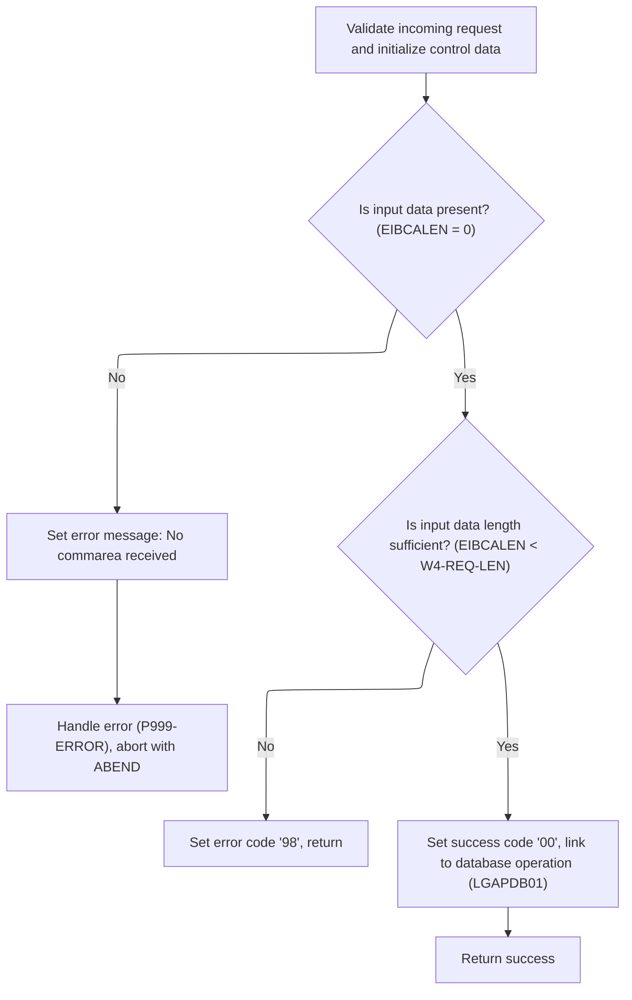
```mermaid
%%{init: {"flowchart": {"defaultRenderer": "elk"}} }%%
flowchart TD
    node1["Validate incoming request and initialize control data"] --> node2{"Is input data present? (EIBCALEN = 0)"}
    click node1 openCode "base/src/lgapol01.cbl:68:77"
    node2 -->|"No"| node3["Set error message: No commarea received"]
    click node2 openCode "base/src/lgapol01.cbl:83:87"
    node3 --> node4["Handle error (P999-ERROR), abort with ABEND"]
    click node3 openCode "base/src/lgapol01.cbl:84:86"
    click node4 openCode "base/src/lgapol01.cbl:119:151"
    node2 -->|"Yes"| node5{"Is input data length sufficient? (EIBCALEN < W4-REQ-LEN)"}
    click node5 openCode "base/src/lgapol01.cbl:95:98"
    node5 -->|"No"| node6["Set error code '98', return"]
    click node6 openCode "base/src/lgapol01.cbl:96:97"
    node5 -->|"Yes"| node7["Set success code '00', link to database operation (LGAPDB01)"]
    click node7 openCode "base/src/lgapol01.cbl:89:106"
    node7 --> node8["Return success"]
    click node8 openCode "base/src/lgapol01.cbl:108:108"
classDef HeadingStyle fill:#777777,stroke:#333,stroke-width:2px;

%% Swimm:
%% %%{init: {"flowchart": {"defaultRenderer": "elk"}} }%%
%% flowchart TD
%%     node1["Validate incoming request and initialize control data"] --> node2{"Is input data present? (EIBCALEN = 0)"}
%%     click node1 openCode "<SwmPath>[base/src/lgapol01.cbl](base/src/lgapol01.cbl)</SwmPath>:68:77"
%%     node2 -->|"No"| node3["Set error message: No commarea received"]
%%     click node2 openCode "<SwmPath>[base/src/lgapol01.cbl](base/src/lgapol01.cbl)</SwmPath>:83:87"
%%     node3 --> node4["Handle error (<SwmToken path="base/src/lgapol01.cbl" pos="85:3:5" line-data="               PERFORM P999-ERROR">`P999-ERROR`</SwmToken>), abort with ABEND"]
%%     click node3 openCode "<SwmPath>[base/src/lgapol01.cbl](base/src/lgapol01.cbl)</SwmPath>:84:86"
%%     click node4 openCode "<SwmPath>[base/src/lgapol01.cbl](base/src/lgapol01.cbl)</SwmPath>:119:151"
%%     node2 -->|"Yes"| node5{"Is input data length sufficient? (EIBCALEN < <SwmToken path="base/src/lgapol01.cbl" pos="92:11:15" line-data="           ADD W4-HDR-LEN TO W4-REQ-LEN">`W4-REQ-LEN`</SwmToken>)"}
%%     click node5 openCode "<SwmPath>[base/src/lgapol01.cbl](base/src/lgapol01.cbl)</SwmPath>:95:98"
%%     node5 -->|"No"| node6["Set error code '98', return"]
%%     click node6 openCode "<SwmPath>[base/src/lgapol01.cbl](base/src/lgapol01.cbl)</SwmPath>:96:97"
%%     node5 -->|"Yes"| node7["Set success code '00', link to database operation (<SwmToken path="base/src/lgapol01.cbl" pos="103:9:9" line-data="           EXEC CICS Link Program(LGAPDB01)">`LGAPDB01`</SwmToken>)"]
%%     click node7 openCode "<SwmPath>[base/src/lgapol01.cbl](base/src/lgapol01.cbl)</SwmPath>:89:106"
%%     node7 --> node8["Return success"]
%%     click node8 openCode "<SwmPath>[base/src/lgapol01.cbl](base/src/lgapol01.cbl)</SwmPath>:108:108"
%% classDef HeadingStyle fill:#777777,stroke:#333,stroke-width:2px;
```

This section is responsible for validating incoming policy add requests and ensuring that only requests with sufficient and correct data are processed. It also handles error reporting and logging for monitoring purposes.

| Category        | Rule Name                           | Description                                                                                                                                                                                                                                                    |
| --------------- | ----------------------------------- | -------------------------------------------------------------------------------------------------------------------------------------------------------------------------------------------------------------------------------------------------------------- |
| Data validation | Missing input data rejection        | If no input data is present in the request (commarea length is zero), the system must reject the request, log the error with a timestamp and up to 90 bytes of received data, and abort the operation.                                                         |
| Data validation | Insufficient input length rejection | If the input data length is less than the required minimum (<SwmToken path="base/src/lgapol01.cbl" pos="92:11:15" line-data="           ADD W4-HDR-LEN TO W4-REQ-LEN">`W4-REQ-LEN`</SwmToken>), the system must reject the request and return error code '98'. |
| Business logic  | Successful policy add processing    | If the input data passes all validations, the system must set a success code ('00') and proceed to process the policy addition by linking to the database operation.                                                                                           |

<SwmSnippet path="/base/src/lgapol01.cbl" line="68">

---

<SwmToken path="base/src/lgapol01.cbl" pos="85:3:5" line-data="               PERFORM P999-ERROR">`P999-ERROR`</SwmToken> logs errors with timestamps, sends both the error details and up to 90 bytes of commarea data to LGSTSQ for queueing and monitoring.

```cobol
       P100-MAIN SECTION.

      *----------------------------------------------------------------*
      * Common code                                                    *
      *----------------------------------------------------------------*
           INITIALIZE W1-CONTROL.
           MOVE EIBTRNID TO W1-TID.
           MOVE EIBTRMID TO W1-TRM.
           MOVE EIBTASKN TO W1-TSK.
           MOVE EIBCALEN TO W1-LEN.
      *----------------------------------------------------------------*

      *----------------------------------------------------------------*
      * Check commarea and obtain required details                     *
      *----------------------------------------------------------------*
           IF EIBCALEN IS EQUAL TO ZERO
               MOVE ' NO COMMAREA RECEIVED' TO W3-DETAIL
               PERFORM P999-ERROR
               EXEC CICS ABEND ABCODE('LGCA') NODUMP END-EXEC
           END-IF

           MOVE '00' TO CA-RETURN-CODE
           SET W1-PTR TO ADDRESS OF DFHCOMMAREA.

           ADD W4-HDR-LEN TO W4-REQ-LEN


           IF EIBCALEN IS LESS THAN W4-REQ-LEN
             MOVE '98' TO CA-RETURN-CODE
             EXEC CICS RETURN END-EXEC
           END-IF

      *----------------------------------------------------------------*
      *    Perform the data Inserts                                    *
      *----------------------------------------------------------------*
           EXEC CICS Link Program(LGAPDB01)
                Commarea(DFHCOMMAREA)
                LENGTH(32500)
           END-EXEC.

           EXEC CICS RETURN END-EXEC.
```

---

</SwmSnippet>

<SwmSnippet path="/base/src/lgapol01.cbl" line="119">

---

<SwmToken path="base/src/lgapol01.cbl" pos="119:1:3" line-data="       P999-ERROR.">`P999-ERROR`</SwmToken> logs errors with timestamps, sends both the error details and up to 90 bytes of commarea data to LGSTSQ for queueing and monitoring.

```cobol
       P999-ERROR.
      * Save SQLCODE in message
      * Obtain and format current time and date
           EXEC CICS ASKTIME ABSTIME(W2-TIME)
           END-EXEC
           EXEC CICS FORMATTIME ABSTIME(W2-TIME)
                     MMDDYYYY(W2-DATE1)
                     TIME(W2-DATE2)
           END-EXEC
           MOVE W2-DATE1 TO W3-DATE
           MOVE W2-DATE2 TO W3-TIME
      * Write output message to TDQ
           EXEC CICS LINK PROGRAM('LGSTSQ')
                     COMMAREA(W3-MESSAGE)
                     LENGTH(LENGTH OF W3-MESSAGE)
           END-EXEC.
      * Write 90 bytes or as much as we have of commarea to TDQ
           IF EIBCALEN > 0 THEN
             IF EIBCALEN < 91 THEN
               MOVE DFHCOMMAREA(1:EIBCALEN) TO CA-DATA
               EXEC CICS LINK PROGRAM('LGSTSQ')
                         COMMAREA(CA-ERROR-MSG)
                         LENGTH(LENGTH OF CA-ERROR-MSG)
               END-EXEC
             ELSE
               MOVE DFHCOMMAREA(1:90) TO CA-DATA
               EXEC CICS LINK PROGRAM('LGSTSQ')
                         COMMAREA(CA-ERROR-MSG)
                         LENGTH(LENGTH OF CA-ERROR-MSG)
               END-EXEC
             END-IF
           END-IF.
           EXIT.
```

---

</SwmSnippet>

## Processing Premium Calculations and Summary

This section governs the process of calculating insurance premiums and generating summary reports, ensuring that all necessary configuration values are present and that fallback mechanisms are in place for missing data.

| Category       | Rule Name                                | Description                                                                                                                             |
| -------------- | ---------------------------------------- | --------------------------------------------------------------------------------------------------------------------------------------- |
| Business logic | Configuration-driven premium calculation | Premium calculations must use the risk scoring and premium limits as specified in the configuration file, unless defaults are required. |
| Business logic | Premium summary reporting                | A summary report must be generated after all premium calculations are completed, reflecting the results and any use of default values.  |

<SwmSnippet path="/base/src/LGAPDB01.cbl" line="90">

---

We run all the main steps for premium calculation and reporting.

```cobol
       P001.
           PERFORM P002-INITIALIZE
           PERFORM P003-LOAD-CONFIG
           PERFORM P005-OPEN-FILES
           PERFORM P006-PROCESS-RECORDS
           PERFORM P014-CLOSE-FILES
           PERFORM P015-GENERATE-SUMMARY
           PERFORM P016-DISPLAY-STATS
           STOP RUN.
```

---

</SwmSnippet>

### Loading Configuration for Premium Calculation

This section ensures that premium calculations use the correct configuration values by loading, validating, and converting them from a configuration file, or falling back to defaults if necessary.

| Category        | Rule Name                 | Description                                                                                                                                                                                                                                                                                                                                                                                        |
| --------------- | ------------------------- | -------------------------------------------------------------------------------------------------------------------------------------------------------------------------------------------------------------------------------------------------------------------------------------------------------------------------------------------------------------------------------------------------- |
| Data validation | Numeric config validation | The values for <SwmToken path="base/src/LGAPDB01.cbl" pos="126:4:4" line-data="           MOVE &#39;MAX_RISK_SCORE&#39; TO CONFIG-KEY">`MAX_RISK_SCORE`</SwmToken> and <SwmToken path="base/src/LGAPDB01.cbl" pos="132:4:4" line-data="           MOVE &#39;MIN_PREMIUM&#39; TO CONFIG-KEY">`MIN_PREMIUM`</SwmToken> must be numeric to be used in premium calculations.                           |
| Data validation | Config status validation  | Only configuration values with a status of <SwmToken path="base/src/LGAPDB01.cbl" pos="114:5:7" line-data="           IF NOT CONFIG-OK">`CONFIG-OK`</SwmToken> are considered valid for use in calculations.                                                                                                                                                                                       |
| Business logic  | Config value conversion   | The configuration values for <SwmToken path="base/src/LGAPDB01.cbl" pos="126:4:4" line-data="           MOVE &#39;MAX_RISK_SCORE&#39; TO CONFIG-KEY">`MAX_RISK_SCORE`</SwmToken> and <SwmToken path="base/src/LGAPDB01.cbl" pos="132:4:4" line-data="           MOVE &#39;MIN_PREMIUM&#39; TO CONFIG-KEY">`MIN_PREMIUM`</SwmToken> must be converted to numeric format before use in calculations. |

<SwmSnippet path="/base/src/LGAPDB01.cbl" line="112">

---

<SwmToken path="base/src/LGAPDB01.cbl" pos="118:3:9" line-data="               PERFORM P004-READ-CONFIG-VALUES">`P004-READ-CONFIG-VALUES`</SwmToken> reads <SwmToken path="base/src/LGAPDB01.cbl" pos="126:4:4" line-data="           MOVE &#39;MAX_RISK_SCORE&#39; TO CONFIG-KEY">`MAX_RISK_SCORE`</SwmToken> and <SwmToken path="base/src/LGAPDB01.cbl" pos="132:4:4" line-data="           MOVE &#39;MIN_PREMIUM&#39; TO CONFIG-KEY">`MIN_PREMIUM`</SwmToken> from the config file, checks if they're numeric, and converts them for use in calculations.

```cobol
       P003-LOAD-CONFIG.
           OPEN INPUT CONFIG-FILE
           IF NOT CONFIG-OK
               DISPLAY 'Warning: Config file not available - using defaults'
               PERFORM P004-SET-DEFAULTS
           ELSE
               PERFORM P004-READ-CONFIG-VALUES
               CLOSE CONFIG-FILE
           END-IF.
```

---

</SwmSnippet>

<SwmSnippet path="/base/src/LGAPDB01.cbl" line="125">

---

<SwmToken path="base/src/LGAPDB01.cbl" pos="93:3:7" line-data="           PERFORM P005-OPEN-FILES">`P005-OPEN-FILES`</SwmToken> opens input, output, and summary files, then writes headers to the output file for property insurance export. Each step is handled by a dedicated subroutine.

```cobol
       P004-READ-CONFIG-VALUES.
           MOVE 'MAX_RISK_SCORE' TO CONFIG-KEY
           READ CONFIG-FILE
           IF CONFIG-OK AND NUMERIC-CONFIG
               MOVE FUNCTION NUMVAL(CONFIG-VALUE) TO WS-MAX-RISK-SCORE
           END-IF
           
           MOVE 'MIN_PREMIUM' TO CONFIG-KEY
           READ CONFIG-FILE
           IF CONFIG-OK AND NUMERIC-CONFIG
               MOVE FUNCTION NUMVAL(CONFIG-VALUE) TO WS-MIN-PREMIUM
           END-IF.
```

---

</SwmSnippet>

### Opening Files and Writing Headers

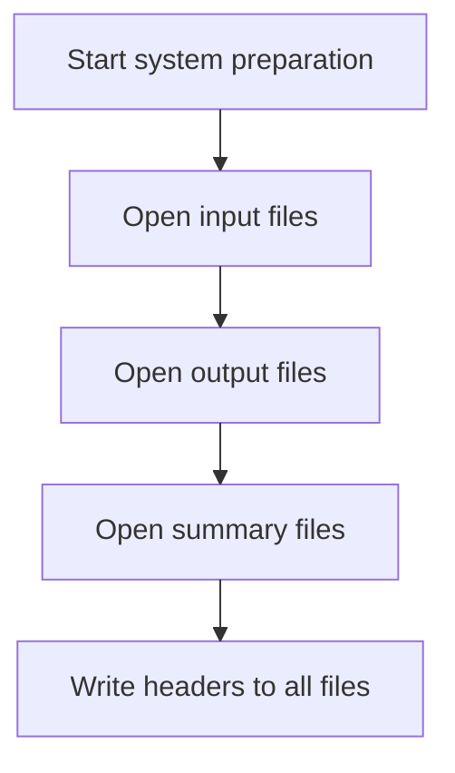
```mermaid
%%{init: {"flowchart": {"defaultRenderer": "elk"}} }%%
flowchart TD
    node1["Start system preparation"] --> node2["Open input files"]
    click node1 openCode "base/src/LGAPDB01.cbl:138:142"
    node2 --> node3["Open output files"]
    click node2 openCode "base/src/LGAPDB01.cbl:139:139"
    node3 --> node4["Open summary files"]
    click node3 openCode "base/src/LGAPDB01.cbl:140:140"
    node4 --> node5["Write headers to all files"]
    click node4 openCode "base/src/LGAPDB01.cbl:141:141"
    click node5 openCode "base/src/LGAPDB01.cbl:142:142"
classDef HeadingStyle fill:#777777,stroke:#333,stroke-width:2px;

%% Swimm:
%% %%{init: {"flowchart": {"defaultRenderer": "elk"}} }%%
%% flowchart TD
%%     node1["Start system preparation"] --> node2["Open input files"]
%%     click node1 openCode "<SwmPath>[base/src/LGAPDB01.cbl](base/src/LGAPDB01.cbl)</SwmPath>:138:142"
%%     node2 --> node3["Open output files"]
%%     click node2 openCode "<SwmPath>[base/src/LGAPDB01.cbl](base/src/LGAPDB01.cbl)</SwmPath>:139:139"
%%     node3 --> node4["Open summary files"]
%%     click node3 openCode "<SwmPath>[base/src/LGAPDB01.cbl](base/src/LGAPDB01.cbl)</SwmPath>:140:140"
%%     node4 --> node5["Write headers to all files"]
%%     click node4 openCode "<SwmPath>[base/src/LGAPDB01.cbl](base/src/LGAPDB01.cbl)</SwmPath>:141:141"
%%     click node5 openCode "<SwmPath>[base/src/LGAPDB01.cbl](base/src/LGAPDB01.cbl)</SwmPath>:142:142"
%% classDef HeadingStyle fill:#777777,stroke:#333,stroke-width:2px;
```

<SwmSnippet path="/base/src/LGAPDB01.cbl" line="138">

---

<SwmToken path="base/src/LGAPDB01.cbl" pos="138:1:5" line-data="       P005-OPEN-FILES.">`P005-OPEN-FILES`</SwmToken> opens input, output, and summary files, then writes headers to the output file for property insurance export. Each step is handled by a dedicated subroutine.

```cobol
       P005-OPEN-FILES.
           PERFORM P005A-OPEN-INPUT
           PERFORM P005B-OPEN-OUTPUT
           PERFORM P005C-OPEN-SUMMARY
           PERFORM P005D-WRITE-HEADERS.
```

---

</SwmSnippet>

## Processing and Validating Application Records

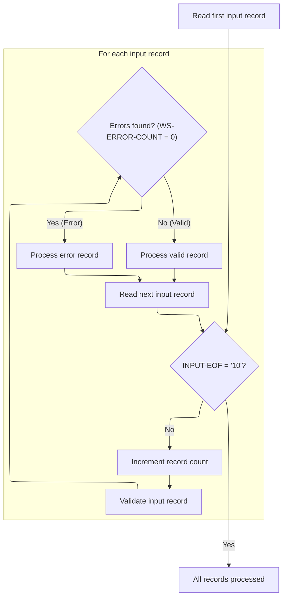
```mermaid
%%{init: {"flowchart": {"defaultRenderer": "elk"}} }%%
flowchart TD
    node1["Read first input record"] --> node2{"INPUT-EOF = '10'?"}
    click node1 openCode "base/src/LGAPDB01.cbl:179:179"
    click node2 openCode "base/src/LGAPDB01.cbl:180:180"
    node2 -->|"No"| node3["Increment record count"]
    node2 -->|"Yes"| node11["All records processed"]
    click node3 openCode "base/src/LGAPDB01.cbl:181:181"
    click node11 openCode "base/src/LGAPDB01.cbl:189:189"
    subgraph loop1["For each input record"]
        node3 --> node4["Validate input record"]
        click node4 openCode "base/src/LGAPDB01.cbl:182:182"
        node4 --> node5{"Errors found? (WS-ERROR-COUNT = 0)"}
        click node5 openCode "base/src/LGAPDB01.cbl:183:183"
        node5 -->|"No (Valid)"| node6["Process valid record"]
        click node6 openCode "base/src/LGAPDB01.cbl:184:184"
        node5 -->|"Yes (Error)"| node7["Process error record"]
        click node7 openCode "base/src/LGAPDB01.cbl:186:186"
        node6 --> node8["Read next input record"]
        node7 --> node8
        click node8 openCode "base/src/LGAPDB01.cbl:188:188"
        node8 --> node2
    end

classDef HeadingStyle fill:#777777,stroke:#333,stroke-width:2px;

%% Swimm:
%% %%{init: {"flowchart": {"defaultRenderer": "elk"}} }%%
%% flowchart TD
%%     node1["Read first input record"] --> node2{"<SwmToken path="base/src/LGAPDB01.cbl" pos="180:5:7" line-data="           PERFORM UNTIL INPUT-EOF">`INPUT-EOF`</SwmToken> = '10'?"}
%%     click node1 openCode "<SwmPath>[base/src/LGAPDB01.cbl](base/src/LGAPDB01.cbl)</SwmPath>:179:179"
%%     click node2 openCode "<SwmPath>[base/src/LGAPDB01.cbl](base/src/LGAPDB01.cbl)</SwmPath>:180:180"
%%     node2 -->|"No"| node3["Increment record count"]
%%     node2 -->|"Yes"| node11["All records processed"]
%%     click node3 openCode "<SwmPath>[base/src/LGAPDB01.cbl](base/src/LGAPDB01.cbl)</SwmPath>:181:181"
%%     click node11 openCode "<SwmPath>[base/src/LGAPDB01.cbl](base/src/LGAPDB01.cbl)</SwmPath>:189:189"
%%     subgraph loop1["For each input record"]
%%         node3 --> node4["Validate input record"]
%%         click node4 openCode "<SwmPath>[base/src/LGAPDB01.cbl](base/src/LGAPDB01.cbl)</SwmPath>:182:182"
%%         node4 --> node5{"Errors found? (<SwmToken path="base/src/LGAPDB01.cbl" pos="183:3:7" line-data="               IF WS-ERROR-COUNT = ZERO">`WS-ERROR-COUNT`</SwmToken> = 0)"}
%%         click node5 openCode "<SwmPath>[base/src/LGAPDB01.cbl](base/src/LGAPDB01.cbl)</SwmPath>:183:183"
%%         node5 -->|"No (Valid)"| node6["Process valid record"]
%%         click node6 openCode "<SwmPath>[base/src/LGAPDB01.cbl](base/src/LGAPDB01.cbl)</SwmPath>:184:184"
%%         node5 -->|"Yes (Error)"| node7["Process error record"]
%%         click node7 openCode "<SwmPath>[base/src/LGAPDB01.cbl](base/src/LGAPDB01.cbl)</SwmPath>:186:186"
%%         node6 --> node8["Read next input record"]
%%         node7 --> node8
%%         click node8 openCode "<SwmPath>[base/src/LGAPDB01.cbl](base/src/LGAPDB01.cbl)</SwmPath>:188:188"
%%         node8 --> node2
%%     end
%% 
%% classDef HeadingStyle fill:#777777,stroke:#333,stroke-width:2px;
```

This section ensures that only valid application records are processed for premium calculation by enforcing business validation rules and logging errors for any records that do not meet requirements.

| Category        | Rule Name                 | Description                                                                                                                                                                                         |
| --------------- | ------------------------- | --------------------------------------------------------------------------------------------------------------------------------------------------------------------------------------------------- |
| Data validation | Allowed policy types      | Each input record must have a policy type that is one of the allowed values: 'C' (Commercial), 'P' (Personal), or 'F' (Farm). Any other value is considered invalid and must be logged as an error. |
| Data validation | Customer number required  | Each input record must have a non-blank customer number. If the customer number is missing, the record is invalid and an error must be logged.                                                      |
| Data validation | Minimum coverage required | At least one coverage limit (building, contents, or business interruption) must be greater than zero. If all are zero, the record is invalid and an error must be logged.                           |
| Business logic  | Maximum coverage warning  | If the total coverage (building + contents + business interruption) exceeds 50,000,000, a warning must be logged but the record is still processed.                                                 |
| Business logic  | Valid record processing   | Records that pass all validation rules are processed for premium calculation and counted as valid.                                                                                                  |

<SwmSnippet path="/base/src/LGAPDB01.cbl" line="178">

---

<SwmToken path="base/src/LGAPDB01.cbl" pos="178:1:5" line-data="       P006-PROCESS-RECORDS.">`P006-PROCESS-RECORDS`</SwmToken> reads each application, validates it, and sends valid ones for premium calculation while logging errors for anything invalid. This keeps the data clean for actuarial processing.

```cobol
       P006-PROCESS-RECORDS.
           PERFORM P007-READ-INPUT
           PERFORM UNTIL INPUT-EOF
               ADD 1 TO WS-REC-CNT
               PERFORM P008-VALIDATE-INPUT-RECORD
               IF WS-ERROR-COUNT = ZERO
                   PERFORM P009-PROCESS-VALID-RECORD
               ELSE
                   PERFORM P010-PROCESS-ERROR-RECORD
               END-IF
               PERFORM P007-READ-INPUT
           END-PERFORM.
```

---

</SwmSnippet>

<SwmSnippet path="/base/src/LGAPDB01.cbl" line="195">

---

<SwmToken path="base/src/LGAPDB01.cbl" pos="195:1:7" line-data="       P008-VALIDATE-INPUT-RECORD.">`P008-VALIDATE-INPUT-RECORD`</SwmToken> checks if the policy type is one of the allowed types ('C', 'P', 'F'), makes sure a customer number is present, requires at least one coverage limit to be non-zero, and flags if the total coverage exceeds 50 million. Errors are logged for each failed check, so only records that pass all these domain-specific rules get processed further.

```cobol
       P008-VALIDATE-INPUT-RECORD.
           INITIALIZE WS-ERROR-HANDLING
           
           IF NOT COMMERCIAL-POLICY AND 
              NOT PERSONAL-POLICY AND 
              NOT FARM-POLICY
               PERFORM P008A-LOG-ERROR WITH 
                   'POL001' 'F' 'IN-POLICY-TYPE' 
                   'Invalid Policy Type'
           END-IF
           
           IF IN-CUSTOMER-NUM = SPACES
               PERFORM P008A-LOG-ERROR WITH 
                   'CUS001' 'F' 'IN-CUSTOMER-NUM' 
                   'Customer Number Required'
           END-IF
           
           IF IN-BUILDING-LIMIT = ZERO AND 
              IN-CONTENTS-LIMIT = ZERO
               PERFORM P008A-LOG-ERROR WITH 
                   'COV001' 'F' 'COVERAGE-LIMITS' 
                   'At least one coverage limit required'
           END-IF
           
           IF IN-BUILDING-LIMIT + IN-CONTENTS-LIMIT + 
              IN-BI-LIMIT > WS-MAX-TIV
               PERFORM P008A-LOG-ERROR WITH 
                   'COV002' 'W' 'COVERAGE-LIMITS' 
                   'Total coverage exceeds maximum TIV'
           END-IF.
```

---

</SwmSnippet>

## Routing Valid Records for Premium Calculation

This section is responsible for routing validated insurance policy records to the correct premium calculation logic based on whether the policy is commercial or non-commercial. It also maintains counters for successful and error outcomes.

| Category       | Rule Name                     | Description                                                                                                      |
| -------------- | ----------------------------- | ---------------------------------------------------------------------------------------------------------------- |
| Business logic | Commercial Policy Routing     | If the policy type is commercial ('C'), the record must be routed to the commercial premium calculation logic.   |
| Business logic | Non-Commercial Policy Routing | If the policy type is not commercial, the record must be routed to the non-commercial premium calculation logic. |
| Business logic | Processed Records Counter     | Each time a commercial policy record is successfully routed, increment the processed records counter by 1.       |
| Business logic | Error Records Counter         | Each time a non-commercial policy record is routed, increment the error records counter by 1.                    |

<SwmSnippet path="/base/src/LGAPDB01.cbl" line="234">

---

<SwmToken path="base/src/LGAPDB01.cbl" pos="234:1:7" line-data="       P009-PROCESS-VALID-RECORD.">`P009-PROCESS-VALID-RECORD`</SwmToken> checks if the record is commercial and sends it to the commercial premium calculation logic, otherwise it routes it to non-commercial handling. It updates the success or error counters based on the outcome.

```cobol
       P009-PROCESS-VALID-RECORD.
           IF COMMERCIAL-POLICY
               PERFORM P011-PROCESS-COMMERCIAL
               ADD 1 TO WS-PROC-CNT
           ELSE
               PERFORM P012-PROCESS-NON-COMMERCIAL
               ADD 1 TO WS-ERR-CNT
           END-IF.
```

---

</SwmSnippet>

## Running Commercial Premium Calculations

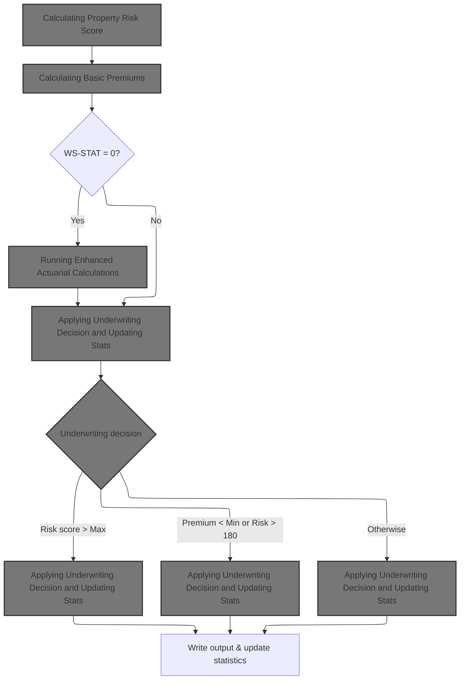
```mermaid
%%{init: {"flowchart": {"defaultRenderer": "elk"}} }%%
flowchart TD
    node1["Calculating Property Risk Score"]
    
    node1 --> node2["Calculating Basic Premiums"]
    
    node2 --> node3{"WS-STAT = 0?"}
    click node3 openCode "base/src/LGAPDB01.cbl:261:263"
    node3 -->|"Yes"| node4["Running Enhanced Actuarial Calculations"]
    
    node3 -->|"No"| node5["Applying Underwriting Decision and Updating Stats"]
    node4 --> node5
    
    node5 --> node6{"Underwriting decision"}
    
    node6 -->|"Risk score > Max"| node7["Applying Underwriting Decision and Updating Stats"]
    node6 -->|"Premium < Min or Risk > 180"| node8["Applying Underwriting Decision and Updating Stats"]
    node6 -->|"Otherwise"| node9["Applying Underwriting Decision and Updating Stats"]
    node7 --> node10["Write output & update statistics"]
    node8 --> node10
    node9 --> node10
    click node10 openCode "base/src/LGAPDB01.cbl:350:377"
classDef HeadingStyle fill:#777777,stroke:#333,stroke-width:2px;
click node1 goToHeading "Calculating Property Risk Score"
node1:::HeadingStyle
click node2 goToHeading "Calculating Basic Premiums"
node2:::HeadingStyle
click node4 goToHeading "Running Enhanced Actuarial Calculations"
node4:::HeadingStyle
click node5 goToHeading "Applying Underwriting Decision and Updating Stats"
node5:::HeadingStyle
click node6 goToHeading "Applying Underwriting Decision and Updating Stats"
node6:::HeadingStyle
click node7 goToHeading "Applying Underwriting Decision and Updating Stats"
node7:::HeadingStyle
click node8 goToHeading "Applying Underwriting Decision and Updating Stats"
node8:::HeadingStyle
click node9 goToHeading "Applying Underwriting Decision and Updating Stats"
node9:::HeadingStyle

%% Swimm:
%% %%{init: {"flowchart": {"defaultRenderer": "elk"}} }%%
%% flowchart TD
%%     node1["Calculating Property Risk Score"]
%%     
%%     node1 --> node2["Calculating Basic Premiums"]
%%     
%%     node2 --> node3{"<SwmToken path="base/src/LGAPDB01.cbl" pos="261:3:5" line-data="           IF WS-STAT = 0">`WS-STAT`</SwmToken> = 0?"}
%%     click node3 openCode "<SwmPath>[base/src/LGAPDB01.cbl](base/src/LGAPDB01.cbl)</SwmPath>:261:263"
%%     node3 -->|"Yes"| node4["Running Enhanced Actuarial Calculations"]
%%     
%%     node3 -->|"No"| node5["Applying Underwriting Decision and Updating Stats"]
%%     node4 --> node5
%%     
%%     node5 --> node6{"Underwriting decision"}
%%     
%%     node6 -->|"Risk score > Max"| node7["Applying Underwriting Decision and Updating Stats"]
%%     node6 -->|"Premium < Min or Risk > 180"| node8["Applying Underwriting Decision and Updating Stats"]
%%     node6 -->|"Otherwise"| node9["Applying Underwriting Decision and Updating Stats"]
%%     node7 --> node10["Write output & update statistics"]
%%     node8 --> node10
%%     node9 --> node10
%%     click node10 openCode "<SwmPath>[base/src/LGAPDB01.cbl](base/src/LGAPDB01.cbl)</SwmPath>:350:377"
%% classDef HeadingStyle fill:#777777,stroke:#333,stroke-width:2px;
%% click node1 goToHeading "Calculating Property Risk Score"
%% node1:::HeadingStyle
%% click node2 goToHeading "Calculating Basic Premiums"
%% node2:::HeadingStyle
%% click node4 goToHeading "Running Enhanced Actuarial Calculations"
%% node4:::HeadingStyle
%% click node5 goToHeading "Applying Underwriting Decision and Updating Stats"
%% node5:::HeadingStyle
%% click node6 goToHeading "Applying Underwriting Decision and Updating Stats"
%% node6:::HeadingStyle
%% click node7 goToHeading "Applying Underwriting Decision and Updating Stats"
%% node7:::HeadingStyle
%% click node8 goToHeading "Applying Underwriting Decision and Updating Stats"
%% node8:::HeadingStyle
%% click node9 goToHeading "Applying Underwriting Decision and Updating Stats"
%% node9:::HeadingStyle
```

This section is responsible for calculating risk scores and premiums for commercial insurance policies, applying advanced actuarial methods for approved cases, and ensuring all business rules are enforced before finalizing outputs and statistics.

| Category        | Rule Name                                  | Description                                                                                                                                                                                                                           |
| --------------- | ------------------------------------------ | ------------------------------------------------------------------------------------------------------------------------------------------------------------------------------------------------------------------------------------- |
| Data validation | Underwriting thresholds enforcement        | Underwriting decisions must be applied based on risk score and premium thresholds: if risk score exceeds the maximum allowed, or premium is below minimum, or risk score is above 180, the policy is flagged for review or rejection. |
| Business logic  | Mandatory risk scoring                     | A risk score must be calculated for every commercial insurance policy using property characteristics and customer history.                                                                                                            |
| Business logic  | Basic premium calculation                  | Basic premium calculation must be performed for every policy, using the calculated risk score and applicable adjustment factors.                                                                                                      |
| Business logic  | Conditional enhanced actuarial calculation | Enhanced actuarial calculations are only performed if the underwriting status (<SwmToken path="base/src/LGAPDB01.cbl" pos="261:3:5" line-data="           IF WS-STAT = 0">`WS-STAT`</SwmToken>) is 'approved' (value 0).              |
| Business logic  | Mandatory output and statistics update     | All outputs, including risk scores, premiums, underwriting decisions, and statistics, must be written and updated for every processed policy.                                                                                         |

<SwmSnippet path="/base/src/LGAPDB01.cbl" line="258">

---

In <SwmToken path="base/src/LGAPDB01.cbl" pos="258:1:5" line-data="       P011-PROCESS-COMMERCIAL.">`P011-PROCESS-COMMERCIAL`</SwmToken>, we run risk scoring, basic premium calculation, and—if the case is approved (<SwmToken path="base/src/LGAPDB01.cbl" pos="261:3:5" line-data="           IF WS-STAT = 0">`WS-STAT`</SwmToken> = 0)—we call the enhanced actuarial calculation. After that, business rules are applied, output is written, and statistics are updated. The conditional logic around <SwmToken path="base/src/LGAPDB01.cbl" pos="261:3:5" line-data="           IF WS-STAT = 0">`WS-STAT`</SwmToken> is key for controlling which cases get the full treatment.

```cobol
       P011-PROCESS-COMMERCIAL.
           PERFORM P011A-CALCULATE-RISK-SCORE
           PERFORM P011B-BASIC-PREMIUM-CALC
           IF WS-STAT = 0
               PERFORM P011C-ENHANCED-ACTUARIAL-CALC
           END-IF
           PERFORM P011D-APPLY-BUSINESS-RULES
           PERFORM P011E-WRITE-OUTPUT-RECORD
           PERFORM P011F-UPDATE-STATISTICS.
```

---

</SwmSnippet>

### Calculating Property Risk Score

This section calculates the insurance risk score for a property based on its characteristics and the customer's insurance history. The score is used to determine the premium and eligibility for coverage.

| Category        | Rule Name                   | Description                                                                                                                                                            |
| --------------- | --------------------------- | ---------------------------------------------------------------------------------------------------------------------------------------------------------------------- |
| Data validation | Mandatory input validation  | If any required property or customer data is missing, the risk score calculation must not proceed and an error must be raised.                                         |
| Business logic  | Comprehensive risk input    | The risk score must be calculated using both property details (such as type, location, building and contents limits, flood and weather coverage) and customer history. |
| Business logic  | Risk score as premium basis | The risk score must be used as the sole basis for all subsequent premium calculations for the property.                                                                |
| Business logic  | Use latest data             | The risk score must be calculated using the latest available customer history and property data at the time of application.                                            |

<SwmSnippet path="/base/src/LGAPDB01.cbl" line="268">

---

<SwmToken path="base/src/LGAPDB01.cbl" pos="268:1:7" line-data="       P011A-CALCULATE-RISK-SCORE.">`P011A-CALCULATE-RISK-SCORE`</SwmToken> calls <SwmToken path="base/src/LGAPDB01.cbl" pos="269:4:4" line-data="           CALL &#39;LGAPDB02&#39; USING IN-PROPERTY-TYPE, IN-POSTCODE, ">`LGAPDB02`</SwmToken> to get the property's insurance risk score using property details and customer history. This score is used for all further premium calculations.

```cobol
       P011A-CALCULATE-RISK-SCORE.
           CALL 'LGAPDB02' USING IN-PROPERTY-TYPE, IN-POSTCODE, 
                                IN-LATITUDE, IN-LONGITUDE,
                                IN-BUILDING-LIMIT, IN-CONTENTS-LIMIT,
                                IN-FLOOD-COVERAGE, IN-WEATHER-COVERAGE,
                                IN-CUSTOMER-HISTORY, WS-BASE-RISK-SCR.
```

---

</SwmSnippet>

### Fetching Risk Factors and Computing Score

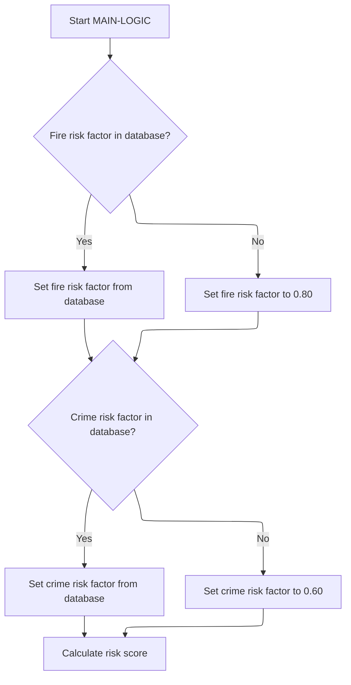
```mermaid
%%{init: {"flowchart": {"defaultRenderer": "elk"}} }%%
flowchart TD
    node1["Start MAIN-LOGIC"] --> node2{"Fire risk factor in database?"}
    click node1 openCode "base/src/LGAPDB02.cbl:39:42"
    node2 -->|"Yes"| node3["Set fire risk factor from database"]
    click node2 openCode "base/src/LGAPDB02.cbl:44:55"
    node2 -->|"No"| node4["Set fire risk factor to 0.80"]
    click node3 openCode "base/src/LGAPDB02.cbl:46:49"
    click node4 openCode "base/src/LGAPDB02.cbl:54:55"
    node3 --> node5{"Crime risk factor in database?"}
    node4 --> node5
    node5 -->|"Yes"| node6["Set crime risk factor from database"]
    click node5 openCode "base/src/LGAPDB02.cbl:57:67"
    node5 -->|"No"| node7["Set crime risk factor to 0.60"]
    click node6 openCode "base/src/LGAPDB02.cbl:58:61"
    click node7 openCode "base/src/LGAPDB02.cbl:66:67"
    node6 --> node8["Calculate risk score"]
    node7 --> node8
    click node8 openCode "base/src/LGAPDB02.cbl:41:41"
classDef HeadingStyle fill:#777777,stroke:#333,stroke-width:2px;

%% Swimm:
%% %%{init: {"flowchart": {"defaultRenderer": "elk"}} }%%
%% flowchart TD
%%     node1["Start <SwmToken path="base/src/LGAPDB02.cbl" pos="39:1:3" line-data="       MAIN-LOGIC.">`MAIN-LOGIC`</SwmToken>"] --> node2{"Fire risk factor in database?"}
%%     click node1 openCode "<SwmPath>[base/src/LGAPDB02.cbl](base/src/LGAPDB02.cbl)</SwmPath>:39:42"
%%     node2 -->|"Yes"| node3["Set fire risk factor from database"]
%%     click node2 openCode "<SwmPath>[base/src/LGAPDB02.cbl](base/src/LGAPDB02.cbl)</SwmPath>:44:55"
%%     node2 -->|"No"| node4["Set fire risk factor to <SwmToken path="base/src/LGAPDB02.cbl" pos="54:3:5" line-data="               MOVE 0.80 TO WS-FIRE-FACTOR">`0.80`</SwmToken>"]
%%     click node3 openCode "<SwmPath>[base/src/LGAPDB02.cbl](base/src/LGAPDB02.cbl)</SwmPath>:46:49"
%%     click node4 openCode "<SwmPath>[base/src/LGAPDB02.cbl](base/src/LGAPDB02.cbl)</SwmPath>:54:55"
%%     node3 --> node5{"Crime risk factor in database?"}
%%     node4 --> node5
%%     node5 -->|"Yes"| node6["Set crime risk factor from database"]
%%     click node5 openCode "<SwmPath>[base/src/LGAPDB02.cbl](base/src/LGAPDB02.cbl)</SwmPath>:57:67"
%%     node5 -->|"No"| node7["Set crime risk factor to <SwmToken path="base/src/LGAPDB02.cbl" pos="66:3:5" line-data="               MOVE 0.60 TO WS-CRIME-FACTOR">`0.60`</SwmToken>"]
%%     click node6 openCode "<SwmPath>[base/src/LGAPDB02.cbl](base/src/LGAPDB02.cbl)</SwmPath>:58:61"
%%     click node7 openCode "<SwmPath>[base/src/LGAPDB02.cbl](base/src/LGAPDB02.cbl)</SwmPath>:66:67"
%%     node6 --> node8["Calculate risk score"]
%%     node7 --> node8
%%     click node8 openCode "<SwmPath>[base/src/LGAPDB02.cbl](base/src/LGAPDB02.cbl)</SwmPath>:41:41"
%% classDef HeadingStyle fill:#777777,stroke:#333,stroke-width:2px;
```

This section ensures that risk factors for fire and crime are available for risk score calculation, using database values when present and default values when missing.

| Category       | Rule Name                 | Description                                                                                                                                                                                                                                 |
| -------------- | ------------------------- | ------------------------------------------------------------------------------------------------------------------------------------------------------------------------------------------------------------------------------------------- |
| Business logic | Default fire risk factor  | If the fire risk factor is not found in the database, the system must use a default value of <SwmToken path="base/src/LGAPDB02.cbl" pos="54:3:5" line-data="               MOVE 0.80 TO WS-FIRE-FACTOR">`0.80`</SwmToken> for fire risk.    |
| Business logic | Default crime risk factor | If the crime risk factor is not found in the database, the system must use a default value of <SwmToken path="base/src/LGAPDB02.cbl" pos="66:3:5" line-data="               MOVE 0.60 TO WS-CRIME-FACTOR">`0.60`</SwmToken> for crime risk. |
| Business logic | Risk score calculation    | The risk score for a property must be calculated using the fire and crime risk factors, along with relevant property and customer data.                                                                                                     |

<SwmSnippet path="/base/src/LGAPDB02.cbl" line="39">

---

<SwmToken path="base/src/LGAPDB02.cbl" pos="39:1:3" line-data="       MAIN-LOGIC.">`MAIN-LOGIC`</SwmToken> in <SwmPath>[base/src/LGAPDB02.cbl](base/src/LGAPDB02.cbl)</SwmPath> fetches fire and crime risk factors from the database (or uses defaults if missing), then calculates the property's risk score using those factors and property/customer data.

```cobol
       MAIN-LOGIC.
           PERFORM GET-RISK-FACTORS
           PERFORM CALCULATE-RISK-SCORE
           GOBACK.
```

---

</SwmSnippet>

<SwmSnippet path="/base/src/LGAPDB02.cbl" line="44">

---

<SwmToken path="base/src/LGAPDB02.cbl" pos="44:1:5" line-data="       GET-RISK-FACTORS.">`GET-RISK-FACTORS`</SwmToken> pulls fire and crime risk factors from the DB, but if they're missing, it uses hardcoded defaults (<SwmToken path="base/src/LGAPDB02.cbl" pos="54:3:5" line-data="               MOVE 0.80 TO WS-FIRE-FACTOR">`0.80`</SwmToken> for fire, <SwmToken path="base/src/LGAPDB02.cbl" pos="66:3:5" line-data="               MOVE 0.60 TO WS-CRIME-FACTOR">`0.60`</SwmToken> for crime). This fallback keeps the flow running even if the DB isn't complete.

```cobol
       GET-RISK-FACTORS.
           EXEC SQL
               SELECT FACTOR_VALUE INTO :WS-FIRE-FACTOR
               FROM RISK_FACTORS
               WHERE PERIL_TYPE = 'FIRE'
           END-EXEC.
           
           IF SQLCODE = 0
               CONTINUE
           ELSE
               MOVE 0.80 TO WS-FIRE-FACTOR
           END-IF.
           
           EXEC SQL
               SELECT FACTOR_VALUE INTO :WS-CRIME-FACTOR
               FROM RISK_FACTORS
               WHERE PERIL_TYPE = 'CRIME'
           END-EXEC.
           
           IF SQLCODE = 0
               CONTINUE
           ELSE
               MOVE 0.60 TO WS-CRIME-FACTOR
           END-IF.
```

---

</SwmSnippet>

### Scoring Risk Based on Property and Coverage

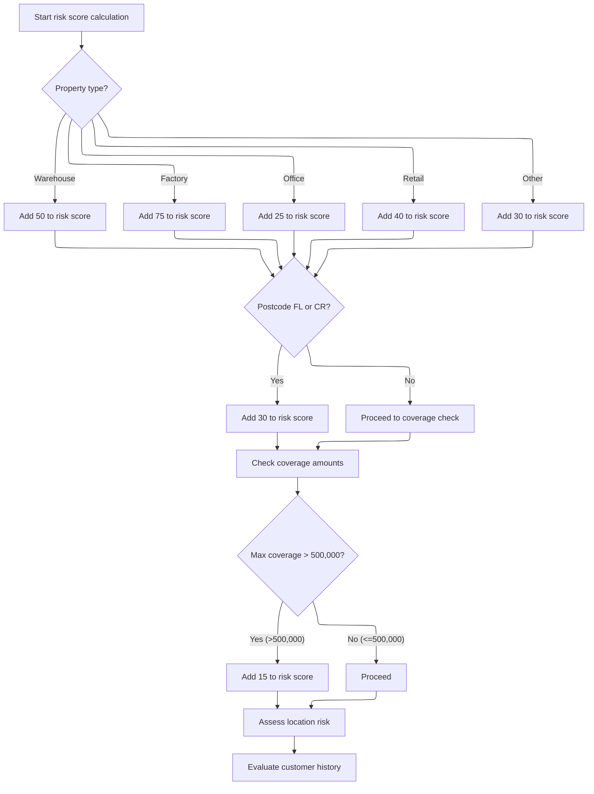
```mermaid
%%{init: {"flowchart": {"defaultRenderer": "elk"}} }%%
flowchart TD
    node1["Start risk score calculation"]
    click node1 openCode "base/src/LGAPDB02.cbl:69:70"
    node1 --> node2{"Property type?"}
    click node2 openCode "base/src/LGAPDB02.cbl:72:83"
    node2 -->|"Warehouse"| node3["Add 50 to risk score"]
    click node3 openCode "base/src/LGAPDB02.cbl:74:74"
    node2 -->|"Factory"| node4["Add 75 to risk score"]
    click node4 openCode "base/src/LGAPDB02.cbl:76:76"
    node2 -->|"Office"| node5["Add 25 to risk score"]
    click node5 openCode "base/src/LGAPDB02.cbl:78:78"
    node2 -->|"Retail"| node6["Add 40 to risk score"]
    click node6 openCode "base/src/LGAPDB02.cbl:80:80"
    node2 -->|"Other"| node7["Add 30 to risk score"]
    click node7 openCode "base/src/LGAPDB02.cbl:82:82"
    node3 --> node8{"Postcode FL or CR?"}
    node4 --> node8
    node5 --> node8
    node6 --> node8
    node7 --> node8
    click node8 openCode "base/src/LGAPDB02.cbl:85:88"
    node8 -->|"Yes"| node9["Add 30 to risk score"]
    click node9 openCode "base/src/LGAPDB02.cbl:87:87"
    node8 -->|"No"| node10["Proceed to coverage check"]
    node9 --> node11["Check coverage amounts"]
    node10 --> node11
    click node11 openCode "base/src/LGAPDB02.cbl:94:115"
    node11 --> node12{"Max coverage > 500,000?"}
    click node12 openCode "base/src/LGAPDB02.cbl:113:115"
    node12 -->|"Yes (>500,000)"| node13["Add 15 to risk score"]
    click node13 openCode "base/src/LGAPDB02.cbl:114:114"
    node12 -->|"No (<=500,000)"| node14["Proceed"]
    node13 --> node15["Assess location risk"]
    node14 --> node15
    click node15 openCode "base/src/LGAPDB02.cbl:91:91"
    node15 --> node16["Evaluate customer history"]
    click node16 openCode "base/src/LGAPDB02.cbl:92:92"

classDef HeadingStyle fill:#777777,stroke:#333,stroke-width:2px;

%% Swimm:
%% %%{init: {"flowchart": {"defaultRenderer": "elk"}} }%%
%% flowchart TD
%%     node1["Start risk score calculation"]
%%     click node1 openCode "<SwmPath>[base/src/LGAPDB02.cbl](base/src/LGAPDB02.cbl)</SwmPath>:69:70"
%%     node1 --> node2{"Property type?"}
%%     click node2 openCode "<SwmPath>[base/src/LGAPDB02.cbl](base/src/LGAPDB02.cbl)</SwmPath>:72:83"
%%     node2 -->|"Warehouse"| node3["Add 50 to risk score"]
%%     click node3 openCode "<SwmPath>[base/src/LGAPDB02.cbl](base/src/LGAPDB02.cbl)</SwmPath>:74:74"
%%     node2 -->|"Factory"| node4["Add 75 to risk score"]
%%     click node4 openCode "<SwmPath>[base/src/LGAPDB02.cbl](base/src/LGAPDB02.cbl)</SwmPath>:76:76"
%%     node2 -->|"Office"| node5["Add 25 to risk score"]
%%     click node5 openCode "<SwmPath>[base/src/LGAPDB02.cbl](base/src/LGAPDB02.cbl)</SwmPath>:78:78"
%%     node2 -->|"Retail"| node6["Add 40 to risk score"]
%%     click node6 openCode "<SwmPath>[base/src/LGAPDB02.cbl](base/src/LGAPDB02.cbl)</SwmPath>:80:80"
%%     node2 -->|"Other"| node7["Add 30 to risk score"]
%%     click node7 openCode "<SwmPath>[base/src/LGAPDB02.cbl](base/src/LGAPDB02.cbl)</SwmPath>:82:82"
%%     node3 --> node8{"Postcode FL or CR?"}
%%     node4 --> node8
%%     node5 --> node8
%%     node6 --> node8
%%     node7 --> node8
%%     click node8 openCode "<SwmPath>[base/src/LGAPDB02.cbl](base/src/LGAPDB02.cbl)</SwmPath>:85:88"
%%     node8 -->|"Yes"| node9["Add 30 to risk score"]
%%     click node9 openCode "<SwmPath>[base/src/LGAPDB02.cbl](base/src/LGAPDB02.cbl)</SwmPath>:87:87"
%%     node8 -->|"No"| node10["Proceed to coverage check"]
%%     node9 --> node11["Check coverage amounts"]
%%     node10 --> node11
%%     click node11 openCode "<SwmPath>[base/src/LGAPDB02.cbl](base/src/LGAPDB02.cbl)</SwmPath>:94:115"
%%     node11 --> node12{"Max coverage > 500,000?"}
%%     click node12 openCode "<SwmPath>[base/src/LGAPDB02.cbl](base/src/LGAPDB02.cbl)</SwmPath>:113:115"
%%     node12 -->|"Yes (>500,000)"| node13["Add 15 to risk score"]
%%     click node13 openCode "<SwmPath>[base/src/LGAPDB02.cbl](base/src/LGAPDB02.cbl)</SwmPath>:114:114"
%%     node12 -->|"No (<=500,000)"| node14["Proceed"]
%%     node13 --> node15["Assess location risk"]
%%     node14 --> node15
%%     click node15 openCode "<SwmPath>[base/src/LGAPDB02.cbl](base/src/LGAPDB02.cbl)</SwmPath>:91:91"
%%     node15 --> node16["Evaluate customer history"]
%%     click node16 openCode "<SwmPath>[base/src/LGAPDB02.cbl](base/src/LGAPDB02.cbl)</SwmPath>:92:92"
%% 
%% classDef HeadingStyle fill:#777777,stroke:#333,stroke-width:2px;
```

This section determines the risk score for a property insurance application by applying business rules to property type, postcode, and coverage amounts. The score is used to assess the risk level for underwriting and pricing decisions.

| Category       | Rule Name                     | Description                                                                                                    |
| -------------- | ----------------------------- | -------------------------------------------------------------------------------------------------------------- |
| Business logic | Base risk score               | The risk score calculation starts with a base value of 100 for every property application.                     |
| Business logic | Warehouse property risk       | Add 50 to the risk score if the property type is 'Warehouse'.                                                  |
| Business logic | Factory property risk         | Add 75 to the risk score if the property type is 'Factory'.                                                    |
| Business logic | Office property risk          | Add 25 to the risk score if the property type is 'Office'.                                                     |
| Business logic | Retail property risk          | Add 40 to the risk score if the property type is 'Retail'.                                                     |
| Business logic | Other property risk           | Add 30 to the risk score if the property type is not Warehouse, Factory, Office, or Retail.                    |
| Business logic | High-risk postcode adjustment | Add 30 to the risk score if the property's postcode starts with 'FL' or 'CR'.                                  |
| Business logic | High coverage risk            | Add 15 to the risk score if the highest coverage amount among fire, crime, flood, or weather exceeds $500,000. |

<SwmSnippet path="/base/src/LGAPDB02.cbl" line="69">

---

<SwmToken path="base/src/LGAPDB02.cbl" pos="69:1:5" line-data="       CALCULATE-RISK-SCORE.">`CALCULATE-RISK-SCORE`</SwmToken> starts with a base score, bumps it up based on property type and postcode, then calls out to check coverage amounts, location risk, and customer history. The weights and thresholds are all hardcoded, so the scoring is tightly bound to business rules.

```cobol
       CALCULATE-RISK-SCORE.
           MOVE 100 TO LK-RISK-SCORE

           EVALUATE LK-PROPERTY-TYPE
             WHEN 'WAREHOUSE'
               ADD 50 TO LK-RISK-SCORE
             WHEN 'FACTORY' 
               ADD 75 TO LK-RISK-SCORE
             WHEN 'OFFICE'
               ADD 25 TO LK-RISK-SCORE
             WHEN 'RETAIL'
               ADD 40 TO LK-RISK-SCORE
             WHEN OTHER
               ADD 30 TO LK-RISK-SCORE
           END-EVALUATE

           IF LK-POSTCODE(1:2) = 'FL' OR
              LK-POSTCODE(1:2) = 'CR'
             ADD 30 TO LK-RISK-SCORE
           END-IF

           PERFORM CHECK-COVERAGE-AMOUNTS
           PERFORM ASSESS-LOCATION-RISK  
           PERFORM EVALUATE-CUSTOMER-HISTORY.
```

---

</SwmSnippet>

<SwmSnippet path="/base/src/LGAPDB02.cbl" line="94">

---

<SwmToken path="base/src/LGAPDB02.cbl" pos="94:1:5" line-data="       CHECK-COVERAGE-AMOUNTS.">`CHECK-COVERAGE-AMOUNTS`</SwmToken> finds the highest coverage among fire, crime, flood, and weather, and if it's over $500K, adds 15 to the risk score. This is a hardcoded threshold for high-value properties.

```cobol
       CHECK-COVERAGE-AMOUNTS.
           MOVE ZERO TO WS-MAX-COVERAGE
           
           IF LK-FIRE-COVERAGE > WS-MAX-COVERAGE
               MOVE LK-FIRE-COVERAGE TO WS-MAX-COVERAGE
           END-IF
           
           IF LK-CRIME-COVERAGE > WS-MAX-COVERAGE
               MOVE LK-CRIME-COVERAGE TO WS-MAX-COVERAGE
           END-IF
           
           IF LK-FLOOD-COVERAGE > WS-MAX-COVERAGE
               MOVE LK-FLOOD-COVERAGE TO WS-MAX-COVERAGE
           END-IF
           
           IF LK-WEATHER-COVERAGE > WS-MAX-COVERAGE
               MOVE LK-WEATHER-COVERAGE TO WS-MAX-COVERAGE
           END-IF
           
           IF WS-MAX-COVERAGE > WS-COVERAGE-500K
               ADD 15 TO LK-RISK-SCORE
           END-IF.
```

---

</SwmSnippet>

### Calculating Basic Premiums

This section calculates the basic insurance premiums for a property policy, establishing the initial premium amounts for each covered peril before any advanced actuarial adjustments or loadings are applied.

| Category        | Rule Name                          | Description                                                                                                                                                                                                                                              |
| --------------- | ---------------------------------- | -------------------------------------------------------------------------------------------------------------------------------------------------------------------------------------------------------------------------------------------------------- |
| Data validation | Discount factor initialization     | The discount factor must be initialized to <SwmToken path="base/src/LGAPDB03.cbl" pos="93:3:5" line-data="           MOVE 1.00 TO LK-DISC-FACT">`1.00`</SwmToken> and only adjusted by subsequent actuarial logic, not during basic premium calculation. |
| Business logic  | Peril-specific premium calculation | The basic premium for each peril (fire, crime, flood, weather) must be calculated using the provided risk score and peril values, ensuring that each peril is assessed independently.                                                                    |
| Business logic  | Total premium aggregation          | The total basic premium must be the sum of the individual peril premiums (fire, crime, flood, weather) before any discounts or loadings are applied.                                                                                                     |
| Business logic  | Underwriting status assignment     | The underwriting status must be set to 'approved' (value 0) unless the risk score or peril values indicate a rejection or referral condition.                                                                                                            |

<SwmSnippet path="/base/src/LGAPDB01.cbl" line="275">

---

<SwmToken path="base/src/LGAPDB01.cbl" pos="275:1:7" line-data="       P011B-BASIC-PREMIUM-CALC.">`P011B-BASIC-PREMIUM-CALC`</SwmToken> calls <SwmToken path="base/src/LGAPDB01.cbl" pos="276:4:4" line-data="           CALL &#39;LGAPDB03&#39; USING WS-BASE-RISK-SCR, IN-FIRE-PERIL, ">`LGAPDB03`</SwmToken> to calculate the basic insurance premiums using the risk score and peril values. This sets up the initial premium before any advanced actuarial logic is applied.

```cobol
       P011B-BASIC-PREMIUM-CALC.
           CALL 'LGAPDB03' USING WS-BASE-RISK-SCR, IN-FIRE-PERIL, 
                                IN-CRIME-PERIL, IN-FLOOD-PERIL, 
                                IN-WEATHER-PERIL, WS-STAT,
                                WS-STAT-DESC, WS-REJ-RSN, WS-FR-PREM,
                                WS-CR-PREM, WS-FL-PREM, WS-WE-PREM,
                                WS-TOT-PREM, WS-DISC-FACT.
```

---

</SwmSnippet>

### Calculating Premiums and Underwriting Verdict

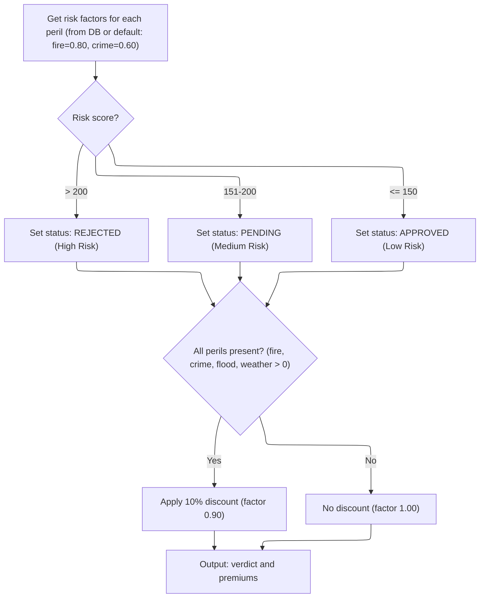
```mermaid
%%{init: {"flowchart": {"defaultRenderer": "elk"}} }%%
flowchart TD
    node1["Get risk factors for each peril (from DB or default: fire=0.80, crime=0.60)"] --> node2{"Risk score?"}
    click node1 openCode "base/src/LGAPDB03.cbl:48:71"
    node2 -->|"#gt; 200"| node3["Set status: REJECTED (High Risk)"]
    click node2 openCode "base/src/LGAPDB03.cbl:74:90"
    node2 -->|"151-200"| node4["Set status: PENDING (Medium Risk)"]
    node2 -->|"#lt;= 150"| node5["Set status: APPROVED (Low Risk)"]
    node3 --> node6{"All perils present? (fire, crime, flood, weather > 0)"}
    node4 --> node6
    node5 --> node6
    click node3 openCode "base/src/LGAPDB03.cbl:74:79"
    click node4 openCode "base/src/LGAPDB03.cbl:80:85"
    click node5 openCode "base/src/LGAPDB03.cbl:86:89"
    node6 -->|"Yes"| node7["Apply 10% discount (factor 0.90)"]
    node6 -->|"No"| node8["No discount (factor 1.00)"]
    click node6 openCode "base/src/LGAPDB03.cbl:95:100"
    node7 --> node9["Calculate premiums for each peril and total"]
    node8 --> node9
    click node7 openCode "base/src/LGAPDB03.cbl:99:100"
    click node8 openCode "base/src/LGAPDB03.cbl:93:94"
    click node9 openCode "base/src/LGAPDB03.cbl:102:120"
    node9["Output: verdict and premiums"]
classDef HeadingStyle fill:#777777,stroke:#333,stroke-width:2px;

%% Swimm:
%% %%{init: {"flowchart": {"defaultRenderer": "elk"}} }%%
%% flowchart TD
%%     node1["Get risk factors for each peril (from DB or default: fire=<SwmToken path="base/src/LGAPDB02.cbl" pos="54:3:5" line-data="               MOVE 0.80 TO WS-FIRE-FACTOR">`0.80`</SwmToken>, crime=<SwmToken path="base/src/LGAPDB02.cbl" pos="66:3:5" line-data="               MOVE 0.60 TO WS-CRIME-FACTOR">`0.60`</SwmToken>)"] --> node2{"Risk score?"}
%%     click node1 openCode "<SwmPath>[base/src/LGAPDB03.cbl](base/src/LGAPDB03.cbl)</SwmPath>:48:71"
%%     node2 -->|"#gt; 200"| node3["Set status: REJECTED (High Risk)"]
%%     click node2 openCode "<SwmPath>[base/src/LGAPDB03.cbl](base/src/LGAPDB03.cbl)</SwmPath>:74:90"
%%     node2 -->|"151-200"| node4["Set status: PENDING (Medium Risk)"]
%%     node2 -->|"#lt;= 150"| node5["Set status: APPROVED (Low Risk)"]
%%     node3 --> node6{"All perils present? (fire, crime, flood, weather > 0)"}
%%     node4 --> node6
%%     node5 --> node6
%%     click node3 openCode "<SwmPath>[base/src/LGAPDB03.cbl](base/src/LGAPDB03.cbl)</SwmPath>:74:79"
%%     click node4 openCode "<SwmPath>[base/src/LGAPDB03.cbl](base/src/LGAPDB03.cbl)</SwmPath>:80:85"
%%     click node5 openCode "<SwmPath>[base/src/LGAPDB03.cbl](base/src/LGAPDB03.cbl)</SwmPath>:86:89"
%%     node6 -->|"Yes"| node7["Apply 10% discount (factor <SwmToken path="base/src/LGAPDB03.cbl" pos="99:3:5" line-data="             MOVE 0.90 TO LK-DISC-FACT">`0.90`</SwmToken>)"]
%%     node6 -->|"No"| node8["No discount (factor <SwmToken path="base/src/LGAPDB03.cbl" pos="93:3:5" line-data="           MOVE 1.00 TO LK-DISC-FACT">`1.00`</SwmToken>)"]
%%     click node6 openCode "<SwmPath>[base/src/LGAPDB03.cbl](base/src/LGAPDB03.cbl)</SwmPath>:95:100"
%%     node7 --> node9["Calculate premiums for each peril and total"]
%%     node8 --> node9
%%     click node7 openCode "<SwmPath>[base/src/LGAPDB03.cbl](base/src/LGAPDB03.cbl)</SwmPath>:99:100"
%%     click node8 openCode "<SwmPath>[base/src/LGAPDB03.cbl](base/src/LGAPDB03.cbl)</SwmPath>:93:94"
%%     click node9 openCode "<SwmPath>[base/src/LGAPDB03.cbl](base/src/LGAPDB03.cbl)</SwmPath>:102:120"
%%     node9["Output: verdict and premiums"]
%% classDef HeadingStyle fill:#777777,stroke:#333,stroke-width:2px;
```

This section determines the insurance policy's status and pricing by evaluating risk factors, assigning an underwriting verdict, and calculating premiums for each peril. It ensures consistent application of business rules for risk assessment and premium calculation.

| Category       | Rule Name                     | Description                                                                                                                                                                                                                                                                                                                                                                                                                        |
| -------------- | ----------------------------- | ---------------------------------------------------------------------------------------------------------------------------------------------------------------------------------------------------------------------------------------------------------------------------------------------------------------------------------------------------------------------------------------------------------------------------------- |
| Business logic | High risk rejection threshold | If the risk score is above 200, the policy status is set to REJECTED and flagged for manual review due to high risk.                                                                                                                                                                                                                                                                                                               |
| Business logic | Medium risk pending threshold | If the risk score is between 151 and 200, the policy status is set to PENDING and flagged for further review due to medium risk.                                                                                                                                                                                                                                                                                                   |
| Business logic | Low risk approval threshold   | If the risk score is 150 or below, the policy status is set to APPROVED.                                                                                                                                                                                                                                                                                                                                                           |
| Business logic | All perils discount           | If all perils (fire, crime, flood, weather) are present (each peril value > 0), apply a 10% discount to the premium (discount factor <SwmToken path="base/src/LGAPDB03.cbl" pos="99:3:5" line-data="             MOVE 0.90 TO LK-DISC-FACT">`0.90`</SwmToken>). Otherwise, no discount is applied (factor <SwmToken path="base/src/LGAPDB03.cbl" pos="93:3:5" line-data="           MOVE 1.00 TO LK-DISC-FACT">`1.00`</SwmToken>). |

<SwmSnippet path="/base/src/LGAPDB03.cbl" line="42">

---

<SwmToken path="base/src/LGAPDB03.cbl" pos="42:1:3" line-data="       MAIN-LOGIC.">`MAIN-LOGIC`</SwmToken> in <SwmPath>[base/src/LGAPDB03.cbl](base/src/LGAPDB03.cbl)</SwmPath> fetches risk factors, decides the underwriting verdict based on risk score, and calculates premiums for each peril. This sets up the policy's pricing and status.

```cobol
       MAIN-LOGIC.
           PERFORM GET-RISK-FACTORS
           PERFORM CALCULATE-VERDICT
           PERFORM CALCULATE-PREMIUMS
           GOBACK.
```

---

</SwmSnippet>

<SwmSnippet path="/base/src/LGAPDB03.cbl" line="48">

---

<SwmToken path="base/src/LGAPDB03.cbl" pos="48:1:5" line-data="       GET-RISK-FACTORS.">`GET-RISK-FACTORS`</SwmToken> pulls fire and crime risk factors from the DB, but if they're missing, it uses hardcoded defaults (<SwmToken path="base/src/LGAPDB03.cbl" pos="58:3:5" line-data="               MOVE 0.80 TO WS-FIRE-FACTOR">`0.80`</SwmToken> for fire, <SwmToken path="base/src/LGAPDB03.cbl" pos="70:3:5" line-data="               MOVE 0.60 TO WS-CRIME-FACTOR">`0.60`</SwmToken> for crime). This fallback keeps the premium calculation running.

```cobol
       GET-RISK-FACTORS.
           EXEC SQL
               SELECT FACTOR_VALUE INTO :WS-FIRE-FACTOR
               FROM RISK_FACTORS
               WHERE PERIL_TYPE = 'FIRE'
           END-EXEC.
           
           IF SQLCODE = 0
               CONTINUE
           ELSE
               MOVE 0.80 TO WS-FIRE-FACTOR
           END-IF.
           
           EXEC SQL
               SELECT FACTOR_VALUE INTO :WS-CRIME-FACTOR
               FROM RISK_FACTORS
               WHERE PERIL_TYPE = 'CRIME'
           END-EXEC.
           
           IF SQLCODE = 0
               CONTINUE
           ELSE
               MOVE 0.60 TO WS-CRIME-FACTOR
           END-IF.
```

---

</SwmSnippet>

<SwmSnippet path="/base/src/LGAPDB03.cbl" line="73">

---

<SwmToken path="base/src/LGAPDB03.cbl" pos="73:1:3" line-data="       CALCULATE-VERDICT.">`CALCULATE-VERDICT`</SwmToken> sets the policy status based on risk score: above 200 is rejected, 151-200 is pending, 150 or below is approved. These thresholds are hardcoded business rules.

```cobol
       CALCULATE-VERDICT.
           IF LK-RISK-SCORE > 200
             MOVE 2 TO LK-STAT
             MOVE 'REJECTED' TO LK-STAT-DESC
             MOVE 'High Risk Score - Manual Review Required' 
               TO LK-REJ-RSN
           ELSE
             IF LK-RISK-SCORE > 150
               MOVE 1 TO LK-STAT
               MOVE 'PENDING' TO LK-STAT-DESC
               MOVE 'Medium Risk - Pending Review'
                 TO LK-REJ-RSN
             ELSE
               MOVE 0 TO LK-STAT
               MOVE 'APPROVED' TO LK-STAT-DESC
               MOVE SPACES TO LK-REJ-RSN
             END-IF
           END-IF.
```

---

</SwmSnippet>

<SwmSnippet path="/base/src/LGAPDB03.cbl" line="92">

---

<SwmToken path="base/src/LGAPDB03.cbl" pos="92:1:3" line-data="       CALCULATE-PREMIUMS.">`CALCULATE-PREMIUMS`</SwmToken> sets a discount if all perils are present, then calculates each peril's premium using risk score and peril factors, and sums them for the total premium.

```cobol
       CALCULATE-PREMIUMS.
           MOVE 1.00 TO LK-DISC-FACT
           
           IF LK-FIRE-PERIL > 0 AND
              LK-CRIME-PERIL > 0 AND
              LK-FLOOD-PERIL > 0 AND
              LK-WEATHER-PERIL > 0
             MOVE 0.90 TO LK-DISC-FACT
           END-IF

           COMPUTE LK-FIRE-PREMIUM =
             ((LK-RISK-SCORE * WS-FIRE-FACTOR) * LK-FIRE-PERIL *
               LK-DISC-FACT)
           
           COMPUTE LK-CRIME-PREMIUM =
             ((LK-RISK-SCORE * WS-CRIME-FACTOR) * LK-CRIME-PERIL *
               LK-DISC-FACT)
           
           COMPUTE LK-FLOOD-PREMIUM =
             ((LK-RISK-SCORE * WS-FLOOD-FACTOR) * LK-FLOOD-PERIL *
               LK-DISC-FACT)
           
           COMPUTE LK-WEATHER-PREMIUM =
             ((LK-RISK-SCORE * WS-WEATHER-FACTOR) * LK-WEATHER-PERIL *
               LK-DISC-FACT)

           COMPUTE LK-TOTAL-PREMIUM = 
             LK-FIRE-PREMIUM + LK-CRIME-PREMIUM + 
             LK-FLOOD-PREMIUM + LK-WEATHER-PREMIUM. 
```

---

</SwmSnippet>

### Running Enhanced Actuarial Calculations


```mermaid
%%{init: {"flowchart": {"defaultRenderer": "elk"}} }%%
flowchart TD
    node1["Prepare input and coverage data"] --> node2{"Is total premium > $500?"}
    click node1 openCode "base/src/LGAPDB01.cbl:284:310"
    node2 -->|"Yes"| node3["Run advanced actuarial calculation (LGAPDB04)"]
    click node2 openCode "base/src/LGAPDB01.cbl:312:312"
    node2 -->|"No"| node6["No change to premium"]
    click node6 openCode "base/src/LGAPDB01.cbl:325:325"
    node3 --> node4{"Is enhanced premium > current premium?"}
    click node3 openCode "base/src/LGAPDB01.cbl:313:315"
    click node4 openCode "base/src/LGAPDB01.cbl:317:317"
    node4 -->|"Yes"| node5["Update premium, experience modifier, and components with enhanced values"]
    click node5 openCode "base/src/LGAPDB01.cbl:318:324"
    node4 -->|"No"| node6
    node5 --> node6
classDef HeadingStyle fill:#777777,stroke:#333,stroke-width:2px;

%% Swimm:
%% %%{init: {"flowchart": {"defaultRenderer": "elk"}} }%%
%% flowchart TD
%%     node1["Prepare input and coverage data"] --> node2{"Is total premium > $500?"}
%%     click node1 openCode "<SwmPath>[base/src/LGAPDB01.cbl](base/src/LGAPDB01.cbl)</SwmPath>:284:310"
%%     node2 -->|"Yes"| node3["Run advanced actuarial calculation (<SwmToken path="base/src/LGAPDB01.cbl" pos="313:4:4" line-data="               CALL &#39;LGAPDB04&#39; USING LK-INPUT-DATA, LK-COVERAGE-DATA, ">`LGAPDB04`</SwmToken>)"]
%%     click node2 openCode "<SwmPath>[base/src/LGAPDB01.cbl](base/src/LGAPDB01.cbl)</SwmPath>:312:312"
%%     node2 -->|"No"| node6["No change to premium"]
%%     click node6 openCode "<SwmPath>[base/src/LGAPDB01.cbl](base/src/LGAPDB01.cbl)</SwmPath>:325:325"
%%     node3 --> node4{"Is enhanced premium > current premium?"}
%%     click node3 openCode "<SwmPath>[base/src/LGAPDB01.cbl](base/src/LGAPDB01.cbl)</SwmPath>:313:315"
%%     click node4 openCode "<SwmPath>[base/src/LGAPDB01.cbl](base/src/LGAPDB01.cbl)</SwmPath>:317:317"
%%     node4 -->|"Yes"| node5["Update premium, experience modifier, and components with enhanced values"]
%%     click node5 openCode "<SwmPath>[base/src/LGAPDB01.cbl](base/src/LGAPDB01.cbl)</SwmPath>:318:324"
%%     node4 -->|"No"| node6
%%     node5 --> node6
%% classDef HeadingStyle fill:#777777,stroke:#333,stroke-width:2px;
```

This section determines whether advanced actuarial calculations should be performed for a policy, and updates premium and related values only if the enhanced calculation results in a higher premium.

| Category        | Rule Name                   | Description                                                                                                                                                                                     |
| --------------- | --------------------------- | ----------------------------------------------------------------------------------------------------------------------------------------------------------------------------------------------- |
| Data validation | Minimum premium threshold   | Advanced actuarial calculations are only performed if the total premium is greater than $500.                                                                                                   |
| Data validation | Complete data requirement   | Input and coverage data must be fully prepared and populated before any actuarial calculations are performed.                                                                                   |
| Business logic  | Enhanced premium update     | If the enhanced actuarial calculation produces a total premium greater than the current premium, the premium, experience modifier, and premium components are updated with the enhanced values. |
| Business logic  | No change for lower premium | If the enhanced actuarial calculation does not produce a higher premium, no changes are made to the premium or related values.                                                                  |

<SwmSnippet path="/base/src/LGAPDB01.cbl" line="283">

---

<SwmToken path="base/src/LGAPDB01.cbl" pos="283:1:7" line-data="       P011C-ENHANCED-ACTUARIAL-CALC.">`P011C-ENHANCED-ACTUARIAL-CALC`</SwmToken> sets up detailed input and coverage data, then calls <SwmToken path="base/src/LGAPDB01.cbl" pos="313:4:4" line-data="               CALL &#39;LGAPDB04&#39; USING LK-INPUT-DATA, LK-COVERAGE-DATA, ">`LGAPDB04`</SwmToken> for advanced premium calculations. If the enhanced premium is higher, it updates the results.

```cobol
       P011C-ENHANCED-ACTUARIAL-CALC.
      *    Prepare input structure for actuarial calculation
           MOVE IN-CUSTOMER-NUM TO LK-CUSTOMER-NUM
           MOVE WS-BASE-RISK-SCR TO LK-RISK-SCORE
           MOVE IN-PROPERTY-TYPE TO LK-PROPERTY-TYPE
           MOVE IN-TERRITORY-CODE TO LK-TERRITORY
           MOVE IN-CONSTRUCTION-TYPE TO LK-CONSTRUCTION-TYPE
           MOVE IN-OCCUPANCY-CODE TO LK-OCCUPANCY-CODE
           MOVE IN-SPRINKLER-IND TO LK-PROTECTION-CLASS
           MOVE IN-YEAR-BUILT TO LK-YEAR-BUILT
           MOVE IN-SQUARE-FOOTAGE TO LK-SQUARE-FOOTAGE
           MOVE IN-YEARS-IN-BUSINESS TO LK-YEARS-IN-BUSINESS
           MOVE IN-CLAIMS-COUNT-3YR TO LK-CLAIMS-COUNT-5YR
           MOVE IN-CLAIMS-AMOUNT-3YR TO LK-CLAIMS-AMOUNT-5YR
           
      *    Set coverage data
           MOVE IN-BUILDING-LIMIT TO LK-BUILDING-LIMIT
           MOVE IN-CONTENTS-LIMIT TO LK-CONTENTS-LIMIT
           MOVE IN-BI-LIMIT TO LK-BI-LIMIT
           MOVE IN-FIRE-DEDUCTIBLE TO LK-FIRE-DEDUCTIBLE
           MOVE IN-WIND-DEDUCTIBLE TO LK-WIND-DEDUCTIBLE
           MOVE IN-FLOOD-DEDUCTIBLE TO LK-FLOOD-DEDUCTIBLE
           MOVE IN-OTHER-DEDUCTIBLE TO LK-OTHER-DEDUCTIBLE
           MOVE IN-FIRE-PERIL TO LK-FIRE-PERIL
           MOVE IN-CRIME-PERIL TO LK-CRIME-PERIL
           MOVE IN-FLOOD-PERIL TO LK-FLOOD-PERIL
           MOVE IN-WEATHER-PERIL TO LK-WEATHER-PERIL
           
      *    Call advanced actuarial calculation program (only for approved cases)
           IF WS-TOT-PREM > WS-MIN-PREMIUM
               CALL 'LGAPDB04' USING LK-INPUT-DATA, LK-COVERAGE-DATA, 
                                    LK-OUTPUT-RESULTS
               
      *        Update with enhanced calculations if successful
               IF LK-TOTAL-PREMIUM > WS-TOT-PREM
                   MOVE LK-FIRE-PREMIUM TO WS-FR-PREM
                   MOVE LK-CRIME-PREMIUM TO WS-CR-PREM
                   MOVE LK-FLOOD-PREMIUM TO WS-FL-PREM
                   MOVE LK-WEATHER-PREMIUM TO WS-WE-PREM
                   MOVE LK-TOTAL-PREMIUM TO WS-TOT-PREM
                   MOVE LK-EXPERIENCE-MOD TO WS-EXPERIENCE-MOD
               END-IF
           END-IF.
```

---

</SwmSnippet>

### Advanced Premium Calculation and Finalization


```mermaid
%%{init: {"flowchart": {"defaultRenderer": "elk"}} }%%
flowchart TD
    node1["Initialize exposures and base values (risk score, limits)"] --> node2["Load base rates"]
    click node1 openCode "base/src/LGAPDB04.cbl:152:174"
    node2["Load base rates"] --> node3["Calculate exposures"]
    click node2 openCode "base/src/LGAPDB04.cbl:139:139"
    node3["Calculate exposures"] --> node4["Calculate experience modifier (years in business, claims history)"]
    click node3 openCode "base/src/LGAPDB04.cbl:140:140"
    node4["Calculate experience modifier (years in business, claims history)"] --> node5["Calculate schedule modifier (building year, protection class, occupancy, exposure density)"]
    click node4 openCode "base/src/LGAPDB04.cbl:234:258"
    node5["Calculate schedule modifier (building year, protection class, occupancy, exposure density)"] --> node6["Calculate base premium for each covered peril (fire, crime, flood, weather)"]
    click node5 openCode "base/src/LGAPDB04.cbl:260:316"
    node6["Calculate base premium for each covered peril (fire, crime, flood, weather)"] --> node7["Add catastrophe, expense, and profit loads"]
    click node6 openCode "base/src/LGAPDB04.cbl:318:367"
    node7["Add catastrophe, expense, and profit loads"] --> node8["Apply discounts"]
    click node7 openCode "base/src/LGAPDB04.cbl:145:147"
    node8["Apply discounts"] --> node9["Calculate taxes (6.75%)"]
    click node8 openCode "base/src/LGAPDB04.cbl:147:148"
    node9["Calculate taxes (6.75%)"] --> node10{"Is final rate factor > 0.05?"}
    click node9 openCode "base/src/LGAPDB04.cbl:456:462"
    node10 -->|"Yes"| node11["Limit rate factor to 0.05 and recalculate premium"]
    click node10 openCode "base/src/LGAPDB04.cbl:470:477"
    node10 -->|"No"| node12["Finalize premium"]
    click node12 openCode "base/src/LGAPDB04.cbl:464:477"
    node11 --> node12
    click node11 openCode "base/src/LGAPDB04.cbl:473:477"

classDef HeadingStyle fill:#777777,stroke:#333,stroke-width:2px;

%% Swimm:
%% %%{init: {"flowchart": {"defaultRenderer": "elk"}} }%%
%% flowchart TD
%%     node1["Initialize exposures and base values (risk score, limits)"] --> node2["Load base rates"]
%%     click node1 openCode "<SwmPath>[base/src/LGAPDB04.cbl](base/src/LGAPDB04.cbl)</SwmPath>:152:174"
%%     node2["Load base rates"] --> node3["Calculate exposures"]
%%     click node2 openCode "<SwmPath>[base/src/LGAPDB04.cbl](base/src/LGAPDB04.cbl)</SwmPath>:139:139"
%%     node3["Calculate exposures"] --> node4["Calculate experience modifier (years in business, claims history)"]
%%     click node3 openCode "<SwmPath>[base/src/LGAPDB04.cbl](base/src/LGAPDB04.cbl)</SwmPath>:140:140"
%%     node4["Calculate experience modifier (years in business, claims history)"] --> node5["Calculate schedule modifier (building year, protection class, occupancy, exposure density)"]
%%     click node4 openCode "<SwmPath>[base/src/LGAPDB04.cbl](base/src/LGAPDB04.cbl)</SwmPath>:234:258"
%%     node5["Calculate schedule modifier (building year, protection class, occupancy, exposure density)"] --> node6["Calculate base premium for each covered peril (fire, crime, flood, weather)"]
%%     click node5 openCode "<SwmPath>[base/src/LGAPDB04.cbl](base/src/LGAPDB04.cbl)</SwmPath>:260:316"
%%     node6["Calculate base premium for each covered peril (fire, crime, flood, weather)"] --> node7["Add catastrophe, expense, and profit loads"]
%%     click node6 openCode "<SwmPath>[base/src/LGAPDB04.cbl](base/src/LGAPDB04.cbl)</SwmPath>:318:367"
%%     node7["Add catastrophe, expense, and profit loads"] --> node8["Apply discounts"]
%%     click node7 openCode "<SwmPath>[base/src/LGAPDB04.cbl](base/src/LGAPDB04.cbl)</SwmPath>:145:147"
%%     node8["Apply discounts"] --> node9["Calculate taxes (6.75%)"]
%%     click node8 openCode "<SwmPath>[base/src/LGAPDB04.cbl](base/src/LGAPDB04.cbl)</SwmPath>:147:148"
%%     node9["Calculate taxes (6.75%)"] --> node10{"Is final rate factor > 0.05?"}
%%     click node9 openCode "<SwmPath>[base/src/LGAPDB04.cbl](base/src/LGAPDB04.cbl)</SwmPath>:456:462"
%%     node10 -->|"Yes"| node11["Limit rate factor to 0.05 and recalculate premium"]
%%     click node10 openCode "<SwmPath>[base/src/LGAPDB04.cbl](base/src/LGAPDB04.cbl)</SwmPath>:470:477"
%%     node10 -->|"No"| node12["Finalize premium"]
%%     click node12 openCode "<SwmPath>[base/src/LGAPDB04.cbl](base/src/LGAPDB04.cbl)</SwmPath>:464:477"
%%     node11 --> node12
%%     click node11 openCode "<SwmPath>[base/src/LGAPDB04.cbl](base/src/LGAPDB04.cbl)</SwmPath>:473:477"
%% 
%% classDef HeadingStyle fill:#777777,stroke:#333,stroke-width:2px;
```

This section calculates the advanced insurance premium for a commercial property policy, applying actuarial modifiers, peril-specific rules, and regulatory caps to ensure a fair and compliant final premium.

| Category        | Rule Name                 | Description                                                                                                                                                                                                                                                                                                                                                                                                                                                                  |
| --------------- | ------------------------- | ---------------------------------------------------------------------------------------------------------------------------------------------------------------------------------------------------------------------------------------------------------------------------------------------------------------------------------------------------------------------------------------------------------------------------------------------------------------------------- |
| Data validation | Rate Factor Cap           | The final rate factor is calculated as total premium divided by total insured value. If the rate factor exceeds 0.05, it is capped at 0.05 and the premium is recalculated.                                                                                                                                                                                                                                                                                                  |
| Business logic  | Experience Modifier       | The experience modifier is set based on years in business and claims history. If the insured has 5+ years in business and no claims in 5 years, the modifier is 0.85. If there are claims, the modifier increases with claims amount but is capped at 2.00 and floored at <SwmToken path="base/src/LGAPDB04.cbl" pos="244:9:11" line-data="                        WS-CREDIBILITY-FACTOR * 0.50)">`0.50`</SwmToken>. If less than 5 years in business, the modifier is 1.10. |
| Business logic  | Schedule Modifier         | The schedule modifier adjusts for building age, protection class, occupancy code, and exposure density. Each factor uses specific constants, and the total modifier is capped at +<SwmToken path="base/src/LGAPDB04.cbl" pos="308:12:14" line-data="           IF WS-SCHEDULE-MOD &gt; +0.400">`0.400`</SwmToken> and floored at <SwmToken path="base/src/LGAPDB04.cbl" pos="312:11:14" line-data="           IF WS-SCHEDULE-MOD &lt; -0.200">`-0.200`</SwmToken>.           |
| Business logic  | Peril Premium Calculation | Premiums for fire, crime, flood, and weather perils are calculated separately. Crime exposure is multiplied by <SwmToken path="base/src/LGAPDB02.cbl" pos="54:3:5" line-data="               MOVE 0.80 TO WS-FIRE-FACTOR">`0.80`</SwmToken>, and flood premium is multiplied by <SwmToken path="base/src/LGAPDB04.cbl" pos="352:9:11" line-data="                   WS-TREND-FACTOR * 1.25">`1.25`</SwmToken> as business rules.                                             |
| Business logic  | Premium Tax Calculation   | The tax amount is calculated by summing all premium components, subtracting discounts, and multiplying by a fixed tax rate of 6.75%.                                                                                                                                                                                                                                                                                                                                         |

<SwmSnippet path="/base/src/LGAPDB04.cbl" line="138">

---

<SwmToken path="base/src/LGAPDB04.cbl" pos="138:1:3" line-data="       P100-MAIN.">`P100-MAIN`</SwmToken> in <SwmPath>[base/src/LGAPDB04.cbl](base/src/LGAPDB04.cbl)</SwmPath> runs all the advanced actuarial steps: exposures, modifiers, base premium, catastrophe load, expense/profit, discounts, taxes, and final premium/rate factor. Each step builds on the previous to get the final premium.

```cobol
       P100-MAIN.
           PERFORM P200-INIT
           PERFORM P300-RATES
           PERFORM P350-EXPOSURE
           PERFORM P400-EXP-MOD
           PERFORM P500-SCHED-MOD
           PERFORM P600-BASE-PREM
           PERFORM P700-CAT-LOAD
           PERFORM P800-EXPENSE
           PERFORM P900-DISC
           PERFORM P950-TAXES
           PERFORM P999-FINAL
           GOBACK.
```

---

</SwmSnippet>

<SwmSnippet path="/base/src/LGAPDB04.cbl" line="152">

---

<SwmToken path="base/src/LGAPDB04.cbl" pos="152:1:3" line-data="       P200-INIT.">`P200-INIT`</SwmToken> calculates exposures for building, contents, and BI using risk score, sums them for total insured value, and divides by square footage for exposure density (or uses <SwmToken path="base/src/LGAPDB04.cbl" pos="173:3:5" line-data="               MOVE 100.00 TO WS-EXPOSURE-DENSITY">`100.00`</SwmToken> if missing).

```cobol
       P200-INIT.
           INITIALIZE WS-CALCULATION-AREAS
           INITIALIZE WS-BASE-RATE-TABLE
           
           COMPUTE WS-BUILDING-EXPOSURE = 
               LK-BUILDING-LIMIT * (1 + (LK-RISK-SCORE - 100) / 1000)
               
           COMPUTE WS-CONTENTS-EXPOSURE = 
               LK-CONTENTS-LIMIT * (1 + (LK-RISK-SCORE - 100) / 1000)
               
           COMPUTE WS-BI-EXPOSURE = 
               LK-BI-LIMIT * (1 + (LK-RISK-SCORE - 100) / 1000)
               
           COMPUTE WS-TOTAL-INSURED-VAL = 
               WS-BUILDING-EXPOSURE + WS-CONTENTS-EXPOSURE + 
               WS-BI-EXPOSURE
               
           IF LK-SQUARE-FOOTAGE > ZERO
               COMPUTE WS-EXPOSURE-DENSITY = 
                   WS-TOTAL-INSURED-VAL / LK-SQUARE-FOOTAGE
           ELSE
               MOVE 100.00 TO WS-EXPOSURE-DENSITY
           END-IF.
```

---

</SwmSnippet>

<SwmSnippet path="/base/src/LGAPDB04.cbl" line="234">

---

<SwmToken path="base/src/LGAPDB04.cbl" pos="234:1:5" line-data="       P400-EXP-MOD.">`P400-EXP-MOD`</SwmToken> sets the experience modifier based on years in business and claims history, using hardcoded constants to reward claims-free records and cap penalties for high claims.

```cobol
       P400-EXP-MOD.
           MOVE 1.0000 TO WS-EXPERIENCE-MOD
           
           IF LK-YEARS-IN-BUSINESS >= 5
               IF LK-CLAIMS-COUNT-5YR = ZERO
                   MOVE 0.8500 TO WS-EXPERIENCE-MOD
               ELSE
                   COMPUTE WS-EXPERIENCE-MOD = 
                       1.0000 + 
                       ((LK-CLAIMS-AMOUNT-5YR / WS-TOTAL-INSURED-VAL) * 
                        WS-CREDIBILITY-FACTOR * 0.50)
                   
                   IF WS-EXPERIENCE-MOD > 2.0000
                       MOVE 2.0000 TO WS-EXPERIENCE-MOD
                   END-IF
                   
                   IF WS-EXPERIENCE-MOD < 0.5000
                       MOVE 0.5000 TO WS-EXPERIENCE-MOD
                   END-IF
               END-IF
           ELSE
               MOVE 1.1000 TO WS-EXPERIENCE-MOD
           END-IF
           
           MOVE WS-EXPERIENCE-MOD TO LK-EXPERIENCE-MOD.
```

---

</SwmSnippet>

<SwmSnippet path="/base/src/LGAPDB04.cbl" line="260">

---

<SwmToken path="base/src/LGAPDB04.cbl" pos="260:1:5" line-data="       P500-SCHED-MOD.">`P500-SCHED-MOD`</SwmToken> calculates the schedule modifier by adjusting for building age, protection class, occupancy code, and exposure density, using hardcoded constants and capping the result.

```cobol
       P500-SCHED-MOD.
           MOVE +0.000 TO WS-SCHEDULE-MOD
           
      *    Building age factor
           EVALUATE TRUE
               WHEN LK-YEAR-BUILT >= 2010
                   SUBTRACT 0.050 FROM WS-SCHEDULE-MOD
               WHEN LK-YEAR-BUILT >= 1990
                   CONTINUE
               WHEN LK-YEAR-BUILT >= 1970
                   ADD 0.100 TO WS-SCHEDULE-MOD
               WHEN OTHER
                   ADD 0.200 TO WS-SCHEDULE-MOD
           END-EVALUATE
           
      *    Protection class factor
           EVALUATE LK-PROTECTION-CLASS
               WHEN '01' THRU '03'
                   SUBTRACT 0.100 FROM WS-SCHEDULE-MOD
               WHEN '04' THRU '06'
                   SUBTRACT 0.050 FROM WS-SCHEDULE-MOD
               WHEN '07' THRU '09'
                   CONTINUE
               WHEN OTHER
                   ADD 0.150 TO WS-SCHEDULE-MOD
           END-EVALUATE
           
      *    Occupancy hazard factor
           EVALUATE LK-OCCUPANCY-CODE
               WHEN 'OFF01' THRU 'OFF05'
                   SUBTRACT 0.025 FROM WS-SCHEDULE-MOD
               WHEN 'MFG01' THRU 'MFG10'
                   ADD 0.075 TO WS-SCHEDULE-MOD
               WHEN 'WHS01' THRU 'WHS05'
                   ADD 0.125 TO WS-SCHEDULE-MOD
               WHEN OTHER
                   CONTINUE
           END-EVALUATE
           
      *    Exposure density factor
           IF WS-EXPOSURE-DENSITY > 500.00
               ADD 0.100 TO WS-SCHEDULE-MOD
           ELSE
               IF WS-EXPOSURE-DENSITY < 50.00
                   SUBTRACT 0.050 FROM WS-SCHEDULE-MOD
               END-IF
           END-IF
           
           IF WS-SCHEDULE-MOD > +0.400
               MOVE +0.400 TO WS-SCHEDULE-MOD
           END-IF
           
           IF WS-SCHEDULE-MOD < -0.200
               MOVE -0.200 TO WS-SCHEDULE-MOD
           END-IF
           
           MOVE WS-SCHEDULE-MOD TO LK-SCHEDULE-MOD.
```

---

</SwmSnippet>

<SwmSnippet path="/base/src/LGAPDB04.cbl" line="318">

---

<SwmToken path="base/src/LGAPDB04.cbl" pos="318:1:5" line-data="       P600-BASE-PREM.">`P600-BASE-PREM`</SwmToken> calculates premiums for fire, crime, flood, and weather perils, using exposures, rate tables, modifiers, and trend factors. Crime and flood get extra multipliers (<SwmToken path="base/src/LGAPDB04.cbl" pos="336:10:12" line-data="                   (WS-CONTENTS-EXPOSURE * 0.80) *">`0.80`</SwmToken>, <SwmToken path="base/src/LGAPDB04.cbl" pos="352:9:11" line-data="                   WS-TREND-FACTOR * 1.25">`1.25`</SwmToken>) as business rules.

```cobol
       P600-BASE-PREM.
           MOVE ZERO TO LK-BASE-AMOUNT
           
      * FIRE PREMIUM
           IF LK-FIRE-PERIL > ZERO
               COMPUTE LK-FIRE-PREMIUM = 
                   (WS-BUILDING-EXPOSURE + WS-CONTENTS-EXPOSURE) *
                   WS-BASE-RATE (1, 1, 1, 1) * 
                   WS-EXPERIENCE-MOD *
                   (1 + WS-SCHEDULE-MOD) *
                   WS-TREND-FACTOR
                   
               ADD LK-FIRE-PREMIUM TO LK-BASE-AMOUNT
           END-IF
           
      * CRIME PREMIUM
           IF LK-CRIME-PERIL > ZERO
               COMPUTE LK-CRIME-PREMIUM = 
                   (WS-CONTENTS-EXPOSURE * 0.80) *
                   WS-BASE-RATE (2, 1, 1, 1) * 
                   WS-EXPERIENCE-MOD *
                   (1 + WS-SCHEDULE-MOD) *
                   WS-TREND-FACTOR
                   
               ADD LK-CRIME-PREMIUM TO LK-BASE-AMOUNT
           END-IF
           
      * FLOOD PREMIUM
           IF LK-FLOOD-PERIL > ZERO
               COMPUTE LK-FLOOD-PREMIUM = 
                   WS-BUILDING-EXPOSURE *
                   WS-BASE-RATE (3, 1, 1, 1) * 
                   WS-EXPERIENCE-MOD *
                   (1 + WS-SCHEDULE-MOD) *
                   WS-TREND-FACTOR * 1.25
                   
               ADD LK-FLOOD-PREMIUM TO LK-BASE-AMOUNT
           END-IF
           
      * WEATHER PREMIUM
           IF LK-WEATHER-PERIL > ZERO
               COMPUTE LK-WEATHER-PREMIUM = 
                   (WS-BUILDING-EXPOSURE + WS-CONTENTS-EXPOSURE) *
                   WS-BASE-RATE (4, 1, 1, 1) * 
                   WS-EXPERIENCE-MOD *
                   (1 + WS-SCHEDULE-MOD) *
                   WS-TREND-FACTOR
                   
               ADD LK-WEATHER-PREMIUM TO LK-BASE-AMOUNT
           END-IF.
```

---

</SwmSnippet>

<SwmSnippet path="/base/src/LGAPDB04.cbl" line="456">

---

<SwmToken path="base/src/LGAPDB04.cbl" pos="456:1:3" line-data="       P950-TAXES.">`P950-TAXES`</SwmToken> calculates the tax amount by summing all premium components, subtracting discounts, and multiplying by a fixed tax rate (<SwmToken path="base/src/LGAPDB04.cbl" pos="460:10:12" line-data="                LK-DISCOUNT-AMT) * 0.0675">`0.0675`</SwmToken>).

```cobol
       P950-TAXES.
           COMPUTE WS-TAX-AMOUNT = 
               (LK-BASE-AMOUNT + LK-CAT-LOAD-AMT + 
                LK-EXPENSE-LOAD-AMT + LK-PROFIT-LOAD-AMT - 
                LK-DISCOUNT-AMT) * 0.0675
                
           MOVE WS-TAX-AMOUNT TO LK-TAX-AMT.
```

---

</SwmSnippet>

<SwmSnippet path="/base/src/LGAPDB04.cbl" line="464">

---

<SwmToken path="base/src/LGAPDB04.cbl" pos="464:1:3" line-data="       P999-FINAL.">`P999-FINAL`</SwmToken> sums all premium components, subtracts discounts, adds tax, then divides by total insured value for the rate factor. If the rate is over 0.05, it gets capped and the premium is recalculated.

```cobol
       P999-FINAL.
           COMPUTE LK-TOTAL-PREMIUM = 
               LK-BASE-AMOUNT + LK-CAT-LOAD-AMT + 
               LK-EXPENSE-LOAD-AMT + LK-PROFIT-LOAD-AMT -
               LK-DISCOUNT-AMT + LK-TAX-AMT
               
           COMPUTE LK-FINAL-RATE-FACTOR = 
               LK-TOTAL-PREMIUM / WS-TOTAL-INSURED-VAL
               
           IF LK-FINAL-RATE-FACTOR > 0.050000
               MOVE 0.050000 TO LK-FINAL-RATE-FACTOR
               COMPUTE LK-TOTAL-PREMIUM = 
                   WS-TOTAL-INSURED-VAL * LK-FINAL-RATE-FACTOR
           END-IF.
```

---

</SwmSnippet>

### Applying Underwriting Decision and Updating Stats


```mermaid
%%{init: {"flowchart": {"defaultRenderer": "elk"}} }%%
flowchart TD
    node1["Calculate risk score"] --> node2["Calculate basic premium"]
    click node1 openCode "base/src/LGAPDB01.cbl:259:259"
    click node2 openCode "base/src/LGAPDB01.cbl:260:260"
    node2 --> node3{"Is application already rejected or pending? (WS-STAT != 0)"}
    click node3 openCode "base/src/LGAPDB01.cbl:261:263"
    node3 -->|"No"| node4["Enhanced actuarial calculation"]
    click node4 openCode "base/src/LGAPDB01.cbl:262:262"
    node3 -->|"Yes"| node5["Apply business rules"]
    node4 --> node5
    click node5 openCode "base/src/LGAPDB01.cbl:264:264"
    node5 --> node6{"Risk score > Max allowed?"}
    click node6 openCode "base/src/LGAPDB01.cbl:330:334"
    node6 -->|"Yes"| node7["Set status: Rejected"]
    click node7 openCode "base/src/LGAPDB01.cbl:331:334"
    node6 -->|"No"| node8{"Premium < Minimum?"}
    click node8 openCode "base/src/LGAPDB01.cbl:335:339"
    node8 -->|"Yes"| node9["Set status: Pending"]
    click node9 openCode "base/src/LGAPDB01.cbl:336:339"
    node8 -->|"No"| node10{"Risk score > 180?"}
    click node10 openCode "base/src/LGAPDB01.cbl:340:344"
    node10 -->|"Yes"| node11["Set status: Pending"]
    click node11 openCode "base/src/LGAPDB01.cbl:341:344"
    node10 -->|"No"| node12["Set status: Approved"]
    click node12 openCode "base/src/LGAPDB01.cbl:346:348"
    node7 --> node13["Write output & update statistics"]
    node9 --> node13
    node11 --> node13
    node12 --> node13
    click node13 openCode "base/src/LGAPDB01.cbl:265:377"

classDef HeadingStyle fill:#777777,stroke:#333,stroke-width:2px;

%% Swimm:
%% %%{init: {"flowchart": {"defaultRenderer": "elk"}} }%%
%% flowchart TD
%%     node1["Calculate risk score"] --> node2["Calculate basic premium"]
%%     click node1 openCode "<SwmPath>[base/src/LGAPDB01.cbl](base/src/LGAPDB01.cbl)</SwmPath>:259:259"
%%     click node2 openCode "<SwmPath>[base/src/LGAPDB01.cbl](base/src/LGAPDB01.cbl)</SwmPath>:260:260"
%%     node2 --> node3{"Is application already rejected or pending? (<SwmToken path="base/src/LGAPDB01.cbl" pos="261:3:5" line-data="           IF WS-STAT = 0">`WS-STAT`</SwmToken> != 0)"}
%%     click node3 openCode "<SwmPath>[base/src/LGAPDB01.cbl](base/src/LGAPDB01.cbl)</SwmPath>:261:263"
%%     node3 -->|"No"| node4["Enhanced actuarial calculation"]
%%     click node4 openCode "<SwmPath>[base/src/LGAPDB01.cbl](base/src/LGAPDB01.cbl)</SwmPath>:262:262"
%%     node3 -->|"Yes"| node5["Apply business rules"]
%%     node4 --> node5
%%     click node5 openCode "<SwmPath>[base/src/LGAPDB01.cbl](base/src/LGAPDB01.cbl)</SwmPath>:264:264"
%%     node5 --> node6{"Risk score > Max allowed?"}
%%     click node6 openCode "<SwmPath>[base/src/LGAPDB01.cbl](base/src/LGAPDB01.cbl)</SwmPath>:330:334"
%%     node6 -->|"Yes"| node7["Set status: Rejected"]
%%     click node7 openCode "<SwmPath>[base/src/LGAPDB01.cbl](base/src/LGAPDB01.cbl)</SwmPath>:331:334"
%%     node6 -->|"No"| node8{"Premium < Minimum?"}
%%     click node8 openCode "<SwmPath>[base/src/LGAPDB01.cbl](base/src/LGAPDB01.cbl)</SwmPath>:335:339"
%%     node8 -->|"Yes"| node9["Set status: Pending"]
%%     click node9 openCode "<SwmPath>[base/src/LGAPDB01.cbl](base/src/LGAPDB01.cbl)</SwmPath>:336:339"
%%     node8 -->|"No"| node10{"Risk score > 180?"}
%%     click node10 openCode "<SwmPath>[base/src/LGAPDB01.cbl](base/src/LGAPDB01.cbl)</SwmPath>:340:344"
%%     node10 -->|"Yes"| node11["Set status: Pending"]
%%     click node11 openCode "<SwmPath>[base/src/LGAPDB01.cbl](base/src/LGAPDB01.cbl)</SwmPath>:341:344"
%%     node10 -->|"No"| node12["Set status: Approved"]
%%     click node12 openCode "<SwmPath>[base/src/LGAPDB01.cbl](base/src/LGAPDB01.cbl)</SwmPath>:346:348"
%%     node7 --> node13["Write output & update statistics"]
%%     node9 --> node13
%%     node11 --> node13
%%     node12 --> node13
%%     click node13 openCode "<SwmPath>[base/src/LGAPDB01.cbl](base/src/LGAPDB01.cbl)</SwmPath>:265:377"
%% 
%% classDef HeadingStyle fill:#777777,stroke:#333,stroke-width:2px;
```

<SwmSnippet path="/base/src/LGAPDB01.cbl" line="327">

---

<SwmToken path="base/src/LGAPDB01.cbl" pos="327:1:7" line-data="       P011D-APPLY-BUSINESS-RULES.">`P011D-APPLY-BUSINESS-RULES`</SwmToken> sets the underwriting decision using fixed thresholds for risk score and premium, assigning status codes and reasons for each outcome.

```cobol
       P011D-APPLY-BUSINESS-RULES.
      *    Determine underwriting decision based on enhanced criteria
           EVALUATE TRUE
               WHEN WS-BASE-RISK-SCR > WS-MAX-RISK-SCORE
                   MOVE 2 TO WS-STAT
                   MOVE 'REJECTED' TO WS-STAT-DESC
                   MOVE 'Risk score exceeds maximum acceptable level' 
                        TO WS-REJ-RSN
               WHEN WS-TOT-PREM < WS-MIN-PREMIUM
                   MOVE 1 TO WS-STAT
                   MOVE 'PENDING' TO WS-STAT-DESC
                   MOVE 'Premium below minimum - requires review'
                        TO WS-REJ-RSN
               WHEN WS-BASE-RISK-SCR > 180
                   MOVE 1 TO WS-STAT
                   MOVE 'PENDING' TO WS-STAT-DESC
                   MOVE 'High risk - underwriter review required'
                        TO WS-REJ-RSN
               WHEN OTHER
                   MOVE 0 TO WS-STAT
                   MOVE 'APPROVED' TO WS-STAT-DESC
                   MOVE SPACES TO WS-REJ-RSN
           END-EVALUATE.
```

---

</SwmSnippet>

<SwmSnippet path="/base/src/LGAPDB01.cbl" line="258">

---

After advanced calculations, <SwmToken path="base/src/LGAPDB01.cbl" pos="258:1:5" line-data="       P011-PROCESS-COMMERCIAL.">`P011-PROCESS-COMMERCIAL`</SwmToken> finalizes the decision, writes output, and updates stats for all cases.

```cobol
       P011-PROCESS-COMMERCIAL.
           PERFORM P011A-CALCULATE-RISK-SCORE
           PERFORM P011B-BASIC-PREMIUM-CALC
           IF WS-STAT = 0
               PERFORM P011C-ENHANCED-ACTUARIAL-CALC
           END-IF
           PERFORM P011D-APPLY-BUSINESS-RULES
           PERFORM P011E-WRITE-OUTPUT-RECORD
           PERFORM P011F-UPDATE-STATISTICS.
```

---

</SwmSnippet>

<SwmSnippet path="/base/src/LGAPDB01.cbl" line="365">

---

<SwmToken path="base/src/LGAPDB01.cbl" pos="365:1:5" line-data="       P011F-UPDATE-STATISTICS.">`P011F-UPDATE-STATISTICS`</SwmToken> updates totals for premium, risk score, and counts for approved, pending, rejected, and high-risk policies using fixed thresholds and status codes.

```cobol
       P011F-UPDATE-STATISTICS.
           ADD WS-TOT-PREM TO WS-TOTAL-PREMIUM-AMT
           ADD WS-BASE-RISK-SCR TO WS-CONTROL-TOTALS
           
           EVALUATE WS-STAT
               WHEN 0 ADD 1 TO WS-APPROVED-CNT
               WHEN 1 ADD 1 TO WS-PENDING-CNT
               WHEN 2 ADD 1 TO WS-REJECTED-CNT
           END-EVALUATE
           
           IF WS-BASE-RISK-SCR > 200
               ADD 1 TO WS-HIGH-RISK-CNT
           END-IF.
```

---

</SwmSnippet>

## Handling Add Policy Errors and User Feedback

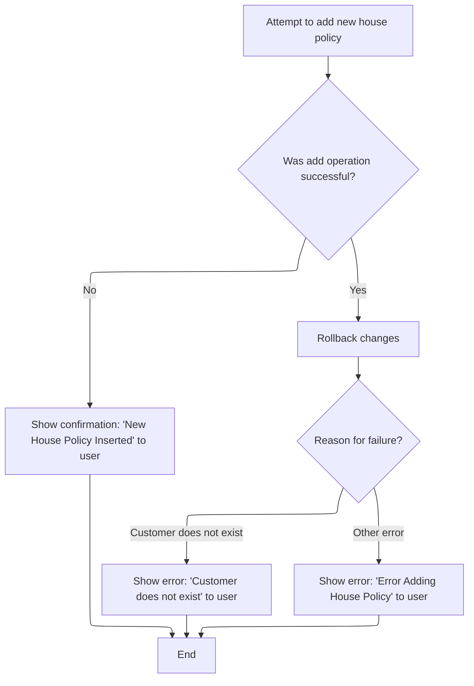
```mermaid
%%{init: {"flowchart": {"defaultRenderer": "elk"}} }%%
flowchart TD
    node1["Attempt to add new house policy"] --> node2{"Was add operation successful?"}
    click node1 openCode "base/src/lgtestp3.cbl:110:113"
    node2 -->|"No"| node3["Show confirmation: 'New House Policy Inserted' to user"]
    click node2 openCode "base/src/lgtestp3.cbl:110:113"
    node3 --> node7["End"]
    click node3 openCode "base/src/lgtestp3.cbl:114:122"
    node2 -->|"Yes"| node4["Rollback changes"]
    click node4 openCode "base/src/lgtestp3.cbl:111:111"
    node4 --> node5{"Reason for failure?"}
    node5 -->|"Customer does not exist"| node6["Show error: 'Customer does not exist' to user"]
    click node5 openCode "base/src/lgtestp3.cbl:268:271"
    click node6 openCode "base/src/lgtestp3.cbl:270:271"
    node5 -->|"Other error"| node8["Show error: 'Error Adding House Policy' to user"]
    click node8 openCode "base/src/lgtestp3.cbl:273:274"
    node6 --> node7
    node8 --> node7
    node7["End"]
classDef HeadingStyle fill:#777777,stroke:#333,stroke-width:2px;

%% Swimm:
%% %%{init: {"flowchart": {"defaultRenderer": "elk"}} }%%
%% flowchart TD
%%     node1["Attempt to add new house policy"] --> node2{"Was add operation successful?"}
%%     click node1 openCode "<SwmPath>[base/src/lgtestp3.cbl](base/src/lgtestp3.cbl)</SwmPath>:110:113"
%%     node2 -->|"No"| node3["Show confirmation: 'New House Policy Inserted' to user"]
%%     click node2 openCode "<SwmPath>[base/src/lgtestp3.cbl](base/src/lgtestp3.cbl)</SwmPath>:110:113"
%%     node3 --> node7["End"]
%%     click node3 openCode "<SwmPath>[base/src/lgtestp3.cbl](base/src/lgtestp3.cbl)</SwmPath>:114:122"
%%     node2 -->|"Yes"| node4["Rollback changes"]
%%     click node4 openCode "<SwmPath>[base/src/lgtestp3.cbl](base/src/lgtestp3.cbl)</SwmPath>:111:111"
%%     node4 --> node5{"Reason for failure?"}
%%     node5 -->|"Customer does not exist"| node6["Show error: 'Customer does not exist' to user"]
%%     click node5 openCode "<SwmPath>[base/src/lgtestp3.cbl](base/src/lgtestp3.cbl)</SwmPath>:268:271"
%%     click node6 openCode "<SwmPath>[base/src/lgtestp3.cbl](base/src/lgtestp3.cbl)</SwmPath>:270:271"
%%     node5 -->|"Other error"| node8["Show error: 'Error Adding House Policy' to user"]
%%     click node8 openCode "<SwmPath>[base/src/lgtestp3.cbl](base/src/lgtestp3.cbl)</SwmPath>:273:274"
%%     node6 --> node7
%%     node8 --> node7
%%     node7["End"]
%% classDef HeadingStyle fill:#777777,stroke:#333,stroke-width:2px;
```

<SwmSnippet path="/base/src/lgtestp3.cbl" line="110">

---

We just returned from <SwmPath>[base/src/lgapol01.cbl](base/src/lgapol01.cbl)</SwmPath> in <SwmToken path="base/src/lgtestp3.cbl" pos="33:5:7" line-data="              GO TO A-GAIN.">`A-GAIN`</SwmToken>. If the add policy failed (<SwmToken path="base/src/lgtestp3.cbl" pos="110:3:7" line-data="                 IF CA-RETURN-CODE &gt; 0">`CA-RETURN-CODE`</SwmToken> > 0), we roll back the transaction and jump to <SwmToken path="base/src/lgtestp3.cbl" pos="112:5:7" line-data="                   GO TO NO-ADD">`NO-ADD`</SwmToken> to handle the error and show feedback to the user.

```cobol
                 IF CA-RETURN-CODE > 0
                   Exec CICS Syncpoint Rollback End-Exec
                   GO TO NO-ADD
                 END-IF
```

---

</SwmSnippet>

<SwmSnippet path="/base/src/lgtestp3.cbl" line="267">

---

<SwmToken path="base/src/lgtestp3.cbl" pos="267:1:3" line-data="       NO-ADD.">`NO-ADD`</SwmToken> checks the error code and sets a specific message for missing customers or a generic error for other failures, then jumps to <SwmToken path="base/src/lgtestp3.cbl" pos="271:5:7" line-data="               Go To ERROR-OUT">`ERROR-OUT`</SwmToken> to display it and reset session data.

```cobol
       NO-ADD.
           Evaluate CA-RETURN-CODE
             When 70
               Move 'Customer does not exist'          To  ERP1FLDO
               Go To ERROR-OUT
             When Other
               Move 'Error Adding House Policy'        To  ERP1FLDO
               Go To ERROR-OUT
           End-Evaluate.
```

---

</SwmSnippet>

<SwmSnippet path="/base/src/lgtestp3.cbl" line="114">

---

After returning from <SwmToken path="base/src/lgtestp3.cbl" pos="112:5:7" line-data="                   GO TO NO-ADD">`NO-ADD`</SwmToken>, <SwmToken path="base/src/lgtestp3.cbl" pos="33:5:7" line-data="              GO TO A-GAIN.">`A-GAIN`</SwmToken> updates the session with customer and policy numbers, clears the option, and sends a success message to the user's screen, prepping for the next action.

```cobol
                 Move CA-CUSTOMER-NUM To ENP3CNOI
                 Move CA-POLICY-NUM   To ENP3PNOI
                 Move ' '             To ENP3OPTI
                 Move 'New House Policy Inserted'
                   To  ERP3FLDO
                 EXEC CICS SEND MAP ('SSMAPP3')
                           FROM(SSMAPP3O)
                           MAPSET ('SSMAP')
                 END-EXEC
```

---

</SwmSnippet>

<SwmSnippet path="/base/src/lgtestp3.cbl" line="125">

---

After prepping the request fields for deletion, we call <SwmToken path="base/src/lgtestp3.cbl" pos="129:10:10" line-data="                 EXEC CICS LINK PROGRAM(&#39;LGDPOL01&#39;)">`LGDPOL01`</SwmToken> to handle the actual policy removal. This program checks the request and passes it to the <SwmToken path="base/src/lgipdb01.cbl" pos="242:5:5" line-data="      * initialize DB2 host variables">`DB2`</SwmToken> deletion logic, so it's the entry point for deleting a policy.

```cobol
             WHEN '3'
                 Move '01DHOU'   To CA-REQUEST-ID
                 Move ENP3CNOO   To CA-CUSTOMER-NUM
                 Move ENP3PNOO   To CA-POLICY-NUM
                 EXEC CICS LINK PROGRAM('LGDPOL01')
                           COMMAREA(COMM-AREA)
                           LENGTH(32500)
                 END-EXEC
```

---

</SwmSnippet>

## Validating and Routing Policy Deletion Requests


```mermaid
%%{init: {"flowchart": {"defaultRenderer": "elk"}} }%%
flowchart TD
    node1["Start: Receive request"] --> node2{"Commarea received?"}
    click node1 openCode "base/src/lgdpol01.cbl:78:84"
    node2 -->|"No"| node3["Record error, set CA-RETURN-CODE='99', abend"]
    click node2 openCode "base/src/lgdpol01.cbl:95:99"
    click node3 openCode "base/src/lgdpol01.cbl:96:98"
    node2 -->|"Yes"| node4{"Commarea large enough?"}
    click node4 openCode "base/src/lgdpol01.cbl:107:110"
    node4 -->|"No"| node5["Return (CA-RETURN-CODE='98')"]
    click node5 openCode "base/src/lgdpol01.cbl:108:109"
    node4 -->|"Yes"| node6["Upper-case request ID"]
    click node6 openCode "base/src/lgdpol01.cbl:117:117"
    node6 --> node7{"Request ID supported?"}
    click node7 openCode "base/src/lgdpol01.cbl:119:122"
    node7 -->|"No"| node8["Return (CA-RETURN-CODE='99')"]
    click node8 openCode "base/src/lgdpol01.cbl:124:124"
    node7 -->|"Yes"| node9["Delete policy"]
    click node9 openCode "base/src/lgdpol01.cbl:126:126"
    node9 --> node10{"CA-RETURN-CODE > 0?"}
    click node10 openCode "base/src/lgdpol01.cbl:127:129"
    node10 -->|"Yes"| node11["Return (CA-RETURN-CODE>0)"]
    click node11 openCode "base/src/lgdpol01.cbl:128:128"
    node10 -->|"No"| node12["Return (CA-RETURN-CODE='00')"]
    click node12 openCode "base/src/lgdpol01.cbl:133:133"
classDef HeadingStyle fill:#777777,stroke:#333,stroke-width:2px;

%% Swimm:
%% %%{init: {"flowchart": {"defaultRenderer": "elk"}} }%%
%% flowchart TD
%%     node1["Start: Receive request"] --> node2{"Commarea received?"}
%%     click node1 openCode "<SwmPath>[base/src/lgdpol01.cbl](base/src/lgdpol01.cbl)</SwmPath>:78:84"
%%     node2 -->|"No"| node3["Record error, set <SwmToken path="base/src/lgtestp3.cbl" pos="74:3:7" line-data="                 IF CA-RETURN-CODE &gt; 0">`CA-RETURN-CODE`</SwmToken>='99', abend"]
%%     click node2 openCode "<SwmPath>[base/src/lgdpol01.cbl](base/src/lgdpol01.cbl)</SwmPath>:95:99"
%%     click node3 openCode "<SwmPath>[base/src/lgdpol01.cbl](base/src/lgdpol01.cbl)</SwmPath>:96:98"
%%     node2 -->|"Yes"| node4{"Commarea large enough?"}
%%     click node4 openCode "<SwmPath>[base/src/lgdpol01.cbl](base/src/lgdpol01.cbl)</SwmPath>:107:110"
%%     node4 -->|"No"| node5["Return (<SwmToken path="base/src/lgtestp3.cbl" pos="74:3:7" line-data="                 IF CA-RETURN-CODE &gt; 0">`CA-RETURN-CODE`</SwmToken>='98')"]
%%     click node5 openCode "<SwmPath>[base/src/lgdpol01.cbl](base/src/lgdpol01.cbl)</SwmPath>:108:109"
%%     node4 -->|"Yes"| node6["Upper-case request ID"]
%%     click node6 openCode "<SwmPath>[base/src/lgdpol01.cbl](base/src/lgdpol01.cbl)</SwmPath>:117:117"
%%     node6 --> node7{"Request ID supported?"}
%%     click node7 openCode "<SwmPath>[base/src/lgdpol01.cbl](base/src/lgdpol01.cbl)</SwmPath>:119:122"
%%     node7 -->|"No"| node8["Return (<SwmToken path="base/src/lgtestp3.cbl" pos="74:3:7" line-data="                 IF CA-RETURN-CODE &gt; 0">`CA-RETURN-CODE`</SwmToken>='99')"]
%%     click node8 openCode "<SwmPath>[base/src/lgdpol01.cbl](base/src/lgdpol01.cbl)</SwmPath>:124:124"
%%     node7 -->|"Yes"| node9["Delete policy"]
%%     click node9 openCode "<SwmPath>[base/src/lgdpol01.cbl](base/src/lgdpol01.cbl)</SwmPath>:126:126"
%%     node9 --> node10{"<SwmToken path="base/src/lgtestp3.cbl" pos="74:3:7" line-data="                 IF CA-RETURN-CODE &gt; 0">`CA-RETURN-CODE`</SwmToken> > 0?"}
%%     click node10 openCode "<SwmPath>[base/src/lgdpol01.cbl](base/src/lgdpol01.cbl)</SwmPath>:127:129"
%%     node10 -->|"Yes"| node11["Return (<SwmToken path="base/src/lgtestp3.cbl" pos="74:3:7" line-data="                 IF CA-RETURN-CODE &gt; 0">`CA-RETURN-CODE`</SwmToken>>0)"]
%%     click node11 openCode "<SwmPath>[base/src/lgdpol01.cbl](base/src/lgdpol01.cbl)</SwmPath>:128:128"
%%     node10 -->|"No"| node12["Return (<SwmToken path="base/src/lgtestp3.cbl" pos="74:3:7" line-data="                 IF CA-RETURN-CODE &gt; 0">`CA-RETURN-CODE`</SwmToken>='00')"]
%%     click node12 openCode "<SwmPath>[base/src/lgdpol01.cbl](base/src/lgdpol01.cbl)</SwmPath>:133:133"
%% classDef HeadingStyle fill:#777777,stroke:#333,stroke-width:2px;
```

This section is responsible for validating incoming policy deletion requests, ensuring only supported and well-formed requests are processed, and routing them for deletion or error handling as appropriate.

| Category        | Rule Name                          | Description                                                                                                                                                                                                                                                                                                                                                                                                                                                                                                                                                                                                                                                                                                                                                      |
| --------------- | ---------------------------------- | ---------------------------------------------------------------------------------------------------------------------------------------------------------------------------------------------------------------------------------------------------------------------------------------------------------------------------------------------------------------------------------------------------------------------------------------------------------------------------------------------------------------------------------------------------------------------------------------------------------------------------------------------------------------------------------------------------------------------------------------------------------------- |
| Data validation | Missing commarea error             | If no commarea is received with the request, the system must record an error, set the return code to '99', and terminate the process with an abend.                                                                                                                                                                                                                                                                                                                                                                                                                                                                                                                                                                                                              |
| Data validation | Minimum commarea length validation | If the commarea received is smaller than the minimum required length (28 bytes), the system must return an error with code '98' and not process the request further.                                                                                                                                                                                                                                                                                                                                                                                                                                                                                                                                                                                             |
| Business logic  | Request ID normalization           | The request ID in the commarea must be converted to upper-case before validation to ensure consistent matching against supported types.                                                                                                                                                                                                                                                                                                                                                                                                                                                                                                                                                                                                                          |
| Business logic  | Supported request ID enforcement   | Only requests with a supported request ID (<SwmToken path="base/src/lgdpol01.cbl" pos="119:18:18" line-data="           IF ( CA-REQUEST-ID NOT EQUAL TO &#39;01DEND&#39; AND">`01DEND`</SwmToken>, <SwmToken path="base/src/lgdpol01.cbl" pos="120:14:14" line-data="                CA-REQUEST-ID NOT EQUAL TO &#39;01DMOT&#39; AND">`01DMOT`</SwmToken>, <SwmToken path="base/src/lgtestp3.cbl" pos="126:4:4" line-data="                 Move &#39;01DHOU&#39;   To CA-REQUEST-ID">`01DHOU`</SwmToken>, <SwmToken path="base/src/lgdpol01.cbl" pos="122:14:14" line-data="                CA-REQUEST-ID NOT EQUAL TO &#39;01DCOM&#39; )">`01DCOM`</SwmToken>) are eligible for policy deletion. Unsupported request IDs must result in a return code of '99'. |
| Business logic  | Successful deletion confirmation   | A successful policy deletion must result in a return code of '00' to the caller, confirming the operation was completed without errors.                                                                                                                                                                                                                                                                                                                                                                                                                                                                                                                                                                                                                          |

<SwmSnippet path="/base/src/lgdpol01.cbl" line="78">

---

MAINLINE in <SwmPath>[base/src/lgdpol01.cbl](base/src/lgdpol01.cbl)</SwmPath> validates the incoming delete request by checking the commarea length and request ID. If the request ID matches one of the supported types (<SwmToken path="base/src/lgdpol01.cbl" pos="119:18:18" line-data="           IF ( CA-REQUEST-ID NOT EQUAL TO &#39;01DEND&#39; AND">`01DEND`</SwmToken>, <SwmToken path="base/src/lgdpol01.cbl" pos="120:14:14" line-data="                CA-REQUEST-ID NOT EQUAL TO &#39;01DMOT&#39; AND">`01DMOT`</SwmToken>, <SwmToken path="base/src/lgdpol01.cbl" pos="121:14:14" line-data="                CA-REQUEST-ID NOT EQUAL TO &#39;01DHOU&#39; AND">`01DHOU`</SwmToken>, <SwmToken path="base/src/lgdpol01.cbl" pos="122:14:14" line-data="                CA-REQUEST-ID NOT EQUAL TO &#39;01DCOM&#39; )">`01DCOM`</SwmToken>), it calls the deletion routine. Otherwise, it sets an error code and returns. This keeps the deletion logic tight and only allows recognized policy types to be deleted. Error handling and logging are built in for any failures or malformed requests.

```cobol
       MAINLINE SECTION.

      *----------------------------------------------------------------*
      * Common code                                                    *
      *----------------------------------------------------------------*
      * initialize working storage variables
           INITIALIZE WS-HEADER.
      * set up general variable
           MOVE EIBTRNID TO WS-TRANSID.
           MOVE EIBTRMID TO WS-TERMID.
           MOVE EIBTASKN TO WS-TASKNUM.
      *----------------------------------------------------------------*

      *----------------------------------------------------------------*
      * Check commarea and obtain required details                     *
      *----------------------------------------------------------------*
      * If NO commarea received issue an ABEND
           IF EIBCALEN IS EQUAL TO ZERO
               MOVE ' NO COMMAREA RECEIVED' TO EM-VARIABLE
               PERFORM WRITE-ERROR-MESSAGE
               EXEC CICS ABEND ABCODE('LGCA') NODUMP END-EXEC
           END-IF

      * initialize commarea return code to zero
           MOVE '00' TO CA-RETURN-CODE
           MOVE EIBCALEN TO WS-CALEN.
           SET WS-ADDR-DFHCOMMAREA TO ADDRESS OF DFHCOMMAREA.

      * Check commarea is large enough
           IF EIBCALEN IS LESS THAN WS-CA-HEADER-LEN
             MOVE '98' TO CA-RETURN-CODE
             EXEC CICS RETURN END-EXEC
           END-IF

      *----------------------------------------------------------------*
      * Check request-id in commarea and if recognised ...             *
      * Call routine to delete row from policy table                   *
      *----------------------------------------------------------------*
      * Upper case value passed in Request Id field                    *
           MOVE FUNCTION UPPER-CASE(CA-REQUEST-ID) TO CA-REQUEST-ID

           IF ( CA-REQUEST-ID NOT EQUAL TO '01DEND' AND
                CA-REQUEST-ID NOT EQUAL TO '01DMOT' AND
                CA-REQUEST-ID NOT EQUAL TO '01DHOU' AND
                CA-REQUEST-ID NOT EQUAL TO '01DCOM' )
      *        Request is not recognised or supported
               MOVE '99' TO CA-RETURN-CODE
           ELSE
               PERFORM DELETE-POLICY-DB2-INFO
               If CA-RETURN-CODE > 0
                 EXEC CICS RETURN END-EXEC
               End-if
           END-IF

      * Return to caller
           EXEC CICS RETURN END-EXEC.
```

---

</SwmSnippet>

<SwmSnippet path="/base/src/lgdpol01.cbl" line="154">

---

<SwmToken path="base/src/lgdpol01.cbl" pos="154:1:5" line-data="       WRITE-ERROR-MESSAGE.">`WRITE-ERROR-MESSAGE`</SwmToken> logs error details and sends both the formatted error message and up to 90 bytes of commarea data to LGSTSQ for queueing. This gives downstream systems enough info to track what went wrong and with which data.

```cobol
       WRITE-ERROR-MESSAGE.
      * Save SQLCODE in message
      * Obtain and format current time and date
           EXEC CICS ASKTIME ABSTIME(WS-ABSTIME)
           END-EXEC
           EXEC CICS FORMATTIME ABSTIME(Ws-ABSTIME)
                     MMDDYYYY(WS-DATE)
                     TIME(WS-TIME)
           END-EXEC
           MOVE WS-DATE TO EM-DATE
           MOVE WS-TIME TO EM-TIME
      * Write output message to TDQ
           EXEC CICS LINK PROGRAM('LGSTSQ')
                     COMMAREA(ERROR-MSG)
                     LENGTH(LENGTH OF ERROR-MSG)
           END-EXEC.
      * Write 90 bytes or as much as we have of commarea to TDQ
           IF EIBCALEN > 0 THEN
             IF EIBCALEN < 91 THEN
               MOVE DFHCOMMAREA(1:EIBCALEN) TO CA-DATA
               EXEC CICS LINK PROGRAM('LGSTSQ')
                         COMMAREA(CA-ERROR-MSG)
                         LENGTH(LENGTH OF CA-ERROR-MSG)
               END-EXEC
             ELSE
               MOVE DFHCOMMAREA(1:90) TO CA-DATA
               EXEC CICS LINK PROGRAM('LGSTSQ')
                         COMMAREA(CA-ERROR-MSG)
                         LENGTH(LENGTH OF CA-ERROR-MSG)
               END-EXEC
             END-IF
           END-IF.
           EXIT.
```

---

</SwmSnippet>

## Delegating Policy Deletion to Database Handler

This section ensures that policy deletion requests are routed to the appropriate database handler, maintaining separation of concerns and centralizing database logic in a specialized module.

| Category       | Rule Name                           | Description                                                                                                                      |
| -------------- | ----------------------------------- | -------------------------------------------------------------------------------------------------------------------------------- |
| Business logic | Forward Deletion Request            | All policy deletion requests must be forwarded to the database handler module without modification.                              |
| Business logic | Centralized Deletion Responsibility | The database handler module is solely responsible for executing the deletion and handling any database-specific logic or errors. |

<SwmSnippet path="/base/src/lgdpol01.cbl" line="139">

---

<SwmToken path="base/src/lgdpol01.cbl" pos="139:1:7" line-data="       DELETE-POLICY-DB2-INFO.">`DELETE-POLICY-DB2-INFO`</SwmToken> just passes the deletion request to <SwmToken path="base/src/lgdpol01.cbl" pos="141:9:9" line-data="           EXEC CICS LINK PROGRAM(LGDPDB01)">`LGDPDB01`</SwmToken> using EXEC CICS LINK. This keeps the <SwmToken path="base/src/lgdpol01.cbl" pos="139:5:5" line-data="       DELETE-POLICY-DB2-INFO.">`DB2`</SwmToken> logic out of the main handler and lets the specialized module do the actual work.

```cobol
       DELETE-POLICY-DB2-INFO.

           EXEC CICS LINK PROGRAM(LGDPDB01)
                Commarea(DFHCOMMAREA)
                LENGTH(32500)
           END-EXEC.

           EXIT.
```

---

</SwmSnippet>

## Validating and Executing Policy Deletion in <SwmToken path="base/src/lgipdb01.cbl" pos="242:5:5" line-data="      * initialize DB2 host variables">`DB2`</SwmToken>


```mermaid
%%{init: {"flowchart": {"defaultRenderer": "elk"}} }%%
flowchart TD
    node1["Start MAINLINE processing"] --> node2{"Commarea received? (EIBCALEN=0)"}
    click node1 openCode "base/src/lgdpdb01.cbl:111:175"
    node2 -->|"No"| node3["Log error (WRITE-ERROR-MESSAGE), set CA-RETURN-CODE=99, ABEND"]
    click node2 openCode "base/src/lgdpdb01.cbl:131:135"
    click node3 openCode "base/src/lgdpdb01.cbl:132:134"
    node2 -->|"Yes"| node4{"Commarea large enough? (EIBCALEN >= +28)"}
    click node4 openCode "base/src/lgdpdb01.cbl:143:146"
    node4 -->|"No"| node5["Set CA-RETURN-CODE=98, Return"]
    click node5 openCode "base/src/lgdpdb01.cbl:144:145"
    node4 -->|"Yes"| node6{"Request type recognized? (CA-REQUEST-ID in [01DEND,01DHOU,01DCOM,01DMOT])"}
    click node6 openCode "base/src/lgdpdb01.cbl:160:172"
    node6 -->|"No"| node7["Set CA-RETURN-CODE=99, Return"]
    click node7 openCode "base/src/lgdpdb01.cbl:165:165"
    node6 -->|"Yes"| node8["Delete policy (DELETE-POLICY-DB2-INFO), call downstream service (LGDPVS01)"]
    click node8 openCode "base/src/lgdpdb01.cbl:167:171"
    node8 --> node9["Return to caller (CA-RETURN-CODE=00 or error)"]
    click node9 openCode "base/src/lgdpdb01.cbl:175:175"
classDef HeadingStyle fill:#777777,stroke:#333,stroke-width:2px;

%% Swimm:
%% %%{init: {"flowchart": {"defaultRenderer": "elk"}} }%%
%% flowchart TD
%%     node1["Start MAINLINE processing"] --> node2{"Commarea received? (EIBCALEN=0)"}
%%     click node1 openCode "<SwmPath>[base/src/lgdpdb01.cbl](base/src/lgdpdb01.cbl)</SwmPath>:111:175"
%%     node2 -->|"No"| node3["Log error (<SwmToken path="base/src/lgipol01.cbl" pos="81:3:7" line-data="               PERFORM WRITE-ERROR-MESSAGE">`WRITE-ERROR-MESSAGE`</SwmToken>), set <SwmToken path="base/src/lgtestp3.cbl" pos="74:3:7" line-data="                 IF CA-RETURN-CODE &gt; 0">`CA-RETURN-CODE`</SwmToken>=99, ABEND"]
%%     click node2 openCode "<SwmPath>[base/src/lgdpdb01.cbl](base/src/lgdpdb01.cbl)</SwmPath>:131:135"
%%     click node3 openCode "<SwmPath>[base/src/lgdpdb01.cbl](base/src/lgdpdb01.cbl)</SwmPath>:132:134"
%%     node2 -->|"Yes"| node4{"Commarea large enough? (EIBCALEN >= +28)"}
%%     click node4 openCode "<SwmPath>[base/src/lgdpdb01.cbl](base/src/lgdpdb01.cbl)</SwmPath>:143:146"
%%     node4 -->|"No"| node5["Set <SwmToken path="base/src/lgtestp3.cbl" pos="74:3:7" line-data="                 IF CA-RETURN-CODE &gt; 0">`CA-RETURN-CODE`</SwmToken>=98, Return"]
%%     click node5 openCode "<SwmPath>[base/src/lgdpdb01.cbl](base/src/lgdpdb01.cbl)</SwmPath>:144:145"
%%     node4 -->|"Yes"| node6{"Request type recognized? (<SwmToken path="base/src/lgtestp3.cbl" pos="67:9:13" line-data="                 Move &#39;01IHOU&#39;   To CA-REQUEST-ID">`CA-REQUEST-ID`</SwmToken> in [<SwmToken path="base/src/lgdpol01.cbl" pos="119:18:18" line-data="           IF ( CA-REQUEST-ID NOT EQUAL TO &#39;01DEND&#39; AND">`01DEND`</SwmToken>,<SwmToken path="base/src/lgtestp3.cbl" pos="126:4:4" line-data="                 Move &#39;01DHOU&#39;   To CA-REQUEST-ID">`01DHOU`</SwmToken>,<SwmToken path="base/src/lgdpol01.cbl" pos="122:14:14" line-data="                CA-REQUEST-ID NOT EQUAL TO &#39;01DCOM&#39; )">`01DCOM`</SwmToken>,<SwmToken path="base/src/lgdpol01.cbl" pos="120:14:14" line-data="                CA-REQUEST-ID NOT EQUAL TO &#39;01DMOT&#39; AND">`01DMOT`</SwmToken>])"}
%%     click node6 openCode "<SwmPath>[base/src/lgdpdb01.cbl](base/src/lgdpdb01.cbl)</SwmPath>:160:172"
%%     node6 -->|"No"| node7["Set <SwmToken path="base/src/lgtestp3.cbl" pos="74:3:7" line-data="                 IF CA-RETURN-CODE &gt; 0">`CA-RETURN-CODE`</SwmToken>=99, Return"]
%%     click node7 openCode "<SwmPath>[base/src/lgdpdb01.cbl](base/src/lgdpdb01.cbl)</SwmPath>:165:165"
%%     node6 -->|"Yes"| node8["Delete policy (<SwmToken path="base/src/lgdpol01.cbl" pos="126:3:9" line-data="               PERFORM DELETE-POLICY-DB2-INFO">`DELETE-POLICY-DB2-INFO`</SwmToken>), call downstream service (<SwmToken path="base/src/lgdpdb01.cbl" pos="168:9:9" line-data="               EXEC CICS LINK PROGRAM(LGDPVS01)">`LGDPVS01`</SwmToken>)"]
%%     click node8 openCode "<SwmPath>[base/src/lgdpdb01.cbl](base/src/lgdpdb01.cbl)</SwmPath>:167:171"
%%     node8 --> node9["Return to caller (<SwmToken path="base/src/lgtestp3.cbl" pos="74:3:7" line-data="                 IF CA-RETURN-CODE &gt; 0">`CA-RETURN-CODE`</SwmToken>=00 or error)"]
%%     click node9 openCode "<SwmPath>[base/src/lgdpdb01.cbl](base/src/lgdpdb01.cbl)</SwmPath>:175:175"
%% classDef HeadingStyle fill:#777777,stroke:#333,stroke-width:2px;
```

This section governs the validation and execution of policy deletion requests in the <SwmToken path="base/src/lgipdb01.cbl" pos="242:5:5" line-data="      * initialize DB2 host variables">`DB2`</SwmToken> database. It ensures only valid, well-formed requests are processed, and provides robust error handling and logging for any failures.

| Category        | Rule Name                   | Description                                                                                                                                                                                                                                                                                                                                                                                                                                                                                                                                                                                                                                                                                                                                                                                  |
| --------------- | --------------------------- | -------------------------------------------------------------------------------------------------------------------------------------------------------------------------------------------------------------------------------------------------------------------------------------------------------------------------------------------------------------------------------------------------------------------------------------------------------------------------------------------------------------------------------------------------------------------------------------------------------------------------------------------------------------------------------------------------------------------------------------------------------------------------------------------- |
| Data validation | Missing commarea error      | If no commarea is received with the request, the process must log an error message, set the return code to 99, and terminate the operation with an abend.                                                                                                                                                                                                                                                                                                                                                                                                                                                                                                                                                                                                                                    |
| Data validation | Minimum commarea length     | If the commarea received is less than 28 bytes in length, the process must set the return code to 98 and terminate the operation without attempting deletion.                                                                                                                                                                                                                                                                                                                                                                                                                                                                                                                                                                                                                                |
| Data validation | Recognized request ID       | Only requests with a recognized request ID (one of: <SwmToken path="base/src/lgdpol01.cbl" pos="119:18:18" line-data="           IF ( CA-REQUEST-ID NOT EQUAL TO &#39;01DEND&#39; AND">`01DEND`</SwmToken>, <SwmToken path="base/src/lgtestp3.cbl" pos="126:4:4" line-data="                 Move &#39;01DHOU&#39;   To CA-REQUEST-ID">`01DHOU`</SwmToken>, <SwmToken path="base/src/lgdpol01.cbl" pos="122:14:14" line-data="                CA-REQUEST-ID NOT EQUAL TO &#39;01DCOM&#39; )">`01DCOM`</SwmToken>, <SwmToken path="base/src/lgdpol01.cbl" pos="120:14:14" line-data="                CA-REQUEST-ID NOT EQUAL TO &#39;01DMOT&#39; AND">`01DMOT`</SwmToken>) are eligible for policy deletion. Any other request ID must result in a return code of 99 and no deletion attempt. |
| Business logic  | Successful deletion outcome | If the policy record is successfully deleted or was not present (SQL code 0 or 100), the process must return a success code (00) to the caller.                                                                                                                                                                                                                                                                                                                                                                                                                                                                                                                                                                                                                                              |

<SwmSnippet path="/base/src/lgdpdb01.cbl" line="111">

---

MAINLINE in <SwmPath>[base/src/lgdpdb01.cbl](base/src/lgdpdb01.cbl)</SwmPath> checks the request, converts IDs to <SwmToken path="base/src/lgdpdb01.cbl" pos="124:5:5" line-data="      * initialize DB2 host variables">`DB2`</SwmToken> format, and if the request is valid, calls <SwmToken path="base/src/lgdpdb01.cbl" pos="168:9:9" line-data="               EXEC CICS LINK PROGRAM(LGDPVS01)">`LGDPVS01`</SwmToken> to do the actual <SwmToken path="base/src/lgdpdb01.cbl" pos="124:5:5" line-data="      * initialize DB2 host variables">`DB2`</SwmToken> deletion. Error handling and logging are built in for any failures or malformed requests.

```cobol
       MAINLINE SECTION.

      *----------------------------------------------------------------*
      * Common code                                                    *
      *----------------------------------------------------------------*
      * initialize working storage variables
           INITIALIZE WS-HEADER.
      * set up general variable
           MOVE EIBTRNID TO WS-TRANSID.
           MOVE EIBTRMID TO WS-TERMID.
           MOVE EIBTASKN TO WS-TASKNUM.
      *----------------------------------------------------------------*

      * initialize DB2 host variables
           INITIALIZE DB2-IN-INTEGERS.

      *----------------------------------------------------------------*
      * Check commarea and obtain required details                     *
      *----------------------------------------------------------------*
      * If NO commarea received issue an ABEND
           IF EIBCALEN IS EQUAL TO ZERO
               MOVE ' NO COMMAREA RECEIVED' TO EM-VARIABLE
               PERFORM WRITE-ERROR-MESSAGE
               EXEC CICS ABEND ABCODE('LGCA') NODUMP END-EXEC
           END-IF

      * initialize commarea return code to zero
           MOVE '00' TO CA-RETURN-CODE
           MOVE EIBCALEN TO WS-CALEN.
           SET WS-ADDR-DFHCOMMAREA TO ADDRESS OF DFHCOMMAREA.

      * Check commarea is large enough
           IF EIBCALEN IS LESS THAN WS-CA-HEADER-LEN
             MOVE '98' TO CA-RETURN-CODE
             EXEC CICS RETURN END-EXEC
           END-IF

      * Convert commarea customer & policy nums to DB2 integer format
           MOVE CA-CUSTOMER-NUM TO DB2-CUSTOMERNUM-INT
           MOVE CA-POLICY-NUM   TO DB2-POLICYNUM-INT
      * and save in error msg field incase required
           MOVE CA-CUSTOMER-NUM TO EM-CUSNUM
           MOVE CA-POLICY-NUM   TO EM-POLNUM

      *----------------------------------------------------------------*
      * Check request-id in commarea and if recognised ...             *
      * Call routine to delete row from policy table                   *
      *----------------------------------------------------------------*

           IF ( CA-REQUEST-ID NOT EQUAL TO '01DEND' AND
                CA-REQUEST-ID NOT EQUAL TO '01DHOU' AND
                CA-REQUEST-ID NOT EQUAL TO '01DCOM' AND
                CA-REQUEST-ID NOT EQUAL TO '01DMOT' ) Then
      *        Request is not recognised or supported
               MOVE '99' TO CA-RETURN-CODE
           ELSE
               PERFORM DELETE-POLICY-DB2-INFO
               EXEC CICS LINK PROGRAM(LGDPVS01)
                    Commarea(DFHCOMMAREA)
                    LENGTH(32500)
               END-EXEC
           END-IF.

      * Return to caller
           EXEC CICS RETURN END-EXEC.
```

---

</SwmSnippet>

<SwmSnippet path="/base/src/lgdpdb01.cbl" line="212">

---

<SwmToken path="base/src/lgdpdb01.cbl" pos="212:1:5" line-data="       WRITE-ERROR-MESSAGE.">`WRITE-ERROR-MESSAGE`</SwmToken> logs error details and sends both the formatted error message and up to 90 bytes of commarea data to LGSTSQ for queueing. This gives downstream systems enough info to track what went wrong and with which data.

```cobol
       WRITE-ERROR-MESSAGE.
      * Save SQLCODE in message
           MOVE SQLCODE TO EM-SQLRC
      * Obtain and format current time and date
           EXEC CICS ASKTIME ABSTIME(WS-ABSTIME)
           END-EXEC
           EXEC CICS FORMATTIME ABSTIME(Ws-ABSTIME)
                     MMDDYYYY(WS-DATE)
                     TIME(WS-TIME)
           END-EXEC
           MOVE WS-DATE TO EM-DATE
           MOVE WS-TIME TO EM-TIME
      * Write output message to TDQ
           EXEC CICS LINK PROGRAM('LGSTSQ')
                     COMMAREA(ERROR-MSG)
                     LENGTH(LENGTH OF ERROR-MSG)
           END-EXEC.
      * Write 90 bytes or as much as we have of commarea to TDQ
           IF EIBCALEN > 0 THEN
             IF EIBCALEN < 91 THEN
               MOVE DFHCOMMAREA(1:EIBCALEN) TO CA-DATA
               EXEC CICS LINK PROGRAM('LGSTSQ')
                         COMMAREA(CA-ERROR-MSG)
                         LENGTH(LENGTH OF CA-ERROR-MSG)
               END-EXEC
             ELSE
               MOVE DFHCOMMAREA(1:90) TO CA-DATA
               EXEC CICS LINK PROGRAM('LGSTSQ')
                         COMMAREA(CA-ERROR-MSG)
                         LENGTH(LENGTH OF CA-ERROR-MSG)
               END-EXEC
             END-IF
           END-IF.
           EXIT.
```

---

</SwmSnippet>

<SwmSnippet path="/base/src/lgdpdb01.cbl" line="186">

---

<SwmToken path="base/src/lgdpdb01.cbl" pos="186:1:7" line-data="       DELETE-POLICY-DB2-INFO.">`DELETE-POLICY-DB2-INFO`</SwmToken> runs the SQL DELETE for the policy. If the record is gone or wasn't there (SQLCODE 0 or 100), it's considered done. Any other error sets a '90' code and logs the issue.

```cobol
       DELETE-POLICY-DB2-INFO.

           MOVE ' DELETE POLICY  ' TO EM-SQLREQ
           EXEC SQL
             DELETE
               FROM POLICY
               WHERE ( CUSTOMERNUMBER = :DB2-CUSTOMERNUM-INT AND
                       POLICYNUMBER  = :DB2-POLICYNUM-INT      )
           END-EXEC

      *    Treat SQLCODE 0 and SQLCODE 100 (record not found) as
      *    successful - end result is record does not exist
           IF SQLCODE NOT EQUAL 0 Then
               MOVE '90' TO CA-RETURN-CODE
               PERFORM WRITE-ERROR-MESSAGE
               EXEC CICS RETURN END-EXEC
           END-IF.

           EXIT.
```

---

</SwmSnippet>

## Deleting Policy Record in VSAM and Handling Errors

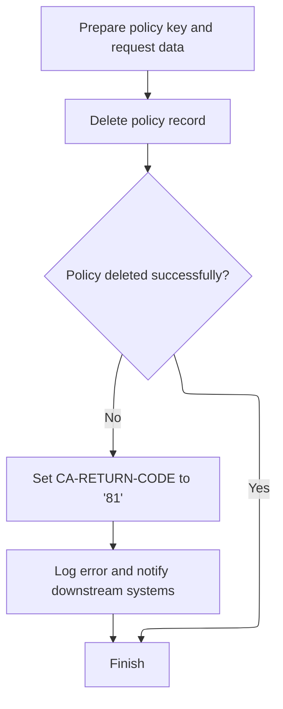
```mermaid
%%{init: {"flowchart": {"defaultRenderer": "elk"}} }%%
flowchart TD
    node1["Prepare policy key and request data"]
    click node1 openCode "base/src/lgdpvs01.cbl:75:79"
    node1 --> node2["Delete policy record"]
    click node2 openCode "base/src/lgdpvs01.cbl:81:85"
    node2 --> node3{"Policy deleted successfully?"}
    click node3 openCode "base/src/lgdpvs01.cbl:86:91"
    node3 -->|"Yes"| node4["Finish"]
    click node4 openCode "base/src/lgdpvs01.cbl:95:97"
    node3 -->|"No"| node5["Set CA-RETURN-CODE to '81'"]
    click node5 openCode "base/src/lgdpvs01.cbl:88:88"
    node5 --> node6["Log error and notify downstream systems"]
    click node6 openCode "base/src/lgdpvs01.cbl:89:90"
    node6 --> node4
classDef HeadingStyle fill:#777777,stroke:#333,stroke-width:2px;

%% Swimm:
%% %%{init: {"flowchart": {"defaultRenderer": "elk"}} }%%
%% flowchart TD
%%     node1["Prepare policy key and request data"]
%%     click node1 openCode "<SwmPath>[base/src/lgdpvs01.cbl](base/src/lgdpvs01.cbl)</SwmPath>:75:79"
%%     node1 --> node2["Delete policy record"]
%%     click node2 openCode "<SwmPath>[base/src/lgdpvs01.cbl](base/src/lgdpvs01.cbl)</SwmPath>:81:85"
%%     node2 --> node3{"Policy deleted successfully?"}
%%     click node3 openCode "<SwmPath>[base/src/lgdpvs01.cbl](base/src/lgdpvs01.cbl)</SwmPath>:86:91"
%%     node3 -->|"Yes"| node4["Finish"]
%%     click node4 openCode "<SwmPath>[base/src/lgdpvs01.cbl](base/src/lgdpvs01.cbl)</SwmPath>:95:97"
%%     node3 -->|"No"| node5["Set <SwmToken path="base/src/lgtestp3.cbl" pos="74:3:7" line-data="                 IF CA-RETURN-CODE &gt; 0">`CA-RETURN-CODE`</SwmToken> to '81'"]
%%     click node5 openCode "<SwmPath>[base/src/lgdpvs01.cbl](base/src/lgdpvs01.cbl)</SwmPath>:88:88"
%%     node5 --> node6["Log error and notify downstream systems"]
%%     click node6 openCode "<SwmPath>[base/src/lgdpvs01.cbl](base/src/lgdpvs01.cbl)</SwmPath>:89:90"
%%     node6 --> node4
%% classDef HeadingStyle fill:#777777,stroke:#333,stroke-width:2px;
```

This section governs the business logic and error handling for deleting a policy record from the VSAM file. It ensures that policy deletions are tracked, errors are communicated, and downstream systems are notified with sufficient detail.

| Category       | Rule Name                  | Description                                                                                                                                                                  |
| -------------- | -------------------------- | ---------------------------------------------------------------------------------------------------------------------------------------------------------------------------- |
| Business logic | Successful policy deletion | If the policy record is deleted successfully, the process completes without error and control is returned to the caller.                                                     |
| Business logic | Commarea data forwarding   | If commarea data is present and its length is less than 91 bytes, all of it must be sent to downstream systems; if it is 91 bytes or more, only the first 90 bytes are sent. |

<SwmSnippet path="/base/src/lgdpvs01.cbl" line="72">

---

MAINLINE in <SwmPath>[base/src/lgdpvs01.cbl](base/src/lgdpvs01.cbl)</SwmPath> deletes the policy record from the VSAM file using EXEC CICS DELETE FILE. If the delete fails, it logs the error and returns with a failure code.

```cobol
       MAINLINE SECTION.
      *
      *---------------------------------------------------------------*
           Move EIBCALEN To WS-Commarea-Len.
      *---------------------------------------------------------------*
           Move CA-Request-ID(4:1) To WF-Request-ID
           Move CA-Policy-Num      To WF-Policy-Num
           Move CA-Customer-Num    To WF-Customer-Num
      *---------------------------------------------------------------*
           Exec CICS Delete File('KSDSPOLY')
                     Ridfld(WF-Policy-Key)
                     KeyLength(21)
                     RESP(WS-RESP)
           End-Exec.
           If WS-RESP Not = DFHRESP(NORMAL)
             Move EIBRESP2 To WS-RESP2
             MOVE '81' TO CA-RETURN-CODE
             PERFORM WRITE-ERROR-MESSAGE
             EXEC CICS RETURN END-EXEC
           End-If.
```

---

</SwmSnippet>

<SwmSnippet path="/base/src/lgdpvs01.cbl" line="99">

---

<SwmToken path="base/src/lgdpvs01.cbl" pos="99:1:5" line-data="       WRITE-ERROR-MESSAGE.">`WRITE-ERROR-MESSAGE`</SwmToken> in <SwmPath>[base/src/lgdpvs01.cbl](base/src/lgdpvs01.cbl)</SwmPath> logs error details and sends both the formatted error message and up to 90 bytes of commarea data to LGSTSQ for queueing. This gives downstream systems enough info to track what went wrong and with which data.

```cobol
       WRITE-ERROR-MESSAGE.
           EXEC CICS ASKTIME ABSTIME(WS-ABSTIME)
           END-EXEC
           EXEC CICS FORMATTIME ABSTIME(WS-ABSTIME)
                     MMDDYYYY(WS-DATE)
                     TIME(WS-TIME)
           END-EXEC
      *
           MOVE WS-DATE TO EM-DATE
           MOVE WS-TIME TO EM-TIME
           Move CA-Customer-Num To EM-CUSNUM 
           Move CA-POLICY-NUM To EM-POLNUM 
           Move WS-RESP         To EM-RespRC
           Move WS-RESP2        To EM-Resp2RC
           EXEC CICS LINK PROGRAM('LGSTSQ')
                     COMMAREA(ERROR-MSG)
                     LENGTH(LENGTH OF ERROR-MSG)
           END-EXEC.
           IF EIBCALEN > 0 THEN
             IF EIBCALEN < 91 THEN
               MOVE DFHCOMMAREA(1:EIBCALEN) TO CA-DATA
               EXEC CICS LINK PROGRAM('LGSTSQ')
                         COMMAREA(CA-ERROR-MSG)
                         LENGTH(Length Of CA-ERROR-MSG)
               END-EXEC
             ELSE
               MOVE DFHCOMMAREA(1:90) TO CA-DATA
               EXEC CICS LINK PROGRAM('LGSTSQ')
                         COMMAREA(CA-ERROR-MSG)
                         LENGTH(Length Of CA-ERROR-MSG)
               END-EXEC
             END-IF
           END-IF.
           EXIT.
```

---

</SwmSnippet>

<SwmSnippet path="/base/src/lgdpvs01.cbl" line="95">

---

<SwmToken path="base/src/lgdpvs01.cbl" pos="95:1:3" line-data="       A-EXIT.">`A-EXIT`</SwmToken> just ends the program and returns control. EXIT and GOBACK are standard commands for this environment to wrap up the routine.

```cobol
       A-EXIT.
           EXIT.
           GOBACK.
```

---

</SwmSnippet>

## Handling Policy Deletion Results and User Feedback

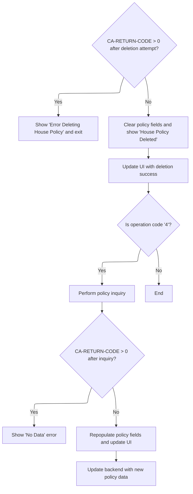
```mermaid
%%{init: {"flowchart": {"defaultRenderer": "elk"}} }%%
flowchart TD
    node1{"CA-RETURN-CODE > 0 after deletion attempt?"}
    click node1 openCode "base/src/lgtestp3.cbl:133:136"
    node1 -->|"Yes"| node2["Show 'Error Deleting House Policy' and exit"]
    click node2 openCode "base/src/lgtestp3.cbl:281:283"
    node1 -->|"No"| node3["Clear policy fields and show 'House Policy Deleted'"]
    click node3 openCode "base/src/lgtestp3.cbl:138:148"
    node3 --> node4["Update UI with deletion success"]
    click node4 openCode "base/src/lgtestp3.cbl:149:152"
    node4 --> node5{"Is operation code '4'?"}
    click node5 openCode "base/src/lgtestp3.cbl:155:155"
    node5 -->|"Yes"| node6["Perform policy inquiry"]
    click node6 openCode "base/src/lgtestp3.cbl:156:162"
    node6 --> node7{"CA-RETURN-CODE > 0 after inquiry?"}
    click node7 openCode "base/src/lgtestp3.cbl:163:165"
    node7 -->|"Yes"| node8["Show 'No Data' error"]
    click node8 openCode "base/src/lgtestp3.cbl:164:164"
    node7 -->|"No"| node9["Repopulate policy fields and update UI"]
    click node9 openCode "base/src/lgtestp3.cbl:167:181"
    node9 --> node10["Update backend with new policy data"]
    click node10 openCode "base/src/lgtestp3.cbl:183:199"
    node5 -->|"No"| node11["End"]
    click node11 openCode "base/src/lgtestp3.cbl:199:199"

classDef HeadingStyle fill:#777777,stroke:#333,stroke-width:2px;

%% Swimm:
%% %%{init: {"flowchart": {"defaultRenderer": "elk"}} }%%
%% flowchart TD
%%     node1{"<SwmToken path="base/src/lgtestp3.cbl" pos="74:3:7" line-data="                 IF CA-RETURN-CODE &gt; 0">`CA-RETURN-CODE`</SwmToken> > 0 after deletion attempt?"}
%%     click node1 openCode "<SwmPath>[base/src/lgtestp3.cbl](base/src/lgtestp3.cbl)</SwmPath>:133:136"
%%     node1 -->|"Yes"| node2["Show 'Error Deleting House Policy' and exit"]
%%     click node2 openCode "<SwmPath>[base/src/lgtestp3.cbl](base/src/lgtestp3.cbl)</SwmPath>:281:283"
%%     node1 -->|"No"| node3["Clear policy fields and show 'House Policy Deleted'"]
%%     click node3 openCode "<SwmPath>[base/src/lgtestp3.cbl](base/src/lgtestp3.cbl)</SwmPath>:138:148"
%%     node3 --> node4["Update UI with deletion success"]
%%     click node4 openCode "<SwmPath>[base/src/lgtestp3.cbl](base/src/lgtestp3.cbl)</SwmPath>:149:152"
%%     node4 --> node5{"Is operation code '4'?"}
%%     click node5 openCode "<SwmPath>[base/src/lgtestp3.cbl](base/src/lgtestp3.cbl)</SwmPath>:155:155"
%%     node5 -->|"Yes"| node6["Perform policy inquiry"]
%%     click node6 openCode "<SwmPath>[base/src/lgtestp3.cbl](base/src/lgtestp3.cbl)</SwmPath>:156:162"
%%     node6 --> node7{"<SwmToken path="base/src/lgtestp3.cbl" pos="74:3:7" line-data="                 IF CA-RETURN-CODE &gt; 0">`CA-RETURN-CODE`</SwmToken> > 0 after inquiry?"}
%%     click node7 openCode "<SwmPath>[base/src/lgtestp3.cbl](base/src/lgtestp3.cbl)</SwmPath>:163:165"
%%     node7 -->|"Yes"| node8["Show 'No Data' error"]
%%     click node8 openCode "<SwmPath>[base/src/lgtestp3.cbl](base/src/lgtestp3.cbl)</SwmPath>:164:164"
%%     node7 -->|"No"| node9["Repopulate policy fields and update UI"]
%%     click node9 openCode "<SwmPath>[base/src/lgtestp3.cbl](base/src/lgtestp3.cbl)</SwmPath>:167:181"
%%     node9 --> node10["Update backend with new policy data"]
%%     click node10 openCode "<SwmPath>[base/src/lgtestp3.cbl](base/src/lgtestp3.cbl)</SwmPath>:183:199"
%%     node5 -->|"No"| node11["End"]
%%     click node11 openCode "<SwmPath>[base/src/lgtestp3.cbl](base/src/lgtestp3.cbl)</SwmPath>:199:199"
%% 
%% classDef HeadingStyle fill:#777777,stroke:#333,stroke-width:2px;
```

<SwmSnippet path="/base/src/lgtestp3.cbl" line="133">

---

Back in <SwmToken path="base/src/lgtestp3.cbl" pos="33:5:7" line-data="              GO TO A-GAIN.">`A-GAIN`</SwmToken>, after returning from <SwmToken path="base/src/lgtestp3.cbl" pos="129:10:10" line-data="                 EXEC CICS LINK PROGRAM(&#39;LGDPOL01&#39;)">`LGDPOL01`</SwmToken>, we check if the deletion failed. If so, we roll back the transaction and jump to <SwmToken path="base/src/lgtestp3.cbl" pos="135:5:7" line-data="                   GO TO NO-DELETE">`NO-DELETE`</SwmToken> to show the error and reset the session.

```cobol
                 IF CA-RETURN-CODE > 0
                   Exec CICS Syncpoint Rollback End-Exec
                   GO TO NO-DELETE
                 END-IF
```

---

</SwmSnippet>

<SwmSnippet path="/base/src/lgtestp3.cbl" line="281">

---

<SwmToken path="base/src/lgtestp3.cbl" pos="281:1:3" line-data="       NO-DELETE.">`NO-DELETE`</SwmToken> sets the error message for failed house policy deletion and jumps to <SwmToken path="base/src/lgtestp3.cbl" pos="283:5:7" line-data="           Go To ERROR-OUT.">`ERROR-OUT`</SwmToken> to display it and reset the session.

```cobol
       NO-DELETE.
           Move 'Error Deleting House Policy'      To  ERP3FLDO
           Go To ERROR-OUT.
```

---

</SwmSnippet>

<SwmSnippet path="/base/src/lgtestp3.cbl" line="138">

---

After returning from <SwmToken path="base/src/lgtestp3.cbl" pos="135:5:7" line-data="                   GO TO NO-DELETE">`NO-DELETE`</SwmToken>, <SwmToken path="base/src/lgtestp3.cbl" pos="33:5:7" line-data="              GO TO A-GAIN.">`A-GAIN`</SwmToken> clears all the input/output fields and sets up the success message for the next user action.

```cobol
                 Move Spaces             To  ENP3IDAI
                 Move Spaces             To  ENP3EDAI
                 Move Spaces             To  ENP3TYPI
                 Move Spaces             To  ENP3BEDI
                 Move Spaces             To  ENP3VALI
                 Move Spaces             To  ENP3HNMI
                 Move Spaces             To  ENP3HNOI
                 Move Spaces             To  ENP3HPCI
                 Move ' '             To ENP3OPTI
                 Move 'House Policy Deleted'
                   To  ERP3FLDO
```

---

</SwmSnippet>

<SwmSnippet path="/base/src/lgtestp3.cbl" line="149">

---

After clearing the fields, we send the map to the user's terminal to update the display and show the result of the last operation.

```cobol
                 EXEC CICS SEND MAP ('SSMAPP3')
                           FROM(SSMAPP3O)
                           MAPSET ('SSMAP')
                 END-EXEC
```

---

</SwmSnippet>

<SwmSnippet path="/base/src/lgtestp3.cbl" line="155">

---

For option '4', we prep the commarea with user input and set the request ID before calling <SwmToken path="base/src/lgtestp3.cbl" pos="159:10:10" line-data="                 EXEC CICS LINK PROGRAM(&#39;LGIPOL01&#39;)">`LGIPOL01`</SwmToken> to handle the inquiry.

```cobol
             WHEN '4'
                 Move '01IHOU'   To CA-REQUEST-ID
                 Move ENP3CNOO   To CA-CUSTOMER-NUM
                 Move ENP3PNOO   To CA-POLICY-NUM
                 EXEC CICS LINK PROGRAM('LGIPOL01')
                           COMMAREA(COMM-AREA)
                           LENGTH(32500)
                 END-EXEC
```

---

</SwmSnippet>

<SwmSnippet path="/base/src/lgtestp3.cbl" line="163">

---

After calling <SwmToken path="base/src/lgtestp3.cbl" pos="70:10:10" line-data="                 EXEC CICS LINK PROGRAM(&#39;LGIPOL01&#39;)">`LGIPOL01`</SwmToken>, we check the return code. If there's an error, we jump to <SwmToken path="base/src/lgtestp3.cbl" pos="164:5:7" line-data="                   GO TO NO-DATA">`NO-DATA`</SwmToken> to handle the feedback.

```cobol
                 IF CA-RETURN-CODE > 0
                   GO TO NO-DATA
                 END-IF
```

---

</SwmSnippet>

<SwmSnippet path="/base/src/lgtestp3.cbl" line="167">

---

After a successful inquiry, we move the retrieved policy data to the output fields and send the map to update the user's screen.

```cobol
                 Move CA-ISSUE-DATE      To  ENP3IDAI
                 Move CA-EXPIRY-DATE     To  ENP3EDAI
                 Move CA-H-PROPERTY-TYPE To  ENP3TYPI
                 Move CA-H-BEDROOMS      To  ENP3BEDI
                 Move CA-H-VALUE         To  ENP3VALI
                 Move CA-H-HOUSE-NAME    To  ENP3HNMI
                 Move CA-H-HOUSE-NUMBER  To  ENP3HNOI
                 Move CA-H-POSTCODE      To  ENP3HPCI
                 EXEC CICS SEND MAP ('SSMAPP3')
                           FROM(SSMAPP3O)
                           MAPSET ('SSMAP')
                 END-EXEC
                 EXEC CICS RECEIVE MAP('SSMAPP3')
                           INTO(SSMAPP3I)
                           MAPSET('SSMAP') END-EXEC
```

---

</SwmSnippet>

<SwmSnippet path="/base/src/lgtestp3.cbl" line="183">

---

After receiving the user's input, we prep the commarea with the updated data and set the request ID for the update operation.

```cobol
                 Move '01UHOU'          To CA-REQUEST-ID
                 Move ENP3CNOI          To CA-CUSTOMER-NUM
                 Move 0                 To CA-PAYMENT
                 Move 0                 To CA-BROKERID
                 Move '        '        To CA-BROKERSREF
                 Move ENP3IDAI          To CA-ISSUE-DATE
                 Move ENP3EDAI          To CA-EXPIRY-DATE
                 Move ENP3TYPI          To CA-H-PROPERTY-TYPE
                 Move ENP3BEDI          To CA-H-BEDROOMS
                 Move ENP3VALI          To CA-H-VALUE
                 Move ENP3HNMI          To CA-H-HOUSE-NAME
                 Move ENP3HNOI          To CA-H-HOUSE-NUMBER
                 Move ENP3HPCI          To CA-H-POSTCODE
```

---

</SwmSnippet>

<SwmSnippet path="/base/src/lgtestp3.cbl" line="196">

---

After prepping the update request, we call <SwmToken path="base/src/lgtestp3.cbl" pos="196:10:10" line-data="                 EXEC CICS LINK PROGRAM(&#39;LGUPOL01&#39;)">`LGUPOL01`</SwmToken> to handle the actual policy update. This program checks the request and passes it to the <SwmToken path="base/src/lgipdb01.cbl" pos="242:5:5" line-data="      * initialize DB2 host variables">`DB2`</SwmToken> update logic, so it's the entry point for updating a policy.

```cobol
                 EXEC CICS LINK PROGRAM('LGUPOL01')
                           COMMAREA(COMM-AREA)
                           LENGTH(32500)
                 END-EXEC
```

---

</SwmSnippet>

## Validating and Routing Policy Update Requests

```mermaid
%%{init: {"flowchart": {"defaultRenderer": "elk"}} }%%
flowchart TD
    node1["Start: Initialize request and variables"]
    click node1 openCode "base/src/lgupol01.cbl:83:94"
    node1 --> node2{"Was commarea received?"}
    click node2 openCode "base/src/lgupol01.cbl:99:103"
    node2 -->|"No"| node3["Log error (' NO COMMAREA RECEIVED') and terminate"]
    click node3 openCode "base/src/lgupol01.cbl:100:102"
    node2 -->|"Yes"| node4{"What policy type is requested?"}
    click node4 openCode "base/src/lgupol01.cbl:113:141"
    node4 -->|"Endowment (01UEND)"| node5{"Is commarea length >= header + endowment?"}
    node4 -->|"House (01UHOU)"| node6{"Is commarea length >= header + house?"}
    node4 -->|"Motor (01UMOT)"| node7{"Is commarea length >= header + motor?"}
    node4 -->|"Other"| node8["Return error code '99' (unknown request)"]
    click node8 openCode "base/src/lgupol01.cbl:140:141"
    node5 -->|"No"| node9["Return error code '98' (insufficient data)"]
    node5 -->|"Yes"| node10["Update policy in database"]
    node6 -->|"No"| node9
    node6 -->|"Yes"| node10
    node7 -->|"No"| node9
    node7 -->|"Yes"| node10
    click node9 openCode "base/src/lgupol01.cbl:119:120"
    node10 --> node11["End"]
    click node10 openCode "base/src/lgupol01.cbl:143:143"
    click node11 openCode "base/src/lgupol01.cbl:143:143"
classDef HeadingStyle fill:#777777,stroke:#333,stroke-width:2px;

%% Swimm:
%% %%{init: {"flowchart": {"defaultRenderer": "elk"}} }%%
%% flowchart TD
%%     node1["Start: Initialize request and variables"]
%%     click node1 openCode "<SwmPath>[base/src/lgupol01.cbl](base/src/lgupol01.cbl)</SwmPath>:83:94"
%%     node1 --> node2{"Was commarea received?"}
%%     click node2 openCode "<SwmPath>[base/src/lgupol01.cbl](base/src/lgupol01.cbl)</SwmPath>:99:103"
%%     node2 -->|"No"| node3["Log error (' NO COMMAREA RECEIVED') and terminate"]
%%     click node3 openCode "<SwmPath>[base/src/lgupol01.cbl](base/src/lgupol01.cbl)</SwmPath>:100:102"
%%     node2 -->|"Yes"| node4{"What policy type is requested?"}
%%     click node4 openCode "<SwmPath>[base/src/lgupol01.cbl](base/src/lgupol01.cbl)</SwmPath>:113:141"
%%     node4 -->|"Endowment (<SwmToken path="base/src/lgupol01.cbl" pos="115:4:4" line-data="             WHEN &#39;01UEND&#39;">`01UEND`</SwmToken>)"| node5{"Is commarea length >= header + endowment?"}
%%     node4 -->|"House (<SwmToken path="base/src/lgtestp3.cbl" pos="183:4:4" line-data="                 Move &#39;01UHOU&#39;          To CA-REQUEST-ID">`01UHOU`</SwmToken>)"| node6{"Is commarea length >= header + house?"}
%%     node4 -->|"Motor (<SwmToken path="base/src/lgupol01.cbl" pos="131:4:4" line-data="             WHEN &#39;01UMOT&#39;">`01UMOT`</SwmToken>)"| node7{"Is commarea length >= header + motor?"}
%%     node4 -->|"Other"| node8["Return error code '99' (unknown request)"]
%%     click node8 openCode "<SwmPath>[base/src/lgupol01.cbl](base/src/lgupol01.cbl)</SwmPath>:140:141"
%%     node5 -->|"No"| node9["Return error code '98' (insufficient data)"]
%%     node5 -->|"Yes"| node10["Update policy in database"]
%%     node6 -->|"No"| node9
%%     node6 -->|"Yes"| node10
%%     node7 -->|"No"| node9
%%     node7 -->|"Yes"| node10
%%     click node9 openCode "<SwmPath>[base/src/lgupol01.cbl](base/src/lgupol01.cbl)</SwmPath>:119:120"
%%     node10 --> node11["End"]
%%     click node10 openCode "<SwmPath>[base/src/lgupol01.cbl](base/src/lgupol01.cbl)</SwmPath>:143:143"
%%     click node11 openCode "<SwmPath>[base/src/lgupol01.cbl](base/src/lgupol01.cbl)</SwmPath>:143:143"
%% classDef HeadingStyle fill:#777777,stroke:#333,stroke-width:2px;
```

This section is responsible for validating incoming policy update requests and routing them to the appropriate update logic, or returning a specific error code if the request is invalid.

| Category        | Rule Name                           | Description                                                                                                                                                                                                                                                                                                                                                                                                                                                                                                                                          |
| --------------- | ----------------------------------- | ---------------------------------------------------------------------------------------------------------------------------------------------------------------------------------------------------------------------------------------------------------------------------------------------------------------------------------------------------------------------------------------------------------------------------------------------------------------------------------------------------------------------------------------------------- |
| Data validation | Missing commarea termination        | If no commarea is received with the request, the process must terminate immediately and log an error message stating 'NO COMMAREA RECEIVED'.                                                                                                                                                                                                                                                                                                                                                                                                         |
| Data validation | Minimum data length per policy type | For each policy type (Endowment, House, Motor), the request must include a commarea with a minimum length equal to the sum of the header length (28 bytes) and the specific policy data length (Endowment: 124 bytes, House: 130 bytes, Motor: 137 bytes). Requests with insufficient data must be rejected with error code '98'.                                                                                                                                                                                                                    |
| Data validation | Unsupported policy type rejection   | If the policy type identifier in the request does not match any of the supported types (<SwmToken path="base/src/lgupol01.cbl" pos="115:4:4" line-data="             WHEN &#39;01UEND&#39;">`01UEND`</SwmToken>, <SwmToken path="base/src/lgtestp3.cbl" pos="183:4:4" line-data="                 Move &#39;01UHOU&#39;          To CA-REQUEST-ID">`01UHOU`</SwmToken>, <SwmToken path="base/src/lgupol01.cbl" pos="131:4:4" line-data="             WHEN &#39;01UMOT&#39;">`01UMOT`</SwmToken>), the request must be rejected with error code '99'. |
| Business logic  | Routing valid requests              | If the request passes all validation checks, it must be routed to the policy update logic for further processing.                                                                                                                                                                                                                                                                                                                                                                                                                                    |

<SwmSnippet path="/base/src/lgupol01.cbl" line="83">

---

In MAINLINE, we check the commarea length against the expected size for each policy type using constants. If the request is valid, we route it to the update logic; if not, we set an error code and return.

```cobol
       MAINLINE SECTION.

      *----------------------------------------------------------------*
      * Common code                                                    *
      *----------------------------------------------------------------*
      * initialize working storage variables
           INITIALIZE WS-HEADER.
      * set up general variable
           MOVE EIBTRNID TO WS-TRANSID.
           MOVE EIBTRMID TO WS-TERMID.
           MOVE EIBTASKN TO WS-TASKNUM.

      *----------------------------------------------------------------*
      * Check commarea and obtain required details                     *
      *----------------------------------------------------------------*
      * If NO commarea received issue an ABEND
           IF EIBCALEN IS EQUAL TO ZERO
               MOVE ' NO COMMAREA RECEIVED' TO EM-VARIABLE
               PERFORM WRITE-ERROR-MESSAGE
               EXEC CICS ABEND ABCODE('LGCA') NODUMP END-EXEC
           END-IF
      * initialize commarea return code to zero
           MOVE '00' TO CA-RETURN-CODE
           MOVE EIBCALEN TO WS-CALEN.
           SET WS-ADDR-DFHCOMMAREA TO ADDRESS OF DFHCOMMAREA.

      *----------------------------------------------------------------*
      * Check which policy type is being requested                     *
      *   and chec commarea length                                     *
      *----------------------------------------------------------------*
           EVALUATE CA-REQUEST-ID

             WHEN '01UEND'
               ADD WS-CA-HEADER-LEN  TO WS-REQUIRED-CA-LEN
               ADD WS-FULL-ENDOW-LEN TO WS-REQUIRED-CA-LEN
               IF EIBCALEN IS LESS THAN WS-REQUIRED-CA-LEN
                 MOVE '98' TO CA-RETURN-CODE
                 EXEC CICS RETURN END-EXEC
               END-IF

             WHEN '01UHOU'
               ADD WS-CA-HEADER-LEN  TO WS-REQUIRED-CA-LEN
               ADD WS-FULL-HOUSE-LEN TO WS-REQUIRED-CA-LEN
               IF EIBCALEN IS LESS THAN WS-REQUIRED-CA-LEN
                 MOVE '98' TO CA-RETURN-CODE
                 EXEC CICS RETURN END-EXEC
               END-IF

             WHEN '01UMOT'
               ADD WS-CA-HEADER-LEN  TO WS-REQUIRED-CA-LEN
               ADD WS-FULL-MOTOR-LEN TO WS-REQUIRED-CA-LEN
               IF EIBCALEN IS LESS THAN WS-REQUIRED-CA-LEN
                 MOVE '98' TO CA-RETURN-CODE
                 EXEC CICS RETURN END-EXEC
               END-IF

             WHEN OTHER
               MOVE '99' TO CA-RETURN-CODE
           END-EVALUATE

           PERFORM UPDATE-POLICY-DB2-INFO.
```

---

</SwmSnippet>

<SwmSnippet path="/base/src/lgupol01.cbl" line="169">

---

<SwmToken path="base/src/lgupol01.cbl" pos="169:1:5" line-data="       WRITE-ERROR-MESSAGE.">`WRITE-ERROR-MESSAGE`</SwmToken> in <SwmPath>[base/src/lgupol01.cbl](base/src/lgupol01.cbl)</SwmPath> logs error details and sends both the formatted error message and up to 90 bytes of commarea data to LGSTSQ for queueing. This keeps error logs concise and consistent.

```cobol
       WRITE-ERROR-MESSAGE.
      * Save SQLCODE in message
      * Obtain and format current time and date
           EXEC CICS ASKTIME ABSTIME(WS-ABSTIME)
           END-EXEC
           EXEC CICS FORMATTIME ABSTIME(WS-ABSTIME)
                     MMDDYYYY(WS-DATE)
                     TIME(WS-TIME)
           END-EXEC
           MOVE WS-DATE TO EM-DATE
           MOVE WS-TIME TO EM-TIME
      * Write output message to TDQ
           EXEC CICS LINK PROGRAM('LGSTSQ')
                     COMMAREA(ERROR-MSG)
                     LENGTH(LENGTH OF ERROR-MSG)
           END-EXEC.
      * Write 90 bytes or as much as we have of commarea to TDQ
           IF EIBCALEN > 0 THEN
             IF EIBCALEN < 91 THEN
               MOVE DFHCOMMAREA(1:EIBCALEN) TO CA-DATA
               EXEC CICS LINK PROGRAM('LGSTSQ')
                         COMMAREA(CA-ERROR-MSG)
                         LENGTH(LENGTH OF CA-ERROR-MSG)
               END-EXEC
             ELSE
               MOVE DFHCOMMAREA(1:90) TO CA-DATA
               EXEC CICS LINK PROGRAM('LGSTSQ')
                         COMMAREA(CA-ERROR-MSG)
                         LENGTH(LENGTH OF CA-ERROR-MSG)
               END-EXEC
             END-IF
           END-IF.
           EXIT.
```

---

</SwmSnippet>

<SwmSnippet path="/base/src/lgupol01.cbl" line="83">

---

After <SwmPath>[base/src/lgupol01.cbl](base/src/lgupol01.cbl)</SwmPath>, we validate and route the update request.

```cobol
       MAINLINE SECTION.

      *----------------------------------------------------------------*
      * Common code                                                    *
      *----------------------------------------------------------------*
      * initialize working storage variables
           INITIALIZE WS-HEADER.
      * set up general variable
           MOVE EIBTRNID TO WS-TRANSID.
           MOVE EIBTRMID TO WS-TERMID.
           MOVE EIBTASKN TO WS-TASKNUM.

      *----------------------------------------------------------------*
      * Check commarea and obtain required details                     *
      *----------------------------------------------------------------*
      * If NO commarea received issue an ABEND
           IF EIBCALEN IS EQUAL TO ZERO
               MOVE ' NO COMMAREA RECEIVED' TO EM-VARIABLE
               PERFORM WRITE-ERROR-MESSAGE
               EXEC CICS ABEND ABCODE('LGCA') NODUMP END-EXEC
           END-IF
      * initialize commarea return code to zero
           MOVE '00' TO CA-RETURN-CODE
           MOVE EIBCALEN TO WS-CALEN.
           SET WS-ADDR-DFHCOMMAREA TO ADDRESS OF DFHCOMMAREA.

      *----------------------------------------------------------------*
      * Check which policy type is being requested                     *
      *   and chec commarea length                                     *
      *----------------------------------------------------------------*
           EVALUATE CA-REQUEST-ID

             WHEN '01UEND'
               ADD WS-CA-HEADER-LEN  TO WS-REQUIRED-CA-LEN
               ADD WS-FULL-ENDOW-LEN TO WS-REQUIRED-CA-LEN
               IF EIBCALEN IS LESS THAN WS-REQUIRED-CA-LEN
                 MOVE '98' TO CA-RETURN-CODE
                 EXEC CICS RETURN END-EXEC
               END-IF

             WHEN '01UHOU'
               ADD WS-CA-HEADER-LEN  TO WS-REQUIRED-CA-LEN
               ADD WS-FULL-HOUSE-LEN TO WS-REQUIRED-CA-LEN
               IF EIBCALEN IS LESS THAN WS-REQUIRED-CA-LEN
                 MOVE '98' TO CA-RETURN-CODE
                 EXEC CICS RETURN END-EXEC
               END-IF

             WHEN '01UMOT'
               ADD WS-CA-HEADER-LEN  TO WS-REQUIRED-CA-LEN
               ADD WS-FULL-MOTOR-LEN TO WS-REQUIRED-CA-LEN
               IF EIBCALEN IS LESS THAN WS-REQUIRED-CA-LEN
                 MOVE '98' TO CA-RETURN-CODE
                 EXEC CICS RETURN END-EXEC
               END-IF

             WHEN OTHER
               MOVE '99' TO CA-RETURN-CODE
           END-EVALUATE

           PERFORM UPDATE-POLICY-DB2-INFO.
```

---

</SwmSnippet>

## Delegating Policy Update to Database Handler

This section is responsible for delegating policy update requests to a specialized database handler, ensuring that database-specific logic is managed outside the main handler.

<SwmSnippet path="/base/src/lgupol01.cbl" line="155">

---

<SwmToken path="base/src/lgupol01.cbl" pos="155:1:7" line-data="       UPDATE-POLICY-DB2-INFO.">`UPDATE-POLICY-DB2-INFO`</SwmToken> just passes the update request to <SwmToken path="base/src/lgupol01.cbl" pos="157:9:9" line-data="           EXEC CICS LINK Program(LGUPDB01)">`LGUPDB01`</SwmToken> using EXEC CICS LINK. This keeps the <SwmToken path="base/src/lgupol01.cbl" pos="155:5:5" line-data="       UPDATE-POLICY-DB2-INFO.">`DB2`</SwmToken> logic out of the main handler and lets the specialized module do the actual work.

```cobol
       UPDATE-POLICY-DB2-INFO.

           EXEC CICS LINK Program(LGUPDB01)
                Commarea(DFHCOMMAREA)
                LENGTH(32500)
           END-EXEC.

           EXIT.
```

---

</SwmSnippet>

## Validating and Executing Policy Update in <SwmToken path="base/src/lgipdb01.cbl" pos="242:5:5" line-data="      * initialize DB2 host variables">`DB2`</SwmToken>

```mermaid
%%{init: {"flowchart": {"defaultRenderer": "elk"}} }%%
flowchart TD
    node1["Start: Initialize environment"] --> node2{"Is commarea present? (EIBCALEN > 0)"}
    click node1 openCode "base/src/lgupdb01.cbl:162:178"
    node2 -->|"No"| node3["Log error: No commarea received and terminate"]
    click node2 openCode "base/src/lgupdb01.cbl:183:187"
    click node3 openCode "base/src/lgupdb01.cbl:184:186"
    node2 -->|"Yes"| node4["Prepare request data (customer/policy numbers, return code)"]
    click node4 openCode "base/src/lgupdb01.cbl:190:200"
    node4 --> node5["Update policy information in DB2"]
    click node5 openCode "base/src/lgupdb01.cbl:207:207"
    node5 --> node6["Link to downstream business process (LGUPVS01)"]
    click node6 openCode "base/src/lgupdb01.cbl:209:212"
classDef HeadingStyle fill:#777777,stroke:#333,stroke-width:2px;

%% Swimm:
%% %%{init: {"flowchart": {"defaultRenderer": "elk"}} }%%
%% flowchart TD
%%     node1["Start: Initialize environment"] --> node2{"Is commarea present? (EIBCALEN > 0)"}
%%     click node1 openCode "<SwmPath>[base/src/lgupdb01.cbl](base/src/lgupdb01.cbl)</SwmPath>:162:178"
%%     node2 -->|"No"| node3["Log error: No commarea received and terminate"]
%%     click node2 openCode "<SwmPath>[base/src/lgupdb01.cbl](base/src/lgupdb01.cbl)</SwmPath>:183:187"
%%     click node3 openCode "<SwmPath>[base/src/lgupdb01.cbl](base/src/lgupdb01.cbl)</SwmPath>:184:186"
%%     node2 -->|"Yes"| node4["Prepare request data (customer/policy numbers, return code)"]
%%     click node4 openCode "<SwmPath>[base/src/lgupdb01.cbl](base/src/lgupdb01.cbl)</SwmPath>:190:200"
%%     node4 --> node5["Update policy information in <SwmToken path="base/src/lgipdb01.cbl" pos="242:5:5" line-data="      * initialize DB2 host variables">`DB2`</SwmToken>"]
%%     click node5 openCode "<SwmPath>[base/src/lgupdb01.cbl](base/src/lgupdb01.cbl)</SwmPath>:207:207"
%%     node5 --> node6["Link to downstream business process (<SwmToken path="base/src/lgupdb01.cbl" pos="209:9:9" line-data="           EXEC CICS LINK Program(LGUPVS01)">`LGUPVS01`</SwmToken>)"]
%%     click node6 openCode "<SwmPath>[base/src/lgupdb01.cbl](base/src/lgupdb01.cbl)</SwmPath>:209:212"
%% classDef HeadingStyle fill:#777777,stroke:#333,stroke-width:2px;
```

This section ensures that policy update requests are valid, processes the update in <SwmToken path="base/src/lgipdb01.cbl" pos="242:5:5" line-data="      * initialize DB2 host variables">`DB2`</SwmToken>, and coordinates error logging and downstream updates. It is critical for maintaining data integrity and consistent error handling in the policy management workflow.

<SwmSnippet path="/base/src/lgupdb01.cbl" line="162">

---

MAINLINE in <SwmPath>[base/src/lgupdb01.cbl](base/src/lgupdb01.cbl)</SwmPath> validates the request, converts IDs to <SwmToken path="base/src/lgupdb01.cbl" pos="175:5:5" line-data="      * initialize DB2 host variables">`DB2`</SwmToken> format, and calls the update logic for the right policy type. After updating <SwmToken path="base/src/lgupdb01.cbl" pos="175:5:5" line-data="      * initialize DB2 host variables">`DB2`</SwmToken>, it calls <SwmToken path="base/src/lgupdb01.cbl" pos="209:9:9" line-data="           EXEC CICS LINK Program(LGUPVS01)">`LGUPVS01`</SwmToken> to update the VSAM record too.

```cobol
       MAINLINE SECTION.

      *----------------------------------------------------------------*
      * Common code                                                    *
      *----------------------------------------------------------------*
      * initialize working storage variables
           INITIALIZE WS-HEADER.
      * set up general variable
           MOVE EIBTRNID TO WS-TRANSID.
           MOVE EIBTRMID TO WS-TERMID.
           MOVE EIBTASKN TO WS-TASKNUM.
           MOVE SPACES   TO WS-RETRY.
      *----------------------------------------------------------------*
      * initialize DB2 host variables
           INITIALIZE DB2-POLICY.
           INITIALIZE DB2-IN-INTEGERS.

      *----------------------------------------------------------------*
      * Check commarea and obtain required details                     *
      *----------------------------------------------------------------*
      * If NO commarea received issue an ABEND
           IF EIBCALEN IS EQUAL TO ZERO
               MOVE ' NO COMMAREA RECEIVED' TO EM-VARIABLE
               PERFORM WRITE-ERROR-MESSAGE
               EXEC CICS ABEND ABCODE('LGCA') NODUMP END-EXEC
           END-IF

      * initialize commarea return code to zero
           MOVE '00' TO CA-RETURN-CODE
           MOVE EIBCALEN TO WS-CALEN.
           SET WS-ADDR-DFHCOMMAREA TO ADDRESS OF DFHCOMMAREA.

      * Convert commarea customer & policy nums to DB2 integer format
           MOVE CA-CUSTOMER-NUM TO DB2-CUSTOMERNUM-INT
           MOVE CA-POLICY-NUM   TO DB2-POLICYNUM-INT
      * and save in error msg field incase required
           MOVE CA-CUSTOMER-NUM TO EM-CUSNUM
           MOVE CA-POLICY-NUM   TO EM-POLNUM

      *----------------------------------------------------------------*
      * Check which policy type is being requested                     *
      *   and check commarea length                                    *
      *----------------------------------------------------------------*

      *    Call procedure to update required tables
           PERFORM UPDATE-POLICY-DB2-INFO.

           EXEC CICS LINK Program(LGUPVS01)
                Commarea(DFHCOMMAREA)
                LENGTH(225)
           END-EXEC.
```

---

</SwmSnippet>

<SwmSnippet path="/base/src/lgupdb01.cbl" line="502">

---

<SwmToken path="base/src/lgupdb01.cbl" pos="502:1:5" line-data="       WRITE-ERROR-MESSAGE.">`WRITE-ERROR-MESSAGE`</SwmToken> in <SwmPath>[base/src/lgupdb01.cbl](base/src/lgupdb01.cbl)</SwmPath> logs error details and sends both the formatted error message and up to 90 bytes of commarea data to LGSTSQ for queueing. This keeps error logs concise and consistent.

```cobol
       WRITE-ERROR-MESSAGE.
      * Save SQLCODE in message
           MOVE SQLCODE TO EM-SQLRC
      * Obtain and format current time and date
           EXEC CICS ASKTIME ABSTIME(WS-ABSTIME)
           END-EXEC
           EXEC CICS FORMATTIME ABSTIME(WS-ABSTIME)
                     MMDDYYYY(WS-DATE)
                     TIME(WS-TIME)
           END-EXEC
           MOVE WS-DATE TO EM-DATE
           MOVE WS-TIME TO EM-TIME
      * Write output message to TDQ
           EXEC CICS LINK PROGRAM('LGSTSQ')
                     COMMAREA(ERROR-MSG)
                     LENGTH(LENGTH OF ERROR-MSG)
           END-EXEC.
      * Write 90 bytes or as much as we have of commarea to TDQ
           IF EIBCALEN > 0 THEN
             IF EIBCALEN < 91 THEN
               MOVE DFHCOMMAREA(1:EIBCALEN) TO CA-DATA
               EXEC CICS LINK PROGRAM('LGSTSQ')
                         COMMAREA(CA-ERROR-MSG)
                         LENGTH(LENGTH OF CA-ERROR-MSG)
               END-EXEC
             ELSE
               MOVE DFHCOMMAREA(1:90) TO CA-DATA
               EXEC CICS LINK PROGRAM('LGSTSQ')
                         COMMAREA(CA-ERROR-MSG)
                         LENGTH(LENGTH OF CA-ERROR-MSG)
               END-EXEC
             END-IF
           END-IF.
           EXIT.
```

---

</SwmSnippet>

## Updating Product-Specific Policy Tables and Finalizing Policy Record

```mermaid
%%{init: {"flowchart": {"defaultRenderer": "elk"}} }%%
flowchart TD
    node1["Start: Open policy cursor"] --> node2{"Cursor opened?"}
    click node1 openCode "base/src/lgupdb01.cbl:254:257"
    node2 -->|"SQLCODE = 0"| node3["Fetch policy row"]
    node2 -->|"SQLCODE = -913"| node4["Return error: Deadlock/timeout (CA-RETURN-CODE = '90')"]
    node2 -->|"Other"| node5["Return error: Could not open cursor (CA-RETURN-CODE = '90')"]
    click node2 openCode "base/src/lgupdb01.cbl:259:270"
    node3 --> node6{"Policy found?"}
    click node3 openCode "base/src/lgupdb01.cbl:273:273"
    node6 -->|"SQLCODE = 0"| node7{"Timestamp matches?"}
    node6 -->|"SQLCODE = 100"| node8["Return error: Policy not found (CA-RETURN-CODE = '01')"]
    node6 -->|"Other"| node9["Return error: Fetch failed (CA-RETURN-CODE = '90')"]
    click node6 openCode "base/src/lgupdb01.cbl:275:278"
    node7 -->|"Yes"| node10{"Policy type (CA-REQUEST-ID)"}
    node7 -->|"No"| node11["Return error: Timestamp mismatch (CA-RETURN-CODE = '02')"]
    click node7 openCode "base/src/lgupdb01.cbl:278:278"
    node10 -->|01UEND| node12["Update Endowment policy"]
    node10 -->|01UHOU| node13["Update House policy"]
    node10 -->|01UMOT| node14["Update Motor policy"]
    click node10 openCode "base/src/lgupdb01.cbl:283:300"
    node12 --> node15{"Policy type update succeeded?"}
    node13 --> node15
    node14 --> node15
    click node12 openCode "base/src/lgupdb01.cbl:387:418"
    click node13 openCode "base/src/lgupdb01.cbl:424:454"
    click node14 openCode "base/src/lgupdb01.cbl:460:495"
    node15 -->|"CA-RETURN-CODE = '00'"| node16["Update main policy table"]
    node15 -->|"CA-RETURN-CODE != '00'"| node17["Return error: Policy type update failed"]
    click node15 openCode "base/src/lgupdb01.cbl:302:307"
    node16 --> node18{"Main policy update succeeded?"}
    click node16 openCode "base/src/lgupdb01.cbl:317:334"
    node18 -->|"SQLCODE = 0"| node19["Retrieve and return new timestamp"]
    node18 -->|"SQLCODE != 0"| node20["Return error: Main policy update failed"]
    click node18 openCode "base/src/lgupdb01.cbl:336:342"
    node19 --> node21["Close cursor and return success (CA-RETURN-CODE = '00')"]
    click node19 openCode "base/src/lgupdb01.cbl:329:334"
    node4 --> node22["Close cursor"]
    node5 --> node22
    node8 --> node22
    node9 --> node22
    node11 --> node22
    node17 --> node22
    node20 --> node22
    node21 --> node22
    click node21 openCode "base/src/lgupdb01.cbl:360:360"
    click node22 openCode "base/src/lgupdb01.cbl:362:381"
classDef HeadingStyle fill:#777777,stroke:#333,stroke-width:2px;

%% Swimm:
%% %%{init: {"flowchart": {"defaultRenderer": "elk"}} }%%
%% flowchart TD
%%     node1["Start: Open policy cursor"] --> node2{"Cursor opened?"}
%%     click node1 openCode "<SwmPath>[base/src/lgupdb01.cbl](base/src/lgupdb01.cbl)</SwmPath>:254:257"
%%     node2 -->|"SQLCODE = 0"| node3["Fetch policy row"]
%%     node2 -->|"SQLCODE = -913"| node4["Return error: Deadlock/timeout (<SwmToken path="base/src/lgtestp3.cbl" pos="74:3:7" line-data="                 IF CA-RETURN-CODE &gt; 0">`CA-RETURN-CODE`</SwmToken> = '90')"]
%%     node2 -->|"Other"| node5["Return error: Could not open cursor (<SwmToken path="base/src/lgtestp3.cbl" pos="74:3:7" line-data="                 IF CA-RETURN-CODE &gt; 0">`CA-RETURN-CODE`</SwmToken> = '90')"]
%%     click node2 openCode "<SwmPath>[base/src/lgupdb01.cbl](base/src/lgupdb01.cbl)</SwmPath>:259:270"
%%     node3 --> node6{"Policy found?"}
%%     click node3 openCode "<SwmPath>[base/src/lgupdb01.cbl](base/src/lgupdb01.cbl)</SwmPath>:273:273"
%%     node6 -->|"SQLCODE = 0"| node7{"Timestamp matches?"}
%%     node6 -->|"SQLCODE = 100"| node8["Return error: Policy not found (<SwmToken path="base/src/lgtestp3.cbl" pos="74:3:7" line-data="                 IF CA-RETURN-CODE &gt; 0">`CA-RETURN-CODE`</SwmToken> = '01')"]
%%     node6 -->|"Other"| node9["Return error: Fetch failed (<SwmToken path="base/src/lgtestp3.cbl" pos="74:3:7" line-data="                 IF CA-RETURN-CODE &gt; 0">`CA-RETURN-CODE`</SwmToken> = '90')"]
%%     click node6 openCode "<SwmPath>[base/src/lgupdb01.cbl](base/src/lgupdb01.cbl)</SwmPath>:275:278"
%%     node7 -->|"Yes"| node10{"Policy type (<SwmToken path="base/src/lgtestp3.cbl" pos="67:9:13" line-data="                 Move &#39;01IHOU&#39;   To CA-REQUEST-ID">`CA-REQUEST-ID`</SwmToken>)"}
%%     node7 -->|"No"| node11["Return error: Timestamp mismatch (<SwmToken path="base/src/lgtestp3.cbl" pos="74:3:7" line-data="                 IF CA-RETURN-CODE &gt; 0">`CA-RETURN-CODE`</SwmToken> = '02')"]
%%     click node7 openCode "<SwmPath>[base/src/lgupdb01.cbl](base/src/lgupdb01.cbl)</SwmPath>:278:278"
%%     node10 -->|<SwmToken path="base/src/lgupol01.cbl" pos="115:4:4" line-data="             WHEN &#39;01UEND&#39;">`01UEND`</SwmToken>| node12["Update Endowment policy"]
%%     node10 -->|<SwmToken path="base/src/lgtestp3.cbl" pos="183:4:4" line-data="                 Move &#39;01UHOU&#39;          To CA-REQUEST-ID">`01UHOU`</SwmToken>| node13["Update House policy"]
%%     node10 -->|<SwmToken path="base/src/lgupol01.cbl" pos="131:4:4" line-data="             WHEN &#39;01UMOT&#39;">`01UMOT`</SwmToken>| node14["Update Motor policy"]
%%     click node10 openCode "<SwmPath>[base/src/lgupdb01.cbl](base/src/lgupdb01.cbl)</SwmPath>:283:300"
%%     node12 --> node15{"Policy type update succeeded?"}
%%     node13 --> node15
%%     node14 --> node15
%%     click node12 openCode "<SwmPath>[base/src/lgupdb01.cbl](base/src/lgupdb01.cbl)</SwmPath>:387:418"
%%     click node13 openCode "<SwmPath>[base/src/lgupdb01.cbl](base/src/lgupdb01.cbl)</SwmPath>:424:454"
%%     click node14 openCode "<SwmPath>[base/src/lgupdb01.cbl](base/src/lgupdb01.cbl)</SwmPath>:460:495"
%%     node15 -->|"<SwmToken path="base/src/lgtestp3.cbl" pos="74:3:7" line-data="                 IF CA-RETURN-CODE &gt; 0">`CA-RETURN-CODE`</SwmToken> = '00'"| node16["Update main policy table"]
%%     node15 -->|"<SwmToken path="base/src/lgtestp3.cbl" pos="74:3:7" line-data="                 IF CA-RETURN-CODE &gt; 0">`CA-RETURN-CODE`</SwmToken> != '00'"| node17["Return error: Policy type update failed"]
%%     click node15 openCode "<SwmPath>[base/src/lgupdb01.cbl](base/src/lgupdb01.cbl)</SwmPath>:302:307"
%%     node16 --> node18{"Main policy update succeeded?"}
%%     click node16 openCode "<SwmPath>[base/src/lgupdb01.cbl](base/src/lgupdb01.cbl)</SwmPath>:317:334"
%%     node18 -->|"SQLCODE = 0"| node19["Retrieve and return new timestamp"]
%%     node18 -->|"SQLCODE != 0"| node20["Return error: Main policy update failed"]
%%     click node18 openCode "<SwmPath>[base/src/lgupdb01.cbl](base/src/lgupdb01.cbl)</SwmPath>:336:342"
%%     node19 --> node21["Close cursor and return success (<SwmToken path="base/src/lgtestp3.cbl" pos="74:3:7" line-data="                 IF CA-RETURN-CODE &gt; 0">`CA-RETURN-CODE`</SwmToken> = '00')"]
%%     click node19 openCode "<SwmPath>[base/src/lgupdb01.cbl](base/src/lgupdb01.cbl)</SwmPath>:329:334"
%%     node4 --> node22["Close cursor"]
%%     node5 --> node22
%%     node8 --> node22
%%     node9 --> node22
%%     node11 --> node22
%%     node17 --> node22
%%     node20 --> node22
%%     node21 --> node22
%%     click node21 openCode "<SwmPath>[base/src/lgupdb01.cbl](base/src/lgupdb01.cbl)</SwmPath>:360:360"
%%     click node22 openCode "<SwmPath>[base/src/lgupdb01.cbl](base/src/lgupdb01.cbl)</SwmPath>:362:381"
%% classDef HeadingStyle fill:#777777,stroke:#333,stroke-width:2px;
```

This section ensures that policy updates are accurately applied to both the product-specific and main policy tables, and that all changes are validated and finalized with proper error handling.

| Category        | Rule Name                         | Description                                                                                                                                                                                                                                                                                              |
| --------------- | --------------------------------- | -------------------------------------------------------------------------------------------------------------------------------------------------------------------------------------------------------------------------------------------------------------------------------------------------------- |
| Data validation | Supported policy types            | A policy update request must specify a valid policy type (Endowment, House, or Motor) using the <SwmToken path="base/src/lgtestp3.cbl" pos="67:9:13" line-data="                 Move &#39;01IHOU&#39;   To CA-REQUEST-ID">`CA-REQUEST-ID`</SwmToken> field. Only these types are supported for updates. |
| Data validation | Timestamp match required          | The policy record is only eligible for update if the timestamp provided in the request matches the current timestamp in the database. If the timestamps do not match, the update is rejected and an error code '02' is returned.                                                                         |
| Data validation | Policy existence check            | If the policy record is not found in the database, the update is rejected and error code '01' is returned to the caller.                                                                                                                                                                                 |
| Business logic  | Product table update prerequisite | Each product-specific table update (Endowment, House, Motor) must succeed before the main policy table is updated. If the product-specific update fails, the process is aborted and an error code is returned.                                                                                           |
| Business logic  | Return new timestamp on success   | After a successful update, the main policy table is updated with new details and a new timestamp. The new timestamp is returned to the caller to confirm the update.                                                                                                                                     |

<SwmSnippet path="/base/src/lgupdb01.cbl" line="251">

---

<SwmToken path="base/src/lgupdb01.cbl" pos="251:1:7" line-data="       UPDATE-POLICY-DB2-INFO.">`UPDATE-POLICY-DB2-INFO`</SwmToken> opens a cursor, fetches the policy row, checks timestamps, updates the product-specific table, then updates the main policy record. Errors are logged and handled at each step.

```cobol
       UPDATE-POLICY-DB2-INFO.

      *    Open the cursor.
           MOVE ' OPEN   PCURSOR ' TO EM-SQLREQ
           EXEC SQL
             OPEN POLICY_CURSOR
           END-EXEC

           Evaluate SQLCODE
             When 0
               MOVE '00' TO CA-RETURN-CODE
             When -913
               MOVE '90' TO CA-RETURN-CODE
               PERFORM WRITE-ERROR-MESSAGE
               EXEC CICS RETURN END-EXEC
             When Other
               MOVE '90' TO CA-RETURN-CODE
               PERFORM WRITE-ERROR-MESSAGE
               EXEC CICS RETURN END-EXEC
           END-Evaluate.

      *    Fetch the first row (we only expect one matching row)
           PERFORM FETCH-DB2-POLICY-ROW

           IF SQLCODE = 0
      *      Fetch was successful
      *      Compare timestamp in commarea with that in DB2
             IF CA-LASTCHANGED EQUAL TO DB2-LASTCHANGED

      *----------------------------------------------------------------*
      *      Select for Update and Update specific policy type table   *
      *----------------------------------------------------------------*
             EVALUATE CA-REQUEST-ID

      *** Endowment ***
               WHEN '01UEND'
      *          Call routine to update Endowment table
                 PERFORM UPDATE-ENDOW-DB2-INFO

      *** House ***
               WHEN '01UHOU'
      *          Call routine to update Housetable
                 PERFORM UPDATE-HOUSE-DB2-INFO

      *** Motor ***
               WHEN '01UMOT'
      *          Call routine to update Motor table
                 PERFORM UPDATE-MOTOR-DB2-INFO

             END-EVALUATE
      *----------------------------------------------------------------*
              IF CA-RETURN-CODE NOT EQUAL '00'
      *         Update policy type specific table has failed
      *         So close cursor and return
                PERFORM CLOSE-PCURSOR
                EXEC CICS RETURN END-EXEC
              END-IF

      *----------------------------------------------------------------*
      *        Now update Policy table and set new timestamp           *
      *----------------------------------------------------------------*
      *        Move numeric commarea fields to integer format
               MOVE CA-BROKERID      TO DB2-BROKERID-INT
               MOVE CA-PAYMENT       TO DB2-PAYMENT-INT

      *        Update policy table details
               MOVE ' UPDATE POLICY  ' TO EM-SQLREQ
               EXEC SQL
                 UPDATE POLICY
                   SET ISSUEDATE        = :CA-ISSUE-DATE,
                       EXPIRYDATE       = :CA-EXPIRY-DATE,
                       LASTCHANGED      = CURRENT TIMESTAMP ,
                       BROKERID         = :DB2-BROKERID-INT,
                       BROKERSREFERENCE = :CA-BROKERSREF
                   WHERE CURRENT OF POLICY_CURSOR
               END-EXEC

      *        get value of assigned Timestamp for return in commarea
               EXEC SQL
                 SELECT LASTCHANGED
                   INTO :CA-LASTCHANGED
                   FROM POLICY
                   WHERE POLICYNUMBER = :DB2-POLICYNUM-INT
               END-EXEC

               IF SQLCODE NOT EQUAL 0
      *          Non-zero SQLCODE from Update of policy table
                   EXEC CICS SYNCPOINT ROLLBACK END-EXEC
                   MOVE '90' TO CA-RETURN-CODE
      *            Write error message to TD QUEUE(CSMT)
                   PERFORM WRITE-ERROR-MESSAGE
               END-IF

             ELSE
      *        Timestamps do not match (policy table v commarea)
               MOVE '02' TO CA-RETURN-CODE
             END-IF

           ELSE
      *      Non-zero SQLCODE from first SQL FETCH statement
             IF SQLCODE EQUAL 100
               MOVE '01' TO CA-RETURN-CODE
             ELSE
               MOVE '90' TO CA-RETURN-CODE
      *        Write error message to TD QUEUE(CSMT)
               PERFORM WRITE-ERROR-MESSAGE
             END-IF
           END-IF.
      *    Now close the Cursor and we're done!
           PERFORM CLOSE-PCURSOR.
```

---

</SwmSnippet>

<SwmSnippet path="/base/src/lgupdb01.cbl" line="387">

---

<SwmToken path="base/src/lgupdb01.cbl" pos="387:1:7" line-data="       UPDATE-ENDOW-DB2-INFO.">`UPDATE-ENDOW-DB2-INFO`</SwmToken> converts numeric fields to <SwmToken path="base/src/lgupdb01.cbl" pos="387:5:5" line-data="       UPDATE-ENDOW-DB2-INFO.">`DB2`</SwmToken> integer format, runs the SQL UPDATE for the endowment table, and logs errors if the update fails or no rows are found.

```cobol
       UPDATE-ENDOW-DB2-INFO.

      *    Move numeric commarea fields to DB2 Integer formats
           MOVE CA-E-TERM        TO DB2-E-TERM-SINT
           MOVE CA-E-SUM-ASSURED TO DB2-E-SUMASSURED-INT

           MOVE ' UPDATE ENDOW ' TO EM-SQLREQ
           EXEC SQL
             UPDATE ENDOWMENT
               SET
                 WITHPROFITS   = :CA-E-WITH-PROFITS,
                   EQUITIES    = :CA-E-EQUITIES,
                   MANAGEDFUND = :CA-E-MANAGED-FUND,
                   FUNDNAME    = :CA-E-FUND-NAME,
                   TERM        = :DB2-E-TERM-SINT,
                   SUMASSURED  = :DB2-E-SUMASSURED-INT,
                   LIFEASSURED = :CA-E-LIFE-ASSURED
               WHERE
                   POLICYNUMBER = :DB2-POLICYNUM-INT
           END-EXEC

           IF SQLCODE NOT EQUAL 0
      *      Non-zero SQLCODE from UPDATE statement
             IF SQLCODE EQUAL 100
               MOVE '01' TO CA-RETURN-CODE
             ELSE
               MOVE '90' TO CA-RETURN-CODE
      *        Write error message to TD QUEUE(CSMT)
               PERFORM WRITE-ERROR-MESSAGE
             END-IF
           END-IF.
           EXIT.
```

---

</SwmSnippet>

<SwmSnippet path="/base/src/lgupdb01.cbl" line="424">

---

<SwmToken path="base/src/lgupdb01.cbl" pos="424:1:7" line-data="       UPDATE-HOUSE-DB2-INFO.">`UPDATE-HOUSE-DB2-INFO`</SwmToken> converts numeric fields to <SwmToken path="base/src/lgupdb01.cbl" pos="424:5:5" line-data="       UPDATE-HOUSE-DB2-INFO.">`DB2`</SwmToken> integer format, runs the SQL UPDATE for the house table, and logs errors if the update fails or no rows are found.

```cobol
       UPDATE-HOUSE-DB2-INFO.

      *    Move numeric commarea fields to DB2 Integer formats
           MOVE CA-H-BEDROOMS    TO DB2-H-BEDROOMS-SINT
           MOVE CA-H-VALUE       TO DB2-H-VALUE-INT

           MOVE ' UPDATE HOUSE ' TO EM-SQLREQ
           EXEC SQL
             UPDATE HOUSE
               SET
                    PROPERTYTYPE = :CA-H-PROPERTY-TYPE,
                    BEDROOMS     = :DB2-H-BEDROOMS-SINT,
                    VALUE        = :DB2-H-VALUE-INT,
                    HOUSENAME    = :CA-H-HOUSE-NAME,
                    HOUSENUMBER  = :CA-H-HOUSE-NUMBER,
                    POSTCODE     = :CA-H-POSTCODE
               WHERE
                    POLICYNUMBER = :DB2-POLICYNUM-INT
           END-EXEC

           IF SQLCODE NOT EQUAL 0
      *      Non-zero SQLCODE from UPDATE statement
             IF SQLCODE = 100
               MOVE '01' TO CA-RETURN-CODE
             ELSE
               MOVE '90' TO CA-RETURN-CODE
      *        Write error message to TD QUEUE(CSMT)
               PERFORM WRITE-ERROR-MESSAGE
             END-IF
           END-IF.
           EXIT.
```

---

</SwmSnippet>

<SwmSnippet path="/base/src/lgupdb01.cbl" line="460">

---

<SwmToken path="base/src/lgupdb01.cbl" pos="460:1:7" line-data="       UPDATE-MOTOR-DB2-INFO.">`UPDATE-MOTOR-DB2-INFO`</SwmToken> converts numeric fields to <SwmToken path="base/src/lgupdb01.cbl" pos="460:5:5" line-data="       UPDATE-MOTOR-DB2-INFO.">`DB2`</SwmToken> integer format, runs the SQL UPDATE for the motor table, and logs errors if the update fails or no rows are found.

```cobol
       UPDATE-MOTOR-DB2-INFO.

      *    Move numeric commarea fields to DB2 Integer formats
           MOVE CA-M-CC          TO DB2-M-CC-SINT
           MOVE CA-M-VALUE       TO DB2-M-VALUE-INT
           MOVE CA-M-PREMIUM     TO DB2-M-PREMIUM-INT
           MOVE CA-M-ACCIDENTS   TO DB2-M-ACCIDENTS-INT

           MOVE ' UPDATE MOTOR ' TO EM-SQLREQ
           EXEC SQL
             UPDATE MOTOR
               SET
                    MAKE              = :CA-M-MAKE,
                    MODEL             = :CA-M-MODEL,
                    VALUE             = :DB2-M-VALUE-INT,
                    REGNUMBER         = :CA-M-REGNUMBER,
                    COLOUR            = :CA-M-COLOUR,
                    CC                = :DB2-M-CC-SINT,
                    YEAROFMANUFACTURE = :CA-M-MANUFACTURED,
                    PREMIUM           = :DB2-M-PREMIUM-INT,
                    ACCIDENTS         = :DB2-M-ACCIDENTS-INT
               WHERE
                    POLICYNUMBER      = :DB2-POLICYNUM-INT
           END-EXEC

           IF SQLCODE NOT EQUAL 0
      *      Non-zero SQLCODE from UPDATE statement
             IF SQLCODE EQUAL 100
               MOVE '01' TO CA-RETURN-CODE
             ELSE
               MOVE '90' TO CA-RETURN-CODE
      *        Write error message to TD QUEUE(CSMT)
               PERFORM WRITE-ERROR-MESSAGE
             END-IF
           END-IF.
           EXIT.
```

---

</SwmSnippet>

<SwmSnippet path="/base/src/lgupdb01.cbl" line="362">

---

<SwmToken path="base/src/lgupdb01.cbl" pos="362:1:3" line-data="       CLOSE-PCURSOR.">`CLOSE-PCURSOR`</SwmToken> closes the <SwmToken path="base/src/lgipdb01.cbl" pos="242:5:5" line-data="      * initialize DB2 host variables">`DB2`</SwmToken> cursor after updates. If closing fails, it logs the error and returns a failure code; otherwise, it wraps up the transaction cleanly.

```cobol
       CLOSE-PCURSOR.
      *    Now close the Cursor and we're done!
           MOVE ' CLOSE  PCURSOR' TO EM-SQLREQ
           EXEC SQL
             CLOSE POLICY_CURSOR
           END-EXEC.

           Evaluate SQLCODE
             When 0
               MOVE '00' TO CA-RETURN-CODE
             When -501
               MOVE '00' TO CA-RETURN-CODE
               MOVE '-501 detected c' TO EM-SQLREQ
               EXEC CICS RETURN END-EXEC
             When Other
               MOVE '90' TO CA-RETURN-CODE
               PERFORM WRITE-ERROR-MESSAGE
               EXEC CICS RETURN END-EXEC
           END-Evaluate.
           EXIT.
```

---

</SwmSnippet>

## Updating Policy Record in VSAM and Logging Errors

```mermaid
%%{init: {"flowchart": {"defaultRenderer": "elk"}} }%%
flowchart TD
    node1["Start: Receive policy update request"] --> node15["Map policy number"]
    click node1 openCode "base/src/lgupvs01.cbl:97:100"
    click node15 openCode "base/src/lgupvs01.cbl:103:104"
    node15 --> node2{"WF-Request-ID: What type of request?"}
    click node2 openCode "base/src/lgupvs01.cbl:106:135"
    node2 -->|"Customer ('C')"| node3["Map relevant customer data"]
    click node3 openCode "base/src/lgupvs01.cbl:109:111"
    node2 -->|"Endowment ('E')"| node4["Map relevant endowment data"]
    click node4 openCode "base/src/lgupvs01.cbl:114:118"
    node2 -->|"House ('H')"| node5["Map relevant house data"]
    click node5 openCode "base/src/lgupvs01.cbl:121:125"
    node2 -->|"Motor ('M')"| node6["Map relevant motor data"]
    click node6 openCode "base/src/lgupvs01.cbl:128:131"
    node2 -->|"Other"| node7["Clear policy data"]
    click node7 openCode "base/src/lgupvs01.cbl:134:134"
    node3 --> node16["Map policy number"]
    node4 --> node16
    node5 --> node16
    node6 --> node16
    node7 --> node16
    click node16 openCode "base/src/lgupvs01.cbl:137:137"
    node16 --> node8["Read policy record from database"]
    click node8 openCode "base/src/lgupvs01.cbl:139:146"
    node8 --> node9{"Was policy read successful? (WS-RESP = NORMAL)"}
    click node9 openCode "base/src/lgupvs01.cbl:147:153"
    node9 -->|"Yes"| node10["Update policy record in database"]
    click node10 openCode "base/src/lgupvs01.cbl:155:159"
    node9 -->|"No"| node11["Log and report error, set CA-RETURN-CODE '81', return"]
    click node11 openCode "base/src/lgupvs01.cbl:150:152"
    node10 --> node12{"Was update successful? (WS-RESP = NORMAL)"}
    click node12 openCode "base/src/lgupvs01.cbl:160:166"
    node12 -->|"Yes"| node13["Policy update completed"]
    click node13 openCode "base/src/lgupvs01.cbl:166:166"
    node12 -->|"No"| node14["Log and report error, set CA-RETURN-CODE '82', return"]
    click node14 openCode "base/src/lgupvs01.cbl:163:165"

classDef HeadingStyle fill:#777777,stroke:#333,stroke-width:2px;

%% Swimm:
%% %%{init: {"flowchart": {"defaultRenderer": "elk"}} }%%
%% flowchart TD
%%     node1["Start: Receive policy update request"] --> node15["Map policy number"]
%%     click node1 openCode "<SwmPath>[base/src/lgupvs01.cbl](base/src/lgupvs01.cbl)</SwmPath>:97:100"
%%     click node15 openCode "<SwmPath>[base/src/lgupvs01.cbl](base/src/lgupvs01.cbl)</SwmPath>:103:104"
%%     node15 --> node2{"<SwmToken path="base/src/lgdpvs01.cbl" pos="77:16:20" line-data="           Move CA-Request-ID(4:1) To WF-Request-ID">`WF-Request-ID`</SwmToken>: What type of request?"}
%%     click node2 openCode "<SwmPath>[base/src/lgupvs01.cbl](base/src/lgupvs01.cbl)</SwmPath>:106:135"
%%     node2 -->|"Customer ('C')"| node3["Map relevant customer data"]
%%     click node3 openCode "<SwmPath>[base/src/lgupvs01.cbl](base/src/lgupvs01.cbl)</SwmPath>:109:111"
%%     node2 -->|"Endowment ('E')"| node4["Map relevant endowment data"]
%%     click node4 openCode "<SwmPath>[base/src/lgupvs01.cbl](base/src/lgupvs01.cbl)</SwmPath>:114:118"
%%     node2 -->|"House ('H')"| node5["Map relevant house data"]
%%     click node5 openCode "<SwmPath>[base/src/lgupvs01.cbl](base/src/lgupvs01.cbl)</SwmPath>:121:125"
%%     node2 -->|"Motor ('M')"| node6["Map relevant motor data"]
%%     click node6 openCode "<SwmPath>[base/src/lgupvs01.cbl](base/src/lgupvs01.cbl)</SwmPath>:128:131"
%%     node2 -->|"Other"| node7["Clear policy data"]
%%     click node7 openCode "<SwmPath>[base/src/lgupvs01.cbl](base/src/lgupvs01.cbl)</SwmPath>:134:134"
%%     node3 --> node16["Map policy number"]
%%     node4 --> node16
%%     node5 --> node16
%%     node6 --> node16
%%     node7 --> node16
%%     click node16 openCode "<SwmPath>[base/src/lgupvs01.cbl](base/src/lgupvs01.cbl)</SwmPath>:137:137"
%%     node16 --> node8["Read policy record from database"]
%%     click node8 openCode "<SwmPath>[base/src/lgupvs01.cbl](base/src/lgupvs01.cbl)</SwmPath>:139:146"
%%     node8 --> node9{"Was policy read successful? (<SwmToken path="base/src/lgstsq.cbl" pos="61:3:5" line-data="                RESP(WS-RESP)">`WS-RESP`</SwmToken> = NORMAL)"}
%%     click node9 openCode "<SwmPath>[base/src/lgupvs01.cbl](base/src/lgupvs01.cbl)</SwmPath>:147:153"
%%     node9 -->|"Yes"| node10["Update policy record in database"]
%%     click node10 openCode "<SwmPath>[base/src/lgupvs01.cbl](base/src/lgupvs01.cbl)</SwmPath>:155:159"
%%     node9 -->|"No"| node11["Log and report error, set <SwmToken path="base/src/lgtestp3.cbl" pos="74:3:7" line-data="                 IF CA-RETURN-CODE &gt; 0">`CA-RETURN-CODE`</SwmToken> '81', return"]
%%     click node11 openCode "<SwmPath>[base/src/lgupvs01.cbl](base/src/lgupvs01.cbl)</SwmPath>:150:152"
%%     node10 --> node12{"Was update successful? (<SwmToken path="base/src/lgstsq.cbl" pos="61:3:5" line-data="                RESP(WS-RESP)">`WS-RESP`</SwmToken> = NORMAL)"}
%%     click node12 openCode "<SwmPath>[base/src/lgupvs01.cbl](base/src/lgupvs01.cbl)</SwmPath>:160:166"
%%     node12 -->|"Yes"| node13["Policy update completed"]
%%     click node13 openCode "<SwmPath>[base/src/lgupvs01.cbl](base/src/lgupvs01.cbl)</SwmPath>:166:166"
%%     node12 -->|"No"| node14["Log and report error, set <SwmToken path="base/src/lgtestp3.cbl" pos="74:3:7" line-data="                 IF CA-RETURN-CODE &gt; 0">`CA-RETURN-CODE`</SwmToken> '82', return"]
%%     click node14 openCode "<SwmPath>[base/src/lgupvs01.cbl](base/src/lgupvs01.cbl)</SwmPath>:163:165"
%% 
%% classDef HeadingStyle fill:#777777,stroke:#333,stroke-width:2px;
```

This section is responsible for ensuring that policy records in the VSAM database are accurately updated based on incoming requests, and that any errors encountered during the process are logged with sufficient detail for troubleshooting and support.

| Category        | Rule Name                       | Description                                                                                                                                                                                      |
| --------------- | ------------------------------- | ------------------------------------------------------------------------------------------------------------------------------------------------------------------------------------------------ |
| Data validation | Mandatory policy identification | The policy update request must include a valid policy number and request type. If either is missing or invalid, the request is not processed.                                                    |
| Business logic  | Request type data mapping       | The system must map incoming data fields according to the request type: Customer, Endowment, House, Motor, or Other. Only relevant fields for the request type are updated in the policy record. |
| Business logic  | Detailed error logging          | All error logs must include the current date, time, customer number, response codes, and up to 90 bytes of transaction data if available.                                                        |
| Business logic  | Transaction data logging limit  | If transaction data is present and its length is less than 91 bytes, the entire data must be logged; if longer, only the first 90 bytes are logged.                                              |
| Business logic  | Successful update confirmation  | Successful policy updates must result in the policy record being rewritten in the VSAM database and a confirmation returned to the caller.                                                       |

<SwmSnippet path="/base/src/lgupvs01.cbl" line="97">

---

MAINLINE reads and rewrites the VSAM policy record, handling errors and logging them if the operation fails. This keeps the file in sync with the latest policy data.

```cobol
       MAINLINE SECTION.
      *
      *---------------------------------------------------------------*
           Move EIBCALEN To WS-Commarea-Len.
      *---------------------------------------------------------------*
           Move CA-Request-ID(4:1) To WF-Request-ID
           Move CA-Policy-Num      To WF-Policy-Num
           Move CA-Customer-Num    To WF-Customer-Num

           Evaluate WF-Request-ID

             When 'C'
               Move CA-B-Postcode  To WF-B-Postcode
               Move CA-B-Status    To WF-B-Status
               Move CA-B-Customer  To WF-B-Customer

             When 'E'
               Move CA-E-WITH-PROFITS To  WF-E-WITH-PROFITS
               Move CA-E-EQUITIES     To  WF-E-EQUITIES
               Move CA-E-MANAGED-FUND To  WF-E-MANAGED-FUND
               Move CA-E-FUND-NAME    To  WF-E-FUND-NAME
               Move CA-E-LIFE-ASSURED To  WF-E-LIFE-ASSURED

             When 'H'
               Move CA-H-PROPERTY-TYPE To  WF-H-PROPERTY-TYPE
               Move CA-H-BEDROOMS      To  WF-H-BEDROOMS
               Move CA-H-VALUE         To  WF-H-VALUE
               Move CA-H-POSTCODE      To  WF-H-POSTCODE
               Move CA-H-HOUSE-NAME    To  WF-H-HOUSE-NAME

             When 'M'
               Move CA-M-MAKE          To  WF-M-MAKE
               Move CA-M-MODEL         To  WF-M-MODEL
               Move CA-M-VALUE         To  WF-M-VALUE
               Move CA-M-REGNUMBER     To  WF-M-REGNUMBER

             When Other
               Move Spaces To WF-Policy-Data
           End-Evaluate

           Move CA-Policy-Num      To WF-Policy-Num
      *---------------------------------------------------------------*
           Exec CICS Read File('KSDSPOLY')
                     Into(WS-FileIn)
                     Length(WS-Commarea-Len)
                     Ridfld(WF-Policy-Key)
                     KeyLength(21)
                     RESP(WS-RESP)
                     Update
           End-Exec.
           If WS-RESP Not = DFHRESP(NORMAL)
             Move EIBRESP2 To WS-RESP2
             MOVE '81' TO CA-RETURN-CODE
             PERFORM WRITE-ERROR-MESSAGE
             EXEC CICS ABEND ABCODE('LGV3') NODUMP END-EXEC
             EXEC CICS RETURN END-EXEC
           End-If.
      *---------------------------------------------------------------*
           Exec CICS ReWrite File('KSDSPOLY')
                     From(WF-Policy-Info)
                     Length(WS-Commarea-LenF)
                     RESP(WS-RESP)
           End-Exec.
           If WS-RESP Not = DFHRESP(NORMAL)
             Move EIBRESP2 To WS-RESP2
             MOVE '82' TO CA-RETURN-CODE
             PERFORM WRITE-ERROR-MESSAGE
             EXEC CICS ABEND ABCODE('LGV4') NODUMP END-EXEC
             EXEC CICS RETURN END-EXEC
           End-If.
```

---

</SwmSnippet>

<SwmSnippet path="/base/src/lgupvs01.cbl" line="174">

---

<SwmToken path="base/src/lgupvs01.cbl" pos="174:1:5" line-data="       WRITE-ERROR-MESSAGE.">`WRITE-ERROR-MESSAGE`</SwmToken> in <SwmPath>[base/src/lgupvs01.cbl](base/src/lgupvs01.cbl)</SwmPath> gets the current time, formats it, builds a detailed error message with customer and response codes, and calls LGSTSQ to log it. If there's transaction data, it sends up to 90 bytes of that too. This makes sure errors are logged with enough context for support and monitoring.

```cobol
       WRITE-ERROR-MESSAGE.
           EXEC CICS ASKTIME ABSTIME(WS-ABSTIME)
           END-EXEC
           EXEC CICS FORMATTIME ABSTIME(WS-ABSTIME)
                     MMDDYYYY(WS-DATE)
                     TIME(WS-TIME)
           END-EXEC
      *
           MOVE WS-DATE TO EM-DATE
           MOVE WS-TIME TO EM-TIME
           Move CA-Customer-Num To EM-Cusnum
           Move WS-RESP         To EM-RespRC
           Move WS-RESP2        To EM-Resp2RC
           EXEC CICS LINK PROGRAM('LGSTSQ')
                     COMMAREA(ERROR-MSG)
                     LENGTH(LENGTH OF ERROR-MSG)
           END-EXEC.
           IF EIBCALEN > 0 THEN
             IF EIBCALEN < 91 THEN
               MOVE DFHCOMMAREA(1:EIBCALEN) TO CA-DATA
               EXEC CICS LINK PROGRAM('LGSTSQ')
                         COMMAREA(CA-ERROR-MSG)
                         LENGTH(Length Of CA-ERROR-MSG)
               END-EXEC
             ELSE
               MOVE DFHCOMMAREA(1:90) TO CA-DATA
               EXEC CICS LINK PROGRAM('LGSTSQ')
                         COMMAREA(CA-ERROR-MSG)
                         LENGTH(Length Of CA-ERROR-MSG)
               END-EXEC
             END-IF
           END-IF.
           EXIT.
```

---

</SwmSnippet>

## Handling Update Errors and User Feedback

<SwmSnippet path="/base/src/lgtestp3.cbl" line="200">

---

After returning from <SwmPath>[base/src/lgupol01.cbl](base/src/lgupol01.cbl)</SwmPath> in <SwmToken path="base/src/lgtestp3.cbl" pos="33:5:7" line-data="              GO TO A-GAIN.">`A-GAIN`</SwmToken>, we check if the update failed (<SwmToken path="base/src/lgtestp3.cbl" pos="200:3:7" line-data="                 IF CA-RETURN-CODE &gt; 0">`CA-RETURN-CODE`</SwmToken> > 0). If so, we jump to <SwmToken path="base/src/lgtestp3.cbl" pos="201:5:7" line-data="                   GO TO NO-UPD">`NO-UPD`</SwmToken> to show an error message and reset the session, so the user gets immediate feedback about the failure.

```cobol
                 IF CA-RETURN-CODE > 0
                   GO TO NO-UPD
                 END-IF
```

---

</SwmSnippet>

<SwmSnippet path="/base/src/lgtestp3.cbl" line="277">

---

<SwmToken path="base/src/lgtestp3.cbl" pos="277:1:3" line-data="       NO-UPD.">`NO-UPD`</SwmToken> sets the error message for a failed house policy update and jumps straight to <SwmToken path="base/src/lgtestp3.cbl" pos="279:5:7" line-data="           Go To ERROR-OUT.">`ERROR-OUT`</SwmToken>, which handles showing the message and resetting the session.

```cobol
       NO-UPD.
           Move 'Error Updating House Policy'      To  ERP3FLDO
           Go To ERROR-OUT.
```

---

</SwmSnippet>

<SwmSnippet path="/base/src/lgtestp3.cbl" line="204">

---

After coming back from <SwmToken path="base/src/lgtestp3.cbl" pos="201:5:7" line-data="                   GO TO NO-UPD">`NO-UPD`</SwmToken> in <SwmToken path="base/src/lgtestp3.cbl" pos="33:5:7" line-data="              GO TO A-GAIN.">`A-GAIN`</SwmToken>, we update the output fields, clear the option, and send a message to the user's screen to show the result of the last operation.

```cobol
                 Move CA-CUSTOMER-NUM To ENP3CNOI
                 Move CA-POLICY-NUM   To ENP3PNOI
                 Move ' '             To ENP3OPTI
                 Move 'House Policy Updated'
                   To  ERP3FLDO
                 EXEC CICS SEND MAP ('SSMAPP3')
                           FROM(SSMAPP3O)
                           MAPSET ('SSMAP')
                 END-EXEC
```

---

</SwmSnippet>

<SwmSnippet path="/base/src/lgtestp3.cbl" line="217">

---

<SwmToken path="base/src/lgtestp3.cbl" pos="33:5:7" line-data="              GO TO A-GAIN.">`A-GAIN`</SwmToken> wraps up by sending the final message to the user's terminal and returning control, handling invalid options by prompting the user to enter a valid one.

```cobol
             WHEN OTHER

                 Move 'Please enter a valid option'
                   To  ERP3FLDO
                 Move -1 To ENP3OPTL

                 EXEC CICS SEND MAP ('SSMAPP3')
                           FROM(SSMAPP3O)
                           MAPSET ('SSMAP')
                           CURSOR
                 END-EXEC
                 GO TO ENDIT-STARTIT

           END-EVALUATE.


      *    Send message to terminal and return

           EXEC CICS RETURN
           END-EXEC.
```

---

</SwmSnippet>

&nbsp;

*This is an auto-generated document by Swimm 🌊 and has not yet been verified by a human*

<SwmMeta version="3.0.0" repo-id="Z2l0aHViJTNBJTNBU3dpbW1pby1nZW5hcHAtaG91c2UlM0ElM0FHaXJpLVN3aW1t" repo-name="Swimmio-genapp-house"><sup>Powered by [Swimm](https://app.swimm.io/)</sup></SwmMeta>
