# Overview

This document describes the flow for managing house insurance policies through a menu-driven interface. Users can inquire about, add, delete, or update house policy records. Each menu action triggers the appropriate business process and provides clear feedback to the user.


## Dependencies

### Programs

- <SwmToken path="base/src/lgtestp3.cbl" pos="11:6:6" line-data="       PROGRAM-ID. LGTESTP3.">`LGTESTP3`</SwmToken> (<SwmPath>[base/src/lgtestp3.cbl](base/src/lgtestp3.cbl)</SwmPath>)
- <SwmToken path="base/src/lgtestp3.cbl" pos="70:10:10" line-data="                 EXEC CICS LINK PROGRAM(&#39;LGIPOL01&#39;)">`LGIPOL01`</SwmToken> (<SwmPath>[base/src/lgipol01.cbl](base/src/lgipol01.cbl)</SwmPath>)
- <SwmToken path="base/src/lgipol01.cbl" pos="91:9:9" line-data="           EXEC CICS LINK Program(LGIPDB01)">`LGIPDB01`</SwmToken> (<SwmPath>[base/src/lgipdb01.cbl](base/src/lgipdb01.cbl)</SwmPath>)
- LGSTSQ (<SwmPath>[base/src/lgstsq.cbl](base/src/lgstsq.cbl)</SwmPath>)
- <SwmToken path="base/src/lgtestp3.cbl" pos="106:10:10" line-data="                 EXEC CICS LINK PROGRAM(&#39;LGAPOL01&#39;)">`LGAPOL01`</SwmToken> (<SwmPath>[base/src/lgapol01.cbl](base/src/lgapol01.cbl)</SwmPath>)
- <SwmToken path="base/src/lgapol01.cbl" pos="103:9:9" line-data="           EXEC CICS Link Program(LGAPDB01)">`LGAPDB01`</SwmToken> (<SwmPath>[base/src/LGAPDB01.cbl](base/src/LGAPDB01.cbl)</SwmPath>)
- <SwmToken path="base/src/LGAPDB01.cbl" pos="269:4:4" line-data="           CALL &#39;LGAPDB02&#39; USING IN-PROPERTY-TYPE, IN-POSTCODE, ">`LGAPDB02`</SwmToken> (<SwmPath>[base/src/LGAPDB02.cbl](base/src/LGAPDB02.cbl)</SwmPath>)
- <SwmToken path="base/src/LGAPDB01.cbl" pos="276:4:4" line-data="           CALL &#39;LGAPDB03&#39; USING WS-BASE-RISK-SCR, IN-FIRE-PERIL, ">`LGAPDB03`</SwmToken> (<SwmPath>[base/src/LGAPDB03.cbl](base/src/LGAPDB03.cbl)</SwmPath>)
- <SwmToken path="base/src/LGAPDB01.cbl" pos="313:4:4" line-data="               CALL &#39;LGAPDB04&#39; USING LK-INPUT-DATA, LK-COVERAGE-DATA, ">`LGAPDB04`</SwmToken> (<SwmPath>[base/src/LGAPDB04.cbl](base/src/LGAPDB04.cbl)</SwmPath>)
- <SwmToken path="base/src/lgtestp3.cbl" pos="129:10:10" line-data="                 EXEC CICS LINK PROGRAM(&#39;LGDPOL01&#39;)">`LGDPOL01`</SwmToken> (<SwmPath>[base/src/lgdpol01.cbl](base/src/lgdpol01.cbl)</SwmPath>)
- <SwmToken path="base/src/lgdpol01.cbl" pos="141:9:9" line-data="           EXEC CICS LINK PROGRAM(LGDPDB01)">`LGDPDB01`</SwmToken> (<SwmPath>[base/src/lgdpdb01.cbl](base/src/lgdpdb01.cbl)</SwmPath>)
- <SwmToken path="base/src/lgdpdb01.cbl" pos="168:9:9" line-data="               EXEC CICS LINK PROGRAM(LGDPVS01)">`LGDPVS01`</SwmToken> (<SwmPath>[base/src/lgdpvs01.cbl](base/src/lgdpvs01.cbl)</SwmPath>)
- <SwmToken path="base/src/lgtestp3.cbl" pos="196:10:10" line-data="                 EXEC CICS LINK PROGRAM(&#39;LGUPOL01&#39;)">`LGUPOL01`</SwmToken> (<SwmPath>[base/src/lgupol01.cbl](base/src/lgupol01.cbl)</SwmPath>)
- <SwmToken path="base/src/lgupol01.cbl" pos="157:9:9" line-data="           EXEC CICS LINK Program(LGUPDB01)">`LGUPDB01`</SwmToken> (<SwmPath>[base/src/lgupdb01.cbl](base/src/lgupdb01.cbl)</SwmPath>)
- <SwmToken path="base/src/lgupdb01.cbl" pos="209:9:9" line-data="           EXEC CICS LINK Program(LGUPVS01)">`LGUPVS01`</SwmToken> (<SwmPath>[base/src/lgupvs01.cbl](base/src/lgupvs01.cbl)</SwmPath>)

### Copybooks

- SQLCA
- LGPOLICY (<SwmPath>[base/src/lgpolicy.cpy](base/src/lgpolicy.cpy)</SwmPath>)
- LGCMAREA (<SwmPath>[base/src/lgcmarea.cpy](base/src/lgcmarea.cpy)</SwmPath>)
- <SwmToken path="base/src/LGAPDB01.cbl" pos="35:3:3" line-data="           COPY INPUTREC2.">`INPUTREC2`</SwmToken> (<SwmPath>[base/src/INPUTREC2.cpy](base/src/INPUTREC2.cpy)</SwmPath>)
- OUTPUTREC (<SwmPath>[base/src/OUTPUTREC.cpy](base/src/OUTPUTREC.cpy)</SwmPath>)
- WORKSTOR (<SwmPath>[base/src/WORKSTOR.cpy](base/src/WORKSTOR.cpy)</SwmPath>)
- LGAPACT (<SwmPath>[base/src/LGAPACT.cpy](base/src/LGAPACT.cpy)</SwmPath>)
- SSMAP

## Input and Output Tables/Files used

### <SwmToken path="base/src/LGAPDB01.cbl" pos="276:4:4" line-data="           CALL &#39;LGAPDB03&#39; USING WS-BASE-RISK-SCR, IN-FIRE-PERIL, ">`LGAPDB03`</SwmToken> (<SwmPath>[base/src/LGAPDB03.cbl](base/src/LGAPDB03.cbl)</SwmPath>)

| Table / File Name | Type                                                                                                                    | Description                                          | Usage Mode | Key Fields / Layout Highlights      |
| ----------------- | ----------------------------------------------------------------------------------------------------------------------- | ---------------------------------------------------- | ---------- | ----------------------------------- |
| RISK_FACTORS      | <SwmToken path="base/src/lgipdb01.cbl" pos="242:5:5" line-data="      * initialize DB2 host variables">`DB2`</SwmToken> | Peril risk adjustment values for premium calculation | Input      | `WS-FIRE-FACTOR`, `WS-CRIME-FACTOR` |

### <SwmToken path="base/src/LGAPDB01.cbl" pos="269:4:4" line-data="           CALL &#39;LGAPDB02&#39; USING IN-PROPERTY-TYPE, IN-POSTCODE, ">`LGAPDB02`</SwmToken> (<SwmPath>[base/src/LGAPDB02.cbl](base/src/LGAPDB02.cbl)</SwmPath>)

| Table / File Name | Type                                                                                                                    | Description                                                 | Usage Mode | Key Fields / Layout Highlights      |
| ----------------- | ----------------------------------------------------------------------------------------------------------------------- | ----------------------------------------------------------- | ---------- | ----------------------------------- |
| RISK_FACTORS      | <SwmToken path="base/src/lgipdb01.cbl" pos="242:5:5" line-data="      * initialize DB2 host variables">`DB2`</SwmToken> | Peril-specific risk adjustment values for insurance scoring | Input      | `WS-FIRE-FACTOR`, `WS-CRIME-FACTOR` |

### <SwmToken path="base/src/lgipol01.cbl" pos="91:9:9" line-data="           EXEC CICS LINK Program(LGIPDB01)">`LGIPDB01`</SwmToken> (<SwmPath>[base/src/lgipdb01.cbl](base/src/lgipdb01.cbl)</SwmPath>)

| Table / File Name | Type                                                                                                                    | Description                                                        | Usage Mode | Key Fields / Layout Highlights                                                                                                                                                                                                                                                                                                                                                                                                                                                                                                                                                                                                                                                                                                                                                                                                                                                                                                                                                                                                                                                                                                                                                                                                                                                                                                                                                                                                                                                                                                                                                                                                                                                                                                                                                                                                                                                                                                                                                                                                                                                                                                                                                                                                                                                                                                                                                                                                                                                                                                                                                                                                                                                                                                                                                                                                                                                                                                                                                                                                                                                                                                                                                                                                                                                                                                                                                                                                                                                                                                                                                                                                                                                                                                                                                                                                                                                                                                                                                                                                                                                                                                                                                                                                                                                                                                                                                                                                                                                                                                                                                                                                                                                                                                                                                                                                                                                                                                                                                                                                                                                                                                                                                                                                                                                                                                                                                                                                                                                                                                                                                                                                                                                                                                                                                                                                                                                                                                                                                                                                                                                                                                                                                                                                                                                                                                                                                                                                                                                                                                                                                                                                                                                                                                                                                                                                                                                                                                                                                                                                                                                                                                                                                                                                                                                                                                                                                                                                                                                                                                                                                                                                                                                                                                                                                                                                                                                                                                                                                                                                                                                                                                                                                                                                                                                                                                                                                                                                                                                                                                                                                                                                                                                                                                                                                                                                                                                                                                                                                                                                                                                                                                                                                                                                                                                                                                                                                                                                                                                                                                                                                                                                                                                                                                                                                                                                                                                                                                                                                                                                                                                                                                                                                                                                                                                                                                                                                                                                                                                                                                                                                                                                                                                                                                                                                                                                                                                                                                                                                                                                                                                                                                                                                                                                                                                                                                                                                                                                                                                                                                                                                                                                                                                                                                                                                                                                                                                                                                                                                                                                                                                                                                                                                                                                                                                                                                                                                                                                                                                                                                                                                                                                                                                                                                                                                                                                                                                                                                                                                                                                                                                                    |
| ----------------- | ----------------------------------------------------------------------------------------------------------------------- | ------------------------------------------------------------------ | ---------- | ------------------------------------------------------------------------------------------------------------------------------------------------------------------------------------------------------------------------------------------------------------------------------------------------------------------------------------------------------------------------------------------------------------------------------------------------------------------------------------------------------------------------------------------------------------------------------------------------------------------------------------------------------------------------------------------------------------------------------------------------------------------------------------------------------------------------------------------------------------------------------------------------------------------------------------------------------------------------------------------------------------------------------------------------------------------------------------------------------------------------------------------------------------------------------------------------------------------------------------------------------------------------------------------------------------------------------------------------------------------------------------------------------------------------------------------------------------------------------------------------------------------------------------------------------------------------------------------------------------------------------------------------------------------------------------------------------------------------------------------------------------------------------------------------------------------------------------------------------------------------------------------------------------------------------------------------------------------------------------------------------------------------------------------------------------------------------------------------------------------------------------------------------------------------------------------------------------------------------------------------------------------------------------------------------------------------------------------------------------------------------------------------------------------------------------------------------------------------------------------------------------------------------------------------------------------------------------------------------------------------------------------------------------------------------------------------------------------------------------------------------------------------------------------------------------------------------------------------------------------------------------------------------------------------------------------------------------------------------------------------------------------------------------------------------------------------------------------------------------------------------------------------------------------------------------------------------------------------------------------------------------------------------------------------------------------------------------------------------------------------------------------------------------------------------------------------------------------------------------------------------------------------------------------------------------------------------------------------------------------------------------------------------------------------------------------------------------------------------------------------------------------------------------------------------------------------------------------------------------------------------------------------------------------------------------------------------------------------------------------------------------------------------------------------------------------------------------------------------------------------------------------------------------------------------------------------------------------------------------------------------------------------------------------------------------------------------------------------------------------------------------------------------------------------------------------------------------------------------------------------------------------------------------------------------------------------------------------------------------------------------------------------------------------------------------------------------------------------------------------------------------------------------------------------------------------------------------------------------------------------------------------------------------------------------------------------------------------------------------------------------------------------------------------------------------------------------------------------------------------------------------------------------------------------------------------------------------------------------------------------------------------------------------------------------------------------------------------------------------------------------------------------------------------------------------------------------------------------------------------------------------------------------------------------------------------------------------------------------------------------------------------------------------------------------------------------------------------------------------------------------------------------------------------------------------------------------------------------------------------------------------------------------------------------------------------------------------------------------------------------------------------------------------------------------------------------------------------------------------------------------------------------------------------------------------------------------------------------------------------------------------------------------------------------------------------------------------------------------------------------------------------------------------------------------------------------------------------------------------------------------------------------------------------------------------------------------------------------------------------------------------------------------------------------------------------------------------------------------------------------------------------------------------------------------------------------------------------------------------------------------------------------------------------------------------------------------------------------------------------------------------------------------------------------------------------------------------------------------------------------------------------------------------------------------------------------------------------------------------------------------------------------------------------------------------------------------------------------------------------------------------------------------------------------------------------------------------------------------------------------------------------------------------------------------------------------------------------------------------------------------------------------------------------------------------------------------------------------------------------------------------------------------------------------------------------------------------------------------------------------------------------------------------------------------------------------------------------------------------------------------------------------------------------------------------------------------------------------------------------------------------------------------------------------------------------------------------------------------------------------------------------------------------------------------------------------------------------------------------------------------------------------------------------------------------------------------------------------------------------------------------------------------------------------------------------------------------------------------------------------------------------------------------------------------------------------------------------------------------------------------------------------------------------------------------------------------------------------------------------------------------------------------------------------------------------------------------------------------------------------------------------------------------------------------------------------------------------------------------------------------------------------------------------------------------------------------------------------------------------------------------------------------------------------------------------------------------------------------------------------------------------------------------------------------------------------------------------------------------------------------------------------------------------------------------------------------------------------------------------------------------------------------------------------------------------------------------------------------------------------------------------------------------------------------------------------------------------------------------------------------------------------------------------------------------------------------------------------------------------------------------------------------------------------------------------------------------------------------------------------------------------------------------------------------------------------------------------------------------------------------------------------------------------------------------------------------------------------------------------------------------------------------------------------------------------------------------------------------------------------------------------------------------------------------------------------------------------------------------------------------------------------------------------------------------------------------------------------------------------------------------------------------------------------------------------------------------------------------------------------------------------------------------------------------------------------------------------------------------------------------------------------------------------------------------------------------------------------------------------------------------------------------------------------------------------------------------------------------------------------------------------------------------------------------------------------------------------------------------------------------------------------------------------------------------------------------------------------------------------------------------------------------------------------------------------------------------------------------------------------------------------------------------------------------------------------------------------------------------------------------------------------------------------------------------------------------------------------------------------------------------------------------------------------------------------------------------------------------------------------------------------------------------------------------------------------------------------------------------------------------------------------------------------------------------------------------------------------------------------------------------------------------------------------------------------------------------------------------------------------------------------------------------------------------------------------------------------------------------------------------------------------------------------------------------------------------------------------------------------------------------------------------------------------------------------------------------------------------------------------------------------------------------------------------------------------------------------------------------------------------------------------------------------------------------------------------------------------------------------------------------------------------------------------------------------------------------------------- |
| POLICY            | <SwmToken path="base/src/lgipdb01.cbl" pos="242:5:5" line-data="      * initialize DB2 host variables">`DB2`</SwmToken> | Insurance policy master data: type, number, dates, broker, payment | Input      | <SwmToken path="base/src/lgipdb01.cbl" pos="92:1:1" line-data="                   CustomerNumber,">`CustomerNumber`</SwmToken>, <SwmToken path="base/src/lgipdb01.cbl" pos="93:3:3" line-data="                   Policy.PolicyNumber,">`PolicyNumber`</SwmToken>, <SwmToken path="base/src/lgipdb01.cbl" pos="94:1:1" line-data="                   RequestDate,">`RequestDate`</SwmToken>, <SwmToken path="base/src/lgipdb01.cbl" pos="95:1:1" line-data="                   StartDate,">`StartDate`</SwmToken>, <SwmToken path="base/src/lgipdb01.cbl" pos="96:1:1" line-data="                   RenewalDate,">`RenewalDate`</SwmToken>, <SwmToken path="base/src/lgipdb01.cbl" pos="97:1:1" line-data="                   Address,">`Address`</SwmToken>, <SwmToken path="base/src/lgipdb01.cbl" pos="98:1:1" line-data="                   Zipcode,">`Zipcode`</SwmToken>, <SwmToken path="base/src/lgipdb01.cbl" pos="99:1:1" line-data="                   LatitudeN,">`LatitudeN`</SwmToken>, <SwmToken path="base/src/lgipdb01.cbl" pos="100:1:1" line-data="                   LongitudeW,">`LongitudeW`</SwmToken>, <SwmToken path="base/src/lgtestp3.cbl" pos="270:4:4" line-data="               Move &#39;Customer does not exist&#39;          To  ERP1FLDO">`Customer`</SwmToken>, <SwmToken path="base/src/lgipdb01.cbl" pos="102:1:1" line-data="                   PropertyType,">`PropertyType`</SwmToken>, <SwmToken path="base/src/lgipdb01.cbl" pos="103:1:1" line-data="                   FirePeril,">`FirePeril`</SwmToken>, <SwmToken path="base/src/lgipdb01.cbl" pos="104:1:1" line-data="                   FirePremium,">`FirePremium`</SwmToken>, <SwmToken path="base/src/lgipdb01.cbl" pos="105:1:1" line-data="                   CrimePeril,">`CrimePeril`</SwmToken>, <SwmToken path="base/src/lgipdb01.cbl" pos="106:1:1" line-data="                   CrimePremium,">`CrimePremium`</SwmToken>, <SwmToken path="base/src/lgipdb01.cbl" pos="107:1:1" line-data="                   FloodPeril,">`FloodPeril`</SwmToken>, <SwmToken path="base/src/lgipdb01.cbl" pos="108:1:1" line-data="                   FloodPremium,">`FloodPremium`</SwmToken>, <SwmToken path="base/src/lgipdb01.cbl" pos="109:1:1" line-data="                   WeatherPeril,">`WeatherPeril`</SwmToken>, <SwmToken path="base/src/lgipdb01.cbl" pos="110:1:1" line-data="                   WeatherPremium,">`WeatherPremium`</SwmToken>, <SwmToken path="base/src/lgupvs01.cbl" pos="110:7:7" line-data="               Move CA-B-Status    To WF-B-Status">`Status`</SwmToken>, <SwmToken path="base/src/lgipdb01.cbl" pos="112:1:1" line-data="                   RejectionReason">`RejectionReason`</SwmToken>, <SwmToken path="base/src/lgipdb01.cbl" pos="331:3:3" line-data="             SELECT  ISSUEDATE,">`ISSUEDATE`</SwmToken>, <SwmToken path="base/src/lgipdb01.cbl" pos="332:1:1" line-data="                     EXPIRYDATE,">`EXPIRYDATE`</SwmToken>, <SwmToken path="base/src/lgipdb01.cbl" pos="333:1:1" line-data="                     LASTCHANGED,">`LASTCHANGED`</SwmToken>, <SwmToken path="base/src/lgtestp3.cbl" pos="96:9:9" line-data="                 Move 0                 To CA-BROKERID">`BROKERID`</SwmToken>, <SwmToken path="base/src/lgipdb01.cbl" pos="335:1:1" line-data="                     BROKERSREFERENCE,">`BROKERSREFERENCE`</SwmToken>, <SwmToken path="base/src/lgtestp3.cbl" pos="95:9:9" line-data="                 Move 0                 To CA-PAYMENT">`PAYMENT`</SwmToken>, <SwmToken path="base/src/lgipdb01.cbl" pos="337:1:1" line-data="                     WITHPROFITS,">`WITHPROFITS`</SwmToken>, <SwmToken path="base/src/lgipdb01.cbl" pos="338:1:1" line-data="                     EQUITIES,">`EQUITIES`</SwmToken>, <SwmToken path="base/src/lgipdb01.cbl" pos="339:1:1" line-data="                     MANAGEDFUND,">`MANAGEDFUND`</SwmToken>, <SwmToken path="base/src/lgipdb01.cbl" pos="340:1:1" line-data="                     FUNDNAME,">`FUNDNAME`</SwmToken>, <SwmToken path="base/src/lgipdb01.cbl" pos="341:1:1" line-data="                     TERM,">`TERM`</SwmToken>, <SwmToken path="base/src/lgipdb01.cbl" pos="342:1:1" line-data="                     SUMASSURED,">`SUMASSURED`</SwmToken>, <SwmToken path="base/src/lgipdb01.cbl" pos="343:1:1" line-data="                     LIFEASSURED,">`LIFEASSURED`</SwmToken>, <SwmToken path="base/src/lgipdb01.cbl" pos="344:1:1" line-data="                     PADDINGDATA,">`PADDINGDATA`</SwmToken>, <SwmToken path="base/src/lgtestp3.cbl" pos="72:1:1" line-data="                           LENGTH(32500)">`LENGTH`</SwmToken>, <SwmToken path="base/src/lgipdb01.cbl" pos="347:2:4" line-data="                   :DB2-EXPIRYDATE,">`DB2-EXPIRYDATE`</SwmToken>, <SwmToken path="base/src/lgipdb01.cbl" pos="348:2:4" line-data="                   :DB2-LASTCHANGED,">`DB2-LASTCHANGED`</SwmToken>, <SwmToken path="base/src/lgipdb01.cbl" pos="349:11:13" line-data="                   :DB2-BROKERID-INT INDICATOR :IND-BROKERID,">`IND-BROKERID`</SwmToken>, <SwmToken path="base/src/lgipdb01.cbl" pos="350:9:11" line-data="                   :DB2-BROKERSREF INDICATOR :IND-BROKERSREF,">`IND-BROKERSREF`</SwmToken>, <SwmToken path="base/src/lgipdb01.cbl" pos="351:11:13" line-data="                   :DB2-PAYMENT-INT INDICATOR :IND-PAYMENT,">`IND-PAYMENT`</SwmToken>, <SwmToken path="base/src/lgipdb01.cbl" pos="352:2:6" line-data="                   :DB2-E-WITHPROFITS,">`DB2-E-WITHPROFITS`</SwmToken>, <SwmToken path="base/src/lgipdb01.cbl" pos="353:2:6" line-data="                   :DB2-E-EQUITIES,">`DB2-E-EQUITIES`</SwmToken>, <SwmToken path="base/src/lgipdb01.cbl" pos="354:2:6" line-data="                   :DB2-E-MANAGEDFUND,">`DB2-E-MANAGEDFUND`</SwmToken>, <SwmToken path="base/src/lgipdb01.cbl" pos="355:2:6" line-data="                   :DB2-E-FUNDNAME,">`DB2-E-FUNDNAME`</SwmToken>, <SwmToken path="base/src/lgipdb01.cbl" pos="356:2:8" line-data="                   :DB2-E-TERM-SINT,">`DB2-E-TERM-SINT`</SwmToken>, <SwmToken path="base/src/lgipdb01.cbl" pos="357:2:8" line-data="                   :DB2-E-SUMASSURED-INT,">`DB2-E-SUMASSURED-INT`</SwmToken>, <SwmToken path="base/src/lgipdb01.cbl" pos="358:2:6" line-data="                   :DB2-E-LIFEASSURED,">`DB2-E-LIFEASSURED`</SwmToken>, <SwmToken path="base/src/lgipdb01.cbl" pos="359:11:15" line-data="                   :DB2-E-PADDINGDATA INDICATOR :IND-E-PADDINGDATA,">`IND-E-PADDINGDATA`</SwmToken>, <SwmToken path="base/src/lgipdb01.cbl" pos="360:13:17" line-data="                   :DB2-E-PADDING-LEN INDICATOR :IND-E-PADDINGDATAL">`IND-E-PADDINGDATAL`</SwmToken>, <SwmToken path="base/src/lgipdb01.cbl" pos="451:1:1" line-data="                     PROPERTYTYPE,">`PROPERTYTYPE`</SwmToken>, <SwmToken path="base/src/lgtestp3.cbl" pos="81:7:7" line-data="                 Move CA-H-BEDROOMS      To  ENP3BEDI">`BEDROOMS`</SwmToken>, <SwmToken path="base/src/lgtestp3.cbl" pos="82:7:7" line-data="                 Move CA-H-VALUE         To  ENP3VALI">`VALUE`</SwmToken>, <SwmToken path="base/src/lgipdb01.cbl" pos="454:1:1" line-data="                     HOUSENAME,">`HOUSENAME`</SwmToken>, <SwmToken path="base/src/lgipdb01.cbl" pos="455:1:1" line-data="                     HOUSENUMBER,">`HOUSENUMBER`</SwmToken>, <SwmToken path="base/src/lgipdb01.cbl" pos="346:4:6" line-data="             INTO  :DB2-ISSUEDATE,">`DB2-ISSUEDATE`</SwmToken>, <SwmToken path="base/src/lgipdb01.cbl" pos="463:2:6" line-data="                   :DB2-H-PROPERTYTYPE,">`DB2-H-PROPERTYTYPE`</SwmToken>, <SwmToken path="base/src/lgipdb01.cbl" pos="464:2:8" line-data="                   :DB2-H-BEDROOMS-SINT,">`DB2-H-BEDROOMS-SINT`</SwmToken>, <SwmToken path="base/src/lgipdb01.cbl" pos="465:2:8" line-data="                   :DB2-H-VALUE-INT,">`DB2-H-VALUE-INT`</SwmToken>, <SwmToken path="base/src/lgipdb01.cbl" pos="466:2:6" line-data="                   :DB2-H-HOUSENAME,">`DB2-H-HOUSENAME`</SwmToken>, <SwmToken path="base/src/lgipdb01.cbl" pos="467:2:6" line-data="                   :DB2-H-HOUSENUMBER,">`DB2-H-HOUSENUMBER`</SwmToken>, <SwmToken path="base/src/lgipdb01.cbl" pos="468:2:6" line-data="                   :DB2-H-POSTCODE">`DB2-H-POSTCODE`</SwmToken>, <SwmToken path="base/src/lgipdb01.cbl" pos="539:1:1" line-data="                     MAKE,">`MAKE`</SwmToken>, <SwmToken path="base/src/lgipdb01.cbl" pos="540:1:1" line-data="                     MODEL,">`MODEL`</SwmToken>, <SwmToken path="base/src/lgipdb01.cbl" pos="542:1:1" line-data="                     REGNUMBER,">`REGNUMBER`</SwmToken>, <SwmToken path="base/src/lgipdb01.cbl" pos="543:1:1" line-data="                     COLOUR,">`COLOUR`</SwmToken>, <SwmToken path="base/src/lgipdb01.cbl" pos="544:1:1" line-data="                     CC,">`CC`</SwmToken>, <SwmToken path="base/src/lgipdb01.cbl" pos="545:1:1" line-data="                     YEAROFMANUFACTURE,">`YEAROFMANUFACTURE`</SwmToken>, <SwmToken path="base/src/lgipdb01.cbl" pos="546:1:1" line-data="                     PREMIUM,">`PREMIUM`</SwmToken>, <SwmToken path="base/src/lgipdb01.cbl" pos="554:2:6" line-data="                   :DB2-M-MAKE,">`DB2-M-MAKE`</SwmToken>, <SwmToken path="base/src/lgipdb01.cbl" pos="555:2:6" line-data="                   :DB2-M-MODEL,">`DB2-M-MODEL`</SwmToken>, <SwmToken path="base/src/lgipdb01.cbl" pos="556:2:8" line-data="                   :DB2-M-VALUE-INT,">`DB2-M-VALUE-INT`</SwmToken>, <SwmToken path="base/src/lgipdb01.cbl" pos="557:2:6" line-data="                   :DB2-M-REGNUMBER,">`DB2-M-REGNUMBER`</SwmToken>, <SwmToken path="base/src/lgipdb01.cbl" pos="558:2:6" line-data="                   :DB2-M-COLOUR,">`DB2-M-COLOUR`</SwmToken>, <SwmToken path="base/src/lgipdb01.cbl" pos="559:2:8" line-data="                   :DB2-M-CC-SINT,">`DB2-M-CC-SINT`</SwmToken>, <SwmToken path="base/src/lgipdb01.cbl" pos="560:2:6" line-data="                   :DB2-M-MANUFACTURED,">`DB2-M-MANUFACTURED`</SwmToken>, <SwmToken path="base/src/lgipdb01.cbl" pos="561:2:8" line-data="                   :DB2-M-PREMIUM-INT,">`DB2-M-PREMIUM-INT`</SwmToken>, <SwmToken path="base/src/lgipdb01.cbl" pos="562:2:8" line-data="                   :DB2-M-ACCIDENTS-INT">`DB2-M-ACCIDENTS-INT`</SwmToken>, <SwmToken path="base/src/lgipdb01.cbl" pos="655:2:6" line-data="                   :DB2-B-Address,">`DB2-B-Address`</SwmToken>, <SwmToken path="base/src/lgipdb01.cbl" pos="656:2:6" line-data="                   :DB2-B-Postcode,">`DB2-B-Postcode`</SwmToken>, <SwmToken path="base/src/lgipdb01.cbl" pos="657:2:6" line-data="                   :DB2-B-Latitude,">`DB2-B-Latitude`</SwmToken>, <SwmToken path="base/src/lgipdb01.cbl" pos="658:2:6" line-data="                   :DB2-B-Longitude,">`DB2-B-Longitude`</SwmToken>, <SwmToken path="base/src/lgipdb01.cbl" pos="659:2:6" line-data="                   :DB2-B-Customer,">`DB2-B-Customer`</SwmToken>, <SwmToken path="base/src/lgipdb01.cbl" pos="660:2:6" line-data="                   :DB2-B-PropType,">`DB2-B-PropType`</SwmToken>, <SwmToken path="base/src/lgipdb01.cbl" pos="182:3:9" line-data="           03 DB2-B-FirePeril-Int      PIC S9(4) COMP.">`DB2-B-FirePeril-Int`</SwmToken>, <SwmToken path="base/src/lgipdb01.cbl" pos="183:3:9" line-data="           03 DB2-B-FirePremium-Int    PIC S9(9) COMP.">`DB2-B-FirePremium-Int`</SwmToken>, <SwmToken path="base/src/lgipdb01.cbl" pos="184:3:9" line-data="           03 DB2-B-CrimePeril-Int     PIC S9(4) COMP.">`DB2-B-CrimePeril-Int`</SwmToken>, <SwmToken path="base/src/lgipdb01.cbl" pos="185:3:9" line-data="           03 DB2-B-CrimePremium-Int   PIC S9(9) COMP.">`DB2-B-CrimePremium-Int`</SwmToken>, <SwmToken path="base/src/lgipdb01.cbl" pos="186:3:9" line-data="           03 DB2-B-FloodPeril-Int     PIC S9(4) COMP.">`DB2-B-FloodPeril-Int`</SwmToken>, <SwmToken path="base/src/lgipdb01.cbl" pos="187:3:9" line-data="           03 DB2-B-FloodPremium-Int   PIC S9(9) COMP.">`DB2-B-FloodPremium-Int`</SwmToken>, <SwmToken path="base/src/lgipdb01.cbl" pos="188:3:9" line-data="           03 DB2-B-WeatherPeril-Int   PIC S9(4) COMP.">`DB2-B-WeatherPeril-Int`</SwmToken>, <SwmToken path="base/src/lgipdb01.cbl" pos="189:3:9" line-data="           03 DB2-B-WeatherPremium-Int PIC S9(9) COMP.">`DB2-B-WeatherPremium-Int`</SwmToken>, <SwmToken path="base/src/lgipdb01.cbl" pos="190:3:9" line-data="           03 DB2-B-Status-Int         PIC S9(4) COMP.">`DB2-B-Status-Int`</SwmToken>, <SwmToken path="base/src/lgipdb01.cbl" pos="670:2:6" line-data="                   :DB2-B-RejectReason">`DB2-B-RejectReason`</SwmToken>, <SwmToken path="base/src/lgipdb01.cbl" pos="263:11:15" line-data="           MOVE CA-CUSTOMER-NUM TO DB2-CUSTOMERNUM-INT">`DB2-CUSTOMERNUM-INT`</SwmToken> |

### <SwmToken path="base/src/LGAPDB01.cbl" pos="313:4:4" line-data="               CALL &#39;LGAPDB04&#39; USING LK-INPUT-DATA, LK-COVERAGE-DATA, ">`LGAPDB04`</SwmToken> (<SwmPath>[base/src/LGAPDB04.cbl](base/src/LGAPDB04.cbl)</SwmPath>)

| Table / File Name | Type                                                                                                                    | Description                                                   | Usage Mode | Key Fields / Layout Highlights                                                                                                                                                                           |
| ----------------- | ----------------------------------------------------------------------------------------------------------------------- | ------------------------------------------------------------- | ---------- | -------------------------------------------------------------------------------------------------------------------------------------------------------------------------------------------------------- |
| RATE_MASTER       | <SwmToken path="base/src/lgipdb01.cbl" pos="242:5:5" line-data="      * initialize DB2 host variables">`DB2`</SwmToken> | Territory-based peril rates, min/max premium, effective dates | Input      | `BASE_RATE`, <SwmToken path="base/src/LGAPDB01.cbl" pos="132:4:4" line-data="           MOVE &#39;MIN_PREMIUM&#39; TO CONFIG-KEY">`MIN_PREMIUM`</SwmToken>, `WS-BASE-RATE`, `WS-MIN-PREM`, `WS-MAX-PREM` |

### <SwmToken path="base/src/lgapol01.cbl" pos="103:9:9" line-data="           EXEC CICS Link Program(LGAPDB01)">`LGAPDB01`</SwmToken> (<SwmPath>[base/src/LGAPDB01.cbl](base/src/LGAPDB01.cbl)</SwmPath>)

| Table / File Name                                                                                                                                        | Type                                                                                                                    | Description                                      | Usage Mode | Key Fields / Layout Highlights           |
| -------------------------------------------------------------------------------------------------------------------------------------------------------- | ----------------------------------------------------------------------------------------------------------------------- | ------------------------------------------------ | ---------- | ---------------------------------------- |
| <SwmToken path="base/src/LGAPDB01.cbl" pos="17:3:5" line-data="           SELECT CONFIG-FILE ASSIGN TO &#39;CONFIG.DAT&#39;">`CONFIG-FILE`</SwmToken>    | <SwmToken path="base/src/lgipdb01.cbl" pos="242:5:5" line-data="      * initialize DB2 host variables">`DB2`</SwmToken> | System config parameters for premium calculation | Input      | Database table with relational structure |
| <SwmToken path="base/src/LGAPDB01.cbl" pos="9:3:5" line-data="           SELECT INPUT-FILE ASSIGN TO &#39;INPUT.DAT&#39;">`INPUT-FILE`</SwmToken>        | <SwmToken path="base/src/lgipdb01.cbl" pos="242:5:5" line-data="      * initialize DB2 host variables">`DB2`</SwmToken> | Policy application and property input data       | Input      | Database table with relational structure |
| <SwmToken path="base/src/LGAPDB01.cbl" pos="13:3:5" line-data="           SELECT OUTPUT-FILE ASSIGN TO &#39;OUTPUT.DAT&#39;">`OUTPUT-FILE`</SwmToken>    | <SwmToken path="base/src/lgipdb01.cbl" pos="242:5:5" line-data="      * initialize DB2 host variables">`DB2`</SwmToken> | Calculated premium results for each policy       | Output     | Database table with relational structure |
| <SwmToken path="base/src/LGAPDB01.cbl" pos="255:3:5" line-data="           WRITE OUTPUT-RECORD">`OUTPUT-RECORD`</SwmToken>                               | <SwmToken path="base/src/lgipdb01.cbl" pos="242:5:5" line-data="      * initialize DB2 host variables">`DB2`</SwmToken> | Single policy premium calculation output         | Output     | Database table with relational structure |
| <SwmToken path="base/src/LGAPDB01.cbl" pos="27:3:5" line-data="           SELECT SUMMARY-FILE ASSIGN TO &#39;SUMMARY.DAT&#39;">`SUMMARY-FILE`</SwmToken> | <SwmToken path="base/src/lgipdb01.cbl" pos="242:5:5" line-data="      * initialize DB2 host variables">`DB2`</SwmToken> | Summary statistics for premium processing run    | Output     | Database table with relational structure |
| <SwmToken path="base/src/LGAPDB01.cbl" pos="64:3:5" line-data="       01  SUMMARY-RECORD             PIC X(132).">`SUMMARY-RECORD`</SwmToken>            | <SwmToken path="base/src/lgipdb01.cbl" pos="242:5:5" line-data="      * initialize DB2 host variables">`DB2`</SwmToken> | Summary line for processing statistics           | Output     | Database table with relational structure |

### <SwmToken path="base/src/lgdpol01.cbl" pos="141:9:9" line-data="           EXEC CICS LINK PROGRAM(LGDPDB01)">`LGDPDB01`</SwmToken> (<SwmPath>[base/src/lgdpdb01.cbl](base/src/lgdpdb01.cbl)</SwmPath>)

| Table / File Name | Type                                                                                                                    | Description                                                    | Usage Mode | Key Fields / Layout Highlights           |
| ----------------- | ----------------------------------------------------------------------------------------------------------------------- | -------------------------------------------------------------- | ---------- | ---------------------------------------- |
| POLICY            | <SwmToken path="base/src/lgipdb01.cbl" pos="242:5:5" line-data="      * initialize DB2 host variables">`DB2`</SwmToken> | Insurance policy master record (customer, type, dates, broker) | Output     | Database table with relational structure |

### <SwmToken path="base/src/lgupol01.cbl" pos="157:9:9" line-data="           EXEC CICS LINK Program(LGUPDB01)">`LGUPDB01`</SwmToken> (<SwmPath>[base/src/lgupdb01.cbl](base/src/lgupdb01.cbl)</SwmPath>)

| Table / File Name | Type                                                                                                                    | Description                                               | Usage Mode   | Key Fields / Layout Highlights                                                                                                                                                                                                                                                                                                                                                                                                                                                                                                                                                                                                                                                                                                                                                                                                                                                                                                                                                                                                                                                                                        |
| ----------------- | ----------------------------------------------------------------------------------------------------------------------- | --------------------------------------------------------- | ------------ | --------------------------------------------------------------------------------------------------------------------------------------------------------------------------------------------------------------------------------------------------------------------------------------------------------------------------------------------------------------------------------------------------------------------------------------------------------------------------------------------------------------------------------------------------------------------------------------------------------------------------------------------------------------------------------------------------------------------------------------------------------------------------------------------------------------------------------------------------------------------------------------------------------------------------------------------------------------------------------------------------------------------------------------------------------------------------------------------------------------------- |
| ENDOWMENT         | <SwmToken path="base/src/lgipdb01.cbl" pos="242:5:5" line-data="      * initialize DB2 host variables">`DB2`</SwmToken> | Endowment policy financial and insured person data        | Output       | <SwmToken path="base/src/lgipdb01.cbl" pos="337:1:1" line-data="                     WITHPROFITS,">`WITHPROFITS`</SwmToken>, <SwmToken path="base/src/lgipdb01.cbl" pos="338:1:1" line-data="                     EQUITIES,">`EQUITIES`</SwmToken>, <SwmToken path="base/src/lgipdb01.cbl" pos="339:1:1" line-data="                     MANAGEDFUND,">`MANAGEDFUND`</SwmToken>, <SwmToken path="base/src/lgipdb01.cbl" pos="340:1:1" line-data="                     FUNDNAME,">`FUNDNAME`</SwmToken>, <SwmToken path="base/src/lgipdb01.cbl" pos="341:1:1" line-data="                     TERM,">`TERM`</SwmToken>, <SwmToken path="base/src/lgipdb01.cbl" pos="342:1:1" line-data="                     SUMASSURED,">`SUMASSURED`</SwmToken>, <SwmToken path="base/src/lgipdb01.cbl" pos="343:1:1" line-data="                     LIFEASSURED,">`LIFEASSURED`</SwmToken>                                                                                                                                                                                                                                         |
| HOUSE             | <SwmToken path="base/src/lgipdb01.cbl" pos="242:5:5" line-data="      * initialize DB2 host variables">`DB2`</SwmToken> | House policy property type, value, and address data       | Output       | <SwmToken path="base/src/lgipdb01.cbl" pos="451:1:1" line-data="                     PROPERTYTYPE,">`PROPERTYTYPE`</SwmToken>, <SwmToken path="base/src/lgtestp3.cbl" pos="81:7:7" line-data="                 Move CA-H-BEDROOMS      To  ENP3BEDI">`BEDROOMS`</SwmToken>, <SwmToken path="base/src/lgtestp3.cbl" pos="82:7:7" line-data="                 Move CA-H-VALUE         To  ENP3VALI">`VALUE`</SwmToken>, <SwmToken path="base/src/lgipdb01.cbl" pos="454:1:1" line-data="                     HOUSENAME,">`HOUSENAME`</SwmToken>, <SwmToken path="base/src/lgipdb01.cbl" pos="455:1:1" line-data="                     HOUSENUMBER,">`HOUSENUMBER`</SwmToken>, <SwmToken path="base/src/lgtestp3.cbl" pos="85:7:7" line-data="                 Move CA-H-POSTCODE      To  ENP3HPCI">`POSTCODE`</SwmToken>                                                                                                                                                                                                                                                                                               |
| MOTOR             | <SwmToken path="base/src/lgipdb01.cbl" pos="242:5:5" line-data="      * initialize DB2 host variables">`DB2`</SwmToken> | Motor policy vehicle specs, premium, and accident history | Output       | <SwmToken path="base/src/lgipdb01.cbl" pos="539:1:1" line-data="                     MAKE,">`MAKE`</SwmToken>, <SwmToken path="base/src/lgipdb01.cbl" pos="540:1:1" line-data="                     MODEL,">`MODEL`</SwmToken>, <SwmToken path="base/src/lgtestp3.cbl" pos="82:7:7" line-data="                 Move CA-H-VALUE         To  ENP3VALI">`VALUE`</SwmToken>, <SwmToken path="base/src/lgipdb01.cbl" pos="542:1:1" line-data="                     REGNUMBER,">`REGNUMBER`</SwmToken>, <SwmToken path="base/src/lgipdb01.cbl" pos="543:1:1" line-data="                     COLOUR,">`COLOUR`</SwmToken>, <SwmToken path="base/src/lgipdb01.cbl" pos="544:1:1" line-data="                     CC,">`CC`</SwmToken>, <SwmToken path="base/src/lgipdb01.cbl" pos="545:1:1" line-data="                     YEAROFMANUFACTURE,">`YEAROFMANUFACTURE`</SwmToken>, <SwmToken path="base/src/lgipdb01.cbl" pos="546:1:1" line-data="                     PREMIUM,">`PREMIUM`</SwmToken>, <SwmToken path="base/src/lgipdb01.cbl" pos="547:1:1" line-data="                     ACCIDENTS">`ACCIDENTS`</SwmToken> |
| POLICY            | <SwmToken path="base/src/lgipdb01.cbl" pos="242:5:5" line-data="      * initialize DB2 host variables">`DB2`</SwmToken> | Insurance policy core details and lifecycle dates         | Input/Output | <SwmToken path="base/src/lgipdb01.cbl" pos="331:3:3" line-data="             SELECT  ISSUEDATE,">`ISSUEDATE`</SwmToken>, <SwmToken path="base/src/lgipdb01.cbl" pos="332:1:1" line-data="                     EXPIRYDATE,">`EXPIRYDATE`</SwmToken>, <SwmToken path="base/src/lgipdb01.cbl" pos="333:1:1" line-data="                     LASTCHANGED,">`LASTCHANGED`</SwmToken>, <SwmToken path="base/src/lgtestp3.cbl" pos="96:9:9" line-data="                 Move 0                 To CA-BROKERID">`BROKERID`</SwmToken>, <SwmToken path="base/src/lgipdb01.cbl" pos="335:1:1" line-data="                     BROKERSREFERENCE,">`BROKERSREFERENCE`</SwmToken>, <SwmToken path="base/src/lgupdb01.cbl" pos="278:3:5" line-data="             IF CA-LASTCHANGED EQUAL TO DB2-LASTCHANGED">`CA-LASTCHANGED`</SwmToken>                                                                                                                                                                                                                                                                                            |

## Detailed View of the Program's Functionality

a. Entry and Menu Routing

When the program starts, it checks if there is any incoming transaction data (by checking if the input buffer length is greater than zero). If there is, it jumps to the main input handling section; if not, it initializes all input, output, and communication areas to default values. This includes clearing out any old customer, policy, value, and bedroom fields. After initialization, it sends a clean main menu screen to the user, ensuring the interface is ready for new input.

b. User Input Handling and Action Dispatch

When user input is received, the program sets up handlers for special keys (like CLEAR and <SwmToken path="base/src/lgtestp3.cbl" pos="54:1:1" line-data="                     PF3(ENDIT) END-EXEC.">`PF3`</SwmToken> for ending the session) and handles any map receive failures. It then receives the user's input from the screen and evaluates which menu option was selected:

- If the user selects '1' (Inquiry), it prepares a policy inquiry request, sets the appropriate request ID and keys, and calls the policy inquiry handler. If the inquiry fails (as indicated by a non-zero return code), it displays a 'No data was returned' message and resets the session. If successful, it moves the policy details from the backend to the output fields and sends them to the user.
- If the user selects '2' (Add), it prepares an add request by setting up all necessary fields (customer, payment, broker, dates, property details), then calls the add handler. If the add fails, it rolls back the transaction and displays an error message (either 'Customer does not exist' or a generic add error). If successful, it updates the output fields, clears the option input, sets a success message, and sends the confirmation to the user.
- If the user selects '3' (Delete), it prepares a delete request with the relevant keys and calls the delete handler. If the delete fails, it rolls back and displays an error message. If successful, it clears all policy fields, sets a 'House Policy Deleted' message, and sends the updated menu.
- If the user selects '4' (Update), it first reloads the policy data from the backend, displays it to the user, and then receives updated input. It then prepares an update request and calls the update handler. If the update fails, it displays an error message; if successful, it updates the output fields, clears the option input, sets a success message, and sends the confirmation.
- If the user enters an invalid option, it prompts the user to enter a valid option and resets the cursor.

c. Policy Inquiry Validation and Routing

When a policy inquiry is requested, the program checks if the communication area is present. If not, it logs an error and aborts. If present, it initializes the return code and sets up pointers and lengths. It then converts the customer and policy numbers to the appropriate format for database access and dispatches the request to the correct handler based on the policy type (endowment, house, motor, commercial, etc.).

d. House Policy Data Retrieval

For house policy inquiries, the program runs a database SELECT to fetch all relevant house and policy fields. If the fetch is successful, it calculates the required response size and checks if the communication area is large enough. If not, it sets an error code and returns. If the size is sufficient, it moves all the fetched data (handling nulls as needed) into the response structure and marks the end of the data. If no data is found, it sets a 'not found' code; for other errors, it logs the error and sets a generic error code.

e. Add Policy Flow and Error Handling

When adding a policy, the program prepares all necessary fields and calls the add handler. If the add fails, it rolls back the transaction and checks the error code: if the customer does not exist, it displays a specific message; otherwise, it displays a generic add error. If the add is successful, it updates the output fields, clears the option input, sets a success message, and sends the confirmation to the user.

f. Delete Policy Flow and Error Handling

When deleting a policy, the program prepares the request and calls the delete handler. The delete handler checks the communication area and request ID, and if valid, delegates the actual deletion to the database handler. The database handler deletes the policy record and, if successful, also deletes the corresponding record from the VSAM file. If any step fails, the program logs the error, sets an appropriate error code, and returns. After a successful delete, the program clears all policy fields, sets a 'House Policy Deleted' message, and sends the updated menu.

g. Update Policy Flow and Error Handling

When updating a policy, the program first reloads the policy data, displays it to the user, and receives updated input. It then prepares the update request and calls the update handler. The update handler checks the communication area and request ID, verifies the length, and then calls the database update handler. The database update handler opens a cursor on the policy record, fetches the current data, and checks if the timestamps match (to prevent concurrent updates). If they match, it updates the specific policy type table (endowment, house, or motor) and then updates the main policy table with the new data and timestamp. If any step fails, it logs the error and sets an appropriate error code. After a successful update, the program updates the output fields, clears the option input, sets a success message, and sends the confirmation to the user.

h. Error Logging and Message Queue Integration

Throughout all flows, whenever an error occurs (such as missing communication area, database errors, or file operation failures), the program captures the current date and time, formats an error message with all relevant context (including customer and policy numbers, SQL codes, and response codes), and sends it to a central logging service via a message queue. If there is additional context data (such as the communication area), it logs up to 90 bytes of that data as well.

i. Session and Screen Management

After each operation (inquiry, add, delete, update), the program either returns control to the system (with updated session data) or displays an appropriate message to the user (success, error, or prompt for valid input). Special handlers are provided for session end and screen clearing, ensuring that the user interface remains consistent and that session data is properly managed between transactions.

# Data Definitions

### <SwmToken path="base/src/LGAPDB01.cbl" pos="276:4:4" line-data="           CALL &#39;LGAPDB03&#39; USING WS-BASE-RISK-SCR, IN-FIRE-PERIL, ">`LGAPDB03`</SwmToken> (<SwmPath>[base/src/LGAPDB03.cbl](base/src/LGAPDB03.cbl)</SwmPath>)

| Table / Record Name | Type                                                                                                                    | Short Description                                    | Usage Mode     |
| ------------------- | ----------------------------------------------------------------------------------------------------------------------- | ---------------------------------------------------- | -------------- |
| RISK_FACTORS        | <SwmToken path="base/src/lgipdb01.cbl" pos="242:5:5" line-data="      * initialize DB2 host variables">`DB2`</SwmToken> | Peril risk adjustment values for premium calculation | Input (SELECT) |

### <SwmToken path="base/src/LGAPDB01.cbl" pos="269:4:4" line-data="           CALL &#39;LGAPDB02&#39; USING IN-PROPERTY-TYPE, IN-POSTCODE, ">`LGAPDB02`</SwmToken> (<SwmPath>[base/src/LGAPDB02.cbl](base/src/LGAPDB02.cbl)</SwmPath>)

| Table / Record Name | Type                                                                                                                    | Short Description                                           | Usage Mode     |
| ------------------- | ----------------------------------------------------------------------------------------------------------------------- | ----------------------------------------------------------- | -------------- |
| RISK_FACTORS        | <SwmToken path="base/src/lgipdb01.cbl" pos="242:5:5" line-data="      * initialize DB2 host variables">`DB2`</SwmToken> | Peril-specific risk adjustment values for insurance scoring | Input (SELECT) |

### <SwmToken path="base/src/lgipol01.cbl" pos="91:9:9" line-data="           EXEC CICS LINK Program(LGIPDB01)">`LGIPDB01`</SwmToken> (<SwmPath>[base/src/lgipdb01.cbl](base/src/lgipdb01.cbl)</SwmPath>)

| Table / Record Name | Type                                                                                                                    | Short Description                                                  | Usage Mode             |
| ------------------- | ----------------------------------------------------------------------------------------------------------------------- | ------------------------------------------------------------------ | ---------------------- |
| POLICY              | <SwmToken path="base/src/lgipdb01.cbl" pos="242:5:5" line-data="      * initialize DB2 host variables">`DB2`</SwmToken> | Insurance policy master data: type, number, dates, broker, payment | Input (DECLARE/SELECT) |

### <SwmToken path="base/src/LGAPDB01.cbl" pos="313:4:4" line-data="               CALL &#39;LGAPDB04&#39; USING LK-INPUT-DATA, LK-COVERAGE-DATA, ">`LGAPDB04`</SwmToken> (<SwmPath>[base/src/LGAPDB04.cbl](base/src/LGAPDB04.cbl)</SwmPath>)

| Table / Record Name | Type                                                                                                                    | Short Description                                             | Usage Mode     |
| ------------------- | ----------------------------------------------------------------------------------------------------------------------- | ------------------------------------------------------------- | -------------- |
| RATE_MASTER         | <SwmToken path="base/src/lgipdb01.cbl" pos="242:5:5" line-data="      * initialize DB2 host variables">`DB2`</SwmToken> | Territory-based peril rates, min/max premium, effective dates | Input (SELECT) |

### <SwmToken path="base/src/lgapol01.cbl" pos="103:9:9" line-data="           EXEC CICS Link Program(LGAPDB01)">`LGAPDB01`</SwmToken> (<SwmPath>[base/src/LGAPDB01.cbl](base/src/LGAPDB01.cbl)</SwmPath>)

| Table / Record Name                                                                                                                                      | Type                                                                                                                    | Short Description                                | Usage Mode |
| -------------------------------------------------------------------------------------------------------------------------------------------------------- | ----------------------------------------------------------------------------------------------------------------------- | ------------------------------------------------ | ---------- |
| <SwmToken path="base/src/LGAPDB01.cbl" pos="17:3:5" line-data="           SELECT CONFIG-FILE ASSIGN TO &#39;CONFIG.DAT&#39;">`CONFIG-FILE`</SwmToken>    | <SwmToken path="base/src/lgipdb01.cbl" pos="242:5:5" line-data="      * initialize DB2 host variables">`DB2`</SwmToken> | System config parameters for premium calculation | Input      |
| <SwmToken path="base/src/LGAPDB01.cbl" pos="9:3:5" line-data="           SELECT INPUT-FILE ASSIGN TO &#39;INPUT.DAT&#39;">`INPUT-FILE`</SwmToken>        | <SwmToken path="base/src/lgipdb01.cbl" pos="242:5:5" line-data="      * initialize DB2 host variables">`DB2`</SwmToken> | Policy application and property input data       | Input      |
| <SwmToken path="base/src/LGAPDB01.cbl" pos="13:3:5" line-data="           SELECT OUTPUT-FILE ASSIGN TO &#39;OUTPUT.DAT&#39;">`OUTPUT-FILE`</SwmToken>    | <SwmToken path="base/src/lgipdb01.cbl" pos="242:5:5" line-data="      * initialize DB2 host variables">`DB2`</SwmToken> | Calculated premium results for each policy       | Output     |
| <SwmToken path="base/src/LGAPDB01.cbl" pos="255:3:5" line-data="           WRITE OUTPUT-RECORD">`OUTPUT-RECORD`</SwmToken>                               | <SwmToken path="base/src/lgipdb01.cbl" pos="242:5:5" line-data="      * initialize DB2 host variables">`DB2`</SwmToken> | Single policy premium calculation output         | Output     |
| <SwmToken path="base/src/LGAPDB01.cbl" pos="27:3:5" line-data="           SELECT SUMMARY-FILE ASSIGN TO &#39;SUMMARY.DAT&#39;">`SUMMARY-FILE`</SwmToken> | <SwmToken path="base/src/lgipdb01.cbl" pos="242:5:5" line-data="      * initialize DB2 host variables">`DB2`</SwmToken> | Summary statistics for premium processing run    | Output     |
| <SwmToken path="base/src/LGAPDB01.cbl" pos="64:3:5" line-data="       01  SUMMARY-RECORD             PIC X(132).">`SUMMARY-RECORD`</SwmToken>            | <SwmToken path="base/src/lgipdb01.cbl" pos="242:5:5" line-data="      * initialize DB2 host variables">`DB2`</SwmToken> | Summary line for processing statistics           | Output     |

### <SwmToken path="base/src/lgdpol01.cbl" pos="141:9:9" line-data="           EXEC CICS LINK PROGRAM(LGDPDB01)">`LGDPDB01`</SwmToken> (<SwmPath>[base/src/lgdpdb01.cbl](base/src/lgdpdb01.cbl)</SwmPath>)

| Table / Record Name | Type                                                                                                                    | Short Description                                              | Usage Mode      |
| ------------------- | ----------------------------------------------------------------------------------------------------------------------- | -------------------------------------------------------------- | --------------- |
| POLICY              | <SwmToken path="base/src/lgipdb01.cbl" pos="242:5:5" line-data="      * initialize DB2 host variables">`DB2`</SwmToken> | Insurance policy master record (customer, type, dates, broker) | Output (DELETE) |

### <SwmToken path="base/src/lgupol01.cbl" pos="157:9:9" line-data="           EXEC CICS LINK Program(LGUPDB01)">`LGUPDB01`</SwmToken> (<SwmPath>[base/src/lgupdb01.cbl](base/src/lgupdb01.cbl)</SwmPath>)

| Table / Record Name | Type                                                                                                                    | Short Description                                         | Usage Mode                              |
| ------------------- | ----------------------------------------------------------------------------------------------------------------------- | --------------------------------------------------------- | --------------------------------------- |
| ENDOWMENT           | <SwmToken path="base/src/lgipdb01.cbl" pos="242:5:5" line-data="      * initialize DB2 host variables">`DB2`</SwmToken> | Endowment policy financial and insured person data        | Output (UPDATE)                         |
| HOUSE               | <SwmToken path="base/src/lgipdb01.cbl" pos="242:5:5" line-data="      * initialize DB2 host variables">`DB2`</SwmToken> | House policy property type, value, and address data       | Output (UPDATE)                         |
| MOTOR               | <SwmToken path="base/src/lgipdb01.cbl" pos="242:5:5" line-data="      * initialize DB2 host variables">`DB2`</SwmToken> | Motor policy vehicle specs, premium, and accident history | Output (UPDATE)                         |
| POLICY              | <SwmToken path="base/src/lgipdb01.cbl" pos="242:5:5" line-data="      * initialize DB2 host variables">`DB2`</SwmToken> | Insurance policy core details and lifecycle dates         | Input (DECLARE/SELECT), Output (UPDATE) |

# Rule Definition

| Paragraph Name                                                                                                                                                                                                                                                                                                                                                                                                                                                                                                                                                                                                                                                                                                                                                                                                                                                                                                                                                                                                                                                                                                                                                                                                                                                                                                                                                 | Rule ID | Category          | Description                                                                                                                                                                                                                                                                                                                                                                                                                                                                                                                                                                                                                                                                                                                                     | Conditions                                                                                                                                                                                     | Remarks                                                                                                                                                                                                                                                                                                                                                                                              |
| -------------------------------------------------------------------------------------------------------------------------------------------------------------------------------------------------------------------------------------------------------------------------------------------------------------------------------------------------------------------------------------------------------------------------------------------------------------------------------------------------------------------------------------------------------------------------------------------------------------------------------------------------------------------------------------------------------------------------------------------------------------------------------------------------------------------------------------------------------------------------------------------------------------------------------------------------------------------------------------------------------------------------------------------------------------------------------------------------------------------------------------------------------------------------------------------------------------------------------------------------------------------------------------------------------------------------------------------------------------- | ------- | ----------------- | ----------------------------------------------------------------------------------------------------------------------------------------------------------------------------------------------------------------------------------------------------------------------------------------------------------------------------------------------------------------------------------------------------------------------------------------------------------------------------------------------------------------------------------------------------------------------------------------------------------------------------------------------------------------------------------------------------------------------------------------------- | ---------------------------------------------------------------------------------------------------------------------------------------------------------------------------------------------- | ---------------------------------------------------------------------------------------------------------------------------------------------------------------------------------------------------------------------------------------------------------------------------------------------------------------------------------------------------------------------------------------------------- |
| MAINLINE SECTION (<SwmPath>[base/src/lgtestp3.cbl](base/src/lgtestp3.cbl)</SwmPath>), lines 32-37                                                                                                                                                                                                                                                                                                                                                                                                                                                                                                                                                                                                                                                                                                                                                                                                                                                                                                                                                                                                                                                                                                                                                                                                                                                              | RL-001  | Conditional Logic | Determine if a transaction is returning or new by checking if the communication area length (EIBCALEN) is greater than zero. If new, initialize all input, output, and communication area fields to default values before displaying the main menu.                                                                                                                                                                                                                                                                                                                                                                                                                                                                                             | EIBCALEN > 0 indicates a returning transaction; EIBCALEN = 0 indicates a new transaction.                                                                                                      | Default values: Customer Number and Policy Number set to '0000000000', Value set to '00000000', Bedrooms set to '000'. All fields must be reset before menu display or new input processing.                                                                                                                                                                                                         |
| MAINLINE SECTION (<SwmPath>[base/src/lgtestp3.cbl](base/src/lgtestp3.cbl)</SwmPath>), lines 35-48                                                                                                                                                                                                                                                                                                                                                                                                                                                                                                                                                                                                                                                                                                                                                                                                                                                                                                                                                                                                                                                                                                                                                                                                                                                              | RL-002  | Data Assignment   | Before displaying the main menu, reset all input, output, and commarea fields to their default values and send the main menu screen to the user, erasing any previous content.                                                                                                                                                                                                                                                                                                                                                                                                                                                                                                                                                                  | Triggered for new transactions or after error handling.                                                                                                                                        | Menu screen: <SwmToken path="base/src/lgtestp3.cbl" pos="45:11:11" line-data="           EXEC CICS SEND MAP (&#39;SSMAPP3&#39;)">`SSMAPP3`</SwmToken>, mapset SSMAP, sent with ERASE option. All previous content cleared.                                                                                                                                                                           |
| MAINLINE SECTION (<SwmPath>[base/src/lgtestp3.cbl](base/src/lgtestp3.cbl)</SwmPath>), lines 64-230                                                                                                                                                                                                                                                                                                                                                                                                                                                                                                                                                                                                                                                                                                                                                                                                                                                                                                                                                                                                                                                                                                                                                                                                                                                             | RL-003  | Conditional Logic | Capture user actions from the House Policy Menu screen. The option field determines the requested operation: Inquiry ('1'), Add ('2'), Delete ('3'), Update ('4'), or Other.                                                                                                                                                                                                                                                                                                                                                                                                                                                                                                                                                                    | User enters a value in the option field (<SwmToken path="base/src/lgtestp3.cbl" pos="116:9:9" line-data="                 Move &#39; &#39;             To ENP3OPTI">`ENP3OPTI`</SwmToken>).    | Option values: '1' = Inquiry, '2' = Add, '3' = Delete, '4' = Update, other values prompt error message.                                                                                                                                                                                                                                                                                              |
| MAINLINE SECTION (<SwmPath>[base/src/lgtestp3.cbl](base/src/lgtestp3.cbl)</SwmPath>), lines 66-91; <SwmToken path="base/src/lgtestp3.cbl" pos="70:10:10" line-data="                 EXEC CICS LINK PROGRAM(&#39;LGIPOL01&#39;)">`LGIPOL01`</SwmToken>, <SwmToken path="base/src/lgipol01.cbl" pos="91:9:9" line-data="           EXEC CICS LINK Program(LGIPDB01)">`LGIPDB01`</SwmToken>                                                                                                                                                                                                                                                                                                                                                                                                                                                                                                                                                                                                                                                                                                                                                                                                                                                                                                                                                                      | RL-004  | Computation       | Prepare an inquiry request using the commarea, call the backend (<SwmToken path="base/src/lgtestp3.cbl" pos="70:10:10" line-data="                 EXEC CICS LINK PROGRAM(&#39;LGIPOL01&#39;)">`LGIPOL01`</SwmToken>), and display policy details if found, or a 'No data' message if not found (<SwmToken path="base/src/lgtestp3.cbl" pos="74:3:7" line-data="                 IF CA-RETURN-CODE &gt; 0">`CA-RETURN-CODE`</SwmToken> = '01').                                                                                                                                                                                                                                                                                                 | Option field is '1'.                                                                                                                                                                           | Backend call: <SwmToken path="base/src/lgtestp3.cbl" pos="70:10:10" line-data="                 EXEC CICS LINK PROGRAM(&#39;LGIPOL01&#39;)">`LGIPOL01`</SwmToken> with commarea, length 32500 bytes. Display policy details if <SwmToken path="base/src/lgtestp3.cbl" pos="74:3:7" line-data="                 IF CA-RETURN-CODE &gt; 0">`CA-RETURN-CODE`</SwmToken> = '00', else display 'No data'. |
| MAINLINE SECTION (<SwmPath>[base/src/lgtestp3.cbl](base/src/lgtestp3.cbl)</SwmPath>), lines 92-124; <SwmToken path="base/src/lgtestp3.cbl" pos="106:10:10" line-data="                 EXEC CICS LINK PROGRAM(&#39;LGAPOL01&#39;)">`LGAPOL01`</SwmToken>, <SwmToken path="base/src/lgapol01.cbl" pos="103:9:9" line-data="           EXEC CICS Link Program(LGAPDB01)">`LGAPDB01`</SwmToken>                                                                                                                                                                                                                                                                                                                                                                                                                                                                                                                                                                                                                                                                                                                                                                                                                                                                                                                                                                   | RL-005  | Computation       | Prepare an add request, set all required commarea fields (including payment=0, broker id=0, brokersref=blank, issue/expiry date, property details), and call the backend (<SwmToken path="base/src/lgtestp3.cbl" pos="106:10:10" line-data="                 EXEC CICS LINK PROGRAM(&#39;LGAPOL01&#39;)">`LGAPOL01`</SwmToken>). Display confirmation if successful (<SwmToken path="base/src/lgtestp3.cbl" pos="74:3:7" line-data="                 IF CA-RETURN-CODE &gt; 0">`CA-RETURN-CODE`</SwmToken> = '00'), 'Customer does not exist' if <SwmToken path="base/src/lgtestp3.cbl" pos="74:3:7" line-data="                 IF CA-RETURN-CODE &gt; 0">`CA-RETURN-CODE`</SwmToken> = '70', or 'Error Adding House Policy' for other errors. | Option field is '2'.                                                                                                                                                                           | Backend call: <SwmToken path="base/src/lgtestp3.cbl" pos="106:10:10" line-data="                 EXEC CICS LINK PROGRAM(&#39;LGAPOL01&#39;)">`LGAPOL01`</SwmToken> with commarea, length 32500 bytes. Required fields: payment=0, broker id=0, brokersref=blank, issue/expiry date, property details. Error codes: '00'=Success, '70'=Customer does not exist, others=General error.                 |
| MAINLINE SECTION (<SwmPath>[base/src/lgtestp3.cbl](base/src/lgtestp3.cbl)</SwmPath>), lines 125-153; <SwmToken path="base/src/lgtestp3.cbl" pos="129:10:10" line-data="                 EXEC CICS LINK PROGRAM(&#39;LGDPOL01&#39;)">`LGDPOL01`</SwmToken>, <SwmToken path="base/src/lgdpol01.cbl" pos="141:9:9" line-data="           EXEC CICS LINK PROGRAM(LGDPDB01)">`LGDPDB01`</SwmToken>, <SwmToken path="base/src/lgdpdb01.cbl" pos="168:9:9" line-data="               EXEC CICS LINK PROGRAM(LGDPVS01)">`LGDPVS01`</SwmToken>                                                                                                                                                                                                                                                                                                                                                                                                                                                                                                                                                                                                                                                                                                                                                                                                                          | RL-006  | Computation       | Prepare a delete request, set the commarea request id and keys, and call the backend (<SwmToken path="base/src/lgtestp3.cbl" pos="129:10:10" line-data="                 EXEC CICS LINK PROGRAM(&#39;LGDPOL01&#39;)">`LGDPOL01`</SwmToken>). If successful (<SwmToken path="base/src/lgtestp3.cbl" pos="74:3:7" line-data="                 IF CA-RETURN-CODE &gt; 0">`CA-RETURN-CODE`</SwmToken> = '00'), clear all policy fields and display 'House Policy Deleted'; for errors, display 'Error Deleting House Policy'.                                                                                                                                                                                                                       | Option field is '3'.                                                                                                                                                                           | Backend call: <SwmToken path="base/src/lgtestp3.cbl" pos="129:10:10" line-data="                 EXEC CICS LINK PROGRAM(&#39;LGDPOL01&#39;)">`LGDPOL01`</SwmToken> with commarea, length 32500 bytes. Policy fields cleared on success. Error codes: '00'=Success, '81','82'=VSAM file errors, '90'=General error, '99'=Unknown request.                                                             |
| MAINLINE SECTION (<SwmPath>[base/src/lgtestp3.cbl](base/src/lgtestp3.cbl)</SwmPath>), lines 155-215; <SwmToken path="base/src/lgtestp3.cbl" pos="196:10:10" line-data="                 EXEC CICS LINK PROGRAM(&#39;LGUPOL01&#39;)">`LGUPOL01`</SwmToken>, <SwmToken path="base/src/lgupol01.cbl" pos="157:9:9" line-data="           EXEC CICS LINK Program(LGUPDB01)">`LGUPDB01`</SwmToken>, <SwmToken path="base/src/lgupdb01.cbl" pos="209:9:9" line-data="           EXEC CICS LINK Program(LGUPVS01)">`LGUPVS01`</SwmToken>                                                                                                                                                                                                                                                                                                                                                                                                                                                                                                                                                                                                                                                                                                                                                                                                                              | RL-007  | Computation       | Prepare an update request, set all required commarea fields, and call the backend (<SwmToken path="base/src/lgtestp3.cbl" pos="196:10:10" line-data="                 EXEC CICS LINK PROGRAM(&#39;LGUPOL01&#39;)">`LGUPOL01`</SwmToken>). If successful (<SwmToken path="base/src/lgtestp3.cbl" pos="74:3:7" line-data="                 IF CA-RETURN-CODE &gt; 0">`CA-RETURN-CODE`</SwmToken> = '00'), display confirmation; for errors, display 'Error Updating House Policy'.                                                                                                                                                                                                                                                                | Option field is '4'.                                                                                                                                                                           | Backend call: <SwmToken path="base/src/lgtestp3.cbl" pos="196:10:10" line-data="                 EXEC CICS LINK PROGRAM(&#39;LGUPOL01&#39;)">`LGUPOL01`</SwmToken> with commarea, length 32500 bytes. Required fields set for update. Error codes: '00'=Success, '02'=Timestamp mismatch, '90'=General error, '99'=Unknown request.                                                                  |
| MAINLINE SECTION (<SwmPath>[base/src/lgtestp3.cbl](base/src/lgtestp3.cbl)</SwmPath>), lines 217-229                                                                                                                                                                                                                                                                                                                                                                                                                                                                                                                                                                                                                                                                                                                                                                                                                                                                                                                                                                                                                                                                                                                                                                                                                                                            | RL-008  | Conditional Logic | If the user enters an invalid option, display 'Please enter a valid option' and reset the cursor for the next action.                                                                                                                                                                                                                                                                                                                                                                                                                                                                                                                                                                                                                           | Option field is not '1', '2', '3', or '4'.                                                                                                                                                     | Error message displayed in <SwmToken path="base/src/lgtestp3.cbl" pos="118:3:3" line-data="                   To  ERP3FLDO">`ERP3FLDO`</SwmToken> field. Cursor reset for next input.                                                                                                                                                                                                                |
| All backend calls (<SwmPath>[base/src/lgtestp3.cbl](base/src/lgtestp3.cbl)</SwmPath>, <SwmToken path="base/src/lgtestp3.cbl" pos="70:10:10" line-data="                 EXEC CICS LINK PROGRAM(&#39;LGIPOL01&#39;)">`LGIPOL01`</SwmToken>, <SwmToken path="base/src/lgtestp3.cbl" pos="106:10:10" line-data="                 EXEC CICS LINK PROGRAM(&#39;LGAPOL01&#39;)">`LGAPOL01`</SwmToken>, <SwmToken path="base/src/lgtestp3.cbl" pos="129:10:10" line-data="                 EXEC CICS LINK PROGRAM(&#39;LGDPOL01&#39;)">`LGDPOL01`</SwmToken>, <SwmToken path="base/src/lgtestp3.cbl" pos="196:10:10" line-data="                 EXEC CICS LINK PROGRAM(&#39;LGUPOL01&#39;)">`LGUPOL01`</SwmToken>, etc.)                                                                                                                                                                                                                                                                                                                                                                                                                                                                                                                                                                                                                                             | RL-009  | Data Assignment   | All backend calls must use the commarea structure as defined, with a length of up to 32500 bytes. Only relevant fields for the operation must be populated.                                                                                                                                                                                                                                                                                                                                                                                                                                                                                                                                                                                     | Any backend call for policy operations.                                                                                                                                                        | Commarea structure, max length 32500 bytes. Only relevant fields populated for each operation.                                                                                                                                                                                                                                                                                                       |
| Error handling sections in all backend programs (<SwmToken path="base/src/lgtestp3.cbl" pos="70:10:10" line-data="                 EXEC CICS LINK PROGRAM(&#39;LGIPOL01&#39;)">`LGIPOL01`</SwmToken>, <SwmToken path="base/src/lgtestp3.cbl" pos="106:10:10" line-data="                 EXEC CICS LINK PROGRAM(&#39;LGAPOL01&#39;)">`LGAPOL01`</SwmToken>, <SwmToken path="base/src/lgtestp3.cbl" pos="129:10:10" line-data="                 EXEC CICS LINK PROGRAM(&#39;LGDPOL01&#39;)">`LGDPOL01`</SwmToken>, <SwmToken path="base/src/lgtestp3.cbl" pos="196:10:10" line-data="                 EXEC CICS LINK PROGRAM(&#39;LGUPOL01&#39;)">`LGUPOL01`</SwmToken>, <SwmToken path="base/src/lgipol01.cbl" pos="91:9:9" line-data="           EXEC CICS LINK Program(LGIPDB01)">`LGIPDB01`</SwmToken>, <SwmToken path="base/src/lgdpol01.cbl" pos="141:9:9" line-data="           EXEC CICS LINK PROGRAM(LGDPDB01)">`LGDPDB01`</SwmToken>, <SwmToken path="base/src/lgupol01.cbl" pos="157:9:9" line-data="           EXEC CICS LINK Program(LGUPDB01)">`LGUPDB01`</SwmToken>, <SwmToken path="base/src/lgdpdb01.cbl" pos="168:9:9" line-data="               EXEC CICS LINK PROGRAM(LGDPVS01)">`LGDPVS01`</SwmToken>, <SwmToken path="base/src/lgupdb01.cbl" pos="209:9:9" line-data="           EXEC CICS LINK Program(LGUPVS01)">`LGUPVS01`</SwmToken>) | RL-010  | Data Assignment   | All error messages must be formatted to include date, time, program name, customer number, policy number, SQLCODE, and extra info, and must be sent to the LGSTSQ audit queue for logging. Truncation of error/context data for logging is limited to 90 bytes.                                                                                                                                                                                                                                                                                                                                                                                                                                                                                 | Any error or status message generated during processing.                                                                                                                                       | Error message fields: date (string, 8 bytes), time (string, 6 bytes), program name (string, 9 bytes), customer number (string, 10 bytes), policy number (string, 10 bytes), SQLCODE (number, 5 bytes), extra info (variable, up to 90 bytes for context data).                                                                                                                                       |
| All backend programs (<SwmToken path="base/src/lgtestp3.cbl" pos="70:10:10" line-data="                 EXEC CICS LINK PROGRAM(&#39;LGIPOL01&#39;)">`LGIPOL01`</SwmToken>, <SwmToken path="base/src/lgtestp3.cbl" pos="106:10:10" line-data="                 EXEC CICS LINK PROGRAM(&#39;LGAPOL01&#39;)">`LGAPOL01`</SwmToken>, <SwmToken path="base/src/lgtestp3.cbl" pos="129:10:10" line-data="                 EXEC CICS LINK PROGRAM(&#39;LGDPOL01&#39;)">`LGDPOL01`</SwmToken>, <SwmToken path="base/src/lgtestp3.cbl" pos="196:10:10" line-data="                 EXEC CICS LINK PROGRAM(&#39;LGUPOL01&#39;)">`LGUPOL01`</SwmToken>, <SwmToken path="base/src/lgipol01.cbl" pos="91:9:9" line-data="           EXEC CICS LINK Program(LGIPDB01)">`LGIPDB01`</SwmToken>, <SwmToken path="base/src/lgdpol01.cbl" pos="141:9:9" line-data="           EXEC CICS LINK PROGRAM(LGDPDB01)">`LGDPDB01`</SwmToken>, <SwmToken path="base/src/lgupol01.cbl" pos="157:9:9" line-data="           EXEC CICS LINK Program(LGUPDB01)">`LGUPDB01`</SwmToken>, <SwmToken path="base/src/lgdpdb01.cbl" pos="168:9:9" line-data="               EXEC CICS LINK PROGRAM(LGDPVS01)">`LGDPVS01`</SwmToken>, <SwmToken path="base/src/lgupdb01.cbl" pos="209:9:9" line-data="           EXEC CICS LINK Program(LGUPVS01)">`LGUPVS01`</SwmToken>)                            | RL-011  | Data Assignment   | Error codes must be set in <SwmToken path="base/src/lgtestp3.cbl" pos="74:3:7" line-data="                 IF CA-RETURN-CODE &gt; 0">`CA-RETURN-CODE`</SwmToken> as follows: '00' = Success, '01' = Not found, '90' = General error, '98' = Commarea too small, '99' = Unknown/unsupported request, '70' = Customer does not exist (add), '81', '82' = VSAM file errors, '02' = Timestamp mismatch (update).                                                                                                                                                                                                                                                                                                                                    | Any backend operation result.                                                                                                                                                                  | <SwmToken path="base/src/lgtestp3.cbl" pos="74:3:7" line-data="                 IF CA-RETURN-CODE &gt; 0">`CA-RETURN-CODE`</SwmToken> is a string field, 2 bytes. Codes: '00', '01', '90', '98', '99', '70', '81', '82', '02'.                                                                                                                                                                       |
| All backend programs (<SwmToken path="base/src/lgipol01.cbl" pos="91:9:9" line-data="           EXEC CICS LINK Program(LGIPDB01)">`LGIPDB01`</SwmToken>, <SwmToken path="base/src/lgapol01.cbl" pos="103:9:9" line-data="           EXEC CICS Link Program(LGAPDB01)">`LGAPDB01`</SwmToken>, <SwmToken path="base/src/lgdpol01.cbl" pos="141:9:9" line-data="           EXEC CICS LINK PROGRAM(LGDPDB01)">`LGDPDB01`</SwmToken>, <SwmToken path="base/src/lgupol01.cbl" pos="157:9:9" line-data="           EXEC CICS LINK Program(LGUPDB01)">`LGUPDB01`</SwmToken>)                                                                                                                                                                                                                                                                                                                                                                                                                                                                                                                                                                                                                                                                                                                                                                                           | RL-012  | Data Assignment   | For all policy operations (inquiry, add, delete, update), move data between commarea fields and map fields for display/input, following the field mappings provided. Only present (<SwmToken path="base/src/lgipdb01.cbl" pos="379:13:15" line-data="      *      check whether PADDINGDATA field is non-null">`non-null`</SwmToken>) fields are moved between <SwmToken path="base/src/lgipdb01.cbl" pos="242:5:5" line-data="      * initialize DB2 host variables">`DB2`</SwmToken> and commarea structures.                                                                                                                                                                                                                                 | Any data movement between <SwmToken path="base/src/lgipdb01.cbl" pos="242:5:5" line-data="      * initialize DB2 host variables">`DB2`</SwmToken> and commarea for policy operations.          | Field mappings must respect nullability and only move present fields. Data types: string, number, date, etc., as defined in <SwmToken path="base/src/lgipdb01.cbl" pos="242:5:5" line-data="      * initialize DB2 host variables">`DB2`</SwmToken> and commarea structures.                                                                                                                         |
| All backend programs (<SwmToken path="base/src/lgipol01.cbl" pos="91:9:9" line-data="           EXEC CICS LINK Program(LGIPDB01)">`LGIPDB01`</SwmToken>, <SwmToken path="base/src/lgapol01.cbl" pos="103:9:9" line-data="           EXEC CICS Link Program(LGAPDB01)">`LGAPDB01`</SwmToken>, <SwmToken path="base/src/lgdpol01.cbl" pos="141:9:9" line-data="           EXEC CICS LINK PROGRAM(LGDPDB01)">`LGDPDB01`</SwmToken>, <SwmToken path="base/src/lgupol01.cbl" pos="157:9:9" line-data="           EXEC CICS LINK Program(LGUPDB01)">`LGUPDB01`</SwmToken>)                                                                                                                                                                                                                                                                                                                                                                                                                                                                                                                                                                                                                                                                                                                                                                                           | RL-013  | Computation       | All <SwmToken path="base/src/lgipdb01.cbl" pos="242:5:5" line-data="      * initialize DB2 host variables">`DB2`</SwmToken> operations must use the POLICY and HOUSE tables as defined, mapping commarea fields to <SwmToken path="base/src/lgipdb01.cbl" pos="242:5:5" line-data="      * initialize DB2 host variables">`DB2`</SwmToken> columns for add, update, delete, and inquiry operations.                                                                                                                                                                                                                                                                                                                                             | Any <SwmToken path="base/src/lgipdb01.cbl" pos="242:5:5" line-data="      * initialize DB2 host variables">`DB2`</SwmToken> operation for policy management.                                   | Tables: POLICY, HOUSE. Field mappings as per commarea and <SwmToken path="base/src/lgipdb01.cbl" pos="242:5:5" line-data="      * initialize DB2 host variables">`DB2`</SwmToken> definitions.                                                                                                                                                                                                       |
| <SwmToken path="base/src/lgupol01.cbl" pos="157:9:9" line-data="           EXEC CICS LINK Program(LGUPDB01)">`LGUPDB01`</SwmToken>, lines 277-347                                                                                                                                                                                                                                                                                                                                                                                                                                                                                                                                                                                                                                                                                                                                                                                                                                                                                                                                                                                                                                                                                                                                                                                                              | RL-014  | Conditional Logic | All concurrency checks for updates must compare <SwmToken path="base/src/lgupdb01.cbl" pos="278:3:5" line-data="             IF CA-LASTCHANGED EQUAL TO DB2-LASTCHANGED">`CA-LASTCHANGED`</SwmToken> with <SwmToken path="base/src/lgipdb01.cbl" pos="348:2:4" line-data="                   :DB2-LASTCHANGED,">`DB2-LASTCHANGED`</SwmToken> and set <SwmToken path="base/src/lgtestp3.cbl" pos="74:3:7" line-data="                 IF CA-RETURN-CODE &gt; 0">`CA-RETURN-CODE`</SwmToken> = '02' if mismatched.                                                                                                                                                                                                                                | Update operation requested (<SwmToken path="base/src/lgtestp3.cbl" pos="67:9:13" line-data="                 Move &#39;01IHOU&#39;   To CA-REQUEST-ID">`CA-REQUEST-ID`</SwmToken> for update). | <SwmToken path="base/src/lgupdb01.cbl" pos="278:3:5" line-data="             IF CA-LASTCHANGED EQUAL TO DB2-LASTCHANGED">`CA-LASTCHANGED`</SwmToken> and <SwmToken path="base/src/lgipdb01.cbl" pos="348:2:4" line-data="                   :DB2-LASTCHANGED,">`DB2-LASTCHANGED`</SwmToken> are timestamp fields. Error code '02' for mismatch.                                                      |
| <SwmToken path="base/src/lgdpdb01.cbl" pos="168:9:9" line-data="               EXEC CICS LINK PROGRAM(LGDPVS01)">`LGDPVS01`</SwmToken>, <SwmToken path="base/src/lgupdb01.cbl" pos="209:9:9" line-data="           EXEC CICS LINK Program(LGUPVS01)">`LGUPVS01`</SwmToken>                                                                                                                                                                                                                                                                                                                                                                                                                                                                                                                                                                                                                                                                                                                                                                                                                                                                                                                                                                                                                                                                                     | RL-015  | Computation       | All file operations (VSAM/KSDS) must use a 21-byte key for policy records and set error codes as specified if operations fail.                                                                                                                                                                                                                                                                                                                                                                                                                                                                                                                                                                                                                  | Any VSAM file operation for policy records.                                                                                                                                                    | VSAM key: 21 bytes (request id, customer number, policy number). Error codes: '81', '82' for file errors.                                                                                                                                                                                                                                                                                            |
| MAINLINE SECTION (<SwmPath>[base/src/lgtestp3.cbl](base/src/lgtestp3.cbl)</SwmPath>), lines 86-89, 119-122, 149-152, 209-212, 223-227, 290-293                                                                                                                                                                                                                                                                                                                                                                                                                                                                                                                                                                                                                                                                                                                                                                                                                                                                                                                                                                                                                                                                                                                                                                                                                 | RL-016  | Data Assignment   | The House Policy Menu screen must always display the latest policy details, status messages, and accept user actions via the option field.                                                                                                                                                                                                                                                                                                                                                                                                                                                                                                                                                                                                      | After any operation or error handling.                                                                                                                                                         | Menu screen: <SwmToken path="base/src/lgtestp3.cbl" pos="45:11:11" line-data="           EXEC CICS SEND MAP (&#39;SSMAPP3&#39;)">`SSMAPP3`</SwmToken>, status messages in ENP3MSG field, policy details mapped to display fields.                                                                                                                                                                    |
| Error handling sections in all backend programs                                                                                                                                                                                                                                                                                                                                                                                                                                                                                                                                                                                                                                                                                                                                                                                                                                                                                                                                                                                                                                                                                                                                                                                                                                                                                                                | RL-017  | Data Assignment   | All truncation of error/context data for logging must be limited to 90 bytes when sending to the LGSTSQ audit queue.                                                                                                                                                                                                                                                                                                                                                                                                                                                                                                                                                                                                                            | Any error or context data sent to audit queue.                                                                                                                                                 | Context data truncated to 90 bytes maximum.                                                                                                                                                                                                                                                                                                                                                          |

# User Stories

## User Story 1: Initialize and display House Policy Menu

---

### Story Description:

As a user, I want the application to initialize all fields and display the House Policy Menu so that I can start a new transaction or continue an existing one with a clear and accurate interface.

---

### Business Rule Mapping:

| Rule ID | Paragraph Name                                                                                                                                 | Rule Description                                                                                                                                                                                                                                    |
| ------- | ---------------------------------------------------------------------------------------------------------------------------------------------- | --------------------------------------------------------------------------------------------------------------------------------------------------------------------------------------------------------------------------------------------------- |
| RL-001  | MAINLINE SECTION (<SwmPath>[base/src/lgtestp3.cbl](base/src/lgtestp3.cbl)</SwmPath>), lines 32-37                                              | Determine if a transaction is returning or new by checking if the communication area length (EIBCALEN) is greater than zero. If new, initialize all input, output, and communication area fields to default values before displaying the main menu. |
| RL-002  | MAINLINE SECTION (<SwmPath>[base/src/lgtestp3.cbl](base/src/lgtestp3.cbl)</SwmPath>), lines 35-48                                              | Before displaying the main menu, reset all input, output, and commarea fields to their default values and send the main menu screen to the user, erasing any previous content.                                                                      |
| RL-016  | MAINLINE SECTION (<SwmPath>[base/src/lgtestp3.cbl](base/src/lgtestp3.cbl)</SwmPath>), lines 86-89, 119-122, 149-152, 209-212, 223-227, 290-293 | The House Policy Menu screen must always display the latest policy details, status messages, and accept user actions via the option field.                                                                                                          |

---

### Relevant Functionality:

- **MAINLINE SECTION (**<SwmPath>[base/src/lgtestp3.cbl](base/src/lgtestp3.cbl)</SwmPath>**)**
  1. **RL-001:**
     - If communication area length > 0:
       - Process incoming data (returning transaction)
     - Else:
       - Initialize all input, output, and commarea fields to default values
       - Display main menu screen
  2. **RL-002:**
     - Initialize input, output, and commarea fields
     - Send main menu screen (<SwmToken path="base/src/lgtestp3.cbl" pos="45:11:11" line-data="           EXEC CICS SEND MAP (&#39;SSMAPP3&#39;)">`SSMAPP3`</SwmToken>) with ERASE option
  3. **RL-016:**
     - After each operation, update display fields with latest policy details
     - Display status or error messages in ENP3MSG field
     - Accept user actions via option field

## User Story 2: Process user actions from House Policy Menu

---

### Story Description:

As a user, I want to perform policy operations (inquiry, add, delete, update) or receive guidance if I enter an invalid option so that I can manage house policies efficiently and receive immediate feedback.

---

### Business Rule Mapping:

| Rule ID | Paragraph Name                                                                                                                                                                                                                                                                                                                                                                                                                                                                                                                        | Rule Description                                                                                                                                                                                                                                                                                                                                                                                                                                                                                                                                                                                                                                                                                                                                |
| ------- | ------------------------------------------------------------------------------------------------------------------------------------------------------------------------------------------------------------------------------------------------------------------------------------------------------------------------------------------------------------------------------------------------------------------------------------------------------------------------------------------------------------------------------------- | ----------------------------------------------------------------------------------------------------------------------------------------------------------------------------------------------------------------------------------------------------------------------------------------------------------------------------------------------------------------------------------------------------------------------------------------------------------------------------------------------------------------------------------------------------------------------------------------------------------------------------------------------------------------------------------------------------------------------------------------------- |
| RL-003  | MAINLINE SECTION (<SwmPath>[base/src/lgtestp3.cbl](base/src/lgtestp3.cbl)</SwmPath>), lines 64-230                                                                                                                                                                                                                                                                                                                                                                                                                                    | Capture user actions from the House Policy Menu screen. The option field determines the requested operation: Inquiry ('1'), Add ('2'), Delete ('3'), Update ('4'), or Other.                                                                                                                                                                                                                                                                                                                                                                                                                                                                                                                                                                    |
| RL-004  | MAINLINE SECTION (<SwmPath>[base/src/lgtestp3.cbl](base/src/lgtestp3.cbl)</SwmPath>), lines 66-91; <SwmToken path="base/src/lgtestp3.cbl" pos="70:10:10" line-data="                 EXEC CICS LINK PROGRAM(&#39;LGIPOL01&#39;)">`LGIPOL01`</SwmToken>, <SwmToken path="base/src/lgipol01.cbl" pos="91:9:9" line-data="           EXEC CICS LINK Program(LGIPDB01)">`LGIPDB01`</SwmToken>                                                                                                                                             | Prepare an inquiry request using the commarea, call the backend (<SwmToken path="base/src/lgtestp3.cbl" pos="70:10:10" line-data="                 EXEC CICS LINK PROGRAM(&#39;LGIPOL01&#39;)">`LGIPOL01`</SwmToken>), and display policy details if found, or a 'No data' message if not found (<SwmToken path="base/src/lgtestp3.cbl" pos="74:3:7" line-data="                 IF CA-RETURN-CODE &gt; 0">`CA-RETURN-CODE`</SwmToken> = '01').                                                                                                                                                                                                                                                                                                 |
| RL-005  | MAINLINE SECTION (<SwmPath>[base/src/lgtestp3.cbl](base/src/lgtestp3.cbl)</SwmPath>), lines 92-124; <SwmToken path="base/src/lgtestp3.cbl" pos="106:10:10" line-data="                 EXEC CICS LINK PROGRAM(&#39;LGAPOL01&#39;)">`LGAPOL01`</SwmToken>, <SwmToken path="base/src/lgapol01.cbl" pos="103:9:9" line-data="           EXEC CICS Link Program(LGAPDB01)">`LGAPDB01`</SwmToken>                                                                                                                                          | Prepare an add request, set all required commarea fields (including payment=0, broker id=0, brokersref=blank, issue/expiry date, property details), and call the backend (<SwmToken path="base/src/lgtestp3.cbl" pos="106:10:10" line-data="                 EXEC CICS LINK PROGRAM(&#39;LGAPOL01&#39;)">`LGAPOL01`</SwmToken>). Display confirmation if successful (<SwmToken path="base/src/lgtestp3.cbl" pos="74:3:7" line-data="                 IF CA-RETURN-CODE &gt; 0">`CA-RETURN-CODE`</SwmToken> = '00'), 'Customer does not exist' if <SwmToken path="base/src/lgtestp3.cbl" pos="74:3:7" line-data="                 IF CA-RETURN-CODE &gt; 0">`CA-RETURN-CODE`</SwmToken> = '70', or 'Error Adding House Policy' for other errors. |
| RL-006  | MAINLINE SECTION (<SwmPath>[base/src/lgtestp3.cbl](base/src/lgtestp3.cbl)</SwmPath>), lines 125-153; <SwmToken path="base/src/lgtestp3.cbl" pos="129:10:10" line-data="                 EXEC CICS LINK PROGRAM(&#39;LGDPOL01&#39;)">`LGDPOL01`</SwmToken>, <SwmToken path="base/src/lgdpol01.cbl" pos="141:9:9" line-data="           EXEC CICS LINK PROGRAM(LGDPDB01)">`LGDPDB01`</SwmToken>, <SwmToken path="base/src/lgdpdb01.cbl" pos="168:9:9" line-data="               EXEC CICS LINK PROGRAM(LGDPVS01)">`LGDPVS01`</SwmToken> | Prepare a delete request, set the commarea request id and keys, and call the backend (<SwmToken path="base/src/lgtestp3.cbl" pos="129:10:10" line-data="                 EXEC CICS LINK PROGRAM(&#39;LGDPOL01&#39;)">`LGDPOL01`</SwmToken>). If successful (<SwmToken path="base/src/lgtestp3.cbl" pos="74:3:7" line-data="                 IF CA-RETURN-CODE &gt; 0">`CA-RETURN-CODE`</SwmToken> = '00'), clear all policy fields and display 'House Policy Deleted'; for errors, display 'Error Deleting House Policy'.                                                                                                                                                                                                                       |
| RL-007  | MAINLINE SECTION (<SwmPath>[base/src/lgtestp3.cbl](base/src/lgtestp3.cbl)</SwmPath>), lines 155-215; <SwmToken path="base/src/lgtestp3.cbl" pos="196:10:10" line-data="                 EXEC CICS LINK PROGRAM(&#39;LGUPOL01&#39;)">`LGUPOL01`</SwmToken>, <SwmToken path="base/src/lgupol01.cbl" pos="157:9:9" line-data="           EXEC CICS LINK Program(LGUPDB01)">`LGUPDB01`</SwmToken>, <SwmToken path="base/src/lgupdb01.cbl" pos="209:9:9" line-data="           EXEC CICS LINK Program(LGUPVS01)">`LGUPVS01`</SwmToken>     | Prepare an update request, set all required commarea fields, and call the backend (<SwmToken path="base/src/lgtestp3.cbl" pos="196:10:10" line-data="                 EXEC CICS LINK PROGRAM(&#39;LGUPOL01&#39;)">`LGUPOL01`</SwmToken>). If successful (<SwmToken path="base/src/lgtestp3.cbl" pos="74:3:7" line-data="                 IF CA-RETURN-CODE &gt; 0">`CA-RETURN-CODE`</SwmToken> = '00'), display confirmation; for errors, display 'Error Updating House Policy'.                                                                                                                                                                                                                                                                |
| RL-008  | MAINLINE SECTION (<SwmPath>[base/src/lgtestp3.cbl](base/src/lgtestp3.cbl)</SwmPath>), lines 217-229                                                                                                                                                                                                                                                                                                                                                                                                                                   | If the user enters an invalid option, display 'Please enter a valid option' and reset the cursor for the next action.                                                                                                                                                                                                                                                                                                                                                                                                                                                                                                                                                                                                                           |
| RL-016  | MAINLINE SECTION (<SwmPath>[base/src/lgtestp3.cbl](base/src/lgtestp3.cbl)</SwmPath>), lines 86-89, 119-122, 149-152, 209-212, 223-227, 290-293                                                                                                                                                                                                                                                                                                                                                                                        | The House Policy Menu screen must always display the latest policy details, status messages, and accept user actions via the option field.                                                                                                                                                                                                                                                                                                                                                                                                                                                                                                                                                                                                      |

---

### Relevant Functionality:

- **MAINLINE SECTION (**<SwmPath>[base/src/lgtestp3.cbl](base/src/lgtestp3.cbl)</SwmPath>**)**
  1. **RL-003:**
     - Evaluate option field
     - Route to corresponding operation (Inquiry, Add, Delete, Update, or error message)
  2. **RL-004:**
     - Set request id and keys in commarea
     - Call <SwmToken path="base/src/lgtestp3.cbl" pos="70:10:10" line-data="                 EXEC CICS LINK PROGRAM(&#39;LGIPOL01&#39;)">`LGIPOL01`</SwmToken> with commarea
     - If <SwmToken path="base/src/lgtestp3.cbl" pos="74:3:7" line-data="                 IF CA-RETURN-CODE &gt; 0">`CA-RETURN-CODE`</SwmToken> = '00':
       - Move returned policy details to display fields
       - Send menu screen with details
     - Else if <SwmToken path="base/src/lgtestp3.cbl" pos="74:3:7" line-data="                 IF CA-RETURN-CODE &gt; 0">`CA-RETURN-CODE`</SwmToken> = '01':
       - Display 'No data' message
  3. **RL-005:**
     - Set request id and all required fields in commarea
     - Call <SwmToken path="base/src/lgtestp3.cbl" pos="106:10:10" line-data="                 EXEC CICS LINK PROGRAM(&#39;LGAPOL01&#39;)">`LGAPOL01`</SwmToken> with commarea
     - If <SwmToken path="base/src/lgtestp3.cbl" pos="74:3:7" line-data="                 IF CA-RETURN-CODE &gt; 0">`CA-RETURN-CODE`</SwmToken> = '00':
       - Display confirmation message
     - Else if <SwmToken path="base/src/lgtestp3.cbl" pos="74:3:7" line-data="                 IF CA-RETURN-CODE &gt; 0">`CA-RETURN-CODE`</SwmToken> = '70':
       - Display 'Customer does not exist'
     - Else:
       - Display 'Error Adding House Policy'
  4. **RL-006:**
     - Set request id and keys in commarea
     - Call <SwmToken path="base/src/lgtestp3.cbl" pos="129:10:10" line-data="                 EXEC CICS LINK PROGRAM(&#39;LGDPOL01&#39;)">`LGDPOL01`</SwmToken> with commarea
     - If <SwmToken path="base/src/lgtestp3.cbl" pos="74:3:7" line-data="                 IF CA-RETURN-CODE &gt; 0">`CA-RETURN-CODE`</SwmToken> = '00':
       - Clear all policy fields
       - Display 'House Policy Deleted'
     - Else:
       - Display 'Error Deleting House Policy'
  5. **RL-007:**
     - Set request id and all required fields in commarea
     - Call <SwmToken path="base/src/lgtestp3.cbl" pos="196:10:10" line-data="                 EXEC CICS LINK PROGRAM(&#39;LGUPOL01&#39;)">`LGUPOL01`</SwmToken> with commarea
     - If <SwmToken path="base/src/lgtestp3.cbl" pos="74:3:7" line-data="                 IF CA-RETURN-CODE &gt; 0">`CA-RETURN-CODE`</SwmToken> = '00':
       - Display confirmation message
     - Else if <SwmToken path="base/src/lgtestp3.cbl" pos="74:3:7" line-data="                 IF CA-RETURN-CODE &gt; 0">`CA-RETURN-CODE`</SwmToken> = '02':
       - Display concurrency error
     - Else:
       - Display 'Error Updating House Policy'
  6. **RL-008:**
     - Display 'Please enter a valid option' message
     - Reset cursor for next action
  7. **RL-016:**
     - After each operation, update display fields with latest policy details
     - Display status or error messages in ENP3MSG field
     - Accept user actions via option field

## User Story 3: Backend integration and commarea handling for policy operations

---

### Story Description:

As a system, I want to process policy operations using the commarea structure, map fields between DB2/VSAM and the commarea, and perform concurrency checks so that data integrity and consistency are maintained across all backend operations.

---

### Business Rule Mapping:

| Rule ID | Paragraph Name                                                                                                                                                                                                                                                                                                                                                                                                                                                                                                                                                                                                                                                                                                     | Rule Description                                                                                                                                                                                                                                                                                                                                                                                                                                                                                                 |
| ------- | ------------------------------------------------------------------------------------------------------------------------------------------------------------------------------------------------------------------------------------------------------------------------------------------------------------------------------------------------------------------------------------------------------------------------------------------------------------------------------------------------------------------------------------------------------------------------------------------------------------------------------------------------------------------------------------------------------------------ | ---------------------------------------------------------------------------------------------------------------------------------------------------------------------------------------------------------------------------------------------------------------------------------------------------------------------------------------------------------------------------------------------------------------------------------------------------------------------------------------------------------------- |
| RL-009  | All backend calls (<SwmPath>[base/src/lgtestp3.cbl](base/src/lgtestp3.cbl)</SwmPath>, <SwmToken path="base/src/lgtestp3.cbl" pos="70:10:10" line-data="                 EXEC CICS LINK PROGRAM(&#39;LGIPOL01&#39;)">`LGIPOL01`</SwmToken>, <SwmToken path="base/src/lgtestp3.cbl" pos="106:10:10" line-data="                 EXEC CICS LINK PROGRAM(&#39;LGAPOL01&#39;)">`LGAPOL01`</SwmToken>, <SwmToken path="base/src/lgtestp3.cbl" pos="129:10:10" line-data="                 EXEC CICS LINK PROGRAM(&#39;LGDPOL01&#39;)">`LGDPOL01`</SwmToken>, <SwmToken path="base/src/lgtestp3.cbl" pos="196:10:10" line-data="                 EXEC CICS LINK PROGRAM(&#39;LGUPOL01&#39;)">`LGUPOL01`</SwmToken>, etc.) | All backend calls must use the commarea structure as defined, with a length of up to 32500 bytes. Only relevant fields for the operation must be populated.                                                                                                                                                                                                                                                                                                                                                      |
| RL-012  | All backend programs (<SwmToken path="base/src/lgipol01.cbl" pos="91:9:9" line-data="           EXEC CICS LINK Program(LGIPDB01)">`LGIPDB01`</SwmToken>, <SwmToken path="base/src/lgapol01.cbl" pos="103:9:9" line-data="           EXEC CICS Link Program(LGAPDB01)">`LGAPDB01`</SwmToken>, <SwmToken path="base/src/lgdpol01.cbl" pos="141:9:9" line-data="           EXEC CICS LINK PROGRAM(LGDPDB01)">`LGDPDB01`</SwmToken>, <SwmToken path="base/src/lgupol01.cbl" pos="157:9:9" line-data="           EXEC CICS LINK Program(LGUPDB01)">`LGUPDB01`</SwmToken>)                                                                                                                                               | For all policy operations (inquiry, add, delete, update), move data between commarea fields and map fields for display/input, following the field mappings provided. Only present (<SwmToken path="base/src/lgipdb01.cbl" pos="379:13:15" line-data="      *      check whether PADDINGDATA field is non-null">`non-null`</SwmToken>) fields are moved between <SwmToken path="base/src/lgipdb01.cbl" pos="242:5:5" line-data="      * initialize DB2 host variables">`DB2`</SwmToken> and commarea structures.  |
| RL-013  | All backend programs (<SwmToken path="base/src/lgipol01.cbl" pos="91:9:9" line-data="           EXEC CICS LINK Program(LGIPDB01)">`LGIPDB01`</SwmToken>, <SwmToken path="base/src/lgapol01.cbl" pos="103:9:9" line-data="           EXEC CICS Link Program(LGAPDB01)">`LGAPDB01`</SwmToken>, <SwmToken path="base/src/lgdpol01.cbl" pos="141:9:9" line-data="           EXEC CICS LINK PROGRAM(LGDPDB01)">`LGDPDB01`</SwmToken>, <SwmToken path="base/src/lgupol01.cbl" pos="157:9:9" line-data="           EXEC CICS LINK Program(LGUPDB01)">`LGUPDB01`</SwmToken>)                                                                                                                                               | All <SwmToken path="base/src/lgipdb01.cbl" pos="242:5:5" line-data="      * initialize DB2 host variables">`DB2`</SwmToken> operations must use the POLICY and HOUSE tables as defined, mapping commarea fields to <SwmToken path="base/src/lgipdb01.cbl" pos="242:5:5" line-data="      * initialize DB2 host variables">`DB2`</SwmToken> columns for add, update, delete, and inquiry operations.                                                                                                              |
| RL-014  | <SwmToken path="base/src/lgupol01.cbl" pos="157:9:9" line-data="           EXEC CICS LINK Program(LGUPDB01)">`LGUPDB01`</SwmToken>, lines 277-347                                                                                                                                                                                                                                                                                                                                                                                                                                                                                                                                                                  | All concurrency checks for updates must compare <SwmToken path="base/src/lgupdb01.cbl" pos="278:3:5" line-data="             IF CA-LASTCHANGED EQUAL TO DB2-LASTCHANGED">`CA-LASTCHANGED`</SwmToken> with <SwmToken path="base/src/lgipdb01.cbl" pos="348:2:4" line-data="                   :DB2-LASTCHANGED,">`DB2-LASTCHANGED`</SwmToken> and set <SwmToken path="base/src/lgtestp3.cbl" pos="74:3:7" line-data="                 IF CA-RETURN-CODE &gt; 0">`CA-RETURN-CODE`</SwmToken> = '02' if mismatched. |
| RL-015  | <SwmToken path="base/src/lgdpdb01.cbl" pos="168:9:9" line-data="               EXEC CICS LINK PROGRAM(LGDPVS01)">`LGDPVS01`</SwmToken>, <SwmToken path="base/src/lgupdb01.cbl" pos="209:9:9" line-data="           EXEC CICS LINK Program(LGUPVS01)">`LGUPVS01`</SwmToken>                                                                                                                                                                                                                                                                                                                                                                                                                                         | All file operations (VSAM/KSDS) must use a 21-byte key for policy records and set error codes as specified if operations fail.                                                                                                                                                                                                                                                                                                                                                                                   |
| RL-016  | MAINLINE SECTION (<SwmPath>[base/src/lgtestp3.cbl](base/src/lgtestp3.cbl)</SwmPath>), lines 86-89, 119-122, 149-152, 209-212, 223-227, 290-293                                                                                                                                                                                                                                                                                                                                                                                                                                                                                                                                                                     | The House Policy Menu screen must always display the latest policy details, status messages, and accept user actions via the option field.                                                                                                                                                                                                                                                                                                                                                                       |

---

### Relevant Functionality:

- **All backend calls (**<SwmPath>[base/src/lgtestp3.cbl](base/src/lgtestp3.cbl)</SwmPath>
  1. **RL-009:**
     - Prepare commarea with only relevant fields for the operation
     - Pass commarea to backend programs with specified length
- **All backend programs (**<SwmToken path="base/src/lgipol01.cbl" pos="91:9:9" line-data="           EXEC CICS LINK Program(LGIPDB01)">`LGIPDB01`</SwmToken>
  1. **RL-012:**
     - For each field in <SwmToken path="base/src/lgipdb01.cbl" pos="242:5:5" line-data="      * initialize DB2 host variables">`DB2`</SwmToken> result:
       - If field is present (not null), move to commarea
     - For each field in commarea to <SwmToken path="base/src/lgipdb01.cbl" pos="242:5:5" line-data="      * initialize DB2 host variables">`DB2`</SwmToken>:
       - Only move present fields
  2. **RL-013:**
     - Map commarea fields to <SwmToken path="base/src/lgipdb01.cbl" pos="242:5:5" line-data="      * initialize DB2 host variables">`DB2`</SwmToken> columns for each operation
     - Use POLICY and HOUSE tables for all policy operations
- <SwmToken path="base/src/lgupol01.cbl" pos="157:9:9" line-data="           EXEC CICS LINK Program(LGUPDB01)">`LGUPDB01`</SwmToken>
  1. **RL-014:**
     - Fetch <SwmToken path="base/src/lgipdb01.cbl" pos="242:5:5" line-data="      * initialize DB2 host variables">`DB2`</SwmToken> row for update
     - Compare commarea timestamp with <SwmToken path="base/src/lgipdb01.cbl" pos="242:5:5" line-data="      * initialize DB2 host variables">`DB2`</SwmToken> timestamp
     - If mismatch, set <SwmToken path="base/src/lgtestp3.cbl" pos="74:3:7" line-data="                 IF CA-RETURN-CODE &gt; 0">`CA-RETURN-CODE`</SwmToken> = '02'
- <SwmToken path="base/src/lgdpdb01.cbl" pos="168:9:9" line-data="               EXEC CICS LINK PROGRAM(LGDPVS01)">`LGDPVS01`</SwmToken>
  1. **RL-015:**
     - Prepare 21-byte key for VSAM file operations
     - Perform file operation (delete, update)
     - If error, set appropriate error code
- **MAINLINE SECTION (**<SwmPath>[base/src/lgtestp3.cbl](base/src/lgtestp3.cbl)</SwmPath>**)**
  1. **RL-016:**
     - After each operation, update display fields with latest policy details
     - Display status or error messages in ENP3MSG field
     - Accept user actions via option field

## User Story 4: Error handling, status messaging, and audit logging

---

### Story Description:

As a user, I want to see clear error and status messages, and as a system, I want to log all relevant error and context data to the audit queue so that issues can be tracked, diagnosed, and resolved efficiently.

---

### Business Rule Mapping:

| Rule ID | Paragraph Name                                                                                                                                                                                                                                                                                                                                                                                                                                                                                                                                                                                                                                                                                                                                                                                                                                                                                                                                                                                                                                                                                                                                                                                                                                                                                                                                                 | Rule Description                                                                                                                                                                                                                                                                                                                                                                                             |
| ------- | -------------------------------------------------------------------------------------------------------------------------------------------------------------------------------------------------------------------------------------------------------------------------------------------------------------------------------------------------------------------------------------------------------------------------------------------------------------------------------------------------------------------------------------------------------------------------------------------------------------------------------------------------------------------------------------------------------------------------------------------------------------------------------------------------------------------------------------------------------------------------------------------------------------------------------------------------------------------------------------------------------------------------------------------------------------------------------------------------------------------------------------------------------------------------------------------------------------------------------------------------------------------------------------------------------------------------------------------------------------- | ------------------------------------------------------------------------------------------------------------------------------------------------------------------------------------------------------------------------------------------------------------------------------------------------------------------------------------------------------------------------------------------------------------ |
| RL-010  | Error handling sections in all backend programs (<SwmToken path="base/src/lgtestp3.cbl" pos="70:10:10" line-data="                 EXEC CICS LINK PROGRAM(&#39;LGIPOL01&#39;)">`LGIPOL01`</SwmToken>, <SwmToken path="base/src/lgtestp3.cbl" pos="106:10:10" line-data="                 EXEC CICS LINK PROGRAM(&#39;LGAPOL01&#39;)">`LGAPOL01`</SwmToken>, <SwmToken path="base/src/lgtestp3.cbl" pos="129:10:10" line-data="                 EXEC CICS LINK PROGRAM(&#39;LGDPOL01&#39;)">`LGDPOL01`</SwmToken>, <SwmToken path="base/src/lgtestp3.cbl" pos="196:10:10" line-data="                 EXEC CICS LINK PROGRAM(&#39;LGUPOL01&#39;)">`LGUPOL01`</SwmToken>, <SwmToken path="base/src/lgipol01.cbl" pos="91:9:9" line-data="           EXEC CICS LINK Program(LGIPDB01)">`LGIPDB01`</SwmToken>, <SwmToken path="base/src/lgdpol01.cbl" pos="141:9:9" line-data="           EXEC CICS LINK PROGRAM(LGDPDB01)">`LGDPDB01`</SwmToken>, <SwmToken path="base/src/lgupol01.cbl" pos="157:9:9" line-data="           EXEC CICS LINK Program(LGUPDB01)">`LGUPDB01`</SwmToken>, <SwmToken path="base/src/lgdpdb01.cbl" pos="168:9:9" line-data="               EXEC CICS LINK PROGRAM(LGDPVS01)">`LGDPVS01`</SwmToken>, <SwmToken path="base/src/lgupdb01.cbl" pos="209:9:9" line-data="           EXEC CICS LINK Program(LGUPVS01)">`LGUPVS01`</SwmToken>) | All error messages must be formatted to include date, time, program name, customer number, policy number, SQLCODE, and extra info, and must be sent to the LGSTSQ audit queue for logging. Truncation of error/context data for logging is limited to 90 bytes.                                                                                                                                              |
| RL-011  | All backend programs (<SwmToken path="base/src/lgtestp3.cbl" pos="70:10:10" line-data="                 EXEC CICS LINK PROGRAM(&#39;LGIPOL01&#39;)">`LGIPOL01`</SwmToken>, <SwmToken path="base/src/lgtestp3.cbl" pos="106:10:10" line-data="                 EXEC CICS LINK PROGRAM(&#39;LGAPOL01&#39;)">`LGAPOL01`</SwmToken>, <SwmToken path="base/src/lgtestp3.cbl" pos="129:10:10" line-data="                 EXEC CICS LINK PROGRAM(&#39;LGDPOL01&#39;)">`LGDPOL01`</SwmToken>, <SwmToken path="base/src/lgtestp3.cbl" pos="196:10:10" line-data="                 EXEC CICS LINK PROGRAM(&#39;LGUPOL01&#39;)">`LGUPOL01`</SwmToken>, <SwmToken path="base/src/lgipol01.cbl" pos="91:9:9" line-data="           EXEC CICS LINK Program(LGIPDB01)">`LGIPDB01`</SwmToken>, <SwmToken path="base/src/lgdpol01.cbl" pos="141:9:9" line-data="           EXEC CICS LINK PROGRAM(LGDPDB01)">`LGDPDB01`</SwmToken>, <SwmToken path="base/src/lgupol01.cbl" pos="157:9:9" line-data="           EXEC CICS LINK Program(LGUPDB01)">`LGUPDB01`</SwmToken>, <SwmToken path="base/src/lgdpdb01.cbl" pos="168:9:9" line-data="               EXEC CICS LINK PROGRAM(LGDPVS01)">`LGDPVS01`</SwmToken>, <SwmToken path="base/src/lgupdb01.cbl" pos="209:9:9" line-data="           EXEC CICS LINK Program(LGUPVS01)">`LGUPVS01`</SwmToken>)                            | Error codes must be set in <SwmToken path="base/src/lgtestp3.cbl" pos="74:3:7" line-data="                 IF CA-RETURN-CODE &gt; 0">`CA-RETURN-CODE`</SwmToken> as follows: '00' = Success, '01' = Not found, '90' = General error, '98' = Commarea too small, '99' = Unknown/unsupported request, '70' = Customer does not exist (add), '81', '82' = VSAM file errors, '02' = Timestamp mismatch (update). |
| RL-017  | Error handling sections in all backend programs                                                                                                                                                                                                                                                                                                                                                                                                                                                                                                                                                                                                                                                                                                                                                                                                                                                                                                                                                                                                                                                                                                                                                                                                                                                                                                                | All truncation of error/context data for logging must be limited to 90 bytes when sending to the LGSTSQ audit queue.                                                                                                                                                                                                                                                                                         |
| RL-016  | MAINLINE SECTION (<SwmPath>[base/src/lgtestp3.cbl](base/src/lgtestp3.cbl)</SwmPath>), lines 86-89, 119-122, 149-152, 209-212, 223-227, 290-293                                                                                                                                                                                                                                                                                                                                                                                                                                                                                                                                                                                                                                                                                                                                                                                                                                                                                                                                                                                                                                                                                                                                                                                                                 | The House Policy Menu screen must always display the latest policy details, status messages, and accept user actions via the option field.                                                                                                                                                                                                                                                                   |

---

### Relevant Functionality:

- **Error handling sections in all backend programs (**<SwmToken path="base/src/lgtestp3.cbl" pos="70:10:10" line-data="                 EXEC CICS LINK PROGRAM(&#39;LGIPOL01&#39;)">`LGIPOL01`</SwmToken>
  1. **RL-010:**
     - Format error message with required fields
     - Truncate context data to 90 bytes if needed
     - Send error message and context to LGSTSQ audit queue
- **All backend programs (**<SwmToken path="base/src/lgtestp3.cbl" pos="70:10:10" line-data="                 EXEC CICS LINK PROGRAM(&#39;LGIPOL01&#39;)">`LGIPOL01`</SwmToken>
  1. **RL-011:**
     - Set <SwmToken path="base/src/lgtestp3.cbl" pos="74:3:7" line-data="                 IF CA-RETURN-CODE &gt; 0">`CA-RETURN-CODE`</SwmToken> according to operation result
     - Use specified codes for success, not found, errors, etc.
- **Error handling sections in all backend programs**
  1. **RL-017:**
     - If context data length > 90 bytes, truncate to 90 bytes
     - Send to LGSTSQ audit queue
- **MAINLINE SECTION (**<SwmPath>[base/src/lgtestp3.cbl](base/src/lgtestp3.cbl)</SwmPath>**)**
  1. **RL-016:**
     - After each operation, update display fields with latest policy details
     - Display status or error messages in ENP3MSG field
     - Accept user actions via option field

# Workflow

# Entry and Menu Routing


This section determines whether to process a returning user transaction or to display the main menu. It ensures the user interface is reset and ready for new input when appropriate.

| Rule ID | Category        | Rule Name                              | Description                                                                                                                     | Implementation Details                                                                                                                                                                                                                              |
| ------- | --------------- | -------------------------------------- | ------------------------------------------------------------------------------------------------------------------------------- | --------------------------------------------------------------------------------------------------------------------------------------------------------------------------------------------------------------------------------------------------- |
| BR-001  | Calculation     | Reset business fields for menu display | When there is no user input, all business fields are reset to their default values before displaying the menu.                  | Business fields are set to the following default values: customer number = '0000000000', policy number = '0000000000', validation field = '00000000', bed field = '000'. These are all strings of fixed length, left-aligned, zero-padded as shown. |
| BR-002  | Decision Making | Route to user input handling           | When a transaction contains user input, processing is routed to the user input handling section instead of displaying the menu. | This rule is triggered when the transaction length is greater than zero, indicating a user action. No output is generated in this path from this section.                                                                                           |
| BR-003  | Writing Output  | Display clean main menu                | When displaying the main menu, the screen is cleared and the menu is shown to the user with all fields in their default state.  | The menu screen is sent with the ERASE option, ensuring all previous content is cleared. The output is a user interface screen with all fields in their default state as described above.                                                           |

<SwmSnippet path="/base/src/lgtestp3.cbl" line="30">

---

In <SwmToken path="base/src/lgtestp3.cbl" pos="30:1:1" line-data="       MAINLINE SECTION.">`MAINLINE`</SwmToken>, the flow checks if EIBCALEN > 0 to decide if it should process incoming data (user action) or just show the menu. If there's input, it jumps to <SwmToken path="base/src/lgtestp3.cbl" pos="33:5:7" line-data="              GO TO A-GAIN.">`A-GAIN`</SwmToken> for handling; otherwise, it stays in the main section.

```cobol
       MAINLINE SECTION.

           IF EIBCALEN > 0
              GO TO A-GAIN.
```

---

</SwmSnippet>

<SwmSnippet path="/base/src/lgtestp3.cbl" line="35">

---

After the initial check, the code resets all the input/output maps and commarea fields to default values. This clears out any old data before showing the menu or handling new input.

```cobol
           Initialize SSMAPP3I.
           Initialize SSMAPP3O.
           Initialize COMM-AREA.
           MOVE '0000000000'   To ENP3CNOO.
           MOVE '0000000000'   To ENP3PNOO.
           MOVE '00000000'     To ENP3VALO.
           MOVE '000'          To ENP3BEDO.
```

---

</SwmSnippet>

<SwmSnippet path="/base/src/lgtestp3.cbl" line="45">

---

Finally, the code sends the main menu screen to the user, wiping any previous content so the interface is clean and ready for input.

```cobol
           EXEC CICS SEND MAP ('SSMAPP3')
                     MAPSET ('SSMAP')
                     ERASE
                     END-EXEC.
```

---

</SwmSnippet>

# User Input Handling and Action Dispatch


This section is responsible for interpreting user actions from the House Policy Menu and dispatching the appropriate business process (inquiry, add, delete, update, or error handling). It ensures that the correct business logic is triggered for each menu option and that the user receives clear feedback for each action.

| Rule ID | Category        | Rule Name                                 | Description                                                                                                                                                                                                                                                                                                                                       | Implementation Details                                                                                                                                                                                                                                                                                                              |
| ------- | --------------- | ----------------------------------------- | ------------------------------------------------------------------------------------------------------------------------------------------------------------------------------------------------------------------------------------------------------------------------------------------------------------------------------------------------- | ----------------------------------------------------------------------------------------------------------------------------------------------------------------------------------------------------------------------------------------------------------------------------------------------------------------------------------- |
| BR-001  | Data validation | Invalid Option Handling                   | If the user selects an invalid menu option, the system displays a 'Please enter a valid option' message and waits for the next action.                                                                                                                                                                                                            | The error message is displayed in user-readable text. The system waits for the next user action after displaying the message.                                                                                                                                                                                                       |
| BR-002  | Decision Making | Policy Inquiry Dispatch                   | When the user selects the inquiry option ('1'), the system prepares an inquiry request and attempts to retrieve policy details. If policy data is found, the details are shown to the user; if not, a 'No data was returned' message is displayed.                                                                                                | The inquiry request uses a request code of <SwmToken path="base/src/lgtestp3.cbl" pos="67:4:4" line-data="                 Move &#39;01IHOU&#39;   To CA-REQUEST-ID">`01IHOU`</SwmToken>. Policy details are shown in a structured format; if no data is found, a message is displayed to the user indicating no data was returned. |
| BR-003  | Decision Making | Policy Add Dispatch and Error Handling    | When the user selects the add option ('2'), the system prepares an add request and attempts to add a new policy. If the addition is successful, a confirmation message is shown. If the customer does not exist (error code 70), a specific error message is displayed. For other errors, a generic 'Error Adding House Policy' message is shown. | The add request uses a request code of '02AHOU'. Error code 70 triggers a 'Customer does not exist' message. Other errors result in a generic error message. Confirmation and error messages are displayed in user-readable text.                                                                                                   |
| BR-004  | Decision Making | Policy Delete Dispatch and Error Handling | When the user selects the delete option ('3'), the system prepares a delete request and attempts to delete the policy. If the deletion is successful, a confirmation message is shown. If an error occurs, a generic 'Error Deleting House Policy' message is displayed.                                                                          | The delete request uses a request code of '03DHOU'. Confirmation and error messages are displayed in user-readable text. No specific error codes are handled beyond the generic error message.                                                                                                                                      |
| BR-005  | Decision Making | Policy Update Dispatch and Error Handling | When the user selects the update option ('4'), the system prepares an update request and attempts to update the policy. If the update is successful, a confirmation message is shown. If an error occurs, a generic 'Error Updating House Policy' message is displayed.                                                                           | The update request uses a request code of '04UHOU'. Confirmation and error messages are displayed in user-readable text. No specific error codes are handled beyond the generic error message.                                                                                                                                      |
| BR-006  | Decision Making | Session Continuation After Output         | After displaying any confirmation or error message, the system waits for the next user action, allowing the user to continue interacting with the menu.                                                                                                                                                                                           | The system returns to a state where it can receive further user input after displaying a message.                                                                                                                                                                                                                                   |

<SwmSnippet path="/base/src/lgtestp3.cbl" line="50">

---

In <SwmToken path="base/src/lgtestp3.cbl" pos="50:1:3" line-data="       A-GAIN.">`A-GAIN`</SwmToken>, the code sets up handlers for CLEAR and <SwmToken path="base/src/lgtestp3.cbl" pos="54:1:1" line-data="                     PF3(ENDIT) END-EXEC.">`PF3`</SwmToken> keys, handles map receive failures, and grabs the user's input from the screen for further processing.

```cobol
       A-GAIN.

           EXEC CICS HANDLE AID
                     CLEAR(CLEARIT)
                     PF3(ENDIT) END-EXEC.
           EXEC CICS HANDLE CONDITION
                     MAPFAIL(ENDIT)
                     END-EXEC.

           EXEC CICS RECEIVE MAP('SSMAPP3')
                     INTO(SSMAPP3I)
                     MAPSET('SSMAP') END-EXEC.
```

---

</SwmSnippet>

<SwmSnippet path="/base/src/lgtestp3.cbl" line="66">

---

Next, the code sets up the request for a house policy inquiry and calls <SwmToken path="base/src/lgtestp3.cbl" pos="70:10:10" line-data="                 EXEC CICS LINK PROGRAM(&#39;LGIPOL01&#39;)">`LGIPOL01`</SwmToken>, which actually fetches the policy details from the backend.

```cobol
             WHEN '1'
                 Move '01IHOU'   To CA-REQUEST-ID
                 Move ENP3CNOO   To CA-CUSTOMER-NUM
                 Move ENP3PNOO   To CA-POLICY-NUM
                 EXEC CICS LINK PROGRAM('LGIPOL01')
                           COMMAREA(COMM-AREA)
                           LENGTH(32500)
                 END-EXEC
```

---

</SwmSnippet>

## Policy Inquiry Validation and Routing

This section validates the presence of the commarea at the start of a policy inquiry transaction and routes the flow accordingly. It ensures that no processing occurs without required input data and that errors are logged for audit and integration.

| Rule ID | Category        | Rule Name                        | Description                                                                                                                      | Implementation Details                                                                                                                                                                                                                                                                                                             |
| ------- | --------------- | -------------------------------- | -------------------------------------------------------------------------------------------------------------------------------- | ---------------------------------------------------------------------------------------------------------------------------------------------------------------------------------------------------------------------------------------------------------------------------------------------------------------------------------- |
| BR-001  | Data validation | Commarea required for processing | If the commarea is not present at transaction start, an error message is logged and the transaction is aborted with code 'LGCA'. | The error message content is ' NO COMMAREA RECEIVED'. The abort code is 'LGCA'. The error message is logged with current date, time, and transaction data. The output format for the error message includes date (string, 8 bytes), time (string, 6 bytes), program name (string, 9 bytes), and error variable (string, 21 bytes). |

<SwmSnippet path="/base/src/lgipol01.cbl" line="70">

---

In <SwmToken path="base/src/lgipol01.cbl" pos="70:1:1" line-data="       MAINLINE SECTION.">`MAINLINE`</SwmToken> of <SwmToken path="base/src/lgtestp3.cbl" pos="70:10:10" line-data="                 EXEC CICS LINK PROGRAM(&#39;LGIPOL01&#39;)">`LGIPOL01`</SwmToken>, the code checks if the commarea is present. If not, it logs an error and aborts, since it can't do anything without input data.

```cobol
       MAINLINE SECTION.
      *
           INITIALIZE WS-HEADER.
      *
           MOVE EIBTRNID TO WS-TRANSID.
           MOVE EIBTRMID TO WS-TERMID.
           MOVE EIBTASKN TO WS-TASKNUM.
      *
      * If NO commarea received issue an ABEND
           IF EIBCALEN IS EQUAL TO ZERO
               MOVE ' NO COMMAREA RECEIVED' TO EM-VARIABLE
               PERFORM WRITE-ERROR-MESSAGE
               EXEC CICS ABEND ABCODE('LGCA') NODUMP END-EXEC
           END-IF
```

---

</SwmSnippet>

### Error Logging and Message Queue Write

This section handles the logging of errors and the writing of messages to a message queue, ensuring that error context is captured and available for downstream processing or audit.

| Rule ID | Category       | Rule Name                   | Description                                                                                                                   | Implementation Details                                                                                                                                                                                                                                                                                                                                        |
| ------- | -------------- | --------------------------- | ----------------------------------------------------------------------------------------------------------------------------- | ------------------------------------------------------------------------------------------------------------------------------------------------------------------------------------------------------------------------------------------------------------------------------------------------------------------------------------------------------------- |
| BR-001  | Writing Output | Error log entry composition | When an error occurs, the error log entry includes the error date, error time, and error context information.                 | The error log entry includes: error date (8 characters, string), error time (6 characters, string), and error context (21 characters, string). The log entry also includes a 9-character identifier (' <SwmToken path="base/src/lgtestp3.cbl" pos="70:10:10" line-data="                 EXEC CICS LINK PROGRAM(&#39;LGIPOL01&#39;)">`LGIPOL01`</SwmToken>'). |
| BR-002  | Writing Output | Message queue composition   | When a message is written to the message queue, it includes a 9-character identifier and up to 90 characters of context data. | The message includes: a 9-character identifier ('COMMAREA='), and up to 90 characters of context data (string, padded with spaces if shorter).                                                                                                                                                                                                                |

See <SwmLink doc-title="Capturing and Routing Error Messages">[Capturing and Routing Error Messages](.swm%5Ccapturing-and-routing-error-messages.4s11m3ku.sw.md)</SwmLink>

### Post-Error Handling and Database Call

This section coordinates the post-validation workflow by setting the return code, preparing the commarea, invoking the database fetch for policy details, and returning control to the caller.

| Rule ID | Category                        | Rule Name                    | Description                                                                                                                                                                                                                                   | Implementation Details                                                                                                |
| ------- | ------------------------------- | ---------------------------- | --------------------------------------------------------------------------------------------------------------------------------------------------------------------------------------------------------------------------------------------- | --------------------------------------------------------------------------------------------------------------------- |
| BR-001  | Calculation                     | Set success return code      | The return code is set to '00' before invoking the database fetch process, indicating a successful precondition for the database operation.                                                                                                   | The return code is set to the string '00', which is a two-character numeric value indicating success.                 |
| BR-002  | Writing Output                  | Return control to caller     | After the database fetch is complete, control is returned to the caller, signaling the end of this section's processing.                                                                                                                      | Control is returned using a standard return operation; no additional data is output at this step.                     |
| BR-003  | Invoking a Service or a Process | Invoke policy database fetch | The database fetch process for policy details is invoked by calling the <SwmToken path="base/src/lgipol01.cbl" pos="91:9:9" line-data="           EXEC CICS LINK Program(LGIPDB01)">`LGIPDB01`</SwmToken> service with the prepared commarea. | The database fetch is invoked via a service call, passing the commarea as input. The commarea length is 32,500 bytes. |

<SwmSnippet path="/base/src/lgipol01.cbl" line="86">

---

After <SwmToken path="base/src/lgtestp3.cbl" pos="70:10:10" line-data="                 EXEC CICS LINK PROGRAM(&#39;LGIPOL01&#39;)">`LGIPOL01`</SwmToken> validates the input, it calls <SwmToken path="base/src/lgipol01.cbl" pos="91:9:9" line-data="           EXEC CICS LINK Program(LGIPDB01)">`LGIPDB01`</SwmToken> to do the database fetch for the policy details, then returns control back up the stack.

```cobol
           MOVE '00' TO CA-RETURN-CODE
           MOVE EIBCALEN TO WS-CALEN.
           SET WS-ADDR-DFHCOMMAREA TO ADDRESS OF DFHCOMMAREA.
      *

           EXEC CICS LINK Program(LGIPDB01)
               Commarea(DFHCOMMAREA)
               Length(32500)
           END-EXEC.

           EXEC CICS RETURN END-EXEC.
```

---

</SwmSnippet>

## Database Inquiry Preparation


This section prepares for and validates incoming database inquiry requests, ensuring required input is present and routing the request to the appropriate processing or error handling routine based on the request type.

| Rule ID | Category        | Rule Name                                          | Description                                                                                                                                                                                                                                                        | Implementation Details                                                                                                                              |
| ------- | --------------- | -------------------------------------------------- | ------------------------------------------------------------------------------------------------------------------------------------------------------------------------------------------------------------------------------------------------------------------ | --------------------------------------------------------------------------------------------------------------------------------------------------- |
| BR-001  | Data validation | Missing input data error handling                  | If no input data is present in the request (commarea length is zero), an error message is generated and the transaction is abended.                                                                                                                                | The error message includes the text ' NO COMMAREA RECEIVED' and is sent to a message queue. The transaction is abended with abend code 'LGCA'.      |
| BR-002  | Decision Making | Endowment policy data retrieval                    | If the request type is for an endowment policy (<SwmToken path="base/src/lgipdb01.cbl" pos="279:4:4" line-data="             WHEN &#39;01IEND&#39;">`01IEND`</SwmToken>), the system retrieves endowment policy data for the specified customer and policy number. | The request ID is a 6-character string. The output is the full endowment policy data placed in the commarea for the caller.                         |
| BR-003  | Decision Making | Unknown or unsupported request type error handling | If the request type is not recognized as an endowment policy, the system generates an error message and routes the request to error handling.                                                                                                                      | The error message is formatted and sent to a message queue. The specific handling may include logging and abending, depending on the error routine. |

<SwmSnippet path="/base/src/lgipdb01.cbl" line="230">

---

In <SwmToken path="base/src/lgipdb01.cbl" pos="230:1:1" line-data="       MAINLINE SECTION.">`MAINLINE`</SwmToken> of <SwmToken path="base/src/lgipol01.cbl" pos="91:9:9" line-data="           EXEC CICS LINK Program(LGIPDB01)">`LGIPDB01`</SwmToken>, the code resets all working storage and <SwmToken path="base/src/lgipdb01.cbl" pos="242:5:5" line-data="      * initialize DB2 host variables">`DB2`</SwmToken> variables to start with a clean slate for the database inquiry.

```cobol
       MAINLINE SECTION.

      *----------------------------------------------------------------*
      * Common code                                                    *
      *----------------------------------------------------------------*
      * initialize working storage variables
           INITIALIZE WS-HEADER.
      * set up general variable
           MOVE EIBTRNID TO WS-TRANSID.
           MOVE EIBTRMID TO WS-TERMID.
           MOVE EIBTASKN TO WS-TASKNUM.
      *----------------------------------------------------------------*
      * initialize DB2 host variables
           INITIALIZE DB2-IN-INTEGERS.
           INITIALIZE DB2-OUT-INTEGERS.
           INITIALIZE DB2-POLICY.
```

---

</SwmSnippet>

<SwmSnippet path="/base/src/lgipdb01.cbl" line="251">

---

Before doing anything else, the code checks if the commarea is present. If not, it logs the error and abends, just like in the previous modules.

```cobol
           IF EIBCALEN IS EQUAL TO ZERO
             MOVE ' NO COMMAREA RECEIVED' TO EM-VARIABLE
             PERFORM WRITE-ERROR-MESSAGE
             EXEC CICS ABEND ABCODE('LGCA') NODUMP END-EXEC
           END-IF
```

---

</SwmSnippet>

### Database Error Reporting and Queue Integration


This section is responsible for recording database errors and integrating with the system audit queue. It ensures that error context and relevant transaction data are captured for later analysis and debugging.

| Rule ID | Category        | Rule Name                       | Description                                                                                                                                                                                         | Implementation Details                                                                                                                                                                                                                                     |
| ------- | --------------- | ------------------------------- | --------------------------------------------------------------------------------------------------------------------------------------------------------------------------------------------------- | ---------------------------------------------------------------------------------------------------------------------------------------------------------------------------------------------------------------------------------------------------------- |
| BR-001  | Calculation     | Error context capture           | When a database error occurs, the error message sent to the audit queue includes the SQL error code, the current date, and the current time.                                                        | The error message includes: SQL error code (5 digits), date (8 characters, MMDDYYYY), and time (6 characters, HHMMSS). These are included in the output message structure.                                                                                 |
| BR-002  | Decision Making | Transaction data audit logging  | If transaction data is present, it is sent to the audit queue as a separate message. If the transaction data is less than 91 bytes, all of it is sent; otherwise, only the first 90 bytes are sent. | If transaction data is present and less than 91 bytes, the entire data is sent. If 91 bytes or more, only the first 90 bytes are sent. The audit message includes a prefix 'COMMAREA=' (9 characters) followed by up to 90 characters of transaction data. |
| BR-003  | Writing Output  | Error message queue integration | Every error message is sent to the LGSTSQ audit queue for logging and integration.                                                                                                                  | The error message is sent as a structured message to the audit queue. The message includes the error context as described above.                                                                                                                           |

<SwmSnippet path="/base/src/lgipdb01.cbl" line="997">

---

In <SwmToken path="base/src/lgipdb01.cbl" pos="997:1:5" line-data="       WRITE-ERROR-MESSAGE.">`WRITE-ERROR-MESSAGE`</SwmToken>, the code logs the SQLCODE and current timestamp, then sends the error message to the message queue for later analysis.

```cobol
       WRITE-ERROR-MESSAGE.
      * Save SQLCODE in message
           MOVE SQLCODE TO EM-SQLRC
      * Obtain and format current time and date
           EXEC CICS ASKTIME ABSTIME(ABS-TIME)
           END-EXEC
           EXEC CICS FORMATTIME ABSTIME(ABS-TIME)
                     MMDDYYYY(DATE1)
                     TIME(TIME1)
           END-EXEC
```

---

</SwmSnippet>

<SwmSnippet path="/base/src/lgipdb01.cbl" line="1007">

---

After formatting the error message, the code calls LGSTSQ to write the message to the system queues for logging and integration.

```cobol
           MOVE DATE1 TO EM-DATE
           MOVE TIME1 TO EM-TIME
      * Write output message to TDQ
           EXEC CICS LINK PROGRAM('LGSTSQ')
                     COMMAREA(ERROR-MSG)
                     LENGTH(LENGTH OF ERROR-MSG)
           END-EXEC.
```

---

</SwmSnippet>

<SwmSnippet path="/base/src/lgipdb01.cbl" line="1015">

---

After returning from LGSTSQ, the code checks the commarea length and writes up to 90 bytes of it to the queue for debugging or audit, using the same logging mechanism.

```cobol
           IF EIBCALEN > 0 THEN
             IF EIBCALEN < 91 THEN
               MOVE DFHCOMMAREA(1:EIBCALEN) TO CA-DATA
               EXEC CICS LINK PROGRAM('LGSTSQ')
                         COMMAREA(CA-ERROR-MSG)
                         LENGTH(LENGTH OF CA-ERROR-MSG)
               END-EXEC
             ELSE
               MOVE DFHCOMMAREA(1:90) TO CA-DATA
               EXEC CICS LINK PROGRAM('LGSTSQ')
                         COMMAREA(CA-ERROR-MSG)
                         LENGTH(LENGTH OF CA-ERROR-MSG)
               END-EXEC
             END-IF
           END-IF.
           EXIT.
```

---

</SwmSnippet>

### Finalization After Error Logging

This section prepares the environment for the next policy processing step after error handling, ensuring all required fields are set and routing the request to the correct handler based on the policy type.

| Rule ID | Category        | Rule Name                            | Description                                                                                                                                                                                                                                                                                     | Implementation Details                                                                                                                                                                                                                                                                                                                                                                                                                                           |
| ------- | --------------- | ------------------------------------ | ----------------------------------------------------------------------------------------------------------------------------------------------------------------------------------------------------------------------------------------------------------------------------------------------- | ---------------------------------------------------------------------------------------------------------------------------------------------------------------------------------------------------------------------------------------------------------------------------------------------------------------------------------------------------------------------------------------------------------------------------------------------------------------- |
| BR-001  | Calculation     | Reset return code after error        | The return code is reset to '00' after error handling to indicate a successful state for subsequent processing.                                                                                                                                                                                 | The return code is set to the string '00', which is a two-digit alphanumeric value.                                                                                                                                                                                                                                                                                                                                                                              |
| BR-002  | Calculation     | Transfer customer and policy numbers | The customer and policy numbers from the commarea are transferred to both <SwmToken path="base/src/lgipdb01.cbl" pos="242:5:5" line-data="      * initialize DB2 host variables">`DB2`</SwmToken> integer fields and error message fields for use in subsequent processing and error reporting. | Customer and policy numbers are transferred as 10-digit numeric values to both <SwmToken path="base/src/lgipdb01.cbl" pos="242:5:5" line-data="      * initialize DB2 host variables">`DB2`</SwmToken> integer fields and error message fields. The error message fields are alphanumeric, while the <SwmToken path="base/src/lgipdb01.cbl" pos="242:5:5" line-data="      * initialize DB2 host variables">`DB2`</SwmToken> fields are signed 9-digit integers. |
| BR-003  | Decision Making | Dispatch by request id               | The request is dispatched to the appropriate policy handler based on the upper-cased request id value.                                                                                                                                                                                          | The request id is a 6-character alphanumeric string, upper-cased before evaluation. For example, <SwmToken path="base/src/lgipdb01.cbl" pos="279:4:4" line-data="             WHEN &#39;01IEND&#39;">`01IEND`</SwmToken> triggers the endowment policy handler.                                                                                                                                                                                                  |

<SwmSnippet path="/base/src/lgipdb01.cbl" line="258">

---

After returning from the error handling, the code resets the return code and prepares all the fields for the next step, which is figuring out what policy type to process.

```cobol
           MOVE '00' TO CA-RETURN-CODE
           MOVE EIBCALEN TO WS-CALEN
           SET WS-ADDR-DFHCOMMAREA TO ADDRESS OF DFHCOMMAREA

      * Convert commarea customer & policy nums to DB2 integer format
           MOVE CA-CUSTOMER-NUM TO DB2-CUSTOMERNUM-INT
           MOVE CA-POLICY-NUM   TO DB2-POLICYNUM-INT
      * and save in error msg field incase required
           MOVE CA-CUSTOMER-NUM TO EM-CUSNUM
           MOVE CA-POLICY-NUM   TO EM-POLNUM

      *----------------------------------------------------------------*
      * Check which policy type is being requested                     *
      * This is not actually required whilst only endowment policy     *
      * inquires are supported, but will make future expansion simpler *
      *----------------------------------------------------------------*
      * Upper case value passed in Request Id field                    *
           MOVE FUNCTION UPPER-CASE(CA-REQUEST-ID) TO WS-REQUEST-ID
```

---

</SwmSnippet>

<SwmSnippet path="/base/src/lgipdb01.cbl" line="277">

---

The code checks the request id and dispatches to the right handler for the policy type, so each policy type gets processed by its own routine.

```cobol
           EVALUATE WS-REQUEST-ID

             WHEN '01IEND'
               INITIALIZE DB2-ENDOWMENT
               PERFORM GET-ENDOW-DB2-INFO
```

---

</SwmSnippet>

### Endowment Policy Data Retrieval


This section retrieves endowment policy details from the database and populates the response commarea with the results or an error code, depending on the outcome of the query and buffer size checks.

| Rule ID | Category        | Rule Name                             | Description                                                                                                                                                                                              | Implementation Details                                                                                                                                                                                                                                                                                                                                                                                                                  |
| ------- | --------------- | ------------------------------------- | -------------------------------------------------------------------------------------------------------------------------------------------------------------------------------------------------------- | --------------------------------------------------------------------------------------------------------------------------------------------------------------------------------------------------------------------------------------------------------------------------------------------------------------------------------------------------------------------------------------------------------------------------------------- |
| BR-001  | Data validation | Insufficient commarea space           | If the commarea is too short to hold all required data, the return code is set to '98' and no data is returned.                                                                                          | The return code '98' is set in the commarea. No policy or endowment data is returned. The required length includes header/trailer (+33), full endowment (+124), and any variable-length padding data.                                                                                                                                                                                                                                   |
| BR-002  | Calculation     | Commarea length calculation           | The required commarea length is calculated by adding the header/trailer length (+33), the full endowment length (+124), and the length of any variable-length padding data if present.                   | Header/trailer length is 33 bytes, full endowment length is 124 bytes, and variable-length padding data is included if not null. All lengths are in bytes.                                                                                                                                                                                                                                                                              |
| BR-003  | Decision Making | Policy not found handling             | If the database query returns no data (SQLCODE = 100), the return code is set to '01' to indicate the policy was not found.                                                                              | The return code '01' is set in the commarea. No policy or endowment data is returned.                                                                                                                                                                                                                                                                                                                                                   |
| BR-004  | Decision Making | General error handling                | If the database query fails for any reason other than 'not found', the return code is set to '90' to indicate a general error.                                                                           | The return code '90' is set in the commarea. No policy or endowment data is returned.                                                                                                                                                                                                                                                                                                                                                   |
| BR-005  | Decision Making | Null field exclusion                  | Nullable fields from the database are only moved to the commarea if their indicator variable is not -1, ensuring that null values are not returned in the response.                                      | Only <SwmToken path="base/src/lgipdb01.cbl" pos="379:13:15" line-data="      *      check whether PADDINGDATA field is non-null">`non-null`</SwmToken> fields are populated in the commarea. Null fields are omitted from the response.                                                                                                                                                                                                 |
| BR-006  | Writing Output  | Populate commarea on successful query | If the database query for endowment policy details is successful, the response commarea is populated with the policy and endowment data fields, including only those fields that are present (not null). | The commarea includes policy and endowment fields as defined in the struct, with only <SwmToken path="base/src/lgipdb01.cbl" pos="379:13:15" line-data="      *      check whether PADDINGDATA field is non-null">`non-null`</SwmToken> fields populated. The output format aligns with the commarea structure, and the 'FINAL' marker is placed at the end of the policy data. Field sizes and alignment follow the struct definition. |
| BR-007  | Writing Output  | End marker placement                  | The 'FINAL' marker is placed at the end of the policy data in the commarea to indicate the end of the returned data.                                                                                     | The string 'FINAL' (5 bytes) is written at the position immediately after the last policy data byte in the commarea.                                                                                                                                                                                                                                                                                                                    |

<SwmSnippet path="/base/src/lgipdb01.cbl" line="327">

---

In <SwmToken path="base/src/lgipdb01.cbl" pos="327:1:7" line-data="       GET-ENDOW-DB2-INFO.">`GET-ENDOW-DB2-INFO`</SwmToken>, the code runs the SQL SELECT for endowment policy details, assuming the input numbers and commarea are valid. If the commarea is too short, it bails out with an error code.

```cobol
       GET-ENDOW-DB2-INFO.

           MOVE ' SELECT ENDOW ' TO EM-SQLREQ
           EXEC SQL
             SELECT  ISSUEDATE,
                     EXPIRYDATE,
                     LASTCHANGED,
                     BROKERID,
                     BROKERSREFERENCE,
                     PAYMENT,
                     WITHPROFITS,
                     EQUITIES,
                     MANAGEDFUND,
                     FUNDNAME,
                     TERM,
                     SUMASSURED,
                     LIFEASSURED,
                     PADDINGDATA,
                     LENGTH(PADDINGDATA)
             INTO  :DB2-ISSUEDATE,
                   :DB2-EXPIRYDATE,
                   :DB2-LASTCHANGED,
                   :DB2-BROKERID-INT INDICATOR :IND-BROKERID,
                   :DB2-BROKERSREF INDICATOR :IND-BROKERSREF,
                   :DB2-PAYMENT-INT INDICATOR :IND-PAYMENT,
                   :DB2-E-WITHPROFITS,
                   :DB2-E-EQUITIES,
                   :DB2-E-MANAGEDFUND,
                   :DB2-E-FUNDNAME,
                   :DB2-E-TERM-SINT,
                   :DB2-E-SUMASSURED-INT,
                   :DB2-E-LIFEASSURED,
                   :DB2-E-PADDINGDATA INDICATOR :IND-E-PADDINGDATA,
                   :DB2-E-PADDING-LEN INDICATOR :IND-E-PADDINGDATAL
             FROM  POLICY,ENDOWMENT
             WHERE ( POLICY.POLICYNUMBER =
                        ENDOWMENT.POLICYNUMBER   AND
                     POLICY.CUSTOMERNUMBER =
                        :DB2-CUSTOMERNUM-INT             AND
                     POLICY.POLICYNUMBER =
                        :DB2-POLICYNUM-INT               )
           END-EXEC
```

---

</SwmSnippet>

<SwmSnippet path="/base/src/lgipdb01.cbl" line="370">

---

After a successful fetch, the code adds up the required commarea length, including any extra space for variable-length fields like PADDINGDATA, so the output fits.

```cobol
           IF SQLCODE = 0
      *      Select was successful

      *      Calculate size of commarea required to return all data
             ADD WS-CA-HEADERTRAILER-LEN TO WS-REQUIRED-CA-LEN
             ADD WS-FULL-ENDOW-LEN       TO WS-REQUIRED-CA-LEN
```

---

</SwmSnippet>

<SwmSnippet path="/base/src/lgipdb01.cbl" line="383">

---

If PADDINGDATA isn't null, the code adds its length to the commarea size and updates the end marker position, so all the data fits.

```cobol
             IF IND-E-PADDINGDATAL NOT EQUAL MINUS-ONE
               ADD DB2-E-PADDING-LEN TO WS-REQUIRED-CA-LEN
               ADD DB2-E-PADDING-LEN TO END-POLICY-POS
             END-IF
```

---

</SwmSnippet>

<SwmSnippet path="/base/src/lgipdb01.cbl" line="390">

---

Before moving <SwmToken path="base/src/lgipdb01.cbl" pos="398:3:3" line-data="                 MOVE DB2-BROKERID-INT    TO DB2-BROKERID">`DB2`</SwmToken> fields to the commarea, the code checks if they're null using indicator variables. It also uses specific codes and a 'FINAL' marker for signaling errors and end-of-data.

```cobol
             IF EIBCALEN IS LESS THAN WS-REQUIRED-CA-LEN
               MOVE '98' TO CA-RETURN-CODE
               EXEC CICS RETURN END-EXEC
             ELSE
      *        Length is sufficent so move data to commarea
      *        Move Integer fields to required length numerics
      *        Don't move null fields
               IF IND-BROKERID NOT EQUAL MINUS-ONE
                 MOVE DB2-BROKERID-INT    TO DB2-BROKERID
               END-IF
```

---

</SwmSnippet>

<SwmSnippet path="/base/src/lgipdb01.cbl" line="400">

---

The code only moves the payment value if it's not null, following the same pattern as for other nullable fields.

```cobol
               IF IND-PAYMENT NOT EQUAL MINUS-ONE
                 MOVE DB2-PAYMENT-INT TO DB2-PAYMENT
               END-IF
```

---

</SwmSnippet>

<SwmSnippet path="/base/src/lgipdb01.cbl" line="404">

---

After handling nulls, the code copies the <SwmToken path="base/src/lgipdb01.cbl" pos="404:3:3" line-data="               MOVE DB2-E-TERM-SINT       TO DB2-E-TERM">`DB2`</SwmToken> policy and endowment data into the commarea fields, following the repo's data structure layout.

```cobol
               MOVE DB2-E-TERM-SINT       TO DB2-E-TERM
               MOVE DB2-E-SUMASSURED-INT  TO DB2-E-SUMASSURED

               MOVE DB2-POLICY-COMMON     TO CA-POLICY-COMMON
               MOVE DB2-ENDOW-FIXED
                   TO CA-ENDOWMENT(1:WS-ENDOW-LEN)
               IF IND-E-PADDINGDATA NOT EQUAL MINUS-ONE
                 MOVE DB2-E-PADDINGDATA TO
                     CA-E-PADDING-DATA(1:DB2-E-PADDING-LEN)
               END-IF
```

---

</SwmSnippet>

<SwmSnippet path="/base/src/lgipdb01.cbl" line="417">

---

After moving all the data, the code writes 'FINAL' at the end of the policy data in the commarea, so downstream code knows where the data ends.

```cobol
             MOVE 'FINAL' TO CA-E-PADDING-DATA(END-POLICY-POS:5)

           ELSE
      *      Non-zero SQLCODE from first SQL FETCH statement
             IF SQLCODE EQUAL 100
      *        No rows found - invalid customer / policy number
               MOVE '01' TO CA-RETURN-CODE
             ELSE
      *        something has gone wrong
               MOVE '90' TO CA-RETURN-CODE
```

---

</SwmSnippet>

<SwmSnippet path="/base/src/lgipdb01.cbl" line="428">

---

If the SQL fetch fails, the code calls <SwmToken path="base/src/lgipdb01.cbl" pos="428:3:7" line-data="               PERFORM WRITE-ERROR-MESSAGE">`WRITE-ERROR-MESSAGE`</SwmToken> to log the error and all the context for support teams.

```cobol
               PERFORM WRITE-ERROR-MESSAGE
```

---

</SwmSnippet>

<SwmSnippet path="/base/src/lgipdb01.cbl" line="429">

---

After either moving the data or handling an error, the code just exits, returning control and the commarea (with data or error code) to the caller.

```cobol
             END-IF

           END-IF.
           EXIT.
```

---

</SwmSnippet>

### Other Policy Type Dispatch

```mermaid
%%{init: {"flowchart": {"defaultRenderer": "elk"}} }%%
flowchart TD
    node1{"What is the insurance request type?"}
    click node1 openCode "base/src/lgipdb01.cbl:283:310"
    node1 -->|"House (01IHOU)"| node2["Initialize and process house insurance"]
    click node2 openCode "base/src/lgipdb01.cbl:284:285"
    node1 -->|"Motor (01IMOT)"| node3["Initialize and process motor insurance"]
    click node3 openCode "base/src/lgipdb01.cbl:288:289"
    subgraph commercial["Commercial insurance requests"]
      node1 -->|"Commercial 1 (01ICOM)"| node4["Initialize and process commercial type 1"]
      click node4 openCode "base/src/lgipdb01.cbl:292:293"
      node1 -->|"Commercial 2 (02ICOM)"| node5["Initialize and process commercial type 2"]
      click node5 openCode "base/src/lgipdb01.cbl:296:297"
      node1 -->|"Commercial 3 (03ICOM)"| node6["Initialize and process commercial type 3"]
      click node6 openCode "base/src/lgipdb01.cbl:300:301"
      node1 -->|"Commercial 5 (05ICOM)"| node7["Initialize and process commercial type 5"]
      click node7 openCode "base/src/lgipdb01.cbl:304:305"
    end
    node1 -->|"Other"| node8["Return error code '99'"]
    click node8 openCode "base/src/lgipdb01.cbl:308:309"

classDef HeadingStyle fill:#777777,stroke:#333,stroke-width:2px;

%% Swimm:
%% %%{init: {"flowchart": {"defaultRenderer": "elk"}} }%%
%% flowchart TD
%%     node1{"What is the insurance request type?"}
%%     click node1 openCode "<SwmPath>[base/src/lgipdb01.cbl](base/src/lgipdb01.cbl)</SwmPath>:283:310"
%%     node1 -->|"House (<SwmToken path="base/src/lgtestp3.cbl" pos="67:4:4" line-data="                 Move &#39;01IHOU&#39;   To CA-REQUEST-ID">`01IHOU`</SwmToken>)"| node2["Initialize and process house insurance"]
%%     click node2 openCode "<SwmPath>[base/src/lgipdb01.cbl](base/src/lgipdb01.cbl)</SwmPath>:284:285"
%%     node1 -->|"Motor (<SwmToken path="base/src/lgipdb01.cbl" pos="287:4:4" line-data="             WHEN &#39;01IMOT&#39;">`01IMOT`</SwmToken>)"| node3["Initialize and process motor insurance"]
%%     click node3 openCode "<SwmPath>[base/src/lgipdb01.cbl](base/src/lgipdb01.cbl)</SwmPath>:288:289"
%%     subgraph commercial["Commercial insurance requests"]
%%       node1 -->|"Commercial 1 (<SwmToken path="base/src/lgipdb01.cbl" pos="291:4:4" line-data="             WHEN &#39;01ICOM&#39;">`01ICOM`</SwmToken>)"| node4["Initialize and process commercial type 1"]
%%       click node4 openCode "<SwmPath>[base/src/lgipdb01.cbl](base/src/lgipdb01.cbl)</SwmPath>:292:293"
%%       node1 -->|"Commercial 2 (<SwmToken path="base/src/lgipdb01.cbl" pos="295:4:4" line-data="             WHEN &#39;02ICOM&#39;">`02ICOM`</SwmToken>)"| node5["Initialize and process commercial type 2"]
%%       click node5 openCode "<SwmPath>[base/src/lgipdb01.cbl](base/src/lgipdb01.cbl)</SwmPath>:296:297"
%%       node1 -->|"Commercial 3 (<SwmToken path="base/src/lgipdb01.cbl" pos="299:4:4" line-data="             WHEN &#39;03ICOM&#39;">`03ICOM`</SwmToken>)"| node6["Initialize and process commercial type 3"]
%%       click node6 openCode "<SwmPath>[base/src/lgipdb01.cbl](base/src/lgipdb01.cbl)</SwmPath>:300:301"
%%       node1 -->|"Commercial 5 (<SwmToken path="base/src/lgipdb01.cbl" pos="303:4:4" line-data="             WHEN &#39;05ICOM&#39;">`05ICOM`</SwmToken>)"| node7["Initialize and process commercial type 5"]
%%       click node7 openCode "<SwmPath>[base/src/lgipdb01.cbl](base/src/lgipdb01.cbl)</SwmPath>:304:305"
%%     end
%%     node1 -->|"Other"| node8["Return error code '99'"]
%%     click node8 openCode "<SwmPath>[base/src/lgipdb01.cbl](base/src/lgipdb01.cbl)</SwmPath>:308:309"
%% 
%% classDef HeadingStyle fill:#777777,stroke:#333,stroke-width:2px;
```



This section routes insurance requests to the correct handler based on the policy type code. It ensures that only supported policy types are processed and signals an error for unsupported types.

| Rule ID | Category        | Rule Name                            | Description                                                                                                                                                                                                                           | Implementation Details                                                                                                                                                                                                   |
| ------- | --------------- | ------------------------------------ | ------------------------------------------------------------------------------------------------------------------------------------------------------------------------------------------------------------------------------------- | ------------------------------------------------------------------------------------------------------------------------------------------------------------------------------------------------------------------------ |
| BR-001  | Decision Making | House insurance dispatch             | If the insurance request type is <SwmToken path="base/src/lgtestp3.cbl" pos="67:4:4" line-data="                 Move &#39;01IHOU&#39;   To CA-REQUEST-ID">`01IHOU`</SwmToken>, the system dispatches to the house insurance handler. | The policy type code <SwmToken path="base/src/lgtestp3.cbl" pos="67:4:4" line-data="                 Move &#39;01IHOU&#39;   To CA-REQUEST-ID">`01IHOU`</SwmToken> is a 6-character string representing house insurance. |
| BR-002  | Decision Making | Motor insurance dispatch             | If the insurance request type is <SwmToken path="base/src/lgipdb01.cbl" pos="287:4:4" line-data="             WHEN &#39;01IMOT&#39;">`01IMOT`</SwmToken>, the system dispatches to the motor insurance handler.                       | The policy type code <SwmToken path="base/src/lgipdb01.cbl" pos="287:4:4" line-data="             WHEN &#39;01IMOT&#39;">`01IMOT`</SwmToken> is a 6-character string representing motor insurance.                       |
| BR-003  | Decision Making | Commercial type 1 insurance dispatch | If the insurance request type is <SwmToken path="base/src/lgipdb01.cbl" pos="291:4:4" line-data="             WHEN &#39;01ICOM&#39;">`01ICOM`</SwmToken>, the system dispatches to the commercial type 1 insurance handler.           | The policy type code <SwmToken path="base/src/lgipdb01.cbl" pos="291:4:4" line-data="             WHEN &#39;01ICOM&#39;">`01ICOM`</SwmToken> is a 6-character string representing commercial insurance type 1.           |
| BR-004  | Decision Making | Commercial type 2 insurance dispatch | If the insurance request type is <SwmToken path="base/src/lgipdb01.cbl" pos="295:4:4" line-data="             WHEN &#39;02ICOM&#39;">`02ICOM`</SwmToken>, the system dispatches to the commercial type 2 insurance handler.           | The policy type code <SwmToken path="base/src/lgipdb01.cbl" pos="295:4:4" line-data="             WHEN &#39;02ICOM&#39;">`02ICOM`</SwmToken> is a 6-character string representing commercial insurance type 2.           |
| BR-005  | Decision Making | Commercial type 3 insurance dispatch | If the insurance request type is <SwmToken path="base/src/lgipdb01.cbl" pos="299:4:4" line-data="             WHEN &#39;03ICOM&#39;">`03ICOM`</SwmToken>, the system dispatches to the commercial type 3 insurance handler.           | The policy type code <SwmToken path="base/src/lgipdb01.cbl" pos="299:4:4" line-data="             WHEN &#39;03ICOM&#39;">`03ICOM`</SwmToken> is a 6-character string representing commercial insurance type 3.           |
| BR-006  | Decision Making | Commercial type 5 insurance dispatch | If the insurance request type is <SwmToken path="base/src/lgipdb01.cbl" pos="303:4:4" line-data="             WHEN &#39;05ICOM&#39;">`05ICOM`</SwmToken>, the system dispatches to the commercial type 5 insurance handler.           | The policy type code <SwmToken path="base/src/lgipdb01.cbl" pos="303:4:4" line-data="             WHEN &#39;05ICOM&#39;">`05ICOM`</SwmToken> is a 6-character string representing commercial insurance type 5.           |
| BR-007  | Decision Making | Unsupported insurance type error     | If the insurance request type does not match any known value, the system sets the return code to '99' to indicate an error.                                                                                                           | The error code '99' is a 2-digit numeric value indicating an unsupported insurance type.                                                                                                                                 |

<SwmSnippet path="/base/src/lgipdb01.cbl" line="283">

---

After returning from <SwmToken path="base/src/lgipdb01.cbl" pos="281:3:9" line-data="               PERFORM GET-ENDOW-DB2-INFO">`GET-ENDOW-DB2-INFO`</SwmToken>, the code checks for other policy types and dispatches to the right handler (house, motor, commercial, etc.), each with its own logic.

```cobol
             WHEN '01IHOU'
               INITIALIZE DB2-HOUSE
               PERFORM GET-HOUSE-DB2-INFO

             WHEN '01IMOT'
               INITIALIZE DB2-MOTOR
               PERFORM GET-MOTOR-DB2-INFO

             WHEN '01ICOM'
               INITIALIZE DB2-COMMERCIAL
               PERFORM GET-COMMERCIAL-DB2-INFO-1

             WHEN '02ICOM'
               INITIALIZE DB2-COMMERCIAL
               PERFORM GET-COMMERCIAL-DB2-INFO-2

             WHEN '03ICOM'
               INITIALIZE DB2-COMMERCIAL
               PERFORM GET-COMMERCIAL-DB2-INFO-3

             WHEN '05ICOM'
               INITIALIZE DB2-COMMERCIAL
               PERFORM GET-COMMERCIAL-DB2-INFO-5

             WHEN OTHER
               MOVE '99' TO CA-RETURN-CODE

           END-EVALUATE.
```

---

</SwmSnippet>

## House Policy Data Retrieval


This section retrieves house and policy information from the database and returns it in a structured commarea, or sets an appropriate error code if the data cannot be retrieved or the commarea is too small.

| Rule ID | Category        | Rule Name                                     | Description                                                                                                                                                                                                                | Implementation Details                                                                                                                                                                                                                                                                          |
| ------- | --------------- | --------------------------------------------- | -------------------------------------------------------------------------------------------------------------------------------------------------------------------------------------------------------------------------- | ----------------------------------------------------------------------------------------------------------------------------------------------------------------------------------------------------------------------------------------------------------------------------------------------- |
| BR-001  | Data validation | Commarea too small error                      | If the commarea provided is too small to hold the required data, the system sets the return code to '98' and returns without providing house or policy data.                                                               | The return code '98' indicates the commarea is too small. No house or policy data is returned in this case.                                                                                                                                                                                     |
| BR-002  | Decision Making | Successful data retrieval and commarea sizing | If the database query for house and policy data is successful, the system checks if the commarea is large enough to hold all required data. If it is, the house and policy data are prepared and returned in the commarea. | The required commarea length is calculated as the sum of 33 (header/trailer) and 130 (full house data), totaling 163 bytes. The returned data includes all house and policy fields as defined in the commarea structure, with string and numeric fields as specified in the struct definitions. |
| BR-003  | Decision Making | No data found error                           | If the database query returns no data (SQLCODE = 100), the system sets the return code to '01' to indicate that the requested house or policy was not found.                                                               | The return code '01' indicates that the requested data was not found. No house or policy data is returned in this case.                                                                                                                                                                         |
| BR-004  | Decision Making | General database error                        | If the database query fails for any reason other than 'no data found', the system sets the return code to '90' to indicate a general error.                                                                                | The return code '90' indicates a general error. No house or policy data is returned in this case.                                                                                                                                                                                               |
| BR-005  | Writing Output  | Mark response as FINAL                        | After successfully preparing and moving the house and policy data into the commarea, the system marks the response as 'FINAL' to indicate the end of the data.                                                             | The string 'FINAL' is written at the end of the policy data in the commarea, occupying 5 bytes. This signals to downstream processes that the data is complete.                                                                                                                                 |

<SwmSnippet path="/base/src/lgipdb01.cbl" line="441">

---

In <SwmToken path="base/src/lgipdb01.cbl" pos="441:1:7" line-data="       GET-HOUSE-DB2-INFO.">`GET-HOUSE-DB2-INFO`</SwmToken>, the code runs the SQL SELECT for house policy details, assuming the input and commarea are valid and structured as expected.

```cobol
       GET-HOUSE-DB2-INFO.

           MOVE ' SELECT HOUSE ' TO EM-SQLREQ
           EXEC SQL
             SELECT  ISSUEDATE,
                     EXPIRYDATE,
                     LASTCHANGED,
                     BROKERID,
                     BROKERSREFERENCE,
                     PAYMENT,
                     PROPERTYTYPE,
                     BEDROOMS,
                     VALUE,
                     HOUSENAME,
                     HOUSENUMBER,
                     POSTCODE
             INTO  :DB2-ISSUEDATE,
                   :DB2-EXPIRYDATE,
                   :DB2-LASTCHANGED,
                   :DB2-BROKERID-INT INDICATOR :IND-BROKERID,
                   :DB2-BROKERSREF INDICATOR :IND-BROKERSREF,
                   :DB2-PAYMENT-INT INDICATOR :IND-PAYMENT,
                   :DB2-H-PROPERTYTYPE,
                   :DB2-H-BEDROOMS-SINT,
                   :DB2-H-VALUE-INT,
                   :DB2-H-HOUSENAME,
                   :DB2-H-HOUSENUMBER,
                   :DB2-H-POSTCODE
             FROM  POLICY,HOUSE
             WHERE ( POLICY.POLICYNUMBER =
                        HOUSE.POLICYNUMBER   AND
                     POLICY.CUSTOMERNUMBER =
                        :DB2-CUSTOMERNUM-INT             AND
                     POLICY.POLICYNUMBER =
                        :DB2-POLICYNUM-INT               )
           END-EXEC
```

---

</SwmSnippet>

<SwmSnippet path="/base/src/lgipdb01.cbl" line="478">

---

After fetching the house policy, the code checks if the commarea is big enough. If not, it sets an error code and returns; otherwise, it moves the data, handling nulls with indicator variables.

```cobol
           IF SQLCODE = 0
      *      Select was successful

      *      Calculate size of commarea required to return all data
             ADD WS-CA-HEADERTRAILER-LEN TO WS-REQUIRED-CA-LEN
             ADD WS-FULL-HOUSE-LEN       TO WS-REQUIRED-CA-LEN

      *      if commarea received is not large enough ...
      *        set error return code and return to caller
             IF EIBCALEN IS LESS THAN WS-REQUIRED-CA-LEN
               MOVE '98' TO CA-RETURN-CODE
               EXEC CICS RETURN END-EXEC
             ELSE
      *        Length is sufficent so move data to commarea
      *        Move Integer fields to required length numerics
      *        Don't move null fields
               IF IND-BROKERID NOT EQUAL MINUS-ONE
                 MOVE DB2-BROKERID-INT  TO DB2-BROKERID
               END-IF
```

---

</SwmSnippet>

<SwmSnippet path="/base/src/lgipdb01.cbl" line="497">

---

The code only moves the payment value if it's not null, following the same pattern as for other nullable fields.

```cobol
               IF IND-PAYMENT NOT EQUAL MINUS-ONE
                 MOVE DB2-PAYMENT-INT TO DB2-PAYMENT
               END-IF
```

---

</SwmSnippet>

<SwmSnippet path="/base/src/lgipdb01.cbl" line="500">

---

After handling nulls, the code copies the <SwmToken path="base/src/lgipdb01.cbl" pos="500:3:3" line-data="               MOVE DB2-H-BEDROOMS-SINT TO DB2-H-BEDROOMS">`DB2`</SwmToken> policy and house data into the commarea fields, following the repo's data structure layout.

```cobol
               MOVE DB2-H-BEDROOMS-SINT TO DB2-H-BEDROOMS
               MOVE DB2-H-VALUE-INT     TO DB2-H-VALUE

               MOVE DB2-POLICY-COMMON   TO CA-POLICY-COMMON
               MOVE DB2-HOUSE           TO CA-HOUSE(1:WS-HOUSE-LEN)
             END-IF
```

---

</SwmSnippet>

<SwmSnippet path="/base/src/lgipdb01.cbl" line="508">

---

After moving all the data, the code writes 'FINAL' at the end of the policy data in the commarea, so downstream code knows where the data ends.

```cobol
             MOVE 'FINAL' TO CA-H-FILLER(1:5)

           ELSE
      *      Non-zero SQLCODE from first SQL FETCH statement
             IF SQLCODE EQUAL 100
      *        No rows found - invalid customer / policy number
               MOVE '01' TO CA-RETURN-CODE
             ELSE
      *        something has gone wrong
               MOVE '90' TO CA-RETURN-CODE
```

---

</SwmSnippet>

<SwmSnippet path="/base/src/lgipdb01.cbl" line="519">

---

Here the code calls <SwmToken path="base/src/lgipdb01.cbl" pos="519:3:7" line-data="               PERFORM WRITE-ERROR-MESSAGE">`WRITE-ERROR-MESSAGE`</SwmToken> to log the SQL error and context if the fetch failed. This makes sure error details are captured for support and monitoring.

```cobol
               PERFORM WRITE-ERROR-MESSAGE
```

---

</SwmSnippet>

<SwmSnippet path="/base/src/lgipdb01.cbl" line="520">

---

Back in <SwmPath>[base/src/lgipdb01.cbl](base/src/lgipdb01.cbl)</SwmPath>, after handling errors or moving data, the code just exits and returns the commarea. The caller gets either the requested data or an error code, depending on what happened.

```cobol
             END-IF

           END-IF.
           EXIT.
```

---

</SwmSnippet>

## Motor Policy Data Fetch and Preparation


This section fetches motor policy details from the database and prepares the output commarea for the caller. It ensures the commarea is large enough, handles missing data, and sets appropriate return codes for the result.

| Rule ID | Category        | Rule Name                            | Description                                                                                                                                                                                                                                                                                                                                                             | Implementation Details                                                                                                           |
| ------- | --------------- | ------------------------------------ | ----------------------------------------------------------------------------------------------------------------------------------------------------------------------------------------------------------------------------------------------------------------------------------------------------------------------------------------------------------------------- | -------------------------------------------------------------------------------------------------------------------------------- |
| BR-001  | Data validation | Commarea size validation             | If the commarea provided by the caller is smaller than the required length, the return code is set to 98 to indicate the commarea is too small, and no data is returned.                                                                                                                                                                                                | Return code is '98' (as a two-character string). No policy data is returned in this case.                                        |
| BR-002  | Calculation     | Required commarea length calculation | If the database query for the motor policy is successful, the required commarea length is calculated as the sum of the header/trailer length (33) and the full motor policy length (137).                                                                                                                                                                               | The required commarea length is 170 bytes (33 + 137).                                                                            |
| BR-003  | Decision Making | Policy not found handling            | If the database query returns no matching record, the return code is set to 01 to indicate 'not found'.                                                                                                                                                                                                                                                                 | Return code is '01' (as a two-character string). No policy data is returned in this case.                                        |
| BR-004  | Decision Making | Database error handling              | If the database query fails for any reason other than 'not found', the return code is set to 90 to indicate a database error.                                                                                                                                                                                                                                           | Return code is '90' (as a two-character string). No policy data is returned in this case.                                        |
| BR-005  | Writing Output  | Field mapping with null handling     | If the database query is successful and the commarea is large enough, all <SwmToken path="base/src/lgipdb01.cbl" pos="379:13:15" line-data="      *      check whether PADDINGDATA field is non-null">`non-null`</SwmToken> motor policy fields are mapped from the database to the output commarea. Fields that are null in the database are not copied to the output. | All output fields are filled except those that are null in the database. Nulls are detected using indicator variables set to -1. |
| BR-006  | Writing Output  | End of data marker                   | After all data is moved to the commarea, the string 'FINAL' is written at the end of the policy data to indicate the end of the data block.                                                                                                                                                                                                                             | The string 'FINAL' (5 characters) is written at the end of the policy data in the commarea.                                      |

<SwmSnippet path="/base/src/lgipdb01.cbl" line="529">

---

In <SwmToken path="base/src/lgipdb01.cbl" pos="529:1:7" line-data="       GET-MOTOR-DB2-INFO.">`GET-MOTOR-DB2-INFO`</SwmToken>, the code runs the SQL SELECT to pull all the motor policy fields by joining POLICY and MOTOR tables using the provided customer and policy numbers. It assumes the input values are valid and that EIBCALEN is set right by the caller. If the fetch works, it gets ready to move the results into the commarea, but only if there's enough space.

```cobol
       GET-MOTOR-DB2-INFO.

           MOVE ' SELECT MOTOR ' TO EM-SQLREQ
           EXEC SQL
             SELECT  ISSUEDATE,
                     EXPIRYDATE,
                     LASTCHANGED,
                     BROKERID,
                     BROKERSREFERENCE,
                     PAYMENT,
                     MAKE,
                     MODEL,
                     VALUE,
                     REGNUMBER,
                     COLOUR,
                     CC,
                     YEAROFMANUFACTURE,
                     PREMIUM,
                     ACCIDENTS
             INTO  :DB2-ISSUEDATE,
                   :DB2-EXPIRYDATE,
                   :DB2-LASTCHANGED,
                   :DB2-BROKERID-INT INDICATOR :IND-BROKERID,
                   :DB2-BROKERSREF INDICATOR :IND-BROKERSREF,
                   :DB2-PAYMENT-INT INDICATOR :IND-PAYMENT,
                   :DB2-M-MAKE,
                   :DB2-M-MODEL,
                   :DB2-M-VALUE-INT,
                   :DB2-M-REGNUMBER,
                   :DB2-M-COLOUR,
                   :DB2-M-CC-SINT,
                   :DB2-M-MANUFACTURED,
                   :DB2-M-PREMIUM-INT,
                   :DB2-M-ACCIDENTS-INT
             FROM  POLICY,MOTOR
             WHERE ( POLICY.POLICYNUMBER =
                        MOTOR.POLICYNUMBER   AND
                     POLICY.CUSTOMERNUMBER =
                        :DB2-CUSTOMERNUM-INT             AND
                     POLICY.POLICYNUMBER =
                        :DB2-POLICYNUM-INT               )
           END-EXEC
```

---

</SwmSnippet>

<SwmSnippet path="/base/src/lgipdb01.cbl" line="572">

---

After the SQL SELECT, the code checks if the commarea is big enough (using <SwmToken path="base/src/lgipdb01.cbl" pos="576:13:19" line-data="             ADD WS-CA-HEADERTRAILER-LEN TO WS-REQUIRED-CA-LEN">`WS-REQUIRED-CA-LEN`</SwmToken>). If not, it sets an error code and returns. If the size is fine, it starts moving <SwmToken path="base/src/lgipdb01.cbl" pos="589:3:3" line-data="                 MOVE DB2-BROKERID-INT TO DB2-BROKERID">`DB2`</SwmToken> fields to the commarea, but only if the indicator variables say they're not null.

```cobol
           IF SQLCODE = 0
      *      Select was successful

      *      Calculate size of commarea required to return all data
             ADD WS-CA-HEADERTRAILER-LEN TO WS-REQUIRED-CA-LEN
             ADD WS-FULL-MOTOR-LEN       TO WS-REQUIRED-CA-LEN

      *      if commarea received is not large enough ...
      *        set error return code and return to caller
             IF EIBCALEN IS LESS THAN WS-REQUIRED-CA-LEN
               MOVE '98' TO CA-RETURN-CODE
               EXEC CICS RETURN END-EXEC
             ELSE
      *        Length is sufficent so move data to commarea
      *        Move Integer fields to required length numerics
      *        Don't move null fields
               IF IND-BROKERID NOT EQUAL MINUS-ONE
                 MOVE DB2-BROKERID-INT TO DB2-BROKERID
               END-IF
```

---

</SwmSnippet>

<SwmSnippet path="/base/src/lgipdb01.cbl" line="591">

---

Here the code moves the payment and broker ID fields from <SwmToken path="base/src/lgipdb01.cbl" pos="592:3:3" line-data="                 MOVE DB2-PAYMENT-INT    TO DB2-PAYMENT">`DB2`</SwmToken> to the commarea, but only if the indicator variables show they're not null. This avoids copying over junk if the <SwmToken path="base/src/lgipdb01.cbl" pos="592:3:3" line-data="                 MOVE DB2-PAYMENT-INT    TO DB2-PAYMENT">`DB2`</SwmToken> field is missing.

```cobol
               IF IND-PAYMENT NOT EQUAL MINUS-ONE
                 MOVE DB2-PAYMENT-INT    TO DB2-PAYMENT
               END-IF
```

---

</SwmSnippet>

<SwmSnippet path="/base/src/lgipdb01.cbl" line="594">

---

Now the code copies the rest of the <SwmToken path="base/src/lgipdb01.cbl" pos="594:3:3" line-data="               MOVE DB2-M-CC-SINT      TO DB2-M-CC">`DB2`</SwmToken> motor fields into both the <SwmToken path="base/src/lgipdb01.cbl" pos="594:3:3" line-data="               MOVE DB2-M-CC-SINT      TO DB2-M-CC">`DB2`</SwmToken> and commarea structures, so all the output fields are filled for whoever needs them next.

```cobol
               MOVE DB2-M-CC-SINT      TO DB2-M-CC
               MOVE DB2-M-VALUE-INT    TO DB2-M-VALUE
               MOVE DB2-M-PREMIUM-INT  TO DB2-M-PREMIUM
               MOVE DB2-M-ACCIDENTS-INT TO DB2-M-ACCIDENTS
               MOVE DB2-M-PREMIUM-INT  TO CA-M-PREMIUM
               MOVE DB2-M-ACCIDENTS-INT TO CA-M-ACCIDENTS

               MOVE DB2-POLICY-COMMON  TO CA-POLICY-COMMON
               MOVE DB2-MOTOR          TO CA-MOTOR(1:WS-MOTOR-LEN)
             END-IF
```

---

</SwmSnippet>

<SwmSnippet path="/base/src/lgipdb01.cbl" line="606">

---

After moving all the data, the code writes 'FINAL' at the end of the policy data in the commarea. If the SQL fetch failed, it sets an error code for either 'no data' or 'other error' and handles logging if needed.

```cobol
             MOVE 'FINAL' TO CA-M-FILLER(1:5)

           ELSE
      *      Non-zero SQLCODE from first SQL FETCH statement
             IF SQLCODE EQUAL 100
      *        No rows found - invalid customer / policy number
               MOVE '01' TO CA-RETURN-CODE
             ELSE
      *        something has gone wrong
               MOVE '90' TO CA-RETURN-CODE
```

---

</SwmSnippet>

<SwmSnippet path="/base/src/lgipdb01.cbl" line="617">

---

Here the code calls <SwmToken path="base/src/lgipdb01.cbl" pos="617:3:7" line-data="               PERFORM WRITE-ERROR-MESSAGE">`WRITE-ERROR-MESSAGE`</SwmToken> again if the SQL fetch failed for reasons other than 'no data'. This logs the error details for support and monitoring, just like before.

```cobol
               PERFORM WRITE-ERROR-MESSAGE
```

---

</SwmSnippet>

<SwmSnippet path="/base/src/lgipdb01.cbl" line="618">

---

Back in <SwmToken path="base/src/lgipdb01.cbl" pos="289:3:9" line-data="               PERFORM GET-MOTOR-DB2-INFO">`GET-MOTOR-DB2-INFO`</SwmToken>, after logging any errors, the code exits and returns the commareaeither filled with data or just an error codeso the caller can handle the result.

```cobol
             END-IF

           END-IF.
           EXIT.
```

---

</SwmSnippet>

## Post-Inquiry Result Handling

This section determines whether to display an error message to the user after an inquiry operation, based on the return code from a service call.

| Rule ID | Category        | Rule Name                 | Description                                                                                | Implementation Details                                                                                      |
| ------- | --------------- | ------------------------- | ------------------------------------------------------------------------------------------ | ----------------------------------------------------------------------------------------------------------- |
| BR-001  | Decision Making | Error or No Data Handling | If the return code is greater than zero, the user is directed to an error message routine. | The return code is a two-digit number. No additional constants or output formats are involved in this rule. |

<SwmSnippet path="/base/src/lgtestp3.cbl" line="74">

---

Back in <SwmToken path="base/src/lgtestp3.cbl" pos="33:5:7" line-data="              GO TO A-GAIN.">`A-GAIN`</SwmToken>, after returning from <SwmPath>[base/src/lgipol01.cbl](base/src/lgipol01.cbl)</SwmPath>, if <SwmToken path="base/src/lgtestp3.cbl" pos="74:3:7" line-data="                 IF CA-RETURN-CODE &gt; 0">`CA-RETURN-CODE`</SwmToken> is set (error or no data), the code jumps to <SwmToken path="base/src/lgtestp3.cbl" pos="75:5:7" line-data="                   GO TO NO-DATA">`NO-DATA`</SwmToken> to show the user an error message.

```cobol
                 IF CA-RETURN-CODE > 0
                   GO TO NO-DATA
                 END-IF
```

---

</SwmSnippet>

## No Data Error Handling

This section handles the scenario where no data is available to process, ensuring the user is informed and the session state is reset appropriately.

| Rule ID | Category       | Rule Name              | Description                                                                                                                                              | Implementation Details                                   |
| ------- | -------------- | ---------------------- | -------------------------------------------------------------------------------------------------------------------------------------------------------- | -------------------------------------------------------- |
| BR-001  | Writing Output | No Data Returned Error | When no data is available to process, an error message stating 'No data was returned.' is set and the program transitions to the error handling routine. | The error message is the string 'No data was returned.'. |

<SwmSnippet path="/base/src/lgtestp3.cbl" line="285">

---

In <SwmToken path="base/src/lgtestp3.cbl" pos="285:1:3" line-data="       NO-DATA.">`NO-DATA`</SwmToken>, the code sets the error message for 'No data was returned' and then jumps to <SwmToken path="base/src/lgtestp3.cbl" pos="287:5:7" line-data="           Go To ERROR-OUT.">`ERROR-OUT`</SwmToken> to display it and reset the session state.

```cobol
       NO-DATA.
           Move 'No data was returned.'            To  ERP3FLDO
           Go To ERROR-OUT.
```

---

</SwmSnippet>

## Error Message Display and Session Reset

This section handles the display of error messages to the user by sending the House Policy Menu screen with the error message, and resets the session state for continued use.

| Rule ID | Category       | Rule Name                     | Description                                                                                                      | Implementation Details                                                                                                                                                                                                                                                                                                                                                                                                                                                                                                |
| ------- | -------------- | ----------------------------- | ---------------------------------------------------------------------------------------------------------------- | --------------------------------------------------------------------------------------------------------------------------------------------------------------------------------------------------------------------------------------------------------------------------------------------------------------------------------------------------------------------------------------------------------------------------------------------------------------------------------------------------------------------- |
| BR-001  | Writing Output | Error message display on menu | When an error occurs, the House Policy Menu screen is displayed to the user, showing the relevant error message. | The House Policy Menu screen is identified as <SwmToken path="base/src/lgtestp3.cbl" pos="45:11:11" line-data="           EXEC CICS SEND MAP (&#39;SSMAPP3&#39;)">`SSMAPP3`</SwmToken> and is sent using the 'SSMAP' mapset. The error message is included in the output map. The output format is determined by the <SwmToken path="base/src/lgtestp3.cbl" pos="45:11:11" line-data="           EXEC CICS SEND MAP (&#39;SSMAPP3&#39;)">`SSMAPP3`</SwmToken> map definition, which is an alphanumeric screen layout. |

<SwmSnippet path="/base/src/lgtestp3.cbl" line="289">

---

In <SwmToken path="base/src/lgtestp3.cbl" pos="289:1:3" line-data="       ERROR-OUT.">`ERROR-OUT`</SwmToken>, the code sends the House Policy Menu screen (<SwmToken path="base/src/lgtestp3.cbl" pos="290:11:11" line-data="           EXEC CICS SEND MAP (&#39;SSMAPP3&#39;)">`SSMAPP3`</SwmToken>) to the user, showing the error message using the SSMAP mapset.

```cobol
       ERROR-OUT.
           EXEC CICS SEND MAP ('SSMAPP3')
                     FROM(SSMAPP3O)
                     MAPSET ('SSMAP')
           END-EXEC.
```

---

</SwmSnippet>

<SwmSnippet path="/base/src/lgtestp3.cbl" line="295">

---

After displaying the error, the code initializes the input/output maps and commarea, then jumps to <SwmToken path="base/src/lgtestp3.cbl" pos="299:5:7" line-data="           GO TO ENDIT-STARTIT.">`ENDIT-STARTIT`</SwmToken> to return control and session data to the system.

```cobol
           Initialize SSMAPP3I.
           Initialize SSMAPP3O.
           Initialize COMM-AREA.

           GO TO ENDIT-STARTIT.
```

---

</SwmSnippet>

## Populating Output Fields After Data Fetch


This section manages the display of property policy data to the user and prepares the necessary data for further policy processing based on user actions. It ensures that the correct information is shown and that downstream operations receive the required input.

| Rule ID | Category                        | Rule Name                                         | Description                                                                                                                                                                                                                                                                                                     | Implementation Details                                                                                                                                                                                                                                                                                                                                                                                                                                                                                               |
| ------- | ------------------------------- | ------------------------------------------------- | --------------------------------------------------------------------------------------------------------------------------------------------------------------------------------------------------------------------------------------------------------------------------------------------------------------- | -------------------------------------------------------------------------------------------------------------------------------------------------------------------------------------------------------------------------------------------------------------------------------------------------------------------------------------------------------------------------------------------------------------------------------------------------------------------------------------------------------------------- |
| BR-001  | Decision Making                 | Prepare transaction data for action type 2        | When the user action type is '2', the system prepares a transaction by setting the request id, customer number, payment, broker id, brokersref, issue/expiry date, and property details in the commarea for the next business operation.                                                                        | The request id is set to <SwmToken path="base/src/lgtestp3.cbl" pos="93:4:4" line-data="                 Move &#39;01AHOU&#39;          To CA-REQUEST-ID">`01AHOU`</SwmToken> (6 chars), payment and broker id are set to 0, brokersref is set to 8 spaces, and all property details are mapped from the output fields to the commarea. Field formats: customer number (10 digits), issue/expiry date (10 chars), property type, bedrooms, value, house name (20 chars), house number (4 chars), postcode (8 chars). |
| BR-002  | Writing Output                  | Display property policy details                   | After a successful data fetch, the property policy details (issue date, expiry date, property type, bedrooms, value, house name, house number, postcode) are displayed to the user.                                                                                                                             | The output fields are displayed as strings with the following formats: issue date (10 chars), expiry date (10 chars), property type (as defined in commarea), bedrooms (as defined in commarea), value (as defined in commarea), house name (20 chars), house number (4 chars), postcode (8 chars).                                                                                                                                                                                                                  |
| BR-003  | Invoking a Service or a Process | Trigger main business operation for action type 2 | When the user action type is '2', the system triggers the main business operation by linking to the <SwmToken path="base/src/lgtestp3.cbl" pos="106:10:10" line-data="                 EXEC CICS LINK PROGRAM(&#39;LGAPOL01&#39;)">`LGAPOL01`</SwmToken> program, passing the prepared commarea and its length. | The commarea is passed with a length of 32,500 bytes to the <SwmToken path="base/src/lgtestp3.cbl" pos="106:10:10" line-data="                 EXEC CICS LINK PROGRAM(&#39;LGAPOL01&#39;)">`LGAPOL01`</SwmToken> program for further processing.                                                                                                                                                                                                                                                                     |

<SwmSnippet path="/base/src/lgtestp3.cbl" line="78">

---

Back in <SwmToken path="base/src/lgtestp3.cbl" pos="33:5:7" line-data="              GO TO A-GAIN.">`A-GAIN`</SwmToken>, if <SwmToken path="base/src/lgtestp3.cbl" pos="75:5:7" line-data="                   GO TO NO-DATA">`NO-DATA`</SwmToken> wasn't triggered, the code moves the policy details from the commarea to the output fields and sends the updated House Policy Menu screen to the user.

```cobol
                 Move CA-ISSUE-DATE      To  ENP3IDAI
                 Move CA-EXPIRY-DATE     To  ENP3EDAI
                 Move CA-H-PROPERTY-TYPE To  ENP3TYPI
                 Move CA-H-BEDROOMS      To  ENP3BEDI
                 Move CA-H-VALUE         To  ENP3VALI
                 Move CA-H-HOUSE-NAME    To  ENP3HNMI
                 Move CA-H-HOUSE-NUMBER  To  ENP3HNOI
                 Move CA-H-POSTCODE      To  ENP3HPCI
                 EXEC CICS SEND MAP ('SSMAPP3')
                           FROM(SSMAPP3O)
                           MAPSET ('SSMAP')
                 END-EXEC
```

---

</SwmSnippet>

<SwmSnippet path="/base/src/lgtestp3.cbl" line="92">

---

Here the code sets up all the commarea fields for the next policy operation, making sure everything <SwmToken path="base/src/lgtestp3.cbl" pos="106:10:10" line-data="                 EXEC CICS LINK PROGRAM(&#39;LGAPOL01&#39;)">`LGAPOL01`</SwmToken> needs is ready before calling it.

```cobol
             WHEN '2'
                 Move '01AHOU'          To CA-REQUEST-ID
                 Move ENP3CNOI          To CA-CUSTOMER-NUM
                 Move 0                 To CA-PAYMENT
                 Move 0                 To CA-BROKERID
                 Move '        '        To CA-BROKERSREF
                 Move ENP3IDAI          To CA-ISSUE-DATE
                 Move ENP3EDAI          To CA-EXPIRY-DATE
                 Move ENP3TYPI          To CA-H-PROPERTY-TYPE
                 Move ENP3BEDI          To CA-H-BEDROOMS
                 Move ENP3VALI          To CA-H-VALUE
                 Move ENP3HNMI          To CA-H-HOUSE-NAME
                 Move ENP3HNOI          To CA-H-HOUSE-NUMBER
                 Move ENP3HPCI          To CA-H-POSTCODE
```

---

</SwmSnippet>

<SwmSnippet path="/base/src/lgtestp3.cbl" line="106">

---

Here the code links to <SwmToken path="base/src/lgtestp3.cbl" pos="106:10:10" line-data="                 EXEC CICS LINK PROGRAM(&#39;LGAPOL01&#39;)">`LGAPOL01`</SwmToken>, passing the commarea and length so it can process the policy premium calculation or validation.

```cobol
                 EXEC CICS LINK PROGRAM('LGAPOL01')
                           COMMAREA(COMM-AREA)
                           LENGTH(32500)
                 END-EXEC
```

---

</SwmSnippet>

## Policy Premium Calculation Entry

This section initializes transaction control fields and validates the presence of the commarea before any policy premium calculation logic is executed. It ensures that the transaction context is properly set up and that required input data is available.

| Rule ID | Category        | Rule Name                 | Description                                                                                                                                               | Implementation Details                                                                                                                                                                                                        |
| ------- | --------------- | ------------------------- | --------------------------------------------------------------------------------------------------------------------------------------------------------- | ----------------------------------------------------------------------------------------------------------------------------------------------------------------------------------------------------------------------------- |
| BR-001  | Data validation | Commarea required         | If the commarea is not present (length is zero), log an error message and abend the transaction with code 'LGCA'.                                         | The error message is ' NO COMMAREA RECEIVED'. The abend code is 'LGCA'. Error details are logged with current date and time. No output is produced to the user; the transaction is terminated.                                |
| BR-002  | Technical Step  | Initialize control fields | At the start of transaction processing, initialize control fields for transaction, terminal, task, and commarea length for tracking and logging purposes. | Control fields include transaction ID (4 characters), terminal ID (4 characters), task number (7 digits), and commarea length (signed 4-digit number). These are used for logging and traceability, not exposed to end users. |

<SwmSnippet path="/base/src/lgapol01.cbl" line="68">

---

In <SwmToken path="base/src/lgapol01.cbl" pos="68:1:3" line-data="       P100-MAIN SECTION.">`P100-MAIN`</SwmToken>, the code sets up the control fields by moving EIB values into <SwmToken path="base/src/lgapol01.cbl" pos="73:3:3" line-data="           INITIALIZE W1-CONTROL.">`W1`</SwmToken> for tracking and logging during the transaction.

```cobol
       P100-MAIN SECTION.

      *----------------------------------------------------------------*
      * Common code                                                    *
      *----------------------------------------------------------------*
           INITIALIZE W1-CONTROL.
           MOVE EIBTRNID TO W1-TID.
           MOVE EIBTRMID TO W1-TRM.
           MOVE EIBTASKN TO W1-TSK.
           MOVE EIBCALEN TO W1-LEN.
```

---

</SwmSnippet>

<SwmSnippet path="/base/src/lgapol01.cbl" line="83">

---

Here the code checks if EIBCALEN is zero (no commarea), logs the error, and abends the transaction to stop processing.

```cobol
           IF EIBCALEN IS EQUAL TO ZERO
               MOVE ' NO COMMAREA RECEIVED' TO W3-DETAIL
               PERFORM P999-ERROR
               EXEC CICS ABEND ABCODE('LGCA') NODUMP END-EXEC
           END-IF
```

---

</SwmSnippet>

### Error Logging and Message Queue Write


This section logs error events for audit and integration by recording the current date and time, formatting the error message, and writing it to a message queue. It ensures error details are included up to a defined length and that all error events are consistently structured for downstream processing.

| Rule ID | Category        | Rule Name                         | Description                                                                                                                                                           | Implementation Details                                                                                                                                                                           |
| ------- | --------------- | --------------------------------- | --------------------------------------------------------------------------------------------------------------------------------------------------------------------- | ------------------------------------------------------------------------------------------------------------------------------------------------------------------------------------------------ |
| BR-001  | Data validation | Error detail truncation           | If additional error details are present and less than 91 characters, all details are included in the log entry; otherwise, only the first 90 characters are included. | Up to 90 characters of additional details are included. If more than 90 characters are present, only the first 90 are logged. The details are stored as a string in the error message structure. |
| BR-002  | Calculation     | Timestamped error logging         | Each error event is logged with the current date and time included in the error message.                                                                              | The date is an 8-character string, the time is a 6-character string, both included in the error message structure.                                                                               |
| BR-003  | Writing Output  | Error message queue write         | The main error message, including timestamp, is written to the message queue for logging and integration.                                                             | The error message includes date (8 chars), time (6 chars), and a 21-character detail field, all as strings. The message is written as a single structured entry.                                 |
| BR-004  | Writing Output  | Comprehensive error event logging | All error events, regardless of detail length, are logged for audit purposes.                                                                                         | Every error event results in a log entry, ensuring no errors are missed in the audit trail.                                                                                                      |

<SwmSnippet path="/base/src/lgapol01.cbl" line="119">

---

In <SwmToken path="base/src/lgapol01.cbl" pos="119:1:3" line-data="       P999-ERROR.">`P999-ERROR`</SwmToken>, the code grabs the current time and date using CICS commands, formats them, and puts them into the error message for logging.

```cobol
       P999-ERROR.
      * Save SQLCODE in message
      * Obtain and format current time and date
           EXEC CICS ASKTIME ABSTIME(W2-TIME)
           END-EXEC
           EXEC CICS FORMATTIME ABSTIME(W2-TIME)
                     MMDDYYYY(W2-DATE1)
                     TIME(W2-DATE2)
           END-EXEC
```

---

</SwmSnippet>

<SwmSnippet path="/base/src/lgapol01.cbl" line="128">

---

After formatting the error message, the code links to LGSTSQ to write it to the transactional data queue for logging and integration.

```cobol
           MOVE W2-DATE1 TO W3-DATE
           MOVE W2-DATE2 TO W3-TIME
      * Write output message to TDQ
           EXEC CICS LINK PROGRAM('LGSTSQ')
                     COMMAREA(W3-MESSAGE)
                     LENGTH(LENGTH OF W3-MESSAGE)
           END-EXEC.
```

---

</SwmSnippet>

<SwmSnippet path="/base/src/lgapol01.cbl" line="136">

---

Back in <SwmPath>[base/src/lgapol01.cbl](base/src/lgapol01.cbl)</SwmPath>, after returning from LGSTSQ, the code checks the message length and only copies up to 90 bytes into <SwmToken path="base/src/lgapol01.cbl" pos="138:12:14" line-data="               MOVE DFHCOMMAREA(1:EIBCALEN) TO CA-DATA">`CA-DATA`</SwmToken> before logging it again, so we don't overflow the buffer.

```cobol
           IF EIBCALEN > 0 THEN
             IF EIBCALEN < 91 THEN
               MOVE DFHCOMMAREA(1:EIBCALEN) TO CA-DATA
               EXEC CICS LINK PROGRAM('LGSTSQ')
                         COMMAREA(CA-ERROR-MSG)
                         LENGTH(LENGTH OF CA-ERROR-MSG)
               END-EXEC
             ELSE
               MOVE DFHCOMMAREA(1:90) TO CA-DATA
               EXEC CICS LINK PROGRAM('LGSTSQ')
                         COMMAREA(CA-ERROR-MSG)
                         LENGTH(LENGTH OF CA-ERROR-MSG)
               END-EXEC
             END-IF
           END-IF.
           EXIT.
```

---

</SwmSnippet>

### Input Validation and Length Check


This section ensures that the input commarea is of sufficient length before any business processing occurs. It sets the appropriate return code and determines whether to proceed with business logic or return an error.

| Rule ID | Category                        | Rule Name                                 | Description                                                                                                                  | Implementation Details                                                                                                                                                                                                                                                                        |
| ------- | ------------------------------- | ----------------------------------------- | ---------------------------------------------------------------------------------------------------------------------------- | --------------------------------------------------------------------------------------------------------------------------------------------------------------------------------------------------------------------------------------------------------------------------------------------- |
| BR-001  | Data validation                 | Commarea length validation                | If the commarea length is less than the required minimum, set the return code to '98' and return without further processing. | The error code '98' is a two-digit numeric code indicating a commarea length error. The required minimum length is calculated as the sum of a header length constant (+28) and a request-specific length.                                                                                     |
| BR-002  | Writing Output                  | Default success code initialization       | Initialize the return code to '00' at the start of processing to indicate no error by default.                               | The return code is set to the string '00', which is a two-digit numeric code in the commarea structure.                                                                                                                                                                                       |
| BR-003  | Invoking a Service or a Process | Delegate to business logic on valid input | If the commarea length is sufficient, delegate to the main business logic program for further processing.                    | Delegation is performed by linking to the main business logic program (<SwmToken path="base/src/lgapol01.cbl" pos="103:9:9" line-data="           EXEC CICS Link Program(LGAPDB01)">`LGAPDB01`</SwmToken>) with the commarea as input. The commarea length used for the link is 32,500 bytes. |

<SwmSnippet path="/base/src/lgapol01.cbl" line="89">

---

Back in <SwmPath>[base/src/lgapol01.cbl](base/src/lgapol01.cbl)</SwmPath>, after error handling, the code checks if the commarea is long enough. If not, it sets an error code and returns, skipping further processing.

```cobol
           MOVE '00' TO CA-RETURN-CODE
           SET W1-PTR TO ADDRESS OF DFHCOMMAREA.

           ADD W4-HDR-LEN TO W4-REQ-LEN


           IF EIBCALEN IS LESS THAN W4-REQ-LEN
             MOVE '98' TO CA-RETURN-CODE
             EXEC CICS RETURN END-EXEC
           END-IF
```

---

</SwmSnippet>

<SwmSnippet path="/base/src/lgapol01.cbl" line="103">

---

After finishing up in <SwmToken path="base/src/lgtestp3.cbl" pos="106:10:10" line-data="                 EXEC CICS LINK PROGRAM(&#39;LGAPOL01&#39;)">`LGAPOL01`</SwmToken>, the code links to <SwmToken path="base/src/lgapol01.cbl" pos="103:9:9" line-data="           EXEC CICS Link Program(LGAPDB01)">`LGAPDB01`</SwmToken> to run the premium calculations and generate reports using the data we just validated and prepared.

```cobol
           EXEC CICS Link Program(LGAPDB01)
                Commarea(DFHCOMMAREA)
                LENGTH(32500)
           END-EXEC.

           EXEC CICS RETURN END-EXEC.
```

---

</SwmSnippet>

## Premium Calculation Initialization and File Setup


This section ensures all prerequisites for premium calculation and reporting are in place. It initializes the environment, loads configuration, opens necessary files, and writes headers to the output file.

| Rule ID | Category       | Rule Name                           | Description                                                                                                                                                                                | Implementation Details                                                                                                                                                    |
| ------- | -------------- | ----------------------------------- | ------------------------------------------------------------------------------------------------------------------------------------------------------------------------------------------ | ------------------------------------------------------------------------------------------------------------------------------------------------------------------------- |
| BR-001  | Technical Step | Environment initialization          | The environment is initialized before any premium calculation or reporting logic is executed. This ensures all required runtime settings and resources are available for subsequent steps. | No specific constants or formats are referenced in this rule. The environment includes all runtime settings and resources required for premium calculation and reporting. |
| BR-002  | Technical Step | Configuration loading               | Configuration data is loaded before any files are opened or records are processed. This ensures all business rules and parameters are available for premium calculation and reporting.     | No specific constants or formats are referenced in this rule. Configuration data includes all parameters required for premium calculation and reporting.                  |
| BR-003  | Technical Step | File preparation and header writing | All required files (input, output, summary) are opened before any records are processed. Headers are written to the output file to label exported data for downstream use.                 | No specific constants or formats are referenced in this rule. Output file headers are written to ensure exported data is labeled for downstream use.                      |

<SwmSnippet path="/base/src/LGAPDB01.cbl" line="90">

---

In <SwmToken path="base/src/LGAPDB01.cbl" pos="90:1:1" line-data="       P001.">`P001`</SwmToken>, the code runs all the setup stepsinitializing, loading config, opening files, and writing headersso the premium calculation and reporting logic has everything ready before processing records.

```cobol
       P001.
           PERFORM P002-INITIALIZE
           PERFORM P003-LOAD-CONFIG
           PERFORM P005-OPEN-FILES
           PERFORM P006-PROCESS-RECORDS
           PERFORM P014-CLOSE-FILES
           PERFORM P015-GENERATE-SUMMARY
           PERFORM P016-DISPLAY-STATS
           STOP RUN.
```

---

</SwmSnippet>

<SwmSnippet path="/base/src/LGAPDB01.cbl" line="138">

---

In <SwmToken path="base/src/LGAPDB01.cbl" pos="138:1:5" line-data="       P005-OPEN-FILES.">`P005-OPEN-FILES`</SwmToken>, the code opens the input, output, and summary files, then writes headers to the output file so exported data is labeled for downstream use.

```cobol
       P005-OPEN-FILES.
           PERFORM P005A-OPEN-INPUT
           PERFORM P005B-OPEN-OUTPUT
           PERFORM P005C-OPEN-SUMMARY
           PERFORM P005D-WRITE-HEADERS.
```

---

</SwmSnippet>

## Application Record Processing Loop


This section manages the main application record processing loop. It validates each input record, routes valid records for further processing, logs errors for invalid records, and updates business statistics at the end of input.

| Rule ID | Category        | Rule Name                                 | Description                                                                                                                                                            | Implementation Details                                                                                                                   |
| ------- | --------------- | ----------------------------------------- | ---------------------------------------------------------------------------------------------------------------------------------------------------------------------- | ---------------------------------------------------------------------------------------------------------------------------------------- |
| BR-001  | Data validation | Input Record Validation and Error Logging | Each input record is validated for required fields and business constraints. If any validation fails, the record is marked as invalid and error information is logged. | Error log entries include an error code (6 characters), severity (1 character), field name (20 characters), and message (80 characters). |
| BR-002  | Calculation     | Record Counting                           | Each input record is counted as it is processed, regardless of validity.                                                                                               | The record count is a numeric value with a maximum of 7 digits.                                                                          |
| BR-003  | Decision Making | Routing Valid Records                     | Valid records are routed for further processing, which includes determining if the policy is commercial and updating success or error counters accordingly.            | Processing includes actuarial calculations and updating process or error counts.                                                         |
| BR-004  | Writing Output  | End-of-Input Statistics Update            | When the end of input is reached, update business statistics to reflect the results of the processing run.                                                             | Business statistics include counts of processed, error, and rejected records.                                                            |

<SwmSnippet path="/base/src/LGAPDB01.cbl" line="178">

---

In <SwmToken path="base/src/LGAPDB01.cbl" pos="178:1:5" line-data="       P006-PROCESS-RECORDS.">`P006-PROCESS-RECORDS`</SwmToken>, the code starts by reading the first input record, then enters the loop to process each application, validating and handling errors as needed.

```cobol
       P006-PROCESS-RECORDS.
           PERFORM P007-READ-INPUT
```

---

</SwmSnippet>

<SwmSnippet path="/base/src/LGAPDB01.cbl" line="180">

---

The loop runs until <SwmToken path="base/src/LGAPDB01.cbl" pos="180:5:7" line-data="           PERFORM UNTIL INPUT-EOF">`INPUT-EOF`</SwmToken>, validating each record and either processing it or logging/writing an error result if it's invalid.

```cobol
           PERFORM UNTIL INPUT-EOF
               ADD 1 TO WS-REC-CNT
               PERFORM P008-VALIDATE-INPUT-RECORD
               IF WS-ERROR-COUNT = ZERO
                   PERFORM P009-PROCESS-VALID-RECORD
               ELSE
                   PERFORM P010-PROCESS-ERROR-RECORD
               END-IF
               PERFORM P007-READ-INPUT
           END-PERFORM.
```

---

</SwmSnippet>

### Input Record Validation and Error Logging


This section validates key fields in an insurance policy input record and logs errors or warnings for any business rule violations. The main product role is to ensure data integrity before further processing.

| Rule ID | Category        | Rule Name                      | Description                                                                                                                                                                                                                                                                                                                                                                                                                                                                                                                    | Implementation Details                                                                                                                                                                                                                                                                                                                                                                                                                                                                          |
| ------- | --------------- | ------------------------------ | ------------------------------------------------------------------------------------------------------------------------------------------------------------------------------------------------------------------------------------------------------------------------------------------------------------------------------------------------------------------------------------------------------------------------------------------------------------------------------------------------------------------------------ | ----------------------------------------------------------------------------------------------------------------------------------------------------------------------------------------------------------------------------------------------------------------------------------------------------------------------------------------------------------------------------------------------------------------------------------------------------------------------------------------------- |
| BR-001  | Data validation | Policy type validation         | If the policy type is not commercial, personal, or farm, a fatal error is logged with code <SwmToken path="base/src/LGAPDB01.cbl" pos="202:2:2" line-data="                   &#39;POL001&#39; &#39;F&#39; &#39;IN-POLICY-TYPE&#39; ">`POL001`</SwmToken>, field <SwmToken path="base/src/LGAPDB01.cbl" pos="202:10:14" line-data="                   &#39;POL001&#39; &#39;F&#39; &#39;IN-POLICY-TYPE&#39; ">`IN-POLICY-TYPE`</SwmToken>, and message 'Invalid Policy Type'.                                                  | Allowed policy types are 'C', 'P', and 'F'. Error code is <SwmToken path="base/src/LGAPDB01.cbl" pos="202:2:2" line-data="                   &#39;POL001&#39; &#39;F&#39; &#39;IN-POLICY-TYPE&#39; ">`POL001`</SwmToken>, severity is 'F', field is <SwmToken path="base/src/LGAPDB01.cbl" pos="202:10:14" line-data="                   &#39;POL001&#39; &#39;F&#39; &#39;IN-POLICY-TYPE&#39; ">`IN-POLICY-TYPE`</SwmToken>, and message is 'Invalid Policy Type'.                             |
| BR-002  | Data validation | Customer number required       | If the customer number is blank, a fatal error is logged with code <SwmToken path="base/src/LGAPDB01.cbl" pos="208:2:2" line-data="                   &#39;CUS001&#39; &#39;F&#39; &#39;IN-CUSTOMER-NUM&#39; ">`CUS001`</SwmToken>, field <SwmToken path="base/src/LGAPDB01.cbl" pos="206:3:7" line-data="           IF IN-CUSTOMER-NUM = SPACES">`IN-CUSTOMER-NUM`</SwmToken>, and message 'Customer Number Required'.                                                                                                        | Error code is <SwmToken path="base/src/LGAPDB01.cbl" pos="208:2:2" line-data="                   &#39;CUS001&#39; &#39;F&#39; &#39;IN-CUSTOMER-NUM&#39; ">`CUS001`</SwmToken>, severity is 'F', field is <SwmToken path="base/src/LGAPDB01.cbl" pos="206:3:7" line-data="           IF IN-CUSTOMER-NUM = SPACES">`IN-CUSTOMER-NUM`</SwmToken>, and message is 'Customer Number Required'.                                                                                                       |
| BR-003  | Data validation | Coverage limit required        | If both building and contents coverage limits are zero, a fatal error is logged with code <SwmToken path="base/src/LGAPDB01.cbl" pos="215:2:2" line-data="                   &#39;COV001&#39; &#39;F&#39; &#39;COVERAGE-LIMITS&#39; ">`COV001`</SwmToken>, field <SwmToken path="base/src/LGAPDB01.cbl" pos="215:10:12" line-data="                   &#39;COV001&#39; &#39;F&#39; &#39;COVERAGE-LIMITS&#39; ">`COVERAGE-LIMITS`</SwmToken>, and message 'At least one coverage limit required'.                               | Error code is <SwmToken path="base/src/LGAPDB01.cbl" pos="215:2:2" line-data="                   &#39;COV001&#39; &#39;F&#39; &#39;COVERAGE-LIMITS&#39; ">`COV001`</SwmToken>, severity is 'F', field is <SwmToken path="base/src/LGAPDB01.cbl" pos="215:10:12" line-data="                   &#39;COV001&#39; &#39;F&#39; &#39;COVERAGE-LIMITS&#39; ">`COVERAGE-LIMITS`</SwmToken>, and message is 'At least one coverage limit required'.                                                     |
| BR-004  | Data validation | Maximum total coverage warning | If the sum of building, contents, and business interruption coverage exceeds 50,000,000.00, a warning is logged with code <SwmToken path="base/src/LGAPDB01.cbl" pos="222:2:2" line-data="                   &#39;COV002&#39; &#39;W&#39; &#39;COVERAGE-LIMITS&#39; ">`COV002`</SwmToken>, field <SwmToken path="base/src/LGAPDB01.cbl" pos="215:10:12" line-data="                   &#39;COV001&#39; &#39;F&#39; &#39;COVERAGE-LIMITS&#39; ">`COVERAGE-LIMITS`</SwmToken>, and message 'Total coverage exceeds maximum TIV'. | Maximum allowed total insured value is 50,000,000.00. Error code is <SwmToken path="base/src/LGAPDB01.cbl" pos="222:2:2" line-data="                   &#39;COV002&#39; &#39;W&#39; &#39;COVERAGE-LIMITS&#39; ">`COV002`</SwmToken>, severity is 'W', field is <SwmToken path="base/src/LGAPDB01.cbl" pos="215:10:12" line-data="                   &#39;COV001&#39; &#39;F&#39; &#39;COVERAGE-LIMITS&#39; ">`COVERAGE-LIMITS`</SwmToken>, and message is 'Total coverage exceeds maximum TIV'. |
| BR-005  | Writing Output  | Error logging limit and format | Each error or warning is logged with a code, severity, field, and message, and up to 20 errors can be recorded per input record.                                                                                                                                                                                                                                                                                                                                                                                               | A maximum of 20 errors or warnings can be logged per input record. Each log entry includes a code (string), severity (string), field (string), and message (string).                                                                                                                                                                                                                                                                                                                            |

<SwmSnippet path="/base/src/LGAPDB01.cbl" line="195">

---

In <SwmToken path="base/src/LGAPDB01.cbl" pos="195:1:7" line-data="       P008-VALIDATE-INPUT-RECORD.">`P008-VALIDATE-INPUT-RECORD`</SwmToken>, the code checks the policy type and logs an error if it's not commercial, personal, or farm, then moves on to the next validation or error handling step.

```cobol
       P008-VALIDATE-INPUT-RECORD.
           INITIALIZE WS-ERROR-HANDLING
           
           IF NOT COMMERCIAL-POLICY AND 
              NOT PERSONAL-POLICY AND 
              NOT FARM-POLICY
               PERFORM P008A-LOG-ERROR WITH 
                   'POL001' 'F' 'IN-POLICY-TYPE' 
                   'Invalid Policy Type'
           END-IF
```

---

</SwmSnippet>

<SwmSnippet path="/base/src/LGAPDB01.cbl" line="226">

---

In <SwmToken path="base/src/LGAPDB01.cbl" pos="226:1:5" line-data="       P008A-LOG-ERROR.">`P008A-LOG-ERROR`</SwmToken>, the code increments the error count and stores error details in parallel arrays, up to 20 errors per record.

```cobol
       P008A-LOG-ERROR.
           ADD 1 TO WS-ERROR-COUNT
           SET ERR-IDX TO WS-ERROR-COUNT
           MOVE WS-ERROR-CODE TO WS-ERROR-CODE (ERR-IDX)
           MOVE WS-ERROR-SEVERITY TO WS-ERROR-SEVERITY (ERR-IDX)
           MOVE WS-ERROR-FIELD TO WS-ERROR-FIELD (ERR-IDX)
           MOVE WS-ERROR-MESSAGE TO WS-ERROR-MESSAGE (ERR-IDX).
```

---

</SwmSnippet>

<SwmSnippet path="/base/src/LGAPDB01.cbl" line="206">

---

We just returned from the main record validation logic in <SwmPath>[base/src/LGAPDB01.cbl](base/src/LGAPDB01.cbl)</SwmPath>. Here, the code checks if the customer number is blank and logs a fatal error (<SwmToken path="base/src/LGAPDB01.cbl" pos="208:2:2" line-data="                   &#39;CUS001&#39; &#39;F&#39; &#39;IN-CUSTOMER-NUM&#39; ">`CUS001`</SwmToken>) if so. This ensures that any record missing a customer number is flagged and won't be processed further.

```cobol
           IF IN-CUSTOMER-NUM = SPACES
               PERFORM P008A-LOG-ERROR WITH 
                   'CUS001' 'F' 'IN-CUSTOMER-NUM' 
                   'Customer Number Required'
           END-IF
```

---

</SwmSnippet>

<SwmSnippet path="/base/src/LGAPDB01.cbl" line="212">

---

After checking for a missing customer number, the code now validates that at least one coverage limit is set. If both building and contents limits are zero, it logs a fatal error (<SwmToken path="base/src/LGAPDB01.cbl" pos="215:2:2" line-data="                   &#39;COV001&#39; &#39;F&#39; &#39;COVERAGE-LIMITS&#39; ">`COV001`</SwmToken>). This step prevents processing policies with no insured value and leads into the next validation for excessive coverage.

```cobol
           IF IN-BUILDING-LIMIT = ZERO AND 
              IN-CONTENTS-LIMIT = ZERO
               PERFORM P008A-LOG-ERROR WITH 
                   'COV001' 'F' 'COVERAGE-LIMITS' 
                   'At least one coverage limit required'
           END-IF
```

---

</SwmSnippet>

<SwmSnippet path="/base/src/LGAPDB01.cbl" line="219">

---

After the previous fatal checks, the code now checks if the total coverage exceeds the configured maximum (<SwmToken path="base/src/LGAPDB01.cbl" pos="220:9:13" line-data="              IN-BI-LIMIT &gt; WS-MAX-TIV">`WS-MAX-TIV`</SwmToken>). If it does, it logs a warning (<SwmToken path="base/src/LGAPDB01.cbl" pos="222:2:2" line-data="                   &#39;COV002&#39; &#39;W&#39; &#39;COVERAGE-LIMITS&#39; ">`COV002`</SwmToken>) instead of stopping the record, so the record is flagged but still goes through the rest of the flow.

```cobol
           IF IN-BUILDING-LIMIT + IN-CONTENTS-LIMIT + 
              IN-BI-LIMIT > WS-MAX-TIV
               PERFORM P008A-LOG-ERROR WITH 
                   'COV002' 'W' 'COVERAGE-LIMITS' 
                   'Total coverage exceeds maximum TIV'
           END-IF.
```

---

</SwmSnippet>

### Routing Valid Records for Commercial and Non-Commercial Processing

This section determines the processing path for valid records by evaluating the policy type. It ensures that commercial records are handled by the commercial process and all others by the non-commercial process, updating the relevant counters for reporting and tracking.

| Rule ID | Category        | Rule Name                     | Description                                                                                                                        | Implementation Details                                                                                                                                                                                    |
| ------- | --------------- | ----------------------------- | ---------------------------------------------------------------------------------------------------------------------------------- | --------------------------------------------------------------------------------------------------------------------------------------------------------------------------------------------------------- |
| BR-001  | Calculation     | Processed count tracking      | The processed count starts at zero and is incremented by one for each commercial record processed in this section.                 | The processed count is a number starting at zero and incremented by one for each commercial record. The field size is 7 digits.                                                                           |
| BR-002  | Calculation     | Error count tracking          | The error count starts at zero and is incremented by one for each non-commercial record processed in this section.                 | The error count is a number starting at zero and incremented by one for each non-commercial record. The field size is 6 digits.                                                                           |
| BR-003  | Decision Making | Commercial policy routing     | If the policy type is commercial, the record is routed to commercial processing and the processed count is incremented by one.     | The commercial policy type is represented by the value 'C' in the policy type field. The processed count is incremented by one for each commercial record. No output format is specified in this section. |
| BR-004  | Decision Making | Non-commercial policy routing | If the policy type is not commercial, the record is routed to non-commercial processing and the error count is incremented by one. | Non-commercial policy types include any value other than 'C'. The error count is incremented by one for each non-commercial record. No output format is specified in this section.                        |

<SwmSnippet path="/base/src/LGAPDB01.cbl" line="234">

---

<SwmToken path="base/src/LGAPDB01.cbl" pos="234:1:7" line-data="       P009-PROCESS-VALID-RECORD.">`P009-PROCESS-VALID-RECORD`</SwmToken> decides if the current record is commercial by checking <SwmToken path="base/src/LGAPDB01.cbl" pos="202:10:14" line-data="                   &#39;POL001&#39; &#39;F&#39; &#39;IN-POLICY-TYPE&#39; ">`IN-POLICY-TYPE`</SwmToken>. If it is, it routes to commercial processing and bumps the processed count; if not, it sends the record to non-commercial handling and increments the error count. This branching is what drives the next step in the flow.

```cobol
       P009-PROCESS-VALID-RECORD.
           IF COMMERCIAL-POLICY
               PERFORM P011-PROCESS-COMMERCIAL
               ADD 1 TO WS-PROC-CNT
           ELSE
               PERFORM P012-PROCESS-NON-COMMERCIAL
               ADD 1 TO WS-ERR-CNT
           END-IF.
```

---

</SwmSnippet>

### Processing Commercial Policy Records

This section governs the business logic for processing commercial policy records, including underwriting status assignment and discount eligibility determination. It ensures that each policy is evaluated according to defined business criteria and outputs the results for further processing or decision-making.

| Rule ID | Category        | Rule Name                           | Description                                                                        | Implementation Details                                                                                                                         |
| ------- | --------------- | ----------------------------------- | ---------------------------------------------------------------------------------- | ---------------------------------------------------------------------------------------------------------------------------------------------- |
| BR-001  | Calculation     | Discount Factor Initialization      | Initialize the discount factor to 1.00 for each policy processed.                  | The discount factor is a decimal number with two digits after the decimal point, initialized to 1.00.                                          |
| BR-002  | Decision Making | Underwriting Approved Status        | Assign underwriting status as 'Approved' when the status code is 0.                | Status code 0 corresponds to 'Approved'. The output status is a number (0) and may be accompanied by a description string up to 20 characters. |
| BR-003  | Decision Making | Multi-Policy Discount Eligibility   | Set multi-policy discount eligibility to 'Yes' when the eligibility flag is 'Y'.   | Eligibility flag 'Y' means eligible for multi-policy discount. The flag is a single character ('Y' or 'N').                                    |
| BR-004  | Decision Making | Claims-Free Discount Eligibility    | Set claims-free discount eligibility to 'Yes' when the eligibility flag is 'Y'.    | Eligibility flag 'Y' means eligible for claims-free discount. The flag is a single character ('Y' or 'N').                                     |
| BR-005  | Decision Making | Safety Program Discount Eligibility | Set safety program discount eligibility to 'Yes' when the eligibility flag is 'Y'. | Eligibility flag 'Y' means eligible for safety program discount. The flag is a single character ('Y' or 'N').                                  |

See <SwmLink doc-title="Processing Commercial Policy Applications">[Processing Commercial Policy Applications](.swm%5Cprocessing-commercial-policy-applications.f5e4u6n8.sw.md)</SwmLink>

### Updating Premium and Risk Statistics


This section aggregates premium and risk statistics for reporting and analytics. It classifies applications by underwriting decision and flags high-risk cases based on a defined threshold.

| Rule ID | Category    | Rule Name                       | Description                                                                                             | Implementation Details                                                                                                                                        |
| ------- | ----------- | ------------------------------- | ------------------------------------------------------------------------------------------------------- | ------------------------------------------------------------------------------------------------------------------------------------------------------------- |
| BR-001  | Calculation | Aggregate premium total         | The current premium amount is added to the running total of all premiums processed in this session.     | The premium total is a numeric value with up to 12 digits and 2 decimal places. The format is a number with two decimal digits.                               |
| BR-002  | Calculation | Aggregate risk score total      | The current base risk score is added to the running total of all risk scores processed in this session. | The risk score total is a numeric value with up to 3 digits. The format is a number with no decimal digits.                                                   |
| BR-003  | Calculation | Approved applications counting  | The approved applications counter is incremented when the underwriting decision code is 0 (approved).   | The approved applications counter is a numeric value with up to 6 digits. The format is a number with no decimal digits.                                      |
| BR-004  | Calculation | Pending applications counting   | The pending applications counter is incremented when the underwriting decision code is 1 (pending).     | The pending applications counter is a numeric value with up to 6 digits. The format is a number with no decimal digits.                                       |
| BR-005  | Calculation | Rejected applications counting  | The rejected applications counter is incremented when the underwriting decision code is 2 (rejected).   | The rejected applications counter is a numeric value with up to 6 digits. The format is a number with no decimal digits.                                      |
| BR-006  | Calculation | High-risk applications counting | The high-risk applications counter is incremented when the base risk score is greater than 200.         | The high-risk applications counter is a numeric value with up to 6 digits. The format is a number with no decimal digits. The threshold for high risk is 200. |

<SwmSnippet path="/base/src/LGAPDB01.cbl" line="365">

---

In <SwmToken path="base/src/LGAPDB01.cbl" pos="365:1:5" line-data="       P011F-UPDATE-STATISTICS.">`P011F-UPDATE-STATISTICS`</SwmToken>, the code adds up the premium and risk score totals, then uses an EVALUATE on <SwmToken path="base/src/LGAPDB01.cbl" pos="369:3:5" line-data="           EVALUATE WS-STAT">`WS-STAT`</SwmToken> to increment approved, pending, or rejected counters. It assumes <SwmToken path="base/src/LGAPDB01.cbl" pos="369:3:5" line-data="           EVALUATE WS-STAT">`WS-STAT`</SwmToken> only takes values 0, 1, or 2anything else is ignored, which could be risky if new statuses are added.

```cobol
       P011F-UPDATE-STATISTICS.
           ADD WS-TOT-PREM TO WS-TOTAL-PREMIUM-AMT
           ADD WS-BASE-RISK-SCR TO WS-CONTROL-TOTALS
           
           EVALUATE WS-STAT
               WHEN 0 ADD 1 TO WS-APPROVED-CNT
               WHEN 1 ADD 1 TO WS-PENDING-CNT
               WHEN 2 ADD 1 TO WS-REJECTED-CNT
           END-EVALUATE
```

---

</SwmSnippet>

<SwmSnippet path="/base/src/LGAPDB01.cbl" line="375">

---

After updating the main stats, the code checks if the base risk score is over 200. If so, it increments the high-risk counter. The 200 threshold is hardcoded and not explained, so changing it would directly affect how many records get flagged as high risk.

```cobol
           IF WS-BASE-RISK-SCR > 200
               ADD 1 TO WS-HIGH-RISK-CNT
           END-IF.
```

---

</SwmSnippet>

### Writing Error Records to Output

This section ensures that error records are clearly flagged, all financial fields are zeroed, and error tracking is updated. It standardizes the output for error cases to support downstream processing and reporting.

| Rule ID | Category       | Rule Name                       | Description                                                                                | Implementation Details                                                                                                                                                                                        |
| ------- | -------------- | ------------------------------- | ------------------------------------------------------------------------------------------ | ------------------------------------------------------------------------------------------------------------------------------------------------------------------------------------------------------------- |
| BR-001  | Calculation    | Zero Premiums and Risk on Error | All premium and risk-related output fields are set to zero for error records.              | All premium and risk fields are set to the numeric value zero. This includes risk score, fire premium, crime premium, flood premium, weather premium, and total premium.                                      |
| BR-002  | Calculation    | Error Status Flagging           | The status field in the output record is set to 'ERROR' for error records.                 | The status field is set to the string value 'ERROR'.                                                                                                                                                          |
| BR-003  | Calculation    | Reject Reason Population        | The reject reason in the output record is set to the first character of the error message. | The reject reason field is set to a single character string, taken from the first character of the error message.                                                                                             |
| BR-004  | Calculation    | Error Count Tracking            | The error count is incremented each time an error record is processed.                     | The error count is incremented by one for each error record processed.                                                                                                                                        |
| BR-005  | Writing Output | Write Error Record to Output    | The output record is written after all error fields are set and flagged.                   | The output record is written after all fields are set. The format of the output record is not specified in this section, but it includes customer, property, premium, risk, status, and reject reason fields. |

<SwmSnippet path="/base/src/LGAPDB01.cbl" line="243">

---

<SwmToken path="base/src/LGAPDB01.cbl" pos="243:1:7" line-data="       P010-PROCESS-ERROR-RECORD.">`P010-PROCESS-ERROR-RECORD`</SwmToken> sets all premium and risk fields to zero, marks the status as 'ERROR', and copies the first character of the error message to the reject reason. It then writes the record to the output and bumps the error count, making sure error records are clearly flagged and tracked.

```cobol
       P010-PROCESS-ERROR-RECORD.
           MOVE IN-CUSTOMER-NUM TO OUT-CUSTOMER-NUM
           MOVE IN-PROPERTY-TYPE TO OUT-PROPERTY-TYPE
           MOVE IN-POSTCODE TO OUT-POSTCODE
           MOVE ZERO TO OUT-RISK-SCORE
           MOVE ZERO TO OUT-FIRE-PREMIUM
           MOVE ZERO TO OUT-CRIME-PREMIUM
           MOVE ZERO TO OUT-FLOOD-PREMIUM
           MOVE ZERO TO OUT-WEATHER-PREMIUM
           MOVE ZERO TO OUT-TOTAL-PREMIUM
           MOVE 'ERROR' TO OUT-STATUS
           MOVE WS-ERROR-MESSAGE (1) TO OUT-REJECT-REASON
           WRITE OUTPUT-RECORD
           ADD 1 TO WS-ERR-CNT.
```

---

</SwmSnippet>

## Handling Add Policy Errors and Success in the Menu Flow


This section governs how the system responds to the outcome of an attempt to add a house policy, ensuring the user receives clear feedback and the system state remains consistent.

| Rule ID | Category        | Rule Name                              | Description                                                                                                                                                                                                         | Implementation Details                                                                                                                                                                                                                                                                                                                                          |
| ------- | --------------- | -------------------------------------- | ------------------------------------------------------------------------------------------------------------------------------------------------------------------------------------------------------------------- | --------------------------------------------------------------------------------------------------------------------------------------------------------------------------------------------------------------------------------------------------------------------------------------------------------------------------------------------------------------- |
| BR-001  | Decision Making | Rollback and show error on add failure | If the add house policy operation returns an error, roll back the transaction and show an error message to the user.                                                                                                | A rollback is performed to undo any changes. The user is shown an error message based on the specific error code (see next rule).                                                                                                                                                                                                                               |
| BR-002  | Writing Output  | Show success after add                 | If the add house policy operation completes without error, display a success message to the user, update the UI with the new customer and policy numbers, clear the option input, and send the updated menu screen. | The success message is 'New House Policy Inserted'. The customer and policy numbers are shown as 10-digit numbers. The option input is cleared (set to blank). The menu screen is sent using the <SwmToken path="base/src/lgtestp3.cbl" pos="45:11:11" line-data="           EXEC CICS SEND MAP (&#39;SSMAPP3&#39;)">`SSMAPP3`</SwmToken> map and SSMAP mapset. |
| BR-003  | Writing Output  | Error message mapping for add failure  | If the error code is 70 after a failed add operation, display the message 'Customer does not exist' to the user. For any other error code, display 'Error Adding House Policy'.                                     | If the error code is 70, the message is 'Customer does not exist'. For all other error codes, the message is 'Error Adding House Policy'. Messages are shown in the output field.                                                                                                                                                                               |

<SwmSnippet path="/base/src/lgtestp3.cbl" line="110">

---

Back in <SwmToken path="base/src/lgtestp3.cbl" pos="33:5:7" line-data="              GO TO A-GAIN.">`A-GAIN`</SwmToken>, after returning from <SwmPath>[base/src/lgapol01.cbl](base/src/lgapol01.cbl)</SwmPath>, the code checks if <SwmToken path="base/src/lgtestp3.cbl" pos="110:3:7" line-data="                 IF CA-RETURN-CODE &gt; 0">`CA-RETURN-CODE`</SwmToken> is set. If there's an error, it rolls back the transaction and jumps to <SwmToken path="base/src/lgtestp3.cbl" pos="112:5:7" line-data="                   GO TO NO-ADD">`NO-ADD`</SwmToken> to show a user-friendly error message. This keeps the flow clear and gives the user feedback on what went wrong.

```cobol
                 IF CA-RETURN-CODE > 0
                   Exec CICS Syncpoint Rollback End-Exec
                   GO TO NO-ADD
                 END-IF
```

---

</SwmSnippet>

<SwmSnippet path="/base/src/lgtestp3.cbl" line="267">

---

In <SwmToken path="base/src/lgtestp3.cbl" pos="267:1:3" line-data="       NO-ADD.">`NO-ADD`</SwmToken>, the code checks <SwmToken path="base/src/lgtestp3.cbl" pos="268:3:7" line-data="           Evaluate CA-RETURN-CODE">`CA-RETURN-CODE`</SwmToken>. If it's 70, it sets a 'Customer does not exist' message; otherwise, it sets a generic add error. Then it jumps to <SwmToken path="base/src/lgtestp3.cbl" pos="271:5:7" line-data="               Go To ERROR-OUT">`ERROR-OUT`</SwmToken> to display the message and reset the session state.

```cobol
       NO-ADD.
           Evaluate CA-RETURN-CODE
             When 70
               Move 'Customer does not exist'          To  ERP1FLDO
               Go To ERROR-OUT
             When Other
               Move 'Error Adding House Policy'        To  ERP1FLDO
               Go To ERROR-OUT
           End-Evaluate.
```

---

</SwmSnippet>

<SwmSnippet path="/base/src/lgtestp3.cbl" line="114">

---

After returning from <SwmToken path="base/src/lgtestp3.cbl" pos="112:5:7" line-data="                   GO TO NO-ADD">`NO-ADD`</SwmToken>, <SwmToken path="base/src/lgtestp3.cbl" pos="33:5:7" line-data="              GO TO A-GAIN.">`A-GAIN`</SwmToken> moves the customer and policy numbers to the output fields, clears the option input, sets a success message, and sends the updated menu screen. This keeps the UI in sync with the latest operation result.

```cobol
                 Move CA-CUSTOMER-NUM To ENP3CNOI
                 Move CA-POLICY-NUM   To ENP3PNOI
                 Move ' '             To ENP3OPTI
                 Move 'New House Policy Inserted'
                   To  ERP3FLDO
                 EXEC CICS SEND MAP ('SSMAPP3')
                           FROM(SSMAPP3O)
                           MAPSET ('SSMAP')
                 END-EXEC
```

---

</SwmSnippet>

<SwmSnippet path="/base/src/lgtestp3.cbl" line="125">

---

When the user selects option '3', the code sets up the commarea for a house policy delete by filling in the request ID and keys, then calls <SwmToken path="base/src/lgtestp3.cbl" pos="129:10:10" line-data="                 EXEC CICS LINK PROGRAM(&#39;LGDPOL01&#39;)">`LGDPOL01`</SwmToken>. This hands off the actual delete logic to the backend handler.

```cobol
             WHEN '3'
                 Move '01DHOU'   To CA-REQUEST-ID
                 Move ENP3CNOO   To CA-CUSTOMER-NUM
                 Move ENP3PNOO   To CA-POLICY-NUM
                 EXEC CICS LINK PROGRAM('LGDPOL01')
                           COMMAREA(COMM-AREA)
                           LENGTH(32500)
                 END-EXEC
```

---

</SwmSnippet>

## Validating and Routing Policy Delete Requests

This section validates the presence of the commarea for policy delete requests and handles the error scenario where the commarea is missing. It ensures that no processing occurs without the required input data.

| Rule ID | Category        | Rule Name                  | Description                                                                                                                                                           | Implementation Details                                                                                                                                                                                                                            |
| ------- | --------------- | -------------------------- | --------------------------------------------------------------------------------------------------------------------------------------------------------------------- | ------------------------------------------------------------------------------------------------------------------------------------------------------------------------------------------------------------------------------------------------- |
| BR-001  | Data validation | Missing commarea hard stop | If the commarea is not present (length is zero), log an error message and terminate the transaction with an abend code. No further processing occurs for the request. | The error message logged is ' NO COMMAREA RECEIVED'. The abend code used is 'LGCA'. The error message is sent to the message queue system for integration and audit. No further processing is performed for the request if this condition is met. |

<SwmSnippet path="/base/src/lgdpol01.cbl" line="78">

---

In MAINLINE, the code initializes working storage and sets up transaction context from EIB fields. This is the setup before any commarea or request validation happens.

```cobol
       MAINLINE SECTION.

      *----------------------------------------------------------------*
      * Common code                                                    *
      *----------------------------------------------------------------*
      * initialize working storage variables
           INITIALIZE WS-HEADER.
      * set up general variable
           MOVE EIBTRNID TO WS-TRANSID.
           MOVE EIBTRMID TO WS-TERMID.
           MOVE EIBTASKN TO WS-TASKNUM.
```

---

</SwmSnippet>

<SwmSnippet path="/base/src/lgdpol01.cbl" line="95">

---

The code checks if EIBCALEN is zero. If so, it logs an error and abends, since no commarea means there's nothing to process. This is a hard stop for missing input.

```cobol
           IF EIBCALEN IS EQUAL TO ZERO
               MOVE ' NO COMMAREA RECEIVED' TO EM-VARIABLE
               PERFORM WRITE-ERROR-MESSAGE
               EXEC CICS ABEND ABCODE('LGCA') NODUMP END-EXEC
           END-IF
```

---

</SwmSnippet>

### Logging Delete Request Errors with Timestamps


This section logs delete request errors by capturing the current date and time, formatting them, and sending a structured error message to a logging queue. If additional context data is available, it is included in the log message, subject to a maximum length constraint.

| Rule ID | Category        | Rule Name                     | Description                                                                                                         | Implementation Details                                                                                                                                                                   |
| ------- | --------------- | ----------------------------- | ------------------------------------------------------------------------------------------------------------------- | ---------------------------------------------------------------------------------------------------------------------------------------------------------------------------------------- |
| BR-001  | Calculation     | Timestamp error log entry     | The error log entry includes the current date and time at the moment the error is recorded.                         | The date is formatted as an 8-character string (MMDDYYYY), and the time as a 6-character string (HHMMSS).                                                                                |
| BR-002  | Decision Making | Include commarea context data | If additional context data is present, up to 90 bytes of it are included in the log entry, prefixed by 'COMMAREA='. | The context data is included as a string of up to 90 characters, prefixed with 'COMMAREA=' (9 chars). If the context data is longer than 90 bytes, only the first 90 bytes are included. |
| BR-003  | Writing Output  | Send error message to queue   | The error message is sent to the logging queue after being formatted with the date and time.                        | The error message includes the date (8 chars), a space (1 char), time (6 chars), a program identifier (9 chars), and a variable field (21 chars).                                        |

<SwmSnippet path="/base/src/lgdpol01.cbl" line="154">

---

In <SwmToken path="base/src/lgdpol01.cbl" pos="154:1:5" line-data="       WRITE-ERROR-MESSAGE.">`WRITE-ERROR-MESSAGE`</SwmToken>, the code gets the current time and date, formats them, and puts them in the error message. This is prep work before sending the error to the logging queue.

```cobol
       WRITE-ERROR-MESSAGE.
      * Save SQLCODE in message
      * Obtain and format current time and date
           EXEC CICS ASKTIME ABSTIME(WS-ABSTIME)
           END-EXEC
           EXEC CICS FORMATTIME ABSTIME(Ws-ABSTIME)
                     MMDDYYYY(WS-DATE)
                     TIME(WS-TIME)
           END-EXEC
```

---

</SwmSnippet>

<SwmSnippet path="/base/src/lgdpol01.cbl" line="163">

---

After formatting the error message, the code calls LGSTSQ to actually write the error to the transactional queue. This hands off the logging to the queue handler.

```cobol
           MOVE WS-DATE TO EM-DATE
           MOVE WS-TIME TO EM-TIME
      * Write output message to TDQ
           EXEC CICS LINK PROGRAM('LGSTSQ')
                     COMMAREA(ERROR-MSG)
                     LENGTH(LENGTH OF ERROR-MSG)
           END-EXEC.
```

---

</SwmSnippet>

<SwmSnippet path="/base/src/lgdpol01.cbl" line="171">

---

After returning from LGSTSQ, <SwmToken path="base/src/lgipol01.cbl" pos="81:3:7" line-data="               PERFORM WRITE-ERROR-MESSAGE">`WRITE-ERROR-MESSAGE`</SwmToken> in <SwmPath>[base/src/lgdpol01.cbl](base/src/lgdpol01.cbl)</SwmPath> checks EIBCALEN and writes up to 90 bytes of the commarea to the queue. This is a hard limitanything longer gets truncated. The code assumes EIBCALEN is valid and meaningful.

```cobol
           IF EIBCALEN > 0 THEN
             IF EIBCALEN < 91 THEN
               MOVE DFHCOMMAREA(1:EIBCALEN) TO CA-DATA
               EXEC CICS LINK PROGRAM('LGSTSQ')
                         COMMAREA(CA-ERROR-MSG)
                         LENGTH(LENGTH OF CA-ERROR-MSG)
               END-EXEC
             ELSE
               MOVE DFHCOMMAREA(1:90) TO CA-DATA
               EXEC CICS LINK PROGRAM('LGSTSQ')
                         COMMAREA(CA-ERROR-MSG)
                         LENGTH(LENGTH OF CA-ERROR-MSG)
               END-EXEC
             END-IF
           END-IF.
           EXIT.
```

---

</SwmSnippet>

### Checking Commarea and Request ID for Delete Operations


This section validates the input commarea for delete operations, ensures the request type is supported, and triggers the deletion process if all checks pass. It sets specific error codes for invalid input or unsupported operations.

| Rule ID | Category        | Rule Name                        | Description                                                                                                                                                                                                                                                                                                                                                                                                                                                                                                                                                                                                                                                                                                    | Implementation Details                                                                                                                                                                                                                                                                                                                                                                                                                                                                                                                                                                                                                                                                                     |
| ------- | --------------- | -------------------------------- | -------------------------------------------------------------------------------------------------------------------------------------------------------------------------------------------------------------------------------------------------------------------------------------------------------------------------------------------------------------------------------------------------------------------------------------------------------------------------------------------------------------------------------------------------------------------------------------------------------------------------------------------------------------------------------------------------------------- | ---------------------------------------------------------------------------------------------------------------------------------------------------------------------------------------------------------------------------------------------------------------------------------------------------------------------------------------------------------------------------------------------------------------------------------------------------------------------------------------------------------------------------------------------------------------------------------------------------------------------------------------------------------------------------------------------------------- |
| BR-001  | Data validation | Minimum commarea length required | If the commarea length is less than 28 bytes, set the return code to '98' and return to the caller without further processing.                                                                                                                                                                                                                                                                                                                                                                                                                                                                                                                                                                                 | The minimum required commarea length is 28 bytes. The return code for this error is '98'.                                                                                                                                                                                                                                                                                                                                                                                                                                                                                                                                                                                                                  |
| BR-002  | Data validation | Supported delete request types   | If the request ID is not one of <SwmToken path="base/src/lgdpol01.cbl" pos="119:18:18" line-data="           IF ( CA-REQUEST-ID NOT EQUAL TO &#39;01DEND&#39; AND">`01DEND`</SwmToken>, <SwmToken path="base/src/lgdpol01.cbl" pos="120:14:14" line-data="                CA-REQUEST-ID NOT EQUAL TO &#39;01DMOT&#39; AND">`01DMOT`</SwmToken>, <SwmToken path="base/src/lgtestp3.cbl" pos="126:4:4" line-data="                 Move &#39;01DHOU&#39;   To CA-REQUEST-ID">`01DHOU`</SwmToken>, or <SwmToken path="base/src/lgdpol01.cbl" pos="122:14:14" line-data="                CA-REQUEST-ID NOT EQUAL TO &#39;01DCOM&#39; )">`01DCOM`</SwmToken>, set the return code to '99' and return to the caller. | Supported request IDs are <SwmToken path="base/src/lgdpol01.cbl" pos="119:18:18" line-data="           IF ( CA-REQUEST-ID NOT EQUAL TO &#39;01DEND&#39; AND">`01DEND`</SwmToken>, <SwmToken path="base/src/lgdpol01.cbl" pos="120:14:14" line-data="                CA-REQUEST-ID NOT EQUAL TO &#39;01DMOT&#39; AND">`01DMOT`</SwmToken>, <SwmToken path="base/src/lgtestp3.cbl" pos="126:4:4" line-data="                 Move &#39;01DHOU&#39;   To CA-REQUEST-ID">`01DHOU`</SwmToken>, and <SwmToken path="base/src/lgdpol01.cbl" pos="122:14:14" line-data="                CA-REQUEST-ID NOT EQUAL TO &#39;01DCOM&#39; )">`01DCOM`</SwmToken>. The return code for unsupported request types is '99'. |
| BR-003  | Decision Making | Deletion failure handling        | If the deletion process fails (return code greater than '00'), return to the caller without further processing.                                                                                                                                                                                                                                                                                                                                                                                                                                                                                                                                                                                                | Any non-zero return code after deletion indicates failure and triggers an immediate return to the caller.                                                                                                                                                                                                                                                                                                                                                                                                                                                                                                                                                                                                  |
| BR-004  | Technical Step  | Request ID normalization         | The request ID is normalized to uppercase before validation or processing.                                                                                                                                                                                                                                                                                                                                                                                                                                                                                                                                                                                                                                     | The request ID is converted to uppercase using a string function before any validation or processing.                                                                                                                                                                                                                                                                                                                                                                                                                                                                                                                                                                                                      |

<SwmSnippet path="/base/src/lgdpol01.cbl" line="102">

---

After error handling, MAINLINE in <SwmPath>[base/src/lgdpol01.cbl](base/src/lgdpol01.cbl)</SwmPath> resets the return code, saves the commarea length, and sets up the commarea pointer. It then checks if the commarea is big enough to contain the required header. If not, it sets an error code and returns.

```cobol
           MOVE '00' TO CA-RETURN-CODE
           MOVE EIBCALEN TO WS-CALEN.
           SET WS-ADDR-DFHCOMMAREA TO ADDRESS OF DFHCOMMAREA.

      * Check commarea is large enough
           IF EIBCALEN IS LESS THAN WS-CA-HEADER-LEN
             MOVE '98' TO CA-RETURN-CODE
             EXEC CICS RETURN END-EXEC
           END-IF
```

---

</SwmSnippet>

<SwmSnippet path="/base/src/lgdpol01.cbl" line="117">

---

MAINLINE now uppercases the request ID and checks if it's one of the allowed delete types. If not, it sets a '99' error code. If it matches, it calls <SwmToken path="base/src/lgdpol01.cbl" pos="126:3:9" line-data="               PERFORM DELETE-POLICY-DB2-INFO">`DELETE-POLICY-DB2-INFO`</SwmToken> to actually do the delete, then returns to the caller.

```cobol
           MOVE FUNCTION UPPER-CASE(CA-REQUEST-ID) TO CA-REQUEST-ID

           IF ( CA-REQUEST-ID NOT EQUAL TO '01DEND' AND
                CA-REQUEST-ID NOT EQUAL TO '01DMOT' AND
                CA-REQUEST-ID NOT EQUAL TO '01DHOU' AND
                CA-REQUEST-ID NOT EQUAL TO '01DCOM' )
      *        Request is not recognised or supported
               MOVE '99' TO CA-RETURN-CODE
           ELSE
               PERFORM DELETE-POLICY-DB2-INFO
               If CA-RETURN-CODE > 0
                 EXEC CICS RETURN END-EXEC
               End-if
           END-IF

      * Return to caller
           EXEC CICS RETURN END-EXEC.
```

---

</SwmSnippet>

## Delegating Policy Deletion to the Database Handler

This section delegates the deletion of a policy record to a dedicated database handler, ensuring separation of concerns and encapsulation of database logic.

| Rule ID | Category                        | Rule Name                        | Description                                                                                                                 | Implementation Details                                                                                                                    |
| ------- | ------------------------------- | -------------------------------- | --------------------------------------------------------------------------------------------------------------------------- | ----------------------------------------------------------------------------------------------------------------------------------------- |
| BR-001  | Invoking a Service or a Process | Delegate policy deletion         | Delegation of policy deletion to a dedicated database handler is required for all policy delete operations in this context. | The communication area is passed as a block of up to 32,500 bytes. The format of the communication area is not specified in this section. |
| BR-002  | Invoking a Service or a Process | Send full policy data to handler | The communication area containing policy information is sent in its entirety to the database handler for processing.        | The communication area is sent as a block of up to 32,500 bytes. The internal structure of this area is not defined in this section.      |

<SwmSnippet path="/base/src/lgdpol01.cbl" line="139">

---

<SwmToken path="base/src/lgdpol01.cbl" pos="139:1:7" line-data="       DELETE-POLICY-DB2-INFO.">`DELETE-POLICY-DB2-INFO`</SwmToken> just calls <SwmToken path="base/src/lgdpol01.cbl" pos="141:9:9" line-data="           EXEC CICS LINK PROGRAM(LGDPDB01)">`LGDPDB01`</SwmToken>, passing the commarea for the actual database delete. This offloads the <SwmToken path="base/src/lgdpol01.cbl" pos="139:5:5" line-data="       DELETE-POLICY-DB2-INFO.">`DB2`</SwmToken> logic to a dedicated handler, keeping the main program clean.

```cobol
       DELETE-POLICY-DB2-INFO.

           EXEC CICS LINK PROGRAM(LGDPDB01)
                Commarea(DFHCOMMAREA)
                LENGTH(32500)
           END-EXEC.

           EXIT.
```

---

</SwmSnippet>

## Validating and Executing Policy Deletion in <SwmToken path="base/src/lgipdb01.cbl" pos="242:5:5" line-data="      * initialize DB2 host variables">`DB2`</SwmToken>


This section validates the presence of the input request for policy deletion and ensures that missing or invalid requests are logged and halted before any <SwmToken path="base/src/lgipdb01.cbl" pos="242:5:5" line-data="      * initialize DB2 host variables">`DB2`</SwmToken> operation is attempted.

| Rule ID | Category        | Rule Name                          | Description                                                                                                                                                                                                 | Implementation Details                                                                                                                                                                                                                                                                                                                                                          |
| ------- | --------------- | ---------------------------------- | ----------------------------------------------------------------------------------------------------------------------------------------------------------------------------------------------------------- | ------------------------------------------------------------------------------------------------------------------------------------------------------------------------------------------------------------------------------------------------------------------------------------------------------------------------------------------------------------------------------- |
| BR-001  | Data validation | Commarea required for processing   | If the incoming request data (commarea) is not present (length is zero), an error message is logged and the process is abended. No further processing occurs for this request.                              | The error message includes the text ' NO COMMAREA RECEIVED' and is written with the current date and time. The process is abended with code 'LGCA'. The commarea is required for all policy deletion requests.                                                                                                                                                                  |
| BR-002  | Writing Output  | Error logging for missing commarea | When a missing commarea is detected, an error message is written to the integration queue system, including the current date, time, and a descriptive message for business operations to track the failure. | The error message includes the current date (8 characters), time (6 characters), the text ' NO COMMAREA RECEIVED', and is formatted according to the <SwmToken path="base/src/lgipdb01.cbl" pos="1011:3:5" line-data="                     COMMAREA(ERROR-MSG)">`ERROR-MSG`</SwmToken> structure. The message is sent to the integration queue system for operational tracking. |

<SwmSnippet path="/base/src/lgdpdb01.cbl" line="111">

---

In MAINLINE, the code initializes working storage and <SwmToken path="base/src/lgdpdb01.cbl" pos="124:5:5" line-data="      * initialize DB2 host variables">`DB2`</SwmToken> host variables, then gets ready to validate the commarea and process the delete request. This is the setup before any actual deletion or error handling.

```cobol
       MAINLINE SECTION.

      *----------------------------------------------------------------*
      * Common code                                                    *
      *----------------------------------------------------------------*
      * initialize working storage variables
           INITIALIZE WS-HEADER.
      * set up general variable
           MOVE EIBTRNID TO WS-TRANSID.
           MOVE EIBTRMID TO WS-TERMID.
           MOVE EIBTASKN TO WS-TASKNUM.
      *----------------------------------------------------------------*

      * initialize DB2 host variables
           INITIALIZE DB2-IN-INTEGERS.
```

---

</SwmSnippet>

<SwmSnippet path="/base/src/lgdpdb01.cbl" line="131">

---

The code checks if EIBCALEN is zero. If so, it logs an error and abends, since no commarea means there's nothing to process. This is a hard stop for missing input.

```cobol
           IF EIBCALEN IS EQUAL TO ZERO
               MOVE ' NO COMMAREA RECEIVED' TO EM-VARIABLE
               PERFORM WRITE-ERROR-MESSAGE
               EXEC CICS ABEND ABCODE('LGCA') NODUMP END-EXEC
           END-IF
```

---

</SwmSnippet>

### Logging <SwmToken path="base/src/lgipdb01.cbl" pos="242:5:5" line-data="      * initialize DB2 host variables">`DB2`</SwmToken> Delete Errors with Timestamps

```mermaid
%%{init: {"flowchart": {"defaultRenderer": "elk"}} }%%
flowchart TD
    node1["Capture error details: SQLCODE, date, time"] --> node2["Write error message to queue"]
    click node1 openCode "base/src/lgdpdb01.cbl:214:223"
    click node2 openCode "base/src/lgdpdb01.cbl:224:228"
    node2 --> node3{"Is there transaction data? (EIBCALEN > 0)"}
    click node3 openCode "base/src/lgdpdb01.cbl:230:244"
    node3 -->|"No"| node7["End"]
    node3 -->|"Yes"| node4{"Is transaction data < 91?"}
    click node4 openCode "base/src/lgdpdb01.cbl:231:241"
    node4 -->|"Yes"| node5["Write transaction data (full) to queue"]
    click node5 openCode "base/src/lgdpdb01.cbl:232:236"
    node4 -->|"No"| node6["Write transaction data (truncated) to queue"]
    click node6 openCode "base/src/lgdpdb01.cbl:238:242"
    node5 --> node7
    node6 --> node7
    click node7 openCode "base/src/lgdpdb01.cbl:245:245"
classDef HeadingStyle fill:#777777,stroke:#333,stroke-width:2px;

%% Swimm:
%% %%{init: {"flowchart": {"defaultRenderer": "elk"}} }%%
%% flowchart TD
%%     node1["Capture error details: SQLCODE, date, time"] --> node2["Write error message to queue"]
%%     click node1 openCode "<SwmPath>[base/src/lgdpdb01.cbl](base/src/lgdpdb01.cbl)</SwmPath>:214:223"
%%     click node2 openCode "<SwmPath>[base/src/lgdpdb01.cbl](base/src/lgdpdb01.cbl)</SwmPath>:224:228"
%%     node2 --> node3{"Is there transaction data? (EIBCALEN > 0)"}
%%     click node3 openCode "<SwmPath>[base/src/lgdpdb01.cbl](base/src/lgdpdb01.cbl)</SwmPath>:230:244"
%%     node3 -->|"No"| node7["End"]
%%     node3 -->|"Yes"| node4{"Is transaction data < 91?"}
%%     click node4 openCode "<SwmPath>[base/src/lgdpdb01.cbl](base/src/lgdpdb01.cbl)</SwmPath>:231:241"
%%     node4 -->|"Yes"| node5["Write transaction data (full) to queue"]
%%     click node5 openCode "<SwmPath>[base/src/lgdpdb01.cbl](base/src/lgdpdb01.cbl)</SwmPath>:232:236"
%%     node4 -->|"No"| node6["Write transaction data (truncated) to queue"]
%%     click node6 openCode "<SwmPath>[base/src/lgdpdb01.cbl](base/src/lgdpdb01.cbl)</SwmPath>:238:242"
%%     node5 --> node7
%%     node6 --> node7
%%     click node7 openCode "<SwmPath>[base/src/lgdpdb01.cbl](base/src/lgdpdb01.cbl)</SwmPath>:245:245"
%% classDef HeadingStyle fill:#777777,stroke:#333,stroke-width:2px;
```

This section logs <SwmToken path="base/src/lgipdb01.cbl" pos="242:5:5" line-data="      * initialize DB2 host variables">`DB2`</SwmToken> delete errors by capturing error details, formatting them with timestamps, and writing both the error message and relevant transaction data to a queue for further processing or auditing.

| Rule ID | Category        | Rule Name                                | Description                                                                                                                                                                                                                                                                                              | Implementation Details                                                                                                                                                                                                                                                                                                                                  |
| ------- | --------------- | ---------------------------------------- | -------------------------------------------------------------------------------------------------------------------------------------------------------------------------------------------------------------------------------------------------------------------------------------------------------- | ------------------------------------------------------------------------------------------------------------------------------------------------------------------------------------------------------------------------------------------------------------------------------------------------------------------------------------------------------- |
| BR-001  | Calculation     | Error message composition                | When a <SwmToken path="base/src/lgipdb01.cbl" pos="242:5:5" line-data="      * initialize DB2 host variables">`DB2`</SwmToken> delete error occurs, the error message written to the queue includes the SQLCODE, the current date (8 characters, MMDDYYYY), and the current time (6 characters, HHMMSS). | The error message includes: SQLCODE (numeric, 5 digits), date (string, 8 characters, MMDDYYYY), and time (string, 6 characters, HHMMSS). These are included in the output message sent to the queue.                                                                                                                                                    |
| BR-002  | Decision Making | Transaction data logging with truncation | If transaction data is present (transaction data length > 0), it is written to the queue as a separate message. If the transaction data length is less than 91 bytes, the entire transaction data is written; otherwise, only the first 90 bytes are written (truncated).                                | Transaction data is written as a separate message to the queue. If the data length is less than 91 bytes, the full data is included; if 91 bytes or more, only the first 90 bytes are included. The transaction data message is prefixed with 'COMMAREA=' (9 characters), followed by up to 90 bytes of transaction data (string, up to 90 characters). |
| BR-003  | Writing Output  | Write error message to queue             | The formatted error message is written to the logging queue as a single message after composition.                                                                                                                                                                                                       | The error message is sent as a single message to the logging queue. The message includes all fields as described in the error message structure.                                                                                                                                                                                                        |

<SwmSnippet path="/base/src/lgdpdb01.cbl" line="212">

---

In <SwmToken path="base/src/lgdpdb01.cbl" pos="212:1:5" line-data="       WRITE-ERROR-MESSAGE.">`WRITE-ERROR-MESSAGE`</SwmToken>, the code saves the SQLCODE, gets the current time and date, and formats them for the error message. This is the prep before sending the error to the logging queue.

```cobol
       WRITE-ERROR-MESSAGE.
      * Save SQLCODE in message
           MOVE SQLCODE TO EM-SQLRC
      * Obtain and format current time and date
           EXEC CICS ASKTIME ABSTIME(WS-ABSTIME)
           END-EXEC
           EXEC CICS FORMATTIME ABSTIME(Ws-ABSTIME)
                     MMDDYYYY(WS-DATE)
                     TIME(WS-TIME)
           END-EXEC
```

---

</SwmSnippet>

<SwmSnippet path="/base/src/lgdpdb01.cbl" line="222">

---

After formatting the error message, the code calls LGSTSQ to write the error to the transactional queue. This hands off the logging to the queue handler.

```cobol
           MOVE WS-DATE TO EM-DATE
           MOVE WS-TIME TO EM-TIME
      * Write output message to TDQ
           EXEC CICS LINK PROGRAM('LGSTSQ')
                     COMMAREA(ERROR-MSG)
                     LENGTH(LENGTH OF ERROR-MSG)
           END-EXEC.
```

---

</SwmSnippet>

<SwmSnippet path="/base/src/lgdpdb01.cbl" line="230">

---

After returning from LGSTSQ, <SwmToken path="base/src/lgipol01.cbl" pos="81:3:7" line-data="               PERFORM WRITE-ERROR-MESSAGE">`WRITE-ERROR-MESSAGE`</SwmToken> in <SwmPath>[base/src/lgdpdb01.cbl](base/src/lgdpdb01.cbl)</SwmPath> checks EIBCALEN and writes up to 90 bytes of the commarea to the queue. This is a hard limitanything longer gets truncated. The code assumes EIBCALEN is valid and meaningful.

```cobol
           IF EIBCALEN > 0 THEN
             IF EIBCALEN < 91 THEN
               MOVE DFHCOMMAREA(1:EIBCALEN) TO CA-DATA
               EXEC CICS LINK PROGRAM('LGSTSQ')
                         COMMAREA(CA-ERROR-MSG)
                         LENGTH(LENGTH OF CA-ERROR-MSG)
               END-EXEC
             ELSE
               MOVE DFHCOMMAREA(1:90) TO CA-DATA
               EXEC CICS LINK PROGRAM('LGSTSQ')
                         COMMAREA(CA-ERROR-MSG)
                         LENGTH(LENGTH OF CA-ERROR-MSG)
               END-EXEC
             END-IF
           END-IF.
           EXIT.
```

---

</SwmSnippet>

### Checking Commarea and Request ID for <SwmToken path="base/src/lgipdb01.cbl" pos="242:5:5" line-data="      * initialize DB2 host variables">`DB2`</SwmToken> Deletion

```mermaid
%%{init: {"flowchart": {"defaultRenderer": "elk"}} }%%
flowchart TD
    node1["Start MAINLINE processing (set CA-RETURN-CODE to 00)"] --> node2{"Is commarea large enough? (EIBCALEN >= 28)"}
    click node1 openCode "base/src/lgdpdb01.cbl:138:139"
    node2 -->|"Yes"| node3["Prepare customer/policy data and error message fields"]
    click node2 openCode "base/src/lgdpdb01.cbl:142:146"
    node2 -->|"No"| node4["Set CA-RETURN-CODE to 98 (commarea too small), return"]
    click node4 openCode "base/src/lgdpdb01.cbl:144:145"
    node3 --> node5{"Is request type supported? (01DEND, 01DHOU, 01DCOM, 01DMOT)"}
    click node3 openCode "base/src/lgdpdb01.cbl:149:153"
    node5 -->|"Yes"| node6["Process request: delete policy info, link to LGDPVS01"]
    click node5 openCode "base/src/lgdpdb01.cbl:160:172"
    node5 -->|"No"| node7["Set CA-RETURN-CODE to 99 (unsupported request)"]
    click node7 openCode "base/src/lgdpdb01.cbl:165:166"
    node6 --> node8["Return to caller (CA-RETURN-CODE 00)"]
    click node6 openCode "base/src/lgdpdb01.cbl:175:175"
    node7 --> node8
    node4 --> node8
    click node8 openCode "base/src/lgdpdb01.cbl:175:175"
classDef HeadingStyle fill:#777777,stroke:#333,stroke-width:2px;

%% Swimm:
%% %%{init: {"flowchart": {"defaultRenderer": "elk"}} }%%
%% flowchart TD
%%     node1["Start MAINLINE processing (set <SwmToken path="base/src/lgtestp3.cbl" pos="74:3:7" line-data="                 IF CA-RETURN-CODE &gt; 0">`CA-RETURN-CODE`</SwmToken> to 00)"] --> node2{"Is commarea large enough? (EIBCALEN >= 28)"}
%%     click node1 openCode "<SwmPath>[base/src/lgdpdb01.cbl](base/src/lgdpdb01.cbl)</SwmPath>:138:139"
%%     node2 -->|"Yes"| node3["Prepare customer/policy data and error message fields"]
%%     click node2 openCode "<SwmPath>[base/src/lgdpdb01.cbl](base/src/lgdpdb01.cbl)</SwmPath>:142:146"
%%     node2 -->|"No"| node4["Set <SwmToken path="base/src/lgtestp3.cbl" pos="74:3:7" line-data="                 IF CA-RETURN-CODE &gt; 0">`CA-RETURN-CODE`</SwmToken> to 98 (commarea too small), return"]
%%     click node4 openCode "<SwmPath>[base/src/lgdpdb01.cbl](base/src/lgdpdb01.cbl)</SwmPath>:144:145"
%%     node3 --> node5{"Is request type supported? (<SwmToken path="base/src/lgdpol01.cbl" pos="119:18:18" line-data="           IF ( CA-REQUEST-ID NOT EQUAL TO &#39;01DEND&#39; AND">`01DEND`</SwmToken>, <SwmToken path="base/src/lgtestp3.cbl" pos="126:4:4" line-data="                 Move &#39;01DHOU&#39;   To CA-REQUEST-ID">`01DHOU`</SwmToken>, <SwmToken path="base/src/lgdpol01.cbl" pos="122:14:14" line-data="                CA-REQUEST-ID NOT EQUAL TO &#39;01DCOM&#39; )">`01DCOM`</SwmToken>, <SwmToken path="base/src/lgdpol01.cbl" pos="120:14:14" line-data="                CA-REQUEST-ID NOT EQUAL TO &#39;01DMOT&#39; AND">`01DMOT`</SwmToken>)"}
%%     click node3 openCode "<SwmPath>[base/src/lgdpdb01.cbl](base/src/lgdpdb01.cbl)</SwmPath>:149:153"
%%     node5 -->|"Yes"| node6["Process request: delete policy info, link to <SwmToken path="base/src/lgdpdb01.cbl" pos="168:9:9" line-data="               EXEC CICS LINK PROGRAM(LGDPVS01)">`LGDPVS01`</SwmToken>"]
%%     click node5 openCode "<SwmPath>[base/src/lgdpdb01.cbl](base/src/lgdpdb01.cbl)</SwmPath>:160:172"
%%     node5 -->|"No"| node7["Set <SwmToken path="base/src/lgtestp3.cbl" pos="74:3:7" line-data="                 IF CA-RETURN-CODE &gt; 0">`CA-RETURN-CODE`</SwmToken> to 99 (unsupported request)"]
%%     click node7 openCode "<SwmPath>[base/src/lgdpdb01.cbl](base/src/lgdpdb01.cbl)</SwmPath>:165:166"
%%     node6 --> node8["Return to caller (<SwmToken path="base/src/lgtestp3.cbl" pos="74:3:7" line-data="                 IF CA-RETURN-CODE &gt; 0">`CA-RETURN-CODE`</SwmToken> 00)"]
%%     click node6 openCode "<SwmPath>[base/src/lgdpdb01.cbl](base/src/lgdpdb01.cbl)</SwmPath>:175:175"
%%     node7 --> node8
%%     node4 --> node8
%%     click node8 openCode "<SwmPath>[base/src/lgdpdb01.cbl](base/src/lgdpdb01.cbl)</SwmPath>:175:175"
%% classDef HeadingStyle fill:#777777,stroke:#333,stroke-width:2px;
```

This section validates the commarea and request type before allowing a <SwmToken path="base/src/lgipdb01.cbl" pos="242:5:5" line-data="      * initialize DB2 host variables">`DB2`</SwmToken> policy deletion. It ensures only supported requests with sufficient input data are processed, and sets explicit return codes for error scenarios.

| Rule ID | Category        | Rule Name                          | Description                                                                                                                                                                                                                                                                   | Implementation Details                                                                                                                                                                                                                                                                                                                                                                                                                                                                                                                                                                                                                                                                            |
| ------- | --------------- | ---------------------------------- | ----------------------------------------------------------------------------------------------------------------------------------------------------------------------------------------------------------------------------------------------------------------------------- | ------------------------------------------------------------------------------------------------------------------------------------------------------------------------------------------------------------------------------------------------------------------------------------------------------------------------------------------------------------------------------------------------------------------------------------------------------------------------------------------------------------------------------------------------------------------------------------------------------------------------------------------------------------------------------------------------- |
| BR-001  | Reading Input   | Customer and policy number mapping | The customer and policy numbers from the commarea are copied to the <SwmToken path="base/src/lgipdb01.cbl" pos="242:5:5" line-data="      * initialize DB2 host variables">`DB2`</SwmToken> input fields and error message structure for use in deletion and error reporting. | Customer and policy numbers are 10-digit numbers. They are mapped to <SwmToken path="base/src/lgipdb01.cbl" pos="242:5:5" line-data="      * initialize DB2 host variables">`DB2`</SwmToken> integer fields and error message fields for logging and <SwmToken path="base/src/lgipdb01.cbl" pos="242:5:5" line-data="      * initialize DB2 host variables">`DB2`</SwmToken> operations.                                                                                                                                                                                                                                                                                                          |
| BR-002  | Data validation | Minimum commarea length            | If the commarea length is less than 28 bytes, set the return code to 98 and stop further processing.                                                                                                                                                                          | The minimum required commarea length is 28 bytes. The return code for this error is '98'.                                                                                                                                                                                                                                                                                                                                                                                                                                                                                                                                                                                                         |
| BR-003  | Data validation | Supported request types            | If the request ID is not one of the supported delete types, set the return code to 99.                                                                                                                                                                                        | Supported request IDs are <SwmToken path="base/src/lgdpol01.cbl" pos="119:18:18" line-data="           IF ( CA-REQUEST-ID NOT EQUAL TO &#39;01DEND&#39; AND">`01DEND`</SwmToken>, <SwmToken path="base/src/lgtestp3.cbl" pos="126:4:4" line-data="                 Move &#39;01DHOU&#39;   To CA-REQUEST-ID">`01DHOU`</SwmToken>, <SwmToken path="base/src/lgdpol01.cbl" pos="122:14:14" line-data="                CA-REQUEST-ID NOT EQUAL TO &#39;01DCOM&#39; )">`01DCOM`</SwmToken>, <SwmToken path="base/src/lgdpol01.cbl" pos="120:14:14" line-data="                CA-REQUEST-ID NOT EQUAL TO &#39;01DMOT&#39; AND">`01DMOT`</SwmToken>. The return code for unsupported requests is '99'. |
| BR-004  | Decision Making | Successful deletion processing     | If the commarea is valid and the request type is supported, process the deletion and set the return code to 00 upon successful completion.                                                                                                                                    | The return code for successful processing is '00'.                                                                                                                                                                                                                                                                                                                                                                                                                                                                                                                                                                                                                                                |

<SwmSnippet path="/base/src/lgdpdb01.cbl" line="138">

---

After error handling, MAINLINE in <SwmPath>[base/src/lgdpdb01.cbl](base/src/lgdpdb01.cbl)</SwmPath> resets the return code, saves the commarea length, and sets up the commarea pointer. It then checks if the commarea is big enough to contain the required header. If not, it sets an error code and returns.

```cobol
           MOVE '00' TO CA-RETURN-CODE
           MOVE EIBCALEN TO WS-CALEN.
           SET WS-ADDR-DFHCOMMAREA TO ADDRESS OF DFHCOMMAREA.

      * Check commarea is large enough
           IF EIBCALEN IS LESS THAN WS-CA-HEADER-LEN
             MOVE '98' TO CA-RETURN-CODE
             EXEC CICS RETURN END-EXEC
           END-IF
```

---

</SwmSnippet>

<SwmSnippet path="/base/src/lgdpdb01.cbl" line="149">

---

After checking commarea length, the code moves the customer and policy numbers from the commarea to <SwmToken path="base/src/lgdpdb01.cbl" pos="149:11:11" line-data="           MOVE CA-CUSTOMER-NUM TO DB2-CUSTOMERNUM-INT">`DB2`</SwmToken> integer variables. This is needed for the <SwmToken path="base/src/lgdpdb01.cbl" pos="149:11:11" line-data="           MOVE CA-CUSTOMER-NUM TO DB2-CUSTOMERNUM-INT">`DB2`</SwmToken> SQL delete operation, and also saves them in the error message structure for logging if something fails.

```cobol
           MOVE CA-CUSTOMER-NUM TO DB2-CUSTOMERNUM-INT
           MOVE CA-POLICY-NUM   TO DB2-POLICYNUM-INT
      * and save in error msg field incase required
           MOVE CA-CUSTOMER-NUM TO EM-CUSNUM
           MOVE CA-POLICY-NUM   TO EM-POLNUM
```

---

</SwmSnippet>

<SwmSnippet path="/base/src/lgdpdb01.cbl" line="160">

---

MAINLINE now checks if the request ID is one of the allowed delete types. If not, it sets a '99' error code. If it matches, it calls <SwmToken path="base/src/lgdpdb01.cbl" pos="167:3:9" line-data="               PERFORM DELETE-POLICY-DB2-INFO">`DELETE-POLICY-DB2-INFO`</SwmToken> and then links to <SwmToken path="base/src/lgdpdb01.cbl" pos="168:9:9" line-data="               EXEC CICS LINK PROGRAM(LGDPVS01)">`LGDPVS01`</SwmToken> for further cleanup, before returning to the caller.

```cobol
           IF ( CA-REQUEST-ID NOT EQUAL TO '01DEND' AND
                CA-REQUEST-ID NOT EQUAL TO '01DHOU' AND
                CA-REQUEST-ID NOT EQUAL TO '01DCOM' AND
                CA-REQUEST-ID NOT EQUAL TO '01DMOT' ) Then
      *        Request is not recognised or supported
               MOVE '99' TO CA-RETURN-CODE
           ELSE
               PERFORM DELETE-POLICY-DB2-INFO
               EXEC CICS LINK PROGRAM(LGDPVS01)
                    Commarea(DFHCOMMAREA)
                    LENGTH(32500)
               END-EXEC
           END-IF.

      * Return to caller
           EXEC CICS RETURN END-EXEC.
```

---

</SwmSnippet>

## Deleting the Policy Record in <SwmToken path="base/src/lgipdb01.cbl" pos="242:5:5" line-data="      * initialize DB2 host variables">`DB2`</SwmToken>

This section is responsible for deleting a policy record from the database using the provided customer and policy numbers. It also manages error handling if the deletion fails.

| Rule ID | Category                        | Rule Name                        | Description                                                                                                                           | Implementation Details                                                                                                                                                                            |
| ------- | ------------------------------- | -------------------------------- | ------------------------------------------------------------------------------------------------------------------------------------- | ------------------------------------------------------------------------------------------------------------------------------------------------------------------------------------------------- |
| BR-001  | Reading Input                   | Assume validated input           | The section expects that the customer and policy numbers provided as input are valid and does not perform validation itself.          | No validation or error handling for input values is performed in this section. Inputs are assumed to be correct as per prior validation steps.                                                    |
| BR-002  | Data validation                 | Error handling on delete failure | If the database delete operation fails, an error code of '90' is set, an error message is written, and control returns to the caller. | The error code set is '90'. An error message is written using the error logging routine. Control is returned to the caller after error handling.                                                  |
| BR-003  | Invoking a Service or a Process | Delete policy by identifiers     | The policy record matching the provided customer number and policy number is deleted from the database.                               | The customer number is a 10-digit number. The policy number is a 10-digit number. Both are used to identify the record to delete. No additional formatting or padding is applied in this section. |

<SwmSnippet path="/base/src/lgdpdb01.cbl" line="186">

---

In <SwmToken path="base/src/lgdpdb01.cbl" pos="186:1:7" line-data="       DELETE-POLICY-DB2-INFO.">`DELETE-POLICY-DB2-INFO`</SwmToken>, the code runs a SQL DELETE using <SwmToken path="base/src/lgdpdb01.cbl" pos="192:10:14" line-data="               WHERE ( CUSTOMERNUMBER = :DB2-CUSTOMERNUM-INT AND">`DB2-CUSTOMERNUM-INT`</SwmToken> and <SwmToken path="base/src/lgdpdb01.cbl" pos="193:6:10" line-data="                       POLICYNUMBER  = :DB2-POLICYNUM-INT      )">`DB2-POLICYNUM-INT`</SwmToken> to target the policy record. It doesn't validate these inputs here, so it expects them to be correct from earlier steps. If the SQL fails, error handling kicks in right after.

```cobol
       DELETE-POLICY-DB2-INFO.

           MOVE ' DELETE POLICY  ' TO EM-SQLREQ
           EXEC SQL
             DELETE
               FROM POLICY
               WHERE ( CUSTOMERNUMBER = :DB2-CUSTOMERNUM-INT AND
                       POLICYNUMBER  = :DB2-POLICYNUM-INT      )
           END-EXEC
```

---

</SwmSnippet>

<SwmSnippet path="/base/src/lgdpdb01.cbl" line="198">

---

After the SQL DELETE, if it fails, the code sets <SwmToken path="base/src/lgdpdb01.cbl" pos="199:9:13" line-data="               MOVE &#39;90&#39; TO CA-RETURN-CODE">`CA-RETURN-CODE`</SwmToken> to '90', logs the error, and returns. This hands control back to the caller with an error code so the UI or upstream logic can react.

```cobol
           IF SQLCODE NOT EQUAL 0 Then
               MOVE '90' TO CA-RETURN-CODE
               PERFORM WRITE-ERROR-MESSAGE
               EXEC CICS RETURN END-EXEC
           END-IF.

           EXIT.
```

---

</SwmSnippet>

## Deleting the Policy Record in CICS File

```mermaid
%%{init: {"flowchart": {"defaultRenderer": "elk"}} }%%
flowchart TD
    node1["Prepare policy and customer details"] --> node2["Attempt to delete policy"]
    click node1 openCode "base/src/lgdpvs01.cbl:75:80"
    click node2 openCode "base/src/lgdpvs01.cbl:81:85"
    node2 --> node3{"Was deletion successful?"}
    click node3 openCode "base/src/lgdpvs01.cbl:86:91"
    node3 -->|"Yes"| node4["End function"]
    click node4 openCode "base/src/lgdpvs01.cbl:91:91"
    node3 -->|"No"| node5["Set CA-RETURN-CODE to '81', log error, and return"]
    click node5 openCode "base/src/lgdpvs01.cbl:87:90"
    node5 --> node4
classDef HeadingStyle fill:#777777,stroke:#333,stroke-width:2px;

%% Swimm:
%% %%{init: {"flowchart": {"defaultRenderer": "elk"}} }%%
%% flowchart TD
%%     node1["Prepare policy and customer details"] --> node2["Attempt to delete policy"]
%%     click node1 openCode "<SwmPath>[base/src/lgdpvs01.cbl](base/src/lgdpvs01.cbl)</SwmPath>:75:80"
%%     click node2 openCode "<SwmPath>[base/src/lgdpvs01.cbl](base/src/lgdpvs01.cbl)</SwmPath>:81:85"
%%     node2 --> node3{"Was deletion successful?"}
%%     click node3 openCode "<SwmPath>[base/src/lgdpvs01.cbl](base/src/lgdpvs01.cbl)</SwmPath>:86:91"
%%     node3 -->|"Yes"| node4["End function"]
%%     click node4 openCode "<SwmPath>[base/src/lgdpvs01.cbl](base/src/lgdpvs01.cbl)</SwmPath>:91:91"
%%     node3 -->|"No"| node5["Set <SwmToken path="base/src/lgtestp3.cbl" pos="74:3:7" line-data="                 IF CA-RETURN-CODE &gt; 0">`CA-RETURN-CODE`</SwmToken> to '81', log error, and return"]
%%     click node5 openCode "<SwmPath>[base/src/lgdpvs01.cbl](base/src/lgdpvs01.cbl)</SwmPath>:87:90"
%%     node5 --> node4
%% classDef HeadingStyle fill:#777777,stroke:#333,stroke-width:2px;
```

This section is responsible for deleting a policy record from the CICS file based on provided customer and policy details. It ensures that errors are flagged and logged if the deletion is unsuccessful.

| Rule ID | Category        | Rule Name                          | Description                                                                                                                                             | Implementation Details                                                                                                                                                                                              |
| ------- | --------------- | ---------------------------------- | ------------------------------------------------------------------------------------------------------------------------------------------------------- | ------------------------------------------------------------------------------------------------------------------------------------------------------------------------------------------------------------------- |
| BR-001  | Reading Input   | Policy identification for deletion | The policy record to be deleted is identified using the customer number and policy number provided in the input.                                        | The key used for deletion consists of the request ID (1 character), customer number (10 digits), and policy number (10 digits), totaling 21 bytes. All fields are alphanumeric or numeric as per their definitions. |
| BR-002  | Decision Making | Error handling on failed deletion  | If the policy record deletion fails, the system sets the return code to '81', logs the error with the response code, and returns control to the caller. | The return code '81' is used to indicate a failed deletion. The error is logged with the additional response code for diagnostic purposes.                                                                          |
| BR-003  | Decision Making | Successful deletion outcome        | If the policy record deletion is successful, the function completes without setting an error code or logging an error.                                  | No error code is set and no error is logged when deletion is successful.                                                                                                                                            |

<SwmSnippet path="/base/src/lgdpvs01.cbl" line="72">

---

In <SwmToken path="base/src/lgdpvs01.cbl" pos="72:1:1" line-data="       MAINLINE SECTION.">`MAINLINE`</SwmToken>, the code sets up working fields from the commarea, then runs a CICS Delete File on 'KSDSPOLY' using a 21-byte key. The response is saved for error checking right after.

```cobol
       MAINLINE SECTION.
      *
      *---------------------------------------------------------------*
           Move EIBCALEN To WS-Commarea-Len.
      *---------------------------------------------------------------*
           Move CA-Request-ID(4:1) To WF-Request-ID
           Move CA-Policy-Num      To WF-Policy-Num
           Move CA-Customer-Num    To WF-Customer-Num
      *---------------------------------------------------------------*
           Exec CICS Delete File('KSDSPOLY')
                     Ridfld(WF-Policy-Key)
                     KeyLength(21)
                     RESP(WS-RESP)
           End-Exec.
```

---

</SwmSnippet>

<SwmSnippet path="/base/src/lgdpvs01.cbl" line="86">

---

If the file delete fails, the code sets <SwmToken path="base/src/lgdpvs01.cbl" pos="88:9:13" line-data="             MOVE &#39;81&#39; TO CA-RETURN-CODE">`CA-RETURN-CODE`</SwmToken> to '81', logs the error with extra response codes, and returns. This flags the error for the caller and makes sure it's tracked.

```cobol
           If WS-RESP Not = DFHRESP(NORMAL)
             Move EIBRESP2 To WS-RESP2
             MOVE '81' TO CA-RETURN-CODE
             PERFORM WRITE-ERROR-MESSAGE
             EXEC CICS RETURN END-EXEC
           End-If.
```

---

</SwmSnippet>

## Logging File Delete Errors

```mermaid
%%{init: {"flowchart": {"defaultRenderer": "elk"}} }%%
flowchart TD
    node1["Capture current date and time"]
    click node1 openCode "base/src/lgdpvs01.cbl:100:105"
    node1 --> node2["Populate error message with customer, policy, and response info"]
    click node2 openCode "base/src/lgdpvs01.cbl:107:112"
    node2 --> node3["Send error message to logging program"]
    click node3 openCode "base/src/lgdpvs01.cbl:113:116"
    node3 --> node4{"Is there additional request data? (EIBCALEN > 0)"}
    click node4 openCode "base/src/lgdpvs01.cbl:117:117"
    node4 -->|"No"| node7["Finish"]
    node4 -->|"Yes"| node5{"Is data length < 91? (EIBCALEN < 91)"}
    click node5 openCode "base/src/lgdpvs01.cbl:118:118"
    node5 -->|"Yes"| node6["Include all additional data and send to logging"]
    click node6 openCode "base/src/lgdpvs01.cbl:119:123"
    node5 -->|"No"| node8["Include first 90 characters and send to logging"]
    click node8 openCode "base/src/lgdpvs01.cbl:125:129"
    node6 --> node7
    node8 --> node7
    click node7 openCode "base/src/lgdpvs01.cbl:132:132"

classDef HeadingStyle fill:#777777,stroke:#333,stroke-width:2px;

%% Swimm:
%% %%{init: {"flowchart": {"defaultRenderer": "elk"}} }%%
%% flowchart TD
%%     node1["Capture current date and time"]
%%     click node1 openCode "<SwmPath>[base/src/lgdpvs01.cbl](base/src/lgdpvs01.cbl)</SwmPath>:100:105"
%%     node1 --> node2["Populate error message with customer, policy, and response info"]
%%     click node2 openCode "<SwmPath>[base/src/lgdpvs01.cbl](base/src/lgdpvs01.cbl)</SwmPath>:107:112"
%%     node2 --> node3["Send error message to logging program"]
%%     click node3 openCode "<SwmPath>[base/src/lgdpvs01.cbl](base/src/lgdpvs01.cbl)</SwmPath>:113:116"
%%     node3 --> node4{"Is there additional request data? (EIBCALEN > 0)"}
%%     click node4 openCode "<SwmPath>[base/src/lgdpvs01.cbl](base/src/lgdpvs01.cbl)</SwmPath>:117:117"
%%     node4 -->|"No"| node7["Finish"]
%%     node4 -->|"Yes"| node5{"Is data length < 91? (EIBCALEN < 91)"}
%%     click node5 openCode "<SwmPath>[base/src/lgdpvs01.cbl](base/src/lgdpvs01.cbl)</SwmPath>:118:118"
%%     node5 -->|"Yes"| node6["Include all additional data and send to logging"]
%%     click node6 openCode "<SwmPath>[base/src/lgdpvs01.cbl](base/src/lgdpvs01.cbl)</SwmPath>:119:123"
%%     node5 -->|"No"| node8["Include first 90 characters and send to logging"]
%%     click node8 openCode "<SwmPath>[base/src/lgdpvs01.cbl](base/src/lgdpvs01.cbl)</SwmPath>:125:129"
%%     node6 --> node7
%%     node8 --> node7
%%     click node7 openCode "<SwmPath>[base/src/lgdpvs01.cbl](base/src/lgdpvs01.cbl)</SwmPath>:132:132"
%% 
%% classDef HeadingStyle fill:#777777,stroke:#333,stroke-width:2px;
```

This section logs file deletion errors by capturing relevant context and sending structured error messages to a logging system. It ensures that all necessary information for tracking and diagnosing errors is included in the log, with special handling for additional request data.

| Rule ID | Category        | Rule Name                        | Description                                                                                                       | Implementation Details                                                                                                                             |
| ------- | --------------- | -------------------------------- | ----------------------------------------------------------------------------------------------------------------- | -------------------------------------------------------------------------------------------------------------------------------------------------- |
| BR-001  | Calculation     | Timestamp inclusion              | The error log entry includes the current date and time when the error occurred.                                   | Date is an 8-character string (MMDDYYYY), time is a 6-character string (HHMMSS). Both are included in the error message format.                    |
| BR-002  | Calculation     | Contextual information inclusion | The error log entry includes customer number, policy number, and response codes relevant to the failed operation. | Customer number and policy number are 10-character strings. Response codes are numeric values. All are included in the error message format.       |
| BR-003  | Decision Making | Additional data logging          | If additional request data is present, up to 90 characters are included in a separate log entry.                  | Up to 90 characters of additional data are included in the log. If the data is longer than 90 characters, only the first 90 characters are logged. |
| BR-004  | Decision Making | No additional data logging       | If no additional request data is present, no separate log entry for additional data is created.                   | No additional data is included in the log if none is present.                                                                                      |

<SwmSnippet path="/base/src/lgdpvs01.cbl" line="99">

---

In <SwmToken path="base/src/lgdpvs01.cbl" pos="99:1:5" line-data="       WRITE-ERROR-MESSAGE.">`WRITE-ERROR-MESSAGE`</SwmToken>, the code grabs the current time and date using CICS commands and formats them for the error log. This info gets included in the error message for tracking.

```cobol
       WRITE-ERROR-MESSAGE.
           EXEC CICS ASKTIME ABSTIME(WS-ABSTIME)
           END-EXEC
           EXEC CICS FORMATTIME ABSTIME(WS-ABSTIME)
                     MMDDYYYY(WS-DATE)
                     TIME(WS-TIME)
           END-EXEC
```

---

</SwmSnippet>

<SwmSnippet path="/base/src/lgdpvs01.cbl" line="107">

---

Here the code fills out the error message with date, time, customer, policy, and response codes, then calls LGSTSQ to send it to the message queue for logging.

```cobol
           MOVE WS-DATE TO EM-DATE
           MOVE WS-TIME TO EM-TIME
           Move CA-Customer-Num To EM-CUSNUM 
           Move CA-POLICY-NUM To EM-POLNUM 
           Move WS-RESP         To EM-RespRC
           Move WS-RESP2        To EM-Resp2RC
           EXEC CICS LINK PROGRAM('LGSTSQ')
                     COMMAREA(ERROR-MSG)
                     LENGTH(LENGTH OF ERROR-MSG)
           END-EXEC.
```

---

</SwmSnippet>

<SwmSnippet path="/base/src/lgdpvs01.cbl" line="117">

---

After sending the error message, if there's commarea data, the code moves up to 90 bytes to <SwmToken path="base/src/lgdpvs01.cbl" pos="119:12:14" line-data="               MOVE DFHCOMMAREA(1:EIBCALEN) TO CA-DATA">`CA-DATA`</SwmToken> and sends it to LGSTSQ for logging. Anything longer gets truncated.

```cobol
           IF EIBCALEN > 0 THEN
             IF EIBCALEN < 91 THEN
               MOVE DFHCOMMAREA(1:EIBCALEN) TO CA-DATA
               EXEC CICS LINK PROGRAM('LGSTSQ')
                         COMMAREA(CA-ERROR-MSG)
                         LENGTH(Length Of CA-ERROR-MSG)
               END-EXEC
             ELSE
               MOVE DFHCOMMAREA(1:90) TO CA-DATA
               EXEC CICS LINK PROGRAM('LGSTSQ')
                         COMMAREA(CA-ERROR-MSG)
                         LENGTH(Length Of CA-ERROR-MSG)
               END-EXEC
             END-IF
           END-IF.
           EXIT.
```

---

</SwmSnippet>

## Handling Delete Results in the Menu

```mermaid
%%{init: {"flowchart": {"defaultRenderer": "elk"}} }%%
flowchart TD
    node1["Attempt to delete house policy"] --> node2{"Was deletion successful? (CA-RETURN-CODE > 0)"}
    click node1 openCode "base/src/lgtestp3.cbl:133:134"
    click node2 openCode "base/src/lgtestp3.cbl:133:136"
    node2 -->|"No"| node3["Clear all policy fields and show 'House Policy Deleted' to user"]
    click node3 openCode "base/src/lgtestp3.cbl:138:148"
    node2 -->|"Yes"| node4["Show 'Error Deleting House Policy' and exit"]
    click node4 openCode "base/src/lgtestp3.cbl:281:283"
    node3 --> node5{"Reload policy data? (WHEN '4')"}
    click node5 openCode "base/src/lgtestp3.cbl:155:155"
    node5 -->|"Yes"| node6["Reload policy data from backend"]
    click node6 openCode "base/src/lgtestp3.cbl:156:162"
    node6 --> node7{"Was reload successful? (CA-RETURN-CODE > 0)"}
    click node7 openCode "base/src/lgtestp3.cbl:163:165"
    node7 -->|"No"| node8["Show 'No Data' error"]
    click node8 openCode "base/src/lgtestp3.cbl:164:165"
    node7 -->|"Yes"| node9["Display updated policy details to user"]
    click node9 openCode "base/src/lgtestp3.cbl:167:181"
    node5 -->|"No"| node10["Done"]
    click node10 openCode "base/src/lgtestp3.cbl:149:152"
classDef HeadingStyle fill:#777777,stroke:#333,stroke-width:2px;

%% Swimm:
%% %%{init: {"flowchart": {"defaultRenderer": "elk"}} }%%
%% flowchart TD
%%     node1["Attempt to delete house policy"] --> node2{"Was deletion successful? (<SwmToken path="base/src/lgtestp3.cbl" pos="74:3:7" line-data="                 IF CA-RETURN-CODE &gt; 0">`CA-RETURN-CODE`</SwmToken> > 0)"}
%%     click node1 openCode "<SwmPath>[base/src/lgtestp3.cbl](base/src/lgtestp3.cbl)</SwmPath>:133:134"
%%     click node2 openCode "<SwmPath>[base/src/lgtestp3.cbl](base/src/lgtestp3.cbl)</SwmPath>:133:136"
%%     node2 -->|"No"| node3["Clear all policy fields and show 'House Policy Deleted' to user"]
%%     click node3 openCode "<SwmPath>[base/src/lgtestp3.cbl](base/src/lgtestp3.cbl)</SwmPath>:138:148"
%%     node2 -->|"Yes"| node4["Show 'Error Deleting House Policy' and exit"]
%%     click node4 openCode "<SwmPath>[base/src/lgtestp3.cbl](base/src/lgtestp3.cbl)</SwmPath>:281:283"
%%     node3 --> node5{"Reload policy data? (WHEN '4')"}
%%     click node5 openCode "<SwmPath>[base/src/lgtestp3.cbl](base/src/lgtestp3.cbl)</SwmPath>:155:155"
%%     node5 -->|"Yes"| node6["Reload policy data from backend"]
%%     click node6 openCode "<SwmPath>[base/src/lgtestp3.cbl](base/src/lgtestp3.cbl)</SwmPath>:156:162"
%%     node6 --> node7{"Was reload successful? (<SwmToken path="base/src/lgtestp3.cbl" pos="74:3:7" line-data="                 IF CA-RETURN-CODE &gt; 0">`CA-RETURN-CODE`</SwmToken> > 0)"}
%%     click node7 openCode "<SwmPath>[base/src/lgtestp3.cbl](base/src/lgtestp3.cbl)</SwmPath>:163:165"
%%     node7 -->|"No"| node8["Show 'No Data' error"]
%%     click node8 openCode "<SwmPath>[base/src/lgtestp3.cbl](base/src/lgtestp3.cbl)</SwmPath>:164:165"
%%     node7 -->|"Yes"| node9["Display updated policy details to user"]
%%     click node9 openCode "<SwmPath>[base/src/lgtestp3.cbl](base/src/lgtestp3.cbl)</SwmPath>:167:181"
%%     node5 -->|"No"| node10["Done"]
%%     click node10 openCode "<SwmPath>[base/src/lgtestp3.cbl](base/src/lgtestp3.cbl)</SwmPath>:149:152"
%% classDef HeadingStyle fill:#777777,stroke:#333,stroke-width:2px;
```

This section manages the user experience after a house policy deletion attempt, ensuring the UI and messages reflect the outcome and any follow-up actions.

| Rule ID | Category        | Rule Name                            | Description                                                                                                                         | Implementation Details                                                                                                                                                                           |
| ------- | --------------- | ------------------------------------ | ----------------------------------------------------------------------------------------------------------------------------------- | ------------------------------------------------------------------------------------------------------------------------------------------------------------------------------------------------ |
| BR-001  | Decision Making | Unsuccessful Deletion Error Handling | If the deletion of a house policy is unsuccessful, the system rolls back the transaction and displays an error message to the user. | The error message shown is 'Error Deleting House Policy'. The user is returned to the menu with this message and no retry is offered.                                                            |
| BR-002  | Decision Making | Policy Data Reload on Option 4       | If the user selects option '4' after deletion, the system reloads policy data from the backend and updates the UI accordingly.      | Option value is '4'. The system performs a policy inquiry and updates the UI with the latest policy details if successful.                                                                       |
| BR-003  | Decision Making | Policy Data Reload Error Handling    | If the policy data reload fails, the system displays a 'No Data' error message to the user.                                         | The error message shown is 'No Data'. The user is informed that no policy data could be retrieved.                                                                                               |
| BR-004  | Writing Output  | Successful Deletion UI Reset         | If the deletion is successful, all policy fields are cleared and the user is shown a confirmation message.                          | All policy-related fields are cleared (set to spaces or blank). The status message 'House Policy Deleted' is displayed. Field formats: alphanumeric, blank-filled as appropriate for each field. |
| BR-005  | Writing Output  | Send Updated Menu Screen             | After clearing fields and setting the status message, the updated menu screen is sent to the user.                                  | The menu screen is refreshed with cleared fields and the status message. The screen layout and field formats are consistent with the menu definition.                                            |
| BR-006  | Writing Output  | Display Updated Policy Details       | If the policy data reload is successful, the system displays the updated policy details to the user.                                | All policy fields are updated with the latest data from the backend. Field formats: alphanumeric, as defined by the UI.                                                                          |

<SwmSnippet path="/base/src/lgtestp3.cbl" line="133">

---

Back in <SwmToken path="base/src/lgtestp3.cbl" pos="33:5:7" line-data="              GO TO A-GAIN.">`A-GAIN`</SwmToken>, if <SwmToken path="base/src/lgtestp3.cbl" pos="133:3:7" line-data="                 IF CA-RETURN-CODE &gt; 0">`CA-RETURN-CODE`</SwmToken> is set after the delete call, the code rolls back the transaction and jumps to <SwmToken path="base/src/lgtestp3.cbl" pos="135:5:7" line-data="                   GO TO NO-DELETE">`NO-DELETE`</SwmToken> to show an error message. This keeps things clean for the user.

```cobol
                 IF CA-RETURN-CODE > 0
                   Exec CICS Syncpoint Rollback End-Exec
                   GO TO NO-DELETE
                 END-IF
```

---

</SwmSnippet>

<SwmSnippet path="/base/src/lgtestp3.cbl" line="281">

---

In <SwmToken path="base/src/lgtestp3.cbl" pos="281:1:3" line-data="       NO-DELETE.">`NO-DELETE`</SwmToken>, the code sets the error message for the user and jumps to <SwmToken path="base/src/lgtestp3.cbl" pos="283:5:7" line-data="           Go To ERROR-OUT.">`ERROR-OUT`</SwmToken> to display it and reset the session. No retry, just a clear error.

```cobol
       NO-DELETE.
           Move 'Error Deleting House Policy'      To  ERP3FLDO
           Go To ERROR-OUT.
```

---

</SwmSnippet>

<SwmSnippet path="/base/src/lgtestp3.cbl" line="138">

---

After <SwmToken path="base/src/lgtestp3.cbl" pos="135:5:7" line-data="                   GO TO NO-DELETE">`NO-DELETE`</SwmToken>, <SwmToken path="base/src/lgtestp3.cbl" pos="33:5:7" line-data="              GO TO A-GAIN.">`A-GAIN`</SwmToken> clears all the input fields and sets the status message to 'House Policy Deleted'. This resets the UI for the next action.

```cobol
                 Move Spaces             To  ENP3IDAI
                 Move Spaces             To  ENP3EDAI
                 Move Spaces             To  ENP3TYPI
                 Move Spaces             To  ENP3BEDI
                 Move Spaces             To  ENP3VALI
                 Move Spaces             To  ENP3HNMI
                 Move Spaces             To  ENP3HNOI
                 Move Spaces             To  ENP3HPCI
                 Move ' '             To ENP3OPTI
                 Move 'House Policy Deleted'
                   To  ERP3FLDO
```

---

</SwmSnippet>

<SwmSnippet path="/base/src/lgtestp3.cbl" line="149">

---

After clearing fields, the code sends the House Policy Menu screen so the user gets a fresh UI with the status message.

```cobol
                 EXEC CICS SEND MAP ('SSMAPP3')
                           FROM(SSMAPP3O)
                           MAPSET ('SSMAP')
                 END-EXEC
```

---

</SwmSnippet>

<SwmSnippet path="/base/src/lgtestp3.cbl" line="155">

---

When the user picks option '4', the code sets up the commarea and links to <SwmToken path="base/src/lgtestp3.cbl" pos="159:10:10" line-data="                 EXEC CICS LINK PROGRAM(&#39;LGIPOL01&#39;)">`LGIPOL01`</SwmToken> to run a policy inquiry.

```cobol
             WHEN '4'
                 Move '01IHOU'   To CA-REQUEST-ID
                 Move ENP3CNOO   To CA-CUSTOMER-NUM
                 Move ENP3PNOO   To CA-POLICY-NUM
                 EXEC CICS LINK PROGRAM('LGIPOL01')
                           COMMAREA(COMM-AREA)
                           LENGTH(32500)
                 END-EXEC
```

---

</SwmSnippet>

<SwmSnippet path="/base/src/lgtestp3.cbl" line="163">

---

After the inquiry, if <SwmToken path="base/src/lgtestp3.cbl" pos="163:3:7" line-data="                 IF CA-RETURN-CODE &gt; 0">`CA-RETURN-CODE`</SwmToken> is set, the code jumps to <SwmToken path="base/src/lgtestp3.cbl" pos="164:5:7" line-data="                   GO TO NO-DATA">`NO-DATA`</SwmToken> to show an error message. Otherwise, it keeps going.

```cobol
                 IF CA-RETURN-CODE > 0
                   GO TO NO-DATA
                 END-IF
```

---

</SwmSnippet>

<SwmSnippet path="/base/src/lgtestp3.cbl" line="167">

---

Here the code moves all the policy details from the commarea to the output fields and sends the updated screen to the user.

```cobol
                 Move CA-ISSUE-DATE      To  ENP3IDAI
                 Move CA-EXPIRY-DATE     To  ENP3EDAI
                 Move CA-H-PROPERTY-TYPE To  ENP3TYPI
                 Move CA-H-BEDROOMS      To  ENP3BEDI
                 Move CA-H-VALUE         To  ENP3VALI
                 Move CA-H-HOUSE-NAME    To  ENP3HNMI
                 Move CA-H-HOUSE-NUMBER  To  ENP3HNOI
                 Move CA-H-POSTCODE      To  ENP3HPCI
                 EXEC CICS SEND MAP ('SSMAPP3')
                           FROM(SSMAPP3O)
                           MAPSET ('SSMAP')
                 END-EXEC
                 EXEC CICS RECEIVE MAP('SSMAPP3')
                           INTO(SSMAPP3I)
                           MAPSET('SSMAP') END-EXEC
```

---

</SwmSnippet>

<SwmSnippet path="/base/src/lgtestp3.cbl" line="183">

---

After receiving input, the code sets up all the commarea fields for the update and gets ready to call <SwmToken path="base/src/lgtestp3.cbl" pos="196:10:10" line-data="                 EXEC CICS LINK PROGRAM(&#39;LGUPOL01&#39;)">`LGUPOL01`</SwmToken>.

```cobol
                 Move '01UHOU'          To CA-REQUEST-ID
                 Move ENP3CNOI          To CA-CUSTOMER-NUM
                 Move 0                 To CA-PAYMENT
                 Move 0                 To CA-BROKERID
                 Move '        '        To CA-BROKERSREF
                 Move ENP3IDAI          To CA-ISSUE-DATE
                 Move ENP3EDAI          To CA-EXPIRY-DATE
                 Move ENP3TYPI          To CA-H-PROPERTY-TYPE
                 Move ENP3BEDI          To CA-H-BEDROOMS
                 Move ENP3VALI          To CA-H-VALUE
                 Move ENP3HNMI          To CA-H-HOUSE-NAME
                 Move ENP3HNOI          To CA-H-HOUSE-NUMBER
                 Move ENP3HPCI          To CA-H-POSTCODE
```

---

</SwmSnippet>

<SwmSnippet path="/base/src/lgtestp3.cbl" line="196">

---

After setting up the commarea, the code links to <SwmToken path="base/src/lgtestp3.cbl" pos="196:10:10" line-data="                 EXEC CICS LINK PROGRAM(&#39;LGUPOL01&#39;)">`LGUPOL01`</SwmToken> to run the policy update in the backend.

```cobol
                 EXEC CICS LINK PROGRAM('LGUPOL01')
                           COMMAREA(COMM-AREA)
                           LENGTH(32500)
                 END-EXEC
```

---

</SwmSnippet>

## Validating and Preparing Policy Update

This section ensures that a commarea is present before any policy update logic is executed. It prevents processing of incomplete or invalid requests by enforcing the presence of required input data.

| Rule ID | Category        | Rule Name                                   | Description                                                                                                                                                        | Implementation Details                                                                                                                                                                                                                                                              |
| ------- | --------------- | ------------------------------------------- | ------------------------------------------------------------------------------------------------------------------------------------------------------------------ | ----------------------------------------------------------------------------------------------------------------------------------------------------------------------------------------------------------------------------------------------------------------------------------- |
| BR-001  | Data validation | Commarea Required                           | If no commarea is received (commarea length is zero), an error message is logged and the transaction is abended with code 'LGCA'.                                  | The error message logged is ' NO COMMAREA RECEIVED'. The abend code used is 'LGCA'. The error message format includes the current date, time, transaction identifier, and the error variable. The message is sent to the system's message queue for monitoring and troubleshooting. |
| BR-002  | Decision Making | Transaction Termination on Missing Commarea | If the commarea is missing, the transaction is abended with a specific abend code ('LGCA') and no recovery or continuation is attempted.                           | The abend code used is 'LGCA'. The abend is performed with the NODUMP option, meaning no system dump is produced.                                                                                                                                                                   |
| BR-003  | Writing Output  | Error Logging on Missing Commarea           | When an error is detected due to missing commarea, an error message containing the error details and transaction context is written to the system's message queue. | The error message includes the current date (8 characters), time (6 characters), transaction identifier (9 characters), and the error variable (21 characters). The message is sent to the system's message queue for monitoring and troubleshooting.                               |

<SwmSnippet path="/base/src/lgupol01.cbl" line="83">

---

In MAINLINE, the code initializes working storage and moves EIB values for tracking and logging. This sets up the context for the update.

```cobol
       MAINLINE SECTION.

      *----------------------------------------------------------------*
      * Common code                                                    *
      *----------------------------------------------------------------*
      * initialize working storage variables
           INITIALIZE WS-HEADER.
      * set up general variable
           MOVE EIBTRNID TO WS-TRANSID.
           MOVE EIBTRMID TO WS-TERMID.
           MOVE EIBTASKN TO WS-TASKNUM.
```

---

</SwmSnippet>

<SwmSnippet path="/base/src/lgupol01.cbl" line="99">

---

If the commarea is missing, the code logs an error and abends the transaction. No recovery, just a hard stop to avoid corrupt updates.

```cobol
           IF EIBCALEN IS EQUAL TO ZERO
               MOVE ' NO COMMAREA RECEIVED' TO EM-VARIABLE
               PERFORM WRITE-ERROR-MESSAGE
               EXEC CICS ABEND ABCODE('LGCA') NODUMP END-EXEC
           END-IF
```

---

</SwmSnippet>

### Logging Policy Update Errors

```mermaid
%%{init: {"flowchart": {"defaultRenderer": "elk"}} }%%
flowchart TD
    node1["Capture current date and time for error tracking"] --> node2["Format and write error message to queue for review"]
    click node1 openCode "base/src/lgupol01.cbl:172:179"
    click node2 openCode "base/src/lgupol01.cbl:181:184"
    node2 --> node3{"Is there additional context data?"}
    click node3 openCode "base/src/lgupol01.cbl:186:200"
    node3 -->|"No"| node6["End"]
    node3 -->|"Yes"| node4{"Is context data length less than 91?"}
    click node4 openCode "base/src/lgupol01.cbl:187:194"
    node4 -->|"Yes"| node5["Write all context data to queue for review"]
    click node5 openCode "base/src/lgupol01.cbl:188:192"
    node4 -->|"No"| node7["Truncate and write context data to queue for review"]
    click node7 openCode "base/src/lgupol01.cbl:194:198"
    node5 --> node6
    node7 --> node6
    click node6 openCode "base/src/lgupol01.cbl:201:201"
classDef HeadingStyle fill:#777777,stroke:#333,stroke-width:2px;

%% Swimm:
%% %%{init: {"flowchart": {"defaultRenderer": "elk"}} }%%
%% flowchart TD
%%     node1["Capture current date and time for error tracking"] --> node2["Format and write error message to queue for review"]
%%     click node1 openCode "<SwmPath>[base/src/lgupol01.cbl](base/src/lgupol01.cbl)</SwmPath>:172:179"
%%     click node2 openCode "<SwmPath>[base/src/lgupol01.cbl](base/src/lgupol01.cbl)</SwmPath>:181:184"
%%     node2 --> node3{"Is there additional context data?"}
%%     click node3 openCode "<SwmPath>[base/src/lgupol01.cbl](base/src/lgupol01.cbl)</SwmPath>:186:200"
%%     node3 -->|"No"| node6["End"]
%%     node3 -->|"Yes"| node4{"Is context data length less than 91?"}
%%     click node4 openCode "<SwmPath>[base/src/lgupol01.cbl](base/src/lgupol01.cbl)</SwmPath>:187:194"
%%     node4 -->|"Yes"| node5["Write all context data to queue for review"]
%%     click node5 openCode "<SwmPath>[base/src/lgupol01.cbl](base/src/lgupol01.cbl)</SwmPath>:188:192"
%%     node4 -->|"No"| node7["Truncate and write context data to queue for review"]
%%     click node7 openCode "<SwmPath>[base/src/lgupol01.cbl](base/src/lgupol01.cbl)</SwmPath>:194:198"
%%     node5 --> node6
%%     node7 --> node6
%%     click node6 openCode "<SwmPath>[base/src/lgupol01.cbl](base/src/lgupol01.cbl)</SwmPath>:201:201"
%% classDef HeadingStyle fill:#777777,stroke:#333,stroke-width:2px;
```

This section logs policy update errors by capturing the current date and time, formatting an error message, and writing it to a queue. If additional context data is available, it is included in the log, subject to a maximum length.

| Rule ID | Category        | Rule Name                   | Description                                                                                                                           | Implementation Details                                                                                                                                                            |
| ------- | --------------- | --------------------------- | ------------------------------------------------------------------------------------------------------------------------------------- | --------------------------------------------------------------------------------------------------------------------------------------------------------------------------------- |
| BR-001  | Data validation | Context data truncation     | If context data length is less than 91 bytes, all context data is logged; otherwise, only the first 90 bytes are logged (truncation). | A maximum of 90 bytes of context data is logged. If the context data exceeds this length, it is truncated to the first 90 bytes. The logged message is prefixed with 'COMMAREA='. |
| BR-002  | Calculation     | Timestamp inclusion         | Each error log entry includes the current date and time for tracking purposes.                                                        | The date is formatted as an 8-character string (MMDDYYYY), and the time as a 6-character string (HHMMSS). Both are included in the error message output.                          |
| BR-003  | Decision Making | Context data logging        | If additional context data is present, it is logged as part of the error review process.                                              | Context data is included in a separate message prefixed with 'COMMAREA=' and up to 90 bytes of data. If the context data exceeds 90 bytes, only the first 90 bytes are logged.    |
| BR-004  | Writing Output  | Error message queue logging | Error messages are written to a message queue for review whenever an error occurs.                                                    | The error message includes date, time, transaction info, and a variable field, formatted as a structured string. The message is sent to a queue for later review.                 |

<SwmSnippet path="/base/src/lgupol01.cbl" line="169">

---

In <SwmToken path="base/src/lgupol01.cbl" pos="169:1:5" line-data="       WRITE-ERROR-MESSAGE.">`WRITE-ERROR-MESSAGE`</SwmToken>, the code grabs the current time and date using CICS commands and formats them for the error log. This info gets included in the error message for tracking.

```cobol
       WRITE-ERROR-MESSAGE.
      * Save SQLCODE in message
      * Obtain and format current time and date
           EXEC CICS ASKTIME ABSTIME(WS-ABSTIME)
           END-EXEC
           EXEC CICS FORMATTIME ABSTIME(WS-ABSTIME)
                     MMDDYYYY(WS-DATE)
                     TIME(WS-TIME)
           END-EXEC
```

---

</SwmSnippet>

<SwmSnippet path="/base/src/lgupol01.cbl" line="178">

---

Here the code fills out the error message with date, time, and transaction info, then calls LGSTSQ to send it to the message queue for logging.

```cobol
           MOVE WS-DATE TO EM-DATE
           MOVE WS-TIME TO EM-TIME
      * Write output message to TDQ
           EXEC CICS LINK PROGRAM('LGSTSQ')
                     COMMAREA(ERROR-MSG)
                     LENGTH(LENGTH OF ERROR-MSG)
           END-EXEC.
```

---

</SwmSnippet>

<SwmSnippet path="/base/src/lgupol01.cbl" line="186">

---

After sending the error message, if there's commarea data, the code moves up to 90 bytes to <SwmToken path="base/src/lgupol01.cbl" pos="188:12:14" line-data="               MOVE DFHCOMMAREA(1:EIBCALEN) TO CA-DATA">`CA-DATA`</SwmToken> and sends it to LGSTSQ for logging. Anything longer gets truncated.

```cobol
           IF EIBCALEN > 0 THEN
             IF EIBCALEN < 91 THEN
               MOVE DFHCOMMAREA(1:EIBCALEN) TO CA-DATA
               EXEC CICS LINK PROGRAM('LGSTSQ')
                         COMMAREA(CA-ERROR-MSG)
                         LENGTH(LENGTH OF CA-ERROR-MSG)
               END-EXEC
             ELSE
               MOVE DFHCOMMAREA(1:90) TO CA-DATA
               EXEC CICS LINK PROGRAM('LGSTSQ')
                         COMMAREA(CA-ERROR-MSG)
                         LENGTH(LENGTH OF CA-ERROR-MSG)
               END-EXEC
             END-IF
           END-IF.
           EXIT.
```

---

</SwmSnippet>

### Preparing for Policy Update Processing

```mermaid
%%{init: {"flowchart": {"defaultRenderer": "elk"}} }%%
flowchart TD
    node1["Start: Prepare for policy update"] --> node2{"Policy type requested?"}
    click node1 openCode "base/src/lgupol01.cbl:105:107"
    node2 -->|"Endowment (01UEND)"| node3{"Is commarea long enough for Endowment?"}
    node2 -->|"House (01UHOU)"| node4{"Is commarea long enough for House?"}
    node2 -->|"Motor (01UMOT)"| node5{"Is commarea long enough for Motor?"}
    node2 -->|"Other"| node6["Set return code '99' (Unknown request) and end"]
    click node2 openCode "base/src/lgupol01.cbl:113:141"
    node3 -->|"Yes"| node7["Proceed to update policy"]
    node3 -->|"No"| node8["Set return code '98' (Insufficient data) and end"]
    click node3 openCode "base/src/lgupol01.cbl:115:121"
    node4 -->|"Yes"| node7
    node4 -->|"No"| node8
    click node4 openCode "base/src/lgupol01.cbl:123:129"
    node5 -->|"Yes"| node7
    node5 -->|"No"| node8
    click node5 openCode "base/src/lgupol01.cbl:131:137"
    click node6 openCode "base/src/lgupol01.cbl:139:141"
    node7 --> node9["Update policy in DB2"]
    click node7 openCode "base/src/lgupol01.cbl:143:143"
    click node9 openCode "base/src/lgupol01.cbl:143:143"
    click node8 openCode "base/src/lgupol01.cbl:119:120"

classDef HeadingStyle fill:#777777,stroke:#333,stroke-width:2px;

%% Swimm:
%% %%{init: {"flowchart": {"defaultRenderer": "elk"}} }%%
%% flowchart TD
%%     node1["Start: Prepare for policy update"] --> node2{"Policy type requested?"}
%%     click node1 openCode "<SwmPath>[base/src/lgupol01.cbl](base/src/lgupol01.cbl)</SwmPath>:105:107"
%%     node2 -->|"Endowment (<SwmToken path="base/src/lgupol01.cbl" pos="115:4:4" line-data="             WHEN &#39;01UEND&#39;">`01UEND`</SwmToken>)"| node3{"Is commarea long enough for Endowment?"}
%%     node2 -->|"House (<SwmToken path="base/src/lgtestp3.cbl" pos="183:4:4" line-data="                 Move &#39;01UHOU&#39;          To CA-REQUEST-ID">`01UHOU`</SwmToken>)"| node4{"Is commarea long enough for House?"}
%%     node2 -->|"Motor (<SwmToken path="base/src/lgupol01.cbl" pos="131:4:4" line-data="             WHEN &#39;01UMOT&#39;">`01UMOT`</SwmToken>)"| node5{"Is commarea long enough for Motor?"}
%%     node2 -->|"Other"| node6["Set return code '99' (Unknown request) and end"]
%%     click node2 openCode "<SwmPath>[base/src/lgupol01.cbl](base/src/lgupol01.cbl)</SwmPath>:113:141"
%%     node3 -->|"Yes"| node7["Proceed to update policy"]
%%     node3 -->|"No"| node8["Set return code '98' (Insufficient data) and end"]
%%     click node3 openCode "<SwmPath>[base/src/lgupol01.cbl](base/src/lgupol01.cbl)</SwmPath>:115:121"
%%     node4 -->|"Yes"| node7
%%     node4 -->|"No"| node8
%%     click node4 openCode "<SwmPath>[base/src/lgupol01.cbl](base/src/lgupol01.cbl)</SwmPath>:123:129"
%%     node5 -->|"Yes"| node7
%%     node5 -->|"No"| node8
%%     click node5 openCode "<SwmPath>[base/src/lgupol01.cbl](base/src/lgupol01.cbl)</SwmPath>:131:137"
%%     click node6 openCode "<SwmPath>[base/src/lgupol01.cbl](base/src/lgupol01.cbl)</SwmPath>:139:141"
%%     node7 --> node9["Update policy in <SwmToken path="base/src/lgipdb01.cbl" pos="242:5:5" line-data="      * initialize DB2 host variables">`DB2`</SwmToken>"]
%%     click node7 openCode "<SwmPath>[base/src/lgupol01.cbl](base/src/lgupol01.cbl)</SwmPath>:143:143"
%%     click node9 openCode "<SwmPath>[base/src/lgupol01.cbl](base/src/lgupol01.cbl)</SwmPath>:143:143"
%%     click node8 openCode "<SwmPath>[base/src/lgupol01.cbl](base/src/lgupol01.cbl)</SwmPath>:119:120"
%% 
%% classDef HeadingStyle fill:#777777,stroke:#333,stroke-width:2px;
```

This section validates incoming policy update requests, ensuring the request type is supported and that the input data area is sufficiently long for the requested operation. It prevents invalid or incomplete updates by enforcing strict input requirements before proceeding to the main update logic.

| Rule ID | Category                        | Rule Name                            | Description                                                                                                                                                                                                                                                                                                                                                                                                                                                                                                                                                          | Implementation Details                                                                                                     |
| ------- | ------------------------------- | ------------------------------------ | -------------------------------------------------------------------------------------------------------------------------------------------------------------------------------------------------------------------------------------------------------------------------------------------------------------------------------------------------------------------------------------------------------------------------------------------------------------------------------------------------------------------------------------------------------------------- | -------------------------------------------------------------------------------------------------------------------------- |
| BR-001  | Data validation                 | Reset return code                    | The return code is reset to '00' before any validation or processing begins, ensuring previous errors do not affect the current operation.                                                                                                                                                                                                                                                                                                                                                                                                                           | The return code is set to the string '00', which indicates no error at this stage. The format is a 2-digit numeric string. |
| BR-002  | Data validation                 | Endowment commarea length validation | For Endowment policy updates, if the commarea length is less than 152 bytes (28 for header plus 124 for policy data), the return code is set to '98' to indicate insufficient data, and processing ends.                                                                                                                                                                                                                                                                                                                                                             | The required commarea length is 152 bytes (28 header + 124 policy data). The return code for insufficient data is '98'.    |
| BR-003  | Data validation                 | House commarea length validation     | For House policy updates, if the commarea length is less than 158 bytes (28 for header plus 130 for policy data), the return code is set to '98' to indicate insufficient data, and processing ends.                                                                                                                                                                                                                                                                                                                                                                 | The required commarea length is 158 bytes (28 header + 130 policy data). The return code for insufficient data is '98'.    |
| BR-004  | Data validation                 | Motor commarea length validation     | For Motor policy updates, if the commarea length is less than 165 bytes (28 for header plus 137 for policy data), the return code is set to '98' to indicate insufficient data, and processing ends.                                                                                                                                                                                                                                                                                                                                                                 | The required commarea length is 165 bytes (28 header + 137 policy data). The return code for insufficient data is '98'.    |
| BR-005  | Decision Making                 | Unknown request type handling        | If the request type is not recognized as Endowment (<SwmToken path="base/src/lgupol01.cbl" pos="115:4:4" line-data="             WHEN &#39;01UEND&#39;">`01UEND`</SwmToken>), House (<SwmToken path="base/src/lgtestp3.cbl" pos="183:4:4" line-data="                 Move &#39;01UHOU&#39;          To CA-REQUEST-ID">`01UHOU`</SwmToken>), or Motor (<SwmToken path="base/src/lgupol01.cbl" pos="131:4:4" line-data="             WHEN &#39;01UMOT&#39;">`01UMOT`</SwmToken>), the return code is set to '99' to indicate an unknown request, and processing ends. | The return code is set to '99', indicating an unknown or unsupported request. The format is a 2-digit numeric string.      |
| BR-006  | Invoking a Service or a Process | Proceed to policy update             | If the request type is valid and the commarea length is sufficient, the section proceeds to update the policy in the database.                                                                                                                                                                                                                                                                                                                                                                                                                                       | No error code is set; processing continues to the update logic. The update is performed only after all validations pass.   |

<SwmSnippet path="/base/src/lgupol01.cbl" line="105">

---

After error handling, the code resets <SwmToken path="base/src/lgupol01.cbl" pos="105:9:13" line-data="           MOVE &#39;00&#39; TO CA-RETURN-CODE">`CA-RETURN-CODE`</SwmToken> and sets up pointers and lengths for the commarea, getting ready for the main update logic.

```cobol
           MOVE '00' TO CA-RETURN-CODE
           MOVE EIBCALEN TO WS-CALEN.
           SET WS-ADDR-DFHCOMMAREA TO ADDRESS OF DFHCOMMAREA.
```

---

</SwmSnippet>

<SwmSnippet path="/base/src/lgupol01.cbl" line="113">

---

Here the code checks the commarea length for each policy type using fixed constants. If the input is too short, it sets an error code and exits to avoid bad updates.

```cobol
           EVALUATE CA-REQUEST-ID

             WHEN '01UEND'
               ADD WS-CA-HEADER-LEN  TO WS-REQUIRED-CA-LEN
               ADD WS-FULL-ENDOW-LEN TO WS-REQUIRED-CA-LEN
               IF EIBCALEN IS LESS THAN WS-REQUIRED-CA-LEN
                 MOVE '98' TO CA-RETURN-CODE
                 EXEC CICS RETURN END-EXEC
               END-IF
```

---

</SwmSnippet>

<SwmSnippet path="/base/src/lgupol01.cbl" line="123">

---

For house policies, the code checks the commarea length and exits with an error if it's too short. No update happens unless the data is complete.

```cobol
             WHEN '01UHOU'
               ADD WS-CA-HEADER-LEN  TO WS-REQUIRED-CA-LEN
               ADD WS-FULL-HOUSE-LEN TO WS-REQUIRED-CA-LEN
               IF EIBCALEN IS LESS THAN WS-REQUIRED-CA-LEN
                 MOVE '98' TO CA-RETURN-CODE
                 EXEC CICS RETURN END-EXEC
               END-IF
```

---

</SwmSnippet>

<SwmSnippet path="/base/src/lgupol01.cbl" line="131">

---

For motor policies, the code checks the commarea length and exits with an error if it's too short. No update happens unless the data is complete.

```cobol
             WHEN '01UMOT'
               ADD WS-CA-HEADER-LEN  TO WS-REQUIRED-CA-LEN
               ADD WS-FULL-MOTOR-LEN TO WS-REQUIRED-CA-LEN
               IF EIBCALEN IS LESS THAN WS-REQUIRED-CA-LEN
                 MOVE '98' TO CA-RETURN-CODE
                 EXEC CICS RETURN END-EXEC
               END-IF
```

---

</SwmSnippet>

<SwmSnippet path="/base/src/lgupol01.cbl" line="139">

---

After all the length checks, if the request ID is valid, the code calls <SwmToken path="base/src/lgupol01.cbl" pos="143:3:9" line-data="           PERFORM UPDATE-POLICY-DB2-INFO.">`UPDATE-POLICY-DB2-INFO`</SwmToken> to run the actual update. If not, it sets an error code and exits.

```cobol
             WHEN OTHER
               MOVE '99' TO CA-RETURN-CODE
           END-EVALUATE

           PERFORM UPDATE-POLICY-DB2-INFO.
```

---

</SwmSnippet>

## Delegating Policy Update to <SwmToken path="base/src/lgipdb01.cbl" pos="242:5:5" line-data="      * initialize DB2 host variables">`DB2`</SwmToken>

This section delegates the policy update operation to a backend <SwmToken path="base/src/lgipdb01.cbl" pos="242:5:5" line-data="      * initialize DB2 host variables">`DB2`</SwmToken> process by linking to the <SwmToken path="base/src/lgupol01.cbl" pos="157:9:9" line-data="           EXEC CICS LINK Program(LGUPDB01)">`LGUPDB01`</SwmToken> program using CICS, ensuring that policy updates are managed by the backend system of record.

| Rule ID | Category                        | Rule Name                         | Description                                                                                                                                                                                                                                                                                                                                                                                                              | Implementation Details                                                                                                                           |
| ------- | ------------------------------- | --------------------------------- | ------------------------------------------------------------------------------------------------------------------------------------------------------------------------------------------------------------------------------------------------------------------------------------------------------------------------------------------------------------------------------------------------------------------------ | ------------------------------------------------------------------------------------------------------------------------------------------------ |
| BR-001  | Invoking a Service or a Process | Delegate policy update to backend | The policy update operation is delegated to the backend <SwmToken path="base/src/lgipdb01.cbl" pos="242:5:5" line-data="      * initialize DB2 host variables">`DB2`</SwmToken> process by linking to the <SwmToken path="base/src/lgupol01.cbl" pos="157:9:9" line-data="           EXEC CICS LINK Program(LGUPDB01)">`LGUPDB01`</SwmToken> program, passing the commarea data structure with a length of 32,500 bytes. | The commarea data structure is passed with a length of 32,500 bytes. No specific field formats or output structures are defined in this section. |

<SwmSnippet path="/base/src/lgupol01.cbl" line="155">

---

In <SwmToken path="base/src/lgupol01.cbl" pos="155:1:7" line-data="       UPDATE-POLICY-DB2-INFO.">`UPDATE-POLICY-DB2-INFO`</SwmToken>, the code links to <SwmToken path="base/src/lgupol01.cbl" pos="157:9:9" line-data="           EXEC CICS LINK Program(LGUPDB01)">`LGUPDB01`</SwmToken> to run the policy update in the backend using the commarea data.

```cobol
       UPDATE-POLICY-DB2-INFO.

           EXEC CICS LINK Program(LGUPDB01)
                Commarea(DFHCOMMAREA)
                LENGTH(32500)
           END-EXEC.

           EXIT.
```

---

</SwmSnippet>

## Validating and Preparing <SwmToken path="base/src/lgipdb01.cbl" pos="242:5:5" line-data="      * initialize DB2 host variables">`DB2`</SwmToken> Policy Update

This section ensures that a valid commarea is present before any <SwmToken path="base/src/lgipdb01.cbl" pos="242:5:5" line-data="      * initialize DB2 host variables">`DB2`</SwmToken> policy update logic is executed. It protects data integrity by halting processing if the required input is missing.

| Rule ID | Category        | Rule Name         | Description                                                                                                          | Implementation Details                                                                                                                                                                                 |
| ------- | --------------- | ----------------- | -------------------------------------------------------------------------------------------------------------------- | ------------------------------------------------------------------------------------------------------------------------------------------------------------------------------------------------------ |
| BR-001  | Data validation | Commarea Required | If the commarea is missing, an error message is logged and the transaction is abended to prevent further processing. | The error message includes the text ' NO COMMAREA RECEIVED' and is formatted for the message queue system. No further processing occurs after this error; the transaction is abended with code 'LGCA'. |

<SwmSnippet path="/base/src/lgupdb01.cbl" line="162">

---

In MAINLINE, the code initializes working storage and <SwmToken path="base/src/lgupdb01.cbl" pos="175:5:5" line-data="      * initialize DB2 host variables">`DB2`</SwmToken> host variables, then moves EIB values for tracking and logging. This sets up the context for the update.

```cobol
       MAINLINE SECTION.

      *----------------------------------------------------------------*
      * Common code                                                    *
      *----------------------------------------------------------------*
      * initialize working storage variables
           INITIALIZE WS-HEADER.
      * set up general variable
           MOVE EIBTRNID TO WS-TRANSID.
           MOVE EIBTRMID TO WS-TERMID.
           MOVE EIBTASKN TO WS-TASKNUM.
           MOVE SPACES   TO WS-RETRY.
      *----------------------------------------------------------------*
      * initialize DB2 host variables
           INITIALIZE DB2-POLICY.
           INITIALIZE DB2-IN-INTEGERS.
```

---

</SwmSnippet>

<SwmSnippet path="/base/src/lgupdb01.cbl" line="183">

---

If the commarea is missing, the code logs an error and abends the transaction. No recovery, just a hard stop to avoid corrupt updates.

```cobol
           IF EIBCALEN IS EQUAL TO ZERO
               MOVE ' NO COMMAREA RECEIVED' TO EM-VARIABLE
               PERFORM WRITE-ERROR-MESSAGE
               EXEC CICS ABEND ABCODE('LGCA') NODUMP END-EXEC
           END-IF
```

---

</SwmSnippet>

### Logging <SwmToken path="base/src/lgipdb01.cbl" pos="242:5:5" line-data="      * initialize DB2 host variables">`DB2`</SwmToken> Policy Update Errors

```mermaid
%%{init: {"flowchart": {"defaultRenderer": "elk"}} }%%
flowchart TD
    node1["Record SQL error code and timestamp in error message"] --> node2["Send error message to queue"]
    click node1 openCode "base/src/lgupdb01.cbl:504:513"
    click node2 openCode "base/src/lgupdb01.cbl:514:518"
    node2 --> node3{"Is there transaction data? (EIBCALEN > 0)"}
    click node3 openCode "base/src/lgupdb01.cbl:520:520"
    node3 -->|"No"| node6["End"]
    node3 -->|"Yes"| node4{"Is commarea length < 91?"}
    click node4 openCode "base/src/lgupdb01.cbl:521:521"
    node4 -->|"Yes"| node5["Send full commarea data to queue"]
    click node5 openCode "base/src/lgupdb01.cbl:522:526"
    node4 -->|"No"| node7["Send first 90 bytes of commarea to queue"]
    click node7 openCode "base/src/lgupdb01.cbl:528:532"
    node5 --> node6
    node7 --> node6
    click node6 openCode "base/src/lgupdb01.cbl:535:535"
classDef HeadingStyle fill:#777777,stroke:#333,stroke-width:2px;

%% Swimm:
%% %%{init: {"flowchart": {"defaultRenderer": "elk"}} }%%
%% flowchart TD
%%     node1["Record SQL error code and timestamp in error message"] --> node2["Send error message to queue"]
%%     click node1 openCode "<SwmPath>[base/src/lgupdb01.cbl](base/src/lgupdb01.cbl)</SwmPath>:504:513"
%%     click node2 openCode "<SwmPath>[base/src/lgupdb01.cbl](base/src/lgupdb01.cbl)</SwmPath>:514:518"
%%     node2 --> node3{"Is there transaction data? (EIBCALEN > 0)"}
%%     click node3 openCode "<SwmPath>[base/src/lgupdb01.cbl](base/src/lgupdb01.cbl)</SwmPath>:520:520"
%%     node3 -->|"No"| node6["End"]
%%     node3 -->|"Yes"| node4{"Is commarea length < 91?"}
%%     click node4 openCode "<SwmPath>[base/src/lgupdb01.cbl](base/src/lgupdb01.cbl)</SwmPath>:521:521"
%%     node4 -->|"Yes"| node5["Send full commarea data to queue"]
%%     click node5 openCode "<SwmPath>[base/src/lgupdb01.cbl](base/src/lgupdb01.cbl)</SwmPath>:522:526"
%%     node4 -->|"No"| node7["Send first 90 bytes of commarea to queue"]
%%     click node7 openCode "<SwmPath>[base/src/lgupdb01.cbl](base/src/lgupdb01.cbl)</SwmPath>:528:532"
%%     node5 --> node6
%%     node7 --> node6
%%     click node6 openCode "<SwmPath>[base/src/lgupdb01.cbl](base/src/lgupdb01.cbl)</SwmPath>:535:535"
%% classDef HeadingStyle fill:#777777,stroke:#333,stroke-width:2px;
```

This section logs <SwmToken path="base/src/lgipdb01.cbl" pos="242:5:5" line-data="      * initialize DB2 host variables">`DB2`</SwmToken> policy update errors by capturing key error details and sending them to a queue for downstream logging and integration. It ensures that both the error context and relevant transaction data are available for troubleshooting.

| Rule ID | Category                        | Rule Name                | Description                                                                                                                                                                                                       | Implementation Details                                                                                                                                                                                                                                                                                           |
| ------- | ------------------------------- | ------------------------ | ----------------------------------------------------------------------------------------------------------------------------------------------------------------------------------------------------------------- | ---------------------------------------------------------------------------------------------------------------------------------------------------------------------------------------------------------------------------------------------------------------------------------------------------------------- |
| BR-001  | Writing Output                  | Error log content        | The error log entry includes the SQL error code, the current date, the current time, and policy/customer identifiers.                                                                                             | The error message includes: SQL error code (5 digits, signed), date (8 characters, MMDDYYYY), time (6 characters, HHMMSS), customer number (10 characters), policy number (10 characters), and a 16-character SQL request field. All fields are alphanumeric except SQL error code, which is numeric and signed. |
| BR-002  | Writing Output                  | Commarea context logging | If transaction data is present, up to 90 bytes of commarea data are sent to the queue for additional error context.                                                                                               | If commarea data is present, it is sent as a separate message with a prefix 'COMMAREA=' followed by up to 90 bytes of data. If the commarea is shorter than 91 bytes, the entire commarea is sent; otherwise, only the first 90 bytes are included.                                                              |
| BR-003  | Invoking a Service or a Process | Error message queueing   | An error message is sent to the logging queue whenever a <SwmToken path="base/src/lgipdb01.cbl" pos="242:5:5" line-data="      * initialize DB2 host variables">`DB2`</SwmToken> policy update error is detected. | The error message is sent to the queue handler program for logging. The message format is as described in the error log content rule.                                                                                                                                                                            |

<SwmSnippet path="/base/src/lgupdb01.cbl" line="502">

---

In <SwmToken path="base/src/lgupdb01.cbl" pos="502:1:5" line-data="       WRITE-ERROR-MESSAGE.">`WRITE-ERROR-MESSAGE`</SwmToken>, the code saves SQLCODE, grabs the current time and date, formats them, and sends all this info to LGSTSQ for logging. If there's commarea data, it sends up to 90 bytes for extra context.

```cobol
       WRITE-ERROR-MESSAGE.
      * Save SQLCODE in message
           MOVE SQLCODE TO EM-SQLRC
      * Obtain and format current time and date
           EXEC CICS ASKTIME ABSTIME(WS-ABSTIME)
           END-EXEC
           EXEC CICS FORMATTIME ABSTIME(WS-ABSTIME)
                     MMDDYYYY(WS-DATE)
                     TIME(WS-TIME)
           END-EXEC
```

---

</SwmSnippet>

<SwmSnippet path="/base/src/lgupdb01.cbl" line="512">

---

Here the code moves the formatted date and time into the error message fields, then calls LGSTSQ to write the error message to the transactional queue. This step hands off the error details to the queue handler, so they're available for logging and integration.

```cobol
           MOVE WS-DATE TO EM-DATE
           MOVE WS-TIME TO EM-TIME
      * Write output message to TDQ
           EXEC CICS LINK PROGRAM('LGSTSQ')
                     COMMAREA(ERROR-MSG)
                     LENGTH(LENGTH OF ERROR-MSG)
           END-EXEC.
```

---

</SwmSnippet>

<SwmSnippet path="/base/src/lgupdb01.cbl" line="520">

---

After returning from LGSTSQ, the code in <SwmPath>[base/src/lgupdb01.cbl](base/src/lgupdb01.cbl)</SwmPath> checks if there's commarea data to log. If EIBCALEN is less than 91, it writes the whole thing; otherwise, it truncates to 90 bytes and calls LGSTSQ again. This keeps error logs short but means longer commarea data gets cut off.

```cobol
           IF EIBCALEN > 0 THEN
             IF EIBCALEN < 91 THEN
               MOVE DFHCOMMAREA(1:EIBCALEN) TO CA-DATA
               EXEC CICS LINK PROGRAM('LGSTSQ')
                         COMMAREA(CA-ERROR-MSG)
                         LENGTH(LENGTH OF CA-ERROR-MSG)
               END-EXEC
             ELSE
               MOVE DFHCOMMAREA(1:90) TO CA-DATA
               EXEC CICS LINK PROGRAM('LGSTSQ')
                         COMMAREA(CA-ERROR-MSG)
                         LENGTH(LENGTH OF CA-ERROR-MSG)
               END-EXEC
             END-IF
           END-IF.
           EXIT.
```

---

</SwmSnippet>

### Preparing Identifiers and Error Context for Update

This section prepares all necessary identifiers and error context before updating policy information in the database. It ensures both the update and any error logs have the correct context, then initiates the update and subsequent processing.

| Rule ID | Category                        | Rule Name                                                                                                                                   | Description                                                                                                                                                                                                                                  | Implementation Details                                                                                                                                                                                                                                                                                                                                                                                                  |
| ------- | ------------------------------- | ------------------------------------------------------------------------------------------------------------------------------------------- | -------------------------------------------------------------------------------------------------------------------------------------------------------------------------------------------------------------------------------------------- | ----------------------------------------------------------------------------------------------------------------------------------------------------------------------------------------------------------------------------------------------------------------------------------------------------------------------------------------------------------------------------------------------------------------------- |
| BR-001  | Writing Output                  | Reset return code                                                                                                                           | The return code is reset to '00' before any update or error context preparation occurs, ensuring a clean operation state.                                                                                                                    | The return code is a two-digit numeric string. This ensures any previous error or status is cleared before proceeding.                                                                                                                                                                                                                                                                                                  |
| BR-002  | Writing Output                  | Prepare <SwmToken path="base/src/lgipdb01.cbl" pos="242:5:5" line-data="      * initialize DB2 host variables">`DB2`</SwmToken> identifiers | The customer and policy numbers from the commarea are copied into <SwmToken path="base/src/lgipdb01.cbl" pos="242:5:5" line-data="      * initialize DB2 host variables">`DB2`</SwmToken> integer fields to be used for the database update. | Customer and policy numbers are 10-digit numbers. The <SwmToken path="base/src/lgipdb01.cbl" pos="242:5:5" line-data="      * initialize DB2 host variables">`DB2`</SwmToken> integer fields are 9-digit signed integers, so the values are truncated or converted as needed for <SwmToken path="base/src/lgipdb01.cbl" pos="242:5:5" line-data="      * initialize DB2 host variables">`DB2`</SwmToken> compatibility. |
| BR-003  | Writing Output                  | Prepare error context identifiers                                                                                                           | The customer and policy numbers are also copied into error message fields to provide context in case an error occurs during the update.                                                                                                      | Customer and policy numbers are stored as 10-digit strings in the error message structure, ensuring error logs can reference the correct context.                                                                                                                                                                                                                                                                       |
| BR-004  | Invoking a Service or a Process | Invoke update and follow-up process                                                                                                         | The update process is invoked after identifiers and error context are prepared, followed by a link to a follow-up process for further handling.                                                                                              | The update process and follow-up are invoked as procedural steps, ensuring the prepared data is used for the update and any subsequent actions.                                                                                                                                                                                                                                                                         |

<SwmSnippet path="/base/src/lgupdb01.cbl" line="190">

---

After the error handling, <SwmPath>[base/src/lgupdb01.cbl](base/src/lgupdb01.cbl)</SwmPath> resets the return code and sets up the commarea pointers. It then moves the customer and policy numbers into both <SwmToken path="base/src/lgupdb01.cbl" pos="194:17:17" line-data="      * Convert commarea customer &amp; policy nums to DB2 integer format">`DB2`</SwmToken> integer fields (for the update) and error message fields (for logging), so both the update and any error logs have the right context.

```cobol
           MOVE '00' TO CA-RETURN-CODE
           MOVE EIBCALEN TO WS-CALEN.
           SET WS-ADDR-DFHCOMMAREA TO ADDRESS OF DFHCOMMAREA.

      * Convert commarea customer & policy nums to DB2 integer format
           MOVE CA-CUSTOMER-NUM TO DB2-CUSTOMERNUM-INT
           MOVE CA-POLICY-NUM   TO DB2-POLICYNUM-INT
      * and save in error msg field incase required
           MOVE CA-CUSTOMER-NUM TO EM-CUSNUM
           MOVE CA-POLICY-NUM   TO EM-POLNUM
```

---

</SwmSnippet>

<SwmSnippet path="/base/src/lgupdb01.cbl" line="207">

---

After prepping the identifiers and error context, the code calls <SwmToken path="base/src/lgupdb01.cbl" pos="207:3:9" line-data="           PERFORM UPDATE-POLICY-DB2-INFO.">`UPDATE-POLICY-DB2-INFO`</SwmToken> to run the actual database update. Once that's done, it links to <SwmToken path="base/src/lgupdb01.cbl" pos="209:9:9" line-data="           EXEC CICS LINK Program(LGUPVS01)">`LGUPVS01`</SwmToken> to handle further cleanup or file updates, keeping the flow moving.

```cobol
           PERFORM UPDATE-POLICY-DB2-INFO.

           EXEC CICS LINK Program(LGUPVS01)
                Commarea(DFHCOMMAREA)
                LENGTH(225)
           END-EXEC.
```

---

</SwmSnippet>

## Opening Cursor and Fetching Policy Row for Update

```mermaid
%%{init: {"flowchart": {"defaultRenderer": "elk"}} }%%
flowchart TD
    node1["Fetch policy row from database"]
    click node1 openCode "base/src/lgupdb01.cbl:228:239"
    node1 --> node2{"Was fetch successful? (SQLCODE = 0)"}
    click node2 openCode "base/src/lgupdb01.cbl:275:276"
    node2 -->|"Yes"| node3{"Timestamps match? (CA-LASTCHANGED = DB2-LASTCHANGED)"}
    click node3 openCode "base/src/lgupdb01.cbl:278:278"
    node2 -->|"No"| node7["Set error code and return"]
    click node7 openCode "base/src/lgupdb01.cbl:349:358"
    node3 -->|"Yes"| node4{"Policy type? (CA-REQUEST-ID)"}
    click node4 openCode "base/src/lgupdb01.cbl:283:300"
    node3 -->|"No"| node7
    node4 -->|"Endowment"| node2a["Updating Endowment Policy Details"]
    
    node4 -->|"House"| node3a["Updating House Policy Details"]
    
    node4 -->|"Motor"| node4a["Updating Motor Policy Details"]
    
    node2a --> node5["Update main policy table, close cursor, finish"]
    click node5 openCode "base/src/lgupdb01.cbl:313:360"
    node3a --> node5
    node4a --> node5
    node7 --> node5
classDef HeadingStyle fill:#777777,stroke:#333,stroke-width:2px;
click node2a goToHeading "Updating Endowment Policy Details"
node2a:::HeadingStyle
click node3a goToHeading "Updating House Policy Details"
node3a:::HeadingStyle
click node4a goToHeading "Updating Motor Policy Details"
node4a:::HeadingStyle

%% Swimm:
%% %%{init: {"flowchart": {"defaultRenderer": "elk"}} }%%
%% flowchart TD
%%     node1["Fetch policy row from database"]
%%     click node1 openCode "<SwmPath>[base/src/lgupdb01.cbl](base/src/lgupdb01.cbl)</SwmPath>:228:239"
%%     node1 --> node2{"Was fetch successful? (SQLCODE = 0)"}
%%     click node2 openCode "<SwmPath>[base/src/lgupdb01.cbl](base/src/lgupdb01.cbl)</SwmPath>:275:276"
%%     node2 -->|"Yes"| node3{"Timestamps match? (<SwmToken path="base/src/lgupdb01.cbl" pos="278:3:5" line-data="             IF CA-LASTCHANGED EQUAL TO DB2-LASTCHANGED">`CA-LASTCHANGED`</SwmToken> = <SwmToken path="base/src/lgipdb01.cbl" pos="348:2:4" line-data="                   :DB2-LASTCHANGED,">`DB2-LASTCHANGED`</SwmToken>)"}
%%     click node3 openCode "<SwmPath>[base/src/lgupdb01.cbl](base/src/lgupdb01.cbl)</SwmPath>:278:278"
%%     node2 -->|"No"| node7["Set error code and return"]
%%     click node7 openCode "<SwmPath>[base/src/lgupdb01.cbl](base/src/lgupdb01.cbl)</SwmPath>:349:358"
%%     node3 -->|"Yes"| node4{"Policy type? (<SwmToken path="base/src/lgtestp3.cbl" pos="67:9:13" line-data="                 Move &#39;01IHOU&#39;   To CA-REQUEST-ID">`CA-REQUEST-ID`</SwmToken>)"}
%%     click node4 openCode "<SwmPath>[base/src/lgupdb01.cbl](base/src/lgupdb01.cbl)</SwmPath>:283:300"
%%     node3 -->|"No"| node7
%%     node4 -->|"Endowment"| node2a["Updating Endowment Policy Details"]
%%     
%%     node4 -->|"House"| node3a["Updating House Policy Details"]
%%     
%%     node4 -->|"Motor"| node4a["Updating Motor Policy Details"]
%%     
%%     node2a --> node5["Update main policy table, close cursor, finish"]
%%     click node5 openCode "<SwmPath>[base/src/lgupdb01.cbl](base/src/lgupdb01.cbl)</SwmPath>:313:360"
%%     node3a --> node5
%%     node4a --> node5
%%     node7 --> node5
%% classDef HeadingStyle fill:#777777,stroke:#333,stroke-width:2px;
%% click node2a goToHeading "Updating Endowment Policy Details"
%% node2a:::HeadingStyle
%% click node3a goToHeading "Updating House Policy Details"
%% node3a:::HeadingStyle
%% click node4a goToHeading "Updating Motor Policy Details"
%% node4a:::HeadingStyle
```

This section ensures safe and correct updates to policy records by enforcing concurrency checks and routing updates to the appropriate policy type handler. It prevents updates if the database state has changed or if database operations fail.

| Rule ID | Category        | Rule Name                       | Description                                                                                                                                                                                                                     | Implementation Details                                                                                                                                                                                                                                                                                                                                                                                                                                                                                                                     |
| ------- | --------------- | ------------------------------- | ------------------------------------------------------------------------------------------------------------------------------------------------------------------------------------------------------------------------------- | ------------------------------------------------------------------------------------------------------------------------------------------------------------------------------------------------------------------------------------------------------------------------------------------------------------------------------------------------------------------------------------------------------------------------------------------------------------------------------------------------------------------------------------------ |
| BR-001  | Data validation | Cursor open failure handling    | If the database cursor cannot be opened successfully, set the return code to '90', log an error message, and terminate processing without attempting any update.                                                                | Return code '90' indicates a database error. Error message is logged using the system's error logging routine. No update is attempted if this rule is triggered.                                                                                                                                                                                                                                                                                                                                                                           |
| BR-002  | Data validation | Concurrency check via timestamp | If the fetch of the policy row is successful, compare the timestamp from the input with the timestamp in the database. If they do not match, set an error code and terminate processing to prevent concurrent update conflicts. | Timestamp is a 26-character string. Return code is set to indicate a concurrency error. No update is performed if timestamps do not match.                                                                                                                                                                                                                                                                                                                                                                                                 |
| BR-003  | Data validation | Fetch failure handling          | If the fetch operation fails (SQLCODE not zero), set the return code to '90', log an error message, and terminate processing without attempting any update.                                                                     | Return code '90' indicates a database error. Error message is logged. No update is attempted if this rule is triggered.                                                                                                                                                                                                                                                                                                                                                                                                                    |
| BR-004  | Decision Making | Policy type routing             | If the fetch is successful and the timestamps match, route the update to the appropriate policy type handler based on the request ID: endowment, house, or motor.                                                               | Request IDs are <SwmToken path="base/src/lgupol01.cbl" pos="115:4:4" line-data="             WHEN &#39;01UEND&#39;">`01UEND`</SwmToken> for endowment, <SwmToken path="base/src/lgtestp3.cbl" pos="183:4:4" line-data="                 Move &#39;01UHOU&#39;          To CA-REQUEST-ID">`01UHOU`</SwmToken> for house, and <SwmToken path="base/src/lgupol01.cbl" pos="131:4:4" line-data="             WHEN &#39;01UMOT&#39;">`01UMOT`</SwmToken> for motor. Each handler updates the corresponding policy type details in the database. |

<SwmSnippet path="/base/src/lgupdb01.cbl" line="251">

---

In <SwmToken path="base/src/lgupdb01.cbl" pos="251:1:7" line-data="       UPDATE-POLICY-DB2-INFO.">`UPDATE-POLICY-DB2-INFO`</SwmToken>, the code opens the <SwmToken path="base/src/lgupdb01.cbl" pos="251:5:5" line-data="       UPDATE-POLICY-DB2-INFO.">`DB2`</SwmToken> cursor for the policy record and sets <SwmToken path="base/src/lgupdb01.cbl" pos="254:13:15" line-data="           MOVE &#39; OPEN   PCURSOR &#39; TO EM-SQLREQ">`EM-SQLREQ`</SwmToken> to track the SQL operation. This sets up the <SwmToken path="base/src/lgupdb01.cbl" pos="251:5:5" line-data="       UPDATE-POLICY-DB2-INFO.">`DB2`</SwmToken> context so we can fetch and update the row safely.

```cobol
       UPDATE-POLICY-DB2-INFO.

      *    Open the cursor.
           MOVE ' OPEN   PCURSOR ' TO EM-SQLREQ
           EXEC SQL
             OPEN POLICY_CURSOR
           END-EXEC
```

---

</SwmSnippet>

<SwmSnippet path="/base/src/lgupdb01.cbl" line="259">

---

After opening the cursor, the code checks SQLCODE. If it's not zero, it sets an error code, logs the error, and returns immediately. This prevents any updates from running if the cursor isn't ready.

```cobol
           Evaluate SQLCODE
             When 0
               MOVE '00' TO CA-RETURN-CODE
             When -913
               MOVE '90' TO CA-RETURN-CODE
               PERFORM WRITE-ERROR-MESSAGE
               EXEC CICS RETURN END-EXEC
             When Other
               MOVE '90' TO CA-RETURN-CODE
               PERFORM WRITE-ERROR-MESSAGE
               EXEC CICS RETURN END-EXEC
           END-Evaluate.
```

---

</SwmSnippet>

<SwmSnippet path="/base/src/lgupdb01.cbl" line="273">

---

After the cursor is open, <SwmPath>[base/src/lgupdb01.cbl](base/src/lgupdb01.cbl)</SwmPath> performs <SwmToken path="base/src/lgupdb01.cbl" pos="273:3:9" line-data="           PERFORM FETCH-DB2-POLICY-ROW">`FETCH-DB2-POLICY-ROW`</SwmToken> to grab the current policy data and timestamp. This is needed for the update logic to check for concurrent changes.

```cobol
           PERFORM FETCH-DB2-POLICY-ROW
```

---

</SwmSnippet>

<SwmSnippet path="/base/src/lgupdb01.cbl" line="228">

---

<SwmToken path="base/src/lgupdb01.cbl" pos="228:1:7" line-data="       FETCH-DB2-POLICY-ROW.">`FETCH-DB2-POLICY-ROW`</SwmToken> sets <SwmToken path="base/src/lgupdb01.cbl" pos="229:13:15" line-data="           MOVE &#39; FETCH  ROW   &#39; TO EM-SQLREQ">`EM-SQLREQ`</SwmToken> to ' FETCH  ROW   ' for logging, then fetches the policy row using the open cursor. It grabs all the fields needed for the update and error handling.

```cobol
       FETCH-DB2-POLICY-ROW.
           MOVE ' FETCH  ROW   ' TO EM-SQLREQ
           EXEC SQL
             FETCH POLICY_CURSOR
             INTO  :DB2-ISSUEDATE,
                   :DB2-EXPIRYDATE,
                   :DB2-LASTCHANGED,
                   :DB2-BROKERID-INT INDICATOR :IND-BROKERID,
                   :DB2-BROKERSREF INDICATOR :IND-BROKERSREF,
                   :DB2-PAYMENT-INT INDICATOR :IND-PAYMENT
           END-EXEC
           EXIT.
```

---

</SwmSnippet>

<SwmSnippet path="/base/src/lgupdb01.cbl" line="275">

---

After fetching the row, the code checks if the commarea timestamp matches the <SwmToken path="base/src/lgupdb01.cbl" pos="277:17:17" line-data="      *      Compare timestamp in commarea with that in DB2">`DB2`</SwmToken> timestamp. If they match, it branches by request ID to call the right update routine for the policy typeendowment, house, or motor.

```cobol
           IF SQLCODE = 0
      *      Fetch was successful
      *      Compare timestamp in commarea with that in DB2
             IF CA-LASTCHANGED EQUAL TO DB2-LASTCHANGED

      *----------------------------------------------------------------*
      *      Select for Update and Update specific policy type table   *
      *----------------------------------------------------------------*
             EVALUATE CA-REQUEST-ID

      *** Endowment ***
               WHEN '01UEND'
      *          Call routine to update Endowment table
                 PERFORM UPDATE-ENDOW-DB2-INFO

      *** House ***
               WHEN '01UHOU'
      *          Call routine to update Housetable
                 PERFORM UPDATE-HOUSE-DB2-INFO

      *** Motor ***
               WHEN '01UMOT'
      *          Call routine to update Motor table
                 PERFORM UPDATE-MOTOR-DB2-INFO

             END-EVALUATE
```

---

</SwmSnippet>

### Updating Endowment Policy Details

```mermaid
%%{init: {"flowchart": {"defaultRenderer": "elk"}} }%%
flowchart TD
    node1["Prepare policy data (term, sum assured, attributes)"] --> node2["Update endowment policy in database"]
    click node1 openCode "base/src/lgupdb01.cbl:390:391"
    click node2 openCode "base/src/lgupdb01.cbl:393:406"
    node2 --> node3{"SQLCODE = 0?"}
    click node3 openCode "base/src/lgupdb01.cbl:408:417"
    node3 -->|"Yes"| node4["Update successful"]
    click node4 openCode "base/src/lgupdb01.cbl:418:418"
    node3 -->|"No"| node5{"SQLCODE = 100?"}
    click node5 openCode "base/src/lgupdb01.cbl:410:416"
    node5 -->|"Yes"| node6["Set return code '01' (Policy not found)"]
    click node6 openCode "base/src/lgupdb01.cbl:411:411"
    node5 -->|"No"| node7["Set return code '90' (Other error) and log error"]
    click node7 openCode "base/src/lgupdb01.cbl:413:415"
    node6 --> node8["Return to caller"]
    node7 --> node8
    node4 --> node8
    click node8 openCode "base/src/lgupdb01.cbl:418:418"

classDef HeadingStyle fill:#777777,stroke:#333,stroke-width:2px;

%% Swimm:
%% %%{init: {"flowchart": {"defaultRenderer": "elk"}} }%%
%% flowchart TD
%%     node1["Prepare policy data (term, sum assured, attributes)"] --> node2["Update endowment policy in database"]
%%     click node1 openCode "<SwmPath>[base/src/lgupdb01.cbl](base/src/lgupdb01.cbl)</SwmPath>:390:391"
%%     click node2 openCode "<SwmPath>[base/src/lgupdb01.cbl](base/src/lgupdb01.cbl)</SwmPath>:393:406"
%%     node2 --> node3{"SQLCODE = 0?"}
%%     click node3 openCode "<SwmPath>[base/src/lgupdb01.cbl](base/src/lgupdb01.cbl)</SwmPath>:408:417"
%%     node3 -->|"Yes"| node4["Update successful"]
%%     click node4 openCode "<SwmPath>[base/src/lgupdb01.cbl](base/src/lgupdb01.cbl)</SwmPath>:418:418"
%%     node3 -->|"No"| node5{"SQLCODE = 100?"}
%%     click node5 openCode "<SwmPath>[base/src/lgupdb01.cbl](base/src/lgupdb01.cbl)</SwmPath>:410:416"
%%     node5 -->|"Yes"| node6["Set return code '01' (Policy not found)"]
%%     click node6 openCode "<SwmPath>[base/src/lgupdb01.cbl](base/src/lgupdb01.cbl)</SwmPath>:411:411"
%%     node5 -->|"No"| node7["Set return code '90' (Other error) and log error"]
%%     click node7 openCode "<SwmPath>[base/src/lgupdb01.cbl](base/src/lgupdb01.cbl)</SwmPath>:413:415"
%%     node6 --> node8["Return to caller"]
%%     node7 --> node8
%%     node4 --> node8
%%     click node8 openCode "<SwmPath>[base/src/lgupdb01.cbl](base/src/lgupdb01.cbl)</SwmPath>:418:418"
%% 
%% classDef HeadingStyle fill:#777777,stroke:#333,stroke-width:2px;
```

This section updates endowment policy details in the database for a given policy number, ensuring all relevant fields are set and appropriate error handling is performed.

| Rule ID | Category        | Rule Name                                                                                                                                  | Description                                                                                                                                                | Implementation Details                                                                                                                                            |
| ------- | --------------- | ------------------------------------------------------------------------------------------------------------------------------------------ | ---------------------------------------------------------------------------------------------------------------------------------------------------------- | ----------------------------------------------------------------------------------------------------------------------------------------------------------------- |
| BR-001  | Calculation     | <SwmToken path="base/src/lgipdb01.cbl" pos="242:5:5" line-data="      * initialize DB2 host variables">`DB2`</SwmToken> Integer Conversion | The term and sum assured values for the endowment policy are converted to DB2-compatible integer formats before updating the database.                     | The term is converted to a 4-digit signed integer, and the sum assured is converted to a 9-digit signed integer, both in DB2-compatible format.                   |
| BR-002  | Decision Making | Policy Not Found Return Code                                                                                                               | If the update operation does not find a matching policy (SQLCODE = 100), the return code is set to '01' to indicate 'Policy not found.'                    | Return code '01' is used to indicate that the policy was not found in the database.                                                                               |
| BR-003  | Decision Making | General Update Error Handling                                                                                                              | If the update operation fails for any reason other than 'not found' (SQLCODE not 0 or 100), the return code is set to '90' and an error message is logged. | Return code '90' is used for general errors. An error message is written to the error log for further investigation.                                              |
| BR-004  | Writing Output  | Update Endowment Policy Fields                                                                                                             | All relevant endowment policy fields are updated in the database for the given policy number.                                                              | Fields updated include with-profits, equities, managed fund, fund name, term, sum assured, and life assured. The policy number is used as the key for the update. |

<SwmSnippet path="/base/src/lgupdb01.cbl" line="387">

---

In <SwmToken path="base/src/lgupdb01.cbl" pos="387:1:7" line-data="       UPDATE-ENDOW-DB2-INFO.">`UPDATE-ENDOW-DB2-INFO`</SwmToken>, the code converts the term and sum assured fields to <SwmToken path="base/src/lgupdb01.cbl" pos="387:5:5" line-data="       UPDATE-ENDOW-DB2-INFO.">`DB2`</SwmToken> integer formats, sets <SwmToken path="base/src/lgupdb01.cbl" pos="393:13:15" line-data="           MOVE &#39; UPDATE ENDOW &#39; TO EM-SQLREQ">`EM-SQLREQ`</SwmToken> for logging, and runs the SQL UPDATE to change all relevant endowment fields for the given policy number.

```cobol
       UPDATE-ENDOW-DB2-INFO.

      *    Move numeric commarea fields to DB2 Integer formats
           MOVE CA-E-TERM        TO DB2-E-TERM-SINT
           MOVE CA-E-SUM-ASSURED TO DB2-E-SUMASSURED-INT

           MOVE ' UPDATE ENDOW ' TO EM-SQLREQ
           EXEC SQL
             UPDATE ENDOWMENT
               SET
                 WITHPROFITS   = :CA-E-WITH-PROFITS,
                   EQUITIES    = :CA-E-EQUITIES,
                   MANAGEDFUND = :CA-E-MANAGED-FUND,
                   FUNDNAME    = :CA-E-FUND-NAME,
                   TERM        = :DB2-E-TERM-SINT,
                   SUMASSURED  = :DB2-E-SUMASSURED-INT,
                   LIFEASSURED = :CA-E-LIFE-ASSURED
               WHERE
                   POLICYNUMBER = :DB2-POLICYNUM-INT
           END-EXEC
```

---

</SwmSnippet>

<SwmSnippet path="/base/src/lgupdb01.cbl" line="408">

---

After the update, the code checks SQLCODE. If it's 100, it sets return code '01'; for any other error, it sets '90' and logs the error message. This keeps error handling consistent for downstream logic.

```cobol
           IF SQLCODE NOT EQUAL 0
      *      Non-zero SQLCODE from UPDATE statement
             IF SQLCODE EQUAL 100
               MOVE '01' TO CA-RETURN-CODE
             ELSE
               MOVE '90' TO CA-RETURN-CODE
      *        Write error message to TD QUEUE(CSMT)
               PERFORM WRITE-ERROR-MESSAGE
             END-IF
           END-IF.
           EXIT.
```

---

</SwmSnippet>

### Updating House Policy Details

```mermaid
%%{init: {"flowchart": {"defaultRenderer": "elk"}} }%%
flowchart TD
    node1["Update house details (bedrooms, value, address, etc.) for the policy in the database"]
    click node1 openCode "base/src/lgupdb01.cbl:424:442"
    node1 --> node2{"Did the update succeed? (SQLCODE=0?)"}
    click node2 openCode "base/src/lgupdb01.cbl:444:446"
    node2 -->|"Yes"| node3["Set return code to '00' (Success)"]
    click node3 openCode "base/src/lgupdb01.cbl:454:454"
    node2 -->|"No"| node4{"Was the policy found? (SQLCODE=100?)"}
    click node4 openCode "base/src/lgupdb01.cbl:446:452"
    node4 -->|"No"| node5["Set return code to '01' (Policy not found)"]
    click node5 openCode "base/src/lgupdb01.cbl:447:447"
    node4 -->|"Yes"| node6["Set return code to '90' (Other error) and log error"]
    click node6 openCode "base/src/lgupdb01.cbl:449:451"
    node3 --> node7["Exit"]
    click node7 openCode "base/src/lgupdb01.cbl:454:454"
    node5 --> node7
    node6 --> node7

classDef HeadingStyle fill:#777777,stroke:#333,stroke-width:2px;

%% Swimm:
%% %%{init: {"flowchart": {"defaultRenderer": "elk"}} }%%
%% flowchart TD
%%     node1["Update house details (bedrooms, value, address, etc.) for the policy in the database"]
%%     click node1 openCode "<SwmPath>[base/src/lgupdb01.cbl](base/src/lgupdb01.cbl)</SwmPath>:424:442"
%%     node1 --> node2{"Did the update succeed? (SQLCODE=0?)"}
%%     click node2 openCode "<SwmPath>[base/src/lgupdb01.cbl](base/src/lgupdb01.cbl)</SwmPath>:444:446"
%%     node2 -->|"Yes"| node3["Set return code to '00' (Success)"]
%%     click node3 openCode "<SwmPath>[base/src/lgupdb01.cbl](base/src/lgupdb01.cbl)</SwmPath>:454:454"
%%     node2 -->|"No"| node4{"Was the policy found? (SQLCODE=100?)"}
%%     click node4 openCode "<SwmPath>[base/src/lgupdb01.cbl](base/src/lgupdb01.cbl)</SwmPath>:446:452"
%%     node4 -->|"No"| node5["Set return code to '01' (Policy not found)"]
%%     click node5 openCode "<SwmPath>[base/src/lgupdb01.cbl](base/src/lgupdb01.cbl)</SwmPath>:447:447"
%%     node4 -->|"Yes"| node6["Set return code to '90' (Other error) and log error"]
%%     click node6 openCode "<SwmPath>[base/src/lgupdb01.cbl](base/src/lgupdb01.cbl)</SwmPath>:449:451"
%%     node3 --> node7["Exit"]
%%     click node7 openCode "<SwmPath>[base/src/lgupdb01.cbl](base/src/lgupdb01.cbl)</SwmPath>:454:454"
%%     node5 --> node7
%%     node6 --> node7
%% 
%% classDef HeadingStyle fill:#777777,stroke:#333,stroke-width:2px;
```

This section updates house policy details in the database for a given policy number and sets a return code based on the outcome of the update operation. It ensures that the correct result is communicated to the caller and that errors are logged for further analysis.

| Rule ID | Category        | Rule Name                           | Description                                                                                                                                       | Implementation Details                                                                                                                                                                                         |
| ------- | --------------- | ----------------------------------- | ------------------------------------------------------------------------------------------------------------------------------------------------- | -------------------------------------------------------------------------------------------------------------------------------------------------------------------------------------------------------------- |
| BR-001  | Calculation     | Update house policy details         | Update all house policy details (property type, bedrooms, value, house name, house number, postcode) for the given policy number in the database. | The fields updated are property type (string), bedrooms (integer), value (integer), house name (string), house number (string), and postcode (string), all associated with a specific policy number (integer). |
| BR-002  | Decision Making | Success return code                 | If the update operation succeeds, set the return code to '00' to indicate success.                                                                | Return code '00' (string, 2 characters) indicates a successful update.                                                                                                                                         |
| BR-003  | Decision Making | Policy not found return code        | If the update operation does not find the policy (SQLCODE=100), set the return code to '01' to indicate the policy was not found.                 | Return code '01' (string, 2 characters) indicates the policy was not found in the database.                                                                                                                    |
| BR-004  | Decision Making | Other error return code and logging | If the update operation fails for any other reason (SQLCODE not 0 or 100), set the return code to '90' and log the error message.                 | Return code '90' (string, 2 characters) indicates a general error. An error message is logged for further analysis.                                                                                            |

<SwmSnippet path="/base/src/lgupdb01.cbl" line="424">

---

In <SwmToken path="base/src/lgupdb01.cbl" pos="424:1:7" line-data="       UPDATE-HOUSE-DB2-INFO.">`UPDATE-HOUSE-DB2-INFO`</SwmToken>, the code converts the bedrooms and value fields to <SwmToken path="base/src/lgupdb01.cbl" pos="424:5:5" line-data="       UPDATE-HOUSE-DB2-INFO.">`DB2`</SwmToken> integer formats, sets up the SQL request string, and runs the UPDATE to change all relevant house fields for the given policy number.

```cobol
       UPDATE-HOUSE-DB2-INFO.

      *    Move numeric commarea fields to DB2 Integer formats
           MOVE CA-H-BEDROOMS    TO DB2-H-BEDROOMS-SINT
           MOVE CA-H-VALUE       TO DB2-H-VALUE-INT

           MOVE ' UPDATE HOUSE ' TO EM-SQLREQ
           EXEC SQL
             UPDATE HOUSE
               SET
                    PROPERTYTYPE = :CA-H-PROPERTY-TYPE,
                    BEDROOMS     = :DB2-H-BEDROOMS-SINT,
                    VALUE        = :DB2-H-VALUE-INT,
                    HOUSENAME    = :CA-H-HOUSE-NAME,
                    HOUSENUMBER  = :CA-H-HOUSE-NUMBER,
                    POSTCODE     = :CA-H-POSTCODE
               WHERE
                    POLICYNUMBER = :DB2-POLICYNUM-INT
           END-EXEC
```

---

</SwmSnippet>

<SwmSnippet path="/base/src/lgupdb01.cbl" line="444">

---

After the house update, the code checks SQLCODE. If it's 100, it sets return code '01'; for any other error, it sets '90' and logs the error. This keeps error handling consistent and makes sure failures are tracked.

```cobol
           IF SQLCODE NOT EQUAL 0
      *      Non-zero SQLCODE from UPDATE statement
             IF SQLCODE = 100
               MOVE '01' TO CA-RETURN-CODE
             ELSE
               MOVE '90' TO CA-RETURN-CODE
      *        Write error message to TD QUEUE(CSMT)
               PERFORM WRITE-ERROR-MESSAGE
             END-IF
           END-IF.
           EXIT.
```

---

</SwmSnippet>

### Updating Motor Policy Details

```mermaid
%%{init: {"flowchart": {"defaultRenderer": "elk"}} }%%
flowchart TD
    node1["Update motor policy in DB (make, model, value, reg number, colour, cc, year, premium, accidents) for given policy number"]
    click node1 openCode "base/src/lgupdb01.cbl:460:483"
    node1 --> node2{"Was update successful? (SQLCODE=0)"}
    click node2 openCode "base/src/lgupdb01.cbl:485:494"
    node2 -->|"Yes"| node3["Return to caller (success)"]
    click node3 openCode "base/src/lgupdb01.cbl:495:495"
    node2 -->|"No"| node4{"Policy found? (SQLCODE=100)"}
    click node4 openCode "base/src/lgupdb01.cbl:487:493"
    node4 -->|"Yes"| node5["Set return code '01' (Policy not found)"]
    click node5 openCode "base/src/lgupdb01.cbl:488:489"
    node4 -->|"No"| node6["Set return code '90' (Other error)"]
    click node6 openCode "base/src/lgupdb01.cbl:490:492"
    node6 --> node7["Log error (WRITE-ERROR-MESSAGE)"]
    click node7 openCode "base/src/lgupdb01.cbl:492:492"
    node5 --> node3
    node7 --> node3
classDef HeadingStyle fill:#777777,stroke:#333,stroke-width:2px;

%% Swimm:
%% %%{init: {"flowchart": {"defaultRenderer": "elk"}} }%%
%% flowchart TD
%%     node1["Update motor policy in DB (make, model, value, reg number, colour, cc, year, premium, accidents) for given policy number"]
%%     click node1 openCode "<SwmPath>[base/src/lgupdb01.cbl](base/src/lgupdb01.cbl)</SwmPath>:460:483"
%%     node1 --> node2{"Was update successful? (SQLCODE=0)"}
%%     click node2 openCode "<SwmPath>[base/src/lgupdb01.cbl](base/src/lgupdb01.cbl)</SwmPath>:485:494"
%%     node2 -->|"Yes"| node3["Return to caller (success)"]
%%     click node3 openCode "<SwmPath>[base/src/lgupdb01.cbl](base/src/lgupdb01.cbl)</SwmPath>:495:495"
%%     node2 -->|"No"| node4{"Policy found? (SQLCODE=100)"}
%%     click node4 openCode "<SwmPath>[base/src/lgupdb01.cbl](base/src/lgupdb01.cbl)</SwmPath>:487:493"
%%     node4 -->|"Yes"| node5["Set return code '01' (Policy not found)"]
%%     click node5 openCode "<SwmPath>[base/src/lgupdb01.cbl](base/src/lgupdb01.cbl)</SwmPath>:488:489"
%%     node4 -->|"No"| node6["Set return code '90' (Other error)"]
%%     click node6 openCode "<SwmPath>[base/src/lgupdb01.cbl](base/src/lgupdb01.cbl)</SwmPath>:490:492"
%%     node6 --> node7["Log error (<SwmToken path="base/src/lgipol01.cbl" pos="81:3:7" line-data="               PERFORM WRITE-ERROR-MESSAGE">`WRITE-ERROR-MESSAGE`</SwmToken>)"]
%%     click node7 openCode "<SwmPath>[base/src/lgupdb01.cbl](base/src/lgupdb01.cbl)</SwmPath>:492:492"
%%     node5 --> node3
%%     node7 --> node3
%% classDef HeadingStyle fill:#777777,stroke:#333,stroke-width:2px;
```

This section updates the details of a motor policy in the database for a given policy number, and sets appropriate return codes and logs errors based on the outcome of the update operation.

| Rule ID | Category        | Rule Name                           | Description                                                                                                                                                                                  | Implementation Details                                                                                                                                                                                                                                                             |
| ------- | --------------- | ----------------------------------- | -------------------------------------------------------------------------------------------------------------------------------------------------------------------------------------------- | ---------------------------------------------------------------------------------------------------------------------------------------------------------------------------------------------------------------------------------------------------------------------------------- |
| BR-001  | Calculation     | Update all motor policy fields      | All motor policy fields (make, model, value, registration number, colour, engine capacity, year of manufacture, premium, accidents) are updated in the database for the given policy number. | The updated fields are: make (string), model (string), value (number), registration number (string), colour (string), engine capacity (number), year of manufacture (string or number), premium (number), accidents (number). The policy number is used as the key for the update. |
| BR-002  | Decision Making | Successful update returns success   | If the update is successful, the process completes and returns to the caller without error.                                                                                                  | A successful update is indicated by SQLCODE=0. No error code is set in this case.                                                                                                                                                                                                  |
| BR-003  | Decision Making | Policy not found return code        | If the policy number is not found in the database, the return code is set to '01' to indicate 'Policy not found'.                                                                            | Return code '01' is used to indicate that the policy number was not found in the database.                                                                                                                                                                                         |
| BR-004  | Decision Making | Other error return code and logging | If the update fails for any reason other than 'policy not found', the return code is set to '90' and the error is logged.                                                                    | Return code '90' is used for general errors. The error is logged using the error logging mechanism.                                                                                                                                                                                |

<SwmSnippet path="/base/src/lgupdb01.cbl" line="460">

---

In <SwmToken path="base/src/lgupdb01.cbl" pos="460:1:7" line-data="       UPDATE-MOTOR-DB2-INFO.">`UPDATE-MOTOR-DB2-INFO`</SwmToken>, the code converts all the numeric fields to <SwmToken path="base/src/lgupdb01.cbl" pos="460:5:5" line-data="       UPDATE-MOTOR-DB2-INFO.">`DB2`</SwmToken> integer formats, sets up the SQL request string, and runs the UPDATE to change all relevant motor fields for the given policy number.

```cobol
       UPDATE-MOTOR-DB2-INFO.

      *    Move numeric commarea fields to DB2 Integer formats
           MOVE CA-M-CC          TO DB2-M-CC-SINT
           MOVE CA-M-VALUE       TO DB2-M-VALUE-INT
           MOVE CA-M-PREMIUM     TO DB2-M-PREMIUM-INT
           MOVE CA-M-ACCIDENTS   TO DB2-M-ACCIDENTS-INT

           MOVE ' UPDATE MOTOR ' TO EM-SQLREQ
           EXEC SQL
             UPDATE MOTOR
               SET
                    MAKE              = :CA-M-MAKE,
                    MODEL             = :CA-M-MODEL,
                    VALUE             = :DB2-M-VALUE-INT,
                    REGNUMBER         = :CA-M-REGNUMBER,
                    COLOUR            = :CA-M-COLOUR,
                    CC                = :DB2-M-CC-SINT,
                    YEAROFMANUFACTURE = :CA-M-MANUFACTURED,
                    PREMIUM           = :DB2-M-PREMIUM-INT,
                    ACCIDENTS         = :DB2-M-ACCIDENTS-INT
               WHERE
                    POLICYNUMBER      = :DB2-POLICYNUM-INT
           END-EXEC
```

---

</SwmSnippet>

<SwmSnippet path="/base/src/lgupdb01.cbl" line="485">

---

After the motor update, the code checks SQLCODE. If it's 100, it sets return code '01'; for any other error, it sets '90' and logs the error. This keeps error handling consistent and makes sure failures are tracked.

```cobol
           IF SQLCODE NOT EQUAL 0
      *      Non-zero SQLCODE from UPDATE statement
             IF SQLCODE EQUAL 100
               MOVE '01' TO CA-RETURN-CODE
             ELSE
               MOVE '90' TO CA-RETURN-CODE
      *        Write error message to TD QUEUE(CSMT)
               PERFORM WRITE-ERROR-MESSAGE
             END-IF
           END-IF.
           EXIT.
```

---

</SwmSnippet>

### Handling Update Failures and Closing Cursor

This section ensures that if an update to the policy type table fails, the process is halted and resources are cleaned up by closing the cursor before returning control. This prevents further updates and maintains data integrity in the event of an error.

| Rule ID | Category        | Rule Name              | Description                                                                                                                                            | Implementation Details                                                                                                               |
| ------- | --------------- | ---------------------- | ------------------------------------------------------------------------------------------------------------------------------------------------------ | ------------------------------------------------------------------------------------------------------------------------------------ |
| BR-001  | Decision Making | Update failure cleanup | If the update to the policy type table fails (return code is not '00'), the process closes the cursor and returns control, preventing further updates. | The return code '00' indicates success; any other value is treated as a failure. No specific output format is defined for this rule. |

<SwmSnippet path="/base/src/lgupdb01.cbl" line="302">

---

After updating the policy type table, if the return code isn't '00', the code closes the cursor and returns immediately. This stops any further updates and keeps things clean if something went wrong.

```cobol
              IF CA-RETURN-CODE NOT EQUAL '00'
      *         Update policy type specific table has failed
      *         So close cursor and return
                PERFORM CLOSE-PCURSOR
                EXEC CICS RETURN END-EXEC
              END-IF
```

---

</SwmSnippet>

### Closing the Policy Cursor

```mermaid
%%{init: {"flowchart": {"defaultRenderer": "elk"}} }%%
flowchart TD
    node1["Close the policy cursor"]
    click node1 openCode "base/src/lgupdb01.cbl:364:367"
    node1 --> node2{"What is the result of closing?"}
    click node2 openCode "base/src/lgupdb01.cbl:369:370"
    node2 -->|"Success (SQLCODE=0)"| node3["Set return code to '00'"]
    click node3 openCode "base/src/lgupdb01.cbl:371:371"
    node2 -->|"Already closed (SQLCODE=-501)"| node4["Set return code to '00', update log with '-501 detected'"]
    click node4 openCode "base/src/lgupdb01.cbl:372:375"
    node2 -->|"Error (Other)"| node5["Set return code to '90', update log and record error"]
    click node5 openCode "base/src/lgupdb01.cbl:377:379"
    node3 --> node6["Return to caller"]
    click node6 openCode "base/src/lgupdb01.cbl:381:381"
    node4 --> node6
    node5 --> node6
classDef HeadingStyle fill:#777777,stroke:#333,stroke-width:2px;

%% Swimm:
%% %%{init: {"flowchart": {"defaultRenderer": "elk"}} }%%
%% flowchart TD
%%     node1["Close the policy cursor"]
%%     click node1 openCode "<SwmPath>[base/src/lgupdb01.cbl](base/src/lgupdb01.cbl)</SwmPath>:364:367"
%%     node1 --> node2{"What is the result of closing?"}
%%     click node2 openCode "<SwmPath>[base/src/lgupdb01.cbl](base/src/lgupdb01.cbl)</SwmPath>:369:370"
%%     node2 -->|"Success (SQLCODE=0)"| node3["Set return code to '00'"]
%%     click node3 openCode "<SwmPath>[base/src/lgupdb01.cbl](base/src/lgupdb01.cbl)</SwmPath>:371:371"
%%     node2 -->|"Already closed (SQLCODE=-501)"| node4["Set return code to '00', update log with '-501 detected'"]
%%     click node4 openCode "<SwmPath>[base/src/lgupdb01.cbl](base/src/lgupdb01.cbl)</SwmPath>:372:375"
%%     node2 -->|"Error (Other)"| node5["Set return code to '90', update log and record error"]
%%     click node5 openCode "<SwmPath>[base/src/lgupdb01.cbl](base/src/lgupdb01.cbl)</SwmPath>:377:379"
%%     node3 --> node6["Return to caller"]
%%     click node6 openCode "<SwmPath>[base/src/lgupdb01.cbl](base/src/lgupdb01.cbl)</SwmPath>:381:381"
%%     node4 --> node6
%%     node5 --> node6
%% classDef HeadingStyle fill:#777777,stroke:#333,stroke-width:2px;
```

This section finalizes the <SwmToken path="base/src/lgipdb01.cbl" pos="242:5:5" line-data="      * initialize DB2 host variables">`DB2`</SwmToken> session for policy updates by closing the policy cursor and signaling the result to downstream logic. It ensures that the outcome of the close operation is clearly communicated and any errors are logged for audit and troubleshooting.

| Rule ID | Category        | Rule Name                    | Description                                                                                                                                          | Implementation Details                                                                                                                                                    |
| ------- | --------------- | ---------------------------- | ---------------------------------------------------------------------------------------------------------------------------------------------------- | ------------------------------------------------------------------------------------------------------------------------------------------------------------------------- |
| BR-001  | Decision Making | Success return code          | If the policy cursor closes successfully (SQLCODE=0), set the return code to '00' to indicate success.                                               | The return code is set to '00', a two-digit string, in the commarea structure.                                                                                            |
| BR-002  | Decision Making | Already closed handling      | If the policy cursor is already closed (SQLCODE=-501), set the return code to '00' and log that the cursor was already closed.                       | The return code is set to '00', a two-digit string. The log message is set to '-501 detected c', a 16-character string, left-aligned, padded with spaces if necessary.    |
| BR-003  | Decision Making | General close error handling | If the close operation fails for any other reason (SQLCODE not 0 or -501), set the return code to '90', log the error, and record the error message. | The return code is set to '90', a two-digit string. The error message is recorded using the error message structure.                                                      |
| BR-004  | Writing Output  | Log close request            | Log the intent to close the policy cursor before performing the close operation. This provides an audit trail for database actions.                  | The log message is set to the string ' CLOSE  PCURSOR' in the error message structure. The field is a 16-character string, left-aligned, padded with spaces if necessary. |

<SwmSnippet path="/base/src/lgupdb01.cbl" line="362">

---

In <SwmToken path="base/src/lgupdb01.cbl" pos="362:1:3" line-data="       CLOSE-PCURSOR.">`CLOSE-PCURSOR`</SwmToken>, the code sets <SwmToken path="base/src/lgupdb01.cbl" pos="364:12:14" line-data="           MOVE &#39; CLOSE  PCURSOR&#39; TO EM-SQLREQ">`EM-SQLREQ`</SwmToken> for logging, then closes the <SwmToken path="base/src/lgipdb01.cbl" pos="242:5:5" line-data="      * initialize DB2 host variables">`DB2`</SwmToken> cursor for the policy. This wraps up the <SwmToken path="base/src/lgipdb01.cbl" pos="242:5:5" line-data="      * initialize DB2 host variables">`DB2`</SwmToken> session for the update.

```cobol
       CLOSE-PCURSOR.
      *    Now close the Cursor and we're done!
           MOVE ' CLOSE  PCURSOR' TO EM-SQLREQ
           EXEC SQL
             CLOSE POLICY_CURSOR
           END-EXEC.
```

---

</SwmSnippet>

<SwmSnippet path="/base/src/lgupdb01.cbl" line="369">

---

After closing the cursor, the code checks SQLCODE. If it's zero or -501, it sets return code '00'; otherwise, it logs the error and sets '90'. This keeps error handling tight and signals any issues to downstream logic.

```cobol
           Evaluate SQLCODE
             When 0
               MOVE '00' TO CA-RETURN-CODE
             When -501
               MOVE '00' TO CA-RETURN-CODE
               MOVE '-501 detected c' TO EM-SQLREQ
               EXEC CICS RETURN END-EXEC
             When Other
               MOVE '90' TO CA-RETURN-CODE
               PERFORM WRITE-ERROR-MESSAGE
               EXEC CICS RETURN END-EXEC
           END-Evaluate.
           EXIT.
```

---

</SwmSnippet>

### Updating Main Policy Record and Finalizing

```mermaid
%%{init: {"flowchart": {"defaultRenderer": "elk"}} }%%
flowchart TD
    node1["Update policy details in database"] --> node2{"Was update successful?"}
    click node1 openCode "base/src/lgupdb01.cbl:313:326"
    node2 -->|"Yes"| node3["Fetch latest change timestamp"]
    click node2 openCode "base/src/lgupdb01.cbl:329:334"
    node2 -->|"No"| node4["Set error code '90' and record error message"]
    click node4 openCode "base/src/lgupdb01.cbl:336:342"
    node3 --> node5{"Do timestamps match?"}
    click node3 openCode "base/src/lgupdb01.cbl:329:334"
    node5 -->|"Yes"| node6["Finish and close cursor"]
    click node6 openCode "base/src/lgupdb01.cbl:360:360"
    node5 -->|"No"| node7["Set code '02' (timestamp mismatch)"]
    click node7 openCode "base/src/lgupdb01.cbl:344:347"
    node7 --> node6
    node4 --> node6
classDef HeadingStyle fill:#777777,stroke:#333,stroke-width:2px;

%% Swimm:
%% %%{init: {"flowchart": {"defaultRenderer": "elk"}} }%%
%% flowchart TD
%%     node1["Update policy details in database"] --> node2{"Was update successful?"}
%%     click node1 openCode "<SwmPath>[base/src/lgupdb01.cbl](base/src/lgupdb01.cbl)</SwmPath>:313:326"
%%     node2 -->|"Yes"| node3["Fetch latest change timestamp"]
%%     click node2 openCode "<SwmPath>[base/src/lgupdb01.cbl](base/src/lgupdb01.cbl)</SwmPath>:329:334"
%%     node2 -->|"No"| node4["Set error code '90' and record error message"]
%%     click node4 openCode "<SwmPath>[base/src/lgupdb01.cbl](base/src/lgupdb01.cbl)</SwmPath>:336:342"
%%     node3 --> node5{"Do timestamps match?"}
%%     click node3 openCode "<SwmPath>[base/src/lgupdb01.cbl](base/src/lgupdb01.cbl)</SwmPath>:329:334"
%%     node5 -->|"Yes"| node6["Finish and close cursor"]
%%     click node6 openCode "<SwmPath>[base/src/lgupdb01.cbl](base/src/lgupdb01.cbl)</SwmPath>:360:360"
%%     node5 -->|"No"| node7["Set code '02' (timestamp mismatch)"]
%%     click node7 openCode "<SwmPath>[base/src/lgupdb01.cbl](base/src/lgupdb01.cbl)</SwmPath>:344:347"
%%     node7 --> node6
%%     node4 --> node6
%% classDef HeadingStyle fill:#777777,stroke:#333,stroke-width:2px;
```

This section updates the main policy record in the database, manages concurrency via timestamp checks, and handles errors by setting return codes and logging messages. It ensures the caller receives either the latest policy data or a clear error status.

| Rule ID | Category        | Rule Name                                  | Description                                                                                                                                                                                                                                                   | Implementation Details                                                                                                                                                                                                            |
| ------- | --------------- | ------------------------------------------ | ------------------------------------------------------------------------------------------------------------------------------------------------------------------------------------------------------------------------------------------------------------- | --------------------------------------------------------------------------------------------------------------------------------------------------------------------------------------------------------------------------------- |
| BR-001  | Data validation | General update failure handling            | If the update to the policy record fails, set return code '90' and log an error message. This signals a general update failure to the caller and ensures the error is recorded for audit or support purposes.                                                 | Return code '90' indicates a general failure. The error message is written to the system log. The format of the error message includes the operation attempted, customer and policy numbers, and the SQL return code as a string. |
| BR-002  | Data validation | Concurrency conflict detection             | If the timestamp in the commarea does not match the database after update, set return code '02' to indicate a concurrency conflict. This prevents overwriting changes made by another process and signals the issue to the caller.                            | Return code '02' indicates a concurrency conflict. The timestamp is a 26-character string. No update is finalized if this conflict is detected.                                                                                   |
| BR-003  | Data validation | Initial fetch error handling               | If the initial fetch for the policy record fails with SQLCODE 100, set return code '01' to indicate no data found. If another error occurs, set return code '90' and log the error. This ensures the caller is informed of missing data or unexpected errors. | Return code '01' means no data found. Return code '90' means a general error. Error messages are logged for non-100 errors.                                                                                                       |
| BR-004  | Calculation     | Synchronize latest timestamp               | After updating the policy, fetch the latest change timestamp from the database and update the commarea to reflect the current state. This ensures the caller has the most recent data for further processing or display.                                      | The timestamp is a 26-character string representing the last change time. The commarea is updated with this value for consistency.                                                                                                |
| BR-005  | Technical Step  | Finalize transaction and release resources | After all updates and error handling, close the policy cursor to finalize the transaction and release database resources. This ensures the transaction is properly completed and resources are not held unnecessarily.                                        | No output is produced by this step, but it is required for proper transaction management.                                                                                                                                         |

<SwmSnippet path="/base/src/lgupdb01.cbl" line="313">

---

After closing the cursor, <SwmPath>[base/src/lgupdb01.cbl](base/src/lgupdb01.cbl)</SwmPath> moves the broker and payment fields to <SwmToken path="base/src/lgupdb01.cbl" pos="313:9:9" line-data="               MOVE CA-BROKERID      TO DB2-BROKERID-INT">`DB2`</SwmToken> integer formats, sets <SwmToken path="base/src/lgupdb01.cbl" pos="317:13:15" line-data="               MOVE &#39; UPDATE POLICY  &#39; TO EM-SQLREQ">`EM-SQLREQ`</SwmToken> for logging, and runs the UPDATE on the main policy table using the cursor position.

```cobol
               MOVE CA-BROKERID      TO DB2-BROKERID-INT
               MOVE CA-PAYMENT       TO DB2-PAYMENT-INT

      *        Update policy table details
               MOVE ' UPDATE POLICY  ' TO EM-SQLREQ
               EXEC SQL
                 UPDATE POLICY
                   SET ISSUEDATE        = :CA-ISSUE-DATE,
                       EXPIRYDATE       = :CA-EXPIRY-DATE,
                       LASTCHANGED      = CURRENT TIMESTAMP ,
                       BROKERID         = :DB2-BROKERID-INT,
                       BROKERSREFERENCE = :CA-BROKERSREF
                   WHERE CURRENT OF POLICY_CURSOR
               END-EXEC
```

---

</SwmSnippet>

<SwmSnippet path="/base/src/lgupdb01.cbl" line="329">

---

After updating the policy, the code runs a SELECT to get the new LASTCHANGED timestamp. This keeps the commarea in sync with the latest <SwmToken path="base/src/lgupdb01.cbl" pos="333:8:8" line-data="                   WHERE POLICYNUMBER = :DB2-POLICYNUM-INT">`DB2`</SwmToken> state for any further processing.

```cobol
               EXEC SQL
                 SELECT LASTCHANGED
                   INTO :CA-LASTCHANGED
                   FROM POLICY
                   WHERE POLICYNUMBER = :DB2-POLICYNUM-INT
               END-EXEC
```

---

</SwmSnippet>

<SwmSnippet path="/base/src/lgupdb01.cbl" line="336">

---

After the SELECT, if SQLCODE isn't zero, the code rolls back the transaction, sets the error code, and logs the error. This keeps the database clean if something goes wrong.

```cobol
               IF SQLCODE NOT EQUAL 0
      *          Non-zero SQLCODE from Update of policy table
                   EXEC CICS SYNCPOINT ROLLBACK END-EXEC
                   MOVE '90' TO CA-RETURN-CODE
      *            Write error message to TD QUEUE(CSMT)
                   PERFORM WRITE-ERROR-MESSAGE
               END-IF
```

---

</SwmSnippet>

<SwmSnippet path="/base/src/lgupdb01.cbl" line="344">

---

If the timestamps don't match, the code sets return code '02' to flag a concurrency conflict. This stops the update and signals the issue to the caller.

```cobol
             ELSE
      *        Timestamps do not match (policy table v commarea)
               MOVE '02' TO CA-RETURN-CODE
             END-IF
```

---

</SwmSnippet>

<SwmSnippet path="/base/src/lgupdb01.cbl" line="349">

---

If the initial fetch fails, the code sets return code '01' for no data or '90' for other errors, then logs the error if needed. This keeps error handling tight and signals problems early.

```cobol
           ELSE
      *      Non-zero SQLCODE from first SQL FETCH statement
             IF SQLCODE EQUAL 100
               MOVE '01' TO CA-RETURN-CODE
```

---

</SwmSnippet>

<SwmSnippet path="/base/src/lgupdb01.cbl" line="353">

---

After all updates and error handling, the code closes the cursor and returns with the commarea updated or an error code set. The caller gets the latest data or a clear error status.

```cobol
             ELSE
               MOVE '90' TO CA-RETURN-CODE
      *        Write error message to TD QUEUE(CSMT)
               PERFORM WRITE-ERROR-MESSAGE
             END-IF
           END-IF.
      *    Now close the Cursor and we're done!
           PERFORM CLOSE-PCURSOR.
```

---

</SwmSnippet>

## Preparing Policy Data for VSAM File Update

This section prepares and validates policy data for updating a VSAM file, branching logic based on the policy type. It ensures that only valid and complete data is written, and handles errors in file operations.

| Rule ID | Category        | Rule Name                    | Description                                                                                                                                                                                                                                                                                        | Implementation Details                                                                                                                                                                                                                                                                                     |
| ------- | --------------- | ---------------------------- | -------------------------------------------------------------------------------------------------------------------------------------------------------------------------------------------------------------------------------------------------------------------------------------------------- | ---------------------------------------------------------------------------------------------------------------------------------------------------------------------------------------------------------------------------------------------------------------------------------------------------------- |
| BR-001  | Data validation | Unknown policy type handling | If the request type does not match a known policy type, the system clears the policy data in the work file to prevent invalid data from being written.                                                                                                                                             | The policy data in the work file is set to all spaces (blank string, 43 bytes).                                                                                                                                                                                                                            |
| BR-002  | Data validation | File update error handling   | If the file update operation fails, the system logs an error message, sets the return code to '81', and forces an abnormal end with code <SwmToken path="base/src/lgupvs01.cbl" pos="151:10:10" line-data="             EXEC CICS ABEND ABCODE(&#39;LGV3&#39;) NODUMP END-EXEC">`LGV3`</SwmToken>. | The return code is set to '81' (number, 2 digits). The abend code is <SwmToken path="base/src/lgupvs01.cbl" pos="151:10:10" line-data="             EXEC CICS ABEND ABCODE(&#39;LGV3&#39;) NODUMP END-EXEC">`LGV3`</SwmToken> (string, 4 bytes). An error message is logged with the current context data. |
| BR-003  | Decision Making | Commercial policy mapping    | When the request type is 'C', the system prepares commercial policy data by mapping the business postcode, status, and customer fields from the input to the work file structure.                                                                                                                  | The work file structure for commercial policies includes: postcode (string, 8 bytes), status (number, 4 digits), and customer (string, 31 bytes).                                                                                                                                                          |
| BR-004  | Decision Making | Endowment policy mapping     | When the request type is 'E', the system prepares endowment policy data by mapping the with-profits, equities, managed fund, fund name, and life assured fields from the input to the work file structure.                                                                                         | The work file structure for endowment policies includes: with-profits (string, 1 byte), equities (string, 1 byte), managed fund (string, 1 byte), fund name (string, 10 bytes), life assured (string, 30 bytes).                                                                                           |
| BR-005  | Decision Making | House policy mapping         | When the request type is 'H', the system prepares house policy data by mapping the property type, bedrooms, value, postcode, and house name fields from the input to the work file structure.                                                                                                      | The work file structure for house policies includes: property type (string, 15 bytes), bedrooms (number, 3 digits), value (number, 8 digits), postcode (string, 8 bytes), house name (string, 9 bytes).                                                                                                    |
| BR-006  | Decision Making | Motor policy mapping         | When the request type is 'M', the system prepares motor policy data by mapping the make, model, value, and registration number fields from the input to the work file structure.                                                                                                                   | The work file structure for motor policies includes: make (string, 15 bytes), model (string, 15 bytes), value (number, 6 digits), registration number (string, 7 bytes).                                                                                                                                   |

<SwmSnippet path="/base/src/lgupvs01.cbl" line="97">

---

In MAINLINE, the code grabs the policy type from <SwmToken path="base/src/lgupvs01.cbl" pos="102:3:7" line-data="           Move CA-Request-ID(4:1) To WF-Request-ID">`CA-Request-ID`</SwmToken>(4:1), sets up the policy key, and gets ready to move the right fields for the update. This sets up the work file structure for the next step.

```cobol
       MAINLINE SECTION.
      *
      *---------------------------------------------------------------*
           Move EIBCALEN To WS-Commarea-Len.
      *---------------------------------------------------------------*
           Move CA-Request-ID(4:1) To WF-Request-ID
           Move CA-Policy-Num      To WF-Policy-Num
           Move CA-Customer-Num    To WF-Customer-Num
```

---

</SwmSnippet>

<SwmSnippet path="/base/src/lgupvs01.cbl" line="106">

---

When the request type is 'C', the code moves the commercial policy fields from the commarea to the work file. This is the first branch in the EVALUATE, setting up for a commercial policy update.

```cobol
           Evaluate WF-Request-ID

             When 'C'
               Move CA-B-Postcode  To WF-B-Postcode
               Move CA-B-Status    To WF-B-Status
               Move CA-B-Customer  To WF-B-Customer
```

---

</SwmSnippet>

<SwmSnippet path="/base/src/lgupvs01.cbl" line="113">

---

When the request type is 'E', the code moves the endowment policy fields from the commarea to the work file. This sets up the data for an endowment policy update.

```cobol
             When 'E'
               Move CA-E-WITH-PROFITS To  WF-E-WITH-PROFITS
               Move CA-E-EQUITIES     To  WF-E-EQUITIES
               Move CA-E-MANAGED-FUND To  WF-E-MANAGED-FUND
               Move CA-E-FUND-NAME    To  WF-E-FUND-NAME
               Move CA-E-LIFE-ASSURED To  WF-E-LIFE-ASSURED
```

---

</SwmSnippet>

<SwmSnippet path="/base/src/lgupvs01.cbl" line="120">

---

When the request type is 'H', the code moves the house policy fields from the commarea to the work file. This sets up the data for a house policy update.

```cobol
             When 'H'
               Move CA-H-PROPERTY-TYPE To  WF-H-PROPERTY-TYPE
               Move CA-H-BEDROOMS      To  WF-H-BEDROOMS
               Move CA-H-VALUE         To  WF-H-VALUE
               Move CA-H-POSTCODE      To  WF-H-POSTCODE
               Move CA-H-HOUSE-NAME    To  WF-H-HOUSE-NAME
```

---

</SwmSnippet>

<SwmSnippet path="/base/src/lgupvs01.cbl" line="127">

---

When the request type is 'M', the code moves the motor policy fields from the commarea to the work file. This sets up the data for a motor policy update.

```cobol
             When 'M'
               Move CA-M-MAKE          To  WF-M-MAKE
               Move CA-M-MODEL         To  WF-M-MODEL
               Move CA-M-VALUE         To  WF-M-VALUE
               Move CA-M-REGNUMBER     To  WF-M-REGNUMBER
```

---

</SwmSnippet>

<SwmSnippet path="/base/src/lgupvs01.cbl" line="133">

---

If the request type doesn't match any known policy type, the code just clears <SwmToken path="base/src/lgupvs01.cbl" pos="134:7:11" line-data="               Move Spaces To WF-Policy-Data">`WF-Policy-Data`</SwmToken>. This prevents bad data from being written to the file.

```cobol
             When Other
               Move Spaces To WF-Policy-Data
           End-Evaluate
```

---

</SwmSnippet>

<SwmSnippet path="/base/src/lgupvs01.cbl" line="137">

---

After prepping the work file data, the code reads the policy record from the KSDS file using the key. If the read works, it rewrites the record with the updated fields; if not, it sets an error code and handles it. This keeps file updates atomic and error handling tight.

```cobol
           Move CA-Policy-Num      To WF-Policy-Num
      *---------------------------------------------------------------*
           Exec CICS Read File('KSDSPOLY')
                     Into(WS-FileIn)
                     Length(WS-Commarea-Len)
                     Ridfld(WF-Policy-Key)
                     KeyLength(21)
                     RESP(WS-RESP)
                     Update
           End-Exec.
```

---

</SwmSnippet>

<SwmSnippet path="/base/src/lgupvs01.cbl" line="147">

---

Here, the code checks if the CICS file operation failed (<SwmToken path="base/src/lgupvs01.cbl" pos="147:3:5" line-data="           If WS-RESP Not = DFHRESP(NORMAL)">`WS-RESP`</SwmToken> not normal). If it did, it logs the error, sets <SwmToken path="base/src/lgupvs01.cbl" pos="149:9:13" line-data="             MOVE &#39;81&#39; TO CA-RETURN-CODE">`CA-RETURN-CODE`</SwmToken> to '81', and forces an ABEND with code <SwmToken path="base/src/lgupvs01.cbl" pos="151:10:10" line-data="             EXEC CICS ABEND ABCODE(&#39;LGV3&#39;) NODUMP END-EXEC">`LGV3`</SwmToken>. These constants ('81', <SwmToken path="base/src/lgupvs01.cbl" pos="151:10:10" line-data="             EXEC CICS ABEND ABCODE(&#39;LGV3&#39;) NODUMP END-EXEC">`LGV3`</SwmToken>) are used to flag this specific failure for support and diagnostics. After this, control doesn't continue, so the next call to <SwmPath>[base/src/lgupvs01.cbl](base/src/lgupvs01.cbl)</SwmPath> only happens if the file operation was successful.

```cobol
           If WS-RESP Not = DFHRESP(NORMAL)
             Move EIBRESP2 To WS-RESP2
             MOVE '81' TO CA-RETURN-CODE
             PERFORM WRITE-ERROR-MESSAGE
             EXEC CICS ABEND ABCODE('LGV3') NODUMP END-EXEC
             EXEC CICS RETURN END-EXEC
           End-If.
```

---

</SwmSnippet>

### Capturing and Formatting Error Context

```mermaid
%%{init: {"flowchart": {"defaultRenderer": "elk"}} }%%
flowchart TD
    node1["Capture current date/time, customer number, and response codes in error message"] --> node2["Send error message to central logging service"]
    click node1 openCode "base/src/lgupvs01.cbl:175:186"
    click node2 openCode "base/src/lgupvs01.cbl:187:190"
    node2 --> node3{"Is additional context data present? (EIBCALEN > 0)"}
    click node3 openCode "base/src/lgupvs01.cbl:191:205"
    node3 -->|"Yes"| node4{"Is context data < 91 characters?"}
    click node4 openCode "base/src/lgupvs01.cbl:192:204"
    node3 -->|"No"| node7["End"]
    click node7 openCode "base/src/lgupvs01.cbl:206:206"
    node4 -->|"Yes"| node5["Send all context data (CA-ERROR-MSG) to logging service"]
    click node5 openCode "base/src/lgupvs01.cbl:193:197"
    node4 -->|"No"| node6["Send first 90 characters of context data (CA-ERROR-MSG) to logging service"]
    click node6 openCode "base/src/lgupvs01.cbl:199:203"
    node5 --> node7
    node6 --> node7
classDef HeadingStyle fill:#777777,stroke:#333,stroke-width:2px;

%% Swimm:
%% %%{init: {"flowchart": {"defaultRenderer": "elk"}} }%%
%% flowchart TD
%%     node1["Capture current date/time, customer number, and response codes in error message"] --> node2["Send error message to central logging service"]
%%     click node1 openCode "<SwmPath>[base/src/lgupvs01.cbl](base/src/lgupvs01.cbl)</SwmPath>:175:186"
%%     click node2 openCode "<SwmPath>[base/src/lgupvs01.cbl](base/src/lgupvs01.cbl)</SwmPath>:187:190"
%%     node2 --> node3{"Is additional context data present? (EIBCALEN > 0)"}
%%     click node3 openCode "<SwmPath>[base/src/lgupvs01.cbl](base/src/lgupvs01.cbl)</SwmPath>:191:205"
%%     node3 -->|"Yes"| node4{"Is context data < 91 characters?"}
%%     click node4 openCode "<SwmPath>[base/src/lgupvs01.cbl](base/src/lgupvs01.cbl)</SwmPath>:192:204"
%%     node3 -->|"No"| node7["End"]
%%     click node7 openCode "<SwmPath>[base/src/lgupvs01.cbl](base/src/lgupvs01.cbl)</SwmPath>:206:206"
%%     node4 -->|"Yes"| node5["Send all context data (<SwmToken path="base/src/lgipdb01.cbl" pos="1019:3:7" line-data="                         COMMAREA(CA-ERROR-MSG)">`CA-ERROR-MSG`</SwmToken>) to logging service"]
%%     click node5 openCode "<SwmPath>[base/src/lgupvs01.cbl](base/src/lgupvs01.cbl)</SwmPath>:193:197"
%%     node4 -->|"No"| node6["Send first 90 characters of context data (<SwmToken path="base/src/lgipdb01.cbl" pos="1019:3:7" line-data="                         COMMAREA(CA-ERROR-MSG)">`CA-ERROR-MSG`</SwmToken>) to logging service"]
%%     click node6 openCode "<SwmPath>[base/src/lgupvs01.cbl](base/src/lgupvs01.cbl)</SwmPath>:199:203"
%%     node5 --> node7
%%     node6 --> node7
%% classDef HeadingStyle fill:#777777,stroke:#333,stroke-width:2px;
```

This section ensures that all relevant error context is captured and formatted for logging. It provides traceability for support by including both standard and optional transaction data in the error log.

| Rule ID | Category        | Rule Name                            | Description                                                                                                                        | Implementation Details                                                                                                                                                                                                                                                                                                                                                                                                                                                                    |
| ------- | --------------- | ------------------------------------ | ---------------------------------------------------------------------------------------------------------------------------------- | ----------------------------------------------------------------------------------------------------------------------------------------------------------------------------------------------------------------------------------------------------------------------------------------------------------------------------------------------------------------------------------------------------------------------------------------------------------------------------------------- |
| BR-001  | Decision Making | Context data logging with truncation | If additional context data is present, up to 90 bytes of this data are included in a separate log entry prefixed with 'COMMAREA='. | The context log entry starts with 'COMMAREA=' (9 characters) followed by up to 90 characters of context data. If the context data exceeds 90 characters, only the first 90 characters are logged; excess data is not included.                                                                                                                                                                                                                                                            |
| BR-002  | Decision Making | No context data handling             | If no additional context data is present, only the standard error message is logged; no context log entry is created.              | Only the standard error log entry is created. No separate context log entry is sent.                                                                                                                                                                                                                                                                                                                                                                                                      |
| BR-003  | Writing Output  | Standard error context logging       | The error log entry includes the current date, time, customer number, and response codes for each error event.                     | The error log entry contains: date (8 characters, MMDDYYYY), time (6 characters, HHMMSS), customer number (10 characters), response code (5 digits), and secondary response code (5 digits). All fields are alphanumeric except response codes, which are numeric. The log entry also includes a program identifier (<SwmToken path="base/src/lgupdb01.cbl" pos="209:9:9" line-data="           EXEC CICS LINK Program(LGUPVS01)">`LGUPVS01`</SwmToken>) and fixed labels for each field. |

<SwmSnippet path="/base/src/lgupvs01.cbl" line="174">

---

In <SwmToken path="base/src/lgupvs01.cbl" pos="174:1:5" line-data="       WRITE-ERROR-MESSAGE.">`WRITE-ERROR-MESSAGE`</SwmToken>, the code grabs the current time and date using CICS commands and formats them for the error log. This info gets included in the error message for tracking.

```cobol
       WRITE-ERROR-MESSAGE.
           EXEC CICS ASKTIME ABSTIME(WS-ABSTIME)
           END-EXEC
           EXEC CICS FORMATTIME ABSTIME(WS-ABSTIME)
                     MMDDYYYY(WS-DATE)
                     TIME(WS-TIME)
           END-EXEC
```

---

</SwmSnippet>

<SwmSnippet path="/base/src/lgupvs01.cbl" line="182">

---

After formatting the error message, the code links to LGSTSQ to send it to the message queue. If there's commarea data, it moves up to 90 bytes into <SwmToken path="base/src/lgipdb01.cbl" pos="1019:3:7" line-data="                         COMMAREA(CA-ERROR-MSG)">`CA-ERROR-MSG`</SwmToken> and links to LGSTSQ again. This way, both the error details and a chunk of transaction data get logged for support.

```cobol
           MOVE WS-DATE TO EM-DATE
           MOVE WS-TIME TO EM-TIME
           Move CA-Customer-Num To EM-Cusnum
           Move WS-RESP         To EM-RespRC
           Move WS-RESP2        To EM-Resp2RC
           EXEC CICS LINK PROGRAM('LGSTSQ')
                     COMMAREA(ERROR-MSG)
                     LENGTH(LENGTH OF ERROR-MSG)
           END-EXEC.
```

---

</SwmSnippet>

<SwmSnippet path="/base/src/lgupvs01.cbl" line="191">

---

We just got back from LGSTSQ, which logged the error and (optionally) the commarea data. The code here checks EIBCALEN and only moves up to 90 bytes to <SwmToken path="base/src/lgupvs01.cbl" pos="195:3:7" line-data="                         COMMAREA(CA-ERROR-MSG)">`CA-ERROR-MSG`</SwmToken> before linking to LGSTSQ again. This means only the first 90 bytes of transaction data are logged, so if the commarea is longer, the rest is ignored. The code assumes EIBCALEN and DFHCOMMAREA are valid and that <SwmToken path="base/src/lgupvs01.cbl" pos="195:3:7" line-data="                         COMMAREA(CA-ERROR-MSG)">`CA-ERROR-MSG`</SwmToken> is big enoughif not, you could get silent truncation or data loss.

```cobol
           IF EIBCALEN > 0 THEN
             IF EIBCALEN < 91 THEN
               MOVE DFHCOMMAREA(1:EIBCALEN) TO CA-DATA
               EXEC CICS LINK PROGRAM('LGSTSQ')
                         COMMAREA(CA-ERROR-MSG)
                         LENGTH(Length Of CA-ERROR-MSG)
               END-EXEC
             ELSE
               MOVE DFHCOMMAREA(1:90) TO CA-DATA
               EXEC CICS LINK PROGRAM('LGSTSQ')
                         COMMAREA(CA-ERROR-MSG)
                         LENGTH(Length Of CA-ERROR-MSG)
               END-EXEC
             END-IF
           END-IF.
           EXIT.
```

---

</SwmSnippet>

### Rewriting the Policy Record and Handling Errors

This section ensures that the policy record is updated in the KSDS file and that any errors encountered during the rewrite are properly handled and communicated. It is the final safeguard for file update integrity before returning control.

| Rule ID | Category        | Rule Name                       | Description                                                                                                                                                                                                                                                             | Implementation Details                                                                                                                                                                                                                                                                                                 |
| ------- | --------------- | ------------------------------- | ----------------------------------------------------------------------------------------------------------------------------------------------------------------------------------------------------------------------------------------------------------------------- | ---------------------------------------------------------------------------------------------------------------------------------------------------------------------------------------------------------------------------------------------------------------------------------------------------------------------- |
| BR-001  | Data validation | Rewrite failure error handling  | If the policy record rewrite fails, log an error, set the return code to '82', and trigger an abend with code <SwmToken path="base/src/lgupvs01.cbl" pos="164:10:10" line-data="             EXEC CICS ABEND ABCODE(&#39;LGV4&#39;) NODUMP END-EXEC">`LGV4`</SwmToken>. | The return code '82' indicates a rewrite failure. The abend code <SwmToken path="base/src/lgupvs01.cbl" pos="164:10:10" line-data="             EXEC CICS ABEND ABCODE(&#39;LGV4&#39;) NODUMP END-EXEC">`LGV4`</SwmToken> is used to signal a critical failure to support. An error message is logged before abending. |
| BR-002  | Writing Output  | Policy record rewrite attempt   | Attempt to update the policy record in the KSDS file using the provided policy data and length.                                                                                                                                                                         | The policy data is provided as a structured record. The length used for the operation is the value of the communication area length field.                                                                                                                                                                             |
| BR-003  | Writing Output  | Return code for rewrite failure | Set the return code to '82' to indicate a policy record rewrite failure before abending.                                                                                                                                                                                | The return code '82' is used to indicate a rewrite failure. This value is set in the communication area before abending.                                                                                                                                                                                               |

<SwmSnippet path="/base/src/lgupvs01.cbl" line="155">

---

Back in MAINLINE of <SwmPath>[base/src/lgupvs01.cbl](base/src/lgupvs01.cbl)</SwmPath>, after error handling, the code tries to rewrite the policy record in the KSDS file. If the rewrite fails (<SwmToken path="base/src/lgupvs01.cbl" pos="158:3:5" line-data="                     RESP(WS-RESP)">`WS-RESP`</SwmToken> not normal), it logs the error, sets <SwmToken path="base/src/lgtestp3.cbl" pos="74:3:7" line-data="                 IF CA-RETURN-CODE &gt; 0">`CA-RETURN-CODE`</SwmToken> to '82', and forces an ABEND with code <SwmToken path="base/src/lgupvs01.cbl" pos="164:10:10" line-data="             EXEC CICS ABEND ABCODE(&#39;LGV4&#39;) NODUMP END-EXEC">`LGV4`</SwmToken>. This is the last chance to catch file update errors before returning control.

```cobol
           Exec CICS ReWrite File('KSDSPOLY')
                     From(WF-Policy-Info)
                     Length(WS-Commarea-LenF)
                     RESP(WS-RESP)
           End-Exec.
```

---

</SwmSnippet>

<SwmSnippet path="/base/src/lgupvs01.cbl" line="160">

---

After all file operations in <SwmPath>[base/src/lgupvs01.cbl](base/src/lgupvs01.cbl)</SwmPath>, the function returns control with either a successful update or an error code ('81' or '82') if something failed. The use of <SwmToken path="base/src/lgupvs01.cbl" pos="151:10:10" line-data="             EXEC CICS ABEND ABCODE(&#39;LGV3&#39;) NODUMP END-EXEC">`LGV3`</SwmToken> and <SwmToken path="base/src/lgupvs01.cbl" pos="164:10:10" line-data="             EXEC CICS ABEND ABCODE(&#39;LGV4&#39;) NODUMP END-EXEC">`LGV4`</SwmToken> for ABENDs makes it clear to support which step failedread or rewrite. The record is only updated if both steps succeed.

```cobol
           If WS-RESP Not = DFHRESP(NORMAL)
             Move EIBRESP2 To WS-RESP2
             MOVE '82' TO CA-RETURN-CODE
             PERFORM WRITE-ERROR-MESSAGE
             EXEC CICS ABEND ABCODE('LGV4') NODUMP END-EXEC
             EXEC CICS RETURN END-EXEC
           End-If.
```

---

</SwmSnippet>

## Handling Update Results and Routing Errors

```mermaid
%%{init: {"flowchart": {"defaultRenderer": "elk"}} }%%
flowchart TD
    node1{"Was the house policy update successful?"}
    click node1 openCode "base/src/lgtestp3.cbl:200:202"
    node1 -->|"No"| node2["Show error: 'Error Updating House Policy'"]
    click node2 openCode "base/src/lgtestp3.cbl:277:279"
    node2 --> node3["Return to main menu"]
    click node3 openCode "base/src/lgtestp3.cbl:235:236"
    node1 -->|"Yes"| node4["Show confirmation: 'House Policy Updated' with customer and policy number"]
    click node4 openCode "base/src/lgtestp3.cbl:204:212"
    node4 --> node3
    node1 -->|"Invalid option"| node5["Prompt: 'Please enter a valid option' and reset cursor"]
    click node5 openCode "base/src/lgtestp3.cbl:217:228"
    node5 --> node3
classDef HeadingStyle fill:#777777,stroke:#333,stroke-width:2px;

%% Swimm:
%% %%{init: {"flowchart": {"defaultRenderer": "elk"}} }%%
%% flowchart TD
%%     node1{"Was the house policy update successful?"}
%%     click node1 openCode "<SwmPath>[base/src/lgtestp3.cbl](base/src/lgtestp3.cbl)</SwmPath>:200:202"
%%     node1 -->|"No"| node2["Show error: 'Error Updating House Policy'"]
%%     click node2 openCode "<SwmPath>[base/src/lgtestp3.cbl](base/src/lgtestp3.cbl)</SwmPath>:277:279"
%%     node2 --> node3["Return to main menu"]
%%     click node3 openCode "<SwmPath>[base/src/lgtestp3.cbl](base/src/lgtestp3.cbl)</SwmPath>:235:236"
%%     node1 -->|"Yes"| node4["Show confirmation: 'House Policy Updated' with customer and policy number"]
%%     click node4 openCode "<SwmPath>[base/src/lgtestp3.cbl](base/src/lgtestp3.cbl)</SwmPath>:204:212"
%%     node4 --> node3
%%     node1 -->|"Invalid option"| node5["Prompt: 'Please enter a valid option' and reset cursor"]
%%     click node5 openCode "<SwmPath>[base/src/lgtestp3.cbl](base/src/lgtestp3.cbl)</SwmPath>:217:228"
%%     node5 --> node3
%% classDef HeadingStyle fill:#777777,stroke:#333,stroke-width:2px;
```

This section determines the user feedback and session routing after a house policy update attempt. It ensures the user is informed of success or failure and the UI is kept in sync with the session state.

| Rule ID | Category        | Rule Name                 | Description                                                                                                                                                                                | Implementation Details                                                                                                                                                                                           |
| ------- | --------------- | ------------------------- | ------------------------------------------------------------------------------------------------------------------------------------------------------------------------------------------ | ---------------------------------------------------------------------------------------------------------------------------------------------------------------------------------------------------------------- |
| BR-001  | Data validation | Prompt for valid option   | If an invalid menu option is detected, prompt the user with 'Please enter a valid option', reset the cursor to the option field, and refresh the menu screen.                              | The prompt message is 'Please enter a valid option' (string, 27 characters). The cursor is reset to the option input field (position -1). The menu screen is refreshed for new input.                            |
| BR-002  | Decision Making | Show update error message | If the house policy update fails, show the error message 'Error Updating House Policy' and reset the session to allow the user to try again or exit.                                       | The error message is 'Error Updating House Policy' (string, 26 characters). The session is reset and the user is returned to the main menu.                                                                      |
| BR-003  | Writing Output  | Show update confirmation  | If the house policy update succeeds, show the confirmation message 'House Policy Updated' along with the customer and policy numbers, clear the option input, and refresh the menu screen. | The confirmation message is 'House Policy Updated' (string, 21 characters). Customer and policy numbers are displayed as numbers (10 digits each). The option input is cleared and the menu screen is refreshed. |

<SwmSnippet path="/base/src/lgtestp3.cbl" line="200">

---

Back in <SwmToken path="base/src/lgtestp3.cbl" pos="33:5:7" line-data="              GO TO A-GAIN.">`A-GAIN`</SwmToken>, after returning from <SwmPath>[base/src/lgupol01.cbl](base/src/lgupol01.cbl)</SwmPath>, the code checks <SwmToken path="base/src/lgtestp3.cbl" pos="200:3:7" line-data="                 IF CA-RETURN-CODE &gt; 0">`CA-RETURN-CODE`</SwmToken>. If it's set (error), it jumps to <SwmToken path="base/src/lgtestp3.cbl" pos="201:5:7" line-data="                   GO TO NO-UPD">`NO-UPD`</SwmToken> to show an error message and reset the session. This keeps the UI clean and gives the user feedback on failed updates.

```cobol
                 IF CA-RETURN-CODE > 0
                   GO TO NO-UPD
                 END-IF
```

---

</SwmSnippet>

<SwmSnippet path="/base/src/lgtestp3.cbl" line="277">

---

<SwmToken path="base/src/lgtestp3.cbl" pos="277:1:3" line-data="       NO-UPD.">`NO-UPD`</SwmToken> sets the error message 'Error Updating House Policy' for the user and jumps to <SwmToken path="base/src/lgtestp3.cbl" pos="279:5:7" line-data="           Go To ERROR-OUT.">`ERROR-OUT`</SwmToken>. This makes sure the error is shown on the menu and the session state is reset, so the user can try again or exit cleanly.

```cobol
       NO-UPD.
           Move 'Error Updating House Policy'      To  ERP3FLDO
           Go To ERROR-OUT.
```

---

</SwmSnippet>

<SwmSnippet path="/base/src/lgtestp3.cbl" line="204">

---

After <SwmToken path="base/src/lgtestp3.cbl" pos="201:5:7" line-data="                   GO TO NO-UPD">`NO-UPD`</SwmToken>, <SwmToken path="base/src/lgtestp3.cbl" pos="33:5:7" line-data="              GO TO A-GAIN.">`A-GAIN`</SwmToken> resumes by moving the customer and policy numbers to the output fields, clears the option input, sets a success message, and sends the updated menu screen. This keeps the UI in sync after an update attempt, regardless of success or failure.

```cobol
                 Move CA-CUSTOMER-NUM To ENP3CNOI
                 Move CA-POLICY-NUM   To ENP3PNOI
                 Move ' '             To ENP3OPTI
                 Move 'House Policy Updated'
                   To  ERP3FLDO
                 EXEC CICS SEND MAP ('SSMAPP3')
                           FROM(SSMAPP3O)
                           MAPSET ('SSMAP')
                 END-EXEC
```

---

</SwmSnippet>

<SwmSnippet path="/base/src/lgtestp3.cbl" line="217">

---

<SwmToken path="base/src/lgtestp3.cbl" pos="33:5:7" line-data="              GO TO A-GAIN.">`A-GAIN`</SwmToken> returns control to the system after sending the final menu or error message to the user. The session data is updated and the UI is ready for the next user action or transaction.

```cobol
             WHEN OTHER

                 Move 'Please enter a valid option'
                   To  ERP3FLDO
                 Move -1 To ENP3OPTL

                 EXEC CICS SEND MAP ('SSMAPP3')
                           FROM(SSMAPP3O)
                           MAPSET ('SSMAP')
                           CURSOR
                 END-EXEC
                 GO TO ENDIT-STARTIT

           END-EVALUATE.


      *    Send message to terminal and return

           EXEC CICS RETURN
           END-EXEC.
```

---

</SwmSnippet>

&nbsp;

*This is an auto-generated document by Swimm  and has not yet been verified by a human*

<SwmMeta version="3.0.0" repo-id="Z2l0aHViJTNBJTNBU3dpbW1pby1nZW5hcHAtaG91c2UlM0ElM0FHaXJpLVN3aW1t" repo-name="Swimmio-genapp-house"><sup>Powered by [Swimm](https://app.swimm.io/)</sup></SwmMeta>
