# Overview

This document explains the flow for managing house insurance policies through a menu-driven interface. Users can inquire about, add, delete, or update policies, with each action validated and processed by backend systems, and results displayed to the user.

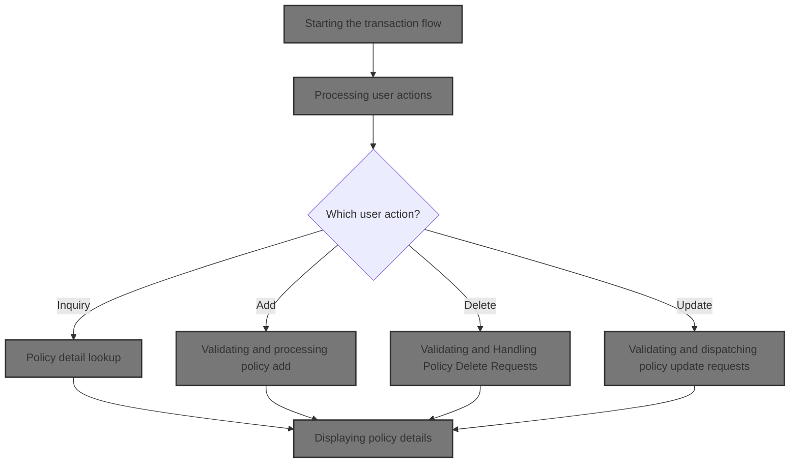
```mermaid
flowchart TD
  node1["Starting the transaction flow"]:::HeadingStyle --> node2["Processing user actions"]:::HeadingStyle
  click node1 goToHeading "Starting the transaction flow"
  click node2 goToHeading "Processing user actions"
  node2 --> node3{"Which user action?"}
  node3 -->|"Inquiry"| node4["Policy detail lookup"]:::HeadingStyle
  click node4 goToHeading "Policy detail lookup"
  node3 -->|"Add"| node5["Validating and processing policy add"]:::HeadingStyle
  click node5 goToHeading "Validating and processing policy add"
  node3 -->|"Delete"| node6["Validating and Handling Policy Delete Requests"]:::HeadingStyle
  click node6 goToHeading "Validating and Handling Policy Delete Requests"
  node3 -->|"Update"| node7["Validating and dispatching policy update requests"]:::HeadingStyle
  click node7 goToHeading "Validating and dispatching policy update requests"
  node4 --> node8["Displaying policy details"]:::HeadingStyle
  node5 --> node8
  node6 --> node8
  node7 --> node8
  click node8 goToHeading "Displaying policy details"
  
classDef HeadingStyle fill:#777777,stroke:#333,stroke-width:2px;
```

## Dependencies

### Programs

- <SwmToken path="base/src/lgtestp3.cbl" pos="11:6:6" line-data="       PROGRAM-ID. LGTESTP3.">`LGTESTP3`</SwmToken> (<SwmPath>[base/src/lgtestp3.cbl](base/src/lgtestp3.cbl)</SwmPath>)
- <SwmToken path="base/src/lgtestp3.cbl" pos="70:10:10" line-data="                 EXEC CICS LINK PROGRAM(&#39;LGIPOL01&#39;)">`LGIPOL01`</SwmToken> (<SwmPath>[base/src/lgipol01.cbl](base/src/lgipol01.cbl)</SwmPath>)
- <SwmToken path="base/src/lgipol01.cbl" pos="91:9:9" line-data="           EXEC CICS LINK Program(LGIPDB01)">`LGIPDB01`</SwmToken> (<SwmPath>[base/src/lgipdb01.cbl](base/src/lgipdb01.cbl)</SwmPath>)
- LGSTSQ (<SwmPath>[base/src/lgstsq.cbl](base/src/lgstsq.cbl)</SwmPath>)
- <SwmToken path="base/src/lgtestp3.cbl" pos="106:10:10" line-data="                 EXEC CICS LINK PROGRAM(&#39;LGAPOL01&#39;)">`LGAPOL01`</SwmToken> (<SwmPath>[base/src/lgapol01.cbl](base/src/lgapol01.cbl)</SwmPath>)
- <SwmToken path="base/src/lgapol01.cbl" pos="103:9:9" line-data="           EXEC CICS Link Program(LGAPDB01)">`LGAPDB01`</SwmToken> (<SwmPath>[base/src/LGAPDB01.cbl](base/src/LGAPDB01.cbl)</SwmPath>)
- <SwmToken path="base/src/LGAPDB01.cbl" pos="269:4:4" line-data="           CALL &#39;LGAPDB02&#39; USING IN-PROPERTY-TYPE, IN-POSTCODE, ">`LGAPDB02`</SwmToken>
- <SwmToken path="base/src/LGAPDB01.cbl" pos="276:4:4" line-data="           CALL &#39;LGAPDB03&#39; USING WS-BASE-RISK-SCR, IN-FIRE-PERIL, ">`LGAPDB03`</SwmToken> (<SwmPath>[base/src/LGAPDB03.cbl](base/src/LGAPDB03.cbl)</SwmPath>)
- <SwmToken path="base/src/LGAPDB01.cbl" pos="313:4:4" line-data="               CALL &#39;LGAPDB04&#39; USING LK-INPUT-DATA, LK-COVERAGE-DATA, ">`LGAPDB04`</SwmToken> (<SwmPath>[base/src/LGAPDB04.cbl](base/src/LGAPDB04.cbl)</SwmPath>)
- <SwmToken path="base/src/lgtestp3.cbl" pos="129:10:10" line-data="                 EXEC CICS LINK PROGRAM(&#39;LGDPOL01&#39;)">`LGDPOL01`</SwmToken> (<SwmPath>[base/src/lgdpol01.cbl](base/src/lgdpol01.cbl)</SwmPath>)
- <SwmToken path="base/src/lgdpol01.cbl" pos="141:9:9" line-data="           EXEC CICS LINK PROGRAM(LGDPDB01)">`LGDPDB01`</SwmToken> (<SwmPath>[base/src/lgdpdb01.cbl](base/src/lgdpdb01.cbl)</SwmPath>)
- <SwmToken path="base/src/lgdpdb01.cbl" pos="168:9:9" line-data="               EXEC CICS LINK PROGRAM(LGDPVS01)">`LGDPVS01`</SwmToken> (<SwmPath>[base/src/lgdpvs01.cbl](base/src/lgdpvs01.cbl)</SwmPath>)
- <SwmToken path="base/src/lgtestp3.cbl" pos="196:10:10" line-data="                 EXEC CICS LINK PROGRAM(&#39;LGUPOL01&#39;)">`LGUPOL01`</SwmToken> (<SwmPath>[base/src/lgupol01.cbl](base/src/lgupol01.cbl)</SwmPath>)
- <SwmToken path="base/src/lgupol01.cbl" pos="157:9:9" line-data="           EXEC CICS LINK Program(LGUPDB01)">`LGUPDB01`</SwmToken> (<SwmPath>[base/src/lgupdb01.cbl](base/src/lgupdb01.cbl)</SwmPath>)
- <SwmToken path="base/src/lgupdb01.cbl" pos="209:9:9" line-data="           EXEC CICS LINK Program(LGUPVS01)">`LGUPVS01`</SwmToken> (<SwmPath>[base/src/lgupvs01.cbl](base/src/lgupvs01.cbl)</SwmPath>)

### Copybooks

- SQLCA
- LGPOLICY (<SwmPath>[base/src/lgpolicy.cpy](base/src/lgpolicy.cpy)</SwmPath>)
- LGCMAREA (<SwmPath>[base/src/lgcmarea.cpy](base/src/lgcmarea.cpy)</SwmPath>)
- <SwmToken path="base/src/LGAPDB01.cbl" pos="35:3:3" line-data="           COPY INPUTREC2.">`INPUTREC2`</SwmToken> (<SwmPath>[base/src/INPUTREC2.cpy](base/src/INPUTREC2.cpy)</SwmPath>)
- OUTPUTREC (<SwmPath>[base/src/OUTPUTREC.cpy](base/src/OUTPUTREC.cpy)</SwmPath>)
- WORKSTOR (<SwmPath>[base/src/WORKSTOR.cpy](base/src/WORKSTOR.cpy)</SwmPath>)
- LGAPACT (<SwmPath>[base/src/LGAPACT.cpy](base/src/LGAPACT.cpy)</SwmPath>)
- SSMAP

## Detailed View of the Program's Functionality

# House Policy Inquiry, Add, Delete, and Update Flow

## 1\. Menu Entry and Initial State

### a. Menu Initialization

- When the main menu program starts, it checks if there is any input data from the user interface.
- If there is input, it immediately jumps to process the user's request.
- If not, it resets all input/output buffers and the communication area, clearing any previous data.
- It then sends the main menu screen to the terminal, erasing any previous display.

---

## 2\. Processing User Actions

### a. User Input Handling

- The program sets up handlers for special keys (like CLEAR or <SwmToken path="base/src/lgtestp3.cbl" pos="54:1:1" line-data="                     PF3(ENDIT) END-EXEC.">`PF3`</SwmToken>) and for input errors.
- It receives the user's menu selection from the terminal.

### b. Menu Option Evaluation

- The program evaluates the user's menu selection and branches to the appropriate logic for each option:
  - **Option '1':** Policy Inquiry
  - **Option '2':** Add Policy
  - **Option '3':** Delete Policy
  - **Option '4':** Update Policy
  - **Other:** Invalid Option

---

## 3\. Policy Inquiry (Option '1')

### a. Preparing and Dispatching Inquiry

- The program sets up the request for a house policy inquiry, moving the customer and policy numbers into the communication area.
- It links to the policy inquiry handler.

### b. Inquiry Handler (<SwmToken path="base/src/lgtestp3.cbl" pos="70:10:10" line-data="                 EXEC CICS LINK PROGRAM(&#39;LGIPOL01&#39;)">`LGIPOL01`</SwmToken>)

- The inquiry handler initializes its environment and checks if a communication area was received.
- If not, it logs an error and abends.
- If present, it resets the return code and links to the database inquiry handler.

### c. Database Inquiry (<SwmToken path="base/src/lgipol01.cbl" pos="91:9:9" line-data="           EXEC CICS LINK Program(LGIPDB01)">`LGIPDB01`</SwmToken>)

- The database handler initializes its environment and checks the communication area.
- It converts the customer and policy numbers for database use.
- It evaluates the request type and, for house policies, fetches the relevant data from the database.
- If the fetch is successful, it calculates the required size for the response and moves the data into the communication area.
- If the fetch fails (no data or error), it sets an error code and logs the error if needed.

### d. Returning Results

- Back in the menu program, if the inquiry failed, it sets an error message and resets the menu.
- If successful, it moves the returned policy details into the output fields and sends the updated menu to the terminal.

---

## 4\. Add Policy (Option '2')

### a. Preparing Add Request

- The program sets up the communication area with all the input fields needed for a new house policy.
- It links to the add policy handler.

### b. Add Policy Handler (<SwmToken path="base/src/lgtestp3.cbl" pos="106:10:10" line-data="                 EXEC CICS LINK PROGRAM(&#39;LGAPOL01&#39;)">`LGAPOL01`</SwmToken>)

- The handler initializes its environment and checks for a valid communication area.
- If missing, it logs an error and abends.
- It resets the return code and checks that the communication area is large enough.
- It links to the database add handler.

### c. Database Add Handler (<SwmToken path="base/src/lgapol01.cbl" pos="103:9:9" line-data="           EXEC CICS Link Program(LGAPDB01)">`LGAPDB01`</SwmToken>)

- The database handler initializes its environment, loads configuration, opens files, and processes each input record.
- For each record, it validates the input (policy type, customer number, coverage limits, etc.).
- If valid, it processes the record as commercial or non-commercial, calculating risk scores and premiums.
- For commercial policies, it performs risk scoring, basic premium calculation, and, if approved, advanced actuarial calculations.
- It applies business rules to determine the underwriting decision and writes the output record.
- It updates statistics and generates a summary at the end.

### d. Handling Add Results

- Back in the menu program, if the add failed, it rolls back the transaction and sets an error message based on the error code.
- If successful, it moves the new customer and policy numbers to the output fields, clears the option, sets a success message, and sends the updated menu to the terminal.

---

## 5\. Delete Policy (Option '3')

### a. Preparing Delete Request

- The program sets up the communication area with the delete request ID and policy/customer numbers.
- It links to the delete policy handler.

### b. Delete Policy Handler (<SwmToken path="base/src/lgtestp3.cbl" pos="129:10:10" line-data="                 EXEC CICS LINK PROGRAM(&#39;LGDPOL01&#39;)">`LGDPOL01`</SwmToken>)

- The handler initializes its environment and checks for a valid communication area.
- It checks that the communication area is large enough.
- It uppercases the request ID and verifies it is recognized.
- If valid, it links to the database delete handler.

### c. Database Delete Handler (<SwmToken path="base/src/lgdpol01.cbl" pos="141:9:9" line-data="           EXEC CICS LINK PROGRAM(LGDPDB01)">`LGDPDB01`</SwmToken>)

- The database handler initializes its environment and checks the communication area.
- It converts the customer and policy numbers for database use.
- It verifies the request ID is supported.
- If valid, it performs the SQL DELETE for the policy record.
- If the delete fails, it logs the error and sets the return code.
- It then links to the VSAM delete handler.

### d. VSAM Delete Handler (<SwmToken path="base/src/lgdpdb01.cbl" pos="168:9:9" line-data="               EXEC CICS LINK PROGRAM(LGDPVS01)">`LGDPVS01`</SwmToken>)

- The VSAM handler sets up the key fields and attempts to delete the policy record from the VSAM file.
- If the delete fails, it logs the error and sets the return code.

### e. Handling Delete Results

- Back in the menu program, if the delete failed, it rolls back the transaction and sets an error message.
- If successful, it clears all policy input fields, sets a success message, and sends the updated menu to the terminal.

---

## 6\. Update Policy (Option '4')

### a. Preparing Update Request

- The program sets up the communication area with all the input fields needed for a house policy update.
- It links to the update policy handler.

### b. Update Policy Handler (<SwmToken path="base/src/lgtestp3.cbl" pos="196:10:10" line-data="                 EXEC CICS LINK PROGRAM(&#39;LGUPOL01&#39;)">`LGUPOL01`</SwmToken>)

- The handler initializes its environment and checks for a valid communication area.
- It checks the request type and that the communication area is large enough.
- If valid, it links to the database update handler.

### c. Database Update Handler (<SwmToken path="base/src/lgupol01.cbl" pos="157:9:9" line-data="           EXEC CICS LINK Program(LGUPDB01)">`LGUPDB01`</SwmToken>)

- The database handler initializes its environment and checks the communication area.
- It converts the customer and policy numbers for database use.
- It opens a cursor to fetch the policy row and checks the timestamp for concurrency.
- If the timestamp matches, it updates the policy-type-specific table (house, endowment, or motor).
- If that update succeeds, it updates the main policy table and assigns a new timestamp.
- If any update fails, it logs the error and sets the return code.
- It then links to the VSAM update handler.

### d. VSAM Update Handler (<SwmToken path="base/src/lgupdb01.cbl" pos="209:9:9" line-data="           EXEC CICS LINK Program(LGUPVS01)">`LGUPVS01`</SwmToken>)

- The VSAM handler sets up the key fields and moves the appropriate data fields based on policy type.
- It reads the record from the VSAM file, updates it, and rewrites it.
- If any operation fails, it logs the error and sets the return code.

### e. Handling Update Results

- Back in the menu program, if the update failed, it sets an error message and resets the menu.
- If successful, it moves the customer and policy numbers to the output fields, clears the option, sets a success message, and sends the updated menu to the terminal.

---

## 7\. Error Logging and Queueing

### a. Error Logging

- All business logic programs (inquiry, add, delete, update) have a standard error logging routine.
- When an error occurs, the routine formats the error message with the current date, time, program name, and relevant variables.
- It links to the system queue handler to write the error message and up to 90 bytes of the communication area for diagnostics.

### b. System Queue Handler (LGSTSQ)

- The queue handler determines the source of the message and writes it to both a transient data queue and a temporary storage queue.
- If the message was received interactively, it sends a quick response back to the terminal.

---

## 8\. Invalid Option Handling

- If the user enters an invalid menu option, the program sets an error message, moves the cursor to the option field, sends the updated menu, and returns control to the transaction menu.

---

## 9\. Transaction End and Reset

- After any operation (inquiry, add, delete, update, or error), the program resets the input/output buffers and communication area, and returns control to the transaction menu for the next user action.

# Rule Definition

| Paragraph Name                                                                                                                                                                                                                                                                                                                                                                                                                                                                                                                                                                                                                                                                                                                                                                                                                                                                                                                                                                                                                                                                                                                                                                                                                                                                                                                                                                                                                                                                                                                                                                                                                                                                                                                                                                                                                                                                                                                                                                     | Rule ID | Category          | Description                                                                                                                                                                                                                                                                                                                                                                                                                                                               | Conditions                                                                               | Remarks                                                                                                                                                                                                                                                                                                                                                                                                                                                                                                                                                                                                                         |
| ---------------------------------------------------------------------------------------------------------------------------------------------------------------------------------------------------------------------------------------------------------------------------------------------------------------------------------------------------------------------------------------------------------------------------------------------------------------------------------------------------------------------------------------------------------------------------------------------------------------------------------------------------------------------------------------------------------------------------------------------------------------------------------------------------------------------------------------------------------------------------------------------------------------------------------------------------------------------------------------------------------------------------------------------------------------------------------------------------------------------------------------------------------------------------------------------------------------------------------------------------------------------------------------------------------------------------------------------------------------------------------------------------------------------------------------------------------------------------------------------------------------------------------------------------------------------------------------------------------------------------------------------------------------------------------------------------------------------------------------------------------------------------------------------------------------------------------------------------------------------------------------------------------------------------------------------------------------------------------- | ------- | ----------------- | ------------------------------------------------------------------------------------------------------------------------------------------------------------------------------------------------------------------------------------------------------------------------------------------------------------------------------------------------------------------------------------------------------------------------------------------------------------------------- | ---------------------------------------------------------------------------------------- | ------------------------------------------------------------------------------------------------------------------------------------------------------------------------------------------------------------------------------------------------------------------------------------------------------------------------------------------------------------------------------------------------------------------------------------------------------------------------------------------------------------------------------------------------------------------------------------------------------------------------------- |
| <SwmPath>[base/src/lgtestp3.cbl](base/src/lgtestp3.cbl)</SwmPath> MAINLINE SECTION, EVALUATE <SwmToken path="base/src/lgtestp3.cbl" pos="64:3:3" line-data="           EVALUATE ENP3OPTO">`ENP3OPTO`</SwmToken>                                                                                                                                                                                                                                                                                                                                                                                                                                                                                                                                                                                                                                                                                                                                                                                                                                                                                                                                                                                                                                                                                                                                                                                                                                                                                                                                                                                                                                                                                                                                                                                                                                                                                                                                                                    | RL-001  | Conditional Logic | User actions received via the menu input buffer are mapped to corresponding backend operations. Each menu option triggers a specific transaction (Inquiry, Add, Delete, Update) or displays an error for invalid options.                                                                                                                                                                                                                                                 | User selects a menu option ('1', '2', '3', '4', or other) via the menu input buffer.     | Menu options are single characters ('1', '2', '3', '4'). Invalid options prompt a message and do not invoke backend operations.                                                                                                                                                                                                                                                                                                                                                                                                                                                                                                 |
| <SwmPath>[base/src/lgtestp3.cbl](base/src/lgtestp3.cbl)</SwmPath> MAINLINE SECTION, before each operation                                                                                                                                                                                                                                                                                                                                                                                                                                                                                                                                                                                                                                                                                                                                                                                                                                                                                                                                                                                                                                                                                                                                                                                                                                                                                                                                                                                                                                                                                                                                                                                                                                                                                                                                                                                                                                                                          | RL-002  | Data Assignment   | Before each transaction, all input/output buffers and the commarea are reset to ensure a clean state for processing.                                                                                                                                                                                                                                                                                                                                                      | Before processing any menu option transaction.                                           | Buffers are reset using 'Initialize' statements. Commarea is a shared structure for passing state between modules.                                                                                                                                                                                                                                                                                                                                                                                                                                                                                                              |
| <SwmPath>[base/src/lgtestp3.cbl](base/src/lgtestp3.cbl)</SwmPath> EVALUATE <SwmToken path="base/src/lgtestp3.cbl" pos="64:3:3" line-data="           EVALUATE ENP3OPTO">`ENP3OPTO`</SwmToken> WHEN '1', <SwmPath>[base/src/lgipol01.cbl](base/src/lgipol01.cbl)</SwmPath> MAINLINE SECTION, <SwmPath>[base/src/lgipdb01.cbl](base/src/lgipdb01.cbl)</SwmPath> <SwmToken path="base/src/lgipdb01.cbl" pos="285:3:9" line-data="               PERFORM GET-HOUSE-DB2-INFO">`GET-HOUSE-DB2-INFO`</SwmToken>                                                                                                                                                                                                                                                                                                                                                                                                                                                                                                                                                                                                                                                                                                                                                                                                                                                                                                                                                                                                                                                                                                                                                                                                                                                                                                                                                                                                                                                                           | RL-003  | Computation       | For Inquiry, the system prepares a commarea with request ID <SwmToken path="base/src/lgtestp3.cbl" pos="67:4:4" line-data="                 Move &#39;01IHOU&#39;   To CA-REQUEST-ID">`01IHOU`</SwmToken>, customer number, and policy number, calls the inquiry backend, and displays policy details if found, or an error message if not.                                                                                                                               | Menu option '1' selected; valid customer and policy numbers provided.                    | <SwmToken path="base/src/lgtestp3.cbl" pos="67:9:13" line-data="                 Move &#39;01IHOU&#39;   To CA-REQUEST-ID">`CA-REQUEST-ID`</SwmToken> = <SwmToken path="base/src/lgtestp3.cbl" pos="67:4:4" line-data="                 Move &#39;01IHOU&#39;   To CA-REQUEST-ID">`01IHOU`</SwmToken>. <SwmToken path="base/src/lgtestp3.cbl" pos="74:3:7" line-data="                 IF CA-RETURN-CODE &gt; 0">`CA-RETURN-CODE`</SwmToken> '00' for success, '01' for not found. Output fields include policy details (dates, property type, bedrooms, value, house name/number, postcode).                                   |
| <SwmPath>[base/src/lgtestp3.cbl](base/src/lgtestp3.cbl)</SwmPath> EVALUATE <SwmToken path="base/src/lgtestp3.cbl" pos="64:3:3" line-data="           EVALUATE ENP3OPTO">`ENP3OPTO`</SwmToken> WHEN '2', <SwmPath>[base/src/lgapol01.cbl](base/src/lgapol01.cbl)</SwmPath> <SwmToken path="base/src/lgapol01.cbl" pos="68:1:3" line-data="       P100-MAIN SECTION.">`P100-MAIN`</SwmToken> SECTION, <SwmPath>[base/src/LGAPDB01.cbl](base/src/LGAPDB01.cbl)</SwmPath>                                                                                                                                                                                                                                                                                                                                                                                                                                                                                                                                                                                                                                                                                                                                                                                                                                                                                                                                                                                                                                                                                                                                                                                                                                                                                                                                                                                                                                                                                                              | RL-004  | Computation       | For Add, the system prepares a commarea with request ID <SwmToken path="base/src/lgtestp3.cbl" pos="93:4:4" line-data="                 Move &#39;01AHOU&#39;          To CA-REQUEST-ID">`01AHOU`</SwmToken> and all relevant policy fields, calls the add backend, and displays success or error messages based on backend return codes.                                                                                                                                 | Menu option '2' selected; all required policy fields provided.                           | <SwmToken path="base/src/lgtestp3.cbl" pos="67:9:13" line-data="                 Move &#39;01IHOU&#39;   To CA-REQUEST-ID">`CA-REQUEST-ID`</SwmToken> = <SwmToken path="base/src/lgtestp3.cbl" pos="93:4:4" line-data="                 Move &#39;01AHOU&#39;          To CA-REQUEST-ID">`01AHOU`</SwmToken>. <SwmToken path="base/src/lgtestp3.cbl" pos="74:3:7" line-data="                 IF CA-RETURN-CODE &gt; 0">`CA-RETURN-CODE`</SwmToken> '00' for success, '70' for customer not found, '90' for duplicate policy, '98' for input too short. Output includes new customer/policy numbers and success/error messages. |
| <SwmPath>[base/src/lgtestp3.cbl](base/src/lgtestp3.cbl)</SwmPath> EVALUATE <SwmToken path="base/src/lgtestp3.cbl" pos="64:3:3" line-data="           EVALUATE ENP3OPTO">`ENP3OPTO`</SwmToken> WHEN '3', <SwmPath>[base/src/lgdpol01.cbl](base/src/lgdpol01.cbl)</SwmPath> MAINLINE SECTION, <SwmPath>[base/src/lgdpdb01.cbl](base/src/lgdpdb01.cbl)</SwmPath> <SwmToken path="base/src/lgdpol01.cbl" pos="126:3:9" line-data="               PERFORM DELETE-POLICY-DB2-INFO">`DELETE-POLICY-DB2-INFO`</SwmToken>, <SwmPath>[base/src/lgdpvs01.cbl](base/src/lgdpvs01.cbl)</SwmPath>                                                                                                                                                                                                                                                                                                                                                                                                                                                                                                                                                                                                                                                                                                                                                                                                                                                                                                                                                                                                                                                                                                                                                                                                                                                                                                                                                                                                | RL-005  | Computation       | For Delete, the system prepares a commarea with request ID <SwmToken path="base/src/lgtestp3.cbl" pos="126:4:4" line-data="                 Move &#39;01DHOU&#39;   To CA-REQUEST-ID">`01DHOU`</SwmToken>, customer number, and policy number, calls the delete backend, and clears policy fields and displays success or error messages. Deletes are idempotent; deleting a missing record is not an error.                                                              | Menu option '3' selected; valid customer and policy numbers provided.                    | <SwmToken path="base/src/lgtestp3.cbl" pos="67:9:13" line-data="                 Move &#39;01IHOU&#39;   To CA-REQUEST-ID">`CA-REQUEST-ID`</SwmToken> = <SwmToken path="base/src/lgtestp3.cbl" pos="126:4:4" line-data="                 Move &#39;01DHOU&#39;   To CA-REQUEST-ID">`01DHOU`</SwmToken>. <SwmToken path="base/src/lgtestp3.cbl" pos="74:3:7" line-data="                 IF CA-RETURN-CODE &gt; 0">`CA-RETURN-CODE`</SwmToken> '00' for success, '01' for not found (treated as success), '81'/'82' for VSAM errors. Output clears policy fields and displays 'House Policy Deleted' or error message.           |
| <SwmPath>[base/src/lgtestp3.cbl](base/src/lgtestp3.cbl)</SwmPath> EVALUATE <SwmToken path="base/src/lgtestp3.cbl" pos="64:3:3" line-data="           EVALUATE ENP3OPTO">`ENP3OPTO`</SwmToken> WHEN '4', <SwmPath>[base/src/lgupol01.cbl](base/src/lgupol01.cbl)</SwmPath> MAINLINE SECTION, <SwmPath>[base/src/lgupdb01.cbl](base/src/lgupdb01.cbl)</SwmPath> <SwmToken path="base/src/lgupol01.cbl" pos="143:3:9" line-data="           PERFORM UPDATE-POLICY-DB2-INFO.">`UPDATE-POLICY-DB2-INFO`</SwmToken>                                                                                                                                                                                                                                                                                                                                                                                                                                                                                                                                                                                                                                                                                                                                                                                                                                                                                                                                                                                                                                                                                                                                                                                                                                                                                                                                                                                                                                                                      | RL-006  | Computation       | For Update, the system prepares a commarea with request ID <SwmToken path="base/src/lgtestp3.cbl" pos="183:4:4" line-data="                 Move &#39;01UHOU&#39;          To CA-REQUEST-ID">`01UHOU`</SwmToken> and all relevant policy fields including LASTCHANGED timestamp, calls the update backend, and updates the policy if found and timestamps match. Otherwise, returns error codes for timestamp mismatch or not found.                                      | Menu option '4' selected; all required policy fields and LASTCHANGED timestamp provided. | <SwmToken path="base/src/lgtestp3.cbl" pos="67:9:13" line-data="                 Move &#39;01IHOU&#39;   To CA-REQUEST-ID">`CA-REQUEST-ID`</SwmToken> = <SwmToken path="base/src/lgtestp3.cbl" pos="183:4:4" line-data="                 Move &#39;01UHOU&#39;          To CA-REQUEST-ID">`01UHOU`</SwmToken>. <SwmToken path="base/src/lgtestp3.cbl" pos="74:3:7" line-data="                 IF CA-RETURN-CODE &gt; 0">`CA-RETURN-CODE`</SwmToken> '00' for success, '02' for timestamp mismatch, '01' for not found, '81'/'82' for VSAM errors. Output includes updated customer/policy numbers and success/error messages.  |
| <SwmPath>[base/src/lgipdb01.cbl](base/src/lgipdb01.cbl)</SwmPath>, <SwmPath>[base/src/lgdpdb01.cbl](base/src/lgdpdb01.cbl)</SwmPath>, <SwmPath>[base/src/lgupdb01.cbl](base/src/lgupdb01.cbl)</SwmPath>, <SwmPath>[base/src/lgdpvs01.cbl](base/src/lgdpvs01.cbl)</SwmPath>, <SwmPath>[base/src/lgupvs01.cbl](base/src/lgupvs01.cbl)</SwmPath>                                                                                                                                                                                                                                                                                                                                                                                                                                                                                                                                                                                                                                                                                                                                                                                                                                                                                                                                                                                                                                                                                                                                                                                                                                                                                                                                                                                                                                                                                                                                                                                                                                      | RL-007  | Computation       | All backend operations interact with persistent storage (<SwmToken path="base/src/lgipdb01.cbl" pos="284:3:5" line-data="               INITIALIZE DB2-HOUSE">`DB2-HOUSE`</SwmToken> table and VSAM-HOUSE file) to ensure policy data survives across transactions.                                                                                                                                                                                                       | Any backend operation (Inquiry, Add, Delete, Update) is invoked.                         | <SwmToken path="base/src/lgipdb01.cbl" pos="242:5:5" line-data="      * initialize DB2 host variables">`DB2`</SwmToken> and VSAM files are used for all policy operations. Data formats are as per policy record definitions (strings, numbers, dates, etc.).                                                                                                                                                                                                                                                                                                                                                                   |
| <SwmPath>[base/src/lgipdb01.cbl](base/src/lgipdb01.cbl)</SwmPath>, <SwmPath>[base/src/lgdpdb01.cbl](base/src/lgdpdb01.cbl)</SwmPath>, <SwmPath>[base/src/lgupdb01.cbl](base/src/lgupdb01.cbl)</SwmPath>, <SwmPath>[base/src/lgtestp3.cbl](base/src/lgtestp3.cbl)</SwmPath> error handling sections                                                                                                                                                                                                                                                                                                                                                                                                                                                                                                                                                                                                                                                                                                                                                                                                                                                                                                                                                                                                                                                                                                                                                                                                                                                                                                                                                                                                                                                                                                                                                                                                                                                                                 | RL-008  | Data Assignment   | All backend operations set <SwmToken path="base/src/lgtestp3.cbl" pos="74:3:7" line-data="                 IF CA-RETURN-CODE &gt; 0">`CA-RETURN-CODE`</SwmToken> according to the outcome, using standardized codes for success, not found, timestamp mismatch, customer not found, <SwmToken path="base/src/lgipdb01.cbl" pos="242:5:5" line-data="      * initialize DB2 host variables">`DB2`</SwmToken> error, input too short, unsupported request, and VSAM errors. | Any backend operation completes (Inquiry, Add, Delete, Update).                          | <SwmToken path="base/src/lgtestp3.cbl" pos="74:3:7" line-data="                 IF CA-RETURN-CODE &gt; 0">`CA-RETURN-CODE`</SwmToken> values: '00' (Success), '01' (Not found), '02' (Timestamp mismatch), '70' (Customer not found), '90' (<SwmToken path="base/src/lgipdb01.cbl" pos="242:5:5" line-data="      * initialize DB2 host variables">`DB2`</SwmToken> error), '98' (Input too short), '99' (Unsupported request), '81', '82' (VSAM errors).                                                                                                                                                                       |
| <SwmPath>[base/src/lgipol01.cbl](base/src/lgipol01.cbl)</SwmPath> <SwmToken path="base/src/lgipol01.cbl" pos="81:3:7" line-data="               PERFORM WRITE-ERROR-MESSAGE">`WRITE-ERROR-MESSAGE`</SwmToken>, <SwmPath>[base/src/lgipdb01.cbl](base/src/lgipdb01.cbl)</SwmPath> <SwmToken path="base/src/lgipol01.cbl" pos="81:3:7" line-data="               PERFORM WRITE-ERROR-MESSAGE">`WRITE-ERROR-MESSAGE`</SwmToken>, <SwmPath>[base/src/lgapol01.cbl](base/src/lgapol01.cbl)</SwmPath> <SwmToken path="base/src/lgapol01.cbl" pos="85:3:5" line-data="               PERFORM P999-ERROR">`P999-ERROR`</SwmToken>, <SwmPath>[base/src/lgdpol01.cbl](base/src/lgdpol01.cbl)</SwmPath> <SwmToken path="base/src/lgipol01.cbl" pos="81:3:7" line-data="               PERFORM WRITE-ERROR-MESSAGE">`WRITE-ERROR-MESSAGE`</SwmToken>, <SwmPath>[base/src/lgdpdb01.cbl](base/src/lgdpdb01.cbl)</SwmPath> <SwmToken path="base/src/lgipol01.cbl" pos="81:3:7" line-data="               PERFORM WRITE-ERROR-MESSAGE">`WRITE-ERROR-MESSAGE`</SwmToken>, <SwmPath>[base/src/lgupol01.cbl](base/src/lgupol01.cbl)</SwmPath> <SwmToken path="base/src/lgipol01.cbl" pos="81:3:7" line-data="               PERFORM WRITE-ERROR-MESSAGE">`WRITE-ERROR-MESSAGE`</SwmToken>, <SwmPath>[base/src/lgupdb01.cbl](base/src/lgupdb01.cbl)</SwmPath> <SwmToken path="base/src/lgipol01.cbl" pos="81:3:7" line-data="               PERFORM WRITE-ERROR-MESSAGE">`WRITE-ERROR-MESSAGE`</SwmToken>, <SwmPath>[base/src/lgdpvs01.cbl](base/src/lgdpvs01.cbl)</SwmPath> <SwmToken path="base/src/lgipol01.cbl" pos="81:3:7" line-data="               PERFORM WRITE-ERROR-MESSAGE">`WRITE-ERROR-MESSAGE`</SwmToken>, <SwmPath>[base/src/lgupvs01.cbl](base/src/lgupvs01.cbl)</SwmPath> <SwmToken path="base/src/lgipol01.cbl" pos="81:3:7" line-data="               PERFORM WRITE-ERROR-MESSAGE">`WRITE-ERROR-MESSAGE`</SwmToken>, <SwmPath>[base/src/lgstsq.cbl](base/src/lgstsq.cbl)</SwmPath> | RL-009  | Computation       | All errors and relevant events are logged with date, time, operation, error code, and up to 90 bytes of commarea data for audit and troubleshooting.                                                                                                                                                                                                                                                                                                                      | Any error or significant event occurs during backend processing.                         | Log message includes date (MMDDYYYY), time (HHMMSS), program name, customer number, policy number, SQLCODE or RESP codes, and up to 90 bytes of commarea data. Messages are sent to TDQ (CSMT) and TSQ (GENAERRS or <SwmToken path="base/src/lgstsq.cbl" pos="6:19:19" line-data="      *  parm Q=nnnn is passed then Queue name GENAnnnn is used        *">`GENAnnnn`</SwmToken>).                                                                                                                                                                                                                                             |
| <SwmPath>[base/src/lgdpdb01.cbl](base/src/lgdpdb01.cbl)</SwmPath> <SwmToken path="base/src/lgdpol01.cbl" pos="126:3:9" line-data="               PERFORM DELETE-POLICY-DB2-INFO">`DELETE-POLICY-DB2-INFO`</SwmToken>, <SwmPath>[base/src/lgdpol01.cbl](base/src/lgdpol01.cbl)</SwmPath> MAINLINE SECTION                                                                                                                                                                                                                                                                                                                                                                                                                                                                                                                                                                                                                                                                                                                                                                                                                                                                                                                                                                                                                                                                                                                                                                                                                                                                                                                                                                                                                                                                                                                                                                                                                                                                           | RL-010  | Conditional Logic | Delete operations are idempotent; attempting to delete a missing record does not result in an error and is treated as a successful operation.                                                                                                                                                                                                                                                                                                                             | Delete operation invoked; record does not exist (SQLCODE 100).                           | <SwmToken path="base/src/lgtestp3.cbl" pos="74:3:7" line-data="                 IF CA-RETURN-CODE &gt; 0">`CA-RETURN-CODE`</SwmToken> '00' for success, '01' for not found (treated as success).                                                                                                                                                                                                                                                                                                                                                                                                                                |
| <SwmPath>[base/src/lgtestp3.cbl](base/src/lgtestp3.cbl)</SwmPath> MAINLINE SECTION, operation handler invocation                                                                                                                                                                                                                                                                                                                                                                                                                                                                                                                                                                                                                                                                                                                                                                                                                                                                                                                                                                                                                                                                                                                                                                                                                                                                                                                                                                                                                                                                                                                                                                                                                                                                                                                                                                                                                                                                   | RL-011  | Conditional Logic | The system is structured as an event-driven service, with a main dispatcher receiving user actions and dispatching to operation handlers, each implemented as a separate module/function.                                                                                                                                                                                                                                                                                 | System receives a user action from the menu.                                             | Dispatcher evaluates menu option and invokes corresponding handler (Inquiry, Add, Delete, Update). Each handler is a separate module/function.                                                                                                                                                                                                                                                                                                                                                                                                                                                                                  |
| All modules, especially linkage sections and operation handlers                                                                                                                                                                                                                                                                                                                                                                                                                                                                                                                                                                                                                                                                                                                                                                                                                                                                                                                                                                                                                                                                                                                                                                                                                                                                                                                                                                                                                                                                                                                                                                                                                                                                                                                                                                                                                                                                                                                    | RL-012  | Data Assignment   | State is passed between modules using a shared data structure equivalent to the commarea, ensuring consistent data exchange and operation context.                                                                                                                                                                                                                                                                                                                        | Any operation handler is invoked by the dispatcher.                                      | Commarea contains all relevant fields for the operation (customer number, policy number, request ID, timestamps, etc.).                                                                                                                                                                                                                                                                                                                                                                                                                                                                                                         |

# User Stories

## User Story 1: Process menu-driven user actions and ensure clean state

---

### Story Description:

As a user, I want to select menu options to perform policy operations (Inquiry, Add, Delete, Update), with the system resetting all buffers and commarea before each transaction, so that I can manage house policies efficiently and reliably, and receive feedback for invalid options.

---

### Business Rule Mapping:

| Rule ID | Paragraph Name                                                                                                                                                                                                  | Rule Description                                                                                                                                                                                                          |
| ------- | --------------------------------------------------------------------------------------------------------------------------------------------------------------------------------------------------------------- | ------------------------------------------------------------------------------------------------------------------------------------------------------------------------------------------------------------------------- |
| RL-001  | <SwmPath>[base/src/lgtestp3.cbl](base/src/lgtestp3.cbl)</SwmPath> MAINLINE SECTION, EVALUATE <SwmToken path="base/src/lgtestp3.cbl" pos="64:3:3" line-data="           EVALUATE ENP3OPTO">`ENP3OPTO`</SwmToken> | User actions received via the menu input buffer are mapped to corresponding backend operations. Each menu option triggers a specific transaction (Inquiry, Add, Delete, Update) or displays an error for invalid options. |
| RL-002  | <SwmPath>[base/src/lgtestp3.cbl](base/src/lgtestp3.cbl)</SwmPath> MAINLINE SECTION, before each operation                                                                                                       | Before each transaction, all input/output buffers and the commarea are reset to ensure a clean state for processing.                                                                                                      |
| RL-011  | <SwmPath>[base/src/lgtestp3.cbl](base/src/lgtestp3.cbl)</SwmPath> MAINLINE SECTION, operation handler invocation                                                                                                | The system is structured as an event-driven service, with a main dispatcher receiving user actions and dispatching to operation handlers, each implemented as a separate module/function.                                 |

---

### Relevant Functionality:

- <SwmPath>[base/src/lgtestp3.cbl](base/src/lgtestp3.cbl)</SwmPath> **MAINLINE SECTION**
  1. **RL-001:**
     - Receive user input from menu buffer
     - Evaluate selected option:
       - If '1': Prepare inquiry commarea and call inquiry backend
       - If '2': Prepare add commarea and call add backend
       - If '3': Prepare delete commarea and call delete backend
       - If '4': Prepare update commarea and call update backend
       - Otherwise: Display 'Please enter a valid option' and return to menu
  2. **RL-002:**
     - Initialize input buffer
     - Initialize output buffer
     - Initialize commarea
  3. **RL-011:**
     - Main dispatcher receives user action
     - Evaluate action and invoke corresponding handler
     - Pass state via shared commarea structure

## User Story 2: Inquiry operation

---

### Story Description:

As a user, I want to inquire about a house policy by providing customer and policy numbers so that I can view policy details or receive a message if no data is found.

---

### Business Rule Mapping:

| Rule ID | Paragraph Name                                                                                                                                                                                                                                                                                                                                                                                                                                                                                                                                                                                                                                                                                                                                                                                                                                                                                                                                                                                                                                                                                                                                                                                                                                                                                                                                                                                                                                                                                                                                                                                                                                                                                                                                                                                                                                                                                                                                                                     | Rule Description                                                                                                                                                                                                                                                                                                                                                                                                                                                          |
| ------- | ---------------------------------------------------------------------------------------------------------------------------------------------------------------------------------------------------------------------------------------------------------------------------------------------------------------------------------------------------------------------------------------------------------------------------------------------------------------------------------------------------------------------------------------------------------------------------------------------------------------------------------------------------------------------------------------------------------------------------------------------------------------------------------------------------------------------------------------------------------------------------------------------------------------------------------------------------------------------------------------------------------------------------------------------------------------------------------------------------------------------------------------------------------------------------------------------------------------------------------------------------------------------------------------------------------------------------------------------------------------------------------------------------------------------------------------------------------------------------------------------------------------------------------------------------------------------------------------------------------------------------------------------------------------------------------------------------------------------------------------------------------------------------------------------------------------------------------------------------------------------------------------------------------------------------------------------------------------------------------- | ------------------------------------------------------------------------------------------------------------------------------------------------------------------------------------------------------------------------------------------------------------------------------------------------------------------------------------------------------------------------------------------------------------------------------------------------------------------------- |
| RL-003  | <SwmPath>[base/src/lgtestp3.cbl](base/src/lgtestp3.cbl)</SwmPath> EVALUATE <SwmToken path="base/src/lgtestp3.cbl" pos="64:3:3" line-data="           EVALUATE ENP3OPTO">`ENP3OPTO`</SwmToken> WHEN '1', <SwmPath>[base/src/lgipol01.cbl](base/src/lgipol01.cbl)</SwmPath> MAINLINE SECTION, <SwmPath>[base/src/lgipdb01.cbl](base/src/lgipdb01.cbl)</SwmPath> <SwmToken path="base/src/lgipdb01.cbl" pos="285:3:9" line-data="               PERFORM GET-HOUSE-DB2-INFO">`GET-HOUSE-DB2-INFO`</SwmToken>                                                                                                                                                                                                                                                                                                                                                                                                                                                                                                                                                                                                                                                                                                                                                                                                                                                                                                                                                                                                                                                                                                                                                                                                                                                                                                                                                                                                                                                                           | For Inquiry, the system prepares a commarea with request ID <SwmToken path="base/src/lgtestp3.cbl" pos="67:4:4" line-data="                 Move &#39;01IHOU&#39;   To CA-REQUEST-ID">`01IHOU`</SwmToken>, customer number, and policy number, calls the inquiry backend, and displays policy details if found, or an error message if not.                                                                                                                               |
| RL-007  | <SwmPath>[base/src/lgipdb01.cbl](base/src/lgipdb01.cbl)</SwmPath>, <SwmPath>[base/src/lgdpdb01.cbl](base/src/lgdpdb01.cbl)</SwmPath>, <SwmPath>[base/src/lgupdb01.cbl](base/src/lgupdb01.cbl)</SwmPath>, <SwmPath>[base/src/lgdpvs01.cbl](base/src/lgdpvs01.cbl)</SwmPath>, <SwmPath>[base/src/lgupvs01.cbl](base/src/lgupvs01.cbl)</SwmPath>                                                                                                                                                                                                                                                                                                                                                                                                                                                                                                                                                                                                                                                                                                                                                                                                                                                                                                                                                                                                                                                                                                                                                                                                                                                                                                                                                                                                                                                                                                                                                                                                                                      | All backend operations interact with persistent storage (<SwmToken path="base/src/lgipdb01.cbl" pos="284:3:5" line-data="               INITIALIZE DB2-HOUSE">`DB2-HOUSE`</SwmToken> table and VSAM-HOUSE file) to ensure policy data survives across transactions.                                                                                                                                                                                                       |
| RL-008  | <SwmPath>[base/src/lgipdb01.cbl](base/src/lgipdb01.cbl)</SwmPath>, <SwmPath>[base/src/lgdpdb01.cbl](base/src/lgdpdb01.cbl)</SwmPath>, <SwmPath>[base/src/lgupdb01.cbl](base/src/lgupdb01.cbl)</SwmPath>, <SwmPath>[base/src/lgtestp3.cbl](base/src/lgtestp3.cbl)</SwmPath> error handling sections                                                                                                                                                                                                                                                                                                                                                                                                                                                                                                                                                                                                                                                                                                                                                                                                                                                                                                                                                                                                                                                                                                                                                                                                                                                                                                                                                                                                                                                                                                                                                                                                                                                                                 | All backend operations set <SwmToken path="base/src/lgtestp3.cbl" pos="74:3:7" line-data="                 IF CA-RETURN-CODE &gt; 0">`CA-RETURN-CODE`</SwmToken> according to the outcome, using standardized codes for success, not found, timestamp mismatch, customer not found, <SwmToken path="base/src/lgipdb01.cbl" pos="242:5:5" line-data="      * initialize DB2 host variables">`DB2`</SwmToken> error, input too short, unsupported request, and VSAM errors. |
| RL-009  | <SwmPath>[base/src/lgipol01.cbl](base/src/lgipol01.cbl)</SwmPath> <SwmToken path="base/src/lgipol01.cbl" pos="81:3:7" line-data="               PERFORM WRITE-ERROR-MESSAGE">`WRITE-ERROR-MESSAGE`</SwmToken>, <SwmPath>[base/src/lgipdb01.cbl](base/src/lgipdb01.cbl)</SwmPath> <SwmToken path="base/src/lgipol01.cbl" pos="81:3:7" line-data="               PERFORM WRITE-ERROR-MESSAGE">`WRITE-ERROR-MESSAGE`</SwmToken>, <SwmPath>[base/src/lgapol01.cbl](base/src/lgapol01.cbl)</SwmPath> <SwmToken path="base/src/lgapol01.cbl" pos="85:3:5" line-data="               PERFORM P999-ERROR">`P999-ERROR`</SwmToken>, <SwmPath>[base/src/lgdpol01.cbl](base/src/lgdpol01.cbl)</SwmPath> <SwmToken path="base/src/lgipol01.cbl" pos="81:3:7" line-data="               PERFORM WRITE-ERROR-MESSAGE">`WRITE-ERROR-MESSAGE`</SwmToken>, <SwmPath>[base/src/lgdpdb01.cbl](base/src/lgdpdb01.cbl)</SwmPath> <SwmToken path="base/src/lgipol01.cbl" pos="81:3:7" line-data="               PERFORM WRITE-ERROR-MESSAGE">`WRITE-ERROR-MESSAGE`</SwmToken>, <SwmPath>[base/src/lgupol01.cbl](base/src/lgupol01.cbl)</SwmPath> <SwmToken path="base/src/lgipol01.cbl" pos="81:3:7" line-data="               PERFORM WRITE-ERROR-MESSAGE">`WRITE-ERROR-MESSAGE`</SwmToken>, <SwmPath>[base/src/lgupdb01.cbl](base/src/lgupdb01.cbl)</SwmPath> <SwmToken path="base/src/lgipol01.cbl" pos="81:3:7" line-data="               PERFORM WRITE-ERROR-MESSAGE">`WRITE-ERROR-MESSAGE`</SwmToken>, <SwmPath>[base/src/lgdpvs01.cbl](base/src/lgdpvs01.cbl)</SwmPath> <SwmToken path="base/src/lgipol01.cbl" pos="81:3:7" line-data="               PERFORM WRITE-ERROR-MESSAGE">`WRITE-ERROR-MESSAGE`</SwmToken>, <SwmPath>[base/src/lgupvs01.cbl](base/src/lgupvs01.cbl)</SwmPath> <SwmToken path="base/src/lgipol01.cbl" pos="81:3:7" line-data="               PERFORM WRITE-ERROR-MESSAGE">`WRITE-ERROR-MESSAGE`</SwmToken>, <SwmPath>[base/src/lgstsq.cbl](base/src/lgstsq.cbl)</SwmPath> | All errors and relevant events are logged with date, time, operation, error code, and up to 90 bytes of commarea data for audit and troubleshooting.                                                                                                                                                                                                                                                                                                                      |
| RL-012  | All modules, especially linkage sections and operation handlers                                                                                                                                                                                                                                                                                                                                                                                                                                                                                                                                                                                                                                                                                                                                                                                                                                                                                                                                                                                                                                                                                                                                                                                                                                                                                                                                                                                                                                                                                                                                                                                                                                                                                                                                                                                                                                                                                                                    | State is passed between modules using a shared data structure equivalent to the commarea, ensuring consistent data exchange and operation context.                                                                                                                                                                                                                                                                                                                        |

---

### Relevant Functionality:

- <SwmPath>[base/src/lgtestp3.cbl](base/src/lgtestp3.cbl)</SwmPath> **EVALUATE** <SwmToken path="base/src/lgtestp3.cbl" pos="64:3:3" line-data="           EVALUATE ENP3OPTO">`ENP3OPTO`</SwmToken> **WHEN '1'**
  1. **RL-003:**
     - Prepare commarea with request ID, customer number, policy number
     - Call inquiry backend
     - If <SwmToken path="base/src/lgtestp3.cbl" pos="74:3:7" line-data="                 IF CA-RETURN-CODE &gt; 0">`CA-RETURN-CODE`</SwmToken> = '00': Display policy details
     - If <SwmToken path="base/src/lgtestp3.cbl" pos="74:3:7" line-data="                 IF CA-RETURN-CODE &gt; 0">`CA-RETURN-CODE`</SwmToken> = '01': Display 'No data was returned.'
- <SwmPath>[base/src/lgipdb01.cbl](base/src/lgipdb01.cbl)</SwmPath>
  1. **RL-007:**
     - For each operation, access <SwmToken path="base/src/lgipdb01.cbl" pos="242:5:5" line-data="      * initialize DB2 host variables">`DB2`</SwmToken> tables and VSAM files as required
     - Ensure data is written/read/deleted/updated as per operation
     - Use appropriate keys and record formats
  2. **RL-008:**
     - After backend operation, set <SwmToken path="base/src/lgtestp3.cbl" pos="74:3:7" line-data="                 IF CA-RETURN-CODE &gt; 0">`CA-RETURN-CODE`</SwmToken> based on result
     - Use codes as per spec for each scenario
- <SwmPath>[base/src/lgipol01.cbl](base/src/lgipol01.cbl)</SwmPath> <SwmToken path="base/src/lgipol01.cbl" pos="81:3:7" line-data="               PERFORM WRITE-ERROR-MESSAGE">`WRITE-ERROR-MESSAGE`</SwmToken>
  1. **RL-009:**
     - On error or event:
       - Format log message with date, time, program, operation, error code, commarea data
       - Send message to TDQ and TSQ via LGSTSQ
       - If commarea length < 91, log full commarea; else log first 90 bytes
- **All modules**
  1. **RL-012:**
     - Prepare commarea with required fields for operation
     - Pass commarea to backend handler
     - Backend reads/writes commarea fields as needed

## User Story 3: Add operation

---

### Story Description:

As a user, I want to add a new house policy by providing all required details so that the system can create the policy and inform me of success or specific errors (e.g., customer not found, duplicate policy).

---

### Business Rule Mapping:

| Rule ID | Paragraph Name                                                                                                                                                                                                                                                                                                                                                                                                                                                                                                                                                                                                                                                                                                                                                                                                                                                                                                                                                                                                                                                                                                                                                                                                                                                                                                                                                                                                                                                                                                                                                                                                                                                                                                                                                                                                                                                                                                                                                                     | Rule Description                                                                                                                                                                                                                                                                                                                                                                                                                                                          |
| ------- | ---------------------------------------------------------------------------------------------------------------------------------------------------------------------------------------------------------------------------------------------------------------------------------------------------------------------------------------------------------------------------------------------------------------------------------------------------------------------------------------------------------------------------------------------------------------------------------------------------------------------------------------------------------------------------------------------------------------------------------------------------------------------------------------------------------------------------------------------------------------------------------------------------------------------------------------------------------------------------------------------------------------------------------------------------------------------------------------------------------------------------------------------------------------------------------------------------------------------------------------------------------------------------------------------------------------------------------------------------------------------------------------------------------------------------------------------------------------------------------------------------------------------------------------------------------------------------------------------------------------------------------------------------------------------------------------------------------------------------------------------------------------------------------------------------------------------------------------------------------------------------------------------------------------------------------------------------------------------------------- | ------------------------------------------------------------------------------------------------------------------------------------------------------------------------------------------------------------------------------------------------------------------------------------------------------------------------------------------------------------------------------------------------------------------------------------------------------------------------- |
| RL-004  | <SwmPath>[base/src/lgtestp3.cbl](base/src/lgtestp3.cbl)</SwmPath> EVALUATE <SwmToken path="base/src/lgtestp3.cbl" pos="64:3:3" line-data="           EVALUATE ENP3OPTO">`ENP3OPTO`</SwmToken> WHEN '2', <SwmPath>[base/src/lgapol01.cbl](base/src/lgapol01.cbl)</SwmPath> <SwmToken path="base/src/lgapol01.cbl" pos="68:1:3" line-data="       P100-MAIN SECTION.">`P100-MAIN`</SwmToken> SECTION, <SwmPath>[base/src/LGAPDB01.cbl](base/src/LGAPDB01.cbl)</SwmPath>                                                                                                                                                                                                                                                                                                                                                                                                                                                                                                                                                                                                                                                                                                                                                                                                                                                                                                                                                                                                                                                                                                                                                                                                                                                                                                                                                                                                                                                                                                              | For Add, the system prepares a commarea with request ID <SwmToken path="base/src/lgtestp3.cbl" pos="93:4:4" line-data="                 Move &#39;01AHOU&#39;          To CA-REQUEST-ID">`01AHOU`</SwmToken> and all relevant policy fields, calls the add backend, and displays success or error messages based on backend return codes.                                                                                                                                 |
| RL-007  | <SwmPath>[base/src/lgipdb01.cbl](base/src/lgipdb01.cbl)</SwmPath>, <SwmPath>[base/src/lgdpdb01.cbl](base/src/lgdpdb01.cbl)</SwmPath>, <SwmPath>[base/src/lgupdb01.cbl](base/src/lgupdb01.cbl)</SwmPath>, <SwmPath>[base/src/lgdpvs01.cbl](base/src/lgdpvs01.cbl)</SwmPath>, <SwmPath>[base/src/lgupvs01.cbl](base/src/lgupvs01.cbl)</SwmPath>                                                                                                                                                                                                                                                                                                                                                                                                                                                                                                                                                                                                                                                                                                                                                                                                                                                                                                                                                                                                                                                                                                                                                                                                                                                                                                                                                                                                                                                                                                                                                                                                                                      | All backend operations interact with persistent storage (<SwmToken path="base/src/lgipdb01.cbl" pos="284:3:5" line-data="               INITIALIZE DB2-HOUSE">`DB2-HOUSE`</SwmToken> table and VSAM-HOUSE file) to ensure policy data survives across transactions.                                                                                                                                                                                                       |
| RL-008  | <SwmPath>[base/src/lgipdb01.cbl](base/src/lgipdb01.cbl)</SwmPath>, <SwmPath>[base/src/lgdpdb01.cbl](base/src/lgdpdb01.cbl)</SwmPath>, <SwmPath>[base/src/lgupdb01.cbl](base/src/lgupdb01.cbl)</SwmPath>, <SwmPath>[base/src/lgtestp3.cbl](base/src/lgtestp3.cbl)</SwmPath> error handling sections                                                                                                                                                                                                                                                                                                                                                                                                                                                                                                                                                                                                                                                                                                                                                                                                                                                                                                                                                                                                                                                                                                                                                                                                                                                                                                                                                                                                                                                                                                                                                                                                                                                                                 | All backend operations set <SwmToken path="base/src/lgtestp3.cbl" pos="74:3:7" line-data="                 IF CA-RETURN-CODE &gt; 0">`CA-RETURN-CODE`</SwmToken> according to the outcome, using standardized codes for success, not found, timestamp mismatch, customer not found, <SwmToken path="base/src/lgipdb01.cbl" pos="242:5:5" line-data="      * initialize DB2 host variables">`DB2`</SwmToken> error, input too short, unsupported request, and VSAM errors. |
| RL-009  | <SwmPath>[base/src/lgipol01.cbl](base/src/lgipol01.cbl)</SwmPath> <SwmToken path="base/src/lgipol01.cbl" pos="81:3:7" line-data="               PERFORM WRITE-ERROR-MESSAGE">`WRITE-ERROR-MESSAGE`</SwmToken>, <SwmPath>[base/src/lgipdb01.cbl](base/src/lgipdb01.cbl)</SwmPath> <SwmToken path="base/src/lgipol01.cbl" pos="81:3:7" line-data="               PERFORM WRITE-ERROR-MESSAGE">`WRITE-ERROR-MESSAGE`</SwmToken>, <SwmPath>[base/src/lgapol01.cbl](base/src/lgapol01.cbl)</SwmPath> <SwmToken path="base/src/lgapol01.cbl" pos="85:3:5" line-data="               PERFORM P999-ERROR">`P999-ERROR`</SwmToken>, <SwmPath>[base/src/lgdpol01.cbl](base/src/lgdpol01.cbl)</SwmPath> <SwmToken path="base/src/lgipol01.cbl" pos="81:3:7" line-data="               PERFORM WRITE-ERROR-MESSAGE">`WRITE-ERROR-MESSAGE`</SwmToken>, <SwmPath>[base/src/lgdpdb01.cbl](base/src/lgdpdb01.cbl)</SwmPath> <SwmToken path="base/src/lgipol01.cbl" pos="81:3:7" line-data="               PERFORM WRITE-ERROR-MESSAGE">`WRITE-ERROR-MESSAGE`</SwmToken>, <SwmPath>[base/src/lgupol01.cbl](base/src/lgupol01.cbl)</SwmPath> <SwmToken path="base/src/lgipol01.cbl" pos="81:3:7" line-data="               PERFORM WRITE-ERROR-MESSAGE">`WRITE-ERROR-MESSAGE`</SwmToken>, <SwmPath>[base/src/lgupdb01.cbl](base/src/lgupdb01.cbl)</SwmPath> <SwmToken path="base/src/lgipol01.cbl" pos="81:3:7" line-data="               PERFORM WRITE-ERROR-MESSAGE">`WRITE-ERROR-MESSAGE`</SwmToken>, <SwmPath>[base/src/lgdpvs01.cbl](base/src/lgdpvs01.cbl)</SwmPath> <SwmToken path="base/src/lgipol01.cbl" pos="81:3:7" line-data="               PERFORM WRITE-ERROR-MESSAGE">`WRITE-ERROR-MESSAGE`</SwmToken>, <SwmPath>[base/src/lgupvs01.cbl](base/src/lgupvs01.cbl)</SwmPath> <SwmToken path="base/src/lgipol01.cbl" pos="81:3:7" line-data="               PERFORM WRITE-ERROR-MESSAGE">`WRITE-ERROR-MESSAGE`</SwmToken>, <SwmPath>[base/src/lgstsq.cbl](base/src/lgstsq.cbl)</SwmPath> | All errors and relevant events are logged with date, time, operation, error code, and up to 90 bytes of commarea data for audit and troubleshooting.                                                                                                                                                                                                                                                                                                                      |
| RL-012  | All modules, especially linkage sections and operation handlers                                                                                                                                                                                                                                                                                                                                                                                                                                                                                                                                                                                                                                                                                                                                                                                                                                                                                                                                                                                                                                                                                                                                                                                                                                                                                                                                                                                                                                                                                                                                                                                                                                                                                                                                                                                                                                                                                                                    | State is passed between modules using a shared data structure equivalent to the commarea, ensuring consistent data exchange and operation context.                                                                                                                                                                                                                                                                                                                        |

---

### Relevant Functionality:

- <SwmPath>[base/src/lgtestp3.cbl](base/src/lgtestp3.cbl)</SwmPath> **EVALUATE** <SwmToken path="base/src/lgtestp3.cbl" pos="64:3:3" line-data="           EVALUATE ENP3OPTO">`ENP3OPTO`</SwmToken> **WHEN '2'**
  1. **RL-004:**
     - Prepare commarea with request ID and policy fields
     - Call add backend
     - If <SwmToken path="base/src/lgtestp3.cbl" pos="74:3:7" line-data="                 IF CA-RETURN-CODE &gt; 0">`CA-RETURN-CODE`</SwmToken> = '00': Display new customer/policy numbers and 'New House Policy Inserted'
     - If <SwmToken path="base/src/lgtestp3.cbl" pos="74:3:7" line-data="                 IF CA-RETURN-CODE &gt; 0">`CA-RETURN-CODE`</SwmToken> = '70': Display 'Customer does not exist'
     - If <SwmToken path="base/src/lgtestp3.cbl" pos="74:3:7" line-data="                 IF CA-RETURN-CODE &gt; 0">`CA-RETURN-CODE`</SwmToken> = '90': Display 'Error Adding House Policy'
- <SwmPath>[base/src/lgipdb01.cbl](base/src/lgipdb01.cbl)</SwmPath>
  1. **RL-007:**
     - For each operation, access <SwmToken path="base/src/lgipdb01.cbl" pos="242:5:5" line-data="      * initialize DB2 host variables">`DB2`</SwmToken> tables and VSAM files as required
     - Ensure data is written/read/deleted/updated as per operation
     - Use appropriate keys and record formats
  2. **RL-008:**
     - After backend operation, set <SwmToken path="base/src/lgtestp3.cbl" pos="74:3:7" line-data="                 IF CA-RETURN-CODE &gt; 0">`CA-RETURN-CODE`</SwmToken> based on result
     - Use codes as per spec for each scenario
- <SwmPath>[base/src/lgipol01.cbl](base/src/lgipol01.cbl)</SwmPath> <SwmToken path="base/src/lgipol01.cbl" pos="81:3:7" line-data="               PERFORM WRITE-ERROR-MESSAGE">`WRITE-ERROR-MESSAGE`</SwmToken>
  1. **RL-009:**
     - On error or event:
       - Format log message with date, time, program, operation, error code, commarea data
       - Send message to TDQ and TSQ via LGSTSQ
       - If commarea length < 91, log full commarea; else log first 90 bytes
- **All modules**
  1. **RL-012:**
     - Prepare commarea with required fields for operation
     - Pass commarea to backend handler
     - Backend reads/writes commarea fields as needed

## User Story 4: Delete operation

---

### Story Description:

As a user, I want to delete a house policy by providing customer and policy numbers so that the system removes the policy if it exists, treats missing records as successful deletes, and informs me of the outcome.

---

### Business Rule Mapping:

| Rule ID | Paragraph Name                                                                                                                                                                                                                                                                                                                                                                                                                                                                                                                                                                                                                                                                                                                                                                                                                                                                                                                                                                                                                                                                                                                                                                                                                                                                                                                                                                                                                                                                                                                                                                                                                                                                                                                                                                                                                                                                                                                                                                     | Rule Description                                                                                                                                                                                                                                                                                                                                                                                                                                                          |
| ------- | ---------------------------------------------------------------------------------------------------------------------------------------------------------------------------------------------------------------------------------------------------------------------------------------------------------------------------------------------------------------------------------------------------------------------------------------------------------------------------------------------------------------------------------------------------------------------------------------------------------------------------------------------------------------------------------------------------------------------------------------------------------------------------------------------------------------------------------------------------------------------------------------------------------------------------------------------------------------------------------------------------------------------------------------------------------------------------------------------------------------------------------------------------------------------------------------------------------------------------------------------------------------------------------------------------------------------------------------------------------------------------------------------------------------------------------------------------------------------------------------------------------------------------------------------------------------------------------------------------------------------------------------------------------------------------------------------------------------------------------------------------------------------------------------------------------------------------------------------------------------------------------------------------------------------------------------------------------------------------------- | ------------------------------------------------------------------------------------------------------------------------------------------------------------------------------------------------------------------------------------------------------------------------------------------------------------------------------------------------------------------------------------------------------------------------------------------------------------------------- |
| RL-005  | <SwmPath>[base/src/lgtestp3.cbl](base/src/lgtestp3.cbl)</SwmPath> EVALUATE <SwmToken path="base/src/lgtestp3.cbl" pos="64:3:3" line-data="           EVALUATE ENP3OPTO">`ENP3OPTO`</SwmToken> WHEN '3', <SwmPath>[base/src/lgdpol01.cbl](base/src/lgdpol01.cbl)</SwmPath> MAINLINE SECTION, <SwmPath>[base/src/lgdpdb01.cbl](base/src/lgdpdb01.cbl)</SwmPath> <SwmToken path="base/src/lgdpol01.cbl" pos="126:3:9" line-data="               PERFORM DELETE-POLICY-DB2-INFO">`DELETE-POLICY-DB2-INFO`</SwmToken>, <SwmPath>[base/src/lgdpvs01.cbl](base/src/lgdpvs01.cbl)</SwmPath>                                                                                                                                                                                                                                                                                                                                                                                                                                                                                                                                                                                                                                                                                                                                                                                                                                                                                                                                                                                                                                                                                                                                                                                                                                                                                                                                                                                                | For Delete, the system prepares a commarea with request ID <SwmToken path="base/src/lgtestp3.cbl" pos="126:4:4" line-data="                 Move &#39;01DHOU&#39;   To CA-REQUEST-ID">`01DHOU`</SwmToken>, customer number, and policy number, calls the delete backend, and clears policy fields and displays success or error messages. Deletes are idempotent; deleting a missing record is not an error.                                                              |
| RL-007  | <SwmPath>[base/src/lgipdb01.cbl](base/src/lgipdb01.cbl)</SwmPath>, <SwmPath>[base/src/lgdpdb01.cbl](base/src/lgdpdb01.cbl)</SwmPath>, <SwmPath>[base/src/lgupdb01.cbl](base/src/lgupdb01.cbl)</SwmPath>, <SwmPath>[base/src/lgdpvs01.cbl](base/src/lgdpvs01.cbl)</SwmPath>, <SwmPath>[base/src/lgupvs01.cbl](base/src/lgupvs01.cbl)</SwmPath>                                                                                                                                                                                                                                                                                                                                                                                                                                                                                                                                                                                                                                                                                                                                                                                                                                                                                                                                                                                                                                                                                                                                                                                                                                                                                                                                                                                                                                                                                                                                                                                                                                      | All backend operations interact with persistent storage (<SwmToken path="base/src/lgipdb01.cbl" pos="284:3:5" line-data="               INITIALIZE DB2-HOUSE">`DB2-HOUSE`</SwmToken> table and VSAM-HOUSE file) to ensure policy data survives across transactions.                                                                                                                                                                                                       |
| RL-008  | <SwmPath>[base/src/lgipdb01.cbl](base/src/lgipdb01.cbl)</SwmPath>, <SwmPath>[base/src/lgdpdb01.cbl](base/src/lgdpdb01.cbl)</SwmPath>, <SwmPath>[base/src/lgupdb01.cbl](base/src/lgupdb01.cbl)</SwmPath>, <SwmPath>[base/src/lgtestp3.cbl](base/src/lgtestp3.cbl)</SwmPath> error handling sections                                                                                                                                                                                                                                                                                                                                                                                                                                                                                                                                                                                                                                                                                                                                                                                                                                                                                                                                                                                                                                                                                                                                                                                                                                                                                                                                                                                                                                                                                                                                                                                                                                                                                 | All backend operations set <SwmToken path="base/src/lgtestp3.cbl" pos="74:3:7" line-data="                 IF CA-RETURN-CODE &gt; 0">`CA-RETURN-CODE`</SwmToken> according to the outcome, using standardized codes for success, not found, timestamp mismatch, customer not found, <SwmToken path="base/src/lgipdb01.cbl" pos="242:5:5" line-data="      * initialize DB2 host variables">`DB2`</SwmToken> error, input too short, unsupported request, and VSAM errors. |
| RL-009  | <SwmPath>[base/src/lgipol01.cbl](base/src/lgipol01.cbl)</SwmPath> <SwmToken path="base/src/lgipol01.cbl" pos="81:3:7" line-data="               PERFORM WRITE-ERROR-MESSAGE">`WRITE-ERROR-MESSAGE`</SwmToken>, <SwmPath>[base/src/lgipdb01.cbl](base/src/lgipdb01.cbl)</SwmPath> <SwmToken path="base/src/lgipol01.cbl" pos="81:3:7" line-data="               PERFORM WRITE-ERROR-MESSAGE">`WRITE-ERROR-MESSAGE`</SwmToken>, <SwmPath>[base/src/lgapol01.cbl](base/src/lgapol01.cbl)</SwmPath> <SwmToken path="base/src/lgapol01.cbl" pos="85:3:5" line-data="               PERFORM P999-ERROR">`P999-ERROR`</SwmToken>, <SwmPath>[base/src/lgdpol01.cbl](base/src/lgdpol01.cbl)</SwmPath> <SwmToken path="base/src/lgipol01.cbl" pos="81:3:7" line-data="               PERFORM WRITE-ERROR-MESSAGE">`WRITE-ERROR-MESSAGE`</SwmToken>, <SwmPath>[base/src/lgdpdb01.cbl](base/src/lgdpdb01.cbl)</SwmPath> <SwmToken path="base/src/lgipol01.cbl" pos="81:3:7" line-data="               PERFORM WRITE-ERROR-MESSAGE">`WRITE-ERROR-MESSAGE`</SwmToken>, <SwmPath>[base/src/lgupol01.cbl](base/src/lgupol01.cbl)</SwmPath> <SwmToken path="base/src/lgipol01.cbl" pos="81:3:7" line-data="               PERFORM WRITE-ERROR-MESSAGE">`WRITE-ERROR-MESSAGE`</SwmToken>, <SwmPath>[base/src/lgupdb01.cbl](base/src/lgupdb01.cbl)</SwmPath> <SwmToken path="base/src/lgipol01.cbl" pos="81:3:7" line-data="               PERFORM WRITE-ERROR-MESSAGE">`WRITE-ERROR-MESSAGE`</SwmToken>, <SwmPath>[base/src/lgdpvs01.cbl](base/src/lgdpvs01.cbl)</SwmPath> <SwmToken path="base/src/lgipol01.cbl" pos="81:3:7" line-data="               PERFORM WRITE-ERROR-MESSAGE">`WRITE-ERROR-MESSAGE`</SwmToken>, <SwmPath>[base/src/lgupvs01.cbl](base/src/lgupvs01.cbl)</SwmPath> <SwmToken path="base/src/lgipol01.cbl" pos="81:3:7" line-data="               PERFORM WRITE-ERROR-MESSAGE">`WRITE-ERROR-MESSAGE`</SwmToken>, <SwmPath>[base/src/lgstsq.cbl](base/src/lgstsq.cbl)</SwmPath> | All errors and relevant events are logged with date, time, operation, error code, and up to 90 bytes of commarea data for audit and troubleshooting.                                                                                                                                                                                                                                                                                                                      |
| RL-010  | <SwmPath>[base/src/lgdpdb01.cbl](base/src/lgdpdb01.cbl)</SwmPath> <SwmToken path="base/src/lgdpol01.cbl" pos="126:3:9" line-data="               PERFORM DELETE-POLICY-DB2-INFO">`DELETE-POLICY-DB2-INFO`</SwmToken>, <SwmPath>[base/src/lgdpol01.cbl](base/src/lgdpol01.cbl)</SwmPath> MAINLINE SECTION                                                                                                                                                                                                                                                                                                                                                                                                                                                                                                                                                                                                                                                                                                                                                                                                                                                                                                                                                                                                                                                                                                                                                                                                                                                                                                                                                                                                                                                                                                                                                                                                                                                                           | Delete operations are idempotent; attempting to delete a missing record does not result in an error and is treated as a successful operation.                                                                                                                                                                                                                                                                                                                             |
| RL-012  | All modules, especially linkage sections and operation handlers                                                                                                                                                                                                                                                                                                                                                                                                                                                                                                                                                                                                                                                                                                                                                                                                                                                                                                                                                                                                                                                                                                                                                                                                                                                                                                                                                                                                                                                                                                                                                                                                                                                                                                                                                                                                                                                                                                                    | State is passed between modules using a shared data structure equivalent to the commarea, ensuring consistent data exchange and operation context.                                                                                                                                                                                                                                                                                                                        |

---

### Relevant Functionality:

- <SwmPath>[base/src/lgtestp3.cbl](base/src/lgtestp3.cbl)</SwmPath> **EVALUATE** <SwmToken path="base/src/lgtestp3.cbl" pos="64:3:3" line-data="           EVALUATE ENP3OPTO">`ENP3OPTO`</SwmToken> **WHEN '3'**
  1. **RL-005:**
     - Prepare commarea with request ID, customer number, policy number
     - Call delete backend
     - If <SwmToken path="base/src/lgtestp3.cbl" pos="74:3:7" line-data="                 IF CA-RETURN-CODE &gt; 0">`CA-RETURN-CODE`</SwmToken> = '00' or '01': Clear policy fields and display 'House Policy Deleted'
     - If <SwmToken path="base/src/lgtestp3.cbl" pos="74:3:7" line-data="                 IF CA-RETURN-CODE &gt; 0">`CA-RETURN-CODE`</SwmToken> = '81'/'82': Display 'Error Deleting House Policy'
- <SwmPath>[base/src/lgipdb01.cbl](base/src/lgipdb01.cbl)</SwmPath>
  1. **RL-007:**
     - For each operation, access <SwmToken path="base/src/lgipdb01.cbl" pos="242:5:5" line-data="      * initialize DB2 host variables">`DB2`</SwmToken> tables and VSAM files as required
     - Ensure data is written/read/deleted/updated as per operation
     - Use appropriate keys and record formats
  2. **RL-008:**
     - After backend operation, set <SwmToken path="base/src/lgtestp3.cbl" pos="74:3:7" line-data="                 IF CA-RETURN-CODE &gt; 0">`CA-RETURN-CODE`</SwmToken> based on result
     - Use codes as per spec for each scenario
- <SwmPath>[base/src/lgipol01.cbl](base/src/lgipol01.cbl)</SwmPath> <SwmToken path="base/src/lgipol01.cbl" pos="81:3:7" line-data="               PERFORM WRITE-ERROR-MESSAGE">`WRITE-ERROR-MESSAGE`</SwmToken>
  1. **RL-009:**
     - On error or event:
       - Format log message with date, time, program, operation, error code, commarea data
       - Send message to TDQ and TSQ via LGSTSQ
       - If commarea length < 91, log full commarea; else log first 90 bytes
- <SwmPath>[base/src/lgdpdb01.cbl](base/src/lgdpdb01.cbl)</SwmPath> <SwmToken path="base/src/lgdpol01.cbl" pos="126:3:9" line-data="               PERFORM DELETE-POLICY-DB2-INFO">`DELETE-POLICY-DB2-INFO`</SwmToken>
  1. **RL-010:**
     - Attempt to delete record
     - If SQLCODE = 100 (not found): treat as success
     - Set <SwmToken path="base/src/lgtestp3.cbl" pos="74:3:7" line-data="                 IF CA-RETURN-CODE &gt; 0">`CA-RETURN-CODE`</SwmToken> to '00' or '01', both indicate success
- **All modules**
  1. **RL-012:**
     - Prepare commarea with required fields for operation
     - Pass commarea to backend handler
     - Backend reads/writes commarea fields as needed

## User Story 5: Update operation

---

### Story Description:

As a user, I want to update an existing house policy by providing all required details and the LASTCHANGED timestamp so that the system updates the policy if possible, or informs me of errors like timestamp mismatch or not found.

---

### Business Rule Mapping:

| Rule ID | Paragraph Name                                                                                                                                                                                                                                                                                                                                                                                                                                                                                                                                                                                                                                                                                                                                                                                                                                                                                                                                                                                                                                                                                                                                                                                                                                                                                                                                                                                                                                                                                                                                                                                                                                                                                                                                                                                                                                                                                                                                                                     | Rule Description                                                                                                                                                                                                                                                                                                                                                                                                                                                          |
| ------- | ---------------------------------------------------------------------------------------------------------------------------------------------------------------------------------------------------------------------------------------------------------------------------------------------------------------------------------------------------------------------------------------------------------------------------------------------------------------------------------------------------------------------------------------------------------------------------------------------------------------------------------------------------------------------------------------------------------------------------------------------------------------------------------------------------------------------------------------------------------------------------------------------------------------------------------------------------------------------------------------------------------------------------------------------------------------------------------------------------------------------------------------------------------------------------------------------------------------------------------------------------------------------------------------------------------------------------------------------------------------------------------------------------------------------------------------------------------------------------------------------------------------------------------------------------------------------------------------------------------------------------------------------------------------------------------------------------------------------------------------------------------------------------------------------------------------------------------------------------------------------------------------------------------------------------------------------------------------------------------- | ------------------------------------------------------------------------------------------------------------------------------------------------------------------------------------------------------------------------------------------------------------------------------------------------------------------------------------------------------------------------------------------------------------------------------------------------------------------------- |
| RL-006  | <SwmPath>[base/src/lgtestp3.cbl](base/src/lgtestp3.cbl)</SwmPath> EVALUATE <SwmToken path="base/src/lgtestp3.cbl" pos="64:3:3" line-data="           EVALUATE ENP3OPTO">`ENP3OPTO`</SwmToken> WHEN '4', <SwmPath>[base/src/lgupol01.cbl](base/src/lgupol01.cbl)</SwmPath> MAINLINE SECTION, <SwmPath>[base/src/lgupdb01.cbl](base/src/lgupdb01.cbl)</SwmPath> <SwmToken path="base/src/lgupol01.cbl" pos="143:3:9" line-data="           PERFORM UPDATE-POLICY-DB2-INFO.">`UPDATE-POLICY-DB2-INFO`</SwmToken>                                                                                                                                                                                                                                                                                                                                                                                                                                                                                                                                                                                                                                                                                                                                                                                                                                                                                                                                                                                                                                                                                                                                                                                                                                                                                                                                                                                                                                                                      | For Update, the system prepares a commarea with request ID <SwmToken path="base/src/lgtestp3.cbl" pos="183:4:4" line-data="                 Move &#39;01UHOU&#39;          To CA-REQUEST-ID">`01UHOU`</SwmToken> and all relevant policy fields including LASTCHANGED timestamp, calls the update backend, and updates the policy if found and timestamps match. Otherwise, returns error codes for timestamp mismatch or not found.                                      |
| RL-007  | <SwmPath>[base/src/lgipdb01.cbl](base/src/lgipdb01.cbl)</SwmPath>, <SwmPath>[base/src/lgdpdb01.cbl](base/src/lgdpdb01.cbl)</SwmPath>, <SwmPath>[base/src/lgupdb01.cbl](base/src/lgupdb01.cbl)</SwmPath>, <SwmPath>[base/src/lgdpvs01.cbl](base/src/lgdpvs01.cbl)</SwmPath>, <SwmPath>[base/src/lgupvs01.cbl](base/src/lgupvs01.cbl)</SwmPath>                                                                                                                                                                                                                                                                                                                                                                                                                                                                                                                                                                                                                                                                                                                                                                                                                                                                                                                                                                                                                                                                                                                                                                                                                                                                                                                                                                                                                                                                                                                                                                                                                                      | All backend operations interact with persistent storage (<SwmToken path="base/src/lgipdb01.cbl" pos="284:3:5" line-data="               INITIALIZE DB2-HOUSE">`DB2-HOUSE`</SwmToken> table and VSAM-HOUSE file) to ensure policy data survives across transactions.                                                                                                                                                                                                       |
| RL-008  | <SwmPath>[base/src/lgipdb01.cbl](base/src/lgipdb01.cbl)</SwmPath>, <SwmPath>[base/src/lgdpdb01.cbl](base/src/lgdpdb01.cbl)</SwmPath>, <SwmPath>[base/src/lgupdb01.cbl](base/src/lgupdb01.cbl)</SwmPath>, <SwmPath>[base/src/lgtestp3.cbl](base/src/lgtestp3.cbl)</SwmPath> error handling sections                                                                                                                                                                                                                                                                                                                                                                                                                                                                                                                                                                                                                                                                                                                                                                                                                                                                                                                                                                                                                                                                                                                                                                                                                                                                                                                                                                                                                                                                                                                                                                                                                                                                                 | All backend operations set <SwmToken path="base/src/lgtestp3.cbl" pos="74:3:7" line-data="                 IF CA-RETURN-CODE &gt; 0">`CA-RETURN-CODE`</SwmToken> according to the outcome, using standardized codes for success, not found, timestamp mismatch, customer not found, <SwmToken path="base/src/lgipdb01.cbl" pos="242:5:5" line-data="      * initialize DB2 host variables">`DB2`</SwmToken> error, input too short, unsupported request, and VSAM errors. |
| RL-009  | <SwmPath>[base/src/lgipol01.cbl](base/src/lgipol01.cbl)</SwmPath> <SwmToken path="base/src/lgipol01.cbl" pos="81:3:7" line-data="               PERFORM WRITE-ERROR-MESSAGE">`WRITE-ERROR-MESSAGE`</SwmToken>, <SwmPath>[base/src/lgipdb01.cbl](base/src/lgipdb01.cbl)</SwmPath> <SwmToken path="base/src/lgipol01.cbl" pos="81:3:7" line-data="               PERFORM WRITE-ERROR-MESSAGE">`WRITE-ERROR-MESSAGE`</SwmToken>, <SwmPath>[base/src/lgapol01.cbl](base/src/lgapol01.cbl)</SwmPath> <SwmToken path="base/src/lgapol01.cbl" pos="85:3:5" line-data="               PERFORM P999-ERROR">`P999-ERROR`</SwmToken>, <SwmPath>[base/src/lgdpol01.cbl](base/src/lgdpol01.cbl)</SwmPath> <SwmToken path="base/src/lgipol01.cbl" pos="81:3:7" line-data="               PERFORM WRITE-ERROR-MESSAGE">`WRITE-ERROR-MESSAGE`</SwmToken>, <SwmPath>[base/src/lgdpdb01.cbl](base/src/lgdpdb01.cbl)</SwmPath> <SwmToken path="base/src/lgipol01.cbl" pos="81:3:7" line-data="               PERFORM WRITE-ERROR-MESSAGE">`WRITE-ERROR-MESSAGE`</SwmToken>, <SwmPath>[base/src/lgupol01.cbl](base/src/lgupol01.cbl)</SwmPath> <SwmToken path="base/src/lgipol01.cbl" pos="81:3:7" line-data="               PERFORM WRITE-ERROR-MESSAGE">`WRITE-ERROR-MESSAGE`</SwmToken>, <SwmPath>[base/src/lgupdb01.cbl](base/src/lgupdb01.cbl)</SwmPath> <SwmToken path="base/src/lgipol01.cbl" pos="81:3:7" line-data="               PERFORM WRITE-ERROR-MESSAGE">`WRITE-ERROR-MESSAGE`</SwmToken>, <SwmPath>[base/src/lgdpvs01.cbl](base/src/lgdpvs01.cbl)</SwmPath> <SwmToken path="base/src/lgipol01.cbl" pos="81:3:7" line-data="               PERFORM WRITE-ERROR-MESSAGE">`WRITE-ERROR-MESSAGE`</SwmToken>, <SwmPath>[base/src/lgupvs01.cbl](base/src/lgupvs01.cbl)</SwmPath> <SwmToken path="base/src/lgipol01.cbl" pos="81:3:7" line-data="               PERFORM WRITE-ERROR-MESSAGE">`WRITE-ERROR-MESSAGE`</SwmToken>, <SwmPath>[base/src/lgstsq.cbl](base/src/lgstsq.cbl)</SwmPath> | All errors and relevant events are logged with date, time, operation, error code, and up to 90 bytes of commarea data for audit and troubleshooting.                                                                                                                                                                                                                                                                                                                      |
| RL-012  | All modules, especially linkage sections and operation handlers                                                                                                                                                                                                                                                                                                                                                                                                                                                                                                                                                                                                                                                                                                                                                                                                                                                                                                                                                                                                                                                                                                                                                                                                                                                                                                                                                                                                                                                                                                                                                                                                                                                                                                                                                                                                                                                                                                                    | State is passed between modules using a shared data structure equivalent to the commarea, ensuring consistent data exchange and operation context.                                                                                                                                                                                                                                                                                                                        |

---

### Relevant Functionality:

- <SwmPath>[base/src/lgtestp3.cbl](base/src/lgtestp3.cbl)</SwmPath> **EVALUATE** <SwmToken path="base/src/lgtestp3.cbl" pos="64:3:3" line-data="           EVALUATE ENP3OPTO">`ENP3OPTO`</SwmToken> **WHEN '4'**
  1. **RL-006:**
     - Prepare commarea with request ID, policy fields, LASTCHANGED
     - Call update backend
     - If <SwmToken path="base/src/lgtestp3.cbl" pos="74:3:7" line-data="                 IF CA-RETURN-CODE &gt; 0">`CA-RETURN-CODE`</SwmToken> = '00': Display updated customer/policy numbers and 'House Policy Updated'
     - If <SwmToken path="base/src/lgtestp3.cbl" pos="74:3:7" line-data="                 IF CA-RETURN-CODE &gt; 0">`CA-RETURN-CODE`</SwmToken> = '02': Display 'Error Updating House Policy' (timestamp mismatch)
     - If <SwmToken path="base/src/lgtestp3.cbl" pos="74:3:7" line-data="                 IF CA-RETURN-CODE &gt; 0">`CA-RETURN-CODE`</SwmToken> = '01': Display 'No data was returned.'
- <SwmPath>[base/src/lgipdb01.cbl](base/src/lgipdb01.cbl)</SwmPath>
  1. **RL-007:**
     - For each operation, access <SwmToken path="base/src/lgipdb01.cbl" pos="242:5:5" line-data="      * initialize DB2 host variables">`DB2`</SwmToken> tables and VSAM files as required
     - Ensure data is written/read/deleted/updated as per operation
     - Use appropriate keys and record formats
  2. **RL-008:**
     - After backend operation, set <SwmToken path="base/src/lgtestp3.cbl" pos="74:3:7" line-data="                 IF CA-RETURN-CODE &gt; 0">`CA-RETURN-CODE`</SwmToken> based on result
     - Use codes as per spec for each scenario
- <SwmPath>[base/src/lgipol01.cbl](base/src/lgipol01.cbl)</SwmPath> <SwmToken path="base/src/lgipol01.cbl" pos="81:3:7" line-data="               PERFORM WRITE-ERROR-MESSAGE">`WRITE-ERROR-MESSAGE`</SwmToken>
  1. **RL-009:**
     - On error or event:
       - Format log message with date, time, program, operation, error code, commarea data
       - Send message to TDQ and TSQ via LGSTSQ
       - If commarea length < 91, log full commarea; else log first 90 bytes
- **All modules**
  1. **RL-012:**
     - Prepare commarea with required fields for operation
     - Pass commarea to backend handler
     - Backend reads/writes commarea fields as needed

# Workflow

# Starting the transaction flow

This section is responsible for initializing the transaction flow, ensuring the system is ready to process user actions, and presenting the house policy menu to the user.

| Category        | Rule Name                        | Description                                                                                                                |
| --------------- | -------------------------------- | -------------------------------------------------------------------------------------------------------------------------- |
| Data validation | Buffer and commarea reset        | All menu input/output buffers and communication areas must be reset before presenting the menu to the user.                |
| Business logic  | Immediate user action processing | If there is user input data present, the transaction flow must immediately proceed to process the user's actions.          |
| Business logic  | Menu screen display              | The house policy menu screen must be sent to the user terminal, and the screen must be cleared before displaying the menu. |

<SwmSnippet path="/base/src/lgtestp3.cbl" line="30">

---

In <SwmToken path="base/src/lgtestp3.cbl" pos="30:1:1" line-data="       MAINLINE SECTION.">`MAINLINE`</SwmToken>, the flow checks if there's any input data (EIBCALEN > 0) and, if so, jumps to <SwmToken path="base/src/lgtestp3.cbl" pos="33:5:7" line-data="              GO TO A-GAIN.">`A-GAIN`</SwmToken> to process user actions. This is the entry point for handling interactive menu requests, so the program doesn't just sit idle—it reacts immediately to user input.

```cobol
       MAINLINE SECTION.

           IF EIBCALEN > 0
              GO TO A-GAIN.
```

---

</SwmSnippet>

<SwmSnippet path="/base/src/lgtestp3.cbl" line="35">

---

This is where the menu's input/output buffers and commarea are reset, prepping the UI and backend for the next step.

```cobol
           Initialize SSMAPP3I.
           Initialize SSMAPP3O.
           Initialize COMM-AREA.
           MOVE '0000000000'   To ENP3CNOO.
           MOVE '0000000000'   To ENP3PNOO.
           MOVE '00000000'     To ENP3VALO.
           MOVE '000'          To ENP3BEDO.
```

---

</SwmSnippet>

<SwmSnippet path="/base/src/lgtestp3.cbl" line="45">

---

This is where the program sends the house policy menu screen to the terminal, using the <SwmToken path="base/src/lgtestp3.cbl" pos="45:11:11" line-data="           EXEC CICS SEND MAP (&#39;SSMAPP3&#39;)">`SSMAPP3`</SwmToken> map from the SSMAP mapset. It clears the screen before displaying the menu.

```cobol
           EXEC CICS SEND MAP ('SSMAPP3')
                     MAPSET ('SSMAP')
                     ERASE
                     END-EXEC.
```

---

</SwmSnippet>

# Processing user actions


```mermaid
%%{init: {"flowchart": {"defaultRenderer": "elk"}} }%%
flowchart TD
    node1["Receive user request"] --> node2{"Which operation?"}
    click node1 openCode "base/src/lgtestp3.cbl:50:61"
    node2 -->|"Inquiry ('1')"| node3["Set inquiry variables"]
    click node2 openCode "base/src/lgtestp3.cbl:66:73"
    node3 --> node4["Policy detail lookup"]
    click node3 openCode "base/src/lgtestp3.cbl:66:73"
    
    node4 --> node5{"CA-RETURN-CODE > 0?"}
    node5 -->|"No"| node6["Display policy details (issue date, expiry date, property type, bedrooms, value, house name, house number, postcode)"]
    click node6 openCode "base/src/lgtestp3.cbl:78:89"
    node5 -->|"Yes"| node7["Show error: No data"]
    click node7 openCode "base/src/lgtestp3.cbl:285:289"
    node7 --> node8["Reset transaction flow"]
    click node8 openCode "base/src/lgtestp3.cbl:289:289"
    node2 -->|"Add ('2')"| node9["Set add variables (payment, brokerid, brokersref, policy details)"]
    click node9 openCode "base/src/lgtestp3.cbl:92:109"
    node9 --> node10["Validating and processing policy add"]
    
    node10 --> node11["Premium calculation setup"]
    
    node11 --> node12["Processing insurance records"]
    
    node12 --> node13["Validating input records"]
    
    node13 --> node14["Branching for Commercial vs Non-Commercial Policy Processing"]
    
    node14 --> node15["Commercial Policy Premium Calculation Steps"]
    
    node15 --> node16{"CA-RETURN-CODE > 0?"}
    node16 -->|"No"| node17["Display 'New House Policy Inserted' (customer num, policy num)"]
    click node17 openCode "base/src/lgtestp3.cbl:114:122"
    node16 -->|"Yes"| node18{"Error code?"}
    node18 -->|"70"| node19["Show error: Customer does not exist"]
    click node19 openCode "base/src/lgtestp3.cbl:267:272"
    node19 --> node20["Reset transaction flow"]
    click node20 openCode "base/src/lgtestp3.cbl:289:289"
    node18 -->|"Other"| node21["Show error: Error Adding House Policy"]
    click node21 openCode "base/src/lgtestp3.cbl:273:274"
    node21 --> node20
    node2 -->|"Delete ('3')"| node22["Set delete variables"]
    click node22 openCode "base/src/lgtestp3.cbl:125:132"
    node22 --> node23["Validating and Handling Policy Delete Requests"]
    
    node23 --> node24["Triggering DB2 Policy Deletion"]
    
    node24 --> node25["Validating, Deleting, and Logging Policy Records"]
    
    node25 --> node26{"CA-RETURN-CODE > 0?"}
    node26 -->|"No"| node27["Display 'House Policy Deleted'"]
    click node27 openCode "base/src/lgtestp3.cbl:138:148"
    node26 -->|"Yes"| node28["Show error: Error Deleting House Policy"]
    click node28 openCode "base/src/lgtestp3.cbl:282:283"
    node28 --> node8
    node2 -->|"Update ('4')"| node29["Set update variables (policy details)"]
    click node29 openCode "base/src/lgtestp3.cbl:155:199"
    node29 --> node30["Validating and dispatching policy update requests"]
    
    node30 --> node31["Coordinating the policy update with the database handler"]
    
    node31 --> node32["Validating and updating policy records in DB2"]
    
    node32 --> node33["Updating policy type-specific details and handling DB2 errors"]
    
    node33 --> node34["Updating policy records in VSAM and handling errors"]
    
    node34 --> node35{"CA-RETURN-CODE > 0?"}
    node35 -->|"No"| node36["Display 'House Policy Updated' (customer num, policy num)"]
    click node36 openCode "base/src/lgtestp3.cbl:204:212"
    node35 -->|"Yes"| node37["Show error: Error Updating House Policy"]
    click node37 openCode "base/src/lgtestp3.cbl:278:279"
    node37 --> node8
    node2 -->|"Other"| node38["Show message: Please enter a valid option"]
    click node38 openCode "base/src/lgtestp3.cbl:219:227"
    node38 --> node39["Return to menu"]
    click node39 openCode "base/src/lgtestp3.cbl:235:236"
classDef HeadingStyle fill:#777777,stroke:#333,stroke-width:2px;
click node4 goToHeading "Policy detail lookup"
node4:::HeadingStyle
click node10 goToHeading "Validating and processing policy add"
node10:::HeadingStyle
click node11 goToHeading "Premium calculation setup"
node11:::HeadingStyle
click node12 goToHeading "Processing insurance records"
node12:::HeadingStyle
click node13 goToHeading "Validating input records"
node13:::HeadingStyle
click node14 goToHeading "Branching for Commercial vs Non-Commercial Policy Processing"
node14:::HeadingStyle
click node15 goToHeading "Commercial Policy Premium Calculation Steps"
node15:::HeadingStyle
click node23 goToHeading "Validating and Handling Policy Delete Requests"
node23:::HeadingStyle
click node24 goToHeading "Triggering DB2 Policy Deletion"
node24:::HeadingStyle
click node25 goToHeading "Validating, Deleting, and Logging Policy Records"
node25:::HeadingStyle
click node30 goToHeading "Validating and dispatching policy update requests"
node30:::HeadingStyle
click node31 goToHeading "Coordinating the policy update with the database handler"
node31:::HeadingStyle
click node32 goToHeading "Validating and updating policy records in DB2"
node32:::HeadingStyle
click node33 goToHeading "Updating policy type-specific details and handling DB2 errors"
node33:::HeadingStyle
click node34 goToHeading "Updating policy records in VSAM and handling errors"
node34:::HeadingStyle

%% Swimm:
%% %%{init: {"flowchart": {"defaultRenderer": "elk"}} }%%
%% flowchart TD
%%     node1["Receive user request"] --> node2{"Which operation?"}
%%     click node1 openCode "<SwmPath>[base/src/lgtestp3.cbl](base/src/lgtestp3.cbl)</SwmPath>:50:61"
%%     node2 -->|"Inquiry ('1')"| node3["Set inquiry variables"]
%%     click node2 openCode "<SwmPath>[base/src/lgtestp3.cbl](base/src/lgtestp3.cbl)</SwmPath>:66:73"
%%     node3 --> node4["Policy detail lookup"]
%%     click node3 openCode "<SwmPath>[base/src/lgtestp3.cbl](base/src/lgtestp3.cbl)</SwmPath>:66:73"
%%     
%%     node4 --> node5{"<SwmToken path="base/src/lgtestp3.cbl" pos="74:3:7" line-data="                 IF CA-RETURN-CODE &gt; 0">`CA-RETURN-CODE`</SwmToken> > 0?"}
%%     node5 -->|"No"| node6["Display policy details (issue date, expiry date, property type, bedrooms, value, house name, house number, postcode)"]
%%     click node6 openCode "<SwmPath>[base/src/lgtestp3.cbl](base/src/lgtestp3.cbl)</SwmPath>:78:89"
%%     node5 -->|"Yes"| node7["Show error: No data"]
%%     click node7 openCode "<SwmPath>[base/src/lgtestp3.cbl](base/src/lgtestp3.cbl)</SwmPath>:285:289"
%%     node7 --> node8["Reset transaction flow"]
%%     click node8 openCode "<SwmPath>[base/src/lgtestp3.cbl](base/src/lgtestp3.cbl)</SwmPath>:289:289"
%%     node2 -->|"Add ('2')"| node9["Set add variables (payment, brokerid, brokersref, policy details)"]
%%     click node9 openCode "<SwmPath>[base/src/lgtestp3.cbl](base/src/lgtestp3.cbl)</SwmPath>:92:109"
%%     node9 --> node10["Validating and processing policy add"]
%%     
%%     node10 --> node11["Premium calculation setup"]
%%     
%%     node11 --> node12["Processing insurance records"]
%%     
%%     node12 --> node13["Validating input records"]
%%     
%%     node13 --> node14["Branching for Commercial vs Non-Commercial Policy Processing"]
%%     
%%     node14 --> node15["Commercial Policy Premium Calculation Steps"]
%%     
%%     node15 --> node16{"<SwmToken path="base/src/lgtestp3.cbl" pos="74:3:7" line-data="                 IF CA-RETURN-CODE &gt; 0">`CA-RETURN-CODE`</SwmToken> > 0?"}
%%     node16 -->|"No"| node17["Display 'New House Policy Inserted' (customer num, policy num)"]
%%     click node17 openCode "<SwmPath>[base/src/lgtestp3.cbl](base/src/lgtestp3.cbl)</SwmPath>:114:122"
%%     node16 -->|"Yes"| node18{"Error code?"}
%%     node18 -->|"70"| node19["Show error: Customer does not exist"]
%%     click node19 openCode "<SwmPath>[base/src/lgtestp3.cbl](base/src/lgtestp3.cbl)</SwmPath>:267:272"
%%     node19 --> node20["Reset transaction flow"]
%%     click node20 openCode "<SwmPath>[base/src/lgtestp3.cbl](base/src/lgtestp3.cbl)</SwmPath>:289:289"
%%     node18 -->|"Other"| node21["Show error: Error Adding House Policy"]
%%     click node21 openCode "<SwmPath>[base/src/lgtestp3.cbl](base/src/lgtestp3.cbl)</SwmPath>:273:274"
%%     node21 --> node20
%%     node2 -->|"Delete ('3')"| node22["Set delete variables"]
%%     click node22 openCode "<SwmPath>[base/src/lgtestp3.cbl](base/src/lgtestp3.cbl)</SwmPath>:125:132"
%%     node22 --> node23["Validating and Handling Policy Delete Requests"]
%%     
%%     node23 --> node24["Triggering <SwmToken path="base/src/lgipdb01.cbl" pos="242:5:5" line-data="      * initialize DB2 host variables">`DB2`</SwmToken> Policy Deletion"]
%%     
%%     node24 --> node25["Validating, Deleting, and Logging Policy Records"]
%%     
%%     node25 --> node26{"<SwmToken path="base/src/lgtestp3.cbl" pos="74:3:7" line-data="                 IF CA-RETURN-CODE &gt; 0">`CA-RETURN-CODE`</SwmToken> > 0?"}
%%     node26 -->|"No"| node27["Display 'House Policy Deleted'"]
%%     click node27 openCode "<SwmPath>[base/src/lgtestp3.cbl](base/src/lgtestp3.cbl)</SwmPath>:138:148"
%%     node26 -->|"Yes"| node28["Show error: Error Deleting House Policy"]
%%     click node28 openCode "<SwmPath>[base/src/lgtestp3.cbl](base/src/lgtestp3.cbl)</SwmPath>:282:283"
%%     node28 --> node8
%%     node2 -->|"Update ('4')"| node29["Set update variables (policy details)"]
%%     click node29 openCode "<SwmPath>[base/src/lgtestp3.cbl](base/src/lgtestp3.cbl)</SwmPath>:155:199"
%%     node29 --> node30["Validating and dispatching policy update requests"]
%%     
%%     node30 --> node31["Coordinating the policy update with the database handler"]
%%     
%%     node31 --> node32["Validating and updating policy records in <SwmToken path="base/src/lgipdb01.cbl" pos="242:5:5" line-data="      * initialize DB2 host variables">`DB2`</SwmToken>"]
%%     
%%     node32 --> node33["Updating policy type-specific details and handling <SwmToken path="base/src/lgipdb01.cbl" pos="242:5:5" line-data="      * initialize DB2 host variables">`DB2`</SwmToken> errors"]
%%     
%%     node33 --> node34["Updating policy records in VSAM and handling errors"]
%%     
%%     node34 --> node35{"<SwmToken path="base/src/lgtestp3.cbl" pos="74:3:7" line-data="                 IF CA-RETURN-CODE &gt; 0">`CA-RETURN-CODE`</SwmToken> > 0?"}
%%     node35 -->|"No"| node36["Display 'House Policy Updated' (customer num, policy num)"]
%%     click node36 openCode "<SwmPath>[base/src/lgtestp3.cbl](base/src/lgtestp3.cbl)</SwmPath>:204:212"
%%     node35 -->|"Yes"| node37["Show error: Error Updating House Policy"]
%%     click node37 openCode "<SwmPath>[base/src/lgtestp3.cbl](base/src/lgtestp3.cbl)</SwmPath>:278:279"
%%     node37 --> node8
%%     node2 -->|"Other"| node38["Show message: Please enter a valid option"]
%%     click node38 openCode "<SwmPath>[base/src/lgtestp3.cbl](base/src/lgtestp3.cbl)</SwmPath>:219:227"
%%     node38 --> node39["Return to menu"]
%%     click node39 openCode "<SwmPath>[base/src/lgtestp3.cbl](base/src/lgtestp3.cbl)</SwmPath>:235:236"
%% classDef HeadingStyle fill:#777777,stroke:#333,stroke-width:2px;
%% click node4 goToHeading "Policy detail lookup"
%% node4:::HeadingStyle
%% click node10 goToHeading "Validating and processing policy add"
%% node10:::HeadingStyle
%% click node11 goToHeading "Premium calculation setup"
%% node11:::HeadingStyle
%% click node12 goToHeading "Processing insurance records"
%% node12:::HeadingStyle
%% click node13 goToHeading "Validating input records"
%% node13:::HeadingStyle
%% click node14 goToHeading "Branching for Commercial vs Non-Commercial Policy Processing"
%% node14:::HeadingStyle
%% click node15 goToHeading "Commercial Policy Premium Calculation Steps"
%% node15:::HeadingStyle
%% click node23 goToHeading "Validating and Handling Policy Delete Requests"
%% node23:::HeadingStyle
%% click node24 goToHeading "Triggering <SwmToken path="base/src/lgipdb01.cbl" pos="242:5:5" line-data="      * initialize DB2 host variables">`DB2`</SwmToken> Policy Deletion"
%% node24:::HeadingStyle
%% click node25 goToHeading "Validating, Deleting, and Logging Policy Records"
%% node25:::HeadingStyle
%% click node30 goToHeading "Validating and dispatching policy update requests"
%% node30:::HeadingStyle
%% click node31 goToHeading "Coordinating the policy update with the database handler"
%% node31:::HeadingStyle
%% click node32 goToHeading "Validating and updating policy records in <SwmToken path="base/src/lgipdb01.cbl" pos="242:5:5" line-data="      * initialize DB2 host variables">`DB2`</SwmToken>"
%% node32:::HeadingStyle
%% click node33 goToHeading "Updating policy type-specific details and handling <SwmToken path="base/src/lgipdb01.cbl" pos="242:5:5" line-data="      * initialize DB2 host variables">`DB2`</SwmToken> errors"
%% node33:::HeadingStyle
%% click node34 goToHeading "Updating policy records in VSAM and handling errors"
%% node34:::HeadingStyle
```

This section governs how user actions are processed for house insurance policies, ensuring that each request type (inquiry, add, delete, update) is validated, dispatched, and results in either a successful outcome or a clear error message. It is responsible for setting up the correct request data, coordinating with backend systems, and providing user feedback.

| Category        | Rule Name                       | Description                                                                                                                                                                                                                                                                                       |
| --------------- | ------------------------------- | ------------------------------------------------------------------------------------------------------------------------------------------------------------------------------------------------------------------------------------------------------------------------------------------------- |
| Data validation | Policy Add Validation           | When a user selects 'Add', the system must validate all required fields (payment, brokerid, brokersref, policy details) before processing the addition. If validation passes, the policy is added and a confirmation message is displayed. If validation fails, an error message is shown.        |
| Data validation | Policy Update Validation        | When a user selects 'Update', the system must validate the update request and ensure all required policy details are present. If validation passes, the policy is updated and a confirmation message is displayed. If validation fails, an error message is shown and the transaction flow reset. |
| Business logic  | Policy Inquiry Display          | When a user selects 'Inquiry', the system must display all available policy details (issue date, expiry date, property type, bedrooms, value, house name, house number, postcode) if the policy exists. If no data is found, an error message must be shown and the transaction flow reset.       |
| Business logic  | Policy Delete Confirmation      | When a user selects 'Delete', the system must validate the request and ensure the policy exists before deletion. Upon successful deletion, a confirmation message is displayed. If deletion fails, an error message is shown and the transaction flow reset.                                      |
| Business logic  | Policy Type Premium Calculation | For add and update operations, the system must distinguish between commercial and non-commercial policies and apply the appropriate premium calculation logic for each type.                                                                                                                      |

<SwmSnippet path="/base/src/lgtestp3.cbl" line="50">

---

This is where the program gets the user's menu selection and prepares to handle any special keys or errors.

```cobol
       A-GAIN.

           EXEC CICS HANDLE AID
                     CLEAR(CLEARIT)
                     PF3(ENDIT) END-EXEC.
           EXEC CICS HANDLE CONDITION
                     MAPFAIL(ENDIT)
                     END-EXEC.

           EXEC CICS RECEIVE MAP('SSMAPP3')
                     INTO(SSMAPP3I)
                     MAPSET('SSMAP') END-EXEC.
```

---

</SwmSnippet>

<SwmSnippet path="/base/src/lgtestp3.cbl" line="66">

---

When the user selects option '1', the program sets up the request and calls <SwmToken path="base/src/lgtestp3.cbl" pos="70:10:10" line-data="                 EXEC CICS LINK PROGRAM(&#39;LGIPOL01&#39;)">`LGIPOL01`</SwmToken> to fetch house policy details. This is where the backend lookup happens for the user's inquiry.

```cobol
             WHEN '1'
                 Move '01IHOU'   To CA-REQUEST-ID
                 Move ENP3CNOO   To CA-CUSTOMER-NUM
                 Move ENP3PNOO   To CA-POLICY-NUM
                 EXEC CICS LINK PROGRAM('LGIPOL01')
                           COMMAREA(COMM-AREA)
                           LENGTH(32500)
                 END-EXEC
```

---

</SwmSnippet>

## Policy detail lookup

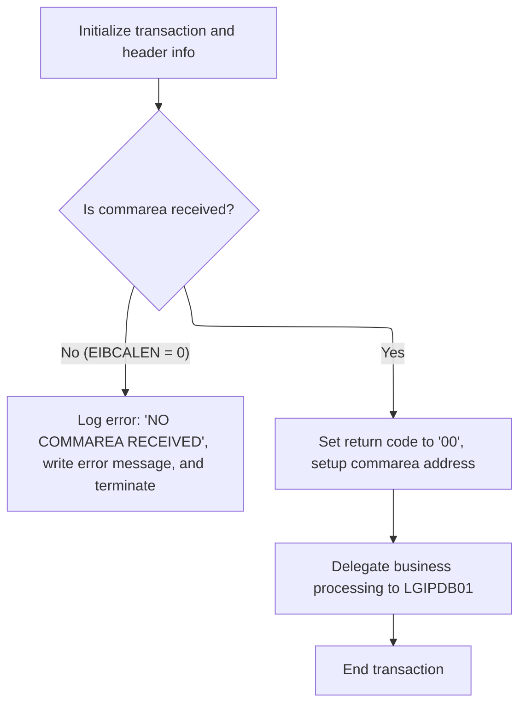
```mermaid
%%{init: {"flowchart": {"defaultRenderer": "elk"}} }%%
flowchart TD
    node1["Initialize transaction and header info"] --> node2{"Is commarea received?"}
    click node1 openCode "base/src/lgipol01.cbl:72:76"
    node2 -->|"No (EIBCALEN = 0)"| node3["Log error: 'NO COMMAREA RECEIVED', write error message, and terminate"]
    click node2 openCode "base/src/lgipol01.cbl:79:83"
    click node3 openCode "base/src/lgipol01.cbl:80:82"
    node2 -->|"Yes"| node4["Set return code to '00', setup commarea address"]
    click node4 openCode "base/src/lgipol01.cbl:86:88"
    node4 --> node5["Delegate business processing to LGIPDB01"]
    click node5 openCode "base/src/lgipol01.cbl:91:94"
    node5 --> node6["End transaction"]
    click node6 openCode "base/src/lgipol01.cbl:96:96"
classDef HeadingStyle fill:#777777,stroke:#333,stroke-width:2px;

%% Swimm:
%% %%{init: {"flowchart": {"defaultRenderer": "elk"}} }%%
%% flowchart TD
%%     node1["Initialize transaction and header info"] --> node2{"Is commarea received?"}
%%     click node1 openCode "<SwmPath>[base/src/lgipol01.cbl](base/src/lgipol01.cbl)</SwmPath>:72:76"
%%     node2 -->|"No (EIBCALEN = 0)"| node3["Log error: 'NO COMMAREA RECEIVED', write error message, and terminate"]
%%     click node2 openCode "<SwmPath>[base/src/lgipol01.cbl](base/src/lgipol01.cbl)</SwmPath>:79:83"
%%     click node3 openCode "<SwmPath>[base/src/lgipol01.cbl](base/src/lgipol01.cbl)</SwmPath>:80:82"
%%     node2 -->|"Yes"| node4["Set return code to '00', setup commarea address"]
%%     click node4 openCode "<SwmPath>[base/src/lgipol01.cbl](base/src/lgipol01.cbl)</SwmPath>:86:88"
%%     node4 --> node5["Delegate business processing to <SwmToken path="base/src/lgipol01.cbl" pos="91:9:9" line-data="           EXEC CICS LINK Program(LGIPDB01)">`LGIPDB01`</SwmToken>"]
%%     click node5 openCode "<SwmPath>[base/src/lgipol01.cbl](base/src/lgipol01.cbl)</SwmPath>:91:94"
%%     node5 --> node6["End transaction"]
%%     click node6 openCode "<SwmPath>[base/src/lgipol01.cbl](base/src/lgipol01.cbl)</SwmPath>:96:96"
%% classDef HeadingStyle fill:#777777,stroke:#333,stroke-width:2px;
```

This section is responsible for validating incoming policy inquiry requests, ensuring required data is present, and dispatching valid requests for further business processing. It acts as the main entry point for policy detail lookups, handling both validation and routing.

| Category        | Rule Name                      | Description                                                                                                                                                            |
| --------------- | ------------------------------ | ---------------------------------------------------------------------------------------------------------------------------------------------------------------------- |
| Data validation | Commarea Required              | If the incoming request does not include a commarea, the transaction must be terminated and an error message stating 'NO COMMAREA RECEIVED' must be logged.            |
| Business logic  | Return Code Initialization     | For every valid request (i.e., commarea is present), the return code in the commarea must be set to '00' to indicate successful receipt and validation of the request. |
| Business logic  | Business Processing Delegation | All valid requests must be dispatched to the policy database processing program for further handling, using the provided commarea data.                                |

<SwmSnippet path="/base/src/lgipol01.cbl" line="70">

---

MAINLINE in <SwmToken path="base/src/lgtestp3.cbl" pos="70:10:10" line-data="                 EXEC CICS LINK PROGRAM(&#39;LGIPOL01&#39;)">`LGIPOL01`</SwmToken> checks the input, logs errors if the commarea is missing, and then links to <SwmToken path="base/src/lgipol01.cbl" pos="91:9:9" line-data="           EXEC CICS LINK Program(LGIPDB01)">`LGIPDB01`</SwmToken> to actually fetch the policy details from the database. This is the main validation and dispatch logic for policy inquiries.

```cobol
       MAINLINE SECTION.
      *
           INITIALIZE WS-HEADER.
      *
           MOVE EIBTRNID TO WS-TRANSID.
           MOVE EIBTRMID TO WS-TERMID.
           MOVE EIBTASKN TO WS-TASKNUM.
      *
      * If NO commarea received issue an ABEND
           IF EIBCALEN IS EQUAL TO ZERO
               MOVE ' NO COMMAREA RECEIVED' TO EM-VARIABLE
               PERFORM WRITE-ERROR-MESSAGE
               EXEC CICS ABEND ABCODE('LGCA') NODUMP END-EXEC
           END-IF

      * initialize commarea return code to zero
           MOVE '00' TO CA-RETURN-CODE
           MOVE EIBCALEN TO WS-CALEN.
           SET WS-ADDR-DFHCOMMAREA TO ADDRESS OF DFHCOMMAREA.
      *

           EXEC CICS LINK Program(LGIPDB01)
               Commarea(DFHCOMMAREA)
               Length(32500)
           END-EXEC.

           EXEC CICS RETURN END-EXEC.
```

---

</SwmSnippet>

## Error logging and queueing

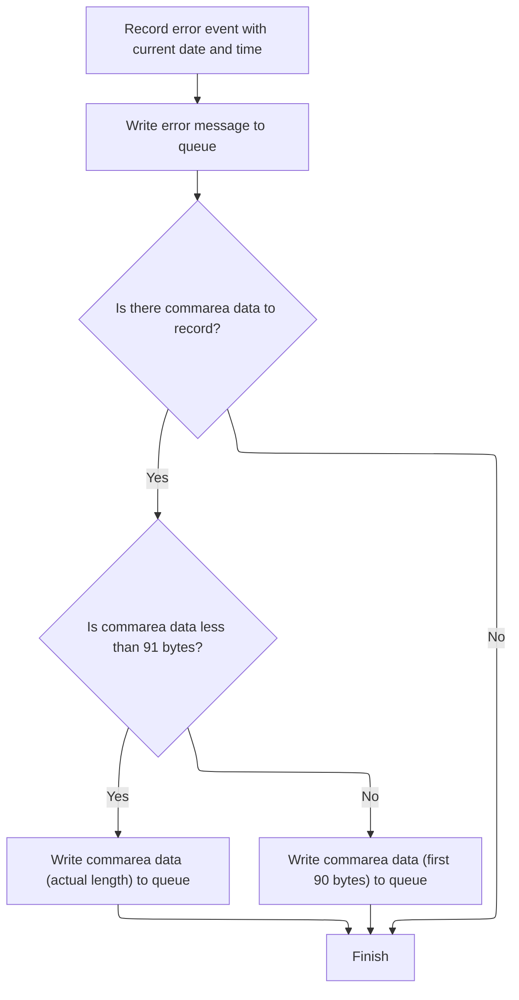
```mermaid
%%{init: {"flowchart": {"defaultRenderer": "elk"}} }%%
flowchart TD
    node1["Record error event with current date and time"]
    click node1 openCode "base/src/lgipol01.cbl:110:117"
    node1 --> node2["Write error message to queue"]
    click node2 openCode "base/src/lgipol01.cbl:119:122"
    node2 --> node3{"Is there commarea data to record?"}
    click node3 openCode "base/src/lgipol01.cbl:124:138"
    node3 -->|"No"| node6["Finish"]
    node3 -->|"Yes"| node4{"Is commarea data less than 91 bytes?"}
    click node4 openCode "base/src/lgipol01.cbl:125:137"
    node4 -->|"Yes"| node5["Write commarea data (actual length) to queue"]
    click node5 openCode "base/src/lgipol01.cbl:126:130"
    node4 -->|"No"| node7["Write commarea data (first 90 bytes) to queue"]
    click node7 openCode "base/src/lgipol01.cbl:132:136"
    node5 --> node6
    node7 --> node6
    click node6 openCode "base/src/lgipol01.cbl:139:139"
classDef HeadingStyle fill:#777777,stroke:#333,stroke-width:2px;

%% Swimm:
%% %%{init: {"flowchart": {"defaultRenderer": "elk"}} }%%
%% flowchart TD
%%     node1["Record error event with current date and time"]
%%     click node1 openCode "<SwmPath>[base/src/lgipol01.cbl](base/src/lgipol01.cbl)</SwmPath>:110:117"
%%     node1 --> node2["Write error message to queue"]
%%     click node2 openCode "<SwmPath>[base/src/lgipol01.cbl](base/src/lgipol01.cbl)</SwmPath>:119:122"
%%     node2 --> node3{"Is there commarea data to record?"}
%%     click node3 openCode "<SwmPath>[base/src/lgipol01.cbl](base/src/lgipol01.cbl)</SwmPath>:124:138"
%%     node3 -->|"No"| node6["Finish"]
%%     node3 -->|"Yes"| node4{"Is commarea data less than 91 bytes?"}
%%     click node4 openCode "<SwmPath>[base/src/lgipol01.cbl](base/src/lgipol01.cbl)</SwmPath>:125:137"
%%     node4 -->|"Yes"| node5["Write commarea data (actual length) to queue"]
%%     click node5 openCode "<SwmPath>[base/src/lgipol01.cbl](base/src/lgipol01.cbl)</SwmPath>:126:130"
%%     node4 -->|"No"| node7["Write commarea data (first 90 bytes) to queue"]
%%     click node7 openCode "<SwmPath>[base/src/lgipol01.cbl](base/src/lgipol01.cbl)</SwmPath>:132:136"
%%     node5 --> node6
%%     node7 --> node6
%%     click node6 openCode "<SwmPath>[base/src/lgipol01.cbl](base/src/lgipol01.cbl)</SwmPath>:139:139"
%% classDef HeadingStyle fill:#777777,stroke:#333,stroke-width:2px;
```

This section is responsible for capturing error events, formatting them with relevant metadata (date, time, program name), and ensuring that both the error details and any associated commarea data are reliably logged to system queues for audit and troubleshooting purposes.

| Category       | Rule Name                         | Description                                                                                                                                             |
| -------------- | --------------------------------- | ------------------------------------------------------------------------------------------------------------------------------------------------------- |
| Business logic | Timestamp error events            | Every error event must be recorded with the current date and time to ensure accurate tracking and auditability.                                         |
| Business logic | Dual queue logging                | All error messages must be written to both the TDQ and TSQ system queues to ensure redundancy and availability for later review.                        |
| Business logic | Commarea data truncation          | If commarea data is present, it must be logged along with the error event. If the commarea data exceeds 90 bytes, only the first 90 bytes are recorded. |
| Business logic | Conditional commarea logging      | If no commarea data is present, only the error message is logged, and no commarea data is written to the queues.                                        |
| Business logic | Interactive error acknowledgement | If the error message is received interactively, a response must be sent back to the terminal to acknowledge receipt.                                    |

<SwmSnippet path="/base/src/lgipol01.cbl" line="107">

---

<SwmToken path="base/src/lgipol01.cbl" pos="107:1:5" line-data="       WRITE-ERROR-MESSAGE.">`WRITE-ERROR-MESSAGE`</SwmToken> in <SwmToken path="base/src/lgtestp3.cbl" pos="70:10:10" line-data="                 EXEC CICS LINK PROGRAM(&#39;LGIPOL01&#39;)">`LGIPOL01`</SwmToken> formats the error details, gets the current time, and calls LGSTSQ to write the error and commarea data to system queues. This is how errors get logged for later review.

```cobol
       WRITE-ERROR-MESSAGE.
      * Save SQLCODE in message
      * Obtain and format current time and date
           EXEC CICS ASKTIME ABSTIME(ABS-TIME)
           END-EXEC
           EXEC CICS FORMATTIME ABSTIME(ABS-TIME)
                     MMDDYYYY(DATE1)
                     TIME(TIME1)
           END-EXEC
           MOVE DATE1 TO EM-DATE
           MOVE TIME1 TO EM-TIME
      * Write output message to TDQ
           EXEC CICS LINK PROGRAM('LGSTSQ')
                     COMMAREA(ERROR-MSG)
                     LENGTH(LENGTH OF ERROR-MSG)
           END-EXEC.
      * Write 90 bytes or as much as we have of commarea to TDQ
           IF EIBCALEN > 0 THEN
             IF EIBCALEN < 91 THEN
               MOVE DFHCOMMAREA(1:EIBCALEN) TO CA-DATA
               EXEC CICS LINK PROGRAM('LGSTSQ')
                         COMMAREA(CA-ERROR-MSG)
                         LENGTH(LENGTH OF CA-ERROR-MSG)
               END-EXEC
             ELSE
               MOVE DFHCOMMAREA(1:90) TO CA-DATA
               EXEC CICS LINK PROGRAM('LGSTSQ')
                         COMMAREA(CA-ERROR-MSG)
                         LENGTH(LENGTH OF CA-ERROR-MSG)
               END-EXEC
             END-IF
           END-IF.
           EXIT.
```

---

</SwmSnippet>

<SwmSnippet path="/base/src/lgstsq.cbl" line="55">

---

MAINLINE in LGSTSQ figures out where the message came from, parses special prefixes, and writes the message to both TDQ and TSQ queues. If the message was received interactively, it sends a quick response back to the terminal.

```cobol
       MAINLINE SECTION.

           MOVE SPACES TO WRITE-MSG.
           MOVE SPACES TO WS-RECV.

           EXEC CICS ASSIGN SYSID(WRITE-MSG-SYSID)
                RESP(WS-RESP)
           END-EXEC.

           EXEC CICS ASSIGN INVOKINGPROG(WS-INVOKEPROG)
                RESP(WS-RESP)
           END-EXEC.
           
           IF WS-INVOKEPROG NOT = SPACES
              MOVE 'C' To WS-FLAG
              MOVE COMMA-DATA  TO WRITE-MSG-MSG
              MOVE EIBCALEN    TO WS-RECV-LEN
           ELSE
              EXEC CICS RECEIVE INTO(WS-RECV)
                  LENGTH(WS-RECV-LEN)
                  RESP(WS-RESP)
              END-EXEC
              MOVE 'R' To WS-FLAG
              MOVE WS-RECV-DATA  TO WRITE-MSG-MSG
              SUBTRACT 5 FROM WS-RECV-LEN
           END-IF.

           MOVE 'GENAERRS' TO STSQ-NAME.
           IF WRITE-MSG-MSG(1:2) = 'Q=' THEN
              MOVE WRITE-MSG-MSG(3:4) TO STSQ-EXT
              MOVE WRITE-MSG-REST TO TEMPO
              MOVE TEMPO          TO WRITE-MSG-MSG
              SUBTRACT 7 FROM WS-RECV-LEN
           END-IF.

           ADD 5 TO WS-RECV-LEN.

      * Write output message to TDQ CSMT
      *
           EXEC CICS WRITEQ TD QUEUE(STDQ-NAME)
                     FROM(WRITE-MSG)
                     RESP(WS-RESP)
                     LENGTH(WS-RECV-LEN)

           END-EXEC.

      * Write output message to Genapp TSQ
      * If no space is available then the task will not wait for
      *  storage to become available but will ignore the request...
      *
           EXEC CICS WRITEQ TS QUEUE(STSQ-NAME)
                     FROM(WRITE-MSG)
                     RESP(WS-RESP)
                     NOSUSPEND
                     LENGTH(WS-RECV-LEN)

           END-EXEC.

           If WS-FLAG = 'R' Then
             EXEC CICS SEND TEXT FROM(FILLER-X)
              WAIT
              ERASE
              LENGTH(1)
              FREEKB
             END-EXEC.

           EXEC CICS RETURN
           END-EXEC.
```

---

</SwmSnippet>

## Fetching and formatting policy data


```mermaid
%%{init: {"flowchart": {"defaultRenderer": "elk"}} }%%
flowchart TD
    node1["Start: Receive insurance request"]
    click node1 openCode "base/src/lgipdb01.cbl:230:255"
    node1 --> node2{"Is input data received?"}
    click node2 openCode "base/src/lgipdb01.cbl:251:255"
    node2 -->|"No"| node3["Log error: No input data"]
    click node3 openCode "base/src/lgipdb01.cbl:252:254"
    node3 --> node4["Set error code '99' and fail request"]
    click node4 openCode "base/src/lgipdb01.cbl:308:309"
    node2 -->|"Yes"| node5{"What policy type is requested?"}
    click node5 openCode "base/src/lgipdb01.cbl:277:310"
    node5 -->|"Endowment (01IEND)"| node6{"Retrieve endowment policy details"}
    click node6 openCode "base/src/lgipdb01.cbl:327:432"
    node6 -->|"Success"| node11["Prepare response"]
    click node11 openCode "base/src/lgipdb01.cbl:417:418"
    node6 -->|"Invalid customer/policy"| node12["Set error code '01'"]
    click node12 openCode "base/src/lgipdb01.cbl:423:424"
    node6 -->|"Other DB error"| node13["Set error code '90' and log error"]
    click node13 openCode "base/src/lgipdb01.cbl:426:429"
    node12 --> node11
    node13 --> node11
    node5 -->|"House (01IHOU)"| node7{"Retrieve house policy details"}
    click node7 openCode "base/src/lgipdb01.cbl:441:523"
    node7 -->|"Success"| node11
    node7 -->|"Invalid customer/policy"| node12
    node7 -->|"Other DB error"| node13
    node5 -->|"Motor (01IMOT)"| node8{"Retrieve motor policy details"}
    click node8 openCode "base/src/lgipdb01.cbl:529:621"
    node8 -->|"Success"| node11
    node8 -->|"Invalid customer/policy"| node12
    node8 -->|"Other DB error"| node13
    node5 -->|"Commercial (01ICOM, 02ICOM, 03ICOM, 05ICOM)"| node9{"Retrieve commercial policy details"}
    click node9 openCode "base/src/lgipdb01.cbl:292:306"
    node9 -->|"Success"| node11
    node9 -->|"Invalid customer/policy"| node12
    node9 -->|"Other DB error"| node13
    node5 -->|"Other"| node4

classDef HeadingStyle fill:#777777,stroke:#333,stroke-width:2px;

%% Swimm:
%% %%{init: {"flowchart": {"defaultRenderer": "elk"}} }%%
%% flowchart TD
%%     node1["Start: Receive insurance request"]
%%     click node1 openCode "<SwmPath>[base/src/lgipdb01.cbl](base/src/lgipdb01.cbl)</SwmPath>:230:255"
%%     node1 --> node2{"Is input data received?"}
%%     click node2 openCode "<SwmPath>[base/src/lgipdb01.cbl](base/src/lgipdb01.cbl)</SwmPath>:251:255"
%%     node2 -->|"No"| node3["Log error: No input data"]
%%     click node3 openCode "<SwmPath>[base/src/lgipdb01.cbl](base/src/lgipdb01.cbl)</SwmPath>:252:254"
%%     node3 --> node4["Set error code '99' and fail request"]
%%     click node4 openCode "<SwmPath>[base/src/lgipdb01.cbl](base/src/lgipdb01.cbl)</SwmPath>:308:309"
%%     node2 -->|"Yes"| node5{"What policy type is requested?"}
%%     click node5 openCode "<SwmPath>[base/src/lgipdb01.cbl](base/src/lgipdb01.cbl)</SwmPath>:277:310"
%%     node5 -->|"Endowment (<SwmToken path="base/src/lgipdb01.cbl" pos="279:4:4" line-data="             WHEN &#39;01IEND&#39;">`01IEND`</SwmToken>)"| node6{"Retrieve endowment policy details"}
%%     click node6 openCode "<SwmPath>[base/src/lgipdb01.cbl](base/src/lgipdb01.cbl)</SwmPath>:327:432"
%%     node6 -->|"Success"| node11["Prepare response"]
%%     click node11 openCode "<SwmPath>[base/src/lgipdb01.cbl](base/src/lgipdb01.cbl)</SwmPath>:417:418"
%%     node6 -->|"Invalid customer/policy"| node12["Set error code '01'"]
%%     click node12 openCode "<SwmPath>[base/src/lgipdb01.cbl](base/src/lgipdb01.cbl)</SwmPath>:423:424"
%%     node6 -->|"Other DB error"| node13["Set error code '90' and log error"]
%%     click node13 openCode "<SwmPath>[base/src/lgipdb01.cbl](base/src/lgipdb01.cbl)</SwmPath>:426:429"
%%     node12 --> node11
%%     node13 --> node11
%%     node5 -->|"House (<SwmToken path="base/src/lgtestp3.cbl" pos="67:4:4" line-data="                 Move &#39;01IHOU&#39;   To CA-REQUEST-ID">`01IHOU`</SwmToken>)"| node7{"Retrieve house policy details"}
%%     click node7 openCode "<SwmPath>[base/src/lgipdb01.cbl](base/src/lgipdb01.cbl)</SwmPath>:441:523"
%%     node7 -->|"Success"| node11
%%     node7 -->|"Invalid customer/policy"| node12
%%     node7 -->|"Other DB error"| node13
%%     node5 -->|"Motor (<SwmToken path="base/src/lgipdb01.cbl" pos="287:4:4" line-data="             WHEN &#39;01IMOT&#39;">`01IMOT`</SwmToken>)"| node8{"Retrieve motor policy details"}
%%     click node8 openCode "<SwmPath>[base/src/lgipdb01.cbl](base/src/lgipdb01.cbl)</SwmPath>:529:621"
%%     node8 -->|"Success"| node11
%%     node8 -->|"Invalid customer/policy"| node12
%%     node8 -->|"Other DB error"| node13
%%     node5 -->|"Commercial (<SwmToken path="base/src/lgipdb01.cbl" pos="291:4:4" line-data="             WHEN &#39;01ICOM&#39;">`01ICOM`</SwmToken>, <SwmToken path="base/src/lgipdb01.cbl" pos="295:4:4" line-data="             WHEN &#39;02ICOM&#39;">`02ICOM`</SwmToken>, <SwmToken path="base/src/lgipdb01.cbl" pos="299:4:4" line-data="             WHEN &#39;03ICOM&#39;">`03ICOM`</SwmToken>, <SwmToken path="base/src/lgipdb01.cbl" pos="303:4:4" line-data="             WHEN &#39;05ICOM&#39;">`05ICOM`</SwmToken>)"| node9{"Retrieve commercial policy details"}
%%     click node9 openCode "<SwmPath>[base/src/lgipdb01.cbl](base/src/lgipdb01.cbl)</SwmPath>:292:306"
%%     node9 -->|"Success"| node11
%%     node9 -->|"Invalid customer/policy"| node12
%%     node9 -->|"Other DB error"| node13
%%     node5 -->|"Other"| node4
%% 
%% classDef HeadingStyle fill:#777777,stroke:#333,stroke-width:2px;
```

This section is responsible for validating incoming insurance requests, retrieving the appropriate policy data based on the request type, and formatting the response. It ensures that only valid requests are processed and that errors are handled and logged appropriately.

| Category        | Rule Name                  | Description                                                                                                                                                                                                                                                                                                                                                                                                                                                                                                                                                                                                                                                                                                                                                                                                                                                                                                                                                                                                                            |
| --------------- | -------------------------- | -------------------------------------------------------------------------------------------------------------------------------------------------------------------------------------------------------------------------------------------------------------------------------------------------------------------------------------------------------------------------------------------------------------------------------------------------------------------------------------------------------------------------------------------------------------------------------------------------------------------------------------------------------------------------------------------------------------------------------------------------------------------------------------------------------------------------------------------------------------------------------------------------------------------------------------------------------------------------------------------------------------------------------------- |
| Data validation | Missing input data         | If no input data (commarea) is received, the request must be failed and an error code '99' returned.                                                                                                                                                                                                                                                                                                                                                                                                                                                                                                                                                                                                                                                                                                                                                                                                                                                                                                                                   |
| Data validation | Supported policy types     | The policy type requested must be one of: Endowment (<SwmToken path="base/src/lgipdb01.cbl" pos="279:4:4" line-data="             WHEN &#39;01IEND&#39;">`01IEND`</SwmToken>), House (<SwmToken path="base/src/lgtestp3.cbl" pos="67:4:4" line-data="                 Move &#39;01IHOU&#39;   To CA-REQUEST-ID">`01IHOU`</SwmToken>), Motor (<SwmToken path="base/src/lgipdb01.cbl" pos="287:4:4" line-data="             WHEN &#39;01IMOT&#39;">`01IMOT`</SwmToken>), or Commercial (<SwmToken path="base/src/lgipdb01.cbl" pos="291:4:4" line-data="             WHEN &#39;01ICOM&#39;">`01ICOM`</SwmToken>, <SwmToken path="base/src/lgipdb01.cbl" pos="295:4:4" line-data="             WHEN &#39;02ICOM&#39;">`02ICOM`</SwmToken>, <SwmToken path="base/src/lgipdb01.cbl" pos="299:4:4" line-data="             WHEN &#39;03ICOM&#39;">`03ICOM`</SwmToken>, <SwmToken path="base/src/lgipdb01.cbl" pos="303:4:4" line-data="             WHEN &#39;05ICOM&#39;">`05ICOM`</SwmToken>). Any other value results in error code '99'. |
| Data validation | Insufficient response size | If the commarea received is not large enough to hold the required policy data, error code '98' must be returned and no data should be moved.                                                                                                                                                                                                                                                                                                                                                                                                                                                                                                                                                                                                                                                                                                                                                                                                                                                                                           |
| Business logic  | Policy data retrieval      | For each supported policy type, the system must retrieve the corresponding policy details from the database and format them according to the commarea structure.                                                                                                                                                                                                                                                                                                                                                                                                                                                                                                                                                                                                                                                                                                                                                                                                                                                                       |
| Business logic  | End of data marker         | All returned policy data must be marked with 'FINAL' at the end of the response to indicate completion.                                                                                                                                                                                                                                                                                                                                                                                                                                                                                                                                                                                                                                                                                                                                                                                                                                                                                                                                |
| Business logic  | Exclude null fields        | Only <SwmToken path="base/src/lgipdb01.cbl" pos="379:13:15" line-data="      *      check whether PADDINGDATA field is non-null">`non-null`</SwmToken> fields from the database should be included in the response; null fields must be omitted.                                                                                                                                                                                                                                                                                                                                                                                                                                                                                                                                                                                                                                                                                                                                                                                       |

<SwmSnippet path="/base/src/lgipdb01.cbl" line="230">

---

MAINLINE in <SwmToken path="base/src/lgipol01.cbl" pos="91:9:9" line-data="           EXEC CICS LINK Program(LGIPDB01)">`LGIPDB01`</SwmToken> checks the request type and calls the right routine to fetch details for the requested policy (endowment, house, motor, commercial). It also logs errors if the request is invalid or missing data.

```cobol
       MAINLINE SECTION.

      *----------------------------------------------------------------*
      * Common code                                                    *
      *----------------------------------------------------------------*
      * initialize working storage variables
           INITIALIZE WS-HEADER.
      * set up general variable
           MOVE EIBTRNID TO WS-TRANSID.
           MOVE EIBTRMID TO WS-TERMID.
           MOVE EIBTASKN TO WS-TASKNUM.
      *----------------------------------------------------------------*
      * initialize DB2 host variables
           INITIALIZE DB2-IN-INTEGERS.
           INITIALIZE DB2-OUT-INTEGERS.
           INITIALIZE DB2-POLICY.

      *---------------------------------------------------------------*
      * Check commarea and obtain required details                    *
      *---------------------------------------------------------------*
      * If NO commarea received issue an ABEND
           IF EIBCALEN IS EQUAL TO ZERO
             MOVE ' NO COMMAREA RECEIVED' TO EM-VARIABLE
             PERFORM WRITE-ERROR-MESSAGE
             EXEC CICS ABEND ABCODE('LGCA') NODUMP END-EXEC
           END-IF

      * initialize commarea return code to zero
           MOVE '00' TO CA-RETURN-CODE
           MOVE EIBCALEN TO WS-CALEN
           SET WS-ADDR-DFHCOMMAREA TO ADDRESS OF DFHCOMMAREA

      * Convert commarea customer & policy nums to DB2 integer format
           MOVE CA-CUSTOMER-NUM TO DB2-CUSTOMERNUM-INT
           MOVE CA-POLICY-NUM   TO DB2-POLICYNUM-INT
      * and save in error msg field incase required
           MOVE CA-CUSTOMER-NUM TO EM-CUSNUM
           MOVE CA-POLICY-NUM   TO EM-POLNUM

      *----------------------------------------------------------------*
      * Check which policy type is being requested                     *
      * This is not actually required whilst only endowment policy     *
      * inquires are supported, but will make future expansion simpler *
      *----------------------------------------------------------------*
      * Upper case value passed in Request Id field                    *
           MOVE FUNCTION UPPER-CASE(CA-REQUEST-ID) TO WS-REQUEST-ID

           EVALUATE WS-REQUEST-ID

             WHEN '01IEND'
               INITIALIZE DB2-ENDOWMENT
               PERFORM GET-ENDOW-DB2-INFO

             WHEN '01IHOU'
               INITIALIZE DB2-HOUSE
               PERFORM GET-HOUSE-DB2-INFO

             WHEN '01IMOT'
               INITIALIZE DB2-MOTOR
               PERFORM GET-MOTOR-DB2-INFO

             WHEN '01ICOM'
               INITIALIZE DB2-COMMERCIAL
               PERFORM GET-COMMERCIAL-DB2-INFO-1

             WHEN '02ICOM'
               INITIALIZE DB2-COMMERCIAL
               PERFORM GET-COMMERCIAL-DB2-INFO-2

             WHEN '03ICOM'
               INITIALIZE DB2-COMMERCIAL
               PERFORM GET-COMMERCIAL-DB2-INFO-3

             WHEN '05ICOM'
               INITIALIZE DB2-COMMERCIAL
               PERFORM GET-COMMERCIAL-DB2-INFO-5

             WHEN OTHER
               MOVE '99' TO CA-RETURN-CODE

           END-EVALUATE.
```

---

</SwmSnippet>

<SwmSnippet path="/base/src/lgipdb01.cbl" line="997">

---

<SwmToken path="base/src/lgipdb01.cbl" pos="997:1:5" line-data="       WRITE-ERROR-MESSAGE.">`WRITE-ERROR-MESSAGE`</SwmToken> in <SwmToken path="base/src/lgipol01.cbl" pos="91:9:9" line-data="           EXEC CICS LINK Program(LGIPDB01)">`LGIPDB01`</SwmToken> logs the SQL error code and context, then calls LGSTSQ to write both the error message and up to 90 bytes of commarea data to the system queues. This helps with tracking exactly what failed and why.

```cobol
       WRITE-ERROR-MESSAGE.
      * Save SQLCODE in message
           MOVE SQLCODE TO EM-SQLRC
      * Obtain and format current time and date
           EXEC CICS ASKTIME ABSTIME(ABS-TIME)
           END-EXEC
           EXEC CICS FORMATTIME ABSTIME(ABS-TIME)
                     MMDDYYYY(DATE1)
                     TIME(TIME1)
           END-EXEC
           MOVE DATE1 TO EM-DATE
           MOVE TIME1 TO EM-TIME
      * Write output message to TDQ
           EXEC CICS LINK PROGRAM('LGSTSQ')
                     COMMAREA(ERROR-MSG)
                     LENGTH(LENGTH OF ERROR-MSG)
           END-EXEC.
      * Write 90 bytes or as much as we have of commarea to TDQ
           IF EIBCALEN > 0 THEN
             IF EIBCALEN < 91 THEN
               MOVE DFHCOMMAREA(1:EIBCALEN) TO CA-DATA
               EXEC CICS LINK PROGRAM('LGSTSQ')
                         COMMAREA(CA-ERROR-MSG)
                         LENGTH(LENGTH OF CA-ERROR-MSG)
               END-EXEC
             ELSE
               MOVE DFHCOMMAREA(1:90) TO CA-DATA
               EXEC CICS LINK PROGRAM('LGSTSQ')
                         COMMAREA(CA-ERROR-MSG)
                         LENGTH(LENGTH OF CA-ERROR-MSG)
               END-EXEC
             END-IF
           END-IF.
           EXIT.
```

---

</SwmSnippet>

<SwmSnippet path="/base/src/lgipdb01.cbl" line="327">

---

<SwmToken path="base/src/lgipdb01.cbl" pos="327:1:7" line-data="       GET-ENDOW-DB2-INFO.">`GET-ENDOW-DB2-INFO`</SwmToken> builds the SQL SELECT, fetches endowment policy data, calculates the commarea size needed (including any variable-length padding), and only moves fields if they're not null. It uses custom return codes for errors and marks the end of data with 'FINAL'.

```cobol
       GET-ENDOW-DB2-INFO.

           MOVE ' SELECT ENDOW ' TO EM-SQLREQ
           EXEC SQL
             SELECT  ISSUEDATE,
                     EXPIRYDATE,
                     LASTCHANGED,
                     BROKERID,
                     BROKERSREFERENCE,
                     PAYMENT,
                     WITHPROFITS,
                     EQUITIES,
                     MANAGEDFUND,
                     FUNDNAME,
                     TERM,
                     SUMASSURED,
                     LIFEASSURED,
                     PADDINGDATA,
                     LENGTH(PADDINGDATA)
             INTO  :DB2-ISSUEDATE,
                   :DB2-EXPIRYDATE,
                   :DB2-LASTCHANGED,
                   :DB2-BROKERID-INT INDICATOR :IND-BROKERID,
                   :DB2-BROKERSREF INDICATOR :IND-BROKERSREF,
                   :DB2-PAYMENT-INT INDICATOR :IND-PAYMENT,
                   :DB2-E-WITHPROFITS,
                   :DB2-E-EQUITIES,
                   :DB2-E-MANAGEDFUND,
                   :DB2-E-FUNDNAME,
                   :DB2-E-TERM-SINT,
                   :DB2-E-SUMASSURED-INT,
                   :DB2-E-LIFEASSURED,
                   :DB2-E-PADDINGDATA INDICATOR :IND-E-PADDINGDATA,
                   :DB2-E-PADDING-LEN INDICATOR :IND-E-PADDINGDATAL
             FROM  POLICY,ENDOWMENT
             WHERE ( POLICY.POLICYNUMBER =
                        ENDOWMENT.POLICYNUMBER   AND
                     POLICY.CUSTOMERNUMBER =
                        :DB2-CUSTOMERNUM-INT             AND
                     POLICY.POLICYNUMBER =
                        :DB2-POLICYNUM-INT               )
           END-EXEC

           IF SQLCODE = 0
      *      Select was successful

      *      Calculate size of commarea required to return all data
             ADD WS-CA-HEADERTRAILER-LEN TO WS-REQUIRED-CA-LEN
             ADD WS-FULL-ENDOW-LEN       TO WS-REQUIRED-CA-LEN

      *----------------------------------------------------------------*
      *      Specific code to allow for length of VACHAR data
      *      check whether PADDINGDATA field is non-null
      *        and calculate length of endowment policy
      *        and position of free space in commarea after policy data
      *----------------------------------------------------------------*
             IF IND-E-PADDINGDATAL NOT EQUAL MINUS-ONE
               ADD DB2-E-PADDING-LEN TO WS-REQUIRED-CA-LEN
               ADD DB2-E-PADDING-LEN TO END-POLICY-POS
             END-IF

      *      if commarea received is not large enough ...
      *        set error return code and return to caller
             IF EIBCALEN IS LESS THAN WS-REQUIRED-CA-LEN
               MOVE '98' TO CA-RETURN-CODE
               EXEC CICS RETURN END-EXEC
             ELSE
      *        Length is sufficent so move data to commarea
      *        Move Integer fields to required length numerics
      *        Don't move null fields
               IF IND-BROKERID NOT EQUAL MINUS-ONE
                 MOVE DB2-BROKERID-INT    TO DB2-BROKERID
               END-IF
               IF IND-PAYMENT NOT EQUAL MINUS-ONE
                 MOVE DB2-PAYMENT-INT TO DB2-PAYMENT
               END-IF
      *----------------------------------------------------------------*
               MOVE DB2-E-TERM-SINT       TO DB2-E-TERM
               MOVE DB2-E-SUMASSURED-INT  TO DB2-E-SUMASSURED

               MOVE DB2-POLICY-COMMON     TO CA-POLICY-COMMON
               MOVE DB2-ENDOW-FIXED
                   TO CA-ENDOWMENT(1:WS-ENDOW-LEN)
               IF IND-E-PADDINGDATA NOT EQUAL MINUS-ONE
                 MOVE DB2-E-PADDINGDATA TO
                     CA-E-PADDING-DATA(1:DB2-E-PADDING-LEN)
               END-IF
             END-IF

      *      Mark the end of the policy data
             MOVE 'FINAL' TO CA-E-PADDING-DATA(END-POLICY-POS:5)

           ELSE
      *      Non-zero SQLCODE from first SQL FETCH statement
             IF SQLCODE EQUAL 100
      *        No rows found - invalid customer / policy number
               MOVE '01' TO CA-RETURN-CODE
             ELSE
      *        something has gone wrong
               MOVE '90' TO CA-RETURN-CODE
      *        Write error message to TD QUEUE(CSMT)
               PERFORM WRITE-ERROR-MESSAGE
             END-IF

           END-IF.
           EXIT.
```

---

</SwmSnippet>

<SwmSnippet path="/base/src/lgipdb01.cbl" line="441">

---

<SwmToken path="base/src/lgipdb01.cbl" pos="441:1:7" line-data="       GET-HOUSE-DB2-INFO.">`GET-HOUSE-DB2-INFO`</SwmToken> fetches house policy data, calculates the required commarea size, checks for nulls, moves fields, and sets custom return codes for errors. It marks the end of returned data with 'FINAL'.

```cobol
       GET-HOUSE-DB2-INFO.

           MOVE ' SELECT HOUSE ' TO EM-SQLREQ
           EXEC SQL
             SELECT  ISSUEDATE,
                     EXPIRYDATE,
                     LASTCHANGED,
                     BROKERID,
                     BROKERSREFERENCE,
                     PAYMENT,
                     PROPERTYTYPE,
                     BEDROOMS,
                     VALUE,
                     HOUSENAME,
                     HOUSENUMBER,
                     POSTCODE
             INTO  :DB2-ISSUEDATE,
                   :DB2-EXPIRYDATE,
                   :DB2-LASTCHANGED,
                   :DB2-BROKERID-INT INDICATOR :IND-BROKERID,
                   :DB2-BROKERSREF INDICATOR :IND-BROKERSREF,
                   :DB2-PAYMENT-INT INDICATOR :IND-PAYMENT,
                   :DB2-H-PROPERTYTYPE,
                   :DB2-H-BEDROOMS-SINT,
                   :DB2-H-VALUE-INT,
                   :DB2-H-HOUSENAME,
                   :DB2-H-HOUSENUMBER,
                   :DB2-H-POSTCODE
             FROM  POLICY,HOUSE
             WHERE ( POLICY.POLICYNUMBER =
                        HOUSE.POLICYNUMBER   AND
                     POLICY.CUSTOMERNUMBER =
                        :DB2-CUSTOMERNUM-INT             AND
                     POLICY.POLICYNUMBER =
                        :DB2-POLICYNUM-INT               )
           END-EXEC

           IF SQLCODE = 0
      *      Select was successful

      *      Calculate size of commarea required to return all data
             ADD WS-CA-HEADERTRAILER-LEN TO WS-REQUIRED-CA-LEN
             ADD WS-FULL-HOUSE-LEN       TO WS-REQUIRED-CA-LEN

      *      if commarea received is not large enough ...
      *        set error return code and return to caller
             IF EIBCALEN IS LESS THAN WS-REQUIRED-CA-LEN
               MOVE '98' TO CA-RETURN-CODE
               EXEC CICS RETURN END-EXEC
             ELSE
      *        Length is sufficent so move data to commarea
      *        Move Integer fields to required length numerics
      *        Don't move null fields
               IF IND-BROKERID NOT EQUAL MINUS-ONE
                 MOVE DB2-BROKERID-INT  TO DB2-BROKERID
               END-IF
               IF IND-PAYMENT NOT EQUAL MINUS-ONE
                 MOVE DB2-PAYMENT-INT TO DB2-PAYMENT
               END-IF
               MOVE DB2-H-BEDROOMS-SINT TO DB2-H-BEDROOMS
               MOVE DB2-H-VALUE-INT     TO DB2-H-VALUE

               MOVE DB2-POLICY-COMMON   TO CA-POLICY-COMMON
               MOVE DB2-HOUSE           TO CA-HOUSE(1:WS-HOUSE-LEN)
             END-IF

      *      Mark the end of the policy data
             MOVE 'FINAL' TO CA-H-FILLER(1:5)

           ELSE
      *      Non-zero SQLCODE from first SQL FETCH statement
             IF SQLCODE EQUAL 100
      *        No rows found - invalid customer / policy number
               MOVE '01' TO CA-RETURN-CODE
             ELSE
      *        something has gone wrong
               MOVE '90' TO CA-RETURN-CODE
      *        Write error message to TD QUEUE(CSMT)
               PERFORM WRITE-ERROR-MESSAGE
             END-IF

           END-IF.
           EXIT.
```

---

</SwmSnippet>

<SwmSnippet path="/base/src/lgipdb01.cbl" line="529">

---

<SwmToken path="base/src/lgipdb01.cbl" pos="529:1:7" line-data="       GET-MOTOR-DB2-INFO.">`GET-MOTOR-DB2-INFO`</SwmToken> fetches motor policy data, calculates the commarea size using repo-specific constants, handles nullable fields, sets custom return codes, and marks the end of returned data with 'FINAL'.

```cobol
       GET-MOTOR-DB2-INFO.

           MOVE ' SELECT MOTOR ' TO EM-SQLREQ
           EXEC SQL
             SELECT  ISSUEDATE,
                     EXPIRYDATE,
                     LASTCHANGED,
                     BROKERID,
                     BROKERSREFERENCE,
                     PAYMENT,
                     MAKE,
                     MODEL,
                     VALUE,
                     REGNUMBER,
                     COLOUR,
                     CC,
                     YEAROFMANUFACTURE,
                     PREMIUM,
                     ACCIDENTS
             INTO  :DB2-ISSUEDATE,
                   :DB2-EXPIRYDATE,
                   :DB2-LASTCHANGED,
                   :DB2-BROKERID-INT INDICATOR :IND-BROKERID,
                   :DB2-BROKERSREF INDICATOR :IND-BROKERSREF,
                   :DB2-PAYMENT-INT INDICATOR :IND-PAYMENT,
                   :DB2-M-MAKE,
                   :DB2-M-MODEL,
                   :DB2-M-VALUE-INT,
                   :DB2-M-REGNUMBER,
                   :DB2-M-COLOUR,
                   :DB2-M-CC-SINT,
                   :DB2-M-MANUFACTURED,
                   :DB2-M-PREMIUM-INT,
                   :DB2-M-ACCIDENTS-INT
             FROM  POLICY,MOTOR
             WHERE ( POLICY.POLICYNUMBER =
                        MOTOR.POLICYNUMBER   AND
                     POLICY.CUSTOMERNUMBER =
                        :DB2-CUSTOMERNUM-INT             AND
                     POLICY.POLICYNUMBER =
                        :DB2-POLICYNUM-INT               )
           END-EXEC

           IF SQLCODE = 0
      *      Select was successful

      *      Calculate size of commarea required to return all data
             ADD WS-CA-HEADERTRAILER-LEN TO WS-REQUIRED-CA-LEN
             ADD WS-FULL-MOTOR-LEN       TO WS-REQUIRED-CA-LEN

      *      if commarea received is not large enough ...
      *        set error return code and return to caller
             IF EIBCALEN IS LESS THAN WS-REQUIRED-CA-LEN
               MOVE '98' TO CA-RETURN-CODE
               EXEC CICS RETURN END-EXEC
             ELSE
      *        Length is sufficent so move data to commarea
      *        Move Integer fields to required length numerics
      *        Don't move null fields
               IF IND-BROKERID NOT EQUAL MINUS-ONE
                 MOVE DB2-BROKERID-INT TO DB2-BROKERID
               END-IF
               IF IND-PAYMENT NOT EQUAL MINUS-ONE
                 MOVE DB2-PAYMENT-INT    TO DB2-PAYMENT
               END-IF
               MOVE DB2-M-CC-SINT      TO DB2-M-CC
               MOVE DB2-M-VALUE-INT    TO DB2-M-VALUE
               MOVE DB2-M-PREMIUM-INT  TO DB2-M-PREMIUM
               MOVE DB2-M-ACCIDENTS-INT TO DB2-M-ACCIDENTS
               MOVE DB2-M-PREMIUM-INT  TO CA-M-PREMIUM
               MOVE DB2-M-ACCIDENTS-INT TO CA-M-ACCIDENTS

               MOVE DB2-POLICY-COMMON  TO CA-POLICY-COMMON
               MOVE DB2-MOTOR          TO CA-MOTOR(1:WS-MOTOR-LEN)
             END-IF

      *      Mark the end of the policy data
             MOVE 'FINAL' TO CA-M-FILLER(1:5)

           ELSE
      *      Non-zero SQLCODE from first SQL FETCH statement
             IF SQLCODE EQUAL 100
      *        No rows found - invalid customer / policy number
               MOVE '01' TO CA-RETURN-CODE
             ELSE
      *        something has gone wrong
               MOVE '90' TO CA-RETURN-CODE
      *        Write error message to TD QUEUE(CSMT)
               PERFORM WRITE-ERROR-MESSAGE
             END-IF

           END-IF.
           EXIT.
```

---

</SwmSnippet>

## Handling policy lookup results

<SwmSnippet path="/base/src/lgtestp3.cbl" line="74">

---

Back in <SwmToken path="base/src/lgtestp3.cbl" pos="33:5:7" line-data="              GO TO A-GAIN.">`A-GAIN`</SwmToken>, after returning from <SwmToken path="base/src/lgtestp3.cbl" pos="70:10:10" line-data="                 EXEC CICS LINK PROGRAM(&#39;LGIPOL01&#39;)">`LGIPOL01`</SwmToken>, the program checks if the lookup failed (<SwmToken path="base/src/lgtestp3.cbl" pos="74:3:7" line-data="                 IF CA-RETURN-CODE &gt; 0">`CA-RETURN-CODE`</SwmToken> > 0) and jumps to <SwmToken path="base/src/lgtestp3.cbl" pos="75:5:7" line-data="                   GO TO NO-DATA">`NO-DATA`</SwmToken> to show an error message and reset the menu.

```cobol
                 IF CA-RETURN-CODE > 0
                   GO TO NO-DATA
                 END-IF
```

---

</SwmSnippet>

## Displaying no-data error

This section ensures that users are informed when their request yields no data, providing clear feedback and resetting the transaction to maintain system integrity.

| Category       | Rule Name                    | Description                                                                                                   |
| -------------- | ---------------------------- | ------------------------------------------------------------------------------------------------------------- |
| Business logic | No data returned message     | If no data is returned from the user's request, display a standardized error message: 'No data was returned.' |
| Business logic | Transaction reset on no data | After displaying the no-data error message, reset the transaction and return the user to the main menu.       |

<SwmSnippet path="/base/src/lgtestp3.cbl" line="285">

---

In <SwmToken path="base/src/lgtestp3.cbl" pos="285:1:3" line-data="       NO-DATA.">`NO-DATA`</SwmToken>, the program sets the error message for no returned data and jumps to <SwmToken path="base/src/lgtestp3.cbl" pos="287:5:7" line-data="           Go To ERROR-OUT.">`ERROR-OUT`</SwmToken> to show it on the menu and reset the transaction.

```cobol
       NO-DATA.
           Move 'No data was returned.'            To  ERP3FLDO
           Go To ERROR-OUT.
```

---

</SwmSnippet>

## Error display and menu reset

This section is responsible for displaying error messages to the user and ensuring the system is ready for further input by resetting the menu and buffers.

| Category       | Rule Name                 | Description                                                                                                                       |
| -------------- | ------------------------- | --------------------------------------------------------------------------------------------------------------------------------- |
| Business logic | Error message display     | Whenever an error occurs, the error message must be displayed to the user on the menu screen using the designated error map.      |
| Business logic | Buffer and commarea reset | After displaying an error, all input and output buffers, as well as the communication area, must be reset to their initial state. |
| Business logic | Menu return after error   | Control must be returned to the main transaction menu after an error is displayed and system areas are reset.                     |

<SwmSnippet path="/base/src/lgtestp3.cbl" line="289">

---

In <SwmToken path="base/src/lgtestp3.cbl" pos="289:1:3" line-data="       ERROR-OUT.">`ERROR-OUT`</SwmToken>, the program sends the error message to the terminal using the <SwmToken path="base/src/lgtestp3.cbl" pos="290:11:11" line-data="           EXEC CICS SEND MAP (&#39;SSMAPP3&#39;)">`SSMAPP3`</SwmToken> map from SSMAP, updating the menu screen to show the error.

```cobol
       ERROR-OUT.
           EXEC CICS SEND MAP ('SSMAPP3')
                     FROM(SSMAPP3O)
                     MAPSET ('SSMAP')
           END-EXEC.
```

---

</SwmSnippet>

<SwmSnippet path="/base/src/lgtestp3.cbl" line="295">

---

After displaying the error, the program resets the input/output buffers and commarea, then jumps to <SwmToken path="base/src/lgtestp3.cbl" pos="299:5:7" line-data="           GO TO ENDIT-STARTIT.">`ENDIT-STARTIT`</SwmToken> to return control to the transaction menu.

```cobol
           Initialize SSMAPP3I.
           Initialize SSMAPP3O.
           Initialize COMM-AREA.

           GO TO ENDIT-STARTIT.
```

---

</SwmSnippet>

## Displaying policy details

<SwmSnippet path="/base/src/lgtestp3.cbl" line="78">

---

Back in <SwmToken path="base/src/lgtestp3.cbl" pos="33:5:7" line-data="              GO TO A-GAIN.">`A-GAIN`</SwmToken> after <SwmToken path="base/src/lgtestp3.cbl" pos="75:5:7" line-data="                   GO TO NO-DATA">`NO-DATA`</SwmToken>, the program moves the policy details into the output fields and sends the updated menu screen to the terminal.

```cobol
                 Move CA-ISSUE-DATE      To  ENP3IDAI
                 Move CA-EXPIRY-DATE     To  ENP3EDAI
                 Move CA-H-PROPERTY-TYPE To  ENP3TYPI
                 Move CA-H-BEDROOMS      To  ENP3BEDI
                 Move CA-H-VALUE         To  ENP3VALI
                 Move CA-H-HOUSE-NAME    To  ENP3HNMI
                 Move CA-H-HOUSE-NUMBER  To  ENP3HNOI
                 Move CA-H-POSTCODE      To  ENP3HPCI
                 EXEC CICS SEND MAP ('SSMAPP3')
                           FROM(SSMAPP3O)
                           MAPSET ('SSMAP')
                 END-EXEC
```

---

</SwmSnippet>

<SwmSnippet path="/base/src/lgtestp3.cbl" line="92">

---

When option '2' is selected, the program sets up the commarea with all the input fields needed for adding a new house policy. This prepares the data for the next backend call.

```cobol
             WHEN '2'
                 Move '01AHOU'          To CA-REQUEST-ID
                 Move ENP3CNOI          To CA-CUSTOMER-NUM
                 Move 0                 To CA-PAYMENT
                 Move 0                 To CA-BROKERID
                 Move '        '        To CA-BROKERSREF
                 Move ENP3IDAI          To CA-ISSUE-DATE
                 Move ENP3EDAI          To CA-EXPIRY-DATE
                 Move ENP3TYPI          To CA-H-PROPERTY-TYPE
                 Move ENP3BEDI          To CA-H-BEDROOMS
                 Move ENP3VALI          To CA-H-VALUE
                 Move ENP3HNMI          To CA-H-HOUSE-NAME
                 Move ENP3HNOI          To CA-H-HOUSE-NUMBER
                 Move ENP3HPCI          To CA-H-POSTCODE
```

---

</SwmSnippet>

<SwmSnippet path="/base/src/lgtestp3.cbl" line="106">

---

After packing the input fields, the program calls <SwmToken path="base/src/lgtestp3.cbl" pos="106:10:10" line-data="                 EXEC CICS LINK PROGRAM(&#39;LGAPOL01&#39;)">`LGAPOL01`</SwmToken> to validate and process the add policy request. This is where the backend logic for adding a policy kicks in.

```cobol
                 EXEC CICS LINK PROGRAM('LGAPOL01')
                           COMMAREA(COMM-AREA)
                           LENGTH(32500)
                 END-EXEC
```

---

</SwmSnippet>

## Validating and processing policy add

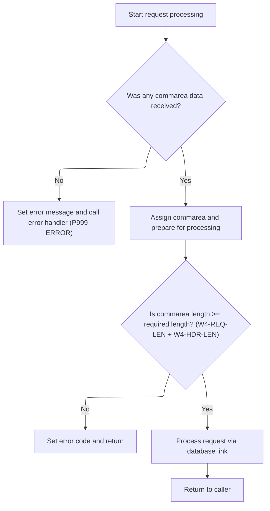
```mermaid
%%{init: {"flowchart": {"defaultRenderer": "elk"}} }%%
flowchart TD
    node1["Start request processing"] --> node2{"Was any commarea data received?"}
    click node1 openCode "base/src/lgapol01.cbl:68:73"
    click node2 openCode "base/src/lgapol01.cbl:83:87"
    node2 -->|"No"| node3["Set error message and call error handler (P999-ERROR)"]
    click node3 openCode "base/src/lgapol01.cbl:84:86"
    node2 -->|"Yes"| node4["Assign commarea and prepare for processing"]
    click node4 openCode "base/src/lgapol01.cbl:89:92"
    node4 --> node5{"Is commarea length >= required length? (W4-REQ-LEN + W4-HDR-LEN)"}
    click node5 openCode "base/src/lgapol01.cbl:95:98"
    node5 -->|"No"| node6["Set error code and return"]
    click node6 openCode "base/src/lgapol01.cbl:96:97"
    node5 -->|"Yes"| node7["Process request via database link"]
    click node7 openCode "base/src/lgapol01.cbl:103:106"
    node7 --> node8["Return to caller"]
    click node8 openCode "base/src/lgapol01.cbl:108:108"
classDef HeadingStyle fill:#777777,stroke:#333,stroke-width:2px;

%% Swimm:
%% %%{init: {"flowchart": {"defaultRenderer": "elk"}} }%%
%% flowchart TD
%%     node1["Start request processing"] --> node2{"Was any commarea data received?"}
%%     click node1 openCode "<SwmPath>[base/src/lgapol01.cbl](base/src/lgapol01.cbl)</SwmPath>:68:73"
%%     click node2 openCode "<SwmPath>[base/src/lgapol01.cbl](base/src/lgapol01.cbl)</SwmPath>:83:87"
%%     node2 -->|"No"| node3["Set error message and call error handler (<SwmToken path="base/src/lgapol01.cbl" pos="85:3:5" line-data="               PERFORM P999-ERROR">`P999-ERROR`</SwmToken>)"]
%%     click node3 openCode "<SwmPath>[base/src/lgapol01.cbl](base/src/lgapol01.cbl)</SwmPath>:84:86"
%%     node2 -->|"Yes"| node4["Assign commarea and prepare for processing"]
%%     click node4 openCode "<SwmPath>[base/src/lgapol01.cbl](base/src/lgapol01.cbl)</SwmPath>:89:92"
%%     node4 --> node5{"Is commarea length >= required length? (<SwmToken path="base/src/lgapol01.cbl" pos="92:11:15" line-data="           ADD W4-HDR-LEN TO W4-REQ-LEN">`W4-REQ-LEN`</SwmToken> + <SwmToken path="base/src/lgapol01.cbl" pos="92:3:7" line-data="           ADD W4-HDR-LEN TO W4-REQ-LEN">`W4-HDR-LEN`</SwmToken>)"}
%%     click node5 openCode "<SwmPath>[base/src/lgapol01.cbl](base/src/lgapol01.cbl)</SwmPath>:95:98"
%%     node5 -->|"No"| node6["Set error code and return"]
%%     click node6 openCode "<SwmPath>[base/src/lgapol01.cbl](base/src/lgapol01.cbl)</SwmPath>:96:97"
%%     node5 -->|"Yes"| node7["Process request via database link"]
%%     click node7 openCode "<SwmPath>[base/src/lgapol01.cbl](base/src/lgapol01.cbl)</SwmPath>:103:106"
%%     node7 --> node8["Return to caller"]
%%     click node8 openCode "<SwmPath>[base/src/lgapol01.cbl](base/src/lgapol01.cbl)</SwmPath>:108:108"
%% classDef HeadingStyle fill:#777777,stroke:#333,stroke-width:2px;
```

This section is responsible for validating incoming policy add requests, ensuring the input data is present and meets minimum length requirements, and dispatching valid requests to the database handler. It also logs errors and relevant data for failed requests.

| Category        | Rule Name                 | Description                                                                                                                                                                                                                                                                                                                                                                                                                                                                                                                                        |
| --------------- | ------------------------- | -------------------------------------------------------------------------------------------------------------------------------------------------------------------------------------------------------------------------------------------------------------------------------------------------------------------------------------------------------------------------------------------------------------------------------------------------------------------------------------------------------------------------------------------------- |
| Data validation | Missing commarea error    | If no commarea data is received with the request, an error message must be set and the error handler must be called to log the issue and terminate processing.                                                                                                                                                                                                                                                                                                                                                                                     |
| Data validation | Minimum commarea length   | If the commarea length is less than the required minimum (<SwmToken path="base/src/lgapol01.cbl" pos="92:11:15" line-data="           ADD W4-HDR-LEN TO W4-REQ-LEN">`W4-REQ-LEN`</SwmToken> + <SwmToken path="base/src/lgapol01.cbl" pos="92:3:7" line-data="           ADD W4-HDR-LEN TO W4-REQ-LEN">`W4-HDR-LEN`</SwmToken>, where <SwmToken path="base/src/lgapol01.cbl" pos="92:3:7" line-data="           ADD W4-HDR-LEN TO W4-REQ-LEN">`W4-HDR-LEN`</SwmToken> is 28), an error code of '98' must be set and the request must be terminated. |
| Business logic  | Valid request preparation | For valid requests, the commarea must be assigned and prepared for further processing, including setting the return code to '00'.                                                                                                                                                                                                                                                                                                                                                                                                                  |
| Business logic  | Database dispatch         | All valid policy add requests must be dispatched to the database handler (<SwmToken path="base/src/lgapol01.cbl" pos="103:9:9" line-data="           EXEC CICS Link Program(LGAPDB01)">`LGAPDB01`</SwmToken>) for further processing.                                                                                                                                                                                                                                                                                                              |

<SwmSnippet path="/base/src/lgapol01.cbl" line="68">

---

<SwmToken path="base/src/lgapol01.cbl" pos="68:1:3" line-data="       P100-MAIN SECTION.">`P100-MAIN`</SwmToken> in <SwmToken path="base/src/lgtestp3.cbl" pos="106:10:10" line-data="                 EXEC CICS LINK PROGRAM(&#39;LGAPOL01&#39;)">`LGAPOL01`</SwmToken> checks the input, logs errors if the commarea is missing, and then links to <SwmToken path="base/src/lgapol01.cbl" pos="103:9:9" line-data="           EXEC CICS Link Program(LGAPDB01)">`LGAPDB01`</SwmToken> to process the policy data. This is the main validation and dispatch logic for adding policies.

```cobol
       P100-MAIN SECTION.

      *----------------------------------------------------------------*
      * Common code                                                    *
      *----------------------------------------------------------------*
           INITIALIZE W1-CONTROL.
           MOVE EIBTRNID TO W1-TID.
           MOVE EIBTRMID TO W1-TRM.
           MOVE EIBTASKN TO W1-TSK.
           MOVE EIBCALEN TO W1-LEN.
      *----------------------------------------------------------------*

      *----------------------------------------------------------------*
      * Check commarea and obtain required details                     *
      *----------------------------------------------------------------*
           IF EIBCALEN IS EQUAL TO ZERO
               MOVE ' NO COMMAREA RECEIVED' TO W3-DETAIL
               PERFORM P999-ERROR
               EXEC CICS ABEND ABCODE('LGCA') NODUMP END-EXEC
           END-IF

           MOVE '00' TO CA-RETURN-CODE
           SET W1-PTR TO ADDRESS OF DFHCOMMAREA.

           ADD W4-HDR-LEN TO W4-REQ-LEN


           IF EIBCALEN IS LESS THAN W4-REQ-LEN
             MOVE '98' TO CA-RETURN-CODE
             EXEC CICS RETURN END-EXEC
           END-IF

      *----------------------------------------------------------------*
      *    Perform the data Inserts                                    *
      *----------------------------------------------------------------*
           EXEC CICS Link Program(LGAPDB01)
                Commarea(DFHCOMMAREA)
                LENGTH(32500)
           END-EXEC.

           EXEC CICS RETURN END-EXEC.
```

---

</SwmSnippet>

<SwmSnippet path="/base/src/lgapol01.cbl" line="119">

---

<SwmToken path="base/src/lgapol01.cbl" pos="119:1:3" line-data="       P999-ERROR.">`P999-ERROR`</SwmToken> in <SwmToken path="base/src/lgtestp3.cbl" pos="106:10:10" line-data="                 EXEC CICS LINK PROGRAM(&#39;LGAPOL01&#39;)">`LGAPOL01`</SwmToken> formats the error message, gets the current time, and calls LGSTSQ to log both the error and up to 90 bytes of commarea data. This helps with tracking what went wrong during policy add.

```cobol
       P999-ERROR.
      * Save SQLCODE in message
      * Obtain and format current time and date
           EXEC CICS ASKTIME ABSTIME(W2-TIME)
           END-EXEC
           EXEC CICS FORMATTIME ABSTIME(W2-TIME)
                     MMDDYYYY(W2-DATE1)
                     TIME(W2-DATE2)
           END-EXEC
           MOVE W2-DATE1 TO W3-DATE
           MOVE W2-DATE2 TO W3-TIME
      * Write output message to TDQ
           EXEC CICS LINK PROGRAM('LGSTSQ')
                     COMMAREA(W3-MESSAGE)
                     LENGTH(LENGTH OF W3-MESSAGE)
           END-EXEC.
      * Write 90 bytes or as much as we have of commarea to TDQ
           IF EIBCALEN > 0 THEN
             IF EIBCALEN < 91 THEN
               MOVE DFHCOMMAREA(1:EIBCALEN) TO CA-DATA
               EXEC CICS LINK PROGRAM('LGSTSQ')
                         COMMAREA(CA-ERROR-MSG)
                         LENGTH(LENGTH OF CA-ERROR-MSG)
               END-EXEC
             ELSE
               MOVE DFHCOMMAREA(1:90) TO CA-DATA
               EXEC CICS LINK PROGRAM('LGSTSQ')
                         COMMAREA(CA-ERROR-MSG)
                         LENGTH(LENGTH OF CA-ERROR-MSG)
               END-EXEC
             END-IF
           END-IF.
           EXIT.
```

---

</SwmSnippet>

## Premium calculation setup

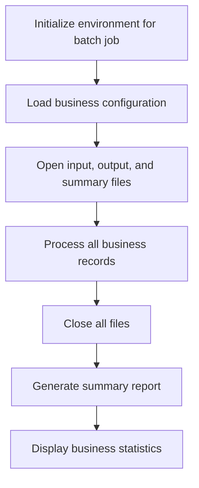
```mermaid
%%{init: {"flowchart": {"defaultRenderer": "elk"}} }%%
flowchart TD
    node1["Initialize environment for batch job"] --> node2["Load business configuration"]
    click node1 openCode "base/src/LGAPDB01.cbl:91:91"
    node2 --> node3["Open input, output, and summary files"]
    click node2 openCode "base/src/LGAPDB01.cbl:92:92"
    node3 --> node4["Process all business records"]
    click node3 openCode "base/src/LGAPDB01.cbl:93:93"
    node4 --> node5["Close all files"]
    click node4 openCode "base/src/LGAPDB01.cbl:94:94"
    node5 --> node6["Generate summary report"]
    click node5 openCode "base/src/LGAPDB01.cbl:95:95"
    node6 --> node7["Display business statistics"]
    click node6 openCode "base/src/LGAPDB01.cbl:96:96"
    click node7 openCode "base/src/LGAPDB01.cbl:97:97"
classDef HeadingStyle fill:#777777,stroke:#333,stroke-width:2px;

%% Swimm:
%% %%{init: {"flowchart": {"defaultRenderer": "elk"}} }%%
%% flowchart TD
%%     node1["Initialize environment for batch job"] --> node2["Load business configuration"]
%%     click node1 openCode "<SwmPath>[base/src/LGAPDB01.cbl](base/src/LGAPDB01.cbl)</SwmPath>:91:91"
%%     node2 --> node3["Open input, output, and summary files"]
%%     click node2 openCode "<SwmPath>[base/src/LGAPDB01.cbl](base/src/LGAPDB01.cbl)</SwmPath>:92:92"
%%     node3 --> node4["Process all business records"]
%%     click node3 openCode "<SwmPath>[base/src/LGAPDB01.cbl](base/src/LGAPDB01.cbl)</SwmPath>:93:93"
%%     node4 --> node5["Close all files"]
%%     click node4 openCode "<SwmPath>[base/src/LGAPDB01.cbl](base/src/LGAPDB01.cbl)</SwmPath>:94:94"
%%     node5 --> node6["Generate summary report"]
%%     click node5 openCode "<SwmPath>[base/src/LGAPDB01.cbl](base/src/LGAPDB01.cbl)</SwmPath>:95:95"
%%     node6 --> node7["Display business statistics"]
%%     click node6 openCode "<SwmPath>[base/src/LGAPDB01.cbl](base/src/LGAPDB01.cbl)</SwmPath>:96:96"
%%     click node7 openCode "<SwmPath>[base/src/LGAPDB01.cbl](base/src/LGAPDB01.cbl)</SwmPath>:97:97"
%% classDef HeadingStyle fill:#777777,stroke:#333,stroke-width:2px;
```

This section ensures that all prerequisites for premium calculation are met before any business records are processed. It is responsible for initializing the environment, loading configuration, opening files, and preparing reporting structures.

| Category        | Rule Name                      | Description                                                                                                                           |
| --------------- | ------------------------------ | ------------------------------------------------------------------------------------------------------------------------------------- |
| Data validation | Configuration Precedence       | All required business configuration settings must be loaded before any premium calculations are performed.                            |
| Data validation | File Availability Requirement  | Input, output, and summary files must be successfully opened before processing any business records.                                  |
| Data validation | File Closure Requirement       | All files must be closed after processing is complete to ensure data integrity and proper resource management.                        |
| Business logic  | Report Header Initialization   | A report header must be written to the output and summary files before any premium calculation data is processed.                     |
| Business logic  | Summary Report Generation      | A summary report must be generated after all records are processed, containing aggregate statistics relevant to premium calculations. |
| Business logic  | Statistics Display Requirement | Business statistics must be displayed after processing to provide visibility into the batch job results.                              |

<SwmSnippet path="/base/src/LGAPDB01.cbl" line="90">

---

This is where the premium calculation environment is set up before any records are processed.

```cobol
       P001.
           PERFORM P002-INITIALIZE
           PERFORM P003-LOAD-CONFIG
           PERFORM P005-OPEN-FILES
           PERFORM P006-PROCESS-RECORDS
           PERFORM P014-CLOSE-FILES
           PERFORM P015-GENERATE-SUMMARY
           PERFORM P016-DISPLAY-STATS
           STOP RUN.
```

---

</SwmSnippet>

<SwmSnippet path="/base/src/LGAPDB01.cbl" line="138">

---

This is where all files are opened and the report header is written for premium calculations.

```cobol
       P005-OPEN-FILES.
           PERFORM P005A-OPEN-INPUT
           PERFORM P005B-OPEN-OUTPUT
           PERFORM P005C-OPEN-SUMMARY
           PERFORM P005D-WRITE-HEADERS.
```

---

</SwmSnippet>

## Processing insurance records

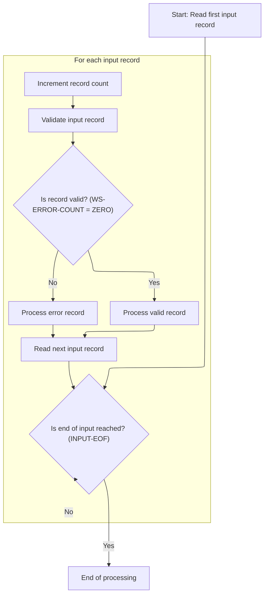
```mermaid
%%{init: {"flowchart": {"defaultRenderer": "elk"}} }%%
flowchart TD
    node1["Start: Read first input record"]
    click node1 openCode "base/src/LGAPDB01.cbl:179:180"
    node1 --> node2{"Is end of input reached? (INPUT-EOF)"}
    click node2 openCode "base/src/LGAPDB01.cbl:180:180"
    node2 -->|"No"| loop1
    node2 -->|"Yes"| node9["End of processing"]
    click node9 openCode "base/src/LGAPDB01.cbl:189:189"
    subgraph loop1["For each input record"]
        node3["Increment record count"]
        click node3 openCode "base/src/LGAPDB01.cbl:181:181"
        node3 --> node4["Validate input record"]
        click node4 openCode "base/src/LGAPDB01.cbl:182:182"
        node4 --> node5{"Is record valid? (WS-ERROR-COUNT = ZERO)"}
        click node5 openCode "base/src/LGAPDB01.cbl:183:183"
        node5 -->|"Yes"| node6["Process valid record"]
        click node6 openCode "base/src/LGAPDB01.cbl:184:184"
        node5 -->|"No"| node7["Process error record"]
        click node7 openCode "base/src/LGAPDB01.cbl:186:186"
        node6 --> node8["Read next input record"]
        node7 --> node8
        node8["Read next input record"]
        click node8 openCode "base/src/LGAPDB01.cbl:188:188"
        node8 --> node2
    end
classDef HeadingStyle fill:#777777,stroke:#333,stroke-width:2px;

%% Swimm:
%% %%{init: {"flowchart": {"defaultRenderer": "elk"}} }%%
%% flowchart TD
%%     node1["Start: Read first input record"]
%%     click node1 openCode "<SwmPath>[base/src/LGAPDB01.cbl](base/src/LGAPDB01.cbl)</SwmPath>:179:180"
%%     node1 --> node2{"Is end of input reached? (<SwmToken path="base/src/LGAPDB01.cbl" pos="180:5:7" line-data="           PERFORM UNTIL INPUT-EOF">`INPUT-EOF`</SwmToken>)"}
%%     click node2 openCode "<SwmPath>[base/src/LGAPDB01.cbl](base/src/LGAPDB01.cbl)</SwmPath>:180:180"
%%     node2 -->|"No"| loop1
%%     node2 -->|"Yes"| node9["End of processing"]
%%     click node9 openCode "<SwmPath>[base/src/LGAPDB01.cbl](base/src/LGAPDB01.cbl)</SwmPath>:189:189"
%%     subgraph loop1["For each input record"]
%%         node3["Increment record count"]
%%         click node3 openCode "<SwmPath>[base/src/LGAPDB01.cbl](base/src/LGAPDB01.cbl)</SwmPath>:181:181"
%%         node3 --> node4["Validate input record"]
%%         click node4 openCode "<SwmPath>[base/src/LGAPDB01.cbl](base/src/LGAPDB01.cbl)</SwmPath>:182:182"
%%         node4 --> node5{"Is record valid? (<SwmToken path="base/src/LGAPDB01.cbl" pos="183:3:7" line-data="               IF WS-ERROR-COUNT = ZERO">`WS-ERROR-COUNT`</SwmToken> = ZERO)"}
%%         click node5 openCode "<SwmPath>[base/src/LGAPDB01.cbl](base/src/LGAPDB01.cbl)</SwmPath>:183:183"
%%         node5 -->|"Yes"| node6["Process valid record"]
%%         click node6 openCode "<SwmPath>[base/src/LGAPDB01.cbl](base/src/LGAPDB01.cbl)</SwmPath>:184:184"
%%         node5 -->|"No"| node7["Process error record"]
%%         click node7 openCode "<SwmPath>[base/src/LGAPDB01.cbl](base/src/LGAPDB01.cbl)</SwmPath>:186:186"
%%         node6 --> node8["Read next input record"]
%%         node7 --> node8
%%         node8["Read next input record"]
%%         click node8 openCode "<SwmPath>[base/src/LGAPDB01.cbl](base/src/LGAPDB01.cbl)</SwmPath>:188:188"
%%         node8 --> node2
%%     end
%% classDef HeadingStyle fill:#777777,stroke:#333,stroke-width:2px;
```

This section is responsible for iterating through all insurance input records, validating each record, processing valid records, and logging errors for invalid ones. It maintains counters for processed, error, and warning records.

| Category        | Rule Name               | Description                                                                                                                  |
| --------------- | ----------------------- | ---------------------------------------------------------------------------------------------------------------------------- |
| Data validation | Input record validation | Each input record must be validated before processing. If any validation errors are found, the record is considered invalid. |
| Business logic  | Valid record processing | For every valid record, increment the processed record counter and perform the required business processing steps.           |
| Business logic  | Error severity tracking | Warning and informational errors must be tracked separately from fatal errors, using dedicated counters.                     |

<SwmSnippet path="/base/src/LGAPDB01.cbl" line="178">

---

<SwmToken path="base/src/LGAPDB01.cbl" pos="178:1:5" line-data="       P006-PROCESS-RECORDS.">`P006-PROCESS-RECORDS`</SwmToken> loops through all input records, validates each one, processes valid records, and logs errors for invalid ones. Counters are updated for processed and error records.

```cobol
       P006-PROCESS-RECORDS.
           PERFORM P007-READ-INPUT
           PERFORM UNTIL INPUT-EOF
               ADD 1 TO WS-REC-CNT
               PERFORM P008-VALIDATE-INPUT-RECORD
               IF WS-ERROR-COUNT = ZERO
                   PERFORM P009-PROCESS-VALID-RECORD
               ELSE
                   PERFORM P010-PROCESS-ERROR-RECORD
               END-IF
               PERFORM P007-READ-INPUT
           END-PERFORM.
```

---

</SwmSnippet>

## Validating input records

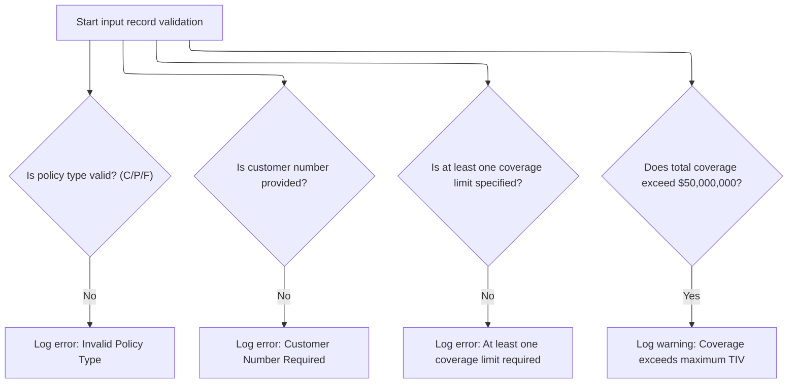
```mermaid
%%{init: {"flowchart": {"defaultRenderer": "elk"}} }%%
flowchart TD
    node1["Start input record validation"]
    click node1 openCode "base/src/LGAPDB01.cbl:195:196"
    node1 --> node2{"Is policy type valid? (C/P/F)"}
    click node2 openCode "base/src/LGAPDB01.cbl:198:204"
    node1 --> node4{"Is customer number provided?"}
    click node4 openCode "base/src/LGAPDB01.cbl:206:210"
    node1 --> node6{"Is at least one coverage limit specified?"}
    click node6 openCode "base/src/LGAPDB01.cbl:212:217"
    node1 --> node8{"Does total coverage exceed $50,000,000?"}
    click node8 openCode "base/src/LGAPDB01.cbl:219:224"
    node2 -->|"No"| node3["Log error: Invalid Policy Type"]
    click node3 openCode "base/src/LGAPDB01.cbl:201:204"
    node4 -->|"No"| node5["Log error: Customer Number Required"]
    click node5 openCode "base/src/LGAPDB01.cbl:207:210"
    node6 -->|"No"| node7["Log error: At least one coverage limit required"]
    click node7 openCode "base/src/LGAPDB01.cbl:214:217"
    node8 -->|"Yes"| node9["Log warning: Coverage exceeds maximum TIV"]
    click node9 openCode "base/src/LGAPDB01.cbl:221:224"

classDef HeadingStyle fill:#777777,stroke:#333,stroke-width:2px;

%% Swimm:
%% %%{init: {"flowchart": {"defaultRenderer": "elk"}} }%%
%% flowchart TD
%%     node1["Start input record validation"]
%%     click node1 openCode "<SwmPath>[base/src/LGAPDB01.cbl](base/src/LGAPDB01.cbl)</SwmPath>:195:196"
%%     node1 --> node2{"Is policy type valid? (C/P/F)"}
%%     click node2 openCode "<SwmPath>[base/src/LGAPDB01.cbl](base/src/LGAPDB01.cbl)</SwmPath>:198:204"
%%     node1 --> node4{"Is customer number provided?"}
%%     click node4 openCode "<SwmPath>[base/src/LGAPDB01.cbl](base/src/LGAPDB01.cbl)</SwmPath>:206:210"
%%     node1 --> node6{"Is at least one coverage limit specified?"}
%%     click node6 openCode "<SwmPath>[base/src/LGAPDB01.cbl](base/src/LGAPDB01.cbl)</SwmPath>:212:217"
%%     node1 --> node8{"Does total coverage exceed $50,000,000?"}
%%     click node8 openCode "<SwmPath>[base/src/LGAPDB01.cbl](base/src/LGAPDB01.cbl)</SwmPath>:219:224"
%%     node2 -->|"No"| node3["Log error: Invalid Policy Type"]
%%     click node3 openCode "<SwmPath>[base/src/LGAPDB01.cbl](base/src/LGAPDB01.cbl)</SwmPath>:201:204"
%%     node4 -->|"No"| node5["Log error: Customer Number Required"]
%%     click node5 openCode "<SwmPath>[base/src/LGAPDB01.cbl](base/src/LGAPDB01.cbl)</SwmPath>:207:210"
%%     node6 -->|"No"| node7["Log error: At least one coverage limit required"]
%%     click node7 openCode "<SwmPath>[base/src/LGAPDB01.cbl](base/src/LGAPDB01.cbl)</SwmPath>:214:217"
%%     node8 -->|"Yes"| node9["Log warning: Coverage exceeds maximum TIV"]
%%     click node9 openCode "<SwmPath>[base/src/LGAPDB01.cbl](base/src/LGAPDB01.cbl)</SwmPath>:221:224"
%% 
%% classDef HeadingStyle fill:#777777,stroke:#333,stroke-width:2px;
```

This section ensures that all incoming policy records meet the minimum business requirements before further processing. It validates key fields and logs errors or warnings for any violations, supporting data integrity and compliance.

| Category        | Rule Name                | Description                                                                                                                                                                   |
| --------------- | ------------------------ | ----------------------------------------------------------------------------------------------------------------------------------------------------------------------------- |
| Data validation | Valid Policy Type        | Policy type must be one of the following valid values: 'C' (Commercial), 'P' (Personal), or 'F' (Farm). Any other value is considered invalid and must be logged as an error. |
| Data validation | Customer Number Required | Customer number must be provided and cannot be empty. If missing, an error must be logged for the record.                                                                     |
| Data validation | Coverage Limit Required  | At least one coverage limit (building, contents, or business interruption) must be specified and non-zero. If all are zero, an error must be logged.                          |
| Business logic  | Maximum Coverage Warning | The sum of building, contents, and business interruption coverage limits must not exceed $50,000,000. If the total exceeds this maximum, a warning must be logged.            |

<SwmSnippet path="/base/src/LGAPDB01.cbl" line="195">

---

<SwmToken path="base/src/LGAPDB01.cbl" pos="195:1:7" line-data="       P008-VALIDATE-INPUT-RECORD.">`P008-VALIDATE-INPUT-RECORD`</SwmToken> checks for valid policy type, non-empty customer number, at least one coverage limit, and total coverage not exceeding the max allowed TIV. Errors are logged for any invalid conditions.

```cobol
       P008-VALIDATE-INPUT-RECORD.
           INITIALIZE WS-ERROR-HANDLING
           
           IF NOT COMMERCIAL-POLICY AND 
              NOT PERSONAL-POLICY AND 
              NOT FARM-POLICY
               PERFORM P008A-LOG-ERROR WITH 
                   'POL001' 'F' 'IN-POLICY-TYPE' 
                   'Invalid Policy Type'
           END-IF
           
           IF IN-CUSTOMER-NUM = SPACES
               PERFORM P008A-LOG-ERROR WITH 
                   'CUS001' 'F' 'IN-CUSTOMER-NUM' 
                   'Customer Number Required'
           END-IF
           
           IF IN-BUILDING-LIMIT = ZERO AND 
              IN-CONTENTS-LIMIT = ZERO
               PERFORM P008A-LOG-ERROR WITH 
                   'COV001' 'F' 'COVERAGE-LIMITS' 
                   'At least one coverage limit required'
           END-IF
           
           IF IN-BUILDING-LIMIT + IN-CONTENTS-LIMIT + 
              IN-BI-LIMIT > WS-MAX-TIV
               PERFORM P008A-LOG-ERROR WITH 
                   'COV002' 'W' 'COVERAGE-LIMITS' 
                   'Total coverage exceeds maximum TIV'
           END-IF.
```

---

</SwmSnippet>

<SwmSnippet path="/base/src/LGAPDB01.cbl" line="226">

---

<SwmToken path="base/src/LGAPDB01.cbl" pos="226:1:5" line-data="       P008A-LOG-ERROR.">`P008A-LOG-ERROR`</SwmToken> bumps the error count and stores error details into parallel arrays, so multiple errors can be tracked for each record. It relies on workspace variables being set before it's called.

```cobol
       P008A-LOG-ERROR.
           ADD 1 TO WS-ERROR-COUNT
           SET ERR-IDX TO WS-ERROR-COUNT
           MOVE WS-ERROR-CODE TO WS-ERROR-CODE (ERR-IDX)
           MOVE WS-ERROR-SEVERITY TO WS-ERROR-SEVERITY (ERR-IDX)
           MOVE WS-ERROR-FIELD TO WS-ERROR-FIELD (ERR-IDX)
           MOVE WS-ERROR-MESSAGE TO WS-ERROR-MESSAGE (ERR-IDX).
```

---

</SwmSnippet>

## Branching for Commercial vs Non-Commercial Policy Processing


```mermaid
%%{init: {"flowchart": {"defaultRenderer": "elk"}} }%%
flowchart TD
    node1{"Is COMMERCIAL-POLICY true? (IN-POLICY-TYPE = 'C')"}
    click node1 openCode "base/src/LGAPDB01.cbl:235:241"
    node1 -->|"Yes"| node2["Process commercial record (P011-PROCESS-COMMERCIAL)"]
    click node2 openCode "base/src/LGAPDB01.cbl:236:237"
    node2 --> node3["Increment WS-PROC-CNT"]
    click node3 openCode "base/src/LGAPDB01.cbl:237:237"
    node1 -->|"No"| node4["Process non-commercial record (P012-PROCESS-NON-COMMERCIAL)"]
    click node4 openCode "base/src/LGAPDB01.cbl:239:240"
    node4 --> node5["Increment WS-ERR-CNT"]
    click node5 openCode "base/src/LGAPDB01.cbl:240:240"

classDef HeadingStyle fill:#777777,stroke:#333,stroke-width:2px;

%% Swimm:
%% %%{init: {"flowchart": {"defaultRenderer": "elk"}} }%%
%% flowchart TD
%%     node1{"Is <SwmToken path="base/src/LGAPDB01.cbl" pos="198:5:7" line-data="           IF NOT COMMERCIAL-POLICY AND ">`COMMERCIAL-POLICY`</SwmToken> true? (<SwmToken path="base/src/LGAPDB01.cbl" pos="202:10:14" line-data="                   &#39;POL001&#39; &#39;F&#39; &#39;IN-POLICY-TYPE&#39; ">`IN-POLICY-TYPE`</SwmToken> = 'C')"}
%%     click node1 openCode "<SwmPath>[base/src/LGAPDB01.cbl](base/src/LGAPDB01.cbl)</SwmPath>:235:241"
%%     node1 -->|"Yes"| node2["Process commercial record (<SwmToken path="base/src/LGAPDB01.cbl" pos="236:3:7" line-data="               PERFORM P011-PROCESS-COMMERCIAL">`P011-PROCESS-COMMERCIAL`</SwmToken>)"]
%%     click node2 openCode "<SwmPath>[base/src/LGAPDB01.cbl](base/src/LGAPDB01.cbl)</SwmPath>:236:237"
%%     node2 --> node3["Increment <SwmToken path="base/src/LGAPDB01.cbl" pos="237:7:11" line-data="               ADD 1 TO WS-PROC-CNT">`WS-PROC-CNT`</SwmToken>"]
%%     click node3 openCode "<SwmPath>[base/src/LGAPDB01.cbl](base/src/LGAPDB01.cbl)</SwmPath>:237:237"
%%     node1 -->|"No"| node4["Process non-commercial record (<SwmToken path="base/src/LGAPDB01.cbl" pos="239:3:9" line-data="               PERFORM P012-PROCESS-NON-COMMERCIAL">`P012-PROCESS-NON-COMMERCIAL`</SwmToken>)"]
%%     click node4 openCode "<SwmPath>[base/src/LGAPDB01.cbl](base/src/LGAPDB01.cbl)</SwmPath>:239:240"
%%     node4 --> node5["Increment <SwmToken path="base/src/LGAPDB01.cbl" pos="240:7:11" line-data="               ADD 1 TO WS-ERR-CNT">`WS-ERR-CNT`</SwmToken>"]
%%     click node5 openCode "<SwmPath>[base/src/LGAPDB01.cbl](base/src/LGAPDB01.cbl)</SwmPath>:240:240"
%% 
%% classDef HeadingStyle fill:#777777,stroke:#333,stroke-width:2px;
```

This section is responsible for branching the processing logic based on whether the input policy is commercial or non-commercial. It ensures that commercial policies are processed using the commercial routine and non-commercial policies are processed using the non-commercial routine, updating the relevant counters accordingly.

| Category        | Rule Name                        | Description                                                                                                                                                                                                        |
| --------------- | -------------------------------- | ------------------------------------------------------------------------------------------------------------------------------------------------------------------------------------------------------------------ |
| Data validation | Counter initialization           | The processed and error counters must be initialized to zero at the start of processing.                                                                                                                           |
| Business logic  | Commercial policy processing     | If the input policy type is commercial ('C'), the record must be processed as a commercial policy.                                                                                                                 |
| Business logic  | Non-commercial policy processing | If the input policy type is not commercial ('C'), the record must be processed as a non-commercial policy.                                                                                                         |
| Business logic  | Processed counter for commercial | Each time a commercial policy is processed, increment the processed counter (<SwmToken path="base/src/LGAPDB01.cbl" pos="237:7:11" line-data="               ADD 1 TO WS-PROC-CNT">`WS-PROC-CNT`</SwmToken>) by 1. |
| Business logic  | Error counter for non-commercial | Each time a non-commercial policy is processed, increment the error counter (<SwmToken path="base/src/LGAPDB01.cbl" pos="240:7:11" line-data="               ADD 1 TO WS-ERR-CNT">`WS-ERR-CNT`</SwmToken>) by 1.   |

<SwmSnippet path="/base/src/LGAPDB01.cbl" line="234">

---

<SwmToken path="base/src/LGAPDB01.cbl" pos="234:1:7" line-data="       P009-PROCESS-VALID-RECORD.">`P009-PROCESS-VALID-RECORD`</SwmToken> decides if the record is commercial or not, then calls the right processing routine and updates the counters accordingly.

```cobol
       P009-PROCESS-VALID-RECORD.
           IF COMMERCIAL-POLICY
               PERFORM P011-PROCESS-COMMERCIAL
               ADD 1 TO WS-PROC-CNT
           ELSE
               PERFORM P012-PROCESS-NON-COMMERCIAL
               ADD 1 TO WS-ERR-CNT
           END-IF.
```

---

</SwmSnippet>

## Commercial Policy Premium Calculation Steps

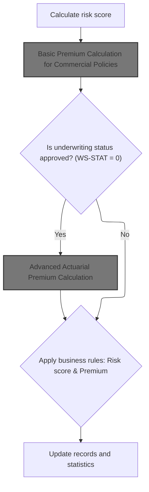
```mermaid
%%{init: {"flowchart": {"defaultRenderer": "elk"}} }%%
flowchart TD
    node1["Calculate risk score"]
    click node1 openCode "base/src/LGAPDB01.cbl:258:259"
    node1 --> node2["Basic Premium Calculation for Commercial Policies"]
    
    node2 --> node3{"Is underwriting status approved? (WS-STAT = 0)"}
    click node3 openCode "base/src/LGAPDB01.cbl:261:263"
    node3 -->|"Yes"| node4["Advanced Actuarial Premium Calculation"]
    
    node3 -->|"No"| node5{"Apply business rules: Risk score & Premium"}
    click node5 openCode "base/src/LGAPDB01.cbl:327:349"
    node4 --> node5
    node5 --> node6["Update records and statistics"]
    click node6 openCode "base/src/LGAPDB01.cbl:265:266"
classDef HeadingStyle fill:#777777,stroke:#333,stroke-width:2px;
click node2 goToHeading "Basic Premium Calculation for Commercial Policies"
node2:::HeadingStyle
click node4 goToHeading "Advanced Actuarial Premium Calculation"
node4:::HeadingStyle

%% Swimm:
%% %%{init: {"flowchart": {"defaultRenderer": "elk"}} }%%
%% flowchart TD
%%     node1["Calculate risk score"]
%%     click node1 openCode "<SwmPath>[base/src/LGAPDB01.cbl](base/src/LGAPDB01.cbl)</SwmPath>:258:259"
%%     node1 --> node2["Basic Premium Calculation for Commercial Policies"]
%%     
%%     node2 --> node3{"Is underwriting status approved? (<SwmToken path="base/src/LGAPDB01.cbl" pos="261:3:5" line-data="           IF WS-STAT = 0">`WS-STAT`</SwmToken> = 0)"}
%%     click node3 openCode "<SwmPath>[base/src/LGAPDB01.cbl](base/src/LGAPDB01.cbl)</SwmPath>:261:263"
%%     node3 -->|"Yes"| node4["Advanced Actuarial Premium Calculation"]
%%     
%%     node3 -->|"No"| node5{"Apply business rules: Risk score & Premium"}
%%     click node5 openCode "<SwmPath>[base/src/LGAPDB01.cbl](base/src/LGAPDB01.cbl)</SwmPath>:327:349"
%%     node4 --> node5
%%     node5 --> node6["Update records and statistics"]
%%     click node6 openCode "<SwmPath>[base/src/LGAPDB01.cbl](base/src/LGAPDB01.cbl)</SwmPath>:265:266"
%% classDef HeadingStyle fill:#777777,stroke:#333,stroke-width:2px;
%% click node2 goToHeading "Basic Premium Calculation for Commercial Policies"
%% node2:::HeadingStyle
%% click node4 goToHeading "Advanced Actuarial Premium Calculation"
%% node4:::HeadingStyle
```

This section governs the calculation of commercial insurance policy premiums by integrating risk scoring, basic and advanced actuarial calculations, application of business rules, and updating policy records and statistics.

| Category        | Rule Name                                            | Description                                                                                                                                                                                                                                                               |
| --------------- | ---------------------------------------------------- | ------------------------------------------------------------------------------------------------------------------------------------------------------------------------------------------------------------------------------------------------------------------------- |
| Data validation | Mandatory risk scoring                               | A risk score must be calculated for every commercial policy before any premium calculation is performed.                                                                                                                                                                  |
| Data validation | Comprehensive output record                          | The output record for each policy must include the calculated premium, underwriting decision status, rejection reason (if applicable), descriptive notes, and eligibility for discounts.                                                                                  |
| Business logic  | Basic premium requirement                            | All commercial policies must have a basic premium calculated using the risk score and relevant policy data.                                                                                                                                                               |
| Business logic  | Advanced actuarial calculation for approved policies | If the underwriting status is 'approved' (<SwmToken path="base/src/LGAPDB01.cbl" pos="261:3:5" line-data="           IF WS-STAT = 0">`WS-STAT`</SwmToken> = 0), an advanced actuarial premium calculation must be performed in addition to the basic premium calculation. |
| Business logic  | Business rule application for non-approved policies  | If the underwriting status is not 'approved', business rules must be applied to adjust the risk score and premium according to the policy's risk and eligibility factors.                                                                                                 |
| Business logic  | Statistics update requirement                        | Statistics related to premium calculations and underwriting decisions must be updated after each policy is processed.                                                                                                                                                     |

<SwmSnippet path="/base/src/LGAPDB01.cbl" line="258">

---

Here, <SwmToken path="base/src/LGAPDB01.cbl" pos="258:1:5" line-data="       P011-PROCESS-COMMERCIAL.">`P011-PROCESS-COMMERCIAL`</SwmToken> runs through risk scoring, basic premium calculation, enhanced actuarial calculation (if status is approved), applies business rules, writes the output record, and updates statistics. Each step is called in sequence to build up the premium and decision data for the policy.

```cobol
       P011-PROCESS-COMMERCIAL.
           PERFORM P011A-CALCULATE-RISK-SCORE
           PERFORM P011B-BASIC-PREMIUM-CALC
           IF WS-STAT = 0
               PERFORM P011C-ENHANCED-ACTUARIAL-CALC
           END-IF
           PERFORM P011D-APPLY-BUSINESS-RULES
           PERFORM P011E-WRITE-OUTPUT-RECORD
           PERFORM P011F-UPDATE-STATISTICS.
```

---

</SwmSnippet>

### Basic Premium Calculation for Commercial Policies

This section is responsible for calculating the basic premium for commercial insurance policies. It takes risk and peril data, processes it, and determines the premium breakdown and underwriting status for the policy.

| Category        | Rule Name                               | Description                                                                                                                                                                                                                                                                                                                                                                                                                                         |
| --------------- | --------------------------------------- | --------------------------------------------------------------------------------------------------------------------------------------------------------------------------------------------------------------------------------------------------------------------------------------------------------------------------------------------------------------------------------------------------------------------------------------------------- |
| Data validation | Commercial policy eligibility           | Only policies with <SwmToken path="base/src/LGAPDB01.cbl" pos="202:10:14" line-data="                   &#39;POL001&#39; &#39;F&#39; &#39;IN-POLICY-TYPE&#39; ">`IN-POLICY-TYPE`</SwmToken> set to 'C' (Commercial) are eligible for basic premium calculation in this section.                                                                                                                                                                     |
| Data validation | Rejection reason requirement            | If the underwriting status (<SwmToken path="base/src/LGAPDB01.cbl" pos="261:3:5" line-data="           IF WS-STAT = 0">`WS-STAT`</SwmToken>) is set to '2' (UW-REJECTED), a rejection reason (<SwmToken path="base/src/LGAPDB01.cbl" pos="279:8:12" line-data="                                WS-STAT-DESC, WS-REJ-RSN, WS-FR-PREM,">`WS-REJ-RSN`</SwmToken>) must be provided in the output.                                                      |
| Business logic  | Peril-specific premium breakdown        | The base premium for each peril (fire, crime, flood, weather) must be calculated and provided separately in the output.                                                                                                                                                                                                                                                                                                                             |
| Business logic  | Total premium calculation               | The total premium must be the sum of the individual peril premiums, adjusted by any applicable discount factor (<SwmToken path="base/src/LGAPDB01.cbl" pos="281:8:12" line-data="                                WS-TOT-PREM, WS-DISC-FACT.">`WS-DISC-FACT`</SwmToken>).                                                                                                                                                                            |
| Business logic  | Discount factor default and eligibility | The discount factor (<SwmToken path="base/src/LGAPDB01.cbl" pos="281:8:12" line-data="                                WS-TOT-PREM, WS-DISC-FACT.">`WS-DISC-FACT`</SwmToken>) must default to <SwmToken path="base/src/LGAPDB03.cbl" pos="93:3:5" line-data="           MOVE 1.00 TO LK-DISC-FACT">`1.00`</SwmToken> unless the policy qualifies for discounts based on eligibility criteria (such as multi-policy, claims-free, or safety program). |
| Business logic  | Underwriting status assignment          | The underwriting status (<SwmToken path="base/src/LGAPDB01.cbl" pos="261:3:5" line-data="           IF WS-STAT = 0">`WS-STAT`</SwmToken>) must be set to '0' (UW-APPROVED), '1' (UW-PENDING), '2' (UW-REJECTED), or '3' (UW-REFERRED) based on the risk analysis and business rules.                                                                                                                                                                |

<SwmSnippet path="/base/src/LGAPDB01.cbl" line="275">

---

<SwmToken path="base/src/LGAPDB01.cbl" pos="275:1:7" line-data="       P011B-BASIC-PREMIUM-CALC.">`P011B-BASIC-PREMIUM-CALC`</SwmToken> hands off the risk and peril data to <SwmToken path="base/src/LGAPDB01.cbl" pos="276:4:4" line-data="           CALL &#39;LGAPDB03&#39; USING WS-BASE-RISK-SCR, IN-FIRE-PERIL, ">`LGAPDB03`</SwmToken>, which calculates the basic premiums and status.

```cobol
       P011B-BASIC-PREMIUM-CALC.
           CALL 'LGAPDB03' USING WS-BASE-RISK-SCR, IN-FIRE-PERIL, 
                                IN-CRIME-PERIL, IN-FLOOD-PERIL, 
                                IN-WEATHER-PERIL, WS-STAT,
                                WS-STAT-DESC, WS-REJ-RSN, WS-FR-PREM,
                                WS-CR-PREM, WS-FL-PREM, WS-WE-PREM,
                                WS-TOT-PREM, WS-DISC-FACT.
```

---

</SwmSnippet>

### Risk Factor Lookup, Verdict, and Premium Calculation


```mermaid
%%{init: {"flowchart": {"defaultRenderer": "elk"}} }%%
flowchart TD
  node1["Get FIRE risk factor"] --> node2{"FIRE risk factor found?"}
  click node1 openCode "base/src/LGAPDB03.cbl:48:59"
  node2 -->|"Yes"| node3["Use DB value for FIRE"]
  click node2 openCode "base/src/LGAPDB03.cbl:55:59"
  node2 -->|"No"| node4["Use fallback: FIRE=0.80"]
  click node3 openCode "base/src/LGAPDB03.cbl:55:56"
  click node4 openCode "base/src/LGAPDB03.cbl:58:59"
  node3 --> node5["Get CRIME risk factor"]
  node4 --> node5
  click node5 openCode "base/src/LGAPDB03.cbl:61:71"
  node5 --> node6{"CRIME risk factor found?"}
  click node6 openCode "base/src/LGAPDB03.cbl:67:71"
  node6 -->|"Yes"| node7["Use DB value for CRIME"]
  node6 -->|"No"| node8["Use fallback: CRIME=0.60"]
  click node7 openCode "base/src/LGAPDB03.cbl:67:68"
  click node8 openCode "base/src/LGAPDB03.cbl:70:71"
  node7 --> node9["Evaluate risk score"]
  node8 --> node9
  click node9 openCode "base/src/LGAPDB03.cbl:73:90"
  node9 --> node10{"Risk score > 200?"}
  click node10 openCode "base/src/LGAPDB03.cbl:74:90"
  node10 -->|"Yes"| node11["Application Rejected: High Risk"]
  click node11 openCode "base/src/LGAPDB03.cbl:75:78"
  node10 -->|"No"| node12{"Risk score > 150?"}
  click node12 openCode "base/src/LGAPDB03.cbl:80:85"
  node12 -->|"Yes"| node13["Application Pending: Medium Risk"]
  click node13 openCode "base/src/LGAPDB03.cbl:81:84"
  node12 -->|"No"| node14["Application Approved"]
  click node14 openCode "base/src/LGAPDB03.cbl:86:88"
  node11 --> node15["Calculate premiums"]
  node13 --> node15
  node14 --> node15
  click node15 openCode "base/src/LGAPDB03.cbl:45:46"
classDef HeadingStyle fill:#777777,stroke:#333,stroke-width:2px;

%% Swimm:
%% %%{init: {"flowchart": {"defaultRenderer": "elk"}} }%%
%% flowchart TD
%%   node1["Get FIRE risk factor"] --> node2{"FIRE risk factor found?"}
%%   click node1 openCode "<SwmPath>[base/src/LGAPDB03.cbl](base/src/LGAPDB03.cbl)</SwmPath>:48:59"
%%   node2 -->|"Yes"| node3["Use DB value for FIRE"]
%%   click node2 openCode "<SwmPath>[base/src/LGAPDB03.cbl](base/src/LGAPDB03.cbl)</SwmPath>:55:59"
%%   node2 -->|"No"| node4["Use fallback: FIRE=<SwmToken path="base/src/LGAPDB03.cbl" pos="58:3:5" line-data="               MOVE 0.80 TO WS-FIRE-FACTOR">`0.80`</SwmToken>"]
%%   click node3 openCode "<SwmPath>[base/src/LGAPDB03.cbl](base/src/LGAPDB03.cbl)</SwmPath>:55:56"
%%   click node4 openCode "<SwmPath>[base/src/LGAPDB03.cbl](base/src/LGAPDB03.cbl)</SwmPath>:58:59"
%%   node3 --> node5["Get CRIME risk factor"]
%%   node4 --> node5
%%   click node5 openCode "<SwmPath>[base/src/LGAPDB03.cbl](base/src/LGAPDB03.cbl)</SwmPath>:61:71"
%%   node5 --> node6{"CRIME risk factor found?"}
%%   click node6 openCode "<SwmPath>[base/src/LGAPDB03.cbl](base/src/LGAPDB03.cbl)</SwmPath>:67:71"
%%   node6 -->|"Yes"| node7["Use DB value for CRIME"]
%%   node6 -->|"No"| node8["Use fallback: CRIME=<SwmToken path="base/src/LGAPDB03.cbl" pos="70:3:5" line-data="               MOVE 0.60 TO WS-CRIME-FACTOR">`0.60`</SwmToken>"]
%%   click node7 openCode "<SwmPath>[base/src/LGAPDB03.cbl](base/src/LGAPDB03.cbl)</SwmPath>:67:68"
%%   click node8 openCode "<SwmPath>[base/src/LGAPDB03.cbl](base/src/LGAPDB03.cbl)</SwmPath>:70:71"
%%   node7 --> node9["Evaluate risk score"]
%%   node8 --> node9
%%   click node9 openCode "<SwmPath>[base/src/LGAPDB03.cbl](base/src/LGAPDB03.cbl)</SwmPath>:73:90"
%%   node9 --> node10{"Risk score > 200?"}
%%   click node10 openCode "<SwmPath>[base/src/LGAPDB03.cbl](base/src/LGAPDB03.cbl)</SwmPath>:74:90"
%%   node10 -->|"Yes"| node11["Application Rejected: High Risk"]
%%   click node11 openCode "<SwmPath>[base/src/LGAPDB03.cbl](base/src/LGAPDB03.cbl)</SwmPath>:75:78"
%%   node10 -->|"No"| node12{"Risk score > 150?"}
%%   click node12 openCode "<SwmPath>[base/src/LGAPDB03.cbl](base/src/LGAPDB03.cbl)</SwmPath>:80:85"
%%   node12 -->|"Yes"| node13["Application Pending: Medium Risk"]
%%   click node13 openCode "<SwmPath>[base/src/LGAPDB03.cbl](base/src/LGAPDB03.cbl)</SwmPath>:81:84"
%%   node12 -->|"No"| node14["Application Approved"]
%%   click node14 openCode "<SwmPath>[base/src/LGAPDB03.cbl](base/src/LGAPDB03.cbl)</SwmPath>:86:88"
%%   node11 --> node15["Calculate premiums"]
%%   node13 --> node15
%%   node14 --> node15
%%   click node15 openCode "<SwmPath>[base/src/LGAPDB03.cbl](base/src/LGAPDB03.cbl)</SwmPath>:45:46"
%% classDef HeadingStyle fill:#777777,stroke:#333,stroke-width:2px;
```

This section governs the process of risk factor retrieval, risk score evaluation, verdict assignment, and premium calculation for basic commercial policy pricing. It ensures that applications are categorized and priced consistently, even if risk factor data is unavailable.

| Category       | Rule Name           | Description                                                                                                                                                        |
| -------------- | ------------------- | ------------------------------------------------------------------------------------------------------------------------------------------------------------------ |
| Business logic | High risk rejection | If the risk score is greater than 200, the application must be rejected and the rejection reason must be set to 'High Risk Score - Manual Review Required'.        |
| Business logic | Medium risk pending | If the risk score is greater than 150 but less than or equal to 200, the application must be set to pending and the reason must be 'Medium Risk - Pending Review'. |
| Business logic | Low risk approval   | If the risk score is 150 or less, the application must be approved and no rejection reason should be set.                                                          |

<SwmSnippet path="/base/src/LGAPDB03.cbl" line="42">

---

<SwmToken path="base/src/LGAPDB03.cbl" pos="42:1:3" line-data="       MAIN-LOGIC.">`MAIN-LOGIC`</SwmToken> in <SwmToken path="base/src/LGAPDB01.cbl" pos="276:4:4" line-data="           CALL &#39;LGAPDB03&#39; USING WS-BASE-RISK-SCR, IN-FIRE-PERIL, ">`LGAPDB03`</SwmToken> runs the whole risk and premium calculation: it fetches risk factors from the DB (or uses defaults if the query fails), categorizes the risk score into verdicts, and calculates premiums for each peril. This is the main calculation engine for basic commercial policy pricing.

```cobol
       MAIN-LOGIC.
           PERFORM GET-RISK-FACTORS
           PERFORM CALCULATE-VERDICT
           PERFORM CALCULATE-PREMIUMS
           GOBACK.
```

---

</SwmSnippet>

<SwmSnippet path="/base/src/LGAPDB03.cbl" line="48">

---

<SwmToken path="base/src/LGAPDB03.cbl" pos="48:1:5" line-data="       GET-RISK-FACTORS.">`GET-RISK-FACTORS`</SwmToken> runs two SQL queries to fetch fire and crime risk factors. If either query fails, it uses hardcoded fallback values (<SwmToken path="base/src/LGAPDB03.cbl" pos="58:3:5" line-data="               MOVE 0.80 TO WS-FIRE-FACTOR">`0.80`</SwmToken> for fire, <SwmToken path="base/src/LGAPDB03.cbl" pos="70:3:5" line-data="               MOVE 0.60 TO WS-CRIME-FACTOR">`0.60`</SwmToken> for crime) so the premium calculation doesn't break.

```cobol
       GET-RISK-FACTORS.
           EXEC SQL
               SELECT FACTOR_VALUE INTO :WS-FIRE-FACTOR
               FROM RISK_FACTORS
               WHERE PERIL_TYPE = 'FIRE'
           END-EXEC.
           
           IF SQLCODE = 0
               CONTINUE
           ELSE
               MOVE 0.80 TO WS-FIRE-FACTOR
           END-IF.
           
           EXEC SQL
               SELECT FACTOR_VALUE INTO :WS-CRIME-FACTOR
               FROM RISK_FACTORS
               WHERE PERIL_TYPE = 'CRIME'
           END-EXEC.
           
           IF SQLCODE = 0
               CONTINUE
           ELSE
               MOVE 0.60 TO WS-CRIME-FACTOR
           END-IF.
```

---

</SwmSnippet>

<SwmSnippet path="/base/src/LGAPDB03.cbl" line="73">

---

<SwmToken path="base/src/LGAPDB03.cbl" pos="73:1:3" line-data="       CALCULATE-VERDICT.">`CALCULATE-VERDICT`</SwmToken> checks the risk score and sets the status, description, and rejection reason based on fixed thresholds (200, 150). This is how the system decides if a policy is approved, pending, or rejected.

```cobol
       CALCULATE-VERDICT.
           IF LK-RISK-SCORE > 200
             MOVE 2 TO LK-STAT
             MOVE 'REJECTED' TO LK-STAT-DESC
             MOVE 'High Risk Score - Manual Review Required' 
               TO LK-REJ-RSN
           ELSE
             IF LK-RISK-SCORE > 150
               MOVE 1 TO LK-STAT
               MOVE 'PENDING' TO LK-STAT-DESC
               MOVE 'Medium Risk - Pending Review'
                 TO LK-REJ-RSN
             ELSE
               MOVE 0 TO LK-STAT
               MOVE 'APPROVED' TO LK-STAT-DESC
               MOVE SPACES TO LK-REJ-RSN
             END-IF
           END-IF.
```

---

</SwmSnippet>

### Advanced Actuarial Premium Calculation


```mermaid
%%{init: {"flowchart": {"defaultRenderer": "elk"}} }%%
flowchart TD
    node1["Prepare input and coverage data for actuarial calculation"]
    click node1 openCode "base/src/LGAPDB01.cbl:284:310"
    node1 --> node2{"Is initial premium > $500.00?"}
    click node2 openCode "base/src/LGAPDB01.cbl:312:313"
    node2 -->|"Yes"| node3["Call advanced actuarial calculation (LGAPDB04)"]
    click node3 openCode "base/src/LGAPDB01.cbl:313:314"
    node2 -->|"No"| node6["End (No update needed)"]
    node3 --> node4{"Is enhanced premium > initial premium?"}
    click node4 openCode "base/src/LGAPDB01.cbl:317:324"
    node4 -->|"Yes"| node5["Update premium and components (fire, crime, flood, weather, experience mod) with enhanced results"]
    click node5 openCode "base/src/LGAPDB01.cbl:318:324"
    node4 -->|"No"| node6["End (No update needed)"]
    node5 --> node6["End (No update needed)"]
    click node6 openCode "base/src/LGAPDB01.cbl:325:325"
classDef HeadingStyle fill:#777777,stroke:#333,stroke-width:2px;

%% Swimm:
%% %%{init: {"flowchart": {"defaultRenderer": "elk"}} }%%
%% flowchart TD
%%     node1["Prepare input and coverage data for actuarial calculation"]
%%     click node1 openCode "<SwmPath>[base/src/LGAPDB01.cbl](base/src/LGAPDB01.cbl)</SwmPath>:284:310"
%%     node1 --> node2{"Is initial premium > $500.00?"}
%%     click node2 openCode "<SwmPath>[base/src/LGAPDB01.cbl](base/src/LGAPDB01.cbl)</SwmPath>:312:313"
%%     node2 -->|"Yes"| node3["Call advanced actuarial calculation (<SwmToken path="base/src/LGAPDB01.cbl" pos="313:4:4" line-data="               CALL &#39;LGAPDB04&#39; USING LK-INPUT-DATA, LK-COVERAGE-DATA, ">`LGAPDB04`</SwmToken>)"]
%%     click node3 openCode "<SwmPath>[base/src/LGAPDB01.cbl](base/src/LGAPDB01.cbl)</SwmPath>:313:314"
%%     node2 -->|"No"| node6["End (No update needed)"]
%%     node3 --> node4{"Is enhanced premium > initial premium?"}
%%     click node4 openCode "<SwmPath>[base/src/LGAPDB01.cbl](base/src/LGAPDB01.cbl)</SwmPath>:317:324"
%%     node4 -->|"Yes"| node5["Update premium and components (fire, crime, flood, weather, experience mod) with enhanced results"]
%%     click node5 openCode "<SwmPath>[base/src/LGAPDB01.cbl](base/src/LGAPDB01.cbl)</SwmPath>:318:324"
%%     node4 -->|"No"| node6["End (No update needed)"]
%%     node5 --> node6["End (No update needed)"]
%%     click node6 openCode "<SwmPath>[base/src/LGAPDB01.cbl](base/src/LGAPDB01.cbl)</SwmPath>:325:325"
%% classDef HeadingStyle fill:#777777,stroke:#333,stroke-width:2px;
```

This section determines whether to apply advanced actuarial premium calculations for insurance policies, based on the initial premium amount and the results of the advanced calculation. It ensures that only qualifying cases are recalculated and updated.

| Category        | Rule Name                   | Description                                                                                                                                                                                                      |
| --------------- | --------------------------- | ---------------------------------------------------------------------------------------------------------------------------------------------------------------------------------------------------------------- |
| Data validation | Minimum premium threshold   | Advanced actuarial calculation is only performed if the initial premium amount exceeds $500.00.                                                                                                                  |
| Data validation | Input data preparation      | All input and coverage data must be prepared and mapped correctly before the advanced actuarial calculation is performed.                                                                                        |
| Business logic  | Enhanced premium update     | If the advanced actuarial calculation returns a total premium greater than the initial premium, the premium and its components (fire, crime, flood, weather, experience mod) are updated to the enhanced values. |
| Business logic  | No update for lower premium | If the advanced actuarial calculation does not return a higher premium, no changes are made to the premium or its components.                                                                                    |

<SwmSnippet path="/base/src/LGAPDB01.cbl" line="283">

---

<SwmToken path="base/src/LGAPDB01.cbl" pos="283:1:7" line-data="       P011C-ENHANCED-ACTUARIAL-CALC.">`P011C-ENHANCED-ACTUARIAL-CALC`</SwmToken> sets up all the input and coverage data, then calls <SwmToken path="base/src/LGAPDB01.cbl" pos="313:4:4" line-data="               CALL &#39;LGAPDB04&#39; USING LK-INPUT-DATA, LK-COVERAGE-DATA, ">`LGAPDB04`</SwmToken> for advanced premium calculation if the basic premium is high enough. If <SwmToken path="base/src/LGAPDB01.cbl" pos="313:4:4" line-data="               CALL &#39;LGAPDB04&#39; USING LK-INPUT-DATA, LK-COVERAGE-DATA, ">`LGAPDB04`</SwmToken> returns a higher premium, it updates the output fields with the enhanced results.

```cobol
       P011C-ENHANCED-ACTUARIAL-CALC.
      *    Prepare input structure for actuarial calculation
           MOVE IN-CUSTOMER-NUM TO LK-CUSTOMER-NUM
           MOVE WS-BASE-RISK-SCR TO LK-RISK-SCORE
           MOVE IN-PROPERTY-TYPE TO LK-PROPERTY-TYPE
           MOVE IN-TERRITORY-CODE TO LK-TERRITORY
           MOVE IN-CONSTRUCTION-TYPE TO LK-CONSTRUCTION-TYPE
           MOVE IN-OCCUPANCY-CODE TO LK-OCCUPANCY-CODE
           MOVE IN-SPRINKLER-IND TO LK-PROTECTION-CLASS
           MOVE IN-YEAR-BUILT TO LK-YEAR-BUILT
           MOVE IN-SQUARE-FOOTAGE TO LK-SQUARE-FOOTAGE
           MOVE IN-YEARS-IN-BUSINESS TO LK-YEARS-IN-BUSINESS
           MOVE IN-CLAIMS-COUNT-3YR TO LK-CLAIMS-COUNT-5YR
           MOVE IN-CLAIMS-AMOUNT-3YR TO LK-CLAIMS-AMOUNT-5YR
           
      *    Set coverage data
           MOVE IN-BUILDING-LIMIT TO LK-BUILDING-LIMIT
           MOVE IN-CONTENTS-LIMIT TO LK-CONTENTS-LIMIT
           MOVE IN-BI-LIMIT TO LK-BI-LIMIT
           MOVE IN-FIRE-DEDUCTIBLE TO LK-FIRE-DEDUCTIBLE
           MOVE IN-WIND-DEDUCTIBLE TO LK-WIND-DEDUCTIBLE
           MOVE IN-FLOOD-DEDUCTIBLE TO LK-FLOOD-DEDUCTIBLE
           MOVE IN-OTHER-DEDUCTIBLE TO LK-OTHER-DEDUCTIBLE
           MOVE IN-FIRE-PERIL TO LK-FIRE-PERIL
           MOVE IN-CRIME-PERIL TO LK-CRIME-PERIL
           MOVE IN-FLOOD-PERIL TO LK-FLOOD-PERIL
           MOVE IN-WEATHER-PERIL TO LK-WEATHER-PERIL
           
      *    Call advanced actuarial calculation program (only for approved cases)
           IF WS-TOT-PREM > WS-MIN-PREMIUM
               CALL 'LGAPDB04' USING LK-INPUT-DATA, LK-COVERAGE-DATA, 
                                    LK-OUTPUT-RESULTS
               
      *        Update with enhanced calculations if successful
               IF LK-TOTAL-PREMIUM > WS-TOT-PREM
                   MOVE LK-FIRE-PREMIUM TO WS-FR-PREM
                   MOVE LK-CRIME-PREMIUM TO WS-CR-PREM
                   MOVE LK-FLOOD-PREMIUM TO WS-FL-PREM
                   MOVE LK-WEATHER-PREMIUM TO WS-WE-PREM
                   MOVE LK-TOTAL-PREMIUM TO WS-TOT-PREM
                   MOVE LK-EXPERIENCE-MOD TO WS-EXPERIENCE-MOD
               END-IF
           END-IF.
```

---

</SwmSnippet>

### Full Actuarial Premium Calculation Workflow


```mermaid
%%{init: {"flowchart": {"defaultRenderer": "elk"}} }%%
flowchart TD
  node1["Initialize exposures and insured values (risk score, limits)"]
  click node1 openCode "base/src/LGAPDB04.cbl:152:174"
  node1 --> node2["Determine base rates"]
  click node2 openCode "base/src/LGAPDB04.cbl:140:141"
  node2 --> node3["Calculate experience modification (years in business, claims history)"]
  click node3 openCode "base/src/LGAPDB04.cbl:234:257"
  node3 --> node4["Calculate schedule modification (building age, protection class, occupancy, exposure density)"]
  click node4 openCode "base/src/LGAPDB04.cbl:260:316"
  node4 --> node5["Calculate base premium for covered perils (fire, crime, flood, weather)"]
  click node5 openCode "base/src/LGAPDB04.cbl:318:367"
  node5 --> node6["Add catastrophe load"]
  click node6 openCode "base/src/LGAPDB04.cbl:145:146"
  node6 --> node7["Add expense load"]
  click node7 openCode "base/src/LGAPDB04.cbl:147:148"
  node7 --> node8["Apply discounts (multi-peril, claims-free, deductible credits)"]
  click node8 openCode "base/src/LGAPDB04.cbl:407:454"
  node8 --> node9["Calculate taxes"]
  click node9 openCode "base/src/LGAPDB04.cbl:456:462"
  node9 --> node10{"Is final rate factor > 0.05?"}
  click node10 openCode "base/src/LGAPDB04.cbl:473:477"
  node10 -->|"Yes"| node11["Cap rate factor and recalculate premium"]
  click node11 openCode "base/src/LGAPDB04.cbl:474:477"
  node10 -->|"No"| node12["Finalize premium"]
  click node12 openCode "base/src/LGAPDB04.cbl:464:472"

classDef HeadingStyle fill:#777777,stroke:#333,stroke-width:2px;

%% Swimm:
%% %%{init: {"flowchart": {"defaultRenderer": "elk"}} }%%
%% flowchart TD
%%   node1["Initialize exposures and insured values (risk score, limits)"]
%%   click node1 openCode "<SwmPath>[base/src/LGAPDB04.cbl](base/src/LGAPDB04.cbl)</SwmPath>:152:174"
%%   node1 --> node2["Determine base rates"]
%%   click node2 openCode "<SwmPath>[base/src/LGAPDB04.cbl](base/src/LGAPDB04.cbl)</SwmPath>:140:141"
%%   node2 --> node3["Calculate experience modification (years in business, claims history)"]
%%   click node3 openCode "<SwmPath>[base/src/LGAPDB04.cbl](base/src/LGAPDB04.cbl)</SwmPath>:234:257"
%%   node3 --> node4["Calculate schedule modification (building age, protection class, occupancy, exposure density)"]
%%   click node4 openCode "<SwmPath>[base/src/LGAPDB04.cbl](base/src/LGAPDB04.cbl)</SwmPath>:260:316"
%%   node4 --> node5["Calculate base premium for covered perils (fire, crime, flood, weather)"]
%%   click node5 openCode "<SwmPath>[base/src/LGAPDB04.cbl](base/src/LGAPDB04.cbl)</SwmPath>:318:367"
%%   node5 --> node6["Add catastrophe load"]
%%   click node6 openCode "<SwmPath>[base/src/LGAPDB04.cbl](base/src/LGAPDB04.cbl)</SwmPath>:145:146"
%%   node6 --> node7["Add expense load"]
%%   click node7 openCode "<SwmPath>[base/src/LGAPDB04.cbl](base/src/LGAPDB04.cbl)</SwmPath>:147:148"
%%   node7 --> node8["Apply discounts (multi-peril, claims-free, deductible credits)"]
%%   click node8 openCode "<SwmPath>[base/src/LGAPDB04.cbl](base/src/LGAPDB04.cbl)</SwmPath>:407:454"
%%   node8 --> node9["Calculate taxes"]
%%   click node9 openCode "<SwmPath>[base/src/LGAPDB04.cbl](base/src/LGAPDB04.cbl)</SwmPath>:456:462"
%%   node9 --> node10{"Is final rate factor > 0.05?"}
%%   click node10 openCode "<SwmPath>[base/src/LGAPDB04.cbl](base/src/LGAPDB04.cbl)</SwmPath>:473:477"
%%   node10 -->|"Yes"| node11["Cap rate factor and recalculate premium"]
%%   click node11 openCode "<SwmPath>[base/src/LGAPDB04.cbl](base/src/LGAPDB04.cbl)</SwmPath>:474:477"
%%   node10 -->|"No"| node12["Finalize premium"]
%%   click node12 openCode "<SwmPath>[base/src/LGAPDB04.cbl](base/src/LGAPDB04.cbl)</SwmPath>:464:472"
%% 
%% classDef HeadingStyle fill:#777777,stroke:#333,stroke-width:2px;
```

This section determines the total insurance premium for a property by sequentially applying business rules and calculations to exposures, risk modifiers, peril selections, discounts, taxes, and regulatory caps.

| Category        | Rule Name                 | Description                                                                                                                                                                                                                                                                                                                                                                                                                                                                                    |
| --------------- | ------------------------- | ---------------------------------------------------------------------------------------------------------------------------------------------------------------------------------------------------------------------------------------------------------------------------------------------------------------------------------------------------------------------------------------------------------------------------------------------------------------------------------------------- |
| Data validation | Rate Factor Cap           | The final rate factor is calculated as total premium divided by total insured value. If the rate factor exceeds 0.05, it is capped at 0.05 and the premium is recalculated.                                                                                                                                                                                                                                                                                                                    |
| Business logic  | Exposure Initialization   | Exposures for building, contents, and business interruption are calculated using the insured limits and a risk score adjustment. If square footage is zero, exposure density defaults to 100.                                                                                                                                                                                                                                                                                                  |
| Business logic  | Experience Modifier       | The experience modifier is determined by years in business and claims history. Businesses with 5+ years and no claims get a 0.85 modifier; newer businesses get 1.10. If claims exist, the modifier is adjusted by claims amount and credibility factor, and is capped between 0.5 and 2.0.                                                                                                                                                                                                    |
| Business logic  | Schedule Modifier         | The schedule modifier is calculated by adjusting for building age, protection class, occupancy hazard, and exposure density, using fixed increments. The modifier is clamped between -0.2 and +0.4.                                                                                                                                                                                                                                                                                            |
| Business logic  | Peril Premium Calculation | Premiums for each peril (fire, crime, flood, weather) are calculated only if the peril is selected. Crime and flood premiums receive business-specific multipliers (<SwmToken path="base/src/LGAPDB03.cbl" pos="58:3:5" line-data="               MOVE 0.80 TO WS-FIRE-FACTOR">`0.80`</SwmToken> and <SwmToken path="base/src/LGAPDB04.cbl" pos="352:9:11" line-data="                   WS-TREND-FACTOR * 1.25">`1.25`</SwmToken> respectively). All premiums are summed for the base amount. |
| Business logic  | Discount Calculation      | <SwmToken path="base/src/LGAPDB04.cbl" pos="410:3:5" line-data="      * Multi-peril discount">`Multi-peril`</SwmToken>, claims-free, and deductible discounts are calculated and summed. The total discount is capped at 25% of the premium components.                                                                                                                                                                                                                                        |
| Business logic  | Tax Calculation           | Taxes are calculated by applying a fixed rate of 6.75% to the sum of all premium components minus discounts.                                                                                                                                                                                                                                                                                                                                                                                   |

<SwmSnippet path="/base/src/LGAPDB04.cbl" line="138">

---

<SwmToken path="base/src/LGAPDB04.cbl" pos="138:1:3" line-data="       P100-MAIN.">`P100-MAIN`</SwmToken> in <SwmToken path="base/src/LGAPDB01.cbl" pos="313:4:4" line-data="               CALL &#39;LGAPDB04&#39; USING LK-INPUT-DATA, LK-COVERAGE-DATA, ">`LGAPDB04`</SwmToken> runs the full actuarial workflow: initializes exposures, calculates experience and schedule modifiers, computes base premiums, adds catastrophe and expense loads, applies discounts, calculates taxes, and finally caps the rate factor if needed. Each step is performed in sequence to build up the final premium.

```cobol
       P100-MAIN.
           PERFORM P200-INIT
           PERFORM P300-RATES
           PERFORM P350-EXPOSURE
           PERFORM P400-EXP-MOD
           PERFORM P500-SCHED-MOD
           PERFORM P600-BASE-PREM
           PERFORM P700-CAT-LOAD
           PERFORM P800-EXPENSE
           PERFORM P900-DISC
           PERFORM P950-TAXES
           PERFORM P999-FINAL
           GOBACK.
```

---

</SwmSnippet>

<SwmSnippet path="/base/src/LGAPDB04.cbl" line="152">

---

<SwmToken path="base/src/LGAPDB04.cbl" pos="152:1:3" line-data="       P200-INIT.">`P200-INIT`</SwmToken> calculates exposures for building, contents, and BI using a risk score adjustment formula, sums them for total insured value, and computes exposure density per square foot (defaulting to 100 if square footage is zero). This sets up the base numbers for all later premium steps.

```cobol
       P200-INIT.
           INITIALIZE WS-CALCULATION-AREAS
           INITIALIZE WS-BASE-RATE-TABLE
           
           COMPUTE WS-BUILDING-EXPOSURE = 
               LK-BUILDING-LIMIT * (1 + (LK-RISK-SCORE - 100) / 1000)
               
           COMPUTE WS-CONTENTS-EXPOSURE = 
               LK-CONTENTS-LIMIT * (1 + (LK-RISK-SCORE - 100) / 1000)
               
           COMPUTE WS-BI-EXPOSURE = 
               LK-BI-LIMIT * (1 + (LK-RISK-SCORE - 100) / 1000)
               
           COMPUTE WS-TOTAL-INSURED-VAL = 
               WS-BUILDING-EXPOSURE + WS-CONTENTS-EXPOSURE + 
               WS-BI-EXPOSURE
               
           IF LK-SQUARE-FOOTAGE > ZERO
               COMPUTE WS-EXPOSURE-DENSITY = 
                   WS-TOTAL-INSURED-VAL / LK-SQUARE-FOOTAGE
           ELSE
               MOVE 100.00 TO WS-EXPOSURE-DENSITY
           END-IF.
```

---

</SwmSnippet>

<SwmSnippet path="/base/src/LGAPDB04.cbl" line="234">

---

<SwmToken path="base/src/LGAPDB04.cbl" pos="234:1:5" line-data="       P400-EXP-MOD.">`P400-EXP-MOD`</SwmToken> calculates the experience modifier based on years in business and claims history. It uses fixed constants to bump the modifier up or down, caps it between 0.5 and 2.0, and sets it higher for newer businesses. This directly affects the premium.

```cobol
       P400-EXP-MOD.
           MOVE 1.0000 TO WS-EXPERIENCE-MOD
           
           IF LK-YEARS-IN-BUSINESS >= 5
               IF LK-CLAIMS-COUNT-5YR = ZERO
                   MOVE 0.8500 TO WS-EXPERIENCE-MOD
               ELSE
                   COMPUTE WS-EXPERIENCE-MOD = 
                       1.0000 + 
                       ((LK-CLAIMS-AMOUNT-5YR / WS-TOTAL-INSURED-VAL) * 
                        WS-CREDIBILITY-FACTOR * 0.50)
                   
                   IF WS-EXPERIENCE-MOD > 2.0000
                       MOVE 2.0000 TO WS-EXPERIENCE-MOD
                   END-IF
                   
                   IF WS-EXPERIENCE-MOD < 0.5000
                       MOVE 0.5000 TO WS-EXPERIENCE-MOD
                   END-IF
               END-IF
           ELSE
               MOVE 1.1000 TO WS-EXPERIENCE-MOD
           END-IF
           
           MOVE WS-EXPERIENCE-MOD TO LK-EXPERIENCE-MOD.
```

---

</SwmSnippet>

<SwmSnippet path="/base/src/LGAPDB04.cbl" line="260">

---

<SwmToken path="base/src/LGAPDB04.cbl" pos="260:1:5" line-data="       P500-SCHED-MOD.">`P500-SCHED-MOD`</SwmToken> builds the schedule modifier by adjusting for building age, protection class, occupancy hazard, and exposure density, using fixed increments and clamps the result to a set range. This modifier is used in premium calculations to reflect property-specific risk.

```cobol
       P500-SCHED-MOD.
           MOVE +0.000 TO WS-SCHEDULE-MOD
           
      *    Building age factor
           EVALUATE TRUE
               WHEN LK-YEAR-BUILT >= 2010
                   SUBTRACT 0.050 FROM WS-SCHEDULE-MOD
               WHEN LK-YEAR-BUILT >= 1990
                   CONTINUE
               WHEN LK-YEAR-BUILT >= 1970
                   ADD 0.100 TO WS-SCHEDULE-MOD
               WHEN OTHER
                   ADD 0.200 TO WS-SCHEDULE-MOD
           END-EVALUATE
           
      *    Protection class factor
           EVALUATE LK-PROTECTION-CLASS
               WHEN '01' THRU '03'
                   SUBTRACT 0.100 FROM WS-SCHEDULE-MOD
               WHEN '04' THRU '06'
                   SUBTRACT 0.050 FROM WS-SCHEDULE-MOD
               WHEN '07' THRU '09'
                   CONTINUE
               WHEN OTHER
                   ADD 0.150 TO WS-SCHEDULE-MOD
           END-EVALUATE
           
      *    Occupancy hazard factor
           EVALUATE LK-OCCUPANCY-CODE
               WHEN 'OFF01' THRU 'OFF05'
                   SUBTRACT 0.025 FROM WS-SCHEDULE-MOD
               WHEN 'MFG01' THRU 'MFG10'
                   ADD 0.075 TO WS-SCHEDULE-MOD
               WHEN 'WHS01' THRU 'WHS05'
                   ADD 0.125 TO WS-SCHEDULE-MOD
               WHEN OTHER
                   CONTINUE
           END-EVALUATE
           
      *    Exposure density factor
           IF WS-EXPOSURE-DENSITY > 500.00
               ADD 0.100 TO WS-SCHEDULE-MOD
           ELSE
               IF WS-EXPOSURE-DENSITY < 50.00
                   SUBTRACT 0.050 FROM WS-SCHEDULE-MOD
               END-IF
           END-IF
           
           IF WS-SCHEDULE-MOD > +0.400
               MOVE +0.400 TO WS-SCHEDULE-MOD
           END-IF
           
           IF WS-SCHEDULE-MOD < -0.200
               MOVE -0.200 TO WS-SCHEDULE-MOD
           END-IF
           
           MOVE WS-SCHEDULE-MOD TO LK-SCHEDULE-MOD.
```

---

</SwmSnippet>

<SwmSnippet path="/base/src/LGAPDB04.cbl" line="318">

---

<SwmToken path="base/src/LGAPDB04.cbl" pos="318:1:5" line-data="       P600-BASE-PREM.">`P600-BASE-PREM`</SwmToken> calculates premiums for each peril if selected, using exposures, base rates from a lookup table, experience and schedule modifiers, and trend factors. Crime and flood premiums get extra multipliers (<SwmToken path="base/src/LGAPDB04.cbl" pos="336:10:12" line-data="                   (WS-CONTENTS-EXPOSURE * 0.80) *">`0.80`</SwmToken> and <SwmToken path="base/src/LGAPDB04.cbl" pos="352:9:11" line-data="                   WS-TREND-FACTOR * 1.25">`1.25`</SwmToken>) as business tweaks. All premiums are summed for the base amount.

```cobol
       P600-BASE-PREM.
           MOVE ZERO TO LK-BASE-AMOUNT
           
      * FIRE PREMIUM
           IF LK-FIRE-PERIL > ZERO
               COMPUTE LK-FIRE-PREMIUM = 
                   (WS-BUILDING-EXPOSURE + WS-CONTENTS-EXPOSURE) *
                   WS-BASE-RATE (1, 1, 1, 1) * 
                   WS-EXPERIENCE-MOD *
                   (1 + WS-SCHEDULE-MOD) *
                   WS-TREND-FACTOR
                   
               ADD LK-FIRE-PREMIUM TO LK-BASE-AMOUNT
           END-IF
           
      * CRIME PREMIUM
           IF LK-CRIME-PERIL > ZERO
               COMPUTE LK-CRIME-PREMIUM = 
                   (WS-CONTENTS-EXPOSURE * 0.80) *
                   WS-BASE-RATE (2, 1, 1, 1) * 
                   WS-EXPERIENCE-MOD *
                   (1 + WS-SCHEDULE-MOD) *
                   WS-TREND-FACTOR
                   
               ADD LK-CRIME-PREMIUM TO LK-BASE-AMOUNT
           END-IF
           
      * FLOOD PREMIUM
           IF LK-FLOOD-PERIL > ZERO
               COMPUTE LK-FLOOD-PREMIUM = 
                   WS-BUILDING-EXPOSURE *
                   WS-BASE-RATE (3, 1, 1, 1) * 
                   WS-EXPERIENCE-MOD *
                   (1 + WS-SCHEDULE-MOD) *
                   WS-TREND-FACTOR * 1.25
                   
               ADD LK-FLOOD-PREMIUM TO LK-BASE-AMOUNT
           END-IF
           
      * WEATHER PREMIUM
           IF LK-WEATHER-PERIL > ZERO
               COMPUTE LK-WEATHER-PREMIUM = 
                   (WS-BUILDING-EXPOSURE + WS-CONTENTS-EXPOSURE) *
                   WS-BASE-RATE (4, 1, 1, 1) * 
                   WS-EXPERIENCE-MOD *
                   (1 + WS-SCHEDULE-MOD) *
                   WS-TREND-FACTOR
                   
               ADD LK-WEATHER-PREMIUM TO LK-BASE-AMOUNT
           END-IF.
```

---

</SwmSnippet>

<SwmSnippet path="/base/src/LGAPDB04.cbl" line="407">

---

<SwmToken path="base/src/LGAPDB04.cbl" pos="407:1:3" line-data="       P900-DISC.">`P900-DISC`</SwmToken> calculates total discounts by checking for multi-peril, claims-free, and deductible credits, adds them up, and caps the total at 25%. The discount amount is then applied to the sum of all premium components.

```cobol
       P900-DISC.
           MOVE ZERO TO WS-TOTAL-DISCOUNT
           
      * Multi-peril discount
           MOVE ZERO TO WS-MULTI-PERIL-DISC
           IF LK-FIRE-PERIL > ZERO AND
              LK-CRIME-PERIL > ZERO AND
              LK-FLOOD-PERIL > ZERO AND
              LK-WEATHER-PERIL > ZERO
               MOVE 0.100 TO WS-MULTI-PERIL-DISC
           ELSE
               IF LK-FIRE-PERIL > ZERO AND
                  LK-WEATHER-PERIL > ZERO AND
                  (LK-CRIME-PERIL > ZERO OR LK-FLOOD-PERIL > ZERO)
                   MOVE 0.050 TO WS-MULTI-PERIL-DISC
               END-IF
           END-IF
           
      * Claims-free discount  
           MOVE ZERO TO WS-CLAIMS-FREE-DISC
           IF LK-CLAIMS-COUNT-5YR = ZERO AND LK-YEARS-IN-BUSINESS >= 5
               MOVE 0.075 TO WS-CLAIMS-FREE-DISC
           END-IF
           
      * Deductible credit
           MOVE ZERO TO WS-DEDUCTIBLE-CREDIT
           IF LK-FIRE-DEDUCTIBLE >= 10000
               ADD 0.025 TO WS-DEDUCTIBLE-CREDIT
           END-IF
           IF LK-WIND-DEDUCTIBLE >= 25000  
               ADD 0.035 TO WS-DEDUCTIBLE-CREDIT
           END-IF
           IF LK-FLOOD-DEDUCTIBLE >= 50000
               ADD 0.045 TO WS-DEDUCTIBLE-CREDIT
           END-IF
           
           COMPUTE WS-TOTAL-DISCOUNT = 
               WS-MULTI-PERIL-DISC + WS-CLAIMS-FREE-DISC + 
               WS-DEDUCTIBLE-CREDIT
               
           IF WS-TOTAL-DISCOUNT > 0.250
               MOVE 0.250 TO WS-TOTAL-DISCOUNT
           END-IF
           
           COMPUTE LK-DISCOUNT-AMT = 
               (LK-BASE-AMOUNT + LK-CAT-LOAD-AMT + 
                LK-EXPENSE-LOAD-AMT + LK-PROFIT-LOAD-AMT) *
               WS-TOTAL-DISCOUNT.
```

---

</SwmSnippet>

<SwmSnippet path="/base/src/LGAPDB04.cbl" line="456">

---

<SwmToken path="base/src/LGAPDB04.cbl" pos="456:1:3" line-data="       P950-TAXES.">`P950-TAXES`</SwmToken> calculates the tax amount by applying a fixed 6.75% rate to the sum of all premium components minus discounts. The result is moved to the output field for taxes.

```cobol
       P950-TAXES.
           COMPUTE WS-TAX-AMOUNT = 
               (LK-BASE-AMOUNT + LK-CAT-LOAD-AMT + 
                LK-EXPENSE-LOAD-AMT + LK-PROFIT-LOAD-AMT - 
                LK-DISCOUNT-AMT) * 0.0675
                
           MOVE WS-TAX-AMOUNT TO LK-TAX-AMT.
```

---

</SwmSnippet>

<SwmSnippet path="/base/src/LGAPDB04.cbl" line="464">

---

<SwmToken path="base/src/LGAPDB04.cbl" pos="464:1:3" line-data="       P999-FINAL.">`P999-FINAL`</SwmToken> sums up all premium components, subtracts discounts, adds taxes, and calculates the final rate factor. If the rate factor is above 0.05, it's capped and the total premium is recalculated. This keeps premiums from getting too high.

```cobol
       P999-FINAL.
           COMPUTE LK-TOTAL-PREMIUM = 
               LK-BASE-AMOUNT + LK-CAT-LOAD-AMT + 
               LK-EXPENSE-LOAD-AMT + LK-PROFIT-LOAD-AMT -
               LK-DISCOUNT-AMT + LK-TAX-AMT
               
           COMPUTE LK-FINAL-RATE-FACTOR = 
               LK-TOTAL-PREMIUM / WS-TOTAL-INSURED-VAL
               
           IF LK-FINAL-RATE-FACTOR > 0.050000
               MOVE 0.050000 TO LK-FINAL-RATE-FACTOR
               COMPUTE LK-TOTAL-PREMIUM = 
                   WS-TOTAL-INSURED-VAL * LK-FINAL-RATE-FACTOR
           END-IF.
```

---

</SwmSnippet>

### Applying Underwriting Decision Rules

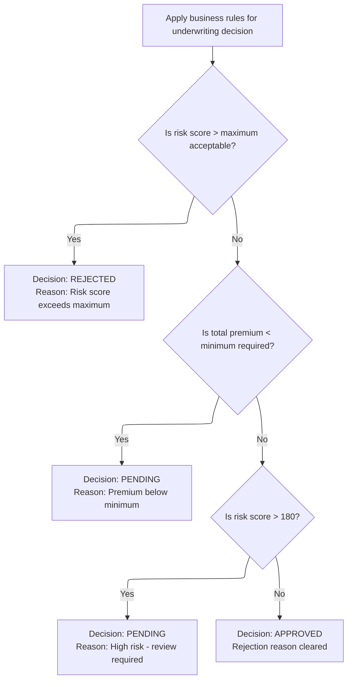
```mermaid
%%{init: {"flowchart": {"defaultRenderer": "elk"}} }%%
flowchart TD
    node1["Apply business rules for underwriting decision"]
    click node1 openCode "base/src/LGAPDB01.cbl:327:349"
    node1 --> node2{"Is risk score > maximum acceptable?"}
    click node2 openCode "base/src/LGAPDB01.cbl:329:335"
    node2 -->|"Yes"| node3["Decision: REJECTED
Reason: Risk score exceeds maximum"]
    click node3 openCode "base/src/LGAPDB01.cbl:331:334"
    node2 -->|"No"| node4{"Is total premium < minimum required?"}
    click node4 openCode "base/src/LGAPDB01.cbl:335:339"
    node4 -->|"Yes"| node5["Decision: PENDING
Reason: Premium below minimum"]
    click node5 openCode "base/src/LGAPDB01.cbl:336:339"
    node4 -->|"No"| node6{"Is risk score > 180?"}
    click node6 openCode "base/src/LGAPDB01.cbl:340:344"
    node6 -->|"Yes"| node7["Decision: PENDING
Reason: High risk - review required"]
    click node7 openCode "base/src/LGAPDB01.cbl:341:344"
    node6 -->|"No"| node8["Decision: APPROVED
Rejection reason cleared"]
    click node8 openCode "base/src/LGAPDB01.cbl:346:348"
classDef HeadingStyle fill:#777777,stroke:#333,stroke-width:2px;

%% Swimm:
%% %%{init: {"flowchart": {"defaultRenderer": "elk"}} }%%
%% flowchart TD
%%     node1["Apply business rules for underwriting decision"]
%%     click node1 openCode "<SwmPath>[base/src/LGAPDB01.cbl](base/src/LGAPDB01.cbl)</SwmPath>:327:349"
%%     node1 --> node2{"Is risk score > maximum acceptable?"}
%%     click node2 openCode "<SwmPath>[base/src/LGAPDB01.cbl](base/src/LGAPDB01.cbl)</SwmPath>:329:335"
%%     node2 -->|"Yes"| node3["Decision: REJECTED
%% Reason: Risk score exceeds maximum"]
%%     click node3 openCode "<SwmPath>[base/src/LGAPDB01.cbl](base/src/LGAPDB01.cbl)</SwmPath>:331:334"
%%     node2 -->|"No"| node4{"Is total premium < minimum required?"}
%%     click node4 openCode "<SwmPath>[base/src/LGAPDB01.cbl](base/src/LGAPDB01.cbl)</SwmPath>:335:339"
%%     node4 -->|"Yes"| node5["Decision: PENDING
%% Reason: Premium below minimum"]
%%     click node5 openCode "<SwmPath>[base/src/LGAPDB01.cbl](base/src/LGAPDB01.cbl)</SwmPath>:336:339"
%%     node4 -->|"No"| node6{"Is risk score > 180?"}
%%     click node6 openCode "<SwmPath>[base/src/LGAPDB01.cbl](base/src/LGAPDB01.cbl)</SwmPath>:340:344"
%%     node6 -->|"Yes"| node7["Decision: PENDING
%% Reason: High risk - review required"]
%%     click node7 openCode "<SwmPath>[base/src/LGAPDB01.cbl](base/src/LGAPDB01.cbl)</SwmPath>:341:344"
%%     node6 -->|"No"| node8["Decision: APPROVED
%% Rejection reason cleared"]
%%     click node8 openCode "<SwmPath>[base/src/LGAPDB01.cbl](base/src/LGAPDB01.cbl)</SwmPath>:346:348"
%% classDef HeadingStyle fill:#777777,stroke:#333,stroke-width:2px;
```

<SwmSnippet path="/base/src/LGAPDB01.cbl" line="327">

---

<SwmToken path="base/src/LGAPDB01.cbl" pos="327:1:7" line-data="       P011D-APPLY-BUSINESS-RULES.">`P011D-APPLY-BUSINESS-RULES`</SwmToken> checks the risk score and premium against fixed thresholds, then sets the underwriting status and reason. Status codes (2, 1, 0) and the 180 risk score threshold are hardcoded business rules for decision-making.

```cobol
       P011D-APPLY-BUSINESS-RULES.
      *    Determine underwriting decision based on enhanced criteria
           EVALUATE TRUE
               WHEN WS-BASE-RISK-SCR > WS-MAX-RISK-SCORE
                   MOVE 2 TO WS-STAT
                   MOVE 'REJECTED' TO WS-STAT-DESC
                   MOVE 'Risk score exceeds maximum acceptable level' 
                        TO WS-REJ-RSN
               WHEN WS-TOT-PREM < WS-MIN-PREMIUM
                   MOVE 1 TO WS-STAT
                   MOVE 'PENDING' TO WS-STAT-DESC
                   MOVE 'Premium below minimum - requires review'
                        TO WS-REJ-RSN
               WHEN WS-BASE-RISK-SCR > 180
                   MOVE 1 TO WS-STAT
                   MOVE 'PENDING' TO WS-STAT-DESC
                   MOVE 'High risk - underwriter review required'
                        TO WS-REJ-RSN
               WHEN OTHER
                   MOVE 0 TO WS-STAT
                   MOVE 'APPROVED' TO WS-STAT-DESC
                   MOVE SPACES TO WS-REJ-RSN
           END-EVALUATE.
```

---

</SwmSnippet>

## Handling Add Policy Errors and Success in Transaction Menu

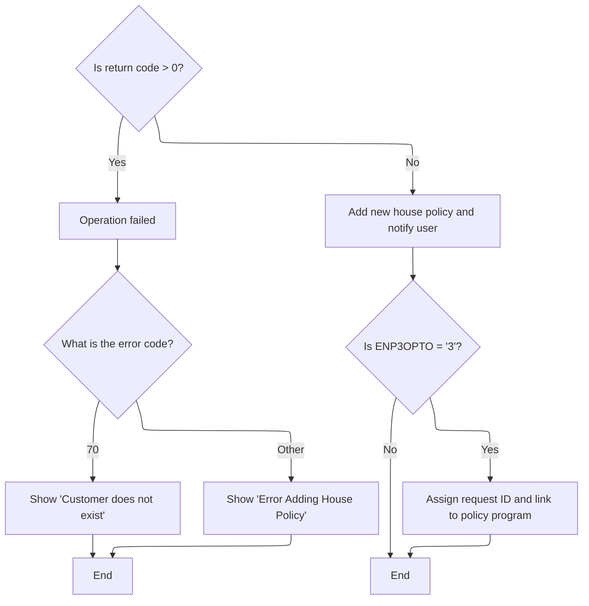
```mermaid
%%{init: {"flowchart": {"defaultRenderer": "elk"}} }%%
flowchart TD
    node1{"Is return code > 0?"}
    click node1 openCode "base/src/lgtestp3.cbl:110:113"
    node1 -->|"Yes"| node2["Operation failed"]
    click node2 openCode "base/src/lgtestp3.cbl:111:112"
    node2 --> node3{"What is the error code?"}
    click node3 openCode "base/src/lgtestp3.cbl:268:275"
    node3 -->|"70"| node4["Show 'Customer does not exist'"]
    click node4 openCode "base/src/lgtestp3.cbl:270:271"
    node3 -->|"Other"| node5["Show 'Error Adding House Policy'"]
    click node5 openCode "base/src/lgtestp3.cbl:273:274"
    node4 --> node6["End"]
    node5 --> node6
    node1 -->|"No"| node7["Add new house policy and notify user"]
    click node7 openCode "base/src/lgtestp3.cbl:114:122"
    node7 --> node8{"Is ENP3OPTO = '3'?"}
    click node8 openCode "base/src/lgtestp3.cbl:125:132"
    node8 -->|"Yes"| node9["Assign request ID and link to policy program"]
    click node9 openCode "base/src/lgtestp3.cbl:126:132"
    node9 --> node10["End"]
    click node10 openCode "base/src/lgtestp3.cbl:132:132"
    node8 -->|"No"| node10
classDef HeadingStyle fill:#777777,stroke:#333,stroke-width:2px;

%% Swimm:
%% %%{init: {"flowchart": {"defaultRenderer": "elk"}} }%%
%% flowchart TD
%%     node1{"Is return code > 0?"}
%%     click node1 openCode "<SwmPath>[base/src/lgtestp3.cbl](base/src/lgtestp3.cbl)</SwmPath>:110:113"
%%     node1 -->|"Yes"| node2["Operation failed"]
%%     click node2 openCode "<SwmPath>[base/src/lgtestp3.cbl](base/src/lgtestp3.cbl)</SwmPath>:111:112"
%%     node2 --> node3{"What is the error code?"}
%%     click node3 openCode "<SwmPath>[base/src/lgtestp3.cbl](base/src/lgtestp3.cbl)</SwmPath>:268:275"
%%     node3 -->|"70"| node4["Show 'Customer does not exist'"]
%%     click node4 openCode "<SwmPath>[base/src/lgtestp3.cbl](base/src/lgtestp3.cbl)</SwmPath>:270:271"
%%     node3 -->|"Other"| node5["Show 'Error Adding House Policy'"]
%%     click node5 openCode "<SwmPath>[base/src/lgtestp3.cbl](base/src/lgtestp3.cbl)</SwmPath>:273:274"
%%     node4 --> node6["End"]
%%     node5 --> node6
%%     node1 -->|"No"| node7["Add new house policy and notify user"]
%%     click node7 openCode "<SwmPath>[base/src/lgtestp3.cbl](base/src/lgtestp3.cbl)</SwmPath>:114:122"
%%     node7 --> node8{"Is <SwmToken path="base/src/lgtestp3.cbl" pos="64:3:3" line-data="           EVALUATE ENP3OPTO">`ENP3OPTO`</SwmToken> = '3'?"}
%%     click node8 openCode "<SwmPath>[base/src/lgtestp3.cbl](base/src/lgtestp3.cbl)</SwmPath>:125:132"
%%     node8 -->|"Yes"| node9["Assign request ID and link to policy program"]
%%     click node9 openCode "<SwmPath>[base/src/lgtestp3.cbl](base/src/lgtestp3.cbl)</SwmPath>:126:132"
%%     node9 --> node10["End"]
%%     click node10 openCode "<SwmPath>[base/src/lgtestp3.cbl](base/src/lgtestp3.cbl)</SwmPath>:132:132"
%%     node8 -->|"No"| node10
%% classDef HeadingStyle fill:#777777,stroke:#333,stroke-width:2px;
```

<SwmSnippet path="/base/src/lgtestp3.cbl" line="110">

---

Back in <SwmToken path="base/src/lgtestp3.cbl" pos="33:5:7" line-data="              GO TO A-GAIN.">`A-GAIN`</SwmToken> after returning from <SwmToken path="base/src/lgtestp3.cbl" pos="106:10:10" line-data="                 EXEC CICS LINK PROGRAM(&#39;LGAPOL01&#39;)">`LGAPOL01`</SwmToken>, if the add policy call failed (<SwmToken path="base/src/lgtestp3.cbl" pos="110:3:7" line-data="                 IF CA-RETURN-CODE &gt; 0">`CA-RETURN-CODE`</SwmToken> > 0), we roll back the transaction and jump to <SwmToken path="base/src/lgtestp3.cbl" pos="112:5:7" line-data="                   GO TO NO-ADD">`NO-ADD`</SwmToken> to handle the error and reset the menu.

```cobol
                 IF CA-RETURN-CODE > 0
                   Exec CICS Syncpoint Rollback End-Exec
                   GO TO NO-ADD
                 END-IF
```

---

</SwmSnippet>

<SwmSnippet path="/base/src/lgtestp3.cbl" line="267">

---

<SwmToken path="base/src/lgtestp3.cbl" pos="267:1:3" line-data="       NO-ADD.">`NO-ADD`</SwmToken> checks the return code from the failed add operation, sets the error message based on the reason, and jumps to <SwmToken path="base/src/lgtestp3.cbl" pos="271:5:7" line-data="               Go To ERROR-OUT">`ERROR-OUT`</SwmToken> to display the message and reset the menu.

```cobol
       NO-ADD.
           Evaluate CA-RETURN-CODE
             When 70
               Move 'Customer does not exist'          To  ERP1FLDO
               Go To ERROR-OUT
             When Other
               Move 'Error Adding House Policy'        To  ERP1FLDO
               Go To ERROR-OUT
           End-Evaluate.
```

---

</SwmSnippet>

<SwmSnippet path="/base/src/lgtestp3.cbl" line="114">

---

Back in <SwmToken path="base/src/lgtestp3.cbl" pos="33:5:7" line-data="              GO TO A-GAIN.">`A-GAIN`</SwmToken> after <SwmToken path="base/src/lgtestp3.cbl" pos="112:5:7" line-data="                   GO TO NO-ADD">`NO-ADD`</SwmToken>, if the add succeeded, we move the new customer and policy numbers to the output fields, clear the option, set the success message, and send the updated menu to the terminal.

```cobol
                 Move CA-CUSTOMER-NUM To ENP3CNOI
                 Move CA-POLICY-NUM   To ENP3PNOI
                 Move ' '             To ENP3OPTI
                 Move 'New House Policy Inserted'
                   To  ERP3FLDO
                 EXEC CICS SEND MAP ('SSMAPP3')
                           FROM(SSMAPP3O)
                           MAPSET ('SSMAP')
                 END-EXEC
```

---

</SwmSnippet>

<SwmSnippet path="/base/src/lgtestp3.cbl" line="125">

---

When option '3' is selected, we set up the commarea with the delete request ID and policy/customer numbers, then call <SwmToken path="base/src/lgtestp3.cbl" pos="129:10:10" line-data="                 EXEC CICS LINK PROGRAM(&#39;LGDPOL01&#39;)">`LGDPOL01`</SwmToken> to handle the actual policy deletion in the backend.

```cobol
             WHEN '3'
                 Move '01DHOU'   To CA-REQUEST-ID
                 Move ENP3CNOO   To CA-CUSTOMER-NUM
                 Move ENP3PNOO   To CA-POLICY-NUM
                 EXEC CICS LINK PROGRAM('LGDPOL01')
                           COMMAREA(COMM-AREA)
                           LENGTH(32500)
                 END-EXEC
```

---

</SwmSnippet>

## Validating and Handling Policy Delete Requests


```mermaid
%%{init: {"flowchart": {"defaultRenderer": "elk"}} }%%
flowchart TD
    node1["Start MAINLINE processing"] --> node2{"Was commarea received? (EIBCALEN == 0)"}
    click node1 openCode "base/src/lgdpol01.cbl:78:133"
    node2 -->|"No"| node3["Set error message: 'NO COMMAREA RECEIVED', write error"]
    click node2 openCode "base/src/lgdpol01.cbl:95:99"
    click node3 openCode "base/src/lgdpol01.cbl:96:99"
    node3 --> node12["Return to caller"]
    click node12 openCode "base/src/lgdpol01.cbl:133:133"
    node2 -->|"Yes"| node4{"Is commarea large enough? (EIBCALEN >= 28)"}
    click node4 openCode "base/src/lgdpol01.cbl:107:110"
    node4 -->|"No"| node5["Set return code '98'"]
    click node5 openCode "base/src/lgdpol01.cbl:108:109"
    node5 --> node12
    node4 -->|"Yes"| node6["Upper-case request ID"]
    click node6 openCode "base/src/lgdpol01.cbl:117:117"
    node6 --> node7{"Is request ID recognized? (One of 01DEND, 01DMOT, 01DHOU, 01DCOM)"}
    click node7 openCode "base/src/lgdpol01.cbl:119:122"
    node7 -->|"No"| node8["Set return code '99'"]
    click node8 openCode "base/src/lgdpol01.cbl:124:124"
    node8 --> node12
    node7 -->|"Yes"| node9["Delete policy"]
    click node9 openCode "base/src/lgdpol01.cbl:126:126"
    node9 --> node10{"Was deletion successful? (CA-RETURN-CODE > 0)"}
    click node10 openCode "base/src/lgdpol01.cbl:127:129"
    node10 -->|"Yes"| node11["Return to caller"]
    click node11 openCode "base/src/lgdpol01.cbl:128:129"
    node10 -->|"No"| node12
    
classDef HeadingStyle fill:#777777,stroke:#333,stroke-width:2px;

%% Swimm:
%% %%{init: {"flowchart": {"defaultRenderer": "elk"}} }%%
%% flowchart TD
%%     node1["Start MAINLINE processing"] --> node2{"Was commarea received? (EIBCALEN == 0)"}
%%     click node1 openCode "<SwmPath>[base/src/lgdpol01.cbl](base/src/lgdpol01.cbl)</SwmPath>:78:133"
%%     node2 -->|"No"| node3["Set error message: 'NO COMMAREA RECEIVED', write error"]
%%     click node2 openCode "<SwmPath>[base/src/lgdpol01.cbl](base/src/lgdpol01.cbl)</SwmPath>:95:99"
%%     click node3 openCode "<SwmPath>[base/src/lgdpol01.cbl](base/src/lgdpol01.cbl)</SwmPath>:96:99"
%%     node3 --> node12["Return to caller"]
%%     click node12 openCode "<SwmPath>[base/src/lgdpol01.cbl](base/src/lgdpol01.cbl)</SwmPath>:133:133"
%%     node2 -->|"Yes"| node4{"Is commarea large enough? (EIBCALEN >= 28)"}
%%     click node4 openCode "<SwmPath>[base/src/lgdpol01.cbl](base/src/lgdpol01.cbl)</SwmPath>:107:110"
%%     node4 -->|"No"| node5["Set return code '98'"]
%%     click node5 openCode "<SwmPath>[base/src/lgdpol01.cbl](base/src/lgdpol01.cbl)</SwmPath>:108:109"
%%     node5 --> node12
%%     node4 -->|"Yes"| node6["Upper-case request ID"]
%%     click node6 openCode "<SwmPath>[base/src/lgdpol01.cbl](base/src/lgdpol01.cbl)</SwmPath>:117:117"
%%     node6 --> node7{"Is request ID recognized? (One of <SwmToken path="base/src/lgdpol01.cbl" pos="119:18:18" line-data="           IF ( CA-REQUEST-ID NOT EQUAL TO &#39;01DEND&#39; AND">`01DEND`</SwmToken>, <SwmToken path="base/src/lgdpol01.cbl" pos="120:14:14" line-data="                CA-REQUEST-ID NOT EQUAL TO &#39;01DMOT&#39; AND">`01DMOT`</SwmToken>, <SwmToken path="base/src/lgtestp3.cbl" pos="126:4:4" line-data="                 Move &#39;01DHOU&#39;   To CA-REQUEST-ID">`01DHOU`</SwmToken>, <SwmToken path="base/src/lgdpol01.cbl" pos="122:14:14" line-data="                CA-REQUEST-ID NOT EQUAL TO &#39;01DCOM&#39; )">`01DCOM`</SwmToken>)"}
%%     click node7 openCode "<SwmPath>[base/src/lgdpol01.cbl](base/src/lgdpol01.cbl)</SwmPath>:119:122"
%%     node7 -->|"No"| node8["Set return code '99'"]
%%     click node8 openCode "<SwmPath>[base/src/lgdpol01.cbl](base/src/lgdpol01.cbl)</SwmPath>:124:124"
%%     node8 --> node12
%%     node7 -->|"Yes"| node9["Delete policy"]
%%     click node9 openCode "<SwmPath>[base/src/lgdpol01.cbl](base/src/lgdpol01.cbl)</SwmPath>:126:126"
%%     node9 --> node10{"Was deletion successful? (<SwmToken path="base/src/lgtestp3.cbl" pos="74:3:7" line-data="                 IF CA-RETURN-CODE &gt; 0">`CA-RETURN-CODE`</SwmToken> > 0)"}
%%     click node10 openCode "<SwmPath>[base/src/lgdpol01.cbl](base/src/lgdpol01.cbl)</SwmPath>:127:129"
%%     node10 -->|"Yes"| node11["Return to caller"]
%%     click node11 openCode "<SwmPath>[base/src/lgdpol01.cbl](base/src/lgdpol01.cbl)</SwmPath>:128:129"
%%     node10 -->|"No"| node12
%%     
%% classDef HeadingStyle fill:#777777,stroke:#333,stroke-width:2px;
```

This section governs the validation and handling of policy delete requests. It ensures that only valid, recognized requests are processed, and that all errors are logged with sufficient detail for operational support.

| Category        | Rule Name               | Description                                                                                                                                                                                                                                                                                                                                                                                                                                                                                                                                                                                                                                                                                                                                                                                                 |
| --------------- | ----------------------- | ----------------------------------------------------------------------------------------------------------------------------------------------------------------------------------------------------------------------------------------------------------------------------------------------------------------------------------------------------------------------------------------------------------------------------------------------------------------------------------------------------------------------------------------------------------------------------------------------------------------------------------------------------------------------------------------------------------------------------------------------------------------------------------------------------------- |
| Data validation | Missing commarea error  | If no commarea is received with the request, the system must return an error message stating 'NO COMMAREA RECEIVED', log the error, and terminate processing for the request.                                                                                                                                                                                                                                                                                                                                                                                                                                                                                                                                                                                                                               |
| Data validation | Minimum commarea length | If the commarea received is smaller than 28 bytes, the system must set the return code to '98', log the error, and terminate processing for the request.                                                                                                                                                                                                                                                                                                                                                                                                                                                                                                                                                                                                                                                    |
| Data validation | Recognized request ID   | The request ID in the commarea must be one of the recognized values: <SwmToken path="base/src/lgdpol01.cbl" pos="119:18:18" line-data="           IF ( CA-REQUEST-ID NOT EQUAL TO &#39;01DEND&#39; AND">`01DEND`</SwmToken>, <SwmToken path="base/src/lgdpol01.cbl" pos="120:14:14" line-data="                CA-REQUEST-ID NOT EQUAL TO &#39;01DMOT&#39; AND">`01DMOT`</SwmToken>, <SwmToken path="base/src/lgtestp3.cbl" pos="126:4:4" line-data="                 Move &#39;01DHOU&#39;   To CA-REQUEST-ID">`01DHOU`</SwmToken>, or <SwmToken path="base/src/lgdpol01.cbl" pos="122:14:14" line-data="                CA-REQUEST-ID NOT EQUAL TO &#39;01DCOM&#39; )">`01DCOM`</SwmToken>. If not, the system must set the return code to '99', log the error, and terminate processing for the request. |
| Business logic  | Policy deletion attempt | If all validations pass, the system must attempt to delete the policy as specified in the request. The outcome of the deletion must be reflected in the return code in the commarea.                                                                                                                                                                                                                                                                                                                                                                                                                                                                                                                                                                                                                        |

<SwmSnippet path="/base/src/lgdpol01.cbl" line="78">

---

MAINLINE in <SwmToken path="base/src/lgtestp3.cbl" pos="129:10:10" line-data="                 EXEC CICS LINK PROGRAM(&#39;LGDPOL01&#39;)">`LGDPOL01`</SwmToken> validates the commarea, checks the request type, and only calls the delete routine if everything checks out. Errors are logged and returned if the input is missing or invalid.

```cobol
       MAINLINE SECTION.

      *----------------------------------------------------------------*
      * Common code                                                    *
      *----------------------------------------------------------------*
      * initialize working storage variables
           INITIALIZE WS-HEADER.
      * set up general variable
           MOVE EIBTRNID TO WS-TRANSID.
           MOVE EIBTRMID TO WS-TERMID.
           MOVE EIBTASKN TO WS-TASKNUM.
      *----------------------------------------------------------------*

      *----------------------------------------------------------------*
      * Check commarea and obtain required details                     *
      *----------------------------------------------------------------*
      * If NO commarea received issue an ABEND
           IF EIBCALEN IS EQUAL TO ZERO
               MOVE ' NO COMMAREA RECEIVED' TO EM-VARIABLE
               PERFORM WRITE-ERROR-MESSAGE
               EXEC CICS ABEND ABCODE('LGCA') NODUMP END-EXEC
           END-IF

      * initialize commarea return code to zero
           MOVE '00' TO CA-RETURN-CODE
           MOVE EIBCALEN TO WS-CALEN.
           SET WS-ADDR-DFHCOMMAREA TO ADDRESS OF DFHCOMMAREA.

      * Check commarea is large enough
           IF EIBCALEN IS LESS THAN WS-CA-HEADER-LEN
             MOVE '98' TO CA-RETURN-CODE
             EXEC CICS RETURN END-EXEC
           END-IF

      *----------------------------------------------------------------*
      * Check request-id in commarea and if recognised ...             *
      * Call routine to delete row from policy table                   *
      *----------------------------------------------------------------*
      * Upper case value passed in Request Id field                    *
           MOVE FUNCTION UPPER-CASE(CA-REQUEST-ID) TO CA-REQUEST-ID

           IF ( CA-REQUEST-ID NOT EQUAL TO '01DEND' AND
                CA-REQUEST-ID NOT EQUAL TO '01DMOT' AND
                CA-REQUEST-ID NOT EQUAL TO '01DHOU' AND
                CA-REQUEST-ID NOT EQUAL TO '01DCOM' )
      *        Request is not recognised or supported
               MOVE '99' TO CA-RETURN-CODE
           ELSE
               PERFORM DELETE-POLICY-DB2-INFO
               If CA-RETURN-CODE > 0
                 EXEC CICS RETURN END-EXEC
               End-if
           END-IF

      * Return to caller
           EXEC CICS RETURN END-EXEC.
```

---

</SwmSnippet>

<SwmSnippet path="/base/src/lgdpol01.cbl" line="154">

---

<SwmToken path="base/src/lgdpol01.cbl" pos="154:1:5" line-data="       WRITE-ERROR-MESSAGE.">`WRITE-ERROR-MESSAGE`</SwmToken> in <SwmToken path="base/src/lgtestp3.cbl" pos="129:10:10" line-data="                 EXEC CICS LINK PROGRAM(&#39;LGDPOL01&#39;)">`LGDPOL01`</SwmToken> formats the error, gets the current time, and calls LGSTSQ to log both the error message and up to 90 bytes of commarea data. This keeps error logs concise and compatible with the queue system.

```cobol
       WRITE-ERROR-MESSAGE.
      * Save SQLCODE in message
      * Obtain and format current time and date
           EXEC CICS ASKTIME ABSTIME(WS-ABSTIME)
           END-EXEC
           EXEC CICS FORMATTIME ABSTIME(Ws-ABSTIME)
                     MMDDYYYY(WS-DATE)
                     TIME(WS-TIME)
           END-EXEC
           MOVE WS-DATE TO EM-DATE
           MOVE WS-TIME TO EM-TIME
      * Write output message to TDQ
           EXEC CICS LINK PROGRAM('LGSTSQ')
                     COMMAREA(ERROR-MSG)
                     LENGTH(LENGTH OF ERROR-MSG)
           END-EXEC.
      * Write 90 bytes or as much as we have of commarea to TDQ
           IF EIBCALEN > 0 THEN
             IF EIBCALEN < 91 THEN
               MOVE DFHCOMMAREA(1:EIBCALEN) TO CA-DATA
               EXEC CICS LINK PROGRAM('LGSTSQ')
                         COMMAREA(CA-ERROR-MSG)
                         LENGTH(LENGTH OF CA-ERROR-MSG)
               END-EXEC
             ELSE
               MOVE DFHCOMMAREA(1:90) TO CA-DATA
               EXEC CICS LINK PROGRAM('LGSTSQ')
                         COMMAREA(CA-ERROR-MSG)
                         LENGTH(LENGTH OF CA-ERROR-MSG)
               END-EXEC
             END-IF
           END-IF.
           EXIT.
```

---

</SwmSnippet>

## Triggering <SwmToken path="base/src/lgipdb01.cbl" pos="242:5:5" line-data="      * initialize DB2 host variables">`DB2`</SwmToken> Policy Deletion

This section is responsible for initiating the deletion of a policy record from the <SwmToken path="base/src/lgipdb01.cbl" pos="242:5:5" line-data="      * initialize DB2 host variables">`DB2`</SwmToken> database by linking to the <SwmToken path="base/src/lgdpol01.cbl" pos="141:9:9" line-data="           EXEC CICS LINK PROGRAM(LGDPDB01)">`LGDPDB01`</SwmToken> program, which performs the actual deletion based on the provided policy and customer information.

| Category        | Rule Name                         | Description                                                                                                                                                                                                                                                                                                                                                                        |
| --------------- | --------------------------------- | ---------------------------------------------------------------------------------------------------------------------------------------------------------------------------------------------------------------------------------------------------------------------------------------------------------------------------------------------------------------------------------- |
| Data validation | Required Information for Deletion | A policy can only be deleted if all required policy and customer information is provided in the request.                                                                                                                                                                                                                                                                           |
| Data validation | Commarea Size Limit               | The commarea used for deletion must not exceed the maximum allowed length of 32,500 bytes.                                                                                                                                                                                                                                                                                         |
| Business logic  | Authorized Deletion Component     | The deletion request must be routed to the <SwmToken path="base/src/lgdpol01.cbl" pos="141:9:9" line-data="           EXEC CICS LINK PROGRAM(LGDPDB01)">`LGDPDB01`</SwmToken> program, which is the only authorized component to perform <SwmToken path="base/src/lgipdb01.cbl" pos="242:5:5" line-data="      * initialize DB2 host variables">`DB2`</SwmToken> policy deletions. |

<SwmSnippet path="/base/src/lgdpol01.cbl" line="139">

---

<SwmToken path="base/src/lgdpol01.cbl" pos="139:1:7" line-data="       DELETE-POLICY-DB2-INFO.">`DELETE-POLICY-DB2-INFO`</SwmToken> links to <SwmToken path="base/src/lgdpol01.cbl" pos="141:9:9" line-data="           EXEC CICS LINK PROGRAM(LGDPDB01)">`LGDPDB01`</SwmToken>, passing the commarea with all the policy and customer info needed for <SwmToken path="base/src/lgdpol01.cbl" pos="139:5:5" line-data="       DELETE-POLICY-DB2-INFO.">`DB2`</SwmToken> deletion. <SwmToken path="base/src/lgdpol01.cbl" pos="141:9:9" line-data="           EXEC CICS LINK PROGRAM(LGDPDB01)">`LGDPDB01`</SwmToken> does the actual database work.

```cobol
       DELETE-POLICY-DB2-INFO.

           EXEC CICS LINK PROGRAM(LGDPDB01)
                Commarea(DFHCOMMAREA)
                LENGTH(32500)
           END-EXEC.

           EXIT.
```

---

</SwmSnippet>

## Validating, Deleting, and Logging Policy Records


```mermaid
%%{init: {"flowchart": {"defaultRenderer": "elk"}} }%%
flowchart TD
    node1["Start: Receive request"] --> node2["Initialize business variables"]
    click node1 openCode "base/src/lgdpdb01.cbl:111:117"
    click node2 openCode "base/src/lgdpdb01.cbl:117:125"
    node2 --> node3{"Is commarea received?"}
    click node3 openCode "base/src/lgdpdb01.cbl:131:135"
    node3 -->|"No"| node4["Log error: No commarea"]
    click node4 openCode "base/src/lgdpdb01.cbl:132:134"
    node4 --> node5["Return to caller"]
    click node5 openCode "base/src/lgdpdb01.cbl:134:135"
    node3 -->|"Yes"| node6{"Is commarea large enough?"}
    click node6 openCode "base/src/lgdpdb01.cbl:143:146"
    node6 -->|"No"| node7["Return code 98: Data too short"]
    click node7 openCode "base/src/lgdpdb01.cbl:144:145"
    node7 --> node5
    node6 -->|"Yes"| node8["Initialize commarea return code to zero"]
    click node8 openCode "base/src/lgdpdb01.cbl:138:139"
    node8 --> node9["Save customer & policy numbers"]
    click node9 openCode "base/src/lgdpdb01.cbl:149:153"
    node9 --> node10{"Is request type supported?"}
    click node10 openCode "base/src/lgdpdb01.cbl:160:172"
    node10 -->|"No"| node11["Return code 99: Unsupported request"]
    click node11 openCode "base/src/lgdpdb01.cbl:165:166"
    node11 --> node5
    node10 -->|"Yes (01DEND, 01DHOU, 01DCOM, 01DMOT)"| node12["Delete policy record"]
    click node12 openCode "base/src/lgdpdb01.cbl:167:171"
    node12 --> node13{"Was policy deletion successful?"}
    click node13 openCode "base/src/lgdpdb01.cbl:198:202"
    node13 -->|"No"| node14["Log error: DB2 deletion failed"]
    click node14 openCode "base/src/lgdpdb01.cbl:199:201"
    node14 --> node5
    node13 -->|"Yes"| node5
classDef HeadingStyle fill:#777777,stroke:#333,stroke-width:2px;

%% Swimm:
%% %%{init: {"flowchart": {"defaultRenderer": "elk"}} }%%
%% flowchart TD
%%     node1["Start: Receive request"] --> node2["Initialize business variables"]
%%     click node1 openCode "<SwmPath>[base/src/lgdpdb01.cbl](base/src/lgdpdb01.cbl)</SwmPath>:111:117"
%%     click node2 openCode "<SwmPath>[base/src/lgdpdb01.cbl](base/src/lgdpdb01.cbl)</SwmPath>:117:125"
%%     node2 --> node3{"Is commarea received?"}
%%     click node3 openCode "<SwmPath>[base/src/lgdpdb01.cbl](base/src/lgdpdb01.cbl)</SwmPath>:131:135"
%%     node3 -->|"No"| node4["Log error: No commarea"]
%%     click node4 openCode "<SwmPath>[base/src/lgdpdb01.cbl](base/src/lgdpdb01.cbl)</SwmPath>:132:134"
%%     node4 --> node5["Return to caller"]
%%     click node5 openCode "<SwmPath>[base/src/lgdpdb01.cbl](base/src/lgdpdb01.cbl)</SwmPath>:134:135"
%%     node3 -->|"Yes"| node6{"Is commarea large enough?"}
%%     click node6 openCode "<SwmPath>[base/src/lgdpdb01.cbl](base/src/lgdpdb01.cbl)</SwmPath>:143:146"
%%     node6 -->|"No"| node7["Return code 98: Data too short"]
%%     click node7 openCode "<SwmPath>[base/src/lgdpdb01.cbl](base/src/lgdpdb01.cbl)</SwmPath>:144:145"
%%     node7 --> node5
%%     node6 -->|"Yes"| node8["Initialize commarea return code to zero"]
%%     click node8 openCode "<SwmPath>[base/src/lgdpdb01.cbl](base/src/lgdpdb01.cbl)</SwmPath>:138:139"
%%     node8 --> node9["Save customer & policy numbers"]
%%     click node9 openCode "<SwmPath>[base/src/lgdpdb01.cbl](base/src/lgdpdb01.cbl)</SwmPath>:149:153"
%%     node9 --> node10{"Is request type supported?"}
%%     click node10 openCode "<SwmPath>[base/src/lgdpdb01.cbl](base/src/lgdpdb01.cbl)</SwmPath>:160:172"
%%     node10 -->|"No"| node11["Return code 99: Unsupported request"]
%%     click node11 openCode "<SwmPath>[base/src/lgdpdb01.cbl](base/src/lgdpdb01.cbl)</SwmPath>:165:166"
%%     node11 --> node5
%%     node10 -->|"Yes (<SwmToken path="base/src/lgdpol01.cbl" pos="119:18:18" line-data="           IF ( CA-REQUEST-ID NOT EQUAL TO &#39;01DEND&#39; AND">`01DEND`</SwmToken>, <SwmToken path="base/src/lgtestp3.cbl" pos="126:4:4" line-data="                 Move &#39;01DHOU&#39;   To CA-REQUEST-ID">`01DHOU`</SwmToken>, <SwmToken path="base/src/lgdpol01.cbl" pos="122:14:14" line-data="                CA-REQUEST-ID NOT EQUAL TO &#39;01DCOM&#39; )">`01DCOM`</SwmToken>, <SwmToken path="base/src/lgdpol01.cbl" pos="120:14:14" line-data="                CA-REQUEST-ID NOT EQUAL TO &#39;01DMOT&#39; AND">`01DMOT`</SwmToken>)"| node12["Delete policy record"]
%%     click node12 openCode "<SwmPath>[base/src/lgdpdb01.cbl](base/src/lgdpdb01.cbl)</SwmPath>:167:171"
%%     node12 --> node13{"Was policy deletion successful?"}
%%     click node13 openCode "<SwmPath>[base/src/lgdpdb01.cbl](base/src/lgdpdb01.cbl)</SwmPath>:198:202"
%%     node13 -->|"No"| node14["Log error: <SwmToken path="base/src/lgipdb01.cbl" pos="242:5:5" line-data="      * initialize DB2 host variables">`DB2`</SwmToken> deletion failed"]
%%     click node14 openCode "<SwmPath>[base/src/lgdpdb01.cbl](base/src/lgdpdb01.cbl)</SwmPath>:199:201"
%%     node14 --> node5
%%     node13 -->|"Yes"| node5
%% classDef HeadingStyle fill:#777777,stroke:#333,stroke-width:2px;
```

This section governs the validation, deletion, and logging of policy records. It ensures only supported requests with valid data are processed, and all errors or exceptional conditions are logged for audit and troubleshooting purposes.

| Category        | Rule Name                              | Description                                                                                                                                                                                                                                                                                                                                                                                                                                                                                                                                                                                                                                                                                                                                                                            |
| --------------- | -------------------------------------- | -------------------------------------------------------------------------------------------------------------------------------------------------------------------------------------------------------------------------------------------------------------------------------------------------------------------------------------------------------------------------------------------------------------------------------------------------------------------------------------------------------------------------------------------------------------------------------------------------------------------------------------------------------------------------------------------------------------------------------------------------------------------------------------- |
| Data validation | Missing commarea handling              | If no commarea is received with the request, the operation must be aborted, an error must be logged, and the return code must indicate a missing commarea.                                                                                                                                                                                                                                                                                                                                                                                                                                                                                                                                                                                                                             |
| Data validation | Minimum commarea length                | If the commarea received is shorter than 28 bytes, the operation must be aborted and the return code must be set to 98 to indicate insufficient data.                                                                                                                                                                                                                                                                                                                                                                                                                                                                                                                                                                                                                                  |
| Data validation | Supported request types                | Only requests with request IDs <SwmToken path="base/src/lgdpol01.cbl" pos="119:18:18" line-data="           IF ( CA-REQUEST-ID NOT EQUAL TO &#39;01DEND&#39; AND">`01DEND`</SwmToken>, <SwmToken path="base/src/lgtestp3.cbl" pos="126:4:4" line-data="                 Move &#39;01DHOU&#39;   To CA-REQUEST-ID">`01DHOU`</SwmToken>, <SwmToken path="base/src/lgdpol01.cbl" pos="122:14:14" line-data="                CA-REQUEST-ID NOT EQUAL TO &#39;01DCOM&#39; )">`01DCOM`</SwmToken>, or <SwmToken path="base/src/lgdpol01.cbl" pos="120:14:14" line-data="                CA-REQUEST-ID NOT EQUAL TO &#39;01DMOT&#39; AND">`01DMOT`</SwmToken> are supported for policy deletion. Any other request ID must result in a return code of 99 indicating unsupported request type. |
| Business logic  | Non-existent policy treated as success | If the policy record does not exist (SQLCODE 100), the operation is considered successful and no error is logged, as the end result is that the record does not exist.                                                                                                                                                                                                                                                                                                                                                                                                                                                                                                                                                                                                                 |

<SwmSnippet path="/base/src/lgdpdb01.cbl" line="111">

---

MAINLINE in <SwmToken path="base/src/lgdpol01.cbl" pos="141:9:9" line-data="           EXEC CICS LINK PROGRAM(LGDPDB01)">`LGDPDB01`</SwmToken> checks the commarea length, converts customer and policy numbers for <SwmToken path="base/src/lgdpdb01.cbl" pos="124:5:5" line-data="      * initialize DB2 host variables">`DB2`</SwmToken>, and only proceeds with deletion if the request ID matches a supported value. Return codes signal errors or success, and errors are logged if anything fails.

```cobol
       MAINLINE SECTION.

      *----------------------------------------------------------------*
      * Common code                                                    *
      *----------------------------------------------------------------*
      * initialize working storage variables
           INITIALIZE WS-HEADER.
      * set up general variable
           MOVE EIBTRNID TO WS-TRANSID.
           MOVE EIBTRMID TO WS-TERMID.
           MOVE EIBTASKN TO WS-TASKNUM.
      *----------------------------------------------------------------*

      * initialize DB2 host variables
           INITIALIZE DB2-IN-INTEGERS.

      *----------------------------------------------------------------*
      * Check commarea and obtain required details                     *
      *----------------------------------------------------------------*
      * If NO commarea received issue an ABEND
           IF EIBCALEN IS EQUAL TO ZERO
               MOVE ' NO COMMAREA RECEIVED' TO EM-VARIABLE
               PERFORM WRITE-ERROR-MESSAGE
               EXEC CICS ABEND ABCODE('LGCA') NODUMP END-EXEC
           END-IF

      * initialize commarea return code to zero
           MOVE '00' TO CA-RETURN-CODE
           MOVE EIBCALEN TO WS-CALEN.
           SET WS-ADDR-DFHCOMMAREA TO ADDRESS OF DFHCOMMAREA.

      * Check commarea is large enough
           IF EIBCALEN IS LESS THAN WS-CA-HEADER-LEN
             MOVE '98' TO CA-RETURN-CODE
             EXEC CICS RETURN END-EXEC
           END-IF

      * Convert commarea customer & policy nums to DB2 integer format
           MOVE CA-CUSTOMER-NUM TO DB2-CUSTOMERNUM-INT
           MOVE CA-POLICY-NUM   TO DB2-POLICYNUM-INT
      * and save in error msg field incase required
           MOVE CA-CUSTOMER-NUM TO EM-CUSNUM
           MOVE CA-POLICY-NUM   TO EM-POLNUM

      *----------------------------------------------------------------*
      * Check request-id in commarea and if recognised ...             *
      * Call routine to delete row from policy table                   *
      *----------------------------------------------------------------*

           IF ( CA-REQUEST-ID NOT EQUAL TO '01DEND' AND
                CA-REQUEST-ID NOT EQUAL TO '01DHOU' AND
                CA-REQUEST-ID NOT EQUAL TO '01DCOM' AND
                CA-REQUEST-ID NOT EQUAL TO '01DMOT' ) Then
      *        Request is not recognised or supported
               MOVE '99' TO CA-RETURN-CODE
           ELSE
               PERFORM DELETE-POLICY-DB2-INFO
               EXEC CICS LINK PROGRAM(LGDPVS01)
                    Commarea(DFHCOMMAREA)
                    LENGTH(32500)
               END-EXEC
           END-IF.

      * Return to caller
           EXEC CICS RETURN END-EXEC.
```

---

</SwmSnippet>

<SwmSnippet path="/base/src/lgdpdb01.cbl" line="212">

---

<SwmToken path="base/src/lgdpdb01.cbl" pos="212:1:5" line-data="       WRITE-ERROR-MESSAGE.">`WRITE-ERROR-MESSAGE`</SwmToken> in <SwmToken path="base/src/lgdpol01.cbl" pos="141:9:9" line-data="           EXEC CICS LINK PROGRAM(LGDPDB01)">`LGDPDB01`</SwmToken> logs the SQL error code, formats the timestamp, and calls LGSTSQ to write both the error message and up to 90 bytes of commarea data for audit and troubleshooting.

```cobol
       WRITE-ERROR-MESSAGE.
      * Save SQLCODE in message
           MOVE SQLCODE TO EM-SQLRC
      * Obtain and format current time and date
           EXEC CICS ASKTIME ABSTIME(WS-ABSTIME)
           END-EXEC
           EXEC CICS FORMATTIME ABSTIME(Ws-ABSTIME)
                     MMDDYYYY(WS-DATE)
                     TIME(WS-TIME)
           END-EXEC
           MOVE WS-DATE TO EM-DATE
           MOVE WS-TIME TO EM-TIME
      * Write output message to TDQ
           EXEC CICS LINK PROGRAM('LGSTSQ')
                     COMMAREA(ERROR-MSG)
                     LENGTH(LENGTH OF ERROR-MSG)
           END-EXEC.
      * Write 90 bytes or as much as we have of commarea to TDQ
           IF EIBCALEN > 0 THEN
             IF EIBCALEN < 91 THEN
               MOVE DFHCOMMAREA(1:EIBCALEN) TO CA-DATA
               EXEC CICS LINK PROGRAM('LGSTSQ')
                         COMMAREA(CA-ERROR-MSG)
                         LENGTH(LENGTH OF CA-ERROR-MSG)
               END-EXEC
             ELSE
               MOVE DFHCOMMAREA(1:90) TO CA-DATA
               EXEC CICS LINK PROGRAM('LGSTSQ')
                         COMMAREA(CA-ERROR-MSG)
                         LENGTH(LENGTH OF CA-ERROR-MSG)
               END-EXEC
             END-IF
           END-IF.
           EXIT.
```

---

</SwmSnippet>

<SwmSnippet path="/base/src/lgdpdb01.cbl" line="186">

---

<SwmToken path="base/src/lgdpdb01.cbl" pos="186:1:7" line-data="       DELETE-POLICY-DB2-INFO.">`DELETE-POLICY-DB2-INFO`</SwmToken> runs the SQL DELETE for the policy record. If the SQL fails, it logs the error and sets the return code; otherwise, it exits cleanly.

```cobol
       DELETE-POLICY-DB2-INFO.

           MOVE ' DELETE POLICY  ' TO EM-SQLREQ
           EXEC SQL
             DELETE
               FROM POLICY
               WHERE ( CUSTOMERNUMBER = :DB2-CUSTOMERNUM-INT AND
                       POLICYNUMBER  = :DB2-POLICYNUM-INT      )
           END-EXEC

      *    Treat SQLCODE 0 and SQLCODE 100 (record not found) as
      *    successful - end result is record does not exist
           IF SQLCODE NOT EQUAL 0 Then
               MOVE '90' TO CA-RETURN-CODE
               PERFORM WRITE-ERROR-MESSAGE
               EXEC CICS RETURN END-EXEC
           END-IF.

           EXIT.
```

---

</SwmSnippet>

## Deleting Policy Records in VSAM and Logging Errors

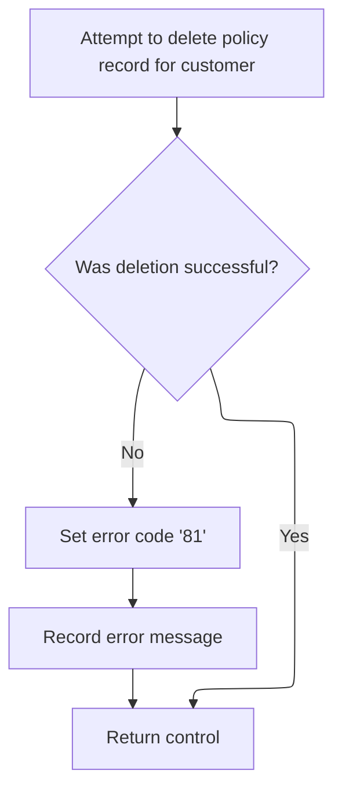
```mermaid
%%{init: {"flowchart": {"defaultRenderer": "elk"}} }%%
flowchart TD
    node1["Attempt to delete policy record for customer"] --> node2{"Was deletion successful?"}
    click node1 openCode "base/src/lgdpvs01.cbl:81:85"
    node2 -->|"Yes"| node3["Return control"]
    click node2 openCode "base/src/lgdpvs01.cbl:86:91"
    node2 -->|"No"| node4["Set error code '81'"]
    click node4 openCode "base/src/lgdpvs01.cbl:88:88"
    node4 --> node5["Record error message"]
    click node5 openCode "base/src/lgdpvs01.cbl:99:132"
    node5 --> node3
    click node3 openCode "base/src/lgdpvs01.cbl:90:90"

classDef HeadingStyle fill:#777777,stroke:#333,stroke-width:2px;

%% Swimm:
%% %%{init: {"flowchart": {"defaultRenderer": "elk"}} }%%
%% flowchart TD
%%     node1["Attempt to delete policy record for customer"] --> node2{"Was deletion successful?"}
%%     click node1 openCode "<SwmPath>[base/src/lgdpvs01.cbl](base/src/lgdpvs01.cbl)</SwmPath>:81:85"
%%     node2 -->|"Yes"| node3["Return control"]
%%     click node2 openCode "<SwmPath>[base/src/lgdpvs01.cbl](base/src/lgdpvs01.cbl)</SwmPath>:86:91"
%%     node2 -->|"No"| node4["Set error code '81'"]
%%     click node4 openCode "<SwmPath>[base/src/lgdpvs01.cbl](base/src/lgdpvs01.cbl)</SwmPath>:88:88"
%%     node4 --> node5["Record error message"]
%%     click node5 openCode "<SwmPath>[base/src/lgdpvs01.cbl](base/src/lgdpvs01.cbl)</SwmPath>:99:132"
%%     node5 --> node3
%%     click node3 openCode "<SwmPath>[base/src/lgdpvs01.cbl](base/src/lgdpvs01.cbl)</SwmPath>:90:90"
%% 
%% classDef HeadingStyle fill:#777777,stroke:#333,stroke-width:2px;
```

This section governs the process for deleting policy records in the system, ensuring that errors are properly captured and logged for traceability and diagnostics.

| Category       | Rule Name                       | Description                                                                                                                                                                                     |
| -------------- | ------------------------------- | ----------------------------------------------------------------------------------------------------------------------------------------------------------------------------------------------- |
| Business logic | Policy record deletion by key   | A policy record must be deleted from the VSAM file only if the provided key information matches an existing record.                                                                             |
| Business logic | Error message logging           | Whenever a deletion error occurs, an error message must be logged containing the date, time, customer number, policy number, and response codes.                                                |
| Business logic | Commarea diagnostic logging     | If commarea data is present and its length is less than 91 bytes, the entire commarea must be logged with the error message; if it is 91 bytes or more, only the first 90 bytes must be logged. |
| Business logic | Return control after processing | After logging the error message and commarea data (if applicable), control must be returned to the calling process regardless of success or failure.                                            |

<SwmSnippet path="/base/src/lgdpvs01.cbl" line="72">

---

MAINLINE in <SwmToken path="base/src/lgdpdb01.cbl" pos="168:9:9" line-data="               EXEC CICS LINK PROGRAM(LGDPVS01)">`LGDPVS01`</SwmToken> sets up the VSAM key by extracting a character from <SwmToken path="base/src/lgdpvs01.cbl" pos="77:3:7" line-data="           Move CA-Request-ID(4:1) To WF-Request-ID">`CA-Request-ID`</SwmToken>, then runs the delete. If the delete fails, it logs the error and returns an error code.

```cobol
       MAINLINE SECTION.
      *
      *---------------------------------------------------------------*
           Move EIBCALEN To WS-Commarea-Len.
      *---------------------------------------------------------------*
           Move CA-Request-ID(4:1) To WF-Request-ID
           Move CA-Policy-Num      To WF-Policy-Num
           Move CA-Customer-Num    To WF-Customer-Num
      *---------------------------------------------------------------*
           Exec CICS Delete File('KSDSPOLY')
                     Ridfld(WF-Policy-Key)
                     KeyLength(21)
                     RESP(WS-RESP)
           End-Exec.
           If WS-RESP Not = DFHRESP(NORMAL)
             Move EIBRESP2 To WS-RESP2
             MOVE '81' TO CA-RETURN-CODE
             PERFORM WRITE-ERROR-MESSAGE
             EXEC CICS RETURN END-EXEC
           End-If.
```

---

</SwmSnippet>

<SwmSnippet path="/base/src/lgdpvs01.cbl" line="99">

---

<SwmToken path="base/src/lgdpvs01.cbl" pos="99:1:5" line-data="       WRITE-ERROR-MESSAGE.">`WRITE-ERROR-MESSAGE`</SwmToken> in <SwmToken path="base/src/lgdpdb01.cbl" pos="168:9:9" line-data="               EXEC CICS LINK PROGRAM(LGDPVS01)">`LGDPVS01`</SwmToken> formats the current time, packs all relevant error and transaction data, and calls LGSTSQ to log both the error message and up to 90 bytes of commarea data for diagnostics.

```cobol
       WRITE-ERROR-MESSAGE.
           EXEC CICS ASKTIME ABSTIME(WS-ABSTIME)
           END-EXEC
           EXEC CICS FORMATTIME ABSTIME(WS-ABSTIME)
                     MMDDYYYY(WS-DATE)
                     TIME(WS-TIME)
           END-EXEC
      *
           MOVE WS-DATE TO EM-DATE
           MOVE WS-TIME TO EM-TIME
           Move CA-Customer-Num To EM-CUSNUM 
           Move CA-POLICY-NUM To EM-POLNUM 
           Move WS-RESP         To EM-RespRC
           Move WS-RESP2        To EM-Resp2RC
           EXEC CICS LINK PROGRAM('LGSTSQ')
                     COMMAREA(ERROR-MSG)
                     LENGTH(LENGTH OF ERROR-MSG)
           END-EXEC.
           IF EIBCALEN > 0 THEN
             IF EIBCALEN < 91 THEN
               MOVE DFHCOMMAREA(1:EIBCALEN) TO CA-DATA
               EXEC CICS LINK PROGRAM('LGSTSQ')
                         COMMAREA(CA-ERROR-MSG)
                         LENGTH(Length Of CA-ERROR-MSG)
               END-EXEC
             ELSE
               MOVE DFHCOMMAREA(1:90) TO CA-DATA
               EXEC CICS LINK PROGRAM('LGSTSQ')
                         COMMAREA(CA-ERROR-MSG)
                         LENGTH(Length Of CA-ERROR-MSG)
               END-EXEC
             END-IF
           END-IF.
           EXIT.
```

---

</SwmSnippet>

## Handling failed policy deletion in the transaction menu

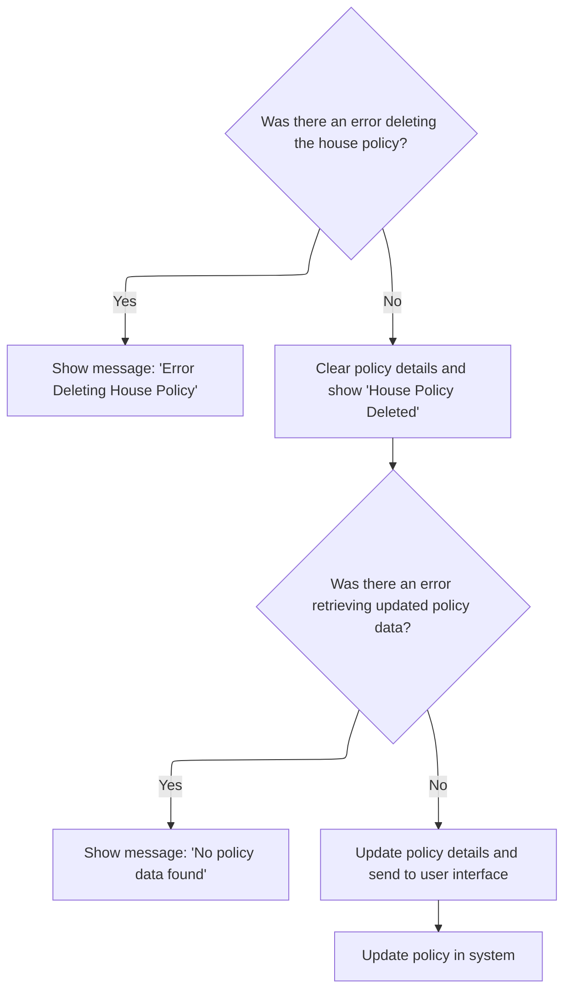
```mermaid
%%{init: {"flowchart": {"defaultRenderer": "elk"}} }%%
flowchart TD
    node1{"Was there an error deleting the house policy?"}
    click node1 openCode "base/src/lgtestp3.cbl:133:136"
    node1 -->|"Yes"| node2["Show message: 'Error Deleting House Policy'"]
    click node2 openCode "base/src/lgtestp3.cbl:281:283"
    node1 -->|"No"| node3["Clear policy details and show 'House Policy Deleted'"]
    click node3 openCode "base/src/lgtestp3.cbl:138:148"
    node3 --> node4{"Was there an error retrieving updated policy data?"}
    click node4 openCode "base/src/lgtestp3.cbl:163:165"
    node4 -->|"Yes"| node5["Show message: 'No policy data found'"]
    click node5 openCode "base/src/lgtestp3.cbl:164:165"
    node4 -->|"No"| node6["Update policy details and send to user interface"]
    click node6 openCode "base/src/lgtestp3.cbl:167:181"
    node6 --> node7["Update policy in system"]
    click node7 openCode "base/src/lgtestp3.cbl:183:199"
classDef HeadingStyle fill:#777777,stroke:#333,stroke-width:2px;

%% Swimm:
%% %%{init: {"flowchart": {"defaultRenderer": "elk"}} }%%
%% flowchart TD
%%     node1{"Was there an error deleting the house policy?"}
%%     click node1 openCode "<SwmPath>[base/src/lgtestp3.cbl](base/src/lgtestp3.cbl)</SwmPath>:133:136"
%%     node1 -->|"Yes"| node2["Show message: 'Error Deleting House Policy'"]
%%     click node2 openCode "<SwmPath>[base/src/lgtestp3.cbl](base/src/lgtestp3.cbl)</SwmPath>:281:283"
%%     node1 -->|"No"| node3["Clear policy details and show 'House Policy Deleted'"]
%%     click node3 openCode "<SwmPath>[base/src/lgtestp3.cbl](base/src/lgtestp3.cbl)</SwmPath>:138:148"
%%     node3 --> node4{"Was there an error retrieving updated policy data?"}
%%     click node4 openCode "<SwmPath>[base/src/lgtestp3.cbl](base/src/lgtestp3.cbl)</SwmPath>:163:165"
%%     node4 -->|"Yes"| node5["Show message: 'No policy data found'"]
%%     click node5 openCode "<SwmPath>[base/src/lgtestp3.cbl](base/src/lgtestp3.cbl)</SwmPath>:164:165"
%%     node4 -->|"No"| node6["Update policy details and send to user interface"]
%%     click node6 openCode "<SwmPath>[base/src/lgtestp3.cbl](base/src/lgtestp3.cbl)</SwmPath>:167:181"
%%     node6 --> node7["Update policy in system"]
%%     click node7 openCode "<SwmPath>[base/src/lgtestp3.cbl](base/src/lgtestp3.cbl)</SwmPath>:183:199"
%% classDef HeadingStyle fill:#777777,stroke:#333,stroke-width:2px;
```

<SwmSnippet path="/base/src/lgtestp3.cbl" line="133">

---

After returning from <SwmToken path="base/src/lgtestp3.cbl" pos="129:10:10" line-data="                 EXEC CICS LINK PROGRAM(&#39;LGDPOL01&#39;)">`LGDPOL01`</SwmToken>, <SwmToken path="base/src/lgtestp3.cbl" pos="33:5:7" line-data="              GO TO A-GAIN.">`A-GAIN`</SwmToken> checks <SwmToken path="base/src/lgtestp3.cbl" pos="133:3:7" line-data="                 IF CA-RETURN-CODE &gt; 0">`CA-RETURN-CODE`</SwmToken> to see if the policy deletion failed. If it did, it rolls back the transaction and jumps to <SwmToken path="base/src/lgtestp3.cbl" pos="135:5:7" line-data="                   GO TO NO-DELETE">`NO-DELETE`</SwmToken>, which triggers the error handling and menu reset. This makes sure the user gets notified about the failure and the menu is ready for the next action.

```cobol
                 IF CA-RETURN-CODE > 0
                   Exec CICS Syncpoint Rollback End-Exec
                   GO TO NO-DELETE
                 END-IF
```

---

</SwmSnippet>

<SwmSnippet path="/base/src/lgtestp3.cbl" line="281">

---

<SwmToken path="base/src/lgtestp3.cbl" pos="281:1:3" line-data="       NO-DELETE.">`NO-DELETE`</SwmToken> sets the error message for a failed house policy deletion and then jumps to <SwmToken path="base/src/lgtestp3.cbl" pos="283:5:7" line-data="           Go To ERROR-OUT.">`ERROR-OUT`</SwmToken>. <SwmToken path="base/src/lgtestp3.cbl" pos="283:5:7" line-data="           Go To ERROR-OUT.">`ERROR-OUT`</SwmToken> takes care of showing the error on the menu and resetting the transaction data, so the user gets feedback and a clean slate.

```cobol
       NO-DELETE.
           Move 'Error Deleting House Policy'      To  ERP3FLDO
           Go To ERROR-OUT.
```

---

</SwmSnippet>

<SwmSnippet path="/base/src/lgtestp3.cbl" line="138">

---

After returning from <SwmToken path="base/src/lgtestp3.cbl" pos="135:5:7" line-data="                   GO TO NO-DELETE">`NO-DELETE`</SwmToken>, <SwmToken path="base/src/lgtestp3.cbl" pos="33:5:7" line-data="              GO TO A-GAIN.">`A-GAIN`</SwmToken> clears all the policy input fields and sets the message to 'House Policy Deleted' before sending the updated menu to the terminal. This resets the UI and makes sure no leftover data is shown.

```cobol
                 Move Spaces             To  ENP3IDAI
                 Move Spaces             To  ENP3EDAI
                 Move Spaces             To  ENP3TYPI
                 Move Spaces             To  ENP3BEDI
                 Move Spaces             To  ENP3VALI
                 Move Spaces             To  ENP3HNMI
                 Move Spaces             To  ENP3HNOI
                 Move Spaces             To  ENP3HPCI
                 Move ' '             To ENP3OPTI
                 Move 'House Policy Deleted'
                   To  ERP3FLDO
```

---

</SwmSnippet>

<SwmSnippet path="/base/src/lgtestp3.cbl" line="149">

---

After clearing the fields and setting the message, <SwmToken path="base/src/lgtestp3.cbl" pos="33:5:7" line-data="              GO TO A-GAIN.">`A-GAIN`</SwmToken> sends the <SwmToken path="base/src/lgtestp3.cbl" pos="149:11:11" line-data="                 EXEC CICS SEND MAP (&#39;SSMAPP3&#39;)">`SSMAPP3`</SwmToken> map to the terminal. This updates the display so the user sees the latest menu and any status messages.

```cobol
                 EXEC CICS SEND MAP ('SSMAPP3')
                           FROM(SSMAPP3O)
                           MAPSET ('SSMAP')
                 END-EXEC
```

---

</SwmSnippet>

<SwmSnippet path="/base/src/lgtestp3.cbl" line="155">

---

Option '4' sets up the inquiry request and calls <SwmToken path="base/src/lgtestp3.cbl" pos="159:10:10" line-data="                 EXEC CICS LINK PROGRAM(&#39;LGIPOL01&#39;)">`LGIPOL01`</SwmToken> to fetch policy details.

```cobol
             WHEN '4'
                 Move '01IHOU'   To CA-REQUEST-ID
                 Move ENP3CNOO   To CA-CUSTOMER-NUM
                 Move ENP3PNOO   To CA-POLICY-NUM
                 EXEC CICS LINK PROGRAM('LGIPOL01')
                           COMMAREA(COMM-AREA)
                           LENGTH(32500)
                 END-EXEC
```

---

</SwmSnippet>

<SwmSnippet path="/base/src/lgtestp3.cbl" line="163">

---

After calling <SwmToken path="base/src/lgtestp3.cbl" pos="70:10:10" line-data="                 EXEC CICS LINK PROGRAM(&#39;LGIPOL01&#39;)">`LGIPOL01`</SwmToken>, <SwmToken path="base/src/lgtestp3.cbl" pos="33:5:7" line-data="              GO TO A-GAIN.">`A-GAIN`</SwmToken> checks <SwmToken path="base/src/lgtestp3.cbl" pos="163:3:7" line-data="                 IF CA-RETURN-CODE &gt; 0">`CA-RETURN-CODE`</SwmToken>. If it's greater than zero, we jump to <SwmToken path="base/src/lgtestp3.cbl" pos="164:5:7" line-data="                   GO TO NO-DATA">`NO-DATA`</SwmToken> to handle the error and update the menu.

```cobol
                 IF CA-RETURN-CODE > 0
                   GO TO NO-DATA
                 END-IF
```

---

</SwmSnippet>

<SwmSnippet path="/base/src/lgtestp3.cbl" line="167">

---

After a successful policy lookup, <SwmToken path="base/src/lgtestp3.cbl" pos="33:5:7" line-data="              GO TO A-GAIN.">`A-GAIN`</SwmToken> moves the returned policy details into the output fields and sends the updated menu to the terminal. This shows the user the latest info.

```cobol
                 Move CA-ISSUE-DATE      To  ENP3IDAI
                 Move CA-EXPIRY-DATE     To  ENP3EDAI
                 Move CA-H-PROPERTY-TYPE To  ENP3TYPI
                 Move CA-H-BEDROOMS      To  ENP3BEDI
                 Move CA-H-VALUE         To  ENP3VALI
                 Move CA-H-HOUSE-NAME    To  ENP3HNMI
                 Move CA-H-HOUSE-NUMBER  To  ENP3HNOI
                 Move CA-H-POSTCODE      To  ENP3HPCI
                 EXEC CICS SEND MAP ('SSMAPP3')
                           FROM(SSMAPP3O)
                           MAPSET ('SSMAP')
                 END-EXEC
                 EXEC CICS RECEIVE MAP('SSMAPP3')
                           INTO(SSMAPP3I)
                           MAPSET('SSMAP') END-EXEC
```

---

</SwmSnippet>

<SwmSnippet path="/base/src/lgtestp3.cbl" line="183">

---

Before calling <SwmToken path="base/src/lgtestp3.cbl" pos="196:10:10" line-data="                 EXEC CICS LINK PROGRAM(&#39;LGUPOL01&#39;)">`LGUPOL01`</SwmToken>, <SwmToken path="base/src/lgtestp3.cbl" pos="33:5:7" line-data="              GO TO A-GAIN.">`A-GAIN`</SwmToken> packs all the input fields needed for a house policy update into the commarea. This sets up the backend call with the right data.

```cobol
                 Move '01UHOU'          To CA-REQUEST-ID
                 Move ENP3CNOI          To CA-CUSTOMER-NUM
                 Move 0                 To CA-PAYMENT
                 Move 0                 To CA-BROKERID
                 Move '        '        To CA-BROKERSREF
                 Move ENP3IDAI          To CA-ISSUE-DATE
                 Move ENP3EDAI          To CA-EXPIRY-DATE
                 Move ENP3TYPI          To CA-H-PROPERTY-TYPE
                 Move ENP3BEDI          To CA-H-BEDROOMS
                 Move ENP3VALI          To CA-H-VALUE
                 Move ENP3HNMI          To CA-H-HOUSE-NAME
                 Move ENP3HNOI          To CA-H-HOUSE-NUMBER
                 Move ENP3HPCI          To CA-H-POSTCODE
```

---

</SwmSnippet>

<SwmSnippet path="/base/src/lgtestp3.cbl" line="196">

---

After packing the update fields, <SwmToken path="base/src/lgtestp3.cbl" pos="33:5:7" line-data="              GO TO A-GAIN.">`A-GAIN`</SwmToken> links to <SwmToken path="base/src/lgtestp3.cbl" pos="196:10:10" line-data="                 EXEC CICS LINK PROGRAM(&#39;LGUPOL01&#39;)">`LGUPOL01`</SwmToken>. That program validates the input and updates the policy in the backend.

```cobol
                 EXEC CICS LINK PROGRAM('LGUPOL01')
                           COMMAREA(COMM-AREA)
                           LENGTH(32500)
                 END-EXEC
```

---

</SwmSnippet>

## Validating and dispatching policy update requests

```mermaid
%%{init: {"flowchart": {"defaultRenderer": "elk"}} }%%
flowchart TD
    node1["Start: Validate incoming request"] --> node2{"Was a request received?"}
    click node1 openCode "base/src/lgupol01.cbl:83:98"
    node2 -->|"No"| node3["Log error and abort (Return code 'LGCA')"]
    click node2 openCode "base/src/lgupol01.cbl:99:103"
    click node3 openCode "base/src/lgupol01.cbl:100:102"
    node2 -->|"Yes"| node4{"Which policy type?"}
    click node4 openCode "base/src/lgupol01.cbl:113:141"
    node4 -->|"Endowment"| node5{"Is data length >= 152?"}
    node4 -->|"House"| node6{"Is data length >= 158?"}
    node4 -->|"Motor"| node7{"Is data length >= 165?"}
    node4 -->|"Other"| node8["Reject request (Return code '99')"]
    click node8 openCode "base/src/lgupol01.cbl:139:141"
    node5 -->|"No"| node9["Reject: Insufficient data (Return code '98')"]
    click node5 openCode "base/src/lgupol01.cbl:115:121"
    click node9 openCode "base/src/lgupol01.cbl:119:120"
    node5 -->|"Yes"| node10["Update policy info"]
    click node10 openCode "base/src/lgupol01.cbl:143:143"
    node6 -->|"No"| node9
    node6 -->|"Yes"| node10
    node7 -->|"No"| node9
    node7 -->|"Yes"| node10

classDef HeadingStyle fill:#777777,stroke:#333,stroke-width:2px;

%% Swimm:
%% %%{init: {"flowchart": {"defaultRenderer": "elk"}} }%%
%% flowchart TD
%%     node1["Start: Validate incoming request"] --> node2{"Was a request received?"}
%%     click node1 openCode "<SwmPath>[base/src/lgupol01.cbl](base/src/lgupol01.cbl)</SwmPath>:83:98"
%%     node2 -->|"No"| node3["Log error and abort (Return code 'LGCA')"]
%%     click node2 openCode "<SwmPath>[base/src/lgupol01.cbl](base/src/lgupol01.cbl)</SwmPath>:99:103"
%%     click node3 openCode "<SwmPath>[base/src/lgupol01.cbl](base/src/lgupol01.cbl)</SwmPath>:100:102"
%%     node2 -->|"Yes"| node4{"Which policy type?"}
%%     click node4 openCode "<SwmPath>[base/src/lgupol01.cbl](base/src/lgupol01.cbl)</SwmPath>:113:141"
%%     node4 -->|"Endowment"| node5{"Is data length >= 152?"}
%%     node4 -->|"House"| node6{"Is data length >= 158?"}
%%     node4 -->|"Motor"| node7{"Is data length >= 165?"}
%%     node4 -->|"Other"| node8["Reject request (Return code '99')"]
%%     click node8 openCode "<SwmPath>[base/src/lgupol01.cbl](base/src/lgupol01.cbl)</SwmPath>:139:141"
%%     node5 -->|"No"| node9["Reject: Insufficient data (Return code '98')"]
%%     click node5 openCode "<SwmPath>[base/src/lgupol01.cbl](base/src/lgupol01.cbl)</SwmPath>:115:121"
%%     click node9 openCode "<SwmPath>[base/src/lgupol01.cbl](base/src/lgupol01.cbl)</SwmPath>:119:120"
%%     node5 -->|"Yes"| node10["Update policy info"]
%%     click node10 openCode "<SwmPath>[base/src/lgupol01.cbl](base/src/lgupol01.cbl)</SwmPath>:143:143"
%%     node6 -->|"No"| node9
%%     node6 -->|"Yes"| node10
%%     node7 -->|"No"| node9
%%     node7 -->|"Yes"| node10
%% 
%% classDef HeadingStyle fill:#777777,stroke:#333,stroke-width:2px;
```

This section ensures that only valid policy update requests are processed, enforcing strict checks on request presence, type, and data length. It provides error handling and logging for invalid requests, and dispatches valid requests for policy updates.

| Category        | Rule Name                       | Description                                                                                                                                                                               |
| --------------- | ------------------------------- | ----------------------------------------------------------------------------------------------------------------------------------------------------------------------------------------- |
| Data validation | Policy type validation          | Requests must specify a valid policy type: Endowment, House, or Motor. Any other type must be rejected with return code '99'.                                                             |
| Data validation | Minimum data length enforcement | Each policy type has a minimum required data length: Endowment (152 bytes), House (158 bytes), Motor (165 bytes). Requests with insufficient data must be rejected with return code '98'. |
| Business logic  | Valid request dispatch          | If all validations pass, the request must be dispatched for policy update processing in the database.                                                                                     |

<SwmSnippet path="/base/src/lgupol01.cbl" line="83">

---

In MAINLINE, we validate the input commarea, check the request type and length, and log errors if anything's missing. If everything checks out, we call <SwmToken path="base/src/lgupol01.cbl" pos="143:3:9" line-data="           PERFORM UPDATE-POLICY-DB2-INFO.">`UPDATE-POLICY-DB2-INFO`</SwmToken> to actually update the policy in the database.

```cobol
       MAINLINE SECTION.

      *----------------------------------------------------------------*
      * Common code                                                    *
      *----------------------------------------------------------------*
      * initialize working storage variables
           INITIALIZE WS-HEADER.
      * set up general variable
           MOVE EIBTRNID TO WS-TRANSID.
           MOVE EIBTRMID TO WS-TERMID.
           MOVE EIBTASKN TO WS-TASKNUM.

      *----------------------------------------------------------------*
      * Check commarea and obtain required details                     *
      *----------------------------------------------------------------*
      * If NO commarea received issue an ABEND
           IF EIBCALEN IS EQUAL TO ZERO
               MOVE ' NO COMMAREA RECEIVED' TO EM-VARIABLE
               PERFORM WRITE-ERROR-MESSAGE
               EXEC CICS ABEND ABCODE('LGCA') NODUMP END-EXEC
           END-IF
      * initialize commarea return code to zero
           MOVE '00' TO CA-RETURN-CODE
           MOVE EIBCALEN TO WS-CALEN.
           SET WS-ADDR-DFHCOMMAREA TO ADDRESS OF DFHCOMMAREA.

      *----------------------------------------------------------------*
      * Check which policy type is being requested                     *
      *   and chec commarea length                                     *
      *----------------------------------------------------------------*
           EVALUATE CA-REQUEST-ID

             WHEN '01UEND'
               ADD WS-CA-HEADER-LEN  TO WS-REQUIRED-CA-LEN
               ADD WS-FULL-ENDOW-LEN TO WS-REQUIRED-CA-LEN
               IF EIBCALEN IS LESS THAN WS-REQUIRED-CA-LEN
                 MOVE '98' TO CA-RETURN-CODE
                 EXEC CICS RETURN END-EXEC
               END-IF

             WHEN '01UHOU'
               ADD WS-CA-HEADER-LEN  TO WS-REQUIRED-CA-LEN
               ADD WS-FULL-HOUSE-LEN TO WS-REQUIRED-CA-LEN
               IF EIBCALEN IS LESS THAN WS-REQUIRED-CA-LEN
                 MOVE '98' TO CA-RETURN-CODE
                 EXEC CICS RETURN END-EXEC
               END-IF

             WHEN '01UMOT'
               ADD WS-CA-HEADER-LEN  TO WS-REQUIRED-CA-LEN
               ADD WS-FULL-MOTOR-LEN TO WS-REQUIRED-CA-LEN
               IF EIBCALEN IS LESS THAN WS-REQUIRED-CA-LEN
                 MOVE '98' TO CA-RETURN-CODE
                 EXEC CICS RETURN END-EXEC
               END-IF

             WHEN OTHER
               MOVE '99' TO CA-RETURN-CODE
           END-EVALUATE

           PERFORM UPDATE-POLICY-DB2-INFO.
```

---

</SwmSnippet>

<SwmSnippet path="/base/src/lgupol01.cbl" line="169">

---

<SwmToken path="base/src/lgupol01.cbl" pos="169:1:5" line-data="       WRITE-ERROR-MESSAGE.">`WRITE-ERROR-MESSAGE`</SwmToken> formats the error details, gets the current time, and calls LGSTSQ to log the error and up to 90 bytes of commarea data. This makes sure errors are tracked for diagnostics.

```cobol
       WRITE-ERROR-MESSAGE.
      * Save SQLCODE in message
      * Obtain and format current time and date
           EXEC CICS ASKTIME ABSTIME(WS-ABSTIME)
           END-EXEC
           EXEC CICS FORMATTIME ABSTIME(WS-ABSTIME)
                     MMDDYYYY(WS-DATE)
                     TIME(WS-TIME)
           END-EXEC
           MOVE WS-DATE TO EM-DATE
           MOVE WS-TIME TO EM-TIME
      * Write output message to TDQ
           EXEC CICS LINK PROGRAM('LGSTSQ')
                     COMMAREA(ERROR-MSG)
                     LENGTH(LENGTH OF ERROR-MSG)
           END-EXEC.
      * Write 90 bytes or as much as we have of commarea to TDQ
           IF EIBCALEN > 0 THEN
             IF EIBCALEN < 91 THEN
               MOVE DFHCOMMAREA(1:EIBCALEN) TO CA-DATA
               EXEC CICS LINK PROGRAM('LGSTSQ')
                         COMMAREA(CA-ERROR-MSG)
                         LENGTH(LENGTH OF CA-ERROR-MSG)
               END-EXEC
             ELSE
               MOVE DFHCOMMAREA(1:90) TO CA-DATA
               EXEC CICS LINK PROGRAM('LGSTSQ')
                         COMMAREA(CA-ERROR-MSG)
                         LENGTH(LENGTH OF CA-ERROR-MSG)
               END-EXEC
             END-IF
           END-IF.
           EXIT.
```

---

</SwmSnippet>

<SwmSnippet path="/base/src/lgupol01.cbl" line="83">

---

After all the input checks and error handling, MAINLINE calls <SwmToken path="base/src/lgupol01.cbl" pos="143:3:9" line-data="           PERFORM UPDATE-POLICY-DB2-INFO.">`UPDATE-POLICY-DB2-INFO`</SwmToken> to run the actual update logic for the policy.

```cobol
       MAINLINE SECTION.

      *----------------------------------------------------------------*
      * Common code                                                    *
      *----------------------------------------------------------------*
      * initialize working storage variables
           INITIALIZE WS-HEADER.
      * set up general variable
           MOVE EIBTRNID TO WS-TRANSID.
           MOVE EIBTRMID TO WS-TERMID.
           MOVE EIBTASKN TO WS-TASKNUM.

      *----------------------------------------------------------------*
      * Check commarea and obtain required details                     *
      *----------------------------------------------------------------*
      * If NO commarea received issue an ABEND
           IF EIBCALEN IS EQUAL TO ZERO
               MOVE ' NO COMMAREA RECEIVED' TO EM-VARIABLE
               PERFORM WRITE-ERROR-MESSAGE
               EXEC CICS ABEND ABCODE('LGCA') NODUMP END-EXEC
           END-IF
      * initialize commarea return code to zero
           MOVE '00' TO CA-RETURN-CODE
           MOVE EIBCALEN TO WS-CALEN.
           SET WS-ADDR-DFHCOMMAREA TO ADDRESS OF DFHCOMMAREA.

      *----------------------------------------------------------------*
      * Check which policy type is being requested                     *
      *   and chec commarea length                                     *
      *----------------------------------------------------------------*
           EVALUATE CA-REQUEST-ID

             WHEN '01UEND'
               ADD WS-CA-HEADER-LEN  TO WS-REQUIRED-CA-LEN
               ADD WS-FULL-ENDOW-LEN TO WS-REQUIRED-CA-LEN
               IF EIBCALEN IS LESS THAN WS-REQUIRED-CA-LEN
                 MOVE '98' TO CA-RETURN-CODE
                 EXEC CICS RETURN END-EXEC
               END-IF

             WHEN '01UHOU'
               ADD WS-CA-HEADER-LEN  TO WS-REQUIRED-CA-LEN
               ADD WS-FULL-HOUSE-LEN TO WS-REQUIRED-CA-LEN
               IF EIBCALEN IS LESS THAN WS-REQUIRED-CA-LEN
                 MOVE '98' TO CA-RETURN-CODE
                 EXEC CICS RETURN END-EXEC
               END-IF

             WHEN '01UMOT'
               ADD WS-CA-HEADER-LEN  TO WS-REQUIRED-CA-LEN
               ADD WS-FULL-MOTOR-LEN TO WS-REQUIRED-CA-LEN
               IF EIBCALEN IS LESS THAN WS-REQUIRED-CA-LEN
                 MOVE '98' TO CA-RETURN-CODE
                 EXEC CICS RETURN END-EXEC
               END-IF

             WHEN OTHER
               MOVE '99' TO CA-RETURN-CODE
           END-EVALUATE

           PERFORM UPDATE-POLICY-DB2-INFO.
```

---

</SwmSnippet>

## Coordinating the policy update with the database handler

This section ensures that any changes to a policy are properly communicated to the backend database handler, so that the policy record is accurately updated in the database.

| Category        | Rule Name                         | Description                                                                                                       |
| --------------- | --------------------------------- | ----------------------------------------------------------------------------------------------------------------- |
| Data validation | Complete policy data transmission | The data passed to the backend must include all relevant policy fields required for a complete update.            |
| Business logic  | Policy update synchronization     | All policy updates must be sent to the database handler to ensure the backend record reflects the latest changes. |

<SwmSnippet path="/base/src/lgupol01.cbl" line="155">

---

<SwmToken path="base/src/lgupol01.cbl" pos="155:1:7" line-data="       UPDATE-POLICY-DB2-INFO.">`UPDATE-POLICY-DB2-INFO`</SwmToken> links to <SwmToken path="base/src/lgupol01.cbl" pos="157:9:9" line-data="           EXEC CICS LINK Program(LGUPDB01)">`LGUPDB01`</SwmToken>, passing the commarea so the backend can update the policy record in the database.

```cobol
       UPDATE-POLICY-DB2-INFO.

           EXEC CICS LINK Program(LGUPDB01)
                Commarea(DFHCOMMAREA)
                LENGTH(32500)
           END-EXEC.

           EXIT.
```

---

</SwmSnippet>

## Validating and updating policy records in <SwmToken path="base/src/lgipdb01.cbl" pos="242:5:5" line-data="      * initialize DB2 host variables">`DB2`</SwmToken>

```mermaid
%%{init: {"flowchart": {"defaultRenderer": "elk"}} }%%
flowchart TD
    node1["Initialize environment and working variables"] --> node2{"Is commarea (request data) present? (commarea length = 0?)"}
    click node1 openCode "base/src/lgupdb01.cbl:162:178"
    node2 -->|"No"| node3["Log error and terminate process"]
    click node2 openCode "base/src/lgupdb01.cbl:183:187"
    click node3 openCode "base/src/lgupdb01.cbl:184:186"
    node2 -->|"Yes"| node4["Prepare customer and policy numbers for processing"]
    click node4 openCode "base/src/lgupdb01.cbl:190:200"
    node4 --> node5["Update policy information"]
    click node5 openCode "base/src/lgupdb01.cbl:207:207"
    node5 --> node6["Continue processing in external program"]
    click node6 openCode "base/src/lgupdb01.cbl:209:212"
classDef HeadingStyle fill:#777777,stroke:#333,stroke-width:2px;

%% Swimm:
%% %%{init: {"flowchart": {"defaultRenderer": "elk"}} }%%
%% flowchart TD
%%     node1["Initialize environment and working variables"] --> node2{"Is commarea (request data) present? (commarea length = 0?)"}
%%     click node1 openCode "<SwmPath>[base/src/lgupdb01.cbl](base/src/lgupdb01.cbl)</SwmPath>:162:178"
%%     node2 -->|"No"| node3["Log error and terminate process"]
%%     click node2 openCode "<SwmPath>[base/src/lgupdb01.cbl](base/src/lgupdb01.cbl)</SwmPath>:183:187"
%%     click node3 openCode "<SwmPath>[base/src/lgupdb01.cbl](base/src/lgupdb01.cbl)</SwmPath>:184:186"
%%     node2 -->|"Yes"| node4["Prepare customer and policy numbers for processing"]
%%     click node4 openCode "<SwmPath>[base/src/lgupdb01.cbl](base/src/lgupdb01.cbl)</SwmPath>:190:200"
%%     node4 --> node5["Update policy information"]
%%     click node5 openCode "<SwmPath>[base/src/lgupdb01.cbl](base/src/lgupdb01.cbl)</SwmPath>:207:207"
%%     node5 --> node6["Continue processing in external program"]
%%     click node6 openCode "<SwmPath>[base/src/lgupdb01.cbl](base/src/lgupdb01.cbl)</SwmPath>:209:212"
%% classDef HeadingStyle fill:#777777,stroke:#333,stroke-width:2px;
```

This section is responsible for validating incoming requests to update policy records, ensuring all required data is present, and updating the corresponding records in the <SwmToken path="base/src/lgipdb01.cbl" pos="242:5:5" line-data="      * initialize DB2 host variables">`DB2`</SwmToken> database. It also handles error logging and escalation if the request is invalid or an error occurs during processing.

| Category        | Rule Name                             | Description                                                                                                                                                                                                                                                                          |
| --------------- | ------------------------------------- | ------------------------------------------------------------------------------------------------------------------------------------------------------------------------------------------------------------------------------------------------------------------------------------ |
| Data validation | Missing request data handling         | If the incoming request data (commarea) is missing or empty, the process must log an error message and terminate without attempting to update any policy records.                                                                                                                    |
| Business logic  | Customer and policy number conversion | Customer and policy numbers from the request must be converted to the <SwmToken path="base/src/lgipdb01.cbl" pos="242:5:5" line-data="      * initialize DB2 host variables">`DB2`</SwmToken> integer format before any update is attempted.                                         |
| Business logic  | Chained update processing             | After a successful <SwmToken path="base/src/lgipdb01.cbl" pos="242:5:5" line-data="      * initialize DB2 host variables">`DB2`</SwmToken> update, the process must continue by invoking an external program to update related VSAM files, ensuring data consistency across systems. |
| Business logic  | Initial return code setting           | The return code in the commarea must be set to '00' at the start of processing to indicate initial success, and may be updated later if errors occur.                                                                                                                                |

<SwmSnippet path="/base/src/lgupdb01.cbl" line="162">

---

MAINLINE in <SwmToken path="base/src/lgupol01.cbl" pos="157:9:9" line-data="           EXEC CICS LINK Program(LGUPDB01)">`LGUPDB01`</SwmToken> checks the commarea, converts customer and policy numbers to <SwmToken path="base/src/lgupdb01.cbl" pos="175:5:5" line-data="      * initialize DB2 host variables">`DB2`</SwmToken> integer format, and calls <SwmToken path="base/src/lgupdb01.cbl" pos="207:3:9" line-data="           PERFORM UPDATE-POLICY-DB2-INFO.">`UPDATE-POLICY-DB2-INFO`</SwmToken> to update the <SwmToken path="base/src/lgupdb01.cbl" pos="175:5:5" line-data="      * initialize DB2 host variables">`DB2`</SwmToken> tables. After that, it links to <SwmToken path="base/src/lgupdb01.cbl" pos="209:9:9" line-data="           EXEC CICS LINK Program(LGUPVS01)">`LGUPVS01`</SwmToken> to update the VSAM file.

```cobol
       MAINLINE SECTION.

      *----------------------------------------------------------------*
      * Common code                                                    *
      *----------------------------------------------------------------*
      * initialize working storage variables
           INITIALIZE WS-HEADER.
      * set up general variable
           MOVE EIBTRNID TO WS-TRANSID.
           MOVE EIBTRMID TO WS-TERMID.
           MOVE EIBTASKN TO WS-TASKNUM.
           MOVE SPACES   TO WS-RETRY.
      *----------------------------------------------------------------*
      * initialize DB2 host variables
           INITIALIZE DB2-POLICY.
           INITIALIZE DB2-IN-INTEGERS.

      *----------------------------------------------------------------*
      * Check commarea and obtain required details                     *
      *----------------------------------------------------------------*
      * If NO commarea received issue an ABEND
           IF EIBCALEN IS EQUAL TO ZERO
               MOVE ' NO COMMAREA RECEIVED' TO EM-VARIABLE
               PERFORM WRITE-ERROR-MESSAGE
               EXEC CICS ABEND ABCODE('LGCA') NODUMP END-EXEC
           END-IF

      * initialize commarea return code to zero
           MOVE '00' TO CA-RETURN-CODE
           MOVE EIBCALEN TO WS-CALEN.
           SET WS-ADDR-DFHCOMMAREA TO ADDRESS OF DFHCOMMAREA.

      * Convert commarea customer & policy nums to DB2 integer format
           MOVE CA-CUSTOMER-NUM TO DB2-CUSTOMERNUM-INT
           MOVE CA-POLICY-NUM   TO DB2-POLICYNUM-INT
      * and save in error msg field incase required
           MOVE CA-CUSTOMER-NUM TO EM-CUSNUM
           MOVE CA-POLICY-NUM   TO EM-POLNUM

      *----------------------------------------------------------------*
      * Check which policy type is being requested                     *
      *   and check commarea length                                    *
      *----------------------------------------------------------------*

      *    Call procedure to update required tables
           PERFORM UPDATE-POLICY-DB2-INFO.

           EXEC CICS LINK Program(LGUPVS01)
                Commarea(DFHCOMMAREA)
                LENGTH(225)
           END-EXEC.
```

---

</SwmSnippet>

<SwmSnippet path="/base/src/lgupdb01.cbl" line="502">

---

<SwmToken path="base/src/lgupdb01.cbl" pos="502:1:5" line-data="       WRITE-ERROR-MESSAGE.">`WRITE-ERROR-MESSAGE`</SwmToken> in <SwmToken path="base/src/lgupol01.cbl" pos="157:9:9" line-data="           EXEC CICS LINK Program(LGUPDB01)">`LGUPDB01`</SwmToken> logs the SQLCODE, formats the timestamp, and calls LGSTSQ to write both the error message and up to 90 bytes of commarea data to the system queues.

```cobol
       WRITE-ERROR-MESSAGE.
      * Save SQLCODE in message
           MOVE SQLCODE TO EM-SQLRC
      * Obtain and format current time and date
           EXEC CICS ASKTIME ABSTIME(WS-ABSTIME)
           END-EXEC
           EXEC CICS FORMATTIME ABSTIME(WS-ABSTIME)
                     MMDDYYYY(WS-DATE)
                     TIME(WS-TIME)
           END-EXEC
           MOVE WS-DATE TO EM-DATE
           MOVE WS-TIME TO EM-TIME
      * Write output message to TDQ
           EXEC CICS LINK PROGRAM('LGSTSQ')
                     COMMAREA(ERROR-MSG)
                     LENGTH(LENGTH OF ERROR-MSG)
           END-EXEC.
      * Write 90 bytes or as much as we have of commarea to TDQ
           IF EIBCALEN > 0 THEN
             IF EIBCALEN < 91 THEN
               MOVE DFHCOMMAREA(1:EIBCALEN) TO CA-DATA
               EXEC CICS LINK PROGRAM('LGSTSQ')
                         COMMAREA(CA-ERROR-MSG)
                         LENGTH(LENGTH OF CA-ERROR-MSG)
               END-EXEC
             ELSE
               MOVE DFHCOMMAREA(1:90) TO CA-DATA
               EXEC CICS LINK PROGRAM('LGSTSQ')
                         COMMAREA(CA-ERROR-MSG)
                         LENGTH(LENGTH OF CA-ERROR-MSG)
               END-EXEC
             END-IF
           END-IF.
           EXIT.
```

---

</SwmSnippet>

## Updating policy type-specific details and handling <SwmToken path="base/src/lgipdb01.cbl" pos="242:5:5" line-data="      * initialize DB2 host variables">`DB2`</SwmToken> errors

```mermaid
%%{init: {"flowchart": {"defaultRenderer": "elk"}} }%%
flowchart TD
    node1["Open DB2 policy cursor"] --> node2{"Was policy record fetched?"}
    click node1 openCode "base/src/lgupdb01.cbl:254:257"
    node2 -->|"SQLCODE = 0"| node3{"Do timestamps match?"}
    node2 -->|"SQLCODE = 100"| node8["Set return code: Not found"]
    click node8 openCode "base/src/lgupdb01.cbl:351:353"
    node2 -->|"SQLCODE = -913 or other"| node9["Set return code: Error"]
    click node9 openCode "base/src/lgupdb01.cbl:354:357"
    click node2 openCode "base/src/lgupdb01.cbl:259:270"
    node3 -->|"Yes"| node4{"Which policy type?"}
    node3 -->|"No"| node10["Set return code: Timestamp mismatch"]
    click node10 openCode "base/src/lgupdb01.cbl:346:347"
    click node3 openCode "base/src/lgupdb01.cbl:278:278"
    node4 -->|"Endowment"| node5["Update Endowment policy"]
    node4 -->|"House"| node6["Update House policy"]
    node4 -->|"Motor"| node7["Update Motor policy"]
    click node4 openCode "base/src/lgupdb01.cbl:283:300"
    node5 --> node11{"Was update successful?"}
    node6 --> node11
    node7 --> node11
    click node5 openCode "base/src/lgupdb01.cbl:387:418"
    click node6 openCode "base/src/lgupdb01.cbl:424:454"
    click node7 openCode "base/src/lgupdb01.cbl:460:495"
    node11 -->|"CA-RETURN-CODE = '00'"| node12["Update main policy table and assign new timestamp"]
    node11 -->|"CA-RETURN-CODE != '00'"| node13["Set return code: Update failed and write error message"]
    click node11 openCode "base/src/lgupdb01.cbl:302:307"
    node12 --> node14{"Was update successful?"}
    click node12 openCode "base/src/lgupdb01.cbl:317:334"
    node14 -->|"SQLCODE = 0"| node15["Set return code: Success"]
    node14 -->|"SQLCODE != 0"| node16["Set return code: Update failed and write error message"]
    click node14 openCode "base/src/lgupdb01.cbl:336:342"
    node8 --> node17["Close DB2 policy cursor"]
    node9 --> node17
    node10 --> node17
    node13 --> node17
    node15 --> node17
    node16 --> node17
    click node13 openCode "base/src/lgupdb01.cbl:305:307"
    click node15 openCode "base/src/lgupdb01.cbl:371:371"
    click node16 openCode "base/src/lgupdb01.cbl:339:342"
    node17["Close DB2 policy cursor"]
    click node17 openCode "base/src/lgupdb01.cbl:362:381"
classDef HeadingStyle fill:#777777,stroke:#333,stroke-width:2px;

%% Swimm:
%% %%{init: {"flowchart": {"defaultRenderer": "elk"}} }%%
%% flowchart TD
%%     node1["Open <SwmToken path="base/src/lgipdb01.cbl" pos="242:5:5" line-data="      * initialize DB2 host variables">`DB2`</SwmToken> policy cursor"] --> node2{"Was policy record fetched?"}
%%     click node1 openCode "<SwmPath>[base/src/lgupdb01.cbl](base/src/lgupdb01.cbl)</SwmPath>:254:257"
%%     node2 -->|"SQLCODE = 0"| node3{"Do timestamps match?"}
%%     node2 -->|"SQLCODE = 100"| node8["Set return code: Not found"]
%%     click node8 openCode "<SwmPath>[base/src/lgupdb01.cbl](base/src/lgupdb01.cbl)</SwmPath>:351:353"
%%     node2 -->|"SQLCODE = -913 or other"| node9["Set return code: Error"]
%%     click node9 openCode "<SwmPath>[base/src/lgupdb01.cbl](base/src/lgupdb01.cbl)</SwmPath>:354:357"
%%     click node2 openCode "<SwmPath>[base/src/lgupdb01.cbl](base/src/lgupdb01.cbl)</SwmPath>:259:270"
%%     node3 -->|"Yes"| node4{"Which policy type?"}
%%     node3 -->|"No"| node10["Set return code: Timestamp mismatch"]
%%     click node10 openCode "<SwmPath>[base/src/lgupdb01.cbl](base/src/lgupdb01.cbl)</SwmPath>:346:347"
%%     click node3 openCode "<SwmPath>[base/src/lgupdb01.cbl](base/src/lgupdb01.cbl)</SwmPath>:278:278"
%%     node4 -->|"Endowment"| node5["Update Endowment policy"]
%%     node4 -->|"House"| node6["Update House policy"]
%%     node4 -->|"Motor"| node7["Update Motor policy"]
%%     click node4 openCode "<SwmPath>[base/src/lgupdb01.cbl](base/src/lgupdb01.cbl)</SwmPath>:283:300"
%%     node5 --> node11{"Was update successful?"}
%%     node6 --> node11
%%     node7 --> node11
%%     click node5 openCode "<SwmPath>[base/src/lgupdb01.cbl](base/src/lgupdb01.cbl)</SwmPath>:387:418"
%%     click node6 openCode "<SwmPath>[base/src/lgupdb01.cbl](base/src/lgupdb01.cbl)</SwmPath>:424:454"
%%     click node7 openCode "<SwmPath>[base/src/lgupdb01.cbl](base/src/lgupdb01.cbl)</SwmPath>:460:495"
%%     node11 -->|"<SwmToken path="base/src/lgtestp3.cbl" pos="74:3:7" line-data="                 IF CA-RETURN-CODE &gt; 0">`CA-RETURN-CODE`</SwmToken> = '00'"| node12["Update main policy table and assign new timestamp"]
%%     node11 -->|"<SwmToken path="base/src/lgtestp3.cbl" pos="74:3:7" line-data="                 IF CA-RETURN-CODE &gt; 0">`CA-RETURN-CODE`</SwmToken> != '00'"| node13["Set return code: Update failed and write error message"]
%%     click node11 openCode "<SwmPath>[base/src/lgupdb01.cbl](base/src/lgupdb01.cbl)</SwmPath>:302:307"
%%     node12 --> node14{"Was update successful?"}
%%     click node12 openCode "<SwmPath>[base/src/lgupdb01.cbl](base/src/lgupdb01.cbl)</SwmPath>:317:334"
%%     node14 -->|"SQLCODE = 0"| node15["Set return code: Success"]
%%     node14 -->|"SQLCODE != 0"| node16["Set return code: Update failed and write error message"]
%%     click node14 openCode "<SwmPath>[base/src/lgupdb01.cbl](base/src/lgupdb01.cbl)</SwmPath>:336:342"
%%     node8 --> node17["Close <SwmToken path="base/src/lgipdb01.cbl" pos="242:5:5" line-data="      * initialize DB2 host variables">`DB2`</SwmToken> policy cursor"]
%%     node9 --> node17
%%     node10 --> node17
%%     node13 --> node17
%%     node15 --> node17
%%     node16 --> node17
%%     click node13 openCode "<SwmPath>[base/src/lgupdb01.cbl](base/src/lgupdb01.cbl)</SwmPath>:305:307"
%%     click node15 openCode "<SwmPath>[base/src/lgupdb01.cbl](base/src/lgupdb01.cbl)</SwmPath>:371:371"
%%     click node16 openCode "<SwmPath>[base/src/lgupdb01.cbl](base/src/lgupdb01.cbl)</SwmPath>:339:342"
%%     node17["Close <SwmToken path="base/src/lgipdb01.cbl" pos="242:5:5" line-data="      * initialize DB2 host variables">`DB2`</SwmToken> policy cursor"]
%%     click node17 openCode "<SwmPath>[base/src/lgupdb01.cbl](base/src/lgupdb01.cbl)</SwmPath>:362:381"
%% classDef HeadingStyle fill:#777777,stroke:#333,stroke-width:2px;
```

This section governs how policy records are updated in <SwmToken path="base/src/lgipdb01.cbl" pos="242:5:5" line-data="      * initialize DB2 host variables">`DB2`</SwmToken>, ensuring that only valid and current records are modified, and that errors are handled and reported appropriately.

| Category        | Rule Name                                  | Description                                                                                                                                                                                                                                                                     |
| --------------- | ------------------------------------------ | ------------------------------------------------------------------------------------------------------------------------------------------------------------------------------------------------------------------------------------------------------------------------------- |
| Data validation | Timestamp mismatch detection               | If the policy record is found but the timestamp in the request does not match the <SwmToken path="base/src/lgipdb01.cbl" pos="242:5:5" line-data="      * initialize DB2 host variables">`DB2`</SwmToken> record, set the return code to '02' to indicate 'Timestamp mismatch'. |
| Business logic  | Policy type-specific update                | If the policy record is found and timestamps match, update the policy type-specific table (Endowment, House, or Motor) according to the request type.                                                                                                                           |
| Business logic  | Main policy table update after type update | If the policy type-specific update succeeds, update the main policy table with new details and assign a new timestamp.                                                                                                                                                          |
| Business logic  | Return code assignment                     | Return codes must be set as follows: '00' for success, '01' for not found, '02' for timestamp mismatch, '90' for any error.                                                                                                                                                     |
| Technical step  | Policy cursor closure                      | After any operation, the policy cursor must be closed. If the cursor was not open (SQLCODE = -501), this is treated as a successful close.                                                                                                                                      |

<SwmSnippet path="/base/src/lgupdb01.cbl" line="251">

---

<SwmToken path="base/src/lgupdb01.cbl" pos="251:1:7" line-data="       UPDATE-POLICY-DB2-INFO.">`UPDATE-POLICY-DB2-INFO`</SwmToken> opens a cursor, fetches the policy row, checks the timestamp, and calls the right update routine based on policy type. If anything fails, it logs the error and sets the return code. Finally, it closes the cursor.

```cobol
       UPDATE-POLICY-DB2-INFO.

      *    Open the cursor.
           MOVE ' OPEN   PCURSOR ' TO EM-SQLREQ
           EXEC SQL
             OPEN POLICY_CURSOR
           END-EXEC

           Evaluate SQLCODE
             When 0
               MOVE '00' TO CA-RETURN-CODE
             When -913
               MOVE '90' TO CA-RETURN-CODE
               PERFORM WRITE-ERROR-MESSAGE
               EXEC CICS RETURN END-EXEC
             When Other
               MOVE '90' TO CA-RETURN-CODE
               PERFORM WRITE-ERROR-MESSAGE
               EXEC CICS RETURN END-EXEC
           END-Evaluate.

      *    Fetch the first row (we only expect one matching row)
           PERFORM FETCH-DB2-POLICY-ROW

           IF SQLCODE = 0
      *      Fetch was successful
      *      Compare timestamp in commarea with that in DB2
             IF CA-LASTCHANGED EQUAL TO DB2-LASTCHANGED

      *----------------------------------------------------------------*
      *      Select for Update and Update specific policy type table   *
      *----------------------------------------------------------------*
             EVALUATE CA-REQUEST-ID

      *** Endowment ***
               WHEN '01UEND'
      *          Call routine to update Endowment table
                 PERFORM UPDATE-ENDOW-DB2-INFO

      *** House ***
               WHEN '01UHOU'
      *          Call routine to update Housetable
                 PERFORM UPDATE-HOUSE-DB2-INFO

      *** Motor ***
               WHEN '01UMOT'
      *          Call routine to update Motor table
                 PERFORM UPDATE-MOTOR-DB2-INFO

             END-EVALUATE
      *----------------------------------------------------------------*
              IF CA-RETURN-CODE NOT EQUAL '00'
      *         Update policy type specific table has failed
      *         So close cursor and return
                PERFORM CLOSE-PCURSOR
                EXEC CICS RETURN END-EXEC
              END-IF

      *----------------------------------------------------------------*
      *        Now update Policy table and set new timestamp           *
      *----------------------------------------------------------------*
      *        Move numeric commarea fields to integer format
               MOVE CA-BROKERID      TO DB2-BROKERID-INT
               MOVE CA-PAYMENT       TO DB2-PAYMENT-INT

      *        Update policy table details
               MOVE ' UPDATE POLICY  ' TO EM-SQLREQ
               EXEC SQL
                 UPDATE POLICY
                   SET ISSUEDATE        = :CA-ISSUE-DATE,
                       EXPIRYDATE       = :CA-EXPIRY-DATE,
                       LASTCHANGED      = CURRENT TIMESTAMP ,
                       BROKERID         = :DB2-BROKERID-INT,
                       BROKERSREFERENCE = :CA-BROKERSREF
                   WHERE CURRENT OF POLICY_CURSOR
               END-EXEC

      *        get value of assigned Timestamp for return in commarea
               EXEC SQL
                 SELECT LASTCHANGED
                   INTO :CA-LASTCHANGED
                   FROM POLICY
                   WHERE POLICYNUMBER = :DB2-POLICYNUM-INT
               END-EXEC

               IF SQLCODE NOT EQUAL 0
      *          Non-zero SQLCODE from Update of policy table
                   EXEC CICS SYNCPOINT ROLLBACK END-EXEC
                   MOVE '90' TO CA-RETURN-CODE
      *            Write error message to TD QUEUE(CSMT)
                   PERFORM WRITE-ERROR-MESSAGE
               END-IF

             ELSE
      *        Timestamps do not match (policy table v commarea)
               MOVE '02' TO CA-RETURN-CODE
             END-IF

           ELSE
      *      Non-zero SQLCODE from first SQL FETCH statement
             IF SQLCODE EQUAL 100
               MOVE '01' TO CA-RETURN-CODE
             ELSE
               MOVE '90' TO CA-RETURN-CODE
      *        Write error message to TD QUEUE(CSMT)
               PERFORM WRITE-ERROR-MESSAGE
             END-IF
           END-IF.
      *    Now close the Cursor and we're done!
           PERFORM CLOSE-PCURSOR.
```

---

</SwmSnippet>

<SwmSnippet path="/base/src/lgupdb01.cbl" line="387">

---

<SwmToken path="base/src/lgupdb01.cbl" pos="387:1:7" line-data="       UPDATE-ENDOW-DB2-INFO.">`UPDATE-ENDOW-DB2-INFO`</SwmToken> moves numeric fields to <SwmToken path="base/src/lgupdb01.cbl" pos="387:5:5" line-data="       UPDATE-ENDOW-DB2-INFO.">`DB2`</SwmToken> integer formats, runs the SQL UPDATE for endowment policies, and sets the return code based on SQLCODE. Errors are logged if the update fails.

```cobol
       UPDATE-ENDOW-DB2-INFO.

      *    Move numeric commarea fields to DB2 Integer formats
           MOVE CA-E-TERM        TO DB2-E-TERM-SINT
           MOVE CA-E-SUM-ASSURED TO DB2-E-SUMASSURED-INT

           MOVE ' UPDATE ENDOW ' TO EM-SQLREQ
           EXEC SQL
             UPDATE ENDOWMENT
               SET
                 WITHPROFITS   = :CA-E-WITH-PROFITS,
                   EQUITIES    = :CA-E-EQUITIES,
                   MANAGEDFUND = :CA-E-MANAGED-FUND,
                   FUNDNAME    = :CA-E-FUND-NAME,
                   TERM        = :DB2-E-TERM-SINT,
                   SUMASSURED  = :DB2-E-SUMASSURED-INT,
                   LIFEASSURED = :CA-E-LIFE-ASSURED
               WHERE
                   POLICYNUMBER = :DB2-POLICYNUM-INT
           END-EXEC

           IF SQLCODE NOT EQUAL 0
      *      Non-zero SQLCODE from UPDATE statement
             IF SQLCODE EQUAL 100
               MOVE '01' TO CA-RETURN-CODE
             ELSE
               MOVE '90' TO CA-RETURN-CODE
      *        Write error message to TD QUEUE(CSMT)
               PERFORM WRITE-ERROR-MESSAGE
             END-IF
           END-IF.
           EXIT.
```

---

</SwmSnippet>

<SwmSnippet path="/base/src/lgupdb01.cbl" line="424">

---

<SwmToken path="base/src/lgupdb01.cbl" pos="424:1:7" line-data="       UPDATE-HOUSE-DB2-INFO.">`UPDATE-HOUSE-DB2-INFO`</SwmToken> converts commarea fields to <SwmToken path="base/src/lgupdb01.cbl" pos="424:5:5" line-data="       UPDATE-HOUSE-DB2-INFO.">`DB2`</SwmToken> integer formats, runs the SQL UPDATE for house policies, and sets the return code based on SQLCODE. It assumes all input fields are valid and convertible. Errors are logged if the update fails.

```cobol
       UPDATE-HOUSE-DB2-INFO.

      *    Move numeric commarea fields to DB2 Integer formats
           MOVE CA-H-BEDROOMS    TO DB2-H-BEDROOMS-SINT
           MOVE CA-H-VALUE       TO DB2-H-VALUE-INT

           MOVE ' UPDATE HOUSE ' TO EM-SQLREQ
           EXEC SQL
             UPDATE HOUSE
               SET
                    PROPERTYTYPE = :CA-H-PROPERTY-TYPE,
                    BEDROOMS     = :DB2-H-BEDROOMS-SINT,
                    VALUE        = :DB2-H-VALUE-INT,
                    HOUSENAME    = :CA-H-HOUSE-NAME,
                    HOUSENUMBER  = :CA-H-HOUSE-NUMBER,
                    POSTCODE     = :CA-H-POSTCODE
               WHERE
                    POLICYNUMBER = :DB2-POLICYNUM-INT
           END-EXEC

           IF SQLCODE NOT EQUAL 0
      *      Non-zero SQLCODE from UPDATE statement
             IF SQLCODE = 100
               MOVE '01' TO CA-RETURN-CODE
             ELSE
               MOVE '90' TO CA-RETURN-CODE
      *        Write error message to TD QUEUE(CSMT)
               PERFORM WRITE-ERROR-MESSAGE
             END-IF
           END-IF.
           EXIT.
```

---

</SwmSnippet>

<SwmSnippet path="/base/src/lgupdb01.cbl" line="460">

---

<SwmToken path="base/src/lgupdb01.cbl" pos="460:1:7" line-data="       UPDATE-MOTOR-DB2-INFO.">`UPDATE-MOTOR-DB2-INFO`</SwmToken> converts commarea fields to <SwmToken path="base/src/lgupdb01.cbl" pos="460:5:5" line-data="       UPDATE-MOTOR-DB2-INFO.">`DB2`</SwmToken> integer formats, runs the SQL UPDATE for motor policies, and sets the return code based on SQLCODE. It assumes POLICYNUMBER is always valid and convertible. Errors are logged if the update fails.

```cobol
       UPDATE-MOTOR-DB2-INFO.

      *    Move numeric commarea fields to DB2 Integer formats
           MOVE CA-M-CC          TO DB2-M-CC-SINT
           MOVE CA-M-VALUE       TO DB2-M-VALUE-INT
           MOVE CA-M-PREMIUM     TO DB2-M-PREMIUM-INT
           MOVE CA-M-ACCIDENTS   TO DB2-M-ACCIDENTS-INT

           MOVE ' UPDATE MOTOR ' TO EM-SQLREQ
           EXEC SQL
             UPDATE MOTOR
               SET
                    MAKE              = :CA-M-MAKE,
                    MODEL             = :CA-M-MODEL,
                    VALUE             = :DB2-M-VALUE-INT,
                    REGNUMBER         = :CA-M-REGNUMBER,
                    COLOUR            = :CA-M-COLOUR,
                    CC                = :DB2-M-CC-SINT,
                    YEAROFMANUFACTURE = :CA-M-MANUFACTURED,
                    PREMIUM           = :DB2-M-PREMIUM-INT,
                    ACCIDENTS         = :DB2-M-ACCIDENTS-INT
               WHERE
                    POLICYNUMBER      = :DB2-POLICYNUM-INT
           END-EXEC

           IF SQLCODE NOT EQUAL 0
      *      Non-zero SQLCODE from UPDATE statement
             IF SQLCODE EQUAL 100
               MOVE '01' TO CA-RETURN-CODE
             ELSE
               MOVE '90' TO CA-RETURN-CODE
      *        Write error message to TD QUEUE(CSMT)
               PERFORM WRITE-ERROR-MESSAGE
             END-IF
           END-IF.
           EXIT.
```

---

</SwmSnippet>

<SwmSnippet path="/base/src/lgupdb01.cbl" line="362">

---

<SwmToken path="base/src/lgupdb01.cbl" pos="362:1:3" line-data="       CLOSE-PCURSOR.">`CLOSE-PCURSOR`</SwmToken> closes the policy cursor and sets the return code based on SQLCODE. If the cursor wasn't open (-501), that's fine. Any other error gets logged and ends the transaction.

```cobol
       CLOSE-PCURSOR.
      *    Now close the Cursor and we're done!
           MOVE ' CLOSE  PCURSOR' TO EM-SQLREQ
           EXEC SQL
             CLOSE POLICY_CURSOR
           END-EXEC.

           Evaluate SQLCODE
             When 0
               MOVE '00' TO CA-RETURN-CODE
             When -501
               MOVE '00' TO CA-RETURN-CODE
               MOVE '-501 detected c' TO EM-SQLREQ
               EXEC CICS RETURN END-EXEC
             When Other
               MOVE '90' TO CA-RETURN-CODE
               PERFORM WRITE-ERROR-MESSAGE
               EXEC CICS RETURN END-EXEC
           END-Evaluate.
           EXIT.
```

---

</SwmSnippet>

## Updating policy records in VSAM and handling errors

```mermaid
%%{init: {"flowchart": {"defaultRenderer": "elk"}} }%%
flowchart TD
  node1["Start: Receive policy update request"]
  click node1 openCode "base/src/lgupvs01.cbl:97:100"
  node1 --> node1a["Map policy key fields (request ID, policy number, customer number)"]
  click node1a openCode "base/src/lgupvs01.cbl:102:104"
  node1a --> node2{"What is the request type?"}
  click node2 openCode "base/src/lgupvs01.cbl:106:135"
  node2 -->|"Customer ('C')"| node3["Map customer data (postcode, status, customer)"]
  click node3 openCode "base/src/lgupvs01.cbl:109:111"
  node2 -->|"Endowment ('E')"| node4["Map endowment data (with-profits, equities, managed fund, fund name, life assured)"]
  click node4 openCode "base/src/lgupvs01.cbl:114:118"
  node2 -->|"House ('H')"| node5["Map house data (property type, bedrooms, value, postcode, house name)"]
  click node5 openCode "base/src/lgupvs01.cbl:121:125"
  node2 -->|"Motor ('M')"| node6["Map motor data (make, model, value, reg number)"]
  click node6 openCode "base/src/lgupvs01.cbl:128:131"
  node2 -->|"Other"| node7["Clear policy data"]
  click node7 openCode "base/src/lgupvs01.cbl:134:134"
  node3 --> node8["Map policy number"]
  node4 --> node8
  node5 --> node8
  node6 --> node8
  node7 --> node8
  click node8 openCode "base/src/lgupvs01.cbl:137:137"
  node8 --> node9["Read policy record from database"]
  click node9 openCode "base/src/lgupvs01.cbl:139:146"
  node9 --> node10{"Was policy read successful?"}
  click node10 openCode "base/src/lgupvs01.cbl:147:153"
  node10 -->|"Yes"| node11["Update policy record in database"]
  click node11 openCode "base/src/lgupvs01.cbl:155:159"
  node10 -->|"No"| node12["Write error message and abort"]
  click node12 openCode "base/src/lgupvs01.cbl:150:152"
  node11 --> node13{"Was update successful?"}
  click node13 openCode "base/src/lgupvs01.cbl:160:166"
  node13 -->|"Yes"| node14["Policy updated successfully"]
  click node14 openCode "base/src/lgupvs01.cbl:166:166"
  node13 -->|"No"| node12
classDef HeadingStyle fill:#777777,stroke:#333,stroke-width:2px;

%% Swimm:
%% %%{init: {"flowchart": {"defaultRenderer": "elk"}} }%%
%% flowchart TD
%%   node1["Start: Receive policy update request"]
%%   click node1 openCode "<SwmPath>[base/src/lgupvs01.cbl](base/src/lgupvs01.cbl)</SwmPath>:97:100"
%%   node1 --> node1a["Map policy key fields (request ID, policy number, customer number)"]
%%   click node1a openCode "<SwmPath>[base/src/lgupvs01.cbl](base/src/lgupvs01.cbl)</SwmPath>:102:104"
%%   node1a --> node2{"What is the request type?"}
%%   click node2 openCode "<SwmPath>[base/src/lgupvs01.cbl](base/src/lgupvs01.cbl)</SwmPath>:106:135"
%%   node2 -->|"Customer ('C')"| node3["Map customer data (postcode, status, customer)"]
%%   click node3 openCode "<SwmPath>[base/src/lgupvs01.cbl](base/src/lgupvs01.cbl)</SwmPath>:109:111"
%%   node2 -->|"Endowment ('E')"| node4["Map endowment data (with-profits, equities, managed fund, fund name, life assured)"]
%%   click node4 openCode "<SwmPath>[base/src/lgupvs01.cbl](base/src/lgupvs01.cbl)</SwmPath>:114:118"
%%   node2 -->|"House ('H')"| node5["Map house data (property type, bedrooms, value, postcode, house name)"]
%%   click node5 openCode "<SwmPath>[base/src/lgupvs01.cbl](base/src/lgupvs01.cbl)</SwmPath>:121:125"
%%   node2 -->|"Motor ('M')"| node6["Map motor data (make, model, value, reg number)"]
%%   click node6 openCode "<SwmPath>[base/src/lgupvs01.cbl](base/src/lgupvs01.cbl)</SwmPath>:128:131"
%%   node2 -->|"Other"| node7["Clear policy data"]
%%   click node7 openCode "<SwmPath>[base/src/lgupvs01.cbl](base/src/lgupvs01.cbl)</SwmPath>:134:134"
%%   node3 --> node8["Map policy number"]
%%   node4 --> node8
%%   node5 --> node8
%%   node6 --> node8
%%   node7 --> node8
%%   click node8 openCode "<SwmPath>[base/src/lgupvs01.cbl](base/src/lgupvs01.cbl)</SwmPath>:137:137"
%%   node8 --> node9["Read policy record from database"]
%%   click node9 openCode "<SwmPath>[base/src/lgupvs01.cbl](base/src/lgupvs01.cbl)</SwmPath>:139:146"
%%   node9 --> node10{"Was policy read successful?"}
%%   click node10 openCode "<SwmPath>[base/src/lgupvs01.cbl](base/src/lgupvs01.cbl)</SwmPath>:147:153"
%%   node10 -->|"Yes"| node11["Update policy record in database"]
%%   click node11 openCode "<SwmPath>[base/src/lgupvs01.cbl](base/src/lgupvs01.cbl)</SwmPath>:155:159"
%%   node10 -->|"No"| node12["Write error message and abort"]
%%   click node12 openCode "<SwmPath>[base/src/lgupvs01.cbl](base/src/lgupvs01.cbl)</SwmPath>:150:152"
%%   node11 --> node13{"Was update successful?"}
%%   click node13 openCode "<SwmPath>[base/src/lgupvs01.cbl](base/src/lgupvs01.cbl)</SwmPath>:160:166"
%%   node13 -->|"Yes"| node14["Policy updated successfully"]
%%   click node14 openCode "<SwmPath>[base/src/lgupvs01.cbl](base/src/lgupvs01.cbl)</SwmPath>:166:166"
%%   node13 -->|"No"| node12
%% classDef HeadingStyle fill:#777777,stroke:#333,stroke-width:2px;
```

This section is responsible for updating policy records in the VSAM database based on incoming requests, and for handling errors by logging them and aborting the operation if necessary.

| Category        | Rule Name                     | Description                                                                                                                                                                                                                                                            |
| --------------- | ----------------------------- | ---------------------------------------------------------------------------------------------------------------------------------------------------------------------------------------------------------------------------------------------------------------------- |
| Data validation | Unknown policy type handling  | If the request type is not recognized (not 'C', 'E', 'H', or 'M'), all policy data fields must be cleared before proceeding.                                                                                                                                           |
| Data validation | Policy record read validation | A policy record must be read from the database before it can be updated. If the record cannot be read successfully, an error message must be logged and the operation aborted.                                                                                         |
| Business logic  | Policy type field mapping     | The policy type must be determined from the request ID, and only the relevant fields for that policy type are mapped into the internal policy structure. For example, customer, endowment, house, and motor policies each have distinct fields that must be populated. |
| Business logic  | Update operation atomicity    | Policy updates must only proceed if both the read and update operations are successful; otherwise, the operation must be aborted and no changes committed.                                                                                                             |

<SwmSnippet path="/base/src/lgupvs01.cbl" line="97">

---

MAINLINE in <SwmToken path="base/src/lgupdb01.cbl" pos="209:9:9" line-data="           EXEC CICS LINK Program(LGUPVS01)">`LGUPVS01`</SwmToken> uses <SwmToken path="base/src/lgupvs01.cbl" pos="102:3:7" line-data="           Move CA-Request-ID(4:1) To WF-Request-ID">`CA-Request-ID`</SwmToken>(4:1) to pick the policy type and move the right fields into <SwmToken path="base/src/lgupvs01.cbl" pos="156:3:7" line-data="                     From(WF-Policy-Info)">`WF-Policy-Info`</SwmToken>. It reads the record from the VSAM file, updates it, and rewrites it. Errors set return codes and trigger abends with repo-specific codes.

```cobol
       MAINLINE SECTION.
      *
      *---------------------------------------------------------------*
           Move EIBCALEN To WS-Commarea-Len.
      *---------------------------------------------------------------*
           Move CA-Request-ID(4:1) To WF-Request-ID
           Move CA-Policy-Num      To WF-Policy-Num
           Move CA-Customer-Num    To WF-Customer-Num

           Evaluate WF-Request-ID

             When 'C'
               Move CA-B-Postcode  To WF-B-Postcode
               Move CA-B-Status    To WF-B-Status
               Move CA-B-Customer  To WF-B-Customer

             When 'E'
               Move CA-E-WITH-PROFITS To  WF-E-WITH-PROFITS
               Move CA-E-EQUITIES     To  WF-E-EQUITIES
               Move CA-E-MANAGED-FUND To  WF-E-MANAGED-FUND
               Move CA-E-FUND-NAME    To  WF-E-FUND-NAME
               Move CA-E-LIFE-ASSURED To  WF-E-LIFE-ASSURED

             When 'H'
               Move CA-H-PROPERTY-TYPE To  WF-H-PROPERTY-TYPE
               Move CA-H-BEDROOMS      To  WF-H-BEDROOMS
               Move CA-H-VALUE         To  WF-H-VALUE
               Move CA-H-POSTCODE      To  WF-H-POSTCODE
               Move CA-H-HOUSE-NAME    To  WF-H-HOUSE-NAME

             When 'M'
               Move CA-M-MAKE          To  WF-M-MAKE
               Move CA-M-MODEL         To  WF-M-MODEL
               Move CA-M-VALUE         To  WF-M-VALUE
               Move CA-M-REGNUMBER     To  WF-M-REGNUMBER

             When Other
               Move Spaces To WF-Policy-Data
           End-Evaluate

           Move CA-Policy-Num      To WF-Policy-Num
      *---------------------------------------------------------------*
           Exec CICS Read File('KSDSPOLY')
                     Into(WS-FileIn)
                     Length(WS-Commarea-Len)
                     Ridfld(WF-Policy-Key)
                     KeyLength(21)
                     RESP(WS-RESP)
                     Update
           End-Exec.
           If WS-RESP Not = DFHRESP(NORMAL)
             Move EIBRESP2 To WS-RESP2
             MOVE '81' TO CA-RETURN-CODE
             PERFORM WRITE-ERROR-MESSAGE
             EXEC CICS ABEND ABCODE('LGV3') NODUMP END-EXEC
             EXEC CICS RETURN END-EXEC
           End-If.
      *---------------------------------------------------------------*
           Exec CICS ReWrite File('KSDSPOLY')
                     From(WF-Policy-Info)
                     Length(WS-Commarea-LenF)
                     RESP(WS-RESP)
           End-Exec.
           If WS-RESP Not = DFHRESP(NORMAL)
             Move EIBRESP2 To WS-RESP2
             MOVE '82' TO CA-RETURN-CODE
             PERFORM WRITE-ERROR-MESSAGE
             EXEC CICS ABEND ABCODE('LGV4') NODUMP END-EXEC
             EXEC CICS RETURN END-EXEC
           End-If.
```

---

</SwmSnippet>

<SwmSnippet path="/base/src/lgupvs01.cbl" line="174">

---

<SwmToken path="base/src/lgupvs01.cbl" pos="174:1:5" line-data="       WRITE-ERROR-MESSAGE.">`WRITE-ERROR-MESSAGE`</SwmToken> in <SwmToken path="base/src/lgupdb01.cbl" pos="209:9:9" line-data="           EXEC CICS LINK Program(LGUPVS01)">`LGUPVS01`</SwmToken> timestamps the error, packs all relevant fields, and calls LGSTSQ to log the error and up to 90 bytes of commarea data. This gives full context for troubleshooting.

```cobol
       WRITE-ERROR-MESSAGE.
           EXEC CICS ASKTIME ABSTIME(WS-ABSTIME)
           END-EXEC
           EXEC CICS FORMATTIME ABSTIME(WS-ABSTIME)
                     MMDDYYYY(WS-DATE)
                     TIME(WS-TIME)
           END-EXEC
      *
           MOVE WS-DATE TO EM-DATE
           MOVE WS-TIME TO EM-TIME
           Move CA-Customer-Num To EM-Cusnum
           Move WS-RESP         To EM-RespRC
           Move WS-RESP2        To EM-Resp2RC
           EXEC CICS LINK PROGRAM('LGSTSQ')
                     COMMAREA(ERROR-MSG)
                     LENGTH(LENGTH OF ERROR-MSG)
           END-EXEC.
           IF EIBCALEN > 0 THEN
             IF EIBCALEN < 91 THEN
               MOVE DFHCOMMAREA(1:EIBCALEN) TO CA-DATA
               EXEC CICS LINK PROGRAM('LGSTSQ')
                         COMMAREA(CA-ERROR-MSG)
                         LENGTH(Length Of CA-ERROR-MSG)
               END-EXEC
             ELSE
               MOVE DFHCOMMAREA(1:90) TO CA-DATA
               EXEC CICS LINK PROGRAM('LGSTSQ')
                         COMMAREA(CA-ERROR-MSG)
                         LENGTH(Length Of CA-ERROR-MSG)
               END-EXEC
             END-IF
           END-IF.
           EXIT.
```

---

</SwmSnippet>

## Handling failed policy update in the transaction menu

<SwmSnippet path="/base/src/lgtestp3.cbl" line="200">

---

After returning from <SwmToken path="base/src/lgtestp3.cbl" pos="196:10:10" line-data="                 EXEC CICS LINK PROGRAM(&#39;LGUPOL01&#39;)">`LGUPOL01`</SwmToken>, <SwmToken path="base/src/lgtestp3.cbl" pos="33:5:7" line-data="              GO TO A-GAIN.">`A-GAIN`</SwmToken> checks <SwmToken path="base/src/lgtestp3.cbl" pos="200:3:7" line-data="                 IF CA-RETURN-CODE &gt; 0">`CA-RETURN-CODE`</SwmToken>. If it's greater than zero, we jump to <SwmToken path="base/src/lgtestp3.cbl" pos="201:5:7" line-data="                   GO TO NO-UPD">`NO-UPD`</SwmToken> to handle the error and reset the menu.

```cobol
                 IF CA-RETURN-CODE > 0
                   GO TO NO-UPD
                 END-IF
```

---

</SwmSnippet>

<SwmSnippet path="/base/src/lgtestp3.cbl" line="277">

---

<SwmToken path="base/src/lgtestp3.cbl" pos="277:1:3" line-data="       NO-UPD.">`NO-UPD`</SwmToken> sets the error message for a failed house policy update and then jumps to <SwmToken path="base/src/lgtestp3.cbl" pos="279:5:7" line-data="           Go To ERROR-OUT.">`ERROR-OUT`</SwmToken>. <SwmToken path="base/src/lgtestp3.cbl" pos="279:5:7" line-data="           Go To ERROR-OUT.">`ERROR-OUT`</SwmToken> takes care of showing the error on the menu and resetting the transaction data, so the user gets feedback and a clean slate.

```cobol
       NO-UPD.
           Move 'Error Updating House Policy'      To  ERP3FLDO
           Go To ERROR-OUT.
```

---

</SwmSnippet>

<SwmSnippet path="/base/src/lgtestp3.cbl" line="204">

---

After <SwmToken path="base/src/lgtestp3.cbl" pos="201:5:7" line-data="                   GO TO NO-UPD">`NO-UPD`</SwmToken>, <SwmToken path="base/src/lgtestp3.cbl" pos="33:5:7" line-data="              GO TO A-GAIN.">`A-GAIN`</SwmToken> moves the customer and policy numbers to the output fields, clears the option, sets the success message, and sends the updated menu to the terminal. This confirms the update and refreshes the UI.

```cobol
                 Move CA-CUSTOMER-NUM To ENP3CNOI
                 Move CA-POLICY-NUM   To ENP3PNOI
                 Move ' '             To ENP3OPTI
                 Move 'House Policy Updated'
                   To  ERP3FLDO
                 EXEC CICS SEND MAP ('SSMAPP3')
                           FROM(SSMAPP3O)
                           MAPSET ('SSMAP')
                 END-EXEC
```

---

</SwmSnippet>

<SwmSnippet path="/base/src/lgtestp3.cbl" line="217">

---

If the user enters an invalid option, <SwmToken path="base/src/lgtestp3.cbl" pos="33:5:7" line-data="              GO TO A-GAIN.">`A-GAIN`</SwmToken> sets the error message, moves the cursor, sends the updated menu, and jumps to <SwmToken path="base/src/lgtestp3.cbl" pos="228:5:7" line-data="                 GO TO ENDIT-STARTIT">`ENDIT-STARTIT`</SwmToken> to return control to the transaction menu.

```cobol
             WHEN OTHER

                 Move 'Please enter a valid option'
                   To  ERP3FLDO
                 Move -1 To ENP3OPTL

                 EXEC CICS SEND MAP ('SSMAPP3')
                           FROM(SSMAPP3O)
                           MAPSET ('SSMAP')
                           CURSOR
                 END-EXEC
                 GO TO ENDIT-STARTIT

           END-EVALUATE.


      *    Send message to terminal and return

           EXEC CICS RETURN
           END-EXEC.
```

---

</SwmSnippet>

&nbsp;

*This is an auto-generated document by Swimm 🌊 and has not yet been verified by a human*

<SwmMeta version="3.0.0" repo-id="Z2l0aHViJTNBJTNBU3dpbW1pby1nZW5hcHAtaG91c2UlM0ElM0FHaXJpLVN3aW1t" repo-name="Swimmio-genapp-house"><sup>Powered by [Swimm](https://app.swimm.io/)</sup></SwmMeta>
