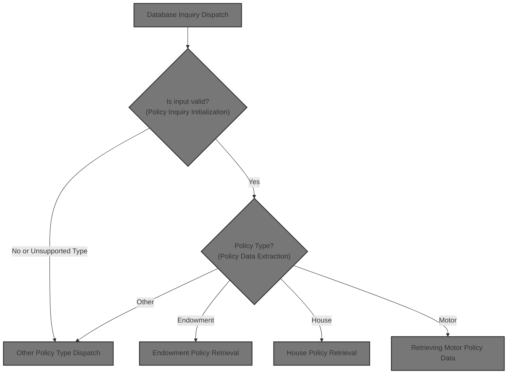
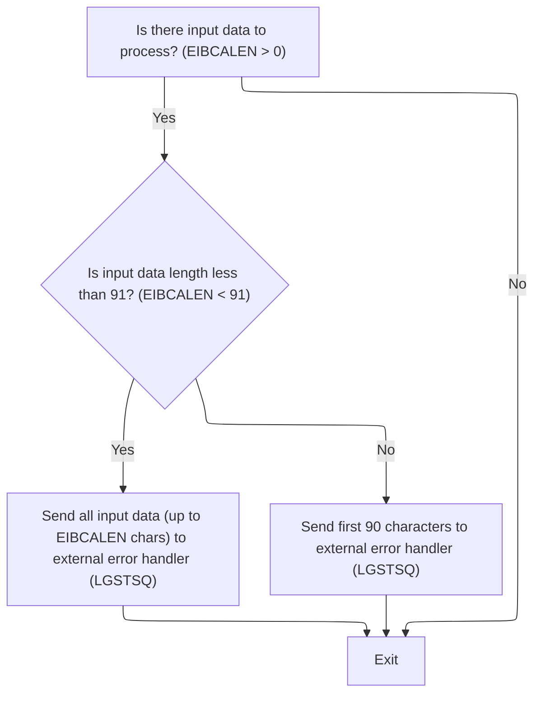
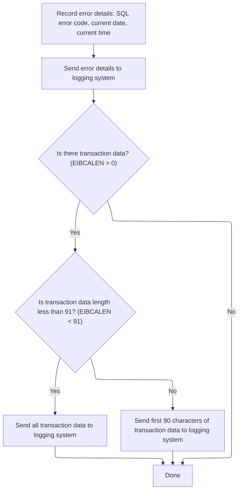
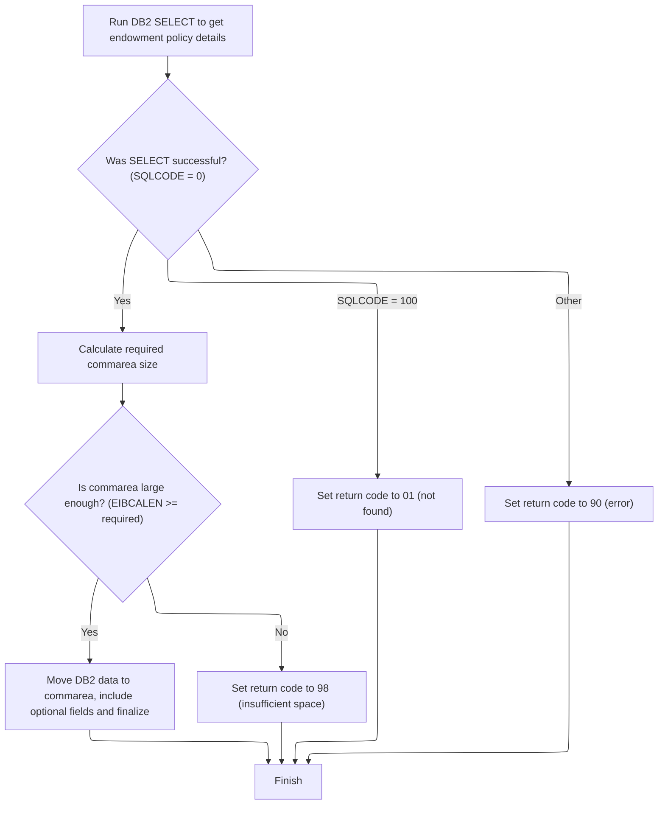
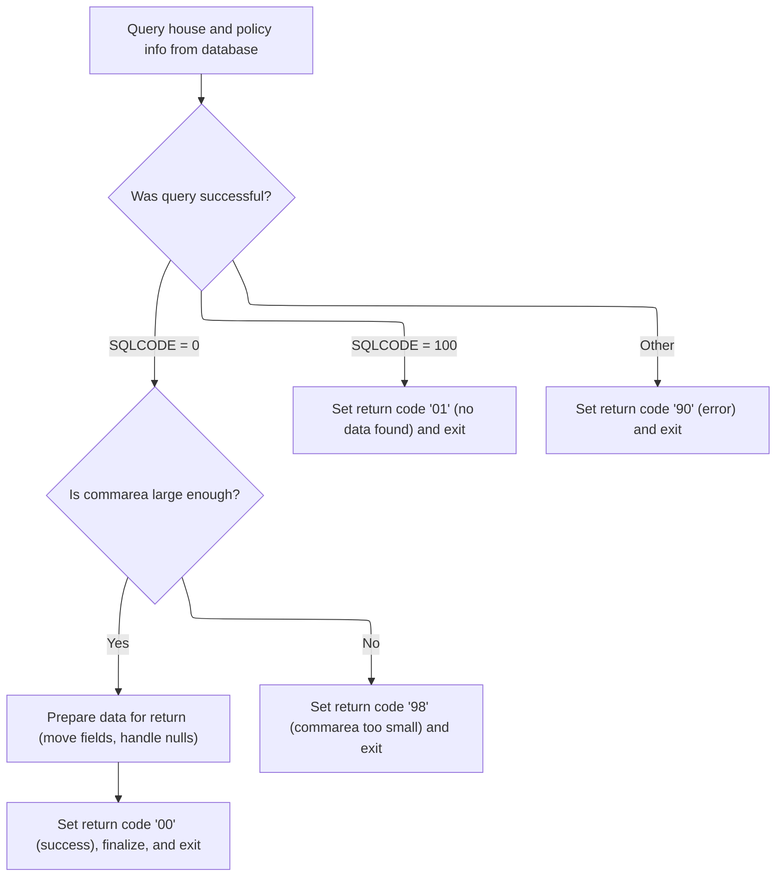
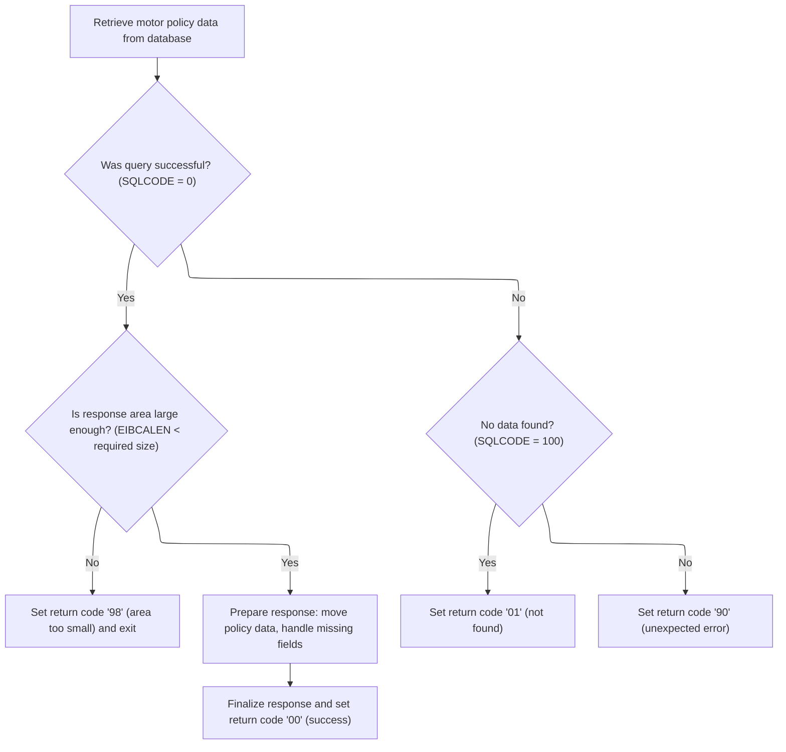

# Overview

This document describes the flow for inquiring about insurance policies. Users or systems submit a request with customer and policy identifiers and specify the policy type (Endowment, House, or Motor). The process retrieves the requested policy details or returns an error code if the policy is not found or the request is invalid.



## Dependencies

### Programs

- <SwmToken path="base/src/lgipol01.cbl" pos="13:6:6" line-data="       PROGRAM-ID. LGIPOL01.">`LGIPOL01`</SwmToken> (<SwmPath>[base/src/lgipol01.cbl](base/src/lgipol01.cbl)</SwmPath>)
- <SwmToken path="base/src/lgipol01.cbl" pos="91:9:9" line-data="           EXEC CICS LINK Program(LGIPDB01)">`LGIPDB01`</SwmToken> (<SwmPath>[base/src/lgipdb01.cbl](base/src/lgipdb01.cbl)</SwmPath>)
- LGSTSQ (<SwmPath>[base/src/lgstsq.cbl](base/src/lgstsq.cbl)</SwmPath>)

### Copybooks

- SQLCA
- LGPOLICY (<SwmPath>[base/src/lgpolicy.cpy](base/src/lgpolicy.cpy)</SwmPath>)
- LGCMAREA (<SwmPath>[base/src/lgcmarea.cpy](base/src/lgcmarea.cpy)</SwmPath>)

# Where is this program used?

This program is used multiple times in the codebase as represented in the following diagram:

```mermaid
graph TD
  jrdmu("Motor Policy Menu (LGTESTP1)") --> cqz7m("Inquire Policy Details (LGIPOL01)"):::currentEntity
click jrdmu openCode "base/src/lgtestp1.cbl:1"
x4pkd("House Policy Menu (LGTESTP3)") --> cqz7m("Inquire Policy Details (LGIPOL01)"):::currentEntity
click x4pkd openCode "base/src/lgtestp3.cbl:1"
p2qam("Endowment Policy Menu (LGTESTP2)") --> cqz7m("Inquire Policy Details (LGIPOL01)"):::currentEntity
click p2qam openCode "base/src/lgtestp2.cbl:1"
g9sms("Managing Commercial Policy Data (LGTESTP4)") --> cqz7m("Inquire Policy Details (LGIPOL01)"):::currentEntity
click g9sms openCode "base/src/lgtestp4.cbl:1"
  
  
click cqz7m openCode "base/src/lgipol01.cbl:1"
    classDef currentEntity color:#000000,fill:#7CB9F4

%% Swimm:
%% graph TD
%%   jrdmu("Motor Policy Menu (LGTESTP1)") --> cqz7m("Inquire Policy Details (<SwmToken path="base/src/lgipol01.cbl" pos="13:6:6" line-data="       PROGRAM-ID. LGIPOL01.">`LGIPOL01`</SwmToken>)"):::currentEntity
%% click jrdmu openCode "<SwmPath>[base/src/lgtestp1.cbl](base/src/lgtestp1.cbl)</SwmPath>:1"
%% x4pkd("House Policy Menu (LGTESTP3)") --> cqz7m("Inquire Policy Details (<SwmToken path="base/src/lgipol01.cbl" pos="13:6:6" line-data="       PROGRAM-ID. LGIPOL01.">`LGIPOL01`</SwmToken>)"):::currentEntity
%% click x4pkd openCode "<SwmPath>[base/src/lgtestp3.cbl](base/src/lgtestp3.cbl)</SwmPath>:1"
%% p2qam("Endowment Policy Menu (LGTESTP2)") --> cqz7m("Inquire Policy Details (<SwmToken path="base/src/lgipol01.cbl" pos="13:6:6" line-data="       PROGRAM-ID. LGIPOL01.">`LGIPOL01`</SwmToken>)"):::currentEntity
%% click p2qam openCode "<SwmPath>[base/src/lgtestp2.cbl](base/src/lgtestp2.cbl)</SwmPath>:1"
%% g9sms("Managing Commercial Policy Data (LGTESTP4)") --> cqz7m("Inquire Policy Details (<SwmToken path="base/src/lgipol01.cbl" pos="13:6:6" line-data="       PROGRAM-ID. LGIPOL01.">`LGIPOL01`</SwmToken>)"):::currentEntity
%% click g9sms openCode "<SwmPath>[base/src/lgtestp4.cbl](base/src/lgtestp4.cbl)</SwmPath>:1"
%%   
%%   
%% click cqz7m openCode "<SwmPath>[base/src/lgipol01.cbl](base/src/lgipol01.cbl)</SwmPath>:1"
%%     classDef currentEntity color:#000000,fill:#7CB9F4
```



## Input and Output Tables/Files used

### <SwmToken path="base/src/lgipol01.cbl" pos="91:9:9" line-data="           EXEC CICS LINK Program(LGIPDB01)">`LGIPDB01`</SwmToken> (<SwmPath>[base/src/lgipdb01.cbl](base/src/lgipdb01.cbl)</SwmPath>)

| Table / File Name | Type                                                                                                                    | Description                                                        | Usage Mode | Key Fields / Layout Highlights                                                                                                                                                                                                                                                                                                                                                                                                                                                                                                                                                                                                                                                                                                                                                                                                                                                                                                                                                                                                                                                                                                                                                                                                                                                                                                                                                                                                                                                                                                                                                                                                                                                                                                                                                                                                                                                                                                                                                                                                                                                                                                                                                                                                                                                                                                                                                                                                                                                                                                                                                                                                                                                                                                                                                                                                                                                                                                                                                                                                                                                                                                                                                                                                                                                                                                                                                                                                                                                                                                                                                                                                                                                                                                                                                                                                                                                                                                                                                                                                                                                                                                                                                                                                                                                                                                                                                                                                                                                                                                                                                                                                                                                                                                                                                                                                                                                                                                                                                                                                                                                                                                                                                                                                                                                                                                                                                                                                                                                                                                                                                                                                                                                                                                                                                                                                                                                                                                                                                                                                                                                                                                                                                                                                                                                                                                                                                                                                                                                                                                                                                                                                                                                                                                                                                                                                                                                                                                                                                                                                                                                                                                                                                                                                                                                                                                                                                                                                                                                                                                                                                                                                                                                                                                                                                                                                                                                                                                                                                                                                                                                                                                                                                                                                                                                                                                                                                                                                                                                                                                                                                                                                                                                                                                                                                                                                                                                                                                                                                                                                                                                                                                                                                                                                                                                                                                                                                                                                                                                                                                                                                                                                                                                                                                                                                                                                                                                                                                                                                                                                                                                                                                                                                                                                                                                                                                                                                                                                                                                                                                                                                                                                                                                                                                                                                                                                                                                                                                                                                                                                                                                                                                                                                                                                                                                                                                                                                                                                                                                                                                                                                                                                                                                                                                                                                                                                                                                                                                                                                                                                                                                                                                                                                                                                                                                                                                                                                                                                                                                                                                                                                                                                                                                                                                                                                                                                                                                                                                                                                        |
| ----------------- | ----------------------------------------------------------------------------------------------------------------------- | ------------------------------------------------------------------ | ---------- | ------------------------------------------------------------------------------------------------------------------------------------------------------------------------------------------------------------------------------------------------------------------------------------------------------------------------------------------------------------------------------------------------------------------------------------------------------------------------------------------------------------------------------------------------------------------------------------------------------------------------------------------------------------------------------------------------------------------------------------------------------------------------------------------------------------------------------------------------------------------------------------------------------------------------------------------------------------------------------------------------------------------------------------------------------------------------------------------------------------------------------------------------------------------------------------------------------------------------------------------------------------------------------------------------------------------------------------------------------------------------------------------------------------------------------------------------------------------------------------------------------------------------------------------------------------------------------------------------------------------------------------------------------------------------------------------------------------------------------------------------------------------------------------------------------------------------------------------------------------------------------------------------------------------------------------------------------------------------------------------------------------------------------------------------------------------------------------------------------------------------------------------------------------------------------------------------------------------------------------------------------------------------------------------------------------------------------------------------------------------------------------------------------------------------------------------------------------------------------------------------------------------------------------------------------------------------------------------------------------------------------------------------------------------------------------------------------------------------------------------------------------------------------------------------------------------------------------------------------------------------------------------------------------------------------------------------------------------------------------------------------------------------------------------------------------------------------------------------------------------------------------------------------------------------------------------------------------------------------------------------------------------------------------------------------------------------------------------------------------------------------------------------------------------------------------------------------------------------------------------------------------------------------------------------------------------------------------------------------------------------------------------------------------------------------------------------------------------------------------------------------------------------------------------------------------------------------------------------------------------------------------------------------------------------------------------------------------------------------------------------------------------------------------------------------------------------------------------------------------------------------------------------------------------------------------------------------------------------------------------------------------------------------------------------------------------------------------------------------------------------------------------------------------------------------------------------------------------------------------------------------------------------------------------------------------------------------------------------------------------------------------------------------------------------------------------------------------------------------------------------------------------------------------------------------------------------------------------------------------------------------------------------------------------------------------------------------------------------------------------------------------------------------------------------------------------------------------------------------------------------------------------------------------------------------------------------------------------------------------------------------------------------------------------------------------------------------------------------------------------------------------------------------------------------------------------------------------------------------------------------------------------------------------------------------------------------------------------------------------------------------------------------------------------------------------------------------------------------------------------------------------------------------------------------------------------------------------------------------------------------------------------------------------------------------------------------------------------------------------------------------------------------------------------------------------------------------------------------------------------------------------------------------------------------------------------------------------------------------------------------------------------------------------------------------------------------------------------------------------------------------------------------------------------------------------------------------------------------------------------------------------------------------------------------------------------------------------------------------------------------------------------------------------------------------------------------------------------------------------------------------------------------------------------------------------------------------------------------------------------------------------------------------------------------------------------------------------------------------------------------------------------------------------------------------------------------------------------------------------------------------------------------------------------------------------------------------------------------------------------------------------------------------------------------------------------------------------------------------------------------------------------------------------------------------------------------------------------------------------------------------------------------------------------------------------------------------------------------------------------------------------------------------------------------------------------------------------------------------------------------------------------------------------------------------------------------------------------------------------------------------------------------------------------------------------------------------------------------------------------------------------------------------------------------------------------------------------------------------------------------------------------------------------------------------------------------------------------------------------------------------------------------------------------------------------------------------------------------------------------------------------------------------------------------------------------------------------------------------------------------------------------------------------------------------------------------------------------------------------------------------------------------------------------------------------------------------------------------------------------------------------------------------------------------------------------------------------------------------------------------------------------------------------------------------------------------------------------------------------------------------------------------------------------------------------------------------------------------------------------------------------------------------------------------------------------------------------------------------------------------------------------------------------------------------------------------------------------------------------------------------------------------------------------------------------------------------------------------------------------------------------------------------------------------------------------------------------------------------------------------------------------------------------------------------------------------------------------------------------------------------------------------------------------------------------------------------------------------------------------------------------------------------------------------------------------------------------------------------------------------------------------------------------------------------------------------------------------------------------------------------------------------------------------------------------------------------------------------------------------------------------------------------------------------------------------------------------------------------------------------------------------------------------------------------------------------------------------------------------------------------------------------------------------------------------------------------------------------------------------------------------------------------------------------------------------------------------------------------------------------------------------------------------------------------------------------------------------------------------------------------------------------------------------------------------------------------------------------------------------------------------------------------------------------------------------------------------------------------------------------------------------------------------------------------------------------------------------------------------------------------------------------------------------------------------------------------------------------------------------------------------------------------------------------------------------------------------------------------------------------------------------------------------------------------------------------------------------------------------------------------------------------------------------------------------------------------------------------------------------------------------------------------------------------------------------------------------------------------------------------------------------------------------------------------------------------------------------------------------------------------------------------------------------------------------------------------------------------------------------------------------------------------------------------------------------------------------------------------------------------------------------------------------------------------------------------------------------------------------------------------------------------------------------------------------------------------------------------------------------------------------------------------------------------------------------------------------------------------------------------------------------------------------------------------------------------------------------------------------------------------------------------------------------------------------------------------------------------------------------------------------------------------------------------------------------------------------------------------------- |
| POLICY            | <SwmToken path="base/src/lgipdb01.cbl" pos="242:5:5" line-data="      * initialize DB2 host variables">`DB2`</SwmToken> | Insurance policy master data: type, number, dates, broker, payment | Input      | <SwmToken path="base/src/lgipdb01.cbl" pos="92:1:1" line-data="                   CustomerNumber,">`CustomerNumber`</SwmToken>, <SwmToken path="base/src/lgipdb01.cbl" pos="93:3:3" line-data="                   Policy.PolicyNumber,">`PolicyNumber`</SwmToken>, <SwmToken path="base/src/lgipdb01.cbl" pos="94:1:1" line-data="                   RequestDate,">`RequestDate`</SwmToken>, <SwmToken path="base/src/lgipdb01.cbl" pos="95:1:1" line-data="                   StartDate,">`StartDate`</SwmToken>, <SwmToken path="base/src/lgipdb01.cbl" pos="96:1:1" line-data="                   RenewalDate,">`RenewalDate`</SwmToken>, <SwmToken path="base/src/lgipdb01.cbl" pos="97:1:1" line-data="                   Address,">`Address`</SwmToken>, <SwmToken path="base/src/lgipdb01.cbl" pos="98:1:1" line-data="                   Zipcode,">`Zipcode`</SwmToken>, <SwmToken path="base/src/lgipdb01.cbl" pos="99:1:1" line-data="                   LatitudeN,">`LatitudeN`</SwmToken>, <SwmToken path="base/src/lgipdb01.cbl" pos="100:1:1" line-data="                   LongitudeW,">`LongitudeW`</SwmToken>, <SwmToken path="base/src/lgipol01.cbl" pos="104:20:20" line-data="      *   message will include Date, Time, Program Name, Customer      *">`Customer`</SwmToken>, <SwmToken path="base/src/lgipdb01.cbl" pos="102:1:1" line-data="                   PropertyType,">`PropertyType`</SwmToken>, <SwmToken path="base/src/lgipdb01.cbl" pos="103:1:1" line-data="                   FirePeril,">`FirePeril`</SwmToken>, <SwmToken path="base/src/lgipdb01.cbl" pos="104:1:1" line-data="                   FirePremium,">`FirePremium`</SwmToken>, <SwmToken path="base/src/lgipdb01.cbl" pos="105:1:1" line-data="                   CrimePeril,">`CrimePeril`</SwmToken>, <SwmToken path="base/src/lgipdb01.cbl" pos="106:1:1" line-data="                   CrimePremium,">`CrimePremium`</SwmToken>, <SwmToken path="base/src/lgipdb01.cbl" pos="107:1:1" line-data="                   FloodPeril,">`FloodPeril`</SwmToken>, <SwmToken path="base/src/lgipdb01.cbl" pos="108:1:1" line-data="                   FloodPremium,">`FloodPremium`</SwmToken>, <SwmToken path="base/src/lgipdb01.cbl" pos="109:1:1" line-data="                   WeatherPeril,">`WeatherPeril`</SwmToken>, <SwmToken path="base/src/lgipdb01.cbl" pos="110:1:1" line-data="                   WeatherPremium,">`WeatherPremium`</SwmToken>, <SwmToken path="base/src/lgipdb01.cbl" pos="111:1:1" line-data="                   Status,">`Status`</SwmToken>, <SwmToken path="base/src/lgipdb01.cbl" pos="112:1:1" line-data="                   RejectionReason">`RejectionReason`</SwmToken>, <SwmToken path="base/src/lgipdb01.cbl" pos="331:3:3" line-data="             SELECT  ISSUEDATE,">`ISSUEDATE`</SwmToken>, <SwmToken path="base/src/lgipdb01.cbl" pos="332:1:1" line-data="                     EXPIRYDATE,">`EXPIRYDATE`</SwmToken>, <SwmToken path="base/src/lgipdb01.cbl" pos="333:1:1" line-data="                     LASTCHANGED,">`LASTCHANGED`</SwmToken>, <SwmToken path="base/src/lgipdb01.cbl" pos="334:1:1" line-data="                     BROKERID,">`BROKERID`</SwmToken>, <SwmToken path="base/src/lgipdb01.cbl" pos="335:1:1" line-data="                     BROKERSREFERENCE,">`BROKERSREFERENCE`</SwmToken>, <SwmToken path="base/src/lgipdb01.cbl" pos="336:1:1" line-data="                     PAYMENT,">`PAYMENT`</SwmToken>, <SwmToken path="base/src/lgipdb01.cbl" pos="337:1:1" line-data="                     WITHPROFITS,">`WITHPROFITS`</SwmToken>, <SwmToken path="base/src/lgipdb01.cbl" pos="338:1:1" line-data="                     EQUITIES,">`EQUITIES`</SwmToken>, <SwmToken path="base/src/lgipdb01.cbl" pos="339:1:1" line-data="                     MANAGEDFUND,">`MANAGEDFUND`</SwmToken>, <SwmToken path="base/src/lgipdb01.cbl" pos="340:1:1" line-data="                     FUNDNAME,">`FUNDNAME`</SwmToken>, <SwmToken path="base/src/lgipdb01.cbl" pos="341:1:1" line-data="                     TERM,">`TERM`</SwmToken>, <SwmToken path="base/src/lgipdb01.cbl" pos="342:1:1" line-data="                     SUMASSURED,">`SUMASSURED`</SwmToken>, <SwmToken path="base/src/lgipdb01.cbl" pos="343:1:1" line-data="                     LIFEASSURED,">`LIFEASSURED`</SwmToken>, <SwmToken path="base/src/lgipdb01.cbl" pos="344:1:1" line-data="                     PADDINGDATA,">`PADDINGDATA`</SwmToken>, <SwmToken path="base/src/lgipol01.cbl" pos="121:1:1" line-data="                     LENGTH(LENGTH OF ERROR-MSG)">`LENGTH`</SwmToken>, <SwmToken path="base/src/lgipdb01.cbl" pos="347:2:4" line-data="                   :DB2-EXPIRYDATE,">`DB2-EXPIRYDATE`</SwmToken>, <SwmToken path="base/src/lgipdb01.cbl" pos="348:2:4" line-data="                   :DB2-LASTCHANGED,">`DB2-LASTCHANGED`</SwmToken>, <SwmToken path="base/src/lgipdb01.cbl" pos="349:11:13" line-data="                   :DB2-BROKERID-INT INDICATOR :IND-BROKERID,">`IND-BROKERID`</SwmToken>, <SwmToken path="base/src/lgipdb01.cbl" pos="350:9:11" line-data="                   :DB2-BROKERSREF INDICATOR :IND-BROKERSREF,">`IND-BROKERSREF`</SwmToken>, <SwmToken path="base/src/lgipdb01.cbl" pos="351:11:13" line-data="                   :DB2-PAYMENT-INT INDICATOR :IND-PAYMENT,">`IND-PAYMENT`</SwmToken>, <SwmToken path="base/src/lgipdb01.cbl" pos="352:2:6" line-data="                   :DB2-E-WITHPROFITS,">`DB2-E-WITHPROFITS`</SwmToken>, <SwmToken path="base/src/lgipdb01.cbl" pos="353:2:6" line-data="                   :DB2-E-EQUITIES,">`DB2-E-EQUITIES`</SwmToken>, <SwmToken path="base/src/lgipdb01.cbl" pos="354:2:6" line-data="                   :DB2-E-MANAGEDFUND,">`DB2-E-MANAGEDFUND`</SwmToken>, <SwmToken path="base/src/lgipdb01.cbl" pos="355:2:6" line-data="                   :DB2-E-FUNDNAME,">`DB2-E-FUNDNAME`</SwmToken>, <SwmToken path="base/src/lgipdb01.cbl" pos="356:2:8" line-data="                   :DB2-E-TERM-SINT,">`DB2-E-TERM-SINT`</SwmToken>, <SwmToken path="base/src/lgipdb01.cbl" pos="357:2:8" line-data="                   :DB2-E-SUMASSURED-INT,">`DB2-E-SUMASSURED-INT`</SwmToken>, <SwmToken path="base/src/lgipdb01.cbl" pos="358:2:6" line-data="                   :DB2-E-LIFEASSURED,">`DB2-E-LIFEASSURED`</SwmToken>, <SwmToken path="base/src/lgipdb01.cbl" pos="359:11:15" line-data="                   :DB2-E-PADDINGDATA INDICATOR :IND-E-PADDINGDATA,">`IND-E-PADDINGDATA`</SwmToken>, <SwmToken path="base/src/lgipdb01.cbl" pos="360:13:17" line-data="                   :DB2-E-PADDING-LEN INDICATOR :IND-E-PADDINGDATAL">`IND-E-PADDINGDATAL`</SwmToken>, <SwmToken path="base/src/lgipdb01.cbl" pos="451:1:1" line-data="                     PROPERTYTYPE,">`PROPERTYTYPE`</SwmToken>, <SwmToken path="base/src/lgipdb01.cbl" pos="452:1:1" line-data="                     BEDROOMS,">`BEDROOMS`</SwmToken>, <SwmToken path="base/src/lgipdb01.cbl" pos="453:1:1" line-data="                     VALUE,">`VALUE`</SwmToken>, <SwmToken path="base/src/lgipdb01.cbl" pos="454:1:1" line-data="                     HOUSENAME,">`HOUSENAME`</SwmToken>, <SwmToken path="base/src/lgipdb01.cbl" pos="455:1:1" line-data="                     HOUSENUMBER,">`HOUSENUMBER`</SwmToken>, <SwmToken path="base/src/lgipdb01.cbl" pos="346:4:6" line-data="             INTO  :DB2-ISSUEDATE,">`DB2-ISSUEDATE`</SwmToken>, <SwmToken path="base/src/lgipdb01.cbl" pos="463:2:6" line-data="                   :DB2-H-PROPERTYTYPE,">`DB2-H-PROPERTYTYPE`</SwmToken>, <SwmToken path="base/src/lgipdb01.cbl" pos="464:2:8" line-data="                   :DB2-H-BEDROOMS-SINT,">`DB2-H-BEDROOMS-SINT`</SwmToken>, <SwmToken path="base/src/lgipdb01.cbl" pos="465:2:8" line-data="                   :DB2-H-VALUE-INT,">`DB2-H-VALUE-INT`</SwmToken>, <SwmToken path="base/src/lgipdb01.cbl" pos="466:2:6" line-data="                   :DB2-H-HOUSENAME,">`DB2-H-HOUSENAME`</SwmToken>, <SwmToken path="base/src/lgipdb01.cbl" pos="467:2:6" line-data="                   :DB2-H-HOUSENUMBER,">`DB2-H-HOUSENUMBER`</SwmToken>, <SwmToken path="base/src/lgipdb01.cbl" pos="468:2:6" line-data="                   :DB2-H-POSTCODE">`DB2-H-POSTCODE`</SwmToken>, <SwmToken path="base/src/lgipdb01.cbl" pos="539:1:1" line-data="                     MAKE,">`MAKE`</SwmToken>, <SwmToken path="base/src/lgipdb01.cbl" pos="540:1:1" line-data="                     MODEL,">`MODEL`</SwmToken>, <SwmToken path="base/src/lgipdb01.cbl" pos="542:1:1" line-data="                     REGNUMBER,">`REGNUMBER`</SwmToken>, <SwmToken path="base/src/lgipdb01.cbl" pos="543:1:1" line-data="                     COLOUR,">`COLOUR`</SwmToken>, <SwmToken path="base/src/lgipdb01.cbl" pos="544:1:1" line-data="                     CC,">`CC`</SwmToken>, <SwmToken path="base/src/lgipdb01.cbl" pos="545:1:1" line-data="                     YEAROFMANUFACTURE,">`YEAROFMANUFACTURE`</SwmToken>, <SwmToken path="base/src/lgipdb01.cbl" pos="546:1:1" line-data="                     PREMIUM,">`PREMIUM`</SwmToken>, <SwmToken path="base/src/lgipdb01.cbl" pos="554:2:6" line-data="                   :DB2-M-MAKE,">`DB2-M-MAKE`</SwmToken>, <SwmToken path="base/src/lgipdb01.cbl" pos="555:2:6" line-data="                   :DB2-M-MODEL,">`DB2-M-MODEL`</SwmToken>, <SwmToken path="base/src/lgipdb01.cbl" pos="556:2:8" line-data="                   :DB2-M-VALUE-INT,">`DB2-M-VALUE-INT`</SwmToken>, <SwmToken path="base/src/lgipdb01.cbl" pos="557:2:6" line-data="                   :DB2-M-REGNUMBER,">`DB2-M-REGNUMBER`</SwmToken>, <SwmToken path="base/src/lgipdb01.cbl" pos="558:2:6" line-data="                   :DB2-M-COLOUR,">`DB2-M-COLOUR`</SwmToken>, <SwmToken path="base/src/lgipdb01.cbl" pos="559:2:8" line-data="                   :DB2-M-CC-SINT,">`DB2-M-CC-SINT`</SwmToken>, <SwmToken path="base/src/lgipdb01.cbl" pos="560:2:6" line-data="                   :DB2-M-MANUFACTURED,">`DB2-M-MANUFACTURED`</SwmToken>, <SwmToken path="base/src/lgipdb01.cbl" pos="561:2:8" line-data="                   :DB2-M-PREMIUM-INT,">`DB2-M-PREMIUM-INT`</SwmToken>, <SwmToken path="base/src/lgipdb01.cbl" pos="562:2:8" line-data="                   :DB2-M-ACCIDENTS-INT">`DB2-M-ACCIDENTS-INT`</SwmToken>, <SwmToken path="base/src/lgipdb01.cbl" pos="655:2:6" line-data="                   :DB2-B-Address,">`DB2-B-Address`</SwmToken>, <SwmToken path="base/src/lgipdb01.cbl" pos="656:2:6" line-data="                   :DB2-B-Postcode,">`DB2-B-Postcode`</SwmToken>, <SwmToken path="base/src/lgipdb01.cbl" pos="657:2:6" line-data="                   :DB2-B-Latitude,">`DB2-B-Latitude`</SwmToken>, <SwmToken path="base/src/lgipdb01.cbl" pos="658:2:6" line-data="                   :DB2-B-Longitude,">`DB2-B-Longitude`</SwmToken>, <SwmToken path="base/src/lgipdb01.cbl" pos="659:2:6" line-data="                   :DB2-B-Customer,">`DB2-B-Customer`</SwmToken>, <SwmToken path="base/src/lgipdb01.cbl" pos="660:2:6" line-data="                   :DB2-B-PropType,">`DB2-B-PropType`</SwmToken>, <SwmToken path="base/src/lgipdb01.cbl" pos="182:3:9" line-data="           03 DB2-B-FirePeril-Int      PIC S9(4) COMP.">`DB2-B-FirePeril-Int`</SwmToken>, <SwmToken path="base/src/lgipdb01.cbl" pos="183:3:9" line-data="           03 DB2-B-FirePremium-Int    PIC S9(9) COMP.">`DB2-B-FirePremium-Int`</SwmToken>, <SwmToken path="base/src/lgipdb01.cbl" pos="184:3:9" line-data="           03 DB2-B-CrimePeril-Int     PIC S9(4) COMP.">`DB2-B-CrimePeril-Int`</SwmToken>, <SwmToken path="base/src/lgipdb01.cbl" pos="185:3:9" line-data="           03 DB2-B-CrimePremium-Int   PIC S9(9) COMP.">`DB2-B-CrimePremium-Int`</SwmToken>, <SwmToken path="base/src/lgipdb01.cbl" pos="186:3:9" line-data="           03 DB2-B-FloodPeril-Int     PIC S9(4) COMP.">`DB2-B-FloodPeril-Int`</SwmToken>, <SwmToken path="base/src/lgipdb01.cbl" pos="187:3:9" line-data="           03 DB2-B-FloodPremium-Int   PIC S9(9) COMP.">`DB2-B-FloodPremium-Int`</SwmToken>, <SwmToken path="base/src/lgipdb01.cbl" pos="188:3:9" line-data="           03 DB2-B-WeatherPeril-Int   PIC S9(4) COMP.">`DB2-B-WeatherPeril-Int`</SwmToken>, <SwmToken path="base/src/lgipdb01.cbl" pos="189:3:9" line-data="           03 DB2-B-WeatherPremium-Int PIC S9(9) COMP.">`DB2-B-WeatherPremium-Int`</SwmToken>, <SwmToken path="base/src/lgipdb01.cbl" pos="190:3:9" line-data="           03 DB2-B-Status-Int         PIC S9(4) COMP.">`DB2-B-Status-Int`</SwmToken>, <SwmToken path="base/src/lgipdb01.cbl" pos="670:2:6" line-data="                   :DB2-B-RejectReason">`DB2-B-RejectReason`</SwmToken>, <SwmToken path="base/src/lgipdb01.cbl" pos="263:11:15" line-data="           MOVE CA-CUSTOMER-NUM TO DB2-CUSTOMERNUM-INT">`DB2-CUSTOMERNUM-INT`</SwmToken> |

## Detailed View of the Program's Functionality

# Startup and Input Validation

At startup, the main entry point prepares the transaction context by initializing a header structure that will hold system identifiers and runtime information. It then copies the transaction ID, terminal ID, and task number from the system environment into this header for traceability.

Immediately after, the code checks if any input data was received (the commarea). If no input is present, it sets an error message indicating that no commarea was received. It then calls a dedicated error logging routine to record this event, including all relevant details. After logging, the program triggers an abnormal end (abend) to halt further processing, ensuring that the missing input is both traceable in logs and does not result in silent failure.

If input is present, the code initializes the return code in the commarea to indicate success, records the input length, and sets up a pointer to the commarea for downstream use.

Finally, the mainline links to the database inquiry program, passing the commarea and specifying a maximum length for the data exchange. Once the database inquiry is complete, the program returns control to the caller.

# Error Logging and Timestamping

When an error needs to be logged, the error logging routine is invoked. This routine first captures the current database status code (SQLCODE) and obtains the current system time and date. These details are formatted and inserted into the error message structure, ensuring that every error log contains both the database status and an exact timestamp.

The error message is then sent to a system queue handler program, which is responsible for pushing the error details into both temporary and transactional queues. This ensures that errors are available for downstream logging, monitoring, or integration.

Additionally, if there is input data in the commarea, the routine slices up to 90 bytes (or the full length if less than 91 bytes) and sends this data to the queue handler as a separate message. This guarantees that all error context, including relevant input data, is captured for audit and troubleshooting.

# Queue Assignment and Message Routing

The queue handler program starts by clearing its message and receive buffers. It then assigns system and program context, determining whether the transaction was invoked directly by another program or received from a terminal.

If the transaction was invoked by a program, it sets a flag to indicate this and prepares the message data from the input commarea. If the transaction was received from a terminal, it performs a receive operation to collect the input, sets a different flag, and adjusts the message length accordingly.

The queue name is set to a default value, but if the message starts with a special prefix (such as 'Q='), the handler extracts an extension from the message and adjusts the queue name and message content. The message length is also adjusted to account for the prefix.

After preparing the message, the handler writes it to both a temporary queue and a transactional queue. The transactional queue write is performed with a "no suspend" option, meaning the operation will not block if the queue is full.

If the message was received from a terminal, the handler sends a minimal response back to the terminal to acknowledge receipt. Finally, the handler returns control, completing the message cycle.

# Error Message Propagation

After logging the initial error, the error logging routine checks if there is additional input data in the commarea. If so, it slices the data into chunks (up to 90 bytes each) and sends each chunk to the queue handler program, ensuring that all relevant error context is captured and logged.

# Database Inquiry Dispatch

Once error handling is complete, the mainline resets the return code and prepares the commarea pointer. It then links to the database inquiry program, which is responsible for retrieving policy details based on the input.

# Policy Inquiry Initialization

The database inquiry program begins by initializing all working storage and database host variables to ensure a clean start for each inquiry. It then copies system identifiers into its header for traceability.

If no input data is present, it logs an error and abends, ensuring that every failure is recorded for audit.

Next, the program converts customer and policy numbers from the input into integer format for use in database queries. These values are also saved in the error message structure in case they are needed for logging.

The program then determines which type of policy is being requested by examining the request type field. It uses a branching structure to select the appropriate handler for each policy type, making future expansion straightforward.

# Endowment Policy Retrieval

For endowment policies, the program runs a database SELECT to retrieve all relevant fields, including dates, broker information, payment details, and optional fields such as padding data. Indicator variables are used to handle nullable fields.

The program calculates the required size of the commarea to hold all the data, including any optional fields. If the commarea is too small, it sets an error code and returns. If the commarea is large enough, it moves the database data into the commarea, skipping null fields as indicated by the indicator variables.

After all data is moved, the program marks the end of the policy data with a special indicator. If the database query fails, it sets an appropriate error code and logs the error using the error logging routine.

# House Policy Retrieval

For house policies, the program runs a database SELECT to retrieve all relevant fields, including property details and broker information. Indicator variables are used to handle nullable fields.

The program calculates the required size of the commarea and checks if it is large enough. If not, it sets an error code and returns. If the commarea is sufficient, it moves the database data into the commarea, handling integer fields and skipping nulls as indicated.

After moving all data, the program marks the end of the house data with a special indicator. SQL errors are handled by setting specific return codes and logging the error.

# Motor Policy Retrieval

For motor policies, the program runs a database SELECT to retrieve all relevant fields, including vehicle details and broker information. Indicator variables are used to handle nullable fields.

The program calculates the required size of the commarea and checks if it is large enough. If not, it sets an error code and returns. If the commarea is sufficient, it moves the database data into the commarea, handling integer fields and skipping nulls as indicated.

After moving all data, the program marks the end of the motor data with a special indicator. SQL errors are handled by setting specific return codes and logging the error.

# Other Policy Type Dispatch

For other policy types (such as commercial policies), the program uses a similar branching structure to select the appropriate handler. Each handler retrieves and formats the relevant data, or sets an error code if the type is not supported.

# Database Error Logging

Whenever a database error occurs, the error logging routine is invoked. This routine captures the SQLCODE, current date, and time, and sends the error details to the logging system. If there is transaction data present, it slices the data and sends it to the logging system as well, ensuring comprehensive error context is captured.

# Summary

The overall flow ensures that every transaction is fully traceable, with comprehensive error logging and context capture. Policy inquiries are handled in a modular fashion, with dedicated handlers for each policy type and robust error handling throughout. All errors and relevant input data are pushed to system queues for downstream processing, monitoring, and audit.

# Data Definitions

### <SwmToken path="base/src/lgipol01.cbl" pos="91:9:9" line-data="           EXEC CICS LINK Program(LGIPDB01)">`LGIPDB01`</SwmToken> (<SwmPath>[base/src/lgipdb01.cbl](base/src/lgipdb01.cbl)</SwmPath>)

| Table / Record Name | Type                                                                                                                    | Short Description                                                  | Usage Mode             |
| ------------------- | ----------------------------------------------------------------------------------------------------------------------- | ------------------------------------------------------------------ | ---------------------- |
| POLICY              | <SwmToken path="base/src/lgipdb01.cbl" pos="242:5:5" line-data="      * initialize DB2 host variables">`DB2`</SwmToken> | Insurance policy master data: type, number, dates, broker, payment | Input (DECLARE/SELECT) |

# Rule Definition

| Paragraph Name                                                                                                                                                                                                                                                                                                                                                                                                                                                                                                                                                                                                                                                                                                                                          | Rule ID | Category          | Description                                                                                                                                                                                                                                                                                                                                                                                                              | Conditions                                                                                                                                                                                | Remarks                                                                                                                                                                                                                                                                                                                                                                                                                                                                                                                                                                                                                                                                                                                                                                                                                                                                                         |
| ------------------------------------------------------------------------------------------------------------------------------------------------------------------------------------------------------------------------------------------------------------------------------------------------------------------------------------------------------------------------------------------------------------------------------------------------------------------------------------------------------------------------------------------------------------------------------------------------------------------------------------------------------------------------------------------------------------------------------------------------------- | ------- | ----------------- | ------------------------------------------------------------------------------------------------------------------------------------------------------------------------------------------------------------------------------------------------------------------------------------------------------------------------------------------------------------------------------------------------------------------------ | ----------------------------------------------------------------------------------------------------------------------------------------------------------------------------------------- | ----------------------------------------------------------------------------------------------------------------------------------------------------------------------------------------------------------------------------------------------------------------------------------------------------------------------------------------------------------------------------------------------------------------------------------------------------------------------------------------------------------------------------------------------------------------------------------------------------------------------------------------------------------------------------------------------------------------------------------------------------------------------------------------------------------------------------------------------------------------------------------------------- |
| MAINLINE SECTION (<SwmPath>[base/src/lgipol01.cbl](base/src/lgipol01.cbl)</SwmPath>), MAINLINE SECTION (<SwmPath>[base/src/lgipdb01.cbl](base/src/lgipdb01.cbl)</SwmPath>)                                                                                                                                                                                                                                                                                                                                                                                                                                                                                                                                                                              | RL-001  | Conditional Logic | The program must check if the input buffer (DFHCOMMAREA) is present and contains at least the required header fields. If not, it must abend the transaction and generate error messages.                                                                                                                                                                                                                                 | EIBCALEN is zero or less than required header size.                                                                                                                                       | Abend code is 'LGCA'. Error messages must be written to TDQ (CSMT) and TSQ (GENAERRS).                                                                                                                                                                                                                                                                                                                                                                                                                                                                                                                                                                                                                                                                                                                                                                                                          |
| MAINLINE SECTION (<SwmPath>[base/src/lgipdb01.cbl](base/src/lgipdb01.cbl)</SwmPath>)                                                                                                                                                                                                                                                                                                                                                                                                                                                                                                                                                                                                                                                                    | RL-002  | Conditional Logic | The program determines the requested policy type from <SwmToken path="base/src/lgipdb01.cbl" pos="275:9:13" line-data="           MOVE FUNCTION UPPER-CASE(CA-REQUEST-ID) TO WS-REQUEST-ID">`CA-REQUEST-ID`</SwmToken> and selects the corresponding <SwmToken path="base/src/lgipdb01.cbl" pos="242:5:5" line-data="      * initialize DB2 host variables">`DB2`</SwmToken> query and policy block layout.              | <SwmToken path="base/src/lgipdb01.cbl" pos="275:9:13" line-data="           MOVE FUNCTION UPPER-CASE(CA-REQUEST-ID) TO WS-REQUEST-ID">`CA-REQUEST-ID`</SwmToken> present in input buffer. | Supported types: <SwmToken path="base/src/lgipdb01.cbl" pos="279:4:4" line-data="             WHEN &#39;01IEND&#39;">`01IEND`</SwmToken>, <SwmToken path="base/src/lgipdb01.cbl" pos="283:4:4" line-data="             WHEN &#39;01IHOU&#39;">`01IHOU`</SwmToken>, <SwmToken path="base/src/lgipdb01.cbl" pos="287:4:4" line-data="             WHEN &#39;01IMOT&#39;">`01IMOT`</SwmToken>, <SwmToken path="base/src/lgipdb01.cbl" pos="291:4:4" line-data="             WHEN &#39;01ICOM&#39;">`01ICOM`</SwmToken>, <SwmToken path="base/src/lgipdb01.cbl" pos="295:4:4" line-data="             WHEN &#39;02ICOM&#39;">`02ICOM`</SwmToken>, <SwmToken path="base/src/lgipdb01.cbl" pos="299:4:4" line-data="             WHEN &#39;03ICOM&#39;">`03ICOM`</SwmToken>, <SwmToken path="base/src/lgipdb01.cbl" pos="303:4:4" line-data="             WHEN &#39;05ICOM&#39;">`05ICOM`</SwmToken>. |
| <SwmToken path="base/src/lgipdb01.cbl" pos="281:3:9" line-data="               PERFORM GET-ENDOW-DB2-INFO">`GET-ENDOW-DB2-INFO`</SwmToken>, <SwmToken path="base/src/lgipdb01.cbl" pos="285:3:9" line-data="               PERFORM GET-HOUSE-DB2-INFO">`GET-HOUSE-DB2-INFO`</SwmToken>, <SwmToken path="base/src/lgipdb01.cbl" pos="289:3:9" line-data="               PERFORM GET-MOTOR-DB2-INFO">`GET-MOTOR-DB2-INFO`</SwmToken>, <SwmToken path="base/src/lgipdb01.cbl" pos="293:3:9" line-data="               PERFORM GET-COMMERCIAL-DB2-INFO-1">`GET-COMMERCIAL-DB2-INFO`</SwmToken>-\* (<SwmPath>[base/src/lgipdb01.cbl](base/src/lgipdb01.cbl)</SwmPath>)                                                                                       | RL-003  | Computation       | For each policy type, the program queries the relevant <SwmToken path="base/src/lgipdb01.cbl" pos="242:5:5" line-data="      * initialize DB2 host variables">`DB2`</SwmToken> tables using the customer and policy numbers provided.                                                                                                                                                                                    | Valid customer and policy numbers present in input buffer.                                                                                                                                | <SwmToken path="base/src/lgipdb01.cbl" pos="242:5:5" line-data="      * initialize DB2 host variables">`DB2`</SwmToken> queries use host variables mapped from input buffer fields. Indicator variables are used for nullable fields.                                                                                                                                                                                                                                                                                                                                                                                                                                                                                                                                                                                                                                                           |
| <SwmToken path="base/src/lgipdb01.cbl" pos="281:3:9" line-data="               PERFORM GET-ENDOW-DB2-INFO">`GET-ENDOW-DB2-INFO`</SwmToken>, <SwmToken path="base/src/lgipdb01.cbl" pos="285:3:9" line-data="               PERFORM GET-HOUSE-DB2-INFO">`GET-HOUSE-DB2-INFO`</SwmToken>, <SwmToken path="base/src/lgipdb01.cbl" pos="289:3:9" line-data="               PERFORM GET-MOTOR-DB2-INFO">`GET-MOTOR-DB2-INFO`</SwmToken>, <SwmToken path="base/src/lgipdb01.cbl" pos="293:3:9" line-data="               PERFORM GET-COMMERCIAL-DB2-INFO-1">`GET-COMMERCIAL-DB2-INFO`</SwmToken>-\* (<SwmPath>[base/src/lgipdb01.cbl](base/src/lgipdb01.cbl)</SwmPath>)                                                                                       | RL-004  | Data Assignment   | If <SwmToken path="base/src/lgipdb01.cbl" pos="242:5:5" line-data="      * initialize DB2 host variables">`DB2`</SwmToken> query is successful, populate output buffer (DFHCOMMAREA) with header fields and policy-specific block, using exact field order and lengths as defined for each policy type.                                                                                                                  | <SwmToken path="base/src/lgipdb01.cbl" pos="242:5:5" line-data="      * initialize DB2 host variables">`DB2`</SwmToken> query successful (SQLCODE = 0), buffer size sufficient.           | Field order and lengths must match policy type definition. For endowment, PADDINGDATA is appended after fixed fields if present. 'FINAL' marker (5 bytes) is placed at end of block.                                                                                                                                                                                                                                                                                                                                                                                                                                                                                                                                                                                                                                                                                                            |
| <SwmToken path="base/src/lgipdb01.cbl" pos="281:3:9" line-data="               PERFORM GET-ENDOW-DB2-INFO">`GET-ENDOW-DB2-INFO`</SwmToken>, <SwmToken path="base/src/lgipdb01.cbl" pos="285:3:9" line-data="               PERFORM GET-HOUSE-DB2-INFO">`GET-HOUSE-DB2-INFO`</SwmToken>, <SwmToken path="base/src/lgipdb01.cbl" pos="289:3:9" line-data="               PERFORM GET-MOTOR-DB2-INFO">`GET-MOTOR-DB2-INFO`</SwmToken>, <SwmToken path="base/src/lgipdb01.cbl" pos="293:3:9" line-data="               PERFORM GET-COMMERCIAL-DB2-INFO-1">`GET-COMMERCIAL-DB2-INFO`</SwmToken>-\* (<SwmPath>[base/src/lgipdb01.cbl](base/src/lgipdb01.cbl)</SwmPath>)                                                                                       | RL-005  | Conditional Logic | If any <SwmToken path="base/src/lgipdb01.cbl" pos="242:5:5" line-data="      * initialize DB2 host variables">`DB2`</SwmToken> field is null (as indicated by indicator variables), the corresponding field in the output buffer must remain as initialized (spaces or zeros), and must not be overwritten or padded with default values.                                                                                | Indicator variable for <SwmToken path="base/src/lgipdb01.cbl" pos="242:5:5" line-data="      * initialize DB2 host variables">`DB2`</SwmToken> field is -1 (null).                        | Fields remain as initialized (spaces or zeros). No default padding.                                                                                                                                                                                                                                                                                                                                                                                                                                                                                                                                                                                                                                                                                                                                                                                                                             |
| <SwmToken path="base/src/lgipdb01.cbl" pos="281:3:9" line-data="               PERFORM GET-ENDOW-DB2-INFO">`GET-ENDOW-DB2-INFO`</SwmToken>, <SwmToken path="base/src/lgipdb01.cbl" pos="285:3:9" line-data="               PERFORM GET-HOUSE-DB2-INFO">`GET-HOUSE-DB2-INFO`</SwmToken>, <SwmToken path="base/src/lgipdb01.cbl" pos="289:3:9" line-data="               PERFORM GET-MOTOR-DB2-INFO">`GET-MOTOR-DB2-INFO`</SwmToken>, <SwmToken path="base/src/lgipdb01.cbl" pos="293:3:9" line-data="               PERFORM GET-COMMERCIAL-DB2-INFO-1">`GET-COMMERCIAL-DB2-INFO`</SwmToken>-\* (<SwmPath>[base/src/lgipdb01.cbl](base/src/lgipdb01.cbl)</SwmPath>), MAINLINE SECTION (<SwmPath>[base/src/lgipdb01.cbl](base/src/lgipdb01.cbl)</SwmPath>) | RL-006  | Data Assignment   | Set <SwmToken path="base/src/lgipol01.cbl" pos="86:9:13" line-data="           MOVE &#39;00&#39; TO CA-RETURN-CODE">`CA-RETURN-CODE`</SwmToken> to specific values for error conditions: '98' for buffer too small, '01' for policy not found, '99' for unsupported policy type, '90' for <SwmToken path="base/src/lgipdb01.cbl" pos="242:5:5" line-data="      * initialize DB2 host variables">`DB2`</SwmToken> error. | Error condition detected during processing.                                                                                                                                               | <SwmToken path="base/src/lgipol01.cbl" pos="86:9:13" line-data="           MOVE &#39;00&#39; TO CA-RETURN-CODE">`CA-RETURN-CODE`</SwmToken> values: '98', '01', '99', '90'.                                                                                                                                                                                                                                                                                                                                                                                                                                                                                                                                                                                                                                                                                                                     |
| <SwmToken path="base/src/lgipol01.cbl" pos="81:3:7" line-data="               PERFORM WRITE-ERROR-MESSAGE">`WRITE-ERROR-MESSAGE`</SwmToken> (<SwmPath>[base/src/lgipol01.cbl](base/src/lgipol01.cbl)</SwmPath>, <SwmPath>[base/src/lgipdb01.cbl](base/src/lgipdb01.cbl)</SwmPath>), MAINLINE SECTION (<SwmPath>[base/src/lgstsq.cbl](base/src/lgstsq.cbl)</SwmPath>)                                                                                                                                                                                                                                                                                                                                                                                    | RL-007  | Computation       | Error messages must include timestamp, program name, customer number, policy number, SQL request description, and SQLCODE. Messages are written to TDQ (CSMT) and TSQ (GENAERRS) by default. If message starts with 'Q=xxxx', TSQ name is changed to 'GENAxxxx' and prefix is stripped.                                                                                                                                  | Error condition detected, or message to be queued.                                                                                                                                        | Error message format: 4 bytes system ID, 1 byte filler, 90 bytes message text. Timestamp format: MMDDYYYY HHMMSS. TDQ name: 'CSMT'. Default TSQ name: 'GENAERRS', or 'GENAxxxx' if message starts with 'Q=xxxx'.                                                                                                                                                                                                                                                                                                                                                                                                                                                                                                                                                                                                                                                                                |
| MAINLINE SECTION (<SwmPath>[base/src/lgstsq.cbl](base/src/lgstsq.cbl)</SwmPath>)                                                                                                                                                                                                                                                                                                                                                                                                                                                                                                                                                                                                                                                                        | RL-008  | Data Assignment   | If the message is received from terminal, a minimal response (1 byte) must be sent back after queueing.                                                                                                                                                                                                                                                                                                                  | Message received from terminal (not invoked as subprogram).                                                                                                                               | Minimal response is 1 byte, sent after queueing message.                                                                                                                                                                                                                                                                                                                                                                                                                                                                                                                                                                                                                                                                                                                                                                                                                                        |
| MAINLINE SECTION (<SwmPath>[base/src/lgipol01.cbl](base/src/lgipol01.cbl)</SwmPath>, <SwmPath>[base/src/lgipdb01.cbl](base/src/lgipdb01.cbl)</SwmPath>)                                                                                                                                                                                                                                                                                                                                                                                                                                                                                                                                                                                                 | RL-009  | Data Assignment   | The program must return control with the output buffer populated and <SwmToken path="base/src/lgipol01.cbl" pos="86:9:13" line-data="           MOVE &#39;00&#39; TO CA-RETURN-CODE">`CA-RETURN-CODE`</SwmToken> set according to the result.                                                                                                                                                                            | End of processing.                                                                                                                                                                        | Output buffer contains header and policy block, <SwmToken path="base/src/lgipol01.cbl" pos="86:9:13" line-data="           MOVE &#39;00&#39; TO CA-RETURN-CODE">`CA-RETURN-CODE`</SwmToken> reflects result.                                                                                                                                                                                                                                                                                                                                                                                                                                                                                                                                                                                                                                                                                    |

# User Stories

## User Story 1: Process policy request, including input validation, <SwmToken path="base/src/lgipdb01.cbl" pos="242:5:5" line-data="      * initialize DB2 host variables">`DB2`</SwmToken> querying, and output buffer population

---

### Story Description:

As a user, I want to request policy information by providing customer and policy numbers and policy type so that I receive the correct policy data in the expected format, or an appropriate error code if the request cannot be fulfilled, with all necessary input validation and error handling.

---

### Business Rule Mapping:

| Rule ID | Paragraph Name                                                                                                                                                                                                                                                                                                                                                                                                                                                                                                                                                                                                                                                                                                                                          | Rule Description                                                                                                                                                                                                                                                                                                                                                                                                         |
| ------- | ------------------------------------------------------------------------------------------------------------------------------------------------------------------------------------------------------------------------------------------------------------------------------------------------------------------------------------------------------------------------------------------------------------------------------------------------------------------------------------------------------------------------------------------------------------------------------------------------------------------------------------------------------------------------------------------------------------------------------------------------------- | ------------------------------------------------------------------------------------------------------------------------------------------------------------------------------------------------------------------------------------------------------------------------------------------------------------------------------------------------------------------------------------------------------------------------ |
| RL-003  | <SwmToken path="base/src/lgipdb01.cbl" pos="281:3:9" line-data="               PERFORM GET-ENDOW-DB2-INFO">`GET-ENDOW-DB2-INFO`</SwmToken>, <SwmToken path="base/src/lgipdb01.cbl" pos="285:3:9" line-data="               PERFORM GET-HOUSE-DB2-INFO">`GET-HOUSE-DB2-INFO`</SwmToken>, <SwmToken path="base/src/lgipdb01.cbl" pos="289:3:9" line-data="               PERFORM GET-MOTOR-DB2-INFO">`GET-MOTOR-DB2-INFO`</SwmToken>, <SwmToken path="base/src/lgipdb01.cbl" pos="293:3:9" line-data="               PERFORM GET-COMMERCIAL-DB2-INFO-1">`GET-COMMERCIAL-DB2-INFO`</SwmToken>-\* (<SwmPath>[base/src/lgipdb01.cbl](base/src/lgipdb01.cbl)</SwmPath>)                                                                                       | For each policy type, the program queries the relevant <SwmToken path="base/src/lgipdb01.cbl" pos="242:5:5" line-data="      * initialize DB2 host variables">`DB2`</SwmToken> tables using the customer and policy numbers provided.                                                                                                                                                                                    |
| RL-004  | <SwmToken path="base/src/lgipdb01.cbl" pos="281:3:9" line-data="               PERFORM GET-ENDOW-DB2-INFO">`GET-ENDOW-DB2-INFO`</SwmToken>, <SwmToken path="base/src/lgipdb01.cbl" pos="285:3:9" line-data="               PERFORM GET-HOUSE-DB2-INFO">`GET-HOUSE-DB2-INFO`</SwmToken>, <SwmToken path="base/src/lgipdb01.cbl" pos="289:3:9" line-data="               PERFORM GET-MOTOR-DB2-INFO">`GET-MOTOR-DB2-INFO`</SwmToken>, <SwmToken path="base/src/lgipdb01.cbl" pos="293:3:9" line-data="               PERFORM GET-COMMERCIAL-DB2-INFO-1">`GET-COMMERCIAL-DB2-INFO`</SwmToken>-\* (<SwmPath>[base/src/lgipdb01.cbl](base/src/lgipdb01.cbl)</SwmPath>)                                                                                       | If <SwmToken path="base/src/lgipdb01.cbl" pos="242:5:5" line-data="      * initialize DB2 host variables">`DB2`</SwmToken> query is successful, populate output buffer (DFHCOMMAREA) with header fields and policy-specific block, using exact field order and lengths as defined for each policy type.                                                                                                                  |
| RL-005  | <SwmToken path="base/src/lgipdb01.cbl" pos="281:3:9" line-data="               PERFORM GET-ENDOW-DB2-INFO">`GET-ENDOW-DB2-INFO`</SwmToken>, <SwmToken path="base/src/lgipdb01.cbl" pos="285:3:9" line-data="               PERFORM GET-HOUSE-DB2-INFO">`GET-HOUSE-DB2-INFO`</SwmToken>, <SwmToken path="base/src/lgipdb01.cbl" pos="289:3:9" line-data="               PERFORM GET-MOTOR-DB2-INFO">`GET-MOTOR-DB2-INFO`</SwmToken>, <SwmToken path="base/src/lgipdb01.cbl" pos="293:3:9" line-data="               PERFORM GET-COMMERCIAL-DB2-INFO-1">`GET-COMMERCIAL-DB2-INFO`</SwmToken>-\* (<SwmPath>[base/src/lgipdb01.cbl](base/src/lgipdb01.cbl)</SwmPath>)                                                                                       | If any <SwmToken path="base/src/lgipdb01.cbl" pos="242:5:5" line-data="      * initialize DB2 host variables">`DB2`</SwmToken> field is null (as indicated by indicator variables), the corresponding field in the output buffer must remain as initialized (spaces or zeros), and must not be overwritten or padded with default values.                                                                                |
| RL-006  | <SwmToken path="base/src/lgipdb01.cbl" pos="281:3:9" line-data="               PERFORM GET-ENDOW-DB2-INFO">`GET-ENDOW-DB2-INFO`</SwmToken>, <SwmToken path="base/src/lgipdb01.cbl" pos="285:3:9" line-data="               PERFORM GET-HOUSE-DB2-INFO">`GET-HOUSE-DB2-INFO`</SwmToken>, <SwmToken path="base/src/lgipdb01.cbl" pos="289:3:9" line-data="               PERFORM GET-MOTOR-DB2-INFO">`GET-MOTOR-DB2-INFO`</SwmToken>, <SwmToken path="base/src/lgipdb01.cbl" pos="293:3:9" line-data="               PERFORM GET-COMMERCIAL-DB2-INFO-1">`GET-COMMERCIAL-DB2-INFO`</SwmToken>-\* (<SwmPath>[base/src/lgipdb01.cbl](base/src/lgipdb01.cbl)</SwmPath>), MAINLINE SECTION (<SwmPath>[base/src/lgipdb01.cbl](base/src/lgipdb01.cbl)</SwmPath>) | Set <SwmToken path="base/src/lgipol01.cbl" pos="86:9:13" line-data="           MOVE &#39;00&#39; TO CA-RETURN-CODE">`CA-RETURN-CODE`</SwmToken> to specific values for error conditions: '98' for buffer too small, '01' for policy not found, '99' for unsupported policy type, '90' for <SwmToken path="base/src/lgipdb01.cbl" pos="242:5:5" line-data="      * initialize DB2 host variables">`DB2`</SwmToken> error. |
| RL-001  | MAINLINE SECTION (<SwmPath>[base/src/lgipol01.cbl](base/src/lgipol01.cbl)</SwmPath>), MAINLINE SECTION (<SwmPath>[base/src/lgipdb01.cbl](base/src/lgipdb01.cbl)</SwmPath>)                                                                                                                                                                                                                                                                                                                                                                                                                                                                                                                                                                              | The program must check if the input buffer (DFHCOMMAREA) is present and contains at least the required header fields. If not, it must abend the transaction and generate error messages.                                                                                                                                                                                                                                 |
| RL-002  | MAINLINE SECTION (<SwmPath>[base/src/lgipdb01.cbl](base/src/lgipdb01.cbl)</SwmPath>)                                                                                                                                                                                                                                                                                                                                                                                                                                                                                                                                                                                                                                                                    | The program determines the requested policy type from <SwmToken path="base/src/lgipdb01.cbl" pos="275:9:13" line-data="           MOVE FUNCTION UPPER-CASE(CA-REQUEST-ID) TO WS-REQUEST-ID">`CA-REQUEST-ID`</SwmToken> and selects the corresponding <SwmToken path="base/src/lgipdb01.cbl" pos="242:5:5" line-data="      * initialize DB2 host variables">`DB2`</SwmToken> query and policy block layout.              |
| RL-009  | MAINLINE SECTION (<SwmPath>[base/src/lgipol01.cbl](base/src/lgipol01.cbl)</SwmPath>, <SwmPath>[base/src/lgipdb01.cbl](base/src/lgipdb01.cbl)</SwmPath>)                                                                                                                                                                                                                                                                                                                                                                                                                                                                                                                                                                                                 | The program must return control with the output buffer populated and <SwmToken path="base/src/lgipol01.cbl" pos="86:9:13" line-data="           MOVE &#39;00&#39; TO CA-RETURN-CODE">`CA-RETURN-CODE`</SwmToken> set according to the result.                                                                                                                                                                            |

---

### Relevant Functionality:

- <SwmToken path="base/src/lgipdb01.cbl" pos="281:3:9" line-data="               PERFORM GET-ENDOW-DB2-INFO">`GET-ENDOW-DB2-INFO`</SwmToken>
  1. **RL-003:**
     - Prepare <SwmToken path="base/src/lgipdb01.cbl" pos="242:5:5" line-data="      * initialize DB2 host variables">`DB2`</SwmToken> host variables from input buffer.
     - Execute SELECT statement for the relevant policy type.
     - If SQLCODE = 0, process results.
     - If SQLCODE = 100, set <SwmToken path="base/src/lgipol01.cbl" pos="86:9:13" line-data="           MOVE &#39;00&#39; TO CA-RETURN-CODE">`CA-RETURN-CODE`</SwmToken> to '01'.
     - If other <SwmToken path="base/src/lgipdb01.cbl" pos="242:5:5" line-data="      * initialize DB2 host variables">`DB2`</SwmToken> error, set <SwmToken path="base/src/lgipol01.cbl" pos="86:9:13" line-data="           MOVE &#39;00&#39; TO CA-RETURN-CODE">`CA-RETURN-CODE`</SwmToken> to '90' and write error message.
  2. **RL-004:**
     - Calculate required buffer size.
     - If buffer is large enough:
       - Move header fields to output buffer.
       - Move policy block fields in defined order and length.
       - For endowment, if PADDINGDATA present, append it and its length.
       - Place 'FINAL' marker at end of block.
     - If buffer too small, set <SwmToken path="base/src/lgipol01.cbl" pos="86:9:13" line-data="           MOVE &#39;00&#39; TO CA-RETURN-CODE">`CA-RETURN-CODE`</SwmToken> to '98'.
  3. **RL-005:**
     - For each <SwmToken path="base/src/lgipdb01.cbl" pos="242:5:5" line-data="      * initialize DB2 host variables">`DB2`</SwmToken> field:
       - If indicator variable is not -1, move value to output buffer.
       - If indicator variable is -1, leave output buffer field as initialized.
  4. **RL-006:**
     - If buffer too small, set <SwmToken path="base/src/lgipol01.cbl" pos="86:9:13" line-data="           MOVE &#39;00&#39; TO CA-RETURN-CODE">`CA-RETURN-CODE`</SwmToken> to '98'.
     - If policy not found (SQLCODE = 100), set <SwmToken path="base/src/lgipol01.cbl" pos="86:9:13" line-data="           MOVE &#39;00&#39; TO CA-RETURN-CODE">`CA-RETURN-CODE`</SwmToken> to '01'.
     - If unsupported policy type, set <SwmToken path="base/src/lgipol01.cbl" pos="86:9:13" line-data="           MOVE &#39;00&#39; TO CA-RETURN-CODE">`CA-RETURN-CODE`</SwmToken> to '99'.
     - If <SwmToken path="base/src/lgipdb01.cbl" pos="242:5:5" line-data="      * initialize DB2 host variables">`DB2`</SwmToken> error, set <SwmToken path="base/src/lgipol01.cbl" pos="86:9:13" line-data="           MOVE &#39;00&#39; TO CA-RETURN-CODE">`CA-RETURN-CODE`</SwmToken> to '90' and write error message.
- **MAINLINE SECTION (**<SwmPath>[base/src/lgipol01.cbl](base/src/lgipol01.cbl)</SwmPath>**)**
  1. **RL-001:**
     - If input buffer length is zero:
       - Set error message text to 'NO COMMAREA RECEIVED'.
       - Call error message writer.
       - Abend transaction with code 'LGCA'.
     - If input buffer length is less than required header size:
       - Set error message text to 'COMMAREA TOO SMALL'.
       - Call error message writer.
       - Abend transaction with code 'LGCA'.
- **MAINLINE SECTION (**<SwmPath>[base/src/lgipdb01.cbl](base/src/lgipdb01.cbl)</SwmPath>**)**
  1. **RL-002:**
     - Convert <SwmToken path="base/src/lgipdb01.cbl" pos="275:9:13" line-data="           MOVE FUNCTION UPPER-CASE(CA-REQUEST-ID) TO WS-REQUEST-ID">`CA-REQUEST-ID`</SwmToken> to uppercase.
     - Evaluate request ID:
       - For each supported type, initialize policy block and perform corresponding <SwmToken path="base/src/lgipdb01.cbl" pos="242:5:5" line-data="      * initialize DB2 host variables">`DB2`</SwmToken> query section.
       - If unsupported type, set <SwmToken path="base/src/lgipol01.cbl" pos="86:9:13" line-data="           MOVE &#39;00&#39; TO CA-RETURN-CODE">`CA-RETURN-CODE`</SwmToken> to '99'.
- **MAINLINE SECTION (**<SwmPath>[base/src/lgipol01.cbl](base/src/lgipol01.cbl)</SwmPath>
  1. **RL-009:**
     - After processing, execute RETURN with output buffer and <SwmToken path="base/src/lgipol01.cbl" pos="86:9:13" line-data="           MOVE &#39;00&#39; TO CA-RETURN-CODE">`CA-RETURN-CODE`</SwmToken>.

## User Story 2: Handle error messaging and terminal responses

---

### Story Description:

As a system, I want all error messages to be generated with the required details and formatting, written to the appropriate queues, and minimal responses sent to terminals when required, so that errors can be tracked, diagnosed, and users are notified appropriately.

---

### Business Rule Mapping:

| Rule ID | Paragraph Name                                                                                                                                                                                                                                                                                                                                                       | Rule Description                                                                                                                                                                                                                                                                        |
| ------- | -------------------------------------------------------------------------------------------------------------------------------------------------------------------------------------------------------------------------------------------------------------------------------------------------------------------------------------------------------------------- | --------------------------------------------------------------------------------------------------------------------------------------------------------------------------------------------------------------------------------------------------------------------------------------- |
| RL-007  | <SwmToken path="base/src/lgipol01.cbl" pos="81:3:7" line-data="               PERFORM WRITE-ERROR-MESSAGE">`WRITE-ERROR-MESSAGE`</SwmToken> (<SwmPath>[base/src/lgipol01.cbl](base/src/lgipol01.cbl)</SwmPath>, <SwmPath>[base/src/lgipdb01.cbl](base/src/lgipdb01.cbl)</SwmPath>), MAINLINE SECTION (<SwmPath>[base/src/lgstsq.cbl](base/src/lgstsq.cbl)</SwmPath>) | Error messages must include timestamp, program name, customer number, policy number, SQL request description, and SQLCODE. Messages are written to TDQ (CSMT) and TSQ (GENAERRS) by default. If message starts with 'Q=xxxx', TSQ name is changed to 'GENAxxxx' and prefix is stripped. |
| RL-008  | MAINLINE SECTION (<SwmPath>[base/src/lgstsq.cbl](base/src/lgstsq.cbl)</SwmPath>)                                                                                                                                                                                                                                                                                     | If the message is received from terminal, a minimal response (1 byte) must be sent back after queueing.                                                                                                                                                                                 |

---

### Relevant Functionality:

- <SwmToken path="base/src/lgipol01.cbl" pos="81:3:7" line-data="               PERFORM WRITE-ERROR-MESSAGE">`WRITE-ERROR-MESSAGE`</SwmToken> **(**<SwmPath>[base/src/lgipol01.cbl](base/src/lgipol01.cbl)</SwmPath>
  1. **RL-007:**
     - Format error message with timestamp, program name, customer number, policy number, SQL request, SQLCODE.
     - If message starts with 'Q=xxxx', set TSQ name to 'GENAxxxx' and strip prefix.
     - Write message to TDQ (CSMT) and TSQ (GENAERRS or GENAxxxx).
     - If message received from terminal, send minimal response (1 byte) after queueing.
- **MAINLINE SECTION (**<SwmPath>[base/src/lgstsq.cbl](base/src/lgstsq.cbl)</SwmPath>**)**
  1. **RL-008:**
     - If invoked from terminal:
       - After writing to queues, send 1-byte response back to terminal.

# Workflow

# Startup and Input Validation

This section initializes the transaction context and validates the presence of required input data. It ensures that missing input is detected early, logged for traceability, and handled by terminating the transaction with an error.

| Rule ID | Category        | Rule Name                          | Description                                                                                                                              | Implementation Details                                                                                                                                                                                                                                                                                                                                                             |
| ------- | --------------- | ---------------------------------- | ---------------------------------------------------------------------------------------------------------------------------------------- | ---------------------------------------------------------------------------------------------------------------------------------------------------------------------------------------------------------------------------------------------------------------------------------------------------------------------------------------------------------------------------------- |
| BR-001  | Reading Input   | Transaction context initialization | Initialize the transaction context with current transaction identifiers at the start of processing.                                      | The transaction context includes the transaction ID (4 characters), terminal ID (4 characters), and task number (7 digits). These are used for tracking and logging purposes.                                                                                                                                                                                                      |
| BR-002  | Data validation | Missing input error handling       | If no commarea input is received, log an error message with transaction details and terminate the transaction with an abend code.        | The error message is set to ' NO COMMAREA RECEIVED'. The abend code used is 'LGCA'. The error log includes the current date (8 characters), time (6 characters), program name (<SwmToken path="base/src/lgipol01.cbl" pos="13:6:6" line-data="       PROGRAM-ID. LGIPOL01.">`LGIPOL01`</SwmToken>, 9 characters), and the error message (21 characters).                           |
| BR-003  | Writing Output  | Error message logging              | Log detailed error information, including transaction context and error message, to the system message queues for audit and integration. | The error log includes the current date (8 characters), time (6 characters), program name (<SwmToken path="base/src/lgipol01.cbl" pos="13:6:6" line-data="       PROGRAM-ID. LGIPOL01.">`LGIPOL01`</SwmToken>, 9 characters), and the error message (21 characters). All fields are alphanumeric and left-aligned. The log is written to system message queues for audit purposes. |

<SwmSnippet path="/base/src/lgipol01.cbl" line="70">

---

In MAINLINE, we kick off by prepping the transaction context and immediately check if any input (commarea) was received. If not, we set up an error message and call <SwmToken path="base/src/lgipol01.cbl" pos="81:3:7" line-data="               PERFORM WRITE-ERROR-MESSAGE">`WRITE-ERROR-MESSAGE`</SwmToken> to log the issue with all relevant details before triggering an abend. This ensures the missing input is traceable in logs, not just lost in a crash.

```cobol
       MAINLINE SECTION.
      *
           INITIALIZE WS-HEADER.
      *
           MOVE EIBTRNID TO WS-TRANSID.
           MOVE EIBTRMID TO WS-TERMID.
           MOVE EIBTASKN TO WS-TASKNUM.
      *
      * If NO commarea received issue an ABEND
           IF EIBCALEN IS EQUAL TO ZERO
               MOVE ' NO COMMAREA RECEIVED' TO EM-VARIABLE
               PERFORM WRITE-ERROR-MESSAGE
               EXEC CICS ABEND ABCODE('LGCA') NODUMP END-EXEC
           END-IF
```

---

</SwmSnippet>

## Error Logging and Timestamping

This section ensures that every error event is logged with both the database status and an exact timestamp, supporting audit and integration requirements. It standardizes error messages for downstream processing and compliance.

| Rule ID | Category                        | Rule Name                                   | Description                                                                                                        | Implementation Details                                                                                                                                                                                                                                                                                                                                                       |
| ------- | ------------------------------- | ------------------------------------------- | ------------------------------------------------------------------------------------------------------------------ | ---------------------------------------------------------------------------------------------------------------------------------------------------------------------------------------------------------------------------------------------------------------------------------------------------------------------------------------------------------------------------- |
| BR-001  | Calculation                     | Error message includes timestamp and status | Every error message includes the current database status code and the exact date and time when the error occurred. | The error message includes the SQLCODE, an 8-character date (MMDDYYYY), and a 6-character time (HHMMSS), as well as other context fields. The output format is: date (8 chars), space (1 char), time (6 chars), space (9 chars, ' <SwmToken path="base/src/lgipol01.cbl" pos="13:6:6" line-data="       PROGRAM-ID. LGIPOL01.">`LGIPOL01`</SwmToken>'), variable (21 chars). |
| BR-002  | Writing Output                  | Error message format standardization        | The error message structure follows a fixed format, ensuring consistent output for downstream systems.             | The error message format is: date (8 chars), space (1 char), time (6 chars), space (9 chars, ' <SwmToken path="base/src/lgipol01.cbl" pos="13:6:6" line-data="       PROGRAM-ID. LGIPOL01.">`LGIPOL01`</SwmToken>'), variable (21 chars). All fields are alphanumeric and space-padded as needed.                                                                            |
| BR-003  | Invoking a Service or a Process | Error message sent to logging process       | The error message is sent to the downstream logging process for integration and audit purposes.                    | The error message is sent as a structured record to the downstream process via a system queue. The message length is determined by the structure definition.                                                                                                                                                                                                                 |

<SwmSnippet path="/base/src/lgipol01.cbl" line="107">

---

In <SwmToken path="base/src/lgipol01.cbl" pos="107:1:5" line-data="       WRITE-ERROR-MESSAGE.">`WRITE-ERROR-MESSAGE`</SwmToken>, we grab the current SQLCODE and timestamp, so every error log gets both the <SwmToken path="base/src/lgipdb01.cbl" pos="242:5:5" line-data="      * initialize DB2 host variables">`DB2`</SwmToken> status and an exact time. This sets up the message for downstream logging and audit.

```cobol
       WRITE-ERROR-MESSAGE.
      * Save SQLCODE in message
      * Obtain and format current time and date
           EXEC CICS ASKTIME ABSTIME(ABS-TIME)
           END-EXEC
           EXEC CICS FORMATTIME ABSTIME(ABS-TIME)
                     MMDDYYYY(DATE1)
                     TIME(TIME1)
           END-EXEC
```

---

</SwmSnippet>

<SwmSnippet path="/base/src/lgipol01.cbl" line="116">

---

After formatting the timestamp, we move it into the error message and call LGSTSQ. That program handles pushing the error details into the system queues so they're picked up for logging or integration.

```cobol
           MOVE DATE1 TO EM-DATE
           MOVE TIME1 TO EM-TIME
      * Write output message to TDQ
           EXEC CICS LINK PROGRAM('LGSTSQ')
                     COMMAREA(ERROR-MSG)
                     LENGTH(LENGTH OF ERROR-MSG)
           END-EXEC.
```

---

</SwmSnippet>

### Queue Assignment and Message Routing

```mermaid
%%{init: {"flowchart": {"defaultRenderer": "elk"}} }%%
flowchart TD
    node1["Initialize message and context"] --> node2{"Was transaction invoked by a program? (WS-INVOKEPROG blank?)"}
    click node1 openCode "base/src/lgstsq.cbl:55:66"
    node2 -->|"No (Received)"| node3["Set WS-FLAG to 'R', receive message from terminal, adjust message length"]
    click node2 openCode "base/src/lgstsq.cbl:68:80"
    node2 -->|"Yes (Invoked)"| node4["Set WS-FLAG to 'C', use invoking program data"]
    click node3 openCode "base/src/lgstsq.cbl:73:80"
    click node4 openCode "base/src/lgstsq.cbl:69:72"
    node3 --> node5["Set queue name to 'GENAERRS'"]
    node4 --> node5
    click node5 openCode "base/src/lgstsq.cbl:82:82"
    node5 --> node6{"Does message start with 'Q='?"}
    click node6 openCode "base/src/lgstsq.cbl:83:88"
    node6 -->|"Yes"| node7["Transform message: extract extension, adjust content, adjust length"]
    click node7 openCode "base/src/lgstsq.cbl:84:87"
    node6 -->|"No"| node9["Write message to TDQ and TSQ"]
    node7 --> node9
    click node9 openCode "base/src/lgstsq.cbl:94:111"
    node9 --> node10{"Was message received from terminal? (WS-FLAG = 'R')"}
    click node10 openCode "base/src/lgstsq.cbl:113:113"
    node10 -->|"Yes"| node11["Send minimal response to terminal"]
    click node11 openCode "base/src/lgstsq.cbl:114:119"
    node10 -->|"No"| node12["End transaction"]
    node11 --> node12
    click node12 openCode "base/src/lgstsq.cbl:121:122"
classDef HeadingStyle fill:#777777,stroke:#333,stroke-width:2px;

%% Swimm:
%% %%{init: {"flowchart": {"defaultRenderer": "elk"}} }%%
%% flowchart TD
%%     node1["Initialize message and context"] --> node2{"Was transaction invoked by a program? (<SwmToken path="base/src/lgstsq.cbl" pos="64:9:11" line-data="           EXEC CICS ASSIGN INVOKINGPROG(WS-INVOKEPROG)">`WS-INVOKEPROG`</SwmToken> blank?)"}
%%     click node1 openCode "<SwmPath>[base/src/lgstsq.cbl](base/src/lgstsq.cbl)</SwmPath>:55:66"
%%     node2 -->|"No (Received)"| node3["Set <SwmToken path="base/src/lgstsq.cbl" pos="69:9:11" line-data="              MOVE &#39;C&#39; To WS-FLAG">`WS-FLAG`</SwmToken> to 'R', receive message from terminal, adjust message length"]
%%     click node2 openCode "<SwmPath>[base/src/lgstsq.cbl](base/src/lgstsq.cbl)</SwmPath>:68:80"
%%     node2 -->|"Yes (Invoked)"| node4["Set <SwmToken path="base/src/lgstsq.cbl" pos="69:9:11" line-data="              MOVE &#39;C&#39; To WS-FLAG">`WS-FLAG`</SwmToken> to 'C', use invoking program data"]
%%     click node3 openCode "<SwmPath>[base/src/lgstsq.cbl](base/src/lgstsq.cbl)</SwmPath>:73:80"
%%     click node4 openCode "<SwmPath>[base/src/lgstsq.cbl](base/src/lgstsq.cbl)</SwmPath>:69:72"
%%     node3 --> node5["Set queue name to 'GENAERRS'"]
%%     node4 --> node5
%%     click node5 openCode "<SwmPath>[base/src/lgstsq.cbl](base/src/lgstsq.cbl)</SwmPath>:82:82"
%%     node5 --> node6{"Does message start with 'Q='?"}
%%     click node6 openCode "<SwmPath>[base/src/lgstsq.cbl](base/src/lgstsq.cbl)</SwmPath>:83:88"
%%     node6 -->|"Yes"| node7["Transform message: extract extension, adjust content, adjust length"]
%%     click node7 openCode "<SwmPath>[base/src/lgstsq.cbl](base/src/lgstsq.cbl)</SwmPath>:84:87"
%%     node6 -->|"No"| node9["Write message to TDQ and TSQ"]
%%     node7 --> node9
%%     click node9 openCode "<SwmPath>[base/src/lgstsq.cbl](base/src/lgstsq.cbl)</SwmPath>:94:111"
%%     node9 --> node10{"Was message received from terminal? (<SwmToken path="base/src/lgstsq.cbl" pos="69:9:11" line-data="              MOVE &#39;C&#39; To WS-FLAG">`WS-FLAG`</SwmToken> = 'R')"}
%%     click node10 openCode "<SwmPath>[base/src/lgstsq.cbl](base/src/lgstsq.cbl)</SwmPath>:113:113"
%%     node10 -->|"Yes"| node11["Send minimal response to terminal"]
%%     click node11 openCode "<SwmPath>[base/src/lgstsq.cbl](base/src/lgstsq.cbl)</SwmPath>:114:119"
%%     node10 -->|"No"| node12["End transaction"]
%%     node11 --> node12
%%     click node12 openCode "<SwmPath>[base/src/lgstsq.cbl](base/src/lgstsq.cbl)</SwmPath>:121:122"
%% classDef HeadingStyle fill:#777777,stroke:#333,stroke-width:2px;
```



This section determines how incoming messages are routed and processed, based on whether they originate from a terminal or another program. It also handles special message prefixes for routing and ensures messages are written to the appropriate queues, with terminal responses as needed.

| Rule ID | Category        | Rule Name                                 | Description                                                                                                                                                                                                                 | Implementation Details                                                                                                                                                                                |
| ------- | --------------- | ----------------------------------------- | --------------------------------------------------------------------------------------------------------------------------------------------------------------------------------------------------------------------------- | ----------------------------------------------------------------------------------------------------------------------------------------------------------------------------------------------------- |
| BR-001  | Decision Making | Invocation source routing                 | If the transaction is invoked by another program, the message is sourced from the invoking program's data and marked as a program call. If not, the message is received from the terminal and marked as a received message. | The flag is set to 'C' for program calls and 'R' for received messages. The message content is sourced accordingly. No specific format changes are applied at this stage.                             |
| BR-002  | Decision Making | Default queue assignment                  | All messages are routed to the queue named 'GENAERRS', unless a special prefix is detected.                                                                                                                                 | The queue name is set to the constant value 'GENAERRS' (8 alphanumeric characters).                                                                                                                   |
| BR-003  | Decision Making | Special prefix routing and transformation | If the message starts with 'Q=', the next four characters are extracted as an extension, the rest of the message is shifted, and the message length is reduced by 7.                                                        | The prefix 'Q=' (2 characters) triggers extraction of the next 4 characters as an extension. The message is shifted to remove the prefix and extension, and the message length is reduced by 7 bytes. |
| BR-004  | Writing Output  | Dual queue output                         | After processing, all messages are written to both a transient data queue and a temporary storage queue, with the message length adjusted as needed.                                                                        | Messages are written to both queues with the current message length. No specific format changes are applied at this stage.                                                                            |
| BR-005  | Writing Output  | Terminal response on receive              | If the message was received from a terminal, a minimal response is sent back to the terminal before ending the transaction.                                                                                                 | A 1-byte minimal response is sent to the terminal. The transaction then ends.                                                                                                                         |

<SwmSnippet path="/base/src/lgstsq.cbl" line="55">

---

In MAINLINE here, we set up the environment by assigning system and program context, so we know if we're handling a direct program call or a received message. This sets up how the message will be processed next.

```cobol
       MAINLINE SECTION.

           MOVE SPACES TO WRITE-MSG.
           MOVE SPACES TO WS-RECV.

           EXEC CICS ASSIGN SYSID(WRITE-MSG-SYSID)
                RESP(WS-RESP)
           END-EXEC.

           EXEC CICS ASSIGN INVOKINGPROG(WS-INVOKEPROG)
                RESP(WS-RESP)
           END-EXEC.
```

---

</SwmSnippet>

<SwmSnippet path="/base/src/lgstsq.cbl" line="68">

---

This chunk checks if we're dealing with a program call or a received message. Based on that, it sets <SwmToken path="base/src/lgstsq.cbl" pos="69:9:11" line-data="              MOVE &#39;C&#39; To WS-FLAG">`WS-FLAG`</SwmToken> and preps the message data for queueing, so later logic knows how to handle it.

```cobol
           IF WS-INVOKEPROG NOT = SPACES
              MOVE 'C' To WS-FLAG
              MOVE COMMA-DATA  TO WRITE-MSG-MSG
              MOVE EIBCALEN    TO WS-RECV-LEN
           ELSE
              EXEC CICS RECEIVE INTO(WS-RECV)
                  LENGTH(WS-RECV-LEN)
                  RESP(WS-RESP)
              END-EXEC
              MOVE 'R' To WS-FLAG
              MOVE WS-RECV-DATA  TO WRITE-MSG-MSG
              SUBTRACT 5 FROM WS-RECV-LEN
           END-IF.
```

---

</SwmSnippet>

<SwmSnippet path="/base/src/lgstsq.cbl" line="82">

---

Here we handle messages with a 'Q=' prefix. We pull out the extension, shift the rest of the message, and adjust the length. This lets us support special routing or queue naming based on message content.

```cobol
           MOVE 'GENAERRS' TO STSQ-NAME.
           IF WRITE-MSG-MSG(1:2) = 'Q=' THEN
              MOVE WRITE-MSG-MSG(3:4) TO STSQ-EXT
              MOVE WRITE-MSG-REST TO TEMPO
              MOVE TEMPO          TO WRITE-MSG-MSG
              SUBTRACT 7 FROM WS-RECV-LEN
           END-IF.
```

---

</SwmSnippet>

<SwmSnippet path="/base/src/lgstsq.cbl" line="90">

---

After prepping the message, we bump the length back up and write it to both TDQ and TSQ. NOSUSPEND on TSQ means we don't stall if the queue's full—just keep moving.

```cobol
           ADD 5 TO WS-RECV-LEN.

      * Write output message to TDQ CSMT
      *
           EXEC CICS WRITEQ TD QUEUE(STDQ-NAME)
                     FROM(WRITE-MSG)
                     RESP(WS-RESP)
                     LENGTH(WS-RECV-LEN)

           END-EXEC.
```

---

</SwmSnippet>

<SwmSnippet path="/base/src/lgstsq.cbl" line="105">

---

Here we push the message into both TDQ and TSQ queues. This covers both temporary and transactional needs, so downstream systems can pick up the message however they need.

```cobol
           EXEC CICS WRITEQ TS QUEUE(STSQ-NAME)
                     FROM(WRITE-MSG)
                     RESP(WS-RESP)
                     NOSUSPEND
                     LENGTH(WS-RECV-LEN)

           END-EXEC.
```

---

</SwmSnippet>

<SwmSnippet path="/base/src/lgstsq.cbl" line="113">

---

If the message came from a receive operation, we send a quick acknowledgment back and then return from the program. This wraps up the message cycle and frees up the transaction.

```cobol
           If WS-FLAG = 'R' Then
             EXEC CICS SEND TEXT FROM(FILLER-X)
              WAIT
              ERASE
              LENGTH(1)
              FREEKB
             END-EXEC.

           EXEC CICS RETURN
           END-EXEC.
```

---

</SwmSnippet>

### Error Message Propagation



This section handles the propagation of error messages by sending input data to an external error handler. It determines how much data to send based on the input length and ensures the message is formatted according to business requirements.

| Rule ID | Category        | Rule Name                    | Description                                                                                                                               | Implementation Details                                                                                                                                                     |
| ------- | --------------- | ---------------------------- | ----------------------------------------------------------------------------------------------------------------------------------------- | -------------------------------------------------------------------------------------------------------------------------------------------------------------------------- |
| BR-001  | Decision Making | Input data presence check    | If there is input data to process (input length greater than zero), the system prepares to send an error message to the external handler. | No error message is sent if input data length is zero.                                                                                                                     |
| BR-002  | Decision Making | Short input data propagation | If the input data length is less than 91, all input data is included in the error message sent to the external handler.                   | The error message contains a 9-character prefix ('COMMAREA=') followed by up to 90 characters of input data. The total message length is up to 99 characters.              |
| BR-003  | Decision Making | Long input data truncation   | If the input data length is 91 or more, only the first 90 characters are included in the error message sent to the external handler.      | The error message contains a 9-character prefix ('COMMAREA=') followed by the first 90 characters of input data. Any remaining input data is not included in this message. |

<SwmSnippet path="/base/src/lgipol01.cbl" line="124">

---

After coming back from LGSTSQ, <SwmToken path="base/src/lgipol01.cbl" pos="81:3:7" line-data="               PERFORM WRITE-ERROR-MESSAGE">`WRITE-ERROR-MESSAGE`</SwmToken> checks if there's more commarea data to log. If so, it slices up the data and calls LGSTSQ again, making sure all error context gets pushed to the queues.

```cobol
           IF EIBCALEN > 0 THEN
             IF EIBCALEN < 91 THEN
               MOVE DFHCOMMAREA(1:EIBCALEN) TO CA-DATA
               EXEC CICS LINK PROGRAM('LGSTSQ')
                         COMMAREA(CA-ERROR-MSG)
                         LENGTH(LENGTH OF CA-ERROR-MSG)
               END-EXEC
             ELSE
               MOVE DFHCOMMAREA(1:90) TO CA-DATA
               EXEC CICS LINK PROGRAM('LGSTSQ')
                         COMMAREA(CA-ERROR-MSG)
                         LENGTH(LENGTH OF CA-ERROR-MSG)
               END-EXEC
             END-IF
           END-IF.
           EXIT.
```

---

</SwmSnippet>

## Database Inquiry Dispatch

This section prepares and dispatches a database inquiry by setting up the commarea and invoking the <SwmToken path="base/src/lgipol01.cbl" pos="91:9:9" line-data="           EXEC CICS LINK Program(LGIPDB01)">`LGIPDB01`</SwmToken> service. It ensures the return code is reset and the commarea is correctly referenced before the database lookup is performed.

| Rule ID | Category                        | Rule Name                            | Description                                                                                                                                                                                                                    | Implementation Details                                                                                                                                           |
| ------- | ------------------------------- | ------------------------------------ | ------------------------------------------------------------------------------------------------------------------------------------------------------------------------------------------------------------------------------ | ---------------------------------------------------------------------------------------------------------------------------------------------------------------- |
| BR-001  | Data validation                 | Reset return code before inquiry     | The return code in the commarea is reset to '00' before dispatching the database inquiry.                                                                                                                                      | The return code is a 2-digit numeric string. It is set to '00' to indicate a clean state before the inquiry.                                                     |
| BR-002  | Data validation                 | Set commarea pointer for inquiry     | The commarea pointer is set to reference the current commarea before the database inquiry is dispatched.                                                                                                                       | The commarea is a structured data area containing request and context information. The pointer setup ensures the correct data is passed to the database service. |
| BR-003  | Invoking a Service or a Process | Invoke database lookup with commarea | The database lookup service <SwmToken path="base/src/lgipol01.cbl" pos="91:9:9" line-data="           EXEC CICS LINK Program(LGIPDB01)">`LGIPDB01`</SwmToken> is invoked with the commarea and a fixed length of 32,500 bytes. | The commarea is passed as a binary data block of 32,500 bytes. This length is fixed for all inquiries dispatched by this section.                                |

<SwmSnippet path="/base/src/lgipol01.cbl" line="86">

---

After logging any errors, MAINLINE resets the return code and sets up the commarea pointer, then calls <SwmToken path="base/src/lgipol01.cbl" pos="91:9:9" line-data="           EXEC CICS LINK Program(LGIPDB01)">`LGIPDB01`</SwmToken>. That's where the real database lookup for policy details happens.

```cobol
           MOVE '00' TO CA-RETURN-CODE
           MOVE EIBCALEN TO WS-CALEN.
           SET WS-ADDR-DFHCOMMAREA TO ADDRESS OF DFHCOMMAREA.
      *

           EXEC CICS LINK Program(LGIPDB01)
               Commarea(DFHCOMMAREA)
               Length(32500)
           END-EXEC.

           EXEC CICS RETURN END-EXEC.
```

---

</SwmSnippet>

# Policy Inquiry Initialization



```mermaid
%%{init: {"flowchart": {"defaultRenderer": "elk"}} }%%
flowchart TD
  node1["Start: Prepare and validate request"]
  click node1 openCode "base/src/lgipdb01.cbl:230:245"
  node1 --> node2{"Was a request received?"}
  click node2 openCode "base/src/lgipdb01.cbl:251:255"
  node2 -->|"No"| node3["Database Error Logging"]
  
  node2 -->|"Yes"| node4{"Request type (CA-REQUEST-ID)?"}
  click node4 openCode "base/src/lgipdb01.cbl:277:310"
  node4 -->|"Endowment (01IEND)"| node5["Endowment Policy Retrieval"]
  
  node4 -->|"Other"| node3

classDef HeadingStyle fill:#777777,stroke:#333,stroke-width:2px;
click node3 goToHeading "Database Error Logging"
node3:::HeadingStyle
click node5 goToHeading "Endowment Policy Retrieval"
node5:::HeadingStyle

%% Swimm:
%% %%{init: {"flowchart": {"defaultRenderer": "elk"}} }%%
%% flowchart TD
%%   node1["Start: Prepare and validate request"]
%%   click node1 openCode "<SwmPath>[base/src/lgipdb01.cbl](base/src/lgipdb01.cbl)</SwmPath>:230:245"
%%   node1 --> node2{"Was a request received?"}
%%   click node2 openCode "<SwmPath>[base/src/lgipdb01.cbl](base/src/lgipdb01.cbl)</SwmPath>:251:255"
%%   node2 -->|"No"| node3["Database Error Logging"]
%%   
%%   node2 -->|"Yes"| node4{"Request type (<SwmToken path="base/src/lgipdb01.cbl" pos="275:9:13" line-data="           MOVE FUNCTION UPPER-CASE(CA-REQUEST-ID) TO WS-REQUEST-ID">`CA-REQUEST-ID`</SwmToken>)?"}
%%   click node4 openCode "<SwmPath>[base/src/lgipdb01.cbl](base/src/lgipdb01.cbl)</SwmPath>:277:310"
%%   node4 -->|"Endowment (<SwmToken path="base/src/lgipdb01.cbl" pos="279:4:4" line-data="             WHEN &#39;01IEND&#39;">`01IEND`</SwmToken>)"| node5["Endowment Policy Retrieval"]
%%   
%%   node4 -->|"Other"| node3
%% 
%% classDef HeadingStyle fill:#777777,stroke:#333,stroke-width:2px;
%% click node3 goToHeading "Database Error Logging"
%% node3:::HeadingStyle
%% click node5 goToHeading "Endowment Policy Retrieval"
%% node5:::HeadingStyle
```

This section initializes the environment for each policy inquiry, validates the presence of a request, and determines the routing of the request based on its type. It ensures that errors are logged and handled appropriately before any further processing occurs.

| Rule ID | Category        | Rule Name                           | Description                                                                                                                                                                                                                               | Implementation Details                                                                                                                                                                                                                                                                                                              |
| ------- | --------------- | ----------------------------------- | ----------------------------------------------------------------------------------------------------------------------------------------------------------------------------------------------------------------------------------------- | ----------------------------------------------------------------------------------------------------------------------------------------------------------------------------------------------------------------------------------------------------------------------------------------------------------------------------------- |
| BR-001  | Data validation | Missing Request Handling            | If no request is received, an error message is logged and the process is abended to ensure failures are recorded for audit purposes.                                                                                                      | The error message includes the text ' NO COMMAREA RECEIVED'. The process logs the error and then abends with code 'LGCA'.                                                                                                                                                                                                           |
| BR-002  | Decision Making | Endowment Policy Routing            | Requests with a request type of <SwmToken path="base/src/lgipdb01.cbl" pos="279:4:4" line-data="             WHEN &#39;01IEND&#39;">`01IEND`</SwmToken> are routed to the endowment policy retrieval process.                             | The request type is a 6-character string. Only requests with the value <SwmToken path="base/src/lgipdb01.cbl" pos="279:4:4" line-data="             WHEN &#39;01IEND&#39;">`01IEND`</SwmToken> are routed to the endowment policy retrieval process in this section.                                                                |
| BR-003  | Decision Making | Non-Endowment Request Error Routing | Requests with any request type other than <SwmToken path="base/src/lgipdb01.cbl" pos="279:4:4" line-data="             WHEN &#39;01IEND&#39;">`01IEND`</SwmToken> are treated as errors and routed to the database error logging process. | Any request type value other than <SwmToken path="base/src/lgipdb01.cbl" pos="279:4:4" line-data="             WHEN &#39;01IEND&#39;">`01IEND`</SwmToken> triggers error logging. The error is handled by the database error logging process.                                                                                       |
| BR-004  | Technical Step  | Clean Inquiry Initialization        | Each policy inquiry starts with a clean environment by resetting all working storage and database host variables before processing the request.                                                                                           | All working storage and <SwmToken path="base/src/lgipdb01.cbl" pos="242:5:5" line-data="      * initialize DB2 host variables">`DB2`</SwmToken> host variables are reset to their initial values. This prevents data from previous requests from affecting the current inquiry. No specific output format is produced by this rule. |

<SwmSnippet path="/base/src/lgipdb01.cbl" line="230">

---

In MAINLINE here, we prep all the working storage and <SwmToken path="base/src/lgipdb01.cbl" pos="242:5:5" line-data="      * initialize DB2 host variables">`DB2`</SwmToken> host variables so every inquiry starts clean, avoiding any leftover junk from previous requests.

```cobol
       MAINLINE SECTION.

      *----------------------------------------------------------------*
      * Common code                                                    *
      *----------------------------------------------------------------*
      * initialize working storage variables
           INITIALIZE WS-HEADER.
      * set up general variable
           MOVE EIBTRNID TO WS-TRANSID.
           MOVE EIBTRMID TO WS-TERMID.
           MOVE EIBTASKN TO WS-TASKNUM.
      *----------------------------------------------------------------*
      * initialize DB2 host variables
           INITIALIZE DB2-IN-INTEGERS.
           INITIALIZE DB2-OUT-INTEGERS.
           INITIALIZE DB2-POLICY.
```

---

</SwmSnippet>

<SwmSnippet path="/base/src/lgipdb01.cbl" line="251">

---

We check for missing input again and, if it's not there, log the error with <SwmToken path="base/src/lgipdb01.cbl" pos="253:3:7" line-data="             PERFORM WRITE-ERROR-MESSAGE">`WRITE-ERROR-MESSAGE`</SwmToken> before abending. This makes sure every failure is recorded for audit.

```cobol
           IF EIBCALEN IS EQUAL TO ZERO
             MOVE ' NO COMMAREA RECEIVED' TO EM-VARIABLE
             PERFORM WRITE-ERROR-MESSAGE
             EXEC CICS ABEND ABCODE('LGCA') NODUMP END-EXEC
           END-IF
```

---

</SwmSnippet>

## Database Error Logging



This section logs database errors by capturing the SQL error code, timestamp, and relevant transaction data, and sends this information to the logging system for further processing and integration.

| Rule ID | Category                        | Rule Name                | Description                                                                                         | Implementation Details                                                                                                                                                                                                                       |
| ------- | ------------------------------- | ------------------------ | --------------------------------------------------------------------------------------------------- | -------------------------------------------------------------------------------------------------------------------------------------------------------------------------------------------------------------------------------------------- |
| BR-001  | Decision Making                 | Transaction data logging | If transaction data is present, up to 90 characters of it are included in the error log entry.      | If transaction data is present and its length is less than 91, all of it is included; otherwise, only the first 90 characters are included. The transaction data is included as a string field prefixed by 'COMMAREA=' in the error message. |
| BR-002  | Writing Output                  | Error context logging    | Every database error log entry includes the SQL error code, the current date, and the current time. | The error message includes the SQL error code as a number, the date as an 8-character string (MMDDYYYY), and the time as a 6-character string (HHMMSS).                                                                                      |
| BR-003  | Invoking a Service or a Process | Error log dispatch       | Error log entries are sent to the logging system for further processing and integration.            | The error message is sent to the logging system as a structured message, either with just the error context or with additional transaction data if present.                                                                                  |

<SwmSnippet path="/base/src/lgipdb01.cbl" line="997">

---

In <SwmToken path="base/src/lgipdb01.cbl" pos="997:1:5" line-data="       WRITE-ERROR-MESSAGE.">`WRITE-ERROR-MESSAGE`</SwmToken>, we stash the SQLCODE and timestamp into the error message, so every <SwmToken path="base/src/lgipdb01.cbl" pos="242:5:5" line-data="      * initialize DB2 host variables">`DB2`</SwmToken> error gets logged with full context.

```cobol
       WRITE-ERROR-MESSAGE.
      * Save SQLCODE in message
           MOVE SQLCODE TO EM-SQLRC
      * Obtain and format current time and date
           EXEC CICS ASKTIME ABSTIME(ABS-TIME)
           END-EXEC
           EXEC CICS FORMATTIME ABSTIME(ABS-TIME)
                     MMDDYYYY(DATE1)
                     TIME(TIME1)
           END-EXEC
```

---

</SwmSnippet>

<SwmSnippet path="/base/src/lgipdb01.cbl" line="1007">

---

After setting up the timestamp, we call LGSTSQ to push the error message into the queues for logging and integration.

```cobol
           MOVE DATE1 TO EM-DATE
           MOVE TIME1 TO EM-TIME
      * Write output message to TDQ
           EXEC CICS LINK PROGRAM('LGSTSQ')
                     COMMAREA(ERROR-MSG)
                     LENGTH(LENGTH OF ERROR-MSG)
           END-EXEC.
```

---

</SwmSnippet>

<SwmSnippet path="/base/src/lgipdb01.cbl" line="1015">

---

After coming back from LGSTSQ, <SwmPath>[base/src/lgipdb01.cbl](base/src/lgipdb01.cbl)</SwmPath> checks if there's more commarea data to log. If so, it slices up the data and calls LGSTSQ again, making sure all error context gets pushed to the queues.

```cobol
           IF EIBCALEN > 0 THEN
             IF EIBCALEN < 91 THEN
               MOVE DFHCOMMAREA(1:EIBCALEN) TO CA-DATA
               EXEC CICS LINK PROGRAM('LGSTSQ')
                         COMMAREA(CA-ERROR-MSG)
                         LENGTH(LENGTH OF CA-ERROR-MSG)
               END-EXEC
             ELSE
               MOVE DFHCOMMAREA(1:90) TO CA-DATA
               EXEC CICS LINK PROGRAM('LGSTSQ')
                         COMMAREA(CA-ERROR-MSG)
                         LENGTH(LENGTH OF CA-ERROR-MSG)
               END-EXEC
             END-IF
           END-IF.
           EXIT.
```

---

</SwmSnippet>

## Policy Data Extraction

This section prepares and routes policy data extraction requests by converting input fields, setting up error message fields, and dispatching the correct handler for the requested policy type.

| Rule ID | Category        | Rule Name                             | Description                                                                                                                                                                                                                                                        | Implementation Details                                                                                                                                                                                                                                                                                                                                                                                      |
| ------- | --------------- | ------------------------------------- | ------------------------------------------------------------------------------------------------------------------------------------------------------------------------------------------------------------------------------------------------------------------ | ----------------------------------------------------------------------------------------------------------------------------------------------------------------------------------------------------------------------------------------------------------------------------------------------------------------------------------------------------------------------------------------------------------- |
| BR-001  | Calculation     | Customer and Policy Number Conversion | The customer number and policy number provided in the input are converted from their original format to integer format for use in <SwmToken path="base/src/lgipdb01.cbl" pos="242:5:5" line-data="      * initialize DB2 host variables">`DB2`</SwmToken> queries. | Customer and policy numbers are originally 10-digit strings and are converted to 9-digit signed integers for <SwmToken path="base/src/lgipdb01.cbl" pos="242:5:5" line-data="      * initialize DB2 host variables">`DB2`</SwmToken>. The conversion is required for <SwmToken path="base/src/lgipdb01.cbl" pos="242:5:5" line-data="      * initialize DB2 host variables">`DB2`</SwmToken> compatibility. |
| BR-002  | Decision Making | Policy Type Routing                   | The type of policy data extraction to perform is determined by the request ID provided in the input, and the corresponding handler is invoked.                                                                                                                     | The request ID is a 6-character string, uppercased before evaluation. For example, <SwmToken path="base/src/lgipdb01.cbl" pos="279:4:4" line-data="             WHEN &#39;01IEND&#39;">`01IEND`</SwmToken> triggers the endowment policy handler.                                                                                                                                                           |
| BR-003  | Writing Output  | Error Message Field Preparation       | The customer number and policy number from the input are copied into the error message structure for potential use in error reporting.                                                                                                                             | The error message structure includes a 10-character customer number and a 10-character policy number, both stored as strings for reporting purposes.                                                                                                                                                                                                                                                        |

<SwmSnippet path="/base/src/lgipdb01.cbl" line="258">

---

After returning from <SwmPath>[base/src/lgipdb01.cbl](base/src/lgipdb01.cbl)</SwmPath> error handling, we reset the return code and prep the <SwmToken path="base/src/lgipdb01.cbl" pos="262:17:17" line-data="      * Convert commarea customer &amp; policy nums to DB2 integer format">`DB2`</SwmToken> input variables by converting customer and policy numbers to integer format. This sets up the next step for querying policy data.

```cobol
           MOVE '00' TO CA-RETURN-CODE
           MOVE EIBCALEN TO WS-CALEN
           SET WS-ADDR-DFHCOMMAREA TO ADDRESS OF DFHCOMMAREA

      * Convert commarea customer & policy nums to DB2 integer format
           MOVE CA-CUSTOMER-NUM TO DB2-CUSTOMERNUM-INT
           MOVE CA-POLICY-NUM   TO DB2-POLICYNUM-INT
      * and save in error msg field incase required
           MOVE CA-CUSTOMER-NUM TO EM-CUSNUM
           MOVE CA-POLICY-NUM   TO EM-POLNUM

      *----------------------------------------------------------------*
      * Check which policy type is being requested                     *
      * This is not actually required whilst only endowment policy     *
      * inquires are supported, but will make future expansion simpler *
      *----------------------------------------------------------------*
      * Upper case value passed in Request Id field                    *
           MOVE FUNCTION UPPER-CASE(CA-REQUEST-ID) TO WS-REQUEST-ID
```

---

</SwmSnippet>

<SwmSnippet path="/base/src/lgipdb01.cbl" line="277">

---

We use EVALUATE to pick the right handler for each policy type, so adding new types later is straightforward. Each branch kicks off the specific <SwmToken path="base/src/lgipdb01.cbl" pos="280:3:3" line-data="               INITIALIZE DB2-ENDOWMENT">`DB2`</SwmToken> info fetch for that policy.

```cobol
           EVALUATE WS-REQUEST-ID

             WHEN '01IEND'
               INITIALIZE DB2-ENDOWMENT
               PERFORM GET-ENDOW-DB2-INFO
```

---

</SwmSnippet>

## Endowment Policy Retrieval



This section retrieves endowment policy details from the database, validates buffer space, and formats the output for downstream consumers, setting appropriate return codes for errors or missing data.

| Rule ID | Category        | Rule Name                   | Description                                                                                                                                                                                                                  | Implementation Details                                                                                                                                                  |
| ------- | --------------- | --------------------------- | ---------------------------------------------------------------------------------------------------------------------------------------------------------------------------------------------------------------------------- | ----------------------------------------------------------------------------------------------------------------------------------------------------------------------- |
| BR-001  | Data validation | Insufficient Buffer Space   | If the commarea buffer is too small to hold the required data, the system sets the return code to '98' to indicate insufficient space and returns without moving any data.                                                   | Return code '98' is used to indicate insufficient space. No policy data is moved to the commarea in this case.                                                          |
| BR-002  | Calculation     | Commarea Size Calculation   | If the database SELECT is successful (SQLCODE = 0), the system calculates the required commarea size by adding the header/trailer length and the full endowment length. If PADDINGDATA is present, its length is also added. | Header/trailer length is 33 bytes, full endowment length is 124 bytes. If PADDINGDATA is present (indicator not -1), its length is added to the required commarea size. |
| BR-003  | Decision Making | Policy Not Found            | If the SELECT statement returns no rows (SQLCODE = 100), the system sets the return code to '01' to indicate that the policy was not found.                                                                                  | Return code '01' is used to indicate that no matching policy was found.                                                                                                 |
| BR-004  | Decision Making | General SQL Error           | If the SELECT statement returns any error other than 'not found', the system sets the return code to '90' to indicate a general error.                                                                                       | Return code '90' is used to indicate a general SQL error.                                                                                                               |
| BR-005  | Writing Output  | Conditional Field Inclusion | When moving data to the commarea, optional fields such as BROKERID, PAYMENT, and PADDINGDATA are only included if their corresponding indicator variables are not -1 (i.e., the field is not null in the database).          | BROKERID, PAYMENT, and PADDINGDATA are only included if present. Null indicator value is -1.                                                                            |
| BR-006  | Writing Output  | Output End Marker           | After all data is moved to the commarea, the string 'FINAL' is placed at the end of the policy data to mark the end of the output for downstream consumers.                                                                  | The string 'FINAL' (5 bytes, alphanumeric) is placed at the position immediately following the last policy data byte.                                                   |

<SwmSnippet path="/base/src/lgipdb01.cbl" line="327">

---

In <SwmToken path="base/src/lgipdb01.cbl" pos="327:1:7" line-data="       GET-ENDOW-DB2-INFO.">`GET-ENDOW-DB2-INFO`</SwmToken>, we run the <SwmToken path="base/src/lgipdb01.cbl" pos="327:5:5" line-data="       GET-ENDOW-DB2-INFO.">`DB2`</SwmToken> SELECT for all endowment fields, assuming the input numbers are valid and <SwmToken path="base/src/lgipdb01.cbl" pos="327:5:5" line-data="       GET-ENDOW-DB2-INFO.">`DB2`</SwmToken> sets indicators for nullable fields. The commarea length is checked later to make sure we don't overflow.

```cobol
       GET-ENDOW-DB2-INFO.

           MOVE ' SELECT ENDOW ' TO EM-SQLREQ
           EXEC SQL
             SELECT  ISSUEDATE,
                     EXPIRYDATE,
                     LASTCHANGED,
                     BROKERID,
                     BROKERSREFERENCE,
                     PAYMENT,
                     WITHPROFITS,
                     EQUITIES,
                     MANAGEDFUND,
                     FUNDNAME,
                     TERM,
                     SUMASSURED,
                     LIFEASSURED,
                     PADDINGDATA,
                     LENGTH(PADDINGDATA)
             INTO  :DB2-ISSUEDATE,
                   :DB2-EXPIRYDATE,
                   :DB2-LASTCHANGED,
                   :DB2-BROKERID-INT INDICATOR :IND-BROKERID,
                   :DB2-BROKERSREF INDICATOR :IND-BROKERSREF,
                   :DB2-PAYMENT-INT INDICATOR :IND-PAYMENT,
                   :DB2-E-WITHPROFITS,
                   :DB2-E-EQUITIES,
                   :DB2-E-MANAGEDFUND,
                   :DB2-E-FUNDNAME,
                   :DB2-E-TERM-SINT,
                   :DB2-E-SUMASSURED-INT,
                   :DB2-E-LIFEASSURED,
                   :DB2-E-PADDINGDATA INDICATOR :IND-E-PADDINGDATA,
                   :DB2-E-PADDING-LEN INDICATOR :IND-E-PADDINGDATAL
             FROM  POLICY,ENDOWMENT
             WHERE ( POLICY.POLICYNUMBER =
                        ENDOWMENT.POLICYNUMBER   AND
                     POLICY.CUSTOMERNUMBER =
                        :DB2-CUSTOMERNUM-INT             AND
                     POLICY.POLICYNUMBER =
                        :DB2-POLICYNUM-INT               )
           END-EXEC
```

---

</SwmSnippet>

<SwmSnippet path="/base/src/lgipdb01.cbl" line="370">

---

Here we add up the fixed and variable lengths to figure out how big the commarea needs to be. If PADDINGDATA is present, we bump the size to fit it, so nothing gets cut off.

```cobol
           IF SQLCODE = 0
      *      Select was successful

      *      Calculate size of commarea required to return all data
             ADD WS-CA-HEADERTRAILER-LEN TO WS-REQUIRED-CA-LEN
             ADD WS-FULL-ENDOW-LEN       TO WS-REQUIRED-CA-LEN
```

---

</SwmSnippet>

<SwmSnippet path="/base/src/lgipdb01.cbl" line="383">

---

We check if PADDINGDATA is actually present (not null) before adding its length to the commarea size and position. This keeps the buffer tight and avoids wasting space.

```cobol
             IF IND-E-PADDINGDATAL NOT EQUAL MINUS-ONE
               ADD DB2-E-PADDING-LEN TO WS-REQUIRED-CA-LEN
               ADD DB2-E-PADDING-LEN TO END-POLICY-POS
             END-IF
```

---

</SwmSnippet>

<SwmSnippet path="/base/src/lgipdb01.cbl" line="390">

---

If the commarea's too small, we bail with code '98'. Otherwise, we move <SwmToken path="base/src/lgipdb01.cbl" pos="398:3:3" line-data="                 MOVE DB2-BROKERID-INT    TO DB2-BROKERID">`DB2`</SwmToken> data into the commarea, skipping nulls using indicator checks. Error codes like '01' and '90' flag missing data or SQL issues for the caller.

```cobol
             IF EIBCALEN IS LESS THAN WS-REQUIRED-CA-LEN
               MOVE '98' TO CA-RETURN-CODE
               EXEC CICS RETURN END-EXEC
             ELSE
      *        Length is sufficent so move data to commarea
      *        Move Integer fields to required length numerics
      *        Don't move null fields
               IF IND-BROKERID NOT EQUAL MINUS-ONE
                 MOVE DB2-BROKERID-INT    TO DB2-BROKERID
               END-IF
```

---

</SwmSnippet>

<SwmSnippet path="/base/src/lgipdb01.cbl" line="400">

---

We only move payment data if it's not null, using the indicator variable. This keeps the output clean and avoids junk values.

```cobol
               IF IND-PAYMENT NOT EQUAL MINUS-ONE
                 MOVE DB2-PAYMENT-INT TO DB2-PAYMENT
               END-IF
```

---

</SwmSnippet>

<SwmSnippet path="/base/src/lgipdb01.cbl" line="404">

---

After moving all the fixed and conditional fields, we slap 'FINAL' at the end of the policy data in the commarea. That marks the end for downstream consumers.

```cobol
               MOVE DB2-E-TERM-SINT       TO DB2-E-TERM
               MOVE DB2-E-SUMASSURED-INT  TO DB2-E-SUMASSURED

               MOVE DB2-POLICY-COMMON     TO CA-POLICY-COMMON
               MOVE DB2-ENDOW-FIXED
                   TO CA-ENDOWMENT(1:WS-ENDOW-LEN)
               IF IND-E-PADDINGDATA NOT EQUAL MINUS-ONE
                 MOVE DB2-E-PADDINGDATA TO
                     CA-E-PADDING-DATA(1:DB2-E-PADDING-LEN)
               END-IF
```

---

</SwmSnippet>

<SwmSnippet path="/base/src/lgipdb01.cbl" line="417">

---

If we hit a SQL error, we set the right error code and, unless it's just 'no rows found', we call <SwmToken path="base/src/lgipol01.cbl" pos="81:3:7" line-data="               PERFORM WRITE-ERROR-MESSAGE">`WRITE-ERROR-MESSAGE`</SwmToken> to log the details for audit.

```cobol
             MOVE 'FINAL' TO CA-E-PADDING-DATA(END-POLICY-POS:5)

           ELSE
      *      Non-zero SQLCODE from first SQL FETCH statement
             IF SQLCODE EQUAL 100
      *        No rows found - invalid customer / policy number
               MOVE '01' TO CA-RETURN-CODE
             ELSE
      *        something has gone wrong
               MOVE '90' TO CA-RETURN-CODE
```

---

</SwmSnippet>

<SwmSnippet path="/base/src/lgipdb01.cbl" line="428">

---

After setting an error code for a failed <SwmToken path="base/src/lgipdb01.cbl" pos="242:5:5" line-data="      * initialize DB2 host variables">`DB2`</SwmToken> fetch, we call <SwmToken path="base/src/lgipdb01.cbl" pos="428:3:7" line-data="               PERFORM WRITE-ERROR-MESSAGE">`WRITE-ERROR-MESSAGE`</SwmToken> to make sure the problem gets logged with all the details.

```cobol
               PERFORM WRITE-ERROR-MESSAGE
```

---

</SwmSnippet>

<SwmSnippet path="/base/src/lgipdb01.cbl" line="429">

---

After all the data moves and error handling, we hit EXIT to wrap up the function and return control. That's the end of the line for this policy type.

```cobol
             END-IF

           END-IF.
           EXIT.
```

---

</SwmSnippet>

## Other Policy Type Dispatch

```mermaid
%%{init: {"flowchart": {"defaultRenderer": "elk"}} }%%
flowchart TD
    node1{"What is the request type?"}
    click node1 openCode "base/src/lgipdb01.cbl:283:310"
    node1 -->|"House (01IHOU)"| node2["Initialize house data and process house insurance"]
    click node2 openCode "base/src/lgipdb01.cbl:284:285"
    node1 -->|"Motor (01IMOT)"| node3["Initialize motor data and process motor insurance"]
    click node3 openCode "base/src/lgipdb01.cbl:288:289"
    node1 -->|"Commercial 1 (01ICOM)"| node4["Initialize commercial data and process commercial insurance 1"]
    click node4 openCode "base/src/lgipdb01.cbl:292:293"
    node1 -->|"Commercial 2 (02ICOM)"| node5["Initialize commercial data and process commercial insurance 2"]
    click node5 openCode "base/src/lgipdb01.cbl:296:297"
    node1 -->|"Commercial 3 (03ICOM)"| node6["Initialize commercial data and process commercial insurance 3"]
    click node6 openCode "base/src/lgipdb01.cbl:300:301"
    node1 -->|"Commercial 5 (05ICOM)"| node7["Initialize commercial data and process commercial insurance 5"]
    click node7 openCode "base/src/lgipdb01.cbl:304:305"
    node1 -->|"Other"| node8["Set CA-RETURN-CODE to '99' (error)"]
    click node8 openCode "base/src/lgipdb01.cbl:308:309"
classDef HeadingStyle fill:#777777,stroke:#333,stroke-width:2px;

%% Swimm:
%% %%{init: {"flowchart": {"defaultRenderer": "elk"}} }%%
%% flowchart TD
%%     node1{"What is the request type?"}
%%     click node1 openCode "<SwmPath>[base/src/lgipdb01.cbl](base/src/lgipdb01.cbl)</SwmPath>:283:310"
%%     node1 -->|"House (<SwmToken path="base/src/lgipdb01.cbl" pos="283:4:4" line-data="             WHEN &#39;01IHOU&#39;">`01IHOU`</SwmToken>)"| node2["Initialize house data and process house insurance"]
%%     click node2 openCode "<SwmPath>[base/src/lgipdb01.cbl](base/src/lgipdb01.cbl)</SwmPath>:284:285"
%%     node1 -->|"Motor (<SwmToken path="base/src/lgipdb01.cbl" pos="287:4:4" line-data="             WHEN &#39;01IMOT&#39;">`01IMOT`</SwmToken>)"| node3["Initialize motor data and process motor insurance"]
%%     click node3 openCode "<SwmPath>[base/src/lgipdb01.cbl](base/src/lgipdb01.cbl)</SwmPath>:288:289"
%%     node1 -->|"Commercial 1 (<SwmToken path="base/src/lgipdb01.cbl" pos="291:4:4" line-data="             WHEN &#39;01ICOM&#39;">`01ICOM`</SwmToken>)"| node4["Initialize commercial data and process commercial insurance 1"]
%%     click node4 openCode "<SwmPath>[base/src/lgipdb01.cbl](base/src/lgipdb01.cbl)</SwmPath>:292:293"
%%     node1 -->|"Commercial 2 (<SwmToken path="base/src/lgipdb01.cbl" pos="295:4:4" line-data="             WHEN &#39;02ICOM&#39;">`02ICOM`</SwmToken>)"| node5["Initialize commercial data and process commercial insurance 2"]
%%     click node5 openCode "<SwmPath>[base/src/lgipdb01.cbl](base/src/lgipdb01.cbl)</SwmPath>:296:297"
%%     node1 -->|"Commercial 3 (<SwmToken path="base/src/lgipdb01.cbl" pos="299:4:4" line-data="             WHEN &#39;03ICOM&#39;">`03ICOM`</SwmToken>)"| node6["Initialize commercial data and process commercial insurance 3"]
%%     click node6 openCode "<SwmPath>[base/src/lgipdb01.cbl](base/src/lgipdb01.cbl)</SwmPath>:300:301"
%%     node1 -->|"Commercial 5 (<SwmToken path="base/src/lgipdb01.cbl" pos="303:4:4" line-data="             WHEN &#39;05ICOM&#39;">`05ICOM`</SwmToken>)"| node7["Initialize commercial data and process commercial insurance 5"]
%%     click node7 openCode "<SwmPath>[base/src/lgipdb01.cbl](base/src/lgipdb01.cbl)</SwmPath>:304:305"
%%     node1 -->|"Other"| node8["Set <SwmToken path="base/src/lgipol01.cbl" pos="86:9:13" line-data="           MOVE &#39;00&#39; TO CA-RETURN-CODE">`CA-RETURN-CODE`</SwmToken> to '99' (error)"]
%%     click node8 openCode "<SwmPath>[base/src/lgipdb01.cbl](base/src/lgipdb01.cbl)</SwmPath>:308:309"
%% classDef HeadingStyle fill:#777777,stroke:#333,stroke-width:2px;
```



This section routes incoming requests to the appropriate policy handler based on the request type. It ensures that only supported policy types are processed, and signals an error for unsupported types.

| Rule ID | Category        | Rule Name                     | Description                                                                                                                                                                                                        | Implementation Details                                                                                                                                                            |
| ------- | --------------- | ----------------------------- | ------------------------------------------------------------------------------------------------------------------------------------------------------------------------------------------------------------------ | --------------------------------------------------------------------------------------------------------------------------------------------------------------------------------- |
| BR-001  | Decision Making | House policy dispatch         | When the request type is <SwmToken path="base/src/lgipdb01.cbl" pos="283:4:4" line-data="             WHEN &#39;01IHOU&#39;">`01IHOU`</SwmToken>, the system processes the request as a house insurance policy.    | The request type code for house insurance is <SwmToken path="base/src/lgipdb01.cbl" pos="283:4:4" line-data="             WHEN &#39;01IHOU&#39;">`01IHOU`</SwmToken>.             |
| BR-002  | Decision Making | Motor policy dispatch         | When the request type is <SwmToken path="base/src/lgipdb01.cbl" pos="287:4:4" line-data="             WHEN &#39;01IMOT&#39;">`01IMOT`</SwmToken>, the system processes the request as a motor insurance policy.    | The request type code for motor insurance is <SwmToken path="base/src/lgipdb01.cbl" pos="287:4:4" line-data="             WHEN &#39;01IMOT&#39;">`01IMOT`</SwmToken>.             |
| BR-003  | Decision Making | Commercial 1 policy dispatch  | When the request type is <SwmToken path="base/src/lgipdb01.cbl" pos="291:4:4" line-data="             WHEN &#39;01ICOM&#39;">`01ICOM`</SwmToken>, the system processes the request as commercial insurance type 1. | The request type code for commercial insurance type 1 is <SwmToken path="base/src/lgipdb01.cbl" pos="291:4:4" line-data="             WHEN &#39;01ICOM&#39;">`01ICOM`</SwmToken>. |
| BR-004  | Decision Making | Commercial 2 policy dispatch  | When the request type is <SwmToken path="base/src/lgipdb01.cbl" pos="295:4:4" line-data="             WHEN &#39;02ICOM&#39;">`02ICOM`</SwmToken>, the system processes the request as commercial insurance type 2. | The request type code for commercial insurance type 2 is <SwmToken path="base/src/lgipdb01.cbl" pos="295:4:4" line-data="             WHEN &#39;02ICOM&#39;">`02ICOM`</SwmToken>. |
| BR-005  | Decision Making | Commercial 3 policy dispatch  | When the request type is <SwmToken path="base/src/lgipdb01.cbl" pos="299:4:4" line-data="             WHEN &#39;03ICOM&#39;">`03ICOM`</SwmToken>, the system processes the request as commercial insurance type 3. | The request type code for commercial insurance type 3 is <SwmToken path="base/src/lgipdb01.cbl" pos="299:4:4" line-data="             WHEN &#39;03ICOM&#39;">`03ICOM`</SwmToken>. |
| BR-006  | Decision Making | Commercial 5 policy dispatch  | When the request type is <SwmToken path="base/src/lgipdb01.cbl" pos="303:4:4" line-data="             WHEN &#39;05ICOM&#39;">`05ICOM`</SwmToken>, the system processes the request as commercial insurance type 5. | The request type code for commercial insurance type 5 is <SwmToken path="base/src/lgipdb01.cbl" pos="303:4:4" line-data="             WHEN &#39;05ICOM&#39;">`05ICOM`</SwmToken>. |
| BR-007  | Decision Making | Unsupported policy type error | If the request type does not match any supported policy type, the system sets the return code to '99' to indicate an error.                                                                                        | The error code for unsupported policy types is '99'. This is set in the return code field, which is a 2-digit numeric value.                                                      |

<SwmSnippet path="/base/src/lgipdb01.cbl" line="283">

---

After finishing the endowment branch, we use the same pattern for house, motor, and commercial policies. Each branch calls its own handler to fetch and format the right data, or sets an error code if the type isn't supported.

```cobol
             WHEN '01IHOU'
               INITIALIZE DB2-HOUSE
               PERFORM GET-HOUSE-DB2-INFO

             WHEN '01IMOT'
               INITIALIZE DB2-MOTOR
               PERFORM GET-MOTOR-DB2-INFO

             WHEN '01ICOM'
               INITIALIZE DB2-COMMERCIAL
               PERFORM GET-COMMERCIAL-DB2-INFO-1

             WHEN '02ICOM'
               INITIALIZE DB2-COMMERCIAL
               PERFORM GET-COMMERCIAL-DB2-INFO-2

             WHEN '03ICOM'
               INITIALIZE DB2-COMMERCIAL
               PERFORM GET-COMMERCIAL-DB2-INFO-3

             WHEN '05ICOM'
               INITIALIZE DB2-COMMERCIAL
               PERFORM GET-COMMERCIAL-DB2-INFO-5

             WHEN OTHER
               MOVE '99' TO CA-RETURN-CODE

           END-EVALUATE.
```

---

</SwmSnippet>

# House Policy Retrieval



This section retrieves house and policy information from the database, validates the result, and prepares the output for the caller. It ensures that only valid and complete data is returned, and that errors are clearly communicated through return codes.

| Rule ID | Category        | Rule Name                                          | Description                                                                                                                                                                                                           | Implementation Details                                                                                                                                                                 |
| ------- | --------------- | -------------------------------------------------- | --------------------------------------------------------------------------------------------------------------------------------------------------------------------------------------------------------------------- | -------------------------------------------------------------------------------------------------------------------------------------------------------------------------------------- |
| BR-001  | Data validation | Commarea size validation                           | If the commarea provided is smaller than the required length, set the return code to '98' and exit without returning data.                                                                                            | The required commarea length is the sum of the header/trailer length (+33) and the full house length (+130). The return code '98' is a two-digit string indicating commarea too small. |
| BR-002  | Calculation     | Conditional field mapping based on null indicators | If the database query is successful and the commarea is large enough, move all required house and policy fields to the output, but only if the corresponding indicator variables show the data is present (not null). | Integer fields such as broker ID and payment are only moved if present. Other fields are moved directly. Output fields follow the commarea structure as defined in the copybook.       |
| BR-003  | Decision Making | No data found return code                          | If the database query returns no rows, set the return code to '01' to indicate no data found and exit.                                                                                                                | The return code '01' is used to indicate that no matching data was found. The return code is a two-digit string in the output commarea.                                                |
| BR-004  | Decision Making | General error return code                          | If the database query fails for any reason other than 'no data found', set the return code to '90' to indicate a general error and exit.                                                                              | The return code '90' is a two-digit string indicating a general error. It is set when the query fails for reasons other than no data found.                                            |
| BR-005  | Writing Output  | Success return code                                | If the database query is successful and the commarea is large enough, set the return code to '00' to indicate success after preparing the output data.                                                                | The return code '00' is a two-digit string indicating successful completion. It is set after all output data is prepared.                                                              |

<SwmSnippet path="/base/src/lgipdb01.cbl" line="441">

---

In <SwmToken path="base/src/lgipdb01.cbl" pos="441:1:7" line-data="       GET-HOUSE-DB2-INFO.">`GET-HOUSE-DB2-INFO`</SwmToken>, we run the <SwmToken path="base/src/lgipdb01.cbl" pos="441:5:5" line-data="       GET-HOUSE-DB2-INFO.">`DB2`</SwmToken> SELECT for all house policy fields, assuming the input numbers are valid and the commarea is sized right. Indicator variables make sure we only move data that's actually present.

```cobol
       GET-HOUSE-DB2-INFO.

           MOVE ' SELECT HOUSE ' TO EM-SQLREQ
           EXEC SQL
             SELECT  ISSUEDATE,
                     EXPIRYDATE,
                     LASTCHANGED,
                     BROKERID,
                     BROKERSREFERENCE,
                     PAYMENT,
                     PROPERTYTYPE,
                     BEDROOMS,
                     VALUE,
                     HOUSENAME,
                     HOUSENUMBER,
                     POSTCODE
             INTO  :DB2-ISSUEDATE,
                   :DB2-EXPIRYDATE,
                   :DB2-LASTCHANGED,
                   :DB2-BROKERID-INT INDICATOR :IND-BROKERID,
                   :DB2-BROKERSREF INDICATOR :IND-BROKERSREF,
                   :DB2-PAYMENT-INT INDICATOR :IND-PAYMENT,
                   :DB2-H-PROPERTYTYPE,
                   :DB2-H-BEDROOMS-SINT,
                   :DB2-H-VALUE-INT,
                   :DB2-H-HOUSENAME,
                   :DB2-H-HOUSENUMBER,
                   :DB2-H-POSTCODE
             FROM  POLICY,HOUSE
             WHERE ( POLICY.POLICYNUMBER =
                        HOUSE.POLICYNUMBER   AND
                     POLICY.CUSTOMERNUMBER =
                        :DB2-CUSTOMERNUM-INT             AND
                     POLICY.POLICYNUMBER =
                        :DB2-POLICYNUM-INT               )
           END-EXEC
```

---

</SwmSnippet>

<SwmSnippet path="/base/src/lgipdb01.cbl" line="478">

---

Here we check if the commarea is big enough, and if so, we move integer fields from <SwmToken path="base/src/lgipdb01.cbl" pos="495:3:3" line-data="                 MOVE DB2-BROKERID-INT  TO DB2-BROKERID">`DB2`</SwmToken> output to the main structure, but only if their indicator variables say they're not null. This avoids junk values in the output and keeps the data clean for whoever consumes it next.

```cobol
           IF SQLCODE = 0
      *      Select was successful

      *      Calculate size of commarea required to return all data
             ADD WS-CA-HEADERTRAILER-LEN TO WS-REQUIRED-CA-LEN
             ADD WS-FULL-HOUSE-LEN       TO WS-REQUIRED-CA-LEN

      *      if commarea received is not large enough ...
      *        set error return code and return to caller
             IF EIBCALEN IS LESS THAN WS-REQUIRED-CA-LEN
               MOVE '98' TO CA-RETURN-CODE
               EXEC CICS RETURN END-EXEC
             ELSE
      *        Length is sufficent so move data to commarea
      *        Move Integer fields to required length numerics
      *        Don't move null fields
               IF IND-BROKERID NOT EQUAL MINUS-ONE
                 MOVE DB2-BROKERID-INT  TO DB2-BROKERID
               END-IF
```

---

</SwmSnippet>

<SwmSnippet path="/base/src/lgipdb01.cbl" line="497">

---

Next we check <SwmToken path="base/src/lgipdb01.cbl" pos="497:3:5" line-data="               IF IND-PAYMENT NOT EQUAL MINUS-ONE">`IND-PAYMENT`</SwmToken> and only move the integer value if it's not null. This keeps the commarea output free of default or garbage values for payment.

```cobol
               IF IND-PAYMENT NOT EQUAL MINUS-ONE
                 MOVE DB2-PAYMENT-INT TO DB2-PAYMENT
               END-IF
```

---

</SwmSnippet>

<SwmSnippet path="/base/src/lgipdb01.cbl" line="500">

---

After handling the integer fields, we move the rest of the house and policy data from <SwmToken path="base/src/lgipdb01.cbl" pos="500:3:3" line-data="               MOVE DB2-H-BEDROOMS-SINT TO DB2-H-BEDROOMS">`DB2`</SwmToken> structures into the commarea, using the repo's struct mappings. This sets up the output for the next consumer.

```cobol
               MOVE DB2-H-BEDROOMS-SINT TO DB2-H-BEDROOMS
               MOVE DB2-H-VALUE-INT     TO DB2-H-VALUE

               MOVE DB2-POLICY-COMMON   TO CA-POLICY-COMMON
               MOVE DB2-HOUSE           TO CA-HOUSE(1:WS-HOUSE-LEN)
             END-IF
```

---

</SwmSnippet>

<SwmSnippet path="/base/src/lgipdb01.cbl" line="508">

---

Finally we mark the end of the house data with 'FINAL', then handle SQL errors by setting specific return codes for missing data or general failures. This tells the caller exactly what went wrong.

```cobol
             MOVE 'FINAL' TO CA-H-FILLER(1:5)

           ELSE
      *      Non-zero SQLCODE from first SQL FETCH statement
             IF SQLCODE EQUAL 100
      *        No rows found - invalid customer / policy number
               MOVE '01' TO CA-RETURN-CODE
             ELSE
      *        something has gone wrong
               MOVE '90' TO CA-RETURN-CODE
```

---

</SwmSnippet>

<SwmSnippet path="/base/src/lgipdb01.cbl" line="519">

---

After setting an error code for a failed <SwmToken path="base/src/lgipdb01.cbl" pos="242:5:5" line-data="      * initialize DB2 host variables">`DB2`</SwmToken> fetch, we call <SwmToken path="base/src/lgipdb01.cbl" pos="519:3:7" line-data="               PERFORM WRITE-ERROR-MESSAGE">`WRITE-ERROR-MESSAGE`</SwmToken> to log the details. This makes sure every failure is recorded for audit and monitoring.

```cobol
               PERFORM WRITE-ERROR-MESSAGE
```

---

</SwmSnippet>

<SwmSnippet path="/base/src/lgipdb01.cbl" line="520">

---

Back in <SwmPath>[base/src/lgipdb01.cbl](base/src/lgipdb01.cbl)</SwmPath>, after finishing <SwmToken path="base/src/lgipdb01.cbl" pos="285:3:9" line-data="               PERFORM GET-HOUSE-DB2-INFO">`GET-HOUSE-DB2-INFO`</SwmToken>—including error handling and logging—we exit the function. This signals we're done and hands control back to the caller.

```cobol
             END-IF

           END-IF.
           EXIT.
```

---

</SwmSnippet>

# Retrieving Motor Policy Data



This section retrieves motor policy data from the database, validates the response buffer, and prepares the output for the caller, including error handling for common failure scenarios.

| Rule ID | Category        | Rule Name                         | Description                                                                                                                                                                                                                                             | Implementation Details                                                                                                                                                                                                                                                                  |
| ------- | --------------- | --------------------------------- | ------------------------------------------------------------------------------------------------------------------------------------------------------------------------------------------------------------------------------------------------------- | --------------------------------------------------------------------------------------------------------------------------------------------------------------------------------------------------------------------------------------------------------------------------------------- |
| BR-001  | Data validation | Commarea buffer size check        | If the commarea buffer provided by the caller is smaller than the required size (170 bytes: 33 for header/trailer plus 137 for full motor data), the operation is aborted and return code '98' is set to indicate the area is too small.                | The required size is the sum of 33 (header/trailer) and 137 (full motor data). The return code is a two-digit string '98'.                                                                                                                                                              |
| BR-002  | Calculation     | Conditional integer field mapping | If the database query is successful and the commarea buffer is large enough, all required motor policy fields are mapped to the output. Integer fields for broker ID and payment are only mapped if their corresponding indicator is not -1 (not null). | Integer fields are only mapped if not null. The mapping is from <SwmToken path="base/src/lgipdb01.cbl" pos="242:5:5" line-data="      * initialize DB2 host variables">`DB2`</SwmToken> integer fields to commarea numeric fields. No default or placeholder values are used for nulls. |
| BR-003  | Calculation     | Motor and policy field mapping    | If the database query is successful and the commarea buffer is large enough, all remaining motor and policy fields are mapped from the database output to the commarea output, using the defined structure mappings.                                    | All fields are mapped according to the commarea and <SwmToken path="base/src/lgipdb01.cbl" pos="242:5:5" line-data="      * initialize DB2 host variables">`DB2`</SwmToken> structure definitions. Field sizes and types are as per the struct definitions.                             |
| BR-004  | Decision Making | No data found return code         | If the database query returns no data (SQLCODE = 100), the return code is set to '01' to indicate that the policy or customer was not found.                                                                                                            | The return code is a two-digit string '01'.                                                                                                                                                                                                                                             |
| BR-005  | Decision Making | Unexpected error return code      | If the database query fails for any reason other than 'not found', the return code is set to '90' to indicate an unexpected error.                                                                                                                      | The return code is a two-digit string '90'.                                                                                                                                                                                                                                             |
| BR-006  | Writing Output  | End of data marker                | After preparing the output, the end of the motor data is marked with the string 'FINAL' in the first 5 bytes of the designated commarea field.                                                                                                          | The string 'FINAL' (5 bytes, left-aligned, no padding) is used as an end-of-data marker.                                                                                                                                                                                                |

<SwmSnippet path="/base/src/lgipdb01.cbl" line="529">

---

In <SwmToken path="base/src/lgipdb01.cbl" pos="529:1:7" line-data="       GET-MOTOR-DB2-INFO.">`GET-MOTOR-DB2-INFO`</SwmToken>, we kick off by running a <SwmToken path="base/src/lgipdb01.cbl" pos="529:5:5" line-data="       GET-MOTOR-DB2-INFO.">`DB2`</SwmToken> SELECT for all motor policy fields, mapping them to the commarea using repo-specific structures. This relies on valid input arguments and proper commarea sizing.

```cobol
       GET-MOTOR-DB2-INFO.

           MOVE ' SELECT MOTOR ' TO EM-SQLREQ
           EXEC SQL
             SELECT  ISSUEDATE,
                     EXPIRYDATE,
                     LASTCHANGED,
                     BROKERID,
                     BROKERSREFERENCE,
                     PAYMENT,
                     MAKE,
                     MODEL,
                     VALUE,
                     REGNUMBER,
                     COLOUR,
                     CC,
                     YEAROFMANUFACTURE,
                     PREMIUM,
                     ACCIDENTS
             INTO  :DB2-ISSUEDATE,
                   :DB2-EXPIRYDATE,
                   :DB2-LASTCHANGED,
                   :DB2-BROKERID-INT INDICATOR :IND-BROKERID,
                   :DB2-BROKERSREF INDICATOR :IND-BROKERSREF,
                   :DB2-PAYMENT-INT INDICATOR :IND-PAYMENT,
                   :DB2-M-MAKE,
                   :DB2-M-MODEL,
                   :DB2-M-VALUE-INT,
                   :DB2-M-REGNUMBER,
                   :DB2-M-COLOUR,
                   :DB2-M-CC-SINT,
                   :DB2-M-MANUFACTURED,
                   :DB2-M-PREMIUM-INT,
                   :DB2-M-ACCIDENTS-INT
             FROM  POLICY,MOTOR
             WHERE ( POLICY.POLICYNUMBER =
                        MOTOR.POLICYNUMBER   AND
                     POLICY.CUSTOMERNUMBER =
                        :DB2-CUSTOMERNUM-INT             AND
                     POLICY.POLICYNUMBER =
                        :DB2-POLICYNUM-INT               )
           END-EXEC
```

---

</SwmSnippet>

<SwmSnippet path="/base/src/lgipdb01.cbl" line="572">

---

After fetching motor policy data, we calculate the required commarea size and check if the buffer is big enough. If not, we bail with an error code. Otherwise, we move integer fields—skipping nulls—and prep the rest of the output.

```cobol
           IF SQLCODE = 0
      *      Select was successful

      *      Calculate size of commarea required to return all data
             ADD WS-CA-HEADERTRAILER-LEN TO WS-REQUIRED-CA-LEN
             ADD WS-FULL-MOTOR-LEN       TO WS-REQUIRED-CA-LEN

      *      if commarea received is not large enough ...
      *        set error return code and return to caller
             IF EIBCALEN IS LESS THAN WS-REQUIRED-CA-LEN
               MOVE '98' TO CA-RETURN-CODE
               EXEC CICS RETURN END-EXEC
             ELSE
      *        Length is sufficent so move data to commarea
      *        Move Integer fields to required length numerics
      *        Don't move null fields
               IF IND-BROKERID NOT EQUAL MINUS-ONE
                 MOVE DB2-BROKERID-INT TO DB2-BROKERID
               END-IF
```

---

</SwmSnippet>

<SwmSnippet path="/base/src/lgipdb01.cbl" line="591">

---

Next we check <SwmToken path="base/src/lgipdb01.cbl" pos="591:3:5" line-data="               IF IND-PAYMENT NOT EQUAL MINUS-ONE">`IND-PAYMENT`</SwmToken> and only move the integer value if it's not null. This keeps the commarea output free of default or garbage values for payment.

```cobol
               IF IND-PAYMENT NOT EQUAL MINUS-ONE
                 MOVE DB2-PAYMENT-INT    TO DB2-PAYMENT
               END-IF
```

---

</SwmSnippet>

<SwmSnippet path="/base/src/lgipdb01.cbl" line="594">

---

After handling the integer fields, we move the rest of the motor and policy data from <SwmToken path="base/src/lgipdb01.cbl" pos="594:3:3" line-data="               MOVE DB2-M-CC-SINT      TO DB2-M-CC">`DB2`</SwmToken> structures into the commarea, using the repo's struct mappings. This sets up the output for the next consumer.

```cobol
               MOVE DB2-M-CC-SINT      TO DB2-M-CC
               MOVE DB2-M-VALUE-INT    TO DB2-M-VALUE
               MOVE DB2-M-PREMIUM-INT  TO DB2-M-PREMIUM
               MOVE DB2-M-ACCIDENTS-INT TO DB2-M-ACCIDENTS
               MOVE DB2-M-PREMIUM-INT  TO CA-M-PREMIUM
               MOVE DB2-M-ACCIDENTS-INT TO CA-M-ACCIDENTS

               MOVE DB2-POLICY-COMMON  TO CA-POLICY-COMMON
               MOVE DB2-MOTOR          TO CA-MOTOR(1:WS-MOTOR-LEN)
             END-IF
```

---

</SwmSnippet>

<SwmSnippet path="/base/src/lgipdb01.cbl" line="606">

---

Finally we mark the end of the motor data with 'FINAL', then handle SQL errors by setting specific return codes for missing data or general failures. This tells the caller exactly what went wrong.

```cobol
             MOVE 'FINAL' TO CA-M-FILLER(1:5)

           ELSE
      *      Non-zero SQLCODE from first SQL FETCH statement
             IF SQLCODE EQUAL 100
      *        No rows found - invalid customer / policy number
               MOVE '01' TO CA-RETURN-CODE
             ELSE
      *        something has gone wrong
               MOVE '90' TO CA-RETURN-CODE
```

---

</SwmSnippet>

<SwmSnippet path="/base/src/lgipdb01.cbl" line="617">

---

After setting an error code for a failed <SwmToken path="base/src/lgipdb01.cbl" pos="242:5:5" line-data="      * initialize DB2 host variables">`DB2`</SwmToken> fetch, we call <SwmToken path="base/src/lgipdb01.cbl" pos="617:3:7" line-data="               PERFORM WRITE-ERROR-MESSAGE">`WRITE-ERROR-MESSAGE`</SwmToken> to log the details. This makes sure every failure is recorded for audit and monitoring.

```cobol
               PERFORM WRITE-ERROR-MESSAGE
```

---

</SwmSnippet>

<SwmSnippet path="/base/src/lgipdb01.cbl" line="618">

---

Back in <SwmPath>[base/src/lgipdb01.cbl](base/src/lgipdb01.cbl)</SwmPath>, after finishing <SwmToken path="base/src/lgipdb01.cbl" pos="289:3:9" line-data="               PERFORM GET-MOTOR-DB2-INFO">`GET-MOTOR-DB2-INFO`</SwmToken>—including error handling and logging—we exit the function. This signals we're done and hands control back to the caller.

```cobol
             END-IF

           END-IF.
           EXIT.
```

---

</SwmSnippet>

&nbsp;

*This is an auto-generated document by Swimm 🌊 and has not yet been verified by a human*

<SwmMeta version="3.0.0" repo-id="Z2l0aHViJTNBJTNBU3dpbW1pby1nZW5hcHAtaG91c2UlM0ElM0FHaXJpLVN3aW1t" repo-name="Swimmio-genapp-house"><sup>Powered by [Swimm](https://app.swimm.io/)</sup></SwmMeta>
