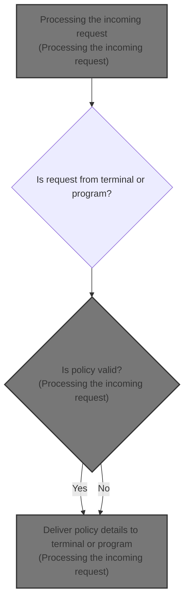

# Overview

This document explains the flow for handling policy inquiries. The system receives a request, retrieves and validates policy information, and returns either the policy details or a standardized error message to the appropriate recipient.

## Dependencies

### Program

- LGIPVS01 (<SwmPath>[base/src/lgipvs01.cbl](base/src/lgipvs01.cbl)</SwmPath>)

&nbsp;

*This is an auto-generated document by Swimm 🌊 and has not yet been verified by a human*

<SwmMeta version="3.0.0" repo-id="Z2l0aHViJTNBJTNBU3dpbW1pby1nZW5hcHAtaG91c2UlM0ElM0FHaXJpLVN3aW1t" repo-name="Swimmio-genapp-house">Powered by [Swimm](https://app.swimm.io/)</SwmMeta>
