# Overview

This document describes how policy inquiries are processed. The flow receives a policy type, determines the request mode, retrieves and validates the policy record, and delivers either the policy data or an error message.

## Dependencies

### Program

- <SwmToken path="base/src/lgipvs01.cbl" pos="13:6:6" line-data="       PROGRAM-ID. LGIPVS01.">`LGIPVS01`</SwmToken> (<SwmPath>[base/src/lgipvs01.cbl](base/src/lgipvs01.cbl)</SwmPath>)

## Detailed View of the Program's Functionality

a. Initialization and Context Assignment

The program begins by clearing a buffer used for receiving data, ensuring that any previous data is removed and the buffer is ready for new input. It then retrieves and stores three key pieces of context information from the system environment:

- The system identifier, which uniquely identifies the system where the transaction is running.
- The start code, which indicates how the transaction was initiated.
- The name of the invoking program, if any, which shows if the transaction was started by another program.

These values are essential for determining how the transaction should proceed and are stored in dedicated memory areas for later use.

b. Determining Request Mode (Direct or Received)

Next, the program checks whether the transaction was started directly (either by a specific start code or by being invoked from another program) or if it was triggered by a message received from a terminal. This is done by examining the start code and the invoking program name:

- If the start code indicates a direct start or if there is an invoking program, the program sets an internal flag to indicate "command" mode. It then copies the input data from a special communication area into a working area, sets the length of the data to a specific value, and adjusts this length slightly.
- If neither condition is met, the program assumes the transaction was started by a message from a terminal. It receives the incoming data into the buffer, sets the internal flag to indicate "received" mode, copies the relevant portion of the received data into the working area, and adjusts the data length accordingly.

c. Preparing the Key and Reading Policy Data

After determining the mode and preparing the input data, the program constructs a key for looking up policy information. It does this by:

- Clearing the area where the policy data will be stored.
- Extracting the policy type from the first character of the input data.
- Extracting the policy or customer number from the remaining characters of the input data.

With the key prepared, the program attempts to read a policy record from a file containing policy data. It specifies the file name, the area to store the retrieved data, the length of the data, the key to use for the lookup, and other parameters to control the read operation. The result of this operation is stored in a response code.

d. Validating the Policy Data and Preparing the Response

Once the policy data is read, the program checks two things:

- Whether the policy type in the retrieved data matches the requested type.
- Whether the file read was successful (as indicated by the response code).

If either check fails, the program prepares an error message by setting a specific text and assigning error codes to the customer and policy number fields in the response. If both checks pass, the program copies the retrieved policy data into the response area.

e. Sending or Storing the Response

Finally, the program decides how to deliver the response based on the mode determined earlier:

- If the transaction was started by a received message (terminal mode), it sends the response message back to the terminal, specifying the message content, length, and display options.
- If the transaction was started directly (command mode), it updates the communication area with the response message and key, making the data available for the invoking program or process.

After handling the response, the program ends the transaction and returns control to the system.

# Rule Definition

| Paragraph Name   | Rule ID | Category          | Description                                                                                                                                                                                                                          | Conditions                                                                       | Remarks                                                                                                                                                                                                                                     |
| ---------------- | ------- | ----------------- | ------------------------------------------------------------------------------------------------------------------------------------------------------------------------------------------------------------------------------------ | -------------------------------------------------------------------------------- | ------------------------------------------------------------------------------------------------------------------------------------------------------------------------------------------------------------------------------------------- |
| MAINLINE SECTION | RL-001  | Computation       | The program reads the policy record from the KSDSPOLY file using the constructed key and validates that the policy type in the record matches the requested type and the file read response is normal.                               | Key is formed; file read is attempted.                                           | Policy record format: policy type (1 byte), customer number (10 bytes), policy number (10 bytes), filler (43 bytes unused). File read response must be normal (DFHRESP(NORMAL)).                                                            |
| MAINLINE SECTION | RL-002  | Data Assignment   | If a match is successful, the output message must contain 'Policy Key=', policy type, customer number, and policy number from the policy record.                                                                                     | File read response is normal and policy type matches.                            | Output message format: message text (11 bytes), policy type (1 byte), customer number (10 bytes), policy number (10 bytes), filler (48 bytes unused).                                                                                       |
| MAINLINE SECTION | RL-003  | Data Assignment   | If no match is found or the file read fails, the output message must contain 'Policy Bad=', customer number '13', and policy number '13'.                                                                                            | File read response is not normal or policy type does not match.                  | Output message format: message text (11 bytes), policy type (1 byte, unused), customer number (10 bytes, value '13'), policy number (10 bytes, value '13'), filler (48 bytes unused).                                                       |
| MAINLINE SECTION | RL-004  | Conditional Logic | In received mode, the output message is sent to the terminal as an 80-character message. In command mode, the output message is written back to the commarea.                                                                        | Mode is determined as command or received.                                       | Output message is always 80 bytes. In received mode, sent via SEND TEXT; in command mode, written to <SwmToken path="base/src/lgipvs01.cbl" pos="93:3:5" line-data="              MOVE COMMA-DATA  TO WS-COMMAREA">`COMMA-DATA`</SwmToken>. |
| MAINLINE SECTION | RL-005  | Computation       | The program must end the transaction after sending the message or updating the commarea.                                                                                                                                             | Message has been sent or commarea updated.                                       | Transaction is ended using EXEC CICS RETURN.                                                                                                                                                                                                |
| MAINLINE SECTION | RL-006  | Conditional Logic | The program must determine whether it is running in command mode or received mode by checking if the start code indicates a direct start or if the invoking program identifier is present.                                           | Start code's first character is 'D' or invoking program identifier is not blank. | Start code is a 2-character string; invoking program identifier is an 8-character string. If either condition is true, set mode to command; otherwise, set to received.                                                                     |
| MAINLINE SECTION | RL-007  | Data Assignment   | Depending on the mode, the program reads input from either the command area (command mode) or the received area (received mode) and forms the policy lookup key from the first byte (policy type) and next 10 bytes (policy number). | Mode is determined as command or received.                                       | Policy key is always 11 bytes: 1 byte policy type + 10 bytes policy number. Input source is the command area (command mode) or the received area (received mode).                                                                           |

# User Stories

## User Story 1: Determine invocation mode and read input

---

### Story Description:

As a system, I want to determine whether the program is running in command mode or received mode and read the input from the appropriate area so that the correct policy lookup key can be formed.

---

### Business Rule Mapping:

| Rule ID | Paragraph Name   | Rule Description                                                                                                                                                                                                                     |
| ------- | ---------------- | ------------------------------------------------------------------------------------------------------------------------------------------------------------------------------------------------------------------------------------ |
| RL-006  | MAINLINE SECTION | The program must determine whether it is running in command mode or received mode by checking if the start code indicates a direct start or if the invoking program identifier is present.                                           |
| RL-007  | MAINLINE SECTION | Depending on the mode, the program reads input from either the command area (command mode) or the received area (received mode) and forms the policy lookup key from the first byte (policy type) and next 10 bytes (policy number). |

---

### Relevant Functionality:

- **MAINLINE SECTION**
  1. **RL-006:**
     - Retrieve start code and invoking program identifier.
     - If start code's first character is 'D' or invoking program identifier is not blank:
       - Set mode to command.
       - Read input from the command area.
     - Else:
       - Set mode to received.
       - Read input from the received area.
  2. **RL-007:**
     - If mode is command:
       - Move input from the command area to working storage.
       - Extract first byte as policy type, next 10 bytes as policy number.
     - If mode is received:
       - Move input from the received area to working storage.
       - Extract first byte as policy type, next 10 bytes as policy number.

## User Story 2: Lookup policy and format output message

---

### Story Description:

As a user, I want the program to look up the policy using the provided key and receive a message indicating whether the policy was found, including the relevant policy details or an error indicator, so that I know the result of my request.

---

### Business Rule Mapping:

| Rule ID | Paragraph Name   | Rule Description                                                                                                                                                                                       |
| ------- | ---------------- | ------------------------------------------------------------------------------------------------------------------------------------------------------------------------------------------------------ |
| RL-001  | MAINLINE SECTION | The program reads the policy record from the KSDSPOLY file using the constructed key and validates that the policy type in the record matches the requested type and the file read response is normal. |
| RL-002  | MAINLINE SECTION | If a match is successful, the output message must contain 'Policy Key=', policy type, customer number, and policy number from the policy record.                                                       |
| RL-003  | MAINLINE SECTION | If no match is found or the file read fails, the output message must contain 'Policy Bad=', customer number '13', and policy number '13'.                                                              |

---

### Relevant Functionality:

- **MAINLINE SECTION**
  1. **RL-001:**
     - Read KSDSPOLY file using key (policy type + policy number).
     - If file read response is normal and policy type matches requested type:
       - Consider match successful.
     - Else:
       - Consider match unsuccessful.
  2. **RL-002:**
     - If match is successful:
       - Set message text to 'Policy Key='.
       - Set policy type, customer number, and policy number from policy record.
       - Fill remaining bytes with spaces.
  3. **RL-003:**
     - If match is unsuccessful:
       - Set message text to 'Policy Bad='.
       - Set customer number and policy number to '13'.
       - Fill remaining bytes with spaces.

## User Story 3: Deliver output and end transaction

---

### Story Description:

As a user, I want the program to deliver the output message to the correct destination based on the invocation mode and ensure the transaction ends properly so that the process is completed and resources are released.

---

### Business Rule Mapping:

| Rule ID | Paragraph Name   | Rule Description                                                                                                                                              |
| ------- | ---------------- | ------------------------------------------------------------------------------------------------------------------------------------------------------------- |
| RL-004  | MAINLINE SECTION | In received mode, the output message is sent to the terminal as an 80-character message. In command mode, the output message is written back to the commarea. |
| RL-005  | MAINLINE SECTION | The program must end the transaction after sending the message or updating the commarea.                                                                      |

---

### Relevant Functionality:

- **MAINLINE SECTION**
  1. **RL-004:**
     - If mode is received:
       - Send output message to terminal (80 bytes).
     - If mode is command:
       - Write output message to commarea.
  2. **RL-005:**
     - After message delivery or commarea update:
       - End transaction.

# Workflow

# Processing incoming requests and preparing response

```mermaid
%%{init: {"flowchart": {"defaultRenderer": "elk"}} }%%
flowchart TD
    node1["Assign transaction context (SYSID, STARTCODE, Invokingprog)"] --> node2{"Is direct start (STARTCODE = 'D' or Invokingprog set)?"}
    click node1 openCode "base/src/lgipvs01.cbl:79:89"
    node2 -->|"Yes"| node3["Direct mode: Set WS-FLAG = 'C', use COMMA-DATA, set up commarea"]
    click node2 openCode "base/src/lgipvs01.cbl:90:92"
    node2 -->|"No"| node4["Received mode: Receive data, set WS-FLAG = 'R', use WS-RECV-DATA"]
    click node3 openCode "base/src/lgipvs01.cbl:92:97"
    click node4 openCode "base/src/lgipvs01.cbl:98:104"
    node3 --> node5["Read policy record from file"]
    node4 --> node5
    click node5 openCode "base/src/lgipvs01.cbl:111:119"
    node5 --> node6{"Policy type matches and read successful?"}
    click node6 openCode "base/src/lgipvs01.cbl:121:122"
    node6 -->|"No"| node7["Prepare error message (WRITE-Msg-CustNum/PolNum = 13)"]
    click node7 openCode "base/src/lgipvs01.cbl:123:125"
    node6 -->|"Yes"| node8["Set WRITE-MSG-Key = CA-Area"]
    click node8 openCode "base/src/lgipvs01.cbl:127:127"
    node7 --> node9{"WS-FLAG = 'R'?"}
    node8 --> node9
    click node9 openCode "base/src/lgipvs01.cbl:130:130"
    node9 -->|"Yes"| node10["Send message to terminal"]
    click node10 openCode "base/src/lgipvs01.cbl:131:136"
    node9 -->|"No"| node11["Update shared data (COMMA-Data fields)"]
    click node11 openCode "base/src/lgipvs01.cbl:138:140"
    node10 --> node12["End transaction"]
    node11 --> node12["End transaction"]
    click node12 openCode "base/src/lgipvs01.cbl:143:144"

classDef HeadingStyle fill:#777777,stroke:#333,stroke-width:2px;

%% Swimm:
%% %%{init: {"flowchart": {"defaultRenderer": "elk"}} }%%
%% flowchart TD
%%     node1["Assign transaction context (SYSID, STARTCODE, Invokingprog)"] --> node2{"Is direct start (STARTCODE = 'D' or Invokingprog set)?"}
%%     click node1 openCode "<SwmPath>[base/src/lgipvs01.cbl](base/src/lgipvs01.cbl)</SwmPath>:79:89"
%%     node2 -->|"Yes"| node3["Direct mode: Set <SwmToken path="base/src/lgipvs01.cbl" pos="92:9:11" line-data="              MOVE &#39;C&#39; To WS-FLAG">`WS-FLAG`</SwmToken> = 'C', use <SwmToken path="base/src/lgipvs01.cbl" pos="93:3:5" line-data="              MOVE COMMA-DATA  TO WS-COMMAREA">`COMMA-DATA`</SwmToken>, set up commarea"]
%%     click node2 openCode "<SwmPath>[base/src/lgipvs01.cbl](base/src/lgipvs01.cbl)</SwmPath>:90:92"
%%     node2 -->|"No"| node4["Received mode: Receive data, set <SwmToken path="base/src/lgipvs01.cbl" pos="92:9:11" line-data="              MOVE &#39;C&#39; To WS-FLAG">`WS-FLAG`</SwmToken> = 'R', use <SwmToken path="base/src/lgipvs01.cbl" pos="103:3:7" line-data="              MOVE WS-RECV-DATA  TO WS-COMMAREA">`WS-RECV-DATA`</SwmToken>"]
%%     click node3 openCode "<SwmPath>[base/src/lgipvs01.cbl](base/src/lgipvs01.cbl)</SwmPath>:92:97"
%%     click node4 openCode "<SwmPath>[base/src/lgipvs01.cbl](base/src/lgipvs01.cbl)</SwmPath>:98:104"
%%     node3 --> node5["Read policy record from file"]
%%     node4 --> node5
%%     click node5 openCode "<SwmPath>[base/src/lgipvs01.cbl](base/src/lgipvs01.cbl)</SwmPath>:111:119"
%%     node5 --> node6{"Policy type matches and read successful?"}
%%     click node6 openCode "<SwmPath>[base/src/lgipvs01.cbl](base/src/lgipvs01.cbl)</SwmPath>:121:122"
%%     node6 -->|"No"| node7["Prepare error message (WRITE-Msg-CustNum/PolNum = 13)"]
%%     click node7 openCode "<SwmPath>[base/src/lgipvs01.cbl](base/src/lgipvs01.cbl)</SwmPath>:123:125"
%%     node6 -->|"Yes"| node8["Set <SwmToken path="base/src/lgipvs01.cbl" pos="127:9:13" line-data="             Move CA-Area to WRITE-MSG-Key">`WRITE-MSG-Key`</SwmToken> = <SwmToken path="base/src/lgipvs01.cbl" pos="107:7:9" line-data="           Move Spaces                      To CA-Area">`CA-Area`</SwmToken>"]
%%     click node8 openCode "<SwmPath>[base/src/lgipvs01.cbl](base/src/lgipvs01.cbl)</SwmPath>:127:127"
%%     node7 --> node9{"<SwmToken path="base/src/lgipvs01.cbl" pos="92:9:11" line-data="              MOVE &#39;C&#39; To WS-FLAG">`WS-FLAG`</SwmToken> = 'R'?"}
%%     node8 --> node9
%%     click node9 openCode "<SwmPath>[base/src/lgipvs01.cbl](base/src/lgipvs01.cbl)</SwmPath>:130:130"
%%     node9 -->|"Yes"| node10["Send message to terminal"]
%%     click node10 openCode "<SwmPath>[base/src/lgipvs01.cbl](base/src/lgipvs01.cbl)</SwmPath>:131:136"
%%     node9 -->|"No"| node11["Update shared data (<SwmToken path="base/src/lgipvs01.cbl" pos="138:7:9" line-data="             Move Spaces          To COMMA-Data">`COMMA-Data`</SwmToken> fields)"]
%%     click node11 openCode "<SwmPath>[base/src/lgipvs01.cbl](base/src/lgipvs01.cbl)</SwmPath>:138:140"
%%     node10 --> node12["End transaction"]
%%     node11 --> node12["End transaction"]
%%     click node12 openCode "<SwmPath>[base/src/lgipvs01.cbl](base/src/lgipvs01.cbl)</SwmPath>:143:144"
%% 
%% classDef HeadingStyle fill:#777777,stroke:#333,stroke-width:2px;
```



This section manages the initial processing of incoming requests, determines the mode of operation (direct or received), validates policy data, and prepares the appropriate response or error message for the transaction.

| Category        | Rule Name                  | Description                                                                                                                               |
| --------------- | -------------------------- | ----------------------------------------------------------------------------------------------------------------------------------------- |
| Data validation | Policy Validation Failure  | If the policy type does not match or the file read is unsuccessful, prepare an error message with customer and policy numbers set to 13.  |
| Data validation | Policy Validation Success  | If the policy data is valid and read is successful, copy the policy data to the response message key.                                     |
| Decision Making | Direct Command Detection   | Determine if the request is a direct command by checking if the start code is 'D' or the invoking program is set.                         |
| Decision Making | Response Delivery Decision | If the processing flag is 'R', send the response message to the terminal; otherwise, update shared data fields with the response message. |

<SwmSnippet path="/base/src/lgipvs01.cbl" line="75">

---

In MAINLINE, we start by clearing the receive buffer and assigning system id, start code, and invoking program. This sets up the context for the transaction and determines how the rest of the logic will branch based on these values.

```cobol
       MAINLINE SECTION.
      *
           MOVE SPACES TO WS-RECV.

           EXEC CICS ASSIGN SYSID(WS-SYSID)
                RESP(WS-RESP)
           END-EXEC.

           EXEC CICS ASSIGN STARTCODE(WS-STARTCODE)
                RESP(WS-RESP)
           END-EXEC.

           EXEC CICS ASSIGN Invokingprog(WS-Invokeprog)
                RESP(WS-RESP)
           END-EXEC.
```

---

</SwmSnippet>

<SwmSnippet path="/base/src/lgipvs01.cbl" line="90">

---

Here we branch based on whether we're handling a command or a received message. The flag and commarea are set accordingly, which determines how the rest of the flow processes the input.

```cobol
           IF WS-STARTCODE(1:1) = 'D' or
              WS-Invokeprog Not = Spaces
              MOVE 'C' To WS-FLAG
              MOVE COMMA-DATA  TO WS-COMMAREA
              MOVE EIBCALEN    TO WS-RECV-LEN
              MOVE 11          TO WS-RECV-LEN
              SUBTRACT 1 FROM WS-RECV-LEN
           ELSE
              EXEC CICS RECEIVE INTO(WS-RECV)
                  LENGTH(WS-RECV-LEN)
                  RESP(WS-RESP)
              END-EXEC
              MOVE 'R' To WS-FLAG
              MOVE WS-RECV-DATA  TO WS-COMMAREA
              SUBTRACT 6 FROM WS-RECV-LEN
           END-IF.
```

---

</SwmSnippet>

<SwmSnippet path="/base/src/lgipvs01.cbl" line="107">

---

Next we build the key from the commarea and call the file read for 'KSDSPOLY' to get the policy data needed for validation or response.

```cobol
           Move Spaces                      To CA-Area
           Move WS-Commarea(1:1)            To Part-Key-Type
           Move WS-Commarea(2:WS-RECV-LEN)  To Part-Key-Num
      *
           Exec CICS Read File('KSDSPOLY')
                     Into(CA-AREA)
                     Length(F64)
                     Ridfld(PART-KEY)
                     KeyLength(F11)
                     Generic
                     RESP(WS-RESP)
                     GTEQ
           End-Exec.
```

---

</SwmSnippet>

<SwmSnippet path="/base/src/lgipvs01.cbl" line="121">

---

Here we check if the policy data matches the request and if the file read was successful. If not, we prep an error message; otherwise, we copy the policy data for the response.

```cobol
           If CA-Policy-Type   Not = Part-Key-Type Or
              WS-RESP NOT          = DFHRESP(NORMAL)
             Move 'Policy Bad='   To Write-Msg-Text
             Move 13              To WRITE-Msg-CustNum
             Move 13              To WRITE-Msg-PolNum
           Else
             Move CA-Area to WRITE-MSG-Key
           End-If
```

---

</SwmSnippet>

<SwmSnippet path="/base/src/lgipvs01.cbl" line="130">

---

This is where we wrap up by sending or storing the message, then exit the transaction.

```cobol
           If WS-FLAG = 'R' Then
             EXEC CICS SEND TEXT FROM(WRITE-MSG)
              WAIT
              ERASE
              LENGTH(80)
              FREEKB
             END-EXEC
           Else
             Move Spaces          To COMMA-Data
             Move Write-Msg-Text  To COMMA-Data-Text
             Move Write-Msg-Key   To COMMA-Data-Key
           End-If.

           EXEC CICS RETURN
           END-EXEC.
```

---

</SwmSnippet>

&nbsp;

*This is an auto-generated document by Swimm 🌊 and has not yet been verified by a human*

<SwmMeta version="3.0.0" repo-id="Z2l0aHViJTNBJTNBU3dpbW1pby1nZW5hcHAtaG91c2UlM0ElM0FHaXJpLVN3aW1t" repo-name="Swimmio-genapp-house"><sup>Powered by [Swimm](https://app.swimm.io/)</sup></SwmMeta>
