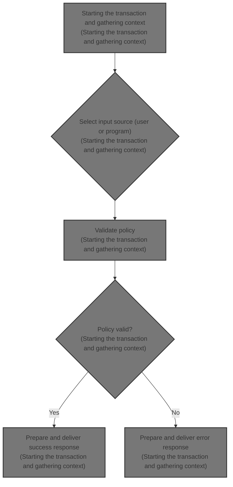

# Overview

This document describes the flow for policy inquiry. The system receives a policy type and customer information, validates the policy, and returns either a valid policy/customer number or an error message to the appropriate recipient.



## Dependencies

### Program

- <SwmToken path="base/src/lgipvs01.cbl" pos="13:6:6" line-data="       PROGRAM-ID. LGIPVS01.">`LGIPVS01`</SwmToken> (<SwmPath>[base/src/lgipvs01.cbl](base/src/lgipvs01.cbl)</SwmPath>)

## Detailed View of the Program's Functionality

# Transaction Initialization and Context Gathering

When the transaction begins, the program first clears out the area used to receive input data, ensuring no leftover values from previous runs. It then uses system commands to gather important context about the transaction:

- The system identifier is fetched and stored.
- The transaction start code is retrieved, which indicates how the transaction was initiated.
- The name of the invoking program is obtained, if any.

These pieces of context are essential for determining how the transaction should process its input and respond.

# Input Source Determination

The program then decides how to obtain its input data based on how the transaction was started:

- If the transaction was started directly (indicated by a specific code) or was invoked by another program, it sets an internal flag to indicate this mode. It then copies the input data from a shared area provided by the system, and adjusts the length of the received data accordingly.
- If the transaction was started from a terminal (not directly or by another program), it receives the input data from the terminal, sets a different internal flag, and copies the relevant portion of the received data to the shared area. The length of the received data is also adjusted to account for the structure of the input.

This decision point is crucial because it determines both where the input comes from and how the output will be sent back.

# Policy Key Construction and File Access

With the input data now available, the program prepares to access the policy file:

- It clears out the area used to hold policy data.
- It constructs a key for the policy file by extracting the policy type and number from the input data. The policy type is taken from the first character, and the policy number from the subsequent characters, up to the length of the received data.

Using this constructed key, the program attempts to read the relevant policy record from a file designed to hold policy information. The read operation is set up to fetch a fixed length of data, using the constructed key, and is prepared to handle cases where the key matches multiple records.

# Policy Validation and Response Preparation

After attempting to read the policy data:

- The program checks if the retrieved policy type matches the requested type, and whether the file read was successful.
- If either check fails, it prepares an error message, setting default values for the customer and policy numbers in the response.
- If the policy data is valid and matches the request, it copies the retrieved policy data into the response message.

This ensures that the user or invoking program receives either the correct policy information or a clear error message indicating what went wrong.

# Output Handling and Transaction Completion

Finally, the program decides how to send the response based on how the transaction was started:

- If the transaction was started from a terminal, it sends the response message directly to the terminal, using system commands to display the message and clear the screen.
- If the transaction was started directly or by another program, it prepares the response in the shared area, copying the message text and key into the appropriate fields.

After handling the output, the program issues a command to end the transaction and return control to the system, ensuring all resources are released and the transaction is properly closed.

# Rule Definition

| Paragraph Name                   | Rule ID | Category          | Description                                                                                                                                                                                                                                                                   | Conditions                                                                                                                                             | Remarks                                                                                                                                                                                                                                                                                                                                                                                                                                    |
| -------------------------------- | ------- | ----------------- | ----------------------------------------------------------------------------------------------------------------------------------------------------------------------------------------------------------------------------------------------------------------------------- | ------------------------------------------------------------------------------------------------------------------------------------------------------ | ------------------------------------------------------------------------------------------------------------------------------------------------------------------------------------------------------------------------------------------------------------------------------------------------------------------------------------------------------------------------------------------------------------------------------------------ |
| MAINLINE SECTION (lines 111-119) | RL-001  | Computation       | Use the <SwmToken path="base/src/lgipvs01.cbl" pos="114:3:5" line-data="                     Ridfld(PART-KEY)">`PART-KEY`</SwmToken> to read the policy record from the KSDSPOLY file.                                                                                        | Always, after extracting <SwmToken path="base/src/lgipvs01.cbl" pos="114:3:5" line-data="                     Ridfld(PART-KEY)">`PART-KEY`</SwmToken>. | File read uses <SwmToken path="base/src/lgipvs01.cbl" pos="114:3:5" line-data="                     Ridfld(PART-KEY)">`PART-KEY`</SwmToken> as the key (11 bytes). The read is generic and expects a normal response for success.                                                                                                                                                                                                          |
| MAINLINE SECTION (lines 121-128) | RL-002  | Conditional Logic | Validate that the policy record's type matches the <SwmToken path="base/src/lgipvs01.cbl" pos="114:3:5" line-data="                     Ridfld(PART-KEY)">`PART-KEY`</SwmToken> type and that the file read was successful.                                                   | After reading the policy record.                                                                                                                       | <SwmToken path="base/src/lgipvs01.cbl" pos="50:3:7" line-data="         03  CA-POLICY-TYPE          Pic X.">`CA-POLICY-TYPE`</SwmToken> must match <SwmToken path="base/src/lgipvs01.cbl" pos="47:3:7" line-data="          03 PART-KEY-Type           PIC X.">`PART-KEY-Type`</SwmToken>. File read response must be normal (record found).                                                                                               |
| MAINLINE SECTION (lines 123-125) | RL-003  | Data Assignment   | If policy validation fails, set output message fields to indicate failure and use default/error values.                                                                                                                                                                       | Policy validation fails (type mismatch or record not found).                                                                                           | Message text: 'Policy Bad=' (11 chars). Customer number and policy number: '13' (right-aligned, zero-padded to 10 digits). Policy type: default value 'X'. Remaining fields: spaces. Output message is 80 bytes total.                                                                                                                                                                                                                     |
| MAINLINE SECTION (lines 127-128) | RL-004  | Data Assignment   | If policy validation succeeds, set output message fields to values from the policy file.                                                                                                                                                                                      | Policy validation succeeds.                                                                                                                            | Message text: 'Policy Key=' (11 chars). Policy type, customer number, and policy number: from policy file. Remaining fields: spaces. Output message is 80 bytes total.                                                                                                                                                                                                                                                                     |
| MAINLINE SECTION (lines 130-141) | RL-005  | Conditional Logic | Send the output message to the terminal if started from a terminal, or prepare it in <SwmToken path="base/src/lgipvs01.cbl" pos="93:3:5" line-data="              MOVE COMMA-DATA  TO WS-COMMAREA">`COMMA-DATA`</SwmToken> for return if started directly/by another program. | After formatting the output message.                                                                                                                   | If flag is 'R', send message to terminal (<SwmToken path="base/src/lgipvs01.cbl" pos="127:9:11" line-data="             Move CA-Area to WRITE-MSG-Key">`WRITE-MSG`</SwmToken>, 80 bytes). If flag is 'C', move message to <SwmToken path="base/src/lgipvs01.cbl" pos="93:3:5" line-data="              MOVE COMMA-DATA  TO WS-COMMAREA">`COMMA-DATA`</SwmToken> fields (COMMA-DATA-TEXT and COMMA-DATA-KEY, 11 and 21 bytes respectively). |
| MAINLINE SECTION (lines 90-105)  | RL-006  | Conditional Logic | The program determines whether the transaction was started directly/by another program (using the input area provided for programmatic invocation) or from a terminal (using the input area provided for terminal invocation).                                                | If the start code is 'D' or the invoking program identifier is not blank, use the programmatic input area; otherwise, use the terminal input area.     | Start code 'D' indicates direct/programmatic start. Both input areas are 80 bytes. The flag 'C' is used for programmatic input, 'R' for terminal input.                                                                                                                                                                                                                                                                                    |
| MAINLINE SECTION (lines 108-109) | RL-007  | Data Assignment   | Extract the <SwmToken path="base/src/lgipvs01.cbl" pos="114:3:5" line-data="                     Ridfld(PART-KEY)">`PART-KEY`</SwmToken> from the first 11 characters of the input source, whether it is the programmatic input area or the terminal input area.              | Always, after determining the input source.                                                                                                            | <SwmToken path="base/src/lgipvs01.cbl" pos="114:3:5" line-data="                     Ridfld(PART-KEY)">`PART-KEY`</SwmToken> is 11 characters: 1-character type (alphanumeric), 10-digit number (numeric, zero-padded if necessary).                                                                                                                                                                                                       |

# User Stories

## User Story 1: Input Source Determination and <SwmToken path="base/src/lgipvs01.cbl" pos="114:3:5" line-data="                     Ridfld(PART-KEY)">`PART-KEY`</SwmToken> Extraction

---

### Story Description:

As a system, I want to determine the input source (terminal or programmatic) and extract the <SwmToken path="base/src/lgipvs01.cbl" pos="114:3:5" line-data="                     Ridfld(PART-KEY)">`PART-KEY`</SwmToken> from the appropriate input area so that the correct policy can be identified and processed.

---

### Business Rule Mapping:

| Rule ID | Paragraph Name                   | Rule Description                                                                                                                                                                                                                                                 |
| ------- | -------------------------------- | ---------------------------------------------------------------------------------------------------------------------------------------------------------------------------------------------------------------------------------------------------------------- |
| RL-006  | MAINLINE SECTION (lines 90-105)  | The program determines whether the transaction was started directly/by another program (using the input area provided for programmatic invocation) or from a terminal (using the input area provided for terminal invocation).                                   |
| RL-007  | MAINLINE SECTION (lines 108-109) | Extract the <SwmToken path="base/src/lgipvs01.cbl" pos="114:3:5" line-data="                     Ridfld(PART-KEY)">`PART-KEY`</SwmToken> from the first 11 characters of the input source, whether it is the programmatic input area or the terminal input area. |

---

### Relevant Functionality:

- **MAINLINE SECTION (lines 90-105)**
  1. **RL-006:**
     - If start code is 'D' or invoking program identifier is not blank:
       - Set flag to 'C'
       - Use the programmatic input area as input
     - Else:
       - Set flag to 'R'
       - Receive terminal data into the terminal input area
       - Use the terminal input area as input
- **MAINLINE SECTION (lines 108-109)**
  1. **RL-007:**
     - Move first character of input source to <SwmToken path="base/src/lgipvs01.cbl" pos="114:3:5" line-data="                     Ridfld(PART-KEY)">`PART-KEY`</SwmToken> type
     - Move next 10 characters of input source to <SwmToken path="base/src/lgipvs01.cbl" pos="114:3:5" line-data="                     Ridfld(PART-KEY)">`PART-KEY`</SwmToken> number

## User Story 2: Policy Record Lookup and Validation

---

### Story Description:

As a system, I want to use the <SwmToken path="base/src/lgipvs01.cbl" pos="114:3:5" line-data="                     Ridfld(PART-KEY)">`PART-KEY`</SwmToken> to read the policy record from the KSDSPOLY file and validate that the policy type matches and the record exists so that only valid policies are processed.

---

### Business Rule Mapping:

| Rule ID | Paragraph Name                   | Rule Description                                                                                                                                                                                                            |
| ------- | -------------------------------- | --------------------------------------------------------------------------------------------------------------------------------------------------------------------------------------------------------------------------- |
| RL-001  | MAINLINE SECTION (lines 111-119) | Use the <SwmToken path="base/src/lgipvs01.cbl" pos="114:3:5" line-data="                     Ridfld(PART-KEY)">`PART-KEY`</SwmToken> to read the policy record from the KSDSPOLY file.                                      |
| RL-002  | MAINLINE SECTION (lines 121-128) | Validate that the policy record's type matches the <SwmToken path="base/src/lgipvs01.cbl" pos="114:3:5" line-data="                     Ridfld(PART-KEY)">`PART-KEY`</SwmToken> type and that the file read was successful. |

---

### Relevant Functionality:

- **MAINLINE SECTION (lines 111-119)**
  1. **RL-001:**
     - Issue file read for KSDSPOLY using <SwmToken path="base/src/lgipvs01.cbl" pos="114:3:5" line-data="                     Ridfld(PART-KEY)">`PART-KEY`</SwmToken> as key
     - Store result in <SwmToken path="base/src/lgipvs01.cbl" pos="112:3:5" line-data="                     Into(CA-AREA)">`CA-AREA`</SwmToken>
     - Capture response code
- **MAINLINE SECTION (lines 121-128)**
  1. **RL-002:**
     - If <SwmToken path="base/src/lgipvs01.cbl" pos="50:3:7" line-data="         03  CA-POLICY-TYPE          Pic X.">`CA-POLICY-TYPE`</SwmToken> does not match <SwmToken path="base/src/lgipvs01.cbl" pos="47:3:7" line-data="          03 PART-KEY-Type           PIC X.">`PART-KEY-Type`</SwmToken> or file read response is not normal:
       - Policy validation fails
     - Else:
       - Policy validation succeeds

## User Story 3: Output Message Formatting and Delivery

---

### Story Description:

As a system, I want to format the output message to indicate either a successful policy lookup or a failure, and deliver it to the correct destination (terminal or invoking program), so that the recipient receives clear and accurate information.

---

### Business Rule Mapping:

| Rule ID | Paragraph Name                   | Rule Description                                                                                                                                                                                                                                                              |
| ------- | -------------------------------- | ----------------------------------------------------------------------------------------------------------------------------------------------------------------------------------------------------------------------------------------------------------------------------- |
| RL-003  | MAINLINE SECTION (lines 123-125) | If policy validation fails, set output message fields to indicate failure and use default/error values.                                                                                                                                                                       |
| RL-004  | MAINLINE SECTION (lines 127-128) | If policy validation succeeds, set output message fields to values from the policy file.                                                                                                                                                                                      |
| RL-005  | MAINLINE SECTION (lines 130-141) | Send the output message to the terminal if started from a terminal, or prepare it in <SwmToken path="base/src/lgipvs01.cbl" pos="93:3:5" line-data="              MOVE COMMA-DATA  TO WS-COMMAREA">`COMMA-DATA`</SwmToken> for return if started directly/by another program. |

---

### Relevant Functionality:

- **MAINLINE SECTION (lines 123-125)**
  1. **RL-003:**
     - Set message text to 'Policy Bad='
     - Set customer number and policy number fields to '13' (right-aligned, zero-padded to 10 digits)
     - Set policy type field to 'X'
     - Fill unused fields with spaces
- **MAINLINE SECTION (lines 127-128)**
  1. **RL-004:**
     - Set message text to 'Policy Key='
     - Set policy type, customer number, and policy number fields to values from policy file
     - Fill unused fields with spaces
- **MAINLINE SECTION (lines 130-141)**
  1. **RL-005:**
     - If flag is 'R':
       - Send <SwmToken path="base/src/lgipvs01.cbl" pos="127:9:11" line-data="             Move CA-Area to WRITE-MSG-Key">`WRITE-MSG`</SwmToken> (80 bytes) to terminal
     - Else:
       - Move message text and key to <SwmToken path="base/src/lgipvs01.cbl" pos="93:3:5" line-data="              MOVE COMMA-DATA  TO WS-COMMAREA">`COMMA-DATA`</SwmToken> fields for return

# Workflow

# Starting the transaction and gathering context

```mermaid
%%{init: {"flowchart": {"defaultRenderer": "elk"}} }%%
flowchart TD
    node1["Receive request"] --> node2{"Direct start or invoked?"}
    click node1 openCode "base/src/lgipvs01.cbl:75:77"
    node2 -->|"Yes (WS-FLAG='C')"| node3["Set flag to 'C', use COMMA-DATA"]
    click node2 openCode "base/src/lgipvs01.cbl:90:91"
    click node3 openCode "base/src/lgipvs01.cbl:92:96"
    node2 -->|"No (WS-FLAG='R')"| node4["Set flag to 'R', receive user data"]
    click node4 openCode "base/src/lgipvs01.cbl:98:104"
    node3 --> node5["Read policy from file"]
    click node5 openCode "base/src/lgipvs01.cbl:111:119"
    node4 --> node5
    node5 --> node6{"Is policy valid?"}
    click node6 openCode "base/src/lgipvs01.cbl:121:122"
    node6 -->|"No"| node7["Prepare error message (CustNum=13, PolNum=13)"]
    click node7 openCode "base/src/lgipvs01.cbl:123:125"
    node6 -->|"Yes"| node8["Prepare success message (Key=CA-Area)"]
    click node8 openCode "base/src/lgipvs01.cbl:127:127"
    node7 --> node9{"WS-FLAG = 'R'?"}
    click node9 openCode "base/src/lgipvs01.cbl:130:130"
    node8 --> node9
    node9 -->|"Yes"| node10["Send message to user"]
    click node10 openCode "base/src/lgipvs01.cbl:131:136"
    node9 -->|"No"| node11["Update shared data"]
    click node11 openCode "base/src/lgipvs01.cbl:138:140"
    node10 --> node12["Return"]
    click node12 openCode "base/src/lgipvs01.cbl:143:144"
    node11 --> node12
classDef HeadingStyle fill:#777777,stroke:#333,stroke-width:2px;

%% Swimm:
%% %%{init: {"flowchart": {"defaultRenderer": "elk"}} }%%
%% flowchart TD
%%     node1["Receive request"] --> node2{"Direct start or invoked?"}
%%     click node1 openCode "<SwmPath>[base/src/lgipvs01.cbl](base/src/lgipvs01.cbl)</SwmPath>:75:77"
%%     node2 -->|"Yes (<SwmToken path="base/src/lgipvs01.cbl" pos="92:9:11" line-data="              MOVE &#39;C&#39; To WS-FLAG">`WS-FLAG`</SwmToken>='C')"| node3["Set flag to 'C', use <SwmToken path="base/src/lgipvs01.cbl" pos="93:3:5" line-data="              MOVE COMMA-DATA  TO WS-COMMAREA">`COMMA-DATA`</SwmToken>"]
%%     click node2 openCode "<SwmPath>[base/src/lgipvs01.cbl](base/src/lgipvs01.cbl)</SwmPath>:90:91"
%%     click node3 openCode "<SwmPath>[base/src/lgipvs01.cbl](base/src/lgipvs01.cbl)</SwmPath>:92:96"
%%     node2 -->|"No (<SwmToken path="base/src/lgipvs01.cbl" pos="92:9:11" line-data="              MOVE &#39;C&#39; To WS-FLAG">`WS-FLAG`</SwmToken>='R')"| node4["Set flag to 'R', receive user data"]
%%     click node4 openCode "<SwmPath>[base/src/lgipvs01.cbl](base/src/lgipvs01.cbl)</SwmPath>:98:104"
%%     node3 --> node5["Read policy from file"]
%%     click node5 openCode "<SwmPath>[base/src/lgipvs01.cbl](base/src/lgipvs01.cbl)</SwmPath>:111:119"
%%     node4 --> node5
%%     node5 --> node6{"Is policy valid?"}
%%     click node6 openCode "<SwmPath>[base/src/lgipvs01.cbl](base/src/lgipvs01.cbl)</SwmPath>:121:122"
%%     node6 -->|"No"| node7["Prepare error message (<SwmToken path="base/src/lgipvs01.cbl" pos="124:11:11" line-data="             Move 13              To WRITE-Msg-CustNum">`CustNum`</SwmToken>=13, <SwmToken path="base/src/lgipvs01.cbl" pos="125:11:11" line-data="             Move 13              To WRITE-Msg-PolNum">`PolNum`</SwmToken>=13)"]
%%     click node7 openCode "<SwmPath>[base/src/lgipvs01.cbl](base/src/lgipvs01.cbl)</SwmPath>:123:125"
%%     node6 -->|"Yes"| node8["Prepare success message (Key=<SwmToken path="base/src/lgipvs01.cbl" pos="107:7:9" line-data="           Move Spaces                      To CA-Area">`CA-Area`</SwmToken>)"]
%%     click node8 openCode "<SwmPath>[base/src/lgipvs01.cbl](base/src/lgipvs01.cbl)</SwmPath>:127:127"
%%     node7 --> node9{"<SwmToken path="base/src/lgipvs01.cbl" pos="92:9:11" line-data="              MOVE &#39;C&#39; To WS-FLAG">`WS-FLAG`</SwmToken> = 'R'?"}
%%     click node9 openCode "<SwmPath>[base/src/lgipvs01.cbl](base/src/lgipvs01.cbl)</SwmPath>:130:130"
%%     node8 --> node9
%%     node9 -->|"Yes"| node10["Send message to user"]
%%     click node10 openCode "<SwmPath>[base/src/lgipvs01.cbl](base/src/lgipvs01.cbl)</SwmPath>:131:136"
%%     node9 -->|"No"| node11["Update shared data"]
%%     click node11 openCode "<SwmPath>[base/src/lgipvs01.cbl](base/src/lgipvs01.cbl)</SwmPath>:138:140"
%%     node10 --> node12["Return"]
%%     click node12 openCode "<SwmPath>[base/src/lgipvs01.cbl](base/src/lgipvs01.cbl)</SwmPath>:143:144"
%%     node11 --> node12
%% classDef HeadingStyle fill:#777777,stroke:#333,stroke-width:2px;
```



This section initiates the transaction, gathers necessary context, determines the source of input data, validates the policy, and prepares the appropriate response message for the user or invoking program.

| Category        | Rule Name                                   | Description                                                                                                                                                                                                                                                                                                                                      |
| --------------- | ------------------------------------------- | ------------------------------------------------------------------------------------------------------------------------------------------------------------------------------------------------------------------------------------------------------------------------------------------------------------------------------------------------ |
| Data validation | Context Gathering Requirement               | The system must always gather system and transaction context (SYSID, STARTCODE, Invokingprog) at the start of the transaction to ensure correct environment setup.                                                                                                                                                                               |
| Business logic  | Direct or Invoked Start Input Source        | If the transaction is started directly (STARTCODE begins with 'D') or invoked by another program (Invokingprog is not blank), the system must use <SwmToken path="base/src/lgipvs01.cbl" pos="93:3:5" line-data="              MOVE COMMA-DATA  TO WS-COMMAREA">`COMMA-DATA`</SwmToken> as the input source and set the transaction flag to 'C'. |
| Business logic  | Terminal Input Source                       | If the transaction is not started directly or by another program, the system must receive input data from the terminal and set the transaction flag to 'R'.                                                                                                                                                                                      |
| Business logic  | Policy Validation Success Handling          | If the policy data matches the request, the system must prepare a success message using the policy data as the response key.                                                                                                                                                                                                                     |
| Business logic  | Response Delivery Based on Transaction Type | If the transaction flag is 'R', the response message must be sent to the user terminal. If the flag is 'C', the response must be updated in shared data for the invoking program.                                                                                                                                                                |

<SwmSnippet path="/base/src/lgipvs01.cbl" line="75">

---

In <SwmToken path="base/src/lgipvs01.cbl" pos="75:1:1" line-data="       MAINLINE SECTION.">`MAINLINE`</SwmToken>, this is where the transaction kicks off. The code grabs system and transaction context (SYSID, STARTCODE, Invokingprog) using CICS ASSIGN commands, setting up the environment for the rest of the logic.

```cobol
       MAINLINE SECTION.
      *
           MOVE SPACES TO WS-RECV.

           EXEC CICS ASSIGN SYSID(WS-SYSID)
                RESP(WS-RESP)
           END-EXEC.

           EXEC CICS ASSIGN STARTCODE(WS-STARTCODE)
                RESP(WS-RESP)
           END-EXEC.

           EXEC CICS ASSIGN Invokingprog(WS-Invokeprog)
                RESP(WS-RESP)
           END-EXEC.
```

---

</SwmSnippet>

<SwmSnippet path="/base/src/lgipvs01.cbl" line="90">

---

Here the code decides how to get its input: if the transaction was started with a 'D' or by another program, it pulls data from <SwmToken path="base/src/lgipvs01.cbl" pos="93:3:5" line-data="              MOVE COMMA-DATA  TO WS-COMMAREA">`COMMA-DATA`</SwmToken> and sets <SwmToken path="base/src/lgipvs01.cbl" pos="92:9:11" line-data="              MOVE &#39;C&#39; To WS-FLAG">`WS-FLAG`</SwmToken> to 'C'. Otherwise, it receives terminal data and sets <SwmToken path="base/src/lgipvs01.cbl" pos="92:9:11" line-data="              MOVE &#39;C&#39; To WS-FLAG">`WS-FLAG`</SwmToken> to 'R'. This choice drives how the rest of the flow handles incoming data.

```cobol
           IF WS-STARTCODE(1:1) = 'D' or
              WS-Invokeprog Not = Spaces
              MOVE 'C' To WS-FLAG
              MOVE COMMA-DATA  TO WS-COMMAREA
              MOVE EIBCALEN    TO WS-RECV-LEN
              MOVE 11          TO WS-RECV-LEN
              SUBTRACT 1 FROM WS-RECV-LEN
           ELSE
              EXEC CICS RECEIVE INTO(WS-RECV)
                  LENGTH(WS-RECV-LEN)
                  RESP(WS-RESP)
              END-EXEC
              MOVE 'R' To WS-FLAG
              MOVE WS-RECV-DATA  TO WS-COMMAREA
              SUBTRACT 6 FROM WS-RECV-LEN
           END-IF.
```

---

</SwmSnippet>

<SwmSnippet path="/base/src/lgipvs01.cbl" line="107">

---

Next we build the <SwmToken path="base/src/lgipvs01.cbl" pos="114:3:5" line-data="                     Ridfld(PART-KEY)">`PART-KEY`</SwmToken> from the input and use it to call the 'KSDSPOLY' file, pulling in the policy data we need for validation and response.

```cobol
           Move Spaces                      To CA-Area
           Move WS-Commarea(1:1)            To Part-Key-Type
           Move WS-Commarea(2:WS-RECV-LEN)  To Part-Key-Num
      *
           Exec CICS Read File('KSDSPOLY')
                     Into(CA-AREA)
                     Length(F64)
                     Ridfld(PART-KEY)
                     KeyLength(F11)
                     Generic
                     RESP(WS-RESP)
                     GTEQ
           End-Exec.
```

---

</SwmSnippet>

<SwmSnippet path="/base/src/lgipvs01.cbl" line="121">

---

After pulling the policy data, we check if it matches the request. If not, we prep an error message and set default values. If it matches, we copy the policy data for the response.

```cobol
           If CA-Policy-Type   Not = Part-Key-Type Or
              WS-RESP NOT          = DFHRESP(NORMAL)
             Move 'Policy Bad='   To Write-Msg-Text
             Move 13              To WRITE-Msg-CustNum
             Move 13              To WRITE-Msg-PolNum
           Else
             Move CA-Area to WRITE-MSG-Key
           End-If
```

---

</SwmSnippet>

<SwmSnippet path="/base/src/lgipvs01.cbl" line="130">

---

Finally, we either send the message to the terminal or prep it for another program, depending on how the transaction started. Then we call EXEC CICS RETURN to finish up.

```cobol
           If WS-FLAG = 'R' Then
             EXEC CICS SEND TEXT FROM(WRITE-MSG)
              WAIT
              ERASE
              LENGTH(80)
              FREEKB
             END-EXEC
           Else
             Move Spaces          To COMMA-Data
             Move Write-Msg-Text  To COMMA-Data-Text
             Move Write-Msg-Key   To COMMA-Data-Key
           End-If.

           EXEC CICS RETURN
           END-EXEC.
```

---

</SwmSnippet>

&nbsp;

*This is an auto-generated document by Swimm 🌊 and has not yet been verified by a human*

<SwmMeta version="3.0.0" repo-id="Z2l0aHViJTNBJTNBU3dpbW1pby1nZW5hcHAtaG91c2UlM0ElM0FHaXJpLVN3aW1t" repo-name="Swimmio-genapp-house"><sup>Powered by [Swimm](https://app.swimm.io/)</sup></SwmMeta>
