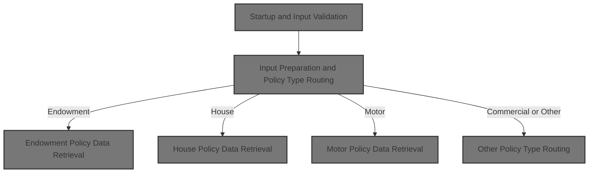
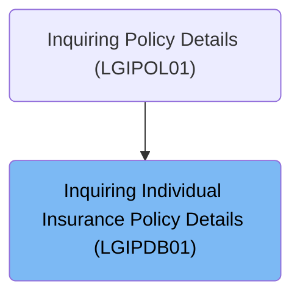
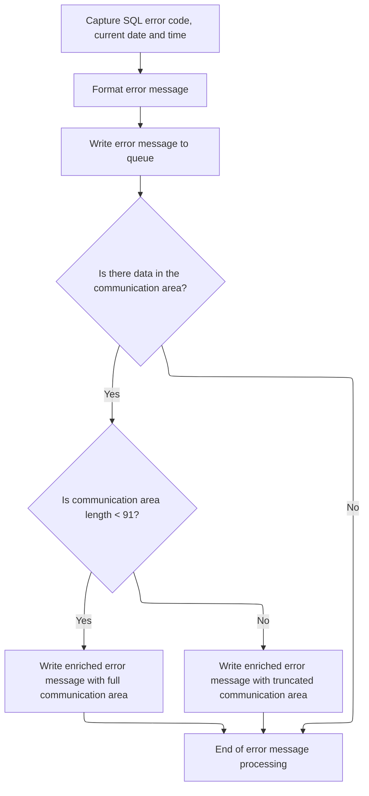
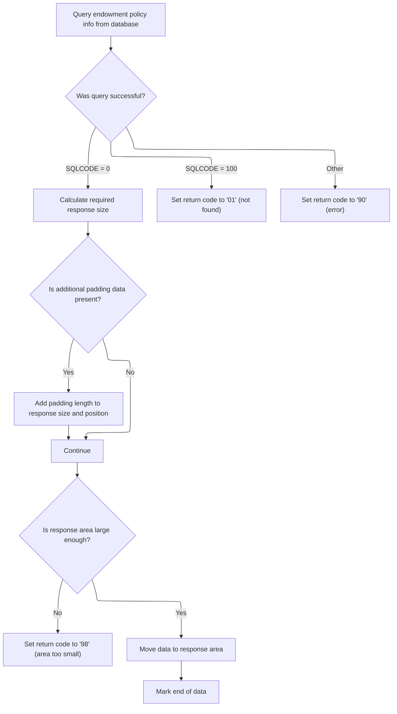
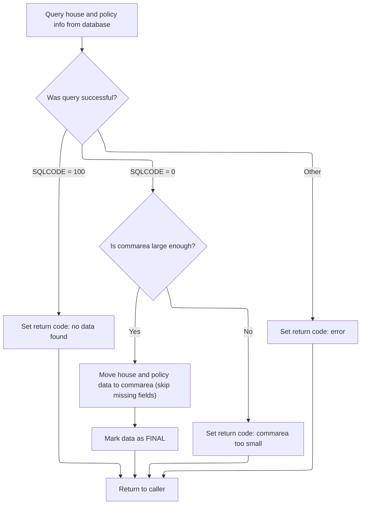
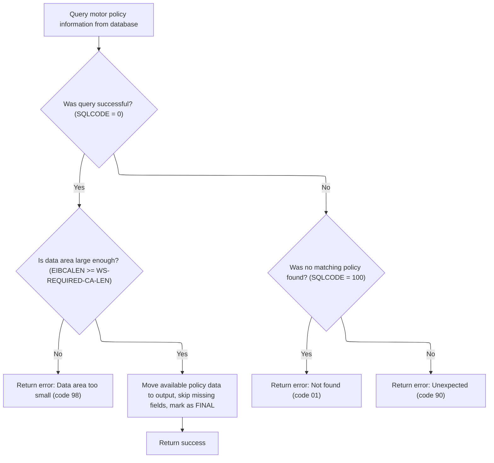

# Overview

This document describes the flow for retrieving individual insurance policy details. The process validates the request, routes it by policy type, and returns complete policy information or an error code.



## Dependencies

### Programs

- <SwmToken path="base/src/lgipdb01.cbl" pos="13:6:6" line-data="       PROGRAM-ID. LGIPDB01.">`LGIPDB01`</SwmToken> (<SwmPath>[base/src/lgipdb01.cbl](base/src/lgipdb01.cbl)</SwmPath>)
- LGSTSQ (<SwmPath>[base/src/lgstsq.cbl](base/src/lgstsq.cbl)</SwmPath>)

### Copybooks

- SQLCA
- LGPOLICY (<SwmPath>[base/src/lgpolicy.cpy](base/src/lgpolicy.cpy)</SwmPath>)
- LGCMAREA (<SwmPath>[base/src/lgcmarea.cpy](base/src/lgcmarea.cpy)</SwmPath>)

# Where is this program used?

This program is used once, as represented in the following diagram:



## Input and Output Tables/Files used in the Program

| Table / File Name | Type                                                                                                                    | Description                                                | Usage Mode | Key Fields / Layout Highlights                                                                                                                                                                                                                                                                                                                                                                                                                                                                                                                                                                                                                                                                                                                                                                                                                                                                                                                                                                                                                                                                                                                                                                                                                                                                                                                                                                                                                                                                                                                                                                                                                                                                                                                                                                                                                                                                                                                                                                                                                                                                                                                                                                                                                                                                                                                                                                                                                                                                                                                                                                                                                                                                                                                                                                                                                                                                                                                                                                                                                                                                                                                                                                                                                                                                                                                                                                                                                                                                                                                                                                                                                                                                                                                                                                                                                                                                                                                                                                                                                                                                                                                                                                                                                                                                                                                                                                                                                                                                                                                                                                                                                                                                                                                                                                                                                                                                                                                                                                                                                                                                                                                                                                                                                                                                                                                                                                                                                                                                                                                                                                                                                                                                                                                                                                                                                                                                                                                                                                                                                                                                                                                                                                                                                                                                                                                                                                                                                                                                                                                                                                                                                                                                                                                                                                                                                                                                                                                                                                                                                                                                                                                                                                                                                                                                                                                                                                                                                                                                                                                                                                                                                                                                                                                                                                                                                                                                                                                                                                                                                                                                                                                                                                                                                                                                                                                                                                                                                                                                                                                                                                                                                                                                                                                                                                                                                                                                                                                                                                                                                                                                                                                                                                                                                                                                                                                                                                                                                                                                                                                                                                                                                                                                                                                                                                                                                                                                                                                                                                                                                                                                                                                                                                                                                                                                                                                                                                                                                                                                                                                                                                                                                                                                                                                                                                                                                                                                                                                                                                                                                                                                                                                                                                                                                                                                                                                                                                                                                                                                                                                                                                                                                                                                                                                                                                                                                                                                                                                                                                                                                                                                                                                                                                                                                                                                                                                                                                                                                                                                                                                                                                                                                                                                                                                                                                                                                                                                                                  |
| ----------------- | ----------------------------------------------------------------------------------------------------------------------- | ---------------------------------------------------------- | ---------- | ------------------------------------------------------------------------------------------------------------------------------------------------------------------------------------------------------------------------------------------------------------------------------------------------------------------------------------------------------------------------------------------------------------------------------------------------------------------------------------------------------------------------------------------------------------------------------------------------------------------------------------------------------------------------------------------------------------------------------------------------------------------------------------------------------------------------------------------------------------------------------------------------------------------------------------------------------------------------------------------------------------------------------------------------------------------------------------------------------------------------------------------------------------------------------------------------------------------------------------------------------------------------------------------------------------------------------------------------------------------------------------------------------------------------------------------------------------------------------------------------------------------------------------------------------------------------------------------------------------------------------------------------------------------------------------------------------------------------------------------------------------------------------------------------------------------------------------------------------------------------------------------------------------------------------------------------------------------------------------------------------------------------------------------------------------------------------------------------------------------------------------------------------------------------------------------------------------------------------------------------------------------------------------------------------------------------------------------------------------------------------------------------------------------------------------------------------------------------------------------------------------------------------------------------------------------------------------------------------------------------------------------------------------------------------------------------------------------------------------------------------------------------------------------------------------------------------------------------------------------------------------------------------------------------------------------------------------------------------------------------------------------------------------------------------------------------------------------------------------------------------------------------------------------------------------------------------------------------------------------------------------------------------------------------------------------------------------------------------------------------------------------------------------------------------------------------------------------------------------------------------------------------------------------------------------------------------------------------------------------------------------------------------------------------------------------------------------------------------------------------------------------------------------------------------------------------------------------------------------------------------------------------------------------------------------------------------------------------------------------------------------------------------------------------------------------------------------------------------------------------------------------------------------------------------------------------------------------------------------------------------------------------------------------------------------------------------------------------------------------------------------------------------------------------------------------------------------------------------------------------------------------------------------------------------------------------------------------------------------------------------------------------------------------------------------------------------------------------------------------------------------------------------------------------------------------------------------------------------------------------------------------------------------------------------------------------------------------------------------------------------------------------------------------------------------------------------------------------------------------------------------------------------------------------------------------------------------------------------------------------------------------------------------------------------------------------------------------------------------------------------------------------------------------------------------------------------------------------------------------------------------------------------------------------------------------------------------------------------------------------------------------------------------------------------------------------------------------------------------------------------------------------------------------------------------------------------------------------------------------------------------------------------------------------------------------------------------------------------------------------------------------------------------------------------------------------------------------------------------------------------------------------------------------------------------------------------------------------------------------------------------------------------------------------------------------------------------------------------------------------------------------------------------------------------------------------------------------------------------------------------------------------------------------------------------------------------------------------------------------------------------------------------------------------------------------------------------------------------------------------------------------------------------------------------------------------------------------------------------------------------------------------------------------------------------------------------------------------------------------------------------------------------------------------------------------------------------------------------------------------------------------------------------------------------------------------------------------------------------------------------------------------------------------------------------------------------------------------------------------------------------------------------------------------------------------------------------------------------------------------------------------------------------------------------------------------------------------------------------------------------------------------------------------------------------------------------------------------------------------------------------------------------------------------------------------------------------------------------------------------------------------------------------------------------------------------------------------------------------------------------------------------------------------------------------------------------------------------------------------------------------------------------------------------------------------------------------------------------------------------------------------------------------------------------------------------------------------------------------------------------------------------------------------------------------------------------------------------------------------------------------------------------------------------------------------------------------------------------------------------------------------------------------------------------------------------------------------------------------------------------------------------------------------------------------------------------------------------------------------------------------------------------------------------------------------------------------------------------------------------------------------------------------------------------------------------------------------------------------------------------------------------------------------------------------------------------------------------------------------------------------------------------------------------------------------------------------------------------------------------------------------------------------------------------------------------------------------------------------------------------------------------------------------------------------------------------------------------------------------------------------------------------------------------------------------------------------------------------------------------------------------------------------------------------------------------------------------------------------------------------------------------------------------------------------------------------------------------------------------------------------------------------------------------------------------------------------------------------------------------------------------------------------------------------------------------------------------------------------------------------------------------------------------------------------------------------------------------------------------------------------------------------------------------------------------------------------------------------------------------------------------------------------------------------------------------------------------------------------------------------------------------------------------------------------------------------------------------------------------------------------------------------------------------------------------------------------------------------------------------------------------------------------------------------------------------------------------------------------------------------------------------------------------------------------------------------------------------------------------------------------------------------------------------------------------------------------------------------------------------------------------------------------------------------------------------------------------------------------------------------------------------------------------------------------------------------------------------------------------------------------------------------------------------------------------------------------------------------------------------------------------------------------------------------------------------------------------------------------------------------------------------------------------------------------------------------------------------------------------------------------------------------------------------------------------------------------------------------------------------------------------------------------------------------------------------------------------------------------------------------------------------------------------------------------------------------------------------------------------------------------------------------------------------------------------------------------------------------------------------------------------------------------------------------------------------------------------------------------------------------------------------------------------------------------------------------------------------------------------------------------------------------------------------------------------------------------------------------------------------------------------------------------------------------------------------------------------------------------------------------------------------------------------------------- |
| POLICY            | <SwmToken path="base/src/lgipdb01.cbl" pos="242:5:5" line-data="      * initialize DB2 host variables">`DB2`</SwmToken> | Insurance policy master data, type, dates, broker, payment | Input      | <SwmToken path="base/src/lgipdb01.cbl" pos="92:1:1" line-data="                   CustomerNumber,">`CustomerNumber`</SwmToken>, <SwmToken path="base/src/lgipdb01.cbl" pos="93:3:3" line-data="                   Policy.PolicyNumber,">`PolicyNumber`</SwmToken>, <SwmToken path="base/src/lgipdb01.cbl" pos="94:1:1" line-data="                   RequestDate,">`RequestDate`</SwmToken>, <SwmToken path="base/src/lgipdb01.cbl" pos="95:1:1" line-data="                   StartDate,">`StartDate`</SwmToken>, <SwmToken path="base/src/lgipdb01.cbl" pos="96:1:1" line-data="                   RenewalDate,">`RenewalDate`</SwmToken>, <SwmToken path="base/src/lgipdb01.cbl" pos="97:1:1" line-data="                   Address,">`Address`</SwmToken>, <SwmToken path="base/src/lgipdb01.cbl" pos="98:1:1" line-data="                   Zipcode,">`Zipcode`</SwmToken>, <SwmToken path="base/src/lgipdb01.cbl" pos="99:1:1" line-data="                   LatitudeN,">`LatitudeN`</SwmToken>, <SwmToken path="base/src/lgipdb01.cbl" pos="100:1:1" line-data="                   LongitudeW,">`LongitudeW`</SwmToken>, <SwmToken path="base/src/lgipdb01.cbl" pos="101:1:1" line-data="                   Customer,">`Customer`</SwmToken>, <SwmToken path="base/src/lgipdb01.cbl" pos="102:1:1" line-data="                   PropertyType,">`PropertyType`</SwmToken>, <SwmToken path="base/src/lgipdb01.cbl" pos="103:1:1" line-data="                   FirePeril,">`FirePeril`</SwmToken>, <SwmToken path="base/src/lgipdb01.cbl" pos="104:1:1" line-data="                   FirePremium,">`FirePremium`</SwmToken>, <SwmToken path="base/src/lgipdb01.cbl" pos="105:1:1" line-data="                   CrimePeril,">`CrimePeril`</SwmToken>, <SwmToken path="base/src/lgipdb01.cbl" pos="106:1:1" line-data="                   CrimePremium,">`CrimePremium`</SwmToken>, <SwmToken path="base/src/lgipdb01.cbl" pos="107:1:1" line-data="                   FloodPeril,">`FloodPeril`</SwmToken>, <SwmToken path="base/src/lgipdb01.cbl" pos="108:1:1" line-data="                   FloodPremium,">`FloodPremium`</SwmToken>, <SwmToken path="base/src/lgipdb01.cbl" pos="109:1:1" line-data="                   WeatherPeril,">`WeatherPeril`</SwmToken>, <SwmToken path="base/src/lgipdb01.cbl" pos="110:1:1" line-data="                   WeatherPremium,">`WeatherPremium`</SwmToken>, <SwmToken path="base/src/lgipdb01.cbl" pos="111:1:1" line-data="                   Status,">`Status`</SwmToken>, <SwmToken path="base/src/lgipdb01.cbl" pos="112:1:1" line-data="                   RejectionReason">`RejectionReason`</SwmToken>, <SwmToken path="base/src/lgipdb01.cbl" pos="331:3:3" line-data="             SELECT  ISSUEDATE,">`ISSUEDATE`</SwmToken>, <SwmToken path="base/src/lgipdb01.cbl" pos="332:1:1" line-data="                     EXPIRYDATE,">`EXPIRYDATE`</SwmToken>, <SwmToken path="base/src/lgipdb01.cbl" pos="333:1:1" line-data="                     LASTCHANGED,">`LASTCHANGED`</SwmToken>, <SwmToken path="base/src/lgipdb01.cbl" pos="334:1:1" line-data="                     BROKERID,">`BROKERID`</SwmToken>, <SwmToken path="base/src/lgipdb01.cbl" pos="335:1:1" line-data="                     BROKERSREFERENCE,">`BROKERSREFERENCE`</SwmToken>, <SwmToken path="base/src/lgipdb01.cbl" pos="336:1:1" line-data="                     PAYMENT,">`PAYMENT`</SwmToken>, <SwmToken path="base/src/lgipdb01.cbl" pos="337:1:1" line-data="                     WITHPROFITS,">`WITHPROFITS`</SwmToken>, <SwmToken path="base/src/lgipdb01.cbl" pos="338:1:1" line-data="                     EQUITIES,">`EQUITIES`</SwmToken>, <SwmToken path="base/src/lgipdb01.cbl" pos="339:1:1" line-data="                     MANAGEDFUND,">`MANAGEDFUND`</SwmToken>, <SwmToken path="base/src/lgipdb01.cbl" pos="340:1:1" line-data="                     FUNDNAME,">`FUNDNAME`</SwmToken>, <SwmToken path="base/src/lgipdb01.cbl" pos="341:1:1" line-data="                     TERM,">`TERM`</SwmToken>, <SwmToken path="base/src/lgipdb01.cbl" pos="342:1:1" line-data="                     SUMASSURED,">`SUMASSURED`</SwmToken>, <SwmToken path="base/src/lgipdb01.cbl" pos="343:1:1" line-data="                     LIFEASSURED,">`LIFEASSURED`</SwmToken>, <SwmToken path="base/src/lgipdb01.cbl" pos="344:1:1" line-data="                     PADDINGDATA,">`PADDINGDATA`</SwmToken>, <SwmToken path="base/src/lgipdb01.cbl" pos="345:1:1" line-data="                     LENGTH(PADDINGDATA)">`LENGTH`</SwmToken>, <SwmToken path="base/src/lgipdb01.cbl" pos="347:2:4" line-data="                   :DB2-EXPIRYDATE,">`DB2-EXPIRYDATE`</SwmToken>, <SwmToken path="base/src/lgipdb01.cbl" pos="348:2:4" line-data="                   :DB2-LASTCHANGED,">`DB2-LASTCHANGED`</SwmToken>, <SwmToken path="base/src/lgipdb01.cbl" pos="349:11:13" line-data="                   :DB2-BROKERID-INT INDICATOR :IND-BROKERID,">`IND-BROKERID`</SwmToken>, <SwmToken path="base/src/lgipdb01.cbl" pos="350:9:11" line-data="                   :DB2-BROKERSREF INDICATOR :IND-BROKERSREF,">`IND-BROKERSREF`</SwmToken>, <SwmToken path="base/src/lgipdb01.cbl" pos="351:11:13" line-data="                   :DB2-PAYMENT-INT INDICATOR :IND-PAYMENT,">`IND-PAYMENT`</SwmToken>, <SwmToken path="base/src/lgipdb01.cbl" pos="352:2:6" line-data="                   :DB2-E-WITHPROFITS,">`DB2-E-WITHPROFITS`</SwmToken>, <SwmToken path="base/src/lgipdb01.cbl" pos="353:2:6" line-data="                   :DB2-E-EQUITIES,">`DB2-E-EQUITIES`</SwmToken>, <SwmToken path="base/src/lgipdb01.cbl" pos="354:2:6" line-data="                   :DB2-E-MANAGEDFUND,">`DB2-E-MANAGEDFUND`</SwmToken>, <SwmToken path="base/src/lgipdb01.cbl" pos="355:2:6" line-data="                   :DB2-E-FUNDNAME,">`DB2-E-FUNDNAME`</SwmToken>, <SwmToken path="base/src/lgipdb01.cbl" pos="356:2:8" line-data="                   :DB2-E-TERM-SINT,">`DB2-E-TERM-SINT`</SwmToken>, <SwmToken path="base/src/lgipdb01.cbl" pos="357:2:8" line-data="                   :DB2-E-SUMASSURED-INT,">`DB2-E-SUMASSURED-INT`</SwmToken>, <SwmToken path="base/src/lgipdb01.cbl" pos="358:2:6" line-data="                   :DB2-E-LIFEASSURED,">`DB2-E-LIFEASSURED`</SwmToken>, <SwmToken path="base/src/lgipdb01.cbl" pos="359:11:15" line-data="                   :DB2-E-PADDINGDATA INDICATOR :IND-E-PADDINGDATA,">`IND-E-PADDINGDATA`</SwmToken>, <SwmToken path="base/src/lgipdb01.cbl" pos="360:13:17" line-data="                   :DB2-E-PADDING-LEN INDICATOR :IND-E-PADDINGDATAL">`IND-E-PADDINGDATAL`</SwmToken>, <SwmToken path="base/src/lgipdb01.cbl" pos="451:1:1" line-data="                     PROPERTYTYPE,">`PROPERTYTYPE`</SwmToken>, <SwmToken path="base/src/lgipdb01.cbl" pos="452:1:1" line-data="                     BEDROOMS,">`BEDROOMS`</SwmToken>, <SwmToken path="base/src/lgipdb01.cbl" pos="453:1:1" line-data="                     VALUE,">`VALUE`</SwmToken>, <SwmToken path="base/src/lgipdb01.cbl" pos="454:1:1" line-data="                     HOUSENAME,">`HOUSENAME`</SwmToken>, <SwmToken path="base/src/lgipdb01.cbl" pos="455:1:1" line-data="                     HOUSENUMBER,">`HOUSENUMBER`</SwmToken>, <SwmToken path="base/src/lgipdb01.cbl" pos="346:4:6" line-data="             INTO  :DB2-ISSUEDATE,">`DB2-ISSUEDATE`</SwmToken>, <SwmToken path="base/src/lgipdb01.cbl" pos="463:2:6" line-data="                   :DB2-H-PROPERTYTYPE,">`DB2-H-PROPERTYTYPE`</SwmToken>, <SwmToken path="base/src/lgipdb01.cbl" pos="464:2:8" line-data="                   :DB2-H-BEDROOMS-SINT,">`DB2-H-BEDROOMS-SINT`</SwmToken>, <SwmToken path="base/src/lgipdb01.cbl" pos="465:2:8" line-data="                   :DB2-H-VALUE-INT,">`DB2-H-VALUE-INT`</SwmToken>, <SwmToken path="base/src/lgipdb01.cbl" pos="466:2:6" line-data="                   :DB2-H-HOUSENAME,">`DB2-H-HOUSENAME`</SwmToken>, <SwmToken path="base/src/lgipdb01.cbl" pos="467:2:6" line-data="                   :DB2-H-HOUSENUMBER,">`DB2-H-HOUSENUMBER`</SwmToken>, <SwmToken path="base/src/lgipdb01.cbl" pos="468:2:6" line-data="                   :DB2-H-POSTCODE">`DB2-H-POSTCODE`</SwmToken>, <SwmToken path="base/src/lgipdb01.cbl" pos="539:1:1" line-data="                     MAKE,">`MAKE`</SwmToken>, <SwmToken path="base/src/lgipdb01.cbl" pos="540:1:1" line-data="                     MODEL,">`MODEL`</SwmToken>, <SwmToken path="base/src/lgipdb01.cbl" pos="542:1:1" line-data="                     REGNUMBER,">`REGNUMBER`</SwmToken>, <SwmToken path="base/src/lgipdb01.cbl" pos="543:1:1" line-data="                     COLOUR,">`COLOUR`</SwmToken>, <SwmToken path="base/src/lgipdb01.cbl" pos="544:1:1" line-data="                     CC,">`CC`</SwmToken>, <SwmToken path="base/src/lgipdb01.cbl" pos="545:1:1" line-data="                     YEAROFMANUFACTURE,">`YEAROFMANUFACTURE`</SwmToken>, <SwmToken path="base/src/lgipdb01.cbl" pos="546:1:1" line-data="                     PREMIUM,">`PREMIUM`</SwmToken>, <SwmToken path="base/src/lgipdb01.cbl" pos="554:2:6" line-data="                   :DB2-M-MAKE,">`DB2-M-MAKE`</SwmToken>, <SwmToken path="base/src/lgipdb01.cbl" pos="555:2:6" line-data="                   :DB2-M-MODEL,">`DB2-M-MODEL`</SwmToken>, <SwmToken path="base/src/lgipdb01.cbl" pos="556:2:8" line-data="                   :DB2-M-VALUE-INT,">`DB2-M-VALUE-INT`</SwmToken>, <SwmToken path="base/src/lgipdb01.cbl" pos="557:2:6" line-data="                   :DB2-M-REGNUMBER,">`DB2-M-REGNUMBER`</SwmToken>, <SwmToken path="base/src/lgipdb01.cbl" pos="558:2:6" line-data="                   :DB2-M-COLOUR,">`DB2-M-COLOUR`</SwmToken>, <SwmToken path="base/src/lgipdb01.cbl" pos="559:2:8" line-data="                   :DB2-M-CC-SINT,">`DB2-M-CC-SINT`</SwmToken>, <SwmToken path="base/src/lgipdb01.cbl" pos="560:2:6" line-data="                   :DB2-M-MANUFACTURED,">`DB2-M-MANUFACTURED`</SwmToken>, <SwmToken path="base/src/lgipdb01.cbl" pos="561:2:8" line-data="                   :DB2-M-PREMIUM-INT,">`DB2-M-PREMIUM-INT`</SwmToken>, <SwmToken path="base/src/lgipdb01.cbl" pos="562:2:8" line-data="                   :DB2-M-ACCIDENTS-INT">`DB2-M-ACCIDENTS-INT`</SwmToken>, <SwmToken path="base/src/lgipdb01.cbl" pos="655:2:6" line-data="                   :DB2-B-Address,">`DB2-B-Address`</SwmToken>, <SwmToken path="base/src/lgipdb01.cbl" pos="656:2:6" line-data="                   :DB2-B-Postcode,">`DB2-B-Postcode`</SwmToken>, <SwmToken path="base/src/lgipdb01.cbl" pos="657:2:6" line-data="                   :DB2-B-Latitude,">`DB2-B-Latitude`</SwmToken>, <SwmToken path="base/src/lgipdb01.cbl" pos="658:2:6" line-data="                   :DB2-B-Longitude,">`DB2-B-Longitude`</SwmToken>, <SwmToken path="base/src/lgipdb01.cbl" pos="659:2:6" line-data="                   :DB2-B-Customer,">`DB2-B-Customer`</SwmToken>, <SwmToken path="base/src/lgipdb01.cbl" pos="660:2:6" line-data="                   :DB2-B-PropType,">`DB2-B-PropType`</SwmToken>, <SwmToken path="base/src/lgipdb01.cbl" pos="182:3:9" line-data="           03 DB2-B-FirePeril-Int      PIC S9(4) COMP.">`DB2-B-FirePeril-Int`</SwmToken>, <SwmToken path="base/src/lgipdb01.cbl" pos="183:3:9" line-data="           03 DB2-B-FirePremium-Int    PIC S9(9) COMP.">`DB2-B-FirePremium-Int`</SwmToken>, <SwmToken path="base/src/lgipdb01.cbl" pos="184:3:9" line-data="           03 DB2-B-CrimePeril-Int     PIC S9(4) COMP.">`DB2-B-CrimePeril-Int`</SwmToken>, <SwmToken path="base/src/lgipdb01.cbl" pos="185:3:9" line-data="           03 DB2-B-CrimePremium-Int   PIC S9(9) COMP.">`DB2-B-CrimePremium-Int`</SwmToken>, <SwmToken path="base/src/lgipdb01.cbl" pos="186:3:9" line-data="           03 DB2-B-FloodPeril-Int     PIC S9(4) COMP.">`DB2-B-FloodPeril-Int`</SwmToken>, <SwmToken path="base/src/lgipdb01.cbl" pos="187:3:9" line-data="           03 DB2-B-FloodPremium-Int   PIC S9(9) COMP.">`DB2-B-FloodPremium-Int`</SwmToken>, <SwmToken path="base/src/lgipdb01.cbl" pos="188:3:9" line-data="           03 DB2-B-WeatherPeril-Int   PIC S9(4) COMP.">`DB2-B-WeatherPeril-Int`</SwmToken>, <SwmToken path="base/src/lgipdb01.cbl" pos="189:3:9" line-data="           03 DB2-B-WeatherPremium-Int PIC S9(9) COMP.">`DB2-B-WeatherPremium-Int`</SwmToken>, <SwmToken path="base/src/lgipdb01.cbl" pos="190:3:9" line-data="           03 DB2-B-Status-Int         PIC S9(4) COMP.">`DB2-B-Status-Int`</SwmToken>, <SwmToken path="base/src/lgipdb01.cbl" pos="670:2:6" line-data="                   :DB2-B-RejectReason">`DB2-B-RejectReason`</SwmToken>, <SwmToken path="base/src/lgipdb01.cbl" pos="263:11:15" line-data="           MOVE CA-CUSTOMER-NUM TO DB2-CUSTOMERNUM-INT">`DB2-CUSTOMERNUM-INT`</SwmToken> |

&nbsp;

## Detailed View of the Program's Functionality

# A. Overview and Startup

This program is designed to handle policy inquiries for different insurance types (endowment, house, motor, commercial). It is invoked as a CICS transaction, receives input via a communication area (commarea), and interacts with a <SwmToken path="base/src/lgipdb01.cbl" pos="242:5:5" line-data="      * initialize DB2 host variables">`DB2`</SwmToken> database to retrieve policy details. It also includes robust error logging and message dispatching.

# B. Startup and Input Validation

1. **Initialization**:

   - The program begins by initializing its working storage, including header fields for tracking transaction, terminal, and task numbers.
   - It also initializes all <SwmToken path="base/src/lgipdb01.cbl" pos="242:5:5" line-data="      * initialize DB2 host variables">`DB2`</SwmToken> host variables (used for database input/output).

2. **Commarea Check**:

   - The program checks if a commarea (input data area) was received. If not, it prepares an error message, logs it, and abends (terminates abnormally) with a specific code. This ensures missing input is always recorded for later analysis.

3. **Input Preparation**:

   - If a commarea is present, the return code is set to zero, and the commarea length and address are saved.
   - Customer and policy numbers from the commarea are converted to <SwmToken path="base/src/lgipdb01.cbl" pos="242:5:5" line-data="      * initialize DB2 host variables">`DB2`</SwmToken> integer format for use in SQL queries.
   - These numbers are also stored in the error message structure for potential error logging.

4. **Request Routing**:

   - The request ID from the commarea is uppercased to standardize it for routing.
   - The program then uses a multi-way branch to determine which type of policy is being requested (endowment, house, motor, or various commercial types). Each type is routed to its own handler.

# C. Error Logging and Message Dispatch

1. **Error Message Preparation**:

   - When an error occurs, the SQL error code is saved in the error message structure.
   - The current date and time are obtained and formatted for inclusion in the error log.

2. **Message Dispatch**:

   - The error message is sent to a logging queue by linking to a separate program responsible for queue operations.
   - If a commarea was present, up to 90 bytes of its content are also sent to the logging queue for debugging purposes.

3. **Queue Handler (LGSTSQ)**:

   - This handler determines if the message came from a program or a terminal.
   - It adjusts the message length and queue name if a special prefix is present.
   - The message is written to both a transient queue (for system logs) and a storage queue (for application logs).
   - If the message originated from a terminal, a one-byte acknowledgment is sent back.

# D. Policy Type Routing

1. **Endowment Policy**:

   - If the request is for an endowment policy, the relevant <SwmToken path="base/src/lgipdb01.cbl" pos="242:5:5" line-data="      * initialize DB2 host variables">`DB2`</SwmToken> area is initialized, and the handler for endowment policies is called.

2. **House Policy**:

   - If the request is for a house policy, the relevant <SwmToken path="base/src/lgipdb01.cbl" pos="242:5:5" line-data="      * initialize DB2 host variables">`DB2`</SwmToken> area is initialized, and the handler for house policies is called.

3. **Motor Policy**:

   - If the request is for a motor policy, the relevant <SwmToken path="base/src/lgipdb01.cbl" pos="242:5:5" line-data="      * initialize DB2 host variables">`DB2`</SwmToken> area is initialized, and the handler for motor policies is called.

4. **Commercial Policy**:

   - If the request is for a commercial policy, the relevant <SwmToken path="base/src/lgipdb01.cbl" pos="242:5:5" line-data="      * initialize DB2 host variables">`DB2`</SwmToken> area is initialized, and the appropriate handler is called based on the sub-type.

5. **Unsupported Types**:

   - If the request type is not recognized, an error code is set in the commarea.

# E. Endowment Policy Data Retrieval

1. **Database Query**:

   - The handler performs a SQL SELECT joining the policy and endowment tables, retrieving all relevant fields for the given customer and policy numbers.

2. **Response Size Calculation**:

   - The required size for the response is calculated, including header/trailer and the full endowment policy data.
   - If a variable-length padding field is present, its length is added to the required size and the position marker.

3. **Buffer Size Check**:

   - If the commarea is too small, an error code is set and the program returns.
   - If the buffer is sufficient, <SwmToken path="base/src/lgipdb01.cbl" pos="242:5:5" line-data="      * initialize DB2 host variables">`DB2`</SwmToken> fields are moved into the output area, skipping any fields that are null.

4. **End Marker**:

   - A special marker ('FINAL') is written at the end of the policy data to indicate the end of the response.

5. **Error Handling**:

   - If no data is found, a 'not found' code is set.
   - For other SQL errors, a generic error code is set and the error is logged.

# F. House Policy Data Retrieval

1. **Database Query**:

   - The handler performs a SQL SELECT joining the policy and house tables, retrieving all relevant fields.

2. **Response Size Calculation**:

   - The required response size is calculated.
   - If the commarea is too small, an error code is set and the program returns.

3. **Data Movement**:

   - <SwmToken path="base/src/lgipdb01.cbl" pos="242:5:5" line-data="      * initialize DB2 host variables">`DB2`</SwmToken> fields are moved into the output area, skipping nulls.
   - Integer fields are converted as needed.

4. **End Marker**:

   - A 'FINAL' marker is written at the end of the policy data.

5. **Error Handling**:

   - If no data is found, a 'not found' code is set.
   - For other SQL errors, a generic error code is set and the error is logged.

# G. Motor Policy Data Retrieval

1. **Database Query**:

   - The handler performs a SQL SELECT joining the policy and motor tables, retrieving all relevant fields.

2. **Response Size Calculation**:

   - The required response size is calculated.
   - If the commarea is too small, an error code is set and the program returns.

3. **Data Movement**:

   - <SwmToken path="base/src/lgipdb01.cbl" pos="242:5:5" line-data="      * initialize DB2 host variables">`DB2`</SwmToken> fields are moved into the output area, skipping nulls.
   - Integer fields are converted as needed.

4. **End Marker**:

   - A 'FINAL' marker is written at the end of the policy data.

5. **Error Handling**:

   - If no data is found, a 'not found' code is set.
   - For other SQL errors, a generic error code is set and the error is logged.

# H. Commercial Policy Data Retrieval

1. **Multiple Handlers**:
   - There are several handlers for commercial policies, depending on the sub-type requested.
   - Each handler performs a SQL SELECT (sometimes using a cursor for multiple records), retrieves the relevant fields, and moves them into the output area.
   - The same pattern of response size calculation, buffer check, data movement, end marker, and error handling is followed.

# I. Program Termination

- After handling the request and preparing the response (or error), the program returns control to CICS, ending the transaction.

# J. Summary

- The program is structured to robustly handle different policy inquiry types, validate input, interact with the database, and log errors with detailed context.
- Each policy type has its own handler, but all follow a similar pattern: query, check buffer, move data, mark end, and handle errors.
- Error logging is thorough, capturing both the error context and the input data for debugging.

# Data Definitions

| Table / Record Name | Type                                                                                                                    | Short Description                                          | Usage Mode             |
| ------------------- | ----------------------------------------------------------------------------------------------------------------------- | ---------------------------------------------------------- | ---------------------- |
| POLICY              | <SwmToken path="base/src/lgipdb01.cbl" pos="242:5:5" line-data="      * initialize DB2 host variables">`DB2`</SwmToken> | Insurance policy master data, type, dates, broker, payment | Input (DECLARE/SELECT) |

&nbsp;

# Rule Definition

| Paragraph Name                                                                                                                                                                                                                                                                                                                                                                                                                                                                                                                                                                                                                                  | Rule ID | Category          | Description                                                                                                                                                                                                                                                                                                                                                                                                                                                                                                                                                                                                                                                                                                                                                                                                                                                                                                                                                                                                         | Conditions                                                                                                                                                                | Remarks                                                                                                                                                                                                                                                                                                                                                                                                                                       |
| ----------------------------------------------------------------------------------------------------------------------------------------------------------------------------------------------------------------------------------------------------------------------------------------------------------------------------------------------------------------------------------------------------------------------------------------------------------------------------------------------------------------------------------------------------------------------------------------------------------------------------------------------- | ------- | ----------------- | ------------------------------------------------------------------------------------------------------------------------------------------------------------------------------------------------------------------------------------------------------------------------------------------------------------------------------------------------------------------------------------------------------------------------------------------------------------------------------------------------------------------------------------------------------------------------------------------------------------------------------------------------------------------------------------------------------------------------------------------------------------------------------------------------------------------------------------------------------------------------------------------------------------------------------------------------------------------------------------------------------------------- | ------------------------------------------------------------------------------------------------------------------------------------------------------------------------- | --------------------------------------------------------------------------------------------------------------------------------------------------------------------------------------------------------------------------------------------------------------------------------------------------------------------------------------------------------------------------------------------------------------------------------------------- |
| MAINLINE SECTION (lines 250-255)                                                                                                                                                                                                                                                                                                                                                                                                                                                                                                                                                                                                                | RL-001  | Conditional Logic | The system must validate that a commarea was received before processing. If missing, it must set an error code and log the error.                                                                                                                                                                                                                                                                                                                                                                                                                                                                                                                                                                                                                                                                                                                                                                                                                                                                                   | EIBCALEN is zero (no commarea received)                                                                                                                                   | Error code 'NO COMMAREA RECEIVED' is set in the error message. Logging is performed via <SwmToken path="base/src/lgipdb01.cbl" pos="253:3:7" line-data="             PERFORM WRITE-ERROR-MESSAGE">`WRITE-ERROR-MESSAGE`</SwmToken>, which links to LGSTSQ.                                                                                                                                                                                    |
| <SwmToken path="base/src/lgipdb01.cbl" pos="281:3:9" line-data="               PERFORM GET-ENDOW-DB2-INFO">`GET-ENDOW-DB2-INFO`</SwmToken>, <SwmToken path="base/src/lgipdb01.cbl" pos="285:3:9" line-data="               PERFORM GET-HOUSE-DB2-INFO">`GET-HOUSE-DB2-INFO`</SwmToken>, <SwmToken path="base/src/lgipdb01.cbl" pos="289:3:9" line-data="               PERFORM GET-MOTOR-DB2-INFO">`GET-MOTOR-DB2-INFO`</SwmToken>                                                                                                                                                                                                              | RL-002  | Conditional Logic | For each policy type, only <SwmToken path="base/src/lgipdb01.cbl" pos="379:13:15" line-data="      *      check whether PADDINGDATA field is non-null">`non-null`</SwmToken> fields from the <SwmToken path="base/src/lgipdb01.cbl" pos="242:5:5" line-data="      * initialize DB2 host variables">`DB2`</SwmToken> tables must be copied to the output commarea; null fields must be skipped.                                                                                                                                                                                                                                                                                                                                                                                                                                                                                                                                                                                                                     | <SwmToken path="base/src/lgipdb01.cbl" pos="242:5:5" line-data="      * initialize DB2 host variables">`DB2`</SwmToken> indicator variable for field is not -1 (not null) | <SwmToken path="base/src/lgipdb01.cbl" pos="242:5:5" line-data="      * initialize DB2 host variables">`DB2`</SwmToken> indicator variables are used to check for nulls. Only fields with indicator not equal to -1 are copied.                                                                                                                                                                                                               |
| <SwmToken path="base/src/lgipdb01.cbl" pos="281:3:9" line-data="               PERFORM GET-ENDOW-DB2-INFO">`GET-ENDOW-DB2-INFO`</SwmToken> (line 417), <SwmToken path="base/src/lgipdb01.cbl" pos="285:3:9" line-data="               PERFORM GET-HOUSE-DB2-INFO">`GET-HOUSE-DB2-INFO`</SwmToken> (line 508), <SwmToken path="base/src/lgipdb01.cbl" pos="289:3:9" line-data="               PERFORM GET-MOTOR-DB2-INFO">`GET-MOTOR-DB2-INFO`</SwmToken> (line 606)                                                                                                                                                                             | RL-003  | Data Assignment   | The output commarea must be formatted according to the policy type requested, with the correct fields and 'FINAL' marker at the end.                                                                                                                                                                                                                                                                                                                                                                                                                                                                                                                                                                                                                                                                                                                                                                                                                                                                                | After successful data retrieval and copy to commarea                                                                                                                      | <SwmToken path="base/src/lgipdb01.cbl" pos="407:11:15" line-data="               MOVE DB2-POLICY-COMMON     TO CA-POLICY-COMMON">`CA-POLICY-COMMON`</SwmToken> (60 chars), CA-ENDOWMENT/CA-HOUSE/CA-MOTOR (60 chars each), 'FINAL' (5 chars) at the end.                                                                                                                                                                                      |
| <SwmToken path="base/src/lgipdb01.cbl" pos="281:3:9" line-data="               PERFORM GET-ENDOW-DB2-INFO">`GET-ENDOW-DB2-INFO`</SwmToken> (lines 390-393), <SwmToken path="base/src/lgipdb01.cbl" pos="285:3:9" line-data="               PERFORM GET-HOUSE-DB2-INFO">`GET-HOUSE-DB2-INFO`</SwmToken> (lines 487-490), <SwmToken path="base/src/lgipdb01.cbl" pos="289:3:9" line-data="               PERFORM GET-MOTOR-DB2-INFO">`GET-MOTOR-DB2-INFO`</SwmToken> (lines 581-583)                                                                                                                                                              | RL-004  | Conditional Logic | If the commarea is too small to hold the response, the system must set <SwmToken path="base/src/lgipdb01.cbl" pos="258:9:13" line-data="           MOVE &#39;00&#39; TO CA-RETURN-CODE">`CA-RETURN-CODE`</SwmToken> to '98' and not write policy data.                                                                                                                                                                                                                                                                                                                                                                                                                                                                                                                                                                                                                                                                                                                                                              | EIBCALEN is less than required commarea length                                                                                                                            | <SwmToken path="base/src/lgipdb01.cbl" pos="258:9:13" line-data="           MOVE &#39;00&#39; TO CA-RETURN-CODE">`CA-RETURN-CODE`</SwmToken> is 2 characters. No policy data is written if code is '98'.                                                                                                                                                                                                                                      |
| <SwmToken path="base/src/lgipdb01.cbl" pos="281:3:9" line-data="               PERFORM GET-ENDOW-DB2-INFO">`GET-ENDOW-DB2-INFO`</SwmToken> (lines 421-424), <SwmToken path="base/src/lgipdb01.cbl" pos="285:3:9" line-data="               PERFORM GET-HOUSE-DB2-INFO">`GET-HOUSE-DB2-INFO`</SwmToken> (lines 512-514), <SwmToken path="base/src/lgipdb01.cbl" pos="289:3:9" line-data="               PERFORM GET-MOTOR-DB2-INFO">`GET-MOTOR-DB2-INFO`</SwmToken> (lines 610-612)                                                                                                                                                              | RL-005  | Conditional Logic | If no matching policy is found in the database, the system must set <SwmToken path="base/src/lgipdb01.cbl" pos="258:9:13" line-data="           MOVE &#39;00&#39; TO CA-RETURN-CODE">`CA-RETURN-CODE`</SwmToken> to '01' and not write policy data.                                                                                                                                                                                                                                                                                                                                                                                                                                                                                                                                                                                                                                                                                                                                                                 | SQLCODE = 100 after <SwmToken path="base/src/lgipdb01.cbl" pos="242:5:5" line-data="      * initialize DB2 host variables">`DB2`</SwmToken> SELECT                        | <SwmToken path="base/src/lgipdb01.cbl" pos="258:9:13" line-data="           MOVE &#39;00&#39; TO CA-RETURN-CODE">`CA-RETURN-CODE`</SwmToken> is 2 characters. No policy data is written if code is '01'.                                                                                                                                                                                                                                      |
| <SwmToken path="base/src/lgipdb01.cbl" pos="281:3:9" line-data="               PERFORM GET-ENDOW-DB2-INFO">`GET-ENDOW-DB2-INFO`</SwmToken> (lines 425-429), <SwmToken path="base/src/lgipdb01.cbl" pos="285:3:9" line-data="               PERFORM GET-HOUSE-DB2-INFO">`GET-HOUSE-DB2-INFO`</SwmToken> (lines 516-520), <SwmToken path="base/src/lgipdb01.cbl" pos="289:3:9" line-data="               PERFORM GET-MOTOR-DB2-INFO">`GET-MOTOR-DB2-INFO`</SwmToken> (lines 615-618), <SwmToken path="base/src/lgipdb01.cbl" pos="253:3:7" line-data="             PERFORM WRITE-ERROR-MESSAGE">`WRITE-ERROR-MESSAGE`</SwmToken> (lines 997-1030) | RL-006  | Conditional Logic | If a <SwmToken path="base/src/lgipdb01.cbl" pos="242:5:5" line-data="      * initialize DB2 host variables">`DB2`</SwmToken> or other error occurs, the system must set <SwmToken path="base/src/lgipdb01.cbl" pos="258:9:13" line-data="           MOVE &#39;00&#39; TO CA-RETURN-CODE">`CA-RETURN-CODE`</SwmToken> to '90' and log the error message, including SQLCODE and timestamp.                                                                                                                                                                                                                                                                                                                                                                                                                                                                                                                                                                                                                            | SQLCODE not 0 or 100 after <SwmToken path="base/src/lgipdb01.cbl" pos="242:5:5" line-data="      * initialize DB2 host variables">`DB2`</SwmToken> SELECT                 | <SwmToken path="base/src/lgipdb01.cbl" pos="258:9:13" line-data="           MOVE &#39;00&#39; TO CA-RETURN-CODE">`CA-RETURN-CODE`</SwmToken> is 2 characters. Error message includes SQLCODE, timestamp, and up to 90 bytes of commarea.                                                                                                                                                                                                      |
| <SwmToken path="base/src/lgipdb01.cbl" pos="253:3:7" line-data="             PERFORM WRITE-ERROR-MESSAGE">`WRITE-ERROR-MESSAGE`</SwmToken> (lines 997-1030), LGSTSQ (lines 57-126)                                                                                                                                                                                                                                                                                                                                                                                                                                                              | RL-007  | Computation       | All error messages must be written to a queue for logging, including SQLCODE, timestamp, and up to 90 bytes of the commarea if available.                                                                                                                                                                                                                                                                                                                                                                                                                                                                                                                                                                                                                                                                                                                                                                                                                                                                           | Any error condition triggers <SwmToken path="base/src/lgipdb01.cbl" pos="253:3:7" line-data="             PERFORM WRITE-ERROR-MESSAGE">`WRITE-ERROR-MESSAGE`</SwmToken>   | Queue name is 'GENAERRS' by default, or <SwmToken path="base/src/lgstsq.cbl" pos="6:19:19" line-data="      *  parm Q=nnnn is passed then Queue name GENAnnnn is used        *">`GENAnnnn`</SwmToken> if Q=nnnn is present. Error message includes up to 90 bytes of commarea.                                                                                                                                                                |
| MAINLINE SECTION (line 275)                                                                                                                                                                                                                                                                                                                                                                                                                                                                                                                                                                                                                     | RL-008  | Data Assignment   | The system must convert the request type field to uppercase before routing the request.                                                                                                                                                                                                                                                                                                                                                                                                                                                                                                                                                                                                                                                                                                                                                                                                                                                                                                                             | Always, before evaluating request type                                                                                                                                    | The request type field is a 6-character string. The uppercase value is used for routing.                                                                                                                                                                                                                                                                                                                                                      |
| MAINLINE SECTION (lines 277-310)                                                                                                                                                                                                                                                                                                                                                                                                                                                                                                                                                                                                                | RL-009  | Conditional Logic | The system must route requests based on the request type field. Supported values are <SwmToken path="base/src/lgipdb01.cbl" pos="279:4:4" line-data="             WHEN &#39;01IEND&#39;">`01IEND`</SwmToken>, <SwmToken path="base/src/lgipdb01.cbl" pos="283:4:4" line-data="             WHEN &#39;01IHOU&#39;">`01IHOU`</SwmToken>, <SwmToken path="base/src/lgipdb01.cbl" pos="287:4:4" line-data="             WHEN &#39;01IMOT&#39;">`01IMOT`</SwmToken>, <SwmToken path="base/src/lgipdb01.cbl" pos="291:4:4" line-data="             WHEN &#39;01ICOM&#39;">`01ICOM`</SwmToken>, <SwmToken path="base/src/lgipdb01.cbl" pos="295:4:4" line-data="             WHEN &#39;02ICOM&#39;">`02ICOM`</SwmToken>, <SwmToken path="base/src/lgipdb01.cbl" pos="299:4:4" line-data="             WHEN &#39;03ICOM&#39;">`03ICOM`</SwmToken>, <SwmToken path="base/src/lgipdb01.cbl" pos="303:4:4" line-data="             WHEN &#39;05ICOM&#39;">`05ICOM`</SwmToken>. Any other value must result in error code '99'. | The request type field matches one of the supported values                                                                                                                | The request type field is 6 characters. Error code '99' for unsupported types.                                                                                                                                                                                                                                                                                                                                                                |
| <SwmToken path="base/src/lgipdb01.cbl" pos="281:3:9" line-data="               PERFORM GET-ENDOW-DB2-INFO">`GET-ENDOW-DB2-INFO`</SwmToken> (lines 327-433)                                                                                                                                                                                                                                                                                                                                                                                                                                                                                      | RL-010  | Computation       | For endowment policies, the system must join the policy and endowment tables using the policy number and retrieve the required fields.                                                                                                                                                                                                                                                                                                                                                                                                                                                                                                                                                                                                                                                                                                                                                                                                                                                                              | The request type field is <SwmToken path="base/src/lgipdb01.cbl" pos="279:4:4" line-data="             WHEN &#39;01IEND&#39;">`01IEND`</SwmToken>                         | Fields to retrieve: From policy: issue date, expiry date, last changed date, broker ID, broker reference, payment amount. From endowment: with profits, equities, managed fund, fund name, term, sum assured, life assured, padding data. Only <SwmToken path="base/src/lgipdb01.cbl" pos="379:13:15" line-data="      *      check whether PADDINGDATA field is non-null">`non-null`</SwmToken> fields are copied to the output area.        |
| <SwmToken path="base/src/lgipdb01.cbl" pos="285:3:9" line-data="               PERFORM GET-HOUSE-DB2-INFO">`GET-HOUSE-DB2-INFO`</SwmToken> (lines 441-524)                                                                                                                                                                                                                                                                                                                                                                                                                                                                                      | RL-011  | Computation       | For house policies, the system must join the policy and house tables using the policy number and retrieve the required fields.                                                                                                                                                                                                                                                                                                                                                                                                                                                                                                                                                                                                                                                                                                                                                                                                                                                                                      | The request type field is <SwmToken path="base/src/lgipdb01.cbl" pos="283:4:4" line-data="             WHEN &#39;01IHOU&#39;">`01IHOU`</SwmToken>                         | Fields to retrieve: From policy: issue date, expiry date, last changed date, broker ID, broker reference, payment amount. From house: property type, bedrooms, value, house name, house number, postcode. Only <SwmToken path="base/src/lgipdb01.cbl" pos="379:13:15" line-data="      *      check whether PADDINGDATA field is non-null">`non-null`</SwmToken> fields are copied to the output area.                                        |
| <SwmToken path="base/src/lgipdb01.cbl" pos="289:3:9" line-data="               PERFORM GET-MOTOR-DB2-INFO">`GET-MOTOR-DB2-INFO`</SwmToken> (lines 529-622)                                                                                                                                                                                                                                                                                                                                                                                                                                                                                      | RL-012  | Computation       | For motor policies, the system must join the policy and motor tables using the policy number and retrieve the required fields.                                                                                                                                                                                                                                                                                                                                                                                                                                                                                                                                                                                                                                                                                                                                                                                                                                                                                      | The request type field is <SwmToken path="base/src/lgipdb01.cbl" pos="287:4:4" line-data="             WHEN &#39;01IMOT&#39;">`01IMOT`</SwmToken>                         | Fields to retrieve: From policy: issue date, expiry date, last changed date, broker ID, broker reference, payment amount. From motor: make, model, value, registration number, colour, engine capacity, year of manufacture, premium, accidents. Only <SwmToken path="base/src/lgipdb01.cbl" pos="379:13:15" line-data="      *      check whether PADDINGDATA field is non-null">`non-null`</SwmToken> fields are copied to the output area. |

# User Stories

## User Story 1: Input validation and error handling

---

### Story Description:

As a system, I want to validate incoming requests and handle errors appropriately so that users receive clear feedback and all errors are logged for audit and troubleshooting purposes.

---

### Business Rule Mapping:

| Rule ID | Paragraph Name                                                                                                                                                                                                                                                                                                                                                                                                                                                                                                                                                                                                                                  | Rule Description                                                                                                                                                                                                                                                                                                                                                                         |
| ------- | ----------------------------------------------------------------------------------------------------------------------------------------------------------------------------------------------------------------------------------------------------------------------------------------------------------------------------------------------------------------------------------------------------------------------------------------------------------------------------------------------------------------------------------------------------------------------------------------------------------------------------------------------- | ---------------------------------------------------------------------------------------------------------------------------------------------------------------------------------------------------------------------------------------------------------------------------------------------------------------------------------------------------------------------------------------- |
| RL-001  | MAINLINE SECTION (lines 250-255)                                                                                                                                                                                                                                                                                                                                                                                                                                                                                                                                                                                                                | The system must validate that a commarea was received before processing. If missing, it must set an error code and log the error.                                                                                                                                                                                                                                                        |
| RL-004  | <SwmToken path="base/src/lgipdb01.cbl" pos="281:3:9" line-data="               PERFORM GET-ENDOW-DB2-INFO">`GET-ENDOW-DB2-INFO`</SwmToken> (lines 390-393), <SwmToken path="base/src/lgipdb01.cbl" pos="285:3:9" line-data="               PERFORM GET-HOUSE-DB2-INFO">`GET-HOUSE-DB2-INFO`</SwmToken> (lines 487-490), <SwmToken path="base/src/lgipdb01.cbl" pos="289:3:9" line-data="               PERFORM GET-MOTOR-DB2-INFO">`GET-MOTOR-DB2-INFO`</SwmToken> (lines 581-583)                                                                                                                                                              | If the commarea is too small to hold the response, the system must set <SwmToken path="base/src/lgipdb01.cbl" pos="258:9:13" line-data="           MOVE &#39;00&#39; TO CA-RETURN-CODE">`CA-RETURN-CODE`</SwmToken> to '98' and not write policy data.                                                                                                                                   |
| RL-005  | <SwmToken path="base/src/lgipdb01.cbl" pos="281:3:9" line-data="               PERFORM GET-ENDOW-DB2-INFO">`GET-ENDOW-DB2-INFO`</SwmToken> (lines 421-424), <SwmToken path="base/src/lgipdb01.cbl" pos="285:3:9" line-data="               PERFORM GET-HOUSE-DB2-INFO">`GET-HOUSE-DB2-INFO`</SwmToken> (lines 512-514), <SwmToken path="base/src/lgipdb01.cbl" pos="289:3:9" line-data="               PERFORM GET-MOTOR-DB2-INFO">`GET-MOTOR-DB2-INFO`</SwmToken> (lines 610-612)                                                                                                                                                              | If no matching policy is found in the database, the system must set <SwmToken path="base/src/lgipdb01.cbl" pos="258:9:13" line-data="           MOVE &#39;00&#39; TO CA-RETURN-CODE">`CA-RETURN-CODE`</SwmToken> to '01' and not write policy data.                                                                                                                                      |
| RL-006  | <SwmToken path="base/src/lgipdb01.cbl" pos="281:3:9" line-data="               PERFORM GET-ENDOW-DB2-INFO">`GET-ENDOW-DB2-INFO`</SwmToken> (lines 425-429), <SwmToken path="base/src/lgipdb01.cbl" pos="285:3:9" line-data="               PERFORM GET-HOUSE-DB2-INFO">`GET-HOUSE-DB2-INFO`</SwmToken> (lines 516-520), <SwmToken path="base/src/lgipdb01.cbl" pos="289:3:9" line-data="               PERFORM GET-MOTOR-DB2-INFO">`GET-MOTOR-DB2-INFO`</SwmToken> (lines 615-618), <SwmToken path="base/src/lgipdb01.cbl" pos="253:3:7" line-data="             PERFORM WRITE-ERROR-MESSAGE">`WRITE-ERROR-MESSAGE`</SwmToken> (lines 997-1030) | If a <SwmToken path="base/src/lgipdb01.cbl" pos="242:5:5" line-data="      * initialize DB2 host variables">`DB2`</SwmToken> or other error occurs, the system must set <SwmToken path="base/src/lgipdb01.cbl" pos="258:9:13" line-data="           MOVE &#39;00&#39; TO CA-RETURN-CODE">`CA-RETURN-CODE`</SwmToken> to '90' and log the error message, including SQLCODE and timestamp. |
| RL-007  | <SwmToken path="base/src/lgipdb01.cbl" pos="253:3:7" line-data="             PERFORM WRITE-ERROR-MESSAGE">`WRITE-ERROR-MESSAGE`</SwmToken> (lines 997-1030), LGSTSQ (lines 57-126)                                                                                                                                                                                                                                                                                                                                                                                                                                                              | All error messages must be written to a queue for logging, including SQLCODE, timestamp, and up to 90 bytes of the commarea if available.                                                                                                                                                                                                                                                |

---

### Relevant Functionality:

- **MAINLINE SECTION (lines 250-255)**
  1. **RL-001:**
     - If commarea length is zero:
       - Set error message to 'NO COMMAREA RECEIVED'
       - Call <SwmToken path="base/src/lgipdb01.cbl" pos="253:3:7" line-data="             PERFORM WRITE-ERROR-MESSAGE">`WRITE-ERROR-MESSAGE`</SwmToken>
       - ABEND with code 'LGCA'
- <SwmToken path="base/src/lgipdb01.cbl" pos="281:3:9" line-data="               PERFORM GET-ENDOW-DB2-INFO">`GET-ENDOW-DB2-INFO`</SwmToken> **(lines 390-393)**
  1. **RL-004:**
     - If commarea length < required length:
       - Set <SwmToken path="base/src/lgipdb01.cbl" pos="258:9:13" line-data="           MOVE &#39;00&#39; TO CA-RETURN-CODE">`CA-RETURN-CODE`</SwmToken> to '98'
       - Return without writing policy data
- <SwmToken path="base/src/lgipdb01.cbl" pos="281:3:9" line-data="               PERFORM GET-ENDOW-DB2-INFO">`GET-ENDOW-DB2-INFO`</SwmToken> **(lines 421-424)**
  1. **RL-005:**
     - If SQLCODE = 100:
       - Set <SwmToken path="base/src/lgipdb01.cbl" pos="258:9:13" line-data="           MOVE &#39;00&#39; TO CA-RETURN-CODE">`CA-RETURN-CODE`</SwmToken> to '01'
       - Return without writing policy data
- <SwmToken path="base/src/lgipdb01.cbl" pos="281:3:9" line-data="               PERFORM GET-ENDOW-DB2-INFO">`GET-ENDOW-DB2-INFO`</SwmToken> **(lines 425-429)**
  1. **RL-006:**
     - If SQLCODE not 0 or 100:
       - Set <SwmToken path="base/src/lgipdb01.cbl" pos="258:9:13" line-data="           MOVE &#39;00&#39; TO CA-RETURN-CODE">`CA-RETURN-CODE`</SwmToken> to '90'
       - Call <SwmToken path="base/src/lgipdb01.cbl" pos="253:3:7" line-data="             PERFORM WRITE-ERROR-MESSAGE">`WRITE-ERROR-MESSAGE`</SwmToken>
       - Log error with SQLCODE, timestamp, and commarea data
- <SwmToken path="base/src/lgipdb01.cbl" pos="253:3:7" line-data="             PERFORM WRITE-ERROR-MESSAGE">`WRITE-ERROR-MESSAGE`</SwmToken> **(lines 997-1030)**
  1. **RL-007:**
     - Format error message with SQLCODE, timestamp, program name, customer and policy number
     - If commarea present, include up to 90 bytes
     - Call LGSTSQ with error message as commarea
     - LGSTSQ writes message to TDQ 'CSMT' and TSQ 'GENAERRS' or <SwmToken path="base/src/lgstsq.cbl" pos="6:19:19" line-data="      *  parm Q=nnnn is passed then Queue name GENAnnnn is used        *">`GENAnnnn`</SwmToken>

## User Story 2: Request routing and uppercase conversion

---

### Story Description:

As a system, I want to route requests based on the uppercase value of the request type so that each policy type is processed correctly and unsupported types are flagged with an error.

---

### Business Rule Mapping:

| Rule ID | Paragraph Name                   | Rule Description                                                                                                                                                                                                                                                                                                                                                                                                                                                                                                                                                                                                                                                                                                                                                                                                                                                                                                                                                                                                    |
| ------- | -------------------------------- | ------------------------------------------------------------------------------------------------------------------------------------------------------------------------------------------------------------------------------------------------------------------------------------------------------------------------------------------------------------------------------------------------------------------------------------------------------------------------------------------------------------------------------------------------------------------------------------------------------------------------------------------------------------------------------------------------------------------------------------------------------------------------------------------------------------------------------------------------------------------------------------------------------------------------------------------------------------------------------------------------------------------- |
| RL-008  | MAINLINE SECTION (line 275)      | The system must convert the request type field to uppercase before routing the request.                                                                                                                                                                                                                                                                                                                                                                                                                                                                                                                                                                                                                                                                                                                                                                                                                                                                                                                             |
| RL-009  | MAINLINE SECTION (lines 277-310) | The system must route requests based on the request type field. Supported values are <SwmToken path="base/src/lgipdb01.cbl" pos="279:4:4" line-data="             WHEN &#39;01IEND&#39;">`01IEND`</SwmToken>, <SwmToken path="base/src/lgipdb01.cbl" pos="283:4:4" line-data="             WHEN &#39;01IHOU&#39;">`01IHOU`</SwmToken>, <SwmToken path="base/src/lgipdb01.cbl" pos="287:4:4" line-data="             WHEN &#39;01IMOT&#39;">`01IMOT`</SwmToken>, <SwmToken path="base/src/lgipdb01.cbl" pos="291:4:4" line-data="             WHEN &#39;01ICOM&#39;">`01ICOM`</SwmToken>, <SwmToken path="base/src/lgipdb01.cbl" pos="295:4:4" line-data="             WHEN &#39;02ICOM&#39;">`02ICOM`</SwmToken>, <SwmToken path="base/src/lgipdb01.cbl" pos="299:4:4" line-data="             WHEN &#39;03ICOM&#39;">`03ICOM`</SwmToken>, <SwmToken path="base/src/lgipdb01.cbl" pos="303:4:4" line-data="             WHEN &#39;05ICOM&#39;">`05ICOM`</SwmToken>. Any other value must result in error code '99'. |

---

### Relevant Functionality:

- **MAINLINE SECTION (line 275)**
  1. **RL-008:**
     - Convert the request type field to uppercase
     - Use the uppercase value for subsequent routing decisions
- **MAINLINE SECTION (lines 277-310)**
  1. **RL-009:**
     - Evaluate the request type field:
       - If <SwmToken path="base/src/lgipdb01.cbl" pos="279:4:4" line-data="             WHEN &#39;01IEND&#39;">`01IEND`</SwmToken>: Process as endowment policy
       - If <SwmToken path="base/src/lgipdb01.cbl" pos="283:4:4" line-data="             WHEN &#39;01IHOU&#39;">`01IHOU`</SwmToken>: Process as house policy
       - If <SwmToken path="base/src/lgipdb01.cbl" pos="287:4:4" line-data="             WHEN &#39;01IMOT&#39;">`01IMOT`</SwmToken>: Process as motor policy
       - If <SwmToken path="base/src/lgipdb01.cbl" pos="291:4:4" line-data="             WHEN &#39;01ICOM&#39;">`01ICOM`</SwmToken>, <SwmToken path="base/src/lgipdb01.cbl" pos="295:4:4" line-data="             WHEN &#39;02ICOM&#39;">`02ICOM`</SwmToken>, <SwmToken path="base/src/lgipdb01.cbl" pos="299:4:4" line-data="             WHEN &#39;03ICOM&#39;">`03ICOM`</SwmToken>, <SwmToken path="base/src/lgipdb01.cbl" pos="303:4:4" line-data="             WHEN &#39;05ICOM&#39;">`05ICOM`</SwmToken>: Process as commercial policy (variant)
       - Otherwise: Set the return code field to '99'

## User Story 3: Policy data retrieval and response formatting

---

### Story Description:

As a user, I want to receive policy details for endowment, house, or motor policies with only <SwmToken path="base/src/lgipdb01.cbl" pos="379:13:15" line-data="      *      check whether PADDINGDATA field is non-null">`non-null`</SwmToken> fields included and the response formatted according to the policy type so that I get accurate and relevant information in a consistent format.

---

### Business Rule Mapping:

| Rule ID | Paragraph Name                                                                                                                                                                                                                                                                                                                                                                                                                                                      | Rule Description                                                                                                                                                                                                                                                                                                                                                                                |
| ------- | ------------------------------------------------------------------------------------------------------------------------------------------------------------------------------------------------------------------------------------------------------------------------------------------------------------------------------------------------------------------------------------------------------------------------------------------------------------------- | ----------------------------------------------------------------------------------------------------------------------------------------------------------------------------------------------------------------------------------------------------------------------------------------------------------------------------------------------------------------------------------------------- |
| RL-002  | <SwmToken path="base/src/lgipdb01.cbl" pos="281:3:9" line-data="               PERFORM GET-ENDOW-DB2-INFO">`GET-ENDOW-DB2-INFO`</SwmToken>, <SwmToken path="base/src/lgipdb01.cbl" pos="285:3:9" line-data="               PERFORM GET-HOUSE-DB2-INFO">`GET-HOUSE-DB2-INFO`</SwmToken>, <SwmToken path="base/src/lgipdb01.cbl" pos="289:3:9" line-data="               PERFORM GET-MOTOR-DB2-INFO">`GET-MOTOR-DB2-INFO`</SwmToken>                                  | For each policy type, only <SwmToken path="base/src/lgipdb01.cbl" pos="379:13:15" line-data="      *      check whether PADDINGDATA field is non-null">`non-null`</SwmToken> fields from the <SwmToken path="base/src/lgipdb01.cbl" pos="242:5:5" line-data="      * initialize DB2 host variables">`DB2`</SwmToken> tables must be copied to the output commarea; null fields must be skipped. |
| RL-003  | <SwmToken path="base/src/lgipdb01.cbl" pos="281:3:9" line-data="               PERFORM GET-ENDOW-DB2-INFO">`GET-ENDOW-DB2-INFO`</SwmToken> (line 417), <SwmToken path="base/src/lgipdb01.cbl" pos="285:3:9" line-data="               PERFORM GET-HOUSE-DB2-INFO">`GET-HOUSE-DB2-INFO`</SwmToken> (line 508), <SwmToken path="base/src/lgipdb01.cbl" pos="289:3:9" line-data="               PERFORM GET-MOTOR-DB2-INFO">`GET-MOTOR-DB2-INFO`</SwmToken> (line 606) | The output commarea must be formatted according to the policy type requested, with the correct fields and 'FINAL' marker at the end.                                                                                                                                                                                                                                                            |
| RL-010  | <SwmToken path="base/src/lgipdb01.cbl" pos="281:3:9" line-data="               PERFORM GET-ENDOW-DB2-INFO">`GET-ENDOW-DB2-INFO`</SwmToken> (lines 327-433)                                                                                                                                                                                                                                                                                                          | For endowment policies, the system must join the policy and endowment tables using the policy number and retrieve the required fields.                                                                                                                                                                                                                                                          |
| RL-011  | <SwmToken path="base/src/lgipdb01.cbl" pos="285:3:9" line-data="               PERFORM GET-HOUSE-DB2-INFO">`GET-HOUSE-DB2-INFO`</SwmToken> (lines 441-524)                                                                                                                                                                                                                                                                                                          | For house policies, the system must join the policy and house tables using the policy number and retrieve the required fields.                                                                                                                                                                                                                                                                  |
| RL-012  | <SwmToken path="base/src/lgipdb01.cbl" pos="289:3:9" line-data="               PERFORM GET-MOTOR-DB2-INFO">`GET-MOTOR-DB2-INFO`</SwmToken> (lines 529-622)                                                                                                                                                                                                                                                                                                          | For motor policies, the system must join the policy and motor tables using the policy number and retrieve the required fields.                                                                                                                                                                                                                                                                  |

---

### Relevant Functionality:

- <SwmToken path="base/src/lgipdb01.cbl" pos="281:3:9" line-data="               PERFORM GET-ENDOW-DB2-INFO">`GET-ENDOW-DB2-INFO`</SwmToken>
  1. **RL-002:**
     - For each field:
       - If indicator variable is not -1:
         - Move <SwmToken path="base/src/lgipdb01.cbl" pos="242:5:5" line-data="      * initialize DB2 host variables">`DB2`</SwmToken> value to output commarea
- <SwmToken path="base/src/lgipdb01.cbl" pos="281:3:9" line-data="               PERFORM GET-ENDOW-DB2-INFO">`GET-ENDOW-DB2-INFO`</SwmToken> **(line 417)**
  1. **RL-003:**
     - Move policy common fields to <SwmToken path="base/src/lgipdb01.cbl" pos="407:11:15" line-data="               MOVE DB2-POLICY-COMMON     TO CA-POLICY-COMMON">`CA-POLICY-COMMON`</SwmToken>
     - Move policy-specific fields to appropriate section
     - Move 'FINAL' to end-of-data marker
- <SwmToken path="base/src/lgipdb01.cbl" pos="281:3:9" line-data="               PERFORM GET-ENDOW-DB2-INFO">`GET-ENDOW-DB2-INFO`</SwmToken> **(lines 327-433)**
  1. **RL-010:**
     - Execute a SELECT statement joining the policy and endowment tables on policy number and customer number
     - If the query is successful:
       - Calculate the required output area size
       - If the output area is too small: set the return code to '98', return
       - Else: Copy only <SwmToken path="base/src/lgipdb01.cbl" pos="379:13:15" line-data="      *      check whether PADDINGDATA field is non-null">`non-null`</SwmToken> fields to the output area
       - Mark the end of data with 'FINAL'
     - If no rows found: set the return code to '01'
     - Else: set the return code to '90', log error
- <SwmToken path="base/src/lgipdb01.cbl" pos="285:3:9" line-data="               PERFORM GET-HOUSE-DB2-INFO">`GET-HOUSE-DB2-INFO`</SwmToken> **(lines 441-524)**
  1. **RL-011:**
     - Execute a SELECT statement joining the policy and house tables on policy number and customer number
     - If the query is successful:
       - Calculate the required output area size
       - If the output area is too small: set the return code to '98', return
       - Else: Copy only <SwmToken path="base/src/lgipdb01.cbl" pos="379:13:15" line-data="      *      check whether PADDINGDATA field is non-null">`non-null`</SwmToken> fields to the output area
       - Mark the end of data with 'FINAL'
     - If no rows found: set the return code to '01'
     - Else: set the return code to '90', log error
- <SwmToken path="base/src/lgipdb01.cbl" pos="289:3:9" line-data="               PERFORM GET-MOTOR-DB2-INFO">`GET-MOTOR-DB2-INFO`</SwmToken> **(lines 529-622)**
  1. **RL-012:**
     - Execute a SELECT statement joining the policy and motor tables on policy number and customer number
     - If the query is successful:
       - Calculate the required output area size
       - If the output area is too small: set the return code to '98', return
       - Else: Copy only <SwmToken path="base/src/lgipdb01.cbl" pos="379:13:15" line-data="      *      check whether PADDINGDATA field is non-null">`non-null`</SwmToken> fields to the output area
       - Mark the end of data with 'FINAL'
     - If no rows found: set the return code to '01'
     - Else: set the return code to '90', log error

# Workflow

# Startup and Input Validation

```mermaid
%%{init: {"flowchart": {"defaultRenderer": "elk"}} }%%
flowchart TD
  node1["Prepare request and variables"] --> node2{"Was a request received?"}
  click node1 openCode "base/src/lgipdb01.cbl:230:245"
  node2 -->|"No"| node3["Error Logging and Message Dispatch"]
  click node2 openCode "base/src/lgipdb01.cbl:251:255"
  
  node2 -->|"Yes"| node4{"What policy type is requested?"}
  click node4 openCode "base/src/lgipdb01.cbl:277:310"
  node4 -->|"Endowment (01IEND)"| node5["Endowment Policy Data Retrieval"]
  
  node4 -->|"Other types or unsupported"| node6["Handle other policy types or set error code '99'"]
  click node6 openCode "base/src/lgipdb01.cbl:283:310"
classDef HeadingStyle fill:#777777,stroke:#333,stroke-width:2px;
click node3 goToHeading "Error Logging and Message Dispatch"
node3:::HeadingStyle
click node5 goToHeading "Endowment Policy Data Retrieval"
node5:::HeadingStyle

%% Swimm:
%% %%{init: {"flowchart": {"defaultRenderer": "elk"}} }%%
%% flowchart TD
%%   node1["Prepare request and variables"] --> node2{"Was a request received?"}
%%   click node1 openCode "<SwmPath>[base/src/lgipdb01.cbl](base/src/lgipdb01.cbl)</SwmPath>:230:245"
%%   node2 -->|"No"| node3["Error Logging and Message Dispatch"]
%%   click node2 openCode "<SwmPath>[base/src/lgipdb01.cbl](base/src/lgipdb01.cbl)</SwmPath>:251:255"
%%   
%%   node2 -->|"Yes"| node4{"What policy type is requested?"}
%%   click node4 openCode "<SwmPath>[base/src/lgipdb01.cbl](base/src/lgipdb01.cbl)</SwmPath>:277:310"
%%   node4 -->|"Endowment (<SwmToken path="base/src/lgipdb01.cbl" pos="279:4:4" line-data="             WHEN &#39;01IEND&#39;">`01IEND`</SwmToken>)"| node5["Endowment Policy Data Retrieval"]
%%   
%%   node4 -->|"Other types or unsupported"| node6["Handle other policy types or set error code '99'"]
%%   click node6 openCode "<SwmPath>[base/src/lgipdb01.cbl](base/src/lgipdb01.cbl)</SwmPath>:283:310"
%% classDef HeadingStyle fill:#777777,stroke:#333,stroke-width:2px;
%% click node3 goToHeading "Error Logging and Message Dispatch"
%% node3:::HeadingStyle
%% click node5 goToHeading "Endowment Policy Data Retrieval"
%% node5:::HeadingStyle
```



This section is responsible for starting up the policy inquiry transaction, validating the input request, and ensuring all required context and variables are initialized before further processing. It also handles error logging for missing or invalid requests.

| Category        | Rule Name                   | Description                                                                                                                                                                                                                                                                                                        |
| --------------- | --------------------------- | ------------------------------------------------------------------------------------------------------------------------------------------------------------------------------------------------------------------------------------------------------------------------------------------------------------------ |
| Data validation | Policy type validation      | The policy type requested must be determined from the incoming request and only supported types (e.g., Endowment <SwmToken path="base/src/lgipdb01.cbl" pos="279:4:4" line-data="             WHEN &#39;01IEND&#39;">`01IEND`</SwmToken>) are processed; unsupported types must result in error code '99'.         |
| Business logic  | Request context propagation | For valid requests, the customer number and policy number from the request must be copied into the <SwmToken path="base/src/lgipdb01.cbl" pos="242:5:5" line-data="      * initialize DB2 host variables">`DB2`</SwmToken> input variables and error message context for downstream processing and error tracking. |

<SwmSnippet path="/base/src/lgipdb01.cbl" line="230">

---

In MAINLINE, this is where the flow kicks off: it sets up working storage, copies CICS environment fields into local variables, and initializes <SwmToken path="base/src/lgipdb01.cbl" pos="242:5:5" line-data="      * initialize DB2 host variables">`DB2`</SwmToken> host variables. Right after, it checks if the commarea is missing and handles that as an error before doing anything else.

```cobol
       MAINLINE SECTION.

      *----------------------------------------------------------------*
      * Common code                                                    *
      *----------------------------------------------------------------*
      * initialize working storage variables
           INITIALIZE WS-HEADER.
      * set up general variable
           MOVE EIBTRNID TO WS-TRANSID.
           MOVE EIBTRMID TO WS-TERMID.
           MOVE EIBTASKN TO WS-TASKNUM.
      *----------------------------------------------------------------*
      * initialize DB2 host variables
           INITIALIZE DB2-IN-INTEGERS.
           INITIALIZE DB2-OUT-INTEGERS.
           INITIALIZE DB2-POLICY.
```

---

</SwmSnippet>

<SwmSnippet path="/base/src/lgipdb01.cbl" line="251">

---

Here, if the commarea is missing, we prep an error message and call <SwmToken path="base/src/lgipdb01.cbl" pos="253:3:7" line-data="             PERFORM WRITE-ERROR-MESSAGE">`WRITE-ERROR-MESSAGE`</SwmToken> to log the problem before abending. This makes sure the issue is recorded for later analysis.

```cobol
           IF EIBCALEN IS EQUAL TO ZERO
             MOVE ' NO COMMAREA RECEIVED' TO EM-VARIABLE
             PERFORM WRITE-ERROR-MESSAGE
             EXEC CICS ABEND ABCODE('LGCA') NODUMP END-EXEC
           END-IF
```

---

</SwmSnippet>

## Error Logging and Message Dispatch



This section ensures that all SQL errors are logged with relevant context, including the error code, timestamp, and any available input data, to facilitate debugging and auditing. It also ensures that error messages are reliably dispatched to both transient and persistent queues for further processing or review.

| Category        | Rule Name               | Description                                                                                                                                                                                                                  |
| --------------- | ----------------------- | ---------------------------------------------------------------------------------------------------------------------------------------------------------------------------------------------------------------------------- |
| Data validation | Empty commarea handling | If the commarea is empty (length is zero), no commarea data should be included in the error log, and only the standard error message is logged.                                                                              |
| Business logic  | Error message context   | Every error message must include the SQL error code (SQLCODE), the current date, and the current time to provide full context for each error event.                                                                          |
| Business logic  | Commarea data capture   | If there is data in the communication area (commarea), up to 90 bytes of this data must be included in the error log to aid in troubleshooting. If the commarea is longer than 90 bytes, only the first 90 bytes are logged. |
| Business logic  | Dual queue logging      | All error messages must be written to both a transient data queue and a storage queue to ensure both immediate and persistent availability of error logs.                                                                    |
| Business logic  | Terminal acknowledgment | If the error message is received from a terminal, an acknowledgment response must be sent back to confirm receipt of the error log.                                                                                          |

<SwmSnippet path="/base/src/lgipdb01.cbl" line="997">

---

In <SwmToken path="base/src/lgipdb01.cbl" pos="997:1:5" line-data="       WRITE-ERROR-MESSAGE.">`WRITE-ERROR-MESSAGE`</SwmToken>, we stash the SQLCODE and grab a timestamp, so the error log has both the <SwmToken path="base/src/lgipdb01.cbl" pos="242:5:5" line-data="      * initialize DB2 host variables">`DB2`</SwmToken> status and when the error happened.

```cobol
       WRITE-ERROR-MESSAGE.
      * Save SQLCODE in message
           MOVE SQLCODE TO EM-SQLRC
      * Obtain and format current time and date
           EXEC CICS ASKTIME ABSTIME(ABS-TIME)
           END-EXEC
           EXEC CICS FORMATTIME ABSTIME(ABS-TIME)
                     MMDDYYYY(DATE1)
                     TIME(TIME1)
           END-EXEC
```

---

</SwmSnippet>

<SwmSnippet path="/base/src/lgipdb01.cbl" line="1007">

---

We call LGSTSQ to push the error message to the queues for logging.

```cobol
           MOVE DATE1 TO EM-DATE
           MOVE TIME1 TO EM-TIME
      * Write output message to TDQ
           EXEC CICS LINK PROGRAM('LGSTSQ')
                     COMMAREA(ERROR-MSG)
                     LENGTH(LENGTH OF ERROR-MSG)
           END-EXEC.
```

---

</SwmSnippet>

<SwmSnippet path="/base/src/lgstsq.cbl" line="55">

---

MAINLINE in LGSTSQ handles incoming messages, figures out if they're from a program or a terminal, adjusts the message length based on format (using 5 or 7 depending on the prefix), and writes the message to both a transient queue and a storage queue. If the message came from a terminal, it sends a one-byte response back as an acknowledgment.

```cobol
       MAINLINE SECTION.

           MOVE SPACES TO WRITE-MSG.
           MOVE SPACES TO WS-RECV.

           EXEC CICS ASSIGN SYSID(WRITE-MSG-SYSID)
                RESP(WS-RESP)
           END-EXEC.

           EXEC CICS ASSIGN INVOKINGPROG(WS-INVOKEPROG)
                RESP(WS-RESP)
           END-EXEC.
           
           IF WS-INVOKEPROG NOT = SPACES
              MOVE 'C' To WS-FLAG
              MOVE COMMA-DATA  TO WRITE-MSG-MSG
              MOVE EIBCALEN    TO WS-RECV-LEN
           ELSE
              EXEC CICS RECEIVE INTO(WS-RECV)
                  LENGTH(WS-RECV-LEN)
                  RESP(WS-RESP)
              END-EXEC
              MOVE 'R' To WS-FLAG
              MOVE WS-RECV-DATA  TO WRITE-MSG-MSG
              SUBTRACT 5 FROM WS-RECV-LEN
           END-IF.

           MOVE 'GENAERRS' TO STSQ-NAME.
           IF WRITE-MSG-MSG(1:2) = 'Q=' THEN
              MOVE WRITE-MSG-MSG(3:4) TO STSQ-EXT
              MOVE WRITE-MSG-REST TO TEMPO
              MOVE TEMPO          TO WRITE-MSG-MSG
              SUBTRACT 7 FROM WS-RECV-LEN
           END-IF.

           ADD 5 TO WS-RECV-LEN.

      * Write output message to TDQ CSMT
      *
           EXEC CICS WRITEQ TD QUEUE(STDQ-NAME)
                     FROM(WRITE-MSG)
                     RESP(WS-RESP)
                     LENGTH(WS-RECV-LEN)

           END-EXEC.

      * Write output message to Genapp TSQ
      * If no space is available then the task will not wait for
      *  storage to become available but will ignore the request...
      *
           EXEC CICS WRITEQ TS QUEUE(STSQ-NAME)
                     FROM(WRITE-MSG)
                     RESP(WS-RESP)
                     NOSUSPEND
                     LENGTH(WS-RECV-LEN)

           END-EXEC.

           If WS-FLAG = 'R' Then
             EXEC CICS SEND TEXT FROM(FILLER-X)
              WAIT
              ERASE
              LENGTH(1)
              FREEKB
             END-EXEC.

           EXEC CICS RETURN
           END-EXEC.
```

---

</SwmSnippet>

<SwmSnippet path="/base/src/lgipdb01.cbl" line="1015">

---

After returning from LGSTSQ in <SwmToken path="base/src/lgipdb01.cbl" pos="253:3:7" line-data="             PERFORM WRITE-ERROR-MESSAGE">`WRITE-ERROR-MESSAGE`</SwmToken>, if there's a commarea, we send up to 90 bytes of it to LGSTSQ as well. This captures the input data in the error logs for better debugging.

```cobol
           IF EIBCALEN > 0 THEN
             IF EIBCALEN < 91 THEN
               MOVE DFHCOMMAREA(1:EIBCALEN) TO CA-DATA
               EXEC CICS LINK PROGRAM('LGSTSQ')
                         COMMAREA(CA-ERROR-MSG)
                         LENGTH(LENGTH OF CA-ERROR-MSG)
               END-EXEC
             ELSE
               MOVE DFHCOMMAREA(1:90) TO CA-DATA
               EXEC CICS LINK PROGRAM('LGSTSQ')
                         COMMAREA(CA-ERROR-MSG)
                         LENGTH(LENGTH OF CA-ERROR-MSG)
               END-EXEC
             END-IF
           END-IF.
           EXIT.
```

---

</SwmSnippet>

## Input Preparation and Policy Type Routing

<SwmSnippet path="/base/src/lgipdb01.cbl" line="258">

---

Back in MAINLINE after <SwmToken path="base/src/lgipdb01.cbl" pos="253:3:7" line-data="             PERFORM WRITE-ERROR-MESSAGE">`WRITE-ERROR-MESSAGE`</SwmToken>, we reset the return code, prep the commarea and <SwmToken path="base/src/lgipdb01.cbl" pos="262:17:17" line-data="      * Convert commarea customer &amp; policy nums to DB2 integer format">`DB2`</SwmToken> variables, and uppercase the request ID to make routing easier for the next step.

```cobol
           MOVE '00' TO CA-RETURN-CODE
           MOVE EIBCALEN TO WS-CALEN
           SET WS-ADDR-DFHCOMMAREA TO ADDRESS OF DFHCOMMAREA

      * Convert commarea customer & policy nums to DB2 integer format
           MOVE CA-CUSTOMER-NUM TO DB2-CUSTOMERNUM-INT
           MOVE CA-POLICY-NUM   TO DB2-POLICYNUM-INT
      * and save in error msg field incase required
           MOVE CA-CUSTOMER-NUM TO EM-CUSNUM
           MOVE CA-POLICY-NUM   TO EM-POLNUM

      *----------------------------------------------------------------*
      * Check which policy type is being requested                     *
      * This is not actually required whilst only endowment policy     *
      * inquires are supported, but will make future expansion simpler *
      *----------------------------------------------------------------*
      * Upper case value passed in Request Id field                    *
           MOVE FUNCTION UPPER-CASE(CA-REQUEST-ID) TO WS-REQUEST-ID
```

---

</SwmSnippet>

<SwmSnippet path="/base/src/lgipdb01.cbl" line="277">

---

Here we check the request ID and, if it's for an endowment policy, we clear out the <SwmToken path="base/src/lgipdb01.cbl" pos="280:3:5" line-data="               INITIALIZE DB2-ENDOWMENT">`DB2-ENDOWMENT`</SwmToken> area and call <SwmToken path="base/src/lgipdb01.cbl" pos="281:3:9" line-data="               PERFORM GET-ENDOW-DB2-INFO">`GET-ENDOW-DB2-INFO`</SwmToken> to fetch the policy details.

```cobol
           EVALUATE WS-REQUEST-ID

             WHEN '01IEND'
               INITIALIZE DB2-ENDOWMENT
               PERFORM GET-ENDOW-DB2-INFO
```

---

</SwmSnippet>

## Endowment Policy Data Retrieval



The main product role of this section is to provide a complete and accurate snapshot of an endowment policy for a customer, ensuring the response fits within the allocated buffer and includes all necessary fields, while handling errors and edge cases gracefully.

| Category        | Rule Name                 | Description                                                                                                                                                                                                                                               |
| --------------- | ------------------------- | --------------------------------------------------------------------------------------------------------------------------------------------------------------------------------------------------------------------------------------------------------- |
| Data validation | Response area size check  | If the response area (commarea) is smaller than the required size for the policy data, set the return code to '98' to indicate 'area too small'.                                                                                                          |
| Data validation | Null field exclusion      | Only <SwmToken path="base/src/lgipdb01.cbl" pos="379:13:15" line-data="      *      check whether PADDINGDATA field is non-null">`non-null`</SwmToken> fields from the database are included in the response; null fields are skipped to avoid junk data. |
| Business logic  | Response size calculation | The required response size must include the header/trailer length (+33) and the full endowment policy length (+124).                                                                                                                                      |
| Business logic  | Padding data adjustment   | If additional padding data is present, its length must be added to both the required response size and the position marker.                                                                                                                               |
| Business logic  | End-of-data marker        | After all data is moved, append the string 'FINAL' at the end of the policy data to mark the end of the response.                                                                                                                                         |

<SwmSnippet path="/base/src/lgipdb01.cbl" line="327">

---

In <SwmToken path="base/src/lgipdb01.cbl" pos="327:1:7" line-data="       GET-ENDOW-DB2-INFO.">`GET-ENDOW-DB2-INFO`</SwmToken>, we run a SELECT to pull all the endowment policy fields for the given customer and policy numbers. This assumes the input and working storage are already set up correctly.

```cobol
       GET-ENDOW-DB2-INFO.

           MOVE ' SELECT ENDOW ' TO EM-SQLREQ
           EXEC SQL
             SELECT  ISSUEDATE,
                     EXPIRYDATE,
                     LASTCHANGED,
                     BROKERID,
                     BROKERSREFERENCE,
                     PAYMENT,
                     WITHPROFITS,
                     EQUITIES,
                     MANAGEDFUND,
                     FUNDNAME,
                     TERM,
                     SUMASSURED,
                     LIFEASSURED,
                     PADDINGDATA,
                     LENGTH(PADDINGDATA)
             INTO  :DB2-ISSUEDATE,
                   :DB2-EXPIRYDATE,
                   :DB2-LASTCHANGED,
                   :DB2-BROKERID-INT INDICATOR :IND-BROKERID,
                   :DB2-BROKERSREF INDICATOR :IND-BROKERSREF,
                   :DB2-PAYMENT-INT INDICATOR :IND-PAYMENT,
                   :DB2-E-WITHPROFITS,
                   :DB2-E-EQUITIES,
                   :DB2-E-MANAGEDFUND,
                   :DB2-E-FUNDNAME,
                   :DB2-E-TERM-SINT,
                   :DB2-E-SUMASSURED-INT,
                   :DB2-E-LIFEASSURED,
                   :DB2-E-PADDINGDATA INDICATOR :IND-E-PADDINGDATA,
                   :DB2-E-PADDING-LEN INDICATOR :IND-E-PADDINGDATAL
             FROM  POLICY,ENDOWMENT
             WHERE ( POLICY.POLICYNUMBER =
                        ENDOWMENT.POLICYNUMBER   AND
                     POLICY.CUSTOMERNUMBER =
                        :DB2-CUSTOMERNUM-INT             AND
                     POLICY.POLICYNUMBER =
                        :DB2-POLICYNUM-INT               )
           END-EXEC
```

---

</SwmSnippet>

<SwmSnippet path="/base/src/lgipdb01.cbl" line="370">

---

After the SELECT, we add up the required commarea length for the header/trailer and the full endowment policy. This is to make sure we don't try to move more data than the caller can handle.

```cobol
           IF SQLCODE = 0
      *      Select was successful

      *      Calculate size of commarea required to return all data
             ADD WS-CA-HEADERTRAILER-LEN TO WS-REQUIRED-CA-LEN
             ADD WS-FULL-ENDOW-LEN       TO WS-REQUIRED-CA-LEN
```

---

</SwmSnippet>

<SwmSnippet path="/base/src/lgipdb01.cbl" line="383">

---

If PADDINGDATA isn't null, we bump up the required commarea length and the position marker by its actual length, so we don't overrun the buffer.

```cobol
             IF IND-E-PADDINGDATAL NOT EQUAL MINUS-ONE
               ADD DB2-E-PADDING-LEN TO WS-REQUIRED-CA-LEN
               ADD DB2-E-PADDING-LEN TO END-POLICY-POS
             END-IF
```

---

</SwmSnippet>

<SwmSnippet path="/base/src/lgipdb01.cbl" line="390">

---

If the commarea isn't big enough, we set an error code and bail. Otherwise, we move over the <SwmToken path="base/src/lgipdb01.cbl" pos="398:3:3" line-data="                 MOVE DB2-BROKERID-INT    TO DB2-BROKERID">`DB2`</SwmToken> fields, but only if their indicators say they're not null.

```cobol
             IF EIBCALEN IS LESS THAN WS-REQUIRED-CA-LEN
               MOVE '98' TO CA-RETURN-CODE
               EXEC CICS RETURN END-EXEC
             ELSE
      *        Length is sufficent so move data to commarea
      *        Move Integer fields to required length numerics
      *        Don't move null fields
               IF IND-BROKERID NOT EQUAL MINUS-ONE
                 MOVE DB2-BROKERID-INT    TO DB2-BROKERID
               END-IF
```

---

</SwmSnippet>

<SwmSnippet path="/base/src/lgipdb01.cbl" line="400">

---

Same deal here—if the payment field isn't null, we move it to the output; otherwise, we skip it.

```cobol
               IF IND-PAYMENT NOT EQUAL MINUS-ONE
                 MOVE DB2-PAYMENT-INT TO DB2-PAYMENT
               END-IF
```

---

</SwmSnippet>

<SwmSnippet path="/base/src/lgipdb01.cbl" line="404">

---

We keep moving the <SwmToken path="base/src/lgipdb01.cbl" pos="404:3:3" line-data="               MOVE DB2-E-TERM-SINT       TO DB2-E-TERM">`DB2`</SwmToken> fields into the commarea, but only if they're not null. This keeps the output clean and avoids junk data.

```cobol
               MOVE DB2-E-TERM-SINT       TO DB2-E-TERM
               MOVE DB2-E-SUMASSURED-INT  TO DB2-E-SUMASSURED

               MOVE DB2-POLICY-COMMON     TO CA-POLICY-COMMON
               MOVE DB2-ENDOW-FIXED
                   TO CA-ENDOWMENT(1:WS-ENDOW-LEN)
               IF IND-E-PADDINGDATA NOT EQUAL MINUS-ONE
                 MOVE DB2-E-PADDINGDATA TO
                     CA-E-PADDING-DATA(1:DB2-E-PADDING-LEN)
               END-IF
```

---

</SwmSnippet>

<SwmSnippet path="/base/src/lgipdb01.cbl" line="417">

---

After moving all the data, we write 'FINAL' at the end so downstream code knows where the policy data stops. Then we handle SQL errors with specific codes.

```cobol
             MOVE 'FINAL' TO CA-E-PADDING-DATA(END-POLICY-POS:5)

           ELSE
      *      Non-zero SQLCODE from first SQL FETCH statement
             IF SQLCODE EQUAL 100
      *        No rows found - invalid customer / policy number
               MOVE '01' TO CA-RETURN-CODE
             ELSE
      *        something has gone wrong
               MOVE '90' TO CA-RETURN-CODE
```

---

</SwmSnippet>

<SwmSnippet path="/base/src/lgipdb01.cbl" line="428">

---

If we hit a SQL error, we call <SwmToken path="base/src/lgipdb01.cbl" pos="428:3:7" line-data="               PERFORM WRITE-ERROR-MESSAGE">`WRITE-ERROR-MESSAGE`</SwmToken> to log the details for support and monitoring.

```cobol
               PERFORM WRITE-ERROR-MESSAGE
```

---

</SwmSnippet>

<SwmSnippet path="/base/src/lgipdb01.cbl" line="429">

---

After logging, we bail out of <SwmToken path="base/src/lgipdb01.cbl" pos="281:3:9" line-data="               PERFORM GET-ENDOW-DB2-INFO">`GET-ENDOW-DB2-INFO`</SwmToken>.

```cobol
             END-IF

           END-IF.
           EXIT.
```

---

</SwmSnippet>

## Other Policy Type Routing

```mermaid
%%{init: {"flowchart": {"defaultRenderer": "elk"}} }%%
flowchart TD
    node1{"CA-REQUEST-ID: What insurance type/sub-type is requested?"}
    click node1 openCode "base/src/lgipdb01.cbl:283:310"
    node1 -->|"House (01IHOU)"| node2["Return house insurance info"]
    click node2 openCode "base/src/lgipdb01.cbl:284:285"
    node1 -->|"Motor (01IMOT)"| node3["Return motor insurance info"]
    click node3 openCode "base/src/lgipdb01.cbl:288:289"
    node1 -->|"Commercial (01ICOM)"| node4["Return commercial insurance info (type 1)"]
    click node4 openCode "base/src/lgipdb01.cbl:292:293"
    node1 -->|"Commercial (02ICOM)"| node5["Return commercial insurance info (type 2)"]
    click node5 openCode "base/src/lgipdb01.cbl:296:297"
    node1 -->|"Commercial (03ICOM)"| node6["Return commercial insurance info (type 3)"]
    click node6 openCode "base/src/lgipdb01.cbl:300:301"
    node1 -->|"Commercial (05ICOM)"| node7["Return commercial insurance info (type 5)"]
    click node7 openCode "base/src/lgipdb01.cbl:304:305"
    node1 -->|"Other"| node8["Set error code: CA-RETURN-CODE = '99'"]
    click node8 openCode "base/src/lgipdb01.cbl:308:309"

classDef HeadingStyle fill:#777777,stroke:#333,stroke-width:2px;

%% Swimm:
%% %%{init: {"flowchart": {"defaultRenderer": "elk"}} }%%
%% flowchart TD
%%     node1{"<SwmToken path="base/src/lgipdb01.cbl" pos="275:9:13" line-data="           MOVE FUNCTION UPPER-CASE(CA-REQUEST-ID) TO WS-REQUEST-ID">`CA-REQUEST-ID`</SwmToken>: What insurance type/sub-type is requested?"}
%%     click node1 openCode "<SwmPath>[base/src/lgipdb01.cbl](base/src/lgipdb01.cbl)</SwmPath>:283:310"
%%     node1 -->|"House (<SwmToken path="base/src/lgipdb01.cbl" pos="283:4:4" line-data="             WHEN &#39;01IHOU&#39;">`01IHOU`</SwmToken>)"| node2["Return house insurance info"]
%%     click node2 openCode "<SwmPath>[base/src/lgipdb01.cbl](base/src/lgipdb01.cbl)</SwmPath>:284:285"
%%     node1 -->|"Motor (<SwmToken path="base/src/lgipdb01.cbl" pos="287:4:4" line-data="             WHEN &#39;01IMOT&#39;">`01IMOT`</SwmToken>)"| node3["Return motor insurance info"]
%%     click node3 openCode "<SwmPath>[base/src/lgipdb01.cbl](base/src/lgipdb01.cbl)</SwmPath>:288:289"
%%     node1 -->|"Commercial (<SwmToken path="base/src/lgipdb01.cbl" pos="291:4:4" line-data="             WHEN &#39;01ICOM&#39;">`01ICOM`</SwmToken>)"| node4["Return commercial insurance info (type 1)"]
%%     click node4 openCode "<SwmPath>[base/src/lgipdb01.cbl](base/src/lgipdb01.cbl)</SwmPath>:292:293"
%%     node1 -->|"Commercial (<SwmToken path="base/src/lgipdb01.cbl" pos="295:4:4" line-data="             WHEN &#39;02ICOM&#39;">`02ICOM`</SwmToken>)"| node5["Return commercial insurance info (type 2)"]
%%     click node5 openCode "<SwmPath>[base/src/lgipdb01.cbl](base/src/lgipdb01.cbl)</SwmPath>:296:297"
%%     node1 -->|"Commercial (<SwmToken path="base/src/lgipdb01.cbl" pos="299:4:4" line-data="             WHEN &#39;03ICOM&#39;">`03ICOM`</SwmToken>)"| node6["Return commercial insurance info (type 3)"]
%%     click node6 openCode "<SwmPath>[base/src/lgipdb01.cbl](base/src/lgipdb01.cbl)</SwmPath>:300:301"
%%     node1 -->|"Commercial (<SwmToken path="base/src/lgipdb01.cbl" pos="303:4:4" line-data="             WHEN &#39;05ICOM&#39;">`05ICOM`</SwmToken>)"| node7["Return commercial insurance info (type 5)"]
%%     click node7 openCode "<SwmPath>[base/src/lgipdb01.cbl](base/src/lgipdb01.cbl)</SwmPath>:304:305"
%%     node1 -->|"Other"| node8["Set error code: <SwmToken path="base/src/lgipdb01.cbl" pos="258:9:13" line-data="           MOVE &#39;00&#39; TO CA-RETURN-CODE">`CA-RETURN-CODE`</SwmToken> = '99'"]
%%     click node8 openCode "<SwmPath>[base/src/lgipdb01.cbl](base/src/lgipdb01.cbl)</SwmPath>:308:309"
%% 
%% classDef HeadingStyle fill:#777777,stroke:#333,stroke-width:2px;
```



<SwmSnippet path="/base/src/lgipdb01.cbl" line="283">

---

Back in MAINLINE after <SwmToken path="base/src/lgipdb01.cbl" pos="281:3:9" line-data="               PERFORM GET-ENDOW-DB2-INFO">`GET-ENDOW-DB2-INFO`</SwmToken>, we check the request ID and route to the right handler for house, motor, or commercial policies. Each one gets its own <SwmToken path="base/src/lgipdb01.cbl" pos="284:3:3" line-data="               INITIALIZE DB2-HOUSE">`DB2`</SwmToken> area initialized before the call.

```cobol
             WHEN '01IHOU'
               INITIALIZE DB2-HOUSE
               PERFORM GET-HOUSE-DB2-INFO

             WHEN '01IMOT'
               INITIALIZE DB2-MOTOR
               PERFORM GET-MOTOR-DB2-INFO

             WHEN '01ICOM'
               INITIALIZE DB2-COMMERCIAL
               PERFORM GET-COMMERCIAL-DB2-INFO-1

             WHEN '02ICOM'
               INITIALIZE DB2-COMMERCIAL
               PERFORM GET-COMMERCIAL-DB2-INFO-2

             WHEN '03ICOM'
               INITIALIZE DB2-COMMERCIAL
               PERFORM GET-COMMERCIAL-DB2-INFO-3

             WHEN '05ICOM'
               INITIALIZE DB2-COMMERCIAL
               PERFORM GET-COMMERCIAL-DB2-INFO-5

             WHEN OTHER
               MOVE '99' TO CA-RETURN-CODE

           END-EVALUATE.
```

---

</SwmSnippet>

# House Policy Data Retrieval



This section is responsible for retrieving and packaging house and policy information for a customer, ensuring the response fits within the provided commarea, and returning appropriate error codes when necessary.

| Category        | Rule Name                | Description                                                                                                                                                                                                                                                                 |
| --------------- | ------------------------ | --------------------------------------------------------------------------------------------------------------------------------------------------------------------------------------------------------------------------------------------------------------------------- |
| Data validation | Commarea size validation | If the commarea provided by the caller is smaller than the required length (header/trailer + full house policy = 33 + 130 = 163 bytes), set the return code to '98' to indicate buffer too small and do not return data.                                                    |
| Business logic  | Skip null fields         | Only <SwmToken path="base/src/lgipdb01.cbl" pos="379:13:15" line-data="      *      check whether PADDINGDATA field is non-null">`non-null`</SwmToken> fields from the database are moved to the response commarea; null fields are skipped and not included in the output. |
| Business logic  | End of data marker       | After successfully copying all required data to the commarea, mark the end of the data with the string 'FINAL' to indicate completion.                                                                                                                                      |

<SwmSnippet path="/base/src/lgipdb01.cbl" line="441">

---

In <SwmToken path="base/src/lgipdb01.cbl" pos="441:1:7" line-data="       GET-HOUSE-DB2-INFO.">`GET-HOUSE-DB2-INFO`</SwmToken>, we query the POLICY and HOUSE tables for all the fields needed to build the house policy response, assuming the input and commarea are valid.

```cobol
       GET-HOUSE-DB2-INFO.

           MOVE ' SELECT HOUSE ' TO EM-SQLREQ
           EXEC SQL
             SELECT  ISSUEDATE,
                     EXPIRYDATE,
                     LASTCHANGED,
                     BROKERID,
                     BROKERSREFERENCE,
                     PAYMENT,
                     PROPERTYTYPE,
                     BEDROOMS,
                     VALUE,
                     HOUSENAME,
                     HOUSENUMBER,
                     POSTCODE
             INTO  :DB2-ISSUEDATE,
                   :DB2-EXPIRYDATE,
                   :DB2-LASTCHANGED,
                   :DB2-BROKERID-INT INDICATOR :IND-BROKERID,
                   :DB2-BROKERSREF INDICATOR :IND-BROKERSREF,
                   :DB2-PAYMENT-INT INDICATOR :IND-PAYMENT,
                   :DB2-H-PROPERTYTYPE,
                   :DB2-H-BEDROOMS-SINT,
                   :DB2-H-VALUE-INT,
                   :DB2-H-HOUSENAME,
                   :DB2-H-HOUSENUMBER,
                   :DB2-H-POSTCODE
             FROM  POLICY,HOUSE
             WHERE ( POLICY.POLICYNUMBER =
                        HOUSE.POLICYNUMBER   AND
                     POLICY.CUSTOMERNUMBER =
                        :DB2-CUSTOMERNUM-INT             AND
                     POLICY.POLICYNUMBER =
                        :DB2-POLICYNUM-INT               )
           END-EXEC
```

---

</SwmSnippet>

<SwmSnippet path="/base/src/lgipdb01.cbl" line="478">

---

After the SELECT, we add up the required commarea length for the header/trailer and the full house policy. If the buffer is too small, we set an error code and exit; otherwise, we move the <SwmToken path="base/src/lgipdb01.cbl" pos="495:3:3" line-data="                 MOVE DB2-BROKERID-INT  TO DB2-BROKERID">`DB2`</SwmToken> fields, skipping nulls.

```cobol
           IF SQLCODE = 0
      *      Select was successful

      *      Calculate size of commarea required to return all data
             ADD WS-CA-HEADERTRAILER-LEN TO WS-REQUIRED-CA-LEN
             ADD WS-FULL-HOUSE-LEN       TO WS-REQUIRED-CA-LEN

      *      if commarea received is not large enough ...
      *        set error return code and return to caller
             IF EIBCALEN IS LESS THAN WS-REQUIRED-CA-LEN
               MOVE '98' TO CA-RETURN-CODE
               EXEC CICS RETURN END-EXEC
             ELSE
      *        Length is sufficent so move data to commarea
      *        Move Integer fields to required length numerics
      *        Don't move null fields
               IF IND-BROKERID NOT EQUAL MINUS-ONE
                 MOVE DB2-BROKERID-INT  TO DB2-BROKERID
               END-IF
```

---

</SwmSnippet>

<SwmSnippet path="/base/src/lgipdb01.cbl" line="497">

---

Same as before—if the payment field isn't null, we move it; otherwise, we skip it.

```cobol
               IF IND-PAYMENT NOT EQUAL MINUS-ONE
                 MOVE DB2-PAYMENT-INT TO DB2-PAYMENT
               END-IF
```

---

</SwmSnippet>

<SwmSnippet path="/base/src/lgipdb01.cbl" line="500">

---

Here we just move the bedrooms and value fields straight over, then copy the common and house data into the commarea.

```cobol
               MOVE DB2-H-BEDROOMS-SINT TO DB2-H-BEDROOMS
               MOVE DB2-H-VALUE-INT     TO DB2-H-VALUE

               MOVE DB2-POLICY-COMMON   TO CA-POLICY-COMMON
               MOVE DB2-HOUSE           TO CA-HOUSE(1:WS-HOUSE-LEN)
             END-IF
```

---

</SwmSnippet>

<SwmSnippet path="/base/src/lgipdb01.cbl" line="508">

---

After copying the data, we write 'FINAL' at the end of the commarea. If the SELECT failed, we set the right error code for the caller.

```cobol
             MOVE 'FINAL' TO CA-H-FILLER(1:5)

           ELSE
      *      Non-zero SQLCODE from first SQL FETCH statement
             IF SQLCODE EQUAL 100
      *        No rows found - invalid customer / policy number
               MOVE '01' TO CA-RETURN-CODE
             ELSE
      *        something has gone wrong
               MOVE '90' TO CA-RETURN-CODE
```

---

</SwmSnippet>

<SwmSnippet path="/base/src/lgipdb01.cbl" line="519">

---

If we hit a SQL error, we call <SwmToken path="base/src/lgipdb01.cbl" pos="519:3:7" line-data="               PERFORM WRITE-ERROR-MESSAGE">`WRITE-ERROR-MESSAGE`</SwmToken> to log the details for support and monitoring.

```cobol
               PERFORM WRITE-ERROR-MESSAGE
```

---

</SwmSnippet>

<SwmSnippet path="/base/src/lgipdb01.cbl" line="520">

---

After logging, we bail out of <SwmToken path="base/src/lgipdb01.cbl" pos="285:3:9" line-data="               PERFORM GET-HOUSE-DB2-INFO">`GET-HOUSE-DB2-INFO`</SwmToken>.

```cobol
             END-IF

           END-IF.
           EXIT.
```

---

</SwmSnippet>

# Motor Policy Data Retrieval



This section is responsible for providing all relevant motor policy information for a given customer and policy number, ensuring the output is complete and accurate, or returning a clear error code if the request cannot be fulfilled.

| Category        | Rule Name              | Description                                                                                                                                                                                                                        |
| --------------- | ---------------------- | ---------------------------------------------------------------------------------------------------------------------------------------------------------------------------------------------------------------------------------- |
| Data validation | Buffer size validation | If the commarea buffer provided by the caller is smaller than the required length (170 bytes: 33 for header/trailer plus 137 for full motor policy), the output must include an error code '98' to indicate 'Data area too small'. |
| Business logic  | Populate policy data   | If the database query is successful and the buffer is large enough, all available motor policy fields must be moved to the output, skipping any fields that are null.                                                              |
| Business logic  | Mark output as final   | After successfully populating the output with motor policy data, the output must be marked as 'FINAL' to indicate completion.                                                                                                      |

<SwmSnippet path="/base/src/lgipdb01.cbl" line="529">

---

In <SwmToken path="base/src/lgipdb01.cbl" pos="529:1:7" line-data="       GET-MOTOR-DB2-INFO.">`GET-MOTOR-DB2-INFO`</SwmToken>, we query the POLICY and MOTOR tables for all the fields needed to build the motor policy response, assuming the input and commarea are valid.

```cobol
       GET-MOTOR-DB2-INFO.

           MOVE ' SELECT MOTOR ' TO EM-SQLREQ
           EXEC SQL
             SELECT  ISSUEDATE,
                     EXPIRYDATE,
                     LASTCHANGED,
                     BROKERID,
                     BROKERSREFERENCE,
                     PAYMENT,
                     MAKE,
                     MODEL,
                     VALUE,
                     REGNUMBER,
                     COLOUR,
                     CC,
                     YEAROFMANUFACTURE,
                     PREMIUM,
                     ACCIDENTS
             INTO  :DB2-ISSUEDATE,
                   :DB2-EXPIRYDATE,
                   :DB2-LASTCHANGED,
                   :DB2-BROKERID-INT INDICATOR :IND-BROKERID,
                   :DB2-BROKERSREF INDICATOR :IND-BROKERSREF,
                   :DB2-PAYMENT-INT INDICATOR :IND-PAYMENT,
                   :DB2-M-MAKE,
                   :DB2-M-MODEL,
                   :DB2-M-VALUE-INT,
                   :DB2-M-REGNUMBER,
                   :DB2-M-COLOUR,
                   :DB2-M-CC-SINT,
                   :DB2-M-MANUFACTURED,
                   :DB2-M-PREMIUM-INT,
                   :DB2-M-ACCIDENTS-INT
             FROM  POLICY,MOTOR
             WHERE ( POLICY.POLICYNUMBER =
                        MOTOR.POLICYNUMBER   AND
                     POLICY.CUSTOMERNUMBER =
                        :DB2-CUSTOMERNUM-INT             AND
                     POLICY.POLICYNUMBER =
                        :DB2-POLICYNUM-INT               )
           END-EXEC
```

---

</SwmSnippet>

<SwmSnippet path="/base/src/lgipdb01.cbl" line="572">

---

After the SELECT, we add up the required commarea length for the header/trailer and the full motor policy. If the buffer is too small, we set an error code and exit; otherwise, we move the <SwmToken path="base/src/lgipdb01.cbl" pos="589:3:3" line-data="                 MOVE DB2-BROKERID-INT TO DB2-BROKERID">`DB2`</SwmToken> fields, skipping nulls.

```cobol
           IF SQLCODE = 0
      *      Select was successful

      *      Calculate size of commarea required to return all data
             ADD WS-CA-HEADERTRAILER-LEN TO WS-REQUIRED-CA-LEN
             ADD WS-FULL-MOTOR-LEN       TO WS-REQUIRED-CA-LEN

      *      if commarea received is not large enough ...
      *        set error return code and return to caller
             IF EIBCALEN IS LESS THAN WS-REQUIRED-CA-LEN
               MOVE '98' TO CA-RETURN-CODE
               EXEC CICS RETURN END-EXEC
             ELSE
      *        Length is sufficent so move data to commarea
      *        Move Integer fields to required length numerics
      *        Don't move null fields
               IF IND-BROKERID NOT EQUAL MINUS-ONE
                 MOVE DB2-BROKERID-INT TO DB2-BROKERID
               END-IF
```

---

</SwmSnippet>

<SwmSnippet path="/base/src/lgipdb01.cbl" line="591">

---

Same as before—if the payment field isn't null, we move it; otherwise, we skip it.

```cobol
               IF IND-PAYMENT NOT EQUAL MINUS-ONE
                 MOVE DB2-PAYMENT-INT    TO DB2-PAYMENT
               END-IF
```

---

</SwmSnippet>

<SwmSnippet path="/base/src/lgipdb01.cbl" line="594">

---

Here we just move the CC, value, premium, and accidents fields straight over, then copy the common and motor data into the commarea.

```cobol
               MOVE DB2-M-CC-SINT      TO DB2-M-CC
               MOVE DB2-M-VALUE-INT    TO DB2-M-VALUE
               MOVE DB2-M-PREMIUM-INT  TO DB2-M-PREMIUM
               MOVE DB2-M-ACCIDENTS-INT TO DB2-M-ACCIDENTS
               MOVE DB2-M-PREMIUM-INT  TO CA-M-PREMIUM
               MOVE DB2-M-ACCIDENTS-INT TO CA-M-ACCIDENTS

               MOVE DB2-POLICY-COMMON  TO CA-POLICY-COMMON
               MOVE DB2-MOTOR          TO CA-MOTOR(1:WS-MOTOR-LEN)
             END-IF
```

---

</SwmSnippet>

<SwmSnippet path="/base/src/lgipdb01.cbl" line="606">

---

After copying the data, we write 'FINAL' at the end of the commarea. If the SELECT failed, we set the right error code for the caller.

```cobol
             MOVE 'FINAL' TO CA-M-FILLER(1:5)

           ELSE
      *      Non-zero SQLCODE from first SQL FETCH statement
             IF SQLCODE EQUAL 100
      *        No rows found - invalid customer / policy number
               MOVE '01' TO CA-RETURN-CODE
             ELSE
      *        something has gone wrong
               MOVE '90' TO CA-RETURN-CODE
```

---

</SwmSnippet>

<SwmSnippet path="/base/src/lgipdb01.cbl" line="617">

---

If we hit a SQL error, we call <SwmToken path="base/src/lgipdb01.cbl" pos="617:3:7" line-data="               PERFORM WRITE-ERROR-MESSAGE">`WRITE-ERROR-MESSAGE`</SwmToken> to log the details for support and monitoring.

```cobol
               PERFORM WRITE-ERROR-MESSAGE
```

---

</SwmSnippet>

<SwmSnippet path="/base/src/lgipdb01.cbl" line="618">

---

After logging, we bail out of <SwmToken path="base/src/lgipdb01.cbl" pos="289:3:9" line-data="               PERFORM GET-MOTOR-DB2-INFO">`GET-MOTOR-DB2-INFO`</SwmToken>.

```cobol
             END-IF

           END-IF.
           EXIT.
```

---

</SwmSnippet>

&nbsp;

*This is an auto-generated document by Swimm 🌊 and has not yet been verified by a human*

<SwmMeta version="3.0.0" repo-id="Z2l0aHViJTNBJTNBU3dpbW1pby1nZW5hcHAtaG91c2UlM0ElM0FHaXJpLVN3aW1t" repo-name="Swimmio-genapp-house"><sup>Powered by [Swimm](https://app.swimm.io/)</sup></SwmMeta>
