# Overview

This document outlines the process for handling new insurance policy requests, including validation, routing by policy type, and saving policy data. For commercial policies, the flow includes risk and premium calculations, business rule overrides, and updates to both the database and central file.

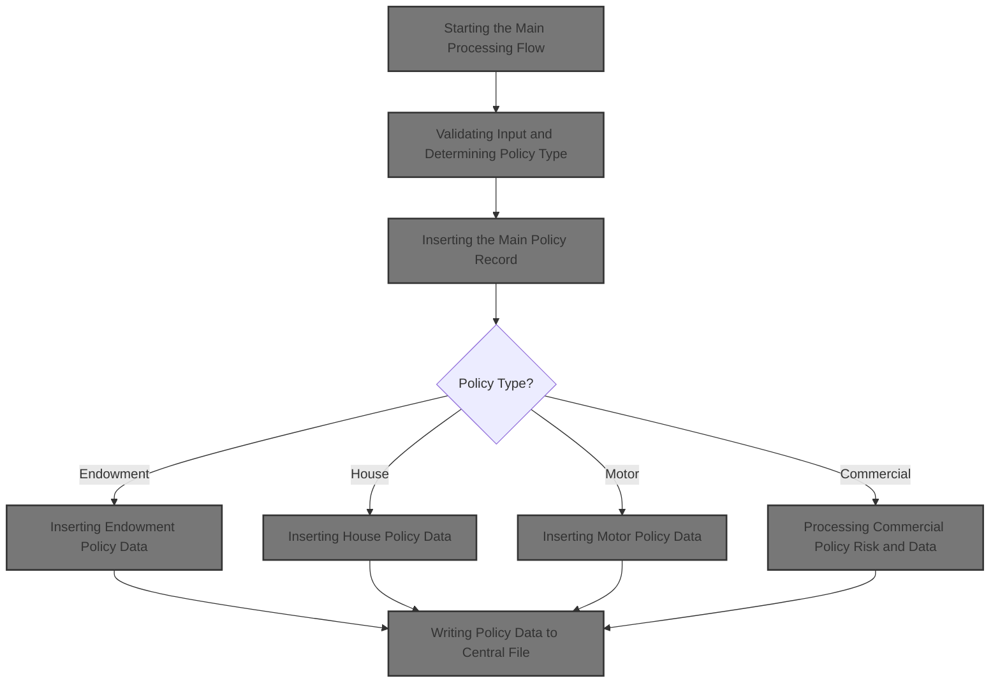

## Dependencies

### Programs

- <SwmToken path="base/src/lgapdb09.cbl" pos="2:6:6" line-data="       PROGRAM-ID. LGAPDB09.">`LGAPDB09`</SwmToken> (<SwmPath>[base/src/lgapdb09.cbl](base/src/lgapdb09.cbl)</SwmPath>)
- <SwmToken path="base/src/lgapdb09.cbl" pos="268:9:9" line-data="             EXEC CICS Link Program(LGAPVS01)">`LGAPVS01`</SwmToken> (<SwmPath>[base/src/lgapvs01.cbl](base/src/lgapvs01.cbl)</SwmPath>)
- LGSTSQ (<SwmPath>[base/src/lgstsq.cbl](base/src/lgstsq.cbl)</SwmPath>)
- LGCOMCAL (<SwmPath>[base/src/lgcomcal.cbl](base/src/lgcomcal.cbl)</SwmPath>)

### Copybooks

- LGCMAREA (<SwmPath>[base/src/lgcmarea.cpy](base/src/lgcmarea.cpy)</SwmPath>)
- LGCOMDAT (<SwmPath>[base/src/lgcomdat.cpy](base/src/lgcomdat.cpy)</SwmPath>)
- LGPOLICY (<SwmPath>[base/src/lgpolicy.cpy](base/src/lgpolicy.cpy)</SwmPath>)
- SQLCA

## Input and Output Tables/Files used

### <SwmToken path="base/src/lgapdb09.cbl" pos="2:6:6" line-data="       PROGRAM-ID. LGAPDB09.">`LGAPDB09`</SwmToken> (<SwmPath>[base/src/lgapdb09.cbl](base/src/lgapdb09.cbl)</SwmPath>)

| Table / File Name | Type                                                                                                                     | Description                                              | Usage Mode   | Key Fields / Layout Highlights                                                                                                                                                                                                                                                                                                                                                                                                                                                                                                                                                                                                                                                                                                                                                                                                                                                                                                                                                                                                                                                                                                                                                                                                                                                                                                                                                                                                                                                                                                                                                                                                                                                                                                                                                                                                                                                                                                                                                                                                                                                                                                                                                                                                                                                                                                                                                                                                                                                                                                                                                                                                                                        |
| ----------------- | ------------------------------------------------------------------------------------------------------------------------ | -------------------------------------------------------- | ------------ | --------------------------------------------------------------------------------------------------------------------------------------------------------------------------------------------------------------------------------------------------------------------------------------------------------------------------------------------------------------------------------------------------------------------------------------------------------------------------------------------------------------------------------------------------------------------------------------------------------------------------------------------------------------------------------------------------------------------------------------------------------------------------------------------------------------------------------------------------------------------------------------------------------------------------------------------------------------------------------------------------------------------------------------------------------------------------------------------------------------------------------------------------------------------------------------------------------------------------------------------------------------------------------------------------------------------------------------------------------------------------------------------------------------------------------------------------------------------------------------------------------------------------------------------------------------------------------------------------------------------------------------------------------------------------------------------------------------------------------------------------------------------------------------------------------------------------------------------------------------------------------------------------------------------------------------------------------------------------------------------------------------------------------------------------------------------------------------------------------------------------------------------------------------------------------------------------------------------------------------------------------------------------------------------------------------------------------------------------------------------------------------------------------------------------------------------------------------------------------------------------------------------------------------------------------------------------------------------------------------------------------------------------------------------- |
| COMMERCIAL        | <SwmToken path="base/src/lgapdb09.cbl" pos="199:3:3" line-data="           INITIALIZE DB2-IN-INTEGERS.">`DB2`</SwmToken> | Commercial insurance property, risk, and premium details | Output       | <SwmToken path="base/src/lgapdb09.cbl" pos="567:2:2" line-data="                       (PolicyNumber,">`PolicyNumber`</SwmToken>, <SwmToken path="base/src/lgapdb09.cbl" pos="568:1:1" line-data="                        RequestDate,">`RequestDate`</SwmToken>, <SwmToken path="base/src/lgapdb09.cbl" pos="569:1:1" line-data="                        StartDate,">`StartDate`</SwmToken>, <SwmToken path="base/src/lgapdb09.cbl" pos="570:1:1" line-data="                        RenewalDate,">`RenewalDate`</SwmToken>, <SwmToken path="base/src/lgapdb09.cbl" pos="502:7:7" line-data="           MOVE CA-B-Address TO WS-XADDRESS">`Address`</SwmToken>, <SwmToken path="base/src/lgapdb09.cbl" pos="572:1:1" line-data="                        Zipcode,">`Zipcode`</SwmToken>, <SwmToken path="base/src/lgapdb09.cbl" pos="573:1:1" line-data="                        LatitudeN,">`LatitudeN`</SwmToken>, <SwmToken path="base/src/lgapdb09.cbl" pos="574:1:1" line-data="                        LongitudeW,">`LongitudeW`</SwmToken>, <SwmToken path="base/src/lgapdb09.cbl" pos="505:7:7" line-data="           MOVE CA-B-Customer TO WS-XCUSTNAME">`Customer`</SwmToken>, <SwmToken path="base/src/lgapdb09.cbl" pos="576:1:1" line-data="                        PropertyType,">`PropertyType`</SwmToken>, <SwmToken path="base/src/lgapdb09.cbl" pos="577:1:1" line-data="                        FirePeril,">`FirePeril`</SwmToken>, <SwmToken path="base/src/lgapdb09.cbl" pos="518:15:19" line-data="           MOVE WS-ZFP-PREMIUM TO CA-B-CA-B-FPR">`CA-B-FPR`</SwmToken>, <SwmToken path="base/src/lgapdb09.cbl" pos="579:1:1" line-data="                        CrimePeril,">`CrimePeril`</SwmToken>, <SwmToken path="base/src/lgapdb09.cbl" pos="580:1:1" line-data="                        CrimePremium,">`CrimePremium`</SwmToken>, <SwmToken path="base/src/lgapdb09.cbl" pos="581:1:1" line-data="                        FloodPeril,">`FloodPeril`</SwmToken>, <SwmToken path="base/src/lgapdb09.cbl" pos="582:1:1" line-data="                        FloodPremium,">`FloodPremium`</SwmToken>, <SwmToken path="base/src/lgapdb09.cbl" pos="583:1:1" line-data="                        WeatherPeril,">`WeatherPeril`</SwmToken>, <SwmToken path="base/src/lgapdb09.cbl" pos="584:1:1" line-data="                        WeatherPremium,">`WeatherPremium`</SwmToken>, <SwmToken path="base/src/lgapdb09.cbl" pos="585:1:1" line-data="                        Status,">`Status`</SwmToken>, <SwmToken path="base/src/lgapdb09.cbl" pos="586:1:1" line-data="                        RejectionReason)">`RejectionReason`</SwmToken> |
| ENDOWMENT         | <SwmToken path="base/src/lgapdb09.cbl" pos="199:3:3" line-data="           INITIALIZE DB2-IN-INTEGERS.">`DB2`</SwmToken> | Endowment policy financial and insured party data        | Output       | <SwmToken path="base/src/lgapdb09.cbl" pos="289:3:3" line-data="                       ( POLICYNUMBER,">`POLICYNUMBER`</SwmToken>, <SwmToken path="base/src/lgapdb09.cbl" pos="365:1:1" line-data="                            WITHPROFITS,">`WITHPROFITS`</SwmToken>, <SwmToken path="base/src/lgapdb09.cbl" pos="366:1:1" line-data="                            EQUITIES,">`EQUITIES`</SwmToken>, <SwmToken path="base/src/lgapdb09.cbl" pos="367:1:1" line-data="                            MANAGEDFUND,">`MANAGEDFUND`</SwmToken>, <SwmToken path="base/src/lgapdb09.cbl" pos="368:1:1" line-data="                            FUNDNAME,">`FUNDNAME`</SwmToken>, <SwmToken path="base/src/lgapdb09.cbl" pos="346:7:7" line-data="           MOVE CA-E-TERM        TO DB2-E-TERM-SINT">`TERM`</SwmToken>, <SwmToken path="base/src/lgapdb09.cbl" pos="347:17:17" line-data="           MOVE CA-E-SUM-ASSURED TO DB2-E-SUMASSURED-INT">`SUMASSURED`</SwmToken>, <SwmToken path="base/src/lgapdb09.cbl" pos="371:1:1" line-data="                            LIFEASSURED,">`LIFEASSURED`</SwmToken>, <SwmToken path="base/src/lgapdb09.cbl" pos="372:1:1" line-data="                            PADDINGDATA    )">`PADDINGDATA`</SwmToken>                                                                                                                                                                                                                                                                                                                                                                                                                                                                                                                                                                                                                                                                                                                                                                                                                                                                                                                                                                                                                                                                                                                                                                                                                                                                                                                                                                                                                        |
| HOUSE             | <SwmToken path="base/src/lgapdb09.cbl" pos="199:3:3" line-data="           INITIALIZE DB2-IN-INTEGERS.">`DB2`</SwmToken> | House insurance property type, value, and address        | Output       | <SwmToken path="base/src/lgapdb09.cbl" pos="289:3:3" line-data="                       ( POLICYNUMBER,">`POLICYNUMBER`</SwmToken>, <SwmToken path="base/src/lgapdb09.cbl" pos="424:1:1" line-data="                         PROPERTYTYPE,">`PROPERTYTYPE`</SwmToken>, <SwmToken path="base/src/lgapdb09.cbl" pos="418:15:15" line-data="           MOVE CA-H-BED    TO DB2-H-BEDROOMS-SINT">`BEDROOMS`</SwmToken>, <SwmToken path="base/src/lgapdb09.cbl" pos="417:15:15" line-data="           MOVE CA-H-VAL       TO DB2-H-VALUE-INT">`VALUE`</SwmToken>, <SwmToken path="base/src/lgapdb09.cbl" pos="427:1:1" line-data="                         HOUSENAME,">`HOUSENAME`</SwmToken>, <SwmToken path="base/src/lgapdb09.cbl" pos="428:1:1" line-data="                         HOUSENUMBER,">`HOUSENUMBER`</SwmToken>, <SwmToken path="base/src/lgapdb09.cbl" pos="429:1:1" line-data="                         POSTCODE          )">`POSTCODE`</SwmToken>                                                                                                                                                                                                                                                                                                                                                                                                                                                                                                                                                                                                                                                                                                                                                                                                                                                                                                                                                                                                                                                                                                                                                                                                                                                                                                                                                                                                                                                                                                                                                                                                                                                                                                         |
| MOTOR             | <SwmToken path="base/src/lgapdb09.cbl" pos="199:3:3" line-data="           INITIALIZE DB2-IN-INTEGERS.">`DB2`</SwmToken> | Motor insurance vehicle specs, value, and history        | Output       | <SwmToken path="base/src/lgapdb09.cbl" pos="289:3:3" line-data="                       ( POLICYNUMBER,">`POLICYNUMBER`</SwmToken>, <SwmToken path="base/src/lgapdb09.cbl" pos="460:1:1" line-data="                         MAKE,">`MAKE`</SwmToken>, <SwmToken path="base/src/lgapdb09.cbl" pos="461:1:1" line-data="                         MODEL,">`MODEL`</SwmToken>, <SwmToken path="base/src/lgapdb09.cbl" pos="417:15:15" line-data="           MOVE CA-H-VAL       TO DB2-H-VALUE-INT">`VALUE`</SwmToken>, <SwmToken path="base/src/lgapdb09.cbl" pos="463:1:1" line-data="                         REGNUMBER,">`REGNUMBER`</SwmToken>, <SwmToken path="base/src/lgapdb09.cbl" pos="464:1:1" line-data="                         COLOUR,">`COLOUR`</SwmToken>, <SwmToken path="base/src/lgapdb09.cbl" pos="452:7:7" line-data="           MOVE CA-M-CC          TO DB2-M-CC-SINT">`CC`</SwmToken>, <SwmToken path="base/src/lgapdb09.cbl" pos="466:1:1" line-data="                         YEAROFMANUFACTURE,">`YEAROFMANUFACTURE`</SwmToken>, <SwmToken path="base/src/lgapdb09.cbl" pos="453:7:7" line-data="           MOVE CA-M-PREMIUM     TO DB2-M-PREMIUM-INT">`PREMIUM`</SwmToken>, <SwmToken path="base/src/lgapdb09.cbl" pos="454:7:7" line-data="           MOVE CA-M-ACCIDENTS   TO DB2-M-ACCIDENTS-INT">`ACCIDENTS`</SwmToken>                                                                                                                                                                                                                                                                                                                                                                                                                                                                                                                                                                                                                                                                                                                                                                                                                                                                                                                                                                                                                                                                                                                                                                                                                                                                                                                 |
| POLICY            | <SwmToken path="base/src/lgapdb09.cbl" pos="199:3:3" line-data="           INITIALIZE DB2-IN-INTEGERS.">`DB2`</SwmToken> | Insurance policy core details and lifecycle dates        | Input/Output | <SwmToken path="base/src/lgapdb09.cbl" pos="289:3:3" line-data="                       ( POLICYNUMBER,">`POLICYNUMBER`</SwmToken>, <SwmToken path="base/src/lgapdb09.cbl" pos="290:1:1" line-data="                         CUSTOMERNUMBER,">`CUSTOMERNUMBER`</SwmToken>, <SwmToken path="base/src/lgapdb09.cbl" pos="291:1:1" line-data="                         ISSUEDATE,">`ISSUEDATE`</SwmToken>, <SwmToken path="base/src/lgapdb09.cbl" pos="292:1:1" line-data="                         EXPIRYDATE,">`EXPIRYDATE`</SwmToken>, <SwmToken path="base/src/lgapdb09.cbl" pos="222:11:11" line-data="               MOVE &#39;E&#39; TO DB2-POLICYTYPE">`POLICYTYPE`</SwmToken>, <SwmToken path="base/src/lgapdb09.cbl" pos="294:1:1" line-data="                         LASTCHANGED,">`LASTCHANGED`</SwmToken>, <SwmToken path="base/src/lgapdb09.cbl" pos="283:5:5" line-data="           MOVE CA-BROKERID TO DB2-BROKERID-INT">`BROKERID`</SwmToken>, <SwmToken path="base/src/lgapdb09.cbl" pos="296:1:1" line-data="                         BROKERSREFERENCE,">`BROKERSREFERENCE`</SwmToken>, <SwmToken path="base/src/lgapdb09.cbl" pos="284:5:5" line-data="           MOVE CA-PAYMENT TO DB2-PAYMENT-INT">`PAYMENT`</SwmToken>, <SwmToken path="base/src/lgapdb09.cbl" pos="334:4:6" line-data="               INTO :CA-LASTCHANGED">`CA-LASTCHANGED`</SwmToken>                                                                                                                                                                                                                                                                                                                                                                                                                                                                                                                                                                                                                                                                                                                                                                                                                                                                                                                                                                                                                                                                                                                                                                                                                                                                                         |

## Detailed View of the Program's Functionality

# Detailed Explanation of the Swimmio-genapp-house Main Processing Flow

---

## a. Starting the Main Processing Flow

The main entry point prepares the environment for processing a policy transaction. It initializes header fields (such as transaction, terminal, and task identifiers) and sets up working storage for database operations. The code then checks if any input data was received (by checking the communication area length). If no input is present, it logs an error and immediately aborts the transaction to prevent further processing with missing data.

---

## b. Preparing and Logging Error Details

When an error is detected (such as missing input), the system prepares a detailed error message. This includes capturing the SQL error code, the current date and time, and formatting these into a structured error message. The error message is then sent to a centralized logging handler via a queue mechanism. This handler (LGSTSQ) is responsible for writing the error to both a temporary and a transient queue for integration and audit purposes.

If there is any input data present, up to 90 bytes of it are also sent as a supplemental error message for additional context.

---

## c. Validating Input and Determining Policy Type

If input data is present, the system initializes return codes and copies key fields (like customer number) into working storage and error message structures. It then determines the type of policy being processed by examining a request identifier in the input. Depending on the policy type (Endowment, House, Motor, or Commercial), it calculates the required minimum input length and sets a policy type code for downstream logic.

If the request identifier is not recognized, the system sets an error code and exits. If the input data is too short for the expected policy type, it also sets an error code and exits.

---

## d. Inserting the Main Policy Record

Once the input is validated, the system prepares the main policy data for insertion into the database. It converts necessary fields to the correct format and issues an SQL insert into the main POLICY table. After the insert, it checks the result:

- On success, it retrieves the generated policy number and the last-changed timestamp for use in subsequent steps.
- On a foreign key error (e.g., missing customer), it logs the error and exits with a specific code.
- On any other error, it logs the error and exits with a general failure code.

---

## e. Branching to Policy-Type-Specific Inserts

After the main policy record is inserted, the system branches to a subroutine specific to the policy type:

- Endowment: Calls the endowment insert routine.
- House: Calls the house insert routine.
- Motor: Calls the motor insert routine.
- Commercial: Calls the commercial/business insert routine.
- Other: Sets an error code for unrecognized requests.

---

## f. Inserting Endowment Policy Data

For endowment policies, the system prepares numeric fields and checks if there is any variable-length data (such as additional notes or descriptions). If present, it includes this data in the insert; otherwise, it inserts only the fixed fields. If the insert fails, it logs the error and aborts the transaction to ensure database consistency.

---

## g. Inserting House Policy Data

For house policies, the system prepares all relevant fields (property type, number of bedrooms, value, etc.) and inserts them into the HOUSE table. If the insert fails, it logs the error and aborts the transaction.

---

## h. Inserting Motor Policy Data

For motor policies, the system prepares all relevant fields (vehicle value, engine size, premium, accident count, etc.) and inserts them into the MOTOR table. If the insert fails, it logs the error and aborts the transaction.

---

## i. Processing Commercial Policy Risk and Data

For commercial policies, the system collects all relevant customer, property, and policy fields into a risk calculation structure. It then calls an external risk calculation module (LGCOMCAL) to compute the risk score, status, rejection reason, and premiums.

### i.1. Running Risk Calculation and Business Logic

The risk calculation module initializes its environment, sets up matrices for risk and security, and then runs the main business logic: calculating the risk score, determining the policy status, and calculating premiums.

### i.2. Setting Up Calculation Environment and Matrices

The module initializes session context and risk/security matrices. It loops through a matrix, setting special values at certain positions to influence risk mapping for specific property types or perils.

### i.3. Calculating Risk, Status, and Premiums

The module calculates the risk score based on property type and postcode prefix, using hardcoded factors for each. It then determines the policy status (e.g., normal, pending review, manual review required) based on the risk score and sets an appropriate rejection reason if needed. Finally, it calculates premiums for different perils (fire, crime, flood, weather) using the risk score, peril factors, and any applicable discounts.

### i.4. Scoring Commercial Property Risk

The risk score is calculated by summing a base value, a property-type-specific factor, and a geographic factor (based on postcode prefix). The result is stored for use in status and premium calculations.

### i.5. Updating Policy With Risk Results

After the risk calculation, the results (score, status, rejection reason, and premiums) are copied back into the main communication area for further processing.

---

## j. Applying Matrix Overrides and Rejection Logic

The system applies business rules to the risk score and status. If the score exceeds certain thresholds, it overrides the status and sets a specific rejection reason (e.g., "Critical Matrix Override - Manual Review" for very high scores). These overrides ensure that high-risk cases are escalated or flagged for manual review.

---

## k. Saving Commercial Policy to Database

The system maps all business data from the request into database fields and inserts a record into the COMMERCIAL table. If the insert fails, it logs the error and aborts the transaction.

---

## l. Chaining to Policy File Writer

After all database operations are complete, the system chains to a separate program responsible for writing the policy data to a central file (KSDSPOLY). This is done via a program-to-program call, passing the entire communication area.

---

## m. Writing Policy Data to Central File

The file writer program prepares the data for saving by mapping fields from the communication area into a file record structure. Depending on the policy type, it fills in the appropriate fields for customer, endowment, house, or motor policies. If the policy type is not recognized, it clears the data area.

The record is then written to the central file. If the write fails, it logs the error and returns.

---

## n. Logging File Write Errors

If a file write error occurs, the system captures the current date, time, customer and policy numbers, and error codes. It sends this information to the centralized logging handler. If there is additional input data, up to 90 bytes of it are also sent for context. This ensures that all relevant information is available for troubleshooting.

---

## o. Handling Error Message Queueing

The centralized logging handler (LGSTSQ) prepares the message buffers, assigns system and program identifiers, and determines whether the message came from a remote source or a terminal. It sets flags and message content accordingly, and writes the message to both a transient and a temporary queue. If the message originated from a terminal, it sends a one-character response to acknowledge receipt.

---

This flow ensures robust validation, error handling, and auditability for all policy transactions, with clear separation of concerns between database operations, risk calculations, file writing, and error logging.

# Data Definitions

### <SwmToken path="base/src/lgapdb09.cbl" pos="2:6:6" line-data="       PROGRAM-ID. LGAPDB09.">`LGAPDB09`</SwmToken> (<SwmPath>[base/src/lgapdb09.cbl](base/src/lgapdb09.cbl)</SwmPath>)

| Table / Record Name | Type                                                                                                                     | Short Description                                        | Usage Mode                      |
| ------------------- | ------------------------------------------------------------------------------------------------------------------------ | -------------------------------------------------------- | ------------------------------- |
| COMMERCIAL          | <SwmToken path="base/src/lgapdb09.cbl" pos="199:3:3" line-data="           INITIALIZE DB2-IN-INTEGERS.">`DB2`</SwmToken> | Commercial insurance property, risk, and premium details | Output (INSERT)                 |
| ENDOWMENT           | <SwmToken path="base/src/lgapdb09.cbl" pos="199:3:3" line-data="           INITIALIZE DB2-IN-INTEGERS.">`DB2`</SwmToken> | Endowment policy financial and insured party data        | Output (INSERT)                 |
| HOUSE               | <SwmToken path="base/src/lgapdb09.cbl" pos="199:3:3" line-data="           INITIALIZE DB2-IN-INTEGERS.">`DB2`</SwmToken> | House insurance property type, value, and address        | Output (INSERT)                 |
| MOTOR               | <SwmToken path="base/src/lgapdb09.cbl" pos="199:3:3" line-data="           INITIALIZE DB2-IN-INTEGERS.">`DB2`</SwmToken> | Motor insurance vehicle specs, value, and history        | Output (INSERT)                 |
| POLICY              | <SwmToken path="base/src/lgapdb09.cbl" pos="199:3:3" line-data="           INITIALIZE DB2-IN-INTEGERS.">`DB2`</SwmToken> | Insurance policy core details and lifecycle dates        | Input (SELECT), Output (INSERT) |

# Rule Definition

| Paragraph Name                                                                                                                                                                                                                                                                                                                                                                                                                                                                                                                                                                                                                                                                                                                                                                                                                                                                                                                                                                                                                                                                  | Rule ID | Category          | Description                                                                                                                        | Conditions                                                                                                                                                                                                                                                                          | Remarks                                                                                                                                                                                                                                                                                                                                                                                                                                                                                                                                                                   |
| ------------------------------------------------------------------------------------------------------------------------------------------------------------------------------------------------------------------------------------------------------------------------------------------------------------------------------------------------------------------------------------------------------------------------------------------------------------------------------------------------------------------------------------------------------------------------------------------------------------------------------------------------------------------------------------------------------------------------------------------------------------------------------------------------------------------------------------------------------------------------------------------------------------------------------------------------------------------------------------------------------------------------------------------------------------------------------- | ------- | ----------------- | ---------------------------------------------------------------------------------------------------------------------------------- | ----------------------------------------------------------------------------------------------------------------------------------------------------------------------------------------------------------------------------------------------------------------------------------- | ------------------------------------------------------------------------------------------------------------------------------------------------------------------------------------------------------------------------------------------------------------------------------------------------------------------------------------------------------------------------------------------------------------------------------------------------------------------------------------------------------------------------------------------------------------------------- |
| <SwmToken path="base/src/lgcomcal.cbl" pos="269:3:7" line-data="           PERFORM PROCESS-RISK-SCORE.">`PROCESS-RISK-SCORE`</SwmToken> section in <SwmPath>[base/src/lgcomcal.cbl](base/src/lgcomcal.cbl)</SwmPath>, <SwmToken path="base/src/lgapdb09.cbl" pos="261:3:5" line-data="               PERFORM P500-BIZ">`P500-BIZ`</SwmToken> section in <SwmPath>[base/src/lgapdb09.cbl](base/src/lgapdb09.cbl)</SwmPath>                                                                                                                                                                                                                                                                                                                                                                                                                                                                                                                                                                                                                                                       | RL-001  | Computation       | Calculate the risk score for commercial policies by summing the base risk score, property type factor, and geographical factor.    | <SwmToken path="base/src/lgapdb09.cbl" pos="218:3:7" line-data="           EVALUATE CA-REQUEST-ID">`CA-REQUEST-ID`</SwmToken> = <SwmToken path="base/src/lgapdb09.cbl" pos="232:4:4" line-data="             WHEN &#39;01ACOM&#39;">`01ACOM`</SwmToken> (commercial policy request) | Base risk score: 100. Property type factors: WAREHOUSE=50, FACTORY=75, OFFICE=25, RETAIL=40, others=0. Geographical factor: if <SwmToken path="base/src/lgapdb09.cbl" pos="497:3:7" line-data="           MOVE CA-B-PST TO WS-XPOSTCODE">`CA-B-PST`</SwmToken> starts with 'FL' or 'CR', add 30, else 0. Output risk score as a number (integer, 3 digits).                                                                                                                                                                                                               |
| <SwmToken path="base/src/lgcomcal.cbl" pos="270:3:7" line-data="           PERFORM DETERMINE-POLICY-STATUS.">`DETERMINE-POLICY-STATUS`</SwmToken> in <SwmPath>[base/src/lgcomcal.cbl](base/src/lgcomcal.cbl)</SwmPath>, <SwmToken path="base/src/lgapdb09.cbl" pos="526:3:7" line-data="           PERFORM P546-CHK-MATRIX">`P546-CHK-MATRIX`</SwmToken> in <SwmPath>[base/src/lgapdb09.cbl](base/src/lgapdb09.cbl)</SwmPath>                                                                                                                                                                                                                                                                                                                                                                                                                                                                                                                                                                                                                                                   | RL-002  | Conditional Logic | Set policy status and rejection reason based on risk score thresholds.                                                             | Risk score is calculated for a commercial policy                                                                                                                                                                                                                                    | Status: 2 if risk score > 200, 1 if 151-200, 0 if ≤ 150. Rejection reason: 'Critical Matrix Override - Manual Review' for status 2, 'Matrix Override - Pending Verification' for status 1, blank for status 0. Status is a single digit (0-2), rejection reason is a string (up to 50 characters).                                                                                                                                                                                                                                                                        |
| <SwmToken path="base/src/lgcomcal.cbl" pos="271:3:5" line-data="           PERFORM CALCULATE-PREMIUMS.">`CALCULATE-PREMIUMS`</SwmToken> and <SwmToken path="base/src/lgcomcal.cbl" pos="381:3:7" line-data="           PERFORM COMPLEX-PREMIUM-CALCULATIONS.">`COMPLEX-PREMIUM-CALCULATIONS`</SwmToken> in <SwmPath>[base/src/lgcomcal.cbl](base/src/lgcomcal.cbl)</SwmPath>, <SwmToken path="base/src/lgapdb09.cbl" pos="261:3:5" line-data="               PERFORM P500-BIZ">`P500-BIZ`</SwmToken> and <SwmToken path="base/src/lgapdb09.cbl" pos="528:3:5" line-data="           PERFORM P548-BINS">`P548-BINS`</SwmToken> in <SwmPath>[base/src/lgapdb09.cbl](base/src/lgapdb09.cbl)</SwmPath>                                                                                                                                                                                                                                                                                                                                                                              | RL-003  | Computation       | Calculate premiums for fire, crime, flood, and weather perils using risk score, peril factor, peril-specific factor, and discount. | For each peril, peril factor > 0                                                                                                                                                                                                                                                    | Peril-specific factors: Fire=80, Crime=60, Flood=120, Weather=90. Discount: <SwmToken path="base/src/lgcomcal.cbl" pos="127:15:17" line-data="           03 WS-SA-DISCOUNT           PIC V99 VALUE 0.90.">`0.90`</SwmToken> if all peril factors > 0, else <SwmToken path="base/src/lgcomcal.cbl" pos="285:4:6" line-data="           MOVE &#39;1.0.5&#39; TO RMS-VERSION">`1.0`</SwmToken>. Premium = risk score × peril factor × peril-specific factor × discount. Premium fields are 8-digit numbers, always present in output (zero if peril factor is zero/missing). |
| MAINLINE SECTION in <SwmPath>[base/src/lgapdb09.cbl](base/src/lgapdb09.cbl)</SwmPath>, <SwmToken path="base/src/lgapvs01.cbl" pos="146:3:5" line-data="             PERFORM P999-ERROR">`P999-ERROR`</SwmToken> in <SwmPath>[base/src/lgapvs01.cbl](base/src/lgapvs01.cbl)</SwmPath>, <SwmToken path="base/src/lgapdb09.cbl" pos="205:3:7" line-data="               PERFORM WRITE-ERROR-MESSAGE">`WRITE-ERROR-MESSAGE`</SwmToken> in <SwmPath>[base/src/lgapdb09.cbl](base/src/lgapdb09.cbl)</SwmPath>, <SwmPath>[base/src/lgstsq.cbl](base/src/lgstsq.cbl)</SwmPath>                                                                                                                                                                                                                                                                                                                                                                                                                                                                                                          | RL-004  | Conditional Logic | Abort processing and log error if input commarea is missing or shorter than required for policy type.                              | EIBCALEN = 0 or EIBCALEN < required length for policy type                                                                                                                                                                                                                          | Error code 'LGCA' for missing commarea, '98' for short commarea. Error message must include SQLCODE, current time, customer/policy info, and up to 90 bytes of input commarea. Error code is a string (2-4 characters).                                                                                                                                                                                                                                                                                                                                                   |
| <SwmToken path="base/src/lgapdb09.cbl" pos="247:3:5" line-data="           PERFORM P100-T">`P100-T`</SwmToken>, <SwmToken path="base/src/lgapdb09.cbl" pos="252:3:5" line-data="               PERFORM P200-E">`P200-E`</SwmToken>, <SwmToken path="base/src/lgapdb09.cbl" pos="255:3:5" line-data="               PERFORM P300-H">`P300-H`</SwmToken>, <SwmToken path="base/src/lgapdb09.cbl" pos="258:3:5" line-data="               PERFORM P400-M">`P400-M`</SwmToken>, <SwmToken path="base/src/lgapdb09.cbl" pos="261:3:5" line-data="               PERFORM P500-BIZ">`P500-BIZ`</SwmToken>, <SwmToken path="base/src/lgapdb09.cbl" pos="528:3:5" line-data="           PERFORM P548-BINS">`P548-BINS`</SwmToken> in <SwmPath>[base/src/lgapdb09.cbl](base/src/lgapdb09.cbl)</SwmPath>, <SwmToken path="base/src/lgapdb09.cbl" pos="205:3:7" line-data="               PERFORM WRITE-ERROR-MESSAGE">`WRITE-ERROR-MESSAGE`</SwmToken> in <SwmPath>[base/src/lgapdb09.cbl](base/src/lgapdb09.cbl)</SwmPath>, <SwmPath>[base/src/lgstsq.cbl](base/src/lgstsq.cbl)</SwmPath> | RL-005  | Conditional Logic | Abort processing and log error if a database or file write error occurs.                                                           | SQLCODE not zero after <SwmToken path="base/src/lgapdb09.cbl" pos="199:3:3" line-data="           INITIALIZE DB2-IN-INTEGERS.">`DB2`</SwmToken> operations or file write response not normal                                                                                        | Error code '90' for <SwmToken path="base/src/lgapdb09.cbl" pos="199:3:3" line-data="           INITIALIZE DB2-IN-INTEGERS.">`DB2`</SwmToken> errors, '92' for file write errors. Error message must include SQLCODE, current time, customer/policy info, and up to 90 bytes of input commarea. Error code is a string (2-4 characters).                                                                                                                                                                                                                                   |
| <SwmToken path="base/src/lgcomcal.cbl" pos="210:3:7" line-data="           PERFORM CLEANUP-AND-EXIT.">`CLEANUP-AND-EXIT`</SwmToken> in <SwmPath>[base/src/lgcomcal.cbl](base/src/lgcomcal.cbl)</SwmPath>, <SwmToken path="base/src/lgapdb09.cbl" pos="261:3:5" line-data="               PERFORM P500-BIZ">`P500-BIZ`</SwmToken> and <SwmToken path="base/src/lgapdb09.cbl" pos="528:3:5" line-data="           PERFORM P548-BINS">`P548-BINS`</SwmToken> in <SwmPath>[base/src/lgapdb09.cbl](base/src/lgapdb09.cbl)</SwmPath>, <SwmToken path="base/src/lgapvs01.cbl" pos="90:1:3" line-data="       P100-ENTRY SECTION.">`P100-ENTRY`</SwmToken> in <SwmPath>[base/src/lgapvs01.cbl](base/src/lgapvs01.cbl)</SwmPath>                                                                                                                                                                                                                                                                                                                                                         | RL-006  | Data Assignment   | Ensure all premium fields, status, and rejection reason are present in output commarea, even if their value is zero or blank.      | Always, regardless of input values                                                                                                                                                                                                                                                  | Premium fields: 8-digit numbers (zero if not applicable). Status: single digit. Rejection reason: up to 50 characters, blank if not applicable. All fields must be present in output commarea.                                                                                                                                                                                                                                                                                                                                                                            |

# User Stories

## User Story 1: Commercial Policy Risk, Premium Calculation, and Output Formatting

---

### Story Description:

As a commercial policy applicant, I want the system to calculate my policy's risk score, determine the policy status and rejection reason, compute all relevant peril premiums, and ensure all output fields are present so that I receive an accurate, fair, and complete policy assessment and pricing.

---

### Business Rule Mapping:

| Rule ID | Paragraph Name                                                                                                                                                                                                                                                                                                                                                                                                                                                                                                                                                                                                                                                                                                          | Rule Description                                                                                                                   |
| ------- | ----------------------------------------------------------------------------------------------------------------------------------------------------------------------------------------------------------------------------------------------------------------------------------------------------------------------------------------------------------------------------------------------------------------------------------------------------------------------------------------------------------------------------------------------------------------------------------------------------------------------------------------------------------------------------------------------------------------------- | ---------------------------------------------------------------------------------------------------------------------------------- |
| RL-001  | <SwmToken path="base/src/lgcomcal.cbl" pos="269:3:7" line-data="           PERFORM PROCESS-RISK-SCORE.">`PROCESS-RISK-SCORE`</SwmToken> section in <SwmPath>[base/src/lgcomcal.cbl](base/src/lgcomcal.cbl)</SwmPath>, <SwmToken path="base/src/lgapdb09.cbl" pos="261:3:5" line-data="               PERFORM P500-BIZ">`P500-BIZ`</SwmToken> section in <SwmPath>[base/src/lgapdb09.cbl](base/src/lgapdb09.cbl)</SwmPath>                                                                                                                                                                                                                                                                                               | Calculate the risk score for commercial policies by summing the base risk score, property type factor, and geographical factor.    |
| RL-002  | <SwmToken path="base/src/lgcomcal.cbl" pos="270:3:7" line-data="           PERFORM DETERMINE-POLICY-STATUS.">`DETERMINE-POLICY-STATUS`</SwmToken> in <SwmPath>[base/src/lgcomcal.cbl](base/src/lgcomcal.cbl)</SwmPath>, <SwmToken path="base/src/lgapdb09.cbl" pos="526:3:7" line-data="           PERFORM P546-CHK-MATRIX">`P546-CHK-MATRIX`</SwmToken> in <SwmPath>[base/src/lgapdb09.cbl](base/src/lgapdb09.cbl)</SwmPath>                                                                                                                                                                                                                                                                                           | Set policy status and rejection reason based on risk score thresholds.                                                             |
| RL-003  | <SwmToken path="base/src/lgcomcal.cbl" pos="271:3:5" line-data="           PERFORM CALCULATE-PREMIUMS.">`CALCULATE-PREMIUMS`</SwmToken> and <SwmToken path="base/src/lgcomcal.cbl" pos="381:3:7" line-data="           PERFORM COMPLEX-PREMIUM-CALCULATIONS.">`COMPLEX-PREMIUM-CALCULATIONS`</SwmToken> in <SwmPath>[base/src/lgcomcal.cbl](base/src/lgcomcal.cbl)</SwmPath>, <SwmToken path="base/src/lgapdb09.cbl" pos="261:3:5" line-data="               PERFORM P500-BIZ">`P500-BIZ`</SwmToken> and <SwmToken path="base/src/lgapdb09.cbl" pos="528:3:5" line-data="           PERFORM P548-BINS">`P548-BINS`</SwmToken> in <SwmPath>[base/src/lgapdb09.cbl](base/src/lgapdb09.cbl)</SwmPath>                      | Calculate premiums for fire, crime, flood, and weather perils using risk score, peril factor, peril-specific factor, and discount. |
| RL-006  | <SwmToken path="base/src/lgcomcal.cbl" pos="210:3:7" line-data="           PERFORM CLEANUP-AND-EXIT.">`CLEANUP-AND-EXIT`</SwmToken> in <SwmPath>[base/src/lgcomcal.cbl](base/src/lgcomcal.cbl)</SwmPath>, <SwmToken path="base/src/lgapdb09.cbl" pos="261:3:5" line-data="               PERFORM P500-BIZ">`P500-BIZ`</SwmToken> and <SwmToken path="base/src/lgapdb09.cbl" pos="528:3:5" line-data="           PERFORM P548-BINS">`P548-BINS`</SwmToken> in <SwmPath>[base/src/lgapdb09.cbl](base/src/lgapdb09.cbl)</SwmPath>, <SwmToken path="base/src/lgapvs01.cbl" pos="90:1:3" line-data="       P100-ENTRY SECTION.">`P100-ENTRY`</SwmToken> in <SwmPath>[base/src/lgapvs01.cbl](base/src/lgapvs01.cbl)</SwmPath> | Ensure all premium fields, status, and rejection reason are present in output commarea, even if their value is zero or blank.      |

---

### Relevant Functionality:

- <SwmToken path="base/src/lgcomcal.cbl" pos="269:3:7" line-data="           PERFORM PROCESS-RISK-SCORE.">`PROCESS-RISK-SCORE`</SwmToken> **section in** <SwmPath>[base/src/lgcomcal.cbl](base/src/lgcomcal.cbl)</SwmPath>
  1. **RL-001:**
     - Set risk score to 100
     - Add property type factor based on <SwmToken path="base/src/lgapdb09.cbl" pos="496:3:7" line-data="           MOVE CA-B-PropType TO WS-XPROPTYPE">`CA-B-PropType`</SwmToken>
     - Add 50 if 'WAREHOUSE', 75 if 'FACTORY', 25 if 'OFFICE', 40 if 'RETAIL', else 0
     - Add 30 if <SwmToken path="base/src/lgapdb09.cbl" pos="497:3:7" line-data="           MOVE CA-B-PST TO WS-XPOSTCODE">`CA-B-PST`</SwmToken> starts with 'FL' or 'CR', else 0
     - Store total risk score in output commarea
- <SwmToken path="base/src/lgcomcal.cbl" pos="270:3:7" line-data="           PERFORM DETERMINE-POLICY-STATUS.">`DETERMINE-POLICY-STATUS`</SwmToken> **in** <SwmPath>[base/src/lgcomcal.cbl](base/src/lgcomcal.cbl)</SwmPath>
  1. **RL-002:**
     - If risk score > 200:
       - Set status to 2
       - Set rejection reason to 'Critical Matrix Override - Manual Review'
     - Else if risk score between 151 and 200:
       - Set status to 1
       - Set rejection reason to 'Matrix Override - Pending Verification'
     - Else:
       - Set status to 0
       - Set rejection reason to blank
     - Store status and rejection reason in output commarea
- <SwmToken path="base/src/lgcomcal.cbl" pos="271:3:5" line-data="           PERFORM CALCULATE-PREMIUMS.">`CALCULATE-PREMIUMS`</SwmToken> **and** <SwmToken path="base/src/lgcomcal.cbl" pos="381:3:7" line-data="           PERFORM COMPLEX-PREMIUM-CALCULATIONS.">`COMPLEX-PREMIUM-CALCULATIONS`</SwmToken> **in** <SwmPath>[base/src/lgcomcal.cbl](base/src/lgcomcal.cbl)</SwmPath>
  1. **RL-003:**
     - For each peril (fire, crime, flood, weather):
       - If peril factor > 0:
         - Calculate premium = risk score × peril factor × peril-specific factor × discount
         - Store premium in output commarea
       - Else:
         - Set premium to zero in output commarea
     - If all peril factors > 0, set discount to <SwmToken path="base/src/lgcomcal.cbl" pos="127:15:17" line-data="           03 WS-SA-DISCOUNT           PIC V99 VALUE 0.90.">`0.90`</SwmToken>, else <SwmToken path="base/src/lgcomcal.cbl" pos="285:4:6" line-data="           MOVE &#39;1.0.5&#39; TO RMS-VERSION">`1.0`</SwmToken>
- <SwmToken path="base/src/lgcomcal.cbl" pos="210:3:7" line-data="           PERFORM CLEANUP-AND-EXIT.">`CLEANUP-AND-EXIT`</SwmToken> **in** <SwmPath>[base/src/lgcomcal.cbl](base/src/lgcomcal.cbl)</SwmPath>
  1. **RL-006:**
     - Assign calculated or zero values to all premium fields in output
     - Assign status and rejection reason to output
     - Ensure output commarea includes policy number, last changed timestamp, status, rejection reason, and all premium fields

## User Story 2: Robust Error Handling for Input and Processing Failures

---

### Story Description:

As a system operator, I want the system to abort processing and log detailed error messages with appropriate error codes when input data is missing, incomplete, or when database/file write errors occur, so that issues can be quickly identified and resolved.

---

### Business Rule Mapping:

| Rule ID | Paragraph Name                                                                                                                                                                                                                                                                                                                                                                                                                                                                                                                                                                                                                                                                                                                                                                                                                                                                                                                                                                                                                                                                  | Rule Description                                                                                      |
| ------- | ------------------------------------------------------------------------------------------------------------------------------------------------------------------------------------------------------------------------------------------------------------------------------------------------------------------------------------------------------------------------------------------------------------------------------------------------------------------------------------------------------------------------------------------------------------------------------------------------------------------------------------------------------------------------------------------------------------------------------------------------------------------------------------------------------------------------------------------------------------------------------------------------------------------------------------------------------------------------------------------------------------------------------------------------------------------------------- | ----------------------------------------------------------------------------------------------------- |
| RL-005  | <SwmToken path="base/src/lgapdb09.cbl" pos="247:3:5" line-data="           PERFORM P100-T">`P100-T`</SwmToken>, <SwmToken path="base/src/lgapdb09.cbl" pos="252:3:5" line-data="               PERFORM P200-E">`P200-E`</SwmToken>, <SwmToken path="base/src/lgapdb09.cbl" pos="255:3:5" line-data="               PERFORM P300-H">`P300-H`</SwmToken>, <SwmToken path="base/src/lgapdb09.cbl" pos="258:3:5" line-data="               PERFORM P400-M">`P400-M`</SwmToken>, <SwmToken path="base/src/lgapdb09.cbl" pos="261:3:5" line-data="               PERFORM P500-BIZ">`P500-BIZ`</SwmToken>, <SwmToken path="base/src/lgapdb09.cbl" pos="528:3:5" line-data="           PERFORM P548-BINS">`P548-BINS`</SwmToken> in <SwmPath>[base/src/lgapdb09.cbl](base/src/lgapdb09.cbl)</SwmPath>, <SwmToken path="base/src/lgapdb09.cbl" pos="205:3:7" line-data="               PERFORM WRITE-ERROR-MESSAGE">`WRITE-ERROR-MESSAGE`</SwmToken> in <SwmPath>[base/src/lgapdb09.cbl](base/src/lgapdb09.cbl)</SwmPath>, <SwmPath>[base/src/lgstsq.cbl](base/src/lgstsq.cbl)</SwmPath> | Abort processing and log error if a database or file write error occurs.                              |
| RL-004  | MAINLINE SECTION in <SwmPath>[base/src/lgapdb09.cbl](base/src/lgapdb09.cbl)</SwmPath>, <SwmToken path="base/src/lgapvs01.cbl" pos="146:3:5" line-data="             PERFORM P999-ERROR">`P999-ERROR`</SwmToken> in <SwmPath>[base/src/lgapvs01.cbl](base/src/lgapvs01.cbl)</SwmPath>, <SwmToken path="base/src/lgapdb09.cbl" pos="205:3:7" line-data="               PERFORM WRITE-ERROR-MESSAGE">`WRITE-ERROR-MESSAGE`</SwmToken> in <SwmPath>[base/src/lgapdb09.cbl](base/src/lgapdb09.cbl)</SwmPath>, <SwmPath>[base/src/lgstsq.cbl](base/src/lgstsq.cbl)</SwmPath>                                                                                                                                                                                                                                                                                                                                                                                                                                                                                                          | Abort processing and log error if input commarea is missing or shorter than required for policy type. |

---

### Relevant Functionality:

- <SwmToken path="base/src/lgapdb09.cbl" pos="247:3:5" line-data="           PERFORM P100-T">`P100-T`</SwmToken>
  1. **RL-005:**
     - After <SwmToken path="base/src/lgapdb09.cbl" pos="199:3:3" line-data="           INITIALIZE DB2-IN-INTEGERS.">`DB2`</SwmToken> or file write operation:
       - If error detected (SQLCODE not zero or file write response not normal):
         - Set error code ('90' for <SwmToken path="base/src/lgapdb09.cbl" pos="199:3:3" line-data="           INITIALIZE DB2-IN-INTEGERS.">`DB2`</SwmToken>, '92' for file write)
         - Log error with context
         - Abort processing
- **MAINLINE SECTION in** <SwmPath>[base/src/lgapdb09.cbl](base/src/lgapdb09.cbl)</SwmPath>
  1. **RL-004:**
     - If EIBCALEN = 0:
       - Set error code to 'LGCA'
       - Log error with context
       - Abort processing
     - If EIBCALEN < required length:
       - Set error code to '98'
       - Log error with context
       - Abort processing

# Workflow

# Starting the Main Processing Flow

```mermaid
%%{init: {"flowchart": {"defaultRenderer": "elk"}} }%%
flowchart TD
    node1["Start: Initialize headers and input"]
    click node1 openCode "base/src/lgapdb09.cbl:190:200"
    node1 --> node2{"Was input data received? (EIBCALEN = 0)"}
    click node2 openCode "base/src/lgapdb09.cbl:203:207"
    node2 -->|"No"| node3["Preparing and Logging Error Details"]
    
    node3 --> node12["Chaining to Policy File Writer"]
    node2 -->|"Yes"| node4["Validating Input and Determining Policy Type"]
    
    node4 --> node5{"Determine policy type (CA-REQUEST-ID)"}
    
    node5 -->|01AEND| node6["Inserting Endowment Policy Data"]
    
    node5 -->|01AHOU| node7["Inserting House Policy Data"]
    
    node5 -->|01AMOT| node8["Inserting Motor Policy Data"]
    
    node5 -->|01ACOM| node9["Processing Commercial Policy Risk and Data"]
    
    node5 -->|"Other"| node10["Validating Input and Determining Policy Type"]
    
    node6 --> node13{"Is input length sufficient? (EIBCALEN < WS-REQUIRED-CA-LEN)"}
    node7 --> node13
    node8 --> node13
    node9 --> node13
    click node13 openCode "base/src/lgapdb09.cbl:242:245"
    node13 -->|"No"| node11["Validating Input and Determining Policy Type"]
    
    node13 -->|"Yes"| node14["Applying Matrix Overrides and Rejection Logic"]
    
    node14 --> node15["Saving Commercial Policy to Database"]
    
    node15 --> node16["External link and return"]
    click node16 openCode "base/src/lgapdb09.cbl:268:275"
    node10 --> node12
    node11 --> node12
    node16 --> node12["Chaining to Policy File Writer"]
    
classDef HeadingStyle fill:#777777,stroke:#333,stroke-width:2px;
click node3 goToHeading "Preparing and Logging Error Details"
node3:::HeadingStyle
click node4 goToHeading "Validating Input and Determining Policy Type"
node4:::HeadingStyle
click node5 goToHeading "Validating Input and Determining Policy Type"
node5:::HeadingStyle
click node6 goToHeading "Inserting Endowment Policy Data"
node6:::HeadingStyle
click node7 goToHeading "Inserting House Policy Data"
node7:::HeadingStyle
click node8 goToHeading "Inserting Motor Policy Data"
node8:::HeadingStyle
click node9 goToHeading "Processing Commercial Policy Risk and Data"
node9:::HeadingStyle
click node10 goToHeading "Validating Input and Determining Policy Type"
node10:::HeadingStyle
click node11 goToHeading "Validating Input and Determining Policy Type"
node11:::HeadingStyle
click node12 goToHeading "Chaining to Policy File Writer"
node12:::HeadingStyle
click node14 goToHeading "Applying Matrix Overrides and Rejection Logic"
node14:::HeadingStyle
click node15 goToHeading "Saving Commercial Policy to Database"
node15:::HeadingStyle

%% Swimm:
%% %%{init: {"flowchart": {"defaultRenderer": "elk"}} }%%
%% flowchart TD
%%     node1["Start: Initialize headers and input"]
%%     click node1 openCode "<SwmPath>[base/src/lgapdb09.cbl](base/src/lgapdb09.cbl)</SwmPath>:190:200"
%%     node1 --> node2{"Was input data received? (EIBCALEN = 0)"}
%%     click node2 openCode "<SwmPath>[base/src/lgapdb09.cbl](base/src/lgapdb09.cbl)</SwmPath>:203:207"
%%     node2 -->|"No"| node3["Preparing and Logging Error Details"]
%%     
%%     node3 --> node12["Chaining to Policy File Writer"]
%%     node2 -->|"Yes"| node4["Validating Input and Determining Policy Type"]
%%     
%%     node4 --> node5{"Determine policy type (<SwmToken path="base/src/lgapdb09.cbl" pos="218:3:7" line-data="           EVALUATE CA-REQUEST-ID">`CA-REQUEST-ID`</SwmToken>)"}
%%     
%%     node5 -->|<SwmToken path="base/src/lgapdb09.cbl" pos="220:4:4" line-data="             WHEN &#39;01AEND&#39;">`01AEND`</SwmToken>| node6["Inserting Endowment Policy Data"]
%%     
%%     node5 -->|<SwmToken path="base/src/lgapdb09.cbl" pos="224:4:4" line-data="             WHEN &#39;01AHOU&#39;">`01AHOU`</SwmToken>| node7["Inserting House Policy Data"]
%%     
%%     node5 -->|<SwmToken path="base/src/lgapdb09.cbl" pos="228:4:4" line-data="             WHEN &#39;01AMOT&#39;">`01AMOT`</SwmToken>| node8["Inserting Motor Policy Data"]
%%     
%%     node5 -->|<SwmToken path="base/src/lgapdb09.cbl" pos="232:4:4" line-data="             WHEN &#39;01ACOM&#39;">`01ACOM`</SwmToken>| node9["Processing Commercial Policy Risk and Data"]
%%     
%%     node5 -->|"Other"| node10["Validating Input and Determining Policy Type"]
%%     
%%     node6 --> node13{"Is input length sufficient? (EIBCALEN < <SwmToken path="base/src/lgapdb09.cbl" pos="216:13:19" line-data="           ADD WS-CA-HEADER-LEN TO WS-REQUIRED-CA-LEN">`WS-REQUIRED-CA-LEN`</SwmToken>)"}
%%     node7 --> node13
%%     node8 --> node13
%%     node9 --> node13
%%     click node13 openCode "<SwmPath>[base/src/lgapdb09.cbl](base/src/lgapdb09.cbl)</SwmPath>:242:245"
%%     node13 -->|"No"| node11["Validating Input and Determining Policy Type"]
%%     
%%     node13 -->|"Yes"| node14["Applying Matrix Overrides and Rejection Logic"]
%%     
%%     node14 --> node15["Saving Commercial Policy to Database"]
%%     
%%     node15 --> node16["External link and return"]
%%     click node16 openCode "<SwmPath>[base/src/lgapdb09.cbl](base/src/lgapdb09.cbl)</SwmPath>:268:275"
%%     node10 --> node12
%%     node11 --> node12
%%     node16 --> node12["Chaining to Policy File Writer"]
%%     
%% classDef HeadingStyle fill:#777777,stroke:#333,stroke-width:2px;
%% click node3 goToHeading "Preparing and Logging Error Details"
%% node3:::HeadingStyle
%% click node4 goToHeading "Validating Input and Determining Policy Type"
%% node4:::HeadingStyle
%% click node5 goToHeading "Validating Input and Determining Policy Type"
%% node5:::HeadingStyle
%% click node6 goToHeading "Inserting Endowment Policy Data"
%% node6:::HeadingStyle
%% click node7 goToHeading "Inserting House Policy Data"
%% node7:::HeadingStyle
%% click node8 goToHeading "Inserting Motor Policy Data"
%% node8:::HeadingStyle
%% click node9 goToHeading "Processing Commercial Policy Risk and Data"
%% node9:::HeadingStyle
%% click node10 goToHeading "Validating Input and Determining Policy Type"
%% node10:::HeadingStyle
%% click node11 goToHeading "Validating Input and Determining Policy Type"
%% node11:::HeadingStyle
%% click node12 goToHeading "Chaining to Policy File Writer"
%% node12:::HeadingStyle
%% click node14 goToHeading "Applying Matrix Overrides and Rejection Logic"
%% node14:::HeadingStyle
%% click node15 goToHeading "Saving Commercial Policy to Database"
%% node15:::HeadingStyle
```

This section governs the initial transaction setup, input validation, and routing to the correct policy processing logic based on the request type. It ensures that only valid and complete input data is processed, and that errors are logged and handled according to business requirements.

| Category        | Rule Name                      | Description                                                                                                                                                                                                                                                                                                       |
| --------------- | ------------------------------ | ----------------------------------------------------------------------------------------------------------------------------------------------------------------------------------------------------------------------------------------------------------------------------------------------------------------- |
| Data validation | Missing Input Handling         | If no input data is received (input length is zero), log an error message stating 'NO COMMAREA RECEIVED' and terminate the transaction with a specific error code.                                                                                                                                                |
| Data validation | Policy Input Length Validation | For each policy type, verify that the input length meets the minimum required length for that policy. If not, log an error and do not proceed with policy creation.                                                                                                                                               |
| Decision Making | Policy Type Routing            | If input data is present, determine the policy type by evaluating the <SwmToken path="base/src/lgapdb09.cbl" pos="218:3:7" line-data="           EVALUATE CA-REQUEST-ID">`CA-REQUEST-ID`</SwmToken> field and route processing to the corresponding policy logic (Endowment, House, Motor, Commercial, or Other). |
| Decision Making | Business Rule Application      | If all validations pass, proceed to apply business rules, overrides, and rejection logic before saving the policy to the database.                                                                                                                                                                                |
| Writing Output  | Policy File Writer Chaining    | After processing, chain control to the Policy File Writer for further handling, regardless of whether the transaction ended in error or success.                                                                                                                                                                  |

<SwmSnippet path="/base/src/lgapdb09.cbl" line="190">

---

In <SwmToken path="base/src/lgapdb09.cbl" pos="190:1:1" line-data="       MAINLINE SECTION.">`MAINLINE`</SwmToken>, we prep the transaction context and <SwmToken path="base/src/lgapdb09.cbl" pos="199:3:3" line-data="           INITIALIZE DB2-IN-INTEGERS.">`DB2`</SwmToken> work areas for the rest of the logic.

```cobol
       MAINLINE SECTION.

           INITIALIZE WS-HEADER.
           MOVE EIBTRNID TO WS-TRANSID.
           MOVE EIBTRMID TO WS-TERMID.
           MOVE EIBTASKN TO WS-TASKNUM.
           MOVE EIBCALEN TO WS-CALEN.
      *----------------------------------------------------------------*

           INITIALIZE DB2-IN-INTEGERS.
           INITIALIZE DB2-OUT-INTEGERS.
```

---

</SwmSnippet>

<SwmSnippet path="/base/src/lgapdb09.cbl" line="203">

---

Here we check if the commarea length is zero. If so, we log an error and abend the transaction. This prevents the rest of the logic from running with missing input, and the error message is sent for integration/logging via <SwmToken path="base/src/lgapdb09.cbl" pos="205:3:7" line-data="               PERFORM WRITE-ERROR-MESSAGE">`WRITE-ERROR-MESSAGE`</SwmToken>.

```cobol
           IF EIBCALEN IS EQUAL TO ZERO
               MOVE ' NO COMMAREA RECEIVED' TO EM-VARIABLE
               PERFORM WRITE-ERROR-MESSAGE
               EXEC CICS ABEND ABCODE('LGCA') NODUMP END-EXEC
           END-IF
```

---

</SwmSnippet>

## Preparing and Logging Error Details

This section ensures that error details are consistently captured, formatted, and logged for traceability and integration with centralized queue systems.

| Category       | Rule Name                 | Description                                                                                                              |
| -------------- | ------------------------- | ------------------------------------------------------------------------------------------------------------------------ |
| Calculation    | Error Context Details     | Include program identifier, customer number, policy number, and SQL request details in the error message for each event. |
| Writing Output | Centralized Error Logging | Send the prepared error message to the queue handler for centralized logging and integration.                            |

<SwmSnippet path="/base/src/lgapdb09.cbl" line="619">

---

In <SwmToken path="base/src/lgapdb09.cbl" pos="619:1:5" line-data="       WRITE-ERROR-MESSAGE.">`WRITE-ERROR-MESSAGE`</SwmToken>, we grab the SQLCODE, get the current time, format it, and prep the error message structure. This info is then ready to be sent to the queue handler for logging.

```cobol
       WRITE-ERROR-MESSAGE.
           MOVE SQLCODE TO EM-SQLRC
           EXEC CICS ASKTIME ABSTIME(ABS-TIME)
           END-EXEC
           EXEC CICS FORMATTIME ABSTIME(ABS-TIME)
                     MMDDYYYY(DATE1)
                     TIME(TIME1)
           END-EXEC
```

---

</SwmSnippet>

<SwmSnippet path="/base/src/lgapdb09.cbl" line="627">

---

After prepping the error details, we call LGSTSQ and pass the <SwmToken path="base/src/lgapdb09.cbl" pos="630:3:5" line-data="                     COMMAREA(ERROR-MSG)">`ERROR-MSG`</SwmToken> structure. This hands off the error info to the queue handler for centralized logging and integration.

```cobol
           MOVE DATE1 TO EM-DATE
           MOVE TIME1 TO EM-TIME
           EXEC CICS LINK PROGRAM('LGSTSQ')
                     COMMAREA(ERROR-MSG)
                     LENGTH(LENGTH OF ERROR-MSG)
           END-EXEC.
```

---

</SwmSnippet>

### Handling Error Message Queueing

```mermaid
%%{init: {"flowchart": {"defaultRenderer": "elk"}} }%%
flowchart TD
    node1["Start: Prepare message buffers"] --> node2["Assign system and invoking program IDs"]
    click node1 openCode "base/src/lgstsq.cbl:57:58"
    click node2 openCode "base/src/lgstsq.cbl:60:66"
    node2 --> node3{"Is message from remote source?"}
    click node3 openCode "base/src/lgstsq.cbl:68:80"
    node3 -->|"Yes"| node4["Set flag 'C', use COMMA-DATA as message, set length"]
    click node4 openCode "base/src/lgstsq.cbl:69:71"
    node3 -->|"No"| node5["Receive message, set flag 'R', use received data, adjust length"]
    click node5 openCode "base/src/lgstsq.cbl:73:79"
    node4 --> node6["Set queue name to 'GENAERRS'"]
    click node6 openCode "base/src/lgstsq.cbl:82"
    node5 --> node6
    node6 --> node7{"Does message start with 'Q='?"}
    click node7 openCode "base/src/lgstsq.cbl:83:88"
    node7 -->|"Yes"| node8["Transform message, update extension, adjust length"]
    click node8 openCode "base/src/lgstsq.cbl:84:87"
    node7 -->|"No"| node10["Write message to TDQ and TS queues"]
    node8 --> node10
    node10["Write message to TDQ (STDQ-NAME) and TS ('GENAERRS') queues with adjusted length"]
    click node10 openCode "base/src/lgstsq.cbl:94:111"
    node10 --> node11{"WS-FLAG = 'R'?"}
    click node11 openCode "base/src/lgstsq.cbl:113:119"
    node11 -->|"Yes"| node12["Send response to remote source"]
    click node12 openCode "base/src/lgstsq.cbl:114:119"
    node11 -->|"No"| node13["End"]
    node12 --> node13["End"]
    click node13 openCode "base/src/lgstsq.cbl:121:122"
classDef HeadingStyle fill:#777777,stroke:#333,stroke-width:2px;

%% Swimm:
%% %%{init: {"flowchart": {"defaultRenderer": "elk"}} }%%
%% flowchart TD
%%     node1["Start: Prepare message buffers"] --> node2["Assign system and invoking program IDs"]
%%     click node1 openCode "<SwmPath>[base/src/lgstsq.cbl](base/src/lgstsq.cbl)</SwmPath>:57:58"
%%     click node2 openCode "<SwmPath>[base/src/lgstsq.cbl](base/src/lgstsq.cbl)</SwmPath>:60:66"
%%     node2 --> node3{"Is message from remote source?"}
%%     click node3 openCode "<SwmPath>[base/src/lgstsq.cbl](base/src/lgstsq.cbl)</SwmPath>:68:80"
%%     node3 -->|"Yes"| node4["Set flag 'C', use <SwmToken path="base/src/lgstsq.cbl" pos="70:3:5" line-data="              MOVE COMMA-DATA  TO WRITE-MSG-MSG">`COMMA-DATA`</SwmToken> as message, set length"]
%%     click node4 openCode "<SwmPath>[base/src/lgstsq.cbl](base/src/lgstsq.cbl)</SwmPath>:69:71"
%%     node3 -->|"No"| node5["Receive message, set flag 'R', use received data, adjust length"]
%%     click node5 openCode "<SwmPath>[base/src/lgstsq.cbl](base/src/lgstsq.cbl)</SwmPath>:73:79"
%%     node4 --> node6["Set queue name to 'GENAERRS'"]
%%     click node6 openCode "<SwmPath>[base/src/lgstsq.cbl](base/src/lgstsq.cbl)</SwmPath>:82"
%%     node5 --> node6
%%     node6 --> node7{"Does message start with 'Q='?"}
%%     click node7 openCode "<SwmPath>[base/src/lgstsq.cbl](base/src/lgstsq.cbl)</SwmPath>:83:88"
%%     node7 -->|"Yes"| node8["Transform message, update extension, adjust length"]
%%     click node8 openCode "<SwmPath>[base/src/lgstsq.cbl](base/src/lgstsq.cbl)</SwmPath>:84:87"
%%     node7 -->|"No"| node10["Write message to TDQ and TS queues"]
%%     node8 --> node10
%%     node10["Write message to TDQ (<SwmToken path="base/src/lgstsq.cbl" pos="94:11:13" line-data="           EXEC CICS WRITEQ TD QUEUE(STDQ-NAME)">`STDQ-NAME`</SwmToken>) and TS ('GENAERRS') queues with adjusted length"]
%%     click node10 openCode "<SwmPath>[base/src/lgstsq.cbl](base/src/lgstsq.cbl)</SwmPath>:94:111"
%%     node10 --> node11{"<SwmToken path="base/src/lgstsq.cbl" pos="69:9:11" line-data="              MOVE &#39;C&#39; To WS-FLAG">`WS-FLAG`</SwmToken> = 'R'?"}
%%     click node11 openCode "<SwmPath>[base/src/lgstsq.cbl](base/src/lgstsq.cbl)</SwmPath>:113:119"
%%     node11 -->|"Yes"| node12["Send response to remote source"]
%%     click node12 openCode "<SwmPath>[base/src/lgstsq.cbl](base/src/lgstsq.cbl)</SwmPath>:114:119"
%%     node11 -->|"No"| node13["End"]
%%     node12 --> node13["End"]
%%     click node13 openCode "<SwmPath>[base/src/lgstsq.cbl](base/src/lgstsq.cbl)</SwmPath>:121:122"
%% classDef HeadingStyle fill:#777777,stroke:#333,stroke-width:2px;
```

This section governs how error messages are queued and acknowledged, ensuring messages are routed to the correct queues, transformed if needed, and that terminal-originated messages receive a response.

| Category        | Rule Name                 | Description                                                                                                                                                                                                                                        |
| --------------- | ------------------------- | -------------------------------------------------------------------------------------------------------------------------------------------------------------------------------------------------------------------------------------------------- |
| Calculation     | Default Queue Naming      | Set the TS queue name to 'GENAERRS' for all messages before further processing.                                                                                                                                                                    |
| Calculation     | Message Length Adjustment | After any message transformation, add 5 to the message length to ensure correct length for queue writing.                                                                                                                                          |
| Decision Making | Remote Source Handling    | If the invoking program is present, treat the message as coming from a remote source, set the flag to 'C', use the commarea data as the message, and set the message length to the transaction length.                                             |
| Decision Making | Terminal Source Handling  | If the invoking program is not present, receive the message from the terminal, set the flag to 'R', use the received data as the message, and adjust the message length by subtracting 5.                                                          |
| Decision Making | Dynamic Queue Extension   | If the message starts with 'Q=', extract the next 4 characters as the queue extension, update the message by removing the prefix, and adjust the message length by subtracting 7.                                                                  |
| Writing Output  | Dual Queue Writing        | Write the prepared message to both the TDQ (<SwmToken path="base/src/lgstsq.cbl" pos="94:11:13" line-data="           EXEC CICS WRITEQ TD QUEUE(STDQ-NAME)">`STDQ-NAME`</SwmToken>) and TS (GENAERRS or extended) queues with the adjusted length. |
| Writing Output  | Terminal Acknowledgment   | If the message was received from a terminal (flag 'R'), send a one-character response to acknowledge receipt before ending the transaction.                                                                                                        |

<SwmSnippet path="/base/src/lgstsq.cbl" line="55">

---

In <SwmToken path="base/src/lgstsq.cbl" pos="55:1:1" line-data="       MAINLINE SECTION.">`MAINLINE`</SwmToken> of LGSTSQ, we prep the message and system context, check if we're called by another program or from a terminal, and set up the message data and flags for queue writing.

```cobol
       MAINLINE SECTION.

           MOVE SPACES TO WRITE-MSG.
           MOVE SPACES TO WS-RECV.

           EXEC CICS ASSIGN SYSID(WRITE-MSG-SYSID)
                RESP(WS-RESP)
           END-EXEC.

           EXEC CICS ASSIGN INVOKINGPROG(WS-INVOKEPROG)
                RESP(WS-RESP)
           END-EXEC.
```

---

</SwmSnippet>

<SwmSnippet path="/base/src/lgstsq.cbl" line="68">

---

After prepping the context, we check if we're called by a program or terminal. If it's a terminal, we receive the message, adjust the length, and set the flag. This controls how we handle the message and what gets sent to the queues.

```cobol
           IF WS-INVOKEPROG NOT = SPACES
              MOVE 'C' To WS-FLAG
              MOVE COMMA-DATA  TO WRITE-MSG-MSG
              MOVE EIBCALEN    TO WS-RECV-LEN
           ELSE
              EXEC CICS RECEIVE INTO(WS-RECV)
                  LENGTH(WS-RECV-LEN)
                  RESP(WS-RESP)
              END-EXEC
              MOVE 'R' To WS-FLAG
              MOVE WS-RECV-DATA  TO WRITE-MSG-MSG
              SUBTRACT 5 FROM WS-RECV-LEN
           END-IF.
```

---

</SwmSnippet>

<SwmSnippet path="/base/src/lgstsq.cbl" line="82">

---

If the message starts with 'Q=', we extract the next 4 chars for the queue extension, strip them from the message, and adjust the length. This lets us route messages dynamically based on their content.

```cobol
           MOVE 'GENAERRS' TO STSQ-NAME.
           IF WRITE-MSG-MSG(1:2) = 'Q=' THEN
              MOVE WRITE-MSG-MSG(3:4) TO STSQ-EXT
              MOVE WRITE-MSG-REST TO TEMPO
              MOVE TEMPO          TO WRITE-MSG-MSG
              SUBTRACT 7 FROM WS-RECV-LEN
           END-IF.
```

---

</SwmSnippet>

<SwmSnippet path="/base/src/lgstsq.cbl" line="90">

---

After handling the message body and any prefixes, we add 5 back to the message length. This gets the length right for writing to the queues, matching what downstream expects.

```cobol
           ADD 5 TO WS-RECV-LEN.

      * Write output message to TDQ CSMT
      *
           EXEC CICS WRITEQ TD QUEUE(STDQ-NAME)
                     FROM(WRITE-MSG)
                     RESP(WS-RESP)
                     LENGTH(WS-RECV-LEN)

           END-EXEC.
```

---

</SwmSnippet>

<SwmSnippet path="/base/src/lgstsq.cbl" line="105">

---

After writing to the TD queue, we also write the message to the TS queue. This covers both persistent and temporary message handling for integration.

```cobol
           EXEC CICS WRITEQ TS QUEUE(STSQ-NAME)
                     FROM(WRITE-MSG)
                     RESP(WS-RESP)
                     NOSUSPEND
                     LENGTH(WS-RECV-LEN)

           END-EXEC.
```

---

</SwmSnippet>

<SwmSnippet path="/base/src/lgstsq.cbl" line="113">

---

If the message came from a terminal, we send a 1-char response to acknowledge it, then return from the transaction. This closes out the message handling.

```cobol
           If WS-FLAG = 'R' Then
             EXEC CICS SEND TEXT FROM(FILLER-X)
              WAIT
              ERASE
              LENGTH(1)
              FREEKB
             END-EXEC.

           EXEC CICS RETURN
           END-EXEC.
```

---

</SwmSnippet>

### Supplemental Error Logging with Input Data

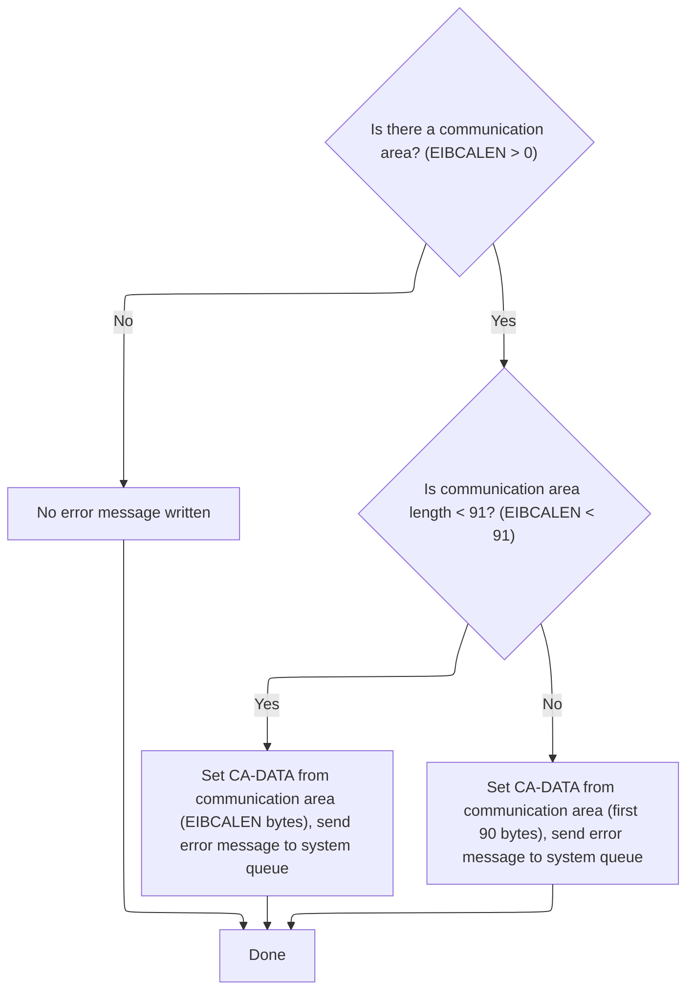

<SwmSnippet path="/base/src/lgapdb09.cbl" line="633">

---

After returning from LGSTSQ, <SwmToken path="base/src/lgapdb09.cbl" pos="205:3:7" line-data="               PERFORM WRITE-ERROR-MESSAGE">`WRITE-ERROR-MESSAGE`</SwmToken> checks if there's input data. If so, it sends up to 90 bytes of the commarea as a supplemental error message to LGSTSQ for more context in the logs.

```cobol
           IF EIBCALEN > 0 THEN
             IF EIBCALEN < 91 THEN
               MOVE DFHCOMMAREA(1:EIBCALEN) TO CA-DATA
               EXEC CICS LINK PROGRAM('LGSTSQ')
                         COMMAREA(CA-ERROR-MSG)
                         LENGTH(LENGTH OF CA-ERROR-MSG)
               END-EXEC
             ELSE
               MOVE DFHCOMMAREA(1:90) TO CA-DATA
               EXEC CICS LINK PROGRAM('LGSTSQ')
                         COMMAREA(CA-ERROR-MSG)
                         LENGTH(LENGTH OF CA-ERROR-MSG)
               END-EXEC
             END-IF
           END-IF.
           EXIT.
```

---

</SwmSnippet>

## Validating Input and Determining Policy Type

```mermaid
%%{init: {"flowchart": {"defaultRenderer": "elk"}} }%%
flowchart TD
    node1["Initialize: set CA-RETURN-CODE '00', addresses, customer info"] --> node2{"CA-REQUEST-ID?"}
    click node1 openCode "base/src/lgapdb09.cbl:209:216"
    node2 -->|"Endowment (01AEND)"| node3["Add Endowment length, set policy type 'E'"]
    click node2 openCode "base/src/lgapdb09.cbl:218:222"
    node2 -->|"House (01AHOU)"| node4["Add House length, set policy type 'H'"]
    click node2 openCode "base/src/lgapdb09.cbl:224:226"
    node2 -->|"Motor (01AMOT)"| node5["Add Motor length, set policy type 'M'"]
    click node2 openCode "base/src/lgapdb09.cbl:228:230"
    node2 -->|"Commercial (01ACOM)"| node6["Add Commercial length, set policy type 'C'"]
    click node2 openCode "base/src/lgapdb09.cbl:232:234"
    node2 -->|"Other"| node7["Set CA-RETURN-CODE '99' and return"]
    click node7 openCode "base/src/lgapdb09.cbl:236:238"
    node3 --> node8{"Is EIBCALEN >= WS-REQUIRED-CA-LEN?"}
    node4 --> node8
    node5 --> node8
    node6 --> node8
    click node8 openCode "base/src/lgapdb09.cbl:242:242"
    node8 -->|"Yes"| node9["Preparation complete, ready for next step"]
    node8 -->|"No"| node10["Set CA-RETURN-CODE '98' and return"]
    click node10 openCode "base/src/lgapdb09.cbl:243:244"
classDef HeadingStyle fill:#777777,stroke:#333,stroke-width:2px;

%% Swimm:
%% %%{init: {"flowchart": {"defaultRenderer": "elk"}} }%%
%% flowchart TD
%%     node1["Initialize: set <SwmToken path="base/src/lgapdb09.cbl" pos="209:9:13" line-data="           MOVE &#39;00&#39; TO CA-RETURN-CODE">`CA-RETURN-CODE`</SwmToken> '00', addresses, customer info"] --> node2{"<SwmToken path="base/src/lgapdb09.cbl" pos="218:3:7" line-data="           EVALUATE CA-REQUEST-ID">`CA-REQUEST-ID`</SwmToken>?"}
%%     click node1 openCode "<SwmPath>[base/src/lgapdb09.cbl](base/src/lgapdb09.cbl)</SwmPath>:209:216"
%%     node2 -->|"Endowment (<SwmToken path="base/src/lgapdb09.cbl" pos="220:4:4" line-data="             WHEN &#39;01AEND&#39;">`01AEND`</SwmToken>)"| node3["Add Endowment length, set policy type 'E'"]
%%     click node2 openCode "<SwmPath>[base/src/lgapdb09.cbl](base/src/lgapdb09.cbl)</SwmPath>:218:222"
%%     node2 -->|"House (<SwmToken path="base/src/lgapdb09.cbl" pos="224:4:4" line-data="             WHEN &#39;01AHOU&#39;">`01AHOU`</SwmToken>)"| node4["Add House length, set policy type 'H'"]
%%     click node2 openCode "<SwmPath>[base/src/lgapdb09.cbl](base/src/lgapdb09.cbl)</SwmPath>:224:226"
%%     node2 -->|"Motor (<SwmToken path="base/src/lgapdb09.cbl" pos="228:4:4" line-data="             WHEN &#39;01AMOT&#39;">`01AMOT`</SwmToken>)"| node5["Add Motor length, set policy type 'M'"]
%%     click node2 openCode "<SwmPath>[base/src/lgapdb09.cbl](base/src/lgapdb09.cbl)</SwmPath>:228:230"
%%     node2 -->|"Commercial (<SwmToken path="base/src/lgapdb09.cbl" pos="232:4:4" line-data="             WHEN &#39;01ACOM&#39;">`01ACOM`</SwmToken>)"| node6["Add Commercial length, set policy type 'C'"]
%%     click node2 openCode "<SwmPath>[base/src/lgapdb09.cbl](base/src/lgapdb09.cbl)</SwmPath>:232:234"
%%     node2 -->|"Other"| node7["Set <SwmToken path="base/src/lgapdb09.cbl" pos="209:9:13" line-data="           MOVE &#39;00&#39; TO CA-RETURN-CODE">`CA-RETURN-CODE`</SwmToken> '99' and return"]
%%     click node7 openCode "<SwmPath>[base/src/lgapdb09.cbl](base/src/lgapdb09.cbl)</SwmPath>:236:238"
%%     node3 --> node8{"Is EIBCALEN >= <SwmToken path="base/src/lgapdb09.cbl" pos="216:13:19" line-data="           ADD WS-CA-HEADER-LEN TO WS-REQUIRED-CA-LEN">`WS-REQUIRED-CA-LEN`</SwmToken>?"}
%%     node4 --> node8
%%     node5 --> node8
%%     node6 --> node8
%%     click node8 openCode "<SwmPath>[base/src/lgapdb09.cbl](base/src/lgapdb09.cbl)</SwmPath>:242:242"
%%     node8 -->|"Yes"| node9["Preparation complete, ready for next step"]
%%     node8 -->|"No"| node10["Set <SwmToken path="base/src/lgapdb09.cbl" pos="209:9:13" line-data="           MOVE &#39;00&#39; TO CA-RETURN-CODE">`CA-RETURN-CODE`</SwmToken> '98' and return"]
%%     click node10 openCode "<SwmPath>[base/src/lgapdb09.cbl](base/src/lgapdb09.cbl)</SwmPath>:243:244"
%% classDef HeadingStyle fill:#777777,stroke:#333,stroke-width:2px;
```

<SwmSnippet path="/base/src/lgapdb09.cbl" line="209">

---

After returning from <SwmToken path="base/src/lgapdb09.cbl" pos="205:3:7" line-data="               PERFORM WRITE-ERROR-MESSAGE">`WRITE-ERROR-MESSAGE`</SwmToken>, <SwmToken path="base/src/lgapdb09.cbl" pos="190:1:1" line-data="       MAINLINE SECTION.">`MAINLINE`</SwmToken> calculates how much input data is needed based on the request type. If the input is too short, we set an error code and exit early.

```cobol
           MOVE '00' TO CA-RETURN-CODE
           SET WS-ADDR-DFHCOMMAREA TO ADDRESS OF DFHCOMMAREA.

           MOVE CA-CUSTOMER-NUM TO DB2-CUSTOMERNUM-INT
           MOVE ZERO            TO DB2-C-PolicyNum-INT
           MOVE CA-CUSTOMER-NUM TO EM-CUSNUM

           ADD WS-CA-HEADER-LEN TO WS-REQUIRED-CA-LEN
```

---

</SwmSnippet>

<SwmSnippet path="/base/src/lgapdb09.cbl" line="218">

---

Here we branch based on the request ID, set the policy type, and adjust the required input length for the specific insurance product. If the ID isn't recognized, we set an error code and exit.

```cobol
           EVALUATE CA-REQUEST-ID

             WHEN '01AEND'
               ADD WS-FULL-ENDOW-LEN TO WS-REQUIRED-CA-LEN
               MOVE 'E' TO DB2-POLICYTYPE
```

---

</SwmSnippet>

<SwmSnippet path="/base/src/lgapdb09.cbl" line="224">

---

For each recognized request ID, we add the matching policy length and set the <SwmToken path="base/src/lgapdb09.cbl" pos="226:9:9" line-data="               MOVE &#39;H&#39; TO DB2-POLICYTYPE">`DB2`</SwmToken> policy type. This keeps the downstream logic type-safe and consistent.

```cobol
             WHEN '01AHOU'
               ADD WS-FULL-HOUSE-LEN TO WS-REQUIRED-CA-LEN
               MOVE 'H' TO DB2-POLICYTYPE

             WHEN '01AMOT'
               ADD WS-FULL-MOTOR-LEN TO WS-REQUIRED-CA-LEN
               MOVE 'M' TO DB2-POLICYTYPE

             WHEN '01ACOM'
               ADD WS-FULL-COMM-LEN TO WS-REQUIRED-CA-LEN
               MOVE 'C' TO DB2-POLICYTYPE
```

---

</SwmSnippet>

<SwmSnippet path="/base/src/lgapdb09.cbl" line="236">

---

If the request ID isn't one of the known types, we bail out with an error code. This prevents unsupported operations from running.

```cobol
             WHEN OTHER
               MOVE '99' TO CA-RETURN-CODE
               EXEC CICS RETURN END-EXEC

           END-EVALUATE
```

---

</SwmSnippet>

<SwmSnippet path="/base/src/lgapdb09.cbl" line="242">

---

We bail out if the input is too short.

```cobol
           IF EIBCALEN IS LESS THAN WS-REQUIRED-CA-LEN
             MOVE '98' TO CA-RETURN-CODE
             EXEC CICS RETURN END-EXEC
           END-IF
```

---

</SwmSnippet>

<SwmSnippet path="/base/src/lgapdb09.cbl" line="247">

---

We insert the main policy record now.

```cobol
           PERFORM P100-T
```

---

</SwmSnippet>

## Inserting the Main Policy Record

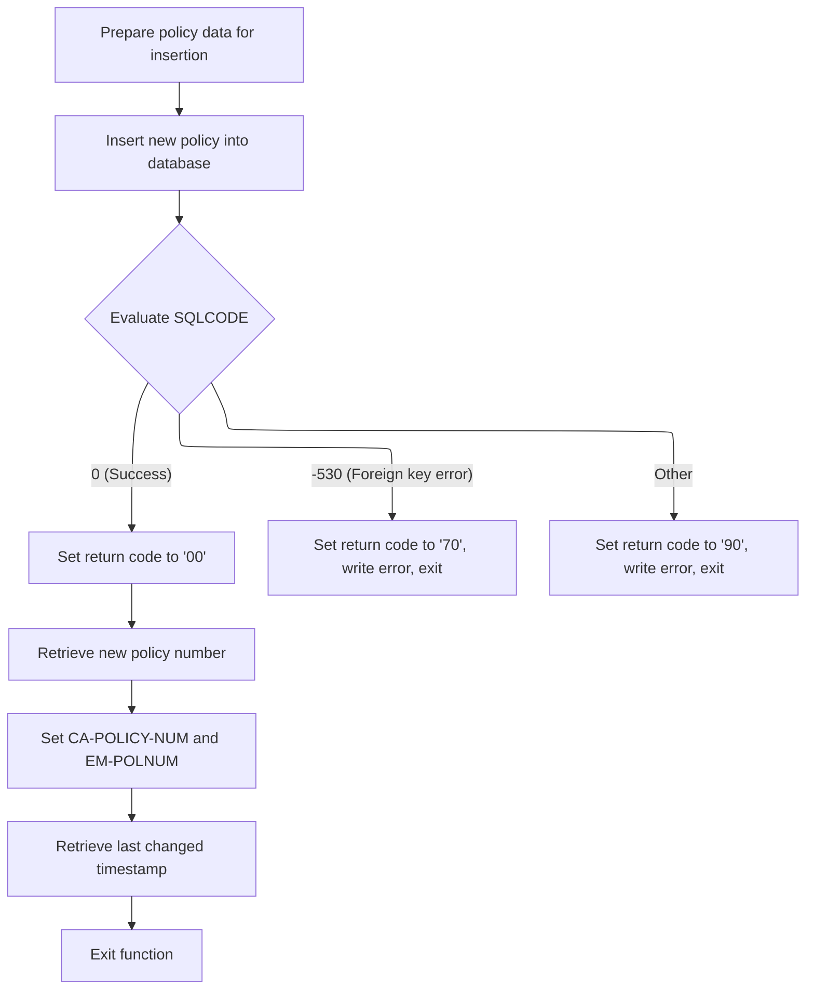

This section is responsible for inserting a new main policy record into the database, handling the result of the operation, and returning the relevant identifiers and timestamps to the caller. It also manages error handling and reporting for failed insert attempts.

| Category        | Rule Name                        | Description                                                                                                                                                                |
| --------------- | -------------------------------- | -------------------------------------------------------------------------------------------------------------------------------------------------------------------------- |
| Calculation     | Policy number retrieval          | The generated policy number is retrieved from the database and returned to the caller for reference in subsequent operations.                                              |
| Calculation     | Last changed timestamp retrieval | The last changed timestamp for the new policy is retrieved and returned to the caller.                                                                                     |
| Decision Making | Successful insert handling       | If the database insert is successful (SQLCODE = 0), the return code is set to '00', and the generated policy number and last changed timestamp are returned.               |
| Decision Making | Foreign key error handling       | If the insert fails due to a foreign key constraint (SQLCODE = -530), the return code is set to '70', an error is logged, and the process exits without creating a policy. |
| Decision Making | General error handling           | If the insert fails for any other reason, the return code is set to '90', an error is logged, and the process exits without creating a policy.                             |
| Writing Output  | Policy record insertion          | A new policy record is inserted into the POLICY table using the provided customer, broker, and payment details. The policy number is generated by the database.            |

<SwmSnippet path="/base/src/lgapdb09.cbl" line="281">

---

In <SwmToken path="base/src/lgapdb09.cbl" pos="281:1:3" line-data="       P100-T.">`P100-T`</SwmToken>, we prep the <SwmToken path="base/src/lgapdb09.cbl" pos="283:9:9" line-data="           MOVE CA-BROKERID TO DB2-BROKERID-INT">`DB2`</SwmToken> variables for broker and payment, set up the SQL request info, and insert the main policy record into the POLICY table.

```cobol
       P100-T.

           MOVE CA-BROKERID TO DB2-BROKERID-INT
           MOVE CA-PAYMENT TO DB2-PAYMENT-INT

           MOVE ' INSERT POLICY' TO EM-SQLREQ
           EXEC SQL
             INSERT INTO POLICY
                       ( POLICYNUMBER,
                         CUSTOMERNUMBER,
                         ISSUEDATE,
                         EXPIRYDATE,
                         POLICYTYPE,
                         LASTCHANGED,
                         BROKERID,
                         BROKERSREFERENCE,
                         PAYMENT           )
                VALUES ( DEFAULT,
                         :DB2-CUSTOMERNUM-INT,
                         :CA-ISSUE-DATE,
                         :CA-EXPIRY-DATE,
                         :DB2-POLICYTYPE,
                         CURRENT TIMESTAMP,
                         :DB2-BROKERID-INT,
                         :CA-BROKERSREF,
                         :DB2-PAYMENT-INT      )
           END-EXEC
```

---

</SwmSnippet>

<SwmSnippet path="/base/src/lgapdb09.cbl" line="309">

---

After the insert, we check SQLCODE. If there's an error, we log it with <SwmToken path="base/src/lgapdb09.cbl" pos="316:3:7" line-data="               PERFORM WRITE-ERROR-MESSAGE">`WRITE-ERROR-MESSAGE`</SwmToken> and exit early with the right return code.

```cobol
           Evaluate SQLCODE

             When 0
               MOVE '00' TO CA-RETURN-CODE

             When -530
               MOVE '70' TO CA-RETURN-CODE
               PERFORM WRITE-ERROR-MESSAGE
               EXEC CICS RETURN END-EXEC

             When Other
               MOVE '90' TO CA-RETURN-CODE
               PERFORM WRITE-ERROR-MESSAGE
               EXEC CICS RETURN END-EXEC

           END-Evaluate.
```

---

</SwmSnippet>

<SwmSnippet path="/base/src/lgapdb09.cbl" line="326">

---

After returning from <SwmToken path="base/src/lgapdb09.cbl" pos="205:3:7" line-data="               PERFORM WRITE-ERROR-MESSAGE">`WRITE-ERROR-MESSAGE`</SwmToken> in <SwmToken path="base/src/lgapdb09.cbl" pos="247:3:5" line-data="           PERFORM P100-T">`P100-T`</SwmToken>, we fetch the generated policy number from <SwmToken path="base/src/lgapdb09.cbl" pos="327:4:4" line-data="             SET :DB2-POLICYNUM-INT = IDENTITY_VAL_LOCAL()">`DB2`</SwmToken> for use in later steps.

```cobol
           EXEC SQL
             SET :DB2-POLICYNUM-INT = IDENTITY_VAL_LOCAL()
           END-EXEC
```

---

</SwmSnippet>

<SwmSnippet path="/base/src/lgapdb09.cbl" line="329">

---

We return the policy number and update timestamp.

```cobol
           MOVE DB2-POLICYNUM-INT TO CA-POLICY-NUM
           MOVE CA-POLICY-NUM TO EM-POLNUM

           EXEC SQL
             SELECT LASTCHANGED
               INTO :CA-LASTCHANGED
               FROM POLICY
               WHERE POLICYNUMBER = :DB2-POLICYNUM-INT
           END-EXEC.
           EXIT.
```

---

</SwmSnippet>

## Branching to Policy-Type-Specific Inserts

```mermaid
%%{init: {"flowchart": {"defaultRenderer": "elk"}} }%%
flowchart TD
    node1{"CA-REQUEST-ID?"}
    click node1 openCode "base/src/lgapdb09.cbl:249:266"
    node1 -->|"Endowment (01AEND)"| node2["Call P200-E (Endowment Policy)"]
    click node2 openCode "base/src/lgapdb09.cbl:252:252"
    node1 -->|"House (01AHOU)"| node3["Call P300-H (House Policy)"]
    click node3 openCode "base/src/lgapdb09.cbl:255:255"
    node1 -->|"Motor (01AMOT)"| node4["Call P400-M (Motor Policy)"]
    click node4 openCode "base/src/lgapdb09.cbl:258:258"
    node1 -->|"Business (01ACOM)"| node5["Call P500-BIZ (Business Policy)"]
    click node5 openCode "base/src/lgapdb09.cbl:261:261"
    node1 -->|"Other"| node6["Set CA-RETURN-CODE to '99' (Unrecognized request)"]
    click node6 openCode "base/src/lgapdb09.cbl:264:264"

classDef HeadingStyle fill:#777777,stroke:#333,stroke-width:2px;

%% Swimm:
%% %%{init: {"flowchart": {"defaultRenderer": "elk"}} }%%
%% flowchart TD
%%     node1{"<SwmToken path="base/src/lgapdb09.cbl" pos="218:3:7" line-data="           EVALUATE CA-REQUEST-ID">`CA-REQUEST-ID`</SwmToken>?"}
%%     click node1 openCode "<SwmPath>[base/src/lgapdb09.cbl](base/src/lgapdb09.cbl)</SwmPath>:249:266"
%%     node1 -->|"Endowment (<SwmToken path="base/src/lgapdb09.cbl" pos="220:4:4" line-data="             WHEN &#39;01AEND&#39;">`01AEND`</SwmToken>)"| node2["Call <SwmToken path="base/src/lgapdb09.cbl" pos="252:3:5" line-data="               PERFORM P200-E">`P200-E`</SwmToken> (Endowment Policy)"]
%%     click node2 openCode "<SwmPath>[base/src/lgapdb09.cbl](base/src/lgapdb09.cbl)</SwmPath>:252:252"
%%     node1 -->|"House (<SwmToken path="base/src/lgapdb09.cbl" pos="224:4:4" line-data="             WHEN &#39;01AHOU&#39;">`01AHOU`</SwmToken>)"| node3["Call <SwmToken path="base/src/lgapdb09.cbl" pos="255:3:5" line-data="               PERFORM P300-H">`P300-H`</SwmToken> (House Policy)"]
%%     click node3 openCode "<SwmPath>[base/src/lgapdb09.cbl](base/src/lgapdb09.cbl)</SwmPath>:255:255"
%%     node1 -->|"Motor (<SwmToken path="base/src/lgapdb09.cbl" pos="228:4:4" line-data="             WHEN &#39;01AMOT&#39;">`01AMOT`</SwmToken>)"| node4["Call <SwmToken path="base/src/lgapdb09.cbl" pos="258:3:5" line-data="               PERFORM P400-M">`P400-M`</SwmToken> (Motor Policy)"]
%%     click node4 openCode "<SwmPath>[base/src/lgapdb09.cbl](base/src/lgapdb09.cbl)</SwmPath>:258:258"
%%     node1 -->|"Business (<SwmToken path="base/src/lgapdb09.cbl" pos="232:4:4" line-data="             WHEN &#39;01ACOM&#39;">`01ACOM`</SwmToken>)"| node5["Call <SwmToken path="base/src/lgapdb09.cbl" pos="261:3:5" line-data="               PERFORM P500-BIZ">`P500-BIZ`</SwmToken> (Business Policy)"]
%%     click node5 openCode "<SwmPath>[base/src/lgapdb09.cbl](base/src/lgapdb09.cbl)</SwmPath>:261:261"
%%     node1 -->|"Other"| node6["Set <SwmToken path="base/src/lgapdb09.cbl" pos="209:9:13" line-data="           MOVE &#39;00&#39; TO CA-RETURN-CODE">`CA-RETURN-CODE`</SwmToken> to '99' (Unrecognized request)"]
%%     click node6 openCode "<SwmPath>[base/src/lgapdb09.cbl](base/src/lgapdb09.cbl)</SwmPath>:264:264"
%% 
%% classDef HeadingStyle fill:#777777,stroke:#333,stroke-width:2px;
```

<SwmSnippet path="/base/src/lgapdb09.cbl" line="249">

---

After returning from <SwmToken path="base/src/lgapdb09.cbl" pos="247:3:5" line-data="           PERFORM P100-T">`P100-T`</SwmToken> in <SwmToken path="base/src/lgapdb09.cbl" pos="190:1:1" line-data="       MAINLINE SECTION.">`MAINLINE`</SwmToken>, we branch to the subroutine for the specific policy type. This handles the type-specific insert into the right <SwmToken path="base/src/lgapdb09.cbl" pos="199:3:3" line-data="           INITIALIZE DB2-IN-INTEGERS.">`DB2`</SwmToken> table.

```cobol
           EVALUATE CA-REQUEST-ID

             WHEN '01AEND'
               PERFORM P200-E

             WHEN '01AHOU'
               PERFORM P300-H

             WHEN '01AMOT'
               PERFORM P400-M

             WHEN '01ACOM'
               PERFORM P500-BIZ

             WHEN OTHER
               MOVE '99' TO CA-RETURN-CODE

           END-EVALUATE
```

---

</SwmSnippet>

## Inserting Endowment Policy Data

```mermaid
%%{init: {"flowchart": {"defaultRenderer": "elk"}} }%%
flowchart TD
    node1["Prepare data for endowment insert"] --> node2{"Is there variable-length data? (WS-VARY-LEN > 0)"}
    click node1 openCode "base/src/lgapdb09.cbl:343:355"
    node2 -->|"Yes"| node3["Insert endowment with Varchar field"]
    click node2 openCode "base/src/lgapdb09.cbl:358:382"
    node2 -->|"No"| node4["Insert endowment without Varchar field"]
    click node3 openCode "base/src/lgapdb09.cbl:358:382"
    click node4 openCode "base/src/lgapdb09.cbl:383:402"
    node3 --> node5{"Did insert succeed? (SQLCODE = 0)"}
    node4 --> node5
    click node5 openCode "base/src/lgapdb09.cbl:405:411"
    node5 -->|"Yes"| node6["Finish"]
    node5 -->|"No"| node7["Set CA-RETURN-CODE to '90', log error, abort transaction, return"]
    click node6 openCode "base/src/lgapdb09.cbl:413:413"
    click node7 openCode "base/src/lgapdb09.cbl:405:411"
classDef HeadingStyle fill:#777777,stroke:#333,stroke-width:2px;

%% Swimm:
%% %%{init: {"flowchart": {"defaultRenderer": "elk"}} }%%
%% flowchart TD
%%     node1["Prepare data for endowment insert"] --> node2{"Is there variable-length data? (<SwmToken path="base/src/lgapdb09.cbl" pos="356:3:7" line-data="               GIVING WS-VARY-LEN">`WS-VARY-LEN`</SwmToken> > 0)"}
%%     click node1 openCode "<SwmPath>[base/src/lgapdb09.cbl](base/src/lgapdb09.cbl)</SwmPath>:343:355"
%%     node2 -->|"Yes"| node3["Insert endowment with Varchar field"]
%%     click node2 openCode "<SwmPath>[base/src/lgapdb09.cbl](base/src/lgapdb09.cbl)</SwmPath>:358:382"
%%     node2 -->|"No"| node4["Insert endowment without Varchar field"]
%%     click node3 openCode "<SwmPath>[base/src/lgapdb09.cbl](base/src/lgapdb09.cbl)</SwmPath>:358:382"
%%     click node4 openCode "<SwmPath>[base/src/lgapdb09.cbl](base/src/lgapdb09.cbl)</SwmPath>:383:402"
%%     node3 --> node5{"Did insert succeed? (SQLCODE = 0)"}
%%     node4 --> node5
%%     click node5 openCode "<SwmPath>[base/src/lgapdb09.cbl](base/src/lgapdb09.cbl)</SwmPath>:405:411"
%%     node5 -->|"Yes"| node6["Finish"]
%%     node5 -->|"No"| node7["Set <SwmToken path="base/src/lgapdb09.cbl" pos="209:9:13" line-data="           MOVE &#39;00&#39; TO CA-RETURN-CODE">`CA-RETURN-CODE`</SwmToken> to '90', log error, abort transaction, return"]
%%     click node6 openCode "<SwmPath>[base/src/lgapdb09.cbl](base/src/lgapdb09.cbl)</SwmPath>:413:413"
%%     click node7 openCode "<SwmPath>[base/src/lgapdb09.cbl](base/src/lgapdb09.cbl)</SwmPath>:405:411"
%% classDef HeadingStyle fill:#777777,stroke:#333,stroke-width:2px;
```

This section manages the insertion of endowment policy data into the ENDOWMENT table. It determines if variable-length data is present and ensures all required fields are correctly formatted and included. Error handling is enforced for failed insert operations.

| Category        | Rule Name                | Description                                                                                                                                                 |
| --------------- | ------------------------ | ----------------------------------------------------------------------------------------------------------------------------------------------------------- |
| Data validation | Insert Failure Handling  | If the insert operation fails, set the return code to '90', log the error, abort the transaction, and return control.                                       |
| Decision Making | Variable Data Inclusion  | If the input data length exceeds the required commarea length, the additional data is treated as variable-length and included in the insert as PADDINGDATA. |
| Decision Making | Conditional Field Insert | When variable-length data is present, the insert includes the PADDINGDATA field; otherwise, only fixed fields are inserted.                                 |

<SwmSnippet path="/base/src/lgapdb09.cbl" line="343">

---

In <SwmToken path="base/src/lgapdb09.cbl" pos="343:1:3" line-data="       P200-E.">`P200-E`</SwmToken>, we prep the numeric fields, figure out if there's extra variable-length data, and set up for the right SQL insert (with or without PADDINGDATA).

```cobol
       P200-E.

      *    Move numeric fields to integer format
           MOVE CA-E-TERM        TO DB2-E-TERM-SINT
           MOVE CA-E-SUM-ASSURED TO DB2-E-SUMASSURED-INT

           MOVE ' INSERT ENDOW ' TO EM-SQLREQ
      *----------------------------------------------------------------*
      *    There are 2 versions of INSERT...                           *
      *      one which updates all fields including Varchar            *
      *      one which updates all fields Except Varchar               *
      *----------------------------------------------------------------*
           SUBTRACT WS-REQUIRED-CA-LEN FROM EIBCALEN
               GIVING WS-VARY-LEN
```

---

</SwmSnippet>

<SwmSnippet path="/base/src/lgapdb09.cbl" line="358">

---

If there's variable-length data, we move it and include it in the SQL insert. This only happens if the input is long enough, otherwise we skip it.

```cobol
           IF WS-VARY-LEN IS GREATER THAN ZERO
      *       Commarea contains data for Varchar field
              MOVE CA-E-PADDING-DATA
                  TO WS-VARY-CHAR(1:WS-VARY-LEN)
              EXEC SQL
                INSERT INTO ENDOWMENT
                          ( POLICYNUMBER,
                            WITHPROFITS,
                            EQUITIES,
                            MANAGEDFUND,
                            FUNDNAME,
                            TERM,
                            SUMASSURED,
                            LIFEASSURED,
                            PADDINGDATA    )
                   VALUES ( :DB2-POLICYNUM-INT,
                            :CA-E-W-PRO,
                            :CA-E-EQU,
                            :CA-E-M-FUN,
                            :CA-E-FUND-NAME,
                            :DB2-E-TERM-SINT,
                            :DB2-E-SUMASSURED-INT,
                            :CA-E-LIFE-ASSURED,
                            :WS-VARY-FIELD )
              END-EXEC
```

---

</SwmSnippet>

<SwmSnippet path="/base/src/lgapdb09.cbl" line="383">

---

If there's no variable-length data, we just insert the fixed fields for the endowment policy. No extra handling needed.

```cobol
           ELSE
              EXEC SQL
                INSERT INTO ENDOWMENT
                          ( POLICYNUMBER,
                            WITHPROFITS,
                            EQUITIES,
                            MANAGEDFUND,
                            FUNDNAME,
                            TERM,
                            SUMASSURED,
                            LIFEASSURED    )
                   VALUES ( :DB2-POLICYNUM-INT,
                            :CA-E-W-PRO,
                            :CA-E-EQU,
                            :CA-E-M-FUN,
                            :CA-E-FUND-NAME,
                            :DB2-E-TERM-SINT,
                            :DB2-E-SUMASSURED-INT,
                            :CA-E-LIFE-ASSURED )
              END-EXEC
```

---

</SwmSnippet>

<SwmSnippet path="/base/src/lgapdb09.cbl" line="405">

---

If the insert fails, we set the return code to '90', log the error with <SwmToken path="base/src/lgapdb09.cbl" pos="407:3:7" line-data="             PERFORM WRITE-ERROR-MESSAGE">`WRITE-ERROR-MESSAGE`</SwmToken>, and abend to roll back the transaction.

```cobol
           IF SQLCODE NOT EQUAL 0
             MOVE '90' TO CA-RETURN-CODE
             PERFORM WRITE-ERROR-MESSAGE
      *      Issue Abend to cause backout of update to Policy table
             EXEC CICS ABEND ABCODE('LGSQ') NODUMP END-EXEC
             EXEC CICS RETURN END-EXEC
           END-IF.

           EXIT.
```

---

</SwmSnippet>

## Inserting House Policy Data

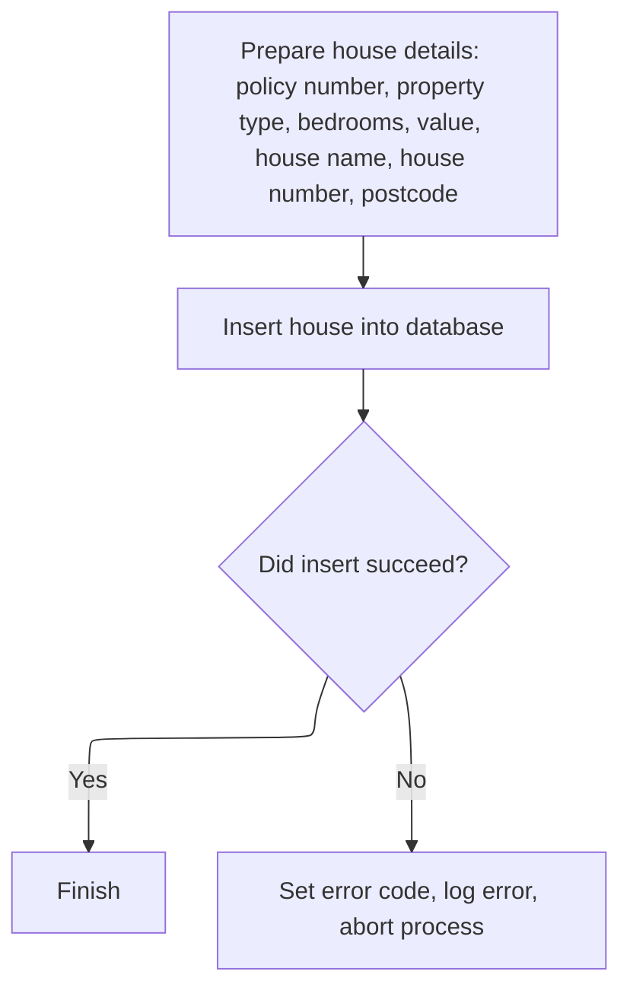

This section is responsible for preparing and inserting house policy data into the HOUSE table. It ensures that all required fields are present and correctly formatted, and handles errors if the insertion fails.

| Category        | Rule Name                    | Description                                                                                                                                              |
| --------------- | ---------------------------- | -------------------------------------------------------------------------------------------------------------------------------------------------------- |
| Data validation | Required house fields        | A house record is inserted only if all required fields (policy number, property type, bedrooms, value, house name, house number, postcode) are provided. |
| Writing Output  | Successful insert completion | A successful insert results in the completion of the process without error logging or rollback.                                                          |

<SwmSnippet path="/base/src/lgapdb09.cbl" line="415">

---

In <SwmToken path="base/src/lgapdb09.cbl" pos="415:1:3" line-data="       P300-H.">`P300-H`</SwmToken>, we prep the house data, convert the numeric fields, and insert the house record into the HOUSE table.

```cobol
       P300-H.

           MOVE CA-H-VAL       TO DB2-H-VALUE-INT
           MOVE CA-H-BED    TO DB2-H-BEDROOMS-SINT

           MOVE ' INSERT HOUSE ' TO EM-SQLREQ
           EXEC SQL
             INSERT INTO HOUSE
                       ( POLICYNUMBER,
                         PROPERTYTYPE,
                         BEDROOMS,
                         VALUE,
                         HOUSENAME,
                         HOUSENUMBER,
                         POSTCODE          )
                VALUES ( :DB2-POLICYNUM-INT,
                         :CA-H-P-TYP,
                         :DB2-H-BEDROOMS-SINT,
                         :DB2-H-VALUE-INT,
                         :CA-H-H-NAM,
                         :CA-H-HOUSE-NUMBER,
                         :CA-H-PCD      )
           END-EXEC
```

---

</SwmSnippet>

<SwmSnippet path="/base/src/lgapdb09.cbl" line="439">

---

If the insert fails, we set the return code to '90', log the error with <SwmToken path="base/src/lgapdb09.cbl" pos="441:3:7" line-data="             PERFORM WRITE-ERROR-MESSAGE">`WRITE-ERROR-MESSAGE`</SwmToken>, and abend to roll back the transaction.

```cobol
           IF SQLCODE NOT EQUAL 0
             MOVE '90' TO CA-RETURN-CODE
             PERFORM WRITE-ERROR-MESSAGE
             EXEC CICS ABEND ABCODE('LGSQ') NODUMP END-EXEC
             EXEC CICS RETURN END-EXEC
           END-IF.

           EXIT.
```

---

</SwmSnippet>

## Inserting Motor Policy Data

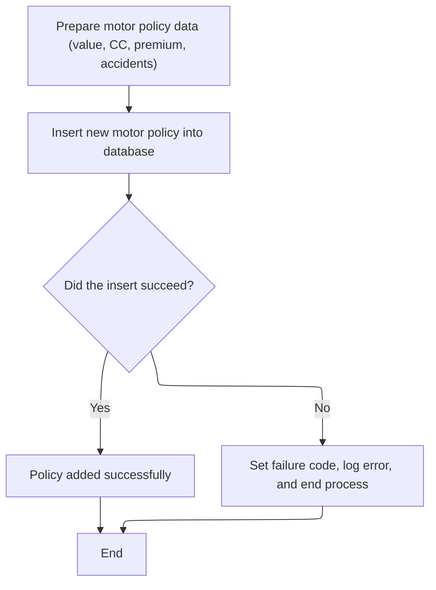

This section handles the preparation and insertion of new motor insurance policy data into the MOTOR database table. It ensures that all required fields are correctly formatted and that the outcome of the database operation is handled according to business requirements.

| Category        | Rule Name                 | Description                                                                                                                                     |
| --------------- | ------------------------- | ----------------------------------------------------------------------------------------------------------------------------------------------- |
| Decision Making | Insert Failure Handling   | If the database insert fails, the return code is set to '90', the error is logged, and the process is ended without committing the transaction. |
| Writing Output  | Motor Policy Insertion    | A new motor policy record is inserted into the MOTOR table using all required fields.                                                           |
| Writing Output  | Insert Success Completion | If the database insert succeeds, the process completes and the policy is considered added.                                                      |

<SwmSnippet path="/base/src/lgapdb09.cbl" line="448">

---

In <SwmToken path="base/src/lgapdb09.cbl" pos="448:1:3" line-data="       P400-M.">`P400-M`</SwmToken>, we prep the motor insurance data, convert the numeric fields, and insert the record into the MOTOR table.

```cobol
       P400-M.

      *    Move numeric fields to integer format
           MOVE CA-M-VALUE       TO DB2-M-VALUE-INT
           MOVE CA-M-CC          TO DB2-M-CC-SINT
           MOVE CA-M-PREMIUM     TO DB2-M-PREMIUM-INT
           MOVE CA-M-ACCIDENTS   TO DB2-M-ACCIDENTS-INT

           MOVE ' INSERT MOTOR ' TO EM-SQLREQ
           EXEC SQL
             INSERT INTO MOTOR
                       ( POLICYNUMBER,
                         MAKE,
                         MODEL,
                         VALUE,
                         REGNUMBER,
                         COLOUR,
                         CC,
                         YEAROFMANUFACTURE,
                         PREMIUM,
                         ACCIDENTS )
                VALUES ( :DB2-POLICYNUM-INT,
                         :CA-M-MAKE,
                         :CA-M-MODEL,
                         :DB2-M-VALUE-INT,
                         :CA-M-REGNUMBER,
                         :CA-M-COLOUR,
                         :DB2-M-CC-SINT,
                         :CA-M-MANUFACTURED,
                         :DB2-M-PREMIUM-INT,
                         :DB2-M-ACCIDENTS-INT )
           END-EXEC
```

---

</SwmSnippet>

<SwmSnippet path="/base/src/lgapdb09.cbl" line="481">

---

If the insert fails, we set the return code to '90', log the error with <SwmToken path="base/src/lgapdb09.cbl" pos="483:3:7" line-data="             PERFORM WRITE-ERROR-MESSAGE">`WRITE-ERROR-MESSAGE`</SwmToken>, and abend to roll back the transaction.

```cobol
           IF SQLCODE NOT EQUAL 0
             MOVE '90' TO CA-RETURN-CODE
             PERFORM WRITE-ERROR-MESSAGE
             EXEC CICS ABEND ABCODE('LGSQ') NODUMP END-EXEC
             EXEC CICS RETURN END-EXEC
           END-IF.

           EXIT.
```

---

</SwmSnippet>

## Processing Commercial Policy Risk and Data

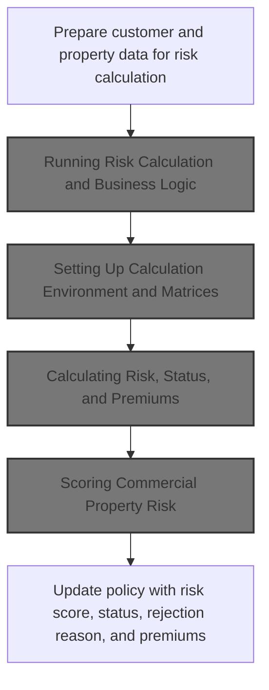

This section processes commercial policy risk by preparing input data, running risk and premium calculations, and updating the policy with the results. It ensures all relevant fields are mapped and calculated values are returned for business decision-making.

| Category        | Rule Name              | Description                                                                                                                                         |
| --------------- | ---------------------- | --------------------------------------------------------------------------------------------------------------------------------------------------- |
| Calculation     | Risk Score Calculation | A risk score is calculated for each commercial property based on a base value, property type, and geographic risk factor derived from the postcode. |
| Calculation     | Premium Calculation    | Premium values for each coverage type (FP, CP, FLP, WP) are calculated and assigned based on the risk score and mapped factors.                     |
| Decision Making | Policy Status Decision | The policy status and rejection reason are determined based on the calculated risk score and business thresholds.                                   |

<SwmSnippet path="/base/src/lgapdb09.cbl" line="493">

---

In <SwmToken path="base/src/lgapdb09.cbl" pos="493:1:3" line-data="       P500-BIZ SECTION.">`P500-BIZ`</SwmToken>, we map all the relevant customer, property, and policy fields from the commarea into the <SwmToken path="base/src/lgapdb09.cbl" pos="511:3:9" line-data="                COMMAREA(WS-COMM-RISK-AREA)">`WS-COMM-RISK-AREA`</SwmToken> structure. This sets up the data for the risk calculation module, making sure everything needed for risk and premium calculations is in one place before calling LGCOMCAL.

```cobol
       P500-BIZ SECTION.
           MOVE CA-CUSTOMER-NUM TO WS-XCUSTID
           MOVE CA-POLICY-NUM TO WS-XPOLNUM
           MOVE CA-B-PropType TO WS-XPROPTYPE
           MOVE CA-B-PST TO WS-XPOSTCODE
           MOVE CA-B-FP TO WS-XFP-FACTOR
           MOVE CA-B-CP TO WS-XCP-FACTOR
           MOVE CA-B-FLP TO WS-XFLP-FACTOR
           MOVE CA-B-WP TO WS-XWP-FACTOR
           MOVE CA-B-Address TO WS-XADDRESS
           MOVE CA-B-Latitude TO WS-XLAT
           MOVE CA-B-Longitude TO WS-XLONG
           MOVE CA-B-Customer TO WS-XCUSTNAME
           MOVE CA-ISSUE-DATE TO WS-XISSUE
           MOVE CA-EXPIRY-DATE TO WS-XEXPIRY
           MOVE CA-LASTCHANGED TO WS-XLASTCHG
```

---

</SwmSnippet>

<SwmSnippet path="/base/src/lgapdb09.cbl" line="510">

---

After prepping the risk area, we call LGCOMCAL using EXEC CICS LINK. This hands off all the policy and property data for risk and premium calculation. The results come back in the same structure, so we can use them right after.

```cobol
           EXEC CICS LINK PROGRAM('LGCOMCAL')
                COMMAREA(WS-COMM-RISK-AREA)
                LENGTH(LENGTH OF WS-COMM-RISK-AREA)
           END-EXEC
```

---

</SwmSnippet>

### Running Risk Calculation and Business Logic

<SwmSnippet path="/base/src/lgcomcal.cbl" line="206">

---

<SwmToken path="base/src/lgcomcal.cbl" pos="206:1:1" line-data="       MAINLINE SECTION.">`MAINLINE`</SwmToken> in LGCOMCAL just sequences the whole risk calculation: it sets up the environment, runs the business logic (risk, status, premium), and then copies the results back for the caller. Each step is isolated for clarity and maintainability.

```cobol
       MAINLINE SECTION.
           
           PERFORM INITIALIZE-PROCESSING.
           PERFORM PROCESS-BUSINESS-LOGIC.
           PERFORM CLEANUP-AND-EXIT.
```

---

</SwmSnippet>

### Setting Up Calculation Environment and Matrices

```mermaid
%%{init: {"flowchart": {"defaultRenderer": "elk"}} }%%
flowchart TD
    node1["Start: Prepare for new calculation/transaction"] --> node2["Set transaction, terminal, and task context (WS-TRANSID, WS-TERMID, WS-TASKNUM)"]
    click node1 openCode "base/src/lgcomcal.cbl:217:218"
    click node2 openCode "base/src/lgcomcal.cbl:219:221"
    node2 --> node3["Enable security validation (WS-SEC-ENABLED = 'Y')"]
    click node3 openCode "base/src/lgcomcal.cbl:234:234"
    node3 --> node4["Initialize risk calculation data"]
    click node4 openCode "base/src/lgcomcal.cbl:225:225"
    node4 --> node5["Initialize business matrices"]
    click node5 openCode "base/src/lgcomcal.cbl:233:251"

    subgraph loop1["For each row (1-5) and column (1-6) in matrices"]
      node5 --> node6{"Is row 3 and column 2?"}
      click node6 openCode "base/src/lgcomcal.cbl:242:244"
      node6 -->|"Yes"| node7["Set risk property to 1 (WS-RM-PROP = 1)"]
      click node7 openCode "base/src/lgcomcal.cbl:243:243"
      node6 -->|"No"| node8{"Is row 2 and column 3?"}
      click node8 openCode "base/src/lgcomcal.cbl:245:247"
      node8 -->|"Yes"| node9["Set risk peril to 3 (WS-RM-PERIL = 3)"]
      click node9 openCode "base/src/lgcomcal.cbl:246:246"
      node8 -->|"No"| node10["Set cell to default value"]
      click node10 openCode "base/src/lgcomcal.cbl:239:241"
      node7 --> node10
      node9 --> node10
      node10 --> node5
    end
    node5 -->|"All cells processed"| node11["Perform security validation setup"]
    click node11 openCode "base/src/lgcomcal.cbl:227:227"

classDef HeadingStyle fill:#777777,stroke:#333,stroke-width:2px;

%% Swimm:
%% %%{init: {"flowchart": {"defaultRenderer": "elk"}} }%%
%% flowchart TD
%%     node1["Start: Prepare for new calculation/transaction"] --> node2["Set transaction, terminal, and task context (<SwmToken path="base/src/lgapdb09.cbl" pos="193:7:9" line-data="           MOVE EIBTRNID TO WS-TRANSID.">`WS-TRANSID`</SwmToken>, <SwmToken path="base/src/lgapdb09.cbl" pos="194:7:9" line-data="           MOVE EIBTRMID TO WS-TERMID.">`WS-TERMID`</SwmToken>, <SwmToken path="base/src/lgapdb09.cbl" pos="195:7:9" line-data="           MOVE EIBTASKN TO WS-TASKNUM.">`WS-TASKNUM`</SwmToken>)"]
%%     click node1 openCode "<SwmPath>[base/src/lgcomcal.cbl](base/src/lgcomcal.cbl)</SwmPath>:217:218"
%%     click node2 openCode "<SwmPath>[base/src/lgcomcal.cbl](base/src/lgcomcal.cbl)</SwmPath>:219:221"
%%     node2 --> node3["Enable security validation (<SwmToken path="base/src/lgcomcal.cbl" pos="234:9:13" line-data="           MOVE &#39;Y&#39; TO WS-SEC-ENABLED.">`WS-SEC-ENABLED`</SwmToken> = 'Y')"]
%%     click node3 openCode "<SwmPath>[base/src/lgcomcal.cbl](base/src/lgcomcal.cbl)</SwmPath>:234:234"
%%     node3 --> node4["Initialize risk calculation data"]
%%     click node4 openCode "<SwmPath>[base/src/lgcomcal.cbl](base/src/lgcomcal.cbl)</SwmPath>:225:225"
%%     node4 --> node5["Initialize business matrices"]
%%     click node5 openCode "<SwmPath>[base/src/lgcomcal.cbl](base/src/lgcomcal.cbl)</SwmPath>:233:251"
%% 
%%     subgraph loop1["For each row (1-5) and column (1-6) in matrices"]
%%       node5 --> node6{"Is row 3 and column 2?"}
%%       click node6 openCode "<SwmPath>[base/src/lgcomcal.cbl](base/src/lgcomcal.cbl)</SwmPath>:242:244"
%%       node6 -->|"Yes"| node7["Set risk property to 1 (<SwmToken path="base/src/lgcomcal.cbl" pos="243:7:11" line-data="                      MOVE 1 TO WS-RM-PROP">`WS-RM-PROP`</SwmToken> = 1)"]
%%       click node7 openCode "<SwmPath>[base/src/lgcomcal.cbl](base/src/lgcomcal.cbl)</SwmPath>:243:243"
%%       node6 -->|"No"| node8{"Is row 2 and column 3?"}
%%       click node8 openCode "<SwmPath>[base/src/lgcomcal.cbl](base/src/lgcomcal.cbl)</SwmPath>:245:247"
%%       node8 -->|"Yes"| node9["Set risk peril to 3 (<SwmToken path="base/src/lgcomcal.cbl" pos="246:7:11" line-data="                      MOVE 3 TO WS-RM-PERIL">`WS-RM-PERIL`</SwmToken> = 3)"]
%%       click node9 openCode "<SwmPath>[base/src/lgcomcal.cbl](base/src/lgcomcal.cbl)</SwmPath>:246:246"
%%       node8 -->|"No"| node10["Set cell to default value"]
%%       click node10 openCode "<SwmPath>[base/src/lgcomcal.cbl](base/src/lgcomcal.cbl)</SwmPath>:239:241"
%%       node7 --> node10
%%       node9 --> node10
%%       node10 --> node5
%%     end
%%     node5 -->|"All cells processed"| node11["Perform security validation setup"]
%%     click node11 openCode "<SwmPath>[base/src/lgcomcal.cbl](base/src/lgcomcal.cbl)</SwmPath>:227:227"
%% 
%% classDef HeadingStyle fill:#777777,stroke:#333,stroke-width:2px;
```

This section prepares the calculation environment by initializing context variables and business matrices, and enabling security validation. It ensures that the calculation logic has the required setup, including special handling for certain risk and peril matrix positions.

| Category        | Rule Name                      | Description                                                                                                                                     |
| --------------- | ------------------------------ | ----------------------------------------------------------------------------------------------------------------------------------------------- |
| Reading Input   | Session context initialization | The transaction, terminal, and task context values are set at the start of each calculation session, using the current transaction identifiers. |
| Calculation     | Special risk property mapping  | The risk property value is set to 1 for the matrix cell at row 3, column 2. This position is reserved for a special risk mapping.               |
| Calculation     | Special risk peril mapping     | The risk peril value is set to 3 for the matrix cell at row 2, column 3. This position is reserved for a special peril mapping.                 |
| Calculation     | Default matrix initialization  | All other cells in the 5x6 risk matrix are set to a default value of 0 unless they match a special mapping position.                            |
| Decision Making | Enable security validation     | Security validation is enabled for each calculation session by setting the security flag to 'Y'.                                                |
| Decision Making | Finalize security setup        | After initializing matrices, security validation setup is performed to finalize the secure calculation environment.                             |

<SwmSnippet path="/base/src/lgcomcal.cbl" line="217">

---

We set up the session and risk/security matrices so the calculation logic has what it needs.

```cobol
       INITIALIZE-PROCESSING.
           INITIALIZE WS-HEADER.
           MOVE EIBTRNID TO WS-TRANSID.
           MOVE EIBTRMID TO WS-TERMID.
           MOVE EIBTASKN TO WS-TASKNUM.
           
           PERFORM INITIALIZE-MATRICES.
```

---

</SwmSnippet>

<SwmSnippet path="/base/src/lgcomcal.cbl" line="233">

---

<SwmToken path="base/src/lgcomcal.cbl" pos="233:1:3" line-data="       INITIALIZE-MATRICES.">`INITIALIZE-MATRICES`</SwmToken> sets a security flag and then loops over a 5x6 matrix, only setting special values at (3,2) and (2,3). These positions are hardcoded for domain reasons and affect how risk is mapped for certain cases.

```cobol
       INITIALIZE-MATRICES.
           MOVE 'Y' TO WS-SEC-ENABLED.
           MOVE 1 TO WS-SUB-1.
           
           PERFORM VARYING WS-SUB-1 FROM 1 BY 1 
             UNTIL WS-SUB-1 > 5
               MOVE 0 TO WS-SUB-2
               PERFORM VARYING WS-SUB-2 FROM 1 BY 1 
                 UNTIL WS-SUB-2 > 6
                   IF WS-SUB-1 = 3 AND WS-SUB-2 = 2
                      MOVE 1 TO WS-RM-PROP
                   END-IF
                   IF WS-SUB-1 = 2 AND WS-SUB-2 = 3
                      MOVE 3 TO WS-RM-PERIL
                   END-IF
               END-PERFORM
           END-PERFORM.
           
           EXIT.
```

---

</SwmSnippet>

<SwmSnippet path="/base/src/lgcomcal.cbl" line="225">

---

After setting up the matrices, we call <SwmToken path="base/src/lgcomcal.cbl" pos="227:3:7" line-data="           PERFORM INIT-SECURITY-VALIDATION.">`INIT-SECURITY-VALIDATION`</SwmToken> to enable secure operations and set up the security mapping indexes. This wraps up the environment prep before the main logic runs.

```cobol
           INITIALIZE WS-RISK-CALC.
           
           PERFORM INIT-SECURITY-VALIDATION.
           
           EXIT.
```

---

</SwmSnippet>

### Calculating Risk, Status, and Premiums

<SwmSnippet path="/base/src/lgcomcal.cbl" line="268">

---

<SwmToken path="base/src/lgcomcal.cbl" pos="268:1:5" line-data="       PROCESS-BUSINESS-LOGIC.">`PROCESS-BUSINESS-LOGIC`</SwmToken> runs the three main calculations in order: risk score, then policy status, then premiums. Each step depends on the previous, so the flow is strictly sequential.

```cobol
       PROCESS-BUSINESS-LOGIC.
           PERFORM PROCESS-RISK-SCORE.
           PERFORM DETERMINE-POLICY-STATUS.
           PERFORM CALCULATE-PREMIUMS.
           
           EXIT.
```

---

</SwmSnippet>

### Scoring Commercial Property Risk

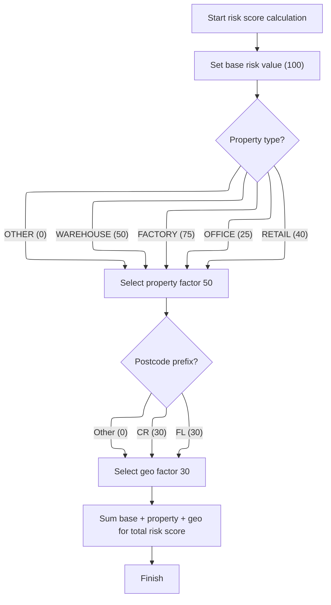

This section calculates a commercial property risk score by combining a base risk value with property-specific and geographic factors, using predefined constants for each category.

| Category        | Rule Name                    | Description                                                                                                         |
| --------------- | ---------------------------- | ------------------------------------------------------------------------------------------------------------------- |
| Calculation     | Base risk value              | Set the base risk value to 100 for all commercial property risk calculations.                                       |
| Calculation     | Total risk score calculation | Calculate the total risk score as the sum of the base value, property factor, and geographic factor.                |
| Decision Making | Property type factor         | Assign a property factor based on property type: WAREHOUSE (50), FACTORY (75), OFFICE (25), RETAIL (40), OTHER (0). |
| Decision Making | Geographic postcode factor   | Assign a geographic factor of 30 if the postcode prefix is 'FL' or 'CR'; otherwise, assign 0.                       |
| Writing Output  | Store risk score             | Store the calculated total risk score for use in subsequent processing steps.                                       |

<SwmSnippet path="/base/src/lgcomcal.cbl" line="277">

---

In <SwmToken path="base/src/lgcomcal.cbl" pos="277:1:5" line-data="       PROCESS-RISK-SCORE.">`PROCESS-RISK-SCORE`</SwmToken>, we set up the base score, assign the risk calculation type/version, and prep for property and geo factor calculation. The algorithm uses hardcoded values for each property type and postcode prefix.

```cobol
       PROCESS-RISK-SCORE.
           MOVE WS-TM-BASE TO WS-TEMP-SCORE.
           DIVIDE 2 INTO WS-TEMP-SCORE GIVING WS-SUB-1.
           MULTIPLY 2 BY WS-SUB-1 GIVING WS-RC-BASE-VAL.
           
           MOVE 0 TO WS-RC-PROP-FACT.
           
           MOVE 'COMMERCIAL' TO RMS-TYPE
           MOVE '1.0.5' TO RMS-VERSION
```

---

</SwmSnippet>

<SwmSnippet path="/base/src/lgcomcal.cbl" line="287">

---

Here we actually assign the property factor based on the property type, using repo-specific constants. If the type isn't recognized, the factor stays at 0. This is followed by prepping the geo factors for the next step.

```cobol
           EVALUATE CA-XPROPTYPE
               WHEN 'WAREHOUSE'
                   MOVE RMS-PF-W-VAL TO RMS-PF-WAREHOUSE
                   COMPUTE WS-TEMP-CALC = RMS-PF-WAREHOUSE
                   ADD WS-TEMP-CALC TO WS-RC-PROP-FACT
               WHEN 'FACTORY'
                   MOVE RMS-PF-F-VAL TO RMS-PF-FACTORY
                   COMPUTE WS-TEMP-CALC = RMS-PF-FACTORY
                   ADD WS-TEMP-CALC TO WS-RC-PROP-FACT
               WHEN 'OFFICE'
                   MOVE RMS-PF-O-VAL TO RMS-PF-OFFICE
                   COMPUTE WS-TEMP-CALC = RMS-PF-OFFICE
                   ADD WS-TEMP-CALC TO WS-RC-PROP-FACT
               WHEN 'RETAIL'
                   MOVE RMS-PF-R-VAL TO RMS-PF-RETAIL
                   COMPUTE WS-TEMP-CALC = RMS-PF-RETAIL
                   ADD WS-TEMP-CALC TO WS-RC-PROP-FACT
               WHEN OTHER
                   MOVE 0 TO WS-RC-PROP-FACT
           END-EVALUATE.
```

---

</SwmSnippet>

<SwmSnippet path="/base/src/lgcomcal.cbl" line="308">

---

Now we check the postcode prefix. If it's 'FL' or 'CR', we add the corresponding geo factor; otherwise, it's zero. These values are hardcoded and only affect those two prefixes.

```cobol
           MOVE 0 TO WS-RC-GEO-FACT.
           
           MOVE RMS-GF-FL-VAL TO RMS-GF-FL
           MOVE RMS-GF-CR-VAL TO RMS-GF-CR
           
           IF CA-XPOSTCODE(1:2) = 'FL'
              MOVE RMS-GF-FL TO WS-RC-GEO-FACT
           ELSE
              IF CA-XPOSTCODE(1:2) = 'CR'
                 MOVE RMS-GF-CR TO WS-RC-GEO-FACT
              END-IF
```

---

</SwmSnippet>

<SwmSnippet path="/base/src/lgcomcal.cbl" line="319">

---

Finally we sum up the base, property, and geo factors to get the total risk score, and store it in <SwmToken path="base/src/lgcomcal.cbl" pos="324:11:15" line-data="           MOVE WS-RC-TOTAL TO WS-SA-RISK.">`WS-SA-RISK`</SwmToken> for use in the next steps.

```cobol
           END-IF.
           
           COMPUTE WS-RC-TOTAL = 
              WS-RC-BASE-VAL + WS-RC-PROP-FACT + WS-RC-GEO-FACT.
              
           MOVE WS-RC-TOTAL TO WS-SA-RISK.
           
           EXIT.
```

---

</SwmSnippet>

### Updating Policy With Risk Results

<SwmSnippet path="/base/src/lgapdb09.cbl" line="515">

---

Back in <SwmToken path="base/src/lgapdb09.cbl" pos="261:3:5" line-data="               PERFORM P500-BIZ">`P500-BIZ`</SwmToken>, we pull the results from LGCOMCAL—risk score, status, reject reason, and premiums—and move them into the commarea and local fields for the rest of the flow.

```cobol
           MOVE WS-ZRESULT-SCORE TO X3-VAL
           MOVE WS-ZSTATUS-IND TO X5-Z9
           MOVE WS-ZREJECT-TEXT TO X6-REJ
           MOVE WS-ZFP-PREMIUM TO CA-B-CA-B-FPR
           MOVE WS-ZCP-PREMIUM TO CA-B-CPR
           MOVE WS-ZFLP-PREMIUM TO CA-B-FLPR
           MOVE WS-ZWP-PREMIUM TO CA-B-WPR
           
           MOVE X5-Z9 TO CA-B-ST
           MOVE X6-REJ TO CA-B-RejectReason
```

---

</SwmSnippet>

<SwmSnippet path="/base/src/lgapdb09.cbl" line="526">

---

After updating the commarea with risk results, we run <SwmToken path="base/src/lgapdb09.cbl" pos="526:3:7" line-data="           PERFORM P546-CHK-MATRIX">`P546-CHK-MATRIX`</SwmToken> to apply business rules—this can override the status or set a reject reason based on the score and status. Then we move on to saving the record.

```cobol
           PERFORM P546-CHK-MATRIX
           
           PERFORM P548-BINS
           
           EXIT.
```

---

</SwmSnippet>

## Applying Matrix Overrides and Rejection Logic

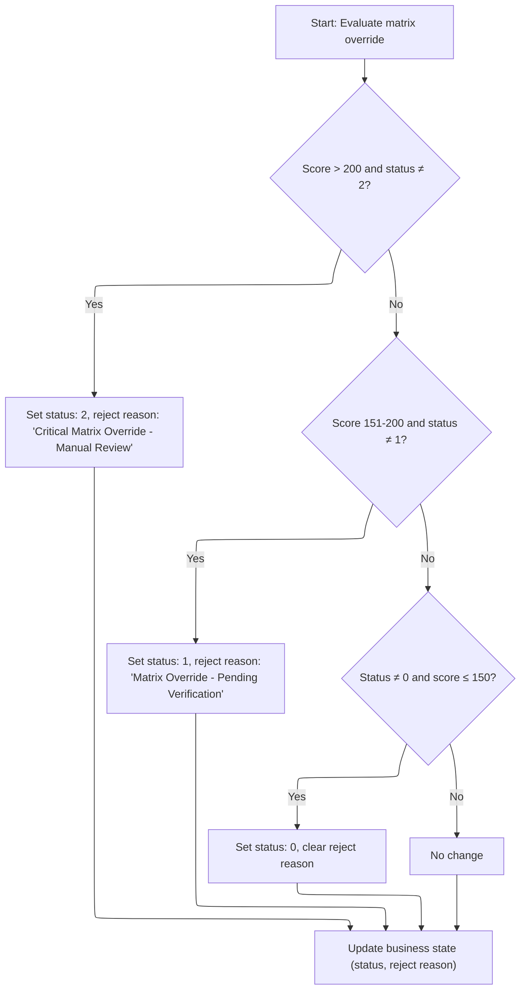

This section enforces escalation rules for high-risk cases by evaluating the risk score and current status, and setting override levels and rejection messages based on defined thresholds.

| Category        | Rule Name                       | Description                                                                                                                                                                         |
| --------------- | ------------------------------- | ----------------------------------------------------------------------------------------------------------------------------------------------------------------------------------- |
| Decision Making | Critical override escalation    | If the risk score is greater than 200 and the current status is not 2, set the status to 2 and set the rejection reason to 'Critical Matrix Override - Manual Review'.              |
| Decision Making | Pending verification escalation | If the risk score is between 151 and 200 (inclusive) and the current status is not 1, set the status to 1 and set the rejection reason to 'Matrix Override - Pending Verification'. |
| Decision Making | De-escalation to normal         | If the current status is not 0 and the risk score is 150 or less, set the status to 0 and clear the rejection reason.                                                               |
| Decision Making | No change fallback              | If none of the above conditions are met, make no changes to status or rejection reason.                                                                                             |

<SwmSnippet path="/base/src/lgapdb09.cbl" line="533">

---

In <SwmToken path="base/src/lgapdb09.cbl" pos="533:1:5" line-data="       P546-CHK-MATRIX.">`P546-CHK-MATRIX`</SwmToken>, we check the risk score and status, and set override levels and rejection messages based on thresholds. This is where we enforce escalation rules for high-risk cases.

```cobol
       P546-CHK-MATRIX.
           EVALUATE TRUE
               WHEN X3-VAL > 200 AND X5-Z9 NOT = 2
                 MOVE 2 TO X5-Z9
                 MOVE 'Critical Matrix Override - Manual Review' TO X6-REJ
               WHEN X3-VAL > 150 AND X3-VAL <= 200 AND X5-Z9 NOT = 1
                 MOVE 1 TO X5-Z9
                 MOVE 'Matrix Override - Pending Verification' TO X6-REJ 
               WHEN X5-Z9 NOT = 0 AND X3-VAL <= 150
                 MOVE 0 TO X5-Z9
                 MOVE SPACES TO X6-REJ
               WHEN OTHER
                 CONTINUE
           END-EVALUATE.
```

---

</SwmSnippet>

<SwmSnippet path="/base/src/lgapdb09.cbl" line="548">

---

After setting the override and rejection reason, we copy them into the commarea so they're ready for saving and for any other logic that needs them.

```cobol
           MOVE X5-Z9 TO CA-B-ST
           MOVE X6-REJ TO CA-B-RejectReason.
           EXIT.
```

---

</SwmSnippet>

## Saving Commercial Policy to Database

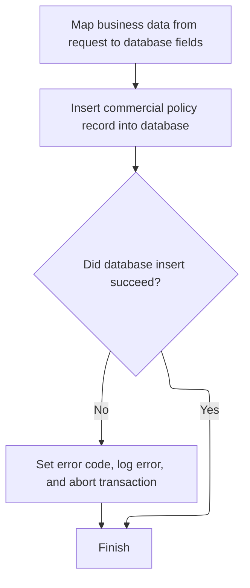

This section is responsible for saving a new commercial policy to the database, ensuring all required fields are mapped and the record is inserted. If the insert fails, the error is logged and the transaction is aborted.

| Category        | Rule Name                        | Description                                                                                                                    |
| --------------- | -------------------------------- | ------------------------------------------------------------------------------------------------------------------------------ |
| Data validation | Field mapping requirement        | All required commercial policy fields from the request are mapped to corresponding database fields before saving.              |
| Decision Making | Error handling on insert failure | If the database insert fails, an error code of '92' is set, the error is logged, and the transaction is aborted without retry. |
| Writing Output  | Policy record creation           | A new commercial policy record is created in the database using the mapped fields.                                             |

<SwmSnippet path="/base/src/lgapdb09.cbl" line="553">

---

In <SwmToken path="base/src/lgapdb09.cbl" pos="553:1:3" line-data="       P548-BINS.">`P548-BINS`</SwmToken>, we map all the relevant commarea fields into <SwmToken path="base/src/lgapdb09.cbl" pos="554:11:11" line-data="           MOVE CA-B-FP     TO DB2-B-P1-Int">`DB2`</SwmToken> host variables. This is needed for the <SwmToken path="base/src/lgapdb09.cbl" pos="554:11:11" line-data="           MOVE CA-B-FP     TO DB2-B-P1-Int">`DB2`</SwmToken> insert that comes next.

```cobol
       P548-BINS.
           MOVE CA-B-FP     TO DB2-B-P1-Int
           MOVE CA-B-CA-B-FPR   TO DB2-B-P1A-Int
           MOVE CA-B-CP    TO DB2-B-P2-Int
           MOVE CA-B-CPR  TO DB2-B-P2A-Int
           MOVE CA-B-FLP    TO DB2-B-P3-Int
           MOVE CA-B-FLPR  TO DB2-B-P3A-Int
           MOVE CA-B-WP  TO DB2-B-P4-Int
           MOVE CA-B-WPR TO DB2-B-P4A-Int
           MOVE CA-B-ST        TO DB2-B-Z9-Int
           
           MOVE ' INSERT COMMER' TO EM-SQLREQ
```

---

</SwmSnippet>

<SwmSnippet path="/base/src/lgapdb09.cbl" line="565">

---

Now we run the actual <SwmToken path="base/src/lgapdb09.cbl" pos="587:5:5" line-data="                VALUES (:DB2-POLICYNUM-INT,">`DB2`</SwmToken> insert into the COMMERCIAL table, using all the host variables we just set up. This is the main DB write for the commercial policy.

```cobol
           EXEC SQL
             INSERT INTO COMMERCIAL
                       (PolicyNumber,
                        RequestDate,
                        StartDate,
                        RenewalDate,
                        Address,
                        Zipcode,
                        LatitudeN,
                        LongitudeW,
                        Customer,
                        PropertyType,
                        FirePeril,
                        CA-B-FPR,
                        CrimePeril,
                        CrimePremium,
                        FloodPeril,
                        FloodPremium,
                        WeatherPeril,
                        WeatherPremium,
                        Status,
                        RejectionReason)
                VALUES (:DB2-POLICYNUM-INT,
                        :CA-LASTCHANGED,
                        :CA-ISSUE-DATE,
                        :CA-EXPIRY-DATE,
                        :CA-B-Address,
                        :CA-B-PST,
                        :CA-B-Latitude,
                        :CA-B-Longitude,
                        :CA-B-Customer,
                        :CA-B-PropType,
                        :DB2-B-P1-Int,
                        :DB2-B-P1A-Int,
                        :DB2-B-P2-Int,
                        :DB2-B-P2A-Int,
                        :DB2-B-P3-Int,
                        :DB2-B-P3A-Int,
                        :DB2-B-P4-Int,
                        :DB2-B-P4A-Int,
                        :DB2-B-Z9-Int,
                        :CA-B-RejectReason)
           END-EXEC
```

---

</SwmSnippet>

<SwmSnippet path="/base/src/lgapdb09.cbl" line="609">

---

If the <SwmToken path="base/src/lgapdb09.cbl" pos="199:3:3" line-data="           INITIALIZE DB2-IN-INTEGERS.">`DB2`</SwmToken> insert fails, we log the error with <SwmToken path="base/src/lgapdb09.cbl" pos="611:3:7" line-data="              PERFORM WRITE-ERROR-MESSAGE">`WRITE-ERROR-MESSAGE`</SwmToken> and then abend the transaction. No retries—just log and stop.

```cobol
           IF SQLCODE NOT = 0
              MOVE '92' TO CA-RETURN-CODE
              PERFORM WRITE-ERROR-MESSAGE
              EXEC CICS ABEND ABCODE('LGSQ') NODUMP END-EXEC
              EXEC CICS RETURN END-EXEC
           END-IF.
           
           EXIT.
```

---

</SwmSnippet>

## Chaining to Policy File Writer

<SwmSnippet path="/base/src/lgapdb09.cbl" line="268">

---

After finishing up in MAINLINE (including <SwmToken path="base/src/lgapdb09.cbl" pos="261:3:5" line-data="               PERFORM P500-BIZ">`P500-BIZ`</SwmToken>), we chain to <SwmToken path="base/src/lgapdb09.cbl" pos="268:9:9" line-data="             EXEC CICS Link Program(LGAPVS01)">`LGAPVS01`</SwmToken> using EXEC CICS LINK. This hands off the commarea for writing to the KSDSPOLY file, which is handled outside the DB logic.

```cobol
             EXEC CICS Link Program(LGAPVS01)
                  Commarea(DFHCOMMAREA)
                LENGTH(32500)
             END-EXEC.


      * Return to caller
           EXEC CICS RETURN END-EXEC.
```

---

</SwmSnippet>

# Writing Policy Data to Central File

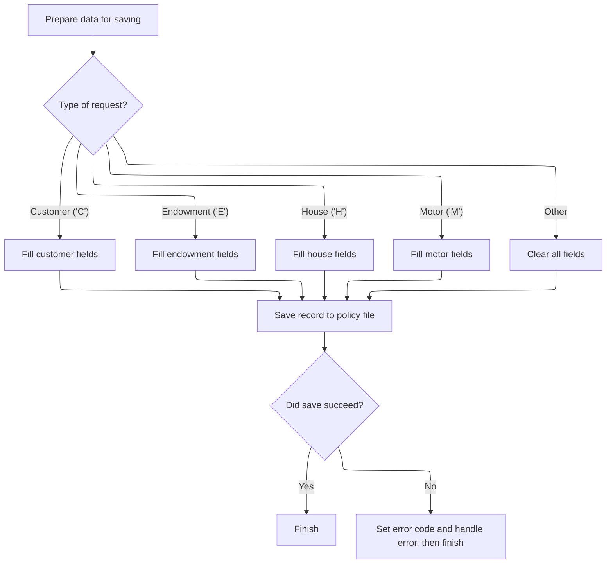

This section is responsible for preparing and writing policy data to the central KSDSPOLY file, ensuring that the correct fields are mapped based on the request type and handling errors if the write operation fails.

| Category        | Rule Name                     | Description                                                                                                                                  |
| --------------- | ----------------------------- | -------------------------------------------------------------------------------------------------------------------------------------------- |
| Calculation     | Policy record key composition | The policy record key is composed of the request type, policy number, and customer number, which are always included in the file key fields. |
| Calculation     | Commercial policy mapping     | For commercial ('C') requests, the postcode, status, customer, risk score, and four premium values are mapped into the record.               |
| Calculation     | Endowment policy mapping      | For endowment ('E') requests, the with-profits, equities, managed fund, fund name, and life assured fields are mapped into the record.       |
| Calculation     | House policy mapping          | For house ('H') requests, the property type, number of bedrooms, value, postcode, and house name are mapped into the record.                 |
| Calculation     | Motor policy mapping          | For motor ('M') requests, the make, model, value, and registration number are mapped into the record.                                        |
| Decision Making | Unknown request type handling | If the request type is not recognized, all data fields in the record are cleared (set to blank).                                             |
| Decision Making | Write failure handling        | If the write operation fails, an error code of '80' is set, the error is logged, and the transaction is ended.                               |
| Writing Output  | Record write operation        | The prepared record is written to the KSDSPOLY file with a fixed length of 104 bytes and a key length of 21 bytes.                           |

<SwmSnippet path="/base/src/lgapvs01.cbl" line="90">

---

In <SwmToken path="base/src/lgapvs01.cbl" pos="90:1:3" line-data="       P100-ENTRY SECTION.">`P100-ENTRY`</SwmToken>, we prep the file record by moving the request type, policy number, and customer number into the file key fields. This sets up the record for writing to KSDSPOLY.

```cobol
       P100-ENTRY SECTION.
      *
      *---------------------------------------------------------------*
           Move EIBCALEN To V1-COMM.
      *---------------------------------------------------------------*
           Move CA-Request-ID(4:1) To V2-REQ
           Move CA-Policy-Num      To V2-POL
           Move CA-Customer-Num    To V2-CUST
```

---

</SwmSnippet>

<SwmSnippet path="/base/src/lgapvs01.cbl" line="99">

---

For 'C' (commercial) requests, we map all the relevant fields—postcode, status, customer, risk score, and premiums—into the file record. Each request type gets its own mapping.

```cobol
           Evaluate V2-REQ

             When 'C'
               Move CA-B-PST     To V2-C-PCD
               Move CA-B-ST       To V2-C-Z9
               Move CA-B-Customer     To V2-C-CUST
               Move WS-RISK-SCORE     To V2-C-VAL
               Move CA-B-CA-B-FPR  To V2-C-P1VAL
               Move CA-B-CPR To V2-C-P2VAL
               Move CA-B-FLPR To V2-C-P3VAL
               Move CA-B-WPR To V2-C-P4VAL
```

---

</SwmSnippet>

<SwmSnippet path="/base/src/lgapvs01.cbl" line="111">

---

For 'E' (endowment) requests, we map the endowment-specific fields into the file record. Each type gets its own mapping.

```cobol
             When 'E'
               Move CA-E-W-PRO        To  V2-E-OPT1
               Move CA-E-EQU          To  V2-E-OPT2
               Move CA-E-M-FUN        To  V2-E-OPT3
               Move CA-E-FUND-NAME    To  V2-E-NAME
               Move CA-E-LIFE-ASSURED To  V2-E-LIFE
```

---

</SwmSnippet>

<SwmSnippet path="/base/src/lgapvs01.cbl" line="118">

---

For 'H' (house) requests, we map the house-specific fields into the file record. Each type gets its own mapping.

```cobol
             When 'H'
               Move CA-H-P-TYP         To  V2-H-TYPE
               Move CA-H-BED           To  V2-H-ROOMS
               Move CA-H-VAL           To  V2-H-COST
               Move CA-H-PCD           To  V2-H-PCD
               Move CA-H-H-NAM         To  V2-H-NAME
```

---

</SwmSnippet>

<SwmSnippet path="/base/src/lgapvs01.cbl" line="125">

---

For 'M' (motor) requests, we map the motor-specific fields into the file record. Each type gets its own mapping.

```cobol
             When 'M'
               Move CA-M-MAKE          To  V2-M-MAKE
               Move CA-M-MODEL         To  V2-M-MODEL
               Move CA-M-VALUE         To  V2-M-COST
               Move CA-M-REGNUMBER     To  V2-M-NUM
```

---

</SwmSnippet>

<SwmSnippet path="/base/src/lgapvs01.cbl" line="131">

---

If the request type isn't recognized, we just blank out the data area. No mapping, just spaces.

```cobol
             When Other
               Move Spaces To V2-DATA
           End-Evaluate
```

---

</SwmSnippet>

<SwmSnippet path="/base/src/lgapvs01.cbl" line="136">

---

Now we write the mapped record to the KSDSPOLY file using EXEC CICS WRITE FILE. The key and length are set up from the previous steps.

```cobol
           Exec CICS Write File('KSDSPOLY')
                     From(V2-RECORD)
                     Length(104)
                     Ridfld(V2-KEY)
                     KeyLength(21)
                     RESP(V1-RCD1)
           End-Exec.
```

---

</SwmSnippet>

<SwmSnippet path="/base/src/lgapvs01.cbl" line="143">

---

If the file write fails, we log the error with <SwmToken path="base/src/lgapvs01.cbl" pos="146:3:5" line-data="             PERFORM P999-ERROR">`P999-ERROR`</SwmToken> and return from the transaction. This makes sure the failure is recorded and nothing else runs.

```cobol
           If V1-RCD1 Not = DFHRESP(NORMAL)
             Move EIBRESP2 To V1-RCD2
             MOVE '80' TO CA-RETURN-CODE
             PERFORM P999-ERROR
             EXEC CICS RETURN END-EXEC
           End-If.
```

---

</SwmSnippet>

# Logging File Write Errors

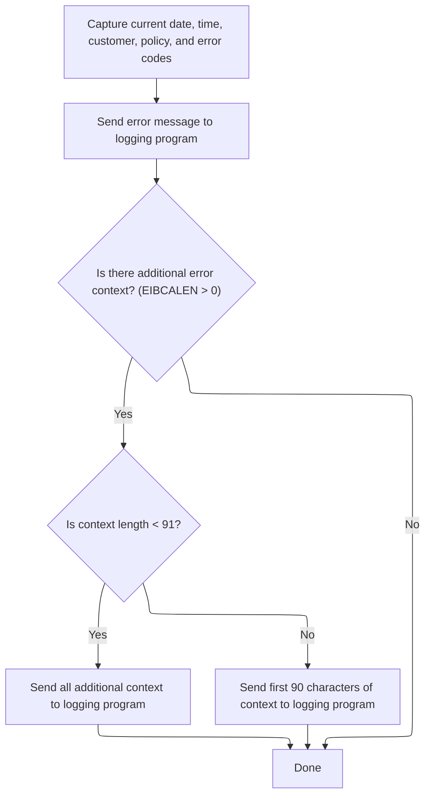

This section ensures all file write errors are logged with complete context, including timestamp, customer, policy, error codes, and any available supplemental input data. The goal is to provide comprehensive error tracking for support and audit purposes.

| Category        | Rule Name                     | Description                                                                                                                           |
| --------------- | ----------------------------- | ------------------------------------------------------------------------------------------------------------------------------------- |
| Data validation | Context length handling       | If the additional context data is less than 91 bytes, log the entire available context; otherwise, log only the first 90 bytes.       |
| Calculation     | Comprehensive error log entry | Log each file write error with the current date and time, customer number, policy number, and both primary and secondary error codes. |
| Decision Making | Supplemental context logging  | If additional context data is present in the input area, include up to 90 bytes of this data in a supplemental log entry.             |
| Writing Output  | Centralized error logging     | Send the formatted error message to the central logging program for every detected file write error.                                  |

<SwmSnippet path="/base/src/lgapvs01.cbl" line="156">

---

In <SwmToken path="base/src/lgapvs01.cbl" pos="156:1:3" line-data="       P999-ERROR.">`P999-ERROR`</SwmToken>, we grab the current time and format it for the error log. This gives us a timestamp for when the error happened.

```cobol
       P999-ERROR.
           EXEC CICS ASKTIME ABSTIME(V3-TIME)
           END-EXEC
           EXEC CICS FORMATTIME ABSTIME(V3-TIME)
                     MMDDYYYY(V3-DATE1)
                     TIME(V3-DATE2)
           END-EXEC
```

---

</SwmSnippet>

<SwmSnippet path="/base/src/lgapvs01.cbl" line="164">

---

After prepping the error message with all the details, we call LGSTSQ to handle the actual logging or queue write. This centralizes error handling and integration.

```cobol
           MOVE V3-DATE1 TO EM-DATE
           MOVE V3-DATE2 TO EM-TIME
           Move CA-Customer-Num To EM-Cusnum
           Move CA-Policy-Num   To EM-POLNUM 
           Move V1-RCD1         To EM-RespRC
           Move V1-RCD2         To EM-Resp2RC
           EXEC CICS LINK PROGRAM('LGSTSQ')
                     COMMAREA(ERROR-MSG)
                     LENGTH(LENGTH OF ERROR-MSG)
           END-EXEC.
```

---

</SwmSnippet>

<SwmSnippet path="/base/src/lgapvs01.cbl" line="174">

---

After returning from LGSTSQ (which handled the main error logging), we're in the final section of <SwmToken path="base/src/lgapdb09.cbl" pos="268:9:9" line-data="             EXEC CICS Link Program(LGAPVS01)">`LGAPVS01`</SwmToken>. Here, we check if there's any input data left (EIBCALEN > 0). If so, we move up to 90 bytes from DFHCOMMAREA into <SwmToken path="base/src/lgapvs01.cbl" pos="176:12:14" line-data="               MOVE DFHCOMMAREA(1:EIBCALEN) TO CA-DATA">`CA-DATA`</SwmToken>, depending on the actual length. Then we call LGSTSQ again, passing <SwmToken path="base/src/lgapvs01.cbl" pos="178:3:7" line-data="                         COMMAREA(CA-ERROR-MSG)">`CA-ERROR-MSG`</SwmToken> as the commarea. This lets us log any leftover or supplemental input data for error tracking, making sure we don't miss context if the input was truncated or partial. The conditional move and length check prevent buffer overruns and keep the error message format stable.

```cobol
           IF EIBCALEN > 0 THEN
             IF EIBCALEN < 91 THEN
               MOVE DFHCOMMAREA(1:EIBCALEN) TO CA-DATA
               EXEC CICS LINK PROGRAM('LGSTSQ')
                         COMMAREA(CA-ERROR-MSG)
                         LENGTH(Length Of CA-ERROR-MSG)
               END-EXEC
             ELSE
               MOVE DFHCOMMAREA(1:90) TO CA-DATA
               EXEC CICS LINK PROGRAM('LGSTSQ')
                         COMMAREA(CA-ERROR-MSG)
                         LENGTH(Length Of CA-ERROR-MSG)
               END-EXEC
             END-IF
           END-IF.
           EXIT.
```

---

</SwmSnippet>

&nbsp;

*This is an auto-generated document by Swimm 🌊 and has not yet been verified by a human*

<SwmMeta version="3.0.0" repo-id="Z2l0aHViJTNBJTNBU3dpbW1pby1nZW5hcHAtaG91c2UlM0ElM0FHaXJpLVN3aW1t" repo-name="Swimmio-genapp-house"><sup>Powered by [Swimm](https://app.swimm.io/)</sup></SwmMeta>
