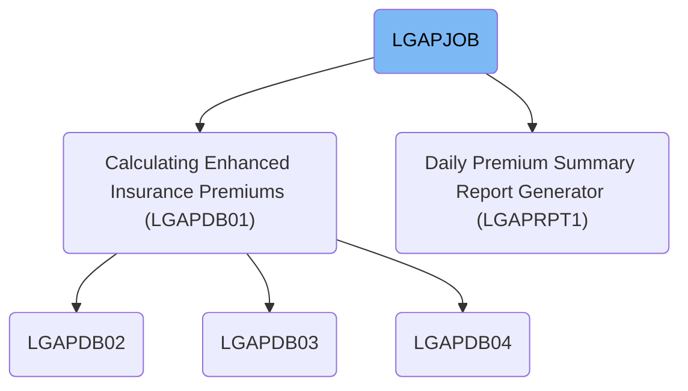
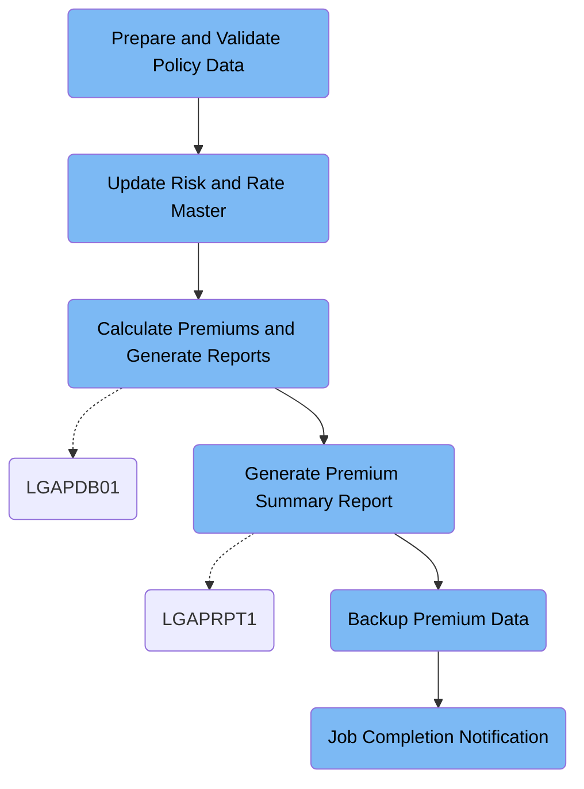

LGAPJOB automates the daily batch workflow for insurance policy premium calculation. It processes raw policy data, updates rate and risk information, computes premiums, generates reports, backs up results, and notifies staff upon completion. For example, after processing a batch of applications, the job outputs calculated premiums, rejected records, a summary report, and a backup file, then sends a completion notification.

# Dependencies



Here is a high level diagram of the file:



## Prepare and Validate Policy Data

Step in this section: `STEP01`.

This step ensures that all raw policy records are sorted and normalized so that downstream processes can perform calculations efficiently and accurately.

1. Each incoming raw policy data record is read from the input dataset.
2. All records are sorted primarily by policy number and then by status to group similar records together and establish a processing order.
3. Each record is reformatted and padded or trimmed to meet the fixed-length output specification before being written to the sorted output dataset.

### Input

**LGAP.INPUT.RAW.DATA (Raw Input Policy Data)**

Unorganized and unvalidated policy records received as input for processing.

### Output

**LGAP.INPUT.SORTED (Sorted and Validated Policy Data)**

Policy records arranged and formatted for consistent downstream processing.

## Update Risk and Rate Master

Step in this section: `STEP02`.

This section ensures that only recent risk factor records are retained, removes outdated ones from the risk cache, and activates all rate master records that are currently effective for premium calculations.

## Calculate Premiums and Generate Reports

Step in this section: `STEP03`.

This section computes insurance premiums for policies using validated data and current rate tables, then produces outputs including processed data, error records, and a summary report for review.

- Each sorted policy record is read and evaluated using configuration data and the relevant rate table for its risk and product type.
- The program computes the premium for each record based on attributes like age, sum insured, and risk factor against current rates.
- Successful calculations are written to the premium data output with detailed premium and status; any policies failing validation (such as invalid age or missing data) are written to the rejected data file with an associated error code.
- Throughout the calculation, aggregate metrics (total policies, premiums, errors) are accumulated and written to a summary report, which is rendered in a human-readable format for review.

### Input

**LGAP.INPUT.SORTED (Validated and Sorted Policy Data)**

Policy records prepared and arranged for premium calculation.

Sample:

| Column Name   | Sample     |
| ------------- | ---------- |
| POLICY_NUMBER | A000123456 |
| STATUS        | ACTIVE     |
| APPLICANT_AGE | 45         |
| SUM_INSURED   | 250000     |
| RISK_FACTOR   | STANDARD   |

**LGAP.CONFIG.MASTER (Master Configuration Data)**

Job and calculation control parameters.

**LGAP.RATE.TABLES (Rate Tables)**

Latest premium rates applicable to each policy type.

### Output

**LGAP.OUTPUT.PREMIUM.DATA (Calculated Premium Policy Data)**

Policy records with calculated premium amounts.

Sample:

| Column Name   | Sample     |
| ------------- | ---------- |
| POLICY_NUMBER | A000123456 |
| FINAL_PREMIUM | 315.50     |
| CALC_STATUS   | SUCCESS    |
| RATE_USED     | 1.26%      |

**LGAP.OUTPUT.REJECTED.DATA (Rejected Policy Data)**

Policy records that failed premium calculation or validation.

Sample:

| Column Name   | Sample      |
| ------------- | ----------- |
| POLICY_NUMBER | A000123457  |
| REJECT_REASON | INVALID AGE |

**LGAP.OUTPUT.SUMMARY.RPT (Processing Summary Report)**

Aggregate summary of premium calculations, policy counts, and error totals.

Sample:

```
Total Policies: 1000
Premiums Calculated: 980
Rejected: 20
Total Premium Value: $295,400.00
```

## Generate Premium Summary Report

Step in this section: `STEP04`.

Generates a premium summary report designed for management review, summarizing key metrics and trends from the latest premium processing run.

- The section reads each processed premium policy record from the input dataset.
- It aggregates key information such as total premiums, policy counts, counts of rejected records, and categorizes results by risk type or other relevant segmentations found in the input records.
- The totals and segmented statistics are accumulated in memory as the records are processed.
- At the end of the input, the section compiles these metrics into a human-readable summary format for management review.
- The report is written to the designated summary report output file for operational oversight.

### Input

**LGAP.OUTPUT.PREMIUM.DATA (Processed Premium Policy Data)**

Policy records with calculated premium amounts and processing status, serving as the basis for summary calculations.

Sample:

| Column Name   | Sample     |
| ------------- | ---------- |
| POLICY_NUMBER | A000123456 |
| FINAL_PREMIUM | 315.50     |
| CALC_STATUS   | SUCCESS    |
| RATE_USED     | 1.26%      |

### Output

**LGAP.REPORTS.DAILY.SUMMARY (Premium Daily Management Summary Report)**

Categorized and summarized daily report giving totals and operational insights into premiums, successful and rejected records, and risk segment results.

## Backup Premium Data

Step in this section: `STEP05`.

This section ensures that all finalized premium policy data produced by the jobs is securely backed up for audit, recovery, or compliance purposes.

## Job Completion Notification

Step in this section: `NOTIFY`.

Provides a clear notification message at the end of the batch process indicating the job has completed successfully, with details about where to find the process summary and backup results.

- The section receives the notification text in-line, listing the completion status, output summary location, and backup confirmation.
- Using the IEBGENER utility, the message is copied and submitted to the system internal reader (INTRDR), which delivers the notification to operations staff electronically.
- The operational staff can then read the rendered notification, informing them that the job has completed, the process summary is available for review, and the backup has been created.

### Input

**in-line literal**

Fixed notification message containing job completion status, output summary location, and backup file name.

Sample:

```
JOB LGAPJOB COMPLETED SUCCESSFULLY
PROCESSING SUMMARY AVAILABLE IN LGAP.OUTPUT.SUMMARY.RPT
BACKUP CREATED: LGAP.BACKUP.PREMIUM.G0001V00
```

### Output

**INTRDR output stream**

Notification delivered to the internal reader, routed for operational review.

&nbsp;

*This is an auto-generated document by Swimm 🌊 and has not yet been verified by a human*

<SwmMeta version="3.0.0" repo-id="Z2l0aHViJTNBJTNBU3dpbW1pby1nZW5hcHAtaG91c2UlM0ElM0FHaXJpLVN3aW1t" repo-name="Swimmio-genapp-house"><sup>Powered by [Swimm](https://app.swimm.io/)</sup></SwmMeta>
