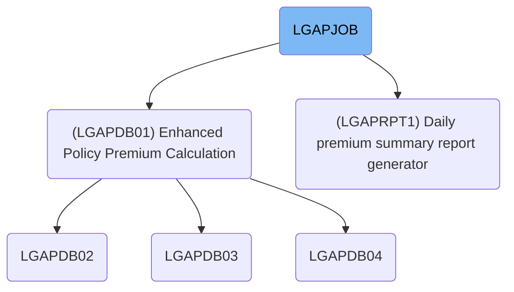
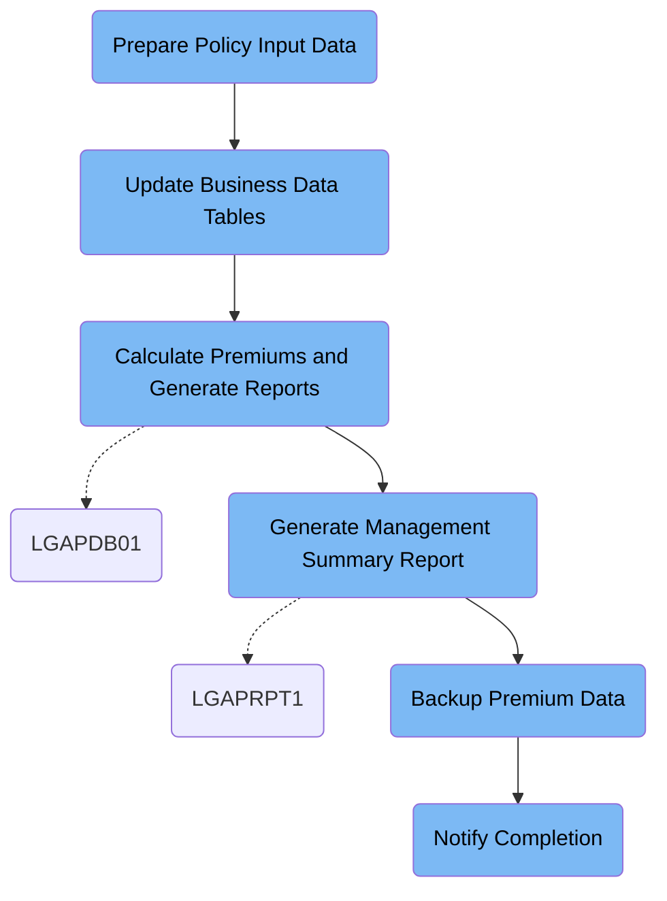

LGAPJOB (LGAPJOB) handles the daily batch processing of commercial insurance policy applications, from data preparation and premium calculation to reporting, backup, and completion notification. The job receives raw policy records and outputs validated data, calculated premiums, summary reports, backups, and notifications. For instance, processing 150 applications results in accepted and rejected datasets, a summary report, a backup file, and a completion message.

# Dependencies



Here is a high level diagram of the file:



## Prepare Policy Input Data

Step in this section: `STEP01`.

The section sorts and validates incoming policy data so the downstream premium calculation logic operates on clean, well-organized records.

- Raw policy application records are read from the input dataset.
- Records are sorted based on specific fields (e.g., policy number, application type).
- Data is validated and formatted so each record fits requirements for the premium calculation phase.
- The resulting sorted and validated data is written to the output dataset for use in the next step.

### Input

**LGAP.INPUT.RAW.DATA (Raw Commercial Policy Input Data)**

Unscrubbed insurance policy application records received for batch premium calculation.

### Output

**LGAP.INPUT.SORTED (Validated, Sorted Policy Input Data)**

Policy input records sorted and validated for downstream batch premium calculation.

## Update Business Data Tables

Step in this section: `STEP02`.

This section updates database tables that store current risk factors and effective rate information, allowing downstream processes to use up-to-date values for policy premium calculations.

## Calculate Premiums and Generate Reports

Step in this section: `STEP03`.

Calculates insurance premiums for validated commercial policy applications and produces datasets for accepted premiums, rejected applications, and a summary report for the processing batch.

1. Each validated and sorted policy input record is read and evaluated against business rules from the configuration file.
2. Actuarial rate tables are referenced to determine the correct premium rate and applicable risk factors for each policy.
3. For records with all required information and passing checks, the premium is calculated and recorded into the calculated premium dataset, including policy details and premium amounts.
4. Applications failing validation, missing data, or conflicting with business rules are written to the rejected dataset with error codes or explanations.
5. Throughout processing, counters are kept for accepted and rejected records, as well as statistics on types of errors.
6. After all records are processed, a summary report is generated listing totals for accepted, rejected, and error types, providing oversight of the batch calculation process.

### Input

**LGAP.INPUT.SORTED (Validated, Sorted Policy Input Data)**

Validated and sorted insurance policy input records ready for batch premium calculation.

**LGAP.CONFIG.MASTER (Actuarial Configuration File)**

Business rules and operational parameters that control premium calculation and validation.

**LGAP.RATE.TABLES (Insurance Rate Tables)**

Current premium rates and risk factors for policy calculation, referenced during the batch run.

### Output

**LGAP.OUTPUT.PREMIUM.DATA (Calculated Premium Data)**

Accepted policy records with calculated premiums and rating details for each policy application processed.

**LGAP.OUTPUT.REJECTED.DATA (Rejected Premium Application Data)**

Records for policy applications rejected due to validation errors or failed business rules during premium calculation.

**LGAP.OUTPUT.SUMMARY.RPT (Summary Report)**

Batch summary report including the number of accepted and rejected records, error statistics, and processing totals.

## Generate Management Summary Report

Step in this section: `STEP04`.

Generates a formatted daily management summary report, offering an overview of processed insurance premiums based on the latest calculation batch.

1. Each record from the calculated premium data file is read and checked for validity and status (e.g., accepted or rejected).
2. The program groups records by policy product, computing counts and summing premium amounts for each group as well as overall totals.
3. Counts and sums for accepted and rejected policies are tracked, along with processing statistics.
4. These statistics are composed into a readable management summary, including batch totals and breakdowns by product.
5. The formatted report text is written out to the daily summary report file for business review.

### Input

**LGAP.OUTPUT.PREMIUM.DATA (Calculated Premium Data)**

Policy premium calculation records for the daily batch, with per-policy details and premium amounts.

Sample:

| Column Name    | Sample     |
| -------------- | ---------- |
| POLICY_NO      | CMP123456  |
| EFFECTIVE_DATE | 2024-06-01 |
| PREMIUM_AMOUNT | 1200.50    |
| STATUS_CODE    | ACCEPTED   |

### Output

**LGAP.REPORTS.DAILY.SUMMARY (Daily Summary Report)**

Formatted summary report with totals, accepted/rejected counts, and premium aggregates for management review.

Sample:

```

DAILY PREMIUM PROCESSING SUMMARY
DATE: 2024-06-01
-----------------------------------------
Total Policies Processed:      150
Accepted Policies:             145
Rejected Policies:               5
Total Premium Amount:       $180,075.00
-----------------------------------------
Breakdown by Product:
Commercial Auto  - Count: 80  Total Premium: $80,000.00
Commercial Property - Count: 45  Total Premium: $55,000.00
General Liability  - Count: 25  Total Premium: $45,075.00

```

## Backup Premium Data

Step in this section: `STEP05`.

The section creates a backup copy of the processed premium records, preserving the day's results before any potential cleanup or overwrite.

## Notify Completion

Step in this section: `NOTIFY`.

Automates the communication of job completion status, report availability, and backup creation to notify downstream users and operators.

- The job completion notification text is read from the SYSUT1 inline data, which includes the status, location of the summary report, and backup file identifier.
- Using the utility, this message is directed to SYSUT2, which is defined as the system's internal reader.
- The internal reader processes the message and distributes it as a job completion notification, making it visible in the operator console or to downstream automated notification systems.
- No transformation is applied to the message; it is passed through exactly as written.

### Input

**SYSUT1**

Predefined completion message for the batch job, including pointers to the summary report and backup file.

Sample:

```
JOB LGAPJOB COMPLETED SUCCESSFULLY
PROCESSING SUMMARY AVAILABLE IN LGAP.OUTPUT.SUMMARY.RPT
BACKUP CREATED: LGAP.BACKUP.PREMIUM.G0001V00
```

### Output

**SYSUT2**

Notification message rendered in the system internal reader queue to trigger communication to operators or automated systems.

&nbsp;

*This is an auto-generated document by Swimm 🌊 and has not yet been verified by a human*

<SwmMeta version="3.0.0" repo-id="Z2l0aHViJTNBJTNBU3dpbW1pby1nZW5hcHAtaG91c2UlM0ElM0FHaXJpLVN3aW1t" repo-name="Swimmio-genapp-house"><sup>Powered by [Swimm](https://app.swimm.io/)</sup></SwmMeta>
