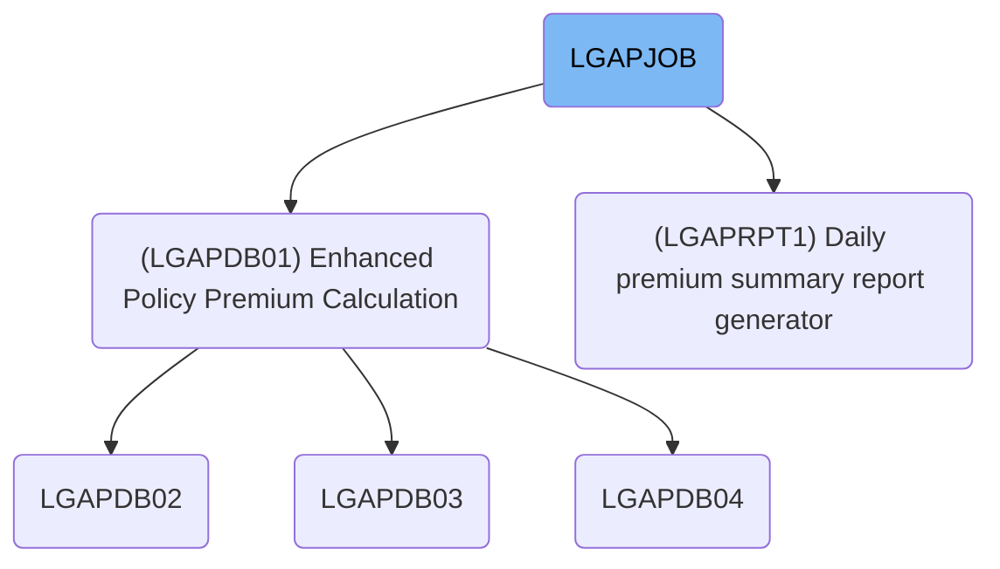
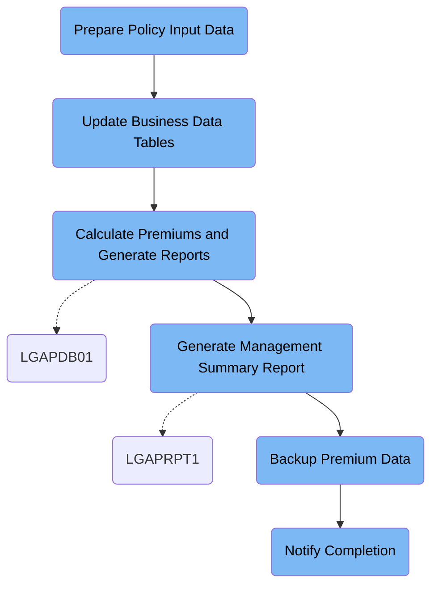

LGAPJOB handles the daily calculation of commercial insurance policy premiums, management reporting, and backup. It takes raw policy applications as input and produces calculated premium data, rejected policy records, summary reports, and backup files. For example, a batch of policy applications results in approved premium details, rejected cases, a summary report, and a backup archive.

# Dependencies



Here is a high level diagram of the file:



## Prepare Policy Input Data

Step in this section: `STEP01`.

The section ensures that the raw policy data is accurately sorted and validated before being processed for premium calculations.

- The section takes the unsorted, raw input records of commercial insurance policies from the input data set.
- It sorts the records primarily by the policy number, followed by an additional character field, to ensure consistent ordering for downstream processes.
- It validates each policy record by ensuring record length and format consistency across the file.
- The result is a new, sorted, and structurally validated data set, output to be used by premium calculation steps.

### Input

**LGAP.INPUT.RAW.DATA**

Raw input records for commercial insurance policy applications needing preparation.

### Output

**LGAP.INPUT.SORTED**

Validated and sorted commercial insurance policy data set, structured for accurate further processing.

## Update Business Data Tables

Step in this section: `STEP02`.

This section ensures that business-critical risk and rate data used for policy premium calculations are current and accurately reflect latest business rules.

## Calculate Premiums and Generate Reports

Step in this section: `STEP03`.

The section uses sorted policy input records, configuration settings, and current rate tables to process each application, producing calculated premium data, reports of rejected policies, and a statistical summary for business review.

1. Policy records from LGAP.INPUT.SORTED are read, and actuarial configuration settings from LGAP.CONFIG.MASTER, along with rate information from LGAP.RATE.TABLES, are loaded into processing logic.
2. For each policy, the actuarial and rate data are applied to calculate premium amounts, check eligibility, and determine if the record is valid.
3. Successfully calculated premiums are written out to LGAP.OUTPUT.PREMIUM.DATA, including the applied rate and approval status.
4. Policy applications failing validation or eligibility checks are written to LGAP.OUTPUT.REJECTED.DATA, along with the reason and description.
5. As policies are processed, counters and statistics are maintained and compiled into LGAP.OUTPUT.SUMMARY.RPT. This report gives a high-level summary of total applications, approved cases, rejected cases, and overall premium totals.

### Input

**LGAP.INPUT.SORTED**

Sorted, validated commercial insurance policy records ready for premium calculation processing.

Sample:

| Column Name       | Sample     |
| ----------------- | ---------- |
| POLICY_NO         | CMP123456  |
| APPLICANT_NAME    | Acme Corp. |
| COVERAGE_TYPE     | Property   |
| RISK_FACTOR_CODE  | RF06       |
| REQUESTED_PREMIUM | 15000      |
| VALIDATION_STATUS | PASS       |

**LGAP.CONFIG.MASTER**

Actuarial and business configuration file referencing calculation logic and parameters.

**LGAP.RATE.TABLES**

Current rate tables for premium calculation and eligibility determination.

### Output

**LGAP.OUTPUT.PREMIUM.DATA**

Calculated insurance premium details for each successfully processed policy application.

Sample:

| Column Name    | Sample     |
| -------------- | ---------- |
| POLICY_NO      | CMP123456  |
| PREMIUM_AMOUNT | 17845.25   |
| RATE_APPLIED   | RTA-2024Q2 |
| STATUS         | APPROVED   |

**LGAP.OUTPUT.REJECTED.DATA**

Records for policy applications rejected due to validation or eligibility failures.

Sample:

| Column Name        | Sample              |
| ------------------ | ------------------- |
| POLICY_NO          | CMP987654           |
| REASON_CODE        | VAL_ERR             |
| REJECT_DESCRIPTION | Invalid risk factor |

**LGAP.OUTPUT.SUMMARY.RPT**

Summary report containing statistics of total processed, approved, and rejected insurance applications.

Sample:

```
TOTAL_POLICY_PROCESSED: 200
PREMIUMS_SUCCESS: 180
REJECTED_POLICIES: 20
TOTAL_PREMIUM_AMOUNT: 3,200,000.55
```

## Generate Management Summary Report

Step in this section: `STEP04`.

This section compiles finalized premium calculation results into a summarized daily report that provides business insights into policy outcomes and premium distribution.

- Each premium calculation record from LGAP.OUTPUT.PREMIUM.DATA is sequentially read.
- The logic groups and aggregates statistical numbers: counting total policies, summing total premiums, tallying approvals and rejections, and classifying records by relevant business dimensions (e.g. product or risk type).
- The program writes structured, human-readable summary report sections.
- These sections include headers with report details and tabular overviews of key statistics.
- The completed summary report is written out to LGAP.REPORTS.DAILY.SUMMARY for management access.

### Input

**LGAP.OUTPUT.PREMIUM.DATA (Calculated Premium Data)**

Detailed records of calculated premiums and decisions for each processed insurance policy.

Sample:

| Column Name    | Sample     |
| -------------- | ---------- |
| POLICY_NO      | CMP123456  |
| PREMIUM_AMOUNT | 17845.25   |
| RATE_APPLIED   | RTA-2024Q2 |
| STATUS         | APPROVED   |

### Output

**LGAP.REPORTS.DAILY.SUMMARY (Daily Summary Report)**

Formatted report file summarizing daily policy activity, approvals, rejections, and premium statistics for management review.

## Backup Premium Data

Step in this section: `STEP05`.

This section copies finalized premium calculation records to a backup file for safekeeping and disaster recovery purposes.

1. The step uses a data utility to read all records from the calculated premium data set (LGAP.OUTPUT.PREMIUM.DATA).
2. Each record is written without modification to the new backup file (LGAP.BACKUP.PREMIUM.G0001V00) stored on tape.
3. The result is an exact, complete duplicate of the calculated premium information available for future retrieval or audit.

### Input

**LGAP.OUTPUT.PREMIUM.DATA (Calculated Premium Data)**

Detailed records of calculated insurance premiums for all processed policy applications.

Sample:

| Column Name    | Sample     |
| -------------- | ---------- |
| POLICY_NO      | CMP123456  |
| PREMIUM_AMOUNT | 17845.25   |
| RATE_APPLIED   | RTA-2024Q2 |
| STATUS         | APPROVED   |

### Output

**LGAP.BACKUP.PREMIUM.G0001V00 (Premium Backup File)**

A secure, point-in-time copy of all processed premium calculation data, archived for compliance or recovery.

Sample:

| Column Name    | Sample     |
| -------------- | ---------- |
| POLICY_NO      | CMP123456  |
| PREMIUM_AMOUNT | 17845.25   |
| RATE_APPLIED   | RTA-2024Q2 |
| STATUS         | APPROVED   |

## Notify Completion

Step in this section: `NOTIFY`.

The section ensures the operations team is actively notified that the commercial insurance premium calculation job has completed, including where the summary report and backup can be found.

&nbsp;

*This is an auto-generated document by Swimm 🌊 and has not yet been verified by a human*

<SwmMeta version="3.0.0" repo-id="Z2l0aHViJTNBJTNBU3dpbW1pby1nZW5hcHAtaG91c2UlM0ElM0FHaXJpLVN3aW1t" repo-name="Swimmio-genapp-house"><sup>Powered by [Swimm](https://app.swimm.io/)</sup></SwmMeta>
