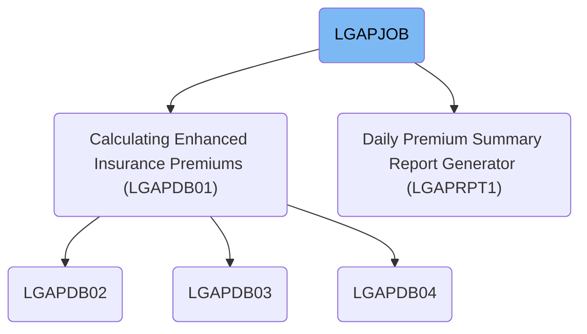
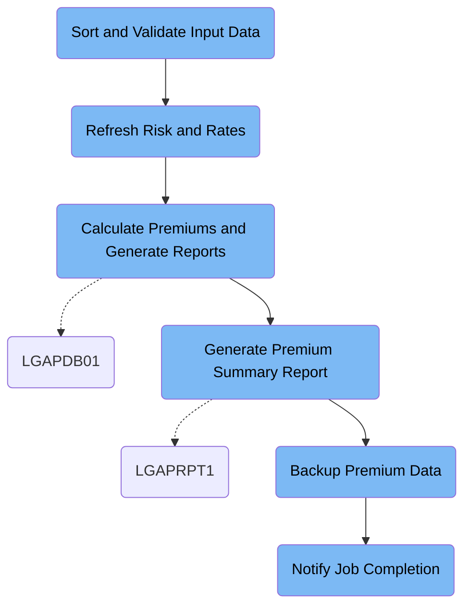

LGAPJOB is a daily batch job that processes insurance policy applications by sorting and validating input data, updating risk and rate tables, calculating premiums, generating reports, backing up results, and notifying stakeholders. It transforms raw application records and configuration data into calculated premium files, summary reports, and backups, ensuring all steps are completed and communicated.

# Dependencies



Here is a high level diagram of the file:



## Sort and Validate Input Data

Step in this section: `STEP01`.

The section ensures all incoming insurance records are consistently ordered and preliminarily validated to facilitate clean downstream processing.

- The raw insurance records from the input file are read into the batch process.
- Records are sorted based on the first ten characters (typically representing policy identifiers) and a following character field (application type).
- Each output record preserves the full 300-character layout, ensuring consistent format for all downstream applications.
- Invalid or malformatted records are excluded during this preparation step, guaranteeing that only clean, validated records are passed on.
- The result is a sorted and integrity-checked output file that matches expectations of subsequent database and premium processing routines.

### Input

**LGAP.INPUT.RAW.DATA**

Raw insurance application records received for daily batch premium calculation.

Sample:

| Column Name      | Sample       |
| ---------------- | ------------ |
| POLICY_ID        | 0001023456   |
| APPLICATION_TYPE | N            |
| CUSTOMER_NAME    | LISA THOMAS  |
| START_DATE       | 20240619     |
| PREMIUM_AMOUNT   | 000001200.00 |

### Output

**LGAP.INPUT.SORTED**

Sorted and validated insurance application records, ready for database updates and premium calculations.

Sample:

| Column Name      | Sample       |
| ---------------- | ------------ |
| POLICY_ID        | 0001023456   |
| APPLICATION_TYPE | N            |
| CUSTOMER_NAME    | LISA THOMAS  |
| START_DATE       | 20240619     |
| PREMIUM_AMOUNT   | 000001200.00 |

## Refresh Risk and Rates

Step in this section: `STEP02`.

This section refreshes the risk data to remove outdated factors and ensures only currently valid rate entries are set as active for policy processing.

## Calculate Premiums and Generate Reports

Step in this section: `STEP03`.

This section calculates policy premiums and creates summary and error reports based on incoming insurance applications, configuration rules, and up-to-date rate tables.

- Each sorted and validated insurance application is read from LGAP.INPUT.SORTED.
- Configuration limits and rules from LGAP.CONFIG.MASTER guide how applications are checked for eligibility and how risks are scored.
- Current actuarial rates from LGAP.RATE.TABLES are applied to each record's risk profile and coverage details.
- For each valid record:
  - Calculate risk score and determine the premium amount.
  - Write a row to LGAP.OUTPUT.PREMIUM.DATA with enhanced actuarial details like POLICY_ID, CUSTOMER_NAME, premium, risk score, and application type.
- If a record fails validation or cannot be processed:
  - Write a row to LGAP.OUTPUT.REJECTED.DATA with POLICY_ID, error information, and relevant identifying details.
- As processing completes, aggregate statistics (total processed, accepted, rejected, premium aggregates) are compiled and output to LGAP.OUTPUT.SUMMARY.RPT.

### Input

**LGAP.INPUT.SORTED (Sorted Insurance Application Data)**

Sorted and validated insurance application records to be processed for premium calculation.

Sample:

| Column Name      | Sample       |
| ---------------- | ------------ |
| POLICY_ID        | 0001023456   |
| APPLICATION_TYPE | N            |
| CUSTOMER_NAME    | LISA THOMAS  |
| START_DATE       | 20240619     |
| PREMIUM_AMOUNT   | 000001200.00 |

**LGAP.CONFIG.MASTER (Configuration Master)**

Configuration and processing limits for premium calculation and risk scoring.

**LGAP.RATE.TABLES (Rate Tables)**

Current actuarial rates and rules used for premium calculation.

### Output

**LGAP.OUTPUT.PREMIUM.DATA (Calculated Premiums)**

File with detailed premium calculations for all processed and accepted insurance policy applications.

Sample:

| Column Name      | Sample       |
| ---------------- | ------------ |
| POLICY_ID        | 0001023456   |
| CUSTOMER_NAME    | LISA THOMAS  |
| PREMIUM_AMOUNT   | 000001320.00 |
| RISK_SCORE       | 073          |
| APPLICATION_TYPE | N            |

**LGAP.OUTPUT.REJECTED.DATA (Rejected Application Data)**

Records of insurance applications that failed premium calculation or validation checks.

Sample:

| Column Name      | Sample      |
| ---------------- | ----------- |
| POLICY_ID        | 0001009999  |
| ERROR_CODE       | VAL02       |
| CUSTOMER_NAME    | JAMES SMITH |
| APPLICATION_TYPE | N           |

**LGAP.OUTPUT.SUMMARY.RPT (Summary Report)**

Batch processing report with statistics such as total policies processed, number accepted, number rejected, and aggregated premium values.

## Generate Premium Summary Report

Step in this section: `STEP04`.

Generates a formatted summary report that aggregates key figures from the recent premium calculation run, providing business stakeholders with a daily overview of premium activity and totals.

- All processed premium records are read sequentially from the input file.
- For each record, relevant monetary and statistical data (e.g., PREMIUM_AMOUNT, RISK_SCORE) is extracted.
- The logic aggregates premium amounts to compute totals, counts the number of policies, and may compute averages or identify high-level trends.
- Aggregated data is formatted into a human-readable management report, clearly presenting totals and breakdowns for the day.
- The completed report is written to the output report file for management's review and archival.

### Input

**LGAP.OUTPUT.PREMIUM.DATA**

Detailed data file containing all accepted and processed premium calculations from the day's insurance applications.

Sample:

| Column Name      | Sample       |
| ---------------- | ------------ |
| POLICY_ID        | 0001023456   |
| CUSTOMER_NAME    | LISA THOMAS  |
| PREMIUM_AMOUNT   | 000001320.00 |
| RISK_SCORE       | 073          |
| APPLICATION_TYPE | N            |

### Output

**LGAP.REPORTS.DAILY.SUMMARY**

Formatted summary report with aggregated daily premium totals and management key figures, suitable for direct business review.

## Backup Premium Data

Step in this section: `STEP05`.

The section makes a secure backup of the processed premium data to tape storage, ensuring all calculated records are preserved.

- All records from the insurance premium data file are read sequentially from LGAP.OUTPUT.PREMIUM.DATA.
- Each record is written without transformation onto the backup tape dataset (LGAP.BACKUP.PREMIUM.G0001V00).
- The resulting backup tape is an exact copy of the daily processed premium calculations, preserving the same structure and content as the source file.

### Input

**LGAP.OUTPUT.PREMIUM.DATA**

Detailed file with all accepted insurance premium calculations generated by earlier processing steps.

Sample:

| Column Name      | Sample       |
| ---------------- | ------------ |
| POLICY_ID        | 0001023456   |
| CUSTOMER_NAME    | LISA THOMAS  |
| PREMIUM_AMOUNT   | 000001320.00 |
| RISK_SCORE       | 073          |
| APPLICATION_TYPE | N            |

### Output

**LGAP.BACKUP.PREMIUM.G0001V00**

Backup tape containing all daily calculated insurance premium data for archival purposes.

Sample:

| Column Name      | Sample       |
| ---------------- | ------------ |
| POLICY_ID        | 0001023456   |
| CUSTOMER_NAME    | LISA THOMAS  |
| PREMIUM_AMOUNT   | 000001320.00 |
| RISK_SCORE       | 073          |
| APPLICATION_TYPE | N            |

## Notify Job Completion

Step in this section: `NOTIFY`.

This section sends out a completion message that confirms the job finished successfully and provides the locations of the generated summary report and backup data for stakeholder review.

- The input is a static message containing the job status and references to the summary report and backup data.
- IEBGENER reads the message template and copies it directly to the output subsystem SYSOUT (INTRDR).
- This makes the text notification immediately available to stakeholders via the job output system, confirming the job's success and pointing to where results and backups are stored.

### Input

**SYSUT1**

Notification template with job completion messages, summary report reference, and backup file details.

Sample:

```
JOB LGAPJOB COMPLETED SUCCESSFULLY
PROCESSING SUMMARY AVAILABLE IN LGAP.OUTPUT.SUMMARY.RPT
BACKUP CREATED: LGAP.BACKUP.PREMIUM.G0001V00
```

### Output

**SYSUT2**

Rendered notification output to the system's job entry subsystem (INTRDR), making the completion and resource locations visible to all stakeholders.

Sample:

```
JOB LGAPJOB COMPLETED SUCCESSFULLY
PROCESSING SUMMARY AVAILABLE IN LGAP.OUTPUT.SUMMARY.RPT
BACKUP CREATED: LGAP.BACKUP.PREMIUM.G0001V00
```

&nbsp;

*This is an auto-generated document by Swimm 🌊 and has not yet been verified by a human*

<SwmMeta version="3.0.0" repo-id="Z2l0aHViJTNBJTNBU3dpbW1pby1nZW5hcHAtaG91c2UlM0ElM0FHaXJpLVN3aW1t" repo-name="Swimmio-genapp-house"><sup>Powered by [Swimm](https://app.swimm.io/)</sup></SwmMeta>
