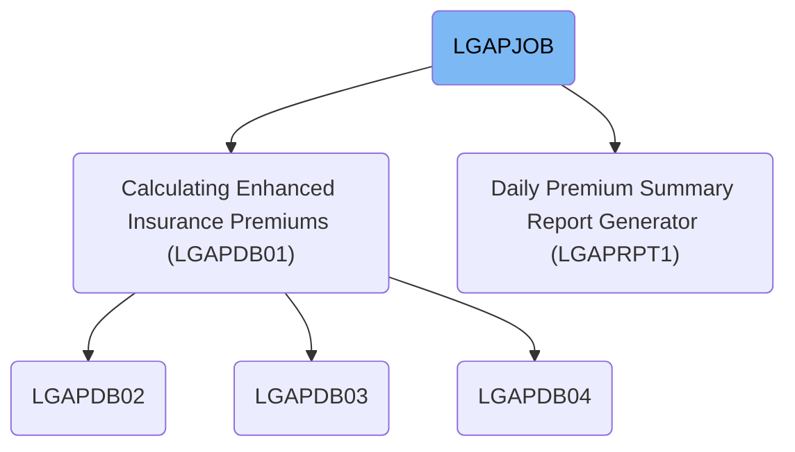
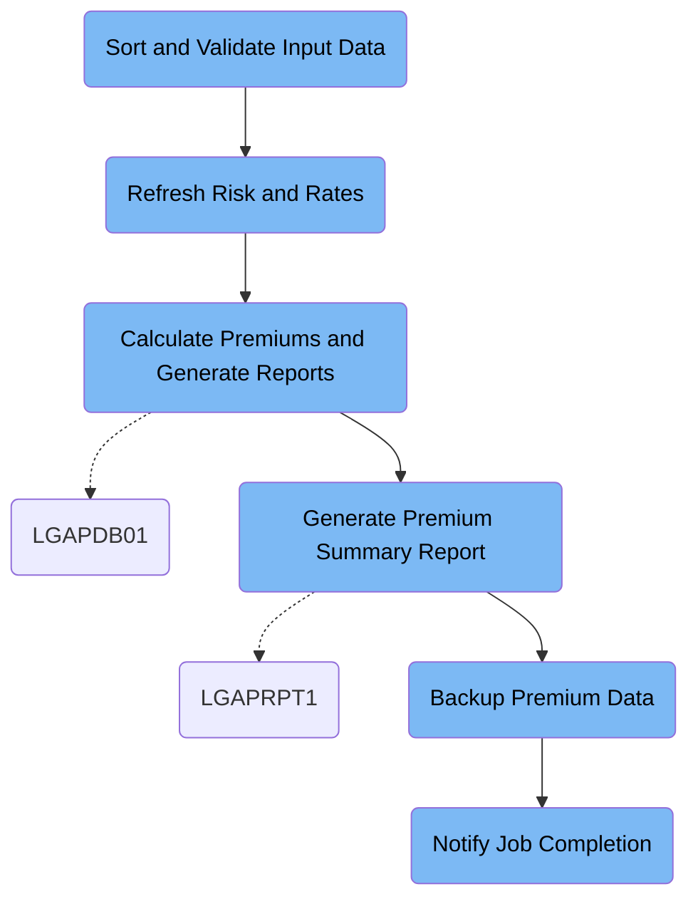

LGAPJOB is the daily batch job that processes insurance policy applications, calculates premiums, generates summary reports, backs up results, and notifies stakeholders. It receives raw application records, configuration, and rate tables as input, and produces calculated premiums, rejected records, summary reports, backups, and notifications as output. For instance, an application with policy number A123456789 will result in a calculated premium and approval status, while rejected applications are logged with reasons.

# Dependencies



Here is a high level diagram of the file:



## Sort and Validate Input Data

Step in this section: `STEP01`.

This section organizes and verifies raw insurance application data to ensure that all records are ordered and correctly formatted before policy calculations begin.

1. Raw insurance application data is read and each record is checked for structural consistency.
2. All valid records are sorted based on policy number and type fields as defined in the business logic.
3. The sorted, formatted records are written to a new file for use in subsequent premium calculation steps, ensuring downstream processes receive clean and ordered data.

### Input

**LGAP.INPUT.RAW.DATA**

Raw insurance application records to be prepared for policy premium calculation.

### Output

**LGAP.INPUT.SORTED**

Sorted and structurally validated insurance records ready for rating and premium processing.

## Refresh Risk and Rates

Step in this section: `STEP02`.

Refreshes the risk factor data by removing outdated records and updates the rate table to make applicable rates active for today's processing.

## Calculate Premiums and Generate Reports

Step in this section: `STEP03`.

Calculates premiums using configured rates and risk data, creates a detailed summary of results, and distinguishes valid from rejected applications.

1. Each record from the sorted application data is read and paired with business rules from the configuration file and matching rates from the rate tables.
2. The premium is calculated using actuarial formulas defined in the configuration and rate tables, factoring in applicant details (e.g., age, coverage amount).
3. If the record passes all validations and calculations, the resulting premium, risk score, and approval status are written to the premium data output.
4. Records that do not meet criteria (such as age requirements or data inconsistencies) are logged into the rejected data output with specific rejection reasons.
5. Throughout the process, summary statistics are accumulated, including totals for processed, approved, and rejected applications, average, max, and min premium amounts.
6. At the end of processing, these summary statistics are output to a report for business review.

### Input

**LGAP.INPUT.SORTED (Sorted and validated application records)**

Insurance application records preprocessed and ready for premium calculation.

Sample:

| Column Name    | Sample     |
| -------------- | ---------- |
| POLICY_NO      | A123456789 |
| POLICY_TYPE    | H          |
| APPLICANT_AGE  | 43         |
| COVERAGE_AMT   | 250000     |
| EFFECTIVE_DATE | 2024-07-01 |

**LGAP.CONFIG.MASTER (Master configuration)**

Processing rules and general configuration for premium calculation.

**LGAP.RATE.TABLES (Rate tables)**

Active premium tables for policy rating.

### Output

**LGAP.OUTPUT.PREMIUM.DATA (Calculated premium data)**

Detailed premium calculations for each valid application record.

Sample:

| Column Name | Sample     |
| ----------- | ---------- |
| POLICY_NO   | A123456789 |
| PREMIUM     | 1186.40    |
| RISK_SCORE  | 2.3        |
| STATUS      | APPROVED   |

**LGAP.OUTPUT.REJECTED.DATA (Rejected application data)**

Application records that failed validation or premium calculation.

Sample:

| Column Name   | Sample     |
| ------------- | ---------- |
| POLICY_NO     | B987654321 |
| REJECT_REASON | Underage   |
| STATUS        | REJECTED   |

**LGAP.OUTPUT.SUMMARY.RPT (Summary report)**

Aggregate process statistics and summary metrics for the current batch.

Sample:

```
TOTAL_PROCESSED: 1000
TOTAL_APPROVED: 962
TOTAL_REJECTED: 38
AVERAGE_PREMIUM: 1050.23
MAX_PREMIUM: 1995.00
MIN_PREMIUM: 600.75
```

## Generate Premium Summary Report

Step in this section: `STEP04`.

Generates a daily summary report showing totals and key metrics for all insurance premium calculations completed, providing management with a clear overview of processing results.

- The report generator reads each calculated premium record from the input dataset.
- It aggregates critical figures, such as total premiums, number of policies processed, number approved, rejected, and risk score distributions.
- Key statistics (count, average, max, min) are calculated for inclusion in the summary.
- Data is then formatted and written into a structured daily report for management and business users.

### Input

**LGAP.OUTPUT.PREMIUM.DATA (Calculated premium data)**

Detailed results for all insurance premium calculations processed earlier in the batch job.

Sample:

| Column Name | Sample     |
| ----------- | ---------- |
| POLICY_NO   | A123456789 |
| PREMIUM     | 1186.40    |
| RISK_SCORE  | 2.3        |
| STATUS      | APPROVED   |

### Output

**LGAP.REPORTS.DAILY.SUMMARY (Premium summary report)**

Formatted management report containing daily totals, averages, and significant statistics from all processed insurance premiums.

## Backup Premium Data

Step in this section: `STEP05`.

This section ensures all calculated premium data is securely preserved by archiving the daily batch output, maintaining a recoverable history for auditing and restoration needs.

## Notify Job Completion

Step in this section: `NOTIFY`.

This section communicates the successful completion of the batch insurance premium calculation job, specifying where output reports and backups have been stored so business and operations teams are aware and can take any necessary follow-up actions.

- The IEBGENER utility reads the notification message from the SYSUT1 DD, which contains the lines stating job completion and the locations of the summary report and backup file.
- The exact content of SYSUT1 is written to SYSUT2, which targets the internal reader (INTRDR), resulting in the notification being distributed to operations and business teams.
- No transformation takes place; the output is a direct copy of the input message, sent for rendering on the internal systems.

### Input

**SYSUT1**

Notification message lines specifying job completion and locations of summary and backup data.

Sample:

```
JOB LGAPJOB COMPLETED SUCCESSFULLY
PROCESSING SUMMARY AVAILABLE IN LGAP.OUTPUT.SUMMARY.RPT
BACKUP CREATED: LGAP.BACKUP.PREMIUM.G0001V00
```

### Output

**SYSUT2**

Job completion notification sent to the operations console (internal reader) for rendering to stakeholders.

Sample:

```
JOB LGAPJOB COMPLETED SUCCESSFULLY
PROCESSING SUMMARY AVAILABLE IN LGAP.OUTPUT.SUMMARY.RPT
BACKUP CREATED: LGAP.BACKUP.PREMIUM.G0001V00
```

&nbsp;

*This is an auto-generated document by Swimm 🌊 and has not yet been verified by a human*

<SwmMeta version="3.0.0" repo-id="Z2l0aHViJTNBJTNBU3dpbW1pby1nZW5hcHAtaG91c2UlM0ElM0FHaXJpLVN3aW1t" repo-name="Swimmio-genapp-house"><sup>Powered by [Swimm](https://app.swimm.io/)</sup></SwmMeta>
