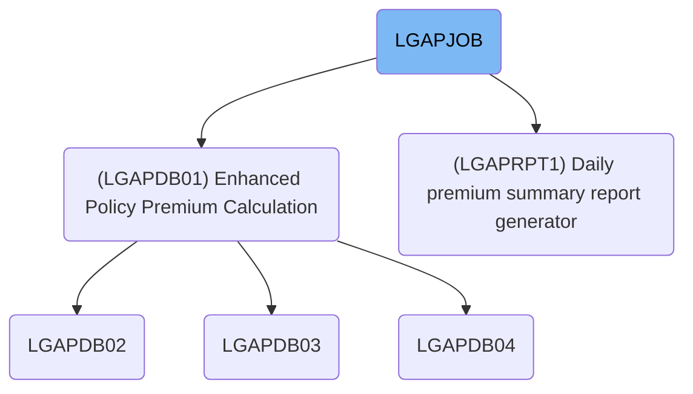
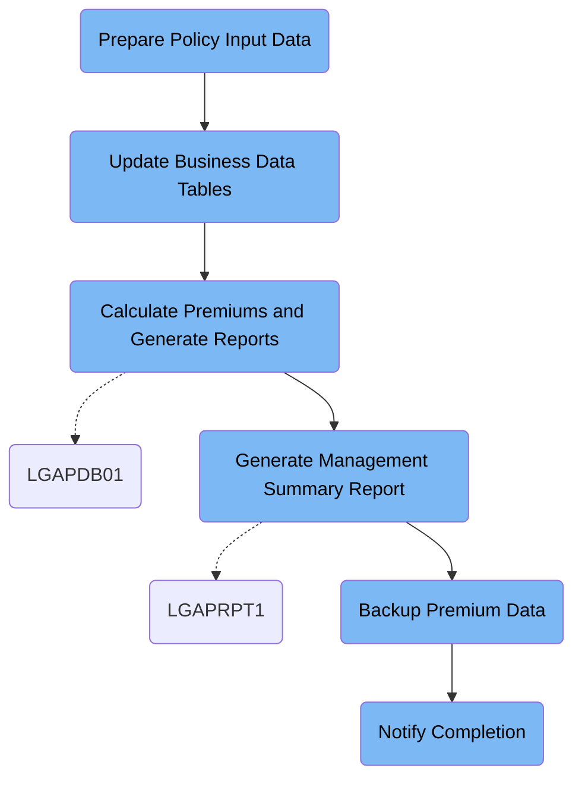

This document covers the LGAPJOB batch job, which processes insurance policy applications by validating input, calculating premiums, generating reports, backing up results, and notifying completion. Input includes raw policy data and business tables; output consists of premium calculations, rejected applications, summary reports, and backups.

# Dependencies



Here is a high level diagram of the file:



## Prepare Policy Input Data

Step in this section: `STEP01`.

This section sorts and validates raw commercial insurance policy data to ensure clean, accurate input for subsequent premium calculations.

1. The raw policy input file is fed into the sorting utility.
2. The sorting instructions are applied to order records by the specified identifiers (e.g. policy number, product code).
3. Records are validated for basic format integrity during sorting, and only valid, standardized records are written to the sorted output.
4. The resulting output file is organized, formatted, and ready for use by downstream premium calculation modules.

### Input

**LGAP.INPUT.RAW.DATA**

Raw, unsorted insurance policy application data requiring validation and normalization before premium calculation.

**SYSIN**

Sort and formatting instructions for preprocessing the policy data.

Sample:

```
SORT FIELDS=(1,10,CH,A,11,1,CH,A)
OUTREC FIELDS=(1,300)
```

### Output

**LGAP.INPUT.SORTED**

Validated and sorted insurance policy data record set, formatted for downstream premium calculation steps.

## Update Business Data Tables

Step in this section: `STEP02`.

Refreshes cached risk data and updates effective statuses for premium rate tables so insurance calculations reflect up-to-date logic.

## Calculate Premiums and Generate Reports

Step in this section: `STEP03`.

Calculates insurance premiums for each policy application, flags rejected applications, and generates an overall summary report using up-to-date business rules and rates.

1. For each policy in LGAP.INPUT.SORTED, the insurance parameters are read and combined with the enterprise calculation rules from LGAP.CONFIG.MASTER and rates from LGAP.RATE.TABLES.
2. The premium for each policy is computed using the provided rates and configuration logic.
3. If a policy passes all rules, its calculated premium is written to LGAP.OUTPUT.PREMIUM.DATA with policy number, premium amount, and calculation date.
4. If a policy fails validation or business rules, it is written to LGAP.OUTPUT.REJECTED.DATA with the policy number and the rejection reason.
5. As the process runs, statistical tallies (counts, totals) are gathered.
6. After all records are processed, an aggregate summary (including counts of accepted, rejected, and total premium value) is produced in LGAP.OUTPUT.SUMMARY.RPT.

### Input

**LGAP.INPUT.SORTED**

Validated and sorted insurance policy data record set used as input for premium calculation.

Sample:

| Column Name     | Sample     |
| --------------- | ---------- |
| POLICY_NO       | P000012345 |
| PRODUCT_CODE    | COMM       |
| COVERAGE_AMOUNT | 500000     |
| TERM_YEARS      | 3          |
| APPLICANT_AGE   | 54         |

**LGAP.CONFIG.MASTER**

Active business configuration parameters and calculation rules.

**LGAP.RATE.TABLES**

The set of current premium rate tables used for policy calculations.

### Output

**LGAP.OUTPUT.PREMIUM.DATA**

Final calculated premium data for valid insurance policies, to be used in further processing and reporting.

Sample:

| Column Name    | Sample     |
| -------------- | ---------- |
| POLICY_NO      | P000012345 |
| PREMIUM_AMOUNT | 12000.25   |
| VAL_DATE       | 2024-06-22 |

**LGAP.OUTPUT.REJECTED.DATA**

Records of insurance applications rejected due to validation or business rules errors in processing.

Sample:

| Column Name   | Sample           |
| ------------- | ---------------- |
| POLICY_NO     | P000012670       |
| REJECT_REASON | AGE_OUT_OF_RANGE |

**LGAP.OUTPUT.SUMMARY.RPT**

Summary report detailing aggregate statistics from the batch premium calculation process.

Sample:

```
TOTAL_POLICIES: 1000
TOTAL_ACCEPTED: 970
TOTAL_REJECTED: 30
TOTAL_PREMIUMS: $8,254,150.75
```

## Generate Management Summary Report

Step in this section: `STEP04`.

Creates a comprehensive summary report from processed premium data, consolidating figures like total premiums, policy counts, and relevant breakdowns for business oversight.

- All records from the calculated premium data are read.
- For each record, key fields such as premium amount and policy identifiers are extracted.
- Business logic groups and categorizes records to aggregate statistics such as total number of policies, sum of premium amounts, and relevant breakdowns (e.g., by product code or term).
- Statistical totals and insights are compiled and formatted according to management reporting standards.
- The finished report is output as a formatted summary file for use by management.

### Input

**LGAP.OUTPUT.PREMIUM.DATA**

Calculated premium data produced from policy processing, including policy numbers, premium amounts, and calculation dates.

Sample:

| Column Name    | Sample     |
| -------------- | ---------- |
| POLICY_NO      | P000012345 |
| PREMIUM_AMOUNT | 12000.25   |
| VAL_DATE       | 2024-06-22 |

### Output

**LGAP.REPORTS.DAILY.SUMMARY**

Formatted daily management report summarizing total premiums, accepted policies, and other business metrics, ready for review.

## Backup Premium Data

Step in this section: `STEP05`.

This section copies the completed premium calculation results to an external backup storage, ensuring data retention and disaster recovery compliance.

- The finalized premium calculation data from LGAP.OUTPUT.PREMIUM.DATA is read in its entirety without modification.
- The data is copied as-is to the backup file LGAP.BACKUP.PREMIUM.G0001V00 on tape, ensuring that all original records (policy numbers, premium amounts, calculation dates) are precisely preserved for archival.
- No transformation or reformatting occurs during the copy; the backup file is a direct replica of the input data set.

### Input

**LGAP.OUTPUT.PREMIUM.DATA**

Final calculated premium data produced from policy processing, including policy numbers, premium amounts, and calculation dates.

Sample:

| Column Name    | Sample     |
| -------------- | ---------- |
| POLICY_NO      | P000012345 |
| PREMIUM_AMOUNT | 12000.25   |
| VAL_DATE       | 2024-06-22 |

### Output

**LGAP.BACKUP.PREMIUM.G0001V00**

Backup copy of the finalized premium calculation data, written to tape for archival and recovery purposes.

Sample:

| Column Name    | Sample     |
| -------------- | ---------- |
| POLICY_NO      | P000012345 |
| PREMIUM_AMOUNT | 12000.25   |
| VAL_DATE       | 2024-06-22 |

## Notify Completion

Step in this section: `NOTIFY`.

At the end of the process, this section generates a completion message detailing the successful finish, report availability, and backup confirmation, and sends it to the batch message system for visibility.

&nbsp;

*This is an auto-generated document by Swimm 🌊 and has not yet been verified by a human*

<SwmMeta version="3.0.0" repo-id="Z2l0aHViJTNBJTNBU3dpbW1pby1nZW5hcHAtaG91c2UlM0ElM0FHaXJpLVN3aW1t" repo-name="Swimmio-genapp-house"><sup>Powered by [Swimm](https://app.swimm.io/)</sup></SwmMeta>
