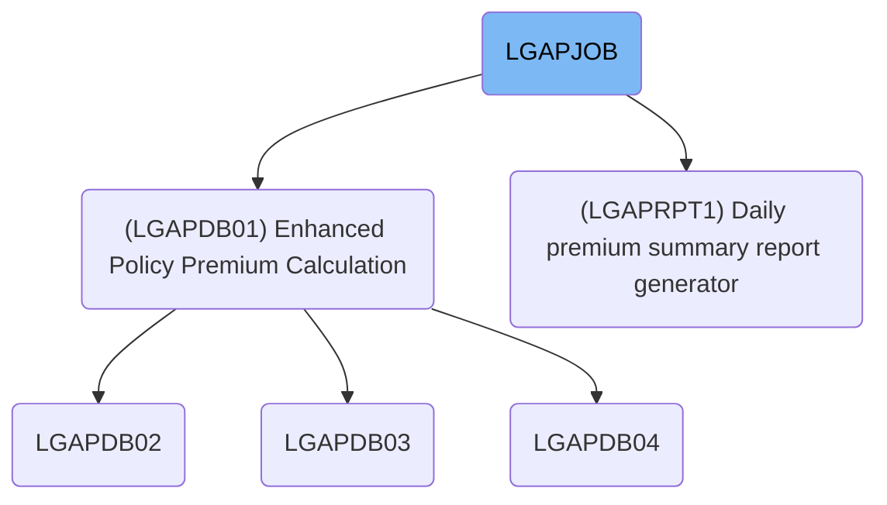
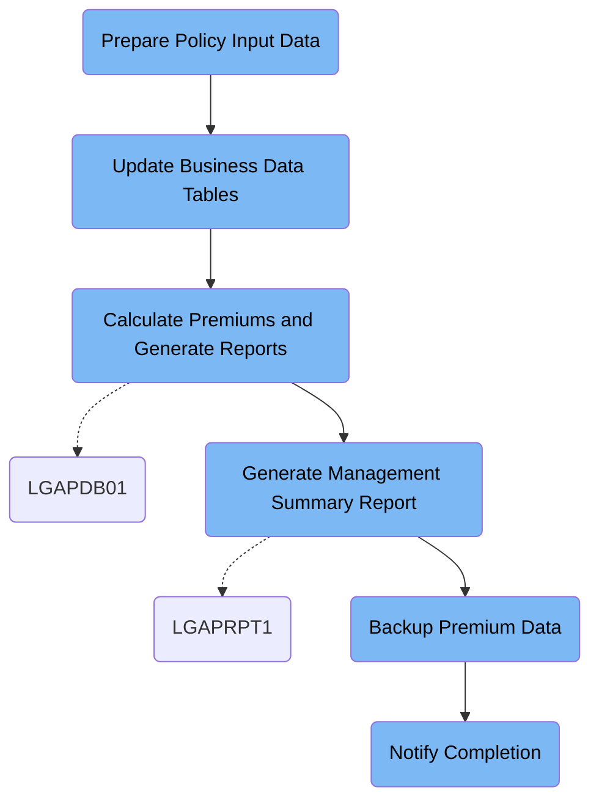

LGAPJOB (LGAPJOB) manages the daily batch processing of insurance policy applications, ensuring data validation, premium calculation, reporting, backup, and completion notification. The flow receives raw policy records and outputs calculated premiums, rejection logs, summary reports, and backup archives.

# Dependencies



Here is a high level diagram of the file:



## Prepare Policy Input Data

Step in this section: `STEP01`.

This section focuses on organizing and checking incoming policy application data by sorting and formatting it, ensuring that only correctly ordered and validated records are used in subsequent premium calculation steps.

The process involves using an IBM SORT utility to organize policy application records:

- The input file contains unsorted, raw policy application records.
- The SORT operation orders these records by primary policy number (first ten characters) and an additional field (character 11).
- The output formatting step ensures each record maintains a fixed length and format.
- The resulting output file contains sorted and validated records, ready for subsequent premium calculation steps.

### Input

**LGAP.INPUT.RAW.DATA**

Raw commercial insurance policy application records for premium calculations.

### Output

**LGAP.INPUT.SORTED**

Sorted and validated policy input records ready for downstream premium calculation processing.

## Update Business Data Tables

Step in this section: `STEP02`.

This section refreshes expired risk factor data and activates valid rate entries in the database, preparing accurate and up-to-date reference data for downstream premium processing.

## Calculate Premiums and Generate Reports

Step in this section: `STEP03`.

This section calculates premiums for validated insurance policies, documents rejected applications, and produces a summary report, using current business configurations and rate tables.

1. The sorted and validated policy application records are loaded along with configuration settings and rate tables.
2. Each record is processed: the system validates the application against business rules and risk factors from the configuration file.
3. If the application is valid, the appropriate rate is selected from the rate tables and the premium is calculated. The resulting data is written to the premium output file.
4. If the application fails validation, the record is written to the rejected data file along with the reason for rejection.
5. Throughout processing, the system tracks statistics to summarize processing results—such as total processed, accepted, rejected, and aggregate premium—outputting these in a summary report.

For example: Policy '1123589022' with Applicant 'JSMITH01' and risk factor '2' is found valid; premium is calculated using rate '0.985' and recorded in the premium output. Policy '9911880033' is rejected due to invalid risk factor and logged in the rejected output. The summary report reflects total counts and premium values for the batch.

### Input

**LGAP.INPUT.SORTED**

Sorted and validated commercial insurance policy application records for premium calculation.

Sample:

| Column Name      | Sample     |
| ---------------- | ---------- |
| PolicyNumber     | 1123589022 |
| ApplicantID      | JSMITH01   |
| CoverageType     | COM        |
| EffectiveDate    | 2024-07-01 |
| RiskFactor       | 2          |
| PremiumRequested | 10000      |
| Field11          | A          |

**LGAP.CONFIG.MASTER**

Configuration file containing actuarial and business rule settings.

**LGAP.RATE.TABLES**

Business rate tables with current rates for each coverage type and risk factor.

### Output

**LGAP.OUTPUT.PREMIUM.DATA**

Calculated premium records for valid insurance policies.

Sample:

| Column Name       | Sample     |
| ----------------- | ---------- |
| PolicyNumber      | 1123589022 |
| CalculatedPremium | 9850       |
| CoverageType      | COM        |
| EffectiveDate     | 2024-07-01 |
| RiskFactorApplied | 2          |
| RateUsed          | 0.985      |
| ApplicantID       | JSMITH01   |

**LGAP.OUTPUT.REJECTED.DATA**

Records of rejected insurance policy applications detailing reason for rejection.

Sample:

| Column Name     | Sample              |
| --------------- | ------------------- |
| PolicyNumber    | 9911880033          |
| ApplicantID     | ADOE99              |
| CoverageType    | COM                 |
| EffectiveDate   | 2024-07-01          |
| RejectionReason | Invalid risk factor |

**LGAP.OUTPUT.SUMMARY.RPT**

Processing summary report containing statistics (count of processed, accepted, and rejected policies, total premiums calculated).

Sample:

```
Processed: 250 policies
Accepted: 220
Rejected: 30
Total Premiums: $1,250,000
```

## Generate Management Summary Report

Step in this section: `STEP04`.

This section consolidates and formats the premium calculation outcomes into a clear summary report, allowing business managers to review daily insurance processing performance and current premium statistics.

- All records from the premium data input are read and grouped by management-relevant categories (e.g., coverage type).
- The program counts the total number of records, sums the premiums, and analyzes distributions across risk factors and policy types.
- Key statistics such as total policies, premiums collected, and breakdowns per insurance category are compiled.
- These results are formatted into a clearly structured management report, which includes section headers, statistical breakdown tables, and period totals.
- The final report is written to the output summary dataset for management review.

### Input

**LGAP.OUTPUT.PREMIUM.DATA**

Calculated commercial insurance policy premium records for the reporting period.

Sample:

| Column Name       | Sample     |
| ----------------- | ---------- |
| PolicyNumber      | 1123589022 |
| CalculatedPremium | 9850       |
| CoverageType      | COM        |
| EffectiveDate     | 2024-07-01 |
| RiskFactorApplied | 2          |
| RateUsed          | 0.985      |
| ApplicantID       | JSMITH01   |

### Output

**LGAP.REPORTS.DAILY.SUMMARY**

Daily management summary report showing key statistics, counts, and premium totals for processed insurance transactions.

## Backup Premium Data

Step in this section: `STEP05`.

This section safeguards critical insurance premium calculation results by copying processed premium records to a secure backup location.

1. The entire contents of the processed premium data file (LGAP.OUTPUT.PREMIUM.DATA) are read without modification.
2. Each record, including all policy numbers, calculated premiums, coverage types, effective dates, applied risk factors, rate used, and applicant IDs, is written directly to the backup tape file LGAP.BACKUP.PREMIUM.G0001V00.
3. The result is an exact replica of the premium calculation output file stored in the backup location for recovery or reference purposes.

### Input

**LGAP.OUTPUT.PREMIUM.DATA**

Processed and calculated premium data records from insurance policy batch run.

Sample:

| Column Name       | Sample     |
| ----------------- | ---------- |
| PolicyNumber      | 1123589022 |
| CalculatedPremium | 9850       |
| CoverageType      | COM        |
| EffectiveDate     | 2024-07-01 |
| RiskFactorApplied | 2          |
| RateUsed          | 0.985      |
| ApplicantID       | JSMITH01   |

### Output

**LGAP.BACKUP.PREMIUM.G0001V00**

Backup archive of calculated premium data retained on tape for restoration or audit.

Sample:

| Column Name       | Sample     |
| ----------------- | ---------- |
| PolicyNumber      | 1123589022 |
| CalculatedPremium | 9850       |
| CoverageType      | COM        |
| EffectiveDate     | 2024-07-01 |
| RiskFactorApplied | 2          |
| RateUsed          | 0.985      |
| ApplicantID       | JSMITH01   |

## Notify Completion

Step in this section: `NOTIFY`.

This section sends a final completion notification, making stakeholders aware that the batch has finalized, the summary report is available, and the backup file has been created.

1. The in-stream SYSUT1 input contains the preformatted job completion notification text, including confirmation of successful processing, summary report location, and backup file creation reference.
2. IEBGENER copies this text directly from SYSUT1 and writes it into SYSUT2.
3. The SYSUT2 output streams the notification to the JES internal reader, which can then be handled by operations, automation, or downstream alerting systems.

### Input

**SYSUT1**

In-stream text for completion notification, not dependent on previous section output.

Sample:

```
JOB LGAPJOB COMPLETED SUCCESSFULLY
PROCESSING SUMMARY AVAILABLE IN LGAP.OUTPUT.SUMMARY.RPT
BACKUP CREATED: LGAP.BACKUP.PREMIUM.G0001V00
```

### Output

**SYSUT2**

Job completion message submitted to internal reader for operations team and/or automation handling.

Sample:

```
JOB LGAPJOB COMPLETED SUCCESSFULLY
PROCESSING SUMMARY AVAILABLE IN LGAP.OUTPUT.SUMMARY.RPT
BACKUP CREATED: LGAP.BACKUP.PREMIUM.G0001V00
```

&nbsp;

*This is an auto-generated document by Swimm 🌊 and has not yet been verified by a human*

<SwmMeta version="3.0.0" repo-id="Z2l0aHViJTNBJTNBU3dpbW1pby1nZW5hcHAtaG91c2UlM0ElM0FHaXJpLVN3aW1t" repo-name="Swimmio-genapp-house"><sup>Powered by [Swimm](https://app.swimm.io/)</sup></SwmMeta>
