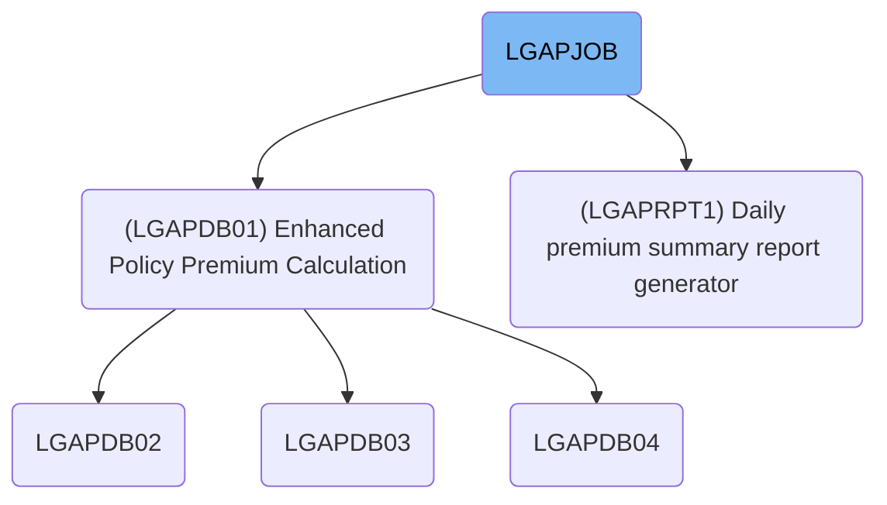
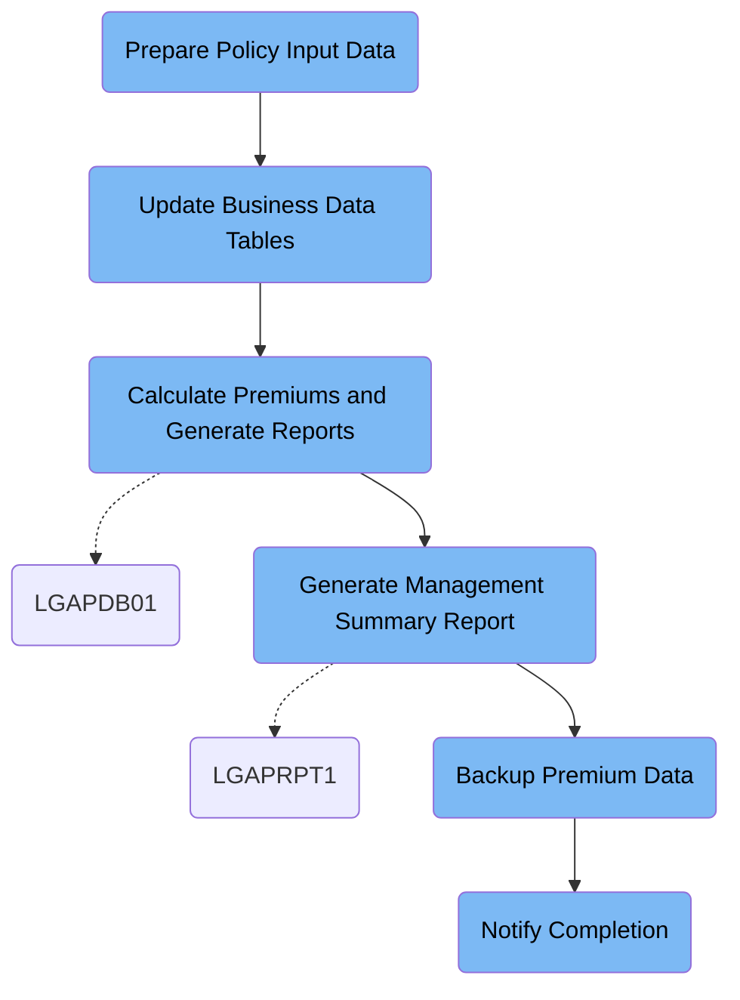

LGAPJOB processes insurance policy applications by validating input data, updating business tables, calculating premiums, generating summary reports, archiving results, and sending completion notifications. Input includes policy records, configuration files, and rate tables; output consists of premium data, rejected records, summary reports, backups, and notifications. For example, a batch of policy applications results in calculated premiums, a summary report, and a completion message.

# Dependencies


```mermaid
graph TD
  
  stggn("LGAPJOB"):::currentEntity --> utgta("(LGAPDB01) Enhanced Policy Premium Calculation")
click utgta openCode "base/src/LGAPDB01.cbl:1"
  utgta("(LGAPDB01) Enhanced Policy Premium Calculation") --> iioho("LGAPDB02")
click iioho openCode "base/src/LGAPDB02.cbl:1"
  
  
utgta("(LGAPDB01) Enhanced Policy Premium Calculation") --> w1opa("LGAPDB03")
click w1opa openCode "base/src/LGAPDB03.cbl:1"
  
  
utgta("(LGAPDB01) Enhanced Policy Premium Calculation") --> t2ht0("LGAPDB04")
click t2ht0 openCode "base/src/LGAPDB04.cbl:1"
  
  
  
stggn("LGAPJOB"):::currentEntity --> pxrn2("(LGAPRPT1) Daily premium summary report generator")
click pxrn2 openCode "base/src/LGAPRPT1.cbl:1"
  
  
  
click stggn openCode "base/cntl/lgapjob.jcl:1"
    classDef currentEntity color:#000000,fill:#7CB9F4

%% Swimm:
%% graph TD
%%   
%%   stggn("LGAPJOB"):::currentEntity --> utgta("(LGAPDB01) Enhanced Policy Premium Calculation")
%% click utgta openCode "<SwmPath>[base/src/LGAPDB01.cbl](base/src/LGAPDB01.cbl)</SwmPath>:1"
%%   utgta("(LGAPDB01) Enhanced Policy Premium Calculation") --> iioho("LGAPDB02")
%% click iioho openCode "<SwmPath>[base/src/LGAPDB02.cbl](base/src/LGAPDB02.cbl)</SwmPath>:1"
%%   
%%   
%% utgta("(LGAPDB01) Enhanced Policy Premium Calculation") --> w1opa("LGAPDB03")
%% click w1opa openCode "<SwmPath>[base/src/LGAPDB03.cbl](base/src/LGAPDB03.cbl)</SwmPath>:1"
%%   
%%   
%% utgta("(LGAPDB01) Enhanced Policy Premium Calculation") --> t2ht0("LGAPDB04")
%% click t2ht0 openCode "<SwmPath>[base/src/LGAPDB04.cbl](base/src/LGAPDB04.cbl)</SwmPath>:1"
%%   
%%   
%%   
%% stggn("LGAPJOB"):::currentEntity --> pxrn2("(LGAPRPT1) Daily premium summary report generator")
%% click pxrn2 openCode "<SwmPath>[base/src/LGAPRPT1.cbl](base/src/LGAPRPT1.cbl)</SwmPath>:1"
%%   
%%   
%%   
%% click stggn openCode "<SwmPath>[base/cntl/lgapjob.jcl](base/cntl/lgapjob.jcl)</SwmPath>:1"
%%     classDef currentEntity color:#000000,fill:#7CB9F4
```

Here is a high level diagram of the file:


```mermaid
graph TD
afd633aea("Prepare Policy Input Data")
  click afd633aea goToHeading "Prepare Policy Input Data"
  

ad0b408ce("Update Business Data Tables")
  click ad0b408ce goToHeading "Update Business Data Tables"
  

aba1ac4a1("Calculate Premiums and Generate Reports")
  click aba1ac4a1 goToHeading "Calculate Premiums and Generate Reports"
  3ygit("LGAPDB01")
        aba1ac4a1 -.-> 3ygit
        click 3ygit openCode "base/src/LGAPDB01.cbl:1"

a96148b5e("Generate Management Summary Report")
  click a96148b5e goToHeading "Generate Management Summary Report"
  dw1i0("LGAPRPT1")
        a96148b5e -.-> dw1i0
        click dw1i0 openCode "base/src/LGAPRPT1.cbl:1"

aac351048("Backup Premium Data")
  click aac351048 goToHeading "Backup Premium Data"
  

a7064518b("Notify Completion")
  click a7064518b goToHeading "Notify Completion"
  


afd633aea --> ad0b408ce
ad0b408ce --> aba1ac4a1
aba1ac4a1 --> a96148b5e
a96148b5e --> aac351048
aac351048 --> a7064518b
style afd633aea color:#000000,fill:#7CB9F4
style ad0b408ce color:#000000,fill:#7CB9F4
style aba1ac4a1 color:#000000,fill:#7CB9F4
style a96148b5e color:#000000,fill:#7CB9F4
style aac351048 color:#000000,fill:#7CB9F4
style a7064518b color:#000000,fill:#7CB9F4

%% Swimm:
%% graph TD
%% afd633aea("Prepare Policy Input Data")
%%   click afd633aea goToHeading "Prepare Policy Input Data"
%%   
%% 
%% ad0b408ce("Update Business Data Tables")
%%   click ad0b408ce goToHeading "Update Business Data Tables"
%%   
%% 
%% aba1ac4a1("Calculate Premiums and Generate Reports")
%%   click aba1ac4a1 goToHeading "Calculate Premiums and Generate Reports"
%%   3ygit("LGAPDB01")
%%         aba1ac4a1 -.-> 3ygit
%%         click 3ygit openCode "<SwmPath>[base/src/LGAPDB01.cbl](base/src/LGAPDB01.cbl)</SwmPath>:1"
%% 
%% a96148b5e("Generate Management Summary Report")
%%   click a96148b5e goToHeading "Generate Management Summary Report"
%%   dw1i0("LGAPRPT1")
%%         a96148b5e -.-> dw1i0
%%         click dw1i0 openCode "<SwmPath>[base/src/LGAPRPT1.cbl](base/src/LGAPRPT1.cbl)</SwmPath>:1"
%% 
%% aac351048("Backup Premium Data")
%%   click aac351048 goToHeading "Backup Premium Data"
%%   
%% 
%% a7064518b("Notify Completion")
%%   click a7064518b goToHeading "Notify Completion"
%%   
%% 
%% 
%% 
%% 
%% afd633aea --> ad0b408ce
%% ad0b408ce --> aba1ac4a1
%% aba1ac4a1 --> a96148b5e
%% a96148b5e --> aac351048
%% aac351048 --> a7064518b
%% style afd633aea color:#000000,fill:#7CB9F4
%% style ad0b408ce color:#000000,fill:#7CB9F4
%% style aba1ac4a1 color:#000000,fill:#7CB9F4
%% style a96148b5e color:#000000,fill:#7CB9F4
%% style aac351048 color:#000000,fill:#7CB9F4
%% style a7064518b color:#000000,fill:#7CB9F4
```

## Prepare Policy Input Data

Step in this section: `STEP01`.

The section ensures that raw insurance policy application data is properly sorted and standardized before further processing.

1. The section receives a batch of raw insurance policy application records.
2. The records are sorted by primary policy identifier and policy type so that related records are grouped and sequenced correctly.
3. Each record is formatted to a fixed length, ensuring consistency and compatibility with downstream systems.
4. The validated, sorted batch is produced as an output data set for further processing by the premium calculation step.

### Input

**LGAP.INPUT.RAW.DATA**

Raw commercial insurance policy application records awaiting validation and sorting.

### Output

**LGAP.INPUT.SORTED**

Sorted and standardized commercial insurance policy records ready for downstream premium calculations.

## Update Business Data Tables

Step in this section: `STEP02`.

This section updates the underlying database tables to remove old risk factor entries and set rate records as active based on their dates, ensuring that only valid risk and rate data are used for processing insurance policy premiums.

## Calculate Premiums and Generate Reports

Step in this section: `STEP03`.

This section calculates policy premiums using validated policy inputs, current configuration settings, and rate tables, then produces detailed output datasets including premiums, rejected cases, and a summary report.

- The validated and sorted insurance policy records are read one by one.
- Actuarial configuration parameters and rate tables are loaded to determine premium calculation rules.
- For each policy application, the system applies relevant business rules and calculates the premium using data from configuration and rate tables.
- If an application fails validation or violates a business rule (e.g., insured amount below minimum), it is flagged and written to the rejection output.
- Successfully processed applications are output with calculated premium and detailed processing info.
- After processing all records, a summary report is generated with batch statistics including numbers processed, premiums calculated, rejections, and total premium amount.

### Input

**LGAP.INPUT.SORTED**

Sorted and standardized commercial insurance policy records ready for downstream premium calculations.

Sample:

| Column Name    | Sample     |
| -------------- | ---------- |
| POLICY_ID      | C123456789 |
| POLICY_TYPE    | CMP        |
| CUSTOMER_ID    | U00281     |
| SUM_INSURED    | 1000000    |
| RISK_CLASS     | HIGH       |
| EFFECTIVE_DATE | 2024-06-01 |

**LGAP.CONFIG.MASTER**

Master configuration file containing calculation parameters and business rules.

**LGAP.RATE.TABLES**

Current actuarial rate tables for policy premium calculations.

### Output

**LGAP.OUTPUT.PREMIUM.DATA**

Premium calculation results for each processed policy application.

Sample:

| Column Name        | Sample     |
| ------------------ | ---------- |
| POLICY_ID          | C123456789 |
| CALCULATED_PREMIUM | 4921.40    |
| RATE_CODE          | RATE2024   |
| PROCESS_STATUS     | SUCCESS    |

**LGAP.OUTPUT.REJECTED.DATA**

Records of policy applications rejected due to validation or business rule failure.

Sample:

| Column Name    | Sample                    |
| -------------- | ------------------------- |
| POLICY_ID      | C123456781                |
| REJECT_REASON  | SUM_INSURED BELOW MINIMUM |
| PROCESS_STATUS | REJECTED                  |

**LGAP.OUTPUT.SUMMARY.RPT**

Overall summary report of batch processing and calculation statistics.

Sample:

```
Batch: 2024-06-13 | Policies Processed: 100 | Premiums Calculated: 95 | Rejected: 5 | Total Premium: $200,834.00
```

## Generate Management Summary Report

Step in this section: `STEP04`.

This section compiles summarized statistics and breakdowns from the calculated premium data into a formatted report for management oversight.

- All premium calculation records from the input dataset are read sequentially.
- For each record, key data (such as calculated premium, processing status, and rate code) is extracted and categorized.
- Statistics such as counts of processed, approved, and rejected policies, and total premium amount are aggregated as records are processed.
- The program then organizes these aggregates into sections (totals, breakdowns, summaries) and writes them to the output report in a management-friendly format.
- The formatted management summary report is produced as a result for business review.

### Input

**LGAP.OUTPUT.PREMIUM.DATA**

Premium calculation results for each processed policy application, including premium amounts and statuses.

Sample:

| Column Name        | Sample     |
| ------------------ | ---------- |
| POLICY_ID          | C123456789 |
| CALCULATED_PREMIUM | 4921.40    |
| RATE_CODE          | RATE2024   |
| PROCESS_STATUS     | SUCCESS    |

### Output

**LGAP.REPORTS.DAILY.SUMMARY**

Formatted management summary report presenting aggregate statistics on daily premium processing, for executive review.

## Backup Premium Data

Step in this section: `STEP05`.

The section archives the finalized set of calculated insurance premiums by duplicating the result file to a backup dataset on tape media.

## Notify Completion

Step in this section: `NOTIFY`.

This section automatically sends a job completion notification, informing stakeholders that the daily premium calculation processing has ended and output artifacts such as summary reports and backups have been generated.

- The inline message containing the completion text, report location, and backup reference is provided as input (SYSUT1).
- The utility reads this message and transmits it unchanged to the internal reader (SYSUT2).
- The notification is then presented to system operators or designated staff, ensuring they are informed of the successful batch process completion and the availability of reports and backup files.

### Input

**SYSUT1**

Inline message card containing static completion notification text, summary report location, and backup file reference.

Sample:

```
JOB LGAPJOB COMPLETED SUCCESSFULLY
PROCESSING SUMMARY AVAILABLE IN LGAP.OUTPUT.SUMMARY.RPT
BACKUP CREATED: LGAP.BACKUP.PREMIUM.G0001V00
```

### Output

**SYSUT2**

Automated system notification routed to operators and/or job administrators via the internal reader, confirming end-of-job status and artifact locations.

Sample:

```
JOB LGAPJOB COMPLETED SUCCESSFULLY
PROCESSING SUMMARY AVAILABLE IN LGAP.OUTPUT.SUMMARY.RPT
BACKUP CREATED: LGAP.BACKUP.PREMIUM.G0001V00
```

&nbsp;

*This is an auto-generated document by Swimm 🌊 and has not yet been verified by a human*

<SwmMeta version="3.0.0" repo-id="Z2l0aHViJTNBJTNBU3dpbW1pby1nZW5hcHAtaG91c2UlM0ElM0FHaXJpLVN3aW1t" repo-name="Swimmio-genapp-house"><sup>Powered by [Swimm](https://app.swimm.io/)</sup></SwmMeta>
