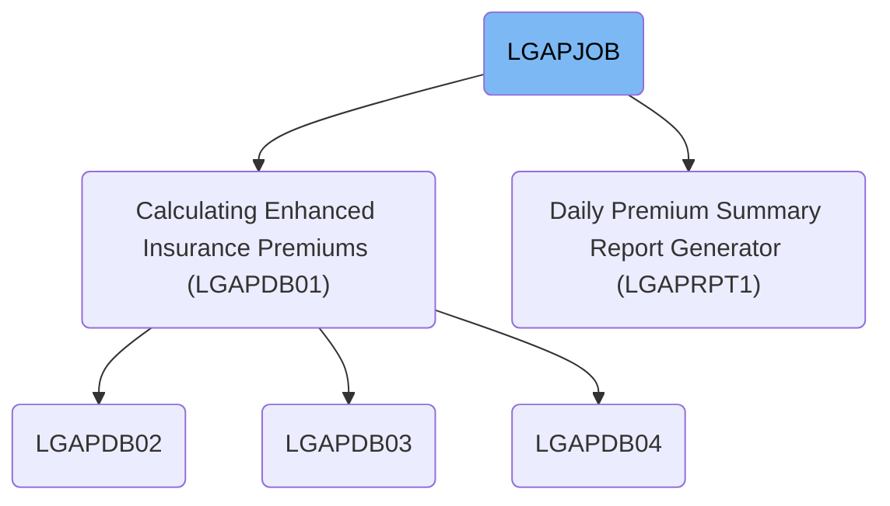
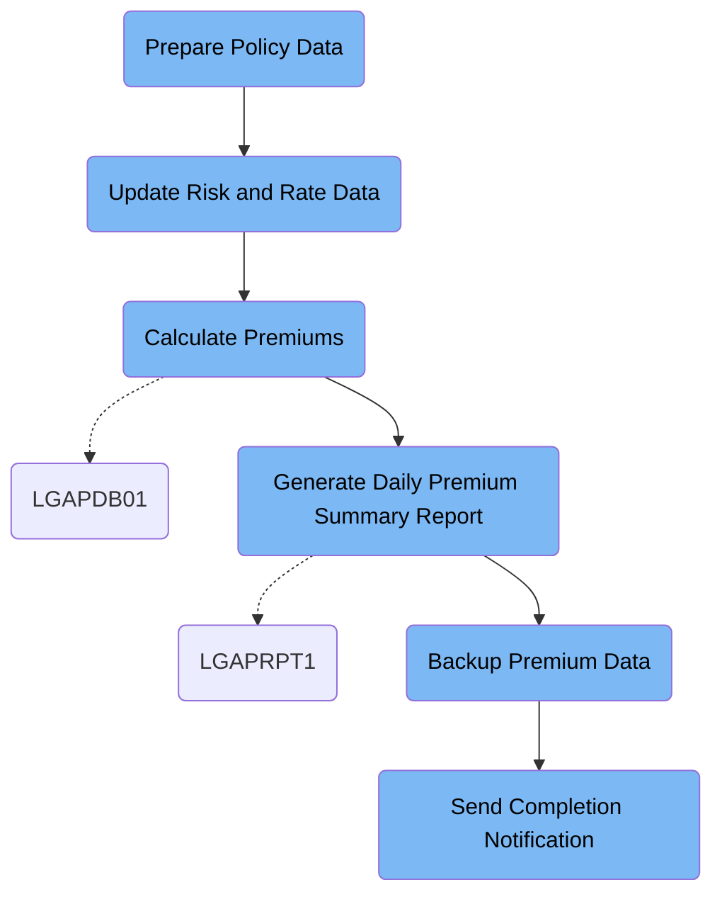

This document explains the LGAPJOB batch job, which processes insurance policy applications by preparing data, updating rates, calculating premiums, generating reports, and backing up results. The flow transforms raw policy records into validated premium data, summary reports, and secure backups.

# Dependencies

Here is a high level diagram of the file:

## Prepare Policy Data

Step in this section: `STEP01`.

Prepares raw insurance policy data by sorting and validating records so they are ready for accurate premium calculation in subsequent steps.

1. Each insurance policy record from the raw data is read and validated for expected format and basic data consistency.
2. The records are sorted by predefined key fields, such as policy number and type code, to ensure consistent processing order.
3. The validated and ordered records are written to a new dataset, which serves as the input for premium calculation in subsequent workflow steps.

### Input

**LGAP.INPUT.RAW.DATA**

Raw insurance policy records requiring preparation before premium calculations.

### Output

**LGAP.INPUT.SORTED**

Sorted and validated insurance policy records, structured and ready for premium calculation.

## Update Risk and Rate Data

Step in this section: `STEP02`.

This section clears outdated risk records and activates the correct rates based on the current date, guaranteeing that all downstream premium calculations use accurate and current business data.

## Calculate Premiums

Step in this section: `STEP03`.

Calculates enhanced insurance premiums for each insurance policy by integrating risk data, rate tables, and underwriting rules, and outputs the results into policy premium, rejected, and summary datasets.

1. The batch job reads each sorted and validated insurance policy record, along with configuration and rate table data.
2. Each policy is analyzed using configuration parameters and corresponding rates. Risk factors are assessed for each record.
3. Premium eligibility is determined by applying underwriting rules from the configuration against the policy details and current rates from the rate tables.
4. If a policy passes validation and all business rules, a premium value is calculated and output into the premium data dataset (e.g. POLICY_NUMBER: P000012345, PREMIUM_AMOUNT: 750.00).
5. Policies failing validation or business rules are captured in the rejected data output, recording relevant policy details and the reason for rejection (e.g. POLICY_NUMBER: P000098765, REJECT_REASON: INVALID COVERAGE).
6. After batch processing, a summary report is generated aggregating the number of policies processed, accepted, rejected, and key financial totals for daily operations.

### Input

**LGAP.INPUT.SORTED (Sorted and validated insurance policy data)**

Input dataset containing sorted, validated insurance policy records ready for premium calculation.

Sample:

| Column Name   | Sample     |
| ------------- | ---------- |
| POLICY_NUMBER | P000012345 |
| POLICY_TYPE   | HOME       |
| INSURED_VALUE | 350000     |
| START_DATE    | 2024-08-01 |
| END_DATE      | 2025-07-31 |

**LGAP.CONFIG.MASTER (Master configuration data)**

Configuration dataset used to specify business rules and calculation parameters.

**LGAP.RATE.TABLES (Rate tables data)**

Input rate tables containing premium factors, rate percentages, and underwriting limits.

### Output

**LGAP.OUTPUT.PREMIUM.DATA (Calculated policy premiums)**

Detailed insurance policy premiums accepted and ready for downstream use.

Sample:

| Column Name         | Sample     |
| ------------------- | ---------- |
| POLICY_NUMBER       | P000012345 |
| PREMIUM_AMOUNT      | 750.00     |
| CURRENCY            | USD        |
| RATE_CODE           | R2024H     |
| UNDERWRITING_STATUS | ACCEPTED   |

**LGAP.OUTPUT.REJECTED.DATA (Rejected policy data)**

Records of insurance policies rejected during premium calculation due to validation or eligibility failure.

Sample:

| Column Name   | Sample           |
| ------------- | ---------------- |
| POLICY_NUMBER | P000098765       |
| REJECT_REASON | INVALID COVERAGE |

**LGAP.OUTPUT.SUMMARY.RPT (Processing summary report)**

Summary report detailing premium calculation results, including statistics and totals.

## Generate Daily Premium Summary Report

Step in this section: `STEP04`.

Produces a comprehensive daily summary report that aggregates and presents premium totals, policy counts, and business insights from processed insurance data, supporting management review and operational oversight.

- All premium policy records from the input dataset are read by the report generation logic.
- The system groups policy data by category (such as product type) and aggregates key metrics (e.g., total premium, count of accepted/rejected policies).
- Totals and statistics are calculated across the whole dataset to provide daily business insights.
- A formatted report is written to the output dataset, presenting figures such as premium totals per product line, count of policies, and summary statistics for management review.

### Input

**LGAP.OUTPUT.PREMIUM.DATA (Finalized Premium Data)**

Dataset containing detailed premium records for processed insurance policies, including accepted premiums and underwriting statuses.

Sample:

| Column Name         | Sample     |
| ------------------- | ---------- |
| POLICY_NUMBER       | P000012345 |
| PREMIUM_AMOUNT      | 750.00     |
| CURRENCY            | USD        |
| RATE_CODE           | R2024H     |
| UNDERWRITING_STATUS | ACCEPTED   |

### Output

**LGAP.REPORTS.DAILY.SUMMARY (Daily Premium Summary Report)**

Formatted daily management report summarizing premium totals, category statistics, and policy breakdowns for business review.

## Backup Premium Data

Step in this section: `STEP05`.

Takes the finalized premium data and creates a secure backup copy on tape for audit and disaster recovery needs.

- The system uses a utility to directly copy all records from the input premium data dataset to the backup tape dataset, preserving the content exactly as in the source.
- No transformation, calculation, or filtering occurs; the data in the backup matches the finalized premium data generated by upstream processing steps.

### Input

**LGAP.OUTPUT.PREMIUM.DATA (Finalized policy premium data)**

Final results of policy premium calculations ready for backup.

Sample:

| Column Name         | Sample     |
| ------------------- | ---------- |
| POLICY_NUMBER       | P000012345 |
| PREMIUM_AMOUNT      | 750.00     |
| CURRENCY            | USD        |
| RATE_CODE           | R2024H     |
| UNDERWRITING_STATUS | ACCEPTED   |

### Output

**LGAP.BACKUP.PREMIUM.G0001V00 (Premium data backup)**

Backup of finalized premium data written to secure tape storage.

Sample:

| Column Name         | Sample     |
| ------------------- | ---------- |
| POLICY_NUMBER       | P000012345 |
| PREMIUM_AMOUNT      | 750.00     |
| CURRENCY            | USD        |
| RATE_CODE           | R2024H     |
| UNDERWRITING_STATUS | ACCEPTED   |

## Send Completion Notification

Step in this section: `NOTIFY`.

Communicates the conclusion of the insurance premium calculation batch job, indicating outcome success and where to find summary and backup data.

&nbsp;

*This is an auto-generated document by Swimm 🌊 and has not yet been verified by a human*

<SwmMeta version="3.0.0" repo-id="Z2l0aHViJTNBJTNBU3dpbW1pby1nZW5hcHAtaG91c2UlM0ElM0FHaXJpLVN3aW1t" repo-name="Swimmio-genapp-house">Powered by [Swimm](https://app.swimm.io/)</SwmMeta>
