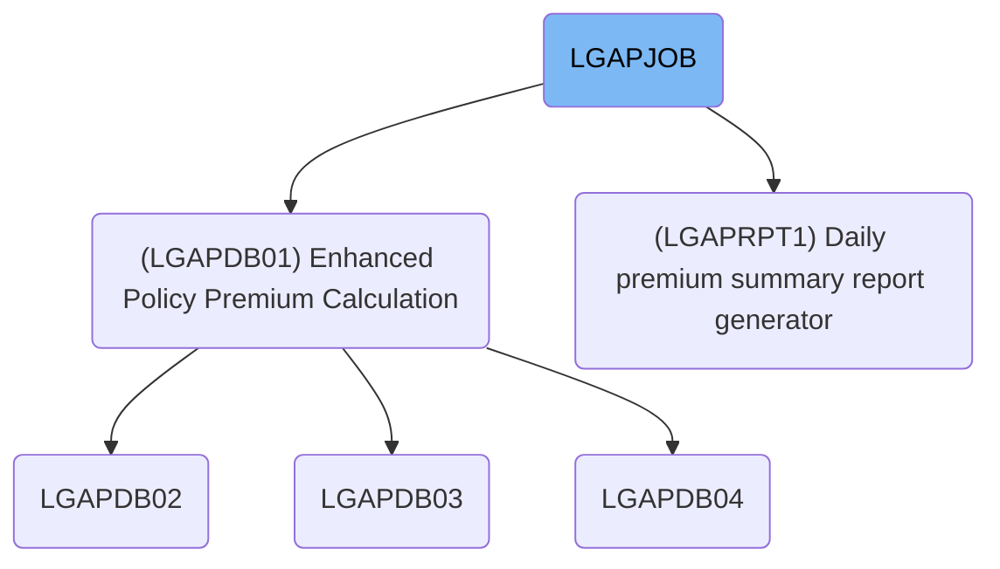
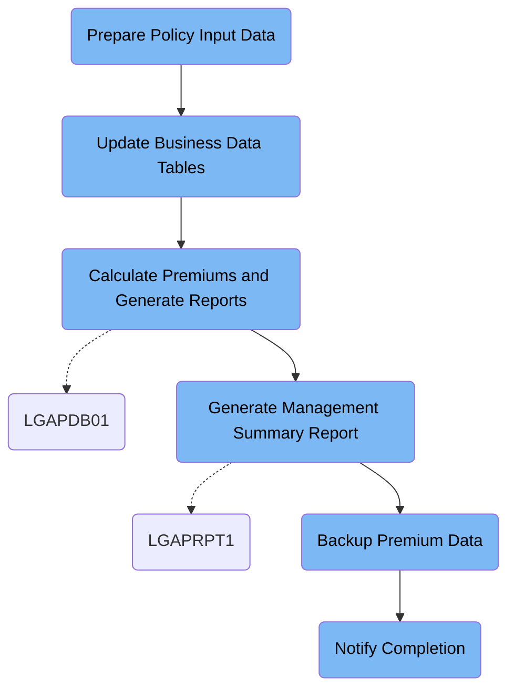

LGAPJOB (LGAPJOB) manages the daily insurance premium calculation workflow, from data preparation and validation to premium computation, reporting, backup, and notification. It transforms raw policy applications into detailed premium records, rejected records with reasons, summary reports, and backup files, ensuring all processing outcomes are communicated and preserved.

# Dependencies



Here is a high level diagram of the file:



## Prepare Policy Input Data

Step in this section: `STEP01`.

Sorts and validates raw policy application data to ensure records are in the correct order and format for accurate downstream premium calculations.

- The section reads raw policy application data from the source file.
- Each record is inspected and kept to a fixed length of 300 bytes for internal consistency.
- The records are sorted primarily by policy number (first 10 characters) and by an additional field (the next character) in ascending order.
- No transformation of individual data fields occurs beyond sorting and padding.
- The validated and sorted result is written to a new file, which is then used as clean input for the main premium calculation processing in the next job step.

### Input

**LGAP.INPUT.RAW.DATA**

Raw policy application data awaiting sorting and validation.

### Output

**LGAP.INPUT.SORTED**

Validated, sorted policy data record set used as input for premium calculation.

## Update Business Data Tables

Step in this section: `STEP02`.

Refreshes and adjusts key business tables so that risk factors and rate statuses reflect the most up-to-date data for downstream premium calculations.

## Calculate Premiums and Generate Reports

Step in this section: `STEP03`.

Calculates commercial insurance policy premiums using up-to-date business rules, produces data for accepted and rejected policies, and compiles a summary report.

1. Each sorted and validated policy record from LGAP.INPUT.SORTED is read in sequence.
2. The system loads business configuration from LGAP.CONFIG.MASTER and premium rate tables from LGAP.RATE.TABLES to drive calculation rules.
3. For each policy:
   - The policy data is checked against configuration-driven validation rules; if it fails, it is sent to LGAP.OUTPUT.REJECTED.DATA with the policy number and the specific rejection reason (e.g., "INVALID COVERAGE").
   - If the policy passes validation, premium amounts are calculated using applicable rate factors and rules.
   - The calculated premium and associated risk/covrage detail is output to LGAP.OUTPUT.PREMIUM.DATA per policy.
4. As processing proceeds, running statistics are gathered. Once all input records are handled, a summary report with numbers of processed, accepted, and rejected policies is written to LGAP.OUTPUT.SUMMARY.RPT.
5. The result is three primary outputs: detailed rating data per accepted policy, a file of rejected policies with reasons, and a human-readable or machine-consumable summary report.

### Input

**LGAP.INPUT.SORTED**

Validated, sorted insurance policy data to be rated.

Sample:

| Column Name      | Sample     |
| ---------------- | ---------- |
| POLICY_NUMBER    | C234567890 |
| APPLICATION_TYPE | A          |
| CUSTOMER_NAME    | John Doe   |
| COVERAGE_AMOUNT  | 250000     |
| EFFECTIVE_DATE   | 2024-07-01 |

**LGAP.CONFIG.MASTER**

Actuarial configuration data controlling rating rules and thresholds.

**LGAP.RATE.TABLES**

Rate tables with premium calculation factors by risk and coverage class.

### Output

**LGAP.OUTPUT.PREMIUM.DATA**

Detailed calculated premium information for each accepted policy.

Sample:

| Column Name     | Sample     |
| --------------- | ---------- |
| POLICY_NUMBER   | C234567890 |
| PREMIUM_AMOUNT  | 1250.00    |
| RISK_CLASS      | STD        |
| COVERAGE_AMOUNT | 250000     |
| EFFECTIVE_DATE  | 2024-07-01 |

**LGAP.OUTPUT.REJECTED.DATA**

Rejected policy records with reasons for rejection.

Sample:

| Column Name   | Sample           |
| ------------- | ---------------- |
| POLICY_NUMBER | C234567999       |
| REJECT_REASON | INVALID COVERAGE |

**LGAP.OUTPUT.SUMMARY.RPT**

Summary statistical report of total processed, accepted, and rejected policies.

## Generate Management Summary Report

Step in this section: `STEP04`.

This section generates a formatted daily management summary report based on all calculated premium records, summarizing totals and key statistics for business review.

1. All calculated premium records for the day are read from the input dataset.
2. The records are analyzed and grouped by relevant business fields (e.g., risk class, policy status).
3. Key metrics such as total premium, number of policies, or breakdowns by type are accumulated.
4. Headers, totals, and breakdown sections are formatted for readability.
5. The aggregated summary and statistics are written to the management report output file.

### Input

**LGAP.OUTPUT.PREMIUM.DATA**

Detailed calculated premium information for each accepted policy.

Sample:

| Column Name     | Sample     |
| --------------- | ---------- |
| POLICY_NUMBER   | C234567890 |
| PREMIUM_AMOUNT  | 1250.00    |
| RISK_CLASS      | STD        |
| COVERAGE_AMOUNT | 250000     |
| EFFECTIVE_DATE  | 2024-07-01 |

### Output

**LGAP.REPORTS.DAILY.SUMMARY**

Formatted management summary report containing daily aggregate statistics derived from premium results.

## Backup Premium Data

Step in this section: `STEP05`.

This section securely copies the completed set of premium calculation results to a backup storage medium to preserve business-critical premium data.

## Notify Completion

Step in this section: `NOTIFY`.

Sends an automated job completion notification indicating process success, report location, and backup confirmation to operators or downstream processes.

- The prewritten notification message is provided as static input.
- The system copies this message to the internal output queue (INTRDR), making it available to operators or downstream systems.
- The result is the same message rendered as a job completion notification, stating successful job completion, availability of the processing summary, and confirmation of backup file creation.

### Input

**SYSUT1**

Static notification content embedded directly in the job to be sent as the notification message.

Sample:

```
JOB LGAPJOB COMPLETED SUCCESSFULLY
PROCESSING SUMMARY AVAILABLE IN LGAP.OUTPUT.SUMMARY.RPT
BACKUP CREATED: LGAP.BACKUP.PREMIUM.G0001V00
```

### Output

**SYSUT2**

Job completion notification sent to the JES internal reader/output queue for rendering to operators or triggering next actions.

Sample:

```
JOB LGAPJOB COMPLETED SUCCESSFULLY
PROCESSING SUMMARY AVAILABLE IN LGAP.OUTPUT.SUMMARY.RPT
BACKUP CREATED: LGAP.BACKUP.PREMIUM.G0001V00
```

&nbsp;

*This is an auto-generated document by Swimm 🌊 and has not yet been verified by a human*

<SwmMeta version="3.0.0" repo-id="Z2l0aHViJTNBJTNBU3dpbW1pby1nZW5hcHAtaG91c2UlM0ElM0FHaXJpLVN3aW1t" repo-name="Swimmio-genapp-house"><sup>Powered by [Swimm](https://app.swimm.io/)</sup></SwmMeta>
