The DSCRT job manages inventory tracking data by deleting old datasets, creating new ones, cleaning and filtering records, formatting for regional use, generating summary reports, updating codes, and confirming dataset emptiness. It transforms raw inventory records into business-ready files and provides confirmation messages when datasets are empty.

Here is a high level diagram of the file:

```mermaid
graph TD
a518c7b4a("Delete Inventory Tracking Data")
  click a518c7b4a goToHeading "Delete Inventory Tracking Data"
  

a6608c01a("Create Inventory Tracking Data")
  click a6608c01a goToHeading "Create Inventory Tracking Data"
  

a40314cb5("Start Inventory Management")
  click a40314cb5 goToHeading "Start Inventory Management"
  gq50o("DSCRT")
        a40314cb5 -.-> gq50o
        click gq50o openCode "base/cntl/TECN013A.jcl:1"

a9bec67d7("Clean Inventory Data")
  click a9bec67d7 goToHeading "Clean Inventory Data"
  

a2c12dd2f("Filter Relevant Inventory Items")
  click a2c12dd2f goToHeading "Filter Relevant Inventory Items"
  

a069bd2a8("Select and Format Region Inventory")
  click a069bd2a8 goToHeading "Select and Format Region Inventory"
  

a2f27e04a("Create Inventory Summary Report")
  click a2f27e04a goToHeading "Create Inventory Summary Report"
  

a137807bb("Update Inventory Codes")
  click a137807bb goToHeading "Update Inventory Codes"
  

a67df27c0("Confirm Inventory Dataset is Empty")
  click a67df27c0 goToHeading "Confirm Inventory Dataset is Empty"
  




a518c7b4a --> a6608c01a
a6608c01a --> a40314cb5
a40314cb5 --> a9bec67d7
a9bec67d7 --> a2c12dd2f
a2c12dd2f --> a069bd2a8
a069bd2a8 --> a2f27e04a
a2f27e04a --> a137807bb
a137807bb --> a67df27c0
style a518c7b4a color:#000000,fill:#7CB9F4
style a6608c01a color:#000000,fill:#7CB9F4
style a40314cb5 color:#000000,fill:#7CB9F4
style a9bec67d7 color:#000000,fill:#7CB9F4
style a2c12dd2f color:#000000,fill:#7CB9F4
style a069bd2a8 color:#000000,fill:#7CB9F4
style a2f27e04a color:#000000,fill:#7CB9F4
style a137807bb color:#000000,fill:#7CB9F4
style a67df27c0 color:#000000,fill:#7CB9F4

%% Swimm:
%% graph TD
%% a518c7b4a("Delete Inventory Tracking Data")
%%   click a518c7b4a goToHeading "Delete Inventory Tracking Data"
%%   
%% 
%% a6608c01a("Create Inventory Tracking Data")
%%   click a6608c01a goToHeading "Create Inventory Tracking Data"
%%   
%% 
%% a40314cb5("Start Inventory Management")
%%   click a40314cb5 goToHeading "Start Inventory Management"
%%   gq50o("DSCRT")
%%         a40314cb5 -.-> gq50o
%%         click gq50o openCode "<SwmPath>[base/cntl/TECN013A.jcl](base/cntl/TECN013A.jcl)</SwmPath>:1"
%% 
%% a9bec67d7("Clean Inventory Data")
%%   click a9bec67d7 goToHeading "Clean Inventory Data"
%%   
%% 
%% a2c12dd2f("Filter Relevant Inventory Items")
%%   click a2c12dd2f goToHeading "Filter Relevant Inventory Items"
%%   
%% 
%% a069bd2a8("Select and Format Region Inventory")
%%   click a069bd2a8 goToHeading "Select and Format Region Inventory"
%%   
%% 
%% a2f27e04a("Create Inventory Summary Report")
%%   click a2f27e04a goToHeading "Create Inventory Summary Report"
%%   
%% 
%% a137807bb("Update Inventory Codes")
%%   click a137807bb goToHeading "Update Inventory Codes"
%%   
%% 
%% a67df27c0("Confirm Inventory Dataset is Empty")
%%   click a67df27c0 goToHeading "Confirm Inventory Dataset is Empty"
%%   
%% 
%% 
%% 
%% 
%% a518c7b4a --> a6608c01a
%% a6608c01a --> a40314cb5
%% a40314cb5 --> a9bec67d7
%% a9bec67d7 --> a2c12dd2f
%% a2c12dd2f --> a069bd2a8
%% a069bd2a8 --> a2f27e04a
%% a2f27e04a --> a137807bb
%% a137807bb --> a67df27c0
%% style a518c7b4a color:#000000,fill:#7CB9F4
%% style a6608c01a color:#000000,fill:#7CB9F4
%% style a40314cb5 color:#000000,fill:#7CB9F4
%% style a9bec67d7 color:#000000,fill:#7CB9F4
%% style a2c12dd2f color:#000000,fill:#7CB9F4
%% style a069bd2a8 color:#000000,fill:#7CB9F4
%% style a2f27e04a color:#000000,fill:#7CB9F4
%% style a137807bb color:#000000,fill:#7CB9F4
%% style a67df27c0 color:#000000,fill:#7CB9F4
```



## Delete Inventory Tracking Data

Step in this section: `STEP001`.

Removes outdated inventory tracking data to prepare a fresh workspace for subsequent inventory processing steps.

## Create Inventory Tracking Data

Step in this section: `STEP002`.

Creates the necessary empty data structures to support fresh inventory tracking for the next processing cycle.

- No input is used for this section.
- The logic allocates five empty datasets with the specified DSN (inventory tracking files) on the target volume.
- Each output dataset (e.g., &DSNAME..PS2, &DSNAME..PS3, &DSNAME..PS4, &DSNAME..PS5, &DSNAME..PS6) is initialized empty, ready to accept data in subsequent processing steps.
- The result is that these files exist and are listed in the catalog, but contain no inventory records yet.

### Output

**&DSNAME..PS2**

Newly allocated empty dataset for inventory tracking, prepared for use in downstream inventory processes.

**&DSNAME..PS3**

Newly allocated empty dataset for inventory tracking, prepared for use in downstream inventory processes.

**&DSNAME..PS4**

Newly allocated empty dataset for inventory tracking, prepared for use in downstream inventory processes.

**&DSNAME..PS5**

Newly allocated empty dataset for inventory tracking, prepared for use in downstream inventory processes.

**&DSNAME..PS6**

Newly allocated empty dataset for inventory tracking, prepared for use in downstream inventory processes.

## Start Inventory Management

Step in this section: `STEP003`.

Begins inventory management using freshly prepared tracking records, ensuring a clean start for all subsequent inventory operations this cycle.

## Clean Inventory Data

Step in this section: `STEP004`.

This section ensures that the inventory data is properly cleansed and organized for the following operational steps, supporting accurate and reliable inventory processing.

The cleaning process for inventory data involves:

- Sort the incoming inventory records based on ITEM_ID (first 20 columns) and ITEM_QTY (columns 29-30) to ensure proper ordering.
- Skip the initial header record to process only the actual inventory data (SKIPREC(1)).
- Remove any records where the ITEM_DESC (column 48) is empty to ensure all entries are valid (OMIT COND).
- Replace occurrences of 'HOS' in ITEM_DESC with 'INV' to standardize descriptions.
- The output is written to the destination dataset, now containing only valid inventory records, properly sorted and ready for use in subsequent business logic steps.

### Input

**TECN013.JCL.ASSMT04.INVNT.PS1**

Raw inventory tracking records require sorting and cleaning.

Sample:

| Column Name | Sample            |
| ----------- | ----------------- |
| ITEM_ID     | INV1234562023     |
| ITEM_DESC   | HOSPITAL SUPPLIES |
| LOCATION    | JAPAN             |
| ITEM_QTY    | 55                |

### Output

**TECN013.JCL.ASSMT04.INVNT.PS2**

Cleaned and sorted inventory tracking records without invalid or empty entries.

Sample:

| Column Name | Sample           |
| ----------- | ---------------- |
| ITEM_ID     | INV1234562023    |
| ITEM_DESC   | INVITAL SUPPLIES |
| LOCATION    | JAPAN            |
| ITEM_QTY    | 55               |

## Filter Relevant Inventory Items

Step in this section: `STEP005`.

Filters the cleaned inventory data to include only items with sufficient quantity for business relevance, supporting downstream reporting and fulfillment.

- The section takes the cleaned inventory records from the previous step as input.
- It evaluates each record's quantity value (ITEM_QTY).
- If ITEM_QTY is greater than 50, the record is included in the output. If ITEM_QTY is 50 or less, the record is excluded.
- All retained records are copied without modification to the new dataset, providing a filtered inventory list with only relevant items.

### Input

**TECN013.JCL.ASSMT04.INVNT.PS2**

Cleaned and sorted inventory records from previous cleansing step.

Sample:

| Column Name | Sample           |
| ----------- | ---------------- |
| ITEM_ID     | INV1234562023    |
| ITEM_DESC   | INVITAL SUPPLIES |
| LOCATION    | JAPAN            |
| ITEM_QTY    | 55               |

### Output

**TECN013.JCL.ASSMT04.INVNT.PS3**

Inventory records filtered to only those with quantities greater than 50.

Sample:

| Column Name | Sample           |
| ----------- | ---------------- |
| ITEM_ID     | INV1234562023    |
| ITEM_DESC   | INVITAL SUPPLIES |
| LOCATION    | JAPAN            |
| ITEM_QTY    | 55               |

## Select and Format Region Inventory

Step in this section: `STEP006`.

Selects inventory items from the cleaned data based on country location and prepares essential fields in a standardized format for regional reporting and further business processes.

1. The section receives inventory data where each record contains key item information, with fields such as ITEM_DESC and LOCATION.
2. It evaluates each record's LOCATION: only records with country names JAPAN, PHILIPPINES, MOROCCO, or MALAYSIA are kept; others are excluded.
3. For each selected record, it builds the output fields:
   - The ITEM_DESC is extracted (from column 48, length 21).
   - COUNTRY_NAME is extracted (from column 32, length matching country name).
   - REGIONAL_QTY is computed by multiplying ITEM_QTY (columns 29-30) by another numeric field (columns 70-71) and formatting as a 4-digit number.
4. The resulting output is written to the regional inventory file, with one row per selected item, containing the standardized region fields as shown in the sample columns.

### Input

**TECN013.JCL.ASSMT04.INVNT.PS2**

Cleaned filtered inventory records from previous cleansing and threshold filtering step, retaining only valid and sufficient-quantity items.

Sample:

| Column Name | Sample           |
| ----------- | ---------------- |
| ITEM_ID     | INV1234562023    |
| ITEM_DESC   | INVITAL SUPPLIES |
| LOCATION    | JAPAN            |
| ITEM_QTY    | 55               |

### Output

**TECN013.JCL.ASSMT04.INVNT.PS4**

Inventory records that are located in select countries and contain formatted fields for regional business logic.

Sample:

| Column Name  | Sample           |
| ------------ | ---------------- |
| ITEM_DESC    | INVITAL SUPPLIES |
| COUNTRY_NAME | JAPAN            |
| REGIONAL_QTY | 0880             |

## Create Inventory Summary Report

Step in this section: `STEP007`.

Creates a user-facing inventory summary file that lists a report header and includes the computed total of all item quantities in the inventory data.

- The cleaned inventory records are copied from the input file.
- Before the data, a header line '***INVNT DETAILS***' is inserted for easy human recognition.
- Each inventory record is output unchanged beneath the header.
- At the end of the file, a trailer line is added showing the label 'TOTAL NUMBER OF ITEM_QTYS:' followed by the sum of all ITEM_QTY values from the input records (e.g., 0135 if the sum of quantities is 135).
- The result is a summary file ready for stakeholders, showing both detailed records and a total line for quick assessment.

### Input

**TECN013.JCL.ASSMT04.INVNT.PS2**

Cleaned and sorted inventory tracking records after previous cleansing and filtering steps.

Sample:

| Column Name | Sample           |
| ----------- | ---------------- |
| ITEM_ID     | INV1234562023    |
| ITEM_DESC   | INVITAL SUPPLIES |
| LOCATION    | JAPAN            |
| ITEM_QTY    | 55               |

### Output

**TECN013.JCL.ASSMT04.INVNT.PS5**

A formatted inventory summary file with a custom report header and cumulative item quantity total line.

Sample:

```
           ***INVNT DETAILS***
INV1234562023   INVITAL SUPPLIES JAPAN 55
...
 TOTAL NUMBER OF ITEM_QTYS:  0135
```

## Update Inventory Codes

Step in this section: `STEP008`.

This section updates all relevant inventory item codes in existing records to ensure code values are current and consistent for downstream processes.

- Each inventory record from the input file is read and copied to the output file.
- During the copy process, the section scans the characters in columns 22 to 25 of each record.
- If the code 'HOS' is found in this position, it is replaced with 'INV'.
- All other characters and fields are retained as-is.
- The result is that any record with an outdated code now has it replaced by the current standardized code, maintaining the original structure for downstream business use.

### Input

**TECN013.JCL.ASSMT04.INVNT.PS2 (Filtered Inventory Tracking Records)**

Inventory tracking records prepared and filtered by previous steps, still potentially containing old item codes.

Sample:

| Column Name | Sample           |
| ----------- | ---------------- |
| ITEM_ID     | INV1234562023    |
| ITEM_DESC   | INVITAL SUPPLIES |
| LOCATION    | JAPAN            |
| ITEM_QTY    | 55               |

### Output

**TECN013.JCL.ASSMT04.INVNT.PS6 (Updated Inventory Tracking Records)**

Inventory records with all outdated codes replaced by new consistent codes, ready for final business analysis or archival.

Sample:

| Column Name | Sample           |
| ----------- | ---------------- |
| ITEM_ID     | INV1234562023    |
| ITEM_DESC   | INVITAL SUPPLIES |
| LOCATION    | JAPAN            |
| ITEM_QTY    | 55               |

## Confirm Inventory Dataset is Empty

Step in this section: `STEP009`.

Confirms and communicates that the current inventory data is empty by producing a clear, human-readable message for downstream business processes.

- The section checks the input dataset state. If the dataset is empty, a simple textual message 'INPUT DATASET IS EMPTY' is written to the output stream.
- This output is generated regardless of actual dataset size details and serves only as a confirmation for visibility to downstream steps.

### Input

**SYSUT1**

Current inventory dataset state being checked for emptiness.

### Output

**SYSUT2**

Confirmation message affirming that the inventory dataset is empty.

Sample:

```
INPUT DATASET IS EMPTY
```

&nbsp;

*This is an auto-generated document by Swimm 🌊 and has not yet been verified by a human*

<SwmMeta version="3.0.0" repo-id="Z2l0aHViJTNBJTNBU3dpbW1pby1nZW5hcHAtaG91c2UlM0ElM0FHaXJpLVN3aW1t" repo-name="Swimmio-genapp-house"><sup>Powered by [Swimm](https://app.swimm.io/)</sup></SwmMeta>
