# Overview

This document explains the flow for processing insurance policy applications. Each application is validated, assessed for risk, and priced according to business rules. Commercial policies receive full risk and premium calculations, while non-commercial policies are marked as unsupported.

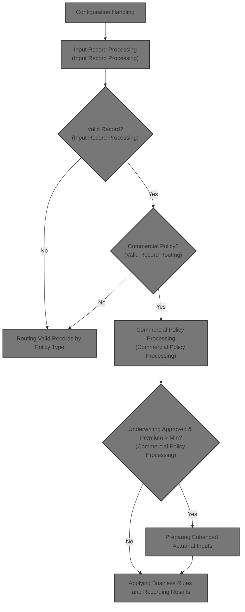

## Dependencies

### Programs

- <SwmToken path="base/src/LGAPDB01.cbl" pos="2:6:6" line-data="       PROGRAM-ID. LGAPDB01.">`LGAPDB01`</SwmToken> (<SwmPath>[base/src/LGAPDB01.cbl](base/src/LGAPDB01.cbl)</SwmPath>)
- <SwmToken path="base/src/LGAPDB01.cbl" pos="269:4:4" line-data="           CALL &#39;LGAPDB02&#39; USING IN-PROPERTY-TYPE, IN-POSTCODE, ">`LGAPDB02`</SwmToken> (<SwmPath>[base/src/LGAPDB02.cbl](base/src/LGAPDB02.cbl)</SwmPath>)
- <SwmToken path="base/src/LGAPDB01.cbl" pos="276:4:4" line-data="           CALL &#39;LGAPDB03&#39; USING WS-BASE-RISK-SCR, IN-FIRE-PERIL, ">`LGAPDB03`</SwmToken> (<SwmPath>[base/src/LGAPDB03.cbl](base/src/LGAPDB03.cbl)</SwmPath>)
- <SwmToken path="base/src/LGAPDB01.cbl" pos="313:4:4" line-data="               CALL &#39;LGAPDB04&#39; USING LK-INPUT-DATA, LK-COVERAGE-DATA, ">`LGAPDB04`</SwmToken> (<SwmPath>[base/src/LGAPDB04.cbl](base/src/LGAPDB04.cbl)</SwmPath>)

### Copybooks

- SQLCA
- <SwmToken path="base/src/LGAPDB01.cbl" pos="35:3:3" line-data="           COPY INPUTREC2.">`INPUTREC2`</SwmToken> (<SwmPath>[base/src/INPUTREC2.cpy](base/src/INPUTREC2.cpy)</SwmPath>)
- OUTPUTREC (<SwmPath>[base/src/OUTPUTREC.cpy](base/src/OUTPUTREC.cpy)</SwmPath>)
- WORKSTOR (<SwmPath>[base/src/WORKSTOR.cpy](base/src/WORKSTOR.cpy)</SwmPath>)
- LGAPACT (<SwmPath>[base/src/LGAPACT.cpy](base/src/LGAPACT.cpy)</SwmPath>)

# Where is this program used?

This program is used multiple times in the codebase as represented in the following diagram:

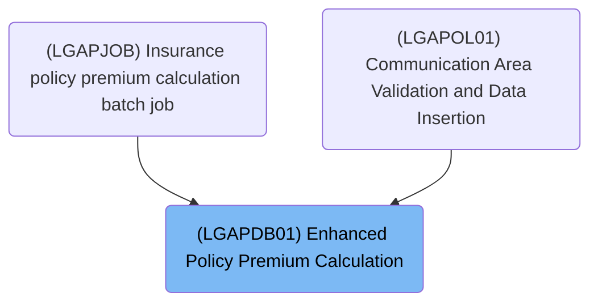

## Input and Output Tables/Files used

### <SwmToken path="base/src/LGAPDB01.cbl" pos="269:4:4" line-data="           CALL &#39;LGAPDB02&#39; USING IN-PROPERTY-TYPE, IN-POSTCODE, ">`LGAPDB02`</SwmToken> (<SwmPath>[base/src/LGAPDB02.cbl](base/src/LGAPDB02.cbl)</SwmPath>)

| Table / File Name                                                                                                          | Type | Description                                                  | Usage Mode | Key Fields / Layout Highlights                                                                                                                                                                                                                                                                               |
| -------------------------------------------------------------------------------------------------------------------------- | ---- | ------------------------------------------------------------ | ---------- | ------------------------------------------------------------------------------------------------------------------------------------------------------------------------------------------------------------------------------------------------------------------------------------------------------------ |
| <SwmToken path="base/src/LGAPDB02.cbl" pos="47:3:3" line-data="               FROM RISK_FACTORS">`RISK_FACTORS`</SwmToken> | DB2  | Peril-specific risk adjustment factors for insurance scoring | Input      | <SwmToken path="base/src/LGAPDB02.cbl" pos="46:8:12" line-data="               SELECT FACTOR_VALUE INTO :WS-FIRE-FACTOR">`WS-FIRE-FACTOR`</SwmToken>, <SwmToken path="base/src/LGAPDB02.cbl" pos="58:8:12" line-data="               SELECT FACTOR_VALUE INTO :WS-CRIME-FACTOR">`WS-CRIME-FACTOR`</SwmToken> |

### <SwmToken path="base/src/LGAPDB01.cbl" pos="313:4:4" line-data="               CALL &#39;LGAPDB04&#39; USING LK-INPUT-DATA, LK-COVERAGE-DATA, ">`LGAPDB04`</SwmToken> (<SwmPath>[base/src/LGAPDB04.cbl](base/src/LGAPDB04.cbl)</SwmPath>)

| Table / File Name                                                                                                         | Type | Description                                                   | Usage Mode | Key Fields / Layout Highlights                                                                                                                                                                                                                                                                                                                                                                                                                                                                                                                                                                                                                                                                                           |
| ------------------------------------------------------------------------------------------------------------------------- | ---- | ------------------------------------------------------------- | ---------- | ------------------------------------------------------------------------------------------------------------------------------------------------------------------------------------------------------------------------------------------------------------------------------------------------------------------------------------------------------------------------------------------------------------------------------------------------------------------------------------------------------------------------------------------------------------------------------------------------------------------------------------------------------------------------------------------------------------------------ |
| <SwmToken path="base/src/LGAPDB04.cbl" pos="183:3:3" line-data="               FROM RATE_MASTER">`RATE_MASTER`</SwmToken> | DB2  | Property insurance peril base rates by territory and coverage | Input      | <SwmToken path="base/src/LGAPDB04.cbl" pos="181:3:3" line-data="               SELECT BASE_RATE, MIN_PREMIUM, MAX_PREMIUM">`BASE_RATE`</SwmToken>, <SwmToken path="base/src/LGAPDB01.cbl" pos="132:4:4" line-data="           MOVE &#39;MIN_PREMIUM&#39; TO CONFIG-KEY">`MIN_PREMIUM`</SwmToken>, <SwmToken path="base/src/LGAPDB04.cbl" pos="43:3:7" line-data="       01  WS-BASE-RATE-TABLE.">`WS-BASE-RATE`</SwmToken>, <SwmToken path="base/src/LGAPDB04.cbl" pos="51:3:7" line-data="                       25 WS-MIN-PREM   PIC 9(5)V99.">`WS-MIN-PREM`</SwmToken>, <SwmToken path="base/src/LGAPDB04.cbl" pos="52:3:7" line-data="                       25 WS-MAX-PREM   PIC 9(7)V99.">`WS-MAX-PREM`</SwmToken> |

### <SwmToken path="base/src/LGAPDB01.cbl" pos="276:4:4" line-data="           CALL &#39;LGAPDB03&#39; USING WS-BASE-RISK-SCR, IN-FIRE-PERIL, ">`LGAPDB03`</SwmToken> (<SwmPath>[base/src/LGAPDB03.cbl](base/src/LGAPDB03.cbl)</SwmPath>)

| Table / File Name                                                                                                          | Type | Description                                                 | Usage Mode | Key Fields / Layout Highlights                                                                                                                                                                                                                                                                               |
| -------------------------------------------------------------------------------------------------------------------------- | ---- | ----------------------------------------------------------- | ---------- | ------------------------------------------------------------------------------------------------------------------------------------------------------------------------------------------------------------------------------------------------------------------------------------------------------------ |
| <SwmToken path="base/src/LGAPDB02.cbl" pos="47:3:3" line-data="               FROM RISK_FACTORS">`RISK_FACTORS`</SwmToken> | DB2  | Peril-specific risk adjustment factors for insurance rating | Input      | <SwmToken path="base/src/LGAPDB02.cbl" pos="46:8:12" line-data="               SELECT FACTOR_VALUE INTO :WS-FIRE-FACTOR">`WS-FIRE-FACTOR`</SwmToken>, <SwmToken path="base/src/LGAPDB02.cbl" pos="58:8:12" line-data="               SELECT FACTOR_VALUE INTO :WS-CRIME-FACTOR">`WS-CRIME-FACTOR`</SwmToken> |

### <SwmToken path="base/src/LGAPDB01.cbl" pos="2:6:6" line-data="       PROGRAM-ID. LGAPDB01.">`LGAPDB01`</SwmToken> (<SwmPath>[base/src/LGAPDB01.cbl](base/src/LGAPDB01.cbl)</SwmPath>)

| Table / File Name                                                                                                                                        | Type | Description                                    | Usage Mode | Key Fields / Layout Highlights           |
| -------------------------------------------------------------------------------------------------------------------------------------------------------- | ---- | ---------------------------------------------- | ---------- | ---------------------------------------- |
| <SwmToken path="base/src/LGAPDB01.cbl" pos="113:5:7" line-data="           OPEN INPUT CONFIG-FILE">`CONFIG-FILE`</SwmToken>                              | DB2  | System configuration parameters and thresholds | Input      | Database table with relational structure |
| <SwmToken path="base/src/LGAPDB01.cbl" pos="9:3:5" line-data="           SELECT INPUT-FILE ASSIGN TO &#39;INPUT.DAT&#39;">`INPUT-FILE`</SwmToken>        | DB2  | Policy application and property input data     | Input      | Database table with relational structure |
| <SwmToken path="base/src/LGAPDB01.cbl" pos="13:3:5" line-data="           SELECT OUTPUT-FILE ASSIGN TO &#39;OUTPUT.DAT&#39;">`OUTPUT-FILE`</SwmToken>    | DB2  | Calculated premium and risk results per policy | Output     | Database table with relational structure |
| <SwmToken path="base/src/LGAPDB01.cbl" pos="265:7:9" line-data="           PERFORM P011E-WRITE-OUTPUT-RECORD">`OUTPUT-RECORD`</SwmToken>                 | DB2  | Single policy premium calculation output       | Output     | Database table with relational structure |
| <SwmToken path="base/src/LGAPDB01.cbl" pos="27:3:5" line-data="           SELECT SUMMARY-FILE ASSIGN TO &#39;SUMMARY.DAT&#39;">`SUMMARY-FILE`</SwmToken> | DB2  | Summary of processing statistics and totals    | Output     | Database table with relational structure |
| <SwmToken path="base/src/LGAPDB01.cbl" pos="64:3:5" line-data="       01  SUMMARY-RECORD             PIC X(132).">`SUMMARY-RECORD`</SwmToken>            | DB2  | Summary line for processing statistics         | Output     | Database table with relational structure |

## Detailed View of the Program's Functionality

# Main Program Structure and File Handling

The main program is responsible for orchestrating the entire batch process for calculating insurance policy premiums. It is structured into several sections, each with a specific role:

## a. File Declarations and Working Storage

- The program defines several files for input, output, configuration, rates, and summary data. Each file is associated with a status code to track successful operations.
- The input and output records are defined via copybooks, which means their structure is imported from external definitions.
- The configuration file is indexed and allows random access by a key, which is used to retrieve configuration parameters.
- Working storage contains counters for statistics (approved, pending, rejected, total premium, etc.), configuration values (like maximum risk score, minimum premium, and maximum total insured value), and areas for actuarial calculations.

## b. Main Processing Sequence

- The main procedure starts by initializing the environment, loading configuration values, opening all necessary files, and writing headers to the output.
- It then enters the main processing loop, where it reads and processes each input record until the end of the file.
- After processing all records, it closes the files, generates a summary report, and displays statistics to the console.

# Configuration Handling

## a. Loading Configuration

- The program attempts to open the configuration file. If the file is not available, it logs a warning and loads default values.
- If the file is available, it reads specific configuration values (maximum risk score and minimum premium) by setting the key and reading the corresponding record.
- Only numeric values are accepted from the configuration file; otherwise, defaults remain in place.

## b. Setting Defaults

- If configuration values are missing or invalid, the program sets a note indicating that default configuration values are loaded.

# Input Record Processing

## a. Main Loop

- The program reads the first input record and then enters a loop that continues until the end of the input file.
- For each record, it increments the processed record count and performs validation.
- If the record passes validation, it is processed as a valid record; otherwise, it is handled as an error record.
- After processing, the next input record is read.

# Input Validation and Error Logging

## a. Validation Steps

- The program checks if the policy type is one of the supported types (commercial, personal, or farm). If not, it logs an error.
- It checks if the customer number is present; if missing, it logs an error.
- It ensures that at least one coverage limit (building or contents) is provided; otherwise, it logs an error.
- It checks if the total coverage (building, contents, and business interruption) exceeds the maximum allowed value. If so, it logs a warning.

## b. Error Logging

- When an error is detected, the program increments the error count and stores the error details (code, severity, field, message) in arrays for later reporting.

# Valid Record Routing

## a. Commercial vs. Non-Commercial

- If the policy is commercial, the program performs the full commercial processing sequence, including risk and premium calculations.
- If the policy is not commercial, it routes the record to a handler that marks it as unsupported and writes a rejection reason.

# Commercial Policy Processing

## a. Risk Score Calculation

- The program calls an external module to calculate the risk score, passing property, location, and coverage data.
- The risk score is determined based on property type, location, coverage amounts, and customer history, with adjustments for each factor.

## b. Basic Premium Calculation

- The program calls another external module to calculate the basic premium and determine the underwriting status (approved, pending, rejected) based on the risk score.
- Premiums for each peril (fire, crime, flood, weather) are calculated using the risk score, peril factors, and a discount if all perils are present.

## c. Enhanced Actuarial Calculation

- If the policy is approved and the total premium exceeds the minimum, the program prepares detailed input data and calls an advanced actuarial module.
- The advanced module calculates experience and schedule modifiers, applies base rates, catastrophe loads, expenses, profit, discounts, and taxes, and ensures the final rate factor does not exceed a cap.
- If the enhanced premium is higher than the basic premium, the program updates the premium fields with the enhanced values.

## d. Business Rules and Output

- After calculations, the program applies business rules to finalize the underwriting decision, possibly overriding the status based on risk score or premium thresholds.
- The output record is written with all relevant fields, including risk score, premiums, status, and rejection reason.

## e. Statistics Update

- The program updates running totals for premiums, risk scores, and counts of approved, pending, rejected, and high-risk policies.

# Non-Commercial Policy Handling

- For non-commercial policies, the program writes an output record with zeroed premiums and risk score, marks the status as unsupported, and provides a fixed rejection reason.

# File Closing and Summary Generation

## a. Closing Files

- All open files are closed at the end of processing. The summary file is only closed if it was successfully opened.

## b. Summary Report

- If the summary file is available, the program writes a summary report with the processing date, total records processed, counts of approved/pending/rejected policies, total premium amount, and average risk score (if any records were processed).

## c. Displaying Statistics

- The program displays a summary of processing statistics to the console, including counts for all statuses, error records, high-risk count, total premium, and average risk score.

# Advanced Actuarial Calculation (<SwmToken path="base/src/LGAPDB01.cbl" pos="313:4:4" line-data="               CALL &#39;LGAPDB04&#39; USING LK-INPUT-DATA, LK-COVERAGE-DATA, ">`LGAPDB04`</SwmToken>)

## a. Initialization

- The advanced module initializes all calculation areas and loads base rates (from the database or defaults).
- It computes exposures for building, contents, and business interruption, adjusting for risk score, and calculates total insured value and exposure density.

## b. Experience Modifier

- The experience modifier is determined by years in business and claims history, with caps to prevent extreme values.

## c. Schedule Modifier

- The schedule modifier is adjusted based on building age, protection class, occupancy code, and exposure density, with caps on the final value.

## d. Base Premium Calculation

- Premiums for each peril are calculated using exposures, base rates, experience and schedule modifiers, and a trend factor.
- The base amount is the sum of all peril premiums.

## e. Catastrophe Loading

- Additional premium is added for catastrophe risks (hurricane, earthquake, tornado, flood), based on peril selection and fixed factors.

## f. Expenses and Profit

- Expense loading is calculated as a percentage of base plus catastrophe amounts.
- Profit loading is calculated as a percentage of the sum of base, catastrophe, and expense amounts.

## g. Discounts

- Discounts are applied for multi-peril coverage, claims-free history, and high deductibles, with a cap on the total discount.
- The discount is applied to the sum of base, catastrophe, expense, and profit amounts.

## h. Taxes

- Taxes are calculated as a fixed percentage of the subtotal after discounts.

## i. Final Premium and Rate Factor

- The final premium is the sum of all components, minus discounts, plus tax.
- The final rate factor is calculated as the ratio of premium to total insured value, and is capped if it exceeds a set threshold. The premium is recalculated if capped.

# Basic Premium Calculation (<SwmToken path="base/src/LGAPDB01.cbl" pos="276:4:4" line-data="           CALL &#39;LGAPDB03&#39; USING WS-BASE-RISK-SCR, IN-FIRE-PERIL, ">`LGAPDB03`</SwmToken>)

## a. Risk Factor Retrieval

- The module retrieves fire and crime risk factors from the database, using defaults if unavailable.

## b. Underwriting Verdict

- The risk score is used to set the underwriting status: rejected if above 200, pending if above 150, approved otherwise.

## c. Premium Calculation

- Premiums for each peril are calculated as the product of risk score, peril factor, peril selection, and a discount factor (if all perils are present).
- The total premium is the sum of all peril premiums.

# Risk Score Calculation (<SwmToken path="base/src/LGAPDB01.cbl" pos="269:4:4" line-data="           CALL &#39;LGAPDB02&#39; USING IN-PROPERTY-TYPE, IN-POSTCODE, ">`LGAPDB02`</SwmToken>)

## a. Risk Factor Retrieval

- The module retrieves fire and crime risk factors from the database, using defaults if unavailable.

## b. Risk Score Calculation

- The risk score starts at a base value and is adjusted for property type, postcode prefix, coverage amounts, location (urban, suburban, rural), and customer history.
- Each adjustment is a fixed increment or decrement, and the final score is returned for use in premium calculations.

# Summary

The program is a batch processor for insurance policy records, performing validation, risk assessment, premium calculation (including advanced actuarial logic), and reporting. It is highly modular, with clear separation between validation, calculation, and reporting steps. The logic is driven by configuration values, database lookups, and hardcoded business rules for risk and premium adjustments. The output includes both detailed records and summary statistics.

# Data Definitions

### <SwmToken path="base/src/LGAPDB01.cbl" pos="269:4:4" line-data="           CALL &#39;LGAPDB02&#39; USING IN-PROPERTY-TYPE, IN-POSTCODE, ">`LGAPDB02`</SwmToken> (<SwmPath>[base/src/LGAPDB02.cbl](base/src/LGAPDB02.cbl)</SwmPath>)

| Table / Record Name                                                                                                        | Type | Short Description                                            | Usage Mode     |
| -------------------------------------------------------------------------------------------------------------------------- | ---- | ------------------------------------------------------------ | -------------- |
| <SwmToken path="base/src/LGAPDB02.cbl" pos="47:3:3" line-data="               FROM RISK_FACTORS">`RISK_FACTORS`</SwmToken> | DB2  | Peril-specific risk adjustment factors for insurance scoring | Input (SELECT) |

### <SwmToken path="base/src/LGAPDB01.cbl" pos="313:4:4" line-data="               CALL &#39;LGAPDB04&#39; USING LK-INPUT-DATA, LK-COVERAGE-DATA, ">`LGAPDB04`</SwmToken> (<SwmPath>[base/src/LGAPDB04.cbl](base/src/LGAPDB04.cbl)</SwmPath>)

| Table / Record Name                                                                                                       | Type | Short Description                                             | Usage Mode     |
| ------------------------------------------------------------------------------------------------------------------------- | ---- | ------------------------------------------------------------- | -------------- |
| <SwmToken path="base/src/LGAPDB04.cbl" pos="183:3:3" line-data="               FROM RATE_MASTER">`RATE_MASTER`</SwmToken> | DB2  | Property insurance peril base rates by territory and coverage | Input (SELECT) |

### <SwmToken path="base/src/LGAPDB01.cbl" pos="276:4:4" line-data="           CALL &#39;LGAPDB03&#39; USING WS-BASE-RISK-SCR, IN-FIRE-PERIL, ">`LGAPDB03`</SwmToken> (<SwmPath>[base/src/LGAPDB03.cbl](base/src/LGAPDB03.cbl)</SwmPath>)

| Table / Record Name                                                                                                        | Type | Short Description                                           | Usage Mode     |
| -------------------------------------------------------------------------------------------------------------------------- | ---- | ----------------------------------------------------------- | -------------- |
| <SwmToken path="base/src/LGAPDB02.cbl" pos="47:3:3" line-data="               FROM RISK_FACTORS">`RISK_FACTORS`</SwmToken> | DB2  | Peril-specific risk adjustment factors for insurance rating | Input (SELECT) |

### <SwmToken path="base/src/LGAPDB01.cbl" pos="2:6:6" line-data="       PROGRAM-ID. LGAPDB01.">`LGAPDB01`</SwmToken> (<SwmPath>[base/src/LGAPDB01.cbl](base/src/LGAPDB01.cbl)</SwmPath>)

| Table / Record Name                                                                                                                                      | Type | Short Description                              | Usage Mode |
| -------------------------------------------------------------------------------------------------------------------------------------------------------- | ---- | ---------------------------------------------- | ---------- |
| <SwmToken path="base/src/LGAPDB01.cbl" pos="113:5:7" line-data="           OPEN INPUT CONFIG-FILE">`CONFIG-FILE`</SwmToken>                              | DB2  | System configuration parameters and thresholds | Input      |
| <SwmToken path="base/src/LGAPDB01.cbl" pos="9:3:5" line-data="           SELECT INPUT-FILE ASSIGN TO &#39;INPUT.DAT&#39;">`INPUT-FILE`</SwmToken>        | DB2  | Policy application and property input data     | Input      |
| <SwmToken path="base/src/LGAPDB01.cbl" pos="13:3:5" line-data="           SELECT OUTPUT-FILE ASSIGN TO &#39;OUTPUT.DAT&#39;">`OUTPUT-FILE`</SwmToken>    | DB2  | Calculated premium and risk results per policy | Output     |
| <SwmToken path="base/src/LGAPDB01.cbl" pos="265:7:9" line-data="           PERFORM P011E-WRITE-OUTPUT-RECORD">`OUTPUT-RECORD`</SwmToken>                 | DB2  | Single policy premium calculation output       | Output     |
| <SwmToken path="base/src/LGAPDB01.cbl" pos="27:3:5" line-data="           SELECT SUMMARY-FILE ASSIGN TO &#39;SUMMARY.DAT&#39;">`SUMMARY-FILE`</SwmToken> | DB2  | Summary of processing statistics and totals    | Output     |
| <SwmToken path="base/src/LGAPDB01.cbl" pos="64:3:5" line-data="       01  SUMMARY-RECORD             PIC X(132).">`SUMMARY-RECORD`</SwmToken>            | DB2  | Summary line for processing statistics         | Output     |

# Rule Definition

| Paragraph Name                                                                                                                                                                                                                                                                                                                                                                                                                                                                                                                                                                                                                                                                                                                                                                                                                                                                                                                                                                                                                                                                                                                                                                                                                                                                                                                                                                                                                                                                           | Rule ID | Category          | Description                                                                                                                                                                                                                                                                                                                                                                                                                                | Conditions                                                 | Remarks                                                                                                                                                                                                                                                                                                                                                                                                                                                                                                                                                                                                                                                                             |
| ---------------------------------------------------------------------------------------------------------------------------------------------------------------------------------------------------------------------------------------------------------------------------------------------------------------------------------------------------------------------------------------------------------------------------------------------------------------------------------------------------------------------------------------------------------------------------------------------------------------------------------------------------------------------------------------------------------------------------------------------------------------------------------------------------------------------------------------------------------------------------------------------------------------------------------------------------------------------------------------------------------------------------------------------------------------------------------------------------------------------------------------------------------------------------------------------------------------------------------------------------------------------------------------------------------------------------------------------------------------------------------------------------------------------------------------------------------------------------------------- | ------- | ----------------- | ------------------------------------------------------------------------------------------------------------------------------------------------------------------------------------------------------------------------------------------------------------------------------------------------------------------------------------------------------------------------------------------------------------------------------------------ | ---------------------------------------------------------- | ----------------------------------------------------------------------------------------------------------------------------------------------------------------------------------------------------------------------------------------------------------------------------------------------------------------------------------------------------------------------------------------------------------------------------------------------------------------------------------------------------------------------------------------------------------------------------------------------------------------------------------------------------------------------------------- |
| <SwmToken path="base/src/LGAPDB01.cbl" pos="94:3:7" line-data="           PERFORM P006-PROCESS-RECORDS">`P006-PROCESS-RECORDS`</SwmToken>, <SwmToken path="base/src/LGAPDB01.cbl" pos="179:3:7" line-data="           PERFORM P007-READ-INPUT">`P007-READ-INPUT`</SwmToken>                                                                                                                                                                                                                                                                                                                                                                                                                                                                                                                                                                                                                                                                                                                                                                                                                                                                                                                                                                                                                                                                                                                                                                                                              | RL-001  | Computation       | The system reads each record from the input file sequentially and increments the total record count for each record processed.                                                                                                                                                                                                                                                                                                             | For every record in the input file.                        | Input file is <SwmToken path="base/src/LGAPDB01.cbl" pos="9:12:14" line-data="           SELECT INPUT-FILE ASSIGN TO &#39;INPUT.DAT&#39;">`INPUT.DAT`</SwmToken>, format is line sequential (CSV or JSON for prototyping). The total record count is incremented for each record read.                                                                                                                                                                                                                                                                                                                                                                                              |
| <SwmToken path="base/src/LGAPDB01.cbl" pos="92:3:7" line-data="           PERFORM P003-LOAD-CONFIG">`P003-LOAD-CONFIG`</SwmToken>, <SwmToken path="base/src/LGAPDB01.cbl" pos="116:3:7" line-data="               PERFORM P004-SET-DEFAULTS">`P004-SET-DEFAULTS`</SwmToken>, <SwmToken path="base/src/LGAPDB01.cbl" pos="118:3:9" line-data="               PERFORM P004-READ-CONFIG-VALUES">`P004-READ-CONFIG-VALUES`</SwmToken>                                                                                                                                                                                                                                                                                                                                                                                                                                                                                                                                                                                                                                                                                                                                                                                                                                                                                                                                                                                                                                                        | RL-002  | Conditional Logic | The system loads configuration values for <SwmToken path="base/src/LGAPDB01.cbl" pos="126:4:4" line-data="           MOVE &#39;MAX_RISK_SCORE&#39; TO CONFIG-KEY">`MAX_RISK_SCORE`</SwmToken> and <SwmToken path="base/src/LGAPDB01.cbl" pos="132:4:4" line-data="           MOVE &#39;MIN_PREMIUM&#39; TO CONFIG-KEY">`MIN_PREMIUM`</SwmToken> from the configuration file. If a value is missing or not numeric, it uses default values. | On program initialization, before processing records.      | Config file is <SwmToken path="base/src/LGAPDB01.cbl" pos="17:12:14" line-data="           SELECT CONFIG-FILE ASSIGN TO &#39;CONFIG.DAT&#39;">`CONFIG.DAT`</SwmToken>. Defaults: <SwmToken path="base/src/LGAPDB01.cbl" pos="126:4:4" line-data="           MOVE &#39;MAX_RISK_SCORE&#39; TO CONFIG-KEY">`MAX_RISK_SCORE`</SwmToken>=200, <SwmToken path="base/src/LGAPDB01.cbl" pos="132:4:4" line-data="           MOVE &#39;MIN_PREMIUM&#39; TO CONFIG-KEY">`MIN_PREMIUM`</SwmToken>=<SwmToken path="base/src/LGAPDB04.cbl" pos="300:11:13" line-data="           IF WS-EXPOSURE-DENSITY &gt; 500.00">`500.00`</SwmToken>. Values must be numeric; otherwise, defaults are used. |
| <SwmToken path="base/src/LGAPDB02.cbl" pos="40:3:7" line-data="           PERFORM GET-RISK-FACTORS">`GET-RISK-FACTORS`</SwmToken> in <SwmToken path="base/src/LGAPDB01.cbl" pos="269:4:4" line-data="           CALL &#39;LGAPDB02&#39; USING IN-PROPERTY-TYPE, IN-POSTCODE, ">`LGAPDB02`</SwmToken>, <SwmToken path="base/src/LGAPDB01.cbl" pos="276:4:4" line-data="           CALL &#39;LGAPDB03&#39; USING WS-BASE-RISK-SCR, IN-FIRE-PERIL, ">`LGAPDB03`</SwmToken>                                                                                                                                                                                                                                                                                                                                                                                                                                                                                                                                                                                                                                                                                                                                                                                                                                                                                                                                                                                                                  | RL-003  | Conditional Logic | The system looks up FIRE and CRIME risk factors for each record. If not found for the given territory or postcode prefix, default values are used.                                                                                                                                                                                                                                                                                         | When calculating risk score or premiums for a record.      | Risk factors file is 'RISK_FACTORS.DAT'. Defaults: FIRE=<SwmToken path="base/src/LGAPDB02.cbl" pos="54:3:5" line-data="               MOVE 0.80 TO WS-FIRE-FACTOR">`0.80`</SwmToken>, CRIME=<SwmToken path="base/src/LGAPDB02.cbl" pos="66:3:5" line-data="               MOVE 0.60 TO WS-CRIME-FACTOR">`0.60`</SwmToken>. Lookup is by territory or postcode prefix.                                                                                                                                                                                                                                                                                                               |
| <SwmToken path="base/src/LGAPDB01.cbl" pos="182:3:9" line-data="               PERFORM P008-VALIDATE-INPUT-RECORD">`P008-VALIDATE-INPUT-RECORD`</SwmToken>                                                                                                                                                                                                                                                                                                                                                                                                                                                                                                                                                                                                                                                                                                                                                                                                                                                                                                                                                                                                                                                                                                                                                                                                                                                                                                                               | RL-004  | Conditional Logic | Each input record is validated for supported policy type, presence of customer number, at least one coverage limit > 0, and total coverage not exceeding $50,000,000. Warnings are logged for excessive coverage, but processing continues.                                                                                                                                                                                                | For every input record.                                    | Supported policy types: 'WAREHOUSE', 'FACTORY', 'OFFICE', 'RETAIL', 'OTHER'. Coverage limits must be > 0. Max total coverage: $50,000,000. Errors and warnings are logged as objects with fields: code, severity, field, message.                                                                                                                                                                                                                                                                                                                                                                                                                                                   |
| <SwmToken path="base/src/LGAPDB01.cbl" pos="201:3:7" line-data="               PERFORM P008A-LOG-ERROR WITH ">`P008A-LOG-ERROR`</SwmToken>, <SwmToken path="base/src/LGAPDB01.cbl" pos="186:3:9" line-data="                   PERFORM P010-PROCESS-ERROR-RECORD">`P010-PROCESS-ERROR-RECORD`</SwmToken>                                                                                                                                                                                                                                                                                                                                                                                                                                                                                                                                                                                                                                                                                                                                                                                                                                                                                                                                                                                                                                                                                                                                                                                 | RL-005  | Data Assignment   | All validation errors are collected and logged for each record as a list of objects with code, severity, field, and message.                                                                                                                                                                                                                                                                                                               | Whenever a validation error is detected.                   | Error log format: list of objects/dicts with fields: code (string), severity (string), field (string), message (string).                                                                                                                                                                                                                                                                                                                                                                                                                                                                                                                                                            |
| <SwmToken path="base/src/LGAPDB01.cbl" pos="269:4:4" line-data="           CALL &#39;LGAPDB02&#39; USING IN-PROPERTY-TYPE, IN-POSTCODE, ">`LGAPDB02`</SwmToken>: <SwmToken path="base/src/LGAPDB01.cbl" pos="259:5:9" line-data="           PERFORM P011A-CALCULATE-RISK-SCORE">`CALCULATE-RISK-SCORE`</SwmToken>, <SwmToken path="base/src/LGAPDB02.cbl" pos="90:3:7" line-data="           PERFORM CHECK-COVERAGE-AMOUNTS">`CHECK-COVERAGE-AMOUNTS`</SwmToken>, <SwmToken path="base/src/LGAPDB02.cbl" pos="91:3:7" line-data="           PERFORM ASSESS-LOCATION-RISK  ">`ASSESS-LOCATION-RISK`</SwmToken>, <SwmToken path="base/src/LGAPDB02.cbl" pos="92:3:7" line-data="           PERFORM EVALUATE-CUSTOMER-HISTORY.">`EVALUATE-CUSTOMER-HISTORY`</SwmToken>                                                                                                                                                                                                                                                                                                                                                                                                                                                                                                                                                                                                                                                                                                                      | RL-006  | Computation       | For commercial policies, the risk score is calculated using a base value, property type, postcode prefix, coverage limits, location, and customer history, with adjustments for risk factors.                                                                                                                                                                                                                                              | If the policy type is commercial.                          | Base risk score: 100. Property type adds: WAREHOUSE (+50), FACTORY (+75), OFFICE (+25), RETAIL (+40), OTHER (+30). Postcode prefix 'FL'/'CR': +30. Max coverage > $500,000: +15. Location: NYC/LA +10, suburban +5, rural +20. Customer history: 'N' +10, 'G' -5, 'R' +25, other +10.                                                                                                                                                                                                                                                                                                                                                                                               |
| <SwmToken path="base/src/LGAPDB01.cbl" pos="276:4:4" line-data="           CALL &#39;LGAPDB03&#39; USING WS-BASE-RISK-SCR, IN-FIRE-PERIL, ">`LGAPDB03`</SwmToken>: <SwmToken path="base/src/LGAPDB03.cbl" pos="44:3:5" line-data="           PERFORM CALCULATE-VERDICT">`CALCULATE-VERDICT`</SwmToken>, <SwmToken path="base/src/LGAPDB03.cbl" pos="45:3:5" line-data="           PERFORM CALCULATE-PREMIUMS">`CALCULATE-PREMIUMS`</SwmToken>                                                                                                                                                                                                                                                                                                                                                                                                                                                                                                                                                                                                                                                                                                                                                                                                                                                                                                                                                                                                                                            | RL-007  | Computation       | The system determines underwriting status based on risk score and calculates premiums for each peril, applying a discount if all perils are present.                                                                                                                                                                                                                                                                                       | For each validated commercial policy record.               | Status: risk score > 200 = 'REJECTED', > 150 = 'PENDING', <= 150 = 'APPROVED'. Discount: 10% if all perils present. Premiums are calculated using risk score, peril factors, and discount factor.                                                                                                                                                                                                                                                                                                                                                                                                                                                                                   |
| <SwmToken path="base/src/LGAPDB01.cbl" pos="313:4:4" line-data="               CALL &#39;LGAPDB04&#39; USING LK-INPUT-DATA, LK-COVERAGE-DATA, ">`LGAPDB04`</SwmToken>: <SwmToken path="base/src/LGAPDB04.cbl" pos="142:3:7" line-data="           PERFORM P400-EXP-MOD">`P400-EXP-MOD`</SwmToken>, <SwmToken path="base/src/LGAPDB04.cbl" pos="143:3:7" line-data="           PERFORM P500-SCHED-MOD">`P500-SCHED-MOD`</SwmToken>, <SwmToken path="base/src/LGAPDB04.cbl" pos="144:3:7" line-data="           PERFORM P600-BASE-PREM">`P600-BASE-PREM`</SwmToken>, <SwmToken path="base/src/LGAPDB04.cbl" pos="145:3:7" line-data="           PERFORM P700-CAT-LOAD">`P700-CAT-LOAD`</SwmToken>, <SwmToken path="base/src/LGAPDB04.cbl" pos="146:3:5" line-data="           PERFORM P800-EXPENSE">`P800-EXPENSE`</SwmToken>, <SwmToken path="base/src/LGAPDB04.cbl" pos="147:3:5" line-data="           PERFORM P900-DISC">`P900-DISC`</SwmToken>, <SwmToken path="base/src/LGAPDB04.cbl" pos="148:3:5" line-data="           PERFORM P950-TAXES">`P950-TAXES`</SwmToken>, <SwmToken path="base/src/LGAPDB04.cbl" pos="149:3:5" line-data="           PERFORM P999-FINAL">`P999-FINAL`</SwmToken>; <SwmToken path="base/src/LGAPDB01.cbl" pos="262:3:9" line-data="               PERFORM P011C-ENHANCED-ACTUARIAL-CALC">`P011C-ENHANCED-ACTUARIAL-CALC`</SwmToken> in <SwmToken path="base/src/LGAPDB01.cbl" pos="2:6:6" line-data="       PROGRAM-ID. LGAPDB01.">`LGAPDB01`</SwmToken> | RL-008  | Computation       | If the policy is approved and the total premium exceeds the minimum, enhanced actuarial calculations are performed, including experience and schedule modifiers, catastrophe loads, expenses, profit, discounts, and taxes. The final premium is capped by a rate factor.                                                                                                                                                                  | If policy is approved and total premium > minimum premium. | Experience modifier: based on years in business and claims history, capped 0.5-2.0. Schedule modifier: based on year built, protection class, occupancy code, exposure density, capped -0.2 to 0.4. Expenses: 35%, profit: 15%. Discounts: multi-peril, claims-free, deductible credits, capped at 25%. Taxes: 6.75%. Final rate factor capped at <SwmToken path="base/src/LGAPDB04.cbl" pos="473:13:15" line-data="           IF LK-FINAL-RATE-FACTOR &gt; 0.050000">`0.050000`</SwmToken>.                                                                                                                                                                                        |
| <SwmToken path="base/src/LGAPDB01.cbl" pos="239:3:9" line-data="               PERFORM P012-PROCESS-NON-COMMERCIAL">`P012-PROCESS-NON-COMMERCIAL`</SwmToken>                                                                                                                                                                                                                                                                                                                                                                                                                                                                                                                                                                                                                                                                                                                                                                                                                                                                                                                                                                                                                                                                                                                                                                                                                                                                                                                             | RL-009  | Data Assignment   | For non-commercial policies, customer and property details are copied to output, all premiums and risk scores are set to zero, status is set to 'UNSUPPORTED', and a fixed rejection reason is used.                                                                                                                                                                                                                                       | If the policy is not commercial.                           | Output fields: customer/property details, premiums/risk scores = 0, status = 'UNSUPPORTED', rejection reason = fixed message.                                                                                                                                                                                                                                                                                                                                                                                                                                                                                                                                                       |
| <SwmToken path="base/src/LGAPDB01.cbl" pos="186:3:9" line-data="                   PERFORM P010-PROCESS-ERROR-RECORD">`P010-PROCESS-ERROR-RECORD`</SwmToken>                                                                                                                                                                                                                                                                                                                                                                                                                                                                                                                                                                                                                                                                                                                                                                                                                                                                                                                                                                                                                                                                                                                                                                                                                                                                                                                             | RL-010  | Data Assignment   | If a record fails validation, it is written to the output file with status 'ERROR' and the first error message as the rejection reason.                                                                                                                                                                                                                                                                                                    | If validation errors exist for a record.                   | Output fields: status = 'ERROR', rejection reason = first error message.                                                                                                                                                                                                                                                                                                                                                                                                                                                                                                                                                                                                            |
| <SwmToken path="base/src/LGAPDB01.cbl" pos="96:3:7" line-data="           PERFORM P015-GENERATE-SUMMARY">`P015-GENERATE-SUMMARY`</SwmToken>                                                                                                                                                                                                                                                                                                                                                                                                                                                                                                                                                                                                                                                                                                                                                                                                                                                                                                                                                                                                                                                                                                                                                                                                                                                                                                                                              | RL-011  | Computation       | After processing all records, a summary file is written containing header, processing date, blank line, total records processed, policies approved, pending, rejected, total premium, and average risk score.                                                                                                                                                                                                                              | After all records have been processed.                     | Summary file: <SwmToken path="base/src/LGAPDB01.cbl" pos="27:12:14" line-data="           SELECT SUMMARY-FILE ASSIGN TO &#39;SUMMARY.DAT&#39;">`SUMMARY.DAT`</SwmToken>, line sequential (CSV/JSON for prototyping). Fields: header, date, blank, totals, counts, premium, average risk score.                                                                                                                                                                                                                                                                                                                                                                                      |
| <SwmToken path="base/src/LGAPDB01.cbl" pos="97:3:7" line-data="           PERFORM P016-DISPLAY-STATS">`P016-DISPLAY-STATS`</SwmToken>                                                                                                                                                                                                                                                                                                                                                                                                                                                                                                                                                                                                                                                                                                                                                                                                                                                                                                                                                                                                                                                                                                                                                                                                                                                                                                                                                    | RL-012  | Computation       | At the end of processing, statistics are displayed to the console, including totals for records read, processed, approved, pending, rejected, errors, high risk, total premium, and average risk score.                                                                                                                                                                                                                                    | After all processing is complete.                          | Statistics are displayed to the console. Fields: total records read, processed, approved, pending, rejected, errors, high risk, total premium, average risk score.                                                                                                                                                                                                                                                                                                                                                                                                                                                                                                                  |

# User Stories

## User Story 1: System Initialization and Configuration Loading

---

### Story Description:

As a system, I want to load configuration values and risk factors from configuration files at startup so that all subsequent processing uses the correct parameters and defaults if necessary.

---

### Business Rule Mapping:

| Rule ID | Paragraph Name                                                                                                                                                                                                                                                                                                                                                                                                                                                          | Rule Description                                                                                                                                                                                                                                                                                                                                                                                                                           |
| ------- | ----------------------------------------------------------------------------------------------------------------------------------------------------------------------------------------------------------------------------------------------------------------------------------------------------------------------------------------------------------------------------------------------------------------------------------------------------------------------- | ------------------------------------------------------------------------------------------------------------------------------------------------------------------------------------------------------------------------------------------------------------------------------------------------------------------------------------------------------------------------------------------------------------------------------------------ |
| RL-002  | <SwmToken path="base/src/LGAPDB01.cbl" pos="92:3:7" line-data="           PERFORM P003-LOAD-CONFIG">`P003-LOAD-CONFIG`</SwmToken>, <SwmToken path="base/src/LGAPDB01.cbl" pos="116:3:7" line-data="               PERFORM P004-SET-DEFAULTS">`P004-SET-DEFAULTS`</SwmToken>, <SwmToken path="base/src/LGAPDB01.cbl" pos="118:3:9" line-data="               PERFORM P004-READ-CONFIG-VALUES">`P004-READ-CONFIG-VALUES`</SwmToken>                                       | The system loads configuration values for <SwmToken path="base/src/LGAPDB01.cbl" pos="126:4:4" line-data="           MOVE &#39;MAX_RISK_SCORE&#39; TO CONFIG-KEY">`MAX_RISK_SCORE`</SwmToken> and <SwmToken path="base/src/LGAPDB01.cbl" pos="132:4:4" line-data="           MOVE &#39;MIN_PREMIUM&#39; TO CONFIG-KEY">`MIN_PREMIUM`</SwmToken> from the configuration file. If a value is missing or not numeric, it uses default values. |
| RL-003  | <SwmToken path="base/src/LGAPDB02.cbl" pos="40:3:7" line-data="           PERFORM GET-RISK-FACTORS">`GET-RISK-FACTORS`</SwmToken> in <SwmToken path="base/src/LGAPDB01.cbl" pos="269:4:4" line-data="           CALL &#39;LGAPDB02&#39; USING IN-PROPERTY-TYPE, IN-POSTCODE, ">`LGAPDB02`</SwmToken>, <SwmToken path="base/src/LGAPDB01.cbl" pos="276:4:4" line-data="           CALL &#39;LGAPDB03&#39; USING WS-BASE-RISK-SCR, IN-FIRE-PERIL, ">`LGAPDB03`</SwmToken> | The system looks up FIRE and CRIME risk factors for each record. If not found for the given territory or postcode prefix, default values are used.                                                                                                                                                                                                                                                                                         |

---

### Relevant Functionality:

- <SwmToken path="base/src/LGAPDB01.cbl" pos="92:3:7" line-data="           PERFORM P003-LOAD-CONFIG">`P003-LOAD-CONFIG`</SwmToken>
  1. **RL-002:**
     - Open config file
     - For each key (<SwmToken path="base/src/LGAPDB01.cbl" pos="126:4:4" line-data="           MOVE &#39;MAX_RISK_SCORE&#39; TO CONFIG-KEY">`MAX_RISK_SCORE`</SwmToken>, <SwmToken path="base/src/LGAPDB01.cbl" pos="132:4:4" line-data="           MOVE &#39;MIN_PREMIUM&#39; TO CONFIG-KEY">`MIN_PREMIUM`</SwmToken>):
       - Try to read value
       - If value is missing or not numeric, use default
     - Close config file
- <SwmToken path="base/src/LGAPDB02.cbl" pos="40:3:7" line-data="           PERFORM GET-RISK-FACTORS">`GET-RISK-FACTORS`</SwmToken> **in** <SwmToken path="base/src/LGAPDB01.cbl" pos="269:4:4" line-data="           CALL &#39;LGAPDB02&#39; USING IN-PROPERTY-TYPE, IN-POSTCODE, ">`LGAPDB02`</SwmToken>
  1. **RL-003:**
     - For each peril (FIRE, CRIME):
       - Attempt to look up factor for territory/postcode
       - If not found, use default value

## User Story 2: Input Record Reading, Validation, and Processing

---

### Story Description:

As a system, I want to read each record from the input file, validate its fields, collect any validation errors, and process each record according to its type (commercial, non-commercial, or error) so that all records are handled appropriately and all errors are logged for review.

---

### Business Rule Mapping:

| Rule ID | Paragraph Name                                                                                                                                                                                                                                                                                                                                                                                                                                                                                                                                                                                                                                                                                                                                                                                                                                                                                                                                                                                                                                                                                                                                                                                                                                                                                                                                                                                                                                                                           | Rule Description                                                                                                                                                                                                                                                          |
| ------- | ---------------------------------------------------------------------------------------------------------------------------------------------------------------------------------------------------------------------------------------------------------------------------------------------------------------------------------------------------------------------------------------------------------------------------------------------------------------------------------------------------------------------------------------------------------------------------------------------------------------------------------------------------------------------------------------------------------------------------------------------------------------------------------------------------------------------------------------------------------------------------------------------------------------------------------------------------------------------------------------------------------------------------------------------------------------------------------------------------------------------------------------------------------------------------------------------------------------------------------------------------------------------------------------------------------------------------------------------------------------------------------------------------------------------------------------------------------------------------------------- | ------------------------------------------------------------------------------------------------------------------------------------------------------------------------------------------------------------------------------------------------------------------------- |
| RL-001  | <SwmToken path="base/src/LGAPDB01.cbl" pos="94:3:7" line-data="           PERFORM P006-PROCESS-RECORDS">`P006-PROCESS-RECORDS`</SwmToken>, <SwmToken path="base/src/LGAPDB01.cbl" pos="179:3:7" line-data="           PERFORM P007-READ-INPUT">`P007-READ-INPUT`</SwmToken>                                                                                                                                                                                                                                                                                                                                                                                                                                                                                                                                                                                                                                                                                                                                                                                                                                                                                                                                                                                                                                                                                                                                                                                                              | The system reads each record from the input file sequentially and increments the total record count for each record processed.                                                                                                                                            |
| RL-004  | <SwmToken path="base/src/LGAPDB01.cbl" pos="182:3:9" line-data="               PERFORM P008-VALIDATE-INPUT-RECORD">`P008-VALIDATE-INPUT-RECORD`</SwmToken>                                                                                                                                                                                                                                                                                                                                                                                                                                                                                                                                                                                                                                                                                                                                                                                                                                                                                                                                                                                                                                                                                                                                                                                                                                                                                                                               | Each input record is validated for supported policy type, presence of customer number, at least one coverage limit > 0, and total coverage not exceeding $50,000,000. Warnings are logged for excessive coverage, but processing continues.                               |
| RL-005  | <SwmToken path="base/src/LGAPDB01.cbl" pos="201:3:7" line-data="               PERFORM P008A-LOG-ERROR WITH ">`P008A-LOG-ERROR`</SwmToken>, <SwmToken path="base/src/LGAPDB01.cbl" pos="186:3:9" line-data="                   PERFORM P010-PROCESS-ERROR-RECORD">`P010-PROCESS-ERROR-RECORD`</SwmToken>                                                                                                                                                                                                                                                                                                                                                                                                                                                                                                                                                                                                                                                                                                                                                                                                                                                                                                                                                                                                                                                                                                                                                                                 | All validation errors are collected and logged for each record as a list of objects with code, severity, field, and message.                                                                                                                                              |
| RL-009  | <SwmToken path="base/src/LGAPDB01.cbl" pos="239:3:9" line-data="               PERFORM P012-PROCESS-NON-COMMERCIAL">`P012-PROCESS-NON-COMMERCIAL`</SwmToken>                                                                                                                                                                                                                                                                                                                                                                                                                                                                                                                                                                                                                                                                                                                                                                                                                                                                                                                                                                                                                                                                                                                                                                                                                                                                                                                             | For non-commercial policies, customer and property details are copied to output, all premiums and risk scores are set to zero, status is set to 'UNSUPPORTED', and a fixed rejection reason is used.                                                                      |
| RL-006  | <SwmToken path="base/src/LGAPDB01.cbl" pos="269:4:4" line-data="           CALL &#39;LGAPDB02&#39; USING IN-PROPERTY-TYPE, IN-POSTCODE, ">`LGAPDB02`</SwmToken>: <SwmToken path="base/src/LGAPDB01.cbl" pos="259:5:9" line-data="           PERFORM P011A-CALCULATE-RISK-SCORE">`CALCULATE-RISK-SCORE`</SwmToken>, <SwmToken path="base/src/LGAPDB02.cbl" pos="90:3:7" line-data="           PERFORM CHECK-COVERAGE-AMOUNTS">`CHECK-COVERAGE-AMOUNTS`</SwmToken>, <SwmToken path="base/src/LGAPDB02.cbl" pos="91:3:7" line-data="           PERFORM ASSESS-LOCATION-RISK  ">`ASSESS-LOCATION-RISK`</SwmToken>, <SwmToken path="base/src/LGAPDB02.cbl" pos="92:3:7" line-data="           PERFORM EVALUATE-CUSTOMER-HISTORY.">`EVALUATE-CUSTOMER-HISTORY`</SwmToken>                                                                                                                                                                                                                                                                                                                                                                                                                                                                                                                                                                                                                                                                                                                      | For commercial policies, the risk score is calculated using a base value, property type, postcode prefix, coverage limits, location, and customer history, with adjustments for risk factors.                                                                             |
| RL-007  | <SwmToken path="base/src/LGAPDB01.cbl" pos="276:4:4" line-data="           CALL &#39;LGAPDB03&#39; USING WS-BASE-RISK-SCR, IN-FIRE-PERIL, ">`LGAPDB03`</SwmToken>: <SwmToken path="base/src/LGAPDB03.cbl" pos="44:3:5" line-data="           PERFORM CALCULATE-VERDICT">`CALCULATE-VERDICT`</SwmToken>, <SwmToken path="base/src/LGAPDB03.cbl" pos="45:3:5" line-data="           PERFORM CALCULATE-PREMIUMS">`CALCULATE-PREMIUMS`</SwmToken>                                                                                                                                                                                                                                                                                                                                                                                                                                                                                                                                                                                                                                                                                                                                                                                                                                                                                                                                                                                                                                            | The system determines underwriting status based on risk score and calculates premiums for each peril, applying a discount if all perils are present.                                                                                                                      |
| RL-008  | <SwmToken path="base/src/LGAPDB01.cbl" pos="313:4:4" line-data="               CALL &#39;LGAPDB04&#39; USING LK-INPUT-DATA, LK-COVERAGE-DATA, ">`LGAPDB04`</SwmToken>: <SwmToken path="base/src/LGAPDB04.cbl" pos="142:3:7" line-data="           PERFORM P400-EXP-MOD">`P400-EXP-MOD`</SwmToken>, <SwmToken path="base/src/LGAPDB04.cbl" pos="143:3:7" line-data="           PERFORM P500-SCHED-MOD">`P500-SCHED-MOD`</SwmToken>, <SwmToken path="base/src/LGAPDB04.cbl" pos="144:3:7" line-data="           PERFORM P600-BASE-PREM">`P600-BASE-PREM`</SwmToken>, <SwmToken path="base/src/LGAPDB04.cbl" pos="145:3:7" line-data="           PERFORM P700-CAT-LOAD">`P700-CAT-LOAD`</SwmToken>, <SwmToken path="base/src/LGAPDB04.cbl" pos="146:3:5" line-data="           PERFORM P800-EXPENSE">`P800-EXPENSE`</SwmToken>, <SwmToken path="base/src/LGAPDB04.cbl" pos="147:3:5" line-data="           PERFORM P900-DISC">`P900-DISC`</SwmToken>, <SwmToken path="base/src/LGAPDB04.cbl" pos="148:3:5" line-data="           PERFORM P950-TAXES">`P950-TAXES`</SwmToken>, <SwmToken path="base/src/LGAPDB04.cbl" pos="149:3:5" line-data="           PERFORM P999-FINAL">`P999-FINAL`</SwmToken>; <SwmToken path="base/src/LGAPDB01.cbl" pos="262:3:9" line-data="               PERFORM P011C-ENHANCED-ACTUARIAL-CALC">`P011C-ENHANCED-ACTUARIAL-CALC`</SwmToken> in <SwmToken path="base/src/LGAPDB01.cbl" pos="2:6:6" line-data="       PROGRAM-ID. LGAPDB01.">`LGAPDB01`</SwmToken> | If the policy is approved and the total premium exceeds the minimum, enhanced actuarial calculations are performed, including experience and schedule modifiers, catastrophe loads, expenses, profit, discounts, and taxes. The final premium is capped by a rate factor. |
| RL-010  | <SwmToken path="base/src/LGAPDB01.cbl" pos="186:3:9" line-data="                   PERFORM P010-PROCESS-ERROR-RECORD">`P010-PROCESS-ERROR-RECORD`</SwmToken>                                                                                                                                                                                                                                                                                                                                                                                                                                                                                                                                                                                                                                                                                                                                                                                                                                                                                                                                                                                                                                                                                                                                                                                                                                                                                                                             | If a record fails validation, it is written to the output file with status 'ERROR' and the first error message as the rejection reason.                                                                                                                                   |

---

### Relevant Functionality:

- <SwmToken path="base/src/LGAPDB01.cbl" pos="94:3:7" line-data="           PERFORM P006-PROCESS-RECORDS">`P006-PROCESS-RECORDS`</SwmToken>
  1. **RL-001:**
     - Open input file
     - Loop: For each record
       - Read record
       - Increment total record count
       - Validate and process as per other rules
- <SwmToken path="base/src/LGAPDB01.cbl" pos="182:3:9" line-data="               PERFORM P008-VALIDATE-INPUT-RECORD">`P008-VALIDATE-INPUT-RECORD`</SwmToken>
  1. **RL-004:**
     - Check policy type is supported
     - Check customer number is present
     - Check at least one coverage limit > 0
     - If total coverage > $50,000,000, log warning
     - Collect all errors/warnings for the record
- <SwmToken path="base/src/LGAPDB01.cbl" pos="201:3:7" line-data="               PERFORM P008A-LOG-ERROR WITH ">`P008A-LOG-ERROR`</SwmToken>
  1. **RL-005:**
     - For each error:
       - Add error object to error list for the record
     - On error record output, include first error message as rejection reason
- <SwmToken path="base/src/LGAPDB01.cbl" pos="239:3:9" line-data="               PERFORM P012-PROCESS-NON-COMMERCIAL">`P012-PROCESS-NON-COMMERCIAL`</SwmToken>
  1. **RL-009:**
     - Copy customer/property details
     - Set premiums and risk scores to zero
     - Set status to 'UNSUPPORTED'
     - Set rejection reason to fixed message
     - Write to output
- <SwmToken path="base/src/LGAPDB01.cbl" pos="269:4:4" line-data="           CALL &#39;LGAPDB02&#39; USING IN-PROPERTY-TYPE, IN-POSTCODE, ">`LGAPDB02`</SwmToken>**:** <SwmToken path="base/src/LGAPDB01.cbl" pos="259:5:9" line-data="           PERFORM P011A-CALCULATE-RISK-SCORE">`CALCULATE-RISK-SCORE`</SwmToken>
  1. **RL-006:**
     - Start with base risk score
     - Add property type adjustment
     - Add postcode prefix adjustment
     - Add coverage limit adjustment
     - Add location adjustment
     - Add customer history adjustment
- <SwmToken path="base/src/LGAPDB01.cbl" pos="276:4:4" line-data="           CALL &#39;LGAPDB03&#39; USING WS-BASE-RISK-SCR, IN-FIRE-PERIL, ">`LGAPDB03`</SwmToken>**:** <SwmToken path="base/src/LGAPDB03.cbl" pos="44:3:5" line-data="           PERFORM CALCULATE-VERDICT">`CALCULATE-VERDICT`</SwmToken>
  1. **RL-007:**
     - If risk score > 200, status = REJECTED
     - Else if > 150, status = PENDING
     - Else, status = APPROVED
     - For each peril, calculate premium
     - If all perils present, apply 10% discount to total premium
- <SwmToken path="base/src/LGAPDB01.cbl" pos="313:4:4" line-data="               CALL &#39;LGAPDB04&#39; USING LK-INPUT-DATA, LK-COVERAGE-DATA, ">`LGAPDB04`</SwmToken>**:** <SwmToken path="base/src/LGAPDB04.cbl" pos="142:3:7" line-data="           PERFORM P400-EXP-MOD">`P400-EXP-MOD`</SwmToken>
  1. **RL-008:**
     - Calculate experience modifier
     - Calculate schedule modifier
     - Calculate base premium for each peril
     - Add catastrophe loads
     - Add expenses and profit
     - Apply discounts (capped)
     - Apply taxes
     - Cap final rate factor and recalculate premium if needed
     - If enhanced premium > basic, update premium fields
- <SwmToken path="base/src/LGAPDB01.cbl" pos="186:3:9" line-data="                   PERFORM P010-PROCESS-ERROR-RECORD">`P010-PROCESS-ERROR-RECORD`</SwmToken>
  1. **RL-010:**
     - Set output fields as per input
     - Set premiums/risk scores to zero
     - Set status to 'ERROR'
     - Set rejection reason to first error message
     - Write to output

## User Story 3: Post-Processing Reporting and Statistics

---

### Story Description:

As a system, I want to generate a summary file and display processing statistics to the console after all records are processed so that stakeholders can review overall results and key metrics.

---

### Business Rule Mapping:

| Rule ID | Paragraph Name                                                                                                                              | Rule Description                                                                                                                                                                                              |
| ------- | ------------------------------------------------------------------------------------------------------------------------------------------- | ------------------------------------------------------------------------------------------------------------------------------------------------------------------------------------------------------------- |
| RL-011  | <SwmToken path="base/src/LGAPDB01.cbl" pos="96:3:7" line-data="           PERFORM P015-GENERATE-SUMMARY">`P015-GENERATE-SUMMARY`</SwmToken> | After processing all records, a summary file is written containing header, processing date, blank line, total records processed, policies approved, pending, rejected, total premium, and average risk score. |
| RL-012  | <SwmToken path="base/src/LGAPDB01.cbl" pos="97:3:7" line-data="           PERFORM P016-DISPLAY-STATS">`P016-DISPLAY-STATS`</SwmToken>       | At the end of processing, statistics are displayed to the console, including totals for records read, processed, approved, pending, rejected, errors, high risk, total premium, and average risk score.       |

---

### Relevant Functionality:

- <SwmToken path="base/src/LGAPDB01.cbl" pos="96:3:7" line-data="           PERFORM P015-GENERATE-SUMMARY">`P015-GENERATE-SUMMARY`</SwmToken>
  1. **RL-011:**
     - Write header line
     - Write processing date
     - Write blank line
     - Write total records processed
     - Write policies approved, pending, rejected
     - Write total premium amount
     - Write average risk score
- <SwmToken path="base/src/LGAPDB01.cbl" pos="97:3:7" line-data="           PERFORM P016-DISPLAY-STATS">`P016-DISPLAY-STATS`</SwmToken>
  1. **RL-012:**
     - Display each statistic to the console after processing

# Workflow

# Main Processing Sequence

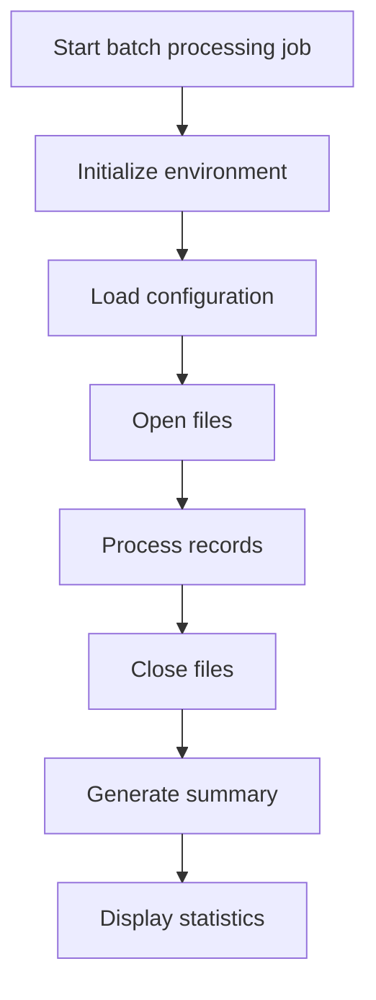

This section coordinates the main batch processing flow, ensuring that all critical steps are executed in the correct order for reliable operation.

| Rule ID | Category        | Rule Name                              | Description                                                                                                                  | Implementation Details                                                                                                                   |
| ------- | --------------- | -------------------------------------- | ---------------------------------------------------------------------------------------------------------------------------- | ---------------------------------------------------------------------------------------------------------------------------------------- |
| BR-001  | Decision Making | Environment initialization first       | The batch job begins by initializing the processing environment before any other actions are taken.                          | Initialization occurs before configuration loading, file operations, or record processing.                                               |
| BR-002  | Decision Making | Configuration loaded before processing | Configuration values are loaded immediately after initialization and before any file or record processing.                   | Configuration is loaded from a file or defaults if the file is missing. This ensures all downstream calculations use correct parameters. |
| BR-003  | Decision Making | File management sequence               | Files are opened before any records are processed, and closed after processing but before summary and statistics generation. | Files are opened before processing records and closed before generating summary and displaying statistics.                               |
| BR-004  | Decision Making | Summary generation after processing    | A summary is generated after all records have been processed and files have been closed.                                     | Summary generation occurs only after processing is complete and resources are released.                                                  |
| BR-005  | Decision Making | Statistics display last                | Statistics are displayed as the final step after summary generation.                                                         | Statistics are displayed only after all other processing steps are complete.                                                             |

<SwmSnippet path="/base/src/LGAPDB01.cbl" line="90">

---

<SwmToken path="base/src/LGAPDB01.cbl" pos="90:1:1" line-data="       P001.">`P001`</SwmToken> runs the main orchestration: it initializes processing, loads config values, opens files, processes input records, closes files, generates a summary, and displays stats. Calling <SwmToken path="base/src/LGAPDB01.cbl" pos="92:3:7" line-data="           PERFORM P003-LOAD-CONFIG">`P003-LOAD-CONFIG`</SwmToken> right after initialization ensures that all downstream calculations (like risk and premium) use the correct parameters, whether from the config file or defaults if the file is missing.

```cobol
       P001.
           PERFORM P002-INITIALIZE
           PERFORM P003-LOAD-CONFIG
           PERFORM P005-OPEN-FILES
           PERFORM P006-PROCESS-RECORDS
           PERFORM P014-CLOSE-FILES
           PERFORM P015-GENERATE-SUMMARY
           PERFORM P016-DISPLAY-STATS
           STOP RUN.
```

---

</SwmSnippet>

# Configuration Handling

This section determines whether to use configuration values from a file or fall back to default values for risk and premium calculations. It ensures that all subsequent calculations use the correct parameters based on the available configuration.

| Rule ID | Category        | Rule Name                        | Description                                                                                                                       | Implementation Details                                                                                                                     |
| ------- | --------------- | -------------------------------- | --------------------------------------------------------------------------------------------------------------------------------- | ------------------------------------------------------------------------------------------------------------------------------------------ |
| BR-001  | Decision Making | Default values on missing config | If the configuration file is not available, default values are used for risk and premium calculations.                            | Default values are used for all parameters related to risk and premium calculations. The specific values are not detailed in this section. |
| BR-002  | Decision Making | Load config values if available  | If the configuration file is available, configuration values are loaded and used for risk and premium calculations.               | Loaded values are used for all parameters related to risk and premium calculations. The specific values are not detailed in this section.  |
| BR-003  | Writing Output  | Warn on missing config file      | A warning message is displayed if the configuration file is not available, informing the user that default values are being used. | The warning message is: 'Warning: Config file not available - using defaults'.                                                             |

<SwmSnippet path="/base/src/LGAPDB01.cbl" line="112">

---

<SwmToken path="base/src/LGAPDB01.cbl" pos="112:1:5" line-data="       P003-LOAD-CONFIG.">`P003-LOAD-CONFIG`</SwmToken> opens the config file and decides whether to load values from it or fall back to defaults. If the file is available, it calls <SwmToken path="base/src/LGAPDB01.cbl" pos="118:3:9" line-data="               PERFORM P004-READ-CONFIG-VALUES">`P004-READ-CONFIG-VALUES`</SwmToken> to pull in the actual parameters for risk and premium calculations. This step is needed so all later calculations use the right numbers, not just hardcoded defaults.

```cobol
       P003-LOAD-CONFIG.
           OPEN INPUT CONFIG-FILE
           IF NOT CONFIG-OK
               DISPLAY 'Warning: Config file not available - using defaults'
               PERFORM P004-SET-DEFAULTS
           ELSE
               PERFORM P004-READ-CONFIG-VALUES
               CLOSE CONFIG-FILE
           END-IF.
```

---

</SwmSnippet>

# Reading Config Values

```mermaid
%%{init: {"flowchart": {"defaultRenderer": "elk"}} }%%
flowchart TD
    node1["Read MAX_RISK_SCORE from config file"]
    click node1 openCode "base/src/LGAPDB01.cbl:126:127"
    node1 --> node2{"Is config valid and numeric?"}
    click node2 openCode "base/src/LGAPDB01.cbl:128:130"
    node2 -->|"Yes"| node3["Set MAX_RISK_SCORE threshold"]
    click node3 openCode "base/src/LGAPDB01.cbl:129:129"
    node2 -->|"No"| node4["Keep existing MAX_RISK_SCORE"]
    click node4 openCode "base/src/LGAPDB01.cbl:125:130"
    node3 --> node5["Read MIN_PREMIUM from config file"]
    click node5 openCode "base/src/LGAPDB01.cbl:132:133"
    node4 --> node5
    node5 --> node6{"Is config valid and numeric?"}
    click node6 openCode "base/src/LGAPDB01.cbl:134:136"
    node6 -->|"Yes"| node7["Set MIN_PREMIUM threshold"]
    click node7 openCode "base/src/LGAPDB01.cbl:135:135"
    node6 -->|"No"| node8["Keep existing MIN_PREMIUM"]
    click node8 openCode "base/src/LGAPDB01.cbl:125:136"

classDef HeadingStyle fill:#777777,stroke:#333,stroke-width:2px;

%% Swimm:
%% %%{init: {"flowchart": {"defaultRenderer": "elk"}} }%%
%% flowchart TD
%%     node1["Read <SwmToken path="base/src/LGAPDB01.cbl" pos="126:4:4" line-data="           MOVE &#39;MAX_RISK_SCORE&#39; TO CONFIG-KEY">`MAX_RISK_SCORE`</SwmToken> from config file"]
%%     click node1 openCode "<SwmPath>[base/src/LGAPDB01.cbl](base/src/LGAPDB01.cbl)</SwmPath>:126:127"
%%     node1 --> node2{"Is config valid and numeric?"}
%%     click node2 openCode "<SwmPath>[base/src/LGAPDB01.cbl](base/src/LGAPDB01.cbl)</SwmPath>:128:130"
%%     node2 -->|"Yes"| node3["Set <SwmToken path="base/src/LGAPDB01.cbl" pos="126:4:4" line-data="           MOVE &#39;MAX_RISK_SCORE&#39; TO CONFIG-KEY">`MAX_RISK_SCORE`</SwmToken> threshold"]
%%     click node3 openCode "<SwmPath>[base/src/LGAPDB01.cbl](base/src/LGAPDB01.cbl)</SwmPath>:129:129"
%%     node2 -->|"No"| node4["Keep existing <SwmToken path="base/src/LGAPDB01.cbl" pos="126:4:4" line-data="           MOVE &#39;MAX_RISK_SCORE&#39; TO CONFIG-KEY">`MAX_RISK_SCORE`</SwmToken>"]
%%     click node4 openCode "<SwmPath>[base/src/LGAPDB01.cbl](base/src/LGAPDB01.cbl)</SwmPath>:125:130"
%%     node3 --> node5["Read <SwmToken path="base/src/LGAPDB01.cbl" pos="132:4:4" line-data="           MOVE &#39;MIN_PREMIUM&#39; TO CONFIG-KEY">`MIN_PREMIUM`</SwmToken> from config file"]
%%     click node5 openCode "<SwmPath>[base/src/LGAPDB01.cbl](base/src/LGAPDB01.cbl)</SwmPath>:132:133"
%%     node4 --> node5
%%     node5 --> node6{"Is config valid and numeric?"}
%%     click node6 openCode "<SwmPath>[base/src/LGAPDB01.cbl](base/src/LGAPDB01.cbl)</SwmPath>:134:136"
%%     node6 -->|"Yes"| node7["Set <SwmToken path="base/src/LGAPDB01.cbl" pos="132:4:4" line-data="           MOVE &#39;MIN_PREMIUM&#39; TO CONFIG-KEY">`MIN_PREMIUM`</SwmToken> threshold"]
%%     click node7 openCode "<SwmPath>[base/src/LGAPDB01.cbl](base/src/LGAPDB01.cbl)</SwmPath>:135:135"
%%     node6 -->|"No"| node8["Keep existing <SwmToken path="base/src/LGAPDB01.cbl" pos="132:4:4" line-data="           MOVE &#39;MIN_PREMIUM&#39; TO CONFIG-KEY">`MIN_PREMIUM`</SwmToken>"]
%%     click node8 openCode "<SwmPath>[base/src/LGAPDB01.cbl](base/src/LGAPDB01.cbl)</SwmPath>:125:136"
%% 
%% classDef HeadingStyle fill:#777777,stroke:#333,stroke-width:2px;
```

This section governs how configuration values for risk and premium thresholds are loaded and validated. It ensures only valid, numeric config values override the system defaults, supporting flexible but safe configuration.

| Rule ID | Category        | Rule Name                                                                                                                                                    | Description                                                                                                                                                                                                                                                                                                                                                                                                                              | Implementation Details                                                                                                                                                                                                                                                                                                  |
| ------- | --------------- | ------------------------------------------------------------------------------------------------------------------------------------------------------------ | ---------------------------------------------------------------------------------------------------------------------------------------------------------------------------------------------------------------------------------------------------------------------------------------------------------------------------------------------------------------------------------------------------------------------------------------- | ----------------------------------------------------------------------------------------------------------------------------------------------------------------------------------------------------------------------------------------------------------------------------------------------------------------------- |
| BR-001  | Data validation | Numeric config conversion                                                                                                                                    | When a config value is accepted as numeric, it is converted from a string to a number before being used as a threshold value.                                                                                                                                                                                                                                                                                                            | The conversion uses a string-to-number operation, ensuring that only valid numeric values are used for thresholds. This prevents non-numeric strings from being used as numeric thresholds.                                                                                                                             |
| BR-002  | Decision Making | <SwmToken path="base/src/LGAPDB01.cbl" pos="126:4:4" line-data="           MOVE &#39;MAX_RISK_SCORE&#39; TO CONFIG-KEY">`MAX_RISK_SCORE`</SwmToken> override | If the config file contains a valid, numeric value for <SwmToken path="base/src/LGAPDB01.cbl" pos="126:4:4" line-data="           MOVE &#39;MAX_RISK_SCORE&#39; TO CONFIG-KEY">`MAX_RISK_SCORE`</SwmToken>, update the maximum risk score threshold with this value. Otherwise, retain the default value of 250.                                                                                                                         | The default value for the maximum risk score is 250. The config value must be numeric (type 'N') and the read status must be '00'. The value is interpreted as a number, not as a string.                                                                                                                               |
| BR-003  | Decision Making | <SwmToken path="base/src/LGAPDB01.cbl" pos="132:4:4" line-data="           MOVE &#39;MIN_PREMIUM&#39; TO CONFIG-KEY">`MIN_PREMIUM`</SwmToken> override       | If the config file contains a valid, numeric value for <SwmToken path="base/src/LGAPDB01.cbl" pos="132:4:4" line-data="           MOVE &#39;MIN_PREMIUM&#39; TO CONFIG-KEY">`MIN_PREMIUM`</SwmToken>, update the minimum premium threshold with this value. Otherwise, retain the default value of <SwmToken path="base/src/LGAPDB04.cbl" pos="300:11:13" line-data="           IF WS-EXPOSURE-DENSITY &gt; 500.00">`500.00`</SwmToken>. | The default value for the minimum premium is <SwmToken path="base/src/LGAPDB04.cbl" pos="300:11:13" line-data="           IF WS-EXPOSURE-DENSITY &gt; 500.00">`500.00`</SwmToken>. The config value must be numeric (type 'N') and the read status must be '00'. The value is interpreted as a number, not as a string. |

<SwmSnippet path="/base/src/LGAPDB01.cbl" line="125">

---

In <SwmToken path="base/src/LGAPDB01.cbl" pos="125:1:7" line-data="       P004-READ-CONFIG-VALUES.">`P004-READ-CONFIG-VALUES`</SwmToken>, we set up to read <SwmToken path="base/src/LGAPDB01.cbl" pos="126:4:4" line-data="           MOVE &#39;MAX_RISK_SCORE&#39; TO CONFIG-KEY">`MAX_RISK_SCORE`</SwmToken> from the config file, check if it's present and numeric, and store it if valid. This is repeated for <SwmToken path="base/src/LGAPDB01.cbl" pos="132:4:4" line-data="           MOVE &#39;MIN_PREMIUM&#39; TO CONFIG-KEY">`MIN_PREMIUM`</SwmToken>. If either is missing or not numeric, the default stays in place. This ensures only valid config values override the defaults.

```cobol
       P004-READ-CONFIG-VALUES.
           MOVE 'MAX_RISK_SCORE' TO CONFIG-KEY
           READ CONFIG-FILE
           IF CONFIG-OK AND NUMERIC-CONFIG
               MOVE FUNCTION NUMVAL(CONFIG-VALUE) TO WS-MAX-RISK-SCORE
           END-IF
```

---

</SwmSnippet>

<SwmSnippet path="/base/src/LGAPDB01.cbl" line="132">

---

After reading both <SwmToken path="base/src/LGAPDB01.cbl" pos="126:4:4" line-data="           MOVE &#39;MAX_RISK_SCORE&#39; TO CONFIG-KEY">`MAX_RISK_SCORE`</SwmToken> and <SwmToken path="base/src/LGAPDB01.cbl" pos="132:4:4" line-data="           MOVE &#39;MIN_PREMIUM&#39; TO CONFIG-KEY">`MIN_PREMIUM`</SwmToken>, the function leaves <SwmToken path="base/src/LGAPDB01.cbl" pos="129:14:20" line-data="               MOVE FUNCTION NUMVAL(CONFIG-VALUE) TO WS-MAX-RISK-SCORE">`WS-MAX-RISK-SCORE`</SwmToken> and <SwmToken path="base/src/LGAPDB01.cbl" pos="135:14:18" line-data="               MOVE FUNCTION NUMVAL(CONFIG-VALUE) TO WS-MIN-PREMIUM">`WS-MIN-PREMIUM`</SwmToken> set to either the config values (if valid) or their defaults. These values are then used in later calculations for risk and premium thresholds.

```cobol
           MOVE 'MIN_PREMIUM' TO CONFIG-KEY
           READ CONFIG-FILE
           IF CONFIG-OK AND NUMERIC-CONFIG
               MOVE FUNCTION NUMVAL(CONFIG-VALUE) TO WS-MIN-PREMIUM
           END-IF.
```

---

</SwmSnippet>

# Input Record Processing

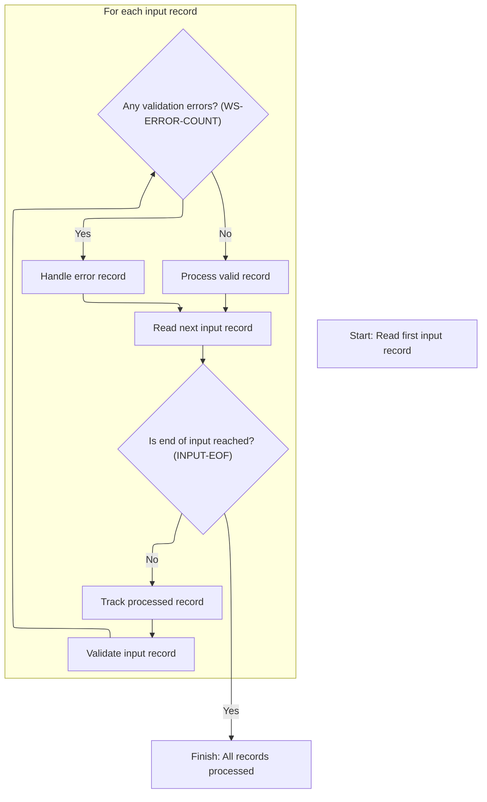

This section manages the main loop for input record processing. It ensures each record is validated and routed for further processing or error handling, and tracks the number of records processed.

| Rule ID | Category        | Rule Name                 | Description                                                                                                            | Implementation Details                                                                                                                         |
| ------- | --------------- | ------------------------- | ---------------------------------------------------------------------------------------------------------------------- | ---------------------------------------------------------------------------------------------------------------------------------------------- |
| BR-001  | Data validation | Input record validation   | Each input record is validated before any further processing or error handling is performed.                           | Validation is performed on every input record. The specifics of validation are handled in a separate routine.                                  |
| BR-002  | Calculation     | Processed record counting | Each input record is counted as it is processed, incrementing the processed record count by one for every record read. | The processed record count is incremented by one for each input record. The count is a number with up to 7 digits.                             |
| BR-003  | Decision Making | Valid record processing   | Records with no validation errors are processed as valid records.                                                      | A record is considered valid if the error count is zero. Valid records are sent for further processing in a dedicated routine.                 |
| BR-004  | Decision Making | Error record handling     | Records with one or more validation errors are routed to error handling.                                               | A record is considered to have errors if the error count is greater than zero. Such records are sent to error handling in a dedicated routine. |
| BR-005  | Decision Making | End-of-input detection    | Input record processing continues until the end-of-input condition is detected.                                        | The end-of-input condition is represented by the value '10' in the input status field. Processing stops when this value is detected.           |

<SwmSnippet path="/base/src/LGAPDB01.cbl" line="178">

---

In <SwmToken path="base/src/LGAPDB01.cbl" pos="178:1:5" line-data="       P006-PROCESS-RECORDS.">`P006-PROCESS-RECORDS`</SwmToken>, we start by reading the first input record. The function then loops, reading and processing each record until it hits end-of-file. Each record is counted and sent for validation before any further processing.

```cobol
       P006-PROCESS-RECORDS.
           PERFORM P007-READ-INPUT
```

---

</SwmSnippet>

<SwmSnippet path="/base/src/LGAPDB01.cbl" line="180">

---

After reading each record and bumping the count, we call <SwmToken path="base/src/LGAPDB01.cbl" pos="182:3:9" line-data="               PERFORM P008-VALIDATE-INPUT-RECORD">`P008-VALIDATE-INPUT-RECORD`</SwmToken> to check for required fields and valid values. Depending on the validation result, the record is either processed as valid or sent to error handling. The loop continues until all records are processed.

```cobol
           PERFORM UNTIL INPUT-EOF
               ADD 1 TO WS-REC-CNT
               PERFORM P008-VALIDATE-INPUT-RECORD
               IF WS-ERROR-COUNT = ZERO
                   PERFORM P009-PROCESS-VALID-RECORD
               ELSE
                   PERFORM P010-PROCESS-ERROR-RECORD
               END-IF
               PERFORM P007-READ-INPUT
           END-PERFORM.
```

---

</SwmSnippet>

# Input Validation and Error Logging

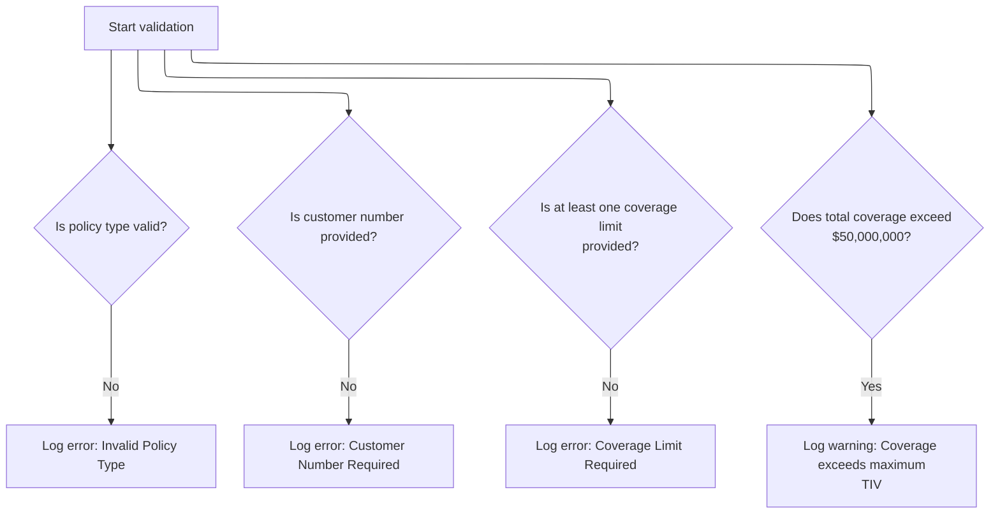

This section validates key fields in an insurance policy record and logs errors or warnings for any validation failures. It ensures that only records meeting business requirements proceed without errors.

| Rule ID | Category        | Rule Name                | Description                                                                                                                                                                                                                                                                                                                                                                                                                                                                                                                                       | Implementation Details                                                                                                                                                                                                                                                                                                                                                                                                                                                                                                      |
| ------- | --------------- | ------------------------ | ------------------------------------------------------------------------------------------------------------------------------------------------------------------------------------------------------------------------------------------------------------------------------------------------------------------------------------------------------------------------------------------------------------------------------------------------------------------------------------------------------------------------------------------------- | --------------------------------------------------------------------------------------------------------------------------------------------------------------------------------------------------------------------------------------------------------------------------------------------------------------------------------------------------------------------------------------------------------------------------------------------------------------------------------------------------------------------------- |
| BR-001  | Data validation | Policy type validation   | If the policy type is not 'C', 'P', or 'F', an error is logged with code <SwmToken path="base/src/LGAPDB01.cbl" pos="202:2:2" line-data="                   &#39;POL001&#39; &#39;F&#39; &#39;IN-POLICY-TYPE&#39; ">`POL001`</SwmToken>, severity 'F', field <SwmToken path="base/src/LGAPDB01.cbl" pos="202:10:14" line-data="                   &#39;POL001&#39; &#39;F&#39; &#39;IN-POLICY-TYPE&#39; ">`IN-POLICY-TYPE`</SwmToken>, and message 'Invalid Policy Type'.                                                                         | Error code: <SwmToken path="base/src/LGAPDB01.cbl" pos="202:2:2" line-data="                   &#39;POL001&#39; &#39;F&#39; &#39;IN-POLICY-TYPE&#39; ">`POL001`</SwmToken>, Severity: 'F', Field: <SwmToken path="base/src/LGAPDB01.cbl" pos="202:10:14" line-data="                   &#39;POL001&#39; &#39;F&#39; &#39;IN-POLICY-TYPE&#39; ">`IN-POLICY-TYPE`</SwmToken>, Message: 'Invalid Policy Type'. All are strings. Policy type values: 'C' (Commercial), 'P' (Personal), 'F' (Farm).                              |
| BR-002  | Data validation | Customer number required | If the customer number field is blank, an error is logged with code <SwmToken path="base/src/LGAPDB01.cbl" pos="208:2:2" line-data="                   &#39;CUS001&#39; &#39;F&#39; &#39;IN-CUSTOMER-NUM&#39; ">`CUS001`</SwmToken>, severity 'F', field <SwmToken path="base/src/LGAPDB01.cbl" pos="206:3:7" line-data="           IF IN-CUSTOMER-NUM = SPACES">`IN-CUSTOMER-NUM`</SwmToken>, and message 'Customer Number Required'.                                                                                                            | Error code: <SwmToken path="base/src/LGAPDB01.cbl" pos="208:2:2" line-data="                   &#39;CUS001&#39; &#39;F&#39; &#39;IN-CUSTOMER-NUM&#39; ">`CUS001`</SwmToken>, Severity: 'F', Field: <SwmToken path="base/src/LGAPDB01.cbl" pos="206:3:7" line-data="           IF IN-CUSTOMER-NUM = SPACES">`IN-CUSTOMER-NUM`</SwmToken>, Message: 'Customer Number Required'. Customer number is a string of up to 10 characters.                                                                                           |
| BR-003  | Data validation | Coverage limit required  | If both building and contents coverage limits are zero, an error is logged with code <SwmToken path="base/src/LGAPDB01.cbl" pos="215:2:2" line-data="                   &#39;COV001&#39; &#39;F&#39; &#39;COVERAGE-LIMITS&#39; ">`COV001`</SwmToken>, severity 'F', field <SwmToken path="base/src/LGAPDB01.cbl" pos="215:10:12" line-data="                   &#39;COV001&#39; &#39;F&#39; &#39;COVERAGE-LIMITS&#39; ">`COVERAGE-LIMITS`</SwmToken>, and message 'At least one coverage limit required'.                                         | Error code: <SwmToken path="base/src/LGAPDB01.cbl" pos="215:2:2" line-data="                   &#39;COV001&#39; &#39;F&#39; &#39;COVERAGE-LIMITS&#39; ">`COV001`</SwmToken>, Severity: 'F', Field: <SwmToken path="base/src/LGAPDB01.cbl" pos="215:10:12" line-data="                   &#39;COV001&#39; &#39;F&#39; &#39;COVERAGE-LIMITS&#39; ">`COVERAGE-LIMITS`</SwmToken>, Message: 'At least one coverage limit required'. Coverage limits are numeric values.                                                         |
| BR-004  | Data validation | Maximum coverage warning | If the sum of building, contents, and business interruption coverage limits exceeds $50,000,000, a warning is logged with code <SwmToken path="base/src/LGAPDB01.cbl" pos="222:2:2" line-data="                   &#39;COV002&#39; &#39;W&#39; &#39;COVERAGE-LIMITS&#39; ">`COV002`</SwmToken>, severity 'W', field <SwmToken path="base/src/LGAPDB01.cbl" pos="215:10:12" line-data="                   &#39;COV001&#39; &#39;F&#39; &#39;COVERAGE-LIMITS&#39; ">`COVERAGE-LIMITS`</SwmToken>, and message 'Total coverage exceeds maximum TIV'. | Error code: <SwmToken path="base/src/LGAPDB01.cbl" pos="222:2:2" line-data="                   &#39;COV002&#39; &#39;W&#39; &#39;COVERAGE-LIMITS&#39; ">`COV002`</SwmToken>, Severity: 'W', Field: <SwmToken path="base/src/LGAPDB01.cbl" pos="215:10:12" line-data="                   &#39;COV001&#39; &#39;F&#39; &#39;COVERAGE-LIMITS&#39; ">`COVERAGE-LIMITS`</SwmToken>, Message: 'Total coverage exceeds maximum TIV'. Maximum allowed total insured value (TIV) is $50,000,000. Coverage limits are numeric values. |

<SwmSnippet path="/base/src/LGAPDB01.cbl" line="195">

---

In <SwmToken path="base/src/LGAPDB01.cbl" pos="195:1:7" line-data="       P008-VALIDATE-INPUT-RECORD.">`P008-VALIDATE-INPUT-RECORD`</SwmToken>, we start by clearing error tracking, then check if the policy type is valid. If not, we call <SwmToken path="base/src/LGAPDB01.cbl" pos="201:3:7" line-data="               PERFORM P008A-LOG-ERROR WITH ">`P008A-LOG-ERROR`</SwmToken> to record a <SwmToken path="base/src/LGAPDB01.cbl" pos="202:2:2" line-data="                   &#39;POL001&#39; &#39;F&#39; &#39;IN-POLICY-TYPE&#39; ">`POL001`</SwmToken> error. This makes sure every invalid policy type is flagged and logged for reporting.

```cobol
       P008-VALIDATE-INPUT-RECORD.
           INITIALIZE WS-ERROR-HANDLING
           
           IF NOT COMMERCIAL-POLICY AND 
              NOT PERSONAL-POLICY AND 
              NOT FARM-POLICY
               PERFORM P008A-LOG-ERROR WITH 
                   'POL001' 'F' 'IN-POLICY-TYPE' 
                   'Invalid Policy Type'
           END-IF
```

---

</SwmSnippet>

<SwmSnippet path="/base/src/LGAPDB01.cbl" line="226">

---

<SwmToken path="base/src/LGAPDB01.cbl" pos="226:1:5" line-data="       P008A-LOG-ERROR.">`P008A-LOG-ERROR`</SwmToken> just bumps the error count and stores the error details in parallel arrays. It assumes the arrays are big enough and initialized, so if you hit the limit, extra errors are lost.

```cobol
       P008A-LOG-ERROR.
           ADD 1 TO WS-ERROR-COUNT
           SET ERR-IDX TO WS-ERROR-COUNT
           MOVE WS-ERROR-CODE TO WS-ERROR-CODE (ERR-IDX)
           MOVE WS-ERROR-SEVERITY TO WS-ERROR-SEVERITY (ERR-IDX)
           MOVE WS-ERROR-FIELD TO WS-ERROR-FIELD (ERR-IDX)
           MOVE WS-ERROR-MESSAGE TO WS-ERROR-MESSAGE (ERR-IDX).
```

---

</SwmSnippet>

<SwmSnippet path="/base/src/LGAPDB01.cbl" line="206">

---

Back in <SwmToken path="base/src/LGAPDB01.cbl" pos="182:3:9" line-data="               PERFORM P008-VALIDATE-INPUT-RECORD">`P008-VALIDATE-INPUT-RECORD`</SwmToken>, after checking policy type, we check if the customer number is present. If it's missing, that's another validation failure. The function expects the field to be there and doesn't check for format, just presence.

```cobol
           IF IN-CUSTOMER-NUM = SPACES
               PERFORM P008A-LOG-ERROR WITH 
                   'CUS001' 'F' 'IN-CUSTOMER-NUM' 
                   'Customer Number Required'
           END-IF
```

---

</SwmSnippet>

<SwmSnippet path="/base/src/LGAPDB01.cbl" line="212">

---

After checking customer number, the code checks that at least one coverage limit (building or contents) is set. If both are zero, that's another validation error. This prevents policies with no actual coverage.

```cobol
           IF IN-BUILDING-LIMIT = ZERO AND 
              IN-CONTENTS-LIMIT = ZERO
               PERFORM P008A-LOG-ERROR WITH 
                   'COV001' 'F' 'COVERAGE-LIMITS' 
                   'At least one coverage limit required'
           END-IF
```

---

</SwmSnippet>

<SwmSnippet path="/base/src/LGAPDB01.cbl" line="219">

---

The last check in <SwmToken path="base/src/LGAPDB01.cbl" pos="182:3:9" line-data="               PERFORM P008-VALIDATE-INPUT-RECORD">`P008-VALIDATE-INPUT-RECORD`</SwmToken> is for total coverage exceeding the max allowed (<SwmToken path="base/src/LGAPDB01.cbl" pos="220:9:13" line-data="              IN-BI-LIMIT &gt; WS-MAX-TIV">`WS-MAX-TIV`</SwmToken>). If it does, a warning is logged. The function returns with all errors and warnings collected for the record, which determines if it goes down the valid or error path next.

```cobol
           IF IN-BUILDING-LIMIT + IN-CONTENTS-LIMIT + 
              IN-BI-LIMIT > WS-MAX-TIV
               PERFORM P008A-LOG-ERROR WITH 
                   'COV002' 'W' 'COVERAGE-LIMITS' 
                   'Total coverage exceeds maximum TIV'
           END-IF.
```

---

</SwmSnippet>

# Valid Record Routing

This section routes valid insurance policy records to the appropriate processing logic based on whether the policy is commercial or not. It also updates processing statistics for reporting and tracking.

| Rule ID | Category        | Rule Name                     | Description                                                                                                                                                       | Implementation Details                                                                                                                                                                                                                                  |
| ------- | --------------- | ----------------------------- | ----------------------------------------------------------------------------------------------------------------------------------------------------------------- | ------------------------------------------------------------------------------------------------------------------------------------------------------------------------------------------------------------------------------------------------------- |
| BR-001  | Calculation     | Processing and error counting | The system increments the processed count for each commercial policy and the error count for each non-commercial policy routed through this section.              | Processed count and error count are both incremented by one depending on the policy type. These counts are used for reporting and tracking processing statistics.                                                                                       |
| BR-002  | Decision Making | Commercial policy processing  | When a policy is identified as commercial, the system initiates the full risk and premium calculation process for that policy and increments the processed count. | The policy type value 'C' is used to identify commercial policies. The processed count is incremented by one for each commercial policy processed. The output includes the results of the risk and premium calculation, as well as updated statistics.  |
| BR-003  | Decision Making | Non-commercial policy routing | When a policy is not commercial, the system routes the policy to a non-commercial handler and increments the error count.                                         | Non-commercial policies are identified by policy type values other than 'C'. The error count is incremented by one for each non-commercial policy processed. The output includes the result of the non-commercial handler and updated error statistics. |

<SwmSnippet path="/base/src/LGAPDB01.cbl" line="234">

---

<SwmToken path="base/src/LGAPDB01.cbl" pos="234:1:7" line-data="       P009-PROCESS-VALID-RECORD.">`P009-PROCESS-VALID-RECORD`</SwmToken> checks if the policy is commercial. If so, it calls <SwmToken path="base/src/LGAPDB01.cbl" pos="236:3:7" line-data="               PERFORM P011-PROCESS-COMMERCIAL">`P011-PROCESS-COMMERCIAL`</SwmToken> to run the full risk and premium calculation. Otherwise, it routes non-commercial policies to a stub handler and increments the error count.

```cobol
       P009-PROCESS-VALID-RECORD.
           IF COMMERCIAL-POLICY
               PERFORM P011-PROCESS-COMMERCIAL
               ADD 1 TO WS-PROC-CNT
           ELSE
               PERFORM P012-PROCESS-NON-COMMERCIAL
               ADD 1 TO WS-ERR-CNT
           END-IF.
```

---

</SwmSnippet>

## Commercial Policy Processing

```mermaid
%%{init: {"flowchart": {"defaultRenderer": "elk"}} }%%
flowchart TD
    node1["Start commercial policy processing"]
    click node1 openCode "base/src/LGAPDB01.cbl:258:260"
    node1 --> node2["Risk Score Calculation"]
    
    node2 --> node3["Basic Premium Calculation"]
    
    node3 --> node4{"Is underwriting approved? (WS-STAT =
0)"}
    click node4 openCode "base/src/LGAPDB01.cbl:261:263"
    node4 -->|"Yes"| node5["Preparing Enhanced Actuarial Inputs"]
    
    node5 --> node6["Applying Business Rules and Recording Results"]
    
    node4 -->|"No"| node6
    node6 --> node7["Applying Business Rules and Recording Results"]
    
    node7 --> node8["Applying Business Rules and Recording Results"]
    
    node8 --> node9["Policy processed"]
    click node9 openCode "base/src/LGAPDB01.cbl:269:270"
    node9 --> node10["End"]
    click node10 openCode "base/src/LGAPDB01.cbl:270:271"
    node10 --> node11["Final output"]
    click node11 openCode "base/src/LGAPDB01.cbl:271:272"
classDef HeadingStyle fill:#777777,stroke:#333,stroke-width:2px;
click node2 goToHeading "Risk Score Calculation"
node2:::HeadingStyle
click node3 goToHeading "Basic Premium Calculation"
node3:::HeadingStyle
click node5 goToHeading "Preparing Enhanced Actuarial Inputs"
node5:::HeadingStyle
click node6 goToHeading "Applying Business Rules and Recording Results"
node6:::HeadingStyle
click node7 goToHeading "Applying Business Rules and Recording Results"
node7:::HeadingStyle
click node8 goToHeading "Applying Business Rules and Recording Results"
node8:::HeadingStyle

%% Swimm:
%% %%{init: {"flowchart": {"defaultRenderer": "elk"}} }%%
%% flowchart TD
%%     node1["Start commercial policy processing"]
%%     click node1 openCode "<SwmPath>[base/src/LGAPDB01.cbl](base/src/LGAPDB01.cbl)</SwmPath>:258:260"
%%     node1 --> node2["Risk Score Calculation"]
%%     
%%     node2 --> node3["Basic Premium Calculation"]
%%     
%%     node3 --> node4{"Is underwriting approved? (<SwmToken path="base/src/LGAPDB01.cbl" pos="261:3:5" line-data="           IF WS-STAT = 0">`WS-STAT`</SwmToken> =
%% 0)"}
%%     click node4 openCode "<SwmPath>[base/src/LGAPDB01.cbl](base/src/LGAPDB01.cbl)</SwmPath>:261:263"
%%     node4 -->|"Yes"| node5["Preparing Enhanced Actuarial Inputs"]
%%     
%%     node5 --> node6["Applying Business Rules and Recording Results"]
%%     
%%     node4 -->|"No"| node6
%%     node6 --> node7["Applying Business Rules and Recording Results"]
%%     
%%     node7 --> node8["Applying Business Rules and Recording Results"]
%%     
%%     node8 --> node9["Policy processed"]
%%     click node9 openCode "<SwmPath>[base/src/LGAPDB01.cbl](base/src/LGAPDB01.cbl)</SwmPath>:269:270"
%%     node9 --> node10["End"]
%%     click node10 openCode "<SwmPath>[base/src/LGAPDB01.cbl](base/src/LGAPDB01.cbl)</SwmPath>:270:271"
%%     node10 --> node11["Final output"]
%%     click node11 openCode "<SwmPath>[base/src/LGAPDB01.cbl](base/src/LGAPDB01.cbl)</SwmPath>:271:272"
%% classDef HeadingStyle fill:#777777,stroke:#333,stroke-width:2px;
%% click node2 goToHeading "Risk Score Calculation"
%% node2:::HeadingStyle
%% click node3 goToHeading "Basic Premium Calculation"
%% node3:::HeadingStyle
%% click node5 goToHeading "Preparing Enhanced Actuarial Inputs"
%% node5:::HeadingStyle
%% click node6 goToHeading "Applying Business Rules and Recording Results"
%% node6:::HeadingStyle
%% click node7 goToHeading "Applying Business Rules and Recording Results"
%% node7:::HeadingStyle
%% click node8 goToHeading "Applying Business Rules and Recording Results"
%% node8:::HeadingStyle
```

This section orchestrates the end-to-end processing of a commercial insurance policy, ensuring risk assessment, premium calculation, and underwriting decision-making are performed in the correct sequence. It governs the main business flow for commercial policy issuance and processing.

| Rule ID | Category        | Rule Name                               | Description                                                                                                                                                                                                              | Implementation Details                                                                                                                                             |
| ------- | --------------- | --------------------------------------- | ------------------------------------------------------------------------------------------------------------------------------------------------------------------------------------------------------------------------ | ------------------------------------------------------------------------------------------------------------------------------------------------------------------ |
| BR-001  | Calculation     | Risk score prerequisite                 | A risk score is calculated for the property before any premium calculation or underwriting decision is made.                                                                                                             | The risk score is calculated using property details, coverage values, location, and customer history. The output is a numeric risk score used in subsequent steps. |
| BR-002  | Calculation     | Basic premium calculation sequence      | Basic premium calculation is performed after risk scoring and uses the risk score and peril data to determine premiums and underwriting status.                                                                          | Premiums are calculated using risk and peril data. The output includes underwriting status, rejection reason, and detailed premiums for various perils.            |
| BR-003  | Decision Making | Underwriting approval decision          | Underwriting approval is determined by the value of the status variable. If the status is 0 (approved), enhanced actuarial inputs are prepared; otherwise, the process continues without enhanced actuarial preparation. | The status variable can have values: 0 (approved), 1 (pending), 2 (rejected), 3 (referred). Enhanced actuarial preparation is only performed if status is 0.       |
| BR-004  | Writing Output  | Apply business rules and record results | Business rules are applied and results are recorded for the policy regardless of underwriting approval status.                                                                                                           | Results are recorded for the policy after applying business rules. The output includes updated policy records and processing status.                               |
| BR-005  | Writing Output  | Policy processed and output generated   | The policy is marked as processed and final output is generated at the end of the commercial policy processing flow.                                                                                                     | The policy is marked as processed and final output is generated. The output includes the processed policy status and any final calculated values.                  |

<SwmSnippet path="/base/src/LGAPDB01.cbl" line="258">

---

In <SwmToken path="base/src/LGAPDB01.cbl" pos="258:1:5" line-data="       P011-PROCESS-COMMERCIAL.">`P011-PROCESS-COMMERCIAL`</SwmToken>, we start by calling <SwmToken path="base/src/LGAPDB01.cbl" pos="259:3:9" line-data="           PERFORM P011A-CALCULATE-RISK-SCORE">`P011A-CALCULATE-RISK-SCORE`</SwmToken>. This step figures out the risk score for the property, which is needed before we can do any premium calculations or underwriting decisions.

```cobol
       P011-PROCESS-COMMERCIAL.
           PERFORM P011A-CALCULATE-RISK-SCORE
           PERFORM P011B-BASIC-PREMIUM-CALC
```

---

</SwmSnippet>

### Risk Score Calculation

This section coordinates the calculation of a risk score for an insurance policy by invoking an external service with all relevant input data. It ensures the risk score variable is prepared and populated with the result from the service.

| Rule ID | Category                        | Rule Name                      | Description                                                                                                                                         | Implementation Details                                                                                                                                                                                                                                                                              |
| ------- | ------------------------------- | ------------------------------ | --------------------------------------------------------------------------------------------------------------------------------------------------- | --------------------------------------------------------------------------------------------------------------------------------------------------------------------------------------------------------------------------------------------------------------------------------------------------- |
| BR-001  | Invoking a Service or a Process | Risk score calculation trigger | The risk score calculation process is triggered by passing all relevant property, location, and coverage data to the external risk scoring service. | The following data fields are passed: property type (string, 15 chars), postcode (string, 8 chars), latitude (number, 7+6 digits), longitude (number, 8+6 digits), building limit (number), contents limit (number), flood coverage (string), weather coverage (string), customer history (string). |
| BR-002  | Technical Step                  | Risk score initialization      | The risk score variable is initialized to zero before the risk score calculation process begins.                                                    | The risk score variable is a number with three digits, initialized to zero.                                                                                                                                                                                                                         |

<SwmSnippet path="/base/src/LGAPDB01.cbl" line="268">

---

<SwmToken path="base/src/LGAPDB01.cbl" pos="268:1:7" line-data="       P011A-CALCULATE-RISK-SCORE.">`P011A-CALCULATE-RISK-SCORE`</SwmToken> calls <SwmToken path="base/src/LGAPDB01.cbl" pos="269:4:4" line-data="           CALL &#39;LGAPDB02&#39; USING IN-PROPERTY-TYPE, IN-POSTCODE, ">`LGAPDB02`</SwmToken>, passing all the property, location, and coverage data. <SwmToken path="base/src/LGAPDB01.cbl" pos="269:4:4" line-data="           CALL &#39;LGAPDB02&#39; USING IN-PROPERTY-TYPE, IN-POSTCODE, ">`LGAPDB02`</SwmToken> handles the actual risk score logic, including database lookups for fire and crime risk factors.

```cobol
       P011A-CALCULATE-RISK-SCORE.
           CALL 'LGAPDB02' USING IN-PROPERTY-TYPE, IN-POSTCODE, 
                                IN-LATITUDE, IN-LONGITUDE,
                                IN-BUILDING-LIMIT, IN-CONTENTS-LIMIT,
                                IN-FLOOD-COVERAGE, IN-WEATHER-COVERAGE,
                                IN-CUSTOMER-HISTORY, WS-BASE-RISK-SCR.
```

---

</SwmSnippet>

### Risk Factor Fetch and Main Logic

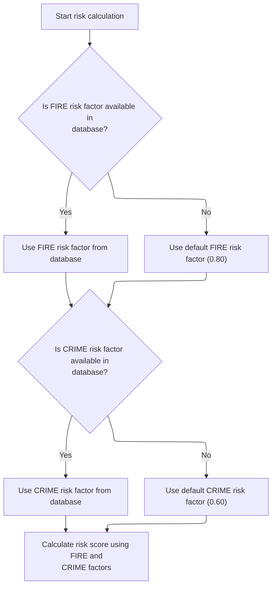

This section ensures that risk factors for FIRE and CRIME are available for risk score calculation by fetching them from the database or applying defaults if necessary. It guarantees that the calculation step always has valid input values.

| Rule ID | Category        | Rule Name                          | Description                                                                                                                                                                                                                            | Implementation Details                                                                                                                                                    |
| ------- | --------------- | ---------------------------------- | -------------------------------------------------------------------------------------------------------------------------------------------------------------------------------------------------------------------------------------- | ------------------------------------------------------------------------------------------------------------------------------------------------------------------------- |
| BR-001  | Decision Making | Use database FIRE risk factor      | If the FIRE risk factor is available in the database, use the value from the database for the calculation.                                                                                                                             | The FIRE risk factor is a numeric value as stored in the database. No specific format constraints are enforced in this section.                                           |
| BR-002  | Decision Making | Default FIRE risk factor fallback  | If the FIRE risk factor is not available in the database, use the default value of <SwmToken path="base/src/LGAPDB02.cbl" pos="54:3:5" line-data="               MOVE 0.80 TO WS-FIRE-FACTOR">`0.80`</SwmToken> for the calculation.   | The default FIRE risk factor is <SwmToken path="base/src/LGAPDB02.cbl" pos="54:3:5" line-data="               MOVE 0.80 TO WS-FIRE-FACTOR">`0.80`</SwmToken> (numeric).   |
| BR-003  | Decision Making | Use database CRIME risk factor     | If the CRIME risk factor is available in the database, use the value from the database for the calculation.                                                                                                                            | The CRIME risk factor is a numeric value as stored in the database. No specific format constraints are enforced in this section.                                          |
| BR-004  | Decision Making | Default CRIME risk factor fallback | If the CRIME risk factor is not available in the database, use the default value of <SwmToken path="base/src/LGAPDB02.cbl" pos="66:3:5" line-data="               MOVE 0.60 TO WS-CRIME-FACTOR">`0.60`</SwmToken> for the calculation. | The default CRIME risk factor is <SwmToken path="base/src/LGAPDB02.cbl" pos="66:3:5" line-data="               MOVE 0.60 TO WS-CRIME-FACTOR">`0.60`</SwmToken> (numeric). |

<SwmSnippet path="/base/src/LGAPDB02.cbl" line="39">

---

<SwmToken path="base/src/LGAPDB02.cbl" pos="39:1:3" line-data="       MAIN-LOGIC.">`MAIN-LOGIC`</SwmToken> in <SwmToken path="base/src/LGAPDB01.cbl" pos="269:4:4" line-data="           CALL &#39;LGAPDB02&#39; USING IN-PROPERTY-TYPE, IN-POSTCODE, ">`LGAPDB02`</SwmToken> first fetches fire and crime risk factors from the database (<SwmToken path="base/src/LGAPDB02.cbl" pos="40:3:7" line-data="           PERFORM GET-RISK-FACTORS">`GET-RISK-FACTORS`</SwmToken>). If the DB is down or missing data, it uses defaults. Then it moves on to the risk score calculation.

```cobol
       MAIN-LOGIC.
           PERFORM GET-RISK-FACTORS
           PERFORM CALCULATE-RISK-SCORE
           GOBACK.
```

---

</SwmSnippet>

<SwmSnippet path="/base/src/LGAPDB02.cbl" line="44">

---

<SwmToken path="base/src/LGAPDB02.cbl" pos="44:1:5" line-data="       GET-RISK-FACTORS.">`GET-RISK-FACTORS`</SwmToken> tries to pull fire and crime factors from the DB. If it can't, it just sets them to <SwmToken path="base/src/LGAPDB02.cbl" pos="54:3:5" line-data="               MOVE 0.80 TO WS-FIRE-FACTOR">`0.80`</SwmToken> and <SwmToken path="base/src/LGAPDB02.cbl" pos="66:3:5" line-data="               MOVE 0.60 TO WS-CRIME-FACTOR">`0.60`</SwmToken>. No magic, just a fallback so the rest of the calculation doesn't break.

```cobol
       GET-RISK-FACTORS.
           EXEC SQL
               SELECT FACTOR_VALUE INTO :WS-FIRE-FACTOR
               FROM RISK_FACTORS
               WHERE PERIL_TYPE = 'FIRE'
           END-EXEC.
           
           IF SQLCODE = 0
               CONTINUE
           ELSE
               MOVE 0.80 TO WS-FIRE-FACTOR
           END-IF.
           
           EXEC SQL
               SELECT FACTOR_VALUE INTO :WS-CRIME-FACTOR
               FROM RISK_FACTORS
               WHERE PERIL_TYPE = 'CRIME'
           END-EXEC.
           
           IF SQLCODE = 0
               CONTINUE
           ELSE
               MOVE 0.60 TO WS-CRIME-FACTOR
           END-IF.
```

---

</SwmSnippet>

### Risk Score Adjustments

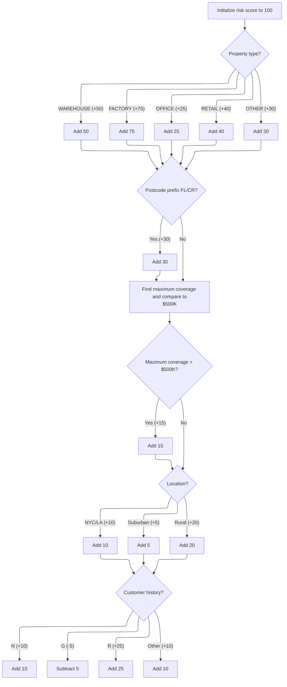

This section calculates the risk score for a property insurance application. The score is adjusted based on property characteristics, location, coverage, and customer history, using fixed business rules.

| Rule ID | Category    | Rule Name                   | Description                                                                                                                     | Implementation Details                                                                          |
| ------- | ----------- | --------------------------- | ------------------------------------------------------------------------------------------------------------------------------- | ----------------------------------------------------------------------------------------------- |
| BR-001  | Calculation | Base risk score             | Start the risk score calculation at a base value of 100 before any adjustments.                                                 | The base value is 100. The risk score is a number.                                              |
| BR-002  | Calculation | Property type adjustment    | Adjust the risk score based on property type, using fixed increments for each type.                                             | WAREHOUSE: +50, FACTORY: +75, OFFICE: +25, RETAIL: +40, OTHER: +30. The risk score is a number. |
| BR-003  | Calculation | Postcode prefix adjustment  | Increase the risk score by 30 if the postcode prefix is FL or CR.                                                               | If postcode starts with FL or CR, add 30 to risk score. The risk score is a number.             |
| BR-004  | Calculation | High coverage adjustment    | Add 15 to the risk score if the maximum coverage amount for any peril exceeds $500,000.                                         | Threshold is $500,000. Adjustment is +15. The risk score is a number.                           |
| BR-005  | Calculation | Location adjustment         | Adjust the risk score based on property location: add 10 for NYC/LA, 5 for continental US, 20 for rural/outside US.             | NYC/LA: +10, Continental US: +5, Rural/outside US: +20. The risk score is a number.             |
| BR-006  | Calculation | Customer history adjustment | Adjust the risk score based on customer history: add 10 for 'N', subtract 5 for 'G', add 25 for 'R', add 10 for any other code. | N: +10, G: -5, R: +25, Other: +10. The risk score is a number.                                  |

<SwmSnippet path="/base/src/LGAPDB02.cbl" line="69">

---

<SwmToken path="base/src/LGAPDB02.cbl" pos="69:1:5" line-data="       CALCULATE-RISK-SCORE.">`CALCULATE-RISK-SCORE`</SwmToken> starts with a base of 100, then adds points based on property type and postcode prefix. It then calls out to other routines to adjust for coverage, location, and customer history. All the adjustments are hardcoded, so any changes mean touching the code.

```cobol
       CALCULATE-RISK-SCORE.
           MOVE 100 TO LK-RISK-SCORE

           EVALUATE LK-PROPERTY-TYPE
             WHEN 'WAREHOUSE'
               ADD 50 TO LK-RISK-SCORE
             WHEN 'FACTORY' 
               ADD 75 TO LK-RISK-SCORE
             WHEN 'OFFICE'
               ADD 25 TO LK-RISK-SCORE
             WHEN 'RETAIL'
               ADD 40 TO LK-RISK-SCORE
             WHEN OTHER
               ADD 30 TO LK-RISK-SCORE
           END-EVALUATE

           IF LK-POSTCODE(1:2) = 'FL' OR
              LK-POSTCODE(1:2) = 'CR'
             ADD 30 TO LK-RISK-SCORE
           END-IF

           PERFORM CHECK-COVERAGE-AMOUNTS
           PERFORM ASSESS-LOCATION-RISK  
           PERFORM EVALUATE-CUSTOMER-HISTORY.
```

---

</SwmSnippet>

<SwmSnippet path="/base/src/LGAPDB02.cbl" line="94">

---

<SwmToken path="base/src/LGAPDB02.cbl" pos="94:1:5" line-data="       CHECK-COVERAGE-AMOUNTS.">`CHECK-COVERAGE-AMOUNTS`</SwmToken> finds the highest coverage among all perils. If any single coverage is over <SwmToken path="base/src/LGAPDB02.cbl" pos="113:15:15" line-data="           IF WS-MAX-COVERAGE &gt; WS-COVERAGE-500K">`500K`</SwmToken>, it adds 15 to the risk score. The <SwmToken path="base/src/LGAPDB02.cbl" pos="113:15:15" line-data="           IF WS-MAX-COVERAGE &gt; WS-COVERAGE-500K">`500K`</SwmToken> and 15 are just hardcoded thresholds.

```cobol
       CHECK-COVERAGE-AMOUNTS.
           MOVE ZERO TO WS-MAX-COVERAGE
           
           IF LK-FIRE-COVERAGE > WS-MAX-COVERAGE
               MOVE LK-FIRE-COVERAGE TO WS-MAX-COVERAGE
           END-IF
           
           IF LK-CRIME-COVERAGE > WS-MAX-COVERAGE
               MOVE LK-CRIME-COVERAGE TO WS-MAX-COVERAGE
           END-IF
           
           IF LK-FLOOD-COVERAGE > WS-MAX-COVERAGE
               MOVE LK-FLOOD-COVERAGE TO WS-MAX-COVERAGE
           END-IF
           
           IF LK-WEATHER-COVERAGE > WS-MAX-COVERAGE
               MOVE LK-WEATHER-COVERAGE TO WS-MAX-COVERAGE
           END-IF
           
           IF WS-MAX-COVERAGE > WS-COVERAGE-500K
               ADD 15 TO LK-RISK-SCORE
           END-IF.
```

---

</SwmSnippet>

<SwmSnippet path="/base/src/LGAPDB02.cbl" line="117">

---

<SwmToken path="base/src/LGAPDB02.cbl" pos="117:1:5" line-data="       ASSESS-LOCATION-RISK.">`ASSESS-LOCATION-RISK`</SwmToken> checks if the property is in NYC or LA (by <SwmToken path="base/src/LGAPDB02.cbl" pos="118:15:17" line-data="      *    Urban areas: major cities (simplified lat/long ranges)">`lat/long`</SwmToken>), and bumps the risk score accordingly. If not, it checks if it's in the continental US for a smaller bump, or else adds a big penalty for rural/outside-US. Then, <SwmToken path="base/src/LGAPDB02.cbl" pos="136:1:5" line-data="       EVALUATE-CUSTOMER-HISTORY.">`EVALUATE-CUSTOMER-HISTORY`</SwmToken> adjusts the score based on the customer's history code.

```cobol
       ASSESS-LOCATION-RISK.
      *    Urban areas: major cities (simplified lat/long ranges)
      *    NYC area: 40-41N, 74.5-73.5W
      *    LA area: 34-35N, 118.5-117.5W
           IF (LK-LATITUDE > 40.000000 AND LK-LATITUDE < 41.000000 AND
               LK-LONGITUDE > -74.500000 AND LK-LONGITUDE < -73.500000) OR
              (LK-LATITUDE > 34.000000 AND LK-LATITUDE < 35.000000 AND
               LK-LONGITUDE > -118.500000 AND LK-LONGITUDE < -117.500000)
               ADD 10 TO LK-RISK-SCORE
           ELSE
      *        Check if in continental US (suburban vs rural)
               IF (LK-LATITUDE > 25.000000 AND LK-LATITUDE < 49.000000 AND
                   LK-LONGITUDE > -125.000000 AND LK-LONGITUDE < -66.000000)
                   ADD 5 TO LK-RISK-SCORE
               ELSE
                   ADD 20 TO LK-RISK-SCORE
               END-IF
           END-IF.

       EVALUATE-CUSTOMER-HISTORY.
           EVALUATE LK-CUSTOMER-HISTORY
               WHEN 'N'
                   ADD 10 TO LK-RISK-SCORE
               WHEN 'G'
                   SUBTRACT 5 FROM LK-RISK-SCORE
               WHEN 'R'
                   ADD 25 TO LK-RISK-SCORE
               WHEN OTHER
                   ADD 10 TO LK-RISK-SCORE
           END-EVALUATE.
```

---

</SwmSnippet>

### Premium Calculation Trigger

This section coordinates the calculation of the risk score and the subsequent premium and underwriting status for a policy by invoking the relevant processing steps.

| Rule ID | Category                        | Rule Name                      | Description                                                                                                         | Implementation Details                                                                   |
| ------- | ------------------------------- | ------------------------------ | ------------------------------------------------------------------------------------------------------------------- | ---------------------------------------------------------------------------------------- |
| BR-001  | Invoking a Service or a Process | Trigger risk score calculation | The risk score calculation process is triggered for the current policy before any premium calculation is performed. | No constants or output formats are specified in this rule; it is a process flow trigger. |
| BR-002  | Invoking a Service or a Process | Trigger premium calculation    | The basic premium calculation process is triggered for the current policy after the risk score has been calculated. | No constants or output formats are specified in this rule; it is a process flow trigger. |

<SwmSnippet path="/base/src/LGAPDB01.cbl" line="258">

---

Back in <SwmToken path="base/src/LGAPDB01.cbl" pos="258:1:5" line-data="       P011-PROCESS-COMMERCIAL.">`P011-PROCESS-COMMERCIAL`</SwmToken>, after getting the risk score, we move straight to <SwmToken path="base/src/LGAPDB01.cbl" pos="260:3:9" line-data="           PERFORM P011B-BASIC-PREMIUM-CALC">`P011B-BASIC-PREMIUM-CALC`</SwmToken>. This step uses the risk score to figure out the premium and underwriting status for the policy.

```cobol
       P011-PROCESS-COMMERCIAL.
           PERFORM P011A-CALCULATE-RISK-SCORE
           PERFORM P011B-BASIC-PREMIUM-CALC
```

---

</SwmSnippet>

### Basic Premium Calculation

This section's main product role is to orchestrate the calculation of insurance premiums and underwriting decisions by delegating all business logic to an external calculation module.

| Rule ID | Category                        | Rule Name                      | Description                                                                                                                                               | Implementation Details                                                                                                                                                                 |
| ------- | ------------------------------- | ------------------------------ | --------------------------------------------------------------------------------------------------------------------------------------------------------- | -------------------------------------------------------------------------------------------------------------------------------------------------------------------------------------- |
| BR-001  | Invoking a Service or a Process | Premium calculation delegation | The premium calculation and underwriting decision process is triggered by invoking the external calculation module with all relevant risk and peril data. | All risk and peril data, as well as decision and premium breakdown structures, are passed to the external module. No specific field formats or constants are enforced in this section. |

<SwmSnippet path="/base/src/LGAPDB01.cbl" line="275">

---

<SwmToken path="base/src/LGAPDB01.cbl" pos="275:1:7" line-data="       P011B-BASIC-PREMIUM-CALC.">`P011B-BASIC-PREMIUM-CALC`</SwmToken> just calls <SwmToken path="base/src/LGAPDB01.cbl" pos="276:4:4" line-data="           CALL &#39;LGAPDB03&#39; USING WS-BASE-RISK-SCR, IN-FIRE-PERIL, ">`LGAPDB03`</SwmToken>, passing all the risk and peril data. <SwmToken path="base/src/LGAPDB01.cbl" pos="276:4:4" line-data="           CALL &#39;LGAPDB03&#39; USING WS-BASE-RISK-SCR, IN-FIRE-PERIL, ">`LGAPDB03`</SwmToken> handles the heavy lifting for premium and underwriting decision logic, so this function is just a wrapper.

```cobol
       P011B-BASIC-PREMIUM-CALC.
           CALL 'LGAPDB03' USING WS-BASE-RISK-SCR, IN-FIRE-PERIL, 
                                IN-CRIME-PERIL, IN-FLOOD-PERIL, 
                                IN-WEATHER-PERIL, WS-STAT,
                                WS-STAT-DESC, WS-REJ-RSN, WS-FR-PREM,
                                WS-CR-PREM, WS-FL-PREM, WS-WE-PREM,
                                WS-TOT-PREM, WS-DISC-FACT.
```

---

</SwmSnippet>

### Premium and Verdict Calculation

```mermaid
%%{init: {"flowchart": {"defaultRenderer": "elk"}} }%%
flowchart TD
    node1["Retrieve FIRE and CRIME risk factors"] --> node2{"Are FIRE and CRIME risk factors found?"}
    click node1 openCode "base/src/LGAPDB03.cbl:48:71"
    node2 -->|"Yes"| node3["Use retrieved values"]
    click node2 openCode "base/src/LGAPDB03.cbl:55:71"
    click node3 openCode "base/src/LGAPDB03.cbl:55:56"
    node2 -->|"No"| node4["Use default values: FIRE=0.80,
CRIME=0.60"]
    click node4 openCode "base/src/LGAPDB03.cbl:58:70"
    node3 --> node5{"Risk score verdict"}
    node4 --> node5
    click node5 openCode "base/src/LGAPDB03.cbl:73:90"
    node5 -->|"#gt;200"| node6["Rejected: Manual Review Required"]
    click node6 openCode "base/src/LGAPDB03.cbl:75:78"
    node5 -->|"#gt;150"| node7["Pending: Medium Risk"]
    click node7 openCode "base/src/LGAPDB03.cbl:81:84"
    node5 -->|"#lt;=150"| node8["Approved"]
    click node8 openCode "base/src/LGAPDB03.cbl:86:88"
    node6 --> node9["Calculate premiums for FIRE, CRIME,
FLOOD, WEATHER"]
    node7 --> node9
    node8 --> node9
    click node9 openCode "base/src/LGAPDB03.cbl:92:120"
    node9 --> node10{"Are all perils present?"}
    click node10 openCode "base/src/LGAPDB03.cbl:95:100"
    node10 -->|"Yes"| node11["Apply 10% discount (LK-DISC-FACT=0.90)"]
    click node11 openCode "base/src/LGAPDB03.cbl:99:100"
    node10 -->|"No"| node12["No discount (LK-DISC-FACT=1.00)"]
    click node12 openCode "base/src/LGAPDB03.cbl:93:94"
    node11 --> node13["Compute total premium"]
    node12 --> node13
    click node13 openCode "base/src/LGAPDB03.cbl:118:120"
classDef HeadingStyle fill:#777777,stroke:#333,stroke-width:2px;

%% Swimm:
%% %%{init: {"flowchart": {"defaultRenderer": "elk"}} }%%
%% flowchart TD
%%     node1["Retrieve FIRE and CRIME risk factors"] --> node2{"Are FIRE and CRIME risk factors found?"}
%%     click node1 openCode "<SwmPath>[base/src/LGAPDB03.cbl](base/src/LGAPDB03.cbl)</SwmPath>:48:71"
%%     node2 -->|"Yes"| node3["Use retrieved values"]
%%     click node2 openCode "<SwmPath>[base/src/LGAPDB03.cbl](base/src/LGAPDB03.cbl)</SwmPath>:55:71"
%%     click node3 openCode "<SwmPath>[base/src/LGAPDB03.cbl](base/src/LGAPDB03.cbl)</SwmPath>:55:56"
%%     node2 -->|"No"| node4["Use default values: FIRE=<SwmToken path="base/src/LGAPDB02.cbl" pos="54:3:5" line-data="               MOVE 0.80 TO WS-FIRE-FACTOR">`0.80`</SwmToken>,
%% CRIME=<SwmToken path="base/src/LGAPDB02.cbl" pos="66:3:5" line-data="               MOVE 0.60 TO WS-CRIME-FACTOR">`0.60`</SwmToken>"]
%%     click node4 openCode "<SwmPath>[base/src/LGAPDB03.cbl](base/src/LGAPDB03.cbl)</SwmPath>:58:70"
%%     node3 --> node5{"Risk score verdict"}
%%     node4 --> node5
%%     click node5 openCode "<SwmPath>[base/src/LGAPDB03.cbl](base/src/LGAPDB03.cbl)</SwmPath>:73:90"
%%     node5 -->|"#gt;200"| node6["Rejected: Manual Review Required"]
%%     click node6 openCode "<SwmPath>[base/src/LGAPDB03.cbl](base/src/LGAPDB03.cbl)</SwmPath>:75:78"
%%     node5 -->|"#gt;150"| node7["Pending: Medium Risk"]
%%     click node7 openCode "<SwmPath>[base/src/LGAPDB03.cbl](base/src/LGAPDB03.cbl)</SwmPath>:81:84"
%%     node5 -->|"#lt;=150"| node8["Approved"]
%%     click node8 openCode "<SwmPath>[base/src/LGAPDB03.cbl](base/src/LGAPDB03.cbl)</SwmPath>:86:88"
%%     node6 --> node9["Calculate premiums for FIRE, CRIME,
%% FLOOD, WEATHER"]
%%     node7 --> node9
%%     node8 --> node9
%%     click node9 openCode "<SwmPath>[base/src/LGAPDB03.cbl](base/src/LGAPDB03.cbl)</SwmPath>:92:120"
%%     node9 --> node10{"Are all perils present?"}
%%     click node10 openCode "<SwmPath>[base/src/LGAPDB03.cbl](base/src/LGAPDB03.cbl)</SwmPath>:95:100"
%%     node10 -->|"Yes"| node11["Apply 10% discount (<SwmToken path="base/src/LGAPDB03.cbl" pos="93:9:13" line-data="           MOVE 1.00 TO LK-DISC-FACT">`LK-DISC-FACT`</SwmToken>=<SwmToken path="base/src/LGAPDB03.cbl" pos="99:3:5" line-data="             MOVE 0.90 TO LK-DISC-FACT">`0.90`</SwmToken>)"]
%%     click node11 openCode "<SwmPath>[base/src/LGAPDB03.cbl](base/src/LGAPDB03.cbl)</SwmPath>:99:100"
%%     node10 -->|"No"| node12["No discount (<SwmToken path="base/src/LGAPDB03.cbl" pos="93:9:13" line-data="           MOVE 1.00 TO LK-DISC-FACT">`LK-DISC-FACT`</SwmToken>=<SwmToken path="base/src/LGAPDB03.cbl" pos="93:3:5" line-data="           MOVE 1.00 TO LK-DISC-FACT">`1.00`</SwmToken>)"]
%%     click node12 openCode "<SwmPath>[base/src/LGAPDB03.cbl](base/src/LGAPDB03.cbl)</SwmPath>:93:94"
%%     node11 --> node13["Compute total premium"]
%%     node12 --> node13
%%     click node13 openCode "<SwmPath>[base/src/LGAPDB03.cbl](base/src/LGAPDB03.cbl)</SwmPath>:118:120"
%% classDef HeadingStyle fill:#777777,stroke:#333,stroke-width:2px;
```

This section determines the underwriting verdict and calculates the insurance premiums for each peril and the total, based on risk factors, peril coverage, and risk score. It also applies business rules for default values and discounts.

| Rule ID | Category        | Rule Name                              | Description                                                                                                                                                                                                           | Implementation Details                                                                                                                                                                 |
| ------- | --------------- | -------------------------------------- | --------------------------------------------------------------------------------------------------------------------------------------------------------------------------------------------------------------------- | -------------------------------------------------------------------------------------------------------------------------------------------------------------------------------------- |
| BR-001  | Calculation     | All perils discount                    | If all four perils (FIRE, CRIME, FLOOD, WEATHER) are present, a 10% discount is applied to the premiums.                                                                                                              | The discount factor is <SwmToken path="base/src/LGAPDB03.cbl" pos="99:3:5" line-data="             MOVE 0.90 TO LK-DISC-FACT">`0.90`</SwmToken> (number), representing a 10% discount. |
| BR-002  | Calculation     | No discount for partial peril coverage | If not all four perils are present, no discount is applied to the premiums.                                                                                                                                           | The discount factor is <SwmToken path="base/src/LGAPDB03.cbl" pos="93:3:5" line-data="           MOVE 1.00 TO LK-DISC-FACT">`1.00`</SwmToken> (number), representing no discount.      |
| BR-003  | Calculation     | Peril premium calculation              | The premium for each peril is calculated as: (risk score × peril factor × peril coverage × discount factor).                                                                                                          | Premiums are calculated as numbers. The formula is: (risk score × peril factor × peril coverage × discount factor).                                                                    |
| BR-004  | Calculation     | Total premium calculation              | The total premium is calculated as the sum of the premiums for FIRE, CRIME, FLOOD, and WEATHER.                                                                                                                       | The total premium is a number, calculated as the sum of the four peril premiums.                                                                                                       |
| BR-005  | Decision Making | Default FIRE risk factor               | If the FIRE risk factor cannot be retrieved from the database, use a default value of <SwmToken path="base/src/LGAPDB02.cbl" pos="54:3:5" line-data="               MOVE 0.80 TO WS-FIRE-FACTOR">`0.80`</SwmToken>.   | The default value for the FIRE risk factor is <SwmToken path="base/src/LGAPDB02.cbl" pos="54:3:5" line-data="               MOVE 0.80 TO WS-FIRE-FACTOR">`0.80`</SwmToken> (number).   |
| BR-006  | Decision Making | Default CRIME risk factor              | If the CRIME risk factor cannot be retrieved from the database, use a default value of <SwmToken path="base/src/LGAPDB02.cbl" pos="66:3:5" line-data="               MOVE 0.60 TO WS-CRIME-FACTOR">`0.60`</SwmToken>. | The default value for the CRIME risk factor is <SwmToken path="base/src/LGAPDB02.cbl" pos="66:3:5" line-data="               MOVE 0.60 TO WS-CRIME-FACTOR">`0.60`</SwmToken> (number). |
| BR-007  | Decision Making | High risk score rejection              | If the risk score is greater than 200, the application is rejected and the reason is set to 'High Risk Score - Manual Review Required'.                                                                               | The rejection status is set, and the reason is 'High Risk Score - Manual Review Required' (string).                                                                                    |
| BR-008  | Decision Making | Medium risk score pending              | If the risk score is greater than 150 but not more than 200, the application is set to pending and the reason is 'Medium Risk - Pending Review'.                                                                      | The pending status is set, and the reason is 'Medium Risk - Pending Review' (string).                                                                                                  |
| BR-009  | Decision Making | Low risk score approval                | If the risk score is 150 or less, the application is approved and no rejection reason is set.                                                                                                                         | The approved status is set, and the rejection reason is blank (string).                                                                                                                |

<SwmSnippet path="/base/src/LGAPDB03.cbl" line="42">

---

<SwmToken path="base/src/LGAPDB03.cbl" pos="42:1:3" line-data="       MAIN-LOGIC.">`MAIN-LOGIC`</SwmToken> in <SwmToken path="base/src/LGAPDB01.cbl" pos="276:4:4" line-data="           CALL &#39;LGAPDB03&#39; USING WS-BASE-RISK-SCR, IN-FIRE-PERIL, ">`LGAPDB03`</SwmToken> first fetches risk factors, then calculates the underwriting verdict, and finally computes the premiums for each peril and the total. Each step depends on the previous, so they're chained together.

```cobol
       MAIN-LOGIC.
           PERFORM GET-RISK-FACTORS
           PERFORM CALCULATE-VERDICT
           PERFORM CALCULATE-PREMIUMS
           GOBACK.
```

---

</SwmSnippet>

<SwmSnippet path="/base/src/LGAPDB03.cbl" line="48">

---

<SwmToken path="base/src/LGAPDB03.cbl" pos="48:1:5" line-data="       GET-RISK-FACTORS.">`GET-RISK-FACTORS`</SwmToken> in <SwmToken path="base/src/LGAPDB01.cbl" pos="276:4:4" line-data="           CALL &#39;LGAPDB03&#39; USING WS-BASE-RISK-SCR, IN-FIRE-PERIL, ">`LGAPDB03`</SwmToken> does the same DB lookup for fire and crime factors as in the risk score logic. If the DB is missing or fails, it falls back to the same hardcoded values.

```cobol
       GET-RISK-FACTORS.
           EXEC SQL
               SELECT FACTOR_VALUE INTO :WS-FIRE-FACTOR
               FROM RISK_FACTORS
               WHERE PERIL_TYPE = 'FIRE'
           END-EXEC.
           
           IF SQLCODE = 0
               CONTINUE
           ELSE
               MOVE 0.80 TO WS-FIRE-FACTOR
           END-IF.
           
           EXEC SQL
               SELECT FACTOR_VALUE INTO :WS-CRIME-FACTOR
               FROM RISK_FACTORS
               WHERE PERIL_TYPE = 'CRIME'
           END-EXEC.
           
           IF SQLCODE = 0
               CONTINUE
           ELSE
               MOVE 0.60 TO WS-CRIME-FACTOR
           END-IF.
```

---

</SwmSnippet>

<SwmSnippet path="/base/src/LGAPDB03.cbl" line="73">

---

<SwmToken path="base/src/LGAPDB03.cbl" pos="73:1:3" line-data="       CALCULATE-VERDICT.">`CALCULATE-VERDICT`</SwmToken> checks the risk score and sets the status: over 200 is rejected, over 150 is pending, and 150 or less is approved. The status and reason are set accordingly.

```cobol
       CALCULATE-VERDICT.
           IF LK-RISK-SCORE > 200
             MOVE 2 TO LK-STAT
             MOVE 'REJECTED' TO LK-STAT-DESC
             MOVE 'High Risk Score - Manual Review Required' 
               TO LK-REJ-RSN
           ELSE
             IF LK-RISK-SCORE > 150
               MOVE 1 TO LK-STAT
               MOVE 'PENDING' TO LK-STAT-DESC
               MOVE 'Medium Risk - Pending Review'
                 TO LK-REJ-RSN
             ELSE
               MOVE 0 TO LK-STAT
               MOVE 'APPROVED' TO LK-STAT-DESC
               MOVE SPACES TO LK-REJ-RSN
             END-IF
           END-IF.
```

---

</SwmSnippet>

<SwmSnippet path="/base/src/LGAPDB03.cbl" line="92">

---

<SwmToken path="base/src/LGAPDB03.cbl" pos="92:1:3" line-data="       CALCULATE-PREMIUMS.">`CALCULATE-PREMIUMS`</SwmToken> sets a discount if all perils are covered, then computes each peril's premium using the risk score, peril factor, and discount. The total premium is just the sum of all four.

```cobol
       CALCULATE-PREMIUMS.
           MOVE 1.00 TO LK-DISC-FACT
           
           IF LK-FIRE-PERIL > 0 AND
              LK-CRIME-PERIL > 0 AND
              LK-FLOOD-PERIL > 0 AND
              LK-WEATHER-PERIL > 0
             MOVE 0.90 TO LK-DISC-FACT
           END-IF

           COMPUTE LK-FIRE-PREMIUM =
             ((LK-RISK-SCORE * WS-FIRE-FACTOR) * LK-FIRE-PERIL *
               LK-DISC-FACT)
           
           COMPUTE LK-CRIME-PREMIUM =
             ((LK-RISK-SCORE * WS-CRIME-FACTOR) * LK-CRIME-PERIL *
               LK-DISC-FACT)
           
           COMPUTE LK-FLOOD-PREMIUM =
             ((LK-RISK-SCORE * WS-FLOOD-FACTOR) * LK-FLOOD-PERIL *
               LK-DISC-FACT)
           
           COMPUTE LK-WEATHER-PREMIUM =
             ((LK-RISK-SCORE * WS-WEATHER-FACTOR) * LK-WEATHER-PERIL *
               LK-DISC-FACT)

           COMPUTE LK-TOTAL-PREMIUM = 
             LK-FIRE-PREMIUM + LK-CRIME-PREMIUM + 
             LK-FLOOD-PREMIUM + LK-WEATHER-PREMIUM. 
```

---

</SwmSnippet>

### Enhanced Actuarial Calculation Trigger

This section ensures that the enhanced actuarial calculation is only performed for approved policies, providing a more detailed premium breakdown when appropriate.

| Rule ID | Category        | Rule Name                                            | Description                                                                                     | Implementation Details                                                                                                       |
| ------- | --------------- | ---------------------------------------------------- | ----------------------------------------------------------------------------------------------- | ---------------------------------------------------------------------------------------------------------------------------- |
| BR-001  | Decision Making | Enhanced actuarial calculation for approved policies | Trigger the enhanced actuarial calculation when the underwriting decision status is 'approved'. | The status value 0 represents 'approved'. No other status values trigger the enhanced actuarial calculation in this section. |

<SwmSnippet path="/base/src/LGAPDB01.cbl" line="261">

---

Back in <SwmToken path="base/src/LGAPDB01.cbl" pos="236:3:7" line-data="               PERFORM P011-PROCESS-COMMERCIAL">`P011-PROCESS-COMMERCIAL`</SwmToken>, after the basic premium calculation, we check if the policy is approved. If so, we call <SwmToken path="base/src/LGAPDB01.cbl" pos="262:3:9" line-data="               PERFORM P011C-ENHANCED-ACTUARIAL-CALC">`P011C-ENHANCED-ACTUARIAL-CALC`</SwmToken> to run the advanced actuarial logic for a more detailed premium breakdown.

```cobol
           IF WS-STAT = 0
               PERFORM P011C-ENHANCED-ACTUARIAL-CALC
           END-IF
```

---

</SwmSnippet>

### Preparing Enhanced Actuarial Inputs

```mermaid
%%{init: {"flowchart": {"defaultRenderer": "elk"}} }%%
flowchart TD
    node1["Prepare input and coverage data for
actuarial calculation"]
    click node1 openCode "base/src/LGAPDB01.cbl:283:309"
    node1 --> node2{"Is current premium (WS-TOT-PREM) >
minimum premium (WS-MIN-PREMIUM)?"}
    click node2 openCode "base/src/LGAPDB01.cbl:312:312"
    node2 -->|"Yes"| node3["Perform enhanced actuarial calculation
(call LGAPDB04)"]
    click node3 openCode "base/src/LGAPDB01.cbl:313:314"
    node2 -->|"No"| node6["End"]
    click node6 openCode "base/src/LGAPDB01.cbl:325:325"
    node3 --> node4{"Is enhanced premium (LK-TOTAL-PREMIUM)
> current premium (WS-TOT-PREM)?"}
    click node4 openCode "base/src/LGAPDB01.cbl:317:317"
    node4 -->|"Yes"| node5["Update premium values with enhanced
results (fire, crime, flood, weather,
total, experience mod)"]
    click node5 openCode "base/src/LGAPDB01.cbl:318:324"
    node4 -->|"No"| node6
    node5 --> node6
classDef HeadingStyle fill:#777777,stroke:#333,stroke-width:2px;

%% Swimm:
%% %%{init: {"flowchart": {"defaultRenderer": "elk"}} }%%
%% flowchart TD
%%     node1["Prepare input and coverage data for
%% actuarial calculation"]
%%     click node1 openCode "<SwmPath>[base/src/LGAPDB01.cbl](base/src/LGAPDB01.cbl)</SwmPath>:283:309"
%%     node1 --> node2{"Is current premium (<SwmToken path="base/src/LGAPDB01.cbl" pos="281:1:5" line-data="                                WS-TOT-PREM, WS-DISC-FACT.">`WS-TOT-PREM`</SwmToken>) >
%% minimum premium (<SwmToken path="base/src/LGAPDB01.cbl" pos="135:14:18" line-data="               MOVE FUNCTION NUMVAL(CONFIG-VALUE) TO WS-MIN-PREMIUM">`WS-MIN-PREMIUM`</SwmToken>)?"}
%%     click node2 openCode "<SwmPath>[base/src/LGAPDB01.cbl](base/src/LGAPDB01.cbl)</SwmPath>:312:312"
%%     node2 -->|"Yes"| node3["Perform enhanced actuarial calculation
%% (call <SwmToken path="base/src/LGAPDB01.cbl" pos="313:4:4" line-data="               CALL &#39;LGAPDB04&#39; USING LK-INPUT-DATA, LK-COVERAGE-DATA, ">`LGAPDB04`</SwmToken>)"]
%%     click node3 openCode "<SwmPath>[base/src/LGAPDB01.cbl](base/src/LGAPDB01.cbl)</SwmPath>:313:314"
%%     node2 -->|"No"| node6["End"]
%%     click node6 openCode "<SwmPath>[base/src/LGAPDB01.cbl](base/src/LGAPDB01.cbl)</SwmPath>:325:325"
%%     node3 --> node4{"Is enhanced premium (<SwmToken path="base/src/LGAPDB01.cbl" pos="317:3:7" line-data="               IF LK-TOTAL-PREMIUM &gt; WS-TOT-PREM">`LK-TOTAL-PREMIUM`</SwmToken>)
%% > current premium (<SwmToken path="base/src/LGAPDB01.cbl" pos="281:1:5" line-data="                                WS-TOT-PREM, WS-DISC-FACT.">`WS-TOT-PREM`</SwmToken>)?"}
%%     click node4 openCode "<SwmPath>[base/src/LGAPDB01.cbl](base/src/LGAPDB01.cbl)</SwmPath>:317:317"
%%     node4 -->|"Yes"| node5["Update premium values with enhanced
%% results (fire, crime, flood, weather,
%% total, experience mod)"]
%%     click node5 openCode "<SwmPath>[base/src/LGAPDB01.cbl](base/src/LGAPDB01.cbl)</SwmPath>:318:324"
%%     node4 -->|"No"| node6
%%     node5 --> node6
%% classDef HeadingStyle fill:#777777,stroke:#333,stroke-width:2px;
```

This section determines whether to perform an enhanced actuarial calculation based on the current premium, and updates premium values if the enhanced calculation yields a higher result. It prepares the necessary input data for the calculation and manages the decision logic for updating outputs.

| Rule ID | Category        | Rule Name                      | Description                                                                                                                                                                                                                                                   | Implementation Details                                                                                                                                                                                                                                                                                                                                                                                                                                |
| ------- | --------------- | ------------------------------ | ------------------------------------------------------------------------------------------------------------------------------------------------------------------------------------------------------------------------------------------------------------- | ----------------------------------------------------------------------------------------------------------------------------------------------------------------------------------------------------------------------------------------------------------------------------------------------------------------------------------------------------------------------------------------------------------------------------------------------------- |
| BR-001  | Decision Making | Enhanced calculation threshold | Trigger the enhanced actuarial calculation only when the current premium exceeds the configured minimum premium value (<SwmToken path="base/src/LGAPDB04.cbl" pos="300:11:13" line-data="           IF WS-EXPOSURE-DENSITY &gt; 500.00">`500.00`</SwmToken>). | The minimum premium value is <SwmToken path="base/src/LGAPDB04.cbl" pos="300:11:13" line-data="           IF WS-EXPOSURE-DENSITY &gt; 500.00">`500.00`</SwmToken>. The comparison is between the current premium and this constant. No calculation is performed if the current premium is less than or equal to <SwmToken path="base/src/LGAPDB04.cbl" pos="300:11:13" line-data="           IF WS-EXPOSURE-DENSITY &gt; 500.00">`500.00`</SwmToken>. |
| BR-002  | Decision Making | Enhanced premium adoption      | Update all premium values and the experience modifier with the enhanced results only if the enhanced total premium is greater than the current premium.                                                                                                       | Premium values updated include fire, crime, flood, weather, total, and experience modifier. The enhanced values are adopted only if the enhanced total premium is higher than the current value.                                                                                                                                                                                                                                                      |
| BR-003  | Decision Making | Retain original premiums       | Retain the original premium values if the enhanced total premium is not greater than the current premium.                                                                                                                                                     | No premium values are updated if the enhanced total premium is not higher than the current value. The original premium values remain in effect.                                                                                                                                                                                                                                                                                                       |

<SwmSnippet path="/base/src/LGAPDB01.cbl" line="283">

---

In <SwmToken path="base/src/LGAPDB01.cbl" pos="283:1:7" line-data="       P011C-ENHANCED-ACTUARIAL-CALC.">`P011C-ENHANCED-ACTUARIAL-CALC`</SwmToken>, we prep all the risk, property, and coverage fields into the LK input structures. This sets up the data needed for the advanced actuarial calculation, including moving claims history and coverage limits. The function doesn't validate these fields here—it's just a straight mapping to the linkage section for the <SwmToken path="base/src/LGAPDB01.cbl" pos="313:4:4" line-data="               CALL &#39;LGAPDB04&#39; USING LK-INPUT-DATA, LK-COVERAGE-DATA, ">`LGAPDB04`</SwmToken> call.

```cobol
       P011C-ENHANCED-ACTUARIAL-CALC.
      *    Prepare input structure for actuarial calculation
           MOVE IN-CUSTOMER-NUM TO LK-CUSTOMER-NUM
           MOVE WS-BASE-RISK-SCR TO LK-RISK-SCORE
           MOVE IN-PROPERTY-TYPE TO LK-PROPERTY-TYPE
           MOVE IN-TERRITORY-CODE TO LK-TERRITORY
           MOVE IN-CONSTRUCTION-TYPE TO LK-CONSTRUCTION-TYPE
           MOVE IN-OCCUPANCY-CODE TO LK-OCCUPANCY-CODE
           MOVE IN-SPRINKLER-IND TO LK-PROTECTION-CLASS
           MOVE IN-YEAR-BUILT TO LK-YEAR-BUILT
           MOVE IN-SQUARE-FOOTAGE TO LK-SQUARE-FOOTAGE
           MOVE IN-YEARS-IN-BUSINESS TO LK-YEARS-IN-BUSINESS
           MOVE IN-CLAIMS-COUNT-3YR TO LK-CLAIMS-COUNT-5YR
           MOVE IN-CLAIMS-AMOUNT-3YR TO LK-CLAIMS-AMOUNT-5YR
           
      *    Set coverage data
           MOVE IN-BUILDING-LIMIT TO LK-BUILDING-LIMIT
           MOVE IN-CONTENTS-LIMIT TO LK-CONTENTS-LIMIT
           MOVE IN-BI-LIMIT TO LK-BI-LIMIT
           MOVE IN-FIRE-DEDUCTIBLE TO LK-FIRE-DEDUCTIBLE
           MOVE IN-WIND-DEDUCTIBLE TO LK-WIND-DEDUCTIBLE
           MOVE IN-FLOOD-DEDUCTIBLE TO LK-FLOOD-DEDUCTIBLE
           MOVE IN-OTHER-DEDUCTIBLE TO LK-OTHER-DEDUCTIBLE
           MOVE IN-FIRE-PERIL TO LK-FIRE-PERIL
           MOVE IN-CRIME-PERIL TO LK-CRIME-PERIL
           MOVE IN-FLOOD-PERIL TO LK-FLOOD-PERIL
           MOVE IN-WEATHER-PERIL TO LK-WEATHER-PERIL
```

---

</SwmSnippet>

<SwmSnippet path="/base/src/LGAPDB01.cbl" line="312">

---

After prepping the input, we call <SwmToken path="base/src/LGAPDB01.cbl" pos="313:4:4" line-data="               CALL &#39;LGAPDB04&#39; USING LK-INPUT-DATA, LK-COVERAGE-DATA, ">`LGAPDB04`</SwmToken> only if the current premium is above the minimum. <SwmToken path="base/src/LGAPDB01.cbl" pos="313:4:4" line-data="               CALL &#39;LGAPDB04&#39; USING LK-INPUT-DATA, LK-COVERAGE-DATA, ">`LGAPDB04`</SwmToken> runs the advanced actuarial logic, and if it returns a higher premium, we update all the premium fields and modifiers. Otherwise, we stick with the basic values.

```cobol
           IF WS-TOT-PREM > WS-MIN-PREMIUM
               CALL 'LGAPDB04' USING LK-INPUT-DATA, LK-COVERAGE-DATA, 
                                    LK-OUTPUT-RESULTS
               
      *        Update with enhanced calculations if successful
               IF LK-TOTAL-PREMIUM > WS-TOT-PREM
                   MOVE LK-FIRE-PREMIUM TO WS-FR-PREM
                   MOVE LK-CRIME-PREMIUM TO WS-CR-PREM
                   MOVE LK-FLOOD-PREMIUM TO WS-FL-PREM
                   MOVE LK-WEATHER-PREMIUM TO WS-WE-PREM
                   MOVE LK-TOTAL-PREMIUM TO WS-TOT-PREM
                   MOVE LK-EXPERIENCE-MOD TO WS-EXPERIENCE-MOD
               END-IF
           END-IF.
```

---

</SwmSnippet>

### Running Advanced Premium Calculation Steps

```mermaid
%%{init: {"flowchart": {"defaultRenderer": "elk"}} }%%
flowchart TD
    node1["Start premium calculation"] --> node2["Initialize"]
    click node1 openCode "base/src/LGAPDB04.cbl:138:150"
    click node2 openCode "base/src/LGAPDB04.cbl:138:150"
    node2 --> node3["Calculate rates"]
    click node3 openCode "base/src/LGAPDB04.cbl:138:150"
    node3 --> node4["Calculate exposure"]
    click node4 openCode "base/src/LGAPDB04.cbl:138:150"
    node4 --> node5{"Years in business >= 5?"}
    click node5 openCode "base/src/LGAPDB04.cbl:234:257"
    node5 -->|"Yes"| node6{"Claims count in 5 years = 0?"}
    click node6 openCode "base/src/LGAPDB04.cbl:234:257"
    node6 -->|"Yes"| node7["Set experience mod to 0.85"]
    click node7 openCode "base/src/LGAPDB04.cbl:234:257"
    node6 -->|"No"| node8["Calculate experience mod based on claims"]
    click node8 openCode "base/src/LGAPDB04.cbl:234:257"
    node8 --> node9{"Experience mod > 2.0?"}
    click node9 openCode "base/src/LGAPDB04.cbl:234:257"
    node9 -->|"Yes"| node10["Cap experience mod at 2.0"]
    click node10 openCode "base/src/LGAPDB04.cbl:234:257"
    node9 -->|"No"| node11{"Experience mod < 0.5?"}
    click node11 openCode "base/src/LGAPDB04.cbl:234:257"
    node11 -->|"Yes"| node12["Raise experience mod to 0.5"]
    click node12 openCode "base/src/LGAPDB04.cbl:234:257"
    node11 -->|"No"| node13["Use calculated experience mod"]
    click node13 openCode "base/src/LGAPDB04.cbl:234:257"
    node5 -->|"No"| node14["Set experience mod to 1.1"]
    click node14 openCode "base/src/LGAPDB04.cbl:234:257"
    node7 --> node15["Schedule modification"]
    node12 --> node15
    node13 --> node15
    node10 --> node15
    node14 --> node15
    subgraph schedmod["Schedule modification"]
        node15 --> node16{"Building year?"}
        click node16 openCode "base/src/LGAPDB04.cbl:260:316"
        node16 -->|"#gt;=2010"| node17["Subtract 0.05"]
        click node17 openCode "base/src/LGAPDB04.cbl:260:316"
        node16 -->|"#gt;=1990"| node18["No change"]
        click node18 openCode "base/src/LGAPDB04.cbl:260:316"
        node16 -->|"#gt;=1970"| node19["Add 0.10"]
        click node19 openCode "base/src/LGAPDB04.cbl:260:316"
        node16 -->|"Other"| node20["Add 0.20"]
        click node20 openCode "base/src/LGAPDB04.cbl:260:316"
        node17 --> node21{"Protection class?"}
        node18 --> node21
        node19 --> node21
        node20 --> node21
        click node21 openCode "base/src/LGAPDB04.cbl:260:316"
        node21 -->|"'01'-'03'"| node22["Subtract 0.10"]
        click node22 openCode "base/src/LGAPDB04.cbl:260:316"
        node21 -->|"'04'-'06'"| node23["Subtract 0.05"]
        click node23 openCode "base/src/LGAPDB04.cbl:260:316"
        node21 -->|"'07'-'09'"| node24["No change"]
        click node24 openCode "base/src/LGAPDB04.cbl:260:316"
        node21 -->|"Other"| node25["Add 0.15"]
        click node25 openCode "base/src/LGAPDB04.cbl:260:316"
        node22 --> node26{"Occupancy code?"}
        node23 --> node26
        node24 --> node26
        node25 --> node26
        click node26 openCode "base/src/LGAPDB04.cbl:260:316"
        node26 -->|"OFF01-OFF05"| node27["Subtract 0.025"]
        click node27 openCode "base/src/LGAPDB04.cbl:260:316"
        node26 -->|"MFG01-MFG10"| node28["Add 0.075"]
        click node28 openCode "base/src/LGAPDB04.cbl:260:316"
        node26 -->|"WHS01-WHS05"| node29["Add 0.125"]
        click node29 openCode "base/src/LGAPDB04.cbl:260:316"
        node26 -->|"Other"| node30["No change"]
        click node30 openCode "base/src/LGAPDB04.cbl:260:316"
        node27 --> node31{"Exposure density?"}
        node28 --> node31
        node29 --> node31
        node30 --> node31
        click node31 openCode "base/src/LGAPDB04.cbl:260:316"
        node31 -->|"#gt;500"| node32["Add 0.10"]
        click node32 openCode "base/src/LGAPDB04.cbl:260:316"
        node31 -->|"#lt;50"| node33["Subtract 0.05"]
        click node33 openCode "base/src/LGAPDB04.cbl:260:316"
        node31 -->|"Other"| node34["No change"]
        click node34 openCode "base/src/LGAPDB04.cbl:260:316"
        node32 --> node35{"Schedule mod > 0.4?"}
        node33 --> node35
        node34 --> node35
        click node35 openCode "base/src/LGAPDB04.cbl:260:316"
        node35 -->|"Yes"| node36["Cap schedule mod at 0.4"]
        click node36 openCode "base/src/LGAPDB04.cbl:260:316"
        node35 -->|"No"| node37{"Schedule mod < -0.2?"}
        click node37 openCode "base/src/LGAPDB04.cbl:260:316"
        node37 -->|"Yes"| node38["Raise schedule mod to -0.2"]
        click node38 openCode "base/src/LGAPDB04.cbl:260:316"
        node37 -->|"No"| node39["Use calculated schedule mod"]
        click node39 openCode "base/src/LGAPDB04.cbl:260:316"
        node36 --> node40["Continue"]
        node38 --> node40
        node39 --> node40
    end
    node15 --> node41["Calculate base premium"]
    click node41 openCode "base/src/LGAPDB04.cbl:138:150"
    node41 --> node42["Add catastrophe load"]
    click node42 openCode "base/src/LGAPDB04.cbl:138:150"
    node42 --> node43["Calculate expenses and profit loading"]
    click node43 openCode "base/src/LGAPDB04.cbl:396:405"
    node43 --> node44["Apply discounts"]
    click node44 openCode "base/src/LGAPDB04.cbl:407:454"
    subgraph discmod["Discount calculation"]
        node44 --> node45{"Multi-peril coverage?"}
        click node45 openCode "base/src/LGAPDB04.cbl:411:423"
        node45 -->|"All perils"| node46["Set multi-peril discount to 0.10"]
        click node46 openCode "base/src/LGAPDB04.cbl:411:423"
        node45 -->|"Partial"| node47["Set multi-peril discount to 0.05"]
        click node47 openCode "base/src/LGAPDB04.cbl:411:423"
        node45 -->|"No"| node48["No multi-peril discount"]
        click node48 openCode "base/src/LGAPDB04.cbl:411:423"
        node46 --> node49{"Claims-free and years in business >=
5?"}
        node47 --> node49
        node48 --> node49
        click node49 openCode "base/src/LGAPDB04.cbl:426:429"
        node49 -->|"Yes"| node50["Set claims-free discount to 0.075"]
        click node50 openCode "base/src/LGAPDB04.cbl:426:429"
        node49 -->|"No"| node51["No claims-free discount"]
        click node51 openCode "base/src/LGAPDB04.cbl:426:429"
        node50 --> node52{"Deductible credits?"}
        node51 --> node52
        click node52 openCode "base/src/LGAPDB04.cbl:432:441"
        node52 -->|"Fire >= 10000"| node53["Add 0.025"]
        click node53 openCode "base/src/LGAPDB04.cbl:432:441"
        node52 -->|"Wind >= 25000"| node54["Add 0.035"]
        click node54 openCode "base/src/LGAPDB04.cbl:432:441"
        node52 -->|"Flood >= 50000"| node55["Add 0.045"]
        click node55 openCode "base/src/LGAPDB04.cbl:432:441"
        node52 -->|"Other"| node56["No deductible credit"]
        click node56 openCode "base/src/LGAPDB04.cbl:432:441"
        node53 --> node57["Sum discounts"]
        node54 --> node57
        node55 --> node57
        node56 --> node57
        click node57 openCode "base/src/LGAPDB04.cbl:443:449"
        node57 --> node58{"Total discount > 0.25?"}
        click node58 openCode "base/src/LGAPDB04.cbl:447:449"
        node58 -->|"Yes"| node59["Cap total discount at 0.25"]
        click node59 openCode "base/src/LGAPDB04.cbl:447:449"
        node58 -->|"No"| node60["Use calculated discount"]
        click node60 openCode "base/src/LGAPDB04.cbl:447:449"
        node59 --> node61["Continue"]
        node60 --> node61
    end
    node44 --> node62["Calculate taxes (6.75%)"]
    click node62 openCode "base/src/LGAPDB04.cbl:456:462"
    node62 --> node63["Finalize premium"]
    click node63 openCode "base/src/LGAPDB04.cbl:464:477"
    node63 --> node64{"Final rate factor > 0.050000?"}
    click node64 openCode "base/src/LGAPDB04.cbl:473:477"
    node64 -->|"Yes"| node65["Cap rate factor at 0.050000 and
recalculate premium"]
    click node65 openCode "base/src/LGAPDB04.cbl:474:476"
    node64 -->|"No"| node66["Use calculated premium"]
    click node66 openCode "base/src/LGAPDB04.cbl:464:477"
    node65 --> node67["End"]
    node66 --> node67["End"]
    click node67 openCode "base/src/LGAPDB04.cbl:138:150"

classDef HeadingStyle fill:#777777,stroke:#333,stroke-width:2px;

%% Swimm:
%% %%{init: {"flowchart": {"defaultRenderer": "elk"}} }%%
%% flowchart TD
%%     node1["Start premium calculation"] --> node2["Initialize"]
%%     click node1 openCode "<SwmPath>[base/src/LGAPDB04.cbl](base/src/LGAPDB04.cbl)</SwmPath>:138:150"
%%     click node2 openCode "<SwmPath>[base/src/LGAPDB04.cbl](base/src/LGAPDB04.cbl)</SwmPath>:138:150"
%%     node2 --> node3["Calculate rates"]
%%     click node3 openCode "<SwmPath>[base/src/LGAPDB04.cbl](base/src/LGAPDB04.cbl)</SwmPath>:138:150"
%%     node3 --> node4["Calculate exposure"]
%%     click node4 openCode "<SwmPath>[base/src/LGAPDB04.cbl](base/src/LGAPDB04.cbl)</SwmPath>:138:150"
%%     node4 --> node5{"Years in business >= 5?"}
%%     click node5 openCode "<SwmPath>[base/src/LGAPDB04.cbl](base/src/LGAPDB04.cbl)</SwmPath>:234:257"
%%     node5 -->|"Yes"| node6{"Claims count in 5 years = 0?"}
%%     click node6 openCode "<SwmPath>[base/src/LGAPDB04.cbl](base/src/LGAPDB04.cbl)</SwmPath>:234:257"
%%     node6 -->|"Yes"| node7["Set experience mod to 0.85"]
%%     click node7 openCode "<SwmPath>[base/src/LGAPDB04.cbl](base/src/LGAPDB04.cbl)</SwmPath>:234:257"
%%     node6 -->|"No"| node8["Calculate experience mod based on claims"]
%%     click node8 openCode "<SwmPath>[base/src/LGAPDB04.cbl](base/src/LGAPDB04.cbl)</SwmPath>:234:257"
%%     node8 --> node9{"Experience mod > 2.0?"}
%%     click node9 openCode "<SwmPath>[base/src/LGAPDB04.cbl](base/src/LGAPDB04.cbl)</SwmPath>:234:257"
%%     node9 -->|"Yes"| node10["Cap experience mod at 2.0"]
%%     click node10 openCode "<SwmPath>[base/src/LGAPDB04.cbl](base/src/LGAPDB04.cbl)</SwmPath>:234:257"
%%     node9 -->|"No"| node11{"Experience mod < 0.5?"}
%%     click node11 openCode "<SwmPath>[base/src/LGAPDB04.cbl](base/src/LGAPDB04.cbl)</SwmPath>:234:257"
%%     node11 -->|"Yes"| node12["Raise experience mod to 0.5"]
%%     click node12 openCode "<SwmPath>[base/src/LGAPDB04.cbl](base/src/LGAPDB04.cbl)</SwmPath>:234:257"
%%     node11 -->|"No"| node13["Use calculated experience mod"]
%%     click node13 openCode "<SwmPath>[base/src/LGAPDB04.cbl](base/src/LGAPDB04.cbl)</SwmPath>:234:257"
%%     node5 -->|"No"| node14["Set experience mod to 1.1"]
%%     click node14 openCode "<SwmPath>[base/src/LGAPDB04.cbl](base/src/LGAPDB04.cbl)</SwmPath>:234:257"
%%     node7 --> node15["Schedule modification"]
%%     node12 --> node15
%%     node13 --> node15
%%     node10 --> node15
%%     node14 --> node15
%%     subgraph schedmod["Schedule modification"]
%%         node15 --> node16{"Building year?"}
%%         click node16 openCode "<SwmPath>[base/src/LGAPDB04.cbl](base/src/LGAPDB04.cbl)</SwmPath>:260:316"
%%         node16 -->|"#gt;=2010"| node17["Subtract 0.05"]
%%         click node17 openCode "<SwmPath>[base/src/LGAPDB04.cbl](base/src/LGAPDB04.cbl)</SwmPath>:260:316"
%%         node16 -->|"#gt;=1990"| node18["No change"]
%%         click node18 openCode "<SwmPath>[base/src/LGAPDB04.cbl](base/src/LGAPDB04.cbl)</SwmPath>:260:316"
%%         node16 -->|"#gt;=1970"| node19["Add 0.10"]
%%         click node19 openCode "<SwmPath>[base/src/LGAPDB04.cbl](base/src/LGAPDB04.cbl)</SwmPath>:260:316"
%%         node16 -->|"Other"| node20["Add 0.20"]
%%         click node20 openCode "<SwmPath>[base/src/LGAPDB04.cbl](base/src/LGAPDB04.cbl)</SwmPath>:260:316"
%%         node17 --> node21{"Protection class?"}
%%         node18 --> node21
%%         node19 --> node21
%%         node20 --> node21
%%         click node21 openCode "<SwmPath>[base/src/LGAPDB04.cbl](base/src/LGAPDB04.cbl)</SwmPath>:260:316"
%%         node21 -->|"'01'-'03'"| node22["Subtract 0.10"]
%%         click node22 openCode "<SwmPath>[base/src/LGAPDB04.cbl](base/src/LGAPDB04.cbl)</SwmPath>:260:316"
%%         node21 -->|"'04'-'06'"| node23["Subtract 0.05"]
%%         click node23 openCode "<SwmPath>[base/src/LGAPDB04.cbl](base/src/LGAPDB04.cbl)</SwmPath>:260:316"
%%         node21 -->|"'07'-'09'"| node24["No change"]
%%         click node24 openCode "<SwmPath>[base/src/LGAPDB04.cbl](base/src/LGAPDB04.cbl)</SwmPath>:260:316"
%%         node21 -->|"Other"| node25["Add 0.15"]
%%         click node25 openCode "<SwmPath>[base/src/LGAPDB04.cbl](base/src/LGAPDB04.cbl)</SwmPath>:260:316"
%%         node22 --> node26{"Occupancy code?"}
%%         node23 --> node26
%%         node24 --> node26
%%         node25 --> node26
%%         click node26 openCode "<SwmPath>[base/src/LGAPDB04.cbl](base/src/LGAPDB04.cbl)</SwmPath>:260:316"
%%         node26 -->|"<SwmToken path="base/src/LGAPDB04.cbl" pos="289:4:4" line-data="               WHEN &#39;OFF01&#39; THRU &#39;OFF05&#39;">`OFF01`</SwmToken>-<SwmToken path="base/src/LGAPDB04.cbl" pos="289:10:10" line-data="               WHEN &#39;OFF01&#39; THRU &#39;OFF05&#39;">`OFF05`</SwmToken>"| node27["Subtract <SwmToken path="base/src/LGAPDB04.cbl" pos="290:3:5" line-data="                   SUBTRACT 0.025 FROM WS-SCHEDULE-MOD">`0.025`</SwmToken>"]
%%         click node27 openCode "<SwmPath>[base/src/LGAPDB04.cbl](base/src/LGAPDB04.cbl)</SwmPath>:260:316"
%%         node26 -->|"<SwmToken path="base/src/LGAPDB04.cbl" pos="291:4:4" line-data="               WHEN &#39;MFG01&#39; THRU &#39;MFG10&#39;">`MFG01`</SwmToken>-<SwmToken path="base/src/LGAPDB04.cbl" pos="291:10:10" line-data="               WHEN &#39;MFG01&#39; THRU &#39;MFG10&#39;">`MFG10`</SwmToken>"| node28["Add <SwmToken path="base/src/LGAPDB04.cbl" pos="292:3:5" line-data="                   ADD 0.075 TO WS-SCHEDULE-MOD">`0.075`</SwmToken>"]
%%         click node28 openCode "<SwmPath>[base/src/LGAPDB04.cbl](base/src/LGAPDB04.cbl)</SwmPath>:260:316"
%%         node26 -->|"<SwmToken path="base/src/LGAPDB04.cbl" pos="293:4:4" line-data="               WHEN &#39;WHS01&#39; THRU &#39;WHS05&#39;">`WHS01`</SwmToken>-<SwmToken path="base/src/LGAPDB04.cbl" pos="293:10:10" line-data="               WHEN &#39;WHS01&#39; THRU &#39;WHS05&#39;">`WHS05`</SwmToken>"| node29["Add <SwmToken path="base/src/LGAPDB04.cbl" pos="294:3:5" line-data="                   ADD 0.125 TO WS-SCHEDULE-MOD">`0.125`</SwmToken>"]
%%         click node29 openCode "<SwmPath>[base/src/LGAPDB04.cbl](base/src/LGAPDB04.cbl)</SwmPath>:260:316"
%%         node26 -->|"Other"| node30["No change"]
%%         click node30 openCode "<SwmPath>[base/src/LGAPDB04.cbl](base/src/LGAPDB04.cbl)</SwmPath>:260:316"
%%         node27 --> node31{"Exposure density?"}
%%         node28 --> node31
%%         node29 --> node31
%%         node30 --> node31
%%         click node31 openCode "<SwmPath>[base/src/LGAPDB04.cbl](base/src/LGAPDB04.cbl)</SwmPath>:260:316"
%%         node31 -->|"#gt;500"| node32["Add 0.10"]
%%         click node32 openCode "<SwmPath>[base/src/LGAPDB04.cbl](base/src/LGAPDB04.cbl)</SwmPath>:260:316"
%%         node31 -->|"#lt;50"| node33["Subtract 0.05"]
%%         click node33 openCode "<SwmPath>[base/src/LGAPDB04.cbl](base/src/LGAPDB04.cbl)</SwmPath>:260:316"
%%         node31 -->|"Other"| node34["No change"]
%%         click node34 openCode "<SwmPath>[base/src/LGAPDB04.cbl](base/src/LGAPDB04.cbl)</SwmPath>:260:316"
%%         node32 --> node35{"Schedule mod > 0.4?"}
%%         node33 --> node35
%%         node34 --> node35
%%         click node35 openCode "<SwmPath>[base/src/LGAPDB04.cbl](base/src/LGAPDB04.cbl)</SwmPath>:260:316"
%%         node35 -->|"Yes"| node36["Cap schedule mod at 0.4"]
%%         click node36 openCode "<SwmPath>[base/src/LGAPDB04.cbl](base/src/LGAPDB04.cbl)</SwmPath>:260:316"
%%         node35 -->|"No"| node37{"Schedule mod < -0.2?"}
%%         click node37 openCode "<SwmPath>[base/src/LGAPDB04.cbl](base/src/LGAPDB04.cbl)</SwmPath>:260:316"
%%         node37 -->|"Yes"| node38["Raise schedule mod to -0.2"]
%%         click node38 openCode "<SwmPath>[base/src/LGAPDB04.cbl](base/src/LGAPDB04.cbl)</SwmPath>:260:316"
%%         node37 -->|"No"| node39["Use calculated schedule mod"]
%%         click node39 openCode "<SwmPath>[base/src/LGAPDB04.cbl](base/src/LGAPDB04.cbl)</SwmPath>:260:316"
%%         node36 --> node40["Continue"]
%%         node38 --> node40
%%         node39 --> node40
%%     end
%%     node15 --> node41["Calculate base premium"]
%%     click node41 openCode "<SwmPath>[base/src/LGAPDB04.cbl](base/src/LGAPDB04.cbl)</SwmPath>:138:150"
%%     node41 --> node42["Add catastrophe load"]
%%     click node42 openCode "<SwmPath>[base/src/LGAPDB04.cbl](base/src/LGAPDB04.cbl)</SwmPath>:138:150"
%%     node42 --> node43["Calculate expenses and profit loading"]
%%     click node43 openCode "<SwmPath>[base/src/LGAPDB04.cbl](base/src/LGAPDB04.cbl)</SwmPath>:396:405"
%%     node43 --> node44["Apply discounts"]
%%     click node44 openCode "<SwmPath>[base/src/LGAPDB04.cbl](base/src/LGAPDB04.cbl)</SwmPath>:407:454"
%%     subgraph discmod["Discount calculation"]
%%         node44 --> node45{"<SwmToken path="base/src/LGAPDB04.cbl" pos="410:3:5" line-data="      * Multi-peril discount">`Multi-peril`</SwmToken> coverage?"}
%%         click node45 openCode "<SwmPath>[base/src/LGAPDB04.cbl](base/src/LGAPDB04.cbl)</SwmPath>:411:423"
%%         node45 -->|"All perils"| node46["Set multi-peril discount to 0.10"]
%%         click node46 openCode "<SwmPath>[base/src/LGAPDB04.cbl](base/src/LGAPDB04.cbl)</SwmPath>:411:423"
%%         node45 -->|"Partial"| node47["Set multi-peril discount to 0.05"]
%%         click node47 openCode "<SwmPath>[base/src/LGAPDB04.cbl](base/src/LGAPDB04.cbl)</SwmPath>:411:423"
%%         node45 -->|"No"| node48["No multi-peril discount"]
%%         click node48 openCode "<SwmPath>[base/src/LGAPDB04.cbl](base/src/LGAPDB04.cbl)</SwmPath>:411:423"
%%         node46 --> node49{"<SwmToken path="base/src/LGAPDB04.cbl" pos="425:3:5" line-data="      * Claims-free discount  ">`Claims-free`</SwmToken> and years in business >=
%% 5?"}
%%         node47 --> node49
%%         node48 --> node49
%%         click node49 openCode "<SwmPath>[base/src/LGAPDB04.cbl](base/src/LGAPDB04.cbl)</SwmPath>:426:429"
%%         node49 -->|"Yes"| node50["Set claims-free discount to <SwmToken path="base/src/LGAPDB04.cbl" pos="292:3:5" line-data="                   ADD 0.075 TO WS-SCHEDULE-MOD">`0.075`</SwmToken>"]
%%         click node50 openCode "<SwmPath>[base/src/LGAPDB04.cbl](base/src/LGAPDB04.cbl)</SwmPath>:426:429"
%%         node49 -->|"No"| node51["No claims-free discount"]
%%         click node51 openCode "<SwmPath>[base/src/LGAPDB04.cbl](base/src/LGAPDB04.cbl)</SwmPath>:426:429"
%%         node50 --> node52{"Deductible credits?"}
%%         node51 --> node52
%%         click node52 openCode "<SwmPath>[base/src/LGAPDB04.cbl](base/src/LGAPDB04.cbl)</SwmPath>:432:441"
%%         node52 -->|"Fire >= 10000"| node53["Add <SwmToken path="base/src/LGAPDB04.cbl" pos="290:3:5" line-data="                   SUBTRACT 0.025 FROM WS-SCHEDULE-MOD">`0.025`</SwmToken>"]
%%         click node53 openCode "<SwmPath>[base/src/LGAPDB04.cbl](base/src/LGAPDB04.cbl)</SwmPath>:432:441"
%%         node52 -->|"Wind >= 25000"| node54["Add <SwmToken path="base/src/LGAPDB04.cbl" pos="437:3:5" line-data="               ADD 0.035 TO WS-DEDUCTIBLE-CREDIT">`0.035`</SwmToken>"]
%%         click node54 openCode "<SwmPath>[base/src/LGAPDB04.cbl](base/src/LGAPDB04.cbl)</SwmPath>:432:441"
%%         node52 -->|"Flood >= 50000"| node55["Add <SwmToken path="base/src/LGAPDB04.cbl" pos="440:3:5" line-data="               ADD 0.045 TO WS-DEDUCTIBLE-CREDIT">`0.045`</SwmToken>"]
%%         click node55 openCode "<SwmPath>[base/src/LGAPDB04.cbl](base/src/LGAPDB04.cbl)</SwmPath>:432:441"
%%         node52 -->|"Other"| node56["No deductible credit"]
%%         click node56 openCode "<SwmPath>[base/src/LGAPDB04.cbl](base/src/LGAPDB04.cbl)</SwmPath>:432:441"
%%         node53 --> node57["Sum discounts"]
%%         node54 --> node57
%%         node55 --> node57
%%         node56 --> node57
%%         click node57 openCode "<SwmPath>[base/src/LGAPDB04.cbl](base/src/LGAPDB04.cbl)</SwmPath>:443:449"
%%         node57 --> node58{"Total discount > 0.25?"}
%%         click node58 openCode "<SwmPath>[base/src/LGAPDB04.cbl](base/src/LGAPDB04.cbl)</SwmPath>:447:449"
%%         node58 -->|"Yes"| node59["Cap total discount at 0.25"]
%%         click node59 openCode "<SwmPath>[base/src/LGAPDB04.cbl](base/src/LGAPDB04.cbl)</SwmPath>:447:449"
%%         node58 -->|"No"| node60["Use calculated discount"]
%%         click node60 openCode "<SwmPath>[base/src/LGAPDB04.cbl](base/src/LGAPDB04.cbl)</SwmPath>:447:449"
%%         node59 --> node61["Continue"]
%%         node60 --> node61
%%     end
%%     node44 --> node62["Calculate taxes (6.75%)"]
%%     click node62 openCode "<SwmPath>[base/src/LGAPDB04.cbl](base/src/LGAPDB04.cbl)</SwmPath>:456:462"
%%     node62 --> node63["Finalize premium"]
%%     click node63 openCode "<SwmPath>[base/src/LGAPDB04.cbl](base/src/LGAPDB04.cbl)</SwmPath>:464:477"
%%     node63 --> node64{"Final rate factor > <SwmToken path="base/src/LGAPDB04.cbl" pos="473:13:15" line-data="           IF LK-FINAL-RATE-FACTOR &gt; 0.050000">`0.050000`</SwmToken>?"}
%%     click node64 openCode "<SwmPath>[base/src/LGAPDB04.cbl](base/src/LGAPDB04.cbl)</SwmPath>:473:477"
%%     node64 -->|"Yes"| node65["Cap rate factor at <SwmToken path="base/src/LGAPDB04.cbl" pos="473:13:15" line-data="           IF LK-FINAL-RATE-FACTOR &gt; 0.050000">`0.050000`</SwmToken> and
%% recalculate premium"]
%%     click node65 openCode "<SwmPath>[base/src/LGAPDB04.cbl](base/src/LGAPDB04.cbl)</SwmPath>:474:476"
%%     node64 -->|"No"| node66["Use calculated premium"]
%%     click node66 openCode "<SwmPath>[base/src/LGAPDB04.cbl](base/src/LGAPDB04.cbl)</SwmPath>:464:477"
%%     node65 --> node67["End"]
%%     node66 --> node67["End"]
%%     click node67 openCode "<SwmPath>[base/src/LGAPDB04.cbl](base/src/LGAPDB04.cbl)</SwmPath>:138:150"
%% 
%% classDef HeadingStyle fill:#777777,stroke:#333,stroke-width:2px;
```

This section orchestrates the full advanced premium calculation, applying all actuarial modifiers, discounts, taxes, and caps to produce a final premium breakdown.

| Rule ID | Category    | Rule Name                              | Description                                                                                                                                                                                                                                                                                                                                                                                                                                                                                                                                                                                                                                                                                                                                                                                                                                                                                                                                                                                                                                                                                                                                   | Implementation Details                                                                                                                                                                                                                                                                                                                                                                                                                                                                                                                                                                                                                                                                                                                                                                                                                                                                                                                                                      |
| ------- | ----------- | -------------------------------------- | --------------------------------------------------------------------------------------------------------------------------------------------------------------------------------------------------------------------------------------------------------------------------------------------------------------------------------------------------------------------------------------------------------------------------------------------------------------------------------------------------------------------------------------------------------------------------------------------------------------------------------------------------------------------------------------------------------------------------------------------------------------------------------------------------------------------------------------------------------------------------------------------------------------------------------------------------------------------------------------------------------------------------------------------------------------------------------------------------------------------------------------------- | --------------------------------------------------------------------------------------------------------------------------------------------------------------------------------------------------------------------------------------------------------------------------------------------------------------------------------------------------------------------------------------------------------------------------------------------------------------------------------------------------------------------------------------------------------------------------------------------------------------------------------------------------------------------------------------------------------------------------------------------------------------------------------------------------------------------------------------------------------------------------------------------------------------------------------------------------------------------------- |
| BR-001  | Calculation | Experience modifier calculation        | If the business has been operating for at least 5 years and has zero claims in the past 5 years, set the experience modifier to 0.85. Otherwise, calculate the modifier based on claims and cap it between 0.5 and 2.0. If less than 5 years in business, set the modifier to 1.1.                                                                                                                                                                                                                                                                                                                                                                                                                                                                                                                                                                                                                                                                                                                                                                                                                                                            | Experience modifier is set to 0.85 for claims-free businesses with 5+ years, calculated as 1.0 + (claims amount / total insured value) \* credibility factor \* 0.5 otherwise, capped at 2.0 max and 0.5 min. For less than 5 years, set to 1.1. Modifier is a decimal value.                                                                                                                                                                                                                                                                                                                                                                                                                                                                                                                                                                                                                                                                                               |
| BR-002  | Calculation | Schedule modifier calculation          | Schedule modifier is adjusted based on building year, protection class, occupancy code, and exposure density, with fixed increments or decrements. The final modifier is capped between -0.2 and 0.4.                                                                                                                                                                                                                                                                                                                                                                                                                                                                                                                                                                                                                                                                                                                                                                                                                                                                                                                                         | Adjustments: -0.05 for buildings >=2010, +0.10 for >=1970, +0.20 for older; -0.10 for protection class 01-03, -0.05 for 04-06, +0.15 for others; -0.025 for occupancy OFF01-05, +<SwmToken path="base/src/LGAPDB04.cbl" pos="292:3:5" line-data="                   ADD 0.075 TO WS-SCHEDULE-MOD">`0.075`</SwmToken> for MFG01-10, +<SwmToken path="base/src/LGAPDB04.cbl" pos="294:3:5" line-data="                   ADD 0.125 TO WS-SCHEDULE-MOD">`0.125`</SwmToken> for WHS01-05; +0.10 for exposure density >500, -0.05 for <50. Modifier capped at 0.4 max, -0.2 min. Modifier is a decimal value.                                                                                                                                                                                                                                                                                                                                                                    |
| BR-003  | Calculation | Expense and profit loading calculation | Expense loading is calculated as 35% of the sum of base and catastrophe amounts. Profit loading is calculated as 15% of the sum of base, catastrophe, and expense loading. Both are moved to the output for premium calculation.                                                                                                                                                                                                                                                                                                                                                                                                                                                                                                                                                                                                                                                                                                                                                                                                                                                                                                              | Expense loading = (base + catastrophe) \* 0.35; profit loading = (base + catastrophe + expense) \* 0.15. Both are decimal values.                                                                                                                                                                                                                                                                                                                                                                                                                                                                                                                                                                                                                                                                                                                                                                                                                                           |
| BR-004  | Calculation | Discount calculation and capping       | Discounts are calculated for multi-peril coverage, claims-free history, and high deductibles. <SwmToken path="base/src/LGAPDB04.cbl" pos="410:3:5" line-data="      * Multi-peril discount">`Multi-peril`</SwmToken> discount is 0.10 for all perils, 0.05 for partial, 0 for none. <SwmToken path="base/src/LGAPDB04.cbl" pos="425:3:5" line-data="      * Claims-free discount  ">`Claims-free`</SwmToken> discount is <SwmToken path="base/src/LGAPDB04.cbl" pos="292:3:5" line-data="                   ADD 0.075 TO WS-SCHEDULE-MOD">`0.075`</SwmToken> if claims-free and 5+ years in business. Deductible credits are <SwmToken path="base/src/LGAPDB04.cbl" pos="290:3:5" line-data="                   SUBTRACT 0.025 FROM WS-SCHEDULE-MOD">`0.025`</SwmToken> for fire >=10,000, <SwmToken path="base/src/LGAPDB04.cbl" pos="437:3:5" line-data="               ADD 0.035 TO WS-DEDUCTIBLE-CREDIT">`0.035`</SwmToken> for wind >=25,000, <SwmToken path="base/src/LGAPDB04.cbl" pos="440:3:5" line-data="               ADD 0.045 TO WS-DEDUCTIBLE-CREDIT">`0.045`</SwmToken> for flood >=50,000. Total discount is capped at 0.25. | <SwmToken path="base/src/LGAPDB04.cbl" pos="410:3:5" line-data="      * Multi-peril discount">`Multi-peril`</SwmToken>: 0.10 (all), 0.05 (partial), 0 (none). <SwmToken path="base/src/LGAPDB04.cbl" pos="425:3:5" line-data="      * Claims-free discount  ">`Claims-free`</SwmToken>: <SwmToken path="base/src/LGAPDB04.cbl" pos="292:3:5" line-data="                   ADD 0.075 TO WS-SCHEDULE-MOD">`0.075`</SwmToken> if claims-free and 5+ years. Deductibles: <SwmToken path="base/src/LGAPDB04.cbl" pos="290:3:5" line-data="                   SUBTRACT 0.025 FROM WS-SCHEDULE-MOD">`0.025`</SwmToken> (fire), <SwmToken path="base/src/LGAPDB04.cbl" pos="437:3:5" line-data="               ADD 0.035 TO WS-DEDUCTIBLE-CREDIT">`0.035`</SwmToken> (wind), <SwmToken path="base/src/LGAPDB04.cbl" pos="440:3:5" line-data="               ADD 0.045 TO WS-DEDUCTIBLE-CREDIT">`0.045`</SwmToken> (flood). Total discount capped at 0.25. All values are decimals. |
| BR-005  | Calculation | Tax calculation                        | Tax is calculated as 6.75% of the subtotal after discounts are applied. The result is moved to the output tax field.                                                                                                                                                                                                                                                                                                                                                                                                                                                                                                                                                                                                                                                                                                                                                                                                                                                                                                                                                                                                                          | Tax rate is 6.75%. Tax is a decimal value.                                                                                                                                                                                                                                                                                                                                                                                                                                                                                                                                                                                                                                                                                                                                                                                                                                                                                                                                  |
| BR-006  | Calculation | Final premium and rate factor capping  | The final premium is calculated by summing all components, subtracting discounts, and adding tax. The final rate factor is calculated as premium divided by total insured value. If the rate factor exceeds 0.05, it is capped at 0.05 and the premium is recalculated.                                                                                                                                                                                                                                                                                                                                                                                                                                                                                                                                                                                                                                                                                                                                                                                                                                                                       | Final rate factor capped at 0.05. Premium is recalculated if cap applies. All values are decimals.                                                                                                                                                                                                                                                                                                                                                                                                                                                                                                                                                                                                                                                                                                                                                                                                                                                                          |

<SwmSnippet path="/base/src/LGAPDB04.cbl" line="138">

---

<SwmToken path="base/src/LGAPDB04.cbl" pos="138:1:3" line-data="       P100-MAIN.">`P100-MAIN`</SwmToken> chains together all the advanced actuarial steps: exposures, rating factors, base and catastrophe premiums, expenses, discounts, taxes, and caps. Each step updates the calculation, so calling <SwmToken path="base/src/LGAPDB01.cbl" pos="313:4:4" line-data="               CALL &#39;LGAPDB04&#39; USING LK-INPUT-DATA, LK-COVERAGE-DATA, ">`LGAPDB04`</SwmToken> here ensures we get a full premium breakdown with all modifiers applied.

```cobol
       P100-MAIN.
           PERFORM P200-INIT
           PERFORM P300-RATES
           PERFORM P350-EXPOSURE
           PERFORM P400-EXP-MOD
           PERFORM P500-SCHED-MOD
           PERFORM P600-BASE-PREM
           PERFORM P700-CAT-LOAD
           PERFORM P800-EXPENSE
           PERFORM P900-DISC
           PERFORM P950-TAXES
           PERFORM P999-FINAL
           GOBACK.
```

---

</SwmSnippet>

<SwmSnippet path="/base/src/LGAPDB04.cbl" line="234">

---

<SwmToken path="base/src/LGAPDB04.cbl" pos="234:1:5" line-data="       P400-EXP-MOD.">`P400-EXP-MOD`</SwmToken> calculates the experience modifier using years in business and claims history. It applies a lower modifier for claims-free businesses, scales up for claims, and caps the result to avoid extreme values. The modifier is then moved to the output for use in later premium steps.

```cobol
       P400-EXP-MOD.
           MOVE 1.0000 TO WS-EXPERIENCE-MOD
           
           IF LK-YEARS-IN-BUSINESS >= 5
               IF LK-CLAIMS-COUNT-5YR = ZERO
                   MOVE 0.8500 TO WS-EXPERIENCE-MOD
               ELSE
                   COMPUTE WS-EXPERIENCE-MOD = 
                       1.0000 + 
                       ((LK-CLAIMS-AMOUNT-5YR / WS-TOTAL-INSURED-VAL) * 
                        WS-CREDIBILITY-FACTOR * 0.50)
                   
                   IF WS-EXPERIENCE-MOD > 2.0000
                       MOVE 2.0000 TO WS-EXPERIENCE-MOD
                   END-IF
                   
                   IF WS-EXPERIENCE-MOD < 0.5000
                       MOVE 0.5000 TO WS-EXPERIENCE-MOD
                   END-IF
               END-IF
           ELSE
               MOVE 1.1000 TO WS-EXPERIENCE-MOD
           END-IF
           
           MOVE WS-EXPERIENCE-MOD TO LK-EXPERIENCE-MOD.
```

---

</SwmSnippet>

<SwmSnippet path="/base/src/LGAPDB04.cbl" line="260">

---

<SwmToken path="base/src/LGAPDB04.cbl" pos="260:1:5" line-data="       P500-SCHED-MOD.">`P500-SCHED-MOD`</SwmToken> adjusts the schedule modifier based on building age, protection class, occupancy, and exposure density. It uses fixed constants for each adjustment and caps the result to keep it within set limits. The modifier is then moved to the output for premium calculation.

```cobol
       P500-SCHED-MOD.
           MOVE +0.000 TO WS-SCHEDULE-MOD
           
      *    Building age factor
           EVALUATE TRUE
               WHEN LK-YEAR-BUILT >= 2010
                   SUBTRACT 0.050 FROM WS-SCHEDULE-MOD
               WHEN LK-YEAR-BUILT >= 1990
                   CONTINUE
               WHEN LK-YEAR-BUILT >= 1970
                   ADD 0.100 TO WS-SCHEDULE-MOD
               WHEN OTHER
                   ADD 0.200 TO WS-SCHEDULE-MOD
           END-EVALUATE
           
      *    Protection class factor
           EVALUATE LK-PROTECTION-CLASS
               WHEN '01' THRU '03'
                   SUBTRACT 0.100 FROM WS-SCHEDULE-MOD
               WHEN '04' THRU '06'
                   SUBTRACT 0.050 FROM WS-SCHEDULE-MOD
               WHEN '07' THRU '09'
                   CONTINUE
               WHEN OTHER
                   ADD 0.150 TO WS-SCHEDULE-MOD
           END-EVALUATE
           
      *    Occupancy hazard factor
           EVALUATE LK-OCCUPANCY-CODE
               WHEN 'OFF01' THRU 'OFF05'
                   SUBTRACT 0.025 FROM WS-SCHEDULE-MOD
               WHEN 'MFG01' THRU 'MFG10'
                   ADD 0.075 TO WS-SCHEDULE-MOD
               WHEN 'WHS01' THRU 'WHS05'
                   ADD 0.125 TO WS-SCHEDULE-MOD
               WHEN OTHER
                   CONTINUE
           END-EVALUATE
           
      *    Exposure density factor
           IF WS-EXPOSURE-DENSITY > 500.00
               ADD 0.100 TO WS-SCHEDULE-MOD
           ELSE
               IF WS-EXPOSURE-DENSITY < 50.00
                   SUBTRACT 0.050 FROM WS-SCHEDULE-MOD
               END-IF
           END-IF
           
           IF WS-SCHEDULE-MOD > +0.400
               MOVE +0.400 TO WS-SCHEDULE-MOD
           END-IF
           
           IF WS-SCHEDULE-MOD < -0.200
               MOVE -0.200 TO WS-SCHEDULE-MOD
           END-IF
           
           MOVE WS-SCHEDULE-MOD TO LK-SCHEDULE-MOD.
```

---

</SwmSnippet>

<SwmSnippet path="/base/src/LGAPDB04.cbl" line="396">

---

<SwmToken path="base/src/LGAPDB04.cbl" pos="396:1:3" line-data="       P800-EXPENSE.">`P800-EXPENSE`</SwmToken> computes expense loading as 35% of base plus catastrophe amounts, then calculates profit loading as 15% of the sum including expense. Both values are moved to the output for use in the premium breakdown.

```cobol
       P800-EXPENSE.
           COMPUTE WS-EXPENSE-LOADING = 
               (LK-BASE-AMOUNT + LK-CAT-LOAD-AMT) * WS-EXPENSE-RATIO
               
           COMPUTE WS-PROFIT-LOADING = 
               (LK-BASE-AMOUNT + LK-CAT-LOAD-AMT + WS-EXPENSE-LOADING) *
               WS-PROFIT-MARGIN
               
           MOVE WS-EXPENSE-LOADING TO LK-EXPENSE-LOAD-AMT
           MOVE WS-PROFIT-LOADING TO LK-PROFIT-LOAD-AMT.
```

---

</SwmSnippet>

<SwmSnippet path="/base/src/LGAPDB04.cbl" line="407">

---

<SwmToken path="base/src/LGAPDB04.cbl" pos="407:1:3" line-data="       P900-DISC.">`P900-DISC`</SwmToken> calculates discounts for multi-peril coverage, claims-free history, and high deductibles. It sums them up, caps the total at 25%, and applies the discount to the premium components. All rates are hardcoded and based on business rules.

```cobol
       P900-DISC.
           MOVE ZERO TO WS-TOTAL-DISCOUNT
           
      * Multi-peril discount
           MOVE ZERO TO WS-MULTI-PERIL-DISC
           IF LK-FIRE-PERIL > ZERO AND
              LK-CRIME-PERIL > ZERO AND
              LK-FLOOD-PERIL > ZERO AND
              LK-WEATHER-PERIL > ZERO
               MOVE 0.100 TO WS-MULTI-PERIL-DISC
           ELSE
               IF LK-FIRE-PERIL > ZERO AND
                  LK-WEATHER-PERIL > ZERO AND
                  (LK-CRIME-PERIL > ZERO OR LK-FLOOD-PERIL > ZERO)
                   MOVE 0.050 TO WS-MULTI-PERIL-DISC
               END-IF
           END-IF
           
      * Claims-free discount  
           MOVE ZERO TO WS-CLAIMS-FREE-DISC
           IF LK-CLAIMS-COUNT-5YR = ZERO AND LK-YEARS-IN-BUSINESS >= 5
               MOVE 0.075 TO WS-CLAIMS-FREE-DISC
           END-IF
           
      * Deductible credit
           MOVE ZERO TO WS-DEDUCTIBLE-CREDIT
           IF LK-FIRE-DEDUCTIBLE >= 10000
               ADD 0.025 TO WS-DEDUCTIBLE-CREDIT
           END-IF
           IF LK-WIND-DEDUCTIBLE >= 25000  
               ADD 0.035 TO WS-DEDUCTIBLE-CREDIT
           END-IF
           IF LK-FLOOD-DEDUCTIBLE >= 50000
               ADD 0.045 TO WS-DEDUCTIBLE-CREDIT
           END-IF
           
           COMPUTE WS-TOTAL-DISCOUNT = 
               WS-MULTI-PERIL-DISC + WS-CLAIMS-FREE-DISC + 
               WS-DEDUCTIBLE-CREDIT
               
           IF WS-TOTAL-DISCOUNT > 0.250
               MOVE 0.250 TO WS-TOTAL-DISCOUNT
           END-IF
           
           COMPUTE LK-DISCOUNT-AMT = 
               (LK-BASE-AMOUNT + LK-CAT-LOAD-AMT + 
                LK-EXPENSE-LOAD-AMT + LK-PROFIT-LOAD-AMT) *
               WS-TOTAL-DISCOUNT.
```

---

</SwmSnippet>

<SwmSnippet path="/base/src/LGAPDB04.cbl" line="456">

---

<SwmToken path="base/src/LGAPDB04.cbl" pos="456:1:3" line-data="       P950-TAXES.">`P950-TAXES`</SwmToken> computes the tax by applying a 6.75% rate to the subtotal after discounts. The result is moved to the output tax field for the premium calculation.

```cobol
       P950-TAXES.
           COMPUTE WS-TAX-AMOUNT = 
               (LK-BASE-AMOUNT + LK-CAT-LOAD-AMT + 
                LK-EXPENSE-LOAD-AMT + LK-PROFIT-LOAD-AMT - 
                LK-DISCOUNT-AMT) * 0.0675
                
           MOVE WS-TAX-AMOUNT TO LK-TAX-AMT.
```

---

</SwmSnippet>

<SwmSnippet path="/base/src/LGAPDB04.cbl" line="464">

---

<SwmToken path="base/src/LGAPDB04.cbl" pos="464:1:3" line-data="       P999-FINAL.">`P999-FINAL`</SwmToken> sums up all premium components, subtracts discounts, adds tax, then calculates the final rate factor. If the rate factor is above 0.05, it caps it and recalculates the premium. This keeps the premium within set limits relative to insured value.

```cobol
       P999-FINAL.
           COMPUTE LK-TOTAL-PREMIUM = 
               LK-BASE-AMOUNT + LK-CAT-LOAD-AMT + 
               LK-EXPENSE-LOAD-AMT + LK-PROFIT-LOAD-AMT -
               LK-DISCOUNT-AMT + LK-TAX-AMT
               
           COMPUTE LK-FINAL-RATE-FACTOR = 
               LK-TOTAL-PREMIUM / WS-TOTAL-INSURED-VAL
               
           IF LK-FINAL-RATE-FACTOR > 0.050000
               MOVE 0.050000 TO LK-FINAL-RATE-FACTOR
               COMPUTE LK-TOTAL-PREMIUM = 
                   WS-TOTAL-INSURED-VAL * LK-FINAL-RATE-FACTOR
           END-IF.
```

---

</SwmSnippet>

### Applying Business Rules and Recording Results

This section applies business rules to commercial applications, records the results, and updates statistics for reporting.

| Rule ID | Category                        | Rule Name                                     | Description                                                                                                                                   | Implementation Details                                                                                                                               |
| ------- | ------------------------------- | --------------------------------------------- | --------------------------------------------------------------------------------------------------------------------------------------------- | ---------------------------------------------------------------------------------------------------------------------------------------------------- |
| BR-001  | Calculation                     | Underwriting decision status codes            | The system uses specific status codes to represent underwriting decisions: 0 for approved, 1 for pending, 2 for rejected, and 3 for referred. | Status codes are: 0 (approved), 1 (pending), 2 (rejected), 3 (referred). These codes are used to represent the outcome of the underwriting decision. |
| BR-002  | Writing Output                  | Record results after business rules           | The system records the results of the business rules by writing an output record after business rules are applied.                            | Output records are written after business rules are applied. The format of the output record is not specified in this section.                       |
| BR-003  | Invoking a Service or a Process | Apply business rules before recording results | The system applies business rules to the processed commercial application before recording results or updating statistics.                    | Business rules are applied prior to any output or statistics update. The specifics of the business rules are not visible in this section.            |
| BR-004  | Invoking a Service or a Process | Update statistics after recording results     | The system updates statistics for premium totals, risk scores, and application statuses after recording the output record.                    | Statistics updated include premium totals, risk scores, and application statuses. The update occurs after the output record is written.              |

<SwmSnippet path="/base/src/LGAPDB01.cbl" line="264">

---

Back in <SwmToken path="base/src/LGAPDB01.cbl" pos="236:3:7" line-data="               PERFORM P011-PROCESS-COMMERCIAL">`P011-PROCESS-COMMERCIAL`</SwmToken>, after applying business rules and writing the output record, we call <SwmToken path="base/src/LGAPDB01.cbl" pos="266:3:7" line-data="           PERFORM P011F-UPDATE-STATISTICS.">`P011F-UPDATE-STATISTICS`</SwmToken> to bump counters for premium totals, risk scores, and application statuses. This keeps the stats up to date for reporting.

```cobol
           PERFORM P011D-APPLY-BUSINESS-RULES
           PERFORM P011E-WRITE-OUTPUT-RECORD
           PERFORM P011F-UPDATE-STATISTICS.
```

---

</SwmSnippet>

## Updating Application Statistics

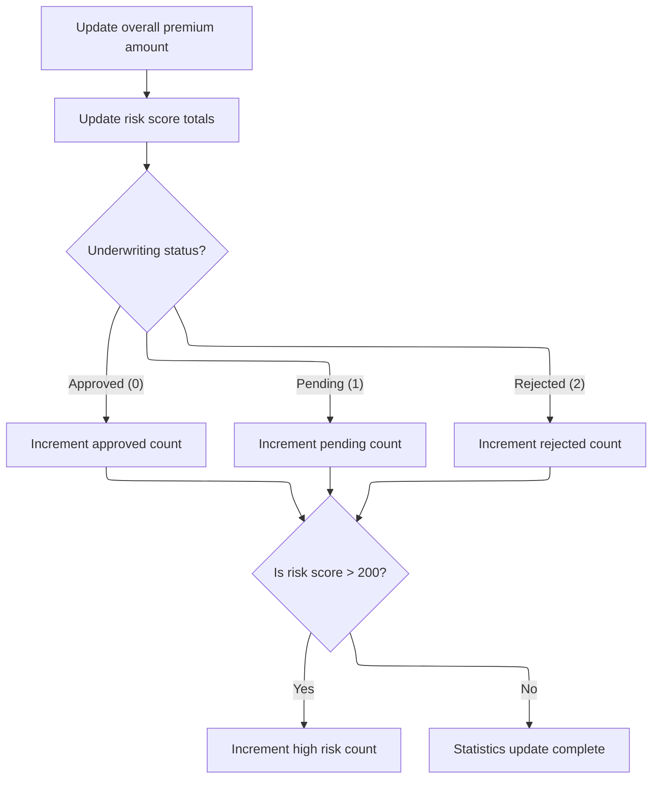

This section updates application-level statistics after processing a policy. It ensures that all relevant counters and totals reflect the latest policy outcome for accurate reporting.

| Rule ID | Category        | Rule Name                      | Description                                                                                          | Implementation Details                                                                                                                                                         |
| ------- | --------------- | ------------------------------ | ---------------------------------------------------------------------------------------------------- | ------------------------------------------------------------------------------------------------------------------------------------------------------------------------------ |
| BR-001  | Calculation     | Accumulate premium total       | Add the current policy's total premium amount to the running total of all premiums.                  | The premium total is a numeric value with up to 12 digits and 2 decimal places. The running total is updated by adding the current policy's premium to the accumulated amount. |
| BR-002  | Calculation     | Accumulate risk score total    | Add the current policy's base risk score to the running total of all risk scores.                    | The risk score is a numeric value with up to 3 digits. The running total is updated by adding the current policy's risk score to the accumulated amount.                       |
| BR-003  | Decision Making | Underwriting decision counters | Increment the approved, pending, or rejected counter based on the underwriting status of the policy. | The counters are numeric values with up to 6 digits. Only one counter is incremented per policy, based on its status: approved (0), pending (1), or rejected (2).              |
| BR-004  | Decision Making | High risk policy counter       | Increment the high-risk counter if the policy's base risk score is greater than 200.                 | The high-risk counter is a numeric value with up to 6 digits. The threshold for high risk is a base risk score greater than 200.                                               |

<SwmSnippet path="/base/src/LGAPDB01.cbl" line="365">

---

In <SwmToken path="base/src/LGAPDB01.cbl" pos="365:1:5" line-data="       P011F-UPDATE-STATISTICS.">`P011F-UPDATE-STATISTICS`</SwmToken>, we add the premium and risk score to running totals, then increment the approved, pending, or rejected counters based on <SwmToken path="base/src/LGAPDB01.cbl" pos="369:3:5" line-data="           EVALUATE WS-STAT">`WS-STAT`</SwmToken>. This keeps the stats aligned with each policy's outcome.

```cobol
       P011F-UPDATE-STATISTICS.
           ADD WS-TOT-PREM TO WS-TOTAL-PREMIUM-AMT
           ADD WS-BASE-RISK-SCR TO WS-CONTROL-TOTALS
           
           EVALUATE WS-STAT
               WHEN 0 ADD 1 TO WS-APPROVED-CNT
               WHEN 1 ADD 1 TO WS-PENDING-CNT
               WHEN 2 ADD 1 TO WS-REJECTED-CNT
           END-EVALUATE
```

---

</SwmSnippet>

<SwmSnippet path="/base/src/LGAPDB01.cbl" line="375">

---

After updating the main counters, if the risk score is over 200, we increment the high-risk count. This lets us track how many policies fall into the high-risk bucket for later reporting.

```cobol
           IF WS-BASE-RISK-SCR > 200
               ADD 1 TO WS-HIGH-RISK-CNT
           END-IF.
```

---

</SwmSnippet>

## Routing Valid Records by Policy Type

This section routes valid records by policy type, explicitly rejecting non-commercial policies and marking them as unsupported in the output.

| Rule ID | Category        | Rule Name                             | Description                                                                                                           | Implementation Details                                                                                                                                                                                                                                                                                                                                                                                                                    |
| ------- | --------------- | ------------------------------------- | --------------------------------------------------------------------------------------------------------------------- | ----------------------------------------------------------------------------------------------------------------------------------------------------------------------------------------------------------------------------------------------------------------------------------------------------------------------------------------------------------------------------------------------------------------------------------------- |
| BR-001  | Calculation     | Zero premiums for non-commercial      | All premium and risk score fields are set to zero for non-commercial policies.                                        | Premium and risk score fields are numeric and set to zero. This applies to fire, crime, flood, weather, total premium, and risk score fields.                                                                                                                                                                                                                                                                                             |
| BR-002  | Decision Making | Non-commercial policy rejection       | Non-commercial policies are rejected and marked as unsupported, with a fixed rejection reason provided in the output. | The output status is set to 'UNSUPPORTED'. The rejection reason is 'Only Commercial policies supported in this version'. All premium and risk fields are set to zero. Customer and property details are copied from the input. The output format includes string fields for customer and property details, numeric fields for premiums and risk scores (all set to zero), a status field (string), and a rejection reason field (string). |
| BR-003  | Writing Output  | Copy input details for non-commercial | Customer and property details are copied from the input to the output for non-commercial policies.                    | Customer and property details are alphanumeric fields copied directly from input to output.                                                                                                                                                                                                                                                                                                                                               |

<SwmSnippet path="/base/src/LGAPDB01.cbl" line="379">

---

<SwmToken path="base/src/LGAPDB01.cbl" pos="379:1:7" line-data="       P012-PROCESS-NON-COMMERCIAL.">`P012-PROCESS-NON-COMMERCIAL`</SwmToken> copies customer and property details to the output, sets all premiums and risk scores to zero, marks the status as 'UNSUPPORTED', and writes a fixed rejection reason. This is how the repo handles non-commercial policies—just rejects them outright.

```cobol
       P012-PROCESS-NON-COMMERCIAL.
           MOVE IN-CUSTOMER-NUM TO OUT-CUSTOMER-NUM
           MOVE IN-PROPERTY-TYPE TO OUT-PROPERTY-TYPE
           MOVE IN-POSTCODE TO OUT-POSTCODE
           MOVE ZERO TO OUT-RISK-SCORE
           MOVE ZERO TO OUT-FIRE-PREMIUM
           MOVE ZERO TO OUT-CRIME-PREMIUM
           MOVE ZERO TO OUT-FLOOD-PREMIUM
           MOVE ZERO TO OUT-WEATHER-PREMIUM
           MOVE ZERO TO OUT-TOTAL-PREMIUM
           MOVE 'UNSUPPORTED' TO OUT-STATUS
           MOVE 'Only Commercial policies supported in this version' 
                TO OUT-REJECT-REASON
           WRITE OUTPUT-RECORD.
```

---

</SwmSnippet>

&nbsp;

*This is an auto-generated document by Swimm 🌊 and has not yet been verified by a human*

<SwmMeta version="3.0.0" repo-id="Z2l0aHViJTNBJTNBU3dpbW1pby1nZW5hcHAtaG91c2UlM0ElM0FHaXJpLVN3aW1t" repo-name="Swimmio-genapp-house"><sup>Powered by [Swimm](https://app.swimm.io/)</sup></SwmMeta>
