# Overview

This document explains the flow of processing insurance policy applications in batch mode. The system loads configuration-driven thresholds, validates each record, routes valid commercial policies through risk assessment and premium calculation, and updates business statistics. Approved policies undergo enhanced actuarial processing, while error records are marked and rejection reasons are recorded.

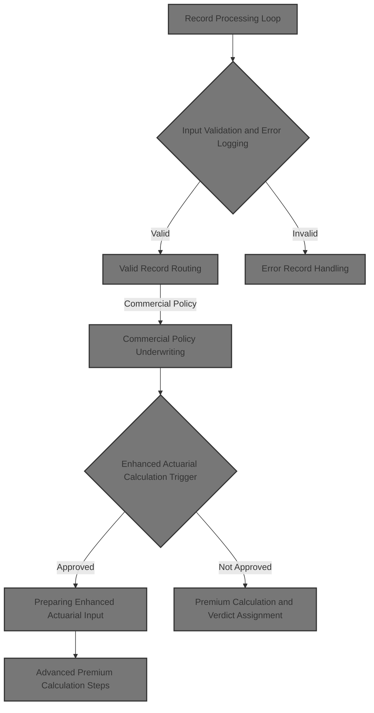
```mermaid
flowchart TD
    node1["Record Processing Loop"]:::HeadingStyle
    click node1 goToHeading "Record Processing Loop"
    node1 --> node2{"Input Validation and Error Logging"}:::HeadingStyle
    click node2 goToHeading "Input Validation and Error Logging"
    node2 -->|"Valid"| node3["Valid Record Routing"]:::HeadingStyle
    node2 -->|"Invalid"| node4["Error Record Handling"]:::HeadingStyle
    click node3 goToHeading "Valid Record Routing"
    click node4 goToHeading "Error Record Handling"
    node3 -->|"Commercial Policy"| node5["Commercial Policy Underwriting"]:::HeadingStyle
    click node5 goToHeading "Commercial Policy Underwriting"
    node5 --> node6{"Enhanced Actuarial Calculation Trigger"}:::HeadingStyle
    click node6 goToHeading "Enhanced Actuarial Calculation Trigger"
    node6 -->|"Approved"| node7["Preparing Enhanced Actuarial Input"]:::HeadingStyle
    node6 -->|"Not Approved"| node8["Premium Calculation and Verdict Assignment"]:::HeadingStyle
    click node7 goToHeading "Preparing Enhanced Actuarial Input"
    click node8 goToHeading "Premium Calculation and Verdict Assignment"
    node7 --> node9["Advanced Premium Calculation Steps"]:::HeadingStyle
    click node9 goToHeading "Advanced Premium Calculation Steps"
classDef HeadingStyle fill:#777777,stroke:#333,stroke-width:2px;
```

## Dependencies

### Programs

- <SwmToken path="base/src/LGAPDB01.cbl" pos="2:6:6" line-data="       PROGRAM-ID. LGAPDB01.">`LGAPDB01`</SwmToken> (<SwmPath>[base/src/LGAPDB01.cbl](base/src/LGAPDB01.cbl)</SwmPath>)
- <SwmToken path="base/src/LGAPDB01.cbl" pos="269:4:4" line-data="           CALL &#39;LGAPDB02&#39; USING IN-PROPERTY-TYPE, IN-POSTCODE, ">`LGAPDB02`</SwmToken> (<SwmPath>[base/src/LGAPDB02.cbl](base/src/LGAPDB02.cbl)</SwmPath>)
- <SwmToken path="base/src/LGAPDB01.cbl" pos="276:4:4" line-data="           CALL &#39;LGAPDB03&#39; USING WS-BASE-RISK-SCR, IN-FIRE-PERIL, ">`LGAPDB03`</SwmToken> (<SwmPath>[base/src/LGAPDB03.cbl](base/src/LGAPDB03.cbl)</SwmPath>)
- <SwmToken path="base/src/LGAPDB01.cbl" pos="313:4:4" line-data="               CALL &#39;LGAPDB04&#39; USING LK-INPUT-DATA, LK-COVERAGE-DATA, ">`LGAPDB04`</SwmToken> (<SwmPath>[base/src/LGAPDB04.cbl](base/src/LGAPDB04.cbl)</SwmPath>)

### Copybooks

- SQLCA
- <SwmToken path="base/src/LGAPDB01.cbl" pos="35:3:3" line-data="           COPY INPUTREC2.">`INPUTREC2`</SwmToken> (<SwmPath>[base/src/INPUTREC2.cpy](base/src/INPUTREC2.cpy)</SwmPath>)
- OUTPUTREC (<SwmPath>[base/src/OUTPUTREC.cpy](base/src/OUTPUTREC.cpy)</SwmPath>)
- WORKSTOR (<SwmPath>[base/src/WORKSTOR.cpy](base/src/WORKSTOR.cpy)</SwmPath>)
- LGAPACT (<SwmPath>[base/src/LGAPACT.cpy](base/src/LGAPACT.cpy)</SwmPath>)

# Where is this program used?

This program is used multiple times in the codebase as represented in the following diagram:

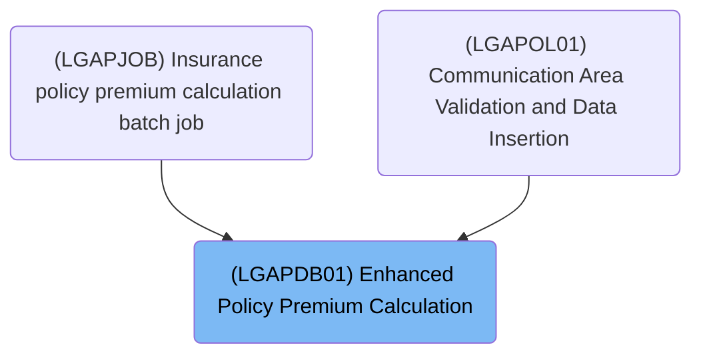
```mermaid
graph TD
  or44l("(LGAPJOB) Insurance policy premium calculation batch job") --> 3n1en("(LGAPDB01) Enhanced Policy Premium Calculation"):::currentEntity
click or44l openCode "base/cntl/lgapjob.jcl:1"
py8ea("(LGAPOL01) Communication Area Validation and Data Insertion") --> 3n1en("(LGAPDB01) Enhanced Policy Premium Calculation"):::currentEntity
click py8ea openCode "base/src/lgapol01.cbl:1"
  
  
click 3n1en openCode "base/src/LGAPDB01.cbl:1"
    classDef currentEntity color:#000000,fill:#7CB9F4

%% Swimm:
%% graph TD
%%   or44l("(LGAPJOB) Insurance policy premium calculation batch job") --> 3n1en("(<SwmToken path="base/src/LGAPDB01.cbl" pos="2:6:6" line-data="       PROGRAM-ID. LGAPDB01.">`LGAPDB01`</SwmToken>) Enhanced Policy Premium Calculation"):::currentEntity
%% click or44l openCode "<SwmPath>[base/cntl/lgapjob.jcl](base/cntl/lgapjob.jcl)</SwmPath>:1"
%% py8ea("(LGAPOL01) Communication Area Validation and Data Insertion") --> 3n1en("(<SwmToken path="base/src/LGAPDB01.cbl" pos="2:6:6" line-data="       PROGRAM-ID. LGAPDB01.">`LGAPDB01`</SwmToken>) Enhanced Policy Premium Calculation"):::currentEntity
%% click py8ea openCode "<SwmPath>[base/src/lgapol01.cbl](base/src/lgapol01.cbl)</SwmPath>:1"
%%   
%%   
%% click 3n1en openCode "<SwmPath>[base/src/LGAPDB01.cbl](base/src/LGAPDB01.cbl)</SwmPath>:1"
%%     classDef currentEntity color:#000000,fill:#7CB9F4
```

## Detailed View of the Program's Functionality

a. Main Orchestration and Setup

The main program begins by setting up the environment and file assignments for input, output, configuration, rates, and summary files. It defines the structure for each file and the working storage areas for counters, configuration values, and actuarial interface data. The main procedure starts by initializing all counters and working areas, displaying startup messages, and capturing the processing date. It then attempts to load configuration values, either from a file or by falling back to defaults if the file is unavailable. After configuration, it opens all necessary files and writes headers to the output file. The main processing loop then reads each input record, validates it, processes valid records, handles errors, and continues until all records are processed. Finally, it closes files, generates a summary report, and displays processing statistics.

b. Configuration Loading and Fallback

The configuration loading routine opens the configuration file and checks its status. If the file is not available, it displays a warning and loads default values. If the file is available, it reads specific configuration values such as maximum risk score and minimum premium, validating that they are numeric before storing them for later use. These values are critical for downstream calculations and business rules.

c. File Preparation and Output Structuring

The file preparation routine opens the input, output, and summary files, checking for errors and displaying messages if any file cannot be opened. Once files are open, it writes column headers to the output file to ensure the output structure is correct before processing any data.

d. Record Processing Loop

For each input record, the program increments the record count and validates the record. Validation checks include policy type, customer number, coverage limits, and total coverage against the maximum allowed. If the record passes validation, it is routed for processing; otherwise, it is handled as an error. Valid records are further processed based on whether they are commercial policies or not. Commercial policies undergo full underwriting and actuarial calculations, while non-commercial policies are marked as unsupported.

e. Input Validation and Error Logging

Validation starts by checking if the policy type is one of the supported types. If not, an error is logged. It then checks for the presence of a customer number and at least one coverage limit. If any required field is missing or invalid, an error is logged. If the total coverage exceeds the maximum allowed, a warning is logged but processing continues. Errors are stored in arrays, with a limit on the number of errors per record.

f. Valid Record Routing

If the record is valid and the policy is commercial, it is routed to the commercial processing routine and the processed count is incremented. If the policy is not commercial, it is routed to a handler that marks it as unsupported and increments the error count.

g. Commercial Policy Underwriting

Commercial policy processing begins with a risk score calculation using an external program, which considers property, location, and customer data. The risk score is then used in a basic premium calculation, also via an external program. The underwriting decision is made based on the risk score and premium, and if approved, an enhanced actuarial calculation is performed. The results are then used to apply business rules, write the output record, and update statistics.

h. Risk Score Calculation via External Program

The risk score calculation program fetches risk factors for fire and crime from a database, using default values if unavailable. It then calculates the risk score based on property type, postcode, coverage amounts, location, and customer history. Each factor contributes to the final risk score, with specific adjustments for property type, postcode, coverage, urban/rural location, and customer history.

i. Risk Factor Fetch and Score Computation

Risk factors are fetched from the database for fire and crime perils. If the database query fails, default values are used. The risk score is then computed by starting with a base value and adding or subtracting points based on property type, postcode, coverage limits, location, and customer history.

j. Risk Score Adjustments and Coverage Checks

The risk score is initialized and adjusted based on property type, postcode, and coverage amounts. If the maximum coverage exceeds a threshold, additional points are added. Location risk is assessed based on latitude and longitude, with urban areas receiving specific adjustments. Customer history is evaluated, with different codes resulting in different risk score modifications.

k. Basic Premium Calculation via External Program

The basic premium calculation program uses the risk score and peril selections to determine the premium amounts for each peril. It also sets the underwriting decision and discount factor based on the risk score and peril selections. The program fetches risk factors, determines the verdict, and calculates premiums for fire, crime, flood, and weather perils, applying a discount if all perils are selected.

l. Premium Calculation and Verdict Assignment

The program determines the underwriting verdict based on the risk score, setting the status as rejected, pending, or approved. Premiums are calculated for each peril using the risk score, risk factors, and discount factor. The total premium is computed as the sum of individual premiums.

m. Enhanced Actuarial Calculation Trigger

If the underwriting decision is approved and the total premium exceeds the minimum premium, an enhanced actuarial calculation is performed using another external program. The enhanced calculation may update the premium breakdown if it results in higher values.

n. Preparing Enhanced Actuarial Input

The enhanced actuarial calculation routine prepares all relevant input and coverage data, mapping them into structures expected by the actuarial calculation program. It checks if the initial premium exceeds the minimum, and if so, calls the actuarial calculation program. If the enhanced premium is higher, it updates the premium fields and modifiers.

o. Advanced Premium Calculation Steps

The advanced actuarial calculation program initializes exposures and insured values, loads rates, calculates exposures, applies experience and schedule modifiers, computes base and catastrophe premiums, adds expenses and profit, applies discounts and taxes, and finalizes the premium. Experience modifiers are based on years in business and claims history, with caps and minimums applied. Discounts are calculated for multi-peril, claims-free, and deductible credits, with a cap on the total discount. The final premium and rate factor are computed, with caps applied to prevent excessive premiums.

p. Finalizing Commercial Policy Processing

After all calculations, business rules are applied to determine the final underwriting decision, discount eligibility, and discount factor. The transaction outcome is recorded, and business statistics are updated to reflect totals, counts, and risk categories.

q. Updating Underwriting Metrics

The statistics update routine adds the current premium and risk score to running totals and increments counts for approved, pending, or rejected policies based on the status. If the risk score exceeds a threshold, the high-risk count is incremented.

r. Error Record Handling

For error records, customer and property details are copied to the output, all premium fields are set to zero, the status is marked as 'ERROR', and the rejection reason is set to the first error message. The record is written to the output, and the error count is incremented.

# Rule Definition

| Paragraph Name                                                                                                                                                                                                                                                                                                                                                                                                                                                                                                                                                                                                                                                                                                                                               | Rule ID | Category          | Description                                                                                                                                                                                                                                                                                                                                                                                                                                                                                                                                                                                                                                                                                                                                                                                                                                                                                                                                                | Conditions                                                                                                                                                                                                                                                                                                                                                                                                                                                                                                                                                                                                                                           | Remarks                                                                                                                                                                                                                                                                                                                                                                                                                                                                                                                                                                                                                                                                                                                                                                                                                                                                                                                                                                                                                                                                                                                                                                                                                                                                                                                                                                                                                                            |
| ------------------------------------------------------------------------------------------------------------------------------------------------------------------------------------------------------------------------------------------------------------------------------------------------------------------------------------------------------------------------------------------------------------------------------------------------------------------------------------------------------------------------------------------------------------------------------------------------------------------------------------------------------------------------------------------------------------------------------------------------------------ | ------- | ----------------- | ---------------------------------------------------------------------------------------------------------------------------------------------------------------------------------------------------------------------------------------------------------------------------------------------------------------------------------------------------------------------------------------------------------------------------------------------------------------------------------------------------------------------------------------------------------------------------------------------------------------------------------------------------------------------------------------------------------------------------------------------------------------------------------------------------------------------------------------------------------------------------------------------------------------------------------------------------------- | ---------------------------------------------------------------------------------------------------------------------------------------------------------------------------------------------------------------------------------------------------------------------------------------------------------------------------------------------------------------------------------------------------------------------------------------------------------------------------------------------------------------------------------------------------------------------------------------------------------------------------------------------------- | -------------------------------------------------------------------------------------------------------------------------------------------------------------------------------------------------------------------------------------------------------------------------------------------------------------------------------------------------------------------------------------------------------------------------------------------------------------------------------------------------------------------------------------------------------------------------------------------------------------------------------------------------------------------------------------------------------------------------------------------------------------------------------------------------------------------------------------------------------------------------------------------------------------------------------------------------------------------------------------------------------------------------------------------------------------------------------------------------------------------------------------------------------------------------------------------------------------------------------------------------------------------------------------------------------------------------------------------------------------------------------------------------------------------------------------------------- |
| <SwmToken path="base/src/LGAPDB01.cbl" pos="92:3:7" line-data="           PERFORM P003-LOAD-CONFIG">`P003-LOAD-CONFIG`</SwmToken>, <SwmToken path="base/src/LGAPDB01.cbl" pos="116:3:7" line-data="               PERFORM P004-SET-DEFAULTS">`P004-SET-DEFAULTS`</SwmToken>, <SwmToken path="base/src/LGAPDB01.cbl" pos="118:3:9" line-data="               PERFORM P004-READ-CONFIG-VALUES">`P004-READ-CONFIG-VALUES`</SwmToken>                                                                                                                                                                                                                                                                                                                            | RL-001  | Conditional Logic | The program must read configuration values from <SwmToken path="base/src/LGAPDB01.cbl" pos="17:12:14" line-data="           SELECT CONFIG-FILE ASSIGN TO &#39;CONFIG.DAT&#39;">`CONFIG.DAT`</SwmToken> before processing any input records. If <SwmToken path="base/src/LGAPDB01.cbl" pos="17:12:14" line-data="           SELECT CONFIG-FILE ASSIGN TO &#39;CONFIG.DAT&#39;">`CONFIG.DAT`</SwmToken> is missing or a value is not numeric, defaults are used: <SwmToken path="base/src/LGAPDB01.cbl" pos="126:4:4" line-data="           MOVE &#39;MAX_RISK_SCORE&#39; TO CONFIG-KEY">`MAX_RISK_SCORE`</SwmToken> = 250, <SwmToken path="base/src/LGAPDB01.cbl" pos="132:4:4" line-data="           MOVE &#39;MIN_PREMIUM&#39; TO CONFIG-KEY">`MIN_PREMIUM`</SwmToken> = <SwmToken path="base/src/LGAPDB01.cbl" pos="84:19:21" line-data="           05 WS-MIN-PREMIUM           PIC 9(6)V99 VALUE 500.00.">`500.00`</SwmToken>, MAX_TIV = 50,000,000.00. | <SwmToken path="base/src/LGAPDB01.cbl" pos="17:12:14" line-data="           SELECT CONFIG-FILE ASSIGN TO &#39;CONFIG.DAT&#39;">`CONFIG.DAT`</SwmToken> is missing or values are not numeric.                                                                                                                                                                                                                                                                                                                                                                                                                                                         | Default values: <SwmToken path="base/src/LGAPDB01.cbl" pos="126:4:4" line-data="           MOVE &#39;MAX_RISK_SCORE&#39; TO CONFIG-KEY">`MAX_RISK_SCORE`</SwmToken> = 250, <SwmToken path="base/src/LGAPDB01.cbl" pos="132:4:4" line-data="           MOVE &#39;MIN_PREMIUM&#39; TO CONFIG-KEY">`MIN_PREMIUM`</SwmToken> = <SwmToken path="base/src/LGAPDB01.cbl" pos="84:19:21" line-data="           05 WS-MIN-PREMIUM           PIC 9(6)V99 VALUE 500.00.">`500.00`</SwmToken>, MAX_TIV = 50,000,000.00. Values are numeric if <SwmToken path="base/src/LGAPDB01.cbl" pos="44:3:5" line-data="           05 CONFIG-TYPE              PIC X(1).">`CONFIG-TYPE`</SwmToken> is 'N'.                                                                                                                                                                                                                                                                                                                                                                                                                                                                                                                                                                                                                                                                                                                                                                |
| <SwmToken path="base/src/LGAPDB01.cbl" pos="93:3:7" line-data="           PERFORM P005-OPEN-FILES">`P005-OPEN-FILES`</SwmToken>, <SwmToken path="base/src/LGAPDB01.cbl" pos="142:3:7" line-data="           PERFORM P005D-WRITE-HEADERS.">`P005D-WRITE-HEADERS`</SwmToken>                                                                                                                                                                                                                                                                                                                                                                                                                                                                                   | RL-002  | Data Assignment   | The program must open <SwmToken path="base/src/LGAPDB01.cbl" pos="9:12:14" line-data="           SELECT INPUT-FILE ASSIGN TO &#39;INPUT.DAT&#39;">`INPUT.DAT`</SwmToken>, <SwmToken path="base/src/LGAPDB01.cbl" pos="13:12:14" line-data="           SELECT OUTPUT-FILE ASSIGN TO &#39;OUTPUT.DAT&#39;">`OUTPUT.DAT`</SwmToken>, and <SwmToken path="base/src/LGAPDB01.cbl" pos="27:12:14" line-data="           SELECT SUMMARY-FILE ASSIGN TO &#39;SUMMARY.DAT&#39;">`SUMMARY.DAT`</SwmToken> files before processing records. <SwmToken path="base/src/LGAPDB01.cbl" pos="13:12:14" line-data="           SELECT OUTPUT-FILE ASSIGN TO &#39;OUTPUT.DAT&#39;">`OUTPUT.DAT`</SwmToken> must begin with a header line matching the output field order.                                                                                                                                                                                                     | Before processing records.                                                                                                                                                                                                                                                                                                                                                                                                                                                                                                                                                                                                                           | Header fields: CUSTOMER, <SwmToken path="base/src/LGAPDB01.cbl" pos="245:5:7" line-data="           MOVE IN-PROPERTY-TYPE TO OUT-PROPERTY-TYPE">`PROPERTY-TYPE`</SwmToken>, POSTCODE, RSK, <SwmToken path="base/src/LGAPDB01.cbl" pos="169:4:6" line-data="           MOVE &#39;FIRE-PREM&#39; TO OUT-FIRE-PREMIUM">`FIRE-PREM`</SwmToken>, <SwmToken path="base/src/LGAPDB01.cbl" pos="170:4:6" line-data="           MOVE &#39;CRIME-PREM&#39; TO OUT-CRIME-PREMIUM">`CRIME-PREM`</SwmToken>, <SwmToken path="base/src/LGAPDB01.cbl" pos="171:4:6" line-data="           MOVE &#39;FLOOD-PREM&#39; TO OUT-FLOOD-PREMIUM">`FLOOD-PREM`</SwmToken>, <SwmToken path="base/src/LGAPDB01.cbl" pos="172:4:6" line-data="           MOVE &#39;WEATHER-PREM&#39; TO OUT-WEATHER-PREMIUM">`WEATHER-PREM`</SwmToken>, <SwmToken path="base/src/LGAPDB01.cbl" pos="252:9:11" line-data="           MOVE ZERO TO OUT-TOTAL-PREMIUM">`TOTAL-PREMIUM`</SwmToken>, STATUS, REJECTION REASON. All fields are alphanumeric except premiums and risk score, which are numeric.                                                                                                                                                                                                                                                                                                                                                                                     |
| <SwmToken path="base/src/LGAPDB01.cbl" pos="182:3:9" line-data="               PERFORM P008-VALIDATE-INPUT-RECORD">`P008-VALIDATE-INPUT-RECORD`</SwmToken>, <SwmToken path="base/src/LGAPDB01.cbl" pos="201:3:7" line-data="               PERFORM P008A-LOG-ERROR WITH ">`P008A-LOG-ERROR`</SwmToken>, <SwmToken path="base/src/LGAPDB01.cbl" pos="186:3:9" line-data="                   PERFORM P010-PROCESS-ERROR-RECORD">`P010-PROCESS-ERROR-RECORD`</SwmToken>                                                                                                                                                                                                                                                                                         | RL-003  | Conditional Logic | Each record is validated for policy type, customer number, and coverage limits. Errors are logged and output fields are zeroed with appropriate rejection reason.                                                                                                                                                                                                                                                                                                                                                                                                                                                                                                                                                                                                                                                                                                                                                                                          | <SwmToken path="base/src/LGAPDB01.cbl" pos="202:10:14" line-data="                   &#39;POL001&#39; &#39;F&#39; &#39;IN-POLICY-TYPE&#39; ">`IN-POLICY-TYPE`</SwmToken> not COMMERCIAL/PERSONAL/FARM, <SwmToken path="base/src/LGAPDB01.cbl" pos="206:3:7" line-data="           IF IN-CUSTOMER-NUM = SPACES">`IN-CUSTOMER-NUM`</SwmToken> blank, both <SwmToken path="base/src/LGAPDB01.cbl" pos="212:3:7" line-data="           IF IN-BUILDING-LIMIT = ZERO AND ">`IN-BUILDING-LIMIT`</SwmToken> and <SwmToken path="base/src/LGAPDB01.cbl" pos="213:1:5" line-data="              IN-CONTENTS-LIMIT = ZERO">`IN-CONTENTS-LIMIT`</SwmToken> zero. | <SwmToken path="base/src/LGAPDB01.cbl" pos="253:9:11" line-data="           MOVE &#39;ERROR&#39; TO OUT-STATUS">`OUT-STATUS`</SwmToken> set to 'ERROR', <SwmToken path="base/src/LGAPDB01.cbl" pos="254:15:19" line-data="           MOVE WS-ERROR-MESSAGE (1) TO OUT-REJECT-REASON">`OUT-REJECT-REASON`</SwmToken> set to specific error message. All premium and risk score fields are zeroed.                                                                                                                                                                                                                                                                                                                                                                                                                                                                                                                                                                                                                                                                                                                                                                                                                                                                                                                                                                                                                                                   |
| <SwmToken path="base/src/LGAPDB01.cbl" pos="182:3:9" line-data="               PERFORM P008-VALIDATE-INPUT-RECORD">`P008-VALIDATE-INPUT-RECORD`</SwmToken>                                                                                                                                                                                                                                                                                                                                                                                                                                                                                                                                                                                                   | RL-004  | Conditional Logic | If the sum of <SwmToken path="base/src/LGAPDB01.cbl" pos="212:3:7" line-data="           IF IN-BUILDING-LIMIT = ZERO AND ">`IN-BUILDING-LIMIT`</SwmToken>, <SwmToken path="base/src/LGAPDB01.cbl" pos="213:1:5" line-data="              IN-CONTENTS-LIMIT = ZERO">`IN-CONTENTS-LIMIT`</SwmToken>, and <SwmToken path="base/src/LGAPDB01.cbl" pos="220:1:5" line-data="              IN-BI-LIMIT &gt; WS-MAX-TIV">`IN-BI-LIMIT`</SwmToken> exceeds MAX_TIV, set <SwmToken path="base/src/LGAPDB01.cbl" pos="253:9:11" line-data="           MOVE &#39;ERROR&#39; TO OUT-STATUS">`OUT-STATUS`</SwmToken> to 'WARNING' and <SwmToken path="base/src/LGAPDB01.cbl" pos="254:15:19" line-data="           MOVE WS-ERROR-MESSAGE (1) TO OUT-REJECT-REASON">`OUT-REJECT-REASON`</SwmToken> to 'Coverage exceeds maximum TIV', but continue processing.                                                                                                           | Sum of coverage limits > MAX_TIV.                                                                                                                                                                                                                                                                                                                                                                                                                                                                                                                                                                                                                    | MAX_TIV default is 50,000,000.00 unless overridden by config.                                                                                                                                                                                                                                                                                                                                                                                                                                                                                                                                                                                                                                                                                                                                                                                                                                                                                                                                                                                                                                                                                                                                                                                                                                                                                                                                                                                      |
| <SwmToken path="base/src/LGAPDB01.cbl" pos="184:3:9" line-data="                   PERFORM P009-PROCESS-VALID-RECORD">`P009-PROCESS-VALID-RECORD`</SwmToken>, <SwmToken path="base/src/LGAPDB01.cbl" pos="239:3:9" line-data="               PERFORM P012-PROCESS-NON-COMMERCIAL">`P012-PROCESS-NON-COMMERCIAL`</SwmToken>                                                                                                                                                                                                                                                                                                                                                                                                                                   | RL-005  | Conditional Logic | Only COMMERCIAL policies are processed for premium calculation. Other types are marked unsupported with zeroed fields and rejection reason.                                                                                                                                                                                                                                                                                                                                                                                                                                                                                                                                                                                                                                                                                                                                                                                                                | <SwmToken path="base/src/LGAPDB01.cbl" pos="202:10:14" line-data="                   &#39;POL001&#39; &#39;F&#39; &#39;IN-POLICY-TYPE&#39; ">`IN-POLICY-TYPE`</SwmToken> is not COMMERCIAL.                                                                                                                                                                                                                                                                                                                                                                                                                                                          | <SwmToken path="base/src/LGAPDB01.cbl" pos="253:9:11" line-data="           MOVE &#39;ERROR&#39; TO OUT-STATUS">`OUT-STATUS`</SwmToken> set to 'UNSUPPORTED', <SwmToken path="base/src/LGAPDB01.cbl" pos="254:15:19" line-data="           MOVE WS-ERROR-MESSAGE (1) TO OUT-REJECT-REASON">`OUT-REJECT-REASON`</SwmToken> set to 'Non-commercial policy'. Premium and risk score fields are zeroed.                                                                                                                                                                                                                                                                                                                                                                                                                                                                                                                                                                                                                                                                                                                                                                                                                                                                                                                                                                                                                                                |
| <SwmToken path="base/src/LGAPDB01.cbl" pos="259:3:9" line-data="           PERFORM P011A-CALCULATE-RISK-SCORE">`P011A-CALCULATE-RISK-SCORE`</SwmToken> (calls <SwmToken path="base/src/LGAPDB01.cbl" pos="269:4:4" line-data="           CALL &#39;LGAPDB02&#39; USING IN-PROPERTY-TYPE, IN-POSTCODE, ">`LGAPDB02`</SwmToken>), <SwmToken path="base/src/LGAPDB01.cbl" pos="269:4:4" line-data="           CALL &#39;LGAPDB02&#39; USING IN-PROPERTY-TYPE, IN-POSTCODE, ">`LGAPDB02`</SwmToken> <SwmToken path="base/src/LGAPDB02.cbl" pos="39:1:3" line-data="       MAIN-LOGIC.">`MAIN-LOGIC`</SwmToken>, <SwmToken path="base/src/LGAPDB01.cbl" pos="259:5:9" line-data="           PERFORM P011A-CALCULATE-RISK-SCORE">`CALCULATE-RISK-SCORE`</SwmToken> | RL-006  | Computation       | Risk score is calculated starting from 100, with adjustments for property type, postcode, coverage amounts, location, and customer history.                                                                                                                                                                                                                                                                                                                                                                                                                                                                                                                                                                                                                                                                                                                                                                                                                | Valid COMMERCIAL policy record.                                                                                                                                                                                                                                                                                                                                                                                                                                                                                                                                                                                                                      | Adjustments: WAREHOUSE +50, FACTORY +75, OFFICE +25, RETAIL +40, OTHER +30; postcode 'FL'/'CR' +30; any coverage > 500,000 +15; location: NYC/LA +10, continental US +5, else +20; customer history: 'N' +10, 'G' -5, 'R' +25, other +10.                                                                                                                                                                                                                                                                                                                                                                                                                                                                                                                                                                                                                                                                                                                                                                                                                                                                                                                                                                                                                                                                                                                                                                                                          |
| <SwmToken path="base/src/LGAPDB01.cbl" pos="260:3:9" line-data="           PERFORM P011B-BASIC-PREMIUM-CALC">`P011B-BASIC-PREMIUM-CALC`</SwmToken> (calls <SwmToken path="base/src/LGAPDB01.cbl" pos="276:4:4" line-data="           CALL &#39;LGAPDB03&#39; USING WS-BASE-RISK-SCR, IN-FIRE-PERIL, ">`LGAPDB03`</SwmToken>), <SwmToken path="base/src/LGAPDB01.cbl" pos="276:4:4" line-data="           CALL &#39;LGAPDB03&#39; USING WS-BASE-RISK-SCR, IN-FIRE-PERIL, ">`LGAPDB03`</SwmToken> <SwmToken path="base/src/LGAPDB03.cbl" pos="45:3:5" line-data="           PERFORM CALCULATE-PREMIUMS">`CALCULATE-PREMIUMS`</SwmToken>                                                                                                                        | RL-007  | Computation       | Premiums are calculated for each peril using risk score, peril factor, peril selection, and discount factor. Total premium is sum of all perils.                                                                                                                                                                                                                                                                                                                                                                                                                                                                                                                                                                                                                                                                                                                                                                                                           | Valid COMMERCIAL policy record.                                                                                                                                                                                                                                                                                                                                                                                                                                                                                                                                                                                                                      | Risk factors: Fire = <SwmToken path="base/src/LGAPDB02.cbl" pos="54:3:5" line-data="               MOVE 0.80 TO WS-FIRE-FACTOR">`0.80`</SwmToken>, Crime = <SwmToken path="base/src/LGAPDB02.cbl" pos="66:3:5" line-data="               MOVE 0.60 TO WS-CRIME-FACTOR">`0.60`</SwmToken>, Flood = <SwmToken path="base/src/LGAPDB02.cbl" pos="16:15:17" line-data="       01  WS-FLOOD-FACTOR             PIC V99 VALUE 1.20.">`1.20`</SwmToken>, Weather = <SwmToken path="base/src/LGAPDB03.cbl" pos="99:3:5" line-data="             MOVE 0.90 TO LK-DISC-FACT">`0.90`</SwmToken>. Discount factor is <SwmToken path="base/src/LGAPDB03.cbl" pos="99:3:5" line-data="             MOVE 0.90 TO LK-DISC-FACT">`0.90`</SwmToken> if all four perils selected, else <SwmToken path="base/src/LGAPDB03.cbl" pos="93:3:5" line-data="           MOVE 1.00 TO LK-DISC-FACT">`1.00`</SwmToken>. Premium fields are numeric with two decimal places.                                                                                                                                                                                                                                                                                                                                                                                                                                                                                                    |
| <SwmToken path="base/src/LGAPDB01.cbl" pos="264:3:9" line-data="           PERFORM P011D-APPLY-BUSINESS-RULES">`P011D-APPLY-BUSINESS-RULES`</SwmToken>, <SwmToken path="base/src/LGAPDB01.cbl" pos="276:4:4" line-data="           CALL &#39;LGAPDB03&#39; USING WS-BASE-RISK-SCR, IN-FIRE-PERIL, ">`LGAPDB03`</SwmToken> <SwmToken path="base/src/LGAPDB03.cbl" pos="44:3:5" line-data="           PERFORM CALCULATE-VERDICT">`CALCULATE-VERDICT`</SwmToken>                                                                                                                                                                                                                                                                                                | RL-008  | Conditional Logic | If <SwmToken path="base/src/LGAPDB01.cbl" pos="252:7:11" line-data="           MOVE ZERO TO OUT-TOTAL-PREMIUM">`OUT-TOTAL-PREMIUM`</SwmToken> < <SwmToken path="base/src/LGAPDB01.cbl" pos="132:4:4" line-data="           MOVE &#39;MIN_PREMIUM&#39; TO CONFIG-KEY">`MIN_PREMIUM`</SwmToken>, set <SwmToken path="base/src/LGAPDB01.cbl" pos="252:7:11" line-data="           MOVE ZERO TO OUT-TOTAL-PREMIUM">`OUT-TOTAL-PREMIUM`</SwmToken> to <SwmToken path="base/src/LGAPDB01.cbl" pos="132:4:4" line-data="           MOVE &#39;MIN_PREMIUM&#39; TO CONFIG-KEY">`MIN_PREMIUM`</SwmToken> and adjust <SwmToken path="base/src/LGAPDB01.cbl" pos="253:9:11" line-data="           MOVE &#39;ERROR&#39; TO OUT-STATUS">`OUT-STATUS`</SwmToken> to 'PENDING'.                                                                                                                                                                                            | <SwmToken path="base/src/LGAPDB01.cbl" pos="252:7:11" line-data="           MOVE ZERO TO OUT-TOTAL-PREMIUM">`OUT-TOTAL-PREMIUM`</SwmToken> < <SwmToken path="base/src/LGAPDB01.cbl" pos="132:4:4" line-data="           MOVE &#39;MIN_PREMIUM&#39; TO CONFIG-KEY">`MIN_PREMIUM`</SwmToken>.                                                                                                                                                                                                                                                                                                                                                          | <SwmToken path="base/src/LGAPDB01.cbl" pos="132:4:4" line-data="           MOVE &#39;MIN_PREMIUM&#39; TO CONFIG-KEY">`MIN_PREMIUM`</SwmToken> default is <SwmToken path="base/src/LGAPDB01.cbl" pos="84:19:21" line-data="           05 WS-MIN-PREMIUM           PIC 9(6)V99 VALUE 500.00.">`500.00`</SwmToken> unless overridden by config. <SwmToken path="base/src/LGAPDB01.cbl" pos="253:9:11" line-data="           MOVE &#39;ERROR&#39; TO OUT-STATUS">`OUT-STATUS`</SwmToken> set to 'PENDING'.                                                                                                                                                                                                                                                                                                                                                                                                                                                                                                                                                                                                                                                                                                                                                                                                                                                                                                                                             |
| <SwmToken path="base/src/LGAPDB01.cbl" pos="264:3:9" line-data="           PERFORM P011D-APPLY-BUSINESS-RULES">`P011D-APPLY-BUSINESS-RULES`</SwmToken>, <SwmToken path="base/src/LGAPDB01.cbl" pos="276:4:4" line-data="           CALL &#39;LGAPDB03&#39; USING WS-BASE-RISK-SCR, IN-FIRE-PERIL, ">`LGAPDB03`</SwmToken> <SwmToken path="base/src/LGAPDB03.cbl" pos="44:3:5" line-data="           PERFORM CALCULATE-VERDICT">`CALCULATE-VERDICT`</SwmToken>                                                                                                                                                                                                                                                                                                | RL-009  | Conditional Logic | Risk verdict is determined by risk score: >200 = 'REJECTED', >150 = 'PENDING', else 'APPROVED'.                                                                                                                                                                                                                                                                                                                                                                                                                                                                                                                                                                                                                                                                                                                                                                                                                                                            | After risk score calculation.                                                                                                                                                                                                                                                                                                                                                                                                                                                                                                                                                                                                                        | <SwmToken path="base/src/LGAPDB01.cbl" pos="253:9:11" line-data="           MOVE &#39;ERROR&#39; TO OUT-STATUS">`OUT-STATUS`</SwmToken> set to 'REJECTED', 'PENDING', or 'APPROVED' based on thresholds. <SwmToken path="base/src/LGAPDB01.cbl" pos="254:15:19" line-data="           MOVE WS-ERROR-MESSAGE (1) TO OUT-REJECT-REASON">`OUT-REJECT-REASON`</SwmToken> set accordingly.                                                                                                                                                                                                                                                                                                                                                                                                                                                                                                                                                                                                                                                                                                                                                                                                                                                                                                                                                                                                                                                              |
| <SwmToken path="base/src/LGAPDB01.cbl" pos="265:3:9" line-data="           PERFORM P011E-WRITE-OUTPUT-RECORD">`P011E-WRITE-OUTPUT-RECORD`</SwmToken>, <SwmToken path="base/src/LGAPDB01.cbl" pos="186:3:9" line-data="                   PERFORM P010-PROCESS-ERROR-RECORD">`P010-PROCESS-ERROR-RECORD`</SwmToken>, <SwmToken path="base/src/LGAPDB01.cbl" pos="239:3:9" line-data="               PERFORM P012-PROCESS-NON-COMMERCIAL">`P012-PROCESS-NON-COMMERCIAL`</SwmToken>                                                                                                                                                                                                                                                                             | RL-010  | Data Assignment   | Each processed record is written to <SwmToken path="base/src/LGAPDB01.cbl" pos="13:12:14" line-data="           SELECT OUTPUT-FILE ASSIGN TO &#39;OUTPUT.DAT&#39;">`OUTPUT.DAT`</SwmToken> in the defined field order and format.                                                                                                                                                                                                                                                                                                                                                                                                                                                                                                                                                                                                                                                                                                                          | After processing each record.                                                                                                                                                                                                                                                                                                                                                                                                                                                                                                                                                                                                                        | Field order: <SwmToken path="base/src/LGAPDB01.cbl" pos="206:5:7" line-data="           IF IN-CUSTOMER-NUM = SPACES">`CUSTOMER-NUM`</SwmToken>, <SwmToken path="base/src/LGAPDB01.cbl" pos="245:5:7" line-data="           MOVE IN-PROPERTY-TYPE TO OUT-PROPERTY-TYPE">`PROPERTY-TYPE`</SwmToken>, POSTCODE, <SwmToken path="base/src/LGAPDB01.cbl" pos="129:18:20" line-data="               MOVE FUNCTION NUMVAL(CONFIG-VALUE) TO WS-MAX-RISK-SCORE">`RISK-SCORE`</SwmToken>, <SwmToken path="base/src/LGAPDB01.cbl" pos="248:9:11" line-data="           MOVE ZERO TO OUT-FIRE-PREMIUM">`FIRE-PREMIUM`</SwmToken>, <SwmToken path="base/src/LGAPDB01.cbl" pos="249:9:11" line-data="           MOVE ZERO TO OUT-CRIME-PREMIUM">`CRIME-PREMIUM`</SwmToken>, <SwmToken path="base/src/LGAPDB01.cbl" pos="250:9:11" line-data="           MOVE ZERO TO OUT-FLOOD-PREMIUM">`FLOOD-PREMIUM`</SwmToken>, <SwmToken path="base/src/LGAPDB01.cbl" pos="251:9:11" line-data="           MOVE ZERO TO OUT-WEATHER-PREMIUM">`WEATHER-PREMIUM`</SwmToken>, <SwmToken path="base/src/LGAPDB01.cbl" pos="252:9:11" line-data="           MOVE ZERO TO OUT-TOTAL-PREMIUM">`TOTAL-PREMIUM`</SwmToken>, STATUS, <SwmToken path="base/src/LGAPDB01.cbl" pos="254:17:19" line-data="           MOVE WS-ERROR-MESSAGE (1) TO OUT-REJECT-REASON">`REJECT-REASON`</SwmToken>. Numeric fields are right-aligned, two decimal places; alphanumeric fields left-aligned. |
| <SwmToken path="base/src/LGAPDB01.cbl" pos="266:3:7" line-data="           PERFORM P011F-UPDATE-STATISTICS.">`P011F-UPDATE-STATISTICS`</SwmToken>                                                                                                                                                                                                                                                                                                                                                                                                                                                                                                                                                                                                            | RL-011  | Computation       | Running statistics are updated for total records, approved, pending, rejected, error, unsupported, high risk, total premium, and average premium.                                                                                                                                                                                                                                                                                                                                                                                                                                                                                                                                                                                                                                                                                                                                                                                                          | After processing each record.                                                                                                                                                                                                                                                                                                                                                                                                                                                                                                                                                                                                                        | Counters: approved, pending, rejected, error, unsupported, high risk (>200 risk score), total premium, average risk score. All counters are numeric.                                                                                                                                                                                                                                                                                                                                                                                                                                                                                                                                                                                                                                                                                                                                                                                                                                                                                                                                                                                                                                                                                                                                                                                                                                                                                               |
| <SwmToken path="base/src/LGAPDB01.cbl" pos="96:3:7" line-data="           PERFORM P015-GENERATE-SUMMARY">`P015-GENERATE-SUMMARY`</SwmToken>                                                                                                                                                                                                                                                                                                                                                                                                                                                                                                                                                                                                                  | RL-012  | Data Assignment   | At the end of processing, summary lines are written to <SwmToken path="base/src/LGAPDB01.cbl" pos="27:12:14" line-data="           SELECT SUMMARY-FILE ASSIGN TO &#39;SUMMARY.DAT&#39;">`SUMMARY.DAT`</SwmToken>, including counts and totals.                                                                                                                                                                                                                                                                                                                                                                                                                                                                                                                                                                                                                                                                                                             | After all records processed.                                                                                                                                                                                                                                                                                                                                                                                                                                                                                                                                                                                                                         | Summary lines: processing date, total records, approved, pending, rejected, total premium, average risk score. Each line is alphanumeric, left-aligned, up to 132 characters.                                                                                                                                                                                                                                                                                                                                                                                                                                                                                                                                                                                                                                                                                                                                                                                                                                                                                                                                                                                                                                                                                                                                                                                                                                                                      |

# User Stories

## User Story 1: File Management and Output Formatting

---

### Story Description:

As a system, I want to open all required input and output files, write headers to <SwmToken path="base/src/LGAPDB01.cbl" pos="13:12:14" line-data="           SELECT OUTPUT-FILE ASSIGN TO &#39;OUTPUT.DAT&#39;">`OUTPUT.DAT`</SwmToken>, and ensure all processed records and summary lines are written in the correct format so that data is accessible and well-structured for users.

---

### Business Rule Mapping:

| Rule ID | Paragraph Name                                                                                                                                                                                                                                                                                                                                                                                                                                                                   | Rule Description                                                                                                                                                                                                                                                                                                                                                                                                                                                                                                                                                                                                                                                                                                                                       |
| ------- | -------------------------------------------------------------------------------------------------------------------------------------------------------------------------------------------------------------------------------------------------------------------------------------------------------------------------------------------------------------------------------------------------------------------------------------------------------------------------------- | ------------------------------------------------------------------------------------------------------------------------------------------------------------------------------------------------------------------------------------------------------------------------------------------------------------------------------------------------------------------------------------------------------------------------------------------------------------------------------------------------------------------------------------------------------------------------------------------------------------------------------------------------------------------------------------------------------------------------------------------------------ |
| RL-002  | <SwmToken path="base/src/LGAPDB01.cbl" pos="93:3:7" line-data="           PERFORM P005-OPEN-FILES">`P005-OPEN-FILES`</SwmToken>, <SwmToken path="base/src/LGAPDB01.cbl" pos="142:3:7" line-data="           PERFORM P005D-WRITE-HEADERS.">`P005D-WRITE-HEADERS`</SwmToken>                                                                                                                                                                                                       | The program must open <SwmToken path="base/src/LGAPDB01.cbl" pos="9:12:14" line-data="           SELECT INPUT-FILE ASSIGN TO &#39;INPUT.DAT&#39;">`INPUT.DAT`</SwmToken>, <SwmToken path="base/src/LGAPDB01.cbl" pos="13:12:14" line-data="           SELECT OUTPUT-FILE ASSIGN TO &#39;OUTPUT.DAT&#39;">`OUTPUT.DAT`</SwmToken>, and <SwmToken path="base/src/LGAPDB01.cbl" pos="27:12:14" line-data="           SELECT SUMMARY-FILE ASSIGN TO &#39;SUMMARY.DAT&#39;">`SUMMARY.DAT`</SwmToken> files before processing records. <SwmToken path="base/src/LGAPDB01.cbl" pos="13:12:14" line-data="           SELECT OUTPUT-FILE ASSIGN TO &#39;OUTPUT.DAT&#39;">`OUTPUT.DAT`</SwmToken> must begin with a header line matching the output field order. |
| RL-010  | <SwmToken path="base/src/LGAPDB01.cbl" pos="265:3:9" line-data="           PERFORM P011E-WRITE-OUTPUT-RECORD">`P011E-WRITE-OUTPUT-RECORD`</SwmToken>, <SwmToken path="base/src/LGAPDB01.cbl" pos="186:3:9" line-data="                   PERFORM P010-PROCESS-ERROR-RECORD">`P010-PROCESS-ERROR-RECORD`</SwmToken>, <SwmToken path="base/src/LGAPDB01.cbl" pos="239:3:9" line-data="               PERFORM P012-PROCESS-NON-COMMERCIAL">`P012-PROCESS-NON-COMMERCIAL`</SwmToken> | Each processed record is written to <SwmToken path="base/src/LGAPDB01.cbl" pos="13:12:14" line-data="           SELECT OUTPUT-FILE ASSIGN TO &#39;OUTPUT.DAT&#39;">`OUTPUT.DAT`</SwmToken> in the defined field order and format.                                                                                                                                                                                                                                                                                                                                                                                                                                                                                                                      |
| RL-012  | <SwmToken path="base/src/LGAPDB01.cbl" pos="96:3:7" line-data="           PERFORM P015-GENERATE-SUMMARY">`P015-GENERATE-SUMMARY`</SwmToken>                                                                                                                                                                                                                                                                                                                                      | At the end of processing, summary lines are written to <SwmToken path="base/src/LGAPDB01.cbl" pos="27:12:14" line-data="           SELECT SUMMARY-FILE ASSIGN TO &#39;SUMMARY.DAT&#39;">`SUMMARY.DAT`</SwmToken>, including counts and totals.                                                                                                                                                                                                                                                                                                                                                                                                                                                                                                         |

---

### Relevant Functionality:

- <SwmToken path="base/src/LGAPDB01.cbl" pos="93:3:7" line-data="           PERFORM P005-OPEN-FILES">`P005-OPEN-FILES`</SwmToken>
  1. **RL-002:**
     - Open <SwmToken path="base/src/LGAPDB01.cbl" pos="9:12:14" line-data="           SELECT INPUT-FILE ASSIGN TO &#39;INPUT.DAT&#39;">`INPUT.DAT`</SwmToken>, <SwmToken path="base/src/LGAPDB01.cbl" pos="13:12:14" line-data="           SELECT OUTPUT-FILE ASSIGN TO &#39;OUTPUT.DAT&#39;">`OUTPUT.DAT`</SwmToken>, <SwmToken path="base/src/LGAPDB01.cbl" pos="27:12:14" line-data="           SELECT SUMMARY-FILE ASSIGN TO &#39;SUMMARY.DAT&#39;">`SUMMARY.DAT`</SwmToken>
     - Write header line to <SwmToken path="base/src/LGAPDB01.cbl" pos="13:12:14" line-data="           SELECT OUTPUT-FILE ASSIGN TO &#39;OUTPUT.DAT&#39;">`OUTPUT.DAT`</SwmToken> with defined field order.
- <SwmToken path="base/src/LGAPDB01.cbl" pos="265:3:9" line-data="           PERFORM P011E-WRITE-OUTPUT-RECORD">`P011E-WRITE-OUTPUT-RECORD`</SwmToken>
  1. **RL-010:**
     - Move processed values to output fields
     - Write record to <SwmToken path="base/src/LGAPDB01.cbl" pos="13:12:14" line-data="           SELECT OUTPUT-FILE ASSIGN TO &#39;OUTPUT.DAT&#39;">`OUTPUT.DAT`</SwmToken>
- <SwmToken path="base/src/LGAPDB01.cbl" pos="96:3:7" line-data="           PERFORM P015-GENERATE-SUMMARY">`P015-GENERATE-SUMMARY`</SwmToken>
  1. **RL-012:**
     - Write summary header
     - Write processing date
     - Write total records processed
     - Write counts for approved, pending, rejected
     - Write total premium amount
     - Write average risk score if available

## User Story 2: Input Validation, Error Handling, and Configuration Defaults

---

### Story Description:

As a user, I want the system to validate each input record for required fields and logical constraints, using configuration values from <SwmToken path="base/src/LGAPDB01.cbl" pos="17:12:14" line-data="           SELECT CONFIG-FILE ASSIGN TO &#39;CONFIG.DAT&#39;">`CONFIG.DAT`</SwmToken> or defaults if necessary, and to clearly report errors or unsupported cases with appropriate status and rejection reasons so that I can understand and correct issues in my data.

---

### Business Rule Mapping:

| Rule ID | Paragraph Name                                                                                                                                                                                                                                                                                                                                                                                                                                                       | Rule Description                                                                                                                                                                                                                                                                                                                                                                                                                                                                                                                                                                                                                                                                                                                                                                                                                                                                                                                                           |
| ------- | -------------------------------------------------------------------------------------------------------------------------------------------------------------------------------------------------------------------------------------------------------------------------------------------------------------------------------------------------------------------------------------------------------------------------------------------------------------------- | ---------------------------------------------------------------------------------------------------------------------------------------------------------------------------------------------------------------------------------------------------------------------------------------------------------------------------------------------------------------------------------------------------------------------------------------------------------------------------------------------------------------------------------------------------------------------------------------------------------------------------------------------------------------------------------------------------------------------------------------------------------------------------------------------------------------------------------------------------------------------------------------------------------------------------------------------------------- |
| RL-001  | <SwmToken path="base/src/LGAPDB01.cbl" pos="92:3:7" line-data="           PERFORM P003-LOAD-CONFIG">`P003-LOAD-CONFIG`</SwmToken>, <SwmToken path="base/src/LGAPDB01.cbl" pos="116:3:7" line-data="               PERFORM P004-SET-DEFAULTS">`P004-SET-DEFAULTS`</SwmToken>, <SwmToken path="base/src/LGAPDB01.cbl" pos="118:3:9" line-data="               PERFORM P004-READ-CONFIG-VALUES">`P004-READ-CONFIG-VALUES`</SwmToken>                                    | The program must read configuration values from <SwmToken path="base/src/LGAPDB01.cbl" pos="17:12:14" line-data="           SELECT CONFIG-FILE ASSIGN TO &#39;CONFIG.DAT&#39;">`CONFIG.DAT`</SwmToken> before processing any input records. If <SwmToken path="base/src/LGAPDB01.cbl" pos="17:12:14" line-data="           SELECT CONFIG-FILE ASSIGN TO &#39;CONFIG.DAT&#39;">`CONFIG.DAT`</SwmToken> is missing or a value is not numeric, defaults are used: <SwmToken path="base/src/LGAPDB01.cbl" pos="126:4:4" line-data="           MOVE &#39;MAX_RISK_SCORE&#39; TO CONFIG-KEY">`MAX_RISK_SCORE`</SwmToken> = 250, <SwmToken path="base/src/LGAPDB01.cbl" pos="132:4:4" line-data="           MOVE &#39;MIN_PREMIUM&#39; TO CONFIG-KEY">`MIN_PREMIUM`</SwmToken> = <SwmToken path="base/src/LGAPDB01.cbl" pos="84:19:21" line-data="           05 WS-MIN-PREMIUM           PIC 9(6)V99 VALUE 500.00.">`500.00`</SwmToken>, MAX_TIV = 50,000,000.00. |
| RL-003  | <SwmToken path="base/src/LGAPDB01.cbl" pos="182:3:9" line-data="               PERFORM P008-VALIDATE-INPUT-RECORD">`P008-VALIDATE-INPUT-RECORD`</SwmToken>, <SwmToken path="base/src/LGAPDB01.cbl" pos="201:3:7" line-data="               PERFORM P008A-LOG-ERROR WITH ">`P008A-LOG-ERROR`</SwmToken>, <SwmToken path="base/src/LGAPDB01.cbl" pos="186:3:9" line-data="                   PERFORM P010-PROCESS-ERROR-RECORD">`P010-PROCESS-ERROR-RECORD`</SwmToken> | Each record is validated for policy type, customer number, and coverage limits. Errors are logged and output fields are zeroed with appropriate rejection reason.                                                                                                                                                                                                                                                                                                                                                                                                                                                                                                                                                                                                                                                                                                                                                                                          |
| RL-004  | <SwmToken path="base/src/LGAPDB01.cbl" pos="182:3:9" line-data="               PERFORM P008-VALIDATE-INPUT-RECORD">`P008-VALIDATE-INPUT-RECORD`</SwmToken>                                                                                                                                                                                                                                                                                                           | If the sum of <SwmToken path="base/src/LGAPDB01.cbl" pos="212:3:7" line-data="           IF IN-BUILDING-LIMIT = ZERO AND ">`IN-BUILDING-LIMIT`</SwmToken>, <SwmToken path="base/src/LGAPDB01.cbl" pos="213:1:5" line-data="              IN-CONTENTS-LIMIT = ZERO">`IN-CONTENTS-LIMIT`</SwmToken>, and <SwmToken path="base/src/LGAPDB01.cbl" pos="220:1:5" line-data="              IN-BI-LIMIT &gt; WS-MAX-TIV">`IN-BI-LIMIT`</SwmToken> exceeds MAX_TIV, set <SwmToken path="base/src/LGAPDB01.cbl" pos="253:9:11" line-data="           MOVE &#39;ERROR&#39; TO OUT-STATUS">`OUT-STATUS`</SwmToken> to 'WARNING' and <SwmToken path="base/src/LGAPDB01.cbl" pos="254:15:19" line-data="           MOVE WS-ERROR-MESSAGE (1) TO OUT-REJECT-REASON">`OUT-REJECT-REASON`</SwmToken> to 'Coverage exceeds maximum TIV', but continue processing.                                                                                                           |
| RL-005  | <SwmToken path="base/src/LGAPDB01.cbl" pos="184:3:9" line-data="                   PERFORM P009-PROCESS-VALID-RECORD">`P009-PROCESS-VALID-RECORD`</SwmToken>, <SwmToken path="base/src/LGAPDB01.cbl" pos="239:3:9" line-data="               PERFORM P012-PROCESS-NON-COMMERCIAL">`P012-PROCESS-NON-COMMERCIAL`</SwmToken>                                                                                                                                           | Only COMMERCIAL policies are processed for premium calculation. Other types are marked unsupported with zeroed fields and rejection reason.                                                                                                                                                                                                                                                                                                                                                                                                                                                                                                                                                                                                                                                                                                                                                                                                                |

---

### Relevant Functionality:

- <SwmToken path="base/src/LGAPDB01.cbl" pos="92:3:7" line-data="           PERFORM P003-LOAD-CONFIG">`P003-LOAD-CONFIG`</SwmToken>
  1. **RL-001:**
     - Attempt to open <SwmToken path="base/src/LGAPDB01.cbl" pos="17:12:14" line-data="           SELECT CONFIG-FILE ASSIGN TO &#39;CONFIG.DAT&#39;">`CONFIG.DAT`</SwmToken>
     - If file not available or value not numeric:
       - Set <SwmToken path="base/src/LGAPDB01.cbl" pos="126:4:4" line-data="           MOVE &#39;MAX_RISK_SCORE&#39; TO CONFIG-KEY">`MAX_RISK_SCORE`</SwmToken> to 250
       - Set <SwmToken path="base/src/LGAPDB01.cbl" pos="132:4:4" line-data="           MOVE &#39;MIN_PREMIUM&#39; TO CONFIG-KEY">`MIN_PREMIUM`</SwmToken> to <SwmToken path="base/src/LGAPDB01.cbl" pos="84:19:21" line-data="           05 WS-MIN-PREMIUM           PIC 9(6)V99 VALUE 500.00.">`500.00`</SwmToken>
       - Set MAX_TIV to 50,000,000.00
     - Otherwise, read values from <SwmToken path="base/src/LGAPDB01.cbl" pos="17:12:14" line-data="           SELECT CONFIG-FILE ASSIGN TO &#39;CONFIG.DAT&#39;">`CONFIG.DAT`</SwmToken> and assign if numeric.
- <SwmToken path="base/src/LGAPDB01.cbl" pos="182:3:9" line-data="               PERFORM P008-VALIDATE-INPUT-RECORD">`P008-VALIDATE-INPUT-RECORD`</SwmToken>
  1. **RL-003:**
     - Validate policy type
     - Validate customer number
     - Validate coverage limits
     - If any validation fails:
       - Log error
       - Set <SwmToken path="base/src/LGAPDB01.cbl" pos="253:9:11" line-data="           MOVE &#39;ERROR&#39; TO OUT-STATUS">`OUT-STATUS`</SwmToken> to 'ERROR'
       - Set <SwmToken path="base/src/LGAPDB01.cbl" pos="254:15:19" line-data="           MOVE WS-ERROR-MESSAGE (1) TO OUT-REJECT-REASON">`OUT-REJECT-REASON`</SwmToken> to specific reason
       - Zero all premium and risk score fields
       - Write record to <SwmToken path="base/src/LGAPDB01.cbl" pos="13:12:14" line-data="           SELECT OUTPUT-FILE ASSIGN TO &#39;OUTPUT.DAT&#39;">`OUTPUT.DAT`</SwmToken>
  2. **RL-004:**
     - If sum of coverage limits > MAX_TIV:
       - Log warning
       - Set <SwmToken path="base/src/LGAPDB01.cbl" pos="253:9:11" line-data="           MOVE &#39;ERROR&#39; TO OUT-STATUS">`OUT-STATUS`</SwmToken> to 'WARNING'
       - Set <SwmToken path="base/src/LGAPDB01.cbl" pos="254:15:19" line-data="           MOVE WS-ERROR-MESSAGE (1) TO OUT-REJECT-REASON">`OUT-REJECT-REASON`</SwmToken> to 'Coverage exceeds maximum TIV'
       - Continue processing record
- <SwmToken path="base/src/LGAPDB01.cbl" pos="184:3:9" line-data="                   PERFORM P009-PROCESS-VALID-RECORD">`P009-PROCESS-VALID-RECORD`</SwmToken>
  1. **RL-005:**
     - If policy type is COMMERCIAL:
       - Proceed to risk score and premium calculation
     - Else:
       - Set <SwmToken path="base/src/LGAPDB01.cbl" pos="253:9:11" line-data="           MOVE &#39;ERROR&#39; TO OUT-STATUS">`OUT-STATUS`</SwmToken> to 'UNSUPPORTED'
       - Set <SwmToken path="base/src/LGAPDB01.cbl" pos="254:15:19" line-data="           MOVE WS-ERROR-MESSAGE (1) TO OUT-REJECT-REASON">`OUT-REJECT-REASON`</SwmToken> to 'Non-commercial policy'
       - Zero all premium and risk score fields
       - Write record to <SwmToken path="base/src/LGAPDB01.cbl" pos="13:12:14" line-data="           SELECT OUTPUT-FILE ASSIGN TO &#39;OUTPUT.DAT&#39;">`OUTPUT.DAT`</SwmToken>

## User Story 3: Commercial Policy Processing and Premium Calculation

---

### Story Description:

As a commercial policyholder, I want the system to calculate risk scores, apply premium calculations, determine verdicts, and apply business rules for my policy so that I receive accurate and fair premium and risk assessments.

---

### Business Rule Mapping:

| Rule ID | Paragraph Name                                                                                                                                                                                                                                                                                                                                                                                                                                                                                                                                                                                                                                                                                                                                               | Rule Description                                                                                                                                                                                                                                                                                                                                                                                                                                                                                                                                                                                                                                                                                                                                                |
| ------- | ------------------------------------------------------------------------------------------------------------------------------------------------------------------------------------------------------------------------------------------------------------------------------------------------------------------------------------------------------------------------------------------------------------------------------------------------------------------------------------------------------------------------------------------------------------------------------------------------------------------------------------------------------------------------------------------------------------------------------------------------------------ | --------------------------------------------------------------------------------------------------------------------------------------------------------------------------------------------------------------------------------------------------------------------------------------------------------------------------------------------------------------------------------------------------------------------------------------------------------------------------------------------------------------------------------------------------------------------------------------------------------------------------------------------------------------------------------------------------------------------------------------------------------------- |
| RL-006  | <SwmToken path="base/src/LGAPDB01.cbl" pos="259:3:9" line-data="           PERFORM P011A-CALCULATE-RISK-SCORE">`P011A-CALCULATE-RISK-SCORE`</SwmToken> (calls <SwmToken path="base/src/LGAPDB01.cbl" pos="269:4:4" line-data="           CALL &#39;LGAPDB02&#39; USING IN-PROPERTY-TYPE, IN-POSTCODE, ">`LGAPDB02`</SwmToken>), <SwmToken path="base/src/LGAPDB01.cbl" pos="269:4:4" line-data="           CALL &#39;LGAPDB02&#39; USING IN-PROPERTY-TYPE, IN-POSTCODE, ">`LGAPDB02`</SwmToken> <SwmToken path="base/src/LGAPDB02.cbl" pos="39:1:3" line-data="       MAIN-LOGIC.">`MAIN-LOGIC`</SwmToken>, <SwmToken path="base/src/LGAPDB01.cbl" pos="259:5:9" line-data="           PERFORM P011A-CALCULATE-RISK-SCORE">`CALCULATE-RISK-SCORE`</SwmToken> | Risk score is calculated starting from 100, with adjustments for property type, postcode, coverage amounts, location, and customer history.                                                                                                                                                                                                                                                                                                                                                                                                                                                                                                                                                                                                                     |
| RL-007  | <SwmToken path="base/src/LGAPDB01.cbl" pos="260:3:9" line-data="           PERFORM P011B-BASIC-PREMIUM-CALC">`P011B-BASIC-PREMIUM-CALC`</SwmToken> (calls <SwmToken path="base/src/LGAPDB01.cbl" pos="276:4:4" line-data="           CALL &#39;LGAPDB03&#39; USING WS-BASE-RISK-SCR, IN-FIRE-PERIL, ">`LGAPDB03`</SwmToken>), <SwmToken path="base/src/LGAPDB01.cbl" pos="276:4:4" line-data="           CALL &#39;LGAPDB03&#39; USING WS-BASE-RISK-SCR, IN-FIRE-PERIL, ">`LGAPDB03`</SwmToken> <SwmToken path="base/src/LGAPDB03.cbl" pos="45:3:5" line-data="           PERFORM CALCULATE-PREMIUMS">`CALCULATE-PREMIUMS`</SwmToken>                                                                                                                        | Premiums are calculated for each peril using risk score, peril factor, peril selection, and discount factor. Total premium is sum of all perils.                                                                                                                                                                                                                                                                                                                                                                                                                                                                                                                                                                                                                |
| RL-008  | <SwmToken path="base/src/LGAPDB01.cbl" pos="264:3:9" line-data="           PERFORM P011D-APPLY-BUSINESS-RULES">`P011D-APPLY-BUSINESS-RULES`</SwmToken>, <SwmToken path="base/src/LGAPDB01.cbl" pos="276:4:4" line-data="           CALL &#39;LGAPDB03&#39; USING WS-BASE-RISK-SCR, IN-FIRE-PERIL, ">`LGAPDB03`</SwmToken> <SwmToken path="base/src/LGAPDB03.cbl" pos="44:3:5" line-data="           PERFORM CALCULATE-VERDICT">`CALCULATE-VERDICT`</SwmToken>                                                                                                                                                                                                                                                                                                | If <SwmToken path="base/src/LGAPDB01.cbl" pos="252:7:11" line-data="           MOVE ZERO TO OUT-TOTAL-PREMIUM">`OUT-TOTAL-PREMIUM`</SwmToken> < <SwmToken path="base/src/LGAPDB01.cbl" pos="132:4:4" line-data="           MOVE &#39;MIN_PREMIUM&#39; TO CONFIG-KEY">`MIN_PREMIUM`</SwmToken>, set <SwmToken path="base/src/LGAPDB01.cbl" pos="252:7:11" line-data="           MOVE ZERO TO OUT-TOTAL-PREMIUM">`OUT-TOTAL-PREMIUM`</SwmToken> to <SwmToken path="base/src/LGAPDB01.cbl" pos="132:4:4" line-data="           MOVE &#39;MIN_PREMIUM&#39; TO CONFIG-KEY">`MIN_PREMIUM`</SwmToken> and adjust <SwmToken path="base/src/LGAPDB01.cbl" pos="253:9:11" line-data="           MOVE &#39;ERROR&#39; TO OUT-STATUS">`OUT-STATUS`</SwmToken> to 'PENDING'. |
| RL-009  | <SwmToken path="base/src/LGAPDB01.cbl" pos="264:3:9" line-data="           PERFORM P011D-APPLY-BUSINESS-RULES">`P011D-APPLY-BUSINESS-RULES`</SwmToken>, <SwmToken path="base/src/LGAPDB01.cbl" pos="276:4:4" line-data="           CALL &#39;LGAPDB03&#39; USING WS-BASE-RISK-SCR, IN-FIRE-PERIL, ">`LGAPDB03`</SwmToken> <SwmToken path="base/src/LGAPDB03.cbl" pos="44:3:5" line-data="           PERFORM CALCULATE-VERDICT">`CALCULATE-VERDICT`</SwmToken>                                                                                                                                                                                                                                                                                                | Risk verdict is determined by risk score: >200 = 'REJECTED', >150 = 'PENDING', else 'APPROVED'.                                                                                                                                                                                                                                                                                                                                                                                                                                                                                                                                                                                                                                                                 |

---

### Relevant Functionality:

- <SwmToken path="base/src/LGAPDB01.cbl" pos="259:3:9" line-data="           PERFORM P011A-CALCULATE-RISK-SCORE">`P011A-CALCULATE-RISK-SCORE`</SwmToken> **(calls** <SwmToken path="base/src/LGAPDB01.cbl" pos="269:4:4" line-data="           CALL &#39;LGAPDB02&#39; USING IN-PROPERTY-TYPE, IN-POSTCODE, ">`LGAPDB02`</SwmToken>**)**
  1. **RL-006:**
     - Start with base score 100
     - Add property type adjustment
     - Add postcode adjustment
     - Add coverage adjustment if any > 500,000
     - Add location adjustment
     - Add customer history adjustment
- <SwmToken path="base/src/LGAPDB01.cbl" pos="260:3:9" line-data="           PERFORM P011B-BASIC-PREMIUM-CALC">`P011B-BASIC-PREMIUM-CALC`</SwmToken> **(calls** <SwmToken path="base/src/LGAPDB01.cbl" pos="276:4:4" line-data="           CALL &#39;LGAPDB03&#39; USING WS-BASE-RISK-SCR, IN-FIRE-PERIL, ">`LGAPDB03`</SwmToken>**)**
  1. **RL-007:**
     - Retrieve risk factors (from DB or defaults)
     - Determine discount factor
     - Calculate each peril premium:
       - <SwmToken path="base/src/LGAPDB01.cbl" pos="248:7:11" line-data="           MOVE ZERO TO OUT-FIRE-PREMIUM">`OUT-FIRE-PREMIUM`</SwmToken> = (risk score \* fire factor) \* <SwmToken path="base/src/LGAPDB01.cbl" pos="276:18:22" line-data="           CALL &#39;LGAPDB03&#39; USING WS-BASE-RISK-SCR, IN-FIRE-PERIL, ">`IN-FIRE-PERIL`</SwmToken> \* discount
       - <SwmToken path="base/src/LGAPDB01.cbl" pos="249:7:11" line-data="           MOVE ZERO TO OUT-CRIME-PREMIUM">`OUT-CRIME-PREMIUM`</SwmToken> = (risk score \* crime factor) \* <SwmToken path="base/src/LGAPDB01.cbl" pos="277:1:5" line-data="                                IN-CRIME-PERIL, IN-FLOOD-PERIL, ">`IN-CRIME-PERIL`</SwmToken> \* discount
       - <SwmToken path="base/src/LGAPDB01.cbl" pos="250:7:11" line-data="           MOVE ZERO TO OUT-FLOOD-PREMIUM">`OUT-FLOOD-PREMIUM`</SwmToken> = (risk score \* flood factor) \* <SwmToken path="base/src/LGAPDB01.cbl" pos="277:8:12" line-data="                                IN-CRIME-PERIL, IN-FLOOD-PERIL, ">`IN-FLOOD-PERIL`</SwmToken> \* discount
       - <SwmToken path="base/src/LGAPDB01.cbl" pos="251:7:11" line-data="           MOVE ZERO TO OUT-WEATHER-PREMIUM">`OUT-WEATHER-PREMIUM`</SwmToken> = (risk score \* weather factor) \* <SwmToken path="base/src/LGAPDB01.cbl" pos="278:1:5" line-data="                                IN-WEATHER-PERIL, WS-STAT,">`IN-WEATHER-PERIL`</SwmToken> \* discount
     - <SwmToken path="base/src/LGAPDB01.cbl" pos="252:7:11" line-data="           MOVE ZERO TO OUT-TOTAL-PREMIUM">`OUT-TOTAL-PREMIUM`</SwmToken> = sum of above
- <SwmToken path="base/src/LGAPDB01.cbl" pos="264:3:9" line-data="           PERFORM P011D-APPLY-BUSINESS-RULES">`P011D-APPLY-BUSINESS-RULES`</SwmToken>
  1. **RL-008:**
     - If <SwmToken path="base/src/LGAPDB01.cbl" pos="252:7:11" line-data="           MOVE ZERO TO OUT-TOTAL-PREMIUM">`OUT-TOTAL-PREMIUM`</SwmToken> < <SwmToken path="base/src/LGAPDB01.cbl" pos="132:4:4" line-data="           MOVE &#39;MIN_PREMIUM&#39; TO CONFIG-KEY">`MIN_PREMIUM`</SwmToken>:
       - Set <SwmToken path="base/src/LGAPDB01.cbl" pos="252:7:11" line-data="           MOVE ZERO TO OUT-TOTAL-PREMIUM">`OUT-TOTAL-PREMIUM`</SwmToken> to <SwmToken path="base/src/LGAPDB01.cbl" pos="132:4:4" line-data="           MOVE &#39;MIN_PREMIUM&#39; TO CONFIG-KEY">`MIN_PREMIUM`</SwmToken>
       - Set <SwmToken path="base/src/LGAPDB01.cbl" pos="253:9:11" line-data="           MOVE &#39;ERROR&#39; TO OUT-STATUS">`OUT-STATUS`</SwmToken> to 'PENDING'
  2. **RL-009:**
     - If risk score > 200:
       - Set <SwmToken path="base/src/LGAPDB01.cbl" pos="253:9:11" line-data="           MOVE &#39;ERROR&#39; TO OUT-STATUS">`OUT-STATUS`</SwmToken> to 'REJECTED'
       - Set <SwmToken path="base/src/LGAPDB01.cbl" pos="254:15:19" line-data="           MOVE WS-ERROR-MESSAGE (1) TO OUT-REJECT-REASON">`OUT-REJECT-REASON`</SwmToken> to 'Risk score exceeds maximum acceptable level'
     - Else if risk score > 150:
       - Set <SwmToken path="base/src/LGAPDB01.cbl" pos="253:9:11" line-data="           MOVE &#39;ERROR&#39; TO OUT-STATUS">`OUT-STATUS`</SwmToken> to 'PENDING'
       - Set <SwmToken path="base/src/LGAPDB01.cbl" pos="254:15:19" line-data="           MOVE WS-ERROR-MESSAGE (1) TO OUT-REJECT-REASON">`OUT-REJECT-REASON`</SwmToken> to 'High risk - underwriter review required'
     - Else:
       - Set <SwmToken path="base/src/LGAPDB01.cbl" pos="253:9:11" line-data="           MOVE &#39;ERROR&#39; TO OUT-STATUS">`OUT-STATUS`</SwmToken> to 'APPROVED'
       - Clear <SwmToken path="base/src/LGAPDB01.cbl" pos="254:15:19" line-data="           MOVE WS-ERROR-MESSAGE (1) TO OUT-REJECT-REASON">`OUT-REJECT-REASON`</SwmToken>

## User Story 4: Statistics and Summary Reporting

---

### Story Description:

As a user, I want the system to maintain running statistics and generate a summary report at the end of processing so that I can review overall processing results and key metrics.

---

### Business Rule Mapping:

| Rule ID | Paragraph Name                                                                                                                                    | Rule Description                                                                                                                                                                                                                               |
| ------- | ------------------------------------------------------------------------------------------------------------------------------------------------- | ---------------------------------------------------------------------------------------------------------------------------------------------------------------------------------------------------------------------------------------------- |
| RL-011  | <SwmToken path="base/src/LGAPDB01.cbl" pos="266:3:7" line-data="           PERFORM P011F-UPDATE-STATISTICS.">`P011F-UPDATE-STATISTICS`</SwmToken> | Running statistics are updated for total records, approved, pending, rejected, error, unsupported, high risk, total premium, and average premium.                                                                                              |
| RL-012  | <SwmToken path="base/src/LGAPDB01.cbl" pos="96:3:7" line-data="           PERFORM P015-GENERATE-SUMMARY">`P015-GENERATE-SUMMARY`</SwmToken>       | At the end of processing, summary lines are written to <SwmToken path="base/src/LGAPDB01.cbl" pos="27:12:14" line-data="           SELECT SUMMARY-FILE ASSIGN TO &#39;SUMMARY.DAT&#39;">`SUMMARY.DAT`</SwmToken>, including counts and totals. |

---

### Relevant Functionality:

- <SwmToken path="base/src/LGAPDB01.cbl" pos="266:3:7" line-data="           PERFORM P011F-UPDATE-STATISTICS.">`P011F-UPDATE-STATISTICS`</SwmToken>
  1. **RL-011:**
     - Increment counters based on <SwmToken path="base/src/LGAPDB01.cbl" pos="253:9:11" line-data="           MOVE &#39;ERROR&#39; TO OUT-STATUS">`OUT-STATUS`</SwmToken>
     - Add premium to total premium
     - Add risk score to control totals
     - If risk score > 200, increment high risk counter
- <SwmToken path="base/src/LGAPDB01.cbl" pos="96:3:7" line-data="           PERFORM P015-GENERATE-SUMMARY">`P015-GENERATE-SUMMARY`</SwmToken>
  1. **RL-012:**
     - Write summary header
     - Write processing date
     - Write total records processed
     - Write counts for approved, pending, rejected
     - Write total premium amount
     - Write average risk score if available

# Workflow

# Main Orchestration and Setup

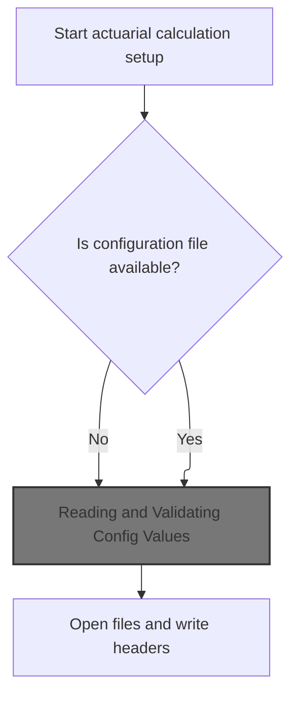
```mermaid
%%{init: {"flowchart": {"defaultRenderer": "elk"}} }%%
flowchart TD
    node1["Start actuarial calculation setup"] --> node2{"Is configuration file available?"}
    click node1 openCode "base/src/LGAPDB01.cbl:90:91"
    node2 -->|"Yes"| node3["Reading and Validating Config Values"]
    click node2 openCode "base/src/LGAPDB01.cbl:112:125"
    node2 -->|"No"| node3["Reading and Validating Config Values"]
    
    node3 --> node4["Open files and write headers"]
    click node4 openCode "base/src/LGAPDB01.cbl:138:142"
classDef HeadingStyle fill:#777777,stroke:#333,stroke-width:2px;
click node3 goToHeading "Reading and Validating Config Values"
node3:::HeadingStyle

%% Swimm:
%% %%{init: {"flowchart": {"defaultRenderer": "elk"}} }%%
%% flowchart TD
%%     node1["Start actuarial calculation setup"] --> node2{"Is configuration file available?"}
%%     click node1 openCode "<SwmPath>[base/src/LGAPDB01.cbl](base/src/LGAPDB01.cbl)</SwmPath>:90:91"
%%     node2 -->|"Yes"| node3["Reading and Validating Config Values"]
%%     click node2 openCode "<SwmPath>[base/src/LGAPDB01.cbl](base/src/LGAPDB01.cbl)</SwmPath>:112:125"
%%     node2 -->|"No"| node3["Reading and Validating Config Values"]
%%     
%%     node3 --> node4["Open files and write headers"]
%%     click node4 openCode "<SwmPath>[base/src/LGAPDB01.cbl](base/src/LGAPDB01.cbl)</SwmPath>:138:142"
%% classDef HeadingStyle fill:#777777,stroke:#333,stroke-width:2px;
%% click node3 goToHeading "Reading and Validating Config Values"
%% node3:::HeadingStyle
```

This section outlines the core startup sequence for the batch process, ensuring all configuration and file setup steps are completed before any actuarial calculations begin. It is critical for guaranteeing that downstream logic operates with the correct parameters and that all file operations are safely managed.

<SwmSnippet path="/base/src/LGAPDB01.cbl" line="90">

---

<SwmToken path="base/src/LGAPDB01.cbl" pos="90:1:1" line-data="       P001.">`P001`</SwmToken> runs the whole batch: it initializes data, loads config values, opens files, processes each record, closes files, generates a summary, and displays stats. Right after initialization, it calls <SwmToken path="base/src/LGAPDB01.cbl" pos="92:3:7" line-data="           PERFORM P003-LOAD-CONFIG">`P003-LOAD-CONFIG`</SwmToken> to make sure all the calculation and validation logic downstream has the right config values (from file or defaults) before any files are opened or records are processed.

```cobol
       P001.
           PERFORM P002-INITIALIZE
           PERFORM P003-LOAD-CONFIG
           PERFORM P005-OPEN-FILES
           PERFORM P006-PROCESS-RECORDS
           PERFORM P014-CLOSE-FILES
           PERFORM P015-GENERATE-SUMMARY
           PERFORM P016-DISPLAY-STATS
           STOP RUN.
```

---

</SwmSnippet>

## Configuration Loading and Fallback

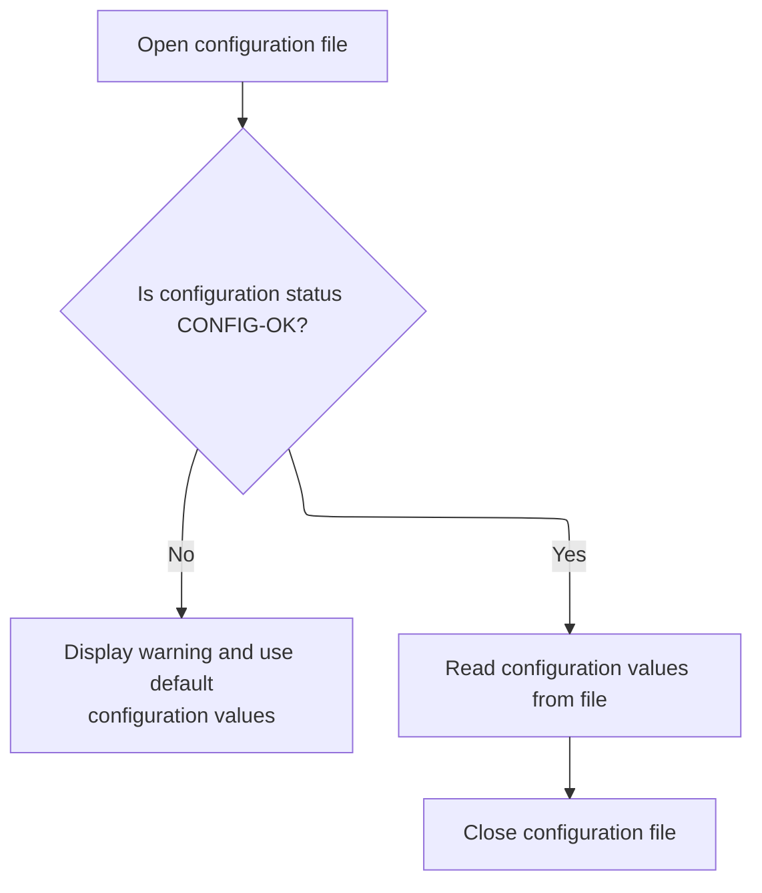
```mermaid
%%{init: {"flowchart": {"defaultRenderer": "elk"}} }%%
flowchart TD
    node1["Open configuration file"] --> node2{"Is configuration status CONFIG-OK?"}
    click node1 openCode "base/src/LGAPDB01.cbl:113:113"
    node2 -->|"No"| node3["Display warning and use default
configuration values"]
    click node2 openCode "base/src/LGAPDB01.cbl:114:115"
    click node3 openCode "base/src/LGAPDB01.cbl:115:116"
    node2 -->|"Yes"| node4["Read configuration values from file"]
    click node4 openCode "base/src/LGAPDB01.cbl:118:118"
    node4 --> node5["Close configuration file"]
    click node5 openCode "base/src/LGAPDB01.cbl:119:119"

classDef HeadingStyle fill:#777777,stroke:#333,stroke-width:2px;

%% Swimm:
%% %%{init: {"flowchart": {"defaultRenderer": "elk"}} }%%
%% flowchart TD
%%     node1["Open configuration file"] --> node2{"Is configuration status <SwmToken path="base/src/LGAPDB01.cbl" pos="114:5:7" line-data="           IF NOT CONFIG-OK">`CONFIG-OK`</SwmToken>?"}
%%     click node1 openCode "<SwmPath>[base/src/LGAPDB01.cbl](base/src/LGAPDB01.cbl)</SwmPath>:113:113"
%%     node2 -->|"No"| node3["Display warning and use default
%% configuration values"]
%%     click node2 openCode "<SwmPath>[base/src/LGAPDB01.cbl](base/src/LGAPDB01.cbl)</SwmPath>:114:115"
%%     click node3 openCode "<SwmPath>[base/src/LGAPDB01.cbl](base/src/LGAPDB01.cbl)</SwmPath>:115:116"
%%     node2 -->|"Yes"| node4["Read configuration values from file"]
%%     click node4 openCode "<SwmPath>[base/src/LGAPDB01.cbl](base/src/LGAPDB01.cbl)</SwmPath>:118:118"
%%     node4 --> node5["Close configuration file"]
%%     click node5 openCode "<SwmPath>[base/src/LGAPDB01.cbl](base/src/LGAPDB01.cbl)</SwmPath>:119:119"
%% 
%% classDef HeadingStyle fill:#777777,stroke:#333,stroke-width:2px;
```

This section outlines the logic and rules for loading configuration data, including validation, fallback to defaults, and user notification. It ensures the application always has valid configuration parameters to proceed, even if the configuration file is missing or corrupted.

| Rule ID | Category        | Rule Name                     | Description                                                                                       | Implementation Details                                                                                                                                                                                                                                                                                                                                                                                                                                                                                                                                                          |
| ------- | --------------- | ----------------------------- | ------------------------------------------------------------------------------------------------- | ------------------------------------------------------------------------------------------------------------------------------------------------------------------------------------------------------------------------------------------------------------------------------------------------------------------------------------------------------------------------------------------------------------------------------------------------------------------------------------------------------------------------------------------------------------------------------- |
| BR-001  | Technical Step  | Configuration file access     | Access the configuration file to retrieve application settings.                                   | The file is accessed in input mode. The file is expected to contain values for <SwmToken path="base/src/LGAPDB01.cbl" pos="126:9:11" line-data="           MOVE &#39;MAX_RISK_SCORE&#39; TO CONFIG-KEY">`CONFIG-KEY`</SwmToken> (20 bytes), <SwmToken path="base/src/LGAPDB01.cbl" pos="129:7:9" line-data="               MOVE FUNCTION NUMVAL(CONFIG-VALUE) TO WS-MAX-RISK-SCORE">`CONFIG-VALUE`</SwmToken> (100 bytes), <SwmToken path="base/src/LGAPDB01.cbl" pos="44:3:5" line-data="           05 CONFIG-TYPE              PIC X(1).">`CONFIG-TYPE`</SwmToken> (1 bytes). |
| BR-002  | Data validation | Configuration file validation | Following the attempt to open the configuration file, make sure the file was opened successfully. | The configuration status is considered successful when its value is '00'. If unsuccessful, a warning message 'Warning: Config file not available - using defaults' is displayed.                                                                                                                                                                                                                                                                                                                                                                                                |
| BR-003  | Writing Output  | Configuration warning display | Show a warning message when the configuration file is not available and default values are used.  | The warning message displayed is: 'Warning: Config file not available - using defaults'. This occurs when the configuration status is not '00' (<SwmToken path="base/src/LGAPDB01.cbl" pos="114:5:7" line-data="           IF NOT CONFIG-OK">`CONFIG-OK`</SwmToken>).                                                                                                                                                                                                                                                                                                           |
| BR-004  | Technical Step  | Configuration file closure    | Close the configuration file after successfully reading configuration values.                     |                                                                                                                                                                                                                                                                                                                                                                                                                                                                                                                                                                                 |

<SwmSnippet path="/base/src/LGAPDB01.cbl" line="112">

---

<SwmToken path="base/src/LGAPDB01.cbl" pos="112:1:5" line-data="       P003-LOAD-CONFIG.">`P003-LOAD-CONFIG`</SwmToken> opens the config file and checks if it's available. If not, it falls back to defaults. If the file is there, it calls <SwmToken path="base/src/LGAPDB01.cbl" pos="118:3:9" line-data="               PERFORM P004-READ-CONFIG-VALUES">`P004-READ-CONFIG-VALUES`</SwmToken> to actually pull out and validate the needed config values, so the rest of the process has the right parameters.

```cobol
       P003-LOAD-CONFIG.
           OPEN INPUT CONFIG-FILE
           IF NOT CONFIG-OK
               DISPLAY 'Warning: Config file not available - using defaults'
               PERFORM P004-SET-DEFAULTS
           ELSE
               PERFORM P004-READ-CONFIG-VALUES
               CLOSE CONFIG-FILE
           END-IF.
```

---

</SwmSnippet>

## Reading and Validating Config Values


```mermaid
%%{init: {"flowchart": {"defaultRenderer": "elk"}} }%%
flowchart TD
    node1["Retrieve MAX_RISK_SCORE from config file"]
    click node1 openCode "base/src/LGAPDB01.cbl:126:128"
    node1 --> node2{"Is config found and numeric?"}
    click node2 openCode "base/src/LGAPDB01.cbl:128:130"
    node2 -->|"Yes"| node3["Set maximum risk score threshold"]
    click node3 openCode "base/src/LGAPDB01.cbl:129:130"
    node2 -->|"No"| node4["Maximum risk score threshold unchanged"]
    click node4 openCode "base/src/LGAPDB01.cbl:128:130"
    node3 --> node5["Retrieve MIN_PREMIUM from config file"]
    click node5 openCode "base/src/LGAPDB01.cbl:132:134"
    node4 --> node5
    node5 --> node6{"Is config found and numeric?"}
    click node6 openCode "base/src/LGAPDB01.cbl:134:136"
    node6 -->|"Yes"| node7["Set minimum premium threshold"]
    click node7 openCode "base/src/LGAPDB01.cbl:135:136"
    node6 -->|"No"| node8["Minimum premium threshold unchanged"]
    click node8 openCode "base/src/LGAPDB01.cbl:134:136"
classDef HeadingStyle fill:#777777,stroke:#333,stroke-width:2px;

%% Swimm:
%% %%{init: {"flowchart": {"defaultRenderer": "elk"}} }%%
%% flowchart TD
%%     node1["Retrieve <SwmToken path="base/src/LGAPDB01.cbl" pos="126:4:4" line-data="           MOVE &#39;MAX_RISK_SCORE&#39; TO CONFIG-KEY">`MAX_RISK_SCORE`</SwmToken> from config file"]
%%     click node1 openCode "<SwmPath>[base/src/LGAPDB01.cbl](base/src/LGAPDB01.cbl)</SwmPath>:126:128"
%%     node1 --> node2{"Is config found and numeric?"}
%%     click node2 openCode "<SwmPath>[base/src/LGAPDB01.cbl](base/src/LGAPDB01.cbl)</SwmPath>:128:130"
%%     node2 -->|"Yes"| node3["Set maximum risk score threshold"]
%%     click node3 openCode "<SwmPath>[base/src/LGAPDB01.cbl](base/src/LGAPDB01.cbl)</SwmPath>:129:130"
%%     node2 -->|"No"| node4["Maximum risk score threshold unchanged"]
%%     click node4 openCode "<SwmPath>[base/src/LGAPDB01.cbl](base/src/LGAPDB01.cbl)</SwmPath>:128:130"
%%     node3 --> node5["Retrieve <SwmToken path="base/src/LGAPDB01.cbl" pos="132:4:4" line-data="           MOVE &#39;MIN_PREMIUM&#39; TO CONFIG-KEY">`MIN_PREMIUM`</SwmToken> from config file"]
%%     click node5 openCode "<SwmPath>[base/src/LGAPDB01.cbl](base/src/LGAPDB01.cbl)</SwmPath>:132:134"
%%     node4 --> node5
%%     node5 --> node6{"Is config found and numeric?"}
%%     click node6 openCode "<SwmPath>[base/src/LGAPDB01.cbl](base/src/LGAPDB01.cbl)</SwmPath>:134:136"
%%     node6 -->|"Yes"| node7["Set minimum premium threshold"]
%%     click node7 openCode "<SwmPath>[base/src/LGAPDB01.cbl](base/src/LGAPDB01.cbl)</SwmPath>:135:136"
%%     node6 -->|"No"| node8["Minimum premium threshold unchanged"]
%%     click node8 openCode "<SwmPath>[base/src/LGAPDB01.cbl](base/src/LGAPDB01.cbl)</SwmPath>:134:136"
%% classDef HeadingStyle fill:#777777,stroke:#333,stroke-width:2px;
```

This section ensures that configurable thresholds for risk and premium are correctly loaded and validated at runtime, providing flexibility and control over system behavior without code changes.

| Rule ID | Category        | Rule Name                                              | Description                                                                                                                                | Implementation Details                                                                                                                                                                                                                                                                                                                                                                                                                                                                                                                                         |
| ------- | --------------- | ------------------------------------------------------ | ------------------------------------------------------------------------------------------------------------------------------------------ | -------------------------------------------------------------------------------------------------------------------------------------------------------------------------------------------------------------------------------------------------------------------------------------------------------------------------------------------------------------------------------------------------------------------------------------------------------------------------------------------------------------------------------------------------------------- |
| BR-001  | Decision Making | Retrieve config values for risk and premium thresholds | Read the maximum risk score and minimum premium values from the configuration file for use in later calculations.                          | The maximum risk score is a number with up to 3 digits, default value 250. The minimum premium is a number with up to 6 digits and 2 decimal places, default value <SwmToken path="base/src/LGAPDB01.cbl" pos="84:19:21" line-data="           05 WS-MIN-PREMIUM           PIC 9(6)V99 VALUE 500.00.">`500.00`</SwmToken>. Both values are read as strings from the config file and converted to numbers if present and numeric.                                                                                                                               |
| BR-002  | Reading Input   | Configuration file read                                | Read the configuration record from the configuration file.                                                                                 | The file is expected to contain values for <SwmToken path="base/src/LGAPDB01.cbl" pos="126:9:11" line-data="           MOVE &#39;MAX_RISK_SCORE&#39; TO CONFIG-KEY">`CONFIG-KEY`</SwmToken> (20 bytes), <SwmToken path="base/src/LGAPDB01.cbl" pos="129:7:9" line-data="               MOVE FUNCTION NUMVAL(CONFIG-VALUE) TO WS-MAX-RISK-SCORE">`CONFIG-VALUE`</SwmToken> (100 bytes), <SwmToken path="base/src/LGAPDB01.cbl" pos="44:3:5" line-data="           05 CONFIG-TYPE              PIC X(1).">`CONFIG-TYPE`</SwmToken> (1 bytes).                    |
| BR-003  | Data validation | Config value validation                                | Following the read operation, make sure the configuration value exists and is numeric.                                                     | The configuration status is considered successful if the status code is '00' and the value type is 'N'. No explicit error codes or messages are handled in this snippet. The configuration key is a string up to 20 characters, and the value is a string up to 100 characters.                                                                                                                                                                                                                                                                                |
| BR-004  | Calculation     | Config value update                                    | Update the maximum risk score and minimum premium thresholds using values from the configuration file when valid numeric values are found. | In this section, the maximum risk score and minimum premium thresholds are updated if the configuration file provides valid numeric values. The maximum risk score is a number up to 3 digits, default value 250. The minimum premium is a number up to 8 digits with 2 decimal places, default value <SwmToken path="base/src/LGAPDB01.cbl" pos="84:19:21" line-data="           05 WS-MIN-PREMIUM           PIC 9(6)V99 VALUE 500.00.">`500.00`</SwmToken>. The configuration value must be numeric and the read operation must be successful (status '00'). |
| BR-005  | Reading Input   | Read configuration record                              | Retrieve a configuration record from the configuration file for use in setting system thresholds.                                          | The file is expected to contain values for <SwmToken path="base/src/LGAPDB01.cbl" pos="126:9:11" line-data="           MOVE &#39;MAX_RISK_SCORE&#39; TO CONFIG-KEY">`CONFIG-KEY`</SwmToken> (20 bytes), <SwmToken path="base/src/LGAPDB01.cbl" pos="129:7:9" line-data="               MOVE FUNCTION NUMVAL(CONFIG-VALUE) TO WS-MAX-RISK-SCORE">`CONFIG-VALUE`</SwmToken> (100 bytes), <SwmToken path="base/src/LGAPDB01.cbl" pos="44:3:5" line-data="           05 CONFIG-TYPE              PIC X(1).">`CONFIG-TYPE`</SwmToken> (1 bytes).                    |
| BR-006  | Data validation | Config value validation                                | Following the read operation, make sure the configuration value exists and is numeric.                                                     | The configuration value is considered valid if the read status is '00' (<SwmToken path="base/src/LGAPDB01.cbl" pos="114:5:7" line-data="           IF NOT CONFIG-OK">`CONFIG-OK`</SwmToken>) and the type indicator is 'N' (<SwmToken path="base/src/LGAPDB01.cbl" pos="128:9:11" line-data="           IF CONFIG-OK AND NUMERIC-CONFIG">`NUMERIC-CONFIG`</SwmToken>). No explicit error codes or messages are triggered in this snippet if validation fails; the default value remains unchanged.                                                             |

<SwmSnippet path="/base/src/LGAPDB01.cbl" line="125">

---

In <SwmToken path="base/src/LGAPDB01.cbl" pos="125:1:7" line-data="       P004-READ-CONFIG-VALUES.">`P004-READ-CONFIG-VALUES`</SwmToken>, it sets up to read <SwmToken path="base/src/LGAPDB01.cbl" pos="126:4:4" line-data="           MOVE &#39;MAX_RISK_SCORE&#39; TO CONFIG-KEY">`MAX_RISK_SCORE`</SwmToken> from the config file, checks if the read worked and the value is numeric, then stores it in <SwmToken path="base/src/LGAPDB01.cbl" pos="129:14:20" line-data="               MOVE FUNCTION NUMVAL(CONFIG-VALUE) TO WS-MAX-RISK-SCORE">`WS-MAX-RISK-SCORE`</SwmToken>. This ensures the risk score limit is set from config if possible, otherwise it sticks with the default.

```cobol
       P004-READ-CONFIG-VALUES.
           MOVE 'MAX_RISK_SCORE' TO CONFIG-KEY
           READ CONFIG-FILE
           IF CONFIG-OK AND NUMERIC-CONFIG
               MOVE FUNCTION NUMVAL(CONFIG-VALUE) TO WS-MAX-RISK-SCORE
           END-IF
```

---

</SwmSnippet>

<SwmSnippet path="/base/src/LGAPDB01.cbl" line="132">

---

After reading <SwmToken path="base/src/LGAPDB01.cbl" pos="126:4:4" line-data="           MOVE &#39;MAX_RISK_SCORE&#39; TO CONFIG-KEY">`MAX_RISK_SCORE`</SwmToken>, the function repeats the same logic for <SwmToken path="base/src/LGAPDB01.cbl" pos="132:4:4" line-data="           MOVE &#39;MIN_PREMIUM&#39; TO CONFIG-KEY">`MIN_PREMIUM`</SwmToken>. If the value is present and numeric, it updates <SwmToken path="base/src/LGAPDB01.cbl" pos="135:14:18" line-data="               MOVE FUNCTION NUMVAL(CONFIG-VALUE) TO WS-MIN-PREMIUM">`WS-MIN-PREMIUM`</SwmToken>; otherwise, the default sticks. Both config values are now set for use in later calculations.

```cobol
           MOVE 'MIN_PREMIUM' TO CONFIG-KEY
           READ CONFIG-FILE
           IF CONFIG-OK AND NUMERIC-CONFIG
               MOVE FUNCTION NUMVAL(CONFIG-VALUE) TO WS-MIN-PREMIUM
           END-IF.
```

---

</SwmSnippet>

## File Preparation and Output Structuring

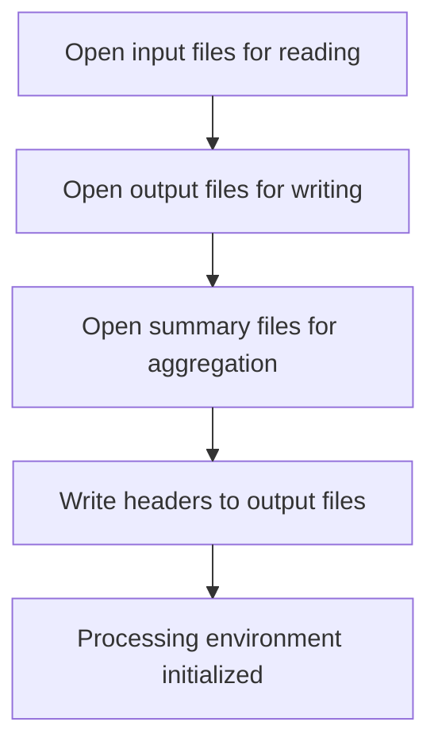
```mermaid
%%{init: {"flowchart": {"defaultRenderer": "elk"}} }%%
flowchart TD
    node1["Open input files for reading"]
    click node1 openCode "base/src/LGAPDB01.cbl:139:139"
    node1 --> node2["Open output files for writing"]
    click node2 openCode "base/src/LGAPDB01.cbl:140:140"
    node2 --> node3["Open summary files for aggregation"]
    click node3 openCode "base/src/LGAPDB01.cbl:141:141"
    node3 --> node4["Write headers to output files"]
    click node4 openCode "base/src/LGAPDB01.cbl:142:142"
    node4 --> node5["Processing environment initialized"]
    click node5 openCode "base/src/LGAPDB01.cbl:138:142"
classDef HeadingStyle fill:#777777,stroke:#333,stroke-width:2px;

%% Swimm:
%% %%{init: {"flowchart": {"defaultRenderer": "elk"}} }%%
%% flowchart TD
%%     node1["Open input files for reading"]
%%     click node1 openCode "<SwmPath>[base/src/LGAPDB01.cbl](base/src/LGAPDB01.cbl)</SwmPath>:139:139"
%%     node1 --> node2["Open output files for writing"]
%%     click node2 openCode "<SwmPath>[base/src/LGAPDB01.cbl](base/src/LGAPDB01.cbl)</SwmPath>:140:140"
%%     node2 --> node3["Open summary files for aggregation"]
%%     click node3 openCode "<SwmPath>[base/src/LGAPDB01.cbl](base/src/LGAPDB01.cbl)</SwmPath>:141:141"
%%     node3 --> node4["Write headers to output files"]
%%     click node4 openCode "<SwmPath>[base/src/LGAPDB01.cbl](base/src/LGAPDB01.cbl)</SwmPath>:142:142"
%%     node4 --> node5["Processing environment initialized"]
%%     click node5 openCode "<SwmPath>[base/src/LGAPDB01.cbl](base/src/LGAPDB01.cbl)</SwmPath>:138:142"
%% classDef HeadingStyle fill:#777777,stroke:#333,stroke-width:2px;
```

This section is responsible for setting up the file environment required for the application's data processing workflow. It ensures that all files are correctly opened and initialized, and that output files have the appropriate structure before any data is written.

<SwmSnippet path="/base/src/LGAPDB01.cbl" line="138">

---

<SwmToken path="base/src/LGAPDB01.cbl" pos="138:1:5" line-data="       P005-OPEN-FILES.">`P005-OPEN-FILES`</SwmToken> runs a sequence: opens the input, output, and summary files, then writes column headers to the output report. This sets up all files and ensures the output file starts with the right structure before any data is processed.

```cobol
       P005-OPEN-FILES.
           PERFORM P005A-OPEN-INPUT
           PERFORM P005B-OPEN-OUTPUT
           PERFORM P005C-OPEN-SUMMARY
           PERFORM P005D-WRITE-HEADERS.
```

---

</SwmSnippet>

# Record Processing Loop

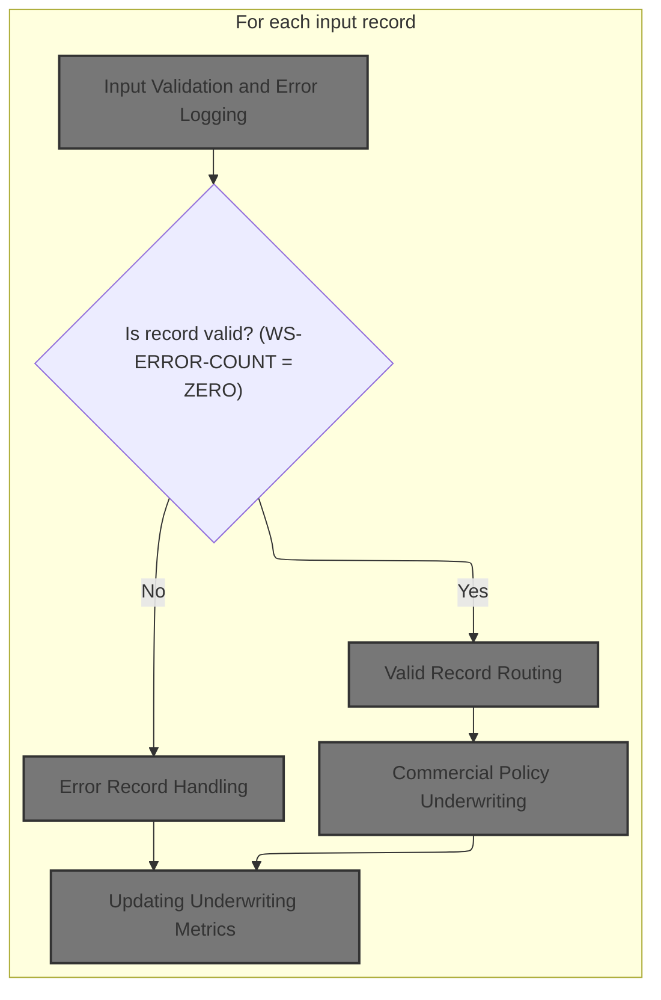
```mermaid
%%{init: {"flowchart": {"defaultRenderer": "elk"}} }%%
flowchart TD
    subgraph loop1["For each input record"]
        node1["Input Validation and Error Logging"]
        
        node1 --> node2{"Is record valid? (WS-ERROR-COUNT =
ZERO)"}
        click node2 openCode "base/src/LGAPDB01.cbl:183:187"
        node2 -->|"Yes"| node3["Valid Record Routing"]
        
        node3 --> node4["Commercial Policy Underwriting"]
        
        node4 --> node5["Updating Underwriting Metrics"]
        
        node2 -->|"No"| node6["Error Record Handling"]
        
        node6 --> node5
    end
classDef HeadingStyle fill:#777777,stroke:#333,stroke-width:2px;
click node1 goToHeading "Input Validation and Error Logging"
node1:::HeadingStyle
click node3 goToHeading "Valid Record Routing"
node3:::HeadingStyle
click node4 goToHeading "Commercial Policy Underwriting"
node4:::HeadingStyle
click node5 goToHeading "Updating Underwriting Metrics"
node5:::HeadingStyle
click node6 goToHeading "Error Record Handling"
node6:::HeadingStyle

%% Swimm:
%% %%{init: {"flowchart": {"defaultRenderer": "elk"}} }%%
%% flowchart TD
%%     subgraph loop1["For each input record"]
%%         node1["Input Validation and Error Logging"]
%%         
%%         node1 --> node2{"Is record valid? (<SwmToken path="base/src/LGAPDB01.cbl" pos="183:3:7" line-data="               IF WS-ERROR-COUNT = ZERO">`WS-ERROR-COUNT`</SwmToken> =
%% ZERO)"}
%%         click node2 openCode "<SwmPath>[base/src/LGAPDB01.cbl](base/src/LGAPDB01.cbl)</SwmPath>:183:187"
%%         node2 -->|"Yes"| node3["Valid Record Routing"]
%%         
%%         node3 --> node4["Commercial Policy Underwriting"]
%%         
%%         node4 --> node5["Updating Underwriting Metrics"]
%%         
%%         node2 -->|"No"| node6["Error Record Handling"]
%%         
%%         node6 --> node5
%%     end
%% classDef HeadingStyle fill:#777777,stroke:#333,stroke-width:2px;
%% click node1 goToHeading "Input Validation and Error Logging"
%% node1:::HeadingStyle
%% click node3 goToHeading "Valid Record Routing"
%% node3:::HeadingStyle
%% click node4 goToHeading "Commercial Policy Underwriting"
%% node4:::HeadingStyle
%% click node5 goToHeading "Updating Underwriting Metrics"
%% node5:::HeadingStyle
%% click node6 goToHeading "Error Record Handling"
%% node6:::HeadingStyle
```

The Record Processing Loop is the core engine of the application, responsible for reading, validating, and processing each insurance policy record. It ensures that only valid records proceed to underwriting, while errors are logged and handled according to business rules.

<SwmSnippet path="/base/src/LGAPDB01.cbl" line="178">

---

In <SwmToken path="base/src/LGAPDB01.cbl" pos="178:1:5" line-data="       P006-PROCESS-RECORDS.">`P006-PROCESS-RECORDS`</SwmToken>, it starts by reading the first input record before entering the main processing loop. This sets up the loop to process records until the end of the file.

```cobol
       P006-PROCESS-RECORDS.
           PERFORM P007-READ-INPUT
```

---

</SwmSnippet>

<SwmSnippet path="/base/src/LGAPDB01.cbl" line="180">

---

After reading a record, the loop increments the record count and calls <SwmToken path="base/src/LGAPDB01.cbl" pos="182:3:9" line-data="               PERFORM P008-VALIDATE-INPUT-RECORD">`P008-VALIDATE-INPUT-RECORD`</SwmToken> to check for data issues. Depending on the result, it either processes the record as valid or routes it to error handling, then reads the next record and repeats.

```cobol
           PERFORM UNTIL INPUT-EOF
               ADD 1 TO WS-REC-CNT
               PERFORM P008-VALIDATE-INPUT-RECORD
               IF WS-ERROR-COUNT = ZERO
                   PERFORM P009-PROCESS-VALID-RECORD
               ELSE
                   PERFORM P010-PROCESS-ERROR-RECORD
               END-IF
               PERFORM P007-READ-INPUT
           END-PERFORM.
```

---

</SwmSnippet>

## Input Validation and Error Logging


```mermaid
%%{init: {"flowchart": {"defaultRenderer": "elk"}} }%%
flowchart TD
    node1["Start validation"] --> node2{"Is policy type Commercial, Personal, or
Farm?"}
    click node2 openCode "base/src/LGAPDB01.cbl:198:204"
    node2 -->|"No"| node3["Log error: POL001, Fatal, Invalid Policy
Type"]
    click node3 openCode "base/src/LGAPDB01.cbl:201:203"
    node2 -->|"Yes"| node4{"Is customer number provided?"}
    click node4 openCode "base/src/LGAPDB01.cbl:206:210"
    node4 -->|"No"| node5["Log error: CUS001, Fatal, Customer
Number Required"]
    click node5 openCode "base/src/LGAPDB01.cbl:207:209"
    node4 -->|"Yes"| node6{"Is at least one coverage limit
provided?"}
    click node6 openCode "base/src/LGAPDB01.cbl:212:217"
    node6 -->|"No"| node7["Log error: COV001, Fatal, Coverage Limit
Required"]
    click node7 openCode "base/src/LGAPDB01.cbl:214:216"
    node6 -->|"Yes"| node8{"Does total coverage (Building +
Contents + BI) exceed WS-MAX-TIV
(50,000,000)?"}
    click node8 openCode "base/src/LGAPDB01.cbl:219:224"
    node8 -->|"Yes"| node9["Log warning: COV002, Warning, Coverage
exceeds maximum TIV"]
    click node9 openCode "base/src/LGAPDB01.cbl:221:223"
    node8 -->|"No"| node10["Validation complete"]
    click node10 openCode "base/src/LGAPDB01.cbl:195:224"
classDef HeadingStyle fill:#777777,stroke:#333,stroke-width:2px;

%% Swimm:
%% %%{init: {"flowchart": {"defaultRenderer": "elk"}} }%%
%% flowchart TD
%%     node1["Start validation"] --> node2{"Is policy type Commercial, Personal, or
%% Farm?"}
%%     click node2 openCode "<SwmPath>[base/src/LGAPDB01.cbl](base/src/LGAPDB01.cbl)</SwmPath>:198:204"
%%     node2 -->|"No"| node3["Log error: <SwmToken path="base/src/LGAPDB01.cbl" pos="202:2:2" line-data="                   &#39;POL001&#39; &#39;F&#39; &#39;IN-POLICY-TYPE&#39; ">`POL001`</SwmToken>, Fatal, Invalid Policy
%% Type"]
%%     click node3 openCode "<SwmPath>[base/src/LGAPDB01.cbl](base/src/LGAPDB01.cbl)</SwmPath>:201:203"
%%     node2 -->|"Yes"| node4{"Is customer number provided?"}
%%     click node4 openCode "<SwmPath>[base/src/LGAPDB01.cbl](base/src/LGAPDB01.cbl)</SwmPath>:206:210"
%%     node4 -->|"No"| node5["Log error: <SwmToken path="base/src/LGAPDB01.cbl" pos="208:2:2" line-data="                   &#39;CUS001&#39; &#39;F&#39; &#39;IN-CUSTOMER-NUM&#39; ">`CUS001`</SwmToken>, Fatal, Customer
%% Number Required"]
%%     click node5 openCode "<SwmPath>[base/src/LGAPDB01.cbl](base/src/LGAPDB01.cbl)</SwmPath>:207:209"
%%     node4 -->|"Yes"| node6{"Is at least one coverage limit
%% provided?"}
%%     click node6 openCode "<SwmPath>[base/src/LGAPDB01.cbl](base/src/LGAPDB01.cbl)</SwmPath>:212:217"
%%     node6 -->|"No"| node7["Log error: <SwmToken path="base/src/LGAPDB01.cbl" pos="215:2:2" line-data="                   &#39;COV001&#39; &#39;F&#39; &#39;COVERAGE-LIMITS&#39; ">`COV001`</SwmToken>, Fatal, Coverage Limit
%% Required"]
%%     click node7 openCode "<SwmPath>[base/src/LGAPDB01.cbl](base/src/LGAPDB01.cbl)</SwmPath>:214:216"
%%     node6 -->|"Yes"| node8{"Does total coverage (Building +
%% Contents + BI) exceed <SwmToken path="base/src/LGAPDB01.cbl" pos="220:9:13" line-data="              IN-BI-LIMIT &gt; WS-MAX-TIV">`WS-MAX-TIV`</SwmToken>
%% (50,000,000)?"}
%%     click node8 openCode "<SwmPath>[base/src/LGAPDB01.cbl](base/src/LGAPDB01.cbl)</SwmPath>:219:224"
%%     node8 -->|"Yes"| node9["Log warning: <SwmToken path="base/src/LGAPDB01.cbl" pos="222:2:2" line-data="                   &#39;COV002&#39; &#39;W&#39; &#39;COVERAGE-LIMITS&#39; ">`COV002`</SwmToken>, Warning, Coverage
%% exceeds maximum TIV"]
%%     click node9 openCode "<SwmPath>[base/src/LGAPDB01.cbl](base/src/LGAPDB01.cbl)</SwmPath>:221:223"
%%     node8 -->|"No"| node10["Validation complete"]
%%     click node10 openCode "<SwmPath>[base/src/LGAPDB01.cbl](base/src/LGAPDB01.cbl)</SwmPath>:195:224"
%% classDef HeadingStyle fill:#777777,stroke:#333,stroke-width:2px;
```

This section ensures that all incoming policy application records meet required data standards before further processing. It defines the validation logic and error handling mechanisms that maintain data integrity and provide clear feedback for correction.

| Rule ID | Category        | Rule Name                  | Description                                                                              | Implementation Details                                                                                                                                                                                                                                                                                                                                         |
| ------- | --------------- | -------------------------- | ---------------------------------------------------------------------------------------- | -------------------------------------------------------------------------------------------------------------------------------------------------------------------------------------------------------------------------------------------------------------------------------------------------------------------------------------------------------------- |
| BR-001  | Data validation | Customer number validation | Following the input validation, make sure the customer number is provided and not blank. | If the customer number is missing, the error code <SwmToken path="base/src/LGAPDB01.cbl" pos="208:2:2" line-data="                   &#39;CUS001&#39; &#39;F&#39; &#39;IN-CUSTOMER-NUM&#39; ">`CUS001`</SwmToken> is logged with severity 'Fatal' and the message 'Customer Number Required'. The customer number is expected to be a string of 10 characters. |

<SwmSnippet path="/base/src/LGAPDB01.cbl" line="195">

---

In <SwmToken path="base/src/LGAPDB01.cbl" pos="195:1:7" line-data="       P008-VALIDATE-INPUT-RECORD.">`P008-VALIDATE-INPUT-RECORD`</SwmToken>, it checks if the policy type is valid. If not, it calls <SwmToken path="base/src/LGAPDB01.cbl" pos="201:3:7" line-data="               PERFORM P008A-LOG-ERROR WITH ">`P008A-LOG-ERROR`</SwmToken> to record the issue, so the record can be flagged as invalid and handled accordingly.

```cobol
       P008-VALIDATE-INPUT-RECORD.
           INITIALIZE WS-ERROR-HANDLING
           
           IF NOT COMMERCIAL-POLICY AND 
              NOT PERSONAL-POLICY AND 
              NOT FARM-POLICY
               PERFORM P008A-LOG-ERROR WITH 
                   'POL001' 'F' 'IN-POLICY-TYPE' 
                   'Invalid Policy Type'
           END-IF
```

---

</SwmSnippet>

<SwmSnippet path="/base/src/LGAPDB01.cbl" line="226">

---

<SwmToken path="base/src/LGAPDB01.cbl" pos="226:1:5" line-data="       P008A-LOG-ERROR.">`P008A-LOG-ERROR`</SwmToken> bumps the error count and stores the error details in parallel arrays at the new index. It assumes there’s room for up to 20 errors per record—anything beyond that isn’t handled.

```cobol
       P008A-LOG-ERROR.
           ADD 1 TO WS-ERROR-COUNT
           SET ERR-IDX TO WS-ERROR-COUNT
           MOVE WS-ERROR-CODE TO WS-ERROR-CODE (ERR-IDX)
           MOVE WS-ERROR-SEVERITY TO WS-ERROR-SEVERITY (ERR-IDX)
           MOVE WS-ERROR-FIELD TO WS-ERROR-FIELD (ERR-IDX)
           MOVE WS-ERROR-MESSAGE TO WS-ERROR-MESSAGE (ERR-IDX).
```

---

</SwmSnippet>

<SwmSnippet path="/base/src/LGAPDB01.cbl" line="206">

---

Back in <SwmToken path="base/src/LGAPDB01.cbl" pos="182:3:9" line-data="               PERFORM P008-VALIDATE-INPUT-RECORD">`P008-VALIDATE-INPUT-RECORD`</SwmToken>, after checking policy type, it checks if the customer number is missing and flags it as an error if so. This is part of the sequential validation of required fields.

```cobol
           IF IN-CUSTOMER-NUM = SPACES
               PERFORM P008A-LOG-ERROR WITH 
                   'CUS001' 'F' 'IN-CUSTOMER-NUM' 
                   'Customer Number Required'
           END-IF
```

---

</SwmSnippet>

<SwmSnippet path="/base/src/LGAPDB01.cbl" line="212">

---

Still in <SwmToken path="base/src/LGAPDB01.cbl" pos="182:3:9" line-data="               PERFORM P008-VALIDATE-INPUT-RECORD">`P008-VALIDATE-INPUT-RECORD`</SwmToken>, it checks that at least one of the building or contents coverage limits is nonzero. If both are zero, it flags the record as invalid.

```cobol
           IF IN-BUILDING-LIMIT = ZERO AND 
              IN-CONTENTS-LIMIT = ZERO
               PERFORM P008A-LOG-ERROR WITH 
                   'COV001' 'F' 'COVERAGE-LIMITS' 
                   'At least one coverage limit required'
           END-IF
```

---

</SwmSnippet>

<SwmSnippet path="/base/src/LGAPDB01.cbl" line="219">

---

At the end of <SwmToken path="base/src/LGAPDB01.cbl" pos="182:3:9" line-data="               PERFORM P008-VALIDATE-INPUT-RECORD">`P008-VALIDATE-INPUT-RECORD`</SwmToken>, it checks if the total coverage exceeds the max allowed TIV. If so, it logs a warning, but the record isn't blocked from further processing.

```cobol
           IF IN-BUILDING-LIMIT + IN-CONTENTS-LIMIT + 
              IN-BI-LIMIT > WS-MAX-TIV
               PERFORM P008A-LOG-ERROR WITH 
                   'COV002' 'W' 'COVERAGE-LIMITS' 
                   'Total coverage exceeds maximum TIV'
           END-IF.
```

---

</SwmSnippet>

## Valid Record Routing

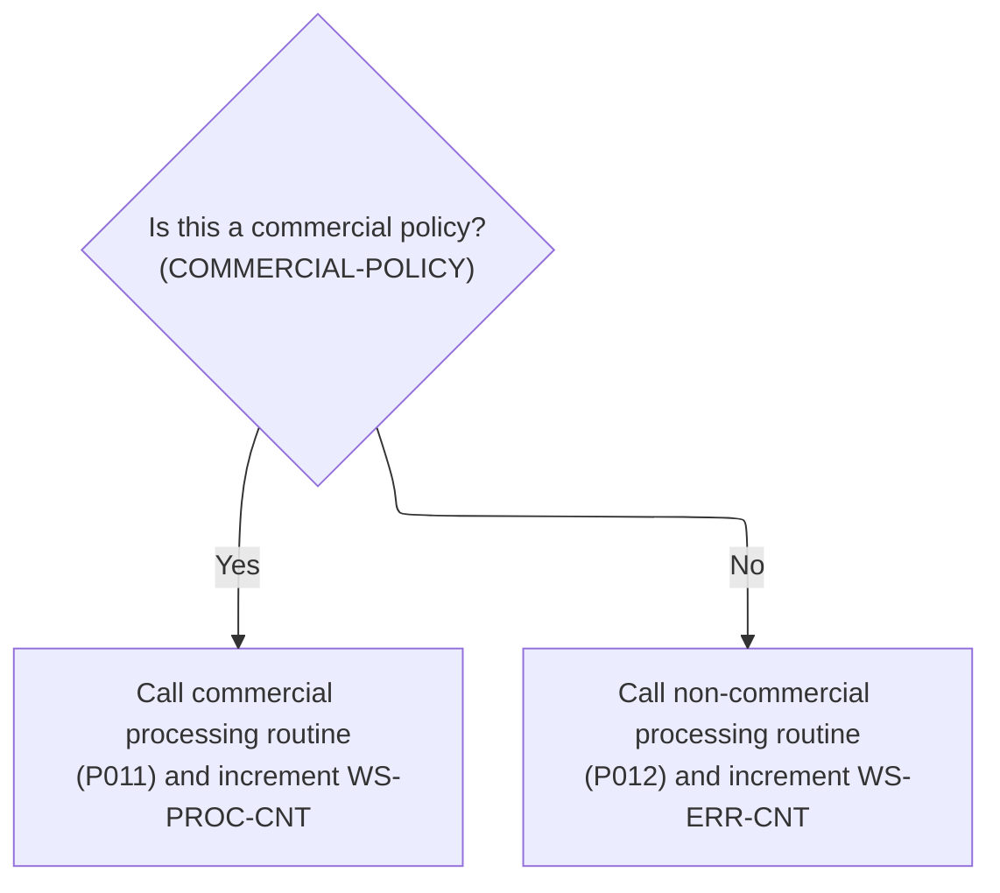
```mermaid
%%{init: {"flowchart": {"defaultRenderer": "elk"}} }%%
flowchart TD
    node1{"Is this a commercial policy?
(COMMERCIAL-POLICY)"}
    click node1 openCode "base/src/LGAPDB01.cbl:235:241"
    node1 -->|"Yes"| node2["Call commercial processing routine
(P011) and increment WS-PROC-CNT"]
    click node2 openCode "base/src/LGAPDB01.cbl:236:237"
    node1 -->|"No"| node3["Call non-commercial processing routine
(P012) and increment WS-ERR-CNT"]
    click node3 openCode "base/src/LGAPDB01.cbl:239:240"
classDef HeadingStyle fill:#777777,stroke:#333,stroke-width:2px;

%% Swimm:
%% %%{init: {"flowchart": {"defaultRenderer": "elk"}} }%%
%% flowchart TD
%%     node1{"Is this a commercial policy?
%% (<SwmToken path="base/src/LGAPDB01.cbl" pos="198:5:7" line-data="           IF NOT COMMERCIAL-POLICY AND ">`COMMERCIAL-POLICY`</SwmToken>)"}
%%     click node1 openCode "<SwmPath>[base/src/LGAPDB01.cbl](base/src/LGAPDB01.cbl)</SwmPath>:235:241"
%%     node1 -->|"Yes"| node2["Call commercial processing routine
%% (<SwmToken path="base/src/LGAPDB01.cbl" pos="236:3:3" line-data="               PERFORM P011-PROCESS-COMMERCIAL">`P011`</SwmToken>) and increment <SwmToken path="base/src/LGAPDB01.cbl" pos="237:7:11" line-data="               ADD 1 TO WS-PROC-CNT">`WS-PROC-CNT`</SwmToken>"]
%%     click node2 openCode "<SwmPath>[base/src/LGAPDB01.cbl](base/src/LGAPDB01.cbl)</SwmPath>:236:237"
%%     node1 -->|"No"| node3["Call non-commercial processing routine
%% (<SwmToken path="base/src/LGAPDB01.cbl" pos="239:3:3" line-data="               PERFORM P012-PROCESS-NON-COMMERCIAL">`P012`</SwmToken>) and increment <SwmToken path="base/src/LGAPDB01.cbl" pos="240:7:11" line-data="               ADD 1 TO WS-ERR-CNT">`WS-ERR-CNT`</SwmToken>"]
%%     click node3 openCode "<SwmPath>[base/src/LGAPDB01.cbl](base/src/LGAPDB01.cbl)</SwmPath>:239:240"
%% classDef HeadingStyle fill:#777777,stroke:#333,stroke-width:2px;
```

This section determines whether an incoming policy record should be processed as a commercial policy or routed as non-commercial. It ensures that each record is handled by the appropriate routine and that processing statistics are accurately maintained.

| Rule ID | Category    | Rule Name                 | Description                                                                          | Implementation Details                                                                                                                                                                                                                                                                 |
| ------- | ----------- | ------------------------- | ------------------------------------------------------------------------------------ | -------------------------------------------------------------------------------------------------------------------------------------------------------------------------------------------------------------------------------------------------------------------------------------- |
| BR-001  | Calculation | Processing counter update | Increment the processing or error counter based on whether the policy is commercial. | In this section, the processing counter is incremented for commercial policies and the error counter is incremented for non-commercial policies. The processing counter and error counter are numeric fields with initial value zero and maximum sizes of 7 and 6 digits respectively. |

<SwmSnippet path="/base/src/LGAPDB01.cbl" line="234">

---

<SwmToken path="base/src/LGAPDB01.cbl" pos="234:1:7" line-data="       P009-PROCESS-VALID-RECORD.">`P009-PROCESS-VALID-RECORD`</SwmToken> checks if the policy is commercial. If so, it calls <SwmToken path="base/src/LGAPDB01.cbl" pos="236:3:7" line-data="               PERFORM P011-PROCESS-COMMERCIAL">`P011-PROCESS-COMMERCIAL`</SwmToken> for full underwriting and stats update; otherwise, it routes to the non-commercial handler, which just marks the record as unsupported.

```cobol
       P009-PROCESS-VALID-RECORD.
           IF COMMERCIAL-POLICY
               PERFORM P011-PROCESS-COMMERCIAL
               ADD 1 TO WS-PROC-CNT
           ELSE
               PERFORM P012-PROCESS-NON-COMMERCIAL
               ADD 1 TO WS-ERR-CNT
           END-IF.
```

---

</SwmSnippet>

## Commercial Policy Underwriting

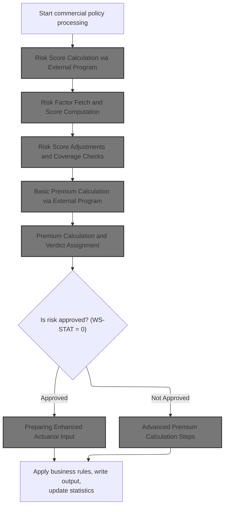
```mermaid
%%{init: {"flowchart": {"defaultRenderer": "elk"}} }%%
flowchart TD
    node1["Start commercial policy processing"]
    click node1 openCode "base/src/LGAPDB01.cbl:258:260"
    node1 --> node2["Risk Score Calculation via External Program"]
    
    node2 --> node3["Risk Factor Fetch and Score Computation"]
    
    node3 --> node4["Risk Score Adjustments and Coverage Checks"]
    
    node4 --> node5["Basic Premium Calculation via External Program"]
    
    node5 --> node6["Premium Calculation and Verdict Assignment"]
    
    node6 --> node7{"Is risk approved? (WS-STAT = 0)"}
    click node7 openCode "base/src/LGAPDB01.cbl:261:263"
    node7 -->|"Approved"| node8["Preparing Enhanced Actuarial Input"]
    
    node7 -->|"Not Approved"| node9["Advanced Premium Calculation Steps"]
    
    node8 --> node10["Apply business rules, write output,
update statistics"]
    node9 --> node10
    click node10 openCode "base/src/LGAPDB01.cbl:264:266"
classDef HeadingStyle fill:#777777,stroke:#333,stroke-width:2px;
click node2 goToHeading "Risk Score Calculation via External Program"
node2:::HeadingStyle
click node3 goToHeading "Risk Factor Fetch and Score Computation"
node3:::HeadingStyle
click node4 goToHeading "Risk Score Adjustments and Coverage Checks"
node4:::HeadingStyle
click node5 goToHeading "Basic Premium Calculation via External Program"
node5:::HeadingStyle
click node6 goToHeading "Premium Calculation and Verdict Assignment"
node6:::HeadingStyle
click node8 goToHeading "Preparing Enhanced Actuarial Input"
node8:::HeadingStyle
click node9 goToHeading "Advanced Premium Calculation Steps"
node9:::HeadingStyle

%% Swimm:
%% %%{init: {"flowchart": {"defaultRenderer": "elk"}} }%%
%% flowchart TD
%%     node1["Start commercial policy processing"]
%%     click node1 openCode "<SwmPath>[base/src/LGAPDB01.cbl](base/src/LGAPDB01.cbl)</SwmPath>:258:260"
%%     node1 --> node2["Risk Score Calculation via External Program"]
%%     
%%     node2 --> node3["Risk Factor Fetch and Score Computation"]
%%     
%%     node3 --> node4["Risk Score Adjustments and Coverage Checks"]
%%     
%%     node4 --> node5["Basic Premium Calculation via External Program"]
%%     
%%     node5 --> node6["Premium Calculation and Verdict Assignment"]
%%     
%%     node6 --> node7{"Is risk approved? (<SwmToken path="base/src/LGAPDB01.cbl" pos="261:3:5" line-data="           IF WS-STAT = 0">`WS-STAT`</SwmToken> = 0)"}
%%     click node7 openCode "<SwmPath>[base/src/LGAPDB01.cbl](base/src/LGAPDB01.cbl)</SwmPath>:261:263"
%%     node7 -->|"Approved"| node8["Preparing Enhanced Actuarial Input"]
%%     
%%     node7 -->|"Not Approved"| node9["Advanced Premium Calculation Steps"]
%%     
%%     node8 --> node10["Apply business rules, write output,
%% update statistics"]
%%     node9 --> node10
%%     click node10 openCode "<SwmPath>[base/src/LGAPDB01.cbl](base/src/LGAPDB01.cbl)</SwmPath>:264:266"
%% classDef HeadingStyle fill:#777777,stroke:#333,stroke-width:2px;
%% click node2 goToHeading "Risk Score Calculation via External Program"
%% node2:::HeadingStyle
%% click node3 goToHeading "Risk Factor Fetch and Score Computation"
%% node3:::HeadingStyle
%% click node4 goToHeading "Risk Score Adjustments and Coverage Checks"
%% node4:::HeadingStyle
%% click node5 goToHeading "Basic Premium Calculation via External Program"
%% node5:::HeadingStyle
%% click node6 goToHeading "Premium Calculation and Verdict Assignment"
%% node6:::HeadingStyle
%% click node8 goToHeading "Preparing Enhanced Actuarial Input"
%% node8:::HeadingStyle
%% click node9 goToHeading "Advanced Premium Calculation Steps"
%% node9:::HeadingStyle
```

This section describes the end-to-end flow for commercial policy underwriting in Swimmio-genapp-house, detailing how risk is assessed, premiums are calculated, and underwriting decisions are made using both basic and advanced actuarial logic. It outlines the integration points, business rules, and fallback mechanisms that ensure robust and compliant policy processing.

<SwmSnippet path="/base/src/LGAPDB01.cbl" line="258">

---

In <SwmToken path="base/src/LGAPDB01.cbl" pos="258:1:5" line-data="       P011-PROCESS-COMMERCIAL.">`P011-PROCESS-COMMERCIAL`</SwmToken>, it starts by calculating the risk score (<SwmToken path="base/src/LGAPDB01.cbl" pos="259:3:3" line-data="           PERFORM P011A-CALCULATE-RISK-SCORE">`P011A`</SwmToken>) before moving on to premium calculation. The risk score is needed as input for the premium logic.

```cobol
       P011-PROCESS-COMMERCIAL.
           PERFORM P011A-CALCULATE-RISK-SCORE
           PERFORM P011B-BASIC-PREMIUM-CALC
```

---

</SwmSnippet>

### Risk Score Calculation via External Program

This section outlines how the Swimmio-genapp-house system calculates a property's risk score by calling an external service, detailing the required input data, the invocation process, and the resulting output.

| Rule ID | Category                        | Rule Name              | Description                                                                                                      | Implementation Details                                                                                                                                                                                                                                                                                                                                                   |
| ------- | ------------------------------- | ---------------------- | ---------------------------------------------------------------------------------------------------------------- | ------------------------------------------------------------------------------------------------------------------------------------------------------------------------------------------------------------------------------------------------------------------------------------------------------------------------------------------------------------------------ |
| BR-001  | Invoking a Service or a Process | Risk score calculation | Calculate the risk score for a property using property details, location, coverage limits, and customer history. | Inputs include property type (string, up to 15 characters), postcode (string, up to 8 characters), latitude (number), longitude (number), building limit (number), contents limit (number), flood coverage (string, 1 character), weather coverage (string, 1 character), and customer history (structured data). The risk score is output as a number (up to 3 digits). |

<SwmSnippet path="/base/src/LGAPDB01.cbl" line="268">

---

<SwmToken path="base/src/LGAPDB01.cbl" pos="268:1:7" line-data="       P011A-CALCULATE-RISK-SCORE.">`P011A-CALCULATE-RISK-SCORE`</SwmToken> calls out to <SwmToken path="base/src/LGAPDB01.cbl" pos="269:4:4" line-data="           CALL &#39;LGAPDB02&#39; USING IN-PROPERTY-TYPE, IN-POSTCODE, ">`LGAPDB02`</SwmToken>, which computes the risk score using property, location, and customer data, pulling risk factors from the DB and applying the business logic.

```cobol
       P011A-CALCULATE-RISK-SCORE.
           CALL 'LGAPDB02' USING IN-PROPERTY-TYPE, IN-POSTCODE, 
                                IN-LATITUDE, IN-LONGITUDE,
                                IN-BUILDING-LIMIT, IN-CONTENTS-LIMIT,
                                IN-FLOOD-COVERAGE, IN-WEATHER-COVERAGE,
                                IN-CUSTOMER-HISTORY, WS-BASE-RISK-SCR.
```

---

</SwmSnippet>

### Risk Factor Fetch and Score Computation

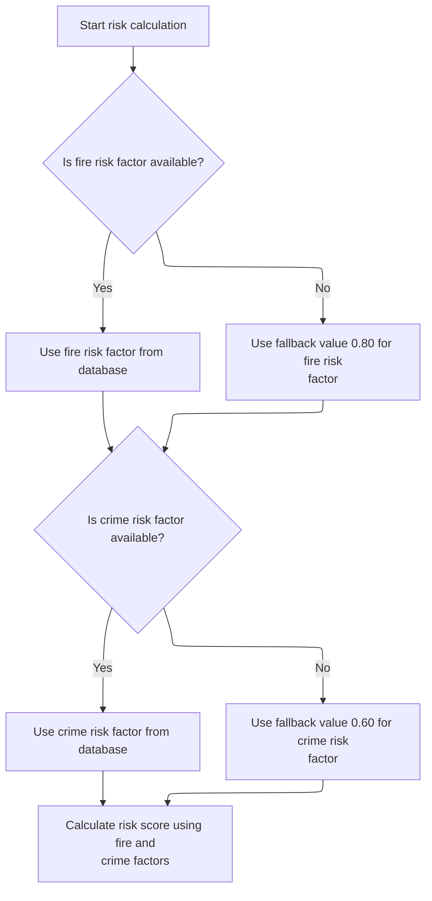
```mermaid
%%{init: {"flowchart": {"defaultRenderer": "elk"}} }%%
flowchart TD
    node1["Start risk calculation"]
    click node1 openCode "base/src/LGAPDB02.cbl:39:42"
    node1 --> node2{"Is fire risk factor available?"}
    click node2 openCode "base/src/LGAPDB02.cbl:44:55"
    node2 -->|"Yes"| node3["Use fire risk factor from database"]
    click node3 openCode "base/src/LGAPDB02.cbl:46:48"
    node2 -->|"No"| node4["Use fallback value 0.80 for fire risk
factor"]
    click node4 openCode "base/src/LGAPDB02.cbl:54:54"
    node3 --> node5{"Is crime risk factor available?"}
    node4 --> node5
    click node5 openCode "base/src/LGAPDB02.cbl:57:67"
    node5 -->|"Yes"| node6["Use crime risk factor from database"]
    click node6 openCode "base/src/LGAPDB02.cbl:58:60"
    node5 -->|"No"| node7["Use fallback value 0.60 for crime risk
factor"]
    click node7 openCode "base/src/LGAPDB02.cbl:66:66"
    node6 --> node8["Calculate risk score using fire and
crime factors"]
    node7 --> node8
    click node8 openCode "base/src/LGAPDB02.cbl:41:41"
classDef HeadingStyle fill:#777777,stroke:#333,stroke-width:2px;

%% Swimm:
%% %%{init: {"flowchart": {"defaultRenderer": "elk"}} }%%
%% flowchart TD
%%     node1["Start risk calculation"]
%%     click node1 openCode "<SwmPath>[base/src/LGAPDB02.cbl](base/src/LGAPDB02.cbl)</SwmPath>:39:42"
%%     node1 --> node2{"Is fire risk factor available?"}
%%     click node2 openCode "<SwmPath>[base/src/LGAPDB02.cbl](base/src/LGAPDB02.cbl)</SwmPath>:44:55"
%%     node2 -->|"Yes"| node3["Use fire risk factor from database"]
%%     click node3 openCode "<SwmPath>[base/src/LGAPDB02.cbl](base/src/LGAPDB02.cbl)</SwmPath>:46:48"
%%     node2 -->|"No"| node4["Use fallback value <SwmToken path="base/src/LGAPDB02.cbl" pos="54:3:5" line-data="               MOVE 0.80 TO WS-FIRE-FACTOR">`0.80`</SwmToken> for fire risk
%% factor"]
%%     click node4 openCode "<SwmPath>[base/src/LGAPDB02.cbl](base/src/LGAPDB02.cbl)</SwmPath>:54:54"
%%     node3 --> node5{"Is crime risk factor available?"}
%%     node4 --> node5
%%     click node5 openCode "<SwmPath>[base/src/LGAPDB02.cbl](base/src/LGAPDB02.cbl)</SwmPath>:57:67"
%%     node5 -->|"Yes"| node6["Use crime risk factor from database"]
%%     click node6 openCode "<SwmPath>[base/src/LGAPDB02.cbl](base/src/LGAPDB02.cbl)</SwmPath>:58:60"
%%     node5 -->|"No"| node7["Use fallback value <SwmToken path="base/src/LGAPDB02.cbl" pos="66:3:5" line-data="               MOVE 0.60 TO WS-CRIME-FACTOR">`0.60`</SwmToken> for crime risk
%% factor"]
%%     click node7 openCode "<SwmPath>[base/src/LGAPDB02.cbl](base/src/LGAPDB02.cbl)</SwmPath>:66:66"
%%     node6 --> node8["Calculate risk score using fire and
%% crime factors"]
%%     node7 --> node8
%%     click node8 openCode "<SwmPath>[base/src/LGAPDB02.cbl](base/src/LGAPDB02.cbl)</SwmPath>:41:41"
%% classDef HeadingStyle fill:#777777,stroke:#333,stroke-width:2px;
```

This section ensures that risk factors for fire and crime are available for risk score calculation, using database values when possible and fallback values otherwise. It guarantees that a risk score is always computed, supporting business continuity even if the database is unavailable.

| Rule ID | Category        | Rule Name                              | Description                                                                                                                                                                                                                              | Implementation Details                                                                                                                                                                                  |
| ------- | --------------- | -------------------------------------- | ---------------------------------------------------------------------------------------------------------------------------------------------------------------------------------------------------------------------------------------- | ------------------------------------------------------------------------------------------------------------------------------------------------------------------------------------------------------- |
| BR-001  | Calculation     | Risk score calculation always proceeds | A risk score is calculated using the fire and crime risk factors, regardless of whether they were fetched from the database or set to fallback values.                                                                                   | The risk score calculation uses the current values of fire and crime risk factors. The output format is not specified in the provided code.                                                             |
| BR-002  | Decision Making | Fire risk fallback                     | If the fire risk factor is not available from the database, use the fallback value <SwmToken path="base/src/LGAPDB02.cbl" pos="54:3:5" line-data="               MOVE 0.80 TO WS-FIRE-FACTOR">`0.80`</SwmToken> for fire risk factor.    | The fallback value for fire risk factor is <SwmToken path="base/src/LGAPDB02.cbl" pos="54:3:5" line-data="               MOVE 0.80 TO WS-FIRE-FACTOR">`0.80`</SwmToken> (number, two decimal places).   |
| BR-003  | Decision Making | Crime risk fallback                    | If the crime risk factor is not available from the database, use the fallback value <SwmToken path="base/src/LGAPDB02.cbl" pos="66:3:5" line-data="               MOVE 0.60 TO WS-CRIME-FACTOR">`0.60`</SwmToken> for crime risk factor. | The fallback value for crime risk factor is <SwmToken path="base/src/LGAPDB02.cbl" pos="66:3:5" line-data="               MOVE 0.60 TO WS-CRIME-FACTOR">`0.60`</SwmToken> (number, two decimal places). |

<SwmSnippet path="/base/src/LGAPDB02.cbl" line="39">

---

<SwmToken path="base/src/LGAPDB02.cbl" pos="39:1:3" line-data="       MAIN-LOGIC.">`MAIN-LOGIC`</SwmToken> in <SwmToken path="base/src/LGAPDB01.cbl" pos="269:4:4" line-data="           CALL &#39;LGAPDB02&#39; USING IN-PROPERTY-TYPE, IN-POSTCODE, ">`LGAPDB02`</SwmToken> first fetches risk factors from the DB (or uses defaults if unavailable), then moves on to calculate the risk score using those factors and the input data.

```cobol
       MAIN-LOGIC.
           PERFORM GET-RISK-FACTORS
           PERFORM CALCULATE-RISK-SCORE
           GOBACK.
```

---

</SwmSnippet>

<SwmSnippet path="/base/src/LGAPDB02.cbl" line="44">

---

<SwmToken path="base/src/LGAPDB02.cbl" pos="44:1:5" line-data="       GET-RISK-FACTORS.">`GET-RISK-FACTORS`</SwmToken> tries to fetch fire and crime risk factors from the DB. If the query fails, it just uses hardcoded defaults (<SwmToken path="base/src/LGAPDB02.cbl" pos="54:3:5" line-data="               MOVE 0.80 TO WS-FIRE-FACTOR">`0.80`</SwmToken> for fire, <SwmToken path="base/src/LGAPDB02.cbl" pos="66:3:5" line-data="               MOVE 0.60 TO WS-CRIME-FACTOR">`0.60`</SwmToken> for crime) so the calculation can always proceed.

```cobol
       GET-RISK-FACTORS.
           EXEC SQL
               SELECT FACTOR_VALUE INTO :WS-FIRE-FACTOR
               FROM RISK_FACTORS
               WHERE PERIL_TYPE = 'FIRE'
           END-EXEC.
           
           IF SQLCODE = 0
               CONTINUE
           ELSE
               MOVE 0.80 TO WS-FIRE-FACTOR
           END-IF.
           
           EXEC SQL
               SELECT FACTOR_VALUE INTO :WS-CRIME-FACTOR
               FROM RISK_FACTORS
               WHERE PERIL_TYPE = 'CRIME'
           END-EXEC.
           
           IF SQLCODE = 0
               CONTINUE
           ELSE
               MOVE 0.60 TO WS-CRIME-FACTOR
           END-IF.
```

---

</SwmSnippet>

### Risk Score Adjustments and Coverage Checks

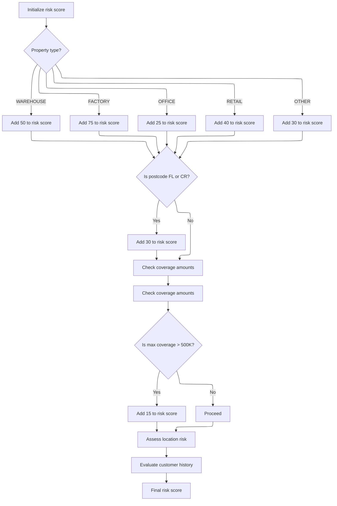
```mermaid
%%{init: {"flowchart": {"defaultRenderer": "elk"}} }%%
flowchart TD
    node1["Initialize risk score"] --> node2{"Property type?"}
    click node1 openCode "base/src/LGAPDB02.cbl:70:70"
    node2 -->|"WAREHOUSE"| node3["Add 50 to risk score"]
    click node2 openCode "base/src/LGAPDB02.cbl:72:83"
    node2 -->|"FACTORY"| node4["Add 75 to risk score"]
    node2 -->|"OFFICE"| node5["Add 25 to risk score"]
    node2 -->|"RETAIL"| node6["Add 40 to risk score"]
    node2 -->|"OTHER"| node7["Add 30 to risk score"]
    node3 --> node8{"Is postcode FL or CR?"}
    node4 --> node8
    node5 --> node8
    node6 --> node8
    node7 --> node8
    click node8 openCode "base/src/LGAPDB02.cbl:85:88"
    node8 -->|"Yes"| node9["Add 30 to risk score"]
    node8 -->|"No"| node10["Check coverage amounts"]
    node9 --> node10
    node10 --> node11["Check coverage amounts"]
    click node10 openCode "base/src/LGAPDB02.cbl:94:115"
    node11 --> node12{"Is max coverage > 500K?"}
    click node11 openCode "base/src/LGAPDB02.cbl:113:115"
    node12 -->|"Yes"| node13["Add 15 to risk score"]
    node12 -->|"No"| node14["Proceed"]
    node13 --> node15["Assess location risk"]
    node14 --> node15["Assess location risk"]
    click node15 openCode "base/src/LGAPDB02.cbl:91:91"
    node15 --> node16["Evaluate customer history"]
    click node16 openCode "base/src/LGAPDB02.cbl:92:92"
    node16 --> node17["Final risk score"]
classDef HeadingStyle fill:#777777,stroke:#333,stroke-width:2px;

%% Swimm:
%% %%{init: {"flowchart": {"defaultRenderer": "elk"}} }%%
%% flowchart TD
%%     node1["Initialize risk score"] --> node2{"Property type?"}
%%     click node1 openCode "<SwmPath>[base/src/LGAPDB02.cbl](base/src/LGAPDB02.cbl)</SwmPath>:70:70"
%%     node2 -->|"WAREHOUSE"| node3["Add 50 to risk score"]
%%     click node2 openCode "<SwmPath>[base/src/LGAPDB02.cbl](base/src/LGAPDB02.cbl)</SwmPath>:72:83"
%%     node2 -->|"FACTORY"| node4["Add 75 to risk score"]
%%     node2 -->|"OFFICE"| node5["Add 25 to risk score"]
%%     node2 -->|"RETAIL"| node6["Add 40 to risk score"]
%%     node2 -->|"OTHER"| node7["Add 30 to risk score"]
%%     node3 --> node8{"Is postcode FL or CR?"}
%%     node4 --> node8
%%     node5 --> node8
%%     node6 --> node8
%%     node7 --> node8
%%     click node8 openCode "<SwmPath>[base/src/LGAPDB02.cbl](base/src/LGAPDB02.cbl)</SwmPath>:85:88"
%%     node8 -->|"Yes"| node9["Add 30 to risk score"]
%%     node8 -->|"No"| node10["Check coverage amounts"]
%%     node9 --> node10
%%     node10 --> node11["Check coverage amounts"]
%%     click node10 openCode "<SwmPath>[base/src/LGAPDB02.cbl](base/src/LGAPDB02.cbl)</SwmPath>:94:115"
%%     node11 --> node12{"Is max coverage > <SwmToken path="base/src/LGAPDB02.cbl" pos="113:15:15" line-data="           IF WS-MAX-COVERAGE &gt; WS-COVERAGE-500K">`500K`</SwmToken>?"}
%%     click node11 openCode "<SwmPath>[base/src/LGAPDB02.cbl](base/src/LGAPDB02.cbl)</SwmPath>:113:115"
%%     node12 -->|"Yes"| node13["Add 15 to risk score"]
%%     node12 -->|"No"| node14["Proceed"]
%%     node13 --> node15["Assess location risk"]
%%     node14 --> node15["Assess location risk"]
%%     click node15 openCode "<SwmPath>[base/src/LGAPDB02.cbl](base/src/LGAPDB02.cbl)</SwmPath>:91:91"
%%     node15 --> node16["Evaluate customer history"]
%%     click node16 openCode "<SwmPath>[base/src/LGAPDB02.cbl](base/src/LGAPDB02.cbl)</SwmPath>:92:92"
%%     node16 --> node17["Final risk score"]
%% classDef HeadingStyle fill:#777777,stroke:#333,stroke-width:2px;
```

This section calculates the initial risk score for a property insurance application, adjusting the score based on property type, postcode, and coverage amounts. It ensures that risk is quantified consistently using fixed increments and thresholds.

| Rule ID | Category    | Rule Name                      | Description                                                                                                                                                          | Implementation Details                      |
| ------- | ----------- | ------------------------------ | -------------------------------------------------------------------------------------------------------------------------------------------------------------------- | ------------------------------------------- |
| BR-001  | Calculation | Base risk score initialization | The risk score starts at 100 before any adjustments are made for property type, postcode, or coverage.                                                               | The base risk score is set to 100 (number). |
| BR-002  | Calculation | Property type risk adjustment  | The risk score is increased by a fixed amount based on the property type: 50 for warehouse, 75 for factory, 25 for office, 40 for retail, and 30 for any other type. | \- Warehouse: +50                           |

- Factory: +75
- Office: +25
- Retail: +40
- Other: +30 All increments are numbers added to the risk score.                                                    | | BR-003  | Calculation | Postcode prefix risk adjustment | If the postcode starts with 'FL' or 'CR', the risk score is increased by 30.                                                                                         | - Postcode prefixes triggering adjustment: 'FL', 'CR'
- Increment: +30 (number)                                                                                                 | | BR-004  | Calculation | High coverage risk adjustment   | The risk score is increased by 15 if the maximum coverage amount among fire, crime, flood, and weather exceeds 500,000.                                              | - Coverage types considered: fire, crime, flood, weather
- Threshold: 500,000 (number)
- Increment: +15 (number)
- Only the maximum coverage is considered for this adjustment. |

<SwmSnippet path="/base/src/LGAPDB02.cbl" line="69">

---

<SwmToken path="base/src/LGAPDB02.cbl" pos="69:1:5" line-data="       CALCULATE-RISK-SCORE.">`CALCULATE-RISK-SCORE`</SwmToken> starts with a base score, bumps it up based on property type and postcode prefix using fixed values, then calls out to other routines for further adjustments based on coverage, location, and customer history.

```cobol
       CALCULATE-RISK-SCORE.
           MOVE 100 TO LK-RISK-SCORE

           EVALUATE LK-PROPERTY-TYPE
             WHEN 'WAREHOUSE'
               ADD 50 TO LK-RISK-SCORE
             WHEN 'FACTORY' 
               ADD 75 TO LK-RISK-SCORE
             WHEN 'OFFICE'
               ADD 25 TO LK-RISK-SCORE
             WHEN 'RETAIL'
               ADD 40 TO LK-RISK-SCORE
             WHEN OTHER
               ADD 30 TO LK-RISK-SCORE
           END-EVALUATE

           IF LK-POSTCODE(1:2) = 'FL' OR
              LK-POSTCODE(1:2) = 'CR'
             ADD 30 TO LK-RISK-SCORE
           END-IF

           PERFORM CHECK-COVERAGE-AMOUNTS
           PERFORM ASSESS-LOCATION-RISK  
           PERFORM EVALUATE-CUSTOMER-HISTORY.
```

---

</SwmSnippet>

<SwmSnippet path="/base/src/LGAPDB02.cbl" line="94">

---

<SwmToken path="base/src/LGAPDB02.cbl" pos="94:1:5" line-data="       CHECK-COVERAGE-AMOUNTS.">`CHECK-COVERAGE-AMOUNTS`</SwmToken> finds the largest coverage among fire, crime, flood, and weather, and if it’s over <SwmToken path="base/src/LGAPDB02.cbl" pos="113:15:15" line-data="           IF WS-MAX-COVERAGE &gt; WS-COVERAGE-500K">`500K`</SwmToken>, it bumps the risk score by 15. Only the max matters for this adjustment.

```cobol
       CHECK-COVERAGE-AMOUNTS.
           MOVE ZERO TO WS-MAX-COVERAGE
           
           IF LK-FIRE-COVERAGE > WS-MAX-COVERAGE
               MOVE LK-FIRE-COVERAGE TO WS-MAX-COVERAGE
           END-IF
           
           IF LK-CRIME-COVERAGE > WS-MAX-COVERAGE
               MOVE LK-CRIME-COVERAGE TO WS-MAX-COVERAGE
           END-IF
           
           IF LK-FLOOD-COVERAGE > WS-MAX-COVERAGE
               MOVE LK-FLOOD-COVERAGE TO WS-MAX-COVERAGE
           END-IF
           
           IF LK-WEATHER-COVERAGE > WS-MAX-COVERAGE
               MOVE LK-WEATHER-COVERAGE TO WS-MAX-COVERAGE
           END-IF
           
           IF WS-MAX-COVERAGE > WS-COVERAGE-500K
               ADD 15 TO LK-RISK-SCORE
           END-IF.
```

---

</SwmSnippet>

### Basic Premium Calculation via External Program


```mermaid
%%{init: {"flowchart": {"defaultRenderer": "elk"}} }%%
flowchart TD
    node1["Input: Risk scores & peril types"]
    click node1 openCode "base/src/LGAPDB01.cbl:275:281"
    node1 --> node2["Call LGAPDB03 to calculate premium
amounts, update underwriting status &
discount factor"]
    click node2 openCode "base/src/LGAPDB01.cbl:275:281"
    node2 --> node3["Output: Premium breakdown, underwriting
decision, rejection reason, discount
factor"]
    click node3 openCode "base/src/LGAPDB01.cbl:275:281"

classDef HeadingStyle fill:#777777,stroke:#333,stroke-width:2px;

%% Swimm:
%% %%{init: {"flowchart": {"defaultRenderer": "elk"}} }%%
%% flowchart TD
%%     node1["Input: Risk scores & peril types"]
%%     click node1 openCode "<SwmPath>[base/src/LGAPDB01.cbl](base/src/LGAPDB01.cbl)</SwmPath>:275:281"
%%     node1 --> node2["Call <SwmToken path="base/src/LGAPDB01.cbl" pos="276:4:4" line-data="           CALL &#39;LGAPDB03&#39; USING WS-BASE-RISK-SCR, IN-FIRE-PERIL, ">`LGAPDB03`</SwmToken> to calculate premium
%% amounts, update underwriting status &
%% discount factor"]
%%     click node2 openCode "<SwmPath>[base/src/LGAPDB01.cbl](base/src/LGAPDB01.cbl)</SwmPath>:275:281"
%%     node2 --> node3["Output: Premium breakdown, underwriting
%% decision, rejection reason, discount
%% factor"]
%%     click node3 openCode "<SwmPath>[base/src/LGAPDB01.cbl](base/src/LGAPDB01.cbl)</SwmPath>:275:281"
%% 
%% classDef HeadingStyle fill:#777777,stroke:#333,stroke-width:2px;
```

This section outlines how the system delegates premium calculation and underwriting decisions to an external service, ensuring consistent and accurate results based on the provided risk and peril data.

| Rule ID | Category                        | Rule Name                                     | Description                                                                                                           | Implementation Details                                                                                                                                                                                                                                                                                                                                                                                                                                                  |
| ------- | ------------------------------- | --------------------------------------------- | --------------------------------------------------------------------------------------------------------------------- | ----------------------------------------------------------------------------------------------------------------------------------------------------------------------------------------------------------------------------------------------------------------------------------------------------------------------------------------------------------------------------------------------------------------------------------------------------------------------- |
| BR-001  | Invoking a Service or a Process | Premium calculation and underwriting decision | Calculate premium amounts for each peril and determine underwriting status based on risk scores and peril selections. | Inputs include the base risk score and peril selections for fire, crime, flood, and weather. Outputs include the underwriting status (0=approved, 1=pending, 2=rejected, 3=referred), status description (string, 20 characters), rejection reason (string, 50 characters), premium amounts for fire, crime, flood, and weather (numeric, 8 digits plus 2 decimals each), total premium (numeric, 9 digits plus 2 decimals), and discount factor (numeric, 2 decimals). |

<SwmSnippet path="/base/src/LGAPDB01.cbl" line="275">

---

<SwmToken path="base/src/LGAPDB01.cbl" pos="275:1:7" line-data="       P011B-BASIC-PREMIUM-CALC.">`P011B-BASIC-PREMIUM-CALC`</SwmToken> calls out to <SwmToken path="base/src/LGAPDB01.cbl" pos="276:4:4" line-data="           CALL &#39;LGAPDB03&#39; USING WS-BASE-RISK-SCR, IN-FIRE-PERIL, ">`LGAPDB03`</SwmToken>, which figures out the risk verdict and calculates all the premium amounts for the selected perils using the risk score and peril values.

```cobol
       P011B-BASIC-PREMIUM-CALC.
           CALL 'LGAPDB03' USING WS-BASE-RISK-SCR, IN-FIRE-PERIL, 
                                IN-CRIME-PERIL, IN-FLOOD-PERIL, 
                                IN-WEATHER-PERIL, WS-STAT,
                                WS-STAT-DESC, WS-REJ-RSN, WS-FR-PREM,
                                WS-CR-PREM, WS-FL-PREM, WS-WE-PREM,
                                WS-TOT-PREM, WS-DISC-FACT.
```

---

</SwmSnippet>

### Premium Calculation and Verdict Assignment


```mermaid
%%{init: {"flowchart": {"defaultRenderer": "elk"}} }%%
flowchart TD
    node1["GET-RISK-FACTORS: Retrieve FIRE and
CRIME risk factors"] --> node2{"FIRE risk factor found?"}
    click node1 openCode "base/src/LGAPDB03.cbl:48:71"
    node2 -->|"Yes"| node3["Use FIRE risk factor"]
    click node2 openCode "base/src/LGAPDB03.cbl:55:56"
    node2 -->|"No"| node4["Use default FIRE factor: 0.80"]
    click node4 openCode "base/src/LGAPDB03.cbl:58:59"
    node3 --> node5{"CRIME risk factor found?"}
    node4 --> node5
    node5 -->|"Yes"| node6["Use CRIME risk factor"]
    node5 -->|"No"| node7["Use default CRIME factor: 0.60"]
    click node6 openCode "base/src/LGAPDB03.cbl:68:69"
    click node7 openCode "base/src/LGAPDB03.cbl:70:71"
    node6 --> node8["CALCULATE-VERDICT: Determine policy
verdict"]
    node7 --> node8
    click node8 openCode "base/src/LGAPDB03.cbl:73:90"
    node8{"Risk score > 200?"} -->|"Yes"| node9["Reject policy"]
    node8 -->|"No"| node10{"Risk score > 150?"}
    node10 -->|"Yes"| node11["Pending review"]
    node10 -->|"No"| node12["Approve policy"]
    click node9 openCode "base/src/LGAPDB03.cbl:75:78"
    click node11 openCode "base/src/LGAPDB03.cbl:81:84"
    click node12 openCode "base/src/LGAPDB03.cbl:86:88"
    node9 --> node13["CALCULATE-PREMIUMS: Calculate premiums"]
    node11 --> node13
    node12 --> node13
    click node13 openCode "base/src/LGAPDB03.cbl:92:120"
    node13{"All perils present?"} -->|"Yes"| node14["Apply discount factor: 0.90"]
    node13 -->|"No"| node15["No discount factor: 1.00"]
    click node14 openCode "base/src/LGAPDB03.cbl:95:100"
    click node15 openCode "base/src/LGAPDB03.cbl:93:94"
    node14 --> node16["Compute individual premiums for FIRE,
CRIME, FLOOD, WEATHER"]
    node15 --> node16
    click node16 openCode "base/src/LGAPDB03.cbl:102:120"
    node16 --> node17["Compute total premium"]
    click node17 openCode "base/src/LGAPDB03.cbl:118:120"
classDef HeadingStyle fill:#777777,stroke:#333,stroke-width:2px;

%% Swimm:
%% %%{init: {"flowchart": {"defaultRenderer": "elk"}} }%%
%% flowchart TD
%%     node1["<SwmToken path="base/src/LGAPDB02.cbl" pos="40:3:7" line-data="           PERFORM GET-RISK-FACTORS">`GET-RISK-FACTORS`</SwmToken>: Retrieve FIRE and
%% CRIME risk factors"] --> node2{"FIRE risk factor found?"}
%%     click node1 openCode "<SwmPath>[base/src/LGAPDB03.cbl](base/src/LGAPDB03.cbl)</SwmPath>:48:71"
%%     node2 -->|"Yes"| node3["Use FIRE risk factor"]
%%     click node2 openCode "<SwmPath>[base/src/LGAPDB03.cbl](base/src/LGAPDB03.cbl)</SwmPath>:55:56"
%%     node2 -->|"No"| node4["Use default FIRE factor: <SwmToken path="base/src/LGAPDB02.cbl" pos="54:3:5" line-data="               MOVE 0.80 TO WS-FIRE-FACTOR">`0.80`</SwmToken>"]
%%     click node4 openCode "<SwmPath>[base/src/LGAPDB03.cbl](base/src/LGAPDB03.cbl)</SwmPath>:58:59"
%%     node3 --> node5{"CRIME risk factor found?"}
%%     node4 --> node5
%%     node5 -->|"Yes"| node6["Use CRIME risk factor"]
%%     node5 -->|"No"| node7["Use default CRIME factor: <SwmToken path="base/src/LGAPDB02.cbl" pos="66:3:5" line-data="               MOVE 0.60 TO WS-CRIME-FACTOR">`0.60`</SwmToken>"]
%%     click node6 openCode "<SwmPath>[base/src/LGAPDB03.cbl](base/src/LGAPDB03.cbl)</SwmPath>:68:69"
%%     click node7 openCode "<SwmPath>[base/src/LGAPDB03.cbl](base/src/LGAPDB03.cbl)</SwmPath>:70:71"
%%     node6 --> node8["<SwmToken path="base/src/LGAPDB03.cbl" pos="44:3:5" line-data="           PERFORM CALCULATE-VERDICT">`CALCULATE-VERDICT`</SwmToken>: Determine policy
%% verdict"]
%%     node7 --> node8
%%     click node8 openCode "<SwmPath>[base/src/LGAPDB03.cbl](base/src/LGAPDB03.cbl)</SwmPath>:73:90"
%%     node8{"Risk score > 200?"} -->|"Yes"| node9["Reject policy"]
%%     node8 -->|"No"| node10{"Risk score > 150?"}
%%     node10 -->|"Yes"| node11["Pending review"]
%%     node10 -->|"No"| node12["Approve policy"]
%%     click node9 openCode "<SwmPath>[base/src/LGAPDB03.cbl](base/src/LGAPDB03.cbl)</SwmPath>:75:78"
%%     click node11 openCode "<SwmPath>[base/src/LGAPDB03.cbl](base/src/LGAPDB03.cbl)</SwmPath>:81:84"
%%     click node12 openCode "<SwmPath>[base/src/LGAPDB03.cbl](base/src/LGAPDB03.cbl)</SwmPath>:86:88"
%%     node9 --> node13["<SwmToken path="base/src/LGAPDB03.cbl" pos="45:3:5" line-data="           PERFORM CALCULATE-PREMIUMS">`CALCULATE-PREMIUMS`</SwmToken>: Calculate premiums"]
%%     node11 --> node13
%%     node12 --> node13
%%     click node13 openCode "<SwmPath>[base/src/LGAPDB03.cbl](base/src/LGAPDB03.cbl)</SwmPath>:92:120"
%%     node13{"All perils present?"} -->|"Yes"| node14["Apply discount factor: <SwmToken path="base/src/LGAPDB03.cbl" pos="99:3:5" line-data="             MOVE 0.90 TO LK-DISC-FACT">`0.90`</SwmToken>"]
%%     node13 -->|"No"| node15["No discount factor: <SwmToken path="base/src/LGAPDB03.cbl" pos="93:3:5" line-data="           MOVE 1.00 TO LK-DISC-FACT">`1.00`</SwmToken>"]
%%     click node14 openCode "<SwmPath>[base/src/LGAPDB03.cbl](base/src/LGAPDB03.cbl)</SwmPath>:95:100"
%%     click node15 openCode "<SwmPath>[base/src/LGAPDB03.cbl](base/src/LGAPDB03.cbl)</SwmPath>:93:94"
%%     node14 --> node16["Compute individual premiums for FIRE,
%% CRIME, FLOOD, WEATHER"]
%%     node15 --> node16
%%     click node16 openCode "<SwmPath>[base/src/LGAPDB03.cbl](base/src/LGAPDB03.cbl)</SwmPath>:102:120"
%%     node16 --> node17["Compute total premium"]
%%     click node17 openCode "<SwmPath>[base/src/LGAPDB03.cbl](base/src/LGAPDB03.cbl)</SwmPath>:118:120"
%% classDef HeadingStyle fill:#777777,stroke:#333,stroke-width:2px;
```

This section determines the policy status and calculates the premiums for each peril based on risk factors and selected perils. It ensures business rules for defaulting, verdict assignment, and premium calculation are consistently applied.

| Rule ID | Category        | Rule Name                 | Description                                                                                                                                                                                                                                                                                                                                                                                                 | Implementation Details                                                                                                                                                                                                                                                                                                                 |
| ------- | --------------- | ------------------------- | ----------------------------------------------------------------------------------------------------------------------------------------------------------------------------------------------------------------------------------------------------------------------------------------------------------------------------------------------------------------------------------------------------------- | -------------------------------------------------------------------------------------------------------------------------------------------------------------------------------------------------------------------------------------------------------------------------------------------------------------------------------------- |
| BR-001  | Decision Making | Default FIRE risk factor  | If the FIRE risk factor cannot be retrieved, use a default value of <SwmToken path="base/src/LGAPDB02.cbl" pos="54:3:5" line-data="               MOVE 0.80 TO WS-FIRE-FACTOR">`0.80`</SwmToken> for calculations.                                                                                                                                                                                          | The default value for the FIRE risk factor is <SwmToken path="base/src/LGAPDB02.cbl" pos="54:3:5" line-data="               MOVE 0.80 TO WS-FIRE-FACTOR">`0.80`</SwmToken> (number, two decimal places).                                                                                                                               |
| BR-002  | Decision Making | Default CRIME risk factor | If the CRIME risk factor cannot be retrieved, use a default value of <SwmToken path="base/src/LGAPDB02.cbl" pos="66:3:5" line-data="               MOVE 0.60 TO WS-CRIME-FACTOR">`0.60`</SwmToken> for calculations.                                                                                                                                                                                        | The default value for the CRIME risk factor is <SwmToken path="base/src/LGAPDB02.cbl" pos="66:3:5" line-data="               MOVE 0.60 TO WS-CRIME-FACTOR">`0.60`</SwmToken> (number, two decimal places).                                                                                                                             |
| BR-003  | Decision Making | High risk rejection       | If the risk score is greater than 200, the policy is rejected and the rejection reason is set to 'High Risk Score - Manual Review Required'.                                                                                                                                                                                                                                                                | The rejection status is 'REJECTED' (string, 8 characters). The rejection reason is 'High Risk Score - Manual Review Required' (string).                                                                                                                                                                                                |
| BR-004  | Decision Making | Medium risk pending       | If the risk score is greater than 150 and not greater than 200, the policy is set to pending review with the reason 'Medium Risk - Pending Review'.                                                                                                                                                                                                                                                         | The pending status is 'PENDING' (string, 7 characters). The reason is 'Medium Risk - Pending Review' (string).                                                                                                                                                                                                                         |
| BR-005  | Decision Making | Low risk approval         | If the risk score is 150 or less, the policy is approved and no rejection reason is set.                                                                                                                                                                                                                                                                                                                    | The approved status is 'APPROVED' (string, 8 characters). The rejection reason is blank (spaces).                                                                                                                                                                                                                                      |
| BR-006  | Calculation     | All perils discount       | If all four perils (FIRE, CRIME, FLOOD, WEATHER) are selected, a discount factor of <SwmToken path="base/src/LGAPDB03.cbl" pos="99:3:5" line-data="             MOVE 0.90 TO LK-DISC-FACT">`0.90`</SwmToken> is applied to all premium calculations; otherwise, a factor of <SwmToken path="base/src/LGAPDB03.cbl" pos="93:3:5" line-data="           MOVE 1.00 TO LK-DISC-FACT">`1.00`</SwmToken> is used. | Discount factor is <SwmToken path="base/src/LGAPDB03.cbl" pos="99:3:5" line-data="             MOVE 0.90 TO LK-DISC-FACT">`0.90`</SwmToken> if all perils are selected, otherwise <SwmToken path="base/src/LGAPDB03.cbl" pos="93:3:5" line-data="           MOVE 1.00 TO LK-DISC-FACT">`1.00`</SwmToken> (number, two decimal places). |
| BR-007  | Calculation     | Peril premium calculation | The premium for each selected peril is calculated as: (risk score × peril risk factor × peril selection × discount factor).                                                                                                                                                                                                                                                                                 | Premiums are calculated as numbers (two decimal places). Each peril uses its own risk factor and selection value.                                                                                                                                                                                                                      |
| BR-008  | Calculation     | Total premium calculation | The total premium is the sum of the individual premiums for FIRE, CRIME, FLOOD, and WEATHER.                                                                                                                                                                                                                                                                                                                | Total premium is a number (two decimal places), calculated as the sum of all individual peril premiums.                                                                                                                                                                                                                                |

<SwmSnippet path="/base/src/LGAPDB03.cbl" line="42">

---

<SwmToken path="base/src/LGAPDB03.cbl" pos="42:1:3" line-data="       MAIN-LOGIC.">`MAIN-LOGIC`</SwmToken> in <SwmToken path="base/src/LGAPDB01.cbl" pos="276:4:4" line-data="           CALL &#39;LGAPDB03&#39; USING WS-BASE-RISK-SCR, IN-FIRE-PERIL, ">`LGAPDB03`</SwmToken> fetches risk factors (again), then determines the risk verdict and calculates all the premiums for the selected perils, so the output has both the status and the numbers.

```cobol
       MAIN-LOGIC.
           PERFORM GET-RISK-FACTORS
           PERFORM CALCULATE-VERDICT
           PERFORM CALCULATE-PREMIUMS
           GOBACK.
```

---

</SwmSnippet>

<SwmSnippet path="/base/src/LGAPDB03.cbl" line="48">

---

<SwmToken path="base/src/LGAPDB03.cbl" pos="48:1:5" line-data="       GET-RISK-FACTORS.">`GET-RISK-FACTORS`</SwmToken> in <SwmToken path="base/src/LGAPDB01.cbl" pos="276:4:4" line-data="           CALL &#39;LGAPDB03&#39; USING WS-BASE-RISK-SCR, IN-FIRE-PERIL, ">`LGAPDB03`</SwmToken> tries to fetch fire and crime risk factors from the DB, and if it fails, it just uses the same hardcoded defaults as before (<SwmToken path="base/src/LGAPDB03.cbl" pos="58:3:5" line-data="               MOVE 0.80 TO WS-FIRE-FACTOR">`0.80`</SwmToken> for fire, <SwmToken path="base/src/LGAPDB03.cbl" pos="70:3:5" line-data="               MOVE 0.60 TO WS-CRIME-FACTOR">`0.60`</SwmToken> for crime).

```cobol
       GET-RISK-FACTORS.
           EXEC SQL
               SELECT FACTOR_VALUE INTO :WS-FIRE-FACTOR
               FROM RISK_FACTORS
               WHERE PERIL_TYPE = 'FIRE'
           END-EXEC.
           
           IF SQLCODE = 0
               CONTINUE
           ELSE
               MOVE 0.80 TO WS-FIRE-FACTOR
           END-IF.
           
           EXEC SQL
               SELECT FACTOR_VALUE INTO :WS-CRIME-FACTOR
               FROM RISK_FACTORS
               WHERE PERIL_TYPE = 'CRIME'
           END-EXEC.
           
           IF SQLCODE = 0
               CONTINUE
           ELSE
               MOVE 0.60 TO WS-CRIME-FACTOR
           END-IF.
```

---

</SwmSnippet>

<SwmSnippet path="/base/src/LGAPDB03.cbl" line="73">

---

<SwmToken path="base/src/LGAPDB03.cbl" pos="73:1:3" line-data="       CALCULATE-VERDICT.">`CALCULATE-VERDICT`</SwmToken> uses hardcoded thresholds (200 and 150) to set the status as REJECTED, PENDING, or APPROVED, and fills in the status description and rejection reason accordingly.

```cobol
       CALCULATE-VERDICT.
           IF LK-RISK-SCORE > 200
             MOVE 2 TO LK-STAT
             MOVE 'REJECTED' TO LK-STAT-DESC
             MOVE 'High Risk Score - Manual Review Required' 
               TO LK-REJ-RSN
           ELSE
             IF LK-RISK-SCORE > 150
               MOVE 1 TO LK-STAT
               MOVE 'PENDING' TO LK-STAT-DESC
               MOVE 'Medium Risk - Pending Review'
                 TO LK-REJ-RSN
             ELSE
               MOVE 0 TO LK-STAT
               MOVE 'APPROVED' TO LK-STAT-DESC
               MOVE SPACES TO LK-REJ-RSN
             END-IF
           END-IF.
```

---

</SwmSnippet>

<SwmSnippet path="/base/src/LGAPDB03.cbl" line="92">

---

<SwmToken path="base/src/LGAPDB03.cbl" pos="92:1:3" line-data="       CALCULATE-PREMIUMS.">`CALCULATE-PREMIUMS`</SwmToken> sets a discount factor (<SwmToken path="base/src/LGAPDB03.cbl" pos="93:3:5" line-data="           MOVE 1.00 TO LK-DISC-FACT">`1.00`</SwmToken> by default, <SwmToken path="base/src/LGAPDB03.cbl" pos="99:3:5" line-data="             MOVE 0.90 TO LK-DISC-FACT">`0.90`</SwmToken> if all perils are selected), then computes each peril's premium and totals them up. The discount only applies if the customer picks all four perils.

```cobol
       CALCULATE-PREMIUMS.
           MOVE 1.00 TO LK-DISC-FACT
           
           IF LK-FIRE-PERIL > 0 AND
              LK-CRIME-PERIL > 0 AND
              LK-FLOOD-PERIL > 0 AND
              LK-WEATHER-PERIL > 0
             MOVE 0.90 TO LK-DISC-FACT
           END-IF

           COMPUTE LK-FIRE-PREMIUM =
             ((LK-RISK-SCORE * WS-FIRE-FACTOR) * LK-FIRE-PERIL *
               LK-DISC-FACT)
           
           COMPUTE LK-CRIME-PREMIUM =
             ((LK-RISK-SCORE * WS-CRIME-FACTOR) * LK-CRIME-PERIL *
               LK-DISC-FACT)
           
           COMPUTE LK-FLOOD-PREMIUM =
             ((LK-RISK-SCORE * WS-FLOOD-FACTOR) * LK-FLOOD-PERIL *
               LK-DISC-FACT)
           
           COMPUTE LK-WEATHER-PREMIUM =
             ((LK-RISK-SCORE * WS-WEATHER-FACTOR) * LK-WEATHER-PERIL *
               LK-DISC-FACT)

           COMPUTE LK-TOTAL-PREMIUM = 
             LK-FIRE-PREMIUM + LK-CRIME-PREMIUM + 
             LK-FLOOD-PREMIUM + LK-WEATHER-PREMIUM. 
```

---

</SwmSnippet>

### Enhanced Actuarial Calculation Trigger

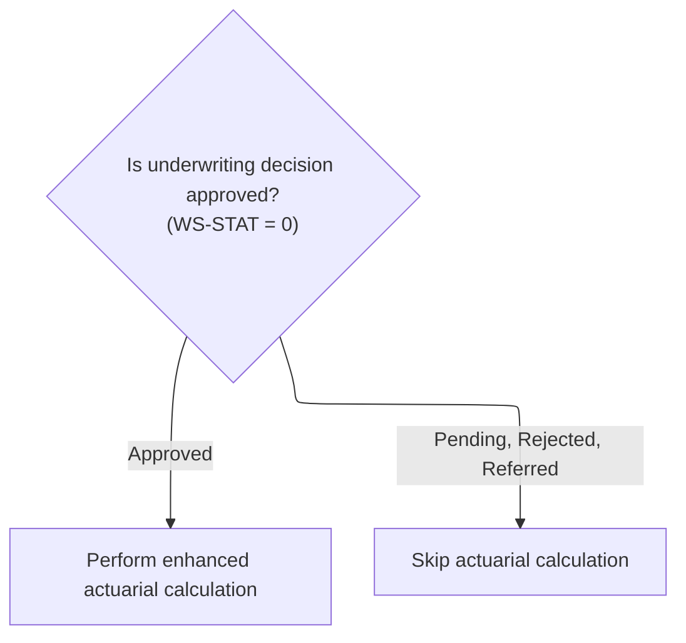
```mermaid
%%{init: {"flowchart": {"defaultRenderer": "elk"}} }%%
flowchart TD
    node1{"Is underwriting decision approved?
(WS-STAT = 0)"}
    click node1 openCode "base/src/LGAPDB01.cbl:261:263"
    node1 -->|"Approved"| node2["Perform enhanced actuarial calculation"]
    click node2 openCode "base/src/LGAPDB01.cbl:262:262"
    node1 -->|"Pending, Rejected, Referred"| node3["Skip actuarial calculation"]
    click node3 openCode "base/src/LGAPDB01.cbl:261:263"

classDef HeadingStyle fill:#777777,stroke:#333,stroke-width:2px;

%% Swimm:
%% %%{init: {"flowchart": {"defaultRenderer": "elk"}} }%%
%% flowchart TD
%%     node1{"Is underwriting decision approved?
%% (<SwmToken path="base/src/LGAPDB01.cbl" pos="261:3:5" line-data="           IF WS-STAT = 0">`WS-STAT`</SwmToken> = 0)"}
%%     click node1 openCode "<SwmPath>[base/src/LGAPDB01.cbl](base/src/LGAPDB01.cbl)</SwmPath>:261:263"
%%     node1 -->|"Approved"| node2["Perform enhanced actuarial calculation"]
%%     click node2 openCode "<SwmPath>[base/src/LGAPDB01.cbl](base/src/LGAPDB01.cbl)</SwmPath>:262:262"
%%     node1 -->|"Pending, Rejected, Referred"| node3["Skip actuarial calculation"]
%%     click node3 openCode "<SwmPath>[base/src/LGAPDB01.cbl](base/src/LGAPDB01.cbl)</SwmPath>:261:263"
%% 
%% classDef HeadingStyle fill:#777777,stroke:#333,stroke-width:2px;
```

This section outlines the decision logic for triggering enhanced actuarial calculations in the policy processing workflow, ensuring that additional premium refinement only occurs for approved policies.

<SwmSnippet path="/base/src/LGAPDB01.cbl" line="261">

---

Back in <SwmToken path="base/src/LGAPDB01.cbl" pos="236:3:7" line-data="               PERFORM P011-PROCESS-COMMERCIAL">`P011-PROCESS-COMMERCIAL`</SwmToken>, after the basic premium calc, it checks if the policy is approved. If so, it runs <SwmToken path="base/src/LGAPDB01.cbl" pos="262:3:9" line-data="               PERFORM P011C-ENHANCED-ACTUARIAL-CALC">`P011C-ENHANCED-ACTUARIAL-CALC`</SwmToken> to refine the premium using more detailed actuarial logic.

```cobol
           IF WS-STAT = 0
               PERFORM P011C-ENHANCED-ACTUARIAL-CALC
           END-IF
```

---

</SwmSnippet>

### Preparing Enhanced Actuarial Input

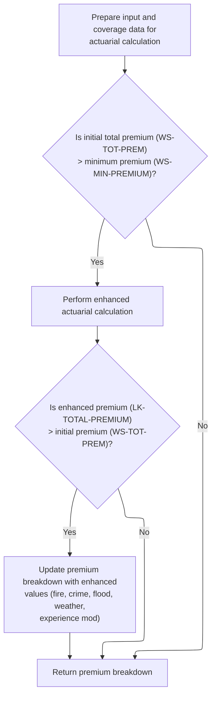
```mermaid
%%{init: {"flowchart": {"defaultRenderer": "elk"}} }%%
flowchart TD
    node1["Prepare input and coverage data for
actuarial calculation"]
    click node1 openCode "base/src/LGAPDB01.cbl:283:309"
    node1 --> node2{"Is initial total premium (WS-TOT-PREM)
> minimum premium (WS-MIN-PREMIUM)?"}
    click node2 openCode "base/src/LGAPDB01.cbl:312:312"
    node2 -->|"Yes"| node3["Perform enhanced actuarial calculation"]
    click node3 openCode "base/src/LGAPDB01.cbl:313:314"
    node2 -->|"No"| node6["Return premium breakdown"]
    click node6 openCode "base/src/LGAPDB01.cbl:325:325"
    node3 --> node4{"Is enhanced premium (LK-TOTAL-PREMIUM)
> initial premium (WS-TOT-PREM)?"}
    click node4 openCode "base/src/LGAPDB01.cbl:317:317"
    node4 -->|"Yes"| node5["Update premium breakdown with enhanced
values (fire, crime, flood, weather,
experience mod)"]
    click node5 openCode "base/src/LGAPDB01.cbl:318:324"
    node4 -->|"No"| node6
    node5 --> node6
classDef HeadingStyle fill:#777777,stroke:#333,stroke-width:2px;

%% Swimm:
%% %%{init: {"flowchart": {"defaultRenderer": "elk"}} }%%
%% flowchart TD
%%     node1["Prepare input and coverage data for
%% actuarial calculation"]
%%     click node1 openCode "<SwmPath>[base/src/LGAPDB01.cbl](base/src/LGAPDB01.cbl)</SwmPath>:283:309"
%%     node1 --> node2{"Is initial total premium (<SwmToken path="base/src/LGAPDB01.cbl" pos="281:1:5" line-data="                                WS-TOT-PREM, WS-DISC-FACT.">`WS-TOT-PREM`</SwmToken>)
%% > minimum premium (<SwmToken path="base/src/LGAPDB01.cbl" pos="135:14:18" line-data="               MOVE FUNCTION NUMVAL(CONFIG-VALUE) TO WS-MIN-PREMIUM">`WS-MIN-PREMIUM`</SwmToken>)?"}
%%     click node2 openCode "<SwmPath>[base/src/LGAPDB01.cbl](base/src/LGAPDB01.cbl)</SwmPath>:312:312"
%%     node2 -->|"Yes"| node3["Perform enhanced actuarial calculation"]
%%     click node3 openCode "<SwmPath>[base/src/LGAPDB01.cbl](base/src/LGAPDB01.cbl)</SwmPath>:313:314"
%%     node2 -->|"No"| node6["Return premium breakdown"]
%%     click node6 openCode "<SwmPath>[base/src/LGAPDB01.cbl](base/src/LGAPDB01.cbl)</SwmPath>:325:325"
%%     node3 --> node4{"Is enhanced premium (<SwmToken path="base/src/LGAPDB01.cbl" pos="317:3:7" line-data="               IF LK-TOTAL-PREMIUM &gt; WS-TOT-PREM">`LK-TOTAL-PREMIUM`</SwmToken>)
%% > initial premium (<SwmToken path="base/src/LGAPDB01.cbl" pos="281:1:5" line-data="                                WS-TOT-PREM, WS-DISC-FACT.">`WS-TOT-PREM`</SwmToken>)?"}
%%     click node4 openCode "<SwmPath>[base/src/LGAPDB01.cbl](base/src/LGAPDB01.cbl)</SwmPath>:317:317"
%%     node4 -->|"Yes"| node5["Update premium breakdown with enhanced
%% values (fire, crime, flood, weather,
%% experience mod)"]
%%     click node5 openCode "<SwmPath>[base/src/LGAPDB01.cbl](base/src/LGAPDB01.cbl)</SwmPath>:318:324"
%%     node4 -->|"No"| node6
%%     node5 --> node6
%% classDef HeadingStyle fill:#777777,stroke:#333,stroke-width:2px;
```

This section is responsible for preparing and structuring all input data needed for the enhanced actuarial calculation. It ensures that customer, property, risk, and coverage information are correctly mapped and validated before any actuarial processing occurs.

| Rule ID | Category                        | Rule Name                           | Description                                                                             | Implementation Details                                                                                                                                                                                                                                                                                                                                                                                                                                                                                                                                                                                                                                                                                                                                                                                                                                                            |
| ------- | ------------------------------- | ----------------------------------- | --------------------------------------------------------------------------------------- | --------------------------------------------------------------------------------------------------------------------------------------------------------------------------------------------------------------------------------------------------------------------------------------------------------------------------------------------------------------------------------------------------------------------------------------------------------------------------------------------------------------------------------------------------------------------------------------------------------------------------------------------------------------------------------------------------------------------------------------------------------------------------------------------------------------------------------------------------------------------------------- |
| BR-001  | Invoking a Service or a Process | Prepare actuarial calculation input | Prepare customer, property, risk, and coverage data for enhanced actuarial calculation. | In this section, the input fields are mapped from the application record and risk analysis to the actuarial calculation linkage structures. The customer number is a string of 10 characters. The risk score is a number up to 3 digits. Property type is a string of 15 characters. Territory code is a string of 5 characters. Construction type is a string of 3 characters. Occupancy code is a string of 5 characters. Protection class is a string of 2 characters. Year built is a 4-digit number. Square footage is an 8-digit number. Years in business is a 2-digit number. Claims count and amount are mapped from 3-year to 5-year fields. Coverage limits and deductibles are mapped as numbers with specified precision. Peril selections are mapped as 4-digit numbers. All values are transferred to the linkage structures for use in the actuarial calculation. |

<SwmSnippet path="/base/src/LGAPDB01.cbl" line="283">

---

In <SwmToken path="base/src/LGAPDB01.cbl" pos="283:1:7" line-data="       P011C-ENHANCED-ACTUARIAL-CALC.">`P011C-ENHANCED-ACTUARIAL-CALC`</SwmToken>, the code is just mapping all the relevant input fields into the linkage structures that the advanced actuarial calculation expects. This includes customer, property, risk, and coverage data. It's just setup—no calculation yet, just prepping the data for the next step.

```cobol
       P011C-ENHANCED-ACTUARIAL-CALC.
      *    Prepare input structure for actuarial calculation
           MOVE IN-CUSTOMER-NUM TO LK-CUSTOMER-NUM
           MOVE WS-BASE-RISK-SCR TO LK-RISK-SCORE
           MOVE IN-PROPERTY-TYPE TO LK-PROPERTY-TYPE
           MOVE IN-TERRITORY-CODE TO LK-TERRITORY
           MOVE IN-CONSTRUCTION-TYPE TO LK-CONSTRUCTION-TYPE
           MOVE IN-OCCUPANCY-CODE TO LK-OCCUPANCY-CODE
           MOVE IN-SPRINKLER-IND TO LK-PROTECTION-CLASS
           MOVE IN-YEAR-BUILT TO LK-YEAR-BUILT
           MOVE IN-SQUARE-FOOTAGE TO LK-SQUARE-FOOTAGE
           MOVE IN-YEARS-IN-BUSINESS TO LK-YEARS-IN-BUSINESS
           MOVE IN-CLAIMS-COUNT-3YR TO LK-CLAIMS-COUNT-5YR
           MOVE IN-CLAIMS-AMOUNT-3YR TO LK-CLAIMS-AMOUNT-5YR
           
      *    Set coverage data
           MOVE IN-BUILDING-LIMIT TO LK-BUILDING-LIMIT
           MOVE IN-CONTENTS-LIMIT TO LK-CONTENTS-LIMIT
           MOVE IN-BI-LIMIT TO LK-BI-LIMIT
           MOVE IN-FIRE-DEDUCTIBLE TO LK-FIRE-DEDUCTIBLE
           MOVE IN-WIND-DEDUCTIBLE TO LK-WIND-DEDUCTIBLE
           MOVE IN-FLOOD-DEDUCTIBLE TO LK-FLOOD-DEDUCTIBLE
           MOVE IN-OTHER-DEDUCTIBLE TO LK-OTHER-DEDUCTIBLE
           MOVE IN-FIRE-PERIL TO LK-FIRE-PERIL
           MOVE IN-CRIME-PERIL TO LK-CRIME-PERIL
           MOVE IN-FLOOD-PERIL TO LK-FLOOD-PERIL
           MOVE IN-WEATHER-PERIL TO LK-WEATHER-PERIL
```

---

</SwmSnippet>

<SwmSnippet path="/base/src/LGAPDB01.cbl" line="312">

---

After prepping the linkage data, the code checks if the current premium is above the minimum. If so, it calls <SwmToken path="base/src/LGAPDB01.cbl" pos="313:4:4" line-data="               CALL &#39;LGAPDB04&#39; USING LK-INPUT-DATA, LK-COVERAGE-DATA, ">`LGAPDB04`</SwmToken> to run the advanced actuarial calculation. If the enhanced premium comes back higher, it updates all the premium fields and modifiers with the new values. Otherwise, it leaves them as-is.

```cobol
           IF WS-TOT-PREM > WS-MIN-PREMIUM
               CALL 'LGAPDB04' USING LK-INPUT-DATA, LK-COVERAGE-DATA, 
                                    LK-OUTPUT-RESULTS
               
      *        Update with enhanced calculations if successful
               IF LK-TOTAL-PREMIUM > WS-TOT-PREM
                   MOVE LK-FIRE-PREMIUM TO WS-FR-PREM
                   MOVE LK-CRIME-PREMIUM TO WS-CR-PREM
                   MOVE LK-FLOOD-PREMIUM TO WS-FL-PREM
                   MOVE LK-WEATHER-PREMIUM TO WS-WE-PREM
                   MOVE LK-TOTAL-PREMIUM TO WS-TOT-PREM
                   MOVE LK-EXPERIENCE-MOD TO WS-EXPERIENCE-MOD
               END-IF
           END-IF.
```

---

</SwmSnippet>

### Advanced Premium Calculation Steps


```mermaid
%%{init: {"flowchart": {"defaultRenderer": "elk"}} }%%
flowchart TD
    node1["Start premium calculation"] --> node2["Initialize exposures and insured values"]
    click node2 openCode "base/src/LGAPDB04.cbl:152:174"
    node2 --> node3["Calculate rates"]
    click node3 openCode "base/src/LGAPDB04.cbl:139:140"
    node3 --> node4["Calculate exposure"]
    click node4 openCode "base/src/LGAPDB04.cbl:141:142"
    node4 --> node5{"Years in business >= 5?"}
    click node5 openCode "base/src/LGAPDB04.cbl:237:256"
    node5 -->|"Yes"| node6{"Claims count 5yr = 0?"}
    node5 -->|"No"| node7["Apply higher experience modifier"]
    click node7 openCode "base/src/LGAPDB04.cbl:255:256"
    node6 -->|"Yes"| node8["Apply claims-free experience modifier"]
    click node8 openCode "base/src/LGAPDB04.cbl:239:240"
    node6 -->|"No"| node9["Calculate experience modifier based on
claims amount"]
    click node9 openCode "base/src/LGAPDB04.cbl:241:252"
    node8 --> node10["Calculate base premium"]
    node9 --> node10
    node7 --> node10
    click node10 openCode "base/src/LGAPDB04.cbl:144:144"
    node10 --> node11["Apply discounts (multi-peril,
claims-free, deductible credit)"]
    click node11 openCode "base/src/LGAPDB04.cbl:407:454"
    node11 --> node12{"Is total discount > 0.25?"}
    click node12 openCode "base/src/LGAPDB04.cbl:447:449"
    node12 -->|"Yes"| node13["Cap discount at 0.25"]
    click node13 openCode "base/src/LGAPDB04.cbl:448:449"
    node12 -->|"No"| node14["Continue with calculated discount"]
    node13 --> node15["Calculate final premium and rate factor"]
    node14 --> node15
    click node15 openCode "base/src/LGAPDB04.cbl:464:477"
    node15 --> node16{"Is final rate factor > 0.050000?"}
    click node16 openCode "base/src/LGAPDB04.cbl:473:477"
    node16 -->|"Yes"| node17["Cap rate factor and recalculate premium"]
    click node17 openCode "base/src/LGAPDB04.cbl:474:476"
    node16 -->|"No"| node18["End calculation"]
    node17 --> node18
    click node18 openCode "base/src/LGAPDB04.cbl:150:150"

classDef HeadingStyle fill:#777777,stroke:#333,stroke-width:2px;

%% Swimm:
%% %%{init: {"flowchart": {"defaultRenderer": "elk"}} }%%
%% flowchart TD
%%     node1["Start premium calculation"] --> node2["Initialize exposures and insured values"]
%%     click node2 openCode "<SwmPath>[base/src/LGAPDB04.cbl](base/src/LGAPDB04.cbl)</SwmPath>:152:174"
%%     node2 --> node3["Calculate rates"]
%%     click node3 openCode "<SwmPath>[base/src/LGAPDB04.cbl](base/src/LGAPDB04.cbl)</SwmPath>:139:140"
%%     node3 --> node4["Calculate exposure"]
%%     click node4 openCode "<SwmPath>[base/src/LGAPDB04.cbl](base/src/LGAPDB04.cbl)</SwmPath>:141:142"
%%     node4 --> node5{"Years in business >= 5?"}
%%     click node5 openCode "<SwmPath>[base/src/LGAPDB04.cbl](base/src/LGAPDB04.cbl)</SwmPath>:237:256"
%%     node5 -->|"Yes"| node6{"Claims count 5yr = 0?"}
%%     node5 -->|"No"| node7["Apply higher experience modifier"]
%%     click node7 openCode "<SwmPath>[base/src/LGAPDB04.cbl](base/src/LGAPDB04.cbl)</SwmPath>:255:256"
%%     node6 -->|"Yes"| node8["Apply claims-free experience modifier"]
%%     click node8 openCode "<SwmPath>[base/src/LGAPDB04.cbl](base/src/LGAPDB04.cbl)</SwmPath>:239:240"
%%     node6 -->|"No"| node9["Calculate experience modifier based on
%% claims amount"]
%%     click node9 openCode "<SwmPath>[base/src/LGAPDB04.cbl](base/src/LGAPDB04.cbl)</SwmPath>:241:252"
%%     node8 --> node10["Calculate base premium"]
%%     node9 --> node10
%%     node7 --> node10
%%     click node10 openCode "<SwmPath>[base/src/LGAPDB04.cbl](base/src/LGAPDB04.cbl)</SwmPath>:144:144"
%%     node10 --> node11["Apply discounts (multi-peril,
%% claims-free, deductible credit)"]
%%     click node11 openCode "<SwmPath>[base/src/LGAPDB04.cbl](base/src/LGAPDB04.cbl)</SwmPath>:407:454"
%%     node11 --> node12{"Is total discount > 0.25?"}
%%     click node12 openCode "<SwmPath>[base/src/LGAPDB04.cbl](base/src/LGAPDB04.cbl)</SwmPath>:447:449"
%%     node12 -->|"Yes"| node13["Cap discount at 0.25"]
%%     click node13 openCode "<SwmPath>[base/src/LGAPDB04.cbl](base/src/LGAPDB04.cbl)</SwmPath>:448:449"
%%     node12 -->|"No"| node14["Continue with calculated discount"]
%%     node13 --> node15["Calculate final premium and rate factor"]
%%     node14 --> node15
%%     click node15 openCode "<SwmPath>[base/src/LGAPDB04.cbl](base/src/LGAPDB04.cbl)</SwmPath>:464:477"
%%     node15 --> node16{"Is final rate factor > <SwmToken path="base/src/LGAPDB04.cbl" pos="473:13:15" line-data="           IF LK-FINAL-RATE-FACTOR &gt; 0.050000">`0.050000`</SwmToken>?"}
%%     click node16 openCode "<SwmPath>[base/src/LGAPDB04.cbl](base/src/LGAPDB04.cbl)</SwmPath>:473:477"
%%     node16 -->|"Yes"| node17["Cap rate factor and recalculate premium"]
%%     click node17 openCode "<SwmPath>[base/src/LGAPDB04.cbl](base/src/LGAPDB04.cbl)</SwmPath>:474:476"
%%     node16 -->|"No"| node18["End calculation"]
%%     node17 --> node18
%%     click node18 openCode "<SwmPath>[base/src/LGAPDB04.cbl](base/src/LGAPDB04.cbl)</SwmPath>:150:150"
%% 
%% classDef HeadingStyle fill:#777777,stroke:#333,stroke-width:2px;
```

This section calculates the advanced premium for an insurance policy by applying a series of business rules to exposures, experience, discounts, and premium capping. It ensures the premium is fair, consistent, and within business-defined limits.

| Rule ID | Category    | Rule Name                                | Description                                                                                                                                                                                                                                                                                                                                                                                                                                                                                                                                                                                                                                                                                                                                                                                                                                                                                                                                                                                                                                                                                                                                                                                                                                                                                                                                                        | Implementation Details                                                                                                                                                                                                                                                                                                                                                                                                                                                                                                                                                                                                                                                                                                                                                                                                                                                                                                                         |
| ------- | ----------- | ---------------------------------------- | ------------------------------------------------------------------------------------------------------------------------------------------------------------------------------------------------------------------------------------------------------------------------------------------------------------------------------------------------------------------------------------------------------------------------------------------------------------------------------------------------------------------------------------------------------------------------------------------------------------------------------------------------------------------------------------------------------------------------------------------------------------------------------------------------------------------------------------------------------------------------------------------------------------------------------------------------------------------------------------------------------------------------------------------------------------------------------------------------------------------------------------------------------------------------------------------------------------------------------------------------------------------------------------------------------------------------------------------------------------------ | ---------------------------------------------------------------------------------------------------------------------------------------------------------------------------------------------------------------------------------------------------------------------------------------------------------------------------------------------------------------------------------------------------------------------------------------------------------------------------------------------------------------------------------------------------------------------------------------------------------------------------------------------------------------------------------------------------------------------------------------------------------------------------------------------------------------------------------------------------------------------------------------------------------------------------------------------- |
| BR-001  | Calculation | Exposure calculation and density default | Building, contents, and business interruption exposures are calculated by scaling each coverage limit with a risk score adjustment. The total insured value is the sum of these exposures. Exposure density is calculated as total insured value divided by square footage, but if square footage is zero, a default value of <SwmToken path="base/src/LGAPDB04.cbl" pos="173:3:5" line-data="               MOVE 100.00 TO WS-EXPOSURE-DENSITY">`100.00`</SwmToken> is used.                                                                                                                                                                                                                                                                                                                                                                                                                                                                                                                                                                                                                                                                                                                                                                                                                                                                                      | Risk score adjustment is (risk score - 100) / 1000. Exposure density defaults to <SwmToken path="base/src/LGAPDB04.cbl" pos="173:3:5" line-data="               MOVE 100.00 TO WS-EXPOSURE-DENSITY">`100.00`</SwmToken> if square footage is zero. All exposures and values are numeric with two decimal places.                                                                                                                                                                                                                                                                                                                                                                                                                                                                                                                                                                                                                               |
| BR-002  | Calculation | Experience modifier logic                | If the business has been operating for 5 or more years and has zero claims in the past 5 years, an experience modifier of 0.85 is applied. If there are claims, the modifier is increased based on claims amount, credibility, and a scaling factor, but is capped between 0.5 and 2.0. If the business has less than 5 years, a modifier of 1.1 is applied.                                                                                                                                                                                                                                                                                                                                                                                                                                                                                                                                                                                                                                                                                                                                                                                                                                                                                                                                                                                                       | Experience modifier is set to 0.85 for 5+ years and no claims, 1.1 for less than 5 years, and otherwise calculated and capped between 0.5 and 2.0. All modifiers are numeric with four decimal places.                                                                                                                                                                                                                                                                                                                                                                                                                                                                                                                                                                                                                                                                                                                                         |
| BR-003  | Calculation | Discount calculation and capping         | <SwmToken path="base/src/LGAPDB04.cbl" pos="410:3:5" line-data="      * Multi-peril discount">`Multi-peril`</SwmToken>, claims-free, and deductible credits are calculated and summed for the total discount. <SwmToken path="base/src/LGAPDB04.cbl" pos="410:3:5" line-data="      * Multi-peril discount">`Multi-peril`</SwmToken> discount is 0.10 if all four perils are selected, 0.05 if fire and weather plus either crime or flood are selected. <SwmToken path="base/src/LGAPDB04.cbl" pos="425:3:5" line-data="      * Claims-free discount  ">`Claims-free`</SwmToken> discount is <SwmToken path="base/src/LGAPDB04.cbl" pos="428:3:5" line-data="               MOVE 0.075 TO WS-CLAIMS-FREE-DISC">`0.075`</SwmToken> if no claims in 5 years and 5+ years in business. Deductible credits are <SwmToken path="base/src/LGAPDB04.cbl" pos="434:3:5" line-data="               ADD 0.025 TO WS-DEDUCTIBLE-CREDIT">`0.025`</SwmToken> for fire deductible >= 10,000, <SwmToken path="base/src/LGAPDB04.cbl" pos="437:3:5" line-data="               ADD 0.035 TO WS-DEDUCTIBLE-CREDIT">`0.035`</SwmToken> for wind deductible >= 25,000, and <SwmToken path="base/src/LGAPDB04.cbl" pos="440:3:5" line-data="               ADD 0.045 TO WS-DEDUCTIBLE-CREDIT">`0.045`</SwmToken> for flood deductible >= 50,000. The total discount is capped at 0.25. | <SwmToken path="base/src/LGAPDB04.cbl" pos="410:3:5" line-data="      * Multi-peril discount">`Multi-peril`</SwmToken> discount: 0.10 or 0.05. <SwmToken path="base/src/LGAPDB04.cbl" pos="425:3:5" line-data="      * Claims-free discount  ">`Claims-free`</SwmToken> discount: <SwmToken path="base/src/LGAPDB04.cbl" pos="428:3:5" line-data="               MOVE 0.075 TO WS-CLAIMS-FREE-DISC">`0.075`</SwmToken>. Deductible credits: <SwmToken path="base/src/LGAPDB04.cbl" pos="434:3:5" line-data="               ADD 0.025 TO WS-DEDUCTIBLE-CREDIT">`0.025`</SwmToken>, <SwmToken path="base/src/LGAPDB04.cbl" pos="437:3:5" line-data="               ADD 0.035 TO WS-DEDUCTIBLE-CREDIT">`0.035`</SwmToken>, <SwmToken path="base/src/LGAPDB04.cbl" pos="440:3:5" line-data="               ADD 0.045 TO WS-DEDUCTIBLE-CREDIT">`0.045`</SwmToken>. Total discount capped at 0.25. All values are numeric with three decimal places. |
| BR-004  | Calculation | Final premium and rate factor capping    | The final premium is calculated by summing all premium components, subtracting the discount, and adding taxes. The final rate factor is calculated as total premium divided by total insured value. If the rate factor exceeds 0.05, it is capped at 0.05 and the premium is recalculated using this capped rate factor.                                                                                                                                                                                                                                                                                                                                                                                                                                                                                                                                                                                                                                                                                                                                                                                                                                                                                                                                                                                                                                           | Final rate factor is capped at 0.05. Premium and rate factor are numeric with five decimal places. Premium is the sum of base, catastrophe, expense, profit, minus discount, plus taxes.                                                                                                                                                                                                                                                                                                                                                                                                                                                                                                                                                                                                                                                                                                                                                       |

<SwmSnippet path="/base/src/LGAPDB04.cbl" line="138">

---

<SwmToken path="base/src/LGAPDB04.cbl" pos="138:1:3" line-data="       P100-MAIN.">`P100-MAIN`</SwmToken> in <SwmToken path="base/src/LGAPDB01.cbl" pos="313:4:4" line-data="               CALL &#39;LGAPDB04&#39; USING LK-INPUT-DATA, LK-COVERAGE-DATA, ">`LGAPDB04`</SwmToken> runs the full advanced premium calculation pipeline: it initializes, loads rates, calculates exposures, applies experience and schedule modifiers, computes base and catastrophe premiums, adds expenses and profit, applies discounts and taxes, and then finalizes the premium. Each step refines the result further.

```cobol
       P100-MAIN.
           PERFORM P200-INIT
           PERFORM P300-RATES
           PERFORM P350-EXPOSURE
           PERFORM P400-EXP-MOD
           PERFORM P500-SCHED-MOD
           PERFORM P600-BASE-PREM
           PERFORM P700-CAT-LOAD
           PERFORM P800-EXPENSE
           PERFORM P900-DISC
           PERFORM P950-TAXES
           PERFORM P999-FINAL
           GOBACK.
```

---

</SwmSnippet>

<SwmSnippet path="/base/src/LGAPDB04.cbl" line="152">

---

<SwmToken path="base/src/LGAPDB04.cbl" pos="152:1:3" line-data="       P200-INIT.">`P200-INIT`</SwmToken> computes building, contents, and BI exposures by scaling each limit with a risk score adjustment. Then it sums them for total insured value. Exposure density is calculated as total insured value divided by square footage, but if that's zero, it just uses <SwmToken path="base/src/LGAPDB04.cbl" pos="173:3:5" line-data="               MOVE 100.00 TO WS-EXPOSURE-DENSITY">`100.00`</SwmToken> to avoid a divide-by-zero.

```cobol
       P200-INIT.
           INITIALIZE WS-CALCULATION-AREAS
           INITIALIZE WS-BASE-RATE-TABLE
           
           COMPUTE WS-BUILDING-EXPOSURE = 
               LK-BUILDING-LIMIT * (1 + (LK-RISK-SCORE - 100) / 1000)
               
           COMPUTE WS-CONTENTS-EXPOSURE = 
               LK-CONTENTS-LIMIT * (1 + (LK-RISK-SCORE - 100) / 1000)
               
           COMPUTE WS-BI-EXPOSURE = 
               LK-BI-LIMIT * (1 + (LK-RISK-SCORE - 100) / 1000)
               
           COMPUTE WS-TOTAL-INSURED-VAL = 
               WS-BUILDING-EXPOSURE + WS-CONTENTS-EXPOSURE + 
               WS-BI-EXPOSURE
               
           IF LK-SQUARE-FOOTAGE > ZERO
               COMPUTE WS-EXPOSURE-DENSITY = 
                   WS-TOTAL-INSURED-VAL / LK-SQUARE-FOOTAGE
           ELSE
               MOVE 100.00 TO WS-EXPOSURE-DENSITY
           END-IF.
```

---

</SwmSnippet>

<SwmSnippet path="/base/src/LGAPDB04.cbl" line="234">

---

<SwmToken path="base/src/LGAPDB04.cbl" pos="234:1:5" line-data="       P400-EXP-MOD.">`P400-EXP-MOD`</SwmToken> figures out the experience modifier for the premium. If the business has 5+ years and no claims, it gets a 0.85 modifier. If there are claims, it bumps the modifier up based on claims amount, credibility, and a scaling factor, but always keeps it between 0.5 and 2.0. Less than 5 years in business gets a 1.1 modifier.

```cobol
       P400-EXP-MOD.
           MOVE 1.0000 TO WS-EXPERIENCE-MOD
           
           IF LK-YEARS-IN-BUSINESS >= 5
               IF LK-CLAIMS-COUNT-5YR = ZERO
                   MOVE 0.8500 TO WS-EXPERIENCE-MOD
               ELSE
                   COMPUTE WS-EXPERIENCE-MOD = 
                       1.0000 + 
                       ((LK-CLAIMS-AMOUNT-5YR / WS-TOTAL-INSURED-VAL) * 
                        WS-CREDIBILITY-FACTOR * 0.50)
                   
                   IF WS-EXPERIENCE-MOD > 2.0000
                       MOVE 2.0000 TO WS-EXPERIENCE-MOD
                   END-IF
                   
                   IF WS-EXPERIENCE-MOD < 0.5000
                       MOVE 0.5000 TO WS-EXPERIENCE-MOD
                   END-IF
               END-IF
           ELSE
               MOVE 1.1000 TO WS-EXPERIENCE-MOD
           END-IF
           
           MOVE WS-EXPERIENCE-MOD TO LK-EXPERIENCE-MOD.
```

---

</SwmSnippet>

<SwmSnippet path="/base/src/LGAPDB04.cbl" line="407">

---

<SwmToken path="base/src/LGAPDB04.cbl" pos="407:1:3" line-data="       P900-DISC.">`P900-DISC`</SwmToken> calculates all the premium discounts: multi-peril, claims-free, and deductible credits. It adds them up, caps the total at 0.25, and then applies that discount to the sum of the premium components. The constants for each discount and the cap are just business rules.

```cobol
       P900-DISC.
           MOVE ZERO TO WS-TOTAL-DISCOUNT
           
      * Multi-peril discount
           MOVE ZERO TO WS-MULTI-PERIL-DISC
           IF LK-FIRE-PERIL > ZERO AND
              LK-CRIME-PERIL > ZERO AND
              LK-FLOOD-PERIL > ZERO AND
              LK-WEATHER-PERIL > ZERO
               MOVE 0.100 TO WS-MULTI-PERIL-DISC
           ELSE
               IF LK-FIRE-PERIL > ZERO AND
                  LK-WEATHER-PERIL > ZERO AND
                  (LK-CRIME-PERIL > ZERO OR LK-FLOOD-PERIL > ZERO)
                   MOVE 0.050 TO WS-MULTI-PERIL-DISC
               END-IF
           END-IF
           
      * Claims-free discount  
           MOVE ZERO TO WS-CLAIMS-FREE-DISC
           IF LK-CLAIMS-COUNT-5YR = ZERO AND LK-YEARS-IN-BUSINESS >= 5
               MOVE 0.075 TO WS-CLAIMS-FREE-DISC
           END-IF
           
      * Deductible credit
           MOVE ZERO TO WS-DEDUCTIBLE-CREDIT
           IF LK-FIRE-DEDUCTIBLE >= 10000
               ADD 0.025 TO WS-DEDUCTIBLE-CREDIT
           END-IF
           IF LK-WIND-DEDUCTIBLE >= 25000  
               ADD 0.035 TO WS-DEDUCTIBLE-CREDIT
           END-IF
           IF LK-FLOOD-DEDUCTIBLE >= 50000
               ADD 0.045 TO WS-DEDUCTIBLE-CREDIT
           END-IF
           
           COMPUTE WS-TOTAL-DISCOUNT = 
               WS-MULTI-PERIL-DISC + WS-CLAIMS-FREE-DISC + 
               WS-DEDUCTIBLE-CREDIT
               
           IF WS-TOTAL-DISCOUNT > 0.250
               MOVE 0.250 TO WS-TOTAL-DISCOUNT
           END-IF
           
           COMPUTE LK-DISCOUNT-AMT = 
               (LK-BASE-AMOUNT + LK-CAT-LOAD-AMT + 
                LK-EXPENSE-LOAD-AMT + LK-PROFIT-LOAD-AMT) *
               WS-TOTAL-DISCOUNT.
```

---

</SwmSnippet>

<SwmSnippet path="/base/src/LGAPDB04.cbl" line="464">

---

<SwmToken path="base/src/LGAPDB04.cbl" pos="464:1:3" line-data="       P999-FINAL.">`P999-FINAL`</SwmToken> adds up all the premium components, subtracts the discount, and adds taxes to get the total premium. Then it divides by the total insured value to get the final rate factor, but if that's over 0.05, it caps it and recalculates the premium. This keeps the premium from getting too high relative to coverage.

```cobol
       P999-FINAL.
           COMPUTE LK-TOTAL-PREMIUM = 
               LK-BASE-AMOUNT + LK-CAT-LOAD-AMT + 
               LK-EXPENSE-LOAD-AMT + LK-PROFIT-LOAD-AMT -
               LK-DISCOUNT-AMT + LK-TAX-AMT
               
           COMPUTE LK-FINAL-RATE-FACTOR = 
               LK-TOTAL-PREMIUM / WS-TOTAL-INSURED-VAL
               
           IF LK-FINAL-RATE-FACTOR > 0.050000
               MOVE 0.050000 TO LK-FINAL-RATE-FACTOR
               COMPUTE LK-TOTAL-PREMIUM = 
                   WS-TOTAL-INSURED-VAL * LK-FINAL-RATE-FACTOR
           END-IF.
```

---

</SwmSnippet>

### Finalizing Commercial Policy Processing

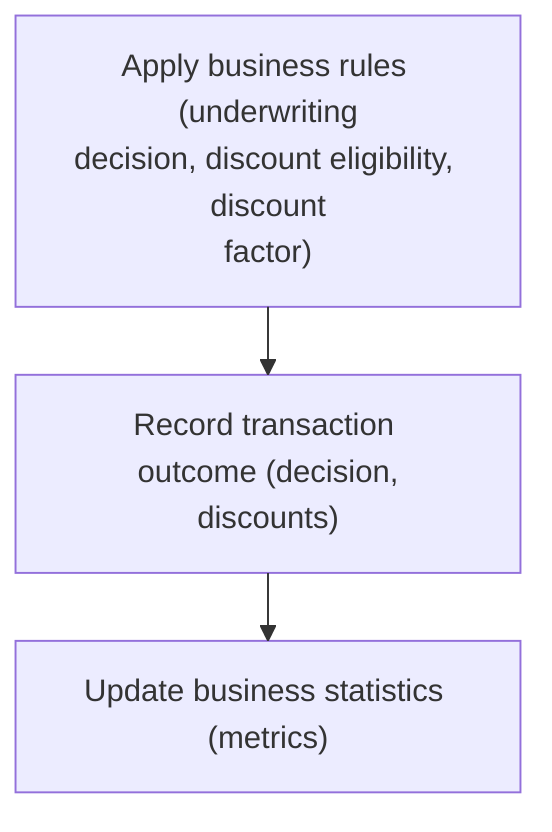
```mermaid
%%{init: {"flowchart": {"defaultRenderer": "elk"}} }%%
flowchart TD
    node1["Apply business rules (underwriting
decision, discount eligibility, discount
factor)"]
    click node1 openCode "base/src/LGAPDB01.cbl:264:264"
    node1 --> node2["Record transaction outcome (decision,
discounts)"]
    click node2 openCode "base/src/LGAPDB01.cbl:265:265"
    node2 --> node3["Update business statistics (metrics)"]
    click node3 openCode "base/src/LGAPDB01.cbl:266:266"
classDef HeadingStyle fill:#777777,stroke:#333,stroke-width:2px;

%% Swimm:
%% %%{init: {"flowchart": {"defaultRenderer": "elk"}} }%%
%% flowchart TD
%%     node1["Apply business rules (underwriting
%% decision, discount eligibility, discount
%% factor)"]
%%     click node1 openCode "<SwmPath>[base/src/LGAPDB01.cbl](base/src/LGAPDB01.cbl)</SwmPath>:264:264"
%%     node1 --> node2["Record transaction outcome (decision,
%% discounts)"]
%%     click node2 openCode "<SwmPath>[base/src/LGAPDB01.cbl](base/src/LGAPDB01.cbl)</SwmPath>:265:265"
%%     node2 --> node3["Update business statistics (metrics)"]
%%     click node3 openCode "<SwmPath>[base/src/LGAPDB01.cbl](base/src/LGAPDB01.cbl)</SwmPath>:266:266"
%% classDef HeadingStyle fill:#777777,stroke:#333,stroke-width:2px;
```

This section ensures that, after all business rules are applied, the results are finalized and all relevant statistics are updated. It is critical for maintaining data integrity and supporting downstream reporting and analytics.

<SwmSnippet path="/base/src/LGAPDB01.cbl" line="264">

---

Back in <SwmToken path="base/src/LGAPDB01.cbl" pos="236:3:7" line-data="               PERFORM P011-PROCESS-COMMERCIAL">`P011-PROCESS-COMMERCIAL`</SwmToken>, after applying business rules and writing the output record, it updates all the running statistics for totals, counts, and risk categories. This keeps all the metrics in sync for reporting and summaries.

```cobol
           PERFORM P011D-APPLY-BUSINESS-RULES
           PERFORM P011E-WRITE-OUTPUT-RECORD
           PERFORM P011F-UPDATE-STATISTICS.
```

---

</SwmSnippet>

## Updating Underwriting Metrics

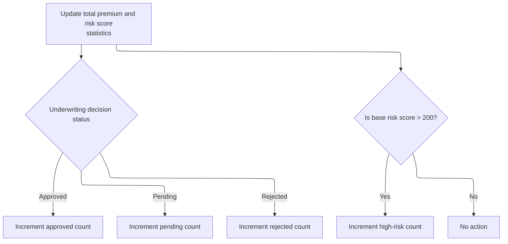
```mermaid
%%{init: {"flowchart": {"defaultRenderer": "elk"}} }%%
flowchart TD
    node1["Update total premium and risk score
statistics"]
    click node1 openCode "base/src/LGAPDB01.cbl:366:367"
    node1 --> node2{"Underwriting decision status"}
    click node2 openCode "base/src/LGAPDB01.cbl:369:373"
    node2 -->|"Approved"| node3["Increment approved count"]
    click node3 openCode "base/src/LGAPDB01.cbl:370:370"
    node2 -->|"Pending"| node4["Increment pending count"]
    click node4 openCode "base/src/LGAPDB01.cbl:371:371"
    node2 -->|"Rejected"| node5["Increment rejected count"]
    click node5 openCode "base/src/LGAPDB01.cbl:372:372"
    node1 --> node6{"Is base risk score > 200?"}
    click node6 openCode "base/src/LGAPDB01.cbl:375:375"
    node6 -->|"Yes"| node7["Increment high-risk count"]
    click node7 openCode "base/src/LGAPDB01.cbl:376:376"
    node6 -->|"No"| node8["No action"]
    click node8 openCode "base/src/LGAPDB01.cbl:375:377"
classDef HeadingStyle fill:#777777,stroke:#333,stroke-width:2px;

%% Swimm:
%% %%{init: {"flowchart": {"defaultRenderer": "elk"}} }%%
%% flowchart TD
%%     node1["Update total premium and risk score
%% statistics"]
%%     click node1 openCode "<SwmPath>[base/src/LGAPDB01.cbl](base/src/LGAPDB01.cbl)</SwmPath>:366:367"
%%     node1 --> node2{"Underwriting decision status"}
%%     click node2 openCode "<SwmPath>[base/src/LGAPDB01.cbl](base/src/LGAPDB01.cbl)</SwmPath>:369:373"
%%     node2 -->|"Approved"| node3["Increment approved count"]
%%     click node3 openCode "<SwmPath>[base/src/LGAPDB01.cbl](base/src/LGAPDB01.cbl)</SwmPath>:370:370"
%%     node2 -->|"Pending"| node4["Increment pending count"]
%%     click node4 openCode "<SwmPath>[base/src/LGAPDB01.cbl](base/src/LGAPDB01.cbl)</SwmPath>:371:371"
%%     node2 -->|"Rejected"| node5["Increment rejected count"]
%%     click node5 openCode "<SwmPath>[base/src/LGAPDB01.cbl](base/src/LGAPDB01.cbl)</SwmPath>:372:372"
%%     node1 --> node6{"Is base risk score > 200?"}
%%     click node6 openCode "<SwmPath>[base/src/LGAPDB01.cbl](base/src/LGAPDB01.cbl)</SwmPath>:375:375"
%%     node6 -->|"Yes"| node7["Increment high-risk count"]
%%     click node7 openCode "<SwmPath>[base/src/LGAPDB01.cbl](base/src/LGAPDB01.cbl)</SwmPath>:376:376"
%%     node6 -->|"No"| node8["No action"]
%%     click node8 openCode "<SwmPath>[base/src/LGAPDB01.cbl](base/src/LGAPDB01.cbl)</SwmPath>:375:377"
%% classDef HeadingStyle fill:#777777,stroke:#333,stroke-width:2px;
```

This section ensures that all relevant underwriting metrics are accurately tracked and updated in real time, supporting operational reporting and risk management.

| Rule ID | Category    | Rule Name                            | Description                                                                                  | Implementation Details                                                                                                                                                                                                                               |
| ------- | ----------- | ------------------------------------ | -------------------------------------------------------------------------------------------- | ---------------------------------------------------------------------------------------------------------------------------------------------------------------------------------------------------------------------------------------------------- |
| BR-001  | Calculation | Premium accumulation                 | Add the current total premium to the accumulated premium amount for underwriting statistics. | The accumulated premium amount is a number with up to 12 digits before the decimal and 2 digits after (e.g., 999999999999.99). The current total premium is a number with up to 9 digits before the decimal and 2 digits after (e.g., 999999999.99). |
| BR-002  | Calculation | High risk score tracking             | Add 1 to the high-risk count when the base risk score exceeds 200.                           | The high-risk threshold is 200. The high-risk count is a number with up to 6 digits. The base risk score is a number with up to 3 digits. This rule applies in this section when the base risk score is greater than 200.                            |
| BR-003  | Calculation | Underwriting decision counter update | Increment the appropriate underwriting decision counter based on the decision status value.  | In this section, the decision status values are: 0 for approved, 1 for pending, and 2 for rejected. The counters are six-digit numbers and are incremented by one for each matching status. Other status values are not processed in this context.   |

<SwmSnippet path="/base/src/LGAPDB01.cbl" line="365">

---

In <SwmToken path="base/src/LGAPDB01.cbl" pos="365:1:5" line-data="       P011F-UPDATE-STATISTICS.">`P011F-UPDATE-STATISTICS`</SwmToken>, it adds the current premium and risk score to the running totals, then bumps the approved, pending, or rejected count based on the status value. Only 0, 1, and 2 are handled—anything else is ignored.

```cobol
       P011F-UPDATE-STATISTICS.
           ADD WS-TOT-PREM TO WS-TOTAL-PREMIUM-AMT
           ADD WS-BASE-RISK-SCR TO WS-CONTROL-TOTALS
           
           EVALUATE WS-STAT
               WHEN 0 ADD 1 TO WS-APPROVED-CNT
               WHEN 1 ADD 1 TO WS-PENDING-CNT
               WHEN 2 ADD 1 TO WS-REJECTED-CNT
           END-EVALUATE
```

---

</SwmSnippet>

<SwmSnippet path="/base/src/LGAPDB01.cbl" line="375">

---

After updating the main counters, if the risk score is over 200, it bumps the high-risk count. The 200 threshold is just a hardcoded cutoff for what counts as high risk.

```cobol
           IF WS-BASE-RISK-SCR > 200
               ADD 1 TO WS-HIGH-RISK-CNT
           END-IF.
```

---

</SwmSnippet>

## Error Record Handling


```mermaid
%%{init: {"flowchart": {"defaultRenderer": "elk"}} }%%
flowchart TD
    node1["Copy customer and property details"]
    click node1 openCode "base/src/LGAPDB01.cbl:244:246"
    node1 --> node2["Set all premiums to zero"]
    click node2 openCode "base/src/LGAPDB01.cbl:247:252"
    node2 --> node3["Mark record as 'ERROR' (OUT-STATUS)"]
    click node3 openCode "base/src/LGAPDB01.cbl:253:253"
    node3 --> node4["Record rejection reason
(OUT-REJECT-REASON = WS-ERROR-MESSAGE)"]
    click node4 openCode "base/src/LGAPDB01.cbl:254:254"
    node4 --> node5["Write output record"]
    click node5 openCode "base/src/LGAPDB01.cbl:255:255"
    node5 --> node6["Increment error count (WS-ERR-CNT)"]
    click node6 openCode "base/src/LGAPDB01.cbl:256:256"
classDef HeadingStyle fill:#777777,stroke:#333,stroke-width:2px;

%% Swimm:
%% %%{init: {"flowchart": {"defaultRenderer": "elk"}} }%%
%% flowchart TD
%%     node1["Copy customer and property details"]
%%     click node1 openCode "<SwmPath>[base/src/LGAPDB01.cbl](base/src/LGAPDB01.cbl)</SwmPath>:244:246"
%%     node1 --> node2["Set all premiums to zero"]
%%     click node2 openCode "<SwmPath>[base/src/LGAPDB01.cbl](base/src/LGAPDB01.cbl)</SwmPath>:247:252"
%%     node2 --> node3["Mark record as 'ERROR' (<SwmToken path="base/src/LGAPDB01.cbl" pos="253:9:11" line-data="           MOVE &#39;ERROR&#39; TO OUT-STATUS">`OUT-STATUS`</SwmToken>)"]
%%     click node3 openCode "<SwmPath>[base/src/LGAPDB01.cbl](base/src/LGAPDB01.cbl)</SwmPath>:253:253"
%%     node3 --> node4["Record rejection reason
%% (<SwmToken path="base/src/LGAPDB01.cbl" pos="254:15:19" line-data="           MOVE WS-ERROR-MESSAGE (1) TO OUT-REJECT-REASON">`OUT-REJECT-REASON`</SwmToken> = <SwmToken path="base/src/LGAPDB01.cbl" pos="232:3:7" line-data="           MOVE WS-ERROR-MESSAGE TO WS-ERROR-MESSAGE (ERR-IDX).">`WS-ERROR-MESSAGE`</SwmToken>)"]
%%     click node4 openCode "<SwmPath>[base/src/LGAPDB01.cbl](base/src/LGAPDB01.cbl)</SwmPath>:254:254"
%%     node4 --> node5["Write output record"]
%%     click node5 openCode "<SwmPath>[base/src/LGAPDB01.cbl](base/src/LGAPDB01.cbl)</SwmPath>:255:255"
%%     node5 --> node6["Increment error count (<SwmToken path="base/src/LGAPDB01.cbl" pos="240:7:11" line-data="               ADD 1 TO WS-ERR-CNT">`WS-ERR-CNT`</SwmToken>)"]
%%     click node6 openCode "<SwmPath>[base/src/LGAPDB01.cbl](base/src/LGAPDB01.cbl)</SwmPath>:256:256"
%% classDef HeadingStyle fill:#777777,stroke:#333,stroke-width:2px;
```

This section ensures that any input record which cannot be processed successfully is clearly marked and tracked, allowing downstream systems and users to identify and address issues efficiently. It provides a standardized approach for error reporting and record rejection within the application.

| Rule ID | Category       | Rule Name           | Description                                          | Implementation Details                                                                                                                                                                                                                                                                                                                    |
| ------- | -------------- | ------------------- | ---------------------------------------------------- | ----------------------------------------------------------------------------------------------------------------------------------------------------------------------------------------------------------------------------------------------------------------------------------------------------------------------------------------- |
| BR-001  | Writing Output | Error record output | Write the processed error record to the output file. | The output record contains customer number, property type, postcode, risk score, fire premium, crime premium, flood premium, weather premium, total premium, status, and reject reason. All premium and risk score fields are set to zero, status is set to 'ERROR', and reject reason contains the first character of the error message. |

<SwmSnippet path="/base/src/LGAPDB01.cbl" line="243">

---

<SwmToken path="base/src/LGAPDB01.cbl" pos="243:1:7" line-data="       P010-PROCESS-ERROR-RECORD.">`P010-PROCESS-ERROR-RECORD`</SwmToken> copies the main input fields to the output, zeroes out all the premium and risk score fields, sets the status to 'ERROR', and only puts the first character of the error message as the reject reason. Then it writes the record and bumps the error count.

```cobol
       P010-PROCESS-ERROR-RECORD.
           MOVE IN-CUSTOMER-NUM TO OUT-CUSTOMER-NUM
           MOVE IN-PROPERTY-TYPE TO OUT-PROPERTY-TYPE
           MOVE IN-POSTCODE TO OUT-POSTCODE
           MOVE ZERO TO OUT-RISK-SCORE
           MOVE ZERO TO OUT-FIRE-PREMIUM
           MOVE ZERO TO OUT-CRIME-PREMIUM
           MOVE ZERO TO OUT-FLOOD-PREMIUM
           MOVE ZERO TO OUT-WEATHER-PREMIUM
           MOVE ZERO TO OUT-TOTAL-PREMIUM
           MOVE 'ERROR' TO OUT-STATUS
           MOVE WS-ERROR-MESSAGE (1) TO OUT-REJECT-REASON
           WRITE OUTPUT-RECORD
           ADD 1 TO WS-ERR-CNT.
```

---

</SwmSnippet>

&nbsp;

*This is an auto-generated document by Swimm 🌊 and has not yet been verified by a human*

<SwmMeta version="3.0.0" repo-id="Z2l0aHViJTNBJTNBU3dpbW1pby1nZW5hcHAtaG91c2UlM0ElM0FHaXJpLVN3aW1t" repo-name="Swimmio-genapp-house"><sup>Powered by [Swimm](https://app.swimm.io/)</sup></SwmMeta>
